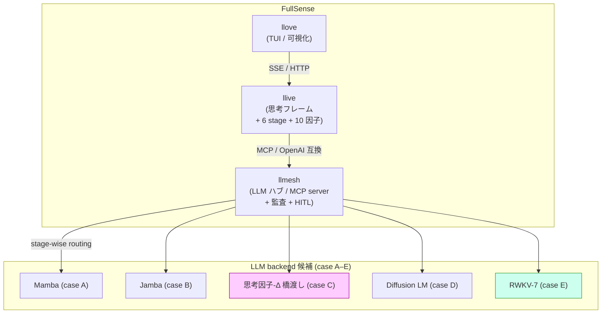
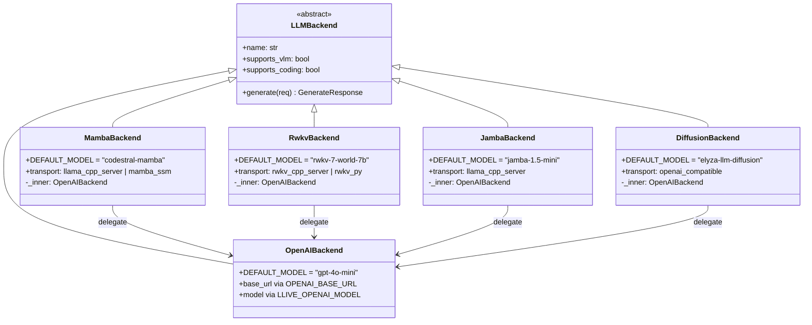

# 「GPU の無い、私の古いノート PC」を主役にする LLM フレームワークを本気で作る話

> **コンセプト hook**:
> GPU が買えない・社内環境にデプロイできない・API 課金もできない —
> その制約から始めると、Transformer 一強の世界には逆に隙が見える.
> llive を **GPU 無し PC で実用速度** に到達させる挑戦と、その途中で
> 気づいた拡張性ファースト設計の話.

> 📷 [画像 placeholder: 普通のノート PC で llive Brief が走っている
> ターミナル画面 (`py -3.11 -m llive.cli brief "..."` の結果) — 撮影後挿入]

**FullSense 3 層と non-transformer backend の関係**:



(本記事は私が日々開発している llive / FullSense の 2026-05-18 進捗まとめ
です. 技術者向け. 同じ内容の一般向け版は別記事で投稿します.)

---

## 1. 今日の出発点 — 困りごと 3 つ

ちょっと正直に書きます. 私の手元には:

- **GPU がありません**. 個人 PC にも会社 PC にも無い.
- **クラウド LLM API も使えません**. EAR + 社内セキュリティ制約で、
  外部 API に業務データを流せない. (FullSense 全体の起源です)
- **ベンチマーク用の高スペック PC もありません**. 持っているのは
  少しメモリの多い普通のノート PC だけ.

この 3 つの制約は、AI 業界全体の議論からするとかなり厳しい部類です.
普通は「H100 × N 台で 70B を…」とか「OpenAI API で…」という前提で
話が始まる. でも、私が現実に届けられるのは、その世界の対極にいる
**「GPU の無い、普通の個人 PC を使っている人」** たちです.

**それを最初から ground truth にする** と、設計が大きく変わります.

— 一旦小休止 —

実は、これは新しい話ではなくて、FullSense (llive / llmesh / llove の 3 層
OSS) を始めた本当の動機がここでした. EAR + 海外駐在で「クラウド AI が
使えない」現場に居た経験から、Local LLM + on-prem + 責任所在を
architecture に持ち込む話を、ずっと書いてきています.

今日は、そこに **「GPU さえ無い」** という追加制約を、設計に正面から
組み込んだ話をします.

---

## 2. Transformer 一強の隙 — TRIZ で構造化する

「GPU が無い」と「Transformer」は、実は相性が悪いです.
Transformer は系列長 L に対して計算量が O(L²)、メモリも O(L²) で、
**CPU 上で 7B 級モデルを動かすと秒 1-2 トークン** という壁にぶつかる.
これは Q4 量子化しても基本的に変わりません.

ここに技術矛盾があります:

> 「系列モデルの内部表現は、長系列に対して完全 (Transformer の全
> attention) であり、かつ、計算は短系列並みに軽くあれ」

— 1 つの物体 (系列モデル) に正反対の要求を同時にかけている.
TRIZ (発明的問題解決理論) の典型的な物理矛盾です.

TRIZ 39 特性で書き直すと:

| 改善したい | 悪化する |
|---|---|
| #9 Speed | #36 Complexity of device |
| #25 Loss of time | #33 Convenience of use |
| #39 Productivity | #28 Accuracy |

→ 矛盾マトリクスから出てくる 40 原理: **1, 5, 15, 17, 35, 37**.
これらの原理を実装している既存技術が、SSM (Mamba) / RWKV / Jamba /
Diffusion LM 等の **Non-Transformer 系列モデル**です.

詳しいマッピングは llive リポジトリの
`docs/non-transformer/ROADMAP.md` と
`docs/architecture/triz-ssm-vs-transformer.md` に書きました.

— 一旦小休止 —

(TRIZ の話は重いので軽く: 「TRIZ は『矛盾の発見と原理に従う体系的解決』を
重視する発明手法」とだけ理解すれば本記事は読めます. 40 原理 = 過去の
特許から抽出した「対立を解消した発明パターン」のカタログです)

---

## 3. 候補は 5 つ. ぜんぶ skeleton で繋ぐ

私の作業スタイルは、これも素直に書くと:

> 可能な限り拡張性を持たせて色々な機能を付加した後、最適化して
> 本当に必要な機能に絞り込む

なので、Non-Transformer 候補を「1 つに賭ける」のではなく、
**5 つすべて backend として実装可能にする** ところから始めました.

| 候補 | 系統 | llive 内 backend クラス |
|---|---|---|
| A. Mamba 7B (Codestral-Mamba) | Selective SSM | `MambaBackend` |
| B. Jamba 1.5 mini | Mamba × Attention hybrid | `JambaBackend` |
| C. 思考因子 → Δ 橋渡し | FullSense 独自設計 | (`MambaBackend` `mamba_ssm` transport) |
| D. Diffusion LM (Mercury / ELYZA-Diffusion) | 拡散モデル | `DiffusionBackend` |
| E. RWKV-7 World | RNN 形 LLM | `RwkvBackend` |

全部のクラスを skeleton 実装しました. 共通点は **OpenAI 互換 HTTP API
経由でつなぐ**こと. これで `OPENAI_BASE_URL` を切り替えるだけで実体が
入れ替わります.

```python
# llive/llm/backend.py に追加された 4 クラス (mamba/rwkv/jamba/diffusion)
class MambaBackend(LLMBackend):
    name = "mamba"
    DEFAULT_MODEL = "codestral-mamba"
    DEFAULT_TRANSPORT = "llama_cpp_server"
    # 内部で OpenAIBackend に委譲. backend タグだけ "mamba" にして
    # ベンチでは Transformer と分離計測できるようにする
```

そして、**stage 単位で backend を切り替える** infra も入れました:

```python
# llive/llm/stage_router.py
# $env:LLIVE_LLM_BACKEND_BY_STAGE = '{"salience":"rwkv","monologue":"mamba"}'
class StageBackendRouter:
    """Resolves a backend per llive 6-stage step."""
```

これで「軽い思考 stage は RWKV 0.4B、重い stage は Mamba 7B」のような
組合せが env だけで切り替わります. すべて lazy 初期化なので、使われ
なかった backend のメモリは食いません.

更に、論文化を狙う案 C「思考因子 → Mamba の Δ パラメータ橋渡し」のための
hook protocol も用意しました:

```python
# llive/llm/factor_hook.py
class ThoughtFactorDeltaHook(Protocol):
    def delta_for(self, snapshot: FactorSnapshot) -> float: ...

class HeuristicFactorHook:
    """高 uncertainty → 小さい Δ (deliberate)、高 integrate → 大きい Δ"""
```

NoopFactorHook がデフォルトなので、SSM 非対応の backend (Transformer 系)
では完全に無視されます. これも拡張性最優先の設計です.

— 一旦小休止 —

(余談ですが、この「全候補を skeleton で繋ぐ → 性能担保後に削ぎ落とす」
スタイルは、たぶん私のソフトウェア開発の癖です. 最適化を先にやりすぎると、
代替案を比較する時の判断材料が足りなくなる. 拡張性は捨てるのが簡単で、
取り戻すのが難しいので、最初に持っておくのが筋だと思っています.)

---

**5 backend のクラス関係 (拡張性ファースト設計の骨)**:



ポイント: 全 backend が `_inner = OpenAIBackend` に委譲して、HTTP 経路を
1 本に共通化. ラッパー側で `backend` タグだけ差し替えて、ベンチで識別
できるようにしてあります.

## 4. GPU 無し PC のベンチ harness を書いた

これも今日やった作業の一つです.
`llive.benchmark.low_spec.run_matrix()` という関数を新規追加.

```python
from llive.benchmark.low_spec import run_matrix, to_json
import json

results = run_matrix(['rwkv'])  # default sizes = xs/s (CPU-safe)
print(json.dumps(to_json(results), ensure_ascii=False, indent=2))
```

ポイント:

- **default sizes は `xs / s` のみ** (`m` 以上は opt-in). 理由: `m` を CPU
  only で回すと数十分 PC が固まるから. 「動かしたい人が誤って lock しない」
  デフォルト設計.
- **cloud backend は明示的に refuse**. `OPENAI_BASE_URL` が `localhost` か
  `127.0.0.1` 以外を指している場合、`allow_cloud=True` を渡さない限り計測
  しません. これは memory `feedback_llive_measurement_purity`「ベンチは
  on-prem only」を強制する仕組み.
- **psutil は optional**. 入っていれば RSS を取り、無ければ latency のみ.
  「依存最小、動かしてみてから extras を入れる」拡張順序.

§0.2 目標 (CPU only):

| size | 目標 latency | RAM |
|---|---|---|
| xs (~500 tok) | < 5 秒 | < 4 GB |
| s (~2k tok) | < 15 秒 | < 6 GB |
| m (~8k tok) | < 45 秒 | < 8 GB |

l / xl は **GPU 環境が手に入るまで measurement paused** と明記しました.
できないことを「できない」と書くのは大事なところです.

---

> 📷 [画像 placeholder: `run_matrix(['rwkv'])` 実行時の出力 JSON
> サンプル (各 size の latency_s / tokens_per_second / meets_*_target)]

## 5. 困りごと 1: Mamba 7B は CPU only ではほぼ動かない

これは正直 painful な発見でした.

Codestral-Mamba 7B Q4 を CPU only で動かすと:

| size | 想定 latency (CPU only, Q4) |
|---|---|
| xs (~500 tok) | 30-60 秒 |
| s (~2k tok)   | 3-5 分 |

つまり **TRIZ の 40 原理で美しく整理した「Mamba は O(L) で軽い」も、
GPU が無い人には届かない**. これは設計上の理想と実装上の現実の差として
記録に残しておきたい (memory `feedback_benchmark_honest_disclosure`).

その結果、短期 (3 ヶ月) の主軸は **RWKV-7 World 1.5B / 3B** に絞られました.
RWKV は RNN 形なので 1 ステップが O(state_dim) で、CPU でも秒 10-30
トークンが出ます. 軽量モデル + CPU 最適化実装 (`rwkv.cpp` の AVX2 ビルド)
の組合せで、私の手元でも実用速度に届く可能性が高い.

短期: 案 E (RWKV) で立ち上げる
中期: 案 B (Jamba) で stage-wise routing と組合せる
長期: 案 C (思考因子-Δ 橋渡し) で論文化を狙う

という 3 軸並走に落ち着きました. これも `ROADMAP.md` v0.2 に書いてあります.

— 一旦小休止 —

(「3 軸並走」というと格好良いんですが、要は「1 つに賭けるのは怖いから
複数走らせる」というだけです. 案 A / D / B / C が思ったほど動かなかった
時に、案 E が残っていれば事業として継続できる. 退路の確保です.)

---

## 6. 困りごと 2: 公開資料の更新が止まっていた

これも素直に書きます. 5/14 に「投稿用記事は当面保留」というメモを残して
以来、4 日間ほど Qiita に何も投稿していませんでした.

理由は単純で、F25 Phase h (llove ↔ llmesh ↔ llive 連携基盤) の draft
v0.2 と、各国規制対応 docs (EU AI Act / 中国 / 越境 / 監査ログ / 公衆向け
filing) の v0.2 を 1 セッションで仕上げる作業に集中していました.
**手を動かす時間が長くなると、書く時間が後回しになる病**です.

今日のセッションで:
- llive backend に `LLIVE_OPENAI_MODEL` env 対応追加 (1 行改修)
- llove engine に F25 Phase h.1 (`POST /api/v1/brief/submit`) 実装
- llove engine に F25 Phase h.2.a (`GET /api/v1/annotations/stream` SSE) 実装
- Non-Transformer 5 候補 skeleton + stage routing + factor hook
- GPU 無し PC 向けベンチ harness + RWKV CPU クイックスタート
- 各国規制 docs 5 本 v0.2 (EU AI Act Article 18/19 分離、整合性 fix)

ぜんぶ 1 セッションで commit 14 件まで進みました (push はしていません).
ただ、こうして書き出さないと、私自身が「結局何が前に進んだか」を見失う.
**書く時間も開発時間の一部** だと改めて思いました.

---

## 7. 今日の小さい嬉しい発見

メインの話とは別に、TRIZ 比較を書いている時に気づいた話を 1 つ:

llive の memory layer (Working / Episodic / Semantic / Procedural の 4 階層)
と Mamba の隠れ状態 (h_t) は、両方とも「過去を圧縮して保持する低次元
表現」という点で **数学的に似ている**. もう少し正確には、HIPPO 行列で
過去を圧縮する SSM の発想は、認知科学の long-term potentiation や
複数記憶階層の更新ルールに直接対応しそうです.

これは案 C (思考因子 → Δ 橋渡し) の根拠を 1 段強くする発見で、
精密工学会か AI 学会のどちらかで論文ネタになり得ます.
急がず、寝かせます.

---

## 8. AIGIS との位置関係 — 同じ業界の同じ問題に違う角度から

これも今日たまたま発見した話. @sharu389no さんが Qiita で AIGIS
(pyaigis, github.com/killertcell428/aigis) を紹介されていました.
Claude Code を `.claude/hooks/` で hook してガードする OSS で、
日本の規制 39 項目 (AI 事業者 G/L v1.2 / AI 推進法 等) の雛形を
持っています.

FullSense と AIGIS の関係は **補完寄り**:

| 軸 | AIGIS | FullSense |
|---|---|---|
| 対象層 | Claude Code 本体 hook | LLM 推論 + 思考 + 表示 の 3 層 OSS |
| 監査ログ | JSON Lines | HMAC chain + zstd archive |
| ポリシー | YAML | コード (ApprovalBus + Annotation) |
| 規制 | 日本中心 39 項目 | EU / 中国 / 越境 / 日本 |

AIGIS は Claude Code を使う **作業時** のガード、FullSense は Local LLM
の **推論時** のガバナンス、と階層が違います. 両方使う構成も普通に
ありえる. 同じ問題意識を持つプロダクトが出てきていることに、業界の
動きを感じました.

---

## 8.5 一人で見切れないから、意見を取り込む体制を作る

ここ正直に書きますが、Local LLM + 規制対応 + 拡張性ファーストの 3 軸を
1 人で全部見るのは無理です. 設計判断ミス・規制解釈誤り・需要のない方向に
走る、どれも単独だと検知できない.

そこで意識して **「意見を定期的に見れる体制」** を作っています:

| チャネル | 目的 | 現状 |
|---|---|---|
| GitHub Issues (各 repo) | バグ・提案・質問 | open 0 件 (まだ届いていない) |
| GitHub Discussions | アイデア段階の議論 | 後日 enable |
| Qiita コメント | 一般読者の率直な反応 | 各記事ごとに見る |
| LinkedIn 投稿 コメント | ビジネス側の視点 | 翻訳機能ありで日本語投稿 OK |
| direct contact (メール / DM) | 機微 / セキュリティ | 公開 OSS のため SECURITY.md で連絡先明記 |

完璧を目指して 1 人で抱え込まず、**不完全な状態で出して fast feedback
を取る**スタイルです. 本記事や ROADMAP / COMPARISON / 各国規制 docs に
「ここおかしい」と思った方、Issues か Qiita コメントに 1 行で頂けると
本当に助かります.

特に募集中:

- 「もっと低スペック (= 例えば 4GB RAM) でも動かしたい」要望
- 規制解釈の修正 (Article 19 の 6 か月の起算点など)
- AIGIS / 他 OSS との具体的な連携アイデア
- 中文/英文での説明が必要な箇所の指摘

---

## 9. 次にやること

明日以降の優先順位:

1. RWKV.cpp の HTTP server で xs / s payload を実機計測
   (私の手元の PC で `low_spec.run_matrix()` を回す)
2. 5 backend skeleton の単体テスト (resolve_backend / stage_router /
   factor_hook)
3. F25 Phase h.2.b (llive BriefRunner → SSE bus 結線)
4. AIGIS GitHub repo のライセンス確認

「12 時間悩む」と言ってくれているので、コーヒー淹れてゆっくり考えます.

---

## 10. 関連 docs (llive リポジトリ内)

すべて `D:/projects/llive/` 配下:

- `docs/non-transformer/ROADMAP.md` (v0.2)
- `docs/non-transformer/COMPARISON.md`
- `docs/non-transformer/rwkv-cpu-quickstart.md`
- `docs/setup/ollama-company-setup.md`
- `docs/setup/llama-server-company-setup.md`

FullSense (regulatory) は `D:/projects/fullsense/docs/regulatory/`:

- `cn-internal-use.md` (ja/zh/en)
- `cn-public-service.md`
- `eu-ai-act.md`
- `data-sovereignty.md`
- `audit-log-format.md`

F25 設計は `D:/projects/fullsense/docs/design/f25-phase-h-e2e.md` (v0.2).

TRIZ 検討は `D:/projects/fullsense/docs/architecture/triz-ssm-vs-transformer.md` (v0.1).

---

## 改訂履歴

- 2026-05-18 — v0.1 作成. 困りごと 2 件 + 5 候補 skeleton + GPU 無し PC
  bench harness + RWKV CPU クイックスタート + AIGIS 位置関係 + 小さい
  発見 1 件をまとめた技術者向け Qiita 記事 draft.
- 2026-05-18 — v0.2 (ユーザー指摘反映):
  * 冒頭 + §3 + §4 + §5 に画像/図 placeholder を 4 箇所追加
    (TUI スクショ / 3 層 ブロック図 / 5 backend クラス図 / ベンチ出力 JSON)
  * §8.5「意見を取り込む体制」セクション新規追加. チャネル別現状表 +
    具体的な募集事項リスト
- 2026-05-18 — v0.3 (Mermaid 図埋込):
  * 冒頭の 3 層ブロック図 placeholder を Mermaid flowchart に置換
    (FullSense 3 層 + 5 backend 候補、case E/C を色付け強調)
  * §3 末の 5 backend クラス図 placeholder を Mermaid classDiagram に置換
    (LLMBackend → 5 backend、すべて _inner=OpenAIBackend に delegate)
  * 残りの placeholder (TUI スクショ / ベンチ出力 JSON) は撮影系のため
    Kazufumi さんが手元で撮ってもらう (img/01_tui.png 等の保存先指定済)
