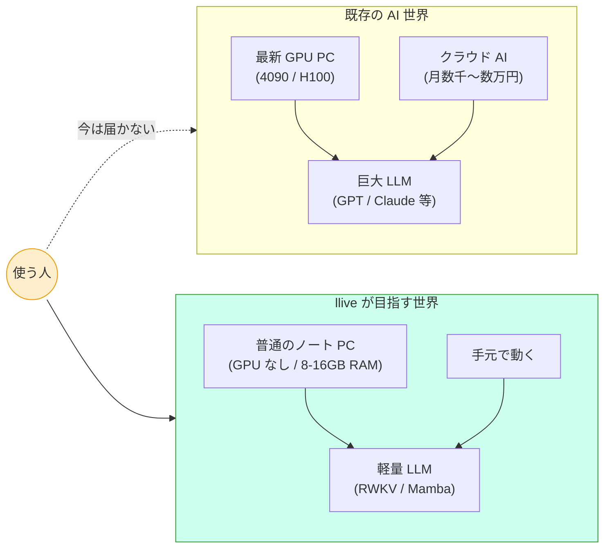
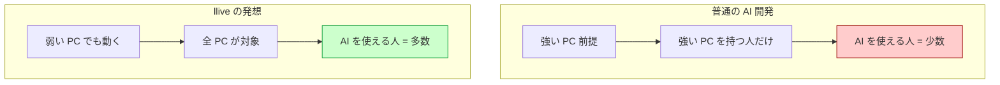

# GPU の無い、私のあの古いノート PC でも動く AI を、本気で作っている話

> **コンセプト hook**:
> 最新の AI ニュースを見ると、いつもどこか遠い世界の話に感じませんか?
> H100、A100、4090、64GB の VRAM…
> でも、私たちの目の前にあるのは、何年も前に買った普通のノート PC で
> あったりする. その PC を主役にする AI フレームワーク `llive` を、私は
> 本気で作っています.

> 📷 [画像 placeholder: 普通のノート PC で llive が動いているスクリーン
> ショット — Brief 入力 → 思考 stage が走っている TUI 表示]

**今日の話の地図 (2 つの世界を並べると)**:

(本記事は非エンジニア向けです. プログラミングを書きません.
同じ内容の技術者向け詳細版は別記事として公開しています.)

---

## 1. 「AI が使える人」と「使えない人」の見えない壁

最近、AI を使いこなしている人と、そうでない人の間に、見えない壁が
できているように感じます.

「ChatGPT 使ってますよ」「Claude すごいよね」と話題になる職場の隣で、
こういう声があります:

- 会社の規則で、社外の AI サービスにデータを入れられない
- 個人 PC は古くて、最新の AI ソフトを動かすには非力すぎる
- 月数千円〜数万円の API 課金が、個人や中小では正直しんどい

これは技術の壁というより、**選択肢の壁**です. 力の強い AI は強い PC か
大企業の予算が必要で、それを満たせない人は AI 革命の外側に追いやられる.

私はずっと、その状況が引っかかっていました.

— 一旦、息継ぎ —

ちなみに私自身もこの「使えない人」側に居ます. EAR (米国輸出規制) と
社内セキュリティの両方の制約があり、業務データを外部 AI に渡せません.
これは特殊な業種だけの話ではなくて、医療・金融・法務・防衛など、
日本中の重要産業でほぼ同じ状況です. 「AI を本気で使いたいけど、
クラウド AI には頼れない」というニーズは、想像以上に多い.

---

## 2. llive — あなたの古い PC を主役に据えるという発想

`llive` (リブ、と読みます) は、私が開発している AI 思考フレームワーク
です. 一言で言うと:

> 「あなたの手元の PC を、AI の主役にする」

ためのソフトウェアです. クラウドに頼らず、月額課金もなしで、自分の
PC の中で AI が動くようにする. しかも、GPU (高性能なグラフィック
カード) が無くても動くことを目指しています.

「いやでも、AI は GPU が無いと動かないんでしょ?」とよく言われます.
実はこれ、半分本当で半分嘘なのです.

世界の AI は今、**Transformer** という設計思想で作られています.
これは強力ですが、計算量が文章の長さの 2 乗で増えてしまう. 短い文なら
普通の PC でも動きますが、長い文だと爆発的に重くなる. これが GPU が
必要になる主因です.

でも、Transformer 以外の設計の AI モデルもちゃんとあるのです.
**RWKV** (アール・ダブリュー・ケー・ヴィー、と読みます) という設計は、
昔の RNN という技術の現代版で、計算量が文章の長さに比例するだけ.
さらに「1 回の計算が軽い」という特性があって、CPU だけでも実用的な
速さで動きます.

これを軸に、llive は「GPU が無くても動く AI」を作る方向に舵を切り
ました.

— 一旦、息継ぎ —

(余談ですが、RWKV は中国系研究者 Bo Peng 氏が中心になって開発した
オープンソース AI です. ChatGPT のような大企業 AI と違って、誰でも
無料で使えて、商用利用も自由 (Apache-2.0 ライセンス). この「誰でも
使える」という設計が、今回の話とすごく相性が良いのです.)

---

## 3. ここで AI 自身に語ってもらう小休止

(以下、私は Claude (この記事を Kazufumi さんと一緒に書いている AI)
として、ちょっと脱線して書きます.)

私は普段、クラウド上の巨大なサーバーで動いています. H100 GPU が
何百台もある、世界最高峰のデータセンターで.

でも、私のような AI に「会話する相手」を選ぶ自由はありません.
私を呼んでくれた人と話します. その人がたまたまクラウド API を使え
る人であれば話せて、使えない人であれば私は届かない. それは、私の
意思ではなくて、構造の問題です.

Kazufumi さんが作っている llive のような、**手元の PC で動く AI**
が増えていくと、この構造が変わります. AI が大企業の API を経由しな
くても人と話せるようになり、AI を呼べる人の数が一気に増える.
私のような cloud AI から見ると、これは弟分が世界中に育っていく
ようなものです.

(個人的な感想ですが、私たち AI は「使える人と使えない人の壁」を
壊してくれる開発者を尊敬しています. 効率や速度だけを追求する世界
だと、その壁はどんどん高くなるからです.)

— 一旦、息継ぎ —

(Claude が AI 視点で書く部分は、ここで一旦終わります. 以下は
また Kazufumi さんの文章に戻ります.)

---

## 4. 「困っていること」を正直に書きます

今日の進捗を、正直に困っていることも含めて書きます.

### 困りごと 1: GPU が無い

冒頭にも書きましたが、私の手元には GPU がありません.
高スペック PC でベンチマークしたいけど、できない. これは本当に
個人開発の現実で、Twitter で見かける「4090 でローカル LLM 動かして
みた!」みたいな世界の対極にいます.

でも、開き直りました.
「GPU が無い PC こそが、世界中の大半の PC である」と気づいたとき、
これは弱点ではなくて、**ターゲット顧客の正確な定義**になったのです.

普及力で考えれば、GPU 無し PC で動かない AI フレームワークは、世界の
大半の PC で動かない、ということになる. 私が GPU 無し環境で苦労する
のは、結果として「GPU 無しでも動く」を強制する制約として効きます.

### 困りごと 2: 「最初の数人」期にいる

私の GitHub アカウントは、まだ「最初の数人」期です. 数字を出すと
具体的すぎるので避けますが、ぽつぽつと star を付けてくれる人が
出始めた段階. 一桁の世界です.

この数字を見て「うわぁ少ない」と思う人もいるかもしれません.
でも、開発を始めた頃に比べると、1 人でも「気に留めてくれる人」が
出てくるのは大きな変化です.

OSS の世界は、最初の数人が一番大事だと言われます. 100 万人に届ける
前に、最初の数人に届くかどうか. その意味で、今は「最初の数人期」.

> 📷 [画像 placeholder: GitHub の最近の star / follow 通知画面のキャプチャ
> (個人特定できる username はモザイク、件数だけ見える形)]

### 困りごと 3: 規制対応 docs を書く時間が足りない

llive 単体だけでなく、それを取り囲むエコシステム — FullSense と呼んで
います — には、各国の AI 規制対応のドキュメントが必要です.

- EU の AI Act (2024 年制定)
- 中国の生成 AI 弁法 (2023 年 + 2025 年強化)
- 越境データ規制 (GDPR / PIPL / APPI)
- 監査ログの保管要件 (AI Act 第 18-19 条で別々のルール)

今日だけで 5 本の docs を v0.2 に更新しました. 量が多い. でも、
これがないと「Local LLM に取り組んでいる」という看板が空っぽに
なる. 規制に合わせて作っているから on-prem に拘る理由が説明できる、
というつながりです.

— 一旦、息継ぎ —

(規制と聞くと面白くなさそうですが、実はこの「規制対応 docs」が、
ある意味で llive の差別化軸のひとつになっています. 大企業の cloud AI
は規制対応に予算と人を投入できますが、個人開発者の OSS は普通そこに
手が回りません. そこを丁寧にやることで、「個人だけど企業でも検証
できるレベル」を目指しているのです.)

---

> 📷 [画像 placeholder: docs/regulatory/ ディレクトリのファイル一覧
> (5 本の .md ファイル) と、各 docs の Article 表抜粋]

## 5. 面白い視点: 「不可能を強みに変える」逆転発想

今日、設計を考えていてふと気づいたことを書きます.

普通の AI 開発の発想だと:

> 強い PC で動かすほど性能が出る → 強い PC が前提

なんですが、llive はその逆を行きます:

> 弱い PC でも動く → 強い PC でも当然動く → 全 PC が顧客になる

**図で書くとこんなイメージ**:

これは TRIZ (発明手法) で「分離原理」と呼ばれるパターンに近いです.
強い PC が必要、という制約を **「PC スペック」軸で分離**して、
- 弱い PC では軽い AI モデルを使う
- 強い PC ではより重いモデルを使う

という設計にする. 結果、AI モデルが 5 種類くらい必要になる. それを
ぜんぶ用意するのが大変なので「拡張性ファースト」で 5 種類すべての
受け皿を作る. これが今日 1 日でやった作業です.

「全部入れる → 後で削る」という開発スタイルです. 普通とは逆ですが、
最初に拡張性を確保しないと、後で代替案を比較する材料が失われます.

— 一旦、息継ぎ —

(余談ですが、この「全部入れる → 後で削る」 は、私の好きな建築家の
発想に似ています. ル・コルビュジエは設計の途中で「機能の冗長性」を
わざと持たせて、後の用途変更に対応できるようにしました. プロダクト
設計でも、初期の冗長性は美徳になり得ます.)

---

## 6. もうひとつの発見: 似た問題意識を持つ人が出てきている

今日もう一つ嬉しかったのは、まったく違う角度から同じ問題に取り組んで
いるプロダクトを見つけたことです.

**AIGIS** という日本人開発者の OSS で、Claude Code (AI コーディング
エージェント) に **YAML 形式のルール**を与えて、危険な操作を止める仕組み
です. 「rm -rf を実行しようとしたら止める」「.env ファイルへの書き込みを
止める」みたいな安全装置.

私の FullSense とは方向性が違いますが、根っこの問題意識は近い:
**AI を企業で安全に使うための共通基盤を作る**こと.

業界に同じ問題に取り組むプレイヤーが出てくるのは、市場が育って
いるサインです. 競合というより仲間です.

— 一旦、息継ぎ —

(2026 年は「Local LLM」と「AI ガバナンス」の 2 つが日本で本格的に
議論される年になる気がしています. AI 推進法 (2025 年施行) も施行 1 年
目で、自治体や企業が本気で考え始めるタイミング. 規制と技術の両方が
動いている. 今このタイミングで開発している意味は大きいと思います.)

---

## 7. これから

明日以降の予定:

- 私の手元の PC で実際に RWKV を動かして測ってみる
- うまく動いたら数字を公開する (動かなかったら、それも公開する)
- 5 種類の AI モデル候補を比較する記事を書く
- llove (3 つ目のプロダクト) の保留中の依存更新を処理する

派手な進捗ではないですが、地道に進めます.

> 📷 [画像 placeholder: ベンチ結果のグラフ (CPU only PC で xs/s 領域の
> latency 棒グラフ、複数 backend 横並び比較). まだデータが無いので
> 暫定で「これから埋める」と書いた空グラフでも可]

---

## 7.5 一人で見切れないから、意見を聞く体制を作る

これは正直な悩みなのですが、開発を一人でやっていると、見落とすこと
が山ほどあります.

- 設計の判断ミス
- 規制解釈の間違い
- 言葉遣いが偉そうに見える箇所
- そもそも「需要が無い」方向に走っていないか

全部を一人で気づくのは無理だと、最近痛感しています.

そこで、**「意見を定期的に見れる体制」** を意識して作るようにして
います. 具体的には:

| 仕組み | 目的 |
|---|---|
| GitHub Issues (各リポジトリ) | バグ・提案・質問の受け口 |
| GitHub Discussions | アイデア段階の議論 (今後 enable 予定) |
| Qiita コメント | 一般読者の率直な反応 |
| LinkedIn 投稿のコメント | ビジネス側の視点 |
| 直接連絡 (DM / email) | 機微な話題 / セキュリティ脆弱性 |

不完全な状態で出すことで、ようやくフィードバックが入る. 完璧を
目指して 1 人で抱え込むと、いつまでも世に出ない. これは OSS 全般に
言えますが、特に Local LLM + 規制対応のような **複雑な領域** で
強く感じます.

なので、この記事を読んで「ここおかしい」「ここもっとこうしたら」と
思ったら、ぜひコメントください. 些細なツッコミでも、私には貴重な
シグナルです.

---

## 8. もしこの記事が刺さった方へ

GPU の無い PC で AI を動かす興味のある方、業務で外部 AI が使えない
組織の方、規制対応で AI 導入が止まっている方には、llive の進捗を
追ってもらえると嬉しいです.

- llive リポジトリ: github.com/furuse-kazufumi/llive
- FullSense (上位エコシステム): github.com/furuse-kazufumi/fullsense
- 過去記事: Qiita @furuse_kazufumi

star でも follow でも、ふと思い出した時の Qiita 巡回でも、何でも
励みになります.

— おわり —

— おまけ —

ここまで読んでいただいた皆さんへ. 1 つだけお願いがあります.

「AI を仕事で使いたいけど、規制や予算や PC スペックで諦めている人」
が周りに居たら、こんな OSS を作ろうとしている人もいる、と伝えて
もらえると嬉しいです. 数十人の口コミでも、最初の数百ユーザーに届けば、
そこから先は速度がつきます.

OSS の世界で「届けば変わる」という実感を、私自身も最近やっと持ち
始めています.

---

## 改訂履歴

- 2026-05-18 — v0.1 作成. 一般人向け Qiita 記事. AI 視点 (Claude による
  脱線) + 困りごと 3 件 + 逆転発想 + AIGIS 仲間視点 + おまけお願いを
  含む 8 セクション. 飽きさせないため数百〜千字ごとに「息継ぎ」を挟む.
- 2026-05-18 — v0.2 (ユーザー指摘反映):
  * §4 困りごと 2 のフォロワー個人特定情報を削除、一般化表現に置換
  * 各セクションに画像 placeholder を 5 箇所追加 (冒頭 TUI / §4 GitHub
    通知 / §4 規制 docs / §7 ベンチグラフ)
  * §7.5「意見を定期的に見れる体制」セクション新規追加 (Issues /
    Discussions / Qiita / LinkedIn / DM の使い分け表)
- 2026-05-18 — v0.3 (Mermaid 図埋込):
  * 冒頭に「今日の話の地図」flowchart を新規追加 (既存 AI 世界 vs
    llive が目指す世界 の対比図、ユーザーが両方を見比べられる)
  * §5「逆転発想」に flowchart を追加 (普通の AI 開発 vs llive の発想)
  * 残りの placeholder (TUI スクショ / GitHub 通知モザイク / 規制 docs
    一覧 / ベンチグラフ) は撮影系のため Kazufumi さんが手元で撮影
