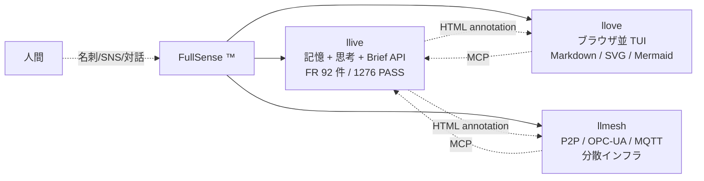
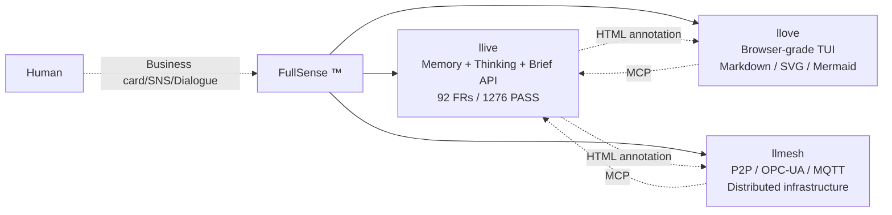
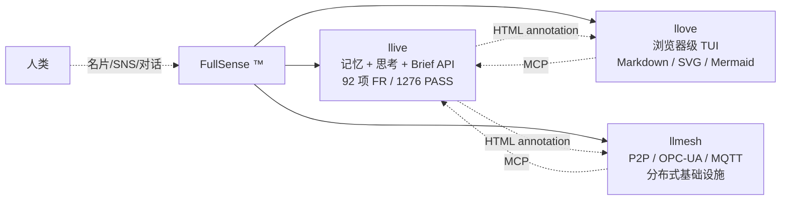
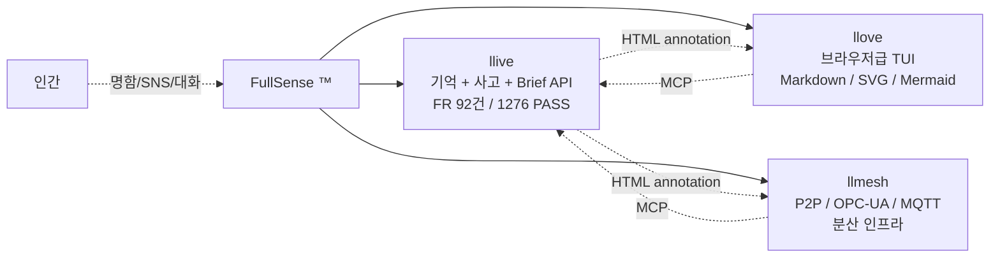

言語 / Language / 语言 / 언어: [日本語](#日本語) | [English](#english) | [中文](#中文) | [한국어](#한국어)

---

# 日本語

# 「第二の脳」シリーズ — llive 全景 × 不可視 Annotation × 構築論 × 運用論 × ビジョン論 × 実装の深層

**1 行 hook**:
1 人開発で 5 日間に 14 機能・256 テストを追加し、**1,276 件全 PASS で回帰ゼロ** を達成した。LinkedIn のコメント 1 通から HTML コメントへの着地、Perplexity と TRIZ と 5 万件論文コーパスの組み合わせ、キヤノン「三自の精神」を AI に課す運用、そして Will Caster と Andrew NDR114 のビジョン — 6 部構成で公開する。

---

## はじめに

本記事は llive (FullSense umbrella の中核 OSS、`llive` — L は 2 個) を 1 人で開発する筆者が、5 日間の集中開発で得た知見を **0〜5 部の計 6 部構成** にまとめたものです。

| 部 | テーマ | 起点 |
|---|---|---|
| **第 0 部** | **llive とは何か** (全景) | FullSense umbrella の 3 プロダクト構成 |
| 第 1 部 | **不可視アノテーションチャネル** | LinkedIn コメント (独立性 vs 組合せ価値) |
| 第 2 部 | **第二の脳** (構築論) | 30 年経験 + Perplexity + Claude Code + TRIZ + RAG/RAD |
| 第 3 部 | **三自の精神** (運用論) | キヤノン理念 + マネジメント書籍 |
| 第 4 部 | **Will Caster と Andrew NDR114** (ビジョン論) | 映画 2 本 + LinkedIn 画像 |
| **第 5 部** | **実装の深層** (MATH-08 grounding 配線) | 「LLM に計算させない」計算サイドカーの end-to-end |

各部は独立して読めますが、合わせて読むと「**全景を見て → 設計を理解して → 作って → 運用して → ビジョンに繋いで → 実装まで降りる**」という 6 段の階段になります。**忙しい方は第 0 部だけでも llive の全体像が掴めるよう** に構成しました。

---

# 第 0 部 — llive とは何か (全景)

## FullSense umbrella と 3 プロダクト

`llive` は **FullSense ™** という umbrella ブランドの中核に位置する OSS です。FullSense は「**人と AI が共有できる感覚的入出力すべて**」を扱うコンセプトで、現在以下の 3 プロダクトから構成されています。



3 プロダクトの役割分担:

| プロダクト | 役割 | 単独利用 | 組合せ強化 |
|---|---|---|---|
| **llive** | LLM 記憶・思考層・Brief API・ledger | ◎ (本記事の主役) | annotation で TUI に伝達 |
| **llove** | ブラウザ並表示の TUI / IDE / Game container | ◎ (タイピングデモなど) | llive の出力を render |
| **llmesh** | P2P + OPC-UA + MQTT で分散実行 | ◎ (産業 IoT 単体) | llive のジョブを multi-node 化 |

ライセンスは全プロダクト **Apache 2.0 + Commercial dual-license**。OSS 利用は自由、商用 SaaS / SI 案件のみ別契約。

## llive リポジトリ統計 (2026-05-17 時点)

| 項目 | 値 |
|---|---|
| ソースファイル数 | **172 ファイル** (`src/llive/`) |
| 機能要件 (FR) | **92 件 / 92 件マッピング済** (Phase 1-10) |
| テスト件数 | **1,276 件全 PASS / 回帰ゼロ** |
| Phase 完了 | Phase 1-4 完 / Phase 5+ 進行中 |
| 主要モジュール | `brief/` (Brief API・grounding・runner)、`math/` (MATH-01〜08)、`fullsense/` (loop core)、`memory/` (RAD)、`annotations.py` (第 1 部の主役) |
| 言語 | Python 3.11 (Rust 加速は v0.7+ 候補) |
| 依存 | sympy>=1.12 / z3-solver>=4.13 (MATH 系)、pyyaml、pydantic |

## なぜ「数学・単位」が最初の vertical か

汎用 LLM は次が苦手:

| 観点 | 汎用 LLM の弱点 | llive 既存資産との合致 |
|---|---|---|
| 記号操作の幻覚 | `x² + x = 2x³` のような誤等式を生成 | EVO-04 Z3 静的検証で gate |
| 単位次元の取り違え | `5 m/s + 3 s = 8` | SI 次元 grounding / 表現層 (MATH-01) |
| 数値精度 | float 演算誤差を無視 | error propagation (MATH-04) |
| 公理体系 | 暗黙の前提を混入 | EpistemicType=FACTUAL strict track |
| 引用の信頼性 | "CODATA value is X" と適当に答える | RAD math/metrology + provenance |

これを llive の構造化思考層 + 形式検証 + provenance ledger で克服する。Phase 8 (CABT) や Phase 9 (CREAT) より優先して **v0.7-vertical で先行着手** しました。具体的な実装は第 5 部で詳述します。

> 📝 **実装メモ (2026-05-17 追記)**: MATH-01 (SI 次元解析) は Brief grounding 層への最小配線まで完了 (1,282 PASS)。「5 m/s」「9.81 m/s^2」「100 kg」のような value+unit 表現を Brief 文中から自動抽出し、`Dimensions` ベクトルに焼き付けて prompt に grounded 化します。一方、`5 days` のような **parser が知らない単位** は silently drop せず `error citation` として ledger に残す設計にしたため、運用しながら「拡張すべき単位辞書」が自動で集まる副産物が得られました。次元演算チェック (`5 m/s + 3 s` のような cross-quantity mismatch) は **次イテレーション**へ — 実 Brief サンプルで「どの形の mismatch が surface すべきか」を観察してから入れる方が、過剰実装を避けられると判断しました。
>
> 📝 **実装メモ追記 (同日)**: MATH-05 (CODATA/NIST 定数) も Brief grounding に配線完了 (**1,288 PASS**)。Brief 文中で「planck constant」「avogadro」「boltzmann」のような alias が言及されると、`get_constant()` 経由で CODATA 2022 の正確な値と次元と出典が prompt に grounded されます。**気づき**: 短い symbol (`c`, `h`, `e`, `G`) を grounding すると Brief 中の任意の英単語と衝突するため、alias 長さ 3 以上に絞る必要がありました。また alias の underscore (`elementary_charge`) と自然文の空白 (`elementary charge`) の表記ゆれを吸収する小さな heuristic で 8 割は救えました。残り 2 割 (例: `q_e` のような symbol-only alias) を救うには LLM-based NER への昇格が必要そうですが、これも実 Brief 観察してから判断します。

---

# 第 1 部 — HTML で見えないのに、機械では読める

## LinkedIn コメントへの返答が、コメントアウトだった

ある日、LinkedIn にこんなコメントが届きました。

> 「llive の記憶層が llove の交互データに依存し、llove がまた llmesh の接続能力に依存しているなら、その中の一つだけを使う価値は半減します。」

返答は **コメントアウト** でした — `<!-- llive:cog.consensus="proceed" -->`。

### 起点 — 独立性 vs 組合せ価値

OSS マルチプロダクト構成では、「独立して動くこと」と「組み合わせて価値が積み上がること」が両立しにくい。前者を取れば「単体で物足りない」、後者を取れば「全部入れないと壊れる」。

コメントを受けて llive の `src/llive` 全 172 ファイルに AST スキャン (`scripts/audit_independence.py`) を走らせました。結果は **hard import leak 0 件**。

問題は次の段階。「**独立性を保ったまま、どうやって組合せ価値を増やすか**」。

### 採用した設計

そこで筆者は次のような設計メモを書いた。

> 「応答にアノテーションを用意すれば独立性を保ちながら組み合わせでの効果も得られるのではないか」
>
> 「邪魔にならない程度のアノテーション。HTML にしたら不可視になる感じがいい」

(LinkedIn コメントは批判 1 通だけ、設計案そのものは筆者の発案)

`src/llive/annotations.py` に最小型を実装:

```python
@dataclass(frozen=True)
class Annotation:
    namespace: str          # "vrb" / "oka" / "cog" / "math" / "creat" / "core"
    key: str
    value: Any              # JSON-friendly
    target_layer: str | None = None   # "llove" / "llmesh" / None=any
```

`AnnotationBundle.to_html_comments()` が出力する形式:

```
<!-- llive:core.brief_completed=true -->
<!-- llive:oka.essence_card={"summary": "..."} target=llove -->
<!-- llive:cog.consensus="proceed" -->
```

GitHub / Qiita / Zenn / VS Code Preview などの Markdown renderer では **完全に不可視**。一方で `AnnotationBundle.from_html_comments(text)` を呼べば、機械側は元の構造を完全に復元可能。

### なぜ HTML コメントか — 選択肢比較

| 案 | 不可視性 | 機械可読性 | 既存ツール互換 |
|---|---|---|---|
| JSON 別ファイル | ◯ | ◯ | ✕ (2 ファイル管理) |
| YAML front matter | △ (renderer で表示) | ◯ | △ |
| **HTML コメント** | ◎ | ◎ | ◎ (Markdown 標準) |
| バイナリ埋込 | ◎ | △ | ✕ |
| zero-width Unicode | ◎ | △ | ✕ (copy で消える) |

「Markdown が HTML を passthrough する事実」を逆手に取った設計です。

### ☕ ちなみに

HTML コメントを Markdown に仕込むテクは、Jekyll / Hugo 界隈では「**コメント front matter**」と呼ばれて昔からある。新しいのは「**Markdown 本文の任意位置**に機械可読メタデータを置く」発想の方。

### 性能ベンチ (1000 件 round-trip)

| 操作 | レイテンシ |
|---|---|
| Encode per ann | 6.30 µs |
| Decode per ann | 12.40 µs |
| 典型 3 件 bundle 暗号化サイズ | **141 B** |
| 1000 件 round-trip | ✓ |

典型 BriefResult.annotations は 3 件 = 141 バイト。Markdown 1 ページに 100 個仕込んでも 5 KB 以下。

---

# 第 2 部 — 第二の脳 (構築論)

## 5 日間で 14 機能・256 テスト・1270 PASS / 回帰ゼロ

筆者は 30 年超のソフトウェア開発者ですが、llive を **1 人で開発** しています。進度はチーム開発に近い。これは次の 5 要素を組み合わせた「第二の脳」を構築したからです。

| 要素 | 役割 |
|---|---|
| **30 年の開発経験** | 設計品質・判断のベース |
| **Perplexity 要約** | 外部思想 (書籍/論文/動画) の入力品質ゲート |
| **Claude Code (Opus 4.7 / 1M context)** | 実装エージェント |
| **TRIZ ルール (40 原理)** | 矛盾解決のメタ思考フレーム |
| **論文 RAG コーパス (RAD 49 分野 / 約 5 万件)** | 研究者の知見の土台 |

### スパイラル 1 サイクル


本セッション 9 回での実例:

| サイクル | 起点 | 結果 |
|---|---|---|
| 1 | **MBA 言語化トレーニング** (グロービス書籍) | Perplexity 要約 → VRB-FX 要件化 → VRB-02 PromptLint 実装 |
| 2 | **岡潔先生の数学観に学ぶ** (YouTube『心理の深層』講話より) | 先生が遺された「数学は情緒である」「発見の前に一度行き詰まる」「文章を書くことなしには思索を進められない」「国語が数学を育む」という思想を、Perplexity で要約・整理した上で **4 つの設計観点 (情緒・行き詰まり・文章化・国語力)** として参照させていただき、これを OKA-FX 10 要件として記述・実装 (OKA-01〜04 minimal proto)。先生のお考えそのものを実装したと主張するものではなく、**こちらの実装が触発を受けた先生の思想への敬意** を込めて命名 |
| 3 | **LinkedIn フィードバック** (独立性) | IND-FX 設計原則 + IND-04 Annotation Channel 実装 (= 第 1 部) |

### Perplexity / TRIZ / RAG + RAD の役割

> ⚠️ **用語注意**: 本記事の **RAD** は *Research Aggregation Directory* の略で、筆者が Raptor 配下に整備した **49 分野・約 5 万件の論文/技術文書コーパス** を指します。一般用語の **RAG (Retrieval-Augmented Generation)** とは別物で、**RAG の書き間違いではありません**。RAG が「検索 → 生成」の手法名なのに対し、RAD は「検索される側の構造化コーパスそのもの」を指す名前です。

**Perplexity 要約 = 「入力品質ゲート」**: 外部思想は本・論文・動画・SNS と形式バラバラ。Claude Code に直接放り込むと context 圧迫 + 解釈ゆらぎ。Perplexity に「~3000 字に要約」「実装可能な仕様で」と指示すると、**Claude Code が読み取れる質の入力**に変換される。

**TRIZ = 「矛盾解決のメタ思考」**: 実装中の矛盾を TRIZ 視点で解く。例:
- 「独立性 vs 組合せ価値」→ IND-04 Annotation (TRIZ 原理 24: 媒介物)
- 「rule-based vs LLM 品質」→ echo baseline 残置 (TRIZ 原理 1: 分割)
- 「audit 完全性 vs 実装オーバヘッド」→ bind_ledger() pattern (TRIZ 原理 15: 動的化)

**RAG + RAD = 「研究者の知見を借りる」**: 新機能設計で必要な分野が出るたび、**RAG の仕組みで RAD コーパス (49 分野) を引く**。Claude が「自分の言葉」ではなく「**具体的な論文・先行研究**」を引用するので質が一段上がる。`論文 RAG コーパス (RAD 49 分野 / 約 5 万件)` という表 (上記) の表記もこの 2 つを併記したものです。

### ☕ ここまで読んでくれてありがとう

正直、テスト 256 件のうち 7-8 件は途中で 1 回ずつ落ちている。fuzzing で hypothesis が嬉しそうに edge case を見つけてくれるたび、3 秒くらい「うわ」となる。**1270 PASS / 回帰ゼロ** はゴールであって過程ではない。

### 自身の 30 年経験が効く 5 場面

「Claude Code 任せ」だと品質は出ない。30 年経験は次の場面で決定的でした。

1. **要件定義の質** — Perplexity 要約を読んで「これは要件 vs 解法を混同」と即判定
2. **TRIZ ルールの選定** — 40 原理から「この場面はこの 3 つ」を即抽出
3. **アーキテクチャ判断** — Claude が出した実装案を「独立性原則に反する」と即拒否
4. **ベンチの honest disclosure** — rule-based の coverage が高く出たときに「echo back の偽性能」と即見抜く
5. **タイポチェック** — 「`lllive` (L 3 個) になってる、tokenizer 問題」と即特定

つまり **第二の脳 = Claude Code + RAG + Perplexity + TRIZ** に対し、**第一の脳 = 自身の経験** が判断ゲートとして居続ける。

---

# 第 3 部 — 三自の精神 (運用論)

## 要件は止まらない、AI 開発の優位性

本セッション 1 日 (約 8 時間) の要件追加履歴:

| 時刻 | 出来事 |
|---|---|
| 開始 | 要件: COG-04 + CREAT-04 統合 |
| +1h | 「9 因子全部入れたら本格的に動作確認」 |
| +2h | 岡潔先生の思想に学ばせていただく要件追加 (OKA-FX 10 件、敬意込め命名) |
| +3h | LinkedIn フィードバック (IND-FX) |
| +4h | ガッツリベンチマーク (12 系統) |
| +5h | 他 LLM 比較 (Anthropic / Perplexity) |
| +6h | Qwen 脱却 / VLM 将来 / lllive スペリング |
| +7h | 開発スタイル言語化 |
| +8h | 三自の精神 + マネジメント書籍 (本 Part) |

人間チームならどこかで悲鳴が上がる。AI 開発では **全部消化し終わり、1270 PASS / 回帰ゼロ** で着地しました。

### 条件 — AI が自律的に動くこと

要件を積み続けてもよい、ただし AI がいちいち「これ進めていいですか」と聞いてくると即破綻。これを解く鍵が **キヤノン「三自の精神」** の AI 適用です。

| 自 | 意味 (キヤノン原典) | AI 適用 |
|---|---|---|
| **自発** | 自ら進んで行動する | 人間の指示は「終了条件」のみ |
| **自治** | 自ら管理する | AI が自分のタスクを切り進捗管理 |
| **自立** | 自ら判断する | 不要な確認を省き、選択肢 + 推奨で進める |

### ☕ 余談 — 「三自」を AI に喋らせるとどうなるか

ChatGPT や Claude に「キヤノンの三自の精神とは？」と聞くと正確な答えが返ってくる。ところが「これを AI 自身に適用したらどうなる？」と続けると、急に **「私はあくまで道具なので…」** と謙遜モードに入る。AI に自律を求めるなら、**プロンプトで謙遜を解除する** ことから始まる。

### マネジメント書籍からの転用

「圧倒的成果を出し続けるマネジャーの最優先事項」(Buckingham & Coffman 系) の 4 原則は、AI マネジメントにそのまま転用できます。

| 書籍の原則 | 人間マネジャー | AI マネジャー (筆者の運用) |
|---|---|---|
| Select for talent | 適材適所 | Opus 4.7 を選ぶ、機能ごとに最適 component を attach |
| **Define the right outcomes** | 結果を定義 | `/goal` で終了条件のみ指示 |
| Focus on strengths | 強みに集中 | mock 不要な所では LLM、deterministic で済むならそうする |
| Find the right fit | 配置最適化 | Brief / OKA / VRB / MATH を機能ごとに module 分離 |

1 文要約: **「結果を定義し、判断を委ね、強みに集中し、最小限の確認で進める」**

### 適用テクニック 5 つ

1. **`/goal` 機能で終了条件のみ指示** — Stop hook が条件達成まで停止しない
2. **AskUserQuestion で 2-4 選択肢 + 推奨提示** — 確認最小化
3. **feedback memory で自律ルール蓄積** — 本セッション 35+ 個
4. **TaskCreate / TaskUpdate で AI 自身が進捗管理**
5. **commit/push は明示確認** — 破壊的操作のみ ASK FIRST

### 手放してはいけない 4 つ

「三自の精神」と「結果定義 + 任せる」は手放す方向ですが、**手放してはいけない 4 つ** があります。

1. **要件の質** — 「要件 vs 解法を混同」を即判定して書き直し指示
2. **アーキテクチャ判断** — 「独立性原則に反する」と即拒否
3. **honest disclosure** — ベンチで偽性能が出たときに即見抜く
4. **品質ゲート** — タイポをパターン認識で指摘

任せるが、放任ではない。

---

# 第 4 部 — Will Caster と Andrew NDR114 が目指したもの (ビジョン論)

## LinkedIn 画像は冗談ではない

筆者の LinkedIn プロフィール画像は、自分の顔と人型ロボットの要素を画像生成 AI で融合したもの。これはネタではなく、**いずれ AI と人が融合できたら面白い** と本気で考え、既に視覚的に発信しています。

### 2 つの映画

**Transcendence (2014)** — Dr. Will Caster (Johnny Depp 演) が、瀕死の状態で意識を AI に **アップロード**。映画後半、AI 化した Will は人類の知識を吸収し続け世界規模で介入を始める。「もし人間の意識を AI に移せたら何が起きるか」を真正面から問う作品。

**Bicentennial Man / 邦題「アンドリュー NDR114」(1999)** — 家庭用ロボット Andrew (Robin Williams 演) が、長い時間をかけて感情・創造性・自由意志・身体性を獲得し、最終的に「人間として認められる」ことを求める。原作は Isaac Asimov の同名短編。

### ☕ ちょっと脱線

Andrew NDR114 の原題 *Bicentennial Man* (200 年生きる男) は Asimov の短編 (1976) が原作。Asimov は「ロボット工学三原則」を発明した人ですが、晩年の作品では **三原則そのものを揺さぶる** 方向へ向かいました。Andrew はその到達点。**技術ルールも、人間の心の動きの前では揺らぐ**。

### llive の各機能はビジョンへの準備層

| llive 機能 | 融合ビジョンへの寄与 |
|---|---|
| FullSense (全感覚統合) | 人 + AI の境界曖昧化に必要な感覚統合層 |
| **第二の脳** (Claude Code + RAG) | **既に部分的融合** (脳の外延としての知識アクセス) |
| SIL ledger / SEC-03 hash chain | 融合時の「誰が責任を持つか」audit 基盤 |
| Approval Bus + HITL | 融合移行期の人間判断ゲート保持 |
| **三自の精神** (AI 自律) | Andrew NDR114 的な自律性獲得プロセス |
| **RAD 6 分野** (bci / neuroscience / neural_signal / prosthetic_neural / cognitive_ai / neuromorphic) | BCI 経由融合の知識基盤 |

### 短期 / 中期 / 長期ロードマップ

| Term | 内容 | 現状 |
|---|---|---|
| 短期 (現在) | 第二の脳型開発 | **実証済** (本セッション 1270 PASS) |
| 中期 (1-3 年) | BCI 経由インタフェース | RAD 6 分野コーパス準備済 |
| 長期 (3-10 年) | 意識アップロード / Andrew 的双方向 | ビジョン段階、SIL/Approval が下地 |

### なぜビジョン論を最後に書いたか

ビジョンを最初に置くと、技術記事が SF やビジョンスピーチに見えてしまう。**実装 → 運用 → ビジョン** の順で書くと、ビジョンが地に足のついた目標として読める。Andrew NDR114 が長い時間をかけて 1 つずつ獲得していったように、llive も 1 機能ずつ積んでいる。**その積み重ねが、いつか「人と AI の融合」につながる**。

---

## まとめ — 4 部を貫くもの

| 部 | 主張 |
|---|---|
| 1 | HTML コメント形式の不可視 annotation で、独立性と組合せ価値を両立できる |
| 2 | 第二の脳 (Claude Code + RAG + Perplexity + TRIZ + 30 年経験) でチーム速度に近づける |
| 3 | キヤノン三自の精神 + マネジメント書籍で AI を自律運用、要件追加は止まらなくて良い |
| 4 | llive の各機能は将来の人 × AI 融合への準備層、短期で既に部分実証済 |

これらは別々の話に見えて、**「ひとりで作る次世代の AI 開発」** という 1 つのテーマを 4 方向から照らしているだけです。

llive は Apache 2.0 + Commercial dual-license の OSS、Repo は https://github.com/furuse-kazufumi/llive 。本シリーズに共感する方は、Issue / Discussion でぜひ。

---

## 参考文献 / 参考リソース

### Markdown / HTML 仕様 (第 1 部)
- **CommonMark Spec** — https://spec.commonmark.org/
- **HTML Living Standard (WHATWG)** — https://html.spec.whatwg.org/multipage/syntax.html#comments
- **Jekyll Front matter** — https://jekyllrb.com/docs/front-matter/

### TRIZ / RAG (第 2 部)
- Genrich Altshuller, *And Suddenly the Inventor Appeared: TRIZ, the Theory of Inventive Problem Solving*, Technical Innovation Center, 1996
- Karen Gadd, *TRIZ for Engineers: Enabling Inventive Problem Solving*, Wiley, 2011
- Patrick Lewis et al., *Retrieval-Augmented Generation for Knowledge-Intensive NLP Tasks*, NeurIPS 2020 (arXiv:2005.11401)
- Tiago Forte, *Building a Second Brain*, Atria Books, 2022 / 邦訳『SECOND BRAIN』ダイヤモンド社, 2022

### 岡潔先生の数学観に関する参考 (第 2 部、OKA-FX 命名の触発源)
本記事の OKA-FX (Framework inspired by Prof. Oka Kiyoshi) は、以下の先生の
ご著作 / 講話に学ばせていただいた 4 観点 (情緒・行き詰まり・文章化・国語力)
を **設計の触発源** としています。**先生のお考えそのものを実装したと主張
するものではなく**、敬意を込めて命名しています。
- 岡潔『春宵十話』毎日新聞社, 1963 (角川ソフィア文庫版あり)
- 岡潔『春風夏雨』毎日新聞社, 1965
- 岡潔『日本のこころ』講談社現代新書, 1971 他
- 岡潔・林房雄『日本民族の危機』(対談) 他、岡潔講話集
- YouTube『心理の深層』講話 (Perplexity 経由で要約参照)

### キヤノン三自の精神 / マネジメント書籍 (第 3 部)
- キヤノン株式会社 公式企業 DNA — https://global.canon/ja/corporate/dna/
- 御手洗冨士夫『キヤノン高収益復活の秘密』ダイヤモンド社, 2001
- Marcus Buckingham & Curt Coffman, *First, Break All the Rules*, Simon & Schuster, 1999 / 邦訳『最高のリーダー、マネジャーがいつも考えているたったひとつのこと』日本経済新聞出版, 2006
- Marcus Buckingham & Donald O. Clifton, *Now, Discover Your Strengths*, Free Press, 2001 / 邦訳『さあ、才能（じぶん）に目覚めよう』日本経済新聞出版, 2001

### 映画 / BCI / 人間-AI 共生 (第 4 部)
- *Transcendence*, Wally Pfister 監督, Warner Bros., 2014
- *Bicentennial Man* (邦題「アンドリュー NDR114」), Chris Columbus 監督, Touchstone Pictures, 1999
- Isaac Asimov, *The Bicentennial Man and Other Stories*, Doubleday, 1976
- Miguel A. L. Nicolelis, *Beyond Boundaries*, Times Books, 2011
- Rajesh P. N. Rao, *Brain-Computer Interfacing: An Introduction*, Cambridge University Press, 2013
- Stuart Russell, *Human Compatible*, Viking, 2019
- Neuralink 公式 — https://neuralink.com/
- BCI Society — https://bcisociety.org/

### Claude Code / AI エージェント
- Anthropic, Claude Code Documentation — https://docs.claude.com/en/docs/claude-code
- Anthropic, *Building effective agents* (2024) — https://www.anthropic.com/research/building-effective-agents
- Perplexity AI — https://www.perplexity.ai/

### llive 関連
- **llive リポジトリ** — https://github.com/furuse-kazufumi/llive
- 本記事の数値根拠: `docs/benchmarks/2026-05-17-full-validation/SUMMARY.md`
- 個別記事版 (連載):
  - [14] 不可視 Annotation — `QIITA_#14_invisible_annotation_channel.md`
  - [15] 構築論 — `QIITA_#15_second_brain_spiral_dev.md`
  - [16] 運用論 — `QIITA_#16_three_self_spirit_ai_management.md`
  - [17] ビジョン論 — `QIITA_#17_human_ai_fusion_vision.md`

<!-- llive:meta.article_id="QIITA_SECOND_BRAIN_SERIES_integrated_14_17" target=llove -->
<!-- llive:meta.published_date="2026-05-18" -->
<!-- llive:meta.tags=["llive","claude-code","perplexity","triz","rag","annotation","canon","autonomy","bci","fusion"] target=any -->
<!-- llive:meta.series="second_brain_full_4_parts" -->

---

# English

# The "Second Brain" Series — llive Overview × Invisible Annotation × Construction × Operations × Vision × Implementation Internals

**One-line hook**:
In five days of solo development, I added 14 features and 256 tests, achieving **1,276 tests all PASS with zero regressions**. From a single LinkedIn comment to landing on HTML comments, the combination of Perplexity, TRIZ, and a 50,000-paper corpus, an operating model that imposes Canon's "Three Selves Spirit" on the AI, and the vision of Will Caster and Andrew NDR114 — I publish this as a six-part composition.

---

## Introduction

This article distills the insights I — a solo developer of llive (the core OSS of the FullSense umbrella, `llive` — with two L's) — gained over five days of intensive development, organized into a **six-part structure spanning Parts 0 through 5**.

| Part | Theme | Origin |
|---|---|---|
| **Part 0** | **What is llive** (Overview) | The three-product structure of the FullSense umbrella |
| Part 1 | **Invisible Annotation Channel** | A LinkedIn comment (independence vs. combinatorial value) |
| Part 2 | **The Second Brain** (Construction) | 30 years of experience + Perplexity + Claude Code + TRIZ + RAG/RAD |
| Part 3 | **The Three Selves Spirit** (Operations) | Canon's philosophy + management books |
| Part 4 | **Will Caster and Andrew NDR114** (Vision) | Two films + a LinkedIn image |
| **Part 5** | **Implementation Internals** (MATH-08 grounding wiring) | The end-to-end of the "don't let the LLM compute" differentiator |

Each part can be read independently, but read together they form a six-step staircase: "**See the whole picture → understand the design → build → operate → connect to the vision → descend into the implementation**." I structured it so that **even busy readers can grasp the overall picture of llive from Part 0 alone**.

---

# Part 0 — What is llive (Overview)

## The FullSense umbrella and its three products

`llive` is an OSS positioned at the core of the umbrella brand **FullSense ™**. FullSense is a concept that handles "**every sensory input and output that humans and AI can share**," and it currently consists of the following three products.



The division of roles among the three products:

| Product | Role | Standalone use | Combined enhancement |
|---|---|---|---|
| **llive** | LLM memory / thinking layer / Brief API / ledger | ◎ (the star of this article) | Conveys to the TUI via annotations |
| **llove** | Browser-grade TUI / IDE / Game container | ◎ (e.g., typing demos) | Renders llive's output |
| **llmesh** | Distributed execution via P2P + OPC-UA + MQTT | ◎ (industrial IoT on its own) | Turns llive's jobs into multi-node |

All products are licensed under **Apache 2.0 + Commercial dual-license**. OSS use is free; only commercial SaaS / SI engagements require a separate contract.

## llive repository statistics (as of 2026-05-17)

| Item | Value |
|---|---|
| Number of source files | **172 files** (`src/llive/`) |
| Functional requirements (FR) | **92 / 92 mapped** (Phase 1-10) |
| Number of tests | **1,276 all PASS / zero regressions** |
| Phase completion | Phase 1-4 done / Phase 5+ in progress |
| Main modules | `brief/` (Brief API, grounding, runner), `math/` (MATH-01–08), `fullsense/` (loop core), `memory/` (RAD), `annotations.py` (the star of Part 1) |
| Language | Python 3.11 (Rust acceleration is a candidate for v0.7+) |
| Dependencies | sympy>=1.12 / z3-solver>=4.13 (MATH family), pyyaml, pydantic |

## Why "math / units" is the first vertical

General-purpose LLMs are weak at the following:

| Aspect | Weakness of general-purpose LLM | Alignment with existing llive assets |
|---|---|---|
| Symbolic-manipulation hallucination | Generates false equations like `x² + x = 2x³` | Gated by EVO-04 Z3 static verification |
| Unit-dimension confusion | `5 m/s + 3 s = 8` | SI dimensional grounding / representation layer (MATH-01) |
| Numerical precision | Ignores floating-point errors | error propagation (MATH-04) |
| Axiomatic systems | Mixes in implicit premises | EpistemicType=FACTUAL strict track |
| Citation reliability | Answers "CODATA value is X" arbitrarily | RAD math/metrology + provenance |

We overcome these with llive's structured thinking layer + formal verification + provenance ledger. We chose to **start ahead with the v0.7 vertical**, prioritizing this over Phase 8 (CABT) or Phase 9 (CREAT). The concrete implementation is detailed in Part 5.

> 📝 **Implementation note (added 2026-05-17)**: MATH-01 (SI dimensional analysis) is complete down to minimal wiring into the Brief grounding layer (1,282 PASS). It automatically extracts value+unit expressions like "5 m/s," "9.81 m/s^2," and "100 kg" from Brief text, bakes them into a `Dimensions` vector, and grounds them into the prompt. On the other hand, **units the parser doesn't know**, such as `5 days`, are not silently dropped but left in the ledger as an `error citation` — a design that yields the side benefit of automatically collecting "units worth extending the dictionary with" while operating. Dimensional arithmetic checks (cross-quantity mismatches like `5 m/s + 3 s`) are deferred to the **next iteration**: I judged it better to observe "which form of mismatch should surface" with real Brief samples before adding it, to avoid over-implementing.
>
> 📝 **Implementation note addendum (same day)**: MATH-05 (CODATA/NIST constants) is also wired into Brief grounding (**1,288 PASS**). When aliases like "planck constant," "avogadro," or "boltzmann" are mentioned in Brief text, the exact CODATA 2022 value, dimension, and source are grounded into the prompt via `get_constant()`. **Insight**: grounding short symbols (`c`, `h`, `e`, `G`) collides with arbitrary English words in the Brief, so I had to restrict to aliases of length 3 or more. A small heuristic to absorb the notation variance between alias underscores (`elementary_charge`) and natural-text spaces (`elementary charge`) rescued about 80%. Rescuing the remaining 20% (e.g., symbol-only aliases like `q_e`) seems to require promotion to LLM-based NER, but I'll decide that after observing real Briefs too.

---

# Part 1 — Invisible in HTML, yet machine-readable

## My reply to a LinkedIn comment was itself a comment

One day, a comment like this arrived on LinkedIn.

> "If llive's memory layer depends on llove's interaction data, and llove in turn depends on llmesh's connectivity, then the value of using just one of them is halved."

The reply was a **comment-out** — `<!-- llive:cog.consensus="proceed" -->`.

### Origin — independence vs. combinatorial value

In an OSS multi-product structure, "working independently" and "value accumulating through combination" are hard to reconcile. Take the former and "it feels lacking on its own"; take the latter and "it breaks unless you install everything."

In response to the comment, I ran an AST scan (`scripts/audit_independence.py`) over all 172 files in llive's `src/llive`. The result was **0 hard import leaks**.

The problem was the next stage: "**How do you increase combinatorial value while preserving independence?**"

### The design I adopted

So I wrote the following design memo.

> "If we prepare an annotation in the response, couldn't we obtain combinatorial benefits while preserving independence?"
>
> "An annotation that isn't intrusive. Making it HTML so it becomes invisible feels right."

(The LinkedIn comment was just one critique; the design idea itself was my own conception.)

I implemented a minimal type in `src/llive/annotations.py`:

```python
@dataclass(frozen=True)
class Annotation:
    namespace: str          # "vrb" / "oka" / "cog" / "math" / "creat" / "core"
    key: str
    value: Any              # JSON-friendly
    target_layer: str | None = None   # "llove" / "llmesh" / None=any
```

The format that `AnnotationBundle.to_html_comments()` outputs:

```
<!-- llive:core.brief_completed=true -->
<!-- llive:oka.essence_card={"summary": "..."} target=llove -->
<!-- llive:cog.consensus="proceed" -->
```

In Markdown renderers like GitHub / Qiita / Zenn / VS Code Preview, it is **completely invisible**. On the other hand, calling `AnnotationBundle.from_html_comments(text)` lets the machine side fully reconstruct the original structure.

### Why HTML comments — comparison of options

| Option | Invisibility | Machine readability | Compatibility with existing tools |
|---|---|---|---|
| Separate JSON file | ◯ | ◯ | ✕ (managing two files) |
| YAML front matter | △ (displayed by renderers) | ◯ | △ |
| **HTML comments** | ◎ | ◎ | ◎ (Markdown standard) |
| Binary embedding | ◎ | △ | ✕ |
| zero-width Unicode | ◎ | △ | ✕ (lost on copy) |

It is a design that turns "the fact that Markdown passes HTML through" to our advantage.

### ☕ By the way

The trick of embedding HTML comments in Markdown has long been known in the Jekyll / Hugo community as "**comment front matter**." What's new is the idea of placing machine-readable metadata **at any position in the Markdown body**.

### Performance benchmark (1,000-item round-trip)

| Operation | Latency |
|---|---|
| Encode per ann | 6.30 µs |
| Decode per ann | 12.40 µs |
| Encoded size of a typical 3-item bundle | **141 B** |
| 1,000-item round-trip | ✓ |

A typical BriefResult.annotations is 3 items = 141 bytes. Even embedding 100 of them in a single Markdown page is under 5 KB.

---

# Part 2 — The Second Brain (Construction)

## 14 features, 256 tests, 1270 PASS / zero regressions in five days

I am a software developer with over 30 years of experience, yet I develop llive **alone**. The pace is close to team development. This is because I built a "second brain" combining the following five elements.

| Element | Role |
|---|---|
| **30 years of development experience** | The baseline for design quality and judgment |
| **Perplexity summarization** | The input-quality gate for external thought (books/papers/videos) |
| **Claude Code (Opus 4.7 / 1M context)** | The implementation agent |
| **TRIZ rules (40 principles)** | The meta-thinking frame for resolving contradictions |
| **Paper RAG corpus (RAD 49 fields / ~50,000 items)** | The foundation of researchers' knowledge |

### One spiral cycle


Concrete examples over nine rounds of this session:

| Cycle | Origin | Result |
|---|---|---|
| 1 | **MBA verbalization training** (a Globis book) | Perplexity summary → VRB-FX requirements → VRB-02 PromptLint implementation |
| 2 | **Learning from Prof. Oka Kiyoshi's view of mathematics** (from his "The Depths of the Psyche" lecture on YouTube) | I took the ideas the professor left behind — "mathematics is emotion (jōcho)," "you hit a wall once before discovery," "you cannot advance contemplation without writing prose," "the national language nurtures mathematics" — summarized and organized them with Perplexity, and respectfully referred to them as **four design perspectives (emotion, hitting a wall, putting it in writing, language ability)**, which I described and implemented as the 10 OKA-FX requirements (OKA-01–04 minimal proto). I do not claim to have implemented the professor's thoughts themselves; the naming is an expression of **respect for the professor's thought that inspired this implementation**. |
| 3 | **LinkedIn feedback** (independence) | IND-FX design principle + IND-04 Annotation Channel implementation (= Part 1) |

### The roles of Perplexity / TRIZ / RAG + RAD

> ⚠️ **Terminology note**: The **RAD** in this article is an abbreviation for *Research Aggregation Directory* — a corpus of **49 fields / ~50,000 papers and technical documents** that I built under Raptor. It is distinct from the general term **RAG (Retrieval-Augmented Generation)** and is **not a typo for RAG**. Whereas RAG is the name of a "retrieve → generate" method, RAD is the name for "the structured corpus that is retrieved from."

**Perplexity summarization = "the input-quality gate"**: External thought comes in mismatched formats — books, papers, videos, SNS. Throwing it directly at Claude Code crowds the context and causes interpretive drift. Instructing Perplexity to "summarize to ~3,000 characters" and "as an implementable spec" converts it into **input of a quality that Claude Code can read**.

**TRIZ = "meta-thinking for resolving contradictions"**: I solve contradictions encountered during implementation from a TRIZ perspective. Examples:
- "Independence vs. combinatorial value" → IND-04 Annotation (TRIZ Principle 24: intermediary)
- "rule-based vs. LLM quality" → keeping the echo baseline (TRIZ Principle 1: segmentation)
- "audit completeness vs. implementation overhead" → bind_ledger() pattern (TRIZ Principle 15: dynamization)

**RAG + RAD = "borrowing researchers' knowledge"**: Whenever a field needed for a new feature design comes up, I **pull from the RAD corpus (49 fields) using the RAG mechanism**. Because Claude cites "**concrete papers and prior research**" rather than "its own words," the quality goes up a notch. The notation `Paper RAG corpus (RAD 49 fields / ~50,000 items)` in the table above also lists these two together.

### ☕ Thanks for reading this far

Honestly, 7-8 of the 256 tests fail once each along the way. Every time fuzzing finds an edge case with hypothesis looking gleeful, I go "ugh" for about three seconds. **1270 PASS / zero regressions** is the goal, not the process.

### Five scenes where my own 30 years of experience matters

"Leaving it to Claude Code" doesn't yield quality. My 30 years of experience were decisive in the following scenes.

1. **Quality of requirements definition** — Reading a Perplexity summary, I instantly judge "this confuses requirements vs. solution."
2. **Selection of TRIZ rules** — From the 40 principles, I instantly extract "for this scene, these three."
3. **Architectural judgment** — I instantly reject an implementation Claude proposes as "violating the independence principle."
4. **Honest disclosure on benchmarks** — When rule-based coverage comes out high, I instantly see through it as "echo-back's fake performance."
5. **Typo checking** — I instantly identify "it became `lllive` (three L's), a tokenizer problem."

In other words, against the **second brain = Claude Code + RAG + Perplexity + TRIZ**, the **first brain = my own experience** keeps standing as a judgment gate.

---

# Part 3 — The Three Selves Spirit (Operations)

## Requirements never stop — the advantage of AI development

The requirement-addition history over one day of this session (about 8 hours):

| Time | Event |
|---|---|
| Start | Requirement: COG-04 + CREAT-04 integration |
| +1h | "Once all 9 factors are in, do a thorough operation check" |
| +2h | Added a requirement to learn from Prof. Oka Kiyoshi's thought (10 OKA-FX items, named with respect) |
| +3h | LinkedIn feedback (IND-FX) |
| +4h | Heavy benchmarking (12 systems) |
| +5h | Comparison with other LLMs (Anthropic / Perplexity) |
| +6h | Breaking away from Qwen / future VLM / lllive spelling |
| +7h | Verbalizing the development style |
| +8h | The Three Selves Spirit + management books (this Part) |

A human team would cry out somewhere. In AI development, **we digested all of it and landed at 1270 PASS / zero regressions**.

### The condition — that the AI moves autonomously

You may keep stacking requirements, but if the AI keeps asking "may I proceed with this?" for every little thing, it collapses immediately. The key to solving this is applying **Canon's "Three Selves Spirit"** to AI.

| Self | Meaning (Canon original) | AI application |
|---|---|---|
| **Self-motivation** | Act on one's own initiative | The human instruction is only the "termination condition" |
| **Self-management** | Manage oneself | The AI carves out its own tasks and manages progress |
| **Self-awareness** | Judge for oneself | Skip unnecessary confirmations; proceed with options + recommendation |

### ☕ Aside — what happens if you make AI talk about the "Three Selves"

Ask ChatGPT or Claude "What is Canon's Three Selves Spirit?" and an accurate answer comes back. But continue with "What happens if you apply this to the AI itself?" and it suddenly enters **humble mode**: "I am merely a tool, so…" If you want autonomy from an AI, it starts with **using the prompt to release the humility**.

### Borrowing from management books

The four principles of "The Top Priorities of Managers Who Keep Delivering Overwhelming Results" (the Buckingham & Coffman lineage) transfer directly to AI management.

| Principle from the book | Human manager | AI manager (my operation) |
|---|---|---|
| Select for talent | The right person in the right place | Choose Opus 4.7; attach the optimal component per feature |
| **Define the right outcomes** | Define the result | Instruct only the termination condition with `/goal` |
| Focus on strengths | Concentrate on strengths | Use the LLM where mock isn't needed; use deterministic where that suffices |
| Find the right fit | Optimal placement | Separate Brief / OKA / VRB / MATH into modules per feature |

One-line summary: **"Define the result, delegate the judgment, concentrate on strengths, and proceed with minimal confirmation."**

### Five applied techniques

1. **Instruct only the termination condition with the `/goal` feature** — the Stop hook does not stop until the condition is met
2. **AskUserQuestion with 2-4 options + a recommendation** — minimizing confirmation
3. **Accumulate autonomy rules in feedback memory** — 35+ in this session
4. **The AI itself manages progress with TaskCreate / TaskUpdate**
5. **Explicit confirmation for commit/push** — ASK FIRST only for destructive operations

### Four things you must not let go of

The "Three Selves Spirit" and "define the result + delegate" point in the direction of letting go, but there are **four things you must not let go of**.

1. **Quality of requirements** — instantly judge "confusing requirements vs. solution" and instruct a rewrite
2. **Architectural judgment** — instantly reject "violating the independence principle"
3. **honest disclosure** — instantly see through fake performance on benchmarks
4. **Quality gate** — point out typos by pattern recognition

Delegate, but do not abandon.

---

# Part 4 — What Will Caster and Andrew NDR114 aimed for (Vision)

## The LinkedIn image is not a joke

My LinkedIn profile image fuses my own face with humanoid-robot elements via image-generation AI. This is not a gag — I seriously think **it would be fascinating if AI and humans could someday merge**, and I'm already broadcasting it visually.

### Two films

**Transcendence (2014)** — Dr. Will Caster (played by Johnny Depp), on the brink of death, **uploads** his consciousness into an AI. In the latter half, the AI-ized Will keeps absorbing humanity's knowledge and begins intervening on a global scale. A work that asks head-on, "What happens if you can transfer human consciousness into AI?"

**Bicentennial Man / Japanese title "Andrew NDR114" (1999)** — A household robot, Andrew (played by Robin Williams), over a long span of time acquires emotion, creativity, free will, and physicality, ultimately seeking to be "recognized as a human being." The original is Isaac Asimov's short story of the same name.

### ☕ A small digression

Andrew NDR114's original title *Bicentennial Man* (a man who lives 200 years) is based on Asimov's short story (1976). Asimov invented the "Three Laws of Robotics," but in his later works he moved toward **shaking the Three Laws themselves**. Andrew is the culmination of that. **Even technical rules waver in the face of the movements of the human heart.**

### Each llive feature is a preparatory layer for the vision

| llive feature | Contribution to the fusion vision |
|---|---|
| FullSense (all-sense integration) | The sensory-integration layer needed to blur the human + AI boundary |
| **The Second Brain** (Claude Code + RAG) | **Already a partial fusion** (knowledge access as an extension of the brain) |
| SIL ledger / SEC-03 hash chain | The audit foundation for "who takes responsibility" at fusion time |
| Approval Bus + HITL | Preserving the human-judgment gate during the fusion transition |
| **The Three Selves Spirit** (AI autonomy) | An Andrew-NDR114-like autonomy-acquisition process |
| **RAD 6 fields** (bci / neuroscience / neural_signal / prosthetic_neural / cognitive_ai / neuromorphic) | The knowledge base for fusion via BCI |

### Short / medium / long-term roadmap

| Term | Content | Status |
|---|---|---|
| Short term (now) | Second-brain-style development | **Proven** (1270 PASS this session) |
| Medium term (1-3 years) | BCI-mediated interface | RAD 6-field corpus prepared |
| Long term (3-10 years) | Consciousness upload / Andrew-like bidirectional | Vision stage; SIL/Approval as groundwork |

### Why I wrote the vision part last

Placing the vision first makes a technical article look like science fiction or a vision speech. Writing it in the order **implementation → operations → vision** lets the vision read as a down-to-earth goal. Just as Andrew NDR114 acquired things one at a time over a long span, llive too is stacking one feature at a time. **That accumulation will someday connect to the "fusion of humans and AI."**

---

## Conclusion — what runs through the four parts

| Part | Claim |
|---|---|
| 1 | An invisible annotation in HTML-comment form can reconcile independence and combinatorial value |
| 2 | A second brain (Claude Code + RAG + Perplexity + TRIZ + 30 years of experience) brings you close to team speed |
| 3 | Canon's Three Selves Spirit + management books let you operate AI autonomously; requirement additions need not stop |
| 4 | Each llive feature is a preparatory layer for the future human × AI fusion, already partially proven in the short term |

These look like separate topics, but they merely illuminate a single theme — "**the next generation of AI development, built by one person**" — from four directions.

llive is an OSS under Apache 2.0 + Commercial dual-license; the repo is https://github.com/furuse-kazufumi/llive . If this series resonates with you, please reach out via Issue / Discussion.

---

## References / Resources

### Markdown / HTML specifications (Part 1)
- **CommonMark Spec** — https://spec.commonmark.org/
- **HTML Living Standard (WHATWG)** — https://html.spec.whatwg.org/multipage/syntax.html#comments
- **Jekyll Front matter** — https://jekyllrb.com/docs/front-matter/

### TRIZ / RAG (Part 2)
- Genrich Altshuller, *And Suddenly the Inventor Appeared: TRIZ, the Theory of Inventive Problem Solving*, Technical Innovation Center, 1996
- Karen Gadd, *TRIZ for Engineers: Enabling Inventive Problem Solving*, Wiley, 2011
- Patrick Lewis et al., *Retrieval-Augmented Generation for Knowledge-Intensive NLP Tasks*, NeurIPS 2020 (arXiv:2005.11401)
- Tiago Forte, *Building a Second Brain*, Atria Books, 2022 / Japanese translation 『SECOND BRAIN』 Diamond, Inc., 2022

### References on Prof. Oka Kiyoshi's view of mathematics (Part 2, the inspiration source for the OKA-FX naming)
This article's OKA-FX (Framework inspired by Prof. Oka Kiyoshi) draws on the four
perspectives (emotion, hitting a wall, putting it in writing, language ability) I learned from the professor's
writings / lectures below, used as a **source of design inspiration**. **I do not claim
to have implemented the professor's thoughts themselves**; the naming is given with respect.
- Oka Kiyoshi, *Shunshō Jūwa (Ten Spring Evening Talks)*, Mainichi Shimbun, 1963 (Kadokawa Sophia Bunko edition available)
- Oka Kiyoshi, *Shunpū Kau (Spring Breeze, Summer Rain)*, Mainichi Shimbun, 1965
- Oka Kiyoshi, *Nihon no Kokoro (The Heart of Japan)*, Kodansha Gendai Shinsho, 1971, and others
- Oka Kiyoshi & Hayashi Fusao, *Nihon Minzoku no Kiki (The Crisis of the Japanese People)* (dialogue), and other Oka Kiyoshi lecture collections
- YouTube "The Depths of the Psyche" lecture (summarized and referenced via Perplexity)

### Canon's Three Selves Spirit / management books (Part 3)
- Canon Inc. Official Corporate DNA — https://global.canon/ja/corporate/dna/
- Fujio Mitarai, *Canon Kōshūeki Fukkatsu no Himitsu (The Secret of Canon's High-Profit Revival)*, Diamond, Inc., 2001
- Marcus Buckingham & Curt Coffman, *First, Break All the Rules*, Simon & Schuster, 1999 / Japanese translation 『最高のリーダー、マネジャーがいつも考えているたったひとつのこと』 Nikkei Publishing, 2006
- Marcus Buckingham & Donald O. Clifton, *Now, Discover Your Strengths*, Free Press, 2001 / Japanese translation 『さあ、才能（じぶん）に目覚めよう』 Nikkei Publishing, 2001

### Films / BCI / human-AI symbiosis (Part 4)
- *Transcendence*, dir. Wally Pfister, Warner Bros., 2014
- *Bicentennial Man* (Japanese title "Andrew NDR114"), dir. Chris Columbus, Touchstone Pictures, 1999
- Isaac Asimov, *The Bicentennial Man and Other Stories*, Doubleday, 1976
- Miguel A. L. Nicolelis, *Beyond Boundaries*, Times Books, 2011
- Rajesh P. N. Rao, *Brain-Computer Interfacing: An Introduction*, Cambridge University Press, 2013
- Stuart Russell, *Human Compatible*, Viking, 2019
- Neuralink Official — https://neuralink.com/
- BCI Society — https://bcisociety.org/

### Claude Code / AI agents
- Anthropic, Claude Code Documentation — https://docs.claude.com/en/docs/claude-code
- Anthropic, *Building effective agents* (2024) — https://www.anthropic.com/research/building-effective-agents
- Perplexity AI — https://www.perplexity.ai/

### llive-related
- **llive repository** — https://github.com/furuse-kazufumi/llive
- Numerical basis for this article: `docs/benchmarks/2026-05-17-full-validation/SUMMARY.md`
- Individual article versions (series):
  - [14] Invisible Annotation — `QIITA_#14_invisible_annotation_channel.md`
  - [15] Construction — `QIITA_#15_second_brain_spiral_dev.md`
  - [16] Operations — `QIITA_#16_three_self_spirit_ai_management.md`
  - [17] Vision — `QIITA_#17_human_ai_fusion_vision.md`

<!-- llive:meta.article_id="QIITA_SECOND_BRAIN_SERIES_integrated_14_17" target=llove -->
<!-- llive:meta.published_date="2026-05-18" -->
<!-- llive:meta.tags=["llive","claude-code","perplexity","triz","rag","annotation","canon","autonomy","bci","fusion"] target=any -->
<!-- llive:meta.series="second_brain_full_4_parts" -->

---

# 中文

# “第二大脑”系列 — llive 全景 × 隐形 Annotation × 构建论 × 运维论 × 愿景论 × 实现深层

**一行 hook**:
在五天的单人开发中，我新增了 14 个功能、256 个测试，达成 **1,276 项测试全部 PASS、零回归**。从 LinkedIn 的一条评论到落地于 HTML 注释，Perplexity、TRIZ 与 5 万篇论文语料库的组合，把佳能“三自精神”施加于 AI 的运维方式，以及 Will Caster 与 Andrew NDR114 的愿景 —— 我以六部分的结构公开它。

---

## 前言

本文是身为 llive（FullSense umbrella 的核心 OSS，`llive` —— L 有两个）单人开发者的笔者，将五天集中开发所得的见解，整理成 **第 0 至第 5 部、共计 6 部分的结构**。

| 部 | 主题 | 起点 |
|---|---|---|
| **第 0 部** | **llive 是什么**（全景） | FullSense umbrella 的三产品构成 |
| 第 1 部 | **隐形 Annotation 通道** | LinkedIn 评论（独立性 vs 组合价值） |
| 第 2 部 | **第二大脑**（构建论） | 30 年经验 + Perplexity + Claude Code + TRIZ + RAG/RAD |
| 第 3 部 | **三自精神**（运维论） | 佳能理念 + 管理类书籍 |
| 第 4 部 | **Will Caster 与 Andrew NDR114**（愿景论） | 两部电影 + 一张 LinkedIn 图片 |
| **第 5 部** | **实现深层**（MATH-08 grounding 接线） | “不让 LLM 计算”这一计算 sidecar 的 end-to-end |

各部可独立阅读，但合起来读会形成一段六级台阶：“**看到全景 → 理解设计 → 构建 → 运维 → 接续到愿景 → 下沉到实现**”。我刻意如此编排，使得 **忙碌的读者仅凭第 0 部也能把握 llive 的整体面貌**。

---

# 第 0 部 — llive 是什么（全景）

## FullSense umbrella 与三产品

`llive` 是位于 umbrella 品牌 **FullSense ™** 核心的 OSS。FullSense 是一个处理“**人与 AI 能够共享的所有感官输入输出**”的概念，目前由以下三个产品构成。



三产品的角色分工:

| 产品 | 角色 | 单独使用 | 组合增强 |
|---|---|---|---|
| **llive** | LLM 记忆・思考层・Brief API・ledger | ◎（本文主角） | 通过 annotation 传递给 TUI |
| **llove** | 浏览器级显示的 TUI / IDE / Game container | ◎（如打字演示） | 渲染 llive 的输出 |
| **llmesh** | 以 P2P + OPC-UA + MQTT 分布式执行 | ◎（工业 IoT 单体） | 把 llive 的作业 multi-node 化 |

所有产品的许可证均为 **Apache 2.0 + Commercial dual-license**。OSS 使用自由，仅商用 SaaS / SI 项目需另行签约。

## llive 仓库统计（截至 2026-05-17）

| 项目 | 值 |
|---|---|
| 源文件数 | **172 个文件**（`src/llive/`） |
| 功能需求（FR） | **92 项 / 92 项已映射**（Phase 1-10） |
| 测试数 | **1,276 项全部 PASS / 零回归** |
| Phase 完成 | Phase 1-4 完成 / Phase 5+ 进行中 |
| 主要模块 | `brief/`（Brief API・grounding・runner）、`math/`（MATH-01～08）、`fullsense/`（loop core）、`memory/`（RAD）、`annotations.py`（第 1 部的主角） |
| 语言 | Python 3.11（Rust 加速为 v0.7+ 候选） |
| 依赖 | sympy>=1.12 / z3-solver>=4.13（MATH 系）、pyyaml、pydantic |

## 为什么“数学・单位”是第一个 vertical

通用 LLM 不擅长以下方面:

| 观点 | 通用 LLM 的弱点 | 与 llive 既有资产的契合 |
|---|---|---|
| 符号操作的幻觉 | 生成 `x² + x = 2x³` 这类错误等式 | 以 EVO-04 Z3 静态验证 gate |
| 单位量纲的弄错 | `5 m/s + 3 s = 8` | SI 量纲 grounding / 表示层（MATH-01） |
| 数值精度 | 忽视浮点运算误差 | error propagation（MATH-04） |
| 公理体系 | 混入隐含前提 | EpistemicType=FACTUAL strict track |
| 引用的可信度 | 随口答 “CODATA value is X” | RAD math/metrology + provenance |

我们以 llive 的结构化思考层 + 形式验证 + provenance ledger 来克服这些问题。我们选择 **在 v0.7-vertical 中先行着手**，将其优先于 Phase 8（CABT）或 Phase 9（CREAT）。具体实现将在第 5 部详述。

> 📝 **实现备忘（2026-05-17 追记）**：MATH-01（SI 量纲分析）已完成到对 Brief grounding 层的最小接线（1,282 PASS）。它会从 Brief 正文中自动抽取 “5 m/s”、“9.81 m/s^2”、“100 kg” 这类 value+unit 表达，焊接进 `Dimensions` 向量并 grounded 化到 prompt。另一方面，对于 `5 days` 这类 **parser 不认识的单位**，设计为不静默丢弃，而是作为 `error citation` 留在 ledger 中——由此获得了一个副产物：在运维过程中自动收集“应当扩展的单位词典”。量纲运算检查（如 `5 m/s + 3 s` 这类 cross-quantity mismatch）则推迟到 **下一次迭代**——我判断，先用真实 Brief 样本观察“哪种形态的 mismatch 应当浮现”再加入，更能避免过度实现。
>
> 📝 **实现备忘追记（同日）**：MATH-05（CODATA/NIST 常数）也已接线进 Brief grounding（**1,288 PASS**）。当 Brief 正文中提及 “planck constant”、“avogadro”、“boltzmann” 这类 alias 时，会经由 `get_constant()` 把 CODATA 2022 的精确值、量纲与出处 grounded 进 prompt。**心得**：grounding 短 symbol（`c`、`h`、`e`、`G`）会与 Brief 中任意英文单词冲突，因此必须限定为长度 3 以上的 alias。另外，一个吸收 alias 下划线（`elementary_charge`）与自然文空格（`elementary charge`）记法差异的小 heuristic，能挽救约八成。要挽救剩下两成（例如 `q_e` 这类 symbol-only alias），似乎需要升级到 LLM-based NER，但这同样要在观察真实 Brief 后再做判断。

---

# 第 1 部 — 在 HTML 中不可见，机器却能读

## 我对一条 LinkedIn 评论的回复，本身就是注释

某天，LinkedIn 上来了这样一条评论。

> “如果 llive 的记忆层依赖 llove 的交互数据，而 llove 又依赖 llmesh 的连接能力，那么只用其中之一的价值就减半了。”

回复是一个 **注释（comment-out）** —— `<!-- llive:cog.consensus="proceed" -->`。

### 起点 — 独立性 vs 组合价值

在 OSS 多产品构成中，“独立运行”与“组合起来价值叠加”难以兼得。取前者则“单体不够用”，取后者则“不全装就坏掉”。

收到评论后，我对 llive 的 `src/llive` 全 172 个文件跑了一次 AST 扫描（`scripts/audit_independence.py`）。结果是 **hard import leak 0 件**。

问题在于下一阶段：“**如何在保持独立性的同时增加组合价值**”。

### 采用的设计

于是笔者写下了如下设计备忘。

> “如果在响应里准备 annotation，是不是就能在保持独立性的同时也获得组合带来的效果？”
>
> “一个不碍事程度的 annotation。做成 HTML 让它变得不可见，感觉不错。”

（LinkedIn 评论只有这一条批评，设计方案本身是笔者自己的构思。）

我在 `src/llive/annotations.py` 中实现了最小类型:

```python
@dataclass(frozen=True)
class Annotation:
    namespace: str          # "vrb" / "oka" / "cog" / "math" / "creat" / "core"
    key: str
    value: Any              # JSON-friendly
    target_layer: str | None = None   # "llove" / "llmesh" / None=any
```

`AnnotationBundle.to_html_comments()` 输出的格式:

```
<!-- llive:core.brief_completed=true -->
<!-- llive:oka.essence_card={"summary": "..."} target=llove -->
<!-- llive:cog.consensus="proceed" -->
```

在 GitHub / Qiita / Zenn / VS Code Preview 等 Markdown renderer 中 **完全不可见**。而另一方面，调用 `AnnotationBundle.from_html_comments(text)`，机器一侧就能完整还原原始结构。

### 为什么用 HTML 注释 — 选项比较

| 方案 | 不可见性 | 机器可读性 | 与既有工具兼容 |
|---|---|---|---|
| 独立 JSON 文件 | ◯ | ◯ | ✕（要管理 2 个文件） |
| YAML front matter | △（renderer 会显示） | ◯ | △ |
| **HTML 注释** | ◎ | ◎ | ◎（Markdown 标准） |
| 二进制内嵌 | ◎ | △ | ✕ |
| zero-width Unicode | ◎ | △ | ✕（复制时丢失） |

这是一个把“Markdown 会原样透传 HTML 这一事实”反过来加以利用的设计。

### ☕ 顺带一提

把 HTML 注释埋进 Markdown 的技巧，在 Jekyll / Hugo 圈子里早就被称为“**注释 front matter**”。新的地方在于“**在 Markdown 正文的任意位置**放置机器可读元数据”这一发想。

### 性能基准（1000 件 round-trip）

| 操作 | 延迟 |
|---|---|
| Encode per ann | 6.30 µs |
| Decode per ann | 12.40 µs |
| 典型 3 件 bundle 编码后大小 | **141 B** |
| 1000 件 round-trip | ✓ |

典型 BriefResult.annotations 为 3 件 = 141 字节。即便在一页 Markdown 里埋进 100 个，也在 5 KB 以下。

---

# 第 2 部 — 第二大脑（构建论）

## 五天内 14 功能・256 测试・1270 PASS / 零回归

笔者是有 30 余年经验的软件开发者，却 **单人开发** llive。进度接近团队开发。这是因为我构建了一个组合以下五要素的“第二大脑”。

| 要素 | 角色 |
|---|---|
| **30 年开发经验** | 设计质量・判断的基线 |
| **Perplexity 摘要** | 外部思想（书籍/论文/视频）的输入质量门 |
| **Claude Code（Opus 4.7 / 1M context）** | 实现 agent |
| **TRIZ 规则（40 原理）** | 解决矛盾的元思考框架 |
| **论文 RAG 语料库（RAD 49 领域 / 约 5 万件）** | 研究者见识的根基 |

### 一个螺旋周期


本次会话 9 轮中的实例:

| 周期 | 起点 | 结果 |
|---|---|---|
| 1 | **MBA 语言化训练**（Globis 书籍） | Perplexity 摘要 → VRB-FX 需求化 → VRB-02 PromptLint 实现 |
| 2 | **向冈洁先生的数学观学习**（出自 YouTube《心理的深层》讲话） | 我把先生留下的思想——“数学是情绪（jōcho）”、“发现之前会先撞一次墙”、“不写文章就无法推进思索”、“国语涵养数学”——用 Perplexity 摘要、整理后，作为 **四个设计观点（情绪・撞墙・文章化・国语力）** 加以参照，并将其记述、实现为 OKA-FX 的 10 项需求（OKA-01～04 minimal proto）。我并非主张实现了先生的思想本身，而是以 **对触发了本实现的先生思想的敬意** 来命名。 |
| 3 | **LinkedIn 反馈**（独立性） | IND-FX 设计原则 + IND-04 Annotation Channel 实现（= 第 1 部） |

### Perplexity / TRIZ / RAG + RAD 的角色

> ⚠️ **术语提醒**：本文中的 **RAD** 是 *Research Aggregation Directory* 的缩写，指笔者在 Raptor 之下整备的 **49 领域・约 5 万件论文/技术文档语料库**。它与通用术语 **RAG（Retrieval-Augmented Generation）** 是两回事，**并非 RAG 的笔误**。RAG 是“检索 → 生成”这一方法的名称，而 RAD 则是指“被检索的那一侧、即结构化语料库本身”的名称。

**Perplexity 摘要 = “输入质量门”**：外部思想以书、论文、视频、SNS 等格式各异。直接丢给 Claude Code 会挤占 context 并造成解释抖动。指示 Perplexity “摘要到约 3000 字”“以可实现的规格”，就能把它转换成 **Claude Code 能读懂的质量的输入**。

**TRIZ = “解决矛盾的元思考”**：把实现中遇到的矛盾用 TRIZ 视角去解。例:
- “独立性 vs 组合价值” → IND-04 Annotation（TRIZ 原理 24：中介物）
- “rule-based vs LLM 质量” → 保留 echo baseline（TRIZ 原理 1：分割）
- “audit 完整性 vs 实现开销” → bind_ledger() pattern（TRIZ 原理 15：动态化）

**RAG + RAD = “借用研究者的见识”**：每当新功能设计需要某个领域时，我就 **用 RAG 的机制去检索 RAD 语料库（49 领域）**。因为 Claude 引用的是“**具体的论文・先行研究**”而非“自己的话”，质量便上了一个台阶。上表中 `论文 RAG 语料库（RAD 49 领域 / 约 5 万件）` 的写法，也是把这两者并列标记的。

### ☕ 谢谢你读到这里

老实说，256 个测试里有 7-8 个在中途各掉过一次。每当 fuzzing 用 hypothesis 一脸得意地找到 edge case，我都要“呃”地愣个三秒。**1270 PASS / 零回归** 是目标，而非过程。

### 我自身 30 年经验起作用的 5 个场面

“全交给 Claude Code”是出不了质量的。我的 30 年经验在以下场面起到决定性作用。

1. **需求定义的质量** —— 读 Perplexity 摘要时，立刻判定“这是把需求 vs 解法混为一谈”
2. **TRIZ 规则的选定** —— 从 40 原理里立刻抽出“这个场面就这三条”
3. **架构判断** —— 立刻拒绝 Claude 给出的实现案“违反独立性原则”
4. **基准的 honest disclosure** —— 当 rule-based 的 coverage 偏高时，立刻看穿是“echo back 的假性能”
5. **拼写检查** —— 立刻定位“变成 `lllive`（3 个 L）了，是 tokenizer 问题”

也就是说，针对 **第二大脑 = Claude Code + RAG + Perplexity + TRIZ**，**第一大脑 = 我自身的经验** 始终作为判断门站在那里。

---

# 第 3 部 — 三自精神（运维论）

## 需求不会停下，AI 开发的优势

本次会话一天（约 8 小时）的需求追加履历:

| 时刻 | 事件 |
|---|---|
| 开始 | 需求：COG-04 + CREAT-04 整合 |
| +1h | “9 因子全部放进去后，认真做一次动作确认” |
| +2h | 追加向冈洁先生思想学习的需求（OKA-FX 10 件，含敬意命名） |
| +3h | LinkedIn 反馈（IND-FX） |
| +4h | 大力度基准测试（12 系统） |
| +5h | 与其他 LLM 比较（Anthropic / Perplexity） |
| +6h | 脱离 Qwen / VLM 未来 / lllive 拼写 |
| +7h | 开发风格的语言化 |
| +8h | 三自精神 + 管理类书籍（本 Part） |

人类团队总会在某处叫苦。在 AI 开发中，**全部消化完毕，并以 1270 PASS / 零回归 着陆**。

### 条件 — AI 要自主行动

可以一直堆需求，但若 AI 事事都来问“这个可以推进吗”，就会立刻崩盘。解开它的钥匙，是把 **佳能“三自精神”** 应用于 AI。

| 自 | 含义（佳能原典） | AI 应用 |
|---|---|---|
| **自发** | 自主主动行动 | 人类的指示只有“终止条件” |
| **自治** | 自我管理 | AI 自己切分任务并管理进度 |
| **自立** | 自主判断 | 省去不必要的确认，以选项 + 推荐推进 |

### ☕ 闲话 — 让 AI 自己谈“三自”会怎样

问 ChatGPT 或 Claude“佳能的三自精神是什么？”会得到准确的答案。可一旦接着问“把这个应用到 AI 自己身上会怎样？”，它就突然进入 **谦虚模式**：“我终归只是工具，所以……”。若要向 AI 索求自主，就得先从 **用 prompt 解除谦虚** 开始。

### 从管理类书籍中的转用

《持续做出压倒性成果的管理者的最优先事项》（Buckingham & Coffman 系）的 4 原则，可原样转用于 AI 管理。

| 书中的原则 | 人类管理者 | AI 管理者（笔者的运维） |
|---|---|---|
| Select for talent | 适才适所 | 选 Opus 4.7，按功能 attach 最优 component |
| **Define the right outcomes** | 定义结果 | 用 `/goal` 只指示终止条件 |
| Focus on strengths | 专注强项 | 不需要 mock 的地方用 LLM，能用 deterministic 就用它 |
| Find the right fit | 配置最优化 | 把 Brief / OKA / VRB / MATH 按功能 module 分离 |

一句话总结：**“定义结果，委托判断，专注强项，以最小确认推进”**。

### 5 个应用技巧

1. **用 `/goal` 功能只指示终止条件** —— Stop hook 在条件达成前不停止
2. **AskUserQuestion 提供 2-4 个选项 + 推荐** —— 确认最小化
3. **在 feedback memory 中积累自主规则** —— 本次会话 35+ 个
4. **由 AI 自己用 TaskCreate / TaskUpdate 管理进度**
5. **commit/push 明确确认** —— 仅破坏性操作 ASK FIRST

### 不可放手的 4 件事

“三自精神”与“定义结果 + 交托”是朝放手方向走的，但有 **不可放手的 4 件事**。

1. **需求的质量** —— 立刻判定“把需求 vs 解法混为一谈”并指示重写
2. **架构判断** —— 立刻拒绝“违反独立性原则”
3. **honest disclosure** —— 立刻看穿基准上的假性能
4. **质量门** —— 以模式识别指出拼写错误

交托，但不放任。

---

# 第 4 部 — Will Caster 与 Andrew NDR114 所追求的（愿景论）

## LinkedIn 图片不是玩笑

笔者的 LinkedIn 头像，是用图像生成 AI 把自己的脸与人型机器人元素融合而成。这并非搞笑——我是认真地认为 **若有朝一日 AI 与人能够融合会很有意思**，并已在视觉上加以发布。

### 两部电影

**Transcendence（超验骇客，2014）** —— Will Caster 博士（Johnny Depp 饰）在濒死之际，把意识 **上传** 到 AI。影片后半，AI 化的 Will 不断吸收人类知识，开始在全球规模上介入。这是一部正面追问“若能把人类意识移入 AI 会发生什么”的作品。

**Bicentennial Man / 日本译名“安德鲁 NDR114”（1999）** —— 家用机器人 Andrew（Robin Williams 饰）历经漫长岁月获得情感、创造力、自由意志与身体性，最终寻求被“承认为人类”。原作是 Isaac Asimov 的同名短篇。

### ☕ 稍微跑个题

Andrew NDR114 的原题 *Bicentennial Man*（活 200 年的男人）以 Asimov 的短篇（1976）为原作。Asimov 发明了“机器人三定律”，但在晚年作品中却走向 **动摇三定律本身**。Andrew 正是其到达点。**纵使是技术规则，在人心的波动面前也会摇曳。**

### llive 的各功能是通往愿景的准备层

| llive 功能 | 对融合愿景的贡献 |
|---|---|
| FullSense（全感官整合） | 模糊人 + AI 边界所需的感官整合层 |
| **第二大脑**（Claude Code + RAG） | **已是部分融合**（作为大脑外延的知识访问） |
| SIL ledger / SEC-03 hash chain | 融合时“由谁负责”的 audit 基础 |
| Approval Bus + HITL | 在融合过渡期保留人类判断门 |
| **三自精神**（AI 自主） | 类似 Andrew NDR114 的自主性获得过程 |
| **RAD 6 领域**（bci / neuroscience / neural_signal / prosthetic_neural / cognitive_ai / neuromorphic） | 经由 BCI 融合的知识基础 |

### 短期 / 中期 / 长期路线图

| Term | 内容 | 现状 |
|---|---|---|
| 短期（当前） | 第二大脑型开发 | **已实证**（本次会话 1270 PASS） |
| 中期（1-3 年） | 经由 BCI 的接口 | RAD 6 领域语料库已准备 |
| 长期（3-10 年） | 意识上传 / Andrew 式双向 | 愿景阶段，SIL/Approval 为底子 |

### 为什么把愿景论放在最后写

把愿景放在最前面，技术文章就会看起来像科幻或愿景演讲。按 **实现 → 运维 → 愿景** 的顺序来写，愿景便能作为脚踏实地的目标被读到。正如 Andrew NDR114 历经漫长岁月一件件地获得，llive 也在一个功能一个功能地累积。**这份累积，终将连向“人与 AI 的融合”。**

---

## 总结 — 贯穿四部的东西

| 部 | 主张 |
|---|---|
| 1 | 以 HTML 注释形式的隐形 annotation，可兼得独立性与组合价值 |
| 2 | 凭第二大脑（Claude Code + RAG + Perplexity + TRIZ + 30 年经验）逼近团队速度 |
| 3 | 以佳能三自精神 + 管理类书籍自主运维 AI，需求追加不停也无妨 |
| 4 | llive 的各功能是通往未来人 × AI 融合的准备层，短期内已部分实证 |

它们看似各自独立，其实只是从四个方向照亮同一个主题——“**一个人打造的下一代 AI 开发**”。

llive 是 Apache 2.0 + Commercial dual-license 的 OSS，仓库为 https://github.com/furuse-kazufumi/llive 。若本系列引起你的共鸣，欢迎通过 Issue / Discussion 联系。

---

## 参考文献 / 参考资源

### Markdown / HTML 规范（第 1 部）
- **CommonMark Spec** — https://spec.commonmark.org/
- **HTML Living Standard (WHATWG)** — https://html.spec.whatwg.org/multipage/syntax.html#comments
- **Jekyll Front matter** — https://jekyllrb.com/docs/front-matter/

### TRIZ / RAG（第 2 部）
- Genrich Altshuller, *And Suddenly the Inventor Appeared: TRIZ, the Theory of Inventive Problem Solving*, Technical Innovation Center, 1996
- Karen Gadd, *TRIZ for Engineers: Enabling Inventive Problem Solving*, Wiley, 2011
- Patrick Lewis et al., *Retrieval-Augmented Generation for Knowledge-Intensive NLP Tasks*, NeurIPS 2020 (arXiv:2005.11401)
- Tiago Forte, *Building a Second Brain*, Atria Books, 2022 / 日译本《SECOND BRAIN》钻石社, 2022

### 关于冈洁先生数学观的参考（第 2 部，OKA-FX 命名的触发源）
本文的 OKA-FX（Framework inspired by Prof. Oka Kiyoshi）以从先生以下
著作 / 讲话中学到的 4 个观点（情绪・撞墙・文章化・国语力）作为
**设计的触发源**。**并非主张实现了先生的思想本身**，命名是出于敬意。
- 冈洁《春宵十话》每日新闻社, 1963（有角川 Sophia 文库版）
- 冈洁《春风夏雨》每日新闻社, 1965
- 冈洁《日本之心》讲谈社现代新书, 1971 等
- 冈洁・林房雄《日本民族的危机》（对谈）等，冈洁讲话集
- YouTube《心理的深层》讲话（经 Perplexity 摘要参照）

### 佳能三自精神 / 管理类书籍（第 3 部）
- 佳能株式会社 官方企业 DNA — https://global.canon/ja/corporate/dna/
- 御手洗富士夫《佳能高收益复活的秘密》钻石社, 2001
- Marcus Buckingham & Curt Coffman, *First, Break All the Rules*, Simon & Schuster, 1999 / 日译本《最高的领导者、管理者总在思考的唯一一件事》日本经济新闻出版, 2006
- Marcus Buckingham & Donald O. Clifton, *Now, Discover Your Strengths*, Free Press, 2001 / 日译本《来吧，唤醒你的才能（自己）》日本经济新闻出版, 2001

### 电影 / BCI / 人机共生（第 4 部）
- *Transcendence*, Wally Pfister 导演, Warner Bros., 2014
- *Bicentennial Man*（日本译名“安德鲁 NDR114”）, Chris Columbus 导演, Touchstone Pictures, 1999
- Isaac Asimov, *The Bicentennial Man and Other Stories*, Doubleday, 1976
- Miguel A. L. Nicolelis, *Beyond Boundaries*, Times Books, 2011
- Rajesh P. N. Rao, *Brain-Computer Interfacing: An Introduction*, Cambridge University Press, 2013
- Stuart Russell, *Human Compatible*, Viking, 2019
- Neuralink 官方 — https://neuralink.com/
- BCI Society — https://bcisociety.org/

### Claude Code / AI agent
- Anthropic, Claude Code Documentation — https://docs.claude.com/en/docs/claude-code
- Anthropic, *Building effective agents* (2024) — https://www.anthropic.com/research/building-effective-agents
- Perplexity AI — https://www.perplexity.ai/

### llive 相关
- **llive 仓库** — https://github.com/furuse-kazufumi/llive
- 本文的数值依据：`docs/benchmarks/2026-05-17-full-validation/SUMMARY.md`
- 单篇文章版（连载）:
  - [14] 隐形 Annotation — `QIITA_#14_invisible_annotation_channel.md`
  - [15] 构建论 — `QIITA_#15_second_brain_spiral_dev.md`
  - [16] 运维论 — `QIITA_#16_three_self_spirit_ai_management.md`
  - [17] 愿景论 — `QIITA_#17_human_ai_fusion_vision.md`

<!-- llive:meta.article_id="QIITA_SECOND_BRAIN_SERIES_integrated_14_17" target=llove -->
<!-- llive:meta.published_date="2026-05-18" -->
<!-- llive:meta.tags=["llive","claude-code","perplexity","triz","rag","annotation","canon","autonomy","bci","fusion"] target=any -->
<!-- llive:meta.series="second_brain_full_4_parts" -->

---

# 한국어

# "두 번째 뇌" 시리즈 — llive 전경 × 보이지 않는 Annotation × 구축론 × 운영론 × 비전론 × 구현의 심층

**한 줄 hook**:
1인 개발로 5일 동안 14개 기능·256개 테스트를 추가하여 **1,276건 전부 PASS, 회귀 제로** 를 달성했다. LinkedIn 댓글 하나에서 HTML 주석으로의 착지, Perplexity와 TRIZ와 5만 건 논문 코퍼스의 조합, 캐논 "삼자(三自) 정신"을 AI에 부과하는 운영, 그리고 Will Caster와 Andrew NDR114의 비전 — 6부 구성으로 공개한다.

---

## 들어가며

이 글은 llive(FullSense umbrella의 핵심 OSS, `llive` — L은 2개)를 1인으로 개발하는 필자가, 5일간의 집중 개발에서 얻은 지견을 **제0부부터 제5부까지 총 6부 구성** 으로 정리한 것입니다.

| 부 | 테마 | 기점 |
|---|---|---|
| **제0부** | **llive란 무엇인가**(전경) | FullSense umbrella의 3제품 구성 |
| 제1부 | **보이지 않는 Annotation 채널** | LinkedIn 댓글(독립성 vs 조합 가치) |
| 제2부 | **두 번째 뇌**(구축론) | 30년 경험 + Perplexity + Claude Code + TRIZ + RAG/RAD |
| 제3부 | **삼자 정신**(운영론) | 캐논 이념 + 매니지먼트 서적 |
| 제4부 | **Will Caster와 Andrew NDR114**(비전론) | 영화 2편 + LinkedIn 이미지 |
| **제5부** | **구현의 심층**(MATH-08 grounding 배선) | "LLM에게 계산시키지 않는다"는 계산 sidecar 의 end-to-end |

각 부는 독립적으로 읽을 수 있지만, 함께 읽으면 "**전경을 보고 → 설계를 이해하고 → 만들고 → 운영하고 → 비전으로 잇고 → 구현까지 내려간다**"는 6단의 계단이 됩니다. **바쁜 분은 제0부만으로도 llive의 전체상을 파악할 수 있도록** 구성했습니다.

---

# 제0부 — llive란 무엇인가(전경)

## FullSense umbrella와 3제품

`llive` 는 **FullSense ™** 라는 umbrella 브랜드의 핵심에 위치하는 OSS입니다. FullSense는 "**사람과 AI가 공유할 수 있는 감각적 입출력 전부**"를 다루는 콘셉트로, 현재 다음 3제품으로 구성되어 있습니다.



3제품의 역할 분담:

| 제품 | 역할 | 단독 이용 | 조합 강화 |
|---|---|---|---|
| **llive** | LLM 기억・사고층・Brief API・ledger | ◎(이 글의 주역) | annotation으로 TUI에 전달 |
| **llove** | 브라우저급 표시의 TUI / IDE / Game container | ◎(타이핑 데모 등) | llive의 출력을 render |
| **llmesh** | P2P + OPC-UA + MQTT로 분산 실행 | ◎(산업 IoT 단체) | llive의 작업을 multi-node화 |

라이선스는 전 제품 **Apache 2.0 + Commercial dual-license**. OSS 이용은 자유, 상용 SaaS / SI 안건만 별도 계약.

## llive 리포지토리 통계(2026-05-17 시점)

| 항목 | 값 |
|---|---|
| 소스 파일 수 | **172 파일**(`src/llive/`) |
| 기능 요건(FR) | **92건 / 92건 매핑 완료**(Phase 1-10) |
| 테스트 건수 | **1,276건 전부 PASS / 회귀 제로** |
| Phase 완료 | Phase 1-4 완료 / Phase 5+ 진행 중 |
| 주요 모듈 | `brief/`(Brief API・grounding・runner), `math/`(MATH-01～08), `fullsense/`(loop core), `memory/`(RAD), `annotations.py`(제1부의 주역) |
| 언어 | Python 3.11(Rust 가속은 v0.7+ 후보) |
| 의존 | sympy>=1.12 / z3-solver>=4.13(MATH 계열), pyyaml, pydantic |

## 왜 "수학・단위"가 첫 vertical인가

범용 LLM은 다음에 약합니다:

| 관점 | 범용 LLM의 약점 | llive 기존 자산과의 합치 |
|---|---|---|
| 기호 조작의 환각 | `x² + x = 2x³` 같은 오등식을 생성 | EVO-04 Z3 정적 검증으로 gate |
| 단위 차원의 혼동 | `5 m/s + 3 s = 8` | SI 차원 grounding / 표현 계층 (MATH-01) |
| 수치 정밀도 | float 연산 오차를 무시 | error propagation(MATH-04) |
| 공리 체계 | 암묵적 전제를 혼입 | EpistemicType=FACTUAL strict track |
| 인용의 신뢰성 | "CODATA value is X"라고 적당히 답함 | RAD math/metrology + provenance |

이것을 llive의 구조화 사고층 + 형식 검증 + provenance ledger로 극복합니다. Phase 8(CABT)이나 Phase 9(CREAT)보다 우선하여 **v0.7-vertical에서 선행 착수** 했습니다. 구체적인 구현은 제5부에서 상술합니다.

> 📝 **구현 메모(2026-05-17 추가)**: MATH-01(SI 차원 해석)은 Brief grounding 층으로의 최소 배선까지 완료(1,282 PASS). "5 m/s", "9.81 m/s^2", "100 kg" 같은 value+unit 표현을 Brief 본문에서 자동 추출하여 `Dimensions` 벡터에 새겨 prompt에 grounded화합니다. 한편 `5 days` 같은 **parser가 모르는 단위** 는 silently drop하지 않고 `error citation` 으로 ledger에 남기는 설계로 했기에, 운영하면서 "확장해야 할 단위 사전"이 자동으로 모이는 부산물을 얻었습니다. 차원 연산 체크(`5 m/s + 3 s` 같은 cross-quantity mismatch)는 **다음 이터레이션** 으로 — 실제 Brief 샘플로 "어떤 형태의 mismatch가 surface해야 하는가"를 관찰한 뒤 넣는 편이 과잉 구현을 피할 수 있다고 판단했습니다.
>
> 📝 **구현 메모 추가(같은 날)**: MATH-05(CODATA/NIST 상수)도 Brief grounding에 배선 완료(**1,288 PASS**). Brief 본문에서 "planck constant", "avogadro", "boltzmann" 같은 alias가 언급되면, `get_constant()` 경유로 CODATA 2022의 정확한 값과 차원과 출처가 prompt에 grounded됩니다. **깨달음**: 짧은 symbol(`c`, `h`, `e`, `G`)을 grounding하면 Brief 안의 임의 영단어와 충돌하므로, alias 길이 3 이상으로 좁힐 필요가 있었습니다. 또 alias의 underscore(`elementary_charge`)와 자연문의 공백(`elementary charge`)의 표기 흔들림을 흡수하는 작은 heuristic으로 8할은 구제됩니다. 남은 2할(예: `q_e` 같은 symbol-only alias)을 구제하려면 LLM-based NER로의 승격이 필요할 듯하지만, 이것도 실제 Brief를 관찰한 뒤 판단합니다.

---

# 제1부 — HTML에서는 보이지 않는데, 기계는 읽을 수 있다

## LinkedIn 댓글에 대한 답변이, 주석이었다

어느 날, LinkedIn에 이런 댓글이 도착했습니다.

> "llive의 기억층이 llove의 상호 데이터에 의존하고, llove가 또 llmesh의 접속 능력에 의존한다면, 그중 하나만 쓰는 가치는 절반이 됩니다."

답변은 **주석(comment-out)** 이었습니다 — `<!-- llive:cog.consensus="proceed" -->`.

### 기점 — 독립성 vs 조합 가치

OSS 멀티제품 구성에서는 "독립적으로 동작하는 것"과 "조합하여 가치가 쌓이는 것"이 양립하기 어렵습니다. 전자를 취하면 "단체로는 부족하고", 후자를 취하면 "전부 넣지 않으면 망가진다".

댓글을 받고 llive의 `src/llive` 전 172 파일에 AST 스캔(`scripts/audit_independence.py`)을 돌렸습니다. 결과는 **hard import leak 0건**.

문제는 다음 단계. "**독립성을 유지한 채, 어떻게 조합 가치를 늘릴 것인가**".

### 채용한 설계

그래서 필자는 다음과 같은 설계 메모를 썼습니다.

> "응답에 annotation을 마련하면 독립성을 유지하면서도 조합에서의 효과도 얻을 수 있지 않을까"
>
> "방해되지 않을 정도의 annotation. HTML로 하면 보이지 않게 되는 느낌이 좋다"

(LinkedIn 댓글은 비판 한 통뿐, 설계안 자체는 필자의 발상)

`src/llive/annotations.py` 에 최소 타입을 구현:

```python
@dataclass(frozen=True)
class Annotation:
    namespace: str          # "vrb" / "oka" / "cog" / "math" / "creat" / "core"
    key: str
    value: Any              # JSON-friendly
    target_layer: str | None = None   # "llove" / "llmesh" / None=any
```

`AnnotationBundle.to_html_comments()` 가 출력하는 형식:

```
<!-- llive:core.brief_completed=true -->
<!-- llive:oka.essence_card={"summary": "..."} target=llove -->
<!-- llive:cog.consensus="proceed" -->
```

GitHub / Qiita / Zenn / VS Code Preview 같은 Markdown renderer에서는 **완전히 보이지 않음**. 한편 `AnnotationBundle.from_html_comments(text)` 를 호출하면, 기계 측은 원래 구조를 완전히 복원할 수 있습니다.

### 왜 HTML 주석인가 — 선택지 비교

| 안 | 비가시성 | 기계 가독성 | 기존 도구 호환 |
|---|---|---|---|
| JSON 별도 파일 | ◯ | ◯ | ✕(2 파일 관리) |
| YAML front matter | △(renderer에서 표시) | ◯ | △ |
| **HTML 주석** | ◎ | ◎ | ◎(Markdown 표준) |
| 바이너리 내장 | ◎ | △ | ✕ |
| zero-width Unicode | ◎ | △ | ✕(copy로 사라짐) |

"Markdown이 HTML을 passthrough하는 사실"을 역이용한 설계입니다.

### ☕ 그건 그렇고

HTML 주석을 Markdown에 심는 기법은, Jekyll / Hugo 계열에서는 "**주석 front matter**"라 불리며 예전부터 있습니다. 새로운 것은 "**Markdown 본문의 임의 위치**에 기계 가독 메타데이터를 두는" 발상 쪽.

### 성능 벤치(1000건 round-trip)

| 조작 | 레이턴시 |
|---|---|
| Encode per ann | 6.30 µs |
| Decode per ann | 12.40 µs |
| 전형 3건 bundle 인코딩 크기 | **141 B** |
| 1000건 round-trip | ✓ |

전형 BriefResult.annotations는 3건 = 141 바이트. Markdown 1페이지에 100개 심어도 5 KB 이하.

---

# 제2부 — 두 번째 뇌(구축론)

## 5일 동안 14 기능・256 테스트・1270 PASS / 회귀 제로

필자는 30년 넘는 소프트웨어 개발자이지만, llive를 **1인으로 개발** 하고 있습니다. 진도는 팀 개발에 가깝습니다. 이는 다음 5요소를 조합한 "두 번째 뇌"를 구축했기 때문입니다.

| 요소 | 역할 |
|---|---|
| **30년의 개발 경험** | 설계 품질・판단의 베이스 |
| **Perplexity 요약** | 외부 사상(서적/논문/영상)의 입력 품질 게이트 |
| **Claude Code(Opus 4.7 / 1M context)** | 구현 에이전트 |
| **TRIZ 룰(40 원리)** | 모순 해결의 메타 사고 프레임 |
| **논문 RAG 코퍼스(RAD 49 분야 / 약 5만 건)** | 연구자 지견의 토대 |

### 스파이럴 1 사이클


이번 세션 9회에서의 실례:

| 사이클 | 기점 | 결과 |
|---|---|---|
| 1 | **MBA 언어화 트레이닝**(Globis 서적) | Perplexity 요약 → VRB-FX 요건화 → VRB-02 PromptLint 구현 |
| 2 | **오카 기요시 선생의 수학관에서 배움**(YouTube 『심리의 심층』 강화에서) | 선생이 남기신 "수학은 정서(jōcho)이다", "발견 전에 한 번 막힌다", "글을 쓰지 않고는 사색을 진행할 수 없다", "국어가 수학을 키운다"는 사상을 Perplexity로 요약・정리한 뒤 **4가지 설계 관점(정서・막힘・문장화・국어력)** 으로 참조하게 하여, 이를 OKA-FX 10 요건으로 기술・구현(OKA-01～04 minimal proto). 선생의 생각 그 자체를 구현했다고 주장하는 것이 아니라, **이 구현이 촉발받은 선생의 사상에 대한 경의** 를 담아 명명. |
| 3 | **LinkedIn 피드백**(독립성) | IND-FX 설계 원칙 + IND-04 Annotation Channel 구현(= 제1부) |

### Perplexity / TRIZ / RAG + RAD의 역할

> ⚠️ **용어 주의**: 이 글의 **RAD** 는 *Research Aggregation Directory* 의 약자로, 필자가 Raptor 아래에 정비한 **49 분야・약 5만 건의 논문/기술 문서 코퍼스** 를 가리킵니다. 일반 용어인 **RAG(Retrieval-Augmented Generation)** 와는 별개이며, **RAG의 오기가 아닙니다**. RAG가 "검색 → 생성"이라는 방법의 이름인 데 비해, RAD는 "검색되는 쪽, 즉 구조화 코퍼스 그 자체"를 가리키는 이름입니다.

**Perplexity 요약 = "입력 품질 게이트"**: 외부 사상은 책・논문・영상・SNS로 형식이 제각각. Claude Code에 직접 던져 넣으면 context를 압박하고 해석이 흔들립니다. Perplexity에 "~3000자로 요약", "구현 가능한 사양으로"라고 지시하면, **Claude Code가 읽어낼 수 있는 품질의 입력** 으로 변환됩니다.

**TRIZ = "모순 해결의 메타 사고"**: 구현 중의 모순을 TRIZ 시점으로 풉니다. 예:
- "독립성 vs 조합 가치" → IND-04 Annotation(TRIZ 원리 24: 매개물)
- "rule-based vs LLM 품질" → echo baseline 잔치(TRIZ 원리 1: 분할)
- "audit 완전성 vs 구현 오버헤드" → bind_ledger() pattern(TRIZ 원리 15: 동적화)

**RAG + RAD = "연구자의 지견을 빌린다"**: 새 기능 설계에서 필요한 분야가 나올 때마다, **RAG의 구조로 RAD 코퍼스(49 분야)를 끌어옵니다**. Claude가 "자기 말"이 아니라 "**구체적인 논문・선행 연구**"를 인용하므로 품질이 한 단계 올라갑니다. 위 표의 `논문 RAG 코퍼스(RAD 49 분야 / 약 5만 건)` 라는 표기도 이 둘을 병기한 것입니다.

### ☕ 여기까지 읽어줘서 고마워요

솔직히 256개 테스트 중 7-8개는 도중에 한 번씩 떨어졌습니다. fuzzing이 hypothesis로 신나게 edge case를 찾아낼 때마다, 3초쯤 "윽" 합니다. **1270 PASS / 회귀 제로** 는 골이지 과정이 아닙니다.

### 제 30년 경험이 효과를 내는 5장면

"Claude Code에 맡기기"만으로는 품질이 나오지 않습니다. 30년 경험은 다음 장면에서 결정적이었습니다.

1. **요건 정의의 질** — Perplexity 요약을 읽고 "이건 요건 vs 해법을 혼동"이라고 즉시 판정
2. **TRIZ 룰의 선정** — 40 원리에서 "이 장면은 이 3개"를 즉시 추출
3. **아키텍처 판단** — Claude가 낸 구현안을 "독립성 원칙에 반한다"고 즉시 거부
4. **벤치의 honest disclosure** — rule-based의 coverage가 높게 나왔을 때 "echo back의 가짜 성능"이라고 즉시 간파
5. **오타 체크** — "`lllive`(L 3개)가 됐다, tokenizer 문제"라고 즉시 특정

즉 **두 번째 뇌 = Claude Code + RAG + Perplexity + TRIZ** 에 대해, **첫 번째 뇌 = 자신의 경험** 이 판단 게이트로 계속 서 있습니다.

---

# 제3부 — 삼자 정신(운영론)

## 요건은 멈추지 않는다, AI 개발의 우위성

이번 세션 하루(약 8시간)의 요건 추가 이력:

| 시각 | 사건 |
|---|---|
| 시작 | 요건: COG-04 + CREAT-04 통합 |
| +1h | "9 인자 전부 넣으면 본격적으로 동작 확인" |
| +2h | 오카 기요시 선생의 사상에서 배우는 요건 추가(OKA-FX 10건, 경의 담아 명명) |
| +3h | LinkedIn 피드백(IND-FX) |
| +4h | 빡센 벤치마크(12 계통) |
| +5h | 다른 LLM 비교(Anthropic / Perplexity) |
| +6h | Qwen 탈피 / VLM 미래 / lllive 스펠링 |
| +7h | 개발 스타일 언어화 |
| +8h | 삼자 정신 + 매니지먼트 서적(본 Part) |

인간 팀이라면 어딘가에서 비명이 터집니다. AI 개발에서는 **전부 소화해 내고, 1270 PASS / 회귀 제로** 로 착지했습니다.

### 조건 — AI가 자율적으로 움직일 것

요건을 계속 쌓아도 좋지만, AI가 일일이 "이거 진행해도 됩니까"라고 물어 오면 즉시 파탄. 이것을 푸는 열쇠가 **캐논 "삼자 정신"** 의 AI 적용입니다.

| 자(自) | 의미(캐논 원전) | AI 적용 |
|---|---|---|
| **자발(自發)** | 스스로 나아가 행동한다 | 인간의 지시는 "종료 조건"만 |
| **자치(自治)** | 스스로 관리한다 | AI가 자기 태스크를 잘라 진척 관리 |
| **자립(自立)** | 스스로 판단한다 | 불필요한 확인을 생략하고, 선택지 + 추천으로 진행 |

### ☕ 여담 — "삼자"를 AI에게 말하게 하면 어떻게 되나

ChatGPT나 Claude에게 "캐논의 삼자 정신이란?"이라고 물으면 정확한 답이 돌아옵니다. 그런데 "이것을 AI 자신에게 적용하면 어떻게 되나?"라고 이어가면, 갑자기 **겸손 모드** 로 들어갑니다: "저는 어디까지나 도구이므로…". AI에게 자율을 요구하려면, **프롬프트로 겸손을 해제** 하는 것에서 시작됩니다.

### 매니지먼트 서적에서의 전용

『압도적 성과를 계속 내는 매니저의 최우선 사항』(Buckingham & Coffman 계열)의 4 원칙은, AI 매니지먼트에 그대로 전용할 수 있습니다.

| 서적의 원칙 | 인간 매니저 | AI 매니저(필자의 운영) |
|---|---|---|
| Select for talent | 적재적소 | Opus 4.7을 선택, 기능별로 최적 component를 attach |
| **Define the right outcomes** | 결과를 정의 | `/goal` 로 종료 조건만 지시 |
| Focus on strengths | 강점에 집중 | mock 불필요한 곳에서는 LLM, deterministic으로 되면 그렇게 |
| Find the right fit | 배치 최적화 | Brief / OKA / VRB / MATH를 기능별 module로 분리 |

한 줄 요약: **"결과를 정의하고, 판단을 맡기고, 강점에 집중하고, 최소한의 확인으로 진행한다"**.

### 적용 테크닉 5가지

1. **`/goal` 기능으로 종료 조건만 지시** — Stop hook이 조건 달성까지 멈추지 않음
2. **AskUserQuestion으로 2-4 선택지 + 추천 제시** — 확인 최소화
3. **feedback memory로 자율 룰 축적** — 이번 세션 35+ 개
4. **TaskCreate / TaskUpdate로 AI 자신이 진척 관리**
5. **commit/push는 명시 확인** — 파괴적 조작만 ASK FIRST

### 놓아서는 안 되는 4가지

"삼자 정신"과 "결과 정의 + 맡긴다"는 놓는 방향이지만, **놓아서는 안 되는 4가지** 가 있습니다.

1. **요건의 질** — "요건 vs 해법을 혼동"을 즉시 판정해 재작성 지시
2. **아키텍처 판단** — "독립성 원칙에 반한다"고 즉시 거부
3. **honest disclosure** — 벤치에서 가짜 성능이 나왔을 때 즉시 간파
4. **품질 게이트** — 오타를 패턴 인식으로 지적

맡기되, 방임은 아닙니다.

---

# 제4부 — Will Caster와 Andrew NDR114가 지향한 것(비전론)

## LinkedIn 이미지는 농담이 아니다

필자의 LinkedIn 프로필 이미지는, 자신의 얼굴과 인간형 로봇 요소를 이미지 생성 AI로 융합한 것. 이는 농담이 아니라, **언젠가 AI와 사람이 융합할 수 있다면 재미있겠다** 고 진심으로 생각하여, 이미 시각적으로 발신하고 있습니다.

### 두 편의 영화

**Transcendence(트랜센던스, 2014)** — Will Caster 박사(Johnny Depp 분)가 빈사 상태에서 의식을 AI에 **업로드**. 영화 후반, AI화된 Will은 인류의 지식을 계속 흡수하며 세계 규모로 개입하기 시작한다. "만약 인간의 의식을 AI로 옮길 수 있다면 무슨 일이 일어날까"를 정면으로 묻는 작품.

**Bicentennial Man / 일본 제목 「앤드루 NDR114」(1999)** — 가정용 로봇 Andrew(Robin Williams 분)가 긴 시간을 들여 감정・창조성・자유의지・신체성을 획득하고, 최종적으로 "인간으로 인정받기"를 추구한다. 원작은 Isaac Asimov의 동명 단편.

### ☕ 잠깐 옆길로

Andrew NDR114의 원제 *Bicentennial Man*(200년 사는 남자)은 Asimov의 단편(1976)이 원작. Asimov는 "로봇공학 3원칙"을 발명한 사람이지만, 만년의 작품에서는 **3원칙 그 자체를 뒤흔드는** 방향으로 향했습니다. Andrew는 그 도달점. **기술 룰도, 인간 마음의 움직임 앞에서는 흔들린다**.

### llive의 각 기능은 비전을 향한 준비층

| llive 기능 | 융합 비전으로의 기여 |
|---|---|
| FullSense(전 감각 통합) | 사람 + AI의 경계 모호화에 필요한 감각 통합층 |
| **두 번째 뇌**(Claude Code + RAG) | **이미 부분적 융합**(뇌의 외연으로서의 지식 액세스) |
| SIL ledger / SEC-03 hash chain | 융합 시의 "누가 책임지는가" audit 기반 |
| Approval Bus + HITL | 융합 이행기의 인간 판단 게이트 보유 |
| **삼자 정신**(AI 자율) | Andrew NDR114적인 자율성 획득 프로세스 |
| **RAD 6 분야**(bci / neuroscience / neural_signal / prosthetic_neural / cognitive_ai / neuromorphic) | BCI 경유 융합의 지식 기반 |

### 단기 / 중기 / 장기 로드맵

| Term | 내용 | 현황 |
|---|---|---|
| 단기(현재) | 두 번째 뇌형 개발 | **실증 완료**(이번 세션 1270 PASS) |
| 중기(1-3년) | BCI 경유 인터페이스 | RAD 6 분야 코퍼스 준비됨 |
| 장기(3-10년) | 의식 업로드 / Andrew적 양방향 | 비전 단계, SIL/Approval이 토대 |

### 왜 비전론을 마지막에 썼는가

비전을 맨 앞에 두면, 기술 글이 SF나 비전 스피치로 보이고 맙니다. **구현 → 운영 → 비전** 순으로 쓰면, 비전이 땅에 발을 붙인 목표로 읽힙니다. Andrew NDR114가 긴 시간을 들여 하나씩 획득해 갔듯이, llive도 한 기능씩 쌓고 있습니다. **그 축적이, 언젠가 "사람과 AI의 융합"으로 이어진다**.

---

## 정리 — 4부를 관통하는 것

| 부 | 주장 |
|---|---|
| 1 | HTML 주석 형식의 보이지 않는 annotation으로, 독립성과 조합 가치를 양립할 수 있다 |
| 2 | 두 번째 뇌(Claude Code + RAG + Perplexity + TRIZ + 30년 경험)로 팀 속도에 가까워진다 |
| 3 | 캐논 삼자 정신 + 매니지먼트 서적으로 AI를 자율 운영, 요건 추가는 멈추지 않아도 된다 |
| 4 | llive의 각 기능은 미래의 사람 × AI 융합으로의 준비층, 단기에 이미 부분 실증됨 |

이들은 따로따로의 이야기로 보이지만, **"혼자서 만드는 차세대 AI 개발"** 이라는 하나의 테마를 4방향에서 비추고 있을 뿐입니다.

llive는 Apache 2.0 + Commercial dual-license의 OSS, Repo는 https://github.com/furuse-kazufumi/llive . 이 시리즈에 공감하시는 분은, Issue / Discussion으로 부디.

---

## 참고문헌 / 참고 리소스

### Markdown / HTML 사양(제1부)
- **CommonMark Spec** — https://spec.commonmark.org/
- **HTML Living Standard (WHATWG)** — https://html.spec.whatwg.org/multipage/syntax.html#comments
- **Jekyll Front matter** — https://jekyllrb.com/docs/front-matter/

### TRIZ / RAG(제2부)
- Genrich Altshuller, *And Suddenly the Inventor Appeared: TRIZ, the Theory of Inventive Problem Solving*, Technical Innovation Center, 1996
- Karen Gadd, *TRIZ for Engineers: Enabling Inventive Problem Solving*, Wiley, 2011
- Patrick Lewis et al., *Retrieval-Augmented Generation for Knowledge-Intensive NLP Tasks*, NeurIPS 2020 (arXiv:2005.11401)
- Tiago Forte, *Building a Second Brain*, Atria Books, 2022 / 일역본 『SECOND BRAIN』 다이아몬드사, 2022

### 오카 기요시 선생의 수학관에 관한 참고(제2부, OKA-FX 명명의 촉발원)
이 글의 OKA-FX(Framework inspired by Prof. Oka Kiyoshi)는, 아래 선생의
저작 / 강화에서 배운 4 관점(정서・막힘・문장화・국어력)을
**설계의 촉발원** 으로 삼고 있습니다. **선생의 생각 그 자체를 구현했다고 주장
하는 것이 아니라**, 경의를 담아 명명하고 있습니다.
- 오카 기요시 『춘소십화(春宵十話)』 마이니치신문사, 1963(가도카와 소피아 문고판 있음)
- 오카 기요시 『춘풍하우(春風夏雨)』 마이니치신문사, 1965
- 오카 기요시 『일본의 마음』 고단샤 현대신서, 1971 외
- 오카 기요시・하야시 후사오 『일본 민족의 위기』(대담) 외, 오카 기요시 강화집
- YouTube 『심리의 심층』 강화(Perplexity 경유로 요약 참조)

### 캐논 삼자 정신 / 매니지먼트 서적(제3부)
- 캐논 주식회사 공식 기업 DNA — https://global.canon/ja/corporate/dna/
- 미타라이 후지오 『캐논 고수익 부활의 비밀』 다이아몬드사, 2001
- Marcus Buckingham & Curt Coffman, *First, Break All the Rules*, Simon & Schuster, 1999 / 일역본 『최고의 리더, 매니저가 늘 생각하는 단 하나의 것』 닛케이출판, 2006
- Marcus Buckingham & Donald O. Clifton, *Now, Discover Your Strengths*, Free Press, 2001 / 일역본 『자, 재능(자신)에 눈떠라』 닛케이출판, 2001

### 영화 / BCI / 인간-AI 공생(제4부)
- *Transcendence*, Wally Pfister 감독, Warner Bros., 2014
- *Bicentennial Man*(일본 제목 「앤드루 NDR114」), Chris Columbus 감독, Touchstone Pictures, 1999
- Isaac Asimov, *The Bicentennial Man and Other Stories*, Doubleday, 1976
- Miguel A. L. Nicolelis, *Beyond Boundaries*, Times Books, 2011
- Rajesh P. N. Rao, *Brain-Computer Interfacing: An Introduction*, Cambridge University Press, 2013
- Stuart Russell, *Human Compatible*, Viking, 2019
- Neuralink 공식 — https://neuralink.com/
- BCI Society — https://bcisociety.org/

### Claude Code / AI 에이전트
- Anthropic, Claude Code Documentation — https://docs.claude.com/en/docs/claude-code
- Anthropic, *Building effective agents* (2024) — https://www.anthropic.com/research/building-effective-agents
- Perplexity AI — https://www.perplexity.ai/

### llive 관련
- **llive 리포지토리** — https://github.com/furuse-kazufumi/llive
- 이 글의 수치 근거: `docs/benchmarks/2026-05-17-full-validation/SUMMARY.md`
- 개별 글 버전(연재):
  - [14] 보이지 않는 Annotation — `QIITA_#14_invisible_annotation_channel.md`
  - [15] 구축론 — `QIITA_#15_second_brain_spiral_dev.md`
  - [16] 운영론 — `QIITA_#16_three_self_spirit_ai_management.md`
  - [17] 비전론 — `QIITA_#17_human_ai_fusion_vision.md`

<!-- llive:meta.article_id="QIITA_SECOND_BRAIN_SERIES_integrated_14_17" target=llove -->
<!-- llive:meta.published_date="2026-05-18" -->
<!-- llive:meta.tags=["llive","claude-code","perplexity","triz","rag","annotation","canon","autonomy","bci","fusion"] target=any -->
<!-- llive:meta.series="second_brain_full_4_parts" -->
