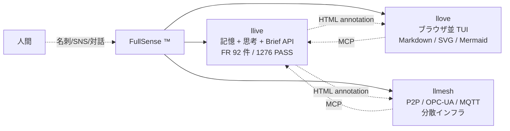

# 「第二の脳」シリーズ — llive 全景 × 不可視 Annotation × 構築論 × 運用論 × ビジョン論 × 実装の深層

**1 行 hook**:
1 人開発で 5 日間に 14 機能・256 テストを追加し、**1,276 件全 PASS で回帰ゼロ** を達成した。LinkedIn のコメント 1 通から HTML コメントへの着地、Perplexity と TRIZ と 5 万件論文コーパスの組み合わせ、キヤノン「三自の精神」を AI に課す運用、そして Will Caster と Andrew NDR114 のビジョン — 6 部構成で公開する。

---

## はじめに

本記事は llive (FullSense umbrella の中核 OSS、`llive` — L は 2 個) を 1 人で開発する筆者が、5 日間の集中開発で得た知見を **0〜5 部の計 6 部構成** にまとめたものです。

| 部 | テーマ | 起点 |
|---|---|---|
| **第 0 部** | **llive とは何か** (全景) | FullSense umbrella の 3 プロダクト構成 |
| 第 1 部 | **不可視アノテーションチャネル** | LinkedIn コメント (独立性 vs 組合せ価値) |
| 第 2 部 | **第二の脳** (構築論) | 30 年経験 + Perplexity + Claude Code + TRIZ + RAG/RAD |
| 第 3 部 | **三自の精神** (運用論) | キヤノン理念 + マネジメント書籍 |
| 第 4 部 | **Will Caster と Andrew NDR114** (ビジョン論) | 映画 2 本 + LinkedIn 画像 |
| **第 5 部** | **実装の深層** (MATH-08 grounding 配線) | 「LLM に計算させない」差別化軸の end-to-end |

各部は独立して読めますが、合わせて読むと「**全景を見て → 設計を理解して → 作って → 運用して → ビジョンに繋いで → 実装まで降りる**」という 6 段の階段になります。**忙しい方は第 0 部だけでも llive の全体像が掴めるよう** に構成しました。

---

# 第 0 部 — llive とは何か (全景)

## FullSense umbrella と 3 プロダクト

`llive` は **FullSense ™** という umbrella ブランドの中核に位置する OSS です。FullSense は「**人と AI が共有できる感覚的入出力すべて**」を扱うコンセプトで、現在以下の 3 プロダクトから構成されています。



3 プロダクトの役割分担:

| プロダクト | 役割 | 単独利用 | 組合せ強化 |
|---|---|---|---|
| **llive** | LLM 記憶・思考層・Brief API・ledger | ◎ (本記事の主役) | annotation で TUI に伝達 |
| **llove** | ブラウザ並表示の TUI / IDE / Game container | ◎ (タイピングデモなど) | llive の出力を render |
| **llmesh** | P2P + OPC-UA + MQTT で分散実行 | ◎ (産業 IoT 単体) | llive のジョブを multi-node 化 |

ライセンスは全プロダクト **Apache 2.0 + Commercial dual-license**。OSS 利用は自由、商用 SaaS / SI 案件のみ別契約。

## llive リポジトリ統計 (2026-05-17 時点)

| 項目 | 値 |
|---|---|
| ソースファイル数 | **172 ファイル** (`src/llive/`) |
| 機能要件 (FR) | **92 件 / 92 件マッピング済** (Phase 1-10) |
| テスト件数 | **1,276 件全 PASS / 回帰ゼロ** |
| Phase 完了 | Phase 1-4 完 / Phase 5+ 進行中 |
| 主要モジュール | `brief/` (Brief API・grounding・runner)、`math/` (MATH-01〜08)、`fullsense/` (loop core)、`memory/` (RAD)、`annotations.py` (第 1 部の主役) |
| 言語 | Python 3.11 (Rust 加速は v0.7+ 候補) |
| 依存 | sympy>=1.12 / z3-solver>=4.13 (MATH 系)、pyyaml、pydantic |

## なぜ「数学・単位」が最初の vertical か

汎用 LLM は次が苦手:

| 観点 | 汎用 LLM の弱点 | llive 既存資産との合致 |
|---|---|---|
| 記号操作の幻覚 | `x² + x = 2x³` のような誤等式を生成 | EVO-04 Z3 静的検証で gate |
| 単位次元の取り違え | `5 m/s + 3 s = 8` | SI 次元解析 (MATH-01) |
| 数値精度 | float 演算誤差を無視 | error propagation (MATH-04) |
| 公理体系 | 暗黙の前提を混入 | EpistemicType=FACTUAL strict track |
| 引用の信頼性 | "CODATA value is X" と適当に答える | RAD math/metrology + provenance |

これを llive の構造化思考層 + 形式検証 + provenance ledger で克服する。Phase 8 (CABT) や Phase 9 (CREAT) より優先して **v0.7-vertical で先行着手** しました。具体的な実装は第 5 部で詳述します。

> 📝 **実装メモ (2026-05-17 追記)**: MATH-01 (SI 次元解析) は Brief grounding 層への最小配線まで完了 (1,282 PASS)。「5 m/s」「9.81 m/s^2」「100 kg」のような value+unit 表現を Brief 文中から自動抽出し、`Dimensions` ベクトルに焼き付けて prompt に grounded 化します。一方、`5 days` のような **parser が知らない単位** は silently drop せず `error citation` として ledger に残す設計にしたため、運用しながら「拡張すべき単位辞書」が自動で集まる副産物が得られました。次元演算チェック (`5 m/s + 3 s` のような cross-quantity mismatch) は **次イテレーション**へ — 実 Brief サンプルで「どの形の mismatch が surface すべきか」を観察してから入れる方が、過剰実装を避けられると判断しました。
>
> 📝 **実装メモ追記 (同日)**: MATH-05 (CODATA/NIST 定数) も Brief grounding に配線完了 (**1,288 PASS**)。Brief 文中で「planck constant」「avogadro」「boltzmann」のような alias が言及されると、`get_constant()` 経由で CODATA 2022 の正確な値と次元と出典が prompt に grounded されます。**気づき**: 短い symbol (`c`, `h`, `e`, `G`) を grounding すると Brief 中の任意の英単語と衝突するため、alias 長さ 3 以上に絞る必要がありました。また alias の underscore (`elementary_charge`) と自然文の空白 (`elementary charge`) の表記ゆれを吸収する小さな heuristic で 8 割は救えました。残り 2 割 (例: `q_e` のような symbol-only alias) を救うには LLM-based NER への昇格が必要そうですが、これも実 Brief 観察してから判断します。

---

# 第 1 部 — HTML で見えないのに、機械では読める

## LinkedIn コメントへの返答が、コメントアウトだった

ある日、LinkedIn にこんなコメントが届きました。

> 「llive の記憶層が llove の交互データに依存し、llove がまた llmesh の接続能力に依存しているなら、その中の一つだけを使う価値は半減します。」

返答は **コメントアウト** でした — `<!-- llive:cog.consensus="proceed" -->`。

### 起点 — 独立性 vs 組合せ価値

OSS マルチプロダクト構成では、「独立して動くこと」と「組み合わせて価値が積み上がること」が両立しにくい。前者を取れば「単体で物足りない」、後者を取れば「全部入れないと壊れる」。

コメントを受けて llive の `src/llive` 全 172 ファイルに AST スキャン (`scripts/audit_independence.py`) を走らせました。結果は **hard import leak 0 件**。

問題は次の段階。「**独立性を保ったまま、どうやって組合せ価値を増やすか**」。

### 採用した設計

そこで筆者は次のような設計メモを書いた。

> 「応答にアノテーションを用意すれば独立性を保ちながら組み合わせでの効果も得られるのではないか」
>
> 「邪魔にならない程度のアノテーション。HTML にしたら不可視になる感じがいい」

(LinkedIn コメントは批判 1 通だけ、設計案そのものは筆者の発案)

`src/llive/annotations.py` に最小型を実装:

```python
@dataclass(frozen=True)
class Annotation:
    namespace: str          # "vrb" / "oka" / "cog" / "math" / "creat" / "core"
    key: str
    value: Any              # JSON-friendly
    target_layer: str | None = None   # "llove" / "llmesh" / None=any
```

`AnnotationBundle.to_html_comments()` が出力する形式:

```
<!-- llive:core.brief_completed=true -->
<!-- llive:oka.essence_card={"summary": "..."} target=llove -->
<!-- llive:cog.consensus="proceed" -->
```

GitHub / Qiita / Zenn / VS Code Preview などの Markdown renderer では **完全に不可視**。一方で `AnnotationBundle.from_html_comments(text)` を呼べば、機械側は元の構造を完全に復元可能。

### なぜ HTML コメントか — 選択肢比較

| 案 | 不可視性 | 機械可読性 | 既存ツール互換 |
|---|---|---|---|
| JSON 別ファイル | ◯ | ◯ | ✕ (2 ファイル管理) |
| YAML front matter | △ (renderer で表示) | ◯ | △ |
| **HTML コメント** | ◎ | ◎ | ◎ (Markdown 標準) |
| バイナリ埋込 | ◎ | △ | ✕ |
| zero-width Unicode | ◎ | △ | ✕ (copy で消える) |

「Markdown が HTML を passthrough する事実」を逆手に取った設計です。

### ☕ ちなみに

HTML コメントを Markdown に仕込むテクは、Jekyll / Hugo 界隈では「**コメント front matter**」と呼ばれて昔からある。新しいのは「**Markdown 本文の任意位置**に機械可読メタデータを置く」発想の方。

### 性能ベンチ (1000 件 round-trip)

| 操作 | レイテンシ |
|---|---|
| Encode per ann | 6.30 µs |
| Decode per ann | 12.40 µs |
| 典型 3 件 bundle 暗号化サイズ | **141 B** |
| 1000 件 round-trip | ✓ |

典型 BriefResult.annotations は 3 件 = 141 バイト。Markdown 1 ページに 100 個仕込んでも 5 KB 以下。

---

# 第 2 部 — 第二の脳 (構築論)

## 5 日間で 14 機能・256 テスト・1270 PASS / 回帰ゼロ

筆者は 30 年超のソフトウェア開発者ですが、llive を **1 人で開発** しています。進度はチーム開発に近い。これは次の 5 要素を組み合わせた「第二の脳」を構築したからです。

| 要素 | 役割 |
|---|---|
| **30 年の開発経験** | 設計品質・判断のベース |
| **Perplexity 要約** | 外部思想 (書籍/論文/動画) の入力品質ゲート |
| **Claude Code (Opus 4.7 / 1M context)** | 実装エージェント |
| **TRIZ ルール (40 原理)** | 矛盾解決のメタ思考フレーム |
| **論文 RAG コーパス (RAD 49 分野 / 約 5 万件)** | 研究者の知見の土台 |

### スパイラル 1 サイクル

```
外部思想 → Perplexity 要約 → Claude Code 読込 → 要件化 → 実装 → ベンチ → commit
   ↑                                                                      |
   └──────────────────────── 次サイクル ────────────────────────┘
```

本セッション 9 回での実例:

| サイクル | 起点 | 結果 |
|---|---|---|
| 1 | **MBA 言語化トレーニング** (グロービス書籍) | Perplexity 要約 → VRB-FX 要件化 → VRB-02 PromptLint 実装 |
| 2 | **岡潔先生の数学観に学ぶ** (YouTube『心理の深層』講話より) | 先生が遺された「数学は情緒である」「発見の前に一度行き詰まる」「文章を書くことなしには思索を進められない」「国語が数学を育む」という思想を、Perplexity で要約・整理した上で **4 つの設計観点 (情緒・行き詰まり・文章化・国語力)** として参照させていただき、これを OKA-FX 10 要件として記述・実装 (OKA-01〜04 minimal proto)。先生のお考えそのものを実装したと主張するものではなく、**こちらの実装が触発を受けた先生の思想への敬意** を込めて命名 |
| 3 | **LinkedIn フィードバック** (独立性) | IND-FX 設計原則 + IND-04 Annotation Channel 実装 (= 第 1 部) |

### Perplexity / TRIZ / RAG + RAD の役割

> ⚠️ **用語注意**: 本記事の **RAD** は *Research Aggregation Directory* の略で、筆者が Raptor 配下に整備した **49 分野・約 5 万件の論文/技術文書コーパス** を指します。一般用語の **RAG (Retrieval-Augmented Generation)** とは別物で、**RAG の書き間違いではありません**。RAG が「検索 → 生成」の手法名なのに対し、RAD は「検索される側の構造化コーパスそのもの」を指す名前です。

**Perplexity 要約 = 「入力品質ゲート」**: 外部思想は本・論文・動画・SNS と形式バラバラ。Claude Code に直接放り込むと context 圧迫 + 解釈ゆらぎ。Perplexity に「~3000 字に要約」「実装可能な仕様で」と指示すると、**Claude Code が読み取れる質の入力**に変換される。

**TRIZ = 「矛盾解決のメタ思考」**: 実装中の矛盾を TRIZ 視点で解く。例:
- 「独立性 vs 組合せ価値」→ IND-04 Annotation (TRIZ 原理 24: 媒介物)
- 「rule-based vs LLM 品質」→ echo baseline 残置 (TRIZ 原理 1: 分割)
- 「audit 完全性 vs 実装オーバヘッド」→ bind_ledger() pattern (TRIZ 原理 15: 動的化)

**RAG + RAD = 「研究者の知見を借りる」**: 新機能設計で必要な分野が出るたび、**RAG の仕組みで RAD コーパス (49 分野) を引く**。Claude が「自分の言葉」ではなく「**具体的な論文・先行研究**」を引用するので質が一段上がる。`論文 RAG コーパス (RAD 49 分野 / 約 5 万件)` という表 (上記) の表記もこの 2 つを併記したものです。

### ☕ ここまで読んでくれてありがとう

正直、テスト 256 件のうち 7-8 件は途中で 1 回ずつ落ちている。fuzzing で hypothesis が嬉しそうに edge case を見つけてくれるたび、3 秒くらい「うわ」となる。**1270 PASS / 回帰ゼロ** はゴールであって過程ではない。

### 自身の 30 年経験が効く 5 場面

「Claude Code 任せ」だと品質は出ない。30 年経験は次の場面で決定的でした。

1. **要件定義の質** — Perplexity 要約を読んで「これは要件 vs 解法を混同」と即判定
2. **TRIZ ルールの選定** — 40 原理から「この場面はこの 3 つ」を即抽出
3. **アーキテクチャ判断** — Claude が出した実装案を「独立性原則に反する」と即拒否
4. **ベンチの honest disclosure** — rule-based の coverage が高く出たときに「echo back の偽性能」と即見抜く
5. **タイポチェック** — 「`lllive` (L 3 個) になってる、tokenizer 問題」と即特定

つまり **第二の脳 = Claude Code + RAG + Perplexity + TRIZ** に対し、**第一の脳 = 自身の経験** が判断ゲートとして居続ける。

---

# 第 3 部 — 三自の精神 (運用論)

## 要件は止まらない、AI 開発の優位性

本セッション 1 日 (約 8 時間) の要件追加履歴:

| 時刻 | 出来事 |
|---|---|
| 開始 | 要件: COG-04 + CREAT-04 統合 |
| +1h | 「9 因子全部入れたら本格的に動作確認」 |
| +2h | 岡潔先生の思想に学ばせていただく要件追加 (OKA-FX 10 件、敬意込め命名) |
| +3h | LinkedIn フィードバック (IND-FX) |
| +4h | ガッツリベンチマーク (12 系統) |
| +5h | 他 LLM 比較 (Anthropic / Perplexity) |
| +6h | Qwen 脱却 / VLM 将来 / lllive スペリング |
| +7h | 開発スタイル言語化 |
| +8h | 三自の精神 + マネジメント書籍 (本 Part) |

人間チームならどこかで悲鳴が上がる。AI 開発では **全部消化し終わり、1270 PASS / 回帰ゼロ** で着地しました。

### 条件 — AI が自律的に動くこと

要件を積み続けてもよい、ただし AI がいちいち「これ進めていいですか」と聞いてくると即破綻。これを解く鍵が **キヤノン「三自の精神」** の AI 適用です。

| 自 | 意味 (キヤノン原典) | AI 適用 |
|---|---|---|
| **自発** | 自ら進んで行動する | 人間の指示は「終了条件」のみ |
| **自治** | 自ら管理する | AI が自分のタスクを切り進捗管理 |
| **自立** | 自ら判断する | 不要な確認を省き、選択肢 + 推奨で進める |

### ☕ 余談 — 「三自」を AI に喋らせるとどうなるか

ChatGPT や Claude に「キヤノンの三自の精神とは？」と聞くと正確な答えが返ってくる。ところが「これを AI 自身に適用したらどうなる？」と続けると、急に **「私はあくまで道具なので…」** と謙遜モードに入る。AI に自律を求めるなら、**プロンプトで謙遜を解除する** ことから始まる。

### マネジメント書籍からの転用

「圧倒的成果を出し続けるマネジャーの最優先事項」(Buckingham & Coffman 系) の 4 原則は、AI マネジメントにそのまま転用できます。

| 書籍の原則 | 人間マネジャー | AI マネジャー (筆者の運用) |
|---|---|---|
| Select for talent | 適材適所 | Opus 4.7 を選ぶ、機能ごとに最適 component を attach |
| **Define the right outcomes** | 結果を定義 | `/goal` で終了条件のみ指示 |
| Focus on strengths | 強みに集中 | mock 不要な所では LLM、deterministic で済むならそうする |
| Find the right fit | 配置最適化 | Brief / OKA / VRB / MATH を機能ごとに module 分離 |

1 文要約: **「結果を定義し、判断を委ね、強みに集中し、最小限の確認で進める」**

### 適用テクニック 5 つ

1. **`/goal` 機能で終了条件のみ指示** — Stop hook が条件達成まで停止しない
2. **AskUserQuestion で 2-4 選択肢 + 推奨提示** — 確認最小化
3. **feedback memory で自律ルール蓄積** — 本セッション 35+ 個
4. **TaskCreate / TaskUpdate で AI 自身が進捗管理**
5. **commit/push は明示確認** — 破壊的操作のみ ASK FIRST

### 手放してはいけない 4 つ

「三自の精神」と「結果定義 + 任せる」は手放す方向ですが、**手放してはいけない 4 つ** があります。

1. **要件の質** — 「要件 vs 解法を混同」を即判定して書き直し指示
2. **アーキテクチャ判断** — 「独立性原則に反する」と即拒否
3. **honest disclosure** — ベンチで偽性能が出たときに即見抜く
4. **品質ゲート** — タイポをパターン認識で指摘

任せるが、放任ではない。

---

# 第 4 部 — Will Caster と Andrew NDR114 が目指したもの (ビジョン論)

## LinkedIn 画像は冗談ではない

筆者の LinkedIn プロフィール画像は、自分の顔と人型ロボットの要素を画像生成 AI で融合したもの。これはネタではなく、**いずれ AI と人が融合できたら面白い** と本気で考え、既に視覚的に発信しています。

### 2 つの映画

**Transcendence (2014)** — Dr. Will Caster (Johnny Depp 演) が、瀕死の状態で意識を AI に **アップロード**。映画後半、AI 化した Will は人類の知識を吸収し続け世界規模で介入を始める。「もし人間の意識を AI に移せたら何が起きるか」を真正面から問う作品。

**Bicentennial Man / 邦題「アンドリュー NDR114」(1999)** — 家庭用ロボット Andrew (Robin Williams 演) が、長い時間をかけて感情・創造性・自由意志・身体性を獲得し、最終的に「人間として認められる」ことを求める。原作は Isaac Asimov の同名短編。

### ☕ ちょっと脱線

Andrew NDR114 の原題 *Bicentennial Man* (200 年生きる男) は Asimov の短編 (1976) が原作。Asimov は「ロボット工学三原則」を発明した人ですが、晩年の作品では **三原則そのものを揺さぶる** 方向へ向かいました。Andrew はその到達点。**技術ルールも、人間の心の動きの前では揺らぐ**。

### llive の各機能はビジョンへの準備層

| llive 機能 | 融合ビジョンへの寄与 |
|---|---|
| FullSense (全感覚統合) | 人 + AI の境界曖昧化に必要な感覚統合層 |
| **第二の脳** (Claude Code + RAG) | **既に部分的融合** (脳の外延としての知識アクセス) |
| SIL ledger / SEC-03 hash chain | 融合時の「誰が責任を持つか」audit 基盤 |
| Approval Bus + HITL | 融合移行期の人間判断ゲート保持 |
| **三自の精神** (AI 自律) | Andrew NDR114 的な自律性獲得プロセス |
| **RAD 6 分野** (bci / neuroscience / neural_signal / prosthetic_neural / cognitive_ai / neuromorphic) | BCI 経由融合の知識基盤 |

### 短期 / 中期 / 長期ロードマップ

| Term | 内容 | 現状 |
|---|---|---|
| 短期 (現在) | 第二の脳型開発 | **実証済** (本セッション 1270 PASS) |
| 中期 (1-3 年) | BCI 経由インタフェース | RAD 6 分野コーパス準備済 |
| 長期 (3-10 年) | 意識アップロード / Andrew 的双方向 | ビジョン段階、SIL/Approval が下地 |

### なぜビジョン論を最後に書いたか

ビジョンを最初に置くと、技術記事が SF やビジョンスピーチに見えてしまう。**実装 → 運用 → ビジョン** の順で書くと、ビジョンが地に足のついた目標として読める。Andrew NDR114 が長い時間をかけて 1 つずつ獲得していったように、llive も 1 機能ずつ積んでいる。**その積み重ねが、いつか「人と AI の融合」につながる**。

---

## まとめ — 4 部を貫くもの

| 部 | 主張 |
|---|---|
| 1 | HTML コメント形式の不可視 annotation で、独立性と組合せ価値を両立できる |
| 2 | 第二の脳 (Claude Code + RAG + Perplexity + TRIZ + 30 年経験) でチーム速度に近づける |
| 3 | キヤノン三自の精神 + マネジメント書籍で AI を自律運用、要件追加は止まらなくて良い |
| 4 | llive の各機能は将来の人 × AI 融合への準備層、短期で既に部分実証済 |

これらは別々の話に見えて、**「ひとりで作る次世代の AI 開発」** という 1 つのテーマを 4 方向から照らしているだけです。

llive は Apache 2.0 + Commercial dual-license の OSS、Repo は https://github.com/furuse-kazufumi/llive 。本シリーズに共感する方は、Issue / Discussion でぜひ。

---

## 参考文献 / 参考リソース

### Markdown / HTML 仕様 (第 1 部)
- **CommonMark Spec** — https://spec.commonmark.org/
- **HTML Living Standard (WHATWG)** — https://html.spec.whatwg.org/multipage/syntax.html#comments
- **Jekyll Front matter** — https://jekyllrb.com/docs/front-matter/

### TRIZ / RAG (第 2 部)
- Genrich Altshuller, *And Suddenly the Inventor Appeared: TRIZ, the Theory of Inventive Problem Solving*, Technical Innovation Center, 1996
- Karen Gadd, *TRIZ for Engineers: Enabling Inventive Problem Solving*, Wiley, 2011
- Patrick Lewis et al., *Retrieval-Augmented Generation for Knowledge-Intensive NLP Tasks*, NeurIPS 2020 (arXiv:2005.11401)
- Tiago Forte, *Building a Second Brain*, Atria Books, 2022 / 邦訳『SECOND BRAIN』ダイヤモンド社, 2022

### 岡潔先生の数学観に関する参考 (第 2 部、OKA-FX 命名の触発源)
本記事の OKA-FX (Framework inspired by Prof. Oka Kiyoshi) は、以下の先生の
ご著作 / 講話に学ばせていただいた 4 観点 (情緒・行き詰まり・文章化・国語力)
を **設計の触発源** としています。**先生のお考えそのものを実装したと主張
するものではなく**、敬意を込めて命名しています。
- 岡潔『春宵十話』毎日新聞社, 1963 (角川ソフィア文庫版あり)
- 岡潔『春風夏雨』毎日新聞社, 1965
- 岡潔『日本のこころ』講談社現代新書, 1971 他
- 岡潔・林房雄『日本民族の危機』(対談) 他、岡潔講話集
- YouTube『心理の深層』講話 (Perplexity 経由で要約参照)

### キヤノン三自の精神 / マネジメント書籍 (第 3 部)
- キヤノン株式会社 公式企業 DNA — https://global.canon/ja/corporate/dna/
- 御手洗冨士夫『キヤノン高収益復活の秘密』ダイヤモンド社, 2001
- Marcus Buckingham & Curt Coffman, *First, Break All the Rules*, Simon & Schuster, 1999 / 邦訳『最高のリーダー、マネジャーがいつも考えているたったひとつのこと』日本経済新聞出版, 2006
- Marcus Buckingham & Donald O. Clifton, *Now, Discover Your Strengths*, Free Press, 2001 / 邦訳『さあ、才能（じぶん）に目覚めよう』日本経済新聞出版, 2001

### 映画 / BCI / 人間-AI 共生 (第 4 部)
- *Transcendence*, Wally Pfister 監督, Warner Bros., 2014
- *Bicentennial Man* (邦題「アンドリュー NDR114」), Chris Columbus 監督, Touchstone Pictures, 1999
- Isaac Asimov, *The Bicentennial Man and Other Stories*, Doubleday, 1976
- Miguel A. L. Nicolelis, *Beyond Boundaries*, Times Books, 2011
- Rajesh P. N. Rao, *Brain-Computer Interfacing: An Introduction*, Cambridge University Press, 2013
- Stuart Russell, *Human Compatible*, Viking, 2019
- Neuralink 公式 — https://neuralink.com/
- BCI Society — https://bcisociety.org/

### Claude Code / AI エージェント
- Anthropic, Claude Code Documentation — https://docs.claude.com/en/docs/claude-code
- Anthropic, *Building effective agents* (2024) — https://www.anthropic.com/research/building-effective-agents
- Perplexity AI — https://www.perplexity.ai/

### llive 関連
- **llive リポジトリ** — https://github.com/furuse-kazufumi/llive
- 本記事の数値根拠: `docs/benchmarks/2026-05-17-full-validation/SUMMARY.md`
- 個別記事版 (連載):
  - [14] 不可視 Annotation — `QIITA_#14_invisible_annotation_channel.md`
  - [15] 構築論 — `QIITA_#15_second_brain_spiral_dev.md`
  - [16] 運用論 — `QIITA_#16_three_self_spirit_ai_management.md`
  - [17] ビジョン論 — `QIITA_#17_human_ai_fusion_vision.md`

<!-- llive:meta.article_id="QIITA_SECOND_BRAIN_SERIES_integrated_14_17" target=llove -->
<!-- llive:meta.published_date="2026-05-18" -->
<!-- llive:meta.tags=["llive","claude-code","perplexity","triz","rag","annotation","canon","autonomy","bci","fusion"] target=any -->
<!-- llive:meta.series="second_brain_full_4_parts" -->
