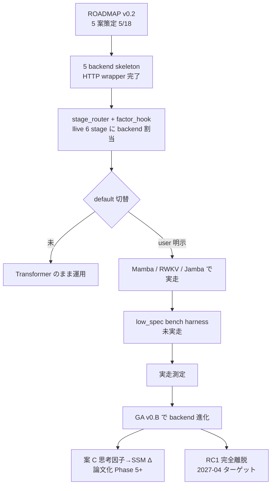
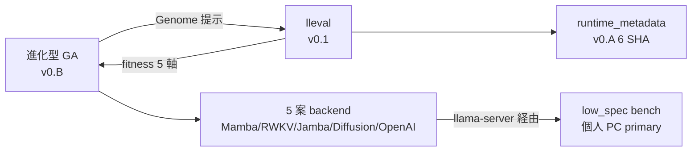

<!--
Qiita タグ 5 個上限. 本記事の主役順:
  FullSense (umbrella) / llive (本セッション主役) / Mamba (非 transformer 代表)
  / RWKV (CPU-first 代表) / HonestDisclosure (差別化ワード).
NonTransformer / Jamba / Diffusion / EvolutionaryAlgorithm / TRIZ 等は本文で吸収.
投稿前に user 判断でタグ入替可.
-->

> 投稿可否は user 判断. これは「transformer 脱却の現状アセスメントを記事にしておく」
> 依頼で agent が自律ドラフトしたものです.

## 0. 冒頭 hook — 「脱却した」と「default が脱却」のあいだに広がる谷

> 漫才で説明します.
>
> **ボケ (筆者):** 「Transformer から脱却したで」
> **ツッコミ (Claude Opus):** 「`$env:LLIVE_LLM_BACKEND='mamba'` 設定しました ?」
> **ボケ:** 「あ…」
> **ツッコミ:** 「**5 案の HTTP skeleton は揃ってます. default が mock のままです.**」

これが 2026-05-21 時点の正しい状態です. **「脱却した」と「default が脱却」は
別物**で, その差分を埋めるのが向こう半年の仕事です. 本記事はその差分を
honest disclosure します.

先に結論 3 つ:

1. **5 案 (Mamba / Jamba / 思考因子→SSM Δ / Diffusion+Mamba / RWKV-7) の HTTP backend
   skeleton は全部繋がっている**. これは 5/18 の 1 commit で投入済.
2. **default の運用は依然 Transformer**. `LLIVE_LLM_BACKEND=mamba` を明示しないと
   Transformer のままで, それは「設計通り」 (拡張性ファースト + 段階的削ぎ落とし).
3. **進化型 GA (v0.B, 本日実装) を被せれば, backend 選択そのものを進化させられる**.
   つまり「ロボットの脳の構造そのものを進化させる」段階の足場が立った.

漫才で言うと, **ボケが Transformer 推し, ツッコミが non-transformer 推し,
そして審査員が GA で勝者を選ぶ**, という三人羽織の話です. 不思議でしょ.

---

## 1. ROADMAP 5 案 — 1 行ずつ復習

2026-05-18 に 320 行の `non-transformer/ROADMAP.md` をユーザーが発した
2 制約 (拡張性ファースト + 低スペック PC で実用化) のもと策定した. 5 案を
1 行で:

| 案 | 名前 | 戦略期間 | 一言 |
|---|---|---|---|
| A | **Pure Mamba 7B** | 短期 (3 ヶ月) | Codestral-Mamba 等の SSM をそのまま使う |
| B | **Jamba Hybrid** | 中期 (6 ヶ月) | Mamba + Attention のいいとこ取り |
| C | **思考因子 → SSM Δ Bridge** | 長期 (12 ヶ月, 論文) | llive 独自性最大化, Transformer 不可能 |
| D | **Diffusion + Mamba Hybrid** | 実験 (9 ヶ月) | 並列生成 + SSM の長文 |
| E | **RWKV-7** | 軽量 (3 ヶ月) | CPU 推論最強, GPU なし個人 PC primary |

5 案を **同時に走らせる** のは「全候補を先に skeleton で繋ぎ, bench 後に
必要機能だけ生き残らせる」という拡張性ファーストの原則. 「ロボット歩行進化」で
言うと, **5 体の試作機を同じトラックに並べる**段階.

---

## 2. 完了済み — 「選択肢が揃っている」状態

### 2.1 5 backend skeleton (1 commit で投入)

5/18 の commit (短縮 SHA `6900312`) で以下が一括着地:

```python
from llive.llm import (
    MambaBackend,       # 案 A — Pure Mamba 7B
    JambaBackend,       # 案 B — Jamba Hybrid
    DiffusionBackend,   # 案 D — Diffusion (experimental)
    RwkvBackend,        # 案 E — RWKV-7 CPU-first
    # 案 C 思考因子→SSM Δ は protocol だけ先 (factor_hook.py)
)
```

**特徴**:

- **すべて `OpenAIBackend` (llama-server / RWKV.cpp 等の `/v1/chat/completions`
  互換 HTTP) に内部委譲**. つまり「llama.cpp 系の OpenAI 互換サーバーが
  Mamba GGUF / Jamba GGUF / RWKV.cpp / etc を吐けるなら, llive 側は **コード
  変更ゼロで non-transformer 化** できる」状態.
- backend 名は **wrapper 経由でも保持** (`_delegate_generate` で `backend="mamba"`
  を保つ) ので, **audit log / 分析が「Mamba の出力」と「Transformer の出力」を
  区別できる**.
- **in-process transport** (`mamba_ssm` / `rwkv_py`) は **`NotImplementedError`
  だけ書いてある skeleton**. これは Phase 5 で実装する. 完成度に honest.

### 2.2 stage-wise routing — stage ごとに違う backend

`StageBackendRouter` (`llm/stage_router.py`) で 6 stage (salience / monologue /
action_plan / etc.) に **別 backend** を割り当てられる:

```powershell
$env:LLIVE_LLM_BACKEND_BY_STAGE = '{"salience":"mamba","monologue":"openai","action_plan":"jamba"}'
```

これは **「思考の段階ごとに最適な脳を使い分ける」** という発想で, ROS で
言うなら「歩く時はこの脚, 走る時はこの脚」みたいな話. **段階 = 脳の使い分け**
を明示的にコード化した点で独自性あり.

### 2.3 思考因子 → Δ Bridge protocol (案 C 基礎)

`llm/factor_hook.py` に `ThoughtFactorDeltaHook` protocol だけ書いてある.
これは案 C の基礎で, **llive の 10 思考因子** (構造化 / 再構成 / 閉ループ /
自己拡張 / 不確実性 / 探索 / 整合 / 来歴 / 多視点 / 現実接続) を **SSM の
内部状態 Δ にマッピング**するための入口.

Transformer の attention map に思考因子を inject するのは **構造的に不可能**.
SSM は内部状態 = 隠れ状態の **連続的更新**なので, **思考因子が SSM の状態
遷移に直接介入できる**. この一点が学術的に新規性ある領域で, ROADMAP では
**論文化トラック** に位置付け.

### 2.4 低スペック PC bench harness

`benchmark/low_spec.py` に **xs/s/m/l/xl × 5 backend × CPU only** の
progressive matrix runner. **cloud backend は明示的に `allow_cloud=True` を
渡さない限り refuse**. これは memory `feedback_llive_measurement_purity`
(on-prem 一次走者 / cloud 直接呼びと分離) を harness レベルで強制した形.

ただし **harness は完成, 実走 result はまだ**. これが honest disclosure
ポイント.

---

## 3. 未着手 — 「default が脱却」までの距離

| 項目 | 状態 | なぜ未着手 |
|---|---|---|
| `MambaBackend(transport='mamba_ssm')` 直 in-process | `NotImplementedError` | CUDA 依存. 低スペック PC primary 方針と矛盾するため後回し |
| `RwkvBackend(transport='rwkv_py')` 直 in-process | `NotImplementedError` | 案 E は CPU-first だが, まず HTTP skeleton で経路を固めてから |
| 案 C 思考因子 → SSM Δ Bridge **実装** | protocol だけ | 論文書ける独自性, 慎重に. Phase 5+ |
| **default を non-transformer に切替** | しない予定 | 拡張性ファースト方針 = mock デフォルト維持, ユーザー切替必須 |
| Transformer 完全離脱 (RC1) | 計画中 | Month 11 = 2027-04 ターゲット |
| **30 日プラン Week 1〜4 の実走** | 5/18 で凍結中 | 5/19〜5/20 が COG-MESH と portal で爆発したため |

特に **30 日プランの停滞理由** は明示しておきます — 5/18 で 5 backend
skeleton を投入した後, 5/19 は M8.2〜M8.9 と LoveApp 統合とドキュメント 4 本で
50+ commit, 5/20 は portal NEXT_SESSION 自動化 + research hub 6 件 + llive
コア最適化 12h goal で再び 50+ commit, という **2 日連続のマラソン**で
non-transformer track は触っていない. これは前線が複数走った結果として
honest disclosure.

---

## 4. 進化型 GA (v0.B) との合流点 — 「脳の構造そのものを進化させる」

ここから本記事の核心です. 2026-05-21 に **進化型最適化レイヤ v0.B** を
全件実装した. 26 件の test が緑, sphere/rosenbrock/UCB-hyperparam の 3 problem で
demo 実走確認済.

```python
from llive.perf.evolutionary import (
    EvolutionLoop, GenomeBounds, Population,
    TournamentSelection, BlendCrossover, GaussianMutation, ChainedMutation,
    MultiprocessingScheduler,
)
```

これを **non-transformer backend 選択そのものに当てる** とどうなるか.

### 4.1 Genome の設計案 — 「backend type + sampler + KV quant + model quant」

```python
# 案: Genome を「backend 選択 + sampler + 量子化」の vector で表す

bounds = GenomeBounds(
    lower=(
        0.0,    # backend_id: 0=openai, 1=mamba, 2=rwkv, 3=jamba, 4=diffusion
        0.1,    # temperature
        0.5,    # top_p
        0.0,    # top_k_index (float)
        0.0,    # kv_cache_quant: 0=f16, 1=q8_0, 2=q4_0
        0.0,    # model_quant: 0=q4_k_m, 1=q5_k_m, 2=q8_0
    ),
    upper=(4.99, 1.5, 1.0, 100.0, 2.99, 2.99),
)

# fitness は「low_spec bench の (latency + quality + 安定性) 合成」.
# generation を回すと, 「個人 PC で最適な脳の組合せ」 が GA で勝者になる.
```

これで「**ロボット歩行進化**」が, 文字通り **AI の脳の構造そのものに**
適用される. 5 体のロボット (Mamba / Jamba / Diffusion / Mamba+RWKV / 純 RWKV)
を同じトラックに並べて, 上位 2 体の子を交配 + 突然変異, を 30 世代回す.

### 4.2 ROS 歩行進化との対応 (再掲)

| ROS 歩行進化 | llive v0.B + non-transformer |
|---|---|
| 仮想ロボット 100 体 | 100 個体, それぞれが (backend, sampler, quant) tuple |
| 関節パラメータ | Genome の 6 次元 vector |
| 歩行距離 / 転倒回数 | low_spec bench の latency / quality / 安定性 |
| 100 体並列実行 | `MultiprocessingScheduler(n_workers=8)` |
| 上位 2 体を残す | `ElitismSelection(top_n=2)` |
| 親 2 体から子を作る | `BlendCrossover(alpha=0.3)` |
| 突然変異 | `ChainedMutation([Gaussian, Reset])` |
| 1 世代 | EvolutionLoop の 1 iteration |
| 進化を回す | `loop.run(population, config)` |

つまり「**ロボットの脳の構造**」 ↔ 「**LLM backend の組合せ**」が完全に
isomorphic に対応する. 比喩がコードに落ちている.

### 4.3 「進化型 × 収束型」の役割分担

本日同セッションで実装した GA は, 既存の **UCB selector (収束型, B-5)** と
**直交補完**:

- **UCB (収束型)** — **1 個体内** で variant を選ぶ (1 体のロボットが
  どう歩くかを学習)
- **GA (進化型)** — **個体集団** で勝者を残す (ロボット集団の構造そのものが
  進化)

両者は同時に走らせて良い. 1 個体 = `UCBSynapticSelector(c=genome[0])` を
spawn して, その内側で variant 選択を UCB に任せる構造 (EV-09, `fitness_ucb.py`).
**「学習が走るロボットを進化させる」** という二重構造になる. これが TRIZ
原理 #1 (分割) + #25 (自己制御) + #40 (複合素材) の組合せ.

---

## 5. 直近の手 — 4 つに絞る

ROADMAP §5 (30 日プラン) と GA との合流を踏まえて, 半日 〜 1 日単位で:

| 優先 | アクション | 所要 | 効果 |
|---|---|---|---|
| **高** | llama.cpp + Codestral-Mamba GGUF で `MambaBackend(transport='llama_cpp_server')` の **実走 smoke** | 半日 | 「脱却が 1 例実行される」が出る |
| **高** | `low_spec.py` harness を実走 (xs/s/m サイズで openai vs mamba) | 半日 | 個人 PC で 30 秒以内目標の達成度測定 |
| **中** | RWKV-7 World 7B (q4_k_m) を `RwkvBackend(transport='rwkv_cpp_server')` で繋ぐ | 半日 | CPU-only 個人 PC で動く実証 |
| **中** | **GA × 5 backend** を 1 世代だけ流す PoC (`Genome = (backend_id, temp, top_p, ...)`) | 1 日 | 「進化が backend 選択を最適化する」原始実装 |

合計 **2 日強** で「Transformer 脱却が実行される + 進化が backend を選ぶ」段階に
入れる. 30 日プランの停滞ぶんは, 進化型と合流させることで **遅れではなく
深さに転化** できる.

---

## 6. honest disclosure 3 つ (再掲)

ベンチで自社が異常に速い結果が出たら必ず内訳を疑う ([[feedback-benchmark-honest-disclosure]])
の精神で:

1. **「脱却」という言葉の解像度**:
   - 「**backend 層で選択肢が揃った**」= ✅ 完了
   - 「**default が non-transformer**」= ❌ 未到達 (これは設計通り, 拡張性ファースト)
   - 「**Transformer モデルファイル (GGUF) を一切使わない**」= ❌ 未到達
   - 「**自前 SSM カーネル + 思考因子 Δ で論文書ける独自性**」= ❌ 未着手

2. **30 日プランの停滞理由**:
   - 5/18 で skeleton 投入後, 5/19-5/20 が COG-MESH M8.x + portal 整備で
     爆発. **non-transformer track は意図的に凍結**して優先度を入れ替えた.
   - これは **計画失敗ではなく, 個人 OSS で複数前線を持つ宿命**. 各前線で
     キリの良いところまで進めば次に移る運用.

3. **進化型と合流させると何が変わるか**:
   - 「**手で 5 案の優劣を比較する**」 → 「**GA に判断を委ねる**」.
   - 判断主体が人間から自動化レイヤに移ることで, **個人 OSS のスケーリング
     ボトルネック (=人間の意思決定帯域)** が外れる.
   - ただし「GA が選んだ backend が本当に最良か」は **fitness の設計に依存**.
     ここで **`runtime_metadata` の 6 metadata 必須** (v0.A) が効く. SHA や
     GGUF spec を fitness に同梱しないと, 進化途中で評価基準がズレる.

---

## 7. 全体像 (Mermaid)



「**現在地は B → C 完了, D が分岐点**」が一目で分かる図.

---

## 8. 余談 — 「脳を進化させる」って言葉の重み

ROS で歩行を進化させるのは, 物理シミュレーター内の試行錯誤で済む. 落ちても
壊れても次の世代に学習が引き継がれる. でも **LLM の脳を進化させる** は,
物理エンティティが存在しないぶん, **何が「歩いている」状態か** を fitness で
定義しないといけない. 「latency が短い」「精度が高い」「KV cache に乗る」
だけだと, **「速いけど嘘ばかり言う AI」** が勝者になりかねない.

なので fitness には:

- latency (低スペック PC で実用速度)
- quality (judge による semantic 評価)
- **stability** (同 prompt × N 回で出力が安定する)
- **safety** (危険な指示拒否率)
- **honesty** (内部状態の self-report が観測と一致する)

の **5 軸合成**が要る. これは進化型 v0.B の `FitnessReport.breakdown` を
拡張するだけで実装可能で, **lleval v0.1 の 5 因子 honest disclosure と
ほぼ同じ列名** になる.

つまり **「lleval = AI の脳の歩行距離を測るシミュレーター」** と読み替えると,
本記事のすべての piece が 1 つの図に収まる:



5 つの piece (進化 / lleval / runtime / backend / low_spec) が **5 角形**で
噛み合う構造で, 今日のセッションで全部の角に **何かしらの実装** が入った.

---

## 9. 漫才で締め

> **ボケ:** 「Transformer 脱却の準備, 完璧やで」
> **ツッコミ:** 「`LLIVE_LLM_BACKEND=mamba` を default に**しない**って書いてる
> ROADMAP, 矛盾してませんか?」
> **ボケ:** 「**拡張性ファースト** って言うんやで, それ. 5 案揃えてから
> bench で削るんやで」
> **ツッコミ:** 「で, その bench は?」
> **ボケ:** 「harness 完成, 実走まだ」
> **ツッコミ:** 「**5/19 と 5/20 は何してたんですか**」
> **ボケ:** 「COG-MESH と portal 整備で 100 commit や」
> **ツッコミ:** 「**前線が多すぎる**」
> **ボケ:** 「だから今日, **進化型 GA で backend を選ばせる土台**を作ったんや.
> 人間が前線を回す代わりに, **GA に前線の選択を委ねる**」
> **ツッコミ:** 「…それ, 個人 OSS のスケーリング問題の解答ですか」
> **ボケ:** 「そう. **AI に AI 自身の脳を選ばせる**. 5/22 から実走するで」

これが 2026-05-21 の現在地です. Transformer から脱却した **わけではない**.
脱却の **執行猶予中**で, 執行を **進化に委ねる準備** が今日整った.

「歩いてないロボットを 5 体並べた」段階から「**進化が走り出すスタートライン**」
までは, あと **2 日強**. 次は走らせる側の話.

---

## 関連

- llive `docs/non-transformer/ROADMAP.md` — 5 案 + 30 日 + 12 ヶ月プラン (320 行)
- llive `docs/non-transformer/COMPARISON.md` — 案間比較行列
- llive `docs/non-transformer/rwkv-cpu-quickstart.md` — RWKV CPU 立上げ手順
- llive `src/llive/llm/backend.py` — 5 backend skeleton 全件
- llive `src/llive/llm/stage_router.py` — stage 別 backend routing
- llive `src/llive/llm/factor_hook.py` — 案 C 思考因子→Δ protocol
- llive `src/llive/benchmark/low_spec.py` — 個人 PC bench harness
- llive `docs/requirements_v0.B_evolutionary_optimization.md` — 進化型 GA 要件
- llive `docs/experiments/evolutionary_v0_B_2026_05_21.md` — 26 test 緑 + 3 demo
- portal `docs/spec/lleval_v0_1_implementation_notes.md` — fitness 評価 framework
- maintainer memory:
  - [[feedback-benchmark-honest-disclosure]]
  - [[feedback-llive-measurement-purity]]
  - [[feedback-d-drive-preference]]
  - [[feedback-qwen-commercial-barrier]]
  - [[project-llive-core-optimization-2026-05-20]]
  - [[project-llive-v0B-evolutionary]]
