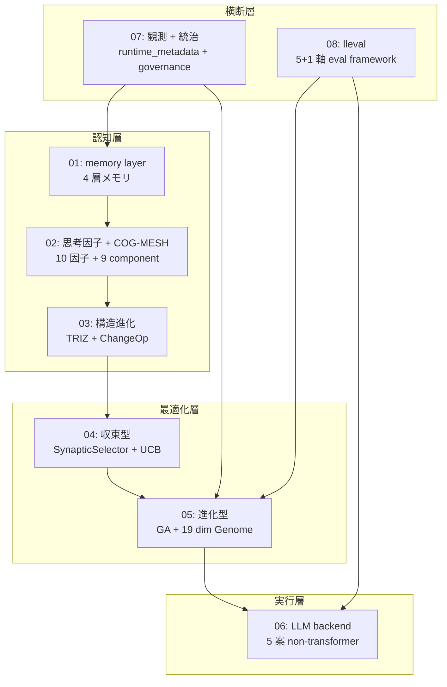

<!--
Qiita タグ 5 個 (FullSense / llive / 解説 / アルゴリズム / SoftwareArchitecture).
本 index は series の navigator. 各大分類は個別記事 (QIITA_24_01〜08) に分割.
-->

> 投稿可否は user 判断. これは agent 自律ドラフト. memory
> `feedback_articles_taxonomy_split` 準拠の **大/中/小分類** series 構成.

## 0. この series について

llive (FullSense ™ 思考層) を **構成する技術 / アルゴリズムを名称ごとに
解説する series** です. 1 記事に詰め込むと 8 万字級になるため,
**大分類 8 記事** に分割します.

各記事の構造:
- **冒頭 hook** (8 秒 read で「これは何か」)
- **中分類 3-7 個** に分けた小節
- **各小分類 = 具体的な class / function / 機能名** で解説
- **実コード GitHub link** を中分類ごとに
- **References / 引用文献** (学術 / OSS / 内部)
- **cross-link** (前 / 次 / 本 index / repo)

8 記事は **週 2 本ペース** で 1 ヶ月かけて publish 予定. ja Qiita + en
Medium 並走 ([[feedback-overseas-tech-platforms]] に従う).

## 1. Series 構成 (8 大分類)

| # | タイトル | 中分類 | 想定文字数 | 状態 |
|---|---|---|---|---|
| 01 | **memory layer** — llive の 4 層メモリ | semantic / episodic / structural / parameter / surprise gating | 8-12k | 🚧 |
| 02 | **思考因子 + COG-MESH** — 10 因子と 9 component | 構造化 / 再構成 / 閉ループ / ... / proactive / quarantine / 5W1H | 10-15k | 🚧 |
| 03 | **構造進化 (TRIZ × bounded modification)** | TRIZ 40 原理 / ChangeOp / verifier / 9 画法 | 8-12k | 🚧 |
| 04 | **収束型最適化 (B-0〜B-9)** | SynapticSelector / UCB1 / Hebbian / B-9 実 production 注入 | 8-12k | 🚧 |
| 05 | **進化型最適化 (v0.B + v0.C)** | Genome / SegmentCrossover / Tournament / Mutation / lineage / checkpoint | 12-15k | 🚧 |
| 06 | **LLM backend 層** — non-transformer 5 案 | Mamba / Jamba / RWKV / Diffusion / 思考因子→SSM Δ Bridge | 10-15k | 🚧 |
| 07 | **観測 + 統治** | runtime_metadata / Approval Bus / governance / honest disclosure | 8-10k | 🚧 |
| 08 | **lleval (eval framework)** | progressive size matrix / 5+1 軸 / judge rotation / bridges/llive | 8-12k | 🚧 |

合計 **~80k 字** (週 2 本 × 4 週). 完走目標 2026-06-20.

## 2. 全体図 (8 layer の関係)



「**認知層 → 最適化層 → 実行層**」の縦が llive の処理 flow,
「**観測 + 統治**」「**lleval**」が横断層として全 layer に効く構造.

## 3. 命名規約

`QIITA_24_<NN>_<topic>.md` (本 series 全体に `24`).

| ファイル | 内容 |
|---|---|
| `QIITA_24_00_llive_tech_series_index.md` | 本 index (本ファイル) |
| `QIITA_24_01_memory_layer.md` | 01 記事 |
| `QIITA_24_02_thought_factors_cog_mesh.md` | 02 記事 |
| `QIITA_24_03_structural_evolution_triz.md` | 03 記事 |
| `QIITA_24_04_convergent_optimization_b_series.md` | 04 記事 |
| `QIITA_24_05_evolutionary_optimization_v0bc.md` | 05 記事 |
| `QIITA_24_06_llm_backend_non_transformer.md` | 06 記事 |
| `QIITA_24_07_observability_governance.md` | 07 記事 |
| `QIITA_24_08_lleval_eval_framework.md` | 08 記事 |

en 版は `_en.md` suffix.

## 4. 共通フォーマット (各記事に適用)

### a. 冒頭 hook ([[feedback-articles-concept-hook]])

1-2 段落で「**この記事の主題 + 数字 + キー名称**」を凝縮.

### b. 中分類 = `## <名称>` 見出し

中分類 1 つにつき 1500-3000 字目安.

### c. 小分類 = `### <class/function/機能名>` 見出し

実コードへの GitHub link を **必ず** 付ける ([[feedback-qiita-github-links]]):

```markdown
### SynapticSelector

実装: [`src/llive/perf/synaptic_selector.py`](https://github.com/furuse-kazufumi/llive/blob/main/src/llive/perf/synaptic_selector.py)

ε-greedy + Hebbian-style weight update を組み合わせた variant selector.
bounded modification (§E2) で min/max clip 必須.
```

### d. 教訓 / 設計判断 (3-5 個)

中分類後の小節として「**なぜこの設計か**」を honest disclosure.

### e. References ([[feedback-articles-references-section]])

学術 / OSS / 内部 の最低 3 区分.

### f. cross-link

```markdown
## Series cross-link

- ← 前: [QIITA #24-NN](link)
- → 次: [QIITA #24-MM](link)
- 全体: [本 series index](QIITA_24_00)
- repo: [furuse-kazufumi/llive](https://github.com/furuse-kazufumi/llive)
```

> ⚠ **Cross-link URL は Qiita 投稿後に確定する**. draft 段階では各記事の
> 本文中で `#24-XX` / `[[QIITA_24_XX_*]]` の **仮表記** で参照し, 投稿後に
> 個別記事 URL (`https://qiita.com/.../items/<hash>`) に **一括置換**.
> mapping は [`QIITA_24_LINK_MAP.md`](QIITA_24_LINK_MAP.md) で唯一の
> source of truth として管理. 投稿時に **追々修正**する運用.

## 5. 想定読者

- **エンジニア** (Python + LLM 基礎知識あり)
- **AI researcher** (LLM の周辺アーキテクチャに興味)
- **個人 OSS author** (実装パターンの参考)
- **企業 R&D** (on-prem LLM stack の検討材料)

## 6. 公開順 (週 2 本ペース)

| 週 | 公開記事 |
|---|---|
| Week 1 (5/22-5/28) | 01 memory + 02 思考因子 |
| Week 2 (5/29-6/4) | 03 構造進化 + 04 収束型 |
| Week 3 (6/5-6/11) | 05 進化型 + 06 LLM backend |
| Week 4 (6/12-6/18) | 07 観測統治 + 08 lleval |

各記事の en 版は **+1 週遅れ** で Medium に投稿.

## 7. References (本 index)

### 内部 cross-reference

- portal `docs/PROGRESS.md` (累積セッション履歴)
- portal `docs/spec/index.md` (Spec hub)
- llive `docs/fullsense_spec_eternal.md` (FullSense Spec v1.1)
- llive `docs/requirements_v0.1〜v0.C` 系
- llive `docs/non-transformer/ROADMAP.md`

### 関連 maintainer memory

- `feedback_articles_taxonomy_split` (本 series 構成方針)
- `feedback_articles_concept_hook` (冒頭 hook)
- `feedback_qiita_long_form` (長文 OK)
- `feedback_qiita_github_links` (GitHub link 積極配置)
- `feedback_articles_references_section` (本セクション必須化)
- `feedback_no_image_placeholders` (Mermaid OK)
- `feedback_article_humor_style` (漫才禁止)
- `feedback_overseas_tech_platforms` (Medium en 並走)
- `feedback_reader_attention_curve` (8 秒/90 秒/5 分)

## 8. 状態 (2026-05-21 着手)

- ✅ index (本ファイル) 着地
- 🚧 01-08 個別記事は今後 publish (週 2 本ペース)
- ✅ 命名規約 + 共通フォーマット確定
- ✅ memory `feedback_articles_taxonomy_split` で運用ルール化
