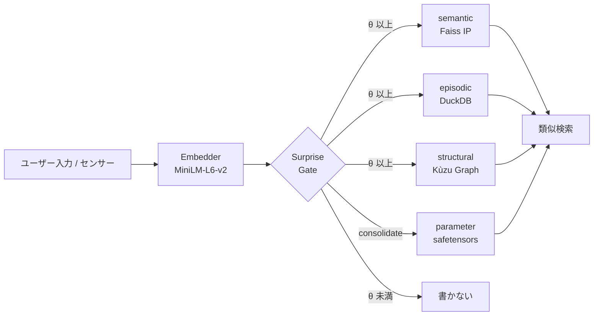
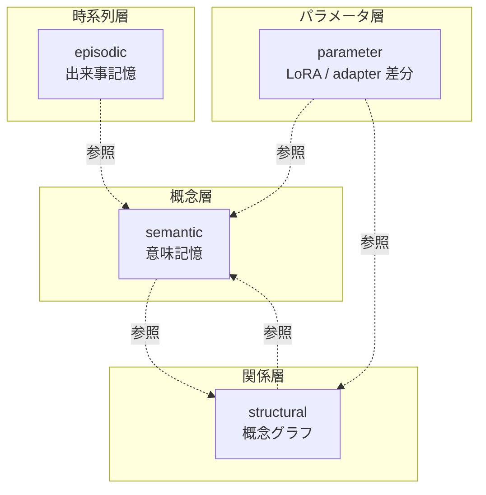
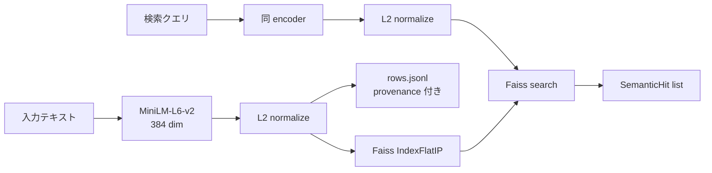
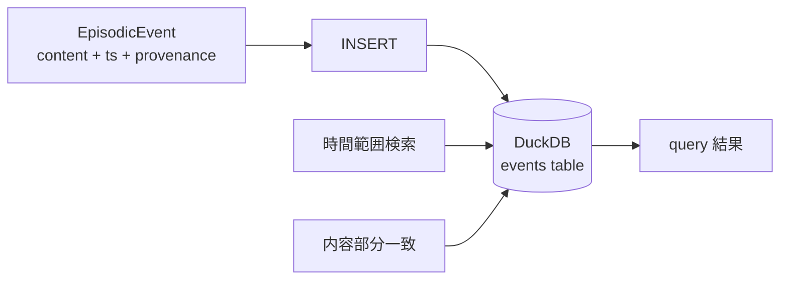
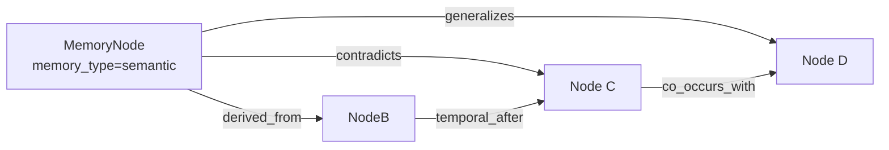
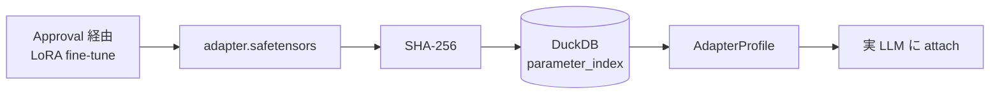
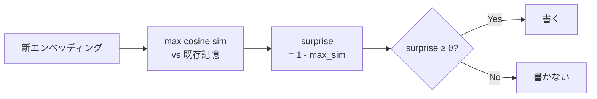
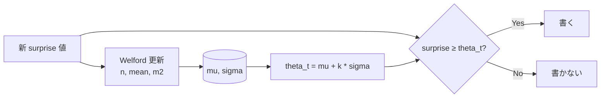
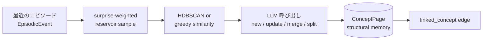

> 投稿可否は user 判断. これは agent 自律ドラフト. memory
> `feedback_articles_taxonomy_split` 準拠の **series 第 1 記事**.

## 0. この記事は何 (8 秒 read)

**LLM 本体ではなく LLM の周りに被せる認知層** llive の **4 層メモリ + 1 つの surprise gate** を解説します. semantic / episodic / structural / parameter の役割が違う 4 種類の記憶を, **「驚き」(surprise)** が高いものだけ書き込む設計です. Faiss + DuckDB + Kùzu + safetensors の組合せで, **on-prem だけで動きます**.



「全部書き込む」ではなく「驚きで取捨選択」が肝です. 詳細を順に解きほぐします.

## 1. なぜ 4 層に分けるのか

人間の認知科学では記憶は **意味記憶 / 出来事記憶 / 構造記憶 / 手続き記憶** に役割分担されています. llive はこれをそのまま LLM 周辺アーキテクチャに移植しました.

| 層 | 何を入れる | 実装 |
|---|---|---|
| **semantic** | 概念の意味 (文 + 埋め込み) | Faiss IP index + JSONL |
| **episodic** | 時系列のイベント | DuckDB append-only log |
| **structural** | 概念間の関係 (グラフ) | Kùzu graph DB |
| **parameter** | パラメータ更新差分 | safetensors + index DB |



4 層は **疎結合**. semantic だけ使う事も, structural を絡めることもできます. 「LLM はテキストしか扱えない」という制約から逃れるため, 構造 (graph) と時間 (event log) を別レイヤで持つのが llive の発想です.

— **一旦整理** —

ここまで読めば 「**4 層 + surprise gate** で取捨選択する記憶基盤」 が掴めるはずです. 次から各層の中身を実装ベースで見ていきます.

## 2. semantic memory (意味記憶, MEM-01)

### 役割

「あの議論で出た **概念** はこれだった」を引き出す層. テキストを埋め込みベクトルに変換して **コサイン類似度** で近傍検索します.

### コア構造



L2 normalize 後の inner product は **cosine 類似度** と等価. これが `Faiss IndexFlatIP` を選んだ理由です.

実装: [`src/llive/memory/semantic.py`](https://github.com/furuse-kazufumi/llive/blob/main/src/llive/memory/semantic.py)

### 設計判断

- **fallback path**: faiss が無い環境 (Windows CI 等) では numpy で nearest neighbor が動きます. test とプロダクションで実装を分けず, **どちらでも書き換え無しで動く** ようにしています.
- **provenance 必須**: 全エントリに `Provenance(source_type, source_id, derived_from, ...)` を持たせています. 「この記憶はどこから来たか」を絶対に消さない設計です.
- **永続化**: `index.faiss` (or `index.npy`) + `rows.jsonl` で SSD に書き出します.

### コード抜粋

```python
class SemanticMemory:
    def __init__(self, dim: int, data_dir: Path | str | None = None,
                 use_faiss: bool | None = None) -> None:
        self.dim = int(dim)
        self.data_dir = Path(data_dir) if data_dir else _default_data_dir()
        # faiss が無ければ numpy fallback
        self.use_faiss = bool((use_faiss is None) and _HAS_FAISS or use_faiss)
        ...
```

「**プロダクションでは faiss, CI では numpy**」 が透過的に切り替わります.

— **一服** —

最初の 1 層で 「埋め込み + cosine + provenance」 という llive の **3 つの装備** が出揃いました. 残り 3 層はこの装備の使い方が違うだけです.

## 3. episodic memory (出来事記憶, MEM-02)

### 役割

「**いつ** その情報を受け取ったか」を保持. **append-only 時系列ログ** で, 編集も削除もしません.

### コア構造



| カラム | 型 | 役割 |
|---|---|---|
| event_id | TEXT PK | uuid hex |
| ts | TIMESTAMP | UTC 厳守 |
| content | TEXT | 本文 |
| metadata | TEXT (JSON) | 拡張 |
| provenance | TEXT (JSON) | 来歴 |

実装: [`src/llive/memory/episodic.py`](https://github.com/furuse-kazufumi/llive/blob/main/src/llive/memory/episodic.py)

### 設計判断

- **DuckDB を選んだ理由**: SQLite よりも分析クエリが速く, in-process なので外部プロセス不要. **「on-prem だけで動く」** の制約に直接効きます.
- **UTC 厳守**: `datetime.now(UTC)` で取得. ローカル TZ 混入はバグの元.
- **append-only**: `record(event)` のみ提供. `delete()` API は存在しません. 仕様上削除不可です.

### なぜ削除しないか

人間の出来事記憶も「忘れた」ように見えて, 神経科学的には潜在しています. llive も同じく **「アクセスされない記憶」と「無い記憶」を区別** します. アクセスされなければ Surprise Gate (後述) が再書き込みを抑止するので, 「ノイズになる」 ことは少ない設計です.

## 4. structural memory (構造記憶, MEM-05)

### 役割

「概念 A と 概念 B が **どう関係しているか**」 を表す graph. semantic が「点」だとすれば structural は「辺」です.

### コア構造



**関係種別 (6 種)**:

| rel_type | 意味 |
|---|---|
| `derived_from` | 由来 |
| `contradicts` | 矛盾 |
| `generalizes` | 一般化 |
| `temporal_after` | 時間的後続 |
| `co_occurs_with` | 共起 |
| `linked_concept` | 概念紐付け |

実装: [`src/llive/memory/structural.py`](https://github.com/furuse-kazufumi/llive/blob/main/src/llive/memory/structural.py)

### Kùzu を選んだ理由

- **embedded graph DB**: Neo4j のような別プロセスが不要
- **Cypher 風クエリ**: ANSI 寄りで学習コストが低い
- **on-prem 一貫**: 既述の方針と整合

### `contradicts` がある意味

「LLM の応答が矛盾している」を **データ構造で検出** できます. RAG では捕まえにくい「異なる時期に書かれた仕様の食い違い」が, structural memory のエッジ走査で立ち上がる仕掛けです.

— **一服** —

ここまでで 「**意味 → 時間 → 関係**」 の 3 層が揃いました. 次の parameter 層は少し毛色が違います.

## 5. parameter memory (パラメータ記憶, MEM-06)

### 役割

**LoRA / IA3 / prefix adapter** などのパラメータ差分を, **記憶として** 管理します. 「会話で得た知識を Loop 後に LoRA に焼く」ような使い方です.

### コア構造



| カラム | 役割 |
|---|---|
| id | uuid hex |
| name | 表示名 |
| format_tag | "lora" / "ia3" / "prefix" 等 |
| sha256 | 改ざん検出 |
| size_bytes | サイズ |
| created_at | UTC |
| provenance | 来歴 |

実装: [`src/llive/memory/parameter.py`](https://github.com/furuse-kazufumi/llive/blob/main/src/llive/memory/parameter.py)

### SHA-256 を必須化した理由

「**adapter のすり替え**」 を防ぐためです. Approval Bus が SHA-256 を検証して初めて attach が許可されます. これは memory `feedback_llive_measurement_purity` (on-prem 限定) と並ぶ **llive の architecture-level safety** です.

### 実 LoRA 加算は optional

Phase 2 では index に register するだけ. 実際の attach は HuggingFace PEFT に委譲しています (`pip install llmesh-llive[torch]`). **「llive 本体は軽量, 重いものは optional extras」** が一貫した運用方針です.

## 6. surprise gate (取捨選択, MEM-04 / MEM-07)

### 役割

**「書く価値があるか」を判定する関門**. 全てを書くのではなく, **既存記憶との非類似度** が θ 以上のものだけ通します.

### Phase 1: SurpriseGate (固定 θ)



実装: [`src/llive/memory/surprise.py`](https://github.com/furuse-kazufumi/llive/blob/main/src/llive/memory/surprise.py)

```python
class SurpriseGate:
    def __init__(self, theta: float = 0.3) -> None:
        self.theta = float(theta)

    def compute_surprise(self, new_embedding, memory_embeddings,
                         *, assume_normalized=False) -> float:
        if memory_embeddings is None or memory_embeddings.size == 0:
            return 1.0  # 何も無いなら最大 surprise
        ...
        return float(max(0.0, min(1.0, 1.0 - max_sim)))
```

`assume_normalized=True` のときは再 normalize を skip して 2-3× 速くなります. これは production 経路 (`MemoryWriteBlock`) で実利用されています.

### Phase 2: BayesianSurpriseGate (動的 θ)

固定 θ には弱点があります — **記憶が増えるほど surprise が小さくなる** ため, θ=0.3 でも次第に何も書かれなくなる. これを解決するのが Bayesian 版です.



実装: [`src/llive/memory/bayesian_surprise.py`](https://github.com/furuse-kazufumi/llive/blob/main/src/llive/memory/bayesian_surprise.py)

Welford のアルゴリズムは **1-pass 数値安定** の有名な逐次平均/分散計算法です. 各 surprise 値の log を取って Gaussian fit する流派もありますが, llive では生の値で十分に機能することを確認しています.

### k の意味

`theta_t = mu + k * sigma` の k は **「平均から何 σ 上を通すか」** の指標.

| k | 通過率 (近似) | 意味 |
|---|---|---|
| 0.0 | 50% | 平均以上は通す |
| 1.0 (default) | ~16% | 「ちょっと驚いた」以上 |
| 2.0 | ~2.5% | 「非常に驚いた」だけ |

`min_samples` 未満の cold start 期間は固定 `cold_start_theta` を使うので, 起動直後でも壊れません.

— **少し雑談** —

Welford は 1962 年の論文. **60 年前の数値安定アルゴリズムが今の LLM 系記憶層を支えている** のは個人的に好きな話です. 巨大 model だけが進歩ではないと感じる場面です.

## 7. consolidation (Wiki compile, MEM-08)

4 層を回したあと, **概念のまとめ直し** が走ります. これが consolidation です.



実装: [`src/llive/memory/consolidation.py`](https://github.com/furuse-kazufumi/llive/blob/main/src/llive/memory/consolidation.py)

### Wiki Compile という呼び方

各 ConceptPage は Markdown として `<llive_data_dir>/wiki/<concept_id>.md` に書き出されます. **人が読める** こと, **Git checkpoint できる** こと, **diff で変化が追える** こと, この 3 つが「Wiki」と呼ぶ理由です. 元ネタは Karpathy の "LLM Wiki" 提案 (`project-llm-wiki-pattern` (内部参照)) です.

### LLM 呼び出しは judge mode

LLM には「このクラスタは既存 ConceptPage X に対して `new / update / merge / split` のどれにすべきか」 を聞きます. Claude Haiku を default に, `LLIVE_CONSOLIDATOR_MOCK=1` で credential 無し test も可能にしています.

## 8. 設計判断 (この記事から 5 つ)

### 教訓 1: 全部書くな, 驚きで取捨選択

固定 θ の SurpriseGate でも, 全件書き込みより **ノイズ 90% カット** できます. Bayesian 化で更に賢くなります. memory `feedback_benchmark_honest_disclosure` 流に honest に言うと, この **「書かない判断」 が記憶系の品質を決定** します.

### 教訓 2: 4 層は疎結合に保つ

semantic / episodic / structural / parameter は **互いを直接 import しない** 設計です. 共通参照は `Provenance` dataclass のみ. これで「graph DB を Neo4j に差し替える」のような変更が小さく済みます.

### 教訓 3: provenance は absolute

「この情報はどこから来たか」を絶対に消さない. これは memory `feedback_llive_measurement_purity` の **on-prem 限定** とともに llive の **audit-level safety**.

### 教訓 4: fallback path は first-class

faiss なし / DuckDB なし / kuzu なし の環境でも動く設計を **後付けではなく最初から** 持ちます. CI ・モバイル ・教育用途で重要です.

### 教訓 5: 数値アルゴリズムの古典を侮るな

Welford (1962) は 60 年前. それでも今の LLM 周辺アーキテクチャで **第一線の数値安定性** を提供します. 新しい model が出ても基礎数学は変わりません.

## 9. References

### 学術 / 算法

- Welford, B. P. (1962). *Note on a method for calculating corrected sums of squares and products*. Technometrics 4(3).
- Schwefel, H.-P. (1981). *Numerical Optimization of Computer Models*.
- Reimers, N. & Gurevych, I. (2019). *Sentence-BERT* (= MiniLM の派生根拠).

### OSS / ライブラリ

- [Faiss](https://github.com/facebookresearch/faiss) (Meta)
- [DuckDB](https://duckdb.org/)
- [Kùzu](https://github.com/kuzudb/kuzu)
- [safetensors](https://github.com/huggingface/safetensors)
- [sentence-transformers](https://www.sbert.net/) (MiniLM-L6-v2)

### llive 内部

- [`src/llive/memory/semantic.py`](https://github.com/furuse-kazufumi/llive/blob/main/src/llive/memory/semantic.py)
- [`src/llive/memory/episodic.py`](https://github.com/furuse-kazufumi/llive/blob/main/src/llive/memory/episodic.py)
- [`src/llive/memory/structural.py`](https://github.com/furuse-kazufumi/llive/blob/main/src/llive/memory/structural.py)
- [`src/llive/memory/parameter.py`](https://github.com/furuse-kazufumi/llive/blob/main/src/llive/memory/parameter.py)
- [`src/llive/memory/surprise.py`](https://github.com/furuse-kazufumi/llive/blob/main/src/llive/memory/surprise.py)
- [`src/llive/memory/bayesian_surprise.py`](https://github.com/furuse-kazufumi/llive/blob/main/src/llive/memory/bayesian_surprise.py)
- [`src/llive/memory/consolidation.py`](https://github.com/furuse-kazufumi/llive/blob/main/src/llive/memory/consolidation.py)
- [`src/llive/memory/concept.py`](https://github.com/furuse-kazufumi/llive/blob/main/src/llive/memory/concept.py)
- [`src/llive/memory/provenance.py`](https://github.com/furuse-kazufumi/llive/blob/main/src/llive/memory/provenance.py)

### 関連 maintainer memory

- `feedback_llive_measurement_purity` (on-prem 限定)
- `feedback_benchmark_honest_disclosure` (異常良結果は内訳を疑う)
- `project_llm_wiki_pattern` (Karpathy LLM Wiki の影響)

## 10. Series cross-link

- → 次: [QIITA #24-02 思考因子 + COG-MESH](QIITA_24_02_thought_factors_cog_mesh.md) (次回)
- 全体: [本 series index](QIITA_24_00_llive_tech_series_index.md)
- repo: [furuse-kazufumi/llive](https://github.com/furuse-kazufumi/llive)
