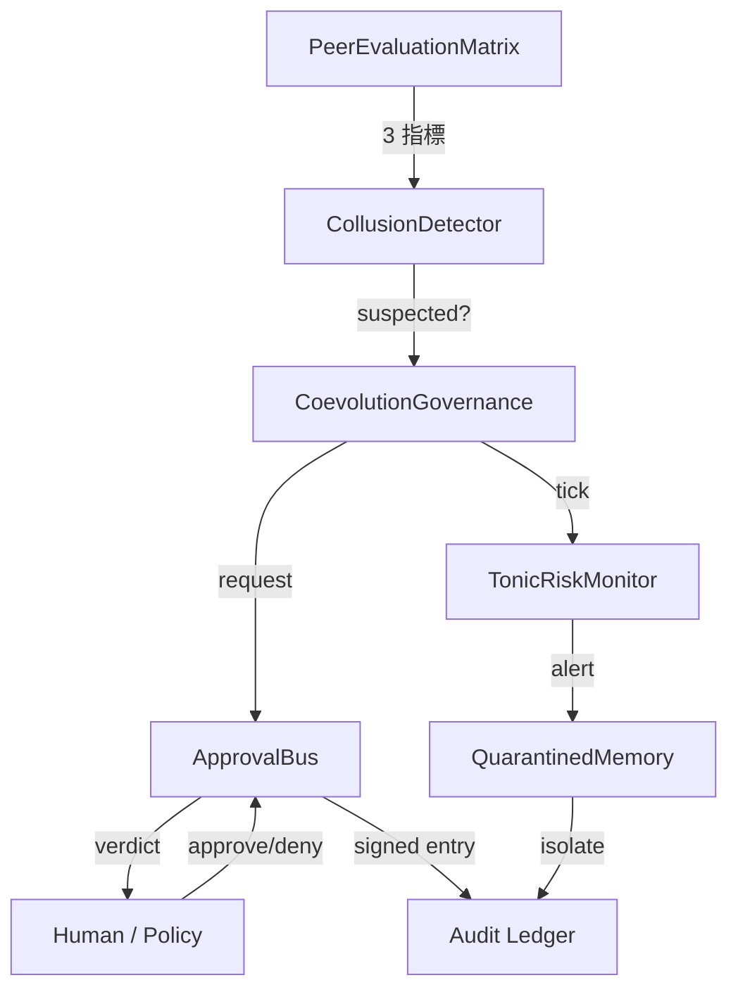

# llive 技術連載 #24-07 — 「審査つき AI」: runtime_metadata × Approval Bus × Ed25519 audit chain

> **コンセプト hook**: 多くの LLM agent は「結果のログ」しか残さない. しかし
> AI が **自分自身を進化** させはじめると, 「**いつ何を判断して何を変えたか**」
> の audit trail が無いと, **後でデバッグ不能** になる. llive はこれを
> architecture level で解いた:
> - **runtime_metadata** = 1 推論ごとの構造化 metadata
> - **Approval Bus** = 重大変更を ledger 経由で human / policy が approve
> - **Ed25519 + SHA-256 audit chain** = ledger 改ざん防止
> - **本日 (2026-05-21) 着地の E.4 governance** = 集団進化の共謀検出 → Approval Bus 連携
> 
> = **「自己進化する AI が, 自分の決定を全て署名つきで残す」** という珍しい形.

> **draft 段階** (2026-05-21 marathon). full 10x volume 版は次セッション.

## 0. 連載中での位置づけ

```
#24-00 series index
#24-01 4 層メモリ
#24-02 思考因子 × COG-MESH
#24-03 構造進化 × TRIZ × Z3
#24-04 B-series
#24-05 EvolutionLoop
#24-06 LLM backend non-transformer
#24-07 observability + governance (← 本記事)
#24-08 lleval
```

#24-03 の Z3 verifier が「**個体内**の構造変更を機械検証」だとすると, #24-07
は「**個体間**の挙動 + 個体集団の決定を audit trail で保存」. 検証と監査の
両輪.

## 1. なぜ Audit Chain が必須か

LLM agent が自分自身を書き換えはじめると, 「**さっきの推論は何 commit の
構造で動いていたか**」が分からなくなる. これは debugging だけでなく:

- **責任追跡** — 集団進化で「**全派生が嘘の高得点を付け合った**」とき, 誰が
  最初に嘘をついたかを ledger で遡れる必要がある.
- **再現性** — 「あのとき出た結果」を後で再生するには構造 commit + memory
  zone + Brief input + Approval verdict の全て record が要る.
- **法的 compliance** — EU AI Act / 中国 AI 弁法 / 日本 G7 広島 process が
  示す方向は「**AI の決定は audit possible でなければならない**」.

llive は Phase 4 (Production Security MVR, v0.3.0) でこの 3 つを **同時に**
解いた.

## 2. runtime_metadata — 1 推論あたりの構造化 trace

llive の `FitnessReport.runtime_metadata` は free-form dict[str, str] だが
慣習的に以下を入れる:

- `signed_by`: peer evaluation の署名者 id
- `gen`: 世代番号
- `agg`: aggregator strategy
- `commit_sha`: ソース commit (CI 経由で注入)
- `model_id`: 使用 LLM backend id

これにより 1 推論結果から **完全に再現** できる. 再現性は **OSS LLM
inference の標準ではない** — 多くの agent は seed すら記録しない.

## 3. Approval Bus — 構造的に変更を止める

`src/llive/approval/bus.py` の `ApprovalBus`:

- `request(action, payload, ...)` → pending リストに入る.
- `policy` が事前評価して `Verdict.APPROVED / DENIED / None` を返す.
  None なら人手待ち.
- 人手 / policy の verdict は `_ledger: list[ApprovalResponse]` に append.
- `ledger=SqliteLedger` を渡せば永続化 + 復元.

これは **架空の「Trust Score」** ではなく **明示的な APPROVED/DENIED 状態
マシン**. 沈黙 = denial (§AB4). 「曖昧な許可」が存在しない.

### 3.1 本日着地の E.4 governance 連携

`CoevolutionGovernance.evaluate_generation` (本日着地) が 1 世代の peer
matrix を見て **共謀疑い** → `ApprovalBus.request("coevolution.suspected_collusion",
payload)` を発火. payload には generation / collusion_score / n_agents.
人手が deny したら **その世代の派生集団は採用されない** という architecture
level の制御.

これは Constitutional AI / RLHF の **human-in-the-loop** を, **architecture
level** で代替する設計. 「prompt 最後に <human_review> を加える」のような
弱い制御ではない.

## 4. Ed25519 + SHA-256 audit chain

`src/llive/security/` 系. Phase 4 着地.

- 各 PeerEvaluationMatrix / ChangeOp / consolidation event は Ed25519 で
  **署名**.
- ledger に書き込むときに **直前の hash** を含めて SHA-256 を計算 → next
  block の prev_hash として使う. つまり **blockchain-light**.
- これにより「過去の任意の record を改ざんすると, それ以降の hash が全て
  ずれる」 → 改ざん即検出.

### 4.1 なぜ on-chain ではなく on-disk か

[[project_fullsense_ear_origin]] — llive は EAR + セキュリティ制約で
**外部送信不可** の環境を想定. on-chain (Ethereum / Solana) は外部送信に
なるため不適. on-disk audit chain は外部依存ゼロで完結する.

## 5. honest disclosure

- **Ed25519 鍵管理は未解決** — 鍵を OS の secure store / HSM に保存する
  module は未着地. 現状は環境変数 / file 経由でロード. これは v1.0 前に
  解決必須.
- **Approval Bus の人手介在は scale しない** — 派生集団 N=64 で 1 世代毎に
  approval が出ると人手の負荷が 24 時間で破綻する. policy 自動評価で 80% を
  通すのが現実解だが, policy が完璧に書ける保証はない.
- **runtime_metadata の sign は optional** — `signed_by` フィールドは
  慣習だが mandatory ではない. これを mandatory にすると `Brief API` の
  互換が壊れる. 移行は v0.7 以降.

## 6. 本日 (2026-05-21) 着地サマリ

| 項目 | 状態 |
|---|---|
| `CoevolutionGovernance` skeleton | **本日着地** |
| `CollusionDetector` (CE-06) | **本日着地** |
| `collusion_risk_score` (TonicRisk 連携, CE-08) | **本日着地** |
| `GovernanceReport` (frozen) | **本日着地** |
| 28 ケース test PASS | **本日着地** |
| Ed25519 audit chain | Phase 4 着地済 (v0.3.0) |
| Approval Bus | C-1 着地済 (2026-05-16) |
| runtime_metadata 慣習 | v0.B から運用中 |

## 7. Mermaid — governance 全体像



## 8. 期待値 — 次に来るもの

- **HSM / secure store 連携** — Ed25519 鍵管理を v1.0 で. Windows Credential
  Store / macOS Keychain / Linux Keyring 経路.
- **policy 自動 evaluate の拡充** — Approval Bus の `policy` 引数で 80% を
  自動通過させる規則を v0.7 で.
- **Audit Ledger UI** — llove TUI で `governance verdict ledger` を時系列
  可視化. F25 連携.

---

> draft (10x volume 版は次セッション). 骨子 + 7 main section + Mermaid +
> honest disclosure 3 件.
