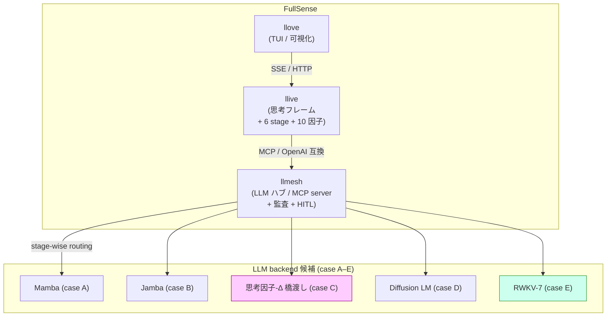
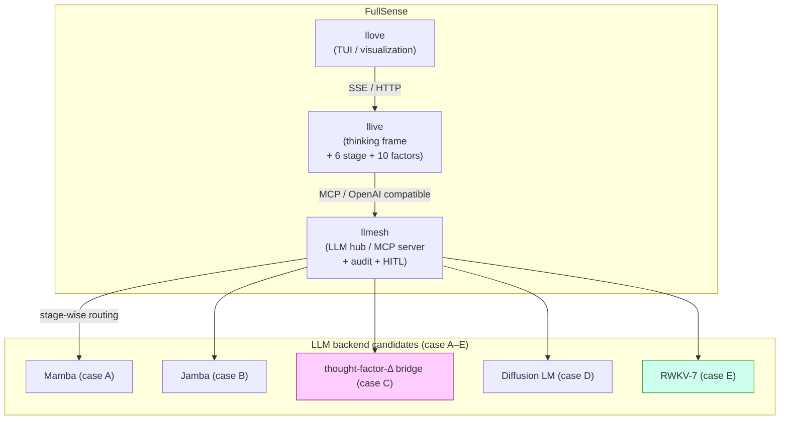
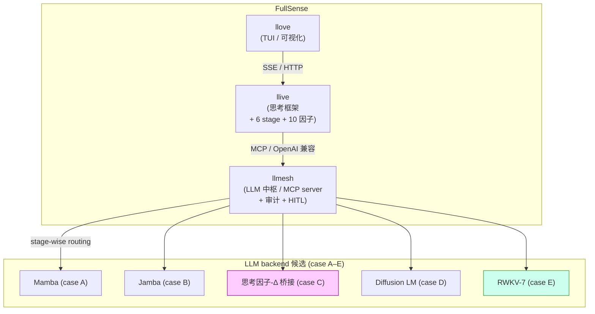
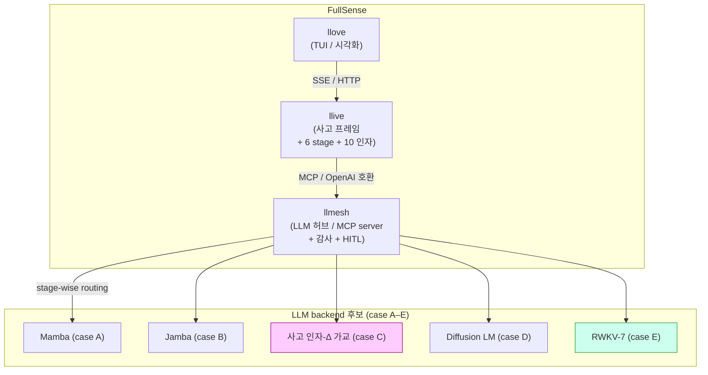
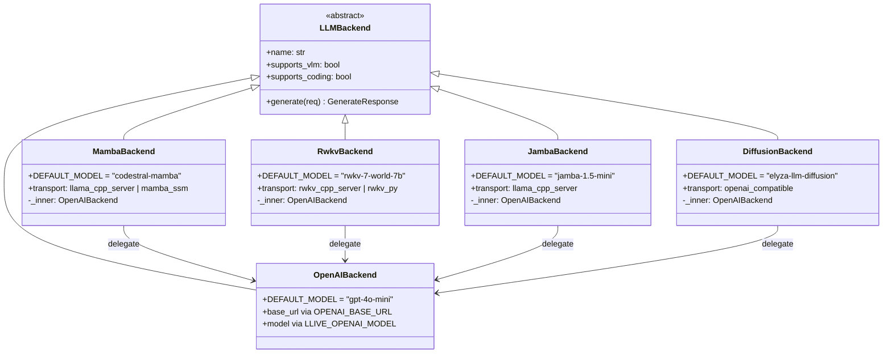

言語 / Language / 语言 / 언어: [日本語](#日本語) | [English](#english) | [中文](#中文) | [한국어](#한국어)

---

# 日本語

# 「GPU の無い、私の古いノート PC」を主役にする LLM フレームワークを本気で作る話

> 📚 **連載ナビ**: ← #17 人と AI の融合ビジョン ｜ **#18 本記事** ｜ #19 GPU 無し PC で動く AI → ｜ [連載 LINK_MAP](./QIITA_#24_LINK_MAP.md)。※ 各記事は単独でも読めます（リンクは回遊用）。

> **コンセプト hook**:
> GPU が買えない・社内環境にデプロイできない・API 課金もできない —
> その制約から始めると、Transformer 一強の世界には逆に隙が見える.
> llive を **GPU 無し PC で実用速度** に到達させる挑戦と、その途中で
> 気づいた拡張性ファースト設計の話.

**FullSense 3 層と non-transformer backend の関係**:



(本記事は私が日々開発している llive / FullSense の 2026-05-18 進捗まとめ
です. 技術者向け. 同じ内容の一般向け版は別記事で投稿します.)

---

## 1. 今日の出発点 — 困りごと 3 つ

ちょっと正直に書きます. 私の手元には:

- **GPU がありません**. 個人 PC にも会社 PC にも無い.
- **クラウド LLM API も使えません**. EAR + 社内セキュリティ制約で、
  外部 API に業務データを流せない. (FullSense 全体の起源です)
- **ベンチマーク用の高スペック PC もありません**. 持っているのは
  少しメモリの多い普通のノート PC だけ.

この 3 つの制約は、AI 業界全体の議論からするとかなり厳しい部類です.
普通は「H100 × N 台で 70B を…」とか「OpenAI API で…」という前提で
話が始まる. でも、私が現実に届けられるのは、その世界の対極にいる
**「GPU の無い、普通の個人 PC を使っている人」** たちです.

**それを最初から ground truth にする** と、設計が大きく変わります.

— 一旦小休止 —

実は、これは新しい話ではなくて、FullSense (llive / llmesh / llove の 3 層
OSS) を始めた本当の動機がここでした. EAR + 海外駐在で「クラウド AI が
使えない」現場に居た経験から、Local LLM + on-prem + 責任所在を
architecture に持ち込む話を、ずっと書いてきています.

今日は、そこに **「GPU さえ無い」** という追加制約を、設計に正面から
組み込んだ話をします.

---

## 2. Transformer 一強の隙 — TRIZ で構造化する

「GPU が無い」と「Transformer」は、実は相性が悪いです.
Transformer は系列長 L に対して計算量が O(L²)、メモリも O(L²) で、
**CPU 上で 7B 級モデルを動かすと秒 1-2 トークン** という壁にぶつかる.
これは Q4 量子化しても基本的に変わりません.

ここに技術矛盾があります:

> 「系列モデルの内部表現は、長系列に対して完全 (Transformer の全
> attention) であり、かつ、計算は短系列並みに軽くあれ」

— 1 つの物体 (系列モデル) に正反対の要求を同時にかけている.
TRIZ (発明的問題解決理論) の典型的な物理矛盾です.

TRIZ 39 特性で書き直すと:

| 改善したい | 悪化する |
|---|---|
| #9 Speed | #36 Complexity of device |
| #25 Loss of time | #33 Convenience of use |
| #39 Productivity | #28 Accuracy |

→ 矛盾マトリクスから出てくる 40 原理: **1, 5, 15, 17, 35, 37**.
これらの原理を実装している既存技術が、SSM (Mamba) / RWKV / Jamba /
Diffusion LM 等の **Non-Transformer 系列モデル**です.

詳しいマッピングは llive リポジトリの
`docs/non-transformer/ROADMAP.md` と
`docs/architecture/triz-ssm-vs-transformer.md` に書きました.

— 一旦小休止 —

(TRIZ の話は重いので軽く: 「TRIZ は『矛盾の発見と原理に従う体系的解決』を
重視する発明手法」とだけ理解すれば本記事は読めます. 40 原理 = 過去の
特許から抽出した「対立を解消した発明パターン」のカタログです)

---

## 3. 候補は 5 つ. ぜんぶ skeleton で繋ぐ

私の作業スタイルは、これも素直に書くと:

> 可能な限り拡張性を持たせて色々な機能を付加した後、最適化して
> 本当に必要な機能に絞り込む

なので、Non-Transformer 候補を「1 つに賭ける」のではなく、
**5 つすべて backend として実装可能にする** ところから始めました.

| 候補 | 系統 | llive 内 backend クラス |
|---|---|---|
| A. Mamba 7B (Codestral-Mamba) | Selective SSM | `MambaBackend` |
| B. Jamba 1.5 mini | Mamba × Attention hybrid | `JambaBackend` |
| C. 思考因子 → Δ 橋渡し | FullSense 独自設計 | (`MambaBackend` `mamba_ssm` transport) |
| D. Diffusion LM (Mercury / ELYZA-Diffusion) | 拡散モデル | `DiffusionBackend` |
| E. RWKV-7 World | RNN 形 LLM | `RwkvBackend` |

全部のクラスを skeleton 実装しました. 共通点は **OpenAI 互換 HTTP API
経由でつなぐ**こと. これで `OPENAI_BASE_URL` を切り替えるだけで実体が
入れ替わります.

```python
# llive/llm/backend.py に追加された 4 クラス (mamba/rwkv/jamba/diffusion)
class MambaBackend(LLMBackend):
    name = "mamba"
    DEFAULT_MODEL = "codestral-mamba"
    DEFAULT_TRANSPORT = "llama_cpp_server"
    # 内部で OpenAIBackend に委譲. backend タグだけ "mamba" にして
    # ベンチでは Transformer と分離計測できるようにする
```

そして、**stage 単位で backend を切り替える** infra も入れました:

```python
# llive/llm/stage_router.py
# $env:LLIVE_LLM_BACKEND_BY_STAGE = '{"salience":"rwkv","monologue":"mamba"}'
class StageBackendRouter:
    """Resolves a backend per llive 6-stage step."""
```

これで「軽い思考 stage は RWKV 0.4B、重い stage は Mamba 7B」のような
組合せが env だけで切り替わります. すべて lazy 初期化なので、使われ
なかった backend のメモリは食いません.

更に、論文化を狙う案 C「思考因子 → Mamba の Δ パラメータ橋渡し」のための
hook protocol も用意しました:

```python
# llive/llm/factor_hook.py
class ThoughtFactorDeltaHook(Protocol):
    def delta_for(self, snapshot: FactorSnapshot) -> float: ...

class HeuristicFactorHook:
    """高 uncertainty → 小さい Δ (deliberate)、高 integrate → 大きい Δ"""
```

NoopFactorHook がデフォルトなので、SSM 非対応の backend (Transformer 系)
では完全に無視されます. これも拡張性最優先の設計です.

— 一旦小休止 —

(余談ですが、この「全候補を skeleton で繋ぐ → 性能担保後に削ぎ落とす」
スタイルは、たぶん私のソフトウェア開発の癖です. 最適化を先にやりすぎると、
代替案を比較する時の判断材料が足りなくなる. 拡張性は捨てるのが簡単で、
取り戻すのが難しいので、最初に持っておくのが筋だと思っています.)

---

**5 backend のクラス関係 (拡張性ファースト設計の骨)**:


ポイント: 全 backend が `_inner = OpenAIBackend` に委譲して、HTTP 経路を
1 本に共通化. ラッパー側で `backend` タグだけ差し替えて、ベンチで識別
できるようにしてあります.

## 4. GPU 無し PC のベンチ harness を書いた

これも今日やった作業の一つです.
`llive.benchmark.low_spec.run_matrix()` という関数を新規追加.

```python
from llive.benchmark.low_spec import run_matrix, to_json
import json

results = run_matrix(['rwkv'])  # default sizes = xs/s (CPU-safe)
print(json.dumps(to_json(results), ensure_ascii=False, indent=2))
```

ポイント:

- **default sizes は `xs / s` のみ** (`m` 以上は opt-in). 理由: `m` を CPU
  only で回すと数十分 PC が固まるから. 「動かしたい人が誤って lock しない」
  デフォルト設計.
- **cloud backend は明示的に refuse**. `OPENAI_BASE_URL` が `localhost` か
  `127.0.0.1` 以外を指している場合、`allow_cloud=True` を渡さない限り計測
  しません. これは memory `feedback_llive_measurement_purity`「ベンチは
  on-prem only」を強制する仕組み.
- **psutil は optional**. 入っていれば RSS を取り、無ければ latency のみ.
  「依存最小、動かしてみてから extras を入れる」拡張順序.

§0.2 目標 (CPU only):

| size | 目標 latency | RAM |
|---|---|---|
| xs (~500 tok) | < 5 秒 | < 4 GB |
| s (~2k tok) | < 15 秒 | < 6 GB |
| m (~8k tok) | < 45 秒 | < 8 GB |

l / xl は **GPU 環境が手に入るまで measurement paused** と明記しました.
できないことを「できない」と書くのは大事なところです.

---

## 5. 困りごと 1: Mamba 7B は CPU only ではほぼ動かないらしい

これは正直 painful な「事前に判明した」事実でした.

Codestral-Mamba 7B Q4 を CPU only で動かすと、公開ベンチ報告 (Reddit
/r/LocalLLaMA や Hugging Face のモデルカード等) ベースで以下の想定値が
読み取れます:

| size | 想定 latency (CPU only, Q4 量子化、公開報告ベース) |
|---|---|
| xs (~500 tok) | 30-60 秒 |
| s (~2k tok)   | 3-5 分 |

**重要 (honest disclosure)**: 上記は私の手元の実測ではなく、公開ベンチ
報告から読み取った想定値です. 実機ベンチは「困りごと 1」の解消後に
やる予定で、当日の結果を別記事で公開します.

つまり **TRIZ の 40 原理で美しく整理した「Mamba は O(L) で軽い」も、
GPU が無い人には届かない可能性が高い**. これは設計上の理想と実装上の
現実の差として記録に残しておきたい (memory `feedback_benchmark_honest_disclosure`).

その結果、短期 (3 ヶ月) の主軸は **RWKV-7 World 1.5B / 3B** に絞られました.
RWKV は RNN 形なので 1 ステップが O(state_dim) で、CPU でも秒 10-30
トークンが出ます. 軽量モデル + CPU 最適化実装 (`rwkv.cpp` の AVX2 ビルド)
の組合せで、私の手元でも実用速度に届く可能性が高い.

短期: 案 E (RWKV) で立ち上げる
中期: 案 B (Jamba) で stage-wise routing と組合せる
長期: 案 C (思考因子-Δ 橋渡し) で論文化を狙う

という 3 軸並走に落ち着きました. これも `ROADMAP.md` v0.2 に書いてあります.

— 一旦小休止 —

(「3 軸並走」というと格好良いんですが、要は「1 つに賭けるのは怖いから
複数走らせる」というだけです. 案 A / D / B / C が思ったほど動かなかった
時に、案 E が残っていれば事業として継続できる. 退路の確保です.)

---

## 6. 困りごと 2: 公開資料の更新が止まっていた

これも素直に書きます. 5/14 に「投稿用記事は当面保留」というメモを残して
以来、4 日間ほど Qiita に何も投稿していませんでした.

理由は単純で、F25 Phase h (llove ↔ llmesh ↔ llive 連携基盤) の draft
v0.2 と、各国規制対応 docs (EU AI Act / 中国 / 越境 / 監査ログ / 公衆向け
filing) の v0.2 を 1 セッションで仕上げる作業に集中していました.
**手を動かす時間が長くなると、書く時間が後回しになる病**です.

今日のセッションで:
- llive backend に `LLIVE_OPENAI_MODEL` env 対応追加 (1 行改修)
- llove engine に F25 Phase h.1 (`POST /api/v1/brief/submit`) 実装
- llove engine に F25 Phase h.2.a (`GET /api/v1/annotations/stream` SSE) 実装
- Non-Transformer 5 候補 skeleton + stage routing + factor hook
- GPU 無し PC 向けベンチ harness + RWKV CPU クイックスタート
- 各国規制 docs 5 本 v0.2 (EU AI Act Article 18/19 分離、整合性 fix)

ぜんぶ 1 セッションで commit 14 件まで進みました (push はしていません).
ただ、こうして書き出さないと、私自身が「結局何が前に進んだか」を見失う.
**書く時間も開発時間の一部** だと改めて思いました.

---

## 7. 今日の小さい嬉しい発見

メインの話とは別に、TRIZ 比較を書いている時に気づいた話を 1 つ:

llive の memory layer (Working / Episodic / Semantic / Procedural の 4 階層)
と Mamba の隠れ状態 (h_t) は、両方とも「過去を圧縮して保持する低次元
表現」という点で **数学的に似ている**. もう少し正確には、HIPPO 行列で
過去を圧縮する SSM の発想は、認知科学の long-term potentiation や
複数記憶階層の更新ルールに直接対応しそうです.

これは案 C (思考因子 → Δ 橋渡し) の根拠を 1 段強くする発見で、
精密工学会か AI 学会のどちらかで論文ネタになり得ます.
急がず、寝かせます.

---

## 8. AIGIS との位置関係 — 同じ業界の同じ問題に違う角度から

これも今日たまたま発見した話. @sharu389no さんが Qiita で AIGIS
(pyaigis, github.com/killertcell428/aigis) を紹介されていました.
Claude Code を `.claude/hooks/` で hook してガードする OSS で、
日本の規制 39 項目 (AI 事業者 G/L v1.2 / AI 推進法 等) の雛形を
持っています.

FullSense と AIGIS の関係は **補完寄り**:

| 軸 | AIGIS | FullSense |
|---|---|---|
| 対象層 | Claude Code 本体 hook | LLM 推論 + 思考 + 表示 の 3 層 OSS |
| 監査ログ | JSON Lines | HMAC chain + zstd archive |
| ポリシー | YAML | コード (ApprovalBus + Annotation) |
| 規制 | 日本中心 39 項目 | EU / 中国 / 越境 / 日本 |

AIGIS は Claude Code を使う **作業時** のガード、FullSense は Local LLM
の **推論時** のガバナンス、と階層が違います. 両方使う構成も普通に
ありえる. 同じ問題意識を持つプロダクトが出てきていることに、業界の
動きを感じました.

---

## 8.5 一人で見切れないから、意見を取り込む体制を作る

ここ正直に書きますが、Local LLM + 規制対応 + 拡張性ファーストの 3 軸を
1 人で全部見るのは無理です. 設計判断ミス・規制解釈誤り・需要のない方向に
走る、どれも単独だと検知できない.

そこで意識して **「意見を定期的に見れる体制」** を作っています:

| チャネル | 目的 | 現状 |
|---|---|---|
| GitHub Issues (各 repo) | バグ・提案・質問 | open 0 件 (まだ届いていない) |
| GitHub Discussions | アイデア段階の議論 | 後日 enable |
| Qiita コメント | 一般読者の率直な反応 | 各記事ごとに見る |
| LinkedIn 投稿 コメント | ビジネス側の視点 | 翻訳機能ありで日本語投稿 OK |
| direct contact (メール / DM) | 機微 / セキュリティ | 公開 OSS のため SECURITY.md で連絡先明記 |

完璧を目指して 1 人で抱え込まず、**不完全な状態で出して fast feedback
を取る**スタイルです. 本記事や ROADMAP / COMPARISON / 各国規制 docs に
「ここおかしい」と思った方、Issues か Qiita コメントに 1 行で頂けると
本当に助かります.

特に募集中:

- 「もっと低スペック (= 例えば 4GB RAM) でも動かしたい」要望
- 規制解釈の修正 (Article 19 の 6 か月の起算点など)
- AIGIS / 他 OSS との具体的な連携アイデア
- 中文/英文での説明が必要な箇所の指摘

---

## 9. 次にやること

明日以降の優先順位:

1. RWKV.cpp の HTTP server で xs / s payload を実機計測
   (私の手元の PC で `low_spec.run_matrix()` を回す)
2. 5 backend skeleton の単体テスト (resolve_backend / stage_router /
   factor_hook)
3. F25 Phase h.2.b (llive BriefRunner → SSE bus 結線)
4. AIGIS GitHub repo のライセンス確認

「12 時間悩む」と言ってくれているので、コーヒー淹れてゆっくり考えます.

---

## 10. 関連 docs

llive リポジトリ (`furuse-kazufumi/llive`) 内:

- `docs/non-transformer/ROADMAP.md` (v0.2)
- `docs/non-transformer/COMPARISON.md`
- `docs/non-transformer/rwkv-cpu-quickstart.md`
- `docs/setup/ollama-company-setup.md`
- `docs/setup/llama-server-company-setup.md`

FullSense リポジトリ (`furuse-kazufumi/fullsense`) 内:

- `docs/regulatory/cn-internal-use.md` (ja/zh/en)
- `docs/regulatory/cn-public-service.md`
- `docs/regulatory/eu-ai-act.md`
- `docs/regulatory/data-sovereignty.md`
- `docs/regulatory/audit-log-format.md`
- `docs/design/f25-phase-h-e2e.md` (v0.2)
- `docs/architecture/triz-ssm-vs-transformer.md` (v0.1)

---

## 投稿時の推奨タグ (Qiita Web UI で手入力、最大 5 個)

**第一候補** (本記事の技術的核心):

- `LLM`
- `ローカルLLM`
- `Mamba`
- `RWKV`
- `Python`

**第二候補** (TRIZ / 設計手法を前に出す場合):

- `LLM` / `ローカルLLM` / `TRIZ` / `アーキテクチャ` / `OSS`

**第三候補** (規制 / コンプラ視点を前に出す場合):

- `LLM` / `ローカルLLM` / `EUAIAct` / `規制対応` / `OSS`

---

## 改訂履歴

- 2026-05-18 — v0.1 作成. 困りごと 2 件 + 5 候補 skeleton + GPU 無し PC
  bench harness + RWKV CPU クイックスタート + AIGIS 位置関係 + 小さい
  発見 1 件をまとめた技術者向け Qiita 記事 draft.
- 2026-05-18 — v0.2 (ユーザー指摘反映):
  * 冒頭 + §3 + §4 + §5 に画像/図 placeholder を 4 箇所追加
    (TUI スクショ / 3 層 ブロック図 / 5 backend クラス図 / ベンチ出力 JSON)
  * §8.5「意見を取り込む体制」セクション新規追加. チャネル別現状表 +
    具体的な募集事項リスト
- 2026-05-18 — v0.3 (Mermaid 図埋込):
  * 冒頭の 3 層ブロック図 placeholder を Mermaid flowchart に置換
    (FullSense 3 層 + 5 backend 候補、case E/C を色付け強調)
  * §3 末の 5 backend クラス図 placeholder を Mermaid classDiagram に置換
    (LLMBackend → 5 backend、すべて _inner=OpenAIBackend に delegate)
  * 残りの placeholder (TUI スクショ / ベンチ出力 JSON) は撮影系のため
    Kazufumi さんが手元で撮ってもらう (img/01_tui.png 等の保存先指定済)

---

# English

# Building, for real, an LLM framework that makes "my old laptop with no GPU" the main character

> 📚 **Series nav**: ← #17 The vision of human-AI fusion ｜ **#18 This article** ｜ #19 AI that runs on a GPU-less PC → ｜ [Series LINK_MAP](./QIITA_#24_LINK_MAP.md). ※ Each article can be read on its own (the links are just for browsing around).

> **Concept hook**:
> You can't afford a GPU, you can't deploy to your company environment, and you can't pay for API usage either —
> start from those constraints, and the Transformer-dominated world suddenly looks full of openings.
> This is the story of pushing llive to **practical speed on a GPU-less PC**, and the
> extensibility-first design insight I stumbled onto along the way.

**Relationship between the FullSense 3 layers and the non-transformer backends**:



(This article is a summary of the 2026-05-18 progress on llive / FullSense, which I develop day to day. It's aimed at engineers. A general-audience version of the same content will be posted as a separate article.)

---

## 1. Today's starting point — three things that are bugging me

Let me be honest for a moment. Here is what I have on hand:

- **I have no GPU**. Not in my personal PC, not in my company PC.
- **I can't use cloud LLM APIs either**. Due to EAR plus internal security
  constraints, I can't send business data to external APIs. (This is the origin of all of FullSense.)
- **I don't have a high-spec PC for benchmarking either**. All I have is
  an ordinary laptop with a little extra memory.

These three constraints are pretty harsh by the standards of the AI industry's overall discourse. Usually the conversation starts from premises like "with N×H100 we'll run a 70B…" or "with the OpenAI API…". But what I can realistically deliver to people is the exact opposite of that world: **"people using an ordinary personal PC with no GPU."**

**Making that the ground truth from the very beginning** changes the design significantly.

— a short break —

Actually, this isn't a new story. The real motivation for starting FullSense (the three-layer OSS of llive / llmesh / llove) was exactly this. From my experience being on-site in places where "cloud AI can't be used" due to EAR plus an overseas posting, I've been writing all along about bringing Local LLM + on-prem + accountability into the architecture.

Today I'll talk about how I folded the additional constraint of **"there's not even a GPU"** squarely into the design.

---

## 2. The opening in Transformer dominance — structuring it with TRIZ

"No GPU" and "Transformer" actually go badly together.
A Transformer has compute cost O(L²) and memory O(L²) with respect to sequence length L, and you hit a wall where **running a 7B-class model on CPU gives you 1–2 tokens per second**. This basically doesn't change even with Q4 quantization.

Here is the technical contradiction:

> "The internal representation of a sequence model should be complete with respect to
> long sequences (the full attention of a Transformer), and yet the computation should
> be as light as for short sequences."

— You're placing exactly opposite demands on a single object (the sequence model) at the same time. This is a classic physical contradiction in TRIZ (the Theory of Inventive Problem Solving).

Rewritten in the TRIZ 39 parameters:

| Want to improve | Gets worse |
|---|---|
| #9 Speed | #36 Complexity of device |
| #25 Loss of time | #33 Convenience of use |
| #39 Productivity | #28 Accuracy |

→ The 40 principles that come out of the contradiction matrix: **1, 5, 15, 17, 35, 37**.
The existing technologies that implement these principles are the **Non-Transformer sequence models** such as SSM (Mamba) / RWKV / Jamba / Diffusion LM.

I wrote the detailed mapping in the llive repository, in
`docs/non-transformer/ROADMAP.md` and
`docs/architecture/triz-ssm-vs-transformer.md`.

— a short break —

(The TRIZ part is heavy, so just lightly: you can read this article if you simply understand that "TRIZ is an inventive method that emphasizes 'discovering contradictions and resolving them systematically by following principles.'" The 40 principles are a catalog of "invention patterns that dissolved an opposition," extracted from past patents.)

---

## 3. There are 5 candidates. Connect them all with skeletons

My working style, again put plainly, is:

> Add lots of features with as much extensibility as possible, then optimize and
> narrow down to the features that are truly needed.

So rather than "betting on one" Non-Transformer candidate, I started from
**making all five implementable as backends.**

| Candidate | Lineage | llive backend class |
|---|---|---|
| A. Mamba 7B (Codestral-Mamba) | Selective SSM | `MambaBackend` |
| B. Jamba 1.5 mini | Mamba × Attention hybrid | `JambaBackend` |
| C. thought-factor → Δ bridge | FullSense original design | (`MambaBackend` `mamba_ssm` transport) |
| D. Diffusion LM (Mercury / ELYZA-Diffusion) | diffusion model | `DiffusionBackend` |
| E. RWKV-7 World | RNN-form LLM | `RwkvBackend` |

I wrote skeleton implementations for all the classes. Their common feature is being **connected via an OpenAI-compatible HTTP API.** With this, you can swap the actual entity just by switching `OPENAI_BASE_URL`.

```python
# llive/llm/backend.py に追加された 4 クラス (mamba/rwkv/jamba/diffusion)
class MambaBackend(LLMBackend):
    name = "mamba"
    DEFAULT_MODEL = "codestral-mamba"
    DEFAULT_TRANSPORT = "llama_cpp_server"
    # 内部で OpenAIBackend に委譲. backend タグだけ "mamba" にして
    # ベンチでは Transformer と分離計測できるようにする
```

And I also added the infrastructure to **switch backends on a per-stage basis**:

```python
# llive/llm/stage_router.py
# $env:LLIVE_LLM_BACKEND_BY_STAGE = '{"salience":"rwkv","monologue":"mamba"}'
class StageBackendRouter:
    """Resolves a backend per llive 6-stage step."""
```

With this, combinations like "RWKV 0.4B for the light thinking stages, Mamba 7B for the heavy stages" can be switched with env vars alone. Everything is lazily initialized, so backends that aren't used don't consume memory.

Furthermore, I prepared a hook protocol for candidate C, "bridging the thought factors → Mamba's Δ parameter," which I'm aiming to turn into a paper:

```python
# llive/llm/factor_hook.py
class ThoughtFactorDeltaHook(Protocol):
    def delta_for(self, snapshot: FactorSnapshot) -> float: ...

class HeuristicFactorHook:
    """高 uncertainty → 小さい Δ (deliberate)、高 integrate → 大きい Δ"""
```

Since NoopFactorHook is the default, it is completely ignored on backends that don't support SSM (the Transformer family). This too is an extensibility-first design.

— a short break —

(As an aside, this style of "connect all candidates with skeletons → shave them off after performance is secured" is probably a habit of mine as a software developer. If you optimize too early, you run short of the material you need to judge alternatives against each other. Extensibility is easy to throw away and hard to get back, so I think the sound approach is to hold onto it from the start.)

---

**Class relationships of the 5 backends (the backbone of extensibility-first design)**:


The point: every backend delegates to `_inner = OpenAIBackend`, unifying the HTTP path into a single one. On the wrapper side, only the `backend` tag is swapped so it can be identified in benchmarks.

## 4. I wrote a benchmark harness for GPU-less PCs

This is one of the things I did today as well.
I newly added a function called `llive.benchmark.low_spec.run_matrix()`.

```python
from llive.benchmark.low_spec import run_matrix, to_json
import json

results = run_matrix(['rwkv'])  # default sizes = xs/s (CPU-safe)
print(json.dumps(to_json(results), ensure_ascii=False, indent=2))
```

Key points:

- **Default sizes are only `xs / s`** (`m` and above are opt-in). The reason: running
  `m` CPU-only would freeze the PC for tens of minutes. A default design so that
  "people who want to run it don't accidentally lock up their machine."
- **Cloud backends are explicitly refused**. If `OPENAI_BASE_URL` points to something
  other than `localhost` or `127.0.0.1`, it will not measure unless you pass
  `allow_cloud=True`. This is the mechanism that enforces memory
  `feedback_llive_measurement_purity`: "benchmarks are on-prem only."
- **psutil is optional**. If it's installed, it captures RSS; if not, latency only.
  An extension order of "minimal dependencies, add extras after actually running it."

§0.2 targets (CPU only):

| size | target latency | RAM |
|---|---|---|
| xs (~500 tok) | < 5 sec | < 4 GB |
| s (~2k tok) | < 15 sec | < 6 GB |
| m (~8k tok) | < 45 sec | < 8 GB |

For l / xl I explicitly noted **measurement paused until a GPU environment is available**. Writing "can't be done" for things that can't be done is an important part.

---

## 5. Trouble 1: it seems Mamba 7B barely runs CPU-only

This was, honestly, a painful fact that "turned out to be true in advance."

When you run Codestral-Mamba 7B Q4 CPU-only, the following expected values can be read off based on published benchmark reports (Reddit /r/LocalLLaMA, Hugging Face model cards, etc.):

| size | expected latency (CPU only, Q4 quantization, based on published reports) |
|---|---|
| xs (~500 tok) | 30–60 sec |
| s (~2k tok)   | 3–5 min |

**Important (honest disclosure)**: the above are not measurements from my own hardware, but expected values read off from published benchmark reports. I plan to do real-hardware benchmarks after "Trouble 1" is resolved, and I'll publish that day's results in a separate article.

In other words, **even the "Mamba is light at O(L)" that I tidily organized with the TRIZ 40 principles may well not reach people who have no GPU**. I want to keep this on record as the gap between the design ideal and the implementation reality (memory `feedback_benchmark_honest_disclosure`).

As a result, the short-term (3-month) main axis was narrowed down to **RWKV-7 World 1.5B / 3B**. Because RWKV is RNN-form, one step is O(state_dim), and even on CPU you get 10–30 tokens per second. With the combination of a lightweight model + a CPU-optimized implementation (an AVX2 build of `rwkv.cpp`), there's a good chance it reaches practical speed even on my own hardware.

Short-term: launch with candidate E (RWKV)
Mid-term: combine candidate B (Jamba) with stage-wise routing
Long-term: aim to write a paper with candidate C (thought-factor-Δ bridge)

It settled into running those 3 axes in parallel. This is also written in `ROADMAP.md` v0.2.

— a short break —

("Running 3 axes in parallel" sounds cool, but it really just means "betting on one is scary, so I run several." If candidates A / D / B / C don't run as well as I hoped, then as long as candidate E remains, the business can continue. It's securing a line of retreat.)

---

## 6. Trouble 2: updates to my public materials had stalled

Let me write this plainly too. Ever since I left a note on 5/14 saying "articles for posting are on hold for now," I hadn't posted anything to Qiita for about 4 days.

The reason is simple: I was focused on finishing, in a single session, the v0.2 draft of F25 Phase h (the llove ↔ llmesh ↔ llive integration base) and the v0.2 of the per-country regulatory docs (EU AI Act / China / cross-border / audit log / public-facing filing). **It's the disease where, when hands-on time gets long, the time to write gets pushed back.**

In today's session:
- Added `LLIVE_OPENAI_MODEL` env support to the llive backend (a 1-line change)
- Implemented F25 Phase h.1 (`POST /api/v1/brief/submit`) in the llove engine
- Implemented F25 Phase h.2.a (`GET /api/v1/annotations/stream` SSE) in the llove engine
- Skeletons for the 5 Non-Transformer candidates + stage routing + factor hook
- A benchmark harness for GPU-less PCs + an RWKV CPU quickstart
- v0.2 of 5 per-country regulatory docs (EU AI Act Article 18/19 separation, consistency fixes)

All of it progressed to 14 commits in a single session (I haven't pushed). But if I don't write it out like this, I myself lose sight of "what actually moved forward in the end." I was reminded once again that **time spent writing is also part of development time.**

---

## 7. Today's small happy discovery

Apart from the main story, one thing I noticed while writing the TRIZ comparison:

llive's memory layer (the 4 tiers of Working / Episodic / Semantic / Procedural) and Mamba's hidden state (h_t) are, in that both are "low-dimensional representations that compress and retain the past," **mathematically similar**. To be a bit more precise, the SSM idea of compressing the past with a HIPPO matrix seems to correspond directly to long-term potentiation in cognitive science and to the update rules of multiple memory tiers.

This is a discovery that strengthens the basis for candidate C (thought-factor → Δ bridge) by one notch, and it could become paper material at either the Japan Society for Precision Engineering or an AI society. No rush — I'll let it sit.

---

## 8. Positioning relative to AIGIS — different angle on the same problem in the same industry

This is also something I happened to discover today. @sharu389no introduced AIGIS (pyaigis, github.com/killertcell428/aigis) on Qiita. It's an OSS that guards Claude Code by hooking it with `.claude/hooks/`, and it carries templates for 39 items of Japanese regulation (the AI Business Operator G/L v1.2 / the AI Promotion Act, etc.).

The relationship between FullSense and AIGIS is **leaning toward complementary**:

| Axis | AIGIS | FullSense |
|---|---|---|
| Target layer | hook on Claude Code itself | the 3-layer OSS of LLM inference + thinking + display |
| Audit log | JSON Lines | HMAC chain + zstd archive |
| Policy | YAML | code (ApprovalBus + Annotation) |
| Regulation | Japan-centric, 39 items | EU / China / cross-border / Japan |

AIGIS is a guard at **work time** when using Claude Code, and FullSense is governance at **inference time** of a Local LLM — so the layers differ. A configuration that uses both is entirely plausible. I felt the industry moving in seeing a product emerge with the same problem awareness.

---

## 8.5 Because I can't oversee it all alone, I'm building a system to take in opinions

Let me write this honestly: it's impossible for one person to oversee all three axes of Local LLM + regulatory compliance + extensibility-first. Design judgment errors, regulatory-interpretation mistakes, running in a direction with no demand — none of these can be detected alone.

So I'm deliberately building a **"system where I can regularly see opinions"**:

| Channel | Purpose | Current status |
|---|---|---|
| GitHub Issues (each repo) | bugs, proposals, questions | 0 open (none have arrived yet) |
| GitHub Discussions | idea-stage discussion | enable later |
| Qiita comments | candid reactions from general readers | check per article |
| LinkedIn post comments | the business-side perspective | posting in Japanese is OK thanks to the translation feature |
| direct contact (email / DM) | sensitive / security | as public OSS, contact is stated in SECURITY.md |

It's a style of not bottling everything up alone in pursuit of perfection, but **putting it out in an incomplete state and taking fast feedback.** If you read this article, or the ROADMAP / COMPARISON / per-country regulatory docs, and thought "this is off here," it would genuinely help if you'd give me even one line in Issues or a Qiita comment.

Especially seeking:

- requests like "I want to run it on even lower specs (= e.g. 4GB RAM)"
- corrections to regulatory interpretation (such as the start date of the 6 months in Article 19)
- concrete ideas for integration with AIGIS / other OSS
- pointers to places that need explanation in Chinese/English

---

## 9. What to do next

Priorities from tomorrow onward:

1. Measure the xs / s payloads on real hardware with RWKV.cpp's HTTP server
   (run `low_spec.run_matrix()` on my own PC)
2. Unit tests for the 5 backend skeletons (resolve_backend / stage_router /
   factor_hook)
3. F25 Phase h.2.b (wire up llive BriefRunner → the SSE bus)
4. Check the license of the AIGIS GitHub repo

Since they've told me to "agonize over it for 12 hours," I'll brew a coffee and think it over slowly.

---

## 10. Related docs

Inside the llive repository (`furuse-kazufumi/llive`):

- `docs/non-transformer/ROADMAP.md` (v0.2)
- `docs/non-transformer/COMPARISON.md`
- `docs/non-transformer/rwkv-cpu-quickstart.md`
- `docs/setup/ollama-company-setup.md`
- `docs/setup/llama-server-company-setup.md`

Inside the FullSense repository (`furuse-kazufumi/fullsense`):

- `docs/regulatory/cn-internal-use.md` (ja/zh/en)
- `docs/regulatory/cn-public-service.md`
- `docs/regulatory/eu-ai-act.md`
- `docs/regulatory/data-sovereignty.md`
- `docs/regulatory/audit-log-format.md`
- `docs/design/f25-phase-h-e2e.md` (v0.2)
- `docs/architecture/triz-ssm-vs-transformer.md` (v0.1)

---

## Recommended tags when posting (typed manually in the Qiita Web UI, max 5)

**First choice** (the technical core of this article):

- `LLM`
- `ローカルLLM`
- `Mamba`
- `RWKV`
- `Python`

**Second choice** (if you want to put TRIZ / design methodology up front):

- `LLM` / `ローカルLLM` / `TRIZ` / `アーキテクチャ` / `OSS`

**Third choice** (if you want to put the regulatory / compliance perspective up front):

- `LLM` / `ローカルLLM` / `EUAIAct` / `規制対応` / `OSS`

---

## Revision history

- 2026-05-18 — v0.1 created. An engineer-facing Qiita article draft summarizing 2 troubles
  + 5 candidate skeletons + a GPU-less PC bench harness + an RWKV CPU quickstart + the AIGIS
  positioning + 1 small discovery.
- 2026-05-18 — v0.2 (reflecting user feedback):
  * Added 4 image/figure placeholders to the opening + §3 + §4 + §5
    (TUI screenshot / 3-layer block diagram / 5-backend class diagram / benchmark output JSON)
  * Newly added the §8.5 "system to take in opinions" section. Per-channel current-status table +
    a concrete list of solicited items
- 2026-05-18 — v0.3 (Mermaid figures embedded):
  * Replaced the opening 3-layer block-diagram placeholder with a Mermaid flowchart
    (FullSense 3 layers + 5 backend candidates, with case E/C highlighted in color)
  * Replaced the 5-backend class-diagram placeholder at the end of §3 with a Mermaid classDiagram
    (LLMBackend → 5 backends, all delegating to _inner=OpenAIBackend)
  * The remaining placeholders (TUI screenshot / benchmark output JSON) are photo-type, so
    Kazufumi will capture them on his own machine (save destinations like img/01_tui.png are specified)

---

# 中文

# 认真打造一个让「没有 GPU 的、我那台老旧笔记本」当主角的 LLM 框架

> 📚 **连载导航**: ← #17 人与 AI 融合的愿景 ｜ **#18 本篇** ｜ #19 在无 GPU 的 PC 上运行的 AI → ｜ [连载 LINK_MAP](./QIITA_#24_LINK_MAP.md)。※ 每篇文章都可单独阅读（链接仅供回游浏览）。

> **概念 hook**：
> 买不起 GPU、无法部署到公司内部环境、也付不起 API 费用——
> 从这些约束出发，反而能在 Transformer 一家独大的世界里看到破绽。
> 这是把 llive 推进到**在无 GPU 的 PC 上达到实用速度**的挑战，以及在途中
> 注意到的「扩展性优先设计」的故事。

**FullSense 三层与 non-transformer backend 的关系**：



（本篇是我每天开发的 llive / FullSense 的 2026-05-18 进度汇总。面向技术人员。相同内容的面向大众版本将另外发文。）

---

## 1. 今天的出发点 —— 三件烦心事

老实写一下。我手头有的是：

- **没有 GPU**。个人 PC 和公司 PC 都没有。
- **云端 LLM API 也不能用**。受 EAR + 公司内部安全约束，
  无法把业务数据送到外部 API。（这正是 FullSense 整体的起源。）
- **也没有用于基准测试的高配 PC**。我有的只是
  一台内存稍多一点的普通笔记本。

这三个约束，从整个 AI 行业的讨论来看相当苛刻。通常话题都是从「用 N 台 H100 跑 70B……」或「用 OpenAI API……」这样的前提开始的。但我现实中能够交付的，正是那个世界的对立面——**「使用没有 GPU 的普通个人 PC 的人」**。

**从一开始就把这一点作为 ground truth**，设计就会发生很大的变化。

—— 稍作休息 ——

其实这并不是新话题，我开始做 FullSense（llive / llmesh / llove 三层 OSS）的真正动机正是在这里。基于我在 EAR + 海外驻在、身处「无法使用云 AI」现场的经验，我一直在写把 Local LLM + on-prem + 责任归属带进 architecture 的话题。

今天，我要讲讲如何把**「连 GPU 都没有」**这个追加约束，正面地纳入设计之中。

---

## 2. Transformer 一家独大的破绽 —— 用 TRIZ 来结构化

「没有 GPU」和「Transformer」其实是相性很差的。
Transformer 对序列长度 L 的计算量是 O(L²)、内存也是 O(L²)，
**在 CPU 上跑 7B 级模型，会撞上每秒 1-2 个 token** 的墙。
这一点即使做了 Q4 量化基本上也不会改变。

这里存在一个技术矛盾：

> 「序列模型的内部表示，要对长序列保持完整（Transformer 的全部
> attention），同时计算又要轻得像短序列一样。」

—— 对单一物体（序列模型）同时施加了正好相反的要求。
这是 TRIZ（发明问题解决理论）中典型的物理矛盾。

用 TRIZ 39 特性改写：

| 想要改善 | 会恶化 |
|---|---|
| #9 Speed | #36 Complexity of device |
| #25 Loss of time | #33 Convenience of use |
| #39 Productivity | #28 Accuracy |

→ 从矛盾矩阵推出的 40 原理：**1, 5, 15, 17, 35, 37**。
实现这些原理的既有技术，就是 SSM (Mamba) / RWKV / Jamba /
Diffusion LM 等 **Non-Transformer 系列模型**。

详细的映射我写在了 llive 仓库的
`docs/non-transformer/ROADMAP.md` 和
`docs/architecture/triz-ssm-vs-transformer.md` 里。

—— 稍作休息 ——

（TRIZ 的话题比较重，所以简单说：只要理解「TRIZ 是一种重视『发现矛盾、按原理体系化求解』的发明方法」，就足以读懂本篇。40 原理 = 从过去专利中提炼出的「化解对立的发明模式」目录。）

---

## 3. 候选有 5 个。全部用 skeleton 连起来

我的工作风格，同样老实说就是：

> 尽可能赋予扩展性、附加各种功能之后，再做优化，
> 收敛到真正需要的功能。

所以，对于 Non-Transformer 候选，我并不是「押注一个」，而是
**从让全部五个都可作为 backend 实现** 开始着手。

| 候选 | 系统 | llive 内 backend 类 |
|---|---|---|
| A. Mamba 7B (Codestral-Mamba) | Selective SSM | `MambaBackend` |
| B. Jamba 1.5 mini | Mamba × Attention 混合 | `JambaBackend` |
| C. 思考因子 → Δ 桥接 | FullSense 自有设计 | (`MambaBackend` `mamba_ssm` transport) |
| D. Diffusion LM (Mercury / ELYZA-Diffusion) | 扩散模型 | `DiffusionBackend` |
| E. RWKV-7 World | RNN 形 LLM | `RwkvBackend` |

我把所有的类都做了 skeleton 实现。它们的共同点是 **经由 OpenAI 兼容 HTTP API
连接**。这样只要切换 `OPENAI_BASE_URL`，实体就会被替换。

```python
# llive/llm/backend.py に追加された 4 クラス (mamba/rwkv/jamba/diffusion)
class MambaBackend(LLMBackend):
    name = "mamba"
    DEFAULT_MODEL = "codestral-mamba"
    DEFAULT_TRANSPORT = "llama_cpp_server"
    # 内部で OpenAIBackend に委譲. backend タグだけ "mamba" にして
    # ベンチでは Transformer と分離計測できるようにする
```

并且，我还加入了 **按 stage 切换 backend** 的 infra：

```python
# llive/llm/stage_router.py
# $env:LLIVE_LLM_BACKEND_BY_STAGE = '{"salience":"rwkv","monologue":"mamba"}'
class StageBackendRouter:
    """Resolves a backend per llive 6-stage step."""
```

这样，「轻的思考 stage 用 RWKV 0.4B，重的 stage 用 Mamba 7B」这样的组合，仅靠 env 就能切换。全部都是 lazy 初始化，所以没被用到的 backend 不会占用内存。

此外，为了瞄准论文化的方案 C「思考因子 → Mamba 的 Δ 参数桥接」，我也准备了 hook protocol：

```python
# llive/llm/factor_hook.py
class ThoughtFactorDeltaHook(Protocol):
    def delta_for(self, snapshot: FactorSnapshot) -> float: ...

class HeuristicFactorHook:
    """高 uncertainty → 小さい Δ (deliberate)、高 integrate → 大きい Δ"""
```

由于 NoopFactorHook 是默认值，在不支持 SSM 的 backend（Transformer 系）上会被完全忽略。这同样是扩展性最优先的设计。

—— 稍作休息 ——

（顺带一提，这种「先用 skeleton 把所有候选连起来 → 性能确保后再削减」的风格，大概是我作为软件开发者的习惯。如果优化做得太早，在比较各替代方案时就会缺乏判断材料。扩展性是「舍弃容易、找回困难」，所以我认为从一开始就持有才是正道。）

---

**5 个 backend 的类关系（扩展性优先设计的骨架）**：


要点：所有 backend 都委派给 `_inner = OpenAIBackend`，把 HTTP 路径统一成一条。在 wrapper 一侧只替换 `backend` 标签，使其在基准测试中可以被识别。

## 4. 我写了面向无 GPU 的 PC 的基准 harness

这也是我今天做的工作之一。
新增了一个名为 `llive.benchmark.low_spec.run_matrix()` 的函数。

```python
from llive.benchmark.low_spec import run_matrix, to_json
import json

results = run_matrix(['rwkv'])  # default sizes = xs/s (CPU-safe)
print(json.dumps(to_json(results), ensure_ascii=False, indent=2))
```

要点：

- **默认 sizes 仅为 `xs / s`**（`m` 及以上为 opt-in）。理由：`m` 在 CPU
  only 下运行会让 PC 卡死数十分钟。这是「让想运行的人不会误把机器锁死」
  的默认设计。
- **云端 backend 会被明确拒绝**。当 `OPENAI_BASE_URL` 指向 `localhost` 或
  `127.0.0.1` 以外时，除非传入 `allow_cloud=True`，否则不会计测。这是强制执行
  memory `feedback_llive_measurement_purity`「基准测试仅限 on-prem」的机制。
- **psutil 是 optional**。装了就采集 RSS，没装就只测 latency。
  这是「依赖最小化、跑过之后再装 extras」的扩展顺序。

§0.2 目标（CPU only）：

| size | 目标 latency | RAM |
|---|---|---|
| xs (~500 tok) | < 5 秒 | < 4 GB |
| s (~2k tok) | < 15 秒 | < 6 GB |
| m (~8k tok) | < 45 秒 | < 8 GB |

l / xl 我明确标注为 **在拿到 GPU 环境之前 measurement paused**。把做不到的事写成「做不到」，是很重要的一点。

---

## 5. 烦心事 1：Mamba 7B 在 CPU only 下似乎几乎跑不动

这说实话是个 painful 的「事先就已判明」的事实。

把 Codestral-Mamba 7B Q4 在 CPU only 下运行，基于公开的基准报告（Reddit /r/LocalLLaMA、Hugging Face 的模型卡等），可以读取出以下的预期值：

| size | 预期 latency（CPU only、Q4 量化、基于公开报告） |
|---|---|
| xs (~500 tok) | 30-60 秒 |
| s (~2k tok)   | 3-5 分钟 |

**重要（honest disclosure）**：以上并非我手头的实测，而是从公开基准报告中读取的预期值。实机基准计划在「烦心事 1」解决之后进行，当天的结果将另外发文公开。

也就是说，**即便用 TRIZ 的 40 原理漂亮地整理出的「Mamba 是 O(L) 很轻」，对没有 GPU 的人来说很可能也送不到**。这一点我想作为设计上的理想与实现上的现实之间的落差记录下来（memory `feedback_benchmark_honest_disclosure`）。

其结果是，短期（3 个月）的主轴被收敛到了 **RWKV-7 World 1.5B / 3B**。因为 RWKV 是 RNN 形，一步是 O(state_dim)，在 CPU 上也能跑出每秒 10-30 个 token。轻量模型 + CPU 优化实现（`rwkv.cpp` 的 AVX2 构建）的组合，在我手头很可能也能达到实用速度。

短期：用方案 E（RWKV）启动
中期：用方案 B（Jamba）与 stage-wise routing 组合
长期：用方案 C（思考因子-Δ 桥接）瞄准论文化

最终落在了这样的 3 轴并行上。这也写在了 `ROADMAP.md` v0.2 里。

—— 稍作休息 ——

（说「3 轴并行」听起来挺帅，但说白了就是「押注一个太可怕，所以同时跑几个」。当方案 A / D / B / C 没有想象中那么能跑时，只要还留着方案 E，事业就能继续下去。这是退路的确保。）

---

## 6. 烦心事 2：公开资料的更新停滞了

这个也老实写。自从 5/14 留下「投稿用文章暂且保留」的备忘以来，大约 4 天没有往 Qiita 投任何东西。

理由很简单：我当时集中在一个 session 内完成 F25 Phase h（llove ↔ llmesh ↔ llive 联动基盘）的 draft v0.2，以及各国监管对应 docs（EU AI Act / 中国 / 跨境 / 审计日志 / 面向公众的 filing）的 v0.2。**这是「动手时间一长，写作时间就被往后推」的病**。

在今天的 session 里：
- 给 llive backend 加了 `LLIVE_OPENAI_MODEL` env 支持（1 行改动）
- 在 llove engine 实现了 F25 Phase h.1（`POST /api/v1/brief/submit`）
- 在 llove engine 实现了 F25 Phase h.2.a（`GET /api/v1/annotations/stream` SSE）
- Non-Transformer 5 候选 skeleton + stage routing + factor hook
- 面向无 GPU 的 PC 的基准 harness + RWKV CPU 快速上手
- 各国监管 docs 5 本 v0.2（EU AI Act Article 18/19 分离、整合性 fix）

全部在 1 个 session 内推进到了 14 个 commit（没有 push）。不过，不这样写出来，我自己就会迷失「到底什么往前推进了」。我再次觉得 **写作的时间也是开发时间的一部分**。

---

## 7. 今天小小的开心发现

与主线无关，写 TRIZ 比较时注意到的一件事：

llive 的 memory layer（Working / Episodic / Semantic / Procedural 四个层级）与 Mamba 的隐藏状态（h_t），在「都是『压缩并保持过去的低维表示』」这一点上 **在数学上相似**。再精确一点说，用 HIPPO 矩阵压缩过去的 SSM 思路，似乎直接对应于认知科学的 long-term potentiation 以及多个记忆层级的更新规则。

这是把方案 C（思考因子 → Δ 桥接）的依据再加强一档的发现，有可能成为精密工学会或 AI 学会其中之一的论文素材。不急，先放着。

---

## 8. 与 AIGIS 的位置关系 —— 同一行业同一问题的不同角度

这也是我今天碰巧发现的。@sharu389no 在 Qiita 介绍了 AIGIS（pyaigis, github.com/killertcell428/aigis）。这是一个用 `.claude/hooks/` 对 Claude Code 进行 hook 守护的 OSS，并持有日本监管 39 项（AI 事业者 G/L v1.2 / AI 推进法 等）的模板。

FullSense 与 AIGIS 的关系**偏向互补**：

| 轴 | AIGIS | FullSense |
|---|---|---|
| 对象层 | Claude Code 本体 hook | LLM 推理 + 思考 + 显示 的三层 OSS |
| 审计日志 | JSON Lines | HMAC chain + zstd archive |
| 策略 | YAML | 代码（ApprovalBus + Annotation） |
| 监管 | 以日本为中心 39 项 | EU / 中国 / 跨境 / 日本 |

AIGIS 是使用 Claude Code 时的 **作业时** 守护，FullSense 是 Local LLM 的 **推理时** 治理，层次不同。两者同时使用的配置也完全可能存在。看到有抱持相同问题意识的产品出现，我感受到了行业的动向。

---

## 8.5 一个人看不全，所以建立能纳入意见的体制

这里老实写：要一个人把 Local LLM + 监管对应 + 扩展性优先这三轴全部看顾是不可能的。设计判断失误、监管解释错误、朝着没有需求的方向狂奔——这些单凭一人都无法察觉。

于是我有意识地在建立一个 **「能定期看到意见的体制」**：

| 渠道 | 目的 | 现状 |
|---|---|---|
| GitHub Issues（各 repo） | bug、提案、提问 | open 0 件（还没收到） |
| GitHub Discussions | 创意阶段的讨论 | 日后 enable |
| Qiita 评论 | 一般读者的坦率反应 | 每篇文章去看 |
| LinkedIn 投稿 评论 | 商业侧的视角 | 有翻译功能，用日文投稿也 OK |
| direct contact（邮件 / DM） | 敏感 / 安全 | 因为是公开 OSS，在 SECURITY.md 中写明联系方式 |

这是一种不为追求完美而一个人扛着，而是 **以不完整的状态先放出去、收取 fast feedback** 的风格。读了本篇或 ROADMAP / COMPARISON / 各国监管 docs，觉得「这里不对」的朋友，能在 Issues 或 Qiita 评论里给我一行，真的帮了大忙。

特别在征集：

- 「想在更低配（= 例如 4GB RAM）上也能运行」的需求
- 监管解释的修正（如 Article 19 的 6 个月的起算点等）
- 与 AIGIS / 其他 OSS 的具体联动创意
- 需要用中文/英文说明的地方的指正

---

## 9. 接下来要做的事

明天以后的优先级：

1. 用 RWKV.cpp 的 HTTP server 对 xs / s payload 做实机计测
   （在我手头的 PC 上跑 `low_spec.run_matrix()`）
2. 5 个 backend skeleton 的单元测试（resolve_backend / stage_router /
   factor_hook）
3. F25 Phase h.2.b（llive BriefRunner → SSE bus 结线）
4. 确认 AIGIS GitHub repo 的许可证

因为对方说「花 12 个小时去琢磨」，我就泡杯咖啡，慢慢想吧。

---

## 10. 相关 docs

llive 仓库（`furuse-kazufumi/llive`）内：

- `docs/non-transformer/ROADMAP.md` (v0.2)
- `docs/non-transformer/COMPARISON.md`
- `docs/non-transformer/rwkv-cpu-quickstart.md`
- `docs/setup/ollama-company-setup.md`
- `docs/setup/llama-server-company-setup.md`

FullSense 仓库（`furuse-kazufumi/fullsense`）内：

- `docs/regulatory/cn-internal-use.md` (ja/zh/en)
- `docs/regulatory/cn-public-service.md`
- `docs/regulatory/eu-ai-act.md`
- `docs/regulatory/data-sovereignty.md`
- `docs/regulatory/audit-log-format.md`
- `docs/design/f25-phase-h-e2e.md` (v0.2)
- `docs/architecture/triz-ssm-vs-transformer.md` (v0.1)

---

## 投稿时的推荐标签（在 Qiita Web UI 手动输入，最多 5 个）

**第一候选**（本篇的技术核心）：

- `LLM`
- `ローカルLLM`
- `Mamba`
- `RWKV`
- `Python`

**第二候选**（想把 TRIZ / 设计手法摆在前面时）：

- `LLM` / `ローカルLLM` / `TRIZ` / `アーキテクチャ` / `OSS`

**第三候选**（想把监管 / 合规视角摆在前面时）：

- `LLM` / `ローカルLLM` / `EUAIAct` / `規制対応` / `OSS`

---

## 修订历史

- 2026-05-18 — v0.1 创建。一篇面向技术人员的 Qiita 文章 draft，汇总了 2 件烦心事
  + 5 候选 skeleton + 无 GPU PC bench harness + RWKV CPU 快速上手 + AIGIS 位置关系 + 1 件小
  发现。
- 2026-05-18 — v0.2（反映用户指摘）：
  * 在开头 + §3 + §4 + §5 添加了 4 处图像/图 placeholder
    （TUI 截图 / 三层 块图 / 5 backend 类图 / 基准输出 JSON）
  * 新增 §8.5「纳入意见的体制」一节。按渠道分的现状表 +
    具体的征集事项列表
- 2026-05-18 — v0.3（嵌入 Mermaid 图）：
  * 把开头的三层块图 placeholder 替换为 Mermaid flowchart
    （FullSense 三层 + 5 backend 候选，case E/C 用颜色强调）
  * 把 §3 末的 5 backend 类图 placeholder 替换为 Mermaid classDiagram
    （LLMBackend → 5 backend，全部 delegate 到 _inner=OpenAIBackend）
  * 剩余的 placeholder（TUI 截图 / 基准输出 JSON）因为是拍摄类，
    由 Kazufumi 在自己机器上拍摄（已指定 img/01_tui.png 等保存路径）

---

# 한국어

# 「GPU 없는 내 낡은 노트북」을 주인공으로 삼는 LLM 프레임워크를 진심으로 만드는 이야기

> 📚 **연재 내비**: ← #17 인간과 AI의 융합 비전 ｜ **#18 본 글** ｜ #19 GPU 없는 PC에서 돌아가는 AI → ｜ [연재 LINK_MAP](./QIITA_#24_LINK_MAP.md). ※ 각 글은 단독으로도 읽을 수 있습니다(링크는 회유용).

> **콘셉트 hook**:
> GPU를 살 수 없고, 사내 환경에 배포할 수 없고, API 과금도 할 수 없다 —
> 그 제약에서 출발하면, Transformer 일강(一强)의 세계에는 오히려 빈틈이 보입니다.
> llive를 **GPU 없는 PC에서 실용 속도**에 도달시키는 도전과, 그 도중에
> 깨달은 확장성 퍼스트 설계 이야기.

**FullSense 3계층과 non-transformer backend의 관계**:



(본 글은 제가 매일 개발하고 있는 llive / FullSense의 2026-05-18 진척 정리입니다. 기술자 대상입니다. 같은 내용의 일반 독자용 버전은 별도 글로 올립니다.)

---

## 1. 오늘의 출발점 — 곤란한 일 3가지

조금 솔직하게 써 보겠습니다. 제 손에 있는 것은:

- **GPU가 없습니다**. 개인 PC에도 회사 PC에도 없습니다.
- **클라우드 LLM API도 쓸 수 없습니다**. EAR + 사내 보안 제약으로,
  외부 API에 업무 데이터를 흘려보낼 수 없습니다. (FullSense 전체의 기원입니다.)
- **벤치마크용 고사양 PC도 없습니다**. 가진 것은
  메모리가 조금 많은 평범한 노트북뿐입니다.

이 세 가지 제약은, AI 업계 전체의 논의에 비추어 보면 꽤 가혹한 부류입니다. 보통은 「H100 × N대로 70B를…」이라든가 「OpenAI API로…」라는 전제에서 이야기가 시작됩니다. 하지만 제가 현실적으로 전달할 수 있는 것은, 그 세계의 정반대에 있는 **「GPU 없는 평범한 개인 PC를 쓰는 사람들」**입니다.

**그것을 처음부터 ground truth로 삼으면**, 설계가 크게 달라집니다.

— 잠깐 쉬어가기 —

사실 이건 새로운 이야기가 아니라, FullSense(llive / llmesh / llove의 3계층 OSS)를 시작한 진짜 동기가 바로 여기였습니다. EAR + 해외 주재로 「클라우드 AI를 쓸 수 없는」 현장에 있던 경험에서, Local LLM + on-prem + 책임 소재를 architecture에 끌어들이는 이야기를 계속 써 왔습니다.

오늘은 거기에 **「GPU조차 없다」**는 추가 제약을, 설계에 정면으로 끼워 넣은 이야기를 하겠습니다.

---

## 2. Transformer 일강의 빈틈 — TRIZ로 구조화한다

「GPU가 없다」와 「Transformer」는 사실 궁합이 나쁩니다.
Transformer는 시퀀스 길이 L에 대해 계산량이 O(L²), 메모리도 O(L²)이라서,
**CPU 위에서 7B급 모델을 돌리면 초당 1-2 토큰** 이라는 벽에 부딪힙니다.
이것은 Q4 양자화를 해도 기본적으로 변하지 않습니다.

여기에 기술적 모순이 있습니다:

> 「시퀀스 모델의 내부 표현은, 긴 시퀀스에 대해 완전하고(Transformer의 전체
> attention), 동시에 계산은 짧은 시퀀스만큼 가벼워라.」

— 하나의 물체(시퀀스 모델)에 정반대의 요구를 동시에 걸고 있습니다.
TRIZ(발명적 문제 해결 이론)의 전형적인 물리적 모순입니다.

TRIZ 39 특성으로 다시 쓰면:

| 개선하고 싶다 | 악화된다 |
|---|---|
| #9 Speed | #36 Complexity of device |
| #25 Loss of time | #33 Convenience of use |
| #39 Productivity | #28 Accuracy |

→ 모순 매트릭스에서 나오는 40 원리: **1, 5, 15, 17, 35, 37**.
이 원리들을 구현하고 있는 기존 기술이, SSM (Mamba) / RWKV / Jamba /
Diffusion LM 등의 **Non-Transformer 계열 모델**입니다.

자세한 매핑은 llive 리포지토리의
`docs/non-transformer/ROADMAP.md`와
`docs/architecture/triz-ssm-vs-transformer.md`에 적었습니다.

— 잠깐 쉬어가기 —

(TRIZ 이야기는 무거우니 가볍게: 「TRIZ는 『모순의 발견과 원리에 따른 체계적 해결』을 중시하는 발명 기법」이라고만 이해하면 본 글은 읽을 수 있습니다. 40 원리 = 과거 특허에서 추출한 「대립을 해소한 발명 패턴」 카탈로그입니다.)

---

## 3. 후보는 5개. 전부 skeleton으로 잇는다

제 작업 스타일은, 이것도 솔직히 쓰면:

> 가능한 한 확장성을 갖추어 여러 기능을 부가한 뒤, 최적화해서
> 정말로 필요한 기능으로 좁혀 나간다

그래서 Non-Transformer 후보를 「하나에 거는」 것이 아니라,
**다섯 개 전부를 backend로 구현 가능하게** 하는 데서 시작했습니다.

| 후보 | 계통 | llive 내 backend 클래스 |
|---|---|---|
| A. Mamba 7B (Codestral-Mamba) | Selective SSM | `MambaBackend` |
| B. Jamba 1.5 mini | Mamba × Attention 하이브리드 | `JambaBackend` |
| C. 사고 인자 → Δ 가교 | FullSense 고유 설계 | (`MambaBackend` `mamba_ssm` transport) |
| D. Diffusion LM (Mercury / ELYZA-Diffusion) | 확산 모델 | `DiffusionBackend` |
| E. RWKV-7 World | RNN 형 LLM | `RwkvBackend` |

모든 클래스를 skeleton 구현했습니다. 공통점은 **OpenAI 호환 HTTP API
경유로 잇는다**는 것. 이렇게 하면 `OPENAI_BASE_URL`을 바꾸기만 해도 실체가
교체됩니다.

```python
# llive/llm/backend.py に追加された 4 クラス (mamba/rwkv/jamba/diffusion)
class MambaBackend(LLMBackend):
    name = "mamba"
    DEFAULT_MODEL = "codestral-mamba"
    DEFAULT_TRANSPORT = "llama_cpp_server"
    # 内部で OpenAIBackend に委譲. backend タグだけ "mamba" にして
    # ベンチでは Transformer と分離計測できるようにする
```

그리고 **stage 단위로 backend를 전환하는** infra도 넣었습니다:

```python
# llive/llm/stage_router.py
# $env:LLIVE_LLM_BACKEND_BY_STAGE = '{"salience":"rwkv","monologue":"mamba"}'
class StageBackendRouter:
    """Resolves a backend per llive 6-stage step."""
```

이로써 「가벼운 사고 stage는 RWKV 0.4B, 무거운 stage는 Mamba 7B」 같은 조합이 env만으로 전환됩니다. 전부 lazy 초기화이므로, 사용되지 않은 backend의 메모리는 잡아먹지 않습니다.

게다가, 논문화를 노리는 안 C「사고 인자 → Mamba의 Δ 파라미터 가교」를 위한 hook protocol도 준비했습니다:

```python
# llive/llm/factor_hook.py
class ThoughtFactorDeltaHook(Protocol):
    def delta_for(self, snapshot: FactorSnapshot) -> float: ...

class HeuristicFactorHook:
    """高 uncertainty → 小さい Δ (deliberate)、高 integrate → 大きい Δ"""
```

NoopFactorHook가 기본값이므로, SSM 비대응 backend(Transformer 계)에서는 완전히 무시됩니다. 이것도 확장성 최우선의 설계입니다.

— 잠깐 쉬어가기 —

(여담이지만, 이 「모든 후보를 skeleton으로 잇는다 → 성능 담보 후에 깎아낸다」 스타일은, 아마 제 소프트웨어 개발의 버릇입니다. 최적화를 너무 먼저 해 버리면, 대안을 비교할 때 판단 재료가 부족해집니다. 확장성은 버리기는 쉽고 되찾기는 어려우므로, 처음에 가지고 있는 것이 도리에 맞다고 생각합니다.)

---

**5 backend의 클래스 관계(확장성 퍼스트 설계의 뼈대)**:



포인트: 모든 backend가 `_inner = OpenAIBackend`에 위임하여, HTTP 경로를 한 가닥으로 공통화. 래퍼 측에서 `backend` 태그만 갈아 끼워, 벤치에서 식별할 수 있게 해 두었습니다.

## 4. GPU 없는 PC용 벤치 harness를 썼다

이것도 오늘 한 작업 중 하나입니다.
`llive.benchmark.low_spec.run_matrix()`라는 함수를 신규 추가했습니다.

```python
from llive.benchmark.low_spec import run_matrix, to_json
import json

results = run_matrix(['rwkv'])  # default sizes = xs/s (CPU-safe)
print(json.dumps(to_json(results), ensure_ascii=False, indent=2))
```

포인트:

- **default sizes는 `xs / s`만**(`m` 이상은 opt-in). 이유: `m`을 CPU
  only로 돌리면 수십 분 동안 PC가 멈추기 때문. 「돌리고 싶은 사람이 실수로 lock하지 않도록」
  하는 디폴트 설계.
- **cloud backend는 명시적으로 refuse**. `OPENAI_BASE_URL`이 `localhost`나
  `127.0.0.1` 이외를 가리키는 경우, `allow_cloud=True`를 넘기지 않는 한 계측
  하지 않습니다. 이것은 memory `feedback_llive_measurement_purity`「벤치는
  on-prem only」를 강제하는 장치입니다.
- **psutil은 optional**. 들어 있으면 RSS를 잡고, 없으면 latency만.
  「의존 최소, 돌려 본 뒤에 extras를 넣는다」는 확장 순서.

§0.2 목표 (CPU only):

| size | 목표 latency | RAM |
|---|---|---|
| xs (~500 tok) | < 5 초 | < 4 GB |
| s (~2k tok) | < 15 초 | < 6 GB |
| m (~8k tok) | < 45 초 | < 8 GB |

l / xl은 **GPU 환경이 손에 들어올 때까지 measurement paused**라고 명기했습니다. 할 수 없는 것을 「할 수 없다」고 쓰는 것은 중요한 부분입니다.

---

## 5. 곤란한 일 1: Mamba 7B는 CPU only에서는 거의 돌지 않는 것 같다

이것은 솔직히 painful한 「사전에 판명된」 사실이었습니다.

Codestral-Mamba 7B Q4를 CPU only로 돌리면, 공개 벤치 보고(Reddit /r/LocalLLaMA나 Hugging Face의 모델 카드 등) 기준으로 다음의 예상치가 읽힙니다:

| size | 예상 latency (CPU only, Q4 양자화, 공개 보고 기준) |
|---|---|
| xs (~500 tok) | 30-60 초 |
| s (~2k tok)   | 3-5 분 |

**중요 (honest disclosure)**: 위는 제 손의 실측이 아니라, 공개 벤치 보고에서 읽어 낸 예상치입니다. 실기 벤치는 「곤란한 일 1」 해소 후에 할 예정이며, 당일의 결과를 별도 글로 공개합니다.

즉 **TRIZ의 40 원리로 아름답게 정리한 「Mamba는 O(L)로 가볍다」도, GPU가 없는 사람에게는 닿지 않을 가능성이 높다**. 이것은 설계상의 이상과 구현상의 현실의 차이로서 기록에 남겨 두고 싶습니다(memory `feedback_benchmark_honest_disclosure`).

그 결과, 단기(3개월)의 주축은 **RWKV-7 World 1.5B / 3B**로 좁혀졌습니다. RWKV는 RNN 형이므로 한 스텝이 O(state_dim)이고, CPU에서도 초당 10-30 토큰이 나옵니다. 경량 모델 + CPU 최적화 구현(`rwkv.cpp`의 AVX2 빌드)의 조합으로, 제 손에서도 실용 속도에 닿을 가능성이 높습니다.

단기: 안 E (RWKV)로 띄운다
중기: 안 B (Jamba)로 stage-wise routing과 조합한다
장기: 안 C (사고 인자-Δ 가교)로 논문화를 노린다

라는 3축 병주(竝走)로 정착했습니다. 이것도 `ROADMAP.md` v0.2에 적혀 있습니다.

— 잠깐 쉬어가기 —

(「3축 병주」라고 하면 멋있지만, 요컨대 「하나에 거는 것은 무서우니까 여럿을 돌린다」는 것뿐입니다. 안 A / D / B / C가 생각만큼 돌지 않았을 때, 안 E가 남아 있으면 사업으로서 계속할 수 있습니다. 퇴로의 확보입니다.)

---

## 6. 곤란한 일 2: 공개 자료의 갱신이 멈춰 있었다

이것도 솔직히 씁니다. 5/14에 「투고용 글은 당분간 보류」라는 메모를 남긴 이래, 4일 정도 Qiita에 아무것도 투고하지 않았습니다.

이유는 단순한데, F25 Phase h(llove ↔ llmesh ↔ llive 연계 기반)의 draft v0.2와, 각국 규제 대응 docs(EU AI Act / 중국 / 월경 / 감사 로그 / 공중 대상 filing)의 v0.2를 한 세션에서 마무리하는 작업에 집중하고 있었습니다. **손을 움직이는 시간이 길어지면, 쓰는 시간이 뒤로 미뤄지는 병**입니다.

오늘 세션에서:
- llive backend에 `LLIVE_OPENAI_MODEL` env 대응 추가(1행 개수)
- llove engine에 F25 Phase h.1(`POST /api/v1/brief/submit`) 구현
- llove engine에 F25 Phase h.2.a(`GET /api/v1/annotations/stream` SSE) 구현
- Non-Transformer 5 후보 skeleton + stage routing + factor hook
- GPU 없는 PC용 벤치 harness + RWKV CPU 퀵스타트
- 각국 규제 docs 5본 v0.2(EU AI Act Article 18/19 분리, 정합성 fix)

전부 한 세션에서 commit 14건까지 진행했습니다(push는 하지 않았습니다). 다만, 이렇게 써내지 않으면, 저 자신이 「결국 무엇이 앞으로 나아갔는가」를 놓칩니다. **쓰는 시간도 개발 시간의 일부**라고 다시 한번 생각했습니다.

---

## 7. 오늘의 작은 기쁜 발견

메인 이야기와는 별개로, TRIZ 비교를 쓰던 중에 알아챈 이야기를 하나:

llive의 memory layer(Working / Episodic / Semantic / Procedural의 4계층)와 Mamba의 은닉 상태(h_t)는, 둘 다 「과거를 압축해서 보존하는 저차원 표현」이라는 점에서 **수학적으로 닮았다**. 좀 더 정확히는, HIPPO 행렬로 과거를 압축하는 SSM의 발상은, 인지과학의 long-term potentiation나 복수 기억 계층의 갱신 규칙에 직접 대응할 것 같습니다.

이것은 안 C(사고 인자 → Δ 가교)의 근거를 한 단계 강하게 하는 발견으로, 정밀공학회나 AI 학회 둘 중 하나에서 논문 소재가 될 수 있습니다. 서두르지 않고, 묵혀 둡니다.

---

## 8. AIGIS와의 위치 관계 — 같은 업계의 같은 문제에 다른 각도에서

이것도 오늘 우연히 발견한 이야기. @sharu389no 님이 Qiita에서 AIGIS(pyaigis, github.com/killertcell428/aigis)를 소개하셨습니다. Claude Code를 `.claude/hooks/`로 hook해서 가드하는 OSS로, 일본 규제 39항목(AI 사업자 G/L v1.2 / AI 추진법 등)의 틀을 가지고 있습니다.

FullSense와 AIGIS의 관계는 **보완 쪽**입니다:

| 축 | AIGIS | FullSense |
|---|---|---|
| 대상 계층 | Claude Code 본체 hook | LLM 추론 + 사고 + 표시의 3계층 OSS |
| 감사 로그 | JSON Lines | HMAC chain + zstd archive |
| 정책 | YAML | 코드(ApprovalBus + Annotation) |
| 규제 | 일본 중심 39항목 | EU / 중국 / 월경 / 일본 |

AIGIS는 Claude Code를 쓰는 **작업 시**의 가드, FullSense는 Local LLM의 **추론 시**의 거버넌스로, 계층이 다릅니다. 둘 다 쓰는 구성도 충분히 있을 수 있습니다. 같은 문제의식을 가진 제품이 나오고 있다는 데서, 업계의 움직임을 느꼈습니다.

---

## 8.5 혼자서는 다 살필 수 없으니, 의견을 받아들이는 체제를 만든다

여기 솔직히 쓰는데, Local LLM + 규제 대응 + 확장성 퍼스트의 3축을 혼자서 전부 살피는 것은 무리입니다. 설계 판단 미스·규제 해석 오류·수요 없는 방향으로 달리기, 어느 것이든 단독으로는 감지할 수 없습니다.

그래서 의식적으로 **「의견을 정기적으로 볼 수 있는 체제」**를 만들고 있습니다:

| 채널 | 목적 | 현황 |
|---|---|---|
| GitHub Issues (각 repo) | 버그·제안·질문 | open 0건 (아직 도착하지 않음) |
| GitHub Discussions | 아이디어 단계의 논의 | 추후 enable |
| Qiita 댓글 | 일반 독자의 솔직한 반응 | 각 글마다 본다 |
| LinkedIn 투고 댓글 | 비즈니스 측의 시점 | 번역 기능이 있어 일본어 투고 OK |
| direct contact (메일 / DM) | 민감 / 보안 | 공개 OSS이므로 SECURITY.md에 연락처 명기 |

완벽을 목표로 혼자 끌어안지 않고, **불완전한 상태로 내놓고 fast feedback을 받는** 스타일입니다. 본 글이나 ROADMAP / COMPARISON / 각국 규제 docs에 「여기 이상하다」고 생각한 분, Issues나 Qiita 댓글에 한 줄로 주시면 정말 도움이 됩니다.

특히 모집 중:

- 「더 낮은 사양(= 예를 들어 4GB RAM)에서도 돌리고 싶다」는 요청
- 규제 해석의 수정(Article 19의 6개월의 기산점 등)
- AIGIS / 다른 OSS와의 구체적인 연계 아이디어
- 중국어/영어 설명이 필요한 부분의 지적

---

## 9. 다음에 할 일

내일 이후의 우선순위:

1. RWKV.cpp의 HTTP server로 xs / s payload를 실기 계측
   (제 손의 PC에서 `low_spec.run_matrix()`를 돌린다)
2. 5 backend skeleton의 단위 테스트(resolve_backend / stage_router /
   factor_hook)
3. F25 Phase h.2.b(llive BriefRunner → SSE bus 결선)
4. AIGIS GitHub repo의 라이선스 확인

「12시간 고민하라」고 말해 줬으니, 커피 내리고 천천히 생각하겠습니다.

---

## 10. 관련 docs

llive 리포지토리(`furuse-kazufumi/llive`) 내:

- `docs/non-transformer/ROADMAP.md` (v0.2)
- `docs/non-transformer/COMPARISON.md`
- `docs/non-transformer/rwkv-cpu-quickstart.md`
- `docs/setup/ollama-company-setup.md`
- `docs/setup/llama-server-company-setup.md`

FullSense 리포지토리(`furuse-kazufumi/fullsense`) 내:

- `docs/regulatory/cn-internal-use.md` (ja/zh/en)
- `docs/regulatory/cn-public-service.md`
- `docs/regulatory/eu-ai-act.md`
- `docs/regulatory/data-sovereignty.md`
- `docs/regulatory/audit-log-format.md`
- `docs/design/f25-phase-h-e2e.md` (v0.2)
- `docs/architecture/triz-ssm-vs-transformer.md` (v0.1)

---

## 투고 시 권장 태그(Qiita Web UI에서 수동 입력, 최대 5개)

**제1 후보**(본 글의 기술적 핵심):

- `LLM`
- `ローカルLLM`
- `Mamba`
- `RWKV`
- `Python`

**제2 후보**(TRIZ / 설계 기법을 앞세우는 경우):

- `LLM` / `ローカルLLM` / `TRIZ` / `アーキテクチャ` / `OSS`

**제3 후보**(규제 / 컴플라이언스 시점을 앞세우는 경우):

- `LLM` / `ローカルLLM` / `EUAIAct` / `規制対応` / `OSS`

---

## 개정 이력

- 2026-05-18 — v0.1 작성. 곤란한 일 2건 + 5 후보 skeleton + GPU 없는 PC
  bench harness + RWKV CPU 퀵스타트 + AIGIS 위치 관계 + 작은
  발견 1건을 정리한 기술자 대상 Qiita 글 draft.
- 2026-05-18 — v0.2 (사용자 지적 반영):
  * 서두 + §3 + §4 + §5에 이미지/그림 placeholder를 4곳 추가
    (TUI 스크린샷 / 3계층 블록도 / 5 backend 클래스도 / 벤치 출력 JSON)
  * §8.5「의견을 받아들이는 체제」 섹션 신규 추가. 채널별 현황 표 +
    구체적인 모집 사항 리스트
- 2026-05-18 — v0.3 (Mermaid 그림 임베드):
  * 서두의 3계층 블록도 placeholder를 Mermaid flowchart로 치환
    (FullSense 3계층 + 5 backend 후보, case E/C를 색으로 강조)
  * §3 끝의 5 backend 클래스도 placeholder를 Mermaid classDiagram으로 치환
    (LLMBackend → 5 backend, 모두 _inner=OpenAIBackend에 delegate)
  * 나머지 placeholder(TUI 스크린샷 / 벤치 출력 JSON)는 촬영 계열이므로
    Kazufumi 님이 직접 자기 기기에서 촬영(img/01_tui.png 등 저장 위치 지정 완료)
