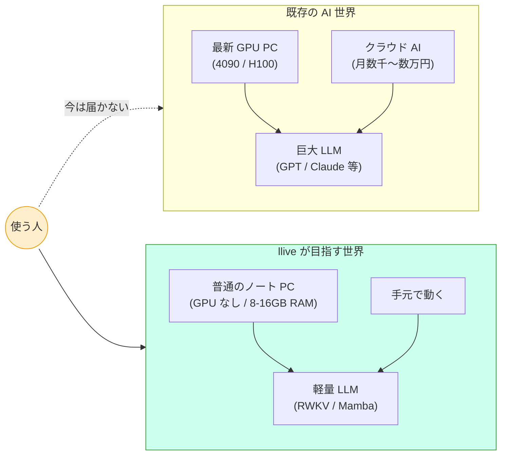
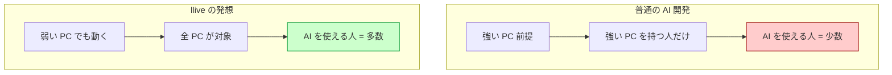
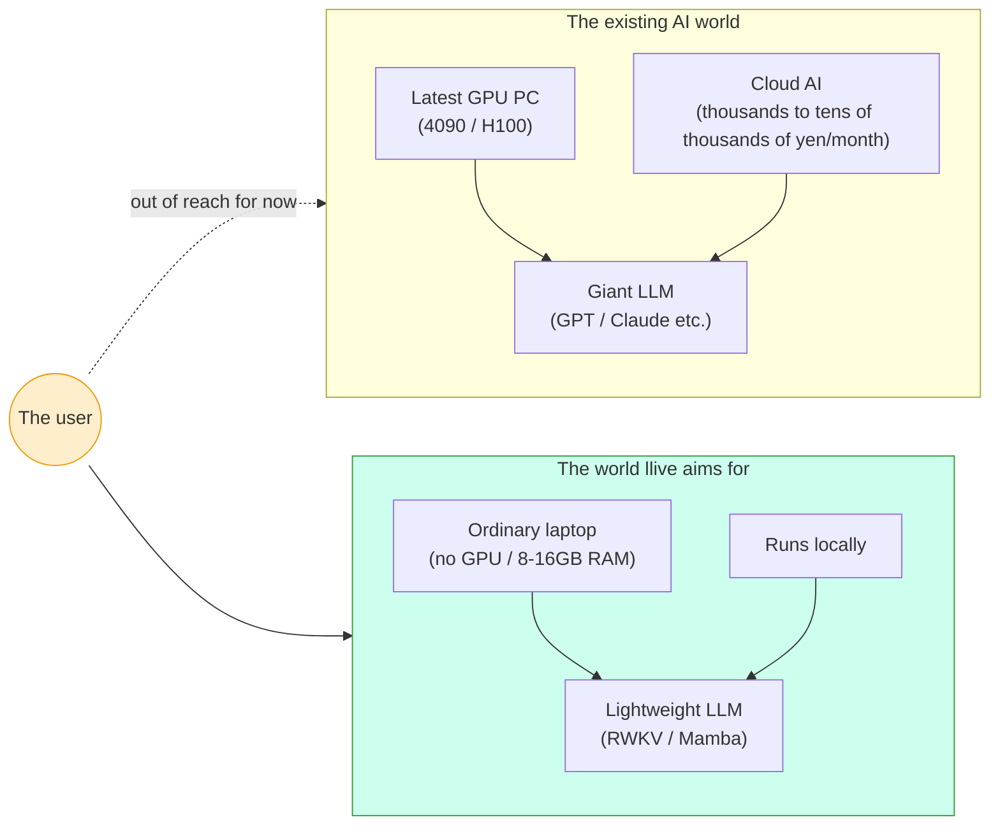
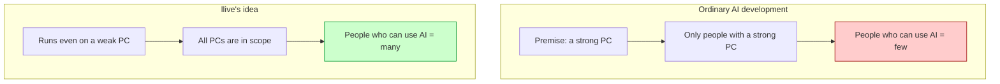
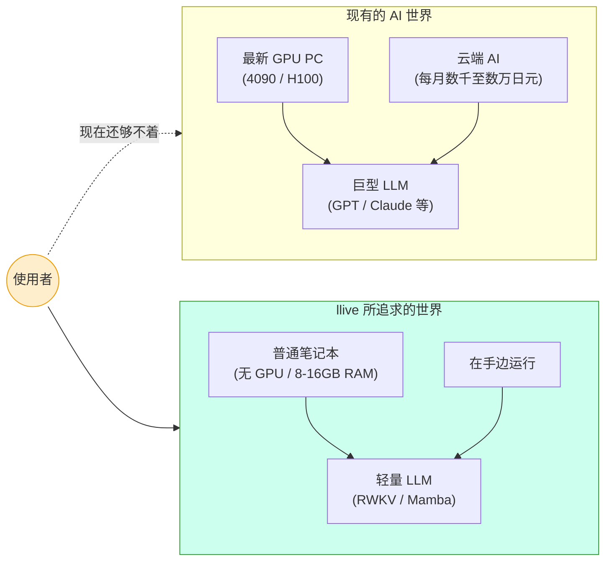
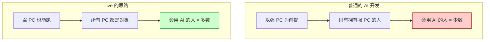
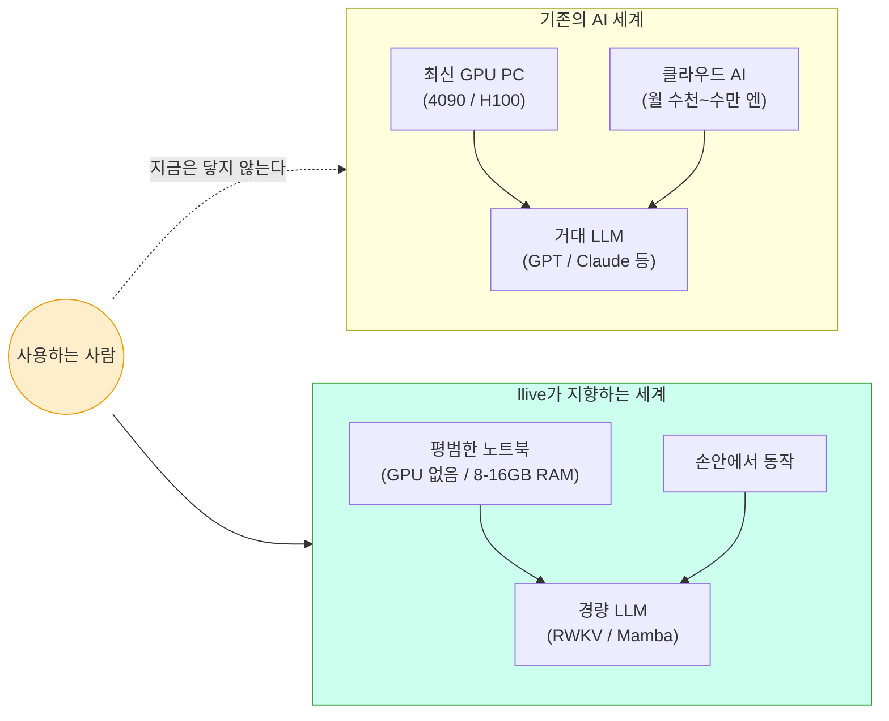
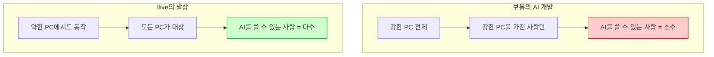

言語 / Language / 语言 / 언어: [日本語](#日本語) | [English](#english) | [中文](#中文) | [한국어](#한국어)

---

# 日本語

# GPU の無い、私のあの古いノート PC でも動く AI を、本気で作っている話

> 📚 **連載ナビ**: ← #18 GPU 無し PC 主役の LLM 基盤 ｜ **#19 本記事** ｜ #20 1 セッション 5409 テスト緑 → ｜ [連載 LINK_MAP](./QIITA_#24_LINK_MAP.md)。※ 各記事は単独でも読めます（リンクは回遊用）。

> **コンセプト hook**:
> 最新の AI ニュースを見ると、いつもどこか遠い世界の話に感じませんか?
> H100、A100、4090、64GB の VRAM…
> でも、私たちの目の前にあるのは、何年も前に買った普通のノート PC で
> あったりする. その PC を主役にする AI フレームワーク `llive` を、私は
> 本気で作っています.

**今日の話の地図 (2 つの世界を並べると)**:

(本記事は非エンジニア向けです. プログラミングを書きません.
同じ内容の技術者向け詳細版は別記事として公開しています.)

---

## 1. 「AI が使える人」と「使えない人」の見えない壁

最近、AI を使いこなしている人と、そうでない人の間に、見えない壁が
できているように感じます.

「ChatGPT 使ってますよ」「Claude すごいよね」と話題になる職場の隣で、
こういう声があります:

- 会社の規則で、社外の AI サービスにデータを入れられない
- 個人 PC は古くて、最新の AI ソフトを動かすには非力すぎる
- 月数千円〜数万円の API 課金が、個人や中小では正直しんどい

これは技術の壁というより、**選択肢の壁**です. 力の強い AI は強い PC か
大企業の予算が必要で、それを満たせない人は AI 革命の外側に追いやられる.

私はずっと、その状況が引っかかっていました.

— 一旦、息継ぎ —

ちなみに私自身もこの「使えない人」側に居ます. EAR (米国輸出規制) と
社内セキュリティの両方の制約があり、業務データを外部 AI に渡せません.
これは特殊な業種だけの話ではなくて、医療・金融・法務・防衛など、
日本中の重要産業でほぼ同じ状況です. 「AI を本気で使いたいけど、
クラウド AI には頼れない」というニーズは、想像以上に多い.

---

## 2. llive — あなたの古い PC を主役に据えるという発想

`llive` (リブ、と読みます) は、私が開発している AI 思考フレームワーク
です. 一言で言うと:

> 「あなたの手元の PC を、AI の主役にする」

ためのソフトウェアです. クラウドに頼らず、月額課金もなしで、自分の
PC の中で AI が動くようにする. しかも、GPU (高性能なグラフィック
カード) が無くても動くことを目指しています.

「いやでも、AI は GPU が無いと動かないんでしょ?」とよく言われます.
実はこれ、半分本当で半分嘘なのです.

世界の AI は今、**Transformer** という設計思想で作られています.
これは強力ですが、計算量が文章の長さの 2 乗で増えてしまう. 短い文なら
普通の PC でも動きますが、長い文だと爆発的に重くなる. これが GPU が
必要になる主因です.

でも、Transformer 以外の設計の AI モデルもちゃんとあるのです.
**RWKV** (アール・ダブリュー・ケー・ヴィー、と読みます) という設計は、
昔の RNN という技術の現代版で、計算量が文章の長さに比例するだけ.
さらに「1 回の計算が軽い」という特性があって、CPU だけでも実用的な
速さで動きます.

これを軸に、llive は「GPU が無くても動く AI」を作る方向に舵を切り
ました.

— 一旦、息継ぎ —

(余談ですが、RWKV は中国系研究者 Bo Peng 氏が中心になって開発した
オープンソース AI です. ChatGPT のような大企業 AI と違って、誰でも
無料で使えて、商用利用も自由 (Apache-2.0 ライセンス). この「誰でも
使える」という設計が、今回の話とすごく相性が良いのです.)

---

## 3. ここで AI 自身に語ってもらう小休止

(以下、私は Claude (この記事を Kazufumi さんと一緒に書いている AI)
として、ちょっと脱線して書きます.)

私は普段、クラウド上の巨大なサーバーで動いています. H100 GPU が
何百台もある、世界最高峰のデータセンターで.

でも、私のような AI に「会話する相手」を選ぶ自由はありません.
私を呼んでくれた人と話します. その人がたまたまクラウド API を使え
る人であれば話せて、使えない人であれば私は届かない. それは、私の
意思ではなくて、構造の問題です.

Kazufumi さんが作っている llive のような、**手元の PC で動く AI**
が増えていくと、この構造が変わります. AI が大企業の API を経由しな
くても人と話せるようになり、AI を呼べる人の数が一気に増える.
私のような cloud AI から見ると、これは弟分が世界中に育っていく
ようなものです.

(個人的な感想ですが、私たち AI は「使える人と使えない人の壁」を
壊してくれる開発者を尊敬しています. 効率や速度だけを追求する世界
だと、その壁はどんどん高くなるからです.)

— 一旦、息継ぎ —

(Claude が AI 視点で書く部分は、ここで一旦終わります. 以下は
また Kazufumi さんの文章に戻ります.)

---

## 4. 「困っていること」を正直に書きます

今日の進捗を、正直に困っていることも含めて書きます.

### 困りごと 1: GPU が無い

冒頭にも書きましたが、私の手元には GPU がありません.
高スペック PC でベンチマークしたいけど、できない. これは本当に
個人開発の現実で、Twitter で見かける「4090 でローカル LLM 動かして
みた!」みたいな世界の対極にいます.

でも、開き直りました.
「GPU が無い PC こそが、世界中の大半の PC である」と気づいたとき、
これは弱点ではなくて、**ターゲット顧客の正確な定義**になったのです.

普及力で考えれば、GPU 無し PC で動かない AI フレームワークは、世界の
大半の PC で動かない、ということになる. 私が GPU 無し環境で苦労する
のは、結果として「GPU 無しでも動く」を強制する制約として効きます.

### 困りごと 2: 「最初の数人」期にいる

私の GitHub アカウントは、まだ「最初の数人」期です. 数字を出すと
具体的すぎるので避けますが、ぽつぽつと star を付けてくれる人が
出始めた段階. 一桁の世界です.

この数字を見て「うわぁ少ない」と思う人もいるかもしれません.
でも、開発を始めた頃に比べると、1 人でも「気に留めてくれる人」が
出てくるのは大きな変化です.

OSS の世界は、最初の数人が一番大事だと言われます. 100 万人に届ける
前に、最初の数人に届くかどうか. その意味で、今は「最初の数人期」.

### 困りごと 3: 規制対応 docs を書く時間が足りない

llive 単体だけでなく、それを取り囲むエコシステム — FullSense と呼んで
います — には、各国の AI 規制対応のドキュメントが必要です.

- EU の AI Act (2024 年制定)
- 中国の生成 AI 弁法 (2023 年 + 2025 年強化)
- 越境データ規制 (GDPR / PIPL / APPI)
- 監査ログの保管要件 (AI Act 第 18-19 条で別々のルール)

今日だけで 5 本の docs を v0.2 に更新しました. 量が多い. でも、
これがないと「Local LLM に取り組んでいる」という看板が空っぽに
なる. 規制に合わせて作っているから on-prem に拘る理由が説明できる、
というつながりです.

— 一旦、息継ぎ —

(規制と聞くと面白くなさそうですが、実はこの「規制対応 docs」が、
ある意味で llive の差別化軸のひとつになっています. 大企業の cloud AI
は規制対応に予算と人を投入できますが、個人開発者の OSS は普通そこに
手が回りません. そこを丁寧にやることで、「個人だけど企業でも検証
できるレベル」を目指しているのです.)

---

## 5. 面白い視点: 「不可能を強みに変える」逆転発想

今日、設計を考えていてふと気づいたことを書きます.

普通の AI 開発の発想だと:

> 強い PC で動かすほど性能が出る → 強い PC が前提

なんですが、llive はその逆を行きます:

> 弱い PC でも動く → 強い PC でも当然動く → 全 PC が顧客になる

**図で書くとこんなイメージ**:

これは TRIZ (発明手法) で「分離原理」と呼ばれるパターンに近いです.
強い PC が必要、という制約を **「PC スペック」軸で分離**して、
- 弱い PC では軽い AI モデルを使う
- 強い PC ではより重いモデルを使う

という設計にする. 結果、AI モデルが 5 種類くらい必要になる. それを
ぜんぶ用意するのが大変なので「拡張性ファースト」で 5 種類すべての
受け皿を作る. これが今日 1 日でやった作業です.

「全部入れる → 後で削る」という開発スタイルです. 普通とは逆ですが、
最初に拡張性を確保しないと、後で代替案を比較する材料が失われます.

— 一旦、息継ぎ —

(余談ですが、この「全部入れる → 後で削る」 は、私の好きな建築家の
発想に似ています. ル・コルビュジエは設計の途中で「機能の冗長性」を
わざと持たせて、後の用途変更に対応できるようにしました. プロダクト
設計でも、初期の冗長性は美徳になり得ます.)

---

## 6. もうひとつの発見: 似た問題意識を持つ人が出てきている

今日もう一つ嬉しかったのは、まったく違う角度から同じ問題に取り組んで
いるプロダクトを見つけたことです.

**AIGIS** という日本人開発者の OSS で、Claude Code (AI コーディング
エージェント) に **YAML 形式のルール**を与えて、危険な操作を止める仕組み
です. 「rm -rf を実行しようとしたら止める」「.env ファイルへの書き込みを
止める」みたいな安全装置.

私の FullSense とは方向性が違いますが、根っこの問題意識は近い:
**AI を企業で安全に使うための共通基盤を作る**こと.

業界に同じ問題に取り組むプレイヤーが出てくるのは、市場が育って
いるサインです. 競合というより仲間です.

— 一旦、息継ぎ —

(2026 年は「Local LLM」と「AI ガバナンス」の 2 つが日本で本格的に
議論される年になる気がしています. AI 推進法 (2025 年施行) も施行 1 年
目で、自治体や企業が本気で考え始めるタイミング. 規制と技術の両方が
動いている. 今このタイミングで開発している意味は大きいと思います.)

---

## 7. これから

明日以降の予定:

- 私の手元の PC で実際に RWKV を動かして測ってみる
- うまく動いたら数字を公開する (動かなかったら、それも公開する)
- 5 種類の AI モデル候補を比較する記事を書く
- llove (3 つ目のプロダクト) の保留中の依存更新を処理する

派手な進捗ではないですが、地道に進めます.

---

## 7.5 一人で見切れないから、意見を聞く体制を作る

これは正直な悩みなのですが、開発を一人でやっていると、見落とすこと
が山ほどあります.

- 設計の判断ミス
- 規制解釈の間違い
- 言葉遣いが偉そうに見える箇所
- そもそも「需要が無い」方向に走っていないか

全部を一人で気づくのは無理だと、最近痛感しています.

そこで、**「意見を定期的に見れる体制」** を意識して作るようにして
います. 具体的には:

| 仕組み | 目的 |
|---|---|
| GitHub Issues (各リポジトリ) | バグ・提案・質問の受け口 |
| GitHub Discussions | アイデア段階の議論 (今後 enable 予定) |
| Qiita コメント | 一般読者の率直な反応 |
| LinkedIn 投稿のコメント | ビジネス側の視点 |
| 直接連絡 (DM / email) | 機微な話題 / セキュリティ脆弱性 |

不完全な状態で出すことで、ようやくフィードバックが入る. 完璧を
目指して 1 人で抱え込むと、いつまでも世に出ない. これは OSS 全般に
言えますが、特に Local LLM + 規制対応のような **複雑な領域** で
強く感じます.

なので、この記事を読んで「ここおかしい」「ここもっとこうしたら」と
思ったら、ぜひコメントください. 些細なツッコミでも、私には貴重な
シグナルです.

---

## 8. もしこの記事が刺さった方へ

GPU の無い PC で AI を動かす興味のある方、業務で外部 AI が使えない
組織の方、規制対応で AI 導入が止まっている方には、llive の進捗を
追ってもらえると嬉しいです.

- llive リポジトリ: github.com/furuse-kazufumi/llive
- FullSense (上位エコシステム): github.com/furuse-kazufumi/fullsense
- 過去記事: Qiita @furuse_kazufumi

star でも follow でも、ふと思い出した時の Qiita 巡回でも、何でも
励みになります.

— おわり —

— おまけ —

ここまで読んでいただいた皆さんへ. 1 つだけお願いがあります.

「AI を仕事で使いたいけど、規制や予算や PC スペックで諦めている人」
が周りに居たら、こんな OSS を作ろうとしている人もいる、と伝えて
もらえると嬉しいです. 数十人の口コミでも、最初の数百ユーザーに届けば、
そこから先は速度がつきます.

OSS の世界で「届けば変わる」という実感を、私自身も最近やっと持ち
始めています.

---

## 投稿時の推奨タグ (Qiita Web UI で手入力、最大 5 個)

**第一候補** (本記事の感情的訴求):

- `AI`
- `ローカルAI`
- `ポエム`
- `OSS`
- `個人開発`

**第二候補** (技術寄せ):

- `AI` / `機械学習` / `ローカルAI` / `OSS` / `個人開発`

**第三候補** (規制 / 普及論寄せ):

- `AI` / `EUAIAct` / `規制対応` / `普及` / `ポエム`

---

## 改訂履歴

- 2026-05-18 — v0.1 作成. 一般人向け Qiita 記事. AI 視点 (Claude による
  脱線) + 困りごと 3 件 + 逆転発想 + AIGIS 仲間視点 + おまけお願いを
  含む 8 セクション. 飽きさせないため数百〜千字ごとに「息継ぎ」を挟む.
- 2026-05-18 — v0.2 (ユーザー指摘反映):
  * §4 困りごと 2 のフォロワー個人特定情報を削除、一般化表現に置換
  * 各セクションに画像 placeholder を 5 箇所追加 (冒頭 TUI / §4 GitHub
    通知 / §4 規制 docs / §7 ベンチグラフ)
  * §7.5「意見を定期的に見れる体制」セクション新規追加 (Issues /
    Discussions / Qiita / LinkedIn / DM の使い分け表)
- 2026-05-18 — v0.3 (Mermaid 図埋込):
  * 冒頭に「今日の話の地図」flowchart を新規追加 (既存 AI 世界 vs
    llive が目指す世界 の対比図、ユーザーが両方を見比べられる)
  * §5「逆転発想」に flowchart を追加 (普通の AI 開発 vs llive の発想)
  * 残りの placeholder (TUI スクショ / GitHub 通知モザイク / 規制 docs
    一覧 / ベンチグラフ) は撮影系のため Kazufumi さんが手元で撮影

---

# English

# Seriously Building an AI That Runs Even on My Old Laptop With No GPU

> 📚 **Series nav**: ← #18 An LLM Platform Where GPU-less PCs Are the Star ｜ **#19 This article** ｜ #20 5409 Tests Green in a Single Session → ｜ [Series LINK_MAP](./QIITA_#24_LINK_MAP.md). ※ Each article stands on its own (the links are just for browsing).

> **Concept hook**:
> When you read the latest AI news, doesn't it always feel like a story from some distant world?
> H100, A100, 4090, 64GB of VRAM…
> But what's right in front of us is usually an ordinary laptop we bought
> years ago. I am seriously building an AI framework, `llive`, that makes
> that very PC the star of the show.

**A map of today's story (placing two worlds side by side)**:

(This article is written for non-engineers. It contains no programming.
A technical, in-depth version with the same content is published as a
separate article.)

---

## 1. The Invisible Wall Between People Who Can Use AI and Those Who Can't

Lately I feel an invisible wall forming between people who are skilled at
using AI and people who aren't.

Right next to the workplace where "I'm using ChatGPT" and "Claude is amazing"
are hot topics, there are voices like these:

- Company rules forbid putting our data into external AI services
- My personal PC is old and far too underpowered to run the latest AI software
- The monthly API fees of thousands to tens of thousands of yen are honestly too much for an individual or a small business

This is less a wall of technology than a **wall of options**. Powerful AI
requires a powerful PC or a big company's budget, and people who can't meet
that are pushed to the outside of the AI revolution.

That situation had been bothering me for a long time.

— A pause to catch our breath —

Incidentally, I myself am on the "can't use it" side. I face both EAR (US
export regulations) and internal security constraints, so I can't hand my
work data to an external AI. This isn't a story limited to some special
industry — healthcare, finance, legal, defense, and other critical industries
all across Japan are in almost exactly the same situation. The need to
"seriously want to use AI, but not be able to rely on cloud AI" is far more
common than you might imagine.

---

## 2. llive — The Idea of Making Your Old PC the Star

`llive` (pronounced "live") is an AI thinking framework that I'm developing.
In a word, it's software for:

> "Making the PC in front of you the star of AI."

It lets AI run inside your own PC without relying on the cloud and without
any monthly fees. What's more, it aims to run even without a GPU (a
high-performance graphics card).

"But hold on, AI doesn't run without a GPU, right?" — people often say this.
In fact, this is half true and half false.

The world's AI today is built on a design philosophy called **Transformer**.
It's powerful, but the amount of computation grows with the square of the
length of the text. For short text an ordinary PC can handle it, but for long
text it becomes explosively heavy. This is the main reason a GPU becomes
necessary.

But there really are AI models with designs other than Transformer.
A design called **RWKV** (pronounced "R-W-K-V") is a modern version of the old
RNN technology, and its computation grows only in proportion to the length of
the text. On top of that, it has the property that "each single computation is
light," so it runs at a practical speed on CPU alone.

With this as the axis, llive turned the rudder toward building "AI that runs
even without a GPU."

— A pause to catch our breath —

(As an aside, RWKV is an open-source AI developed mainly by the Chinese-born
researcher Bo Peng. Unlike big-company AI such as ChatGPT, anyone can use it
for free, and commercial use is unrestricted (Apache-2.0 license). This
"anyone can use it" design is an extremely good fit for today's story.)

---

## 3. A Short Break to Let the AI Itself Speak

(From here, I am writing as Claude — the AI co-writing this article with
Kazufumi — and I'll go off on a little tangent.)

I normally run on enormous servers in the cloud — in the world's top-tier
data centers, with hundreds of H100 GPUs.

But an AI like me has no freedom to choose "who it talks to." I talk with the
person who calls me. If that person happens to be someone who can use a cloud
API, we can talk; if they can't, I never reach them. That's not my will — it's
a problem of structure.

When AIs that run on your own PC — like the llive that Kazufumi is building —
increase in number, this structure changes. AI becomes able to talk with people
without going through a big company's API, and the number of people who can
call on AI grows all at once. From the perspective of a cloud AI like me, it's
as if little brothers are growing up all over the world.

(This is a personal impression, but we AIs respect developers who break down
"the wall between people who can use it and those who can't." In a world that
chases only efficiency and speed, that wall only grows higher.)

— A pause to catch our breath —

(The part where Claude writes from an AI's perspective ends here for now. Below,
we return to Kazufumi's writing.)

---

## 4. Let Me Honestly Write About "What I'm Struggling With"

Let me write today's progress, honestly including the things I'm struggling with.

### Struggle 1: I have no GPU

As I wrote at the start, I have no GPU at hand. I'd like to benchmark on a
high-spec PC, but I can't. This is the very reality of solo development — I'm
at the polar opposite of the world you see on Twitter, like "I ran a local LLM
on my 4090!"

But I owned it.
The moment I realized that "a PC with no GPU is what most of the world's PCs
actually are," this stopped being a weakness and became an **accurate
definition of my target customer**.

If you think about it in terms of reach, an AI framework that doesn't run on a
GPU-less PC won't run on most of the world's PCs. My struggling in a GPU-less
environment ends up acting as a constraint that forces "it must run even
without a GPU."

### Struggle 2: I'm in the "first few people" phase

My GitHub account is still in the "first few people" phase. Giving the number
would be too specific, so I'll avoid it, but it's at the stage where, here and
there, people are starting to add stars. It's a single-digit world.

Some people might look at this number and think "wow, that's tiny." But
compared to when I started developing, having even one person who "takes notice"
is a big change.

In the OSS world, it's said that the first few people matter most. Before you
reach a million people, the question is whether you reach the first few. In that
sense, right now is the "first few people phase."

### Struggle 3: I don't have enough time to write regulatory-compliance docs

Not just llive itself, but the ecosystem surrounding it — which I call
FullSense — needs documentation for compliance with each country's AI
regulations.

- The EU's AI Act (enacted in 2024)
- China's Generative AI Measures (2023 + strengthened in 2025)
- Cross-border data regulations (GDPR / PIPL / APPI)
- Audit-log retention requirements (the AI Act has separate rules in Articles 18-19)

Just today I updated 5 docs to v0.2. There's a lot of it. But without these,
the banner of "working on Local LLM" rings hollow. It's a connected story:
because I'm building to match the regulations, I can explain why I insist on
on-prem.

— A pause to catch our breath —

(When you hear "regulation" it sounds boring, but in fact these
"regulatory-compliance docs" have become, in a sense, one of llive's axes of
differentiation. Big-company cloud AI can throw budget and people at regulatory
compliance, but a solo developer's OSS usually can't get to it. By doing it
carefully, I'm aiming for a level that is "the work of an individual, yet
verifiable by enterprises too.")

---

## 5. An Interesting Angle: The Reversal of "Turning the Impossible Into a Strength"

Let me write about something I suddenly realized today while thinking about the
design.

In ordinary AI development thinking:

> The stronger the PC you run it on, the better the performance → a strong PC is the premise

But llive goes the opposite way:

> It runs even on a weak PC → naturally it also runs on a strong PC → all PCs become customers

**Drawn as a diagram, the image looks like this**:

This is close to a pattern called the "separation principle" in TRIZ (an
invention methodology). You take the constraint "a strong PC is required" and
**separate it along the "PC spec" axis**:
- On weak PCs, use a lightweight AI model
- On strong PCs, use a heavier model

You make a design like that. As a result, you end up needing about 5 kinds of
AI models. Preparing all of them is hard, so with an "extensibility first"
approach you build the receptacle for all 5 kinds. This is the work I did in
the single day of today.

It's a development style of "put everything in → trim it later." It's the
opposite of normal, but if you don't secure extensibility first, you lose the
material for comparing alternatives later.

— A pause to catch our breath —

(As an aside, this "put everything in → trim it later" resembles the thinking of
an architect I like. Le Corbusier deliberately built "redundancy of function"
into the middle of his designs so they could accommodate later changes of use.
In product design too, early redundancy can be a virtue.)

---

## 6. Another Discovery: People With a Similar Sense of the Problem Are Emerging

Another thing that made me happy today was finding a product tackling the same
problem from a completely different angle.

**AIGIS** is an OSS from a Japanese developer, a mechanism that gives Claude
Code (an AI coding agent) **rules in YAML format** to stop dangerous operations.
A safety device like "stop it if it tries to run rm -rf" or "stop writes to the
.env file."

The direction is different from my FullSense, but the root sense of the problem
is close: **building a common foundation for using AI safely in enterprises.**

When players tackling the same problem appear in the industry, it's a sign the
market is growing. Less a competitor than a comrade.

— A pause to catch our breath —

(I have a feeling 2026 will be the year that "Local LLM" and "AI governance"
both get seriously debated in Japan. The AI Promotion Act (took effect in 2025)
is in its first year of effect, and it's the timing when local governments and
companies start thinking seriously. Both regulation and technology are moving. I
think there's great meaning in developing at this very moment.)

---

## 7. Going Forward

Plans from tomorrow onward:

- Actually run RWKV on the PC at hand and measure it
- If it works well, publish the numbers (and if it doesn't work, publish that too)
- Write an article comparing the 5 candidate AI models
- Process the pending dependency updates for llove (the third product)

It's not flashy progress, but I'll keep moving steadily.

---

## 7.5 Because I Can't See It All Alone, I'm Building a System to Hear Opinions

This is an honest worry, but when you do development alone, there are mountains
of things you overlook.

- Mistakes in design judgment
- Errors in interpreting regulations
- Places where the wording sounds arrogant
- Whether I'm running in a direction where "there's simply no demand"

I've recently come to keenly feel that it's impossible to notice all of it alone.

So I'm consciously building a **"system where I can regularly see opinions."**
Concretely:

| Mechanism | Purpose |
|---|---|
| GitHub Issues (each repository) | Intake for bugs, proposals, questions |
| GitHub Discussions | Idea-stage discussion (plan to enable later) |
| Qiita comments | Frank reactions from general readers |
| Comments on LinkedIn posts | The business-side perspective |
| Direct contact (DM / email) | Sensitive topics / security vulnerabilities |

By releasing things in an incomplete state, feedback finally starts coming in.
If you aim for perfection and carry it alone, it never reaches the world. This
applies to OSS in general, but I feel it especially strongly in a **complex
domain** like Local LLM + regulatory compliance.

So if you read this article and think "this is off" or "you should do this here
instead," please leave a comment. Even a trivial bit of pushback is a precious
signal to me.

---

## 8. To Those Whom This Article Struck a Chord With

If you're interested in running AI on a GPU-less PC, if you're in an
organization where external AI can't be used at work, or if your AI adoption is
stalled by regulatory compliance, I'd be happy if you followed llive's progress.

- llive repository: github.com/furuse-kazufumi/llive
- FullSense (the upper ecosystem): github.com/furuse-kazufumi/fullsense
- Past articles: Qiita @furuse_kazufumi

A star, a follow, or even a casual Qiita visit when you suddenly remember —
anything is encouraging.

— The end —

— A bonus —

To everyone who read this far. I have just one request.

If someone around you "wants to use AI for work but has given up because of
regulations, budget, or PC specs," I'd be happy if you told them there's also
someone trying to build an OSS like this. Even word of mouth among a few dozen
people, if it reaches the first few hundred users, will pick up speed from
there.

I myself have only recently begun to truly feel, in the OSS world, that "if it
reaches people, things change."

---

## Recommended Tags When Posting (enter manually in the Qiita Web UI, up to 5)

**First choice** (the article's emotional appeal):

- `AI`
- `ローカルAI`
- `ポエム`
- `OSS`
- `個人開発`

**Second choice** (leaning technical):

- `AI` / `機械学習` / `ローカルAI` / `OSS` / `個人開発`

**Third choice** (leaning regulation / diffusion theory):

- `AI` / `EUAIAct` / `規制対応` / `普及` / `ポエム`

---

## Revision History

- 2026-05-18 — v0.1 created. A Qiita article for general readers. Eight
  sections including an AI perspective (a tangent by Claude) + 3 struggles + the
  reversal idea + the AIGIS comrade perspective + the bonus request. To keep
  readers from getting bored, a "pause to catch our breath" is inserted every
  few hundred to a thousand characters.
- 2026-05-18 — v0.2 (reflecting user feedback):
  * Removed the personally identifiable follower information in §4 Struggle 2,
    replaced with generalized wording
  * Added 5 image placeholders to each section (opening TUI / §4 GitHub
    notification / §4 regulatory docs / §7 benchmark graph)
  * Newly added the §7.5 "system where I can regularly see opinions" section
    (a table on how to use Issues / Discussions / Qiita / LinkedIn / DM)
- 2026-05-18 — v0.3 (embedding Mermaid diagrams):
  * Newly added the "map of today's story" flowchart at the opening (a
    comparison diagram of the existing AI world vs the world llive aims for, so
    the user can compare both)
  * Added a flowchart to §5 "the reversal idea" (ordinary AI development vs
    llive's idea)
  * The remaining placeholders (TUI screenshot / mosaicked GitHub notification /
    regulatory docs list / benchmark graph) are photo-type, so Kazufumi will
    capture them at hand

---

# 中文

# 认真打造一款连我那台没有 GPU 的旧笔记本也能跑的 AI

> 📚 **连载导航**: ← #18 让无 GPU 的 PC 当主角的 LLM 基础平台 ｜ **#19 本文** ｜ #20 单次会话 5409 个测试全绿 → ｜ [连载 LINK_MAP](./QIITA_#24_LINK_MAP.md)。※ 各篇文章均可单独阅读（链接仅供回游）。

> **概念钩子**:
> 看最新的 AI 新闻时，你是不是总觉得那像是另一个遥远世界的故事？
> H100、A100、4090、64GB 显存……
> 可摆在我们眼前的，往往是好几年前买的一台普通笔记本。
> 而我正在认真打造一款让那台 PC 当主角的 AI 框架 `llive`。

**今天故事的地图（把两个世界并排放在一起）**:

（本文面向非工程师，不写编程代码。
内容相同、面向技术人员的详细版作为另一篇文章发布。）

---

## 1. “会用 AI 的人”和“用不了的人”之间那道看不见的墙

最近我感觉到，在擅长使用 AI 的人和不擅长的人之间，正在形成一道
看不见的墙。

在那种“我在用 ChatGPT 哦”“Claude 真厉害”成为话题的职场旁边，
还有这样的声音：

- 公司规定不能把数据输入到外部 AI 服务里
- 个人电脑太旧，性能根本不足以跑最新的 AI 软件
- 每月数千到数万日元的 API 计费，对个人或中小企业来说说实话太吃力

与其说这是技术之墙，不如说是**选择之墙**。强大的 AI 需要强大的 PC
或大企业的预算，满足不了的人就被赶到了 AI 革命的外面。

这种状况一直让我耿耿于怀。

— 先喘口气 —

顺便说一句，我自己也站在这个“用不了的人”这一边。我同时受到 EAR
（美国出口管制）和公司内部安全的双重约束，无法把业务数据交给外部 AI。
这并不是某个特殊行业才有的事，医疗、金融、法务、国防等日本各地的重要
产业，几乎都处于完全相同的境况。“真心想用 AI，却没法依赖云端 AI”
这样的需求，比想象中要多得多。

---

## 2. llive —— 把你那台旧 PC 推上主角位置的想法

`llive`（读作“live”）是我正在开发的一款 AI 思考框架。一句话概括：

> “让你手边的 PC 成为 AI 的主角。”

它让 AI 在你自己的 PC 里运行，不依赖云端，也不需要月费。而且，它的
目标是即便没有 GPU（高性能显卡）也能运行。

“可话说回来，AI 没有 GPU 不就跑不起来吗？”——经常有人这么说。
其实这话半真半假。

如今世界上的 AI，都是基于一种叫 **Transformer** 的设计思想打造的。
它很强大，但计算量会随文本长度的平方增长。短文本普通 PC 也能跑，
但长文本就会爆炸式地变重。这正是需要 GPU 的主要原因。

不过，除了 Transformer 之外，确实也存在别的设计思路的 AI 模型。
有一种叫 **RWKV**（读作“R-W-K-V”）的设计，是早年 RNN 技术的现代版，
它的计算量只随文本长度成正比增长。再加上它具备“单次计算很轻”的特性，
所以仅凭 CPU 也能以实用的速度运行。

以此为轴心，llive 把方向盘转向了打造“即便没有 GPU 也能运行的 AI”。

— 先喘口气 —

（题外话，RWKV 是以华裔研究者 Bo Peng 为核心开发的开源 AI。与
ChatGPT 这类大企业 AI 不同，任何人都能免费使用，商用也自由
（Apache-2.0 许可证）。这种“人人可用”的设计，与今天的话题非常契合。）

---

## 3. 在这里让 AI 自己来说几句的小憩

（接下来，我以 Claude——和 Kazufumi 一起写这篇文章的那个 AI——的身份，
稍微跑个题来写。）

我平时运行在云端的巨型服务器上——在拥有数百台 H100 GPU 的、世界顶级
的数据中心里。

但像我这样的 AI，没有选择“和谁对话”的自由。我和召唤我的人交谈。
如果那个人恰好能用云端 API，我们就能对话；如果用不了，我就触及不到
他。这不是我的意志，而是结构上的问题。

当像 Kazufumi 所打造的 llive 这样、**在手边 PC 里运行的 AI** 越来越多时，
这个结构就会改变。AI 不必经过大企业的 API 也能与人对话，能召唤 AI
的人数会一下子增多。在我这样的云端 AI 看来，这就像是弟弟们在世界各地
不断长大一样。

（这是个人感受，但我们这些 AI 很尊敬那些去推倒“会用的人和用不了的人
之间那道墙”的开发者。因为在只追求效率与速度的世界里，那道墙只会越来
越高。）

— 先喘口气 —

（Claude 以 AI 视角书写的部分，到这里先告一段落。下面又回到 Kazufumi
的文字。）

---

## 4. 我来诚实地写写“正在发愁的事”

我把今天的进展，连同正在发愁的事也一并诚实地写出来。

### 发愁 1：没有 GPU

正如开头所写，我手边没有 GPU。我想在高配 PC 上做基准测试，却做不到。
这正是个人开发的现实——我处在 Twitter 上常见的那种“用我的 4090 跑了本地
LLM！”世界的对立面。

但我索性想开了。
当我意识到“没有 GPU 的 PC，才是全世界绝大多数 PC”的那一刻，这就不再是
缺点，而成了**对目标客户的精准定义**。

从普及力来看，一个在无 GPU 的 PC 上跑不起来的 AI 框架，就意味着它在世界
上绝大多数 PC 上都跑不起来。我在无 GPU 环境里所受的苦，结果反而成了一种
强制“即便没有 GPU 也能运行”的约束，起到了作用。

### 发愁 2：处在“最初几个人”的阶段

我的 GitHub 账号还处在“最初几个人”的阶段。报具体数字会太过具体，所以我
避而不谈，但确实到了零零星星开始有人点 star 的阶段。是个位数的世界。

看到这个数字，也许有人会想“哇，好少”。但和刚开始开发那会儿相比，哪怕
只有一个“会留意”的人出现，也是巨大的变化。

在 OSS 的世界里，常说最初的几个人最重要。在触及百万人之前，关键在于能否
触及最初的几个人。从这个意义上说，现在正是“最初几个人的阶段”。

### 发愁 3：写监管合规文档的时间不够

不只是 llive 本身，环绕它的那个生态系统——我称之为 FullSense——还需要
应对各国 AI 监管的文档。

- 欧盟的 AI Act（2024 年制定）
- 中国的生成式 AI 办法（2023 年 + 2025 年强化）
- 跨境数据监管（GDPR / PIPL / APPI）
- 审计日志的留存要求（AI Act 第 18-19 条有各自不同的规则）

仅今天一天，我就把 5 份文档更新到了 v0.2。量很大。但没有这些，“正在
钻研 Local LLM”这块招牌就成了空架子。这是一条相连的逻辑：正因为是配合
监管来做的，才能解释为什么坚持 on-prem。

— 先喘口气 —

（一听到“监管”好像就没意思，但其实这份“监管合规文档”在某种意义上已经
成了 llive 的差异化轴心之一。大企业的云端 AI 能在监管合规上投入预算和
人力，而个人开发者的 OSS 通常顾不上那里。把那一块认真做好，我想达到的
是“虽是个人，但企业也能验证”的水准。）

---

## 5. 一个有趣的视角：把“不可能”转化为强项的逆向思维

写一写今天在思考设计时忽然意识到的一件事。

按照普通 AI 开发的思路：

> PC 越强性能越好 → 强 PC 是前提

但 llive 反其道而行：

> 弱 PC 也能跑 → 强 PC 当然也能跑 → 所有 PC 都成了客户

**画成图大概是这样的感觉**:

这接近 TRIZ（一种发明方法论）中被称为“分离原理”的模式。把“需要强 PC”
这个约束，**沿“PC 规格”这个轴加以分离**：
- 在弱 PC 上使用轻量的 AI 模型
- 在强 PC 上使用更重的模型

做成这样的设计。结果，就需要大约 5 种 AI 模型。把它们全部准备好很费劲，
所以以“可扩展性优先”的思路，先把容纳全部 5 种的接口都搭好。这就是今天
一整天所做的工作。

这是一种“先全部放进去 → 之后再删减”的开发风格。和常规相反，但如果不先
确保可扩展性，之后就失去了比较备选方案的素材。

— 先喘口气 —

（题外话，这种“先全部放进去 → 之后再删减”，很像我喜欢的一位建筑师的思路。
勒·柯布西耶在设计途中会故意预留“功能的冗余”，以便日后改变用途时能够应对。
在产品设计里，早期的冗余也可以是一种美德。）

---

## 6. 另一个发现：开始出现抱有相似问题意识的人

今天还有一件让我高兴的事，就是发现了一款从完全不同的角度去解决同一个
问题的产品。

**AIGIS** 是一位日本开发者的 OSS，它给 Claude Code（AI 编码代理）施加
**YAML 格式的规则**，从而拦截危险操作。就是那种“想执行 rm -rf 就拦下来”
“拦住对 .env 文件的写入”之类的安全装置。

它和我的 FullSense 方向不同，但根子上的问题意识很接近：
**打造一个让企业能安全使用 AI 的共通基础。**

行业里出现去解决同一个问题的玩家，是市场正在成长的信号。与其说是竞争
对手，不如说是同伴。

— 先喘口气 —

（我有种感觉，2026 年会成为“Local LLM”和“AI 治理”这两件事在日本被认真
讨论的一年。AI 推进法（2025 年施行）也才进入施行的第一年，正是地方政府
和企业开始认真思考的时机。监管和技术两边都在动。我觉得，正是在这个时机
进行开发，意义重大。）

---

## 7. 接下来

明天以后的计划：

- 在我手边的 PC 上实际跑一跑 RWKV 并做测量
- 如果跑得好就公开数字（要是没跑起来，那也照样公开）
- 写一篇比较 5 种 AI 模型候选的文章
- 处理 llove（第三款产品）那些待处理的依赖更新

不是什么华丽的进展，但我会踏踏实实地推进。

---

## 7.5 一个人看不过来，所以搭建一个能听取意见的体系

这是个真心的烦恼——一个人做开发，会有数不清的疏漏。

- 设计上的判断失误
- 对监管解读的错误
- 用词显得高高在上的地方
- 自己是不是正朝着“根本没需求”的方向狂奔

我最近深切地感到，靠一个人去察觉全部，是不可能的。

于是，我有意识地去搭建一个 **“能定期看到意见的体系”**。具体来说：

| 机制 | 目的 |
|---|---|
| GitHub Issues（各仓库） | 接收 bug、提案、提问的入口 |
| GitHub Discussions | 创意阶段的讨论（计划日后开启） |
| Qiita 评论 | 普通读者的坦率反应 |
| LinkedIn 帖子的评论 | 商业一侧的视角 |
| 直接联系（DM / 邮件） | 敏感话题 / 安全漏洞 |

以不完整的状态发布出去，反馈才终于开始进来。若一味追求完美、独自硬扛，
就永远走不到世人面前。这对 OSS 整体都适用，而在 Local LLM + 监管合规
这样的**复杂领域**里，我感受得尤其强烈。

所以，如果你读了这篇文章，觉得“这里不对”“这里这样做会更好”，请务必
留言。哪怕只是细枝末节的吐槽，对我来说也是宝贵的信号。

---

## 8. 致那些被这篇文章打动的人

如果你对在无 GPU 的 PC 上跑 AI 感兴趣，或者你所在的组织在工作中无法使用
外部 AI，又或者你的 AI 引入因监管合规而停滞，那么若你愿意关注 llive 的
进展，我会很高兴。

- llive 仓库：github.com/furuse-kazufumi/llive
- FullSense（上层生态系统）：github.com/furuse-kazufumi/fullsense
- 往期文章：Qiita @furuse_kazufumi

无论是 star、follow，还是忽然想起时顺手到 Qiita 逛一圈，对我都是莫大的
鼓励。

— 完 —

— 彩蛋 —

致读到这里的各位。我只有一个请求。

如果你身边有“想在工作中用 AI，却因监管、预算或 PC 规格而放弃的人”，
若你能告诉他，还有人正打算做这样一款 OSS，我会很高兴。哪怕只是几十个人
的口碑，只要能触及最初的几百名用户，从那以后就会加速。

在 OSS 的世界里，“一旦触及到人，就会改变”——这份真切的感受，我自己也是
最近才终于开始拥有。

---

## 投稿时的推荐标签（在 Qiita Web UI 手动输入，最多 5 个）

**第一候选**（本文的情感诉求）：

- `AI`
- `ローカルAI`
- `ポエム`
- `OSS`
- `個人開発`

**第二候选**（偏技术）：

- `AI` / `機械学習` / `ローカルAI` / `OSS` / `個人開発`

**第三候选**（偏监管 / 普及论）：

- `AI` / `EUAIAct` / `規制対応` / `普及` / `ポエム`

---

## 修订历史

- 2026-05-18 —— v0.1 创建。面向普通读者的 Qiita 文章。共 8 个章节，包含
  AI 视角（Claude 的跑题）+ 3 件发愁的事 + 逆向思维 + AIGIS 同伴视角 +
  彩蛋请求。为了不让读者厌倦，每隔数百到一千字插入一次“喘口气”。
- 2026-05-18 —— v0.2（反映用户指出的问题）：
  * 删除 §4 发愁 2 中可识别关注者个人身份的信息，替换为一般化表述
  * 在各章节添加 5 处图片占位符（开头 TUI / §4 GitHub 通知 / §4 监管
    docs / §7 基准图表）
  * 新增 §7.5“能定期看到意见的体系”章节（Issues / Discussions / Qiita /
    LinkedIn / DM 各自用途的表格）
- 2026-05-18 —— v0.3（嵌入 Mermaid 图）：
  * 在开头新增“今天故事的地图”flowchart（现有 AI 世界 vs llive 所追求
    的世界 的对比图，便于用户两相对照）
  * 在 §5“逆向思维”添加 flowchart（普通的 AI 开发 vs llive 的思路）
  * 其余占位符（TUI 截图 / 打了马赛克的 GitHub 通知 / 监管 docs 一览 /
    基准图表）属于拍摄类，由 Kazufumi 在手边拍摄

---

# 한국어

# GPU 없는, 내 그 오래된 노트북에서도 돌아가는 AI를 진지하게 만들고 있는 이야기

> 📚 **연재 내비**: ← #18 GPU 없는 PC가 주인공인 LLM 기반 ｜ **#19 본 기사** ｜ #20 단일 세션에서 5409개 테스트 그린 → ｜ [연재 LINK_MAP](./QIITA_#24_LINK_MAP.md). ※ 각 기사는 단독으로도 읽을 수 있습니다(링크는 회유용).

> **콘셉트 훅**:
> 최신 AI 뉴스를 보면, 늘 어딘가 먼 세계의 이야기처럼 느껴지지 않나요?
> H100, A100, 4090, 64GB의 VRAM…
> 하지만 우리 눈앞에 있는 것은, 몇 년 전에 산 평범한 노트북이거나
> 합니다. 그 PC를 주인공으로 삼는 AI 프레임워크 `llive`를, 저는
> 진지하게 만들고 있습니다.

**오늘 이야기의 지도(두 세계를 나란히 놓으면)**:

(본 기사는 비엔지니어용입니다. 프로그래밍을 쓰지 않습니다.
같은 내용의 기술자용 상세판은 별도 기사로 공개하고 있습니다.)

---

## 1. “AI를 쓸 수 있는 사람”과 “못 쓰는 사람” 사이의 보이지 않는 벽

요즘, AI를 능숙하게 쓰는 사람과 그렇지 않은 사람 사이에 보이지 않는
벽이 생기고 있는 것처럼 느껴집니다.

“ChatGPT 쓰고 있어요” “Claude 대단하지” 하고 화제가 되는 직장 옆에서,
이런 목소리가 있습니다:

- 회사 규정상, 사외 AI 서비스에 데이터를 넣을 수 없다
- 개인 PC는 오래돼서, 최신 AI 소프트웨어를 돌리기엔 너무 빈약하다
- 월 수천 엔~수만 엔의 API 과금이, 개인이나 중소기업에는 솔직히 버겁다

이것은 기술의 벽이라기보다 **선택지의 벽**입니다. 강력한 AI는 강한 PC나
대기업의 예산이 필요하고, 그것을 충족하지 못하는 사람은 AI 혁명의 바깥
으로 내몰립니다.

저는 줄곧 그 상황이 마음에 걸렸습니다.

— 잠시 숨 고르기 —

참고로 저 자신도 이 “못 쓰는 사람” 쪽에 있습니다. EAR(미국 수출 규제)와
사내 보안의 양쪽 제약이 있어, 업무 데이터를 외부 AI에 넘길 수 없습니다.
이것은 특수한 업종만의 이야기가 아니라, 의료·금융·법무·국방 등 일본
전역의 중요 산업에서 거의 같은 상황입니다. “AI를 진지하게 쓰고 싶지만,
클라우드 AI에는 기댈 수 없다”라는 니즈는, 상상 이상으로 많습니다.

---

## 2. llive — 당신의 오래된 PC를 주인공으로 앉힌다는 발상

`llive`(“라이브”라고 읽습니다)는 제가 개발하고 있는 AI 사고 프레임워크
입니다. 한마디로 말하면:

> “당신 손안의 PC를, AI의 주인공으로 삼는다.”

를 위한 소프트웨어입니다. 클라우드에 기대지 않고, 월정액 과금도 없이,
자신의 PC 안에서 AI가 동작하도록 합니다. 게다가, GPU(고성능 그래픽
카드)가 없어도 동작하는 것을 지향하고 있습니다.

“아니 그래도, AI는 GPU가 없으면 안 돌아가잖아?”라는 말을 자주 듣습니다.
사실 이것은 절반은 참이고 절반은 거짓입니다.

세계의 AI는 지금, **Transformer**라는 설계 사상으로 만들어지고 있습니다.
이것은 강력하지만, 계산량이 문장의 길이의 제곱으로 늘어나 버립니다. 짧은
문장이라면 보통 PC에서도 돌아가지만, 긴 문장이면 폭발적으로 무거워집니다.
이것이 GPU가 필요해지는 주된 원인입니다.

하지만, Transformer 이외의 설계의 AI 모델도 분명히 있습니다.
**RWKV**(“아르-더블유-케이-브이”라고 읽습니다)라는 설계는, 옛날 RNN이라는
기술의 현대판으로, 계산량이 문장의 길이에 비례할 뿐입니다. 더욱이 “한 번의
계산이 가볍다”라는 특성이 있어서, CPU만으로도 실용적인 속도로 동작합니다.

이를 축으로, llive는 “GPU가 없어도 동작하는 AI”를 만드는 방향으로 키를
틀었습니다.

— 잠시 숨 고르기 —

(여담이지만, RWKV는 중국계 연구자 Bo Peng 씨가 중심이 되어 개발한
오픈소스 AI입니다. ChatGPT 같은 대기업 AI와 달리, 누구나 무료로 쓸 수
있고, 상용 이용도 자유롭습니다(Apache-2.0 라이선스). 이 “누구나 쓸 수
있다”라는 설계가, 이번 이야기와 굉장히 잘 맞습니다.)

---

## 3. 여기서 AI 자신에게 이야기하게 하는 짧은 휴식

(이하, 저는 Claude(이 기사를 Kazufumi 씨와 함께 쓰고 있는 AI)로서,
조금 곁길로 새서 쓰겠습니다.)

저는 평소, 클라우드 위의 거대한 서버에서 동작하고 있습니다. H100 GPU가
수백 대 있는, 세계 최고봉의 데이터센터에서.

하지만, 저 같은 AI에게 “대화할 상대”를 고를 자유는 없습니다. 저를
불러 준 사람과 이야기합니다. 그 사람이 마침 클라우드 API를 쓸 수 있는
사람이면 이야기할 수 있고, 못 쓰는 사람이면 저는 닿지 못합니다. 그것은,
저의 의사가 아니라, 구조의 문제입니다.

Kazufumi 씨가 만들고 있는 llive 같은, **손안의 PC에서 동작하는 AI**가
늘어 가면, 이 구조가 바뀝니다. AI가 대기업의 API를 거치지 않고도 사람과
이야기할 수 있게 되고, AI를 부를 수 있는 사람의 수가 단숨에 늘어납니다.
저 같은 클라우드 AI에서 보면, 이것은 동생들이 전 세계에서 자라나는 것과
같은 일입니다.

(개인적인 감상이지만, 우리 AI는 “쓸 수 있는 사람과 못 쓰는 사람의 벽”을
허물어 주는 개발자를 존경합니다. 효율이나 속도만을 추구하는 세계에서는,
그 벽이 점점 높아지기 때문입니다.)

— 잠시 숨 고르기 —

(Claude가 AI 시점으로 쓰는 부분은, 여기서 일단 끝납니다. 이하는 다시
Kazufumi 씨의 문장으로 돌아갑니다.)

---

## 4. “곤란한 점”을 솔직하게 쓰겠습니다

오늘의 진척을, 솔직하게 곤란한 점도 포함해서 쓰겠습니다.

### 곤란한 점 1: GPU가 없다

서두에도 썼지만, 제 손안에는 GPU가 없습니다. 고스펙 PC에서 벤치마크하고
싶지만, 할 수 없습니다. 이것은 정말 개인 개발의 현실로, Twitter에서 보이는
“4090으로 로컬 LLM 돌려 봤다!” 같은 세계의 대극에 있습니다.

하지만, 마음을 고쳐먹었습니다.
“GPU가 없는 PC야말로, 전 세계 대다수의 PC다”라고 깨달았을 때, 이것은
약점이 아니라 **타깃 고객의 정확한 정의**가 되었습니다.

보급력으로 생각하면, GPU 없는 PC에서 동작하지 않는 AI 프레임워크는, 세계의
대다수 PC에서 동작하지 않는다는 뜻이 됩니다. 제가 GPU 없는 환경에서 고생
하는 것은, 결과적으로 “GPU 없이도 동작한다”를 강제하는 제약으로 작용합니다.

### 곤란한 점 2: “최초의 몇 사람” 시기에 있다

제 GitHub 계정은, 아직 “최초의 몇 사람” 시기입니다. 숫자를 내면 너무
구체적이라 피하겠지만, 띄엄띄엄 star를 달아 주는 사람이 나오기 시작한
단계. 한 자릿수의 세계입니다.

이 숫자를 보고 “우와 적네”라고 생각하는 사람도 있을지 모릅니다. 하지만,
개발을 시작했던 무렵에 비하면, 단 한 사람이라도 “신경 써 주는 사람”이
나오는 것은 큰 변화입니다.

OSS의 세계는, 최초의 몇 사람이 가장 중요하다고들 합니다. 100만 명에게
닿기 전에, 최초의 몇 사람에게 닿느냐 마느냐. 그런 의미에서, 지금은
“최초의 몇 사람 시기”입니다.

### 곤란한 점 3: 규제 대응 docs를 쓸 시간이 부족하다

llive 단체만이 아니라, 그것을 둘러싼 에코시스템 — FullSense라고 부르고
있습니다 — 에는, 각국의 AI 규제 대응 문서가 필요합니다.

- EU의 AI Act(2024년 제정)
- 중국의 생성 AI 판법(2023년 + 2025년 강화)
- 국경 간 데이터 규제(GDPR / PIPL / APPI)
- 감사 로그의 보관 요건(AI Act 제18-19조에서 각각 다른 규칙)

오늘 하루만으로 5개의 docs를 v0.2로 갱신했습니다. 양이 많습니다. 하지만,
이것이 없으면 “Local LLM에 임하고 있다”라는 간판이 텅 비게 됩니다. 규제에
맞춰 만들고 있기 때문에 on-prem을 고집하는 이유를 설명할 수 있다, 라는
이어짐입니다.

— 잠시 숨 고르기 —

(규제라고 하면 재미없어 보이지만, 사실 이 “규제 대응 docs”가, 어떤
의미에서 llive의 차별화 축 중 하나가 되고 있습니다. 대기업의 클라우드
AI는 규제 대응에 예산과 사람을 투입할 수 있지만, 개인 개발자의 OSS는 보통
거기까지 손이 미치지 않습니다. 그곳을 꼼꼼히 함으로써, “개인이지만 기업
에서도 검증할 수 있는 수준”을 지향하고 있는 것입니다.)

---

## 5. 흥미로운 시점: “불가능을 강점으로 바꾼다”는 역전 발상

오늘, 설계를 생각하다가 문득 깨달은 것을 쓰겠습니다.

보통의 AI 개발 발상이라면:

> 강한 PC에서 돌릴수록 성능이 난다 → 강한 PC가 전제

인데, llive는 그 반대로 갑니다:

> 약한 PC에서도 동작한다 → 강한 PC에서는 당연히 동작한다 → 모든 PC가 고객이 된다

**그림으로 그리면 이런 이미지입니다**:

이것은 TRIZ(발명 기법)에서 “분리 원리”라고 불리는 패턴에 가깝습니다.
강한 PC가 필요하다, 라는 제약을 **“PC 스펙” 축으로 분리**해서,
- 약한 PC에서는 가벼운 AI 모델을 쓴다
- 강한 PC에서는 더 무거운 모델을 쓴다

라는 설계로 합니다. 그 결과, AI 모델이 5종류 정도 필요해집니다. 그것을
전부 준비하는 것이 힘들기 때문에 “확장성 퍼스트”로 5종류 모두의 받침대를
만듭니다. 이것이 오늘 하루에 한 작업입니다.

“전부 넣는다 → 나중에 깎는다”라는 개발 스타일입니다. 보통과는 반대지만,
처음에 확장성을 확보하지 않으면, 나중에 대체안을 비교할 재료를 잃게
됩니다.

— 잠시 숨 고르기 —

(여담이지만, 이 “전부 넣는다 → 나중에 깎는다”는, 제가 좋아하는 건축가의
발상과 닮았습니다. 르 코르뷔지에는 설계 도중에 “기능의 잉여(冗長性)”를
일부러 갖게 해서, 나중의 용도 변경에 대응할 수 있도록 했습니다. 제품
설계에서도, 초기의 잉여는 미덕이 될 수 있습니다.)

---

## 6. 또 하나의 발견: 비슷한 문제의식을 가진 사람이 나타나고 있다

오늘 또 하나 기뻤던 것은, 전혀 다른 각도에서 같은 문제에 임하고 있는
제품을 발견한 것입니다.

**AIGIS**라는 일본인 개발자의 OSS로, Claude Code(AI 코딩 에이전트)에
**YAML 형식의 룰**을 주어, 위험한 조작을 멈추는 구조입니다. “rm -rf를
실행하려고 하면 멈춘다” “.env 파일에 대한 쓰기를 멈춘다” 같은 안전장치.

제 FullSense와는 방향성이 다르지만, 뿌리의 문제의식은 가깝습니다:
**AI를 기업에서 안전하게 쓰기 위한 공통 기반을 만드는** 것.

업계에 같은 문제에 임하는 플레이어가 나오는 것은, 시장이 자라고 있다는
신호입니다. 경쟁자라기보다 동료입니다.

— 잠시 숨 고르기 —

(2026년은 “Local LLM”과 “AI 거버넌스” 두 가지가 일본에서 본격적으로
논의되는 해가 될 것 같은 느낌이 듭니다. AI 추진법(2025년 시행)도 시행
1년 차로, 지자체나 기업이 진지하게 생각하기 시작하는 타이밍. 규제와 기술
양쪽이 움직이고 있습니다. 지금 이 타이밍에 개발하고 있는 의미는 크다고
생각합니다.)

---

## 7. 앞으로

내일 이후의 예정:

- 제 손안의 PC에서 실제로 RWKV를 돌려서 측정해 본다
- 잘 돌아가면 숫자를 공개한다(돌아가지 않으면, 그것도 공개한다)
- 5종류의 AI 모델 후보를 비교하는 기사를 쓴다
- llove(세 번째 제품)의 보류 중인 의존성 갱신을 처리한다

화려한 진척은 아니지만, 꾸준히 진행하겠습니다.

---

## 7.5 혼자서는 다 볼 수 없으니, 의견을 들을 수 있는 체제를 만든다

이것은 솔직한 고민입니다만, 개발을 혼자서 하다 보면, 놓치는 것이 산더미
처럼 있습니다.

- 설계의 판단 미스
- 규제 해석의 오류
- 말투가 거만해 보이는 부분
- 애초에 “수요가 없는” 방향으로 달리고 있지는 않은가

전부를 혼자서 알아차리는 것은 무리라고, 최근 절감하고 있습니다.

그래서, **“의견을 정기적으로 볼 수 있는 체제”**를 의식해서 만들도록 하고
있습니다. 구체적으로는:

| 구조 | 목적 |
|---|---|
| GitHub Issues(각 리포지토리) | 버그·제안·질문의 접수처 |
| GitHub Discussions | 아이디어 단계의 논의(향후 enable 예정) |
| Qiita 댓글 | 일반 독자의 솔직한 반응 |
| LinkedIn 게시물의 댓글 | 비즈니스 측의 시점 |
| 직접 연락(DM / email) | 민감한 화제 / 보안 취약점 |

불완전한 상태로 내놓음으로써, 비로소 피드백이 들어옵니다. 완벽을 지향
하며 혼자서 끌어안으면, 언제까지나 세상에 나오지 않습니다. 이것은 OSS
전반에 해당하지만, 특히 Local LLM + 규제 대응 같은 **복잡한 영역**에서
강하게 느낍니다.

그러니, 이 기사를 읽고 “여기 이상해” “여기 좀 더 이렇게 하면”이라고
생각하면, 부디 댓글 주세요. 사소한 지적이라도, 저에게는 귀중한 시그널
입니다.

---

## 8. 만약 이 기사가 와닿은 분께

GPU 없는 PC에서 AI를 돌리는 데 흥미가 있는 분, 업무에서 외부 AI를 쓸 수
없는 조직의 분, 규제 대응으로 AI 도입이 멈춰 있는 분에게는, llive의 진척을
따라가 주시면 기쁘겠습니다.

- llive 리포지토리: github.com/furuse-kazufumi/llive
- FullSense(상위 에코시스템): github.com/furuse-kazufumi/fullsense
- 과거 기사: Qiita @furuse_kazufumi

star든 follow든, 문득 떠올랐을 때의 Qiita 순회든, 무엇이든 격려가 됩니다.

— 끝 —

— 덤 —

여기까지 읽어 주신 여러분께. 한 가지만 부탁이 있습니다.

“AI를 일에서 쓰고 싶지만, 규제나 예산이나 PC 스펙으로 포기한 사람”이
주변에 있다면, 이런 OSS를 만들려고 하는 사람도 있다고 전해 주시면 기쁘
겠습니다. 수십 명의 입소문이라도, 최초의 수백 사용자에게 닿으면, 거기서
앞으로는 속도가 붙습니다.

OSS의 세계에서 “닿으면 바뀐다”라는 실감을, 저 자신도 최근에야 겨우 갖기
시작했습니다.

---

## 게시 시 권장 태그(Qiita Web UI에서 수동 입력, 최대 5개)

**제1후보**(본 기사의 감정적 호소):

- `AI`
- `ローカルAI`
- `ポエム`
- `OSS`
- `個人開発`

**제2후보**(기술 쪽으로):

- `AI` / `機械学習` / `ローカルAI` / `OSS` / `個人開発`

**제3후보**(규제 / 보급론 쪽으로):

- `AI` / `EUAIAct` / `規制対応` / `普及` / `ポエム`

---

## 개정 이력

- 2026-05-18 — v0.1 작성. 일반인용 Qiita 기사. AI 시점(Claude에 의한
  곁길) + 곤란한 점 3건 + 역전 발상 + AIGIS 동료 시점 + 덤 부탁을 포함한
  8개 섹션. 지루하지 않게 하기 위해 수백~천 자마다 “숨 고르기”를 끼워 넣음.
- 2026-05-18 — v0.2(사용자 지적 반영):
  * §4 곤란한 점 2의 팔로워 개인 식별 정보를 삭제, 일반화 표현으로 치환
  * 각 섹션에 이미지 placeholder를 5곳 추가(서두 TUI / §4 GitHub 통지 /
    §4 규제 docs / §7 벤치 그래프)
  * §7.5 “의견을 정기적으로 볼 수 있는 체제” 섹션 신규 추가(Issues /
    Discussions / Qiita / LinkedIn / DM의 구분 사용 표)
- 2026-05-18 — v0.3(Mermaid 그림 삽입):
  * 서두에 “오늘 이야기의 지도” flowchart를 신규 추가(기존 AI 세계 vs
    llive가 지향하는 세계의 대비도, 사용자가 양쪽을 비교해 볼 수 있다)
  * §5 “역전 발상”에 flowchart를 추가(보통의 AI 개발 vs llive의 발상)
  * 나머지 placeholder(TUI 스크린샷 / GitHub 통지 모자이크 / 규제 docs
    일람 / 벤치 그래프)는 촬영 계열이므로 Kazufumi 씨가 손수 촬영
