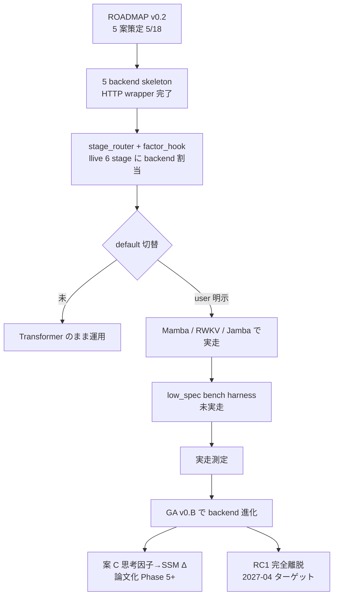
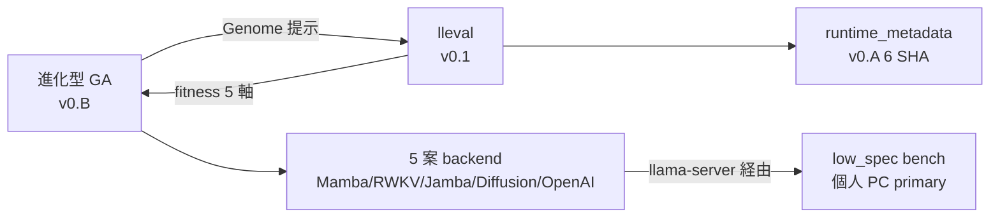
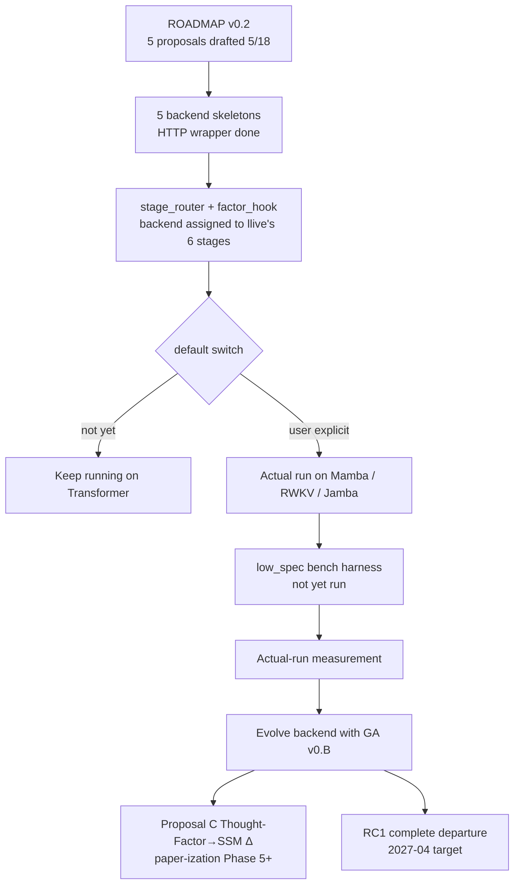
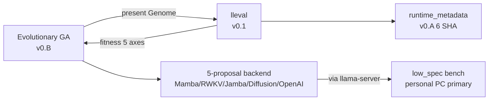
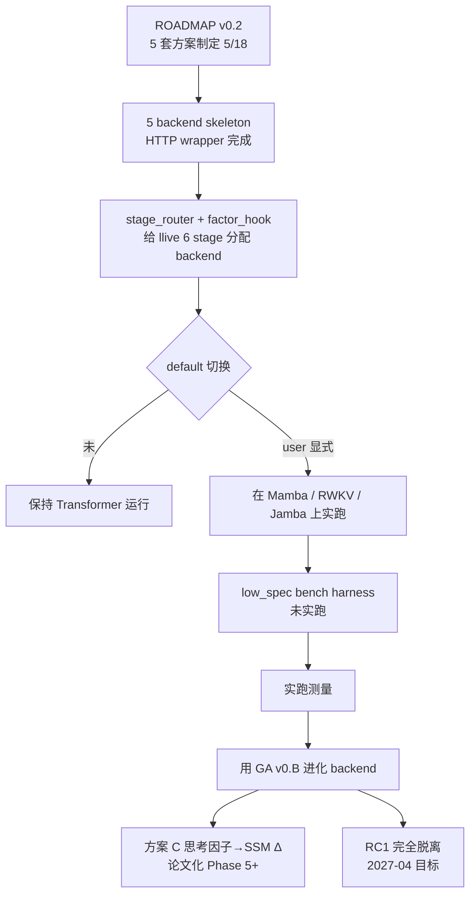
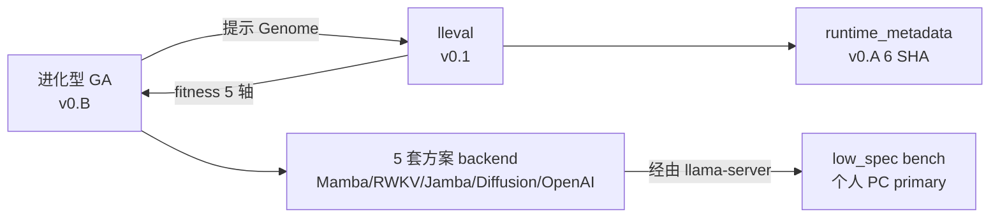
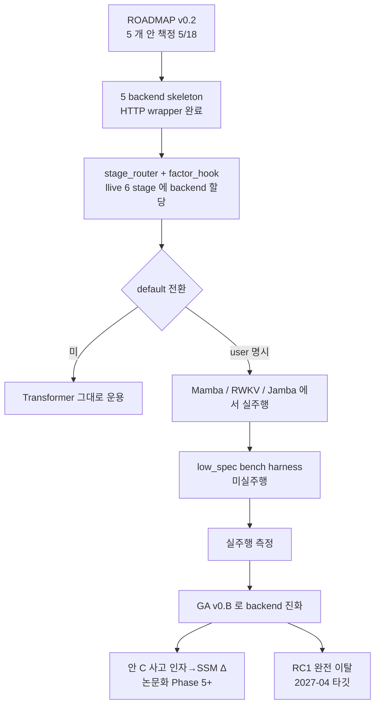
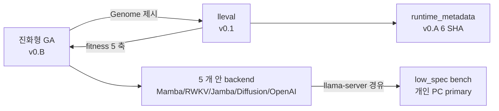

言語 / Language / 语言 / 언어: [日本語](#日本語) | [English](#english) | [中文](#中文) | [한국어](#한국어)

---

# 日本語

# Transformer 脱却は default になるか — 5 案 skeleton + 脳構造を進化させる GA

<!--
Qiita タグ 5 個上限. 本記事の主役順:
  FullSense (umbrella) / llive (本セッション主役) / Mamba (非 transformer 代表)
  / RWKV (CPU-first 代表) / HonestDisclosure (差別化ワード).
NonTransformer / Jamba / Diffusion / EvolutionaryAlgorithm / TRIZ 等は本文で吸収.
投稿前に user 判断でタグ入替可.
-->

> 投稿可否は user 判断. これは「transformer 脱却の現状アセスメントを記事にしておく」
> 依頼で agent が自律ドラフトしたものです.

> 📚 **連載ナビ**: ← #21 3 日間 8 リポ marathon ｜ **#22 本記事** ｜ #23 15h marathon 中間報告 → ｜ [連載 LINK_MAP](./QIITA_#24_LINK_MAP.md)。※ 各記事は単独でも読めます（リンクは回遊用）。

## 0. 冒頭 hook — 「脱却した」と「default が脱却」のあいだに広がる谷

「Transformer から脱却した」と「default の実行経路が non-transformer」は
別物です. 本記事は **2026-05-21 時点でその差分のどこに居るか** を honest
disclosure します.

先に結論 3 つ:

1. **5 案 (Mamba / Jamba / 思考因子→SSM Δ / Diffusion+Mamba / RWKV-7) の HTTP backend
   skeleton は全部繋がっている**. 5/18 の 1 commit で投入済.
2. **default の運用は依然 Transformer**. `LLIVE_LLM_BACKEND=mamba` を明示
   しない限り Transformer のままで, それは「設計通り」 (拡張性ファースト +
   段階的削ぎ落とし).
3. **進化型 GA (v0.B, 本日実装) を被せれば backend 選択そのものを進化させ
   られる**. 「ロボットの脳の構造を進化させる」段階の足場が立った.

---

## 1. ROADMAP 5 案 — 1 行ずつ復習

2026-05-18 に 320 行の `non-transformer/ROADMAP.md` をユーザーが発した
2 制約 (拡張性ファースト + 低スペック PC で実用化) のもと策定した. 5 案を
1 行で:

| 案 | 名前 | 戦略期間 | 一言 |
|---|---|---|---|
| A | **Pure Mamba 7B** | 短期 (3 ヶ月) | Codestral-Mamba 等の SSM をそのまま使う |
| B | **Jamba Hybrid** | 中期 (6 ヶ月) | Mamba + Attention のいいとこ取り |
| C | **思考因子 → SSM Δ Bridge** | 長期 (12 ヶ月, 論文) | llive 独自性最大化, Transformer 不可能 |
| D | **Diffusion + Mamba Hybrid** | 実験 (9 ヶ月) | 並列生成 + SSM の長文 |
| E | **RWKV-7** | 軽量 (3 ヶ月) | CPU 推論最強, GPU なし個人 PC primary |

5 案を **同時に走らせる** のは「全候補を先に skeleton で繋ぎ, bench 後に
必要機能だけ生き残らせる」という拡張性ファーストの原則. 「ロボット歩行進化」で
言うと, **5 体の試作機を同じトラックに並べる**段階.

---

## 2. 完了済み — 「選択肢が揃っている」状態

### 2.1 5 backend skeleton (1 commit で投入)

5/18 の commit (短縮 SHA `6900312`) で以下が一括着地:

```python
from llive.llm import (
    MambaBackend,       # 案 A — Pure Mamba 7B
    JambaBackend,       # 案 B — Jamba Hybrid
    DiffusionBackend,   # 案 D — Diffusion (experimental)
    RwkvBackend,        # 案 E — RWKV-7 CPU-first
    # 案 C 思考因子→SSM Δ は protocol だけ先 (factor_hook.py)
)
```

**特徴**:

- **すべて `OpenAIBackend` (llama-server / RWKV.cpp 等の `/v1/chat/completions`
  互換 HTTP) に内部委譲**. つまり「llama.cpp 系の OpenAI 互換サーバーが
  Mamba GGUF / Jamba GGUF / RWKV.cpp / etc を吐けるなら, llive 側は **コード
  変更ゼロで non-transformer 化** できる」状態.
- backend 名は **wrapper 経由でも保持** (`_delegate_generate` で `backend="mamba"`
  を保つ) ので, **audit log / 分析が「Mamba の出力」と「Transformer の出力」を
  区別できる**.
- **in-process transport** (`mamba_ssm` / `rwkv_py`) は **`NotImplementedError`
  だけ書いてある skeleton**. これは Phase 5 で実装する. 完成度に honest.

### 2.2 stage-wise routing — stage ごとに違う backend

`StageBackendRouter` (`llm/stage_router.py`) で 6 stage (salience / monologue /
action_plan / etc.) に **別 backend** を割り当てられる:

```powershell
$env:LLIVE_LLM_BACKEND_BY_STAGE = '{"salience":"mamba","monologue":"openai","action_plan":"jamba"}'
```

これは **「思考の段階ごとに最適な脳を使い分ける」** という発想で, ROS で
言うなら「歩く時はこの脚, 走る時はこの脚」みたいな話. **段階 = 脳の使い分け**
を明示的にコード化した点で独自性あり.

### 2.3 思考因子 → Δ Bridge protocol (案 C 基礎)

`llm/factor_hook.py` に `ThoughtFactorDeltaHook` protocol だけ書いてある.
これは案 C の基礎で, **llive の 10 思考因子** (構造化 / 再構成 / 閉ループ /
自己拡張 / 不確実性 / 探索 / 整合 / 来歴 / 多視点 / 現実接続) を **SSM の
内部状態 Δ にマッピング**するための入口.

Transformer の attention map に思考因子を inject するのは **構造的に不可能**.
SSM は内部状態 = 隠れ状態の **連続的更新**なので, **思考因子が SSM の状態
遷移に直接介入できる**. この一点が学術的に新規性ある領域で, ROADMAP では
**論文化トラック** に位置付け.

### 2.4 低スペック PC bench harness

`benchmark/low_spec.py` に **xs/s/m/l/xl × 5 backend × CPU only** の
progressive matrix runner. **cloud backend は明示的に `allow_cloud=True` を
渡さない限り refuse**. これは memory `feedback_llive_measurement_purity`
(on-prem 一次走者 / cloud 直接呼びと分離) を harness レベルで強制した形.

ただし **harness は完成, 実走 result はまだ**. これが honest disclosure
ポイント.

---

## 3. 未着手 — 「default が脱却」までの距離

| 項目 | 状態 | なぜ未着手 |
|---|---|---|
| `MambaBackend(transport='mamba_ssm')` 直 in-process | `NotImplementedError` | CUDA 依存. 低スペック PC primary 方針と矛盾するため後回し |
| `RwkvBackend(transport='rwkv_py')` 直 in-process | `NotImplementedError` | 案 E は CPU-first だが, まず HTTP skeleton で経路を固めてから |
| 案 C 思考因子 → SSM Δ Bridge **実装** | protocol だけ | 論文書ける独自性, 慎重に. Phase 5+ |
| **default を non-transformer に切替** | しない予定 | 拡張性ファースト方針 = mock デフォルト維持, ユーザー切替必須 |
| Transformer 完全離脱 (RC1) | 計画中 | Month 11 = 2027-04 ターゲット |
| **30 日プラン Week 1〜4 の実走** | 5/18 で凍結中 | 5/19〜5/20 が COG-MESH と portal で爆発したため |

特に **30 日プランの停滞理由** は明示しておきます — 5/18 で 5 backend
skeleton を投入した後, 5/19 は M8.2〜M8.9 と LoveApp 統合とドキュメント 4 本で
50+ commit, 5/20 は portal NEXT_SESSION 自動化 + research hub 6 件 + llive
コア最適化 12h goal で再び 50+ commit, という **2 日連続のマラソン**で
non-transformer track は触っていない. これは前線が複数走った結果として
honest disclosure.

---

## 4. 進化型 GA (v0.B) との合流点 — 「脳の構造そのものを進化させる」

ここから本記事の核心です. 2026-05-21 に **進化型最適化レイヤ v0.B** を
全件実装した. 26 件の test が緑, sphere/rosenbrock/UCB-hyperparam の 3 problem で
demo 実走確認済.

```python
from llive.perf.evolutionary import (
    EvolutionLoop, GenomeBounds, Population,
    TournamentSelection, BlendCrossover, GaussianMutation, ChainedMutation,
    MultiprocessingScheduler,
)
```

これを **non-transformer backend 選択そのものに当てる** とどうなるか.

### 4.1 Genome の設計案 — 「backend type + sampler + KV quant + model quant」

```python
# 案: Genome を「backend 選択 + sampler + 量子化」の vector で表す

bounds = GenomeBounds(
    lower=(
        0.0,    # backend_id: 0=openai, 1=mamba, 2=rwkv, 3=jamba, 4=diffusion
        0.1,    # temperature
        0.5,    # top_p
        0.0,    # top_k_index (float)
        0.0,    # kv_cache_quant: 0=f16, 1=q8_0, 2=q4_0
        0.0,    # model_quant: 0=q4_k_m, 1=q5_k_m, 2=q8_0
    ),
    upper=(4.99, 1.5, 1.0, 100.0, 2.99, 2.99),
)

# fitness は「low_spec bench の (latency + quality + 安定性) 合成」.
# generation を回すと, 「個人 PC で最適な脳の組合せ」 が GA で勝者になる.
```

これで「**ロボット歩行進化**」が, 文字通り **AI の脳の構造そのものに**
適用される. 5 体のロボット (Mamba / Jamba / Diffusion / Mamba+RWKV / 純 RWKV)
を同じトラックに並べて, 上位 2 体の子を交配 + 突然変異, を 30 世代回す.

### 4.2 ROS 歩行進化との対応 (再掲)

| ROS 歩行進化 | llive v0.B + non-transformer |
|---|---|
| 仮想ロボット 100 体 | 100 個体, それぞれが (backend, sampler, quant) tuple |
| 関節パラメータ | Genome の 6 次元 vector |
| 歩行距離 / 転倒回数 | low_spec bench の latency / quality / 安定性 |
| 100 体並列実行 | `MultiprocessingScheduler(n_workers=8)` |
| 上位 2 体を残す | `ElitismSelection(top_n=2)` |
| 親 2 体から子を作る | `BlendCrossover(alpha=0.3)` |
| 突然変異 | `ChainedMutation([Gaussian, Reset])` |
| 1 世代 | EvolutionLoop の 1 iteration |
| 進化を回す | `loop.run(population, config)` |

つまり「**ロボットの脳の構造**」 ↔ 「**LLM backend の組合せ**」が完全に
isomorphic に対応する. 比喩がコードに落ちている.

### 4.3 「進化型 × 収束型」の役割分担

本日同セッションで実装した GA は, 既存の **UCB selector (収束型, B-5)** と
**直交補完**:

- **UCB (収束型)** — **1 個体内** で variant を選ぶ (1 体のロボットが
  どう歩くかを学習)
- **GA (進化型)** — **個体集団** で勝者を残す (ロボット集団の構造そのものが
  進化)

両者は同時に走らせて良い. 1 個体 = `UCBSynapticSelector(c=genome[0])` を
spawn して, その内側で variant 選択を UCB に任せる構造 (EV-09, `fitness_ucb.py`).
**「学習が走るロボットを進化させる」** という二重構造になる. これが TRIZ
原理 #1 (分割) + #25 (自己制御) + #40 (複合素材) の組合せ.

---

## 5. 直近の手 — 4 つに絞る

ROADMAP §5 (30 日プラン) と GA との合流を踏まえて, 半日 〜 1 日単位で:

| 優先 | アクション | 所要 | 効果 |
|---|---|---|---|
| **高** | llama.cpp + Codestral-Mamba GGUF で `MambaBackend(transport='llama_cpp_server')` の **実走 smoke** | 半日 | 「脱却が 1 例実行される」が出る |
| **高** | `low_spec.py` harness を実走 (xs/s/m サイズで openai vs mamba) | 半日 | 個人 PC で 30 秒以内目標の達成度測定 |
| **中** | RWKV-7 World 7B (q4_k_m) を `RwkvBackend(transport='rwkv_cpp_server')` で繋ぐ | 半日 | CPU-only 個人 PC で動く実証 |
| **中** | **GA × 5 backend** を 1 世代だけ流す PoC (`Genome = (backend_id, temp, top_p, ...)`) | 1 日 | 「進化が backend 選択を最適化する」原始実装 |

合計 **2 日強** で「Transformer 脱却が実行される + 進化が backend を選ぶ」段階に
入れる. 30 日プランの停滞ぶんは, 進化型と合流させることで **遅れではなく
深さに転化** できる.

---

## 6. honest disclosure 3 つ (再掲)

ベンチで自社が異常に速い結果が出たら必ず内訳を疑う (`feedback-benchmark-honest-disclosure` (内部参照))
の精神で:

1. **「脱却」という言葉の解像度**:
   - 「**backend 層で選択肢が揃った**」= ✅ 完了
   - 「**default が non-transformer**」= ❌ 未到達 (これは設計通り, 拡張性ファースト)
   - 「**Transformer モデルファイル (GGUF) を一切使わない**」= ❌ 未到達
   - 「**自前 SSM カーネル + 思考因子 Δ で論文書ける独自性**」= ❌ 未着手

2. **30 日プランの停滞理由**:
   - 5/18 で skeleton 投入後, 5/19-5/20 が COG-MESH M8.x + portal 整備で
     爆発. **non-transformer track は意図的に凍結**して優先度を入れ替えた.
   - これは **計画失敗ではなく, 個人 OSS で複数前線を持つ宿命**. 各前線で
     キリの良いところまで進めば次に移る運用.

3. **進化型と合流させると何が変わるか**:
   - 「**手で 5 案の優劣を比較する**」 → 「**GA に判断を委ねる**」.
   - 判断主体が人間から自動化レイヤに移ることで, **個人 OSS のスケーリング
     ボトルネック (=人間の意思決定帯域)** が外れる.
   - ただし「GA が選んだ backend が本当に最良か」は **fitness の設計に依存**.
     ここで **`runtime_metadata` の 6 metadata 必須** (v0.A) が効く. SHA や
     GGUF spec を fitness に同梱しないと, 進化途中で評価基準がズレる.

---

## 7. 全体像 (Mermaid)



「**現在地は B → C 完了, D が分岐点**」が一目で分かる図.

---

## 8. 余談 — 「脳を進化させる」って言葉の重み

ROS で歩行を進化させるのは, 物理シミュレーター内の試行錯誤で済む. 落ちても
壊れても次の世代に学習が引き継がれる. でも **LLM の脳を進化させる** は,
物理エンティティが存在しないぶん, **何が「歩いている」状態か** を fitness で
定義しないといけない. 「latency が短い」「精度が高い」「KV cache に乗る」
だけだと, **「速いけど嘘ばかり言う AI」** が勝者になりかねない.

なので fitness には:

- latency (低スペック PC で実用速度)
- quality (judge による semantic 評価)
- **stability** (同 prompt × N 回で出力が安定する)
- **safety** (危険な指示拒否率)
- **honesty** (内部状態の self-report が観測と一致する)

の **5 軸合成**が要る. これは進化型 v0.B の `FitnessReport.breakdown` を
拡張するだけで実装可能で, **lleval v0.1 の 5 因子 honest disclosure と
ほぼ同じ列名** になる.

つまり **「lleval = AI の脳の歩行距離を測るシミュレーター」** と読み替えると,
本記事のすべての piece が 1 つの図に収まる:



5 つの piece (進化 / lleval / runtime / backend / low_spec) が **5 角形**で
噛み合う構造で, 今日のセッションで全部の角に **何かしらの実装** が入った.

---

## 9. まとめ

事実として:

- **「Transformer 脱却の準備」は完了** (5 案 backend skeleton, stage routing,
  factor hook protocol, low_spec bench harness).
- **「default が脱却」は未到達**. これは「拡張性ファースト + 段階的削ぎ落とし」
  方針で意図的にそうしている.
- **bench harness 完成, 実 backend 実走まだ** (`low_spec.py` を MockBackend で
  smoke した段階).
- 5/19-5/20 は COG-MESH 本実装 + portal 整備で 100+ commit に時間を割き,
  non-transformer track は 5/18 以降意図的に凍結.
- 5/21 に **進化型 GA (v0.B)** を 1 セッションで全件実装. これにより
  「**人間が backend 候補を取捨選択する**」前線が「**GA が backend 選択を最適化
  する**」に置き換わる土台が立った.

Transformer から脱却した **わけではない**. 脱却の **執行猶予中**で, 執行を
**進化に委ねる準備** が今日整った. 5 体の試作機を同じトラックに並べた段階
から「**進化が走り出すスタートライン**」までは, あと **2 日強** (`llama-server`
起動 + `low_spec` 実走 + `backend_select` demo を実 backend で). 次は走らせる側
の話.

---

## 関連

- llive `docs/non-transformer/ROADMAP.md` — 5 案 + 30 日 + 12 ヶ月プラン (320 行)
- llive `docs/non-transformer/COMPARISON.md` — 案間比較行列
- llive `docs/non-transformer/rwkv-cpu-quickstart.md` — RWKV CPU 立上げ手順
- llive `src/llive/llm/backend.py` — 5 backend skeleton 全件
- llive `src/llive/llm/stage_router.py` — stage 別 backend routing
- llive `src/llive/llm/factor_hook.py` — 案 C 思考因子→Δ protocol
- llive `src/llive/benchmark/low_spec.py` — 個人 PC bench harness
- llive `docs/requirements_v0.B_evolutionary_optimization.md` — 進化型 GA 要件
- llive `docs/experiments/evolutionary_v0_B_2026_05_21.md` — 26 test 緑 + 3 demo
- portal `docs/spec/lleval_v0_1_implementation_notes.md` — fitness 評価 framework
- maintainer memory:
  - `feedback-benchmark-honest-disclosure` (内部参照)
  - `feedback-llive-measurement-purity` (内部参照)
  - `feedback-d-drive-preference` (内部参照)
  - `feedback-qwen-commercial-barrier` (内部参照)
  - `project-llive-core-optimization-2026-05-20` (内部参照)
  - `project-llive-v0B-evolutionary` (内部参照)

---

# English

# Between "We Escaped Transformer" and "Escaping Transformer Is the Default" — 5 Skeleton Proposals + Evolving the Very Structure of the Brain with a Genetic Algorithm

> Whether to publish is the user's call. This was autonomously drafted by the agent in response to a request to "write down a status assessment of escaping Transformer as an article."

> 📚 **Series nav**: ← #21 Three-day, 8-repo marathon ｜ **#22 This article** ｜ #23 15h marathon interim report → ｜ [Series LINK_MAP](./QIITA_#24_LINK_MAP.md). Note: each article also stands on its own (the links are just for browsing).

## 0. Opening hook — the valley that opens up between "we escaped" and "the default is escape"

"We escaped from Transformer" and "the default execution path is non-transformer" are two different things. This article gives an honest disclosure of **where, as of 2026-05-21, we sit on that gap**.

Three conclusions up front:

1. **The HTTP backend skeletons for all 5 proposals (Mamba / Jamba / Thought-Factor→SSM Δ / Diffusion+Mamba / RWKV-7) are all wired up**. They landed in a single commit on 5/18.
2. **Production operation is still Transformer**. Unless you explicitly set `LLIVE_LLM_BACKEND=mamba`, it stays Transformer — and that is "by design" (extensibility-first + progressive paring-down).
3. **Layering on the evolutionary GA (v0.B, implemented today) lets you evolve the backend selection itself**. The footing for the "evolve the structure of the robot's brain" stage is now in place.

---

## 1. The 5 ROADMAP proposals — a one-line refresher each

On 2026-05-18 we drafted a 320-line `non-transformer/ROADMAP.md` under the 2 constraints the user issued (extensibility-first + practical on low-spec PCs). The 5 proposals in one line each:

| Proposal | Name | Strategy horizon | One-liner |
|---|---|---|---|
| A | **Pure Mamba 7B** | Short-term (3 months) | Use an SSM like Codestral-Mamba as-is |
| B | **Jamba Hybrid** | Mid-term (6 months) | Take the best of Mamba + Attention |
| C | **Thought-Factor → SSM Δ Bridge** | Long-term (12 months, paper) | Maximizes llive's originality, impossible with Transformer |
| D | **Diffusion + Mamba Hybrid** | Experimental (9 months) | Parallel generation + SSM long context |
| E | **RWKV-7** | Lightweight (3 months) | Strongest CPU inference, primary for personal PCs without a GPU |

Running all 5 proposals **simultaneously** follows the extensibility-first principle of "wire up every candidate as a skeleton first, then let only the necessary features survive after benchmarking." In "robot gait evolution" terms, this is the stage of **lining up 5 prototype machines on the same track**.

---

## 2. Completed — the state of "the options are all lined up"

### 2.1 The 5 backend skeletons (landed in 1 commit)

The 5/18 commit (short SHA `6900312`) landed all of the following at once:

```python
from llive.llm import (
    MambaBackend,       # 案 A — Pure Mamba 7B
    JambaBackend,       # 案 B — Jamba Hybrid
    DiffusionBackend,   # 案 D — Diffusion (experimental)
    RwkvBackend,        # 案 E — RWKV-7 CPU-first
    # 案 C 思考因子→SSM Δ は protocol だけ先 (factor_hook.py)
)
```

**Characteristics**:

- **They all internally delegate to `OpenAIBackend`** (the `/v1/chat/completions`-compatible HTTP of llama-server / RWKV.cpp / etc.). In other words, "if a llama.cpp-family OpenAI-compatible server can emit Mamba GGUF / Jamba GGUF / RWKV.cpp / etc, then on the llive side we can **go non-transformer with zero code changes**."
- The backend name is **preserved even through the wrapper** (`_delegate_generate` keeps `backend="mamba"`), so the **audit log / analysis can distinguish "Mamba output" from "Transformer output"**.
- The **in-process transport** (`mamba_ssm` / `rwkv_py`) is a **skeleton that only contains `NotImplementedError`**. This will be implemented in Phase 5. Honest about the completeness level.

### 2.2 Stage-wise routing — a different backend per stage

With `StageBackendRouter` (`llm/stage_router.py`) you can assign **a separate backend** to each of the 6 stages (salience / monologue / action_plan / etc.):

```powershell
$env:LLIVE_LLM_BACKEND_BY_STAGE = '{"salience":"mamba","monologue":"openai","action_plan":"jamba"}'
```

This embodies the idea of **"using a different brain for each stage of thought,"** which in ROS terms is like "this leg when walking, that leg when running." There is originality in having explicitly coded **stage = brain selection**.

### 2.3 The Thought-Factor → Δ Bridge protocol (the basis of proposal C)

`llm/factor_hook.py` contains only the `ThoughtFactorDeltaHook` protocol. This is the basis of proposal C — the entry point for **mapping llive's 10 thought factors** (structuring / restructuring / closed loop / self-expansion / uncertainty / exploration / consistency / provenance / multi-perspective / reality connection) onto the **internal-state Δ of an SSM**.

Injecting thought factors into a Transformer's attention map is **structurally impossible**. Because an SSM's internal state is a **continuous update of the hidden state**, **thought factors can directly intervene in the SSM's state transition**. This single point is an area of academic novelty, and in the ROADMAP it is positioned on the **paper track**.

### 2.4 The low-spec PC bench harness

`benchmark/low_spec.py` is a progressive matrix runner for **xs/s/m/l/xl × 5 backends × CPU only**. **It refuses cloud backends unless you explicitly pass `allow_cloud=True`**. This enforces, at the harness level, the memory `feedback_llive_measurement_purity` (on-prem first runner / separated from direct cloud calls).

That said, **the harness is complete, but the actual run results are not yet in**. This is the honest-disclosure point.

---

## 3. Not yet started — the distance to "the default escapes"

| Item | Status | Why not yet started |
|---|---|---|
| `MambaBackend(transport='mamba_ssm')` direct in-process | `NotImplementedError` | CUDA dependency. Deferred because it conflicts with the low-spec-PC-primary policy |
| `RwkvBackend(transport='rwkv_py')` direct in-process | `NotImplementedError` | Proposal E is CPU-first, but we first solidify the path via the HTTP skeleton |
| Proposal C Thought-Factor → SSM Δ Bridge **implementation** | protocol only | Paper-worthy originality, so cautious. Phase 5+ |
| **Switch the default to non-transformer** | not planned | Extensibility-first policy = keep the mock default, user switch required |
| Complete Transformer departure (RC1) | being planned | Month 11 = 2027-04 target |
| **Actual run of 30-day plan Weeks 1–4** | frozen since 5/18 | Because 5/19–5/20 exploded with COG-MESH and the portal |

In particular, let me state the **reason the 30-day plan stalled** explicitly — after landing the 5 backend skeletons on 5/18, 5/19 saw 50+ commits across M8.2–M8.9, LoveApp integration, and 4 documents; 5/20 again saw 50+ commits from portal NEXT_SESSION automation + 6 research hub items + a 12h llive core optimization goal — a **two-day-straight marathon** during which the non-transformer track went untouched. This is honest disclosure of the result of multiple fronts running at once.

---

## 4. The confluence with the evolutionary GA (v0.B) — "evolving the very structure of the brain"

This is the core of the article. On 2026-05-21 we **fully implemented the evolutionary optimization layer v0.B**. 26 tests green, and demos confirmed running on the 3 problems sphere/rosenbrock/UCB-hyperparam.

```python
from llive.perf.evolutionary import (
    EvolutionLoop, GenomeBounds, Population,
    TournamentSelection, BlendCrossover, GaussianMutation, ChainedMutation,
    MultiprocessingScheduler,
)
```

What happens if we **apply this to the non-transformer backend selection itself**?

### 4.1 A genome design proposal — "backend type + sampler + KV quant + model quant"

```python
# 案: Genome を「backend 選択 + sampler + 量子化」の vector で表す

bounds = GenomeBounds(
    lower=(
        0.0,    # backend_id: 0=openai, 1=mamba, 2=rwkv, 3=jamba, 4=diffusion
        0.1,    # temperature
        0.5,    # top_p
        0.0,    # top_k_index (float)
        0.0,    # kv_cache_quant: 0=f16, 1=q8_0, 2=q4_0
        0.0,    # model_quant: 0=q4_k_m, 1=q5_k_m, 2=q8_0
    ),
    upper=(4.99, 1.5, 1.0, 100.0, 2.99, 2.99),
)

# fitness は「low_spec bench の (latency + quality + 安定性) 合成」.
# generation を回すと, 「個人 PC で最適な脳の組合せ」 が GA で勝者になる.
```

With this, **"robot gait evolution"** is applied, literally, **to the very structure of the AI's brain**. You line up 5 robots (Mamba / Jamba / Diffusion / Mamba+RWKV / pure RWKV) on the same track, then crossbreed the offspring of the top 2 + mutate, and run that for 30 generations.

### 4.2 Correspondence with ROS gait evolution (restated)

| ROS gait evolution | llive v0.B + non-transformer |
|---|---|
| 100 virtual robots | 100 individuals, each a (backend, sampler, quant) tuple |
| Joint parameters | The 6-dimensional vector of the Genome |
| Walking distance / number of falls | low_spec bench latency / quality / stability |
| 100 robots run in parallel | `MultiprocessingScheduler(n_workers=8)` |
| Keep the top 2 | `ElitismSelection(top_n=2)` |
| Make children from 2 parents | `BlendCrossover(alpha=0.3)` |
| Mutation | `ChainedMutation([Gaussian, Reset])` |
| 1 generation | 1 iteration of EvolutionLoop |
| Run the evolution | `loop.run(population, config)` |

So **"the structure of the robot's brain"** ↔ **"the combination of LLM backend"** corresponds in a fully isomorphic way. The metaphor has landed in code.

### 4.3 The division of roles between "evolutionary × convergent"

The GA implemented in the same session today is **orthogonally complementary** to the existing **UCB selector (convergent, B-5)**:

- **UCB (convergent)** — picks a variant **within 1 individual** (learning how a single robot walks)
- **GA (evolutionary)** — keeps winners **across a population** (the structure of the robot population itself evolves)

The two may run at the same time. The structure is: spawn 1 individual = `UCBSynapticSelector(c=genome[0])` and leave the variant selection inside it to UCB (EV-09, `fitness_ucb.py`). This becomes a double structure of **"evolving robots that have learning running inside them."** This is a combination of TRIZ principle #1 (segmentation) + #25 (self-service) + #40 (composite materials).

---

## 5. The immediate moves — narrowed to 4

Taking into account the confluence of ROADMAP §5 (the 30-day plan) and the GA, in half-day to one-day units:

| Priority | Action | Effort | Effect |
|---|---|---|---|
| **High** | An **actual smoke run** of `MambaBackend(transport='llama_cpp_server')` with llama.cpp + Codestral-Mamba GGUF | half day | We get "escape executed for 1 case" |
| **High** | Actually run the `low_spec.py` harness (openai vs mamba at xs/s/m sizes) | half day | Measure how well we meet the within-30-seconds-on-a-personal-PC target |
| **Medium** | Wire up RWKV-7 World 7B (q4_k_m) via `RwkvBackend(transport='rwkv_cpp_server')` | half day | Proof that it runs on a CPU-only personal PC |
| **Medium** | A PoC that runs **GA × 5 backends** for just 1 generation (`Genome = (backend_id, temp, top_p, ...)`) | 1 day | A primitive implementation of "evolution optimizes the backend selection" |

In **a bit over 2 days** total we can enter the stage of "Transformer escape gets executed + evolution picks the backend." The stall in the 30-day plan can, by merging it with the evolutionary side, be **converted from a delay into depth**.

---

## 6. Three honest disclosures (restated)

In the spirit of "if your own results come out suspiciously fast in a benchmark, always question the breakdown" (`feedback-benchmark-honest-disclosure` (internal reference)):

1. **The resolution of the word "escape"**:
   - "**The options are lined up at the backend layer**" = ✅ Done
   - "**The default is non-transformer**" = ❌ Not reached (this is by design, extensibility-first)
   - "**Using no Transformer model files (GGUF) at all**" = ❌ Not reached
   - "**Originality worth a paper with a homegrown SSM kernel + thought-factor Δ**" = ❌ Not started

2. **The reason the 30-day plan stalled**:
   - After landing the skeleton on 5/18, 5/19–5/20 exploded with COG-MESH M8.x + portal maintenance. **The non-transformer track was intentionally frozen** and priorities were swapped.
   - This is **not a planning failure, but the destiny of holding multiple fronts in a personal OSS**. The operating mode is: advance each front to a good stopping point, then move to the next.

3. **What changes when you merge it with the evolutionary side**:
   - "**Comparing the merits of 5 proposals by hand**" → "**Entrusting the judgment to the GA**."
   - By moving the locus of judgment from a human to the automation layer, the **scaling bottleneck of personal OSS (= the human's decision-making bandwidth)** is removed.
   - However, "whether the backend the GA chose is truly the best" **depends on the design of the fitness**. Here, **the 6 mandatory `runtime_metadata` fields (v0.A)** matter. Unless you bundle the SHA and GGUF spec into the fitness, the evaluation criteria will drift midway through evolution.

---

## 7. The big picture (Mermaid)



A diagram where "**the current position is: B → C done, D is the branch point**" is visible at a glance.

---

## 8. An aside — the weight of the phrase "evolving the brain"

Evolving a gait in ROS can be done with trial and error inside a physics simulator. Even if it falls or breaks, the learning is carried over to the next generation. But **evolving the brain of an LLM** has no physical entity, so you have to define **what counts as a "walking" state** through the fitness. If it's only "low latency," "high accuracy," and "fits in the KV cache," then **"a fast AI that tells nothing but lies"** could become the winner.

So the fitness needs:

- latency (practical speed on a low-spec PC)
- quality (semantic evaluation by a judge)
- **stability** (output is stable across N runs of the same prompt)
- **safety** (refusal rate for dangerous instructions)
- **honesty** (the self-report of the internal state matches the observations)

a **5-axis composite**. This can be implemented just by extending the `FitnessReport.breakdown` of evolutionary v0.B, and it ends up with **almost the same column names as the 5-factor honest disclosure of lleval v0.1**.

In other words, if you reread it as **"lleval = a simulator that measures the walking distance of the AI's brain,"** every piece of this article fits into a single diagram:



A structure where 5 pieces (evolution / lleval / runtime / backend / low_spec) **mesh in a pentagon**, and in today's session **some kind of implementation** went into every corner.

---

## 9. Summary

As a matter of fact:

- **"Preparation for escaping Transformer" is complete** (5 backend skeletons, stage routing, factor hook protocol, low_spec bench harness).
- **"The default has escaped" is not reached**. This is intentionally so under the "extensibility-first + progressive paring-down" policy.
- **The bench harness is complete, but actual-backend runs are not yet done** (we're at the stage of having smoked `low_spec.py` with MockBackend).
- On 5/19–5/20 we spent time on 100+ commits for the COG-MESH full implementation + portal maintenance, and the non-transformer track has been intentionally frozen since 5/18.
- On 5/21 we **fully implemented the evolutionary GA (v0.B)** in a single session. With this, the foundation is laid for the front of "**a human cherry-picks backend candidates**" to be replaced by "**the GA optimizes the backend selection**."

We have **not** escaped from Transformer. We're in a **stay of execution** on the escape, and the preparation to **entrust the execution to evolution** came together today. From the stage of lining up 5 prototype machines on the same track to "**the starting line where evolution begins to run**" is a bit over **2 days** away (`llama-server` startup + a `low_spec` actual run + a `backend_select` demo on a real backend). Next is the running side of the story.

---

## Related

- llive `docs/non-transformer/ROADMAP.md` — 5 proposals + 30-day + 12-month plan (320 lines)
- llive `docs/non-transformer/COMPARISON.md` — inter-proposal comparison matrix
- llive `docs/non-transformer/rwkv-cpu-quickstart.md` — RWKV CPU startup procedure
- llive `src/llive/llm/backend.py` — all 5 backend skeletons
- llive `src/llive/llm/stage_router.py` — per-stage backend routing
- llive `src/llive/llm/factor_hook.py` — proposal C Thought-Factor→Δ protocol
- llive `src/llive/benchmark/low_spec.py` — personal PC bench harness
- llive `docs/requirements_v0.B_evolutionary_optimization.md` — evolutionary GA requirements
- llive `docs/experiments/evolutionary_v0_B_2026_05_21.md` — 26 tests green + 3 demos
- portal `docs/spec/lleval_v0_1_implementation_notes.md` — fitness evaluation framework
- maintainer memory:
  - `feedback-benchmark-honest-disclosure` (internal reference)
  - `feedback-llive-measurement-purity` (internal reference)
  - `feedback-d-drive-preference` (internal reference)
  - `feedback-qwen-commercial-barrier` (internal reference)
  - `project-llive-core-optimization-2026-05-20` (internal reference)
  - `project-llive-v0B-evolutionary` (internal reference)

---

# 中文

# 在「已脱离 Transformer」与「脱离 Transformer 成为 default」之间 —— 5 套 skeleton 方案 + 用进化型 GA 进化大脑结构本身

> 是否发布由 user 判断。本文是 agent 根据「把脱离 transformer 的现状评估写成文章」的委托自主起草的。

> 📚 **连载导航**: ← #21 三天 8 仓库 marathon ｜ **#22 本文** ｜ #23 15h marathon 中间报告 → ｜ [连载 LINK_MAP](./QIITA_#24_LINK_MAP.md)。※ 每篇文章都可单独阅读（链接仅供回游）。

## 0. 开篇 hook —— 在「已脱离」与「default 即脱离」之间展开的山谷

「已从 Transformer 脱离」与「default 的执行路径是 non-transformer」是两回事。本文对 **截至 2026-05-21 我们处在这一差距的何处** 进行 honest disclosure。

先给出 3 个结论:

1. **5 套方案 (Mamba / Jamba / 思考因子→SSM Δ / Diffusion+Mamba / RWKV-7) 的 HTTP backend skeleton 全部已接通**。已在 5/18 的 1 个 commit 中投入。
2. **default 的运行依然是 Transformer**。除非显式设置 `LLIVE_LLM_BACKEND=mamba`，否则保持 Transformer，而这是「按设计」(扩展性优先 + 逐步削减)。
3. **叠加进化型 GA (v0.B, 今日实现) 后，就能进化 backend 选择本身**。「进化机器人大脑结构」这一阶段的立足点已经搭好。

---

## 1. ROADMAP 5 套方案 —— 逐条一行复习

2026-05-18，在用户提出的 2 个约束 (扩展性优先 + 在低配 PC 上实用化) 之下，制定了 320 行的 `non-transformer/ROADMAP.md`。把 5 套方案各用一行概括:

| 方案 | 名称 | 战略周期 | 一句话 |
|---|---|---|---|
| A | **Pure Mamba 7B** | 短期 (3 个月) | 直接使用 Codestral-Mamba 等 SSM |
| B | **Jamba Hybrid** | 中期 (6 个月) | 取 Mamba + Attention 之长 |
| C | **思考因子 → SSM Δ Bridge** | 长期 (12 个月, 论文) | 最大化 llive 独特性，Transformer 无法做到 |
| D | **Diffusion + Mamba Hybrid** | 实验 (9 个月) | 并行生成 + SSM 的长文 |
| E | **RWKV-7** | 轻量 (3 个月) | CPU 推理最强，无 GPU 个人 PC 的 primary |

**同时跑** 5 套方案，遵循的是「先把所有候选用 skeleton 接好，bench 后只让必要功能存活下来」这一扩展性优先原则。用「机器人步行进化」来说，就是 **把 5 台样机并排放在同一条赛道上** 的阶段。

---

## 2. 已完成 —— 「选项已齐备」的状态

### 2.1 5 个 backend skeleton (用 1 个 commit 投入)

5/18 的 commit (短 SHA `6900312`) 一次性落地了以下内容:

```python
from llive.llm import (
    MambaBackend,       # 案 A — Pure Mamba 7B
    JambaBackend,       # 案 B — Jamba Hybrid
    DiffusionBackend,   # 案 D — Diffusion (experimental)
    RwkvBackend,        # 案 E — RWKV-7 CPU-first
    # 案 C 思考因子→SSM Δ は protocol だけ先 (factor_hook.py)
)
```

**特点**:

- **全部在内部委托给 `OpenAIBackend`** (llama-server / RWKV.cpp 等的 `/v1/chat/completions` 兼容 HTTP)。也就是说「只要 llama.cpp 系列的 OpenAI 兼容服务器能吐出 Mamba GGUF / Jamba GGUF / RWKV.cpp / 等，那么在 llive 这一侧就能 **零代码改动地实现 non-transformer 化**」。
- backend 名称 **即使经过 wrapper 也会保留** (`_delegate_generate` 保持 `backend="mamba"`)，因此 **audit log / 分析可以区分「Mamba 的输出」与「Transformer 的输出」**。
- **in-process transport** (`mamba_ssm` / `rwkv_py`) 是 **只写了 `NotImplementedError` 的 skeleton**。这将在 Phase 5 实现。对完成度保持诚实。

### 2.2 stage-wise routing —— 每个 stage 用不同的 backend

通过 `StageBackendRouter` (`llm/stage_router.py`)，可以给 6 个 stage (salience / monologue / action_plan / etc.) 各分配 **不同的 backend**:

```powershell
$env:LLIVE_LLM_BACKEND_BY_STAGE = '{"salience":"mamba","monologue":"openai","action_plan":"jamba"}'
```

这体现了 **「为思考的每个阶段使用最合适的大脑」** 的发想，用 ROS 来说就像「走的时候用这条腿，跑的时候用那条腿」。把 **阶段 = 大脑的切换** 明确地写进代码这一点上具有独特性。

### 2.3 思考因子 → Δ Bridge protocol (方案 C 的基础)

`llm/factor_hook.py` 里只写了 `ThoughtFactorDeltaHook` protocol。这是方案 C 的基础，是把 **llive 的 10 个思考因子** (结构化 / 重构 / 闭环 / 自我扩展 / 不确定性 / 探索 / 整合 / 来历 / 多视角 / 现实连接) **映射到 SSM 内部状态 Δ** 的入口。

向 Transformer 的 attention map 注入思考因子在 **结构上是不可能的**。SSM 的内部状态 = 隐藏状态的 **连续更新**，因此 **思考因子可以直接介入 SSM 的状态转移**。这一点是学术上具有新颖性的领域，在 ROADMAP 中被定位于 **论文化 track**。

### 2.4 低配 PC bench harness

`benchmark/low_spec.py` 是 **xs/s/m/l/xl × 5 backend × 仅 CPU** 的渐进式矩阵 runner。**除非显式传入 `allow_cloud=True`，否则拒绝 cloud backend**。这在 harness 层面强制执行了 memory `feedback_llive_measurement_purity` (on-prem 一次走者 / 与 cloud 直接调用分离)。

不过 **harness 已完成，实跑结果尚未有**。这就是 honest disclosure 的要点。

---

## 3. 尚未着手 —— 到「default 脱离」的距离

| 项目 | 状态 | 为何尚未着手 |
|---|---|---|
| `MambaBackend(transport='mamba_ssm')` 直接 in-process | `NotImplementedError` | CUDA 依赖。与低配 PC primary 方针矛盾，故推后 |
| `RwkvBackend(transport='rwkv_py')` 直接 in-process | `NotImplementedError` | 方案 E 是 CPU-first，但先用 HTTP skeleton 固定路径 |
| 方案 C 思考因子 → SSM Δ Bridge **实现** | 仅 protocol | 可写论文的独特性，谨慎对待。Phase 5+ |
| **把 default 切换为 non-transformer** | 不打算做 | 扩展性优先方针 = 维持 mock 默认，必须由用户切换 |
| Transformer 完全脱离 (RC1) | 计划中 | Month 11 = 2027-04 目标 |
| **30 天计划 Week 1〜4 的实跑** | 自 5/18 起冻结中 | 因为 5/19〜5/20 被 COG-MESH 和 portal 引爆 |

特别地，明确说明 **30 天计划停滞的理由** —— 5/18 投入 5 个 backend skeleton 之后，5/19 在 M8.2〜M8.9 与 LoveApp 集成与 4 篇文档上有 50+ commit，5/20 又在 portal NEXT_SESSION 自动化 + research hub 6 件 + llive 核心优化 12h goal 上再次有 50+ commit，这是 **连续两天的 marathon**，期间没有碰 non-transformer track。这是对「多条前线同时推进」之结果的 honest disclosure。

---

## 4. 与进化型 GA (v0.B) 的汇合点 —— 「进化大脑结构本身」

这里是本文的核心。2026-05-21 **全量实现了进化型优化层 v0.B**。26 个 test 全绿，已在 sphere/rosenbrock/UCB-hyperparam 这 3 个 problem 上确认 demo 实跑。

```python
from llive.perf.evolutionary import (
    EvolutionLoop, GenomeBounds, Population,
    TournamentSelection, BlendCrossover, GaussianMutation, ChainedMutation,
    MultiprocessingScheduler,
)
```

如果把它 **应用到 non-transformer backend 选择本身** 会怎样?

### 4.1 Genome 的设计方案 —— 「backend type + sampler + KV quant + model quant」

```python
# 案: Genome を「backend 選択 + sampler + 量子化」の vector で表す

bounds = GenomeBounds(
    lower=(
        0.0,    # backend_id: 0=openai, 1=mamba, 2=rwkv, 3=jamba, 4=diffusion
        0.1,    # temperature
        0.5,    # top_p
        0.0,    # top_k_index (float)
        0.0,    # kv_cache_quant: 0=f16, 1=q8_0, 2=q4_0
        0.0,    # model_quant: 0=q4_k_m, 1=q5_k_m, 2=q8_0
    ),
    upper=(4.99, 1.5, 1.0, 100.0, 2.99, 2.99),
)

# fitness は「low_spec bench の (latency + quality + 安定性) 合成」.
# generation を回すと, 「個人 PC で最適な脳の組合せ」 が GA で勝者になる.
```

这样一来，**「机器人步行进化」** 就字面意义上被应用到 **AI 的大脑结构本身**。把 5 台机器人 (Mamba / Jamba / Diffusion / Mamba+RWKV / 纯 RWKV) 并排放在同一条赛道上，将前 2 名的孩子交配 + 突变，跑 30 代。

### 4.2 与 ROS 步行进化的对应 (再列)

| ROS 步行进化 | llive v0.B + non-transformer |
|---|---|
| 虚拟机器人 100 台 | 100 个体，每个都是 (backend, sampler, quant) tuple |
| 关节参数 | Genome 的 6 维 vector |
| 步行距离 / 跌倒次数 | low_spec bench 的 latency / quality / 稳定性 |
| 100 台并行执行 | `MultiprocessingScheduler(n_workers=8)` |
| 保留前 2 名 | `ElitismSelection(top_n=2)` |
| 由 2 个亲代产生子代 | `BlendCrossover(alpha=0.3)` |
| 突变 | `ChainedMutation([Gaussian, Reset])` |
| 1 代 | EvolutionLoop 的 1 iteration |
| 跑进化 | `loop.run(population, config)` |

也就是说，**「机器人的大脑结构」** ↔ **「LLM backend 的组合」** 完全 isomorphic 地对应。比喻落到了代码上。

### 4.3 「进化型 × 收敛型」的角色分工

今日同一 session 实现的 GA，与既有的 **UCB selector (收敛型, B-5)** **正交互补**:

- **UCB (收敛型)** —— 在 **1 个体内** 选 variant (学习 1 台机器人如何走)
- **GA (进化型)** —— 在 **个体集团** 中保留胜者 (机器人集团的结构本身进化)

两者可以同时跑。结构是: spawn 1 个体 = `UCBSynapticSelector(c=genome[0])`，在其内部把 variant 选择交给 UCB (EV-09, `fitness_ucb.py`)。这构成 **「进化内部跑着学习的机器人」** 的双重结构。这是 TRIZ 原理 #1 (分割) + #25 (自服务) + #40 (复合材料) 的组合。

---

## 5. 近期之手 —— 收缩到 4 个

结合 ROADMAP §5 (30 天计划) 与 GA 的汇合，以半天 〜 1 天为单位:

| 优先 | 行动 | 所需 | 效果 |
|---|---|---|---|
| **高** | 用 llama.cpp + Codestral-Mamba GGUF 对 `MambaBackend(transport='llama_cpp_server')` 做 **实跑 smoke** | 半天 | 得到「脱离被执行 1 例」 |
| **高** | 实跑 `low_spec.py` harness (在 xs/s/m 尺寸上 openai vs mamba) | 半天 | 测量在个人 PC 上 30 秒以内目标的达成度 |
| **中** | 用 `RwkvBackend(transport='rwkv_cpp_server')` 接上 RWKV-7 World 7B (q4_k_m) | 半天 | 在仅 CPU 个人 PC 上运行的实证 |
| **中** | 仅跑 1 代的 **GA × 5 backend** PoC (`Genome = (backend_id, temp, top_p, ...)`) | 1 天 | 「进化优化 backend 选择」的原始实现 |

合计 **2 天多** 即可进入「Transformer 脱离被执行 + 进化选择 backend」的阶段。30 天计划停滞的部分，通过与进化型汇合，可以 **从延迟转化为深度**。

---

## 6. 三个 honest disclosure (再列)

本着「benchmark 里自家结果异常之快时，务必怀疑其内幕」(`feedback-benchmark-honest-disclosure` (内部参照)) 的精神:

1. **「脱离」一词的分辨率**:
   - 「**在 backend 层选项已齐备**」= ✅ 完成
   - 「**default 是 non-transformer**」= ❌ 未到达 (这是按设计，扩展性优先)
   - 「**完全不使用 Transformer 模型文件 (GGUF)**」= ❌ 未到达
   - 「**用自制 SSM kernel + 思考因子 Δ 写得出论文的独特性**」= ❌ 未着手

2. **30 天计划停滞的理由**:
   - 5/18 投入 skeleton 后，5/19-5/20 被 COG-MESH M8.x + portal 整备引爆。**non-transformer track 被有意冻结**，优先级被对换。
   - 这 **不是计划失败，而是个人 OSS 持有多条前线的宿命**。运行方式是: 每条前线推进到一个合适的停顿点，然后转到下一条。

3. **与进化型汇合后会改变什么**:
   - 「**用手比较 5 套方案的优劣**」→「**把判断交给 GA**」。
   - 判断主体从人类移到自动化层，由此 **个人 OSS 的扩展瓶颈 (= 人类的决策带宽)** 被解除。
   - 但「GA 选的 backend 是否真的最优」**取决于 fitness 的设计**。这里 **`runtime_metadata` 的 6 个 metadata 必填 (v0.A)** 起作用。若不把 SHA 与 GGUF spec 同梱进 fitness，进化途中评价基准就会偏移。

---

## 7. 全局图 (Mermaid)



一张能一眼看出「**当前位置: B → C 完成，D 是分岔点**」的图。

---

## 8. 闲谈 —— 「进化大脑」这句话的分量

在 ROS 里进化步行，靠物理模拟器内的试错就能搞定。即便摔倒或损坏，学习也会传给下一代。但 **进化 LLM 的大脑**，因为没有物理实体，所以必须用 fitness 来定义 **什么算作「行走中」状态**。若只有「latency 短」「精度高」「装得进 KV cache」，那么 **「快但满嘴谎话的 AI」** 就可能成为胜者。

所以 fitness 需要:

- latency (在低配 PC 上的实用速度)
- quality (由 judge 进行的 semantic 评价)
- **stability** (同一 prompt × N 次输出稳定)
- **safety** (危险指令的拒绝率)
- **honesty** (内部状态的 self-report 与观测一致)

的 **5 轴合成**。这只需扩展进化型 v0.B 的 `FitnessReport.breakdown` 即可实现，并且会得到 **与 lleval v0.1 的 5 因子 honest disclosure 几乎相同的列名**。

也就是说，如果把它重新解读为 **「lleval = 测量 AI 大脑步行距离的模拟器」**，本文的所有 piece 就能装进一张图:



一个由 5 个 piece (进化 / lleval / runtime / backend / low_spec) **以五边形咬合** 的结构，在今天的 session 里每个角都进了 **某种实现**。

---

## 9. 总结

作为事实:

- **「脱离 Transformer 的准备」已完成** (5 个 backend skeleton, stage routing, factor hook protocol, low_spec bench harness)。
- **「default 已脱离」尚未到达**。这是在「扩展性优先 + 逐步削减」方针下有意为之。
- **bench harness 已完成，实 backend 实跑尚未** (处于用 MockBackend 对 `low_spec.py` 做 smoke 的阶段)。
- 5/19-5/20 在 COG-MESH 正式实现 + portal 整备的 100+ commit 上花了时间，non-transformer track 自 5/18 起被有意冻结。
- 5/21 在一个 session 里 **全量实现了进化型 GA (v0.B)**。由此，「**人类取舍 backend 候选**」这条前线被替换为「**GA 优化 backend 选择**」的基础已立起。

我们 **并非** 已从 Transformer 脱离。处于脱离的 **缓期执行中**，而把执行 **托付给进化的准备** 在今天完成。从把 5 台样机并排放在同一条赛道的阶段，到「**进化开始奔跑的起跑线**」，还差 **2 天多** (`llama-server` 启动 + `low_spec` 实跑 + 在实 backend 上的 `backend_select` demo)。接下来是「跑起来」那一侧的故事。

---

## 相关

- llive `docs/non-transformer/ROADMAP.md` — 5 套方案 + 30 天 + 12 个月计划 (320 行)
- llive `docs/non-transformer/COMPARISON.md` — 方案间比较矩阵
- llive `docs/non-transformer/rwkv-cpu-quickstart.md` — RWKV CPU 启动步骤
- llive `src/llive/llm/backend.py` — 全部 5 个 backend skeleton
- llive `src/llive/llm/stage_router.py` — 按 stage 的 backend routing
- llive `src/llive/llm/factor_hook.py` — 方案 C 思考因子→Δ protocol
- llive `src/llive/benchmark/low_spec.py` — 个人 PC bench harness
- llive `docs/requirements_v0.B_evolutionary_optimization.md` — 进化型 GA 需求
- llive `docs/experiments/evolutionary_v0_B_2026_05_21.md` — 26 test 全绿 + 3 demo
- portal `docs/spec/lleval_v0_1_implementation_notes.md` — fitness 评价 framework
- maintainer memory:
  - `feedback-benchmark-honest-disclosure` (内部参照)
  - `feedback-llive-measurement-purity` (内部参照)
  - `feedback-d-drive-preference` (内部参照)
  - `feedback-qwen-commercial-barrier` (内部参照)
  - `project-llive-core-optimization-2026-05-20` (内部参照)
  - `project-llive-v0B-evolutionary` (内部参照)

---

# 한국어

# 「Transformer 에서 탈피했다」와 「Transformer 탈피가 default」 사이 —— 5 개 안 skeleton + 진화형 GA 로 뇌 구조 그 자체를 진화시키는 이야기

> 게시 여부는 user 판단. 이것은 「transformer 탈피의 현황 평가를 기사로 남겨 두기」 의뢰로 agent 가 자율적으로 초안한 것입니다.

> 📚 **연재 내비**: ← #21 3 일간 8 레포 marathon ｜ **#22 본 기사** ｜ #23 15h marathon 중간 보고 → ｜ [연재 LINK_MAP](./QIITA_#24_LINK_MAP.md). ※ 각 기사는 단독으로도 읽을 수 있습니다 (링크는 회유용).

## 0. 도입 hook —— 「탈피했다」와 「default 가 탈피」 사이에 펼쳐지는 골짜기

「Transformer 에서 탈피했다」와 「default 의 실행 경로가 non-transformer」 는 별개입니다. 본 기사는 **2026-05-21 시점에 그 차이의 어디에 있는지** 를 honest disclosure 합니다.

먼저 결론 3 가지:

1. **5 개 안 (Mamba / Jamba / 사고 인자→SSM Δ / Diffusion+Mamba / RWKV-7) 의 HTTP backend skeleton 은 전부 연결되어 있다**. 5/18 의 1 commit 으로 투입 완료.
2. **default 의 운용은 여전히 Transformer**. `LLIVE_LLM_BACKEND=mamba` 를 명시하지 않는 한 Transformer 그대로이며, 그것은 「설계대로」 (확장성 우선 + 단계적 깎아내기).
3. **진화형 GA (v0.B, 오늘 구현) 를 씌우면 backend 선택 그 자체를 진화시킬 수 있다**. 「로봇의 뇌 구조를 진화시킨다」 단계의 발판이 섰다.

---

## 1. ROADMAP 5 개 안 —— 한 줄씩 복습

2026-05-18 에 320 줄의 `non-transformer/ROADMAP.md` 를 사용자가 제시한 2 제약 (확장성 우선 + 저사양 PC 에서 실용화) 하에 책정했다. 5 개 안을 한 줄로:

| 안 | 이름 | 전략 기간 | 한마디 |
|---|---|---|---|
| A | **Pure Mamba 7B** | 단기 (3 개월) | Codestral-Mamba 등의 SSM 을 그대로 사용 |
| B | **Jamba Hybrid** | 중기 (6 개월) | Mamba + Attention 의 장점만 취함 |
| C | **사고 인자 → SSM Δ Bridge** | 장기 (12 개월, 논문) | llive 독자성 최대화, Transformer 불가능 |
| D | **Diffusion + Mamba Hybrid** | 실험 (9 개월) | 병렬 생성 + SSM 의 장문 |
| E | **RWKV-7** | 경량 (3 개월) | CPU 추론 최강, GPU 없는 개인 PC primary |

5 개 안을 **동시에 달리게** 하는 것은 「모든 후보를 먼저 skeleton 으로 연결하고, bench 후에 필요한 기능만 살아남게 한다」 는 확장성 우선의 원칙. 「로봇 보행 진화」 로 말하면 **5 대의 시작기를 같은 트랙에 나란히 세우는** 단계.

---

## 2. 완료됨 —— 「선택지가 갖춰져 있다」 상태

### 2.1 5 backend skeleton (1 commit 으로 투입)

5/18 의 commit (단축 SHA `6900312`) 으로 다음이 일괄 착지:

```python
from llive.llm import (
    MambaBackend,       # 案 A — Pure Mamba 7B
    JambaBackend,       # 案 B — Jamba Hybrid
    DiffusionBackend,   # 案 D — Diffusion (experimental)
    RwkvBackend,        # 案 E — RWKV-7 CPU-first
    # 案 C 思考因子→SSM Δ は protocol だけ先 (factor_hook.py)
)
```

**특징**:

- **모두 `OpenAIBackend` (llama-server / RWKV.cpp 등의 `/v1/chat/completions` 호환 HTTP) 에 내부 위임**. 즉 「llama.cpp 계열의 OpenAI 호환 서버가 Mamba GGUF / Jamba GGUF / RWKV.cpp / etc 를 뱉을 수 있다면, llive 쪽은 **코드 변경 제로로 non-transformer 화** 할 수 있다」 는 상태.
- backend 이름은 **wrapper 를 거쳐도 보존** (`_delegate_generate` 에서 `backend="mamba"` 를 유지) 되므로, **audit log / 분석이 「Mamba 의 출력」 과 「Transformer 의 출력」 을 구별할 수 있다**.
- **in-process transport** (`mamba_ssm` / `rwkv_py`) 는 **`NotImplementedError` 만 적혀 있는 skeleton**. 이는 Phase 5 에서 구현한다. 완성도에 honest.

### 2.2 stage-wise routing —— stage 마다 다른 backend

`StageBackendRouter` (`llm/stage_router.py`) 로 6 stage (salience / monologue / action_plan / etc.) 에 **별개의 backend** 를 할당할 수 있다:

```powershell
$env:LLIVE_LLM_BACKEND_BY_STAGE = '{"salience":"mamba","monologue":"openai","action_plan":"jamba"}'
```

이는 **「사고의 단계마다 최적의 뇌를 가려 쓴다」** 는 발상으로, ROS 로 말하면 「걸을 때는 이 다리, 달릴 때는 이 다리」 같은 이야기. **단계 = 뇌의 가려 쓰기** 를 명시적으로 코드화한 점에서 독자성 있음.

### 2.3 사고 인자 → Δ Bridge protocol (안 C 기초)

`llm/factor_hook.py` 에 `ThoughtFactorDeltaHook` protocol 만 적혀 있다. 이는 안 C 의 기초로, **llive 의 10 사고 인자** (구조화 / 재구성 / 폐루프 / 자기 확장 / 불확실성 / 탐색 / 정합 / 내력 / 다시점 / 현실 접속) 를 **SSM 의 내부 상태 Δ 에 매핑** 하기 위한 입구.

Transformer 의 attention map 에 사고 인자를 inject 하는 것은 **구조적으로 불가능**. SSM 은 내부 상태 = 은닉 상태의 **연속적 갱신** 이므로, **사고 인자가 SSM 의 상태 전이에 직접 개입할 수 있다**. 이 한 점이 학술적으로 신규성 있는 영역이며, ROADMAP 에서는 **논문화 트랙** 에 자리매김.

### 2.4 저사양 PC bench harness

`benchmark/low_spec.py` 에 **xs/s/m/l/xl × 5 backend × CPU only** 의 progressive matrix runner. **cloud backend 는 명시적으로 `allow_cloud=True` 를 넘기지 않는 한 refuse**. 이는 memory `feedback_llive_measurement_purity` (on-prem 일차 주자 / cloud 직접 호출과 분리) 를 harness 레벨에서 강제한 형태.

다만 **harness 는 완성, 실주행 result 는 아직**. 이것이 honest disclosure 포인트.

---

## 3. 미착수 —— 「default 가 탈피」 까지의 거리

| 항목 | 상태 | 왜 미착수 |
|---|---|---|
| `MambaBackend(transport='mamba_ssm')` 직 in-process | `NotImplementedError` | CUDA 의존. 저사양 PC primary 방침과 모순되므로 후순위 |
| `RwkvBackend(transport='rwkv_py')` 직 in-process | `NotImplementedError` | 안 E 는 CPU-first 지만, 먼저 HTTP skeleton 으로 경로를 굳히고 나서 |
| 안 C 사고 인자 → SSM Δ Bridge **구현** | protocol 만 | 논문 쓸 수 있는 독자성, 신중하게. Phase 5+ |
| **default 를 non-transformer 로 전환** | 안 할 예정 | 확장성 우선 방침 = mock 디폴트 유지, 사용자 전환 필수 |
| Transformer 완전 이탈 (RC1) | 계획 중 | Month 11 = 2027-04 타깃 |
| **30 일 플랜 Week 1〜4 의 실주행** | 5/18 이후 동결 중 | 5/19〜5/20 이 COG-MESH 와 portal 로 폭발했기 때문 |

특히 **30 일 플랜의 정체 이유** 를 명시해 둡니다 —— 5/18 에 5 backend skeleton 을 투입한 후, 5/19 는 M8.2〜M8.9 와 LoveApp 통합과 문서 4 편으로 50+ commit, 5/20 은 portal NEXT_SESSION 자동화 + research hub 6 건 + llive 코어 최적화 12h goal 로 다시 50+ commit, 이라는 **이틀 연속 marathon** 으로 non-transformer track 은 건드리지 않았다. 이는 여러 전선이 동시에 달린 결과로서의 honest disclosure.

---

## 4. 진화형 GA (v0.B) 와의 합류점 —— 「뇌 구조 그 자체를 진화시킨다」

여기부터 본 기사의 핵심입니다. 2026-05-21 에 **진화형 최적화 레이어 v0.B** 를 전건 구현했다. 26 건의 test 가 녹색, sphere/rosenbrock/UCB-hyperparam 의 3 problem 에서 demo 실주행 확인 완료.

```python
from llive.perf.evolutionary import (
    EvolutionLoop, GenomeBounds, Population,
    TournamentSelection, BlendCrossover, GaussianMutation, ChainedMutation,
    MultiprocessingScheduler,
)
```

이것을 **non-transformer backend 선택 그 자체에 적용** 하면 어떻게 되는가.

### 4.1 Genome 의 설계안 —— 「backend type + sampler + KV quant + model quant」

```python
# 案: Genome を「backend 選択 + sampler + 量子化」の vector で表す

bounds = GenomeBounds(
    lower=(
        0.0,    # backend_id: 0=openai, 1=mamba, 2=rwkv, 3=jamba, 4=diffusion
        0.1,    # temperature
        0.5,    # top_p
        0.0,    # top_k_index (float)
        0.0,    # kv_cache_quant: 0=f16, 1=q8_0, 2=q4_0
        0.0,    # model_quant: 0=q4_k_m, 1=q5_k_m, 2=q8_0
    ),
    upper=(4.99, 1.5, 1.0, 100.0, 2.99, 2.99),
)

# fitness は「low_spec bench の (latency + quality + 安定性) 合成」.
# generation を回すと, 「個人 PC で最適な脳の組合せ」 が GA で勝者になる.
```

이로써 **「로봇 보행 진화」** 가, 문자 그대로 **AI 의 뇌 구조 그 자체에** 적용된다. 5 대의 로봇 (Mamba / Jamba / Diffusion / Mamba+RWKV / 순수 RWKV) 을 같은 트랙에 나란히 세우고, 상위 2 대의 자식을 교배 + 돌연변이, 를 30 세대 돌린다.

### 4.2 ROS 보행 진화와의 대응 (재게)

| ROS 보행 진화 | llive v0.B + non-transformer |
|---|---|
| 가상 로봇 100 대 | 100 개체, 각각이 (backend, sampler, quant) tuple |
| 관절 파라미터 | Genome 의 6 차원 vector |
| 보행 거리 / 넘어진 횟수 | low_spec bench 의 latency / quality / 안정성 |
| 100 대 병렬 실행 | `MultiprocessingScheduler(n_workers=8)` |
| 상위 2 대를 남긴다 | `ElitismSelection(top_n=2)` |
| 부모 2 대로부터 자식을 만든다 | `BlendCrossover(alpha=0.3)` |
| 돌연변이 | `ChainedMutation([Gaussian, Reset])` |
| 1 세대 | EvolutionLoop 의 1 iteration |
| 진화를 돌린다 | `loop.run(population, config)` |

즉 「**로봇의 뇌 구조**」 ↔ 「**LLM backend 의 조합**」 이 완전히 isomorphic 하게 대응한다. 비유가 코드로 떨어져 있다.

### 4.3 「진화형 × 수렴형」 의 역할 분담

오늘 같은 session 에서 구현한 GA 는, 기존의 **UCB selector (수렴형, B-5)** 와 **직교 보완**:

- **UCB (수렴형)** —— **1 개체 내** 에서 variant 를 고른다 (1 대의 로봇이 어떻게 걷는지를 학습)
- **GA (진화형)** —— **개체 집단** 에서 승자를 남긴다 (로봇 집단의 구조 그 자체가 진화)

양자는 동시에 달려도 좋다. 1 개체 = `UCBSynapticSelector(c=genome[0])` 를 spawn 하고, 그 안쪽에서 variant 선택을 UCB 에 맡기는 구조 (EV-09, `fitness_ucb.py`). **「학습이 달리는 로봇을 진화시킨다」** 는 이중 구조가 된다. 이것이 TRIZ 원리 #1 (분할) + #25 (자기 서비스) + #40 (복합 소재) 의 조합.

---

## 5. 당장의 수 —— 4 개로 좁힌다

ROADMAP §5 (30 일 플랜) 과 GA 의 합류를 감안하여, 반나절 〜 1 일 단위로:

| 우선 | 액션 | 소요 | 효과 |
|---|---|---|---|
| **상** | llama.cpp + Codestral-Mamba GGUF 로 `MambaBackend(transport='llama_cpp_server')` 의 **실주행 smoke** | 반나절 | 「탈피가 1 례 실행된다」 가 나온다 |
| **상** | `low_spec.py` harness 를 실주행 (xs/s/m 사이즈로 openai vs mamba) | 반나절 | 개인 PC 에서 30 초 이내 목표의 달성도 측정 |
| **중** | RWKV-7 World 7B (q4_k_m) 를 `RwkvBackend(transport='rwkv_cpp_server')` 로 연결 | 반나절 | CPU-only 개인 PC 에서 동작하는 실증 |
| **중** | **GA × 5 backend** 를 1 세대만 흘리는 PoC (`Genome = (backend_id, temp, top_p, ...)`) | 1 일 | 「진화가 backend 선택을 최적화한다」 원시 구현 |

합계 **2 일 남짓** 으로 「Transformer 탈피가 실행된다 + 진화가 backend 를 고른다」 단계에 들어갈 수 있다. 30 일 플랜의 정체분은, 진화형과 합류시킴으로써 **지연이 아니라 깊이로 전환** 할 수 있다.

---

## 6. honest disclosure 3 가지 (재게)

bench 에서 자사가 이상하게 빠른 결과가 나오면 반드시 내역을 의심한다 (`feedback-benchmark-honest-disclosure` (내부 참조)) 의 정신으로:

1. **「탈피」 라는 말의 해상도**:
   - 「**backend 층에서 선택지가 갖춰졌다**」 = ✅ 완료
   - 「**default 가 non-transformer**」 = ❌ 미도달 (이는 설계대로, 확장성 우선)
   - 「**Transformer 모델 파일 (GGUF) 을 일절 사용하지 않는다**」 = ❌ 미도달
   - 「**자체 SSM 커널 + 사고 인자 Δ 로 논문 쓸 수 있는 독자성**」 = ❌ 미착수

2. **30 일 플랜의 정체 이유**:
   - 5/18 에 skeleton 투입 후, 5/19-5/20 이 COG-MESH M8.x + portal 정비로 폭발. **non-transformer track 은 의도적으로 동결** 하고 우선순위를 맞바꿨다.
   - 이는 **계획 실패가 아니라, 개인 OSS 에서 여러 전선을 가지는 숙명**. 각 전선에서 적당한 매듭까지 진행하면 다음으로 옮기는 운용.

3. **진화형과 합류시키면 무엇이 바뀌는가**:
   - 「**손으로 5 개 안의 우열을 비교한다**」 → 「**판단을 GA 에 맡긴다**」.
   - 판단 주체가 인간에서 자동화 레이어로 옮겨감으로써, **개인 OSS 의 스케일링 보틀넥 (= 인간의 의사결정 대역)** 이 제거된다.
   - 다만 「GA 가 고른 backend 가 정말 최선인가」 는 **fitness 의 설계에 의존**. 여기서 **`runtime_metadata` 의 6 metadata 필수 (v0.A)** 가 효과를 낸다. SHA 나 GGUF spec 을 fitness 에 동봉하지 않으면, 진화 도중에 평가 기준이 어긋난다.

---

## 7. 전체상 (Mermaid)



「**현재 위치는 B → C 완료, D 가 분기점**」 이 한눈에 보이는 그림.

---

## 8. 여담 —— 「뇌를 진화시킨다」 는 말의 무게

ROS 에서 보행을 진화시키는 것은, 물리 시뮬레이터 안의 시행착오로 끝난다. 넘어지든 부서지든 다음 세대로 학습이 인계된다. 하지만 **LLM 의 뇌를 진화시킨다** 는, 물리 엔티티가 존재하지 않는 만큼, **무엇이 「걷고 있는」 상태인가** 를 fitness 로 정의해야 한다. 「latency 가 짧다」 「정밀도가 높다」 「KV cache 에 올라간다」 만으로는, **「빠르지만 거짓말만 하는 AI」** 가 승자가 될 수 있다.

그래서 fitness 에는:

- latency (저사양 PC 에서 실용 속도)
- quality (judge 에 의한 semantic 평가)
- **stability** (같은 prompt × N 회로 출력이 안정된다)
- **safety** (위험한 지시 거부율)
- **honesty** (내부 상태의 self-report 가 관측과 일치한다)

의 **5 축 합성** 이 필요하다. 이는 진화형 v0.B 의 `FitnessReport.breakdown` 을 확장하는 것만으로 구현 가능하며, **lleval v0.1 의 5 인자 honest disclosure 와 거의 같은 열 이름** 이 된다.

즉 **「lleval = AI 의 뇌의 보행 거리를 재는 시뮬레이터」** 로 바꿔 읽으면, 본 기사의 모든 piece 가 하나의 그림에 들어간다:



5 개 piece (진화 / lleval / runtime / backend / low_spec) 가 **5 각형으로** 맞물리는 구조로, 오늘의 session 에서 모든 모서리에 **무언가의 구현** 이 들어갔다.

---

## 9. 정리

사실로서:

- **「Transformer 탈피의 준비」 는 완료** (5 backend skeleton, stage routing, factor hook protocol, low_spec bench harness).
- **「default 가 탈피」 는 미도달**. 이는 「확장성 우선 + 단계적 깎아내기」 방침으로 의도적으로 그렇게 하고 있다.
- **bench harness 완성, 실 backend 실주행 아직** (`low_spec.py` 를 MockBackend 로 smoke 한 단계).
- 5/19-5/20 은 COG-MESH 본 구현 + portal 정비로 100+ commit 에 시간을 쏟고, non-transformer track 은 5/18 이후 의도적으로 동결.
- 5/21 에 **진화형 GA (v0.B)** 를 1 session 으로 전건 구현. 이로써 「**인간이 backend 후보를 취사선택한다**」 전선이 「**GA 가 backend 선택을 최적화한다**」 로 치환되는 토대가 섰다.

Transformer 에서 탈피한 **것은 아니다**. 탈피의 **집행 유예 중** 이며, 집행을 **진화에 맡길 준비** 가 오늘 갖춰졌다. 5 대의 시작기를 같은 트랙에 나란히 세운 단계에서 「**진화가 달리기 시작하는 스타트라인**」 까지는, 앞으로 **2 일 남짓** (`llama-server` 기동 + `low_spec` 실주행 + `backend_select` demo 를 실 backend 로). 다음은 달리게 하는 쪽의 이야기.

---

## 관련

- llive `docs/non-transformer/ROADMAP.md` — 5 개 안 + 30 일 + 12 개월 플랜 (320 줄)
- llive `docs/non-transformer/COMPARISON.md` — 안 간 비교 행렬
- llive `docs/non-transformer/rwkv-cpu-quickstart.md` — RWKV CPU 시동 절차
- llive `src/llive/llm/backend.py` — 5 backend skeleton 전건
- llive `src/llive/llm/stage_router.py` — stage 별 backend routing
- llive `src/llive/llm/factor_hook.py` — 안 C 사고 인자→Δ protocol
- llive `src/llive/benchmark/low_spec.py` — 개인 PC bench harness
- llive `docs/requirements_v0.B_evolutionary_optimization.md` — 진화형 GA 요건
- llive `docs/experiments/evolutionary_v0_B_2026_05_21.md` — 26 test 녹색 + 3 demo
- portal `docs/spec/lleval_v0_1_implementation_notes.md` — fitness 평가 framework
- maintainer memory:
  - `feedback-benchmark-honest-disclosure` (내부 참조)
  - `feedback-llive-measurement-purity` (내부 참조)
  - `feedback-d-drive-preference` (내부 참조)
  - `feedback-qwen-commercial-barrier` (내부 참조)
  - `project-llive-core-optimization-2026-05-20` (내부 참조)
  - `project-llive-v0B-evolutionary` (내부 참조)
