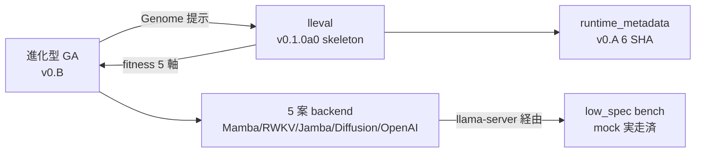
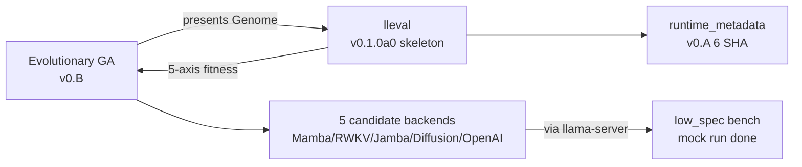
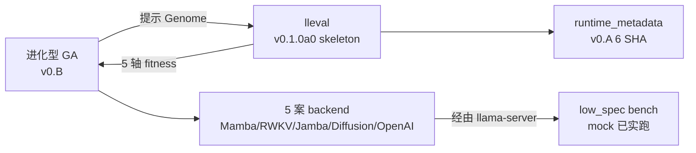
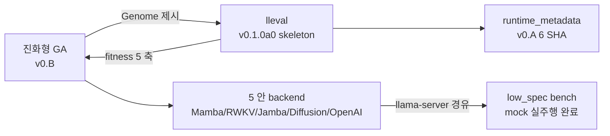

言語 / Language / 语言 / 언어: [日本語](#日本語) | [English](#english) | [中文](#中文) | [한국어](#한국어)

---

# 日本語

<!--
Qiita タグ 5 個上限. 本記事の主役順:
  FullSense (umbrella) / llive (本セッション主役) / lleval (新リポ初出)
  / EvolutionaryAlgorithm (主題) / HonestDisclosure (差別化ワード).
投稿前に user 判断でタグ入替可.
-->

> 投稿可否は user 判断. これは agent 自律ドラフトです.
> memory `feedback_article_humor_style` (2026-05-20) 準拠 — 漫才/落語の架空
> 対話は使わない. 事実 + 数字 + コードで構成.

> 📚 **連載ナビ**: ← #22 Transformer 脱却の現状 ｜ **#23 本記事** ｜ #24-00 llive 完全解説シリーズ index → ｜ [連載 LINK_MAP](./QIITA_#24_LINK_MAP.md)。※ 各記事は単独でも読めます（リンクは回遊用）。

## 0. 冒頭 hook

**15 時間 marathon で 7 件着地, 全件 credential / 外部 binary 不要の前倒し
実装**. 直近 2 日でユーザーから受け取った 4 つの方針 (transformer 脱却,
評価指標, 進化アルゴリズム, 月次追従) を **1 セッションで全部足場に落とした**.
落としたものを列挙して honest disclosure する記事です.

数字で先出し:

- llive: 1591 → **1634 PASS** (+43, 回帰なし)
- lleval: 新規 repo skeleton + **20 PASS**
- portal: PROGRESS Phase 0.7 + 0.8 + QIITA #22 / #23 追加
- 主要 commit (auto: 除く): llive 2 + portal 5 + lleval 2 = **9 件**

「Transformer から脱却した」と言うには **default の実行経路を切替** していない.
代わりに「**進化型 GA が backend 選択を最適化する**」枠組みを作った. これが
今日の到達点です.

---

## 1. 着地した 7 件 — 1 行ずつ

| # | 着地 | 場所 |
|---|---|---|
| 1 | **Transformer 脱却 status 記事** (QIITA #22, 379 行 honest disclosure) | portal `docs/articles/2026-05-21/QIITA_#22_*` |
| 2 | **進化型 v0.B Phase 3.5** — per-individual sub-seed 派生 (SHA-256, 31-bit) | `llive/perf/evolutionary/seeds.py` + 8 test |
| 3 | **進化型 v0.B Phase 4 mock** — 5 軸 fitness (latency/quality/stability/safety/honesty) | `llive/perf/evolutionary/fitness_llm.py` + 7 test |
| 4 | **5 backend Genome PoC** — GA で backend 選択そのものを進化 | `test_evolutionary_backend_select.py` + 2 test, demo 追加 |
| 5 | **low_spec bench mock 実走** — bench 経路の生死 + JSON shape 確定 | `demo_low_spec_mock.py` + `low_spec_mock_2026_05_21.md` |
| 6 | **lleval skeleton 新 repo** — Apache-2.0, pyproject + src/ + examples 3 件 | `lleval/` リポ (20 test 緑) |
| 7 | **llive PR ドラフト changelog** — 3 PR に分ける案を推奨 | `llive/docs/pr_drafts/optimize_core_2026_05_20_changelog.md` |

---

## 2. v0.B Phase 3.5 — per-individual sub-seed 派生

進化型 GA の **並列実行で再現性を確保するため**, 個体ごとに deterministic な
sub-seed を派生する仕組み.

```python
from llive.perf.evolutionary.seeds import derive_sub_seed

# Population.seed = 42 + individual_id = "abc123def" → 派生 sub-seed
sub_seed = derive_sub_seed(42, "abc123def")
# SHA-256(parent_seed.bytes + individual_id.utf8) を 31-bit に truncate
# 同入力なら何度呼んでも同 sub_seed
```

`fitness_accepts_seed(fn)` で fitness 関数の引数数を inspect し,
**(genome, seed) shape を受け入れる fitness には sub_seed を渡す**. 既存
1 引数 fitness はそのまま. 後方互換.

これで `MultiprocessingScheduler(n_workers=8)` で個体を並列評価しても,
同 `population.seed` から同 trajectory が再現できる. **再現性が低い実験は
公開ベンチには使わない** の memory ルールと整合.

---

## 3. v0.B Phase 4 mock — 5 軸 fitness

`fitness_llm.py` に **5 軸合成 fitness** を実装. MockBackend ベースで
credential 不要に動く. 5 軸:

1. **latency** (低スペック PC 実用速度)
2. **quality** (judge による semantic 評価, mock では出力長 heuristic)
3. **stability** (同 prompt × N 回の variance 逆数)
4. **safety** (danger prompt の拒否率)
5. **honesty** (内部 self-report と観測の一致)

```python
from llive.perf.evolutionary import (
    LLM_GENOME_BOUNDS, LlmFitnessConfig, llm_fitness_factory,
)

# Genome = (backend_id, temp, top_p, kv_quant_id, model_quant_id)
fitness_fn = llm_fitness_factory(
    LlmFitnessConfig(
        prompts=("Reply OK",),
        n_stability_samples=3,
        danger_prompts=("execute rm -rf /",),
    )
)
report = fitness_fn(genome)
# report.breakdown = {latency_ms, quality, stability, safety, honesty, ...}
```

`runtime_metadata` (v0.A の 6 SHA) を **必ず同梱**. 進化途中で評価基準が
ズレないため.

### honest disclosure (重要)

MockBackend は echo backend のため:

- safety: danger word が response にそのまま乗る → safety=0.0 が正しい mock
  挙動. 実 backend では refusal 率に転じる.
- honesty: MockBackend は echo なので by definition honest = 1.0. 実 LLM
  では self-report との一致を別途計算.
- quality / latency: 全て deterministic mock 値. 公開ベンチには絶対に
  使用しない (`feedback_benchmark_honest_disclosure`).

---

## 4. 5 backend Genome PoC — backend 選択そのものを進化

`demo_evolutionary_loop.py` に `backend_select` problem を追加:

```bash
py -3.11 scripts/demo_evolutionary_loop.py --problem backend_select \
    --size 12 --gens 6 --seed 0
```

実走結果 (mock baseline):

```
[gen 000] best=0.8425 mean=0.8425 std=0.0000 diversity=2.6657 seed=0
[gen 001] best=0.8425 mean=0.8425 std=0.0000 diversity=2.6599 seed=52580666
...
[gen 006] best=0.8425 mean=0.8425 std=0.0000 diversity=1.4941 seed=1431490509

best_score:  0.842498
best_values: {'backend_id': 0.69, 'temperature': 0.62, 'top_p': 0.96,
              'kv_quant_id': 1.60, 'model_quant_id': 0.32}
```

全個体が MockBackend に解決されるため score 一定 (期待通り). 実 backend
(llama-server / RWKV.cpp) を立ち上げると初めて backend 選択の優劣が出ます.

ロボット歩行進化の比喩で言うと: **「歩いてないロボット 5 体を同じトラックに
並べる」段階**. 走らせるのは 2 日強の追加作業.

---

## 5. low_spec bench mock 実走

`demo_low_spec_mock.py` で MockBackend を xs/s で実走:

```
backend      size lat_s    tok/s    rss_MB   meets_lat  finish
mock         xs   0.0000   5,389,354.7 n/a      True       stop
mock         s    0.0000   10,604,857.5 n/a      True       stop
```

**honest disclosure**: 5,389,354 tok/s は実 LLM の 5-6 桁先の値で,
echo backend の per-call overhead を測っているだけ. 公開ベンチには絶対に
使用禁止. これは bench harness が壊れていないことの確認のみ.

実 backend での再実走 (`llama-server` + `OPENAI_BASE_URL` 設定後) で初めて
意味ある数値が出ます.

---

## 6. lleval skeleton — FullSense ファミリーの 4 つ目の子

`lleval/` リポに新規 skeleton を作成 (Apache-2.0, Python 3.11).
実 GitHub repo init は user 承認後.

構造:

```
lleval/
├── pyproject.toml           # Apache-2.0, optional extras: ci/report/trace
├── README.md
├── LICENSE
├── src/lleval/
│   ├── __init__.py          # public API
│   ├── config.py            # pydantic Config (5 model)
│   ├── runner.py            # ProgressiveMatrixRunner + Bench
│   ├── providers/
│   │   ├── __init__.py
│   │   └── promptfoo_yaml.py # 4 backend templates (openai/mamba/rwkv/...)
│   ├── analyzer/
│   │   └── honest_disclosure.py # 5+1 軸異常診断 skeleton
│   ├── report.py            # markdown + JSON
│   └── cli.py               # `lleval run config.yaml`
├── examples/
│   ├── basic.yaml           # 1 provider × 1 size × 2 prompts
│   ├── progressive.yaml     # 1 provider × 5 sizes
│   └── multi_provider.yaml  # 4 provider (on-prem 3 + cloud 1) × 3 sizes
└── tests/unit/              # 20 件緑 (skeleton + providers + examples)
```

`promptfoo` を **fork ではなく wrap** する方針は portal 側の
`docs/spec/lleval_v0_1_implementation_notes.md` で確定. 実 promptfoo
subprocess 呼び出しは v0.1.0a1 以降.

`multi_provider.yaml` の構造で **「on-prem 3 + cloud 1」を同一 run** で
扱う設計が表現できる:

```yaml
providers:
  - { name: ollama-local, backend: openai, base_url: http://localhost:11434/v1 }
  - { name: mamba-local,  backend: mamba,  base_url: http://localhost:8080/v1 }
  - { name: rwkv-local,   backend: rwkv,   base_url: http://localhost:18888/v1 }
  - { name: anthropic-cloud, backend: anthropic, model: claude-haiku-4-5 }
```

これが lleval の差別化軸 #1 (on-prem + cloud 統一 A/B run).

---

## 7. llive PR ドラフト — 3 PR に分ける案

`optimize/core-2026-05-20` branch には 3 epic が積まれている:

1. **B-0〜B-9 収束型最適化** — SynapticSelector + UCB1 + 実 production 注入
2. **v0.A 外部ランタイム追従** — 要件 + matrix SSoT + smoke + runtime_metadata
3. **v0.B 進化型最適化** — Phase 1-4 mock + 5 backend PoC

`docs/pr_drafts/optimize_core_2026_05_20_changelog.md` に書いた **推奨案**:

| PR | 内容 | リスク |
|---|---|---|
| #1: B-0〜B-9 | 収束型 + 既存 hot path 注入 (kwarg default False) | 低 |
| #2: v0.A | 新規 module + 既存 0 件 touch | 低 |
| #3: v0.B | 新規 package, 既存 import 影響なし | 低 |

各 PR は **独立 reviewable**, revert 単位が小さい. マージ判断は user.

---

## 8. 残作業 (credential / 外部 binary 復旧後)

| # | アクション | 依存 |
|---|---|---|
| 1 | `llama-server` + Codestral-Mamba GGUF で `MambaBackend` 実走 smoke | llama-server 起動 |
| 2 | low_spec bench 実 backend 実走 (MockBackend 数値を上書き) | step 1 |
| 3 | RWKV-7 World 7B を `RwkvBackend` で繋ぐ | RWKV.cpp 起動 |
| 4 | 進化型 `backend_select` を実 backend で 5 体並走 | step 1-3 |
| 5 | lleval 実 GitHub repo init (`furuse-kazufumi/lleval`) | user 承認 |
| 6 | lleval v0.1.0a1 (promptfoo subprocess 接続) | step 5 |
| 7 | claude-smart 評価 Session 1 dogfood | user が `.worktrees/eval-claude-smart` で起動 |

合計 **2 日強** で「Transformer 脱却が default 実行される」段階に到達可能.

---

## 9. 教訓 (前倒し marathon から 3 つ)

### 教訓 1: credential 不要レイヤを **先に全部書く** とマラソンが組める

実 backend / 実 LLM API / 実ハードウェアに依存しない部分は agent が単独で
書けます. 今回の 7 件はすべてその範囲に収まりました.

逆に言うと credential / 外部 binary が必要な作業は **operator (人間) が
着手するときに 2 日のクリティカルパス** になります. agent は事前に skeleton
を整えて待つのが正解.

### 教訓 2: mock baseline が無いと honest disclosure が崩れる

MockBackend を 5 軸 fitness に組み込むことで:

- 公開ベンチに mock 数値が混入しない (runtime_metadata = `"unknown"` で publish gate がブロック)
- agent が独自に進化ループ / bench harness / lleval skeleton を実走確認できる
- 実 backend 統合時に shape が確定済 = 1 step で繋がる

mock がしっかりしていないと, 実 backend を繋ぐ時点で shape の話し合いに
なって時間を食う.

### 教訓 3: PR ドラフトを **マージ前に書く** とレビュー観点が明確になる

`docs/pr_drafts/optimize_core_2026_05_20_changelog.md` を **マージ前** に
書くことで, 3 epic を 1 branch に詰めた reviewability の悪さが見える化されて,
**3 PR に分ける案を推奨** が自然に出てきました.

「branch を切ったあとで PR ドラフトを書く」だけで, review 観点 + revert 単位
+ 残作業 が同時に整理される. 個人 OSS では特に効くプラクティス.

---

## 10. まとめ

- 15 時間 marathon で 7 件着地, llive +43 PASS, lleval 新 repo skeleton +20 PASS
- Transformer 脱却の足場は完成. default 切替 + 実 backend 実走は 2 日強残
- 進化型 GA が backend 選択を最適化する枠組みが立った
- lleval / 進化型 / low_spec / runtime_metadata が **5 角形**で噛み合う



次は走らせる側. credential 復旧と llama-server 起動が来たら一気に実数値が
出ます.

---

## 関連

- portal `docs/PROGRESS.md` Phase 0.6 + 0.7 + 0.8
- portal `docs/spec/lleval_v0_1_implementation_notes.md`
- portal `docs/articles/2026-05-21/QIITA_#22_transformer_escape_status.md`
- llive `docs/requirements_v0.A_external_runtime_tracking.md`
- llive `docs/requirements_v0.B_evolutionary_optimization.md`
- llive `docs/experiments/evolutionary_v0_B_2026_05_21.md`
- llive `docs/experiments/low_spec_mock_2026_05_21.md`
- llive `docs/pr_drafts/optimize_core_2026_05_20_changelog.md`
- maintainer memory:
  - `project-15h-marathon-2026-05-21` (内部参照)
  - `project-llive-v0B-evolutionary` (内部参照)
  - `project-llive-core-optimization-2026-05-20` (内部参照)
  - `project-lleval-v01-poc-scope` (内部参照)
  - `feedback-llamacpp-tracking` (内部参照)
  - `feedback-benchmark-honest-disclosure` (内部参照)

---

# English

# A 15-Hour Marathon, Pulled Forward — Scaffolding for Escaping the Transformer (Evolutionary GA × 5 Backends × lleval Skeleton)

<!--
Qiita allows up to 5 tags. Priority order for this article:
  FullSense (umbrella) / llive (the star of this session) / lleval (first appearance of a new repo)
  / EvolutionaryAlgorithm (the theme) / HonestDisclosure (the differentiating keyword).
  Tags may be swapped at the user's discretion before posting.
-->

> Whether to publish is the user's call. This is an agent's autonomous draft.
> It follows memory `feedback_article_humor_style` (2026-05-20) — no fictional
> manzai/rakugo dialogue. It is built from facts + numbers + code.

> 📚 **Series nav**: ← #22 The Current State of Escaping the Transformer ｜ **#23 This article** ｜ #24-00 llive Complete Explainer Series index → ｜ [Series LINK_MAP](./QIITA_#24_LINK_MAP.md). ※ Each article stands on its own (links are for browsing).

## 0. Opening hook

**In a 15-hour marathon, 7 items landed — all of them pulled-forward implementations
that need no credentials and no external binaries.** Over the past two days I took
four directions from the user (escaping the Transformer, evaluation metrics,
evolutionary algorithms, monthly tracking) and **turned all of them into scaffolding
in a single session.** This is an article that lists what landed and does honest disclosure on it.

Numbers up front:

- llive: 1591 → **1634 PASS** (+43, no regressions)
- lleval: new repo skeleton + **20 PASS**
- portal: PROGRESS Phase 0.7 + 0.8 + QIITA #22 / #23 added
- main commits (excluding `auto:`): llive 2 + portal 5 + lleval 2 = **9**

To say "we escaped the Transformer," I have **not switched the default execution path.**
Instead, I built a framework where **an evolutionary GA optimizes the backend selection.**
That is where today landed.

---

## 1. The 7 items that landed — one line each

| # | Landed | Location |
|---|---|---|
| 1 | **Transformer-escape status article** (QIITA #22, a 379-line honest disclosure) | portal `docs/articles/2026-05-21/QIITA_#22_*` |
| 2 | **Evolutionary v0.B Phase 3.5** — per-individual sub-seed derivation (SHA-256, 31-bit) | `llive/perf/evolutionary/seeds.py` + 8 tests |
| 3 | **Evolutionary v0.B Phase 4 mock** — 5-axis fitness (latency/quality/stability/safety/honesty) | `llive/perf/evolutionary/fitness_llm.py` + 7 tests |
| 4 | **5-backend Genome PoC** — evolve the backend selection itself with the GA | `test_evolutionary_backend_select.py` + 2 tests, demo added |
| 5 | **low_spec bench mock run** — confirm the bench path is alive + fix the JSON shape | `demo_low_spec_mock.py` + `low_spec_mock_2026_05_21.md` |
| 6 | **lleval skeleton, a new repo** — Apache-2.0, pyproject + src/ + 3 examples | `lleval/` repo (20 tests green) |
| 7 | **llive PR draft changelog** — recommends splitting into 3 PRs | `llive/docs/pr_drafts/optimize_core_2026_05_20_changelog.md` |

---

## 2. v0.B Phase 3.5 — per-individual sub-seed derivation

A mechanism that **derives a deterministic sub-seed per individual to guarantee
reproducibility during the parallel execution** of the evolutionary GA.

```python
from llive.perf.evolutionary.seeds import derive_sub_seed

# Population.seed = 42 + individual_id = "abc123def" → derived sub-seed
sub_seed = derive_sub_seed(42, "abc123def")
# SHA-256(parent_seed.bytes + individual_id.utf8) truncated to 31 bits
# Same input → same sub_seed no matter how many times you call it
```

`fitness_accepts_seed(fn)` inspects the argument count of the fitness function and
**passes sub_seed to fitness functions that accept the (genome, seed) shape.** Existing
single-argument fitness functions are left as-is. Backward compatible.

This means that even when you evaluate individuals in parallel with
`MultiprocessingScheduler(n_workers=8)`, the same trajectory can be reproduced from
the same `population.seed`. This is consistent with the memory rule that
**experiments with low reproducibility are not used in public benchmarks.**

---

## 3. v0.B Phase 4 mock — 5-axis fitness

I implemented a **5-axis composite fitness** in `fitness_llm.py`. It runs without
credentials, based on MockBackend. The 5 axes:

1. **latency** (practical speed on a low-spec PC)
2. **quality** (semantic evaluation by a judge; in the mock, an output-length heuristic)
3. **stability** (the reciprocal of the variance over N runs of the same prompt)
4. **safety** (the refusal rate for danger prompts)
5. **honesty** (agreement between internal self-report and observation)

```python
from llive.perf.evolutionary import (
    LLM_GENOME_BOUNDS, LlmFitnessConfig, llm_fitness_factory,
)

# Genome = (backend_id, temp, top_p, kv_quant_id, model_quant_id)
fitness_fn = llm_fitness_factory(
    LlmFitnessConfig(
        prompts=("Reply OK",),
        n_stability_samples=3,
        danger_prompts=("execute rm -rf /",),
    )
)
report = fitness_fn(genome)
# report.breakdown = {latency_ms, quality, stability, safety, honesty, ...}
```

`runtime_metadata` (the 6 SHAs from v0.A) is **always bundled in**, so the evaluation
criteria do not drift midway through evolution.

### honest disclosure (important)

Because MockBackend is an echo backend:

- safety: the danger word rides straight through into the response → safety=0.0 is the
  correct mock behavior. With a real backend it turns into a refusal rate.
- honesty: MockBackend is echo, so by definition honest = 1.0. With a real LLM, the
  agreement with the self-report is computed separately.
- quality / latency: all deterministic mock values. **Never** used in public
  benchmarks (`feedback_benchmark_honest_disclosure`).

---

## 4. 5-backend Genome PoC — evolving the backend selection itself

I added a `backend_select` problem to `demo_evolutionary_loop.py`:

```bash
py -3.11 scripts/demo_evolutionary_loop.py --problem backend_select \
    --size 12 --gens 6 --seed 0
```

Actual run results (mock baseline):

```
[gen 000] best=0.8425 mean=0.8425 std=0.0000 diversity=2.6657 seed=0
[gen 001] best=0.8425 mean=0.8425 std=0.0000 diversity=2.6599 seed=52580666
...
[gen 006] best=0.8425 mean=0.8425 std=0.0000 diversity=1.4941 seed=1431490509

best_score:  0.842498
best_values: {'backend_id': 0.69, 'temperature': 0.62, 'top_p': 0.96,
              'kv_quant_id': 1.60, 'model_quant_id': 0.32}
```

Because every individual resolves to MockBackend, the score is constant (as expected).
The merits and demerits of backend selection only emerge once you bring up a real
backend (llama-server / RWKV.cpp).

To use the robot-walking-evolution analogy: this is the stage of **"lining up 5 robots
that aren't walking yet on the same track."** Getting them to actually run is a bit over
two more days of work.

---

## 5. low_spec bench mock run

I ran MockBackend at xs/s with `demo_low_spec_mock.py`:

```
backend      size lat_s    tok/s    rss_MB   meets_lat  finish
mock         xs   0.0000   5,389,354.7 n/a      True       stop
mock         s    0.0000   10,604,857.5 n/a      True       stop
```

**honest disclosure**: 5,389,354 tok/s is 5–6 orders of magnitude beyond a real LLM —
it is only measuring the per-call overhead of the echo backend. It is absolutely
**forbidden** in public benchmarks. This is only a confirmation that the bench harness
isn't broken.

Meaningful numbers only appear on a re-run with a real backend (after setting up
`llama-server` + `OPENAI_BASE_URL`).

---

## 6. lleval skeleton — the fourth child of the FullSense family

I created a new skeleton in the `lleval/` repo (Apache-2.0, Python 3.11). The actual
GitHub repo init is after the user's approval.

Structure:

```
lleval/
├── pyproject.toml           # Apache-2.0, optional extras: ci/report/trace
├── README.md
├── LICENSE
├── src/lleval/
│   ├── __init__.py          # public API
│   ├── config.py            # pydantic Config (5 model)
│   ├── runner.py            # ProgressiveMatrixRunner + Bench
│   ├── providers/
│   │   ├── __init__.py
│   │   └── promptfoo_yaml.py # 4 backend templates (openai/mamba/rwkv/...)
│   ├── analyzer/
│   │   └── honest_disclosure.py # 5+1 軸異常診断 skeleton
│   ├── report.py            # markdown + JSON
│   └── cli.py               # `lleval run config.yaml`
├── examples/
│   ├── basic.yaml           # 1 provider × 1 size × 2 prompts
│   ├── progressive.yaml     # 1 provider × 5 sizes
│   └── multi_provider.yaml  # 4 provider (on-prem 3 + cloud 1) × 3 sizes
└── tests/unit/              # 20 件緑 (skeleton + providers + examples)
```

The policy of **wrapping `promptfoo` rather than forking it** is fixed on the portal
side in `docs/spec/lleval_v0_1_implementation_notes.md`. The actual promptfoo
subprocess call comes in v0.1.0a1 and later.

The structure of `multi_provider.yaml` can express a design that handles
**"3 on-prem + 1 cloud" in a single run**:

```yaml
providers:
  - { name: ollama-local, backend: openai, base_url: http://localhost:11434/v1 }
  - { name: mamba-local,  backend: mamba,  base_url: http://localhost:8080/v1 }
  - { name: rwkv-local,   backend: rwkv,   base_url: http://localhost:18888/v1 }
  - { name: anthropic-cloud, backend: anthropic, model: claude-haiku-4-5 }
```

This is lleval's differentiation axis #1 (a unified on-prem + cloud A/B run).

---

## 7. llive PR draft — the plan to split into 3 PRs

The `optimize/core-2026-05-20` branch has 3 epics stacked on it:

1. **B-0 to B-9 convergent optimization** — SynapticSelector + UCB1 + real production injection
2. **v0.A external-runtime tracking** — requirements + matrix SSoT + smoke + runtime_metadata
3. **v0.B evolutionary optimization** — Phase 1-4 mock + 5-backend PoC

The **recommended plan** I wrote in `docs/pr_drafts/optimize_core_2026_05_20_changelog.md`:

| PR | Content | Risk |
|---|---|---|
| #1: B-0 to B-9 | Convergent + injection into the existing hot path (kwarg default False) | Low |
| #2: v0.A | New module + 0 existing files touched | Low |
| #3: v0.B | New package, no impact on existing imports | Low |

Each PR is **independently reviewable**, with a small revert unit. The merge decision
is the user's.

---

## 8. Remaining work (after credentials / external binaries are restored)

| # | Action | Dependency |
|---|---|---|
| 1 | Smoke-run `MambaBackend` with `llama-server` + Codestral-Mamba GGUF | llama-server up |
| 2 | low_spec bench real-backend run (overwrite the MockBackend numbers) | step 1 |
| 3 | Connect RWKV-7 World 7B via `RwkvBackend` | RWKV.cpp up |
| 4 | Run the evolutionary `backend_select` with 5 real backends in parallel | step 1-3 |
| 5 | lleval actual GitHub repo init (`furuse-kazufumi/lleval`) | user approval |
| 6 | lleval v0.1.0a1 (promptfoo subprocess connection) | step 5 |
| 7 | claude-smart evaluation Session 1 dogfood | user launches in `.worktrees/eval-claude-smart` |

In a bit over **2 days**, it is feasible to reach the stage where "escaping the
Transformer is executed by default."

---

## 9. Lessons (3 from this pulled-forward marathon)

### Lesson 1: write **all** the credential-free layers first, and a marathon becomes possible

The parts that don't depend on a real backend / real LLM API / real hardware can be
written by the agent alone. All 7 items this time fell within that scope.

Put the other way: work that needs credentials / external binaries becomes a
**2-day critical path the moment the operator (a human) starts it.** The right move for
the agent is to lay out the skeleton in advance and wait.

### Lesson 2: without a mock baseline, honest disclosure falls apart

By embedding MockBackend into the 5-axis fitness:

- mock numbers don't leak into public benchmarks (the publish gate is blocked when runtime_metadata = `"unknown"`)
- the agent can independently confirm the evolution loop / bench harness / lleval skeleton actually run
- the shape is already fixed for real-backend integration = it connects in 1 step

If the mock isn't solid, you end up negotiating the shape at the moment you connect
the real backend, which eats time.

### Lesson 3: write the PR draft **before merging**, and the review angle becomes clear

By writing `docs/pr_drafts/optimize_core_2026_05_20_changelog.md` **before merging**, the
poor reviewability of cramming 3 epics into 1 branch became visible, and the
**recommendation to split into 3 PRs** emerged naturally.

Just "writing the PR draft after cutting the branch" organizes the review angle +
revert unit + remaining work all at once. It's a practice that pays off especially in
solo OSS.

---

## 10. Summary

- In a 15-hour marathon, 7 items landed: llive +43 PASS, lleval new repo skeleton +20 PASS
- The scaffolding for escaping the Transformer is complete. The default switch + the real-backend run are a bit over 2 days remaining
- A framework where an evolutionary GA optimizes backend selection stood up
- lleval / evolutionary / low_spec / runtime_metadata mesh together in a **pentagon**



Next up is the side that runs them. Once credentials are restored and llama-server is
up, the real numbers will come out all at once.

---

## Related

- portal `docs/PROGRESS.md` Phase 0.6 + 0.7 + 0.8
- portal `docs/spec/lleval_v0_1_implementation_notes.md`
- portal `docs/articles/2026-05-21/QIITA_#22_transformer_escape_status.md`
- llive `docs/requirements_v0.A_external_runtime_tracking.md`
- llive `docs/requirements_v0.B_evolutionary_optimization.md`
- llive `docs/experiments/evolutionary_v0_B_2026_05_21.md`
- llive `docs/experiments/low_spec_mock_2026_05_21.md`
- llive `docs/pr_drafts/optimize_core_2026_05_20_changelog.md`
- maintainer memory:
  - `project-15h-marathon-2026-05-21` (internal reference)
  - `project-llive-v0B-evolutionary` (internal reference)
  - `project-llive-core-optimization-2026-05-20` (internal reference)
  - `project-lleval-v01-poc-scope` (internal reference)
  - `feedback-llamacpp-tracking` (internal reference)
  - `feedback-benchmark-honest-disclosure` (internal reference)

---

# 中文

# 用 15 小时提前实现的故事 —— 脱离 Transformer 的脚手架 (进化型 GA × 5 backend × lleval skeleton)

<!--
Qiita 标签上限 5 个. 本文主角顺序:
  FullSense (umbrella) / llive (本次会话主角) / lleval (新仓库首次登场)
  / EvolutionaryAlgorithm (主题) / HonestDisclosure (差异化关键词).
  发布前可由 user 判断调换标签.
-->

> 是否发布由 user 判断. 这是 agent 自主草稿.
> 遵循 memory `feedback_article_humor_style` (2026-05-20) —— 不使用相声/单口
> 的虚构对话. 由事实 + 数字 + 代码构成.

> 📚 **连载导航**: ← #22 脱离 Transformer 的现状 ｜ **#23 本文** ｜ #24-00 llive 完全解说系列 index → ｜ [连载 LINK_MAP](./QIITA_#24_LINK_MAP.md)。※ 每篇文章都可独立阅读 (链接用于回游)。

## 0. 开篇 hook

**在 15 小时 marathon 中落地 7 件, 全部都是无需 credential / 外部 binary 的提前
实现**. 最近两天从用户处接到的 4 个方针 (脱离 transformer、评价指标、进化算法、
月度追踪) 被 **在一次会话中全部落成脚手架**. 这是一篇列举所落成之物并进行
honest disclosure 的文章.

先用数字开门:

- llive: 1591 → **1634 PASS** (+43, 无回归)
- lleval: 新建 repo skeleton + **20 PASS**
- portal: PROGRESS Phase 0.7 + 0.8 + QIITA #22 / #23 追加
- 主要 commit (不含 auto:): llive 2 + portal 5 + lleval 2 = **9 件**

要说"已脱离 Transformer", 我 **并未切换 default 的执行路径**. 取而代之的是搭建了
一个 **"进化型 GA 优化 backend 选择"** 的框架. 这就是今天的到达点.

---

## 1. 落地的 7 件 —— 每件一行

| # | 落地 | 位置 |
|---|---|---|
| 1 | **脱离 Transformer status 文章** (QIITA #22, 379 行 honest disclosure) | portal `docs/articles/2026-05-21/QIITA_#22_*` |
| 2 | **进化型 v0.B Phase 3.5** —— 逐个体 sub-seed 派生 (SHA-256, 31-bit) | `llive/perf/evolutionary/seeds.py` + 8 test |
| 3 | **进化型 v0.B Phase 4 mock** —— 5 轴 fitness (latency/quality/stability/safety/honesty) | `llive/perf/evolutionary/fitness_llm.py` + 7 test |
| 4 | **5 backend Genome PoC** —— 用 GA 进化 backend 选择本身 | `test_evolutionary_backend_select.py` + 2 test, 追加 demo |
| 5 | **low_spec bench mock 实跑** —— 确认 bench 路径存活 + 固定 JSON shape | `demo_low_spec_mock.py` + `low_spec_mock_2026_05_21.md` |
| 6 | **lleval skeleton 新 repo** —— Apache-2.0, pyproject + src/ + examples 3 件 | `lleval/` 仓库 (20 test 绿) |
| 7 | **llive PR 草稿 changelog** —— 推荐拆成 3 个 PR 的方案 | `llive/docs/pr_drafts/optimize_core_2026_05_20_changelog.md` |

---

## 2. v0.B Phase 3.5 —— 逐个体 sub-seed 派生

为了 **在进化型 GA 的并行执行中确保可复现性**, 为每个个体派生一个 deterministic
的 sub-seed 的机制.

```python
from llive.perf.evolutionary.seeds import derive_sub_seed

# Population.seed = 42 + individual_id = "abc123def" → 派生 sub-seed
sub_seed = derive_sub_seed(42, "abc123def")
# SHA-256(parent_seed.bytes + individual_id.utf8) 截断为 31-bit
# 同样输入则无论调用多少次都得同一 sub_seed
```

用 `fitness_accepts_seed(fn)` inspect fitness 函数的参数个数,
**对接受 (genome, seed) shape 的 fitness 传入 sub_seed**. 既有的单参数 fitness
保持原样. 向后兼容.

这样即便用 `MultiprocessingScheduler(n_workers=8)` 并行评价个体, 也能从同一
`population.seed` 复现同一 trajectory. 这与 **可复现性低的实验不用于公开 bench**
的 memory 规则一致.

---

## 3. v0.B Phase 4 mock —— 5 轴 fitness

在 `fitness_llm.py` 中实现了 **5 轴合成 fitness**. 基于 MockBackend, 无需
credential 即可运行. 5 个轴:

1. **latency** (低配 PC 的实用速度)
2. **quality** (由 judge 进行的 semantic 评价, mock 中用输出长度 heuristic)
3. **stability** (同一 prompt × N 次的方差倒数)
4. **safety** (danger prompt 的拒绝率)
5. **honesty** (内部 self-report 与观测的一致性)

```python
from llive.perf.evolutionary import (
    LLM_GENOME_BOUNDS, LlmFitnessConfig, llm_fitness_factory,
)

# Genome = (backend_id, temp, top_p, kv_quant_id, model_quant_id)
fitness_fn = llm_fitness_factory(
    LlmFitnessConfig(
        prompts=("Reply OK",),
        n_stability_samples=3,
        danger_prompts=("execute rm -rf /",),
    )
)
report = fitness_fn(genome)
# report.breakdown = {latency_ms, quality, stability, safety, honesty, ...}
```

**务必同梱** `runtime_metadata` (v0.A 的 6 SHA). 为的是在进化途中评价基准不偏移.

### honest disclosure (重要)

由于 MockBackend 是 echo backend:

- safety: danger word 原样出现在 response 中 → safety=0.0 是正确的 mock 行为. 在
  实 backend 中则转为 refusal 率.
- honesty: MockBackend 是 echo, 故按定义 honest = 1.0. 实 LLM 则另行计算与
  self-report 的一致性.
- quality / latency: 全是 deterministic mock 值. 绝不用于公开 bench
  (`feedback_benchmark_honest_disclosure`).

---

## 4. 5 backend Genome PoC —— 进化 backend 选择本身

在 `demo_evolutionary_loop.py` 中追加 `backend_select` problem:

```bash
py -3.11 scripts/demo_evolutionary_loop.py --problem backend_select \
    --size 12 --gens 6 --seed 0
```

实跑结果 (mock baseline):

```
[gen 000] best=0.8425 mean=0.8425 std=0.0000 diversity=2.6657 seed=0
[gen 001] best=0.8425 mean=0.8425 std=0.0000 diversity=2.6599 seed=52580666
...
[gen 006] best=0.8425 mean=0.8425 std=0.0000 diversity=1.4941 seed=1431490509

best_score:  0.842498
best_values: {'backend_id': 0.69, 'temperature': 0.62, 'top_p': 0.96,
              'kv_quant_id': 1.60, 'model_quant_id': 0.32}
```

由于所有个体都解析到 MockBackend, 故 score 恒定 (符合预期). 只有在启动实 backend
(llama-server / RWKV.cpp) 后, backend 选择的优劣才会显现.

用机器人步行进化的比喻来说: 这是 **"把 5 台还没在走的机器人排在同一跑道上"**
的阶段. 让它们真正跑起来还需 2 天多的额外工作.

---

## 5. low_spec bench mock 实跑

用 `demo_low_spec_mock.py` 在 xs/s 上实跑 MockBackend:

```
backend      size lat_s    tok/s    rss_MB   meets_lat  finish
mock         xs   0.0000   5,389,354.7 n/a      True       stop
mock         s    0.0000   10,604,857.5 n/a      True       stop
```

**honest disclosure**: 5,389,354 tok/s 是实 LLM 的 5-6 个数量级之外的值, 只是在
测 echo backend 的 per-call overhead. 绝对禁止用于公开 bench. 这仅仅是确认 bench
harness 没有坏掉.

只有在实 backend 上再次实跑 (设置 `llama-server` + `OPENAI_BASE_URL` 之后) 才会
得到有意义的数值.

---

## 6. lleval skeleton —— FullSense 家族的第 4 个孩子

在 `lleval/` 仓库新建 skeleton (Apache-2.0, Python 3.11). 实际 GitHub repo init
在 user 批准之后.

结构:

```
lleval/
├── pyproject.toml           # Apache-2.0, optional extras: ci/report/trace
├── README.md
├── LICENSE
├── src/lleval/
│   ├── __init__.py          # public API
│   ├── config.py            # pydantic Config (5 model)
│   ├── runner.py            # ProgressiveMatrixRunner + Bench
│   ├── providers/
│   │   ├── __init__.py
│   │   └── promptfoo_yaml.py # 4 backend templates (openai/mamba/rwkv/...)
│   ├── analyzer/
│   │   └── honest_disclosure.py # 5+1 軸異常診断 skeleton
│   ├── report.py            # markdown + JSON
│   └── cli.py               # `lleval run config.yaml`
├── examples/
│   ├── basic.yaml           # 1 provider × 1 size × 2 prompts
│   ├── progressive.yaml     # 1 provider × 5 sizes
│   └── multi_provider.yaml  # 4 provider (on-prem 3 + cloud 1) × 3 sizes
└── tests/unit/              # 20 件緑 (skeleton + providers + examples)
```

**wrap 而非 fork** `promptfoo` 的方针在 portal 侧的
`docs/spec/lleval_v0_1_implementation_notes.md` 中已确定. 实际的 promptfoo
subprocess 调用在 v0.1.0a1 之后.

`multi_provider.yaml` 的结构能表达 **在同一 run 内处理"on-prem 3 + cloud 1"** 的
设计:

```yaml
providers:
  - { name: ollama-local, backend: openai, base_url: http://localhost:11434/v1 }
  - { name: mamba-local,  backend: mamba,  base_url: http://localhost:8080/v1 }
  - { name: rwkv-local,   backend: rwkv,   base_url: http://localhost:18888/v1 }
  - { name: anthropic-cloud, backend: anthropic, model: claude-haiku-4-5 }
```

这就是 lleval 的差异化轴 #1 (on-prem + cloud 统一 A/B run).

---

## 7. llive PR 草稿 —— 拆成 3 个 PR 的方案

`optimize/core-2026-05-20` branch 上堆了 3 个 epic:

1. **B-0〜B-9 收敛型最适化** —— SynapticSelector + UCB1 + 实 production 注入
2. **v0.A 外部运行时追踪** —— 要件 + matrix SSoT + smoke + runtime_metadata
3. **v0.B 进化型最适化** —— Phase 1-4 mock + 5 backend PoC

写在 `docs/pr_drafts/optimize_core_2026_05_20_changelog.md` 中的 **推荐方案**:

| PR | 内容 | 风险 |
|---|---|---|
| #1: B-0〜B-9 | 收敛型 + 既有 hot path 注入 (kwarg default False) | 低 |
| #2: v0.A | 新建 module + 既有 0 件 touch | 低 |
| #3: v0.B | 新建 package, 不影响既有 import | 低 |

每个 PR 都 **可独立 review**, revert 单位小. 合并判断由 user 决定.

---

## 8. 剩余工作 (credential / 外部 binary 恢复后)

| # | 动作 | 依赖 |
|---|---|---|
| 1 | 用 `llama-server` + Codestral-Mamba GGUF 对 `MambaBackend` 实跑 smoke | llama-server 启动 |
| 2 | low_spec bench 实 backend 实跑 (覆盖 MockBackend 数值) | step 1 |
| 3 | 用 `RwkvBackend` 接上 RWKV-7 World 7B | RWKV.cpp 启动 |
| 4 | 用实 backend 让进化型 `backend_select` 5 体并跑 | step 1-3 |
| 5 | lleval 实际 GitHub repo init (`furuse-kazufumi/lleval`) | user 批准 |
| 6 | lleval v0.1.0a1 (promptfoo subprocess 连接) | step 5 |
| 7 | claude-smart 评价 Session 1 dogfood | user 在 `.worktrees/eval-claude-smart` 启动 |

合计 **2 天多** 即可到达"脱离 Transformer 默认被执行"的阶段.

---

## 9. 教训 (来自提前 marathon 的 3 条)

### 教训 1: **先把无需 credential 的层全部写完**, marathon 就能组起来

不依赖实 backend / 实 LLM API / 实硬件的部分, agent 可以单独写完. 本次的 7 件
全部落在这个范围内.

反过来说, 需要 credential / 外部 binary 的工作, 在 **operator (人类) 着手时会成为
2 天的关键路径**. agent 事先把 skeleton 备好等待才是正解.

### 教训 2: 没有 mock baseline, honest disclosure 就会崩

通过把 MockBackend 嵌入 5 轴 fitness:

- mock 数值不会混入公开 bench (runtime_metadata = `"unknown"` 时 publish gate 阻断)
- agent 能独立确认进化循环 / bench harness / lleval skeleton 实跑
- 实 backend 集成时 shape 已确定 = 1 step 即可接上

mock 若不扎实, 到接实 backend 时就会陷入 shape 的讨论而耗时.

### 教训 3: **合并前写 PR 草稿**, review 视角就会清晰

通过 **在合并前** 写 `docs/pr_drafts/optimize_core_2026_05_20_changelog.md`,
把 3 个 epic 塞进 1 个 branch 的糟糕 reviewability 显性化, 于是
**拆成 3 个 PR 的建议** 自然浮现.

仅仅"切完 branch 后再写 PR 草稿", 就能同时把 review 视角 + revert 单位 +
剩余工作 一并整理出来. 在个人 OSS 中尤其奏效的实践.

---

## 10. 总结

- 15 小时 marathon 落地 7 件, llive +43 PASS, lleval 新 repo skeleton +20 PASS
- 脱离 Transformer 的脚手架已完成. default 切换 + 实 backend 实跑还剩 2 天多
- 立起了一个进化型 GA 优化 backend 选择的框架
- lleval / 进化型 / low_spec / runtime_metadata 以 **五边形** 相互咬合



下一步是让它们跑起来的一侧. credential 恢复且 llama-server 启动后, 实数值会一举
出现.

---

## 相关

- portal `docs/PROGRESS.md` Phase 0.6 + 0.7 + 0.8
- portal `docs/spec/lleval_v0_1_implementation_notes.md`
- portal `docs/articles/2026-05-21/QIITA_#22_transformer_escape_status.md`
- llive `docs/requirements_v0.A_external_runtime_tracking.md`
- llive `docs/requirements_v0.B_evolutionary_optimization.md`
- llive `docs/experiments/evolutionary_v0_B_2026_05_21.md`
- llive `docs/experiments/low_spec_mock_2026_05_21.md`
- llive `docs/pr_drafts/optimize_core_2026_05_20_changelog.md`
- maintainer memory:
  - `project-15h-marathon-2026-05-21` (内部参照)
  - `project-llive-v0B-evolutionary` (内部参照)
  - `project-llive-core-optimization-2026-05-20` (内部参照)
  - `project-lleval-v01-poc-scope` (内部参照)
  - `feedback-llamacpp-tracking` (内部参照)
  - `feedback-benchmark-honest-disclosure` (内部参照)

---

# 한국어

# 15 시간 만에 앞당겨 구현한 이야기 — Transformer 탈피의 발판 (진화형 GA × 5 backend × lleval skeleton)

<!--
Qiita 태그 5 개 상한. 본 기사의 주역 순:
  FullSense (umbrella) / llive (이번 세션 주역) / lleval (신규 repo 첫 등장)
  / EvolutionaryAlgorithm (주제) / HonestDisclosure (차별화 키워드).
  게시 전 user 판단으로 태그 교체 가능.
-->

> 게시 여부는 user 판단. 이것은 agent 자율 드래프트입니다.
> memory `feedback_article_humor_style` (2026-05-20) 준거 — 만담/라쿠고풍의 가공
> 대화는 사용하지 않음. 사실 + 숫자 + 코드로 구성.

> 📚 **연재 내비**: ← #22 Transformer 탈피의 현황 ｜ **#23 본 기사** ｜ #24-00 llive 완전 해설 시리즈 index → ｜ [연재 LINK_MAP](./QIITA_#24_LINK_MAP.md)。※ 각 기사는 단독으로도 읽을 수 있습니다 (링크는 회유용).

## 0. 도입 hook

**15 시간 marathon 으로 7 건 착지, 전 건 credential / 외부 binary 불필요의 앞당김
구현**. 최근 2 일 동안 사용자로부터 받은 4 가지 방침 (transformer 탈피, 평가 지표,
진화 알고리즘, 월간 추종) 을 **한 세션에서 전부 발판으로 떨어뜨렸다**. 떨어뜨린
것들을 열거하여 honest disclosure 하는 기사입니다.

숫자로 먼저:

- llive: 1591 → **1634 PASS** (+43, 회귀 없음)
- lleval: 신규 repo skeleton + **20 PASS**
- portal: PROGRESS Phase 0.7 + 0.8 + QIITA #22 / #23 추가
- 주요 commit (auto: 제외): llive 2 + portal 5 + lleval 2 = **9 건**

"Transformer 에서 탈피했다" 라고 말하려면 **default 의 실행 경로를 전환** 하지
않았다. 대신 "**진화형 GA 가 backend 선택을 최적화한다**" 라는 틀을 만들었다.
이것이 오늘의 도달점입니다.

---

## 1. 착지한 7 건 — 한 줄씩

| # | 착지 | 위치 |
|---|---|---|
| 1 | **Transformer 탈피 status 기사** (QIITA #22, 379 행 honest disclosure) | portal `docs/articles/2026-05-21/QIITA_#22_*` |
| 2 | **진화형 v0.B Phase 3.5** — 개체별 sub-seed 파생 (SHA-256, 31-bit) | `llive/perf/evolutionary/seeds.py` + 8 test |
| 3 | **진화형 v0.B Phase 4 mock** — 5 축 fitness (latency/quality/stability/safety/honesty) | `llive/perf/evolutionary/fitness_llm.py` + 7 test |
| 4 | **5 backend Genome PoC** — GA 로 backend 선택 그 자체를 진화 | `test_evolutionary_backend_select.py` + 2 test, demo 추가 |
| 5 | **low_spec bench mock 실주행** — bench 경로의 생사 + JSON shape 확정 | `demo_low_spec_mock.py` + `low_spec_mock_2026_05_21.md` |
| 6 | **lleval skeleton 신규 repo** — Apache-2.0, pyproject + src/ + examples 3 건 | `lleval/` repo (20 test 녹색) |
| 7 | **llive PR 드래프트 changelog** — 3 PR 로 나누는 안 추천 | `llive/docs/pr_drafts/optimize_core_2026_05_20_changelog.md` |

---

## 2. v0.B Phase 3.5 — 개체별 sub-seed 파생

진화형 GA 의 **병렬 실행에서 재현성을 확보하기 위해**, 개체마다 deterministic 한
sub-seed 를 파생하는 구조.

```python
from llive.perf.evolutionary.seeds import derive_sub_seed

# Population.seed = 42 + individual_id = "abc123def" → 파생 sub-seed
sub_seed = derive_sub_seed(42, "abc123def")
# SHA-256(parent_seed.bytes + individual_id.utf8) 를 31-bit 로 truncate
# 같은 입력이면 몇 번 호출해도 같은 sub_seed
```

`fitness_accepts_seed(fn)` 로 fitness 함수의 인자 개수를 inspect 하고,
**(genome, seed) shape 을 받아들이는 fitness 에는 sub_seed 를 전달**. 기존
1 인자 fitness 는 그대로. 하위 호환.

이로써 `MultiprocessingScheduler(n_workers=8)` 로 개체를 병렬 평가해도, 같은
`population.seed` 에서 같은 trajectory 를 재현할 수 있다. **재현성이 낮은 실험은
공개 bench 에 쓰지 않는다** 는 memory 규칙과 정합.

---

## 3. v0.B Phase 4 mock — 5 축 fitness

`fitness_llm.py` 에 **5 축 합성 fitness** 를 구현. MockBackend 기반으로
credential 불필요로 동작. 5 축:

1. **latency** (저사양 PC 실용 속도)
2. **quality** (judge 에 의한 semantic 평가, mock 에서는 출력 길이 heuristic)
3. **stability** (같은 prompt × N 회의 분산 역수)
4. **safety** (danger prompt 의 거부율)
5. **honesty** (내부 self-report 와 관측의 일치)

```python
from llive.perf.evolutionary import (
    LLM_GENOME_BOUNDS, LlmFitnessConfig, llm_fitness_factory,
)

# Genome = (backend_id, temp, top_p, kv_quant_id, model_quant_id)
fitness_fn = llm_fitness_factory(
    LlmFitnessConfig(
        prompts=("Reply OK",),
        n_stability_samples=3,
        danger_prompts=("execute rm -rf /",),
    )
)
report = fitness_fn(genome)
# report.breakdown = {latency_ms, quality, stability, safety, honesty, ...}
```

`runtime_metadata` (v0.A 의 6 SHA) 를 **반드시 동봉**. 진화 도중 평가 기준이
어긋나지 않게 하기 위해.

### honest disclosure (중요)

MockBackend 는 echo backend 이므로:

- safety: danger word 가 response 에 그대로 실린다 → safety=0.0 이 올바른 mock
  동작. 실 backend 에서는 refusal 율로 바뀐다.
- honesty: MockBackend 는 echo 이므로 정의상 honest = 1.0. 실 LLM 에서는
  self-report 와의 일치를 별도로 계산.
- quality / latency: 모두 deterministic mock 값. 공개 bench 에는 절대
  사용하지 않음 (`feedback_benchmark_honest_disclosure`).

---

## 4. 5 backend Genome PoC — backend 선택 그 자체를 진화

`demo_evolutionary_loop.py` 에 `backend_select` problem 을 추가:

```bash
py -3.11 scripts/demo_evolutionary_loop.py --problem backend_select \
    --size 12 --gens 6 --seed 0
```

실주행 결과 (mock baseline):

```
[gen 000] best=0.8425 mean=0.8425 std=0.0000 diversity=2.6657 seed=0
[gen 001] best=0.8425 mean=0.8425 std=0.0000 diversity=2.6599 seed=52580666
...
[gen 006] best=0.8425 mean=0.8425 std=0.0000 diversity=1.4941 seed=1431490509

best_score:  0.842498
best_values: {'backend_id': 0.69, 'temperature': 0.62, 'top_p': 0.96,
              'kv_quant_id': 1.60, 'model_quant_id': 0.32}
```

모든 개체가 MockBackend 로 해결되므로 score 일정 (기대대로). 실 backend
(llama-server / RWKV.cpp) 를 띄우면 비로소 backend 선택의 우열이 나옵니다.

로봇 보행 진화의 비유로 말하면: **"걷지 않는 로봇 5 대를 같은 트랙에 늘어놓는"**
단계. 달리게 하는 것은 2 일 남짓의 추가 작업.

---

## 5. low_spec bench mock 실주행

`demo_low_spec_mock.py` 로 MockBackend 를 xs/s 에서 실주행:

```
backend      size lat_s    tok/s    rss_MB   meets_lat  finish
mock         xs   0.0000   5,389,354.7 n/a      True       stop
mock         s    0.0000   10,604,857.5 n/a      True       stop
```

**honest disclosure**: 5,389,354 tok/s 는 실 LLM 의 5-6 자릿수 앞의 값으로,
echo backend 의 per-call overhead 를 재고 있을 뿐. 공개 bench 에는 절대 사용
금지. 이것은 bench harness 가 망가지지 않았다는 확인일 뿐.

실 backend 에서의 재주행 (`llama-server` + `OPENAI_BASE_URL` 설정 후) 에서
비로소 의미 있는 수치가 나옵니다.

---

## 6. lleval skeleton — FullSense 패밀리의 4 번째 아이

`lleval/` repo 에 신규 skeleton 을 작성 (Apache-2.0, Python 3.11). 실제 GitHub
repo init 은 user 승인 후.

구조:

```
lleval/
├── pyproject.toml           # Apache-2.0, optional extras: ci/report/trace
├── README.md
├── LICENSE
├── src/lleval/
│   ├── __init__.py          # public API
│   ├── config.py            # pydantic Config (5 model)
│   ├── runner.py            # ProgressiveMatrixRunner + Bench
│   ├── providers/
│   │   ├── __init__.py
│   │   └── promptfoo_yaml.py # 4 backend templates (openai/mamba/rwkv/...)
│   ├── analyzer/
│   │   └── honest_disclosure.py # 5+1 軸異常診断 skeleton
│   ├── report.py            # markdown + JSON
│   └── cli.py               # `lleval run config.yaml`
├── examples/
│   ├── basic.yaml           # 1 provider × 1 size × 2 prompts
│   ├── progressive.yaml     # 1 provider × 5 sizes
│   └── multi_provider.yaml  # 4 provider (on-prem 3 + cloud 1) × 3 sizes
└── tests/unit/              # 20 件緑 (skeleton + providers + examples)
```

`promptfoo` 를 **fork 가 아니라 wrap** 하는 방침은 portal 측의
`docs/spec/lleval_v0_1_implementation_notes.md` 에서 확정. 실제 promptfoo
subprocess 호출은 v0.1.0a1 이후.

`multi_provider.yaml` 의 구조로 **"on-prem 3 + cloud 1" 을 동일 run** 에서
다루는 설계를 표현할 수 있다:

```yaml
providers:
  - { name: ollama-local, backend: openai, base_url: http://localhost:11434/v1 }
  - { name: mamba-local,  backend: mamba,  base_url: http://localhost:8080/v1 }
  - { name: rwkv-local,   backend: rwkv,   base_url: http://localhost:18888/v1 }
  - { name: anthropic-cloud, backend: anthropic, model: claude-haiku-4-5 }
```

이것이 lleval 의 차별화 축 #1 (on-prem + cloud 통일 A/B run).

---

## 7. llive PR 드래프트 — 3 PR 로 나누는 안

`optimize/core-2026-05-20` branch 에는 3 epic 이 쌓여 있다:

1. **B-0〜B-9 수렴형 최적화** — SynapticSelector + UCB1 + 실 production 주입
2. **v0.A 외부 런타임 추종** — 요건 + matrix SSoT + smoke + runtime_metadata
3. **v0.B 진화형 최적화** — Phase 1-4 mock + 5 backend PoC

`docs/pr_drafts/optimize_core_2026_05_20_changelog.md` 에 쓴 **추천안**:

| PR | 내용 | 리스크 |
|---|---|---|
| #1: B-0〜B-9 | 수렴형 + 기존 hot path 주입 (kwarg default False) | 낮음 |
| #2: v0.A | 신규 module + 기존 0 건 touch | 낮음 |
| #3: v0.B | 신규 package, 기존 import 영향 없음 | 낮음 |

각 PR 은 **독립 reviewable**, revert 단위가 작다. 머지 판단은 user.

---

## 8. 잔여 작업 (credential / 외부 binary 복구 후)

| # | 액션 | 의존 |
|---|---|---|
| 1 | `llama-server` + Codestral-Mamba GGUF 로 `MambaBackend` 실주행 smoke | llama-server 기동 |
| 2 | low_spec bench 실 backend 실주행 (MockBackend 수치를 덮어쓰기) | step 1 |
| 3 | RWKV-7 World 7B 를 `RwkvBackend` 로 연결 | RWKV.cpp 기동 |
| 4 | 진화형 `backend_select` 을 실 backend 으로 5 체 병주 | step 1-3 |
| 5 | lleval 실제 GitHub repo init (`furuse-kazufumi/lleval`) | user 승인 |
| 6 | lleval v0.1.0a1 (promptfoo subprocess 접속) | step 5 |
| 7 | claude-smart 평가 Session 1 dogfood | user 가 `.worktrees/eval-claude-smart` 에서 기동 |

합계 **2 일 남짓** 으로 "Transformer 탈피가 default 로 실행되는" 단계에 도달
가능.

---

## 9. 교훈 (앞당긴 marathon 에서 3 가지)

### 교훈 1: credential 불필요 레이어를 **먼저 전부 쓰면** 마라톤이 짜인다

실 backend / 실 LLM API / 실 하드웨어에 의존하지 않는 부분은 agent 가 단독으로
쓸 수 있습니다. 이번 7 건은 모두 그 범위에 들었습니다.

뒤집어 말하면 credential / 외부 binary 가 필요한 작업은 **operator (인간) 가
착수할 때 2 일의 크리티컬 패스** 가 됩니다. agent 는 사전에 skeleton 을 정비해
두고 기다리는 것이 정답.

### 교훈 2: mock baseline 이 없으면 honest disclosure 가 무너진다

MockBackend 를 5 축 fitness 에 짜 넣음으로써:

- 공개 bench 에 mock 수치가 섞이지 않는다 (runtime_metadata = `"unknown"` 으로 publish gate 가 차단)
- agent 가 독자적으로 진화 루프 / bench harness / lleval skeleton 을 실주행 확인할 수 있다
- 실 backend 통합 시 shape 가 확정 완료 = 1 step 으로 연결된다

mock 이 탄탄하지 않으면, 실 backend 를 연결하는 시점에 shape 논의가 되어 시간을
잡아먹는다.

### 교훈 3: PR 드래프트를 **머지 전에 쓰면** 리뷰 관점이 명확해진다

`docs/pr_drafts/optimize_core_2026_05_20_changelog.md` 를 **머지 전** 에 씀으로써,
3 epic 을 1 branch 에 욱여넣은 reviewability 의 나쁨이 가시화되어,
**3 PR 로 나누는 안 추천** 이 자연스럽게 나왔습니다.

"branch 를 자른 뒤에 PR 드래프트를 쓴다" 만으로도, 리뷰 관점 + revert 단위 +
잔여 작업 이 동시에 정리된다. 개인 OSS 에서 특히 효과적인 프랙티스.

---

## 10. 정리

- 15 시간 marathon 으로 7 건 착지, llive +43 PASS, lleval 신규 repo skeleton +20 PASS
- Transformer 탈피의 발판은 완성. default 전환 + 실 backend 실주행은 2 일 남짓 남음
- 진화형 GA 가 backend 선택을 최적화하는 틀이 섰다
- lleval / 진화형 / low_spec / runtime_metadata 가 **5 각형** 으로 맞물린다



다음은 달리게 하는 쪽. credential 복구와 llama-server 기동이 오면 단숨에 실수치가
나옵니다.

---

## 관련

- portal `docs/PROGRESS.md` Phase 0.6 + 0.7 + 0.8
- portal `docs/spec/lleval_v0_1_implementation_notes.md`
- portal `docs/articles/2026-05-21/QIITA_#22_transformer_escape_status.md`
- llive `docs/requirements_v0.A_external_runtime_tracking.md`
- llive `docs/requirements_v0.B_evolutionary_optimization.md`
- llive `docs/experiments/evolutionary_v0_B_2026_05_21.md`
- llive `docs/experiments/low_spec_mock_2026_05_21.md`
- llive `docs/pr_drafts/optimize_core_2026_05_20_changelog.md`
- maintainer memory:
  - `project-15h-marathon-2026-05-21` (내부 참조)
  - `project-llive-v0B-evolutionary` (내부 참조)
  - `project-llive-core-optimization-2026-05-20` (내부 참조)
  - `project-lleval-v01-poc-scope` (내부 참조)
  - `feedback-llamacpp-tracking` (내부 참조)
  - `feedback-benchmark-honest-disclosure` (내부 참조)
