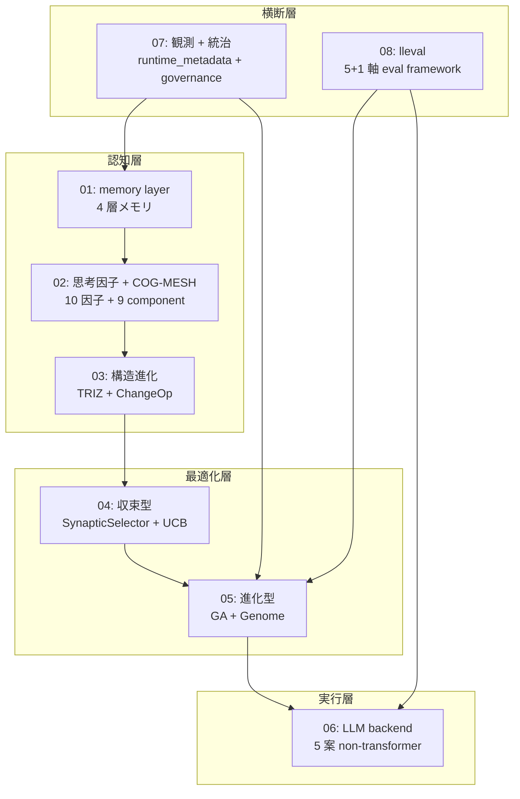
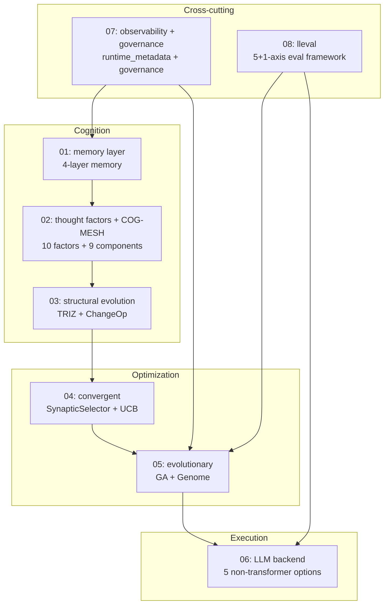
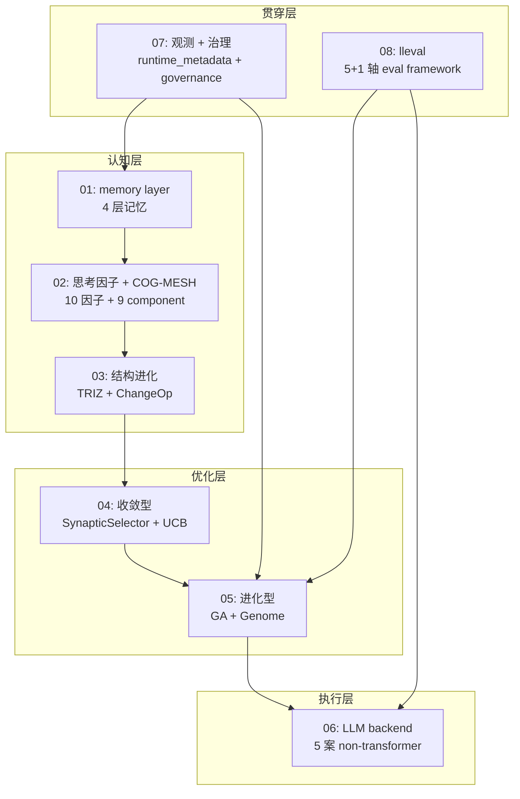
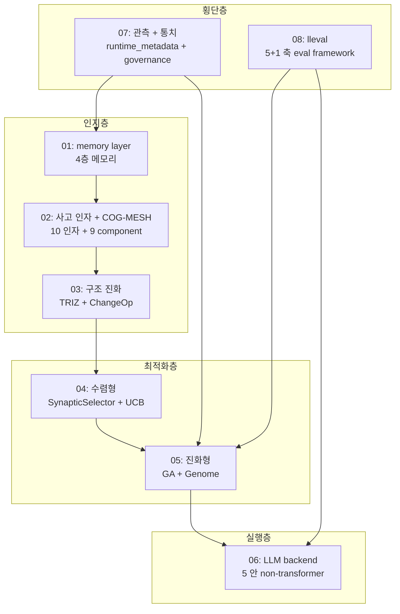

言語 / Language / 语言 / 언어: [日本語](#日本語) | [English](#english) | [中文](#中文) | [한국어](#한국어)

---

# 日本語

# llive 完全解説 (0) — series index: 大分類 8 記事 + 全体図

> **コンセプト hook**: llive (FullSense ™ の思考層) を **構成する技術 / アルゴリズム
> を名称ごとに解説する** series の入口です. 1 記事に詰め込むと ~80k 字級になるため,
> **大分類 8 記事** に分割しました. 本 index は全体地図 — どの章で何を読めるかを示します.

## 0. この series について

llive は「LLM 本体ではなく LLM の周りに被せる認知 OS」です. その内部を **4 層
(認知 / 最適化 / 実行 / 横断) × 8 章** に分けて, 各章で具体的な class / function /
機能名まで降りて解説します. 各記事は次の共通構造を持ちます:

- **冒頭 hook** (8 秒で「これは何か」)
- 具体的な class / function 名まで降りた小節
- 実コードへの **GitHub link**
- **References** (学術 / OSS / 内部)
- **cross-link** (前 / 次 / 本 index / repo)

合計 **~80k 字**. ja Qiita + en Medium を並走します.

## 1. Series 構成 (8 大分類)

| # | タイトル (クリックで各章) | 中分類 | 公開 |
|---|---|---|---|
| 01 | [**memory layer** — 4 層メモリ](https://qiita.com/furuse-kazufumi/items/a5ebb3992e4c28862f47) | semantic / episodic / structural / parameter / surprise gating | 🟢 公開 |
| 02 | [**思考因子 + COG-MESH** — 10 因子と 9 component](https://qiita.com/furuse-kazufumi/items/bdfad6db3f2e70c40511) | 構造化 / 再構成 / 閉ループ / ... / proactive / quarantine / 5W1H | 🟢 公開 |
| 03 | [**構造進化 (TRIZ × Z3)**](https://qiita.com/furuse-kazufumi/items/fa0890f136636d495ea6) | TRIZ 40 原理 / ChangeOp / verifier / 9 画法 | 🟢 公開 |
| 04 | [**収束型最適化 (B-0〜B-9)**](https://qiita.com/furuse-kazufumi/items/e5093e4816b25c1bd4d0) | SynapticSelector / UCB1 / Hebbian / 本番 hot path | 🟢 公開 |
| 05 | [**進化型最適化 (v0.B/C/D/E)**](https://qiita.com/furuse-kazufumi/items/07b686ea311e06027f94) | Genome / Crossover / Tournament / Mutation / lineage | 🟢 公開 |
| 06 | [**LLM backend 層** — non-transformer](https://qiita.com/furuse-kazufumi/items/6da5a883fb2ed651edd8) | Mamba / Jamba / RWKV / Diffusion / 思考因子→SSM Δ Bridge | 🟢 公開 |
| 07 | [**観測 + 統治**](https://qiita.com/furuse-kazufumi/items/c5f2077a3399d3fc9b26) | runtime_metadata / Approval Bus / governance / honest disclosure | 🟢 公開 |
| 08 | [**lleval (eval framework)**](https://qiita.com/furuse-kazufumi/private/e49b7ab9027d93594402) | progressive size matrix / 5+1 軸 / judge rotation | 🟡 限定共有 |

> 🟢 公開 = Qiita ホーム / 検索結果に露出. 🟡 限定共有 = URL を知る人のみ閲覧. 公開昇格は連載順 (01 → 02 → … → 08) で順次予定.

## 2. 全体図 (8 layer の関係)

「**認知層 → 最適化層 → 実行層**」の縦が llive の処理 flow,
「**観測 + 統治**」「**lleval**」が横断層として全 layer に効く構造です.

## 3. 想定読者

- **エンジニア** (Python + LLM 基礎知識あり)
- **AI researcher** (LLM の周辺アーキテクチャに興味)
- **個人 OSS author** (実装パターンの参考)
- **企業 R&D** (on-prem LLM stack の検討材料)

## 4. 公開順 (週 2 本ペース)

| 週 | 公開記事 |
|---|---|
| Week 1 | 01 memory + 02 思考因子 |
| Week 2 | 03 構造進化 + 04 収束型 |
| Week 3 | 05 進化型 + 06 LLM backend |
| Week 4 | 07 観測統治 + 08 lleval |

各記事の en 版は Medium に並走します.

## 5. 連載を貫くテーマ — 「速い」は実装方法で桁が変わる

連載中核 #24-05 で扱う派生集団進化の hot path 3 つを Rust 化した実測:

- **RUST-15** persona_dissimilarity_pairwise: avg **x12.71** (batch)
- **RUST-16** collusion_score_kernel: avg **x66.70** (numpy 小 N hot path)
- **RUST-17b** novelty_score_batch (rayon + quickselect): avg **x9.32**

「**Rust 化 = 速い」は嘘 / 「numpy = 速い」も嘘** — 実装方法 (FFI 境界 / batch /
numpy zero-copy / 並列度 / partial sort) で結果が桁違いになります. この honest
disclosure の姿勢が連載全体の通奏低音です. 5 パターン判定表は #24-04 / #24-05 /
#24-07 で詳述します.

## 6. References (本 index)

- [furuse-kazufumi/llive](https://github.com/furuse-kazufumi/llive) — 本体 repo
- FullSense Spec v1.1 (llive `docs/`)
- 各章の References は個別記事に記載

---

## Series Navigation

- → 次: [llive 完全解説 (1) 「忘れない LLM」](https://qiita.com/furuse-kazufumi/items/a5ebb3992e4c28862f47)
- repo: [furuse-kazufumi/llive](https://github.com/furuse-kazufumi/llive)

---

# English

# llive Complete Guide (0) — series index: 8 main chapters + overall map

> **Concept hook**: This is the entrance to a series that **explains the
> technologies / algorithms that make up llive** (the thinking layer of FullSense ™)
> by name. Cramming it into one article reaches ~80k characters, so we split it into
> **8 main chapters**. This index is the overall map — it shows what you can read in
> which chapter.

## 0. About this series

llive is "a cognitive OS wrapped around the LLM, not the LLM itself". We divide its
interior into **4 layers (cognition / optimization / execution / cross-cutting) × 8
chapters**, and each chapter goes down to concrete class / function / feature names.
Each article has the following common structure:

- an **opening hook** ("what is this" in 8 seconds)
- subsections that descend to concrete class / function names
- **GitHub links** to the real code
- **References** (academic / OSS / internal)
- **cross-links** (prev / next / this index / repo)

A total of **~80k characters**. We run ja Qiita + en Medium in parallel.

## 1. Series structure (8 main chapters)

| # | Title (click for each chapter) | Subtopics | Visibility |
|---|---|---|---|
| 01 | [**memory layer** — 4-layer memory](https://qiita.com/furuse-kazufumi/items/a5ebb3992e4c28862f47) | semantic / episodic / structural / parameter / surprise gating | 🟢 public |
| 02 | [**thought factors + COG-MESH** — 10 factors and 9 components](https://qiita.com/furuse-kazufumi/items/bdfad6db3f2e70c40511) | structurize / recompose / closed-loop / ... / proactive / quarantine / 5W1H | 🟢 public |
| 03 | [**structural evolution (TRIZ × Z3)**](https://qiita.com/furuse-kazufumi/items/fa0890f136636d495ea6) | TRIZ 40 principles / ChangeOp / verifier / 9-windows | 🟢 public |
| 04 | [**convergent optimization (B-0..B-9)**](https://qiita.com/furuse-kazufumi/items/e5093e4816b25c1bd4d0) | SynapticSelector / UCB1 / Hebbian / production hot path | 🟢 public |
| 05 | [**evolutionary optimization (v0.B/C/D/E)**](https://qiita.com/furuse-kazufumi/items/07b686ea311e06027f94) | Genome / Crossover / Tournament / Mutation / lineage | 🟢 public |
| 06 | [**LLM backend layer** — non-transformer](https://qiita.com/furuse-kazufumi/items/6da5a883fb2ed651edd8) | Mamba / Jamba / RWKV / Diffusion / thought-factor→SSM Δ Bridge | 🟢 public |
| 07 | [**observability + governance**](https://qiita.com/furuse-kazufumi/items/c5f2077a3399d3fc9b26) | runtime_metadata / Approval Bus / governance / honest disclosure | 🟢 public |
| 08 | [**lleval (eval framework)**](https://qiita.com/furuse-kazufumi/private/e49b7ab9027d93594402) | progressive size matrix / 5+1 axes / judge rotation | 🟡 limited share |

> 🟢 public = exposed on the Qiita home / search results. 🟡 limited share = viewable only by those who know the URL. Promotion to public is planned in series order (01 → 02 → … → 08).

## 2. Overall map (8-layer relationships)

The vertical "**cognition → optimization → execution**" is llive's processing flow;
"**observability + governance**" and "**lleval**" are the cross-cutting layers that
touch every level.

## 3. Intended readers

- **engineers** (with Python + basic LLM knowledge)
- **AI researchers** (interested in LLM-surrounding architecture)
- **individual OSS authors** (reference for implementation patterns)
- **corporate R&D** (material for considering an on-prem LLM stack)

## 4. Publishing order (2 articles / week)

| Week | Published articles |
|---|---|
| Week 1 | 01 memory + 02 thought factors |
| Week 2 | 03 structural evolution + 04 convergent |
| Week 3 | 05 evolutionary + 06 LLM backend |
| Week 4 | 07 observability+governance + 08 lleval |

Each article's English version runs in parallel on Medium.

## 5. The theme running through the series — "fast" changes by orders of magnitude with implementation

Measured results of Rust-porting 3 hot paths of the derived-population evolution
covered in the series centerpiece #24-05:

- **RUST-15** persona_dissimilarity_pairwise: avg **x12.71** (batch)
- **RUST-16** collusion_score_kernel: avg **x66.70** (numpy small-N hot path)
- **RUST-17b** novelty_score_batch (rayon + quickselect): avg **x9.32**

"**Rust = fast" is a lie / "numpy = fast" is also a lie** — the result differs by
orders of magnitude depending on the implementation method (FFI boundary / batch /
numpy zero-copy / parallelism / partial sort). This honest-disclosure stance is the
basso continuo of the whole series. The 5-pattern decision table is detailed in
#24-04 / #24-05 / #24-07.

## 6. References (this index)

- [furuse-kazufumi/llive](https://github.com/furuse-kazufumi/llive) — the main repo
- FullSense Spec v1.1 (llive `docs/`)
- Each chapter's References are in its own article

---

## Series Navigation

- → Next: [llive Complete Guide (1) "The LLM that Never Forgets"](https://qiita.com/furuse-kazufumi/items/a5ebb3992e4c28862f47)
- repo: [furuse-kazufumi/llive](https://github.com/furuse-kazufumi/llive)

---

# 中文

# llive 完全解说 (0) — series index: 8 大分类文章 + 总图

> **概念 hook**: 这是按名称解读 **构成 llive (FullSense ™ 思考层) 的技术 / 算法** 的
> 系列的入口. 塞进一篇会达到约 8 万字, 所以分为 **8 大分类文章**. 本 index 是总图 —
> 标明在哪一章能读到什么.

## 0. 关于本系列

llive 是「不是 LLM 本体, 而是包裹在 LLM 外侧的认知 OS」. 我们把它的内部分为
**4 层 (认知 / 优化 / 执行 / 贯穿) × 8 章**, 每一章都下沉到具体的 class / function /
功能名来讲解. 每篇文章都有以下通用结构:

- **开头 hook** (8 秒说清「这是什么」)
- 下沉到具体 class / function 名的小节
- 指向实代码的 **GitHub link**
- **References** (学术 / OSS / 内部)
- **cross-link** (前 / 次 / 本 index / repo)

总计 **约 8 万字**. ja Qiita + en Medium 并行.

## 1. 系列结构 (8 大分类)

| # | 标题 (点击进入各章) | 中分类 | 可见性 |
|---|---|---|---|
| 01 | [**memory layer** — 4 层记忆](https://qiita.com/furuse-kazufumi/items/a5ebb3992e4c28862f47) | semantic / episodic / structural / parameter / surprise gating | 🟢 公开 |
| 02 | [**思考因子 + COG-MESH** — 10 因子与 9 component](https://qiita.com/furuse-kazufumi/items/bdfad6db3f2e70c40511) | 结构化 / 重组 / 闭环 / ... / proactive / quarantine / 5W1H | 🟢 公开 |
| 03 | [**结构进化 (TRIZ × Z3)**](https://qiita.com/furuse-kazufumi/items/fa0890f136636d495ea6) | TRIZ 40 原理 / ChangeOp / verifier / 9 画法 | 🟢 公开 |
| 04 | [**收敛型优化 (B-0..B-9)**](https://qiita.com/furuse-kazufumi/items/e5093e4816b25c1bd4d0) | SynapticSelector / UCB1 / Hebbian / 生产 hot path | 🟢 公开 |
| 05 | [**进化型优化 (v0.B/C/D/E)**](https://qiita.com/furuse-kazufumi/items/07b686ea311e06027f94) | Genome / Crossover / Tournament / Mutation / lineage | 🟢 公开 |
| 06 | [**LLM backend 层** — non-transformer](https://qiita.com/furuse-kazufumi/items/6da5a883fb2ed651edd8) | Mamba / Jamba / RWKV / Diffusion / 思考因子→SSM Δ Bridge | 🟢 公开 |
| 07 | [**观测 + 治理**](https://qiita.com/furuse-kazufumi/items/c5f2077a3399d3fc9b26) | runtime_metadata / Approval Bus / governance / honest disclosure | 🟢 公开 |
| 08 | [**lleval (eval framework)**](https://qiita.com/furuse-kazufumi/private/e49b7ab9027d93594402) | progressive size matrix / 5+1 轴 / judge rotation | 🟡 限定共享 |

> 🟢 公开 = 在 Qiita 首页 / 搜索结果露出. 🟡 限定共享 = 仅知道 URL 的人可看. 公开升级按连载顺序 (01 → 02 → … → 08) 依次进行.

## 2. 总图 (8 层关系)

纵向「**认知层 → 优化层 → 执行层**」是 llive 的处理流程,「**观测 + 治理**」「**lleval**」
作为贯穿层对所有 layer 起作用.

## 3. 目标读者

- **工程师** (有 Python + LLM 基础知识)
- **AI researcher** (对 LLM 周边架构感兴趣)
- **个人 OSS 作者** (实现模式的参考)
- **企业 R&D** (本地 LLM stack 的考察素材)

## 4. 发布顺序 (每周 2 篇)

| 周 | 发布文章 |
|---|---|
| Week 1 | 01 memory + 02 思考因子 |
| Week 2 | 03 结构进化 + 04 收敛型 |
| Week 3 | 05 进化型 + 06 LLM backend |
| Week 4 | 07 观测治理 + 08 lleval |

每篇文章的英文版在 Medium 并行.

## 5. 贯穿系列的主题 —「快」会因实现方法而差好几个数量级

将系列核心 #24-05 处理的派生群体进化的 3 个 hot path 用 Rust 重写的实测:

- **RUST-15** persona_dissimilarity_pairwise: avg **x12.71** (batch)
- **RUST-16** collusion_score_kernel: avg **x66.70** (numpy 小 N hot path)
- **RUST-17b** novelty_score_batch (rayon + quickselect): avg **x9.32**

「**Rust 化 = 快」是谎言 /「numpy = 快」也是谎言** — 结果会因实现方法 (FFI 边界 /
batch / numpy zero-copy / 并行度 / partial sort) 而差好几个数量级. 这种 honest
disclosure 的姿态是整个系列的通奏低音. 5 模式判定表在 #24-04 / #24-05 / #24-07
详述.

## 6. References (本 index)

- [furuse-kazufumi/llive](https://github.com/furuse-kazufumi/llive) — 本体 repo
- FullSense Spec v1.1 (llive `docs/`)
- 各章的 References 在各自文章中

---

## Series Navigation

- → 下一篇: [llive 完全解说 (1) 「不会遗忘的 LLM」](https://qiita.com/furuse-kazufumi/items/a5ebb3992e4c28862f47)
- repo: [furuse-kazufumi/llive](https://github.com/furuse-kazufumi/llive)

---

# 한국어

# llive 완전 해설 (0) — series index: 8 대분류 글 + 전체도

> **콘셉트 hook**: **llive (FullSense ™의 사고층)를 구성하는 기술 / 알고리즘**을
> 명칭별로 해설하는 series의 입구다. 한 글에 담으면 약 8만 자가 되므로 **8 대분류
> 글**로 나눴다. 본 index는 전체 지도 — 어느 장에서 무엇을 읽을 수 있는지를 나타낸다.

## 0. 이 series에 대하여

llive는 「LLM 본체가 아니라 LLM 주위에 씌우는 인지 OS」다. 그 내부를
**4층 (인지 / 최적화 / 실행 / 횡단) × 8장**으로 나누어, 각 장에서 구체적인 class /
function / 기능명까지 내려가 해설한다. 각 글은 다음 공통 구조를 가진다:

- **서두 hook** (8초로 「이것은 무엇인가」)
- 구체적인 class / function 명까지 내려간 소절
- 실제 코드로의 **GitHub link**
- **References** (학술 / OSS / 내부)
- **cross-link** (이전 / 다음 / 본 index / repo)

합계 **약 8만 자**. ja Qiita + en Medium을 병행한다.

## 1. Series 구성 (8 대분류)

| # | 제목 (클릭으로 각 장) | 중분류 | 가시성 |
|---|---|---|---|
| 01 | [**memory layer** — 4층 메모리](https://qiita.com/furuse-kazufumi/items/a5ebb3992e4c28862f47) | semantic / episodic / structural / parameter / surprise gating | 🟢 공개 |
| 02 | [**사고 인자 + COG-MESH** — 10 인자와 9 component](https://qiita.com/furuse-kazufumi/items/bdfad6db3f2e70c40511) | 구조화 / 재구성 / 폐루프 / ... / proactive / quarantine / 5W1H | 🟢 공개 |
| 03 | [**구조 진화 (TRIZ × Z3)**](https://qiita.com/furuse-kazufumi/items/fa0890f136636d495ea6) | TRIZ 40 원리 / ChangeOp / verifier / 9 화법 | 🟢 공개 |
| 04 | [**수렴형 최적화 (B-0..B-9)**](https://qiita.com/furuse-kazufumi/items/e5093e4816b25c1bd4d0) | SynapticSelector / UCB1 / Hebbian / 프로덕션 hot path | 🟢 공개 |
| 05 | [**진화형 최적화 (v0.B/C/D/E)**](https://qiita.com/furuse-kazufumi/items/07b686ea311e06027f94) | Genome / Crossover / Tournament / Mutation / lineage | 🟢 공개 |
| 06 | [**LLM backend 층** — non-transformer](https://qiita.com/furuse-kazufumi/private/6da5a883fb2ed651edd8) | Mamba / Jamba / RWKV / Diffusion / 사고 인자→SSM Δ Bridge | 🟡 한정 공유 |
| 07 | [**관측 + 통치**](https://qiita.com/furuse-kazufumi/private/c5f2077a3399d3fc9b26) | runtime_metadata / Approval Bus / governance / honest disclosure | 🟡 한정 공유 |
| 08 | [**lleval (eval framework)**](https://qiita.com/furuse-kazufumi/private/e49b7ab9027d93594402) | progressive size matrix / 5+1 축 / judge rotation | 🟡 한정 공유 |

> 🟢 공개 = Qiita 홈 / 검색 결과에 노출. 🟡 한정 공유 = URL을 아는 사람만 열람. 공개 승격은 연재 순서 (01 → 02 → … → 08)로 순차 예정.

## 2. 전체도 (8 layer의 관계)

세로 「**인지층 → 최적화층 → 실행층**」이 llive의 처리 flow,「**관측 + 통치**」「**lleval**」
이 횡단층으로서 모든 layer에 작용하는 구조다.

## 3. 상정 독자

- **엔지니어** (Python + LLM 기초 지식 보유)
- **AI researcher** (LLM 주변 아키텍처에 관심)
- **개인 OSS author** (구현 패턴의 참고)
- **기업 R&D** (on-prem LLM stack 검토 자료)

## 4. 공개 순서 (주 2편 페이스)

| 주 | 공개 글 |
|---|---|
| Week 1 | 01 memory + 02 사고 인자 |
| Week 2 | 03 구조 진화 + 04 수렴형 |
| Week 3 | 05 진화형 + 06 LLM backend |
| Week 4 | 07 관측통치 + 08 lleval |

각 글의 en 버전은 Medium에 병행한다.

## 5. 연재를 관통하는 테마 — 「빠름」은 구현 방법으로 자릿수가 바뀐다

연재 중핵 #24-05에서 다루는 파생 집단 진화의 hot path 3개를 Rust화한 실측:

- **RUST-15** persona_dissimilarity_pairwise: avg **x12.71** (batch)
- **RUST-16** collusion_score_kernel: avg **x66.70** (numpy 작은 N hot path)
- **RUST-17b** novelty_score_batch (rayon + quickselect): avg **x9.32**

「**Rust화 = 빠름」은 거짓 /「numpy = 빠름」도 거짓** — 결과는 구현 방법 (FFI 경계 /
batch / numpy zero-copy / 병렬도 / partial sort)에 따라 자릿수가 달라진다. 이
honest disclosure의 자세가 연재 전체의 통주저음이다. 5 패턴 판정표는 #24-04 /
#24-05 / #24-07에서 상술한다.

## 6. References (본 index)

- [furuse-kazufumi/llive](https://github.com/furuse-kazufumi/llive) — 본체 repo
- FullSense Spec v1.1 (llive `docs/`)
- 각 장의 References는 각자 글에 기재

---

## Series Navigation

- → 다음: [llive 완전 해설 (1) 「잊지 않는 LLM」](https://qiita.com/furuse-kazufumi/items/a5ebb3992e4c28862f47)
- repo: [furuse-kazufumi/llive](https://github.com/furuse-kazufumi/llive)
