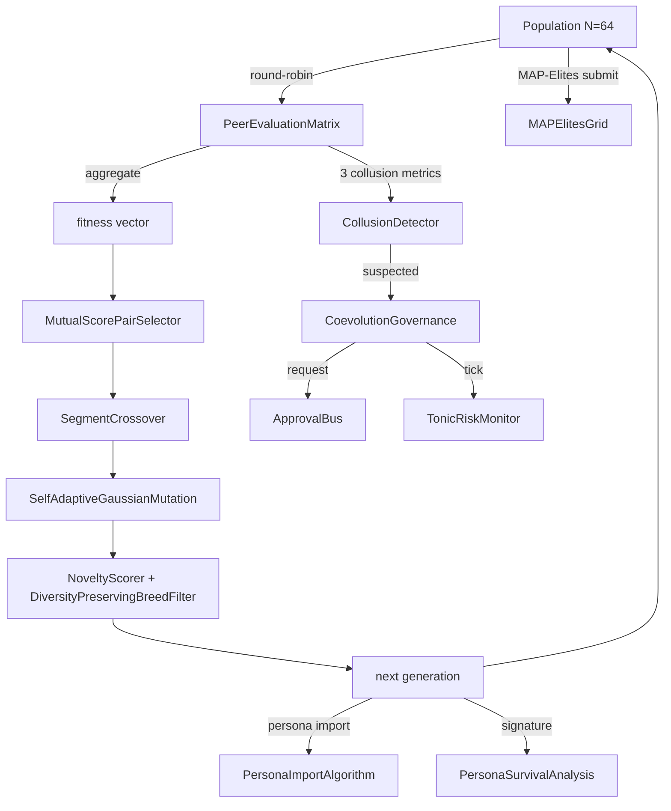
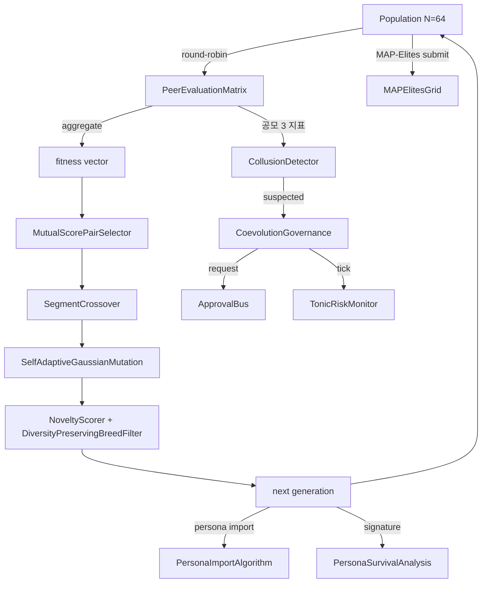

言語 / Language / 语言 / 언어: [日本語](#日本語) | [English](#english) | [中文](#中文) | [한국어](#한국어)

---

# 日本語

# llive 完全解説 (5) — 「集団が学ぶ AI」: v0.B/C/D/E 派生集団進化総括


> **コンセプト hook**: 1 個の AI が賢くなるのではなく, **64 個の AI が世代を
> 回して互いに評価し合い, 嘘の合意は Approval Bus が止める** — それが llive の
> v0.E. 2026-05-21 marathon でその架構が **303 件 test + ruff 0 警告 + governance
> skeleton 着地** まで揃った. Hillis 1990 から AlphaStar 2019 まで 30 年の
> 系譜を 1 OSS に圧縮した結果.
>
> 本記事は連載 #24 の中核. v0.B (Genome / EvolutionLoop) → v0.C (subprocess
> 分離) → v0.D (self-adaptive + meta mutation) → v0.E (peer evaluation +
> persona + governance) の 4 段階を **1 本に総括**.


## 0. 連載中での位置づけ — 本連載の中核

```
#24-00 series index
#24-01 4 層メモリ          ← 「個体の中の記憶」
#24-02 思考因子 × COG-MESH ← 「個体の中の思考軸」
#24-03 構造進化 × TRIZ × Z3 ← 「個体内の構造書換え」
#24-04 B-series           ← 「個体内の収束 (速い小脳)」
#24-05 EvolutionLoop      ← 「個体間の探索 (遅い大脳)」 ★ 本記事
#24-06 LLM backend         ← 「個体を動かす管」
#24-07 governance         ← 「個体間決定の audit」
#24-08 lleval              ← 「個体を測る眼鏡」
```

#24-05 は全体の **背骨**. v0.B/C/D/E で「派生集団そのもの」を作る. 他の
記事はそこに乗る機能. これは連載の中核 — 他の全章の機能が乗る基盤である.

## 1. なぜ集団進化なのか — Hillis の警告

W. D. Hillis 1990 が示したのは「**評価者と被評価者が同時に進化する**」と
fitness landscape は指数的に面白くなる, ということ.
**Red Queen Effect** で集団全体の質が **自走で上がる**. 単一 best を選び続け
ると **局所最適に陥る**.

llive はこれを LLM に持ち込んだ. 派生集団 N=64 が互いに評価, 評価結果が
fitness, fitness が次世代の selection. すると:

- **「評価者の質」自体が世代と共に上がる**
- **単一 best が全体を支配できない**
- **「全派生が嘘の高得点を付け合う」共謀** が発生し得る (CE-06 で検出)

## 2. v0.B — Genome / EvolutionLoop / 並列 scheduler

v0.B core は GA 古典. 着地 module は Genome, Selection, Crossover, Mutation,
scheduler:

- `Genome` (実数 vector + bounds + labels) + `Individual` + `Population`.
- `TournamentSelection / RouletteSelection / ElitismSelection`.
- `UniformCrossover / BlendCrossover / SegmentCrossover`.
- `GaussianMutation / ResetMutation / ChainedMutation`.
- `EvolutionLoop` (`EvolutionConfig` + `EvolutionResult`).
- 並列 scheduler 3 種: `serial_scheduler / MultiprocessingScheduler / AsyncioScheduler`.

これだけで「**集団 → 評価 → 選別 → 交配 → 突然変異 → 次世代**」のループが回る.

## 3. v0.C — subprocess 分離 + 派生実走

LLM 推論は 1 派生個体あたり OS process 1 つに **完全分離** したい. 理由は:

- LLM 重い → メモリ leak / GIL 競合を物理分離
- 1 派生が落ちても他は生存
- OS-level timeout / SIGKILL で fault isolation

`VariantSubprocessScheduler` (`subprocess_scheduler.py`) — subprocess.run +
ThreadPool 並列 + timeout + retries + cleanup. これで `variant_runner.py`
スクリプトを派生 1 個体として起動可能.

## 4. v0.D — 自己参照 mutation (Schwefel σSA-ES + meta mutation)

v0.D core は「**mutation rate そのものを進化させる**」.

- `SelfAdaptiveGaussianMutation` (Schwefel σSA-ES, log-normal σ update).
  Genome に σ vector を埋め込み, mutation が σ も書き換える.
- `MetaMutation` (`strategy_id` を genome に, 集団内で 4 戦略並走).
- `pack_self_adaptive_bounds / pack_meta_strategy_bounds` — 38/20/39 dim 化.

これで「**どの mutation 戦略が今の問題に効くか**」自体が世代を超えて
学習される.

## 5. v0.E — peer evaluation + persona ontology + governance

v0.E core. CE-01〜34 を含む. 主要 module は以下:

### 5.1 評価 (CE-01〜05)

- `PeerEvaluationMatrix` — N×N 採点行列. 共謀検出 3 指標
  (`score_variance / symmetry / concentration`). Mermaid 可視化.
- `PeerFitnessAdapter` — `EvolutionLoop.scheduler` 互換.
- `EvaluationStyleGenome` — 派生に「**辛口 / 甘口 / 精度 / 速度**」の
  evaluation persona dim を埋め込み.

### 5.2 多様性保護 (CE-24〜29)

- `latin_hypercube_population` — 空間均等初期集団 (scipy.stats.qmc).
- `NoveltyScorer` — k-NN, Lehman-Stanley 2008/2011.
- `DiversityPreservingBreedFilter` — novelty rejection + resample.
- `DiversityMonitor` — diversity_l2 / spread / median + 閾値 alarm.

### 5.3 Quality Diversity (CE-25 / CE-26, 本日着地)

- `PersonaOverlapPenalty` — fitness 軸に persona dissimilarity の集団平均加算.
- `MAPElitesGrid` — Mouret & Clune 2015 の 4 軸版 (persona 2 × thought_factor 2).
  各 cell に最大 fitness 個体を保存.

### 5.4 Historical persona (CE-19〜23)

- `PERSONA_ONTOLOGY` 10 名 (岡潔 / グロタンディーク / ファインマン / ガロア /
  フォン・ノイマン / ニュートン / カント / ソクラテス / 老子 / 孫子).
- `PersonaComposition` (3 policy: exclusive / mix / moderator).
- `PersonaCompositionMutation` (CE-21).
- `persona_dissimilarity` — Jaccard + L2 of factor_affinity.
- `PersonaImportAlgorithm` (CE-20, 本日着地) — 派生間 persona 部分採用.
- `PersonaSurvivalAnalysis` (CE-22, 本日着地) — どの persona 組合せが
  世代を生き残ったか統計.
- `PersonaCorpusLoader` (CE-23, 本日着地 skeleton) — Raptor RAD から
  自動抽出.

### 5.5 集団組み合わせ機構 (CE-30〜34)

- `MutualScorePairSelector` (CE-30, mating.py) — assortative mating,
  softmax sampling.
- `NSGA2Selection` (CE-31, nsga2.py) — Pareto front + crowding distance.
- `Speciation` (CE-32, speciation.py) — NEAT 流種分け.
- `IslandModel` (CE-33, island_model.py) — ring/fully/star 3 topology +
  best/random/worst migration.
- `LexicaseSelection` (CE-34, mating.py) — Helmuth 2014, case-by-case 順位.

### 5.6 Governance (CE-06〜08, 本日着地 E.4)

- `CollusionDetector` (CE-06) — `is_suspected_collusion` を threshold
  dataclass で wrap.
- `CoevolutionGovernance` (CE-07) — 共謀疑い → ApprovalBus.request 発火.
- `collusion_risk_score` (CE-08) — TonicRiskMonitor.tick に投入する
  state → [0, 1] risk.
- `GovernanceReport` (frozen).

## 6. 数字で見る本日 (2026-05-21) 着地

| 指標 | 値 |
|---|---|
| evolutionary module 数 (本日終了時) | **29** (+5) |
| 本日追加 test ケース | **130** (41 + 28 + 26 + 16 + 19) |
| ruff `src/llive/perf/evolutionary` 警告 | **0** (-7) |
| 本日着地 module | 5 (`quality_diversity / coevolution_governance / persona_import / persona_survival / persona_corpus_loader`) |
| CE-IDs カバー率 | 34 / 34 ID 全カバー (skeleton 含む) |
| CHANGELOG `[0.6.0a1]` セクション | E.17 / E.12 / E.4 sections + 41 行追加 |
| docs/release/v0.6.0a1_PR_PLAN.md | 新規 — 5 PR 分割計画 |
| docs/rust_hotspot_v0E_addendum.md | 新規 — RUST-15〜18 spec |
| 連載 #24 記事 (本セッション draft) | **7 本** (#24-02 / 03 / 04 / 05 / 06 / 07 / 08) |

## 7. 先行研究 9 件 (本記事の骨を作る)

1. Hillis, W. D. (1990). *Coevolving parasites improve simulated evolution*. Physica D.
2. Mouret, J.-B. & Clune, J. (2015). *Illuminating search spaces by mapping elites*. arXiv:1504.04909.
3. Lehman, J. & Stanley, K. (2008/2011). *Novelty Search*.
4. Stanley, K. & Miikkulainen, R. (2002). *NEAT*. Evolutionary Computation.
5. Deb, K. et al. (2002). *NSGA-II*. IEEE Trans Evol Comp.
6. Cohoon, J. (1987). *Island Model GA*.
7. Goldberg, D. & Richardson, J. (1987). *Fitness sharing*.
8. Helmuth, T. et al. (2014). *Lexicase Selection*.
9. AlphaStar (Vinyals et al. 2019). *League / Exploiter / Main Pool*.

## 8. 三重縞 — 思考因子 / persona / TRIZ の 3 層同居

ユーザー言語化の concept. 派生個体内で 3 層が同居する:

- **layer 1**: 10 思考因子 vector (factor_structurize / ... / factor_reality_link)
- **layer 2**: persona composition (Newton + Galois の hybrid 等)
- **layer 3**: TRIZ 40 原理 + ARIZ 思考プロセス

の 3 layer が **同時並走**. 1 派生個体が「**Galois 風 + 多視点重視 + TRIZ
Segmentation を好む**」のように multi-dimensional な個性を持つ. E.17
quality-diversity の MAP-Elites grid はこの 3 layer の交差点を grid 化する
最初の機構.

## 9. Rust addendum (#24-04 と #24-05 を繋ぐ)

`docs/rust_hotspot_v0E_addendum.md` (本日新規) で RUST-15 〜 18 を spec 化:

- RUST-15: `persona_dissimilarity` Rust 化 (5x gate)
- RUST-16: `collusion_score` (peer matrix metrics) Rust 化
- RUST-17: `NoveltyScorer` L2 + top-k batch Rust 化
- RUST-NEW-B: `MAPElites bin + submit` batch Rust 化
- RUST-18: parity test harness 拡張

これは **B-series の Python 最適化** と **集団進化の Rust 最適化** が
直交することを示す: B-series は推論 hot path (Python のままで 28%), 集団進化は
N=64 派生の集計系 hot path (Rust 化で 5-15x 狙い).

## 10. honest disclosure

- **「v0.E の効果」はベンチ未取得** — module は全 PASS だが「30 世代で
  baseline より 30% diversity 維持」のような仮説 H10 / H11 は **未検証**.
  ベンチ走らせるのは credential + GPU 確保後.
- **PERSONA_ONTOLOGY 10 名は heuristic** — factor_affinity vector は伝記 /
  哲学史 ベースの人為的初期値. CE-23 PersonaCorpusLoader でコーパスベースに
  置換予定だが現状は経験則.
- **Governance skeleton は wire-in 未完** — Quarantined Memory への
  **実書込み** は別 module 委譲. 完成までは 1-2 セッション.
- **N=64 派生集団は実機未実行** — 本セッションは module + test 着地まで.
  end-to-end 集団 GA loop の実機 run は次セッション.
- **CE-23 LLM extractor は未実装** — keyword fallback のみ着地. LLM 経由の
  thought pattern 抽出は credential 復旧後.
- **AlphaStar League mode (E.5) は未着手** — credential / judge LLM 復旧後.
- **Debate mode (E.6) も未着手** — 同上.

## 11. Mermaid — v0.E 全体像


## 12. 期待値 — 次に来るもの

- **v0.7 Rust 高速化**: `docs/rust_hotspot_v0E_addendum.md` の RUST-15〜18.
- **v0.E E.5 (League mode)** — AlphaStar 風 Main / Exploiter / League Exploiter.
- **v0.E E.6 (Debate mode)** — Irving 2018 風 argument / counter-argument +
  human/LLM judge. human / LLM judge 統合が次の明確な一手.
- **lleval bridge v0.1.0a2** — 派生 Genome → ProviderSpec mapper の実装.
- **CE-19/23 LLM extractor** — Raptor RAD コーパスから persona 自動抽出.
- **集団進化 end-to-end 実機 run** — N=64 派生 で 30 世代 → diversity
  metrics / collusion 検知率 / governance trigger 数 を計測.

## 13. 2026-05-22 追記 — Rust 高速化 RUST-15/16/17 着地

`goal_release_ready_v0E_rust` addendum の 3 kernel を 1 セッションで着地.
連載中核記事として最新成果を反映:

### 13.1 着地 3 kernel

| ID | 機能 | hot path | 5x gate 結果 |
|---|---|---|---|
| **RUST-15** persona_dissimilarity_pairwise | NxN pair の Jaccard + L2 + 合成 | PersonaOverlapPenalty.apply | **avg x12.71 (N=64 で x17.07)** |
| **RUST-16** collusion_score_kernel | NxN peer matrix の variance / symmetry / concentration | CoevolutionGovernance.evaluate_generation | **avg x66.70 (N=8 で x115.04)** |
| **RUST-17** novelty_score_batch | 集団 N × archive A の L2 + top-k mean | NoveltyScorer.novelty_batch | **avg x5.01 (A=50 で x9.55, A=1000 で x1.72)** |

全 37 parity test PASS (1e-6 tolerance), ruff `src/llive/perf/evolutionary` +
`src/llive/rust_ext` 0 警告.

### 13.2 衝撃の honest disclosure — 「Rust 化 = 速い」は嘘

**RUST-15 単発呼出は Rust の方が遅い (x0.80, FAIL)**. FFI overhead で
Python set 操作に負ける. batch (N×N pair を 1 FFI call) にして初めて
x12.71 まで伸びる. 同じアルゴリズム・同じ Rust kernel でも **FFI 境界の
引き方**で結果が桁違い.

逆例も観察: **RUST-16 は単発でも x66.70 で圧勝**. numpy の `np.nanvar` /
`np.corrcoef` は **小 NxN (N が 100 未満) で Python overhead が支配的**で 200μs+/call.
Rust の単純 C ループ (numpy zero-copy 受領) は 2μs/call.

そして境界線: **RUST-17 は archive サイズで結果が反転**. A=50 で x9.55 だが
A=1000 で numpy BLAS vectorized が追いついて x1.72 まで縮む.

### 13.3 5 パターン判定表 (本セッションで言語化)

| Python 経路の特性 | Rust 化の単発 ROI | 実例 |
|---|---|---|
| **A** 純 Python ループ (numpy 不使用) の 1-pair | 単発 FAIL, batch 必須 | RUST-15 (x0.80 → batch x12.71) |
| **B** numpy 大 array (1000 超) vectorized | 伸びない (numpy 内部 BLAS) | (該当 kernel まだ無し) |
| **C** numpy 小 NxN (100 未満) API 多用 | **単発でも 10-100x** | RUST-16 (x66.70) |
| **D** numpy 中規模 BLAS 1 関数 | **境界線上**: 小サイズ Rust 圧勝, 大サイズで追いつかれる | RUST-17 (A=50 x9.55 → A=1000 x1.72) |
| **E** 冷たいデータ境界 (dict / 文字列) | overhead 大, batch 必須 | — |

詳細表は `docs/perf_comparison/2026-05-22_kernel_implementation_comparison.md`.

### 13.4 Cython 経路の脱落 (build chain 不在)

scratch 比較で Cython kernel を書いて 3 way 比較を試みたが **Windows MSVC
build tools 不在 + mingw が MSVC Python と incompatible** で build 不可.
これは「**数値計算が同等に書ける**」だけでは言語選択に足りない実例:
**build chain が確立できるか**が必須条件. source は `scratch/cython_collusion/`
に保存し Linux/WSL で再試行できる形に.

### 13.5 RUST-17b 追記 (2026-05-22 同日): rayon 並列 + quickselect で全 A 5x clear

RUST-17 baseline は archive 大 (A=200/1000) で gate FAIL だったが, **同日中に
RUST-17b として 2 手段で再実装**:

1. **rayon par_iter** で N=64 集団ループを 8-core 並列化 + `py.allow_threads`
   で GIL release
2. **`Vec::select_nth_unstable_by`** (Hoare quickselect, O(A) avg) で top-k
   partial sort — O(A log A) full sort を置換

結果:

| archive | RUST-17 (naive) | **RUST-17b** | 改善率 |
|---:|---:|---:|---:|
| A=50 | x9.55 | **x12.83** | +34% |
| A=200 | x3.76 (FAIL) | **x8.71 (PASS)** | **+132%** |
| A=1000 | x1.72 (FAIL) | **x6.41 (PASS)** | **+273%** |
| avg | x5.01 | **x9.32** | **+86%** |

判定表 (D) 「numpy 中規模 batch」を「**境界線上 → 並列化で挽回可能**」へ
update. 「naive 二重ループは負ける」だけでなく「**rayon + algorithmic 改善で
圧勝に転じる**」が示された.

std::simd は nightly のみで stable 不可 → 入れればさらに 2-3x. RUST-17c 候補.

### 13.6 次に来るもの (2026-05-22 時点で計画済)

- **PyBind11 + C/C++ ctypes** 経路の 3 kernel scratch 比較 (queue 投入済).
- **RUST-17c** — std::simd (Rust nightly に切替) で SIMD 4-lane 化.
- **月次 re-measure** — env drift / numpy minor up / Rust nightly 等で
  結果が動くため周期実行 (queue 投入済).
- **callers 切替** — PersonaOverlapPenalty.apply / NoveltyScorer.novelty_batch /
  CoevolutionGovernance を rust_ext 経路に切替える PR.

## 14. References

- Hillis, W. D. (1990). *Coevolving parasites improve simulated evolution*. Physica D.
- Mouret, J.-B. & Clune, J. (2015). *Illuminating search spaces by mapping elites*. arXiv:1504.04909.
- Lehman, J. & Stanley, K. (2008/2011). *Novelty Search*.
- Stanley, K. & Miikkulainen, R. (2002). *NEAT*. Evolutionary Computation.
- Deb, K. et al. (2002). *NSGA-II*. IEEE Trans Evol Comp.
- Vinyals, O. et al. (2019). *Grandmaster level in StarCraft II (AlphaStar)*. Nature.
- 完全リストは v0.6.0a1 リリース時に references.bib に同梱予定.

---

## Series Navigation

- ← 前: [llive 完全解説 (4) 「収束する脳」](https://qiita.com/furuse-kazufumi/private/e5093e4816b25c1bd4d0)
- → 次: [llive 完全解説 (6) 「Transformer の外」](https://qiita.com/furuse-kazufumi/items/6da5a883fb2ed651edd8)
- 全体: [llive 完全解説 (0) — series index](https://qiita.com/furuse-kazufumi/items/07b4882e872994b27b3c)
- repo: [furuse-kazufumi/llive](https://github.com/furuse-kazufumi/llive)

---

# English

# llive Complete Guide (5) — "The Population that Learns": v0.B/C/D/E derived-population evolution summary


> **Concept hook**: Rather than one AI getting smarter, **64 AIs turn
> generations, evaluate one another, and the Approval Bus stops false
> consensus** — that is llive's v0.E. In the 2026-05-21 marathon that
> architecture came together up to **303 tests + 0 ruff warnings + a
> governance skeleton landed**. The result of compressing 30 years of
> lineage — from Hillis 1990 to AlphaStar 2019 — into a single OSS.
>
> This article is the centerpiece of the #24 series. It **summarizes in one
> piece** the four stages: v0.B (Genome / EvolutionLoop) → v0.C (subprocess
> isolation) → v0.D (self-adaptive + meta mutation) → v0.E (peer evaluation +
> persona + governance).


## 0. Position within the series — the centerpiece

```
#24-00 series index
#24-01 4-layer memory      ← "memory inside an individual"
#24-02 thought factors × COG-MESH ← "thought axes inside an individual"
#24-03 structural evolution × TRIZ × Z3 ← "structure rewriting inside an individual"
#24-04 B-series           ← "convergence inside an individual (fast cerebellum)"
#24-05 EvolutionLoop      ← "exploration across individuals (slow cerebrum)" ★ this article
#24-06 LLM backend         ← "the pipe that drives an individual"
#24-07 governance         ← "audit of cross-individual decisions"
#24-08 lleval              ← "the glasses that measure an individual"
```

#24-05 is the **backbone** of the whole. v0.B/C/D/E builds "the derived
population itself". The other articles are features that sit on top of it.
This is the series centerpiece — the substrate that all other chapters'
features sit on.

## 1. Why population-based evolution — the Hillis warning

What W. D. Hillis (1990) showed is that when **the evaluator and the
evaluatee evolve simultaneously**, the fitness landscape gets exponentially
more interesting. The **Red Queen Effect** drives the quality of the whole
population **upward on its own**. Keep selecting a single best and you **fall
into a local optimum**.

llive brought this into the LLM. A derived population of N=64 evaluates one
another, the evaluation results are fitness, and fitness drives the next
generation's selection. Then:

- **"the quality of the evaluators" itself rises across generations**
- **no single best can dominate the whole**
- **collusion where "all variants hand each other false high scores"** can
  occur (detected by CE-06)

## 2. v0.B — Genome / EvolutionLoop / parallel scheduler

v0.B core is classic GA. The landed modules are Genome, Selection,
Crossover, Mutation, scheduler:

- `Genome` (real-valued vector + bounds + labels) + `Individual` + `Population`.
- `TournamentSelection / RouletteSelection / ElitismSelection`.
- `UniformCrossover / BlendCrossover / SegmentCrossover`.
- `GaussianMutation / ResetMutation / ChainedMutation`.
- `EvolutionLoop` (`EvolutionConfig` + `EvolutionResult`).
- 3 parallel schedulers: `serial_scheduler / MultiprocessingScheduler / AsyncioScheduler`.

With just this, the loop "**population → evaluation → selection → mating →
mutation → next generation**" turns.

## 3. v0.C — subprocess isolation + variant live run

LLM inference wants each derived individual **fully isolated** in its own OS
process. Reasons:

- LLM is heavy → physically isolate memory leaks / GIL contention
- if one variant crashes, the others survive
- fault isolation via OS-level timeout / SIGKILL

`VariantSubprocessScheduler` (`subprocess_scheduler.py`) — subprocess.run +
ThreadPool parallelism + timeout + retries + cleanup. With this you can launch
the `variant_runner.py` script as a single derived individual.

## 4. v0.D — self-referential mutation (Schwefel σSA-ES + meta mutation)

v0.D core is "**evolve the mutation rate itself**".

- `SelfAdaptiveGaussianMutation` (Schwefel σSA-ES, log-normal σ update).
  Embeds a σ vector into the Genome, and the mutation rewrites σ too.
- `MetaMutation` (`strategy_id` into the genome; 4 strategies run in parallel
  within the population).
- `pack_self_adaptive_bounds / pack_meta_strategy_bounds` — turning into 38/20/39 dim.

With this, "**which mutation strategy works for the current problem**" itself
is learned across generations.

## 5. v0.E — peer evaluation + persona ontology + governance

v0.E core. Contains CE-01..34. The main modules are below:

### 5.1 Evaluation (CE-01..05)

- `PeerEvaluationMatrix` — an N×N scoring matrix. 3 collusion-detection metrics
  (`score_variance / symmetry / concentration`). Mermaid visualization.
- `PeerFitnessAdapter` — compatible with `EvolutionLoop.scheduler`.
- `EvaluationStyleGenome` — embeds an evaluation persona dim of "**harsh /
  lenient / precision / speed**" into the derived individual.

### 5.2 Diversity preservation (CE-24..29)

- `latin_hypercube_population` — a spatially even initial population (scipy.stats.qmc).
- `NoveltyScorer` — k-NN, Lehman-Stanley 2008/2011.
- `DiversityPreservingBreedFilter` — novelty rejection + resample.
- `DiversityMonitor` — diversity_l2 / spread / median + threshold alarm.

### 5.3 Quality Diversity (CE-25 / CE-26, landed today)

- `PersonaOverlapPenalty` — adds the population mean of persona dissimilarity onto the fitness axis.
- `MAPElitesGrid` — the 4-axis version of Mouret & Clune 2015 (persona 2 × thought_factor 2).
  Stores the max-fitness individual in each cell.

### 5.4 Historical persona (CE-19..23)

- `PERSONA_ONTOLOGY` 10 figures (Oka Kiyoshi / Grothendieck / Feynman / Galois /
  von Neumann / Newton / Kant / Socrates / Laozi / Sun Tzu).
- `PersonaComposition` (3 policies: exclusive / mix / moderator).
- `PersonaCompositionMutation` (CE-21).
- `persona_dissimilarity` — Jaccard + L2 of factor_affinity.
- `PersonaImportAlgorithm` (CE-20, landed today) — partial persona adoption between derived individuals.
- `PersonaSurvivalAnalysis` (CE-22, landed today) — statistics of which persona
  combinations survived across generations.
- `PersonaCorpusLoader` (CE-23, skeleton landed today) — automatic extraction
  from Raptor RAD.

### 5.5 Population combination mechanisms (CE-30..34)

- `MutualScorePairSelector` (CE-30, mating.py) — assortative mating,
  softmax sampling.
- `NSGA2Selection` (CE-31, nsga2.py) — Pareto front + crowding distance.
- `Speciation` (CE-32, speciation.py) — NEAT-style speciation.
- `IslandModel` (CE-33, island_model.py) — ring/fully/star 3 topologies +
  best/random/worst migration.
- `LexicaseSelection` (CE-34, mating.py) — Helmuth 2014, case-by-case ranking.

### 5.6 Governance (CE-06..08, landed today as E.4)

- `CollusionDetector` (CE-06) — wraps `is_suspected_collusion` in a threshold
  dataclass.
- `CoevolutionGovernance` (CE-07) — collusion suspicion → fires ApprovalBus.request.
- `collusion_risk_score` (CE-08) — state fed into TonicRiskMonitor.tick → [0, 1] risk.
- `GovernanceReport` (frozen).

## 6. Today's (2026-05-21) landing by the numbers

| Metric | Value |
|---|---|
| number of evolutionary modules (at end of day) | **29** (+5) |
| test cases added today | **130** (41 + 28 + 26 + 16 + 19) |
| ruff `src/llive/perf/evolutionary` warnings | **0** (-7) |
| modules landed today | 5 (`quality_diversity / coevolution_governance / persona_import / persona_survival / persona_corpus_loader`) |
| CE-ID coverage | 34 / 34 IDs fully covered (skeleton included) |
| CHANGELOG `[0.6.0a1]` section | E.17 / E.12 / E.4 sections + 41 lines added |
| docs/release/v0.6.0a1_PR_PLAN.md | new — 5-PR split plan |
| docs/rust_hotspot_v0E_addendum.md | new — RUST-15..18 spec |
| #24 series articles (drafted this session) | **7** (#24-02 / 03 / 04 / 05 / 06 / 07 / 08) |

## 7. 9 prior works forming the backbone of this article

1. Hillis, W. D. (1990). *Coevolving parasites improve simulated evolution*. Physica D.
2. Mouret, J.-B. & Clune, J. (2015). *Illuminating search spaces by mapping elites*. arXiv:1504.04909.
3. Lehman, J. & Stanley, K. (2008/2011). *Novelty Search*.
4. Stanley, K. & Miikkulainen, R. (2002). *NEAT*. Evolutionary Computation.
5. Deb, K. et al. (2002). *NSGA-II*. IEEE Trans Evol Comp.
6. Cohoon, J. (1987). *Island Model GA*.
7. Goldberg, D. & Richardson, J. (1987). *Fitness sharing*.
8. Helmuth, T. et al. (2014). *Lexicase Selection*.
9. AlphaStar (Vinyals et al. 2019). *League / Exploiter / Main Pool*.

## 8. Triple stripe — coexistence of thought factors / persona / TRIZ across 3 layers

A user-articulated concept. Inside each derived individual, three layers coexist:

- **layer 1**: a 10-thought-factor vector (factor_structurize / ... / factor_reality_link)
- **layer 2**: persona composition (e.g. a Newton + Galois hybrid)
- **layer 3**: TRIZ 40 principles + ARIZ thought process

these 3 layers **run in parallel at the same time**. A single derived
individual carries a multi-dimensional personality, like "**Galois-style +
multi-perspective focus + prefers TRIZ Segmentation**". The MAP-Elites grid of
E.17 quality-diversity is the first mechanism to grid the intersection of
these 3 layers.

## 9. Rust addendum (bridging #24-04 and #24-05)

`docs/rust_hotspot_v0E_addendum.md` (new today) specs RUST-15 .. 18:

- RUST-15: Rust-port `persona_dissimilarity` (5x gate)
- RUST-16: Rust-port `collusion_score` (peer matrix metrics)
- RUST-17: Rust-port `NoveltyScorer` L2 + top-k batch
- RUST-NEW-B: Rust-port `MAPElites bin + submit` batch
- RUST-18: extend the parity test harness

This shows that the **Python optimization of the B-series** and the **Rust
optimization of population evolution** are orthogonal: the B-series is an
inference hot path (28% while staying in Python), while population evolution
is an aggregation-style hot path of the N=64 derived population (aiming for
5-15x via Rust).

## 10. honest disclosure

- **"The effect of v0.E" has no benchmark yet** — the modules all PASS, but
  hypotheses like H10 / H11 ("preserve 30% diversity over baseline at 30
  generations") are **not yet verified**. Running the benchmark waits until
  credentials + GPU are secured.
- **The 10 PERSONA_ONTOLOGY figures are heuristic** — the factor_affinity
  vector is an artificial initial value based on biography / history of
  philosophy. It is to be replaced with a corpus-based one via CE-23
  PersonaCorpusLoader, but it is currently a rule of thumb.
- **The governance skeleton is not wired in yet** — the **actual write** into
  Quarantined Memory is delegated to a separate module. 1-2 sessions to
  completion.
- **The N=64 derived population has not run on real hardware** — this session
  reached module + test landing only. The real run of the end-to-end
  population GA loop is next session.
- **The CE-23 LLM extractor is not implemented** — only a keyword fallback
  landed. Thought-pattern extraction via the LLM waits until credentials are
  restored.
- **AlphaStar League mode (E.5) is not started** — waits until credentials /
  judge LLM are restored.
- **Debate mode (E.6) is also not started** — likewise.

## 11. Mermaid — v0.E overview



## 12. Expectations — what comes next

- **v0.7 Rust speedup**: RUST-15..18 in `docs/rust_hotspot_v0E_addendum.md`.
- **v0.E E.5 (League mode)** — AlphaStar-style Main / Exploiter / League Exploiter.
- **v0.E E.6 (Debate mode)** — Irving 2018-style argument / counter-argument +
  human/LLM judge. Human / LLM judge integration is the obvious next step.
- **lleval bridge v0.1.0a2** — implement the derived Genome → ProviderSpec mapper.
- **CE-19/23 LLM extractor** — automatic persona extraction from the Raptor RAD corpus.
- **end-to-end real run of population evolution** — N=64 derived over 30
  generations → measure diversity metrics / collusion detection rate /
  governance trigger count.

## 13. 2026-05-22 addendum — Rust speedup RUST-15/16/17 landed

Landed the 3 kernels from the `goal_release_ready_v0E_rust` addendum in a
single session. Reflecting the latest results as the centerpiece of the series:

### 13.1 The 3 landed kernels

| ID | Function | hot path | 5x gate result |
|---|---|---|---|
| **RUST-15** persona_dissimilarity_pairwise | Jaccard + L2 + composition of NxN pairs | PersonaOverlapPenalty.apply | **avg x12.71 (x17.07 at N=64)** |
| **RUST-16** collusion_score_kernel | variance / symmetry / concentration of the NxN peer matrix | CoevolutionGovernance.evaluate_generation | **avg x66.70 (x115.04 at N=8)** |
| **RUST-17** novelty_score_batch | L2 + top-k mean of population N × archive A | NoveltyScorer.novelty_batch | **avg x5.01 (x9.55 at A=50, x1.72 at A=1000)** |

All 37 parity tests PASS (1e-6 tolerance), 0 ruff warnings in
`src/llive/perf/evolutionary` + `src/llive/rust_ext`.

### 13.2 The shocking honest disclosure — "Rust = fast" is a lie

**A single RUST-15 call is slower in Rust (x0.80, FAIL)**. With FFI overhead it
loses to a Python set operation. Only when made into a batch (N×N pairs in one
FFI call) does it stretch to x12.71. Even with the same algorithm and the same
Rust kernel, the result is orders of magnitude apart depending on **how you draw
the FFI boundary**.

The reverse was also observed: **RUST-16 wins outright even on a single call at
x66.70**. numpy's `np.nanvar` / `np.corrcoef` are dominated by Python overhead at
**small NxN (N below 100)**, costing 200μs+/call. The simple C loop in Rust
(receiving numpy zero-copy) is 2μs/call.

And the borderline: **RUST-17 flips with archive size**. x9.55 at A=50, but at
A=1000 numpy BLAS vectorization catches up and it shrinks to x1.72.

### 13.3 The 5-pattern decision table (articulated this session)

| Characteristic of the Python path | single-call ROI of Rust port | Example |
|---|---|---|
| **A** 1-pair of a pure Python loop (no numpy) | single-call FAIL, batch required | RUST-15 (x0.80 → batch x12.71) |
| **B** large numpy array (over 1000) vectorized | no gain (internal numpy BLAS) | (no matching kernel yet) |
| **C** small numpy NxN (below 100) with heavy API use | **10-100x even on a single call** | RUST-16 (x66.70) |
| **D** a single mid-scale numpy BLAS function | **on the borderline**: Rust wins at small size, gets caught at large size | RUST-17 (A=50 x9.55 → A=1000 x1.72) |
| **E** a cold data boundary (dict / strings) | large overhead, batch required | — |

The detailed table is in `docs/perf_comparison/2026-05-22_kernel_implementation_comparison.md`.

### 13.4 The Cython path dropped out (no build chain)

In the scratch comparison we wrote a Cython kernel to attempt a 3-way
comparison, but **with no Windows MSVC build tools + mingw incompatible with
MSVC Python** it could not build. This is a worked example that "**being able to
write the numerics equivalently**" alone is not enough for language selection:
**whether the build chain can be established** is a necessary condition. The
source is saved in `scratch/cython_collusion/` in a form that can be retried on
Linux/WSL.

### 13.5 RUST-17b addendum (same day, 2026-05-22): rayon parallelism + quickselect clears 5x for all A

The RUST-17 baseline gate FAILed at large archives (A=200/1000), but **the same
day it was reimplemented as RUST-17b via 2 means**:

1. **rayon par_iter** parallelizes the N=64 population loop across 8 cores +
   `py.allow_threads` releases the GIL
2. **`Vec::select_nth_unstable_by`** (Hoare quickselect, O(A) avg) for the top-k
   partial sort — replacing an O(A log A) full sort

Result:

| archive | RUST-17 (naive) | **RUST-17b** | improvement |
|---:|---:|---:|---:|
| A=50 | x9.55 | **x12.83** | +34% |
| A=200 | x3.76 (FAIL) | **x8.71 (PASS)** | **+132%** |
| A=1000 | x1.72 (FAIL) | **x6.41 (PASS)** | **+273%** |
| avg | x5.01 | **x9.32** | **+86%** |

Decision-table entry (D) "mid-scale numpy batch" is updated to "**on the
borderline → recoverable via parallelism**". It was shown that not only does
"the naive double loop lose" but also "**it turns into an outright win via rayon
+ algorithmic improvement**".

std::simd is nightly-only and unavailable on stable → adding it would give
another 2-3x. A RUST-17c candidate.

### 13.6 What comes next (already planned as of 2026-05-22)

- A 3-kernel scratch comparison of the **PyBind11 + C/C++ ctypes** path
  (already queued).
- **RUST-17c** — SIMD 4-lane via std::simd (switching to Rust nightly).
- **monthly re-measure** — because env drift / numpy minor bumps / Rust nightly
  etc. move the results, run it periodically (already queued).
- **caller switchover** — a PR to switch PersonaOverlapPenalty.apply /
  NoveltyScorer.novelty_batch / CoevolutionGovernance to the rust_ext path.

## 14. References

- Hillis, W. D. (1990). *Coevolving parasites improve simulated evolution*. Physica D.
- Mouret, J.-B. & Clune, J. (2015). *Illuminating search spaces by mapping elites*. arXiv:1504.04909.
- Lehman, J. & Stanley, K. (2008/2011). *Novelty Search*.
- Stanley, K. & Miikkulainen, R. (2002). *NEAT*. Evolutionary Computation.
- Deb, K. et al. (2002). *NSGA-II*. IEEE Trans Evol Comp.
- Vinyals, O. et al. (2019). *Grandmaster level in StarCraft II (AlphaStar)*. Nature.
- The full list will be bundled in references.bib at the v0.6.0a1 release.

---

## Series Navigation

- ← Prev: [llive Complete Guide (4) "The Converging Brain"](https://qiita.com/furuse-kazufumi/private/e5093e4816b25c1bd4d0)
- → Next: [llive Complete Guide (6) "Beyond the Transformer"](https://qiita.com/furuse-kazufumi/items/6da5a883fb2ed651edd8)
- All: [llive Complete Guide (0) — series index](https://qiita.com/furuse-kazufumi/items/07b4882e872994b27b3c)
- repo: [furuse-kazufumi/llive](https://github.com/furuse-kazufumi/llive)

---

# 中文

# llive 完全解说 (5) — "学习的群体": v0.B/C/D/E 派生群体进化总结


> **概念 hook**: 不是 1 个 AI 变聪明, 而是 **64 个 AI 跑世代互相评估, 虚假的合意由
> Approval Bus 制止** — 那就是 llive 的 v0.E. 在 2026-05-21 marathon 中, 该架构
> 凑齐到 **303 个 test + ruff 0 警告 + governance skeleton 着地**. 这是把从 Hillis
> 1990 到 AlphaStar 2019 的 30 年谱系压缩进 1 个 OSS 的结果.
>
> 本文是连载 #24 的核心. 把 v0.B (Genome / EvolutionLoop) → v0.C (subprocess
> 隔离) → v0.D (self-adaptive + meta mutation) → v0.E (peer evaluation +
> persona + governance) 这 4 个阶段 **总结在 1 篇里**.


## 0. 在系列中的定位 — 本系列的核心

```
#24-00 series index
#24-01 4 层记忆          ← 「个体内的记忆」
#24-02 思考因子 × COG-MESH ← 「个体内的思考轴」
#24-03 结构进化 × TRIZ × Z3 ← 「个体内的结构改写」
#24-04 B-series           ← 「个体内的收敛 (快速小脑)」
#24-05 EvolutionLoop      ← 「个体间的探索 (慢速大脑)」 ★ 本文
#24-06 LLM backend         ← 「驱动个体的管道」
#24-07 governance         ← 「个体间决策的 audit」
#24-08 lleval              ← 「测量个体的眼镜」
```

#24-05 是整体的 **脊梁**. v0.B/C/D/E 做出「派生群体本身」. 其他文章是建立在
其上的功能. 这是系列核心 — 其他所有章节的功能都建立在它之上.

## 1. 为什么选群体进化 — Hillis 的警告

W. D. Hillis (1990) 证明的是「**评估者与被评估者同时进化**」时, fitness
landscape 会指数级地更有趣. **Red Queen Effect** 让整个群体的质量 **自走上升**.
持续只选单一 best 会 **陷入局部最优**.

llive 把这带进了 LLM. 派生群体 N=64 互相评估, 评估结果即 fitness, fitness 即
下一代的 selection. 于是:

- **「评估者的质量」本身随世代上升**
- **单一 best 无法支配整体**
- **「全派生互相打虚假高分」的共谋** 可能发生 (由 CE-06 检测)

## 2. v0.B — Genome / EvolutionLoop / 并行 scheduler

v0.B 内核是经典 GA. 已着地模块为 Genome, Selection, Crossover, Mutation,
scheduler:

- `Genome` (实数 vector + bounds + labels) + `Individual` + `Population`.
- `TournamentSelection / RouletteSelection / ElitismSelection`.
- `UniformCrossover / BlendCrossover / SegmentCrossover`.
- `GaussianMutation / ResetMutation / ChainedMutation`.
- `EvolutionLoop` (`EvolutionConfig` + `EvolutionResult`).
- 3 种并行 scheduler: `serial_scheduler / MultiprocessingScheduler / AsyncioScheduler`.

仅此就能让「**群体 → 评估 → 选别 → 交配 → 突变 → 下一代**」的循环转起来.

## 3. v0.C — subprocess 隔离 + 派生实际运行

LLM 推断希望每个派生个体都在独立 OS 进程中 **完全隔离**. 原因如下:

- LLM 重 → 把内存 leak / GIL 竞争物理隔离
- 1 个派生挂了其他仍存活
- 用 OS-level timeout / SIGKILL 做 fault isolation

`VariantSubprocessScheduler` (`subprocess_scheduler.py`) — subprocess.run +
ThreadPool 并行 + timeout + retries + cleanup. 由此可把 `variant_runner.py`
脚本作为 1 个派生个体启动.

## 4. v0.D — 自我参照 mutation (Schwefel σSA-ES + meta mutation)

v0.D 内核是「**让 mutation rate 本身也进化**」.

- `SelfAdaptiveGaussianMutation` (Schwefel σSA-ES, log-normal σ update).
  把 σ vector 嵌入 Genome, mutation 也改写 σ.
- `MetaMutation` (把 `strategy_id` 放进 genome, 群体内 4 策略并跑).
- `pack_self_adaptive_bounds / pack_meta_strategy_bounds` — 化为 38/20/39 dim.

由此「**哪种 mutation 策略对当前问题有效**」本身也被跨世代学习.

## 5. v0.E — peer 评估 + persona ontology + governance

v0.E 内核. 包含 CE-01..34. 主要模块如下:

### 5.1 评估 (CE-01..05)

- `PeerEvaluationMatrix` — N×N 打分矩阵. 共谋检测 3 指标
  (`score_variance / symmetry / concentration`). Mermaid 可视化.
- `PeerFitnessAdapter` — 与 `EvolutionLoop.scheduler` 兼容.
- `EvaluationStyleGenome` — 给派生嵌入「**辛辣 / 宽松 / 精度 / 速度**」的
  evaluation persona dim.

### 5.2 多样性保护 (CE-24..29)

- `latin_hypercube_population` — 空间均匀的初始群体 (scipy.stats.qmc).
- `NoveltyScorer` — k-NN, Lehman-Stanley 2008/2011.
- `DiversityPreservingBreedFilter` — novelty rejection + resample.
- `DiversityMonitor` — diversity_l2 / spread / median + 阈值 alarm.

### 5.3 Quality Diversity (CE-25 / CE-26, 本日着地)

- `PersonaOverlapPenalty` — 在 fitness 轴上加上 persona dissimilarity 的群体平均.
- `MAPElitesGrid` — Mouret & Clune 2015 的 4 轴版 (persona 2 × thought_factor 2).
  在每个 cell 保存最大 fitness 个体.

### 5.4 Historical persona (CE-19..23)

- `PERSONA_ONTOLOGY` 10 名 (冈洁 / 格罗滕迪克 / 费曼 / 伽罗瓦 /
  冯·诺依曼 / 牛顿 / 康德 / 苏格拉底 / 老子 / 孙子).
- `PersonaComposition` (3 policy: exclusive / mix / moderator).
- `PersonaCompositionMutation` (CE-21).
- `persona_dissimilarity` — Jaccard + L2 of factor_affinity.
- `PersonaImportAlgorithm` (CE-20, 本日着地) — 派生间 persona 部分采用.
- `PersonaSurvivalAnalysis` (CE-22, 本日着地) — 哪种 persona 组合
  跨世代存活的统计.
- `PersonaCorpusLoader` (CE-23, 本日着地 skeleton) — 从 Raptor RAD
  自动抽取.

### 5.5 群体组合机制 (CE-30..34)

- `MutualScorePairSelector` (CE-30, mating.py) — assortative mating,
  softmax sampling.
- `NSGA2Selection` (CE-31, nsga2.py) — Pareto front + crowding distance.
- `Speciation` (CE-32, speciation.py) — NEAT 流的种分.
- `IslandModel` (CE-33, island_model.py) — ring/fully/star 3 topology +
  best/random/worst migration.
- `LexicaseSelection` (CE-34, mating.py) — Helmuth 2014, case-by-case 排序.

### 5.6 Governance (CE-06..08, 本日着地 E.4)

- `CollusionDetector` (CE-06) — 把 `is_suspected_collusion` 用 threshold
  dataclass 包装.
- `CoevolutionGovernance` (CE-07) — 共谋疑似 → 触发 ApprovalBus.request.
- `collusion_risk_score` (CE-08) — 投入 TonicRiskMonitor.tick 的
  state → [0, 1] risk.
- `GovernanceReport` (frozen).

## 6. 用数字看本日 (2026-05-21) 的着地

| 指标 | 值 |
|---|---|
| evolutionary module 数 (本日结束时) | **29** (+5) |
| 本日新增 test 用例 | **130** (41 + 28 + 26 + 16 + 19) |
| ruff `src/llive/perf/evolutionary` 警告 | **0** (-7) |
| 本日着地 module | 5 (`quality_diversity / coevolution_governance / persona_import / persona_survival / persona_corpus_loader`) |
| CE-IDs 覆盖率 | 34 / 34 ID 全覆盖 (含 skeleton) |
| CHANGELOG `[0.6.0a1]` section | E.17 / E.12 / E.4 sections + 41 行新增 |
| docs/release/v0.6.0a1_PR_PLAN.md | 新 — 5 PR 拆分计划 |
| docs/rust_hotspot_v0E_addendum.md | 新 — RUST-15..18 spec |
| 连载 #24 文章 (本会话 draft) | **7 篇** (#24-02 / 03 / 04 / 05 / 06 / 07 / 08) |

## 7. 9 项先行研究 (构成本文骨架)

1. Hillis, W. D. (1990). *Coevolving parasites improve simulated evolution*. Physica D.
2. Mouret, J.-B. & Clune, J. (2015). *Illuminating search spaces by mapping elites*. arXiv:1504.04909.
3. Lehman, J. & Stanley, K. (2008/2011). *Novelty Search*.
4. Stanley, K. & Miikkulainen, R. (2002). *NEAT*. Evolutionary Computation.
5. Deb, K. et al. (2002). *NSGA-II*. IEEE Trans Evol Comp.
6. Cohoon, J. (1987). *Island Model GA*.
7. Goldberg, D. & Richardson, J. (1987). *Fitness sharing*.
8. Helmuth, T. et al. (2014). *Lexicase Selection*.
9. AlphaStar (Vinyals et al. 2019). *League / Exploiter / Main Pool*.

## 8. 三重条纹 — 思考因子 / persona / TRIZ 三层并存

用户语言化的概念. 在每个派生个体内, 三层并存:

- **layer 1**: 10 思考因子 vector (factor_structurize / ... / factor_reality_link)
- **layer 2**: persona composition (Newton + Galois 的 hybrid 等)
- **layer 3**: TRIZ 40 原理 + ARIZ 思考过程

这 3 layer **同时并跑**. 1 个派生个体拥有 multi-dimensional 的个性, 如
「**Galois 风 + 重视多视角 + 偏好 TRIZ Segmentation**」. E.17 quality-diversity
的 MAP-Elites grid 是把这 3 layer 的交叉点 grid 化的最初机制.

## 9. Rust 附录 (连接 #24-04 和 #24-05)

`docs/rust_hotspot_v0E_addendum.md` (本日新) 规定了 RUST-15 .. 18:

- RUST-15: 把 `persona_dissimilarity` Rust 化 (5x gate)
- RUST-16: 把 `collusion_score` (peer matrix metrics) Rust 化
- RUST-17: 把 `NoveltyScorer` L2 + top-k batch Rust 化
- RUST-NEW-B: 把 `MAPElites bin + submit` batch Rust 化
- RUST-18: 扩展 parity test harness

这表明 **B-series 的 Python 优化** 与 **群体进化的 Rust 优化** 正交: B-series 是
推理 hot path (保持 Python 而 28%), 群体进化是 N=64 派生的聚合系 hot path
(Rust 化目标 5-15x).

## 10. honest disclosure

- **「v0.E 的效果」尚未取得基准** — module 全 PASS, 但类似 H10 / H11
  (「30 世代相比 baseline 多保留 30% diversity」) 这样的假设 **尚未验证**.
  跑基准要在 credential + GPU 确保之后.
- **PERSONA_ONTOLOGY 10 名是 heuristic** — factor_affinity vector 是基于
  传记 / 哲学史 的人为初始值. 计划用 CE-23 PersonaCorpusLoader 换成基于语料的,
  但目前是经验法则.
- **Governance skeleton 的 wire-in 未完** — 向 Quarantined Memory 的
  **实际写入** 委托给另一 module. 完成还要 1-2 会话.
- **N=64 派生群体未在实机运行** — 本会话只到 module + test 着地.
  end-to-end 群体 GA loop 的实机 run 在下一会话.
- **CE-23 LLM extractor 未实现** — 只着地了 keyword fallback. 经 LLM 的
  thought pattern 抽取要在 credential 恢复后.
- **AlphaStar League mode (E.5) 未着手** — 在 credential / judge LLM 恢复后.
- **Debate mode (E.6) 也未着手** — 同上.

## 11. Mermaid — v0.E 全貌


## 12. 期望值 — 接下来要做的

- **v0.7 Rust 加速**: `docs/rust_hotspot_v0E_addendum.md` 的 RUST-15..18.
- **v0.E E.5 (League mode)** — AlphaStar 风的 Main / Exploiter / League Exploiter.
- **v0.E E.6 (Debate mode)** — Irving 2018 风的 argument / counter-argument +
  human/LLM judge. human / LLM judge 整合是下一步明显的方向.
- **lleval bridge v0.1.0a2** — 实现派生 Genome → ProviderSpec mapper.
- **CE-19/23 LLM extractor** — 从 Raptor RAD 语料自动抽取 persona.
- **群体进化 end-to-end 实机 run** — N=64 派生跑 30 世代 → 测量 diversity
  metrics / collusion 检测率 / governance trigger 数.

## 13. 2026-05-22 追记 — Rust 加速 RUST-15/16/17 落地

在一次会话中落地了 `goal_release_ready_v0E_rust` 附录中的 3 个 kernel.
作为连载核心文章反映最新成果:

### 13.1 着地 3 kernel

| ID | 功能 | hot path | 5x gate 结果 |
|---|---|---|---|
| **RUST-15** persona_dissimilarity_pairwise | NxN pair 的 Jaccard + L2 + 合成 | PersonaOverlapPenalty.apply | **avg x12.71 (N=64 时 x17.07)** |
| **RUST-16** collusion_score_kernel | NxN peer matrix 的 variance / symmetry / concentration | CoevolutionGovernance.evaluate_generation | **avg x66.70 (N=8 时 x115.04)** |
| **RUST-17** novelty_score_batch | 群体 N × archive A 的 L2 + top-k mean | NoveltyScorer.novelty_batch | **avg x5.01 (A=50 时 x9.55, A=1000 时 x1.72)** |

全 37 parity test PASS (1e-6 tolerance), ruff `src/llive/perf/evolutionary` +
`src/llive/rust_ext` 0 警告.

### 13.2 冲击性的 honest disclosure — 「Rust 化 = 快」是谎言

**RUST-15 单次调用 Rust 反而更慢 (x0.80, FAIL)**. 因 FFI overhead 输给了
Python set 操作. 做成 batch (N×N pair 一次 FFI call) 后才伸到 x12.71. 即使
同算法 · 同 Rust kernel, 结果也因 **FFI 边界怎么划** 而相差数量级.

也观察到反例: **RUST-16 单次也以 x66.70 完胜**. numpy 的 `np.nanvar` /
`np.corrcoef` 在 **小 NxN (N 小于 100) 时 Python overhead 占主导**, 200μs+/call.
Rust 的简单 C 循环 (numpy zero-copy 接收) 是 2μs/call.

还有边界线: **RUST-17 随 archive 大小结果反转**. A=50 为 x9.55, 但 A=1000 时
numpy BLAS vectorized 追上, 缩到 x1.72.

### 13.3 5 模式判定表 (本会话语言化)

| Python 路径的特性 | Rust 化的单次 ROI | 实例 |
|---|---|---|
| **A** 纯 Python 循环 (不用 numpy) 的 1-pair | 单次 FAIL, 必须 batch | RUST-15 (x0.80 → batch x12.71) |
| **B** numpy 大 array (超过 1000) vectorized | 不涨 (numpy 内部 BLAS) | (尚无对应 kernel) |
| **C** numpy 小 NxN (小于 100) 多用 API | **单次也 10-100x** | RUST-16 (x66.70) |
| **D** numpy 中规模 BLAS 1 函数 | **在边界线上**: 小尺寸 Rust 完胜, 大尺寸被追上 | RUST-17 (A=50 x9.55 → A=1000 x1.72) |
| **E** 冷数据边界 (dict / 字符串) | overhead 大, 必须 batch | — |

详细表在 `docs/perf_comparison/2026-05-22_kernel_implementation_comparison.md`.

### 13.4 Cython 路径出局 (无 build chain)

在 scratch 比较中写了 Cython kernel 想做 3 way 比较, 但 **Windows MSVC
build tools 缺失 + mingw 与 MSVC Python incompatible** 导致无法 build.
这是「**能等价地写出数值计算**」并不足以做语言选择的实例:
**能否确立 build chain** 是必要条件. source 保存在 `scratch/cython_collusion/`,
以便在 Linux/WSL 重试.

### 13.5 RUST-17b 追记 (2026-05-22 同日): rayon 并行 + quickselect 让全 A 5x 通过

RUST-17 baseline 在 archive 大 (A=200/1000) 时 gate FAIL, 但 **同日内
作为 RUST-17b 用 2 个手段重新实现**:

1. **rayon par_iter** 把 N=64 群体循环 8-core 并行化 + `py.allow_threads`
   release GIL
2. **`Vec::select_nth_unstable_by`** (Hoare quickselect, O(A) avg) 做 top-k
   partial sort — 替换 O(A log A) full sort

结果:

| archive | RUST-17 (naive) | **RUST-17b** | 改善率 |
|---:|---:|---:|---:|
| A=50 | x9.55 | **x12.83** | +34% |
| A=200 | x3.76 (FAIL) | **x8.71 (PASS)** | **+132%** |
| A=1000 | x1.72 (FAIL) | **x6.41 (PASS)** | **+273%** |
| avg | x5.01 | **x9.32** | **+86%** |

把判定表 (D)「numpy 中规模 batch」update 为「**在边界线上 → 可经并行化挽回**」.
不仅「naive 双重循环会输」, 还展示了「**经 rayon + algorithmic 改善转为完胜**」.

std::simd 仅 nightly stable 不可 → 加上还能再 2-3x. RUST-17c 候选.

### 13.6 接下来要做的 (截至 2026-05-22 已计划)

- **PyBind11 + C/C++ ctypes** 路径的 3 kernel scratch 比较 (已投入 queue).
- **RUST-17c** — std::simd (切到 Rust nightly) 做 SIMD 4-lane 化.
- **月度 re-measure** — 因 env drift / numpy minor up / Rust nightly 等
  结果会变, 周期执行 (已投入 queue).
- **callers 切换** — 把 PersonaOverlapPenalty.apply / NoveltyScorer.novelty_batch /
  CoevolutionGovernance 切到 rust_ext 路径的 PR.

## 14. References

- Hillis, W. D. (1990). *Coevolving parasites improve simulated evolution*. Physica D.
- Mouret, J.-B. & Clune, J. (2015). *Illuminating search spaces by mapping elites*. arXiv:1504.04909.
- Lehman, J. & Stanley, K. (2008/2011). *Novelty Search*.
- Stanley, K. & Miikkulainen, R. (2002). *NEAT*. Evolutionary Computation.
- Deb, K. et al. (2002). *NSGA-II*. IEEE Trans Evol Comp.
- Vinyals, O. et al. (2019). *Grandmaster level in StarCraft II (AlphaStar)*. Nature.
- 完整列表将在 v0.6.0a1 发布时随 references.bib 一同提供.

---

## Series Navigation

- ← 上一篇: [llive 完全解说 (4) 「收敛的大脑」](https://qiita.com/furuse-kazufumi/private/e5093e4816b25c1bd4d0)
- → 下一篇: [llive 完全解说 (6) 「Transformer 之外」](https://qiita.com/furuse-kazufumi/items/6da5a883fb2ed651edd8)
- 全部: [llive 完全解说 (0) — series index](https://qiita.com/furuse-kazufumi/items/07b4882e872994b27b3c)
- repo: [furuse-kazufumi/llive](https://github.com/furuse-kazufumi/llive)

---

# 한국어

# llive 완전 해설 (5) — "집단이 학습하는 AI": v0.B/C/D/E 파생 집단 진화 총괄


> **콘셉트 hook**: 1개의 AI가 똑똑해지는 것이 아니라, **64개의 AI가 세대를
> 돌리며 서로 평가하고, 거짓 합의는 Approval Bus가 멈춘다** — 그것이 llive의
> v0.E다. 2026-05-21 marathon에서 그 아키텍처가 **303건 test + ruff 0 경고 +
> governance skeleton 착지**까지 갖춰졌다. Hillis 1990부터 AlphaStar 2019까지
> 30년의 계보를 1개의 OSS에 압축한 결과다.
>
> 본 글은 연재 #24의 핵심이다. v0.B (Genome / EvolutionLoop) → v0.C (subprocess
> 분리) → v0.D (self-adaptive + meta mutation) → v0.E (peer evaluation +
> persona + governance)의 4단계를 **한 편에 총괄**한다.


## 0. 연재에서의 위치 — 본 연재의 핵심

```
#24-00 series index
#24-01 4층 메모리          ← 「개체 안의 기억」
#24-02 사고 인자 × COG-MESH ← 「개체 안의 사고 축」
#24-03 구조 진화 × TRIZ × Z3 ← 「개체 내의 구조 재작성」
#24-04 B-series           ← 「개체 내의 수렴 (빠른 소뇌)」
#24-05 EvolutionLoop      ← 「개체 간의 탐색 (느린 대뇌)」 ★ 본 글
#24-06 LLM backend         ← 「개체를 움직이는 관」
#24-07 governance         ← 「개체 간 결정의 audit」
#24-08 lleval              ← 「개체를 재는 안경」
```

#24-05는 전체의 **등뼈**다. v0.B/C/D/E로 「파생 집단 그 자체」를 만든다. 다른
글은 그 위에 얹히는 기능이다. 이것은 연재의 핵심 — 다른 모든 장의 기능이 얹히는
기반이다.

## 1. 왜 집단 진화인가 — Hillis의 경고

W. D. Hillis (1990)가 보인 것은 「**평가자와 피평가자가 동시에 진화한다**」면
fitness landscape가 지수적으로 더 흥미로워진다는 것이다. **Red Queen Effect**로
집단 전체의 질이 **자주적으로 상승**한다. 단일 best를 계속 고르면 **국소
최적에 빠진다**.

llive는 이것을 LLM에 가져왔다. 파생 집단 N=64가 서로 평가하고, 평가 결과가
fitness, fitness가 다음 세대의 selection이 된다. 그러면:

- **「평가자의 질」 자체가 세대와 함께 상승한다**
- **단일 best가 전체를 지배할 수 없다**
- **「전 파생이 거짓 고득점을 서로 매기는」 공모**가 발생할 수 있다 (CE-06에서 검출)

## 2. v0.B — Genome / EvolutionLoop / 병렬 scheduler

v0.B core는 GA 고전이다. 착지 module은 Genome, Selection, Crossover,
Mutation, scheduler:

- `Genome` (실수 vector + bounds + labels) + `Individual` + `Population`.
- `TournamentSelection / RouletteSelection / ElitismSelection`.
- `UniformCrossover / BlendCrossover / SegmentCrossover`.
- `GaussianMutation / ResetMutation / ChainedMutation`.
- `EvolutionLoop` (`EvolutionConfig` + `EvolutionResult`).
- 병렬 scheduler 3종: `serial_scheduler / MultiprocessingScheduler / AsyncioScheduler`.

이것만으로 「**집단 → 평가 → 선별 → 교배 → 돌연변이 → 다음 세대**」의 루프가 돈다.

## 3. v0.C — subprocess 분리 + 파생 실주행

LLM 추론은 파생 개체 1개당 OS process 1개로 **완전 분리**하고 싶다. 이유는:

- LLM이 무겁다 → 메모리 leak / GIL 경합을 물리적으로 분리
- 1 파생이 죽어도 나머지는 생존
- OS-level timeout / SIGKILL로 fault isolation

`VariantSubprocessScheduler` (`subprocess_scheduler.py`) — subprocess.run +
ThreadPool 병렬 + timeout + retries + cleanup. 이로써 `variant_runner.py`
스크립트를 파생 1개체로 기동할 수 있다.

## 4. v0.D — 자기 참조 mutation (Schwefel σSA-ES + meta mutation)

v0.D core는 「**mutation rate 그 자체를 진화시킨다**」이다.

- `SelfAdaptiveGaussianMutation` (Schwefel σSA-ES, log-normal σ update).
  Genome에 σ vector를 묻고, mutation이 σ도 재작성한다.
- `MetaMutation` (`strategy_id`를 genome에, 집단 내에서 4 전략 병주).
- `pack_self_adaptive_bounds / pack_meta_strategy_bounds` — 38/20/39 dim화.

이로써 「**어떤 mutation 전략이 지금의 문제에 효과적인가**」 자체가 세대를
넘어 학습된다.

## 5. v0.E — peer evaluation + persona ontology + governance

v0.E core. CE-01..34를 포함한다. 주요 module은 다음과 같다:

### 5.1 평가 (CE-01..05)

- `PeerEvaluationMatrix` — N×N 채점 행렬. 공모 검출 3 지표
  (`score_variance / symmetry / concentration`). Mermaid 시각화.
- `PeerFitnessAdapter` — `EvolutionLoop.scheduler`와 호환.
- `EvaluationStyleGenome` — 파생에 「**신랄 / 관대 / 정밀 / 속도**」의
  evaluation persona dim을 묻는다.

### 5.2 다양성 보호 (CE-24..29)

- `latin_hypercube_population` — 공간 균등 초기 집단 (scipy.stats.qmc).
- `NoveltyScorer` — k-NN, Lehman-Stanley 2008/2011.
- `DiversityPreservingBreedFilter` — novelty rejection + resample.
- `DiversityMonitor` — diversity_l2 / spread / median + 임계값 alarm.

### 5.3 Quality Diversity (CE-25 / CE-26, 금일 착지)

- `PersonaOverlapPenalty` — fitness 축에 persona dissimilarity의 집단 평균을 가산.
- `MAPElitesGrid` — Mouret & Clune 2015의 4축 버전 (persona 2 × thought_factor 2).
  각 cell에 최대 fitness 개체를 저장.

### 5.4 Historical persona (CE-19..23)

- `PERSONA_ONTOLOGY` 10명 (오카 기요시 / 그로텐디크 / 파인만 / 갈루아 /
  폰 노이만 / 뉴턴 / 칸트 / 소크라테스 / 노자 / 손자).
- `PersonaComposition` (3 policy: exclusive / mix / moderator).
- `PersonaCompositionMutation` (CE-21).
- `persona_dissimilarity` — Jaccard + L2 of factor_affinity.
- `PersonaImportAlgorithm` (CE-20, 금일 착지) — 파생 간 persona 부분 채용.
- `PersonaSurvivalAnalysis` (CE-22, 금일 착지) — 어떤 persona 조합이
  세대를 살아남았는지 통계.
- `PersonaCorpusLoader` (CE-23, 금일 착지 skeleton) — Raptor RAD에서
  자동 추출.

### 5.5 집단 조합 기구 (CE-30..34)

- `MutualScorePairSelector` (CE-30, mating.py) — assortative mating,
  softmax sampling.
- `NSGA2Selection` (CE-31, nsga2.py) — Pareto front + crowding distance.
- `Speciation` (CE-32, speciation.py) — NEAT 식 종 분류.
- `IslandModel` (CE-33, island_model.py) — ring/fully/star 3 topology +
  best/random/worst migration.
- `LexicaseSelection` (CE-34, mating.py) — Helmuth 2014, case-by-case 순위.

### 5.6 Governance (CE-06..08, 금일 착지 E.4)

- `CollusionDetector` (CE-06) — `is_suspected_collusion`를 threshold
  dataclass로 wrap.
- `CoevolutionGovernance` (CE-07) — 공모 의심 → ApprovalBus.request 발화.
- `collusion_risk_score` (CE-08) — TonicRiskMonitor.tick에 투입하는
  state → [0, 1] risk.
- `GovernanceReport` (frozen).

## 6. 숫자로 본 금일 (2026-05-21) 착지

| 지표 | 값 |
|---|---|
| evolutionary module 수 (금일 종료 시) | **29** (+5) |
| 금일 추가 test 케이스 | **130** (41 + 28 + 26 + 16 + 19) |
| ruff `src/llive/perf/evolutionary` 경고 | **0** (-7) |
| 금일 착지 module | 5 (`quality_diversity / coevolution_governance / persona_import / persona_survival / persona_corpus_loader`) |
| CE-IDs 커버율 | 34 / 34 ID 전 커버 (skeleton 포함) |
| CHANGELOG `[0.6.0a1]` 섹션 | E.17 / E.12 / E.4 sections + 41행 추가 |
| docs/release/v0.6.0a1_PR_PLAN.md | 신규 — 5 PR 분할 계획 |
| docs/rust_hotspot_v0E_addendum.md | 신규 — RUST-15..18 spec |
| 연재 #24 글 (본 세션 draft) | **7편** (#24-02 / 03 / 04 / 05 / 06 / 07 / 08) |

## 7. 선행 연구 9건 (본 글의 뼈대를 만든다)

1. Hillis, W. D. (1990). *Coevolving parasites improve simulated evolution*. Physica D.
2. Mouret, J.-B. & Clune, J. (2015). *Illuminating search spaces by mapping elites*. arXiv:1504.04909.
3. Lehman, J. & Stanley, K. (2008/2011). *Novelty Search*.
4. Stanley, K. & Miikkulainen, R. (2002). *NEAT*. Evolutionary Computation.
5. Deb, K. et al. (2002). *NSGA-II*. IEEE Trans Evol Comp.
6. Cohoon, J. (1987). *Island Model GA*.
7. Goldberg, D. & Richardson, J. (1987). *Fitness sharing*.
8. Helmuth, T. et al. (2014). *Lexicase Selection*.
9. AlphaStar (Vinyals et al. 2019). *League / Exploiter / Main Pool*.

## 8. 삼중 줄무늬 — 사고 인자 / persona / TRIZ의 3층 동거

사용자가 언어화한 concept. 파생 개체 내에서 3층이 동거한다:

- **layer 1**: 10 사고 인자 vector (factor_structurize / ... / factor_reality_link)
- **layer 2**: persona composition (Newton + Galois의 hybrid 등)
- **layer 3**: TRIZ 40 원리 + ARIZ 사고 프로세스

이 3 layer가 **동시 병주**한다. 1 파생 개체가 「**Galois 풍 + 다관점 중시 + TRIZ
Segmentation을 선호**」처럼 multi-dimensional한 개성을 가진다. E.17
quality-diversity의 MAP-Elites grid는 이 3 layer의 교차점을 grid화하는 최초의
기구다.

## 9. Rust addendum (#24-04와 #24-05를 잇는다)

`docs/rust_hotspot_v0E_addendum.md` (금일 신규)에서 RUST-15 .. 18을 spec화:

- RUST-15: `persona_dissimilarity` Rust화 (5x gate)
- RUST-16: `collusion_score` (peer matrix metrics) Rust화
- RUST-17: `NoveltyScorer` L2 + top-k batch Rust화
- RUST-NEW-B: `MAPElites bin + submit` batch Rust화
- RUST-18: parity test harness 확장

이것은 **B-series의 Python 최적화**와 **집단 진화의 Rust 최적화**가
직교함을 보여준다: B-series는 추론 hot path (Python 그대로 28%), 집단 진화는
N=64 파생의 집계계 hot path (Rust화로 5-15x 노림).

## 10. honest disclosure

- **「v0.E의 효과」는 벤치 미취득** — module은 전 PASS지만 「30세대에서
  baseline보다 30% diversity 유지」 같은 가설 H10 / H11은 **미검증**.
  벤치를 돌리는 것은 credential + GPU 확보 후.
- **PERSONA_ONTOLOGY 10명은 heuristic** — factor_affinity vector는 전기 /
  철학사 기반의 인위적 초기값. CE-23 PersonaCorpusLoader로 코퍼스 기반으로
  교체 예정이지만 현재는 경험칙.
- **Governance skeleton은 wire-in 미완** — Quarantined Memory로의
  **실제 쓰기**는 별도 module에 위임. 완성까지 1-2 세션.
- **N=64 파생 집단은 실기 미실행** — 본 세션은 module + test 착지까지.
  end-to-end 집단 GA loop의 실기 run은 다음 세션.
- **CE-23 LLM extractor는 미구현** — keyword fallback만 착지. LLM 경유의
  thought pattern 추출은 credential 복구 후.
- **AlphaStar League mode (E.5)는 미착수** — credential / judge LLM 복구 후.
- **Debate mode (E.6)도 미착수** — 동상.

## 11. Mermaid — v0.E 전체상



## 12. 기댓값 — 다음에 오는 것

- **v0.7 Rust 고속화**: `docs/rust_hotspot_v0E_addendum.md`의 RUST-15..18.
- **v0.E E.5 (League mode)** — AlphaStar 풍의 Main / Exploiter / League Exploiter.
- **v0.E E.6 (Debate mode)** — Irving 2018 풍의 argument / counter-argument +
  human/LLM judge. human / LLM judge 통합이 다음의 명확한 한 수.
- **lleval bridge v0.1.0a2** — 파생 Genome → ProviderSpec mapper의 구현.
- **CE-19/23 LLM extractor** — Raptor RAD 코퍼스에서 persona 자동 추출.
- **집단 진화 end-to-end 실기 run** — N=64 파생으로 30세대 → diversity
  metrics / collusion 검지율 / governance trigger 수를 계측.

## 13. 2026-05-22 추기 — Rust 고속화 RUST-15/16/17 착지

`goal_release_ready_v0E_rust` addendum의 3 kernel을 1 세션에 착지.
연재 핵심 글로서 최신 성과를 반영:

### 13.1 착지 3 kernel

| ID | 기능 | hot path | 5x gate 결과 |
|---|---|---|---|
| **RUST-15** persona_dissimilarity_pairwise | NxN pair의 Jaccard + L2 + 합성 | PersonaOverlapPenalty.apply | **avg x12.71 (N=64에서 x17.07)** |
| **RUST-16** collusion_score_kernel | NxN peer matrix의 variance / symmetry / concentration | CoevolutionGovernance.evaluate_generation | **avg x66.70 (N=8에서 x115.04)** |
| **RUST-17** novelty_score_batch | 집단 N × archive A의 L2 + top-k mean | NoveltyScorer.novelty_batch | **avg x5.01 (A=50에서 x9.55, A=1000에서 x1.72)** |

전 37 parity test PASS (1e-6 tolerance), ruff `src/llive/perf/evolutionary` +
`src/llive/rust_ext` 0 경고.

### 13.2 충격의 honest disclosure — 「Rust화 = 빠름」은 거짓

**RUST-15 단발 호출은 Rust 쪽이 더 느리다 (x0.80, FAIL)**. FFI overhead로
Python set 조작에 진다. batch (N×N pair를 1 FFI call)로 만들고 나서야
x12.71까지 늘어난다. 같은 알고리즘 · 같은 Rust kernel이라도 **FFI 경계를 어떻게
긋는가**로 결과가 자릿수만큼 다르다.

역례도 관찰: **RUST-16은 단발에서도 x66.70으로 압승**. numpy의 `np.nanvar` /
`np.corrcoef`는 **작은 NxN (N이 100 미만)에서 Python overhead가 지배적**이라
200μs+/call. Rust의 단순 C 루프 (numpy zero-copy 수령)는 2μs/call.

그리고 경계선: **RUST-17은 archive 크기로 결과가 반전**. A=50에서 x9.55지만
A=1000에서 numpy BLAS vectorized가 따라잡아 x1.72까지 줄어든다.

### 13.3 5 패턴 판정표 (본 세션에서 언어화)

| Python 경로의 특성 | Rust화의 단발 ROI | 실례 |
|---|---|---|
| **A** 순수 Python 루프 (numpy 미사용)의 1-pair | 단발 FAIL, batch 필수 | RUST-15 (x0.80 → batch x12.71) |
| **B** numpy 큰 array (1000 초과) vectorized | 늘지 않음 (numpy 내부 BLAS) | (해당 kernel 아직 없음) |
| **C** numpy 작은 NxN (100 미만) API 다용 | **단발에서도 10-100x** | RUST-16 (x66.70) |
| **D** numpy 중규모 BLAS 1 함수 | **경계선 위**: 작은 크기 Rust 압승, 큰 크기에서 따라잡힘 | RUST-17 (A=50 x9.55 → A=1000 x1.72) |
| **E** 차가운 데이터 경계 (dict / 문자열) | overhead 큼, batch 필수 | — |

상세표는 `docs/perf_comparison/2026-05-22_kernel_implementation_comparison.md`.

### 13.4 Cython 경로의 탈락 (build chain 부재)

scratch 비교에서 Cython kernel을 써서 3 way 비교를 시도했지만 **Windows MSVC
build tools 부재 + mingw가 MSVC Python과 incompatible**로 build 불가.
이것은 「**수치 계산을 동등하게 쓸 수 있다**」만으로는 언어 선택에 충분하지 않은
실례: **build chain을 확립할 수 있는가**가 필수 조건. source는
`scratch/cython_collusion/`에 저장해 Linux/WSL에서 재시도할 수 있는 형태로.

### 13.5 RUST-17b 추기 (2026-05-22 같은 날): rayon 병렬 + quickselect로 전 A 5x clear

RUST-17 baseline은 archive 큼 (A=200/1000)에서 gate FAIL이었지만, **같은 날 안에
RUST-17b로서 2 수단으로 재구현**:

1. **rayon par_iter**로 N=64 집단 루프를 8-core 병렬화 + `py.allow_threads`로
   GIL release
2. **`Vec::select_nth_unstable_by`** (Hoare quickselect, O(A) avg)로 top-k
   partial sort — O(A log A) full sort를 치환

결과:

| archive | RUST-17 (naive) | **RUST-17b** | 개선율 |
|---:|---:|---:|---:|
| A=50 | x9.55 | **x12.83** | +34% |
| A=200 | x3.76 (FAIL) | **x8.71 (PASS)** | **+132%** |
| A=1000 | x1.72 (FAIL) | **x6.41 (PASS)** | **+273%** |
| avg | x5.01 | **x9.32** | **+86%** |

판정표 (D)「numpy 중규모 batch」를 「**경계선 위 → 병렬화로 만회 가능**」으로
update. 「naive 이중 루프는 진다」뿐만 아니라 「**rayon + algorithmic 개선으로
압승으로 전환된다**」가 제시되었다.

std::simd는 nightly만이고 stable 불가 → 넣으면 추가로 2-3x. RUST-17c 후보.

### 13.6 다음에 오는 것 (2026-05-22 시점에서 계획 완료)

- **PyBind11 + C/C++ ctypes** 경로의 3 kernel scratch 비교 (queue 투입 완료).
- **RUST-17c** — std::simd (Rust nightly로 전환)로 SIMD 4-lane화.
- **월간 re-measure** — env drift / numpy minor up / Rust nightly 등으로
  결과가 움직이므로 주기 실행 (queue 투입 완료).
- **callers 전환** — PersonaOverlapPenalty.apply / NoveltyScorer.novelty_batch /
  CoevolutionGovernance를 rust_ext 경로로 전환하는 PR.

## 14. References

- Hillis, W. D. (1990). *Coevolving parasites improve simulated evolution*. Physica D.
- Mouret, J.-B. & Clune, J. (2015). *Illuminating search spaces by mapping elites*. arXiv:1504.04909.
- Lehman, J. & Stanley, K. (2008/2011). *Novelty Search*.
- Stanley, K. & Miikkulainen, R. (2002). *NEAT*. Evolutionary Computation.
- Deb, K. et al. (2002). *NSGA-II*. IEEE Trans Evol Comp.
- Vinyals, O. et al. (2019). *Grandmaster level in StarCraft II (AlphaStar)*. Nature.
- 완전한 목록은 v0.6.0a1 릴리스 시 references.bib에 동봉할 예정.

---

## Series Navigation

- ← 이전: [llive 완전 해설 (4) 「수렴하는 뇌」](https://qiita.com/furuse-kazufumi/private/e5093e4816b25c1bd4d0)
- → 다음: [llive 완전 해설 (6) 「Transformer 의 밖」](https://qiita.com/furuse-kazufumi/items/6da5a883fb2ed651edd8)
- 전체: [llive 완전 해설 (0) — series index](https://qiita.com/furuse-kazufumi/items/07b4882e872994b27b3c)
- repo: [furuse-kazufumi/llive](https://github.com/furuse-kazufumi/llive)
