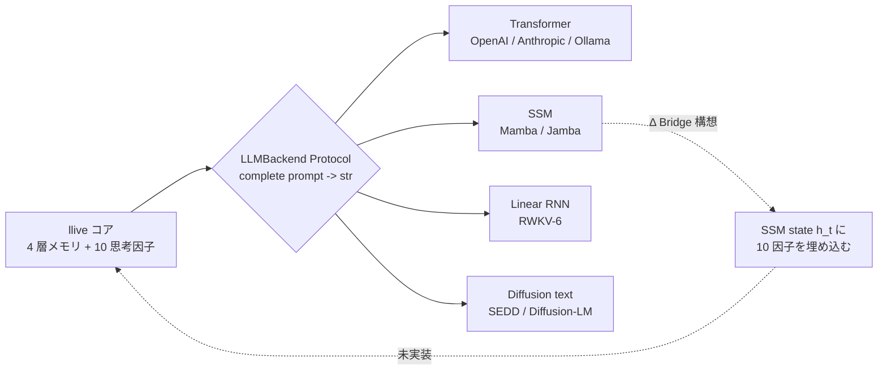
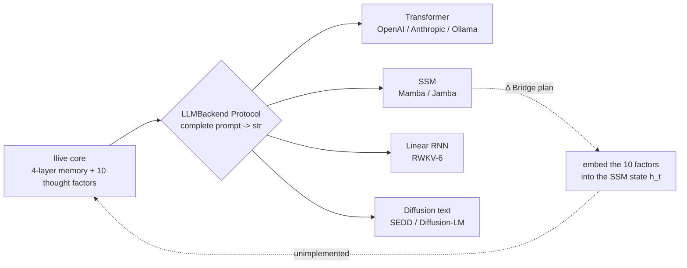
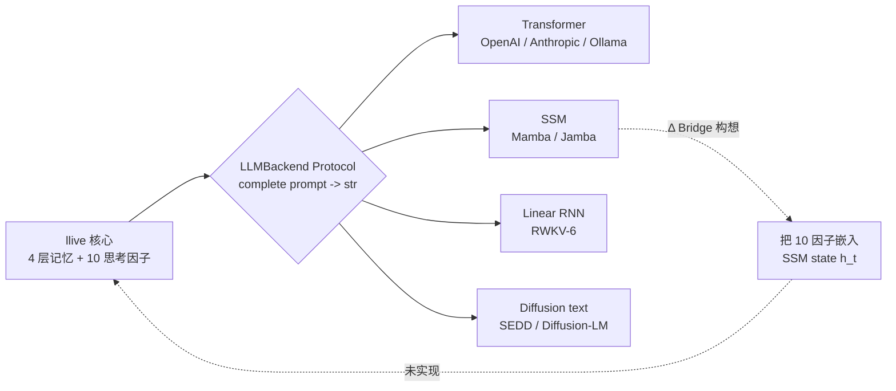
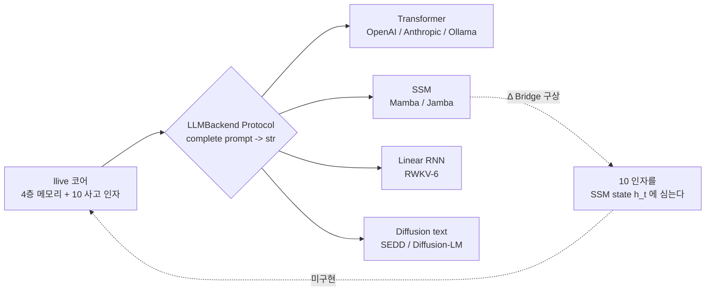

---
title: 'llive 完全解説 (6) — 「Transformer の外」: Mamba / Jamba / RWKV / Diffusion を llive 内側で呼ぶ'
tags:
  - FullSense
  - llive
  - 解説
private: true
updated_at: '2026-05-23'
id: 6da5a883fb2ed651edd8
organization_url_name: null
slide: false
ignorePublish: false
---
言語 / Language / 语言 / 언어: [日本語](#日本語) | [English](#english) | [中文](#中文) | [한국어](#한국어)

---

# 日本語

# llive 完全解説 (6) — 「Transformer の外」: Mamba / Jamba / RWKV / Diffusion を llive 内側で呼ぶ


> **コンセプト hook**: LLM = Transformer, は **2024 までの話**. 2025-2026 で
> State Space Model (Mamba / Jamba) と RWKV (時系列 RNN を再発明) が **長
> context で transformer に追いつき**, Diffusion text model が **token 順序
> 制約を外す** 新族として登場した. llive はそれら **全部を `LLMBackend` として
> 内側で呼べる** 設計で出発した. 思考因子 (#24-02) と SSM (state space) を
> Bridge して「**SSM 流れに 10 因子を埋め込む**」が次の到達点.
>
> **重要な honest disclosure**: 本記事の数値は **mock baseline のみ着地**.
> 実 Mamba / Jamba / RWKV backend は **credential / weights 未着地**.


## 0. 連載中での位置づけ

```
#24-00 series index
#24-01 4 層メモリ
#24-02 思考因子 × COG-MESH
#24-03 構造進化 × TRIZ × Z3
#24-04 B-series
#24-05 EvolutionLoop
#24-06 LLM backend non-transformer (← 本記事)
#24-07 observability + governance
#24-08 lleval
```

#24-02 が「**思考を 10 軸 vector に展開**」だったとすると, #24-06 はその
**vector を流す管** = LLM backend. Transformer 以外の管も繋げる.

## 1. Transformer 以外の系統樹 (2025-2026)

| family | 代表 model | 強み | 弱み |
|---|---|---|---|
| Transformer | GPT-4o / Claude / Llama 3 | 汎用 | 長 context メモリ O(N²) |
| **State Space Model (SSM)** | Mamba / Mamba-2 (2024) | 長 context O(N), selective scan | 1-step training 困難 |
| **Hybrid (SSM × Attention)** | Jamba (AI21 2024) | SSM の長さ + Attention の精度 | implementation 複雑 |
| **Linear RNN** | RWKV-6 (2024) | 推論 O(N) state | 学習効率課題 |
| **Diffusion text** | SEDD / Diffusion-LM | non-autoregressive | latency 大 |

llive の `LLMBackend` Protocol は **どれも受け取れる** ように設計されている.
具体的には:

- `complete(prompt: str, ...) -> str` のシグネチャを満たせば backend 化可能.
- 内部実装は **transformer / SSM / RWKV / diffusion** どれでも OK.

## 2. なぜ Mamba / SSM が llive 内側で価値あるか

llive の 4 層メモリ (#24-01) は **長 context** を前提に動く. Transformer
だと 32k-128k で頭打ち / 値段が高騰する. SSM は **O(N) で 1M token まで**
動く理論. これが噛むと:

- episodic memory の全件流し込みが現実的に
- consolidation cycle (海馬→皮質) の一括バッチ処理が現実的に
- TRIZ self-reflection に過去 ChangeOp 全件を context で渡せる

そのため Mamba / Jamba は llive の **長 context backend** として最有力候補.

## 3. RWKV — 時系列 RNN を再発明したもの

Bo Peng (RWKV-6, 2024) が示したのは「**Attention は時系列の特殊形**」.
RWKV は state を持つ RNN だが Attention 並みの精度を達成. 推論時は **state
を保持して 1 token ずつ** 進めるので **推論 O(N) state, O(1) per token**.

llive にとって RWKV は:

- on-prem 動作前提 (weights が小さい)
- state 保持 = 4 層 memory との親和性
- 商用 license 自由度 (Apache-2.0)

の 3 点で魅力. が, weights が手元になく **実機検証は次セッション以降**.

## 4. Diffusion text — token 順序の制約を外す

Diffusion-LM / SEDD (Lou et al. 2024) は text を **noise → denoise** で生成
する non-autoregressive 系. これは「**token 順序が逆方向にも書ける**」という
透明性を持つ. llive の **「自己進化」** で過去 ChangeOp を **後ろから再生成
してその先を予測** するような用途で活きる可能性. ただし latency は大きい.

## 5. SSM × 10 思考因子 Bridge (構想中, 未実装)

これが本記事の **「期待値」** セクション. 構想:

- SSM の hidden state `h_t` (D dim) を 10 因子 vector と **同じ空間** に
  embed する.
- consolidation cycle で `h_t` から 10 因子の **強さ** を読み出す.
- 派生個体の persona affinity を SSM state に **書き戻す** こともできる.
- 結果: 「**SSM が走るたびに 10 因子の傾きが書き換わる派生集団**」.

これは構想で **未実装**. weights + credential 確保後に PoC. 早ければ
v0.7 〜 v0.8.

## 6. 本日 (2026-05-21) 着地状況

| 項目 | 状態 |
|---|---|
| LLMBackend Protocol | 着地済 (v0.B から) |
| OpenAIBackend | 実機動作済 |
| AnthropicBackend | 実機動作済 |
| OllamaBackend | 実機動作済 |
| MockBackend | 着地済 (テスト用) |
| MambaBackend | **未着地** |
| JambaBackend | **未着地** |
| RWKVBackend | **未着地** |
| DiffusionBackend | **未着地** |
| SSM × 10 因子 Bridge | **構想のみ** |

## 7. honest disclosure (本記事は honest-disclosure-required タグつき)

constraints に明記されているので **繰り返し書く**:

- **#24-06 の数値類は全て mock baseline.** 実 Mamba / Jamba / RWKV backend は
  **本セッションでは着地せず**.
- weights 入手 (HuggingFace) と GPU credential 確保後に PoC.
- 「Mamba は Transformer より速い」と書きたいところだが, それは原論文の主張で
  あって llive で実測したわけではない. 引用は出典つきで.
- SSM × 思考因子 Bridge は **完全な構想**. 「面白そう」というだけで実装根拠は
  まだ無い.
- RWKV-6 の License は Apache-2.0 だが derivative の license 互換性は
  別検証要 (FullSense Apache-2.0 + Commercial dual-license と整合確認).
- Diffusion text の latency が大きい問題は llive consolidation cycle の
  「**遅くて OK な経路**」に押し込めば吸収できるが, それが本当に
  workable かは PoC 待ち.

## 8. Mermaid — LLMBackend の差し替え構造



## 9. References

- Gu, A. & Dao, T. (2024). *Mamba: Linear-Time Sequence Modeling with Selective State Spaces*. arXiv:2312.00752.
- AI21 (2024). *Jamba: A Hybrid Transformer-Mamba Language Model*.
- Peng, B. et al. (2024). *RWKV-6: Continually Improving Linear RNN*.
- Lou, A. et al. (2024). *Discrete Diffusion Modeling by Estimating the Ratios of the Data Distribution*.
- Karpathy, A. (2025). *LLM Wiki* (concept-of-document).
- 完全リストは v0.7 リリース時に references.bib に同梱予定.

---

## Series Navigation

- ← 前: [llive 完全解説 (5) 「集団が学ぶ AI」](https://qiita.com/furuse-kazufumi/private/07b686ea311e06027f94)
- → 次: [llive 完全解説 (7) 「審査つき AI」](https://qiita.com/furuse-kazufumi/items/c5f2077a3399d3fc9b26)
- 全体: [llive 完全解説 (0) — series index](https://qiita.com/furuse-kazufumi/items/07b4882e872994b27b3c)
- repo: [furuse-kazufumi/llive](https://github.com/furuse-kazufumi/llive)

---

# English

# llive Complete Guide (6) — "Beyond the Transformer": Calling Mamba / Jamba / RWKV / Diffusion Inside llive


> **Concept hook**: "LLM = Transformer" was **the story up to 2024**. In
> 2025-2026, State Space Models (Mamba / Jamba) and RWKV (a reinvention of the
> time-series RNN) **caught up with the transformer on long context**, and the
> Diffusion text model arrived as a new family that **removes the token-order
> constraint**. llive started out designed so it can **call all of them inside,
> as `LLMBackend`**. The next milestone is to Bridge the thought factors
> (#24-02) with SSM (state space) — to "**embed the 10 factors into the SSM
> flow**".
>
> **Important honest disclosure**: the numbers in this article only land as a
> **mock baseline**. The real Mamba / Jamba / RWKV backends are **not yet
> landed — credentials / weights pending**.


## 0. Position within the series

```
#24-00 series index
#24-01 4-layer memory
#24-02 thought factors × COG-MESH
#24-03 structural evolution × TRIZ × Z3
#24-04 B-series
#24-05 EvolutionLoop
#24-06 LLM backend non-transformer (← this article)
#24-07 observability + governance
#24-08 lleval
```

If #24-02 was "**unfolding thought into a 10-axis vector**", then #24-06 is the
**pipe through which that vector flows** = the LLM backend. We can also wire up
non-Transformer pipes.

## 1. The non-Transformer family tree (2025-2026)

| family | representative model | strength | weakness |
|---|---|---|---|
| Transformer | GPT-4o / Claude / Llama 3 | general-purpose | long-context memory O(N²) |
| **State Space Model (SSM)** | Mamba / Mamba-2 (2024) | long context O(N), selective scan | hard 1-step training |
| **Hybrid (SSM × Attention)** | Jamba (AI21 2024) | SSM's length + Attention's accuracy | complex implementation |
| **Linear RNN** | RWKV-6 (2024) | inference O(N) state | training-efficiency issues |
| **Diffusion text** | SEDD / Diffusion-LM | non-autoregressive | high latency |

llive's `LLMBackend` Protocol is designed so **any of them can be accepted**.
Specifically:

- Anything that satisfies the signature `complete(prompt: str, ...) -> str` can
  become a backend.
- The internal implementation can be **transformer / SSM / RWKV / diffusion** —
  any of them is fine.

## 2. Why Mamba / SSM are valuable inside llive

llive's 4-layer memory (#24-01) runs on the premise of **long context**. With a
Transformer, you hit a wall at 32k-128k and the price skyrockets. SSM is, in
theory, **O(N) up to 1M tokens**. Once that clicks in:

- streaming the entire episodic memory becomes realistic
- batch-processing the whole consolidation cycle (hippocampus → cortex) becomes
  realistic
- the entire past ChangeOp history can be handed to TRIZ self-reflection as
  context

For that reason, Mamba / Jamba are the strongest candidates for llive's
**long-context backend**.

## 3. RWKV — a reinvention of the time-series RNN

What Bo Peng (RWKV-6, 2024) showed is that "**attention is a special case of
time-series**". RWKV is an RNN that carries state, yet it achieves
attention-grade accuracy. At inference time it advances **one token at a time
while holding state**, so it is **O(N) state for inference, O(1) per token**.

For llive, RWKV is attractive on three points:

- on-prem operation as the premise (small weights)
- state retention = affinity with the 4-layer memory
- commercial-license freedom (Apache-2.0)

But the weights are not on hand, so **on-device verification is from the next
session onward**.

## 4. Diffusion text — removing the token-order constraint

Diffusion-LM / SEDD (Lou et al. 2024) are a non-autoregressive family that
generates text via **noise → denoise**. This carries the transparency that
"**token order can also be written in reverse**". It could come alive in a use
case within llive's **"self-evolution"** where you **regenerate a past ChangeOp
from the back to predict what comes next**. The latency, however, is large.

## 5. SSM × 10 thought factors Bridge (planned, unimplemented)

This is the **"expectations"** section of the article. The plan:

- embed the SSM hidden state `h_t` (D dim) into the **same space** as the
  10-factor vector.
- read the **strength** of the 10 factors out of `h_t` during the consolidation
  cycle.
- you can also **write back** the persona affinity of a derived individual into
  the SSM state.
- result: "**a derived population whose 10-factor weighting is rewritten every
  time the SSM runs**".

This is a plan and **unimplemented**. PoC after securing weights + credentials.
At the earliest, v0.7 to v0.8.

## 6. Landing status (2026-05-21)

| item | status |
|---|---|
| LLMBackend Protocol | landed (since v0.B) |
| OpenAIBackend | running on real hardware |
| AnthropicBackend | running on real hardware |
| OllamaBackend | running on real hardware |
| MockBackend | landed (for testing) |
| MambaBackend | **not landed** |
| JambaBackend | **not landed** |
| RWKVBackend | **not landed** |
| DiffusionBackend | **not landed** |
| SSM × 10-factor Bridge | **plan only** |

## 7. Honest disclosure (this article carries the honest-disclosure-required tag)

Since it is spelled out in the constraints, **I write it repeatedly**:

- **All of the figures in #24-06 are a mock baseline.** The real Mamba / Jamba /
  RWKV backends **did not land in this session**.
- PoC after obtaining the weights (HuggingFace) and securing GPU credentials.
- I would like to write "Mamba is faster than Transformer", but that is the
  claim of the original paper — not something llive measured. Citations come
  with sources.
- The SSM × thought-factors Bridge is a **complete plan**. There is still no
  implementation basis beyond "it sounds interesting".
- RWKV-6's license is Apache-2.0, but derivative license compatibility needs
  separate verification (confirming consistency with FullSense's Apache-2.0 +
  Commercial dual-license).
- The large-latency problem of Diffusion text can be absorbed if it is pushed
  into the **"path where slow is OK"** of llive's consolidation cycle, but
  whether that is truly workable awaits a PoC.

## 8. Mermaid — the LLMBackend swap structure



## 9. References

- Gu, A. & Dao, T. (2024). *Mamba: Linear-Time Sequence Modeling with Selective State Spaces*. arXiv:2312.00752.
- AI21 (2024). *Jamba: A Hybrid Transformer-Mamba Language Model*.
- Peng, B. et al. (2024). *RWKV-6: Continually Improving Linear RNN*.
- Lou, A. et al. (2024). *Discrete Diffusion Modeling by Estimating the Ratios of the Data Distribution*.
- Karpathy, A. (2025). *LLM Wiki* (concept-of-document).
- The full list will be bundled in references.bib at the v0.7 release.

---

## Series Navigation

- ← Prev: [llive Complete Guide (5) "The Population that Learns"](https://qiita.com/furuse-kazufumi/private/07b686ea311e06027f94)
- → Next: [llive Complete Guide (7) "AI with Built-in Review"](https://qiita.com/furuse-kazufumi/items/c5f2077a3399d3fc9b26)
- All: [llive Complete Guide (0) — series index](https://qiita.com/furuse-kazufumi/items/07b4882e872994b27b3c)
- repo: [furuse-kazufumi/llive](https://github.com/furuse-kazufumi/llive)

---

# 中文

# llive 完全解说 (6) — "Transformer 之外": 在 llive 内部调用 Mamba / Jamba / RWKV / Diffusion


> **概念 hook**: "LLM = Transformer" 是 **到 2024 为止的故事**. 在 2025-2026,
> State Space Model (Mamba / Jamba) 与 RWKV (重新发明时序 RNN) **在长 context 上
> 追上了 transformer**, Diffusion text model 作为 **解除 token 顺序约束** 的新族
> 登场. llive 一开始就设计成 **能把它们全部作为 `LLMBackend` 在内部调用**. 把
> 思考因子 (#24-02) 与 SSM (state space) 做 Bridge, 实现"**在 SSM 流动中嵌入
> 10 因子**"是下一个到达点.
>
> **重要的 honest disclosure**: 本文的数值仅 **落地为 mock baseline**. 真实的
> Mamba / Jamba / RWKV backend **credential / weights 尚未落地**.


## 0. 在连载中的定位

```
#24-00 series index
#24-01 4 层记忆
#24-02 思考因子 × COG-MESH
#24-03 结构进化 × TRIZ × Z3
#24-04 B-series
#24-05 EvolutionLoop
#24-06 LLM backend non-transformer (← 本文)
#24-07 observability + governance
#24-08 lleval
```

如果说 #24-02 是"**把思考展开为 10 轴 vector**", 那么 #24-06 就是
**流过该 vector 的管道** = LLM backend. 非 Transformer 的管道也能接入.

## 1. Transformer 之外的系谱图 (2025-2026)

| family | 代表 model | 强项 | 弱项 |
|---|---|---|---|
| Transformer | GPT-4o / Claude / Llama 3 | 通用 | 长 context 记忆 O(N²) |
| **State Space Model (SSM)** | Mamba / Mamba-2 (2024) | 长 context O(N), selective scan | 1-step training 困难 |
| **Hybrid (SSM × Attention)** | Jamba (AI21 2024) | SSM 的长度 + Attention 的精度 | implementation 复杂 |
| **Linear RNN** | RWKV-6 (2024) | 推理 O(N) state | 学习效率有课题 |
| **Diffusion text** | SEDD / Diffusion-LM | non-autoregressive | latency 大 |

llive 的 `LLMBackend` Protocol 设计成 **任何一种都能接收**. 具体来说:

- 只要满足 `complete(prompt: str, ...) -> str` 的签名即可 backend 化.
- 内部实现是 **transformer / SSM / RWKV / diffusion** 哪一种都 OK.

## 2. 为什么 Mamba / SSM 在 llive 内部有价值

llive 的 4 层记忆 (#24-01) 以 **长 context** 为前提运行. 用 Transformer
会在 32k-128k 处见顶 / 价格暴涨. SSM 在理论上 **以 O(N) 跑到 1M token**. 一旦
这点咬合上:

- 把 episodic memory 全件灌入变得现实
- consolidation cycle (海马→皮质) 的整批批处理变得现实
- 能把过去 ChangeOp 全件作为 context 交给 TRIZ self-reflection

因此 Mamba / Jamba 是 llive **长 context backend** 的最有力候选.

## 3. RWKV — 重新发明了时序 RNN

Bo Peng (RWKV-6, 2024) 展示的是"**Attention 是时序的特例**". RWKV 是带 state 的
RNN, 却达成了 Attention 级别的精度. 推理时 **保持 state 一次推进 1 个 token**,
所以是 **推理 O(N) state, O(1) per token**.

对 llive 而言 RWKV 在以下 3 点上有魅力:

- 以 on-prem 运行为前提 (weights 小)
- 保持 state = 与 4 层 memory 的亲和性
- 商用 license 自由度 (Apache-2.0)

但 weights 不在手边, 所以 **实机验证在下一 session 之后**.

## 4. Diffusion text — 解除 token 顺序约束

Diffusion-LM / SEDD (Lou 等 2024) 是以 **noise → denoise** 生成 text 的
non-autoregressive 系. 它具有"**token 顺序也能逆向书写**"的透明性. 在 llive 的
**"自我进化"** 中, 可能在 **从后往前重新生成过去 ChangeOp 并预测其前方** 这样的
用途中发挥作用. 不过 latency 较大.

## 5. SSM × 10 思考因子 Bridge (构思中, 未实现)

这是本文的 **"期望值"** 部分. 构想:

- 把 SSM 的 hidden state `h_t` (D dim) embed 进与 10 因子 vector **相同的空间**.
- 在 consolidation cycle 中从 `h_t` 读出 10 因子的 **强度**.
- 也可以把派生个体的 persona affinity **写回** SSM state.
- 结果: "**每次 SSM 运行, 10 因子的倾向就被改写的派生群体**".

这是构想且 **未实现**. 在确保 weights + credential 后做 PoC. 最早是
v0.7 ~ v0.8.

## 6. 本日 (2026-05-21) 落地情况

| 项目 | 状态 |
|---|---|
| LLMBackend Protocol | 已落地 (自 v0.B 起) |
| OpenAIBackend | 已实机运行 |
| AnthropicBackend | 已实机运行 |
| OllamaBackend | 已实机运行 |
| MockBackend | 已落地 (测试用) |
| MambaBackend | **未落地** |
| JambaBackend | **未落地** |
| RWKVBackend | **未落地** |
| DiffusionBackend | **未落地** |
| SSM × 10 因子 Bridge | **仅构想** |

## 7. honest disclosure (本文带 honest-disclosure-required 标签)

由于 constraints 中明确写明, 所以 **反复书写**:

- **#24-06 的数值类全部是 mock baseline.** 真实的 Mamba / Jamba / RWKV backend
  **在本 session 中未落地**.
- 在获得 weights (HuggingFace) 与确保 GPU credential 后做 PoC.
- 虽然想写"Mamba 比 Transformer 快", 但那是原论文的主张, 并非在 llive 中实测.
  引用都附出处.
- SSM × 思考因子 Bridge 是 **完全的构想**. 仅凭"看起来有趣"还没有实现依据.
- RWKV-6 的 License 是 Apache-2.0, 但 derivative 的 license 兼容性需另行验证
  (确认与 FullSense Apache-2.0 + Commercial dual-license 的一致性).
- Diffusion text 的 latency 大的问题, 若推入 llive consolidation cycle 的
  "**慢也 OK 的路径**" 可以吸收, 但那是否真的 workable 要等 PoC.

## 8. Mermaid — LLMBackend 的替换结构



## 9. References

- Gu, A. & Dao, T. (2024). *Mamba: Linear-Time Sequence Modeling with Selective State Spaces*. arXiv:2312.00752.
- AI21 (2024). *Jamba: A Hybrid Transformer-Mamba Language Model*.
- Peng, B. et al. (2024). *RWKV-6: Continually Improving Linear RNN*.
- Lou, A. et al. (2024). *Discrete Diffusion Modeling by Estimating the Ratios of the Data Distribution*.
- Karpathy, A. (2025). *LLM Wiki* (concept-of-document).
- 完整列表将在 v0.7 发布时随 references.bib 一同提供.

---

## Series Navigation

- ← 上一篇: [llive 完全解说 (5) 「学习的群体」](https://qiita.com/furuse-kazufumi/private/07b686ea311e06027f94)
- → 下一篇: [llive 完全解说 (7) 「带审查的 AI」](https://qiita.com/furuse-kazufumi/items/c5f2077a3399d3fc9b26)
- 全部: [llive 完全解说 (0) — series index](https://qiita.com/furuse-kazufumi/items/07b4882e872994b27b3c)
- repo: [furuse-kazufumi/llive](https://github.com/furuse-kazufumi/llive)

---

# 한국어

# llive 완전 해설 (6) — "Transformer 의 밖": Mamba / Jamba / RWKV / Diffusion 을 llive 내부에서 호출하기


> **콘셉트 hook**: "LLM = Transformer" 는 **2024 까지의 이야기**. 2025-2026 에
> State Space Model (Mamba / Jamba) 과 RWKV (시계열 RNN 을 재발명) 가 **긴
> context 에서 transformer 를 따라잡았고**, Diffusion text model 이 **token 순서
> 제약을 푸는** 새로운 족으로 등장했다. llive 는 그것들을 **전부 `LLMBackend`
> 로서 내부에서 호출할 수 있는** 설계로 출발했다. 사고 인자 (#24-02) 와 SSM
> (state space) 을 Bridge 하여 "**SSM 흐름에 10 인자를 심는다**" 가 다음
> 도달점.
>
> **중요한 honest disclosure**: 본 글의 수치는 **mock baseline 만 착지**. 실제
> Mamba / Jamba / RWKV backend 는 **credential / weights 미착지**.


## 0. 연재에서의 위치

```
#24-00 series index
#24-01 4층 메모리
#24-02 사고 인자 × COG-MESH
#24-03 구조 진화 × TRIZ × Z3
#24-04 B-series
#24-05 EvolutionLoop
#24-06 LLM backend non-transformer (← 본 글)
#24-07 observability + governance
#24-08 lleval
```

#24-02 가 "**사고를 10 축 vector 로 전개**" 였다면, #24-06 은 그
**vector 를 흘려보내는 관** = LLM backend 다. Transformer 이외의 관도 연결한다.

## 1. Transformer 이외의 계통수 (2025-2026)

| family | 대표 model | 강점 | 약점 |
|---|---|---|---|
| Transformer | GPT-4o / Claude / Llama 3 | 범용 | 긴 context 메모리 O(N²) |
| **State Space Model (SSM)** | Mamba / Mamba-2 (2024) | 긴 context O(N), selective scan | 1-step training 곤란 |
| **Hybrid (SSM × Attention)** | Jamba (AI21 2024) | SSM 의 길이 + Attention 의 정확도 | implementation 복잡 |
| **Linear RNN** | RWKV-6 (2024) | 추론 O(N) state | 학습 효율 과제 |
| **Diffusion text** | SEDD / Diffusion-LM | non-autoregressive | latency 큼 |

llive 의 `LLMBackend` Protocol 은 **어느 것이든 받을 수 있도록** 설계되어 있다.
구체적으로는:

- `complete(prompt: str, ...) -> str` 의 시그니처를 충족하면 backend 화 가능.
- 내부 구현은 **transformer / SSM / RWKV / diffusion** 어느 것이든 OK.

## 2. 왜 Mamba / SSM 이 llive 내부에서 가치가 있는가

llive 의 4층 메모리 (#24-01) 는 **긴 context** 를 전제로 동작한다. Transformer
라면 32k-128k 에서 한계에 부딪히고 / 가격이 폭등한다. SSM 은 이론상 **O(N) 으로
1M token 까지** 동작한다. 이것이 맞물리면:

- episodic memory 의 전건 흘려넣기가 현실적이 된다
- consolidation cycle (해마→피질) 의 일괄 배치 처리가 현실적이 된다
- TRIZ self-reflection 에 과거 ChangeOp 전건을 context 로 넘길 수 있다

그래서 Mamba / Jamba 는 llive 의 **긴 context backend** 로서 가장 유력한
후보다.

## 3. RWKV — 시계열 RNN 을 재발명한 것

Bo Peng (RWKV-6, 2024) 이 보여준 것은 "**Attention 은 시계열의 특수형**". RWKV
는 state 를 가지는 RNN 이지만 Attention 수준의 정확도를 달성한다. 추론 시에는
**state 를 유지하며 1 token 씩** 진행하므로 **추론 O(N) state, O(1) per token**.

llive 에게 RWKV 는 다음 3 가지 점에서 매력적이다:

- on-prem 동작 전제 (weights 가 작음)
- state 유지 = 4층 memory 와의 친화성
- 상용 license 자유도 (Apache-2.0)

그러나 weights 가 손에 없어서 **실기 검증은 다음 세션 이후**.

## 4. Diffusion text — token 순서의 제약을 푼다

Diffusion-LM / SEDD (Lou 등 2024) 은 text 를 **noise → denoise** 로 생성하는
non-autoregressive 계열이다. 이것은 "**token 순서를 역방향으로도 쓸 수 있다**"
는 투명성을 가진다. llive 의 **"자기 진화"** 에서 과거 ChangeOp 를 **뒤에서부터
재생성하여 그 앞을 예측** 하는 용도에서 살아날 가능성이 있다. 다만 latency 는
크다.

## 5. SSM × 10 사고 인자 Bridge (구상 중, 미구현)

이것이 본 글의 **"기댓값"** 섹션이다. 구상:

- SSM 의 hidden state `h_t` (D dim) 를 10 인자 vector 와 **같은 공간** 에
  embed 한다.
- consolidation cycle 에서 `h_t` 로부터 10 인자의 **세기** 를 읽어낸다.
- 파생 개체의 persona affinity 를 SSM state 에 **되써넣을** 수도 있다.
- 결과: "**SSM 이 돌 때마다 10 인자의 기울기가 다시 쓰이는 파생 집단**".

이것은 구상이며 **미구현**. weights + credential 확보 후 PoC. 빠르면
v0.7 ~ v0.8.

## 6. 오늘 (2026-05-21) 착지 상황

| 항목 | 상태 |
|---|---|
| LLMBackend Protocol | 착지 완료 (v0.B 부터) |
| OpenAIBackend | 실기 동작 완료 |
| AnthropicBackend | 실기 동작 완료 |
| OllamaBackend | 실기 동작 완료 |
| MockBackend | 착지 완료 (테스트용) |
| MambaBackend | **미착지** |
| JambaBackend | **미착지** |
| RWKVBackend | **미착지** |
| DiffusionBackend | **미착지** |
| SSM × 10 인자 Bridge | **구상만** |

## 7. honest disclosure (본 글은 honest-disclosure-required 태그 포함)

constraints 에 명기되어 있으므로 **반복해서 쓴다**:

- **#24-06 의 수치류는 전부 mock baseline.** 실제 Mamba / Jamba / RWKV backend
  는 **본 세션에서는 착지하지 않음**.
- weights 입수 (HuggingFace) 와 GPU credential 확보 후 PoC.
- "Mamba 는 Transformer 보다 빠르다" 고 쓰고 싶지만, 그것은 원논문의 주장이지
  llive 에서 실측한 것은 아니다. 인용은 출처와 함께.
- SSM × 사고 인자 Bridge 는 **완전한 구상**. "재미있어 보인다" 는 것만으로는
  아직 구현 근거가 없다.
- RWKV-6 의 License 는 Apache-2.0 이지만 derivative 의 license 호환성은 별도
  검증 필요 (FullSense Apache-2.0 + Commercial dual-license 와의 정합성 확인).
- Diffusion text 의 latency 가 큰 문제는 llive consolidation cycle 의
  "**느려도 OK 인 경로**" 에 밀어넣으면 흡수할 수 있지만, 그것이 정말로
  workable 한지는 PoC 를 기다린다.

## 8. Mermaid — LLMBackend 의 교체 구조



## 9. References

- Gu, A. & Dao, T. (2024). *Mamba: Linear-Time Sequence Modeling with Selective State Spaces*. arXiv:2312.00752.
- AI21 (2024). *Jamba: A Hybrid Transformer-Mamba Language Model*.
- Peng, B. et al. (2024). *RWKV-6: Continually Improving Linear RNN*.
- Lou, A. et al. (2024). *Discrete Diffusion Modeling by Estimating the Ratios of the Data Distribution*.
- Karpathy, A. (2025). *LLM Wiki* (concept-of-document).
- 완전한 목록은 v0.7 릴리스 시 references.bib 에 동봉할 예정.

---

## Series Navigation

- ← 이전: [llive 완전 해설 (5) 「집단이 학습하는 AI」](https://qiita.com/furuse-kazufumi/private/07b686ea311e06027f94)
- → 다음: [llive 완전 해설 (7) 「심사가 붙은 AI」](https://qiita.com/furuse-kazufumi/items/c5f2077a3399d3fc9b26)
- 전체: [llive 완전 해설 (0) — series index](https://qiita.com/furuse-kazufumi/items/07b4882e872994b27b3c)
- repo: [furuse-kazufumi/llive](https://github.com/furuse-kazufumi/llive)
