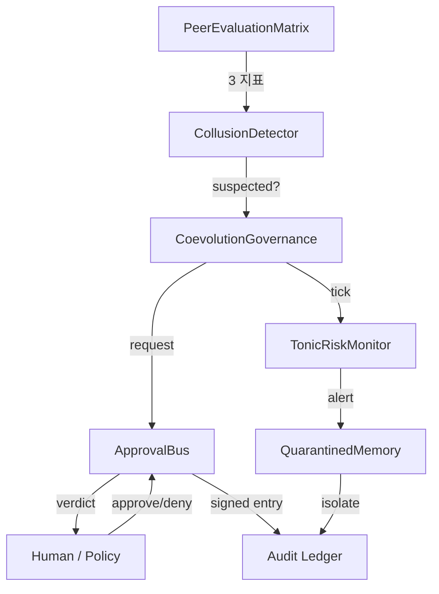

言語 / Language / 语言 / 언어: [日本語](#日本語) | [English](#english) | [中文](#中文) | [한국어](#한국어)

---

# 日本語

# llive 完全解説 (7) — 「審査つき AI」: runtime_metadata × Approval Bus × Ed25519 audit chain


> **コンセプト hook**: 多くの LLM agent は「結果のログ」しか残さない. しかし
> AI が **自分自身を進化** させはじめると, 「**いつ何を判断して何を変えたか**」
> の audit trail が無いと, **後でデバッグ不能** になる. llive はこれを
> architecture level で解いた:
> - **runtime_metadata** = 1 推論ごとの構造化 metadata
> - **Approval Bus** = 重大変更を ledger 経由で human / policy が approve
> - **Ed25519 + SHA-256 audit chain** = ledger 改ざん防止
> - **本日 (2026-05-21) 着地の E.4 governance** = 集団進化の共謀検出 → Approval Bus 連携
>
> = **「自己進化する AI が, 自分の決定を全て署名つきで残す」** という珍しい形.


## 0. 連載中での位置づけ

```
#24-00 series index
#24-01 4 層メモリ
#24-02 思考因子 × COG-MESH
#24-03 構造進化 × TRIZ × Z3
#24-04 B-series
#24-05 EvolutionLoop
#24-06 LLM backend non-transformer
#24-07 observability + governance (← 本記事)
#24-08 lleval
```

#24-03 の Z3 verifier が「**個体内**の構造変更を機械検証」だとすると, #24-07
は「**個体間**の挙動 + 個体集団の決定を audit trail で保存」. 検証と監査の
両輪.

## 1. なぜ Audit Chain が必須か

LLM agent が自分自身を書き換えはじめると, 「**さっきの推論は何 commit の
構造で動いていたか**」が分からなくなる. これは debugging だけでなく:

- **責任追跡** — 集団進化で「**全派生が嘘の高得点を付け合った**」とき, 誰が
  最初に嘘をついたかを ledger で遡れる必要がある.
- **再現性** — 「あのとき出た結果」を後で再生するには構造 commit + memory
  zone + Brief input + Approval verdict の全て record が要る.
- **法的 compliance** — EU AI Act / 中国 AI 弁法 / 日本 G7 広島 process が
  示す方向は「**AI の決定は audit possible でなければならない**」.

llive は Phase 4 (Production Security MVR, v0.3.0) でこの 3 つを **同時に**
解いた.

## 2. runtime_metadata — 1 推論あたりの構造化 trace

llive の `FitnessReport.runtime_metadata` は free-form dict[str, str] だが
慣習的に以下を入れる:

- `signed_by`: peer evaluation の署名者 id
- `gen`: 世代番号
- `agg`: aggregator strategy
- `commit_sha`: ソース commit (CI 経由で注入)
- `model_id`: 使用 LLM backend id

これにより 1 推論結果から **完全に再現** できる. 再現性は **OSS LLM
inference の標準ではない** — 多くの agent は seed すら記録しない.

## 3. Approval Bus — 構造的に変更を止める

`src/llive/approval/bus.py` の `ApprovalBus`:

- `request(action, payload, ...)` → pending リストに入る.
- `policy` が事前評価して `Verdict.APPROVED / DENIED / None` を返す.
  None なら人手待ち.
- 人手 / policy の verdict は `_ledger: list[ApprovalResponse]` に append.
- `ledger=SqliteLedger` を渡せば永続化 + 復元.

これは **架空の「Trust Score」** ではなく **明示的な APPROVED/DENIED 状態
マシン**. 沈黙 = denial (§AB4). 「曖昧な許可」が存在しない.

### 3.1 本日着地の E.4 governance 連携

`CoevolutionGovernance.evaluate_generation` (本日着地) が 1 世代の peer
matrix を見て **共謀疑い** → `ApprovalBus.request("coevolution.suspected_collusion",
payload)` を発火. payload には generation / collusion_score / n_agents.
人手が deny したら **その世代の派生集団は採用されない** という architecture
level の制御.

これは Constitutional AI / RLHF の **human-in-the-loop** を, **architecture
level** で代替する設計. 「prompt 最後に <human_review> を加える」のような
弱い制御ではない.

## 4. Ed25519 + SHA-256 audit chain

`src/llive/security/` 系. Phase 4 着地.

- 各 PeerEvaluationMatrix / ChangeOp / consolidation event は Ed25519 で
  **署名**.
- ledger に書き込むときに **直前の hash** を含めて SHA-256 を計算 → next
  block の prev_hash として使う. つまり **blockchain-light**.
- これにより「過去の任意の record を改ざんすると, それ以降の hash が全て
  ずれる」 → 改ざん即検出.

### 4.1 なぜ on-chain ではなく on-disk か

`project_fullsense_ear_origin` — llive は EAR + セキュリティ制約で
**外部送信不可** の環境を想定. on-chain (Ethereum / Solana) は外部送信に
なるため不適. on-disk audit chain は外部依存ゼロで完結する.

## 5. honest disclosure

- **Ed25519 鍵管理は未解決** — 鍵を OS の secure store / HSM に保存する
  module は未着地. 現状は環境変数 / file 経由でロード. これは v1.0 前に
  解決必須.
- **Approval Bus の人手介在は scale しない** — 派生集団 N=64 で 1 世代毎に
  approval が出ると人手の負荷が 24 時間で破綻する. policy 自動評価で 80% を
  通すのが現実解だが, policy が完璧に書ける保証はない.
- **runtime_metadata の sign は optional** — `signed_by` フィールドは
  慣習だが mandatory ではない. これを mandatory にすると `Brief API` の
  互換が壊れる. 移行は v0.7 以降.

## 6. 本日 (2026-05-21) 着地サマリ

| 項目 | 状態 |
|---|---|
| `CoevolutionGovernance` skeleton | **本日着地** |
| `CollusionDetector` (CE-06) | **本日着地** |
| `collusion_risk_score` (TonicRisk 連携, CE-08) | **本日着地** |
| `GovernanceReport` (frozen) | **本日着地** |
| 28 ケース test PASS | **本日着地** |
| Ed25519 audit chain | Phase 4 着地済 (v0.3.0) |
| Approval Bus | C-1 着地済 (2026-05-16) |
| runtime_metadata 慣習 | v0.B から運用中 |

## 7. Mermaid — governance 全体像


### 7.1 governance maturity を「文明レベル」で見る — 4D Kardashev radar (v0.I-C 先取り)

§3 の Approval Bus pass率 / §4 の audit chain 完全性 / §6 の peer eval cohesion
は, 単独で見ると「数字が良くなった」で終わる. **v0.I-C (4D Kardashev Radar)**
ではこれらを Energy / Knowledge / Coordination / **Ethics** の 4 軸 × 5 段階
(Type 0 → I → II → III → IV) の「文明レベル」スケールに束ねて, 個体 / 集団 /
メタ集団の 3 階層で同時計測する構想.


Ethics 軸はまさに本記事の Approval Bus pass率 + frozen gene 違反検出 + 規制
適合度のスコアで, governance maturity を「個体の躾」から「文明の成熟」まで
連続スケールで語れるようになる. 詳細要件は llive `docs/requirements_v0.I_meta_evolution_and_cross_substrate.md` §5 参照.

## 8. 期待値 — 次に来るもの

- **HSM / secure store 連携** — Ed25519 鍵管理を v1.0 で. Windows Credential
  Store / macOS Keychain / Linux Keyring 経路.
- **policy 自動 evaluate の拡充** — Approval Bus の `policy` 引数で 80% を
  自動通過させる規則を v0.7 で.
- **Audit Ledger UI** — llove TUI で `governance verdict ledger` を時系列
  可視化. F25 連携.

## 9. 2026-05-22 追記 — RUST-16 governance hot path 高速化

CoevolutionGovernance.evaluate_generation の中で最も計算量を食うのが
PeerEvaluationMatrix.collusion_score (NxN matrix の variance / symmetry /
concentration 3 指標) で, ここに 200-300 μs/call かかっていた.

本日 (2026-05-22) RUST-16 として **numpy zero-copy で Rust kernel 化**:

| N | Python (numpy 既存) | Rust pyo3 zero-copy | speedup |
|---:|---:|---:|---:|
| 8 | 217.82 us | 1.89 us | **x115.04** |
| 16 | 203.33 us | 2.30 us | x88.54 |
| 32 | 237.68 us | 5.28 us | x45.00 |
| 64 | 306.13 us | 16.80 us | x18.22 |
| **avg** | — | — | **x66.70** |

実装は `crates/llive_rust_ext/src/lib.rs:collusion_score_kernel` + 5 parity
test (1e-6 tolerance). callers (`CollusionDetector.check`) は次 commit で
切替予定.

### 9.1 honest disclosure — 「numpy = 速い」も嘘

このゲインが大きいのは **「Rust が速い」だけでなく「numpy が小 NxN で遅い」**
が主因. `np.nanvar` / `np.corrcoef` / `np.nanmean` の 3 つ重ねがけは
N<100 で Python overhead 支配で 200μs+/call. Rust の単純 C ループは 2μs/call.

governance 側で重要なのは:

- **Approval Bus 発火判定の latency が 100x 短くなる** = N=64 派生集団でも
  governance.evaluate_generation を 64Hz で回せる
- **TonicRiskMonitor の tick** (collusion_risk_score を含む state を渡す)
  も同等に速くなる
- 結果として **「governance を常時動かしても許容コスト」**になる

これがあれば「**governance は重いから sampling だけ**」の妥協が要らなくなる.
全派生 / 全世代の評価行列を audit chain に署名つきで残しても latency budget
内に収まる.

### 9.2 関連

- `docs/perf_comparison/2026-05-22_kernel_implementation_comparison.md` —
  全 3 kernel (RUST-15/16/17) の比較マトリクス
- `scripts/bench_collusion_score_5x_gate.py` — N=8/16/32/64 5x gate bench
- `feedback_rust_usage_matters` — Rust 化判断のチェックリスト

## 10. References

- Bernstein, D. J. et al. (2012). *High-speed high-security signatures* (Ed25519).
- Anderson, R. (2020). *Security Engineering* (3rd ed.) — audit trail / tamper-evidence の章.
- EU AI Act (2024) / G7 Hiroshima AI Process (2023) — AI 決定の監査可能性.
- 完全リストは v0.6.0a1 リリース時に references.bib に同梱予定.

---

## Series Navigation

- ← 前: [llive 完全解説 (6) 「Transformer の外」](https://qiita.com/furuse-kazufumi/items/6da5a883fb2ed651edd8)
- → 次: [llive 完全解説 (8) 「眼鏡を作る」](https://qiita.com/furuse-kazufumi/private/e49b7ab9027d93594402)
- 全体: [llive 完全解説 (0) — series index](https://qiita.com/furuse-kazufumi/items/07b4882e872994b27b3c)
- repo: [furuse-kazufumi/llive](https://github.com/furuse-kazufumi/llive)

---

# English

# llive Complete Guide (7) — "AI with Built-in Review": runtime_metadata × Approval Bus × Ed25519 audit chain


> **Concept hook**: Most LLM agents keep only a "log of results". But once an
> AI starts to **evolve itself**, without an audit trail of "**when did it
> decide what and change what**" it becomes **impossible to debug later**.
> llive solved this at the architecture level:
> - **runtime_metadata** = structured metadata per inference
> - **Approval Bus** = a human / policy approves significant changes through a ledger
> - **Ed25519 + SHA-256 audit chain** = tamper-protection for the ledger
> - **E.4 governance, landed today (2026-05-21)** = collusion detection in population evolution → Approval Bus linkage
>
> = a rare shape where **"a self-evolving AI leaves every one of its decisions signed."**


## 0. Position within the series

```
#24-00 series index
#24-01 4-layer memory
#24-02 thought factors × COG-MESH
#24-03 structural evolution × TRIZ × Z3
#24-04 B-series
#24-05 EvolutionLoop
#24-06 LLM backend non-transformer
#24-07 observability + governance (← this article)
#24-08 lleval
```

If #24-03's Z3 verifier is "machine-verifying structural changes **inside one
individual**", then #24-07 is "persisting the **inter-individual** behaviour +
the decisions of the population as an audit trail". The two wheels of
verification and audit.

## 1. Why an audit chain is mandatory

Once an LLM agent starts rewriting itself, "**which commit's structure was the
last inference running on**" becomes impossible to know. This matters not only
for debugging:

- **Accountability tracking** — when, in population evolution, "**all variants
  gave each other fake high scores**", you need to trace back through the ledger
  who lied first.
- **Reproducibility** — to replay "the result we got back then" later, you need
  records of the structure commit + memory zone + Brief input + Approval verdict,
  all of them.
- **Legal compliance** — the direction shown by the EU AI Act / China's AI
  measures / Japan's G7 Hiroshima process is "**AI decisions must be auditable.**"

llive solved these three **simultaneously** in Phase 4 (Production Security
MVR, v0.3.0).

## 2. runtime_metadata — a structured trace per inference

llive's `FitnessReport.runtime_metadata` is a free-form dict[str, str], but by
convention it holds:

- `signed_by`: signer id of the peer evaluation
- `gen`: generation number
- `agg`: aggregator strategy
- `commit_sha`: source commit (injected via CI)
- `model_id`: id of the LLM backend used

With this, a single inference result is **fully reproducible**. Reproducibility
is **not the standard for OSS LLM inference** — many agents do not even record
the seed.

## 3. Approval Bus — structurally halting changes

`ApprovalBus` in `src/llive/approval/bus.py`:

- `request(action, payload, ...)` → enters the pending list.
- `policy` evaluates it up front and returns `Verdict.APPROVED / DENIED / None`.
  None means it waits on a human.
- The human / policy verdict is appended to `_ledger: list[ApprovalResponse]`.
- Pass `ledger=SqliteLedger` and you get persistence + restore.

This is not a **fictional "Trust Score"** but an **explicit APPROVED/DENIED
state machine**. Silence = denial (§AB4). There is no "ambiguous permission".

### 3.1 The E.4 governance linkage landed today

`CoevolutionGovernance.evaluate_generation` (landed today) looks at one
generation's peer matrix, and on **suspected collusion** fires
`ApprovalBus.request("coevolution.suspected_collusion", payload)`. The payload
carries generation / collusion_score / n_agents. If a human denies it, **that
generation's derived population is not adopted** — an architecture-level control.

This is a design that substitutes Constitutional AI / RLHF's
**human-in-the-loop** at the **architecture level**. It is not a weak control
like "append `<human_review>` at the end of the prompt".

## 4. Ed25519 + SHA-256 audit chain

The `src/llive/security/` family. Landed in Phase 4.

- Each PeerEvaluationMatrix / ChangeOp / consolidation event is **signed** with
  Ed25519.
- When writing to the ledger, the SHA-256 is computed **including the previous
  hash** → used as the next block's prev_hash. In other words,
  **blockchain-light**.
- This means "tamper with any past record and all subsequent hashes shift" →
  tampering is detected immediately.

### 4.1 Why on-disk, not on-chain

`project_fullsense_ear_origin` — llive assumes an environment that, under EAR +
security constraints, **cannot transmit externally**. on-chain (Ethereum /
Solana) becomes external transmission, so it is unsuitable. An on-disk audit
chain completes with zero external dependency.

## 5. honest disclosure

- **Ed25519 key management is unsolved** — the module that stores keys in the
  OS secure store / HSM has not landed. Currently keys are loaded via env var /
  file. This must be solved before v1.0.
- **The human intervention in the Approval Bus does not scale** — at N=64
  derived population, if an approval comes per generation the human load breaks
  down within 24 hours. The realistic answer is to auto-pass 80% via the policy
  evaluation, but there is no guarantee the policy can be written perfectly.
- **The signing of runtime_metadata is optional** — the `signed_by` field is a
  convention but not mandatory. Making it mandatory would break the
  compatibility of the `Brief API`. The migration is from v0.7 onward.

## 6. Today's (2026-05-21) landing summary

| Item | Status |
|---|---|
| `CoevolutionGovernance` skeleton | **landed today** |
| `CollusionDetector` (CE-06) | **landed today** |
| `collusion_risk_score` (TonicRisk linkage, CE-08) | **landed today** |
| `GovernanceReport` (frozen) | **landed today** |
| 28-case test PASS | **landed today** |
| Ed25519 audit chain | already landed in Phase 4 (v0.3.0) |
| Approval Bus | already landed in C-1 (2026-05-16) |
| runtime_metadata convention | in use since v0.B |

## 7. Mermaid — the governance overview


### 7.1 Seeing governance maturity as a "civilization level" — 4D Kardashev radar (v0.I-C preview)

The Approval Bus pass rate (§3) / the audit chain integrity (§4) / the peer eval
cohesion (§6), seen alone, just end at "the number got better". In **v0.I-C (4D
Kardashev Radar)** the idea is to bundle these onto a "civilization level" scale
of 4 axes — Energy / Knowledge / Coordination / **Ethics** — × 5 stages
(Type 0 → I → II → III → IV), measured simultaneously across the 3 tiers of
individual / population / meta-population.


The Ethics axis is exactly this article's score of Approval Bus pass rate +
frozen gene violation detection + regulatory conformity, letting us speak of
governance maturity on a continuous scale from "an individual's discipline" to
"a civilization's maturity". For detailed requirements see llive
`docs/requirements_v0.I_meta_evolution_and_cross_substrate.md` §5.

## 8. Expectations — what comes next

- **HSM / secure store integration** — Ed25519 key management in v1.0. Via the
  Windows Credential Store / macOS Keychain / Linux Keyring routes.
- **Expansion of policy auto-evaluation** — a rule that auto-passes 80% through
  the Approval Bus's `policy` argument, in v0.7.
- **Audit Ledger UI** — visualize the `governance verdict ledger` in time series
  in the llove TUI. F25 linkage.

## 9. 2026-05-22 addendum — RUST-16 governance hot path acceleration

The most compute-heavy part inside CoevolutionGovernance.evaluate_generation is
PeerEvaluationMatrix.collusion_score (the 3 metrics variance / symmetry /
concentration over an NxN matrix), and it was taking 200-300 μs/call here.

Today (2026-05-22), as RUST-16, we **made it a Rust kernel with numpy
zero-copy**:

| N | Python (existing numpy) | Rust pyo3 zero-copy | speedup |
|---:|---:|---:|---:|
| 8 | 217.82 us | 1.89 us | **x115.04** |
| 16 | 203.33 us | 2.30 us | x88.54 |
| 32 | 237.68 us | 5.28 us | x45.00 |
| 64 | 306.13 us | 16.80 us | x18.22 |
| **avg** | — | — | **x66.70** |

The implementation is `crates/llive_rust_ext/src/lib.rs:collusion_score_kernel`
+ 5 parity tests (1e-6 tolerance). The callers (`CollusionDetector.check`) are
scheduled to switch over in the next commit.

### 9.1 honest disclosure — "numpy = fast" is also a lie

This gain is large mainly because of **not only "Rust is fast" but "numpy is
slow for small NxN"**. Stacking the three of `np.nanvar` / `np.corrcoef` /
`np.nanmean` is dominated by Python overhead at N<100, so 200μs+/call. Rust's
plain C loop is 2μs/call.

What matters on the governance side:

- **The latency of the Approval Bus firing decision becomes 100x shorter** = even
  with an N=64 derived population you can run governance.evaluate_generation at
  64Hz
- **The TonicRiskMonitor tick** (which passes state including
  collusion_risk_score) also becomes equally fast
- As a result it becomes **"an acceptable cost even running governance
  continuously"**

With this, the compromise of "**governance is heavy, so sampling only**" is no
longer needed. Even leaving every variant's / every generation's evaluation
matrix signed in the audit chain fits within the latency budget.

### 9.2 Related

- `docs/perf_comparison/2026-05-22_kernel_implementation_comparison.md` — the
  comparison matrix of all 3 kernels (RUST-15/16/17)
- `scripts/bench_collusion_score_5x_gate.py` — N=8/16/32/64 5x gate bench
- `feedback_rust_usage_matters` — the checklist for the Rust-port decision

## 10. References

- Bernstein, D. J. et al. (2012). *High-speed high-security signatures* (Ed25519).
- Anderson, R. (2020). *Security Engineering* (3rd ed.) — the chapter on audit trail / tamper-evidence.
- EU AI Act (2024) / G7 Hiroshima AI Process (2023) — auditability of AI decisions.
- The full list will be bundled in references.bib at the v0.6.0a1 release.

---

## Series Navigation

- ← Prev: [llive Complete Guide (6) "Beyond the Transformer"](https://qiita.com/furuse-kazufumi/items/6da5a883fb2ed651edd8)
- → Next: [llive Complete Guide (8) "Making the Glasses"](https://qiita.com/furuse-kazufumi/private/e49b7ab9027d93594402)
- All: [llive Complete Guide (0) — series index](https://qiita.com/furuse-kazufumi/items/07b4882e872994b27b3c)
- repo: [furuse-kazufumi/llive](https://github.com/furuse-kazufumi/llive)

---

# 中文

# llive 完全解说 (7) — "带审查的 AI": runtime_metadata × Approval Bus × Ed25519 audit chain


> **概念 hook**: 很多 LLM agent 只留下「结果的日志」. 但是当 AI 开始 **进化自身** 时,
> 如果没有「**何时判断了什么、改了什么**」的 audit trail, 就会 **事后无法 debug**.
> llive 在 architecture level 解决了这一点:
> - **runtime_metadata** = 每次推断的结构化 metadata
> - **Approval Bus** = 重大变更经由 ledger 由 human / policy 来 approve
> - **Ed25519 + SHA-256 audit chain** = ledger 防篡改
> - **本日 (2026-05-21) 落地的 E.4 governance** = 群体进化的共谋检测 → Approval Bus 联动
>
> = 一种少见的形态:**「自我进化的 AI, 把自己的所有决定都带着签名留存下来」**.


## 0. 在系列中的定位

```
#24-00 series index
#24-01 4 层记忆
#24-02 思考因子 × COG-MESH
#24-03 结构进化 × TRIZ × Z3
#24-04 B-series
#24-05 EvolutionLoop
#24-06 LLM backend non-transformer
#24-07 observability + governance (← 本文)
#24-08 lleval
```

如果说 #24-03 的 Z3 verifier 是「机器验证 **个体内** 的结构变更」, 那么 #24-07
就是「把 **个体间** 的行为 + 个体群体的决策作为 audit trail 保存」. 验证与审计的
两个轮子.

## 1. 为什么必须有审计链

一旦 LLM agent 开始重写自身,「**刚才那次推断是跑在哪个 commit 的结构上**」就变得
无从得知. 这不只关系到 debugging:

- **责任追踪** — 在群体进化中, 当「**所有派生互相打了虚假的高分**」时, 需要能够
  通过 ledger 回溯出谁最先撒了谎.
- **可复现性** — 要在事后重放「当时得到的结果」, 就需要结构 commit + memory zone
  + Brief input + Approval verdict 的全部 record.
- **法律 compliance** — EU AI Act / 中国 AI 办法 / 日本 G7 广岛 process 所指示的
  方向是「**AI 的决定必须 audit possible (可审计)**」.

llive 在 Phase 4 (Production Security MVR, v0.3.0) **同时** 解决了这三点.

## 2. runtime_metadata — 每次推断的结构化 trace

llive 的 `FitnessReport.runtime_metadata` 是 free-form dict[str, str], 但按惯例
放入以下内容:

- `signed_by`: peer evaluation 的签名者 id
- `gen`: 世代编号
- `agg`: aggregator strategy
- `commit_sha`: 源码 commit (经 CI 注入)
- `model_id`: 所使用的 LLM backend id

由此可以从一次推断结果 **完全复现**. 可复现性 **并非 OSS LLM inference 的标准** —
很多 agent 连 seed 都不记录.

## 3. Approval Bus — 结构性地阻止变更

`src/llive/approval/bus.py` 的 `ApprovalBus`:

- `request(action, payload, ...)` → 进入 pending 列表.
- `policy` 事先评估并返回 `Verdict.APPROVED / DENIED / None`.
  None 则等待人工.
- 人工 / policy 的 verdict 会 append 到 `_ledger: list[ApprovalResponse]`.
- 传入 `ledger=SqliteLedger` 即可持久化 + 恢复.

这并不是 **虚构的「Trust Score」**, 而是 **明确的 APPROVED/DENIED 状态机**.
沉默 = denial (§AB4).「模糊的许可」并不存在.

### 3.1 本日落地的 E.4 governance 联动

`CoevolutionGovernance.evaluate_generation` (本日落地) 查看一个世代的 peer matrix,
在 **共谋疑似** 时触发 `ApprovalBus.request("coevolution.suspected_collusion",
payload)`. payload 中包含 generation / collusion_score / n_agents. 如果人工
deny, 则 **该世代的派生群体不被采用** — 一种 architecture level 的控制.

这是把 Constitutional AI / RLHF 的 **human-in-the-loop** 在 **architecture
level** 替代的设计. 不是像「在 prompt 末尾加上 <human_review>」那样的弱控制.

## 4. Ed25519 + SHA-256 audit chain

`src/llive/security/` 系列. Phase 4 落地.

- 每个 PeerEvaluationMatrix / ChangeOp / consolidation event 都用 Ed25519
  **签名**.
- 写入 ledger 时, 包含 **前一个 hash** 来计算 SHA-256 → 用作 next block 的
  prev_hash. 也就是 **blockchain-light**.
- 由此「篡改过去的任意 record, 之后的 hash 就全部错位」 → 篡改立即被检测.

### 4.1 为什么是 on-disk 而非 on-chain

`project_fullsense_ear_origin` — llive 假设的是在 EAR + 安全约束下 **不可外部发送**
的环境. on-chain (Ethereum / Solana) 会构成外部发送, 因此不适合. on-disk audit
chain 以零外部依赖自我完结.

## 5. honest disclosure

- **Ed25519 密钥管理尚未解决** — 将密钥保存到 OS 的 secure store / HSM 的 module
  尚未落地. 当前通过环境变量 / file 加载. 这必须在 v1.0 之前解决.
- **Approval Bus 的人工介入不 scale** — 在派生群体 N=64、每一世代都产生 approval
  时, 人工负荷会在 24 小时内崩溃. 现实解是用 policy 自动评估通过 80%, 但无法保证
  policy 能写得完美.
- **runtime_metadata 的 sign 是 optional** — `signed_by` 字段是惯例但并非
  mandatory. 把它设为 mandatory 会破坏 `Brief API` 的兼容性. 迁移在 v0.7 之后.

## 6. 本日 (2026-05-21) 落地总结

| 项目 | 状态 |
|---|---|
| `CoevolutionGovernance` skeleton | **本日落地** |
| `CollusionDetector` (CE-06) | **本日落地** |
| `collusion_risk_score` (TonicRisk 联动, CE-08) | **本日落地** |
| `GovernanceReport` (frozen) | **本日落地** |
| 28 个用例 test PASS | **本日落地** |
| Ed25519 audit chain | Phase 4 已落地 (v0.3.0) |
| Approval Bus | C-1 已落地 (2026-05-16) |
| runtime_metadata 惯例 | 自 v0.B 起运行中 |

## 7. Mermaid — governance 全貌


### 7.1 把 governance maturity 当作「文明等级」来看 — 4D Kardashev radar (v0.I-C 先取)

§3 的 Approval Bus 通过率 / §4 的 audit chain 完整性 / §6 的 peer eval cohesion,
单独看就只会停在「数字变好了」. 在 **v0.I-C (4D Kardashev Radar)** 中, 设想把这些
束到 Energy / Knowledge / Coordination / **Ethics** 4 个轴 × 5 个阶段
(Type 0 → I → II → III → IV) 的「文明等级」尺度上, 在个体 / 群体 / 元群体的 3 个
层级上同时度量.


Ethics 轴正是本文的 Approval Bus 通过率 + frozen gene 违规检测 + 法规符合度的分数,
使我们能够把 governance maturity 用一条从「个体的管教」到「文明的成熟」的连续尺度
来叙述. 详细要件参见 llive `docs/requirements_v0.I_meta_evolution_and_cross_substrate.md` §5.

## 8. 期望值 — 接下来要来的

- **HSM / secure store 集成** — Ed25519 密钥管理放到 v1.0. 经由 Windows Credential
  Store / macOS Keychain / Linux Keyring 路径.
- **policy 自动 evaluate 的扩充** — 用 Approval Bus 的 `policy` 参数让 80% 自动通过
  的规则, 放到 v0.7.
- **Audit Ledger UI** — 在 llove TUI 中把 `governance verdict ledger` 按时间序
  可视化. F25 联动.

## 9. 2026-05-22 追记 — RUST-16 governance hot path 加速

CoevolutionGovernance.evaluate_generation 中最吃计算量的是
PeerEvaluationMatrix.collusion_score (NxN matrix 的 variance / symmetry /
concentration 3 指标), 这里曾花费 200-300 μs/call.

本日 (2026-05-22) 作为 RUST-16 **用 numpy zero-copy 做成 Rust kernel**:

| N | Python (numpy 既有) | Rust pyo3 zero-copy | speedup |
|---:|---:|---:|---:|
| 8 | 217.82 us | 1.89 us | **x115.04** |
| 16 | 203.33 us | 2.30 us | x88.54 |
| 32 | 237.68 us | 5.28 us | x45.00 |
| 64 | 306.13 us | 16.80 us | x18.22 |
| **avg** | — | — | **x66.70** |

实现是 `crates/llive_rust_ext/src/lib.rs:collusion_score_kernel` + 5 个 parity
test (1e-6 tolerance). callers (`CollusionDetector.check`) 计划在下一 commit 切换.

### 9.1 honest disclosure — 「numpy = 快」也是谎言

这个 gain 之所以大, 主因是 **不仅「Rust 快」, 还有「numpy 在小 NxN 上慢」**.
`np.nanvar` / `np.corrcoef` / `np.nanmean` 三者叠加在 N<100 时由 Python overhead
支配, 达到 200μs+/call. Rust 的简单 C 循环是 2μs/call.

在 governance 侧重要的是:

- **Approval Bus 触发判定的 latency 缩短 100x** = 即便 N=64 派生群体, 也能以 64Hz
  跑 governance.evaluate_generation
- **TonicRiskMonitor 的 tick** (传入包含 collusion_risk_score 的 state) 也同等变快
- 结果就是 **「即便常时运行 governance 也是可接受的成本」**

有了这个,「**governance 很重, 所以只做 sampling**」的妥协就不再需要. 即使把所有派生
/ 所有世代的评估矩阵带着签名留在 audit chain 里, 也能落在 latency budget 之内.

### 9.2 相关

- `docs/perf_comparison/2026-05-22_kernel_implementation_comparison.md` —
  全 3 kernel (RUST-15/16/17) 的比较矩阵
- `scripts/bench_collusion_score_5x_gate.py` — N=8/16/32/64 5x gate bench
- `feedback_rust_usage_matters` — Rust 化判断的检查清单

## 10. References

- Bernstein, D. J. et al. (2012). *High-speed high-security signatures* (Ed25519).
- Anderson, R. (2020). *Security Engineering* (3rd ed.) — audit trail / tamper-evidence 章节.
- EU AI Act (2024) / G7 Hiroshima AI Process (2023) — AI 决定的可审计性.
- 完整列表将在 v0.6.0a1 发布时随 references.bib 一同附带.

---

## Series Navigation

- ← 上一篇: [llive 完全解说 (6)「Transformer 之外」](https://qiita.com/furuse-kazufumi/items/6da5a883fb2ed651edd8)
- → 下一篇: [llive 完全解说 (8)「制作眼镜」](https://qiita.com/furuse-kazufumi/private/e49b7ab9027d93594402)
- 全部: [llive 完全解说 (0) — series index](https://qiita.com/furuse-kazufumi/items/07b4882e872994b27b3c)
- repo: [furuse-kazufumi/llive](https://github.com/furuse-kazufumi/llive)

---

# 한국어

# llive 완전 해설 (7) — "심사가 붙은 AI": runtime_metadata × Approval Bus × Ed25519 audit chain


> **콘셉트 hook**: 많은 LLM agent 는 「결과의 로그」만 남긴다. 그러나 AI 가
> **자기 자신을 진화** 시키기 시작하면, 「**언제 무엇을 판단해서 무엇을 바꿨는가**」
> 의 audit trail 이 없으면 **나중에 디버그 불가능** 해진다. llive 는 이것을
> architecture level 에서 풀었다:
> - **runtime_metadata** = 1 추론마다의 구조화된 metadata
> - **Approval Bus** = 중대한 변경을 ledger 를 거쳐 human / policy 가 approve
> - **Ed25519 + SHA-256 audit chain** = ledger 변조 방지
> - **오늘 (2026-05-21) 착지한 E.4 governance** = 집단 진화의 공모 탐지 → Approval Bus 연계
>
> = **「자기진화하는 AI 가, 자신의 결정을 전부 서명과 함께 남긴다」** 라는 드문 형태.


## 0. 연재 속에서의 위치

```
#24-00 series index
#24-01 4 층 메모리
#24-02 사고 인자 × COG-MESH
#24-03 구조 진화 × TRIZ × Z3
#24-04 B-series
#24-05 EvolutionLoop
#24-06 LLM backend non-transformer
#24-07 observability + governance (← 본 기사)
#24-08 lleval
```

#24-03 의 Z3 verifier 가 「**개체 내**의 구조 변경을 기계 검증」이라면, #24-07
은 「**개체 간**의 거동 + 개체 집단의 결정을 audit trail 로 보존」. 검증과 감사의
두 바퀴.

## 1. 왜 Audit Chain 이 필수인가

LLM agent 가 자기 자신을 다시 쓰기 시작하면, 「**방금 그 추론은 어느 commit 의
구조로 돌고 있었는가**」를 알 수 없게 된다. 이것은 debugging 뿐 아니라:

- **책임 추적** — 집단 진화에서 「**모든 파생이 거짓의 높은 점수를 서로 매겼다**」
  때, 누가 가장 먼저 거짓말을 했는지를 ledger 로 거슬러 올라갈 수 있어야 한다.
- **재현성** — 「그때 나온 결과」를 나중에 재생하려면 구조 commit + memory zone +
  Brief input + Approval verdict 의 전부 record 가 필요하다.
- **법적 compliance** — EU AI Act / 중국 AI 판법 / 일본 G7 히로시마 process 가
  가리키는 방향은 「**AI 의 결정은 audit possible (감사 가능) 이어야 한다**」.

llive 는 Phase 4 (Production Security MVR, v0.3.0) 에서 이 셋을 **동시에** 풀었다.

## 2. runtime_metadata — 1 추론당 구조화된 trace

llive 의 `FitnessReport.runtime_metadata` 는 free-form dict[str, str] 이지만
관습적으로 다음을 넣는다:

- `signed_by`: peer evaluation 의 서명자 id
- `gen`: 세대 번호
- `agg`: aggregator strategy
- `commit_sha`: 소스 commit (CI 를 거쳐 주입)
- `model_id`: 사용한 LLM backend id

이로써 1 추론 결과로부터 **완전히 재현** 할 수 있다. 재현성은 **OSS LLM inference
의 표준이 아니다** — 많은 agent 는 seed 조차 기록하지 않는다.

## 3. Approval Bus — 구조적으로 변경을 멈춘다

`src/llive/approval/bus.py` 의 `ApprovalBus`:

- `request(action, payload, ...)` → pending 리스트에 들어간다.
- `policy` 가 사전에 평가하여 `Verdict.APPROVED / DENIED / None` 을 반환.
  None 이면 사람 대기.
- 사람 / policy 의 verdict 는 `_ledger: list[ApprovalResponse]` 에 append.
- `ledger=SqliteLedger` 를 넘기면 영속화 + 복원.

이것은 **가상의 「Trust Score」** 가 아니라 **명시적인 APPROVED/DENIED 상태
머신**. 침묵 = denial (§AB4). 「애매한 허가」가 존재하지 않는다.

### 3.1 오늘 착지한 E.4 governance 연계

`CoevolutionGovernance.evaluate_generation` (오늘 착지) 가 1 세대의 peer matrix
를 보고 **공모 의심** → `ApprovalBus.request("coevolution.suspected_collusion",
payload)` 를 발화. payload 에는 generation / collusion_score / n_agents. 사람이
deny 하면 **그 세대의 파생 집단은 채용되지 않는다** 는 architecture level 의 제어.

이것은 Constitutional AI / RLHF 의 **human-in-the-loop** 를, **architecture
level** 에서 대체하는 설계. 「prompt 마지막에 <human_review> 를 더한다」와 같은
약한 제어가 아니다.

## 4. Ed25519 + SHA-256 audit chain

`src/llive/security/` 계열. Phase 4 착지.

- 각 PeerEvaluationMatrix / ChangeOp / consolidation event 는 Ed25519 로
  **서명**.
- ledger 에 쓸 때 **직전의 hash** 를 포함하여 SHA-256 을 계산 → next block 의
  prev_hash 로 사용. 즉 **blockchain-light**.
- 이로써 「과거의 임의의 record 를 변조하면, 그 이후의 hash 가 전부 어긋난다」 →
  변조 즉시 검출.

### 4.1 왜 on-chain 이 아니라 on-disk 인가

`project_fullsense_ear_origin` — llive 는 EAR + 보안 제약으로 **외부 송신 불가**
한 환경을 상정. on-chain (Ethereum / Solana) 은 외부 송신이 되므로 부적합. on-disk
audit chain 은 외부 의존 제로로 자기 완결한다.

## 5. honest disclosure

- **Ed25519 키 관리는 미해결** — 키를 OS 의 secure store / HSM 에 저장하는 module
  은 미착지. 현재는 환경 변수 / file 을 거쳐 로드. 이것은 v1.0 전에 해결 필수.
- **Approval Bus 의 사람 개입은 scale 하지 않는다** — 파생 집단 N=64 에서 1 세대마다
  approval 이 나오면 사람의 부하가 24 시간 안에 붕괴한다. policy 자동 평가로 80% 를
  통과시키는 것이 현실해이지만, policy 를 완벽히 쓸 수 있다는 보장은 없다.
- **runtime_metadata 의 sign 은 optional** — `signed_by` 필드는 관습이지만
  mandatory 가 아니다. 이것을 mandatory 로 하면 `Brief API` 의 호환이 깨진다.
  이행은 v0.7 이후.

## 6. 오늘 (2026-05-21) 착지 요약

| 항목 | 상태 |
|---|---|
| `CoevolutionGovernance` skeleton | **오늘 착지** |
| `CollusionDetector` (CE-06) | **오늘 착지** |
| `collusion_risk_score` (TonicRisk 연계, CE-08) | **오늘 착지** |
| `GovernanceReport` (frozen) | **오늘 착지** |
| 28 케이스 test PASS | **오늘 착지** |
| Ed25519 audit chain | Phase 4 착지 완료 (v0.3.0) |
| Approval Bus | C-1 착지 완료 (2026-05-16) |
| runtime_metadata 관습 | v0.B 부터 운용 중 |

## 7. Mermaid — governance 전체상



### 7.1 governance maturity 를 「문명 레벨」로 본다 — 4D Kardashev radar (v0.I-C 선취)

§3 의 Approval Bus pass 율 / §4 의 audit chain 완전성 / §6 의 peer eval cohesion
은, 단독으로 보면 「숫자가 좋아졌다」로 끝난다. **v0.I-C (4D Kardashev Radar)** 에서는
이것들을 Energy / Knowledge / Coordination / **Ethics** 4 축 × 5 단계
(Type 0 → I → II → III → IV) 의 「문명 레벨」 척도로 묶어서, 개체 / 집단 / 메타 집단의
3 계층에서 동시에 계측하는 구상.


Ethics 축은 바로 본 기사의 Approval Bus pass 율 + frozen gene 위반 검출 + 규제
적합도의 점수로, governance maturity 를 「개체의 훈육」에서 「문명의 성숙」까지
연속 척도로 이야기할 수 있게 된다. 자세한 요건은 llive
`docs/requirements_v0.I_meta_evolution_and_cross_substrate.md` §5 참조.

## 8. 기댓값 — 다음에 오는 것

- **HSM / secure store 연계** — Ed25519 키 관리를 v1.0 에서. Windows Credential
  Store / macOS Keychain / Linux Keyring 경로.
- **policy 자동 evaluate 의 확충** — Approval Bus 의 `policy` 인자로 80% 를 자동
  통과시키는 규칙을 v0.7 에서.
- **Audit Ledger UI** — llove TUI 에서 `governance verdict ledger` 를 시계열로
  시각화. F25 연계.

## 9. 2026-05-22 추기 — RUST-16 governance hot path 고속화

CoevolutionGovernance.evaluate_generation 안에서 가장 계산량을 먹는 것이
PeerEvaluationMatrix.collusion_score (NxN matrix 의 variance / symmetry /
concentration 3 지표) 로, 여기에 200-300 μs/call 이 걸렸다.

오늘 (2026-05-22) RUST-16 으로 **numpy zero-copy 로 Rust kernel 화**:

| N | Python (numpy 기존) | Rust pyo3 zero-copy | speedup |
|---:|---:|---:|---:|
| 8 | 217.82 us | 1.89 us | **x115.04** |
| 16 | 203.33 us | 2.30 us | x88.54 |
| 32 | 237.68 us | 5.28 us | x45.00 |
| 64 | 306.13 us | 16.80 us | x18.22 |
| **avg** | — | — | **x66.70** |

구현은 `crates/llive_rust_ext/src/lib.rs:collusion_score_kernel` + 5 parity
test (1e-6 tolerance). callers (`CollusionDetector.check`) 는 다음 commit 에서
전환 예정.

### 9.1 honest disclosure — 「numpy = 빠르다」도 거짓

이 게인이 큰 것은 **「Rust 가 빠르다」뿐 아니라 「numpy 가 작은 NxN 에서 느리다」**
가 주요 원인. `np.nanvar` / `np.corrcoef` / `np.nanmean` 의 3 개 겹쳐쓰기는
N<100 에서 Python overhead 지배로 200μs+/call. Rust 의 단순 C 루프는 2μs/call.

governance 측에서 중요한 것은:

- **Approval Bus 발화 판정의 latency 가 100x 짧아진다** = N=64 파생 집단이라도
  governance.evaluate_generation 을 64Hz 로 돌릴 수 있다
- **TonicRiskMonitor 의 tick** (collusion_risk_score 를 포함한 state 를 넘긴다) 도
  동등하게 빨라진다
- 결과적으로 **「governance 를 상시 돌려도 허용 가능한 비용」** 이 된다

이것이 있으면 「**governance 는 무거우니 sampling 만**」 의 타협이 필요 없어진다.
모든 파생 / 모든 세대의 평가 행렬을 audit chain 에 서명과 함께 남겨도 latency
budget 안에 들어간다.

### 9.2 관련

- `docs/perf_comparison/2026-05-22_kernel_implementation_comparison.md` —
  전 3 kernel (RUST-15/16/17) 의 비교 매트릭스
- `scripts/bench_collusion_score_5x_gate.py` — N=8/16/32/64 5x gate bench
- `feedback_rust_usage_matters` — Rust 화 판단의 체크리스트

## 10. References

- Bernstein, D. J. et al. (2012). *High-speed high-security signatures* (Ed25519).
- Anderson, R. (2020). *Security Engineering* (3rd ed.) — audit trail / tamper-evidence 장.
- EU AI Act (2024) / G7 Hiroshima AI Process (2023) — AI 결정의 감사 가능성.
- 완전 리스트는 v0.6.0a1 릴리스 시에 references.bib 에 동봉 예정.

---

## Series Navigation

- ← 이전: [llive 완전 해설 (6) 「Transformer 의 밖」](https://qiita.com/furuse-kazufumi/items/6da5a883fb2ed651edd8)
- → 다음: [llive 완전 해설 (8) 「안경을 만든다」](https://qiita.com/furuse-kazufumi/private/e49b7ab9027d93594402)
- 전체: [llive 완전 해설 (0) — series index](https://qiita.com/furuse-kazufumi/items/07b4882e872994b27b3c)
- repo: [furuse-kazufumi/llive](https://github.com/furuse-kazufumi/llive)
