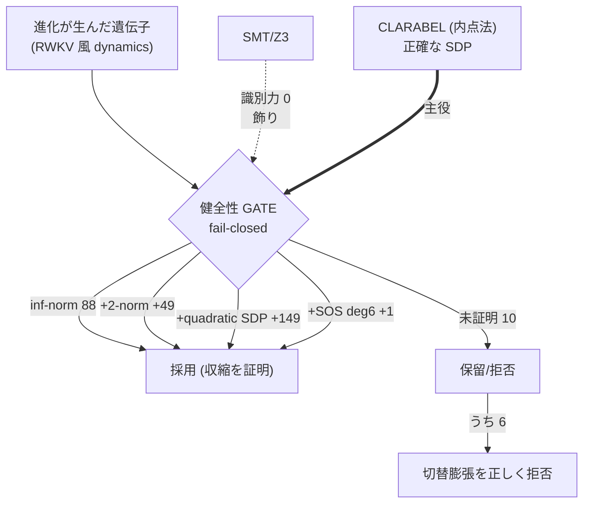
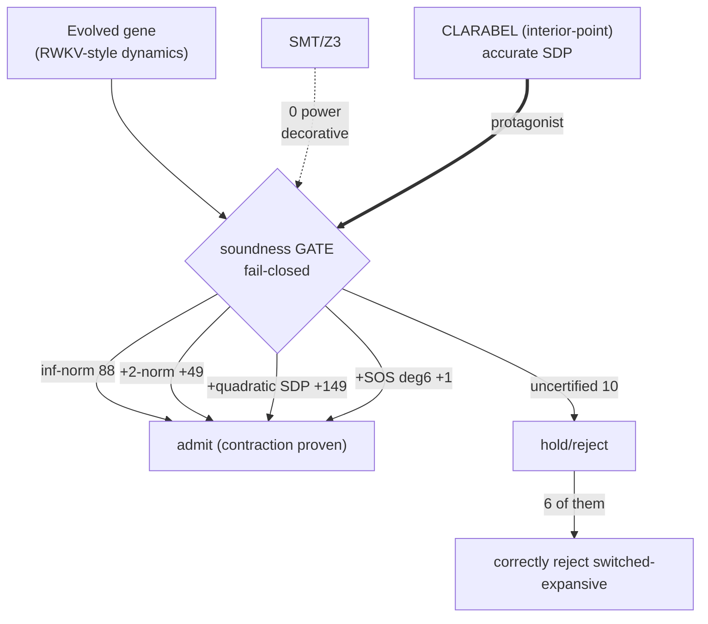
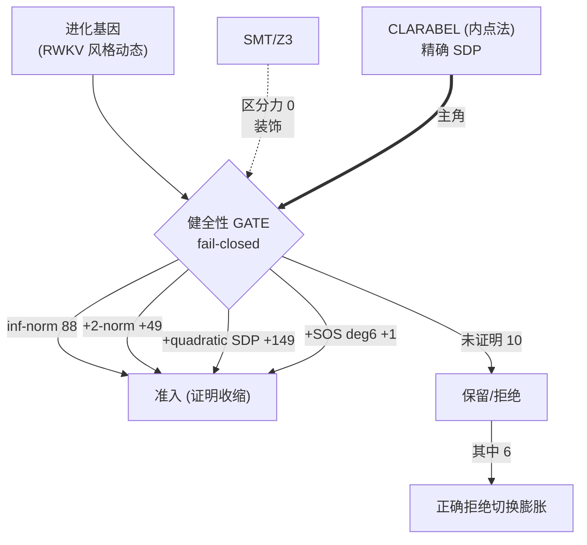
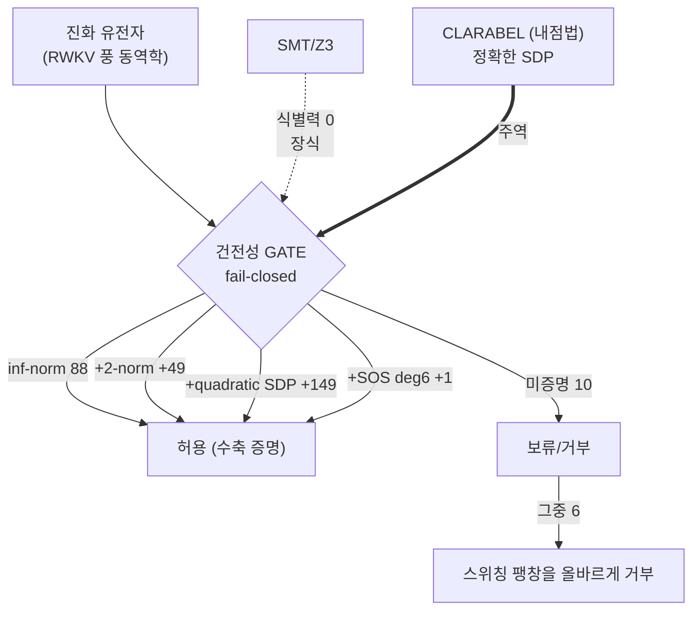

言語 / Language / 语言 / 언어: [日本語](#日本語) | [English](#english) | [中文](#中文) | [한국어](#한국어)

---

# 日本語

> 📗 **お急ぎの方へ**: この記事には [かみくだき版](https://fullsense.qiita.com/furuse-kazufumi/items/a8118f557dda5c5e998c) があります（比喩多め・短時間で要点だけ）。
# llcore 検証 arc (#35-00) — 進化する AI の「壊れてないか検査器」: SMT より SDP/Lyapunov が正解だった話

> **Concept hook**
> llcore は小さなニューラル系の「動き方 (dynamics)」そのものを進化させる FullSense の研究基盤で、CPU のみ・オンプレ・$0 で動く。進化が生み出した個体のうち、動きが発散する (収縮しない) ものは健全性 GATE で必ず弾かなければならない。その「壊れてないか検査器」として正しいのは SMT/Z3 ではなく二次形式の Lyapunov 証明書 (SDP/LMI) で、CPU 上で収縮個体の約 95% を証明できた。本稿はこの 3 部作シリーズの入口で、結論と全体像をやさしく俯瞰する。

## 0. 用語説明 / Glossary

このシリーズ全体で使う用語を先にまとめる。専門用語は全言語で正準形 (CLARABEL, SDP, LMI など) のまま残す。

| 用語 | やさしい意味 |
|---|---|
| llcore | FullSense の研究基盤。小さなニューラル系の「動き方」を進化させる。CPU のみ・オンプレ・$0。 |
| dynamics (動き方) | 状態が時間とともにどう更新されるかの規則。ここでは RWKV 風の結合状態更新「遺伝子」。 |
| 収縮 (contraction) | 時間が進むと状態の差が縮む性質。これがあると暴走せず安定する。 |
| 発散 (non-contracting) | 状態が縮まず広がる。放置すると暴走する危険な動き。 |
| GATE (健全性ゲート) | 進化が作った個体を通す/弾くの関門。発散個体を必ず拒否する役目。 |
| fail-closed | 検証できないときは「通さない」を既定にする安全側設計。 |
| Lyapunov 証明書 | 「この系は収縮する」ことを示すエネルギー関数 P (二次形式)。 |
| SDP / LMI | 半正定値計画 / 線形行列不等式。Lyapunov の P を凸最適化で探す枠組み。 |
| CLARABEL | 内点法ベースの正確な SDP ソルバ。本研究の主役。 |
| SCS | 一次法 (ADMM) の SDP ソルバ。境界付近で偽陰性を返す。cvxpy の既定。 |
| SMT / Z3 | 充足可能性ソルバ。この基質では「飾り」で識別力ゼロだった。 |
| SOS (deg4/6/8) | 二乗和。多項式を持ち上げてより強い証明を狙う。次数 deg で表す。 |
| JSR | Joint Spectral Radius。切替系の最悪成長率。1 未満なら収縮。計算は NP 困難。 |
| Rump verified PD | 厳密な Cholesky 後退誤差限界による機械検証済み正定値判定。True は「証明」。 |
| ペアレビュー | 別 AI と多 agent が独立に主張を反証しようとする検証手法。 |
| 基質 (substrate) | 進化が働く「土台の系」のこと。ここでは RWKV 風の結合状態更新で動く小さなニューラル系を指す。化学の基質ではなく、「進化がその上で作業する素材」というイメージで読むとよい。 |
| n=2 | 系のサイズ (次元) が 2 という意味。本シリーズの結果はすべてこの小さな 2 次元の結合基質に対するもので、より大きな系への一般化は主張していない (Honest disclosure 参照)。 |
| RWKV | Transformer の注意機構ではなく、再帰的な状態更新で系列を処理する近年のニューラルネットワーク方式。本稿は RWKV そのものを動かすのではなく、「RWKV 風」の結合状態更新の形だけを遺伝子の雛形として借りている。 |
| GA (遺伝的アルゴリズム) | 生物の進化をまねた探索法。個体の集団に変異と選択を世代ごとに繰り返し、成績 (fitness) の良い個体を残していく。本稿で「進化」と言うときはこの GA を指す。 |
| fitness (適応度) | 進化計算で個体の「成績」を測る点数。点数が高い個体ほど次世代に残りやすい。「安全 fitness」は GATE を通過できる (安全と証明された) 個体が到達できる成績のことで、rotation fitness はその一つ。 |
| seed | 乱数の種。同じ seed (例: 2024) から始めれば同じ乱数列が再現されるので、誰でも実験を再現できる。裏返すと、結果は「この seed で生成した個体プール」に対するもの、という限定も付く。 |
| p 値 | 「本当は差がない」と仮定したとき、観測された差以上のものが偶然出る確率。小さいほど偶然では説明しにくい。p = 3.1e-5 は約 10 万分の 3 で、inf-norm GATE と SDP GATE の fitness 差が偶然とは考えにくいことを示す。 |
| 凸最適化 | 「お椀型」の地形で一番低い点を探すタイプの最適化。お椀型なら偽の谷 (局所解) が存在しないので、見つけた答えが本当に最良だと保証できる。SDP はこの凸最適化の一種 — だから「証明」に使える。 |
| 二次形式 | x^T P x のように変数の 2 次の項だけでできた関数。ここでは状態の「エネルギーを測るものさし」として使い、このエネルギーが時間とともに必ず減るなら系は収縮すると言える (これが Lyapunov 証明書の中身)。 |
| 正定値 (PD) | 行列 P が「どの方向 x で測っても x^T P x > 0」になる性質 (PD = positive definite)。エネルギーのものさしとして使えるための条件で、Lyapunov 証明書の P はこの性質を持つ必要がある。 |
| Cholesky 分解 | 正定値行列を三角行列の積 (L×L^T) に分解する標準手法。分解が最後まで成功すること自体が「正定値である」証拠になる。Rump verified PD は、この分解の数値誤差 (後退誤差) まで厳密に見積もり、浮動小数点でも揺るがない機械検証の証明に格上げする。 |
| 内点法 | 凸最適化を、実行可能領域の「内側」を通りながら高精度に解く解法。1 反復の計算は重いが、境界まできっちり詰められるので答えの精度が高い。CLARABEL はこの方式で、境界付近の判定ミスが起きにくい。 |
| 一次法 (ADMM) | 勾配程度の軽い情報だけで進む解法の総称。ADMM はその代表で、1 反復が軽い代わりに精度はそこそこで止まる。SCS はこの方式なので、収縮/発散の境界ぎりぎりの個体で「本当は収縮するのに証明できない」(偽陰性) が起きた。 |
| inf-norm / 2-norm (誘導ノルム) | 行列が「ベクトルを最大何倍に引き伸ばすか」を測るものさし。inf-norm は行ごとの絶対値の合計の最大、2-norm は最大特異値 (一番伸びる方向の倍率)。どちらも 1 未満なら 1 ステップごとに必ず縮む。ただし測り方が事前に固定されたものさしなので、個体ごとに合わせたものさし P を見つける SDP より証明できる範囲が狭い。 |
| 閉形式 (閉じた式) | ソルバや反復計算なしに、四則演算や max などの有限の式で答えがそのまま書けること。閉形式で判定できる性質なら、ソルバを呼んでも同じ答えしか返らない — これが「Z3 は飾りだった」の理由。 |
| 偽陰性 | 本当は「収縮する (合格)」なのに「証明できない (不合格)」と判定してしまう誤り。fail-closed の GATE では安全側の誤りだが、合格できたはずの個体を無駄に弾き、検証器の実力を実際より低く見せる。SCS の罠はまさにこれだった。 |
| フロンティア (frontier) | 「ここまでは証明できた」という最前線のこと。検証器を強くするほど前線が外へ押し広がる。本稿の被覆フロンティアは JSR=1 の境界に漸近するが、exact-JSR が NP 困難なため完全には閉じない。 |
| Veronese 持ち上げ | 状態ベクトルを、単項式 (x², xy, y² など) を並べた高次元ベクトルに写す変換。持ち上げた先では高次の多項式証明書も「ただの二次形式」として扱えるので、SOS の証明書探しを SDP として解けるようになる。deg4/6/8 はこうして得られる証明書の多項式次数。 |
| 切替系 (switched system) | 複数の更新規則 (行列) を切り替えながら進む系。どんな切替の順番でも縮むなら安全で、その最悪成長率が JSR。本稿の「切替膨張」は、ある切替の順番では膨らんでしまう個体のことで、GATE はこれを正しく拒否した。 |
| jsr_lb | JSR の下界 (lower bound)。「実際の最悪成長率は少なくともこの値以上」という保証付きの見積もり。1 に近い (例: 0.9915) ほど収縮/発散の境界ぎりぎりで、証明が最も難しい個体であることを示す。 |
| オラクル | 答え合わせに使う独立の参照判定器。本稿の JSR オラクルは反証器 — 発散する反例を見つけて誤った合格を検出することはできるが、収縮の「証明」にはならない。だから健全性の主張は「観測された偽採用 0」に留めている。 |
| Track B / C / D | 本シリーズの実験トラックの呼び名。Track B = Z3 とスカラー閉形式テストの一致検証 (20000/20000 で一致)、Track C = Z3 の収縮チェックと閉じた式の不等式の一致検証 (3270 個で食い違い 0)、Track D = 3270 遺伝子でのスケール検証。 |

## 1. かみくだき結論 / Plain-language conclusion

進化する AI には「壊れてないか検査器」が要る。進化は雑に色々な動きを試すので、その中には放っておくと暴走する (発散する) 個体が混じる。だから個体を採用する前に「この動きは本当に収縮するか」を検査して、危ないものを弾く関門 (GATE) が必要だ。

問題は「どの検査器が正しいか」。直感では「最強の論理ソルバ (SMT/Z3) を呼べばいい」と思える。しかし実測すると、この基質では Z3 は識別力ゼロ — 閉じた式で答えが出てしまうので、ソルバを呼ぶ意味がなかった。

正解は二次形式の Lyapunov 証明書を SDP として解くことだった。これは「エネルギーが減り続ける証拠 P を凸最適化で見つける」やり方で、CPU だけで収縮個体の約 95% を証明できた。GPU も課金も要らない。

そしてこのシリーズには正直な裏話がある。最初、検査器の性能数字が「妙に複雑で都合よく」見えた。疑って調べたら、ソルバ (SCS) が境界付近で偽陰性を出すという罠にはまっていた。正確なソルバ CLARABEL に差し替えたら数字が一斉に整理され、より単純で強い結論に変わった。「数字が良すぎたら、信じる前にソルバを疑え」という教訓だ。本シリーズは #35-00 (本稿・全体像) → #35-01 (検証器のはしご) → #35-02 (正直開示とペアレビュー) の 3 部で構成する。

## 2. なぜ進化する AI に「検査器」が要るのか

llcore は小さなニューラル系の dynamics を進化させる。具体的には RWKV 風の結合状態更新を「遺伝子」として扱い、世代をまたいで変異・選択する。進化探索は本質的に「乱暴」だ。新しい動きを大量に試し、たまたま良い個体を残す。問題は、その「試し」の中に収縮しない (発散する) 動きが必ず紛れ込むこと。

発散する dynamics を採用してしまうと、状態が時間とともに膨らみ、系は暴走する。これは「進化させた結果が壊れている」状態であり、研究としても運用としても許容できない。だから進化ループの内側に健全性 GATE を置き、「この個体の動きは本当に収縮するか」を一個ずつ検査して、保証できないものを弾く。FullSense の規約どおり GATE は fail-closed (検証できないときは通さない) で設計する。

検証なし GA と GATE つき GA を比べると差は明確だった。

| 条件 | 採用された子のうち発散へドリフトした割合 |
|---|---|
| ungated GA (検査なし) | 17〜20% が発散へドリフト |
| SDP GATE つき | 発散個体の採用 0 |

さらに、GATE を強くすると到達できる安全 fitness の天井も上がった。

| GATE | 進化後の rotation fitness 上限 |
|---|---|
| inf-norm GATE | 約 0.41 |
| SDP GATE | 約 0.86 (p = 3.1e-5) |

つまり「強い検証器は、より多くの到達可能な安全 fitness を単調に解放する」。検証器は安全装置であると同時に、探索の到達範囲を広げる装置でもあった。

## 3. 検証器のはしご (フロンティア) — 結論先取り

「どの検査器が正しいか」の答えは、証明力が増えていくはしご (ladder) を実測することで出た。CLARABEL ソルバ、実測で収縮する n=2 遺伝子 300 個 (seed=2024) を対象にした結果が次だ (詳細は #35-01)。

| 段 (検証器) | 新規に証明できた数 | 累積 |
|---|---|---|
| inf-norm (行絶対値和の最大 < 1) | 88 | 88 |
| + 2-norm (最大特異値 < 1) | +49 | 137 |
| **+ quadratic SDP (共通 Lyapunov P)** | **+149** | **286 (= 300 の 95.3%)** |
| + degree-4 SOS (持ち上げ Veronese) | +3 (deg4∖deg6 = 0＝deg4 固有 admit なし。deg4 cone が SDP に対し +3、deg6 も同達) | 289 |
| + degree-6 SOS | +1 | 290 |
| 残余 (deg≤6 で未証明) | 10 | — |

各段で不健全な証明書は 0。最大のジャンプは quadratic SDP の +149 で、これが見出しだ。残り 10 個のうち、degree-8 SOS でさらに 4 個、exact-JSR ブラケットでそのうち 2 個 (有限ギャップ) が閉じる。境界ぎりぎりの 2 個 (jsr_lb 0.9915 / 0.9787) は未解決のまま。そして 10 個のうち 6 個は「切替で膨張する個体を正しく拒否した」もので、見逃しではない。

スケール検証 (Track D, 3270 遺伝子, CLARABEL) でも結論は揺るがなかった。

| 指標 | 値 |
|---|---|
| SDP が証明 | 1291/1363 (95%) |
| SDP が 2-norm に勝った差 | +692 (←+254 ではない。後述のソルバ補正) |
| 2-norm が SDP に勝った数 | 0 (ここでは SDP は 2-norm の真の上位集合) |

## 4. SMT/Z3 は「飾り」だった

直感に反するが、この基質では SMT/Z3 は load-bearing (荷重を支える) ではなく decorative (飾り) だった。

- **Track C**: Z3 の収縮チェックと閉じた式の不等式は 3270 個で食い違い 0。Z3 は識別力をゼロも追加しなかった。凸な行絶対値和は閉じた式に還元でき、端点だけで足りる。
- **Track B**: Z3 とスカラー閉形式テストは 20000/20000 で一致。「Z3 による証明」は言い過ぎで、健全性は閉形式の代数と LMI 凸性定理から来る。SMT ソルバを呼ぶことから来るのではない。

結論: 閉形式に還元できる収縮不変量について SMT は飾りだ。本当に豊かな証明書 — 誘導ノルムでは表現できない非単位行列の P — を与えるのは SDP/Lyapunov の側だった。

## 5. シリーズの地図 (#35-00 / #35-01 / #35-02)

本シリーズは 3 部構成。本稿 (#35-00) はやさしい入口で、結論と全体像だけを示す。

| 部 | テーマ | 中身 |
|---|---|---|
| **#35-00** (本稿) | 全体像と結論 | なぜ検査器が要るか / 正解は quadratic SDP で約 95% / 正直開示の予告 / CPU・$0・オンプレ / テスト 255+313 |
| **#35-01** | 検証器のはしご | inf-norm → 2-norm → SDP → SOS のフロンティア詳細、Track D スケール検証、SMT が飾りだった 3 トラックの実証 |
| **#35-02** | 正直開示とペアレビュー | SCS ソルバ罠の発覚と CLARABEL 補正、Rump verified-PD ハードニング、Codex + 6-agent ペアレビューの 5 findings |

llcore の到達点として、SDP/Lyapunov 検証器は今や src の本番・プラガブルなバックエンド (Stage 3b) になっている。cvxpy-optional で、CLARABEL がなければ拒否する fail-closed 設計 (SCS で黙って走らない)。テストは src 255 + research 313 が pass。すべて CPU・$0・オンプレで完結する。

## Honest disclosure

FullSense の正直開示規律に従い、限界を明示する。

- **SOS の単調性は成り立たない**: 持ち上げ SOS 族は非単調で、次数を上げるとむしろ緩い限界になることがある。最もタイトな限界は次数の最小値であって、きれいな階層ではない。「SOS のはしごを単調に登れば exact-JSR に届く」は偽。
- **exact-JSR は NP 困難**: 境界ぎりぎりの最後の約 2 個は有限 CPU 持ち上げ次数では未解決のまま。被覆フロンティアは JSR=1 境界へ漸近するだけで、閉じきらない — 正直できれいな限界だ。
- **適用範囲**: すべて n=2 結合基質・CPU・この個体プール/seed の結果。健全性 = 観測された偽採用 0 (JSR オラクルは反証器であって証明ではない。機械検証済みの PD 証明は Rump ゲートだけで、それは加算的)。
- **これは検証器の正しさの話**: 「進化するニューラル dynamics が広く有用だ」という主張ではない。

## References

1. cvxpy — Diamond & Boyd, "CVXPY: A Python-Embedded Modeling Language for Convex Optimization", JMLR 2016.
2. CLARABEL — Goulart & Chen, "Clarabel: An interior-point solver for conic programs with quadratic objectives".
3. SCS — O'Donoghue, Chu, Parikh, Boyd, "Conic Optimization via Operator Splitting and Homogeneous Self-Dual Embedding", JOTA 2016.
4. Parrilo — "Semidefinite programming relaxations for semialgebraic problems", Mathematical Programming 2003 (SOS).
5. Parrilo & Jadbabaie — "Approximation of the joint spectral radius using sum of squares", Linear Algebra and its Applications 2008 (JSR/SOS).
6. Rump — "Verification of positive definiteness", BIT Numerical Mathematics 2006.
7. Higham — "Accuracy and Stability of Numerical Algorithms", SIAM 2002.
8. Boyd & Vandenberghe — "Convex Optimization", Cambridge University Press 2004 (LMI/SDP).
9. Boyd, El Ghaoui, Feron, Balakrishnan — "Linear Matrix Inequalities in System and Control Theory", SIAM 1994.
10. Mouret & Clune — "Illuminating search spaces by mapping elites" (MAP-Elites), arXiv 2015.
11. (内部) #35-01 検証器のはしご詳細 — 本シリーズ。
12. (内部) #35-02 正直開示とペアレビュー — 本シリーズ。

## シリーズ / Series navigation

- **#35-00 (本稿)**: 全体像と結論 [llcore 検証 arc — 進化する AI の壊れてないか検査器]
- [#35-01 検証器のはしご (inf-norm → 2-norm → SDP → SOS)](#) *(draft)*
- [#35-02 正直開示とペアレビュー (SCS 罠と CLARABEL 補正)](#) *(draft)*

---

# English

> 📗 **In a hurry?** A [plain-language digest](https://fullsense.qiita.com/furuse-kazufumi/items/a8118f557dda5c5e998c) of this article is available.
# llcore Verification Arc (#35-00) — A "Breakage Inspector" for Evolving AI: Why SDP/Lyapunov Beat SMT

> **Concept hook**
> llcore is a FullSense research substrate that evolves the *dynamics* of small neural systems, running CPU-only, on-prem, at $0. Among the individuals evolution produces, any whose dynamics diverge (non-contracting) must be rejected by a soundness GATE. The right "breakage inspector" turns out to be a quadratic Lyapunov certificate (SDP/LMI) — not SMT/Z3 — and on CPU it certifies about 95% of the contracting evolved dynamics. This is the entry point of a three-part series: the conclusion and the big picture, told accessibly.

## 0. Glossary

Terms used across the whole series. Technical identifiers stay canonical (CLARABEL, SDP, LMI, etc.) in every language.

| Term | Plain meaning |
|---|---|
| llcore | FullSense research substrate evolving the dynamics of small neural systems. CPU-only, on-prem, $0. |
| dynamics | The rule for how state updates over time. Here, RWKV-style coupled state-update "genes". |
| contraction | The property that state differences shrink over time — the system stays stable, no blow-up. |
| non-contracting | State does not shrink; it grows. Left alone, this is a dangerous, divergent behavior. |
| GATE (soundness gate) | The checkpoint that admits/rejects evolved individuals. Its job: always reject divergent ones. |
| fail-closed | Safe-by-default design: if you cannot verify, do not admit. |
| Lyapunov certificate | An energy function P (a quadratic form) proving the system contracts. |
| SDP / LMI | Semidefinite program / linear matrix inequality — convex framework to find the Lyapunov P. |
| CLARABEL | An accurate interior-point SDP solver. The protagonist of this work. |
| SCS | A first-order (ADMM) SDP solver. Returns false negatives near the boundary. cvxpy's default. |
| SMT / Z3 | A satisfiability solver. On this substrate it was decorative — zero discriminating power. |
| SOS (deg4/6/8) | Sum-of-squares. Lift the polynomial to chase a stronger certificate; degree is "deg". |
| JSR | Joint Spectral Radius — worst-case growth rate of a switched system. Below 1 means contracting. NP-hard. |
| Rump verified PD | Machine-checked positive-definiteness via a rigorous Cholesky backward-error bound. A True verdict is a PROOF. |
| pair-review | A verification method where a separate AI plus a multi-agent team independently try to refute claims. |
| substrate | The "base system" that evolution operates on — here, the small neural system driven by RWKV-style coupled state updates. Not the chemistry term: read it as "the material evolution works upon". |
| n=2 | The system size (dimension) is 2. Every result in this series is for this small 2-dimensional coupled substrate; no generalization to larger systems is claimed (see Honest disclosure). |
| RWKV | A recent neural-network family that processes sequences with recurrent state updates instead of Transformer attention. This work does not run RWKV itself — it only borrows the shape of "RWKV-style" coupled state updates as the gene template. |
| GA (genetic algorithm) | A search method imitating biological evolution: a population of individuals undergoes mutation and selection generation after generation, keeping the high-fitness ones. "Evolution" in this article means this GA. |
| fitness | The score measuring how "good" an individual is in evolutionary computation; higher-scoring individuals are more likely to survive into the next generation. "Safe fitness" means the score reachable by individuals that pass the GATE (proven safe); rotation fitness is one such score. |
| seed | The random seed. Starting from the same seed (e.g. 2024) reproduces the same random sequence, so anyone can replay the experiment. The flip side: results are scoped to "the gene pool generated with this seed". |
| p-value | The probability of seeing a difference at least this large by pure chance, assuming there is truly no difference. The smaller, the harder to explain by luck. p = 3.1e-5 (about 3 in 100,000) says the fitness gap between the inf-norm GATE and the SDP GATE is very unlikely to be chance. |
| convex optimization | Optimization over a "bowl-shaped" landscape: a bowl has no false valleys (local optima), so any answer you find is guaranteed to be truly the best. SDP is one kind of convex optimization — which is exactly why it can serve as a proof. |
| quadratic form | A function built only from second-order terms, like x^T P x. Here it is the "energy ruler" for the state: if this energy provably keeps decreasing over time, the system contracts (that is the content of the Lyapunov certificate). |
| positive definite (PD) | The property of a matrix P that x^T P x > 0 in every direction x. It is what qualifies P as an energy ruler; the Lyapunov certificate's P must have this property. |
| Cholesky factorization | The standard way to factor a positive-definite matrix into triangular factors (L×L^T). The factorization succeeding all the way is itself evidence of positive definiteness; Rump verified PD rigorously bounds the numerical (backward) error of this factorization, upgrading it to a machine-checked proof that floating point cannot shake. |
| interior-point method | A way to solve convex programs by traveling through the interior of the feasible region with high accuracy. Each iteration is heavy, but it nails the answer right up to the boundary. CLARABEL works this way, which is why it rarely misjudges near-boundary cases. |
| first-order method (ADMM) | A family of solvers that advance using only gradient-level information. ADMM is the classic example: each iteration is cheap, but accuracy stops at "good enough". SCS is of this kind — hence "actually contracting but cannot certify" (false negatives) on genes sitting right at the contraction boundary. |
| inf-norm / 2-norm (induced norms) | Rulers measuring how much a matrix can stretch a vector: inf-norm is the maximum absolute row sum, 2-norm the largest singular value (the stretch in the worst direction). Below 1, every step is guaranteed to shrink. But these rulers are fixed in advance, so they certify less than the SDP, which finds a custom ruler P per individual. |
| closed form | When the answer can be written directly as a finite expression (arithmetic, max, ...) without any solver or iteration. If a property reduces to closed form, calling a solver returns the same answer anyway — which is exactly why Z3 was decorative here. |
| false negative | Judging "cannot certify (reject)" when the truth is "contracts (pass)". In a fail-closed GATE this errs on the safe side, but it wastes individuals that should have passed and makes the verifier look weaker than it really is. The SCS trap was exactly this. |
| frontier | The front line of "certified so far". A stronger verifier pushes the line outward. The coverage frontier here asymptotes to the JSR=1 boundary but never fully closes, because exact-JSR is NP-hard. |
| Veronese lift | A change of variables mapping the state vector to a higher-dimensional vector of monomials (x², xy, y², ...). In the lifted space, higher-degree polynomial certificates look like plain quadratic forms, so the SOS certificate search becomes solvable as an SDP. deg4/6/8 is the polynomial degree of the certificate obtained this way. |
| switched system | A system that advances by switching among several update rules (matrices). It is safe only if it shrinks under every possible switching order; the worst-case growth rate over those orders is the JSR. "Switched-expansive" genes are those that balloon under some switching order — and the GATE correctly rejects them. |
| jsr_lb | A lower bound on the JSR: a guaranteed estimate that the true worst-case growth rate is at least this value. The closer to 1 (e.g. 0.9915), the closer the gene sits to the contraction/divergence boundary — the hardest cases to certify. |
| oracle | An independent reference check used for cross-examining answers. The JSR oracle here is a falsifier — it can catch wrong admits by finding divergent counterexamples, but it cannot prove contraction. That is why the soundness claim is limited to "0 observed false admits". |
| Track B / C / D | Names of the experimental tracks in this series. Track B = agreement check between Z3 and the closed-form scalar test (20000/20000 agree); Track C = agreement check between the Z3 contraction check and the closed-form inequality (0 disagreements on 3270); Track D = the scale check on 3270 genes. |

## 1. Plain-language conclusion

Evolving AI needs a "breakage inspector." Evolution tries lots of behaviors carelessly, and some of them, if left alone, will blow up (diverge). So before adopting an individual you need a checkpoint (a GATE) that inspects "does this behavior actually contract?" and rejects the dangerous ones.

The question is: which inspector is right? Intuition says "just call the strongest logic solver (SMT/Z3)." But measured on this substrate, Z3 had zero discriminating power — the answer falls out of a closed-form expression, so invoking a solver was pointless.

The right answer was a quadratic Lyapunov certificate solved as an SDP. This means "find the evidence P that energy keeps decreasing, via convex optimization." On CPU alone it certified about 95% of the contracting individuals. No GPU, no billing.

This series also carries an honest back-story. At first the inspector's numbers looked "suspiciously rich and convenient." We doubted them, dug in, and found a trap: the solver (SCS) returns false negatives near the boundary. Swapping in the accurate solver CLARABEL collapsed the numbers into a simpler, stronger conclusion. The lesson: "When a number looks too good, suspect the solver before believing it." The series runs #35-00 (this overview) -> #35-01 (the verifier ladder) -> #35-02 (honest disclosure and pair-review).

## 2. Why evolving AI needs an inspector

llcore evolves the dynamics of small neural systems. Concretely it treats RWKV-style coupled state updates as "genes" and mutates/selects across generations. Evolutionary search is inherently "rough": it tries many new behaviors and keeps the ones that happen to be good. The problem is that some of those trials inevitably include non-contracting (divergent) dynamics.

Adopt a divergent dynamic and the state balloons over time; the system blows up. That is "the evolved result is broken" — unacceptable both as research and in operation. So we place a soundness GATE inside the evolution loop that inspects each individual — "does this behavior truly contract?" — and rejects anything it cannot guarantee. Per FullSense discipline the GATE is fail-closed (if you cannot verify, do not admit).

Comparing ungated vs gated GA made the difference clear.

| Condition | Fraction of admitted children that drifted into non-contraction |
|---|---|
| ungated GA | 17–20% drifted into divergence |
| with SDP GATE | 0 divergent children admitted |

Moreover, a stronger GATE raised the ceiling of reachable safe fitness.

| GATE | evolved rotation fitness ceiling |
|---|---|
| inf-norm GATE | ~0.41 |
| SDP GATE | ~0.86 (p = 3.1e-5) |

In short: "a stronger verifier monotonically unlocks more reachable safe fitness." The verifier is a safety device and, at the same time, a device that widens the search's reach.

## 3. The verifier ladder (frontier) — conclusion first

The answer to "which inspector is right" came from measuring a ladder of increasing certifying power. With the CLARABEL solver, on 300 empirically-contracting n=2 genes (seed=2024), the result was (details in #35-01):

| Rung (verifier) | Newly certified | Cumulative |
|---|---|---|
| inf-norm (max abs row sum < 1) | 88 | 88 |
| + 2-norm (max singular value < 1) | +49 | 137 |
| **+ quadratic SDP (common Lyapunov P)** | **+149** | **286 (= 95.3% of 300)** |
| + degree-4 SOS (lifted Veronese) | +3 (deg4∖deg6 = 0 = no admit unique to deg4; the deg4 cone certifies +3 over the SDP, which deg6 also reaches) | 289 |
| + degree-6 SOS | +1 | 290 |
| residual (uncertified at deg≤6) | 10 | — |

Zero unsound certificates at every rung. The big jump is the quadratic SDP's +149 — that is the headline. Of the remaining 10, degree-8 SOS closes 4 more, and an exact-JSR bracket closes 2 of those 4 (finite-gap). The 2 near-boundary genes (jsr_lb 0.9915 / 0.9787) stay open. And 6 of the 10 are correctly-rejected switched-expansive genes — not misses.

The scale check (Track D, 3270 genes, CLARABEL) did not move the conclusion.

| Metric | Value |
|---|---|
| SDP certifies | 1291/1363 (95%) |
| SDP beats 2-norm by | +692 (NOT +254 — the solver correction below) |
| two-beats-sdp | 0 (here SDP is a true superset of 2-norm) |

## 4. SMT/Z3 was decorative

Counterintuitively, on this substrate SMT/Z3 was decorative, not load-bearing.

- **Track C**: a Z3 contraction check and a closed-form inequality agreed on 0/3270 disagreements. Z3 added zero discriminating power. The convex row-abs-sum reduces to a closed form; endpoints suffice.
- **Track B**: Z3 vs the closed-form scalar test agreed 20000/20000. Calling it a "Z3 proof" was an overstatement; soundness comes from the closed-form algebra and the LMI convexity theorem — not from invoking an SMT solver.

Conclusion: for closed-form-reducible contraction invariants, SMT is decorative. The genuinely richer certificate — a non-identity P that the induced norms cannot express — is the SDP/Lyapunov one.

## 5. Map of the series (#35-00 / #35-01 / #35-02)

A three-part structure. This part (#35-00) is the accessible entry point, presenting only the conclusion and the big picture.

| Part | Theme | Contents |
|---|---|---|
| **#35-00** (this) | Big picture & conclusion | why an inspector is needed / the right gate is quadratic SDP at ~95% / honest-disclosure teaser / CPU, $0, on-prem / 255+313 tests |
| **#35-01** | The verifier ladder | the inf-norm → 2-norm → SDP → SOS frontier in detail, the Track D scale check, the 3-track proof that SMT was decorative |
| **#35-02** | Honest disclosure & pair-review | discovery of the SCS solver trap and the CLARABEL correction, Rump verified-PD hardening, the 5 findings from a Codex + 6-agent pair-review |

As llcore's destination, the SDP/Lyapunov verifier is now a production, pluggable backend in src (Stage 3b). It is cvxpy-optional and fail-closed: it refuses if CLARABEL is absent (it never silently runs SCS). Tests: src 255 + research 313 pass. Everything completes CPU-only, $0, on-prem.

## Honest disclosure

Per FullSense honest-disclosure discipline, the limits:

- **SOS is not monotone**: the lifted SOS family is non-monotone — a higher degree can give a looser bound. The tightest bound is the min over degrees, not a clean hierarchy. "Climbing the SOS ladder monotonically reaches exact-JSR" is FALSE.
- **exact-JSR is NP-hard**: the last ~2 near-boundary genes stay open at finite CPU lift degree. The coverage frontier asymptotes to the JSR=1 boundary rather than closing — an honest, clean limit.
- **Scope**: all results are n=2 coupled substrate, CPU, this pool/seed. Soundness = 0 OBSERVED false admits (the JSR oracle is a falsifier, not a proof; the Rump gate is the only machine-checked PD proof and it is additive).
- **This is about the right verifier**: it is NOT a claim that evolving neural dynamics is broadly useful.

## References

1. cvxpy — Diamond & Boyd, "CVXPY: A Python-Embedded Modeling Language for Convex Optimization", JMLR 2016.
2. CLARABEL — Goulart & Chen, "Clarabel: An interior-point solver for conic programs with quadratic objectives".
3. SCS — O'Donoghue, Chu, Parikh, Boyd, "Conic Optimization via Operator Splitting and Homogeneous Self-Dual Embedding", JOTA 2016.
4. Parrilo — "Semidefinite programming relaxations for semialgebraic problems", Mathematical Programming 2003 (SOS).
5. Parrilo & Jadbabaie — "Approximation of the joint spectral radius using sum of squares", Linear Algebra and its Applications 2008 (JSR/SOS).
6. Rump — "Verification of positive definiteness", BIT Numerical Mathematics 2006.
7. Higham — "Accuracy and Stability of Numerical Algorithms", SIAM 2002.
8. Boyd & Vandenberghe — "Convex Optimization", Cambridge University Press 2004 (LMI/SDP).
9. Boyd, El Ghaoui, Feron, Balakrishnan — "Linear Matrix Inequalities in System and Control Theory", SIAM 1994.
10. Mouret & Clune — "Illuminating search spaces by mapping elites" (MAP-Elites), arXiv 2015.
11. (internal) #35-01 verifier ladder detail — this series.
12. (internal) #35-02 honest disclosure & pair-review — this series.

## Series navigation

- **#35-00 (this)**: Big picture & conclusion [llcore verification arc — a breakage inspector for evolving AI]
- [#35-01 The verifier ladder (inf-norm → 2-norm → SDP → SOS)](#) *(draft)*
- [#35-02 Honest disclosure & pair-review (SCS trap and CLARABEL correction)](#) *(draft)*

---

# 中文

> 📗 **赶时间?** 本文有[通俗易懂版](https://fullsense.qiita.com/furuse-kazufumi/items/a8118f557dda5c5e998c)。
# llcore 验证 arc (#35-00) — 进化 AI 的「是否损坏检查器」: 为何 SDP/Lyapunov 胜过 SMT

> **Concept hook**
> llcore 是 FullSense 的研究基底，进化的是小型神经系统的「动态 (dynamics)」本身，仅用 CPU、本地部署、$0 运行。进化产生的个体中，凡是动态发散 (不收缩) 的都必须被健全性 GATE 拒绝。事实证明正确的「是否损坏检查器」不是 SMT/Z3，而是二次型 Lyapunov 证书 (SDP/LMI)；在 CPU 上它能证明约 95% 的收缩进化动态。本文是这个三部曲系列的入口，用易懂的方式概览结论与全局。

## 0. 术语说明 / Glossary

全系列通用术语。技术标识符在所有语言中保持正准形式 (CLARABEL, SDP, LMI 等)。

| 术语 | 通俗含义 |
|---|---|
| llcore | FullSense 研究基底，进化小型神经系统的动态。仅 CPU、本地、$0。 |
| dynamics (动态) | 状态随时间如何更新的规则。这里是 RWKV 风格的耦合状态更新「基因」。 |
| 收缩 (contraction) | 状态差随时间缩小的性质 — 系统保持稳定、不爆炸。 |
| 发散 (non-contracting) | 状态不缩反胀。放任不管就是危险的发散行为。 |
| GATE (健全性门) | 准入/拒绝进化个体的关卡。职责: 必须拒绝发散个体。 |
| fail-closed | 默认安全设计: 无法验证就不准入。 |
| Lyapunov 证书 | 证明系统收缩的能量函数 P (二次型)。 |
| SDP / LMI | 半正定规划 / 线性矩阵不等式 — 用凸优化寻找 Lyapunov 的 P。 |
| CLARABEL | 基于内点法的精确 SDP 求解器。本研究的主角。 |
| SCS | 一阶法 (ADMM) 的 SDP 求解器。边界附近会返回假阴性。cvxpy 默认。 |
| SMT / Z3 | 可满足性求解器。在此基底上是「装饰」— 区分力为零。 |
| SOS (deg4/6/8) | 平方和。提升多项式以追求更强的证书；次数记为 deg。 |
| JSR | Joint Spectral Radius — 切换系统的最坏增长率。小于 1 即收缩。NP 困难。 |
| Rump verified PD | 通过严格 Cholesky 后向误差界的机器验证正定性判定。True 即是「证明」。 |
| pair-review | 一种验证方法: 另一个 AI 加上多 agent 团队独立尝试反驳论断。 |
| 基底 (substrate) | 进化所作用的「底层系统」— 这里指由 RWKV 风格耦合状态更新驱动的小型神经系统。不是化学里的底物，可以理解为「进化在其上工作的素材」。 |
| n=2 | 系统规模 (维度) 为 2。本系列所有结果都针对这个小型 2 维耦合基底，并不主张推广到更大的系统 (见 Honest disclosure)。 |
| RWKV | 近年的一类神经网络: 用递归状态更新而非 Transformer 注意力来处理序列。本工作并不运行 RWKV 本身，只是借用「RWKV 风格」耦合状态更新的形式作为基因模板。 |
| GA (遗传算法) | 模仿生物进化的搜索方法: 个体群在世代之间反复变异与选择，留下高适应度的个体。本文说「进化」指的就是这种 GA。 |
| fitness (适应度) | 进化计算中衡量个体「成绩」的分数; 分数越高越容易留到下一代。「安全适应度」指通过 GATE (被证明安全) 的个体所能达到的成绩，rotation 适应度是其中之一。 |
| seed | 随机种子。从同一 seed (如 2024) 出发会重现同样的随机序列，任何人都能复现实验。反过来说，结果也仅限于「用这个 seed 生成的个体池」。 |
| p 值 | 假设「其实没有差异」时，纯靠偶然出现至少这么大差异的概率。越小越难用运气解释。p = 3.1e-5 (约十万分之三) 说明 inf-norm GATE 与 SDP GATE 的适应度差距极不可能是偶然。 |
| 凸优化 | 在「碗形」地形上找最低点的优化。碗形意味着没有假的山谷 (局部最优)，所以找到的答案保证真的最优。SDP 是凸优化的一种 — 这正是它能当「证明」用的原因。 |
| 二次型 | 只由二次项构成的函数，如 x^T P x。这里它是衡量状态的「能量尺子」: 若能证明这个能量随时间必然下降，系统就收缩 (这正是 Lyapunov 证书的内容)。 |
| 正定 (PD) | 矩阵 P 的性质: 在任意方向 x 上都有 x^T P x > 0 (PD = positive definite)。这是 P 能当能量尺子的前提条件，Lyapunov 证书的 P 必须满足。 |
| Cholesky 分解 | 把正定矩阵分解为三角矩阵乘积 (L×L^T) 的标准方法。分解能进行到底本身就是「正定」的证据; Rump verified PD 进一步严格估计这个分解的数值 (后向) 误差，把它升级为浮点运算也无法动摇的机器验证证明。 |
| 内点法 | 沿可行域「内部」高精度求解凸优化的方法。每次迭代较重，但即使贴近边界也能算得很准。CLARABEL 就是这种方式，所以边界附近不易误判。 |
| 一阶法 (ADMM) | 只用梯度级轻量信息前进的求解器家族。ADMM 是其代表: 单次迭代便宜，但精度只到「差不多」为止。SCS 属于此类 — 因此在收缩/发散边界附近的基因上出现「其实收缩却证明不了」(假阴性)。 |
| inf-norm / 2-norm (诱导范数) | 衡量矩阵「最多把向量拉伸几倍」的尺子: inf-norm 是行绝对值和的最大值，2-norm 是最大奇异值 (最坏方向的倍率)。小于 1 则每步必缩。但这些尺子是事先固定的，所以能证明的范围比 SDP 窄 — SDP 会为每个个体找一把定制的尺子 P。 |
| 闭式 (闭形式) | 答案能直接写成有限的表达式 (四则运算、max 等)，无需求解器或迭代。若性质可还原为闭式，调用求解器也只会返回同样的答案 — 这正是「Z3 是装饰」的原因。 |
| 假阴性 | 真相是「收缩 (合格)」却被判成「无法证明 (不合格)」的错误。在 fail-closed 的 GATE 中这是偏安全的错误，但会白白弹掉本可合格的个体，让验证器显得比实际弱。SCS 的陷阱正是如此。 |
| 前沿 (frontier) | 「到此为止已证明」的最前线。验证器越强，前线越向外推。这里的覆盖前沿渐近于 JSR=1 边界但永不完全闭合，因为 exact-JSR 是 NP 困难。 |
| Veronese 提升 | 把状态向量映射为由单项式 (x², xy, y² 等) 组成的高维向量的变换。在提升后的空间里，高次多项式证书看起来就是普通的二次型，于是 SOS 证书搜索可以当作 SDP 来解。deg4/6/8 就是这样得到的证书的多项式次数。 |
| 切换系统 (switched system) | 在多个更新规则 (矩阵) 之间切换前进的系统。只有在任何切换顺序下都收缩才算安全，这些顺序下的最坏增长率就是 JSR。「切换膨胀」指在某种切换顺序下会膨胀的个体 — GATE 正确地拒绝了它们。 |
| jsr_lb | JSR 的下界 (lower bound): 带保证的估计，真实最坏增长率至少是这个值。越接近 1 (如 0.9915)，基因越贴近收缩/发散边界 — 也就是最难证明的情形。 |
| 神谕 (oracle) | 用于「对答案」的独立参照判定器。这里的 JSR 神谕是反证器 — 能通过找到发散反例抓出错误的准入，但不能证明收缩。所以健全性只表述为「观测到的假准入 0」。 |
| Track B / C / D | 本系列实验轨道的名称。Track B = Z3 与闭式标量测试的一致性检验 (20000/20000 一致); Track C = Z3 收缩检查与闭式不等式的一致性检验 (3270 个上分歧 0); Track D = 3270 基因的规模检验。 |

## 1. 通俗结论 / Plain-language conclusion

进化的 AI 需要一个「是否损坏检查器」。进化会粗放地尝试各种行为，其中有些放任不管就会爆炸 (发散)。所以在采用个体之前，需要一个关卡 (GATE) 来检查「这个行为真的会收缩吗」，并拒绝危险者。

问题是: 哪个检查器才正确? 直觉认为「调用最强的逻辑求解器 (SMT/Z3) 就行」。但在此基底上实测，Z3 的区分力为零 — 答案由闭式表达式直接给出，调用求解器毫无意义。

正确答案是把二次型 Lyapunov 证书当作 SDP 求解。这就是「用凸优化找出能量持续减少的证据 P」。仅靠 CPU 就能证明约 95% 的收缩个体。无需 GPU、无需计费。

本系列还有一段诚实的幕后故事。起初检查器的性能数字看起来「复杂得可疑、又方便得可疑」。我们起疑、深挖，发现陷阱: 求解器 (SCS) 在边界附近返回假阴性。换上精确求解器 CLARABEL 后，数字一齐收敛成更简单、更强的结论。教训是: 「数字好得过头时，先怀疑求解器，再相信它。」本系列分为 #35-00 (本文・概览) → #35-01 (验证器阶梯) → #35-02 (诚实披露与 pair-review) 三部。

## 2. 为何进化 AI 需要检查器

llcore 进化小型神经系统的动态。具体而言，它把 RWKV 风格的耦合状态更新当作「基因」，跨世代变异/选择。进化搜索本质上是「粗放」的: 大量尝试新行为，留下碰巧不错的。问题在于，这些尝试里必然混入不收缩 (发散) 的动态。

一旦采用了发散动态，状态会随时间膨胀，系统爆炸。这就是「进化结果坏了」— 无论作为研究还是运行都不可接受。所以我们在进化循环内部放一个健全性 GATE，逐个检查个体 — 「这个行为真的收缩吗」— 并拒绝任何无法保证的。按 FullSense 规约，GATE 采用 fail-closed (无法验证就不准入)。

对比无门 GA 与有门 GA，差异显而易见。

| 条件 | 被采用的子代中漂移到不收缩的比例 |
|---|---|
| ungated GA (无检查) | 17–20% 漂移到发散 |
| 带 SDP GATE | 准入发散个体 0 |

而且，更强的 GATE 抬高了可达安全适应度的天花板。

| GATE | 进化后 rotation 适应度上限 |
|---|---|
| inf-norm GATE | 约 0.41 |
| SDP GATE | 约 0.86 (p = 3.1e-5) |

简言之: 「更强的验证器单调地解锁更多可达的安全适应度。」验证器既是安全装置，同时也是拓宽搜索可达范围的装置。

## 3. 验证器阶梯 (前沿) — 先说结论

「哪个检查器正确」的答案，来自实测一条证明力递增的阶梯。用 CLARABEL 求解器，在 300 个实测收缩的 n=2 基因 (seed=2024) 上的结果如下 (详见 #35-01)。

| 阶 (验证器) | 新证明数 | 累计 |
|---|---|---|
| inf-norm (行绝对值和最大 < 1) | 88 | 88 |
| + 2-norm (最大奇异值 < 1) | +49 | 137 |
| **+ quadratic SDP (共同 Lyapunov P)** | **+149** | **286 (= 300 的 95.3%)** |
| + degree-4 SOS (提升 Veronese) | +3 (deg4∖deg6 = 0＝无 deg4 独有 admit；deg4 锥相对 SDP 证明 +3，deg6 也达到) | 289 |
| + degree-6 SOS | +1 | 290 |
| 残余 (deg≤6 未证明) | 10 | — |

每一阶不健全证书均为 0。最大跃迁是 quadratic SDP 的 +149 — 这就是头条。剩下 10 个中，degree-8 SOS 再关闭 4 个，exact-JSR 区间关闭其中 2 个 (有限间隙)。边界临界的 2 个 (jsr_lb 0.9915 / 0.9787) 仍未解决。而这 10 个里有 6 个是「被正确拒绝的切换膨胀个体」— 不是漏判。

规模检验 (Track D, 3270 基因, CLARABEL) 也没有动摇结论。

| 指标 | 数值 |
|---|---|
| SDP 证明 | 1291/1363 (95%) |
| SDP 胜过 2-norm 的差值 | +692 (并非 +254 — 见下文求解器修正) |
| 2-norm 胜过 SDP 的数量 | 0 (此处 SDP 是 2-norm 的真超集) |

## 4. SMT/Z3 只是「装饰」

反直觉的是，在此基底上 SMT/Z3 是装饰，而非承重。

- **Track C**: Z3 收缩检查与闭式不等式在 3270 个上分歧 0。Z3 的区分力增加为零。凸的行绝对值和可还原为闭式，端点即足够。
- **Track B**: Z3 与闭式标量测试一致 20000/20000。称其为「Z3 证明」是夸大; 健全性来自闭式代数与 LMI 凸性定理 — 而非来自调用 SMT 求解器。

结论: 对于可还原为闭式的收缩不变量，SMT 是装饰。真正更丰富的证书 — 一个诱导范数无法表达的非单位矩阵 P — 来自 SDP/Lyapunov 一侧。

## 5. 系列地图 (#35-00 / #35-01 / #35-02)

三部结构。本部 (#35-00) 是易懂的入口，只呈现结论与全局。

| 部 | 主题 | 内容 |
|---|---|---|
| **#35-00** (本文) | 全局与结论 | 为何需要检查器 / 正确的门是 quadratic SDP 约 95% / 诚实披露预告 / CPU、$0、本地 / 255+313 测试 |
| **#35-01** | 验证器阶梯 | inf-norm → 2-norm → SDP → SOS 前沿细节、Track D 规模检验、SMT 是装饰的 3 trace 实证 |
| **#35-02** | 诚实披露与 pair-review | SCS 求解器陷阱的发现与 CLARABEL 修正、Rump verified-PD 加固、Codex + 6-agent pair-review 的 5 findings |

作为 llcore 的归宿，SDP/Lyapunov 验证器现已成为 src 中的生产级、可插拔后端 (Stage 3b)。它 cvxpy-optional 且 fail-closed: 若无 CLARABEL 则拒绝 (绝不静默运行 SCS)。测试: src 255 + research 313 通过。一切都在 CPU、$0、本地完成。

## Honest disclosure

按 FullSense 诚实披露规律，明示限制:

- **SOS 不单调**: 提升 SOS 族是非单调的 — 提高次数可能给出更松的界。最紧的界是各次数的最小值，而非干净的层级。「单调爬 SOS 阶梯就能到达 exact-JSR」是假的。
- **exact-JSR 是 NP 困难**: 边界临界的最后约 2 个在有限 CPU 提升次数下仍未解决。覆盖前沿渐近于 JSR=1 边界而非闭合 — 这是诚实而干净的限制。
- **适用范围**: 全部结果均为 n=2 耦合基底、CPU、本个体池/seed。健全性 = 观测到的假准入 0 (JSR 神谕是反证器而非证明; Rump 门是唯一机器验证的 PD 证明，且是加性的)。
- **这是关于正确验证器的话**: 并非主张「进化神经动态广泛有用」。

## References

1. cvxpy — Diamond & Boyd, "CVXPY: A Python-Embedded Modeling Language for Convex Optimization", JMLR 2016.
2. CLARABEL — Goulart & Chen, "Clarabel: An interior-point solver for conic programs with quadratic objectives".
3. SCS — O'Donoghue, Chu, Parikh, Boyd, "Conic Optimization via Operator Splitting and Homogeneous Self-Dual Embedding", JOTA 2016.
4. Parrilo — "Semidefinite programming relaxations for semialgebraic problems", Mathematical Programming 2003 (SOS).
5. Parrilo & Jadbabaie — "Approximation of the joint spectral radius using sum of squares", Linear Algebra and its Applications 2008 (JSR/SOS).
6. Rump — "Verification of positive definiteness", BIT Numerical Mathematics 2006.
7. Higham — "Accuracy and Stability of Numerical Algorithms", SIAM 2002.
8. Boyd & Vandenberghe — "Convex Optimization", Cambridge University Press 2004 (LMI/SDP).
9. Boyd, El Ghaoui, Feron, Balakrishnan — "Linear Matrix Inequalities in System and Control Theory", SIAM 1994.
10. Mouret & Clune — "Illuminating search spaces by mapping elites" (MAP-Elites), arXiv 2015.
11. (内部) #35-01 验证器阶梯细节 — 本系列。
12. (内部) #35-02 诚实披露与 pair-review — 本系列。

## 系列 / Series navigation

- **#35-00 (本文)**: 全局与结论 [llcore 验证 arc — 进化 AI 的是否损坏检查器]
- [#35-01 验证器阶梯 (inf-norm → 2-norm → SDP → SOS)](#) *(draft)*
- [#35-02 诚实披露与 pair-review (SCS 陷阱与 CLARABEL 修正)](#) *(draft)*

---

# 한국어

> 📗 **바쁘신 분께**: 이 글에는 [쉽게 풀어쓴 버전](https://fullsense.qiita.com/furuse-kazufumi/items/a8118f557dda5c5e998c)이 있습니다.
# llcore 검증 arc (#35-00) — 진화하는 AI의 「고장 여부 검사기」: SMT보다 SDP/Lyapunov가 정답이었던 이야기

> **Concept hook**
> llcore는 작은 신경 시스템의 「동역학 (dynamics)」 자체를 진화시키는 FullSense의 연구 기반으로, CPU 전용·온프렘·$0로 동작한다. 진화가 만든 개체 중 동역학이 발산하는 (수축하지 않는) 것은 건전성 GATE가 반드시 거부해야 한다. 올바른 「고장 여부 검사기」는 SMT/Z3가 아니라 2차형식 Lyapunov 증명서 (SDP/LMI)였고, CPU에서 수축 진화 동역학의 약 95%를 증명할 수 있었다. 본 글은 이 3부작 시리즈의 입구로, 결론과 전체 그림을 쉽게 개관한다.

## 0. 용어 설명 / Glossary

시리즈 전체에서 쓰는 용어. 기술 식별자는 모든 언어에서 정준형 (CLARABEL, SDP, LMI 등)으로 유지한다.

| 용어 | 쉬운 뜻 |
|---|---|
| llcore | FullSense 연구 기반. 작은 신경 시스템의 동역학을 진화. CPU 전용·온프렘·$0. |
| dynamics (동역학) | 상태가 시간에 따라 어떻게 갱신되는지의 규칙. 여기서는 RWKV 풍 결합 상태 갱신 「유전자」. |
| 수축 (contraction) | 시간이 지날수록 상태 차이가 줄어드는 성질 — 시스템이 안정, 폭주하지 않음. |
| 발산 (non-contracting) | 상태가 줄지 않고 커짐. 방치하면 폭주하는 위험한 움직임. |
| GATE (건전성 게이트) | 진화 개체를 허용/거부하는 관문. 역할: 발산 개체를 반드시 거부. |
| fail-closed | 기본 안전 설계: 검증할 수 없으면 허용하지 않음. |
| Lyapunov 증명서 | 시스템이 수축함을 증명하는 에너지 함수 P (2차형식). |
| SDP / LMI | 반정정계획 / 선형행렬부등식 — 볼록 최적화로 Lyapunov P를 찾는 틀. |
| CLARABEL | 내점법 기반의 정확한 SDP 솔버. 본 연구의 주역. |
| SCS | 1차법 (ADMM) SDP 솔버. 경계 근처에서 거짓 음성을 반환. cvxpy 기본값. |
| SMT / Z3 | 충족가능성 솔버. 이 기질에서는 「장식」으로 식별력 0이었다. |
| SOS (deg4/6/8) | 제곱합. 다항식을 들어올려 더 강한 증명서를 노림; 차수는 deg. |
| JSR | Joint Spectral Radius — 스위칭 시스템의 최악 성장률. 1 미만이면 수축. NP-난해. |
| Rump verified PD | 엄밀한 Cholesky 후방오차 한계에 의한 기계검증 양정치 판정. True는 「증명」. |
| pair-review | 별도 AI와 다중 agent 팀이 독립적으로 주장을 반증하려는 검증 방법. |

## 1. 쉽게 푼 결론 / Plain-language conclusion

진화하는 AI에는 「고장 여부 검사기」가 필요하다. 진화는 거칠게 온갖 움직임을 시도하고, 그중 일부는 방치하면 폭주한다 (발산). 그래서 개체를 채택하기 전에 「이 움직임이 정말 수축하는가」를 검사해 위험한 것을 거부하는 관문 (GATE)이 필요하다.

문제는 「어떤 검사기가 옳은가」다. 직관은 「가장 강한 논리 솔버 (SMT/Z3)를 부르면 된다」고 말한다. 그러나 이 기질에서 실측하니 Z3는 식별력 0 — 닫힌 식으로 답이 나와서 솔버를 부르는 의미가 없었다.

정답은 2차형식 Lyapunov 증명서를 SDP로 푸는 것이었다. 이는 「에너지가 계속 줄어든다는 증거 P를 볼록 최적화로 찾는」 방식으로, CPU만으로 수축 개체의 약 95%를 증명했다. GPU도 과금도 필요 없다.

이 시리즈에는 정직한 뒷이야기가 있다. 처음엔 검사기 성능 숫자가 「묘하게 복잡하고 편리하게」 보였다. 의심하고 파보니 함정이 있었다: 솔버 (SCS)가 경계 근처에서 거짓 음성을 낸다. 정확한 솔버 CLARABEL로 교체하니 숫자가 일제히 정리되어 더 단순하고 강한 결론으로 바뀌었다. 교훈은 「숫자가 너무 좋으면, 믿기 전에 솔버를 의심하라」다. 시리즈는 #35-00 (본 글·개관) → #35-01 (검증기 사다리) → #35-02 (정직한 공개와 pair-review) 3부로 구성된다.

## 2. 왜 진화하는 AI에 검사기가 필요한가

llcore는 작은 신경 시스템의 동역학을 진화시킨다. 구체적으로 RWKV 풍 결합 상태 갱신을 「유전자」로 다루고, 세대를 넘어 변이/선택한다. 진화 탐색은 본질적으로 「거칠다」: 새 움직임을 대량으로 시도하고, 우연히 좋은 것을 남긴다. 문제는 그 시도 속에 수축하지 않는 (발산하는) 동역학이 반드시 섞인다는 점이다.

발산 동역학을 채택하면 상태가 시간에 따라 부풀어 시스템이 폭주한다. 이는 「진화 결과가 망가진」 상태로, 연구로도 운용으로도 허용되지 않는다. 그래서 진화 루프 안쪽에 건전성 GATE를 두고 개체를 하나씩 검사 — 「이 움직임이 정말 수축하는가」 — 하여 보장할 수 없는 것을 거부한다. FullSense 규약대로 GATE는 fail-closed (검증 불가 시 허용 안 함)다.

검증 없는 GA와 GATE 있는 GA를 비교하니 차이가 분명했다.

| 조건 | 채택된 자식 중 비수축으로 드리프트한 비율 |
|---|---|
| ungated GA (검사 없음) | 17–20%가 발산으로 드리프트 |
| SDP GATE 적용 | 발산 개체 채택 0 |

게다가 GATE를 강하게 하면 도달 가능한 안전 적합도의 천장도 올라갔다.

| GATE | 진화 후 rotation 적합도 상한 |
|---|---|
| inf-norm GATE | 약 0.41 |
| SDP GATE | 약 0.86 (p = 3.1e-5) |

요컨대 「강한 검증기는 도달 가능한 안전 적합도를 단조롭게 더 많이 해제한다」. 검증기는 안전장치인 동시에 탐색의 도달 범위를 넓히는 장치였다.

## 3. 검증기 사다리 (프런티어) — 결론 먼저

「어떤 검사기가 옳은가」의 답은 증명력이 늘어나는 사다리 (ladder)를 실측해서 나왔다. CLARABEL 솔버로, 실측 수축하는 n=2 유전자 300개 (seed=2024)에 대한 결과는 다음과 같다 (자세히는 #35-01).

| 단 (검증기) | 새로 증명한 수 | 누적 |
|---|---|---|
| inf-norm (행 절댓값 합 최대 < 1) | 88 | 88 |
| + 2-norm (최대 특이값 < 1) | +49 | 137 |
| **+ quadratic SDP (공통 Lyapunov P)** | **+149** | **286 (= 300의 95.3%)** |
| + degree-4 SOS (들어올린 Veronese) | +3 (deg4∖deg6 = 0＝deg4 고유 admit 없음; deg4 cone이 SDP 대비 +3, deg6도 동일 도달) | 289 |
| + degree-6 SOS | +1 | 290 |
| 잔여 (deg≤6에서 미증명) | 10 | — |

각 단에서 불건전 증명서는 0. 가장 큰 도약은 quadratic SDP의 +149 — 이것이 헤드라인이다. 남은 10개 중 degree-8 SOS가 4개를 더 닫고, exact-JSR 브래킷이 그중 2개 (유한 갭)를 닫는다. 경계 직전의 2개 (jsr_lb 0.9915 / 0.9787)는 미해결로 남는다. 그리고 10개 중 6개는 「스위칭 팽창 개체를 올바르게 거부한」 것으로, 놓침이 아니다.

스케일 검증 (Track D, 3270 유전자, CLARABEL)에서도 결론은 흔들리지 않았다.

| 지표 | 값 |
|---|---|
| SDP 증명 | 1291/1363 (95%) |
| SDP가 2-norm을 이긴 차 | +692 (+254가 아님 — 아래 솔버 보정) |
| 2-norm이 SDP를 이긴 수 | 0 (여기서 SDP는 2-norm의 진부분집합 상위) |

## 4. SMT/Z3는 「장식」이었다

직관과 반대로, 이 기질에서 SMT/Z3는 하중을 지는 게 아니라 장식이었다.

- **Track C**: Z3 수축 검사와 닫힌 식 부등식이 3270개에서 불일치 0. Z3는 식별력을 0만큼 추가했다. 볼록한 행 절댓값 합은 닫힌 식으로 환원되고, 끝점만으로 충분하다.
- **Track B**: Z3와 닫힌 식 스칼라 테스트가 20000/20000 일치. 「Z3 증명」이라 부른 것은 과장이다; 건전성은 닫힌 식 대수와 LMI 볼록성 정리에서 온다 — SMT 솔버 호출에서가 아니다.

결론: 닫힌 식으로 환원 가능한 수축 불변량에 대해 SMT는 장식이다. 진정으로 풍부한 증명서 — 유도 노름이 표현할 수 없는 비단위 행렬 P — 는 SDP/Lyapunov 쪽이다.

## 5. 시리즈 지도 (#35-00 / #35-01 / #35-02)

3부 구성. 본 부 (#35-00)는 쉬운 입구로, 결론과 전체 그림만 제시한다.

| 부 | 주제 | 내용 |
|---|---|---|
| **#35-00** (본 글) | 전체 그림과 결론 | 왜 검사기가 필요한가 / 올바른 게이트는 quadratic SDP 약 95% / 정직 공개 예고 / CPU·$0·온프렘 / 255+313 테스트 |
| **#35-01** | 검증기 사다리 | inf-norm → 2-norm → SDP → SOS 프런티어 상세, Track D 스케일 검증, SMT가 장식이었던 3 트랙 실증 |
| **#35-02** | 정직 공개와 pair-review | SCS 솔버 함정의 발견과 CLARABEL 보정, Rump verified-PD 하드닝, Codex + 6-agent pair-review의 5 findings |

llcore의 도달점으로서, SDP/Lyapunov 검증기는 이제 src의 프로덕션·플러거블 백엔드 (Stage 3b)다. cvxpy-optional이며 fail-closed: CLARABEL이 없으면 거부한다 (절대 조용히 SCS를 돌리지 않음). 테스트: src 255 + research 313 통과. 모든 것이 CPU·$0·온프렘으로 완결된다.

## Honest disclosure

FullSense 정직 공개 규율에 따라 한계를 명시한다.

- **SOS는 단조롭지 않다**: 들어올린 SOS 족은 비단조다 — 차수를 높이면 오히려 느슨한 한계를 줄 수 있다. 가장 타이트한 한계는 차수의 최솟값이지, 깔끔한 계층이 아니다. 「SOS 사다리를 단조롭게 오르면 exact-JSR에 도달한다」는 거짓.
- **exact-JSR은 NP-난해**: 경계 직전의 마지막 약 2개는 유한 CPU 들어올림 차수에서 미해결로 남는다. 커버리지 프런티어는 JSR=1 경계로 점근할 뿐 닫히지 않는다 — 정직하고 깔끔한 한계다.
- **적용 범위**: 모든 결과는 n=2 결합 기질·CPU·이 풀/seed의 결과. 건전성 = 관측된 거짓 허용 0 (JSR 오라클은 반증기이지 증명이 아님; Rump 게이트가 유일한 기계검증 PD 증명이며 가산적).
- **이것은 올바른 검증기에 관한 이야기**: 「진화하는 신경 동역학이 널리 유용하다」는 주장은 아니다.

## References

1. cvxpy — Diamond & Boyd, "CVXPY: A Python-Embedded Modeling Language for Convex Optimization", JMLR 2016.
2. CLARABEL — Goulart & Chen, "Clarabel: An interior-point solver for conic programs with quadratic objectives".
3. SCS — O'Donoghue, Chu, Parikh, Boyd, "Conic Optimization via Operator Splitting and Homogeneous Self-Dual Embedding", JOTA 2016.
4. Parrilo — "Semidefinite programming relaxations for semialgebraic problems", Mathematical Programming 2003 (SOS).
5. Parrilo & Jadbabaie — "Approximation of the joint spectral radius using sum of squares", Linear Algebra and its Applications 2008 (JSR/SOS).
6. Rump — "Verification of positive definiteness", BIT Numerical Mathematics 2006.
7. Higham — "Accuracy and Stability of Numerical Algorithms", SIAM 2002.
8. Boyd & Vandenberghe — "Convex Optimization", Cambridge University Press 2004 (LMI/SDP).
9. Boyd, El Ghaoui, Feron, Balakrishnan — "Linear Matrix Inequalities in System and Control Theory", SIAM 1994.
10. Mouret & Clune — "Illuminating search spaces by mapping elites" (MAP-Elites), arXiv 2015.
11. (내부) #35-01 검증기 사다리 상세 — 본 시리즈.
12. (내부) #35-02 정직 공개와 pair-review — 본 시리즈.

## 시리즈 / Series navigation

- **#35-00 (본 글)**: 전체 그림과 결론 [llcore 검증 arc — 진화하는 AI의 고장 여부 검사기]
- [#35-01 검증기 사다리 (inf-norm → 2-norm → SDP → SOS)](#) *(draft)*
- [#35-02 정직 공개와 pair-review (SCS 함정과 CLARABEL 보정)](#) *(draft)*
