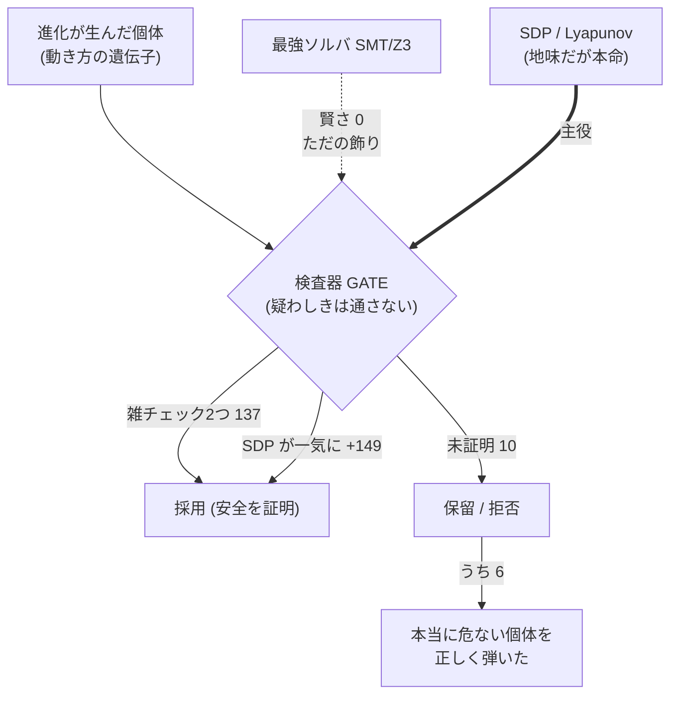
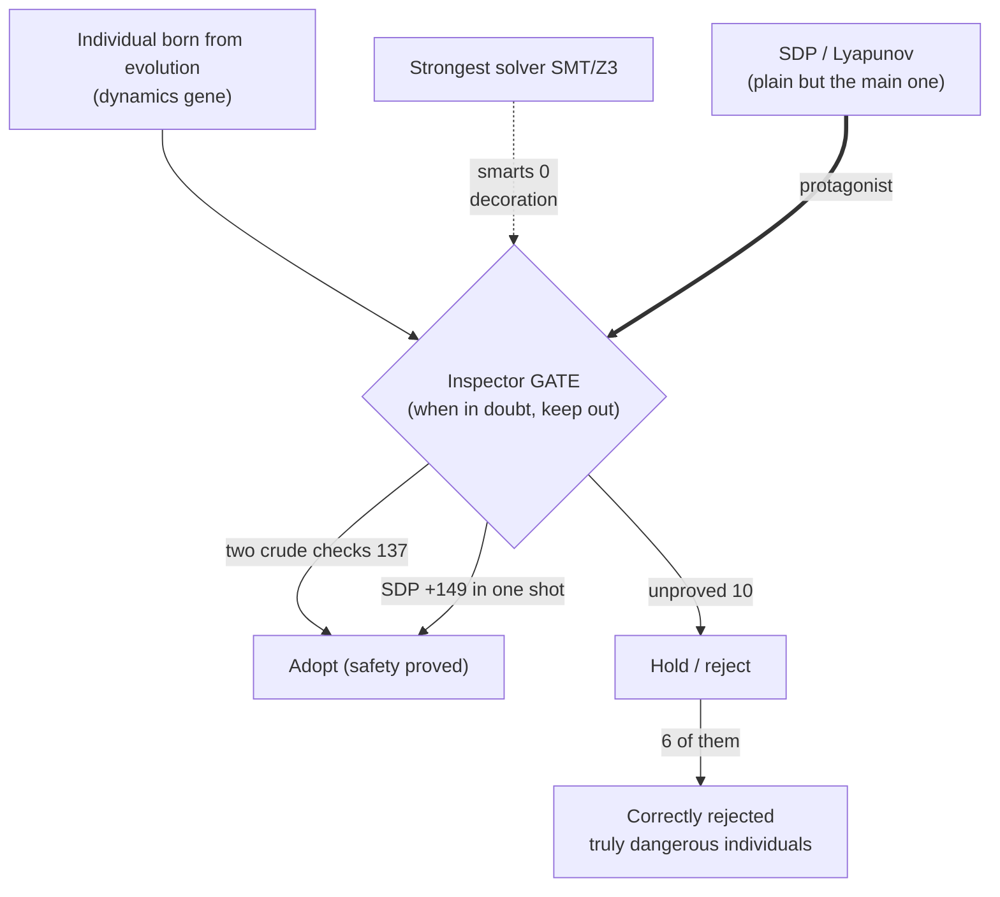
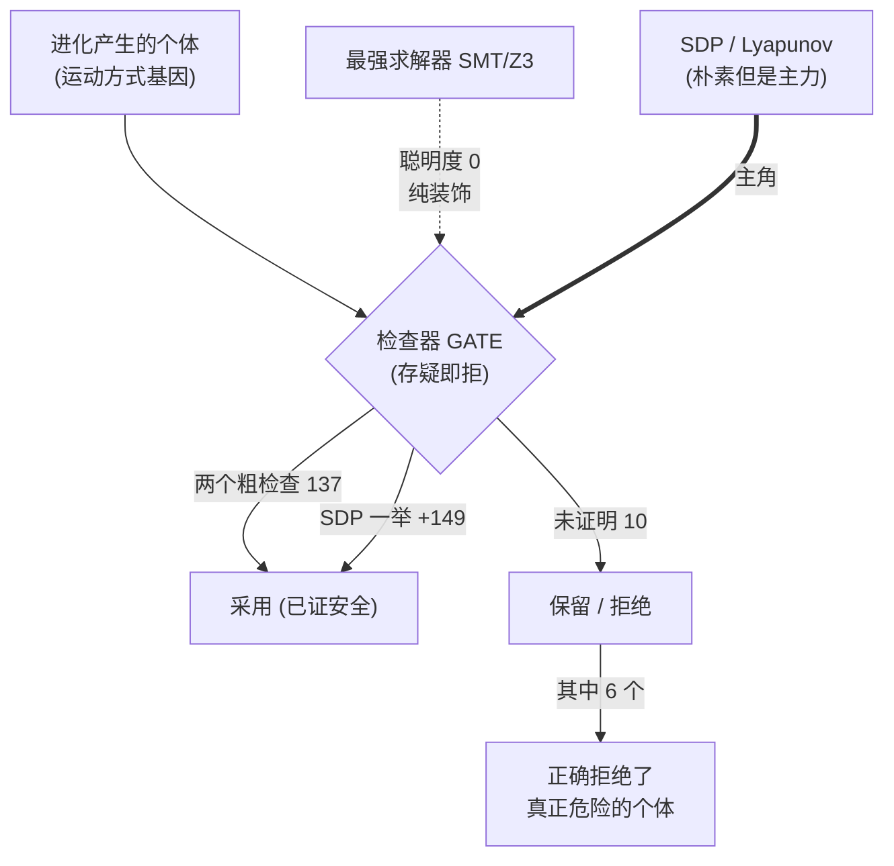
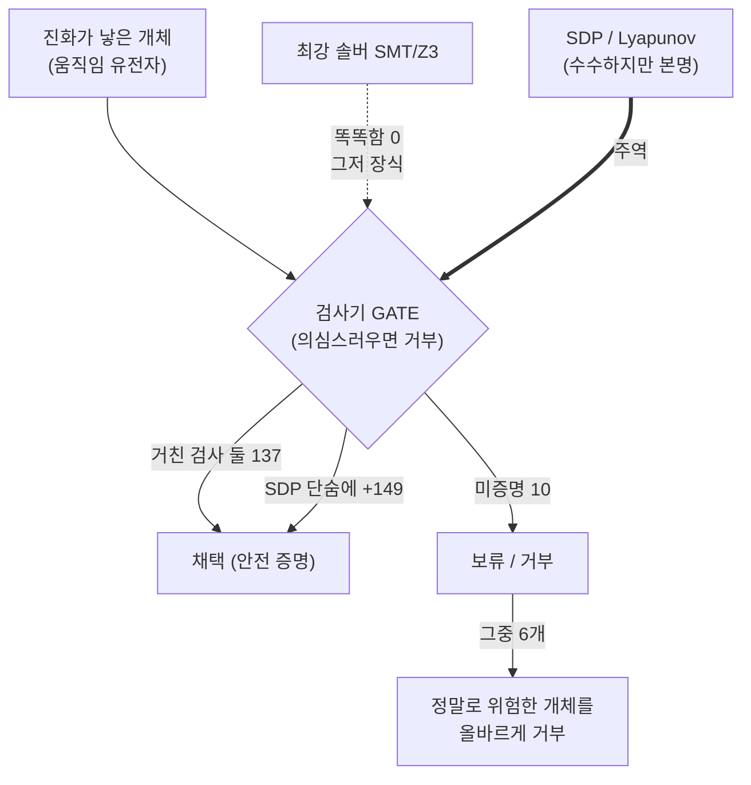

言語 / Language / 语言 / 언어: [日本語](#日本語) | [English](#english) | [中文](#中文) | [한국어](#한국어)

---

# 日本語

# 【かみくだき版】進化する AI の「壊れてないか検査器」── 最強ソルバより地味な道具が正解だった話

> 📗 これは [完全版](https://fullsense.qiita.com/furuse-kazufumi/items/6fc86b4732eeec77adb6) のかみくだき版です。数式と細かい証拠は完全版に、ここでは「結局なにが起きたの?」を 10 分で掴めるようにします。

この記事は、ちょっと難しい研究の話を **専門外の人でも分かる言葉だけ** で説明します。むずかしい用語が出てきたら、すぐ日常のたとえに言い換えます。

---

## 三行あらすじ

- 進化で AI の「動き方」を作っていると、ときどき **暴走する(発散する)危険な個体** が混じる。だから採用前に「これ壊れてない?」を調べる **検査器** が要る。
- 直感だと「世界最強の論理ソルバ(SMT/Z3)を呼べば一番賢い検査ができる」と思う。ところが実測したら **SMT はこの現場では“ただの飾り”** で、賢さゼロだった。
- 正解は、もっと地味で古典的な道具(**SDP / Lyapunov**)。CPU だけ・お金ゼロ・自宅 PC で、危なくない個体の **約 95%** に「これは安全」と太鼓判を押せた。しかも途中で **「数字が良すぎる罠」** に一度ハマって、それを自分で見つけて直した正直な裏話つき。

---

## 1. そもそも、何をやっている研究?

私たちは「AI の頭脳の **動き方(うごきかた)** を、生き物の進化みたいに少しずつ作り変えて、良い動き方を探す」研究をしています。プロジェクト名は **llcore(エルコア)**。CPU だけで動いて、課金ゼロ、自宅の PC で完結するのが自慢です。

ここで言う「動き方」とは、**状態が時間とともにどう変わっていくかのルール**のこと。たとえるなら、振り子の揺れ方とか、お風呂の温度の戻り方みたいな「時間が経つとどうなる?」の規則です。振り子なら「いま右に大きく振れているなら、次の瞬間は中心へ戻ろうとする」、お風呂なら「いま熱すぎるなら、時間が経つにつれて少しずつ冷めていく」── こういう「いまの状態から次の瞬間の状態を決める規則」が、ここで作り変えている対象です。この記事で「個体」と呼ぶものは、この規則を 1 セット持った候補のことだと思ってください。進化は、このルールをちょっとずつ書き換えた個体を大量に作って、良さそうなものを残していきます。

進化のたとえとして、生き物を思い浮かべてください。親の設計をちょっとだけ変えた子をたくさん作り(変異)、その中で生き残りやすいものだけ次の代に残す(選択)。これを何百世代もくり返すと、誰も設計図を描かないのに、だんだん環境に合った形に近づいていく。llcore がやっているのは、これを「AI の動き方」に対してやっている、というだけの話です。設計者が頭をひねって最適解を一発で当てるのではなく、**雑にたくさん試して、良かったものを残す** という、ある意味とても泥くさいやり方です。

問題はここから。この「泥くさいやり方」には、放っておくと困ったものが混じる、という落とし穴があります。

---

## 2. なぜ「壊れてないか検査器」が要るのか

進化探索は、はっきり言って **乱暴** です。とにかくたくさん試して、たまたま良かったものを残す。だから試した中には、必ず **「放っておくと暴走する動き方」** が紛れ込みます。

- **収縮(しゅうしゅく)する動き** … 時間が経つと状態の差が縮まって、落ち着く。安全。
   - たとえ:お風呂のお湯。熱くしすぎても冷ましすぎても、放っておけば自然に適温へ戻る。
- **発散(はっさん)する動き** … 状態がどんどん広がって、暴走する。危険。
   - たとえ:マイクとスピーカーのハウリング。「キィィィン!」と勝手に膨らんで止まらない。

進化が「ハウリングする個体」をうっかり採用してしまうと、研究としても運用としても困ります。だから進化のループの内側に **GATE(関門)** を置いて、個体を一個ずつ「お前の動きは本当に落ち着くのか?」と検査し、保証できないものは弾く。

しかも FullSense の決まりで、この関門は **fail-closed(フェイルクローズド)** にします。「証明できないなら通さない」── 疑わしきは入れない、という安全側の設計です。空港の保安検査を思い浮かべてください。中身のよく分からない荷物を「たぶん大丈夫だろう」で通してしまったら、検査の意味がありません。「白だと確認できたものだけ通す。グレーは全部止める」── これが fail-closed です。グレーを止めれば、本当は安全だった荷物まで止めてしまうことはあります。それでも、危険なものを 1 つ通してしまう失敗より、安全なものを 1 つ余計に止める失敗の方がずっとマシ ── 誤るなら必ず安全側に誤る、というのがこの設計の考え方です。

検査なしと検査ありで比べると、差は一目瞭然でした。

| やり方 | 採用した子のうち、あとで暴走へ流れた割合 |
|---|---|
| 検査なしの進化 | **17〜20% が暴走へドリフト** |
| 検査ありの進化(SDP 関門) | **暴走個体の採用は 0** |

「ドリフト」というのは、採用した時点では平気そうに見えた子が、世代を重ねるうちにじわじわ暴走する側へ流れていく、という意味です。検査なしで進化を回すと、採用した子のおよそ 5〜6 個に 1 個がこの道をたどりました。「たまに事故が起きる」ではなく「日常的に混入する」レベルの割合で、とても放置できる数字ではありません。そこに検査器を入れたら、この事故がゼロになった ── まずこれが検査器の第一の仕事です。

さらに面白いことに、**強い検査器を使うほど、進化が到達できる「安全な高さ」の天井も上がりました**。

| 使った関門 | 進化後に届いた“安全な良さ”の上限 |
|---|---|
| ゆるい関門(inf-norm) | 約 0.41 |
| 強い関門(SDP) | **約 0.86**(統計的にほぼ確実) |

ここでの「良さ」とは、進化の世界で個体の成績を測る点数(専門用語で fitness、適応度)のことです。点数が高い個体ほど次の世代に残りやすい。この表が言っているのは、「安全だと証明された個体だけ」で到達できた成績の上限が、関門を強くしただけで 0.41 から 0.86 へと 2 倍以上に跳ね上がった、ということ。ちなみに「統計的にほぼ確実」は気分の話ではなく、この差が偶然で出てしまう確率は約 10 万分の 3 と計算されています。

検査器は「危ないものを弾く安全装置」だと思われがちですが、実は **「安心して遠くまで探せるようにする装置」** でもあったのです。柵があるからこそ崖っぷちまで歩ける、という話です。逆に言うと、ゆるい関門しか持っていない進化は「怖くて遠くまで行けない」── 危なそうなものを大ざっぱにまとめて避けるしかないので、本当は安全だったはずの良い個体まで一緒に捨ててしまい、結果として低いところで足踏みしてしまう。強い関門は「ここは本当に安全」と細かく見分けてくれるので、進化は安心してより高い場所まで攻められる、というわけです。

---

## 3. 検査器の「はしご」── 強さの段階を実際に登ってみた

「どの検査器が一番いいか」は、口で議論しても始まりません。なので **強さの違う検査器を弱い順に並べて、それぞれ何個を“安全”と証明できるか** を実測しました。安全だと分かっている 300 個の個体を相手にした結果がこれです。

| 段(検査器) | この段で新たに証明できた数 | 累計 |
|---|---|---|
| 第1段:いちばん雑な目視チェック | 88 | 88 |
| 第2段:もう少し丁寧なチェック | +49 | 137 |
| **第3段:SDP(本命)** | **+149** | **286(= 300 の 95.3%)** |
| 第4〜5段:さらに重い計算(SOS) | +4 | 290 |
| どうしても証明できなかった残り | 10 | — |

ポイントは **第3段の SDP が一気に +149 個** を片付けたこと。これがこの研究の見出しです。雑なチェック2つを足しても 137 個止まりだったのに、SDP を入れたとたん 286 個まで跳ね上がった。

なぜ SDP だけがこんなに強いのか。たとえで言うと、第1段・第2段は **「既製品のものさし」** です。あらかじめ決まった 1 種類の測り方を全員に同じように当てて、「このものさしで測れば縮むと言い切れるか」だけを見る。速くて手軽な代わりに、たまたまそのものさしに合わない個体は、本当は安全でも「分からない」扱いになってしまう。対して SDP は **「個体ごとにオーダーメイドのものさしを仕立てる」** やり方です。その個体専用の測り方(エネルギーの測り方)を探し出して、「この測り方で測れば、時間とともに必ず縮んでいく」と証明する。既製品で測れなかった個体でも、その子に合うものさしさえ見つかれば救える ── だから一気に +149 個も拾えたわけです。

そして残った 10 個にも正直な内訳があります。**そのうち 6 個は「本当に危ない個体を正しく弾いた」もの**で、見逃しではありません。本当に証明しきれなかったのは、ぎりぎり境界線上にいる数個だけ。「境界線上」というのは、「縮む」と「膨らむ」の境目スレスレに立っている個体のことです。合格点ちょうどの答案ほど合否の判定が難しいのと同じで、境目に近い個体ほど証明は難しくなる。しかもこの境目を厳密に割り出す計算は、数学の世界で「効率よく解く方法が見つかっていない難問」(専門的には NP 困難)に分類されることが知られています。つまり「最後の数個」が残るのは検査器の手抜きではなく、数学的に避けられない宿命 ── いくら計算機を回しても閉じきらないことが分かっています(正直で、きれいな限界です)。

「はしご」というたとえが効くのは、検査器の強さに **きれいな順番** があるからです。下の段でできることは、上の段なら必ずできる。だから「どこまで登れば足りるか」を測れば、過不足のない検査器を選べる。今回の答えは明快で、**3段目の SDP まで登れば 95% に届く。そこから上(重い計算)を足しても、増えるのはたった 4 個**。費用対効果を考えれば、SDP がちょうどいい踊り場でした。

大規模版(3270 個でテスト)でも結論は揺るぎませんでした。SDP は **95%** を証明し、雑なチェックに負けた個体は **ゼロ**。「負けた個体がゼロ」とは、「雑なチェックなら証明できたのに、SDP では証明できなかった」という逆転が 1 件も起きなかった、という意味です。つまり SDP は他のチェックを完全に飲み込む“上位互換”でした。小さい実験でたまたま良かっただけ、という疑いも、規模を 10 倍にして同じ結論が出たことで消えました。300 個で成り立った話が 3270 個でもそのまま成り立つなら、「偶然の当たり」では説明がつかないからです。

---

## 4. 「最強ソルバ(SMT)」は、この現場では“ただの飾り”だった

ここが一番直感に反する話です。

普通こう考えます ──「**世界最強クラスの論理ソルバ(SMT/Z3)** を呼べば、一番賢い検査ができるに決まってる」。SMT は「この条件、満たせる組み合わせある?」を総当たりで詰める、いわば天才パズル解答マシンです。

ところが実測すると、この現場では **SMT は賢さゼロ** でした。

- 3270 個で試して、SMT の答えと「紙と鉛筆で出せる簡単な式」の答えが **完全に一致**(食い違い 0)。
- 2万回試しても **2万/2万で一致**。

つまり、この検査に関しては **答えが最初から簡単な式で出てしまう** ので、わざわざ天才パズルマシンを呼ぶ意味がなかった。電卓で済む計算に、わざわざスーパーコンピュータを起動していたようなものです。

「簡単な式で出る」をもう少し丁寧に言うと、こういうことです。三角形の面積は「底辺 × 高さ ÷ 2」という公式に当てはめれば一発で出ます。「ありうる面積を片っ端から試して、合っているか検証する」なんて手間は要りません。今回の検査もこれと同じで、答えがそのまま公式の形で書けてしまう種類の問題でした。公式で答えが確定している問題に探索マシンを投入しても、出てくるのは公式と同じ答えだけ。だから 2 万回試して 2 万回一致したのは「SMT が賢かった」証拠ではなく、**「最初から公式だけで足りていた」** 証拠だったのです。

> たとえ:**「100円の買い物におつりが出るか」を調べるのに、世界最速の AI スパコンを呼ぶ必要はない。暗算で出る。**
> SMT はまさにこの「スパコン」で、立派だけど **この問題には過剰でムダ** だった。

本当に役に立ったのは、地味で古典的な **SDP / Lyapunov**(エネルギーが減り続ける証拠を探す道具)の方でした。これも日常のたとえで説明できます。お椀の中にビー玉を落とすと、コロコロ転がっても最後は必ず底で止まる ── そう言い切れるのは「ビー玉の高さ(エネルギー)が、転がるたびに必ず減っていく」からです。Lyapunov 証明書とは、検査したい個体について **「必ず減り続けるエネルギーの測り方」を 1 つ見つけ出すこと**。それが見つかれば「この個体はいつか必ず落ち着く=暴走しない」と証明できたことになります。そして、その測り方を探す問題が「お椀型の地形で一番低い点を探す」タイプの最適化(凸最適化)に落ちるのがミソです。お椀型の地形には「偽物の谷」がないので、見つけた答えには保証が付く ── だから SDP は「それっぽい判定」ではなく「証明」として使えるのです。派手な最強ソルバではなく、問題に合った道具こそが正解だった、というのがこの記事の芯です。

---

## 5. 正直な裏話 ── 「数字が良すぎる罠」に一度ハマった

研究には正直な失敗談があります。

最初、検査器の成績表が **「妙に複雑で、都合よく」** 見えました。FullSense には「**数字が良すぎたら、勝った気になる前にまず内訳を疑え**」という鉄の掟があります。そこで疑って調べたら ── **使っていた計算ソルバ(SCS)が、境界ぎりぎりのところで「安全なのに危険」と誤判定する**罠にハマっていたのです。

ここがちょっと意外なところで、罠の正体は **「測る道具(ソルバ)そのものが、答えを少し甘く出していた」** ことでした。検査の理屈は正しいのに、それを計算する機械の精度が足りず、境界ぎりぎりの個体で「本当は安全なのに危険」という誤判定を出していた。研究で言えば、定規が歪んでいたせいで、本当はまっすぐな線が「曲がっている」と読めていたような話です。

もう一歩だけ踏み込むと、ソルバには性格の違いがあります。SCS は「1 歩 1 歩が軽くて速い代わりに、精度は“だいたい合ってる”止まり」というタイプ。普段はそれで十分なのですが、合否ラインぎりぎりの個体では、その“だいたい”の誤差が判定をひっくり返してしまう。合格点ちょうどの答案を、ざっくりした採点機にかけるとたまに落第にされてしまう、というイメージです。一方の CLARABEL は「1 歩は重いが、境界まできっちり詰めて解く」タイプなので、ぎりぎりの判定に強い。なお、この誤判定は「安全なものを危険と言う」方向なので、危険な個体がすり抜けたわけではありません(fail-closed の設計どおり、誤るにしても安全側に誤っていた)。それでも問題なのは、合格できたはずの個体を無駄に弾いて、**検査器の実力を実際より低く・成績表を実際より複雑に見せてしまう** こと。「妙に複雑」に見えた正体は、まさにこれでした。

そこで、より正確なソルバ(**CLARABEL**)に差し替えたら、数字が一斉にスッキリ整理され、結論はむしろ **より単純で・より強く** なりました。歪んだ定規をまっすぐな定規に取り替えたら、こねくり回した言い訳が全部要らなくなり、話が一本にまとまった、という感覚です。

> 教訓:**「結果が良すぎる(あるいは妙に複雑すぎる)」は、喜ぶ前にまず道具を疑え。**
> ぬか喜びを避ける仕組みを先に置いておいたから、正しい土台にたどり着けた。これは FullSense の「正直開示」という決まり ── 失敗や限界を隠さず必ず書き残す ── が実際に効いた瞬間でもありました。

このシリーズは、別の AI(Codex)と複数エージェントによる **ペアレビュー**(独立に反証を試みる検証)も通しています。正直であることは、ただの良い心がけではなく、**自分の間違いを自分で捕まえる道具** なのです。

---

## 6. で、結局なにが分かったの?

一言でまとめると、こうです。

> **進化する AI には「壊れてないか検査器」が要る。そして正解は、派手な最強ソルバ(SMT)ではなく、地味で古典的な道具(SDP/Lyapunov)だった。CPU だけ・お金ゼロ・自宅 PC で、危なくない個体の約 95% に安全の太鼓判を押せた。**

もう少し細かく:

- **検査なしだと 17〜20% が暴走へ流れる**。検査(SDP 関門)を入れたら暴走個体の採用は **ゼロ**。
- **強い検査器ほど、安全に到達できる“良さの天井”も上がる**(0.41 → 0.86)。安全装置は同時に「遠くまで探せる装置」だった。
- **最強ソルバ SMT はこの現場では飾り**。答えが簡単な式で出てしまうので、呼ぶだけムダだった。
- **「数字が良すぎる罠」に一度ハマり、自分で見つけて直した**。良すぎる結果は勝ちではなく警報。

そして大事な注意(限界の正直開示):

- 残った“最後の数個”は、数学的に **証明しきれない宿命**(専門的には NP 困難な領域)。きれいに閉じきらないのが、むしろ正直で正しい姿。
- これは **「検査器が正しい」という話**であって、「進化で作った AI の動き方が広く役立つ」という主張ではありません。範囲は今回の実験条件に限ります。

---

## 完全版・続編へ

ここまでが「だいたい何やってるの?」の地ならしです。数式・証拠の表・ソルバ補正の詳細・ペアレビューの指摘 5 件などは完全版にあります。

- 📗 **完全版**: [llcore 検証 arc (#35-00) — 進化する AI の「壊れてないか検査器」: SMT より SDP/Lyapunov が正解だった話](https://fullsense.qiita.com/furuse-kazufumi/items/6fc86b4732eeec77adb6)
- このシリーズは 3 部構成:**#35-00**(本稿の元・全体像)→ **#35-01**(検証器のはしご詳細)→ **#35-02**(正直開示とペアレビュー)。

---

# English

# (Plain-language edition) A "Breakage Inspector" for Evolving AI — Why a Plain Old Tool Beat the Strongest Solver

> 📗 This is the plain-language edition of the [full version](https://fullsense.qiita.com/furuse-kazufumi/items/6fc86b4732eeec77adb6). The formulas and detailed evidence live in the full version; here you can grasp "so what actually happened?" in ten minutes.

This article explains a somewhat difficult research topic using **only words a non-specialist can follow**. Whenever a hard term shows up, we immediately swap it for an everyday analogy.

---

## Three-line summary

- When you evolve the "dynamics" of an AI, sometimes a **dangerous individual that blows up (diverges)** sneaks in. So before adopting one, you need an **inspector** that checks "is this broken?"
- Intuition says "just call the world's strongest logic solver (SMT/Z3) and you get the smartest check." But when measured, **SMT turned out to be 'mere decoration'** on this substrate — zero smarts.
- The right answer was a plainer, classical tool (**SDP / Lyapunov**). On CPU only, at $0, on a home PC, it could stamp "safe" on about **95%** of the non-dangerous individuals. And there's an honest backstory: we once fell into a **"results too good" trap** and caught and fixed it ourselves.

---

## 1. What is this research, anyway?

We study how to evolve the **dynamics** of an AI's "brain" little by little, like biological evolution, to search for good behavior. The project is called **llcore**. Its pride: it runs CPU-only, at $0, entirely on a home PC.

"Dynamics" here means **the rule for how state changes over time** — like how a pendulum swings, or how bathwater temperature settles back. A pendulum follows a rule like "if I'm swung far to the right now, I head back toward the center next"; bathwater follows "if I'm too hot now, I cool down little by little as time passes." Rules of this kind — "given the current state, decide the next state" — are what we are rewriting. And whenever this article says an "individual," think of one candidate carrying one such set of rules. Evolution makes lots of individuals with slightly rewritten rules and keeps the promising ones.

For the evolution part, picture living creatures. Make many children whose design differs just slightly from the parent's (mutation), and let only the ones that survive better carry on to the next generation (selection). Repeat this for hundreds of generations and, with nobody ever drawing a blueprint, the population gradually fits its environment. What llcore does is exactly this, applied to "an AI's dynamics" — that's all. Instead of a designer cleverly nailing the optimal answer in one shot, it **tries lots of things roughly and keeps whatever worked**: a decidedly down-to-earth, unglamorous way of searching.

Here's the catch. This "unglamorous way" has a pitfall: left unattended, troublesome individuals sneak into the mix.

---

## 2. Why do we need a "breakage inspector"?

Evolutionary search is, frankly, **rough**. It tries tons of things and keeps whatever happened to work. So among the trials, **"behaviors that blow up if left alone"** inevitably sneak in.

- **Contracting dynamics** — state differences shrink over time; it settles down. Safe.
   - Analogy: bathwater. Too hot or too cold, leave it and it drifts back to a comfortable temperature.
- **Non-contracting (diverging) dynamics** — state keeps growing; it blows up. Dangerous.
   - Analogy: microphone feedback. That "EEEEE!" howl that swells on its own and won't stop.

If evolution accidentally adopts a "howling individual," that's bad for both research and operations. So we put a **GATE** inside the evolution loop, inspecting each individual — "does your behavior really settle down?" — and rejecting any we can't guarantee.

By FullSense rule, this gate is **fail-closed**: "if you can't prove it, don't admit it" — when in doubt, keep it out. Think of airport security. If a bag whose contents nobody can identify gets waved through on "it's probably fine," the inspection is meaningless. "Only what's confirmed clean passes; everything gray gets stopped" — that is fail-closed. Stopping the gray means sometimes stopping a bag that was actually harmless. Even so, letting one dangerous thing through is a far worse failure than needlessly stopping one safe thing — if you must err, always err on the safe side. That's the philosophy of this design.

Comparing no-check vs. check, the difference was obvious.

| Approach | Share of adopted children that later drifted to blow-up |
|---|---|
| No-check evolution | **17–20% drifted to divergence** |
| Checked evolution (SDP gate) | **Zero divergent individuals adopted** |

"Drifted" means a child that looked fine at adoption time gradually slides toward blow-up as the generations go by. Run evolution without the check, and roughly one in five or six adopted children went down that road. That's not "an occasional accident" — it's "contamination as a matter of routine," a number you simply cannot leave alone. Put the inspector in, and this accident dropped to zero. That is the inspector's first job.

Even more interesting: **the stronger the inspector, the higher the ceiling of "safe quality" evolution could reach.**

| Gate used | Upper bound of "safe quality" reached after evolution |
|---|---|
| Loose gate (inf-norm) | about 0.41 |
| Strong gate (SDP) | **about 0.86** (statistically near-certain) |

"Quality" here is the score that measures an individual's performance in evolutionary computation (the technical term is *fitness*). Higher-scoring individuals are more likely to survive into the next generation. What this table says is that the ceiling of scores reachable by *provably safe individuals only* more than doubled — from 0.41 to 0.86 — just by making the gate stronger. And "statistically near-certain" is not a feeling: the probability of this gap appearing by pure chance works out to about 3 in 100,000.

An inspector is usually thought of as "a safety device that rejects danger," but it was also a **"device that lets you explore farther with peace of mind."** Because there's a fence, you can walk right up to the cliff edge. Put the other way around: an evolution that only has a loose gate is "too scared to go far." It can only avoid anything that looks risky in big, crude strokes, so it throws away good individuals that were actually safe along with the bad ones — and ends up treading water at a low level. A strong gate can tell apart, in fine detail, "this spot really is safe," so evolution can confidently push into higher ground.

---

## 3. The inspector "ladder" — actually climbing the strength steps

"Which inspector is best" can't be settled by talking. So we lined up inspectors of differing strength from weak to strong and measured **how many individuals each could prove "safe."** Against 300 individuals known to be safe, here's the result.

| Step (inspector) | Newly proved at this step | Cumulative |
|---|---|---|
| Step 1: crudest eyeball check | 88 | 88 |
| Step 2: slightly more careful check | +49 | 137 |
| **Step 3: SDP (the main one)** | **+149** | **286 (= 95.3% of 300)** |
| Steps 4–5: heavier computation (SOS) | +4 | 290 |
| Remaining, couldn't prove | 10 | — |

The point: **Step 3, SDP, cleared +149 in one shot.** That's the headline. The two crude checks combined topped out at 137, but adding SDP jumped it to 286.

Why is SDP alone this strong? As an analogy, steps 1 and 2 are **"off-the-shelf rulers."** They press the same single, pre-fixed way of measuring against every individual and ask only "measured with *this* ruler, can we say it shrinks?" Fast and convenient — but an individual that happens not to fit that ruler gets labeled "can't tell," even when it's actually safe. SDP, in contrast, **tailors a made-to-order ruler for each individual.** It hunts down a way of measuring (a way of measuring "energy") custom-fit to that one individual and proves "measured this way, it provably keeps shrinking over time." Individuals the off-the-shelf rulers couldn't handle can still be rescued, as long as a ruler that fits them exists — which is exactly how SDP picked up +149 in one shot.

The leftover 10 have an honest breakdown too: **6 of them were "correctly rejected truly dangerous individuals,"** not misses. Only a few sit right on the boundary line and couldn't be proven. "On the boundary line" means standing razor-thin between "shrinks" and "grows." Just as an exam paper scoring exactly at the pass mark is the hardest to grade pass/fail, the closer an individual sits to that line, the harder the proof gets. On top of that, pinning down this boundary exactly is known to fall into the class of problems mathematicians label "no efficient solution method is known" (technically, NP-hard). So the "last few" remaining is not the inspector slacking off — it is a mathematically unavoidable fate, one that no amount of compute fully closes (an honest, clean limit).

The "ladder" metaphor works because the inspectors' strengths come in **a clean order**: whatever a lower rung can do, a higher rung can always do too. So by measuring "how high do we need to climb," you can pick an inspector with no excess and no shortfall. This time the answer was crisp: **climb to rung 3, SDP, and you reach 95%. Add the heavier computation above it, and you gain only 4 more.** On cost-effectiveness, SDP was exactly the right landing to stop at.

The large-scale version (tested on 3270) held the same conclusion. SDP proved **95%**, and the number of individuals where a crude check beat SDP was **zero**. "Zero" here means there was not a single reversal of the form "the crude check could prove it but SDP couldn't." SDP was a strict superset that swallowed the others. The suspicion that the small experiment just got lucky also evaporated, because scaling up tenfold produced the same conclusion — if a story that holds at 300 holds unchanged at 3270, "a lucky draw" no longer explains it.

---

## 4. The "strongest solver (SMT)" was mere decoration on this substrate

Here's the most counterintuitive part.

You'd normally think: "Call a **world-class logic solver (SMT/Z3)** and you obviously get the smartest check." SMT is a genius puzzle-solving machine that brute-forces "is there any combination that satisfies these conditions?"

But measured, on this substrate **SMT had zero smarts.**

- Tested on 3270, SMT's answer **fully matched** the answer from a "simple pencil-and-paper formula" (zero disagreements).
- Across 20,000 trials, **20,000/20,000 matched.**

For this check, the **answer pops out of a simple formula from the start**, so there was no point summoning the genius puzzle machine. It's like booting a supercomputer for arithmetic a calculator handles.

Let's unpack "pops out of a simple formula" a bit more. The area of a triangle comes out in one shot from the formula "base × height ÷ 2." You never need to "try every conceivable area one by one and verify which is right." This check turned out to be the same kind of problem: the answer can be written directly in formula form. Throw a search machine at a problem whose answer is already fixed by a formula, and all it can return is the same answer the formula gives. So 20,000 matches out of 20,000 trials is not evidence that "SMT was smart" — it is evidence that **"the formula alone was enough from the very start."**

> Analogy: **You don't need the world's fastest AI supercomputer to figure out the change from a $1 purchase. You do it in your head.**
> SMT is exactly that "supercomputer" — magnificent, but **overkill and wasted** on this problem.

What actually helped was the plain, classical **SDP / Lyapunov** (a tool that searches for proof that energy keeps decreasing). This too can be told with an everyday analogy. Drop a marble into a bowl: it rolls around, but you can declare it will always come to rest at the bottom — and the reason you can declare that is "the marble's height (its energy) provably decreases with every roll." A Lyapunov certificate is exactly this: **finding, for the individual under inspection, one way of measuring energy that provably keeps decreasing.** Once found, you have proven "this individual always settles down eventually — it does not blow up." And here's the kicker: the search for that way of measuring reduces to an optimization of the "find the lowest point in a bowl-shaped landscape" type (convex optimization). A bowl-shaped landscape has no false valleys, so the answer you find comes with a guarantee — which is why SDP can serve not as a "plausible-looking judgment" but as a **proof**. The right answer was the tool that fit the problem — not the flashiest, strongest solver. That's the heart of this article.

---

## 5. The honest backstory — we once fell into a "results too good" trap

There's an honest failure story.

At first, the inspector's report card looked **"oddly complicated and conveniently good."** FullSense has an iron rule: **"if the numbers are too good, suspect the breakdown before feeling like you won."** Suspecting it, we dug in — and found that the compute solver we were using (SCS) had a trap where it **misjudged "safe" individuals as "dangerous" right near the boundary.**

Here's the slightly surprising part: the trap's true identity was that **"the measuring tool itself (the solver) was returning slightly sloppy answers."** The logic of the inspection was correct, but the machine computing it lacked precision, so for individuals right at the boundary it issued the misjudgment "actually safe, but reported dangerous." In research terms: the ruler was warped, so a line that was actually straight read as "bent."

To go one step deeper, solvers have different personalities. SCS is the type whose "each step is light and fast, but whose accuracy stops at 'roughly right.'" Usually that's plenty — but for individuals sitting exactly at the pass/fail line, that "roughly" error is enough to flip the verdict. Picture an exam paper scoring exactly at the pass mark being run through a rough-and-ready grading machine: occasionally it gets failed by mistake. CLARABEL, on the other hand, is the type whose "each step is heavy, but which nails the answer right up to the boundary," so it is strong on razor-thin judgments. Note the misjudgment ran in the direction "calling safe things dangerous," so no dangerous individual slipped through (exactly as the fail-closed design intends — even the error erred on the safe side). The problem, still, is that it needlessly rejected individuals that should have passed, **making the inspector look weaker than it really was and the report card look more complicated than it really was.** That was precisely the identity of the "oddly complicated."

We swapped in a more accurate solver (**CLARABEL**), the numbers tidied up all at once, and the conclusion became **simpler and stronger.** It felt like replacing the warped ruler with a straight one: all the convoluted excuses became unnecessary, and the story snapped into a single line.

> Lesson: **"results too good (or oddly over-complicated)" means suspect your tools before celebrating.**
> Because we'd placed a mechanism to avoid false joy in advance, we reached the correct foundation. This was also a moment where FullSense's "honest disclosure" rule — never hide failures or limits; always write them down — actually paid off.

This series also passed a **peer review** by another AI (Codex) and multiple agents (independently trying to refute the claims). Honesty isn't just a nice attitude — it's a **tool for catching your own mistakes.**

---

## 6. So what did we actually learn?

In one line:

> **Evolving AI needs a "breakage inspector," and the right answer was not the flashy strongest solver (SMT) but the plain, classical tool (SDP/Lyapunov). On CPU only, at $0, on a home PC, it stamped "safe" on about 95% of the non-dangerous individuals.**

A bit more detail:

- **Without checks, 17–20% drift to blow-up.** With the check (SDP gate), zero divergent individuals adopted.
- **The stronger the inspector, the higher the "ceiling of quality" you can safely reach** (0.41 → 0.86). The safety device was also a "let-you-explore-farther device."
- **The strongest solver SMT was decoration here.** The answer pops from a simple formula, so calling it was wasteful.
- **We fell into a "results too good" trap once and caught and fixed it ourselves.** Too-good results are an alarm, not a win.

And the important caveat (honest disclosure of limits):

- The remaining "last few" are mathematically **doomed not to be fully proven** (technically an NP-hard region). Not closing cleanly is the honest, correct picture.
- This is **about "the inspector being correct,"** not a claim that "the evolved AI dynamics are broadly useful." The scope is limited to this experiment's conditions.

---

## To the full version and sequels

That's the leveling of the ground for "what are they roughly doing?" The formulas, evidence tables, solver-correction details, and the 5 peer-review findings are in the full version.

- 📗 **Full version**: [llcore Verification Arc (#35-00) — A "Breakage Inspector" for Evolving AI: Why SDP/Lyapunov Beat SMT](https://fullsense.qiita.com/furuse-kazufumi/items/6fc86b4732eeec77adb6)
- This series has three parts: **#35-00** (the source of this article, big picture) → **#35-01** (the verifier ladder in detail) → **#35-02** (honest disclosure and peer review).

---

# 中文

# (通俗版) 进化型 AI 的「是否损坏检查器」── 为什么朴素工具胜过最强求解器

> 📗 这是[完整版](https://fullsense.qiita.com/furuse-kazufumi/items/6fc86b4732eeec77adb6)的通俗版。公式与详细证据在完整版中；这里让你用十分钟抓住「到底发生了什么?」

本文只用**外行也能听懂的话**来讲一个略难的研究课题。每当出现难懂术语,立刻换成日常的比喻。

---

## 三行摘要

- 用进化来培育 AI 的「运动方式」时,偶尔会混进**会失控(发散)的危险个体**。所以在采用之前,需要一个**检查器**来查「这个坏了吗?」
- 直觉认为「调用世界最强的逻辑求解器(SMT/Z3)就能做最聪明的检查」。可一旦实测,在这个基底上 **SMT 竟是『纯粹的装饰』**,聪明度为零。
- 正确答案是更朴素、更经典的工具(**SDP / Lyapunov**)。仅用 CPU、零花费、在家用 PC 上,就能给约 **95%** 的非危险个体盖上「安全」的印章。而且还有个诚实的幕后故事:我们曾掉进**「结果好得反常」的陷阱**,并自己发现并修正了它。

---

## 1. 这到底是什么研究?

我们研究如何像生物进化那样,一点点改写 AI「大脑」的**运动方式(dynamics)**,以寻找好的行为。项目名为 **llcore**。它的骄傲是:仅用 CPU、零花费、完全在家用 PC 上运行。

这里的「运动方式」指的是**状态随时间如何变化的规则**——就像钟摆怎么摆,或浴缸水温怎么回稳。钟摆遵循「现在向右摆得很大,下一瞬间就会向中心回摆」这样的规则;浴缸水遵循「现在太烫,随时间一点点变凉」。这种「由当前状态决定下一瞬间状态」的规则,正是我们在改写的对象。本文说到「个体」时,请把它理解为「携带一套这种规则的候选者」。进化会大量制造规则被略微改写的个体,保留有希望的那些。

关于「进化」这一半,请想象生物。制造许多设计与父代略有不同的子代(变异),只让更容易存活的留到下一代(选择)。重复几百代后,没有任何人画过设计图,种群却渐渐贴合了环境。llcore 做的就是这件事,只不过对象换成了「AI 的运动方式」。不是设计者绞尽脑汁一击命中最优解,而是**粗放地大量尝试、留下碰巧好的**——一种相当朴实、不光鲜的搜索方式。

问题从这里开始。这种「朴实的方式」有个陷阱:放任不管,就会有麻烦的个体混进来。

---

## 2. 为什么需要「是否损坏检查器」?

进化搜索说白了很**粗暴**。它尝试海量方案,留下碰巧管用的。所以在这些尝试中,**「放着不管就会失控的行为」**必然会混进来。

- **收缩(contraction)的运动**——状态差随时间缩小,会稳定下来。安全。
   - 比喻:浴缸水。太热或太冷,放着它就会回到舒适温度。
- **发散(non-contracting)的运动**——状态不断变大,失控。危险。
   - 比喻:麦克风的啸叫。那种「咦——!」自顾自膨胀、停不下来的声音。

如果进化误采用了一个「啸叫个体」,对研究和运营都不妙。所以我们在进化循环内部放一道 **GATE(关卡)**,逐个检查个体——「你的行为真的会稳定吗?」——拒绝任何无法保证的。

按 FullSense 规约,这道关卡是 **fail-closed(失败即关闭)**:「证明不了就不放行」——存疑就拒之门外。请想象机场安检。如果一件谁也说不清里面装了什么的行李,以「大概没事吧」被放行,那安检就形同虚设。「只放行确认是白的;灰色的全部拦下」——这就是 fail-closed。拦下灰色的,确实有时会连真正无害的行李一起拦住。即便如此,放过一件危险品的失败,远比多拦一件安全品的失败严重得多——要错,就一定错在安全的一侧。这就是这种设计的哲学。

对比「无检查」与「有检查」,差异一目了然。

| 做法 | 已采用的子代中,后来漂向失控的比例 |
|---|---|
| 无检查进化 | **17–20% 漂向发散** |
| 有检查进化(SDP 关卡) | **采用的发散个体为 0** |

所谓「漂移」,是指采用时看起来没问题的子代,随着世代推移渐渐滑向失控。不加检查地运行进化,被采用的子代中大约每 5、6 个就有 1 个走上这条路。这不是「偶尔出事故」,而是「日常性混入」的比例,绝不是可以放着不管的数字。装上检查器之后,这种事故归零了——这是检查器的第一项工作。

更有趣的是:**检查器越强,进化能达到的「安全质量」上限也越高。**

| 所用关卡 | 进化后达到的「安全质量」上限 |
|---|---|
| 宽松关卡(inf-norm) | 约 0.41 |
| 强关卡(SDP) | **约 0.86**(统计上几近确定) |

这里的「质量」,指进化计算中衡量个体成绩的分数(术语叫 fitness,适应度)。分数越高的个体越容易留到下一代。这张表说的是:仅靠「被证明安全的个体」所能达到的成绩上限,只因把关卡换强,就从 0.41 跃升到 0.86,翻了一倍多。顺带一提,「统计上几近确定」不是凭感觉:这个差距纯靠偶然出现的概率,算出来约为十万分之三。

检查器常被当作「拒绝危险的安全装置」,但它也是**「让你安心探索得更远的装置」**。正因为有栏杆,你才敢走到悬崖边。反过来说,只有宽松关卡的进化「不敢走远」——它只能粗线条地避开一切看起来有风险的东西,于是把其实安全的好个体也一并扔掉,结果在低处原地踏步。强关卡能细致分辨「这里确实安全」,进化才能放心地向更高处进攻。

---

## 3. 检查器的「阶梯」── 实际逐级攀登强度

「哪个检查器最好」靠嘴说没用。所以我们把不同强度的检查器从弱到强排好,测量**每一级能证明多少个体「安全」**。针对 300 个已知安全的个体,结果如下。

| 级(检查器) | 本级新证明数 | 累计 |
|---|---|---|
| 第1级:最粗的肉眼检查 | 88 | 88 |
| 第2级:稍细致的检查 | +49 | 137 |
| **第3级:SDP(主力)** | **+149** | **286(= 300 的 95.3%)** |
| 第4–5级:更重的计算(SOS) | +4 | 290 |
| 剩余,无法证明 | 10 | — |

要点:**第3级 SDP 一举清掉 +149。** 这是头条。两个粗检查加起来才 137,加入 SDP 立刻跳到 286。

剩下的 10 个也有诚实的内情:**其中 6 个是「正确拒绝了真正危险的个体」**,而非漏判。真正无法证明的只是处在边界线上的少数几个——这是数学上不可避免的「最后几个」,再多算力也无法完全闭合(诚实而干净的极限)。

大规模版(用 3270 个测试)结论同样不动摇。SDP 证明了 **95%**,粗检查胜过 SDP 的个数为 **零**。SDP 是严格的上位集合,把其它全吞了。

---

## 4. 「最强求解器(SMT)」在这个基底上是纯装饰

这是最反直觉的部分。

你通常会想:「调用**世界级逻辑求解器(SMT/Z3)**,当然能做最聪明的检查。」SMT 是一台天才解谜机器,会穷举「有没有任何组合满足这些条件?」

可一旦实测,在这个基底上 **SMT 聪明度为零。**

- 在 3270 个上测试,SMT 的答案与「纸笔可得的简单公式」答案**完全一致**(零分歧)。
- 试 2 万次,**2 万/2 万 一致。**

对这种检查而言,**答案一开始就能从简单公式中得出**,所以根本没必要召唤天才解谜机器。这就像为计算器能搞定的算术启动一台超级计算机。

> 比喻:**算 1 美元购物找零多少,不需要世界最快的 AI 超算。心算就行。**
> SMT 正是那台「超算」——很了不起,但对这个问题**过度且浪费**。

真正管用的是朴素而经典的 **SDP / Lyapunov**(一种寻找「能量持续下降」之证明的工具)。正确答案是契合问题的工具——而非最花哨、最强的求解器。这就是本文的核心。

---

## 5. 诚实的幕后故事 ── 我们曾掉进「结果好得反常」的陷阱

有一段诚实的失败故事。

起初,检查器的成绩单看起来**「莫名复杂、又好得离谱」**。FullSense 有条铁律:**「数字好得反常时,先怀疑明细,别急着觉得自己赢了。」** 怀着疑心去查——发现我们当时用的计算求解器(SCS)有个陷阱:在边界附近会把**「安全」的个体误判为「危险」**。

换上更准确的求解器(**CLARABEL**)后,数字一下子整齐了,结论反而变得**更简单、更强。**

> 教训:**「结果太好」意味着庆祝之前先怀疑你的工具。**
> 因为我们事先放好了避免空欢喜的机制,才到达了正确的地基。

本系列还通过了另一个 AI(Codex)与多智能体的**同行评审**(独立尝试反驳这些主张)。诚实不只是好态度——它是**抓住自己错误的工具。**

---

## 6. 那么,我们到底学到了什么?

一句话:

> **进化型 AI 需要「是否损坏检查器」,而正确答案不是花哨的最强求解器(SMT),而是朴素经典的工具(SDP/Lyapunov)。仅用 CPU、零花费、在家用 PC 上,就给约 95% 的非危险个体盖上了安全印章。**

再细一点:

- **无检查时 17–20% 漂向失控。** 加上检查(SDP 关卡),采用的发散个体为零。
- **检查器越强,可安全到达的「质量上限」也越高**(0.41 → 0.86)。安全装置同时是「让你探索得更远的装置」。
- **最强求解器 SMT 在这里是装饰。** 答案能从简单公式得出,调用它纯属浪费。
- **我们曾掉进「结果好得反常」的陷阱,并自己发现并修正。** 太好的结果是警报,不是胜利。

以及重要提醒(诚实披露局限):

- 剩下的「最后几个」在数学上**注定无法被完全证明**(技术上属于 NP 困难的领域)。无法干净闭合,才是诚实而正确的图景。
- 这是**关于「检查器是正确的」**,而非主张「进化出的 AI 运动方式有广泛用途」。范围仅限于本次实验的条件。

---

## 通往完整版与续篇

以上是为「他们大概在做什么?」做的铺垫。公式、证据表、求解器修正细节,以及同行评审的 5 项发现,都在完整版里。

- 📗 **完整版**: [llcore 验证 arc (#35-00) — 进化型 AI 的「是否损坏检查器」:为什么 SDP/Lyapunov 胜过 SMT](https://fullsense.qiita.com/furuse-kazufumi/items/6fc86b4732eeec77adb6)
- 本系列共三部:**#35-00**(本文之源、全貌)→ **#35-01**(检查器阶梯详解)→ **#35-02**(诚实披露与同行评审)。

---

# 한국어

# (쉬운 해설판) 진화하는 AI의 「고장 안 났나 검사기」── 왜 수수한 도구가 최강 솔버를 이겼나

> 📗 이 글은 [완전판](https://fullsense.qiita.com/furuse-kazufumi/items/6fc86b4732eeec77adb6)의 쉬운 해설판입니다. 수식과 자세한 증거는 완전판에 있고, 여기서는 「결국 무슨 일이 있었나?」를 10분 만에 파악할 수 있게 합니다.

이 글은 다소 어려운 연구 주제를 **비전문가도 알아들을 수 있는 말로만** 설명합니다. 어려운 용어가 나오면 곧바로 일상적인 비유로 바꿉니다.

---

## 세 줄 요약

- 진화로 AI의 「움직이는 방식」을 만들다 보면, 가끔 **폭주하는(발산하는) 위험한 개체**가 섞여 든다. 그래서 채택 전에 「이거 고장 안 났나?」를 살피는 **검사기**가 필요하다.
- 직관으로는 「세계 최강의 논리 솔버(SMT/Z3)를 부르면 가장 똑똑한 검사가 된다」고 생각한다. 그런데 실측하니 이 기질에서 **SMT는 '그저 장식'**, 똑똑함이 0이었다.
- 정답은 더 수수하고 고전적인 도구(**SDP / Lyapunov**)였다. CPU만으로, 비용 0으로, 집 PC에서 위험하지 않은 개체의 약 **95%**에 「안전」 도장을 찍을 수 있었다. 게다가 한 번 **「결과가 너무 좋은 함정」**에 빠졌다가 스스로 발견해 고친 정직한 뒷이야기까지 있다.

---

## 1. 애초에 무슨 연구인가?

우리는 생물 진화처럼 AI 「두뇌」의 **움직이는 방식(dynamics)**을 조금씩 바꿔 가며 좋은 행동을 찾는 연구를 합니다. 프로젝트 이름은 **llcore**. 자랑은 CPU만으로, 비용 0으로, 집 PC에서 완결된다는 점입니다.

여기서 「움직이는 방식」이란 **상태가 시간에 따라 어떻게 변하는가의 규칙**을 말합니다 — 진자가 어떻게 흔들리는지, 욕조 물 온도가 어떻게 돌아오는지 같은 규칙이죠. 진화는 규칙을 살짝 바꾼 개체를 대량으로 만들어 유망한 것을 남깁니다.

---

## 2. 왜 「고장 안 났나 검사기」가 필요한가?

진화 탐색은 솔직히 **거칩니다**. 엄청나게 많이 시도하고 우연히 잘된 것을 남기죠. 그래서 시도 중에는 **「내버려 두면 폭주하는 움직임」**이 반드시 섞여 듭니다.

- **수축(contraction)하는 움직임** — 시간이 지나면 상태 차이가 줄어 안정된다. 안전.
   - 비유: 욕조 물. 너무 뜨겁거나 차가워도 내버려 두면 적정 온도로 돌아온다.
- **발산(non-contracting)하는 움직임** — 상태가 계속 커져 폭주한다. 위험.
   - 비유: 마이크 하울링. 「삐이이!」 하고 제멋대로 부풀어 멈추지 않는 소리.

진화가 「하울링하는 개체」를 실수로 채택하면 연구로도 운영으로도 곤란합니다. 그래서 진화 루프 안쪽에 **GATE(관문)**를 두고, 개체를 하나씩 「네 움직임은 정말 안정되느냐?」 검사해 보증할 수 없는 것을 걸러 냅니다.

FullSense 규약에 따라 이 관문은 **fail-closed**입니다: 「증명하지 못하면 통과시키지 않는다」 — 의심스러우면 들이지 않는다.

검사 없음과 검사 있음을 비교하면 차이가 한눈에 보였습니다.

| 방식 | 채택된 자식 중 나중에 폭주로 흘러간 비율 |
|---|---|
| 검사 없는 진화 | **17–20%가 발산으로 드리프트** |
| 검사 있는 진화(SDP 관문) | **발산 개체 채택 0** |

더 흥미로운 점: **강한 검사기를 쓸수록 진화가 도달하는 「안전한 품질」의 천장도 올라갔습니다.**

| 사용한 관문 | 진화 후 도달한 「안전한 품질」 상한 |
|---|---|
| 느슨한 관문(inf-norm) | 약 0.41 |
| 강한 관문(SDP) | **약 0.86**(통계적으로 거의 확실) |

검사기는 흔히 「위험을 거르는 안전장치」로 여겨지지만, 실은 **「안심하고 더 멀리 탐색하게 해 주는 장치」**이기도 했습니다. 난간이 있어야 절벽 끝까지 걸어갈 수 있는 셈입니다.

---

## 3. 검사기의 「사다리」── 강도 단계를 실제로 올라가 봤다

「어느 검사기가 가장 좋은가」는 말로는 결판나지 않습니다. 그래서 강도가 다른 검사기를 약한 것부터 강한 것까지 늘어놓고, **각 단계가 몇 개를 「안전」으로 증명하는지** 실측했습니다. 안전하다고 알려진 300개 개체를 대상으로 한 결과가 다음입니다.

| 단(검사기) | 이 단에서 새로 증명한 수 | 누계 |
|---|---|---|
| 1단: 가장 거친 육안 검사 | 88 | 88 |
| 2단: 조금 더 꼼꼼한 검사 | +49 | 137 |
| **3단: SDP(본명)** | **+149** | **286(= 300의 95.3%)** |
| 4–5단: 더 무거운 계산(SOS) | +4 | 290 |
| 끝내 증명 못 한 나머지 | 10 | — |

요점: **3단 SDP가 단숨에 +149개**를 처리했다는 것. 이것이 헤드라인입니다. 거친 검사 둘을 합쳐도 137개에 그쳤는데, SDP를 넣자 286개까지 뛰었습니다.

남은 10개에도 정직한 내역이 있습니다: **그중 6개는 「정말로 위험한 개체를 올바르게 거른 것」**이지 놓침이 아닙니다. 진짜로 증명하지 못한 것은 경계선에 아슬아슬하게 걸친 몇 개뿐 — 수학적으로 피할 수 없는 「마지막 몇 개」로, 아무리 계산기를 돌려도 완전히 닫히지 않습니다(정직하고 깔끔한 한계).

대규모판(3270개로 테스트)에서도 결론은 흔들리지 않았습니다. SDP는 **95%**를 증명했고, 거친 검사가 SDP를 이긴 개체 수는 **0**이었습니다. SDP는 다른 것들을 모두 삼키는 엄격한 상위집합이었습니다.

---

## 4. 「최강 솔버(SMT)」는 이 기질에서 그저 장식이었다

가장 직관에 어긋나는 대목입니다.

보통 이렇게 생각합니다 ── 「**세계 최강급 논리 솔버(SMT/Z3)**를 부르면 당연히 가장 똑똑한 검사가 된다.」 SMT는 「이 조건을 만족하는 조합이 있는가?」를 전수 조사하는 천재 퍼즐 풀이 기계입니다.

그런데 실측하니 이 기질에서 **SMT는 똑똑함이 0**이었습니다.

- 3270개로 시험했더니 SMT의 답과 「종이와 연필로 낼 수 있는 간단한 식」의 답이 **완전히 일치**(불일치 0).
- 2만 번 시험해도 **2만/2만 일치.**

이 검사에 관해서는 **답이 처음부터 간단한 식으로 나오므로** 굳이 천재 퍼즐 기계를 부를 이유가 없었습니다. 계산기로 충분한 산수에 굳이 슈퍼컴퓨터를 켜는 격입니다.

> 비유: **1달러어치 사고 거스름돈이 얼마인지 알아내는 데 세계 최速의 AI 슈퍼컴은 필요 없다. 암산으로 된다.**
> SMT가 바로 그 「슈퍼컴」 ── 훌륭하지만 이 문제엔 **과하고 낭비**였다.

정말 도움이 된 것은 수수하고 고전적인 **SDP / Lyapunov**(에너지가 계속 줄어든다는 증거를 찾는 도구) 쪽이었습니다. 정답은 문제에 맞는 도구였지, 가장 화려하고 강한 솔버가 아니었습니다. 이것이 이 글의 핵심입니다.

---

## 5. 정직한 뒷이야기 ── 한 번 「결과가 너무 좋은 함정」에 빠졌다

정직한 실패담이 있습니다.

처음에 검사기의 성적표가 **「묘하게 복잡하고, 또 형편 좋게」** 보였습니다. FullSense에는 철칙이 있습니다: **「숫자가 너무 좋으면, 이긴 기분이 되기 전에 먼저 내역을 의심하라.」** 의심하며 파고드니 ── 당시 쓰던 계산 솔버(SCS)에 경계 근처에서 **「안전」한 개체를 「위험」으로 오판하는** 함정이 있었습니다.

더 정확한 솔버(**CLARABEL**)로 교체하자 숫자가 한꺼번에 정돈되고, 결론은 오히려 **더 단순하고 더 강해졌습니다.**

> 교훈: **「결과가 너무 좋다」는 기뻐하기 전에 먼저 도구를 의심하라.**
> 헛된 기쁨을 피하는 장치를 미리 두었기에 올바른 토대에 도달했습니다.

이 시리즈는 다른 AI(Codex)와 다중 에이전트의 **동료 검토**(주장을 독립적으로 반증 시도)도 통과했습니다. 정직함은 단지 좋은 마음가짐이 아니라 **자기 실수를 스스로 잡는 도구**입니다.

---

## 6. 그래서 결국 무엇을 알게 됐나?

한마디로:

> **진화하는 AI에는 「고장 안 났나 검사기」가 필요하고, 정답은 화려한 최강 솔버(SMT)가 아니라 수수하고 고전적인 도구(SDP/Lyapunov)였다. CPU만으로, 비용 0으로, 집 PC에서 위험하지 않은 개체의 약 95%에 안전 도장을 찍을 수 있었다.**

조금 더 자세히:

- **검사 없으면 17–20%가 폭주로 흘러간다.** 검사(SDP 관문)를 넣으니 발산 개체 채택 0.
- **검사기가 강할수록 안전하게 도달할 수 있는 「품질 천장」도 올라간다**(0.41 → 0.86). 안전장치는 동시에 「더 멀리 탐색하게 해 주는 장치」였다.
- **최강 솔버 SMT는 여기서 장식이었다.** 답이 간단한 식으로 나오므로 부르는 것 자체가 낭비였다.
- **한 번 「결과가 너무 좋은 함정」에 빠졌다가 스스로 발견해 고쳤다.** 너무 좋은 결과는 승리가 아니라 경보다.

그리고 중요한 주의(한계의 정직한 공개):

- 남은 「마지막 몇 개」는 수학적으로 **완전히 증명할 수 없는 숙명**(전문적으로는 NP-난해 영역)입니다. 깔끔하게 닫히지 않는 것이 오히려 정직하고 올바른 그림입니다.
- 이것은 **「검사기가 옳다」는 이야기**이지, 「진화로 만든 AI의 움직임이 널리 유용하다」는 주장이 아닙니다. 범위는 이번 실험 조건에 한합니다.

---

## 완전판과 속편으로

여기까지가 「대체로 무엇을 하고 있나?」를 위한 밑작업입니다. 수식, 증거 표, 솔버 보정 세부, 동료 검토의 5가지 발견은 완전판에 있습니다.

- 📗 **완전판**: [llcore 검증 arc (#35-00) — 진화하는 AI의 「고장 안 났나 검사기」: 왜 SDP/Lyapunov가 SMT를 이겼나](https://fullsense.qiita.com/furuse-kazufumi/items/6fc86b4732eeec77adb6)
- 이 시리즈는 3부 구성: **#35-00**(이 글의 원본, 큰 그림) → **#35-01**(검사기 사다리 상세) → **#35-02**(정직한 공개와 동료 검토).
