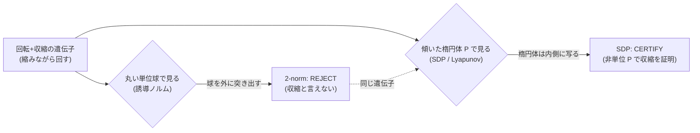
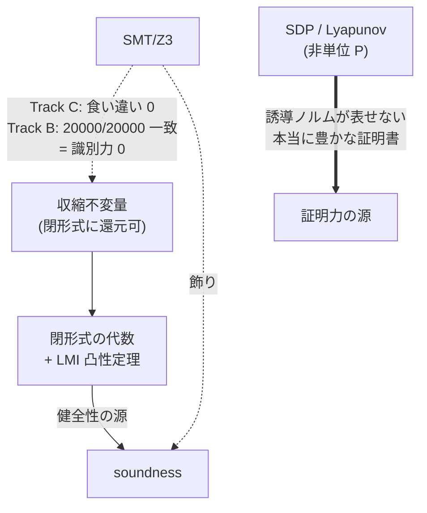
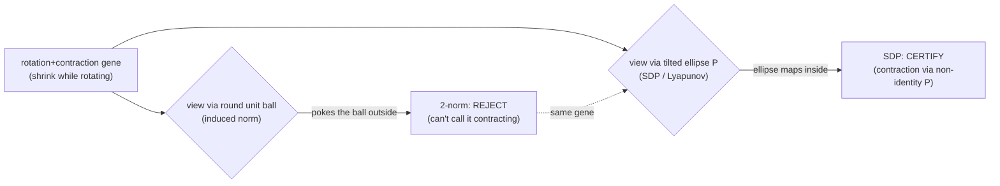
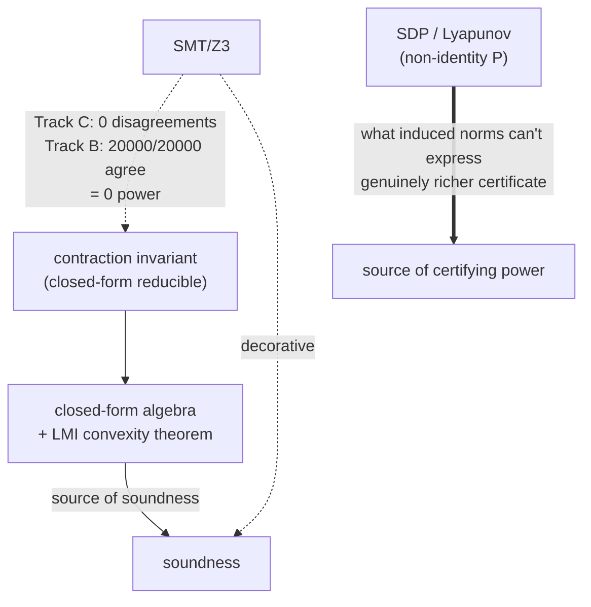
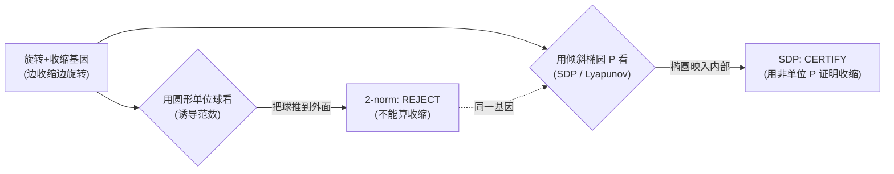
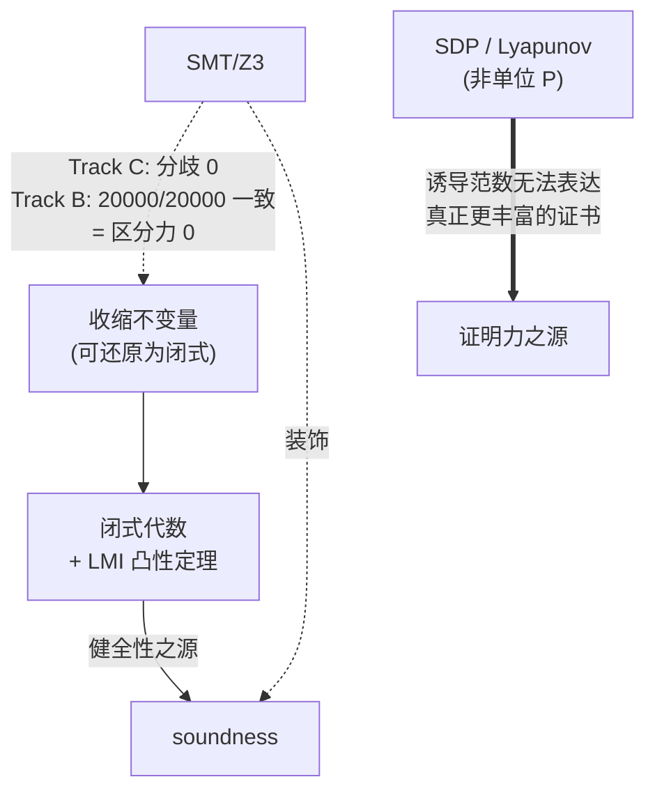
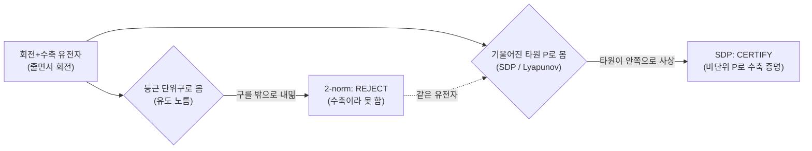
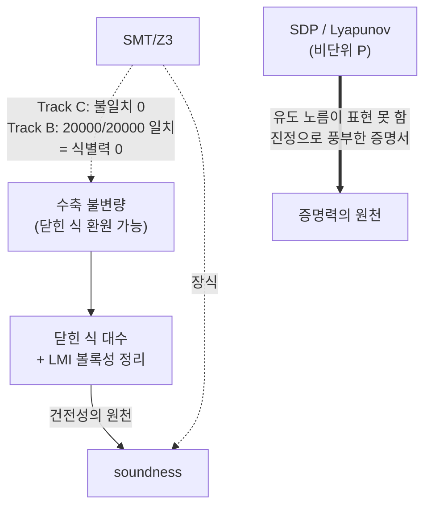

言語 / Language / 语言 / 언어: [日本語](#日本語) | [English](#english) | [中文](#中文) | [한국어](#한국어)

---

# 日本語

# llcore 検証 arc (#35-01) — 検査器の梯子: ∞ノルム→2ノルム→SDP→高次SOS→JSR、そして SMT が「飾り」な理由

> **Concept hook**
> 進化する AI の「壊れてないか検査器」を、弱い順に並べた梯子として実測した。∞ノルムが 300 個中 88 個、2-norm を足して 137、二次形式 SDP を足して 286 (= 95.3%)。最大のジャンプは SDP の +149 で、これは誘導ノルムでは表せない非単位行列の Lyapunov P が証明力の源だからだ。一方 SMT/Z3 はこの基質では識別力ゼロ — 答えは閉じた式で出てしまうので飾りだった。本稿はその梯子・スケール検証・SMT 飾り論の実証を扱う。

## 0. 用語説明 / Glossary

本稿で使う用語をまず整理する。専門用語は全言語で正準形 (CLARABEL, SDP, SOS, JSR など) のまま残す。

| 用語 | やさしい意味 |
|---|---|
| llcore | FullSense の研究基盤。小さなニューラル系の「動き方 (dynamics)」を進化させる。CPU のみ・オンプレ・$0。 |
| 収縮 (contraction) | 時間が進むと状態の差が縮む性質。これがあると暴走せず安定する。 |
| 検査器 (verifier) | 「この個体は本当に収縮するか」を判定する装置。弱いものから強いものまで梯子状に並ぶ。 |
| ∞ノルム (inf-norm) | 行絶対値和の最大。これが 1 未満なら収縮。最も安く最も弱い検査器。 |
| 2-norm (2 ノルム) | 最大特異値。これが 1 未満なら収縮。∞ノルムよりやや強い。 |
| 誘導ノルム | 行列が「単位球をどれだけ伸ばすか」を測る尺度。∞ノルム・2-norm はこの仲間。単位球が基準。 |
| Lyapunov P | 「この系は収縮する」ことを示すエネルギー関数の係数行列 (二次形式)。傾いた楕円体に相当。 |
| SDP / LMI | 半正定値計画 / 線形行列不等式。Lyapunov の P を凸最適化で探す枠組み。 |
| 非単位 P (non-identity P) | P が単位行列でない = 球でなく傾いた楕円体。誘導ノルムでは表現できない自由度。 |
| SOS (deg4/6/8) | 二乗和。多項式を持ち上げ (Veronese) てより強い証明を狙う。次数 deg で表す。 |
| JSR | Joint Spectral Radius。切替系の最悪成長率。1 未満なら収縮。計算は NP 困難。 |
| CLARABEL | 内点法ベースの正確な SDP ソルバ。本研究の主役。 |
| SCS | 一次法 (ADMM) の SDP ソルバ。境界付近で偽陰性。cvxpy の既定 (#35-02 で詳説)。 |
| SMT / Z3 | 充足可能性ソルバ。この基質では識別力ゼロの「飾り」だった。 |
| Track B/C/D | SMT 飾り論 (B/C) とスケール検証 (D) の実証トラック名。 |
| fail-closed | 検証できないときは「通さない」を既定にする安全側設計。 |

## 1. かみくだき結論 / Plain-language conclusion

進化する AI には「壊れてないか検査器 (発散個体を弾く関門)」が要る。その検査器は 1 種類ではなく、弱いものから強いものまで梯子状に並んでいる。本稿はその梯子を一段ずつ実測した話だ。

一番安くて弱い検査器 (∞ノルム) は、収縮する 300 個のうち 88 個しか「収縮する」と証明できなかった。少し強い検査器 (2-norm) を足すと 137 個。さらに二次形式 SDP という検査器を足すと一気に 286 個 (= 95.3%) になった。この大ジャンプ (+149) が見出しだ。

なぜ SDP だけこんなに強いのか。∞ノルムや 2-norm は「丸い球がはみ出すか」しか見られない。けれど SDP は「傾いた楕円体」まで試せる。回転しながら縮む動きは、丸い球で見るとはみ出して見えるのに、傾いた楕円体で見ると内側に収まる。だから SDP は誘導ノルムが見逃す個体を証明できる。

そして直感に反することがひとつ。「最強の論理ソルバ (SMT/Z3) を呼べば最強の検査器になる」と思いがちだが、この基質では Z3 は識別力ゼロだった。答えが閉じた式で出てしまうので、ソルバを呼ぶ意味がなかった。本当に強い検査器は SDP の側だ。本稿は #35-00 (全体像) → #35-01 (本稿・梯子の詳細) → #35-02 (正直開示とペアレビュー) の真ん中にあたる。

## 2. 検査器の梯子 (フロンティア)

「どの検査器が正しいか」は、証明力が増えていく梯子 (ladder) を一段ずつ実測することで答えが出た。対象は CLARABEL ソルバで判定した、実測で収縮する n=2 遺伝子 300 個 (seed=2024)。各段で「新たに証明できた個体数」と「累積」を測る。

| 段 (検証器) | 新規に証明できた数 | 累積 |
|---|---|---|
| inf-norm (行絶対値和の最大 < 1) | 88 | 88 |
| + 2-norm (最大特異値 < 1) | +49 | 137 |
| **+ quadratic SDP (共通 Lyapunov P)** | **+149** | **286 (= 300 の 95.3%)** |
| + degree-4 SOS (持ち上げ Veronese) | +3 (deg4∖deg6 = 0＝deg4 固有 admit なし。deg4 cone が SDP に対し +3、deg6 も同達) | 289 |
| + degree-6 SOS | +1 | 290 |
| 残余 (deg≤6 で未証明) | 10 | — |

ポイントを順に読む。

- **最大ジャンプは quadratic SDP の +149**。88 → 137 → 286 という流れの中で、SDP を足した瞬間に 149 個が新たに証明された。これが本シリーズの見出しだ。理由は §3 で詳述する (非単位 P の自由度)。
- **degree-4 SOS は +0**。これは「deg4 が弱い」のではなく、deg4 が deg6 に内包されている (deg4∖deg6 = 0) ため、deg6 を測る前提では deg4 が独立に拾える個体が 0、という意味だ。順序の取り方の問題で、見かけ上 0 になる。
- **degree-6 SOS で +1**、累積 290。SOS の持ち上げは確かに上澄みを 1 個拾うが、コストの割に伸びは小さい。
- **残余 10 個**は deg≤6 では未証明。だがこの 10 個の内訳が重要だ (次節)。

各段で不健全な証明書 (収縮しないのに「収縮する」と誤って証明したもの) は **0**。検査器は安全側に倒れている。

### 2.1 残余 10 個の解剖

残り 10 個を「見逃し」と早合点してはいけない。内訳を丁寧に分けると次のようになる。

| 残余 10 個の内訳 | 数 | 意味 |
|---|---|---|
| degree-8 SOS で閉じる | 4 | 高次持ち上げで追加証明できる |
| └ うち exact-JSR ブラケットで閉じる | 2 | 有限ギャップ。JSR の上下限が挟み込めた |
| 境界ぎりぎりで未解決のまま | 2 | jsr_lb 0.9915 / 0.9787。JSR=1 に肉薄、有限次数では開いたまま |
| 切替で膨張する個体を正しく拒否 | 6 | これは「見逃し」ではなく正しい拒否 |

つまり「未証明 10 個」のうち **6 個は本来拒否すべき個体を正しく拒否した結果**であって、検査器の失敗ではない。残る 4 個は degree-8 SOS で閉じ、そのうち 2 個は exact-JSR ブラケットでも挟める。最後に残るのは境界ぎりぎりの 2 個 (jsr_lb 0.9915 / 0.9787) だけで、これは有限 CPU 持ち上げ次数では開いたまま — JSR=1 の境界に漸近するだけで閉じきらない。これは正直で、きれいな限界だ。

## 3. なぜ SDP だけ大きく勝つのか — 誘導ノルム vs 非単位 P

梯子の最大ジャンプ (SDP の +149) を理解する鍵は、「検査器が何を基準に収縮を測るか」だ。

∞ノルムも 2-norm も **誘導ノルム** の仲間で、基準は常に「単位球 (丸い球)」だ。「写像が単位球を球の外に押し出すか」だけを見る。だから、回転を含む収縮 — つまり縮みながら回す動き — に弱い。

具体的に幾何で考える。回転 + 収縮の写像は、丸い 2-norm の単位球をいったん自分の外に突き出すことがある。このとき 2-norm は「はみ出した → 収縮していない」と **REJECT** する。しかし同じ写像を、傾いた楕円体 = 非単位行列 P の Lyapunov 証明書で見ると、楕円体は自分自身の厳密に内側に写る。SDP はこの楕円体を凸最適化で探し当て、同じ個体を **CERTIFY** できる。

この「傾いた楕円体を選べる自由度」こそ、誘導ノルムには無く SDP にだけある証明力だ。+149 の大半は、この非単位 P でしか証明できない回転混じりの収縮個体だった。SDP は 2-norm の検査結果をすべて含み (真の上位集合)、さらに上乗せする — これが §4 のスケール検証で「two-beats-sdp = 0」として確認される。

## 4. スケール検証 (Track D, 3270 遺伝子)

300 個での梯子が大規模でも崩れないかを、3270 遺伝子 (CLARABEL) で確認した。ここでは SDP と 2-norm の関係に焦点を当てる。

| 指標 | 値 |
|---|---|
| SDP が証明 | 1291/1363 (95%) |
| SDP が 2-norm に勝った差 | +692 |
| 2-norm が SDP に勝った数 | 0 |

3 点読み解く。

- **SDP は 1291/1363 (95%)** を証明。300 個での 95.3% と整合する — スケールが 10 倍以上でも被覆率は揺るがない。
- **SDP が 2-norm を上回る差は +692**。ここは注意が要る数字で、**+254 ではない**。素朴な集計だと +254 に見える局面があったが、ソルバの偽陰性を正したうえで正確に数えると +692 になる (ソルバ補正の詳細は #35-02)。SDP の優位は見かけよりずっと大きい。
- **2-norm が SDP に勝った数は 0**。これは §3 の幾何が大規模でも成り立つことの実証だ。ここでは SDP は 2-norm の **真の上位集合** で、2-norm が証明できて SDP が証明できない個体は 1 つも無かった。

つまり梯子は単なる小サンプルの偶然ではなく、3270 個でも「SDP ⊇ 2-norm」という包含関係が成り立つ。検査器を SDP まで強くすることに、スケール上のリスクは見当たらなかった。

## 5. SMT/Z3 は「飾り」だった

梯子の上に「SMT/Z3 を載せれば最強」と思うのは自然だ。だが実測すると、この基質では SMT/Z3 は load-bearing (荷重を支える) ではなく decorative (飾り) だった。2 トラックで実証している。

| トラック | 比較 | 一致/不一致 | 結論 |
|---|---|---|---|
| Track C | Z3 の収縮チェック vs 閉じた式の不等式 | 3270 個で食い違い 0 | Z3 は識別力を 0 追加 |
| Track B | Z3 vs 閉形式スカラーテスト | 20000/20000 で一致 | 「Z3 による証明」は言い過ぎ |

- **Track C**: Z3 の収縮チェックと閉じた式の不等式は、3270 個に対して食い違い 0。凸な行絶対値和は閉じた式に還元でき、端点だけ調べれば足りる。Z3 を呼んでも新たに区別できる個体はゼロだった。
- **Track B**: Z3 とスカラー閉形式テストは 20000/20000 で完全一致。健全性は閉形式の代数と LMI の凸性定理から来るのであって、SMT ソルバを呼ぶことから来るのではない。「Z3 で証明した」という表現は、実態より強く聞こえてしまう。

結論はシンプルだ。**閉形式に還元できる収縮不変量について、SMT は飾りで識別力ゼロ**。健全性は凸性/LMI 定理 + 代数が担保しており、SMT を呼ぶ・呼ばないで結果は変わらない。本当に豊かな証明書 — 誘導ノルムでは表現できない非単位行列の P — を与えるのは SDP/Lyapunov の側だ。梯子を一段上げる価値があるのは SMT ではなく SDP だった。

## 6. 検証器×進化の見返り — なぜ強い検査器が実利になるか

「検査器を SDP まで強くする」のは安全のためだけではない。進化探索の到達範囲そのものを広げる、実利のある投資だった。

まず安全側。検査器を付けない GA (ungated GA) では、採用された子のうち **17〜20% が非収縮 (発散) へドリフト** してしまう。SDP ゲートを付けると、発散する子の採用は **0** になる。これは fail-closed (証明できないものは通さない) の素直な帰結だ。

| 条件 | 採用された子のうち発散へドリフトした割合 |
|---|---|
| ungated GA (検査なし) | 17〜20% が発散へドリフト |
| SDP GATE つき | 発散個体の採用 0 |

次に到達範囲。検査器を強くすると、進化が到達できる安全 fitness の天井も上がった。

| GATE | 進化後の rotation fitness 上限 |
|---|---|
| inf-norm GATE | 約 0.41 |
| SDP GATE | 約 0.86 (p = 3.1e-5) |

∞ノルムゲートでは rotation の fitness は約 0.41 で頭打ちになる。これは §3 のとおり、回転混じりの収縮を誘導ノルムが弾いてしまい、進化がそこへ踏み込めないからだ。SDP ゲートに替えると到達上限は約 0.86 まで伸びる (p = 3.1e-5)。**強い検査器は、より多くの到達可能な安全 fitness を単調に解放する** — 検査器は安全装置であると同時に、探索の到達範囲を広げる装置でもあった。

この SDP/Lyapunov 検証器は、もはや研究上の実験ではなく、src の本番・プラガブルなバックエンド (Stage 3b) として配線済みだ。fail-closed 設計で、CLARABEL がなければ拒否する (SCS で黙って走らない)。テストは src 255 + research 313 が pass。すべて CPU・$0・オンプレで完結する。

## Honest disclosure

FullSense の正直開示規律に従い、限界を明示する。

- **SOS の単調性は成り立たない**: 持ち上げ SOS 族は非単調で、次数を上げるとむしろ緩い限界になることがある。最もタイトな限界は次数の最小値であって、きれいな階層ではない。「SOS のはしごを単調に登れば exact-JSR に届く」は **偽**。degree-4 → 6 → 8 を一本道の階段と見るのは誤りで、各次数を測って最小を取る運用になる。
- **exact-JSR は NP 困難**: 境界ぎりぎりの最後の約 2 個 (jsr_lb 0.9915 / 0.9787) は有限 CPU 持ち上げ次数では未解決のまま。被覆フロンティアは JSR=1 境界へ漸近するだけで、閉じきらない — 正直できれいな限界だ。
- **適用範囲**: すべて n=2 結合基質・CPU・この個体プール/seed の結果。健全性 = 観測された偽採用 0 (JSR オラクルは反証器であって証明ではない)。
- **+254 vs +692 はソルバ次第**: SDP が 2-norm に勝つ差は数え方とソルバ精度に依存し、偽陰性を正す前は +254 に見えた。本稿の +692 は CLARABEL での補正後の値であり、補正の経緯は #35-02 に委ねる。
- **これは検査器の正しさの話**: 「進化するニューラル dynamics が広く有用だ」という主張ではない。

## References

1. cvxpy — Diamond & Boyd, "CVXPY: A Python-Embedded Modeling Language for Convex Optimization", JMLR 2016.
2. CLARABEL — Goulart & Chen, "Clarabel: An interior-point solver for conic programs with quadratic objectives".
3. SCS — O'Donoghue, Chu, Parikh, Boyd, "Conic Optimization via Operator Splitting and Homogeneous Self-Dual Embedding", JOTA 2016.
4. Parrilo — "Semidefinite programming relaxations for semialgebraic problems", Mathematical Programming 2003 (SOS).
5. Parrilo & Jadbabaie — "Approximation of the joint spectral radius using sum of squares", Linear Algebra and its Applications 2008 (JSR/SOS).
6. Boyd & Vandenberghe — "Convex Optimization", Cambridge University Press 2004 (LMI/SDP).
7. Boyd, El Ghaoui, Feron, Balakrishnan — "Linear Matrix Inequalities in System and Control Theory", SIAM 1994.
8. Rota & Strang — "A note on the joint spectral radius", Indagationes Mathematicae 1960 (JSR の原典).
9. Blondel & Tsitsiklis — "The boundedness of all products of a pair of matrices is undecidable", Systems & Control Letters 2000 (JSR の計算困難性).
10. Lofberg — "Pre- and post-processing sum-of-squares programs in practice", IEEE TAC 2009 (SOS 実装上の落とし穴)。
11. (内部) #35-00 全体像と結論 — 本シリーズ。
12. (内部) #35-02 正直開示とペアレビュー — 本シリーズ。

## シリーズ / Series navigation

- [#35-00 全体像と結論 (壊れてないか検査器・なぜ SDP)](#) *(draft)*
- **#35-01 (本稿)**: 検査器の梯子 (∞ノルム→2ノルム→SDP→高次SOS→JSR、SMT が飾りな理由)
- [#35-02 正直開示とペアレビュー (SCS 罠と CLARABEL 補正)](#) *(draft)*

---

# English

# llcore Verification Arc (#35-01) — The Verifier Ladder: inf-norm → 2-norm → SDP → higher-degree SOS → JSR, and Why SMT Is Decorative

> **Concept hook**
> We measured the "breakage inspector" for evolving AI as a ladder ordered weakest-first. inf-norm certifies 88 of 300 contracting genes, +2-norm reaches 137, +quadratic SDP reaches 286 (= 95.3%). The big jump is SDP's +149 — because a non-identity Lyapunov P, which induced norms cannot express, is where the certifying power lives. SMT/Z3, by contrast, had zero discriminating power on this substrate: the answer falls out of a closed-form expression, so it was decorative. This part walks the ladder, the scale check, and the proof that SMT was decorative.

## 0. Glossary

Terms used in this part. Technical identifiers stay canonical (CLARABEL, SDP, SOS, JSR, etc.) in every language.

| Term | Plain meaning |
|---|---|
| llcore | FullSense research substrate evolving the dynamics of small neural systems. CPU-only, on-prem, $0. |
| contraction | The property that state differences shrink over time — the system stays stable, no blow-up. |
| verifier | A device that judges "does this individual actually contract?". They form a ladder from weak to strong. |
| inf-norm | Max absolute row sum. Below 1 means contracting. The cheapest, weakest verifier. |
| 2-norm | Max singular value. Below 1 means contracting. A bit stronger than inf-norm. |
| induced norm | A measure of how much a matrix stretches the unit ball. inf-norm and 2-norm belong to this family; the unit ball is the reference. |
| Lyapunov P | The coefficient matrix of an energy function (a quadratic form) proving the system contracts — a tilted ellipse. |
| SDP / LMI | Semidefinite program / linear matrix inequality — convex framework to find the Lyapunov P. |
| non-identity P | P is not the identity = not a ball but a tilted ellipse. A degree of freedom the induced norms cannot express. |
| SOS (deg4/6/8) | Sum-of-squares. Lift the polynomial (Veronese) to chase a stronger certificate; degree is "deg". |
| JSR | Joint Spectral Radius — worst-case growth rate of a switched system. Below 1 means contracting. NP-hard. |
| CLARABEL | An accurate interior-point SDP solver. The protagonist of this work. |
| SCS | A first-order (ADMM) SDP solver. Returns false negatives near the boundary. cvxpy's default (detailed in #35-02). |
| SMT / Z3 | A satisfiability solver. On this substrate it was decorative — zero discriminating power. |
| Track B/C/D | Names of the empirical tracks: SMT-decorative proof (B/C) and the scale check (D). |
| fail-closed | Safe-by-default design: if you cannot verify, do not admit. |

## 1. Plain-language conclusion

Evolving AI needs a "breakage inspector" (a gate that rejects divergent individuals). That inspector is not a single thing — it forms a ladder from weak to strong. This part is the story of measuring that ladder one rung at a time.

The cheapest, weakest inspector (inf-norm) could prove only 88 of the 300 contracting genes "contracting". Adding a slightly stronger one (2-norm) brings it to 137. Adding the quadratic-SDP inspector jumps it all the way to 286 (= 95.3%). That big jump (+149) is the headline.

Why is SDP alone this strong? inf-norm and 2-norm can only ask "does a round ball poke outside itself?". SDP can try a tilted ellipse. A rotate-and-shrink dynamic looks like it pokes out when viewed through a round ball, yet sits strictly inside when viewed through a tilted ellipse. So SDP can certify individuals the induced norms miss.

And one counterintuitive point: it is tempting to think "call the strongest logic solver (SMT/Z3) and you get the strongest inspector," but on this substrate Z3 had zero discriminating power. The answer falls out of a closed-form expression, so calling a solver was pointless. The genuinely strong inspector is the SDP side. This part sits in the middle: #35-00 (overview) -> #35-01 (this, the ladder in detail) -> #35-02 (honest disclosure and pair-review).

## 2. The verifier ladder (frontier)

The answer to "which inspector is right" came from measuring a ladder of increasing certifying power, one rung at a time. The target: 300 empirically-contracting n=2 genes (seed=2024) judged by the CLARABEL solver. At each rung we measure "newly certified" and "cumulative".

| Rung (verifier) | Newly certified | Cumulative |
|---|---|---|
| inf-norm (max abs row sum < 1) | 88 | 88 |
| + 2-norm (max singular value < 1) | +49 | 137 |
| **+ quadratic SDP (common Lyapunov P)** | **+149** | **286 (= 95.3% of 300)** |
| + degree-4 SOS (lifted Veronese) | +3 (deg4∖deg6 = 0 = no admit unique to deg4; the deg4 cone certifies +3 over the SDP, which deg6 also reaches) | 289 |
| + degree-6 SOS | +1 | 290 |
| residual (uncertified at deg≤6) | 10 | — |

Read the points in order.

- **The big jump is the quadratic SDP's +149.** Within the flow 88 → 137 → 286, the moment SDP is added, 149 new genes are certified. This is the series headline. The reason is detailed in §3 (the non-identity-P degree of freedom).
- **degree-4 SOS is +0.** This is not because "deg4 is weak"; it is because deg4 is nested inside deg6 (deg4∖deg6 = 0), so once deg6 is on the table there are 0 genes deg4 picks up independently. It is an ordering artifact, appearing as 0.
- **degree-6 SOS adds +1**, cumulative 290. The SOS lift does skim off 1 more, but the gain is small for the cost.
- **Residual 10** are uncertified at deg≤6. But the composition of these 10 is what matters (next subsection).

Unsound certificates (proving "contracting" for something that does not contract) at every rung: **0**. The inspector errs on the safe side.

### 2.1 Dissecting the residual 10

Do not jump to calling all 10 "misses." Split the composition carefully:

| Composition of the residual 10 | Count | Meaning |
|---|---|---|
| closed by degree-8 SOS | 4 | a higher-degree lift can certify these |
| └ of which closed by an exact-JSR bracket | 2 | finite-gap; the JSR upper/lower bound brackets them |
| stay open near the boundary | 2 | jsr_lb 0.9915 / 0.9787. Hug JSR=1, open at finite degree |
| correctly-rejected switched-expansive genes | 6 | not misses — correct rejections |

So of the "10 uncertified," **6 are the result of correctly rejecting individuals that should be rejected** — not a failure of the inspector. Of the remaining 4, degree-8 SOS closes them, and 2 of those are also bracketable by an exact-JSR. What is finally left is just 2 near-boundary genes (jsr_lb 0.9915 / 0.9787), open at finite CPU lift degree — they asymptote to the JSR=1 boundary rather than closing. An honest, clean limit.

## 3. Why SDP alone wins big — induced norms vs a non-identity P

The key to understanding the ladder's big jump (SDP's +149) is "what reference does the inspector use to measure contraction?".

Both inf-norm and 2-norm belong to the **induced-norm** family, and their reference is always "the unit ball (a round ball)." They only ask "does the map push the unit ball outside the ball?" So they are weak against contractions that include rotation — i.e., shrink-while-rotating dynamics.

Think geometrically. A rotation + contraction map can momentarily poke the round 2-norm unit ball outside itself. At that moment 2-norm **REJECTS** it ("poked out → not contracting"). But viewed through a tilted ellipse = a Lyapunov certificate with a non-identity P, the ellipse maps strictly inside itself. SDP finds this ellipse via convex optimization and can **CERTIFY** the same gene.

This "freedom to choose a tilted ellipse" is exactly the certifying power the induced norms lack and SDP alone has. Most of the +149 were rotation-mixed contracting genes provable only with this non-identity P. SDP contains all of 2-norm's verdicts (a true superset) and adds more — confirmed in §4's scale check as "two-beats-sdp = 0".

## 4. The scale check (Track D, 3270 genes)

We checked whether the 300-gene ladder holds at scale, on 3270 genes (CLARABEL). Here we focus on the SDP vs 2-norm relationship.

| Metric | Value |
|---|---|
| SDP certifies | 1291/1363 (95%) |
| SDP beats 2-norm by | +692 |
| two-beats-sdp | 0 |

Three readings.

- **SDP certifies 1291/1363 (95%)**, consistent with the 95.3% on 300 genes — the coverage holds even at >10× scale.
- **SDP beats 2-norm by +692.** This number needs care: it is **NOT +254**. A naive tally looked like +254 in one view, but counted accurately after correcting the solver's false negatives it is +692 (solver-correction detail in #35-02). SDP's edge is far larger than it first appears.
- **two-beats-sdp is 0.** This is the empirical proof that §3's geometry holds at scale. Here SDP is a **true superset** of 2-norm — there was not a single gene 2-norm could prove that SDP could not.

So the ladder is not a small-sample fluke; the inclusion "SDP ⊇ 2-norm" holds even at 3270. Strengthening the inspector all the way to SDP showed no scale-level risk.

## 5. SMT/Z3 was decorative

It is natural to think "stack SMT/Z3 on top of the ladder and you get the strongest." But measured, on this substrate SMT/Z3 was decorative, not load-bearing. Two tracks prove it.

| Track | Comparison | agree/disagree | Conclusion |
|---|---|---|---|
| Track C | Z3 contraction check vs closed-form inequality | 0 disagreements on 3270 | Z3 adds 0 discriminating power |
| Track B | Z3 vs closed-form scalar test | agree 20000/20000 | "a Z3 proof" is an overstatement |

- **Track C**: the Z3 contraction check and the closed-form inequality disagreed on 0 of 3270. The convex row-abs-sum reduces to a closed form; checking endpoints suffices. Calling Z3 distinguished zero additional genes.
- **Track B**: Z3 and the closed-form scalar test agreed 20000/20000 exactly. Soundness comes from the closed-form algebra and the LMI convexity theorem — not from invoking an SMT solver. Saying "we proved it with Z3" sounds stronger than reality.

The conclusion is simple. **For closed-form-reducible contraction invariants, SMT is decorative with zero discriminating power.** Soundness is guaranteed by the convexity/LMI theorem plus algebra; calling or not calling SMT does not change the result. The genuinely richer certificate — a non-identity P the induced norms cannot express — is the SDP/Lyapunov one. The rung worth climbing was SDP, not SMT.

## 6. The verified×evolvable payoff — why a stronger inspector pays off

Strengthening the inspector to SDP is not only about safety. It was a payoff-bearing investment that widens the very reach of evolutionary search.

First, safety. With an ungated GA, **17–20% of admitted children drift into non-contraction (divergence)**. Add the SDP gate and the admission of divergent children drops to **0**. This is the straightforward consequence of fail-closed (do not admit what you cannot prove).

| Condition | Fraction of admitted children that drifted into non-contraction |
|---|---|
| ungated GA | 17–20% drifted into divergence |
| with SDP GATE | 0 divergent children admitted |

Next, reach. A stronger inspector also raised the ceiling of safe fitness evolution can reach.

| GATE | evolved rotation fitness ceiling |
|---|---|
| inf-norm GATE | ~0.41 |
| SDP GATE | ~0.86 (p = 3.1e-5) |

With an inf-norm gate, rotation fitness tops out around 0.41. As §3 explains, the induced norm rejects rotation-mixed contraction, so evolution cannot step into that region. Swap in the SDP gate and the ceiling rises to ~0.86 (p = 3.1e-5). **A stronger verifier monotonically unlocks more reachable safe fitness** — the inspector is a safety device and, at the same time, a device that widens the search's reach.

This SDP/Lyapunov verifier is no longer a research experiment; it is wired in as a production, pluggable backend in src (Stage 3b). It is fail-closed and refuses if CLARABEL is absent (it never silently runs SCS). Tests: src 255 + research 313 pass. Everything completes CPU-only, $0, on-prem.

## Honest disclosure

Per FullSense honest-disclosure discipline, the limits:

- **SOS is not monotone**: the lifted SOS family is non-monotone — a higher degree can give a looser bound. The tightest bound is the min over degrees, not a clean hierarchy. "Climbing the SOS ladder monotonically reaches exact-JSR" is **FALSE**. Treating degree-4 → 6 → 8 as a single staircase is wrong; the practice is to measure each degree and take the min.
- **exact-JSR is NP-hard**: the last ~2 near-boundary genes (jsr_lb 0.9915 / 0.9787) stay open at finite CPU lift degree. The coverage frontier asymptotes to the JSR=1 boundary rather than closing — an honest, clean limit.
- **Scope**: all results are n=2 coupled substrate, CPU, this pool/seed. Soundness = 0 OBSERVED false admits (the JSR oracle is a falsifier, not a proof).
- **+254 vs +692 depends on the solver**: SDP's edge over 2-norm depends on the counting and solver accuracy; before correcting false negatives it looked like +254. The +692 here is the post-correction value under CLARABEL; the correction story is deferred to #35-02.
- **This is about the right inspector**: it is NOT a claim that evolving neural dynamics is broadly useful.

## References

1. cvxpy — Diamond & Boyd, "CVXPY: A Python-Embedded Modeling Language for Convex Optimization", JMLR 2016.
2. CLARABEL — Goulart & Chen, "Clarabel: An interior-point solver for conic programs with quadratic objectives".
3. SCS — O'Donoghue, Chu, Parikh, Boyd, "Conic Optimization via Operator Splitting and Homogeneous Self-Dual Embedding", JOTA 2016.
4. Parrilo — "Semidefinite programming relaxations for semialgebraic problems", Mathematical Programming 2003 (SOS).
5. Parrilo & Jadbabaie — "Approximation of the joint spectral radius using sum of squares", Linear Algebra and its Applications 2008 (JSR/SOS).
6. Boyd & Vandenberghe — "Convex Optimization", Cambridge University Press 2004 (LMI/SDP).
7. Boyd, El Ghaoui, Feron, Balakrishnan — "Linear Matrix Inequalities in System and Control Theory", SIAM 1994.
8. Rota & Strang — "A note on the joint spectral radius", Indagationes Mathematicae 1960 (origin of JSR).
9. Blondel & Tsitsiklis — "The boundedness of all products of a pair of matrices is undecidable", Systems & Control Letters 2000 (JSR hardness).
10. Lofberg — "Pre- and post-processing sum-of-squares programs in practice", IEEE TAC 2009 (SOS implementation pitfalls).
11. (internal) #35-00 big picture & conclusion — this series.
12. (internal) #35-02 honest disclosure & pair-review — this series.

## Series navigation

- [#35-00 Big picture & conclusion (breakage inspector, why SDP)](#) *(draft)*
- **#35-01 (this)**: The verifier ladder (inf-norm → 2-norm → SDP → higher-degree SOS → JSR, why SMT is decorative)
- [#35-02 Honest disclosure & pair-review (SCS trap and CLARABEL correction)](#) *(draft)*

---

# 中文

# llcore 验证 arc (#35-01) — 验证器阶梯: inf-norm → 2-norm → SDP → 高次 SOS → JSR，以及为何 SMT 只是「装饰」

> **Concept hook**
> 我们把进化 AI 的「是否损坏检查器」当作一条由弱到强排列的阶梯来实测。inf-norm 在 300 个收缩基因中证明 88 个，+2-norm 到 137，+quadratic SDP 到 286 (= 95.3%)。最大跃迁是 SDP 的 +149 — 因为诱导范数无法表达的非单位 Lyapunov P，正是证明力的所在。相反，SMT/Z3 在此基底上区分力为零: 答案由闭式表达式直接给出，所以它只是装饰。本文走完这条阶梯、规模检验，以及 SMT 是装饰的实证。

## 0. 术语说明 / Glossary

本文所用术语。技术标识符在所有语言中保持正准形式 (CLARABEL, SDP, SOS, JSR 等)。

| 术语 | 通俗含义 |
|---|---|
| llcore | FullSense 研究基底，进化小型神经系统的动态。仅 CPU、本地、$0。 |
| 收缩 (contraction) | 状态差随时间缩小的性质 — 系统保持稳定、不爆炸。 |
| 验证器 (verifier) | 判定「这个个体真的收缩吗」的装置。从弱到强呈阶梯排列。 |
| inf-norm | 行绝对值和的最大。小于 1 即收缩。最便宜也最弱的验证器。 |
| 2-norm | 最大奇异值。小于 1 即收缩。比 inf-norm 略强。 |
| 诱导范数 | 衡量矩阵把单位球拉伸多少的尺度。inf-norm 与 2-norm 属此族; 以单位球为基准。 |
| Lyapunov P | 证明系统收缩的能量函数 (二次型) 的系数矩阵 — 一个倾斜的椭圆。 |
| SDP / LMI | 半正定规划 / 线性矩阵不等式 — 用凸优化寻找 Lyapunov 的 P。 |
| 非单位 P (non-identity P) | P 不是单位矩阵 = 不是球而是倾斜椭圆。诱导范数无法表达的自由度。 |
| SOS (deg4/6/8) | 平方和。提升多项式 (Veronese) 以追求更强的证书; 次数记为 deg。 |
| JSR | Joint Spectral Radius — 切换系统的最坏增长率。小于 1 即收缩。NP 困难。 |
| CLARABEL | 基于内点法的精确 SDP 求解器。本研究的主角。 |
| SCS | 一阶法 (ADMM) 的 SDP 求解器。边界附近返回假阴性。cvxpy 默认 (详见 #35-02)。 |
| SMT / Z3 | 可满足性求解器。在此基底上是区分力为零的「装饰」。 |
| Track B/C/D | 实证轨道名: SMT 装饰论 (B/C) 与规模检验 (D)。 |
| fail-closed | 默认安全设计: 无法验证就不准入。 |

## 1. 通俗结论 / Plain-language conclusion

进化的 AI 需要一个「是否损坏检查器」(拒绝发散个体的关卡)。这个检查器不是单一的，而是从弱到强排成一条阶梯。本文就是逐级实测这条阶梯的故事。

最便宜也最弱的检查器 (inf-norm)，在 300 个收缩基因里只能证明 88 个「收缩」。加上略强的 (2-norm) 到 137 个。再加上 quadratic SDP 检查器，一下跳到 286 个 (= 95.3%)。这次大跃迁 (+149) 就是头条。

为何唯独 SDP 这么强? inf-norm 与 2-norm 只能问「圆球是否突出到自身之外」。而 SDP 能尝试「倾斜的椭圆」。一个边收缩边旋转的动态，用圆球看像是突出去了，用倾斜椭圆看却严格落在内部。所以 SDP 能证明诱导范数漏掉的个体。

还有一点反直觉: 容易以为「调用最强逻辑求解器 (SMT/Z3) 就得到最强检查器」，但在此基底上 Z3 区分力为零。答案由闭式表达式给出，调用求解器毫无意义。真正强的检查器在 SDP 一侧。本文居于中间: #35-00 (概览) → #35-01 (本文・阶梯细节) → #35-02 (诚实披露与 pair-review)。

## 2. 验证器阶梯 (前沿)

「哪个检查器正确」的答案，来自逐级实测一条证明力递增的阶梯。对象是用 CLARABEL 求解器判定、实测收缩的 n=2 基因 300 个 (seed=2024)。每一阶测「新证明数」与「累计」。

| 阶 (验证器) | 新证明数 | 累计 |
|---|---|---|
| inf-norm (行绝对值和最大 < 1) | 88 | 88 |
| + 2-norm (最大奇异值 < 1) | +49 | 137 |
| **+ quadratic SDP (共同 Lyapunov P)** | **+149** | **286 (= 300 的 95.3%)** |
| + degree-4 SOS (提升 Veronese) | +3 (deg4∖deg6 = 0＝无 deg4 独有 admit；deg4 锥相对 SDP 证明 +3，deg6 也达到) | 289 |
| + degree-6 SOS | +1 | 290 |
| 残余 (deg≤6 未证明) | 10 | — |

依次解读。

- **最大跃迁是 quadratic SDP 的 +149**。在 88 → 137 → 286 的流程中，加入 SDP 的瞬间新证明了 149 个。这就是本系列的头条。原因详见 §3 (非单位 P 的自由度)。
- **degree-4 SOS 为 +0**。这并非「deg4 弱」，而是 deg4 内嵌于 deg6 (deg4∖deg6 = 0)，所以一旦把 deg6 摆上台面，deg4 独立拾取的个体为 0。这是排序造成的，表面看是 0。
- **degree-6 SOS 加 +1**，累计 290。SOS 提升确实再撇出 1 个，但相对成本，增量很小。
- **残余 10 个**在 deg≤6 未证明。但这 10 个的构成才是关键 (下一小节)。

每一阶不健全证书 (本不收缩却被误证「收缩」) 均为 **0**。检查器偏向安全侧。

### 2.1 解剖残余 10 个

别急着把 10 个都当作「漏判」。仔细拆分构成:

| 残余 10 个的构成 | 数量 | 含义 |
|---|---|---|
| degree-8 SOS 关闭 | 4 | 高次提升可追加证明 |
| └ 其中 exact-JSR 区间关闭 | 2 | 有限间隙; JSR 上下界夹住 |
| 边界临界仍未解决 | 2 | jsr_lb 0.9915 / 0.9787。逼近 JSR=1，有限次数下仍开 |
| 被正确拒绝的切换膨胀基因 | 6 | 不是漏判 — 是正确拒绝 |

所以「10 个未证明」中，**6 个是正确拒绝了本应拒绝的个体的结果** — 并非检查器的失败。剩下 4 个由 degree-8 SOS 关闭，其中 2 个还能被 exact-JSR 区间夹住。最终只剩边界临界的 2 个 (jsr_lb 0.9915 / 0.9787)，在有限 CPU 提升次数下保持开放 — 它们渐近于 JSR=1 边界而非闭合。这是诚实而干净的限制。

## 3. 为何唯独 SDP 大胜 — 诱导范数 vs 非单位 P

理解阶梯最大跃迁 (SDP 的 +149) 的关键，在于「检查器用什么基准衡量收缩」。

inf-norm 与 2-norm 都属于 **诱导范数** 族，基准恒为「单位球 (圆球)」。它们只问「映射是否把单位球推到球外」。所以对含旋转的收缩 — 即边收缩边旋转的动态 — 很弱。

具体从几何看。一个旋转 + 收缩的映射，可能一度把圆形的 2-norm 单位球突出到自身之外。此时 2-norm 会 **REJECT** ((突出去了 → 不能算收缩))。但用倾斜的椭圆 = 非单位矩阵 P 的 Lyapunov 证书来看，椭圆严格映入自身内部。SDP 用凸优化找出这个椭圆，于是能对同一基因 **CERTIFY**。

这种「能选倾斜椭圆的自由度」，正是诱导范数没有、唯 SDP 有的证明力。+149 的大半，都是只有这个非单位 P 才能证明的、含旋转的收缩个体。SDP 包含 2-norm 的全部判定 (真超集) 并再加码 — 这在 §4 的规模检验中以「two-beats-sdp = 0」得到确认。

## 4. 规模检验 (Track D, 3270 基因)

我们检验 300 基因的阶梯在大规模下是否仍成立，对象 3270 基因 (CLARABEL)。这里聚焦 SDP 与 2-norm 的关系。

| 指标 | 数值 |
|---|---|
| SDP 证明 | 1291/1363 (95%) |
| SDP 胜过 2-norm 的差值 | +692 |
| 2-norm 胜过 SDP 的数量 | 0 |

三点解读。

- **SDP 证明 1291/1363 (95%)**，与 300 基因的 95.3% 一致 — 即便规模 >10 倍，覆盖率也不动摇。
- **SDP 胜过 2-norm 的差值为 +692**。这个数字要小心: **并非 +254**。某种朴素计数下看起来像 +254，但在修正求解器假阴性后精确计数则为 +692 (求解器修正详见 #35-02)。SDP 的优势远比表面更大。
- **2-norm 胜过 SDP 的数量为 0**。这是 §3 几何在大规模下成立的实证。此处 SDP 是 2-norm 的 **真超集** — 没有任何一个 2-norm 能证明而 SDP 不能的基因。

所以这条阶梯并非小样本的偶然; 即便 3270 个，「SDP ⊇ 2-norm」的包含关系依旧成立。把检查器强化到 SDP，在规模层面看不到风险。

## 5. SMT/Z3 只是「装饰」

自然会想「在阶梯之上叠 SMT/Z3 就最强」。但实测下，在此基底 SMT/Z3 是装饰而非承重。两条轨道为证。

| 轨道 | 比较 | 一致/分歧 | 结论 |
|---|---|---|---|
| Track C | Z3 收缩检查 vs 闭式不等式 | 3270 个分歧 0 | Z3 区分力增加为 0 |
| Track B | Z3 vs 闭式标量测试 | 一致 20000/20000 | 称「Z3 证明」是夸大 |

- **Track C**: Z3 收缩检查与闭式不等式在 3270 个上分歧 0。凸的行绝对值和可还原为闭式，查端点即足够。调用 Z3 没能多区分一个基因。
- **Track B**: Z3 与闭式标量测试一致 20000/20000。健全性来自闭式代数与 LMI 凸性定理 — 而非来自调用 SMT 求解器。说「我们用 Z3 证明了」听起来比实情更强。

结论很简单。**对于可还原为闭式的收缩不变量，SMT 是装饰，区分力为零。** 健全性由凸性/LMI 定理加代数保证; 调用与否不改变结果。真正更丰富的证书 — 诱导范数无法表达的非单位矩阵 P — 来自 SDP/Lyapunov 一侧。值得攀登的那一阶是 SDP，不是 SMT。

## 6. 验证器×可进化的回报 — 为何更强的检查器有实利

把检查器强化到 SDP，不仅是为了安全。它是拓宽进化搜索可达范围本身的、有实利的投资。

先看安全侧。不带检查器的 GA (ungated GA) 里，被采用的子代中 **17–20% 漂移到不收缩 (发散)**。加上 SDP 门后，发散子代的准入降为 **0**。这是 fail-closed (不能证明就不准入) 的直接结果。

| 条件 | 被采用的子代中漂移到不收缩的比例 |
|---|---|
| ungated GA (无检查) | 17–20% 漂移到发散 |
| 带 SDP GATE | 准入发散个体 0 |

再看可达范围。更强的检查器还抬高了进化可达安全适应度的天花板。

| GATE | 进化后 rotation 适应度上限 |
|---|---|
| inf-norm GATE | 约 0.41 |
| SDP GATE | 约 0.86 (p = 3.1e-5) |

inf-norm 门下，rotation 适应度在约 0.41 见顶。如 §3 所述，诱导范数会弹掉含旋转的收缩，进化无法踏入该区域。换成 SDP 门，可达上限升至约 0.86 (p = 3.1e-5)。**更强的验证器单调地解锁更多可达的安全适应度** — 检查器既是安全装置，同时也是拓宽搜索可达范围的装置。

这个 SDP/Lyapunov 验证器已不再是研究实验，而是作为 src 中的生产级、可插拔后端 (Stage 3b) 配线完成。fail-closed 设计，若无 CLARABEL 则拒绝 (绝不静默运行 SCS)。测试: src 255 + research 313 通过。一切都在 CPU、$0、本地完成。

## Honest disclosure

按 FullSense 诚实披露规律，明示限制:

- **SOS 不单调**: 提升 SOS 族是非单调的 — 提高次数可能给出更松的界。最紧的界是各次数的最小值，而非干净的层级。「单调爬 SOS 阶梯就能到达 exact-JSR」是 **假的**。把 degree-4 → 6 → 8 视为一条直梯是错的; 实际做法是测每个次数取最小。
- **exact-JSR 是 NP 困难**: 边界临界的最后约 2 个 (jsr_lb 0.9915 / 0.9787) 在有限 CPU 提升次数下仍未解决。覆盖前沿渐近于 JSR=1 边界而非闭合 — 这是诚实而干净的限制。
- **适用范围**: 全部结果均为 n=2 耦合基底、CPU、本个体池/seed。健全性 = 观测到的假准入 0 (JSR 神谕是反证器而非证明)。
- **+254 vs +692 取决于求解器**: SDP 胜 2-norm 的差值取决于计数与求解器精度; 修正假阴性前看起来像 +254。本文的 +692 是 CLARABEL 修正后的值，修正经过留给 #35-02。
- **这是关于正确检查器的话**: 并非主张「进化神经动态广泛有用」。

## References

1. cvxpy — Diamond & Boyd, "CVXPY: A Python-Embedded Modeling Language for Convex Optimization", JMLR 2016.
2. CLARABEL — Goulart & Chen, "Clarabel: An interior-point solver for conic programs with quadratic objectives".
3. SCS — O'Donoghue, Chu, Parikh, Boyd, "Conic Optimization via Operator Splitting and Homogeneous Self-Dual Embedding", JOTA 2016.
4. Parrilo — "Semidefinite programming relaxations for semialgebraic problems", Mathematical Programming 2003 (SOS).
5. Parrilo & Jadbabaie — "Approximation of the joint spectral radius using sum of squares", Linear Algebra and its Applications 2008 (JSR/SOS).
6. Boyd & Vandenberghe — "Convex Optimization", Cambridge University Press 2004 (LMI/SDP).
7. Boyd, El Ghaoui, Feron, Balakrishnan — "Linear Matrix Inequalities in System and Control Theory", SIAM 1994.
8. Rota & Strang — "A note on the joint spectral radius", Indagationes Mathematicae 1960 (JSR 原典)。
9. Blondel & Tsitsiklis — "The boundedness of all products of a pair of matrices is undecidable", Systems & Control Letters 2000 (JSR 计算困难性)。
10. Lofberg — "Pre- and post-processing sum-of-squares programs in practice", IEEE TAC 2009 (SOS 实现陷阱)。
11. (内部) #35-00 全局与结论 — 本系列。
12. (内部) #35-02 诚实披露与 pair-review — 本系列。

## 系列 / Series navigation

- [#35-00 全局与结论 (是否损坏检查器、为何 SDP)](#) *(draft)*
- **#35-01 (本文)**: 验证器阶梯 (inf-norm → 2-norm → SDP → 高次 SOS → JSR、为何 SMT 是装饰)
- [#35-02 诚实披露与 pair-review (SCS 陷阱与 CLARABEL 修正)](#) *(draft)*

---

# 한국어

# llcore 검증 arc (#35-01) — 검사기 사다리: inf-norm → 2-norm → SDP → 고차 SOS → JSR, 그리고 SMT가 「장식」인 이유

> **Concept hook**
> 진화하는 AI의 「고장 여부 검사기」를 약한 순서로 늘어놓은 사다리로 실측했다. inf-norm은 수축하는 300개 중 88개, +2-norm으로 137, +quadratic SDP로 286 (= 95.3%). 가장 큰 도약은 SDP의 +149 — 유도 노름으로는 표현할 수 없는 비단위 Lyapunov P가 증명력의 원천이기 때문이다. 반면 SMT/Z3는 이 기질에서 식별력 0: 답이 닫힌 식으로 나와 장식이었다. 본 글은 그 사다리, 스케일 검증, SMT가 장식이었던 실증을 다룬다.

## 0. 용어 설명 / Glossary

본 글에서 쓰는 용어. 기술 식별자는 모든 언어에서 정준형 (CLARABEL, SDP, SOS, JSR 등)으로 유지한다.

| 용어 | 쉬운 뜻 |
|---|---|
| llcore | FullSense 연구 기반. 작은 신경 시스템의 동역학을 진화. CPU 전용·온프렘·$0. |
| 수축 (contraction) | 시간이 지날수록 상태 차이가 줄어드는 성질 — 시스템이 안정, 폭주하지 않음. |
| 검사기 (verifier) | 「이 개체가 정말 수축하는가」를 판정하는 장치. 약한 것부터 강한 것까지 사다리로 늘어선다. |
| inf-norm | 행 절댓값 합의 최대. 1 미만이면 수축. 가장 싸고 가장 약한 검사기. |
| 2-norm | 최대 특이값. 1 미만이면 수축. inf-norm보다 약간 강함. |
| 유도 노름 | 행렬이 단위구를 얼마나 늘이는지 재는 척도. inf-norm·2-norm이 이 가족; 단위구가 기준. |
| Lyapunov P | 시스템이 수축함을 증명하는 에너지 함수 (2차형식)의 계수 행렬 — 기울어진 타원. |
| SDP / LMI | 반정정계획 / 선형행렬부등식 — 볼록 최적화로 Lyapunov P를 찾는 틀. |
| 비단위 P (non-identity P) | P가 단위행렬이 아님 = 구가 아니라 기울어진 타원. 유도 노름이 표현 못 하는 자유도. |
| SOS (deg4/6/8) | 제곱합. 다항식을 들어올려 (Veronese) 더 강한 증명서를 노림; 차수는 deg. |
| JSR | Joint Spectral Radius — 스위칭 시스템의 최악 성장률. 1 미만이면 수축. NP-난해. |
| CLARABEL | 내점법 기반의 정확한 SDP 솔버. 본 연구의 주역. |
| SCS | 1차법 (ADMM) SDP 솔버. 경계 근처에서 거짓 음성. cvxpy 기본값 (#35-02에서 상술). |
| SMT / Z3 | 충족가능성 솔버. 이 기질에서는 식별력 0인 「장식」이었다. |
| Track B/C/D | 실증 트랙 이름: SMT 장식론 (B/C)과 스케일 검증 (D). |
| fail-closed | 검증할 수 없으면 허용하지 않는 기본 안전 설계. |

## 1. 쉽게 푼 결론 / Plain-language conclusion

진화하는 AI에는 「고장 여부 검사기 (발산 개체를 거부하는 관문)」가 필요하다. 그 검사기는 하나가 아니라 약한 것부터 강한 것까지 사다리로 늘어선다. 본 글은 그 사다리를 한 단씩 실측한 이야기다.

가장 싸고 약한 검사기 (inf-norm)는 수축하는 300개 중 88개만 「수축한다」고 증명할 수 있었다. 조금 강한 것 (2-norm)을 더하면 137개. 거기에 quadratic SDP 검사기를 더하니 단번에 286개 (= 95.3%)가 됐다. 이 큰 도약 (+149)이 헤드라인이다.

왜 유독 SDP가 이렇게 강한가? inf-norm과 2-norm은 「둥근 구가 자기 밖으로 삐져나오는가」만 볼 수 있다. 그런데 SDP는 「기울어진 타원」까지 시도할 수 있다. 줄어들면서 회전하는 움직임은 둥근 구로 보면 삐져나온 듯하지만 기울어진 타원으로 보면 안쪽에 엄밀히 들어온다. 그래서 SDP는 유도 노름이 놓치는 개체를 증명할 수 있다.

그리고 직관에 반하는 한 가지: 「가장 강한 논리 솔버 (SMT/Z3)를 부르면 가장 강한 검사기가 된다」고 생각하기 쉽지만, 이 기질에서 Z3는 식별력 0이었다. 답이 닫힌 식으로 나와 솔버를 부르는 의미가 없었다. 진짜 강한 검사기는 SDP 쪽이다. 본 글은 한가운데에 있다: #35-00 (개관) → #35-01 (본 글·사다리 상세) → #35-02 (정직한 공개와 pair-review).

## 2. 검증기 사다리 (프런티어)

「어떤 검사기가 옳은가」의 답은 증명력이 늘어나는 사다리 (ladder)를 한 단씩 실측해서 나왔다. 대상은 CLARABEL 솔버로 판정한, 실측 수축하는 n=2 유전자 300개 (seed=2024). 각 단에서 「새로 증명한 수」와 「누적」을 잰다.

| 단 (검증기) | 새로 증명한 수 | 누적 |
|---|---|---|
| inf-norm (행 절댓값 합 최대 < 1) | 88 | 88 |
| + 2-norm (최대 특이값 < 1) | +49 | 137 |
| **+ quadratic SDP (공통 Lyapunov P)** | **+149** | **286 (= 300의 95.3%)** |
| + degree-4 SOS (들어올린 Veronese) | +0 (deg4는 deg6에 내포, deg4∖deg6 = 0) | 286 |
| + degree-6 SOS | +1 | 290 |
| 잔여 (deg≤6에서 미증명) | 10 | — |

차례로 읽는다.

- **가장 큰 도약은 quadratic SDP의 +149**. 88 → 137 → 286 흐름에서 SDP를 더한 순간 149개가 새로 증명됐다. 이것이 본 시리즈의 헤드라인이다. 이유는 §3에서 상술한다 (비단위 P의 자유도).
- **degree-4 SOS는 +0**. 이는 「deg4가 약해서」가 아니라 deg4가 deg6에 내포되어 (deg4∖deg6 = 0) deg6을 전제로 하면 deg4가 독립적으로 줍는 개체가 0이기 때문이다. 순서 문제로 겉보기상 0이 된다.
- **degree-6 SOS로 +1**, 누적 290. SOS 들어올림은 분명 1개를 더 걷어내지만 비용 대비 증가는 작다.
- **잔여 10개**는 deg≤6에서 미증명. 그러나 이 10개의 구성이 핵심이다 (다음 소절).

각 단에서 불건전 증명서 (수축하지 않는데 「수축한다」고 잘못 증명) 는 **0**. 검사기는 안전 측으로 기운다.

### 2.1 잔여 10개 해부

10개를 모두 「놓침」으로 속단하지 마라. 구성을 꼼꼼히 나누면:

| 잔여 10개의 구성 | 수 | 의미 |
|---|---|---|
| degree-8 SOS로 닫힘 | 4 | 고차 들어올림으로 추가 증명 가능 |
| └ 그중 exact-JSR 브래킷으로 닫힘 | 2 | 유한 갭; JSR 상하한으로 끼움 |
| 경계 직전에서 미해결 | 2 | jsr_lb 0.9915 / 0.9787. JSR=1에 육박, 유한 차수에서 열림 |
| 스위칭 팽창 개체를 올바르게 거부 | 6 | 놓침이 아님 — 올바른 거부 |

즉 「미증명 10개」 중 **6개는 본래 거부해야 할 개체를 올바르게 거부한 결과**로, 검사기의 실패가 아니다. 남은 4개는 degree-8 SOS로 닫히고, 그중 2개는 exact-JSR 브래킷으로도 끼울 수 있다. 마지막에 남는 것은 경계 직전의 2개 (jsr_lb 0.9915 / 0.9787)뿐으로, 유한 CPU 들어올림 차수에서 열린 채다 — JSR=1 경계로 점근할 뿐 닫히지 않는다. 정직하고 깔끔한 한계다.

## 3. 왜 유독 SDP가 크게 이기는가 — 유도 노름 vs 비단위 P

사다리의 가장 큰 도약 (SDP의 +149)을 이해하는 열쇠는 「검사기가 무엇을 기준으로 수축을 재는가」다.

inf-norm도 2-norm도 **유도 노름** 가족이고, 기준은 늘 「단위구 (둥근 구)」다. 「사상이 단위구를 구 밖으로 밀어내는가」만 본다. 그래서 회전을 포함하는 수축 — 즉 줄어들면서 회전하는 동역학 — 에 약하다.

구체적으로 기하로 본다. 회전 + 수축 사상은 둥근 2-norm 단위구를 한순간 자기 밖으로 삐죽 내밀 수 있다. 이때 2-norm은 **REJECT** 한다 (「삐져나왔다 → 수축이라 못 함」). 그러나 같은 사상을 기울어진 타원 = 비단위 행렬 P의 Lyapunov 증명서로 보면 타원은 자기 자신의 엄밀히 안쪽으로 사상된다. SDP는 이 타원을 볼록 최적화로 찾아내, 같은 유전자를 **CERTIFY** 할 수 있다.

이 「기울어진 타원을 고를 자유도」야말로 유도 노름에는 없고 SDP에만 있는 증명력이다. +149의 대부분은 이 비단위 P로만 증명 가능한, 회전 섞인 수축 개체였다. SDP는 2-norm의 모든 판정을 포함하고 (진부분집합 상위) 더 얹는다 — 이는 §4 스케일 검증에서 「two-beats-sdp = 0」으로 확인된다.

## 4. 스케일 검증 (Track D, 3270 유전자)

300개 사다리가 대규모에서도 무너지지 않는지 3270 유전자 (CLARABEL)로 확인했다. 여기서는 SDP와 2-norm 관계에 초점을 둔다.

| 지표 | 값 |
|---|---|
| SDP 증명 | 1291/1363 (95%) |
| SDP가 2-norm을 이긴 차 | +692 |
| 2-norm이 SDP를 이긴 수 | 0 |

세 가지 해석.

- **SDP가 1291/1363 (95%)** 를 증명. 300개의 95.3%와 정합한다 — 스케일이 >10배여도 커버리지는 흔들리지 않는다.
- **SDP가 2-norm을 이긴 차는 +692**. 주의가 필요한 숫자로, **+254가 아니다**. 소박한 집계로는 +254로 보이는 국면이 있었지만, 솔버 거짓 음성을 바로잡고 정확히 세면 +692다 (솔버 보정 상세는 #35-02). SDP의 우위는 겉보기보다 훨씬 크다.
- **2-norm이 SDP를 이긴 수는 0**. 이는 §3 기하가 대규모에서도 성립함의 실증이다. 여기서 SDP는 2-norm의 **진부분집합 상위** — 2-norm이 증명하고 SDP가 못 하는 유전자는 단 하나도 없었다.

따라서 사다리는 소표본의 우연이 아니라 3270개에서도 「SDP ⊇ 2-norm」 포함 관계가 성립한다. 검사기를 SDP까지 강화하는 데 스케일 차원의 위험은 보이지 않았다.

## 5. SMT/Z3는 「장식」이었다

사다리 위에 「SMT/Z3를 얹으면 최강」이라 생각하기 쉽다. 그러나 실측하면 이 기질에서 SMT/Z3는 하중을 지는 게 아니라 장식이었다. 두 트랙이 증명한다.

| 트랙 | 비교 | 일치/불일치 | 결론 |
|---|---|---|---|
| Track C | Z3 수축 검사 vs 닫힌 식 부등식 | 3270개에서 불일치 0 | Z3는 식별력을 0 추가 |
| Track B | Z3 vs 닫힌 식 스칼라 테스트 | 20000/20000 일치 | 「Z3 증명」이라 함은 과장 |

- **Track C**: Z3 수축 검사와 닫힌 식 부등식이 3270개에서 불일치 0. 볼록한 행 절댓값 합은 닫힌 식으로 환원되고, 끝점만 봐도 충분하다. Z3를 불러도 추가로 구별된 유전자는 0이었다.
- **Track B**: Z3와 닫힌 식 스칼라 테스트가 20000/20000 완전 일치. 건전성은 닫힌 식 대수와 LMI 볼록성 정리에서 온다 — SMT 솔버 호출에서가 아니다. 「Z3로 증명했다」는 표현은 실상보다 강하게 들린다.

결론은 단순하다. **닫힌 식으로 환원 가능한 수축 불변량에 대해 SMT는 장식이고 식별력 0이다.** 건전성은 볼록성/LMI 정리 + 대수가 담보하며, SMT를 부르든 안 부르든 결과는 안 바뀐다. 진정으로 풍부한 증명서 — 유도 노름이 표현 못 하는 비단위 행렬 P — 는 SDP/Lyapunov 쪽이다. 오를 가치가 있는 단은 SMT가 아니라 SDP였다.

## 6. 검증기×진화의 보상 — 왜 강한 검사기가 실리가 되는가

검사기를 SDP까지 강화하는 것은 안전만을 위한 게 아니다. 진화 탐색의 도달 범위 자체를 넓히는, 실리 있는 투자였다.

먼저 안전 측. 검사기 없는 GA (ungated GA)에서는 채택된 자식 중 **17–20%가 비수축 (발산)으로 드리프트**한다. SDP 게이트를 붙이면 발산 자식의 채택은 **0**이 된다. 이는 fail-closed (증명 못 하는 것은 허용 안 함)의 단순한 귀결이다.

| 조건 | 채택된 자식 중 비수축으로 드리프트한 비율 |
|---|---|
| ungated GA (검사 없음) | 17–20%가 발산으로 드리프트 |
| SDP GATE 적용 | 발산 개체 채택 0 |

다음은 도달 범위. 강한 검사기는 진화가 도달 가능한 안전 적합도의 천장도 올렸다.

| GATE | 진화 후 rotation 적합도 상한 |
|---|---|
| inf-norm GATE | 약 0.41 |
| SDP GATE | 약 0.86 (p = 3.1e-5) |

inf-norm 게이트에서는 rotation 적합도가 약 0.41에서 멈춘다. §3대로 유도 노름이 회전 섞인 수축을 튕겨내, 진화가 그 영역에 들어서지 못하기 때문이다. SDP 게이트로 바꾸면 도달 상한이 약 0.86까지 오른다 (p = 3.1e-5). **강한 검증기는 도달 가능한 안전 적합도를 단조롭게 더 많이 해제한다** — 검사기는 안전장치인 동시에 탐색의 도달 범위를 넓히는 장치였다.

이 SDP/Lyapunov 검증기는 더 이상 연구 실험이 아니라 src의 프로덕션·플러거블 백엔드 (Stage 3b)로 배선 완료됐다. fail-closed 설계로, CLARABEL이 없으면 거부한다 (절대 조용히 SCS를 돌리지 않음). 테스트: src 255 + research 313 통과. 모든 것이 CPU·$0·온프렘으로 완결된다.

## Honest disclosure

FullSense 정직 공개 규율에 따라 한계를 명시한다.

- **SOS는 단조롭지 않다**: 들어올린 SOS 족은 비단조다 — 차수를 높이면 오히려 느슨한 한계를 줄 수 있다. 가장 타이트한 한계는 차수의 최솟값이지 깔끔한 계층이 아니다. 「SOS 사다리를 단조롭게 오르면 exact-JSR에 도달한다」는 **거짓**. degree-4 → 6 → 8을 한 줄 계단으로 보는 것은 틀렸고, 실제로는 각 차수를 재서 최소를 취한다.
- **exact-JSR은 NP-난해**: 경계 직전의 마지막 약 2개 (jsr_lb 0.9915 / 0.9787)는 유한 CPU 들어올림 차수에서 미해결로 남는다. 커버리지 프런티어는 JSR=1 경계로 점근할 뿐 닫히지 않는다 — 정직하고 깔끔한 한계다.
- **적용 범위**: 모든 결과는 n=2 결합 기질·CPU·이 풀/seed의 결과. 건전성 = 관측된 거짓 허용 0 (JSR 오라클은 반증기이지 증명이 아님).
- **+254 vs +692는 솔버에 달림**: SDP가 2-norm을 이긴 차는 셈법과 솔버 정밀도에 의존하며, 거짓 음성을 바로잡기 전에는 +254로 보였다. 본 글의 +692는 CLARABEL 보정 후의 값이며, 보정 경위는 #35-02에 맡긴다.
- **이것은 올바른 검사기에 관한 이야기**: 「진화하는 신경 동역학이 널리 유용하다」는 주장은 아니다.

## References

1. cvxpy — Diamond & Boyd, "CVXPY: A Python-Embedded Modeling Language for Convex Optimization", JMLR 2016.
2. CLARABEL — Goulart & Chen, "Clarabel: An interior-point solver for conic programs with quadratic objectives".
3. SCS — O'Donoghue, Chu, Parikh, Boyd, "Conic Optimization via Operator Splitting and Homogeneous Self-Dual Embedding", JOTA 2016.
4. Parrilo — "Semidefinite programming relaxations for semialgebraic problems", Mathematical Programming 2003 (SOS).
5. Parrilo & Jadbabaie — "Approximation of the joint spectral radius using sum of squares", Linear Algebra and its Applications 2008 (JSR/SOS).
6. Boyd & Vandenberghe — "Convex Optimization", Cambridge University Press 2004 (LMI/SDP).
7. Boyd, El Ghaoui, Feron, Balakrishnan — "Linear Matrix Inequalities in System and Control Theory", SIAM 1994.
8. Rota & Strang — "A note on the joint spectral radius", Indagationes Mathematicae 1960 (JSR 원전).
9. Blondel & Tsitsiklis — "The boundedness of all products of a pair of matrices is undecidable", Systems & Control Letters 2000 (JSR 계산 난해성).
10. Lofberg — "Pre- and post-processing sum-of-squares programs in practice", IEEE TAC 2009 (SOS 구현상의 함정).
11. (내부) #35-00 전체 그림과 결론 — 본 시리즈.
12. (내부) #35-02 정직 공개와 pair-review — 본 시리즈.

## 시리즈 / Series navigation

- [#35-00 전체 그림과 결론 (고장 여부 검사기, 왜 SDP)](#) *(draft)*
- **#35-01 (본 글)**: 검증기 사다리 (inf-norm → 2-norm → SDP → 고차 SOS → JSR, 왜 SMT가 장식인가)
- [#35-02 정직 공개와 pair-review (SCS 함정과 CLARABEL 보정)](#) *(draft)*
