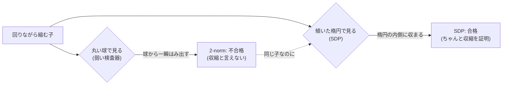
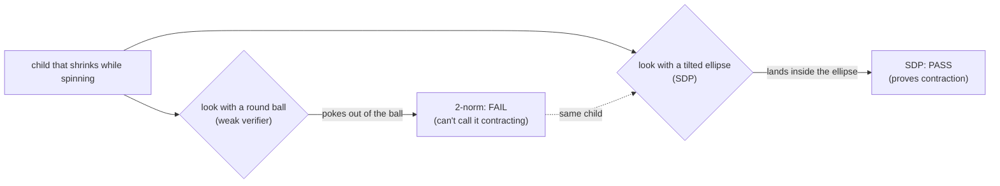
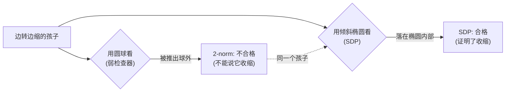
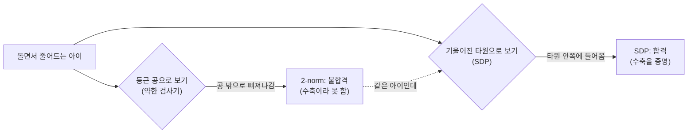

言語 / Language / 语言 / 언어: [日本語](#日本語) | [English](#english) | [中文](#中文) | [한국어](#한국어)

---

# 日本語

# 【かみくだき版】AI の「壊れてないか検査器」を弱い順に並べてみたら

> 📗 これは [完全版](https://fullsense.qiita.com/furuse-kazufumi/items/71f05f901fd9a2de6de5) のかみくだき版です。数式や証明の細かいところは完全版にあります。ここでは「結局なにを測って、なにが分かったの?」を、たとえ話だけで 5 分でつかめるようにします。

## 三行あらすじ

- AI を進化で育てるとき、「この子は暴走しないか?」を見る **検査器** が要る。その検査器は 1 種類じゃなく、**弱い順に梯子のように並ぶ**。
- 弱い検査器から順に足していくと、300 個中 88 → 137 → **286 個** (95.3%) と合格者が増える。一番の大ジャンプは **SDP という検査器を足した瞬間の +149**。
- 直感に反して、「最強の論理ソルバ (SMT/Z3) を呼べば最強の検査器になる」は **ハズレ**。この問題では Z3 は何も見分けられない「飾り」だった。本当に効いたのは SDP。

---

## 1. そもそも「検査器」ってなんの話?

私たちは llcore (エルコア) という研究で、小さな AI の「動き方」を、生き物の進化のように少しずつ作り変えて、良い動き方を探しています。CPU だけ・自宅 PC・お金 $0 で動く研究基盤です。

「進化のように」というのは、品種改良のイメージです。動き方を少しずつ変えた子をたくさん作り、良い子を選んで残し、残った子をもとにまた次の子を作る — これを何世代も繰り返すと、人間が設計図を細かく書かなくても、だんだん良い動き方に近づいていきます。

ここで困るのが、進化で作った子の中に **暴走する個体** が混ざることです。時間が経つと状態がどんどん膨らんで発散してしまう、いわゆる「壊れた」設計です。だから子を採用する前に「この子はちゃんと落ち着く (収縮する) か?」を見る関門が要る。これを **検査器 (verifier)** と呼びます。

「収縮する」というのは、ざっくり言うと **「ほっておくと状態の差が縮んでいく = 暴走しない」** という性質のことです。ブランコにたとえると、押すのをやめれば揺れがだんだん小さくなって落ち着くのが「収縮」。逆に、押してもいないのに揺れがひとりでに大きくなっていくのが「発散 = 暴走」です。検査器の仕事は「この子は収縮するか?」をイエス/ノーで判定すること — いわば進化の入口に立つ「採用試験の面接官」です。

ポイントは、検査器が 1 種類じゃないこと。**安いけど見逃しが多い検査器**から、**高いけど見抜ける検査器**まで、強さの違うものが梯子のように並んでいます。今日の話は「その梯子を一段ずつ登って、どこでどれだけ合格者が増えるか」を実際に測った話です。

検査器が弱いと何が困るのか。弱い検査器は「自信が無いと落とす」ので、**本当は大丈夫な子まで巻き添えで落としてしまう** (見逃しならぬ「冤罪」)。空港の手荷物検査にたとえると、中身を見抜く力が無い係員ほど「怪しく見えたら全部没収」に倒れるようなものです。すると進化はその子たちを採用できず、せっかくの良い動き方にたどり着けない。だからといって検査をゆるめると、今度は暴走する子を通してしまう。**見逃しを減らしつつ冤罪も減らす** には、検査器そのものを賢く (見抜く力を強く) するしかない。その「賢さ」を一段ずつ足して効果を測ったのが、この梯子の話です。

---

## 2. 梯子を一段ずつ登る — 88 → 137 → 286

検査用に「実際に収縮する」とわかっている 300 個の個体を用意しました。ここが実験設計のミソです。300 個はどれも、実際に動かして「ちゃんと収縮する」と確かめ済みの個体ばかり — つまり全員が「本当は合格であるべき子」です。だから、検査器が出す不合格は全部「冤罪」。この実験は、検査器ごとに **「本当は合格の子を、どこまで証明してあげられるか」** (= 冤罪の少なさ = 証明力) を測る実験になっています。

これに検査器を弱い順に足していき、各段で **新しく合格にできた数** を数えます。「新しく合格」とは、「それより弱い検査器では全部落とされたのに、この段で初めて合格にできた」という意味です。

| 検査器 (弱い順) | どんな見方か | 新しく合格 | 累積 |
|---|---|---|---|
| ∞ノルム | 一番安い・一番弱い | 88 | 88 |
| + 2-norm | 少しだけ強い | +49 | 137 |
| **+ 二次形式 SDP** | **傾いた楕円体まで試せる** | **+149** | **286 (= 95.3%)** |
| + 高次 SOS (deg4/6) | さらに手の込んだ持ち上げ | +4 | 290 |
| 残り | 高い検査でも閉じない | 10 | — |

読みどころは一つ。**SDP を足した瞬間に、いきなり 149 個が新しく合格になった**こと。88 から 137 までは少しずつだったのに、SDP でドカンと跳ねます。これが今日の見出しです。なぜこの段だけ跳ねるのかは §3 でじっくり解きます。

そして大事なこと: この梯子の各段で、**「収縮しないのに合格にしてしまった」誤判定はゼロ**でした。この性質には「健全性 (soundness)」という名前があり、検査器として一番譲れない部分です。なぜ譲れないのか。冤罪 (本当は合格なのに落とす) なら、あとから強い検査器を足して救えます。でも逆の事故 — 暴走する子に合格証を出す — は、一度でも起こせば安全装置としての検査器の存在意義そのものを壊します。今回の梯子はどの段でもこの事故が 0 件。つまり安全側に倒れたまま、証明力だけを一段ずつ伸ばしていけたわけです。

### 「残り 10 個」を見逃しと早合点しない

表の一番下、「残り 10 個」を見て「なんだ、結局 10 個取りこぼしてるじゃん」と思うのは早計です。中身をていねいに割ると、こうなります。

- **6 個は、本来落とすべき子をちゃんと落とした正解**。切り替えのある動きで膨張する子で、これは「見逃し」ではなく「正しい拒否」。
- **4 個は、もっと高次の検査 (degree-8) で合格にできる**。うち 2 個はさらに別角度 (JSR の上下からの挟み込み) でも追い込める。
- **最後に残るのは 2 個だけ**。これは境界 (ちょうど 1) にギリギリ張り付いていて、有限の計算量では閉じきらず、境界に近づくだけ。

つまり「10 個の取りこぼし」の正体は、半分以上が **正しく落とした子** で、残りも大半は高次で拾えます。本当に手に負えないのは境界ぎりぎりの 2 個だけ。「境界」というのは、収縮と発散の分かれ目「ちょうど 1」のことです (1 より小さければ縮み、大きければ膨らむ)。この分かれ目に張り付いた個体の白黒を有限の計算でつけるのは、検査器の手抜きではなく、問題そのものが難しい領域。これが「正直で、きれいな限界」です。

---

## 3. なぜ SDP だけ大勝ちするのか — 「丸い球」と「傾いた楕円」

ここが今日いちばん面白いところです。同じ「収縮するか?」を見るのに、検査器によって **見る形が違う** のです。

∞ノルムや 2-norm という弱い検査器は、いつも **「丸い球」** を基準にします。「この動きは、丸い球を球の外にはみ出させるか?」だけを見る。はみ出したら「収縮してない、不合格」と判定します。丸い球で測るというのは、**どの方向にも同じ長さの物差しを当てる** ということ。言い換えると「どの方向も、一歩たりとも伸びてはいけない」という、とても厳しい採点基準です。

ところが世の中には、**縮みながらクルッと回る** 動きがあります。コマが回りながら小さくなっていくイメージです。回転が混ざると、全体としては確実に縮んでいても、**ある方向のある瞬間だけを切り取ると一瞬伸びて見える** ことが起こります。この動きを丸い球で見ると、回転の途中で一瞬、球を外にはみ出させることがある。すると弱い検査器は「はみ出した! 不合格!」と弾いてしまう。実際にはちゃんと縮んでいるのに、です。§1 で言った「冤罪」の正体はこれでした。

SDP という検査器はここが違います。SDP は **「傾いた楕円」** で見ることができる。楕円とは、方向によって長さの違う物差しです。回転の向きに合わせて楕円を傾け、伸びて見えやすい方向には長めの物差しを・よく縮む方向には短めの物差しを当ててやると、さっきの「回りながら縮む」動きは、一歩ごとに楕円の **内側にきれいに収まる**。「この楕円で測れば、必ず内側に入る」と言えた時点で、それは立派な「収縮する」の証明です。だから SDP は合格を出せる。

「でも、楕円の傾け方も形も無限にあるのに、ちょうどいい一枚をどうやって見つけるの?」と思うかもしれません。ここが SDP のうまいところです。「条件に合う楕円を探す」という問題は、谷が 1 つしかない **お椀型の最適化問題 (凸最適化)** に書き直せることが知られています。お椀の中でビー玉を転がせば必ず一番低いところに落ち着くように、お椀型の問題は試行錯誤やまぐれに頼らず、確実に答えにたどり着けます。だから SDP は「ちょうどいい楕円が存在するなら、ちゃんと見つけてくる」検査器なのです。

たとえるなら、丸いザルでは引っかかってしまう「斜めの細長い物」を、ザルを傾けてやればスッと通せる、という話です。+149 の大ジャンプの正体は、この「傾いた楕円でしか合格にできない、回りながら縮む子」たちでした。

しかも SDP は、弱い検査器が合格にした子を **全部含んだうえで** さらに上乗せします。種明かしは簡単で、**丸い球は「傾けても潰してもいない、特別な楕円」** だからです。楕円を探す SDP は、候補の中に丸い球そのものも含めて探している。だから球で証明できた子は、楕円でも必ず証明できる。「弱い検査器で受かるのに SDP で落ちる」子は一人もいない — 実際、§4 の大規模検証でも一人も出てきませんでした。だから安心して梯子を SDP まで上げてよい、というわけです。

---

## 4. 大規模でも崩れなかった (3270 個で確認)

「300 個でたまたまそう見えただけでは?」を潰すため、**3270 個** で同じことを確かめました。サンプルを 10 倍以上に増やしても同じ景色が見えるなら、「たまたまこの個体プールがそうだっただけ」という疑いはかなり消せるからです。

| 測ったこと | 結果 |
|---|---|
| SDP が合格にした割合 | 1291/1363 (95%) |
| SDP が弱い検査器に勝った差 | +692 |
| 弱い検査器が SDP に勝った数 | **0** |

読み方は二つあります。一つ目、95% という合格率は、300 個のときの 95.3% とぴったり整合します。10 倍以上にスケールしても被覆率は揺るがない。二つ目が「弱い検査器が SDP に勝った数 = **0**」。3270 個の中に「球では証明できたのに、楕円では証明できない」子がただの一人もいなかった、ということです。§3 の種明かし — 丸い球は特別な楕円にすぎない — が、大規模でもそのまま成り立つことの実証になっています。SDP は弱い検査器を完全に内包する上位互換でした。

一点だけ正直に。「SDP が弱い検査器に勝った差」は、雑に数えると **+254** に見える場面がありました。原因は、判定を実際に計算する道具 (ソルバ) の精度です。合格ラインすれすれの答案は、採点の荒い採点者に当たると「不合格」に倒されてしまうことがある — これが **偽陰性 (本当は合格なのに不合格と誤る)** です。境界ぎりぎりの個体でまさにこれが起きていたのを、精度の高い採点者 (内点法という方式のソルバ CLARABEL) で数え直すと **+692**。SDP の優位は、見かけよりずっと大きかった (この補正の経緯は別記事 #35-02 で扱います)。

---

## 5. 「最強ソルバを呼べば最強検査器」は、ハズレだった

ここで多くの人が思うはずです。「梯子の上に、最強の論理ソルバ (SMT/Z3) を載せれば、もっと強い検査器になるのでは?」 Z3 というのは、「この条件を満たす答えはあるか?」という問いにイエス/ノーで白黒をつけてくれる、探索型の論理ソルバです。

実測したら、**ハズレ**でした。この問題では Z3 は何も新しく見分けられず、いわば **飾り** だったのです。

| 確かめ方 | 結果 |
|---|---|
| Z3 の判定 vs 閉じた式の判定 (3270 個) | 食い違い **0** |
| Z3 vs 閉じた式 (20000 回) | **20000/20000 で完全一致** |

なぜか。この問題の「収縮するか?」は、実は **閉じた数式に書き直せる** ものでした。「閉じた式」というのは、三角形の面積が「底辺 × 高さ ÷ 2」で出るのと同じで、**数字を当てはめれば一発で答えが出る公式** のことです。公式に代入すれば答えが出る問題に、わざわざ探索型の重い論理ソルバを持ち出しても、出てくる答えは同じ。実際そうでした。Z3 の判定と公式の判定は、3270 個で食い違いゼロ、2 万回試して全部一致 — Z3 にしか見抜けなかったものが、ただの一つも無かった。「識別力ゼロ」とはこの意味です。

これは大事な正直開示です。「Z3 で証明しました」と書くと強そうに聞こえますが、実態は **閉じた式の代数と凸性の定理** が証明を担保していて、Z3 は呼んでも呼ばなくても同じ。建物にたとえるなら、Z3 は荷重を支える柱ではなく、見栄えのために立てた飾り柱だったわけです。誤解しないでほしいのは、これは「Z3 がダメな道具」という話ではないこと。**この問題がたまたま「公式で解ける問題」だった**、それだけのことです。本当に検査器を一段強くする価値があったのは、Z3 ではなく **SDP** の側だった、というのが結論です。

---

## 6. 強い検査器は「安全装置」であり「探索を広げる装置」でもある

検査器を SDP まで強くするのは、安全のためだけではありませんでした。**進化がたどり着ける範囲そのものを広げる** 効果があったのです。

まず安全の話。検査器を付けない進化 (検査なし) では、採用された子の **17〜20% が暴走へドリフト** していきました。SDP の関門を付けると、暴走する子の採用は **0** に。「証明できないものは通さない」という安全側の設計の素直な結果です。

| 条件 | 採用された子が暴走へ流れた割合 |
|---|---|
| 検査なしの進化 | 17〜20% が暴走へ |
| SDP の関門つき | 暴走の採用 0 |

次に探索範囲の話。検査器を強くしたら、進化が到達できる **「良さ」の天井** まで上がりました。

| 関門 | 進化後に届いた「回転の良さ」の上限 |
|---|---|
| 弱い ∞ノルムの関門 | 約 0.41 で頭打ち |
| SDP の関門 | 約 0.86 まで到達 |

なぜ検査器を替えるだけで「良さ」の天井が動くのか。進化は、関門を通った子だけを次の世代の元にできるからです。弱い検査器だと、§3 のとおり「回りながら縮む子」を冤罪で全部弾いてしまう。するとその一族は一度も採用されず、回転の良さが要る領域に進化は永遠に踏み込めません。だから約 0.41 で頭打ちになる。SDP に替えると、その領域が解放されて約 0.86 まで伸びました。ちなみにこの差は、偶然だけでは約 10 万回に 3 回しか出ない水準 (p = 3.1e-5) で、まぐれとは考えにくい差です。**強い検査器は、安全装置であると同時に、進化の行動範囲を広げる装置でもあった** — これが実利の正体です。

この SDP 検査器は、もう研究室の実験ではなく、本番コードのプラガブルな部品として配線済みです。設計は fail-closed — 正確なソルバ (CLARABEL) が見つからないときは、精度の劣る代役で黙って動くのではなく、判定そのものを拒否します。§4 で見たとおり、ソルバの精度が落ちると境界付近の判定が狂うからです。テストも合格済みで、すべて CPU・$0・自宅 PC で完結します。

---

## 正直に言っておく限界 (honest disclosure)

FullSense の「異常に良い結果ほど内訳を疑う」規律に従って、限界も並べておきます。

- **「持ち上げを上げれば必ず強くなる」は嘘**。梯子の上のほう (高次 SOS) は、検査の手の込み具合 (次数) を上げれば単調に強くなりそうに見えて、実はむしろ緩くなることがあります。つまり一本道の階段ではない。だから運用は「各次数を実測して、一番タイトな結果を採る」になります。
- **最後の 2 個は閉じきらない**。収縮と発散の分かれ目「ちょうど 1」にギリギリ張り付いた個体は、有限の計算量では未解決のまま境界に近づくだけ。これは検査器の手抜きではなく、この境界を正確に計算すること自体が、計算機科学で「NP 困難」と呼ばれる難問だからです。正直で、きれいな限界です。
- **+254 か +692 かは数え方とソルバ次第**。本記事の +692 は、境界付近でソルバが出す偽陰性を正したあとの値です (補正の経緯は #35-02)。
- **適用範囲は限定的**。すべて小さな基質 (状態がたった 2 次元の n=2 の系)・この個体プールでの結果です。「進化する AI が広く有用」という主張ではなく、あくまで **検査器の正しさ** の話です。

---

## で、結局何がわかったの?

- 検査器は **弱い順に梯子状** に並ぶ。安い検査器ほど見逃しが多い。
- 一番効いたのは **SDP** で、88 → 137 → 286 のうち **+149 の大ジャンプ** を生んだ。理由は「丸い球」ではなく **「傾いた楕円」** で収縮を見られるから。回りながら縮む子を救えるのが SDP だけだった。
- 3270 個でも崩れず、**SDP は弱い検査器の上位互換** (負けた件数 0)。
- 「最強ソルバ Z3 を載せれば最強」は **ハズレ**。閉じた式で答えが出るこの問題では Z3 は飾りで、識別力ゼロ。
- 強い検査器は **安全装置 + 探索を広げる装置**。暴走採用を 0 にしつつ、到達できる「良さ」を 0.41 → 0.86 まで広げた。

---

## もっと知りたい人へ

数式・SDP/LMI の定義・Mermaid 図・参考文献・3 トラックの詳細な実証は **[完全版](https://fullsense.qiita.com/furuse-kazufumi/items/71f05f901fd9a2de6de5)** にあります。シリーズは #35-00 (全体像) → #35-01 (本稿・梯子の詳細) → #35-02 (正直開示とペアレビュー) の 3 部構成です。

---

# English

# [Plain-Language Edition] We Lined Up AI's "Is-It-Broken Inspector" From Weakest to Strongest

> 📗 This is the plain-language edition of the [full version](https://fullsense.qiita.com/furuse-kazufumi/items/71f05f901fd9a2de6de5). The equations and proof details live in the full version. Here we use only analogies so you can grasp "what was actually measured, and what did we learn?" in five minutes.

## Three-line summary

- When you grow AI by evolution, you need an **inspector** that checks "will this child blow up?". There is not just one inspector — they form a **ladder, ordered weakest-first**.
- Add inspectors from weak to strong, and the passing count climbs: 88 → 137 → **286** of 300 (95.3%). The big jump is the **+149 the moment you add an inspector called SDP**.
- Counter-intuitively, "calling the strongest logic solver (SMT/Z3) gives you the strongest inspector" is **wrong**. On this problem Z3 distinguishes nothing — it was decorative. The one that actually worked was SDP.

---

## 1. What do we mean by "inspector"?

In a project called llcore, we evolve the "way of moving" of small AI systems, tweaking them little by little like living things, to find good dynamics. It is a research substrate that runs on CPU only, on a home PC, at $0.

"Like living things" means something like selective breeding. Make many children whose dynamics differ a little, keep the good ones, and breed the next batch from the keepers — repeat over many generations, and the dynamics gradually improve without anyone writing the blueprint by hand.

The trouble is that some children produced by evolution **blow up**: over time their state keeps growing and diverges — a "broken" design. So before adopting a child we need a gate that checks "does this child actually settle down (contract)?". That gate is the **verifier**.

"Contracting" roughly means **"left alone, the differences in state shrink — no blow-up."** Think of a playground swing: stop pushing and the swing settles down — that is contraction. A swing that somehow keeps swinging higher on its own with nobody pushing — that is divergence, a blow-up. The verifier's job is a yes/no call on "does this child contract?" — it is the entrance examiner standing at the door of evolution.

The key point: there is not just one verifier. From **cheap-but-misses-a-lot** to **expensive-but-sees-through-it**, verifiers of different strengths form a ladder. Today's story is about climbing that ladder rung by rung and measuring how many more children pass at each step.

Why is a weak verifier a problem? A weak verifier "rejects whenever unsure", so it **also takes down children that are actually fine** (not a miss, but a wrongful conviction). Picture an airport bag inspector who cannot see inside the bags: the less they can tell, the more they lean toward "confiscate everything that looks odd". Evolution then cannot adopt those children and never reaches the good dynamics they carry. Loosen the inspection instead, and now children that blow up slip through. To cut misses and wrongful convictions at the same time, the only way is to make the verifier itself smarter (better at seeing through). Adding that smartness one rung at a time and measuring the effect — that is the ladder story.

---

## 2. Climbing the ladder rung by rung — 88 → 137 → 286

We prepared 300 individuals known to **actually contract**. This is the heart of the experiment design: all 300 have been run and confirmed to genuinely contract — every one of them is a child that *deserves* to pass. So every rejection is a wrongful conviction, and the experiment measures, verifier by verifier, **"how many of the truly-fine children can you actually prove fine?"** — in other words, how few wrongful convictions, which is certifying power.

We add verifiers from weak to strong and count the **newly passed** at each rung. "Newly passed" means: every weaker verifier failed this child, and this rung is the first to pass it.

| Verifier (weak first) | How it looks | Newly passed | Cumulative |
|---|---|---|---|
| inf-norm | cheapest, weakest | 88 | 88 |
| + 2-norm | a bit stronger | +49 | 137 |
| **+ quadratic SDP** | **can try a tilted ellipse** | **+149** | **286 (= 95.3%)** |
| + higher-degree SOS (deg4/6) | fancier lifting | +4 | 290 |
| remainder | not closed even at high degree | 10 | — |

There is one thing to read. **The moment SDP is added, 149 individuals suddenly pass.** From 88 to 137 it crept up, but SDP makes it leap. That is today's headline. Why this rung alone jumps is unpacked carefully in §3.

And crucially: at every rung, **the count of "passed something that does not actually contract" was zero**. This property has a name — **soundness** — and it is the one thing a verifier must never give up. Why? A wrongful conviction (failing a child that is actually fine) can be repaired later by adding a stronger verifier. But the opposite accident — handing a pass certificate to a child that blows up — destroys, even once, the verifier's whole reason to exist as a safety device. On this ladder that accident happened zero times at every rung. The verifiers stayed tipped toward the safe side while growing their certifying power rung by rung.

### Do not rush to call the "remaining 10" misses

Looking at the bottom row of the table, "remainder: 10", it is tempting to conclude "so it still drops 10 in the end." Split the composition carefully and it looks like this:

- **6 are correct rejections of children that deserved to be rejected.** They have switching dynamics that expand — not "misses" but the right call.
- **4 can be certified by an even higher-degree check (degree-8)**, and 2 of those can also be pinned down from another angle (bracketing the JSR from above and below).
- **Only 2 remain at the very end.** They hug the boundary (exactly 1), and at finite compute they never close — they only approach the boundary.

So the "10 left behind" are, for more than half, **children that were correctly rejected**, and most of the rest are catchable at higher degree. The only truly intractable ones are the 2 boundary-huggers. "The boundary" is the dividing line between contracting and diverging — exactly 1 (below it things shrink, above it they grow). Settling black-or-white with finite computation for individuals glued to that line is hard because the problem itself is hard there, not because the verifier is lazy. That is the "honest, clean limit."

---

## 3. Why does only SDP win big — the "round ball" vs the "tilted ellipse"

This is the most fun part. To judge the same "does it contract?", different verifiers **look at a different shape**.

The weak verifiers — inf-norm and 2-norm — always use a **round ball** as the reference. They only ask "does this motion push the round ball outside the ball?". If it pokes out, they call it "not contracting, fail". Measuring with a round ball means **holding a ruler of the same length up to every direction** — in other words, a very strict grading rule: "no direction may stretch, not even for a single step."

But some motions **shrink while spinning** — picture a spinning top that gets smaller. Once rotation is mixed in, the whole may be shrinking for certain, and yet **carve out one direction at one instant and it can look stretched for a moment**. Viewed with a round ball, such a motion can momentarily poke the ball outside during the spin. The weak verifier then rejects it — even though it really is shrinking. This is exactly where the wrongful convictions of §1 come from.

SDP is different here. SDP can look with a **tilted ellipse**. An ellipse is a ruler whose length differs by direction. Tilt the ellipse to match the spin — a longer ruler for the direction that tends to look stretched, a shorter one for the direction that shrinks well — and that "shrink-while-spinning" motion lands **neatly inside** the ellipse at every step. The moment you can say "measured with this ellipse, it always lands inside", that is a genuine proof of contraction. So SDP can pass it.

"But the tilts and shapes of an ellipse are endless — how do you find the right one?" you might ask. This is SDP's clever part: the problem "find an ellipse satisfying the condition" is known to be rewritable as a **bowl-shaped optimization with a single valley (convex optimization)**. Just as a marble rolled inside a bowl always settles at the lowest point, a bowl-shaped problem reaches the answer reliably, with no luck or trial-and-error needed. That is why SDP is a verifier that "finds the right ellipse whenever one exists."

As an analogy: a long, slanted object that snags in a round sieve slides right through once you tilt the sieve. The +149 jump is exactly those "shrink-while-spinning" children that only a tilted ellipse can pass.

What is more, SDP **contains all the children the weak verifiers passed** and then adds more on top. The trick is simple: **a round ball is just a special ellipse — one that is neither tilted nor squashed.** The ellipse-searching SDP includes the round ball itself among its candidates. So any child provable with the ball is necessarily provable with an ellipse too. Not a single child passes a weak verifier but fails SDP — and indeed, in the scale check of §4, not one showed up. So you can safely raise the ladder all the way to SDP.

---

## 4. It held at scale (checked on 3270 individuals)

To kill "maybe it just looked that way for 300", we checked the same thing on **3270** individuals. If the same picture appears with more than 10× the sample, the suspicion "it was just this particular pool" mostly evaporates.

| What we measured | Result |
|---|---|
| Fraction SDP passed | 1291/1363 (95%) |
| Margin SDP beat the weak verifier by | +692 |
| Times the weak verifier beat SDP | **0** |

Two readings. First, the 95% pass rate matches the 95.3% at 300 exactly. Scaling more than 10× does not shake the coverage. Second, "times the weak verifier beat SDP = **0**": among 3270 individuals, not a single one was "provable with the ball but not with the ellipse". The trick revealed in §3 — a round ball is just a special ellipse — holds unchanged at scale, and this is the empirical proof. SDP is a strict superset of the weak verifier.

One honest note. The "margin SDP beat the weak verifier by" looked like **+254** under a sloppy count. The cause is the precision of the tool that actually computes the verdict (the solver). An answer sheet sitting right on the pass line can get pushed to "fail" by a rough grader — that is a **false negative** (calling something that really passes a failure). Exactly this was happening for the boundary-hugging individuals; recount with a high-precision grader (CLARABEL, an interior-point solver) and it is **+692**. SDP's advantage is far larger than it looked (the correction story is in a companion article, #35-02).

---

## 5. "Bolt on the strongest solver to get the strongest inspector" was wrong

Here many people would think: "If we put the strongest logic solver (SMT/Z3) on top of the ladder, we get an even stronger inspector, right?" Z3 is a search-style logic solver that settles, yes or no, questions of the form "does an answer satisfying these conditions exist?".

Measured, it was **wrong**. On this problem Z3 distinguished nothing new — it was **decorative**.

| How we checked | Result |
|---|---|
| Z3's verdict vs a closed-form verdict (3270) | **0** disagreements |
| Z3 vs closed-form (20000 runs) | **20000/20000 perfect agreement** |

Why? The "does it contract?" of this problem can in fact be **rewritten as a closed formula**. A "closed formula" is like the area of a triangle being "base × height ÷ 2": **plug in the numbers and the answer falls out in one shot**. On a problem a formula answers directly, hauling in a heavy search-style logic solver changes nothing about the answer. And that is what happened: Z3's verdict and the formula's verdict disagreed zero times over 3270 individuals and matched 20000 out of 20000 runs — there was not one single thing only Z3 could see. That is what "zero discriminating power" means.

This is an important honest disclosure. Writing "we proved it with Z3" sounds strong, but in reality the **algebra of the closed form plus convexity theorems** carry the proof; Z3 is the same whether called or not. In building terms, Z3 was not a load-bearing pillar but a decorative one, put up for looks. And to be clear, this is not saying "Z3 is a bad tool" — it is just that **this problem happened to be one a formula can solve**. The thing actually worth one extra rung of inspector was SDP, not Z3.

---

## 6. A strong inspector is a "safety device" and a "search-widening device"

Raising the inspector to SDP was not only about safety. It also **widens the range evolution can reach**.

First, safety. Without any inspector (ungated), **17–20% of adopted children drift toward blow-up**. Add the SDP gate and adoption of divergent children drops to **0** — the natural result of "do not admit what you cannot prove".

| Condition | Fraction of adopted children that drifted to blow-up |
|---|---|
| ungated evolution | 17–20% diverge |
| with SDP gate | 0 divergent admitted |

Second, reach. Strengthening the inspector raised the **ceiling of "goodness"** evolution could reach.

| Gate | Upper limit of "rotation goodness" reached after evolution |
|---|---|
| weak inf-norm gate | capped around 0.41 |
| SDP gate | reached around 0.86 |

Why does swapping the verifier move the ceiling of "goodness" at all? Because evolution can only build the next generation out of children that made it through the gate. With the weak verifier, as in §3, every "shrink-while-spinning" child is wrongfully convicted, so that whole family is never adopted, and evolution can never step into the territory where rotation-goodness lives — hence the cap at ~0.41. Switch to SDP and that territory opens up, reaching ~0.86. For the record, this gap sits at a level pure chance would produce only about 3 times in 100,000 (p = 3.1e-5) — hard to call a fluke. **A strong inspector is a safety device and at the same time a device that widens evolution's range** — that is the real-world payoff.

This SDP verifier is no longer a lab experiment; it is wired in as a pluggable component of production code. The design is fail-closed: if the accurate solver (CLARABEL) is not found, it refuses to judge at all rather than silently running on a less precise stand-in — because, as §4 showed, verdicts near the boundary go wrong when solver precision drops. Its tests pass, and everything runs on CPU, at $0, on a home PC.

---

## Limits, stated honestly (honest disclosure)

Per FullSense's discipline of "the more unusually good the result, the harder you question the breakdown", here are the limits.

- **"Lift the degree and it always gets stronger" is false.** The upper rungs of the ladder (higher-degree SOS) look like they should get monotonically stronger as the degree — the elaborateness of the check — rises, but they can actually get looser. It is not a clean one-way staircase, so the practice is to measure every degree and take the tightest result.
- **The last 2 do not close.** Individuals glued to the contract-or-diverge dividing line of exactly 1 stay unresolved at finite compute, only approaching the boundary. This is not the verifier being lazy: computing that boundary exactly is itself a problem of the difficulty class computer science calls "NP-hard". An honest, clean limit.
- **+254 vs +692 depends on counting and solver.** The +692 here is the value after correcting the false negatives the solver emits near the boundary (the correction story is in #35-02).
- **Scope is limited.** All results are on a small substrate (an n=2 system whose state has just 2 dimensions) with this individual pool. This is not a claim that "evolving AI is broadly useful" — it is about **the correctness of the inspector**.

---

## So, what did we actually learn?

- Inspectors form a **ladder, weakest first**. The cheaper the inspector, the more it misses.
- The one that worked most was **SDP**, producing the **+149 big jump** within 88 → 137 → 286. The reason: it can judge contraction with a **tilted ellipse** rather than a round ball, rescuing children that shrink while spinning — and only SDP could.
- It held at 3270 too: **SDP is a strict upgrade of the weak verifier** (zero losses).
- "Bolt on the strongest solver Z3 to get the strongest" is **wrong**. On this problem, where a closed formula gives the answer, Z3 is decorative with zero discriminating power.
- A strong inspector is **a safety device plus a search-widening device**: it drove divergent adoption to 0 while widening reachable "goodness" from 0.41 to 0.86.

---

## For those who want more

The equations, the definitions of SDP/LMI, the Mermaid diagrams, the references, and the detailed three-track empirics are in the **[full version](https://fullsense.qiita.com/furuse-kazufumi/items/71f05f901fd9a2de6de5)**. The series is a three-part set: #35-00 (overview) → #35-01 (this part, the ladder in detail) → #35-02 (honest disclosure and peer review).

---

# 中文

# 【通俗版】把 AI 的"是否损坏检查器"从弱到强排成一排

> 📗 这是[完整版](https://fullsense.qiita.com/furuse-kazufumi/items/71f05f901fd9a2de6de5)的通俗版。公式与证明细节都在完整版里。这里只用比喻，让你在五分钟内抓住"到底测了什么、得出了什么结论?"。

## 三行摘要

- 用进化培育 AI 时，需要一个**检查器**来判断"这个孩子会不会暴走?"。检查器不止一种 —— 它们像梯子一样，**从弱到强排列**。
- 从弱到强逐级叠加检查器，合格数会爬升：300 个中 88 → 137 → **286** 个 (95.3%)。最大的跳跃，是**加上一个叫 SDP 的检查器那一刻的 +149**。
- 与直觉相反，"调用最强的逻辑求解器 (SMT/Z3) 就能得到最强检查器"是**错的**。在这个问题上 Z3 什么都分辨不出，只是个"摆设"。真正起作用的是 SDP。

---

## 1. 所谓"检查器"到底是什么?

在一个叫 llcore 的研究里，我们像培育生物一样一点点改造小型 AI 的"运动方式"，以寻找好的动力学。它是一个只用 CPU、在家用电脑上、花费 $0 的研究平台。

"像培育生物一样"，可以想成品种改良：造出许多运动方式略有不同的孩子，挑出好的留下，再以留下的孩子为底子造下一批 —— 一代代重复下去，即使没有人手写设计图，运动方式也会逐渐变好。

麻烦在于，进化产生的孩子里混有**会暴走的个体**：随时间推移状态不断膨胀直至发散，也就是"坏掉"的设计。所以在采用一个孩子之前，需要一道关卡来检查"这个孩子会不会乖乖收敛 (收缩)?"。这道关卡就叫**检查器 (verifier)**。

所谓"收缩"，大致是说**"放着不管，状态之间的差会缩小 —— 不会暴走"**。用秋千打比方：不再推它，摆动就渐渐变小、最终安静下来，这是"收缩"; 没人推它，摆动却自己越来越大，这就是"发散 = 暴走"。检查器的工作就是对"这个孩子会收缩吗?"做出是/否的判断 —— 它是站在进化入口处的"招聘考官"。

要点在于：检查器不止一种。从**便宜但漏检多**到**贵但看得透**，不同强度的检查器排成一架梯子。今天的故事，就是一级一级爬这架梯子，测量每一级又多了多少孩子合格。

检查器弱了会怎样? 弱检查器"没把握就拒绝"，于是**连本来没问题的孩子也被连坐拒掉** (不是漏检，而是"冤案")。就像机场的行李检查员，越是看不透箱子里的东西，越倾向于"看着可疑就全部没收"。这样一来，进化就采用不了那些孩子，永远到不了它们携带的好动力学。可要是把检查放松，又会放过会暴走的孩子。要**同时减少漏检和冤案**，唯一的办法是让检查器本身变聪明 (看得更透)。把这种"聪明"一级一级加上去、并测出每一级的效果，就是这架梯子的故事。

---

## 2. 一级一级爬梯子 —— 88 → 137 → 286

我们准备了 300 个已知**确实会收缩**的个体。这正是实验设计的关键：这 300 个全都实际运行并确认过"真的会收缩" —— 每一个都是"本该合格的孩子"。因此，检查器给出的每一次不合格都是冤案; 这个实验测的就是各检查器**"本该合格的孩子，你能证明多少?"** (= 冤案有多少 = 证明力)。

从弱到强叠加检查器，数出每一级**新增合格**的数量。"新增合格"的意思是：比它弱的检查器全都没能让这个孩子通过，而这一级是第一个让它合格的。

| 检查器 (由弱到强) | 怎么看 | 新增合格 | 累计 |
|---|---|---|---|
| inf-norm | 最便宜、最弱 | 88 | 88 |
| + 2-norm | 稍强一点 | +49 | 137 |
| **+ 二次型 SDP** | **能试"倾斜的椭圆"** | **+149** | **286 (= 95.3%)** |
| + 高次 SOS (deg4/6) | 更精巧的提升 | +4 | 290 |
| 剩余 | 高次也无法闭合 | 10 | — |

只有一处值得细读。**加上 SDP 的那一刻，一下子有 149 个个体合格了。** 从 88 到 137 是慢慢爬的，而 SDP 让它一跃而起。这就是今天的标题。为什么只有这一级会跳，§3 会细细拆解。

而且关键是：在每一级，**"本不收缩却被判合格"的误判都是 0**。这个性质有个名字 —— **健全性 (soundness)** —— 它是检查器最不能让步的底线。为什么不能让步? 冤案 (本该合格却被拒) 还可以靠之后叠加更强的检查器来挽回; 但反过来的事故 —— 给会暴走的孩子发合格证 —— 哪怕只发生一次，检查器作为安全装置的存在意义就崩塌了。这架梯子在每一级上这种事故都是 0 件。也就是说，检查器始终倒向安全一侧，同时一级一级把证明力提了上去。

### 别急着把"剩余 10 个"当成漏检

看到表格最后一行"剩余 10 个"，很容易得出"到头来还是丢了 10 个"的结论。把内容仔细拆开，是这样的：

- **6 个是把本该拒绝的孩子正确拒绝了。** 它们带有切换式的膨胀动态 —— 这不是"漏检"，而是"正确的拒绝"。
- **4 个可以用更高次的检查 (degree-8) 证明合格**，其中 2 个还能从另一个角度 (用 JSR 的上下界夹逼) 收紧。
- **最后真正剩下的只有 2 个。** 它们紧贴边界 (恰好 1)，在有限的计算量下永远无法闭合，只能不断逼近边界。

也就是说，"丢掉的 10 个"里一多半是**被正确拒绝的孩子**，其余大半也能在更高次拾回。真正束手无策的只有紧贴边界的 2 个。所谓"边界"，就是收缩与发散的分水岭"恰好 1" (小于 1 就缩，大于 1 就胀)。要用有限的计算给贴在这条线上的个体定黑白，难的是问题本身，不是检查器偷懒。这就是"诚实而干净的局限"。

---

## 3. 为什么唯独 SDP 大胜 —— "圆球"与"倾斜椭圆"

这是今天最有意思的部分。判断同一个"是否收缩?"，不同检查器**看的形状不一样**。

弱检查器 —— inf-norm 和 2-norm —— 始终以**圆球**为基准。它们只问"这个运动会不会把圆球推出球外?"。一旦露出去，就判"不收缩，不合格"。用圆球来量，等于**朝每个方向都举同一把等长的尺子**，换句话说，是"任何方向、哪怕一步也不许变长"的极严苛评分标准。

但有些运动是**一边缩小一边旋转** —— 想象一个旋转中越转越小的陀螺。一旦混入旋转，即使整体确实在缩小，**只盯着某一个方向的某一瞬间看，它也可能显得被拉长了一下**。用圆球去看，这种运动在旋转途中可能一瞬间把球推出去。于是弱检查器就拒绝它 —— 尽管它其实在缩小。§1 说的"冤案"正是从这里来的。

SDP 在这里不同。SDP 能用**倾斜的椭圆**来看。椭圆是一把**长度随方向而变的尺子**。把椭圆顺着旋转方向倾斜 —— 给容易显长的方向配长一点的尺、给缩得快的方向配短一点的尺 —— 刚才那个"边转边缩"的运动，每走一步都**恰好落在椭圆内部**。一旦能说出"用这把椭圆尺来量，每一步都必然落在内侧"，这本身就是一份正经的收缩证明。所以 SDP 能让它合格。

"可是椭圆的倾法和形状有无穷多种，怎么找到正合适的那一个?" 你也许会问。这正是 SDP 的高明之处："寻找满足条件的椭圆"这个问题，已知可以改写成**只有一个谷底的"碗形"最优化问题 (凸优化)**。就像在碗里放一颗弹珠，它必然滚到最低点 —— 碗形问题不靠运气、不靠反复试错，就能可靠地得到答案。所以 SDP 是"只要正合适的椭圆存在，就一定能把它找出来"的检查器。

打个比方：一个又长又斜的东西卡在圆筛子上，把筛子一倾斜它就顺溜溜地通过了。+149 这一大跳的真身，正是那些只有倾斜椭圆才能让其合格的"边转边缩"的孩子。

更妙的是，SDP **把弱检查器放过的孩子全都包含在内**，再往上加。谜底很简单：**圆球只是"既不倾斜也不压扁"的一种特殊椭圆**。搜索椭圆的 SDP，候选里本来就包含圆球本身。所以凡是用球能证明的孩子，用椭圆必然也能证明。没有一个孩子是"过了弱检查器却被 SDP 拒掉" —— 事实上，§4 的大规模检验里也一个都没有出现。所以你可以放心地把梯子一直升到 SDP。

---

## 4. 规模放大也没崩 (用 3270 个个体验证)

为了杜绝"也许 300 个只是碰巧那样"，我们在 **3270** 个个体上验证了同样的事。如果样本扩大 10 倍以上还能看到同样的景象，"碰巧是这批个体如此"的怀疑就基本可以打消了。

| 测量内容 | 结果 |
|---|---|
| SDP 判合格的比例 | 1291/1363 (95%) |
| SDP 胜过弱检查器的差值 | +692 |
| 弱检查器胜过 SDP 的次数 | **0** |

读法有两条。第一，95% 的合格率与 300 个时的 95.3% 完全吻合。放大十倍以上，覆盖率依然不动。第二，"弱检查器胜过 SDP 的次数 = **0**"：3270 个个体里，没有任何一个是"球能证明、椭圆却证明不了"的。§3 揭开的谜底 —— 圆球只是一种特殊的椭圆 —— 在大规模下原样成立，这就是实证。SDP 是弱检查器的严格超集。

老实说一点。"SDP 胜过弱检查器的差值"，粗略数下来曾看似 **+254**。原因出在实际执行判定的工具 (求解器) 的精度上。一份正好压在及格线上的答卷，遇到打分粗糙的阅卷人，可能被错判成"不及格" —— 这就是**假阴性 (本该合格却被误判为不合格)**。紧贴边界的个体正是这样被错判的; 换成高精度的阅卷人 (内点法求解器 CLARABEL) 重新数，是 **+692**。SDP 的优势远比看起来大 (这段修正的来龙去脉在姊妹篇 #35-02 中讲)。

---

## 5. "装上最强求解器就得到最强检查器"是错的

很多人会这样想："如果在梯子顶上装一个最强的逻辑求解器 (SMT/Z3)，不就得到更强的检查器了吗?" 所谓 Z3，是一种搜索型逻辑求解器，专门对"是否存在满足这些条件的答案?"这类问题给出是/否的裁决。

实测下来是**错的**。在这个问题上 Z3 分辨不出任何新东西 —— 它只是个**摆设**。

| 验证方式 | 结果 |
|---|---|
| Z3 的判定 vs 闭式判定 (3270 个) | 分歧 **0** |
| Z3 vs 闭式 (20000 次) | **20000/20000 完全一致** |

为什么? 这个问题的"是否收缩?"其实可以**改写成一个闭式公式**。所谓"闭式"，就像三角形面积等于"底 × 高 ÷ 2"：**把数字代进去，答案一步就出来**。对一个公式直接能解的问题，再搬来沉重的搜索型逻辑求解器，得到的答案也丝毫不变。实测也正是如此：Z3 的判定和公式的判定，在 3270 个个体上零分歧、2 万次运行全部一致 —— 没有任何一件事是只有 Z3 才看得出来的。"分辨力为零"说的就是这个。

这是一条重要的诚实披露。写"我们用 Z3 证明了"听起来很强，但实际上是**闭式的代数加上凸性定理**在支撑证明; 调不调 Z3 都一样。用建筑打比方，Z3 不是承重的柱子，而是为了好看立起来的装饰柱。还请别误会：这不是说"Z3 是糟糕的工具"，只是**这个问题恰好是公式就能解的问题**而已。真正值得多升一级检查器的，是 SDP，而不是 Z3。

---

## 6. 强检查器既是"安全装置"也是"拓宽搜索的装置"

把检查器升到 SDP，不只是为了安全。它还能**拓宽进化所能到达的范围**。

先说安全。不加检查器 (无关卡) 时，被采用的孩子里有 **17–20% 漂移向暴走**。加上 SDP 关卡，发散个体的采用降到 **0** —— 这是"无法证明的就不放行"的自然结果。

| 条件 | 被采用的孩子漂移向暴走的比例 |
|---|---|
| 无关卡的进化 | 17–20% 发散 |
| 带 SDP 关卡 | 发散采用为 0 |

再说可达范围。增强检查器后，进化能够到达的**"好"的天花板**也升高了。

| 关卡 | 进化后到达的"旋转之好"上限 |
|---|---|
| 弱 inf-norm 关卡 | 在约 0.41 处封顶 |
| SDP 关卡 | 到达约 0.86 |

为什么只是换一个检查器，"好"的天花板就会移动? 因为进化只能用通过了关卡的孩子去构筑下一代。用弱检查器时，如 §3 所述，所有"边转边缩"的孩子都被冤案式地拒掉，于是那一族一次也没被采用过，进化永远踏不进需要旋转之好的那片领域 —— 所以封顶在约 0.41。换成 SDP，那片领域被释放，到达约 0.86。顺带一提，这个差距处于"纯靠偶然约 10 万次只会出现 3 次"的水平 (p = 3.1e-5)，很难说是侥幸。**强检查器既是安全装置，同时也是拓宽进化活动范围的装置** —— 这就是实利所在。

这个 SDP 检查器已不再是实验室里的实验，而是作为生产代码的可插拔组件接好了线。设计是 fail-closed 的：找不到精确求解器 (CLARABEL) 时，不会换一个精度差的替身悄悄继续跑，而是干脆拒绝判定 —— 因为正如 §4 所示，求解器精度一降，边界附近的判定就会出错。测试也已通过，一切都在 CPU、$0、家用电脑上完成。

---

## 老实交代的局限 (honest disclosure)

按照 FullSense"结果越异常地好，越要追问其内部构成"的纪律，把局限也列出来。

- **"提升次数就一定更强"是假的。** 梯子的上段 (高次 SOS) 看似把检查的精细程度 (次数) 越调越高就该单调变强，实际却可能反而变松 —— 不是干净的单向阶梯。所以做法是把每个次数都实测一遍，取最紧的那个结果。
- **最后 2 个无法闭合。** 紧贴收缩与发散分水岭"恰好 1"的个体，在有限算力下仍未解决，只能渐近于边界。这不是检查器偷懒：精确计算这条边界本身，就是计算机科学里称为"NP 困难"的难题。这是一条诚实而干净的局限。
- **是 +254 还是 +692 取决于计数方式与求解器。** 本文的 +692 是改正了求解器在边界附近给出的假阴性之后的值 (修正经过见 #35-02)。
- **适用范围有限。** 所有结果都在小型基质 (状态只有 2 维的 n=2 系统)、这个个体池上得出。这并非"进化的 AI 普遍有用"的主张，而是关于**检查器正确性**的论述。

---

## 那么，到底学到了什么?

- 检查器**从弱到强排成梯子**。越便宜的检查器漏检越多。
- 最起作用的是 **SDP**，在 88 → 137 → 286 中贡献了 **+149 的大跳跃**。原因是它能用**倾斜的椭圆**而非圆球来判断收缩，救回了边转边缩的孩子 —— 而只有 SDP 能做到。
- 在 3270 个上也没崩：**SDP 是弱检查器的严格升级版** (零败绩)。
- "装上最强求解器 Z3 就最强"是**错的**。在这个用闭式就能给出答案的问题上，Z3 只是摆设，分辨力为零。
- 强检查器是**安全装置 + 拓宽搜索的装置**：把发散采用降到 0，同时把可达的"好"从 0.41 拓宽到 0.86。

---

## 想了解更多

公式、SDP/LMI 的定义、Mermaid 图、参考文献，以及三条轨道的详细实证，都在 **[完整版](https://fullsense.qiita.com/furuse-kazufumi/items/71f05f901fd9a2de6de5)** 里。本系列分三部分：#35-00 (总览) → #35-01 (本篇，梯子详解) → #35-02 (诚实披露与同行评审)。

---

# 한국어

# [쉬운 풀이판] AI의 "고장 안 났나 검사기"를 약한 순서로 줄 세워 봤더니

> 📗 이것은 [완전판](https://fullsense.qiita.com/furuse-kazufumi/items/71f05f901fd9a2de6de5)의 쉬운 풀이판입니다. 수식과 증명 세부는 완전판에 있습니다. 여기서는 비유만으로 "결국 무엇을 측정했고, 무엇을 알아냈나?"를 5분 안에 잡을 수 있게 합니다.

## 세 줄 요약

- AI를 진화로 키울 때, "이 아이가 폭주하지 않을까?"를 보는 **검사기**가 필요합니다. 검사기는 한 종류가 아니라 **약한 순서로 사다리처럼** 늘어섭니다.
- 약한 검사기부터 차례로 더하면 합격 수가 늘어납니다: 300개 중 88 → 137 → **286개** (95.3%). 가장 큰 도약은 **SDP라는 검사기를 더하는 순간의 +149**.
- 직관과 달리, "최강 논리 솔버 (SMT/Z3)를 부르면 최강 검사기가 된다"는 **틀렸습니다**. 이 문제에서 Z3는 아무것도 구별하지 못하는 "장식"이었습니다. 진짜로 효과를 낸 것은 SDP입니다.

---

## 1. 애초에 "검사기"가 무슨 이야기인가?

llcore라는 연구에서 우리는 작은 AI의 "움직이는 방식"을, 생물의 진화처럼 조금씩 바꿔 가며 좋은 동역학을 찾고 있습니다. CPU만, 가정용 PC에서, 비용 $0으로 돌아가는 연구 기반입니다.

"진화처럼"이라는 것은 품종 개량의 이미지입니다. 움직이는 방식이 조금씩 다른 아이를 많이 만들고, 좋은 아이를 골라 남기고, 남은 아이를 바탕으로 다시 다음 아이를 만든다 — 이것을 여러 세대 반복하면, 사람이 설계도를 일일이 쓰지 않아도 점점 좋은 움직임에 가까워집니다.

곤란한 점은 진화로 만든 아이 중에 **폭주하는 개체**가 섞인다는 것입니다. 시간이 지나면 상태가 점점 부풀어 발산해 버리는, 이른바 "고장난" 설계입니다. 그래서 아이를 채택하기 전에 "이 아이는 제대로 가라앉는가 (수축하는가)?"를 보는 관문이 필요합니다. 이것이 **검사기 (verifier)** 입니다.

"수축한다"는 것은 대략 **"내버려 두면 상태 차이가 줄어든다 = 폭주하지 않는다"** 는 성질을 말합니다. 그네에 비유하면, 미는 것을 멈췄을 때 흔들림이 점점 작아져 가라앉는 것이 "수축"이고, 밀지도 않았는데 흔들림이 저절로 커져 가는 것이 "발산 = 폭주"입니다. 검사기의 일은 "이 아이는 수축하는가?"에 대해 예/아니오로 판정하는 것 — 말하자면 진화의 입구에 서 있는 "채용 시험 면접관"입니다.

핵심은 검사기가 한 종류가 아니라는 점입니다. **싸지만 놓치는 게 많은** 검사기부터 **비싸지만 꿰뚫어 보는** 검사기까지, 강도가 다른 것들이 사다리처럼 늘어섭니다. 오늘 이야기는 그 사다리를 한 단씩 오르며 각 단에서 합격하는 아이가 얼마나 늘어나는지를 실제로 측정한 이야기입니다.

검사기가 약하면 무엇이 곤란할까요? 약한 검사기는 "자신이 없으면 떨어뜨리는" 쪽으로 기울기 때문에, **사실은 멀쩡한 아이까지 휩쓸려 떨어뜨립니다** (놓침이 아니라 "누명"). 공항 수하물 검사에 비유하면, 가방 속을 꿰뚫어 보는 눈이 없는 검사원일수록 "수상해 보이면 전부 압수"로 기우는 것과 같습니다. 그러면 진화는 그 아이들을 채택하지 못해, 모처럼의 좋은 움직임에 도달할 수 없습니다. 그렇다고 검사를 느슨하게 하면 이번에는 폭주하는 아이를 통과시키고 맙니다. **놓침도 줄이고 누명도 줄이려면**, 검사기 자체를 똑똑하게 (꿰뚫어 보는 힘을 강하게) 만드는 수밖에 없습니다. 그 "똑똑함"을 한 단씩 더하며 효과를 측정한 것이 이 사다리 이야기입니다.

---

## 2. 사다리를 한 단씩 오르기 — 88 → 137 → 286

**실제로 수축한다**고 알려진 개체 300개를 준비했습니다. 여기가 실험 설계의 핵심입니다. 300개는 모두 실제로 돌려 보고 "제대로 수축한다"고 확인이 끝난 개체 — 즉 전원이 "본래 합격이어야 할 아이"입니다. 그러니 검사기가 내는 불합격은 전부 "누명"이고, 이 실험은 검사기마다 **"본래 합격인 아이를 어디까지 증명해 줄 수 있는가"** (= 누명의 적음 = 증명력)를 재는 실험입니다.

약한 순서로 검사기를 더하며 각 단에서 **새로 합격시킨 수**를 셉니다. "새 합격"이란 "그보다 약한 검사기에서는 전부 떨어졌는데, 이 단에서 처음으로 합격시킬 수 있었다"는 뜻입니다.

| 검사기 (약한 순서) | 보는 방식 | 새 합격 | 누적 |
|---|---|---|---|
| inf-norm | 가장 싸고 가장 약함 | 88 | 88 |
| + 2-norm | 조금 더 강함 | +49 | 137 |
| **+ 이차형식 SDP** | **기울어진 타원까지 시도 가능** | **+149** | **286 (= 95.3%)** |
| + 고차 SOS (deg4/6) | 더 정교한 들어올리기 | +4 | 290 |
| 나머지 | 고차로도 닫히지 않음 | 10 | — |

읽을 거리는 하나입니다. **SDP를 더한 순간, 단번에 149개가 새로 합격했다는 것.** 88에서 137까지는 조금씩 올랐는데, SDP에서 껑충 뜁니다. 이것이 오늘의 표제입니다. 왜 이 단에서만 뛰는지는 §3에서 차분히 풀어냅니다.

그리고 중요한 점: 각 단에서 **"수축하지 않는데 합격시킨" 오판은 0**이었습니다. 이 성질에는 **건전성 (soundness)** 이라는 이름이 있고, 검사기로서 절대 양보할 수 없는 부분입니다. 왜 양보할 수 없을까요? 누명 (사실은 합격인데 떨어뜨림)은 나중에 더 강한 검사기를 더해 구제할 수 있습니다. 하지만 반대의 사고 — 폭주하는 아이에게 합격증을 내주는 것 — 는 단 한 번이라도 일어나면 안전장치로서의 검사기의 존재 의의 자체를 무너뜨립니다. 이번 사다리에서는 어느 단에서도 이 사고가 0건. 안전한 쪽으로 기운 채 증명력만을 한 단씩 키워 갈 수 있었던 것입니다.

### "나머지 10개"를 놓침으로 속단하지 않기

표의 맨 아랫줄 "나머지 10개"를 보고 "뭐야, 결국 10개는 흘렸잖아"라고 생각하는 것은 성급합니다. 내용을 꼼꼼히 나누면 이렇게 됩니다.

- **6개는 본래 떨어뜨려야 할 아이를 제대로 떨어뜨린 정답.** 전환이 있는 움직임으로 팽창하는 아이로, 이것은 "놓침"이 아니라 "올바른 거부"입니다.
- **4개는 더 고차의 검사 (degree-8)로 합격시킬 수 있습니다.** 그중 2개는 또 다른 각도 (JSR의 위아래에서 끼워 넣기)로도 좁혀 들어갈 수 있습니다.
- **마지막에 남는 것은 2개뿐.** 경계 (딱 1)에 아슬아슬하게 붙어 있어, 유한한 계산량으로는 닫히지 않고 경계에 다가갈 뿐입니다.

즉 "10개의 흘림"의 정체는 절반 이상이 **제대로 떨어뜨린 아이**이고, 나머지도 대부분 고차에서 건질 수 있습니다. 정말 손쓸 수 없는 것은 경계에 붙은 2개뿐. "경계"란 수축과 발산의 갈림길 "딱 1"을 말합니다 (1보다 작으면 줄고, 크면 부풉니다). 이 갈림길에 붙은 개체의 흑백을 유한한 계산으로 가리는 것이 어려운 이유는 문제 자체가 어렵기 때문이지, 검사기가 게을러서가 아닙니다. 이것이 "정직하고 깔끔한 한계"입니다.

---

## 3. 왜 SDP만 크게 이기는가 — "둥근 공"과 "기울어진 타원"

여기가 오늘 가장 재미있는 부분입니다. 같은 "수축하는가?"를 보는데도 검사기마다 **보는 모양이 다릅니다**.

약한 검사기 — inf-norm과 2-norm — 은 늘 **둥근 공**을 기준으로 삼습니다. "이 움직임이 둥근 공을 공 밖으로 밀어내는가?"만 봅니다. 삐져나가면 "수축 안 함, 불합격"으로 판정합니다. 둥근 공으로 잰다는 것은 **어느 방향에나 같은 길이의 자를 대는 것**, 바꿔 말하면 "어느 방향이든 단 한 걸음도 늘어나면 안 된다"는 아주 엄격한 채점 기준입니다.

그런데 어떤 움직임은 **줄어들면서 빙글 도는** 움직임입니다. 돌면서 점점 작아지는 팽이를 떠올려 보세요. 회전이 섞이면, 전체로는 분명히 줄어들고 있어도 **어느 한 방향의 한순간만 잘라 보면 잠깐 늘어나 보이는 순간**이 생깁니다. 둥근 공으로 보면, 이 움직임은 회전 도중 한순간 공을 밖으로 밀어낼 수 있습니다. 그러면 약한 검사기는 거부합니다 — 실제로는 제대로 줄어들고 있는데도요. §1에서 말한 "누명"의 정체가 바로 이것이었습니다.

SDP는 여기서 다릅니다. SDP는 **기울어진 타원**으로 볼 수 있습니다. 타원은 방향에 따라 길이가 다른 자입니다. 회전 방향에 맞춰 타원을 기울여 — 늘어나 보이기 쉬운 방향에는 긴 자를, 잘 줄어드는 방향에는 짧은 자를 대 주면 — 아까의 "돌면서 줄어드는" 움직임은 한 걸음마다 타원 **안쪽에 깔끔하게** 들어옵니다. "이 타원으로 재면 반드시 안쪽에 들어온다"고 말할 수 있는 순간, 그것은 어엿한 수축의 증명이 됩니다. 그래서 SDP는 합격을 낼 수 있습니다.

"하지만 타원의 기울기도 모양도 무한한데, 딱 맞는 하나를 어떻게 찾지?"라고 생각할지 모릅니다. 여기가 SDP의 영리한 부분입니다. "조건에 맞는 타원을 찾는다"는 문제는, 골짜기가 하나뿐인 **사발 모양의 최적화 문제 (볼록 최적화)** 로 다시 쓸 수 있음이 알려져 있습니다. 사발 안에 구슬을 굴리면 반드시 가장 낮은 곳에 가 닿듯이, 사발 모양의 문제는 요행이나 시행착오에 기대지 않고 확실하게 답에 도달할 수 있습니다. 그래서 SDP는 "딱 맞는 타원이 존재한다면 반드시 찾아오는" 검사기인 것입니다.

비유하자면, 둥근 체에 걸리는 길고 비스듬한 물건을 체를 기울이면 쏙 통과시킬 수 있다는 이야기입니다. +149라는 큰 도약의 정체는, 기울어진 타원으로만 합격시킬 수 있는 "돌면서 줄어드는" 아이들이었습니다.

게다가 SDP는 **약한 검사기가 합격시킨 아이를 전부 포함한 채로** 더 얹습니다. "약한 검사기는 통과했는데 SDP에서는 떨어지는" 아이는 한 명도 없습니다. 그래서 사다리를 SDP까지 안심하고 올려도 됩니다.

---

## 4. 대규모에서도 무너지지 않았다 (3270개로 확인)

"300개에서 우연히 그렇게 보인 것 아닌가"를 없애기 위해, **3270개**에서 같은 것을 확인했습니다.

| 측정한 것 | 결과 |
|---|---|
| SDP가 합격시킨 비율 | 1291/1363 (95%) |
| SDP가 약한 검사기를 이긴 차이 | +692 |
| 약한 검사기가 SDP를 이긴 횟수 | **0** |

95%라는 합격률은 300개일 때의 95.3%와 정확히 일치합니다. 10배 이상으로 키워도 커버리지는 흔들리지 않습니다. 그리고 "약한 검사기가 SDP를 이긴 횟수 = 0"이, §3의 기하가 대규모에서도 성립한다는 실증입니다. SDP는 약한 검사기의 엄격한 상위 집합입니다.

솔직히 하나. "SDP가 약한 검사기를 이긴 차이"는 거칠게 세면 **+254**로 보이는 국면이 있었습니다. 하지만 그 셈에는 솔버가 경계 근처에서 내놓는 **거짓 음성 (실은 합격인데 불합격으로 오판)**이 섞여 있었습니다. 그것을 바로잡고 정확히 다시 세면 **+692**입니다. SDP의 우위는 보기보다 훨씬 컸습니다 (이 보정의 경위는 자매편 #35-02에서 다룹니다).

---

## 5. "최강 솔버를 얹으면 최강 검사기"는 틀렸다

여기서 많은 사람이 이렇게 생각할 겁니다. "사다리 위에 최강 논리 솔버 (SMT/Z3)를 얹으면 더 강한 검사기가 되지 않을까?"

실측하니 **틀렸습니다**. 이 문제에서 Z3는 아무것도 새로 구별하지 못했고, 말하자면 **장식**이었습니다.

| 확인 방식 | 결과 |
|---|---|
| Z3의 판정 vs 닫힌 식 판정 (3270개) | 불일치 **0** |
| Z3 vs 닫힌 식 (20000회) | **20000/20000 완전 일치** |

왜일까요? 이 문제의 "수축하는가?"는 실은 **닫힌 수식으로 다시 쓸 수 있는** 것이었습니다. 닫힌 식으로 답이 나온다면, 굳이 무거운 논리 솔버를 불러도 결과는 전혀 바뀌지 않습니다. 3270개에서 불일치 0, 2만 회에서 전부 일치 — 즉 Z3는 구별력을 1밀리미터도 더하지 않았습니다.

이것은 중요한 정직한 공개입니다. "Z3로 증명했다"고 쓰면 강해 보이지만, 실제로는 **닫힌 식의 대수와 볼록성 정리**가 증명을 떠받치고 있으며, Z3는 부르든 안 부르든 같습니다. 검사기를 한 단 더 올릴 가치가 진짜로 있던 것은 Z3가 아니라 SDP 쪽이었습니다.

---

## 6. 강한 검사기는 "안전장치"이자 "탐색을 넓히는 장치"

검사기를 SDP까지 올리는 것은 안전을 위해서만이 아니었습니다. **진화가 도달할 수 있는 범위 자체를 넓히는** 효과가 있었습니다.

먼저 안전. 검사기 없는 진화 (관문 없음)에서는 채택된 아이의 **17~20%가 폭주로 표류**했습니다. SDP 관문을 붙이면 발산하는 아이의 채택은 **0**으로 — "증명할 수 없는 것은 통과시키지 않는다"는 안전한 설계의 자연스러운 결과입니다.

| 조건 | 채택된 아이가 폭주로 흘러간 비율 |
|---|---|
| 관문 없는 진화 | 17~20%가 발산 |
| SDP 관문 있음 | 발산 채택 0 |

다음으로 도달 범위. 검사기를 강화하니 진화가 도달할 수 있는 **"좋음"의 천장**도 올라갔습니다.

| 관문 | 진화 후 도달한 "회전의 좋음" 상한 |
|---|---|
| 약한 inf-norm 관문 | 약 0.41에서 정체 |
| SDP 관문 | 약 0.86까지 도달 |

약한 검사기로는, §3대로 "돌면서 줄어드는" 아이를 전부 거부하므로 진화가 그 영역으로 발을 들이지 못해 약 0.41에서 정체합니다. SDP로 바꾸면 그 영역이 열려 약 0.86까지 늘어났습니다. **강한 검사기는 안전장치이자 동시에 진화의 활동 범위를 넓히는 장치**였습니다 — 이것이 실리의 정체입니다.

이 SDP 검사기는 더 이상 연구실 실험이 아니라, 운영 코드의 플러그형 부품으로 배선되어 있습니다. 정확한 솔버 (CLARABEL)가 없으면 거부하는 fail-closed 설계이며, 테스트도 통과했습니다. 모두 CPU, $0, 가정용 PC에서 완결됩니다.

---

## 정직하게 밝히는 한계 (honest disclosure)

FullSense의 "결과가 이상하게 좋을수록 그 내역을 의심한다"는 규율에 따라 한계도 적어 둡니다.

- **"차수를 올리면 반드시 강해진다"는 거짓.** 고차 SOS는 차수를 올리면 오히려 느슨해질 수 있어, 깔끔한 일방통행 계단이 아닙니다. 각 차수를 측정해 가장 타이트한 것을 취하는 운용이 됩니다.
- **마지막 2개는 닫히지 않는다.** 경계에 바싹 붙은 개체는 유한 연산량으로는 미해결인 채 경계에 점근할 뿐입니다. 이것은 정직하고 깔끔한 한계입니다.
- **+254냐 +692냐는 세는 방식과 솔버에 달려 있다.** 본문의 +692는 거짓 음성을 바로잡은 뒤의 값입니다.
- **적용 범위는 제한적.** 모든 결과는 작은 (n=2) 기질, 이 개체 풀에서 얻은 것입니다. "진화하는 AI가 널리 유용하다"는 주장이 아니라, 어디까지나 **검사기의 정확성**에 관한 이야기입니다.

---

## 그래서 결국 무엇을 알아냈나?

- 검사기는 **약한 순서로 사다리처럼** 늘어섭니다. 싼 검사기일수록 놓치는 게 많습니다.
- 가장 효과를 낸 것은 **SDP**로, 88 → 137 → 286 중 **+149의 큰 도약**을 만들었습니다. 이유는 둥근 공이 아니라 **기울어진 타원**으로 수축을 볼 수 있어, 돌면서 줄어드는 아이를 구해냈기 때문입니다 — 그리고 그것은 오직 SDP만 가능했습니다.
- 3270개에서도 무너지지 않았습니다: **SDP는 약한 검사기의 엄격한 상위 호환** (패배 0건).
- "최강 솔버 Z3를 얹으면 최강"은 **틀렸습니다**. 닫힌 식으로 답이 나오는 이 문제에서 Z3는 장식이며 구별력이 0입니다.
- 강한 검사기는 **안전장치 + 탐색을 넓히는 장치**입니다: 발산 채택을 0으로 만들면서, 도달 가능한 "좋음"을 0.41에서 0.86까지 넓혔습니다.

---

## 더 알고 싶은 분께

수식, SDP/LMI의 정의, Mermaid 그림, 참고 문헌, 그리고 세 트랙의 상세 실증은 **[완전판](https://fullsense.qiita.com/furuse-kazufumi/items/71f05f901fd9a2de6de5)**에 있습니다. 시리즈는 세 부분 구성입니다: #35-00 (전체 그림) → #35-01 (본편, 사다리 상세) → #35-02 (정직한 공개와 동료 평가).
