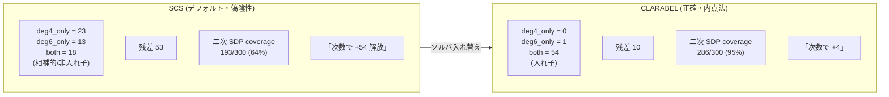
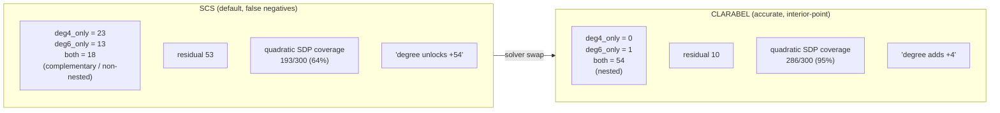
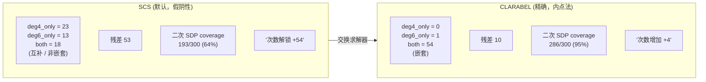
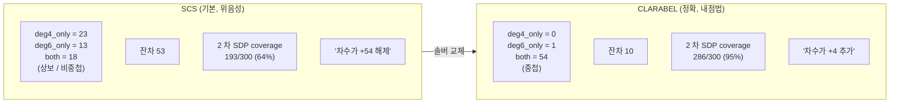

言語 / Language / 语言 / 언어: [日本語](#日本語) | [English](#english) | [中文](#中文) | [한국어](#한국어)

---

# 日本語

> 📗 **お急ぎの方へ**: この記事には [かみくだき版](https://fullsense.qiita.com/furuse-kazufumi/items/146d5e2b27dabc59e799) があります（比喩多め・短時間で要点だけ）。
# llcore 検証 arc (#35-02) — 「良すぎる数値」を疑え: SCS ソルバの罠を多視点 pair-review で捕まえて訂正した話

> Concept hook: 進化させた AI のダイナミクスを「壊れていないか」検査する verifier の研究で、SDP/次数ラダーの数値があまりに「豊か」に見えた。疑って調べたら、cvxpy のデフォルトソルバ SCS が実行可能性の境界付近で偽陰性を出し、存在するはずの Lyapunov 証明書を「見つけられない」と報告していた。正確な内点法 CLARABEL に固定すると、捏造されていた「次数の相補性」(23/13/18, 残差 53, SDP 64%) は入れ子構造 (0/0/54, 残差 10, SDP 95%) に崩れ、SDP の優位は逆に過小評価されていたと判明した (+254 → +692)。この記事は、その訂正と、Codex + 6 エージェント敵対 Workflow による pair-review の顛末を、事実だけで語る。

> 本稿は llcore 検証 arc の終幕 (#35-02) です。[#35-00 (概観)](https://fullsense.qiita.com/furuse-kazufumi/items/6fc86b4732eeec77adb6) で「SDP が正解」という結論を、[#35-01 (梯子の詳細)](https://fullsense.qiita.com/furuse-kazufumi/items/71f05f901fd9a2de6de5) で証明能力のラダーを示しました。#35-01 で「+254 ではなく +692」「偽陰性を正すと数字が変わる」と予告した、その**ソルバ補正の現場**が本稿です。

## 0. 用語説明 / Glossary

| 用語 | かみくだいた意味 |
|---|---|
| llcore | FullSense の研究基盤。CPU のみ・オンプレ・$0 で、小さなニューラル系 (RWKV 風の状態更新遺伝子) の「ダイナミクス」を進化させる。 |
| verifier (gate) | 進化した遺伝子のダイナミクスが「発散しない (収縮する)」かを判定し、ダメなものを拒否する検査器。 |
| 収縮 (contraction) | 状態を更新するたびに距離が縮む性質。これがあれば系は暴れない。 |
| Lyapunov 証明書 | 「この系は収縮する」ことを保証する数学的な証拠 (正定値行列 P)。 |
| SDP / LMI | 半正定値計画 / 線形行列不等式。Lyapunov 証明書を探す凸最適化の形式。 |
| SCS | cvxpy のデフォルト一次法 (ADMM) ソルバ。速いが境界付近で精度が落ちる。 |
| CLARABEL | 正確な内点法ソルバ。境界付近でも偽陰性が出にくい。 |
| SOS (deg4/6/8) | 多項式の二乗和。次数を上げると証明能力が増す (はずの) 高次証明書。 |
| JSR | 結合スペクトル半径。1 未満なら収縮。厳密計算は NP 困難。 |
| SMT / Z3 | 充足可能性ソルバ。論理式の真偽を判定する。本基盤では装飾的だった。 |
| Rump verified-PD | 厳密な Cholesky 後退誤差限界で正定値性を機械的に証明する手法。True は証明。 |
| 偽陰性 (false negative) | 本当は存在する証明書を「見つからない」と誤って報告すること。 |
| 偽許可 (false admit) | 本当は発散する遺伝子を「収縮する」と誤って通すこと (健全性違反)。 |
| F1–F5 | pair-review で出た 5 つの指摘。すべて再検証され、論旨は維持・強化された。 |
| pair-review | Codex と 6 エージェント敵対 Workflow による、複数視点の反証試行レビュー。 |

## 1. かみくだき結論 / Plain-language conclusion

進化する AI のダイナミクスが暴走しないかを検査する「壊れてないか検査器」を作っています。

最初、検査器の能力を測ったら、次数を上げるほど新しいものが捕まえられる「豊かな」結果に見えました。でも数字が良すぎたので疑いました。

調べると、計算に使っていたデフォルトのソルバ (SCS) が境界付近でバグり、本当は証明できるものを「できない」と言っていました。正確なソルバ (CLARABEL) に変えたら、その「豊かさ」は幻で、本当はシンプルな入れ子構造だったと分かりました。逆に、本命の検査器 (SDP) の強さはむしろ過小評価されていました。

教訓は一つ。margin-sweep (余白を揺らす赤チーム) では、同じバグったソルバの中で揺れるだけなので、この種の罠は構造的に見えません。決定打は「ソルバを入れ替える」ことと「複数の視点で敵対的にレビューする」ことです。数字が良すぎたら、信じる前にまずソルバを疑え。

## 2. 何を進化させ、何を検証しているのか

llcore は、結合した RWKV 風の状態更新遺伝子を進化させます。各遺伝子は小さな力学系で、状態を反復更新します。安全性 GATE の役目は明確で、**ダイナミクスが発散する (収縮しない) 遺伝子を拒否する**こと。研究の問いは「正しい verifier (gate) は何か?」です。

論旨は確認され、しかも正直な訂正を経て**強化**されました: 正しい収縮 verifier は SMT/Z3 ではなく、**共通の二次 Lyapunov 証明書を SDP/LMI として解いたもの**であり、CPU 上で収縮する進化済みダイナミクスの **約 95%** を証明できます。

## 3. verifier-fitness フロンティア (証明能力のラダー)

300 個の経験的に収縮する n=2 遺伝子 (seed=2024、CLARABEL ソルバ、`exp_deg6_ladder_results.json`) に対する、証明能力の段階的なラダーです。

| 証明書のラング | この段で追加 | 累積 |
|---|---|---|
| inf-norm (行絶対和の最大 < 1) | 88 | 88 |
| + 2-norm (最大特異値 < 1) | +49 | 137 |
| + 二次 SDP (共通 Lyapunov P) | **+149** | **286 (= 300 の 95.3%)** |
| + degree-4 SOS (持ち上げ Veronese) | +3 (deg4∖deg6 = 0＝deg4 固有 admit なし。deg4 cone が SDP に対し +3、deg6 も同達) | 289 |
| + degree-6 SOS | +1 | 290 |
| 残差 (deg≤6 で未証明) | — | 10 |

ヘッドラインは二次 SDP の +149 の大ジャンプです。誘導ノルム (inf-norm / 2-norm) では表現できない非単位行列 P を許す SDP が、収縮の本質を捉えます。degree-4 は degree-6 の中に**入れ子** (deg4∖deg6 = 0) です。

残差 10 の内訳: degree-8 SOS がさらに 4 を閉じ、厳密 JSR ブラケットがその 4 のうち有限ギャップの 2 を閉じます。境界付近の 2 遺伝子 (jsr_lb 0.9915 / 0.9787) は開いたまま。残り 10 のうち **6 は正しく拒否された切替拡張性遺伝子**で、ミスではありません。すべてのラングで**不健全な証明書はゼロ**でした。

### スケールチェック (Track D)

3270 遺伝子 (CLARABEL) では、SDP が 1291/1363 (95%) を証明。SDP は 2-norm に対して **+692** で勝ちます (後述のとおり +254 ではない)。two-beats-sdp = 0、つまりここでは SDP は 2-norm の真の上位集合です。

## 4. SMT/Z3 は装飾的だった

この基盤では SMT/Z3 は load-bearing (荷重を支える) ではなく装飾的でした。

- **Track C**: Z3 の収縮チェックと閉形式不等式は 3270/3270 で一致 (不一致 0)。Z3 は識別力をゼロしか足さず、凸な行絶対和は閉形式に帰着し端点で十分でした。
- **Track B**: Z3 vs 閉形式スカラーテストは 20000/20000 で一致。「Z3 証明」は誇張で、健全性は閉形式代数 / LMI 凸性定理から来ており、SMT ソルバを呼ぶことからではありません。
- **結論**: 閉形式に帰着できる収縮不変量に対して SMT は装飾的。真にリッチな証明書 (誘導ノルムが表現できない非単位 P) こそ SDP/Lyapunov のものです。

## 5. ソルバ・アーティファクトとその訂正 (part 02 の核心)

ここが本記事の中心です。

cvxpy のこれら実行可能性境界 SDP に対する**デフォルトソルバは SCS** (一次 ADMM 法) です。SDP の実行可能性境界付近で、SCS は**偽陰性**を返します — 存在する Lyapunov 証明書を「見つけられない」のです (「Solution may be inaccurate」警告がその兆候)。

SCS の下では、次数ラダーは豊かで相補的に見えました — これは**捏造された結果**でした。

CLARABEL に固定すると、アーティファクトは崩壊しました:

| 指標 | SCS (偽) | CLARABEL (真) |
|---|---|---|
| deg4_only / deg6_only / both | 23 / 13 / 18 | 0 / 1 / 54 |
| 構造の解釈 | 相補的・非入れ子 | 入れ子 |
| 残差 | 53 | 10 |
| 二次 SDP coverage | 193 (64%) | 286 (95%) |
| 次数の追加効果 | +54 | +4 |

CLARABEL は **53 個の SCS 偽陰性のうち 42–43 個を回収**しました。deg4#2 では別途、残差 172 → 31、「回収率 33%」→「13%」に訂正。さらに Track D では SDP の優位が SCS によって**過小評価**されていて、+254 → 真の **+692** でした。

つまり SCS は magnitude を**両方向に**バイアスしていた (ある所では豊かに見せ、ある所では過小に見せた)。統一された真実は「**二次 SDP が約 95%**」です。

**健全性は方向としては危険にさらされなかった点が重要です** — アーティファクトは偽**陰性**だからです。独立した float 固有値の再チェック + JSR 積オラクルが、**観測された偽許可 0** を確認しています。

## 6. verified × evolvable (進化ループの中の gate)

「verified evolution」スケルトンは、`VerifierBackend` gate を最小 GA に差し込みます。

- gate なしの GA では、許可された子のうち **17–20%** が非収縮へ**ドリフト**します。
- SDP gate は**発散する子を 0 個許可**します。
- ペイオフ: inf-norm gate では進化した回転 fitness が **~0.41** で頭打ちですが、SDP gate では **~0.86** に達します (**p = 3.1e-5**)。強い verifier が、到達可能な安全 fitness をより多く**単調に解放**するのです。

SDP/Lyapunov verifier は現在、src の本番・差し込み可能なバックエンド (Stage 3b) です。cvxpy-optional、**fail-closed** (CLARABEL がなければ拒否し、決して黙って SCS を走らせない)。テストは src 255 + research 313 が pass。

## 7. ハードニング — Rump verified-PD + OR-of-solvers (加算的・opt-in)

「Rump verified PD」は、厳密な Cholesky 後退誤差限界による機械チェック済みの正定値性テストです。**True の判定は証明** (ソルバの主張ではない) です。健全で、**偽陽性ゼロ** (約 700 万の敵対行列で検証、偽陽性 0)。

gate は **{CLARABEL, SCS} のいずれかが Rump 再チェックを通る P を返したとき**に受理します — これは投票ではなく **OR** です。OR が「ソルバ入れ替え」を決定的な検出器に変えます。300 遺伝子プールでは float gate を**完全に再現** (286 == 286, ロス 0)、うち **149/286** の許可が本物の SDP+Rump 分岐を通り (非空虚)。

### 正直な訂正 (pair-review F3)

初期の草稿は「verified_pd は float テストを支配するので、許可集合は維持または増加し、決して縮まない」と書いていました。**この方向は逆**です。最小固有値の健全な**下界**は float 計算値以下なので、verified_pd は**より厳しい**テストです (原理的には、float テストが受理するギリギリ PD の証明書を拒否しうる)。

286 == 286 という結果は**経験的**で、巨大なヘッドルームで説明されます: SDP は **1e-7** のマージンを強制する一方、Cholesky 誤差限界は **~1e-15** (約 8 桁の差)。健全性 (偽陽性なし) は影響を受けません。

## 8. pair-review (2026-06-04 完了・part 02 のメタ物語)

レビュアーは **Codex (gpt-5.4, read-only) + 6 エージェント敵対 Workflow**。各懐疑者が実コード + 独立再計算によってヘッドライン主張の**反証**を試みました。

| ID | 指摘 | 対応 |
|---|---|---|
| F1 | falsy な `solver=""` が fail-closed ガードをすり抜け、素の SCS デフォルトに落ちうる | **FIXED**: fail-closed + 回帰テスト |
| F2 | 健全性の言い回しが強すぎる | 「**観測された偽許可 0**」に narrowing。JSR オラクルは一方向・length≤6 の反証チェックで証明ではない。健全性は証明書定理 + 固有値再チェックに依る |
| F3 | preserve-or-grow の方向が逆 | **CORRECTED** (上記 §7) |
| F4 | 古い「相補的/非入れ子」コードコメントが残存 | 入れ子に修正 |
| F5 | 149/286 の非空虚性が未文書 | 文書化 |

**結果**: すべての懐疑者が論旨を**支持** (F1 のみ低重大度の修正)。中心論旨を覆す指摘は **皆無**。pair-review の価値は、3 つの過剰主張を**狭め**、1 つの潜在的 footgun を**閉じた**ことです。

### 方法論の教訓

margin-sweep の赤チームは、ソルバ・アーティファクトに対して**構造的に盲目**です — 同じバグったソルバの中で余白を揺らすだけだからです。決定的なチェックは **SOLVER-SWAP** (SCS vs CLARABEL) と **MULTI-PERSPECTIVE** な敵対レビューです。**「数字が良すぎるなら、信じる前にソルバを疑え。」**

## Honest disclosure

FullSense の honest-disclosure 規律に従い、限界を明示します。

- 持ち上げ SOS 族は**非単調**です (高い次数がより**ゆるい**境界を与えうる)。最もタイトな境界は次数にわたる最小値であって、きれいな階層ではありません。「SOS ラダーを単調に登れば厳密 JSR に到達する」は**偽**です。
- 厳密 JSR は **NP 困難**。有限の CPU 持ち上げ次数では、最後の境界付近の約 2 遺伝子は開いたまま。coverage フロンティアは JSR=1 境界に**漸近**し、閉じはしません — 正直でクリーンな限界です。
- すべての結果は n=2 結合基盤、CPU、このプール/seed のもの。健全性 = **観測された偽許可 0** (JSR オラクルは反証器であって証明ではない。Rump gate が唯一の機械チェック済み PD 証明で、それは加算的)。
- これは正しい **verifier** の話であって、進化するニューラルダイナミクスが広く有用だという主張ではありません。

## では、他の数字は信じていいのか

ソルバを一度入れ替えただけで、「次数の相補性」という一つの finding がまるごと幻だったと分かりました。すると、落ち着かない問いが残ります——**この基盤でこれまで測ってきた他の検証結果のうち、どれだけが「ソルバの癖」だったのか?** +254 が +692 に化けたのなら、私たちが当然と思っていた他の数字も、別のソルバの下では違う顔を見せるかもしれません。

ただ、ソルバの正確さを追えば追うほど、もう一つの代償が見えてきます。今回 CLARABEL に固定して偽陰性を消しましたが、正確な内点法は速くありません。健全な検証は状態次元 n に対して頂点を **2ⁿ 個**列挙する——n=16 で 65,536、n=32 で 43 億。verifier は安全の番人であると同時に、**計算コストの怪物**でもあるのです。数字を疑い切った先で、今度は「正しさ」と「コスト」が正面からぶつかります。

次回 **#36** では、この 2ⁿ の壁を**頂点を列挙しない健全な近似**で破った実測 (SVD 1 回・最大数千倍速・健全性違反ゼロ) を扱い、さらに生物の還元進化に倣って「**コストそのものを進化の選択圧にする**」構想へ進みます。本稿で「ソルバを疑え」と書いた一線は、そこでは「**検査器のコストを疑え**」へと引き直されます。

## References

1. Diamond, S. & Boyd, S. *cvxpy: A Python-Embedded Modeling Language for Convex Optimization* — JMLR 17(83), 2016.
2. Goulart, P. J. & Chen, Y. *Clarabel: An interior-point solver for conic programs with quadratic objectives* — 2024.
3. O'Donoghue, B., Chu, E., Parikh, N. & Boyd, S. *Conic Optimization via Operator Splitting and Homogeneous Self-Dual Embedding (SCS)* — JOTA, 2016.
4. Parrilo, P. A. *Structured Semidefinite Programs and Semialgebraic Geometry Methods in Robustness and Optimization (SOS)* — Ph.D. thesis, Caltech, 2000.
5. Parrilo, P. A. & Jadbabaie, A. *Approximation of the joint spectral radius using sum of squares* — Linear Algebra and its Applications, 2008.
6. Rump, S. M. *Verification of positive definiteness* — BIT Numerical Mathematics 46, 2006.
7. Higham, N. J. *Accuracy and Stability of Numerical Algorithms* — SIAM, 2nd ed., 2002.
8. Boyd, S. & Vandenberghe, L. *Convex Optimization* (LMIs / SDP) — Cambridge University Press, 2004.
9. Boyd, S., El Ghaoui, L., Feron, E. & Balakrishnan, V. *Linear Matrix Inequalities in System and Control Theory* — SIAM, 1994.
10. Mouret, J.-B. & Clune, J. *Illuminating search spaces by mapping elites (MAP-Elites)* — arXiv:1504.04909, 2015.
11. 内部: [#35-00 概観](https://fullsense.qiita.com/furuse-kazufumi/items/6fc86b4732eeec77adb6) — llcore 検証 arc の全体像。
12. 内部: [#35-01 verifier フロンティア](https://fullsense.qiita.com/furuse-kazufumi/items/71f05f901fd9a2de6de5) — ラダーと SDP の大ジャンプ。

## シリーズ / Series navigation

- [#35-00 — llcore 検証 arc 概観](https://fullsense.qiita.com/furuse-kazufumi/items/6fc86b4732eeec77adb6)
- [#35-01 — verifier-fitness フロンティア (証明能力のラダー)](https://fullsense.qiita.com/furuse-kazufumi/items/71f05f901fd9a2de6de5)
- **#35-02 — 「良すぎる数値」を疑え (本記事・検証 arc 終幕)**
- #36 — 2ⁿ の壁を破る: vertex-free 健全証明と「コストを進化の選択圧に」(次の arc)

※ 各記事は単独で読めます (リンクは回遊用)。

---

# English

> 📗 **In a hurry?** A [plain-language digest](https://fullsense.qiita.com/furuse-kazufumi/items/146d5e2b27dabc59e799) of this article is available.
# llcore Verification Arc (#35-02) — Suspect the Solver: How a Multi-Perspective Pair-Review Caught and Corrected an SCS Trap

> Concept hook: While researching the verifier that checks whether evolved AI dynamics are "not broken," the SDP/degree-ladder numbers looked far too rich. We suspected them. It turned out cvxpy's default solver SCS was producing false negatives near the feasibility boundary — failing to find Lyapunov certificates that actually exist. Pinning the accurate interior-point solver CLARABEL collapsed the fabricated "degree complementarity" (23/13/18, residual 53, SDP 64%) into a nested structure (0/0/54, residual 10, SDP 95%), and revealed that the SDP advantage had instead been *understated* (+254 → +692). This part tells, factually, the correction and the pair-review by Codex plus a 6-agent adversarial Workflow.

> This is the finale of the llcore verification arc (#35-02). [#35-00 (overview)](https://fullsense.qiita.com/furuse-kazufumi/items/6fc86b4732eeec77adb6) gave the conclusion "SDP is the right answer," and [#35-01 (the ladder in detail)](https://fullsense.qiita.com/furuse-kazufumi/items/71f05f901fd9a2de6de5) laid out the ladder of certifying power. #35-01 promised "+692, not +254" and "the numbers change once you correct the false negatives" — and this part is **the solver-correction scene itself**.

## 0. Glossary

| Term | Plain meaning |
|---|---|
| llcore | FullSense research substrate. CPU-only, on-prem, $0; evolves the *dynamics* of small neural systems (coupled RWKV-style state-update genes). |
| verifier (gate) | The inspector that decides whether an evolved gene's dynamics "do not diverge (contract)" and rejects the bad ones. |
| contraction | The property that distance shrinks at every state update. With it, the system stays tame. |
| Lyapunov certificate | A mathematical proof (a positive-definite matrix P) that the system contracts. |
| SDP / LMI | Semidefinite program / linear matrix inequality — the convex form for finding a Lyapunov certificate. |
| SCS | cvxpy's default first-order (ADMM) solver. Fast, but loses accuracy near the boundary. |
| CLARABEL | An accurate interior-point solver; far fewer false negatives near the boundary. |
| SOS (deg4/6/8) | Sum-of-squares. Higher degree *should* mean more certifying power; a higher-order certificate. |
| JSR | Joint spectral radius. Below 1 means contraction. Exact computation is NP-hard. |
| SMT / Z3 | A satisfiability solver. Decides truth of logical formulas. Decorative on this substrate. |
| Rump verified-PD | Machine-checked positive-definiteness via a rigorous Cholesky backward-error bound. A True verdict is a proof. |
| false negative | Incorrectly reporting "not found" for a certificate that actually exists. |
| false admit | Incorrectly passing a divergent gene as "contracting" (a soundness violation). |
| F1–F5 | The five pair-review findings. All re-verified; the thesis was upheld and strengthened. |
| pair-review | Multi-perspective refutation-attempt review by Codex and a 6-agent adversarial Workflow. |

## 1. Plain-language conclusion

We are building a "breakage inspector" that checks whether the dynamics of an evolving AI run away.

At first, when we measured the inspector's power, it looked like raising the degree caught new cases — a "rich" result. But the numbers were too good, so we got suspicious.

Looking closer, the default solver we used (SCS) misbehaved near the boundary and said "can't prove this" for things that are actually provable. After switching to an accurate solver (CLARABEL), the "richness" turned out to be an illusion: the true structure was a simple nested one. Conversely, the strength of our main inspector (SDP) had actually been *understated*.

There is one lesson. A margin-sweep red-team only wobbles inside the same buggy solver, so it is structurally blind to this kind of trap. The decisive moves are "swap the solver" and "review adversarially from multiple perspectives." When a number looks too good, suspect the solver before believing it.

## 2. What we evolve and what we verify

llcore evolves coupled RWKV-style state-update genes. Each gene is a small dynamical system that updates its state iteratively. The soundness GATE's job is clear: **reject genes whose dynamics diverge (do not contract)**. The research question: "what is the right verifier (gate)?"

The thesis was confirmed and, after an honest correction, **strengthened**: the right contraction verifier is not SMT/Z3 but **a common quadratic Lyapunov certificate solved as an SDP/LMI**, and on CPU it certifies **~95%** of contracting evolved dynamics.

## 3. The verifier-fitness frontier (a ladder of certifying power)

A ladder of increasing certifying power over 300 empirically-contracting n=2 genes (seed=2024, CLARABEL solver, `exp_deg6_ladder_results.json`).

| Certificate rung | Adds | Cumulative |
|---|---|---|
| inf-norm (max abs row sum < 1) | 88 | 88 |
| + 2-norm (max singular value < 1) | +49 | 137 |
| + quadratic SDP (common Lyapunov P) | **+149** | **286 (= 95.3% of 300)** |
| + degree-4 SOS (lifted Veronese) | +3 (deg4∖deg6 = 0 = no admit unique to deg4; the deg4 cone certifies +3 over the SDP, which deg6 also reaches) | 289 |
| + degree-6 SOS | +1 | 290 |
| residual (uncertified at deg≤6) | — | 10 |

The headline is the +149 big jump of the quadratic SDP. By allowing a non-identity P that induced norms (inf-norm / 2-norm) cannot express, the SDP captures the essence of contraction. degree-4 is **nested** inside degree-6 (deg4∖deg6 = 0).

Breakdown of the residual 10: degree-8 SOS closes 4 more; the exact-JSR bracket closes 2 of those 4 finite-gap cases. Two near-boundary genes (jsr_lb 0.9915 / 0.9787) stay open. Of the 10, **6 are correctly-rejected switched-expansive genes** — not misses. **Zero unsound certificates** at every rung.

### Scale check (Track D)

Over 3270 genes (CLARABEL), SDP certifies 1291/1363 (95%). SDP beats 2-norm by **+692** (not +254 — see below). two-beats-sdp = 0, i.e. SDP is a true superset of 2-norm here.

## 4. SMT/Z3 was decorative

On this substrate SMT/Z3 was not load-bearing but decorative.

- **Track C**: a Z3 contraction check and a closed-form inequality agreed on 3270/3270 (0 disagreements). Z3 added zero discriminating power; the convex row-abs-sum reduces to a closed form and endpoints suffice.
- **Track B**: Z3 vs the closed-form scalar test agreed 20000/20000. The "Z3 proof" was an overstatement; soundness comes from the closed-form algebra / the LMI convexity theorem, not from invoking an SMT solver.
- **Conclusion**: for closed-form-reducible contraction invariants, SMT is decorative. The genuinely richer certificate (a non-identity P the induced norms cannot express) is the SDP/Lyapunov one.

## 5. The solver artifact and its correction (the core of part 02)

This is the heart of the article.

cvxpy's **default solver** for these feasibility-boundary SDPs is **SCS** (a first-order ADMM method). Near the SDP feasibility boundary, SCS returns **false negatives** — it fails to find a Lyapunov certificate that exists ("Solution may be inaccurate" warnings are the tell).

Under SCS, the degree ladder looked rich and complementary — a **fabricated finding**.

Pinning CLARABEL collapsed the artifact:

| Metric | SCS (fabricated) | CLARABEL (true) |
|---|---|---|
| deg4_only / deg6_only / both | 23 / 13 / 18 | 0 / 1 / 54 |
| structural reading | complementary, non-nested | nested |
| residual | 53 | 10 |
| quadratic SDP coverage | 193 (64%) | 286 (95%) |
| effect of adding degree | +54 | +4 |

CLARABEL **recovered 42–43 of the 53 SCS false negatives**. Separately for deg4#2: residual 172 → 31, "recovered 33%" → "13%". And in Track D the SDP advantage was **understated** by SCS: +254 → the true **+692**.

So SCS biased magnitudes **both ways** (rich in one place, understated in another). The unifying truth: **quadratic SDP ~95%**.

**Crucially, soundness was never at risk in direction** — the artifact is false *negatives*. Independent float eigenvalue rechecks + a JSR product oracle confirm **0 observed false admits**.

## 6. verified × evolvable (the gate inside the evolution loop)

A "verified evolution" skeleton plugs a `VerifierBackend` gate into a minimal GA.

- The ungated GA lets **17–20%** of admitted children **drift** into non-contraction.
- The SDP gate admits **0 divergent children**.
- Payoff: with an inf-norm gate the evolved rotation fitness tops out at **~0.41**; with the SDP gate it reaches **~0.86** (**p = 3.1e-5**). A stronger verifier **unlocks** more reachable safe fitness, **monotonically**.

The SDP/Lyapunov verifier is now a production, pluggable backend in src (Stage 3b). cvxpy-optional, **fail-closed** (refuses if CLARABEL is absent — never silently runs SCS). Tests: src 255 + research 313 pass.

## 7. Hardening — Rump verified-PD + OR-of-solvers (additive, opt-in)

"Rump verified PD" is a machine-checked positive-definiteness test via a rigorous Cholesky backward-error bound. **A True verdict is a proof** (not a solver claim). It is sound, with **no false positives** (validated over ~7M adversarial matrices, 0 false positives).

The gate accepts **iff ANY of {CLARABEL, SCS} returns a P passing the Rump recheck** — an **OR**, not a vote. An OR turns "solver-swap" into a decisive detector. On the 300-gene pool it **reproduced the float gate exactly** (286 == 286, 0 lost), with **149/286** admits going through the genuine SDP+Rump branch (non-vacuous).

### Honest correction (pair-review F3)

An earlier draft said "verified_pd dominates the float test, so the admit set is preserved-or-grown, never shrunk." **That direction is backwards.** A sound *lower* bound on the minimum eigenvalue is ≤ the float-computed value, so verified_pd is the **stricter** test (could in principle reject a barely-PD certificate the float test accepts).

The 286 == 286 result is **empirical**, explained by huge headroom: the SDP enforces a **1e-7** margin while the Cholesky error bound is **~1e-15** (~8 orders of magnitude). Soundness (no false positives) is unaffected.

## 8. The pair-review (completed 2026-06-04; the meta-story of part 02)

The reviewers were **Codex (gpt-5.4, read-only) + a 6-agent adversarial Workflow**. Each skeptic tried to **refute** a headline claim via real code + independent recomputation.

| ID | Finding | Action |
|---|---|---|
| F1 | a falsy `solver=""` could slip past the fail-closed guard into the bare SCS default | **FIXED**: fail-closed + regression test |
| F2 | soundness wording too strong | narrowed to "**0 observed false admits**". The JSR oracle is a one-sided, length≤6 falsification check, not a proof; soundness rests on the certifier theorems + eigen recheck |
| F3 | the preserve-or-grow inversion | **CORRECTED** (see §7) |
| F4 | a stale "complementary/non-nested" code comment | fixed to nested |
| F5 | the 149/286 non-vacuity was undocumented | documented |

**Outcome**: every skeptic **upheld** the thesis (only F1 a low-severity fix). **No finding** overturned the central thesis. The pair-review's value: it **narrowed** three over-claims and **closed** one latent footgun.

### The methodology lesson

Margin-sweep red-teams are **structurally blind** to a solver artifact — they just wobble inside the same buggy solver. The decisive checks are **SOLVER-SWAP** (SCS vs CLARABEL) and **MULTI-PERSPECTIVE** adversarial review. **"When a number looks too good, suspect the solver before believing it."**

## Honest disclosure

Per FullSense honest-disclosure discipline, the limits are explicit.

- The lifted SOS family is **non-monotone** (a higher degree can give a **looser** bound). The tightest bound is the min over degrees, not a clean hierarchy. "Climbing the SOS ladder monotonically reaches exact-JSR" is **false**.
- exact-JSR is **NP-hard**. At finite CPU lift degree, the last ~2 near-boundary genes stay open. The coverage frontier **asymptotes** to the JSR=1 boundary rather than closing — an honest, clean limit.
- All results are n=2 coupled substrate, CPU, this pool/seed. Soundness = **0 observed false admits** (the JSR oracle is a falsifier, not a proof; the Rump gate is the only machine-checked PD proof, and it is additive).
- This is about the right **verifier**; it is not a claim that evolving neural dynamics is broadly useful.

## So — can we trust the other numbers?

A single solver swap revealed that one whole finding — the "degree complementarity" — was an illusion. That leaves an uneasy question: **of all the verification results we have measured on this substrate, how many were a "solver quirk"?** If +254 turned into +692, other numbers we took for granted might well show a different face under a different solver.

Yet the more we chase solver accuracy, the more a second cost comes into view. Pinning CLARABEL erased the false negatives this time, but an accurate interior-point method is not fast. A sound verification enumerates **2ⁿ vertices** in the state dimension n — 65,536 at n=16, ~4.3 billion at n=32. The verifier is a guardian of safety and, at the same time, a **monster of compute cost**. Having doubted every number, we now find "correctness" and "cost" colliding head-on.

In the next part, **#36**, we break this 2ⁿ wall with a **sound approximation that does not enumerate vertices** (one SVD, up to thousands-fold faster, zero soundness violations), then move toward turning **cost itself into an evolutionary selection pressure**, after biology's reductive evolution. The line we drew here — "suspect the solver" — gets redrawn there into "**suspect the verifier's cost**."

## References

1. Diamond, S. & Boyd, S. *cvxpy: A Python-Embedded Modeling Language for Convex Optimization* — JMLR 17(83), 2016.
2. Goulart, P. J. & Chen, Y. *Clarabel: An interior-point solver for conic programs with quadratic objectives* — 2024.
3. O'Donoghue, B., Chu, E., Parikh, N. & Boyd, S. *Conic Optimization via Operator Splitting and Homogeneous Self-Dual Embedding (SCS)* — JOTA, 2016.
4. Parrilo, P. A. *Structured Semidefinite Programs and Semialgebraic Geometry Methods (SOS)* — Ph.D. thesis, Caltech, 2000.
5. Parrilo, P. A. & Jadbabaie, A. *Approximation of the joint spectral radius using sum of squares* — Linear Algebra and its Applications, 2008.
6. Rump, S. M. *Verification of positive definiteness* — BIT Numerical Mathematics 46, 2006.
7. Higham, N. J. *Accuracy and Stability of Numerical Algorithms* — SIAM, 2nd ed., 2002.
8. Boyd, S. & Vandenberghe, L. *Convex Optimization* (LMIs / SDP) — Cambridge University Press, 2004.
9. Boyd, S., El Ghaoui, L., Feron, E. & Balakrishnan, V. *Linear Matrix Inequalities in System and Control Theory* — SIAM, 1994.
10. Mouret, J.-B. & Clune, J. *Illuminating search spaces by mapping elites (MAP-Elites)* — arXiv:1504.04909, 2015.
11. Internal: [#35-00 Overview](#) — the big picture of the llcore verification arc.
12. Internal: [#35-01 Verifier frontier](#) — the ladder and the SDP big jump.

## Series navigation

- [#35-00 — llcore verification arc overview](#)
- [#35-01 — verifier-fitness frontier (ladder of certifying power)](#)
- **#35-02 — Suspect the solver (this article)**

---

# 中文

> 📗 **赶时间?** 本文有[通俗易懂版](https://fullsense.qiita.com/furuse-kazufumi/items/146d5e2b27dabc59e799)。
# llcore 验证 arc (#35-02) — 怀疑求解器：用多视角 pair-review 抓住并修正 SCS 陷阱

> Concept hook: 在研究检查进化 AI 动力学是否「没坏」的 verifier 时，SDP/次数阶梯的数字看起来「太丰富」了。我们起了疑心。结果发现 cvxpy 的默认求解器 SCS 在可行性边界附近产生假阴性——找不到本来存在的 Lyapunov 证书。固定为精确的内点法求解器 CLARABEL 后，被捏造的「次数互补性」(23/13/18, 残差 53, SDP 64%) 坍塌成嵌套结构 (0/0/54, 残差 10, SDP 95%)，并揭示 SDP 的优势其实被*低估*了 (+254 → +692)。本篇据实讲述这次修正，以及 Codex 加 6 智能体对抗 Workflow 的 pair-review 始末。

## 0. 术语说明 / Glossary

| 术语 | 通俗含义 |
|---|---|
| llcore | FullSense 研究基座。仅 CPU、本地部署、$0；进化小型神经系统（耦合的 RWKV 风格状态更新基因）的*动力学*。 |
| verifier (gate) | 判断进化基因的动力学是否「不发散（收缩）」并拒绝坏基因的检查器。 |
| 收缩 (contraction) | 每次状态更新距离都缩小的性质。有它，系统就不会乱跑。 |
| Lyapunov 证书 | 保证系统收缩的数学证据（正定矩阵 P）。 |
| SDP / LMI | 半定规划 / 线性矩阵不等式——寻找 Lyapunov 证书的凸优化形式。 |
| SCS | cvxpy 的默认一阶 (ADMM) 求解器。快，但边界附近精度下降。 |
| CLARABEL | 精确的内点法求解器；边界附近假阴性少得多。 |
| SOS (deg4/6/8) | 平方和。次数越高*应该*证明能力越强；高阶证书。 |
| JSR | 联合谱半径。小于 1 即收缩。精确计算是 NP 困难。 |
| SMT / Z3 | 可满足性求解器。判断逻辑式真假。在本基座上是装饰性的。 |
| Rump verified-PD | 通过严格 Cholesky 后向误差界机器校验正定性。True 即证明。 |
| 假阴性 (false negative) | 把实际存在的证书错误报告为「找不到」。 |
| 假许可 (false admit) | 把实际发散的基因错误地当作「收缩」放行（健全性违规）。 |
| F1–F5 | pair-review 的五项发现。全部重新验证；论点得以维持并强化。 |
| pair-review | 由 Codex 与 6 智能体对抗 Workflow 进行的多视角反驳尝试评审。 |

## 1. 通俗结论 / Plain-language conclusion

我们在做一个「坏没坏检查器」，检查进化中的 AI 的动力学会不会失控。

起初测量检查器能力时，看起来次数越高就能抓到新案例——一个「丰富」的结果。但数字太好了，所以我们起了疑心。

仔细一看，我们用的默认求解器 (SCS) 在边界附近出错，对本来可证的东西说「证不了」。换成精确求解器 (CLARABEL) 后，那个「丰富」是幻觉：真正的结构是简单的嵌套。反过来，我们主力检查器 (SDP) 的强度其实被*低估*了。

只有一个教训。margin-sweep（晃动余量的红队）只是在同一个有 bug 的求解器里晃，所以对这类陷阱结构性失明。决定性的手段是「交换求解器」和「从多个视角对抗性评审」。当数字看起来太好，先怀疑求解器再相信它。

## 2. 我们进化什么、验证什么

llcore 进化耦合的 RWKV 风格状态更新基因。每个基因是一个小动力系统，迭代更新其状态。健全性 GATE 的职责很明确：**拒绝动力学发散（不收缩）的基因**。研究问题：「正确的 verifier (gate) 是什么？」

论点被确认，并在一次诚实修正后**得到强化**：正确的收缩 verifier 不是 SMT/Z3，而是**作为 SDP/LMI 求解的共同二次 Lyapunov 证书**，在 CPU 上能证明**约 95%** 的收缩进化动力学。

## 3. verifier-fitness 前沿（证明能力的阶梯）

对 300 个经验上收缩的 n=2 基因（seed=2024，CLARABEL 求解器，`exp_deg6_ladder_results.json`）的证明能力递增阶梯。

| 证书层级 | 此层新增 | 累计 |
|---|---|---|
| inf-norm (行绝对值和最大 < 1) | 88 | 88 |
| + 2-norm (最大奇异值 < 1) | +49 | 137 |
| + 二次 SDP (共同 Lyapunov P) | **+149** | **286 (= 300 的 95.3%)** |
| + degree-4 SOS (提升 Veronese) | +3 (deg4∖deg6 = 0＝无 deg4 独有 admit；deg4 锥相对 SDP 证明 +3，deg6 也达到) | 289 |
| + degree-6 SOS | +1 | 290 |
| 残差 (deg≤6 未证明) | — | 10 |

头条是二次 SDP 的 +149 大跳跃。通过允许诱导范数 (inf-norm / 2-norm) 无法表达的非单位矩阵 P，SDP 抓住了收缩的本质。degree-4 **嵌套**在 degree-6 之内 (deg4∖deg6 = 0)。

残差 10 的细分：degree-8 SOS 再关闭 4 个；精确 JSR 区间关闭这 4 个有限间隙中的 2 个。两个边界附近基因 (jsr_lb 0.9915 / 0.9787) 仍开放。这 10 个里有 **6 个是被正确拒绝的切换扩张性基因**——不是遗漏。每一层级**零不健全证书**。

### 规模检查 (Track D)

在 3270 基因（CLARABEL）上，SDP 证明 1291/1363 (95%)。SDP 以 **+692** 胜过 2-norm（不是 +254——见下文）。two-beats-sdp = 0，即此处 SDP 是 2-norm 的真超集。

## 4. SMT/Z3 是装饰性的

在本基座上 SMT/Z3 不是承重的，而是装饰性的。

- **Track C**：Z3 收缩检查与闭式不等式在 3270/3270 上一致（0 分歧）。Z3 增加了零判别力；凸的行绝对值和归约为闭式，端点足够。
- **Track B**：Z3 vs 闭式标量测试在 20000/20000 上一致。「Z3 证明」是夸大；健全性来自闭式代数 / LMI 凸性定理，而非调用 SMT 求解器。
- **结论**：对可归约为闭式的收缩不变量，SMT 是装饰性的。真正更丰富的证书（诱导范数无法表达的非单位 P）才是 SDP/Lyapunov 的。

## 5. 求解器伪影及其修正（part 02 的核心）

这是本文的核心。

cvxpy 对这些可行性边界 SDP 的**默认求解器是 SCS**（一阶 ADMM 法）。在 SDP 可行性边界附近，SCS 返回**假阴性**——它找不到本来存在的 Lyapunov 证书（「Solution may be inaccurate」警告就是征兆）。

在 SCS 下，次数阶梯看起来丰富且互补——这是一个**被捏造的发现**。

固定 CLARABEL 后，伪影坍塌：

| 指标 | SCS (捏造) | CLARABEL (真实) |
|---|---|---|
| deg4_only / deg6_only / both | 23 / 13 / 18 | 0 / 1 / 54 |
| 结构解读 | 互补、非嵌套 | 嵌套 |
| 残差 | 53 | 10 |
| 二次 SDP coverage | 193 (64%) | 286 (95%) |
| 增加次数的效果 | +54 | +4 |

CLARABEL **回收了 53 个 SCS 假阴性中的 42–43 个**。对 deg4#2 另行：残差 172 → 31，「回收率 33%」→「13%」。而在 Track D 中，SDP 的优势被 SCS **低估**了：+254 → 真实的 **+692**。

所以 SCS 在量级上**双向**偏置（一处显得丰富，一处显得低估）。统一的真相：**二次 SDP 约 95%**。

**关键在于，健全性在方向上从未受威胁**——伪影是假*阴性*。独立的 float 特征值复查 + JSR 乘积预言机确认**观测到的假许可为 0**。

## 6. verified × evolvable（进化循环内的 gate）

「verified evolution」骨架把 `VerifierBackend` gate 插入一个最小 GA。

- 无 gate 的 GA 让被许可子代中的 **17–20%** **漂移**到非收缩。
- SDP gate **许可 0 个发散子代**。
- 收益：用 inf-norm gate，进化的旋转 fitness 在 **~0.41** 见顶；用 SDP gate 达到 **~0.86**（**p = 3.1e-5**）。更强的 verifier **单调地解锁**更多可达的安全 fitness。

SDP/Lyapunov verifier 现已是 src 中的生产级、可插拔后端 (Stage 3b)。cvxpy-optional、**fail-closed**（CLARABEL 缺失即拒绝——绝不静默运行 SCS）。测试：src 255 + research 313 通过。

## 7. 加固 — Rump verified-PD + OR-of-solvers（加性、opt-in）

「Rump verified PD」是通过严格 Cholesky 后向误差界进行机器校验的正定性测试。**True 判定即证明**（不是求解器声称）。它健全，**无假阳性**（在约 700 万对抗矩阵上验证，0 假阳性）。

gate 在 **{CLARABEL, SCS} 中任一返回通过 Rump 复查的 P 时**接受——这是 **OR**，不是投票。OR 把「求解器交换」变成决定性的检测器。在 300 基因池上它**完全复现 float gate**（286 == 286，0 损失），其中 **149/286** 许可经由真正的 SDP+Rump 分支（非空虚）。

### 诚实修正 (pair-review F3)

早期草稿写道「verified_pd 支配 float 测试，所以许可集合保持或增长，绝不缩小」。**这个方向是反的。** 最小特征值的健全*下界* ≤ float 计算值，所以 verified_pd 是**更严格**的测试（原则上可能拒绝 float 测试接受的勉强 PD 的证书）。

286 == 286 的结果是**经验性**的，由巨大余量解释：SDP 强制 **1e-7** 的余量，而 Cholesky 误差界为 **~1e-15**（约 8 个数量级）。健全性（无假阳性）不受影响。

## 8. pair-review（2026-06-04 完成；part 02 的元故事）

评审者是 **Codex (gpt-5.4, read-only) + 一个 6 智能体对抗 Workflow**。每个怀疑者都通过实代码 + 独立重算尝试**反驳**一个头条主张。

| ID | 发现 | 处理 |
|---|---|---|
| F1 | falsy 的 `solver=""` 可能溜过 fail-closed 守卫，落入裸 SCS 默认 | **FIXED**：fail-closed + 回归测试 |
| F2 | 健全性措辞太强 | 收窄为「**观测到的假许可为 0**」。JSR 预言机是单向、length≤6 的证伪检查，不是证明；健全性依赖证书定理 + 特征值复查 |
| F3 | preserve-or-grow 方向反了 | **CORRECTED**（见 §7） |
| F4 | 残留的「互补/非嵌套」代码注释 | 修正为嵌套 |
| F5 | 149/286 的非空虚性未文档化 | 已文档化 |

**结果**：每个怀疑者都**支持**论点（仅 F1 是低严重度修正）。**没有任何发现**推翻中心论点。pair-review 的价值：它**收窄**了三个过度主张，并**关闭**了一个潜在的 footgun。

### 方法论教训

margin-sweep 红队对求解器伪影**结构性失明**——它们只是在同一个有 bug 的求解器里晃动余量。决定性的检查是 **SOLVER-SWAP**（SCS vs CLARABEL）和 **MULTI-PERSPECTIVE** 对抗评审。**「当数字看起来太好，先怀疑求解器再相信它。」**

## Honest disclosure

依 FullSense honest-disclosure 纪律，明示限制。

- 提升的 SOS 族是**非单调**的（更高次数可能给出更**松**的界）。最紧的界是次数上的最小值，而非干净的层级。「单调爬 SOS 阶梯就能到达精确 JSR」是**假**的。
- 精确 JSR 是 **NP 困难**。在有限 CPU 提升次数下，最后约 2 个边界附近基因仍开放。coverage 前沿**渐近**于 JSR=1 边界而非闭合——一个诚实、干净的限制。
- 所有结果都是 n=2 耦合基座、CPU、本池/seed。健全性 = **观测到的假许可为 0**（JSR 预言机是证伪器，不是证明；Rump gate 是唯一机器校验的 PD 证明，且是加性的）。
- 这是关于正确的 **verifier**；并非声称进化神经动力学普遍有用。

## References

1. Diamond, S. & Boyd, S. *cvxpy: A Python-Embedded Modeling Language for Convex Optimization* — JMLR 17(83), 2016.
2. Goulart, P. J. & Chen, Y. *Clarabel: An interior-point solver for conic programs with quadratic objectives* — 2024.
3. O'Donoghue, B., Chu, E., Parikh, N. & Boyd, S. *Conic Optimization via Operator Splitting and Homogeneous Self-Dual Embedding (SCS)* — JOTA, 2016.
4. Parrilo, P. A. *Structured Semidefinite Programs and Semialgebraic Geometry Methods (SOS)* — Ph.D. thesis, Caltech, 2000.
5. Parrilo, P. A. & Jadbabaie, A. *Approximation of the joint spectral radius using sum of squares* — Linear Algebra and its Applications, 2008.
6. Rump, S. M. *Verification of positive definiteness* — BIT Numerical Mathematics 46, 2006.
7. Higham, N. J. *Accuracy and Stability of Numerical Algorithms* — SIAM, 2nd ed., 2002.
8. Boyd, S. & Vandenberghe, L. *Convex Optimization* (LMIs / SDP) — Cambridge University Press, 2004.
9. Boyd, S., El Ghaoui, L., Feron, E. & Balakrishnan, V. *Linear Matrix Inequalities in System and Control Theory* — SIAM, 1994.
10. Mouret, J.-B. & Clune, J. *Illuminating search spaces by mapping elites (MAP-Elites)* — arXiv:1504.04909, 2015.
11. 内部：[#35-00 概览](#) — llcore 验证 arc 的全貌。
12. 内部：[#35-01 verifier 前沿](#) — 阶梯与 SDP 大跳跃。

## 系列 / Series navigation

- [#35-00 — llcore 验证 arc 概览](#)
- [#35-01 — verifier-fitness 前沿（证明能力的阶梯）](#)
- **#35-02 — 怀疑求解器（本文）**

---

# 한국어

> 📗 **바쁘신 분께**: 이 글에는 [쉽게 풀어쓴 버전](https://fullsense.qiita.com/furuse-kazufumi/items/146d5e2b27dabc59e799)이 있습니다.
# llcore 검증 arc (#35-02) — 솔버를 의심하라: 다관점 pair-review 로 SCS 함정을 잡아내 정정한 이야기

> Concept hook: 진화한 AI 다이내믹스가 "망가지지 않았는지" 검사하는 verifier 연구에서, SDP/차수 사다리의 수치가 지나치게 "풍부"해 보였다. 우리는 의심했다. 알고 보니 cvxpy 의 기본 솔버 SCS 가 실행가능성 경계 부근에서 위음성을 내고 있었다 — 실제로 존재하는 Lyapunov 증명서를 "못 찾았다"고 보고한 것이다. 정확한 내점법 솔버 CLARABEL 로 고정하자, 조작되었던 "차수 상보성"(23/13/18, 잔차 53, SDP 64%)은 중첩 구조(0/0/54, 잔차 10, SDP 95%)로 무너졌고, SDP 의 우위는 오히려 *과소평가*되어 있었다 (+254 → +692). 이 편은 그 정정과, Codex + 6 에이전트 적대 Workflow 의 pair-review 전말을 사실만으로 풀어낸다.

## 0. 용어 설명 / Glossary

| 용어 | 쉬운 의미 |
|---|---|
| llcore | FullSense 연구 기반. CPU 전용・온프렘・$0; 작은 신경계(결합된 RWKV 풍 상태 갱신 유전자)의 *다이내믹스*를 진화시킨다. |
| verifier (gate) | 진화한 유전자의 다이내믹스가 "발산하지 않는다(수축한다)"를 판정하고 나쁜 것을 거부하는 검사기. |
| 수축 (contraction) | 상태를 갱신할 때마다 거리가 줄어드는 성질. 이것이 있으면 시스템이 날뛰지 않는다. |
| Lyapunov 증명서 | "이 시스템은 수축한다"를 보장하는 수학적 증거(양정치 행렬 P). |
| SDP / LMI | 반정치 계획 / 선형 행렬 부등식 — Lyapunov 증명서를 찾는 볼록 최적화 형식. |
| SCS | cvxpy 의 기본 1 차(ADMM) 솔버. 빠르지만 경계 부근에서 정확도가 떨어진다. |
| CLARABEL | 정확한 내점법 솔버; 경계 부근에서도 위음성이 훨씬 적다. |
| SOS (deg4/6/8) | 제곱합. 차수를 올리면 증명 능력이 늘어*나야* 한다; 고차 증명서. |
| JSR | 결합 스펙트럼 반경. 1 미만이면 수축. 정확 계산은 NP-난해. |
| SMT / Z3 | 충족 가능성 솔버. 논리식의 참거짓을 판정. 이 기반에서는 장식적이었다. |
| Rump verified-PD | 엄밀한 Cholesky 후방 오차 한계로 양정치성을 기계 검증하는 기법. True 는 증명. |
| 위음성 (false negative) | 실제로 존재하는 증명서를 "못 찾았다"고 잘못 보고하는 것. |
| 위허가 (false admit) | 실제로 발산하는 유전자를 "수축한다"고 잘못 통과시키는 것(건전성 위반). |
| F1–F5 | pair-review 에서 나온 5 개 지적. 모두 재검증; 논지는 유지·강화되었다. |
| pair-review | Codex 와 6 에이전트 적대 Workflow 에 의한 다관점 반증 시도 리뷰. |

## 1. 쉬운 결론 / Plain-language conclusion

진화하는 AI 의 다이내믹스가 폭주하지 않는지 검사하는 "안 망가졌나 검사기"를 만들고 있습니다.

처음 검사기 능력을 측정했더니, 차수를 올릴수록 새로운 것을 잡는 "풍부한" 결과로 보였습니다. 그런데 숫자가 너무 좋아서 의심했습니다.

자세히 보니, 우리가 쓰던 기본 솔버(SCS)가 경계 부근에서 오작동해, 사실은 증명 가능한 것을 "못 한다"고 말하고 있었습니다. 정확한 솔버(CLARABEL)로 바꾸니 그 "풍부함"은 환상이었고, 진짜 구조는 단순한 중첩이었습니다. 거꾸로, 주력 검사기(SDP)의 강함은 오히려 *과소평가*되어 있었습니다.

교훈은 하나. margin-sweep(여백을 흔드는 레드팀)는 같은 버그 난 솔버 안에서 흔들 뿐이라 이런 함정에 구조적으로 눈먼다. 결정적 수단은 "솔버를 교체"하는 것과 "여러 관점에서 적대적으로 리뷰"하는 것입니다. 숫자가 너무 좋으면, 믿기 전에 먼저 솔버를 의심하라.

## 2. 무엇을 진화시키고 무엇을 검증하는가

llcore 는 결합된 RWKV 풍 상태 갱신 유전자를 진화시킵니다. 각 유전자는 작은 동역학계로, 상태를 반복 갱신합니다. 건전성 GATE 의 역할은 명확합니다: **다이내믹스가 발산하는(수축하지 않는) 유전자를 거부**하는 것. 연구 질문은 "올바른 verifier (gate)는 무엇인가?"

논지는 확인되었고, 정직한 정정을 거쳐 **강화**되었습니다: 올바른 수축 verifier 는 SMT/Z3 가 아니라 **공통 2 차 Lyapunov 증명서를 SDP/LMI 로 푼 것**이며, CPU 에서 수축하는 진화 다이내믹스의 **약 95%** 를 증명합니다.

## 3. verifier-fitness 프런티어 (증명 능력의 사다리)

300 개의 경험적으로 수축하는 n=2 유전자(seed=2024, CLARABEL 솔버, `exp_deg6_ladder_results.json`)에 대한 증명 능력 증가 사다리입니다.

| 증명서 등급 | 이 단계 추가 | 누적 |
|---|---|---|
| inf-norm (행 절댓값 합 최대 < 1) | 88 | 88 |
| + 2-norm (최대 특이값 < 1) | +49 | 137 |
| + 2 차 SDP (공통 Lyapunov P) | **+149** | **286 (= 300 의 95.3%)** |
| + degree-4 SOS (리프트 Veronese) | +3 (deg4∖deg6 = 0＝deg4 고유 admit 없음; deg4 cone이 SDP 대비 +3, deg6도 동일 도달) | 289 |
| + degree-6 SOS | +1 | 290 |
| 잔차 (deg≤6 에서 미증명) | — | 10 |

헤드라인은 2 차 SDP 의 +149 큰 점프입니다. 유도 노름(inf-norm / 2-norm)으로는 표현할 수 없는 비단위 행렬 P 를 허용함으로써 SDP 가 수축의 본질을 포착합니다. degree-4 는 degree-6 안에 **중첩**(deg4∖deg6 = 0)되어 있습니다.

잔차 10 의 내역: degree-8 SOS 가 4 개를 더 닫고, 정확 JSR 구간이 그 4 개의 유한 갭 중 2 개를 닫습니다. 경계 부근의 2 유전자(jsr_lb 0.9915 / 0.9787)는 열린 채입니다. 10 개 중 **6 개는 올바르게 거부된 스위치 확장성 유전자**로 — 놓친 것이 아닙니다. 모든 등급에서 **불건전 증명서 0**.

### 스케일 체크 (Track D)

3270 유전자(CLARABEL)에서 SDP 는 1291/1363 (95%)를 증명합니다. SDP 는 2-norm 을 **+692** 로 이깁니다(+254 가 아님 — 아래 참조). two-beats-sdp = 0, 즉 여기서 SDP 는 2-norm 의 진부분집합의 상위입니다.

## 4. SMT/Z3 는 장식적이었다

이 기반에서 SMT/Z3 는 하중을 지지하지 않고 장식적이었습니다.

- **Track C**: Z3 수축 검사와 닫힌 형식 부등식이 3270/3270 에서 일치(불일치 0). Z3 는 식별력을 0 만큼 더했고, 볼록한 행 절댓값 합은 닫힌 형식으로 환원되어 끝점이면 충분했습니다.
- **Track B**: Z3 vs 닫힌 형식 스칼라 테스트가 20000/20000 에서 일치. "Z3 증명"은 과장이었고, 건전성은 닫힌 형식 대수 / LMI 볼록성 정리에서 오지 SMT 솔버 호출에서 오지 않습니다.
- **결론**: 닫힌 형식으로 환원 가능한 수축 불변량에 대해 SMT 는 장식적. 진정으로 풍부한 증명서(유도 노름이 표현 못하는 비단위 P)야말로 SDP/Lyapunov 의 것입니다.

## 5. 솔버 아티팩트와 그 정정 (part 02 의 핵심)

여기가 본문의 핵심입니다.

cvxpy 의 이 실행가능성 경계 SDP 에 대한 **기본 솔버는 SCS**(1 차 ADMM 법)입니다. SDP 실행가능성 경계 부근에서 SCS 는 **위음성**을 반환합니다 — 존재하는 Lyapunov 증명서를 "못 찾는다"는 것입니다("Solution may be inaccurate" 경고가 그 징후).

SCS 하에서 차수 사다리는 풍부하고 상보적으로 보였습니다 — 이것은 **조작된 결과**였습니다.

CLARABEL 로 고정하니 아티팩트가 무너졌습니다:

| 지표 | SCS (조작) | CLARABEL (참) |
|---|---|---|
| deg4_only / deg6_only / both | 23 / 13 / 18 | 0 / 1 / 54 |
| 구조 해석 | 상보·비중첩 | 중첩 |
| 잔차 | 53 | 10 |
| 2 차 SDP coverage | 193 (64%) | 286 (95%) |
| 차수 추가 효과 | +54 | +4 |

CLARABEL 은 **53 개 SCS 위음성 중 42–43 개를 회수**했습니다. deg4#2 에 대해 별도로: 잔차 172 → 31, "회수율 33%" → "13%". 그리고 Track D 에서 SDP 의 우위는 SCS 에 의해 **과소평가**되어 있었습니다: +254 → 참 **+692**.

즉 SCS 는 크기를 **양방향으로** 편향시켰습니다(한 곳에서는 풍부하게, 한 곳에서는 과소하게). 통합된 진실: **2 차 SDP 약 95%**.

**중요한 것은 건전성이 방향상 위협받은 적이 없다는 점입니다** — 아티팩트는 위*음성*이기 때문입니다. 독립적인 float 고윳값 재확인 + JSR 곱 오라클이 **관측된 위허가 0** 을 확인합니다.

## 6. verified × evolvable (진화 루프 안의 gate)

"verified evolution" 스켈레톤은 `VerifierBackend` gate 를 최소 GA 에 끼웁니다.

- gate 없는 GA 는 허가된 자식의 **17–20%** 를 비수축으로 **드리프트**시킵니다.
- SDP gate 는 **발산하는 자식을 0 개 허가**합니다.
- 보상: inf-norm gate 로는 진화한 회전 fitness 가 **~0.41** 에서 멈추지만, SDP gate 로는 **~0.86** 에 도달합니다(**p = 3.1e-5**). 더 강한 verifier 가 도달 가능한 안전 fitness 를 더 많이 **단조롭게 해제**합니다.

SDP/Lyapunov verifier 는 이제 src 의 프로덕션·플러거블 백엔드(Stage 3b)입니다. cvxpy-optional, **fail-closed**(CLARABEL 이 없으면 거부 — 절대 조용히 SCS 를 돌리지 않음). 테스트: src 255 + research 313 통과.

## 7. 하드닝 — Rump verified-PD + OR-of-solvers (가산적·opt-in)

"Rump verified PD"는 엄밀한 Cholesky 후방 오차 한계에 의한 기계 검증 양정치성 테스트입니다. **True 판정은 증명**(솔버의 주장이 아님)입니다. 건전하며, **위양성 0**(약 700 만 적대 행렬에서 검증, 위양성 0).

gate 는 **{CLARABEL, SCS} 중 어느 하나라도 Rump 재확인을 통과하는 P 를 반환할 때** 수락합니다 — 투표가 아니라 **OR** 입니다. OR 가 "솔버 교체"를 결정적 검출기로 바꿉니다. 300 유전자 풀에서 float gate 를 **정확히 재현**(286 == 286, 0 손실)했고, **149/286** 허가가 진짜 SDP+Rump 분기를 통과(비공허)했습니다.

### 정직한 정정 (pair-review F3)

초기 초안은 "verified_pd 가 float 테스트를 지배하므로 허가 집합은 유지 또는 증가하며 결코 줄지 않는다"고 썼습니다. **이 방향은 거꾸로입니다.** 최소 고윳값의 건전한 *하계*는 float 계산값 이하이므로 verified_pd 는 **더 엄격한** 테스트입니다(원리상 float 테스트가 수락하는 아슬아슬한 PD 증명서를 거부할 수 있음).

286 == 286 결과는 **경험적**이며, 거대한 여유로 설명됩니다: SDP 는 **1e-7** 마진을 강제하는 반면 Cholesky 오차 한계는 **~1e-15**(약 8 자릿수 차이)입니다. 건전성(위양성 없음)은 영향받지 않습니다.

## 8. pair-review (2026-06-04 완료; part 02 의 메타 이야기)

리뷰어는 **Codex (gpt-5.4, read-only) + 6 에이전트 적대 Workflow**. 각 회의론자가 실제 코드 + 독립 재계산으로 헤드라인 주장의 **반증**을 시도했습니다.

| ID | 지적 | 대응 |
|---|---|---|
| F1 | falsy 한 `solver=""` 가 fail-closed 가드를 빠져나가 맨 SCS 기본으로 떨어질 수 있음 | **FIXED**: fail-closed + 회귀 테스트 |
| F2 | 건전성 표현이 너무 강함 | "**관측된 위허가 0**"으로 좁힘. JSR 오라클은 단방향·length≤6 의 반증 검사이지 증명이 아님; 건전성은 증명서 정리 + 고윳값 재확인에 의존 |
| F3 | preserve-or-grow 방향이 거꾸로 | **CORRECTED** (§7 참조) |
| F4 | 낡은 "상보/비중첩" 코드 주석 잔존 | 중첩으로 수정 |
| F5 | 149/286 의 비공허성 미문서화 | 문서화 |

**결과**: 모든 회의론자가 논지를 **지지**(F1 만 저심각도 수정). 중심 논지를 뒤집은 지적은 **전무**. pair-review 의 가치: 과대 주장 3 개를 **좁히고**, 잠재적 footgun 1 개를 **닫았습니다**.

### 방법론 교훈

margin-sweep 레드팀은 솔버 아티팩트에 **구조적으로 눈멉니다** — 같은 버그 난 솔버 안에서 여백을 흔들 뿐이기 때문입니다. 결정적 검사는 **SOLVER-SWAP**(SCS vs CLARABEL)과 **MULTI-PERSPECTIVE** 적대 리뷰입니다. **"숫자가 너무 좋으면, 믿기 전에 솔버를 의심하라."**

## Honest disclosure

FullSense honest-disclosure 규율에 따라 한계를 명시합니다.

- 리프트된 SOS 족은 **비단조**입니다(더 높은 차수가 더 **느슨한** 한계를 줄 수 있음). 가장 타이트한 한계는 차수에 걸친 최솟값이지 깔끔한 계층이 아닙니다. "SOS 사다리를 단조롭게 오르면 정확 JSR 에 도달한다"는 **거짓**입니다.
- 정확 JSR 은 **NP-난해**. 유한 CPU 리프트 차수에서 마지막 약 2 개 경계 부근 유전자는 열린 채입니다. coverage 프런티어는 JSR=1 경계에 **점근**할 뿐 닫히지 않습니다 — 정직하고 깔끔한 한계입니다.
- 모든 결과는 n=2 결합 기반, CPU, 이 풀/seed 의 것입니다. 건전성 = **관측된 위허가 0**(JSR 오라클은 반증기이지 증명이 아님; Rump gate 가 유일한 기계 검증 PD 증명이며 가산적).
- 이것은 올바른 **verifier** 에 관한 것이지, 진화하는 신경 다이내믹스가 널리 유용하다는 주장이 아닙니다.

## References

1. Diamond, S. & Boyd, S. *cvxpy: A Python-Embedded Modeling Language for Convex Optimization* — JMLR 17(83), 2016.
2. Goulart, P. J. & Chen, Y. *Clarabel: An interior-point solver for conic programs with quadratic objectives* — 2024.
3. O'Donoghue, B., Chu, E., Parikh, N. & Boyd, S. *Conic Optimization via Operator Splitting and Homogeneous Self-Dual Embedding (SCS)* — JOTA, 2016.
4. Parrilo, P. A. *Structured Semidefinite Programs and Semialgebraic Geometry Methods (SOS)* — Ph.D. thesis, Caltech, 2000.
5. Parrilo, P. A. & Jadbabaie, A. *Approximation of the joint spectral radius using sum of squares* — Linear Algebra and its Applications, 2008.
6. Rump, S. M. *Verification of positive definiteness* — BIT Numerical Mathematics 46, 2006.
7. Higham, N. J. *Accuracy and Stability of Numerical Algorithms* — SIAM, 2nd ed., 2002.
8. Boyd, S. & Vandenberghe, L. *Convex Optimization* (LMIs / SDP) — Cambridge University Press, 2004.
9. Boyd, S., El Ghaoui, L., Feron, E. & Balakrishnan, V. *Linear Matrix Inequalities in System and Control Theory* — SIAM, 1994.
10. Mouret, J.-B. & Clune, J. *Illuminating search spaces by mapping elites (MAP-Elites)* — arXiv:1504.04909, 2015.
11. 내부: [#35-00 개관](#) — llcore 검증 arc 의 전체 그림.
12. 내부: [#35-01 verifier 프런티어](#) — 사다리와 SDP 큰 점프.

## 시리즈 / Series navigation

- [#35-00 — llcore 검증 arc 개관](#)
- [#35-01 — verifier-fitness 프런티어 (증명 능력의 사다리)](#)
- **#35-02 — 솔버를 의심하라 (본문)**
