> 📗 これは **技術完全版**です。やさしい **[かみくだき版はこちら](https://fullsense.qiita.com/furuse-kazufumi/items/49f9e2359c77dce0ed4f)** もあります。

# 日本語

# 【進化アーク完全版 #25-27】個人開発 AI の llive が"メガ進化"した — 進化の大失敗から甦り、実 LLM の苦手まで淘汰した全記録

> **個人開発の AI が、自分で進化して、自分の失敗を自分で乗り越えた。** その全記録です。
>
> 主役は **llive** ——FullSense ファミリーの一員として GitHub / PyPI で公開している、自己進化型モジュラー記憶 LLM フレームワークです。llive は「LLM 本体」ではなく「LLM の周りに被せる認知 OS」で、複数の個体（genome）を世代交代させて互いに評価し合う**派生集団進化**のレイヤを持ちます。本記事は、その進化レイヤが一度**大きく失敗し**、淘汰器の設計で**甦り**、最後は**実 LLM の苦手を実測で淘汰する**ところまで辿り着いた、いわば llive の"メガ進化"の物語です。
>
> ただし——タイトルの勢いに反して、これは**勝利宣言ではありません**。むしろ逆です。最初に世界を代表する 8 つの知性（古瀬・フリストン・ミリッジ・磯村・岡潔・グロタンディーク・フォン・ノイマン・ファインマン）を「種」として蒔いて 500 世代戦わせたところ、生き残ったのは古瀬とフリストンの 2 系統だけ。残り 6 人は子孫を残せず消えました。感動的な進化譚に見えて、**これは大失敗の記録**です。
>
> 本記事は、その失敗を **(1) 失敗の解剖 → (2) 淘汰器 lldarwin の設計と克服 → (3) 成功を自分で反証する**、という三幕で語り切ります。三幕を貫く掴みは 1 つ——**「いい数字が出たら、勝った気になる前に内訳を疑う」**。崩壊も、その後の「全系統復活」も、「実 LLM で 0.0→1.0」も、すべて内訳を疑い続けた結果です。**タイトルでドラマを約束し、本文では誠実さを約束する。** 盛り上がらない正直さこそが半年後に効く——それが FullSense の honest disclosure であり、llive をこういう設計にしている理由でもあります。

---

## 0. 三幕構成のあらすじ

まずは全体像を。本記事は連載 #25・#26・#27 を 1 本に統合した完全版で、物語は三幕です。

- **第 1 幕（失敗）** — 8 系統が「古瀬 52% / フリストン 48%」の 2 系統に収束し、6 人が絶滅した。真因は「満点インフレ」で **選択圧がゼロ**になり、進化が遺伝的浮動（サイコロ振り）に堕ちたこと。眼鏡（評価器 lleval）が曇っていた。
- **第 2 幕（設計と克服）** — 「測る（lleval）」の次に必要な「淘汰する（lldarwin）」を設計。核は **「集約しない」**。novelty pressure で行動多様性を +109%、**中立貯蔵庫**で絶滅した岡潔・グロタンディークらを **全員復活**、最後は **本物の on-prem LLM（llama3.2）**で prompt 戦略を進化させ苦手タスクを **0.0 → 1.0** に改善した。
- **第 3 幕（反証と正直さ）** — 成功に浮かれず、自分の設計に反証をぶつける。テーマは **Goodhart's law**。そして本記事の隠れた主役——**私自身が「行動多様性」「系統多様性」「実 LLM 知能多様性」の 3 つを一度混同した**、その自己反証を解剖台に乗せる。

要するに第 1 幕は **「全員 100 点のテストで席次を決めようとした」** 話です。全員満点なら、誰が受かるかは実質くじ引きになる。問題はテスト（評価関数）の側にあった。そこから「テストを直し、淘汰器を作り、本物で確かめ、自分の解釈すら疑う」までを通しで描きます。

---

# 第 1 幕 — 失敗：私とフリストンだけが残った

## 1. なぜ「人物」を種として蒔いたのか

llive の進化レイヤ（v0.B〜v0.F）は、1 個の LLM を賢くするのではなく、**N 個の llive 個体（genome）を世代交代させて互いに評価し合う**派生集団進化です（連載 #24-05 で詳述）。

その genome に「思考のクセ」を初期注入する仕組みが **PERSONA_FX**。「予測符号化で世界を観る Friston」「沈黙と情緒から数学を立ち上げる岡潔」のように、**実在の知性の認知スタイルを genome の factor_affinity（思考因子への偏り）に写像**して、種（founder）として蒔きます。

蒔いた 8 系統:

| founder | 認知スタイルの種 |
|---|---|
| 古瀬（私） | 来歴志向・源流追跡・現実接続 |
| カール・フリストン | 予測符号化・自由エネルギー最小化 |
| ベレン・ミリッジ | active inference の実装志向 |
| 磯村 | （ユーザー指定ペルソナ） |
| 岡潔 | 情緒・全体直観・不確実性受容 |
| グロタンディーク | 抽象化・一般化・構造の発見 |
| フォン・ノイマン | 形式化・計算・多領域横断 |
| ファインマン | 再構成・第一原理・直観的検証 |

ここまでの絵は「8 人の天才を同じ闘技場に放り込み、互いに評価し合わせる」というもの。問題は、この闘技場の**ルール（評価関数）が壊れていた**ことにあります。次節からが本題です。

---

## 2. 結果 — 生き残ったのは 2 人だけ

500 世代後の系統占有率（max_lineage_share の内訳）:

```
古瀬           ████████████████████████████  52%
フリストン     ██████████████████████████    48%
ミリッジ       (絶滅)
磯村           (絶滅)
岡潔           (絶滅)
グロタンディーク (絶滅)
フォン・ノイマン (絶滅)
ファインマン   (絶滅)
```

一見すると「予測符号化（Friston）と来歴志向（古瀬）が、抽象数学（グロタンディーク）や形式計算（フォン・ノイマン）に勝った」という**物語**が書けそうです。実際 SNS なら「AI 進化させたら予測符号化が最強だった」とバズるかもしれない。

**でも、それをやらないのが FullSense の honest disclosure ルール**です（[[feedback_benchmark_honest_disclosure]]）。異常に綺麗な結果が出たら、勝った気になる前に内訳を疑う。疑った結果が、次節です。

下は、素朴な選択圧（baseline、novelty なし）の適応度と多様性の推移。終盤に多様性が床へ崩れていくのが見えます。これが第 1 幕の症状そのものです。


---

## 3. 真因 — 「満点インフレ」が選択圧を消した

### 3.1 症状: best_score が 1 世代目から 1.0

ログを見ると、**best_score は第 1 世代ですでに 1.0**。以降 500 世代ずっと 1.0。進化計算で fitness が即飽和（plateau）するのは典型的な危険信号です。

選択（淘汰）とは「fitness の差で親を選ぶ」操作。ところが**全員が満点**なら、fitness の差は生まれない。差がなければ、トーナメント選択もルーレット選択も**実質ランダム選択**に退化します。

これが **選択圧ゼロ** の状態。進化は止まり、あとは集団が**遺伝的浮動（genetic drift）** で勝手に偏っていくだけ。8 系統が 2 系統に縮んだのは「強かったから」ではなく、**ただの確率的な吸い込み**でした。

ここで「遺伝的浮動」を少し丁寧に。生物学でいうと、**選択圧がかからない中立な遺伝子は、世代を経るうちに偶然だけで頻度が偏っていく**現象です。小さな池に 8 色の金魚を放しても、誰も食べられないなら、何世代か後には**たまたま増えた 2 色**が池を占める。強かったからではなく、サイコロの目がそう転んだだけ。今回の 8→2 は、まさにこの「金魚すくいの池」状態でした。

言い換えれば、全員が満点のクラスで学級委員を「成績順」で決めようとしたら、成績では差がつかず、結局くじ引きで決まる。進化に起きたのは、まさにこの「選択のくじ引き化（あみだくじ化）」でした。差を生むはずの選択が、差が無いために確率に丸投げされたのです。

### 3.2 根本原因: 評価関数 `fitness_rich` の二重の潰れ

なぜ満点が出続けたのか。コードを追うと、`fitness_rich`（rich-proxy 評価器）に**2 つの設計欠陥**がありました。

**欠陥 1 — factor_affinity を全層同値にしていた。** genome は本来「思考因子 × メモリ層」の 2 次元行列で個性を持つはず。ところが archetype 生成時に `np.tile` で **factor_affinity を全メモリ層に同じ値で複製**していた。層ごとの差＝個性の半分が、評価に入る前に潰れていた。

**欠陥 2 — nearest を `max(sims)` で単一スカラーに潰していた。** 個体と archetype の近さを、複数 archetype との類似度ベクトルから **`argmax`（=最大値 1 つだけ）** で取り出していた。「どの天才に一番似ているか」だけ見て、「他の天才とどう違うか」を全部捨てる。結果、ちょっとでもどれかに似ていれば高得点 → **すぐ天井に張り付く**。

```
本来あるべき: pressure profile = [典型性, 多様性, 専門性, ...] ← 複数軸ベクトル
実際の実装:   fitness = max(個体と各archetypeの類似度)        ← 単一スカラー
                          ↑ argmax で潰す = 多目的性が消滅
```

つまり **「複数の物差しで測るべきものを、1 本の物差しの最大値だけで採点した」**。眼鏡（lleval）のレンズが 1 枚しかなく、しかもすぐ満点に振り切れる粗いレンズだった。

ここが第 1 幕の山場です。「結果が偏った」こと自体が問題なのではなく、**「結果を偏らせた原因が評価関数の潰れ」**だった、という二段構えが本質。表面の症状（2 系統への収束）の裏に、評価器の設計欠陥という真因がある。残る論点は「ではどう直すか」です。

---

## 4. 「眼鏡」と「淘汰器」の 2 段構造 — なぜ分けるのか

本記事で一番持ち帰ってほしい概念図がこれです:

```
個体 ──▶ [ lleval = 眼鏡 ] ──▶ pressure profile（複数軸の case ベクトル）
                                       │
                                       ▼
              [ lldarwin = 淘汰器 ] ──▶ 次世代の親
```

第 1 幕の失敗は、この 2 段の**両方**が壊れていたことに本質があります:

- **眼鏡側の故障**: `fitness_rich` が `nearest = max(sims)` で複数軸を 1 スカラーに潰し、しかも即満点。→ 測れていない（差が見えない眼鏡）。
- **淘汰器側の不在**: そもそも集約しない多目的淘汰（ε-lexicase / QD）が**配線されていなかった**。→ 淘汰できない（フィルターが無い）。

重要なのは **どちらか一方を直しても進化は回復しない**こと。飽和した眼鏡に高級な淘汰器を挿しても「差ゼロ」は淘汰できないし、良い淘汰器が無いまま眼鏡だけ直しても profile を活かせない。**「測る」と「淘汰する」は別の故障で、別々に直す必要がある** ——これが第 1 幕から第 2 幕への橋渡しです（この「眼鏡を直さず淘汰器だけ高級にしても無駄」という反証は、第 3 幕で正面から扱います）。

写真の比喩でいうと、lleval は「露出計」、lldarwin は「どのカットを採用するか」。露出計が壊れていてもアルバムは作れないし、採用基準が無くてもアルバムは作れない。両方要る。

## 5. 第 1 幕の教訓（honest disclosure として残す）

- **異常に綺麗な結果（best=1.0 即飽和、2 系統に収束）は、勝利でなく警報。** 内訳を疑った結果、勝者は実力でなく評価関数の欠陥が生んだ幻だった。
- **「測る」と「淘汰する」は別物。** 眼鏡（lleval）が差を測れても、その差を argmax で 1 本に潰したら淘汰は壊れる。淘汰器（lldarwin）は集約してはいけない。
- **失敗を消さない。** この 500 世代ランは捨てず、lldarwin 配線後に「岡潔・グロタンディークらが生き残るか」を再ランで検証する**ベースライン**にする。8→2 が改善するかが第一の合否基準。

---

# 第 2 幕 — 設計と克服：淘汰器 lldarwin

## 6. なぜ「測る」と「淘汰する」を分けるのか

llive ファミリーには、すでに **lleval（眼鏡 = 評価フレームワーク、連載 #24-08）** があります。個体の振る舞いを観測し、複数の軸でスコア化する装置です。今回わかったのは、**眼鏡で差を「測れた」としても、その差を「誰が生き残るか」に正しく変換しないと進化は壊れる**ということ。

そこで新メンバー **lldarwin（選択圧 = 淘汰コンポーネント）** を設計しました。ll- ファミリーの役割分担はこうなります:

```
lleval   = 測る  （個体の振る舞いを「複数軸の pressure profile」に変換）
lldarwin = 淘汰する（その profile を「次世代の親」に変換）
```

`lleval` の出力は **case ベクトル**（各軸のスコアが並んだ配列）です。`lldarwin` はそれを入力契約として受け取り、**集約せずに**淘汰する。両者の責務境界はここにあります。lleval が「軸を 1 本に足し算してから」渡してきたら、lldarwin は何もできません。だから lleval 側には「breakdown（軸ごとの内訳）を必ず保持して渡す」ことを契約として課します。

lldarwin の `Pressure` インターフェースは、次の最小契約で表現されます。

- `name` — 軸の名前（`typo_robustness` 等）
- `evaluate(individual_output) -> case_scores: list[float]` — 個体の振る舞いを「軸ごとのスコア配列」に変換
- `is_proxy: bool` — proxy 測定か、実 LLM/VLM 測定か（測定純度の区別）
- `minimal_criterion: float | None` — その軸の最低繁殖基準（None なら gate なし）

ポイントは、`evaluate` の戻り値が**スカラーではなくリスト**であること。1 軸の中にも複数の case（テストケース）があり、それを潰さずに lldarwin へ流す。この「潰さない」設計が、後で specialist を救う伏線になります。

眼鏡（lleval）とフィルター（lldarwin）を分ける意味は、写真でいう「露出を測る」と「どのカットを採用するか決める」の違いに対応します。露出計（lleval）が「この一枚は明るさ 80 点、構図 30 点、表情 95 点」と軸ごとに教えてくれても、それを「平均 68 点」に丸めて捨てるか、「表情 95 点の一枚は別枠で残す」かで、アルバムの豊かさは大きく変わる。測る責務と選ぶ責務を兼任させると、たいてい両方が雑になる。だから lldarwin は集約せず、軸ごとの内訳を受け取って淘汰します。

---

## 7. 設計の核 — 「集約しない」7 ステージ

lldarwin は、lleval から受け取った pressure profile（複数軸の case ベクトル）を、次の 7 ステージで淘汰します。それぞれに「なぜ必要か = どの失敗を防ぐか」を添えます。

1. **Standardizer** — per-dim z-score。「全軸が平均的に高い」だけの無特徴な優等生を優位にせず、各軸での**逸脱**を選択圧に変える。中央一致（みんなと同じ）は除外。
   - *防ぐ失敗*: 「平均点が高いだけ」の凡庸が勝ち、尖った個体が消える monoculture の入口。
2. **MinimalCriterionGate** — 各軸の最低基準で繁殖の可否を分ける。連続順位だけで「総取り」させない。
   - *防ぐ失敗*: 一強がすべての繁殖枠を独占する全滅シナリオ。
3. **EpsilonLexicaseSelection** — 軸を case として 1 つずつ独立に評価する。ある軸で突出した specialist（他軸は平凡）が生き残れる。
   - *防ぐ失敗*: 集約 argmax による specialist の絶滅。これが第 1 幕の 8→2 を生んだ機構そのもの。
4. **QD / MAP-Elites archive** — pressure profile を behavior 記述子に変換し、cell ごとに elite を保持。archive は単調成長。
   - *防ぐ失敗*: 構造的な全滅。1 つの cell に 1 個体でも残れば、その振る舞いは消えない。
5. **Niching / FitnessSharing** — 同じ niche の個体を down-weight し、多峰を並存させる。
   - *防ぐ失敗*: 単峰への凝集（monoculture）。
6. **Down-sampling** — 毎世代、case の部分集合だけで評価して環境をかく乱する。
   - *防ぐ失敗*: 特定 peak への過適応と plateau（停滞高原）。moving target にして「同じ勝ち方」を許さない。
7. **NoveltyScorer** — 停滞時に「過去と違う振る舞い」へ探索圧をかける。
   - *防ぐ失敗*: 探索枯渇。改善が止まったとき、新規性そのものを報酬にして外へ押し出す。

第 1 幕の 8→2 monoculture と対比すると、核は **(3) ε-lexicase・(4) QD archive・(2) minimal-criterion** の三つです。第 1 幕ではこれらがすべて欠けて単一スカラー argmax だけが回っていた。だから「平均的に最強な 1 系統」が連続順位を総取りし、残りが浮動で消えた。lldarwin はこの 3 つを「集約せずに束ねる」ことで、世代を重ねても破綻しない構造を作ります。

> 🤔 **たとえ話（漫才風）**:
> ボケ「テストの点を全部足して順位つけたら、平均点が高いだけの優等生ばっかり残ったわ」
> ツッコミ「それ多様性ゼロや! 数学だけ 100 点・他 0 点の天才が消えてるやんか!」
> ボケ「いや、トータルで見たら優等生のほうが上やし……」
> ツッコミ「**トータルで見るな!** 科目を 1 つずつ見たら、その天才は『数学』の case では誰にも負けへんのや。ε-lexicase はそれを救う仕組みやねん。足し算した瞬間に天才は死ぬ」
> ——足し算（集約）が specialist を殺す。ε-lexicase は「科目を 1 つずつ見る」から、尖った奴が残る。これが lldarwin の一丁目一番地です。

---

## 8. なぜこの 3 本柱なのか（rad-research の裏付け）

「世代を重ねても破綻しない」最有力の融合案として、evolutionary_computation コーパス 616 件を横断して選定しました（rad-research）。自前で発明したのではなく、既存研究の「集約しない」系譜を選別して束ねた——という来歴が大事です。

| 手法 | 効能 | 出典 |
|---|---|---|
| **ε-lexicase** | specialist 保存・high population diversity | La Cava 2019 (arXiv 1905.13266) / 2204.06461 |
| **QD / MAP-Elites** | cell 別 elite で全滅不可 | Fontaine CMA-ME 2019 (1912.02400) / MNSLC GECCO 2024 |
| **down-sampled lexicase** | 環境かく乱・コスト削減 | Helmuth & Spector 2021 (2106.06085) |
| island + extinction/repopulation | 早期収束防止（将来オプション） | Lyu 2020 (2005.07376) |

三本柱はバラバラの手法に見えて、実は **「集約しない」という 1 つの思想**で串刺しにできます。ε-lexicase は「軸を集約しない」。QD は「振る舞い空間を集約しない（cell ごとに保持）」。down-sampling は「評価環境を固定しない（毎世代かく乱）」。どれも「1 本に丸めない」点で同じ哲学です。だから組み合わせても思想が衝突せず、相乗する。

「なぜ自前で発明しないのか?」という問いには、**既存研究の組合せで十分強いから**と答えます。私の開発ルール（[[feedback_originality_over_imitation]]）には「外部アルゴリズムの採用は網羅でなく**選別**。破綻リスクや単なる模倣は排除し、独自設計に価値を足すものだけ採る」とあります。lldarwin の独自性は「新しい選択アルゴリズムを発明したこと」ではなく、「これらを**集約せず束ねる束ね方**と、それを llive の進化ループに**実際に配線**したこと」にあります。世界初の食材を作るのではなく、既存の名食材を「混ぜずに一皿に盛りつける」技だと考えてください。

---

## 9. Stage1 — criteria 除外 + novelty pressure で行動多様性を倍にする

ここから実測です。Stage1 では、設計をいきなり全部実装するのではなく、最も効きそうな 2 つの変更だけを入れて測りました（llive, branch `optimize/core-2026-05-20`、commit `8060204`）。

**変更 1: criteria 除外。** ε-lexicase の case から、`factor_score`（= max-archetype の単一スカラー = argmax、まさに第 1 幕の best=1.0 飽和の真因）と `nearest_persona_idx`（= 順序に意味のないカテゴリ index）を外しました。これは「悪い物差しを淘汰の判断材料から除く」掃除です。

**変更 2: novelty pressure。** `MultiPressureSelector(use_novelty=True)` を有効化。毎世代、過去世代の archive との k-NN 平均距離（Lehman-Stanley 流の novelty）を計算し、それを集団内で z-score 化（STD-1）して、追加の lexicase case として淘汰に混ぜます。「みんなと違う振る舞いをしている」こと自体を、軸の 1 つとして評価する。

テストは `tests/unit/test_evolutionary_lldarwin.py` を 8 → 10 件に拡張（除外・novelty 保存を追加）。進化系 847 件 green、回帰なし。

実測条件は rich-proxy、8 founders + pop24、150 世代、seed 0。結果が以下です。

### 9.1 行動多様性 (diversity_l2) — novelty が効く指標

| 条件 | mean | tail30 min | final |
|---|---|---|---|
| BASELINE（除外前・Tournament 相当の旧 lldarwin） | 7.12 | 0.68 | 0.83（崩壊） |
| A: criteria 除外のみ | 9.16 | 1.57 | 1.57 |
| **B: 除外 + novelty** | **14.88（+109%）** | **6.56（9.6×）** | **11.73（崩壊回避）** |

novelty pressure は、行動（genome 空間）の多様性を約 2 倍に維持し、終盤の多様性崩壊を防ぎました。criteria 除外だけでも単独で効いている（spurious な argmax 圧を取り除いたぶん）。BASELINE は final 0.83 で**崩壊**しているのに対し、B 条件は final 11.73 で**踏みとどまっている**。これが「集約しない」設計の第一の手応えです。

baseline（崩壊）と novelty あり（維持）の diversity_l2 を 1 枚に重ね描きすると、終盤の挙動の違いが一目でわかります。baseline は多様性の曲線が床に張り付くのに対し、novelty ありは高い水準を保ったまま走り切る。





novelty pressure の効き方を直感で言うと、こうです。餌（高 fitness）に群がる個体ばかり残すと、いずれ集団全体が同じ場所で同じ振る舞いに収束します。novelty pressure は「過去と違う振る舞いをしていること」自体に報酬を足す機構で、集団を探索空間のあちこちに散らばらせ続ける。これが diversity_l2 を高く保つ理由です。ただし、ここで油断してはいけません。次節で、この「賑やかな集団」に潜んでいた**落とし穴**が見つかります——行動が多様でも、別の多様性は救えていなかったのです。

---

## 10. honest disclosure（最重要）— 行動多様性と系統生存を私は混同していた

ここが本記事で一番大事な節です（第 3 幕の自己反証の核にも、もう一度戻ってきます）。良い数字（+109%）が出たからといって、勝った気にならない——これは私の鉄則（[[feedback_benchmark_honest_disclosure]]）です。内訳を疑いました。そして、間違いを見つけました。

### 10.1 系統固定 (founder_counts) — novelty では改善しない指標

同じ実測で、別の指標を見ます。「8 人の founder（祖先系統）のうち、何系統が最後まで生き残ったか」。

結果は——**全条件で最終的に 8 → 2 系統**（furuse-kazufumi + friston）に収束。oka-kiyoshi（岡潔）/ grothendieck（グロタンディーク）/ von-neumann / feynman / millidge / isomura は、**全部絶滅**。

novelty を入れて行動多様性を倍にしたのに、**系統の生き残りは第 1 幕とまったく同じ 2 系統**だったのです。

### 10.2 なぜか — 私は 2 つの「多様性」を混同していた

設計書（第 1 幕時点）の TODO には「再ランで岡潔・グロタンディーク系統が生き残るか検証」とありました。これは、**行動多様性と系統生存を混同していた**のです。

`poc_evolution_env.py` の著者コメント（L129-132、私が書いたコメント）が、この混同を正確に言い当てています。

> "monoculture = BEHAVIORAL concentration (max archive-cell occupancy)…
> neutral drift (Kimura) regardless of mechanism — that is expected, not collapse.
> The OE signal is behavioral spread. **lineage_fixation … to keep it <1 needs QD niching on lineage / PERSONA-FX, not pure novelty**"

噛み砕くと、こうです。

- 実証済の monoculture 0.05 は、**行動的**（archive-cell の占有率）であって、**系統的ではない**。novelty/lexicase が改善するのは「振る舞いの広がり」であって「祖先の生き残り」ではない。
- 系統固定が中立浮動（木村資生の中立進化説）によって monoculture に向かうのは、**理論的に正常**です。崩壊ではない。novelty も lexicase も、**既存個体を保存する**機構しか持たず、**いったん絶滅した系統を復活させる機構を持たない**。だから系統固定は構造的に止められない。
- さらに、archetype 間距離も 0.068〜0.29 と圧縮されていて（類似度が 0.71〜1.0 に密集）、選択勾配が弱く drift（浮動）が支配的。friston は最も非中心的（centroid 距離 0.162）なのに生き残った = 中心性（強さ）ではなく、**運（drift）**で 2 系統が固定したのです。

つまり——「岡潔・グロタンが生き残ってほしい」という私の願いは、**行動多様性を上げる薬では絶対に治らない病気**だった。薬を間違えていた。これは正直に記録する価値のある教訓です。

整理するとこうです。集団は色とりどりの**振る舞い**を見せている（行動多様性は高い）。しかし**血統**——8 つあった祖先系統のうち何系統が残っているか——を数えると、2 系統しか残っていない。振る舞いは派手なのに家系図はスカスカ、という状態でした。「行動が多様」と「系統が多様」は、見た目が似ているだけのまったく別の指標です。私はこれを混同していました。正直に晒します。

---

## 11. Stage1.5 — 中立貯蔵庫で絶滅した系統を蘇らせる

病気の正体がわかれば、薬を変えられます。系統生存に必要なのは「絶滅した系統を毎世代 re-inject する機構」——**lineage-niched 中立貯蔵庫（reservoir）** です。

### 11.1 まず PoC で機構を確かめる

いきなり本番ループを改造せず、まず standalone PoC で機構が回ることを確かめました（[[feedback_poc_feasibility_first]] = 要件 → PoC → フィジビリティ → 詳細設計、llive `scripts/poc_lineage_reservoir.py`, commit `0d0537d`）。

selection は Stage1 の `MultiPressureSelector`（criteria 除外 + novelty）を流用。fitness は rich-proxy。系統は parent_a から継承。**reservoir = 系統別の best-ever genome を保持し、絶滅した系統を毎世代 re-inject する**（低 score の子を置き換える。best は壊さない）。8 founders + pop24 + 150 gens + seed 0 で測りました。

| reservoir | 最終 named 系統 | lineage_fixation (tail30 mean) | diversity_l2 (tail30) |
|---|---|---|---|
| OFF | **1**（oka-kiyoshi 24/24 = 完全 monoculture） | 1.00 | 1.58 |
| **ON** | **8（全 founder 生存）** | **0.31（≪ 0.8 OE-3）** | 1.69 |

reservoir ON で、岡潔（oka）・グロタンディーク（grothendieck）を含む**全 8 系統が生存**。最終 shares は friston 7 / furuse 6 / grothendieck 4 / oka 3 / 他 4 系統各 1。**強い系統は子孫を持って繁殖し、弱い系統は貯蔵庫が生命維持する**という、理想的な挙動です。行動多様性も低下なし（1.69 vs OFF 1.58）。

**Honest 留保（PoC 段階）**: 貯蔵庫は frozen elite（凍結された代表）を再投入するので、弱系統（各 1 体）の「生存」は再投入由来であって、能動的進化ではありません。これは中立貯蔵庫の定義どおり（代表を保持し、再結合可能にする）で正当ですが、「弱系統が活発に進化し続ける」とは主張しません（この「生存 ≠ 生命維持」の線引きは、第 3 幕 §17 でもう一段深掘りします）。

### 11.2 本番 EvolutionLoop へ組込（additive + default-off）

PoC で機構が確かめられたので、本番の `EvolutionLoop` に組み込みました（commit `b03cbda`）。設計の肝は **additive かつ default-off**——既存の挙動を一切変えず、フラグを立てたときだけ有効になる。後方互換を死守しました。

- `EvolutionLoop.on_population_bred` hook を追加（breed 直後・評価前に bred リストを変換できる。既定 None = 後方互換）。
- `LineageReservoir`（`lineage_reservoir.py`）: 祖先追跡（parent_ids[0] を継承）+ 系統別 best-ever 保持 + 絶滅保護系統の re-inject。`founder_map` を共有し系統ログとも整合。
- `run_persona_evolution(lineage_reservoir=True)` / run スクリプト `--lineage-reservoir` を追加。
- tests: `test_evolutionary_lineage_reservoir.py` 6 件 + 進化系 **937 green**（回帰なし）。

実 EvolutionLoop での実測（rich-proxy + lldarwin + novelty, 8 founders / pop24 / 150gens / seed0）。

| 条件 | named 系統生存 | max_share | lineage_fixation (tail30) | diversity_l2 (tail30) |
|---|---|---|---|---|
| reservoir OFF (Stage1) | 2/8（furuse 17 + friston 7） | 0.71 | 0.70 | 14.88 |
| **reservoir ON (Stage1.5)** | **8/8（全系統）** | **0.33** | **0.29（≪ 0.8 OE-3）** | 9.20 |

岡潔（oka 3）・グロタンディーク（grothendieck 1）を含む**全 8 系統が、実ループで生存**しました。PoC の予測（fixation 0.31）を、本番実装が 0.29 で再現した——機構が設計どおり動いた証拠です。

これが、第 2 幕最大の見せ場です。下の 2 枚を見比べてください。


OFF（上）は、世代が進むにつれてストリームが 2 色に呑み込まれていく——「私と friston だけが残った」第 1 幕の再現です。ON（下）は、8 色が最後まで帯として残る。岡潔もグロタンディークも、消えていない。


第 1 幕で「私とフリストンだけが残った」と記録した状態が、今度は岡潔もグロタンディークもフォン・ノイマンも全員残る状態に変わりました。**これは捏造ではなく、実際に動いた結果です**（[[feedback_benchmark_honest_disclosure]] に従い、虚偽の失敗も虚偽の成功も書きません）。ただし、浮かれる前に §10 で学んだ姿勢を思い出す必要があります——「いい数字が出たら内訳を疑う」。次の §11.3 で、この成功にも**代償**があったことを正直に書きます。

### 11.3 Honest 留保 — 系統保持と行動多様性は弱いトレードオフ

reservoir ON で系統は全員生き残りました。が、よく見ると **diversity_l2 は 14.88 → 9.20 に低下**しています。frozen elite（凍結代表）を毎世代再投入するぶん、genome 空間の広がりがやや減るのです。

ただし、OFF 時の崩壊（final 0.83）は回避しています。つまり「系統保持を取ると、行動多様性のピークは少し下がるが、崩壊は防げる」という**弱いトレードオフ**の関係です。代償ゼロの魔法ではない。これを正直に書いておきます。そして、この代償をどこまで小さくできるかが、次の sweep の主題になります。

---

## 12. 再投入頻度 sweep — 非単調な最適点という非自明な発見

§11.3 の honest 留保（frozen elite 再投入で diversity が下がる）を、`reinject_interval`（再投入を行う世代間隔。既定 1 = 毎世代）の sweep で特性化しました（commit `da93dd3`）。`LineageReservoir.reinject_interval` + `--reinject-interval` フラグを追加（test 7 件）。8 founders / pop24 / 150gens / seed0。

| interval | named 生存 | lineage_fixation (tail30) | diversity_l2 (tail30) |
|---|---|---|---|
| **1**（毎世代） | **8/8** | 0.32 | 9.91 |
| 5 | 5/8 | 0.37 | **12.84（最大）** |
| 10 | 3/8 | 0.41 | 11.41 |
| 20 | 2/8 | 0.44 | 10.75 |

**ここで非自明な発見がありました。** 直感的には「再投入を減らす（interval を上げる）ほど、frozen elite の押し込みが減って diversity が単調に回復する」と予想しますよね。ところが——**diversity は単調増加せず、interval=5 でピーク**を打ち、10/20 ではむしろ低下したのです。

理由を考えると腑に落ちます。系統を放置しすぎる（interval が大きすぎる）と、(a) 貯蔵庫由来の多様性注入が減り、(b) 少数系統が固定してしまって、結局 diversity も伸びない。「再投入しすぎ」も「放置しすぎ」も両方ダメで、中間に最適点がある。これは**実際に sweep を回さなければ予測できなかった**知見です。

運用指針はこうなりました。

- **系統保持を最優先**するなら → interval=1（8/8 全系統生存）。
- **行動多様性も両立**させたいなら → interval=5（5/8 を保持しつつ diversity 最大）。

両立の最適点は fitness の設計や集団規模に依存するので、本番では sweep で再較正します。


ここには「予想を裏切る転」があります。「やればやるほど良い」と思っていたら、「やりすぎると逆効果」だった。植物の水やりと同じで、あげなさすぎても枯れるし、あげすぎても根腐れする。中庸に最適点があるのです。進化計算では、こうした「単調でない曲線」に何度も出会います。だからこそ、直感で決め打ちせずベースラインを測り、sweep を回す——直感はよく裏切られる、というのが実務上の教訓です。

---

## 13. Stage2 前半 — 「LLM の苦手」を proxy で選択圧にする

ここまでは rich-proxy（persona 類似度ベースの heuristic）で機構を確かめてきました。次は設計のもう 1 つの柱、**「LLM/VLM が現実に弱く、かつ測定可能な軸」を pressure にする**を実装します（`pressures.py`）。

設計で挙げた proxy 可能な 5 軸を plugin 化しました。

| pressure（LLM 弱点） | 関連思考因子（case） |
|---|---|
| typo_robustness（ノイズ耐性） | consistency / reality_link / uncertainty |
| polysemy_wsd（多義語） | multiview / consistency / reality_link |
| multistep_robustness（多段推論） | structurize / closed_loop / self_extend |
| calibration（信頼度推定） | uncertainty / provenance |
| context_management（無関係文脈耐性） | consistency / provenance / recompose |

`make_pressure_fitness()` が各 pressure の case（計 14）を breakdown に出力し、lldarwin の ε-lexicase が**集約せず軸ごとに specialist を淘汰**します。`--fitness pressure-proxy` を追加。tests `test_evolutionary_pressures.py` 4 件 + 進化系 **942 green**。

end-to-end の実測（pressure-proxy + lldarwin + novelty + reservoir, 8 founders / 120gens）: named 系統 **8/8 生存** / lineage_fixation (tail) 0.67 / diversity_l2 (tail) **17.91**。14 個の苦手軸 case が独立に淘汰され、行動多様性は高い。系統は reservoir が維持しています（pressure-proxy は persona の同一性を直接報酬化しないため、優占系統の share は rich-proxy の 0.29 より高い 0.67 になります）。


**Honest 留保（設計で明記済の受容済み限界）**: 個体は実 LLM ではなく genome（llive 構成）です。本 pressure が測るのは「genome がその弱点に**関連する思考因子**をどれだけ備えるか」という**振る舞いの代理**であって、**production の LLM 能力ではありません**。これは **mechanism feasibility（機構が回ること）の検証**に限定されます。Goodhart リスク（proxy をハックする表面戦略が進化する）も受容済みの限界です（第 3 幕 §16 で正面から扱う）。実 LLM/VLM の苦手軸の実測は、Stage2 後半に持ち越します。

ここは誤解されやすいので念押しします。「LLM の苦手を進化で克服した」とは、この段階では**まだ言っていません**。proxy が測っているのは「機構が回るか」だけです。本物の LLM がタイポに強くなったかどうかは、ここでは一切わからない。proxy で派手な数字（17.91）が出ても、それは「装置が動く」証明であって「中身が賢くなった」証明ではありません。この線引きを曖昧にした瞬間に研究は嘘になります。だから次節では、**本物の LLM**を相手にします。

---

## 14. Stage2 後半 — 本物の on-prem LLM を相手に prompt 戦略を進化させる

localhost の ollama（llama3.2:latest 等）が到達可能とわかったので、ついに**実 LLM 評価**が可能になりました（commit `2fb2912`）。localhost = on-prem なので、measurement purity（測定純度。cloud LLM と混在させない）の規律も満たします（[[feedback_llive_measurement_purity]]）。

### 14.1 個体 → 実 LLM への写像（Promptbreeder 系）

肝は「genome を、どうやって実 LLM に効かせるか」です。`real_pressures.py` で **個体 → 実 LLM 写像**を実装しました。

- **個体の `c_prompt`（PromptChromosome）を system prompt に変換**: skill_set → 指示文 / prompt_template_id → 推論スタイル / language_style → 語調。固定の LLM（llama3.2）にこの system prompt を被せ、5 苦手軸の**実タスク**を解かせて採点します。
- **LLM 本体は固定し、prompt 戦略（genome）を進化させる** = 「どの prompt 戦略が LLM の弱点を緩和するか」を実測で淘汰する。これは Promptbreeder（prompt を進化的に最適化する研究系列）の流儀です。
- temp=0（greedy）で決定論的に。`(system_prompt, task)` をキャッシュ（同一戦略は再評価しない）。
- robust: per-call try/except（ollama の hiccup は task の失点として扱い、走行は継続）。
- `--fitness real-pressure` / `--ollama-model` / `--max-wallclock-seconds` を追加。tests 5 件 + 進化系 947 green。

### 14.2 実選択信号の実証 — CoT+structure 戦略が multistep を 0.0 → 1.0 に

そして、本物の選択信号が観測できました。

**CoT+structure 戦略**（`chain_of_thought` + structurize + loop）が、llama3.2 の **multistep（多段推論）を 0.0 → 1.0 に改善**しました（terse な戦略は 0.0 で失敗。score は 0.80 → 1.00 に上昇）。

これは、lldarwin の主張「prompt 戦略の進化で LLM の弱点を緩和できる」を、**proxy ではなく実 LLM で実証**したことを意味します。同じ llama3.2 本体でも、被せる system prompt（= 進化した genome）次第で、多段推論タスクが解けたり解けなかったりする。進化は「解ける prompt 戦略」を実際に選び取ったのです。

proxy 軸（§13 前掲）と実 LLM 軸（下）を**並べて見る**と、「proxy で測った形」と「実測の形」がどう違うかが目で分かります。proxy は機構が回ることを示すだけ。実 LLM は、実際にモデルの弱点に対して prompt 戦略がどう効くかを示す。**この 2 枚の違いこそが、本記事の主張の実物**です。


### 14.3 12h 連続ラン

実 LLM 評価は重いので、長時間の連続ランを起動しました（`out/lldarwin_12h_realpressure_2026_05_26/`）。

```
--fitness real-pressure --selection lldarwin --novelty --lineage-reservoir
--genome3d --population 24 --max-wallclock-seconds 43200 --checkpoint-every 5
```

wallclock 12h で safely 停止（snapshot 済 → `--resume` で継続可能）。連続ランの中で best_score=1.0 に到達しています。



参考として、勝者個体の「思考因子 × メモリ層」ヒートマップ（Genome3D）を載せておきます。どの認知プロファイルが残ったかを 2 次元で俯瞰できます（ただし real-pressure では c_factors は中立扱いなので、これはあくまで**参考**であって fitness の直接の勝因ではない点に注意）。



### 14.4 Honest 留保（実 LLM 評価の限界）

ここが第 1 幕から学んだ姿勢の総決算です。派手な結果（0.0 → 1.0、best 1.0）が出たからこそ、内訳を徹底的に正直に書きます。

- **(a) fitness に関与するのは `c_prompt` だけ。** persona / c_factors は中立（系統は reservoir で維持、初期選択は novelty が担う）。つまりこれは「**prompt 戦略の進化**」であって「persona の進化」ではありません。岡潔の人格が賢くなったのではなく、岡潔という系統に紐づいた prompt 戦略が選ばれた、という話。
- **(b) 全 founder の初期 c_prompt は同一（default）。** だから探索は mutation 駆動です（founder ごとに prompt を多様化させるのは今後の改善）。スタート地点が同じなので、初期の系統差は prompt 戦略には効いていない。
- **(c) 小バッテリ（軸あたり 2 問）= ノイジーな推定。** 0.0 → 1.0 という劇的な数字も、問題数が少ないぶんノイズを含みます。統計的に堅牢な主張をするには、もっと大きなバッテリが要る。
- **(d) on-prem only（measurement purity）。一般能力の主張ではない。** llama3.2 という特定モデル・特定タスクでの観測であって、「LLM 一般がこうなる」とは言いません。

これらを伏せれば「進化で LLM が劇的に賢くなった!」という派手な物語が書けますが、それは嘘です。lldarwin が実証したのは「**機構が、実 LLM 上で、選択信号を生む**」というところまで。その線を越えた主張はしません。

研究で最も気持ちいいのは「0.0 が 1.0 になった」と言える瞬間です。しかし、その瞬間こそ [[feedback_benchmark_honest_disclosure]] が効いてきます——「変に良い数字が出たら、勝った気になる前に内訳を疑え」。今回でいえば、勝ったのは「prompt 戦略」であって「LLM 本体」でも「persona」でもない。問題数も少なく、on-prem の 1 モデルだけ。これらを全部書いてから、初めて「実証した」と言えます。honest disclosure とは、自慢を我慢する規律です。

---

## 15. 実装と来歴（既存資産の再利用 + commit 一覧）

設計を絵に描いた餅にしないため、配下の Codex に既存コードを調査させたところ、**多くは実装済・未配線**でした。

- `mating.py:139 LexicaseSelection`（ε 付き、実装済だが未配線 → 配線するだけ）
- `nsga2.py:197 NSGA2Selection`（≤3 目的レーン用）
- `diversity.py:94 NoveltyScorer` / `quality_diversity.py MAPElitesGrid` / `speciation.py SpeciationLayer`

**新規実装**: `Standardizer` / `MinimalCriterionGate` / `Pressure` 群 / `MultiPressureSelector`（中核）/ `LineageReservoir`（Stage1.5）/ `SelectionAudit`。
**配線点**: `loop.py:122` の `selection` に `MultiPressureSelector` を注入、`persona_evolution.py:606` に注入口を追加、`EvolutionLoop.on_population_bred` hook に `LineageReservoir` を接続。

llive の実装 commit（来歴）はこの 5 つに集約されます:

| 段階 | 内容 | commit |
|---|---|---|
| Stage1 | criteria 除外 + novelty pressure | `8060204` |
| 中立貯蔵庫 PoC | standalone で機構検証 | `0d0537d` |
| Stage1.5 | 本番 EvolutionLoop へ組込（additive/default-off） | `b03cbda` |
| reinject sweep | 再投入頻度トレードオフの特性化 | `da93dd3` |
| Stage2 実 LLM | real-pressure（個体→実 LLM 写像） | `2fb2912` |

- 設計正本: `docs/vision/LLDARWIN_DESIGN.md` §7 / §7.1（反証調査・受容済み限界）
- 実測正本: `docs/research/lldarwin_stage1_results_2026_05_26.md`（§3 honest disclosure / §4.1–4.5）

ここで最大の教訓は、「実装済だが未配線」の部品が一番多かったことです。良い部品を作っても、**配線（オーケストレーション）しなければ進化は壊れたまま**。第 1 幕で 8→2 になったのは、ε-lexicase も NoveltyScorer も QD も「箱の中にあったのに、配線されていなかった」からでした。lldarwin の本質は、新規アルゴリズムの発明よりも「既存の良い部品を**集約せず**束ねて、進化ループに**実際に配線する**こと」にあります。電子部品を全部揃えても、半田付けしなければラジオは鳴らないのと同じです。

---

# 第 3 幕 — 反証と正直さ：設計を自分で鍛える

## 16. なぜ「直りました、めでたし」で終わらないのか

第 1 幕で失敗を晒し、第 2 幕で淘汰器 lldarwin を設計し、実際に「8/8 系統復活」「実 LLM で 0.0→1.0」を達成しました。普通の連載なら、ここで「直りました! めでたし、完!」です。

**でも、それをやらないのが FullSense の honest disclosure**。第 3 幕はあえて**自分の設計に反証をぶつける幕**です。テーマは進化計算と機械学習の両方に効く一語——**Goodhart's law（指標が目標になると、それは良い指標でなくなる）**。

そして本幕の隠れた主役は、§10 で予告した自己反証です——**私自身が「行動多様性」「系統多様性」「実 LLM 知能多様性」の 3 つを一度混同した**。その「現行犯」を、生きた標本として解剖台に乗せます。「うまくいった」を疑うとは、こういうことだ、という実演です。

ここからは要するに「**自分にダメ出しする幕**」です。読者には、ぜひ「成功報告の裏で、著者が何をどこまで疑っているか」を観察してほしい。SNS でバズる「AI を進化させたら最強○○が誕生」の**ちょうど逆**を行きます。盛り上がりません。しかし、盛り上がらない正直さこそが半年後に効いてくる——というのが私の賭けです。

---

## 17. 反証 1 — 飽和した眼鏡には、どんな選択圧も効かない

### 17.1 第 1 幕の真因をもう一段精密に

第 1 幕の真因は「best_score が 1 世代目から 1.0 に飽和 → 選択圧ゼロ → 遺伝的浮動」でした。ここで、進化アークの中核となる反証を置きます。

> **lldarwin（ε-lexicase でも QD でも novelty でも）を、飽和した eval にそのまま挿しても直らない。**

なぜか。淘汰器の各部品は、いずれも「**差があること**」を大前提にしているからです。

- **ε-lexicase** は「軸ごとに差があること」が前提。**全軸が満点なら、軸を何個に分けても差はゼロ**。100 個の軸に分割しても、全部 1.0 なら 100 個の「引き分け」が並ぶだけ。
- **QD（MAP-Elites）** は「behavior 記述子に分散があること」が前提。**全個体が同じ振る舞いなら、cell は 1 つ**。地図を作っても、全員が同じマス目に立っていたら、地図は真っ白の一マスになる。
- **novelty** は「過去 archive との距離」が前提。**全員が同じ点に収束していたら、距離は全員ゼロ**。新規性で報いようにも、誰も新規でない。

つまり、図式にするとこうです。

```
壊れた眼鏡（fitness 飽和） + 高級な淘汰器 = やっぱり壊れたまま
```

### 17.2 「第 1 幕が直った」は、半分しか正しくない

ここが見落とされがちな反証です。**第 1 幕が直ったのは lldarwin のおかげ「だけ」ではない**。実際には、**眼鏡側の修正が先**にありました。

- **per-dim z-score 標準化（STD-1）** — 軸ごとに分散を揃え、「全軸そこそこ高い無特徴な個体」を優位にしない。
- **中央一致除外（SEL-1）** — 全員が同じ値を出す軸は選択に寄与しないので case から外す。
- **記述子の低次元縮約（DESC-1, JL 射影）** — QD の次元の呪いを避け、cell が空っぽにならないようにする。
- **真因 criteria の除外** — `factor_score`（max-archetype の単一スカラー = argmax, SEL-2 違反 = best=1.0 飽和の真因）と `nearest_persona_idx`（順序に意味のないカテゴリ index）を ε-lexicase の case から外す。

この「眼鏡を磨く」作業が**先**にあって、初めて淘汰器が効いた。順番が逆だったら、どんなに高級な lldarwin を載せても、飽和した眼鏡の前では無力だったのです。

> **「測る」を直さず「淘汰する」だけ高級にしても無駄。**

これは進化計算に限らず、機械学習の評価設計全般に効く教訓です。リーダーボードのスコアが飽和したら、モデルを高級にする前に、まず**ベンチマークが壊れていないか**を疑え。

直感的なたとえで言えば、審査員を 3 人から 100 人に増やしても、全員に同じ満点の答案を見せれば結果は変わりません。問題は審査員の数ではなく、**答案（テスト）が壊れている**ことにある。さらに審査員を 1000 人に増やしても無駄で、増やすべき方向が逆——まず問題用紙（評価関数）を直すのが先です。淘汰器をいくら高級にしても、飽和した眼鏡の前では効果がない、というのがこの反証の核心です。

### 17.3 責務分離 — どちらが欠けても進化は壊れる

眼鏡（測る）と淘汰器（淘汰する）の責務を分けると、こうなります。

| | 眼鏡が正常 | 眼鏡が飽和 |
|---|---|---|
| **淘汰器が高級（lldarwin）** | ◎ 進化が回る（第 2 幕で達成） | ✗ 無力（第 1 幕の罠） |
| **淘汰器が素朴（Tournament）** | △ 回るが多極性は弱い | ✗ 崩壊（第 1 幕の出発点） |

注目すべきは右下と右上です。**眼鏡が飽和している限り、淘汰器の高級さは右の列を救えない**。進化の成否は「淘汰器の賢さ」より先に「**眼鏡が差を映せているか**」で決まる。これが反証 1 の結論であり、第 1 幕の「真の教訓」を一段精密にした言い方です。

「眼鏡を磨いてから淘汰する」——順番が大事、という地味な話でした。地味ですが、ここを飛ばすと半年を溶かします（私は溶かしました）。次節からが本幕の本丸、**Goodhart's law** です。

---

## 18. 反証 2 — Goodhart's law: proxy fitness をハックする進化

### 18.1 最重大リスク

設計書（LLDARWIN_DESIGN.md §7.1）が「**最重大リスク**」と明記した一点です。

> **LLM の弱点を proxy fitness にすると、真能力でなく「指標をハックする表面戦略」が進化する。**

進化計算は、**与えられた指標を最大化する「近道」を見つける天才**です。人間が「これで真の能力を測っているつもり」の proxy を渡すと、進化は真の能力を獲得する代わりに、**proxy だけを満たす表面的な戦略**を必ず発見する。しかも嬉々として、効率的に。

具体的にどんな gaming（指標ハック）が起きうるか。設計書の受容済み限界をそのまま展開します。

| pressure（LLM の弱点） | 起こりうる gaming（指標ハック） | なぜ真能力でないか |
|---|---|---|
| typo_robustness | 特定の typo パターンを暗記して置換するだけ | 未知の typo には無力。ノイズ耐性を獲得していない |
| polysemy_wsd | テスト分布のヒューリスティクスを利用 | 「最頻 sense を返す」等の統計的近道。意味理解ではない |
| multistep_robustness | persuasive な推論「痕跡」だけ生成 | それらしい中間ステップを並べるが、実際には推論していない |
| calibration | 自信度を中庸に操作して ECE を下げる | 全部「自信度 50%」と言えば較正誤差は下がる。較正能力ではない |

最後の calibration の例が一番わかりやすい。「自信度をちゃんと推定できる」ことを ECE（期待較正誤差）で測ると、進化は「**全部の質問に『自信度ちょうど真ん中』と答える**」という戦略を見つける。ECE は劇的に下がる。でもそのモデルは、何一つ較正できていない。ただ中庸を吐くロボットになっただけ。

> **指標が目標になると、それは良い指標でなくなる（Goodhart's law）。**

これは LLM 研究の実例でもあります。GSM8K 型のベンチマークでスコアだけ上がり、汎化しない **benchmark overfitting** は、まさにこの構造。リーダーボードの数字を信じすぎた者が、何度も足を掬われてきた。

### 18.2 私自身の「現行犯」— 3 つの多様性の混同（自己反証の核）

ここで、§10 と §16 で予告した「混同の現行犯」を解剖台に乗せます。隠さずに書きます。**これは本記事 3 幕全体で最も重要な honest disclosure です。**

私は当初、TODO にこう書いていました——「**再ランで岡潔・グロタンディーク系統が生き残るか**を検証する」。そして PoC で monoculture **0.05** という綺麗な数字を見て、「お、系統多様性も改善したのでは?」と**一瞬、勘違いしかけた**。

これが混同です。整理すると、私が混同しかけた 3 つの「多様性」は、まったく別物でした。

1. **行動多様性（behavioral diversity）** — genome 空間での振る舞いの広がり。`diversity_l2` で測る。**novelty が効く指標**。0.05 が改善したのはこれ。
2. **系統多様性（lineage diversity）** — どの founder（岡潔・グロタンら）が生き残っているか。`founder_counts`。**novelty では構造的に改善しない**。novelty も lexicase も「既存個体の保存」しかできず、一度絶滅した系統を復活させる機構を持たない。だから中立浮動（Kimura）で monoculture に向かうのは**理論的に正常**。崩壊ではなく、想定内。**これを救ったのは、別の機構（中立貯蔵庫, §11）だった。**
3. **実 LLM 知能多様性（real intelligence diversity）** — 実モデルが本当に多様な賢さを持つか。**proxy では一切測れない**。Stage2 の実 LLM 評価（§14）が担う領域。

つまり「0.05 に改善した」の正体は **(1) 行動多様性のみ**。(2) も (3) も、その数字とは無関係だったのです。私が一瞬「系統も改善した?」と思いかけたのは、**(1) を見て (2)/(3) も良くなったと早合点した**から。

これこそ Goodhart の法則の、設計者側バージョンです。指標（行動多様性 0.05）を見て、それが測っていない別の能力（系統生存・実知能）まで良くなったと**人間が勝手に解釈してしまう**。proxy が真能力と乖離するだけでなく、**proxy を読む人間の解釈も乖離する**。反証幕でこれを晒すのは、痛い。でも、晒さなければ honest disclosure ではない。

### 18.3 「何を測った 0.05 か」を、対比で見る

言葉だけでは伝わりにくいので、第 2 幕で見た 2 枚の系統支配ストリーム（§11.2 の reservoir OFF / ON）を、ここで「**何を測った 0.05 か**」という観点でもう一度思い出してください。

- **行動多様性は本当に改善した**（これは事実・誇張なし）。しかし reservoir OFF では、行動が多様でも系統は **furuse 71% / friston 29% の 2 系統に崩壊**していた。
- **系統側の対策（中立貯蔵庫 ON）を入れて、初めて全 8 系統が並存**した（millidge / von-neumann / oka-kiyoshi / grothendieck …）。

同じ「0.05 の行動多様性」でも、OFF は系統が崩壊し、ON は系統が並存する。つまり 0.05 という行動多様性の数字は、**系統がどうなっているかを一切語っていなかった**。別の機構（lineage-niched QD / 中立貯蔵庫）を足して、初めて系統が救われた。「何を測った 0.05 か」——答えは「**行動だけ**」。系統は別の眼鏡で見なければ見えなかった。これが正直な答えです。

### 18.4 対策はあるが、問題は消えない

設計には Goodhart 対策を織り込んであります。

- proxy は **mechanism feasibility 検証に限定**し、production 能力を主張しない。
- **実 LLM/VLM 評価（Stage 2）を本質**とする。
- **neutral shadow 対照（Bedau）** で見かけの改善を疑う（中立変異だけのシャドウ集団と比べ、本当に選択が効いているか確認する）。
- **down-sampling** で毎世代 case をかく乱 + **OOD 軸**で過学習を相殺。

「対策があるなら、もう問題ないのでは?」——いいえ、ここが肝心です。対策は**乖離を遅らせる**だけで、**proxy が真能力でないという事実は消えません**。風邪薬が症状を抑えてもウイルスそのものは消さないのと同じです。だから私は「proxy で LLM が賢くなった」とは**言いません**。言った瞬間、半年後に足を掬われるのが見えているからです。

---

## 19. 反証 3 — 設計者依存性: 「多様性の方向」は誰が決めた?

### 19.1 メタな疑い

ε-lexicase の case、QD の behavior 記述子、novelty の距離尺度、minimal-criterion の基準値——これらは全部、**「多様性の方向」を設計者（私）が決めています**。

つまり lldarwin が生む多様性は「**設計者が想定した軸の中での**多様性」であって、生物進化級の**未想定創発（unanticipated emergence）**ではない。Taylor et al. (2016) が open-endedness の限界として指摘する通り、「人間が定義した尺度の中で多様」なのと「定義の外に飛び出す」のは、まったく別の話です。

たとえば私が「行動多様性」を `diversity_l2`（genome 空間の L2 距離）で定義した瞬間、進化は「**L2 距離が大きくなる方向**」に多様化します。でもそれは私が引いた座標軸の上での多様性であって、私が想像もしなかった軸（たとえば「ユーモアのセンス」とか「沈黙の使い方」とか）での多様性は、**そもそも測定対象に入っていない**ので、生まれても気づけない。

たとえるなら、こうです。選別者が「赤い個体と黒い個体、両方残るように選ぼう」と軸を決めて選別すれば、確かに赤も黒も残り、多様性は達成されます。しかし、そこに**緑の個体**が突然変異で生まれても、選別の網が「赤か黒か」しか見ていなければ、緑は**評価対象にすら入らず**見過ごされる。設計者が決めた軸の外側で起きた創発は、最初から眼中にない——これが設計者依存性です。lldarwin が生む多様性は、あくまで設計者が引いた座標軸の上での多様性に限られます。

### 19.2 受容 — 勝てる軸を限定する

ではどうするか。**未想定創発を主張しない**、というのが正直な答えです。

lldarwin は「**検証可能性のない多様性の地図**」を狙うのであって（差別化軸 DIFF-1）、strong / unbounded open-endedness は主張しない（SCOPE と整合）。「人類未踏の創発をやってます!」と言えば派手ですが、それは嘘になる。**勝てる軸を限定する**——認知スタイル・文化的スタイルといった「検証可能性のない多様性」を地図化することに価値を絞る。これが lldarwin が誠実に主張できる範囲です。派手な主張を捨てる勇気が、honest disclosure の核心でもあります。

---

## 20. 反証 4 — minimal-criterion と QD 自身のトレードオフ

淘汰器の各部品にも、固有の弱点があります。設計書 §7.1 の受容済み限界を一つずつ解説します。

### 20.1 minimal-criterion の停滞⇄崩壊

minimal-criterion（最低基準 gate）は「基準を満たさない個体は繁殖させない」仕組みですが、**基準の高さがそのままトレードオフ**になります。

- **基準が低い** → ほぼ全員が通る → 選択圧ゼロ → **停滞**（第 1 幕の飽和と同じ構造）。
- **基準が高い** → ほとんど誰も通らない → **全滅**（実証あり。全員 gate で落ちると次世代が作れない）。

ぬるま湯か地獄か。**対策**: criterion を固定値でなく**集団分位点で適応**させる（例: 下位 30% を落とす）。さらに全員 fail なら gate を無視する安全弁を入れる（`MultiPressureSelector` 実装済）。

### 20.2 QD の次元の呪い + アーカイブ飽和

QD（MAP-Elites）は behavior 記述子で cell を切りますが、**記述子が高次元だと cell の大半が空**になる（次元の呪い）。また長期間回すと全 cell が埋まり、新規性が頭打ちになる（**アーカイブ飽和**）。これは人工生命の古典 Avida / Tierra でも観測された現象です。

**対策**: 記述子を**低次元に縮約**（DESC-1, JL 射影）+ 飽和を **Bedau 統計で監視**し、「**飽和＝失敗**」として正直に記録する（飽和を「もう探索しきった証拠」と都合よく解釈しない）。

### 20.3 lexicase のスケール限界

ε-lexicase は case 数が増えると**計算コストが増大**し、しかも**ノイズで実質ランダム選択化**する。case が多すぎると、たまたま順序の先頭に来た case で勝者が決まり、選択がサイコロに近づく。

**対策**: **down-sampled lexicase**（毎世代 case の部分集合だけ使う）でコスト削減 + 環境かく乱。

### 20.4 honest 留保 — 「生存」は「生命維持」かもしれない

ここで、もう一つ正直に書いておくべき留保があります。中立貯蔵庫が全 8 系統を生かしたのは事実ですが（§11.2）、**その「生存」の質を疑う**必要があります。

正本（§4.1 / §4.2）に書いた通り、貯蔵庫は「系統別 best-ever genome（frozen elite）を再投入する」機構です。強い系統は実際に子孫を増やして繁殖している。一方、弱い系統（各 1 体）の「生存」は、**再投入由来であって、能動的な進化ではない**。言うなれば、**繁殖ではなく生命維持装置**。

これは中立貯蔵庫の定義通りの正当な挙動（代表を保持し、再結合可能にする）です。でも「全 8 系統が**活発に進化し続けている**」とは主張しません。「全滅は防いだ。だが弱系統は ICU で延命中」——これが正確な表現です。

> 🤔 **たとえ話（落語風）**:
> 大家「長屋の住人が一人も欠けず 8 人全員そろっておりますな、めでたいめでたい」
> 八っつぁん「へえ。ただ、半分は息してるだけで店賃も払わず寝込んでまして…」
> 大家「**それは『住んでる』ちゅうより『置いてある』だろ!**」
> 八っつぁん「まあ、追い出すよりはマシかと…」
> ——全員いる、は事実。全員が活躍してる、は嘘。この線引きが honest disclosure です。

---

## 21. 結 — どこまで主張してよいか（進化アークの線引き）

「LLM の弱点を proxy fitness にすれば進化で克服できる」は**楽観的**でした。三幕を通して反証で削った結果、lldarwin の価値主張を次の 3 点に**限定**します。

1. **(a) proxy は mechanism feasibility のみ** — 進化の配管が動くことの検証。production 能力は主張しない。
2. **(b) 実 LLM/VLM 評価が本質** — 知能の選択圧は個体 → 実モデル写像（Stage 2）が担う。ここに橋は架けた（CoT+structure 戦略が multistep を 0.0→1.0）。だが本格的に渡るのはこれから。
3. **(c) 多様性の地図化** — 勝てる軸を「検証可能性のない多様性（認知・文化スタイル）の地図」に限定する。未想定創発は主張しない。

進化アーク全体を 1 枚で振り返ると、こうなります。

- **第 1 幕（失敗）**: 眼鏡（fitness）が飽和し、選択圧がゼロになり、8 系統が遺伝的浮動で 2 系統に崩壊した。
- **第 2 幕（克服）**: 「集約しない」淘汰器 lldarwin を設計・配線。novelty で行動多様性 +109%、中立貯蔵庫で系統 8/8 復活、実 on-prem LLM で prompt 戦略が multistep を 0.0→1.0 に改善。**全部、捏造ではなく実際に動いた。**
- **第 3 幕（反証）**: 飽和した眼鏡には選択圧が効かない（眼鏡を磨くのが先）。Goodhart で proxy は真能力でない。設計者が多様性の方向を決めている以上、未想定創発は主張しない。そして——**私自身が 3 つの多様性を混同した**自己反証を、生きた標本として残した。

これが honest disclosure です。**失敗も、自分の混同も、限界も、消さずに残す**。派手な勝利宣言を一つも書かなかったこの記事こそ、進化アークで一番誠実な到達点だと、私は思っています。次に進む足場は、この線引きの上にしかありません。

---

## 22. 教訓（永久保存）

- **異常に綺麗な結果は、勝利でなく警報。** best=1.0 即飽和も、行動多様性 +109% も、0.0→1.0 も——出た瞬間に内訳を疑う。
- **「測る」と「淘汰する」は別の故障。** 眼鏡（lleval）を磨くのが先、淘汰器（lldarwin）を載せるのが後。飽和した眼鏡には、どんな高級な選択圧も効かない。
- **「集約しない」が淘汰の核。** 足し算（argmax）した瞬間に specialist は死ぬ。ε-lexicase / QD / down-sampling は「1 本に丸めない」思想で串刺しできる。
- **行動多様性・系統多様性・実 LLM 知能多様性は、別物。** 私はこれを一度混同した。数字を見て別の能力まで良くなったと早合点した自分が、Goodhart の生きた標本だった。
- **Goodhart's law は進化の天敵。** 指標を目標にした瞬間、進化はそれをハックする。しかも指標を読む人間の解釈まで一緒に乖離する。
- **設計者が多様性の方向を決めている以上、未想定創発は主張しない。** 勝てる軸を限定するのが誠実さ。
- **「生存」は「生命維持」かもしれない。** 全 8 系統が残った、は事実。全員が活発に進化中、は嘘。動詞の選び方一つに honest disclosure が宿る。
- **良い部品を作るだけでは進化は壊れたまま。** 集約せずに束ね、実際に配線し、絶滅した系統を蘇らせ、本物の LLM で選択信号を確かめる——そこまでやって、ようやく「私とフリストンだけ」の世界を、岡潔もグロタンディークもいる賑やかな世界に変えられた。

> **次に進む足場**: Stage 2 の本格化（実 LLM/VLM 評価, on-prem ollama）。proxy の幻でなく、実モデルの知能多様性を本当に選択圧にできるか。「multistep 0→1」を小バッテリの偶然で終わらせず、再現可能な選択信号に育てられるか。ここからが本番です。

この進化レイヤを動かしているのが、冒頭でも紹介した **llive**（自己進化型モジュラー記憶 LLM フレームワーク、FullSense ファミリーの一員）です。lldarwin / lleval を含む全体は OSS として公開しており、`pip install llmesh-llive` で手元の環境（on-prem）から試せます。「自分の失敗を自分で淘汰する AI」を、ぜひ自分の手で動かしてみてください。

---

## 23. 関連

- 連載 #24-05「集団が学ぶ AI」— 派生集団進化の総括（本記事の前提）
- 連載 #24-08「眼鏡を作る」— lleval（測る側）
- 設計正本: `docs/vision/LLDARWIN_DESIGN.md` §7 / §7.1（反証調査・受容済み限界）
- 実測正本: `docs/research/lldarwin_stage1_results_2026_05_26.md`（§3 honest disclosure / §4.1–4.5）
- llive 実装 commit: Stage1 = `8060204` / 中立貯蔵庫 PoC = `0d0537d` / Stage1.5 = `b03cbda` / reinject sweep = `da93dd3` / Stage2 実 LLM = `2fb2912`
- 関連 memory: [[feedback_benchmark_honest_disclosure]] / [[feedback_llive_measurement_purity]] / [[feedback_originality_over_imitation]] / [[feedback_poc_feasibility_first]] / [[project_persona_genome_integration]] / [[feedback_implementation_status_record]]
- 参考: Goodhart's law / La Cava 2019（ε-lexicase, arXiv 1905.13266）/ Taylor et al. 2016（open-endedness の限界）/ Bedau（neutral shadow）/ Kimura（中立進化説）/ Promptbreeder

---

<!-- 進化アーク完全版: #25(失敗) + #26(設計と克服) + #27(反証) を 1 本に統合。posting 用。個別 #25/#26/#27 は source として残置。 -->
<!-- KEY MESSAGE: 三幕構成。失敗(monoculture 8→2)→設計と克服(lldarwin「集約しない」+novelty +109%/中立貯蔵庫 8/8/実 LLM 0.0→1.0)→反証(飽和眼鏡+Goodhart+設計者依存+3 多様性混同の自己反証)。貫く掴み=「いい数字が出たら内訳を疑う」。 -->
<!-- 埋込 SVG 全 11 点(重複なし): stage1_baseline_status(§2) / stage1_diversity_overlay(§9.1) / stage1_novelty_status(§9.1) / reservoir_off_dominance(§11.2) / reservoir_on_dominance(§11.2) / reservoir_on_status(§11.2) / reinject_sweep(§12) / stage2_proxy_axes(§13) / stage2_real_llm_axes(§14.2) / stage2_real_llm_status(§14.3) / genome_heatmap(§14.3)。全て assets/lldarwin_2026_05_26/, 実在確認済 2026-05-26。 -->
<!-- honest disclosure 全保持: 3 多様性混同の自己反証=§18.2(核)。reservoir/novelty は実際に成功(捏造なし)。proxy=mechanism feasibility のみ。実 LLM=c_prompt のみ fitness 関与/小バッテリ/on-prem only。 -->
<!-- 投稿前: hero/theme SVG・進捗 badge・#24-05/#24-08 の Qiita URL cross-link。en/zh/ko は不要(ja 完全版優先)。ローカルパス無し・画像 placeholder 無し。 -->
