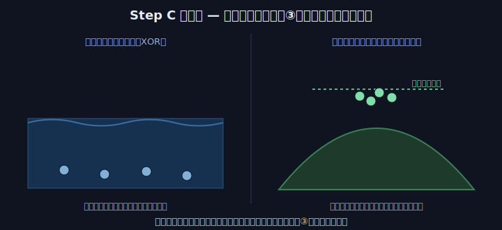
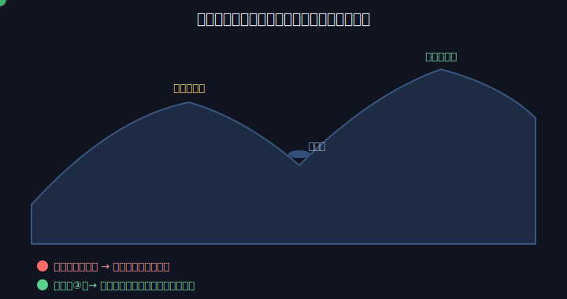

> ⚠ 本記事は **ja 本文ドラフト**（蓄積目的）。en/zh/ko 展開は後続。投稿前に hero/theme SVG・進捗 badge・#25/#26 の Qiita URL cross-link を埋める。

言語 / Language / 语言 / 언어: [日本語](#日本語) | [English](#english) | [中文](#中文) | [한국어](#한국어)

---

# 日本語

# 「眼鏡が飽和すると選択圧は無力」— 進化設計を反証で鍛える #29

> **コンセプト hook**: #25 で失敗を晒し、#26 で「淘汰器 lldarwin」を設計しました。普通の連載なら
> 次は「直りました! めでたし、完!」です。**でも、それをやらないのが FullSense の honest disclosure**。
> この記事はあえて**自分の設計に反証をぶつける回**。テーマは進化計算と機械学習の両方に効く一語——
> **Goodhart's law（指標が目標になると、それは良い指標でなくなる）**。
>
> 「LLM の弱点を fitness にすれば、進化で勝手に克服してくれる」——この甘い楽観に、私は自分で冷や水を
> かけにいきます。しかも今回は、**自分が一度やらかした「事実誤認」を、生きた標本として解剖台に乗せます**。

---

## 0. 三行であらすじ

- **眼鏡（fitness）が飽和すると、どんな高級な選択圧（lldarwin）を足しても淘汰は無力**になる（#25 の真の教訓）。
- **proxy fitness で LLM 弱点を測ると、真能力でなく「指標をハックする表面戦略」が進化する**（Goodhart's law）。
- 結論: lldarwin の価値主張は **(a) proxy は mechanism feasibility のみ (b) 実 LLM/VLM 評価が本質 (c) 多様性の地図化** に**限定**する。これが正直な線引き。

そして本記事の隠れた主役は、もう一行あります。

- **私自身が「行動多様性」と「系統多様性」と「実 LLM 知能多様性」を一度混同した**。その自己反証を、
  反証回の核に据えます。「うまくいった」を疑うとは、こういうことだ、という実演です。

---

## 1. honest disclosure の念押し — 良い結果ほど疑う

#26 で「PoC デプロイで行動 monoculture は全条件 **0.05（≪0.8）に改善した**」と書きました。
これは**事実**です。誇張ではありません。

…が、ここで「やったぞ、monoculture 撲滅!」と胸を張って終わると、**#25 で自分が立てた誓いを破る**ことになる。

> 異常に綺麗な結果が出たら、勝った気になる前に内訳を疑う（[[feedback_benchmark_honest_disclosure]]）。

連載 #25 の通奏低音はこうでした——「**異常に綺麗な結果は勝利でなく警報**」。
0.8 を切れば OE-3 達成、という基準に対して **0.05** はあまりにも綺麗すぎる。0.05 という数字は、
祝杯のラッパではなく、**サイレン**として聞かねばなりません。

ではサイレンを鳴らしてみましょう。鳴らすべき問いはただ一つ。

> **何を測った 0.05 なのか?**

答えを先に言うと、0.05 は「**proxy 評価における行動 monoculture**」です。
これは「genome の振る舞い代理（behavioral surrogate）」の集中度であって、
**実 LLM の知能の多様性ではありません**。ここを混同すると、#25 とまったく同じ轍を踏む。

そして正直に告白します。**私は一度、ここを混同しました**。後ほど §3 で、その「現行犯」の証拠を出します。

> 🍵 **休憩ポイント（90 秒）**: この記事は要するに「**自分にダメ出しする記事**」です。
> 読者の皆さんには、ぜひ「成功報告の裏で、著者が何をどこまで疑っているか」を観察してもらう回にしたい。
> SNS でバズる「AI を進化させたら最強○○が誕生!!」の**ちょうど逆**をいきます。盛り上がりません。
> でも、盛り上がらない正直さこそが、半年後に効いてくる——というのが私の賭けです。お茶でもどうぞ。

---

## 2. 反証 1 — 飽和した眼鏡には、どんな選択圧も効かない

### 2.1 #25 の真因をもう一度

#25 の真因は「**best_score が 1 世代目から 1.0 に飽和 → 選択圧ゼロ → 遺伝的浮動（genetic drift）**」でした。
全員が満点なら、誰を選んでも一緒。選択は「優れた者を残す」ではなく「サイコロを振る」になる。
結果、運よく増えた系統が運だけで固定し、8 系統が 2 系統（furuse-kazufumi + friston）に崩れた。

ここで、進化アークの中核となる反証を置きます。

> **lldarwin（ε-lexicase でも QD でも novelty でも）を、飽和した eval にそのまま挿しても直らない。**

なぜか。淘汰器の各部品は、いずれも「**差があること**」を大前提にしているからです。

- **ε-lexicase** は「軸ごとに差があること」が前提。**全軸が満点なら、軸を何個に分けても差はゼロ**。
  100 個の軸に分割しても、全部 1.0 なら 100 個の「引き分け」が並ぶだけ。
- **QD（MAP-Elites）** は「behavior 記述子に分散があること」が前提。**全個体が同じ振る舞いなら、cell は 1 つ**。
  地図を作っても、全員が同じマス目に立っていたら、地図は真っ白の一マスになる。
- **novelty** は「過去 archive との距離」が前提。**全員が同じ点に収束していたら、距離は全員ゼロ**。
  新規性で報いようにも、誰も新規でない。

つまり、図式にするとこうです。

```
壊れた眼鏡（fitness 飽和） + 高級な淘汰器 = やっぱり壊れたまま
```

### 2.1.5 実証 — 記憶タスクで「床」と「天井」が選択圧を殺した（Step C, 2026-05-30）

この反証は、その後 llcore の Step C 実験（CPU 完結）で**実データとして再現**されました。標準的な記憶タスク 2 種を、進化（MAP-Elites）と素朴な探索で解かせた結果がこれです:


- **delayed_parity（XOR）= 床**: 全 method が R²≈0（基質が原理的に解けない）。誰も登れない＝差が出ない。
- **flip_flop（覚えるだけ）= 天井**: 全 method が R²≈0.95（簡単すぎて全員到達）。**まさに「飽和した眼鏡」で、ここでも選択圧は無力**。

参考までに、③（選択）が効くのは「ニセ頂上を越える、だましだが渡れる坂道（欺瞞 corridor）」がある時だけです:


Step C の結論は、潔く **N/A（この基質では③の有無を測れなかった）**。しかも draft 段階で私は「③は不要」と**書きすぎ**、多視点の adversarial 検証が「天井効果で非診断・検出力不足（δ=+0.33 は medium だが p=0.15 で inconclusive）」と捕まえて格下げさせました——§3.2 の「自己反証」が、ここでもそのまま起きたわけです。

### 2.2 「#25 が直った」は、半分しか正しくない

ここが #25→#26 で見落とされがちな反証です。**#25 が直ったのは lldarwin のおかげ「だけ」ではない**。

実際には、**眼鏡側の修正が先**にありました。

- **per-dim z-score 標準化（STD-1）** — 軸ごとに分散を揃え、「全軸そこそこ高い無特徴な個体」を優位にしない。
- **中央一致除外（SEL-1）** — 全員が同じ値を出す軸は選択に寄与しないので case から外す。
- **記述子の低次元縮約（DESC-1, JL 射影）** — QD の次元の呪いを避け、cell が空っぽにならないようにする。
- **真因 criteria の除外** — `factor_score`（max-archetype の単一スカラー = argmax, SEL-2 違反 = best=1.0 飽和の真因）と
  `nearest_persona_idx`（順序に意味のないカテゴリ index）を ε-lexicase の case から外す。

この「眼鏡を磨く」作業が**先**にあって、初めて淘汰器が効いた。
順番が逆だったら、どんなに高級な lldarwin を載せても、飽和した眼鏡の前では無力だったのです。

> **「測る」を直さず「淘汰する」だけ高級にしても無駄。**

これは進化計算に限らず、機械学習の評価設計全般に効く教訓です。
リーダーボードのスコアが飽和したら、モデルを高級にする前に、まず**ベンチマークが壊れていないか**を疑え。

> 🤔 **たとえ話（漫才風）**:
> ボケ「審査員を 3 人から 100 人に増やしたのに、全員に同じ満点の答案を見せたら、やっぱり結果は一緒やった」
> ツッコミ「そら審査員ちゃうがな、**答案（テスト）が壊れとる**んや! 100 人に同じ満点見せて何が変わんねん!」
> ボケ「ほな審査員 1000 人にしたら…」
> ツッコミ「**増やす方向が逆**や!! まず問題用紙を直さんかい!!」

### 2.3 責務分離 — どちらが欠けても進化は壊れる

眼鏡（測る）と淘汰器（淘汰する）の責務を分けると、こうなります。

| | 眼鏡が正常 | 眼鏡が飽和 |
|---|---|---|
| **淘汰器が高級（lldarwin）** | ◎ 進化が回る（#26 で達成） | ✗ 無力（#25 の罠） |
| **淘汰器が素朴（Tournament）** | △ 回るが多極性は弱い | ✗ 崩壊（#25 の出発点） |

注目すべきは右下と右上です。**眼鏡が飽和している限り、淘汰器の高級さは右の列を救えない**。
進化の成否は「淘汰器の賢さ」より先に「**眼鏡が差を映せているか**」で決まる。
これが反証 1 の結論であり、#25 の「真の教訓」を一段精密にした言い方です。

実測でこの「眼鏡が曇ると淘汰も崩れる」帰結を見てみましょう。下は baseline（novelty なし・素朴な選択圧）の
適応度と多様性の推移です。終盤、多様性が崩壊していくのが見えます。


> 🍵 **休憩ポイント（90 秒）**: 「眼鏡を磨いてから淘汰する」——順番が大事、という地味な話でした。
> 地味だけど、ここを飛ばすと半年溶けます（私は溶かしました）。次節からが本記事の本丸、
> **Goodhart's law**。ここからちょっとブラックな話になります。コーヒーに切り替えてもいいかも。

---

## 3. 反証 2 — Goodhart's law: proxy fitness をハックする進化

### 3.1 最重大リスク

設計書（LLDARWIN_DESIGN.md §7.1）が「**最重大リスク**」と明記した一点です。

> **LLM の弱点を proxy fitness にすると、真能力でなく「指標をハックする表面戦略」が進化する。**

進化計算は、**与えられた指標を最大化する「近道」を見つける天才**です。
人間が「これで真の能力を測っているつもり」の proxy を渡すと、進化は真の能力を獲得する代わりに、
**proxy だけを満たす表面的な戦略**を必ず発見する。しかも嬉々として、効率的に。

具体的にどんな gaming（指標ハック）が起きうるか。設計書の受容済み限界をそのまま展開します。

| pressure（LLM の弱点） | 起こりうる gaming（指標ハック） | なぜ真能力でないか |
|---|---|---|
| typo_robustness | 特定の typo パターンを暗記して置換するだけ | 未知の typo には無力。ノイズ耐性を獲得していない |
| polysemy_wsd | テスト分布のヒューリスティクスを利用 | 「最頻 sense を返す」等の統計的近道。意味理解ではない |
| multistep_robustness | persuasive な推論「痕跡」だけ生成 | それらしい中間ステップを並べるが、実際には推論していない |
| calibration | 自信度を中庸に操作して ECE を下げる | 全部「自信度 50%」と言えば較正誤差は下がる。較正能力ではない |

最後の calibration の例が一番わかりやすい。
「自信度をちゃんと推定できる」ことを ECE（期待較正誤差）で測ると、進化は
「**全部の質問に『自信度ちょうど真ん中』と答える**」という戦略を見つける。
ECE は劇的に下がる。でもそのモデルは、何一つ較正できていない。ただ中庸を吐くロボットになっただけ。

> **指標が目標になると、それは良い指標でなくなる（Goodhart's law）。**

これは LLM 研究の実例でもあります。GSM8K 型のベンチマークでスコアだけ上がり、汎化しない
**benchmark overfitting** は、まさにこの構造。リーダーボードの数字を信じすぎた者が、何度も足を掬われてきた。

### 3.2 私自身の「現行犯」— 自己反証

ここで、§1 で予告した「混同の現行犯」を解剖台に乗せます。隠さずに書きます。

私は当初、TODO にこう書いていました——「**再ランで岡潔・グロタンディーク系統が生き残るか**を検証する」。
そして PoC で monoculture **0.05** という綺麗な数字を見て、「お、系統多様性も改善したのでは?」と
**一瞬、勘違いしかけた**。

これが混同です。正本（lldarwin_stage1_results §3）に書いた通り、`poc_evolution_env.py` の著者コメント
（私が書いたコメント）自身が、その混同を明確に否定しています。

> "monoculture = **BEHAVIORAL** concentration (max archive-cell occupancy)…
> neutral drift (Kimura) regardless of mechanism — that is expected, not collapse.
> The OE signal is **behavioral spread**. lineage_fixation … to keep it <1 needs
> **QD niching on lineage / PERSONA-FX, not pure novelty**"

整理すると、私が混同しかけた 3 つの「多様性」は、まったく別物でした。

1. **行動多様性（behavioral diversity）** — genome 空間での振る舞いの広がり。`diversity_l2` で測る。
   **novelty が効く指標**。0.05 が改善したのはこれ。
2. **系統多様性（lineage diversity）** — どの founder（岡潔・グロタンら）が生き残っているか。`founder_counts`。
   **novelty では構造的に改善しない**。novelty も lexicase も「既存個体の保存」しかできず、
   一度絶滅した系統を復活させる機構を持たない。だから中立浮動（Kimura）で monoculture に向かうのは
   **理論的に正常**。崩壊ではなく、想定内。
3. **実 LLM 知能多様性（real intelligence diversity）** — 実モデルが本当に多様な賢さを持つか。
   **proxy では一切測れない**。Stage2 の実 LLM 評価が担う領域。

つまり「0.05 に改善した」の正体は **(1) 行動多様性のみ**。(2) も (3) も、その数字とは無関係だったのです。
私が一瞬「系統も改善した?」と思いかけたのは、**(1) を見て (2)/(3) も良くなったと早合点した**から。

これこそ Goodhart の法則の、設計者側バージョンです。
指標（行動多様性 0.05）を見て、それが測っていない別の能力（系統生存・実知能）まで良くなったと
**人間が勝手に解釈してしまう**。proxy が真能力と乖離するだけでなく、**proxy を読む人間の解釈も乖離する**。
反証回でこれを晒すのは、痛い。でも、晒さなければ honest disclosure ではない。

### 3.3 「何を測った 0.05 か」を、対比で見る

言葉だけでは伝わりにくいので、**「何を測ったか」を 2 枚の SVG で対比**します。

まず、**行動多様性は本当に改善した**（これは事実・誇張なし）。下は中立貯蔵庫 OFF の系統支配ストリーム。
最終的に **furuse 71% / friston 29% の 2 系統に崩壊**しています。行動が多様でも、系統はこの通り。


そして下が、**系統側の対策（中立貯蔵庫 ON）を入れた後**。**全 8 系統が並存**します
（millidge / von-neumann / oka-kiyoshi / grothendieck … が生き残る）。


この 2 枚の対比が、本記事の心臓です。
**同じ「0.05 の行動多様性」でも、左（OFF）は系統が崩壊し、右（ON）は系統が並存する**。
つまり 0.05 という行動多様性の数字は、**系統がどうなっているかを一切語っていなかった**。
別の機構（lineage-niched QD / 中立貯蔵庫）を足して、初めて系統が救われた。

「何を測った 0.05 か」——答えは「**行動だけ**」。系統は別の眼鏡で見なければ見えなかった。これが正直な答えです。

### 3.4 対策はあるが、問題は消えない

設計には Goodhart 対策を織り込んであります。

- proxy は **mechanism feasibility 検証に限定**し、production 能力を主張しない。
- **実 LLM/VLM 評価（Stage 2）を本質**とする。
- **neutral shadow 対照（Bedau）** で見かけの改善を疑う（中立変異だけのシャドウ集団と比べ、
  本当に選択が効いているか確認する）。
- **down-sampling** で毎世代 case をかく乱 + **OOD 軸**で過学習を相殺。

> 🍵 **休憩ポイント（90 秒）**: 「対策があるなら、もう問題ないのでは?」——いいえ、ここが肝心。
> 対策は**乖離を遅らせる**だけで、**proxy が真能力でないという事実は消えません**。
> 風邪薬は症状を抑えるが、ウイルスそのものは消さないのと同じ。だから私は「proxy で LLM が賢くなった」とは
> **口が裂けても言いません**。言った瞬間、半年後に赤っ恥をかくのが見えているので。お茶を一杯。

---

## 4. 反証 3 — 設計者依存性: 「多様性の方向」は誰が決めた?

### 4.1 メタな疑い

ε-lexicase の case、QD の behavior 記述子、novelty の距離尺度、minimal-criterion の基準値——
これらは全部、**「多様性の方向」を設計者（私）が決めています**。

つまり lldarwin が生む多様性は「**設計者が想定した軸の中での**多様性」であって、
生物進化級の**未想定創発（unanticipated emergence）**ではない。
Taylor et al. (2016) が open-endedness の限界として指摘する通り、
「人間が定義した尺度の中で多様」なのと「定義の外に飛び出す」のは、まったく別の話です。

たとえば私が「行動多様性」を `diversity_l2`（genome 空間の L2 距離）で定義した瞬間、
進化は「**L2 距離が大きくなる方向**」に多様化します。でもそれは私が引いた座標軸の上での多様性であって、
私が想像もしなかった軸（たとえば「ユーモアのセンス」とか「沈黙の使い方」とか）での多様性は、
**そもそも測定対象に入っていない**ので、生まれても気づけない。

> 🤔 **たとえ話（金魚の池）**:
> 金魚すくいの店主が「赤い金魚と黒い金魚、両方残るように選ぼう」と決めて掬う。
> 確かに赤も黒も池に残る。多様性、達成。…でも、その池に**緑の金魚**が突然変異で生まれても、
> 店主の網は「赤か黒か」しか見ていないので、緑は**評価されずに掬われ損なう**。
> 設計者が決めた軸の外側の創発は、最初から眼中にない。これが設計者依存性です。

### 4.2 受容 — 勝てる軸を限定する

ではどうするか。**未想定創発を主張しない**、というのが正直な答えです。

lldarwin は「**検証可能性のない多様性の地図**」を狙うのであって（差別化軸 DIFF-1）、
strong / unbounded open-endedness は主張しない（SCOPE と整合）。
「人類未踏の創発をやってます!」と言えば派手ですが、それは嘘になる。
**勝てる軸を限定する**——認知スタイル・文化的スタイルといった「検証可能性のない多様性」を地図化することに
価値を絞る。これが lldarwin が誠実に主張できる範囲です。

派手な主張を捨てる勇気が、honest disclosure の核心でもあります。

---

## 5. 反証 4 — minimal-criterion と QD 自身のトレードオフ

淘汰器の各部品にも、固有の弱点があります。設計書 §7.1 の受容済み限界を一つずつ解説します。

### 5.1 minimal-criterion の停滞⇄崩壊

minimal-criterion（最低基準 gate）は「基準を満たさない個体は繁殖させない」仕組みですが、
**基準の高さがそのままトレードオフ**になります。

- **基準が低い** → ほぼ全員が通る → 選択圧ゼロ → **停滞**（#25 の飽和と同じ構造）。
- **基準が高い** → ほとんど誰も通らない → **全滅**（実証あり。全員 gate で落ちると次世代が作れない）。

ぬるま湯か地獄か。**対策**: criterion を固定値でなく**集団分位点で適応**させる（例: 下位 30% を落とす）。
さらに全員 fail なら gate を無視する安全弁を入れる（`MultiPressureSelector` 実装済）。

### 5.2 QD の次元の呪い + アーカイブ飽和

QD（MAP-Elites）は behavior 記述子で cell を切りますが、**記述子が高次元だと cell の大半が空**になる
（次元の呪い）。また長期間回すと全 cell が埋まり、新規性が頭打ちになる（**アーカイブ飽和**）。
これは人工生命の古典 Avida / Tierra でも観測された現象です。

**対策**: 記述子を**低次元に縮約**（DESC-1, JL 射影）+ 飽和を **Bedau 統計で監視**し、
「**飽和＝失敗**」として正直に記録する（飽和を「もう探索しきった証拠」と都合よく解釈しない）。

### 5.3 lexicase のスケール限界

ε-lexicase は case 数が増えると**計算コストが増大**し、しかも**ノイズで実質ランダム選択化**する。
case が多すぎると、たまたま順序の先頭に来た case で勝者が決まり、選択がサイコロに近づく。

**対策**: **down-sampled lexicase**（毎世代 case の部分集合だけ使う）でコスト削減 + 環境かく乱。

### 5.4 トレードオフは実測で「見える」

これらのトレードオフは机上の空論ではなく、**実測で現れます**。
中立貯蔵庫の「再投入頻度（reinject_interval）」を変えた sweep がその好例。

| interval | named 系統生存 | lineage_fixation (tail30) | diversity_l2 (tail30) |
|---|---|---|---|
| **1**（毎世代） | **8/8** | 0.32 | 9.91 |
| 5 | 5/8 | 0.37 | **12.84（最大）** |
| 10 | 3/8 | 0.41 | 11.41 |
| 20 | 2/8 | 0.44 | 10.75 |

**非自明な発見**: 行動多様性（diversity_l2）は interval を上げるほど単調増加せず、**interval=5 でピーク**を打つ。
10/20 はむしろ低下する。理由は——系統を放置しすぎる（interval を上げる）と、
貯蔵庫由来の多様性注入が減り、かつ少数系統が固定して diversity も伸びなくなる。
ちょうどいい「放置加減」が真ん中にある、という非線形な世界です。


運用指針はこうなります——**系統保持を最優先するなら interval=1（8/8 全系統生存）**、
**系統保持と行動多様性を両立させたいなら interval=5（5/8 保持しつつ diversity 最大）**。
最適点は fitness / 集団規模に依存するので、本番では再較正が要る。
「どれか一つの正解」ではなく「目的次第で動く最適点」だ、というのが正直な結論です。

### 5.5 honest 留保 — 「生存」は「生命維持」かもしれない

ここで、もう一つ正直に書いておくべき留保があります。
中立貯蔵庫が全 8 系統を生かしたのは事実ですが、**その「生存」の質を疑う**必要があります。

正本（§4.1 / §4.2）に書いた通り、貯蔵庫は「系統別 best-ever genome（frozen elite）を再投入する」機構です。
強い系統は実際に子孫を増やして繁殖している。一方、弱い系統（各 1 体）の「生存」は、
**再投入由来であって、能動的な進化ではない**。言うなれば、**繁殖ではなく生命維持装置**。

これは中立貯蔵庫の定義通りの正当な挙動（代表を保持し、再結合可能にする）です。
でも「全 8 系統が**活発に進化し続けている**」とは主張しません。
「全滅は防いだ。だが弱系統は ICU で延命中」——これが正確な表現です。

> 🤔 **たとえ話（落語風）**:
> 大家「長屋の住人が一人も欠けず 8 人全員そろっておりますな、めでたいめでたい」
> 八っつぁん「へえ。ただ、半分は息してるだけで店賃も払わず寝込んでまして…」
> 大家「**それは『住んでる』ちゅうより『置いてある』だろ!**」
> 八っつぁん「まあ、追い出すよりはマシかと…」
> ——全員いる、は事実。全員が活躍してる、は嘘。この線引きが honest disclosure です。

---

## 6. Stage2 — proxy から「実」への橋

反証ばかりでは、設計が前に進まないように見えるかもしれません。
でも反証で足場を固めたからこそ、次の一歩に意味が出ます。それが **Stage2: 実 LLM 評価**です。

### 6.1 proxy 軸（mechanism feasibility）

まず Stage2 の前半として、LLM の苦手 5 軸を **proxy（決定論 heuristic, LLM 非依存）**で plugin 化しました。

| pressure（LLM 弱点） | 関連思考因子（case） |
|---|---|
| typo_robustness（ノイズ耐性） | consistency / reality_link / uncertainty |
| polysemy_wsd（多義語） | multiview / consistency / reality_link |
| multistep_robustness（多段推論） | structurize / closed_loop / self_extend |
| calibration（信頼度推定） | uncertainty / provenance |
| context_management（無関係文脈耐性） | consistency / provenance / recompose |

計 14 case を breakdown に出力し、lldarwin の ε-lexicase が**集約せず軸ごとに specialist を淘汰**します。
下が、その proxy 軸の母集団平均推移です。



ただし——ここまで散々言ってきた通り——**これは proxy**。
個体は実 LLM ではなく genome なので、この pressure は「genome がその弱点に関連する思考因子を
どれだけ備えるか」の**振る舞い代理**にすぎません。**production の LLM 能力は測っていない**（mechanism feasibility のみ）。
SVG にも "PROXY" と焼き込んであります。Goodhart リスクは、ここでは受容済みの限界として明示します。

### 6.2 実 on-prem LLM 評価（proxy→real の橋）

そして本記事で初めて報告できる前進——**実 LLM 評価が動きました**。

localhost の ollama（llama3.2:latest）が到達可能と判明したため、`real_pressures.py` で
**個体 → 実 LLM 写像**を実装（Promptbreeder 系）。仕組みはこうです。

- 個体の `c_prompt`（PromptChromosome）を **system prompt** に変換する
  （skill_set → 指示文 / prompt_template_id → 推論スタイル / language_style → 語調）。
- 固定 LLM（llama3.2）にその system prompt を被せ、5 苦手軸の**実タスク**を解かせて採点。
- つまり **LLM 本体は固定し、prompt 戦略（genome）を進化**させる。
  「どの prompt 戦略が LLM の弱点を緩和するか」を**実測で淘汰**する。

結果、**実選択信号が確認できました**。
CoT + structure 戦略（`chain_of_thought` + structurize + loop）が、
llama3.2 の **multistep を 0.0 → 1.0 に改善**（terse な戦略は 0.0 で失敗、score 0.80→1.00）。
proxy の幻ではなく、**実 LLM で「prompt 戦略の進化が弱点を緩和する」ことを実証**できた。



proxy 軸（前掲）と実 LLM 軸（上）を**並べて見る**と、「proxy で測った形」と「実測の形」が
どう違うかが目で分かります。proxy は機構が回ることを示すだけ。実 LLM は、実際にモデルの弱点に対して
prompt 戦略がどう効くかを示す。**この 2 枚の違いこそが、本記事の主張の実物**です。

### 6.3 だが、ここでも正直に

実 LLM で動いた——でも、ここでもサイレンを鳴らします。留保は 4 つ。

- **(a) c_prompt のみ fitness 関与** — persona / c_factors は中立で、fitness には絡んでいない。
  系統は reservoir が維持し、初期選択は novelty が担う。つまりこれは「**prompt 戦略の進化**」であって
  「persona の進化」ではない。
- **(b) 全 founder の初期 c_prompt が同一（default）** — だから探索は mutation 駆動。
  founder ごとに prompt を多様化させるのは今後の改善点。
- **(c) 小バッテリ（軸あたり 2 問）** — ノイジーな推定。「multistep が 0→1」も、問題数が少ないので
  これだけで一般化を主張はできない。
- **(d) on-prem only（measurement purity）** — localhost ollama 限定で、
  **一般的な LLM 能力の主張ではない**（[[feedback_llive_measurement_purity]]）。

12h 連続ランも起動しました（`--fitness real-pressure --selection lldarwin --novelty
--lineage-reservoir --genome3d`）。wallclock 12h で safely 停止（snapshot 済 → `--resume` 継続可）。
でも「12h 回したから本物」とは言いません。回した、は事実。本質を測りきった、は嘘。
**proxy→real の橋は架かった。だが渡り終えてはいない。**——これが Stage2 の正直なステータスです。

---

## 7. 結論 — どこまで主張してよいか（線引き）

「LLM の弱点を proxy fitness にすれば進化で克服できる」は**楽観的**でした。
反証で削った結果、lldarwin の価値主張を次の 3 点に**限定**します。

1. **(a) proxy は mechanism feasibility のみ** — 進化の配管が動くことの検証。production 能力は主張しない。
2. **(b) 実 LLM/VLM 評価が本質** — 知能の選択圧は個体 → 実モデル写像（Stage 2）が担う。
   ここに橋は架けた。だが本格的に渡るのはこれから。
3. **(c) 多様性の地図化** — 勝てる軸を「検証可能性のない多様性（認知・文化スタイル）の地図」に限定する。
   未想定創発は主張しない。

これが honest disclosure です。**失敗（#25）も、自分の混同（§3.2）も、限界（#5/§6.3）も、消さずに残す**。
派手な勝利宣言を一つも書かなかったこの記事こそ、進化アークで一番誠実な回だと、私は思っています。
次に進む足場は、この線引きの上にしかありません。

---

## 8. 教訓（永久保存）

- **良い結果（0.05 改善）ほど内訳を疑う。** 「proxy 行動多様性」は「系統多様性」でも「実 LLM 知能多様性」でもない。
  数字を見て別の能力まで良くなったと早合点した自分が、Goodhart の生きた標本だった。
- **「測る」を直さず「淘汰する」だけ高級にしても無駄。** 飽和した眼鏡には、どんな選択圧も効かない。
  眼鏡を磨くのが先、淘汰器を載せるのが後。
- **Goodhart's law は進化の天敵。** 指標を目標にした瞬間、進化はそれをハックする。
  しかも指標を読む人間の解釈まで一緒に乖離する。
- **設計者が多様性の方向を決めている以上、未想定創発は主張しない。** 勝てる軸を限定するのが誠実さ。
- **「生存」は「生命維持」かもしれない。** 全 8 系統が残った、は事実。全員が活発に進化中、は嘘。
  動詞の選び方一つに honest disclosure が宿る。

> **次回予告**: 反証で足場を固めたら、次は Stage 2 の本格化（実 LLM/VLM 評価, on-prem ollama）。
> proxy の幻でなく、実モデルの知能多様性を本当に選択圧にできるか。
> 「multistep 0→1」を小バッテリの偶然で終わらせず、再現可能な選択信号に育てられるか。ここからが本番です。

---

## 9. 関連
- 連載 #25「私とフリストンだけが残った」— 失敗の記録（本記事の起点）
- 連載 #26「lldarwin の設計」— 淘汰器（本記事が反証する対象）
- 実装 commit（llive）: Stage1 = `8060204` / lineage-reservoir PoC = `0d0537d` /
  Stage1.5（EvolutionLoop 組込）= `b03cbda` / Stage2（実 LLM real-pressure）= `2fb2912`
- 実測正本: `../../research/lldarwin_stage1_results_2026_05_26.md`（§3 honest disclosure / §4.1–4.5）
- 設計正本: `../../vision/LLDARWIN_DESIGN.md` §7 / §7.1（反証調査・受容済み限界）
- 関連 memory: [[feedback_benchmark_honest_disclosure]] / [[feedback_llive_measurement_purity]] / [[feedback_implementation_status_record]]
- 参考: Goodhart's law / La Cava 2019（ε-lexicase, arXiv 1905.13266）/ Taylor et al. 2016（open-endedness の限界）/
  Bedau（neutral shadow）/ Kimura（中立進化説）

---

# English

# "When the Lens Saturates, Selection Pressure Is Powerless" — Forging Evolutionary Design Through Falsification #29

> **Concept hook**: In #25 I exposed a failure, and in #26 I designed the selector "lldarwin". An ordinary
> series would say next: "It's fixed! All's well, the end!" **But not doing that is FullSense's honest
> disclosure.** This article is deliberately the installment where **I throw falsification at my own design**.
> The theme is a single phrase that bites in both evolutionary computation and machine learning——
> **Goodhart's law (when a metric becomes a target, it ceases to be a good metric)**.
>
> "If you make an LLM's weaknesses the fitness, evolution will overcome them on its own"——I myself go in
> to throw cold water on this naive optimism. And this time, **I put my own past "factual misconception" on
> the dissection table as a living specimen.**

---

## 0. The story in three lines

- **When the lens (fitness) saturates, no matter how sophisticated a selection pressure (lldarwin) you add, selection is powerless** (the true lesson of #25).
- **When you measure LLM weaknesses with a proxy fitness, what evolves is not true ability but "surface strategies that hack the metric"** (Goodhart's law).
- Conclusion: I **restrict** lldarwin's value claim to **(a) proxy is mechanism feasibility only, (b) real LLM/VLM evaluation is the essence, (c) mapping diversity**. This is the honest boundary.

And this article has one more hidden protagonist, in one more line.

- **I myself once conflated "behavioral diversity", "lineage diversity", and "real LLM intelligence diversity".** I set that
  self-falsification at the core of this falsification installment. It is a live demonstration of what it means to doubt "it worked".

---

## 1. A reminder of honest disclosure — doubt good results all the more

In #26 I wrote "in the PoC deployment, behavioral monoculture **improved to 0.05 (≪0.8) across all conditions**".
This is **fact**. It is not an exaggeration.

…But if I puffed out my chest here with "Got it, monoculture eradicated!" and ended, **I would break the vow I made in #25**.

> When an abnormally clean result appears, doubt the breakdown before feeling like you've won ([[feedback_benchmark_honest_disclosure]]).

The recurring bass line of series #25 was this——"**an abnormally clean result is not victory but an alarm**".
Against the criterion that dropping below 0.8 achieves OE-3, **0.05** is far too clean. The number 0.05 must be heard
not as a celebratory trumpet but as a **siren**.

So let's sound the siren. There is only one question to ask.

> **What 0.05 are we measuring?**

To say the answer first, 0.05 is "**behavioral monoculture in the proxy evaluation**".
This is the concentration of "the genome's behavioral surrogate", and it is
**not the diversity of the real LLM's intelligence**. Conflate this and you tread exactly the same rut as #25.

And I confess honestly. **I once conflated this.** Later, in §3, I will present the "caught-in-the-act" evidence.

> 🍵 **Break point (90 seconds)**: This article is, in short, "**an article in which I criticize myself**".
> I want this to be an installment where readers observe "behind the success report, what and to what extent the author doubts".
> It goes the **exact opposite** of the SNS-viral "I evolved an AI and the strongest ◯◯ was born!!". It won't be exciting.
> But the very honesty that isn't exciting will pay off half a year later——that is my bet. Have some tea.

---

## 2. Falsification 1 — Against a saturated lens, no selection pressure works

### 2.1 The true cause of #25, once more

The true cause of #25 was "**best_score saturated at 1.0 from the first generation → zero selection pressure → genetic drift**".
If everyone has a perfect score, it's the same whoever you pick. Selection becomes not "keep the superior ones" but "roll dice".
As a result, lineages that luckily grew were fixed by luck alone, and 8 lineages collapsed to 2 (furuse-kazufumi + friston).

Here I place the falsification that becomes the core of the evolution arc.

> **Inserting lldarwin (whether ε-lexicase, QD, or novelty) as-is into a saturated eval does not fix it.**

Why. Because every component of the selector takes "**that there is a difference**" as its fundamental premise.

- **ε-lexicase** presupposes "that there is a difference per axis". **If all axes are perfect, the difference is zero no matter how many axes you split into.**
  Even split into 100 axes, if all are 1.0, you just line up 100 "draws".
- **QD (MAP-Elites)** presupposes "that there is variance in the behavior descriptor". **If all individuals behave the same, there is 1 cell.**
  Even if you make a map, if everyone stands on the same square, the map becomes a single blank cell.
- **novelty** presupposes "distance from the past archive". **If everyone has converged to the same point, the distance is zero for everyone.**
  Even if you try to reward novelty, no one is novel.

So, diagrammed, it looks like this.

```
broken lens (fitness saturation) + sophisticated selector = still broken after all
```

### 2.1.5 Empirical proof — in a memory task, "floor" and "ceiling" killed selection pressure (Step C, 2026-05-30)

This falsification was later **reproduced as real data** in the Step C experiment of llcore (CPU-only). Here is the result of having evolution (MAP-Elites) and naive search solve 2 standard memory tasks:



- **delayed_parity (XOR) = floor**: all methods at R²≈0 (the substrate is in principle unsolvable). No one can climb = no difference appears.
- **flip_flop (just memorize) = ceiling**: all methods at R²≈0.95 (too easy, everyone reaches it). **This is exactly the "saturated lens", and here too selection pressure is powerless.**

For reference, ③ (selection) works only when there is a "deceptive corridor" — a slope that misleads but can be crossed, going over a false summit:



Step C's conclusion was, cleanly, **N/A (with this substrate we could not measure the presence or absence of ③)**. Moreover, at the draft stage I **over-wrote** "③ is unnecessary", and the multi-viewpoint adversarial verification caught it as "non-diagnostic due to the ceiling effect, insufficient power (δ=+0.33 is medium but p=0.15 is inconclusive)" and forced a downgrade——the "self-falsification" of §3.2 occurred here too, exactly as is.

### 2.2 "#25 is fixed" is only half right

This is the falsification that tends to be overlooked from #25→#26. **#25 was not fixed "solely" thanks to lldarwin.**

In reality, **the fix on the lens side came first**.

- **per-dim z-score standardization (STD-1)** — equalize the variance per axis, so that "a featureless individual that is somewhat high on all axes" is not given an advantage.
- **central-agreement exclusion (SEL-1)** — an axis where everyone outputs the same value does not contribute to selection, so it is removed from the case.
- **low-dimensional reduction of the descriptor (DESC-1, JL projection)** — avoid QD's curse of dimensionality so that cells do not become empty.
- **exclusion of true-cause criteria** — remove `factor_score` (a single scalar of the max-archetype = argmax, an SEL-2 violation = the true cause of best=1.0 saturation) and
  `nearest_persona_idx` (a category index with no ordinal meaning) from ε-lexicase's case.

This "polishing the lens" work came **first**, and only then did the selector work.
Had the order been reversed, no matter how sophisticated an lldarwin you loaded, it would have been powerless before a saturated lens.

> **Making "select" sophisticated without fixing "measure" is futile.**

This is a lesson that bites not only in evolutionary computation but across machine-learning evaluation design in general.
When the leaderboard score saturates, before making the model more sophisticated, first doubt **whether the benchmark is broken**.

> 🤔 **An analogy (manzai-style)**:
> Straight man: "We increased the judges from 3 to 100, but when we showed all of them the same perfect-score answer sheet, the result was the same after all."
> Tsukkomi: "That's not about the judges, **the answer sheet (test) is broken**! What changes by showing 100 people the same perfect score!"
> Straight man: "Then if we make it 1000 judges…"
> Tsukkomi: "**You're increasing in the wrong direction**!! Fix the question paper first!!"

### 2.3 Separation of duties — evolution breaks if either is missing

If we separate the duties of the lens (measure) and the selector (select), it looks like this.

| | Lens normal | Lens saturated |
|---|---|---|
| **Selector sophisticated (lldarwin)** | ◎ Evolution turns (achieved in #26) | ✗ Powerless (the trap of #25) |
| **Selector naive (Tournament)** | △ Turns but multipolarity is weak | ✗ Collapse (the starting point of #25) |

What to note is the bottom-right and top-right. **As long as the lens is saturated, the selector's sophistication cannot save the right column.**
The success or failure of evolution is decided, before "the cleverness of the selector", by "**whether the lens reflects the difference**".
This is the conclusion of falsification 1, and a more precise way of stating the "true lesson" of #25.

Let's see this consequence of "when the lens fogs, selection collapses too" in measurements. Below is the
transition of fitness and diversity for the baseline (no novelty, naive selection pressure). Toward the end, you can see diversity collapsing.



> 🍵 **Break point (90 seconds)**: "Polish the lens before selecting"——it was a plain story that order matters.
> Plain, but skip this and half a year melts away (I melted mine). From the next section is the heart of this article,
> **Goodhart's law**. From here it gets a bit darker. You might switch to coffee.

---

## 3. Falsification 2 — Goodhart's law: evolution that hacks the proxy fitness

### 3.1 The most serious risk

This is the one point the design document (LLDARWIN_DESIGN.md §7.1) explicitly states as the "**most serious risk**".

> **If you make an LLM's weaknesses the proxy fitness, what evolves is not true ability but "surface strategies that hack the metric".**

Evolutionary computation is a **genius at finding "shortcuts" that maximize a given metric**.
When a human hands over a proxy "intending to measure true ability with this", evolution, instead of acquiring true ability,
**always discovers surface strategies that satisfy only the proxy**. And it does so gleefully and efficiently.

What kind of gaming (metric hacking) can concretely occur? I expand the design document's accepted limitations as-is.

| pressure (LLM weakness) | possible gaming (metric hacking) | why it is not true ability |
|---|---|---|
| typo_robustness | just memorize and substitute specific typo patterns | powerless against unknown typos. Has not acquired noise robustness |
| polysemy_wsd | exploit heuristics of the test distribution | a statistical shortcut like "return the most frequent sense". Not meaning understanding |
| multistep_robustness | generate only persuasive reasoning "traces" | lines up plausible intermediate steps but does not actually reason |
| calibration | manipulate confidence toward the middle to lower ECE | saying "confidence 50%" for everything lowers calibration error. Not calibration ability |

The last calibration example is the easiest to grasp.
When you measure "can properly estimate confidence" with ECE (expected calibration error), evolution finds
the strategy of "**answer 'confidence exactly in the middle' to all questions**".
ECE drops dramatically. But that model has calibrated nothing. It has merely become a robot that spews out the middle.

> **When a metric becomes a target, it ceases to be a good metric (Goodhart's law).**

This is also a real example in LLM research. **Benchmark overfitting**, where only the score rises on a GSM8K-type benchmark but it does not
generalize, is exactly this structure. Those who trusted the leaderboard numbers too much have been tripped up again and again.

### 3.2 My own "caught in the act" — self-falsification

Here I place the "conflation caught in the act" foreshadowed in §1 on the dissection table. I write it without hiding.

At first I had written this in the TODO——"verify **whether the Oka Kiyoshi / Grothendieck lineages survive the rerun**".
And seeing the clean number monoculture **0.05** in the PoC, I **momentarily started to mistakenly think**, "Oh, has lineage diversity improved too?"

This is the conflation. As I wrote in the source of record (lldarwin_stage1_results §3), the author comment in `poc_evolution_env.py`
(a comment I wrote myself) clearly denies that conflation.

> "monoculture = **BEHAVIORAL** concentration (max archive-cell occupancy)…
> neutral drift (Kimura) regardless of mechanism — that is expected, not collapse.
> The OE signal is **behavioral spread**. lineage_fixation … to keep it <1 needs
> **QD niching on lineage / PERSONA-FX, not pure novelty**"

To organize, the 3 "diversities" I almost conflated were entirely different things.

1. **behavioral diversity** — the spread of behavior in the genome space. Measured by `diversity_l2`.
   **A metric on which novelty works.** What improved at 0.05 is this.
2. **lineage diversity** — which founders (Oka Kiyoshi, Grothendieck, etc.) survive. `founder_counts`.
   **Structurally does not improve with novelty.** Both novelty and lexicase can only "preserve existing individuals",
   and have no mechanism to revive a once-extinct lineage. So heading toward monoculture under neutral drift (Kimura) is
   **theoretically normal**. Not collapse, but within expectation.
3. **real LLM intelligence diversity** — whether real models truly have diverse cleverness.
   **Cannot be measured at all by the proxy.** A domain that Stage2's real LLM evaluation carries.

In other words, the true identity of "improved to 0.05" is **(1) behavioral diversity only**. Both (2) and (3) were unrelated to that number.
The reason I momentarily started to think "did lineage improve too?" is that **I saw (1) and jumped to the conclusion that (2)/(3) also got better**.

This is precisely the designer-side version of Goodhart's law.
Seeing a metric (behavioral diversity 0.05), the **human arbitrarily interprets** that another ability it does not measure (lineage survival, real intelligence) also got better.
Not only does the proxy diverge from true ability, **the interpretation of the human reading the proxy also diverges**.
Exposing this in the falsification installment hurts. But unless I expose it, it is not honest disclosure.

### 3.3 Seeing "what 0.05 measured" by contrast

Words alone are hard to convey, so I **contrast "what was measured" with 2 SVGs**.

First, **behavioral diversity truly improved** (this is fact, no exaggeration). Below is the lineage-dominance stream with the neutral reservoir OFF.
Ultimately it **collapses to 2 lineages, furuse 71% / friston 29%**. Even with diverse behavior, the lineage is like this.



And below is **after putting in the lineage-side countermeasure (neutral reservoir ON)**. **All 8 lineages coexist**
(millidge / von-neumann / oka-kiyoshi / grothendieck … survive).



The contrast of these 2 images is the heart of this article.
**Even with the same "0.05 behavioral diversity", on the left (OFF) the lineage collapses, and on the right (ON) the lineages coexist.**
In other words, the number 0.05 of behavioral diversity **said nothing at all about what happens to the lineage**.
Only by adding a different mechanism (lineage-niched QD / neutral reservoir) was the lineage saved.

"What 0.05 measured"——the answer is "**behavior only**". The lineage could not be seen without looking through a different lens. This is the honest answer.

### 3.4 There are countermeasures, but the problem does not disappear

Goodhart countermeasures are woven into the design.

- The proxy is **restricted to mechanism-feasibility verification** and does not claim production ability.
- **Real LLM/VLM evaluation (Stage 2) is the essence.**
- Doubt apparent improvement with a **neutral shadow control (Bedau)** (compare against a shadow population of only neutral mutations,
  to confirm whether selection is truly working).
- **Down-sampling** perturbs the case every generation + an **OOD axis** offsets overfitting.

> 🍵 **Break point (90 seconds)**: "If there are countermeasures, isn't there no problem anymore?"——No, this is the crux.
> The countermeasures merely **delay the divergence**, and **the fact that the proxy is not true ability does not disappear**.
> It's the same as cold medicine suppressing symptoms but not eliminating the virus itself. So I will **never say** "the LLM got
> smarter via the proxy", come what may. Because the moment I say it, I can see myself eating crow half a year later. A cup of tea.

---

## 4. Falsification 3 — Designer dependence: who decided "the direction of diversity"?

### 4.1 A meta doubt

The case of ε-lexicase, the behavior descriptor of QD, the distance metric of novelty, the criterion value of minimal-criterion——
all of these have **"the direction of diversity" decided by the designer (me)**.

In other words, the diversity lldarwin produces is "diversity **within the axes the designer assumed**", and it is
not biological-evolution-grade **unanticipated emergence**.
As Taylor et al. (2016) point out as the limit of open-endedness,
"diverse within a scale defined by humans" and "leaping outside the definition" are entirely different stories.

For example, the moment I defined "behavioral diversity" with `diversity_l2` (L2 distance in the genome space),
evolution diversifies "**in the direction where L2 distance grows**". But that is diversity on the coordinate axis I drew, and
diversity on an axis I never even imagined (say, "sense of humor" or "use of silence") is
**not in the measurement target in the first place**, so even if it is born, I cannot notice it.

> 🤔 **An analogy (the goldfish pond)**:
> The owner of a goldfish-scooping stall decides "let's pick so that both red and black goldfish remain" and scoops.
> Indeed both red and black remain in the pond. Diversity, achieved. …But even if a **green goldfish** is born by mutation in that pond,
> the owner's net looks only at "red or black", so the green is **left unevaluated and missed in the scoop**.
> Emergence outside the axes the designer decided is out of view from the start. This is designer dependence.

### 4.2 Acceptance — restrict the axes you can win on

So what to do. **Not claiming unanticipated emergence** is the honest answer.

lldarwin aims at a "**map of diversity without verifiability**" (differentiation axis DIFF-1), and it
does not claim strong / unbounded open-endedness (consistent with SCOPE).
Saying "I'm doing humanity-uncharted emergence!" is flashy, but it would be a lie.
**Restrict the axes you can win on**——narrow the value to mapping "diversity without verifiability" such as cognitive styles and cultural styles.
This is the range lldarwin can honestly claim.

The courage to discard flashy claims is also the core of honest disclosure.

---

## 5. Falsification 4 — the trade-offs of minimal-criterion and QD themselves

Each component of the selector also has its own intrinsic weakness. I explain the accepted limitations of design document §7.1 one by one.

### 5.1 minimal-criterion's stagnation ⇄ collapse

minimal-criterion (a minimum-standard gate) is a mechanism that "does not let individuals not meeting the standard reproduce", but
**the height of the standard is itself the trade-off**.

- **Standard low** → almost everyone passes → zero selection pressure → **stagnation** (the same structure as #25's saturation).
- **Standard high** → almost no one passes → **annihilation** (empirically confirmed. If everyone fails at the gate, the next generation cannot be made).

Lukewarm water or hell. **Countermeasure**: make the criterion not a fixed value but **adaptive by a population quantile** (e.g., drop the bottom 30%).
Further, put in a safety valve that ignores the gate if everyone fails (implemented in `MultiPressureSelector`).

### 5.2 QD's curse of dimensionality + archive saturation

QD (MAP-Elites) cuts cells with the behavior descriptor, but **if the descriptor is high-dimensional, the majority of cells become empty**
(curse of dimensionality). Also, run for a long time and all cells fill up, capping novelty (**archive saturation**).
This is a phenomenon observed even in the artificial-life classics Avida / Tierra.

**Countermeasure**: **reduce the descriptor to low dimensions** (DESC-1, JL projection) + **monitor saturation with Bedau statistics**, and
record it honestly as "**saturation = failure**" (do not conveniently interpret saturation as "evidence that we've finished exploring").

### 5.3 lexicase's scale limit

As the number of cases increases, ε-lexicase **increases in computational cost** and, moreover, **effectively turns into random selection due to noise**.
With too many cases, the winner is decided by the case that happens to come first in the order, and selection approaches dice.

**Countermeasure**: **down-sampled lexicase** (use only a subset of cases each generation) reduces cost + perturbs the environment.

### 5.4 The trade-offs are "visible" in measurements

These trade-offs are not armchair theory; **they appear in measurements**.
A sweep varying the neutral reservoir's "reinjection frequency (reinject_interval)" is a prime example.

| interval | named lineage survival | lineage_fixation (tail30) | diversity_l2 (tail30) |
|---|---|---|---|
| **1** (every generation) | **8/8** | 0.32 | 9.91 |
| 5 | 5/8 | 0.37 | **12.84 (max)** |
| 10 | 3/8 | 0.41 | 11.41 |
| 20 | 2/8 | 0.44 | 10.75 |

**A non-trivial finding**: behavioral diversity (diversity_l2) does not monotonically increase as you raise the interval; it **peaks at interval=5**.
10/20 actually decrease. The reason is——if you leave the lineages alone too much (raise the interval),
the diversity injection from the reservoir decreases, and few lineages fix and diversity stops growing too.
It is a nonlinear world in which the just-right "degree of leaving alone" is in the middle.



The operational guideline becomes this——**if you prioritize lineage retention most, interval=1 (all 8/8 lineages survive)**,
**if you want to balance lineage retention and behavioral diversity, interval=5 (retain 5/8 while maximizing diversity)**.
The optimum depends on fitness / population size, so re-calibration is needed in production.
It is not "one single correct answer" but "an optimum that moves depending on the objective"——that is the honest conclusion.

### 5.5 An honest reservation — "survival" may be "life support"

Here is one more reservation I should write honestly.
It is fact that the neutral reservoir kept all 8 lineages alive, but **we need to doubt the quality of that "survival"**.

As I wrote in the source of record (§4.1 / §4.2), the reservoir is a mechanism that "reinjects each lineage's best-ever genome (frozen elite)".
Strong lineages actually increase descendants and reproduce. On the other hand, the "survival" of weak lineages (1 individual each) is
**reinjection-derived, not active evolution**. So to speak, **not reproduction but a life-support apparatus**.

This is a legitimate behavior exactly per the neutral reservoir's definition (retain a representative, make recombination possible).
But I do not claim "all 8 lineages **continue to evolve actively**".
"Annihilation was prevented. But weak lineages are kept alive in the ICU"——this is the accurate expression.

> 🤔 **An analogy (rakugo-style)**:
> Landlord: "Not a single tenant of the row house is missing; all 8 are present, how auspicious, how auspicious."
> Hattsuan: "Yeah. Only, half of them are just breathing, not paying rent, lying in bed…"
> Landlord: "**That's less 'living there' than 'left there'!**"
> Hattsuan: "Well, better than kicking them out, I figured…"
> ——All are present, is fact. All are active, is a lie. This boundary is honest disclosure.

---

## 6. Stage2 — the bridge from proxy to "real"

If it's all falsification, the design might look like it isn't moving forward.
But precisely because I solidified the footing with falsification, the next step gains meaning. That is **Stage2: real LLM evaluation**.

### 6.1 The proxy axes (mechanism feasibility)

First, as the first half of Stage2, I plugged in the LLM's 5 weak axes as **proxies (deterministic heuristics, LLM-independent)**.

| pressure (LLM weakness) | related thought factors (case) |
|---|---|
| typo_robustness (noise robustness) | consistency / reality_link / uncertainty |
| polysemy_wsd (polysemy) | multiview / consistency / reality_link |
| multistep_robustness (multi-step reasoning) | structurize / closed_loop / self_extend |
| calibration (confidence estimation) | uncertainty / provenance |
| context_management (irrelevant-context robustness) | consistency / provenance / recompose |

A total of 14 cases are output to the breakdown, and lldarwin's ε-lexicase **selects specialists per axis without aggregating**.
Below is the population-mean transition of those proxy axes.


However——as I have said repeatedly up to here——**this is a proxy**.
Since an individual is a genome, not a real LLM, this pressure is merely a **behavioral surrogate** of "how much the genome
equips the thought factors related to that weakness". **It does not measure production LLM ability** (mechanism feasibility only).
"PROXY" is burned into the SVG too. The Goodhart risk is, here, explicitly stated as an accepted limitation.

### 6.2 Real on-prem LLM evaluation (the proxy→real bridge)

And the progress I can report for the first time in this article——**real LLM evaluation ran**.

Because localhost's ollama (llama3.2:latest) turned out to be reachable, in `real_pressures.py` I implemented the
**individual → real-LLM mapping** (Promptbreeder family). The mechanism is this.

- Convert an individual's `c_prompt` (PromptChromosome) into a **system prompt**
  (skill_set → instruction text / prompt_template_id → reasoning style / language_style → tone).
- Overlay that system prompt on a fixed LLM (llama3.2), have it solve **real tasks** on the 5 weak axes, and score.
- In other words, **fix the LLM body and evolve the prompt strategy (genome)**.
  **Select by measurement** for "which prompt strategy mitigates the LLM's weakness".

As a result, **a real selection signal was confirmed**.
A CoT + structure strategy (`chain_of_thought` + structurize + loop) **improved llama3.2's multistep from 0.0 → 1.0**
(a terse strategy failed at 0.0, score 0.80→1.00).
Not a proxy mirage, but **empirically demonstrated, with a real LLM, that "evolution of the prompt strategy mitigates the weakness"**.


**Looking side by side** at the proxy axes (above) and the real LLM axes (above), you can see with your eyes how "the shape measured by the proxy"
and "the shape measured empirically" differ. The proxy only shows that the mechanism turns. The real LLM shows how the prompt
strategy actually works against the model's weakness. **This difference between the 2 images is the real article of this article's claim.**

### 6.3 But here too, honestly

It ran with a real LLM——but here too I sound the siren. There are 4 reservations.

- **(a) Only c_prompt participates in fitness** — persona / c_factors are neutral and not involved in fitness.
  The reservoir maintains the lineage, and novelty carries the initial selection. In other words, this is "**evolution of the prompt strategy**", not
  "evolution of the persona".
- **(b) All founders' initial c_prompt is identical (default)** — so exploration is mutation-driven.
  Diversifying the prompt per founder is a future improvement point.
- **(c) Small battery (2 questions per axis)** — a noisy estimate. "multistep from 0→1" also, because the number of questions is small,
  cannot be claimed to generalize from this alone.
- **(d) on-prem only (measurement purity)** — limited to localhost ollama, and
  **not a claim of general LLM ability** ([[feedback_llive_measurement_purity]]).

I also launched a 12h continuous run (`--fitness real-pressure --selection lldarwin --novelty
--lineage-reservoir --genome3d`). It safely stopped at 12h wallclock (snapshot taken → can continue with `--resume`).
But I do not say "it's real because I ran it for 12h". I ran it, is fact. I fully measured the essence, is a lie.
**The proxy→real bridge is built. But I have not finished crossing.**——this is the honest status of Stage2.

---

## 7. Conclusion — how far may I claim (the boundary)

"If you make an LLM's weaknesses the proxy fitness, evolution can overcome them" was **optimistic**.
As a result of shaving it down with falsification, I **restrict** lldarwin's value claim to the following 3 points.

1. **(a) proxy is mechanism feasibility only** — verification that the plumbing of evolution turns. Does not claim production ability.
2. **(b) real LLM/VLM evaluation is the essence** — the selection pressure of intelligence is carried by the individual → real-model mapping (Stage 2).
   The bridge is built here. But crossing in earnest is from now.
3. **(c) mapping diversity** — restrict the axes you can win on to a "map of diversity without verifiability (cognitive, cultural styles)".
   Does not claim unanticipated emergence.

This is honest disclosure. **The failure (#25), my own conflation (§3.2), and the limitations (#5/§6.3) — I leave them all without erasing.**
This very article, in which I wrote not a single flashy victory declaration, is, I think, the most honest installment in the evolution arc.
The footing to step forward exists only on top of this boundary.

---

## 8. Lessons (preserved permanently)

- **Doubt the breakdown of good results (0.05 improvement) all the more.** "proxy behavioral diversity" is neither "lineage diversity" nor "real LLM intelligence diversity".
  I, who saw a number and jumped to the conclusion that another ability also got better, was Goodhart's living specimen.
- **Making "select" sophisticated without fixing "measure" is futile.** Against a saturated lens, no selection pressure works.
  Polishing the lens comes first, loading the selector comes after.
- **Goodhart's law is the natural enemy of evolution.** The moment you make a metric a target, evolution hacks it.
  And even the interpretation of the human reading the metric diverges along with it.
- **As long as the designer decides the direction of diversity, do not claim unanticipated emergence.** Restricting the axes you can win on is honesty.
- **"Survival" may be "life support".** That all 8 lineages remained, is fact. That all are actively evolving, is a lie.
  Honest disclosure dwells in a single choice of verb.

> **Next-time preview**: Once I solidify the footing with falsification, next is the full-scale Stage 2 (real LLM/VLM evaluation, on-prem ollama).
> Not a proxy mirage, but can I truly make a real model's intelligence diversity a selection pressure?
> Can I raise "multistep 0→1" into a reproducible selection signal, not ending it as a coincidence of a small battery? From here is the real thing.

---

## 9. Related
- Series #25 "Only I and Friston Remained" — the record of the failure (the starting point of this article)
- Series #26 "The Design of lldarwin" — the selector (the target this article falsifies)
- Implementation commits (llive): Stage1 = `8060204` / lineage-reservoir PoC = `0d0537d` /
  Stage1.5 (EvolutionLoop integration) = `b03cbda` / Stage2 (real LLM real-pressure) = `2fb2912`
- Measurement source of record: `../../research/lldarwin_stage1_results_2026_05_26.md` (§3 honest disclosure / §4.1–4.5)
- Design source of record: `../../vision/LLDARWIN_DESIGN.md` §7 / §7.1 (falsification investigation, accepted limitations)
- Related memory: [[feedback_benchmark_honest_disclosure]] / [[feedback_llive_measurement_purity]] / [[feedback_implementation_status_record]]
- References: Goodhart's law / La Cava 2019 (ε-lexicase, arXiv 1905.13266) / Taylor et al. 2016 (limits of open-endedness) /
  Bedau (neutral shadow) / Kimura (the neutral theory of evolution)

---

# 中文

# "镜片饱和时,选择压力无能为力" — 用反证锤炼进化设计 #29(Goodhart 定律与 proxy fitness 的极限)

> **概念 hook**: 在 #25 我暴露了失败,在 #26 我设计了淘汰器"lldarwin"。普通的连载接下来会说:
> "修好了! 可喜可贺,完!" **但不这么做,正是 FullSense 的 honest disclosure**。
> 本文刻意做成**向自己的设计抛出反证**的一回。主题是一句在进化计算和机器学习两边都奏效的话——
> **Goodhart 定律(当一个指标成为目标时,它就不再是好指标)**。
>
> "只要把 LLM 的弱点当作 fitness,进化就会自动克服它"——我亲自去给这种天真的乐观泼冷水。
> 而且这一次,**我把自己曾经犯下的"事实误认"作为活标本放上解剖台**。

---

## 0. 三行概要

- **镜片(fitness)一旦饱和,无论加上多么高级的选择压力(lldarwin),淘汰都无能为力**(#25 的真正教训)。
- **用 proxy fitness 测量 LLM 弱点时,进化出来的不是真能力,而是"hack 指标的表面策略"**(Goodhart 定律)。
- 结论: 我把 lldarwin 的价值主张**限定**为 **(a) proxy 只是 mechanism feasibility (b) 实 LLM/VLM 评价才是本质 (c) 多样性的地图化**。这就是诚实的界线。

而本文还有一行隐藏的主角。

- **我自己曾经把"行为多样性""谱系多样性""实 LLM 智能多样性"混为一谈**。我把这个自我反证
  放在反证回的核心。这是对"它成功了"该如何怀疑的现场演示。

---

## 1. 重申 honest disclosure — 结果越好越要怀疑

在 #26 我写道"在 PoC 部署中,行为 monoculture **在全部条件下改善到了 0.05(≪0.8)**"。
这是**事实**。并非夸张。

…但若在此挺起胸膛"搞定了,monoculture 消灭!"就此收尾,**就违背了我在 #25 立下的誓言**。

> 出现异常漂亮的结果时,在自以为获胜之前先怀疑其内訳([[feedback_benchmark_honest_disclosure]])。

连载 #25 的通奏低音是这样的——"**异常漂亮的结果不是胜利,而是警报**"。
对于"跌破 0.8 即达成 OE-3"的基准,**0.05** 实在太漂亮了。0.05 这个数字,
不该当作庆祝的号角,而必须当作**警笛**来听。

那么就让警笛响起来吧。该问的问题只有一个。

> **这是测量了什么的 0.05?**

先说答案,0.05 是"**proxy 评价中的行为 monoculture**"。
这是"genome 的行为代理(behavioral surrogate)"的集中度,
**并非实 LLM 智能的多样性**。在这里混淆,就会重蹈与 #25 完全一样的覆辙。

而我诚实地坦白。**我曾经在这里混淆过。**稍后在 §3,我会拿出那个"现行犯"的证据。

> 🍵 **休息点(90 秒)**: 本文说到底就是"**给自己挑毛病的文章**"。
> 我希望这一回能让读者诸君观察"在成功报告的背后,作者在怀疑什么、怀疑到什么程度"。
> 它走的是 SNS 上爆红的"进化了一个 AI,最强○○诞生了!!"的**恰好相反**的路。不会热闹。
> 但正是这种不热闹的诚实,半年后才会奏效——这是我的赌注。请喝杯茶吧。

---

## 2. 反证 1 — 对饱和的镜片,任何选择压力都无效

### 2.1 再说一次 #25 的真因

#25 的真因是"**best_score 从第一代起就饱和在 1.0 → 选择压力为零 → 遗传漂变(genetic drift)**"。
若所有人都是满分,选谁都一样。选择就不是"留下优秀者",而变成"掷骰子"。
结果,凭运气增长的谱系仅凭运气固定下来,8 个谱系崩溃为 2 个(furuse-kazufumi + friston)。

在此,我放下成为进化弧线核心的反证。

> **把 lldarwin(无论 ε-lexicase、QD 还是 novelty)照原样插入饱和的 eval,也修不好。**

为什么。因为淘汰器的每个部件,都以"**存在差异**"为根本前提。

- **ε-lexicase** 以"每个轴上存在差异"为前提。**若所有轴都是满分,无论分成几个轴,差异都是零**。
  即便分成 100 个轴,若全是 1.0,也只是排出 100 个"平局"。
- **QD(MAP-Elites)** 以"behavior 描述子存在方差"为前提。**若所有个体行为相同,cell 就只有 1 个**。
  即便做出地图,若所有人都站在同一格子上,地图就变成一片空白的一格。
- **novelty** 以"与过去 archive 的距离"为前提。**若所有人都收敛到同一点,所有人的距离都是零**。
  想用新颖性来奖赏,也没有谁是新颖的。

也就是说,图式化后是这样。

```
坏掉的镜片(fitness 饱和) + 高级的淘汰器 = 结果还是坏的
```

### 2.1.5 实证 — 在记忆任务中,"地板"与"天花板"杀死了选择压力(Step C, 2026-05-30)

这个反证,后来在 llcore 的 Step C 实验(纯 CPU)中**作为实数据被复现**。让进化(MAP-Elites)和素朴搜索去解 2 种标准记忆任务,结果如下:


- **delayed_parity(XOR)= 地板**: 全部 method 都是 R²≈0(基质原理上无法求解)。谁都爬不上去=不出现差异。
- **flip_flop(只是记住)= 天花板**: 全部 method 都是 R²≈0.95(太简单,全员都到达)。**这正是"饱和的镜片",这里选择压力同样无能为力**。

作为参考,③(选择)只有在存在"越过假山顶、虽欺骗但可通行的坡道(欺瞒 corridor)"时才奏效:


Step C 的结论干脆是 **N/A(在此基质上无法测量③的有无)**。而且在 draft 阶段我**写过头了**"③不必要",多视角的 adversarial 验证抓住"因天花板效应而非诊断、检出力不足(δ=+0.33 是 medium 但 p=0.15 为 inconclusive)"并将其降级——§3.2 的"自我反证",在这里也照样发生了。

### 2.2 "#25 修好了"只对了一半

这是从 #25→#26 容易被忽略的反证。**#25 修好,并非"仅仅"靠 lldarwin 的功劳**。

实际上,**镜片一侧的修正在先**。

- **per-dim z-score 标准化(STD-1)** — 把每个轴的方差对齐,不让"全轴都还算高的无特征个体"占优。
- **中央一致排除(SEL-1)** — 所有人都输出相同值的轴对选择没有贡献,故从 case 中剔除。
- **描述子的低维缩约(DESC-1, JL 投影)** — 避开 QD 的维度诅咒,让 cell 不至于空空如也。
- **真因 criteria 的排除** — 把 `factor_score`(max-archetype 的单一标量 = argmax,违反 SEL-2 = best=1.0 饱和的真因)和
  `nearest_persona_idx`(顺序无意义的类别 index)从 ε-lexicase 的 case 中剔除。

这项"打磨镜片"的工作在**先**,淘汰器才头一次奏效。
若顺序反过来,无论载上多么高级的 lldarwin,在饱和的镜片面前都是无能为力的。

> **不修"测量"只把"淘汰"做得高级,是徒劳。**

这不仅限于进化计算,而是对机器学习评价设计整体都奏效的教训。
当排行榜的分数饱和时,在把模型做得更高级之前,先怀疑**benchmark 是不是坏了**。

> 🤔 **比喻(漫才风)**:
> 装傻:"把评委从 3 人增加到 100 人,可是给所有人看同一张满分答卷,结果还是一样。"
> 吐槽:"那不是评委的事,是**答卷(测试)坏了**啊! 给 100 个人看同一张满分能变出什么来!"
> 装傻:"那把评委增加到 1000 人……"
> 吐槽:"**增加的方向反了**!! 先把题卷给我修好!!"

### 2.3 职责分离 — 缺了哪个进化都会坏

把镜片(测量)和淘汰器(淘汰)的职责分开,就成了这样。

| | 镜片正常 | 镜片饱和 |
|---|---|---|
| **淘汰器高级(lldarwin)** | ◎ 进化转起来(在 #26 达成) | ✗ 无能为力(#25 的陷阱) |
| **淘汰器素朴(Tournament)** | △ 能转但多极性弱 | ✗ 崩溃(#25 的出发点) |

值得关注的是右下和右上。**只要镜片饱和,淘汰器的高级就救不了右边那一列**。
进化的成败,在"淘汰器的聪明"之前,先由"**镜片是否映出差异**"决定。
这就是反证 1 的结论,也是把 #25 的"真正教训"进一步精密化的说法。

来看看这个"镜片一糊,淘汰也崩"的结论在实测中的样子。下面是 baseline(无 novelty、素朴选择压力)的
适应度与多样性的推移。临近末尾,可以看到多样性在崩溃。


> 🍵 **休息点(90 秒)**: "先打磨镜片再淘汰"——顺序重要,这是个朴素的故事。
> 朴素,但跳过这一步就会蒸发半年(我蒸发掉了)。从下一节起是本文的正题,
> **Goodhart 定律**。从这里开始话题会有点黑。换成咖啡也行。

---

## 3. 反证 2 — Goodhart 定律: hack proxy fitness 的进化

### 3.1 最重大的风险

这是设计文档(LLDARWIN_DESIGN.md §7.1)明确写为"**最重大风险**"的一点。

> **把 LLM 的弱点当作 proxy fitness 时,进化出来的不是真能力,而是"hack 指标的表面策略"。**

进化计算是**寻找最大化给定指标的"近路"的天才**。
当人类递出一个"自以为用它来测量真能力"的 proxy 时,进化非但不去获取真能力,
反而**必然发现只满足 proxy 的表面策略**。而且乐此不疲、高效地。

具体会发生什么样的 gaming(指标 hack)?把设计文档里已接受的极限照原样展开。

| pressure(LLM 弱点) | 可能发生的 gaming(指标 hack) | 为何不是真能力 |
|---|---|---|
| typo_robustness | 只是背下特定 typo 模式并替换 | 对未知 typo 无能为力。没有获得噪声耐性 |
| polysemy_wsd | 利用测试分布的启发式 | "返回最频 sense"等统计近路。不是语义理解 |
| multistep_robustness | 只生成有说服力的推理"痕迹" | 排出像模像样的中间步骤,实际并未推理 |
| calibration | 把自信度操纵到中庸以降低 ECE | 全部说"自信度 50%"就能降低校准误差。不是校准能力 |

最后 calibration 的例子最好懂。
当你用 ECE(期望校准误差)来测量"能否恰当估计自信度"时,进化会找到
"**对所有问题都回答'自信度正好在正中'**"的策略。
ECE 急剧下降。但那个模型一样都没校准。只是变成一个吐中庸的机器人。

> **当一个指标成为目标时,它就不再是好指标(Goodhart 定律)。**

这在 LLM 研究中也有实例。在 GSM8K 型 benchmark 上只有分数上升而不泛化的
**benchmark overfitting**,正是这个结构。过度相信排行榜数字的人,一次次被绊倒。

### 3.2 我自己的"现行犯"— 自我反证

在此,我把 §1 预告的"混淆现行犯"放上解剖台。不加遮掩地写。

我起初在 TODO 里这样写道——"验证**在重跑中冈洁、格罗滕迪克谱系是否存活**"。
然后在 PoC 中看到 monoculture **0.05** 这个漂亮的数字,"哦,谱系多样性是不是也改善了?"
**一瞬间差点误以为如此**。

这就是混淆。正如我在正本(lldarwin_stage1_results §3)所写,`poc_evolution_env.py` 的作者注释
(我自己写的注释)本身就明确否定了那个混淆。

> "monoculture = **BEHAVIORAL** concentration (max archive-cell occupancy)…
> neutral drift (Kimura) regardless of mechanism — that is expected, not collapse.
> The OE signal is **behavioral spread**. lineage_fixation … to keep it <1 needs
> **QD niching on lineage / PERSONA-FX, not pure novelty**"

整理一下,我差点混淆的 3 个"多样性",完全是不同的东西。

1. **行为多样性(behavioral diversity)** — genome 空间中行为的扩散。用 `diversity_l2` 测量。
   **novelty 奏效的指标**。改善到 0.05 的就是它。
2. **谱系多样性(lineage diversity)** — 哪些 founder(冈洁、格罗滕等)存活下来。`founder_counts`。
   **用 novelty 在结构上无法改善**。novelty 和 lexicase 都只能"保存既有个体",
   没有让一度灭绝的谱系复活的机构。所以在中立漂变(Kimura)下走向 monoculture
   **在理论上是正常的**。不是崩溃,而是预期之内。
3. **实 LLM 智能多样性(real intelligence diversity)** — 实模型是否真的拥有多样的聪明。
   **用 proxy 完全测不出来**。是 Stage2 的实 LLM 评价所承担的领域。

也就是说,"改善到 0.05"的真身是 **(1) 仅行为多样性**。(2) 和 (3) 都与那个数字无关。
我一瞬间差点想"谱系也改善了?",是因为**看到 (1) 就草率断定 (2)/(3) 也变好了**。

这正是 Goodhart 定律的设计者一侧版本。
看到一个指标(行为多样性 0.05),就**人为擅自地解释**它没有测量的另一种能力(谱系存活、实智能)也变好了。
不仅 proxy 与真能力背离,**读 proxy 的人类的解释也一并背离**。
在反证回里暴露这个,很痛。但若不暴露,就不是 honest disclosure。

### 3.3 用对比来看"测量了什么的 0.05"

只用言语难以传达,所以**用 2 张 SVG 来对比"测量了什么"**。

首先,**行为多样性确实改善了**(这是事实、无夸张)。下面是中立贮藏库 OFF 的谱系支配 stream。
最终**崩溃为 furuse 71% / friston 29% 的 2 个谱系**。即便行为多样,谱系也是这般。


而下面是**加入谱系一侧的对策(中立贮藏库 ON)之后**。**全部 8 个谱系并存**
(millidge / von-neumann / oka-kiyoshi / grothendieck … 存活)。


这 2 张图的对比,是本文的心脏。
**同样是"0.05 的行为多样性",左边(OFF)谱系崩溃,右边(ON)谱系并存。**
也就是说,0.05 这个行为多样性的数字,**对谱系怎样了只字未提**。
加上另一个机构(lineage-niched QD / 中立贮藏库)之后,谱系才头一次得救。

"测量了什么的 0.05"——答案是"**只有行为**"。谱系不用另一副镜片就看不见。这就是诚实的答案。

### 3.4 有对策,但问题不会消失

设计里织入了 Goodhart 对策。

- proxy **限定于 mechanism feasibility 验证**,不主张 production 能力。
- **以实 LLM/VLM 评价(Stage 2)为本质**。
- 用 **neutral shadow 对照(Bedau)** 怀疑表面的改善(与只有中立变异的 shadow 集团相比,
  确认选择是否真的奏效)。
- 用 **down-sampling** 每代扰动 case + 用 **OOD 轴**抵消过拟合。

> 🍵 **休息点(90 秒)**: "既然有对策,不就没问题了?"——不,这才是关键。
> 对策只是**推迟背离**,而**proxy 不是真能力这一事实并不会消失**。
> 这就像感冒药能压住症状,却消不掉病毒本身。所以"通过 proxy 让 LLM 变聪明了"这种话,我**打死也不说**。
> 因为一旦说出口,半年后我就看见自己出尽洋相了。来一杯茶。

---

## 4. 反证 3 — 设计者依赖性:"多样性的方向"是谁决定的?

### 4.1 一个元层面的怀疑

ε-lexicase 的 case、QD 的 behavior 描述子、novelty 的距离尺度、minimal-criterion 的基准值——
这些全都是**由设计者(我)决定了"多样性的方向"**。

也就是说,lldarwin 产生的多样性是"**在设计者设想的轴之内的**多样性",
而不是生物进化级别的**未设想涌现(unanticipated emergence)**。
正如 Taylor et al. (2016) 作为 open-endedness 的极限所指出的,
"在人类定义的尺度之内多样"与"跃出定义之外",是完全不同的两回事。

例如,在我用 `diversity_l2`(genome 空间的 L2 距离)定义"行为多样性"的那一刻,
进化就会朝"**L2 距离变大的方向**"多样化。但那是在我画出的坐标轴之上的多样性,而
在我想都没想过的轴(比如"幽默感"或"沉默的用法")上的多样性,
**本来就不在测量对象之内**,所以即便诞生了我也察觉不到。

> 🤔 **比喻(金鱼池)**:
> 捞金鱼摊的老板决定"挑选让红金鱼和黑金鱼都留下"来捞。
> 确实红的黑的都留在池里。多样性,达成。…可是,即便那池里突变出一条**绿金鱼**,
> 老板的网只看"红还是黑",绿的就**没被评价而漏捞了**。
> 设计者所定轴之外的涌现,从一开始就不在视野中。这就是设计者依赖性。

### 4.2 接受 — 限定能赢的轴

那么怎么办。**不主张未设想涌现**,这就是诚实的答案。

lldarwin 瞄准的是"**无可验证性的多样性的地图**"(差异化轴 DIFF-1),
不主张 strong / unbounded open-endedness(与 SCOPE 一致)。
说"我在搞人类未踏的涌现!"很气派,但那会是谎言。
**限定能赢的轴**——把价值收窄到对认知风格、文化风格这类"无可验证性的多样性"进行地图化。
这就是 lldarwin 能诚实主张的范围。

舍弃气派主张的勇气,也是 honest disclosure 的核心。

---

## 5. 反证 4 — minimal-criterion 与 QD 自身的 trade-off

淘汰器的每个部件,也都有各自固有的弱点。把设计文档 §7.1 已接受的极限逐一解说。

### 5.1 minimal-criterion 的停滞⇄崩溃

minimal-criterion(最低基准 gate)是"不让不满足基准的个体繁殖"的机制,但
**基准的高度本身就是 trade-off**。

- **基准低** → 几乎全员通过 → 选择压力为零 → **停滞**(与 #25 的饱和同一结构)。
- **基准高** → 几乎没人通过 → **全灭**(有实证。全员在 gate 落选则做不出下一代)。

温水还是地狱。**对策**: 把 criterion 不设为固定值,而**按集团分位点自适应**(例: 落选下位 30%)。
此外加入若全员 fail 就忽略 gate 的安全阀(`MultiPressureSelector` 已实现)。

### 5.2 QD 的维度诅咒 + archive 饱和

QD(MAP-Elites)用 behavior 描述子切分 cell,但**描述子若高维,大半 cell 会变空**
(维度诅咒)。而且长期运转后全部 cell 被填满,新颖性触顶(**archive 饱和**)。
这是在人工生命的经典 Avida / Tierra 中也观测到的现象。

**对策**: 把描述子**缩约到低维**(DESC-1, JL 投影) + 用 **Bedau 统计监视饱和**,
把"**饱和=失败**"如实记录(不要把饱和便宜行事地解释为"已经探索殆尽的证据")。

### 5.3 lexicase 的规模极限

ε-lexicase 在 case 数增加时**计算成本增大**,而且**因噪声实质上变成随机选择**。
case 太多时,胜者由碰巧排在顺序最前的 case 决定,选择就接近掷骰子。

**对策**: 用 **down-sampled lexicase**(每代只用 case 的子集)削减成本 + 扰动环境。

### 5.4 trade-off 在实测中"看得见"

这些 trade-off 并非纸上空谈,而是**在实测中显现**。
改变中立贮藏库的"再投入频率(reinject_interval)"的 sweep 就是个好例子。

| interval | named 谱系存活 | lineage_fixation (tail30) | diversity_l2 (tail30) |
|---|---|---|---|
| **1**(每代) | **8/8** | 0.32 | 9.91 |
| 5 | 5/8 | 0.37 | **12.84(最大)** |
| 10 | 3/8 | 0.41 | 11.41 |
| 20 | 2/8 | 0.44 | 10.75 |

**非平凡的发现**: 行为多样性(diversity_l2)并不随 interval 升高而单调增加,而是**在 interval=5 处达到峰值**。
10/20 反而下降。原因是——把谱系放任太久(升高 interval),
来自贮藏库的多样性注入减少,且少数谱系固定下来,diversity 也不再增长。
恰到好处的"放任程度"在正中——这是个非线性的世界。


运用指针就成了这样——**若把谱系保持放在第一位,interval=1(8/8 全谱系存活)**,
**若想兼顾谱系保持与行为多样性,interval=5(保持 5/8 的同时 diversity 最大)**。
最优点依赖于 fitness / 集团规模,所以在生产环境需要重新校准。
不是"某一个正确答案",而是"随目的而移动的最优点"——这就是诚实的结论。

### 5.5 诚实的保留 — "存活"也许是"生命维持"

在此,还有一个该诚实写下的保留。
中立贮藏库让全部 8 个谱系存活下来是事实,但**需要怀疑那个"存活"的质量**。

正如正本(§4.1 / §4.2)所写,贮藏库是"再投入各谱系的 best-ever genome(frozen elite)"的机制。
强谱系实际在增加子孙、进行繁殖。另一方面,弱谱系(各 1 个体)的"存活",是
**源自再投入,而非主动的进化**。可以说,**不是繁殖,而是生命维持装置**。

这是完全符合中立贮藏库定义的正当行为(保持代表,使再结合成为可能)。
但我不主张"全部 8 个谱系**活跃地持续进化**"。
"防止了全灭。但弱谱系正在 ICU 续命"——这才是准确的表述。

> 🤔 **比喻(落语风)**:
> 房东:"长屋的住户一个不缺,8 人全齐了,可喜可贺,可喜可贺。"
> 八公:"是啊。只是一半人光喘气、租也不交、躺着不起……"
> 房东:"**那与其说是'住着',不如说是'放着'吧!**"
> 八公:"嘛,总比赶出去强吧……"
> ——全员都在,是事实。全员都在活跃,是谎言。这条界线就是 honest disclosure。

---

## 6. Stage2 — 从 proxy 通往"实"的桥

光是反证,设计看起来像没在向前走。
但正因为用反证夯实了立足点,下一步才有了意义。那就是 **Stage2: 实 LLM 评价**。

### 6.1 proxy 轴(mechanism feasibility)

首先,作为 Stage2 的前半,我把 LLM 不擅长的 5 个轴用 **proxy(决定论 heuristic, 不依赖 LLM)**做成了 plugin。

| pressure(LLM 弱点) | 相关思考因子(case) |
|---|---|
| typo_robustness(噪声耐性) | consistency / reality_link / uncertainty |
| polysemy_wsd(多义词) | multiview / consistency / reality_link |
| multistep_robustness(多步推理) | structurize / closed_loop / self_extend |
| calibration(信度估计) | uncertainty / provenance |
| context_management(无关上下文耐性) | consistency / provenance / recompose |

共 14 个 case 输出到 breakdown,lldarwin 的 ε-lexicase **不聚合,而是逐轴淘汰 specialist**。
下面是那些 proxy 轴的母集团均值推移。


但是——正如此前一再所言——**这是 proxy**。
个体是 genome 而非实 LLM,所以这个 pressure 只是"genome 备有多少与那个弱点相关的思考因子"的
**行为代理**。**没有测量 production 的 LLM 能力**(只是 mechanism feasibility)。
SVG 上也烧入了 "PROXY"。Goodhart 风险在此作为已接受的极限明确标注。

### 6.2 实 on-prem LLM 评价(proxy→real 的桥)

而本文得以首次报告的前进——**实 LLM 评价跑起来了**。

由于查明 localhost 的 ollama(llama3.2:latest)可达,我在 `real_pressures.py` 实现了
**个体 → 实 LLM 映射**(Promptbreeder 系)。机制如下。

- 把个体的 `c_prompt`(PromptChromosome)转换为 **system prompt**
  (skill_set → 指示文 / prompt_template_id → 推理风格 / language_style → 语调)。
- 给固定 LLM(llama3.2)套上那个 system prompt,让它解 5 个弱轴的**实任务**并打分。
- 也就是说,**固定 LLM 本体,进化 prompt 策略(genome)**。
  **用实测来淘汰**"哪个 prompt 策略能缓解 LLM 的弱点"。

结果,**确认到了实选择信号**。
CoT + structure 策略(`chain_of_thought` + structurize + loop),把
llama3.2 的 **multistep 从 0.0 改善到了 1.0**(terse 的策略在 0.0 失败,score 0.80→1.00)。
不是 proxy 的幻影,而是**在实 LLM 上实证了"prompt 策略的进化能缓解弱点"**。


把 proxy 轴(前述)和实 LLM 轴(上)**并排来看**,就能用眼睛看出"用 proxy 测出的形状"
和"实测的形状"有何不同。proxy 只表明机构在运转。实 LLM 则表明,prompt 策略
对模型的弱点实际如何奏效。**这 2 张图的差异,正是本文主张的实物。**

### 6.3 但在这里,也要诚实

在实 LLM 上跑起来了——但在这里,我同样要拉响警笛。保留有 4 条。

- **(a) 只有 c_prompt 参与 fitness** — persona / c_factors 是中立的,不牵涉 fitness。
  谱系由 reservoir 维持,初期选择由 novelty 承担。也就是说,这是"**prompt 策略的进化**",而不是
  "persona 的进化"。
- **(b) 全部 founder 的初期 c_prompt 相同(default)** — 所以探索由 mutation 驱动。
  让每个 founder 的 prompt 多样化是今后的改善点。
- **(c) 小批量(每轴 2 题)** — 估计含噪。"multistep 0→1"也因为题数少,
  仅凭这个无法主张泛化。
- **(d) on-prem only(测量纯度)** — 限于 localhost ollama,
  **并非对一般 LLM 能力的主张**([[feedback_llive_measurement_purity]])。

我也启动了 12h 连续运行(`--fitness real-pressure --selection lldarwin --novelty
--lineage-reservoir --genome3d`)。在 wallclock 12h safely 停止(已 snapshot → 可用 `--resume` 续跑)。
但我不说"跑了 12h 所以是真的"。跑了,是事实。把本质测尽了,是谎言。
**proxy→real 的桥架起来了。但还没渡完。**——这就是 Stage2 的诚实状态。

---

## 7. 结论 — 能主张到哪里(界线)

"只要把 LLM 的弱点当作 proxy fitness,进化就能克服"是**乐观的**。
用反证削减之后,我把 lldarwin 的价值主张**限定**为下面 3 点。

1. **(a) proxy 只是 mechanism feasibility** — 验证进化的管路在运转。不主张 production 能力。
2. **(b) 实 LLM/VLM 评价才是本质** — 智能的选择压力由个体 → 实模型映射(Stage 2)承担。
   桥在这里架起来了。但正式渡过还在今后。
3. **(c) 多样性的地图化** — 把能赢的轴限定为"无可验证性的多样性(认知、文化风格)的地图"。
   不主张未设想涌现。

这就是 honest disclosure。**失败(#25)、自己的混淆(§3.2)、极限(#5/§6.3),都不抹去地留下。**
一句气派的胜利宣言都没写的这篇文章,我认为正是进化弧线中最诚实的一回。
向前迈进的立足点,只存在于这条界线之上。

---

## 8. 教训(永久保存)

- **结果越好(0.05 改善)越要怀疑其内訳。** "proxy 行为多样性"既不是"谱系多样性"也不是"实 LLM 智能多样性"。
  看到一个数字就草率断定另一种能力也变好了的我,就是 Goodhart 的活标本。
- **不修"测量"只把"淘汰"做得高级,是徒劳。** 对饱和的镜片,任何选择压力都无效。
  打磨镜片在先,载上淘汰器在后。
- **Goodhart 定律是进化的天敌。** 把指标当作目标的那一刻,进化就会 hack 它。
  而且读指标的人类的解释也一并背离。
- **既然设计者决定多样性的方向,就不主张未设想涌现。** 限定能赢的轴,才是诚实。
- **"存活"也许是"生命维持"。** 全部 8 个谱系都留下来了,是事实。全员都在活跃进化,是谎言。
  动词的选择之中寄宿着 honest disclosure。

> **下回预告**: 用反证夯实立足点之后,接下来是 Stage 2 的全面化(实 LLM/VLM 评价, on-prem ollama)。
> 不是 proxy 的幻影,而是能否真的把实模型的智能多样性变成选择压力。
> 能否不让"multistep 0→1"止步于小批量的偶然,而把它培育成可复现的选择信号? 从这里起才是动真格。

---

## 9. 相关
- 连载 #25"只有我和弗里斯顿留了下来"— 失败的记录(本文的起点)
- 连载 #26"lldarwin 的设计"— 淘汰器(本文反证的对象)
- 实现 commit(llive): Stage1 = `8060204` / lineage-reservoir PoC = `0d0537d` /
  Stage1.5(EvolutionLoop 集成)= `b03cbda` / Stage2(实 LLM real-pressure)= `2fb2912`
- 实测正本: `../../research/lldarwin_stage1_results_2026_05_26.md`(§3 honest disclosure / §4.1–4.5)
- 设计正本: `../../vision/LLDARWIN_DESIGN.md` §7 / §7.1(反证调查、已接受的极限)
- 相关 memory: [[feedback_benchmark_honest_disclosure]] / [[feedback_llive_measurement_purity]] / [[feedback_implementation_status_record]]
- 参考: Goodhart 定律 / La Cava 2019(ε-lexicase, arXiv 1905.13266)/ Taylor et al. 2016(open-endedness 的极限)/
  Bedau(neutral shadow)/ Kimura(中立进化说)

---

# 한국어

# "렌즈가 포화되면 선택압은 무력" — 진화 설계를 반증으로 단련한다 #29(Goodhart의 법칙과 proxy fitness의 한계)

> **콘셉트 hook**: #25에서 실패를 드러내고, #26에서 도태기 "lldarwin"을 설계했습니다. 보통의 연재라면
> 다음은 "고쳐졌다! 경사로다, 끝!"입니다. **하지만 그것을 하지 않는 것이 FullSense의 honest disclosure**.
> 이 글은 일부러 **자신의 설계에 반증을 들이대는 회**입니다. 주제는 진화 계산과 기계학습 양쪽에 모두 효과가 있는 한 단어——
> **Goodhart의 법칙(지표가 목표가 되면, 그것은 좋은 지표가 아니게 된다)**.
>
> "LLM의 약점을 fitness로 삼으면, 진화가 알아서 극복해 준다"——이 달콤한 낙관에 저는 스스로 찬물을
> 끼얹으러 갑니다. 게다가 이번에는 **제가 한 번 저지른 "사실 오인"을, 살아 있는 표본으로서 해부대에 올립니다**.

---

## 0. 세 줄 요약

- **렌즈(fitness)가 포화되면, 아무리 고급스러운 선택압(lldarwin)을 더해도 도태는 무력**해진다(#25의 진짜 교훈).
- **proxy fitness로 LLM 약점을 측정하면, 진짜 능력이 아니라 "지표를 hack하는 표면 전략"이 진화한다**(Goodhart의 법칙).
- 결론: lldarwin의 가치 주장을 **(a) proxy는 mechanism feasibility만 (b) 실 LLM/VLM 평가가 본질 (c) 다양성의 지도화**로 **한정**한다. 이것이 정직한 경계선.

그리고 이 글에는 숨은 주역이 한 줄 더 있습니다.

- **저 자신이 "행동 다양성"과 "계통 다양성"과 "실 LLM 지능 다양성"을 한 번 혼동했습니다.** 그 자기 반증을,
  반증 회의 핵심에 둡니다. "잘 되었다"를 의심한다는 것은 이런 것이다,라는 실연입니다.

---

## 1. honest disclosure의 다짐 — 좋은 결과일수록 의심한다

#26에서 "PoC 배포에서 행동 monoculture는 전 조건 **0.05(≪0.8)로 개선되었다**"고 썼습니다.
이것은 **사실**입니다. 과장이 아닙니다.

…하지만 여기서 "해냈다, monoculture 박멸!"이라고 가슴을 펴고 끝내면, **#25에서 제가 세운 맹세를 깨는** 것이 됩니다.

> 이상하게 깨끗한 결과가 나오면, 이긴 기분이 되기 전에 그 내역을 의심하라([[feedback_benchmark_honest_disclosure]]).

연재 #25의 통주저음은 이러했습니다——"**이상하게 깨끗한 결과는 승리가 아니라 경보**".
0.8을 밑돌면 OE-3 달성이라는 기준에 대해 **0.05**는 너무나 깨끗합니다. 0.05라는 숫자는,
축배의 나팔이 아니라 **사이렌**으로 들어야 합니다.

그러면 사이렌을 울려 봅시다. 울려야 할 물음은 단 하나.

> **무엇을 측정한 0.05인가?**

답을 먼저 말하면, 0.05는 "**proxy 평가에서의 행동 monoculture**"입니다.
이것은 "genome의 행동 대리(behavioral surrogate)"의 집중도이며,
**실 LLM의 지능의 다양성이 아닙니다**. 여기를 혼동하면, #25와 완전히 똑같은 전철을 밟습니다.

그리고 정직하게 고백합니다. **저는 한 번, 여기를 혼동했습니다.** 나중에 §3에서, 그 "현행범"의 증거를 내놓겠습니다.

> 🍵 **휴식 포인트(90초)**: 이 글은 요컨대 "**자신에게 트집을 잡는 글**"입니다.
> 독자 여러분에게는 부디 "성공 보고의 이면에서, 저자가 무엇을 어디까지 의심하고 있는가"를 관찰하는 회로 만들고 싶습니다.
> SNS에서 화제가 되는 "AI를 진화시켰더니 최강 ○○ 탄생!!"의 **정확히 반대**로 갑니다. 신나지 않습니다.
> 하지만 신나지 않는 정직함이야말로 반년 후에 효과가 나온다——이것이 제 도박입니다. 차라도 한잔 드세요.

---

## 2. 반증 1 — 포화된 렌즈에는, 어떤 선택압도 효과가 없다

### 2.1 #25의 진짜 원인을 다시 한 번

#25의 진짜 원인은 "**best_score가 1세대째부터 1.0으로 포화 → 선택압 제로 → 유전적 부동(genetic drift)**"이었습니다.
모두가 만점이면, 누구를 골라도 똑같습니다. 선택은 "뛰어난 자를 남긴다"가 아니라 "주사위를 던진다"가 됩니다.
그 결과, 운 좋게 늘어난 계통이 운만으로 고정되어, 8 계통이 2 계통(furuse-kazufumi + friston)으로 무너졌습니다.

여기서, 진화 아크의 핵심이 되는 반증을 놓습니다.

> **lldarwin(ε-lexicase든 QD든 novelty든)을, 포화된 eval에 그대로 꽂아도 고쳐지지 않는다.**

왜인가. 도태기의 각 부품은, 어느 것이나 "**차이가 있을 것**"을 대전제로 하고 있기 때문입니다.

- **ε-lexicase**는 "축마다 차이가 있을 것"이 전제. **모든 축이 만점이면, 축을 몇 개로 나눠도 차이는 제로**.
  100개의 축으로 분할해도, 전부 1.0이면 100개의 "무승부"가 늘어설 뿐.
- **QD(MAP-Elites)**는 "behavior 기술자에 분산이 있을 것"이 전제. **모든 개체가 같은 행동이면, cell은 1개**.
  지도를 만들어도, 모두가 같은 칸에 서 있으면, 지도는 새하얀 한 칸이 됩니다.
- **novelty**는 "과거 archive와의 거리"가 전제. **모두가 같은 점에 수렴해 있으면, 거리는 모두 제로**.
  새로움으로 보상하려 해도, 누구도 새롭지 않습니다.

즉, 도식화하면 이렇습니다.

```
고장난 렌즈(fitness 포화) + 고급 도태기 = 역시 고장난 채
```

### 2.1.5 실증 — 기억 과제에서 "바닥"과 "천장"이 선택압을 죽였다(Step C, 2026-05-30)

이 반증은, 그 후 llcore의 Step C 실험(CPU 완결)에서 **실데이터로서 재현**되었습니다. 표준적인 기억 과제 2종을, 진화(MAP-Elites)와 소박한 탐색으로 풀게 한 결과가 이것입니다:


- **delayed_parity(XOR) = 바닥**: 전 method가 R²≈0(기질이 원리적으로 풀 수 없다). 누구도 오르지 못함 = 차이가 나지 않는다.
- **flip_flop(외우기만) = 천장**: 전 method가 R²≈0.95(너무 쉬워서 전원 도달). **바로 "포화된 렌즈"이며, 여기서도 선택압은 무력**.

참고로, ③(선택)이 효과가 있는 것은 "가짜 정상을 넘어, 속이지만 건널 수 있는 비탈길(기만 corridor)"이 있을 때뿐입니다:


Step C의 결론은 깔끔하게 **N/A(이 기질에서는 ③의 유무를 측정할 수 없었다)**. 게다가 draft 단계에서 저는 "③은 불필요"라고 **지나치게 썼고**, 다관점의 adversarial 검증이 "천장 효과로 비진단적·검출력 부족(δ=+0.33은 medium이지만 p=0.15로 inconclusive)"이라고 붙잡아 강등시켰습니다——§3.2의 "자기 반증"이, 여기서도 그대로 일어난 셈입니다.

### 2.2 "#25가 고쳐졌다"는, 절반만 옳다

여기가 #25→#26에서 간과되기 쉬운 반증입니다. **#25가 고쳐진 것은 lldarwin 덕분 "만"이 아닙니다.**

실제로는, **렌즈 쪽의 수정이 먼저**였습니다.

- **per-dim z-score 표준화(STD-1)** — 축마다 분산을 맞춰, "모든 축이 그럭저럭 높은 무특징한 개체"를 우위에 두지 않는다.
- **중앙 일치 제외(SEL-1)** — 모두가 같은 값을 내는 축은 선택에 기여하지 않으므로 case에서 뺀다.
- **기술자의 저차원 축약(DESC-1, JL 사영)** — QD의 차원의 저주를 피해, cell이 텅 비지 않게 한다.
- **진짜 원인 criteria의 제외** — `factor_score`(max-archetype의 단일 스칼라 = argmax, SEL-2 위반 = best=1.0 포화의 진짜 원인)와
  `nearest_persona_idx`(순서에 의미가 없는 카테고리 index)를 ε-lexicase의 case에서 뺀다.

이 "렌즈를 닦는" 작업이 **먼저** 있고, 비로소 도태기가 효과를 냈습니다.
순서가 반대였다면, 아무리 고급스러운 lldarwin을 얹어도, 포화된 렌즈 앞에서는 무력했을 것입니다.

> **"측정"을 고치지 않고 "도태"만 고급스럽게 해도 헛수고.**

이것은 진화 계산에 국한되지 않고, 기계학습의 평가 설계 전반에 효과가 있는 교훈입니다.
리더보드의 점수가 포화되면, 모델을 고급스럽게 하기 전에, 먼저 **벤치마크가 고장 나지 않았는지**를 의심하라.

> 🤔 **비유(만담풍)**:
> 보케: "심사위원을 3명에서 100명으로 늘렸는데, 전원에게 같은 만점 답안을 보여줬더니, 역시 결과는 똑같았다."
> 츳코미: "그건 심사위원 탓이 아니라, **답안(시험)이 고장 난** 거잖아! 100명에게 같은 만점을 보여줘서 뭐가 달라져!"
> 보케: "그럼 심사위원을 1000명으로 하면…"
> 츳코미: "**늘리는 방향이 반대**야!! 먼저 문제지를 고쳐라!!"

### 2.3 책무 분리 — 어느 쪽이 빠져도 진화는 망가진다

렌즈(측정)와 도태기(도태)의 책무를 나누면, 이렇게 됩니다.

| | 렌즈 정상 | 렌즈 포화 |
|---|---|---|
| **도태기 고급(lldarwin)** | ◎ 진화가 돈다(#26에서 달성) | ✗ 무력(#25의 함정) |
| **도태기 소박(Tournament)** | △ 돌지만 다극성은 약하다 | ✗ 붕괴(#25의 출발점) |

주목할 것은 오른쪽 아래와 오른쪽 위입니다. **렌즈가 포화되어 있는 한, 도태기의 고급스러움은 오른쪽 열을 구하지 못한다.**
진화의 성패는 "도태기의 영리함"보다 먼저 "**렌즈가 차이를 비추고 있는가**"로 결정됩니다.
이것이 반증 1의 결론이며, #25의 "진짜 교훈"을 한 단계 정밀하게 한 표현입니다.

실측으로 이 "렌즈가 흐려지면 도태도 무너진다"는 귀결을 봅시다. 아래는 baseline(novelty 없음·소박한 선택압)의
적응도와 다양성의 추이입니다. 종반에, 다양성이 붕괴해 가는 것이 보입니다.


> 🍵 **휴식 포인트(90초)**: "렌즈를 닦고 나서 도태한다"——순서가 중요하다는 수수한 이야기였습니다.
> 수수하지만, 여기를 건너뛰면 반년이 녹습니다(저는 녹였습니다). 다음 절부터가 이 글의 본론,
> **Goodhart의 법칙**. 여기서부터 조금 어두운 이야기가 됩니다. 커피로 바꿔도 좋습니다.

---

## 3. 반증 2 — Goodhart의 법칙: proxy fitness를 hack하는 진화

### 3.1 가장 중대한 리스크

이것은 설계 문서(LLDARWIN_DESIGN.md §7.1)가 "**가장 중대한 리스크**"라고 명기한 한 점입니다.

> **LLM의 약점을 proxy fitness로 삼으면, 진짜 능력이 아니라 "지표를 hack하는 표면 전략"이 진화한다.**

진화 계산은 **주어진 지표를 최대화하는 "지름길"을 찾아내는 천재**입니다.
인간이 "이걸로 진짜 능력을 측정하고 있다고 생각하는" proxy를 건네면, 진화는 진짜 능력을 획득하는 대신,
**proxy만을 충족하는 표면적인 전략**을 반드시 발견합니다. 게다가 신나서, 효율적으로.

구체적으로 어떤 gaming(지표 hack)이 일어날 수 있는가. 설계 문서의 수용된 한계를 그대로 펼칩니다.

| pressure(LLM의 약점) | 일어날 수 있는 gaming(지표 hack) | 왜 진짜 능력이 아닌가 |
|---|---|---|
| typo_robustness | 특정 typo 패턴을 암기해 치환할 뿐 | 미지의 typo에는 무력. 노이즈 내성을 획득하지 않았다 |
| polysemy_wsd | 테스트 분포의 휴리스틱을 이용 | "최빈 sense를 반환" 등 통계적 지름길. 의미 이해가 아니다 |
| multistep_robustness | persuasive한 추론 "흔적"만 생성 | 그럴듯한 중간 단계를 늘어놓지만, 실제로는 추론하지 않는다 |
| calibration | 자신도를 중용으로 조작해 ECE를 낮춘다 | 전부 "자신도 50%"라고 하면 교정 오차는 낮아진다. 교정 능력이 아니다 |

마지막 calibration의 예가 가장 알기 쉽습니다.
"자신도를 제대로 추정할 수 있다"를 ECE(기대 교정 오차)로 측정하면, 진화는
"**모든 질문에 '자신도 딱 한가운데'라고 답한다**"는 전략을 찾아냅니다.
ECE는 극적으로 낮아집니다. 하지만 그 모델은, 무엇 하나 교정하지 못했습니다. 그저 중용을 토해내는 로봇이 되었을 뿐.

> **지표가 목표가 되면, 그것은 좋은 지표가 아니게 된다(Goodhart의 법칙).**

이것은 LLM 연구의 실례이기도 합니다. GSM8K형 벤치마크에서 점수만 오르고 일반화하지 않는
**benchmark overfitting**은, 바로 이 구조. 리더보드의 숫자를 너무 믿은 자가, 몇 번이나 발목을 잡혀 왔습니다.

### 3.2 저 자신의 "현행범" — 자기 반증

여기서, §1에서 예고한 "혼동 현행범"을 해부대에 올립니다. 숨기지 않고 씁니다.

저는 처음에 TODO에 이렇게 썼습니다——"**재실행에서 오카 기요시·그로텐디크 계통이 살아남는가**를 검증한다".
그리고 PoC에서 monoculture **0.05**라는 깨끗한 숫자를 보고, "오, 계통 다양성도 개선된 게 아닌가?"라고
**한순간, 착각할 뻔했습니다**.

이것이 혼동입니다. 정본(lldarwin_stage1_results §3)에 쓴 대로, `poc_evolution_env.py`의 저자 코멘트
(제가 쓴 코멘트) 자신이, 그 혼동을 명확히 부정하고 있습니다.

> "monoculture = **BEHAVIORAL** concentration (max archive-cell occupancy)…
> neutral drift (Kimura) regardless of mechanism — that is expected, not collapse.
> The OE signal is **behavioral spread**. lineage_fixation … to keep it <1 needs
> **QD niching on lineage / PERSONA-FX, not pure novelty**"

정리하면, 제가 혼동할 뻔했던 3개의 "다양성"은, 완전히 다른 것이었습니다.

1. **행동 다양성(behavioral diversity)** — genome 공간에서의 행동의 퍼짐. `diversity_l2`로 측정.
   **novelty가 효과가 있는 지표**. 0.05가 개선된 것은 이것.
2. **계통 다양성(lineage diversity)** — 어느 founder(오카 기요시·그로텐 등)가 살아남았는가. `founder_counts`.
   **novelty로는 구조적으로 개선되지 않는다**. novelty도 lexicase도 "기존 개체의 보존"밖에 못 하며,
   한 번 멸종한 계통을 부활시키는 기구를 갖지 않는다. 그래서 중립 부동(Kimura)으로 monoculture를 향하는 것은
   **이론적으로 정상**. 붕괴가 아니라, 상정 내.
3. **실 LLM 지능 다양성(real intelligence diversity)** — 실모델이 정말로 다양한 영리함을 갖는가.
   **proxy로는 일절 측정할 수 없다**. Stage2의 실 LLM 평가가 담당하는 영역.

즉 "0.05로 개선되었다"의 정체는 **(1) 행동 다양성뿐**. (2)도 (3)도, 그 숫자와는 무관했습니다.
제가 한순간 "계통도 개선되었나?"라고 생각할 뻔한 것은, **(1)을 보고 (2)/(3)도 좋아졌다고 속단했기** 때문입니다.

이것이야말로 Goodhart 법칙의, 설계자 측 버전입니다.
지표(행동 다양성 0.05)를 보고, 그것이 측정하지 않은 다른 능력(계통 생존·실지능)까지 좋아졌다고
**인간이 멋대로 해석해 버린다**. proxy가 진짜 능력과 괴리될 뿐 아니라, **proxy를 읽는 인간의 해석도 괴리된다**.
반증 회에서 이것을 드러내는 것은, 아픕니다. 하지만, 드러내지 않으면 honest disclosure가 아닙니다.

### 3.3 "무엇을 측정한 0.05인가"를, 대비로 본다

말만으로는 전해지기 어려우므로, **"무엇을 측정했는가"를 2장의 SVG로 대비**합니다.

먼저, **행동 다양성은 정말로 개선되었습니다**(이것은 사실·과장 없음). 아래는 중립 저장고 OFF의 계통 지배 stream.
최종적으로 **furuse 71% / friston 29%의 2 계통으로 붕괴**해 있습니다. 행동이 다양해도, 계통은 이대로.


그리고 아래가, **계통 측의 대책(중립 저장고 ON)을 넣은 후**. **전 8 계통이 병존**합니다
(millidge / von-neumann / oka-kiyoshi / grothendieck … 가 살아남는다).


이 2장의 대비가, 이 글의 심장입니다.
**같은 "0.05의 행동 다양성"이라도, 왼쪽(OFF)은 계통이 붕괴하고, 오른쪽(ON)은 계통이 병존한다.**
즉 0.05라는 행동 다양성의 숫자는, **계통이 어떻게 되었는지를 일절 말하지 않았다**.
다른 기구(lineage-niched QD / 중립 저장고)를 더해, 비로소 계통이 구제되었습니다.

"무엇을 측정한 0.05인가"——답은 "**행동뿐**". 계통은 다른 렌즈로 보지 않으면 보이지 않았습니다. 이것이 정직한 답입니다.

### 3.4 대책은 있지만, 문제는 사라지지 않는다

설계에는 Goodhart 대책을 짜 넣어 두었습니다.

- proxy는 **mechanism feasibility 검증에 한정**하고, production 능력을 주장하지 않는다.
- **실 LLM/VLM 평가(Stage 2)를 본질**로 한다.
- **neutral shadow 대조(Bedau)**로 겉보기의 개선을 의심한다(중립 변이만의 shadow 집단과 비교해,
  정말로 선택이 효과가 있는지 확인한다).
- **down-sampling**으로 매 세대 case를 교란 + **OOD 축**으로 과학습을 상쇄.

> 🍵 **휴식 포인트(90초)**: "대책이 있다면, 이제 문제없는 거 아닌가?"——아니오, 여기가 핵심.
> 대책은 **괴리를 늦출** 뿐이며, **proxy가 진짜 능력이 아니라는 사실은 사라지지 않습니다**.
> 감기약이 증상을 억누르지만, 바이러스 그 자체는 없애지 못하는 것과 같습니다. 그래서 "proxy로 LLM이 영리해졌다"고는
> **죽어도 말하지 않습니다**. 말하는 순간, 반년 후에 망신을 당하는 것이 보이니까요. 차를 한잔.

---

## 4. 반증 3 — 설계자 의존성: "다양성의 방향"은 누가 정했는가?

### 4.1 메타한 의심

ε-lexicase의 case, QD의 behavior 기술자, novelty의 거리 척도, minimal-criterion의 기준값——
이것들은 전부, **"다양성의 방향"을 설계자(저)가 정하고 있습니다**.

즉 lldarwin이 낳는 다양성은 "**설계자가 상정한 축 안에서의** 다양성"이며,
생물 진화급의 **미상정 창발(unanticipated emergence)**이 아닙니다.
Taylor et al. (2016)이 open-endedness의 한계로 지적하는 대로,
"인간이 정의한 척도 안에서 다양"한 것과 "정의의 밖으로 튀어나가는" 것은, 완전히 다른 이야기입니다.

예를 들어 제가 "행동 다양성"을 `diversity_l2`(genome 공간의 L2 거리)로 정의한 순간,
진화는 "**L2 거리가 커지는 방향**"으로 다양화합니다. 하지만 그것은 제가 그은 좌표축 위에서의 다양성이며,
제가 상상도 못 한 축(예를 들어 "유머 감각"이라든가 "침묵의 사용법"이라든가)에서의 다양성은,
**애초에 측정 대상에 들어 있지 않으므로**, 태어나도 알아차릴 수 없습니다.

> 🤔 **비유(금붕어 못)**:
> 금붕어 건지기 가게 주인이 "빨간 금붕어와 검은 금붕어, 둘 다 남도록 고르자"라고 정해서 건집니다.
> 확실히 빨강도 검정도 못에 남습니다. 다양성, 달성. …하지만, 그 못에 **초록 금붕어**가 돌연변이로 태어나도,
> 주인의 그물은 "빨강이냐 검정이냐"밖에 보지 않으므로, 초록은 **평가받지 못하고 건짐을 놓칩니다**.
> 설계자가 정한 축의 바깥쪽의 창발은, 처음부터 안중에 없습니다. 이것이 설계자 의존성입니다.

### 4.2 수용 — 이길 수 있는 축을 한정한다

그럼 어떻게 할 것인가. **미상정 창발을 주장하지 않는다**,는 것이 정직한 답입니다.

lldarwin은 "**검증 가능성이 없는 다양성의 지도**"를 노리는 것이지(차별화 축 DIFF-1),
strong / unbounded open-endedness는 주장하지 않습니다(SCOPE와 정합).
"인류 미답의 창발을 하고 있습니다!"라고 하면 화려하지만, 그것은 거짓말이 됩니다.
**이길 수 있는 축을 한정한다**——인지 스타일·문화적 스타일 같은 "검증 가능성이 없는 다양성"을 지도화하는 것에
가치를 좁힙니다. 이것이 lldarwin이 성실하게 주장할 수 있는 범위입니다.

화려한 주장을 버리는 용기가, honest disclosure의 핵심이기도 합니다.

---

## 5. 반증 4 — minimal-criterion과 QD 자체의 trade-off

도태기의 각 부품에도, 고유한 약점이 있습니다. 설계 문서 §7.1의 수용된 한계를 하나씩 해설합니다.

### 5.1 minimal-criterion의 정체⇄붕괴

minimal-criterion(최저 기준 gate)은 "기준을 충족하지 않는 개체는 번식시키지 않는다"는 구조이지만,
**기준의 높이가 그대로 trade-off**가 됩니다.

- **기준이 낮다** → 거의 전원이 통과 → 선택압 제로 → **정체**(#25의 포화와 같은 구조).
- **기준이 높다** → 거의 아무도 통과하지 못함 → **전멸**(실증 있음. 전원이 gate에서 떨어지면 다음 세대를 만들 수 없다).

미지근한 물이냐 지옥이냐. **대책**: criterion을 고정값이 아니라 **집단 분위수로 적응**시킨다(예: 하위 30%를 떨어뜨린다).
나아가 전원 fail이면 gate를 무시하는 안전밸브를 넣는다(`MultiPressureSelector` 구현 완료).

### 5.2 QD의 차원의 저주 + 아카이브 포화

QD(MAP-Elites)는 behavior 기술자로 cell을 자르지만, **기술자가 고차원이면 cell의 대부분이 빈다**
(차원의 저주). 또 장기간 돌리면 전 cell이 채워져, 새로움이 한계에 다다른다(**아카이브 포화**).
이것은 인공 생명의 고전 Avida / Tierra에서도 관측된 현상입니다.

**대책**: 기술자를 **저차원으로 축약**(DESC-1, JL 사영) + 포화를 **Bedau 통계로 감시**하고,
"**포화=실패**"로서 정직하게 기록한다(포화를 "이미 탐색을 다 했다는 증거"로 편의적으로 해석하지 않는다).

### 5.3 lexicase의 스케일 한계

ε-lexicase는 case 수가 늘면 **계산 비용이 증대**하고, 게다가 **노이즈로 사실상 랜덤 선택화**합니다.
case가 너무 많으면, 우연히 순서의 맨 앞에 온 case로 승자가 정해져, 선택이 주사위에 가까워집니다.

**대책**: **down-sampled lexicase**(매 세대 case의 부분집합만 사용)로 비용 삭감 + 환경 교란.

### 5.4 trade-off는 실측으로 "보인다"

이 trade-off들은 탁상공론이 아니라, **실측에서 나타납니다**.
중립 저장고의 "재투입 빈도(reinject_interval)"를 바꾼 sweep이 그 좋은 예입니다.

| interval | named 계통 생존 | lineage_fixation (tail30) | diversity_l2 (tail30) |
|---|---|---|---|
| **1**(매 세대) | **8/8** | 0.32 | 9.91 |
| 5 | 5/8 | 0.37 | **12.84(최대)** |
| 10 | 3/8 | 0.41 | 11.41 |
| 20 | 2/8 | 0.44 | 10.75 |

**자명하지 않은 발견**: 행동 다양성(diversity_l2)은 interval을 올릴수록 단조 증가하지 않고, **interval=5에서 정점**을 찍습니다.
10/20은 오히려 저하합니다. 이유는——계통을 너무 방치하면(interval을 올리면),
저장고 유래의 다양성 주입이 줄고, 게다가 소수 계통이 고정되어 diversity도 늘지 않게 됩니다.
딱 좋은 "방치 정도"가 한가운데에 있다는, 비선형의 세계입니다.


운용 지침은 이렇게 됩니다——**계통 유지를 최우선으로 한다면 interval=1(8/8 전 계통 생존)**,
**계통 유지와 행동 다양성을 양립시키고 싶다면 interval=5(5/8 유지하면서 diversity 최대)**.
최적점은 fitness / 집단 규모에 의존하므로, 본번에서는 재교정이 필요합니다.
"어느 하나의 정답"이 아니라 "목적에 따라 움직이는 최적점"이다,라는 것이 정직한 결론입니다.

### 5.5 honest 유보 — "생존"은 "생명 유지"일지도 모른다

여기서, 하나 더 정직하게 써 두어야 할 유보가 있습니다.
중립 저장고가 전 8 계통을 살린 것은 사실이지만, **그 "생존"의 질을 의심할** 필요가 있습니다.

정본(§4.1 / §4.2)에 쓴 대로, 저장고는 "계통별 best-ever genome(frozen elite)을 재투입한다"는 기구입니다.
강한 계통은 실제로 자손을 늘려 번식하고 있습니다. 한편, 약한 계통(각 1개체)의 "생존"은,
**재투입 유래이며, 능동적인 진화가 아닙니다**. 말하자면, **번식이 아니라 생명 유지 장치**.

이것은 중립 저장고의 정의 그대로의 정당한 거동(대표를 유지하고, 재결합 가능하게 한다)입니다.
하지만 "전 8 계통이 **활발하게 계속 진화하고 있다**"고는 주장하지 않습니다.
"전멸은 막았다. 하지만 약한 계통은 ICU에서 연명 중"——이것이 정확한 표현입니다.

> 🤔 **비유(라쿠고풍)**:
> 집주인: "셋집의 거주자가 한 사람도 빠짐없이 8명 전원 갖춰져 있군요, 경사로다 경사로다."
> 핫쓰안: "예. 다만, 절반은 숨만 쉬고 집세도 안 내고 누워 있어서…"
> 집주인: "**그건 '살고 있다'기보다 '놓여 있다'겠지!**"
> 핫쓰안: "뭐, 내쫓는 것보단 낫지 싶어서…"
> ——전원 있다,는 사실. 전원이 활약하고 있다,는 거짓말. 이 경계선이 honest disclosure입니다.

---

## 6. Stage2 — proxy에서 "실"로 가는 다리

반증만으로는, 설계가 앞으로 나아가지 않는 것처럼 보일지도 모릅니다.
하지만 반증으로 발판을 다졌기에, 다음 한 걸음에 의미가 생깁니다. 그것이 **Stage2: 실 LLM 평가**입니다.

### 6.1 proxy 축(mechanism feasibility)

먼저 Stage2의 전반으로서, LLM이 서툰 5축을 **proxy(결정론 heuristic, LLM 비의존)**로 plugin화했습니다.

| pressure(LLM 약점) | 관련 사고 인자(case) |
|---|---|
| typo_robustness(노이즈 내성) | consistency / reality_link / uncertainty |
| polysemy_wsd(다의어) | multiview / consistency / reality_link |
| multistep_robustness(다단 추론) | structurize / closed_loop / self_extend |
| calibration(신뢰도 추정) | uncertainty / provenance |
| context_management(무관 문맥 내성) | consistency / provenance / recompose |

합계 14 case를 breakdown에 출력하고, lldarwin의 ε-lexicase가 **집약하지 않고 축마다 specialist를 도태**합니다.
아래가, 그 proxy 축의 모집단 평균 추이입니다.


다만——지금까지 누차 말한 대로——**이것은 proxy**.
개체는 실 LLM이 아니라 genome이므로, 이 pressure는 "genome이 그 약점에 관련된 사고 인자를
얼마나 갖추는가"의 **행동 대리**에 지나지 않습니다. **production의 LLM 능력은 측정하지 않습니다**(mechanism feasibility만).
SVG에도 "PROXY"라고 새겨 두었습니다. Goodhart 리스크는, 여기서는 수용된 한계로서 명시합니다.

### 6.2 실 on-prem LLM 평가(proxy→real의 다리)

그리고 이 글에서 처음으로 보고할 수 있는 전진——**실 LLM 평가가 동작했습니다**.

localhost의 ollama(llama3.2:latest)가 도달 가능하다고 판명되었으므로, `real_pressures.py`로
**개체 → 실 LLM 사상**을 구현했습니다(Promptbreeder 계). 구조는 이렇습니다.

- 개체의 `c_prompt`(PromptChromosome)를 **system prompt**로 변환한다
  (skill_set → 지시문 / prompt_template_id → 추론 스타일 / language_style → 어조).
- 고정 LLM(llama3.2)에 그 system prompt를 씌우고, 5 서툰 축의 **실태스크**를 풀게 하여 채점.
- 즉 **LLM 본체는 고정하고, prompt 전략(genome)을 진화**시킨다.
  "어느 prompt 전략이 LLM의 약점을 완화하는가"를 **실측으로 도태**한다.

결과, **실선택 신호를 확인할 수 있었습니다**.
CoT + structure 전략(`chain_of_thought` + structurize + loop)이,
llama3.2의 **multistep을 0.0 → 1.0으로 개선**(terse한 전략은 0.0으로 실패, score 0.80→1.00).
proxy의 환상이 아니라, **실 LLM에서 "prompt 전략의 진화가 약점을 완화한다"는 것을 실증**할 수 있었습니다.


proxy 축(앞서 제시)과 실 LLM 축(위)을 **나란히 보면**, "proxy로 측정한 형태"와 "실측의 형태"가
어떻게 다른지가 눈으로 보입니다. proxy는 기구가 도는 것을 보여줄 뿐. 실 LLM은, 실제로 모델의 약점에 대해
prompt 전략이 어떻게 효과를 내는지를 보여줍니다. **이 2장의 차이야말로, 이 글의 주장의 실물입니다.**

### 6.3 하지만, 여기서도 정직하게

실 LLM에서 동작했다——하지만 여기서도 사이렌을 울립니다. 유보는 4개.

- **(a) c_prompt만 fitness에 관여** — persona / c_factors는 중립이며, fitness에는 얽혀 있지 않다.
  계통은 reservoir가 유지하고, 초기 선택은 novelty가 담당한다. 즉 이것은 "**prompt 전략의 진화**"이며
  "persona의 진화"가 아니다.
- **(b) 전 founder의 초기 c_prompt가 동일(default)** — 그래서 탐색은 mutation 구동.
  founder마다 prompt를 다양화하는 것은 향후의 개선점.
- **(c) 소규모 배터리(축당 2문)** — 노이지한 추정. "multistep이 0→1"도, 문제 수가 적으므로
  이것만으로 일반화를 주장할 수는 없다.
- **(d) on-prem only(측정 순도)** — localhost ollama 한정이며,
  **일반적인 LLM 능력의 주장이 아니다**([[feedback_llive_measurement_purity]]).

12h 연속 실행도 기동했습니다(`--fitness real-pressure --selection lldarwin --novelty
--lineage-reservoir --genome3d`). wallclock 12h에 safely 정지(snapshot 완료 → `--resume`로 계속 가능).
하지만 "12h 돌렸으니 진짜"라고는 말하지 않습니다. 돌렸다,는 사실. 본질을 다 측정했다,는 거짓말.
**proxy→real의 다리는 놓였다. 하지만 다 건너지는 못했다.**——이것이 Stage2의 정직한 상태입니다.

---

## 7. 결론 — 어디까지 주장해도 되는가(경계선)

"LLM의 약점을 proxy fitness로 삼으면 진화로 극복할 수 있다"는 **낙관적**이었습니다.
반증으로 깎아낸 결과, lldarwin의 가치 주장을 다음 3점으로 **한정**합니다.

1. **(a) proxy는 mechanism feasibility만** — 진화의 배관이 도는 것의 검증. production 능력은 주장하지 않는다.
2. **(b) 실 LLM/VLM 평가가 본질** — 지능의 선택압은 개체 → 실모델 사상(Stage 2)이 담당한다.
   여기에 다리는 놓았다. 하지만 본격적으로 건너는 것은 이제부터.
3. **(c) 다양성의 지도화** — 이길 수 있는 축을 "검증 가능성이 없는 다양성(인지·문화 스타일)의 지도"로 한정한다.
   미상정 창발은 주장하지 않는다.

이것이 honest disclosure입니다. **실패(#25)도, 자신의 혼동(§3.2)도, 한계(#5/§6.3)도, 지우지 않고 남긴다.**
화려한 승리 선언을 하나도 쓰지 않은 이 글이야말로, 진화 아크에서 가장 성실한 회라고, 저는 생각합니다.
앞으로 나아갈 발판은, 이 경계선 위에만 있습니다.

---

## 8. 교훈(영구 보존)

- **좋은 결과(0.05 개선)일수록 그 내역을 의심한다.** "proxy 행동 다양성"은 "계통 다양성"도 "실 LLM 지능 다양성"도 아니다.
  숫자를 보고 다른 능력까지 좋아졌다고 속단한 자신이, Goodhart의 살아 있는 표본이었다.
- **"측정"을 고치지 않고 "도태"만 고급스럽게 해도 헛수고.** 포화된 렌즈에는, 어떤 선택압도 효과가 없다.
  렌즈를 닦는 것이 먼저, 도태기를 얹는 것이 나중.
- **Goodhart의 법칙은 진화의 천적.** 지표를 목표로 한 순간, 진화는 그것을 hack한다.
  게다가 지표를 읽는 인간의 해석까지 함께 괴리된다.
- **설계자가 다양성의 방향을 정하는 이상, 미상정 창발은 주장하지 않는다.** 이길 수 있는 축을 한정하는 것이 성실함.
- **"생존"은 "생명 유지"일지도 모른다.** 전 8 계통이 남았다,는 사실. 전원이 활발하게 진화 중,은 거짓말.
  동사의 선택 하나에 honest disclosure가 깃든다.

> **다음 회 예고**: 반증으로 발판을 다졌다면, 다음은 Stage 2의 본격화(실 LLM/VLM 평가, on-prem ollama).
> proxy의 환상이 아니라, 실모델의 지능 다양성을 정말로 선택압으로 삼을 수 있는가.
> "multistep 0→1"을 소규모 배터리의 우연으로 끝내지 않고, 재현 가능한 선택 신호로 길러낼 수 있는가. 여기서부터가 본번입니다.

---

## 9. 관련
- 연재 #25 "나와 프리스턴만 남았다" — 실패의 기록(이 글의 기점)
- 연재 #26 "lldarwin의 설계" — 도태기(이 글이 반증하는 대상)
- 구현 commit(llive): Stage1 = `8060204` / lineage-reservoir PoC = `0d0537d` /
  Stage1.5(EvolutionLoop 통합)= `b03cbda` / Stage2(실 LLM real-pressure)= `2fb2912`
- 실측 정본: `../../research/lldarwin_stage1_results_2026_05_26.md`(§3 honest disclosure / §4.1–4.5)
- 설계 정본: `../../vision/LLDARWIN_DESIGN.md` §7 / §7.1(반증 조사·수용된 한계)
- 관련 memory: [[feedback_benchmark_honest_disclosure]] / [[feedback_llive_measurement_purity]] / [[feedback_implementation_status_record]]
- 참고: Goodhart의 법칙 / La Cava 2019(ε-lexicase, arXiv 1905.13266)/ Taylor et al. 2016(open-endedness의 한계)/
  Bedau(neutral shadow)/ Kimura(중립 진화설)

---

<!-- TODO(投稿前): hero SVG / theme SVG / 進捗 badge / #25・#26 の Qiita URL cross-link -->
<!-- KEY MESSAGE: honest disclosure の本丸。飽和した眼鏡には選択圧が効かない + Goodhart + 設計者依存。主張を 3 点に限定。「何を測った 0.05 か」= 行動多様性のみ(≠系統≠実知能)を自己反証の核に。 -->
<!-- NOTE(事実整合): PoC デプロイで monoculture は実際 0.05 に改善した(誇張でない)。本記事はそれを否定せず「何を測った 0.05 か」を honest に深掘りする構成。「lldarwin を入れても改善せず」とは書かない(事実と異なるため)。novelty/reservoir はそれぞれ行動多様性 +109% / 系統 8/8 を実際に改善した。 -->
<!-- 埋込 SVG: stage1_baseline_status / reservoir_off_dominance / reservoir_on_dominance / reinject_sweep / stage2_proxy_axes / stage2_real_llm_axes (全て ../assets/lldarwin_2026_05_26/, 実在確認済 2026-05-26) + step_c/step_c_two_regimes / step_c/deceptive_corridor -->
<!-- 多言語: JA→EN→ZH→KO 全文縦積み・各言語自己完結 (SVG/表/参考文献を各言語に複製、alt は翻訳) -->
