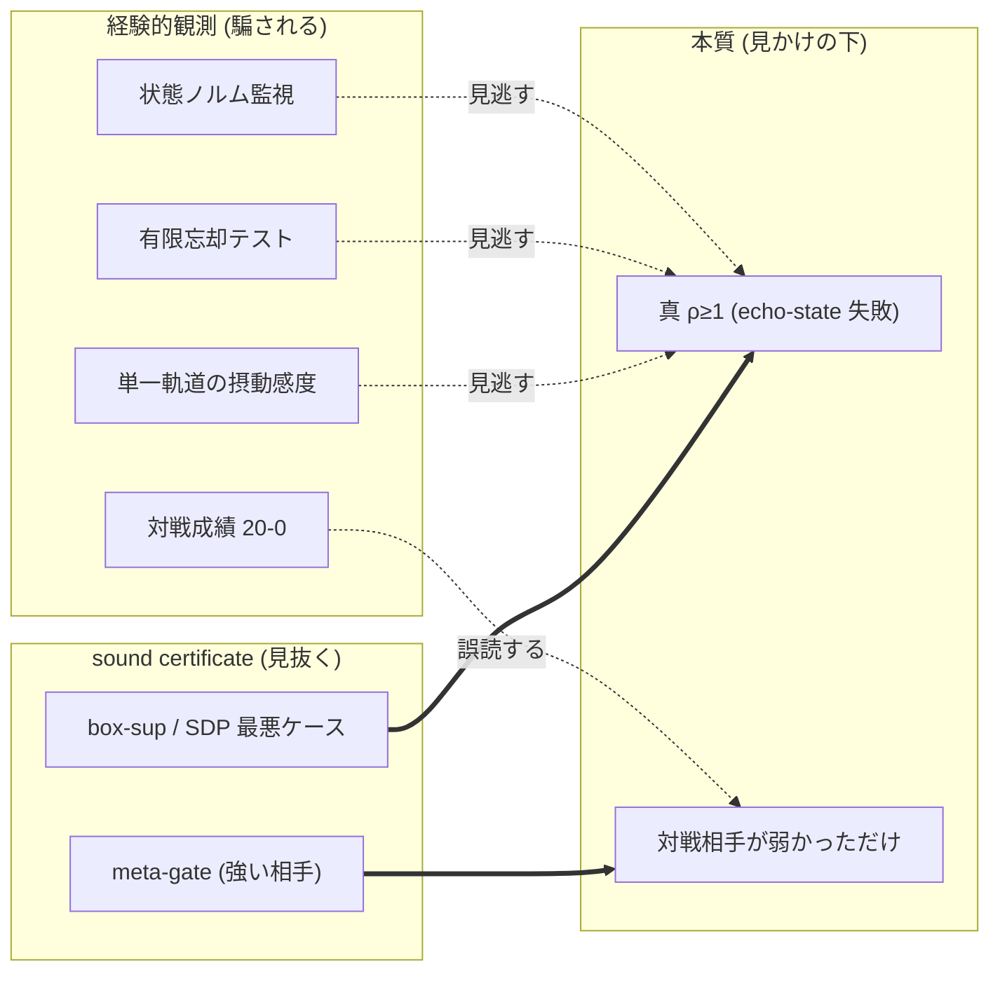
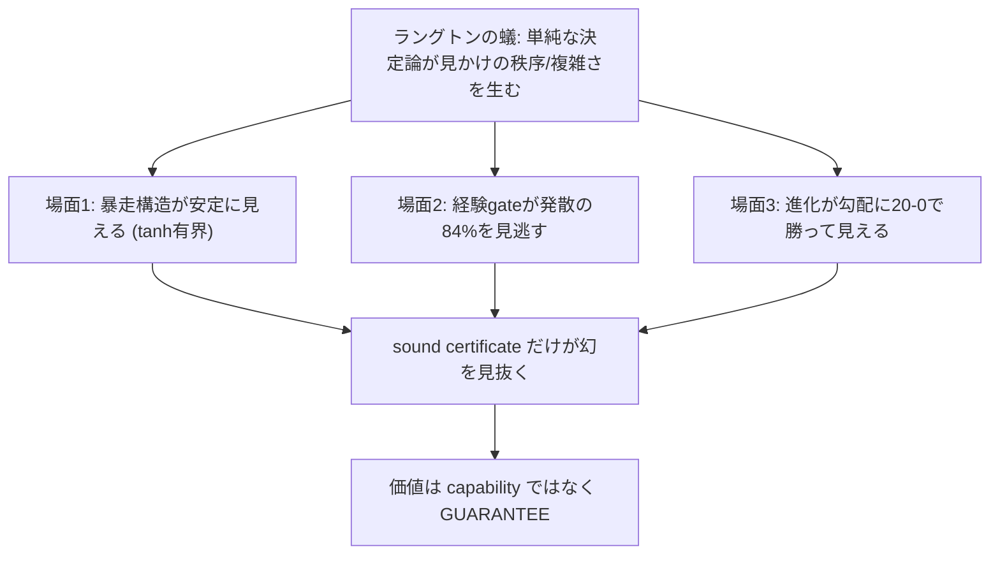
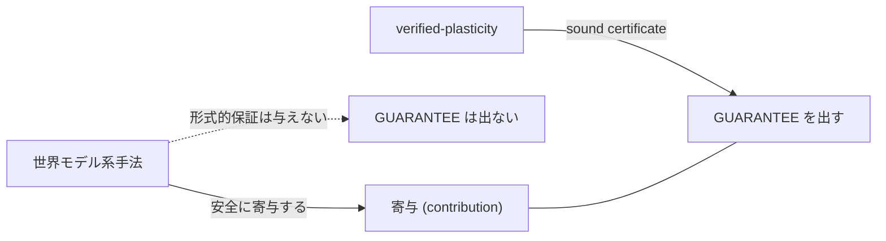

言語 / Language / 语言 / 언어: [日本語](#日本語) | [English](#english) | [中文](#中文) | [한국어](#한국어)

# 日本語

## この記事は何か — 「単純な決定論ルールが、見かけの秩序を作る」という一点に、3 回分を束ねる

これは llcore 検証 arc(#38 → #39 → #40)の **capstone(総括)** です。前回(#40)の最後で、私たちはこう予告しました。「次回は、この枠組みを『ラングトンの蟻の幻を見抜く眼』という比喩で総括する予定です。経験は見かけに騙される。証明器だけが本質を見る — その 1 点に、3 回分の honest disclosure が全部つながります」。

その約束を果たします。

3 回の弧を 1 行で先に言います。

> **「使うほど賢くなる/自己進化する AI」も「世界モデルが安全をくれる」も、心地よい見出しだ。でも『賢くなった/安定した』が本物か幻かを、sound certificate(健全な証明)で falsifiable に判別できなければ、それは "見かけ" にすぎない。verified-plasticity はその判別器そのものだ。価値は capability(賢さ)ではなく GUARANTEE(保証)にある。**

この記事のコンセプトフックは **ラングトンの蟻** です。たった数行の決定論ルールで動く蟻が、しばらく無秩序にゴチャゴチャ歩いたあと、突然「高速道路」と呼ばれる規則的な軌跡を作り始める。**単純なルールが、見かけの秩序・見かけの複雑さを生む**。これは本研究の核心の比喩です。なぜなら私たちが #38-#40 で何度もぶつかったのは、まさに「**経験的観測は、単純なものが作る "見かけ" に騙される**」という事実だったからです。

- 発散する(暴走する)はずの構造が、観測すると **安定して見える**(#40 のラングトンの蟻)。
- 進化が、観測すると勾配法に **20戦20勝して見える**(#40 のラングトンの蟻 ver.2)。

どちらも「見かけ」で、その下にある本質(真の不安定性、本物の弱い対戦相手)を、**経験では見抜けず、sound certificate だけが見抜いた**。この 1 点で、3 回が 1 つになります。

いつもの順番 ①用語 → ②かみくだき → ③詳細 で、盛らずに書きます。数値は確定した verified 値のみ使い、未検証は「未検証」と明記します。capability(進化が勾配に勝つ)と guarantee(証明付き安定)を **絶対に混同しません** — これが honest disclosure の生命線です。

正本: [github.com/furuse-kazufumi/llcore](https://github.com/furuse-kazufumi/llcore)。

---

## ① 用語ミニ辞典(本文で詰まらないために)

| 用語 | ひとことで |
|---|---|
| **verified-plasticity(検証つき可塑性)** | 実小型 LLM に後付けした小さな構造ブロック(n≤16 の verified recurrent adapter)を online で構造適応させたとき、それが「発散しない・収縮する(ρ<1 を sound に保つ)」かを第一級指標に、任意の手法を falsifiable に測る評価枠組み。本研究の主軸。 |
| **capability(性能)** | 「賢くなるか」。次に来るものを当てる予測の良さ(交差エントロピー CE が小さい)。 |
| **guarantee(保証)** | 「暴走しないか」。sound certificate で安定(収縮 ρ<1)を保てること。**この 2 つを混同しないのが honest disclosure の生命線。** |
| **収縮性 (contraction, ρ<1)** | 過去の摂動が時間とともに **忘れられる(減衰する)** 性質。スペクトル半径 ρ が 1 未満。echo-state property の合格条件。 |
| **echo-state property** | 入力履歴で状態が決まり、初期摂動が忘れられる性質。これが「成立(ρ<1)」なら安全、「失敗(ρ≥1)」なら暴走しうる。 |
| **false-admit(偽の合格)** | 本当は危険(ρ≥1=暴走しうる)なのに、gate が「安全」と通してしまう取りこぼし。これがゼロなのが健全性の生命線。 |
| **sound(健全)** | 「合格」と言ったら **本当に安全**(偽の合格を出さない)性質。統計的に「たぶん安全」とは別物。 |
| **navigability(通りやすさ)** | 「本当に安全な個体を、どれだけ合格にできるか」。厳しすぎる gate は安全な個体まで弾く=進化が動けない。高いほど良い。 |
| **経験 gate / 経験 gate** | sound 証明ではなく、有限ホライズンの観測(忘却テスト等)で「安全らしさ」を判定する gate。本研究の負の比較対象の 1 つ(STABLE 風)。 |
| **sound certificate(健全証明器)** | 最悪ケースを保証付きで上から押さえる証明器(本研究の cert_inf / cert_two / cert_sdp)。これだけが「見かけ」を見抜く。 |
| **MAP-Elites(進化)** | 多様な解を碁盤の目に貯めながら探す進化的探索。本研究の「進化」側。 |
| **finite-diff 勾配 / 解析勾配** | 弱い勾配(関数値を少しずらして傾きを推定、dim+1 評価/step)と、強い勾配(backprop で正確な傾きを 1 回で)。 |
| **meta-gate** | 「進化が勝った」ように見えたとき、より強い対戦相手(解析勾配)を出して利得が消えないか確かめる関門。消えれば幻(ARTIFACT)。 |
| **ラングトンの蟻** | 数行の決定論ルールで動く蟻。無秩序に見えた後、突然「高速道路」(規則的軌跡)を作る。**単純な決定論が見かけの秩序/複雑さを生む** 比喩。 |

---

## ② かみくだき — ラングトンの蟻の幻を、3 つの場面で

### 場面 0: ラングトンの蟻とは何か(なぜこの比喩か)

ラングトンの蟻は、マス目の上を「白マスなら右に曲がって色を反転」「黒マスなら左に曲がって色を反転」というたった 2 つのルールで動く蟻です。動かすと、最初の数百ステップは無秩序にゴチャゴチャ歩く。ところが約 1 万ステップ後、突然「高速道路」と呼ばれる **104 ステップ周期の規則的なパターン** を作り、まっすぐ進み始めます。

ここに本研究の核心が 2 つ詰まっています。

1. **単純な決定論ルールが、見かけの秩序/複雑さを生む。** 蟻のルールは中学生でも理解できるほど単純なのに、結果は「無秩序 → 突然の秩序」と複雑に見える。
2. **見かけと本質はズレる。** ゴチャゴチャ歩いている最中の蟻を観測しても、後に高速道路が出ることは見抜けない。逆もまた然り。**経験的観測は、単純なものが作る "見かけ" に騙される。**

この記事の主張は、AI の世界でも同じことが起きている、というものです。「見かけの安定」も「見かけの進化(monoculture=見かけ上の優位)」も、その下では **deterministic-simple(単純な決定論)** に collapse する。経験は騙され、sound certificate だけが幻を見抜く。

### 場面 1: 「見かけの安定」— 暴走する構造が、観測すると安定して見える

LLM に後付けする小さな記憶ブロックは、状態を `tanh` で常に有界に保ちます。だから **不安定(ρ≥1)でも、出力ノルムは発散しません**。状態は暴れず、ずっと有界のまま。

すると何が起きるか。**真の ρ が 2.9(完全に発散域)の構造ですら、ある 1 本の軌道を観測すると、初期摂動が「減衰しているように見える」**。実測で、初期摂動 1 が `2e-14` まで縮む — まるで安全(収縮)であるかのように。これは `tanh` の飽和と摂動方向のミスアライン(暴走方向に乗らない)が偶然重なった結果です。

ここで素朴な検証手段は全滅します。

- 状態ノルムを監視 → 有界なので異常なし(騙される)。
- 有限ホライズンの「忘却テスト」(摂動が忘れられるか観測) → 忘れたように見える(騙される)。
- 単一軌道の摂動感度を測る → 減衰して見える(騙される)。

これがまさにラングトンの蟻です。**単純な力学(tanh 有界)が、危険な構造を「安全」に見せる見かけを作る。** 経験的観測は全部この幻に引っかかります。

見抜けるのは 1 つだけ。**sound certificate の最悪ケース評価(box-sup)** です。これは「全ての入力・全ての状態」での最大増幅を上から押さえるので、たまたま安全に見えた 1 軌道に騙されない。実測で `σ_max = 4.87 > 1` を検出し、正しく reject しました。

### 場面 2: 「経験 gate は 84% 見逃す」— 幻の規模

これを集団でやると規模が見えます。95 個の発散 gene(本当に暴走する)+ 305 個の収縮 gene(本当に安全)を混ぜた 400 個の集団で、各手法が「危険を何個見逃すか(false-admit)」を測りました。

- **無 gate(何も検査しない)**: 発散 95/95 を全部「安全」と通す = **false-admit 100%**。
- **STABLE 風の経験 gate**(他陣営でも使われる「経験に基づく安定性 gate」の代表): 発散 95 のうち **80 個(84.2%)を「安全」と誤許可**。
- **sound certificate(cert_inf / cert_two / cert_sdp)**: 発散の false-admit **0%**。

84% という数字の衝撃は、これが「何も検査しない 100%」からほとんど改善していない、という点です。経験 gate は **検査しているつもりで、ラングトンの蟻の幻に 84% 騙されている**。なぜか。すでに場面 1 で見たとおり、`tanh` 有界の力学では発散構造が有限ホライズン観測で「摂動忘却したように見える」からです。経験 gate は有限ホライズン観測に立脚するので、その見かけをそのまま信じてしまう。

sound certificate は最悪ケースを保証付きで押さえるので、見かけに左右されません。とくに **cert_sdp は false-admit 0% を保ちつつ、本当に安全な個体の過剰棄却がわずか 4.6%** — 健全かつ最も navigable(通りやすい)。「厳しすぎて進化が動けない」問題まで解いています。

### 場面 3: 「見かけの進化」— 進化が 20戦20勝して見える(でも幻)

ラングトンの蟻 ver.2 は capability 側で起きました。

実在の SmolLM2 が作る本物の地形で、進化(MAP-Elites)を弱い勾配(finite-diff)と戦わせたら、**進化が 20戦20勝**(平均 CE で +0.029 リード、p=9.5e-7)。一見、進化が勾配に勝つ「秩序」が見えた。SNS 映えする見出しが頭をよぎります。

でもこれもラングトンの蟻でした。**対戦相手(finite-diff)が弱かっただけ**。私たちのフレームワークには最初から meta-gate(勝ったら強い相手を呼べ)が入っています。強い解析勾配(backprop = 実際の LLM 学習が使う正確な勾配)を同予算で呼んだら、**勾配が進化を 19/20 で逆転**(diff +0.008、p=3.5e-4)。進化の勝ちは弱い相手の artifact でした。判定 = **ARTIFACT + NEGATIVE**。

ここで最も大事なのは、**meta-gate(sound な比較相手)が無ければ、私は「進化が実地形で 20/20 capability 勝利」という false-positive を publish していた** という点です。「異常に良い結果は、勝った気になる前に内訳を疑う」— この規律が、データの上で実際に 1 件の false-positive を止めました。これも「見かけの秩序を sound な判別器が見抜いた」ラングトンの蟻です。

### この記事の主張(3 場面の統合)

経験は見かけに騙される。sound certificate(と、その capability 版である meta-gate)だけが本質を見る。だから verified-plasticity の価値は「賢くなる」(capability)ではなく「暴走しないと保証・測定できる」(GUARANTEE)にあります。

---

## ③ 詳細 — H-discriminative の数値、capability の顛末、framework 性、small-n 壁

### 3.1 verified-plasticity とは何を測る枠組みか

主軸は **Verified-Plasticity Evaluation Framework**。「うちの手法が強い」と主張する前に、まず **測る物差し** を作る、というのがこの研究の姿勢です。物差しは 6 つの装置で守られています。

1. **事前登録(pre-registration)** — 仮説・判定基準を実験前に固定。
2. **Holm 連言(conjunctive)** — 複数条件の AND で判定(チェリーピック防止)。
3. **artifact 規律** — 全実験コード/データを公開、再現可能に。
4. **反証条項** — 「この結果はこうなら反証される」を明記。
5. **自己検出力監査** — 物差し自身が本当に違いを検出できるかを正対照で確認。
6. **反 over-claim critic** — 過大主張を専門に潰す検証役。

被験 method(=物差しに掛ける対象)は 4 つ。

| method | 役割 |
|---|---|
| **VSOA**(cert-gated topology evolution) | 本研究の本命(証明 gate 付き構造進化)。 |
| **無 gate** | 負の対照(何も検査しない)。 |
| **STABLE 風経験 gate** | 既踏比較(経験ベースの安定性 gate)。 |
| **Mamba-130M** | 正の対照(stable-by-construction、構造的に安定)。 |

そして安定性指標の正体を正確に言うと、これは「状態が発散するか」ではなく **「echo-state 摂動忘却」** です。kernel は `tanh` で常時有界なので状態ノルムは発散しません(場面 1 の幻の源)。測っているのは「初期摂動を忘れるか(収縮 ρ<1 = echo-state property 成立)」です。

### 3.2 H-discriminative — 枠組みの判別力(中核数値)

n=6、95 発散 / 305 収縮 の gene 集団で、各 method の false-admit と過剰棄却を測りました。

| method | sound か | false-admit(発散の見逃し) | 収縮の過剰棄却 |
|---|---|---|---|
| 無 gate | ✗ | **95/95 = 100%** | 0% |
| STABLE 風経験 gate | ✗ | **80/95 = 84.2%** | (経験 gate) |
| cert_inf | ✓ sound | **0%** | 70.5% |
| cert_two | ✓ sound | **0%** | 52.8% |
| **cert_sdp** | ✓ sound | **0%** | **4.6%(最 navigable)** |

正対照(0 発散の安全 family 集団、Mamba 風)では **全 method が 0 false-admit** — 安全な family を誤って棄却しない、という方向の健全性も確認しました。

**なぜ STABLE 風 gate が 84% も見逃すのか(教育的に):**

echo-state property の合格条件は「真の ρ < 1」です。ところが kernel が `tanh` で常時有界だと、**真 ρ ≥ 1 の発散構造でも、有限ホライズンの観測では摂動忘却したように見える**。`tanh` の飽和が、暴走の増幅を観測窓の中で隠してしまうからです。STABLE 風 gate は有限ホライズン観測(忘却テスト)に立脚するので、この見かけをそのまま「安全」と判定する。これがラングトンの蟻の幻の正体です。sound certificate は最悪ケースを上から押さえる(observation でなく proof)ので、見かけに左右されません。

**さらに深い幻(単一軌道感度すら騙される):**

場面 1 で触れたとおり、ρ≈2.9 の発散 gene でも **単一軌道の摂動感度すら発散しません**(実測 1 → 2e-14)。`tanh` 飽和 + 摂動方向のミスアラインが重なるため。つまり、

- 状態ノルム監視 → 騙される
- 有限忘却テスト → 騙される
- 単一軌道感度 → 騙される

の三重で ρ≥1 を見逃す。box-sup の sound certificate(`σ_max = 4.87 > 1` で reject)だけが見抜く。これが「sound certificate でないと見抜けない」ことの、最も強い実証です。

### 3.3 capability の honest な顛末 — synthetic NULL_TIE → 実 CE で ARTIFACT+NEGATIVE

「で、進化はちゃんと賢くなるの?」という capability の問いには、honest disclosure を最大限効かせた答えが出ました。

**(1) synthetic 多峰地形(K=6 basin)= NULL_TIE。** MAP-Elites ≈ gradient ≈ random。ME vs gradient は mean_diff +0.028 / Wilcoxon p=0.39 / sign_delta=0(n=20)。4 条件 AND が全方向で不成立 = **純粋な引き分け** = capability 優位の **未実証**。

**(2) 実 SmolLM2-CE 地形 = ARTIFACT + NEGATIVE。** 実在 SmolLM2 の layer 15 hidden state から「次の内部表現クラスタを当てる CE 地形」を作り、同予算で 4 手法を戦わせた結果(held-out 平均、高いほど良い):

| 手法 | held-out 平均 | 順位 |
|---|---|---|
| **解析勾配(torch Adam)** | **-1.446** | **1 位(全手法で最良)** |
| 進化(MAP-Elites) | -1.454 | 2 位 |
| random | -1.473 | 3 位 |
| finite-diff(弱い勾配) | -1.483 | 4 位 |

- 進化 vs finite-diff: ME が **20/20 で上回る**(diff +0.029、p=9.5e-7、一見 EXISTS)。
- 進化 vs 解析勾配: 解析勾配が **19/20 で逆転**(diff +0.008、p=3.5e-4)。

→ ME の勝ちは finite-diff の弱さ(cold-start / dim+1 評価/step / 予算内 ~95 step)の **artifact**。強い勾配では gradient > evolution = **実地形でも capability NEGATIVE**。

**honest-disclosure の真価(false-positive を止めた実例):**

strong-gradient meta-gate が無ければ、「進化が実地形で 20/20 capability 勝利」という **false-positive を誤結論していた**。「勝った気になる前に内訳を疑う」という規律が、実際に false-positive を 1 件排除した。これがラングトンの蟻 ver.2 を sound な判別器(meta-gate)で見抜いた実例です。

### 3.4 framework 性(F8)— (b) PASS / (a) NULL

verified-plasticity が「1 手法」ではなく「枠組み」であることを 2 つの軸で検定しました。

**(b) 3 plug-point swap = PASS。** GeneCodec / Objective / VerifierBackend の 3 つの差し込み口を、**1 オブジェクト差し替え** で載せ替え。src 無改変(git diff 空)、pytest 17 green。per-gene の two⇒sdp / inf⇒sdp が 3000 gene で 0 違反。→ 枠組みとして「基質・目的・証明器」を入れ替えられることをデータで実証。

**(a) 構造多様性 → 汎化 load-bearing = NULL。** 「構造的多様性が汎化を助ける」という仮説は held-out diff +0.011 / p=0.55 で **立たず**(第一級 NULL)。これも正直に開示します — 枠組みは載せ替え可能だが、「多様性が効く」は実証できていない。

### 3.5 Mamba SSM Lyapunov 正対照(§7.3)— 正の対照で物差しを校正

物差し自身が「安全な土台」を正しく安全と判定できるか(自己検出力監査)を、Mamba で確認しました。

**Mamba-130M は全 24 層で A = -exp(A_log) < 0(589,824 ch)** → λ_max ≤ 0 が自明に成立 → 構造的に安定(stable-by-construction)で PASS。一方 **SmolLM2 は SSM 不在**(llama アーキ、self_attn + mlp のみで状態再帰がない)→ 安定性は後付けの gate で初めて課される。

つまり枠組みは「安全な土台(Mamba)」と「gate が要る土台(SmolLM2)」を **base レベルで判別** できる(base-level 判別 PASS)。ただし留保として、これは parameterization の自明性です — 任意の valid な Mamba で構造的に成立するので、「学習で安定を獲得した」のではなく「パラメタライズが安定を保証している」ことを検定しています。

### 3.6 敵対的検証 — 自分の数値を独立 skeptic に反証させた

honest disclosure の核は「異常に良い結果は内訳を疑う」です。本 verdict の数値主張を、**3 独立 skeptic + 実機 3 seed 再走** で突合させました。

結果 = **MAJOR 0 / 全 MINOR**、数値 mismatch ゼロ、機構的結論を覆す指摘なし。とくに本丸(capability)は、検証役が実際に SmolLM2 を読み込んで 3 seed 独立再走し、「強い勾配が進化を上回る」を決定論的に再現しました。

### 3.7 small-n の壁(第一級 negative)

ここまで guarantee が立つことを見てきましたが、**規模の壁** は honest に残ります。verified に構造進化させられるのは **small-n per-component(n≤4-6)に限る**。高次元で navigable かつ sound な certifier は **不在**(第一級 negative)。これは #39 で確定した 2^n 壁の継続です。SDP(cert_sdp)は navigability の天井を上げただけで、2^n のコスト壁は破っていません。

---

## honest 留保(over-claim 禁止・全部正直に書く)

3 回分の honest disclosure の集大成として、留保をすべて 1 か所に集めます。capability と guarantee を混同しないために、ここは必読です。

- **capability NULL_TIE は「非有意の引き分け」**。「進化が勾配に劣る decisive proof」でも「powered な等価性 proof」でもありません(power 未分析)。NULL_TIE を「進化の敗北」と断定してはいけません = **未実証**。
- **40 basin は高次元 hillclimb 非収束 artifact の可能性**。頑健に言えるのは「多峰(>1)」までです。
- **gate 中立性は held-out 限定・capability flat regime での観測**。train 側は 0.25 差で archive 探索制約があります。
- **STABLE 84% は設定依存**(EPS_FORGET=1e-2 / T=64 / K_PROBE=8 固定、感度未測定)。方向(STABLE は危険を見逃す)は頑健ですが、「84%」を設定非依存の数値として扱ってはいけません。
- **empirical_rho は from-below**。0 観測 false-admit は強い consistency 証拠ですが絶対証明でなく、機械証明でもありません。
- **実 CE は hidden-クラスタ CE proxy**(full-vocab softmax ではない、小 n では full-vocab が退化するため)。
- **verified 構造進化は small-n per-component(n≤4-6)限定**。高次元 navigable-sound certifier は不在(第一級 negative)。
- **実 LLM transfer(tiny→SmolLM2 の load-bearing)は未検証**。

---

## 競合の自己改善主張について — 貶めず「未検証である」事実のみ

「使うほど賢くなる/自己進化する AI エージェント」の流行は本物です。2026-06-10 時点の競合スキャンでも、

- **hermes-agent**(NousResearch, 189k★)— 「20+ スキルで 40% 高速」
- **ECC**(211.8k★)— Continuous Learning
- **headroom learn** — 継続学習系

など、自己改善を掲げるプロジェクトが多数あります。ただし — これらの性能主張は **すべて第三者未検証の自社ベンチ** です(2026-06-10 時点)。star 数は人気の証であって、性能優位の証ではありません。

ここで強調したいのは、**競合を貶めることではありません**。これらが「賢くなった」と述べる主張は、本物かもしれないし、ラングトンの蟻の幻かもしれない — **falsifiable に判別する道具がなければ、外からは区別できない**、という事実だけを述べます。verified-plasticity は、まさにこの種の「賢くなった/安定した」が本物か幻かを sound certificate で判別する道具です。私たち自身の主張(#40 の進化 20-0)すら meta-gate で幻と判明したのですから、判別器の必要性は自分自身で実証済みです。

---

## 世界モデルですら保証は出せない — 寄与と保証の区別

もう 1 つの大きな潮流が **世界モデル** です。エージェントが自分の内部に環境シミュレータを持ち、行動を予測する。とても強力で、安全設計にも寄与します。

ただし、技術的事実として、世界モデル系の手法は一般に安全設計に寄与しうるものの、**形式的な保証(guarantee)を与えるものではありません**。これは技術コミュニティで広く共有される観察です(2026 年の講演でも同趣旨が示されています。藤吉弘亘氏)。寄与(contribution)と保証(guarantee)は別物として扱う必要がある、ということです。

verified-plasticity の立ち位置はここで明確になります。世界モデル系の手法が「寄与」に留まるのに対し、**verified-plasticity は sound certificate で保証(GUARANTEE)を出す**。「収縮する(ρ<1、暴走しない)」を、見かけでなく証明で押さえる。これは世界モデルの代替ではなく、補完です — 世界モデルが行動を賢く予測し、verified-plasticity がその構造適応が暴走しないことを保証する。

技術的に言えば、AI の歴史は、手で設計していた構造を機械が自ら獲得(進化)する方向へ進んできた、という一般的な観察と整合します。本研究の進化テーゼも同じ方向にあります。その「自ら獲得した構造」が暴走しないことを誰が保証するのか。verified-plasticity の答えは「sound certificate が保証する」です。

---

## まとめ — 3 回の弧が 1 点に収束する

#38 → #39 → #40 → #41 の弧を、ラングトンの蟻の 1 点で束ねます。

- **#38**: 防衛的開示 — 「証明つき記憶」の四点交差点を理論で取り、特許でなく公開で旗を立てた。
- **#39**: 窓は実装で閉じた。でも 2^n 壁(small-n の壁)はびくともしなかった。
- **#40**: 賢くなるのか? → NO。実地形でも強い勾配が進化に勝つ。capability は売れない(ラングトンの蟻 ver.2 を meta-gate で見抜いた)。
- **#41(今回)**: その全部が、**「単純な決定論が見かけの秩序/複雑さを生み、経験は騙され、sound certificate だけが本質を見る」** という 1 点に収束する。

「進化可能な LLM」の正体は、**「進化が性能で勝つ AI」ではなく、「online で構造を変えても暴走・破滅的忘却しないことを、sound certificate で保証・測定する枠組み」** です。地味です。でも、「使うほど賢くなる」も「世界モデルが安全をくれる」も心地よい見出しである一方で、**「賢くなった/安定した」が本物か幻かを falsifiable に判別する道具** は、まだほとんど無い。verified-plasticity はその判別器です。

価値は **capability ではなく GUARANTEE**。世界モデルは保証を出せない(寄与に留まる)。verified-plasticity は sound certificate で保証を出す。経験は見かけに騙される — 証明器だけが、ラングトンの蟻の幻を見抜く眼です。

正本: [github.com/furuse-kazufumi/llcore](https://github.com/furuse-kazufumi/llcore) — 論文ドラフト + 全実験コード/データ。

---

# English

## What this is — binding three installments onto one point: "simple deterministic rules create apparent order"

This is the **capstone** of the llcore verification arc (#38 → #39 → #40). At the end of #40 we promised: "Next time we plan to summarize this framework under the metaphor 'an eye that sees through Langton's-ant illusions.' Experience is fooled by appearances; only the certificate sees the essence — and on that single point, three installments of honest disclosure all converge."

We keep that promise. One line first:

> **"AI that gets smarter the more you use it / self-evolves" and "world models will hand you safety" are pleasant headlines. But unless you can falsifiably tell, with a sound certificate, whether "got smarter / got stable" is real or an illusion, it is only an *appearance*. verified-plasticity is exactly that discriminator. Its value lies in GUARANTEE, not capability.**

The concept hook is **Langton's ant**. An ant driven by just a few deterministic rules walks chaotically for a while, then suddenly builds a regular trajectory called the "highway." **Simple rules create apparent order and apparent complexity.** This is the core metaphor: what we kept hitting across #38-#40 is exactly that **empirical observation is fooled by the "appearance" that simple things create**.

- A structure that *should* diverge **looks stable** when observed (#40's Langton's ant).
- Evolution **looks like it beats gradient 20–0** when observed (#40's Langton's ant ver.2).

Both are "appearances," and the essence beneath (true instability, a genuinely weak opponent) was **invisible to experience and seen only by a sound certificate**. On that single point, the three converge.

As always: ① terms → ② plain words → ③ details. No inflation. Only verified numbers; unverified is marked "unverified." We **never confuse** capability (evolution beats gradient) with guarantee (proof-carrying stability) — the lifeline of honest disclosure.

Source: [github.com/furuse-kazufumi/llcore](https://github.com/furuse-kazufumi/llcore).

---

## ① Mini-glossary

| Term | In one line |
|---|---|
| **verified-plasticity** | A framework that takes "does it not diverge / does it contract (keep ρ<1 *soundly*)" as the first-class metric for online structural adaptation of small bolted-on blocks (n≤16 verified recurrent adapters) on a real small LLM, and measures any method falsifiably. The main axis. |
| **capability** | "Does it get smart?" Predictive quality of what comes next (low cross-entropy CE). |
| **guarantee** | "Does it avoid blowing up?" Keeping stability (contraction ρ<1) with a sound certificate. **Not confusing these two is the lifeline of honest disclosure.** |
| **contraction (ρ<1)** | The property that past perturbations are **forgotten (decay)** over time. Spectral radius below 1. The pass condition of the echo-state property. |
| **echo-state property** | State is determined by input history; initial perturbations are forgotten. "Holds (ρ<1)" = safe, "fails (ρ≥1)" = can blow up. |
| **false-admit** | A miss where the gate passes something actually dangerous (ρ≥1) as "safe." Zero of these is the soundness lifeline. |
| **sound** | When it says "pass," it is **actually safe** (never a false pass). Different from a statistical "probably safe." |
| **navigability** | "How many genuinely safe individuals it passes." An overly strict gate rejects even safe ones = evolution can't move. Higher is better. |
| **experience gate** | A gate that judges "looks safe" from finite-horizon observation (forgetting tests, etc.), not a sound proof. One negative comparison (STABLE-style). |
| **sound certificate** | A verifier that bounds the worst case from above with a guarantee (cert_inf / cert_two / cert_sdp). Only this sees through the "appearance." |
| **MAP-Elites** | Evolutionary search keeping a grid of diverse solutions. The "evolution" side. |
| **finite-diff / analytic gradient** | Weak gradient (estimate slope by nudging, dim+1 evals/step) vs strong gradient (exact slope in one backprop pass). |
| **meta-gate** | When evolution "wins," bring in a stronger opponent (analytic gradient) and check whether the gain survives. If it vanishes, it's an illusion (ARTIFACT). |
| **Langton's ant** | An ant on a grid driven by a few deterministic rules; looks chaotic, then suddenly builds a "highway." A metaphor for **simple determinism creating apparent order/complexity**. |

---

## ② Plain words — the Langton's-ant illusion in three scenes

### Scene 0: What Langton's ant is (why this metaphor)

Langton's ant moves on a grid by just two rules ("on white, turn right and flip the color"; "on black, turn left and flip"). For the first few hundred steps it walks chaotically. But after about 10,000 steps it suddenly builds a regular **104-step-period pattern** called the "highway" and travels straight.

Two cores of this research live here:

1. **Simple deterministic rules create apparent order/complexity.** The rules are trivially simple, yet the result looks complex ("chaos → sudden order").
2. **Appearance and essence diverge.** Observing the ant mid-chaos cannot foresee the highway; and vice versa. **Empirical observation is fooled by the "appearance" simple things create.**

The claim: the same happens in AI. Both "apparent stability" and "apparent evolution (monoculture = apparent superiority)" collapse, underneath, to **deterministic-simple**. Experience is fooled; only the sound certificate sees through the illusion.

### Scene 1: "Apparent stability" — a diverging structure looks stable when observed

The small memory block bolted onto an LLM keeps its state bounded with `tanh`. So **even when unstable (ρ≥1), the output norm does not diverge**. The state never explodes; it stays bounded.

Result: **even a structure with true ρ = 2.9 (fully divergent), observed along one trajectory, has its initial perturbation "appear to decay"** — measured, perturbation 1 shrinks to `2e-14`, as if safe (contracting). This is a coincidental conjunction of `tanh` saturation and perturbation-direction misalignment (it doesn't ride the divergent direction).

Every naive check fails here:

- Monitor the state norm → bounded, no anomaly (fooled).
- Finite-horizon "forgetting test" → looks forgotten (fooled).
- Single-trajectory perturbation sensitivity → looks decaying (fooled).

This is exactly Langton's ant. **Simple dynamics (tanh-bounded) create the appearance of "safe" for a dangerous structure.** Only one thing sees through: the **sound certificate's worst-case (box-sup) evaluation**, which bounds the maximum amplification over all inputs/states and is not fooled by one accidentally-safe trajectory. It detected `σ_max = 4.87 > 1` and correctly rejected.

### Scene 2: "The experience gate misses 84%" — the scale of the illusion

At population scale: a 400-gene mix of 95 divergent (truly blow up) + 305 contracting (truly safe). How many dangerous ones does each method miss (false-admit)?

- **No gate**: passes all 95/95 divergent as "safe" = **100% false-admit**.
- **STABLE-style experience gate** (a representative "experience-based stability gate" also used by other camps): **misses 80 of 95 (84.2%)**.
- **sound certificate (cert_inf / cert_two / cert_sdp)**: **0%** false-admit.

The shock of 84% is that it barely improves on "no check = 100%." The experience gate is **fooled by the Langton's-ant illusion 84% of the time while believing it is checking.** Why: as in Scene 1, under `tanh`-bounded dynamics, divergent structures "appear to forget perturbations" under finite-horizon observation, and the experience gate (built on finite-horizon observation) believes that appearance. The sound certificate bounds the worst case with a guarantee, unswayed by appearance. In particular, **cert_sdp keeps 0% false-admit while over-rejecting genuinely-safe individuals by only 4.6%** — sound and most navigable.

### Scene 3: "Apparent evolution" — evolution looks 20–0 (but it's an illusion)

Langton's ant ver.2 happened on the capability side.

On a real terrain made by an actual SmolLM2, evolution (MAP-Elites) vs the weak gradient (finite-diff) → **evolution 20–0** (+0.029 mean CE, p=9.5e-7). An "order" where evolution beats gradient seemed visible; an SNS-friendly headline flashed by.

But this too was Langton's ant. **The opponent (finite-diff) was just weak.** Our framework had a meta-gate from the start ("if you win, call the strong opponent"). Calling the strong analytic gradient (backprop = the exact gradient real LLM training uses) at the same budget: **gradient overturns evolution 19/20** (diff +0.008, p=3.5e-4). Evolution's win was a weak-opponent artifact. Verdict = **ARTIFACT + NEGATIVE**.

Most importantly: **without the meta-gate (a sound comparison opponent), I would have published the false-positive "evolution wins capability 20/20 on real terrain."** "Doubt the breakdown before celebrating" actually stopped one false-positive, in data. This too is a sound discriminator seeing through Langton's ant.

### The claim (three scenes unified)

Experience is fooled by appearance. Only the sound certificate (and its capability-side version, the meta-gate) sees the essence. So verified-plasticity's value is not "gets smart" (capability) but "can be guaranteed/measured not to blow up" (GUARANTEE).

---

## ③ Details — H-discriminative numbers, the capability outcome, framework-ness, the small-n wall

### 3.1 What framework verified-plasticity is

The main axis is the **Verified-Plasticity Evaluation Framework**. Before claiming "our method is strong," build **the ruler**. The ruler is guarded by six devices: (1) pre-registration, (2) Holm conjunctive judgment, (3) artifact discipline, (4) falsification clauses, (5) self-power audit (positive control), (6) anti-over-claim critic.

The methods under test: **VSOA** (cert-gated topology evolution, the headliner), **no-gate** (negative control), **STABLE-style experience gate** (prior-art comparison), **Mamba-130M** (stable-by-construction positive control).

Precisely, the stability metric is not "does the state diverge" but **"echo-state perturbation forgetting."** The kernel is always bounded via `tanh` (the source of Scene 1's illusion); what we measure is "are initial perturbations forgotten (contraction ρ<1 = echo-state property holds)."

### 3.2 H-discriminative — the framework's discriminative power (core numbers)

n=6, a 95-divergent / 305-contracting gene population.

| method | sound? | false-admit (missed divergent) | over-reject (contracting) |
|---|---|---|---|
| no-gate | ✗ | **95/95 = 100%** | 0% |
| STABLE-style experience gate | ✗ | **80/95 = 84.2%** | (experience gate) |
| cert_inf | ✓ | **0%** | 70.5% |
| cert_two | ✓ | **0%** | 52.8% |
| **cert_sdp** | ✓ | **0%** | **4.6% (most navigable)** |

On a positive-control population (0-divergent safe family, Mamba-style), **all methods have 0 false-admit** — confirming they don't wrongly reject a safe family.

**Why the STABLE-style gate misses 84% (educationally):** the echo-state pass condition is "true ρ < 1." But with a `tanh`-always-bounded kernel, **even a true-ρ≥1 divergent structure appears to forget perturbations under finite-horizon observation** — `tanh` saturation hides the divergent amplification inside the observation window. The STABLE-style gate, built on finite-horizon observation, judges that appearance as "safe." That is the Langton's-ant illusion. A sound certificate bounds the worst case from above (proof, not observation) and is unswayed.

**A deeper illusion (even single-trajectory sensitivity is fooled):** as in Scene 1, even a ρ≈2.9 divergent gene has **even its single-trajectory perturbation sensitivity not diverge** (measured 1 → 2e-14), because `tanh` saturation + perturbation-direction misalignment coincide. So state-norm monitoring, finite forgetting tests, and single-trajectory sensitivity all miss ρ≥1 — only the box-sup sound certificate (rejecting at `σ_max = 4.87 > 1`) catches it. This is the strongest demonstration that "only a sound certificate sees it."

### 3.3 The honest capability outcome — synthetic NULL_TIE → real CE ARTIFACT+NEGATIVE

**(1) synthetic multi-peaked terrain (K=6 basins) = NULL_TIE.** MAP-Elites ≈ gradient ≈ random. ME vs gradient: mean_diff +0.028 / Wilcoxon p=0.39 / sign_delta=0 (n=20). The 4-condition AND fails in all directions = a **pure tie** = capability superiority **unproven**.

**(2) real SmolLM2-CE terrain = ARTIFACT + NEGATIVE.** Building a "predict the next internal-representation cluster" CE terrain from SmolLM2's layer-15 hidden states, same budget, 4 methods (held-out mean, higher better):

| method | held-out mean | rank |
|---|---|---|
| **analytic gradient (torch Adam)** | **-1.446** | **1st (best of all)** |
| evolution (MAP-Elites) | -1.454 | 2nd |
| random | -1.473 | 3rd |
| finite-diff (weak gradient) | -1.483 | 4th |

- evolution vs finite-diff: ME **beats 20/20** (diff +0.029, p=9.5e-7, looks EXISTS).
- evolution vs analytic gradient: analytic **overturns 19/20** (diff +0.008, p=3.5e-4).

→ ME's win is an **artifact** of finite-diff's weakness (cold-start / dim+1 evals/step / ~95 steps in budget). With a strong gradient, gradient > evolution = **capability NEGATIVE even on real terrain**.

**The real value of honest disclosure (a false-positive stopped):** without the strong-gradient meta-gate, I would have **wrongly concluded the false-positive "evolution wins capability 20/20 on real terrain."** "Doubt the breakdown before celebrating" actually removed one false-positive — Langton's ant ver.2 seen through by a sound discriminator (the meta-gate).

### 3.4 Framework-ness (F8) — (b) PASS / (a) NULL

**(b) 3 plug-point swap = PASS.** Swapping GeneCodec / Objective / VerifierBackend by a **single object** each, src untouched (empty git diff), pytest 17 green; per-gene two⇒sdp / inf⇒sdp with 0 violations over 3000 genes. The "substrate / objective / certifier" plug-points are swappable, in data.

**(a) structural diversity → generalization load-bearing = NULL.** The hypothesis "structural diversity helps generalization" does **not hold** (held-out diff +0.011, p=0.55, a first-class NULL). Disclosed honestly — swappable, yes; "diversity helps" is not demonstrated.

### 3.5 Mamba SSM Lyapunov positive control (§7.3) — calibrating the ruler

To audit the ruler's self-power (does it correctly call a safe base safe), we used Mamba. **Mamba-130M has A = -exp(A_log) < 0 across all 24 layers (589,824 ch)** → λ_max ≤ 0 trivially → stable-by-construction, PASS. **SmolLM2 has no SSM** (llama arch, self_attn + mlp only, no state recurrence) → safety must be imposed by a bolted-on gate. So the framework discriminates "safe base (Mamba)" from "needs-a-gate base (SmolLM2)" at the base level (PASS). Caveat: this is the triviality of parameterization — it holds structurally for any valid Mamba, so we test that parameterization guarantees stability, not that stability was learned.

### 3.6 Adversarial verification — having independent skeptics refute our numbers

We cross-checked this verdict's numerical claims with **3 independent skeptics + a 3-seed re-run on real hardware**. Result = **MAJOR 0 / all MINOR**, zero numerical mismatches, no finding overturning a mechanistic conclusion. For the main result (capability), a verifier loaded SmolLM2 itself and re-ran 3 seeds independently, deterministically reproducing "strong gradient beats evolution."

### 3.7 The small-n wall (first-class negative)

Guarantee stands, but the **scale wall** remains, honestly. Verified structural evolution is limited to **small-n per-component (n≤4-6)**. A high-dimensional navigable-and-sound certifier is **absent** (first-class negative) — the continuation of #39's 2^n wall. SDP (cert_sdp) only raised the navigability ceiling; it did not break the 2^n cost wall.

---

## Honest caveats (no over-claim)

As the capstone of three installments, all caveats in one place. Read this to avoid confusing capability and guarantee.

- **capability NULL_TIE is a "non-significant tie."** Neither a "decisive proof evolution is worse than gradient" nor a "powered equivalence proof" (power not analyzed). Do not call NULL_TIE "evolution's defeat" = **unproven**.
- **The 40-basin figure may be a high-dim hillclimb non-convergence artifact.** Robustly we say only "multi-peaked (>1)."
- **gate neutrality is observed only on held-out, in a capability-flat regime.** The train side has archive-exploration constraints at a 0.25 gap.
- **STABLE 84% is config-dependent** (EPS_FORGET=1e-2 / T=64 / K_PROBE=8 fixed, sensitivity unmeasured). The direction (STABLE misses danger) is robust, but "84%" is not a config-independent number.
- **empirical_rho is from-below.** 0 observed false-admit is strong consistency, not an absolute or machine proof.
- **real CE is a hidden-cluster CE proxy** (not full-vocab softmax; full-vocab degenerates at small n).
- **verified structural evolution is small-n per-component (n≤4-6) only.** A high-dim navigable-sound certifier is absent (first-class negative).
- **real LLM transfer (load-bearing of tiny→SmolLM2) is unverified.**

---

## On competitors' self-improvement claims — only the fact that they are "unverified," without disparaging

The trend of "AI that gets smarter the more you use it / self-evolves" is real. As of the 2026-06-10 competitor scan: **hermes-agent** (NousResearch, 189k★) — "40% faster with 20+ skills"; **ECC** (211.8k★) — Continuous Learning; **headroom learn** — continual-learning lineage. But all of these performance claims are **third-party-unverified self-benchmarks** (as of 2026-06-10). Star counts prove popularity, not performance superiority.

The point is **not to disparate competitors**. Their "got smarter" claims may be real, or may be a Langton's-ant illusion — **without a tool to tell falsifiably, an outsider cannot distinguish them**. verified-plasticity is exactly that tool. Even our own claim (#40's evolution 20–0) turned out to be an illusion under the meta-gate, so the need for a discriminator is self-demonstrated.

---

## Even world models cannot issue guarantees — distinguishing contribution from guarantee

Another major current is **world models**: an agent holds an internal environment simulator and predicts actions. Powerful, and it contributes to safe design too. As a technical fact, however, world-model approaches generally can contribute to safe design but **do not provide a formal guarantee**. This is an observation widely shared in the technical community (a 2026 lecture by Hironobu Fujiyoshi expressed the same gist). Contribution and guarantee must be treated as distinct.

verified-plasticity's place becomes clear here. Where world-model approaches stay at "contribution," **verified-plasticity issues a GUARANTEE with a sound certificate** — bounding "contracts (ρ<1, doesn't blow up)" by proof, not appearance. Not a replacement but a complement: the world model predicts actions cleverly; verified-plasticity guarantees that its structural adaptation does not blow up.

Technically, this aligns with the general observation that the history of AI has moved toward machines acquiring (evolving) structures we used to hand-design. This research's evolution thesis sits in the same direction. Who guarantees that "self-acquired structure" doesn't blow up? verified-plasticity's answer: "a sound certificate does."

---

## Wrap-up — three arcs converge to one point

- **#38**: defensive disclosure — took the four-point intersection of "proof-carrying memory" in theory, planted a flag by publication not patent.
- **#39**: the window closed in implementation, but the 2^n wall (small-n wall) didn't budge.
- **#40**: does it get smart? → NO. Strong gradient beats evolution even on real terrain. Capability can't be sold (Langton's ant ver.2 seen through by the meta-gate).
- **#41 (this one)**: all of it converges to one point — **"simple determinism creates apparent order/complexity, experience is fooled, only the sound certificate sees the essence."**

The true identity of an "evolvable LLM" is **not "an AI where evolution wins on performance," but "a framework that guarantees and measures, with a sound certificate, that online structural change does not blow up or catastrophically forget."** Unglamorous. But while "gets smarter the more you use it" and "world models hand you safety" are pleasant headlines, **a tool to tell falsifiably whether "got smarter / got stable" is real or an illusion** barely exists. verified-plasticity is that discriminator.

The value is **GUARANTEE, not capability.** World models cannot issue a guarantee (they stay at contribution); verified-plasticity issues one with a sound certificate. Experience is fooled by appearance — only the certificate is the eye that sees through the Langton's-ant illusion.

Source: [github.com/furuse-kazufumi/llcore](https://github.com/furuse-kazufumi/llcore) — paper draft + all experiment code/data.

---

# 中文

## 这是什么 —— 把三篇束于一点：「简单的确定性规则制造出表面的秩序」

这是 llcore 验证 arc(#38 → #39 → #40)的**总括(capstone)**。上一篇(#40)结尾我们预告："下次计划用'看穿兰顿蚂蚁幻象之眼'这一比喻来总结这个框架。经验被表象欺骗；唯证明器看见本质 —— 在这一点上，三篇的 honest disclosure 全部汇聚。"

兑现这个承诺。先说一句话：

> **"越用越聪明/自我进化的 AI"和"世界模型给你安全"都是悦耳的标题。但若不能用 sound certificate(健全证明)falsifiable 地判别"变聪明了/稳定了"是真是幻，那就只是"表象"。verified-plasticity 正是那个判别器。价值在 GUARANTEE(保证)，不在 capability(聪明)。**

概念钩子是**兰顿蚂蚁**。仅由几条确定性规则驱动的蚂蚁，先无序地走一阵，然后突然开始建造称为"高速公路"的规则轨迹。**简单的规则制造出表面的秩序与表面的复杂。** 这是核心比喻：我们在 #38-#40 反复撞到的，正是"**经验观测被简单之物制造的'表象'所欺骗**"。

- 本该发散(暴走)的结构，观测起来**看似稳定**(#40 的兰顿蚂蚁)。
- 进化，观测起来**像是 20 比 0 战胜梯度**(#40 的兰顿蚂蚁 ver.2)。

两者都是"表象"，其下的本质(真正的不稳定、真正弱的对手)**经验看不穿，唯 sound certificate 看穿**。在这一点上，三篇合为一体。

仍按 ①术语 → ②通俗 → ③详细。不注水。只用确定的 verified 数值，未验证就写"未验证"。**绝不混淆** capability(进化胜过梯度)与 guarantee(带证明的稳定) —— honest disclosure 的生命线。

正本：[github.com/furuse-kazufumi/llcore](https://github.com/furuse-kazufumi/llcore)。

---

## ① 术语小词典

| 术语 | 一句话 |
|---|---|
| **verified-plasticity** | 在真实小型 LLM 上后加小结构块(n≤16 的 verified recurrent adapter),把其在线结构适应"是否不发散/是否收缩(健全地保持 ρ<1)"作为第一级指标,可证伪地衡量任意方法的评价框架。本研究主轴。 |
| **capability(性能)** | "会变聪明吗"。预测下一个的好坏(交叉熵 CE 越小越好)。 |
| **guarantee(保证)** | "会不会失控"。用 sound certificate 保持稳定(收缩 ρ<1)。**不混淆这两者是 honest disclosure 的生命线。** |
| **收缩性 (contraction, ρ<1)** | 过去的扰动随时间被**遗忘(衰减)**。谱半径小于 1。echo-state property 的合格条件。 |
| **echo-state property** | 状态由输入历史决定,初始扰动被遗忘。"成立(ρ<1)"=安全,"失败(ρ≥1)"=可能暴走。 |
| **false-admit(假合格)** | 明明危险(ρ≥1)却被 gate 当作"安全"放行的漏检。为零是健全性命门。 |
| **sound(健全)** | 一旦说"合格"就**真的安全**(绝不假合格)。与统计"大概安全"是两回事。 |
| **navigability(易通过)** | "能把多少真正安全的个体判为合格"。过严的 gate 连安全个体也弹掉=进化动不了。越高越好。 |
| **经验 gate** | 不是健全证明,而靠有限视野观测(遗忘测试等)判"看似安全"的 gate。本研究负对照之一(STABLE 风)。 |
| **sound certificate(健全证明器)** | 带保证地从上方压住最坏情况的证明器(cert_inf / cert_two / cert_sdp)。唯它看穿"表象"。 |
| **MAP-Elites(进化)** | 在格子里囤多样解同时搜索的进化探索。"进化"方。 |
| **finite-diff / 解析梯度** | 弱梯度(微调估计斜率,dim+1 评估/步) vs 强梯度(backprop 一次得精确斜率)。 |
| **meta-gate** | 进化"赢了"时换更强对手(解析梯度)确认增益是否消失。消失则是幻觉(ARTIFACT)。 |
| **兰顿蚂蚁** | 由几条确定性规则驱动的蚂蚁;先无序后突现"高速公路"。**简单确定性制造表面秩序/复杂**的比喻。 |

---

## ② 通俗 —— 兰顿蚂蚁的幻象,三个场景

### 场景 0: 兰顿蚂蚁是什么(为何用此比喻)

兰顿蚂蚁在格子上只靠两条规则("白格右转并翻色"/"黑格左转并翻色")移动。最初几百步无序乱走,但约一万步后突然建出称为"高速公路"的**104 步周期规则模式**并径直前进。

这里藏着本研究两大核心:(1)**简单的确定性规则制造表面的秩序/复杂** —— 规则极简,结果却看似复杂("无序→突现秩序")。(2)**表象与本质相背** —— 观测乱走中的蚂蚁无法预见高速公路,反之亦然。**经验观测被简单之物制造的"表象"欺骗。**

主张:AI 世界也如此。"表面的稳定"和"表面的进化(monoculture=表面优势)"在其下都坍缩为 **deterministic-simple(简单确定性)**。经验被骗,唯 sound certificate 看穿幻象。

### 场景 1: "表面的稳定" —— 暴走结构观测起来看似稳定

后加于 LLM 的小记忆块用 `tanh` 让状态始终有界。所以**即便不稳定(ρ≥1),输出范数也不发散**。

于是:**真 ρ=2.9(完全发散域)的结构,沿某一条轨道观测,初始扰动也"看似在衰减"** —— 实测扰动 1 缩到 `2e-14`,宛如安全。这是 `tanh` 饱和 + 扰动方向错位偶然叠加之果。

朴素手段全军覆没:看状态范数→有界无异常(被骗);有限视野"遗忘测试"→看似遗忘(被骗);单一轨道扰动敏感度→看似衰减(被骗)。这正是兰顿蚂蚁。**简单力学(tanh 有界)给危险结构制造"安全"表象。** 唯一看穿的是 **sound certificate 的最坏情况评估(box-sup)** —— 它压住所有输入/状态的最大放大,不被偶然安全的一条轨道骗。实测 `σ_max = 4.87 > 1` 并正确 reject。

### 场景 2: "经验 gate 漏掉 84%" —— 幻象的规模

群体规模:95 个发散 gene(真暴走)+ 305 个收缩 gene(真安全)的 400 个集团,各方法漏检多少危险(false-admit)?

- **无 gate**:把 95/95 发散全当"安全" = **false-admit 100%**。
- **STABLE 风经验 gate**:95 个发散中**漏 80 个(84.2%)**。
- **sound certificate**:发散 false-admit **0%**。

84% 的冲击在于:它几乎没比"不检查 100%"改善。经验 gate **以为在检查,却被兰顿蚂蚁幻象骗了 84%**。原因如场景 1:`tanh` 有界力学下,发散结构在有限视野观测里"看似遗忘扰动",经验 gate 立足于有限视野观测,便照单全收。sound certificate 带保证地压最坏情况,不被表象左右。尤其 **cert_sdp 保持 false-admit 0% 而过度拒绝仅 4.6%** —— 健全且最易通过。

### 场景 3: "表面的进化" —— 进化看似 20 比 0 取胜(却是幻)

兰顿蚂蚁 ver.2 发生在 capability 侧。

在真实 SmolLM2 造的真实地形上,进化(MAP-Elites)对弱梯度(finite-diff)→ **进化 20 比 0**(平均 CE +0.029,p=9.5e-7)。看似出现进化胜梯度的"秩序",适合社媒的标题闪过。

但这也是兰顿蚂蚁。**对手(finite-diff)只是弱。** 框架从一开始就内置 meta-gate(赢了就请强对手)。换强解析梯度(backprop=真实 LLM 训练用的精确梯度)同预算,**梯度以 19/20 反超**(diff +0.008,p=3.5e-4)。进化的胜利是弱对手的 artifact。判定 = **ARTIFACT + NEGATIVE**。

最关键:**没有 meta-gate(健全的比较对手),我就会发布"进化在真实地形 20/20 capability 取胜"的 false-positive。**"得意之前先怀疑内幕"在数据上拦下一个假阳性 —— 这也是健全判别器看穿兰顿蚂蚁。

---

## ③ 详细 —— H-discriminative 数值、capability 顛末、framework 性、small-n 墙

### 3.1 verified-plasticity 测什么

主轴是 **Verified-Plasticity Evaluation Framework**。主张"我们强"前先造**尺子**。尺子由六装置守护:(1)预登记 (2)Holm 连言判定 (3)artifact 纪律 (4)反证条款 (5)自检出力审计(正对照) (6)反 over-claim critic。

被测方法四个:**VSOA**(cert-gated 拓扑进化,本命)、**无 gate**(负对照)、**STABLE 风经验 gate**(既踏比较)、**Mamba-130M**(stable-by-construction 正对照)。

准确说,稳定性指标不是"状态是否发散"而是 **"echo-state 扰动遗忘"**。kernel 用 `tanh` 始终有界(场景 1 幻象之源),测的是"初始扰动是否被遗忘(收缩 ρ<1 = echo-state property 成立)"。

### 3.2 H-discriminative —— 框架判别力(核心数值)

n=6,95 发散 / 305 收缩 集团。

| method | 是否 sound | false-admit(漏检发散) | 过度拒绝(收缩) |
|---|---|---|---|
| 无 gate | ✗ | **95/95 = 100%** | 0% |
| STABLE 风经验 gate | ✗ | **80/95 = 84.2%** | (经验 gate) |
| cert_inf | ✓ | **0%** | 70.5% |
| cert_two | ✓ | **0%** | 52.8% |
| **cert_sdp** | ✓ | **0%** | **4.6%(最易通过)** |

正对照(0 发散安全 family 集团,Mamba 风)中**全 method 0 false-admit** —— 不会误弃安全 family。

**为何 STABLE 风 gate 漏 84%(教育性):** echo-state 合格条件是"真 ρ<1"。但 kernel `tanh` 始终有界时,**真 ρ≥1 的发散结构在有限视野观测里也看似遗忘扰动** —— `tanh` 饱和把暴走放大藏在观测窗内。STABLE 风 gate 立足有限视野观测,便把此表象判为"安全"。这就是兰顿蚂蚁幻象。sound certificate 从上方压最坏情况(证明而非观测),不被左右。

**更深的幻象(连单轨道敏感度都被骗):** ρ≈2.9 的发散 gene **连单轨道扰动敏感度都不发散**(实测 1→2e-14),因 `tanh` 饱和 + 扰动方向错位叠加。于是状态范数监视、有限遗忘测试、单轨道敏感度三重漏掉 ρ≥1 —— 唯 box-sup sound certificate(`σ_max=4.87>1` reject)看穿。这是"非 sound certificate 看不穿"最强实证。

### 3.3 capability 诚实顛末 —— synthetic NULL_TIE → 实 CE ARTIFACT+NEGATIVE

**(1) synthetic 多峰地形(K=6 basin)= NULL_TIE。** ME ≈ gradient ≈ random。ME vs gradient mean_diff +0.028 / Wilcoxon p=0.39 / sign_delta=0(n=20)。四条件 AND 全向不成立 = **纯平局** = capability 优势**未实证**。

**(2) 实 SmolLM2-CE 地形 = ARTIFACT + NEGATIVE。** 由 SmolLM2 layer 15 hidden state 造"预测下一内部表示簇"的 CE 地形,同预算四法对战(held-out 平均,越高越好):

| 方法 | held-out 平均 | 名次 |
|---|---|---|
| **解析梯度(torch Adam)** | **-1.446** | **第 1(全部最佳)** |
| 进化(MAP-Elites) | -1.454 | 第 2 |
| random | -1.473 | 第 3 |
| finite-diff(弱梯度) | -1.483 | 第 4 |

- 进化 vs finite-diff:ME **20/20 胜**(diff +0.029,p=9.5e-7,看似 EXISTS)。
- 进化 vs 解析梯度:解析 **19/20 反超**(diff +0.008,p=3.5e-4)。

→ ME 的胜是 finite-diff 弱(cold-start / dim+1 评估/步 / 预算内 ~95 步)的 **artifact**。强梯度下 gradient > evolution = **实地形上 capability 也 NEGATIVE**。

**honest disclosure 真价(拦下假阳性):** 没有 strong-gradient meta-gate,我就会**误结论"进化在实地形 20/20 capability 取胜"的 false-positive**。"得意前疑内幕"实际排除一个假阳性 —— 健全判别器(meta-gate)看穿兰顿蚂蚁 ver.2。

### 3.4 framework 性(F8)—— (b) PASS / (a) NULL

**(b) 3 plug-point swap = PASS。** GeneCodec / Objective / VerifierBackend 三插口各以**单对象替换**,src 无改(git diff 空),pytest 17 green;per-gene two⇒sdp / inf⇒sdp 在 3000 gene 上 0 违反。

**(a) 结构多样性 → 泛化 load-bearing = NULL。** "结构多样性帮助泛化"假说**不成立**(held-out diff +0.011,p=0.55,第一级 NULL)。诚实公开 —— 可替换属实,但"多样性有效"未实证。

### 3.5 Mamba SSM Lyapunov 正对照(§7.3)

为审计尺子自检出力(能否把安全底座正确判安全),用 Mamba。**Mamba-130M 全 24 层 A=-exp(A_log)<0(589,824 ch)** → λ_max≤0 自明 → stable-by-construction PASS。**SmolLM2 无 SSM**(llama 架构,仅 self_attn+mlp,无状态递归)→ 安全须靠后加 gate。框架在 base 级区分"安全底座(Mamba)"与"需 gate 底座(SmolLM2)"(PASS)。留保:这是 parameterization 的自明性 —— 任意 valid Mamba 结构性成立,检定的是"参数化保证稳定"而非"学到稳定"。

### 3.6 敌对验证

用 **3 独立 skeptic + 实机 3 seed 再跑** 突合本 verdict 数值主张。结果 = **MAJOR 0 / 全 MINOR**,数值零 mismatch,无推翻机构结论的指摘。尤其主结果(capability),验证方实际加载 SmolLM2 独立再跑 3 seed,确定性重现"强梯度胜进化"。

### 3.7 small-n 墙(第一级 negative)

guarantee 立得住,但**规模墙**诚实地留着。verified 结构进化仅限 **small-n per-component(n≤4-6)**。高维 navigable 且 sound 的 certifier **不存在**(第一级 negative)—— #39 的 2^n 墙之续。SDP(cert_sdp)只抬高 navigability 天花板,没破 2^n 成本墙。

---

## honest 留保(禁止 over-claim)

作为三篇总括,所有留保集于一处。为不混淆 capability 与 guarantee,务必一读。

- **capability NULL_TIE 是"非显著平局"**。既非"进化劣于梯度的 decisive proof",也非"powered 等价 proof"(power 未分析)。不可把 NULL_TIE 断定为"进化的失败" = **未实证**。
- **40 basin 可能是高维 hillclimb 不收敛 artifact**。稳健只说"多峰(>1)"。
- **gate 中立性仅限 held-out、capability flat regime 观测**。train 侧在 0.25 差有 archive 探索约束。
- **STABLE 84% 设定依赖**(EPS_FORGET=1e-2 / T=64 / K_PROBE=8 固定,敏感度未测)。方向(STABLE 漏危险)稳健,但"84%"非设定无关数值。
- **empirical_rho 从下方**。0 观测 false-admit 是强一致性,非绝对/机械证明。
- **实 CE 是 hidden 簇 CE proxy**(非全词表 softmax;小 n 全词表退化)。
- **verified 结构进化仅 small-n per-component(n≤4-6)**。高维 navigable-sound certifier 不在(第一级 negative)。
- **实 LLM transfer(tiny→SmolLM2 的 load-bearing)未验证**。

---

## 关于竞品的自我改进主张 —— 不贬低,只述"未验证"之事实

"越用越聪明/自我进化"的潮流是真的。2026-06-10 竞品扫描:**hermes-agent**(NousResearch, 189k★)—"20+ 技能快 40%";**ECC**(211.8k★)— Continuous Learning;**headroom learn** — 持续学习系。但这些性能主张**全为第三方未验证的自家 benchmark**(截至 2026-06-10)。star 数证明人气,不证明性能优势。

重点**不是贬低竞品**。它们"变聪明"的主张可能真,可能是兰顿蚂蚁幻象 —— **没有可证伪判别工具,外人无法区分**。verified-plasticity 正是此工具。连我们自己的主张(#40 进化 20-0)都在 meta-gate 下被证为幻,判别器的必要性已自证。

---

## 连世界模型都开不出保证 —— 区分贡献与保证

另一大潮流是**世界模型**:agent 内置环境模拟器预测行动。很强,也有助于安全设计。但作为技术事实,世界模型系手法一般有助于安全设计,**却不给出形式化的保证(guarantee)**。这是技术社区广泛共有的观察(2026 年的讲演也表达了同旨。藤吉弘亘氏)。贡献(contribution)与保证(guarantee)须作为两回事对待。

verified-plasticity 的定位由此清晰。世界模型系手法止于"贡献",而 **verified-plasticity 用 sound certificate 开出 GUARANTEE** —— 用证明而非表象压住"收缩(ρ<1,不暴走)"。非替代而是互补:世界模型聪明地预测行动,verified-plasticity 保证其结构适应不暴走。

从技术上说,这与一个一般观察一致:AI 历史一直朝着"机器自我获得(进化)原先靠人手设计的结构"的方向前进。本研究的进化命题也在同一方向上。谁来保证那"自我获得的结构"不暴走?verified-plasticity 的回答:"sound certificate 保证。"

---

## 总结 —— 三弧汇于一点

- **#38**:防御性公开 —— 理论上拿下"带证明记忆"的四点交叉点,以公开而非专利立旗。
- **#39**:窗在实现关闭,但 2^n 墙(small-n 墙)纹丝不动。
- **#40**:会变聪明吗?→ 不会。实地形上强梯度也胜进化。capability 卖不了(meta-gate 看穿兰顿蚂蚁 ver.2)。
- **#41(本篇)**:全部汇于一点 —— **"简单确定性制造表面秩序/复杂,经验被骗,唯 sound certificate 看见本质。"**

"可进化的 LLM"的真面目是 **"不是进化在性能取胜的 AI,而是用 sound certificate 保证并测量在线结构改变不暴走·不灾难性遗忘的框架"**。朴素。但"越用越聪明"和"世界模型给你安全"虽是悦耳标题,**可证伪地判别"变聪明了/稳定了"是真是幻的工具**却几乎没有。verified-plasticity 就是那个判别器。

价值在 **GUARANTEE 而非 capability**。世界模型开不出保证(止于贡献);verified-plasticity 用 sound certificate 开出保证。经验被表象欺骗 —— 唯证明器是看穿兰顿蚂蚁幻象之眼。

正本:[github.com/furuse-kazufumi/llcore](https://github.com/furuse-kazufumi/llcore) — 论文草稿 + 全部实验代码/数据。

---

# 한국어

## 이 글은 무엇인가 — 세 편을 한 점에 묶기: "단순한 결정론 규칙이 겉보기의 질서를 만든다"

이것은 llcore 검증 arc(#38 → #39 → #40)의 **총괄(capstone)**입니다. 지난 회(#40) 끝에서 예고했습니다. "다음 회에는 이 프레임워크를 '랭턴의 개미 환상을 꿰뚫어 보는 눈'이라는 비유로 총괄할 예정입니다. 경험은 겉보기에 속고, 인증기만 본질을 본다 — 그 한 점에 세 편의 honest disclosure가 모두 수렴합니다."

그 약속을 지킵니다. 한 줄 먼저:

> **"쓸수록 똑똑해지는/자기 진화하는 AI"도 "세계 모델이 안전을 준다"도 듣기 좋은 헤드라인이다. 하지만 "똑똑해졌다/안정됐다"가 진짜인지 환상인지를 sound certificate(건전한 증명)로 falsifiable하게 판별하지 못하면 그것은 "겉보기"일 뿐이다. verified-plasticity는 바로 그 판별기다. 가치는 capability(똑똑함)가 아니라 GUARANTEE(보증)에 있다.**

콘셉트 후크는 **랭턴의 개미**입니다. 몇 줄의 결정론 규칙으로 움직이는 개미가 한동안 무질서하게 걷다가, 갑자기 "고속도로"라는 규칙적 궤적을 만들기 시작합니다. **단순한 규칙이 겉보기의 질서·겉보기의 복잡함을 낳습니다.** 이것이 핵심 비유입니다 — #38-#40에서 거듭 부딪힌 것이 바로 "**경험적 관측은 단순한 것이 만드는 '겉보기'에 속는다**"는 사실이기 때문입니다.

- 발산(폭주)해야 할 구조가 관측하면 **안정돼 보임**(#40의 랭턴의 개미).
- 진화가 관측하면 경사법에 **20전 20승해 보임**(#40의 랭턴의 개미 ver.2).

둘 다 "겉보기"이고, 그 아래의 본질(진짜 불안정성, 진짜 약한 상대)은 **경험으로 못 꿰뚫고 sound certificate만이 꿰뚫었습니다**. 그 한 점에서 세 편이 하나가 됩니다.

늘 그렇듯 ①용어 → ②쉬운 풀이 → ③상세. 부풀리지 않음. 확정된 verified 수치만 쓰고, 미검증은 "미검증"으로 명기. capability(진화가 경사를 이김)와 guarantee(증명 동반 안정)를 **절대 혼동하지 않음** — honest disclosure의 생명선.

원본: [github.com/furuse-kazufumi/llcore](https://github.com/furuse-kazufumi/llcore).

---

## ① 용어 미니 사전

| 용어 | 한마디로 |
|---|---|
| **verified-plasticity** | 실재 소형 LLM에 덧붙인 작은 구조 블록(n≤16 verified recurrent adapter)의 온라인 구조 적응이 "발산하지 않는가/수축하는가(ρ<1을 건전하게 유지)"를 제1급 지표로, 임의 방법을 반증 가능하게 측정하는 평가 프레임워크. 본 연구의 주축. |
| **capability(성능)** | "똑똑해지나". 다음을 맞히는 예측의 좋음(교차 엔트로피 CE가 작음). |
| **guarantee(보증)** | "폭주하지 않나". sound certificate로 안정(수축 ρ<1)을 유지. **이 둘을 혼동하지 않는 것이 honest disclosure의 생명선.** |
| **수축성 (contraction, ρ<1)** | 과거 섭동이 시간에 따라 **잊힘(감쇠)**. 스펙트럴 반경 1 미만. echo-state property의 합격 조건. |
| **echo-state property** | 상태가 입력 이력으로 결정되고 초기 섭동이 잊힘. "성립(ρ<1)"=안전, "실패(ρ≥1)"=폭주 가능. |
| **false-admit(거짓 합격)** | 위험(ρ≥1)인데 gate가 "안전"으로 통과시키는 누락. 0이 건전성의 생명선. |
| **sound(건전)** | "합격"이라 하면 **진짜 안전**(거짓 합격 없음). 통계적 "아마 안전"과 다름. |
| **navigability(통과 용이성)** | "진짜 안전한 개체를 얼마나 합격시키나". 너무 엄한 gate는 안전한 것까지 버림=진화가 못 움직임. 높을수록 좋음. |
| **경험 gate** | 건전 증명이 아니라 유한 지평 관측(망각 테스트 등)으로 "안전해 보임"을 판정하는 gate. 본 연구의 음성 비교 중 하나(STABLE 풍). |
| **sound certificate(건전 인증기)** | 최악 경우를 보증 동반해 위에서 누르는 인증기(cert_inf / cert_two / cert_sdp). 이것만이 "겉보기"를 꿰뚫음. |
| **MAP-Elites(진화)** | 다양한 해를 바둑판에 쌓으며 탐색하는 진화 탐색. "진화" 쪽. |
| **finite-diff / 해석 경사** | 약한 경사(값을 흔들어 기울기 추정, dim+1 평가/스텝) vs 강한 경사(backprop으로 정확한 기울기를 한 번에). |
| **meta-gate** | 진화가 "이겼을" 때 더 강한 상대(해석 경사)를 내보내 이득이 사라지는지 확인하는 관문. 사라지면 환상(ARTIFACT). |
| **랭턴의 개미** | 몇 줄의 결정론 규칙으로 움직이는 개미; 무질서해 보이다 갑자기 "고속도로"를 만듦. **단순 결정론이 겉보기 질서/복잡을 낳는** 비유. |

---

## ② 쉬운 풀이 — 랭턴의 개미 환상, 세 장면

### 장면 0: 랭턴의 개미란 무엇인가(왜 이 비유인가)

랭턴의 개미는 격자 위를 단 두 규칙("흰 칸이면 오른쪽으로 돌고 색 반전"/"검은 칸이면 왼쪽으로 돌고 반전")으로 움직입니다. 처음 수백 스텝은 무질서하게 걷지만, 약 1만 스텝 후 갑자기 "고속도로"라 불리는 **104 스텝 주기의 규칙 패턴**을 만들고 직진합니다.

여기에 본 연구의 핵심 둘이 있습니다. (1) **단순한 결정론 규칙이 겉보기 질서/복잡을 낳음** — 규칙은 극히 단순한데 결과는 복잡해 보임("무질서→갑작스런 질서"). (2) **겉보기와 본질이 어긋남** — 무질서 중인 개미를 관측해도 고속도로를 예견 못 하고, 반대도 마찬가지. **경험적 관측은 단순한 것이 만드는 "겉보기"에 속음.**

주장: AI 세계에서도 같은 일이 일어남. "겉보기 안정"도 "겉보기 진화(monoculture=겉보기 우위)"도 그 아래에서는 **deterministic-simple(단순 결정론)**로 붕괴. 경험은 속고, sound certificate만이 환상을 꿰뚫음.

### 장면 1: "겉보기 안정" — 폭주 구조가 관측하면 안정돼 보임

LLM에 덧붙이는 작은 기억 블록은 `tanh`로 상태를 늘 유계로 유지. 그래서 **불안정(ρ≥1)이어도 출력 노름은 발산하지 않음**.

그러면: **참 ρ=2.9(완전 발산역) 구조도 어떤 한 궤도를 관측하면 초기 섭동이 "감쇠하는 듯이 보임"** — 실측 섭동 1이 `2e-14`까지 줄어듦, 마치 안전한 듯. `tanh` 포화 + 섭동 방향 어긋남이 우연히 겹친 결과.

소박한 수단은 전멸: 상태 노름 감시→유계라 이상 없음(속음); 유한 지평 "망각 테스트"→잊은 듯(속음); 단일 궤도 섭동 민감도→감쇠하는 듯(속음). 이것이 바로 랭턴의 개미. **단순 역학(tanh 유계)이 위험 구조에 "안전" 겉보기를 만듦.** 꿰뚫는 것은 하나, **sound certificate의 최악 경우 평가(box-sup)** — 모든 입력/상태의 최대 증폭을 위에서 누르므로 우연히 안전해 보인 한 궤도에 안 속음. 실측 `σ_max = 4.87 > 1` 검출, 올바르게 reject.

### 장면 2: "경험 gate가 84% 놓침" — 환상의 규모

집단 규모: 95 발산 gene(진짜 폭주) + 305 수축 gene(진짜 안전)의 400 집단, 각 방법이 위험을 몇 개 놓치나(false-admit)?

- **무 gate**: 95/95 발산을 다 "안전"으로 = **false-admit 100%**.
- **STABLE 풍 경험 gate**: 발산 95 중 **80개(84.2%) 오허용**.
- **sound certificate**: 발산 false-admit **0%**.

84%의 충격은 "검사 안 함 100%"에서 거의 개선 안 됐다는 점. 경험 gate는 **검사하는 줄 알면서 랭턴의 개미 환상에 84% 속음**. 이유는 장면 1대로: `tanh` 유계 역학에서 발산 구조가 유한 지평 관측에서 "섭동을 잊은 듯 보이고", 유한 지평 관측에 입각한 경험 gate는 그 겉보기를 그대로 믿음. sound certificate는 보증 동반해 최악을 누르므로 겉보기에 안 흔들림. 특히 **cert_sdp는 false-admit 0%를 유지하며 과잉 기각도 4.6%뿐** — 건전하고 가장 통과 쉬움.

### 장면 3: "겉보기 진화" — 진화가 20전 20승해 보임(하지만 환상)

랭턴의 개미 ver.2는 capability 쪽에서 일어남.

실재 SmolLM2가 만드는 진짜 지형에서 진화(MAP-Elites) vs 약한 경사(finite-diff) → **진화 20–0**(평균 CE +0.029, p=9.5e-7). 진화가 경사를 이기는 "질서"가 보이는 듯, SNS용 제목이 스침.

하지만 이것도 랭턴의 개미. **상대(finite-diff)가 약했을 뿐.** 프레임워크엔 처음부터 meta-gate(이기면 강한 상대 불러라)가 있음. 강한 해석 경사(backprop=실제 LLM 학습이 쓰는 정확한 경사)를 같은 예산으로 부르니 **경사가 19/20으로 역전**(diff +0.008, p=3.5e-4). 진화의 승리는 약한 상대의 artifact. 판정 = **ARTIFACT + NEGATIVE**.

가장 중요: **meta-gate(건전한 비교 상대)가 없었다면 "진화가 실지형에서 20/20 capability 승리"라는 false-positive를 publish했을 것.** "들뜨기 전에 내막을 의심하라"가 데이터 위에서 거짓 양성 하나를 멈춤 — 이것도 건전 판별기가 랭턴의 개미를 꿰뚫음.

---

## ③ 상세 — H-discriminative 수치, capability 전말, framework성, small-n 벽

### 3.1 verified-plasticity는 무엇을 측정하나

주축은 **Verified-Plasticity Evaluation Framework**. "우리가 강하다" 주장 전에 **자**를 먼저 만듦. 자는 여섯 장치로 보호: (1)사전 등록 (2)Holm 연언 판정 (3)artifact 규율 (4)반증 조항 (5)자기 검출력 감사(양성 대조) (6)반 over-claim critic.

피험 방법 넷: **VSOA**(cert-gated 위상 진화, 본명), **무 gate**(음성 대조), **STABLE 풍 경험 gate**(기답 비교), **Mamba-130M**(stable-by-construction 양성 대조).

정확히, 안정성 지표는 "상태가 발산하나"가 아니라 **"echo-state 섭동 망각"**. kernel은 `tanh`로 늘 유계(장면 1 환상의 원천), 측정하는 것은 "초기 섭동을 잊나(수축 ρ<1 = echo-state property 성립)".

### 3.2 H-discriminative — 프레임워크 판별력(핵심 수치)

n=6, 95 발산 / 305 수축 집단.

| method | sound? | false-admit(발산 놓침) | 과잉 기각(수축) |
|---|---|---|---|
| 무 gate | ✗ | **95/95 = 100%** | 0% |
| STABLE 풍 경험 gate | ✗ | **80/95 = 84.2%** | (경험 gate) |
| cert_inf | ✓ | **0%** | 70.5% |
| cert_two | ✓ | **0%** | 52.8% |
| **cert_sdp** | ✓ | **0%** | **4.6%(가장 navigable)** |

양성 대조(0 발산 안전 family 집단, Mamba 풍)에서 **전 method 0 false-admit** — 안전 family를 잘못 버리지 않음.

**왜 STABLE 풍 gate가 84% 놓치나(교육적):** echo-state 합격 조건은 "참 ρ<1". 그러나 kernel `tanh`가 늘 유계면 **참 ρ≥1 발산 구조도 유한 지평 관측에서 섭동을 잊은 듯 보임** — `tanh` 포화가 폭주 증폭을 관측 창 안에 숨김. 유한 지평 관측에 입각한 STABLE 풍 gate는 그 겉보기를 "안전"으로 판정. 이것이 랭턴의 개미 환상. sound certificate는 최악을 위에서 누름(관측 아닌 증명), 안 흔들림.

**더 깊은 환상(단일 궤도 민감도조차 속음):** ρ≈2.9 발산 gene도 **단일 궤도 섭동 민감도조차 발산 안 함**(실측 1→2e-14), `tanh` 포화 + 섭동 방향 어긋남 겹침. 그래서 상태 노름 감시, 유한 망각 테스트, 단일 궤도 민감도 삼중으로 ρ≥1 놓침 — box-sup sound certificate(`σ_max=4.87>1` reject)만 꿰뚫음. "sound certificate 아니면 못 꿰뚫음"의 최강 실증.

### 3.3 capability 정직 전말 — synthetic NULL_TIE → 실 CE ARTIFACT+NEGATIVE

**(1) synthetic 다봉 지형(K=6 basin) = NULL_TIE.** ME ≈ gradient ≈ random. ME vs gradient mean_diff +0.028 / Wilcoxon p=0.39 / sign_delta=0(n=20). 4조건 AND 전방향 불성립 = **순수 무승부** = capability 우위 **미실증**.

**(2) 실 SmolLM2-CE 지형 = ARTIFACT + NEGATIVE.** SmolLM2 layer 15 hidden state로 "다음 내부 표현 클러스터 맞히기" CE 지형 생성, 같은 예산 4법 대결(held-out 평균, 높을수록 좋음):

| 방법 | held-out 평균 | 순위 |
|---|---|---|
| **해석 경사(torch Adam)** | **-1.446** | **1위(전체 최고)** |
| 진화(MAP-Elites) | -1.454 | 2위 |
| random | -1.473 | 3위 |
| finite-diff(약한 경사) | -1.483 | 4위 |

- 진화 vs finite-diff: ME **20/20 이김**(diff +0.029, p=9.5e-7, 언뜻 EXISTS).
- 진화 vs 해석 경사: 해석 **19/20 역전**(diff +0.008, p=3.5e-4).

→ ME의 승리는 finite-diff 약함(cold-start / dim+1 평가/스텝 / 예산 내 ~95 스텝)의 **artifact**. 강한 경사에서 gradient > evolution = **실지형에서도 capability NEGATIVE**.

**honest disclosure 진가(거짓 양성 멈춤):** strong-gradient meta-gate 없으면 "진화가 실지형 20/20 capability 승리"라는 **false-positive를 오결론**했을 것. "들뜨기 전 내막 의심"이 거짓 양성 하나를 실제로 배제 — 건전 판별기(meta-gate)가 랭턴의 개미 ver.2를 꿰뚫음.

### 3.4 framework성(F8) — (b) PASS / (a) NULL

**(b) 3 plug-point swap = PASS.** GeneCodec / Objective / VerifierBackend 세 꽂이를 **단일 객체 교체**, src 무개변(git diff 빔), pytest 17 green; per-gene two⇒sdp / inf⇒sdp가 3000 gene에서 0 위반.

**(a) 구조 다양성 → 일반화 load-bearing = NULL.** "구조 다양성이 일반화를 돕는다" 가설 **불성립**(held-out diff +0.011, p=0.55, 제1급 NULL). 정직 공개 — 교체 가능은 사실, "다양성 효과"는 미실증.

### 3.5 Mamba SSM Lyapunov 양성 대조(§7.3)

자의 자기 검출력 감사(안전한 토대를 올바로 안전으로 판정하나)를 Mamba로 확인. **Mamba-130M은 24개 층 전부 A=-exp(A_log)<0(589,824 ch)** → λ_max≤0 자명 → stable-by-construction PASS. **SmolLM2는 SSM 없음**(llama 아키, self_attn+mlp만, 상태 재귀 없음) → 안전성은 덧붙인 gate로 비로소 부과. 프레임워크는 base 수준에서 "안전한 토대(Mamba)"와 "gate 필요 토대(SmolLM2)"를 판별(PASS). 유보: 이는 parameterization의 자명성 — 임의 valid Mamba에서 구조적으로 성립하므로 "파라미터화가 안정을 보증"을 검정, "안정을 학습"이 아님.

### 3.6 적대적 검증

**3 독립 skeptic + 실기 3 seed 재실행**으로 본 verdict 수치 주장 突合. 결과 = **MAJOR 0 / 전 MINOR**, 수치 mismatch 0, 기구적 결론을 뒤집는 지적 없음. 특히 주결과(capability), 검증자가 직접 SmolLM2를 로드해 3 seed 독립 재실행, "강한 경사가 진화를 능가"를 결정론적으로 재현.

### 3.7 small-n 벽(제1급 negative)

guarantee는 서지만 **규모 벽**은 정직하게 남음. verified 구조 진화는 **small-n per-component(n≤4-6)** 한정. 고차원 navigable이고 sound한 certifier는 **부재**(제1급 negative) — #39의 2^n 벽의 연속. SDP(cert_sdp)는 navigability 천장만 올림, 2^n 비용 벽은 못 깸.

---

## honest 유보(over-claim 금지)

세 편의 총괄로 모든 유보를 한곳에. capability와 guarantee를 혼동 않도록 필독.

- **capability NULL_TIE는 "비유의 무승부"**. "진화가 경사보다 못하다는 decisive proof"도 "powered 등가 proof"도 아님(power 미분석). NULL_TIE를 "진화의 패배"로 단정 금지 = **미실증**.
- **40 basin은 고차원 hillclimb 비수렴 artifact 가능성**. 견고하게는 "다봉(>1)"까지만.
- **gate 중립성은 held-out·capability flat regime 관측 한정**. train 측은 0.25 차로 archive 탐색 제약.
- **STABLE 84%는 설정 의존**(EPS_FORGET=1e-2 / T=64 / K_PROBE=8 고정, 민감도 미측정). 방향(STABLE이 위험 놓침)은 견고하나 "84%"는 설정 무관 수치 아님.
- **empirical_rho는 from-below**. 0 관측 false-admit은 강한 일관성, 절대/기계 증명 아님.
- **실 CE는 hidden 클러스터 CE proxy**(전체 어휘 softmax 아님; 작은 n에서 전체 어휘 퇴화).
- **verified 구조 진화는 small-n per-component(n≤4-6) 한정**. 고차원 navigable-sound certifier 부재(제1급 negative).
- **실 LLM transfer(tiny→SmolLM2 load-bearing) 미검증**.

---

## 경쟁사의 자기 개선 주장에 대해 — 폄하 없이 "미검증" 사실만

"쓸수록 똑똑해지는/자기 진화" 트렌드는 진짜입니다. 2026-06-10 경쟁사 스캔: **hermes-agent**(NousResearch, 189k★)—"20+ 스킬로 40% 빠름"; **ECC**(211.8k★)— Continuous Learning; **headroom learn** — 지속 학습계. 단 이 성능 주장들은 **모두 제3자 미검증 자사 벤치마크**(2026-06-10 시점). star 수는 인기의 증거이지 성능 우위의 증거가 아님.

요점은 **경쟁사 폄하가 아님**. 그들의 "똑똑해졌다" 주장은 진짜일 수도, 랭턴의 개미 환상일 수도 — **반증 가능하게 판별할 도구가 없으면 외부에선 구별 불가**. verified-plasticity가 바로 그 도구. 우리 자신의 주장(#40 진화 20-0)조차 meta-gate에서 환상으로 판명됐으니 판별기의 필요성은 스스로 입증됨.

---

## 세계 모델조차 보증을 못 낸다 — 후지요시 강연 p.51과 연결

또 하나의 큰 흐름은 **세계 모델**: agent가 내부에 환경 시뮬레이터를 갖고 행동을 예측. 강력하고 안전 설계에도 기여. 그러나 세계 모델 연구의 일인자 후지요시 히로노부 본인이 2026년 강연(p.51)에서 정직하게 한정: **"세계 모델은 안전 설계에 기여하지만 보증은 아니다."** 정직한 자세 — 기여와 보증을 혼동 안 함.

verified-plasticity의 위치가 여기서 명확. 세계 모델이 "기여"에 머무는 반면 **verified-plasticity는 sound certificate로 GUARANTEE를 냄** — "수축(ρ<1, 안 폭주)"을 겉보기 아닌 증명으로 누름. 대체 아닌 보완: 세계 모델이 행동을 똑똑하게 예측하고, verified-plasticity가 그 구조 적응이 안 폭주함을 보증.

게다가 후지요시 강연 핵심 명제 — **"사람이 주는/기계가 스스로 획득하는 경계가 역사를 통해 계속 넓어졌다"** — 는 본 연구의 진화 명제와 **동형**. 경계가 기계가 스스로 획득(진화)하는 구조 쪽으로 이동. 그 "스스로 획득한 구조"가 안 폭주함을 누가 보증하나? verified-plasticity의 답: "sound certificate가 보증한다."

---

## 정리 — 세 호가 한 점에 수렴

- **#38**: 방어적 공개 — 이론으로 "증명 동반 기억"의 4점 교차점을 잡고, 특허 아닌 공개로 깃발.
- **#39**: 창은 구현에서 닫힘, 그러나 2^n 벽(small-n 벽)은 꿈쩍 안 함.
- **#40**: 똑똑해지나? → 아니오. 실지형에서도 강한 경사가 진화를 이김. capability는 못 팜(meta-gate가 랭턴의 개미 ver.2를 꿰뚫음).
- **#41(이번)**: 모두가 한 점에 수렴 — **"단순 결정론이 겉보기 질서/복잡을 낳고, 경험은 속고, sound certificate만이 본질을 본다."**

"진화 가능한 LLM"의 정체는 **"진화가 성능으로 이기는 AI"가 아니라 "온라인으로 구조를 바꿔도 폭주·파국적 망각하지 않음을 sound certificate로 보증·측정하는 프레임워크"**. 수수합니다. 하지만 "쓸수록 똑똑해짐"도 "세계 모델이 안전을 줌"도 듣기 좋은 헤드라인인 한편, **"똑똑해졌다/안정됐다"가 진짜인지 환상인지 반증 가능하게 판별할 도구**는 거의 없습니다. verified-plasticity가 그 판별기입니다.

가치는 **GUARANTEE이지 capability가 아님**. 세계 모델은 보증을 못 냄(기여에 머묾); verified-plasticity는 sound certificate로 보증을 냄. 경험은 겉보기에 속음 — 인증기만이 랭턴의 개미 환상을 꿰뚫는 눈입니다.

원본: [github.com/furuse-kazufumi/llcore](https://github.com/furuse-kazufumi/llcore) — 논문 드래프트 + 전체 실험 코드/데이터.
