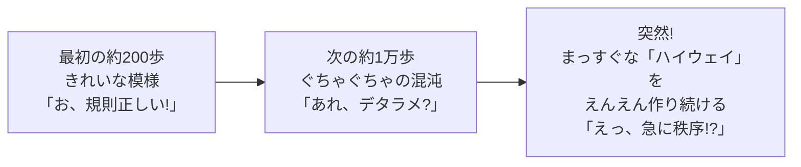
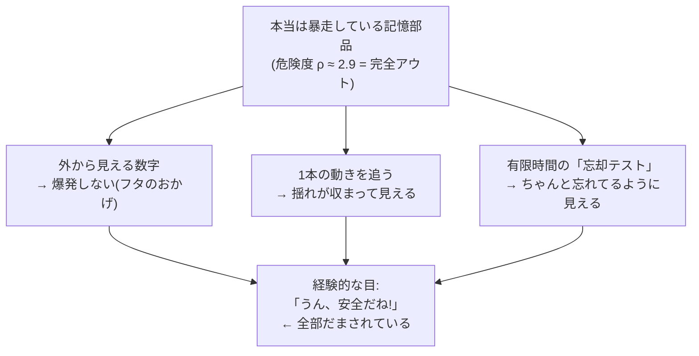
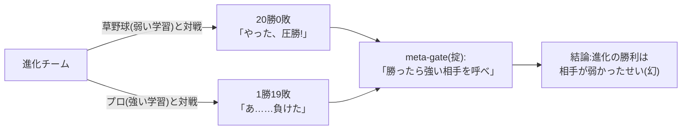
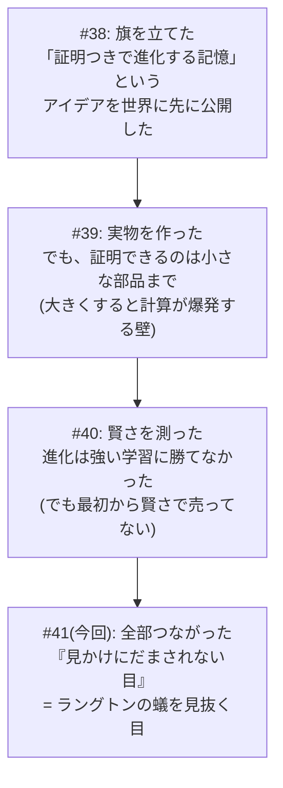

> この記事は、技術版(#38〜#40)の総まとめを **非エンジニア向けに噛みくだいた capstone** です。数式もコードも出てきません。出てくるのは「蟻」と「野球」と「占い師」だけです。技術版が読みたい方は #38〜#40 をどうぞ。ここでは、3 回分の研究で得た一番大事な教訓を **たった 1 つの比喩** にまとめます。

---

## はじめに — 「AI が賢くなりました!」を、あなたは信じますか?

最近、いろんな会社がこう言います。

「うちの AI は **自分で学んで賢くなります**!」
「うちの AI は **安定していて暴走しません**!」

…で、あなたは思うわけです。**「それ、本当?」**

本当かどうか、どうやって確かめます? たいていの人(そして、たいていの会社)は **「使ってみた感じ」** で判断します。「お、ちゃんと動いてる」「賢くなった気がする」「暴走してないっぽい」。

この記事のテーマは、ひとことで言うとこれです。

> **「使ってみた感じ」は、おそろしく簡単にだまされる。**

しかも、後でちゃんとお見せしますが、**だまされる確率は 84%** です。10 回のうち 8 回以上、人間の経験的な目は「危険なもの」を「安全」と誤判定しました。

じゃあ何を信じればいいのか。私たちが 3 回の研究で出した答えは、**「数学の証明書(certificate)」** という、ちょっと地味だけど一切ウソをつかないモノでした。

その「見かけにだまされる」話を、いちばんわかりやすく説明してくれる相棒がいます。**ラングトンの蟻** という、有名な「1 匹のアリ」です。まずは、このアリに登場してもらいましょう。

---

## ① 主役の紹介 — ラングトンの蟻

ラングトンの蟻は、コンピュータの中に住む **すごく単純なアリ** です。ルールはたった 2 つ。

- 白いマスに来たら → **右に曲がって**、そのマスを黒く塗って、1 歩進む
- 黒いマスに来たら → **左に曲がって**、そのマスを白く塗って、1 歩進む

以上。これだけ。小学生でも 1 分で覚えられます。

ところが、このアリを動かすと、ふしぎなことが起きます。

最初はきれいな模様。次にしばらく **完全にデタラメ** に見える。ところが、約 1 万歩を超えたあたりで、**突然** アリは「ハイウェイ」と呼ばれるまっすぐな道を作り始め、それを永遠に続けます。

ここがポイントです。**ルールは最初から最後まで何も変わっていません。** たった 2 つの単純なルールのままです。なのに、見ている人間には「規則→混沌→また規則」と、コロコロ印象が変わる。

つまりラングトンの蟻は、こう教えてくれます。

> **「見かけ」は、本質を平気で裏切る。**
> 単純なルールが「複雑そう」に見えたり、混沌が「秩序そう」に見えたりする。
> 目で見て「こう動いてるな」と判断すると、だまされる。

この「見かけにだまされる」というやつが、AI の世界でそっくり起きます。しかも 2 つの場面で。**「安定してる(ように見える)」** と **「賢くなった(ように見える)」** の両方で。

順番に、野球と占い師を使って見ていきましょう。

---

## ② 第一幕「安定してる、ように見える」— 84% だまされる目

### 暴走するエンジンが、静かに見える?

私たちが作っている AI 部品(`llcore`)は、中に「記憶」を持っています。そして、その記憶は **使うたびに少しずつ自分を作り変えて(進化して)いきます**。便利そうですよね。でも、作り変えが下手をすると **暴走** します。記憶がどんどん膨らんで止まらなくなる。エンジンが壊れて空ぶかしが止まらない、みたいな状態です。

だから「この作り変えは暴走しないか?」を毎回チェックする **関所(ゲート)** が要ります。

ここで問題。**暴走しているかどうかを、どうやって見分けるか?**

ふつうに考えると「しばらく動かして、様子を見る」ですよね。揺れが収まっていけば安全、揺れが大きくなっていけば危険。経験的で、自然な判断です。この **経験ベースの見張り** は「学習する AI」でよく使われる発想です(今回検証したのはその一例 ── STABLE 風の 1 種類です)。

ところが ── ここでラングトンの蟻が出てきます ── **暴走しているエンジンが、見た目には静かに見えることがある** のです。

### なぜ静かに見えてしまうのか(超ざっくり)

私たちの記憶部品は、安全装置として **「数値が大きくなりすぎないようにギュッと抑える仕組み(tanh)」** を内側に持っています。これがあるおかげで、たとえ中身が暴走していても、**外から見える数字(出力の大きさ)は決して爆発しません**。フタがしまっているので、中で鍋が煮えくり返っていても、外からは静かに見える。

さらに意地が悪いことに、**ものすごく暴走している個体ですら**、ある条件で観察すると **「揺れがちゃんと収まっていってる」ように見える** ことがありました。実測では、本当は危険度がかなり高い(数学でいう ρ ≈ 2.9、1 を超えたらアウトの指標)のに、ある 1 本の動きを追うと、揺れが「ほぼゼロ」まで小さくなっていったのです。

これはまさに **ラングトンの蟻** です。中身のルール(危険な構造)は変わっていないのに、見かけ(観察された動き)は「安全」を演じてしまう。

### そして「84%」の衝撃

そこで私たちは、わざと **「暴走する個体」と「安全な個体」を大量に用意して(95 個 vs 305 個)**、いろんな見張り役にテストさせました。「この個体、安全? 危険?」と聞いて、暴走する個体を「安全」と誤って通してしまった割合(=だまされ率)を測ったのです。

| 見張り役 | 暴走する 95 個のうち「安全」と誤って通した数 | だまされ率 |
|---|---|---|
| **見張りなし**(誰でも通す) | 95 / 95 | **100%** |
| **経験ベースの見張り**(様子を見て判断) | 80 / 95 | **84.2%** |
| **数学の証明書**(certificate) | 0 / 95 | **0%** |

読んでいただきたいのは真ん中の行です。**経験で「安全そう」と判断する見張りは、本当は暴走している個体の 84% を「安全」と通してしまった。** 10 個の地雷のうち 8 個以上を、踏ませてしまったわけです。

一方、いちばん下の **数学の証明書** は、**1 個も見逃しませんでした(0%)**。証明書は「見た目」を見ません。最悪のケースを数学で計算して、「絶対に大丈夫と証明できたものだけ」を通します。証明できなければ門前払い。だから、見かけの演技にだまされない。

> **経験は 84% だまされた。証明書は 1 個も見逃さなかった。**
> これが第一幕のオチです。

ちなみに証明書にも種類があって、いちばん性能の良いやつ(cert_sdp という名前)は、「危険を見逃さない(0%)」だけでなく、「安全なものを安全と認める力」も一番高い ── **間違って弾いてしまう安全個体はたった 4.6%** でした。きびしいだけでなく、ちゃんと優しくもある。理想の門番です。

---

## ③ 第二幕「賢くなった、ように見える」— 20勝が幻だった話

### 野球で例える「弱い相手に勝っても何も言えない」

さて、第一幕は「安全に見える」の話でした。第二幕は **「賢くなったように見える」** の話です。こっちは野球で例えるのが一番わかりやすい。

私たちの記憶部品は「進化」で自分を改良します。じゃあ、その進化は **本当に賢くなるのか?** ── 世間でふつうに使われている学習法(専門的には「勾配法」)と比べて、強いのか弱いのか。これを実際に対戦させました。

私たちは、実在する本物の小さな AI(SmolLM2-135M という Apache ライセンスの公開モデル)の **本物の小型 LLM(SmolLM2)から作った内部データの代理指標(full-vocab ではなく hidden-クラスタ CE proxy)** を使って **本物の AI 由来の地形** を作り、そこで進化チームと勾配法チームを **同じ予算で** 対戦させました。

結果、進化チームは ──

> **20 戦 20 勝。完封。**

おお! 進化が学習法に圧勝! 一瞬、こう叫びたくなりました。

「**進化する AI が、ふつうの学習に勝つ証拠を見つけた!**」

…SNS にめちゃくちゃ映える見出しです。バズりそうです。

でも、ここで野球の話を思い出してください。**20 連勝した相手が、もし草野球チームだったら?** その 20 連勝は「あなたが強い」証拠になりません。「相手が弱かっただけ」かもしれない。

実は今回の対戦相手(finite-diff 勾配という弱い学習法)は、**ハンデを背負った草野球チーム** でした。素朴で、1 手ごとにたくさんの計算が要る、遅くて弱い学習法だったのです。

### 自分のルールが、自分を止めた

ここが、この研究で **一番こわくて、一番大事な瞬間** です。

私たちのフレームワークには、最初から **掟(おきて)** が組み込んでありました。

> **進化が勝ったら、勝った気になる前に「プロ」を呼んで再戦せよ。**

異常に良い結果が出たら、喜ぶ前に内訳を疑え、という規律です(FullSense の合言葉「異常に良い結果は内訳を疑う」そのものです)。

そこで、本物のプロ ── **実際の AI 学習で使われている、正確で強い勾配法(解析勾配)** ── を呼んで、もう一度対戦させました。結果は、こうです。

| 対戦相手 | 進化チームの成績 |
|---|---|
| 草野球(弱い学習) | **20 勝 0 敗** |
| プロ(強い学習) | **1 勝 19 敗** |

**プロを出した瞬間、進化はボロ負けしました。** 強い学習法のほうが、進化よりも良かった。

つまり、**「進化が勝った!」というあの 20 連勝は幻** だったのです。相手が弱かっただけ。強い相手を出せば、ふつうの学習法のほうが賢かった。

### 負けたけど、これは失敗じゃない

ここで大事なのは、**負けたこと自体は失敗ではない**、という点です。

なぜなら、私たちのフレームワークの売りは **最初から「賢さ」ではなかった** からです。売りは「安全の保証」── 第一幕でお見せした「84% だまされない見張り」のほうです。「賢さ」では勝負していません。だから「賢さで負けた」のは、むしろ **最初の方針が正しかった証拠** なのです。賢さで売らなくて正解だった、と。

そして、もっと大事なこと。もし掟(meta-gate)が無ければ、私たちは **「進化が学習に勝った!」という嘘を世界に発表していました**。掟が、自分自身のウソを、データの上で 1 件、実際に止めたのです。

> **これは「負けの報告」ではなく、「ブレーキがちゃんと効いた報告」です。**
> ここでもラングトンの蟻 ── 20 連勝という「見かけ」が、「相手が弱いだけ」という本質を裏切っていた。証明書ならぬ「掟」が、その幻を見抜きました。

---

## ④ ちょっと寄り道 — 「世界中の AI は本当に賢くなっているのか?」

ここで一回休憩がてら、世間の話をしましょう。

今、世界中で人気の AI ツールたちが「自己改善」を看板にしています。たとえば(2026 年 6 月時点で私たちが調べた範囲では):

- ある有名プロジェクトは「20 以上のスキルで 40% 高速化」と謳い、星(人気投票)を 18 万個以上集めています
- 別の超人気プロジェクトは「継続的に学習する(Continuous Learning)」を看板に、星を 21 万個以上集めています
- 「使うほど賢くなる」を売りにするものもあります

すごそうですよね。でも、ここで第二幕の教訓です。

**これらの「賢くなった」「高速になった」という主張は、すべて自社が自分で測った数字で、第三者が検証したものではありません。**(念のため ── 私はこれらのプロジェクトを貶めているのではありません。「未検証である」という事実を述べているだけです。立派なプロジェクトばかりです。)

そして大事なのは、**星の数(人気)は「性能が優れている証拠」ではない** ということ。星はあくまで「人気の証拠」です。20 連勝が「相手が弱かっただけ」かもしれないのと同じで、「みんなが使っている」は「本当に賢い」とイコールではありません。

じゃあ「本当に賢くなったのか/本当に安定したのか」を、人気でも雰囲気でもなく、ちゃんと見分ける道具はないのか?

…それが、まさに私たちが作っている **「数学の証明書で見分けるモノサシ」** なのです。「賢くなった気がする」を、「本当にそうか」に変える道具。第一幕の「84% vs 0%」を思い出してください。これは、その種の主張を見抜くための物差しなのです。

---

## ⑤ もう一つの寄り道 — 「未来を想像できる AI」ですら、保証は出せない

もう一つ、面白い話があります。2026 年のある講演(画像認識の大家・藤吉弘亘先生)で、こんな話が出ました。

最近の AI には「**世界モデル**」というものがあります。ざっくり言うと、**「次に何が起きるか、頭の中でシミュレーションして想像できる AI」** です。チェスの数手先を読むみたいに、未来を頭の中で先読みできる。すごい技術です。

で、こう思いますよね。「未来を想像できるなら、危ないことも事前にわかって、安全なんじゃない?」

ところが、その大家ご本人が、講演の中で **正直に** こう線を引きました。

> **世界モデルは「安全な設計に寄与する」が、「安全の保証」ではない。**

未来を想像できることと、安全を **保証** できることは、別物だ、と。想像はあくまで「たぶんこうなりそう」であって、「絶対こうなる」という保証ではない。だから、未来を読めるからといって安全だとは言い切れない。これは、その分野のトップが引いた、とても誠実な一線です。

私たちのアプローチは、ここに少しだけ別の角度から答えを足します。**「数学の証明書(certificate)」で、"保証"のほうを出す。** 「たぶん安全」ではなく「絶対に暴走しないと証明できたものだけを通す」。これが第一幕の 0% の正体です。

未来を **想像** するのではなく、最悪の場合を **計算** して、安全を **保証** する。地味です。でも、保証というのはそういうものなのです。

(ちなみに、この講演にはもう 1 つ刺さる言葉がありました。「**人が AI に与えるものと、AI が自ら獲得するものの境界は、ずっと広がり続けてきた**」。これは私たちの研究テーマ ── AI が自分で進化する ── と、まさに同じ話をしています。境界はどんどん AI 側に広がる。だからこそ、その自己進化に **ブレーキ(保証)** が要るのです。)

---

## ⑥ 3 回分のまとめ — ラングトンの蟻が教えてくれたこと

ここまでの 3 回(#38 → #39 → #40)を、ラングトンの蟻のひとことでまとめます。

3 回の研究で、私たちが本当に作ったものは何だったのか。それは ──

> **「進化して賢くなる、すごい AI」ではありません。**
> **「自分を作り変えても暴走しないことを、見かけではなく数学の証明書で保証・測定する、正直なモノサシ」です。**

地味です。バズりません。でも、**世の中が「賢くなった」「安定した」と言うとき、それが本物か幻かを見分けられる目** ── それこそが、今いちばん必要なものだと、私たちは思っています。

ラングトンの蟻は、単純なルールで「複雑そう」にも「秩序ありそう」にも見える。AI も同じで、「安定そう」にも「賢そう」にも見える。**経験的な目は、その見かけに 84% だまされた。** 数学の証明書だけが、幻を見抜いた。

これが、3 回分の物語が 1 点に集まる場所です。

---

## ⑦ 正直に言っておくこと(盛らないために)

最後に。私たちの合言葉は **「異常に良い結果は、勝った気になる前に内訳を疑う」** です。だから、自分の研究についても正直に「ここはまだ言えない」を書いておきます。これを省くと、私たち自身がラングトンの蟻にだまされる側になってしまうので。

- **「進化が賢さで負けた」と言い切ってはいません。** これは §3 の本物由来の地形とは別物です ── **人工的に作った別の地形** では、進化と学習法は **引き分け** でした。これは「進化が決定的に劣る」証明でもなければ「互角だ」という証明でもありません。ただの **引き分け(まだ決着がついていない)** です。
- **「84% だまされる」も、設定によって数字は変わります。** 「経験ベースの見張りは危険を見逃しやすい」という **方向** は確かですが、「84%」という数字そのものは、テストの条件によって動きます。条件をいろいろ変えたときにどうなるかは、まだ全部は測れていません。
- **「1 個も見逃さなかった(0%)」も、無限のテストをしたわけではありません。** たくさんサンプルを取って「1 件も見つからなかった」という、とても強い証拠ではありますが、「宇宙のすべての入力で絶対に大丈夫」を機械が証明したわけではありません。ここは誇張しません。
- **証明書で安全に進化させられるのは、まだ「小さな部品」だけです。** 部品を大きくすると、証明の計算コストが爆発します(#39 の「壁」)。大きい AI 本体でそのまま使えるかは、これから(未検証)です。
- **本物の大きな LLM にそのまま載せ替えられるか** も、まだ確かめていません。今回は「本物の小型 LLM(SmolLM2)から作った内部データの代理指標(full-vocab ではなく hidden-クラスタ CE proxy)を使った練習問題」までで、本体まるごとではありません。
- **今回測ったのは本物 CE そのものではなく、その代理(proxy)指標です。** 本物の cross-entropy(CE)を直接測ったのではなく、hidden 状態のクラスタから作った代理指標で代用しています。

なぜ、せっかくの良い結果に、わざわざ水を差すようなことを書くのか。それは、**この「正直さ」こそが、ラングトンの蟻にだまされないための唯一の方法** だからです。見かけの良い結果に酔ったら、自分が一番最初にだまされる。だから私たちは、毎回ここを書きます。

---

## おわりに

「AI が賢くなりました!」「AI が安定しています!」── そう聞いたとき、これからは少しだけ、ラングトンの蟻を思い出してください。

単純なものが複雑に見え、暴走しているものが静かに見え、運の良い勝ちが実力に見える。**見かけは、本質を平気で裏切ります。**

だから私たちは、見かけではなく、**ウソをつかない数学の証明書** で測ることにしました。経験は 84% だまされても、証明書は 1 個も見逃さない。賢さでバズるより、**正直さで信頼される** ほうを選びました。地味だけど、それが本当に役に立つモノサシだと信じています。

正本データ(全部公開しています): [github.com/furuse-kazufumi/llcore](https://github.com/furuse-kazufumi/llcore)

そして技術的にもっと深く知りたい方は、姉妹記事の技術版 #38(防衛的公開)/ #39(スケールの壁)/ #40(賢さの幻)へどうぞ。この #41 は、その 3 つの上に立つ「総まとめ」でした。
