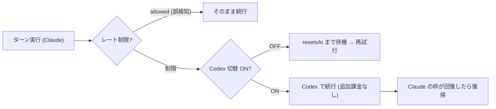
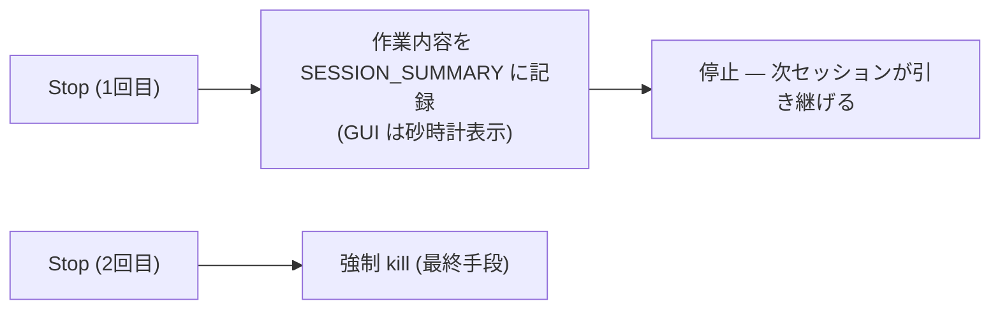

言語 / Language / 语言 / 언어: [日本語](#日本語) | [English](#english) | [中文](#中文) | [한국어](#한국어)

> ⚠ 本記事は **ja 版ドラフト**。en/zh/ko 展開は後続。

# 日本語

## この記事は何か — 進捗バーが動かないとき、あなたは何分待てますか

> **コンセプト hook**
> インストーラの進捗バーが動かなくなって、3 分待って、キャンセルを押したことはありませんか。あとから「裏ではちゃんと動いていた」と知って、少しだけ気まずくなったことは。
> 私はつい昨日、それを AI 相手にやりました。**画面の向こうで AI は黙々と働いていた。黙りすぎていたので、私は故障と判断して Stop を押した。** 悪いのは AI か、私か — どちらでもありません。**「黙って働く設計」を作った私です。**
> 本稿は、Claude Code を自走ループで駆動する個人用 GUI ツール **llterm** の開発で、2026-06-12 の実セッションに実際に起きたことだけを集めた**小話集**です。AI が黙る話、コンテキストメーターが 156% を指す話、メニューに無い大盛りを注文する話 — 全部に小さなオチと、現場でしか拾えない教訓が付いています。

先にこの記事の教訓を 3 行で言ってしまいます。

> **沈黙 = 故障ではない。ただし、沈黙させる UI は故障である。**
> **メーターがおかしな値を指したら、燃料ではなくメーターの実装を疑え。**
> **止め方の設計こそ UX — Stop ボタンは「殺すボタン」ではなく「引き継ぐボタン」にできる。**

いつもの順番 ①用語 → ②前提のかみくだき → ③本題(小話) で、盛らずに書きます。登場する数値はすべて実セッションの記録(ledger / セッション記録)にあるものだけです。

---

## ① 用語ミニ辞典(本文で詰まらないために)

| 用語 | ひとことで |
|---|---|
| **Claude Code** | Anthropic の AI コーディングエージェント CLI。対話でコードを書き、テストを回し、ファイルを編集する。 |
| **llterm** | 本稿の主役。Claude Code を**自走ループ**で駆動する個人用 GUI ツール(Qt ベース)。未公開の個人ツールです。 |
| **自走ループ** | 人間が 1 回ずつ指示するのではなく、AI 自身がセッションを回し続ける運転モード。詳細は ② で。 |
| **コンテキストウィンドウ** | LLM が一度に参照できる「作業机の広さ」(トークン数)。一杯になると畳んで引き継ぐ必要がある。詳細は ② で。 |
| **rotate(ローテーション)** | 机(コンテキスト)が一杯になる前に、引き継ぎメモを書いてセッションを畳み、新しいセッションで続きを始めること。 |
| **ConPTY** | Windows の擬似端末(pseudo console)機構。端末アプリと CLI プログラムの間に挟まる「通訳ブース」。詳細は ② で。 |
| **IME / composition** | 日本語入力の変換エンジンと、その「変換中でまだ確定していない宙ぶらりんの文字列」。端末上ではこれが画面再描画と衝突しやすい。 |
| **レート制限** | 単位時間あたりの利用量上限。定額サブスクリプションの制約はお金ではなく頻度で来る。詳細は ② で。 |
| **プロバイダ・チェーン** | 複数の AI 提供元(ここでは Claude / Codex)を優先順位つきで並べ、一方が使えない間だけ次へ自動で切り替える仕組み。 |
| **ledger** | 追記専用(append-only)の監査記録。何が起きたかを後から改変できない形で残す「航海日誌」。本稿の小話はこれで裏が取れています。 |
| **stream-json** | Claude Code のヘッドレス(画面なし)実行モードの出力形式。1 行 = 1 イベントの JSON が流れてくる。 |
| **`communicate()`** | Python の標準ライブラリ `subprocess` にある関数。子プロセスが**終わるまで**出力を待って、最後に全部まとめて受け取る。第一話の犯人。 |
| **graceful shutdown** | 即座にプロセスを殺すのではなく、後始末(ここでは引き継ぎメモの記録)をしてから停止すること。第六話の主役。 |

---

## ② かみくだき — 前提を 3 つだけ、長めに

小話に入る前に、前提を 3 つだけ共有させてください。ここを丁寧にやっておくと、各話のオチが「あるある」として笑えるようになります。急ぐ方は ③ へ飛んでも読めるように書いてあります。

### 前提 1: 「自走ループ」とは何か

Claude Code は普通、人間が「これをやって」と打ち込み、AI が応えて、また人間が打ち込む — という**対話型**で使います。これに対して自走ループは、**AI 自身が次のターンを回し続ける**運転モードです。

比喩で言えば、対話型が「隣に座って一緒に料理する」だとすると、自走ループは「夜のうちに仕込みを渡して、朝までに作っておいてもらう」です。寝る前に「このテストを直しておいて」と渡すと、AI が自分でコードを読み、直し、テストを回し、結果を記録して、また次の作業に進む。

なぜそんなことが可能か。Claude Code には**ヘッドレスモード**(画面なしで 1 ターンを実行し、結果を stream-json で返すモード)と、**セッション再開**(前回の続きから再開する機能)があるからです。llterm はこの 2 つを使って、「新セッション開始 → 続きを再開 → コンテキストが一杯になりそうなら引き継ぎメモを書いて畳む → 新セッションで続行」というループを回します。安全装置として、エラーが続いたら止まる仕組み、コスト上限、全イベントの ledger 記録などが入っています。

ここで大事なのは、**自律 1 ターンは数分〜数十分かかる**ということです。AI が大きなコードベースを読み、考え、書き換え、テストを回すのですから、当然です。この「1 ターンが長い」という性質が、第一話の事件を生みます。

### 前提 2: 「コンテキストウィンドウ」とは何か、なぜメーターが要るのか

LLM には、一度に参照できる情報量の上限があります。これを**コンテキストウィンドウ**と呼びます。単位はトークン(おおまかには単語の断片)です。

比喩で言えば、**作業机の広さ**です。机の上に広げられる書類の量には限りがある。会話履歴も、読んだコードも、書いたコードも、全部この机の上に置かれていく。机が一杯になると、新しい書類を置く場所がなくなります。

人間との対話なら「そろそろ要約して仕切り直しましょう」で済みますが、自走ループでは AI が**自分で**机の混み具合を判断し、一杯になる**前に**引き継ぎメモを書いて机を交代(rotate)しなければなりません。交代が遅れると、引き継ぎメモを書く余白すら残らない。だから llterm の GUI には「机の占有率メーター」— ctx% バー — が表示されています。

なぜそう言えるか、を実装側から言うと: Claude Code のヘッドレス出力には、各ターンでどれだけトークンを使ったかの情報(usage)が含まれます。それを読み取って「窓の何 % を使ったか」を計算し、しきい値(たとえば 70%)を超えたら rotate する — これが自走ループの基本動作です。**つまりこのメーターは飾りではなく、自走の生命線です。** そのメーターが狂うとどうなるか、が第二話です。

### 前提 3: 「ConPTY」「IME」「レート制限」— 三つの伏兵

**ConPTY** は Windows の擬似端末機構です。端末アプリ(見た目)と CLI プログラム(中身)の間に挟まって、カーソル移動や色などの画面制御コードを取り次ぐ「通訳ブース」だと思ってください。Unix 系 OS には PTY という同様の仕組みが大昔からありますが、Windows に ConPTY が入ったのは比較的最近で、挙動の癖が残っています。通訳ブースが制御コードを再解釈して流すため、タイミングや実装の組み合わせによって描画が崩れることがある。

**IME** は日本語入力の変換エンジンです。問題になるのは「変換中でまだ確定していない文字列」(composition)で、これは画面上のどこかに仮表示されながら、アプリ側の描画と協調しなければなりません。ところが Claude Code のような TUI(端末上の対話画面)は頻繁に画面を再描画します。**変換中のまさにその瞬間に画面が書き換わると、未確定文字の表示が壊れる。** 長文・複数行・日本語という条件が重なるほど壊れやすい。これが第五話の積年の恨みです。

**レート制限**は、単位時間あたりの利用量上限です。定額サブスクリプションで使う場合、制約は「お金が尽きる」ではなく「単位時間の利用枠が尽きる」という形で来ます。食べ放題(定額)だけれど、一度に運んでもらえる皿の枚数には限りがある、という感じです。枠が回復する時刻(resetsAt)はイベントとして通知されるので、機械的に「いつまで待てばいいか」が分かります。これが第四話の前提です。

> 🍵 **休憩ポイント**: ここまでが前提です。要するに llterm は「AI に夜なべ仕事をさせる装置」で、机の占有率メーターと引き継ぎメモで回っている。では、その装置が初日に何をやらかしたか — 小話の始まりです。

---

## ③ 本題 — llterm 小話集(全六話)

### 第一話 「AI が黙る」

自走ループを GUI に乗せて、最初の実走の日。Start を押すと、AI のセッションが始まりました。

…………。

画面には、何も出ません。1 分経っても、2 分経っても。ウィンドウは固まってはいない。でも何も表示されない。私は判断しました。「これは壊れた」。Stop を押しました。

あとで ledger(実走の追記専用記録)を確認すると、こう残っていました — **セッション開始の 2.5 分後に cancelled**(2026-06-12 03:20 UTC の実走記録)。つまり止めたのは間違いなく私です。そして同じ ledger が、もう 1 つの事実を突きつけてきます。**その 2.5 分間、AI はずっと正常に働いていた。**

犯人は `communicate()` でした。Python で子プロセスの出力を受け取る標準的な関数ですが、これは**子プロセスのターンが終わるまで全部ブロックして、最後にまとめて出力を返す**設計です。前提 1 で書いたとおり、自律 1 ターンは数分〜数十分かかります。つまりこの実装では、**ターンが終わるまで GUI は構造的に何も表示できない**。AI は黙っていたのではなく、黙らされていたのです。

修正は「出力を行単位でリアルタイムに読む」方式への変更でした。修正後の実測では、ターン開始から 2.9 秒で初期化、**18.1 秒で最初のテキストが画面に出て**、38.4 秒でターン完了。旧実装ではこの 38.4 秒間、ずっと無表示でした。たった 38 秒のターンですらユーザーを不安にさせたのだから、数十分のターンで Stop を押されるのは必然だったわけです。

**オチ**: 故障と判断して止めたのは人間で、本当に壊れていたのは「働いている姿を見せる配線」だけだった。AI は無実。実装した私が有罪。

**教訓**: **沈黙 = 故障ではない。ただし、ユーザーに沈黙を強いる UI は故障である。** 進捗が見えないシステムは、正しく動いていても「壊れている」と扱われる — そしてユーザーにとっては、それは実質壊れているのと同じです。

### 第二話 「メーターが 156% を指す」

表示が直って、機嫌よく自走を眺めていたら、今度は ctx% バー — 前提 2 で説明した「机の占有率メーター」— が **100% に張り付きました**。内部の計算値を見ると **156%**。

156%。机の上に、机の 1.5 倍の書類が載っている。物理法則への挑戦です。

原因は分子の計算でした。ターン結果に含まれる usage(使用トークン数)の**累計を足し合わせる**実装になっていて、そこに**キャッシュ再読込分が重複加算**されていたのです。かみくだくと: AI は毎ターン、過去の文脈を「読み直し」ます。このうちキャッシュから再読込された分は、机の上の**同じ書類をもう一度見ている**だけで、新しい書類が増えたわけではありません。ところが累計方式だと、見直すたびに「新しい書類が届いた」と数えてしまう。10 回見直せば 10 冊分。そうして占有率は実態と無関係に積み上がり、100% を突き破って 156% に達しました。

修正は「最後のターンの usage(その瞬間の机の占有量)だけを見る」方式への変更です。実測では、旧実装が 8.4% と表示していた場面で、修正後は 4.3%。さらに調べると分母にもバグがいて、**使用モデルの実際のコンテキストウィンドウは 1M トークンなのに、既定値の 200K を分母にしていた** — 占有率を 5 倍過大に見積もり、rotate が 5 倍早く走る状態でした。分子は过大、分母は过小。メーターは二重に狂っていたことになります。

ここで第一話を思い出してください。占有率メーターは自走の生命線で、**このメーターを見て AI は「机を畳むかどうか」を決めます**。メーターが 156% を指せば、まだ広々と空いている机を畳んで引っ越しを始める。狂った燃料計を信じて、満タンの車で次々と給油所に入るようなものです。

**オチ**: タンクには半分も入っていないのに、燃料計は 156% を指していた。車は壊れていない。壊れていたのはメーターの足し算である。

**教訓**: **メーターがありえない値を指したら、世界ではなく実装を疑え。** 156% という「ありえなさ」は実はラッキーで、もし重複加算がもう少し穏やかで 90% 前後に収まっていたら、誰も疑わずに「もう一杯なんだな」と信じていたはずです。**過大表示バグの最も危険な形は、もっともらしい値に収まる過大表示です。**

> 🍵 **休憩ポイント**: ここまでの二話はどちらも「表示」の話でした。AI 本体は一度も壊れていないのに、人間は Stop を押し、ループは無駄な引っ越しをしかけた。**自走システムの信頼性は、本体の賢さよりも先に、計器の正直さで決まる** — 前半のまとめです。

### 第三話 「ultracode に切り替えられる?」

私は普段、別プロジェクトでセキュリティ研究用の Claude Code fork 環境を使っています。そこには effort(AI がどれだけ深く考え込むかの度合い設定)に **ultracode** という最上位モードがあり、起動時に `/effort ultracode` を流し込むのが日課になっています。

で、llterm の GUI に effort 選択を付けるとき、当然のようにこう考えました。「最上位は ultracode だな」。

実機で確認した結果: **素の claude CLI の `--effort` の最上位は max**。ultracode という値は存在しません。ultracode は、その**セキュリティ研究 fork が独自に定義した概念**であって、素の Claude Code の語彙には無かったのです。ついでにもう 1 つの実機確認: `/effort` コマンドはタスク注入(自走ループがプロンプトとして流し込む経路)では効かない。つまり「注入で ultracode に切り替える」は二重に不可能でした。

行きつけの定食屋に「裏メニューの特盛」があるとします。長年通って、特盛があるのが当たり前になっている。ある日チェーンの別店舗に入って「特盛で」と注文したら、店員さんがきょとんとする — 特盛はあの店の大将が勝手に始めた裏メニューで、チェーンの公式メニューは大盛りまでだった。そういう話です。

**オチ**: メニューに無い大盛りを、隣町の店で注文していた。恥ずかしいのは店ではなく、方言を標準語だと思い込んでいた客である。

**教訓**: **毎日使っている環境の拡張機能は、いつのまにか「世界の標準」に見えてくる。** 自分の道具箱の中の何が標準で何がローカル拡張かは、定期的に棚卸しした方がいい。AI エージェントの設定項目は特に、fork・ラッパー・プラグインが何層にも重なるので、「どの層が提供している機能か」を一度実機で確かめる価値があります。今回は GUI の選択肢を作る前に実機確認したので、存在しない選択肢を出荷せずに済みました。

### 第四話 「レート制限に当たったら、隣の AI に振る」

前提 3 で書いたとおり、定額サブスクリプションの自走で最初にぶつかる壁はお金ではなく**レート制限**です。夜通し自走させれば、いつかは単位時間の利用枠を使い切る。そのとき自走ループはどうするべきか。

素朴な答えは「枠が回復する時刻(resetsAt)まで待つ」です。llterm もまずこれを実装しました — レート制限イベントを検知したら、resetsAt まで(途中で止められる形で)待機し、同じターンを再試行する。誤検知で待たないよう、制限イベントでも「allowed(まだ使える)」のものは素通しします。

でも、待っている時間がもったいない。そこで**プロバイダ・チェーン**です。Claude がレート制限で使えない間だけ、**Codex**(OpenAI のコーディングエージェント CLI)に作業を切り替え、Claude の枠が回復したら戻ってくる。Codex は ChatGPT Pro サブスクリプションの範囲内で動くので、**追加課金なし**。プロバイダごとに「いつまで封鎖か」を別々に管理し、GUI のトグルで有効/無効を選べます。

ここで面白いのは引き継ぎです。Claude と Codex は別々の AI で、互いの会話履歴(机の上)を覗けません。では作業の文脈はどう渡すのか — **セッション記録(SESSION_SUMMARY)が橋渡しをします**。rotate のために書いていた「引き継ぎメモ」が、そのまま**別プロバイダへの引き継ぎメモ**としても機能する。夜勤の交代ノートが、社内の交代だけでなく、応援に来た他社の人への説明にも使える、というわけです。

**オチ**: AI の代打を立てる仕組みの心臓部は、高度なプロトコルではなく「交代ノートをちゃんと書く」という、人間の職場と同じ仕組みだった。

**教訓**: **冗長化の要は、切り替え機構よりも引き継ぎ情報の質。** 切り替え自体は条件分岐 1 つですが、文脈が渡らなければ代打は白紙から始めることになります。rotate のために整備した引き継ぎメモが、そのままプロバイダ間の橋になった — 良い設計は二度働く、の実例でした。

> 🍵 **休憩ポイント**: 残り二話は、llterm の出生の秘密(なぜ端末を捨てたか)と、第一話の事件への最終回答(止め方の設計)です。円環構造になっているので、もうひと息お付き合いください。

### 第五話 「端末を捨てた日」

llterm は最初から GUI だったわけではありません。元は名前のとおり**端末(terminal)ホスト**でした。Claude Code の TUI を端末上にそのまま表示しつつ、画面の最下部に IME 安定な専用入力欄を切り出す — そういう設計です。

そのために投入された職人芸を少しだけ並べます。子プロセス(claude)を実端末より 4 行小さい擬似端末の上で動かし、最下部 4 行を自前の入力欄として確保する。端末のスクロール領域指定(DECSTBM という制御コード)で、子の再描画が入力欄に届かないよう隔離する。子が終了しても返ってこない読み取り処理をデーモンスレッドに隔離して脱出する。修飾キーのリピート洪水で再描画しないよう間引く——。動くには動きました。自動テストも数十件 green になりました。

それでも、壊れ続けました。日本語 IME の変換中文字列は再描画と衝突し、カーソルは取り合いになり、Windows の入力モードと ConPTY の癖が組み合わさって、会話のたびにどこかの表示が崩れる。原因を 1 つ潰すと、別の組み合わせが崩れる。**戦っている相手は自分のコードではなく、端末というレイヤーの歴史的な仕様の積み重ね**でした。

そこに一言が飛んできます。「llterm は使いにくい。なぜ GUI でないのか。Qt を使えば済むのでは」。

…検討しました。会話で壊れ続けた問題は、全部 terminal_io 由来(Windows の入力モード / ConPTY / カーソル競合)。**GUI にすれば、その戦場ごと消える。** テキスト入力欄での IME 動作も、画面描画も、Qt(正確には PySide6)では**標準挙動**です。誰かが何十年もかけてテストしてきた既製品の挙動に、ただ乗ればいい。

方針転換しました。端末を捨て、表示を Qt の GUI へ。自走ループの心臓部は表示に依存しない層として分離してあったので、移行で失うものは職人芸のプライドだけでした。

**オチ**: 数週間分の端末制御の職人芸は、「Qt のテキスト欄に文字を入れると、ちゃんと表示される」という標準挙動 1 つに敗北した。敗北ですが、完全勝利でもあります — 勝負の土俵を変えたので。

**教訓**: **問題を解く前に、その問題が消える場所に移動できないかを考える。** エンジニアは「いま立っている戦場で勝つ」ことに熱中しがちですが(私のことです)、IME×ConPTY×TUI のような「歴史的レイヤーの摩擦」は、個人が修正できる種類の問題ではないことがあります。撤退は敗北ではなく設計判断です。

### 第六話 「止め方の設計」

最終話は、第一話への最終回答です。

第一話で私は Stop を押しました。あのときの Stop は、実行中の AI プロセスを即座に殺すボタンでした。ここに自走ループ特有の問題があります。自走中の AI は「いまどこまで作業したか・次に何をするつもりか」を**自分のコンテキスト(机の上)だけに持っています**。即 kill すれば、それは机ごと消える。次に起動したセッションは、何がどこまで終わったのか分からない白紙から始まります。人間で言えば、引き継ぎメモを書く間もなく職場から連れ出されるようなものです。

そこで Stop を二段にしました。**1 回目の Stop は「graceful(穏便な)停止」**: AI に作業内容をセッション記録(SESSION_SUMMARY)へ書き残させてから畳みます。その間、GUI には砂時計が表示される — 「いま引き継ぎメモを書かせています、少し待ってください」の合図です。**2 回目の Stop は強制 kill**: それでも待てないとき、あるいは本当にハングしているときの最終手段。ついでにウィンドウの × ボタンにも確認ダイアログを付けました。自走中の誤クリック一発で夜なべ仕事が消える、を防ぐためです。

第一話と並べると、円環が閉じます。第一話の事件は「**表示の設計**を怠ったせいで、押す必要のない Stop が押された」。第六話は「それでも Stop が押される日のために、**押されても壊れない止め方**を設計した」。表示が信頼を作り、止め方が信頼を守る。

そして第四話で見たとおり、この「Stop 時に書かれる引き継ぎメモ」は rotate の引き継ぎでもあり、プロバイダ交代の橋でもあります。llterm という装置の中で一番よく働いているのは、AI でも GUI でもなく、**引き継ぎメモ**かもしれません。

**オチ**: 自走 AI ツールを一日作って分かった最重要コンポーネントは、最新の AI でも GUI フレームワークでもなく、「交代ノート」だった。うちの職場と同じである。

**教訓**: **止め方の設計こそ UX。** Start ボタンの体験は誰でも作り込みますが、ユーザーがシステムを信頼できるかどうかは「不安になったとき・止めたいときに何が起きるか」で決まります。止めても作業が失われない保証があるからこそ、安心して走らせられる — graceful shutdown は機能ではなく、信頼の前提条件です。

---

## ④ まとめ — 六話を三行に圧縮する

| 小話 | 起きたこと | 教訓 |
|---|---|---|
| 第一話 AI が黙る | 全ブロック設計で数十分無表示 → 人間が故障と判断して Stop(ledger 実証) | 沈黙 = 故障ではない。だが沈黙させる UI は故障 |
| 第二話 156% | usage 累計+キャッシュ再読込の重複加算で占有率 156%(分母も 5 倍過小) | メーターは世界ではなく実装を疑え |
| 第三話 ultracode | fork 独自の effort 値を標準と思い込み。素の claude の最上位は max | ローカル拡張を世界標準と混同するな |
| 第四話 プロバイダ・チェーン | レート制限時のみ Codex に交代、追加課金なし。橋は引き継ぎメモ | 冗長化の要は切替機構より引き継ぎの質 |
| 第五話 端末を捨てた日 | IME/ConPTY との格闘を Qt の標準挙動に置換 | 問題が消える場所への移動も設計 |
| 第六話 止め方の設計 | Stop 1 回目 = 記録してから停止(砂時計)、2 回目 = 強制 kill | 止め方の設計こそ UX |

三行に圧縮すると、冒頭の宣言に戻ります。

> 沈黙 = 故障ではない。ただし、沈黙させる UI は故障である。
> メーターがおかしな値を指したら、燃料ではなくメーターの実装を疑え。
> 止め方の設計こそ UX — Stop は「殺すボタン」ではなく「引き継ぐボタン」にできる。

自走 AI ツールの一日は、AI の賢さの話がほとんど出てこない一日でした。出てきたのは、表示の正直さ、計器の正直さ、交代ノート、撤退の判断 — **つまり全部、昔からあるエンジニアリングと職場の知恵**です。AI を自走させる装置を作るというのは、AI に職場を作ってあげることなのだ、というのが本日のサゲ…ではなく、まとめです(落語を名乗るほどの度胸はないので、小話集のまま店じまいします)。

## honest 留保(over-claim 禁止)

- **llterm は未公開の個人用ツール**です。本稿はツールの宣伝ではなく開発過程の小話で、再現手順の提供は意図していません。
- 本稿の数値(2.5 分 / 2.9 秒 / 18.1 秒 / 38.4 秒 / 156% / 4.3% vs 8.4% / 200K vs 1M / テスト 186 passed)は **2026-06-12 の実セッション・特定環境(Windows、当日の Claude Code CLI)での記録値**であり、一般化できる性能主張ではありません。
- **156% は llterm 側の実装バグ**であり、Claude Code 本体の不具合ではありません。第三話の ultracode も同様に「fork 環境と素の CLI の違い」の話で、どちらかの欠陥という話ではありません。
- レート制限・サブスクリプションの仕様(resetsAt の通知形式、課金の扱い等)は執筆時点の観測に基づきます。将来変わり得ます。
- 「Codex への切替で追加課金なし」は、**既契約の ChatGPT Pro サブスクリプションの範囲内**という意味であり、無料という意味ではありません。

## References

1. Microsoft — "Introducing the Windows Pseudo Console (ConPTY)", Windows Command Line blog, 2018.
2. Qt for Python (PySide6) — 公式ドキュメント。
3. Python `subprocess` — 公式ドキュメント(`communicate()` の動作仕様)。
4. frankbria/ralph-claude-code — 自走ループの prior art(resume + 終了シグナル + circuit breaker)。
5. claude-resurrect — 自走ループの prior art(summary → self-exit → resume)。
6. (内部) 本シリーズ #31 — Claude 主導 + Codex 配下の「二本柱」開発体制(プロバイダ・チェーンの背景)。

---

# English

(後続セッションで展開予定 / To be expanded in a follow-up session)

---

# 中文

(後続セッションで展開予定 / 将在后续会话中展开)

---

# 한국어

(後続セッションで展開予定 / 후속 세션에서 전개 예정)
