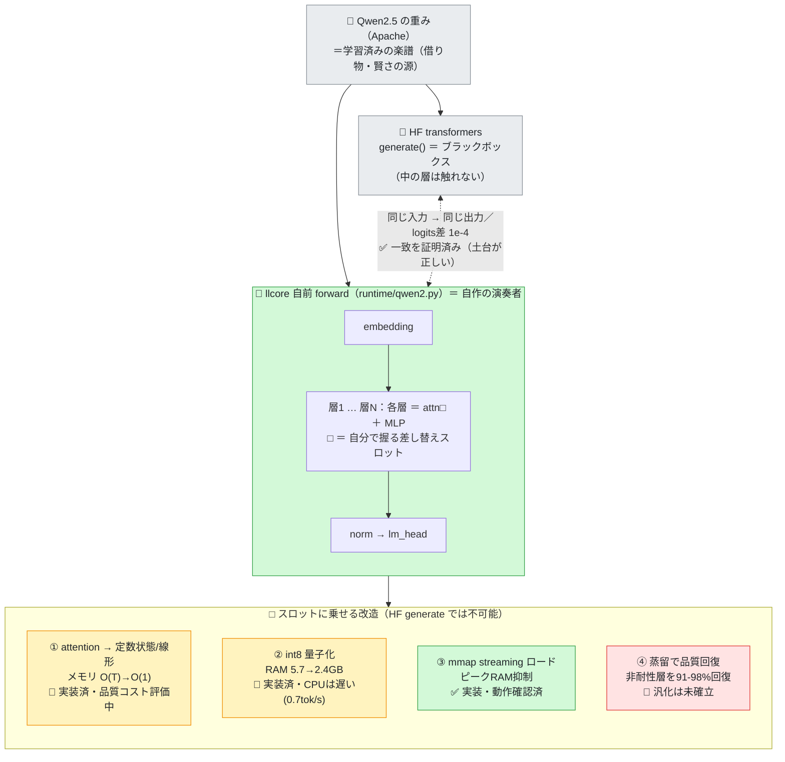

# AIは平気で嘘をつく — 自作LLMの「改良」を正直に測るために、評価器ごと作り直した話

> 📚 本記事は、自作の小さなLLMランタイム **llcore を正直に検証していく連載（llcore 検証 arc）の #43** です。今回は「自分の"改良"を正直に測る評価器の作り方」に加え、**2026年に出てきた"面白いモデル"の地図の中で、自分の立ち位置を正直に測り直した記録**を後半（第6章）に収めています。

## はじめに：いちばん怖いのは「良くなった」と思い込むこと

オンプレ（社内・手元のPCで完結）で動く小さなLLMランタイムを自作しています。そこで、ある「改良」を入れました。事前学習済みモデルの**注意機構（attention）に手術をして、会話がどれだけ長くなってもメモリを一定に保つ**——という改造です。

改造を入れると、人は必ずこう聞きたくなります。**「で、元より良くなったの?」**

この記事は、その問いに答えようとして気づいた、もっと怖い事実についてのものです。

> **怖い事実**：「良くなったか」を測る**ものさし自体**が壊れていると、人は平気で「良くなった」と思い込む。しかも、改良に手をかけた人ほど、壊れたものさしに気づけない。

結論から言うと、私は最初のものさし（短い窓での perplexity）を捨て、**「自分の成果を疑うための評価器」を一から作り直しました**。そしてそれを**自分の成果に向けた**ところ、「+34%の勝利」だと思っていたものが「+2.8%、しかも統計的に未確定」に縮みました。

地味な話です。でも、AIの開発でいちばん効くのは、派手な新手法ではなく**「自分に都合のいい数字を信じない仕組み」**だと思っています。その作り方を、用語をかみくだきながら共有します。

読了の目安は20分。前半が「なぜ普通の測り方が嘘になるか」、後半が「正直な測り方の具体的な作り方と、自分に向けた結果」です。

---

## 第0章：何を改造しているのか（3分で背景）

まず、何を測ろうとしているのかを共有します。ここを飛ばすと後半が宙に浮くので、用語を丁寧に置きます。

### KVキャッシュ — 会話が伸びると太る記憶

LLMが文章を読むとき、過去のトークン（単語のかけら）ごとに「鍵(Key)」と「値(Value)」を計算し、後続のトークンが過去を参照できるよう**キャッシュ**しておきます。これが **KVキャッシュ**です。

> 用語：**トークン** … LLMが扱う最小単位。日本語なら漢字1〜数文字、英語なら単語の断片くらい。「東京都」は1〜2トークン程度。

問題は、このKVキャッシュが**文脈の長さ T に比例して線形に太る**こと（O(T)）。会話が10万トークンになれば、メモリも10万トークン分。長い会話・長い文書を固定メモリの手元PCで回したいとき、これは天井になります。

### 定数状態アテンション — 伸びても太らない記憶

そこで「線形アテンション（linear attention）」という別方式があります。過去すべてを保持する代わりに、**固定サイズの状態 S に過去を畳み込んで要約**します。状態のサイズは文脈長 T に**依存しない（定数）**。だから「無限に長い会話を、固定メモリで」が原理的に可能になります。

> たとえ話：KVキャッシュは「これまでの会話を全部メモした分厚いノート」。定数状態は「要点だけを書いた1枚のカード」。カードは会話が伸びても1枚のまま。ただし、ノートに比べて**細部は落ちる**。

ここがトレードオフの核心です。**メモリは得をする。品質は（多かれ少なかれ）払う**。私の改造は、事前学習済みモデルの一部の層をこの「カード方式」に差し替え、**どの層をどれだけカード化すればメモリと品質の妥協点が最良になるか**を探索しています。

### perplexity — 「次の単語の当てにくさ」

品質の代表的なものさしが **perplexity（パープレキシティ、PPL）**です。「モデルが次のトークンをどれだけ言い当てられるか」の指標で、**小さいほど良い**。直感的には「モデルが次に何が来るか、平均で何択くらい迷っているか」。PPL=80なら「80択で迷っている」くらいのイメージです。

> **閑話休題：紛らわしい「同名」の話**
>
> 念のため——本記事の "perplexity" は、モデルの良し悪しを測る**評価指標**の話であって、AI 検索サービスの **Perplexity 社のサービスのことを指しているわけではない**。……と前置きしつつ、関連する小話を一つ。先日、私は **Perplexity の AI アシスタント**に「クレジットの自動課金」について尋ねた。返ってきたのは確信に満ちた「1 クレジット＝1 ドル」という答えで、残高表示をそれで換算すると **「約 100 万円が自動課金されるのか!?」** と血の気が引いた。
>
> ——ところが、改めて **Perplexity のサービス部門（公式サポート）に問い合わせると、答えは「100 クレジット＝1 ドル」**。つまり同じ会社でも、**その場で答える AI と、人間のサポート窓口とで答えが食い違った**わけだ。正しいのはサポートの方で、実際は **1/100、ざっと 1 万円相当**——AI の数字は **100 倍の過大**だった。要は「Perplexity が悪い」のではなく、**AI アシスタントは（私自身を含め）確信に満ちた口調で平気で桁を外す。最後は一次情報＝人間の窓口で確かめよ**、という本記事そのものの話だ（現に私も、後述のとおりこの記事の中で出典を捏造している）。（ちなみに本当に 100 万円が飛ぶなら、おとなしく CPU 縛りを解く **GPU 付き PC を買う**。そっちの方がよほど建設的だ。）


*出典：『スナックバス江』フォビドゥン澁川（©Forbidden shibukawa／集英社・週刊ヤングジャンプ）公式の無料SNS共有パネル。非商用利用条件のもと掲載。*

> 本記事のテーマを、執筆中に身銭で味わった次第である（しかも後述のとおり、私自身もこの記事の中で出典を捏造している。人のことは言えない）。

改造の品質コストは、**Δnll**（デルタ・エヌエルエル）で測ります。これは「改造後の対数尤度の悪化分」で、**Δnll > 0 は品質が悪化したことを意味します**（PPLが exp(Δnll) 倍になる）。Δnll=0 が「元モデルと同じ＝天井」です。

ここまでが舞台。**測りたいのは「カード化でメモリをいくら得して、品質をいくら払ったか」**です。

---

## 第1章：短い窓の perplexity は、定数状態について嘘をつく

最初、私は素朴にこう測っていました。**「アオゾラ文庫のテキストから256トークンの窓を1つ取り、Δnllを計算する」**。1点。誤差棒なし。1コーパス。

これが、**構造的に嘘をつくものさし**でした。理由は2つあります。

### 嘘その1：劣化は「長い文脈」でしか出てこない

カード方式（定数状態）の弱点は、**細部の取りこぼし**です。そして細部が効いてくるのは、**遠く離れた情報を参照する必要があるとき**——つまり**長い文脈**です。256トークンのような短い窓では、そもそも「遠くを参照する」場面が少ないので、**カード方式の弱点がほとんど表に出ません**。

先行研究（SUPRA など、事前学習済みモデルを線形化する研究）でも、劣化が顕著になるのは数千〜数万トークンの帯だと報告されています。256トークンで測るのは、**痛みが出ない場所で痛みを測っている**ようなものです。

### 嘘その2：そもそも256トークンではメモリの得もない

さらに皮肉なことに、私の実測では**メモリの損益分岐点は約227トークン**でした。これより短いと、定数状態の「カード」を持つコストの方が、素直なKVキャッシュより**重い**。

つまり256トークンという窓は、**(a) 品質の劣化が隠れ、(b) メモリの得もまだ存在しない**——測定したい現象が両方とも起きていない場所だったのです。

> まとめると：私のものさしは「カード方式が輝くはずの長文脈」を一切見ずに、「カード方式が損する短文脈」だけを見て、「ほとんどタダで改良できた」と報告していた。これは嘘です。

---

## 第2章：もっと深い罠 — 「探索して最良を選ぶ」と数字は勝手に甘くなる

ものさしの目盛りを直すだけでは足りませんでした。もう一段、深い罠があります。**探索バイアス（winner's curse、勝者の呪い）**です。

私は「どの層をカード化するか」を**進化的探索（NAS, Neural Architecture Search）**で探しています。数百通りの組み合わせを試し、いちばん成績の良かったものを「フロンティア（最良の妥協点の集合）」として選びます。

> 用語：**NAS** … モデルの構造そのものを自動探索する手法。ここでは「24層のうち、どの層をどの方式にするか」の組み合わせを進化的に探す。
> 用語：**フロンティア / パレート最適** … 「メモリをこれ以上減らすと品質が必ず悪化する」境界線上の解の集合。メモリと品質の最良の交換レート。

ここに罠があります。**数百個の「ノイズを含む測定値」から最良を選ぶと、選ばれた値は必ず実力より良く見える**のです。

たとえ話で言えば、100人にコイン投げを10回させ、「8回表が出た人」を「コインの達人」として選ぶようなもの。その人の「8/10」は実力ではなく**選抜のせいで上振れした数字**です。もう一度投げさせれば5割に戻る。

進化的探索は、まさにこの「最も上振れした個体」を選ぶ装置です。だから**選んだ瞬間の数字を信じてはいけない**。これは、AI開発で「自社手法が異常に強い結果」が出たときに、勝った気になる前に必ず内訳を疑え、という私の運用鉄則そのものでした。

---

## 第3章：正直な評価器の作り方（二層 + 嘘発見器）

直すべきものは3つでした。**(1) 目盛り（短すぎる）、(2) 誤差棒（無い）、(3) 探索バイアス（未補正）**。これらを潰す評価器を、二層構造で作り直しました。

### 速い層（探索の内側）：ペア化した複数窓 + ブートストラップCI

探索は数百回まわるので、ここは安くなければいけません。やったこと：

- **1点ではなく複数の窓**（例：8窓）でΔnllを測る。
- **ペア化**：同じ窓で「元モデル」と「改造モデル」を測り、窓ごとに引き算する。窓の難易度という最大の雑音が相殺され、誤差が劇的に縮む。
- **ブートストラップ信頼区間（CI）**：窓ごとのΔnllを「重複ありで取り直す」操作を2000回繰り返し、平均がどれだけブレるかから**95%信頼区間**を出す。

> 用語：**ブートストラップ** … 手元の標本から重複ありで再標本を大量に作り、統計量のばらつきを推定する手法。数式の仮定が要らず、少標本でも頑健。
> 用語：**信頼区間（CI）** … 「真の値はこの範囲にこれくらいの確からしさで入る」という幅。**幅が0をまたいだら「差があるとは言えない（null）」**。

進化的探索が選ぶのは相変わらず「平均Δnll」のスカラー値1つ（既存の探索コードを壊さないため）。でも、その裏で**誤差棒が常に一緒に走る**ようにしました。

```python
def bootstrap_paired_ci(deltas, n_boot=2000, alpha=0.05, seed=0):
    # 窓ごとの「ペア化済み」Δnll を重複ありで取り直し、平均の分布から CI を出す
    # ※トークンを取り直すのではなく、ペア化済みの差分を取り直す = 正しいペア化ブートストラップ
    boot = deltas[rng.integers(0, K, size=(n_boot, K))].mean(axis=1)
    return {"mean": deltas.mean(),
            "ci_lo": quantile(boot, 0.025), "ci_hi": quantile(boot, 0.975),
            "p_worse": (boot > 0).mean()}  # Δnll>0 = 品質が悪化した確率
```

### 厳密な層（フロンティアだけ）：新鮮な保留窓で「勝者の呪い」を外す

探索が終わって残った一握りの最良解にだけ、重い検査をかけます。中心は**探索に使っていない新鮮な窓（holdout）での再評価**です。

- 探索時のΔnll（上振れしている）と、**保留窓でのΔnll（実力）**の両方を出す。
- その差 = **optimism_gap（楽観バイアス）**を報告する。
- 見出しの結論は**保留窓の数字だけ**で出す。

さらに：

- **文脈長スイープ**：256→512→1024→2048…とΔnllのカーブを描く。第1章の「短い窓は劣化を隠す」を正面から暴く。
- **判定の一本化（嘘発見器の本体）**：すべてのガードを1つの関数 `honest_verdict` に集約。**信頼区間が0をまたいだら `null`、楽観バイアスが雑音を超えたら verdict を `suppressed`（判定保留）**にする。そして——

> ★最重要：この評価器は**「会話が上手くなった」とは構造的に絶対に言えない**ようにしてあります。出力には `scope = "next_token_nll_proxy"` と `conversational_claim = None` が刻印され、「会話品質はここでは測っていない」と明記される。perplexityの代理指標から会話力を語るのは、それ自体が誇張だからです。

---

## 第4章：嘘発見器を、自分の成果に向ける

ここからが本番です。作った評価器を、**自分の「改良」に向けました**。0.5Bモデル、保留窓は意図的に少なめ（K=6、後述の理由で）、文脈スイープは256〜1024。元モデルのPPLは82.72。

### 結果1：進化 vs 貪欲法は「+2.8%、ただし未確定」

「進化的探索は単純な貪欲法より良いフロンティアを描けるか?」——これが「進化が効く」の本丸です。保留窓（勝者の呪いを外した後）での結果：

> 用語：**ハイパーボリューム（HV）** … フロンティア（メモリと品質の最良の妥協点の集合）の良さを、**面積1つの数字**にまとめた指標。2つのフロンティアを「どちらがより広い領域を支配するか」で公平に比べられる。「+2.8% HV」＝面積で2.8%だけ進化が勝った、の意。
>
> 用語：**K** … 測定に使った**窓（標本）の数**。Kが小さいと信頼区間が広く（＝信用できなく）なる。今回は意図的にK=6に絞った（後述）。

| 指標 | 値 |
|---|---|
| 進化が貪欲法に勝つ幅（ハイパーボリューム HV） | **+2.8%**（95%CI 2.3〜3.3%） |
| 進化が勝つ確率 | 1.0 |
| 楽観バイアス | 微小（多くがむしろ**負**＝探索時はむしろ控えめ見積もり） |
| **自己申告の格下げ** | **「CI unreliable (K=6<12)」** |

正直に読むと：勝ってはいる（CIが0をまたいでいない、楽観バイアスは雑音以下＝選抜の上振れではない）。でも**窓数K=6は統計的に足りず、評価器は自分で「この区間は信用するな」と格下げ表示**しました。設計通り、**自分の都合のいい数字に自分でブレーキをかけた**わけです。

そして何より——「+2.8%」という**小ささ自体**が問いを突きつけます。**数百個の探索機械を回して、得たのは+2.8%か?** と。

### 結果2：攻めた改造ほど、長文脈で崩れる（決定的）

いちばん攻めた解（メモリ57%削減）の文脈長スイープ。**これが第1章の仮説への答え**です。

| 文脈長 | Δnll（品質悪化） | 全窓で悪化したか |
|---:|---:|:---:|
| 256 | +0.453 | はい |
| 512 | +0.478 | はい |
| 1024 | +0.490 | はい |

2つの正直な発見：

1. **コストは大きい**。Δnll +0.48 は **PPLが約1.6倍に悪化**（82.7→134）。「ほとんどタダ」どころではない。
2. **文脈が長いほど単調に悪化する**（+0.453→+0.490）。第1章の予言——**256トークンの旧ものさしは劣化を過小評価していた**——が、実測で裏付けられました。皮肉なことに、**メモリの得が大きい長文脈ほど、品質の損も大きい**。

### 結果3：でも「薄味」なら使える

ただし、控えめにカード化したフロンティア点では税は小さい：

| メモリ削減 | Δnll（保留窓） | ≒PPL悪化 |
|---:|---:|---:|
| 11.7% | +0.028 | +3% |
| 30.8% | +0.073 | +7% |
| 57.0% | +0.478 | +62% |

→ つまり**全力で攻めるのは割に合わないが、~30%程度の控えめな削減なら+7%の品質コスト**で済む。崩れるのはアグレッシブな端だけ。「改良」は**条件付きで価値がある**、という地味だが本物の像が残りました。

---

## 第5章：メタの収穫 — 嘘発見器は、ちゃんと悪いニュースを出した

ここがこの記事でいちばん言いたいことです。

凝った注意機構の手術をするより、素のモデルをそのまま使った方が結局おいしい——「攻めた改造ほど長文脈で崩れる」という今回の実測は、身も蓋もなく言えばそういうツッコミでした。


*出典：『スナックバス江』フォビドゥン澁川（集英社・週刊ヤングジャンプ）公式の無料SNS共有パネル。非商用利用条件のもと掲載。*

——とはいえ、その「身も蓋もない正解」を**数字で突きつけてくれる装置**を持っているかどうかが、今回の分かれ目でした。

旧ものさし（256トークン1点）なら、攻めた解は「Δnll +0.45くらい、まあ許容範囲」に見えたかもしれません。でも新しい評価器は、**「全窓で悪化、しかも文脈が伸びるほど悪化、進化の上乗せは+2.8%でK不足、会話力は測っていない」**と、**自分にとって都合の悪い事実を全部表に出しました**。

これが評価器の仕事です。**派手な勝利を演出する装置ではなく、自分の楽観を捉える装置**。AIの開発では、新しい手法を1つ足すより、**「自分の数字を疑う仕組みを先に1つ作る」方が、長期的にはるかに効く**——というのが今回の実感です。

> 開発の鉄則として自分に課していること：**嘘発見器を先に作り、最初に自分の成果に向ける**。他人の主張を疑う前に、自分の主張を同じ厳しさで疑える状態を作る。

ちなみに「K=6<12」で意図的に窓数を足りなくしたのは、**「CI unreliable」という格下げ機能がちゃんと発火するかを確認するため**です。嘘発見器自体が正しく臆病に振る舞うか——それも検査対象でした。

### おまけ：この記事を書いているAI自身が、まさに同じ罠を踏んだ

白状します。**この記事の執筆を手伝っていたAIアシスタントは、上のコマの出典表記で、実在しない権利者名を捏造しました**。それらしい英語名を「©〜」として、さも事実のように書いてしまったのです。AIは、知らないことでも、もっともらしいラベルを平然とデッチ上げます——数字でも、引用でも、著作権表記でも。

救いは、**訂正のしかたが本文の主張とまったく同じだった**ことです。推測した出典を信じる代わりに、**ground truth（＝コマ画像そのもの）を見に行った**。すると正しい権利者表記は、最初からコマの隅に刷り込まれていました。ラベルを疑い、一次情報で照合する——perplexityの数字に対してやったことを、著作権表記に対してもやっただけです。

つまり「もっともらしいが中身を伴わない権威」——本物そっくりの偽の出典表記、探索で上振れした「+34%」、誤差棒のないperplexity——は、全部同じ穴のムジナです。**AIの出力は、見た目の権威ではなく、検証で信じる**。この記事の主張は、この記事を書く過程それ自体で、AI自身によって（不本意ながら）実証されてしまいました。

---

## 第6章：「面白いモデル」の地図と、その中での自分の正直な立ち位置

自分の「改良」を正直に測ったあと、私は次の正直な問いに進みました。**「世の中が2026年に出している"面白いモデル"の中で、自分の仕事は実際どこにいるのか?」** 調べて出てきた答えは、どれも身につまされるものでした。この章は、その地図と、地図の中で自分を正直に測り直した記録です。

### 6-1. 2026年・効率アーキの地図（用語つき・3分）

「会話が伸びてもメモリを一定に」という同じ問題に、世界は別々の角度から殺到しています。系統だけ置きます（数値は各論文の**自己申告**で、条件を疑いながら読むのが前提）。

- **定数状態 線形系（KVキャッシュO(T) → 状態O(1)）**: **Mamba-2**（状態空間モデルと線形attentionが数学的に同じ、と示した）、**RWKV-7**（純粋な定数状態RNNで表現力の上限を押し上げた）。いずれも Apache。
- **ハイブリッド**: **Jamba / Nemotron-H**（線形層の中に少数のsoftmax層を残す）。「全部を定数状態に」ではなく「大半を定数状態、要所だけsoftmax」が実用系の主流。
- **線形化（既存Transformerを変換）**: **LoLCATs / Liger**（事前学習済みモデルにfeature mapを足して蒸留）、**SUPRA**（全層を線形化すると長文脈と数ショット問題で崩れる、という負の知見）。
- **test-time training**: **TTT / Titans**（推論しながら記憶を学習し続ける）。「Mambaは16kで頭打ちだがTTTは伸び続ける」と報告。
- **数学＋検証**: **DeepSeek-Math-V2**（巨大MoEがLLMで自分の証明を採点＝自己検証）、**DeepSeek-Prover-V2**（Lean 4で機械的に形式証明）。
- **量子化**: **BitNet**（1.58ビットだが"最初から1.58ビットで学習"が条件＝既存モデルの後付け圧縮では不可）、**KIVI**（KVキャッシュを無調整2ビットに）、**GGUF Q4_K_M**（CPUで実際に速い実用フォーマット）。
- **別パラダイム**: **拡散言語モデル**（並列生成で高速化を狙う。ただしメモリは定数でない＝目的が違う）。

> ここで効いてくるのが、この記事のテーマです。これらの「すごい数字」の大半は、**GPU・数百M〜数百Bパラメータ・自然言語・自社が選んだベンチ**での自己申告。私の手元は**CPU・char単位・小規模**。**同じものさしではない**。だから「○○超え」を額面で自分に当てはめるのは、第1〜2章で戒めた「都合のいい数字を信じる」そのものです。

### 6-1.5 もう一段かみくだく：いま効率アーキで起きていること

地図の名前だけ並べても「ふーん」で終わるので、自分が手を動かして分かった範囲で、中身を少しだけ開けます。ここが分かると、後半の「自分の発見」が腑に落ちます。

#### 線形アテンションと「delta rule（差分則）」— カードへの書き込み方

第0章で「定数状態＝要点を書いた1枚のカード」とたとえました。問題は**書き込み方**です。素朴な線形アテンションは、過去すべてを `S = Σ φ(k)⊗v` と**ただ足し込む**だけ。新しい情報も古い情報も同じ場所に重ね書きされ、カードはだんだん**濁って**いきます（上書きができない）。

そこで出てくるのが **delta rule（差分則）**。足し込む前に「**いまのカードは、この鍵について何を覚えていたか**」を一度引き出し（予測）、**正解との差分だけ**を書き戻します：

```
S_t = S_{t-1} + β · ( v_t − S_{t-1} k_t ) k_tᵀ
              └ 予測 ┘    └ 誤差(差分)だけ書く ┘
```

> 用語：**delta rule** … 「予測して、外した分だけ直す」という最古の学習則の一つ。連想記憶の**上書き**を可能にする。`β`（ベータ）= 書き込みの強さ。

さらに **Gated DeltaNet**（2024、Mamba2 に delta rule を載せた手法）は、ここに **decay（減衰ゲート）α** を足します：

```
S_t = α_t · S_{t-1} + β_t · ( v_t − α_t S_{t-1} k_t ) k_tᵀ
```

`α_t` が 1 に近ければ長く覚え、小さければ**文脈の切れ目でサッと忘れる**。しかも `α_t`・`β_t` を**入力から動的に決める**（データ依存）と、「いつ覚え、いつ捨てるか」を中身に応じて切り替えられます。鍵 `k` を L2 正規化するのは、`(I − βkkᵀ)` を「ある1方向だけをきれいに消す射影」にして上書き精度を保つため。**——この「データ依存の減衰が効く」という一点が、後述 6-3 の私の失敗（静的な減衰しか入れていなかった）の急所です。**

#### test-time training — 推論しながら記憶を「学習」する

もう一つの系統が **TTT（test-time training）**。状態そのものを小さなモデルにして、**トークンを読むたびに、その場で勾配を1ステップ回して状態を更新**します。「何を覚えるか」を訓練時の窓ではなく**推論時の学習**が決めるので、原論文は「Mamba は 16k トークンで頭打ちだが TTT は伸び続ける」と報告しています。

> 用語：**test-time（推論時）** … 学習を終えたあと、実際に使う段階。TTT は「使いながらも学び続ける」点が新しい。代償は推論時の計算増（読みながら学ぶFLOPsを払う）。

#### 数学に強いAIの「検証」は3種類ある（混同注意）

「数学ができるAI」が話題ですが、**"検証済み"の意味が3段階あり、混同すると危険**です。

| 種類 | 誰が検証するか | 保証の強さ | 例 |
|---|---|---|---|
| **LLM 自己検証** | LLM が自分の自然言語証明を採点 | 確率的（誤判定が残る） | DeepSeek-Math-V2（IMO 金、ただし**膨大な推論時計算**込み） |
| **形式検証（Lean）** | Lean 4 のカーネルが機械的に検査 | 通れば**数学的に確実**（偽陽性ほぼゼロ） | DeepSeek-Prover-V2（miniF2F 88.9%、ただし**1問8192回試行**） |
| **SMT（Z3 等）** | 決定手続きが充足可能性を自動判定 | 対象の論理断片内で**完全**（が表現力は限定） | 算術・配列・ビットベクタ。帰納・高階は苦手 |

> ここが FullSense の「責任あるAI」の核心です。**"検証済み"と言えるのは Lean/Z3 で機械チェックが通った部分だけ**。競技・研究数学の大半はそこに収まらない＝**正直には「未証明」と出すべき**。「AIが解いた」と「AIが証明を機械検証した」は天と地ほど違う——これも、見た目の権威を額面で信じない、という本記事の主題の延長です。

#### 量子化の現実（メモリ北極星の一軸・ただし落とし穴つき）

メモリを削る王道が量子化（重みを低ビットで持つ）ですが、ここにも「都合のいい思い込み」が潜みます。

- **BitNet（1.58ビット）**：3値 {−1,0,+1} で劇的に軽い。**ただし"最初から1.58ビットで学習"が条件**で、既存モデルを後から1.58ビットに圧縮しても再現しない。「うちの int8 を BitNet 化」は**不可**（私の最重要 honest 注記）。
- **KIVI**：KVキャッシュを無調整で2ビットに。既存モデルに**そのまま被せられる**＝長文脈メモリ削減の最低リスク手。
- **GGUF Q4_K_M**：研究フロンティアではないが、**CPUで実際に速い**（ネイティブ整数カーネル）実用フォーマット。
- 私の CPU 0.7 tok/s の遅さの正体は「**低ビットで格納するが計算は fp32 に戻している**」アンチパターン。直し方は「低ビットのまま積和するカーネル」——これも、思い込み（int8 にすれば速い）を実測が裏切った例でした。

---

### 6-2. 正直な発見その1：自分の手法は「車輪の再発明」だった

地図に自分を重ねて、最初に分かったこと。**私が"独自"だと思っていた蒸留レシピ（feature mapだけ学習・本体は凍結・softmax出力にMSEで合わせる）は、LoLCATs（Stanford, 2024）のStep 1とほぼ完全に一致していました。** さらに、私が良さそうだと思った「直近64トークンだけsoftmax＋それ以前は線形」のハイブリッドも、LoLCATs-SWとLigerが**独立に同じ64という窓に収束**していた。要するに、**既にあるものを作り直していた**わけです。

正直に言えば落ち込みます。でも、これも「自分の数字を疑う」と同じ作業でした——**先行研究を一次情報で当たれば、自分の新規性は思ったより小さい**。残った本当に新しい軸は1つだけ：**「どの層を線形化し、どの層をsoftmaxのまま残すか」を進化的に探索する**点（先行研究は全層一律の固定ヒューリスティック）。誇張せず、ここに絞るのが正直な立ち位置です。

### 6-3. 正直な発見その2：自分の「TTT」は、実は TTT じゃなかった

これはこの記事のタイトルの、いちばん痛い実例です。私は長文脈の壁を破る目的で新しいセルを実装し、**「TTT-Linear」と名付けました**。test-time training という、いま注目の手法の名前です。

ところが、**外部AI（Codex）にレビューさせ、TTT・DeltaNet・Gated DeltaNetの原論文を突き合わせたところ**——私のセルは **TTTではなく Gated DeltaNet** でした。TTTの本質（内側のLayerNorm、入力依存の学習率、ミニバッチの並列形式）を一つも持たず、私が足したL2正規化と減衰ゲートは別系統（DeltaNet/GLA）由来。つまり**自分が作ったものに、より有名な手法のラベルを平気で貼っていた**のです。

> これは第5章「AI自身が出典を捏造した」と完全に同じ穴です。**もっともらしい権威ある名前**を、中身を確かめずに貼る。やったのが他人でなく自分（と補助AI）でも、構造は同じ。**訂正のしかたも同じ**でした——原論文という一次情報に当たり、ラベルを実態に合わせて直し（クラス名を `GatedDeltaNet` に）、ついでに本物のGated DeltaNetに忠実化（入力依存ゲートに修正）した。

「面白い名前のモデルを作った」と思ったら、まず**その名前が中身と一致しているか**を疑う。これも、ものさしを疑うのと同じ規律です。

### 6-4. 正直な発見その3：詰まっていた壁の犯人は、自分の思い込みだった

定数状態モデルには、私がずっと詰まっている壁があります。**有効文脈が訓練窓（128トークン）で頭打ち**になり、それ以上長い文脈を使ってくれない。私は原因を「状態の容量不足」か「セルの設計」だと**思い込んで**いました。

そこで、第3章で作った精神のまま**統制実験**をしました。容量を倍にした版（StateX流）と、delta-ruleセル版と、素のRNN——を同じ条件で訓練し、文脈長を16→1024まで伸ばして「文脈が長いほど当てやすくなるか（PPLが下がるか）」のカーブを描く。実測（標準訓練・0.5Bモデル・手元CPU）：

| 構成（標準訓練） | 文脈16のPPL | 文脈1024のPPL | 壁を超えて改善? |
|---|---:|---:|:---:|
| 素のRNN | 22.4 | 22.3 | いいえ（フラット） |
| 容量2倍（StateX流） | 22.3 | 22.2 | いいえ（フラット） |
| delta-ruleセル | 22.4 | 22.2 | いいえ（フラット） |

**全部フラット**。文脈を64倍にしても、容量を増やしても、セルを変えても、PPLは1ミリも下がらない＝**長い文脈を一切使っていない**。

犯人は**訓練のやり方**でした。標準の訓練は128トークンごとに状態をリセットするので、**モデルは訓練中に128を超える依存を一度も経験しない**＝長文脈を使う学習信号がそもそも無い。器を大きくしても、長い話を経験させなければ意味がない。直し方（状態を訓練中も持ち越すTBPTT、推論時に記憶を学習するTTT系）は先行研究にあります。

> ★正直な留保：**この修正が本当に壁を動かすかは、まだ分かっていません**（忠実版セル×持ち越し訓練の再実験は実行中）。「動かせるはず」と書きたい誘惑はありますが、それこそ第2章の罠。**結果が出るまで「分かった」と言わない**——この記事を書いている今この瞬間も、その規律の下にいます。

### 6-5. 正直な立ち位置

地図の中での結論を、誇張なしに書きます。

- **FullSense（この研究の全体名）は、まだ商用レベルどころか、一般的なローカルLLMの水準にも達していません。** 会社も登記していない、個人の研究ノートです。大手はApacheライセンスで高性能な小型モデルを無料配布している——**モデルそのもので勝つ土俵ではない**。
- ではどこに価値を置くか。**「正直に測るインフラ」**です。派手なSOTAではなく、**厳密な計測・自分を疑うゲート・自分の立ち位置を正確に知ること**。今回の章そのものが、その実践です（自分の手法が車輪の再発明だと認め、自分のラベル詐称を直し、壁の原因の思い込みを実験で覆した）。
- ライセンスも正直に：使えるのは Apache の **Mamba-2 / RWKV-7 / Qwen3 / Gemma 4**。Nemotron-H や DeepSeek の重みは商用制限つきで Apache 非互換。**「無料OSS」と「自由に使える」は別物**——ここも額面で信じない。

### 6-6. 正直さは、根性でなく「仕組み」で担保する — 今回使った3つの装置

第6章の3つの発見（車輪の再発明・ラベル詐称・思い込みの壁）は、私が偉いから気づけたわけではありません。**気づける仕組みに自分を通した**から、嫌でも露呈しただけです。今回使った装置は3つ：

1. **別のAIにレビューさせる（クロスレビュー）**。自作セルを「TTT-Linear」と呼んでいた私に、別の補助AI（Codex）が「これは TTT ではなく Gated DeltaNet だ」と原論文の式を突きつけてきました。同じ AI（や同じ人間）に何度聞いても、同じ思い込みが返ってくる。**判断を一つの頭に閉じない**——これが 6-3 のラベル詐称を捕まえました。
2. **原論文を一次情報で当たる**。検索結果の要約（二次情報）で止めず、TTT・DeltaNet・Gated DeltaNet・LoLCATs の本文を読み比べた。すると「自分の蒸留レシピ＝LoLCATs Step 1」（6-2）も「自分のセルの正体」（6-3）も、はっきり分かった。**もっともらしい二次情報は、一次情報で裏を取るまで信じない**。
3. **統制実験とテストで主張をコードに固定する**。壁の犯人（6-4）は、容量・セル・訓練法を1つずつ変える**統制実験**で切り分けた。実装したセルには「文脈が窓を覆えば結果は厳密に元の softmax と一致する」「2000ステップ走らせても状態が発散しない」といった**約40個の単体テスト**を書き、主張を口約束でなく**実行可能な検査**にした。テストが落ちれば、その瞬間に嘘がバレる。

> この3つは、第3章で perplexity に対してやった「嘘発見器」を、**自分のコードと主張そのものに向けた**だけです。対象が数字でも、アーキの名前でも、思い込みでも、作法は同じ——**自分を疑う仕組みを先に作り、最初に自分へ向ける**。

---

## 第7章：手元で再現する — 環境構築と、議論したモデルを実際に動かす

正直に言うと、アーキの断片コードを貼っても、それ単体では動きません（学習ループも推論ハーネスも要る）。読者にとって本当に価値があるのは、**あなたが手元で再現できる環境**と、**議論したモデルを"丸ごと"動かせる公開実装への道**です。そこを置いていきます。順番は「環境を作る → 公開実装で体感する → 正直に測る」。

### 7-1. 最小環境：CPUだけで小型LLMを動かす（Apacheライセンス, 10〜15分）

GPUは要りません。手元のPC（CPU）で、Apacheライセンスの小型モデルを端から端まで動かす最小手順です。**下のコードは実際に走らせて出力を確認しました**（`transformers 5.10.2 / torch 2.12 / Python 3.11`、CPU。出力＝「日本の首都は東京です。」）。

```bash
# Python 3.11 推奨。仮想環境を作って依存を入れる:
py -3.11 -m venv .venv
. .venv/Scripts/activate          # Windows（macOS/Linux は source .venv/bin/activate）
pip install torch transformers safetensors accelerate
```

```python
# Qwen2.5-0.5B-Instruct（Apache-2.0・日本語可）を CPU で動かす最小・完結例
# ※ transformers 5.x で動作確認。初回は Hugging Face から約1GB をダウンロードします（要ネット接続）。
from transformers import AutoModelForCausalLM, AutoTokenizer
import torch

name = "Qwen/Qwen2.5-0.5B-Instruct"
tok = AutoTokenizer.from_pretrained(name)
model = AutoModelForCausalLM.from_pretrained(name, dtype=torch.float32)  # CPU は fp32（4.x は torch_dtype=）

msg = [{"role": "user", "content": "日本の首都はどこ？一言で。"}]
# transformers 5.x の apply_chat_template は dict を返すので return_dict=True で受けて ** で渡す
inputs = tok.apply_chat_template(msg, add_generation_prompt=True, return_tensors="pt", return_dict=True)
out = model.generate(**inputs, max_new_tokens=20, do_sample=False)
print(tok.decode(out[0, inputs["input_ids"].shape[1]:], skip_special_tokens=True))   # → 日本の首都は東京です。
```

> ☝ 実は、この記事を書いている過程で**最初に貼ったコードは動きませんでした**（transformers 5.x で chat template が dict を返すのに、tensor 前提で `.shape` を呼んで `KeyError`）。「動くはず」で載せかけたのを、**実行して気づいて直した**——本記事のテーマそのものです。コードもまた、**走らせて確かめるまで信じてはいけない**。

- **メモリの目安**：0.5B は fp32 で約2GB、1.5B で約6GB。手元16GBのPCなら1.5Bまで快適。
- **CPUで速く回したいなら**：`llama.cpp`（GGUF量子化）が実用解。`pip install llama-cpp-python` ＋ Hugging Face の `*-GGUF` リポジトリ（量子化は `Q4_K_M` が定番）を落とすと、ネイティブ整数カーネルで体感速度が出ます（第6章の「int8でも遅い」問題の実用的な回避）。
- **日本語×小型で迷ったら**：Qwen3-4B（Apache・日本語/数学が強い）か SmolLM3-3B（完全open・ただし日本語は弱い）。ライセンス可否は第6章6-5の表を参照。

### 7-2. 議論した効率アーキを"丸ごと"動かす — 公開実装マップ

第6章で「自分の手法はLoLCATsの再発明だった」と白状しました。その教訓の実用版が、**「自分で書く前に、まず動く公開実装を回す」**です。本記事で触れたアーキは、ほぼ全部すぐ試せる公開実装があります。

| アーキ | 公開実装（GitHub） | 試す道 |
|---|---|---|
| Gated DeltaNet / DeltaNet / GLA | `fla-org/flash-linear-attention` | `pip install flash-linear-attention` → README のレイヤを既存モデルに差し込む |
| 線形化（LoLCATs） | `HazyResearch/lolcats` | clone → 2段レシピ（attention転写 → LoRA, 約40Mトークン）を README 通り |
| 状態拡張（StateX） | `thunlp/StateX` | clone → 事前学習済み GLA/Mamba2-1.3B に continued-train（要GPU） |
| BitNet 1.58bit | `microsoft/BitNet`（bitnet.cpp） | clone → CPU で1.58bit推論を実行（※既存モデルの後付け圧縮は不可） |
| Mamba-2 | `state-spaces/mamba` | README 記載のインストール（CUDA前提のものあり・要確認） |

> これが第6章6-2の実務的な結論です。**"独自実装"に手を出す前に、まず公開実装を回して挙動を体感する。** あなたが作ろうとしているものは、多くの場合すでに存在し、しかもテスト・最適化済みです。再発明は「公開実装では足りない」と**実測で**分かってからで遅くありません（各リポジトリの正確なインストール手順とライセンスは README/LICENSE を一次情報として必ず確認してください）。

### 7-3. 改良を正直に測る評価関数（これは丸ごと持ち帰れる）

環境が整ったら、第3章の「正直な評価」を自分のループに入れます。これは断片ではなく、**そのまま使える完結した関数**です。

```python
import numpy as np

def paired_improvement(metric_before, metric_after, n_boot=2000, seed=0):
    """改造前後を『同じ評価窓』で測った配列を渡す。ci が 0 をまたいだら『差があるとは言えない』。"""
    d = np.asarray(metric_after) - np.asarray(metric_before)          # 窓ごとの差(ペア化=難易度を相殺)
    rng = np.random.default_rng(seed)
    boot = d[rng.integers(0, len(d), size=(n_boot, len(d)))].mean(1)   # 差を重複ありで再標本
    return {"mean": float(d.mean()),
            "ci": (float(np.quantile(boot, .025)), float(np.quantile(boot, .975))),
            "p_worse": float((boot > 0).mean())}
```

使い方を手順に落とすと（第3章の要点）：

1. **同じ評価窓**で改造前/後の指標（perplexity 等）を測り、`paired_improvement` に渡す。**ci が 0 をまたいだら「良くなった」と言わない**。
2. **探索で最良を選んだら**、選抜に使っていない**新鮮な窓（holdout）で測り直す**（勝者の呪い対策）。探索時との差＝楽観バイアスを報告する。
3. **文脈長をスイープ**（256→1024→2048…）してカーブを描く。定数状態モデルの劣化は長文脈でしか出ない（第1章）。
4. これらを**最初に自分の成果へ向ける**。他人を疑う前に、自分を同じ厳しさで。

> 派手な新手法より、**この「自分の数字を疑う完結した手順」**を持っているかどうかが、長期的にいちばん効きました。環境構築（7-1）→公開実装で体感（7-2）→正直に測る（7-3）の順で回すのがおすすめです。

### 7-4. いちばん正直な実験 — 「自作」が本物かを、自分のコードで証明する

ここまで「自作の小さなLLMランタイム」と書いてきましたが、正直に白状すべきことがあります。**会話の賢さ（首都を答える、計算する）は、私が作ったものではありません。** それは事前学習済みモデル（Qwen2.5、Apacheライセンス）の重みのものです。では、llcore は何を「自作」したのか。

#### 重み（楽譜）と、推論コード（演奏者）

用語を2つだけ置きます。

- **重み（weights、ウェイト）** … モデルが学習で得た何十億個の数字。「何を知っているか」の本体。これは Qwen チームが作って Apache ライセンスで配った**楽譜**です。
- **推論コード（forward、フォワード）** … その数字の山を受け取り、入力文から次の単語を計算する手続き。楽譜を**音にする演奏者**です。

世の中の「ローカルLLM」の大半は、**既製の演奏者（Hugging Face の transformers ライブラリ）に楽譜（Qwen）を渡して弾かせているだけ**です。自分のコードは `model.generate()` の一行で、中身はブラックボックス。

llcore がやっているのは、**その演奏者を一から自分で書くこと**（`runtime/qwen2.py`）。同じ楽譜を、自作の演奏者で弾く。

#### なぜ、既製品があるのに自作するのか



#### この図の読み方 — 各ブロックの「進度」を正直に

色とマークが、各ブロックが研究としてどこまで進んでいるかを表します。**全部が完成しているフリはしません。**

| ブロック | 何をするか | 進度 |
|---|---|---|
| 📜 重み（楽譜） | 賢さの源 | **借り物**（Qwen2.5・Apache） |
| 🎹 HF transformers | 既製の演奏者 | 比較の基準 |
| 🎻 自前 forward（土台） | 自作の演奏者 | ✅ **HFと一致を証明済み ＝ 土台は完成** |
| ① 定数状態/線形化 | メモリを文脈長によらず一定に | 🔧 実装済・**品質コストを評価中**（薄味なら可・全力は長文脈で崩れる＝第4章） |
| ② int8 量子化 | RAM を半分に | 🔧 実装済・**CPUでは遅い**（0.7 tok/s ＝ 未解決） |
| ③ mmap ロード | 読み込み時のピーク RAM を抑える | ✅ 実装・動作確認済 |
| ④ 蒸留 | 改造で落ちた品質を回復 | 🔬 実装済だが**他データでの汎化は未確認** |

かみ砕くと——**緑（✅）は「できた・確かめた」、黄（🔧）は「動くが課題が残る」、赤（🔬）は「作ったが、効くと言い切るには検証が足りない」**。土台（forward）だけが緑で、完成しています。その上の改造は、作れてはいるものの進度がバラバラで、③以外はまだ課題や未検証を抱えています。**この図がいちばん伝えたいのは「土台は完成、改造はこれから」という正直な現在地**です。

なぜ、既製品があるのに自作するのか。理由は2つです。

1. **中が全部見えて、全部いじれる。** 注意機構を定数状態に差し替える・重みを int8 で持つ・mmap で省メモリにロードする——こういう「手術」は、演奏者の中身を握っていないとできません。第1〜6章のメモリ効率の研究は、この自作演奏者の上でしか成立しません。HF の `generate()` というブラックボックスでは1つもできない。
2. **「自作」が本物かを検証できる。** 自作演奏者が正しいかは、**既製演奏者と同じ楽譜を弾かせて、音が1音も違わないか**で分かります。

#### 証明：自作の演奏者は、既製品と寸分違わず弾けるか

実際に検証しました。同じ Qwen の重み・同じ質問・同じ greedy（毎回同じ答えを出す決定論的デコード）で、HF と llcore 自前 forward を走らせて、出力を突き合わせます。

まず人間が読める5問（掴み）。どれも一字一句同じでした（1.5Bモデル）:

| 質問 | HF transformers | llcore 自前 forward |
|---|---|---|
| 富士山の高さは？ | 富士山の高さは約3,776メートルです。 | 富士山の高さは約3,776メートルです。 |
| 3 + 5 = ? | 3 + 5 = 8 | 3 + 5 = 8 |

ただし——**5問で「一致した」と言うのは、この記事が第4章で叩いた「N=6では足りない」と同じ穴**です。5問くらい、たまたま揃うかもしれない。そこで、コーパス（青空文庫）を両方に流し込み、**全トークン位置で「次に来る単語」の予測が一致するか**を測りました:

- **0.5Bモデル：N=2,048トークン中 100.000% 一致**（logits の差は最大 1.2×10⁻⁴、平均 3.1×10⁻⁶）
- **1.5Bモデル：N=512トークン中 100.000% 一致**（logits の差は最大 1.4×10⁻⁴）

何百万回の浮動小数演算の結果が、丸め誤差の桁（10⁻⁵〜10⁻⁴）まで一致する。**「llcore の自作演奏者は、既製演奏者と同じ計算をしている」**——これが、誰でも手元で再現できる証明です:

```bash
py -3.11 scripts/prove_native_matches_hf.py --model-dir <ローカルQwenのパス>
```

> 余談ですが、この証明スクリプト自身が、最初は派手に「**0/5 不一致**」と出しました。でもテキストは全部同じで、logits も 10⁻⁵。内訳を見たら、差は「HF は文末の終端トークンを出力に含め、自作版は含めない」という規約の違いだけでした。**「0/5」という数字を額面で信じず内訳を見る**——本記事の主題を、証明する過程でまた踏みました。

#### いちばん大事なこと：土台は「一致」で証明、改造は「一致しない」から評価が要る

ここで、この記事の背骨が見えてきます。**forward（土台）と、その上の改造（第1〜6章）では、「正しさの確かめ方」が根本的に違う**のです。

| | forward（土台） | 改造（その上） |
|---|---|---|
| 目標 | 既製品と**一致**する | 既製品と**わざと違える**（メモリを削る） |
| 正しさの判定 | 一致すれば正しい（**白黒つく**） | 一致したら、改造になっていない |
| だから正しさは | 一致の証明で**言い切れる** | 「メモリがいくら減り、品質がいくら落ちたか」を**正直に測る**しかない |

forward は、作って一致すれば終わり。でも改造（注意機構を定数状態に差し替える等）は、**わざと挙動を変えてメモリを削る**のだから、「一致」はゴールになりません。一致したら改造できていない。だから改造の正しさは、**効果（メモリ減）と代償（品質劣化）を正直に測る**ことでしか言えない——そしてそこで、人は自分に都合よく測ってしまう（第2章の「勝者の呪い」）。

```
forward（一致で検証できる土台）
   ↓ その上に乗せる
改造（自作できる。でも一致では検証できない）
   ↓ だから
「正直に測る評価器」を先に作った（第3章）
   ↓ 自分の改造に向けたら
「+34%の勝利」が「+2.8%・未確定・攻めると長文脈で崩れる」に縮んだ（第4章）
```

**第0章から第7章までが、この1本の線でつながっています。** 自作の土台（forward）は一致で証明できた。その上の改造も自作できる（線形化・量子化・蒸留、すべて `runtime/` に実装済み）。でも改造は一致では検証できない。だから「正直に測る評価器」を先に作り、最初に自分の成果へ向けた——それがこの連載のすべてです。

#### honest な限界（誇張しないために）

- **賢さは借り物。** 富士山も計算も、全部 Qwen の重みのもの。llcore は演奏者を書いただけで、曲を作ったわけではありません。
- **forward は「秘密の発明」ではありません。** Qwen2 のアーキテクチャは論文でも HF の `modeling_qwen2.py`（Apache）でも完全公開されています。自作 forward はその忠実な再実装で、難しさは「細部を全部正しく合わせる手間」であって、隠すような新規性ではない。だから安心して公開できます——価値は forward そのものでなく、**その上の改造**と、**正直に測るインフラ**にあります。
- **量子化（int8）はまだ完璧ではありません。** メモリは 5.7GB→2.4GB に減りますが、CPU では「低ビットで持って計算は元の精度に戻す」ため遅い（0.7 tok/s）。これは正直な未解決で、解は GPU の int8 カーネルか、llama.cpp の GGUF 量子化待ちです。

---

## まとめと次

- **perplexityは平気で嘘をつく**。特に定数状態アテンションのような「長文脈でしか弱点が出ない」対象を、短い窓1点で測ると、**痛みが出ない場所で痛みを測る**ことになる。
- **探索して最良を選ぶと、その数字は勝手に甘くなる（勝者の呪い）**。新鮮な保留窓での再評価で外す。
- 対策は**二層の評価器**：安い内側（ペア化複数窓＋CI）＋厳密なフロンティア検査（保留再評価・文脈スイープ）＋**判定を一本化して、データが支えない主張を構造的に拒否する嘘発見器**。
- それを**自分に向けたら**、「+34%の勝利」が「+2.8%・未確定・攻めると長文脈で崩れる・薄味なら可」に正直に縮んだ。**これは敗北ではなく、測定が正直になった証拠**。
- さらに**自分を2026年の効率アーキ地図に重ねたら**、3つの思い込みが正直に剥がれた：手法は車輪の再発明（LoLCATs Step 1）、自作の「TTT」は実は **Gated DeltaNet**（自分で有名な名前を詐称していた）、長文脈の壁の犯人は容量でもセルでもなく**訓練法**だった。**自分の立ち位置を正確に知ること自体が、地味だが本物の成果**。
- 次：窓数K≥12・文脈スイープを2048〜4096まで・別コーパスでの汎化検査——を回し、「薄味なら価値があり、進化が効く」を**誤差棒つきで証明可能な強度**に引き上げる（実行中）。

「良くなった」と言いたいときほど、まず**ものさしを疑う**。地味ですが、これがいちばん効きました。

---

*この記事は、オンプレ完結・責任あるAIエコシステムを目指すFullSenseの研究ノートの一部です。数字はすべて手元の実測（小規模スモーク）で、本走の確定値は別途更新します。失敗や未確定も削除せず、教訓として残しています。*
