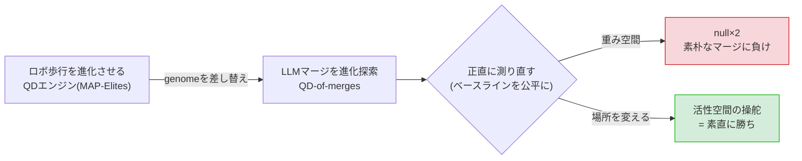
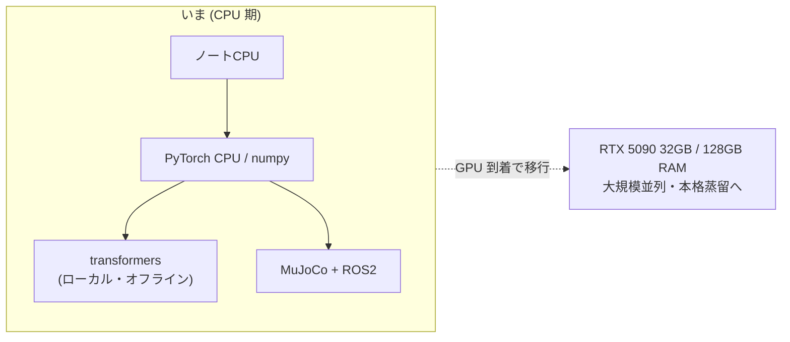
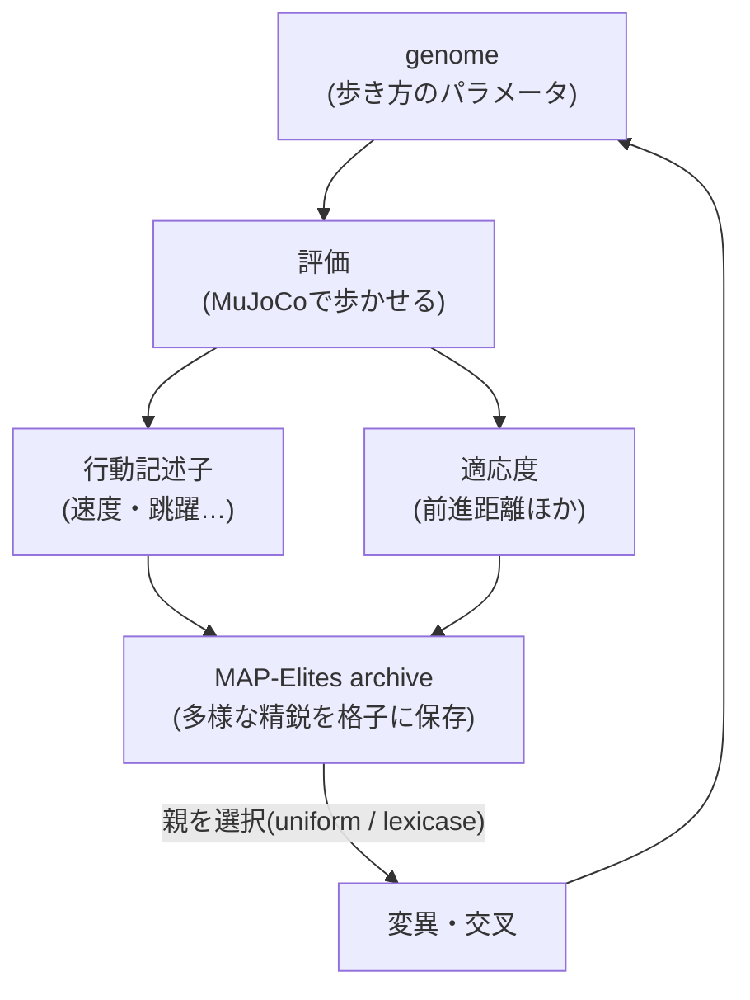
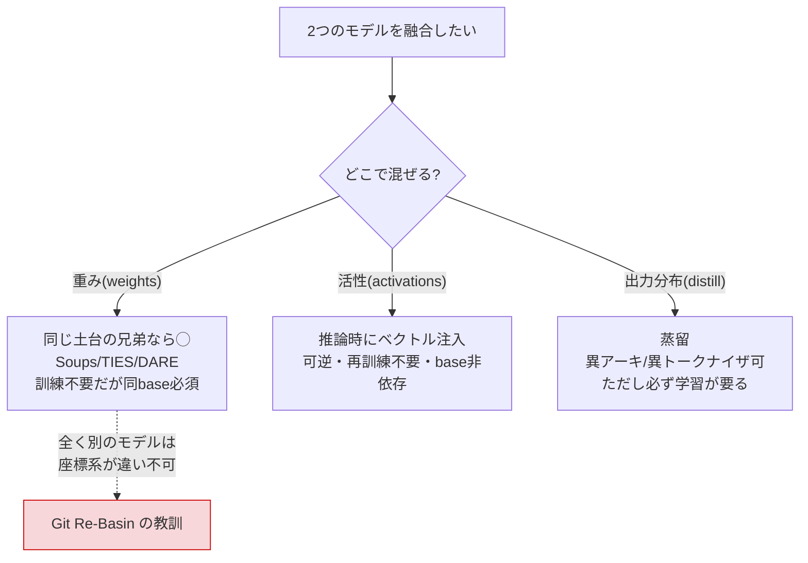
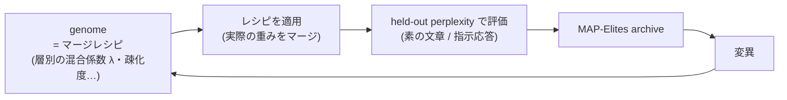
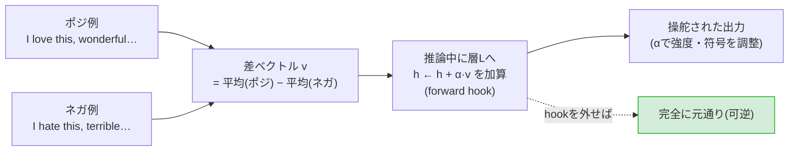

# GPU付きPCの納品を待つ間に、CPUでできることを全部やってみた

> RTX 5090 付きの PC を注文したのですが、ケース入荷待ちで納品がまだです。重い学習は GPU が来てから、と決めているので、いまは**ノート PC の CPU でできる小ネタ**をつまみ食いしています。この記事は、その待ち時間にやった 3 つ ── **歩行ロボの進化**・**LLM のマージ**・**性格ダイヤル** ── を、図とアニメと「舞台裏」多めでまとめたものです。
>
> ひとつだけ先に言っておくと、**全部が「うまくいった話」ではありません。** むしろ 2 つは「正直つらい話(null)」です。でも個人的には、負けの内訳がちゃんと見えたほうが次に効くと思っているので、負けも含めて書きます(この方針を **honest disclosure** と呼んでいます)。気楽に読んでください。
>
> 立場の開示: 筆者は自宅の CPU 環境で省メモリな小型 LLM を組む個人開発(FullSense)を進めています。実験はすべて CPU・小型モデル・単一 seed の範囲です。数値には一次情報(arXiv ID)を添えます。

---

## 0. 3 行でいうと(と、この記事の歩き方)

- **歩行ロボの進化**: 「どの親を選ぶか」を変えたら、多様性は減るのに質は上がる、という条件付きの相乗を見つけました(ただし代償あり)。
- **LLM のマージ**: 上のロボ進化エンジンを**そのまま流用**して LLM のマージを探索。最初は「勝った!」と思ったのに、**ベースラインを公平にした瞬間に優位が消えました**(偽陽性)。
- **性格ダイヤル**: 重みではなく「活性(内部信号)」をいじる手法は、**可逆・再訓練なし**であっさり効きました。感情や口調をダイヤルで回せます。

この 3 つは、実は 1 本の筋で繋がっています。**「良さそうな結果を、正直に測り直すと何が残るか」**です。全体像はこう:

専門の方は §4(偽陽性の解剖)と §7(舞台裏)だけでも要点が取れます。はじめての方は §1 から順に。なお **§3-6 に、実在ロボット(Unitree Go2)に土俵で相撲を取らせる**おまけを付けました。息抜きにどうぞ。

---

## 1. 背景 ― なぜ「省メモリ」と「融合」で悩んでいるのか

本題の前に、なぜこんなことをやっているのかを一段落だけ。

私は **FullSense** という個人開発で、「自宅の PC で動く、省メモリな小型 LLM」を組もうとしています。クラウドの巨大モデルに投げれば済む話も多いのですが、**個人情報・企業機密・センサーデータを外に出さずに、手元で完結させたい**という動機があります(いわゆる on-prem / ローカル志向)。

そうなると、限られたメモリで「なるべく賢く」する工夫が要ります。その一つの候補が **モデル融合(model merging / fusion)** でした。「日本語が得意なモデル」と「コードが得意なモデル」を 1 つにまとめられれば、2 個ぶんのメモリを使わずに両方の能力が持てるかもしれない ── これが §4 の出発点です。

そして、融合で「どう混ぜるか」を探索する道具として、たまたま別で作っていた **ロボットの歩き方を進化させるエンジン** が使えそうだと気づいた。これが §3 です。全部、**GPU が来るまでの CPU でできる範囲の弾込め**、という位置づけです。

---

## 2. 実験環境 ― 何の上で動かしているか

「CPU でどこまでやるの?」という話なので、環境は割と本質です。正直に晒します。

| 区分 | いま(CPU 期) | 到着待ちの GPU 機 |
|---|---|---|
| 計算 | ノート PC の CPU(数コア) | Core Ultra 7 + **RTX 5090 (32GB GDDR7)** |
| メモリ | 一般的なノート | **128GB DDR5** |
| OS | Windows 11 | Windows 11 Pro |
| 用途 | 調査・設計・小さな PoC | 大規模並列シミュレーション・本格的な蒸留 |

ソフトのスタックはこんな感じです:

- **Python 3.11**。数値まわりは基本 **numpy** + **PyTorch(CPU ビルド、2.12)**。
- LLM は **Hugging Face transformers**。モデルは全部**ローカルのキャッシュからオフライン**で読みます(外に取りに行かない)。
- ロボットの物理は **MuJoCo**、制御スタックは **ROS 2**。
- 使ったモデルは **SmolLM2-135M**(素の言語モデル)と **-Instruct**(指示追従版)、それと**自作の "コード担当"**(後述)。すべて **1.35 億パラメータ**の小型です。

この「小型・CPU・オフライン」という制約が、後半の**エンジニアリングの舞台裏(§7)**にそのまま効いてきます。まずは中身から。

---

## 3. 歩行ロボの進化 ― 「親の選び方」で質が上がる話

まず MuJoCo の中で、四足・二足ロボットの**歩き方**を進化させています。ROS 2 の制御スタックにも載る形で作っていて、ここは「GPU が来たら数千環境の大規模並列にする」ための地ならし。世代を追うと、こんなふうに歩けるようになっていきます:

### 3-1. 用語:MAP-Elites と lexicase

- **MAP-Elites(品質多様性、Quality-Diversity)**: 「速く歩く個体」だけでなく「跳ねる」「すり足」など**多様な歩き方**を、行動の特徴で区切った格子(archive)に保存し続ける進化手法(arXiv:1504.04909)。
- **lexicase 選択**: 親を選ぶとき、複数の評価軸を**ランダムな順で 1 つずつ**適用して勝ち残らせる方式。「平均点」ではなく「どれか 1 軸で尖っている個体」を拾いやすい。

進化エンジンの骨格はこうです。**ここの genome を「歩き方」から「マージレシピ」に差し替えるのが §4 の伏線**です:

### 3-2. 実験:親の選び方を変えると何が起きたか

「良い個体を普通に選ぶ(uniform)」と「lexicase で選ぶ」を、受理方式(単一 elite / 多目的 MOME)と組み合わせた 2×2 の要因実験(各 10 seed)。結果がこちらです:

左上と中央上のパネルが要点です。

- **質(best fitness、中央上)は lexicase(赤)が uniform(青)より上。** 前進距離のフロンティアが押し上がる(右下パネルの forward_distance が +1.7)。
- **でも多様性(coverage、左上)は lexicase(赤)がむしろ下。** 一部の勝ちパターンに寄る。
- つまり **条件付きの相乗**。「良いとこ取り」ではなく「あちらを立てればこちらが立たず」でした。

正直に言うと、最初は「多様性も質も両方上がった!」と思っていました。ところが**多様性の指標を clean に測り直したら、多様性はむしろ下がっていた**。ここで自己修正が入っています(この「測り直し」が本記事の通奏低音です)。最終的には、coverage を守る仕組みを足した hybrid でトレードオフを緩めるところまで持っていきました。

### 3-3. 同じエンジンは、歩く以外もこなす

面白いのは、この進化エンジン(と MAP-Elites の骨格)を**一切書き換えずに**、いろんな身体・媒体に一般化できたことです。たとえば**媒体を水にすると、泳ぎを覚えます**(2D の魚。簡単なレベルですが、ちゃんと前に進みます):

身体そのものを**別種から接ぎ木**する「形態融合」もできます(下は四足のキメラ)。これは後で出てくる LLM の frankenmerge(層ブロックを抜いて積む融合)と発想が同じで、実はこの記事の出発点でした:

> 余談(デバッグの副産物): ROS 制御スタックに載せる過程で、シミュレータ + 制御プラグインの**バグ**を踏み抜きました。`strlen(NULL)` 相当のクラッシュを追っていくと、**名前のないアクチュエータ**を参照した時に NULL 参照で落ちる、という上流の不具合でした。原因を独立に切り分けて特定できたので、悪くないおまけです。

### 3-4. 坂と階段 ― 「登る」のは道半ば(正直な現状)

平地を歩くのはできても、**坂や階段**はまだ道半ばです。まず**10 度の坂**。少しは登りますが、まだ 1m ちょっと(斜面用に探索した歩容で、平地ほど滑らかではありません):

**階段**になると、もっと厳しい。下の GIF は、階段を用意した環境で動かしてみたところ ── 見てのとおり、**手前でこけています**。地形を上る歩容は探索空間がぐっと広く、まともに学習させるには CPU では荷が重い。**環境(MJCF の坂・階段・接触設定)を作るところまでが CPU 期の仕事**で、本格的な学習は GPU 待ちです。準備段階なので、こけている姿も正直に載せておきます:

### 3-5. 新しい身体を「その場で」作ってみた ― 尺取り虫と多脚

せっかくなので、この記事を書きながら**新しい身体プランを 2 つ、CPU で作ってみました**。エンジン(MAP-Elites + CPG コントローラ)は一切いじらず、**身体定義(MJCF)を書いて、前進する動きを軽く探索するだけ**です。まずは**尺取り虫**。水平な多節チェーンで、関節の位相差で進行波を作って這います(側面と、視点を変えた斜め上から):

次に**多脚(センチピード)**。水平な胴体に 6 本の脚を付けて、脚が順番に動く波(metachronal wave)で前進させます。カメラをゆっくり回り込ませて立体的に:

どちらも、ランダムに数百通りの動き方を試して「いちばん前に進んだやつ」を選んだだけの、**簡単なレベル**です(尺取り虫で約 5m、多脚で約 4.5m 前進)。それでも、**同じ骨格のまま身体だけ差し替えれば、這うやつも多脚も動く**というのは気持ちいい。身体プランを増やすのは CPU でも今できるので、次は昆虫っぽい脚の関節を増やしたり、尺取り虫の節を増やしたりして遊ぶ予定です。

### 3-6. おまけ ― トイの次は「本物」。実在ロボットに相撲を取らせる

2D のトイ身体で遊べたので、ついでに**本物のロボット**を動かしてみました。使ったのは **MuJoCo Menagerie**(Google DeepMind 提供、Apache-2.0)という、実在ロボの高品質な 3D モデル集です。四足歩行ロボの **Unitree Go2**(実売されている犬型ロボ)などが、メッシュ付き=見た目リアルで入っています。

なぜシミュレータかというと、**実機は高価で、ぶつけ合えば壊れる**からです。土俵で押し合う「ロボット相撲」なんて、実機で気軽にやったら財布が持ちません。でも**シミュなら只**。これは FullSense の「ローカルで完結」という主張とも地続きです ── 手元の CPU だけで、本物のロボが戦う場を作れる。

**まず「歩かせる」でつまずきました(正直な話)。** Go2 は他の多くのロボと違って **トルク制御(torque / motor actuator)** でした。目標角度を渡せば勝手にその姿勢を保つ「位置サーボ(position)」ではなく、**各関節に直接トルク(ひねる力)を指令する**方式です。なので立たせるだけでも自前で **PD 制御**(目標角との差と速度からトルクを計算する古典制御)を書く必要がありました。

さらに**前に歩かせる**のが曲者で、対角の脚(右前+左後 / 左前+右後)を半周期ずらす「トロット」に、**膝(calf)を腿(thigh)より 90°先行させる**と足先が楕円を描いて前へ蹴り、前進します。ところが、**この位相差の符号を間違えると、静かに後ろへ歩く**のです。実際、最初に組んだ相撲では両者がそろって後退して、しばらく「なぜ離れていくんだ…」と悩みました。符号ひとつで前進が後退になる ── 開ループ歩容あるあるでした。

**そして相撲。** 円い土俵(俵と仕切り線つきで、ちゃんと dohyo に見えます)に Go2 を 2 体、向かい合わせに置いて押し合わせます。勝敗は **場外(ringout)・転倒(fall)・時間切れは判定**で決めます。

ここでも正直な物理が顔を出します。**軽い四足ロボ同士の押し合いは摩擦が上限**で、押された側は土俵際で腰が残り、なかなか外へ出ません(本物の相撲の「うっちゃり」直前みたいな粘りが出ます)。なので**まったく同じ強さの 2 体だと引き分け**になります。押す強さに差をつけると、強い方が相手を俵の外へ落として勝つ ── 上の GIF は、左の個体を強めに設定した一番です。

**最後に、格闘ゲームの骨格まで。** せっかく操作できる土俵ができたので、**自機をキーボードで操作して AI と対戦する**ロボット格闘ゲームの骨組みも作りました(前後 = W/S、旋回 = A/D、しゃがみ = Space)。下は、台本化した操作で自機が AI を押し出す**動作確認**の様子です:

正直に言うと、**強い相撲 AI・対戦 AI は GPU が来てから**です。いまの CPU 期でできたのは「土俵・当たり判定・勝敗・簡易操作」という**遊べる場と骨組み**まで。それでも、注文した GPU PC が届く前に、**手元のノート CPU だけで本物のロボが土俵で相撲を取る**ところまで来られたのは、我ながら楽しい寄り道でした。

> つまずきメモ:(1)Menagerie の足は既定で接線摩擦オフ(condim=1)。土俵側を摩擦ありにすると、接触の摩擦係数は「両者の大きい方」が採られるので足に効くようになる。(2)PD のトルクは**毎物理ステップ**計算しないと発散する(制御周期でサボると振動する)。(3)前述の位相符号。全部、動かして初めて分かった罠でした。

### 3-7. そして本命へ ― 同じ土台で「産業用アーム」も動く

ここまでは四足の話でしたが、**同じ枠組み(Menagerie のロボを読み込んで動かす仕組み)は、そのまま産業用アームにも効きます**。実は、個人的にいちばんやりたいのはコレ ── **生産ラインのロボットアームを、いずれ AI で動かす**ことです。相撲は「動かして魅せる」ための入口で、本命はこっち、というのが正直なところ。

そこで実在の産業用アーム 4 機種 ── **Franka Emika Panda / Universal Robots UR5e / KUKA iiwa 14 / Kinova Gen3** ── を横に並べて、生産ラインっぽく作業動作させてみました:

四足(浮遊ベース)と違って、アームは**固定ベース**(床に固定)で、関節はすべて**位置制御(position servo)**。なので制御はむしろ素直で、目標角を渡せば内蔵サーボが追従してくれます。いまの動きは開ループの「作業モーション」(関節を波打たせているだけ)ですが、大事なのは、**四足も産業用アームも同じエンジン(同じ RobotIndex)の上に載っている**こと。つまり、後段でこの「目標角を出す部分」を **AI(動作の学習・タスク計画・把持)に差し替えれば、そのまま知能化できる**設計です。ここが CPU 期に作っておきたかった土台でした。

> つまずきメモ:アームのサーボは非常に硬い(ゲイン 4500 など)ので、ふつうの Euler 積分だと**一瞬で発散**し、MuJoCo が毎ステップ勝手にリセット → シミュ時間が進まず「1 フレームだけの GIF」になりました。`integrator=implicitfast` に変えたら一発で安定。硬いアクチュエータには implicit 系、というのは知識では知っていても、実際に踏むまで気づけない罠でした。

正直に言うと、**組み立てや把持の「賢い」制御は GPU 着荷後**です。でも「実機のアームを、手元の CPU だけで読み込んで動かせる場」までは来られた ── これは FullSense の「工場や現場のロボットも、外部に頼らずローカルで」という狙い(llmesh の MQTT/OPC-UA 産業 IoT とも地続き)に、ちゃんと繋がる一歩だと思っています。

---

## 4. LLM って混ぜられるの? ― 理論はシンプル、実験は正直つらい

さて本命の融合です。§1 で書いた「省メモリのために 2 モデルを 1 つにしたい」という動機。

### 4-1. まず理論(意外とスッキリしている)

融合は「どの基質(substrate)で混ぜるか」で成立条件が真っ二つに割れます:

- **同じ土台(base)から派生した兄弟モデル**同士なら、重みの足し算・平均でマージできます(Model Soups / Task Arithmetic arXiv:2212.04089 / TIES 2306.01708 / DARE 2311.03099)。
- でも**「全く別」のモデル**(構造もトークナイザも違う)は、**重みでは原理的に混ざりません**。各モデルの重みは別々の座標系で意味を持っていて、マス目を重ねて平均しても意味をなさないからです(Git Re-Basin arXiv:2209.04836)。
- 「全く別」を 1 つにできるのは、重みではなく**振る舞いを真似させる蒸留**だけ。

> ちゃんと確かめるために、**負のコントロール**も取りました。全く別の base のモデル(Qwen 系)と混ぜようとすると、そもそも重みの**形が一致せず**(219 個のテンソルで shape 不一致)マージできません。理論どおり、座標系が違うと足し算にならない、という実証です。

理屈はここまで。問題は次。**「同じ土台の兄弟なら混ざる」なら、混ぜ方を賢く探索すれば得するのでは?** ── そう思って、§3 の**ロボ進化エンジンを一字も変えずに流用**しました。歩き方の代わりに「マージのレシピ」を進化させる。名付けて **QD-of-merges**:

§3 の図と**骨格が同じ**なのがミソです。評価関数を「歩いた距離」から「マージ後モデルの perplexity(次の単語をどれだけ当てられるか、低いほど良い)」に差し替えただけ。マージの中身は、SLERP(球面補間)・task vector(差分の足し算)・TIES(符号の多数決)・DARE(ランダムに間引いて薄める)といった定番の数式を、実際の重みテンソルに適用しています。

### 4-2. 実験:「勝った!」と思ったら偽陽性だった

同じ土台の兄弟(素の言語モデル ↔ 指示追従モデル)を、**層ごとに違う強さ**で混ぜる配分を進化探索しました。素の文章は素のモデル、指示応答は指示版が得意という**トレードオフ**があるので、両立するマージを探す設定です。対抗馬は「全層を同じ係数 λ で混ぜる」素朴なマージ。下の図が結果です:

最初、対抗馬を **7 点**のグリッドで測ったときは:

- 進化探索(層別)の最良: バランス指標 **0.797**
- 素朴なマージ(7 点)の最良: **0.727**

「進化が勝った! 層ごとに配分する自由度が効いた!」── 本気でそう思いました。しかも進化が見つけた配分は「前段の層は素のまま、後段の層に指示能力を入れる」という、いかにも意味ありげな非一様配分でした。

でも一拍おいて、**対抗馬の 7 点、粗すぎない?** と疑いました。上の図の橙の曲線(均一マージ)は、λ を上げると素の文章 perplexity が一度**悪化**してから急に良くなる、**鋭い谷**を持っています。7 点だと谷の底を跨いで見落とす。そこで **51 点**に細かくして測り直すと:

- 素朴なマージ(51 点)の最良: **0.838**

**進化探索(0.797)は、細かくした素朴なマージ(0.838)に負けました。** 最初の「勝ち」は、比較相手が粗かっただけの**偽陽性**だったのです(図でも、橙の曲線の底=金の丸が、赤星より左下=良い位置にいます)。単一の差分を層別に混ぜる問題は、結局ほぼ 1 次元で、たった一つの均一な λ をちゃんと調整すれば足りた。

### 4-3. 「ちゃんとした」手法でも、素朴な足し算に負けた

「単一の差分が 1 次元だからでは。2 つのエキスパートを混ぜれば話が変わる」── そこで**2 人目のエキスパートを自作**しました。素の base を Python コードで軽く微調整して "コード担当" を作成(コードの perplexity が **10.2 → 5.2 に半減**、ちゃんと専門化しました)。ダウンロードで済まさず自作したのは、**再現性と制御のため**です(どんな差分か自分で把握できる)。

指示担当 × コード担当を、衝突を賢く解消するという **TIES** で混ぜます。結果は、またしても正直つらいものでした:

| マージ手法 | バランス指標 |
|---|---|
| **素朴な足し算(task arithmetic)** | **0.746** ← 勝者 |
| TIES 均一 | 0.000 |
| TIES 格子探索の最良 | 0.000(全滅) |
| QD で調整した TIES | 0.662 |

図の**黒い×(素朴な足し算)が左下=両立の最良点**で、TIES や進化探索(青の点群・赤星)はそこに届いていません。

TIES は「意見が食い違う所は多数決で片方を採る」手法です。でも今回の 2 人は**相補的**でした。指示能力とコード能力は**両方あってこそ**なので、多数決で片方を捨てる TIES が、かえって邪魔をした(実際、TIES で混ぜるとコードの perplexity が単体より悪化しました)。**TIES は本当に衝突を解消したい時にしか効かない**、という当たり前だけど大事な確認です。

というわけで、LLM のマージは **2 連続で honest null**。凝った探索は、この設定(小さいモデル・相補的なエキスパート)では割に合いませんでした。**手法が良く見える最大の理由は、しばしば「比較相手が弱いこと」です。**

---

## 5. でも「場所」を変えたら、あっさり効いた ― 性格ダイヤル

重みを混ぜる話が全部 null だったので、**別の場所**を触りました。重みではなく、推論中の**活性(activation、内部の信号)**です(ActAdd arXiv:2308.10248 / RepE 2310.01405)。

やり方はシンプルで、図にするとこうです:

これが、**あっさり効きました**。α を振ると、感情の出やすさ(ポジ語と ネガ語の出やすさの差)が**きれいに単調に動きます**。しかもフックを外すと、値が**厳密に元へ戻る**(差ゼロ=完全に可逆。重みは一切変えていません):

さらに、これは**複数の軸を合成**できます。「感情」と「口調(形式的 ↔ くだけた)」を別々のダイヤルとして作り、同時に回すと:

| 設定 | 感情の出やすさ | 形式度 |
|---|---|---|
| ぜんぶ 0 | +2.8 | −3.0 |
| 感情 + | **+5.3** | −3.0(ほぼ不変) |
| 形式度 + | +2.8(ほぼ不変) | **+5.1** |
| ポジ + 形式的(合成) | +4.4 | +6.1 |
| ポジ + くだけた(合成) | +3.1 | −7.4 |

**各ダイヤルは主に自分の軸だけを動かし(cross-talk が小さい)、混ぜても加算的に効きます。** 生成にも register が出ます(ポジ+くだけた → "going to be so awesome. I love it" / 形式的 → "Mr." 調)。まさに「性格ダイヤル」。

正直な限界もあって、今回のモデルは 1.35 億パラメータと小さいので、ダイヤルを回しすぎると文が壊れます(過剰操舵)。それでも、可逆で再訓練いらずというのは扱いやすい。ゆくゆくは自作の対話ツールに載せて、その場で性格を回せるようにしたいと思っています。

---

## 6. なぜ「重みは負けたのに活性は勝った」のか

一段だけ考察を。重み空間のマージ(§4)は 2 連敗、活性空間の操舵(§5)は快勝。この差はどこから来たか。

- **重みマージ**は、2 つのモデルの学習成果を**恒久的に 1 セットの重みへ畳み込む**作業です。畳んだら分離できないし、相補的な更新が衝突すれば、どちらかを諦めるしかない。しかも「同じ土台の兄弟」という強い前提が要る。
- **活性ステアリング**は、モデルはそのままに、**推論のたびに一時的に方向を足す**だけ。畳み込まないので可逆で、base にも依存しない。「性格を変える」程度の軽い介入には、こちらの基質のほうが素直に効く。

要するに、**やりたいことの"重さ"に基質を合わせる**話でした。能力そのものを恒久合成したいなら蒸留(学習)、既存の振る舞いを可逆に調整したいなら活性操舵、という住み分けです。省メモリの観点でも、活性操舵は追加の重みを持たないぶん相性が良い。

---

## 7. エンジニアリングの舞台裏 ― CPU で殴るための現実

「CPU でやった」と一言で書きましたが、実際は地味な戦いでした。スキルの話でもあるので、恥ずかしい失敗込みで残します。

- **静かにモデルを壊すバグ**: マージ実装で、`tensor.to(float32)` が(元が float32 のとき)**コピーを作らずに元テンソルを参照**していて、別モデルを読み込んだ瞬間に**土台の重みが上書き破壊**されていました。症状は「係数 0(=素のモデルのはず)なのに指示版の値が出る」。`.clone()` を入れて解決。**"何もしていないはずの設定"が変な値を返したら、まず参照の共有を疑う**、という教訓。
- **進捗が見えない罠**: バックグラウンド実行の出力を `grep` パイプに通していたら、パイプが出力を**丸ごとバッファリング**して、ログが空に見えました。「プロセスが死んだ」と誤診して何度か無駄に殺しました。真因はただのバッファ。
- **1 評価 17 秒 → 8 秒**: マージ評価が重く、当初 1 回 17 秒。プロファイルすると、巨大な埋め込み行列への処理と、内部で **float64 に昇格**していたのが主犯でした。float64 をやめ、毎回巨大な辞書を作らず**モデルのパラメータへ直接書き込む(in-place)**ように変えて、約半分に短縮。
- **落ちる環境と 10 分の壁**: この環境ではバックグラウンドの長時間ジョブが落ちやすく、前景ジョブには実質 10 分の上限がありました。so、**実験の予算(評価回数)を上限に収まるよう刻む**という、泥臭い調整をしています。
- **再現性の規律**: それでも結果を信じられるように、乱数 seed は固定(同じ入力なら 2 回とも同じ数字)、マージ数式は numpy 実装と PyTorch 実装で**数値一致をテスト**、"コード担当"も自作パイプラインで作り直せるようにしました。テストは 26 件が緑です。

派手さはありませんが、**「CPU で殴る」は、速さの工夫と正直な検証の両輪**だと改めて思いました。

---

## 8. おわりに ― GPU が来たら本気を出す

まとめると、GPU 待ちの CPU 期間にやったのは:

- **歩行進化**: 親の選び方で質は上がるが多様性は減る、という条件付き相乗(自己修正込み)。同じエンジンが泳ぎや形態融合にも一般化。
- **LLM マージ**: 進化エンジンの流用は動いたが、賢い探索は素朴なベースラインに 2 連敗(偽陽性の発見つき)。
- **性格ダイヤル**: 重みではなく活性を触ると、可逆・再訓練なしで人格を回せた。
- **(おまけ)実在ロボ相撲**: Menagerie の Go2 を土俵で戦わせ、歩行・相撲・格闘ゲームの骨格まで CPU で作った(§3-6)。強い相撲 AI は GPU 後。

派手な成果はありませんが、**「どこで負けたか」の地図**はだいぶ埋まりました。個人的には、これがいちばんの収穫だと思っています。異常に良い結果が出たら、勝った気になる前に**まず比較相手を疑う** ── これは GPU があってもなくても効く教訓でした。

### やりたいこと(GPU が届いたら / 環境づくりは今のうちに)

いま頭にある「やってみたいこと」も、宣言だけしておきます(半分は自分への TODO):

- **もっといろんな身体**: §3-5 で尺取り虫と多脚の簡単なやつは作れたので、次は**脚の関節を増やした昆虫型**や、**節をもっと増やした長い這うやつ**へ。身体定義(MJCF)を書くのは CPU でも今できます。
- **坂・階段・不整地の踏破**: §3-4 のとおり環境は作りました。**上る歩容の本格的な学習は GPU 後**。
- **手の動きから物のつかみ方を学ぶ**: Web カメラで手をトラッキング → その動きを教師に、**ROS 上でロボットアームの把持を学習**させる。私自身の双腕ロボット校正の経験とも繋がる話で、CPU 期は**データ取り・ワークスペース整備**まで。
- **表情のミラーリング**: Web カメラで人間の**表情**を読み、**ROS 上のロボットの顔**に動きを再現する、というのも面白そう。これも入力(顔ランドマーク)の取り込みは CPU で準備できます。
- **ロボット相撲を「遊べる」形に**: §3-6 の格闘ゲームを、いずれ誰でも触れる形(ローカル実行、ゆくゆくはブラウザ)で公開したい。機体選択(Go2 / ANYmal / Spot …)や 2 人対戦も。強い対戦 AI は GPU 後ですが、**遊ぶだけなら CPU で今できる**ので。

要するに、**「重い学習は GPU、環境と足場づくり・身体づくりは CPU」**という役割分担で、待ち時間を埋めている感じです。

GPU が届いたら、歩行進化を数千環境の並列(GPU シミュレータ)にしたり、まともな蒸留を回したりする予定です。その話はまた別途。ここまで、待ち時間の小ネタにお付き合いいただきありがとうございました。

> 使った主な手法(一次情報): MAP-Elites (arXiv:1504.04909) / lexicase 選択 / Task Arithmetic (2212.04089) / TIES (2306.01708) / DARE (2311.03099) / Git Re-Basin (2209.04836) / ActAdd (2308.10248) / RepE (2310.01405)。実験は全て CPU・小型モデル(1.35 億パラメータ)・単一 seed の範囲の話で、大きいモデルでは別の結末があり得ます。図・アニメ・グラフは自作の実験結果です。
