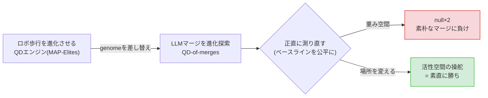
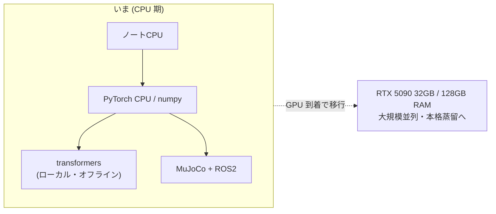
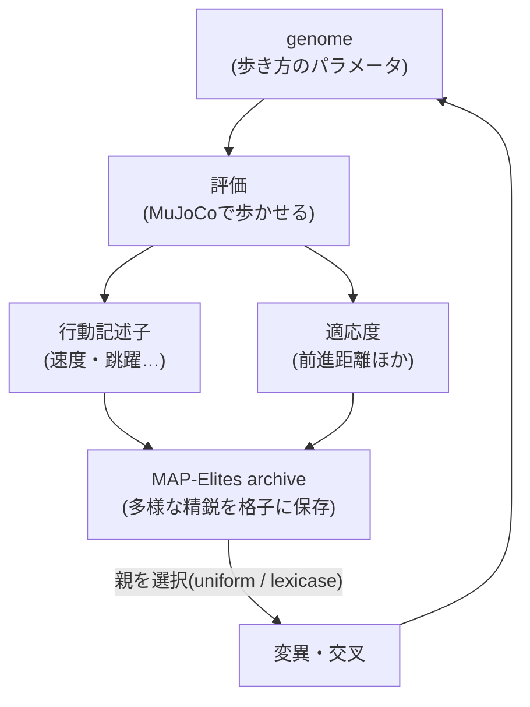
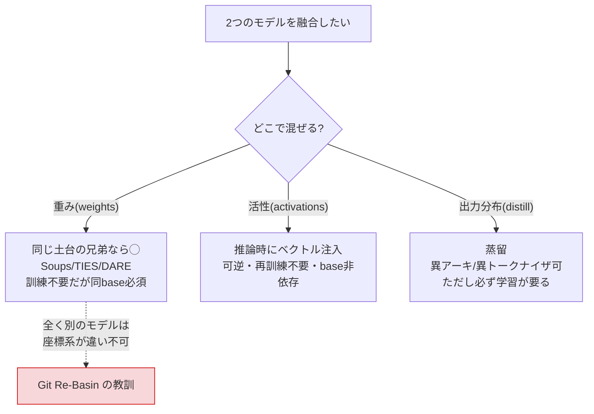
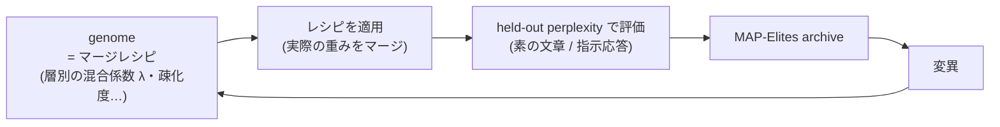
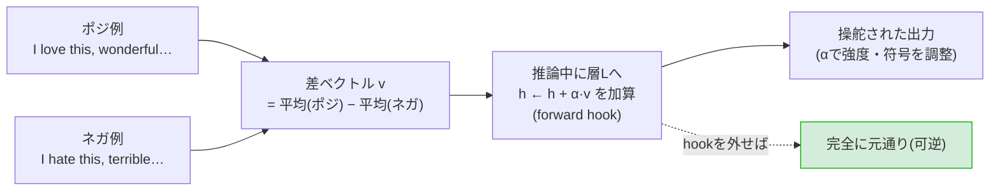

# GPU付きPCの納品を待つ間に、CPUでできることを全部やってみた


> RTX 5090 付きの PC を注文したのですが、ケース入荷待ちで納品がまだです。重い学習は GPU が来てから、と決めているので、いまは**ノート PC の CPU でできる小ネタ**をつまみ食いしています。この記事の本編は、その待ち時間にやった 3 つ ── **歩行ロボの進化**・**LLM のマージ**・**性格ダイヤル** ── の記録です。加えて第 4 点として、最近の project update もまとめます。ここで触れる `onocollo` と `llcore` は、**今回この場で再実行した新結果ではなく、既取得ログや反映済み検証結果を整理した update**です。
>
> ひとつだけ先に言っておくと、**全部が「うまくいった話」ではありません。** むしろ 2 つは「正直つらい話(null)」です。でも個人的には、負けの内訳がちゃんと見えたほうが次に効くと思っているので、負けも含めて書きます(この方針を **honest disclosure** と呼んでいます)。気楽に読んでください。
>
> 立場の開示: 筆者は自宅の CPU 環境で省メモリな小型 LLM を組む個人開発(FullSense)を進めています。実験はすべて CPU・小型モデル・単一 seed の範囲です。数値には一次情報(arXiv ID)を添えます。

---

## 0. 4 点でいうと(と、この記事の歩き方)

- **歩行ロボの進化**: 「どの親を選ぶか」を変えたら、多様性は減るのに質は上がる、という条件付きの相乗を見つけました(ただし代償あり)。
- **LLM のマージ**: 上のロボ進化エンジンを**そのまま流用**して LLM のマージを探索。最初は「勝った!」と思ったのに、**ベースラインを公平にした瞬間に優位が消えました**(偽陽性)。
- **性格ダイヤル**: 重みではなく「活性(内部信号)」をいじる手法は、**可逆・再訓練なし**であっさり効きました。感情や口調をダイヤルで回せます。
- **最近の project update(第 4 点)**: この待ち時間の寄り道から、FullSense の土台は **身体側 = gaitlab / 神経側 = spikelab / 世界モデル側 = onocollo** の 3 本へ分岐し始めました。加えて LLM 本体側の **llcore** でも、「一度 GO に見えた枝を CPU で丁寧に潰して、次の本命へ戻す」という honest な進展がありました。この記事では、この recent update も **本編 3 本に対する第 4 点**として補足します。

4 点をひとことで束ねるなら、**「良さそうな結果を、正直に測り直すと何が残るか」**です。最初の 3 点はその検証本体で、4 点目の project update は同じ作法が最近どの枝へ伸びたかの補足です。全体像はこう:



専門の方は §4(偽陽性の解剖)と §7(舞台裏)だけでも要点が取れます。はじめての方は §1 から順に。なお **§3-6〜3-7.5 に、実在ロボット(Unitree Go2)に土俵で相撲を取らせ、さらに同じ土台で産業用アームに pick-and-place(掴む・運ぶ・整列・積み重ね・色仕分け)までさせる**おまけを付けました。息抜きにどうぞ(そして §3-7 / §3-7.5 が実は本命の伏線です)。

---

## 1. 背景 ― なぜ「省メモリ」と「融合」で悩んでいるのか

本題の前に、なぜこんなことをやっているのかを一段落だけ。

私は **FullSense** という個人開発で、「自宅の PC で動く、省メモリな小型 LLM」を組もうとしています。クラウドの巨大モデルに投げれば済む話も多いのですが、**個人情報・企業機密・センサーデータを外に出さずに、手元で完結させたい**という動機があります(いわゆる on-prem / ローカル志向)。

そうなると、限られたメモリで「なるべく賢く」する工夫が要ります。その一つの候補が **モデル融合(model merging / fusion)** でした。「日本語が得意なモデル」と「コードが得意なモデル」を 1 つにまとめられれば、2 個ぶんのメモリを使わずに両方の能力が持てるかもしれない ── これが §4 の出発点です。

そして、融合で「どう混ぜるか」を探索する道具として、たまたま別で作っていた **ロボットの歩き方を進化させるエンジン** が使えそうだと気づいた。これが §3 です。全部、**GPU が来るまでの CPU でできる範囲の弾込め**、という位置づけです。

---

## 2. 実験環境 ― 何の上で動かしているか

「CPU でどこまでやるの?」という話なので、環境は割と本質です。正直に晒します。

| 区分 | いま(CPU 期) | 到着待ちの GPU 機 |
|---|---|---|
| 計算 | ノート PC の CPU(数コア) | Core Ultra 7 + **RTX 5090 (32GB GDDR7)** |
| メモリ | 一般的なノート | **128GB DDR5** |
| OS | Windows 11 | Windows 11 Pro |
| 用途 | 調査・設計・小さな PoC | 大規模並列シミュレーション・本格的な蒸留 |

ソフトのスタックはこんな感じです:

- **Python 3.11**。数値まわりは基本 **numpy** + **PyTorch(CPU ビルド、2.12)**。
- LLM は **Hugging Face transformers**。モデルは全部**ローカルのキャッシュからオフライン**で読みます(外に取りに行かない)。
- ロボットの物理は **MuJoCo**、制御スタックは **ROS 2**。
- 使ったモデルは **SmolLM2-135M**(素の言語モデル)と **-Instruct**(指示追従版)、それと**自作の "コード担当"**(後述)。すべて **1.35 億パラメータ**の小型です。

この「小型・CPU・オフライン」という制約が、後半の**エンジニアリングの舞台裏(§7)**にそのまま効いてきます。まずは中身から。



---

## 3. 歩行ロボの進化 ― 「親の選び方」で質が上がる話

まず MuJoCo の中で、四足・二足ロボットの**歩き方**を進化させています。ROS 2 の制御スタックにも載る形で作っていて、ここは「GPU が来たら数千環境の大規模並列にする」ための地ならし。世代を追うと、こんなふうに歩けるようになっていきます:


### 3-1. 用語:MAP-Elites と lexicase

- **MAP-Elites(品質多様性、Quality-Diversity)**: 「速く歩く個体」だけでなく「跳ねる」「すり足」など**多様な歩き方**を、行動の特徴で区切った格子(archive)に保存し続ける進化手法(arXiv:1504.04909)。
- **lexicase 選択**: 親を選ぶとき、複数の評価軸を**ランダムな順で 1 つずつ**適用して勝ち残らせる方式。「平均点」ではなく「どれか 1 軸で尖っている個体」を拾いやすい。

進化エンジンの骨格はこうです。**ここの genome を「歩き方」から「マージレシピ」に差し替えるのが §4 の伏線**です:



### 3-2. 実験:親の選び方を変えると何が起きたか

「良い個体を普通に選ぶ(uniform)」と「lexicase で選ぶ」を、受理方式(単一 elite / 多目的 MOME)と組み合わせた 2×2 の要因実験(各 10 seed)。結果がこちらです:


左上と中央上のパネルが要点です。

- **質(best fitness、中央上)は lexicase(赤)が uniform(青)より上。** 前進距離のフロンティアが押し上がる(右下パネルの forward_distance が +1.7)。
- **でも多様性(coverage、左上)は lexicase(赤)がむしろ下。** 一部の勝ちパターンに寄る。
- つまり **条件付きの相乗**。「良いとこ取り」ではなく「あちらを立てればこちらが立たず」でした。

正直に言うと、最初は「多様性も質も両方上がった!」と思っていました。ところが**多様性の指標を clean に測り直したら、多様性はむしろ下がっていた**。ここで自己修正が入っています(この「測り直し」が本記事の通奏低音です)。最終的には、coverage を守る仕組みを足した hybrid でトレードオフを緩めるところまで持っていきました。

### 3-3. 同じエンジンは、歩く以外もこなす

面白いのは、この進化エンジン(と MAP-Elites の骨格)を**一切書き換えずに**、いろんな身体・媒体に一般化できたことです。たとえば**媒体を水にすると、泳ぎを覚えます**(2D の魚。簡単なレベルですが、ちゃんと前に進みます):


身体そのものを**別種から接ぎ木**する「形態融合」もできます(下は四足のキメラ)。これは後で出てくる LLM の frankenmerge(層ブロックを抜いて積む融合)と発想が同じで、実はこの記事の出発点でした:


> 余談(デバッグの副産物): ROS 制御スタックに載せる過程で、シミュレータ + 制御プラグインの**バグ**を踏み抜きました。`strlen(NULL)` 相当のクラッシュを追っていくと、**名前のないアクチュエータ**を参照した時に NULL 参照で落ちる、という上流の不具合でした。原因を独立に切り分けて特定できたので、悪くないおまけです。

### 3-4. 坂と階段 ― 「登る」のは道半ば(正直な現状)

平地を歩くのはできても、**坂や階段**はまだ道半ばです。まず**10 度の坂**。少しは登りますが、まだ 1m ちょっと(斜面用に探索した歩容で、平地ほど滑らかではありません):


**階段**になると、もっと厳しい。下の GIF は、階段を用意した環境で動かしてみたところ ── 見てのとおり、**手前でこけています**。地形を上る歩容は探索空間がぐっと広く、まともに学習させるには CPU では荷が重い。**環境(MJCF の坂・階段・接触設定)を作るところまでが CPU 期の仕事**で、本格的な学習は GPU 待ちです。準備段階なので、こけている姿も正直に載せておきます:


### 3-5. 新しい身体を「その場で」作ってみた ― 尺取り虫と多脚

せっかくなので、この記事を書きながら**新しい身体プランを 2 つ、CPU で作ってみました**。エンジン(MAP-Elites + CPG コントローラ)は一切いじらず、**身体定義(MJCF)を書いて、前進する動きを軽く探索するだけ**です。まずは**尺取り虫**。水平な多節チェーンで、関節の位相差で進行波を作って這います(側面と、視点を変えた斜め上から):


次に**多脚(センチピード)**。水平な胴体に 6 本の脚を付けて、脚が順番に動く波(metachronal wave)で前進させます。カメラをゆっくり回り込ませて立体的に:


どちらも、ランダムに数百通りの動き方を試して「いちばん前に進んだやつ」を選んだだけの、**簡単なレベル**です(尺取り虫で約 5m、多脚で約 4.5m 前進)。それでも、**同じ骨格のまま身体だけ差し替えれば、這うやつも多脚も動く**というのは気持ちいい。身体プランを増やすのは CPU でも今できるので、次は昆虫っぽい脚の関節を増やしたり、尺取り虫の節を増やしたりして遊ぶ予定です。

### 3-6. おまけ ― トイの次は「本物」。実在ロボットに相撲を取らせる

2D のトイ身体で遊べたので、ついでに**本物のロボット**を動かしてみました。使ったのは **MuJoCo Menagerie**(Google DeepMind 提供、Apache-2.0)という、実在ロボの高品質な 3D モデル集です。四足歩行ロボの **Unitree Go2**(実売されている犬型ロボ)などが、メッシュ付き=見た目リアルで入っています。

なぜシミュレータかというと、**実機は高価で、ぶつけ合えば壊れる**からです。土俵で押し合う「ロボット相撲」なんて、実機で気軽にやったら財布が持ちません。でも**シミュなら只**。これは FullSense の「ローカルで完結」という主張とも地続きです ── 手元の CPU だけで、本物のロボが戦う場を作れる。

**まず「歩かせる」でつまずきました(正直な話)。** Go2 は他の多くのロボと違って **トルク制御(torque / motor actuator)** でした。目標角度を渡せば勝手にその姿勢を保つ「位置サーボ(position)」ではなく、**各関節に直接トルク(ひねる力)を指令する**方式です。なので立たせるだけでも自前で **PD 制御**(目標角との差と速度からトルクを計算する古典制御)を書く必要がありました。


さらに**前に歩かせる**のが曲者で、対角の脚(右前+左後 / 左前+右後)を半周期ずらす「トロット」に、**膝(calf)を腿(thigh)より 90°先行させる**と足先が楕円を描いて前へ蹴り、前進します。ところが、**この位相差の符号を間違えると、静かに後ろへ歩く**のです。実際、最初に組んだ相撲では両者がそろって後退して、しばらく「なぜ離れていくんだ…」と悩みました。符号ひとつで前進が後退になる ── 開ループ歩容あるあるでした。

**そして相撲。** 円い土俵(俵と仕切り線つきで、ちゃんと dohyo に見えます)に Go2 を 2 体、向かい合わせに置いて押し合わせます。勝敗は **場外(ringout)・転倒(fall)・時間切れは判定**で決めます。


ここでも正直な物理が顔を出します。**軽い四足ロボ同士の押し合いは摩擦が上限**で、押された側は土俵際で腰が残り、なかなか外へ出ません(本物の相撲の「うっちゃり」直前みたいな粘りが出ます)。なので**まったく同じ強さの 2 体だと引き分け**になります。押す強さに差をつけると、強い方が相手を俵の外へ落として勝つ ── 上の GIF は、左の個体を強めに設定した一番です。

**最後に、格闘ゲームの骨格まで。** せっかく操作できる土俵ができたので、**自機をキーボードで操作して AI と対戦する**ロボット格闘ゲームの骨組みも作りました(前後 = W/S、旋回 = A/D、しゃがみ = Space)。下は、台本化した操作で自機が AI を押し出す**動作確認**の様子です:


正直に言うと、**強い相撲 AI・対戦 AI は GPU が来てから**です。いまの CPU 期でできたのは「土俵・当たり判定・勝敗・簡易操作」という**遊べる場と骨組み**まで。それでも、注文した GPU PC が届く前に、**手元のノート CPU だけで本物のロボが土俵で相撲を取る**ところまで来られたのは、我ながら楽しい寄り道でした。

> つまずきメモ:(1)Menagerie の足は既定で接線摩擦オフ(condim=1)。土俵側を摩擦ありにすると、接触の摩擦係数は「両者の大きい方」が採られるので足に効くようになる。(2)PD のトルクは**毎物理ステップ**計算しないと発散する(制御周期でサボると振動する)。(3)前述の位相符号。全部、動かして初めて分かった罠でした。

### 3-7. そして本命へ ― 同じ土台で「産業用アーム」も動く

ここまでは四足の話でしたが、**同じ枠組み(Menagerie のロボを読み込んで動かす仕組み)は、そのまま産業用アームにも効きます**。実は、個人的にいちばんやりたいのはコレ ── **生産ラインのロボットアームを、いずれ AI で動かす**ことです。相撲は「動かして魅せる」ための入口で、本命はこっち、というのが正直なところ。

そこで実在の産業用アーム 4 機種 ── **Franka Emika Panda / Universal Robots UR5e / KUKA iiwa 14 / Kinova Gen3** ── を横に並べて、生産ラインっぽく作業動作させてみました:


四足(浮遊ベース)と違って、アームは**固定ベース**(床に固定)で、関節はすべて**位置制御(position servo)**。なので制御はむしろ素直で、目標角を渡せば内蔵サーボが追従してくれます。いまの動きは開ループの「作業モーション」(関節を波打たせているだけ)ですが、大事なのは、**四足も産業用アームも同じエンジン(同じ RobotIndex)の上に載っている**こと。つまり、後段でこの「目標角を出す部分」を **AI(動作の学習・タスク計画・把持)に差し替えれば、そのまま知能化できる**設計です。ここが CPU 期に作っておきたかった土台でした。

> つまずきメモ:アームのサーボは非常に硬い(ゲイン 4500 など)ので、ふつうの Euler 積分だと**一瞬で発散**し、MuJoCo が毎ステップ勝手にリセット → シミュ時間が進まず「1 フレームだけの GIF」になりました。`integrator=implicitfast` に変えたら一発で安定。硬いアクチュエータには implicit 系、というのは知識では知っていても、実際に踏むまで気づけない罠でした。

この「実機のアームを、手元の CPU だけで読み込んで動かせる場」は、FullSense の「工場や現場のロボットも、外部に頼らずローカルで」という狙い(llmesh の MQTT/OPC-UA 産業 IoT とも地続き)に、ちゃんと繋がる一歩だと思っています。……で、この記事を書いている間に、その一歩が思ったより進みました。次節へどうぞ。

### 3-7.5. そして、把持(はじ)まで来た ― GPU を待つ間に「掴んで、運んで、積んで、仕分ける」

さっき「把持の賢い制御は GPU 着荷後」と書きかけたのですが、待っている間に、**手元の CPU だけで、アームが箱を掴んで運べる**ところまで来てしまいました。この記事のテーマそのまま(GPU を待つ間に、やれることを前倒しでやる)なので、一段進めた話をします。

用語を 2 つだけ。

- **IK(Inverse Kinematics / 逆運動学)**:「手先をこの位置・この向きに置きたい」という**ゴールから逆算して、各関節を何度回せばいいかを解く**計算。人間が「コップを取ろう」と思ったとき、肩・肘・手首の角度を無意識に決めているのと同じことを、数式でやります。
- **pick-and-place(ピック・アンド・プレイス)**:物を**掴んで(pick)・運んで・置く(place)**という、製造ラインの最も基本の一手。

大事な区別を一つ先に。私がやったのは **幾何(きか)ベースの IK 制御**であって、**学習(AI)ベースの制御ではありません**。「どの角度に手先を持っていくか」は数式で解いています。**学習で賢く掴む**ほうは、いまも GPU 待ち。つまり「掴む動作の土管(パイプライン)」は CPU で通したが、「掴み方を賢くする脳」はこれから、という段階です(ここは誇張しないでおきます)。

#### 掴む ― gripper を下に向けて、上から掴む

手順はシンプルで、**上空へ移動 → 真上から降下 → 指を閉じて掴む → 持ち上げる → 運ぶ → 降ろす → 指を開いて放す**、という「経由点(waypoint)」を順にたどるだけ。ポイントは、掴む瞬間に **gripper(指)を真下に向ける**こと。これには手先の「位置」だけでなく「向き(姿勢)」まで合わせる **6-DOF(6 自由度 / six Degrees of Freedom)IK** が要ります。


正直な内訳(honest disclosure):

- **把持そのものは「ゲート付き運動学把持(GraspRig)」という抽象を使っています**。掴む**条件は物理で判定**(指が閉じていて、箱が指の間にある)しますが、掴んだ後の**保持は運動学**(箱を手先に剛体で追従させる)。接触摩擦の微妙な調整に依存しないので、デモが安定します。
- **本物の力学把持(指の摩擦だけで持ち上げる)も、このシミュで実際に成立しました**(箱を最大 17cm 持ち上げ)。ただし掴む位置・タイミングにすごく敏感で脆いので、堅牢なデモには運動学把持のほうを採用しました。「できたが、まだ信用ならない」段階です。
- グリッパを持つのは、今回の 4 機種では **Franka だけ**(UR5e/iiwa/Kinova は素のアーム)。

#### 複数箱 ― 1 本のアームで、順に片づける

箱が 1 個できたら、次は複数。**1 本のアームで、箱ごとに「掴む→置く」の一連を切り替えながら、順番に運びます**。


さらに、置くときに**箱を狙った向きに回して置く**こともできます(部品を向き揃えて並べる、生産ラインでよくある要求)。下は 3 個を **45° 回して**整列配置 ── 正方形の箱でも 45° なら「ダイヤ向き」になるので、揃えた向きが見て取れます(90° だと正方形は自分自身に重なって見た目が変わらないので、あえて 45° にしています):


#### 積む ― パレタイジング、そして「めり込んで弾け飛ぶ」罠

最後に、**箱を縦に積む(パレタイジング / palletizing)**。これが一番ハマりました。

素直に「置く高さを下の箱の上面にセットして、そこで指を開く」とやると、**箱が四方に弾け飛びます**(実測で 4〜10cm 散乱)。原因は、さっきの**運動学把持**。箱を手先に「剛体で貼り付けて」動かしているので、下の箱に**少しでもめり込むと、物理エンジンが強い「めり込み解消」の反発力を出し、下の箱を吹っ飛ばす**。貼り付けた箱は逃げないので、逃げ場のない反発が下段を襲う、という構図です。

直し方は拍子抜けするほど単純でした。**上段は目標の高さより 12mm だけ上で指を開き、あとは自然落下に任せる**。めり込みが起きないので反発も起きない。


> 正直メモ:最初、この積み重ねの「成功判定」を **横方向のズレと持ち上げ高さだけ**で見ていました。が、これだと**崩れて横の床に転がった箱も「成功」と誤判定**します(同じ場所を狙うので横ズレは小さく、持ち上げは運搬中に達成済みなので)。敵対的レビュー(AI エージェント 53 体で自分のコードを突く)に指摘され、**各段の最終的な「高さ」が期待どおりか**を判定に足しました。結果、3 段とも最終高さ 2.5 / 7.4 / 12.4cm(狙い 2.5 / 7.5 / 12.5cm)で、ちゃんと積み上がっています。**「良い結果が出たら、まず判定の甘さを疑う」**は、この連載で何度も踏んでいる教訓そのものでした。

これも**「そっと落として載せている」段階**で、崩れない安定な積み方(重心・接触の最適化)はこれからです。

#### 仕分ける ― 色で分けて、狙った場所へ

もう一つ、生産ラインの定番を。**色違いの箱を、色ごとに決まったビン(置き場)へ仕分ける**(sorting / ソーティング)。バラバラに並んだ 6 個の箱を、**同じ色は同じビンへ**まとめて運びます(3 色 × 2 個 → 3 ビン):


……ですが、ここは**正直に大事な但し書き**を。いまの仕分けは「どの箱が何色か」を**プログラムが最初から知っている**(ground-truth を渡している)状態で、幾何的に運んでいるだけです。**本当の仕分けは「見て、判断する」こと** ── カメラの画像から色(や形・キズ)を推論して、初めて「知能的な仕分け」になります。その**知覚(perception)を挟む**のが、この土台に AI を載せる最初の入り口。いまはその「運ぶ側」だけを、幾何で先に用意した、という段階です。

#### ついでに ― 「届かない」を握りつぶさない

もう一つ、地味だけど大事にしている挙動を。**手先が届かない点を指示されたとき、アームはどうするか**。無理に腕を伸ばして"それっぽく"見せる(そして失敗を隠す)こともできますが、ここでは **届かない点は追わずに skip し、「失敗した」と記録して次へ進む**ようにしています。下の GIF で、緑=到達できた点、**赤=届かないので諦めた点**です:


これは FullSense 全体の設計思想 ── **「責任の所在をアーキテクチャのレベルに埋め込む」「失敗を握りつぶさない(fail-closed)」** ── の、ロボット制御での最小の表れです。生産ラインで「届かない部品を掴んだフリ」をされたら事故のもと。**できないことは、できないと言う**。この土台の上に AI を載せても、この規律は下(仕組み)に残しておきたい、という設計です。

#### で、これは何の一歩なのか

派手さはありませんが、これは §3-7 で言った **「本命=生産ラインのロボを AI で動かす」への、地に足のついた前進**です。いまは全部**幾何(数式)で解いている**この「掴む・運ぶ・置く・積む・仕分ける」の土管を、GPU が来たら**学習した方策やタスク計画(そして仕分けなら知覚)に差し替える** ── 同じエンジン(`RobotIndex`/`MatchEngine`)の上なので、脳だけ入れ替えられる設計です。相撲(§3-6)が「動かして魅せる入口」だとすれば、こっちが「本当にやりたいこと」の骨組み。GPU を待つ間に、骨組みはだいぶ組めました。

### 3-8. 使える機体、勢ぞろい ― 全機種紹介

ここまでに登場した(あるいは同じ土台で動かせる)実機ロボを、一堂に並べてみました。奥が四足、手前が産業用アームです:


すべて **MuJoCo Menagerie**(実機メーカー監修の高品質モデル)から。同じ 1 つのエンジンで、犬型もアームも読み込めます:

| 機体 | 種別 | メーカー | 関節 | ひとこと | 現状 |
|---|---|---|---|---|---|
| Unitree Go2 | 四足 | Unitree(中国) | 12(トルク) | 犬型・いちばん映える | 歩く・相撲 ◎ |
| Unitree Go1 | 四足 | Unitree(中国) | 12(位置) | Go2 の前世代 | 歩く ◎ |
| Unitree A1 | 四足 | Unitree(中国) | 12(位置) | 軽量な犬型 | 歩く ◎ |
| ANYbotics ANYmal C | 四足 | ANYbotics(スイス) | 12(位置) | 産業点検用の大型犬型 | 歩行 △(背が高く開ループ gait では不安定・転倒しやすい) |
| Boston Dynamics Spot | 四足 | Boston Dynamics(米国) | 12(位置) | 有名な黄色い犬型・重量級 | 歩く ○(約 4m 前進・直立維持を実測) |
| Franka Emika Panda | アーム | Franka(ドイツ) | 7+グリッパ | 定番の協働ロボット | pick-and-place ◎(掴む/運ぶ/積む) |
| Universal Robots UR5e | アーム | UR(デンマーク) | 6 | 産業用 6 軸の定番 | 到達 ◎(把持は Franka のみ) |
| KUKA iiwa 14 | アーム | KUKA(ドイツ) | 7 | 力覚付き 7 軸 | 到達 ◎(把持は Franka のみ) |
| Kinova Gen3 | アーム | Kinova(カナダ) | 7 | 軽量 7 軸 | 到達 ○(~2.3cm・把持は Franka のみ) |

四足は「歩く」ための前進歩容を機体ごとに(足先の動きから符号を自動較正して)合わせ込み、アームは位置制御で作業動作。**同じ土台に多様な実機が載る**こと自体が、生産ライン AI への足場です。

なお正直に測ってみると、**同じ開ループ歩容でも機体によって出来がだいぶ違います**。Go2 は堅実、Go1/A1 は速いが横に流れがち、Spot は意外と安定して約 4m 前進、そして**背が高い ANYmal C は既定パラメータだと数秒で転びます**(立上げをゆっくりにすると転ばないが、前進はごく遅く・パラメータに敏感)。これは「手で調整した開ループの正弦波」の限界がそのまま出たもので、**背の高い機体ほど、閉ループ(センサーで姿勢を見て補正する)や学習した制御が要る**という、素直な結論です。ここも GPU 後の宿題に足しておきます。

### 3-9. 遊んでみたい人へ ― 動かし方(インストール・操作)

**コードを OSS 公開しました** 👉 GitHub: <https://github.com/furuse-kazufumi/gaitlab-arena> / PyPI: `gaitlab`(Apache-2.0)。**実機のロボット本体は不要・GPU も不要、全部 CPU で動きます。**

以下は「まっさらな状態から clone して実際に動くこと」を確認した手順です。**動作確認環境: Python 3.11.3(対応 3.10〜3.12)/ mujoco 3.10 / Windows 11**。

```bash
# 1) コードを取得して依存ごとインストール(mujoco>=3.10 / numpy / imageio / pillow)
git clone https://github.com/furuse-kazufumi/gaitlab-arena
cd gaitlab-arena
pip install -e .

# 2) 実在ロボの 3D モデル集(MuJoCo Menagerie, Apache-2.0)を隣に置く
#    (cwd / ホーム / リポジトリの隣 を自動探索。別の場所なら MENAGERIE_DIR で指定)
git clone https://github.com/google-deepmind/mujoco_menagerie
```

**動かす**(Windows は描画に `MUJOCO_GL=glfw` を付ける):

```bash
# ロボット相撲(Go2 vs Go2)を GIF 化
MUJOCO_GL=glfw python scripts/sumo_match.py --a go2 --b go2 --out sumo.gif

# 産業用アームの生産ライン(4 機種)を GIF 化
MUJOCO_GL=glfw python scripts/production_line.py --arms franka ur5e iiwa14 kinova --out line.gif

# 全機種ロスター(集合写真)
MUJOCO_GL=glfw python scripts/robot_roster.py --out roster.gif

# 使える機体の一覧 / 描画なし(速い・結果だけ)
python scripts/sumo_match.py --list
python scripts/sumo_match.py --a go2 --b go2 --headless
```

**操作方法(ロボット格闘ゲーム)**:自機をキーボードで操作して AI と対戦します(要ディスプレイ)。

```bash
python scripts/robot_fight.py --player go2 --ai go2
```

- **W / S** = 前進 / 後退  ・  **A / D** = 左旋回 / 右旋回  ・  **Space** = しゃがみ  ・  **X** = 停止  ・  **R** = リセット
- ディスプレイなしで動作確認だけしたいときは `--demo`(台本操作で GIF 化):
  `MUJOCO_GL=glfw python scripts/robot_fight.py --demo --out fight.gif`

ライブラリとしても使えます(`pip install gaitlab` → `from gaitlab.arena import build_arena, MatchEngine ...`)。「実機は高価で危険 → シミュなら只」なので、**手元の PC だけで本物のロボが相撲を取り、産業用アームが並ぶ**のを、ぜひ触ってみてください。

---

## 4. LLM って混ぜられるの? ― 理論はシンプル、実験は正直つらい

さて本命の融合です。§1 で書いた「省メモリのために 2 モデルを 1 つにしたい」という動機。

### 4-1. まず理論(意外とスッキリしている)

融合は「どの基質(substrate)で混ぜるか」で成立条件が真っ二つに割れます:



- **同じ土台(base)から派生した兄弟モデル**同士なら、重みの足し算・平均でマージできます(Model Soups / Task Arithmetic arXiv:2212.04089 / TIES 2306.01708 / DARE 2311.03099)。
- でも**「全く別」のモデル**(構造もトークナイザも違う)は、**重みでは原理的に混ざりません**。各モデルの重みは別々の座標系で意味を持っていて、マス目を重ねて平均しても意味をなさないからです(Git Re-Basin arXiv:2209.04836)。
- 「全く別」を 1 つにできるのは、重みではなく**振る舞いを真似させる蒸留**だけ。

> ちゃんと確かめるために、**負のコントロール**も取りました。全く別の base のモデル(Qwen 系)と混ぜようとすると、そもそも重みの**形が一致せず**(219 個のテンソルで shape 不一致)マージできません。理論どおり、座標系が違うと足し算にならない、という実証です。

理屈はここまで。問題は次。**「同じ土台の兄弟なら混ざる」なら、混ぜ方を賢く探索すれば得するのでは?** ── そう思って、§3 の**ロボ進化エンジンを一字も変えずに流用**しました。歩き方の代わりに「マージのレシピ」を進化させる。名付けて **QD-of-merges**:



§3 の図と**骨格が同じ**なのがミソです。評価関数を「歩いた距離」から「マージ後モデルの perplexity(次の単語をどれだけ当てられるか、低いほど良い)」に差し替えただけ。マージの中身は、SLERP(球面補間)・task vector(差分の足し算)・TIES(符号の多数決)・DARE(ランダムに間引いて薄める)といった定番の数式を、実際の重みテンソルに適用しています。

### 4-2. 実験:「勝った!」と思ったら偽陽性だった

同じ土台の兄弟(素の言語モデル ↔ 指示追従モデル)を、**層ごとに違う強さ**で混ぜる配分を進化探索しました。素の文章は素のモデル、指示応答は指示版が得意という**トレードオフ**があるので、両立するマージを探す設定です。対抗馬は「全層を同じ係数 λ で混ぜる」素朴なマージ。下の図が結果です:


最初、対抗馬を **7 点**のグリッドで測ったときは:

- 進化探索(層別)の最良: バランス指標 **0.797**
- 素朴なマージ(7 点)の最良: **0.727**

「進化が勝った! 層ごとに配分する自由度が効いた!」── 本気でそう思いました。しかも進化が見つけた配分は「前段の層は素のまま、後段の層に指示能力を入れる」という、いかにも意味ありげな非一様配分でした。

でも一拍おいて、**対抗馬の 7 点、粗すぎない?** と疑いました。上の図の橙の曲線(均一マージ)は、λ を上げると素の文章 perplexity が一度**悪化**してから急に良くなる、**鋭い谷**を持っています。7 点だと谷の底を跨いで見落とす。そこで **51 点**に細かくして測り直すと:

- 素朴なマージ(51 点)の最良: **0.838**

**進化探索(0.797)は、細かくした素朴なマージ(0.838)に負けました。** 最初の「勝ち」は、比較相手が粗かっただけの**偽陽性**だったのです(図でも、橙の曲線の底=金の丸が、赤星より左下=良い位置にいます)。単一の差分を層別に混ぜる問題は、結局ほぼ 1 次元で、たった一つの均一な λ をちゃんと調整すれば足りた。

### 4-3. 「ちゃんとした」手法でも、素朴な足し算に負けた

「単一の差分が 1 次元だからでは。2 つのエキスパートを混ぜれば話が変わる」── そこで**2 人目のエキスパートを自作**しました。素の base を Python コードで軽く微調整して "コード担当" を作成(コードの perplexity が **10.2 → 5.2 に半減**、ちゃんと専門化しました)。ダウンロードで済まさず自作したのは、**再現性と制御のため**です(どんな差分か自分で把握できる)。

指示担当 × コード担当を、衝突を賢く解消するという **TIES** で混ぜます。結果は、またしても正直つらいものでした:


| マージ手法 | バランス指標 |
|---|---|
| **素朴な足し算(task arithmetic)** | **0.746** ← 勝者 |
| TIES 均一 | 0.000 |
| TIES 格子探索の最良 | 0.000(全滅) |
| QD で調整した TIES | 0.662 |

図の**黒い×(素朴な足し算)が左下=両立の最良点**で、TIES や進化探索(青の点群・赤星)はそこに届いていません。

TIES は「意見が食い違う所は多数決で片方を採る」手法です。でも今回の 2 人は**相補的**でした。指示能力とコード能力は**両方あってこそ**なので、多数決で片方を捨てる TIES が、かえって邪魔をした(実際、TIES で混ぜるとコードの perplexity が単体より悪化しました)。**TIES は本当に衝突を解消したい時にしか効かない**、という当たり前だけど大事な確認です。

というわけで、LLM のマージは **2 連続で honest null**。凝った探索は、この設定(小さいモデル・相補的なエキスパート)では割に合いませんでした。**手法が良く見える最大の理由は、しばしば「比較相手が弱いこと」です。**

### 4-4. ところで、いま手元で動く小型 LLM って?(LLM 版・全機種紹介)

ロボットの全機種紹介(§3-8)をやったので、ついでに **いま手元(ローカル)で動かせる代表的な小型 LLM** も並べておきます。今回のマージ実験で使った **SmolLM2 もこの仲間**です。マージは §4-1 のとおり **「同じ土台(base)の兄弟」でしか成立しない**ので、base と instruct が揃うファミリー(SmolLM2 / Qwen3 など)がマージ実験向きです。

| モデル | 提供 | パラメータ | 最大コンテキスト* | ライセンス | ひとこと |
|---|---|---|---|---|---|
| SmolLM2 | Hugging Face | 135M / 360M / 1.7B | 8K | Apache-2.0 | 最小級。実験・プロトタイプ向き(本記事の実験で使用) |
| SmolLM3 | Hugging Face | 3B | 64K(拡張で 128K) | Apache-2.0 | 3B で健闘・多言語・推論つき |
| Qwen3 | Alibaba | 0.6B〜32B(小型は 0.6/1.7/4B) | 32K(拡張で 128K〜) | Apache-2.0 | サイズ展開が豊富・商用可・全体的に強い |
| Llama 3.2 | Meta | 1B / 3B | 128K | Llama Community(要同意) | Meta の小型・多言語 |
| Gemma 3 | Google | 1B / 4B / 12B / 27B | 32K(1B)/128K(4B〜) | Gemma(要同意) | 4B 以上はマルチモーダル・多言語 |
| Phi-4-mini | Microsoft | 3.8B | 128K | MIT | 小型ながら推論が強い |
| Mistral 7B | Mistral AI | 7B | 32K | Apache-2.0 | フランス発の定番・商用可 |
| TinyLlama | コミュニティ | 1.1B | 2K | Apache-2.0 | 超軽量・学習/実験の定番 |

\* コンテキスト長は公称の目安です。**正確な最新値は各モデルの Hugging Face モデルカードを参照**してください。ライセンスは商用可否・再配布条件が異なり、**特に Llama / Gemma は利用規約への同意が必要**です(この「ライセンスの綺麗さ」も、ローカルで製品に使うなら地味に効いてきます)。

ざっくり言うと、**1〜4B くらいなら、いまどきのノート PC でも量子化(Q4 など)で動く**時代になっています。この小ささでコードや多言語までこなすのは、数年前の常識だと少し信じがたい進歩です。私(FullSense)の省メモリ路線も、この「小さくても賢い」波の上に乗っています。

---

## 5. でも「場所」を変えたら、あっさり効いた ― 性格ダイヤル

重みを混ぜる話が全部 null だったので、**別の場所**を触りました。重みではなく、推論中の**活性(activation、内部の信号)**です(ActAdd arXiv:2308.10248 / RepE 2310.01405)。

やり方はシンプルで、図にするとこうです:



これが、**あっさり効きました**。α を振ると、感情の出やすさ(ポジ語と ネガ語の出やすさの差)が**きれいに単調に動きます**。しかもフックを外すと、値が**厳密に元へ戻る**(差ゼロ=完全に可逆。重みは一切変えていません):


さらに、これは**複数の軸を合成**できます。「感情」と「口調(形式的 ↔ くだけた)」を別々のダイヤルとして作り、同時に回すと:

| 設定 | 感情の出やすさ | 形式度 |
|---|---|---|
| ぜんぶ 0 | +2.8 | −3.0 |
| 感情 + | **+5.3** | −3.0(ほぼ不変) |
| 形式度 + | +2.8(ほぼ不変) | **+5.1** |
| ポジ + 形式的(合成) | +4.4 | +6.1 |
| ポジ + くだけた(合成) | +3.1 | −7.4 |

**各ダイヤルは主に自分の軸だけを動かし(cross-talk が小さい)、混ぜても加算的に効きます。** 生成にも register が出ます(ポジ+くだけた → "going to be so awesome. I love it" / 形式的 → "Mr." 調)。まさに「性格ダイヤル」。

正直な限界もあって、今回のモデルは 1.35 億パラメータと小さいので、ダイヤルを回しすぎると文が壊れます(過剰操舵)。それでも、可逆で再訓練いらずというのは扱いやすい。ゆくゆくは自作の対話ツールに載せて、その場で性格を回せるようにしたいと思っています。

---

## 6. なぜ「重みは負けたのに活性は勝った」のか

一段だけ考察を。重み空間のマージ(§4)は 2 連敗、活性空間の操舵(§5)は快勝。この差はどこから来たか。

- **重みマージ**は、2 つのモデルの学習成果を**恒久的に 1 セットの重みへ畳み込む**作業です。畳んだら分離できないし、相補的な更新が衝突すれば、どちらかを諦めるしかない。しかも「同じ土台の兄弟」という強い前提が要る。
- **活性ステアリング**は、モデルはそのままに、**推論のたびに一時的に方向を足す**だけ。畳み込まないので可逆で、base にも依存しない。「性格を変える」程度の軽い介入には、こちらの基質のほうが素直に効く。

要するに、**やりたいことの"重さ"に基質を合わせる**話でした。能力そのものを恒久合成したいなら蒸留(学習)、既存の振る舞いを可逆に調整したいなら活性操舵、という住み分けです。省メモリの観点でも、活性操舵は追加の重みを持たないぶん相性が良い。

---

## 7. エンジニアリングの舞台裏 ― CPU で殴るための現実

「CPU でやった」と一言で書きましたが、実際は地味な戦いでした。スキルの話でもあるので、恥ずかしい失敗込みで残します。

- **静かにモデルを壊すバグ**: マージ実装で、`tensor.to(float32)` が(元が float32 のとき)**コピーを作らずに元テンソルを参照**していて、別モデルを読み込んだ瞬間に**土台の重みが上書き破壊**されていました。症状は「係数 0(=素のモデルのはず)なのに指示版の値が出る」。`.clone()` を入れて解決。**"何もしていないはずの設定"が変な値を返したら、まず参照の共有を疑う**、という教訓。
- **進捗が見えない罠**: バックグラウンド実行の出力を `grep` パイプに通していたら、パイプが出力を**丸ごとバッファリング**して、ログが空に見えました。「プロセスが死んだ」と誤診して何度か無駄に殺しました。真因はただのバッファ。
- **1 評価 17 秒 → 8 秒**: マージ評価が重く、当初 1 回 17 秒。プロファイルすると、巨大な埋め込み行列への処理と、内部で **float64 に昇格**していたのが主犯でした。float64 をやめ、毎回巨大な辞書を作らず**モデルのパラメータへ直接書き込む(in-place)**ように変えて、約半分に短縮。
- **落ちる環境と 10 分の壁**: この環境ではバックグラウンドの長時間ジョブが落ちやすく、前景ジョブには実質 10 分の上限がありました。so、**実験の予算(評価回数)を上限に収まるよう刻む**という、泥臭い調整をしています。
- **再現性の規律**: それでも結果を信じられるように、乱数 seed は固定(同じ入力なら 2 回とも同じ数字)、マージ数式は numpy 実装と PyTorch 実装で**数値一致をテスト**、"コード担当"も自作パイプラインで作り直せるようにしました。テストは 26 件が緑です。

派手さはありませんが、**「CPU で殴る」は、速さの工夫と正直な検証の両輪**だと改めて思いました。

---

## 8.【追記】GPU を待ちながら、今度は「脳のシナプス」を CPU で動かした ― spikelab

GPU 機の納品がまだ続いているので、待ち時間にもう一つ弾を込めました。今度は **脳のニューロンとシナプスそのものを CPU でシミュレーションする土台** です。名前は、身体側のサンドボックス gaitlab(§3 のロボットたち)に対する「神経側」という意味で **spikelab** としました。

なぜ今これなのか。省メモリな小型 LLM を追ううちに、「そもそも脳は、なぜあんなに少ないエネルギーで学習できるのか」が気になってきたからです。脳のニューロンは Transformer のような連続値ではなく、**「発火する / しない」の 0/1 のパルス(スパイク)** で情報をやり取りします。これを模したのが **スパイキングニューラルネット(SNN / Spiking Neural Network)** で、イベント駆動で省電力なことから「次の AI ハードの本命」とも言われます。GPU が来る前でも、土台なら CPU で十分作れます。

> 立場の開示: これは**研究成果ではなく「土台(foundation)」**です。すべて CPU・小規模・単一 seed。以下の図は**すべて実際の spikelab の出力**で、モックではありません。

### 8-1. まず「ニューロン 1 個」 ― 溜めて、撃って、休む

いちばん基本の **LIF(Leaky Integrate-and-Fire, 漏れあり積分発火)** ニューロンです。入力が来ると膜電位が上がり(積分)、放っておくと少しずつ漏れて下がり(Leaky)、閾値を超えた瞬間に**発火(スパイク)**してリセット、しばらく**不応期**で休む。動きはこの 4 つだけ。


上がってはストンと落ちる、あの「ノコギリ波」。点線が閾値です。生き物の神経細胞の教科書に必ず出てくるあの波形が、数十行のコードで CPU の上に現れます。

### 8-2. たくさん繋ぐと「発火の波」が見える

40 個の入力ニューロンにバラバラのノイズ電流を与え、シナプス(重み + 伝達遅延)で 30 個の出力ニューロンに繋ぐと、こうなります。


神経科学で必ず出てくる **ラスタプロット**(横=時間、縦=ニューロン番号、点=1 発火)。青が入力層、緑が出力層です。シナプスには伝達遅延があるので、出力層は入力層より少し遅れて光り始めます ── 「信号が伝わっている」のが目で見えます。

### 8-3. シナプスは「学ぶ」 ― STDP(いつ撃ったかで結びつきが変わる)

ここからが本題のシナプス可塑性です。**「一緒に発火する細胞は結びつく」**(ヘブ則)の**時間版**が **STDP(Spike-Timing-Dependent Plasticity)**。前のニューロンが「先に」発火し、後のニューロンが「後で」発火したら(=因果の順)、その結合を**強める(増強 / LTP)**。逆順なら**弱める(抑圧 / LTD)**。


緑(前→後)で重みが増え、赤(後→前)で減り、時間差が開くほど効果が薄れる ── この非対称な曲線は、生物の実験(Bi & Poo, 1998)で実際に観測された形とそっくりです。**この窓が出た瞬間に「土台は正しく動いている」と確信できました。**

### 8-4. 「その場の」可塑性 ― 疲れと元気(短期可塑性)

STDP が数十分オーダーの「記憶」だとすると、シナプスにはもっと速い、**数十〜数百ミリ秒**の効率変化もあります。連続で使うと**疲れて弱る(depression)** シナプスと、逆に**温まって強まる(facilitation)** シナプス。Tsodyks–Markram モデルで実装しました。


まったく同じ発火列を流しても、赤(depressing)は使うほど下がり、緑(facilitating)は使うほど上がる。脳は「同じ配線」に、この速い可塑性で文脈依存の意味を持たせています。

### 8-5. スパイクは微分できない ― でも学習させる裏技(サロゲート勾配)

SNN 最大の壁は、**スパイク(階段関数)が微分できない**ことです。勾配がゼロなので、そのままでは誤差逆伝播(バックプロパゲーション)で学習できません。そこで使うのが **サロゲート勾配(surrogate gradient)**。


アイデアは大胆で、**前向きは階段のまま(実際に発火させる)、後ろ向き(勾配)だけ「なめらかな坂」に差し替える**。この一手で SNN が勾配学習できるようになります。実際に「2 種類の入力パターンを撃ち分ける」玩具課題を CPU で学習させると、損失はちゃんと下がりました。


しかも通時逆伝播(BPTT)は自分で手実装したので、「なめらかモード」では **数値微分と解析勾配がピタリ一致する**ことをテストで確認済みです(=連鎖律にバグがない証拠。異常に良い結果を疑う、いつもの honest disclosure の作法です)。

### 8-6. なぜわざわざ CPU で、そして GPU が来たら

全部 numpy のベクトル演算で書き、配列に触る場所を 1 箇所(`xp`)に集約してあります。だから **GPU が来たら `use_backend("cupy")` の 1 行で、同じコードがそのまま GPU で走る**設計です。

正直に言えば、ここで作ったのは「動く最小構成」で、まだ**小さな玩具課題**しか解いていません。派手な精度も、まだありません。でも ── **ニューロン・シナプス・可塑性・学習という「脳の学習の四点セット」が、CPU 上で全部つながって動く**ところまでは来ました(テストは 32 本、全部緑)。

身体側の gaitlab と神経側の spikelab が揃ったので、いつか **「進化で身体を作り、スパイクの脳で動かす」** を同じ家の中でやってみたい ── というのが、この待ち時間のひそかな伏線です。GPU が来たら、まずこの脳を大きくします。

---

## 9. 最近の project update ── onocollo / llcore

本編 3 本とは別に、最近の枝でも同じ **honest disclosure** の作法が効いていました。ここでは `onocollo` と `llcore` を **第 4 点の project update** としてまとめます。どちらも「今回この場で再実行した新実験」ではなく、**既取得ログや別 worktree の正本を、本 repo 側の反映物と照合して整理した update**です。

### 9-1. ロケット着陸 toy ── nominal では小勝ち、wind held-out では PID が堅い

最近の `onocollo` では、宇宙ゴミ捕捉だけでなく **ロケット垂直着陸 toy** も同じ MuJoCo 土台に載せました。比較の土俵は regime で分かれます。**nominal 条件**の baseline は tuned **PD** で、そこへ学習残差を足すと **小さな上積み** は出ます。いっぽう **persistent wind を入れた hard 条件**では、state を持つ tuned **PID** を baseline に置くと、学習側は訓練で伸びても **held-out では PID より堅くならない**。ここでも「学習を足したら自動的に勝つ」は成り立ちませんでした。

個人的に重要だったのは、ロケットでも宇宙ゴミでも結論が同じだったことです。**まず強い baseline を置き、次に held-out 条件で勝ちを取り消せるかを見る。** CPU 期にやっているのは派手な学習ではなく、この評価器づくりと falsification の地ならしです。

このロケット着陸の repo 内反映物は、`docs/articles/drafts/QIITA_onocollo_worldmodel_alife_ja.md` の `§7.6` にあります。実装・生ログ・数値の正本は **この repo ではなく** 別 worktree `onocollo-complete` 側の `docs/rocket_landing.md` と `src/onocollo/rocket/` です。ここでは **本 repo 内で確認できる要約**と外部正本を突き合わせたうえで、第 4 点の update として要約しています。

### 9-2. 「勝ち」を撤回した話も、CPU 期の重要な成果だった ― llcore の honest null

もう一つ、最近の CPU 期で大きかったのは、**「いけたかもしれない」を自分で取り消した**ことです。

別枝の **llcore** では、凍結した定数状態 LLM から **test-time の反復 read** で長文脈 recall を取り戻せないか、という小さな PoC を回していました。最初の数字だけ見ると、たしかに少し良さそうでした。ところが、**比較の仕方を clean にし直す**と話が変わりました。

- 最初は gain が **+0.018〜0.026** くらいあり、「これは GO かも」と見えた。
- でも MQAR の **value 重複**を外した `binding-clean` な評価へ直すと、gain は **+0.005** まで縮み、**一意 value のケースではむしろ負け**た。
- さらに機構を分解すると、やっていたことは「新しい sparse cleanup」ではなく、**degree-2 spectral read** でほぼ説明できた。

この数字の根拠は、本 repo 内の `docs/research/option_b_verification_poc1_novelty_2026-06-29.md` と `docs/research/index.md` に要約されています。実験ログと最終 verdict の正本は **この repo ではなく** 外部 repo の `llcore/research/poc1_testtime_read/POC1_VERDICT.md` です。ここでは「本 repo 内で確認できる反映物」を参照しています。

要するに、**結果が消えた**のです。結論は正直に **NOT GO**。GPU で大きく回す前に止めました。

個人的には、これは失敗というより **CPU 期にしかできない価値ある仕事** だったと思っています。GPU が来てから大きく回していたら、**間違った勝ち筋に時間を突っ込んでいた**かもしれないからです。軽い環境で「勝ちに見えるものを疑い、内訳を割り、先に潰す」。この作法自体が、この記事全体のテーマそのものでもあります。

しかも、この null は完全な空振りではありませんでした。llcore 側では次の主戦場がよりはっきりして、いまは **「read 側の小細工」ではなく、定数状態の制約下で本当に層別探索が効くのかを holdout で測る**方向、つまり **NAS-allele + `proxy_v2` holdout** の路線へ戻っています。派手ではないですが、**次の一手が強くなった null** でした。

---

## 10. おわりに ― GPU が来たら本気を出す

まとめると、GPU 待ちの CPU 期間にやった主な 4 点は:

- **歩行進化**: 親の選び方で質は上がるが多様性は減る、という条件付き相乗(自己修正込み)。同じエンジンが泳ぎや形態融合にも一般化。
- **LLM マージ**: 進化エンジンの流用は動いたが、賢い探索は素朴なベースラインに 2 連敗(偽陽性の発見つき)。
- **性格ダイヤル**: 重みではなく活性を触ると、可逆・再訓練なしで人格を回せた。
- **最近の project update(第 4 点)**: `llcore` では一度は GO に見えた read-side PoC も、評価を clean にしたら NOT GO だった。**GPU で拡大する前に、勝ち筋でないと分かった**。`onocollo` 側では、Menagerie の四足(Go2 等)や**同じ土台の産業用アーム(Franka/UR5e/KUKA/Kinova)**で、生産ラインの開ループ作業から pick-and-place・複数箱の整列・積み重ね(パレタイジング)・色仕分けまでを動かした(§3-6/§3-7/§3-7.5)。さらに最近は **ロケット垂直着陸 toy** も足し、そこでも **nominal では PD の上に少し乗るが、wind を入れた held-out では PID baseline が堅い**という、同じ honest disclosure の教訓が出ました。四足もアームも着陸体も同じエンジンの上 = 後段で AI 制御に差し替えられる。**本当にやりたいのは、生産ラインのロボを AI で動かすこと**。

第 4 点をもう少しだけ具体化すると、`onocollo` のロケット着陸 toy では **nominal では learned residual が少し勝つのに、wind を入れた held-out では PID の方が堅い**という分かれ方をしました。これは「学習は常に手設計を越える」という物語より、**regime を分けて測らないと見かけの勝ちに騙される**という教訓の方が本質だった、という意味です。

派手な成果はありませんが、**「どこで負けたか」の地図**はだいぶ埋まりました。個人的には、これがいちばんの収穫だと思っています。異常に良い結果が出たら、勝った気になる前に**まず比較相手を疑う** ── これは GPU があってもなくても効く教訓でした。

もう一つ、最近の project 全体で見ると、待ち時間の work は単なる暇つぶしではありませんでした。§3 の **gaitlab** は身体と物理、§8 の **spikelab** はニューロンとシナプス、§9 の **onocollo / llcore** は世界モデルと制御 toy、そして「LLM 本体側で、何を捨てて何を残すか」の判断を進めています。つまり FullSense は今、**身体 / 神経 / 世界モデル / LLM 本体**を別々に小さく通し、あとで GPU 上で束ねる段階に入っています。

この意味で、この記事の honest な結論は「CPU では大したことはできない」ではなく、**CPU 期にも project の背骨はかなり前に進められる**です。重い学習は GPU 後でも、環境・評価器・身体・把持パイプライン・可塑性の最小実装・世界モデルの器は先に作れる。もっとも、ここで言う把持パイプラインは **幾何 IK と既存ログ整理で先に通した toy スケールの土台**であり、onocollo 側の disclosure と同様、**今回この場での再実行ではなく、実摩擦把持を含む既取得結果を慎重に整理している段階**です。最近の Qiita 草稿群も、この「器を先に通す」路線で続いています。

### やりたいこと(GPU が届いたら / 環境づくりは今のうちに)

いま頭にある「やってみたいこと」も、宣言だけしておきます(半分は自分への TODO):

- **もっといろんな身体**: §3-5 で尺取り虫と多脚の簡単なやつは作れたので、次は**脚の関節を増やした昆虫型**や、**節をもっと増やした長い這うやつ**へ。身体定義(MJCF)を書くのは CPU でも今できます。
- **坂・階段・不整地の踏破**: §3-4 のとおり環境は作りました。**上る歩容の本格的な学習は GPU 後**。
- **手の動きから物のつかみ方を学ぶ**: Web カメラで手をトラッキング → その動きを教師に、**ROS 上でロボットアームの把持を学習**させる。私自身の双腕ロボット校正の経験とも繋がる話で、CPU 期は**データ取り・ワークスペース整備**まで。
- **表情のミラーリング**: Web カメラで人間の**表情**を読み、**ROS 上のロボットの顔**に動きを再現する、というのも面白そう。これも入力(顔ランドマーク)の取り込みは CPU で準備できます。
- **ロボット相撲を「遊べる」形に(→ 公開しました)**: §3-9 のとおり [GitHub](https://github.com/furuse-kazufumi/gaitlab-arena) / PyPI `gaitlab` で OSS 公開済み。clone すれば手元で遊べます。次は機体選択 UI・2 人対戦・ゆくゆくはブラウザ版。強い対戦 AI は GPU 後ですが、**遊ぶだけなら CPU で今できる**ので。
- **本命 ― 生産ラインのアームを AI で**: §3-7.5 のとおり「目標姿勢への到達 → pick-and-place → 複数箱の整列 → 積み重ね」までは**幾何 IK で到達済み**。残るは、この土管を**学習した方策 / タスク計画**に差し替える部分(GPU 後)。たとえば「カメラで箱の色を見て仕分ける」ように**知覚を挟む**のが、AI 化の入口になります。実機は高価で危険 → まずはシミュで。これが FullSense のフィジカル AI の本丸です。

要するに、**「重い学習は GPU、環境と足場づくり・身体づくりは CPU」**という役割分担で、待ち時間を埋めている感じです。

GPU が届いたら、歩行進化を数千環境の並列(GPU シミュレータ)にしたり、まともな蒸留を回したりする予定です。その話はまた別途。ここまで、待ち時間の小ネタにお付き合いいただきありがとうございました。

> 使った主な手法(一次情報): MAP-Elites (arXiv:1504.04909) / lexicase 選択 / Task Arithmetic (2212.04089) / TIES (2306.01708) / DARE (2311.03099) / Git Re-Basin (2209.04836) / ActAdd (2308.10248) / RepE (2310.01405)。実験は全て CPU・小型モデル(1.35 億パラメータ)・単一 seed の範囲の話で、大きいモデルでは別の結末があり得ます。図・アニメ・グラフは自作の実験結果です。
