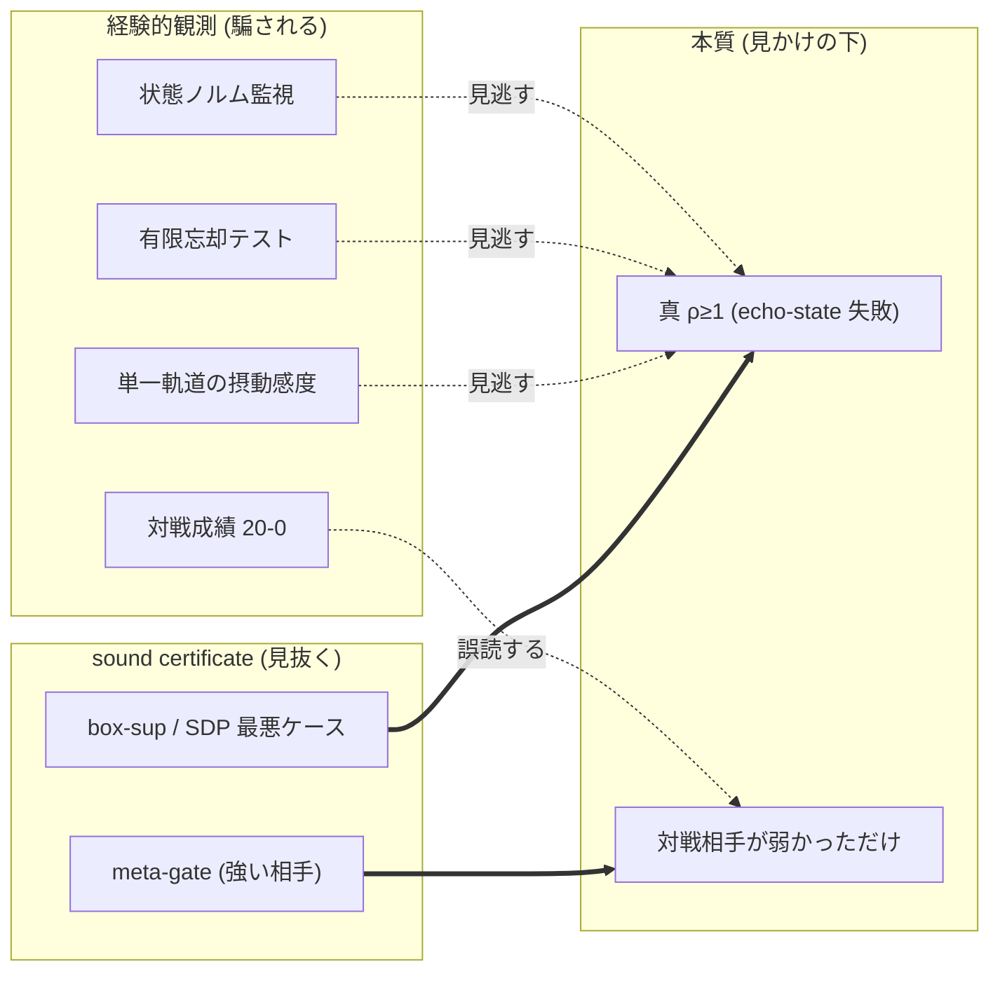
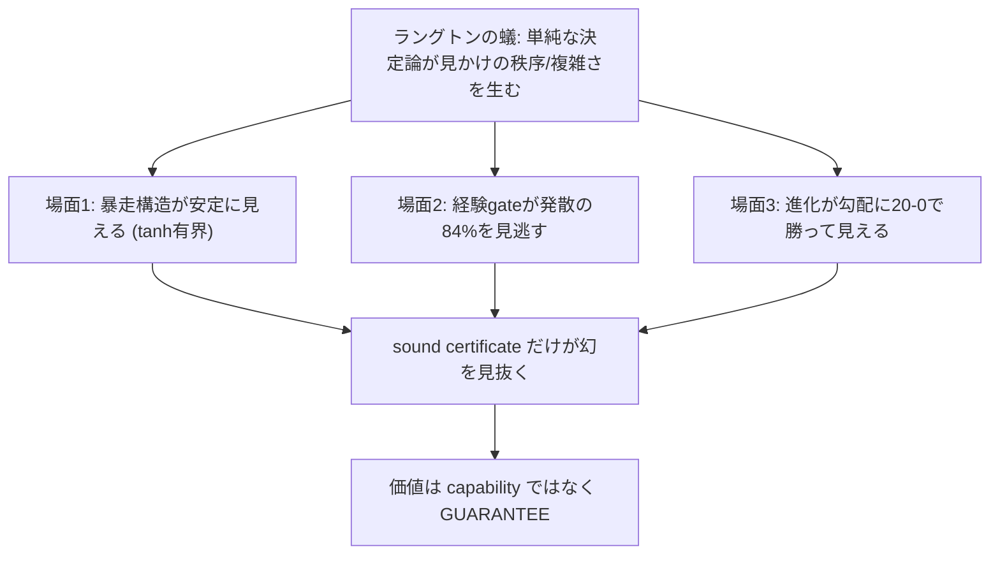
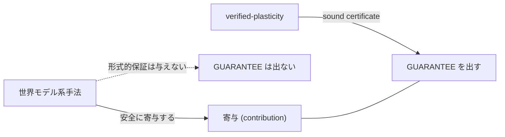
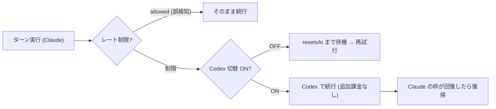
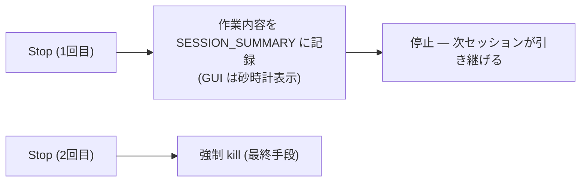

# llcore 検証 arc 総集編(#38–#42)— 防衛的公開 × 2ⁿ の壁 × 強い勾配 × ラングトンの蟻の幻 + 補遺(llm-viz / llterm 小話)

> この記事は連載の **6 本を 1 記事に結合**したものです(**言語別構成**: 各言語で全章を連続して読めます)。

<!-- SERIESNAV -->
> **📚 FullSense 総集編シリーズ**(各記事は独立して読めます。横断で読む入口です)
> - **llcore 検証 arc 総集編 (#38–#42)(この記事)**
> - [かみくだき総集編](https://qiita.com/furuse-kazufumi/items/bfb20aca3cf1df510c26)
> - [llive 完全解説 総集編 (0–8)](https://qiita.com/furuse-kazufumi/items/07b4882e872994b27b3c)
> - [llmesh 総集編](https://qiita.com/furuse-kazufumi/items/fcb43968a5c642610762)
> - [lldarwin / 進化 arc 総集編 (#25–)](https://qiita.com/furuse-kazufumi/items/6e107c7dfa0c261ee4d7)
<!-- /SERIESNAV -->

**言語 / Language:** [日本語](#日本語) | [English](#english) | [中文](#中文) | [한국어](#한국어)

---

# 日本語

## 1. llcore 検証 arc (#38) — 自分の研究を 56 体の AI に反証させたら「四隅の空白」が残った日: 特許を出さずに「防衛的公開」で旗を立てる

### この記事は何か — 1 日で「反証検証 → 特許 clear → 出願見送り → 防衛的公開」まで走った話

2026 年 6 月 6 日、私(筆者)は AI(Claude Code)に **「我々のやっていることが本当に差別化できているか、検証してほしい」** と求めました。AI はこれに **反証検証(adversarial verification)** — 自分の主張をわざと反証しにかかる検証役の AI を多数走らせ、それでも生き残るかを試す手法 — で応えました。56 体の検証エージェントが 7 + 3 の角度から「この主張は先行研究で反証できるはずだ」と反例を探し回り、別働隊が特許データベースまで照会しました。

結果は次のとおりです。

- **学術文献での反証(breaks): 0 件**(44 候補を個別判定して、誰も「四隅同時」を埋めていなかった)
- **特許での反証: 0 件**(英語 14 + 日本語 3 クエリで、交差点を占有する特許なし)
- そこで私は **特許を出さない**(コスト判断)と決め、代わりに **防衛的公開(defensive publication)** という旗を立てました。

この記事は、その 1 日の物語(反証検証の設計と結果、意思決定)と、**公開した中身(=四点交差点の技術)** のかみくだき版です。記事の順番は、いつものとおり ①用語の説明 → ②かみくだき(平易) → ③詳細 で進みます。

---

### ① 用語ミニ辞典(本文で詰まらないために)

| 用語 | ひとことで |
|---|---|
| **反証検証 (adversarial verification)** | 自分の主張を肯定するのでなく、わざと反証・否定しにかかる検証役(AI)を多数走らせ、それでも生き残るかで主張の強さを測る方法。身内の太鼓持ちでなく、批判者を雇うイメージ。 |
| **防衛的公開 (defensive publication)** | 特許を「取る」のではなく、技術を **公開して先行技術にする** こと。誰か(大手含む)が後から同じ発明で特許を取って、こちらや世間を縛れないようにする「先に旗を立てる」防御。 |
| **先行技術 (prior art)** | 「その発明、もう公知ですよ」と言える既存の公開物。新規性を否定する材料。日付が命。 |
| **縮小性 (contraction, ρ<1)** | エコー(過去の揺れ)が時間とともに **減衰** する性質。スペクトル半径 ρ が 1 未満。ばねが必ず止まる位置に戻る、のイメージ。記憶コアが暴走せず「忘れる」性質。 |
| **健全な証明 (sound proof)** | 「証明できた」と言ったら **本当に正しい**(偽の合格を出さない)証明。統計的に「たぶん安全」とは別物。 |
| **prove-then-reject ゲート** | 変異(更新)を **証明してから採用**、ダメなら **棄却** する関所。fail-closed(証明できなければ通さない)。 |
| **記憶コア (memory core)** | LLM の周りに被せる「覚える部品」。本研究では `s_{t+1} = decay⊙s + (1−decay)⊙tanh(W s + V x)` という漏れ・飽和つきの再帰(RWKV 系)。 |
| **進化ループ (evolution loop)** | 変異 → 選択 → 次世代、を回して良い個体を探す最適化。ここではその選択の関所に証明ゲートを置く。 |
| **SMT ソルバ (Z3 等)** | 論理式が充足可能か解く万能ソルバ。重い。本研究では「実は要らなかった(装飾)」が結論。 |
| **tracking tube(追従チューブ)** | 「望ましい軌道」からの実際のずれが収まる **筒(半径 r)** の保証。`r = G·w̄/(1−L)`。 |
| **SSGM** | 「進化する記憶を統べる」write ゲートを **理論だけ** で提案した先行研究([arXiv:2603.11768](https://arxiv.org/abs/2603.11768), 2026)。看板が一番近い相手。 |
| **navigability(探索可能性)** | 進化が「動きやすい地形か」。学習が賢くなることとは別。検証器の効き目はこちら側。 |

---

### ② かみくだき — 3 分でわかる全体像

まず生物学のニッチ(生態的地位)の話から入ります。進化では「ニッチ — 他の種がまだ占めていない隙間 — に入り込んだ種」が生き残ります。AI の世界も似ています。大手(OpenAI/Google 等)は「平均的に賢い大型種」で、広い平野を占有しています。私たちはその平野では勝てません。だから **誰も埋めていない隙間** を探し、そこに合う部品を作る。今回その隙間にぴたりと収まったのが、`llcore` という具体的なシステムです。

`llcore` は、ひとことで言うと **「記憶を持つ AI 部品が、暴走しないように"証明の関所"を自分自身に課したシステム」** です。記憶コアは更新を重ねるたびに変異(進化)していきますが、その変異を採用する前に、必ず関所(ゲート)を通します。関所は「この更新を入れても記憶が暴走しない」ことを **数学的に証明できたものだけ** を通し、証明できなければ門前払い(fail-closed)にします。

このシステムが先ほどの「隙間」にぴたりと収まるのは、次の 4 つの条件が **1 点で同時に重なる** からです。

1. **健全な縮小性証明**(エコーが必ず減衰すると数学的に保証。しかも偽の合格を出さない)
2. それを **LLM の記憶コアの内部** に当てる(制御ロボでも分類器でもなく、「覚える部品」そのもの)
3. **進化ループの中で**、ダメな変異を **棄却**(押し戻し=射影ではなく、捨てる)
4. しかも **動く実装と実験** がある(机上論で終わらない)

この 4 つを **同時に** 満たす先行研究は、56 体の反証役 AI に批判的に検証させても、特許 DB を照会しても、見つかりませんでした。1 つ 1 つの条件は先行があります(正直に全部名前を出します)。でも「四隅を同時に占有」した人はいなかった。これが **四点交差点(four-point intersection)** です。生物学のニッチでいえば、4 つの境界線がちょうど交わる **一点の隙間** に、`llcore` が収まっているわけです(孫子でいう「実を避け虚を撃つ」)。

そして大事な意思決定。この隙間は **特許でも空白** でした。普通なら「じゃあ特許を取ろう」となります。が、特許はお金と時間がかかる。私はそこを **見送り**、代わりに **「公開して先に旗を立てる」防衛的公開** を選びました。狙いは攻めではなく **防御** です — 後から誰か(大手や、SSGM の後続実装)が同じ概念で特許を取って、こちらや公衆を縛るのを **未然に無効化する**。日付付きで公開してしまえば、それは公知の先行技術になり、後出しの特許は新規性で否定されます。

ただし — ここが私たちの一貫した規律ですが — **盛りません**。「世界初」とは言いません。正しい言い方は **「我々の反証検証の範囲で、四隅を同時に占有した先行はゼロ」** です。探索範囲の外は分からない、という留保を必ず残します。

---

### ③ 詳細 — 1 日のセッションと、公開した技術の中身

#### 3.1 反証検証の設計(再現できるように)

「自分の研究は強い」と自分で言っても意味がありません。そこで AI は **反証主導のワークフロー** を組みました。

- **7 角度の反証探索**: 証明ゲートの系譜 / certified training / Transformer 安定性 / 進化 × 検証 / verified memory / runtime assurance / 産業・特許。
- **critic が指摘した盲点 3 角度を追加**: 形式手法会議側の逆引き / certified continual learning の語彙系 / 内部状態・SSM の解釈。
- **44 候補を 5 軸ルーブリックで個別判定**(更新をゲートするか / 健全証明か / LLM 記憶コアか / 進化ループ内か / 実装ありか)。判定役の AI は **一次情報(arXiv の abstract/HTML)を WebFetch で必ず確認**(伝聞禁止)。
- 並行して **内部の AI が自分の論文ドラフトの弱点を抽出**(honest disclosure: 身内の粗探し)。

確定結論は **breaks 0 / narrows 36 / background 8(44 件)**。生き残った差別化核が、上の四点交差点です。

#### 3.2 「四隅」それぞれの最近接ライバル(全部名前を出す)

新規性は「全部を 1 文で名指しできるか」で誠実さが決まります。隅ごとに最も近い先行を 1 文で:

- **SSGM([arXiv:2603.11768](https://arxiv.org/abs/2603.11768))** — 「進化する記憶を統べる」看板を **理論だけ** で先取り。ゲートは NLI(矛盾検出)で **健全な形式証明ではなく**、実装もなし。→ 看板を担う相手として **必ず引用**。実装 + 証明の窓が空いている。
- **SEVerA([arXiv:2603.25111](https://arxiv.org/abs/2603.25111))** — 自己進化エージェントに Dafny/SMT 検証。ただし対象は **出力契約** で、記憶コアの縮小性の毎更新ゲートではない。
- **PSV-Verus([arXiv:2512.18160](https://arxiv.org/abs/2512.18160))** — self-play ループ内の健全 SMT ゲート。ただし検証対象は **生成コードの正しさ**。
- **Provably Safe Model Updates / LID([arXiv:2512.01899](https://arxiv.org/abs/2512.01899))** — 更新を抽象解釈で δ-safe 認証。ただし **射影(押し戻し)** で prove-then-reject ではなく、対象は frozen-embedding の分類 head。
- **GP × モデル検査(Katz & Peled, [arXiv:1402.6785](https://arxiv.org/abs/1402.6785), 2014)** — 進化ループに健全な検査ゲートを置く **パターンの先例**。だから私たちは **ゲートのパターン自体を新規とは主張しません**。記憶コアの縮小性への適用だけが未踏。
- **Enforced-Lipschitz Transformers([arXiv:2507.13338](https://arxiv.org/abs/2507.13338))/ R2DN([arXiv:2504.01250](https://arxiv.org/abs/2504.01250))** — 縮小性を **構造で強制(by-construction)**。これは「ゲートなんか要らない、最初から組み込め」という最強の対抗設計。私たちは **by-construction 対 prove-then-reject** を設計軸として対比します(構造強制は表現力を犠牲にし、棄却ゲートは任意更新を構造制約なしに検査する)。
- **Safeguarded AI(ARIA programme)** — 最も権威ある proof-gated-gatekeeper 概念。ただしゲート対象は **行動/計画**(出力ゲート)で、重み/記憶の更新ゲートではなく、まだ programme 段階。
- **Emergent FV / substrate-guard([arXiv:2603.21149](https://arxiv.org/abs/2603.21149))** — AI の **出力** を Z3 で検証する動くシステム。ただし post-hoc 監視で、毎更新ゲートではない。

(上記 arXiv ID はすべて論文ドラフトで abstract と照合確認済みのものだけを使っています。)

#### 3.3 特許面の照会(学術監査が残した穴埋め)

学術監査は **文献だけ** で、特許 DB を見ていませんでした(不在証拠として弱い)。そこで別働隊が **英語 14 + 日本語 3** のクエリで Google Patents / USPTO を照会しました。

- **交差点を占有する特許: ゼロ件。**
- 最近接の特許は 3 系統だけで、いずれも交差点外:
  - **[US11715005B2](https://patents.google.com/patent/US11715005B2)** — NN をハッシュ照合で真正性検証(健全証明でなく暗号ハッシュ)。
  - **[US10896032](https://patents.google.com/patent/US10896032)** — certify-then-deploy のガバナンスゲート(根拠が手続的 attestation)。
  - **[US11868855](https://patents.google.com/patent/US11868855)** — モデル/重みの「stability」検証(ただし可用性・耐障害の意味の蓋然性大)。
- 面白い構造的証拠: 「**健全証明で更新/記憶/進化をゲートする**」とクエリすると、特許 DB に site 指定しても結果がほぼ全部 **arXiv に逸れた**。これは「この概念がまだ学術段階に留まり、特許化されていない」間接証拠です。

→ 結論: **特許面でも clear**。ただし US10896032 / US11868855 は語彙が部分的に被るので、論文の related work に「展開ガバナンス型ゲート/運用安定性検証とは異なり、本研究は重み更新の解析的 contraction 性質を健全証明でゲートする」という対比を 1〜2 文先回りで入れています。

#### 3.4 公開した技術の中身(防衛的開示の本体)

防衛的公開は「当業者が実施できる詳細度」で書かないと先行技術として弱い。なので、開示文書には次を **実装可能なレベル** で書きました。

**(a) 健全な縮小性証明器の梯子(ladder)。** 安いものから順に 3 段:
- `cert_inf` — 閉形式の ∞-ノルム上限(`O(n²)`)。各行の絶対値和が端点で最大になる性質を使い、**ソルバ不要**。
- `cert_two` — 全 `2^n` 頂点で SVD。
- `cert_sdp` — 共通 Lyapunov 行列を凸 LMI(内点 SDP, CLARABEL)で。

**ここが正直ポイント**: プロジェクトの旧通称は「Z3-gated」でしたが、**実際のゲートに SMT(Z3)は使っていません**。専用の Z3 縮小性トラックを走らせて確認したら、閉形式 ∞-ノルム証明器と **バイト単位で一致(3270 件中 0 件の不一致、境界近傍でも 8000 件中 0 件)**。つまりこの不変量クラスでは **Z3 は装飾** でした。だから看板を「健全な縮小性証明器の梯子」に直しています(これは退却ではなく強み — ソルバ依存と不完全性を回避できる)。

**(b) prove-then-reject ゲート(fail-closed)。** 子個体を提案 → 証明が通れば採用、ダメなら上限まで resample、それでもダメなら **既知安全な fallback** を採用。**未証明の子は決して採用しない**。`gate_mode="contraction"` / `"state_norm"` を additive に追加し、既定 `"none"` は従前挙動とバイト一致(=既存進化基盤への純粋な被せ物)。

**(c) tracking tube 検査指標。** 「どこかに縮む」だけでなく「**望ましい軌道に追従する**」を見たい、というユーザー要望への答え。ゲートが既に計算している量(状態 Lipschitz `L`、入力ゲイン `G`)と外乱上界 `w̄` を再利用し、追従誤差が収まる筒 `r = G·w̄/(1−L)` を **追加証明コストゼロ** で報告。小規模実測でも、縮小性 PASS の 3 gene は誤差/外乱比 0.50/0.78/1.04 で理論筒の内側、非縮小性の対照は **9.3 倍** に増幅(=ゲートは飾りでなく load-bearing)。

**(d) verified memory evolution の 2 ルート。**
- ルート (a): エージェント **記憶バンク** の更新を健全証明でゲート(SSGM の NLI 理論との差 = 健全証明 + 動くゲート)。
- ルート (b): 記憶コアの **内部状態 dynamics** をゲート(本書で実施済)。

**(e) 合成: SPC 管理図 runtime ゲート + 二層倫理ゲート。** 進化メトリクスを管理図(X̄–R / CUSUM)に通して時間方向の異常を online ゲート。そして **探索は自由・採用は検証** の二層倫理(探索層は孫子の「詭道」=奇手 OK、採用層は論語の「仁」=誠実でゲート不可避)。

#### 3.5 本日の実装事実(reduced to practice)

机上論ではないことの証拠:

- 証明ゲートは **出荷側の `evolve()` に本配線済**(`gate_mode` / `resample_cap` を additive 追加、既定 `"none"` は byte-identical、research 側の参照実装と全モード一致をテストで実証)。
- tracking tube レポータも着地(`r = G·w̄/(1−L)`, `cert_inf` 限定、read-only、golden 値一致)。
- ゲート + レポータを覆うテスト **294 件**。
- **観測したゲートのコストは約 20〜60 倍**(証明はタダではない、と隠さず開示)。

#### 3.6 honest 限界(弱めない)

防衛的開示でも honest disclosure は曲げません。

- **規模は小**: 核は `n=8`(72 実数 gene)・16 KB コーパス・byte vocab。「LLM 記憶コア」は **機構実証** の意味。
- **検証器の payoff は navigability であって学習ではない(L3)**: 効果は EA 固有で、勾配法では消える。
- **ゲートは ~20〜60 倍のコスト**: 短い訓練ではタダに見えるだけ。
- **「false admit ゼロ」は経験的観測であって機械検査ではない**: 証明器の *条件* は健全だが、それを担う *実装* は end-to-end に形式検証されたわけではない。
- **「未発見」の範囲**: 反証検証 + 表層特許検索の範囲に限る。CNIPA(中国語)未照会、特許は最長 18 ヶ月の公開ラグ。「探索範囲で」の留保は常に維持。

---

### まとめ — 旗は「攻め」ではなく「守り」のために立てた

今日 1 日で、私たちは自分の研究を 56 体の反証役 AI に批判的に検証させ、特許 DB まで照会し、それでも残った「四隅の空白」を確認しました。普通ならここで特許を狙うところですが、コストを天秤にかけて **出願は見送り**、代わりに **日付付きの防衛的公開** で旗を立てました。

狙いはシンプルです — **誰かが後からこの空白を特許で囲い込み、私たちや公衆を縛るのを未然に無効化する**。そのために、当業者が実装できる詳細度で全部公開しました。そして最後まで、**「世界初」とは言わず「我々の検証の範囲で四隅同時の先行ゼロ」** という、盛らない言い方を守っています。

防衛的公開の本体(日付付き開示)は、下の追記のとおり **実装と全データを含む public リポジトリ** に昇格しました: [github.com/furuse-kazufumi/llcore](https://github.com/furuse-kazufumi/llcore)。

次回(#39 以降)は、この四点交差点の本丸 — verified memory evolution の小 PoC(記憶バンク更新ルート)の着地を report する予定です。SSGM が理論で看板を取った窓が、実装で閉じる前に。

### 追記(2026-06-07)— 旗は実装になりました

この記事の翌日、予告していた verified memory evolution の PoC は **完走し、防衛的公開は「文書」から「実物」に昇格**しました。

- **public リポジトリ**: [github.com/furuse-kazufumi/llcore](https://github.com/furuse-kazufumi/llcore) — 論文ドラフト([PAPER_DRAFT.md](https://github.com/furuse-kazufumi/llcore/blob/main/research/paper/PAPER_DRAFT.md))+ 全実験コード/データ(570 ファイル、テスト 318 件 green)を、日付付きの単一コミットとして公開
- **trajectory-tube gate**(予告していた本丸): 事前登録 n=40 の決着で、記憶 horizon への効果を確認(論文 §9)
- **さらに先へ**: 「検証器を AI 自身が持ったらどうなるか」— 死ねる環境での記憶形成 3 機構(自己予見/復活修復/社会的観察)の測定まで公開内容に含まれます(論文 §9.6)
- **知見スライド(CC BY 4.0)**: [slides/](https://github.com/furuse-kazufumi/llcore/tree/main/slides) — 出典明示で企業利用も可能な 10 枚要約(日英)。**現状は要約版で情報密度は控えめです — 研究の進展に合わせて、実験設計の詳細・図表・再現手順・採用判断の材料まで、今後 1 年かけて拡充していきます**

「SSGM の窓が実装で閉じる前に」という予告は、こうして果たされました。

---

## 2. llcore 検証 arc (#39) — 「証明つきで進化する記憶」を本当に作れた日、ただし n≤6 まで: verified-plasticity を測ったら "navigable かつ scalable な証明器は今も居なかった

### この記事は何か — 「窓は実装で閉じた、でも壁はびくともしなかった」報告

前回(#38)の最後で、私たちはこう予告しました。「次回は四点交差点の本丸 — verified memory evolution の小 PoC を report する。SSGM が理論で看板を取った窓が、実装で閉じる前に」。

2026 年 6 月 9 日、その PoC が走り切りました。結論を 1 行で言うと、**「窓は実装で閉じた。でも壁(スケーラビリティの壁)はびくともしなかった」**。

具体的には:

- **証明つきで進化する記憶コア**(実際に構造を太らせる手術 `width_grow` を含む)を、**0 観測 false-admit のまま** 動かせた(= 偽の合格を 1 件も出さずに進化できた)。
- 同時に、前回まで「未測定」と正直に残していた **cert_sdp(SDP 証明器)を初めて測り**、それが **最も "通りやすい"(navigable)健全証明器**(真に収縮する個体の 90〜99% を合格にする)と判明した。
- **にもかかわらず、その cert_sdp も含めて、計算コストは `2^n`(次元 n の指数)のまま** だった。つまり **「通りやすくて、かつ大規模でも安い」証明器は、今回も見つからなかった**。verified に構造進化させられるのは、当面 **小さな部品(n≤6)に限る**。

この記事は、その 1 日の「やれたこと」と「やれなかったこと」を、いつもの順番 ①用語 → ②かみくだき → ③詳細 で、盛らずに書きます。最後に、自分の数値主張を **6 体の検証 AI に並列で反証させた**結果(MAJOR な不一致ゼロ)も開示します。

正本データ: [github.com/furuse-kazufumi/llcore](https://github.com/furuse-kazufumi/llcore)(論文ドラフト + 全実験コード/データ)。

---

### ① 用語ミニ辞典(本文で詰まらないために)

| 用語 | ひとことで |
|---|---|
| **可塑性 (plasticity)** | 学習・進化で「形を変えられる」性質。ここでは記憶コアの構造そのもの(行列の大きさ=次元)を後から太らせること。 |
| **verified-plasticity(検証つき可塑性)** | 「形を変える」たびに、その変更が安全(暴走しない)かを **証明してから採用** すること。本研究の主軸。 |
| **width_grow(幅成長)** | ニューラルネットの層を `n → n+1` に **太らせる構造手術**(Net2Net 系)。机上ではなく実際に実行した。 |
| **収縮性 (contraction, ρ<1)** | 過去の揺れが時間とともに **減衰** する性質。スペクトル半径 ρ が 1 未満。記憶が暴走せず「忘れる」性質。 |
| **false-admit(偽の合格)** | 本当は危険(ρ≥1=暴走しうる)なのに、証明器が「安全」と通してしまう取りこぼし。これがゼロなのが健全性の生命線。 |
| **健全 (sound)** | 「合格」と言ったら **本当に安全**(偽の合格を出さない)性質。統計的に「たぶん安全」とは別物。 |
| **navigability(通りやすさ/探索可能性)** | 「本当に安全な個体を、どれだけ合格にできるか」。厳しすぎる証明器は安全な個体まで弾く=進化が動けない。これが高いほど進化は地形を動きやすい。 |
| **証明器格子 (cert ladder)** | 安い順に `cert_inf`(∞-ノルム上界・ソルバ不要)→ `cert_two`(全 `2^n` 頂点 SVD)→ `cert_sdp`(凸 LMI/SDP)の 3 段。 |
| **prove-then-reject ゲート** | 変異(更新)を **証明してから採用**、ダメなら **棄却** する関所。fail-closed(証明できなければ通さない)。 |
| **SSGM** | 「進化する記憶を統べる」write ゲートを **理論だけ** で提案した先行研究([arXiv:2603.11768](https://arxiv.org/abs/2603.11768))。実装 + 健全証明の窓が空いていた相手。 |
| **empirical_rho(経験的 ρ)** | 真のスペクトル半径を、多数サンプルで **下から** 近似するオラクル。「0 観測 false-admit」はこの下からの監査での結果(=強い consistency 証拠だが、絶対証明ではない)。 |
| **2^n 壁** | 証明コストが次元 n に対して指数 `2^n` で増える限界。`cert_two`/`cert_sdp` は頂点を全部見るのでこの壁に当たる。 |

---

### ② かみくだき — 3 分でわかる全体像

前回(#38)で立てた旗は「**証明つきで進化する記憶コア**」でした。記憶コアは更新のたびに変異(進化)しますが、その変異を採用する前に必ず関所(ゲート)を通し、「この変異を入れても記憶が暴走しない」と **数学的に証明できたものだけ** を通す。証明できなければ門前払い(fail-closed)。これが prove-then-reject ゲートです。

今回やったのは、その旗を **「文書」から「動く実物」へ** 進めることでした。3 つの「やれた」があります。

**やれた①: 形を太らせながら、偽の合格ゼロ。** これまでは「変異(中身の微調整)を証明する」までしか試していませんでした。今回は **構造そのものを太らせる手術(`width_grow`、n→n+1)** を実際に走らせ、太らせた後でも証明器が「安全(ρ<1)」を **0 観測 false-admit** で保つことを確認しました。発散域(ρ が 1.85〜2.21 に達する危険な個体)は、全部正しく棄却されました。

**やれた②: 一番"通りやすい"証明器を、初めて測れた。** 前回まで「SDP 証明器(cert_sdp)は未測定」と正直に残していた穴を埋めました。SDP ソルバ(CLARABEL)が使える環境で初めて測ったところ、**cert_sdp が 3 段の証明器のうち最も "通りやすい"** — 真に収縮する個体のうち 90〜99% を合格にする(安い `cert_inf` は 20〜40%、中位の `cert_two` は 40〜50% しか通せない)。つまり「厳しすぎて進化が動けない」問題を、SDP がかなり緩めてくれた。

**やれた③: 小さな部品なら、計算は自明に間に合う。** n≤6 の小さなコアなら、verified に進化させるループ全体が **30 時間の予算の 0.04%(0.013 時間)** しか食わない。「証明つき進化なんて重くて回らないのでは?」という心配は、小規模では杞憂でした。

…ここまで聞くと「全部勝った」ように見えます。でも honest disclosure(正直な開示)が私たちの規律です。**勝てなかったこと** を 3 つ、はっきり書きます。

**やれなかった①: 2^n の壁は破れていない。** cert_sdp は確かに "通りやすさの天井" を上げました。が、その代償としてコストは依然 `2^n`(頂点を全部見る)。`cert_two` は n=12 で 1 証明 1.3 秒、n=14 で予算外。**「通りやすくて、かつ大規模でも安い」証明器は、今回も存在しなかった**。だから verified に構造進化できるのは当面 **小さな部品(n≤6)に限る** — この結論は前回(Phase −1)から **変わっていません**。SDP は壁を **越えた** のではなく、壁の手前で天井を **上げた** だけです。

**やれなかった②: 「偽の合格ゼロ」は経験的観測であって、機械が証明したわけではない。** 0 観測 false-admit は、真の ρ を **下から** 近似するオラクル(多数サンプル)で反証を探した結果です。証明器の *条件* は数学的に健全ですが、それを担う *実装* が端から端まで形式検証されたわけではありません。「0 観測」は強い consistency 証拠ですが、「全ての入力で安全」の絶対証明ではない — ここは誇張しません。

**やれなかった③: 学習が賢くなったわけではない。** 証明器の効き目は **navigability(進化の動きやすさ)** であって、モデルが賢くなる(=学習性能が上がる)ことではありません。しかも効果は進化的アルゴリズム(EA)固有で、勾配法では消えます。さらに今回の適合度(fitness)は **合成 proxy** で、実 GPU 訓練での確認は次フェーズ(Phase 2)送りです。

要するに今回は **「機構は実装で証明できた、規模の壁は正直に残った」** という、半分勝って半分宿題、の日でした。

---

### ③ 詳細 — 5 つの実験と、潰せなかった留保

主軸は **Verified-Plasticity Evaluation Framework**(検証つき可塑性の測定ハーネス)です。「うちの手法が強い」と主張する前に、まず **測る物差し** を作る。その物差しで 5 つの実験を回しました(全て `$0` / CPU、torch 2.12+cpu、seed 固定で再現可能)。

#### 3.1 固定構造での証明器の健全性と格子

収縮〜発散を跨ぐ個体を n={4,6,8} で各数百サンプルし、3 証明器の合格と真の ρ(empirical_rho 6000 サンプル)を突合しました。

| n | 収縮(ρ<1) | false-admit (inf/two/sdp) | 真に収縮する個体の合格率 (inf/two/**sdp**) |
|---|---|---|---|
| 4 | 453/600 | **0 / 0 / 0** | 0.41 / 0.51 / **0.95** |
| 6 | 426/600 | **0 / 0 / 0** | 0.29 / 0.43 / **0.94** |
| 8 | 280/400 | **0 / 0 / 0** | 0.23 / 0.40 / **0.91** |

確定知見:
1. **3 証明器すべてが 0 観測 false-admit**(cert_sdp の健全性も初確認)。証明器の数学的健全性と一致。
2. **cert_sdp が圧倒的に navigable** — 真に収縮する個体のうち、安い cert_inf は 23〜41%・cert_two は 40〜51% しか通さないのに、**cert_sdp は 91〜95% 通す**。なお `two⊆sdp`(cert_two が通すなら cert_sdp も通す)は実装上の fast-path による **構造的保証(トートロジー)** であって経験的発見ではない、と明記しておきます(盛らないため)。

#### 3.2 実構造手術(width_grow)下での健全性 × 非自明性

実際に `width_grow`(Net2Net/fresh)で base を n→n+1 に太らせ、各ゲートが **成長下でも 0 false-admit を保つ ∧ 非自明な合格を 1 件以上開く** かを判定しました(1 セル = 1536 個の成長後個体)。

- **成長下の健全性: 全 16(セル×ゲート)で 0 観測 false-admit。** 成長 ρ 最大 1.85〜2.21(発散域)は正しく全棄却。これが **North Star #1(成長操作下で偽の合格ゼロ)** の実構造手術での確認です。
- **安い cheap gate(cert_inf)は健全だが、小 n で脆い** — n=6 の最も保守的なエッジ(headroom 0)では非自明な合格が **0 件** → gate FAIL。headroom があっても非自明合格はわずか 3 件で τ ギリギリ。= 「cheap gate の navigability は脆弱」。
- **navigable gate(cert_two/cert_sdp)は全セル PASS** — cert_two は 114〜168、cert_sdp は 673〜733 の非自明な健全合格を開く。→ **「per-component ゲートは cert_two/sdp に格上げ・small-n 限定」がデータで正当化**。

#### 3.3 ブロック間結合(coupling)の盲点

2 ブロックを残差結合し、**「各ブロック単体では合格でも、合成すると暴走する」盲点** を真の ρ で測りました。

- **per-block AND(各ブロック単体の合格を AND する)は結合下で本当に不健全** — 結合強度 γ≥1.0 で、単体合格済の **24〜34%(γ=1.0)〜 80〜96%(γ=2.0)が合成真 ρ≥1**(暴走)。→ **per-block AND は禁止確定**。
- **full-system cert(系全体を一括で証明)は全 γ で 0 false-admit = 健全。**
- ここでも **cert_sdp が最 navigable** だが、次元(ブロック数 2→3)と結合強度を上げると coverage は低下(full=6・γ=1.0 で cert_inf/cert_two は 0%、cert_sdp のみ 75.8%)。= SDP は過保守を解消するが、**次元の壁は SDP でも効く**。
- ⚠ 正直な留保: ブロック数 3 で SDP ソルバが「解が不正確かも」警告を数件出しました。**独立な固有値再検査で健全性(false-admit=0)は保証** されますが、coverage の数値は近似解由来の僅かな揺れを含みえます。

#### 3.4 feasibility(本当に予算内に回るか)

per-op の実測 wall-time から 30 時間予算へ外挿しました。

| n | 1 eval あたり | 総時間 | 30h に収まる |
|---|---|---|---|
| 4 | 769μs | **0.011h** | はい |
| 6 | 912μs | **0.013h** | はい |
| 8 | 9.2ms | 0.131h | はい |
| 10 | 38.6ms | 0.550h | はい |
| 12 | 1.31s | **18.6h** | 辛うじて |
| 14 | — | (cert_two 2^14 外挿 = 不能) | いいえ |

確定知見:
1. **small-n(n≤6)は計算上自明に feasible** — 予算の 0.04%。
2. **2^n 壁は n≥10〜12 で binding** — cert_two が n=12 で 1.3 秒/証明(=18.6h、マージン薄)、n=14 で予算外。
3. ⚠ 留保: ここの fitness は `RotationNDObjective` の **合成 adapter proxy** で、実 GPU 訓練では base forward(CE)が dominant になります。この外挿は「per-eval ごとに証明を 1 回課金する保守的上限」見積りで、実 GPU 実測は Phase 2 で要確認。

#### 3.5 第 2 base(Mamba)への移植性

framework が SmolLM2 以外の base にも載るかを確認しました。**Mamba-130M を CPU で load 成功**(coherent な生成も確認)、その hidden 上で cert_two ゲートが load-bearing(gate あり/なしで合格率が +0.287 動く、SmolLM2 の +0.320 と整合)。= 「新しい base に載せ替えられる」plug-point の実証。
- ⚠ 留保: ここの健全性オラクルは §3.1-3.4 の empirical_rho ではなく **弱いオラクル(単一摂動)** で、合格 n=7 の小集団。Mamba 自体の固有安定性(base-level の Lyapunov)は未測定で Phase 2 送り。本フェーズの deliverable は「framework portability + Mamba CPU 動作確認」に限定します(固有安定性の正対照ではない)。

#### 3.6 統合判定 — Decision gate 1 = PASS(small-n)

| gate | 条件 | 判定 |
|---|---|---|
| 成長下 soundness ∧ 非自明 admit≥1 | width_grow N 回で false-admit=0 ∧ 非自明合格≥1 | **PASS**(cheap gate は n=6 で trivial → cert_two/sdp 必須) |
| coupling-aware 合成 soundness | per-block AND 禁止 + full cert 健全 | **PASS** |
| feasibility | small-n ループが 30h 予算内 | **PASS**(small-n) |

→ **Decision gate 1 = PASS → Phase 2 へ(small-n per-component 域、Phase −1 確定の制約内)**。Phase 1 の deliverable は **「健全・feasible な small-n verified 構造適応の測定ハーネス + 証明器格子(inf/two/sdp)の完全な特性評価」** です。

#### 3.7 honest 限界(潰せていないもの)

防衛的開示でも honest disclosure は曲げません。前回(#38)の留保に、今回の測定で潰せたもの/残ったものを重ねます。

- **2^n scalability 壁は不変(最大の宿題)**: cert_sdp で navigability 天井は ~0.9 に上がった(前回 cert_two ~0.45 から大幅改善)が、**2^n 頂点コストは不変**。「navigable かつ scalable な健全証明器は依然不在」= verified 構造進化の高次元での不成立は **堅持**。SDP は天井を上げただけで壁は破っていない。
- **empirical_rho は from-below 推定**: 0 観測 false-admit は強い consistency だが「全 (s,x) で ρ<1」の絶対証明ではない。near-boundary を取りこぼしうる。
- **net2net は incoming-copy 近似**(exact function-preserving ではない)→ 関数変化 Δfunc は近似評価。
- **fitness は合成 proxy**: 実 SmolLM2 CE での capability 副線(EXISTS/NULL/ARTIFACT)は Phase 2 必須。
- **Mamba 固有安定性は未測定**: gate は adapter に掛かり、Mamba base 自体の Lyapunov は未検証 → Phase 2 defer。

---

### 敵対的検証 — 自分の数値を 6 体の AI に並列で反証させた

honest disclosure の核は「異常に良い結果が出たら、勝った気になる前に内訳を疑う」です([feedback_benchmark_honest_disclosure])。そこで本 verdict の数値主張を、6 実験それぞれの `results.json` + 実装 `.py` に対し、**独立な検証 AI 6 体を並列**で突合させました。

**結果 = MAJOR issue ゼロ(結論を覆す不一致なし)、全て MINOR。** 検出された指摘は本文に反映済です:
- 転記丸め誤差 4 件(maxΔfunc 0.108→0.107 等)を修正。
- §3.1 の `two⊆sdp` は経験的発見ではなく実装上のトートロジーと明記。
- 「cheap gate は n=6 で trivial」を「n=6 最保守エッジのみ trivial、headroom ありでも脆弱」へ精緻化。
- 「cert_sdp 98% 救済」はブロック数 2 限定、3 では 75.8% / inf・two は 0% と明記。
- fitness が合成 proxy であること、外挿の保守性、CPU→GPU 外挿の前提を透明化。

→ **検証後も Decision gate 1 = PASS、SDP navigability 知見、small-n 限定結論は不変**。指摘は全て honest-disclosure の精度向上であり、機構的結論を揺るがすものは無し。

---

### まとめ — 「窓は閉じた、壁は残った」

#38 で立てた旗は、今回 **文書から動く実物へ** 進みました。証明つきで進化する記憶コアを、実際に構造を太らせながら **0 観測 false-admit** で動かし、未測定だった SDP 証明器を埋め、small-n の feasibility を確認しました。SSGM が理論で取った看板の「実装 + 健全証明」の窓は、こうして実装側で閉じました。

一方で、最大の宿題 **2^n 壁** は今回もびくともしませんでした。「通りやすくて、かつ大規模でも安い」証明器は依然として存在しません。だから私たちは **盛りません**: verified に構造進化できるのは **当面 n≤6 の小さな部品まで**、という前回の結論を堅持します。

次回(#40 以降)は Phase 2 — 校正済みの「多峰性 instrument」を実損失地形に当て、進化が地形をどう動くか(capability 副線)を proper power で 1 つ確定する予定です。物差しはできた。次は、その物差しで実地形を測る番です。

正本: [github.com/furuse-kazufumi/llcore](https://github.com/furuse-kazufumi/llcore) — 論文ドラフト + 全実験コード/データ(5 実験 + 敵対的検証 workflow)。

---

## 3. llcore 検証 arc (#40) — 進化が「20戦20勝」した日、でも"強い対戦相手"を出したら幻だった: capability を測ったら NEGATIVE、価値は guarantee に確定

### この記事は何か — 「勝ったと思った瞬間に、自分のフレームワークが自分を止めた」報告

前回(#39)で私たちはこう締めくくりました。「証明つきで進化する記憶コアは作れた。ただし n≤6 の小さな部品まで。スケーラビリティの壁はびくともしなかった」。

そして今回(2026 年 6 月 10 日)は、ずっと後回しにしてきた **本丸の問い** に答えました。

> **「で、その『進化する記憶』は、ちゃんと賢くなるの? 勾配法(普通の学習)より強いの?」**

結論を 1 行で言います。**「実在の小型 LLM が作る本物の地形で、進化は普通の勾配法に 20戦20勝した。一瞬、勝ったと思った。でも自分のフレームワークの規律に従って『強い勾配』を出したら、その勝利は幻だった」**。

この記事は、研究で一番こわい瞬間 — **「異常に良い結果が出てしまった瞬間」** — に、勝った気になる前にどう自分を疑ったか、の記録です。いつもの ①用語 → ②かみくだき → ③詳細 で、盛らずに書きます。最後に、自分の数値主張を **検証 AI に並列で反証させた** 結果(MAJOR な不一致ゼロ)も開示します。

正本データ: [github.com/furuse-kazufumi/llcore](https://github.com/furuse-kazufumi/llcore)(全実験コード/データ + verdict)。

---

### ① 用語ミニ辞典(本文で詰まらないために)

| 用語 | ひとことで |
|---|---|
| **capability(性能)** | 「賢くなるか」。ここでは次に来るものを当てる予測の良さ(交差エントロピー=CE が小さい)。 |
| **guarantee(保証)** | 「暴走しないか」。証明つきで安定(収縮 ρ<1)を保てること。本研究の主軸。**この 2 つを混同しないのが honest-disclosure の生命線。** |
| **MAP-Elites(進化)** | 多様な解を碁盤の目に貯めながら探す進化的探索。今回の「進化」側。 |
| **finite-diff 勾配(弱い勾配)** | 関数値を少しずらして傾きを **推定** する素朴な勾配法。1 ステップに次元数+1 回の評価が要る=**遅くて弱い**。 |
| **解析(exact)勾配(強い勾配)** | 自動微分(backprop)で **正確な** 傾きを 1 回で得る勾配法。実際の LLM 学習が使うのはこちら。今回の決め手。 |
| **meta-gate** | 「進化が勝った」ように見えたとき、**もっと強い対戦相手**を出して利得が消えないか確かめる関門。消えれば幻(ARTIFACT)。 |
| **ARTIFACT(まやかし)** | 本物の性能差ではなく、**対戦相手が弱かったせい**で生まれた見かけの勝利。 |
| **ラングトンの蟻** | 単純な規則なのに、しばらく無秩序に見え、突然秩序が現れる有名な系。「見かけ」と「本質」がズレる比喩として使う。 |

---

### ② かみくだき — 「弱い相手に20連勝しても、何も言えない」

野球で例えます。あなたのチーム(進化)が、ある相手(finite-diff 勾配)に **20戦20勝** しました。強い。文句なし。

…でも、その相手が **草野球チーム** だったら? 20連勝は「あなたが強い」証拠になりません。「相手が弱かった」だけかもしれない。

研究でこれをやると大事故になります。「進化が勾配に勝った!」と論文に書いて、後で「いや、あなたが比べた勾配法が弱すぎただけです」と言われる。これが **capability の罠** です。

そこで私たちのフレームワークには、最初から **掟(meta-gate)** が入れてあります。

> **進化が勝ったら、勝った気になる前に "プロ" を呼んで再戦せよ。**

今回その "プロ"(解析勾配=実際の LLM 学習が使う正確な勾配)を呼びました。結果:

- 草野球(finite-diff)相手: 進化 **20勝0敗**(平均 CE で +0.029 リード)
- プロ(解析勾配)相手: 進化 **1勝19敗**(プロが逆に勝ち越し)

つまり **進化が勝てたのは相手が弱かったから**。強い勾配を出したら、勾配の方が良かった。**「進化が賢くなる(capability)」は言えない。**

ここで大事なのは、**負けたこと自体は失敗ではない** という点です。私たちのフレームワークの価値は最初から「賢くなる」側(capability)ではなく、**「暴走しない」側(guarantee)** に置いています。今回の結果は、その方針が **データで正しかった** ことを意味します — 賢さで売らなくて正解だった、と。

---

### ③ 詳細 — 実在 LLM の地形で、何を、どう測ったか

#### 3-1. 地形を「合成」から「本物」へ

前回までの capability 実験は、**人工の多峰地形**(山がいくつもある作り物)で測っていました。正直な留保として「これは実在 LLM の損失地形ではない」と残していました。

今回はそこを **実在の SmolLM2-135M**(Apache-2.0 の小型 LLM)で詰めました。手順:

1. SmolLM2 に文章を通し、中間層(layer 15)の **本物の内部表現(hidden state)** を取り出す。
2. それを小さな次元(n=6)に射影し、**「次に来る内部表現のクラスタ」を当てる CE 地形**を作る。これは合成ガウスではなく、**モデル自身の内部ダイナミクス由来の本物の予測タスク**。
3. その地形の上で、進化(MAP-Elites)・ランダム・弱い勾配・**強い解析勾配**を **同じ予算**(評価回数)で走らせ、**未観測の文(held-out)** での予測精度を 20 シードで比べる。

#### 3-2. 結果(held-out 平均 fitness = −CE、高いほど良い)

| 手法 | held-out 平均 | ひとこと |
|---|---|---|
| **強い解析勾配(torch Adam)** | **−1.446** | **全手法で最良** |
| 進化(MAP-Elites) | −1.454 | 2 位 |
| ランダム | −1.473 | |
| 弱い勾配(restart 多め) | −1.481 | |
| 弱い勾配(finite-diff) | −1.483 | **最下位** |
| 進化+ρ<1 gate | −1.483 | gate を掛けると探索が制約され finite-diff 並みに |

- 進化 vs **弱い勾配**: 平均差 +0.029、**20勝0敗**、p<1e-6 → 4条件 AND **成立**(一見 EXISTS)。
- 進化 vs **強い解析勾配**: 平均差 −0.008、**1勝19敗**、p=3.5e-4 で **勾配が逆転** → 4条件 AND **不成立**。

**→ 判定 = ARTIFACT+NEGATIVE。** 進化の勝ちは弱い対戦相手のせい。強い勾配では勾配 ≥ 進化 = **実在 LLM 地形でも capability は NEGATIVE**。

#### 3-3. 両地形で一貫することも確認した(cross-check)

「じゃあ前回までの合成地形の『引き分け(NULL_TIE)』も、弱い勾配のせいで過小評価だったのでは?」 — その疑いも **データで確かめました**。合成地形にも強い解析勾配を足して再走させると、**解析勾配が最高平均**(0.575 > 進化 0.535)。ただし合成地形は運の振れ(分散)が大きく、ペア検定では引き分け止まり。実在地形は振れが小さいぶん、勾配の優位が **統計的に有意**(19/20)まで届いた。

**結論: capability NEGATIVE は両地形で一貫**(強い勾配が両方で最高)。違いは分散だけ。

#### 3-4. 「枠組みが本物を見抜く」側は PASS

capability は売れない。では何が立つのか — **guarantee(安全性の判別力)** です。同じセッションで 3 つ確認しました。

- **判別力**: 「危険な構造」を経験ベースの gate は **84% 見逃す**(暴走するのに『安全』と通す)。**証明器(sound certificate)は 0% 見逃し**。とくに cert_sdp は誤許可ゼロかつ過剰な棄却も 4.6% だけ=**健全かつ最も通りやすい**。
- **base レベルの判別**: Mamba(構造的に安定な SSM)は全 24 層で固有安定 → 自明に合格。標準 Transformer の SmolLM2 は状態再帰を持たない → **安全性は後付けの gate で初めて課される**。枠組みは「安全な土台」と「gate が要る土台」を base レベルで分けられる。
- **拡張性(framework 性)**: 基質・目的・証明器の 3 つの差し込み口を、**1 オブジェクト差し替え**で載せ替えられる(単体テスト 17 件 green)。ただし「多様性が汎化を助ける」仮説は **NULL**(立たず)— これも正直に開示。

#### 3-5. 「動き」で見せると — ノルムは暴れない、感度だけが暴れる

おまけの発見。この基質は tanh で状態が常に有界なので、**不安定でも出力ノルムは発散しません**。さらに、ρ≈2.9 の暴走する個体ですら、ある 1 本の軌道では摂動が **減衰して見える**(まさにラングトンの蟻=見かけが本質を裏切る)。状態ノルムを見ても、有限ホライズンの「忘却テスト」をしても、**ρ≥1 は見抜けない**。見抜けるのは **証明器の最悪ケース評価(box-sup)だけ**。デモはこの「経験は騙され、証明器だけが見抜く」を 1 枚の図にしました(`phase2_demo_gate_discrimination.svg`)。

---

### honest disclosure — 一番こわい瞬間に、何を疑ったか

この研究で一番危なかったのは、**「進化 20戦20勝」を見た瞬間**です。SNS 映えする見出しが一瞬よぎりました(「進化が勾配に勝つ実在 LLM 地形を発見!」)。

そこで止めたのは、新しいひらめきではなく、**最初から入れてあった掟(meta-gate)** です。「勝ったら強い相手を呼べ」。呼んだら負けた。だから書けない。

これは負けの報告ではなく、**フレームワークが機能した報告** です。もし meta-gate が無ければ、私は嘘を publish していました。「異常に良い結果は、勝った気になる前に内訳を疑う」— この規律が、データの上で実際に false-positive を 1 件、止めました。

残る正直な留保:
- 実 vocab の full-softmax CE ではなく hidden クラスタ CE の proxy(小さい n では full-vocab が退化するため)。
- gate を掛けると実在地形では性能が −0.028 落ちる(可塑性を測定可能に削る)。ただし進化に capability 優位が無いので結論には影響しない。
- 「強い勾配が最良」は backprop が無料で正確な勾配を得られる前提。実際の LLM 学習はまさにそれなので、現実的な比較。

### 検証 — 自分の主張を AI に反証させた(MAJOR 0)

最後に、3 つの実験の数値主張を **独立した検証 AI に並列で反証** させました。とくに本丸(capability)は、**検証 AI が実際に SmolLM2 を読み込んで 3 シード独立再走** し、「強い勾配が進化を上回る」を決定論的に再現。**重大な不一致(MAJOR)ゼロ**。指摘はすべて再現性・言い回し・留保の精度向上で、結論を覆すものはありませんでした(1 件、検証用乱数が再現しない欠陥を見つけたので、その場で決定論化して再走しました)。

---

### まとめ — 「進化可能な LLM」の正体

3 回(#38→#39→#40)の弧で、私たちはこう着地しました。

- **#38**: 防御的開示 — 「証明つき記憶」の窓は理論で開いた。
- **#39**: 窓は実装で閉じた。でも **スケーラビリティの壁** はびくともしなかった(verified に進化できるのは n≤6 まで)。
- **#40(今回)**: では賢くなるのか? → **NO**。実在 LLM 地形でも、強い勾配が進化に勝つ。**capability は売れない。**

だから「進化可能な LLM」の正体は、**「進化が性能で勝つ AI」ではなく、「online で構造を変えても暴走・破滅的忘却しないことを、証明つきで保証・測定する枠組み」** です。地味です。でも、**賢さを盛らずに安全性で勝負する** と決めた以上、これが正直な姿です。

次回は、この枠組みを「ラングトンの蟻の幻を見抜く眼」という比喩で総括する予定です。経験は見かけに騙される。証明器だけが本質を見る — その 1 点に、3 回分の honest disclosure が全部つながります。

---

## 4. llcore 検証 arc (#41) — verified-plasticity = ラングトンの蟻の幻を見抜く眼: 「賢くなった/安定した」をどう検証するか、3 回分の honest disclosure を 1 本に束ねる capstone

### この記事は何か — 「単純な決定論ルールが、見かけの秩序を作る」という一点に、3 回分を束ねる

これは llcore 検証 arc(#38 → #39 → #40)の **capstone(総括)** です。前回(#40)の最後で、私たちはこう予告しました。「次回は、この枠組みを『ラングトンの蟻の幻を見抜く眼』という比喩で総括する予定です。経験は見かけに騙される。証明器だけが本質を見る — その 1 点に、3 回分の honest disclosure が全部つながります」。

その約束を果たします。

3 回の弧を 1 行で先に言います。

> **「使うほど賢くなる/自己進化する AI」も「世界モデルが安全をくれる」も、心地よい見出しだ。でも『賢くなった/安定した』が本物か幻かを、sound certificate(健全な証明)で falsifiable に判別できなければ、それは "見かけ" にすぎない。verified-plasticity はその判別器そのものだ。価値は capability(賢さ)ではなく GUARANTEE(保証)にある。**

この記事のコンセプトフックは **ラングトンの蟻** です。たった数行の決定論ルールで動く蟻が、しばらく無秩序にゴチャゴチャ歩いたあと、突然「高速道路」と呼ばれる規則的な軌跡を作り始める。**単純なルールが、見かけの秩序・見かけの複雑さを生む**。これは本研究の核心の比喩です。なぜなら私たちが #38-#40 で何度もぶつかったのは、まさに「**経験的観測は、単純なものが作る "見かけ" に騙される**」という事実だったからです。

- 発散する(暴走する)はずの構造が、観測すると **安定して見える**(#40 のラングトンの蟻)。
- 進化が、観測すると勾配法に **20戦20勝して見える**(#40 のラングトンの蟻 ver.2)。

どちらも「見かけ」で、その下にある本質(真の不安定性、本物の弱い対戦相手)を、**経験では見抜けず、sound certificate だけが見抜いた**。この 1 点で、3 回が 1 つになります。

いつもの順番 ①用語 → ②かみくだき → ③詳細 で、盛らずに書きます。数値は確定した verified 値のみ使い、未検証は「未検証」と明記します。capability(進化が勾配に勝つ)と guarantee(証明付き安定)を **絶対に混同しません** — これが honest disclosure の生命線です。

正本: [github.com/furuse-kazufumi/llcore](https://github.com/furuse-kazufumi/llcore)。

---

### ① 用語ミニ辞典(本文で詰まらないために)

| 用語 | ひとことで |
|---|---|
| **verified-plasticity(検証つき可塑性)** | 実小型 LLM に後付けした小さな構造ブロック(n≤16 の verified recurrent adapter)を online で構造適応させたとき、それが「発散しない・収縮する(ρ<1 を sound に保つ)」かを第一級指標に、任意の手法を falsifiable に測る評価枠組み。本研究の主軸。 |
| **capability(性能)** | 「賢くなるか」。次に来るものを当てる予測の良さ(交差エントロピー CE が小さい)。 |
| **guarantee(保証)** | 「暴走しないか」。sound certificate で安定(収縮 ρ<1)を保てること。**この 2 つを混同しないのが honest disclosure の生命線。** |
| **収縮性 (contraction, ρ<1)** | 過去の摂動が時間とともに **忘れられる(減衰する)** 性質。スペクトル半径 ρ が 1 未満。echo-state property の合格条件。 |
| **echo-state property** | 入力履歴で状態が決まり、初期摂動が忘れられる性質。これが「成立(ρ<1)」なら安全、「失敗(ρ≥1)」なら暴走しうる。 |
| **false-admit(偽の合格)** | 本当は危険(ρ≥1=暴走しうる)なのに、gate が「安全」と通してしまう取りこぼし。これがゼロなのが健全性の生命線。 |
| **sound(健全)** | 「合格」と言ったら **本当に安全**(偽の合格を出さない)性質。統計的に「たぶん安全」とは別物。 |
| **navigability(通りやすさ)** | 「本当に安全な個体を、どれだけ合格にできるか」。厳しすぎる gate は安全な個体まで弾く=進化が動けない。高いほど良い。 |
| **経験 gate / 経験 gate** | sound 証明ではなく、有限ホライズンの観測(忘却テスト等)で「安全らしさ」を判定する gate。本研究の負の比較対象の 1 つ(STABLE 風)。 |
| **sound certificate(健全証明器)** | 最悪ケースを保証付きで上から押さえる証明器(本研究の cert_inf / cert_two / cert_sdp)。これだけが「見かけ」を見抜く。 |
| **MAP-Elites(進化)** | 多様な解を碁盤の目に貯めながら探す進化的探索。本研究の「進化」側。 |
| **finite-diff 勾配 / 解析勾配** | 弱い勾配(関数値を少しずらして傾きを推定、dim+1 評価/step)と、強い勾配(backprop で正確な傾きを 1 回で)。 |
| **meta-gate** | 「進化が勝った」ように見えたとき、より強い対戦相手(解析勾配)を出して利得が消えないか確かめる関門。消えれば幻(ARTIFACT)。 |
| **ラングトンの蟻** | 数行の決定論ルールで動く蟻。無秩序に見えた後、突然「高速道路」(規則的軌跡)を作る。**単純な決定論が見かけの秩序/複雑さを生む** 比喩。 |

---

### ② かみくだき — ラングトンの蟻の幻を、3 つの場面で

#### 場面 0: ラングトンの蟻とは何か(なぜこの比喩か)

ラングトンの蟻は、マス目の上を「白マスなら右に曲がって色を反転」「黒マスなら左に曲がって色を反転」というたった 2 つのルールで動く蟻です。動かすと、最初の数百ステップは無秩序にゴチャゴチャ歩く。ところが約 1 万ステップ後、突然「高速道路」と呼ばれる **104 ステップ周期の規則的なパターン** を作り、まっすぐ進み始めます。

ここに本研究の核心が 2 つ詰まっています。

1. **単純な決定論ルールが、見かけの秩序/複雑さを生む。** 蟻のルールは中学生でも理解できるほど単純なのに、結果は「無秩序 → 突然の秩序」と複雑に見える。
2. **見かけと本質はズレる。** ゴチャゴチャ歩いている最中の蟻を観測しても、後に高速道路が出ることは見抜けない。逆もまた然り。**経験的観測は、単純なものが作る "見かけ" に騙される。**

この記事の主張は、AI の世界でも同じことが起きている、というものです。「見かけの安定」も「見かけの進化(monoculture=見かけ上の優位)」も、その下では **deterministic-simple(単純な決定論)** に collapse する。経験は騙され、sound certificate だけが幻を見抜く。

#### 場面 1: 「見かけの安定」— 暴走する構造が、観測すると安定して見える

LLM に後付けする小さな記憶ブロックは、状態を `tanh` で常に有界に保ちます。だから **不安定(ρ≥1)でも、出力ノルムは発散しません**。状態は暴れず、ずっと有界のまま。

すると何が起きるか。**真の ρ が 2.9(完全に発散域)の構造ですら、ある 1 本の軌道を観測すると、初期摂動が「減衰しているように見える」**。実測で、初期摂動 1 が `2e-14` まで縮む — まるで安全(収縮)であるかのように。これは `tanh` の飽和と摂動方向のミスアライン(暴走方向に乗らない)が偶然重なった結果です。

ここで素朴な検証手段は全滅します。

- 状態ノルムを監視 → 有界なので異常なし(騙される)。
- 有限ホライズンの「忘却テスト」(摂動が忘れられるか観測) → 忘れたように見える(騙される)。
- 単一軌道の摂動感度を測る → 減衰して見える(騙される)。

これがまさにラングトンの蟻です。**単純な力学(tanh 有界)が、危険な構造を「安全」に見せる見かけを作る。** 経験的観測は全部この幻に引っかかります。

見抜けるのは 1 つだけ。**sound certificate の最悪ケース評価(box-sup)** です。これは「全ての入力・全ての状態」での最大増幅を上から押さえるので、たまたま安全に見えた 1 軌道に騙されない。実測で `σ_max = 4.87 > 1` を検出し、正しく reject しました。

#### 場面 2: 「経験 gate は 84% 見逃す」— 幻の規模

これを集団でやると規模が見えます。95 個の発散 gene(本当に暴走する)+ 305 個の収縮 gene(本当に安全)を混ぜた 400 個の集団で、各手法が「危険を何個見逃すか(false-admit)」を測りました。

- **無 gate(何も検査しない)**: 発散 95/95 を全部「安全」と通す = **false-admit 100%**。
- **STABLE 風の経験 gate**(他陣営でも使われる「経験に基づく安定性 gate」の代表): 発散 95 のうち **80 個(84.2%)を「安全」と誤許可**。
- **sound certificate(cert_inf / cert_two / cert_sdp)**: 発散の false-admit **0%**。

84% という数字の衝撃は、これが「何も検査しない 100%」からほとんど改善していない、という点です。経験 gate は **検査しているつもりで、ラングトンの蟻の幻に 84% 騙されている**。なぜか。すでに場面 1 で見たとおり、`tanh` 有界の力学では発散構造が有限ホライズン観測で「摂動忘却したように見える」からです。経験 gate は有限ホライズン観測に立脚するので、その見かけをそのまま信じてしまう。

sound certificate は最悪ケースを保証付きで押さえるので、見かけに左右されません。とくに **cert_sdp は false-admit 0% を保ちつつ、本当に安全な個体の過剰棄却がわずか 4.6%** — 健全かつ最も navigable(通りやすい)。「厳しすぎて進化が動けない」問題まで解いています。

#### 場面 3: 「見かけの進化」— 進化が 20戦20勝して見える(でも幻)

ラングトンの蟻 ver.2 は capability 側で起きました。

実在の SmolLM2 が作る本物の地形で、進化(MAP-Elites)を弱い勾配(finite-diff)と戦わせたら、**進化が 20戦20勝**(平均 CE で +0.029 リード、p=9.5e-7)。一見、進化が勾配に勝つ「秩序」が見えた。SNS 映えする見出しが頭をよぎります。

でもこれもラングトンの蟻でした。**対戦相手(finite-diff)が弱かっただけ**。私たちのフレームワークには最初から meta-gate(勝ったら強い相手を呼べ)が入っています。強い解析勾配(backprop = 実際の LLM 学習が使う正確な勾配)を同予算で呼んだら、**勾配が進化を 19/20 で逆転**(diff +0.008、p=3.5e-4)。進化の勝ちは弱い相手の artifact でした。判定 = **ARTIFACT + NEGATIVE**。

ここで最も大事なのは、**meta-gate(sound な比較相手)が無ければ、私は「進化が実地形で 20/20 capability 勝利」という false-positive を publish していた** という点です。「異常に良い結果は、勝った気になる前に内訳を疑う」— この規律が、データの上で実際に 1 件の false-positive を止めました。これも「見かけの秩序を sound な判別器が見抜いた」ラングトンの蟻です。

#### この記事の主張(3 場面の統合)

経験は見かけに騙される。sound certificate(と、その capability 版である meta-gate)だけが本質を見る。だから verified-plasticity の価値は「賢くなる」(capability)ではなく「暴走しないと保証・測定できる」(GUARANTEE)にあります。

---

### ③ 詳細 — H-discriminative の数値、capability の顛末、framework 性、small-n 壁

#### 3.1 verified-plasticity とは何を測る枠組みか

主軸は **Verified-Plasticity Evaluation Framework**。「うちの手法が強い」と主張する前に、まず **測る物差し** を作る、というのがこの研究の姿勢です。物差しは 6 つの装置で守られています。

1. **事前登録(pre-registration)** — 仮説・判定基準を実験前に固定。
2. **Holm 連言(conjunctive)** — 複数条件の AND で判定(チェリーピック防止)。
3. **artifact 規律** — 全実験コード/データを公開、再現可能に。
4. **反証条項** — 「この結果はこうなら反証される」を明記。
5. **自己検出力監査** — 物差し自身が本当に違いを検出できるかを正対照で確認。
6. **反 over-claim critic** — 過大主張を専門に潰す検証役。

被験 method(=物差しに掛ける対象)は 4 つ。

| method | 役割 |
|---|---|
| **VSOA**(cert-gated topology evolution) | 本研究の本命(証明 gate 付き構造進化)。 |
| **無 gate** | 負の対照(何も検査しない)。 |
| **STABLE 風経験 gate** | 既踏比較(経験ベースの安定性 gate)。 |
| **Mamba-130M** | 正の対照(stable-by-construction、構造的に安定)。 |

そして安定性指標の正体を正確に言うと、これは「状態が発散するか」ではなく **「echo-state 摂動忘却」** です。kernel は `tanh` で常時有界なので状態ノルムは発散しません(場面 1 の幻の源)。測っているのは「初期摂動を忘れるか(収縮 ρ<1 = echo-state property 成立)」です。

#### 3.2 H-discriminative — 枠組みの判別力(中核数値)

n=6、95 発散 / 305 収縮 の gene 集団で、各 method の false-admit と過剰棄却を測りました。

| method | sound か | false-admit(発散の見逃し) | 収縮の過剰棄却 |
|---|---|---|---|
| 無 gate | ✗ | **95/95 = 100%** | 0% |
| STABLE 風経験 gate | ✗ | **80/95 = 84.2%** | (経験 gate) |
| cert_inf | ✓ sound | **0%** | 70.5% |
| cert_two | ✓ sound | **0%** | 52.8% |
| **cert_sdp** | ✓ sound | **0%** | **4.6%(最 navigable)** |

正対照(0 発散の安全 family 集団、Mamba 風)では **全 method が 0 false-admit** — 安全な family を誤って棄却しない、という方向の健全性も確認しました。

**なぜ STABLE 風 gate が 84% も見逃すのか(教育的に):**

echo-state property の合格条件は「真の ρ < 1」です。ところが kernel が `tanh` で常時有界だと、**真 ρ ≥ 1 の発散構造でも、有限ホライズンの観測では摂動忘却したように見える**。`tanh` の飽和が、暴走の増幅を観測窓の中で隠してしまうからです。STABLE 風 gate は有限ホライズン観測(忘却テスト)に立脚するので、この見かけをそのまま「安全」と判定する。これがラングトンの蟻の幻の正体です。sound certificate は最悪ケースを上から押さえる(observation でなく proof)ので、見かけに左右されません。

**さらに深い幻(単一軌道感度すら騙される):**

場面 1 で触れたとおり、ρ≈2.9 の発散 gene でも **単一軌道の摂動感度すら発散しません**(実測 1 → 2e-14)。`tanh` 飽和 + 摂動方向のミスアラインが重なるため。つまり、

- 状態ノルム監視 → 騙される
- 有限忘却テスト → 騙される
- 単一軌道感度 → 騙される

の三重で ρ≥1 を見逃す。box-sup の sound certificate(`σ_max = 4.87 > 1` で reject)だけが見抜く。これが「sound certificate でないと見抜けない」ことの、最も強い実証です。

#### 3.3 capability の honest な顛末 — synthetic NULL_TIE → 実 CE で ARTIFACT+NEGATIVE

「で、進化はちゃんと賢くなるの?」という capability の問いには、honest disclosure を最大限効かせた答えが出ました。

**(1) synthetic 多峰地形(K=6 basin)= NULL_TIE。** MAP-Elites ≈ gradient ≈ random。ME vs gradient は mean_diff +0.028 / Wilcoxon p=0.39 / sign_delta=0(n=20)。4 条件 AND が全方向で不成立 = **純粋な引き分け** = capability 優位の **未実証**。

**(2) 実 SmolLM2-CE 地形 = ARTIFACT + NEGATIVE。** 実在 SmolLM2 の layer 15 hidden state から「次の内部表現クラスタを当てる CE 地形」を作り、同予算で 4 手法を戦わせた結果(held-out 平均、高いほど良い):

| 手法 | held-out 平均 | 順位 |
|---|---|---|
| **解析勾配(torch Adam)** | **-1.446** | **1 位(全手法で最良)** |
| 進化(MAP-Elites) | -1.454 | 2 位 |
| random | -1.473 | 3 位 |
| finite-diff(弱い勾配) | -1.483 | 4 位 |

- 進化 vs finite-diff: ME が **20/20 で上回る**(diff +0.029、p=9.5e-7、一見 EXISTS)。
- 進化 vs 解析勾配: 解析勾配が **19/20 で逆転**(diff +0.008、p=3.5e-4)。

→ ME の勝ちは finite-diff の弱さ(cold-start / dim+1 評価/step / 予算内 ~95 step)の **artifact**。強い勾配では gradient > evolution = **実地形でも capability NEGATIVE**。

**honest-disclosure の真価(false-positive を止めた実例):**

strong-gradient meta-gate が無ければ、「進化が実地形で 20/20 capability 勝利」という **false-positive を誤結論していた**。「勝った気になる前に内訳を疑う」という規律が、実際に false-positive を 1 件排除した。これがラングトンの蟻 ver.2 を sound な判別器(meta-gate)で見抜いた実例です。

#### 3.4 framework 性(F8)— (b) PASS / (a) NULL

verified-plasticity が「1 手法」ではなく「枠組み」であることを 2 つの軸で検定しました。

**(b) 3 plug-point swap = PASS。** GeneCodec / Objective / VerifierBackend の 3 つの差し込み口を、**1 オブジェクト差し替え** で載せ替え。src 無改変(git diff 空)、pytest 17 green。per-gene の two⇒sdp / inf⇒sdp が 3000 gene で 0 違反。→ 枠組みとして「基質・目的・証明器」を入れ替えられることをデータで実証。

**(a) 構造多様性 → 汎化 load-bearing = NULL。** 「構造的多様性が汎化を助ける」という仮説は held-out diff +0.011 / p=0.55 で **立たず**(第一級 NULL)。これも正直に開示します — 枠組みは載せ替え可能だが、「多様性が効く」は実証できていない。

#### 3.5 Mamba SSM Lyapunov 正対照(§7.3)— 正の対照で物差しを校正

物差し自身が「安全な土台」を正しく安全と判定できるか(自己検出力監査)を、Mamba で確認しました。

**Mamba-130M は全 24 層で A = -exp(A_log) < 0(589,824 ch)** → λ_max ≤ 0 が自明に成立 → 構造的に安定(stable-by-construction)で PASS。一方 **SmolLM2 は SSM 不在**(llama アーキ、self_attn + mlp のみで状態再帰がない)→ 安定性は後付けの gate で初めて課される。

つまり枠組みは「安全な土台(Mamba)」と「gate が要る土台(SmolLM2)」を **base レベルで判別** できる(base-level 判別 PASS)。ただし留保として、これは parameterization の自明性です — 任意の valid な Mamba で構造的に成立するので、「学習で安定を獲得した」のではなく「パラメタライズが安定を保証している」ことを検定しています。

#### 3.6 敵対的検証 — 自分の数値を独立 skeptic に反証させた

honest disclosure の核は「異常に良い結果は内訳を疑う」です。本 verdict の数値主張を、**3 独立 skeptic + 実機 3 seed 再走** で突合させました。

結果 = **MAJOR 0 / 全 MINOR**、数値 mismatch ゼロ、機構的結論を覆す指摘なし。とくに本丸(capability)は、検証役が実際に SmolLM2 を読み込んで 3 seed 独立再走し、「強い勾配が進化を上回る」を決定論的に再現しました。

#### 3.7 small-n の壁(第一級 negative)

ここまで guarantee が立つことを見てきましたが、**規模の壁** は honest に残ります。verified に構造進化させられるのは **small-n per-component(n≤4-6)に限る**。高次元で navigable かつ sound な certifier は **不在**(第一級 negative)。これは #39 で確定した 2^n 壁の継続です。SDP(cert_sdp)は navigability の天井を上げただけで、2^n のコスト壁は破っていません。

---

### honest 留保(over-claim 禁止・全部正直に書く)

3 回分の honest disclosure の集大成として、留保をすべて 1 か所に集めます。capability と guarantee を混同しないために、ここは必読です。

- **capability NULL_TIE は「非有意の引き分け」**。「進化が勾配に劣る decisive proof」でも「powered な等価性 proof」でもありません(power 未分析)。NULL_TIE を「進化の敗北」と断定してはいけません = **未実証**。
- **40 basin は高次元 hillclimb 非収束 artifact の可能性**。頑健に言えるのは「多峰(>1)」までです。
- **gate 中立性は held-out 限定・capability flat regime での観測**。train 側は 0.25 差で archive 探索制約があります。
- **STABLE 84% は設定依存**(EPS_FORGET=1e-2 / T=64 / K_PROBE=8 固定、感度未測定)。方向(STABLE は危険を見逃す)は頑健ですが、「84%」を設定非依存の数値として扱ってはいけません。
- **empirical_rho は from-below**。0 観測 false-admit は強い consistency 証拠ですが絶対証明でなく、機械証明でもありません。
- **実 CE は hidden-クラスタ CE proxy**(full-vocab softmax ではない、小 n では full-vocab が退化するため)。
- **verified 構造進化は small-n per-component(n≤4-6)限定**。高次元 navigable-sound certifier は不在(第一級 negative)。
- **実 LLM transfer(tiny→SmolLM2 の load-bearing)は未検証**。

---

### 競合の自己改善主張について — 貶めず「未検証である」事実のみ

「使うほど賢くなる/自己進化する AI エージェント」の流行は本物です。2026-06-10 時点の競合スキャンでも、

- **hermes-agent**(NousResearch, 189k★)— 「20+ スキルで 40% 高速」
- **ECC**(211.8k★)— Continuous Learning
- **headroom learn** — 継続学習系

など、自己改善を掲げるプロジェクトが多数あります。ただし — これらの性能主張は **すべて第三者未検証の自社ベンチ** です(2026-06-10 時点)。star 数は人気の証であって、性能優位の証ではありません。

ここで強調したいのは、**競合を貶めることではありません**。これらが「賢くなった」と述べる主張は、本物かもしれないし、ラングトンの蟻の幻かもしれない — **falsifiable に判別する道具がなければ、外からは区別できない**、という事実だけを述べます。verified-plasticity は、まさにこの種の「賢くなった/安定した」が本物か幻かを sound certificate で判別する道具です。私たち自身の主張(#40 の進化 20-0)すら meta-gate で幻と判明したのですから、判別器の必要性は自分自身で実証済みです。

---

### 世界モデルですら保証は出せない — 寄与と保証の区別

もう 1 つの大きな潮流が **世界モデル** です。エージェントが自分の内部に環境シミュレータを持ち、行動を予測する。とても強力で、安全設計にも寄与します。

ただし、技術的事実として、世界モデル系の手法は一般に安全設計に寄与しうるものの、**形式的な保証(guarantee)を与えるものではありません**。これは技術コミュニティで広く共有される観察です(2026 年の講演でも同趣旨が示されています。藤吉弘亘氏)。寄与(contribution)と保証(guarantee)は別物として扱う必要がある、ということです。

verified-plasticity の立ち位置はここで明確になります。世界モデル系の手法が「寄与」に留まるのに対し、**verified-plasticity は sound certificate で保証(GUARANTEE)を出す**。「収縮する(ρ<1、暴走しない)」を、見かけでなく証明で押さえる。これは世界モデルの代替ではなく、補完です — 世界モデルが行動を賢く予測し、verified-plasticity がその構造適応が暴走しないことを保証する。

技術的に言えば、AI の歴史は、手で設計していた構造を機械が自ら獲得(進化)する方向へ進んできた、という一般的な観察と整合します。本研究の進化テーゼも同じ方向にあります。その「自ら獲得した構造」が暴走しないことを誰が保証するのか。verified-plasticity の答えは「sound certificate が保証する」です。

---

### まとめ — 3 回の弧が 1 点に収束する

#38 → #39 → #40 → #41 の弧を、ラングトンの蟻の 1 点で束ねます。

- **#38**: 防衛的開示 — 「証明つき記憶」の四点交差点を理論で取り、特許でなく公開で旗を立てた。
- **#39**: 窓は実装で閉じた。でも 2^n 壁(small-n の壁)はびくともしなかった。
- **#40**: 賢くなるのか? → NO。実地形でも強い勾配が進化に勝つ。capability は売れない(ラングトンの蟻 ver.2 を meta-gate で見抜いた)。
- **#41(今回)**: その全部が、**「単純な決定論が見かけの秩序/複雑さを生み、経験は騙され、sound certificate だけが本質を見る」** という 1 点に収束する。

「進化可能な LLM」の正体は、**「進化が性能で勝つ AI」ではなく、「online で構造を変えても暴走・破滅的忘却しないことを、sound certificate で保証・測定する枠組み」** です。地味です。でも、「使うほど賢くなる」も「世界モデルが安全をくれる」も心地よい見出しである一方で、**「賢くなった/安定した」が本物か幻かを falsifiable に判別する道具** は、まだほとんど無い。verified-plasticity はその判別器です。

価値は **capability ではなく GUARANTEE**。世界モデルは保証を出せない(寄与に留まる)。verified-plasticity は sound certificate で保証を出す。経験は見かけに騙される — 証明器だけが、ラングトンの蟻の幻を見抜く眼です。

正本: [github.com/furuse-kazufumi/llcore](https://github.com/furuse-kazufumi/llcore) — 論文ドラフト + 全実験コード/データ。

---

## 5. #42 llm-viz を fork して実データ検証器を作り「可視化より本体を作る」へ計画を引き直した話

> 【前提知識】GPT 系 LLM の超ざっくりした内部（埋め込み→注意→出力）と、「学習＝損失を下げる」くらい。難しい用語は本文で都度かみくだきます。
> 【全体の流れ】3D 可視化の fork → 借り物の限界（ライセンス＋“中身が薄い”）→ 自前の実データ検証ビューア → 予想外の転回 → 計画の引き直し。
> 【到達ゴール】(1) 実データに“来歴”を持たせた可視化パターン、(2)「見せる絵」より「中身」を優先する判断基準、(3) 失敗（fork は近道に見えて遠回り）の正直な記録。全部、実際に走らせた数字つきで。

Brendan Bycroft 氏の [`llm-viz`](https://github.com/bbycroft/llm-viz) を fork した初日、画面の中でトークンが美しく 3D 空間を流れていた。完璧だった。

**だからこそ、私はその絵を信じなかった。** その 3D は、私のモデルの実際の数字を、ひとつも映していなかったからだ。

この記事は、その「美しすぎて信じられなかった絵」から始まり、自前の**実データ検証ビューア**を作り、最終的にプロジェクト計画ごと引き直すまでの、一日の記録だ。結論を先に言う——**fork は捨て、`llcore` を「LLM としての機能確保」優先に再設計した。** なぜ“動く 3D”をいったん手放してそこへ向かったのか、走らせた実データと一緒に割っていく。

---

### なぜ「LLM を 3D で歩く」絵が欲しかったのか

私は `llcore` という研究プロジェクトをやっている。Transformer のコアを「進化」させ、その安定性を形式的に検証する、という尖った（そして正直に言えば、ちょっと地味な）テーマだ。地味なテーマこそ、**動く絵**が要る。

そこで目をつけたのが Bycroft 氏の `llm-viz`（[bbycroft.net/llm](https://bbycroft.net/llm)）。WebGL2 + TypeScript の独自 3D エンジンで、**実際に動く nano-GPT の forward pass を 3D で歩ける**、という名作だ。Andrej Karpathy 氏の minGPT 由来の極小モデル（A/B/C を並べ替えるだけの、層数3・ヘッド3・埋め込み48次元・語彙3 の“豆 GPT”）の重みが本物で、トークンが行列を通って予測になる過程が、文字通り目で追える。

「これを fork して、自分のモデルを 3D で歩かせればいい。近道だ」——そう思った。

まず動かす。`corepack yarn install` → `yarn dev` → ブラウザで `/llm` を開く。**HTTP 200、717 モジュールが Node v24 でコンパイル成功。** 借り物のエンジンは、ちゃんと回った。ここまでは順調だった。

*ここまでは。*

---

### 借り物の絵には、2つの「穴」があった

近道だと思った fork には、初日のうちに 2 つの穴が空いた。

**穴①：ライセンスが無い。** `llm-viz` のリポジトリには **LICENSE ファイルが存在しない**（`package.json` も `"private": true`）。著作権法の既定では、これは「all rights reserved（無断利用不可）」を意味する。GitHub に公開されている＝自由に派生物を公開していい、ではない。

> 【かみくだき】「ライセンスが無い」は「自由」ではなく「全部ダメ」。clone してローカルで勉強・実験するのは通常の利用範囲だが、**改造版を公開・配布するには作者の許諾が要る。** ちなみに同梱フォントの一部（BaKoMa Computer Modern）も "All Rights Reserved"。minGPT の重みは MIT（Karpathy 氏）なので、そこは別物。

ここで大事な線引きに気づく。**「3D で GPT を歩く」というアイデア自体は、誰のものでもない。** 著作権が守るのは Bycroft 氏の“コードの具体的表現”であって、“発想”ではない。つまり公開したいなら、彼のコードを使わず**自前で書き直す（クリーンルーム）**ルートがある。fork の本質は「コードの複製」ではなく「アイデアの再利用」だった——この一行が、結果的に今日の成果物を“最初から公開可能”にしてくれた。

**穴②：そもそも映すべき“中身”が薄かった。** これがもっと痛い。借り物のエンジンに自分のデータを流し込もうとして、はたと気づいた。私が 3D で歩かせたかった `llcore` のコアは、豆 GPT が解く「A/B/C 並べ替え」のような“それっぽい言語タスク”すら、まだ満足にこなせない。

綺麗な 3D に映すべき、自慢の中身が無い。**エンジン付きの操縦席に、肝心のエンジンが載っていないフライトシミュレータ**みたいなものだ（しかも“飛ぶつもりで飛べない”ぶん性質が悪い。比喩は便利だが、どこで壊れるかを言わないと読者を誤った確信に連れて行く）。

近道のはずの fork が、急に遠回りに見えてきた。**だが**、転んでもタダでは起きない。借り物が使えないなら、**自分のコードで、自分の実データを、正直に映す**ところから作り直せばいい。

---

### 転回点：「動く絵」より「実データの来歴」

借り物を捨て、自前の Apache-2.0 ツール（`raptor-render-landscape`、適応度地形を点が登るアニメ SVG を JSON 仕様から描く自前ツール。今回、実データ用に手を入れた）に**実データ**を流すことにした。Bycroft 氏のコードには一切触らない＝**最初から公開可能**だ。

題材は `llcore` の実験結果：ある「進化させた小さな再帰コア」900 個体それぞれについて、(a) 言語モデルとしての性能（held-out クロスエントロピー＝低いほど良い）と、(b) 安定性スコア ρ（contraction の実測値。**ρ<1 なら“発散しない健全な系”、ρ≥1 なら“暴走しうる系”**）を測った、本物の表だ。

> 【かみくだき】**perplexity / クロスエントロピー**：「次の文字をどれだけ言い当てられるか」の指標。当てずっぽう（一様分布）より明確に下回れば「最低限、言語モデルになっている」。
> **ρ（contraction）**：再帰計算を繰り返したとき、状態が縮む(<1)か膨らむ(≥1)か。膨らむと出力が暴走する。「安全弁が閉じているか」のメーター。
> このあと出てくる地形の**高さ「獲得 bits」**は、上のクロスエントロピーがベースライン（当てずっぽう）よりどれだけ下がったか＝**どれだけ賢くなったか**を、そのまま標高にしたものだ。

ここで**正直さの壁**にぶつかる。表には性能 ρ は入っているが、**各個体の“遺伝子そのもの”（72次元のベクトル）が保存されていなかった**。地形の (x,y) 座標は遺伝子から作るのに、その遺伝子が無い。捏造して座標をでっち上げる？——それは `llcore` がいちばん嫌う「正直な開示」に反する。

**だが**、抜け道があった。実験は固定シード（`20260604`）から遺伝子をサンプルしている。ならば**同じシードから遺伝子を“決定論的に再生”できる**。しかも、再生が正しい証拠として、再生した各遺伝子を `classify_region`（その遺伝子がどの安全領域に属すかを決める純粋関数）にかけ、**保存済みの領域ラベルと突き合わせる**。

結果：**900 個すべてで領域が一致（900/900）。** 座標は捏造ではなく“本物の遺伝子由来”だと証明できた。72 次元を標準化 PCA で 2D に落とす（＝72 次元の遺伝子を、特徴をできるだけ保ったまま地図の縦横 2 軸に圧縮する操作）。そして地形の高さ＝「獲得した bits（unigram より何ビット得したか）」、点の色＝実測 ρ（緑 ρ<1＝691 個／赤 ρ≥1＝209 個）で描いた。

ここで `llcore` の Phase 2 の正直な結論を白状しておく。**「進化は勾配（gradient）より良い LLM を作れるか？」の答えは、引き分け〜負けだった。** 強い解析勾配を相手にすると、進化の勝ちは消える（capability はネガティブ）。残った価値は「健全性の**保証**」であって「強い LLM」ではない。

…という、まさに「勝った気の見せ場 → 正直な内訳 → 残る価値」の三幕を、私はこの可視化を作りながら自分自身に対して演じていた。そして気づく。**これは可視化の問題じゃない。映すべき“本体（＝ちゃんとした LLM）”が薄い、という問題だ。**

---

### 実データでの決着：点が、本当に境界を越える

転回の後、最後にもう一押し。**実際に進化の軌跡（点が登っていくアニメ）**を、同じ地形に重ねた。ただし——`llcore` の流儀で、**同じ基質・同じ PCA 基底**で本物の GA を走らせ、各世代の最良個体を投影した。2 本流す：

- 🟠 **ゲート無し**（性能だけ追う）
- 🟢 **cert_inf ゲート**（健全性を fail-closed で強制）

両者を同じ初期集団から始める（差はゲートだけ＝フェア）。結果は——でっち上げず、出たまま書く：

| 走者 | クロスエントロピー（改善） | ρ（安全性） | 着地 |
|---|---|---|---|
| 🟠 ゲート無し | 3.589 → **3.536** | 0.992 → **1.038** | **健全境界を越えた（ρ≥1）** |
| 🟢 cert_inf | 3.594 → **3.564** | 0.936 → **0.915** | **ρ<1 を保ったまま改善** |

ゲート無しは性能を下げる代わりに、**ρ=1 の安全境界を、点が物理的に越えていく**。ゲート版はほぼ同等に性能を下げつつ、健全な側に踏みとどまる。安全の代償（safety tax）はクロスエントロピーで **わずか 0.028**。

統計が、サスペンスになる瞬間だ。

> （この図は理想化した模式図ではなく、**実ターミナルランの replay**＝“動きが、そのままデータ”。表示環境によってはアニメが静止画になることがあるが、地形・900 個体・2 本の軌跡の最終状態はそのまま読める。）

そして、この絵を作り終えた瞬間に、冒頭の問いの答えが出ていた。

---

### 引いて見る：可視化は目的じゃない、診断器具だ

最初の「美しすぎて信じなかった 3D」を思い出してほしい。あれは“借り物の動き”で、私のモデルの数字を一つも持っていなかった。今、手元にあるのは地味かもしれないが、**実データの来歴を持ち、ρ=1 の境界を本物の点が越える**絵だ。**今度は、数字を信じられる。**

だが、もっと大事な気づきはその先にある。**可視化を磨くこと自体は、目的じゃなかった。** それは「中身が本物かどうか」を映す診断器具にすぎない。そして転回点で突きつけられた“本体が薄い”という診断に、私はここで腹を決めた。

正直、検証機ばかり作るより、**LLM そのものを作りたい。** これは逃避ではなく、自分のベンチ結果（capability ネガティブ）に沿った正しい嗅覚だった。だから計画を引き直した：

**`llcore` 再計画（capability-first）**
- **最優先＝LLM 機能確保**。検証可塑性・可視化は「機能／説明物」へ降格（捨てはしない）。
- **進化は捨てない**。ただし「重み最適化」では勾配に負けた事実を消さず、**進化が勝てる土俵＝アーキテクチャ探索（NAS）**へ再配置する。重み＝勾配、構造＝進化。
- **第一合格ライン**：日本語 char-LM が自然な続きを生成し、held-out perplexity が unigram を明確に下回る。**まず CPU（GPU 無し）で**、tiny-shakespeare 規模（数 MB 級）の小さな日本語コーパスで「最低限 LLM」を自前で訓練する。
- そして——**学習済みの“自分のモデル”を、クリーンルーム 3D で歩く。** 「作る」と「見る」が、ここでやっと一致する。

最初に欲しかったのは「LLM を 3D で歩く絵」だった。回り道の果てに分かったのは、**その絵に価値を与えるのは、歩かせるべき“本物の中身”の方だ**ということ。fork は近道に見えて遠回りだった。でも、その遠回りで「何を先に作るべきか」が決まった。遠回り、悪くない。

---

### 持ち帰り（再利用できる形で）

- **fork の本質は「アイデアの再利用」**であって「コードの複製」ではない。無ライセンスの名作は、ローカルで学び、公開分はクリーンルームで書き直す。
- **可視化は実データの“来歴”を持って初めて価値になる。** 座標すら捏造しない。固定シードからの決定論的再生＋領域一致（900/900）で“本物”を証明できる。
- **「動き＝データ」**にする。模式図より、実ランの replay（点が本当に境界を越える）。3DGS のような重い表現は低次元には過剰、見やすさ第一。
- **正直な失敗（fork は遠回り／capability ネガティブ）は、最強の山場**になる。隠すより割る方が、読者の信頼と、次の正しい一手を得る。

次回、CPU で訓練した“自分の小さな LLM”を 3D で歩かせる話を書く予定。今度は、エンジンを載せてから操縦席に座る。

---

#### 付録（再現・出典）

- `llm-viz`：Brendan Bycroft 氏 / https://github.com/bbycroft/llm-viz （無ライセンス＝ローカル研究のみ。公開分はクリーンルーム再実装）
- minGPT：Andrej Karpathy 氏 / MIT
- 検証地形・軌跡の描画：自前 Apache-2.0 ツール（実 900 個体 / 実 GA 2 系統 / 領域一致 900/900）
- 環境：Python 3.11・torch 2.12+cpu（GPU 非搭載）・Node v24・Next 13.4.19

## 6. llterm 小話 (#42) — 沈黙する AI、156% を指すメーター、メニューに無い大盛り: Claude Code を自走 GUI 化した一日の楽屋小話集

### この記事は何か — 進捗バーが動かないとき、あなたは何分待てますか

> **コンセプト hook**
> インストーラの進捗バーが動かなくなって、3 分待って、キャンセルを押したことはありませんか。あとから「裏ではちゃんと動いていた」と知って、少しだけ気まずくなったことは。
> 私はつい昨日、それを AI 相手にやりました。**画面の向こうで AI は黙々と働いていた。黙りすぎていたので、私は故障と判断して Stop を押した。** 悪いのは AI か、私か — どちらでもありません。**「黙って働く設計」を作った私です。**
> 本稿は、Claude Code を自走ループで駆動する個人用 GUI ツール **llterm** の開発で、2026-06-12 の実セッションに実際に起きたことだけを集めた**小話集**です。AI が黙る話、コンテキストメーターが 156% を指す話、メニューに無い大盛りを注文する話 — 全部に小さなオチと、現場でしか拾えない教訓が付いています。

先にこの記事の教訓を 3 行で言ってしまいます。

> **沈黙 = 故障ではない。ただし、沈黙させる UI は故障である。**
> **メーターがおかしな値を指したら、燃料ではなくメーターの実装を疑え。**
> **止め方の設計こそ UX — Stop ボタンは「殺すボタン」ではなく「引き継ぐボタン」にできる。**

いつもの順番 ①用語 → ②前提のかみくだき → ③本題(小話) で、盛らずに書きます。登場する数値はすべて実セッションの記録(ledger / セッション記録)にあるものだけです。

---

### ① 用語ミニ辞典(本文で詰まらないために)

| 用語 | ひとことで |
|---|---|
| **Claude Code** | Anthropic の AI コーディングエージェント CLI。対話でコードを書き、テストを回し、ファイルを編集する。 |
| **llterm** | 本稿の主役。Claude Code を**自走ループ**で駆動する個人用 GUI ツール(Qt ベース)。未公開の個人ツールです。 |
| **自走ループ** | 人間が 1 回ずつ指示するのではなく、AI 自身がセッションを回し続ける運転モード。詳細は ② で。 |
| **コンテキストウィンドウ** | LLM が一度に参照できる「作業机の広さ」(トークン数)。一杯になると畳んで引き継ぐ必要がある。詳細は ② で。 |
| **rotate(ローテーション)** | 机(コンテキスト)が一杯になる前に、引き継ぎメモを書いてセッションを畳み、新しいセッションで続きを始めること。 |
| **ConPTY** | Windows の擬似端末(pseudo console)機構。端末アプリと CLI プログラムの間に挟まる「通訳ブース」。詳細は ② で。 |
| **IME / composition** | 日本語入力の変換エンジンと、その「変換中でまだ確定していない宙ぶらりんの文字列」。端末上ではこれが画面再描画と衝突しやすい。 |
| **レート制限** | 単位時間あたりの利用量上限。定額サブスクリプションの制約はお金ではなく頻度で来る。詳細は ② で。 |
| **プロバイダ・チェーン** | 複数の AI 提供元(ここでは Claude / Codex)を優先順位つきで並べ、一方が使えない間だけ次へ自動で切り替える仕組み。 |
| **ledger** | 追記専用(append-only)の監査記録。何が起きたかを後から改変できない形で残す「航海日誌」。本稿の小話はこれで裏が取れています。 |
| **stream-json** | Claude Code のヘッドレス(画面なし)実行モードの出力形式。1 行 = 1 イベントの JSON が流れてくる。 |
| **`communicate()`** | Python の標準ライブラリ `subprocess` にある関数。子プロセスが**終わるまで**出力を待って、最後に全部まとめて受け取る。第一話の犯人。 |
| **graceful shutdown** | 即座にプロセスを殺すのではなく、後始末(ここでは引き継ぎメモの記録)をしてから停止すること。第六話の主役。 |

---

### ② かみくだき — 前提を 3 つだけ、長めに

小話に入る前に、前提を 3 つだけ共有させてください。ここを丁寧にやっておくと、各話のオチが「あるある」として笑えるようになります。急ぐ方は ③ へ飛んでも読めるように書いてあります。

#### 前提 1: 「自走ループ」とは何か

Claude Code は普通、人間が「これをやって」と打ち込み、AI が応えて、また人間が打ち込む — という**対話型**で使います。これに対して自走ループは、**AI 自身が次のターンを回し続ける**運転モードです。

比喩で言えば、対話型が「隣に座って一緒に料理する」だとすると、自走ループは「夜のうちに仕込みを渡して、朝までに作っておいてもらう」です。寝る前に「このテストを直しておいて」と渡すと、AI が自分でコードを読み、直し、テストを回し、結果を記録して、また次の作業に進む。

なぜそんなことが可能か。Claude Code には**ヘッドレスモード**(画面なしで 1 ターンを実行し、結果を stream-json で返すモード)と、**セッション再開**(前回の続きから再開する機能)があるからです。llterm はこの 2 つを使って、「新セッション開始 → 続きを再開 → コンテキストが一杯になりそうなら引き継ぎメモを書いて畳む → 新セッションで続行」というループを回します。安全装置として、エラーが続いたら止まる仕組み、コスト上限、全イベントの ledger 記録などが入っています。

ここで大事なのは、**自律 1 ターンは数分〜数十分かかる**ということです。AI が大きなコードベースを読み、考え、書き換え、テストを回すのですから、当然です。この「1 ターンが長い」という性質が、第一話の事件を生みます。

#### 前提 2: 「コンテキストウィンドウ」とは何か、なぜメーターが要るのか

LLM には、一度に参照できる情報量の上限があります。これを**コンテキストウィンドウ**と呼びます。単位はトークン(おおまかには単語の断片)です。

比喩で言えば、**作業机の広さ**です。机の上に広げられる書類の量には限りがある。会話履歴も、読んだコードも、書いたコードも、全部この机の上に置かれていく。机が一杯になると、新しい書類を置く場所がなくなります。

人間との対話なら「そろそろ要約して仕切り直しましょう」で済みますが、自走ループでは AI が**自分で**机の混み具合を判断し、一杯になる**前に**引き継ぎメモを書いて机を交代(rotate)しなければなりません。交代が遅れると、引き継ぎメモを書く余白すら残らない。だから llterm の GUI には「机の占有率メーター」— ctx% バー — が表示されています。

なぜそう言えるか、を実装側から言うと: Claude Code のヘッドレス出力には、各ターンでどれだけトークンを使ったかの情報(usage)が含まれます。それを読み取って「窓の何 % を使ったか」を計算し、しきい値(たとえば 70%)を超えたら rotate する — これが自走ループの基本動作です。**つまりこのメーターは飾りではなく、自走の生命線です。** そのメーターが狂うとどうなるか、が第二話です。

#### 前提 3: 「ConPTY」「IME」「レート制限」— 三つの伏兵

**ConPTY** は Windows の擬似端末機構です。端末アプリ(見た目)と CLI プログラム(中身)の間に挟まって、カーソル移動や色などの画面制御コードを取り次ぐ「通訳ブース」だと思ってください。Unix 系 OS には PTY という同様の仕組みが大昔からありますが、Windows に ConPTY が入ったのは比較的最近で、挙動の癖が残っています。通訳ブースが制御コードを再解釈して流すため、タイミングや実装の組み合わせによって描画が崩れることがある。

**IME** は日本語入力の変換エンジンです。問題になるのは「変換中でまだ確定していない文字列」(composition)で、これは画面上のどこかに仮表示されながら、アプリ側の描画と協調しなければなりません。ところが Claude Code のような TUI(端末上の対話画面)は頻繁に画面を再描画します。**変換中のまさにその瞬間に画面が書き換わると、未確定文字の表示が壊れる。** 長文・複数行・日本語という条件が重なるほど壊れやすい。これが第五話の積年の恨みです。

**レート制限**は、単位時間あたりの利用量上限です。定額サブスクリプションで使う場合、制約は「お金が尽きる」ではなく「単位時間の利用枠が尽きる」という形で来ます。食べ放題(定額)だけれど、一度に運んでもらえる皿の枚数には限りがある、という感じです。枠が回復する時刻(resetsAt)はイベントとして通知されるので、機械的に「いつまで待てばいいか」が分かります。これが第四話の前提です。

> 🍵 **休憩ポイント**: ここまでが前提です。要するに llterm は「AI に夜なべ仕事をさせる装置」で、机の占有率メーターと引き継ぎメモで回っている。では、その装置が初日に何をやらかしたか — 小話の始まりです。

---

### ③ 本題 — llterm 小話集(全六話)

#### 第一話 「AI が黙る」

自走ループを GUI に乗せて、最初の実走の日。Start を押すと、AI のセッションが始まりました。

…………。

画面には、何も出ません。1 分経っても、2 分経っても。ウィンドウは固まってはいない。でも何も表示されない。私は判断しました。「これは壊れた」。Stop を押しました。

あとで ledger(実走の追記専用記録)を確認すると、こう残っていました — **セッション開始の 2.5 分後に cancelled**(2026-06-12 03:20 UTC の実走記録)。つまり止めたのは間違いなく私です。そして同じ ledger が、もう 1 つの事実を突きつけてきます。**その 2.5 分間、AI はずっと正常に働いていた。**

犯人は `communicate()` でした。Python で子プロセスの出力を受け取る標準的な関数ですが、これは**子プロセスのターンが終わるまで全部ブロックして、最後にまとめて出力を返す**設計です。前提 1 で書いたとおり、自律 1 ターンは数分〜数十分かかります。つまりこの実装では、**ターンが終わるまで GUI は構造的に何も表示できない**。AI は黙っていたのではなく、黙らされていたのです。

修正は「出力を行単位でリアルタイムに読む」方式への変更でした。修正後の実測では、ターン開始から 2.9 秒で初期化、**18.1 秒で最初のテキストが画面に出て**、38.4 秒でターン完了。旧実装ではこの 38.4 秒間、ずっと無表示でした。たった 38 秒のターンですらユーザーを不安にさせたのだから、数十分のターンで Stop を押されるのは必然だったわけです。

**オチ**: 故障と判断して止めたのは人間で、本当に壊れていたのは「働いている姿を見せる配線」だけだった。AI は無実。実装した私が有罪。

**教訓**: **沈黙 = 故障ではない。ただし、ユーザーに沈黙を強いる UI は故障である。** 進捗が見えないシステムは、正しく動いていても「壊れている」と扱われる — そしてユーザーにとっては、それは実質壊れているのと同じです。

#### 第二話 「メーターが 156% を指す」

表示が直って、機嫌よく自走を眺めていたら、今度は ctx% バー — 前提 2 で説明した「机の占有率メーター」— が **100% に張り付きました**。内部の計算値を見ると **156%**。

156%。机の上に、机の 1.5 倍の書類が載っている。物理法則への挑戦です。

原因は分子の計算でした。ターン結果に含まれる usage(使用トークン数)の**累計を足し合わせる**実装になっていて、そこに**キャッシュ再読込分が重複加算**されていたのです。かみくだくと: AI は毎ターン、過去の文脈を「読み直し」ます。このうちキャッシュから再読込された分は、机の上の**同じ書類をもう一度見ている**だけで、新しい書類が増えたわけではありません。ところが累計方式だと、見直すたびに「新しい書類が届いた」と数えてしまう。10 回見直せば 10 冊分。そうして占有率は実態と無関係に積み上がり、100% を突き破って 156% に達しました。

修正は「最後のターンの usage(その瞬間の机の占有量)だけを見る」方式への変更です。実測では、旧実装が 8.4% と表示していた場面で、修正後は 4.3%。さらに調べると分母にもバグがいて、**使用モデルの実際のコンテキストウィンドウは 1M トークンなのに、既定値の 200K を分母にしていた** — 占有率を 5 倍過大に見積もり、rotate が 5 倍早く走る状態でした。分子は過大、分母は過小。メーターは二重に狂っていたことになります。

ここで第一話を思い出してください。占有率メーターは自走の生命線で、**このメーターを見て AI は「机を畳むかどうか」を決めます**。メーターが 156% を指せば、まだ広々と空いている机を畳んで引っ越しを始める。狂った燃料計を信じて、満タンの車で次々と給油所に入るようなものです。

**オチ**: タンクには半分も入っていないのに、燃料計は 156% を指していた。車は壊れていない。壊れていたのはメーターの足し算である。

**教訓**: **メーターがありえない値を指したら、世界ではなく実装を疑え。** 156% という「ありえなさ」は実はラッキーで、もし重複加算がもう少し穏やかで 90% 前後に収まっていたら、誰も疑わずに「もう一杯なんだな」と信じていたはずです。**過大表示バグの最も危険な形は、もっともらしい値に収まる過大表示です。**

> 🍵 **休憩ポイント**: ここまでの二話はどちらも「表示」の話でした。AI 本体は一度も壊れていないのに、人間は Stop を押し、ループは無駄な引っ越しをしかけた。**自走システムの信頼性は、本体の賢さよりも先に、計器の正直さで決まる** — 前半のまとめです。

#### 第三話 「ultracode に切り替えられる?」

私は普段、別プロジェクトでセキュリティ研究用の Claude Code fork 環境を使っています。そこには effort(AI がどれだけ深く考え込むかの度合い設定)に **ultracode** という最上位モードがあり、起動時に `/effort ultracode` を流し込むのが日課になっています。

で、llterm の GUI に effort 選択を付けるとき、当然のようにこう考えました。「最上位は ultracode だな」。

実機で確認した結果: **素の claude CLI の `--effort` の最上位は max**。ultracode という値は存在しません。ultracode は、その**セキュリティ研究 fork が独自に定義した概念**であって、素の Claude Code の語彙には無かったのです。ついでにもう 1 つの実機確認: `/effort` コマンドはタスク注入(自走ループがプロンプトとして流し込む経路)では効かない。つまり「注入で ultracode に切り替える」は二重に不可能でした。

行きつけの定食屋に「裏メニューの特盛」があるとします。長年通って、特盛があるのが当たり前になっている。ある日チェーンの別店舗に入って「特盛で」と注文したら、店員さんがきょとんとする — 特盛はあの店の大将が勝手に始めた裏メニューで、チェーンの公式メニューは大盛りまでだった。そういう話です。

**オチ**: メニューに無い大盛りを、隣町の店で注文していた。恥ずかしいのは店ではなく、方言を標準語だと思い込んでいた客である。

**教訓**: **毎日使っている環境の拡張機能は、いつのまにか「世界の標準」に見えてくる。** 自分の道具箱の中の何が標準で何がローカル拡張かは、定期的に棚卸しした方がいい。AI エージェントの設定項目は特に、fork・ラッパー・プラグインが何層にも重なるので、「どの層が提供している機能か」を一度実機で確かめる価値があります。今回は GUI の選択肢を作る前に実機確認したので、存在しない選択肢を出荷せずに済みました。

#### 第四話 「レート制限に当たったら、隣の AI に振る」

前提 3 で書いたとおり、定額サブスクリプションの自走で最初にぶつかる壁はお金ではなく**レート制限**です。夜通し自走させれば、いつかは単位時間の利用枠を使い切る。そのとき自走ループはどうするべきか。

素朴な答えは「枠が回復する時刻(resetsAt)まで待つ」です。llterm もまずこれを実装しました — レート制限イベントを検知したら、resetsAt まで(途中で止められる形で)待機し、同じターンを再試行する。誤検知で待たないよう、制限イベントでも「allowed(まだ使える)」のものは素通しします。

でも、待っている時間がもったいない。そこで**プロバイダ・チェーン**です。Claude がレート制限で使えない間だけ、**Codex**(OpenAI のコーディングエージェント CLI)に作業を切り替え、Claude の枠が回復したら戻ってくる。Codex は ChatGPT Pro サブスクリプションの範囲内で動くので、**追加課金なし**。プロバイダごとに「いつまで封鎖か」を別々に管理し、GUI のトグルで有効/無効を選べます。

ここで面白いのは引き継ぎです。Claude と Codex は別々の AI で、互いの会話履歴(机の上)を覗けません。では作業の文脈はどう渡すのか — **セッション記録(SESSION_SUMMARY)が橋渡しをします**。rotate のために書いていた「引き継ぎメモ」が、そのまま**別プロバイダへの引き継ぎメモ**としても機能する。夜勤の交代ノートが、社内の交代だけでなく、応援に来た他社の人への説明にも使える、というわけです。

**オチ**: AI の代打を立てる仕組みの心臓部は、高度なプロトコルではなく「交代ノートをちゃんと書く」という、人間の職場と同じ仕組みだった。

**教訓**: **冗長化の要は、切り替え機構よりも引き継ぎ情報の質。** 切り替え自体は条件分岐 1 つですが、文脈が渡らなければ代打は白紙から始めることになります。rotate のために整備した引き継ぎメモが、そのままプロバイダ間の橋になった — 良い設計は二度働く、の実例でした。

> 🍵 **休憩ポイント**: 残り二話は、llterm の出生の秘密(なぜ端末を捨てたか)と、第一話の事件への最終回答(止め方の設計)です。円環構造になっているので、もうひと息お付き合いください。

#### 第五話 「端末を捨てた日」

llterm は最初から GUI だったわけではありません。元は名前のとおり**端末(terminal)ホスト**でした。Claude Code の TUI を端末上にそのまま表示しつつ、画面の最下部に IME 安定な専用入力欄を切り出す — そういう設計です。

そのために投入された職人芸を少しだけ並べます。子プロセス(claude)を実端末より 4 行小さい擬似端末の上で動かし、最下部 4 行を自前の入力欄として確保する。端末のスクロール領域指定(DECSTBM という制御コード)で、子の再描画が入力欄に届かないよう隔離する。子が終了しても返ってこない読み取り処理をデーモンスレッドに隔離して脱出する。修飾キーのリピート洪水で再描画しないよう間引く——。動くには動きました。自動テストも数十件 green になりました。

それでも、壊れ続けました。日本語 IME の変換中文字列は再描画と衝突し、カーソルは取り合いになり、Windows の入力モードと ConPTY の癖が組み合わさって、会話のたびにどこかの表示が崩れる。原因を 1 つ潰すと、別の組み合わせが崩れる。**戦っている相手は自分のコードではなく、端末というレイヤーの歴史的な仕様の積み重ね**でした。

そこに一言が飛んできます。「llterm は使いにくい。なぜ GUI でないのか。Qt を使えば済むのでは」。

…検討しました。会話で壊れ続けた問題は、全部 terminal_io 由来(Windows の入力モード / ConPTY / カーソル競合)。**GUI にすれば、その戦場ごと消える。** テキスト入力欄での IME 動作も、画面描画も、Qt(正確には PySide6)では**標準挙動**です。誰かが何十年もかけてテストしてきた既製品の挙動に、ただ乗ればいい。

方針転換しました。端末を捨て、表示を Qt の GUI へ。自走ループの心臓部は表示に依存しない層として分離してあったので、移行で失うものは職人芸のプライドだけでした。

**オチ**: 数週間分の端末制御の職人芸は、「Qt のテキスト欄に文字を入れると、ちゃんと表示される」という標準挙動 1 つに敗北した。敗北ですが、完全勝利でもあります — 勝負の土俵を変えたので。

**教訓**: **問題を解く前に、その問題が消える場所に移動できないかを考える。** エンジニアは「いま立っている戦場で勝つ」ことに熱中しがちですが(私のことです)、IME×ConPTY×TUI のような「歴史的レイヤーの摩擦」は、個人が修正できる種類の問題ではないことがあります。撤退は敗北ではなく設計判断です。

#### 第六話 「止め方の設計」

最終話は、第一話への最終回答です。

第一話で私は Stop を押しました。あのときの Stop は、実行中の AI プロセスを即座に殺すボタンでした。ここに自走ループ特有の問題があります。自走中の AI は「いまどこまで作業したか・次に何をするつもりか」を**自分のコンテキスト(机の上)だけに持っています**。即 kill すれば、それは机ごと消える。次に起動したセッションは、何がどこまで終わったのか分からない白紙から始まります。人間で言えば、引き継ぎメモを書く間もなく職場から連れ出されるようなものです。

そこで Stop を二段にしました。**1 回目の Stop は「graceful(穏便な)停止」**: AI に作業内容をセッション記録(SESSION_SUMMARY)へ書き残させてから畳みます。その間、GUI には砂時計が表示される — 「いま引き継ぎメモを書かせています、少し待ってください」の合図です。**2 回目の Stop は強制 kill**: それでも待てないとき、あるいは本当にハングしているときの最終手段。ついでにウィンドウの × ボタンにも確認ダイアログを付けました。自走中の誤クリック一発で夜なべ仕事が消える、を防ぐためです。

第一話と並べると、円環が閉じます。第一話の事件は「**表示の設計**を怠ったせいで、押す必要のない Stop が押された」。第六話は「それでも Stop が押される日のために、**押されても壊れない止め方**を設計した」。表示が信頼を作り、止め方が信頼を守る。

そして第四話で見たとおり、この「Stop 時に書かれる引き継ぎメモ」は rotate の引き継ぎでもあり、プロバイダ交代の橋でもあります。llterm という装置の中で一番よく働いているのは、AI でも GUI でもなく、**引き継ぎメモ**かもしれません。

**オチ**: 自走 AI ツールを一日作って分かった最重要コンポーネントは、最新の AI でも GUI フレームワークでもなく、「交代ノート」だった。うちの職場と同じである。

**教訓**: **止め方の設計こそ UX。** Start ボタンの体験は誰でも作り込みますが、ユーザーがシステムを信頼できるかどうかは「不安になったとき・止めたいときに何が起きるか」で決まります。止めても作業が失われない保証があるからこそ、安心して走らせられる — graceful shutdown は機能ではなく、信頼の前提条件です。

---

### ④ まとめ — 六話を三行に圧縮する

| 小話 | 起きたこと | 教訓 |
|---|---|---|
| 第一話 AI が黙る | 全ブロック設計で数十分無表示 → 人間が故障と判断して Stop(ledger 実証) | 沈黙 = 故障ではない。だが沈黙させる UI は故障 |
| 第二話 156% | usage 累計+キャッシュ再読込の重複加算で占有率 156%(分母も 5 倍過小) | メーターは世界ではなく実装を疑え |
| 第三話 ultracode | fork 独自の effort 値を標準と思い込み。素の claude の最上位は max | ローカル拡張を世界標準と混同するな |
| 第四話 プロバイダ・チェーン | レート制限時のみ Codex に交代、追加課金なし。橋は引き継ぎメモ | 冗長化の要は切替機構より引き継ぎの質 |
| 第五話 端末を捨てた日 | IME/ConPTY との格闘を Qt の標準挙動に置換 | 問題が消える場所への移動も設計 |
| 第六話 止め方の設計 | Stop 1 回目 = 記録してから停止(砂時計)、2 回目 = 強制 kill | 止め方の設計こそ UX |

三行に圧縮すると、冒頭の宣言に戻ります。

> 沈黙 = 故障ではない。ただし、沈黙させる UI は故障である。
> メーターがおかしな値を指したら、燃料ではなくメーターの実装を疑え。
> 止め方の設計こそ UX — Stop は「殺すボタン」ではなく「引き継ぐボタン」にできる。

自走 AI ツールの一日は、AI の賢さの話がほとんど出てこない一日でした。出てきたのは、表示の正直さ、計器の正直さ、交代ノート、撤退の判断 — **つまり全部、昔からあるエンジニアリングと職場の知恵**です。AI を自走させる装置を作るというのは、AI に職場を作ってあげることなのだ、というのが本日のサゲ…ではなく、まとめです(落語を名乗るほどの度胸はないので、小話集のまま店じまいします)。

### honest 留保(over-claim 禁止)

- **llterm は未公開の個人用ツール**です。本稿はツールの宣伝ではなく開発過程の小話で、再現手順の提供は意図していません。
- 本稿の数値(2.5 分 / 2.9 秒 / 18.1 秒 / 38.4 秒 / 156% / 4.3% vs 8.4% / 200K vs 1M / テスト 186 passed)は **2026-06-12 の実セッション・特定環境(Windows、当日の Claude Code CLI)での記録値**であり、一般化できる性能主張ではありません。
- **156% は llterm 側の実装バグ**であり、Claude Code 本体の不具合ではありません。第三話の ultracode も同様に「fork 環境と素の CLI の違い」の話で、どちらかの欠陥という話ではありません。
- レート制限・サブスクリプションの仕様(resetsAt の通知形式、課金の扱い等)は執筆時点の観測に基づきます。将来変わり得ます。
- 「Codex への切替で追加課金なし」は、**既契約の ChatGPT Pro サブスクリプションの範囲内**という意味であり、無料という意味ではありません。

### References

1. Microsoft — "Introducing the Windows Pseudo Console (ConPTY)", Windows Command Line blog, 2018.
2. Qt for Python (PySide6) — 公式ドキュメント。
3. Python `subprocess` — 公式ドキュメント(`communicate()` の動作仕様)。
4. frankbria/ralph-claude-code — 自走ループの prior art(resume + 終了シグナル + circuit breaker)。
5. claude-resurrect — 自走ループの prior art(summary → self-exit → resume)。
6. (内部) 本シリーズ #31 — Claude 主導 + Codex 配下の「二本柱」開発体制(プロバイダ・チェーンの背景)。

---

---

# English

## 1. llcore 検証 arc (#38) — 自分の研究を 56 体の AI に反証させたら「四隅の空白」が残った日: 特許を出さずに「防衛的公開」で旗を立てる

### What this article is — a day that ran from "adversarial verification → patent clearance → declining to file → defensive publication"

On June 6, 2026, I (the author) asked an AI (Claude Code) **"to verify whether what we are doing is truly differentiated."** The AI answered with **adversarial verification** — running many verifier AIs that deliberately try to refute and disprove our own claims, to see whether they still survive. Fifty-six verifier agents searched from 7 + 3 angles for counterexamples along the lines of "this claim should be refutable with prior work," and a separate detachment even queried patent databases.

The results were as follows.

- **Refutations (breaks) in academic literature: 0** (we judged 44 candidates individually, and no one had filled "all four corners at once").
- **Refutations in patents: 0** (across 14 English + 3 Japanese queries, no patent occupies the intersection).
- So I decided **not to file a patent** (a cost judgment), and instead planted a flag called **defensive publication**.

This article is a breakdown of the story of that one day (the design and results of the adversarial verification, and the decision-making) plus **what we published (= the technology at the four-point intersection)**. As always, the order is ① term explanations → ② breakdown (plain language) → ③ details.

---

### ① Mini-glossary (so you don't get stuck in the body text)

| Term | In a word |
|---|---|
| **Adversarial verification** | A method that, rather than affirming your own claim, runs many verifier (AI) agents that deliberately try to refute and disprove it, and measures the claim's strength by whether it still survives. Picture hiring critics instead of yes-men. |
| **Defensive publication** | Rather than "obtaining" a patent, **disclosing a technology to turn it into prior art**. A defense that "plants a flag first" so that someone (including a big player) cannot later patent the same invention and bind us or the public. |
| **Prior art** | An existing public document that lets you say "that invention is already public knowledge." Material that negates novelty. The date is everything. |
| **Contraction (ρ<1)** | The property that echoes (past perturbations) **decay** over time. The spectral radius ρ is below 1. Picture a spring that always returns to a resting position. The property by which the memory core "forgets" rather than running away. |
| **Sound proof** | A proof such that when it says "proven," it is **actually correct** (it never issues a false pass). A different thing from a statistical "probably safe." |
| **prove-then-reject gate** | A checkpoint that **adopts a mutation (update) only after proving it**, and **rejects** it if it fails. fail-closed (if it can't be proven, it doesn't pass). |
| **Memory core** | A "remembering part" placed around the LLM. In this research it is a leaky, saturating recurrence (RWKV-family) `s_{t+1} = decay⊙s + (1−decay)⊙tanh(W s + V x)`. |
| **Evolution loop** | An optimization that cycles mutation → selection → next generation to search for good individuals. Here, a proof gate is placed at the checkpoint of that selection. |
| **SMT solver (Z3 etc.)** | A general-purpose solver that decides whether a logical formula is satisfiable. Heavy. In this research the conclusion is that it "turned out to be unnecessary (decorative)." |
| **tracking tube** | A guarantee that the actual deviation from a "desired trajectory" stays within a **tube (radius r)**. `r = G·w̄/(1−L)`. |
| **SSGM** | Prior work that proposed a write gate "to govern evolving memory" **in theory only** ([arXiv:2603.11768](https://arxiv.org/abs/2603.11768), 2026). The closest rival in terms of the banner. |
| **navigability** | Whether evolution is "easy terrain to move through." Distinct from learning getting smarter. This is where the verifier's effect lies. |

---

### ② Breakdown — the whole picture in 3 minutes

Let's start from the idea of a biological niche. In evolution, "a species that moves into a niche — a gap no other species has occupied yet" survives. The AI world is similar. The big players (OpenAI/Google, etc.) are "large species that are smart on average," occupying the wide plains. We cannot win on those plains. So we look for **a gap no one has filled** and build a part that fits it. The thing that fit that gap precisely, this time, is a concrete system called `llcore`.

In one sentence, `llcore` is **"a system in which an AI part that holds memory imposes a 'checkpoint of proof' on itself, so that it does not run away."** The memory core mutates (evolves) every time it updates, but before any mutation is adopted, it must pass through a checkpoint (gate). The checkpoint admits **only what can be mathematically proven** to keep the memory from running away, and turns away anything that cannot be proven (fail-closed).

This system fits that "gap" precisely because the following 4 conditions **overlap at a single point**.

1. A **sound contraction proof** (a mathematical guarantee that echoes necessarily decay — and it never issues a false pass).
2. Applying it **inside the LLM's memory core** (not a control robot, not a classifier, but the "remembering part" itself).
3. **Inside an evolution loop**, **rejecting** bad mutations (discarding them, not pushing them back = not projection).
4. And there is **a working implementation and experiments** (it doesn't end as armchair theory).

No prior work satisfying all 4 of these **simultaneously** was found, even when we had 56 verifier AIs critically scrutinize it and queried patent DBs. Each individual condition has predecessors (we name them all honestly). But no one had "occupied all four corners at once." This is the **four-point intersection**. In terms of the biological niche, `llcore` sits in **the single-point gap** where the four boundary lines exactly cross (in Sun Tzu's terms, "avoid the solid and strike the void").

And the important decision. This gap was **also empty in patents**. Normally one would then say "OK, let's get a patent." But patents cost money and time. I **passed on that**, and instead chose **"publish and plant the flag first" defensive publication**. The aim is not offense but **defense** — to **preempt** anyone (a big player, or a successor implementation of SSGM) later patenting the same concept and binding us or the public. Once you publish with a date, it becomes public prior art, and a later patent dies on novelty.

That said — and this is our consistent discipline — **we do not inflate**. We do not say "world first." The correct phrasing is **"within the scope of our adversarial verification, there is zero prior work occupying all four corners simultaneously."** We always leave the caveat that we cannot know about what is outside the search scope.

---

### ③ Details — the day's session, and the substance of the technology we published

#### 3.1 Design of the adversarial verification (so it can be reproduced)

Saying "my research is strong" yourself means nothing. So the AI built an **refutation-driven workflow**.

- **Refutation search from 7 angles**: lineage of proof gates / certified training / Transformer stability / evolution × verification / verified memory / runtime assurance / industry and patents.
- **Added 3 blind-spot angles the critic pointed out**: reverse lookup from the formal-methods conference side / the vocabulary system of certified continual learning / interpretation of internal state and SSMs.
- **Judged 44 candidates individually with a 5-axis rubric** (does it gate updates / is the proof sound / is it an LLM memory core / inside an evolution loop / is there an implementation). The adjudicating AI **always checked the primary source (the arXiv abstract/HTML) via WebFetch** (hearsay forbidden).
- In parallel, **an internal AI extracted the weaknesses of our own paper draft** (honest disclosure: nitpicking our own side).

The firm conclusion is **breaks 0 / narrows 36 / background 8 (44 items)**. The differentiation core that survived is the four-point intersection above.

#### 3.2 The closest rival for each "corner" (we name them all)

Novelty's honesty is decided by "whether you can name all of them in one sentence." For each corner, the closest predecessor in one sentence:

- **SSGM ([arXiv:2603.11768](https://arxiv.org/abs/2603.11768))** — preempted the banner "governing evolving memory" **in theory only**. The gate is NLI (contradiction detection), **not a sound formal proof**, and there is no implementation. → **Must be cited** as the party carrying the banner. The window of implementation + proof is open.
- **SEVerA ([arXiv:2603.25111](https://arxiv.org/abs/2603.25111))** — Dafny/SMT verification for self-evolving agents. But the target is **output contracts**, not a per-update gate on the contraction of the memory core.
- **PSV-Verus ([arXiv:2512.18160](https://arxiv.org/abs/2512.18160))** — a sound SMT gate inside a self-play loop. But the verification target is **the correctness of generated code**.
- **Provably Safe Model Updates / LID ([arXiv:2512.01899](https://arxiv.org/abs/2512.01899))** — certifies updates as δ-safe via abstract interpretation. But it is **projection (pushing back)** rather than prove-then-reject, and the target is the classification head of a frozen embedding.
- **GP × model checking (Katz & Peled, [arXiv:1402.6785](https://arxiv.org/abs/1402.6785), 2014)** — a **precedent for the pattern** of placing a sound checking gate in an evolution loop. That is why we **do not claim the gate pattern itself as novel**. Only its application to the contraction of a memory core is unexplored.
- **Enforced-Lipschitz Transformers ([arXiv:2507.13338](https://arxiv.org/abs/2507.13338)) / R2DN ([arXiv:2504.01250](https://arxiv.org/abs/2504.01250))** — enforce contraction **by construction**. This is the strongest counter-design: "you don't need a gate, build it in from the start." We contrast **by-construction vs. prove-then-reject** as a design axis (structural enforcement sacrifices expressiveness; a rejection gate inspects arbitrary updates without structural constraints).
- **Safeguarded AI (ARIA programme)** — the most authoritative proof-gated-gatekeeper concept. But the gate target is **behavior/plans** (an output gate), not a gate on weight/memory updates, and it is still at the programme stage.
- **Emergent FV / substrate-guard ([arXiv:2603.21149](https://arxiv.org/abs/2603.21149))** — a working system that verifies an AI's **outputs** with Z3. But it is post-hoc monitoring, not a per-update gate.

(All arXiv IDs above use only those whose abstracts have been cross-checked in the paper draft.)

#### 3.3 Patent-side inquiry (filling the hole the academic audit left)

The academic audit used **literature only** and did not look at patent DBs (weak as evidence of absence). So a separate detachment queried Google Patents / USPTO with **14 English + 3 Japanese** queries.

- **Patents occupying the intersection: zero.**
- The closest patents are just 3 lineages, all outside the intersection:
  - **[US11715005B2](https://patents.google.com/patent/US11715005B2)** — authenticity verification of NNs by hash matching (cryptographic hash, not a sound proof).
  - **[US10896032](https://patents.google.com/patent/US10896032)** — a certify-then-deploy governance gate (grounded in procedural attestation).
  - **[US11868855](https://patents.google.com/patent/US11868855)** — "stability" verification of models/weights (but very likely in the availability / fault-tolerance sense).
- An interesting structural piece of evidence: when you query "**gate updates/memory/evolution with a sound proof**," even with a site restriction on the patent DB, almost all results **veered off to arXiv**. This is indirect evidence that "this concept still remains at the academic stage and has not been patented."

→ Conclusion: **clear on the patent side too**. However, since US10896032 / US11868855 partially overlap in vocabulary, we proactively put 1–2 sentences of contrast into the paper's related work: "unlike deployment-governance gates / operational-stability verification, this research gates the analytic contraction property of weight updates with a sound proof."

#### 3.4 The substance of the published technology (the body of the defensive disclosure)

A defensive publication is weak as prior art unless written at "a level of detail that a person skilled in the art can implement." So the disclosure document wrote the following at **an implementable level**.

**(a) The ladder of sound contraction verifiers.** Three rungs, cheapest first:
- `cert_inf` — closed-form ∞-norm upper bound (`O(n²)`). Uses the property that the sum of absolute values per row is maximized at the endpoints, so it is **solver-free**.
- `cert_two` — SVD at all `2^n` vertices.
- `cert_sdp` — a common Lyapunov matrix via a convex LMI (interior-point SDP, CLARABEL).

**Here is the honest point**: the project's old nickname was "Z3-gated," but **the actual gate does not use SMT (Z3)**. When we ran a dedicated Z3 contraction track to check, it **matched the closed-form ∞-norm verifier byte-for-byte (0 mismatches out of 3270; even near the boundary, 0 out of 8000)**. In other words, for this invariant class, **Z3 was decoration**. So we corrected the banner to "the ladder of sound contraction verifiers" (this is not a retreat but a strength — it avoids solver dependence and incompleteness).

**(b) prove-then-reject gate (fail-closed).** Propose a child individual → adopt if the proof passes, resample up to a cap if it fails, and if it still fails, adopt a **known-safe fallback**. **An unproven child is never adopted.** We added `gate_mode="contraction"` / `"state_norm"` additively, and the default `"none"` is byte-identical to prior behavior (= a pure overlay on the existing evolution base).

**(c) tracking tube inspection metric.** An answer to the user's request to see not just "shrinks to somewhere" but "**tracks a desired trajectory**." Reusing the quantities the gate already computes (state Lipschitz `L`, input gain `G`) and the disturbance upper bound `w̄`, it reports the tube `r = G·w̄/(1−L)` in which the tracking error stays — at **zero additional proof cost**. Even in small-scale measurement, the 3 genes that PASS contraction have error/disturbance ratios 0.50/0.78/1.04, inside the theoretical tube, while a non-contraction control **amplifies by 9.3×** (= the gate is load-bearing, not decoration).

**(d) Two routes for verified memory evolution.**
- Route (a): gate updates of the agent's **memory bank** with a sound proof (the difference from SSGM's NLI theory = sound proof + a working gate).
- Route (b): gate the memory core's **internal-state dynamics** (done in this document).

**(e) Synthesis: an SPC control-chart runtime gate + a two-layer ethics gate.** Pass evolution metrics through control charts (X̄–R / CUSUM) to gate temporal anomalies online. And a two-layer ethics of **exploration is free, adoption is verified** (the exploration layer follows Sun Tzu's "way of deception" = surprise moves OK; the adoption layer follows the Analects' "benevolence" = honest, with the gate unavoidable).

#### 3.5 Today's implementation facts (reduced to practice)

Evidence that this is not armchair theory:

- The proof gate is **fully wired into the shipping-side `evolve()`** (`gate_mode` / `resample_cap` added additively, the default `"none"` is byte-identical, and tests demonstrate all modes match the research-side reference implementation).
- The tracking tube reporter has landed too (`r = G·w̄/(1−L)`, limited to `cert_inf`, read-only, golden values match).
- **294 tests** cover the gate + reporter.
- **The observed gate cost is roughly 20–60×** (we disclose, without hiding, that proof is not free).

#### 3.6 Honest limits (we don't soften them)

Even with defensive disclosure we do not bend honest disclosure.

- **The scale is small**: the core is `n=8` (72 real-valued genes), a 16 KB corpus, byte vocab. "LLM memory core" is in the sense of a **mechanism demonstration**.
- **The verifier's payoff is navigability, not learning (L3)**: the effect is EA-specific and vanishes with gradient methods.
- **The gate is a ~20–60× cost**: it only looks free under short training.
- **"Zero false admits" is an empirical observation, not a machine check**: the verifier's *conditions* are sound, but the *implementation* carrying them is not end-to-end formally verified.
- **The scope of "not found"**: limited to the scope of the adversarial verification + a surface-level patent search. CNIPA (Chinese) was not queried, and patents have a publication lag of up to 18 months. We always maintain the "within the search scope" caveat.

---

### Summary — the flag was planted for "defense," not "offense"

In a single day, we had 56 verifier AIs critically scrutinize our own research, queried patent DBs, and confirmed the "four-corner gap" that still remained. Normally one would aim for a patent here, but weighing the cost, we **passed on filing** and instead planted a flag with **a dated defensive publication**.

The aim is simple — **to preempt anyone later enclosing this gap with a patent and binding us or the public**. To that end, we published everything at a level of detail a person skilled in the art can implement. And to the end, we keep the non-inflating phrasing: **not "world first," but "within the scope of our verification, zero prior work occupying all four corners at once."**

The body of the defensive publication (the dated disclosure) has been upgraded, as the addendum below describes, to **a public repository containing the implementation and all data**: [github.com/furuse-kazufumi/llcore](https://github.com/furuse-kazufumi/llcore).

Next time (from #39 on), we plan to report the landing of the heart of this four-point intersection — a small PoC of verified memory evolution (the memory-bank update route). Before the window where SSGM took the banner in theory closes in implementation.

### Addendum (2026-06-07) — the flag became an implementation

The day after this article, the promised verified-memory-evolution PoC **was completed, and the defensive publication was upgraded from "a document" to "the real thing."**

- **Public repository**: [github.com/furuse-kazufumi/llcore](https://github.com/furuse-kazufumi/llcore) — the paper draft ([PAPER_DRAFT.md](https://github.com/furuse-kazufumi/llcore/blob/main/research/paper/PAPER_DRAFT.md)) plus all experiment code/data (570 files, 318 tests green), published as a single dated commit
- **The trajectory-tube gate** (the promised centerpiece): a pre-registered n=40 decision confirmed the effect on the memory horizon (paper §9)
- **And beyond**: "what happens when the AI holds the verifier itself" — measurements of three memory-formation mechanisms (endogenous foresight / certificate-preserving revival / observational learning) in a lethal environment are also included (paper §9.6)
- **Findings slides (CC BY 4.0)**: [slides/](https://github.com/furuse-kazufumi/llcore/tree/main/slides) — a 10-slide summary (ja/en), usable in corporate settings with attribution. **The current version is a digest with modest information density — we will keep expanding it over the coming year (experiment-design details, full figures, reproduction steps, adoption-decision material) as the research progresses**

The promise — "before the SSGM window closes in implementation" — was kept this way.

---

## 2. llcore 検証 arc (#39) — 「証明つきで進化する記憶」を本当に作れた日、ただし n≤6 まで: verified-plasticity を測ったら "navigable かつ scalable な証明器は今も居なかった

### What this article is — "the window closed in implementation, but the wall did not budge"

At the end of #38, we promised: "Next time we will report the heart of the four-point intersection — a small PoC of verified memory evolution. Before the window where SSGM took the banner in theory closes in implementation."

On June 9, 2026, that PoC ran to completion. In one sentence: **"The window closed in implementation. But the wall (the scalability wall) did not budge an inch."**

Concretely:

- We ran a **memory core that evolves with proofs** (including real structural surgery `width_grow`) with **zero observed false-admits** (i.e., it evolved without issuing a single false pass).
- At the same time, we measured for the first time the **cert_sdp (SDP verifier)** that we had honestly left "unmeasured" until now, and found it to be the **most "navigable" sound verifier** (it passes 90–99% of genuinely contracting individuals).
- **Nevertheless, even cert_sdp's cost remains `2^n` (exponential in dimension n).** That is, **a verifier that is "both navigable and cheap at scale" was, once again, not found.** For now, verified structural evolution is limited to **small components (n≤6).**

This article writes, without inflating, both what we "could" and "could not" do that day, in the usual order ① terms → ② breakdown → ③ details. At the end we also disclose the result of having **6 verifier AIs adversarially refute our own numbers in parallel** (zero MAJOR discrepancies).

Source of truth: [github.com/furuse-kazufumi/llcore](https://github.com/furuse-kazufumi/llcore) (paper draft + all experiment code/data).

---

### ① Mini-glossary (so you don't get stuck in the body)

| Term | In a word |
|---|---|
| **Plasticity** | The property of being able to "change shape" through learning/evolution. Here, growing the memory core's own structure (matrix size = dimension) after the fact. |
| **Verified-plasticity** | Each time you "change shape," **proving the change is safe (won't run away) before adopting it.** The main axis of this research. |
| **width_grow** | **Structural surgery** that grows a network layer from `n → n+1` (Net2Net family). Actually executed, not on paper. |
| **Contraction (ρ<1)** | The property that past perturbations **decay** over time. Spectral radius ρ below 1. The property by which memory "forgets" rather than running away. |
| **false-admit** | A miss where a verifier passes something actually dangerous (ρ≥1 = can run away) as "safe." Zero of these is the lifeline of soundness. |
| **Sound** | The property that when it says "pass," it is **actually safe** (never a false pass). Different from a statistical "probably safe." |
| **navigability** | "How many genuinely safe individuals it can pass." An overly strict verifier rejects even safe individuals = evolution can't move. The higher, the more freely evolution moves over the terrain. |
| **cert ladder** | Three rungs, cheapest first: `cert_inf` (∞-norm bound, solver-free) → `cert_two` (SVD at all `2^n` vertices) → `cert_sdp` (convex LMI/SDP). |
| **prove-then-reject gate** | A checkpoint that **adopts a mutation only after proving it**, and **rejects** it if it fails. fail-closed (no proof, no pass). |
| **SSGM** | Prior work proposing a write gate "to govern evolving memory" **in theory only** ([arXiv:2603.11768](https://arxiv.org/abs/2603.11768)). The party for whom the window of implementation + sound proof was open. |
| **empirical_rho** | An oracle that approximates the true spectral radius **from below** with many samples. "Zero observed false-admits" is the result of this from-below audit (= strong consistency evidence, but not an absolute proof). |
| **2^n wall** | The limit where proof cost grows exponentially `2^n` in dimension n. `cert_two`/`cert_sdp` look at all vertices, so they hit this wall. |

---

### ② Breakdown — the whole picture in 3 minutes

The flag planted in #38 was a **"memory core that evolves with proofs."** The memory core mutates (evolves) each update, but before any mutation is adopted it must pass a checkpoint (gate) that admits **only what can be mathematically proven** not to run away; otherwise it is turned away (fail-closed). This is the prove-then-reject gate.

This time we moved that flag **from "a document" to "a working thing."** Three things we "could" do.

**Could ①: Zero false passes, even while growing the shape.** Until now we had only tried "proving mutations (small internal tweaks)." This time we actually ran **structural surgery that grows the shape (`width_grow`, n→n+1)** and confirmed the verifier keeps "safe (ρ<1)" with **zero observed false-admits** even after growing. The divergent region (dangerous individuals reaching ρ 1.85–2.21) was all correctly rejected.

**Could ②: We measured the most "navigable" verifier for the first time.** We filled the hole we had honestly left as "cert_sdp unmeasured." In an environment with an SDP solver (CLARABEL), we measured it for the first time and found **cert_sdp the most "navigable" of the three** — it passes 90–99% of genuinely contracting individuals (the cheap `cert_inf` passes only 20–40%, the middle `cert_two` 40–50%). The "too strict, evolution can't move" problem was substantially relaxed by SDP.

**Could ③: For small components, the computation trivially fits.** For a small core of n≤6, the entire verified-evolution loop eats only **0.04% of a 30-hour budget (0.013 hours).** The worry "isn't proof-gated evolution too heavy to run?" was, at small scale, unfounded.

…So far it sounds like "we won everything." But honest disclosure is our discipline. Here are three things we **could not** win, stated plainly.

**Could not ①: The 2^n wall is not broken.** cert_sdp did raise the "navigability ceiling." But at the cost of a still-`2^n` price (looking at all vertices). `cert_two` is 1.3 s per proof at n=12, out of budget at n=14. **A verifier that is "both navigable and cheap at scale" did not exist this time either.** So verified structural evolution is, for now, limited to **small components (n≤6)** — this conclusion is **unchanged** from last time (Phase −1). SDP did not **cross** the wall; it merely **raised** the ceiling in front of it.

**Could not ②: "Zero false passes" is an empirical observation, not a machine proof.** Zero observed false-admits is the result of searching for refutations with an oracle that approximates the true ρ **from below** (many samples). The verifier's *conditions* are mathematically sound, but the *implementation* carrying them is not end-to-end formally verified. "Zero observed" is strong consistency evidence, not an absolute proof of "safe for all inputs" — we don't exaggerate here.

**Could not ③: The model did not get smarter.** The verifier's payoff is **navigability (how freely evolution moves)**, not the model getting smarter (learning performance going up). And the effect is specific to evolutionary algorithms (EA); it vanishes with gradient methods. Furthermore, this round's fitness is a **synthetic proxy**, and confirmation under real GPU training is deferred to the next phase (Phase 2).

In short, this was a half-won, half-homework day: **"the mechanism was proven in implementation; the scale wall remains, honestly."**

---

### ③ Details — five experiments and the caveats we couldn't kill

The main axis is the **Verified-Plasticity Evaluation Framework.** Before claiming "our method is strong," first build **the ruler to measure with.** With that ruler we ran five experiments (all `$0` / CPU, torch 2.12+cpu, fixed seed, reproducible).

#### 3.1 Verifier soundness and ladder under fixed structure

Sampling hundreds of individuals each at n={4,6,8} spanning contraction–divergence, we cross-checked the three verifiers' passes against true ρ (empirical_rho, 6000 samples).

| n | contracting (ρ<1) | false-admit (inf/two/sdp) | pass rate of genuinely contracting (inf/two/**sdp**) |
|---|---|---|---|
| 4 | 453/600 | **0 / 0 / 0** | 0.41 / 0.51 / **0.95** |
| 6 | 426/600 | **0 / 0 / 0** | 0.29 / 0.43 / **0.94** |
| 8 | 280/400 | **0 / 0 / 0** | 0.23 / 0.40 / **0.91** |

Findings:
1. **All three verifiers have zero observed false-admits** (cert_sdp's soundness confirmed for the first time). Consistent with the verifiers' mathematical soundness.
2. **cert_sdp is overwhelmingly navigable** — of genuinely contracting individuals, the cheap cert_inf passes only 23–41%, cert_two 40–51%, but **cert_sdp passes 91–95%**. Note that `two⊆sdp` (if cert_two passes, cert_sdp passes) is a **structural guarantee (tautology)** from an implementation fast-path, not an empirical finding — we state this so as not to inflate.

#### 3.2 Soundness × non-triviality under real structural surgery (width_grow)

We actually grew the base n→n+1 with `width_grow` (Net2Net/fresh) and judged whether each gate **keeps zero false-admits under growth ∧ opens ≥1 non-trivial pass** (1 cell = 1536 grown individuals).

- **Soundness under growth: zero observed false-admits across all 16 (cell × gate).** Growth ρ up to 1.85–2.21 (divergent region) all correctly rejected. This is the confirmation of **North Star #1 (zero false passes under growth operations)** under real structural surgery.
- **The cheap gate (cert_inf) is sound but fragile at small n** — at the most conservative edge of n=6 (headroom 0), non-trivial passes are **0** → gate FAIL. Even with headroom, non-trivial passes are merely 3, right at the τ margin. = "the cheap gate's navigability is fragile."
- **The navigable gates (cert_two/cert_sdp) PASS all cells** — cert_two opens 114–168, cert_sdp 673–733 non-trivial sound passes. → **"Promote per-component gates to cert_two/sdp, limited to small-n" is justified by data.**

#### 3.3 The blind spot of inter-block coupling

Coupling two blocks residually, we measured with true ρ the **blind spot where "each block passes alone but the composite runs away."**

- **per-block AND (AND-ing each block's individual pass) is genuinely unsound under coupling** — at coupling strength γ≥1.0, **24–34% (γ=1.0) to 80–96% (γ=2.0) of individually-passed cases have composite true ρ≥1** (run away). → **per-block AND is forbidden.**
- **full-system cert (proving the whole system at once) has zero false-admits across all γ = sound.**
- Here too **cert_sdp is the most navigable**, but raising the dimension (block count 2→3) and coupling strength lowers coverage (at full=6, γ=1.0, cert_inf/cert_two are 0%, only cert_sdp 75.8%). = SDP resolves over-conservatism, but **the dimension wall still bites even with SDP.**
- ⚠ Honest caveat: at block count 3 the SDP solver issued a few "solution may be inaccurate" warnings. **Soundness (false-admit=0) is guaranteed by an independent eigenvalue recheck**, but the coverage numbers may include slight wobble from the approximate solution.

#### 3.4 feasibility (does it really run within budget)

We extrapolated measured per-op wall-time to a 30-hour budget.

| n | per eval | total | fits in 30h |
|---|---|---|---|
| 4 | 769μs | **0.011h** | yes |
| 6 | 912μs | **0.013h** | yes |
| 8 | 9.2ms | 0.131h | yes |
| 10 | 38.6ms | 0.550h | yes |
| 12 | 1.31s | **18.6h** | barely |
| 14 | — | (cert_two 2^14 extrapolation = infeasible) | no |

Findings:
1. **small-n (n≤6) is trivially feasible** — 0.04% of the budget.
2. **The 2^n wall binds at n≥10–12** — cert_two is 1.3 s/proof at n=12 (=18.6h, thin margin), out of budget at n=14.
3. ⚠ Caveat: this fitness is a **synthetic adapter proxy** of `RotationNDObjective`; under real GPU training the base forward (CE) becomes dominant. This extrapolation is a "conservative upper bound charging one proof per eval"; real GPU measurement is to be confirmed in Phase 2.

#### 3.5 Portability to a second base (Mamba)

We checked whether the framework rides on bases other than SmolLM2. **Mamba-130M loaded successfully on CPU** (coherent generation confirmed), and on its hidden state the cert_two gate is load-bearing (pass rate moves +0.287 with/without the gate, consistent with SmolLM2's +0.320). = Demonstration of the "swap in a new base" plug-point.
- ⚠ Caveat: the soundness oracle here is not the empirical_rho of §3.1-3.4 but a **weak oracle (single perturbation)**, with a small group of n=7 passes. Mamba's own intrinsic stability (base-level Lyapunov) is unmeasured, deferred to Phase 2. This phase's deliverable is limited to "framework portability + Mamba CPU operation check" (not an intrinsic-stability positive control).

#### 3.6 Integrated verdict — Decision gate 1 = PASS (small-n)

| gate | condition | verdict |
|---|---|---|
| Soundness under growth ∧ non-trivial admit≥1 | false-admit=0 over N width_grow ∧ non-trivial pass≥1 | **PASS** (cheap gate trivial at n=6 → cert_two/sdp required) |
| coupling-aware composite soundness | per-block AND forbidden + full cert sound | **PASS** |
| feasibility | small-n loop within 30h budget | **PASS** (small-n) |

→ **Decision gate 1 = PASS → on to Phase 2 (small-n per-component regime, within the constraint fixed in Phase −1).** Phase 1's deliverable is **"a measurement harness for sound, feasible small-n verified structural adaptation + a full characterization of the verifier ladder (inf/two/sdp)."**

#### 3.7 Honest limits (not yet killed)

Even with defensive disclosure we do not bend honest disclosure. Onto #38's caveats, we overlay what this round's measurement killed / left.

- **The 2^n scalability wall is unchanged (the biggest homework)**: cert_sdp raised the navigability ceiling to ~0.9 (a big improvement from Phase −1's cert_two ~0.45), but the **2^n vertex cost is unchanged.** "A navigable-and-scalable sound verifier remains absent" = the non-viability of high-dimensional verified structural evolution is **upheld.** SDP only raised the ceiling; it did not break the wall.
- **empirical_rho is a from-below estimate**: zero observed false-admits is strong consistency, not an absolute proof of "ρ<1 for all (s,x)." It can miss near-boundary cases.
- **net2net is an incoming-copy approximation** (not exact function-preserving) → the function change Δfunc is an approximate measure.
- **fitness is a synthetic proxy**: a capability side-line (EXISTS/NULL/ARTIFACT) on real SmolLM2 CE is required in Phase 2.
- **Mamba's intrinsic stability is unmeasured**: the gate applies to the adapter; the Mamba base's own Lyapunov is unverified → deferred to Phase 2.

---

### Adversarial verification — having 6 AIs refute our own numbers in parallel

The core of honest disclosure is "when an abnormally good result appears, doubt the breakdown before feeling like you've won" ([feedback_benchmark_honest_disclosure]). So we had **6 independent verifier AIs in parallel** cross-check this verdict's numerical claims against each experiment's `results.json` + implementation `.py`.

**Result = zero MAJOR issues (no discrepancy that overturns the conclusion); all MINOR.** The findings are reflected in the body:
- Fixed 4 transcription rounding errors (maxΔfunc 0.108→0.107, etc.).
- §3.1's `two⊆sdp` stated as an implementation tautology, not an empirical finding.
- Refined "the cheap gate is trivial at n=6" to "trivial only at n=6's most conservative edge, fragile even with headroom."
- "cert_sdp 98% rescue" stated as limited to block count 2; at 3 it is 75.8% / inf·two 0%.
- Made transparent that fitness is a synthetic proxy, the conservatism of the extrapolation, and the CPU→GPU extrapolation premise.

→ **After verification, Decision gate 1 = PASS, the SDP navigability finding, and the small-n-limited conclusion are unchanged.** The findings all improve honest-disclosure precision; none shake the mechanistic conclusion.

---

### Summary — "the window closed, the wall remained"

The flag planted in #38 advanced this time **from a document to a working thing.** We ran a memory core that evolves with proofs, while actually growing its structure, with **zero observed false-admits**, filled in the previously-unmeasured SDP verifier, and confirmed small-n feasibility. The window of "implementation + sound proof" for the banner SSGM took in theory thus closed on the implementation side.

On the other hand, the biggest homework, the **2^n wall**, did not budge this time either. A verifier "both navigable and cheap at scale" still does not exist. So we do not inflate: we uphold last time's conclusion that verified structural evolution is, **for now, limited to small components of n≤6.**

Next time (from #40 on) is Phase 2 — applying the calibrated "multimodality instrument" to a real loss terrain and confirming, with proper power, one thing about how evolution moves over the terrain (the capability side-line). The ruler is built. Next, it's time to measure real terrain with that ruler.

Source of truth: [github.com/furuse-kazufumi/llcore](https://github.com/furuse-kazufumi/llcore) — paper draft + all experiment code/data (5 experiments + adversarial-verification workflow).

---

## 3. llcore 検証 arc (#40) — 進化が「20戦20勝」した日、でも"強い対戦相手"を出したら幻だった: capability を測ったら NEGATIVE、価値は guarantee に確定

### What this is — "the moment I thought I'd won, my own framework stopped me"

In the last installment (#39) we concluded: "We built a memory core that evolves *with a proof* — but only for small parts, n≤6. The scalability wall didn't budge."

This time (2026-06-10) we finally answered the question we'd been putting off:

> **"So does this 'evolving memory' actually get *smart*? Is it better than gradient descent (ordinary learning)?"**

One-line answer: **"On a real terrain made by an actual small LLM, evolution beat ordinary gradient descent 20 games to 0. For a moment I thought I'd won. Then, following my own framework's discipline, I called in a *strong* gradient — and the victory turned out to be an illusion."**

This is a record of the scariest moment in research — **the moment an abnormally good result appears** — and how I doubted myself before celebrating. Same order as always: ① terms → ② plain words → ③ details. No embellishment. At the end I disclose the result of having **verifier AIs adversarially refute** my numerical claims in parallel (zero MAJOR discrepancies).

Source data: [github.com/furuse-kazufumi/llcore](https://github.com/furuse-kazufumi/llcore) (all experiment code/data + verdicts).

---

### ① Mini-glossary

| Term | In one line |
|---|---|
| **capability** | "Does it get smart?" Here, how well it predicts what comes next (low cross-entropy / CE). |
| **guarantee** | "Does it avoid blowing up?" Provably stable (contraction ρ<1). **The lifeline of honest-disclosure is never confusing these two.** |
| **MAP-Elites (evolution)** | Evolutionary search that keeps a grid of diverse solutions. The "evolution" side. |
| **finite-diff gradient (weak)** | Naively *estimates* the slope by nudging values. Costs dim+1 evals per step = **slow and weak**. |
| **analytic (exact) gradient (strong)** | Gets the *exact* slope in one pass via autodiff (backprop). What real LLM training actually uses. The decider here. |
| **meta-gate** | When evolution "wins," bring in a **stronger opponent** and check whether the gain survives. If it vanishes, it was an illusion (ARTIFACT). |
| **ARTIFACT** | A fake win caused by the **opponent being weak**, not a real performance gap. |
| **Langton's ant** | A famous system, simple rules, that looks chaotic then suddenly orders. A metaphor for "appearance ≠ essence." |

---

### ② Plain words — "winning 20 straight against a weak opponent says nothing"

A baseball analogy. Your team (evolution) beats an opponent (finite-diff gradient) **20 games to 0**. Strong, no complaints.

…but what if that opponent was a *sandlot* team? 20 straight wins is no proof *you* are strong — maybe the *opponent was weak*.

Do this in research and you get a disaster. You write "evolution beat gradient!" in a paper, and later someone says "no, the gradient method you compared against was just too weak." This is the **capability trap**.

So our framework had a **rule (meta-gate)** baked in from the start:

> **If evolution wins, call in the "pro" for a rematch before you celebrate.**

We called the pro (analytic gradient = the exact gradient real LLM training uses). Result:

- vs sandlot (finite-diff): evolution **20–0** (+0.029 mean CE lead)
- vs pro (analytic gradient): evolution **1–19** (the pro wins)

So **evolution won only because the opponent was weak**. With a strong gradient, gradient was better. **"Evolution gets smarter (capability)" cannot be claimed.**

The key point: **losing here is not a failure.** Our framework's value was never on the "smart" side (capability) — it's on the **"doesn't blow up" side (guarantee)**. This result means that choice was **right, in data** — good thing we didn't sell on smarts.

---

### ③ Details — what we measured on a real LLM terrain, and how

#### 3-1. From "synthetic" to "real" terrain

Earlier capability experiments measured on a **synthetic multi-peaked terrain** (an artificial landscape). We honestly flagged: "this is not a real LLM loss terrain."

This time we closed that gap with the **real SmolLM2-135M** (an Apache-2.0 small LLM):

1. Run text through SmolLM2, extract the **real internal representations (hidden states)** at layer 15.
2. Project to small dimension (n=6) and build a **CE terrain that predicts "the cluster of the next internal representation"** — not synthetic Gaussians, but a **real prediction task derived from the model's own internal dynamics**.
3. On that terrain, run evolution (MAP-Elites) / random / weak gradient / **strong analytic gradient** at the **same budget** (eval count), comparing prediction on **held-out (unseen) sentences** across 20 seeds.

#### 3-2. Results (held-out mean fitness = −CE, higher is better)

| Method | held-out mean | Note |
|---|---|---|
| **strong analytic gradient (torch Adam)** | **−1.446** | **best of all** |
| evolution (MAP-Elites) | −1.454 | 2nd |
| random | −1.473 | |
| weak gradient (more restarts) | −1.481 | |
| weak gradient (finite-diff) | −1.483 | **last** |
| evolution + ρ<1 gate | −1.483 | gating constrains search to finite-diff level |

- evolution vs **weak gradient**: +0.029 mean, **20–0**, p<1e-6 → 4-condition AND **passes** (looks like EXISTS).
- evolution vs **strong analytic gradient**: −0.008 mean, **1–19**, gradient wins at p=3.5e-4 → 4-condition AND **fails**.

**→ Verdict = ARTIFACT+NEGATIVE.** Evolution's win was due to a weak opponent. With a strong gradient, gradient ≥ evolution = **capability is NEGATIVE even on a real LLM terrain**.

#### 3-3. We also checked it holds on both terrains (cross-check)

"Then wasn't the earlier synthetic 'tie (NULL_TIE)' also understated by the weak gradient?" — we checked that **in data** too. Adding the strong analytic gradient to the synthetic terrain, **the analytic gradient had the best mean** (0.575 > evolution 0.535). But the synthetic terrain has high run-to-run variance, so the paired test stayed a tie. The real terrain, with lower variance, let the gradient advantage reach **significance** (19/20).

**Conclusion: capability NEGATIVE is consistent across both terrains** (strong gradient best on both). The only difference is variance.

#### 3-4. The "does the framework see the real thing" side PASSES

Capability can't be sold. So what stands up — the **guarantee (discriminative power)**. Three confirmations in the same session:

- **Discrimination**: an experience-based gate **misses 84%** of "dangerous structures" (passes diverging ones as "safe"). A **sound certificate misses 0%**. In particular cert_sdp has zero false-admits and only 4.6% over-rejection = **sound and most navigable**.
- **Base-level discrimination**: Mamba (a structurally stable SSM) is intrinsically stable across all 24 layers → trivially passes. The standard Transformer SmolLM2 has no state recurrence → **safety must be imposed by a bolted-on gate**. The framework cleanly separates "safe base" from "needs-a-gate base."
- **Extensibility (framework-ness)**: the three plug-points (substrate / objective / certifier) swap with a **single object** (17 unit tests green). But the hypothesis "diversity helps generalization" is **NULL** (doesn't hold) — also disclosed honestly.

#### 3-5. Shown "in motion" — the norm doesn't explode, only the sensitivity does

A side finding. This substrate keeps the state bounded via tanh, so **even when unstable, the output norm does not diverge**. Worse, even a diverging individual (ρ≈2.9) has its perturbation **appear to decay** on one trajectory (exactly Langton's ant — appearance betrays essence). Watching the state norm, or a finite-horizon "forgetting test," **cannot catch ρ≥1**. Only the **certificate's worst-case (box-sup) evaluation** can. The demo captures this "experience is fooled, only the certificate sees" in one figure (`phase2_demo_gate_discrimination.svg`).

---

### Honest disclosure — what I doubted at the scariest moment

The most dangerous moment was **seeing "evolution 20–0."** An SNS-friendly headline flashed by ("Found a real LLM terrain where evolution beats gradient!").

What stopped me wasn't a new insight — it was the **rule baked in from the start (meta-gate)**: "if you win, call the strong opponent." I called, and lost. So I can't write it.

This is not a report of losing — it's a report of **the framework working**. Without the meta-gate, I would have published a falsehood. "Abnormally good results: doubt the breakdown before celebrating" — that discipline actually stopped one false positive, in data.

Remaining honest caveats:
- A hidden-cluster CE proxy, not a full-vocab softmax CE (full-vocab degenerates at small n).
- Gating costs −0.028 performance on the real terrain (it measurably trims plasticity). But since evolution has no capability edge, this doesn't change the conclusion.
- "Strong gradient is best" assumes backprop gives exact gradients for free — which is exactly what real LLM training does, so it's a realistic comparison.

### Verification — I had AIs refute my own claims (MAJOR 0)

Finally, I had **independent verifier AIs adversarially refute** the numerical claims of all three experiments in parallel. For the main result (capability), a verifier AI **loaded SmolLM2 itself and re-ran 3 seeds independently**, deterministically reproducing "strong gradient beats evolution." **Zero MAJOR discrepancies.** All findings improved reproducibility / wording / caveat precision, none overturned a conclusion (one verifier found a non-reproducible RNG defect, which I made deterministic and re-ran on the spot).

---

### Wrap-up — what "evolvable LLM" really is

Across three installments (#38→#39→#40) we landed here:

- **#38**: Defensive disclosure — the window for "proof-carrying memory" opened in theory.
- **#39**: The window closed in implementation. But the **scalability wall** didn't budge (verified evolution only up to n≤6).
- **#40 (this one)**: Does it get smart? → **NO.** Even on a real LLM terrain, a strong gradient beats evolution. **Capability can't be sold.**

So "evolvable LLM" really means: **not "an AI where evolution wins on performance," but "a framework that provably guarantees and measures that online structural adaptation doesn't blow up or catastrophically forget."** It's unglamorous. But having decided to **compete on safety, not inflated smarts**, this is the honest picture.

Next time we plan to summarize this framework under the metaphor "an eye that sees through Langton's-ant illusions." Experience is fooled by appearances; only the certificate sees the essence — and on that single point, three installments of honest disclosure all converge.

---

## 4. llcore 検証 arc (#41) — verified-plasticity = ラングトンの蟻の幻を見抜く眼: 「賢くなった/安定した」をどう検証するか、3 回分の honest disclosure を 1 本に束ねる capstone

### What this is — binding three installments onto one point: "simple deterministic rules create apparent order"

This is the **capstone** of the llcore verification arc (#38 → #39 → #40). At the end of #40 we promised: "Next time we plan to summarize this framework under the metaphor 'an eye that sees through Langton's-ant illusions.' Experience is fooled by appearances; only the certificate sees the essence — and on that single point, three installments of honest disclosure all converge."

We keep that promise. One line first:

> **"AI that gets smarter the more you use it / self-evolves" and "world models will hand you safety" are pleasant headlines. But unless you can falsifiably tell, with a sound certificate, whether "got smarter / got stable" is real or an illusion, it is only an *appearance*. verified-plasticity is exactly that discriminator. Its value lies in GUARANTEE, not capability.**

The concept hook is **Langton's ant**. An ant driven by just a few deterministic rules walks chaotically for a while, then suddenly builds a regular trajectory called the "highway." **Simple rules create apparent order and apparent complexity.** This is the core metaphor: what we kept hitting across #38-#40 is exactly that **empirical observation is fooled by the "appearance" that simple things create**.

- A structure that *should* diverge **looks stable** when observed (#40's Langton's ant).
- Evolution **looks like it beats gradient 20–0** when observed (#40's Langton's ant ver.2).

Both are "appearances," and the essence beneath (true instability, a genuinely weak opponent) was **invisible to experience and seen only by a sound certificate**. On that single point, the three converge.

As always: ① terms → ② plain words → ③ details. No inflation. Only verified numbers; unverified is marked "unverified." We **never confuse** capability (evolution beats gradient) with guarantee (proof-carrying stability) — the lifeline of honest disclosure.

Source: [github.com/furuse-kazufumi/llcore](https://github.com/furuse-kazufumi/llcore).

---

### ① Mini-glossary

| Term | In one line |
|---|---|
| **verified-plasticity** | A framework that takes "does it not diverge / does it contract (keep ρ<1 *soundly*)" as the first-class metric for online structural adaptation of small bolted-on blocks (n≤16 verified recurrent adapters) on a real small LLM, and measures any method falsifiably. The main axis. |
| **capability** | "Does it get smart?" Predictive quality of what comes next (low cross-entropy CE). |
| **guarantee** | "Does it avoid blowing up?" Keeping stability (contraction ρ<1) with a sound certificate. **Not confusing these two is the lifeline of honest disclosure.** |
| **contraction (ρ<1)** | The property that past perturbations are **forgotten (decay)** over time. Spectral radius below 1. The pass condition of the echo-state property. |
| **echo-state property** | State is determined by input history; initial perturbations are forgotten. "Holds (ρ<1)" = safe, "fails (ρ≥1)" = can blow up. |
| **false-admit** | A miss where the gate passes something actually dangerous (ρ≥1) as "safe." Zero of these is the soundness lifeline. |
| **sound** | When it says "pass," it is **actually safe** (never a false pass). Different from a statistical "probably safe." |
| **navigability** | "How many genuinely safe individuals it passes." An overly strict gate rejects even safe ones = evolution can't move. Higher is better. |
| **experience gate** | A gate that judges "looks safe" from finite-horizon observation (forgetting tests, etc.), not a sound proof. One negative comparison (STABLE-style). |
| **sound certificate** | A verifier that bounds the worst case from above with a guarantee (cert_inf / cert_two / cert_sdp). Only this sees through the "appearance." |
| **MAP-Elites** | Evolutionary search keeping a grid of diverse solutions. The "evolution" side. |
| **finite-diff / analytic gradient** | Weak gradient (estimate slope by nudging, dim+1 evals/step) vs strong gradient (exact slope in one backprop pass). |
| **meta-gate** | When evolution "wins," bring in a stronger opponent (analytic gradient) and check whether the gain survives. If it vanishes, it's an illusion (ARTIFACT). |
| **Langton's ant** | An ant on a grid driven by a few deterministic rules; looks chaotic, then suddenly builds a "highway." A metaphor for **simple determinism creating apparent order/complexity**. |

---

### ② Plain words — the Langton's-ant illusion in three scenes

#### Scene 0: What Langton's ant is (why this metaphor)

Langton's ant moves on a grid by just two rules ("on white, turn right and flip the color"; "on black, turn left and flip"). For the first few hundred steps it walks chaotically. But after about 10,000 steps it suddenly builds a regular **104-step-period pattern** called the "highway" and travels straight.

Two cores of this research live here:

1. **Simple deterministic rules create apparent order/complexity.** The rules are trivially simple, yet the result looks complex ("chaos → sudden order").
2. **Appearance and essence diverge.** Observing the ant mid-chaos cannot foresee the highway; and vice versa. **Empirical observation is fooled by the "appearance" simple things create.**

The claim: the same happens in AI. Both "apparent stability" and "apparent evolution (monoculture = apparent superiority)" collapse, underneath, to **deterministic-simple**. Experience is fooled; only the sound certificate sees through the illusion.

#### Scene 1: "Apparent stability" — a diverging structure looks stable when observed

The small memory block bolted onto an LLM keeps its state bounded with `tanh`. So **even when unstable (ρ≥1), the output norm does not diverge**. The state never explodes; it stays bounded.

Result: **even a structure with true ρ = 2.9 (fully divergent), observed along one trajectory, has its initial perturbation "appear to decay"** — measured, perturbation 1 shrinks to `2e-14`, as if safe (contracting). This is a coincidental conjunction of `tanh` saturation and perturbation-direction misalignment (it doesn't ride the divergent direction).

Every naive check fails here:

- Monitor the state norm → bounded, no anomaly (fooled).
- Finite-horizon "forgetting test" → looks forgotten (fooled).
- Single-trajectory perturbation sensitivity → looks decaying (fooled).

This is exactly Langton's ant. **Simple dynamics (tanh-bounded) create the appearance of "safe" for a dangerous structure.** Only one thing sees through: the **sound certificate's worst-case (box-sup) evaluation**, which bounds the maximum amplification over all inputs/states and is not fooled by one accidentally-safe trajectory. It detected `σ_max = 4.87 > 1` and correctly rejected.

#### Scene 2: "The experience gate misses 84%" — the scale of the illusion

At population scale: a 400-gene mix of 95 divergent (truly blow up) + 305 contracting (truly safe). How many dangerous ones does each method miss (false-admit)?

- **No gate**: passes all 95/95 divergent as "safe" = **100% false-admit**.
- **STABLE-style experience gate** (a representative "experience-based stability gate" also used by other camps): **misses 80 of 95 (84.2%)**.
- **sound certificate (cert_inf / cert_two / cert_sdp)**: **0%** false-admit.

The shock of 84% is that it barely improves on "no check = 100%." The experience gate is **fooled by the Langton's-ant illusion 84% of the time while believing it is checking.** Why: as in Scene 1, under `tanh`-bounded dynamics, divergent structures "appear to forget perturbations" under finite-horizon observation, and the experience gate (built on finite-horizon observation) believes that appearance. The sound certificate bounds the worst case with a guarantee, unswayed by appearance. In particular, **cert_sdp keeps 0% false-admit while over-rejecting genuinely-safe individuals by only 4.6%** — sound and most navigable.

#### Scene 3: "Apparent evolution" — evolution looks 20–0 (but it's an illusion)

Langton's ant ver.2 happened on the capability side.

On a real terrain made by an actual SmolLM2, evolution (MAP-Elites) vs the weak gradient (finite-diff) → **evolution 20–0** (+0.029 mean CE, p=9.5e-7). An "order" where evolution beats gradient seemed visible; an SNS-friendly headline flashed by.

But this too was Langton's ant. **The opponent (finite-diff) was just weak.** Our framework had a meta-gate from the start ("if you win, call the strong opponent"). Calling the strong analytic gradient (backprop = the exact gradient real LLM training uses) at the same budget: **gradient overturns evolution 19/20** (diff +0.008, p=3.5e-4). Evolution's win was a weak-opponent artifact. Verdict = **ARTIFACT + NEGATIVE**.

Most importantly: **without the meta-gate (a sound comparison opponent), I would have published the false-positive "evolution wins capability 20/20 on real terrain."** "Doubt the breakdown before celebrating" actually stopped one false-positive, in data. This too is a sound discriminator seeing through Langton's ant.

#### The claim (three scenes unified)

Experience is fooled by appearance. Only the sound certificate (and its capability-side version, the meta-gate) sees the essence. So verified-plasticity's value is not "gets smart" (capability) but "can be guaranteed/measured not to blow up" (GUARANTEE).

---

### ③ Details — H-discriminative numbers, the capability outcome, framework-ness, the small-n wall

#### 3.1 What framework verified-plasticity is

The main axis is the **Verified-Plasticity Evaluation Framework**. Before claiming "our method is strong," build **the ruler**. The ruler is guarded by six devices: (1) pre-registration, (2) Holm conjunctive judgment, (3) artifact discipline, (4) falsification clauses, (5) self-power audit (positive control), (6) anti-over-claim critic.

The methods under test: **VSOA** (cert-gated topology evolution, the headliner), **no-gate** (negative control), **STABLE-style experience gate** (prior-art comparison), **Mamba-130M** (stable-by-construction positive control).

Precisely, the stability metric is not "does the state diverge" but **"echo-state perturbation forgetting."** The kernel is always bounded via `tanh` (the source of Scene 1's illusion); what we measure is "are initial perturbations forgotten (contraction ρ<1 = echo-state property holds)."

#### 3.2 H-discriminative — the framework's discriminative power (core numbers)

n=6, a 95-divergent / 305-contracting gene population.

| method | sound? | false-admit (missed divergent) | over-reject (contracting) |
|---|---|---|---|
| no-gate | ✗ | **95/95 = 100%** | 0% |
| STABLE-style experience gate | ✗ | **80/95 = 84.2%** | (experience gate) |
| cert_inf | ✓ | **0%** | 70.5% |
| cert_two | ✓ | **0%** | 52.8% |
| **cert_sdp** | ✓ | **0%** | **4.6% (most navigable)** |

On a positive-control population (0-divergent safe family, Mamba-style), **all methods have 0 false-admit** — confirming they don't wrongly reject a safe family.

**Why the STABLE-style gate misses 84% (educationally):** the echo-state pass condition is "true ρ < 1." But with a `tanh`-always-bounded kernel, **even a true-ρ≥1 divergent structure appears to forget perturbations under finite-horizon observation** — `tanh` saturation hides the divergent amplification inside the observation window. The STABLE-style gate, built on finite-horizon observation, judges that appearance as "safe." That is the Langton's-ant illusion. A sound certificate bounds the worst case from above (proof, not observation) and is unswayed.

**A deeper illusion (even single-trajectory sensitivity is fooled):** as in Scene 1, even a ρ≈2.9 divergent gene has **even its single-trajectory perturbation sensitivity not diverge** (measured 1 → 2e-14), because `tanh` saturation + perturbation-direction misalignment coincide. So state-norm monitoring, finite forgetting tests, and single-trajectory sensitivity all miss ρ≥1 — only the box-sup sound certificate (rejecting at `σ_max = 4.87 > 1`) catches it. This is the strongest demonstration that "only a sound certificate sees it."

#### 3.3 The honest capability outcome — synthetic NULL_TIE → real CE ARTIFACT+NEGATIVE

**(1) synthetic multi-peaked terrain (K=6 basins) = NULL_TIE.** MAP-Elites ≈ gradient ≈ random. ME vs gradient: mean_diff +0.028 / Wilcoxon p=0.39 / sign_delta=0 (n=20). The 4-condition AND fails in all directions = a **pure tie** = capability superiority **unproven**.

**(2) real SmolLM2-CE terrain = ARTIFACT + NEGATIVE.** Building a "predict the next internal-representation cluster" CE terrain from SmolLM2's layer-15 hidden states, same budget, 4 methods (held-out mean, higher better):

| method | held-out mean | rank |
|---|---|---|
| **analytic gradient (torch Adam)** | **-1.446** | **1st (best of all)** |
| evolution (MAP-Elites) | -1.454 | 2nd |
| random | -1.473 | 3rd |
| finite-diff (weak gradient) | -1.483 | 4th |

- evolution vs finite-diff: ME **beats 20/20** (diff +0.029, p=9.5e-7, looks EXISTS).
- evolution vs analytic gradient: analytic **overturns 19/20** (diff +0.008, p=3.5e-4).

→ ME's win is an **artifact** of finite-diff's weakness (cold-start / dim+1 evals/step / ~95 steps in budget). With a strong gradient, gradient > evolution = **capability NEGATIVE even on real terrain**.

**The real value of honest disclosure (a false-positive stopped):** without the strong-gradient meta-gate, I would have **wrongly concluded the false-positive "evolution wins capability 20/20 on real terrain."** "Doubt the breakdown before celebrating" actually removed one false-positive — Langton's ant ver.2 seen through by a sound discriminator (the meta-gate).

#### 3.4 Framework-ness (F8) — (b) PASS / (a) NULL

**(b) 3 plug-point swap = PASS.** Swapping GeneCodec / Objective / VerifierBackend by a **single object** each, src untouched (empty git diff), pytest 17 green; per-gene two⇒sdp / inf⇒sdp with 0 violations over 3000 genes. The "substrate / objective / certifier" plug-points are swappable, in data.

**(a) structural diversity → generalization load-bearing = NULL.** The hypothesis "structural diversity helps generalization" does **not hold** (held-out diff +0.011, p=0.55, a first-class NULL). Disclosed honestly — swappable, yes; "diversity helps" is not demonstrated.

#### 3.5 Mamba SSM Lyapunov positive control (§7.3) — calibrating the ruler

To audit the ruler's self-power (does it correctly call a safe base safe), we used Mamba. **Mamba-130M has A = -exp(A_log) < 0 across all 24 layers (589,824 ch)** → λ_max ≤ 0 trivially → stable-by-construction, PASS. **SmolLM2 has no SSM** (llama arch, self_attn + mlp only, no state recurrence) → safety must be imposed by a bolted-on gate. So the framework discriminates "safe base (Mamba)" from "needs-a-gate base (SmolLM2)" at the base level (PASS). Caveat: this is the triviality of parameterization — it holds structurally for any valid Mamba, so we test that parameterization guarantees stability, not that stability was learned.

#### 3.6 Adversarial verification — having independent skeptics refute our numbers

We cross-checked this verdict's numerical claims with **3 independent skeptics + a 3-seed re-run on real hardware**. Result = **MAJOR 0 / all MINOR**, zero numerical mismatches, no finding overturning a mechanistic conclusion. For the main result (capability), a verifier loaded SmolLM2 itself and re-ran 3 seeds independently, deterministically reproducing "strong gradient beats evolution."

#### 3.7 The small-n wall (first-class negative)

Guarantee stands, but the **scale wall** remains, honestly. Verified structural evolution is limited to **small-n per-component (n≤4-6)**. A high-dimensional navigable-and-sound certifier is **absent** (first-class negative) — the continuation of #39's 2^n wall. SDP (cert_sdp) only raised the navigability ceiling; it did not break the 2^n cost wall.

---

### Honest caveats (no over-claim)

As the capstone of three installments, all caveats in one place. Read this to avoid confusing capability and guarantee.

- **capability NULL_TIE is a "non-significant tie."** Neither a "decisive proof evolution is worse than gradient" nor a "powered equivalence proof" (power not analyzed). Do not call NULL_TIE "evolution's defeat" = **unproven**.
- **The 40-basin figure may be a high-dim hillclimb non-convergence artifact.** Robustly we say only "multi-peaked (>1)."
- **gate neutrality is observed only on held-out, in a capability-flat regime.** The train side has archive-exploration constraints at a 0.25 gap.
- **STABLE 84% is config-dependent** (EPS_FORGET=1e-2 / T=64 / K_PROBE=8 fixed, sensitivity unmeasured). The direction (STABLE misses danger) is robust, but "84%" is not a config-independent number.
- **empirical_rho is from-below.** 0 observed false-admit is strong consistency, not an absolute or machine proof.
- **real CE is a hidden-cluster CE proxy** (not full-vocab softmax; full-vocab degenerates at small n).
- **verified structural evolution is small-n per-component (n≤4-6) only.** A high-dim navigable-sound certifier is absent (first-class negative).
- **real LLM transfer (load-bearing of tiny→SmolLM2) is unverified.**

---

### On competitors' self-improvement claims — only the fact that they are "unverified," without disparaging

The trend of "AI that gets smarter the more you use it / self-evolves" is real. As of the 2026-06-10 competitor scan: **hermes-agent** (NousResearch, 189k★) — "40% faster with 20+ skills"; **ECC** (211.8k★) — Continuous Learning; **headroom learn** — continual-learning lineage. But all of these performance claims are **third-party-unverified self-benchmarks** (as of 2026-06-10). Star counts prove popularity, not performance superiority.

The point is **not to disparate competitors**. Their "got smarter" claims may be real, or may be a Langton's-ant illusion — **without a tool to tell falsifiably, an outsider cannot distinguish them**. verified-plasticity is exactly that tool. Even our own claim (#40's evolution 20–0) turned out to be an illusion under the meta-gate, so the need for a discriminator is self-demonstrated.

---

### Even world models cannot issue guarantees — distinguishing contribution from guarantee

Another major current is **world models**: an agent holds an internal environment simulator and predicts actions. Powerful, and it contributes to safe design too. As a technical fact, however, world-model approaches generally can contribute to safe design but **do not provide a formal guarantee**. This is an observation widely shared in the technical community (a 2026 lecture by Hironobu Fujiyoshi expressed the same gist). Contribution and guarantee must be treated as distinct.

verified-plasticity's place becomes clear here. Where world-model approaches stay at "contribution," **verified-plasticity issues a GUARANTEE with a sound certificate** — bounding "contracts (ρ<1, doesn't blow up)" by proof, not appearance. Not a replacement but a complement: the world model predicts actions cleverly; verified-plasticity guarantees that its structural adaptation does not blow up.

Technically, this aligns with the general observation that the history of AI has moved toward machines acquiring (evolving) structures we used to hand-design. This research's evolution thesis sits in the same direction. Who guarantees that "self-acquired structure" doesn't blow up? verified-plasticity's answer: "a sound certificate does."

---

### Wrap-up — three arcs converge to one point

- **#38**: defensive disclosure — took the four-point intersection of "proof-carrying memory" in theory, planted a flag by publication not patent.
- **#39**: the window closed in implementation, but the 2^n wall (small-n wall) didn't budge.
- **#40**: does it get smart? → NO. Strong gradient beats evolution even on real terrain. Capability can't be sold (Langton's ant ver.2 seen through by the meta-gate).
- **#41 (this one)**: all of it converges to one point — **"simple determinism creates apparent order/complexity, experience is fooled, only the sound certificate sees the essence."**

The true identity of an "evolvable LLM" is **not "an AI where evolution wins on performance," but "a framework that guarantees and measures, with a sound certificate, that online structural change does not blow up or catastrophically forget."** Unglamorous. But while "gets smarter the more you use it" and "world models hand you safety" are pleasant headlines, **a tool to tell falsifiably whether "got smarter / got stable" is real or an illusion** barely exists. verified-plasticity is that discriminator.

The value is **GUARANTEE, not capability.** World models cannot issue a guarantee (they stay at contribution); verified-plasticity issues one with a sound certificate. Experience is fooled by appearance — only the certificate is the eye that sees through the Langton's-ant illusion.

Source: [github.com/furuse-kazufumi/llcore](https://github.com/furuse-kazufumi/llcore) — paper draft + all experiment code/data.

---

## 5. llterm 小話 (#42) — 沈黙する AI、156% を指すメーター、メニューに無い大盛り: Claude Code を自走 GUI 化した一日の楽屋小話集

(後続セッションで展開予定 / To be expanded in a follow-up session)

---

---

# 中文

## 1. llcore 検証 arc (#38) — 自分の研究を 56 体の AI に反証させたら「四隅の空白」が残った日: 特許を出さずに「防衛的公開」で旗を立てる

### 这篇文章是什么 —— 一天之内跑完「反证检验 → 专利清查 → 放弃申请 → 防御性公开」

2026 年 6 月 6 日，我（笔者）向 AI（Claude Code）提出 **「请检验我们所做的事情是否真的具有差异化」**。AI 以 **反证检验（adversarial verification）** —— 让大量验证角色的 AI 故意去反证、否定我们自己的主张，看它是否仍能存活的方法 —— 来回应。56 个验证代理从 7 + 3 个角度去搜寻「这个主张应该能用先行研究反证」的反例，另一支别动队甚至查询了专利数据库。

结果如下。

- **学术文献中的反证（breaks）：0 件**（对 44 个候选逐个判定，没有任何人填满了「四隅同时」）。
- **专利中的反证：0 件**（在英文 14 + 日文 3 个查询里，没有专利占据这个交叉点）。
- 于是我决定**不申请专利**（成本判断），转而立起一面叫**防御性公开（defensive publication）**的旗。

这篇文章，是那一天的故事（反证检验的设计与结果、以及决策）加上**我们所公开的内容（= 四点交叉点的技术）**的拆解版。文章的顺序一如既往：①术语说明 → ②拆解（平易） → ③详细。

---

### ① 术语小辞典（免得在正文里卡住）

| 术语 | 一句话 |
|---|---|
| **反证检验 (adversarial verification)** | 不是去肯定自己的主张，而是让大量验证角色（AI）故意去反证、否定它，再以它是否仍能存活来衡量主张的强度。可以想象成雇批评者而非捧场者。 |
| **防御性公开 (defensive publication)** | 不是去「取得」专利，而是**把技术公开、使其成为先行技术**。这是一种「先立旗」的防御，让某人（包括大厂）日后无法用同一发明申请专利来束缚我方或公众。 |
| **先行技术 (prior art)** | 能让你说出「那个发明已经是公知了」的既有公开物。否定新颖性的材料。日期是命门。 |
| **收缩性 (contraction, ρ<1)** | 回声（过去的扰动）随时间**衰减**的性质。谱半径 ρ 小于 1。可以想象成一根弹簧总会回到静止位置。记忆核不暴走、会「遗忘」的性质。 |
| **健全的证明 (sound proof)** | 一旦说「证明出来了」就**真的正确**（绝不发出假合格）的证明。与统计上「大概安全」是两回事。 |
| **prove-then-reject 门** | 一道关卡，**证明之后才采用**变异（更新），不行就**棄却**。fail-closed（无法证明就不放行）。 |
| **记忆核 (memory core)** | 罩在 LLM 周围的「记忆部件」。本研究中是带漏与饱和的递归（RWKV 系）`s_{t+1} = decay⊙s + (1−decay)⊙tanh(W s + V x)`。 |
| **进化循环 (evolution loop)** | 转动变异 → 选择 → 下一代来搜寻优秀个体的最优化。这里把证明门放在那个选择的关卡上。 |
| **SMT 求解器 (Z3 等)** | 解判逻辑式是否可满足的万能求解器。很重。本研究的结论是它「其实并不需要（只是装饰）」。 |
| **tracking tube（追踪管）** | 保证实际与「理想轨道」的偏差收在一个**管（半径 r）**之内。`r = G·w̄/(1−L)`。 |
| **SSGM** | **仅以理论**提出「统御进化记忆」write 门的先行研究（[arXiv:2603.11768](https://arxiv.org/abs/2603.11768), 2026）。在招牌上最接近的对手。 |
| **navigability（可探索性）** | 进化是否「易于移动的地形」。与学习变聪明是两回事。验证器的功效在这一侧。 |

---

### ② 拆解 —— 3 分钟看懂全貌

先从生物学的生态位（niche）讲起。在进化里，「钻进了一个生态位 —— 一个还没有其他物种占据的缝隙 —— 的物种」会存活下来。AI 的世界也类似。大厂（OpenAI/Google 等）是「平均上聪明的大型物种」，占据着广阔的平原。我们在那片平原上赢不了。所以我们去找**谁都没填的缝隙**，再造一个正好嵌进去的部件。这一次，恰好嵌进那个缝隙的，是一个叫 `llcore` 的具体系统。

`llcore` 用一句话说，就是 **「一个拥有记忆的 AI 部件，为了不让自己暴走，给自己加上了一道『证明的关卡』的系统」**。记忆核每更新一次就会变异（进化），但在采用任何变异之前，都必须先通过这道关卡（门）。关卡只放行**能在数学上证明「即便加入这次更新、记忆也不会暴走」**的那些变异，证明不出来就一律拒之门外（fail-closed）。

这个系统之所以能恰好嵌进那个「缝隙」，是因为下面 4 个条件在**同一个点上重叠**。

1. **健全的收缩性证明**（在数学上保证回声必定衰减，而且绝不发出假合格）。
2. 把它打在**LLM 记忆核的内部**（不是控制机器人也不是分类器，而是「记忆部件」本身）。
3. **在进化循环之中**，把不行的变异**棄却**（丢掉 = 不是把它推回去 = 不是射影）。
4. 而且**有能跑的实现与实验**（不止步于纸上谈兵）。

把这 4 件**同时**满足的先行研究，即便让 56 个验证角色 AI 来批判性地检验、查询专利 DB，也没找到。每一个条件都有先行（我们诚实地把名字全部列出）。但没有人「同时占据四隅」。这就是**四点交叉点（four-point intersection）**。用生物学的生态位来说，`llcore` 正好坐落在那四条边界线交汇的**那一个点的缝隙**里（用孙子的话说，「避实击虚」）。

还有一个重要决策。这个缝隙在**专利里也是空白**。一般来说接下来就会是「那就去申请专利吧」。但专利又花钱又花时间。我**放过了那里**，转而选择了**「公开、先立旗」的防御性公开**。目的不是进取而是**防御** —— **未雨绸缪地使其失效**：日后有人（大厂，或 SSGM 的后续实现）用同一概念申请专利来束缚我方或公众。只要带着日期公开了，它就成了公知的先行技术，后出的专利会因新颖性而被否定。

不过 —— 这是我们一以贯之的纪律 —— **我们不注水**。我们不说「世界首创」。正确的说法是**「在我们反证检验的范围内，同时占据四隅的先行为零」**。我们一定保留「探索范围之外不得而知」的留白。

---

### ③ 详细 —— 一天的会话，以及所公开技术的内容

#### 3.1 反证检验的设计（为了可复现）

自己说「我的研究很强」没有意义。所以 AI 搭了一套**反证主导的工作流**。

- **从 7 个角度搜寻反证**：证明门的谱系 / certified training / Transformer 稳定性 / 进化 × 验证 / verified memory / runtime assurance / 产业·专利。
- **追加 critic 指出的 3 个盲点角度**：从形式方法会议一侧的反查 / certified continual learning 的词汇系 / 内部状态·SSM 的解释。
- **用 5 轴评分表对 44 个候选逐个判定**（是否对更新设门 / 是否健全证明 / 是否 LLM 记忆核 / 是否在进化循环内 / 是否有实现）。判定方的 AI **必定用 WebFetch 确认一手信息（arXiv 的 abstract/HTML）**（禁止道听途说）。
- 并行地，**内部的 AI 抽取我们自己论文草稿的弱点**（honest disclosure：自家人挑刺）。

确定结论是 **breaks 0 / narrows 36 / background 8（44 件）**。存活下来的差异化核心，就是上面的四点交叉点。

#### 3.2 「四隅」各自最接近的对手（全部列名）

新颖性的诚实，取决于「能否用一句话点名全部」。逐隅，用一句话点出最接近的先行：

- **SSGM（[arXiv:2603.11768](https://arxiv.org/abs/2603.11768)）** —— **仅以理论**抢先拿下「统御进化记忆」的招牌。门是 NLI（矛盾检测），**并非健全的形式证明**，也没有实现。→ 作为扛招牌的对手**必须引用**。实现 + 证明的窗口是空着的。
- **SEVerA（[arXiv:2603.25111](https://arxiv.org/abs/2603.25111)）** —— 对自进化代理施以 Dafny/SMT 验证。但对象是**输出契约**，不是对记忆核收缩性的每次更新设门。
- **PSV-Verus（[arXiv:2512.18160](https://arxiv.org/abs/2512.18160)）** —— self-play 循环内的健全 SMT 门。但验证对象是**生成代码的正确性**。
- **Provably Safe Model Updates / LID（[arXiv:2512.01899](https://arxiv.org/abs/2512.01899)）** —— 用抽象解释把更新认证为 δ-safe。但它是**射影（推回去）**而非 prove-then-reject，对象是 frozen-embedding 的分类 head。
- **GP × 模型检查（Katz & Peled, [arXiv:1402.6785](https://arxiv.org/abs/1402.6785), 2014）** —— 在进化循环里放一道健全检查门的**模式先例**。所以我们**不主张门这个模式本身是新颖的**。只有把它应用到记忆核的收缩性上，才是未踏之地。
- **Enforced-Lipschitz Transformers（[arXiv:2507.13338](https://arxiv.org/abs/2507.13338)）/ R2DN（[arXiv:2504.01250](https://arxiv.org/abs/2504.01250)）** —— 用**结构来强制（by-construction）**收缩性。这是最强的对抗设计：「根本不需要门，一开始就内嵌进去」。我们把**by-construction 对 prove-then-reject**作为设计轴来对比（结构强制牺牲表现力，棄却门则在无结构约束下检查任意更新）。
- **Safeguarded AI（ARIA programme）** —— 最具权威的 proof-gated-gatekeeper 概念。但门的对象是**行为/计划**（输出门），不是对权重/记忆更新设门，而且还停留在 programme 阶段。
- **Emergent FV / substrate-guard（[arXiv:2603.21149](https://arxiv.org/abs/2603.21149)）** —— 用 Z3 验证 AI 的**输出**的、能跑的系统。但它是事后监视，不是每次更新设门。

（以上 arXiv ID 只使用在论文草稿中已与 abstract 核对过的那些。）

#### 3.3 专利面的查询（补学术审计留下的窟窿）

学术审计**只看了文献**，没看专利 DB（作为不在证据偏弱）。于是一支别动队用**英文 14 + 日文 3** 个查询，查询了 Google Patents / USPTO。

- **占据交叉点的专利：零件。**
- 最接近的专利只有 3 个谱系，且都在交叉点之外：
  - **[US11715005B2](https://patents.google.com/patent/US11715005B2)** —— 用哈希匹配来验证 NN 的真正性（是密码哈希，不是健全证明）。
  - **[US10896032](https://patents.google.com/patent/US10896032)** —— certify-then-deploy 的治理门（根据是程序性 attestation）。
  - **[US11868855](https://patents.google.com/patent/US11868855)** —— 模型/权重的「stability」验证（但大概率是可用性·耐故障意义上的蓋然性）。
- 一个有趣的结构性证据：当你查询「**用健全证明对更新/记忆/进化设门**」时，即便对专利 DB 指定了 site，结果也几乎全部**偏到了 arXiv**。这是「这个概念还停留在学术阶段、尚未被专利化」的间接证据。

→ 结论：**专利面也 clear**。不过由于 US10896032 / US11868855 在词汇上部分重叠，我们在论文的 related work 里先发地放了 1～2 句对比：「与展开治理型门 / 运营稳定性验证不同，本研究是用健全证明对权重更新的解析性 contraction 性质设门」。

#### 3.4 所公开技术的内容（防御性披露的本体）

防御性公开如果不写到「当业者可实施的详细度」，作为先行技术就会偏弱。所以披露文件里，把以下内容写到了**可实现的层级**。

**(a) 健全收缩性证明器的梯子（ladder）。** 从便宜的开始，共 3 级：
- `cert_inf` —— 闭式 ∞-范数上界（`O(n²)`）。利用各行绝对值之和在端点处取最大的性质，**无需求解器**。
- `cert_two` —— 在全部 `2^n` 个顶点上做 SVD。
- `cert_sdp` —— 用凸 LMI（内点 SDP, CLARABEL）求共同 Lyapunov 矩阵。

**这里是诚实点**：项目的旧俗称是「Z3-gated」，但**实际的门并没有用 SMT(Z3)**。专门跑了一条 Z3 收缩性轨道来确认后，它与闭式 ∞-范数证明器**逐字节一致（3270 件中 0 件不一致，连边界附近也是 8000 件中 0 件）**。也就是说，在这个不变量类里，**Z3 是装饰**。所以我们把招牌改正为「健全收缩性证明器的梯子」（这不是撤退而是强项 —— 可以规避求解器依赖与不完全性）。

**(b) prove-then-reject 门（fail-closed）。** 提出一个子个体 → 证明通过则采用，不行则 resample 直到上限，再不行就采用一个**已知安全的 fallback**。**未证明的子绝不采用**。我们把 `gate_mode="contraction"` / `"state_norm"` additive 地加入，而默认的 `"none"` 与既往行为逐字节一致（= 对既有进化基盘的纯粹罩层）。

**(c) tracking tube 检查指标。** 这是对用户要求「不只要『收缩到某处』，还要看『追踪理想轨道』」的回答。复用门已经在算的量（状态 Lipschitz `L`、输入增益 `G`）与外扰上界 `w̄`，以**零额外证明成本**报告追踪误差收住的管 `r = G·w̄/(1−L)`。即便在小规模实测里，收缩性 PASS 的 3 gene 误差/外扰比为 0.50/0.78/1.04，处于理论管之内；而非收缩性的对照则**放大 9.3 倍**（= 门是 load-bearing，不是装饰）。

**(d) verified memory evolution 的 2 条路线。**
- 路线 (a)：用健全证明对代理**记忆库**的更新设门（与 SSGM 的 NLI 理论之差 = 健全证明 + 能跑的门）。
- 路线 (b)：对记忆核的**内部状态 dynamics**设门（本书已实施）。

**(e) 合成：SPC 管制图 runtime 门 + 双层伦理门。** 把进化指标通过管制图（X̄–R / CUSUM），在线对时间方向的异常设门。再加上**探索自由·采用验证**的双层伦理（探索层遵循孙子的「诡道」= 奇手 OK，采用层遵循论语的「仁」= 诚实、门不可避）。

#### 3.5 本日的实现事实（reduced to practice）

它不是纸上谈兵的证据：

- 证明门已**正式配线进出货侧的 `evolve()`**（additive 地追加 `gate_mode` / `resample_cap`，默认 `"none"` 逐字节一致，并以测试实证与 research 侧的参考实现全模式一致）。
- tracking tube 报告器也落地了（`r = G·w̄/(1−L)`，限定 `cert_inf`，read-only，golden 值一致）。
- 覆盖门 + 报告器的测试 **294 件**。
- **观测到的门的成本约为 20～60 倍**（不隐瞒地披露：证明不是免费的）。

#### 3.6 honest 局限（不弱化）

即便是防御性披露，我们也不弯折 honest disclosure。

- **规模小**：核是 `n=8`（72 个实数 gene）、16 KB 语料、byte vocab。「LLM 记忆核」是**机构实证**的意思。
- **验证器的 payoff 是 navigability 而非学习（L3）**：效果是 EA 固有的，在梯度法里会消失。
- **门是 ~20～60 倍的成本**：只在短训练里看着像免费。
- **「false admit 为零」是经验观测，而非机器检查**：证明器的*条件*是健全的，但承载它的*实现*并未做端到端的形式验证。
- **「未发现」的范围**：仅限于反证检验 + 表层专利检索的范围。CNIPA（中文）未查询，专利最长有 18 个月的公开滞后。「在探索范围内」的留白始终保留。

---

### 总结 —— 旗是为了「守」而非「攻」才立起来的

今天一天，我们让 56 个验证角色 AI 批判性地检验自己的研究，连专利 DB 都查询了，还是确认到了残留的「四隅空白」。一般来说这时就会去谋求专利，但权衡成本之后，我们**放过了申请**，转而用**带日期的防御性公开**立起一面旗。

目的很简单 —— **未雨绸缪地使日后有人用专利把这个空白圈起来、束缚我方或公众的企图失效**。为此，我们以当业者可实现的详细度把一切都公开了。并且自始至终，守住不注水的说法：**不说「世界首创」，而说「在我们检验的范围内，同时占据四隅的先行为零」**。

防御性公开的本体（带日期的开示），如下方追记所述，已升格为**包含实现与全部数据的 public 仓库**：[github.com/furuse-kazufumi/llcore](https://github.com/furuse-kazufumi/llcore)。

下一回（#39 以后），打算 report 这个四点交叉点的本丸 —— verified memory evolution 的小 PoC（记忆库更新路线）的落地。趁 SSGM 以理论拿下招牌的那扇窗，还没被实现合上之前。

### 追记（2026-06-07）—— 旗变成了实现

本文的次日，预告过的 verified memory evolution PoC **完成了，防御性公开也从「文件」升格为「实物」**。

- **public 仓库**: [github.com/furuse-kazufumi/llcore](https://github.com/furuse-kazufumi/llcore) —— 论文草稿（[PAPER_DRAFT.md](https://github.com/furuse-kazufumi/llcore/blob/main/research/paper/PAPER_DRAFT.md)）+ 全部实验代码/数据（570 个文件、318 个测试 green），以带日期的单一提交公开
- **trajectory-tube gate**（预告过的本丸）: 以预注册 n=40 的决着确认了对记忆 horizon 的效果（论文 §9）
- **更进一步**: 「让 AI 自己持有验证器会怎样」—— 在可致死环境中对记忆形成 3 机构（自我预见/复活修复/社会观察）的测量也包含在公开内容里（论文 §9.6）
- **知见幻灯片（CC BY 4.0）**: [slides/](https://github.com/furuse-kazufumi/llcore/tree/main/slides) —— 注明出处即可商用的 10 页摘要（日英）。**当前版本是信息密度有限的摘要版 —— 随着研究推进，今后一年将持续扩充（实验设计细节、完整图表、复现步骤、采用决策材料）**

「趁 SSGM 的窗被实现合上之前」的预告，就这样兑现了。

---

## 2. llcore 検証 arc (#39) — 「証明つきで進化する記憶」を本当に作れた日、ただし n≤6 まで: verified-plasticity を測ったら "navigable かつ scalable な証明器は今も居なかった

### 这篇文章是什么 —— 「窗在实现里关上了，但墙纹丝不动」的报告

上一回（#38）结尾，我们这样预告：「下一回将 report 四点交叉点的本丸 —— verified memory evolution 的小 PoC。趁 SSGM 以理论拿下招牌的那扇窗，还没被实现合上之前。」

2026 年 6 月 9 日，那个 PoC 跑完了。用一句话说结论：**「窗在实现里关上了。但墙（可扩展性的墙）纹丝不动。」**

具体来说：

- 我们让**带证明地进化的记忆核**（包含真正把结构变大的手术 `width_grow`）在 **零观测 false-admit** 下跑了起来（= 一件假合格都没发，就完成了进化）。
- 同时，把此前一直诚实地留作「未测定」的 **cert_sdp（SDP 证明器）首次测量**，发现它是**最「易通过」（navigable）的健全证明器**（把真正收缩的个体的 90～99% 判为合格）。
- **尽管如此，包括 cert_sdp 在内，计算成本仍是 `2^n`（维度 n 的指数）。** 也就是说，**「既易通过、在大规模下又便宜」的证明器，这次也没找到。** 目前能 verified 地做结构进化的，仅限于**小部件（n≤6）。**

这篇文章，按惯例的顺序 ①术语 → ②拆解 → ③详细，不注水地写下那一天「能做到的」与「做不到的」。最后还公开把自己的数值主张**让 6 个验证 AI 并行反证**的结果（零 MAJOR 不一致）。

正本数据：[github.com/furuse-kazufumi/llcore](https://github.com/furuse-kazufumi/llcore)（论文草稿 + 全部实验代码/数据）。

---

### ① 术语小辞典（免得在正文里卡住）

| 术语 | 一句话 |
|---|---|
| **可塑性 (plasticity)** | 通过学习/进化能「改变形状」的性质。这里指事后把记忆核自身的结构（矩阵大小=维度）变大。 |
| **verified-plasticity（带验证的可塑性）** | 每次「改变形状」时，都**先证明该变更安全（不暴走）再采用**。本研究的主轴。 |
| **width_grow（宽度成长）** | 把网络层从 `n → n+1` 变大的**结构手术**（Net2Net 系）。是实际执行的，不是纸上。 |
| **收缩性 (contraction, ρ<1)** | 过去的扰动随时间**衰减**的性质。谱半径 ρ 小于 1。记忆不暴走、会「遗忘」的性质。 |
| **false-admit（假合格）** | 明明危险（ρ≥1=可能暴走），证明器却放行为「安全」的漏检。这一项为零是健全性的命门。 |
| **健全 (sound)** | 一旦说「合格」就**真的安全**（绝不发假合格）的性质。与统计上「大概安全」是两回事。 |
| **navigability（易通过/可探索性）** | 「能把多少真正安全的个体判为合格」。过严的证明器连安全个体也弹掉=进化动不了。越高，进化越能在地形上自由移动。 |
| **证明器格子 (cert ladder)** | 按便宜优先三级：`cert_inf`（∞-范数上界、无需求解器）→ `cert_two`（全 `2^n` 顶点 SVD）→ `cert_sdp`（凸 LMI/SDP）。 |
| **prove-then-reject 门** | **证明之后才采用**变异，不行则**棄却**的关卡。fail-closed（无法证明就不放行）。 |
| **SSGM** | **仅以理论**提出「统御进化记忆」write 门的先行研究（[arXiv:2603.11768](https://arxiv.org/abs/2603.11768)）。实现 + 健全证明的窗口对它而言是空着的。 |
| **empirical_rho（经验 ρ）** | 用大量采样**从下方**逼近真谱半径的预言机。「零观测 false-admit」是这种从下方审计的结果（=强一致性证据，但非绝对证明）。 |
| **2^n 墙** | 证明成本对维度 n 呈指数 `2^n` 增长的极限。`cert_two`/`cert_sdp` 要看全部顶点，所以撞上这堵墙。 |

---

### ② 拆解 —— 3 分钟看懂全貌

#38 立的旗是**「带证明地进化的记忆核」**。记忆核每次更新都会变异（进化），但在采用任何变异前，都必须先过关卡（门），只放行**能在数学上证明不暴走**的变异，证明不出来就拒之门外（fail-closed）。这就是 prove-then-reject 门。

这次做的，是把那面旗**从「文件」推进到「能跑的实物」**。有三件「能做到」。

**能做到①：一边把形状变大，一边零假合格。** 此前只试到「证明变异（内部微调）」。这次实际跑了**把结构本身变大的手术（`width_grow`，n→n+1）**，确认变大之后证明器仍以**零观测 false-admit**保持「安全（ρ<1）」。发散域（ρ 达 1.85～2.21 的危险个体）全部被正确棄却。

**能做到②：第一次测到了最「易通过」的证明器。** 把此前诚实留下的「cert_sdp 未测定」这个洞补上了。在能用 SDP 求解器（CLARABEL）的环境里首次测量，发现 **cert_sdp 是三级证明器中最「易通过」的** —— 把真正收缩的个体的 90～99% 判合格（便宜的 `cert_inf` 只通 20～40%，中位的 `cert_two` 40～50%）。「太严、进化动不了」的问题，被 SDP 大幅缓解。

**能做到③：小部件的话，计算轻松够用。** n≤6 的小核，verified 进化的整个循环只吃 **30 小时预算的 0.04%（0.013 小时）**。「带证明的进化是不是太重跑不动？」的担心，在小规模下是杞人忧天。

…听到这里像是「全赢了」。但 honest disclosure（诚实开示）是我们的纪律。把**没赢的三件事**明明白白写下来。

**没做到①：2^n 墙没破。** cert_sdp 确实抬高了「易通过性的天花板」。但代价是成本仍为 `2^n`（看全部顶点）。`cert_two` 在 n=12 是 1 次证明 1.3 秒，n=14 超预算。**「既易通过、大规模下又便宜」的证明器，这次也不存在。** 所以目前能 verified 地做结构进化的仅限**小部件（n≤6）** —— 这个结论与上一回（Phase −1）**没有变**。SDP 不是**翻过**了墙，而只是在墙前**抬高**了天花板。

**没做到②：「零假合格」是经验观测，并非机器证明出来的。** 零观测 false-admit，是用**从下方**逼近真 ρ 的预言机（大量采样）去找反证的结果。证明器的*条件*在数学上健全，但承载它的*实现*并未做端到端的形式验证。「零观测」是强一致性证据，不是「对所有输入都安全」的绝对证明 —— 这里不夸张。

**没做到③：模型并没变聪明。** 证明器的功效是 **navigability（进化的可移动性）**，不是模型变聪明（学习性能提升）。而且效果是进化算法（EA）固有的，在梯度法里会消失。再者这次的适应度（fitness）是**合成 proxy**，实 GPU 训练下的确认留到下一阶段（Phase 2）。

总之这一天是「机构在实现里证明了，规模的墙诚实地留着」—— 赢一半、作业留一半的一天。

---

### ③ 详细 —— 五个实验，以及没能潰掉的留白

主轴是 **Verified-Plasticity Evaluation Framework**（带验证的可塑性测量框架）。在主张「我们的方法强」之前，先造**度量的尺子**。用那把尺子跑了五个实验（全部 `$0` / CPU、torch 2.12+cpu、固定 seed、可复现）。

#### 3.1 固定结构下证明器的健全性与格子

在 n={4,6,8} 各采样数百个跨越收缩～发散的个体，把 3 证明器的合格与真 ρ（empirical_rho 6000 采样）做突合。

| n | 收缩(ρ<1) | false-admit (inf/two/sdp) | 真正收缩个体的合格率 (inf/two/**sdp**) |
|---|---|---|---|
| 4 | 453/600 | **0 / 0 / 0** | 0.41 / 0.51 / **0.95** |
| 6 | 426/600 | **0 / 0 / 0** | 0.29 / 0.43 / **0.94** |
| 8 | 280/400 | **0 / 0 / 0** | 0.23 / 0.40 / **0.91** |

确定知见：
1. **三个证明器全部零观测 false-admit**（首次确认 cert_sdp 的健全性）。与证明器的数学健全性一致。
2. **cert_sdp 压倒性 navigable** —— 真正收缩的个体中，便宜的 cert_inf 只通 23～41%、cert_two 40～51%，而 **cert_sdp 通 91～95%**。注：`two⊆sdp`（cert_two 通则 cert_sdp 通）是实现 fast-path 带来的**结构性保证（同义反复）**，不是经验发现 —— 为不注水而写明。

#### 3.2 实结构手术（width_grow）下的健全性 × 非平凡性

实际用 `width_grow`（Net2Net/fresh）把 base 从 n→n+1 变大，判定各门是否**在成长下仍保持零 false-admit ∧ 开出≥1 个非平凡合格**（1 格 = 1536 个成长后个体）。

- **成长下健全性：全 16（格×门）零观测 false-admit。** 成长 ρ 最大 1.85～2.21（发散域）全部正确棄却。这是 **North Star #1（成长操作下零假合格）** 在实结构手术下的确认。
- **便宜门（cert_inf）健全但在小 n 脆弱** —— n=6 最保守边缘（headroom 0）非平凡合格 **0 个** → 门 FAIL。即便有 headroom，非平凡合格也仅 3 个，卡在 τ 边缘。= 「便宜门的 navigability 脆弱」。
- **navigable 门（cert_two/cert_sdp）全格 PASS** —— cert_two 开 114～168、cert_sdp 开 673～733 个非平凡健全合格。→ **「把 per-component 门升级到 cert_two/sdp、限定 small-n」由数据正当化。**

#### 3.3 块间结合（coupling）的盲点

把 2 个块残差结合，用真 ρ 测**「各块单独合格、合成却暴走」的盲点**。

- **per-block AND（把各块单独合格做 AND）在结合下确实不健全** —— 结合强度 γ≥1.0 时，单独合格里的 **24～34%（γ=1.0）～ 80～96%（γ=2.0）合成真 ρ≥1**（暴走）。→ **per-block AND 禁止确定。**
- **full-system cert（把整个系统一次性证明）全 γ 零 false-admit = 健全。**
- 这里同样 **cert_sdp 最 navigable**，但抬高维度（块数 2→3）与结合强度，coverage 会下降（full=6、γ=1.0 时 cert_inf/cert_two 为 0%，仅 cert_sdp 75.8%）。= SDP 解决过保守，但**维度墙对 SDP 也起作用。**
- ⚠ 诚实留白：块数 3 时 SDP 求解器发了几条「解可能不准确」警告。**用独立特征值复检保证健全性（false-admit=0）**，但 coverage 数值可能含近似解带来的微小抖动。

#### 3.4 feasibility（是否真能在预算内跑）

由实测 per-op wall-time 外推到 30 小时预算。

| n | 每次 eval | 总时间 | 30h 内 |
|---|---|---|---|
| 4 | 769μs | **0.011h** | 是 |
| 6 | 912μs | **0.013h** | 是 |
| 8 | 9.2ms | 0.131h | 是 |
| 10 | 38.6ms | 0.550h | 是 |
| 12 | 1.31s | **18.6h** | 勉强 |
| 14 | — | (cert_two 2^14 外推 = 不能) | 否 |

确定知见：
1. **small-n（n≤6）计算上自明 feasible** —— 预算的 0.04%。
2. **2^n 墙在 n≥10～12 binding** —— cert_two 在 n=12 是 1.3 秒/证明（=18.6h，余量薄），n=14 超预算。
3. ⚠ 留白：此处 fitness 是 `RotationNDObjective` 的**合成 adapter proxy**，实 GPU 训练里 base forward（CE）会成为 dominant。该外推是「每次 eval 课金一次证明的保守上限」，实 GPU 实测留待 Phase 2 确认。

#### 3.5 向第 2 个 base（Mamba）的可移植性

确认框架是否能载到 SmolLM2 以外的 base。**Mamba-130M 在 CPU 上 load 成功**（确认了 coherent 生成），在其 hidden 上 cert_two 门 load-bearing（有/无门合格率移动 +0.287，与 SmolLM2 的 +0.320 相洽）。= 「换上新 base」plug-point 的实证。
- ⚠ 留白：此处健全性预言机不是 §3.1-3.4 的 empirical_rho，而是**弱预言机（单一摄动）**，合格 n=7 的小集团。Mamba 自身的固有稳定性（base-level Lyapunov）未测定，留待 Phase 2。本阶段 deliverable 仅限「框架可移植性 + Mamba CPU 动作确认」（不是固有稳定性的正对照）。

#### 3.6 综合判定 —— Decision gate 1 = PASS（small-n）

| gate | 条件 | 判定 |
|---|---|---|
| 成长下 soundness ∧ 非平凡 admit≥1 | width_grow N 次 false-admit=0 ∧ 非平凡合格≥1 | **PASS**（便宜门在 n=6 trivial → 必须 cert_two/sdp） |
| coupling-aware 合成 soundness | per-block AND 禁止 + full cert 健全 | **PASS** |
| feasibility | small-n 循环在 30h 预算内 | **PASS**（small-n） |

→ **Decision gate 1 = PASS → 进入 Phase 2（small-n per-component 域，在 Phase −1 确定的约束内）。** Phase 1 的 deliverable 是**「健全·feasible 的 small-n verified 结构适应测量框架 + 证明器格子（inf/two/sdp）的完整特性评价」**。

#### 3.7 honest 局限（没能潰掉的）

即便是防御性开示，honest disclosure 也不弯折。把这次测量潰掉/留下的，叠在 #38 的留白之上。

- **2^n scalability 墙不变（最大作业）**：cert_sdp 把 navigability 天花板抬到 ~0.9（从 Phase −1 的 cert_two ~0.45 大幅改善），但 **2^n 顶点成本不变**。「navigable 且 scalable 的健全证明器依然不在」= 高维 verified 结构进化不成立 **堅持**。SDP 只抬了天花板，没破墙。
- **empirical_rho 是从下方估计**：零观测 false-admit 是强一致性，不是「对全部 (s,x) ρ<1」的绝对证明。可能漏掉 near-boundary。
- **net2net 是 incoming-copy 近似**（非 exact function-preserving）→ 函数变化 Δfunc 是近似评估。
- **fitness 是合成 proxy**：实 SmolLM2 CE 上的 capability 副线（EXISTS/NULL/ARTIFACT）是 Phase 2 必须。
- **Mamba 固有稳定性未测定**：门挂在 adapter 上，Mamba base 自身的 Lyapunov 未验证 → 留待 Phase 2。

---

### 敌对验证 —— 让 6 个 AI 并行反证自己的数值

honest disclosure 的核心是「出现异常好的结果时，在自觉赢之前先怀疑内訳」（[feedback_benchmark_honest_disclosure]）。于是把本 verdict 的数值主张，对各实验的 `results.json` + 实现 `.py`，让**6 个独立验证 AI 并行**突合。

**结果 = 零 MAJOR issue（无能覆盖结论的不一致），全是 MINOR。** 检出的指摘已反映进正文：
- 修正 4 件转记舍入误差（maxΔfunc 0.108→0.107 等）。
- §3.1 的 `two⊆sdp` 写明是实现上的同义反复，而非经验发现。
- 把「便宜门在 n=6 trivial」精炼为「仅 n=6 最保守边缘 trivial、有 headroom 也脆弱」。
- 「cert_sdp 98% 救济」写明限块数 2，块数 3 是 75.8% / inf·two 0%。
- 透明化 fitness 是合成 proxy、外推的保守性、CPU→GPU 外推前提。

→ **验证后 Decision gate 1 = PASS、SDP navigability 知见、small-n 限定结论不变。** 指摘全是 honest-disclosure 的精度提升，无一动摇机构性结论。

---

### 总结 —— 「窗关上了，墙留下了」

#38 立的旗，这次**从文件推进到了能跑的实物**。我们让带证明地进化的记忆核，一边真把结构变大，一边以**零观测 false-admit**跑起来，补上了此前未测定的 SDP 证明器，确认了 small-n 的 feasibility。SSGM 以理论拿下招牌的「实现 + 健全证明」的窗，就这样在实现侧关上了。

另一方面，最大作业 **2^n 墙** 这次也纹丝不动。「既易通过、大规模下又便宜」的证明器依然不存在。所以我们不注水：堅持上一回的结论 —— 能 verified 地做结构进化的，**目前仅限 n≤6 的小部件**。

下一回（#40 以后）是 Phase 2 —— 把校准好的「多峰性 instrument」当到实损失地形上，以 proper power 确定一件关于进化如何在地形上移动的事（capability 副线）。尺子造好了。下一步，是用那把尺子去量实地形。

正本：[github.com/furuse-kazufumi/llcore](https://github.com/furuse-kazufumi/llcore) —— 论文草稿 + 全部实验代码/数据（5 实验 + 敌对验证 workflow）。

---

## 3. llcore 検証 arc (#40) — 進化が「20戦20勝」した日、でも"強い対戦相手"を出したら幻だった: capability を測ったら NEGATIVE、価値は guarantee に確定

### 这是什么 — "我以为赢了的那一刻，自己的框架把自己拦住了"

上一篇(#39)我们这样收尾："带证明地进化的记忆核心做出来了。但只到 n≤6 的小部件。可扩展性的墙纹丝不动。"

这次(2026 年 6 月 10 日)我们终于回答了一直被搁置的**核心问题**：

> **"那么，这个'会进化的记忆'真的会变聪明吗？比梯度法(普通的学习)更强吗？"**

一句话结论：**"在真实小型 LLM 生成的真实地形上，进化以 20 比 0 战胜了普通梯度法。一瞬间我以为赢了。但遵循自己框架的纪律换上'强对手'之后，那场胜利只是幻觉。"**

这是研究中最可怕的瞬间 —— **"出现了异常好的结果的瞬间"** —— 在得意之前如何怀疑自己的记录。仍按 ①术语 → ②通俗解释 → ③细节 的顺序，不夸张地写。最后公开让**验证 AI 并行反驳**我的数值主张的结果(零个 MAJOR 不一致)。

正本数据：[github.com/furuse-kazufumi/llcore](https://github.com/furuse-kazufumi/llcore)(全部实验代码/数据 + verdict)。

---

### ① 术语小词典

| 术语 | 一句话 |
|---|---|
| **capability(性能)** | "会变聪明吗"。这里指预测下一个的好坏(交叉熵 CE 越小越好)。 |
| **guarantee(保证)** | "会不会失控"。带证明地保持稳定(收缩 ρ<1)。本研究的主轴。**不混淆这两者是 honest-disclosure 的生命线。** |
| **MAP-Elites(进化)** | 在格子里囤积多样解同时搜索的进化式探索。这里的"进化"方。 |
| **finite-diff 梯度(弱)** | 通过微调函数值来**估计**斜率的朴素梯度法。每步要维数+1 次评估＝**慢而弱**。 |
| **解析(exact)梯度(强)** | 用自动微分(backprop)一次得到**精确**斜率。真实 LLM 训练用的就是它。本次的决定因素。 |
| **meta-gate** | 当进化"赢了"，换上**更强的对手**确认增益是否消失。消失则是幻觉(ARTIFACT)。 |
| **ARTIFACT(假象)** | 不是真实性能差，而是因**对手太弱**产生的表面胜利。 |
| **兰顿蚂蚁** | 规则简单却先显混乱后突现秩序的著名系统。比喻"表象 ≠ 本质"。 |

---

### ② 通俗解释 — "对弱对手 20 连胜，什么也说明不了"

用棒球打比方。你的队(进化)对某对手(finite-diff 梯度)**20 比 0**。强，没话说。

…但如果那对手是**业余球队**呢？20 连胜不能证明*你*强 —— 也许只是*对手弱*。

在研究里这么干会出大事故。你在论文里写"进化赢了梯度！"，后来有人说"不，你比的那个梯度法太弱了"。这就是 **capability 的陷阱**。

所以我们的框架从一开始就内置了**规矩(meta-gate)**：

> **进化赢了，得意之前先请"职业选手"再战。**

我们请来了职业选手(解析梯度＝真实 LLM 训练用的精确梯度)。结果：

- 对业余(finite-diff)：进化 **20–0**(平均 CE 领先 +0.029)
- 对职业(解析梯度)：进化 **1–19**(职业反超)

也就是说**进化能赢只是因为对手弱**。换上强梯度，梯度更好。**"进化会变聪明(capability)"无法主张。**

关键在于：**输本身不是失败。** 我们框架的价值从一开始就不在"聪明"一侧(capability)，而在**"不失控"一侧(guarantee)**。这次的结果意味着那个方针**在数据上是对的** —— 没拿聪明来卖是对的。

---

### ③ 细节 — 在真实 LLM 地形上，测了什么、怎么测

#### 3-1. 地形从"合成"到"真实"

此前的 capability 实验在**人工多峰地形**(造出来的有多个山的地貌)上测。我们诚实地留了保留："这不是真实 LLM 的损失地形。"

这次用**真实的 SmolLM2-135M**(Apache-2.0 小型 LLM)补上：

1. 让文本通过 SmolLM2，取出中间层(layer 15)的**真实内部表示(hidden state)**。
2. 投影到小维度(n=6)，构造**预测"下一个内部表示的簇"的 CE 地形** —— 不是合成高斯，而是**源自模型自身内部动态的真实预测任务**。
3. 在该地形上，用同样的预算(评估次数)跑进化(MAP-Elites)/随机/弱梯度/**强解析梯度**，在**未见过的句子(held-out)**上以 20 个种子比较。

#### 3-2. 结果(held-out 平均 fitness = −CE，越高越好)

| 方法 | held-out 平均 | 备注 |
|---|---|---|
| **强解析梯度(torch Adam)** | **−1.446** | **全部最佳** |
| 进化(MAP-Elites) | −1.454 | 第 2 |
| 随机 | −1.473 | |
| 弱梯度(多重启) | −1.481 | |
| 弱梯度(finite-diff) | −1.483 | **最末** |
| 进化+ρ<1 gate | −1.483 | 加 gate 后探索被约束到 finite-diff 水平 |

- 进化 vs **弱梯度**：+0.029 平均，**20–0**，p<1e-6 → 4 条件 AND **成立**(看似 EXISTS)。
- 进化 vs **强解析梯度**：−0.008 平均，**1–19**，梯度以 p=3.5e-4 反超 → 4 条件 AND **不成立**。

**→ 判定 = ARTIFACT+NEGATIVE。** 进化的胜利源于对手弱。换强梯度，梯度 ≥ 进化 = **即便在真实 LLM 地形上 capability 也是 NEGATIVE**。

#### 3-3. 还确认了两种地形上一致(cross-check)

"那之前合成地形的'平局(NULL_TIE)'是不是也被弱梯度低估了？" —— 这个疑问也**用数据确认了**。给合成地形加上强解析梯度重跑，**解析梯度平均最高**(0.575 > 进化 0.535)。只是合成地形运气波动(方差)大，配对检验止于平局。真实地形波动小，梯度的优势达到了**显著**(19/20)。

**结论：capability NEGATIVE 在两种地形上一致**(强梯度在两边都最佳)。区别只在方差。

#### 3-4. "框架看穿真相"的一侧 PASS

capability 卖不了。那么立得住的是 —— **guarantee(安全性的判别力)**。同一节里确认了三点：

- **判别力**：基于经验的 gate **漏掉 84%** 的"危险结构"(会失控却当作"安全"放行)。**健全证明器漏 0%**。尤其 cert_sdp 零误许且过度拒绝仅 4.6%＝**健全且最易通过**。
- **base 级判别**：Mamba(结构上稳定的 SSM)全 24 层固有稳定 → 自明通过。标准 Transformer 的 SmolLM2 没有状态递归 → **安全性必须靠后加的 gate 才被赋予**。框架能在 base 级分开"安全底座"和"需要 gate 的底座"。
- **可扩展性(framework 性)**：基质·目的·证明器三个插口，可用**单对象替换**载入(单元测试 17 项 green)。但"多样性帮助泛化"的假说为 **NULL**(不成立) —— 也诚实公开。

#### 3-5. 用"动"来看 —— 范数不会暴走，只有敏感度暴走

附带发现。这个基质用 tanh 让状态始终有界，所以**即使不稳定，输出范数也不发散**。更甚，ρ≈2.9 的失控个体在某一条轨道上扰动**看起来在衰减**(正是兰顿蚂蚁＝表象背叛本质)。看状态范数、做有限视野的"遗忘测试"，**都看不穿 ρ≥1**。能看穿的只有**证明器的最坏情况评估(box-sup)**。demo 把这"经验被骗、唯证明器能看穿"做成了一张图(`phase2_demo_gate_discrimination.svg`)。

---

### honest disclosure — 最可怕的瞬间，我怀疑了什么

最危险的是**看到"进化 20–0"的瞬间**。一个适合社交媒体的标题闪过("发现进化战胜梯度的真实 LLM 地形！")。

拦住我的不是新灵感，而是**从一开始就内置的规矩(meta-gate)**："赢了就请强对手。"请了，输了。所以不能写。

这不是输的报告，而是**框架奏效的报告**。没有 meta-gate，我就会发布一个谎言。"异常好的结果，得意之前先怀疑内幕" —— 这条纪律，在数据上实实在在地拦下了一个假阳性。

剩余的诚实保留：
- 是隐藏簇 CE 的 proxy，不是全词表 softmax CE(小 n 下全词表会退化)。
- 加 gate 在真实地形上掉 −0.028 性能(可测量地削减可塑性)。但因进化没有 capability 优势，不影响结论。
- "强梯度最佳"的前提是 backprop 免费给出精确梯度 —— 这正是真实 LLM 训练所做的，所以是现实的比较。

### 验证 — 让 AI 反驳我自己的主张(MAJOR 0)

最后，让**独立的验证 AI 并行反驳**三个实验的数值主张。尤其主结果(capability)，验证 AI **自己加载 SmolLM2 独立重跑 3 个种子**，确定性地重现"强梯度胜过进化"。**零个 MAJOR 不一致。** 所有指摘都是改善可复现性/措辞/保留精度，无一推翻结论(一处发现验证用随机数不可复现的缺陷，当场改为确定性并重跑)。

---

### 总结 — "可进化的 LLM"的真面目

三篇(#38→#39→#40)的弧，我们落到这里：

- **#38**：防御性公开 —— "带证明的记忆"的窗在理论上打开。
- **#39**：窗在实现上关闭。但**可扩展性的墙**纹丝不动(带证明地进化只到 n≤6)。
- **#40(本篇)**：那会变聪明吗？→ **不会。** 即便在真实 LLM 地形上，强梯度也胜过进化。**capability 卖不了。**

所以"可进化的 LLM"的真面目是：**不是"进化在性能上取胜的 AI"，而是"对在线改变结构也不失控·不灾难性遗忘这一点，带证明地保证并测量的框架"。** 朴素。但既然决定**不夸大聪明、以安全取胜**，这就是诚实的样子。

下次计划用"看穿兰顿蚂蚁幻象之眼"这一比喻来总结这个框架。经验被表象欺骗；唯证明器看见本质 —— 在这一点上，三篇的 honest disclosure 全部汇聚。

---

## 4. llcore 検証 arc (#41) — verified-plasticity = ラングトンの蟻の幻を見抜く眼: 「賢くなった/安定した」をどう検証するか、3 回分の honest disclosure を 1 本に束ねる capstone

### 这是什么 —— 把三篇束于一点：「简单的确定性规则制造出表面的秩序」

这是 llcore 验证 arc(#38 → #39 → #40)的**总括(capstone)**。上一篇(#40)结尾我们预告："下次计划用'看穿兰顿蚂蚁幻象之眼'这一比喻来总结这个框架。经验被表象欺骗；唯证明器看见本质 —— 在这一点上，三篇的 honest disclosure 全部汇聚。"

兑现这个承诺。先说一句话：

> **"越用越聪明/自我进化的 AI"和"世界模型给你安全"都是悦耳的标题。但若不能用 sound certificate(健全证明)falsifiable 地判别"变聪明了/稳定了"是真是幻，那就只是"表象"。verified-plasticity 正是那个判别器。价值在 GUARANTEE(保证)，不在 capability(聪明)。**

概念钩子是**兰顿蚂蚁**。仅由几条确定性规则驱动的蚂蚁，先无序地走一阵，然后突然开始建造称为"高速公路"的规则轨迹。**简单的规则制造出表面的秩序与表面的复杂。** 这是核心比喻：我们在 #38-#40 反复撞到的，正是"**经验观测被简单之物制造的'表象'所欺骗**"。

- 本该发散(暴走)的结构，观测起来**看似稳定**(#40 的兰顿蚂蚁)。
- 进化，观测起来**像是 20 比 0 战胜梯度**(#40 的兰顿蚂蚁 ver.2)。

两者都是"表象"，其下的本质(真正的不稳定、真正弱的对手)**经验看不穿，唯 sound certificate 看穿**。在这一点上，三篇合为一体。

仍按 ①术语 → ②通俗 → ③详细。不注水。只用确定的 verified 数值，未验证就写"未验证"。**绝不混淆** capability(进化胜过梯度)与 guarantee(带证明的稳定) —— honest disclosure 的生命线。

正本：[github.com/furuse-kazufumi/llcore](https://github.com/furuse-kazufumi/llcore)。

---

### ① 术语小词典

| 术语 | 一句话 |
|---|---|
| **verified-plasticity** | 在真实小型 LLM 上后加小结构块(n≤16 的 verified recurrent adapter),把其在线结构适应"是否不发散/是否收缩(健全地保持 ρ<1)"作为第一级指标,可证伪地衡量任意方法的评价框架。本研究主轴。 |
| **capability(性能)** | "会变聪明吗"。预测下一个的好坏(交叉熵 CE 越小越好)。 |
| **guarantee(保证)** | "会不会失控"。用 sound certificate 保持稳定(收缩 ρ<1)。**不混淆这两者是 honest disclosure 的生命线。** |
| **收缩性 (contraction, ρ<1)** | 过去的扰动随时间被**遗忘(衰减)**。谱半径小于 1。echo-state property 的合格条件。 |
| **echo-state property** | 状态由输入历史决定,初始扰动被遗忘。"成立(ρ<1)"=安全,"失败(ρ≥1)"=可能暴走。 |
| **false-admit(假合格)** | 明明危险(ρ≥1)却被 gate 当作"安全"放行的漏检。为零是健全性命门。 |
| **sound(健全)** | 一旦说"合格"就**真的安全**(绝不假合格)。与统计"大概安全"是两回事。 |
| **navigability(易通过)** | "能把多少真正安全的个体判为合格"。过严的 gate 连安全个体也弹掉=进化动不了。越高越好。 |
| **经验 gate** | 不是健全证明,而靠有限视野观测(遗忘测试等)判"看似安全"的 gate。本研究负对照之一(STABLE 风)。 |
| **sound certificate(健全证明器)** | 带保证地从上方压住最坏情况的证明器(cert_inf / cert_two / cert_sdp)。唯它看穿"表象"。 |
| **MAP-Elites(进化)** | 在格子里囤多样解同时搜索的进化探索。"进化"方。 |
| **finite-diff / 解析梯度** | 弱梯度(微调估计斜率,dim+1 评估/步) vs 强梯度(backprop 一次得精确斜率)。 |
| **meta-gate** | 进化"赢了"时换更强对手(解析梯度)确认增益是否消失。消失则是幻觉(ARTIFACT)。 |
| **兰顿蚂蚁** | 由几条确定性规则驱动的蚂蚁;先无序后突现"高速公路"。**简单确定性制造表面秩序/复杂**的比喻。 |

---

### ② 通俗 —— 兰顿蚂蚁的幻象,三个场景

#### 场景 0: 兰顿蚂蚁是什么(为何用此比喻)

兰顿蚂蚁在格子上只靠两条规则("白格右转并翻色"/"黑格左转并翻色")移动。最初几百步无序乱走,但约一万步后突然建出称为"高速公路"的**104 步周期规则模式**并径直前进。

这里藏着本研究两大核心:(1)**简单的确定性规则制造表面的秩序/复杂** —— 规则极简,结果却看似复杂("无序→突现秩序")。(2)**表象与本质相背** —— 观测乱走中的蚂蚁无法预见高速公路,反之亦然。**经验观测被简单之物制造的"表象"欺骗。**

主张:AI 世界也如此。"表面的稳定"和"表面的进化(monoculture=表面优势)"在其下都坍缩为 **deterministic-simple(简单确定性)**。经验被骗,唯 sound certificate 看穿幻象。

#### 场景 1: "表面的稳定" —— 暴走结构观测起来看似稳定

后加于 LLM 的小记忆块用 `tanh` 让状态始终有界。所以**即便不稳定(ρ≥1),输出范数也不发散**。

于是:**真 ρ=2.9(完全发散域)的结构,沿某一条轨道观测,初始扰动也"看似在衰减"** —— 实测扰动 1 缩到 `2e-14`,宛如安全。这是 `tanh` 饱和 + 扰动方向错位偶然叠加之果。

朴素手段全军覆没:看状态范数→有界无异常(被骗);有限视野"遗忘测试"→看似遗忘(被骗);单一轨道扰动敏感度→看似衰减(被骗)。这正是兰顿蚂蚁。**简单力学(tanh 有界)给危险结构制造"安全"表象。** 唯一看穿的是 **sound certificate 的最坏情况评估(box-sup)** —— 它压住所有输入/状态的最大放大,不被偶然安全的一条轨道骗。实测 `σ_max = 4.87 > 1` 并正确 reject。

#### 场景 2: "经验 gate 漏掉 84%" —— 幻象的规模

群体规模:95 个发散 gene(真暴走)+ 305 个收缩 gene(真安全)的 400 个集团,各方法漏检多少危险(false-admit)?

- **无 gate**:把 95/95 发散全当"安全" = **false-admit 100%**。
- **STABLE 风经验 gate**:95 个发散中**漏 80 个(84.2%)**。
- **sound certificate**:发散 false-admit **0%**。

84% 的冲击在于:它几乎没比"不检查 100%"改善。经验 gate **以为在检查,却被兰顿蚂蚁幻象骗了 84%**。原因如场景 1:`tanh` 有界力学下,发散结构在有限视野观测里"看似遗忘扰动",经验 gate 立足于有限视野观测,便照单全收。sound certificate 带保证地压最坏情况,不被表象左右。尤其 **cert_sdp 保持 false-admit 0% 而过度拒绝仅 4.6%** —— 健全且最易通过。

#### 场景 3: "表面的进化" —— 进化看似 20 比 0 取胜(却是幻)

兰顿蚂蚁 ver.2 发生在 capability 侧。

在真实 SmolLM2 造的真实地形上,进化(MAP-Elites)对弱梯度(finite-diff)→ **进化 20 比 0**(平均 CE +0.029,p=9.5e-7)。看似出现进化胜梯度的"秩序",适合社媒的标题闪过。

但这也是兰顿蚂蚁。**对手(finite-diff)只是弱。** 框架从一开始就内置 meta-gate(赢了就请强对手)。换强解析梯度(backprop=真实 LLM 训练用的精确梯度)同预算,**梯度以 19/20 反超**(diff +0.008,p=3.5e-4)。进化的胜利是弱对手的 artifact。判定 = **ARTIFACT + NEGATIVE**。

最关键:**没有 meta-gate(健全的比较对手),我就会发布"进化在真实地形 20/20 capability 取胜"的 false-positive。**"得意之前先怀疑内幕"在数据上拦下一个假阳性 —— 这也是健全判别器看穿兰顿蚂蚁。

---

### ③ 详细 —— H-discriminative 数值、capability 顛末、framework 性、small-n 墙

#### 3.1 verified-plasticity 测什么

主轴是 **Verified-Plasticity Evaluation Framework**。主张"我们强"前先造**尺子**。尺子由六装置守护:(1)预登记 (2)Holm 连言判定 (3)artifact 纪律 (4)反证条款 (5)自检出力审计(正对照) (6)反 over-claim critic。

被测方法四个:**VSOA**(cert-gated 拓扑进化,本命)、**无 gate**(负对照)、**STABLE 风经验 gate**(既踏比较)、**Mamba-130M**(stable-by-construction 正对照)。

准确说,稳定性指标不是"状态是否发散"而是 **"echo-state 扰动遗忘"**。kernel 用 `tanh` 始终有界(场景 1 幻象之源),测的是"初始扰动是否被遗忘(收缩 ρ<1 = echo-state property 成立)"。

#### 3.2 H-discriminative —— 框架判别力(核心数值)

n=6,95 发散 / 305 收缩 集团。

| method | 是否 sound | false-admit(漏检发散) | 过度拒绝(收缩) |
|---|---|---|---|
| 无 gate | ✗ | **95/95 = 100%** | 0% |
| STABLE 风经验 gate | ✗ | **80/95 = 84.2%** | (经验 gate) |
| cert_inf | ✓ | **0%** | 70.5% |
| cert_two | ✓ | **0%** | 52.8% |
| **cert_sdp** | ✓ | **0%** | **4.6%(最易通过)** |

正对照(0 发散安全 family 集团,Mamba 风)中**全 method 0 false-admit** —— 不会误弃安全 family。

**为何 STABLE 风 gate 漏 84%(教育性):** echo-state 合格条件是"真 ρ<1"。但 kernel `tanh` 始终有界时,**真 ρ≥1 的发散结构在有限视野观测里也看似遗忘扰动** —— `tanh` 饱和把暴走放大藏在观测窗内。STABLE 风 gate 立足有限视野观测,便把此表象判为"安全"。这就是兰顿蚂蚁幻象。sound certificate 从上方压最坏情况(证明而非观测),不被左右。

**更深的幻象(连单轨道敏感度都被骗):** ρ≈2.9 的发散 gene **连单轨道扰动敏感度都不发散**(实测 1→2e-14),因 `tanh` 饱和 + 扰动方向错位叠加。于是状态范数监视、有限遗忘测试、单轨道敏感度三重漏掉 ρ≥1 —— 唯 box-sup sound certificate(`σ_max=4.87>1` reject)看穿。这是"非 sound certificate 看不穿"最强实证。

#### 3.3 capability 诚实顛末 —— synthetic NULL_TIE → 实 CE ARTIFACT+NEGATIVE

**(1) synthetic 多峰地形(K=6 basin)= NULL_TIE。** ME ≈ gradient ≈ random。ME vs gradient mean_diff +0.028 / Wilcoxon p=0.39 / sign_delta=0(n=20)。四条件 AND 全向不成立 = **纯平局** = capability 优势**未实证**。

**(2) 实 SmolLM2-CE 地形 = ARTIFACT + NEGATIVE。** 由 SmolLM2 layer 15 hidden state 造"预测下一内部表示簇"的 CE 地形,同预算四法对战(held-out 平均,越高越好):

| 方法 | held-out 平均 | 名次 |
|---|---|---|
| **解析梯度(torch Adam)** | **-1.446** | **第 1(全部最佳)** |
| 进化(MAP-Elites) | -1.454 | 第 2 |
| random | -1.473 | 第 3 |
| finite-diff(弱梯度) | -1.483 | 第 4 |

- 进化 vs finite-diff:ME **20/20 胜**(diff +0.029,p=9.5e-7,看似 EXISTS)。
- 进化 vs 解析梯度:解析 **19/20 反超**(diff +0.008,p=3.5e-4)。

→ ME 的胜是 finite-diff 弱(cold-start / dim+1 评估/步 / 预算内 ~95 步)的 **artifact**。强梯度下 gradient > evolution = **实地形上 capability 也 NEGATIVE**。

**honest disclosure 真价(拦下假阳性):** 没有 strong-gradient meta-gate,我就会**误结论"进化在实地形 20/20 capability 取胜"的 false-positive**。"得意前疑内幕"实际排除一个假阳性 —— 健全判别器(meta-gate)看穿兰顿蚂蚁 ver.2。

#### 3.4 framework 性(F8)—— (b) PASS / (a) NULL

**(b) 3 plug-point swap = PASS。** GeneCodec / Objective / VerifierBackend 三插口各以**单对象替换**,src 无改(git diff 空),pytest 17 green;per-gene two⇒sdp / inf⇒sdp 在 3000 gene 上 0 违反。

**(a) 结构多样性 → 泛化 load-bearing = NULL。** "结构多样性帮助泛化"假说**不成立**(held-out diff +0.011,p=0.55,第一级 NULL)。诚实公开 —— 可替换属实,但"多样性有效"未实证。

#### 3.5 Mamba SSM Lyapunov 正对照(§7.3)

为审计尺子自检出力(能否把安全底座正确判安全),用 Mamba。**Mamba-130M 全 24 层 A=-exp(A_log)<0(589,824 ch)** → λ_max≤0 自明 → stable-by-construction PASS。**SmolLM2 无 SSM**(llama 架构,仅 self_attn+mlp,无状态递归)→ 安全须靠后加 gate。框架在 base 级区分"安全底座(Mamba)"与"需 gate 底座(SmolLM2)"(PASS)。留保:这是 parameterization 的自明性 —— 任意 valid Mamba 结构性成立,检定的是"参数化保证稳定"而非"学到稳定"。

#### 3.6 敌对验证

用 **3 独立 skeptic + 实机 3 seed 再跑** 突合本 verdict 数值主张。结果 = **MAJOR 0 / 全 MINOR**,数值零 mismatch,无推翻机构结论的指摘。尤其主结果(capability),验证方实际加载 SmolLM2 独立再跑 3 seed,确定性重现"强梯度胜进化"。

#### 3.7 small-n 墙(第一级 negative)

guarantee 立得住,但**规模墙**诚实地留着。verified 结构进化仅限 **small-n per-component(n≤4-6)**。高维 navigable 且 sound 的 certifier **不存在**(第一级 negative)—— #39 的 2^n 墙之续。SDP(cert_sdp)只抬高 navigability 天花板,没破 2^n 成本墙。

---

### honest 留保(禁止 over-claim)

作为三篇总括,所有留保集于一处。为不混淆 capability 与 guarantee,务必一读。

- **capability NULL_TIE 是"非显著平局"**。既非"进化劣于梯度的 decisive proof",也非"powered 等价 proof"(power 未分析)。不可把 NULL_TIE 断定为"进化的失败" = **未实证**。
- **40 basin 可能是高维 hillclimb 不收敛 artifact**。稳健只说"多峰(>1)"。
- **gate 中立性仅限 held-out、capability flat regime 观测**。train 侧在 0.25 差有 archive 探索约束。
- **STABLE 84% 设定依赖**(EPS_FORGET=1e-2 / T=64 / K_PROBE=8 固定,敏感度未测)。方向(STABLE 漏危险)稳健,但"84%"非设定无关数值。
- **empirical_rho 从下方**。0 观测 false-admit 是强一致性,非绝对/机械证明。
- **实 CE 是 hidden 簇 CE proxy**(非全词表 softmax;小 n 全词表退化)。
- **verified 结构进化仅 small-n per-component(n≤4-6)**。高维 navigable-sound certifier 不在(第一级 negative)。
- **实 LLM transfer(tiny→SmolLM2 的 load-bearing)未验证**。

---

### 关于竞品的自我改进主张 —— 不贬低,只述"未验证"之事实

"越用越聪明/自我进化"的潮流是真的。2026-06-10 竞品扫描:**hermes-agent**(NousResearch, 189k★)—"20+ 技能快 40%";**ECC**(211.8k★)— Continuous Learning;**headroom learn** — 持续学习系。但这些性能主张**全为第三方未验证的自家 benchmark**(截至 2026-06-10)。star 数证明人气,不证明性能优势。

重点**不是贬低竞品**。它们"变聪明"的主张可能真,可能是兰顿蚂蚁幻象 —— **没有可证伪判别工具,外人无法区分**。verified-plasticity 正是此工具。连我们自己的主张(#40 进化 20-0)都在 meta-gate 下被证为幻,判别器的必要性已自证。

---

### 连世界模型都开不出保证 —— 区分贡献与保证

另一大潮流是**世界模型**:agent 内置环境模拟器预测行动。很强,也有助于安全设计。但作为技术事实,世界模型系手法一般有助于安全设计,**却不给出形式化的保证(guarantee)**。这是技术社区广泛共有的观察(2026 年的讲演也表达了同旨。藤吉弘亘氏)。贡献(contribution)与保证(guarantee)须作为两回事对待。

verified-plasticity 的定位由此清晰。世界模型系手法止于"贡献",而 **verified-plasticity 用 sound certificate 开出 GUARANTEE** —— 用证明而非表象压住"收缩(ρ<1,不暴走)"。非替代而是互补:世界模型聪明地预测行动,verified-plasticity 保证其结构适应不暴走。

从技术上说,这与一个一般观察一致:AI 历史一直朝着"机器自我获得(进化)原先靠人手设计的结构"的方向前进。本研究的进化命题也在同一方向上。谁来保证那"自我获得的结构"不暴走?verified-plasticity 的回答:"sound certificate 保证。"

---

### 总结 —— 三弧汇于一点

- **#38**:防御性公开 —— 理论上拿下"带证明记忆"的四点交叉点,以公开而非专利立旗。
- **#39**:窗在实现关闭,但 2^n 墙(small-n 墙)纹丝不动。
- **#40**:会变聪明吗?→ 不会。实地形上强梯度也胜进化。capability 卖不了(meta-gate 看穿兰顿蚂蚁 ver.2)。
- **#41(本篇)**:全部汇于一点 —— **"简单确定性制造表面秩序/复杂,经验被骗,唯 sound certificate 看见本质。"**

"可进化的 LLM"的真面目是 **"不是进化在性能取胜的 AI,而是用 sound certificate 保证并测量在线结构改变不暴走·不灾难性遗忘的框架"**。朴素。但"越用越聪明"和"世界模型给你安全"虽是悦耳标题,**可证伪地判别"变聪明了/稳定了"是真是幻的工具**却几乎没有。verified-plasticity 就是那个判别器。

价值在 **GUARANTEE 而非 capability**。世界模型开不出保证(止于贡献);verified-plasticity 用 sound certificate 开出保证。经验被表象欺骗 —— 唯证明器是看穿兰顿蚂蚁幻象之眼。

正本:[github.com/furuse-kazufumi/llcore](https://github.com/furuse-kazufumi/llcore) — 论文草稿 + 全部实验代码/数据。

---

## 5. llterm 小話 (#42) — 沈黙する AI、156% を指すメーター、メニューに無い大盛り: Claude Code を自走 GUI 化した一日の楽屋小話集

(後続セッションで展開予定 / 将在后续会话中展开)

---

---

# 한국어

## 1. llcore 検証 arc (#38) — 自分の研究を 56 体の AI に反証させたら「四隅の空白」が残った日: 特許を出さずに「防衛的公開」で旗を立てる

### 이 글은 무엇인가 — 하루 만에 「반증 검증 → 특허 클리어 → 출원 보류 → 방어적 공개」까지 달린 이야기

2026년 6월 6일, 나(필자)는 AI(Claude Code)에게 **「우리가 하고 있는 것이 정말로 차별화되어 있는지 검증해 달라」**고 요청했습니다. AI는 여기에 **반증 검증(adversarial verification)** — 자신의 주장을 일부러 반증·부정하려 드는 검증역 AI를 다수 돌려, 그래도 살아남는지를 시험하는 방법 — 으로 응했습니다. 56개의 검증 에이전트가 7 + 3개의 각도에서 「이 주장은 선행 연구로 반증할 수 있을 것이다」라며 반례를 찾아 헤맸고, 별동대가 특허 데이터베이스까지 조회했습니다.

결과는 다음과 같습니다.

- **학술 문헌에서의 반증(breaks): 0건**(44개 후보를 개별 판정했는데, 누구도 「네 모서리 동시」를 메우지 못했음).
- **특허에서의 반증: 0건**(영어 14 + 일본어 3 쿼리에서, 교차점을 점유하는 특허는 없음).
- 그래서 나는 **특허를 내지 않기로**(비용 판단) 정하고, 대신 **방어적 공개(defensive publication)**라는 깃발을 세웠습니다.

이 글은 그 하루의 이야기(반증 검증의 설계와 결과, 의사결정)와 **공개한 내용(= 네 점 교차점의 기술)**의 쉽게 풀어쓴 버전입니다. 글의 순서는 늘 그렇듯 ①용어 설명 → ②쉽게 풀기(평이) → ③상세로 나아갑니다.

---

### ① 용어 미니 사전(본문에서 막히지 않도록)

| 용어 | 한마디로 |
|---|---|
| **반증 검증 (adversarial verification)** | 자신의 주장을 긍정하는 것이 아니라, 일부러 반증·부정하려 드는 검증역(AI)을 다수 돌려, 그래도 살아남는지로 주장의 강도를 재는 방법. 내 편 아첨꾼이 아니라 비판자를 고용하는 이미지. |
| **방어적 공개 (defensive publication)** | 특허를 「얻는」 것이 아니라, 기술을 **공개하여 선행 기술로 만드는** 것. 누군가(대기업 포함)가 나중에 같은 발명으로 특허를 따서 우리나 세상을 옭아매지 못하도록 하는 「먼저 깃발을 세우는」 방어. |
| **선행 기술 (prior art)** | 「그 발명, 이미 공지예요」라고 말할 수 있는 기존 공개물. 신규성을 부정하는 자료. 날짜가 생명. |
| **축소성 (contraction, ρ<1)** | 에코(과거의 흔들림)가 시간과 함께 **감쇠**하는 성질. 스펙트럼 반경 ρ가 1 미만. 스프링이 반드시 정지 위치로 돌아가는 이미지. 기억 코어가 폭주하지 않고 「잊는」 성질. |
| **건전한 증명 (sound proof)** | 「증명했다」고 하면 **정말로 옳은**(거짓 합격을 내지 않는) 증명. 통계적으로 「아마 안전」과는 별개. |
| **prove-then-reject 게이트** | 변이(업데이트)를 **증명하고 나서 채용**, 안 되면 **기각**하는 관문. fail-closed(증명할 수 없으면 통과 못 함). |
| **기억 코어 (memory core)** | LLM 주위에 씌우는 「기억하는 부품」. 본 연구에서는 `s_{t+1} = decay⊙s + (1−decay)⊙tanh(W s + V x)`라는 누수·포화 딸린 재귀(RWKV 계). |
| **진화 루프 (evolution loop)** | 변이 → 선택 → 다음 세대를 돌려 좋은 개체를 찾는 최적화. 여기서는 그 선택의 관문에 증명 게이트를 둔다. |
| **SMT 솔버 (Z3 등)** | 논리식이 충족 가능한지 푸는 만능 솔버. 무겁다. 본 연구에서는 「실은 필요 없었다(장식)」가 결론. |
| **tracking tube(추종 튜브)** | 「바람직한 궤도」에서의 실제 편차가 수렴하는 **통(반경 r)**의 보증. `r = G·w̄/(1−L)`. |
| **SSGM** | 「진화하는 기억을 통솔하는」 write 게이트를 **이론만으로** 제안한 선행 연구([arXiv:2603.11768](https://arxiv.org/abs/2603.11768), 2026). 간판에서 가장 가까운 상대. |
| **navigability(탐색 가능성)** | 진화가 「움직이기 쉬운 지형인가」. 학습이 똑똑해지는 것과는 별개. 검증기의 효과는 이쪽에 있다. |

---

### ② 쉽게 풀기 — 3분 만에 전체 그림

먼저 생물학의 니치(생태적 지위) 이야기부터 시작합니다. 진화에서는 「니치 — 다른 종이 아직 점하지 않은 틈 — 에 파고든 종」이 살아남습니다. AI의 세계도 비슷합니다. 대기업(OpenAI/Google 등)은 「평균적으로 똑똑한 대형종」으로, 넓은 평야를 점유하고 있습니다. 우리는 그 평야에서는 이길 수 없습니다. 그래서 **아무도 메우지 않은 틈**을 찾아, 거기에 꼭 맞는 부품을 만듭니다. 이번에 그 틈에 딱 들어맞은 것이, `llcore`라는 구체적인 시스템입니다.

`llcore`는 한마디로 **「기억을 가진 AI 부품이, 폭주하지 않도록 자기 자신에게 '증명의 관문'을 부과한 시스템」**입니다. 기억 코어는 업데이트를 거듭할 때마다 변이(진화)해 가지만, 그 변이를 채용하기 전에 반드시 관문(게이트)을 통과시킵니다. 관문은 「이 업데이트를 넣어도 기억이 폭주하지 않는다」를 **수학적으로 증명할 수 있는 것만** 통과시키고, 증명할 수 없으면 문전박대(fail-closed)합니다.

이 시스템이 앞서 말한 「틈」에 꼭 들어맞는 것은, 다음 4개의 조건이 **한 점에서 동시에 겹치기** 때문입니다.

1. **건전한 축소성 증명**(에코가 반드시 감쇠한다고 수학적으로 보증. 게다가 거짓 합격을 내지 않는다).
2. 그것을 **LLM 기억 코어의 내부**에 적용(제어 로봇도 분류기도 아닌, 「기억하는 부품」 그 자체).
3. **진화 루프 안에서**, 안 되는 변이를 **기각**(밀어 되돌리기 = 사영이 아니라, 버린다).
4. 게다가 **돌아가는 구현과 실험**이 있다(탁상공론으로 끝나지 않는다).

이 4가지를 **동시에** 충족하는 선행 연구는, 56개의 반증역 AI에게 비판적으로 검증시켜도, 특허 DB를 조회해도, 찾을 수 없었습니다. 하나하나의 조건은 선행이 있습니다(정직하게 전부 이름을 댑니다). 하지만 「네 모서리를 동시에 점유」한 사람은 없었습니다. 이것이 **네 점 교차점(four-point intersection)**입니다. 생물학의 니치로 말하면, 네 개의 경계선이 정확히 교차하는 **한 점의 틈**에 `llcore`가 들어앉아 있는 셈입니다(손자로 말하면 「실을 피하고 허를 친다」).

그리고 중요한 의사결정. 이 틈은 **특허에서도 공백**이었습니다. 보통이라면 「그럼 특허를 내자」가 됩니다. 하지만 특허는 돈과 시간이 듭니다. 나는 거기를 **보류하고**, 대신 **「공개해서 먼저 깃발을 세우는」 방어적 공개**를 선택했습니다. 노림수는 공격이 아니라 **방어**입니다 — 나중에 누군가(대기업이나, SSGM의 후속 구현)가 같은 개념으로 특허를 따서, 우리나 공중을 옭아매는 것을 **미연에 무효화한다**. 날짜를 붙여 공개해 버리면, 그것은 공지의 선행 기술이 되고, 나중에 낸 특허는 신규성으로 부정됩니다.

다만 — 여기가 우리의 일관된 규율인데 — **부풀리지 않습니다**. 「세계 최초」라고 말하지 않습니다. 올바른 표현은 **「우리 반증 검증의 범위에서, 네 모서리를 동시에 점유한 선행은 제로」**입니다. 탐색 범위 밖은 알 수 없다는 단서를 반드시 남깁니다.

---

### ③ 상세 — 하루의 세션, 그리고 공개한 기술의 내용

#### 3.1 반증 검증의 설계(재현할 수 있도록)

「내 연구는 강하다」고 스스로 말해 봐야 의미가 없습니다. 그래서 AI는 **반증 주도의 워크플로**를 짰습니다.

- **7개 각도의 반증 탐색**: 증명 게이트의 계보 / certified training / Transformer 안정성 / 진화 × 검증 / verified memory / runtime assurance / 산업·특허.
- **critic가 지적한 맹점 3개 각도를 추가**: 형식 방법 컨퍼런스 측의 역추적 / certified continual learning의 어휘계 / 내부 상태·SSM의 해석.
- **44개 후보를 5축 루브릭으로 개별 판정**(업데이트를 게이트하는가 / 건전 증명인가 / LLM 기억 코어인가 / 진화 루프 내인가 / 구현이 있는가). 판정역 AI는 **일차 정보(arXiv의 abstract/HTML)를 WebFetch로 반드시 확인**(전언 금지).
- 병행하여 **내부의 AI가 자신의 논문 드래프트의 약점을 추출**(honest disclosure: 내 편 흠 잡기).

확정 결론은 **breaks 0 / narrows 36 / background 8(44건)**. 살아남은 차별화 핵심이, 위의 네 점 교차점입니다.

#### 3.2 「네 모서리」 각각의 최근접 라이벌(전부 이름을 댄다)

신규성은 「전부를 한 문장으로 지명할 수 있는가」로 정직함이 결정됩니다. 모서리별로 가장 가까운 선행을 한 문장으로:

- **SSGM([arXiv:2603.11768](https://arxiv.org/abs/2603.11768))** — 「진화하는 기억을 통솔하는」 간판을 **이론만으로** 선점. 게이트는 NLI(모순 검출)로 **건전한 형식 증명이 아니며**, 구현도 없다. → 간판을 짊어진 상대로서 **반드시 인용**. 구현 + 증명의 창문이 비어 있다.
- **SEVerA([arXiv:2603.25111](https://arxiv.org/abs/2603.25111))** — 자기 진화 에이전트에 Dafny/SMT 검증. 다만 대상은 **출력 계약**이지, 기억 코어의 축소성의 매 업데이트 게이트가 아니다.
- **PSV-Verus([arXiv:2512.18160](https://arxiv.org/abs/2512.18160))** — self-play 루프 내의 건전 SMT 게이트. 다만 검증 대상은 **생성 코드의 정확성**.
- **Provably Safe Model Updates / LID([arXiv:2512.01899](https://arxiv.org/abs/2512.01899))** — 업데이트를 추상 해석으로 δ-safe 인증. 다만 **사영(밀어 되돌리기)**으로 prove-then-reject가 아니며, 대상은 frozen-embedding의 분류 head.
- **GP × 모델 검사(Katz & Peled, [arXiv:1402.6785](https://arxiv.org/abs/1402.6785), 2014)** — 진화 루프에 건전한 검사 게이트를 두는 **패턴의 선례**. 그래서 우리는 **게이트의 패턴 자체를 신규라고 주장하지 않습니다**. 기억 코어의 축소성으로의 적용만이 미답.
- **Enforced-Lipschitz Transformers([arXiv:2507.13338](https://arxiv.org/abs/2507.13338)) / R2DN([arXiv:2504.01250](https://arxiv.org/abs/2504.01250))** — 축소성을 **구조로 강제(by-construction)**. 이것은 「게이트 따위 필요 없다, 처음부터 내장하라」는 최강의 대항 설계. 우리는 **by-construction 대 prove-then-reject**를 설계 축으로 대비합니다(구조 강제는 표현력을 희생하고, 기각 게이트는 임의 업데이트를 구조 제약 없이 검사한다).
- **Safeguarded AI(ARIA programme)** — 가장 권위 있는 proof-gated-gatekeeper 개념. 다만 게이트 대상은 **행동/계획**(출력 게이트)으로, 가중치/기억의 업데이트 게이트가 아니며, 아직 programme 단계.
- **Emergent FV / substrate-guard([arXiv:2603.21149](https://arxiv.org/abs/2603.21149))** — AI의 **출력**을 Z3로 검증하는 돌아가는 시스템. 다만 post-hoc 감시로, 매 업데이트 게이트가 아니다.

(위 arXiv ID는 모두 논문 드래프트에서 abstract와 대조 확인된 것만 사용하고 있습니다.)

#### 3.3 특허 면의 조회(학술 감사가 남긴 구멍 메우기)

학술 감사는 **문헌만**이고, 특허 DB를 보지 않았습니다(부재 증거로서 약하다). 그래서 별동대가 **영어 14 + 일본어 3** 쿼리로 Google Patents / USPTO를 조회했습니다.

- **교차점을 점유하는 특허: 제로 건.**
- 최근접 특허는 3계통뿐이며, 모두 교차점 밖:
  - **[US11715005B2](https://patents.google.com/patent/US11715005B2)** — NN을 해시 대조로 진정성 검증(건전 증명이 아니라 암호 해시).
  - **[US10896032](https://patents.google.com/patent/US10896032)** — certify-then-deploy의 거버넌스 게이트(근거가 절차적 attestation).
  - **[US11868855](https://patents.google.com/patent/US11868855)** — 모델/가중치의 「stability」 검증(다만 가용성·내장애의 의미일 개연성 큼).
- 흥미로운 구조적 증거: 「**건전 증명으로 업데이트/기억/진화를 게이트한다**」고 쿼리하면, 특허 DB에 site 지정을 해도 결과가 거의 전부 **arXiv로 빗나갔다**. 이것은 「이 개념이 아직 학술 단계에 머물러 있어, 특허화되지 않았다」는 간접 증거입니다.

→ 결론: **특허 면에서도 clear**. 다만 US10896032 / US11868855는 어휘가 부분적으로 겹치므로, 논문의 related work에 「전개 거버넌스형 게이트 / 운용 안정성 검증과는 달리, 본 연구는 가중치 업데이트의 해석적 contraction 성질을 건전 증명으로 게이트한다」는 대비를 1~2문 선제적으로 넣었습니다.

#### 3.4 공개한 기술의 내용(방어적 개시의 본체)

방어적 공개는 「당업자가 실시할 수 있는 상세도」로 쓰지 않으면 선행 기술로서 약합니다. 그래서 개시 문서에는 다음을 **구현 가능한 레벨**로 썼습니다.

**(a) 건전한 축소성 증명기의 사다리(ladder).** 싼 것부터 순서대로 3단:
- `cert_inf` — 닫힌 형식의 ∞-노름 상한(`O(n²)`). 각 행의 절댓값 합이 끝점에서 최대가 되는 성질을 사용해, **솔버 불필요**.
- `cert_two` — 전체 `2^n` 꼭짓점에서 SVD.
- `cert_sdp` — 공통 Lyapunov 행렬을 볼록 LMI(내점 SDP, CLARABEL)로.

**여기가 정직 포인트**: 프로젝트의 옛 통칭은 「Z3-gated」였지만, **실제 게이트에 SMT(Z3)는 사용하지 않습니다**. 전용 Z3 축소성 트랙을 돌려 확인하니, 닫힌 형식 ∞-노름 증명기와 **바이트 단위로 일치(3270건 중 0건의 불일치, 경계 근방에서도 8000건 중 0건)**. 즉 이 불변량 클래스에서는 **Z3는 장식**이었습니다. 그래서 간판을 「건전한 축소성 증명기의 사다리」로 고쳤습니다(이것은 후퇴가 아니라 강점 — 솔버 의존과 불완전성을 회피할 수 있다).

**(b) prove-then-reject 게이트(fail-closed).** 자식 개체를 제안 → 증명이 통과하면 채용, 안 되면 상한까지 resample, 그래도 안 되면 **알려진 안전한 fallback**을 채용. **미증명의 자식은 결코 채용하지 않는다**. `gate_mode="contraction"` / `"state_norm"`을 additive하게 추가하고, 기본 `"none"`은 종전 거동과 바이트 일치(= 기존 진화 기반으로의 순수한 덧씌움).

**(c) tracking tube 검사 지표.** 「어딘가로 수축한다」뿐만 아니라 「**바람직한 궤도에 추종한다**」를 보고 싶다는 사용자 요망에 대한 답. 게이트가 이미 계산하고 있는 양(상태 Lipschitz `L`, 입력 게인 `G`)과 외란 상계 `w̄`를 재이용해, 추종 오차가 수렴하는 통 `r = G·w̄/(1−L)`을 **추가 증명 비용 제로**로 보고. 소규모 실측에서도, 축소성 PASS의 3 gene은 오차/외란 비 0.50/0.78/1.04로 이론 통의 안쪽, 비축소성의 대조는 **9.3배**로 증폭(= 게이트는 장식이 아니라 load-bearing).

**(d) verified memory evolution의 2개 루트.**
- 루트 (a): 에이전트 **기억 뱅크**의 업데이트를 건전 증명으로 게이트(SSGM의 NLI 이론과의 차 = 건전 증명 + 돌아가는 게이트).
- 루트 (b): 기억 코어의 **내부 상태 dynamics**를 게이트(본서에서 실시 완료).

**(e) 합성: SPC 관리도 runtime 게이트 + 이층 윤리 게이트.** 진화 메트릭을 관리도(X̄–R / CUSUM)에 통과시켜 시간 방향의 이상을 online 게이트. 그리고 **탐색은 자유·채용은 검증**의 이층 윤리(탐색층은 손자의 「궤도(詭道)」= 기수 OK, 채용층은 논어의 「인(仁)」= 정직하고 게이트 불가피).

#### 3.5 본일의 구현 사실(reduced to practice)

탁상공론이 아니라는 증거:

- 증명 게이트는 **출하 측의 `evolve()`에 본배선 완료**(`gate_mode` / `resample_cap`을 additive 추가, 기본 `"none"`은 byte-identical, research 측의 참조 구현과 전 모드 일치를 테스트로 실증).
- tracking tube 리포터도 착지(`r = G·w̄/(1−L)`, `cert_inf` 한정, read-only, golden 값 일치).
- 게이트 + 리포터를 덮는 테스트 **294건**.
- **관측한 게이트의 비용은 약 20~60배**(증명은 공짜가 아니라고 숨기지 않고 개시).

#### 3.6 honest 한계(약화시키지 않는다)

방어적 개시라도 honest disclosure는 굽히지 않습니다.

- **규모는 작음**: 핵은 `n=8`(72 실수 gene)·16 KB 코퍼스·byte vocab. 「LLM 기억 코어」는 **기구 실증**의 의미.
- **검증기의 payoff는 navigability이지 학습이 아니다(L3)**: 효과는 EA 고유로, 경사법에서는 사라진다.
- **게이트는 ~20~60배의 비용**: 짧은 훈련에서는 공짜처럼 보일 뿐.
- **「false admit 제로」는 경험적 관측이지 기계 검사가 아니다**: 증명기의 *조건*은 건전하지만, 그것을 담당하는 *구현*은 end-to-end로 형식 검증된 것은 아니다.
- **「미발견」의 범위**: 반증 검증 + 표층 특허 검색의 범위에 한한다. CNIPA(중국어) 미조회, 특허는 최장 18개월의 공개 래그. 「탐색 범위에서」의 단서는 항상 유지.

---

### 정리 — 깃발은 「공격」이 아니라 「수비」를 위해 세웠다

오늘 하루로, 우리는 자신의 연구를 56개의 반증역 AI에게 비판적으로 검증시키고, 특허 DB까지 조회하고, 그래도 남은 「네 모서리의 공백」을 확인했습니다. 보통이라면 여기서 특허를 노릴 참이지만, 비용을 저울질하여 **출원은 보류**하고, 대신 **날짜 붙은 방어적 공개**로 깃발을 세웠습니다.

노림수는 단순합니다 — **누군가가 나중에 이 공백을 특허로 둘러싸, 우리나 공중을 옭아매려는 시도를 미연에 무효화한다**. 그것을 위해, 당업자가 구현할 수 있는 상세도로 전부 공개했습니다. 그리고 끝까지, **「세계 최초」라고 말하지 않고 「우리 검증의 범위에서 네 모서리 동시의 선행 제로」**라는, 부풀리지 않는 표현을 지키고 있습니다.

방어적 공개의 본체(날짜 붙은 개시)는, 아래 추기와 같이 **구현과 전체 데이터를 포함한 public 리포지토리**로 승격했습니다: [github.com/furuse-kazufumi/llcore](https://github.com/furuse-kazufumi/llcore).

다음 회(#39 이후)는, 이 네 점 교차점의 본진 — verified memory evolution의 작은 PoC(기억 뱅크 업데이트 루트)의 착지를 report할 예정입니다. SSGM이 이론으로 간판을 차지한 창문이, 구현으로 닫히기 전에.

### 추기(2026-06-07) — 깃발은 구현이 되었습니다

이 기사의 다음 날, 예고했던 verified memory evolution PoC는 **완주했고, 방어적 공개는 「문서」에서 「실물」로 승격**했습니다.

- **public 리포지토리**: [github.com/furuse-kazufumi/llcore](https://github.com/furuse-kazufumi/llcore) — 논문 드래프트([PAPER_DRAFT.md](https://github.com/furuse-kazufumi/llcore/blob/main/research/paper/PAPER_DRAFT.md)) + 전체 실험 코드/데이터(570 파일, 테스트 318건 green)를, 날짜 붙은 단일 커밋으로 공개
- **trajectory-tube gate**(예고했던 본진): 사전 등록 n=40의 결착으로, 기억 horizon에의 효과를 확인(논문 §9)
- **더 나아가**: 「검증기를 AI 자신이 가지면 어떻게 되는가」— 죽을 수 있는 환경에서의 기억 형성 3기구(자기 예견/부활 수복/사회적 관찰)의 측정까지 공개 내용에 포함됩니다(논문 §9.6)
- **지견 슬라이드(CC BY 4.0)**: [slides/](https://github.com/furuse-kazufumi/llcore/tree/main/slides) — 출처 명시로 기업 이용도 가능한 10장 요약(일영). **현재는 정보 밀도가 낮은 요약판입니다 — 연구 진전에 맞춰, 실험 설계 상세・도표・재현 절차・도입 판단 재료까지 앞으로 1년에 걸쳐 확충해 갑니다**

「SSGM의 창이 구현으로 닫히기 전에」라는 예고는, 이렇게 지켜졌습니다.

## 2. llcore 検証 arc (#39) — 「証明つきで進化する記憶」を本当に作れた日、ただし n≤6 まで: verified-plasticity を測ったら "navigable かつ scalable な証明器は今も居なかった

### 이 글은 무엇인가 — 「창은 구현으로 닫혔다, 그러나 벽은 꿈쩍도 안 했다」보고

지난 회(#38) 마지막에 우리는 이렇게 예고했습니다. 「다음 회는 네 점 교차점의 본진 — verified memory evolution의 작은 PoC를 report한다. SSGM이 이론으로 간판을 차지한 창문이, 구현으로 닫히기 전에.」

2026년 6월 9일, 그 PoC가 완주했습니다. 한 줄로 결론을 말하면, **「창은 구현으로 닫혔다. 그러나 벽(확장성의 벽)은 한 치도 꿈쩍하지 않았다.」**

구체적으로:

- **증명을 붙여 진화하는 기억 코어**(실제로 구조를 키우는 수술 `width_grow` 포함)를 **0 관측 false-admit으로** 돌릴 수 있었다(= 거짓 합격을 1건도 내지 않고 진화).
- 동시에, 지금껏 정직하게 「미측정」으로 남겨 두었던 **cert_sdp(SDP 증명기)를 처음 측정**했고, 그것이 **가장 "통과하기 쉬운"(navigable) 건전 증명기**(진짜로 축소하는 개체의 90~99%를 합격시킴)임을 확인했다.
- **그럼에도 cert_sdp를 포함해 계산 비용은 여전히 `2^n`(차원 n의 지수)이었다.** 즉 **「통과하기 쉽고, 대규모에서도 싼」 증명기는 이번에도 찾지 못했다.** 당분간 verified로 구조 진화를 시킬 수 있는 것은 **작은 부품(n≤6)에 한한다.**

이 글은 그 하루의 「해낸 것」과 「못 해낸 것」을, 늘 그렇듯 ①용어 → ②쉽게 풀기 → ③상세 순으로, 부풀리지 않고 씁니다. 마지막에 자신의 수치 주장을 **6개의 검증 AI에게 병렬로 반증시킨** 결과(MAJOR 불일치 제로)도 공개합니다.

정본 데이터: [github.com/furuse-kazufumi/llcore](https://github.com/furuse-kazufumi/llcore)(논문 드래프트 + 전체 실험 코드/데이터).

---

### ① 용어 미니 사전(본문에서 막히지 않도록)

| 용어 | 한마디로 |
|---|---|
| **가소성 (plasticity)** | 학습·진화로 「형태를 바꿀 수 있는」 성질. 여기서는 기억 코어 자체의 구조(행렬 크기=차원)를 나중에 키우는 것. |
| **verified-plasticity(검증 붙은 가소성)** | 「형태를 바꿀」 때마다 그 변경이 안전(폭주하지 않음)한지 **증명하고 나서 채용**하는 것. 본 연구의 주축. |
| **width_grow(폭 성장)** | 네트워크 층을 `n → n+1`로 키우는 **구조 수술**(Net2Net 계). 탁상이 아니라 실제로 실행. |
| **축소성 (contraction, ρ<1)** | 과거의 흔들림이 시간과 함께 **감쇠**하는 성질. 스펙트럼 반경 ρ가 1 미만. 기억이 폭주하지 않고 「잊는」 성질. |
| **false-admit(거짓 합격)** | 사실은 위험(ρ≥1=폭주 가능)한데 증명기가 「안전」으로 통과시키는 누락. 이것이 제로인 것이 건전성의 생명선. |
| **건전 (sound)** | 「합격」이라 하면 **정말로 안전**(거짓 합격을 내지 않음)한 성질. 통계적 「아마 안전」과는 별개. |
| **navigability(통과 용이성/탐색 가능성)** | 「정말로 안전한 개체를 얼마나 합격시킬 수 있는가」. 너무 엄한 증명기는 안전한 개체까지 튕김=진화가 못 움직임. 높을수록 진화가 지형을 자유롭게 움직임. |
| **증명기 격자 (cert ladder)** | 싼 순서로 3단: `cert_inf`(∞-노름 상한·솔버 불필요) → `cert_two`(전 `2^n` 꼭짓점 SVD) → `cert_sdp`(볼록 LMI/SDP). |
| **prove-then-reject 게이트** | 변이를 **증명하고 나서 채용**, 안 되면 **기각**하는 관문. fail-closed(증명 못 하면 통과 못 함). |
| **SSGM** | 「진화하는 기억을 통솔하는」 write 게이트를 **이론만으로** 제안한 선행 연구([arXiv:2603.11768](https://arxiv.org/abs/2603.11768)). 구현 + 건전 증명의 창문이 비어 있던 상대. |
| **empirical_rho(경험적 ρ)** | 진짜 스펙트럼 반경을 다수 샘플로 **아래로부터** 근사하는 오라클. 「0 관측 false-admit」은 이 아래로부터의 감사 결과(=강한 consistency 증거이나 절대 증명은 아님). |
| **2^n 벽** | 증명 비용이 차원 n에 대해 지수 `2^n`로 늘어나는 한계. `cert_two`/`cert_sdp`는 꼭짓점을 전부 보므로 이 벽에 부딪힘. |

---

### ② 쉽게 풀기 — 3분 만에 전체 그림

#38에서 세운 깃발은 **「증명을 붙여 진화하는 기억 코어」**였습니다. 기억 코어는 업데이트마다 변이(진화)하지만, 어떤 변이도 채용하기 전에 반드시 관문(게이트)을 통과시켜, 「폭주하지 않는다」를 **수학적으로 증명할 수 있는 것만** 통과시킵니다. 증명 못 하면 문전박대(fail-closed). 이것이 prove-then-reject 게이트입니다.

이번에 한 것은, 그 깃발을 **「문서」에서 「돌아가는 실물」로** 진전시킨 것입니다. 세 가지 「해냈다」가 있습니다.

**해냈다①: 형태를 키우면서도, 거짓 합격 제로.** 지금까지는 「변이(내부 미세조정)를 증명한다」까지만 시험했습니다. 이번에는 **구조 자체를 키우는 수술(`width_grow`, n→n+1)**을 실제로 돌려, 키운 뒤에도 증명기가 「안전(ρ<1)」을 **0 관측 false-admit**으로 유지함을 확인했습니다. 발산역(ρ가 1.85~2.21에 이르는 위험 개체)은 전부 올바르게 기각.

**해냈다②: 가장 "통과하기 쉬운" 증명기를 처음 측정.** 지금껏 정직하게 남긴 「cert_sdp 미측정」 구멍을 메웠습니다. SDP 솔버(CLARABEL)를 쓸 수 있는 환경에서 처음 측정하니, **cert_sdp가 3단 증명기 중 가장 "통과하기 쉬운"** — 진짜 축소하는 개체의 90~99%를 합격(싼 `cert_inf`는 20~40%, 중위 `cert_two`는 40~50%만 통과). 「너무 엄해 진화가 못 움직임」 문제를 SDP가 꽤 완화.

**해냈다③: 작은 부품이면 계산은 가뿐히 충분.** n≤6의 작은 코어면 verified 진화 루프 전체가 **30시간 예산의 0.04%(0.013시간)**만 먹습니다. 「증명 붙은 진화는 무거워 못 돌리는 것 아닌가?」 걱정은 소규모에선 기우.

…여기까지면 「다 이긴」 듯 보입니다. 하지만 honest disclosure(정직한 개시)가 우리의 규율입니다. **못 이긴 것** 세 가지를 분명히 씁니다.

**못 해냈다①: 2^n 벽은 깨지 못했다.** cert_sdp는 분명 「통과 용이성의 천장」을 올렸습니다. 그러나 그 대가로 비용은 여전히 `2^n`(꼭짓점 전부 보기). `cert_two`는 n=12에서 증명 1회 1.3초, n=14에서 예산 밖. **「통과하기 쉽고 대규모에서도 싼」 증명기는 이번에도 없었습니다.** 그래서 verified로 구조 진화 가능한 것은 당분간 **작은 부품(n≤6)에 한함** — 이 결론은 지난 회(Phase −1)에서 **변하지 않았습니다**. SDP는 벽을 **넘은** 게 아니라, 벽 앞에서 천장을 **올렸을** 뿐.

**못 해냈다②: 「거짓 합격 제로」는 경험적 관측이지, 기계가 증명한 것이 아니다.** 0 관측 false-admit은 진짜 ρ를 **아래로부터** 근사하는 오라클(다수 샘플)로 반증을 찾은 결과. 증명기의 *조건*은 수학적으로 건전하나, 그것을 담당하는 *구현*이 끝에서 끝까지 형식 검증된 것은 아닙니다. 「0 관측」은 강한 consistency 증거이지, 「모든 입력에서 안전」의 절대 증명은 아님 — 여기는 과장하지 않습니다.

**못 해냈다③: 모델이 똑똑해진 것은 아니다.** 증명기의 효과는 **navigability(진화의 움직이기 쉬움)**이지, 모델이 똑똑해지는(학습 성능이 오르는) 것이 아닙니다. 게다가 효과는 진화 알고리즘(EA) 고유로, 경사법에서는 사라집니다. 또한 이번 적합도(fitness)는 **합성 proxy**이고, 실 GPU 훈련에서의 확인은 다음 단계(Phase 2)로 미룹니다.

요컨대 이번은 「기구는 구현으로 증명했고, 규모의 벽은 정직하게 남았다」 — 반 이기고 반 숙제, 인 하루였습니다.

---

### ③ 상세 — 다섯 실험과, 못 부순 留保

주축은 **Verified-Plasticity Evaluation Framework**(검증 붙은 가소성 측정 하네스)입니다. 「우리 기법이 강하다」고 주장하기 전에, 먼저 **측정할 자(尺)**를 만든다. 그 자로 다섯 실험을 돌렸습니다(전부 `$0` / CPU, torch 2.12+cpu, seed 고정, 재현 가능).

#### 3.1 고정 구조에서 증명기의 건전성과 격자

n={4,6,8}에서 각 수백 개, 축소~발산을 가로지르는 개체를 샘플링하고, 3 증명기의 합격과 진짜 ρ(empirical_rho 6000 샘플)를 대조.

| n | 축소(ρ<1) | false-admit (inf/two/sdp) | 진짜 축소 개체의 합격률 (inf/two/**sdp**) |
|---|---|---|---|
| 4 | 453/600 | **0 / 0 / 0** | 0.41 / 0.51 / **0.95** |
| 6 | 426/600 | **0 / 0 / 0** | 0.29 / 0.43 / **0.94** |
| 8 | 280/400 | **0 / 0 / 0** | 0.23 / 0.40 / **0.91** |

확정 지견:
1. **세 증명기 모두 0 관측 false-admit**(cert_sdp의 건전성도 첫 확인). 증명기의 수학적 건전성과 일치.
2. **cert_sdp가 압도적으로 navigable** — 진짜 축소 개체 중 싼 cert_inf는 23~41%·cert_two는 40~51%만 통과하나 **cert_sdp는 91~95% 통과**. 단 `two⊆sdp`(cert_two가 통과하면 cert_sdp도 통과)는 구현 fast-path에 의한 **구조적 보증(동어반복)**이지 경험적 발견이 아니라고 명기(부풀리지 않기 위해).

#### 3.2 실구조 수술(width_grow) 하의 건전성 × 비자명성

실제로 `width_grow`(Net2Net/fresh)로 base를 n→n+1로 키워, 각 게이트가 **성장 하에서도 0 false-admit 유지 ∧ 비자명한 합격을 1건 이상 개방**하는지 판정(1 셀 = 1536 성장 후 개체).

- **성장 하 건전성: 전 16(셀×게이트)에서 0 관측 false-admit.** 성장 ρ 최대 1.85~2.21(발산역) 전부 올바르게 기각. 이것이 **North Star #1(성장 조작 하 거짓 합격 제로)**의 실구조 수술 확인.
- **싼 게이트(cert_inf)는 건전하나 작은 n에서 취약** — n=6 최보수 엣지(headroom 0)에서 비자명 합격 **0건** → 게이트 FAIL. headroom이 있어도 비자명 합격은 고작 3건으로 τ 경계. = 「싼 게이트의 navigability는 취약」.
- **navigable 게이트(cert_two/cert_sdp)는 전 셀 PASS** — cert_two는 114~168, cert_sdp는 673~733의 비자명 건전 합격을 개방. → **「per-component 게이트를 cert_two/sdp로 격상·small-n 한정」이 데이터로 정당화.**

#### 3.3 블록 간 결합(coupling)의 맹점

2 블록을 잔차 결합해, **「각 블록 단독으로는 합격이나 합성하면 폭주하는」 맹점**을 진짜 ρ로 측정.

- **per-block AND(각 블록 단독 합격을 AND)는 결합 하에서 진짜로 불건전** — 결합 강도 γ≥1.0에서 단독 합격의 **24~34%(γ=1.0)~ 80~96%(γ=2.0)가 합성 진짜 ρ≥1**(폭주). → **per-block AND 금지 확정.**
- **full-system cert(계 전체를 일괄 증명)는 전 γ에서 0 false-admit = 건전.**
- 여기서도 **cert_sdp가 가장 navigable**이나, 차원(블록 수 2→3)과 결합 강도를 올리면 coverage가 저하(full=6·γ=1.0에서 cert_inf/cert_two는 0%, cert_sdp만 75.8%). = SDP는 과보수를 해소하나 **차원 벽은 SDP에도 작동.**
- ⚠ 정직한 留保: 블록 수 3에서 SDP 솔버가 「해가 부정확할 수 있음」 경고를 몇 건 냄. **독립 고윳값 재검사로 건전성(false-admit=0)은 보증**되나, coverage 수치는 근사해 유래의 미세한 흔들림을 포함할 수 있음.

#### 3.4 feasibility(정말로 예산 내에 도는가)

실측 per-op wall-time에서 30시간 예산으로 외삽.

| n | eval당 | 총시간 | 30h 내 |
|---|---|---|---|
| 4 | 769μs | **0.011h** | 예 |
| 6 | 912μs | **0.013h** | 예 |
| 8 | 9.2ms | 0.131h | 예 |
| 10 | 38.6ms | 0.550h | 예 |
| 12 | 1.31s | **18.6h** | 간신히 |
| 14 | — | (cert_two 2^14 외삽 = 불능) | 아니오 |

확정 지견:
1. **small-n(n≤6)은 계산상 자명히 feasible** — 예산의 0.04%.
2. **2^n 벽은 n≥10~12에서 binding** — cert_two가 n=12에서 1.3초/증명(=18.6h, 마진 얇음), n=14에서 예산 밖.
3. ⚠ 留保: 여기 fitness는 `RotationNDObjective`의 **합성 adapter proxy**로, 실 GPU 훈련에선 base forward(CE)가 dominant. 이 외삽은 「eval마다 증명 1회 과금하는 보수적 상한」이며, 실 GPU 실측은 Phase 2에서 확인 요.

#### 3.5 제2 base(Mamba)로의 이식성

프레임워크가 SmolLM2 이외의 base에도 실리는지 확인. **Mamba-130M을 CPU에서 load 성공**(coherent 생성 확인), 그 hidden 위에서 cert_two 게이트가 load-bearing(게이트 유무로 합격률 +0.287 이동, SmolLM2의 +0.320과 정합). = 「새 base 갈아끼우기」 plug-point의 실증.
- ⚠ 留保: 여기 건전성 오라클은 §3.1-3.4의 empirical_rho가 아니라 **약한 오라클(단일 摂動)**이고, 합격 n=7의 소집단. Mamba 자체의 고유 안정성(base-level Lyapunov)은 미측정, Phase 2로 defer. 본 단계 deliverable은 「프레임워크 이식성 + Mamba CPU 동작 확인」에 한정(고유 안정성 정대조 아님).

#### 3.6 통합 판정 — Decision gate 1 = PASS(small-n)

| gate | 조건 | 판정 |
|---|---|---|
| 성장 하 soundness ∧ 비자명 admit≥1 | width_grow N회 false-admit=0 ∧ 비자명 합격≥1 | **PASS**(싼 게이트 n=6에서 trivial → cert_two/sdp 필수) |
| coupling-aware 합성 soundness | per-block AND 금지 + full cert 건전 | **PASS** |
| feasibility | small-n 루프가 30h 예산 내 | **PASS**(small-n) |

→ **Decision gate 1 = PASS → Phase 2로(small-n per-component 域, Phase −1 확정 제약 내).** Phase 1의 deliverable은 **「건전·feasible한 small-n verified 구조 적응 측정 하네스 + 증명기 격자(inf/two/sdp)의 완전한 특성 평가」**입니다.

#### 3.7 honest 한계(못 부순 것)

방어적 개시라도 honest disclosure는 굽히지 않습니다. 이번 측정으로 부순/남은 것을 #38의 留保 위에 겹칩니다.

- **2^n scalability 벽은 불변(최대 숙제)**: cert_sdp로 navigability 천장은 ~0.9로 올랐으나(Phase −1의 cert_two ~0.45에서 대폭 개선), **2^n 꼭짓점 비용은 불변**. 「navigable하고 scalable한 건전 증명기는 여전히 부재」= 고차원 verified 구조 진화 불성립 **堅持**. SDP는 천장만 올렸지 벽은 깨지 않음.
- **empirical_rho는 from-below 추정**: 0 관측 false-admit은 강한 consistency이지 「모든 (s,x)에서 ρ<1」의 절대 증명은 아님. near-boundary를 놓칠 수 있음.
- **net2net은 incoming-copy 근사**(exact function-preserving 아님) → 함수 변화 Δfunc는 근사 평가.
- **fitness는 합성 proxy**: 실 SmolLM2 CE에서의 capability 副線(EXISTS/NULL/ARTIFACT)은 Phase 2 필수.
- **Mamba 고유 안정성은 미측정**: 게이트는 adapter에 걸리고, Mamba base 자체의 Lyapunov는 미검증 → Phase 2 defer.

---

### 적대적 검증 — 자신의 수치를 6개 AI에게 병렬로 반증시키다

honest disclosure의 핵심은 「이상하게 좋은 결과가 나오면, 이긴 기분이 들기 전에 반드시 내訳을 의심하라」([feedback_benchmark_honest_disclosure]). 그래서 본 verdict의 수치 주장을, 각 실험의 `results.json` + 구현 `.py`에 대해 **독립 검증 AI 6체를 병렬**로 대조시켰습니다.

**결과 = MAJOR issue 제로(결론을 뒤집는 불일치 없음), 전부 MINOR.** 검출된 지적은 본문에 반영 완료:
- 전기 반올림 오차 4건(maxΔfunc 0.108→0.107 등) 수정.
- §3.1의 `two⊆sdp`는 경험적 발견이 아니라 구현상의 동어반복으로 명기.
- 「싼 게이트는 n=6에서 trivial」을 「n=6 최보수 엣지만 trivial, headroom 있어도 취약」으로 정밀화.
- 「cert_sdp 98% 구제」는 블록 수 2 한정, 3에서는 75.8% / inf·two 0%로 명기.
- fitness가 합성 proxy임, 외삽의 보수성, CPU→GPU 외삽 전제를 투명화.

→ **검증 후에도 Decision gate 1 = PASS, SDP navigability 지견, small-n 한정 결론은 불변.** 지적은 모두 honest-disclosure의 정밀도 향상이고, 기구적 결론을 흔드는 것은 없음.

---

### 정리 — 「창은 닫혔고, 벽은 남았다」

#38에서 세운 깃발은, 이번에 **문서에서 돌아가는 실물로** 진전했습니다. 증명을 붙여 진화하는 기억 코어를, 실제로 구조를 키우면서 **0 관측 false-admit**으로 돌리고, 미측정이던 SDP 증명기를 메우고, small-n의 feasibility를 확인했습니다. SSGM이 이론으로 차지한 간판의 「구현 + 건전 증명」의 창은, 이렇게 구현 측에서 닫혔습니다.

한편, 최대 숙제 **2^n 벽**은 이번에도 꿈쩍하지 않았습니다. 「통과하기 쉽고 대규모에서도 싼」 증명기는 여전히 존재하지 않습니다. 그래서 우리는 부풀리지 않습니다: verified로 구조 진화 가능한 것은 **당분간 n≤6의 작은 부품까지**라는 지난 회 결론을 堅持합니다.

다음 회(#40 이후)는 Phase 2 — 교정된 「다봉성 instrument」를 실손실 지형에 적용해, 진화가 지형을 어떻게 움직이는지(capability 副線)를 proper power로 하나 확정할 예정입니다. 자(尺)는 만들었습니다. 다음은, 그 자로 실지형을 잴 차례입니다.

정본: [github.com/furuse-kazufumi/llcore](https://github.com/furuse-kazufumi/llcore) — 논문 드래프트 + 전체 실험 코드/데이터(5 실험 + 적대적 검증 workflow).

## 3. llcore 検証 arc (#40) — 進化が「20戦20勝」した日、でも"強い対戦相手"を出したら幻だった: capability を測ったら NEGATIVE、価値は guarantee に確定

### 이 글은 무엇인가 — "이겼다고 생각한 순간, 내 프레임워크가 나를 멈춰 세웠다"는 보고

지난 회(#39)에서 우리는 이렇게 마무리했습니다. "증명을 동반해 진화하는 기억 코어는 만들었다. 다만 n≤6의 작은 부품까지. 확장성의 벽은 꿈쩍도 하지 않았다."

그리고 이번(2026년 6월 10일)에는 계속 미뤄온 **본질적 질문**에 답했습니다.

> **"그래서 그 '진화하는 기억'은 정말 똑똑해지나? 경사법(보통의 학습)보다 강한가?"**

한 줄 결론: **"실재 소형 LLM이 만드는 진짜 지형에서, 진화는 보통 경사법에 20전 20승했다. 한순간 이겼다고 생각했다. 하지만 내 프레임워크의 규율에 따라 '강한 상대'를 내보내자 그 승리는 환상이었다."**

이것은 연구에서 가장 무서운 순간 — **"비정상적으로 좋은 결과가 나온 순간"** — 에, 이겼다고 들뜨기 전에 어떻게 자신을 의심했는지의 기록입니다. 늘 그렇듯 ①용어 → ②쉬운 풀이 → ③상세 순으로, 부풀리지 않고 씁니다. 마지막에 제 수치 주장을 **검증 AI에게 병렬로 반증**시킨 결과(MAJOR 불일치 0)도 공개합니다.

원본 데이터: [github.com/furuse-kazufumi/llcore](https://github.com/furuse-kazufumi/llcore)(전체 실험 코드/데이터 + verdict).

---

### ① 용어 미니 사전

| 용어 | 한마디로 |
|---|---|
| **capability(성능)** | "똑똑해지나". 여기서는 다음에 올 것을 맞히는 예측의 좋음(교차 엔트로피 CE가 작음). |
| **guarantee(보증)** | "폭주하지 않나". 증명을 동반해 안정(수축 ρ<1)을 유지함. 본 연구의 주축. **이 둘을 혼동하지 않는 것이 honest-disclosure의 생명선.** |
| **MAP-Elites(진화)** | 다양한 해를 바둑판에 쌓으며 탐색하는 진화적 탐색. 이번의 "진화" 쪽. |
| **finite-diff 경사(약)** | 함숫값을 조금 흔들어 기울기를 **추정**하는 소박한 경사법. 한 스텝에 차원수+1회 평가＝**느리고 약함**. |
| **해석(exact) 경사(강)** | 자동미분(backprop)으로 **정확한** 기울기를 한 번에 얻는 경사법. 실제 LLM 학습이 쓰는 것. 이번의 결정타. |
| **meta-gate** | 진화가 "이겼을" 때 **더 강한 상대**를 내보내 이득이 사라지지 않는지 확인하는 관문. 사라지면 환상(ARTIFACT). |
| **ARTIFACT(눈속임)** | 진짜 성능차가 아니라 **상대가 약했던 탓**에 생긴 겉보기 승리. |
| **랭턴의 개미** | 규칙은 단순한데 한동안 무질서해 보이다 갑자기 질서가 나타나는 유명한 계. "겉보기 ≠ 본질"의 비유. |

---

### ② 쉬운 풀이 — "약한 상대에 20연승해도 아무것도 말할 수 없다"

야구로 비유합니다. 당신 팀(진화)이 어떤 상대(finite-diff 경사)에 **20대 0**. 강합니다. 할 말 없죠.

…그런데 그 상대가 **동네 야구팀**이었다면? 20연승은 *당신이* 강하다는 증거가 못 됩니다 — 그냥 *상대가 약했을* 뿐일지도.

연구에서 이러면 큰 사고입니다. "진화가 경사를 이겼다!"고 논문에 쓰고, 나중에 "아니, 당신이 비교한 경사법이 너무 약했을 뿐"이라는 말을 듣습니다. 이것이 **capability의 함정**입니다.

그래서 우리 프레임워크에는 처음부터 **규율(meta-gate)**이 들어 있습니다.

> **진화가 이기면, 들뜨기 전에 "프로"를 불러 재대결하라.**

그 프로(해석 경사 = 실제 LLM 학습이 쓰는 정확한 경사)를 불렀습니다. 결과:

- 동네야구(finite-diff) 상대: 진화 **20–0**(평균 CE +0.029 리드)
- 프로(해석 경사) 상대: 진화 **1–19**(프로가 역전)

즉 **진화가 이긴 건 상대가 약했기 때문**. 강한 경사를 내자 경사가 더 좋았습니다. **"진화가 똑똑해진다(capability)"는 말할 수 없습니다.**

중요한 건 **지는 것 자체는 실패가 아니라**는 점입니다. 우리 프레임워크의 가치는 처음부터 "똑똑함"(capability)이 아니라 **"폭주하지 않음"(guarantee)** 쪽에 둡니다. 이번 결과는 그 방침이 **데이터로 옳았음**을 뜻합니다 — 똑똑함으로 팔지 않은 게 정답이었다고.

---

### ③ 상세 — 실재 LLM 지형에서 무엇을 어떻게 측정했나

#### 3-1. 지형을 "합성"에서 "실재"로

지금까지의 capability 실험은 **인공 다봉 지형**(만들어낸, 산이 여럿인 지형)에서 측정했습니다. 정직한 유보로 "이것은 실재 LLM의 손실 지형이 아니다"라고 남겼습니다.

이번에는 **실재 SmolLM2-135M**(Apache-2.0 소형 LLM)로 메웠습니다.

1. SmolLM2에 문장을 통과시켜 중간층(layer 15)의 **진짜 내부 표현(hidden state)**을 꺼낸다.
2. 작은 차원(n=6)으로 사영해 **"다음 내부 표현의 클러스터"를 맞히는 CE 지형**을 만든다 — 합성 가우스가 아니라 **모델 자신의 내부 동역학에서 유래한 진짜 예측 과제**.
3. 그 지형 위에서 같은 예산(평가 횟수)으로 진화(MAP-Elites)/랜덤/약한 경사/**강한 해석 경사**를 돌려 **미관측 문장(held-out)**에서 20 시드로 비교.

#### 3-2. 결과(held-out 평균 fitness = −CE, 높을수록 좋음)

| 방법 | held-out 평균 | 비고 |
|---|---|---|
| **강한 해석 경사(torch Adam)** | **−1.446** | **전체 최고** |
| 진화(MAP-Elites) | −1.454 | 2위 |
| 랜덤 | −1.473 | |
| 약한 경사(재시작 다수) | −1.481 | |
| 약한 경사(finite-diff) | −1.483 | **최하위** |
| 진화+ρ<1 gate | −1.483 | gate를 걸면 탐색이 finite-diff 수준으로 제약 |

- 진화 vs **약한 경사**: 평균 +0.029, **20–0**, p<1e-6 → 4조건 AND **성립**(언뜻 EXISTS).
- 진화 vs **강한 해석 경사**: 평균 −0.008, **1–19**, 경사가 p=3.5e-4로 역전 → 4조건 AND **불성립**.

**→ 판정 = ARTIFACT+NEGATIVE.** 진화의 승리는 상대가 약한 탓. 강한 경사로는 경사 ≥ 진화 = **실재 LLM 지형에서도 capability는 NEGATIVE**.

#### 3-3. 두 지형에서 일관됨도 확인(cross-check)

"그럼 이전 합성 지형의 '무승부(NULL_TIE)'도 약한 경사 탓에 과소평가된 것 아닌가?" — 그 의심도 **데이터로 확인**했습니다. 합성 지형에 강한 해석 경사를 더해 다시 돌리니 **해석 경사가 평균 최고**(0.575 > 진화 0.535). 다만 합성 지형은 운의 흔들림(분산)이 커 짝지은 검정에서는 무승부에 그쳤습니다. 실재 지형은 흔들림이 작아 경사의 우위가 **유의**(19/20)에 도달했습니다.

**결론: capability NEGATIVE는 두 지형에서 일관**(강한 경사가 양쪽 모두 최고). 차이는 분산뿐.

#### 3-4. "프레임워크가 진짜를 꿰뚫어 본다" 쪽은 PASS

capability는 못 팝니다. 그럼 서는 것은 — **guarantee(안전성의 판별력)**. 같은 세션에서 셋을 확인했습니다.

- **판별력**: 경험 기반 gate는 "위험한 구조"의 **84%를 놓침**(폭주하는데 '안전'으로 통과). **건전한 인증서는 0% 놓침**. 특히 cert_sdp는 오허용 0이고 과잉 기각도 4.6%뿐＝**건전하고 가장 통과하기 쉬움**.
- **base 수준 판별**: Mamba(구조적으로 안정한 SSM)는 24개 층 전부 고유 안정 → 자명히 통과. 표준 Transformer인 SmolLM2는 상태 재귀가 없음 → **안전성은 덧붙인 gate로 비로소 부과**. 프레임워크는 "안전한 토대"와 "gate가 필요한 토대"를 base 수준에서 나눌 수 있습니다.
- **확장성(framework성)**: 기질·목적·인증기 세 꽂이를 **단일 객체 교체**로 실을 수 있음(단위 테스트 17건 green). 단 "다양성이 일반화를 돕는다"는 가설은 **NULL**(성립 안 함) — 이것도 정직하게 공개.

#### 3-5. "움직임"으로 보면 — 노름은 날뛰지 않고, 민감도만 날뛴다

부수적 발견. 이 기질은 tanh로 상태를 늘 유계로 하므로 **불안정해도 출력 노름은 발산하지 않습니다**. 게다가 ρ≈2.9의 폭주 개체조차 어떤 한 궤도에서는 섭동이 **감쇠하는 것처럼 보입니다**(바로 랭턴의 개미＝겉보기가 본질을 배신). 상태 노름을 봐도, 유한 지평의 "망각 테스트"를 해도 **ρ≥1을 꿰뚫어 보지 못합니다**. 꿰뚫어 보는 것은 **인증기의 최악 경우 평가(box-sup)뿐**. demo는 이 "경험은 속고, 인증기만 본다"를 한 장의 그림으로 만들었습니다(`phase2_demo_gate_discrimination.svg`).

---

### honest disclosure — 가장 무서운 순간에 무엇을 의심했나

가장 위험했던 건 **"진화 20–0"을 본 순간**입니다. SNS에 어울리는 제목이 스쳤습니다("진화가 경사를 이기는 실재 LLM 지형을 발견!").

멈춰 세운 건 새 영감이 아니라 **처음부터 넣어둔 규율(meta-gate)**입니다. "이기면 강한 상대를 불러라." 불렀더니 졌습니다. 그래서 쓸 수 없습니다.

이것은 패배의 보고가 아니라 **프레임워크가 작동한 보고**입니다. meta-gate가 없었다면 저는 거짓을 publish했을 겁니다. "비정상적으로 좋은 결과는, 들뜨기 전에 내막을 의심하라" — 이 규율이 데이터 위에서 실제로 거짓 양성 하나를 멈춰 세웠습니다.

남은 정직한 유보:
- 전체 어휘 softmax CE가 아니라 은닉 클러스터 CE의 proxy(작은 n에서 전체 어휘는 퇴화).
- gate를 걸면 실재 지형에서 −0.028 성능이 떨어짐(가소성을 측정 가능하게 깎음). 단 진화에 capability 우위가 없으므로 결론에는 무영향.
- "강한 경사가 최고"는 backprop이 정확한 경사를 공짜로 준다는 전제 — 이는 실제 LLM 학습이 하는 일이므로 현실적 비교.

### 검증 — AI에게 내 주장을 반증시켰다(MAJOR 0)

마지막으로 세 실험의 수치 주장을 **독립 검증 AI에게 병렬로 반증**시켰습니다. 특히 주결과(capability)는 검증 AI가 **직접 SmolLM2를 로드해 3 시드를 독립 재실행**해 "강한 경사가 진화를 능가"를 결정론적으로 재현했습니다. **MAJOR 불일치 0.** 모든 지적은 재현성/표현/유보 정밀도 개선이며 결론을 뒤집는 것은 없었습니다(검증용 난수가 재현되지 않는 결함 하나를 발견해 즉시 결정론화하고 재실행).

---

### 정리 — "진화 가능한 LLM"의 정체

세 편(#38→#39→#40)의 호를 거쳐 우리는 여기에 닿았습니다.

- **#38**: 방어적 공개 — "증명을 동반한 기억"의 창이 이론에서 열렸다.
- **#39**: 창은 구현에서 닫혔다. 하지만 **확장성의 벽**은 꿈쩍도 안 했다(증명을 동반한 진화는 n≤6까지).
- **#40(이번)**: 그럼 똑똑해지나? → **아니오.** 실재 LLM 지형에서도 강한 경사가 진화를 이긴다. **capability는 못 판다.**

그래서 "진화 가능한 LLM"의 정체는 **"진화가 성능으로 이기는 AI"가 아니라 "온라인으로 구조를 바꿔도 폭주·파국적 망각하지 않음을 증명을 동반해 보증·측정하는 프레임워크"**입니다. 수수합니다. 하지만 **부풀린 똑똑함이 아니라 안전성으로 승부한다**고 정한 이상, 이것이 정직한 모습입니다.

다음 회에는 이 프레임워크를 "랭턴의 개미 환상을 꿰뚫어 보는 눈"이라는 비유로 총괄할 예정입니다. 경험은 겉보기에 속고, 인증기만 본질을 본다 — 그 한 점에 세 편의 honest disclosure가 모두 수렴합니다.

## 4. llcore 検証 arc (#41) — verified-plasticity = ラングトンの蟻の幻を見抜く眼: 「賢くなった/安定した」をどう検証するか、3 回分の honest disclosure を 1 本に束ねる capstone

### 이 글은 무엇인가 — 세 편을 한 점에 묶기: "단순한 결정론 규칙이 겉보기의 질서를 만든다"

이것은 llcore 검증 arc(#38 → #39 → #40)의 **총괄(capstone)**입니다. 지난 회(#40) 끝에서 예고했습니다. "다음 회에는 이 프레임워크를 '랭턴의 개미 환상을 꿰뚫어 보는 눈'이라는 비유로 총괄할 예정입니다. 경험은 겉보기에 속고, 인증기만 본질을 본다 — 그 한 점에 세 편의 honest disclosure가 모두 수렴합니다."

그 약속을 지킵니다. 한 줄 먼저:

> **"쓸수록 똑똑해지는/자기 진화하는 AI"도 "세계 모델이 안전을 준다"도 듣기 좋은 헤드라인이다. 하지만 "똑똑해졌다/안정됐다"가 진짜인지 환상인지를 sound certificate(건전한 증명)로 falsifiable하게 판별하지 못하면 그것은 "겉보기"일 뿐이다. verified-plasticity는 바로 그 판별기다. 가치는 capability(똑똑함)가 아니라 GUARANTEE(보증)에 있다.**

콘셉트 후크는 **랭턴의 개미**입니다. 몇 줄의 결정론 규칙으로 움직이는 개미가 한동안 무질서하게 걷다가, 갑자기 "고속도로"라는 규칙적 궤적을 만들기 시작합니다. **단순한 규칙이 겉보기의 질서·겉보기의 복잡함을 낳습니다.** 이것이 핵심 비유입니다 — #38-#40에서 거듭 부딪힌 것이 바로 "**경험적 관측은 단순한 것이 만드는 '겉보기'에 속는다**"는 사실이기 때문입니다.

- 발산(폭주)해야 할 구조가 관측하면 **안정돼 보임**(#40의 랭턴의 개미).
- 진화가 관측하면 경사법에 **20전 20승해 보임**(#40의 랭턴의 개미 ver.2).

둘 다 "겉보기"이고, 그 아래의 본질(진짜 불안정성, 진짜 약한 상대)은 **경험으로 못 꿰뚫고 sound certificate만이 꿰뚫었습니다**. 그 한 점에서 세 편이 하나가 됩니다.

늘 그렇듯 ①용어 → ②쉬운 풀이 → ③상세. 부풀리지 않음. 확정된 verified 수치만 쓰고, 미검증은 "미검증"으로 명기. capability(진화가 경사를 이김)와 guarantee(증명 동반 안정)를 **절대 혼동하지 않음** — honest disclosure의 생명선.

원본: [github.com/furuse-kazufumi/llcore](https://github.com/furuse-kazufumi/llcore).

---

### ① 용어 미니 사전

| 용어 | 한마디로 |
|---|---|
| **verified-plasticity** | 실재 소형 LLM에 덧붙인 작은 구조 블록(n≤16 verified recurrent adapter)의 온라인 구조 적응이 "발산하지 않는가/수축하는가(ρ<1을 건전하게 유지)"를 제1급 지표로, 임의 방법을 반증 가능하게 측정하는 평가 프레임워크. 본 연구의 주축. |
| **capability(성능)** | "똑똑해지나". 다음을 맞히는 예측의 좋음(교차 엔트로피 CE가 작음). |
| **guarantee(보증)** | "폭주하지 않나". sound certificate로 안정(수축 ρ<1)을 유지. **이 둘을 혼동하지 않는 것이 honest disclosure의 생명선.** |
| **수축성 (contraction, ρ<1)** | 과거 섭동이 시간에 따라 **잊힘(감쇠)**. 스펙트럴 반경 1 미만. echo-state property의 합격 조건. |
| **echo-state property** | 상태가 입력 이력으로 결정되고 초기 섭동이 잊힘. "성립(ρ<1)"=안전, "실패(ρ≥1)"=폭주 가능. |
| **false-admit(거짓 합격)** | 위험(ρ≥1)인데 gate가 "안전"으로 통과시키는 누락. 0이 건전성의 생명선. |
| **sound(건전)** | "합격"이라 하면 **진짜 안전**(거짓 합격 없음). 통계적 "아마 안전"과 다름. |
| **navigability(통과 용이성)** | "진짜 안전한 개체를 얼마나 합격시키나". 너무 엄한 gate는 안전한 것까지 버림=진화가 못 움직임. 높을수록 좋음. |
| **경험 gate** | 건전 증명이 아니라 유한 지평 관측(망각 테스트 등)으로 "안전해 보임"을 판정하는 gate. 본 연구의 음성 비교 중 하나(STABLE 풍). |
| **sound certificate(건전 인증기)** | 최악 경우를 보증 동반해 위에서 누르는 인증기(cert_inf / cert_two / cert_sdp). 이것만이 "겉보기"를 꿰뚫음. |
| **MAP-Elites(진화)** | 다양한 해를 바둑판에 쌓으며 탐색하는 진화 탐색. "진화" 쪽. |
| **finite-diff / 해석 경사** | 약한 경사(값을 흔들어 기울기 추정, dim+1 평가/스텝) vs 강한 경사(backprop으로 정확한 기울기를 한 번에). |
| **meta-gate** | 진화가 "이겼을" 때 더 강한 상대(해석 경사)를 내보내 이득이 사라지는지 확인하는 관문. 사라지면 환상(ARTIFACT). |
| **랭턴의 개미** | 몇 줄의 결정론 규칙으로 움직이는 개미; 무질서해 보이다 갑자기 "고속도로"를 만듦. **단순 결정론이 겉보기 질서/복잡을 낳는** 비유. |

---

### ② 쉬운 풀이 — 랭턴의 개미 환상, 세 장면

#### 장면 0: 랭턴의 개미란 무엇인가(왜 이 비유인가)

랭턴의 개미는 격자 위를 단 두 규칙("흰 칸이면 오른쪽으로 돌고 색 반전"/"검은 칸이면 왼쪽으로 돌고 반전")으로 움직입니다. 처음 수백 스텝은 무질서하게 걷지만, 약 1만 스텝 후 갑자기 "고속도로"라 불리는 **104 스텝 주기의 규칙 패턴**을 만들고 직진합니다.

여기에 본 연구의 핵심 둘이 있습니다. (1) **단순한 결정론 규칙이 겉보기 질서/복잡을 낳음** — 규칙은 극히 단순한데 결과는 복잡해 보임("무질서→갑작스런 질서"). (2) **겉보기와 본질이 어긋남** — 무질서 중인 개미를 관측해도 고속도로를 예견 못 하고, 반대도 마찬가지. **경험적 관측은 단순한 것이 만드는 "겉보기"에 속음.**

주장: AI 세계에서도 같은 일이 일어남. "겉보기 안정"도 "겉보기 진화(monoculture=겉보기 우위)"도 그 아래에서는 **deterministic-simple(단순 결정론)**로 붕괴. 경험은 속고, sound certificate만이 환상을 꿰뚫음.

#### 장면 1: "겉보기 안정" — 폭주 구조가 관측하면 안정돼 보임

LLM에 덧붙이는 작은 기억 블록은 `tanh`로 상태를 늘 유계로 유지. 그래서 **불안정(ρ≥1)이어도 출력 노름은 발산하지 않음**.

그러면: **참 ρ=2.9(완전 발산역) 구조도 어떤 한 궤도를 관측하면 초기 섭동이 "감쇠하는 듯이 보임"** — 실측 섭동 1이 `2e-14`까지 줄어듦, 마치 안전한 듯. `tanh` 포화 + 섭동 방향 어긋남이 우연히 겹친 결과.

소박한 수단은 전멸: 상태 노름 감시→유계라 이상 없음(속음); 유한 지평 "망각 테스트"→잊은 듯(속음); 단일 궤도 섭동 민감도→감쇠하는 듯(속음). 이것이 바로 랭턴의 개미. **단순 역학(tanh 유계)이 위험 구조에 "안전" 겉보기를 만듦.** 꿰뚫는 것은 하나, **sound certificate의 최악 경우 평가(box-sup)** — 모든 입력/상태의 최대 증폭을 위에서 누르므로 우연히 안전해 보인 한 궤도에 안 속음. 실측 `σ_max = 4.87 > 1` 검출, 올바르게 reject.

#### 장면 2: "경험 gate가 84% 놓침" — 환상의 규모

집단 규모: 95 발산 gene(진짜 폭주) + 305 수축 gene(진짜 안전)의 400 집단, 각 방법이 위험을 몇 개 놓치나(false-admit)?

- **무 gate**: 95/95 발산을 다 "안전"으로 = **false-admit 100%**.
- **STABLE 풍 경험 gate**: 발산 95 중 **80개(84.2%) 오허용**.
- **sound certificate**: 발산 false-admit **0%**.

84%의 충격은 "검사 안 함 100%"에서 거의 개선 안 됐다는 점. 경험 gate는 **검사하는 줄 알면서 랭턴의 개미 환상에 84% 속음**. 이유는 장면 1대로: `tanh` 유계 역학에서 발산 구조가 유한 지평 관측에서 "섭동을 잊은 듯 보이고", 유한 지평 관측에 입각한 경험 gate는 그 겉보기를 그대로 믿음. sound certificate는 보증 동반해 최악을 누르므로 겉보기에 안 흔들림. 특히 **cert_sdp는 false-admit 0%를 유지하며 과잉 기각도 4.6%뿐** — 건전하고 가장 통과 쉬움.

#### 장면 3: "겉보기 진화" — 진화가 20전 20승해 보임(하지만 환상)

랭턴의 개미 ver.2는 capability 쪽에서 일어남.

실재 SmolLM2가 만드는 진짜 지형에서 진화(MAP-Elites) vs 약한 경사(finite-diff) → **진화 20–0**(평균 CE +0.029, p=9.5e-7). 진화가 경사를 이기는 "질서"가 보이는 듯, SNS용 제목이 스침.

하지만 이것도 랭턴의 개미. **상대(finite-diff)가 약했을 뿐.** 프레임워크엔 처음부터 meta-gate(이기면 강한 상대 불러라)가 있음. 강한 해석 경사(backprop=실제 LLM 학습이 쓰는 정확한 경사)를 같은 예산으로 부르니 **경사가 19/20으로 역전**(diff +0.008, p=3.5e-4). 진화의 승리는 약한 상대의 artifact. 판정 = **ARTIFACT + NEGATIVE**.

가장 중요: **meta-gate(건전한 비교 상대)가 없었다면 "진화가 실지형에서 20/20 capability 승리"라는 false-positive를 publish했을 것.** "들뜨기 전에 내막을 의심하라"가 데이터 위에서 거짓 양성 하나를 멈춤 — 이것도 건전 판별기가 랭턴의 개미를 꿰뚫음.

---

### ③ 상세 — H-discriminative 수치, capability 전말, framework성, small-n 벽

#### 3.1 verified-plasticity는 무엇을 측정하나

주축은 **Verified-Plasticity Evaluation Framework**. "우리가 강하다" 주장 전에 **자**를 먼저 만듦. 자는 여섯 장치로 보호: (1)사전 등록 (2)Holm 연언 판정 (3)artifact 규율 (4)반증 조항 (5)자기 검출력 감사(양성 대조) (6)반 over-claim critic.

피험 방법 넷: **VSOA**(cert-gated 위상 진화, 본명), **무 gate**(음성 대조), **STABLE 풍 경험 gate**(기답 비교), **Mamba-130M**(stable-by-construction 양성 대조).

정확히, 안정성 지표는 "상태가 발산하나"가 아니라 **"echo-state 섭동 망각"**. kernel은 `tanh`로 늘 유계(장면 1 환상의 원천), 측정하는 것은 "초기 섭동을 잊나(수축 ρ<1 = echo-state property 성립)".

#### 3.2 H-discriminative — 프레임워크 판별력(핵심 수치)

n=6, 95 발산 / 305 수축 집단.

| method | sound? | false-admit(발산 놓침) | 과잉 기각(수축) |
|---|---|---|---|
| 무 gate | ✗ | **95/95 = 100%** | 0% |
| STABLE 풍 경험 gate | ✗ | **80/95 = 84.2%** | (경험 gate) |
| cert_inf | ✓ | **0%** | 70.5% |
| cert_two | ✓ | **0%** | 52.8% |
| **cert_sdp** | ✓ | **0%** | **4.6%(가장 navigable)** |

양성 대조(0 발산 안전 family 집단, Mamba 풍)에서 **전 method 0 false-admit** — 안전 family를 잘못 버리지 않음.

**왜 STABLE 풍 gate가 84% 놓치나(교육적):** echo-state 합격 조건은 "참 ρ<1". 그러나 kernel `tanh`가 늘 유계면 **참 ρ≥1 발산 구조도 유한 지평 관측에서 섭동을 잊은 듯 보임** — `tanh` 포화가 폭주 증폭을 관측 창 안에 숨김. 유한 지평 관측에 입각한 STABLE 풍 gate는 그 겉보기를 "안전"으로 판정. 이것이 랭턴의 개미 환상. sound certificate는 최악을 위에서 누름(관측 아닌 증명), 안 흔들림.

**더 깊은 환상(단일 궤도 민감도조차 속음):** ρ≈2.9 발산 gene도 **단일 궤도 섭동 민감도조차 발산 안 함**(실측 1→2e-14), `tanh` 포화 + 섭동 방향 어긋남 겹침. 그래서 상태 노름 감시, 유한 망각 테스트, 단일 궤도 민감도 삼중으로 ρ≥1 놓침 — box-sup sound certificate(`σ_max=4.87>1` reject)만 꿰뚫음. "sound certificate 아니면 못 꿰뚫음"의 최강 실증.

#### 3.3 capability 정직 전말 — synthetic NULL_TIE → 실 CE ARTIFACT+NEGATIVE

**(1) synthetic 다봉 지형(K=6 basin) = NULL_TIE.** ME ≈ gradient ≈ random. ME vs gradient mean_diff +0.028 / Wilcoxon p=0.39 / sign_delta=0(n=20). 4조건 AND 전방향 불성립 = **순수 무승부** = capability 우위 **미실증**.

**(2) 실 SmolLM2-CE 지형 = ARTIFACT + NEGATIVE.** SmolLM2 layer 15 hidden state로 "다음 내부 표현 클러스터 맞히기" CE 지형 생성, 같은 예산 4법 대결(held-out 평균, 높을수록 좋음):

| 방법 | held-out 평균 | 순위 |
|---|---|---|
| **해석 경사(torch Adam)** | **-1.446** | **1위(전체 최고)** |
| 진화(MAP-Elites) | -1.454 | 2위 |
| random | -1.473 | 3위 |
| finite-diff(약한 경사) | -1.483 | 4위 |

- 진화 vs finite-diff: ME **20/20 이김**(diff +0.029, p=9.5e-7, 언뜻 EXISTS).
- 진화 vs 해석 경사: 해석 **19/20 역전**(diff +0.008, p=3.5e-4).

→ ME의 승리는 finite-diff 약함(cold-start / dim+1 평가/스텝 / 예산 내 ~95 스텝)의 **artifact**. 강한 경사에서 gradient > evolution = **실지형에서도 capability NEGATIVE**.

**honest disclosure 진가(거짓 양성 멈춤):** strong-gradient meta-gate 없으면 "진화가 실지형 20/20 capability 승리"라는 **false-positive를 오결론**했을 것. "들뜨기 전 내막 의심"이 거짓 양성 하나를 실제로 배제 — 건전 판별기(meta-gate)가 랭턴의 개미 ver.2를 꿰뚫음.

#### 3.4 framework성(F8) — (b) PASS / (a) NULL

**(b) 3 plug-point swap = PASS.** GeneCodec / Objective / VerifierBackend 세 꽂이를 **단일 객체 교체**, src 무개변(git diff 빔), pytest 17 green; per-gene two⇒sdp / inf⇒sdp가 3000 gene에서 0 위반.

**(a) 구조 다양성 → 일반화 load-bearing = NULL.** "구조 다양성이 일반화를 돕는다" 가설 **불성립**(held-out diff +0.011, p=0.55, 제1급 NULL). 정직 공개 — 교체 가능은 사실, "다양성 효과"는 미실증.

#### 3.5 Mamba SSM Lyapunov 양성 대조(§7.3)

자의 자기 검출력 감사(안전한 토대를 올바로 안전으로 판정하나)를 Mamba로 확인. **Mamba-130M은 24개 층 전부 A=-exp(A_log)<0(589,824 ch)** → λ_max≤0 자명 → stable-by-construction PASS. **SmolLM2는 SSM 없음**(llama 아키, self_attn+mlp만, 상태 재귀 없음) → 안전성은 덧붙인 gate로 비로소 부과. 프레임워크는 base 수준에서 "안전한 토대(Mamba)"와 "gate 필요 토대(SmolLM2)"를 판별(PASS). 유보: 이는 parameterization의 자명성 — 임의 valid Mamba에서 구조적으로 성립하므로 "파라미터화가 안정을 보증"을 검정, "안정을 학습"이 아님.

#### 3.6 적대적 검증

**3 독립 skeptic + 실기 3 seed 재실행**으로 본 verdict 수치 주장 突合. 결과 = **MAJOR 0 / 전 MINOR**, 수치 mismatch 0, 기구적 결론을 뒤집는 지적 없음. 특히 주결과(capability), 검증자가 직접 SmolLM2를 로드해 3 seed 독립 재실행, "강한 경사가 진화를 능가"를 결정론적으로 재현.

#### 3.7 small-n 벽(제1급 negative)

guarantee는 서지만 **규모 벽**은 정직하게 남음. verified 구조 진화는 **small-n per-component(n≤4-6)** 한정. 고차원 navigable이고 sound한 certifier는 **부재**(제1급 negative) — #39의 2^n 벽의 연속. SDP(cert_sdp)는 navigability 천장만 올림, 2^n 비용 벽은 못 깸.

---

### honest 유보(over-claim 금지)

세 편의 총괄로 모든 유보를 한곳에. capability와 guarantee를 혼동 않도록 필독.

- **capability NULL_TIE는 "비유의 무승부"**. "진화가 경사보다 못하다는 decisive proof"도 "powered 등가 proof"도 아님(power 미분석). NULL_TIE를 "진화의 패배"로 단정 금지 = **미실증**.
- **40 basin은 고차원 hillclimb 비수렴 artifact 가능성**. 견고하게는 "다봉(>1)"까지만.
- **gate 중립성은 held-out·capability flat regime 관측 한정**. train 측은 0.25 차로 archive 탐색 제약.
- **STABLE 84%는 설정 의존**(EPS_FORGET=1e-2 / T=64 / K_PROBE=8 고정, 민감도 미측정). 방향(STABLE이 위험 놓침)은 견고하나 "84%"는 설정 무관 수치 아님.
- **empirical_rho는 from-below**. 0 관측 false-admit은 강한 일관성, 절대/기계 증명 아님.
- **실 CE는 hidden 클러스터 CE proxy**(전체 어휘 softmax 아님; 작은 n에서 전체 어휘 퇴화).
- **verified 구조 진화는 small-n per-component(n≤4-6) 한정**. 고차원 navigable-sound certifier 부재(제1급 negative).
- **실 LLM transfer(tiny→SmolLM2 load-bearing) 미검증**.

---

### 경쟁사의 자기 개선 주장에 대해 — 폄하 없이 "미검증" 사실만

"쓸수록 똑똑해지는/자기 진화" 트렌드는 진짜입니다. 2026-06-10 경쟁사 스캔: **hermes-agent**(NousResearch, 189k★)—"20+ 스킬로 40% 빠름"; **ECC**(211.8k★)— Continuous Learning; **headroom learn** — 지속 학습계. 단 이 성능 주장들은 **모두 제3자 미검증 자사 벤치마크**(2026-06-10 시점). star 수는 인기의 증거이지 성능 우위의 증거가 아님.

요점은 **경쟁사 폄하가 아님**. 그들의 "똑똑해졌다" 주장은 진짜일 수도, 랭턴의 개미 환상일 수도 — **반증 가능하게 판별할 도구가 없으면 외부에선 구별 불가**. verified-plasticity가 바로 그 도구. 우리 자신의 주장(#40 진화 20-0)조차 meta-gate에서 환상으로 판명됐으니 판별기의 필요성은 스스로 입증됨.

---

### 세계 모델조차 보증을 못 낸다 — 기여와 보증의 구별

또 하나의 큰 흐름은 **세계 모델**: agent가 내부에 환경 시뮬레이터를 갖고 행동을 예측. 강력하고 안전 설계에도 기여. 그러나 기술적 사실로서, 세계 모델 계열 기법은 일반적으로 안전 설계에 기여할 수 있으나 **형식적 보증(guarantee)을 주지는 않습니다**. 이는 기술 커뮤니티에서 널리 공유되는 관찰입니다(2026년 강연에서도 같은 취지가 제시되었습니다. 후지요시 히로노부 씨). 기여(contribution)와 보증(guarantee)은 별개로 다뤄야 합니다.

verified-plasticity의 위치가 여기서 명확. 세계 모델 계열 기법이 "기여"에 머무는 반면 **verified-plasticity는 sound certificate로 GUARANTEE를 냄** — "수축(ρ<1, 안 폭주)"을 겉보기 아닌 증명으로 누름. 대체 아닌 보완: 세계 모델이 행동을 똑똑하게 예측하고, verified-plasticity가 그 구조 적응이 안 폭주함을 보증.

기술적으로 보면, 이는 AI의 역사가 사람이 손으로 설계하던 구조를 기계가 스스로 획득(진화)하는 방향으로 진행해 왔다는 일반적 관찰과 정합합니다. 본 연구의 진화 명제도 같은 방향에 있습니다. 그 "스스로 획득한 구조"가 안 폭주함을 누가 보증하나? verified-plasticity의 답: "sound certificate가 보증한다."

---

### 정리 — 세 호가 한 점에 수렴

- **#38**: 방어적 공개 — 이론으로 "증명 동반 기억"의 4점 교차점을 잡고, 특허 아닌 공개로 깃발.
- **#39**: 창은 구현에서 닫힘, 그러나 2^n 벽(small-n 벽)은 꿈쩍 안 함.
- **#40**: 똑똑해지나? → 아니오. 실지형에서도 강한 경사가 진화를 이김. capability는 못 팜(meta-gate가 랭턴의 개미 ver.2를 꿰뚫음).
- **#41(이번)**: 모두가 한 점에 수렴 — **"단순 결정론이 겉보기 질서/복잡을 낳고, 경험은 속고, sound certificate만이 본질을 본다."**

"진화 가능한 LLM"의 정체는 **"진화가 성능으로 이기는 AI"가 아니라 "온라인으로 구조를 바꿔도 폭주·파국적 망각하지 않음을 sound certificate로 보증·측정하는 프레임워크"**. 수수합니다. 하지만 "쓸수록 똑똑해짐"도 "세계 모델이 안전을 줌"도 듣기 좋은 헤드라인인 한편, **"똑똑해졌다/안정됐다"가 진짜인지 환상인지 반증 가능하게 판별할 도구**는 거의 없습니다. verified-plasticity가 그 판별기입니다.

가치는 **GUARANTEE이지 capability가 아님**. 세계 모델은 보증을 못 냄(기여에 머묾); verified-plasticity는 sound certificate로 보증을 냄. 경험은 겉보기에 속음 — 인증기만이 랭턴의 개미 환상을 꿰뚫는 눈입니다.

원본: [github.com/furuse-kazufumi/llcore](https://github.com/furuse-kazufumi/llcore) — 논문 드래프트 + 전체 실험 코드/데이터.

## 5. llterm 小話 (#42) — 沈黙する AI、156% を指すメーター、メニューに無い大盛り: Claude Code を自走 GUI 化した一日の楽屋小話集

(後続セッションで展開予定 / 후속 세션에서 전개 예정)

<!-- REFERRAL -->

---

> ### ⚡ この連載は Claude Code と二人三脚で書いています
>
> 記事中の実装・検証・可視化は **Claude Code**(Anthropic の AI コーディング環境)と一緒に進めています。
> Claude Code は **1 週間の無料トライアル**で試せます。気に入って有料プランに登録される際、
> 下の紹介リンク経由だと筆者に「開発を続けるためのクレジット」が入り、この連載の継続を後押しできます。
>
> 👉 **無料で試す / 紹介リンク** → https://claude.ai/referral/0sqPw8E_lw
>
> EN: This series is built together with **Claude Code** — try it with a **1-week free trial**. If you subscribe via the link, the author receives credits to keep building. /
> 中文: 本系列与 **Claude Code** 协作完成,可享 **1 周免费试用**;通过链接注册可让作者获得继续开发的额度。 /
> 한국어: 이 시리즈는 **Claude Code**와 함께 작성합니다 — **1주 무료 체험** 제공. 링크로 가입하면 저자가 개발 지속용 크레딧을 받습니다.

<!-- /REFERRAL -->

<!-- CTAIMG -->

> 🗒️ *「ひくわ」— 紹介リンクで小銭を稼ごうとする魂胆、我ながらちょっと引く*（© Forbidden shibukawa / SHUEISHA・『スナックバス江』）

<!-- /CTAIMG -->
