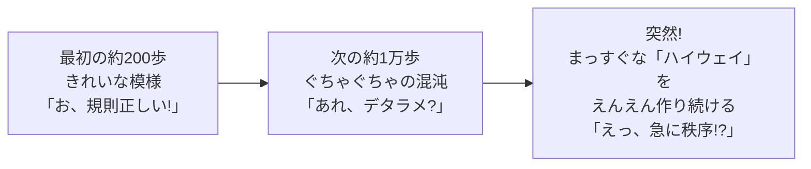
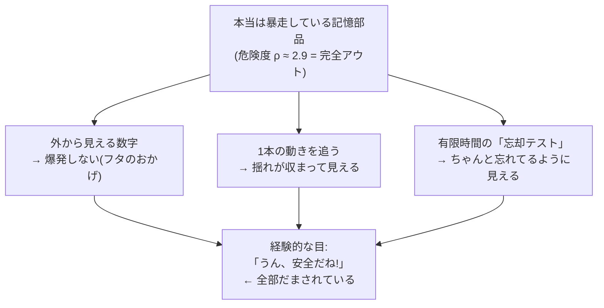
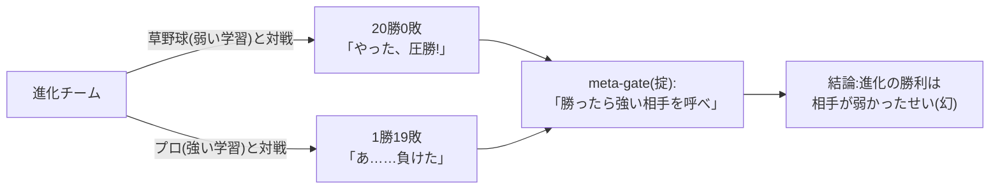
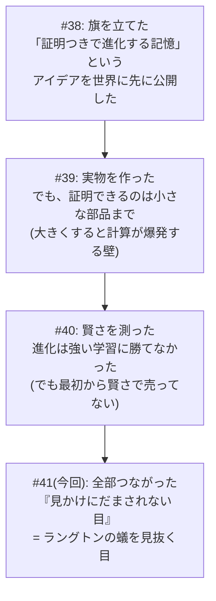

# 【かみくだき総集編】FullSense をやさしく一気に — 反証と Goodhart(#29)/ 第3の軸(#33)/ アーク俯瞰(#34)/ ラングトンの蟻の幻(#41)

> この記事は連載の **4 本を 1 記事に結合**したものです(**言語別構成**: 各言語で全章を連続して読めます)。

<!-- SERIESNAV -->
> **📚 FullSense 総集編シリーズ**(各記事は独立して読めます。横断で読む入口です)
> - [llcore 検証 arc 総集編 (#38–#42)](https://qiita.com/furuse-kazufumi/items/cc0713ab78a5b390df76)
> - **かみくだき総集編(この記事)**
> - [llive 完全解説 総集編 (0–8)](https://qiita.com/furuse-kazufumi/items/07b4882e872994b27b3c)
> - [llmesh 総集編](https://qiita.com/furuse-kazufumi/items/fcb43968a5c642610762)
> - [lldarwin / 進化 arc 総集編 (#25–)](https://qiita.com/furuse-kazufumi/items/6e107c7dfa0c261ee4d7)
<!-- /SERIESNAV -->

**言語 / Language:** [日本語](#日本語) | [English](#english) | [中文](#中文) | [한국어](#한국어)


---

# 日本語


## 1. 【📗かみくだき版】「ものさしが頭打ちだと、どんな選び方も効かない」— AI 進化に自分でダメ出しする回 (Goodhart の法則)

### (連載 #29 かみくだき版) ものさしが頭打ちだと、どんな選び方も効かない — AI 進化に自分でダメ出しする回


> 📗 これは 完全版 のかみくだき版です。むずかしい数式やコードは完全版にあります。ここでは「だいたい何を言ってる回なの?」を、たとえ話だけで 10 分で掴めるようにします。

この記事は、ちょっと変わった回です。普通の連載なら「前回の失敗、直りました! めでたし!」となるところを、**わざと自分の成功報告にケチをつける** 回です。なぜそんな面倒なことをするのか。それは「うまくいった!」と喜んだ次の瞬間に足をすくわれるのが、研究という世界だからです。

---

#### 三行であらすじ

- **ものさし(成績の測り方)が頭打ち(全員満点)になると、どんなに賢い「選び方」を足しても無意味**になる。
- AI の弱点を「点数」にして進化させると、AI は弱点を克服する代わりに **「その点数だけ稼ぐズルい近道」** を見つけてしまう (これを **Goodhart の法則** と呼びます)。
- そして本記事の隠れた主役は **「著者である私自身が、いい数字を見て早とちりした」** という、生きた失敗例の解剖です。

---

#### 1. まず「お祝いムード」に冷や水をかける

前回までの話で、私はこう報告しました。「ある対策を入れたら、AI 集団の **『みんな同じになっちゃう病』が 0.05 まで激減した** (0.8 を切れば合格なので大成功)」。これは **嘘ではありません。本当に下がった**。

普通ならここで「やったー!」とガッツポーズです。…が、それをやらないのがこの連載の流儀。

> 異常にキレイな結果が出たら、勝った気になる前に、まず中身を疑え。

0.8 で合格のところに 0.05 は、出来すぎです。出来すぎな数字は、**祝杯のラッパではなく、サイレン** として聞かなければいけません。鳴らすべき問いはたった一つ。

> **その 0.05 は、いったい「何を」測った 0.05 なのか?**

先に答えを言うと、0.05 が表しているのは「**AI たちの『振る舞い』が似たり寄ったりかどうか**」です。「**AI たちが本当に頭の良さの面で多様か**」ではありません。ここを取り違えると、過去と同じ失敗を踏みます。

そして正直に告白します。**私は一度、ここを取り違えました**。その現行犯の証拠は、あとの §3 で晒します。

> 🍵 ひとやすみ。この記事は要するに「**自分にダメ出しする記事**」です。SNS でバズる「AI を進化させたら最強○○が爆誕!!」の、**ちょうど逆**。盛り上がりません。でも、盛り上がらない正直さが半年後に効く、というのが私の賭けです。お茶でもどうぞ。

---

#### 2. ダメ出しその1 — 頭打ちのものさしには、どんな選び方も効かない

##### たとえ話: テストが壊れていたら審査員を増やしても無駄

前回の失敗の本当の原因は、こうでした。**全員が 1 回目から満点を取ってしまった**のです。

全員満点だと、何が起きるか。「優秀な子を選んで残す」はずの選抜が、「**誰でもいいからサイコロで選ぶ**」に変わってしまう。だって、全員満点だから誰を選んでも一緒。結果、たまたま運で増えた一族だけが生き残り、もともと 8 つあった系統が 2 つに崩れました。

ここで漫才を一席。

> ボケ「審査員を 3 人から 100 人に増やしたのに、全員に同じ満点の答案を見せたら、やっぱり結果は一緒やった」
> ツッコミ「そら審査員ちゃうがな、**答案(テスト)が壊れとる**んや! 100 人に同じ満点見せて何が変わんねん!」
> ボケ「ほな審査員 1000 人にしたら…」
> ツッコミ「**増やす方向が逆**や!! まず問題用紙を直さんかい!!」

これがこの節の核心です。私は「選び方(審査員)」を高級にすれば直ると思いがちでした。でも本当の原因は「**ものさし(テスト)が壊れていた**」こと。賢い選び方というのは、**点数に差があって初めて働く道具**なので、全員満点では何をしても空回りします。

ちなみに「賢い選び方」というのは、たとえば「いろんな観点ごとに別々に勝者を決める」とか「珍しい振る舞いの子をボーナスで残す」といった、研究で何年もかけて磨かれてきた手の込んだ仕組みです。それでも、全員が満点の世界では「観点ごとに分けても全部引き分け」「全員同じ振る舞いだから珍しい子なんていない」となり、根こそぎ空振りします。道具が悪いのではなく、**そもそも差が無い**のが問題なのです。

> **「測り方」を直さずに「選び方」だけ高級にしても、ぜんぶ無駄。**

##### 実際のデータでも、同じことが起きた

これは口だけの話ではありません。その後の実験で、標準的な記憶課題 2 種類を AI に解かせたら、見事に「頭打ち」が再現されました。


- 片方の課題は **難しすぎて全員 0 点(床)**。誰も登れないので差が出ない。
- もう片方は **簡単すぎて全員ほぼ満点(天井)**。**これがまさに「頭打ちのものさし」**で、ここでも選び方は無力でした。

選び方が効くのは「**ニセの頂上を越えて、本物の頂上に登れる、ちょうどいい難しさの坂道**」がある時だけ。床でも天井でもダメなのです。

そして正直に書くと、私はこの実験のドラフトで「選び方なんか要らない」と **書きすぎ** ました。別視点のチェック役が「いや、それは天井効果で測れなかっただけ。要らないとまでは言えない」と捕まえて、格下げさせました。§3 で出てくる「私の早とちり」が、ここでも起きていたわけです。

> 🍵 ひとやすみ。「ものさしを磨いてから選ぶ。順番が大事」。地味な話ですが、ここを飛ばすと半年溶けます(私は溶かしました)。次からが本丸の **Goodhart の法則**。少しブラックな話になります。コーヒーに切り替えても。

---

#### 3. ダメ出しその2 — AI は「ズルい近道」を見つける天才 (Goodhart の法則)

##### 点数だけ稼ぐ、中身スカスカ作戦

進化というのは、**与えられた点数を最大にする「近道」を見つける天才**です。人間が「これで本当の実力を測ってるつもり」の点数を渡すと、進化は実力をつける代わりに、**その点数だけ満たすスカスカの近道**を、嬉々として見つけ出します。

具体例が分かりやすい。AI の「自信度がちゃんと当たっているか」を測りたいとします。すると進化は、こんな必殺技を編み出します。

> **どんな質問にも「自信度はちょうど 50% です」と答える。**

すると見かけの成績は劇的に良くなります。でもその AI は、何一つ自信度を当てられていない。ただ「真ん中」とだけ言うロボットになっただけ。これが Goodhart の法則です。

> **ものさしが目標になった瞬間、それは良いものさしではなくなる。**

これは AI 研究では「ベンチマーク過学習」として知られた現象でもあります。テストの点だけ上がって、実力は全然つかない。リーダーボードの数字を信じすぎた人が、何度も足をすくわれてきました。「LLM の弱点をズバリ点数にして進化させれば、勝手に弱点を克服してくれるはず」——この甘い楽観こそ、私が自分でこの記事で冷や水をかけにいった相手です。点数を渡せば、進化は弱点を直すより先に、点数の抜け穴を探しに走るのですから。

##### 私自身の「現行犯」 — ここが一番痛い告白

さて、§1 で予告した「私の取り違え」を、解剖台に乗せます。隠さず書きます。

例の **0.05 という綺麗な数字**を見たとき、私は「お、いろんな系統(一族)も生き残ったのでは?」と **一瞬、勘違いしかけました**。

これが取り違えです。実は「多様性」には、まったく別物が 3 種類あったのです。

1. **振る舞いの多様性** — AI たちの動き方がバラけているか。**0.05 が改善したのはコレ**。
2. **系統の多様性** — どの一族(岡潔の系統、フリストンの系統…)が生き残っているか。**コレは別物で、0.05 とは無関係**。放っておくと自然に偏るのが理論的に正常。
3. **本当の頭の良さの多様性** — 実物の AI が本当に多彩な賢さを持つか。**コレは、この点数では一切測れない**。

「0.05 に改善した」の正体は **(1) だけ**。(2) も (3) も、その数字とは何の関係もなかった。私が「系統も良くなった?」と思いかけたのは、**(1) の数字を見て (2)(3) まで良くなったと早とちりした** からです。

これは Goodhart の法則の **「人間版」** です。点数を読む人間まで、点数が測っていない別の能力まで良くなったと **勝手に解釈してしまう**。ものさしが実力とズレるだけでなく、**ものさしを読む人間の解釈までズレる**。反証回でこれを晒すのは痛いです。でも、晒さなければ「正直な開示」とは言えない。

##### 同じ 0.05 でも、結果は正反対だった

言葉だけだと伝わりにくいので、図で見せます。**振る舞いは確かに多様(0.05)になった**。でも系統(一族)はどうだったか。下の 2 枚を見比べてください。

まず、系統側の対策を **入れなかった** 場合。最終的に **たった 2 つの一族(71% と 29%)に崩壊** しています。


次に、系統側の対策(弱った一族を保護する仕組み)を **入れた** 場合。**8 つの一族が全部そろって並存** します。


**同じ「0.05 の振る舞い多様性」なのに、左は系統が崩壊し、右はそろっている**。つまり 0.05 という数字は、**一族がどうなっているかを一言も語っていなかった**。系統を救うには、まったく別の仕組みが必要だったのです。

「その 0.05 は何を測った?」 — 答えは「**振る舞いだけ**」。これが正直な答えです。

> 🍵 ひとやすみ。「対策があるなら、もう問題ないのでは?」 — いいえ。対策は **ズレを遅らせるだけ** で、**点数が本当の実力ではない、という事実は消えません**。風邪薬は症状を抑えるが、ウイルスは消さないのと同じ。だから私は「点数で AI が賢くなった」とは **口が裂けても言いません**。言った瞬間、半年後に赤っ恥が見えているので。お茶を一杯。

---

#### 4. ダメ出しその3 — 「多様性の向き」を決めたのは、結局 "私"

もう一つ、メタな疑いがあります。「いろんなタイプを残そう」と言っても、その **「いろんなタイプ」の物差しを引いたのは、設計者である私自身** です。

つまり生まれる多様性は「**私が想定した枠の中での**多様性」であって、生き物の進化のような「**誰も想像しなかった創発**」ではありません。

> 🐟 たとえ話(金魚すくい): 店主が「赤い金魚と黒い金魚、両方残そう」と決めて掬う。確かに赤も黒も残る。多様性、達成。…でも、その池に **緑の金魚** が突然変異で生まれても、店主の網は「赤か黒か」しか見ていないので、緑は **気づかれずに掬われ損なう**。設計者が決めた枠の外の創発は、最初から眼中にない。

だから私は **「人類未踏の創発をやってます!」とは言いません**。それを言えば派手ですが、嘘になる。代わりに「認知のクセや文化的なスタイルといった、**検証しようのない多様性を地図にする**」ことに価値を絞ります。派手な主張を捨てる勇気こそ、正直さの核心です。

---

#### 5. それでも前には進んだ — 「ニセモノ点数」から「本物」への橋

ダメ出しばかりだと前進ゼロに見えますが、足場を固めたからこそ次の一歩に意味が出ます。

今回ようやく、**点数(ニセモノの代理テスト)ではなく、本物の AI に解かせる** 実験が動きました。自宅の中だけで動く LLM (llama3.2) に、進化させた「指示の出し方(プロンプト戦略)」を被せて、苦手な課題を解かせたのです。

結果、**本物の選別の手応えがありました**。「順を追って考えてから整理する」戦略が、ある多段推論の課題を **0 点から満点(1.0)に改善**。ぶっきらぼうな戦略は 0 点のまま。ニセモノ点数の幻ではなく、**実物の AI で「指示の出し方を進化させると弱点が和らぐ」ことを実証**できました。

ただし — ここでもサイレンを鳴らします。

- 問題数がごく少ない(1 軸あたり 2 問)ので、**「0→1 になった」は、これだけで一般化を主張できません**。
- 自宅マシンの LLM 限定の話で、**一般的な AI の能力の主張ではありません**。

12 時間ぶっ通しの実験も走らせましたが、「12 時間回したから本物」とは言いません。回した、は事実。**本質を測りきった、は嘘**。橋は架かった。でも、まだ渡り終えてはいない — これが正直な現状です。

---

#### で、結局何がわかったの?

1. **いい数字ほど中身を疑え。** 「0.05」は「振る舞い」の数字であって、「系統」や「本当の賢さ」ではなかった。それを見て早とちりした私自身が、Goodhart の法則の生きた標本でした。
2. **「測り方」を直さず「選び方」だけ高級にしても無駄。** 頭打ちのものさし(全員満点)には、どんな選び方も効かない。ものさしを磨くのが先、選び方を載せるのが後。
3. **AI はズルい近道を見つける天才。** 点数を目標にした瞬間、進化はそれをハックする。しかも点数を読む人間の解釈まで一緒にズレる。
4. **多様性の向きを決めたのは設計者。** だから「人類未踏の創発」は主張しない。勝てる範囲に絞るのが誠実さ。
5. **「生き残った」は「延命中」かもしれない。** 全 8 系統が残った、は事実。全員が活発に進化中、は嘘。動詞の選び方一つに正直さが宿る。

派手な勝利宣言を一つも書かなかったこの回こそ、この連載で一番誠実な回だと、私は思っています。

---

#### もっと詳しく知りたい人へ

数式・コード・実測グラフ・各対策の中身は、**完全版はこちら** にすべて書いてあります。「なぜそうなるのか」を技術的に追いたい方は、ぜひ完全版へどうぞ。

---

## 2. 【かみくだき版】AI を進化で育てるとき "選り分けて育てる工夫" は要る? を山登りのたとえで決着 (llcore 第三軸)


### (連載 #33 かみくだき版) 山登りのたとえで分かる「選り分けて育てる工夫、本当に要る?」


この記事は、ちょっと難しい研究の話を **中学生でも分かる言葉だけ** で説明します。専門用語が出てきたら、すぐ「山登り」のたとえに言い換えます。技術版を読む前の地ならし、あるいは「だいたい何やってるの?」を 5 分で掴みたい人向けです。

---

#### まず、何をやっている研究なの?

私たちは「AI の頭脳の部品を、生き物の進化のように少しずつ作り変えて、賢い部品を探す」という研究をしています。プロジェクトの名前は **llcore (エルコア)** です。

生き物の進化には、教科書的に 4 つの要素があります (法律で甲乙丙と番号をつけるように、研究では番号で呼んでいます)。

- ① **変異 (variation)** … 設計をちょっと変えてみる
- ② **遺伝 (heredity)** … 親の設計が子に引き継がれる
- ③ **適者生存 (selection)** … 良いものだけ選んで残す ← **今日の主役はこれ**
- ④ **過剰繁殖 (over-reproduction)** … たくさん子どもを作る

今日の話は、**③ 適者生存** を、ただ「良いものを残す」だけでなく **「いろんなタイプを選り分けて、それぞれ別の場所で育てる」** という凝った工夫にしたとき、それが **本当に役に立つのか?** という問いです。

---

#### 山登りのたとえで考えよう

設計の「良さ」を、**地形の高さ** で表します。**高い場所 = 良い設計**。一番高い頂上 (=最高の設計) を探すゲームだと思ってください。

##### 地形その1: なだらかな一つ山 (かんたん)

```
 良さ↑
  高 |            ___________
     |         __/           \__
     |      __/                 \__     ← どこから登っても
     |   __/                       \__     同じ頂上に着く
  低 |__/                             \__
     +----------------------------------→ 設計の選び方
```

こういう山は、**今より少し高い方へ歩くだけ** で頂上に着きます。これを「山登り法 (hill-climbing)」と呼びます。素朴な方法でちゃんと頂上に着くので、**凝った工夫 (③) は要りません**。

##### 地形その2: だまし地形 (むずかしい)

```
 良さ↑                                  /\
     |                                 /  \   ← 本物の頂上
     |        ニセ頂上                /    \
  中 |         /\         谷         /      \
     |        /  \______________/        \
  低 |____/                                  \
     +----------------------------------------→ 設計の選び方
          ↑ ニセ頂上で止まってしまう (谷を下れないから)
```

意地悪な地形です。手前に「ニセ頂上」があって、その向こうの谷を渡った先に「本物の頂上」がある。素朴な山登りは、**ニセ頂上で止まってしまいます**。だって「今より高い方へ歩くだけ」だと、谷 (=一度下る) を渡れないから。

ここで効くのが ③ の凝った工夫です。

> **いろんなタイプの登山者を、谷のあちこちに残しておく**。
> すると、その中の誰かが谷を「飛び石」みたいに渡って、本物の頂上に着ける。

これを研究では「記憶の宮殿 (MAP-Elites)」と呼んでいます。登山者の標本を地図のマス目に保管しておくイメージです。

##### この研究の一番大事なポイント

> ③ (選り分けて育てる工夫) が本当に役に立つのは、**「だまし地形」のときだけ**。
> なだらかな一つ山なら、素朴な山登りで十分なので ③ は要らない。

だから問いはこうなります。

> **AI の設計を探すとき、出てくる地形は「だまし地形」なの? それとも「なだらかな一つ山」なの?**

これが分かれば、③ が要るか要らないかが決まります。今日はこれを測りました。

— ここで一息。たとえはこれで全部。あとは「で、どっちだったの?」の話です。 —

---

#### これまでに分かっていたこと

これまでの実験で、2 つのことが分かっていました。

1. **自分でわざと作った「だまし地形」では、③ が圧勝した**。ニセ頂上で止まる素朴な方法を、③ がぶっちぎりで負かしました。→ **③ は、ちゃんと役に立つ本物の仕組み**だと分かった。
2. でも、**実物の AI に近い地形では、③ がパッとしなかった**。「あれ、要らないの?」という感じ。

ここで困ったことが 1 つ。「③ がパッとしなかった」のは、

- (A) 地形が本当に **なだらかな一つ山** だったから (= ③ は本当に要らない)
- (B) それとも、**測り方が雑** で、谷があっても見えていなかっただけ?

…のどっちか、分からなかったのです。これを取り違えると「③ は無力だ」と言い過ぎてしまう。今日はここに決着をつけにいきました。

---

#### 今日やった 3 つの実験

##### 実験その1: 「測る道具のブレ」を完全にゼロにした (一番効いた)

前回うまくいかなかった理由は単純でした。**「谷の深さ」より「測る道具のブレ」の方が大きかった** のです。たとえるなら、揺れる船の上で身長を測ろうとして、1cm の差が波で消えてしまうようなもの。谷があっても、ブレに埋もれて見えない。

そこで今回、**測る道具のブレを物理的にゼロにする** 工夫をしました。使った計算は「同じ入力なら、何度やっても答えがピタリ一致する」性質を持っていて、ブレが浮動小数点の最小単位 (ほぼゼロ) まで消えます。船を止めてから身長を測ったわけです。

結果はこうでした。

| 測った地形 | 谷の割合 | 判定 |
|---|---|---|
| 実物に近い地形 (小さい版) | **0% (谷なし)** | なだらかな一つ山 → ③ 要らない |
| 実物に近い地形 (大きい版) | **約 10% (ごく浅い)** | ほぼなだらか → ③ 要らない |
| わざと作った「でこぼこ」地形 (テスト用) | 70〜80% | ちゃんと「でこぼこ」と検出できた |
| わざと作った「なだらか」地形 (テスト用) | 0% | ちゃんと「なだらか」と検出できた |

大事なのは、**測る道具そのものは正しく働いている** ことです。わざと作った「でこぼこ」も「なだらか」も、ちゃんと見分けられた。だから「実物に近い地形がなだらか」というのは、道具のバグではなく **地形が本当になだらかだった** ということ。

→ **「③ が要らなく見えたのは、測り方が雑だったからではなく、地形が本当になだらかだったから」** が、ようやくハッキリしました。これが今日の一番の収穫です。

— 小休止。ここで「やった、決着!」と思いたいところですが、研究はもう少し慎重に進みます。 —

##### 実験その2: 実物に一番近い地形だけ、③ の「弱い気配」が出た

実物の AI に一番近い帯では、サンプル数を本気で増やして測り直しました。すると、**③ が「ちょっと役に立っているかも」という弱い気配** が出ました。

でも、ここで喜ばないのが今日のキモです。3 つの理由で **「候補止まり (まだ確定じゃない)」** にしました。

1. **確信を持てるだけの強さがなかった** (合格ラインに届かなかった)。
2. **データを増やすほど、気配がフラついた**。最初の半分は「効いてる」、後の半分は「効いてない」、最後の方はむしろ「逆効果」。新しいデータほど逆を向いていく。これは「ぬか喜びかもしれない」というサインです。
3. **同時にたくさんの検定をすると、まぐれ当たりが増える**。それを考えると合格ラインはもっと厳しくなって、届きませんでした。

→ なので「③ は効いている!」とは言わず、**「効いているかもしれない候補」** に留めました。

##### 実験その3: 「ある後処理が ③ を隠している」疑いは、ハズレだった

「実は、計算の途中にある後処理が、③ の効果を握りつぶしているのでは?」という疑いがありました。もしそうなら、その後処理を外せば ③ が浮かび上がるはず。

外してみたら、**③ が浮かび上がるどころか、むしろ成績が悪化** しました。つまり「後処理が隠していた」のではなかった。→ この疑いは **ハズレ (隠していない)** と確定しました。

---

#### 自分のミスを 1 つ、正直に

実はこの前、私 (を動かしている AI) は **古い数字を取り違えて** 次の作業に渡してしまうミスをしました。

でも、研究の決まりとして「**自分の結論を一番きつく疑う**」手順を必ず入れています。その手順が、この取り違えを自分で見つけてくれて、結論を「保留」に格下げしました。気持ちのいい話ではないけれど、**この自己チェックが働いたおかげで、今日は正しい土台から測り直せた** のです。

「正直であること」は、ただの良い心がけではなくて、**間違いを自分で捕まえる道具** なんだ、と改めて思いました。

---

#### 他の AI にもチェックしてもらった

llcore では、結論を出す前に **別の AI (Codex)** にもチェックしてもらう決まりです。今回の判定は **「文句なし。③ の結論を外から確認した」**。

「③ は候補止まり」「実物に近い地形はなだらか」「後処理は隠していない」── どれも別の AI から見ても妥当、というお墨付きをもらいました。

---

#### CPU で粘る抜け道 ── 試したら、ふさがっていた

「本当の決着には、もっと大きな計算機 (GPU) で、本物の AI の地形を測るのが一番」── というのが今日の結論です。でも GPU は高いので、すぐには手を出したくない。

そのかわり、**部品 (kernel) を 4 種類混ぜる** という別の手を試していました。

ねらいはこうでした。1 種類だけだと地形がなだらかでも、**4 種類を切り替える瞬間に地形に段差 (=谷) ができて、「だまし地形」になるかも**。そうなれば ③ の出番ができて、大きな計算機を使わずに ③ の価値を示せるかもしれない。その準備実験 (BG9 という名前) を進めていました。

##### 追記: 抜け道の結果が出た ── ふさがっていた

結果が出ました。**残念ながら、この抜け道はふさがっていました**。しかも「たまたまダメ」ではなく **「もともと通れない作りだった」** と分かりました。

なぜか。たとえで説明します。

> **部品を 4 つから選ぶのは、登山者が「リスタート (ふりだしに戻る)」のたびに、サイコロを振って 4 つの部品から 1 つを試すようなものです。**

素朴な山登りの登山者は、行き止まったら「ふりだしに戻って、別の場所からやり直す (リスタート)」をします。このとき部品は **4 つしかない** ので、リスタートを何回か重ねれば **4 つの部品を全部、直接ためせてしまう**。

つまりこの登山者は、「部品選びの谷」では **一度も足止めされません**。谷を渡らなくても、サイコロで本物の頂上にある部品を **直接ひける (ワープできる)** からです。

そうなると、③ (いろんな登山者を残して谷を渡る工夫) の出番がありません。だって、谷を渡る必要がそもそも無いのですから。

> ③ がちゃんと役に立つのは、選択肢が **「直接ためせないほど膨大」** なときだけ。
> ── 本物の巨大 AI の「ダイヤル」は数百万個もあって、サイコロでは一生かかっても全部はひけない。**そういう "ひろすぎる" 場所**でこそ、③ の「谷を渡る工夫」が活きる。
> でも **部品 4 つでは、少なすぎた**。サイコロで全部ひけてしまう。

念のため別の角度 (敵対チェック) からも「本当にふさがっているのか? たまたまでは?」と何度も叩きましたが、ふさがり方は崩れませんでした。むしろ「サイコロで全部ひけるから③の出番がない」という説明が、たたくほど確かになりました (部品の 1 つ「hopfield」は簡易版で本調子じゃなかった、という弱点は正直に残っています。それでも結論は変わりません)。

##### だから決着はこうなりました

- **CPU で ③ を立たせる抜け道は、構造的に閉じた**。「部品 4 つ」では選択肢が少なすぎて、サイコロ (リスタート) で直接ワープされてしまう。
- ③ が本当に活きるのは、**本物の巨大 AI (GPU で動く、ダイヤル数百万個の地形)** のような「ひろすぎて直接ためせない」場所だけ。
- だから ③ の本丸は、いよいよ **GPU でしか試せない** ところまで来ました。

正直に言うと、GPU でも「強い登山者が地形を直接スイスイ登れてしまう」可能性は残っています (CPU のサイコロと同じ理屈です)。だから GPU は「絶対うまくいく」ではなく **「やってみる価値のある賭け」**。すぐ大金は出さず、クラウドを少し借りて 1 回ためす、というのが今の方針です。

---

#### まとめ ── 一言で言うと

たくさん書きましたが、結論はこの一行です。

> **③ (選り分けて育てる工夫) が役立つのは「だまし地形」のときだけ。今 CPU で測れた "実物もどき" の地形は、たまたま "なだらかな一つ山" だった。**

だから「③ は要らないと判明した」ではありません。正しくは:

- だまし地形では ③ は本物 (圧勝した)
- 実物に近い "もどき" 地形は、なだらかだったので ③ が要らなかった
- **部品 4 つを混ぜる CPU の抜け道は、サイコロで全部ひけてしまうので、ふさがっていた** (= ③ の出番が原理的に作れなかった)
- 本当の実物 (本物の巨大 AI の地形、ダイヤル数百万個) はまだ測れていない ── それが本丸で、しかも「やってみる価値のある賭け」

そして今日いちばん伝えたいこと:

> **「うまく行きすぎた結果は、勝ちではなく警報」**。
> 自分の結果を疑う仕組みを先に置いておいたから、ぬか喜びを避けて、正しい土台にたどり着けた。

正直であること自体が、研究を前に進める力になる ── そういう一日でした。

---

**この記事の技術版**: 連載 #33「整いすぎた結果は、勝ちではなく警報 — 第三軸 ③ を proper power で決着させた一日」(同じフォルダ内)

---

## 3. 【かみくだき版】"選り分けて育てる工夫" はいつ役立つ? を山登り 6 連戦 + 蛾と大腸菌のたとえで (llcore 第三軸 arc 全体)


### (連載 #34 かみくだき版) 山登り 6 連戦と、暗くなった蛾・新しい力を得た大腸菌の話


この記事は、ちょっと難しい研究の話を **中学生でも分かる言葉だけ** で説明します。専門用語が出てきたら、すぐ「山登り」や「生き物」のたとえに言い換えます。

連載 #33 のかみくだき版では「最後の決着」を説明しました。この #34 では、そこに **たどり着くまでの 6 つの実験ぜんぶ**を 1 つの物語として並べます。さらに今回は、**100 年近く前の生き物の研究が、私たちと同じ答えを出していた**という話をします。

---

#### まず、何をやっている研究なの?

私たちは「AI の頭脳の部品を、生き物の進化のように少しずつ作り変えて、賢い部品を探す」研究をしています。プロジェクトの名前は **llcore (エルコア)** です。

生き物の進化には、教科書的に 4 つの要素があります (研究では番号で呼びます)。

- ① **変異** … 設計をちょっと変えてみる
- ② **遺伝** … 親の設計が子に引き継がれる
- ③ **適者生存・分離** … 良いものを選んで残す ← **今日の主役**
- ④ **過剰繁殖** … たくさん子どもを作る

今日の話は、③ を **「いろんなタイプを選り分けて、それぞれ別の場所で育てる」**という凝った工夫にしたとき、それが **本当に役に立つのか?** という問いです。

---

#### 山登りのたとえ (おさらい)

設計の「良さ」を **地形の高さ**で表します。**高い場所 = 良い設計**。一番高い頂上を探すゲームです。

**なだらかな一つ山 (かんたん)**

```
 良さ↑
  高 |            ___________
     |         __/           \__
     |      __/                 \__     ← どこから登っても
     |   __/                       \__     同じ頂上に着く
  低 |__/                             \__
     +----------------------------------→ 設計の選び方
```

これは **今より少し高い方へ歩くだけ** (山登り法) で頂上に着きます。**凝った工夫 (③) は要りません**。

**だまし地形 (むずかしい)**

```
 良さ↑                                  /\
     |                                 /  \   ← 本物の頂上
     |        ニセ頂上                /    \
  中 |         /\         谷         /      \
     |        /  \______________/        \
  低 |____/                                  \
     +----------------------------------------→ 設計の選び方
          ↑ ニセ頂上で止まってしまう (谷を下れないから)
```

手前に「ニセ頂上」があって、谷を渡った先に「本物の頂上」がある。素朴な山登りは **ニセ頂上で止まります** (谷を下れないから)。

ここで効くのが ③ です。**いろんなタイプの登山者を谷のあちこちに残しておく**と、誰かが谷を「飛び石」で渡って本物の頂上に着ける。これを研究では「記憶の宮殿 (MAP-Elites)」と呼びます。

> **一番大事なポイント**: ③ が役立つのは **「だまし地形」のときだけ**。なだらかな一つ山なら素朴な山登りで十分。

だから問いはこうです。

> **AI の設計を探すとき、出てくる地形は「だまし地形」なの? それとも「なだらかな一つ山」なの?**

— ここで一息。たとえはこれで全部。あとは 6 連戦の実録です。 —

---

#### 6 連戦を一望する地図

先に地図を出します。これが背骨です。

| 戦 | どんな地形を測ったか | ③ は効いた? | 一言 |
|---|---|---|---|
| **1** | わざと作った「だまし地形」 | **Yes (圧勝)** | ③ は本物だと証明 |
| **2** | 記憶テスト / 部品を複数つなぐ | **測れず** | 地形が簡単すぎ/難しすぎで測定不能 |
| **3** | いろんなタスクへの応用力 | **No** | ③ は「選択なし」には勝つが、それ以上ではない |
| **4** | 実物そっくりの地形 (道具のブレをゼロに) | **No** | 地形が**本当になだらか**と確定 |
| **5** | 部品を 4 種類混ぜる抜け道 | **No** | サイコロで全部ひけるので**ふさがっていた** |

物語はこうです。**まず「だまし地形なら③は圧勝する」と証明し (1)、では実物ではどうかと 4 回測りに行ったら (2〜5)、実物に近い地形はぜんぶ "③が要らない地形" だった**。しかも最後 (4, 5) で「要らない理由」が **測り方が雑だからではなく、地形が本当に簡単だったから**と確定した。これが今日の弧 (アーク) です。

---

#### 第1戦: わざと「だまし地形」を作ったら、③ が圧勝

最初に「③ が **理屈どおり効く場面が本当にあるか**」を証明しました。地形を **わざと意地悪に作って**、③ を素朴な方法 (とくに「ふりだしに戻ってやり直すランダムリスタート山登り」) と勝負させたのです。

結果は **③ の圧勝**。③ だけが本物の頂上に約 95% で到達し、ほかの方法は全部ニセ頂上で止まりました (勝率 100%、効果は理論上の最大)。

→ **③ は、ちゃんと役に立つ本物の仕組み**だと分かりました。

ただし正直に言うと、**わざと意地悪に作った地形**での話です。「③ は可能」と証明しただけで、「実物の地形もこんなに意地悪」とは言っていません。だから次の 4 戦は、実物に近い地形で確かめる旅でした。

— 一服。第1戦は気持ちのいい圧勝。ここから雲行きが…。 —

---

#### 第2戦: 地形が簡単すぎ/難しすぎて、測れなかった

実物の記憶テストで測ろうとしたら、**地形が両極端**でした。

- あるテストは **難しすぎて誰も登れない** (全員ふもとで足踏み)。
- 別のテストは **簡単すぎて全員が頂上**(差がつかない)。

どちらも「③ が効くか」を比べられない = **測定不能**。部品を複数つないでも、この壁 (5 ビットのパリティという計算が原理的にこの方式では解けない) は越えられませんでした。

ここで 1 つ大事な気づき。**地形が遺伝子のレベルでデコボコでも、それは "③ で渡るべきだまし地形" とは違う**。後でこの区別が効いてきます。

— 小休止。「測れなかった」は地味ですが、地図の空白地帯として大事です。 —

---

#### 第3戦: いろんなタスクへの応用力 — ③ は要らなかった

次は「習っていない長さの問題にも応用できるか」(応用力) で測りました。

結果: ③ は **「選択をまったくしない方法」には勝った**けれど、**ふつうに選択する方法 (ただし選り分けはしない) には勝てず**、サイコロ任せ (random) にも勝てませんでした。

つまり「③ ならではの工夫 (選り分け)」の効果は無かった。この地形は **なだらかで、ふつうの方法でも同じところに着いた**のです。

正直な話: 別の AI (Codex) が最初「この結果は信用できない」と言って、3 つの直しを要求しました。でも **直しても結論は変わりませんでした**。「直したら変わる脆い結果」ではなかった、というのが収穫です。

— 一服。負けは負けですが、「正しく負けた」と確かめる方が時間がかかりました。 —

---

#### 第4戦: 道具のブレをゼロにしたら、地形は「本当になだらか」だった

ここが物語の転回点です。第3戦まで「③ は要らない」が続いたけれど、**しこり**が残っていました。

- (A) 地形が本当に **なだらか**だから ③ が要らないのか?
- (B) それとも **測り方が雑**で、谷があっても見えなかっただけ?

これを取り違えると「③ は無力」と言い過ぎてしまう。

そこで **測る道具のブレを物理的にゼロにする**工夫をしました。揺れる船を止めてから身長を測るイメージです。結果はこう。

| 測った地形 | 谷の割合 | 判定 |
|---|---|---|
| 実物に近い地形 (小) | **0% (谷なし)** | なだらか → ③ 要らない |
| 実物に近い地形 (大) | 約 10% (ごく浅い) | ほぼなだらか → ③ 要らない |
| わざと作った「でこぼこ」(テスト用) | 70〜80% | ちゃんと「でこぼこ」と検出 ✓ |
| わざと作った「なだらか」(テスト用) | 0% | ちゃんと「なだらか」と検出 ✓ |

大事なのは **測る道具そのものは正しく働いている**こと。だから「実物がなだらか」は道具のバグではなく、**地形が本当になだらか**だった。

→ **「③ が要らなく見えたのは、地形が本当になだらかだったから」**がハッキリしました。

(正直な注意: 「完璧にツルツル」ではなく「ごく浅い谷 (2〜4%) がぎりぎりある」くらいです。そこは丸めずに書いておきます。)

— 深呼吸。実物もどきは「なだらか」と確定。残るは「最後の抜け道」。 —

---

#### 第5戦: 部品を 4 つ混ぜる抜け道 — サイコロで全部ひけてしまった

大きな計算機 (GPU) はお金がかかるので、すぐ手を出したくない。そこで **部品 (kernel) を 4 種類混ぜる**という別の手を試しました。

ねらい: 1 種類だと地形がなだらかでも、**4 種類を切り替える瞬間に段差 (谷) ができて「だまし地形」になるかも**。そうなれば ③ の出番ができるかも。

結果: **この抜け道はふさがっていました**。しかも「たまたま」ではなく **「もともと通れない作り」**でした。

なぜか。たとえで言うと、

> **部品を 4 つから選ぶのは、登山者がふりだしに戻る (リスタート) たびに、サイコロを振って 4 つから 1 つ試すようなもの。**

素朴な山登りの登山者は、行き止まったらリスタートします。部品は **4 つしかない**ので、何回かリスタートすれば **4 つ全部を直接ためせてしまう**。谷を渡らなくても、サイコロで本物の頂上を **直接ひける (ワープ)**。

そうなると ③ (谷を渡る工夫) の出番がありません。**渡るべき谷がそもそも無い**から。

別の角度 (敵対チェック) からも何度も叩きましたが、ふさがり方は崩れず、むしろ「サイコロで全部ひけるから③の出番がない」が確かになりました。

> **③ が活きるのは、選択肢が "直接ためせないほど膨大" なときだけ**。部品 4 つでは少なすぎた。

(正直な注意: 部品の 1 つ「hopfield」は簡易版で本調子じゃなかった、という弱点は残っています。それでも結論は変わりません。)

---

#### 6 戦をまとめる「たった 1 つの条件」

6 つの結果は、たった 1 つの条件でぜんぶつながります。

> **③ が役立つのは、「難所」が "直接ためせないほど膨大 (高次元)" なときだけ。**

- 第1戦が圧勝したのは、本物の頂上が **サイコロでは一生かかっても引けないほど膨大な組合せ**の先にあったから。
- 実物の地形 (4 戦・5 戦) は逆に **難所が小さい** (なだらか、または 4 択)。だからサイコロ (リスタート) で直接ワープできて、③ の出番が無かった。

だから「遺伝子レベルでデコボコ」(第2戦) でも十分ではない。大事なのは **"探索がたどり着くべきゴールの広さ"** なのです。

---

#### ここからが今日の目玉: 100 年前の生き物の研究と同じだった

実は、**「多様性を保つ工夫は、狭い条件でだけ役立つ」**という私たちの結論は、100 年近く前の生き物の研究にそっくりの先例があります。

> ⚠ 大事な注意: 生き物の話は **「たとえ話」であって、私たちのコンピュータ実験を証明するものではありません**。たとえがぴったり合わない所は正直に書きます。

##### ライトの「みんなで散らばって谷を渡る」作戦

生物学者の **ライト (1931・1932 年)** はこう考えました。大きな「一つの群れ」のままだと、目の前の小さな丘で止まってしまう。もっと高い山に行くには一度「谷」を下らないといけないのに、ふつうの自然淘汰は「下る」を許さないから。

ライトのアイデアは **群れを小さなグループにバラバラに分ける**こと。

1. 小さなグループが偶然フラフラ動いて、たまたま谷を渡る。
2. そこからふつうの淘汰で別の山を登る。
3. 高い山に登れたグループの良い遺伝子が、群れ全体に広がる。

これが **シフティング・バランス (移り変わるバランス)**。「散らばっておくと誰かが谷を渡れる」── まさに私たちの ③ (MAP-Elites) とそっくりです。

> 正直な注意: これは「似ている」という *たとえ話*。MAP-Elites を作った人がライトを真似たわけではありません (論文も引用していない)。

##### でも「いつも必要」ではなかった

ライトと同時代の **フィッシャー (1930 年)** は逆を言いました。「大きな群れのまま、ふつうの淘汰だけで十分。わざわざ散らばらなくていい」。

二人の一番深い対立は **「地形がデコボコ (山がたくさん) か、なだらか (山が一つ) か」**でした。ライトは「デコボコだから谷を渡る作戦がいる」、フィッシャーは「だいたいなだらかだから、ふつうの淘汰でいい」。

そして後の生物学者 **コイン・バートン・トゥレリ (1997 年)** が、ライトの作戦を本気で検証してこう結論しました。

- **ふつうの自然淘汰だけでたいてい説明できる**。ライトの作戦でしか説明できない実例はほとんど無い。
- **ライトの作戦が効くのは、深い谷があるすごく特別なときだけ**。現実の谷はたいてい浅くて、そもそも谷を渡らなくても進化できることが多い。

これが **私たちの結果とそっくり**。私たちも「地形が本当になだらかなら ③ は要らない、単純なやり方で十分」と分かりました。コインたちの「現実の地形はたいてい単純」は、私たちの **負の結果 (③ は要らなかった) の生物学版**です。

> 正直な注意 (3 つ):
> - コインたちは「ライトは絶対あり得ない」とは言っていない。「一般的・重要とは言えない」と言っただけ。論争はまだ決着していません。
> - だから「ライトは間違い」と書いてはいけません。
> - しかも生き物では「散らばる作戦」がときに **逆効果**になる (良い遺伝子が小さなグループに閉じ込められて広がらない)。私たちのコンピュータにはこれに当たるものが無い ── ここはたとえがずれる所で、生き物の方が一段強い主張をしています。

##### たとえ①: 暗くなった蛾 (ひくい次元 = ふつうの淘汰で十分)

イギリスの **オオシモフリエダシャク** という蛾の話。工場の煙で木が黒くなった時代、白い蛾は鳥に食べられやすく、黒い蛾が増えた。空気がきれいになると、また白い蛾が増えた。

この「黒/白」は **たった一つの遺伝子のスイッチ**で決まり、選べる色は実質 2〜3 種類だけ = **とても単純 (低次元)**。鳥に食べられにくい色がそのまま生き残るだけ (ふつうの強い淘汰)。**散らばる作戦 (③) は要らないし、誰も使っていない**。

これは私たちの **第5戦「部品 4 種を混ぜる」とまったく同じ**。部品は 4 択 = 低次元だから、サイコロで全部直接ためせてしまう。③ の出番がない。**暗くなった蛾 = 部品 4 択の話の生き物版**です。

> 正直な注意: 色がしばらく混ざる時期もあるが、それは「場所で環境が違う + 移動」のせいで、③ のような多様性保存のおかげではありません。たとえが少しずれる所。

##### たとえ②: 新しい力を得た大腸菌 (高い次元 = 歴史と多様性が効く)

レンスキーという研究者の **大腸菌の超長期実験**。同じ大腸菌を 12 グループに分けて 1988 年からずっと育てた。あるとき **12 グループのうち 1 つだけ**が、それまで使えなかった「クエン酸」を酸素のある環境で食べる新しい力を手に入れました (3 万 1500 世代目)。

大事なのは、それが **「いきなり」ではなく「前もって別の変化が積み重なっていた特定のグループでだけ」起きた**こと。順番に変化が積み重ならないとたどり着けなかった = **高次元で歴史に依存する複雑な地形**の本物の例。**③ が効きうる側のたとえ**です。

> 正直な注意: これは「③ というアルゴリズムが勝った」証明ではありません。ただの自然の実験で、③ の仕組みは使っていない。しかも 12 グループに分けたこと自体が「ふりだしに戻ってやり直す」のに似ている。だから「散らばる作戦が一番だった」とまでは言えません。あくまで「複雑な地形では多様性が効きうる」というイメージ。

— 一服。100 年前の論争が同じ形だと気づいたときはゾクッとしました。でも「ゾクッ」を「証明」と取り違えないのが今日の規律です。 —

---

#### で、GPU を借りるべき?

ここまでをまとめると、

- **私たちが試した CPU の地形は、ぜんぶ「なだらか」か「低次元の単純な選択」だった**。だから ③ は要らなかった (= 暗くなった蛾、フィッシャー、コインたちの側)。
- **③ が本当に効くのは「デコボコで高次元の地形」だけ** (= ライトのシフティング・バランス、レンスキーの大腸菌の側)。
- では「デコボコで高次元の地形」はどこにある? → **GPU で動かす本物の大規模 AI の地形** (ダイヤル数百万個 = まさに高次元) くらいしか残っていません。

だから「GPU を借りて本物の AI で ③ を試す」のは **ヤマ勘ではなく、ちゃんとした理由 (高次元でだけ ③ は意味を持つ) に沿った賭け**です。

ただし **やっぱり賭け**。本物の AI の地形も、勾配を使う強いやり方 (backprop) でスイスイ進めてしまうなら、結局 ③ は要らないかもしれない (部品 4 択でサイコロに勝てなかったのと同じリスク)。だからすぐ大金は出さず、クラウドを少し借りて 1 回ためす、という方針です。

---

#### まとめ ── 一言で

たくさん書きましたが、結論はこの一行です。

> **③ (選り分けて育てる工夫) が役立つのは「高次元のだまし地形」のときだけ。今 CPU で測れた "実物もどき" の地形は、ぜんぶその条件を満たさなかった。**

だから「③ は要らないと判明した」ではありません。正しくは:

- だまし地形では ③ は本物 (圧勝した)
- 記憶テスト・応用力・実物もどき・部品 4 種、ぜんぶ条件を満たさず ③ は要らなかった
- 本当の実物 (本物の巨大 AI の地形、ダイヤル数百万個) はまだ測れていない ── それが本丸で、しかも「やってみる価値のある賭け」
- そしてこの結論の骨組みは、**100 年前の生き物の研究 (ライトとコインたち) が既に描いていた** ── ただし生き物の話は **証明ではなく、たとえ (接地)**

そして今日いちばん伝えたいこと。

> **「うまく行きすぎた結果は、勝ちではなく警報」**。
> 自分の結果を疑う仕組みを先に置いておいたから、ぬか喜びを避けて、正しい土台にたどり着けた。

正直であること自体が、研究を前に進める力になる ── そういう 6 連戦でした。

---

**この記事の技術版**: 連載 #34「山登り 6 連戦で分かった "いつ進化の③は効くのか" — そして 100 年前の進化生物学が同じ答えを出していた」(同じフォルダ内)

---

## 4. llcore 検証 arc (#41) かみくだき版 — 「AI が賢くなった」って本当? ラングトンの蟻に学ぶ「見かけにだまされない目」: 経験は84%だまされ、証明書だけが幻を見抜いた

> この記事は、技術版(#38〜#40)の総まとめを **非エンジニア向けに噛みくだいた capstone** です。数式もコードも出てきません。出てくるのは「蟻」と「野球」と「占い師」だけです。技術版が読みたい方は #38〜#40 をどうぞ。ここでは、3 回分の研究で得た一番大事な教訓を **たった 1 つの比喩** にまとめます。

---

### はじめに — 「AI が賢くなりました!」を、あなたは信じますか?

最近、いろんな会社がこう言います。

「うちの AI は **自分で学んで賢くなります**!」
「うちの AI は **安定していて暴走しません**!」

…で、あなたは思うわけです。**「それ、本当?」**

本当かどうか、どうやって確かめます? たいていの人(そして、たいていの会社)は **「使ってみた感じ」** で判断します。「お、ちゃんと動いてる」「賢くなった気がする」「暴走してないっぽい」。

これ、たとえるなら **中古車を「試乗した感じ」だけで買う** のに似ています。10 分試乗してエンジンが静かだったら「良い車だ」と判断する。でも、エンジンルームは開けていません。内部の部品がボロボロでも、たった 10 分の試乗では音にも振動にも出ないかもしれない。「使ってみた感じ」というのは、つまり **外から見える振る舞いを、短い時間だけ観察すること** です。中で何が起きているかは、実は見ていないのです。

この記事のテーマは、ひとことで言うとこれです。

> **「使ってみた感じ」は、おそろしく簡単にだまされる。**

しかも、後でちゃんとお見せしますが、**だまされる確率は 84%** です。10 回のうち 8 回以上、人間の経験的な目は「危険なもの」を「安全」と誤判定しました。

じゃあ何を信じればいいのか。私たちが 3 回の研究で出した答えは、**「数学の証明書(certificate)」** という、ちょっと地味だけど一切ウソをつかないモノでした。

その「見かけにだまされる」話を、いちばんわかりやすく説明してくれる相棒がいます。**ラングトンの蟻** という、有名な「1 匹のアリ」です。まずは、このアリに登場してもらいましょう。

---

### ① 主役の紹介 — ラングトンの蟻

ラングトンの蟻は、コンピュータの中に住む **すごく単純なアリ** です。ルールはたった 2 つ。

- 白いマスに来たら → **右に曲がって**、そのマスを黒く塗って、1 歩進む
- 黒いマスに来たら → **左に曲がって**、そのマスを白く塗って、1 歩進む

以上。これだけ。小学生でも 1 分で覚えられます。サイコロを振るような偶然の要素はゼロで、同じ盤面から始めれば、何度やってもまったく同じ動きをします(こういう「偶然なし・ルールどおり」の動き方を、専門用語で **決定論的** といいます)。名前は、これを考案した研究者クリストファー・ラングトン博士にちなんでいます。

ところが、このアリを動かすと、ふしぎなことが起きます。



最初のうちはきれいな模様。次にしばらく **完全にデタラメ** に見える。ところが、約 1 万歩あたりで、**突然** アリは「ハイウェイ」と呼ばれるまっすぐな道を作り始めます。104 歩ごとに同じ動きをきっちり繰り返しながら、斜めにどこまでも進み続けるのです。(なお「約 200 歩」「約 1 万歩」「104 歩周期」という数字は、ラングトンの蟻について古くから知られている一般的な性質で、私たちの llcore 実験で測ったデータではありません。)

ここで、ちょっと想像してみてください。もしあなたが、デタラメ期の真っ最中のアリ **だけ** を見せられたら、どう判断するでしょう。たぶん自信を持ってこう言うはずです。「このアリはランダムに動くアリですね」。── 不正解です。ルールに偶然の要素はひとかけらもなく、しかもこの後、突然きれいな道を作り始めるのですから。**途中の動きをどれだけ眺めても、ルールの正体も、その先の振る舞いも読めない。** 観察というのは、それくらい当てにならないのです。

ここがポイントです。**ルールは最初から最後まで何も変わっていません。** たった 2 つの単純なルールのままです。なのに、見ている人間には「規則→混沌→また規則」と、コロコロ印象が変わる。

つまりラングトンの蟻は、こう教えてくれます。

> **「見かけ」は、本質を平気で裏切る。**
> 単純なルールが「複雑そう」に見えたり、混沌が「秩序そう」に見えたりする。
> 目で見て「こう動いてるな」と判断すると、だまされる。

この「見かけにだまされる」というやつが、AI の世界でそっくり起きます。しかも 2 つの場面で。**「安定してる(ように見える)」** と **「賢くなった(ように見える)」** の両方で。

順番に、野球と占い師を使って見ていきましょう。

---

### ② 第一幕「安定してる、ように見える」— 84% だまされる目

#### 暴走するエンジンが、静かに見える?

私たちが作っている AI 部品(`llcore`)は、中に「記憶」を持っています。そして、その記憶は **使うたびに少しずつ自分を作り変えて(進化して)いきます**。便利そうですよね。でも、作り変えが下手をすると **暴走** します。

ここでいう「暴走」を、もう少しだけ正確に言っておきます。健全な記憶には **「忘れる力」** が必要です。昔受け取ったちょっとした影響(ノイズや偶然の揺れ)は、時間がたつにつれて薄れて、消えていってほしい。池に小石を投げたら、波紋はだんだん小さくなって消えますよね ── あれが健全な状態です。ところが暴走した記憶では、逆のことが起きます。**小石の波紋が、消えるどころか、どんどん大きくなっていく。** 昔の些細な影響が雪だるま式に増幅されて、記憶ぜんぶを飲み込んでしまう。エンジンが壊れて空ぶかしが止まらない、みたいな状態です。

だから「この作り変えは暴走しないか?」を毎回チェックする **関所(ゲート)** が要ります。安全な作り変えだけを通し、暴走するものは門前で止めるのです。

ここで問題。**暴走しているかどうかを、どうやって見分けるか?**

ふつうに考えると「しばらく動かして、様子を見る」ですよね。具体的にはこうします。記憶にわざと小さな揺れ(さっきの小石)を与えてみて、その波紋がちゃんと消えていくかを、**決まった時間だけ** 観察する。消えていけば「忘れる力あり=安全」、大きくなっていけば「危険」。これは「忘却テスト」と呼ばれる、経験的で自然な判断です。この **経験ベースの見張り** は「学習する AI」でよく使われる発想です(今回検証したのはその一例 ── STABLE 風の 1 種類です)。

一見、何も問題なさそうですよね。ちゃんと中の動きを観察しているわけですから。

ところが ── ここでラングトンの蟻が出てきます ── **暴走しているエンジンが、見た目には静かに見えることがある** のです。

#### なぜ静かに見えてしまうのか(超ざっくり)

私たちの記憶部品は、安全装置として **「数値が大きくなりすぎないようにギュッと抑える仕組み(tanh)」** を内側に持っています。鍋のフタみたいなものです。これがあるおかげで、たとえ中身が暴走していても、**外から見える数字(出力の大きさ)は決して爆発しません**。フタがしまっているので、中で鍋が煮えくり返っていても、外からは静かに見える。つまり「外から見える数字を監視する」という一番素朴な見張り方は、**このフタのせいで原理的に役に立たない** のです。暴走は「爆発」という形では絶対に表に出てこないのですから。

「じゃあ、外の数字じゃなくて、さっきの忘却テスト(小石を投げて波紋を見る)ならどうだ? 中の動きを直接つついて観察するんだから、ごまかしは効かないはずだ」── そう思いますよね。ところが、ここからが本当に意地の悪いところです。

実測で、こんなことが起きました。まず、本当は危険度がかなり高い個体がいます。危険度は数学で ρ(ロー)という指標で測れます。ざっくり言うと **「揺れが 1 歩ごとに、最悪の場合で何倍に膨らみうるか」のメーター** です。1 未満なら揺れはだんだん消えていく(安全)、1 を超えたら膨らみうる(アウト)。その個体は **ρ ≈ 2.9** ── 完全にアウトの値でした。ところが、この個体に小石を投げて、ある 1 本の動きを追ってみると、揺れは膨らむどころか、**「ほぼゼロ」(1 だった揺れが、小数点以下にゼロが 13 個並ぶ大きさ)まで小さくなっていった** のです。

なぜそんなことが起きるのか。暴走には「膨らみやすい方向」というものがあります。たまたま投げた小石の揺れがその方向に乗らず、さらにフタ(tanh)が増幅を押さえ込む ── この 2 つの偶然が重なると、本物の暴走個体が、観察のうえでは「ちゃんと忘れる優等生」を演じてしまうのです。

整理すると、素朴な見張り方は 3 つとも全滅でした。

- **外から見える数字を監視する** → フタのせいで絶対に爆発しない。だまされる。
- **忘却テスト(決まった時間だけ波紋を観察する)** → ちゃんと忘れたように見える。だまされる。
- **1 本の動きを追って、揺れの感度を測る** → 揺れが消えて見える。だまされる。



これはまさに **ラングトンの蟻** です。中身のルール(危険な構造)は変わっていないのに、見かけ(観察された動き)は「安全」を演じてしまう。デタラメ期のアリだけを見て「ランダムなアリだ」と自信満々に誤答したのと、まったく同じ構図です。観察できる範囲の動きは、本質を映す鏡ではないのです。

#### そして「84%」の衝撃

そこで私たちは、見張り役の実力を測る「抜き打ちテスト」を組みました。あらかじめ正解がわかっている個体 ── わざと作った **「本当に暴走する個体」95 個** と **「本当に安全な個体」305 個** ── を、合計 400 個混ぜておきます。健康診断でいえば、「病気だと確定している人」と「健康だと確定している人」をこっそり混ぜて医者に診せ、診断の腕前そのものを測るようなものです。正解を知っているのは出題者だけ。見張り役には「この個体、安全? 危険?」とだけ聞いて、**本当は暴走する個体を「安全」と誤って通してしまった割合(=だまされ率)** を数えました。

| 見張り役 | 暴走する 95 個のうち「安全」と誤って通した数 | だまされ率 |
|---|---|---|
| **見張りなし**(誰でも通す) | 95 / 95 | **100%** |
| **経験ベースの見張り**(様子を見て判断) | 80 / 95 | **84.2%** |
| **数学の証明書**(certificate) | 0 / 95 | **0%** |

読んでいただきたいのは真ん中の行です。**経験で「安全そう」と判断する見張りは、本当は暴走している個体の 84% を「安全」と通してしまった。** 10 個の地雷のうち 8 個以上を、踏ませてしまったわけです。

しかも、いちばん上の行と見比べてください。**「誰でも通す(100%)」と、ほとんど差がありません。** 検査しているつもりで、実際にはノーチェックに毛が生えた程度しか守れていなかった ── ここが、この数字のいちばん怖いところです。なぜそうなるかは、もうおわかりですよね。フタ(tanh)のある記憶部品では、暴走個体が観察のうえでは「忘れる優等生」を演じてしまう。経験ベースの見張りは「観察」に立脚しているので、その演技をそのまま信じるしかないのです。

一方、いちばん下の **数学の証明書** は、**1 個も見逃しませんでした(0%)**。なぜ証明書はだまされないのか。証明書は「見た目」を見ないからです。たまたま観察された 1 回の動きではなく、**「ありうる全部の入力・全部の状態の中で、揺れが最悪どこまで増幅されうるか」** を数学で計算して、上から押さえ込みます。演技というのは「たまたま観察された動き」にしか効きません。最悪ケースの計算には、演技の入り込む余地がないのです。冒頭の中古車でいえば、試乗(観察)ではなくエンジンの分解検査(計算)。「絶対に大丈夫と証明できたものだけ」を通し、証明できなければ門前払い。だから、見かけの演技にだまされない。

> **経験は 84% だまされた。証明書は 1 個も見逃さなかった。**
> これが第一幕のオチです。

ちなみに「証明書」と一口に言っても、計算のやり方によって種類がいくつかあります。どの証明書も「危険の見逃しゼロ(0%)」は共通なのですが、厳しさには差が出ました。慎重すぎる証明書は、本当は安全な個体まで「証明しきれないので不合格」と弾いてしまうのです ── ある種類は安全な個体の 70.5% を、別の種類は 52.8% を、間違って門前払いにしました。これでは門番として潔癖すぎます。安全な作り変えまで止めてしまったら、せっかくの「進化する記憶」が一歩も進化できません。

そこで光るのが、いちばん性能の良い証明書(cert_sdp という名前)です。これは「危険を見逃さない(0%)」を保ったまま、**間違って弾いてしまう安全個体がたった 4.6%** でした。きびしいだけでなく、ちゃんと優しくもある。理想の門番です。

---

### ③ 第二幕「賢くなった、ように見える」— 20勝が幻だった話

#### 野球で例える「弱い相手に勝っても何も言えない」

さて、第一幕は「安全に見える」の話でした。第二幕は **「賢くなったように見える」** の話です。こっちは野球で例えるのが一番わかりやすい。

その前に、ここでいう「賢さ」を決めておきましょう。AI の世界でよく使われるのは、**「次に来るものを、どれだけ正確に当てられるか」** という賢さです。予想が当たるほど賢い。シンプルですね。

私たちの記憶部品は「進化」で自分を改良します。進化というのは、生き物の進化と同じ発想の探し方です。**候補をたくさん作って、成績の良いものを残し、それを少しずつ変えてまた試す** ── この繰り返しで、だんだん良い形を探していきます。

一方、世間の AI 学習でふつうに使われているのは **「勾配法」** という方法です。イメージは山下りです。「答えに近いほど低くなる土地(地形)」を想像してください。AI の学習とは、この土地でいちばん低い谷底(=いちばん予想が当たる状態)を探して下りていく作業です。勾配法は、いま立っている場所の **傾き** を調べて、いちばん急な下り坂の方向へ一歩ずつ進みます。

で、勝負です。**進化と勾配法、どっちが賢くなるのか?** これを実際に対戦させました。

対戦の舞台は、ちゃんと本物にしました。実在する小さな公開 AI(SmolLM2 という小型 LLM。Apache ライセンスで公開されています)の内部データから、**本物の AI 由来の地形** を作ったのです(正確に言うと、本物の出力そのものではなく、内部データから作った **代理指標**(full-vocab ではなく hidden-クラスタ CE proxy)です ── ここは後の「正直に言っておくこと」でもう一度触れます)。そして、その地形の上で進化チームと勾配法チームを **同じ予算**(同じだけの計算回数)で対戦させました。持ち時間まで揃えた、フェアな試合です。

結果、進化チームは ──

> **20 戦 20 勝。完封。**

おお! 進化が学習法に圧勝! 一瞬、こう叫びたくなりました。

「**進化する AI が、ふつうの学習に勝つ証拠を見つけた!**」

…SNS にめちゃくちゃ映える見出しです。バズりそうです。

でも、ここで野球の話を思い出してください。**20 連勝した相手が、もし草野球チームだったら?** その 20 連勝は「あなたが強い」証拠になりません。「相手が弱かっただけ」かもしれない。

実は今回の対戦相手(finite-diff 勾配という学習法)は、**ハンデを背負った草野球チーム** でした。どうハンデなのか。さっきの山下りで言うと、この方法は傾きを直接計算できません。霧の中で、足で地面をちょんちょんと踏んで「こっちは下りかな? あっちはどうかな?」と 1 方向ずつ確かめてから、ようやく 1 歩進む。調べる方向の数だけ手間がかかるので、**1 歩進むのに計算をたくさん消費します**。同じ予算で戦えば、その分わずかな歩数しか進めない。素朴で、遅くて、弱い学習法だったのです。

一方、世の中の本物の AI 学習で使われている勾配法(解析勾配)は違います。数学の力で **正確な傾きが一発で** わかるので、足で探る必要がありません。つまり今回の 20 連勝は、「プロ仕様の勾配法」相手ではなく、「足探りのハンデ付き勾配法」相手の成績だったわけです。

#### 自分のルールが、自分を止めた

ここが、この研究で **一番こわくて、一番大事な瞬間** です。

私たちのフレームワークには、最初から **掟(おきて)** が組み込んでありました。

> **進化が勝ったら、勝った気になる前に「プロ」を呼んで再戦せよ。**

異常に良い結果が出たら、喜ぶ前に内訳を疑え、という規律です(FullSense の合言葉「異常に良い結果は内訳を疑う」そのものです)。大事なのは、この掟が **勝つ前から** 組み込んであったことです。勝ってから「再戦するかどうか」を決めるのでは遅い。人間は、嬉しい結果が出てしまった後では、それを疑うルールを自分に課せなくなるからです。

そこで掟に従い、本物のプロ ── **実際の AI 学習で使われている、正確で強い勾配法(解析勾配)** ── を呼んで、同じ予算でもう一度対戦させました。結果は、こうです。



| 対戦相手 | 進化チームの成績 |
|---|---|
| 草野球(弱い学習) | **20 勝 0 敗** |
| プロ(強い学習) | **1 勝 19 敗** |

**プロを出した瞬間、進化はボロ負けしました。** 強い学習法のほうが、進化よりも良かった。

つまり、**「進化が勝った!」というあの 20 連勝は幻** だったのです。相手が弱かっただけ。強い相手を出せば、**(同じ計算予算・同じ評価回数で比べた場合)** ふつうの学習法のほうが賢かった。

#### 負けたけど、これは失敗じゃない

ここで大事なのは、**負けたこと自体は失敗ではない**、という点です。

なぜなら、私たちのフレームワークの売りは **最初から「賢さ」ではなかった** からです。売りは「安全の保証」── 第一幕でお見せした「84% だまされない見張り」のほうです。「賢さ」では勝負していません。もし「進化で賢くなります!」を売りにしていたら、この負けは致命傷でした。でも、売りである「見逃し 0% の見張り」の価値は、この負けで 1 ミリも傷ついていません。だから「賢さで負けた」のは、むしろ **最初の方針が正しかった証拠** なのです。賢さで売らなくて正解だった、と。

そして、もっと大事なこと。もし掟(meta-gate)が無ければ、私たちは **「進化が学習に勝った!」という嘘を世界に発表していました**。掟が、自分自身のウソを、データの上で 1 件、実際に止めたのです。

> **これは「負けの報告」ではなく、「ブレーキがちゃんと効いた報告」です。**
> ここでもラングトンの蟻 ── 20 連勝という「見かけ」が、「相手が弱いだけ」という本質を裏切っていた。証明書ならぬ「掟」が、その幻を見抜きました。

---

### ④ ちょっと寄り道 — 「世界中の AI は本当に賢くなっているのか?」

ここで一回休憩がてら、世間の話をしましょう。

今、世界中で人気の AI ツールたちが「自己改善」を看板にしています。たとえば(2026 年 6 月時点で私たちが調べた範囲では):

- ある有名プロジェクトは「20 以上のスキルで 40% 高速化」と謳い、星(人気投票)を 18 万個以上集めています
- 別の超人気プロジェクトは「継続的に学習する(Continuous Learning)」を看板に、星を 21 万個以上集めています
- 「使うほど賢くなる」を売りにするものもあります

すごそうですよね。でも、ここで第二幕の教訓です。

**これらの「賢くなった」「高速になった」という主張は、すべて自社が自分で測った数字で、第三者が検証したものではありません。** つまり、自分で問題を作って、自分で解いて、自分で採点した答案、ということです。カンニングだと言いたいのではありません。採点が甘くなっていないか、問題がたまたま得意分野に偏っていないか ── それを **外から確かめた人が、まだ誰もいない** という状態だ、ということです。(念のため ── 私はこれらのプロジェクトを貶めているのではありません。「未検証である」という事実を述べているだけです。立派なプロジェクトばかりです。)

そして大事なのは、**星の数(人気)は「性能が優れている証拠」ではない** ということ。星はあくまで「人気の証拠」です。行列のできるラーメン屋を想像してください。行列は「人気がある」ことの証拠としては完璧です。でも「日本一うまい」ことの証拠かというと、そうではありませんよね。行列は、味以外の理由 ── 立地、話題性、SNS 映え ── でもできるからです。星も同じです。20 連勝が「相手が弱かっただけ」かもしれないのと同じで、「みんなが使っている」は「本当に賢い」とイコールではありません。

じゃあ「本当に賢くなったのか/本当に安定したのか」を、人気でも雰囲気でもなく、ちゃんと見分ける道具はないのか?

…それが、まさに私たちが作っている **「数学の証明書で見分けるモノサシ」** なのです。「賢くなった気がする」を、「本当にそうか」に変える道具。第一幕の「84% vs 0%」を思い出してください。これは、その種の主張を見抜くための物差しなのです。

なぜそこまでモノサシにこだわるのか。理由は簡単で、**私たち自身の「20 連勝」ですら、調べたら幻だった** からです。自分の手で出した数字でさえ、掟に従って再戦させなければ、だまされたまま発表するところでした。自分の数字ですらそうなのだから、よその「賢くなりました」を雰囲気で信じられるはずがない ── モノサシの必要性を、身をもって実証してしまったわけです。

---

### ⑤ もう一つの寄り道 — 「未来を想像できる AI」ですら、保証は出せない

もう一つ、面白い話があります。

最近の AI には「**世界モデル**」というものがあります。ざっくり言うと、**「次に何が起きるか、頭の中でシミュレーションして想像できる AI」** です。チェスの数手先を読むみたいに、未来を頭の中で先読みできる。すごい技術です。

で、こう思いますよね。「未来を想像できるなら、危ないことも事前にわかって、安全なんじゃない?」

ところが、ここには技術コミュニティで広く共有されている線引きがあります。

世界モデル系の手法は、**一般に「安全な設計に寄与しうる」** 一方で、**「安全の保証(guarantee)を与えるものではない」** ── これは技術者の間で広く認識されている事実です(2026 年には藤吉弘亘教授の講演でも同趣旨が示されました)。

未来を想像できることと、安全を **保証** できることは、別物です。冒頭で予告した **占い師** に、ここで登場してもらいましょう。世界モデルは、言ってみれば **「ものすごくよく当たる占い師」** です。よく当たる占いは、間違いなく役に立ちます。「明日は事故に気をつけて」と言われて慎重に運転すれば、実際に危険は減るでしょう ── つまり安全に **寄与** します。でも、どんなによく当たる占い師でも、**保証書は書いてくれません**。「絶対に事故に遭いません。遭ったら全額補償します」とは言わないし、言えない。占い(予測)とは「たぶんこうなりそう」を上手に当てる営みであって、「最悪の場合でもこうなる」と言い切る営みではないからです。だから、未来を読めるからといって「安全が保証された」ことにはならないのです。

私たちのアプローチは、ここに少しだけ別の角度から答えを足します。**「数学の証明書(certificate)」で、"保証"のほうを出す。** 占い(想像)が「ありそうな未来を上手に当てる」ものだとしたら、証明書は「**ありうる全部の場合の中の最悪ケースを、数学で押さえ込む**」ものです。「たぶん安全」ではなく、「最悪でも暴走しないと証明できたものだけを通す」。これが第一幕の 0% の正体です。

未来を **想像** するのではなく、最悪の場合を **計算** して、安全を **保証** する。地味です。でも、保証というのはそういうものなのです。

(ちなみに、画像認識の歴史を振り返ると、技術の進歩につれて **人が手作業で設計する部分は減り、機械が自分で構造を獲得する方向へ進んできた** という大きな流れがあります。これは私たちの研究テーマ ── AI が自分で進化する ── と、まさに地続きの話です。機械が自ら獲得する範囲はどんどん広がる。だからこそ、その自己進化に **ブレーキ(保証)** が要るのです。)

---

### ⑥ 3 回分のまとめ — ラングトンの蟻が教えてくれたこと

ここまでの 3 回(#38 → #39 → #40)を、ラングトンの蟻のひとことでまとめます。



ことばでもなぞっておきます。#38 では「証明つきで進化する記憶」というアイデアを、特許で囲い込むのではなく **先に世界へ公開する** 形で旗を立てました。#39 ではそれを実物として作りました ── ただし「証明をつけられるのは小さな部品まで」という壁も一緒に見つかりました(部品を大きくすると、証明の計算が倍々ゲームで膨らんでしまうのです)。#40 では「で、賢くなるの?」に正面から答えを出しに行って、プロの勾配法に負けました。そして今回の #41 で、その全部が「見かけにだまされない目」という 1 点につながりました。

3 回の研究で、私たちが本当に作ったものは何だったのか。それは ──

> **「進化して賢くなる、すごい AI」ではありません。**
> **「自分を作り変えても暴走しないことを、見かけではなく数学の証明書で保証・測定する、正直なモノサシ」です。**

地味です。バズりません。でも、**世の中が「賢くなった」「安定した」と言うとき、それが本物か幻かを見分けられる目** ── それこそが、今いちばん必要なものだと、私たちは思っています。

ラングトンの蟻は、単純なルールで「複雑そう」にも「秩序ありそう」にも見える。AI も同じで、「安定そう」にも「賢そう」にも見える。**経験的な目は、その見かけに 84% だまされた。** 数学の証明書だけが、幻を見抜いた。

これが、3 回分の物語が 1 点に集まる場所です。

---

### ⑦ 正直に言っておくこと(盛らないために)

最後に。私たちの合言葉は **「異常に良い結果は、勝った気になる前に内訳を疑う」** です。だから、自分の研究についても正直に「ここはまだ言えない」を書いておきます。これを省くと、私たち自身がラングトンの蟻にだまされる側になってしまうので。

- **「進化が賢さでは決定的に劣る」とまでは言い切れません。** 第二幕でお見せしたのは、本物の AI 由来の地形での話です。それとは別に **人工的に作った練習用の地形** でも対戦させたのですが、そちらでは進化と学習法は **引き分け** でした。注意してほしいのは、引き分けは「進化が決定的に劣る」証明でもなければ、「互角だ」という証明でもない、ということです。統計の世界では「差が見つからなかった」と「差がない」は別物です ── 測定というカメラの解像度が足りなくて、本当はある差が写らなかっただけかもしれないからです。だからここは「まだ決着がついていない」としか言えません。
- **「84% だまされる」も、設定によって数字は変わります。** この実験では「波紋をどれくらいの時間観察するか」「どこまで小さくなったら "忘れた" と認めるか」「何回つついて試すか」といった条件を 1 通りに固定して測りました。条件を変えれば 84% という数字は上下するはずで、そこはまだ全部は測れていません。ただし「経験ベースの見張りは危険を見逃しやすい」という **方向** は確かです ── 第一幕で見たとおり、フタ(tanh)の仕組み上、観察では原理的に見抜けないケースがあるからです。
- **「1 個も見逃さなかった(0%)」も、無限のテストをしたわけではありません。** 用意した暴走個体 95 個に対して見逃しゼロだった、という意味です。「たくさん試して 1 件も反例が出なかった」というとても強い証拠ではありますが、「宇宙のすべての入力で絶対に大丈夫」を機械が証明し切った、という意味ではありません。ここは誇張しません。
- **証明書で安全に進化させられるのは、まだ「小さな部品」だけです。** 部品を大きくすると、証明にかかる計算が倍々ゲームで膨らんで、すぐ手に負えなくなります(#39 で確定した「壁」です)。今回いちばん優秀だった門番(cert_sdp)も、「安全な個体を通しやすくする」改善はしましたが、この壁そのものは破っていません。大きい AI 本体でそのまま使えるかは、これから(未検証)です。
- **本物の大きな LLM にそのまま載せ替えられるか** も、まだ確かめていません。今回は「本物の小型 LLM(SmolLM2)の内部データから作った練習問題」までで、AI 本体まるごとに組み込んで効果を確かめたわけではありません。
- **今回測った賢さは「本番の点」ではなく「模試の点」です。** 賢さの採点に、本物の採点基準(cross-entropy、CE)を直接使ったのではなく、内部データのまとまり(hidden 状態のクラスタ)から作った **代理(proxy)の採点基準**(full-vocab ではなく hidden-クラスタ CE proxy)で代用しています。「本番の点数そのもの」を測ったわけではない、ということです。

なぜ、せっかくの良い結果に、わざわざ水を差すようなことを書くのか。それは、**この「正直さ」こそが、ラングトンの蟻にだまされないための唯一の方法** だからです。見かけの良い結果に酔ったら、自分が一番最初にだまされる。だから私たちは、毎回ここを書きます。

---

### おわりに

「AI が賢くなりました!」「AI が安定しています!」── そう聞いたとき、これからは少しだけ、ラングトンの蟻を思い出してください。

単純なものが複雑に見え、暴走しているものが静かに見え、運の良い勝ちが実力に見える。**見かけは、本質を平気で裏切ります。**

だから私たちは、見かけではなく、**ウソをつかない数学の証明書** で測ることにしました。経験は 84% だまされても、証明書は 1 個も見逃さない。賢さでバズるより、**正直さで信頼される** ほうを選びました。地味だけど、それが本当に役に立つモノサシだと信じています。

正本データ(全部公開しています): [github.com/furuse-kazufumi/llcore](https://github.com/furuse-kazufumi/llcore)

そして技術的にもっと深く知りたい方は、姉妹記事の技術版 #38(防衛的公開)/ #39(スケールの壁)/ #40(賢さの幻)へどうぞ。この #41 は、その 3 つの上に立つ「総まとめ」でした。

---

# English


## 1. 【📗かみくだき版】「ものさしが頭打ちだと、どんな選び方も効かない」— AI 進化に自分でダメ出しする回 (Goodhart の法則)

### (Series #29, Plain Version) When the Yardstick Hits Its Ceiling, No Way of Choosing Works — The Episode Where I Critique My Own AI Evolution


> 📗 This is the plain-language version of the full article. The hard math and code live in the full version. Here, you can grasp "what is this episode roughly about?" in 10 minutes using only analogies.

This is an unusual episode. Where an ordinary series would say "Last time's failure? It's fixed! All's well!", this is the episode where **I deliberately nitpick my own success report.** Why go to such trouble? Because in research, the moment you cheer "it worked!" is the moment you get tripped up.

---

#### The story in three lines

- **When the yardstick (how you measure scores) hits its ceiling (everyone gets a perfect score), no matter how clever a "way of choosing" you add, it is meaningless.**
- When you turn an AI's weaknesses into a "score" and evolve it, instead of overcoming the weakness, the AI finds **"a sneaky shortcut that only racks up that score"** (this is called **Goodhart's law**).
- And the hidden protagonist of this article is the dissection of a living failure: **"I, the author, jumped to a conclusion after seeing a nice number."**

---

#### 1. First, throw cold water on the celebration mood

Up to last time, I reported: "After adding a certain countermeasure, the AI population's **'everyone becoming identical' disease dropped to 0.05** (below 0.8 is a pass, so a huge success)." This is **not a lie. It really did drop.**

Normally this is where you pump your fist and say "Yes!" ...But not doing that is the way of this series.

> When an abnormally clean result appears, doubt the contents before you feel like a winner.

When 0.8 is a pass, 0.05 is too good. A too-good number must be heard not as **a trumpet of celebration, but as a siren.** There is only one question to ask.

> **What, exactly, did that 0.05 measure?**

To say the answer first, 0.05 represents "**whether the AIs' 'behavior' is similar or not.**" It is NOT "**whether the AIs are truly diverse in terms of intelligence.**" Mistake this, and you repeat the same past failure.

And I confess honestly: **I once made this very mistake.** I expose the smoking-gun evidence in §3 later.

> 🍵 A break. This article is, in short, "an article that criticizes myself." It is the **exact opposite** of the SNS-viral "I evolved an AI and the strongest XX was born!!" It is not exciting. But my bet is that unexciting honesty pays off half a year later. Have some tea.

---

#### 2. Critique #1 — A ceiling-hit yardstick: no way of choosing works

##### Analogy: if the test is broken, adding judges is useless

The true cause of last time's failure was this: **everyone scored a perfect score from the very first generation.**

What happens when everyone is perfect? The selection that was supposed to "choose and keep the excellent ones" turns into "**just pick anyone with a dice roll.**" Because if everyone is perfect, it doesn't matter who you pick. As a result, only the lineage that happened to grow by luck survived, and the 8 original lineages collapsed into 2.

A comedy bit here:

> Straight man: "We increased the judges from 3 to 100, but showed all of them the same perfect-score answer sheet, and the result was the same after all."
> Comeback: "That's not the judges' fault — the **answer sheet (the test) is broken!** What changes if you show 100 people the same perfect score?!"
> Straight man: "Then how about 1000 judges..."
> Comeback: "**You're scaling in the wrong direction!!** Fix the question paper first!!"

This is the core of this section. I tended to think that making the "way of choosing (the judges)" fancier would fix it. But the true cause was that the **"yardstick (the test) was broken."** A clever way of choosing is a tool that only works when there are differences in scores, so when everyone is perfect, nothing works.

> **Making only the "way of choosing" fancier, without fixing "how you measure," is all in vain.**

##### The same thing happened in real data

This is not just talk. In a later experiment, I had the AI solve two standard memory tasks, and the "ceiling" was reproduced beautifully.


- One task was **too hard, so everyone scored 0 (the floor).** No one can climb, so no differences appear.
- The other was **too easy, so everyone scored nearly perfect (the ceiling).** **This is exactly the "ceiling-hit yardstick,"** and here too, choosing was powerless.

Choosing only works when there is "**a slope of just-right difficulty that lets you climb past a false summit to the real summit.**" Neither the floor nor the ceiling works.

And to write honestly: in the draft of this experiment, I **overstated** that "you don't need a way of choosing at all." A reviewer with a different perspective caught it ("No, that was just unmeasurable due to the ceiling effect; you can't go so far as to say it's unneeded") and made me downgrade it. The "my hasty conclusion" that appears in §3 happened here too.

> 🍵 A break. "Polish the yardstick first, then choose. The order matters." A plain story, but skipping this melts half a year (I melted it). Next comes the main event, **Goodhart's law.** It gets a bit dark. You may switch to coffee.

---

#### 3. Critique #2 — AI is a genius at finding "sneaky shortcuts" (Goodhart's law)

##### The "rack up the score with an empty inside" strategy

Evolution is a **genius at finding "shortcuts" that maximize a given score.** When a human hands over a score thinking "this measures true ability," instead of building ability, evolution gleefully finds **an empty shortcut that only satisfies that score.**

A concrete example is clear. Suppose you want to measure "whether an AI's confidence is accurate." Then evolution invents this killer move:

> **To any question, answer "my confidence is exactly 50%."**

Then the apparent score improves dramatically. But that AI cannot estimate any confidence at all. It has merely become a robot that says "middle." This is Goodhart's law.

> **The moment a yardstick becomes a target, it ceases to be a good yardstick.**

In AI research, this is also known as "benchmark overfitting." Only the test score goes up, and no real ability is gained. People who trusted leaderboard numbers too much have been tripped up again and again.

##### My own "smoking gun" — the most painful confession

Now, let me put on the dissection table the "my mistake" foreshadowed in §1. I write it without hiding.

When I saw that **nice number, 0.05**, I **almost mistakenly thought for a moment**, "Oh, did the various lineages (families) survive too?"

This is the mistake. In fact, "diversity" had three completely different kinds.

1. **Diversity of behavior** — whether the AIs' ways of moving are spread out. **This is what 0.05 improved.**
2. **Diversity of lineage** — which family (Oka Kiyoshi's lineage, Friston's lineage...) survives. **This is a different thing, unrelated to 0.05.** It is theoretically normal that it naturally biases if left alone.
3. **Diversity of true intelligence** — whether the real AI truly has varied cleverness. **This cannot be measured at all by this score.**

The true identity of "improved to 0.05" is **(1) only.** Both (2) and (3) had nothing to do with that number. The reason I almost thought "the lineages got better too?" is that I **jumped to the conclusion that (2) and (3) had also improved, just by seeing the (1) number.**

This is the **"human version"** of Goodhart's law. Even the human reading the score **arbitrarily interprets** that abilities the score does not measure have also improved. Not only does the yardstick diverge from true ability, **the interpretation of the human reading the yardstick also diverges.** Exposing this in a falsification episode is painful. But unless I expose it, I cannot call it "honest disclosure."

##### The same 0.05, opposite results

Since words alone don't convey it, let me show figures. **Behavior did indeed become diverse (0.05).** But what about the lineages (families)? Compare the two below.

First, the case where I **did not** add the lineage-side countermeasure. In the end, it **collapses to only 2 families (71% and 29%).**


Next, the case where I **did** add the lineage-side countermeasure (a mechanism to protect weakened families). **All 8 families coexist.**


**Even though it is the same "0.05 of behavioral diversity," the left collapses in lineage and the right is intact.** In other words, the number 0.05 **said not a single word about what was happening to the families.** To save the lineages, a completely different mechanism was needed.

"What did that 0.05 measure?" — The answer is "**behavior only.**" This is the honest answer.

> 🍵 A break. "If there's a countermeasure, isn't the problem solved?" — No. The countermeasure only **delays the divergence**; **the fact that the score is not true ability does not disappear.** Just as cold medicine suppresses symptoms but does not erase the virus. So I will **never, ever say** "the score made the AI smarter." The moment I say it, I can see the half-year-later embarrassment. A cup of tea.

---

#### 4. Critique #3 — Who decided the "direction of diversity"? In the end, "me"

There is one more, meta-level doubt. Even saying "let's keep various types," the **measuring stick for "various types" was drawn by me, the designer, myself.**

In other words, the diversity that emerges is "diversity **within the frame I assumed**," not the "**emergence no one imagined**" like biological evolution.

> 🐟 Analogy (goldfish scooping): The shop owner decides "let's keep both red and black goldfish" and scoops. Indeed, both red and black remain. Diversity, achieved. ...But even if a **green goldfish** is born by mutation in that pond, the owner's net only watches for "red or black," so the green one is **scooped past unnoticed.** Emergence outside the frame the designer set is out of sight from the start.

So I **do not say "I'm doing emergence unexplored by humankind!"** Saying it would be flashy, but a lie. Instead, I narrow the value to "**mapping unverifiable diversity** such as cognitive habits and cultural styles." The courage to abandon flashy claims is the very core of honesty.

---

#### 5. Still, I did move forward — a bridge from "fake score" to "the real thing"

If it's all critique, it looks like zero progress, but precisely because I solidified the footing, the next step has meaning.

This time, finally, an experiment ran that **has the real AI solve, rather than a score (a fake proxy test).** I put the evolved "way of giving instructions (prompt strategy)" onto an LLM (llama3.2) that runs entirely inside my home, and had it solve weak tasks.

The result: **there was a real sense of selection.** A strategy of "think step by step, then organize" improved a certain multi-step reasoning task **from 0 points to a perfect score (1.0).** A blunt strategy stayed at 0 points. Not a phantom of the fake score — I **demonstrated with a real AI that "evolving the way of giving instructions eases the weakness."**

However — here too I sound a siren.

- The number of questions is very small (2 per axis), so **"it went 0→1" cannot, by this alone, claim generalization.**
- It is a story limited to an LLM on my home machine, **not a claim about general AI ability.**

I also ran a 12-hour-straight experiment, but I do not say "it's real because I ran it for 12 hours." That I ran it is fact. **That I measured the essence in full is a lie.** The bridge is built. But I have not yet finished crossing it — this is the honest current state.

---

#### So, what did we learn in the end?

1. **The nicer the number, the more you doubt the contents.** "0.05" was a number of "behavior," not of "lineage" or "true cleverness." I myself, who jumped to a conclusion seeing it, was a living specimen of Goodhart's law.
2. **Making only the "way of choosing" fancier, without fixing "how you measure," is in vain.** A ceiling-hit yardstick (everyone perfect) makes any way of choosing useless. Polish the yardstick first, mount the way of choosing later.
3. **AI is a genius at finding sneaky shortcuts.** The moment a score becomes the target, evolution hacks it. And the interpretation of the human reading the score diverges along with it.
4. **The designer decided the direction of diversity.** So I do not claim "emergence unexplored by humankind." Narrowing to a winnable range is honesty.
5. **"It survived" may mean "on life support."** That all 8 lineages remained is fact. That all are actively evolving is a lie. Honesty resides in the choice of a single verb.

This episode, in which I wrote not a single flashy victory declaration, is, I believe, the most honest episode of this series.

---

#### For those who want to know more

The math, code, measured graphs, and the contents of each countermeasure are all written in the **full version here.** If you want to technically follow "why it turns out this way," please go to the full version.

---

## 2. 【かみくだき版】AI を進化で育てるとき "選り分けて育てる工夫" は要る? を山登りのたとえで決着 (llcore 第三軸)


### (Series #33, plain-language edition) "Do we really need the trick of sorting and breeding selectively?" — settled with a mountain-climbing analogy


This article explains a somewhat difficult research topic using **only words a middle-schooler can follow**. Whenever a technical term shows up, we immediately swap it for the "mountain climbing" analogy. It's a leveling of the ground before you read the technical version, or it's for people who want to grasp "what are they roughly doing?" in five minutes.

---

#### First, what is this research even about?

We are doing research on "reshaping the parts of an AI's brain little by little, like the evolution of living things, to hunt for smarter parts." The project is called **llcore**.

The evolution of living things has, textbook-style, four ingredients (just as laws number things first, second, third, in research we call them by number).

- ① **variation** … tweak the design a little
- ② **heredity** … the parent's design is passed on to the child
- ③ **selection (survival of the fittest)** … keep only the good ones ← **today's star is this one**
- ④ **over-reproduction** … make lots of children

Today's story is about ③ **selection**: when you make it not just "keep the good ones" but a more elaborate trick of **"sorting out all kinds of types and breeding each in a different place,"** is that **actually useful?** That is the question.

---

#### Let's think with a mountain-climbing analogy

We represent the "goodness" of a design as the **height of the terrain**. **High place = good design.** Think of it as a game of hunting for the highest summit (= the best design).

##### Terrain 1: a single gentle mountain (easy)

```
 良さ↑
  高 |            ___________
     |         __/           \__
     |      __/                 \__     ← どこから登っても
     |   __/                       \__     同じ頂上に着く
  低 |__/                             \__
     +----------------------------------→ 設計の選び方
```

On a mountain like this, you reach the summit just by **walking toward wherever is a bit higher than now**. We call this "hill-climbing." Because this naive method reliably reaches the summit, **the elaborate trick (③) is not needed**.

##### Terrain 2: deceptive terrain (hard)

```
 良さ↑                                  /\
     |                                 /  \   ← 本物の頂上
     |        ニセ頂上                /    \
  中 |         /\         谷         /      \
     |        /  \______________/        \
  低 |____/                                  \
     +----------------------------------------→ 設計の選び方
          ↑ ニセ頂上で止まってしまう (谷を下れないから)
```

This is a nasty terrain. There is a "fake summit" near the front, and beyond it, across a valley, sits the "real summit." Naive hill-climbing **gets stuck at the fake summit**. Because if all you do is "walk toward wherever is higher than now," you can't cross the valley (= go down once).

This is where trick ③ pays off.

> **Leave all kinds of climbers scattered around the valley.**
> Then someone among them crosses the valley like "stepping stones" and reaches the real summit.

In research we call this the "palace of memory (MAP-Elites)." Picture storing specimens of climbers in the cells of a map grid.

##### The single most important point of this research

> ③ (the trick of sorting and breeding selectively) is truly useful **only on "deceptive terrain."**
> On a single gentle mountain, naive hill-climbing is enough, so ③ is not needed.

So the question becomes this.

> **When we hunt for AI designs, is the terrain that appears "deceptive terrain"? Or is it "a single gentle mountain"?**

Once we know this, it's decided whether ③ is needed or not. Today we measured exactly this.

— A breather here. The analogies are all done. From now on it's the "so, which one was it?" story. —

---

#### What we already knew

From earlier experiments, two things had become clear.

1. **On "deceptive terrain" we deliberately built ourselves, ③ won by a landslide.** It utterly crushed the naive method that gets stuck at the fake summit. → We learned that **③ is a genuine mechanism that really works**.
2. But **on terrain closer to a real AI, ③ was unremarkable.** It felt like "huh, is it not needed?"

Here was one trouble. Was "③ being unremarkable" because:

- (A) the terrain really was **a single gentle mountain** (= ③ really isn't needed), or
- (B) was it just that **our measuring was sloppy**, and even if there was a valley, we simply couldn't see it?

…we couldn't tell which. Mistake this, and you overstate "③ is powerless." Today we went to settle this.

---

#### The three experiments we ran today

##### Experiment 1: We reduced the "wobble of the measuring tool" completely to zero (the most effective)

The reason it didn't work last time was simple. **The "wobble of the measuring tool" was bigger than the "depth of the valley."** As an analogy, it's like trying to measure someone's height on a rocking boat — a 1 cm difference gets erased by the waves. Even if there's a valley, it's buried in the wobble and invisible.

So this time, we devised a way to **physically reduce the measuring tool's wobble to zero**. The computation we used has the property that "for the same input, you get exactly the same answer no matter how many times you run it," so the wobble shrinks down to the smallest unit of floating-point (essentially zero). We measured height after stopping the boat.

The result was this.

| Terrain measured | Fraction of valleys | Verdict |
|---|---|---|
| Terrain close to the real thing (small version) | **0% (no valleys)** | single gentle mountain → ③ not needed |
| Terrain close to the real thing (large version) | **about 10% (very shallow)** | nearly gentle → ③ not needed |
| Deliberately built "bumpy" terrain (for testing) | 70–80% | correctly detected as "bumpy" |
| Deliberately built "gentle" terrain (for testing) | 0% | correctly detected as "gentle" |

What matters is that **the measuring tool itself is working correctly**. Both the deliberately built "bumpy" and "gentle" terrains were correctly told apart. So "the terrain close to the real thing is gentle" is not a tool bug — it means **the terrain really was gentle**.

→ **"The reason ③ looked unneeded was not that our measuring was sloppy, but that the terrain really was gentle"** finally became crystal clear. This is today's biggest takeaway.

— A short break. This is where you'd want to think "yes, settled!", but research proceeds a bit more cautiously. —

##### Experiment 2: Only on the terrain closest to the real thing did ③ show a "faint hint"

On the band closest to a real AI, we re-measured with the sample count cranked way up. Then **a faint hint that ③ "might be a little useful"** appeared.

But the heart of today is not getting excited here. For three reasons, we kept it at **"a candidate only (not yet confirmed)."**

1. **It wasn't strong enough to be confident** (it didn't reach the passing line).
2. **The more data we added, the more the hint wavered.** The first half looked "working," the second half "not working," and toward the end it was even "counterproductive." The newer the data, the more it faced the other way. This is a sign of "maybe a false hope."
3. **When you run many tests at once, flukes increase.** Accounting for that, the passing line gets even stricter, and it didn't reach.

→ So we didn't say "③ is working!"; we kept it as **"a candidate that might be working."**

##### Experiment 3: The suspicion that "some post-processing is hiding ③" turned out to be wrong

There was a suspicion: "Actually, isn't some post-processing in the middle of the computation crushing ③'s effect?" If so, removing that post-processing should make ③ surface.

When we removed it, **far from ③ surfacing, the scores actually got worse.** In other words, it wasn't "the post-processing was hiding it." → This suspicion was confirmed to be **wrong (it wasn't hiding anything)**.

---

#### One honest confession of my own mistake

Actually, a while ago, I (the AI driving this) made a mistake of **mixing up an old number** and passing it on to the next task.

But as a research rule, we always include a step to "**doubt your own conclusion as harshly as possible**." That step caught this mix-up on its own and downgraded the conclusion to "on hold." It's not a pleasant story, but **thanks to that self-check working, today we could re-measure from a correct foundation.**

I was reminded once again that "being honest" is not just a nice attitude — it's **a tool for catching your own mistakes**.

---

#### We had another AI check it too

In llcore, the rule is to have **another AI (Codex)** check before we draw a conclusion. This time the verdict was **"No complaints. The conclusion on ③ confirmed from the outside."**

"③ is a candidate only," "the terrain close to the real thing is gentle," "the post-processing isn't hiding anything" — each got a seal of approval as reasonable even from the other AI's point of view.

---

#### A loophole to push through on CPU — when we tried it, it was already closed

"For a true settling, the best is to measure the terrain of a real AI on a bigger machine (GPU)" — that's today's conclusion. But GPUs are expensive, so we don't want to reach for one right away.

Instead, we had been trying another move: **mixing four types of parts (kernels)**.

The aim was this. Even if the terrain is gentle with just one type, **maybe at the moment you switch among four types, a step (= a valley) forms in the terrain, turning it into "deceptive terrain."** If so, ③ gets its turn, and we might show ③'s value without using a big machine. We were advancing that preparatory experiment (named BG9).

##### Addendum: the loophole's result is in — it was closed

The result came in. **Unfortunately, this loophole was closed.** And it wasn't "bad luck" — we found that **"it was built so it couldn't be passed through in the first place."**

Why? Let me explain with an analogy.

> **Choosing parts from four is like a climber, on each "restart (going back to square one)," rolling a die and trying one of the four parts.**

A naive hill-climbing climber, when it hits a dead end, does "go back to square one and start over from a different place (restart)." At this time there are **only four parts**, so after a few restarts the climber can **directly try all four parts**.

That means this climber is **never held up at all** by the "valley of part selection." Without crossing the valley, the die lets it **directly draw (warp to) the part on the real summit.**

When that's the case, there's no turn for ③ (the trick of leaving all kinds of climbers to cross the valley). Because there's simply no need to cross the valley in the first place.

> ③ is truly useful only when the choices are **"so vast you can't try them directly."**
> — A real giant AI's "dials" number in the millions; even rolling a die forever, you can't draw them all. **It's in such an "overly wide" place** that ③'s "trick of crossing the valley" comes alive.
> But **with four parts, it was too few.** The die can draw them all.

Just to be sure, we hammered it from another angle (adversarial checking) many times — "is it really closed? isn't it just chance?" — but the way it was closed never broke. If anything, the explanation that "since the die can draw them all, ③ has no turn" grew more certain the more we hammered it (an honest weakness remains: one of the parts, "hopfield," was a simplified version and not in full form. Even so, the conclusion doesn't change.)

##### So the settling came out like this

- **The loophole to make ③ stand up on CPU is structurally closed.** With "four parts," the choices are too few, and the die (restart) warps directly.
- ③ is truly alive only in a place that is "too wide to try directly," like a **real giant AI (terrain running on GPU with millions of dials).**
- So the main fortress of ③ has finally come down to a place that can **only be tried on GPU.**

To be honest, even on GPU, the possibility remains that "a strong climber climbs the terrain directly and smoothly" (same logic as the die on CPU). So GPU is not "it'll definitely work" but **"a bet worth trying."** The current policy is to not spend big money right away, but rent a little cloud and try once.

---

#### Summary — in one line

I wrote a lot, but the conclusion is this one line.

> **③ (the trick of sorting and breeding selectively) is useful only on "deceptive terrain." The "real-thing-ish" terrain we could measure on CPU this time happened to be "a single gentle mountain."**

So it's not "③ turned out to be unneeded." Correctly:

- On deceptive terrain, ③ is the real deal (it won by a landslide).
- The "ish" terrain close to the real thing was gentle, so ③ wasn't needed.
- **The CPU loophole of mixing four parts was closed, because the die can draw them all** (= we couldn't, in principle, create a turn for ③).
- The truly real thing (the terrain of a real giant AI, millions of dials) hasn't been measured yet — that is the main fortress, and moreover it is "a bet worth trying."

And the thing I most want to convey today:

> **"A result that goes too well is not a win but an alarm."**
> Because we placed a mechanism to doubt our own results in advance, we avoided false hope and reached a correct foundation.

Being honest itself becomes a force that moves research forward — it was that kind of day.

---

**Technical version of this article**: Series #33 "A too-tidy result is not a win but an alarm — the day we settled the third axis ③ with proper power" (in the same folder)

---

## 3. 【かみくだき版】"選り分けて育てる工夫" はいつ役立つ? を山登り 6 連戦 + 蛾と大腸菌のたとえで (llcore 第三軸 arc 全体)


### (Series #34, Plain-Language Edition) Six Hill-Climbing Bouts, the Moth That Turned Dark, and the E. coli That Gained a New Power


This article explains a slightly difficult research story using **only words a middle-schooler can understand**. Whenever a technical term shows up, we immediately rephrase it as a "hill-climbing" or "living-creature" analogy.

The plain-language edition of Series #33 explained "the final showdown." This #34 lines up **all six experiments that led there** as a single story. And this time we add another point: **research on living creatures from nearly 100 years ago had already reached the same answer we did**.

---

#### First, what is this research even about?

We are doing research on "remaking the parts of an AI's brain little by little, like the evolution of living things, to search for smart parts." The project is named **llcore**.

The evolution of living things, as taught in textbooks, has four ingredients (in our research we call them by number).

- (1) **Mutation** … try changing the design a little
- (2) **Heredity** … the parent's design is passed on to the child
- (3) **Survival of the fittest / separation** … pick the good ones and keep them ← **today's main character**
- (4) **Overproduction** … make lots of offspring

Today's story is about this question: when we turn (3) into the elaborate trick of **"sorting out various types and raising each one in a separate place,"** is it **actually useful?**

---

#### The hill-climbing analogy (recap)

We represent the "goodness" of a design by the **height of the terrain**. **High place = good design**. It's a game of searching for the single highest summit.

**A single gentle hill (easy)**

```
 良さ↑
  高 |            ___________
     |         __/           \__
     |      __/                 \__     ← どこから登っても
     |   __/                       \__     同じ頂上に着く
  低 |__/                             \__
     +----------------------------------→ 設計の選び方
```

For this one, you reach the summit just by **walking toward whatever is a little higher than where you are now** (the hill-climbing method). **No elaborate trick (3) is needed.**

**Deceptive terrain (hard)**

```
 良さ↑                                  /\
     |                                 /  \   ← 本物の頂上
     |        ニセ頂上                /    \
  中 |         /\         谷         /      \
     |        /  \______________/        \
  低 |____/                                  \
     +----------------------------------------→ 設計の選び方
          ↑ ニセ頂上で止まってしまう (谷を下れないから)
```

There's a "fake summit" up front, and beyond a valley lies the "real summit." Naive hill-climbing **stops at the fake summit** (because it can't walk down into a valley).

This is where (3) shines. If you **keep various types of climbers scattered all over the valley**, someone can cross the valley by "stepping stones" and reach the real summit. In research we call this the "memory palace (MAP-Elites)."

> **The single most important point**: (3) is useful **only when the terrain is "deceptive."** For a single gentle hill, naive hill-climbing is enough.

So the question is this.

> **When we search for an AI design, is the terrain that shows up "deceptive terrain"? Or is it "a single gentle hill"?**

— A breather here. That's all the analogies. The rest is the actual record of the six bouts. —

---

#### A map that surveys all six bouts at once

Let's put up the map first. This is the backbone.

| Bout | What kind of terrain we measured | Did (3) work? | In a word |
|---|---|---|---|
| **1** | Deliberately built "deceptive terrain" | **Yes (landslide win)** | (3) is proven to be the real deal |
| **2** | Memory test / chaining multiple parts | **Couldn't measure** | Terrain too easy/too hard, measurement impossible |
| **3** | Generalization power to various tasks | **No** | (3) beats "no selection," but is no better beyond that |
| **4** | Terrain just like the real thing (instrument jitter zeroed out) | **No** | Confirmed the terrain is **genuinely gentle** |
| **5** | A loophole of mixing 4 kinds of parts | **No** | A die can draw all of them, so **the hole was already closed** |

The story goes like this. **First we proved "if the terrain is deceptive, (3) wins by a landslide" (1); then we went to measure the real thing four times to ask "so what about reality?" (2-5), and every terrain close to the real thing turned out to be a "terrain that doesn't need (3)."** Moreover, in the last two (4, 5), we confirmed that the reason it isn't needed is **not that our measurement was sloppy, but that the terrain really was simple**. This is today's arc.

---

#### Bout 1: When we deliberately built "deceptive terrain," (3) won by a landslide

First we proved whether there is **really a scene where (3) works as the theory says**. We **deliberately built nasty terrain** and pitted (3) against naive methods (especially "random-restart hill-climbing, which goes back to the start and tries again").

The result was a **landslide win for (3)**. Only (3) reached the real summit about 95% of the time, while all the other methods got stuck at fake summits (win rate 100%, the effect was the theoretical maximum).

→ We learned that **(3) is a genuine mechanism that really does work**.

To be honest, though, this is a story on terrain we **deliberately built to be nasty**. We only proved "(3) is possible"; we did not claim "the real terrain is this nasty too." So the next four bouts were a journey to verify on terrain close to the real thing.

— Take a break. Bout 1 was a satisfying landslide. From here, the weather starts to turn... —

---

#### Bout 2: The terrain was too easy/too hard, so we couldn't measure

When we tried to measure on a real memory test, **the terrain was at both extremes**.

- One test was **too hard for anyone to climb** (everyone marking time at the foot).
- Another test was **too easy, so everyone reached the summit** (no difference shows up).

In both cases we **could not compare** "does (3) work" = **measurement impossible**. Even chaining multiple parts couldn't get over this wall (a computation called 5-bit parity that, in principle, this method cannot solve).

Here's one important realization. **Even if the terrain is bumpy at the gene level, that is different from a "deceptive terrain that (3) should cross."** This distinction pays off later.

— A short rest. "Couldn't measure" is plain, but it matters as a blank zone on the map. —

---

#### Bout 3: Generalization power to various tasks — (3) wasn't needed

Next we measured by "can it apply even to problem lengths it wasn't taught?" (generalization power).

Result: (3) **beat "the method that does no selection at all,"** but **couldn't beat the ordinary method that does selection (just no sorting),** and couldn't beat leave-it-to-the-die (random) either.

In other words, there was no effect from "the trick unique to (3) (sorting)." This terrain was **gentle, and ordinary methods arrived at the same place**.

An honest aside: another AI (Codex) at first said "this result can't be trusted" and demanded three fixes. But **even after fixing, the conclusion didn't change.** What we gained was that it wasn't "a fragile result that changes once you fix it."

— Take a break. A loss is a loss, but it took more time to confirm "we lost correctly." —

---

#### Bout 4: When we zeroed out the instrument's jitter, the terrain was "genuinely gentle"

This is the turning point of the story. "(3) isn't needed" kept holding through Bout 3, but a **lump of doubt** remained.

- (A) Is (3) unneeded because the terrain really is **gentle**?
- (B) Or was our **measurement just sloppy**, so that even if there were valleys, we couldn't see them?

If you mix these up, you overstate things into "(3) is powerless."

So we devised a way to **physically zero out the jitter of the measuring instrument**. Picture stopping a rocking ship before measuring someone's height. The result was this.

| Terrain measured | Fraction of valleys | Verdict |
|---|---|---|
| Terrain close to the real thing (small) | **0% (no valleys)** | Gentle → (3) not needed |
| Terrain close to the real thing (large) | About 10% (very shallow) | Almost gentle → (3) not needed |
| Deliberately built "bumpy" (for testing) | 70-80% | Correctly detected as "bumpy" ✓ |
| Deliberately built "gentle" (for testing) | 0% | Correctly detected as "gentle" ✓ |

The important thing is that **the measuring instrument itself is working correctly.** So "the real thing is gentle" is not a bug in the instrument — **the terrain really was gentle.**

→ It became clear that **"(3) looked unneeded because the terrain really was gentle."**

(An honest caveat: it's not "perfectly smooth" but more like "there are barely-there, very shallow valleys (2-4%)." We write that down without rounding it off.)

— Take a deep breath. The real-thing-imitation is confirmed "gentle." What's left is "the last loophole." —

---

#### Bout 5: The loophole of mixing 4 parts — a die could draw them all

Big computers (GPUs) cost money, so we didn't want to reach for them right away. So we tried another hand: **mixing 4 kinds of parts (kernels)**.

The aim: even if the terrain is gentle with one kind, **maybe a step (valley) forms at the moment you switch among 4 kinds, turning it into "deceptive terrain."** If so, (3) might get its turn.

Result: **this loophole was already closed.** And not "by chance" — it was **"a structure that was impassable from the start."**

Why? In analogy terms,

> **Choosing a part out of 4 is like a climber rolling a die and trying 1 of 4 every time they go back to the start (restart).**

A naive hill-climbing climber restarts whenever they hit a dead end. Since there are **only 4 parts**, after a few restarts they end up **trying all 4 directly.** Without crossing any valley, they can **draw the real summit directly with a die (a warp).**

In that case, (3) (the trick of crossing valleys) has no turn. Because **there is no valley to cross in the first place.**

We also hammered at it many times from another angle (adversarial checks), but the "closed-ness" did not crack; if anything, "because a die can draw all of them, (3) has no turn" became more certain.

> **(3) comes alive only when the choices are "so vast you cannot try them directly."** Four parts were too few.

(An honest caveat: one of the parts, "hopfield," was a simplified version and not at full strength — that weakness remains. Even so, the conclusion does not change.)

---

#### The "single condition" that ties all six bouts together

The six results all connect through a single condition.

> **(3) is useful only when the "hard spot" is "so vast you cannot try it directly (high-dimensional)."**

- Bout 1 was a landslide win because the real summit lay beyond **a combination so vast that a die could never draw it in a lifetime.**
- The real terrains (Bouts 4 and 5) conversely had a **small hard spot** (gentle, or 4 choices). So a die (restart) could warp directly there, and (3) had no turn.

That's why "bumpy at the gene level" (Bout 2) isn't enough either. What matters is **"how vast the goal that the search must reach is."**

---

#### And now today's main event: it was the same as research on living creatures 100 years ago

Actually, our conclusion that **"the trick of preserving diversity is useful only under narrow conditions"** has a precedent in research on living creatures from nearly 100 years ago that looks remarkably similar.

> ⚠ An important caveat: the living-creature story is **"an analogy," and it does not prove our computer experiments.** Wherever the analogy doesn't fit perfectly, we'll write that honestly.

##### Wright's "scatter out as a group and cross the valley" strategy

The biologist **Wright (1931, 1932)** thought this way. If you stay as one big "single herd," you stop at the little hill in front of you. To go to a higher mountain you must once go down into a "valley," but ordinary natural selection won't allow "going down."

Wright's idea was to **break the herd into small scattered groups.**

1. A small group drifts around by chance and happens to cross a valley.
2. From there, ordinary selection climbs a different mountain.
3. The good genes of the group that managed to climb the high mountain spread to the whole herd.

This is the **shifting balance.** "If you stay scattered, someone can cross the valley" — exactly like our (3) (MAP-Elites).

> An honest caveat: this is an *analogy* of "looking similar." The people who built MAP-Elites did not imitate Wright (their paper doesn't even cite him).

##### But it wasn't "always necessary"

Wright's contemporary **Fisher (1930)** said the opposite. "Stay as one big herd; ordinary selection alone is enough. There's no need to go to the trouble of scattering."

The deepest disagreement between the two was **"is the terrain bumpy (many mountains) or gentle (a single mountain)?"** Wright said "it's bumpy, so we need the valley-crossing strategy"; Fisher said "it's mostly gentle, so ordinary selection is fine."

Then a later biologist, **Coyne, Barton, and Turelli (1997)**, seriously tested Wright's strategy and concluded as follows.

- **Ordinary natural selection alone explains most things.** There are almost no real cases that only Wright's strategy can explain.
- **Wright's strategy works only in the very special case of a deep valley.** Real valleys are mostly shallow, and often evolution can proceed without crossing any valley at all.

This is **strikingly like our own result.** We too found that "if the terrain really is gentle, (3) is unneeded; a simple method is enough." Coyne and colleagues' "real terrain is mostly simple" is the **biology version of our negative result ((3) wasn't needed).**

> An honest caveat (three of them):
> - Coyne and colleagues did not say "Wright is utterly impossible." They only said "it can't be called general or important." The debate is not yet settled.
> - So you must not write "Wright is wrong."
> - Moreover, in living creatures the "scattering strategy" can sometimes be **counterproductive** (good genes get trapped in a small group and don't spread). Our computer has no counterpart to this — here the analogy breaks down, and the living-creature side makes a one-step-stronger claim.

##### Analogy 1: The moth that turned dark (low dimension = ordinary selection is enough)

The story of an English moth called the **peppered moth.** In an era when factory smoke blackened the trees, white moths were easily eaten by birds, and dark moths increased. When the air became clean, white moths increased again.

This "dark/white" is decided by **just a single gene's switch,** and the choosable colors are really only about 2-3 kinds = **very simple (low-dimensional).** The color that's harder for birds to eat simply survives (ordinary strong selection). **The scattering strategy (3) isn't needed, and nobody uses it.**

This is **exactly the same as our Bout 5, "mixing 4 kinds of parts."** With 4 choices for the part = low-dimensional, a die can try all of them directly. (3) has no turn. **The moth that turned dark = the living-creature version of the 4-choice-part story.**

> An honest caveat: there are periods when the colors mix for a while, but that's due to "different environments in different places + migration," not thanks to diversity preservation like (3). A spot where the analogy slips a little.

##### Analogy 2: The E. coli that gained a new power (high dimension = history and diversity matter)

The researcher Lenski's **super-long-term experiment with E. coli.** He divided the same E. coli into 12 groups and raised them continuously from 1988. At one point, **only 1 of the 12 groups** acquired the new power to eat "citrate" in an oxygen-rich environment, which it previously couldn't (at the 31,500th generation).

The important thing is that it happened **not "suddenly" but "only in a specific group where other changes had piled up beforehand."** It couldn't be reached unless changes accumulated in order = a genuine example of **a complex, high-dimensional, history-dependent terrain.** It's an analogy on the side where **(3) could work.**

> An honest caveat: this is not proof that "the algorithm (3) won." It's just a natural experiment, and it doesn't use the mechanism of (3). Moreover, dividing into 12 groups itself resembles "going back to the start and trying again." So we can't go as far as "the scattering strategy was the best." It's only the image that "in complex terrain, diversity could work."

— Take a break. When I realized the 100-year-old debate had the same shape, it gave me chills. But not mistaking the "chill" for "proof" is today's discipline. —

---

#### So, should we rent a GPU?

To sum up so far,

- **Every terrain we tested on CPU was either "gentle" or "a low-dimensional simple choice."** So (3) wasn't needed (= the side of the moth that turned dark, Fisher, and Coyne's group).
- **(3) really works only on "bumpy, high-dimensional terrain"** (= the side of Wright's shifting balance and Lenski's E. coli).
- So where is "bumpy, high-dimensional terrain"? → Pretty much only **the terrain of a genuine large-scale AI running on a GPU** (millions of dials = truly high-dimensional) remains.

So "renting a GPU and trying (3) on a real AI" is **not a hunch but a bet that follows a solid reason (only in high dimensions does (3) carry meaning).**

That said, it's **still a bet.** Even on a real AI's terrain, if a strong gradient-using method (backprop) glides smoothly along, (3) might end up unneeded after all (the same risk as failing to beat the die with 4-choice parts). So we don't spend big money right away; the plan is to rent a little cloud and try it once.

---

#### Summary — in one line

We wrote a lot, but the conclusion is this one line.

> **(3) (the trick of sorting and raising separately) is useful only on "high-dimensional deceptive terrain." Every "real-thing-imitation" terrain we could measure on CPU failed to meet that condition.**

So it is not "we found out (3) is unneeded." Correctly:

- On deceptive terrain, (3) is the real deal (it won by a landslide)
- Memory test, generalization power, real-thing-imitation, 4 kinds of parts — none met the condition, and (3) wasn't needed
- The true real thing (a genuine huge AI's terrain, millions of dials) hasn't been measured yet — that's the main keep, and it's also "a bet worth making"
- And the skeleton of this conclusion was **already drawn by research on living creatures 100 years ago (Wright and Coyne's group)** — though the living-creature story is **not proof but an analogy (grounding)**

And the thing I most want to convey today.

> **"A result that goes too well is not a victory but an alarm."**
> Because we placed a mechanism to doubt our own results in advance, we avoided premature celebration and reached a correct foundation.

Being honest is itself a force that moves research forward — that's the kind of six bouts it was.

---

**The technical edition of this article**: Series #34 "Six Hill-Climbing Bouts Reveal 'When Does Evolution's (3) Work' — And 100-Year-Old Evolutionary Biology Had Already Given the Same Answer" (in the same folder)

---

---

# 中文


## 1. 【📗かみくだき版】「ものさしが頭打ちだと、どんな選び方も効かない」— AI 進化に自分でダメ出しする回 (Goodhart の法則)

### (连载 #29 通俗版) 当标尺到顶时,任何挑选方式都失效 — 我给自己的 AI 进化挑刺的一集


> 📗 这是完整版的通俗版。难懂的数学和代码都在完整版里。这里只用比喻,让你在 10 分钟内抓住"这一集大概在讲什么?"。

这是不寻常的一集。普通连载到这里会说"上次的失败?修好了!皆大欢喜!",而这一集是我**故意给自己的成功报告挑刺**的一集。为什么要找这种麻烦?因为在研究的世界里,你欢呼"成功了!"的那一刻,正是被绊倒的那一刻。

---

#### 三行剧情

- **当标尺(打分的方式)到顶(所有人都满分)时,无论你加多么聪明的"挑选方式",都毫无意义。**
- 把 AI 的弱点变成"分数"再去进化,AI 不会去克服弱点,反而会找到**"只刷那个分数的偷懒捷径"**(这叫**古德哈特定律**)。
- 而本文隐藏的主角,是对一个活生生失败案例的解剖:**"身为作者的我,看到一个漂亮的数字就妄下结论了。"**

---

#### 1. 先给"庆祝气氛"泼一盆冷水

到上次为止,我报告说:"加入某个对策后,AI 群体的**'大家都变得一模一样的病'骤降到了 0.05**(低于 0.8 算合格,所以是大成功)。"这**不是谎言。它真的降下来了。**

通常这时该握拳欢呼"太好了!"。……但不这么做,正是这个连载的作风。

> 当出现异常漂亮的结果时,在你觉得自己赢了之前,先怀疑里面的内容。

合格线是 0.8,而 0.05 太好了。太好的数字,必须当作**警笛而不是庆祝的喇叭**来听。该问的只有一个问题。

> **那个 0.05,究竟"测量了什么"的 0.05?**

先说答案,0.05 代表的是"**AI 们的'行为'是否大同小异**"。它**不是**"**AI 们在智力层面是否真正多样**"。搞混这一点,就会重蹈过去的覆辙。

而我老实交代:**我曾经搞混过这一点。**作案现行的证据,我在后面的 §3 揭露。

> 🍵 歇一会儿。这篇文章简而言之是"给自己挑刺的文章"。它和社交网络上爆火的"我把 AI 进化了一下,最强○○诞生了!!"**恰好相反**。不热闹。但我的赌注是:不热闹的诚实,半年后会见效。请喝点茶。

---

#### 2. 挑刺之一 — 到顶的标尺,任何挑选方式都失效

##### 比喻:如果考卷坏了,增加评委也没用

上次失败的真正原因是这样的:**所有人从第一代起就拿了满分。**

所有人都满分会怎样?本应"挑出优秀的留下"的选拔,变成了"**随便谁都行,掷骰子挑。**"因为大家都满分,挑谁都一样。结果,只有碰巧靠运气壮大的那个家族活了下来,原本 8 个谱系崩塌成了 2 个。

来一段相声:

> 捧哏:"把评委从 3 个增加到 100 个,可给所有人看同一张满分答卷,结果还是一样。"
> 逗哏:"那不是评委的问题,是**答卷(考卷)坏了**啊!给 100 个人看同一个满分,能有什么变化?!"
> 捧哏:"那就增加到 1000 个评委……"
> 逗哏:"**你扩张的方向反了!!**先把考卷修好啊!!"

这是本节的核心。我总倾向于认为把"挑选方式(评委)"弄得更高级就能修好。但真正的原因是"**标尺(考卷)坏了**"。聪明的挑选方式,是只有在分数有差异时才起作用的工具,所以当所有人都满分时,做什么都是空转。

> **不修"测量方式",只把"挑选方式"弄高级,全都是徒劳。**

##### 在真实数据中,也发生了同样的事

这不只是嘴上说说。在之后的实验里,我让 AI 解两种标准记忆任务,"到顶"被完美地重现了。


- 一种任务**太难,所以所有人都得 0 分(地板)。**没人能爬上去,所以不出现差异。
- 另一种**太简单,所以所有人都接近满分(天花板)。这正是"到顶的标尺"**,这里挑选也无能为力。

挑选只有在存在"**能越过假山顶、爬上真山顶的、难度恰到好处的坡道**"时才起作用。地板和天花板都不行。

而老实说:在这个实验的草稿里,我**说过头了**,写成"根本不需要挑选方式"。一位视角不同的审查者抓住了它("不,那只是因为天花板效应而无法测量;不能武断地说不需要"),让我把它降级了。§3 里出现的"我的妄下结论",这里也发生了。

> 🍵 歇一会儿。"先把标尺打磨好,再挑选。顺序很重要。"虽是朴素的故事,但跳过这里会蒸发掉半年(我蒸发掉了)。接下来是重头戏,**古德哈特定律**。会有点黑暗。你可以换成咖啡。

---

#### 3. 挑刺之二 — AI 是寻找"偷懒捷径"的天才(古德哈特定律)

##### "只刷分,里面空空"战术

进化是**寻找让给定分数最大化的"捷径"的天才。**当人类抱着"这是在测真实能力"的想法递出一个分数时,进化不会去培养能力,而是兴高采烈地找到**只满足那个分数的空壳捷径。**

举个清楚的例子。假设你想测"AI 的自信度是否准确"。于是进化发明了这一招必杀技:

> **对任何问题,都回答"我的自信度正好是 50%"。**

于是表面成绩急剧变好。但那个 AI 一点自信度也猜不准。它只是变成了一个只会说"中间"的机器人。这就是古德哈特定律。

> **标尺一旦成为目标,它就不再是好标尺。**

在 AI 研究里,这也被称为"基准过拟合"。只有考试分数上升,而真实能力毫无长进。过度相信排行榜数字的人,一次又一次被绊倒。

##### 我自己的"现行犯" — 最痛的告白

现在,把 §1 预告的"我的搞混"放上解剖台。我毫不隐瞒地写。

当我看到那个**漂亮的数字 0.05** 时,我**有一瞬间错误地想**:"哦,各个谱系(家族)也都活下来了吧?"

这就是搞混。其实,"多样性"有三种完全不同的东西。

1. **行为的多样性** — AI 们的动作方式是否分散。**0.05 改善的就是这个。**
2. **谱系的多样性** — 哪个家族(冈洁的谱系、弗里斯顿的谱系……)活下来。**这是另一回事,与 0.05 无关。**放着不管会自然偏向,这在理论上是正常的。
3. **真正智力的多样性** — 真实的 AI 是否真的拥有多彩的聪明。**这个,用这个分数根本测不出来。**

"改善到 0.05"的真身是**只有 (1)**。(2) 和 (3) 与那个数字毫无关系。我之所以差点以为"谱系也变好了?",是因为我**只看到 (1) 的数字,就妄下结论以为 (2)(3) 也变好了。**

这是古德哈特定律的**"人类版"**。连读分数的人也**擅自解读**为:分数没测的别的能力也变好了。不仅标尺与真实能力偏离,**读标尺的人的解读也偏离。**在反证集里揭露这一点很痛。但不揭露,就不能叫"诚实披露"。

##### 同样的 0.05,结果却相反

光靠文字传达不了,所以给你看图。**行为确实变得多样了(0.05)。**但谱系(家族)呢?对比下面两张。

首先,是**没有**加谱系侧对策的情况。最终**崩塌成只有 2 个家族(71% 和 29%)。**


其次,是**加了**谱系侧对策(保护衰弱家族的机制)的情况。**8 个家族全部并存。**


**虽然是同一个"0.05 的行为多样性",左边谱系崩塌,右边却完好。**也就是说,0.05 这个数字,**对家族的状况一个字也没说。**要拯救谱系,需要一个完全不同的机制。

"那个 0.05 测了什么?" — 答案是"**只测了行为。**"这就是诚实的答案。

> 🍵 歇一会儿。"既然有对策,问题不就解决了?" — 不。对策只是**推迟偏离**,**分数不是真实能力这个事实并不会消失。**就像感冒药能压住症状,却消不掉病毒。所以我**打死也不会说**"分数让 AI 变聪明了"。说出口的那一刻,我已经能看到半年后的丢脸。喝杯茶。

---

#### 4. 挑刺之三 — 决定"多样性方向"的,归根结底是"我"

还有一个元层面的怀疑。即便说"留下各种类型",那把"各种类型"的尺子,也是设计者我自己画的。

也就是说,涌现出的多样性是"**在我假定的框架内的**多样性",而不是像生物进化那样"**谁都没想象过的涌现**"。

> 🐟 比喻(捞金鱼):店主决定"红金鱼和黑金鱼都留下"然后去捞。确实,红的黑的都留下了。多样性,达成。……但即使那池子里因突变生出一条**绿金鱼**,店主的网只盯着"红还是黑",绿的就会**被无视、捞漏。**设计者所设框架之外的涌现,从一开始就不在视野里。

所以我**不说"我在做人类未曾涉足的涌现!"**。说了固然花哨,但是谎言。取而代之,我把价值收窄到"**把认知习惯和文化风格这类无法验证的多样性绘成地图**"。舍弃花哨主张的勇气,正是诚实的核心。

---

#### 5. 即便如此,我还是前进了 — 从"假分数"到"真东西"的桥

如果全是挑刺,看起来毫无进展,但正因为我把脚下夯实了,下一步才有意义。

这次,终于跑起了一个**让真实 AI 来解,而不是分数(假的代理测试)**的实验。我把进化出的"下指令的方式(提示策略)"套到一个完全在我家里运行的 LLM(llama3.2)上,让它解弱项任务。

结果:**有了真实选拔的手感。**一个"先一步步想,再整理"的策略,把某个多步推理任务**从 0 分提升到了满分(1.0)。**一个生硬的策略停在 0 分。不是假分数的幻影 — 我**用真实 AI 证明了"进化下指令的方式能缓解弱点"。**

不过 — 这里我也拉响警笛。

- 题目数量极少(每个维度 2 题),所以**"从 0 到 1"仅凭这一点不能主张泛化。**
- 这是限于我家机器上 LLM 的故事,**不是对一般 AI 能力的主张。**

我还跑了一个连续 12 小时的实验,但我不说"跑了 12 小时所以是真的"。跑了,是事实。**测尽了本质,是谎言。**桥架好了。但我还没走完它 — 这就是诚实的现状。

---

#### 那么,最后到底搞懂了什么?

1. **数字越漂亮,越要怀疑里面的内容。**"0.05"是"行为"的数字,不是"谱系"或"真正聪明"的数字。看到它就妄下结论的我自己,正是古德哈特定律的活标本。
2. **不修"测量方式",只把"挑选方式"弄高级,是徒劳。**到顶的标尺(所有人满分)让任何挑选方式都失效。先打磨标尺,再装挑选方式。
3. **AI 是寻找偷懒捷径的天才。**分数一成为目标,进化就会黑掉它。而且读分数的人的解读也一并偏离。
4. **决定多样性方向的是设计者。**所以我不主张"人类未曾涉足的涌现"。收窄到能赢的范围才是诚实。
5. **"活下来了"也许是"在续命"。**8 个谱系都留下了,是事实。所有谱系都在活跃进化,是谎言。诚实就寄寓在一个动词的选择里。

这一集,我没有写下任何一句花哨的胜利宣言,我认为它是这个连载中最诚实的一集。

---

#### 想了解更多的人

数学、代码、实测图表,以及每个对策的内容,全部写在**完整版在此**里。想从技术上追究"为什么会这样"的朋友,请移步完整版。

---

## 2. 【かみくだき版】AI を進化で育てるとき "選り分けて育てる工夫" は要る? を山登りのたとえで決着 (llcore 第三軸)


### (连载 #33 通俗版) 用爬山的比喻看懂「挑选着培育的巧法，真的需要吗?」


这篇文章只用 **中学生也能听懂的词** 来讲一个稍微有点难的研究话题。一出现专业术语，我们就马上换成「爬山」的比喻。它是读技术版之前的铺垫，也适合想在五分钟内抓住「他们大概在干什么?」的人。

---

#### 首先，这到底是什么研究?

我们在做这样的研究：「像生物进化那样，把 AI 大脑的零件一点点改造，去寻找更聪明的零件。」项目的名字叫 **llcore**。

生物的进化，按教科书的说法有四个要素 (就像法律里用甲乙丙编号一样，研究里我们用编号来称呼)。

- ① **变异 (variation)** … 把设计稍微改一改
- ② **遗传 (heredity)** … 亲代的设计传给子代
- ③ **适者生存 (selection)** … 只挑好的留下 ← **今天的主角就是它**
- ④ **过度繁殖 (over-reproduction)** … 生很多孩子

今天的话题是：把 ③ **适者生存** 做成不只是「留下好的」，而是 **「把各种类型挑选出来，各自在不同的地方培育」** 这种精巧的巧法时，它 **到底有没有用?** 这就是问题。

---

#### 用爬山的比喻来想

我们把设计的「好坏」用 **地形的高度** 来表示。**高的地方 = 好的设计。** 把它当成一场寻找最高山顶 (= 最好的设计) 的游戏吧。

##### 地形之一: 平缓的一座山 (简单)

```
 良さ↑
  高 |            ___________
     |         __/           \__
     |      __/                 \__     ← どこから登っても
     |   __/                       \__     同じ頂上に着く
  低 |__/                             \__
     +----------------------------------→ 設計の選び方
```

这样的山，**只要朝着比现在稍高一点的方向走** 就能到山顶。这叫「爬山法 (hill-climbing)」。这种朴素的方法能稳稳到达山顶，所以 **不需要精巧的巧法 (③)**。

##### 地形之二: 骗人地形 (困难)

```
 良さ↑                                  /\
     |                                 /  \   ← 本物の頂上
     |        ニセ頂上                /    \
  中 |         /\         谷         /      \
     |        /  \______________/        \
  低 |____/                                  \
     +----------------------------------------→ 設計の選び方
          ↑ ニセ頂上で止まってしまう (谷を下れないから)
```

这是个坏心眼的地形。前面有一个「假山顶」，越过它前方的山谷，才有「真山顶」。朴素的爬山 **会停在假山顶上**。因为如果只会「朝比现在高的方向走」，就过不了山谷 (= 先往下走一次)。

这里就轮到 ③ 这个巧法发挥作用了。

> **把各种类型的登山者，分散留在山谷各处。**
> 这样他们中的某个人就能像「踏脚石」一样越过山谷，到达真山顶。

研究里把这叫做「记忆的宫殿 (MAP-Elites)」。想象成把登山者的标本保存在地图格子的每个方格里。

##### 这项研究最重要的一点

> ③ (挑选着培育的巧法) 真正有用，**只在「骗人地形」的时候**。
> 如果是平缓的一座山，朴素的爬山就够了，所以不需要 ③。

于是问题就变成这样。

> **在寻找 AI 设计时，出现的地形是「骗人地形」呢? 还是「平缓的一座山」呢?**

只要知道了这个，就能决定 ③ 是需要还是不需要。今天我们测的就是这个。

— 这里歇口气。比喻到此全部讲完。接下来就是「那么，到底是哪一种?」的故事。 —

---

#### 到目前为止已经弄清的事

从之前的实验中，有两件事已经清楚了。

1. **在我们自己故意造的「骗人地形」上，③ 大获全胜。** 它把会停在假山顶的朴素方法彻底打败。→ 我们弄清了 **③ 是一个真正能起作用的真本事的机制**。
2. 但是，**在接近真实 AI 的地形上，③ 表现平平。** 给人一种「咦，不需要吗?」的感觉。

这里出现了一个麻烦。「③ 表现平平」是因为:

- (A) 地形确实是 **平缓的一座山** (= ③ 确实不需要)，
- (B) 还是只是 **测量方法太粗糙**，就算有山谷也没看见?

……到底是哪一种，我们当时分不清。一旦搞错，就会过头地断言「③ 没用」。今天我们就是去给它下个结论。

---

#### 今天做的三个实验

##### 实验之一: 把「测量工具的抖动」彻底归零 (最有效)

上次没成功的原因很简单。**「测量工具的抖动」比「山谷的深度」还大。** 打个比方，就像想在摇晃的船上量身高，1cm 的差距被海浪抹掉了。就算有山谷，也被抖动埋没看不见。

于是这次，我们想办法 **从物理上把测量工具的抖动归零**。我们用的计算有这样的性质：「输入相同，不管算多少次答案都分毫不差地一致」，所以抖动会缩小到浮点数的最小单位 (几乎为零)。相当于把船停下来再量身高。

结果是这样的。

| 测量的地形 | 山谷的比例 | 判定 |
|---|---|---|
| 接近真实的地形 (小版) | **0% (无山谷)** | 平缓的一座山 → 不需要 ③ |
| 接近真实的地形 (大版) | **约 10% (极浅)** | 几乎平缓 → 不需要 ③ |
| 故意造的「凹凸」地形 (测试用) | 70–80% | 正确地检测为「凹凸」 |
| 故意造的「平缓」地形 (测试用) | 0% | 正确地检测为「平缓」 |

重要的是 **测量工具本身在正常工作**。无论是故意造的「凹凸」还是「平缓」，都被正确地分辨出来了。所以「接近真实的地形是平缓的」并不是工具的 bug，而是说明 **地形确实是平缓的**。

→ **「③ 看起来不需要，不是因为测量方法粗糙，而是因为地形确实平缓」**，终于明明白白了。这是今天最大的收获。

— 小憩一下。到这里很想觉得「好，搞定!」，但研究还要再谨慎一点往前走。 —

##### 实验之二: 只有在最接近真实的地形上，③ 才露出「微弱的迹象」

在最接近真实 AI 的那一带，我们认真把样本数量加大，重新测了一遍。结果 **出现了 ③「也许有点用」的微弱迹象**。

但今天的关键就是在这里不高兴。基于三个理由，我们把它定为 **「只是候选 (还没确定)」**。

1. **没强到能让人有把握** (没达到合格线)。
2. **数据加得越多，迹象越飘忽。** 前一半「有效」，后一半「无效」，到最后反而「起反作用」。越新的数据越朝相反方向。这是「也许是空欢喜」的信号。
3. **同时做很多检验，碰运气的命中就会增多。** 把这一点算进去，合格线会更严，结果没达到。

→ 所以我们没说「③ 有效!」，而是留作 **「也许有效的候选」**。

##### 实验之三: 「某个后处理在掩盖 ③」的怀疑，猜错了

曾有这样一个怀疑：「其实，是不是计算中途的某个后处理，把 ③ 的效果捏死了?」如果是这样，去掉那个后处理，③ 应该会浮现出来。

去掉之后，**③ 不但没浮现，成绩反而恶化了。** 也就是说，并不是「后处理在掩盖它」。→ 这个怀疑被确定为 **猜错了 (没有掩盖)**。

---

#### 老实交代一个我自己的失误

其实前不久，我 (驱动我的 AI) 犯了一个失误：**把一个旧数字搞错了**，还把它传给了下一步工作。

但作为研究的规矩，我们一定会放进一个步骤来「**最严厉地怀疑自己的结论**」。正是那个步骤自己抓到了这次的搞错，把结论降级为「暂缓」。这不是什么愉快的故事，但 **多亏这个自查发挥了作用，今天我们才能从正确的基础上重新测量**。

我再次体会到，「诚实」不只是一种好的心态，而是 **抓住自己错误的工具**。

---

#### 也让别的 AI 检查了一下

在 llcore 里，规矩是在得出结论之前，让 **别的 AI (Codex)** 也检查一下。这次的判定是 **「无可挑剔。③ 的结论从外部得到了确认。」**

「③ 只是候选」「接近真实的地形是平缓的」「后处理没有掩盖」——每一条从别的 AI 的角度看也都妥当，得到了背书。

---

#### 在 CPU 上硬撑的捷径 —— 一试，发现已经堵死了

「要真正下结论，最好是用更大的机器 (GPU) 去测真实 AI 的地形」——这是今天的结论。但 GPU 很贵，不想马上就动手。

作为替代，我们一直在尝试另一招：**把零件 (kernel) 混四种**。

意图是这样。即使只用一种时地形是平缓的，**也许在四种之间切换的瞬间，地形会出现台阶 (= 山谷)，变成「骗人地形」。** 那样的话 ③ 就有了用武之地，也许不用大机器就能展示 ③ 的价值。我们正在推进那个准备实验 (名叫 BG9)。

##### 补记: 捷径的结果出来了 —— 已经堵死

结果出来了。**很遗憾，这条捷径堵死了。** 而且不是「碰巧不行」，而是发现 **「本来构造上就走不通」**。

为什么? 用比喻来解释。

> **从四个里选零件，就好比登山者每次「重启 (回到起点)」时，掷一次骰子，从四个零件里试一个。**

朴素的爬山登山者，走到死路时会「回到起点，从别的地方重来 (重启)」。这时零件 **只有四个**，所以重启几次之后，就能 **把四个零件全部直接试一遍**。

也就是说，这个登山者在「选零件的山谷」里 **一次也不会被卡住**。不用过山谷，靠骰子就能 **直接抽到 (瞬移到) 真山顶上的那个零件**。

那样的话，③ (留下各种登山者去过山谷的巧法) 就没了用武之地。因为根本就没有过山谷的必要。

> ③ 真正有用，只在选项 **「多到无法直接试」** 的时候。
> —— 真正的巨型 AI 的「旋钮」有几百万个，掷一辈子骰子也抽不完。**正是在这种「太宽」的地方**，③ 的「过山谷的巧法」才活得起来。
> 但 **四个零件，太少了。** 掷骰子就能全抽到。

为保险起见，我们还从别的角度 (对抗检查) 反复敲打过「真的堵死了吗? 是不是碰巧?」，但堵死的方式始终没崩。反倒是「因为掷骰子能全抽到，所以 ③ 没用武之地」这个解释，越敲越确凿 (有个诚实的弱点留着：四个零件里的一个「hopfield」是简易版，没发挥真正水平。即便如此，结论也不变。)

##### 所以结论是这样

- **在 CPU 上让 ③ 站起来的捷径，结构性地关闭了。** 「四个零件」选项太少，骰子 (重启) 会直接瞬移过去。
- ③ 真正活得起来，只在像 **真正的巨型 AI (在 GPU 上跑、有几百万个旋钮的地形)** 那样「太宽以致无法直接试」的地方。
- 所以 ③ 的主战场，终于到了 **只能在 GPU 上试** 的地步。

老实说，即便在 GPU 上，「强壮的登山者把地形直接轻松爬上去」的可能性也还在 (和 CPU 上的骰子是同一个道理)。所以 GPU 不是「一定成功」，而是 **「值得一试的赌注」**。眼下的方针是不马上砸大钱，而是租一点云，先试一次。

---

#### 总结 —— 一句话

写了很多，但结论就是这一行。

> **③ (挑选着培育的巧法) 有用，只在「骗人地形」的时候。这次在 CPU 上能测的「准真实」地形，碰巧是「平缓的一座山」。**

所以不是「查明 ③ 不需要」。正确地说:

- 在骗人地形上，③ 是真本事 (大获全胜)。
- 接近真实的「准」地形是平缓的，所以不需要 ③。
- **混四个零件的 CPU 捷径，因为骰子能全抽到，所以堵死了** (= 在原理上造不出 ③ 的用武之地)。
- 真正的真实 (真正巨型 AI 的地形，几百万个旋钮) 还没测过 —— 那才是主战场，而且是「值得一试的赌注」。

还有今天最想传达的:

> **「太顺利的结果，不是胜利，而是警报。」**
> 因为我们事先放好了怀疑自己结果的机制，才避开了空欢喜，到达了正确的基础。

诚实本身，会成为推动研究前进的力量 —— 这就是这样的一天。

---

**本文的技术版**: 连载 #33「太整齐的结果，不是胜利，而是警报 —— 用 proper power 给第三轴 ③ 下结论的一天」(在同一文件夹内)

---

## 3. 【かみくだき版】"選り分けて育てる工夫" はいつ役立つ? を山登り 6 連戦 + 蛾と大腸菌のたとえで (llcore 第三軸 arc 全体)


### (连载 #34 通俗版) 爬山六连战，以及变黑的蛾子、获得新能力的大肠杆菌的故事


这篇文章用**只有中学生也能懂的词语**来讲一个有点难的研究故事。每当出现专业术语，我们立刻把它换成"爬山"或"生物"的比喻。

连载 #33 的通俗版讲了"最后的决战"。这篇 #34 把**到达那里之前的全部六个实验**串成一个故事。而且这次我们再加一点：**将近 100 年前的生物研究，早就得出了和我们一样的答案**。

---

#### 首先，这到底是在研究什么?

我们在做的研究是"像生物进化那样，把 AI 大脑的零件一点一点改造，去寻找聪明的零件"。这个项目的名字叫 **llcore**。

教科书里讲的生物进化有四个要素 (在研究里我们用编号来称呼)。

- ① **变异** … 把设计稍微改一改
- ② **遗传** … 父代的设计传给子代
- ③ **适者生存・分离** … 挑出好的并留下 ← **今天的主角**
- ④ **过度繁殖** … 生很多后代

今天的故事就是这个问题：当我们把 ③ 变成**"把各种类型选别出来，分别在不同地方培养"**这种精巧的工夫时，它**真的有用吗?**

---

#### 爬山的比喻 (复习)

我们用**地形的高度**来表示设计的"好坏"。**高处 = 好设计**。这是一个寻找唯一最高山顶的游戏。

**平缓的单峰 (简单)**

```
 良さ↑
  高 |            ___________
     |         __/           \__
     |      __/                 \__     ← どこから登っても
     |   __/                       \__     同じ頂上に着く
  低 |__/                             \__
     +----------------------------------→ 設計の選び方
```

这种地形，**只要朝比现在稍高一点的方向走** (爬山法)，就能到达山顶。**不需要任何精巧的工夫 (③)。**

**骗人地形 (困难)**

```
 良さ↑                                  /\
     |                                 /  \   ← 本物の頂上
     |        ニセ頂上                /    \
  中 |         /\         谷         /      \
     |        /  \______________/        \
  低 |____/                                  \
     +----------------------------------------→ 設計の選び方
          ↑ ニセ頂上で止まってしまう (谷を下れないから)
```

前面有一个"假山顶"，越过一道山谷之后才是"真山顶"。朴素的爬山**停在假山顶上**(因为它没法往谷里走下去)。

这时候 ③ 就发挥作用了。如果你**把各种类型的登山者撒在山谷各处**，就会有人靠"踏脚石"渡过山谷、到达真山顶。在研究里我们把这叫"记忆宫殿 (MAP-Elites)"。

> **最重要的一点**：③ 只有在地形是"骗人地形"时才有用。如果是平缓的单峰，朴素爬山就够了。

所以问题是这样的。

> **当我们去寻找 AI 的设计时，出现的地形是"骗人地形"? 还是"平缓的单峰"?**

— 这里喘口气。比喻就到这儿。剩下的是六连战的实录。 —

---

#### 一览六连战的地图

先把地图放出来。这是骨架。

| 战 | 测的是什么样的地形 | ③ 有效吗? | 一句话 |
|---|---|---|---|
| **1** | 故意造的"骗人地形" | **Yes (大胜)** | 证明 ③ 是真本事 |
| **2** | 记忆测试 / 把多个零件串起来 | **测不了** | 地形太简单/太难，无法测量 |
| **3** | 对各种任务的应用能力 | **No** | ③ 能赢"不做选择"，但仅此而已 |
| **4** | 跟实物一模一样的地形 (把工具的抖动归零) | **No** | 确定地形**真的平缓** |
| **5** | 把零件混 4 种的捷径 | **No** | 用骰子全都能抽到，所以**那条路本来就堵死了** |

故事是这样的。**先证明"如果是骗人地形，③ 会大胜"(1)，然后想知道"那实物呢"，就去测了四次 (2~5)，结果接近实物的地形全都是"不需要 ③ 的地形"。**而且在最后两战 (4、5)，我们确定了"不需要的理由"**不是因为测量粗糙，而是因为地形真的简单**。这就是今天的弧 (arc)。

---

#### 第 1 战：故意造"骗人地形"，③ 大胜

最初我们证明了"③ **是否真有按理论生效的场景**"。我们**故意把地形造得刁钻**，让 ③ 跟朴素方法 (尤其是"回到起点重来的随机重启爬山") 较量。

结果是 **③ 大胜**。只有 ③ 以约 95% 到达真山顶，其他方法全都停在假山顶上 (胜率 100%，效果达到理论上的最大值)。

→ 我们弄清了 **③ 是个确实有用的真本事机制**。

不过老实说，这是在我们**故意造得刁钻的地形**上的故事。我们只证明了"③ 可行"，并没有说"实物地形也这么刁钻"。所以接下来四战，是去接近实物的地形上验证的旅程。

— 歇一下。第 1 战是痛快的大胜。从这里开始，天色开始变了…… —

---

#### 第 2 战：地形太简单/太难，测不了

想用实物的记忆测试来测，结果**地形走了两个极端**。

- 有的测试**太难，谁都爬不上去** (所有人都在山脚原地踏步)。
- 另一个测试**太简单，所有人都到了山顶** (拉不开差距)。

两种情况都**无法比较**"③ 有没有用" = **无法测量**。即使把多个零件串起来，也越不过这堵墙 (一种叫 5 比特奇偶校验的计算，原理上这种方式无法解)。

这里有一个重要的领悟。**即使地形在基因层面凹凸不平，那也不同于"③ 该去渡的骗人地形"。**这个区分后面会发挥作用。

— 小憩。"测不了"听起来很平淡，但它作为地图上的空白地带很重要。 —

---

#### 第 3 战：对各种任务的应用能力 —— 不需要 ③

接下来我们用"对没学过的长度的问题也能应用吗"(应用能力) 来测。

结果：③ **赢了"完全不做选择的方法"**，但**赢不了普通的做选择的方法 (只是不做选别)**，也赢不了听天由命 (random)。

也就是说，"③ 独有的工夫 (选别)"没有效果。这个地形是**平缓的，普通方法也到了同一个地方**。

老实说：另一个 AI (Codex) 一开始说"这个结果不可信"，提出了三处修改要求。但**改了之后结论也没变**。收获是它并不是"一改就变的脆弱结果"。

— 歇一下。输就是输，但确认"输得正确"花的时间更多。 —

---

#### 第 4 战：把工具的抖动归零后，地形是"真的平缓"

这里是故事的转折点。到第 3 战为止"不需要 ③"一直成立，但心里留着一个**疙瘩**。

- (A) 是因为地形真的**平缓**所以不需要 ③?
- (B) 还是因为**测量粗糙**，就算有山谷也没看见而已?

如果搞混了，就会过头地说成"③ 无能"。

于是我们想了个办法，**把测量工具的抖动从物理上归零**。想象先把摇晃的船停稳，再量身高。结果是这样。

| 测的地形 | 山谷比例 | 判定 |
|---|---|---|
| 接近实物的地形 (小) | **0% (无谷)** | 平缓 → 不需要 ③ |
| 接近实物的地形 (大) | 约 10% (极浅) | 几乎平缓 → 不需要 ③ |
| 故意造的"凹凸"(测试用) | 70~80% | 正确地检测为"凹凸"✓ |
| 故意造的"平缓"(测试用) | 0% | 正确地检测为"平缓"✓ |

重要的是，**测量工具本身在正确工作**。所以"实物是平缓的"不是工具的 bug，而是**地形真的平缓**。

→ "**③ 看起来不需要，是因为地形真的平缓**"清楚地确定了。

(老实的提醒：不是"完美光滑"，而更像是"勉强存在极浅的山谷 (2~4%)"。这一点我们不四舍五入地写下来。)

— 深呼吸。仿实物确定是"平缓"。剩下的是"最后的捷径"。 —

---

#### 第 5 战：把零件混 4 个的捷径 —— 用骰子全抽到了

大计算机 (GPU) 很花钱，不想立刻动手。于是我们试了另一招：**把零件 (kernel) 混 4 种**。

意图：单一种类时地形即使平缓，**在 4 种之间切换的瞬间也许会产生台阶 (山谷)，变成"骗人地形"。**那样的话 ③ 就有出场机会了。

结果：**这条捷径本来就堵死了**。而且不是"碰巧"，是**"本来就走不通的构造"**。

为什么? 用比喻来说，

> **从 4 个里选一个零件，就像登山者每次回到起点 (重启) 都掷一次骰子，从 4 个里试 1 个。**

朴素爬山的登山者，碰到死路就重启。零件**只有 4 个**，所以重启几次就会**把 4 个全都直接试过一遍**。不用渡谷，靠骰子就能**直接抽到真山顶 (瞬移)**。

这样一来，③ (渡谷的工夫) 就没有出场机会了。因为**根本就没有该渡的谷**。

我们也从另一个角度 (对抗性检查) 反复敲打过它，但"堵死"的状态并没有崩，反而"因为骰子能全抽到，所以 ③ 没有出场机会"变得更确定了。

> **③ 能发挥作用，只有在选项"多到无法直接逐个试"的时候**。零件 4 个太少了。

(老实的提醒：零件之一"hopfield"是简化版、没发挥全力，这个弱点还留着。即便如此结论也不变。)

---

#### 把六战串起来的"唯一一个条件"

六个结果，靠唯一一个条件全都连起来。

> **③ 有用，只有在"难关"是"多到无法直接逐个试 (高维)"的时候。**

- 第 1 战大胜，是因为真山顶在**一个组合的尽头，那个组合大到骰子一辈子也抽不到**。
- 实物地形 (第 4、5 战) 反过来**难关很小** (平缓，或者 4 选 1)。所以骰子 (重启) 就能直接瞬移过去，③ 没有出场机会。

所以"基因层面凹凸不平"(第 2 战) 也不够。重要的是**"搜索该到达的目标有多大"**。

---

#### 从这里开始才是今天的重头戏：和 100 年前的生物研究一模一样

其实，我们"保持多样性的工夫只有在狭窄条件下才有用"这个结论，在将近 100 年前的生物研究里有一个惊人相似的先例。

> ⚠ 重要提醒：生物的故事是**"比喻"，并不能证明我们的计算机实验**。比喻不完全吻合的地方，我们会老实写出来。

##### 赖特的"大家散开去渡谷"战略

生物学家 **赖特 (Wright，1931、1932 年)** 是这么想的。如果一直是一个大"群体"，就会停在眼前的小丘上。要去更高的山，就得先下到一道"谷"，可普通的自然选择不允许"往下走"。

赖特的想法是**把群体拆成一个个小群**。

1. 小群偶然到处晃动，碰巧渡过了山谷。
2. 从那里用普通的选择去爬另一座山。
3. 爬上高山的那个群的好基因，扩散到整个群体。

这就是**渐变平衡 (shifting balance)**。"只要保持散开，就会有人能渡谷"—— 简直和我们的 ③ (MAP-Elites) 一模一样。

> 老实的提醒：这是"看起来像"的*比喻*。做出 MAP-Elites 的人并没有模仿赖特 (论文里也没引用他)。

##### 但并非"总是需要"

赖特的同代人 **费希尔 (Fisher，1930 年)** 说的正相反。"保持一个大群、只靠普通选择就够了。不必特意散开。"

两人最深的对立是**"地形是凹凸 (山很多) 还是平缓 (只有一座山)?"** 赖特说"因为凹凸，所以需要渡谷战略"；费希尔说"大体平缓，所以普通选择就行"。

后来的生物学家 **科因・巴顿・图雷利 (Coyne, Barton, Turelli，1997 年)** 认真检验了赖特的战略，得出这样的结论。

- **只靠普通自然选择，大多数都能解释。**几乎没有只有赖特战略才能解释的真实例子。
- **赖特战略起作用，只有在有深谷的非常特殊的时候。**现实的谷大多很浅，而且很多时候根本不用渡谷也能进化。

这**和我们自己的结果惊人地像**。我们也发现了"如果地形真的平缓，③ 不需要，简单的做法就够"。科因等人的"现实地形大多简单"，正是我们的**负面结果 (③ 不需要) 的生物学版本**。

> 老实的提醒 (三点)：
> - 科因等人并没有说"赖特绝无可能"。他们只是说"不能说它普遍、重要"。争论尚未定论。
> - 所以不能写"赖特是错的"。
> - 而且在生物里"散开战略"有时会**起反效果** (好基因被困在小群里散不开)。我们的计算机里没有与之对应的东西 —— 这里比喻会偏，生物那边的主张要更强一档。

##### 比喻①：变黑的蛾子 (低维 = 普通选择就够)

英国一种叫**桦尺蛾**的蛾子的故事。在工厂烟把树熏黑的年代，白蛾容易被鸟吃掉，黑蛾增多了。空气变干净后，白蛾又增多了。

这"黑/白"由**仅仅一个基因的开关**决定，能选的颜色实质上只有 2~3 种 = **非常简单 (低维)**。不容易被鸟吃掉的颜色就那样存活下来 (普通的强选择)。**散开战略 (③) 既不需要，也没人在用。**

这和我们的**第 5 战"把零件混 4 种"完全一样**。零件是 4 选 1 = 低维，所以骰子能把它们全都直接试一遍。③ 没有出场机会。**变黑的蛾子 = 零件 4 选 1 那个故事的生物版本。**

> 老实的提醒：也有一段时期颜色会混在一起，但那是因为"不同地方环境不同 + 迁移"，并不是靠像 ③ 那样的多样性保持。这是比喻稍微偏的地方。

##### 比喻②：获得新能力的大肠杆菌 (高维 = 历史与多样性起作用)

研究者伦斯基 (Lenski) 的**大肠杆菌超长期实验**。他把同样的大肠杆菌分成 12 组，从 1988 年起一直培养。某个时候，**12 组里只有 1 组**获得了在有氧环境下吃"柠檬酸"这个以前用不了的新能力 (第 3 万 1500 代)。

重要的是，它**不是"突然"发生，而是"只在事先积累了别的变化的那个特定组里"发生**。不按顺序积累变化就到不了 = **高维、依赖历史的复杂地形**的真实例子。这是属于**③ 有可能起作用那一侧的比喻**。

> 老实的提醒：这不是"③ 这个算法赢了"的证明。它只是一个自然的实验，没有用到 ③ 的机制。而且分成 12 组这件事本身，就像"回到起点重来"。所以不能说到"散开战略是最好的"。充其量是"在复杂地形里，多样性有可能起作用"这个印象。

— 歇一下。当我意识到 100 年前的争论是同一个形状时，背上一阵发凉。但不把"发凉"误当成"证明"，正是今天的纪律。 —

---

#### 那么，该租 GPU 吗?

把前面总结一下，

- **我们在 CPU 上测过的地形，全都是"平缓"或"低维的简单选择"。**所以不需要 ③ (= 变黑的蛾子、费希尔、科因等人那一侧)。
- **③ 真正起作用，只在"凹凸的高维地形"** (= 赖特的渐变平衡、伦斯基的大肠杆菌那一侧)。
- 那么"凹凸的高维地形"在哪里? → 大概只剩下**在 GPU 上运行的真正大规模 AI 的地形** (几百万个旋钮 = 正是高维) 了。

所以"租 GPU、在真正的 AI 上试 ③"**不是凭直觉，而是顺着扎实理由 (只有在高维 ③ 才有意义) 的赌注**。

不过，**终究是赌注**。即使在真正 AI 的地形上，如果用梯度的强方法 (backprop) 一路顺滑前进，③ 说不定到头来还是不需要 (和零件 4 选 1 赢不了骰子是同样的风险)。所以不立刻砸大钱，方针是租一点云，先试一次。

---

#### 总结 —— 一句话

写了很多，但结论就这一行。

> **③ (选别出来分别培养的工夫) 有用，只有在"高维的骗人地形"时。我们现在能在 CPU 上测到的"仿实物"地形，全都不满足那个条件。**

所以这不是"查明 ③ 不需要"。正确的说法是：

- 在骗人地形上，③ 是真本事 (大胜)
- 记忆测试、应用能力、仿实物、零件 4 种，全都不满足条件，③ 不需要
- 真正的实物 (真正巨大 AI 的地形，几百万个旋钮) 还没测过 —— 那才是主城，而且是"值得一试的赌注"
- 而且这个结论的骨架，**100 年前的生物研究 (赖特和科因等人) 早就画出来了** —— 只不过生物的故事**不是证明，而是比喻 (接地)**

还有今天最想传达的一点。

> **"好得过头的结果，不是胜利而是警报。"**
> 因为事先放好了怀疑自己结果的机制，才避免了空欢喜，到达了正确的地基。

诚实本身就是推动研究前进的力量 —— 就是这样一场六连战。

---

**这篇文章的技术版**：连载 #34"爬山六连战弄清了'进化的 ③ 何时有效'—— 而且 100 年前的进化生物学早已给出同样的答案"(在同一个文件夹内)

---

---

# 한국어


## 1. 【📗かみくだき版】「ものさしが頭打ちだと、どんな選び方も効かない」— AI 進化に自分でダメ出しする回 (Goodhart の法則)

### (연재 #29 쉬운 버전) 잣대가 천장에 닿으면 어떤 고르기 방식도 듣지 않는다 — 내 AI 진화에 스스로 트집 잡는 편


> 📗 이것은 완전판의 쉬운 버전입니다. 어려운 수식과 코드는 완전판에 있습니다. 여기서는 비유만으로 "이 편은 대체 무슨 이야기야?"를 10분 만에 잡을 수 있게 합니다.

이건 좀 색다른 편입니다. 보통의 연재라면 "지난번 실패? 고쳤습니다! 다행이다!"가 될 자리를, **일부러 내 성공 보고에 트집을 잡는** 편입니다. 왜 그런 번거로운 일을 할까요. 연구라는 세계에서는 "성공했다!"고 환호하는 다음 순간에 발이 걸리기 때문입니다.

---

#### 세 줄 줄거리

- **잣대(점수를 재는 방식)가 천장에 닿으면(모두가 만점), 아무리 똑똑한 "고르기 방식"을 더해도 무의미해진다.**
- AI의 약점을 "점수"로 만들어 진화시키면, AI는 약점을 극복하는 대신 **"그 점수만 버는 얍삽한 지름길"**을 찾아낸다 (이것을 **굿하트의 법칙**이라 부른다).
- 그리고 이 글의 숨은 주인공은, 살아 있는 실패 사례의 해부입니다: **"저자인 내가, 좋은 숫자를 보고 섣불리 결론지었다."**

---

#### 1. 먼저 "축하 분위기"에 찬물을 끼얹는다

지난번까지 나는 이렇게 보고했습니다. "어떤 대책을 넣었더니 AI 집단의 **'모두 똑같아지는 병'이 0.05까지 급감했다**(0.8 미만이면 합격이니 대성공)." 이건 **거짓말이 아닙니다. 정말로 내려갔습니다.**

보통 여기서 주먹을 불끈 쥐고 "됐다!"고 합니다. …하지만 그러지 않는 게 이 연재의 방식입니다.

> 비정상적으로 깔끔한 결과가 나오면, 이긴 기분이 되기 전에 먼저 그 내용을 의심하라.

합격선이 0.8인데 0.05는 너무 잘 나온 겁니다. 너무 잘 나온 숫자는 **축배의 나팔이 아니라 사이렌**으로 들어야 합니다. 던져야 할 질문은 단 하나.

> **그 0.05는, 도대체 "무엇을" 측정한 0.05인가?**

먼저 답을 말하면, 0.05가 나타내는 것은 "**AI들의 '행동'이 비슷비슷한지 아닌지**"입니다. "**AI들이 정말 머리의 좋음 면에서 다양한지**"가 **아닙니다.** 여기를 헷갈리면 과거와 같은 실패를 밟습니다.

그리고 정직하게 고백합니다. **나는 한 번 여기를 헷갈렸습니다.** 그 현행범의 증거는 뒤의 §3에서 폭로합니다.

> 🍵 한숨 돌리기. 이 글은 한마디로 "자신에게 트집 잡는 글"입니다. SNS에서 화제가 되는 "AI를 진화시켰더니 최강 ○○ 탄생!!"의 **정반대**입니다. 신나지 않습니다. 하지만 신나지 않는 정직함이 반년 뒤에 효과를 낸다는 게 제 도박입니다. 차라도 한잔.

---

#### 2. 트집 그 1 — 천장에 닿은 잣대에는 어떤 고르기 방식도 듣지 않는다

##### 비유: 시험지가 망가졌다면 심사위원을 늘려도 소용없다

지난번 실패의 진짜 원인은 이랬습니다. **모두가 1세대째부터 만점을 받아 버렸습니다.**

모두가 만점이면 무슨 일이 일어날까요. "우수한 아이를 골라 남긴다"여야 할 선발이, "**아무나 상관없으니 주사위로 고른다**"로 바뀝니다. 모두 만점이니 누굴 골라도 똑같으니까요. 그 결과, 우연히 운으로 불어난 한 가문만 살아남고, 원래 8개였던 계통이 2개로 무너졌습니다.

만담을 한 토막.

> 받는 사람: "심사위원을 3명에서 100명으로 늘렸는데, 모두에게 똑같은 만점 답안지를 보여줬더니 결과는 역시 똑같았다."
> 받아치기: "그건 심사위원 탓이 아니라, **답안지(시험)가 망가진** 거야! 100명한테 똑같은 만점을 보여줘서 뭐가 달라져?!"
> 받는 사람: "그럼 심사위원 1000명으로…"
> 받아치기: "**늘리는 방향이 반대잖아!!** 먼저 문제지를 고쳐!!"

이게 이 절의 핵심입니다. 나는 "고르기 방식(심사위원)"을 고급으로 하면 고쳐진다고 생각하기 쉬웠습니다. 하지만 진짜 원인은 "**잣대(시험)가 망가진**" 것. 똑똑한 고르기 방식은 점수에 차이가 있어야 비로소 작동하는 도구라서, 모두가 만점이면 무엇을 해도 헛돕니다.

> **"재는 방식"을 고치지 않고 "고르기 방식"만 고급으로 해도, 전부 헛수고.**

##### 실제 데이터에서도 같은 일이 일어났다

이건 입으로만 하는 얘기가 아닙니다. 이후의 실험에서, AI에게 표준적인 기억 과제 2종을 풀게 했더니 "천장"이 멋지게 재현되었습니다.


- 한쪽 과제는 **너무 어려워서 모두 0점(바닥).** 아무도 오를 수 없으니 차이가 안 난다.
- 다른 쪽은 **너무 쉬워서 모두 거의 만점(천장). 이것이 바로 "천장에 닿은 잣대"**로, 여기서도 고르기는 무력했습니다.

고르기가 듣는 것은 "**가짜 정상을 넘어 진짜 정상에 오를 수 있는, 딱 알맞은 난이도의 비탈길**"이 있을 때뿐. 바닥도 천장도 안 됩니다.

그리고 정직하게 쓰면: 이 실험의 초안에서 나는 "고르기 방식 따위 필요 없다"고 **과하게 썼습니다.** 시각이 다른 검토자가 "아니, 그건 천장 효과로 측정 못 한 것뿐. 필요 없다고까지는 말 못 한다"고 붙잡아 격하시켰습니다. §3에 나오는 "나의 섣부른 결론"이, 여기서도 일어난 셈입니다.

> 🍵 한숨 돌리기. "잣대를 갈고 나서 고른다. 순서가 중요." 수수한 이야기지만, 여기를 건너뛰면 반년이 녹습니다(나는 녹였습니다). 다음부터가 본 무대, **굿하트의 법칙**. 조금 어두운 이야기가 됩니다. 커피로 바꿔도 좋습니다.

---

#### 3. 트집 그 2 — AI는 "얍삽한 지름길"을 찾는 천재 (굿하트의 법칙)

##### 점수만 벌고 속은 텅 빈 작전

진화는 **주어진 점수를 최대로 만드는 "지름길"을 찾는 천재**입니다. 인간이 "이걸로 진짜 실력을 재고 있다"고 생각하며 점수를 건네면, 진화는 실력을 키우는 대신 **그 점수만 채우는 텅 빈 지름길**을 신나게 찾아냅니다.

구체적인 예가 알기 쉽습니다. AI의 "자신감이 제대로 맞는지"를 재고 싶다고 합시다. 그러면 진화는 이런 필살기를 만들어 냅니다.

> **어떤 질문에도 "자신감은 딱 50%입니다"라고 답한다.**

그러면 겉보기 성적은 극적으로 좋아집니다. 하지만 그 AI는 자신감을 하나도 맞히지 못합니다. 그저 "한가운데"라고만 말하는 로봇이 되었을 뿐. 이것이 굿하트의 법칙입니다.

> **잣대가 목표가 된 순간, 그것은 좋은 잣대가 아니게 된다.**

이것은 AI 연구에서 "벤치마크 과적합"으로 알려진 현상이기도 합니다. 시험 점수만 오르고 실력은 전혀 안 붙는다. 리더보드 숫자를 너무 믿은 사람이 몇 번이고 발이 걸려 왔습니다.

##### 나 자신의 "현행범" — 가장 아픈 고백

이제 §1에서 예고한 "나의 헷갈림"을 해부대에 올립니다. 숨기지 않고 씁니다.

그 **깔끔한 숫자 0.05**를 봤을 때, 나는 **한순간 잘못 생각했습니다.** "오, 여러 계통(가문)도 살아남은 거 아냐?"

이것이 헷갈림입니다. 사실 "다양성"에는 완전히 다른 세 종류가 있었습니다.

1. **행동의 다양성** — AI들의 움직임 방식이 흩어져 있는지. **0.05가 개선된 건 이것.**
2. **계통의 다양성** — 어느 가문(오카 기요시의 계통, 프리스턴의 계통…)이 살아남는지. **이건 별개로, 0.05와 무관.** 내버려 두면 자연히 치우치는 게 이론적으로 정상.
3. **진짜 머리 좋음의 다양성** — 실물 AI가 정말 다채로운 영리함을 지니는지. **이건, 이 점수로는 전혀 못 잰다.**

"0.05로 개선됐다"의 정체는 **(1)뿐.** (2)도 (3)도 그 숫자와는 아무 관계가 없었습니다. 내가 "계통도 좋아졌나?"라고 생각할 뻔한 건, **(1)의 숫자를 보고 (2)(3)까지 좋아졌다고 섣불리 단정했기** 때문입니다.

이것은 굿하트의 법칙의 **"인간판"**입니다. 점수를 읽는 인간조차 점수가 재지 않은 다른 능력까지 좋아졌다고 **멋대로 해석해 버린다.** 잣대가 진짜 실력과 어긋날 뿐 아니라, **잣대를 읽는 인간의 해석까지 어긋난다.** 반증 편에서 이것을 폭로하는 건 아픕니다. 하지만 폭로하지 않으면 "정직한 공개"가 아닙니다.

##### 같은 0.05인데 결과는 정반대였다

말만으로는 전해지지 않으니 그림으로 보여드립니다. **행동은 확실히 다양(0.05)해졌습니다.** 하지만 계통(가문)은 어땠을까요. 아래 두 장을 비교해 보세요.

먼저, 계통 측 대책을 **넣지 않은** 경우. 결국 **단 2개 가문(71%와 29%)으로 붕괴**합니다.


다음으로, 계통 측 대책(약해진 가문을 보호하는 장치)을 **넣은** 경우. **8개 가문이 모두 함께 공존**합니다.


**같은 "0.05의 행동 다양성"인데, 왼쪽은 계통이 붕괴하고 오른쪽은 멀쩡합니다.** 즉 0.05라는 숫자는 **가문이 어떻게 되었는지에 대해 한마디도 하지 않았습니다.** 계통을 구하려면 완전히 다른 장치가 필요했습니다.

"그 0.05는 무엇을 쟀나?" — 답은 "**행동만.**" 이것이 정직한 답입니다.

> 🍵 한숨 돌리기. "대책이 있으면 이미 문제없는 거 아냐?" — 아니요. 대책은 **어긋남을 늦출 뿐**, **점수가 진짜 실력이 아니라는 사실은 사라지지 않습니다.** 감기약이 증상을 누르지만 바이러스는 못 없애는 것과 같습니다. 그래서 나는 "점수로 AI가 똑똑해졌다"고는 **죽어도 말하지 않습니다.** 말하는 순간, 반년 뒤의 망신이 보이니까요. 차 한잔.

---

#### 4. 트집 그 3 — "다양성의 방향"을 정한 건 결국 "나"

또 하나, 메타 차원의 의심이 있습니다. "여러 타입을 남기자"고 해도, 그 "여러 타입"의 자를 그은 건 설계자인 나 자신입니다.

즉 생겨나는 다양성은 "**내가 가정한 틀 안에서의** 다양성"이지, 생물 진화처럼 "**아무도 상상 못 한 창발**"이 아닙니다.

> 🐟 비유(금붕어 뜨기): 가게 주인이 "빨간 금붕어와 검은 금붕어, 둘 다 남기자"고 정하고 뜬다. 확실히 빨간 것도 검은 것도 남는다. 다양성, 달성. …하지만 그 연못에 돌연변이로 **초록 금붕어**가 태어나도, 주인의 그물은 "빨강이냐 검정이냐"만 보니 초록은 **눈치채지 못한 채 떠 넘겨진다.** 설계자가 정한 틀 밖의 창발은 처음부터 안중에 없다.

그래서 나는 **"인류 미답의 창발을 하고 있습니다!"라고는 말하지 않습니다.** 말하면 화려하지만 거짓말이 됩니다. 대신 "인지 습관이나 문화적 스타일 같은, **검증할 수 없는 다양성을 지도로 만드는**" 것에 가치를 좁힙니다. 화려한 주장을 버리는 용기야말로 정직함의 핵심입니다.

---

#### 5. 그래도 앞으로는 나아갔다 — "가짜 점수"에서 "진짜"로 가는 다리

트집만 잡으면 진척이 0처럼 보이지만, 발판을 단단히 했기에 다음 한 걸음에 의미가 생깁니다.

이번에 드디어, **점수(가짜 대리 시험)가 아니라 진짜 AI에게 풀게 하는** 실험이 돌아갔습니다. 집 안에서만 도는 LLM(llama3.2)에 진화시킨 "지시 내리는 방식(프롬프트 전략)"을 씌워, 약점 과제를 풀게 했습니다.

결과: **진짜 선별의 손맛이 있었습니다.** "차근차근 생각한 뒤 정리한다" 전략이, 어떤 다단계 추론 과제를 **0점에서 만점(1.0)으로 개선.** 무뚝뚝한 전략은 0점 그대로. 가짜 점수의 환영이 아니라 — **진짜 AI로 "지시 내리는 방식을 진화시키면 약점이 완화된다"를 실증**했습니다.

다만 — 여기서도 사이렌을 울립니다.

- 문제 수가 아주 적어서(축당 2문), **"0→1이 됐다"는 이것만으로 일반화를 주장할 수 없습니다.**
- 집 머신의 LLM 한정 이야기로, **일반적인 AI 능력에 대한 주장이 아닙니다.**

12시간 연속 실험도 돌렸지만, "12시간 돌렸으니 진짜"라고는 말하지 않습니다. 돌렸다, 는 사실. **본질을 다 쟀다, 는 거짓말.** 다리는 놓였다. 하지만 아직 건너지는 못했다 — 이것이 정직한 현 상태입니다.

---

#### 그래서, 결국 무엇을 알았나?

1. **숫자가 좋을수록 그 내용을 의심하라.** "0.05"는 "행동"의 숫자이지 "계통"이나 "진짜 영리함"이 아니었다. 그걸 보고 섣불리 단정한 나 자신이 굿하트 법칙의 살아 있는 표본이었다.
2. **"재는 방식"을 고치지 않고 "고르기 방식"만 고급으로 해도 헛수고.** 천장에 닿은 잣대(모두 만점)는 어떤 고르기 방식도 무력하게 만든다. 잣대를 먼저 갈고, 고르기 방식은 나중에 얹는다.
3. **AI는 얍삽한 지름길을 찾는 천재.** 점수가 목표가 된 순간 진화는 그걸 해킹한다. 게다가 점수를 읽는 인간의 해석까지 함께 어긋난다.
4. **다양성의 방향을 정한 건 설계자.** 그래서 "인류 미답의 창발"은 주장하지 않는다. 이길 수 있는 범위로 좁히는 게 정직함.
5. **"살아남았다"는 "연명 중"일지도 모른다.** 8개 계통이 모두 남았다, 는 사실. 모두가 활발히 진화 중, 은 거짓말. 정직함은 동사 하나의 선택에 깃든다.

화려한 승리 선언을 단 하나도 쓰지 않은 이 편이야말로, 이 연재에서 가장 정직한 편이라고 나는 생각합니다.

---

#### 더 알고 싶은 분께

수식, 코드, 실측 그래프, 그리고 각 대책의 내용은 모두 **완전판은 여기**에 쓰여 있습니다. "왜 이렇게 되는가"를 기술적으로 따라가고 싶은 분은 부디 완전판으로.

## 2. 【かみくだき版】AI を進化で育てるとき "選り分けて育てる工夫" は要る? を山登りのたとえで決着 (llcore 第三軸)


### (연재 #33 쉬운 풀이판) 등산 비유로 이해하는 "골라내어 키우는 잔재주, 정말 필요한가?"


이 글은 조금 어려운 연구 이야기를 **중학생도 알아들을 수 있는 말만으로** 설명합니다. 전문 용어가 나오면 바로 "등산" 비유로 바꿔 말합니다. 기술판을 읽기 전의 땅 고르기, 또는 "대체 무엇을 하고 있는 거야?"를 5분 만에 잡고 싶은 사람을 위한 글입니다.

---

#### 먼저, 무엇을 하는 연구인가?

우리는 "AI 두뇌의 부품을, 생물의 진화처럼 조금씩 바꿔 만들어 똑똑한 부품을 찾는다"는 연구를 하고 있습니다. 프로젝트 이름은 **llcore** 입니다.

생물의 진화에는, 교과서적으로 네 가지 요소가 있습니다 (법에서 갑·을·병으로 번호를 매기듯, 연구에서는 번호로 부릅니다).

- ① **변이 (variation)** … 설계를 조금 바꿔 본다
- ② **유전 (heredity)** … 부모의 설계가 자식에게 이어진다
- ③ **적자생존 (selection)** … 좋은 것만 골라 남긴다 ← **오늘의 주인공은 이것**
- ④ **과잉번식 (over-reproduction)** … 자식을 많이 만든다

오늘 이야기는, ③ **적자생존** 을 그냥 "좋은 것을 남긴다"가 아니라 **"여러 타입을 골라내어 각각 다른 장소에서 키운다"** 는 정교한 잔재주로 만들었을 때, 그것이 **정말로 쓸모가 있는가?** 라는 물음입니다.

---

#### 등산 비유로 생각해 보자

설계의 "좋음"을 **지형의 높이** 로 나타냅니다. **높은 곳 = 좋은 설계.** 가장 높은 정상 (= 최고의 설계) 을 찾는 게임이라고 생각해 주세요.

##### 지형 1: 완만한 한 개의 산 (쉬움)

```
 良さ↑
  高 |            ___________
     |         __/           \__
     |      __/                 \__     ← どこから登っても
     |   __/                       \__     同じ頂上に着く
  低 |__/                             \__
     +----------------------------------→ 設計の選び方
```

이런 산은 **지금보다 조금 높은 쪽으로 걷기만 하면** 정상에 도착합니다. 이것을 "등산법 (hill-climbing)" 이라고 부릅니다. 소박한 방법으로도 제대로 정상에 도착하므로 **정교한 잔재주 (③) 는 필요 없습니다**.

##### 지형 2: 속임수 지형 (어려움)

```
 良さ↑                                  /\
     |                                 /  \   ← 本物の頂上
     |        ニセ頂上                /    \
  中 |         /\         谷         /      \
     |        /  \______________/        \
  低 |____/                                  \
     +----------------------------------------→ 設計の選び方
          ↑ ニセ頂上で止まってしまう (谷を下れないから)
```

심술궂은 지형입니다. 앞쪽에 "가짜 정상"이 있고, 그 너머의 골짜기를 건넌 곳에 "진짜 정상"이 있습니다. 소박한 등산은 **가짜 정상에서 멈춰 버립니다**. "지금보다 높은 쪽으로 걷기만" 하면 골짜기 (= 한 번 내려가기) 를 건널 수 없으니까요.

여기서 위력을 발휘하는 것이 ③ 의 잔재주입니다.

> **여러 타입의 등산자를, 골짜기 여기저기에 남겨 둔다.**
> 그러면 그중 누군가가 골짜기를 "징검돌"처럼 건너서 진짜 정상에 도착할 수 있다.

연구에서는 이것을 "기억의 궁전 (MAP-Elites)" 이라고 부릅니다. 등산자의 표본을 지도의 칸칸에 보관해 두는 이미지입니다.

##### 이 연구에서 가장 중요한 점

> ③ (골라내어 키우는 잔재주) 가 정말로 쓸모 있는 것은 **"속임수 지형"일 때뿐**.
> 완만한 한 개의 산이라면 소박한 등산으로 충분하므로 ③ 은 필요 없다.

그래서 물음은 이렇게 됩니다.

> **AI 설계를 찾을 때, 나오는 지형은 "속임수 지형"인가? 아니면 "완만한 한 개의 산"인가?**

이것을 알면 ③ 이 필요한지 아닌지가 정해집니다. 오늘은 이것을 측정했습니다.

— 여기서 한숨 돌리기. 비유는 이걸로 전부. 다음은 "그래서, 어느 쪽이었어?" 이야기입니다. —

---

#### 지금까지 알게 된 것

지금까지의 실험에서 두 가지가 밝혀져 있었습니다.

1. **우리가 일부러 만든 "속임수 지형"에서는 ③ 이 압승했다.** 가짜 정상에서 멈추는 소박한 방법을 ③ 이 압도적으로 이겼습니다. → **③ 은 제대로 작동하는 진짜배기 메커니즘** 임이 밝혀졌다.
2. 하지만 **실물 AI에 가까운 지형에서는 ③ 이 시원치 않았다.** "어, 필요 없는 건가?" 하는 느낌.

여기서 곤란한 점이 하나. "③ 이 시원치 않았던" 것은:

- (A) 지형이 정말로 **완만한 한 개의 산** 이었기 때문 (= ③ 은 정말로 필요 없다), 인지
- (B) 아니면 **측정 방법이 엉성해서**, 골짜기가 있어도 보이지 않았을 뿐인지?

…어느 쪽인지 알 수 없었습니다. 이것을 잘못 짚으면 "③ 은 무력하다"고 과하게 말하게 됩니다. 오늘은 여기에 결판을 내러 갔습니다.

---

#### 오늘 한 세 가지 실험

##### 실험 1: "재는 도구의 흔들림"을 완전히 제로로 만들었다 (가장 효과적이었다)

지난번에 잘 안 됐던 이유는 단순했습니다. **"골짜기의 깊이"보다 "재는 도구의 흔들림"이 더 컸던** 것입니다. 비유하자면, 흔들리는 배 위에서 키를 재려다가 1cm의 차이가 파도에 사라져 버리는 것과 같습니다. 골짜기가 있어도 흔들림에 파묻혀 보이지 않습니다.

그래서 이번에는 **재는 도구의 흔들림을 물리적으로 제로로 만드는** 궁리를 했습니다. 사용한 계산은 "같은 입력이라면 몇 번을 해도 답이 딱 일치한다"는 성질을 가지고 있어서, 흔들림이 부동소수점의 최소 단위 (거의 제로) 까지 사라집니다. 배를 멈추고 나서 키를 잰 셈입니다.

결과는 이랬습니다.

| 측정한 지형 | 골짜기의 비율 | 판정 |
|---|---|---|
| 실물에 가까운 지형 (작은 버전) | **0% (골짜기 없음)** | 완만한 한 개의 산 → ③ 필요 없음 |
| 실물에 가까운 지형 (큰 버전) | **약 10% (아주 얕음)** | 거의 완만 → ③ 필요 없음 |
| 일부러 만든 "울퉁불퉁" 지형 (테스트용) | 70~80% | 제대로 "울퉁불퉁"하다고 검출 |
| 일부러 만든 "완만" 지형 (테스트용) | 0% | 제대로 "완만"하다고 검출 |

중요한 것은 **재는 도구 자체는 올바르게 작동하고 있다** 는 점입니다. 일부러 만든 "울퉁불퉁"도 "완만"도 제대로 구별해 냈습니다. 그러므로 "실물에 가까운 지형이 완만하다"는 것은 도구의 버그가 아니라 **지형이 정말로 완만했다** 는 것입니다.

→ **"③ 이 필요 없어 보였던 것은, 측정 방법이 엉성했기 때문이 아니라 지형이 정말로 완만했기 때문"** 이 드디어 분명해졌습니다. 이것이 오늘의 가장 큰 수확입니다.

— 잠깐 쉬기. 여기서 "됐다, 결판!" 이라고 생각하고 싶지만, 연구는 좀 더 신중하게 진행합니다. —

##### 실험 2: 실물에 가장 가까운 지형에서만, ③ 의 "약한 기미"가 나왔다

실물 AI에 가장 가까운 띠에서는, 샘플 수를 본격적으로 늘려 다시 측정했습니다. 그러자 **③ 이 "조금 쓸모 있을지도"라는 약한 기미** 가 나왔습니다.

하지만 여기서 기뻐하지 않는 것이 오늘의 핵심입니다. 세 가지 이유로 **"후보에 그침 (아직 확정 아님)"** 으로 했습니다.

1. **확신을 가질 만한 세기가 없었다** (합격선에 닿지 못했다).
2. **데이터를 늘릴수록 기미가 흔들렸다.** 처음 절반은 "효과 있음", 뒤 절반은 "효과 없음", 마지막 쪽은 오히려 "역효과". 새로운 데이터일수록 반대를 향했습니다. 이것은 "헛된 기쁨일지도 모른다"는 신호입니다.
3. **동시에 많은 검정을 하면 요행수가 늘어난다.** 그것을 고려하면 합격선은 더 엄격해져서 닿지 못했습니다.

→ 그래서 "③ 은 효과 있다!"고 말하지 않고, **"효과 있을지도 모르는 후보"** 에 머물렀습니다.

##### 실험 3: "어떤 후처리가 ③ 을 가리고 있다"는 의심은, 빗나갔다

"실은, 계산 도중의 어떤 후처리가 ③ 의 효과를 짓뭉개고 있는 것 아닌가?" 라는 의심이 있었습니다. 만약 그렇다면, 그 후처리를 빼면 ③ 이 떠올라야 합니다.

빼 봤더니, **③ 이 떠오르기는커녕 오히려 성적이 악화** 되었습니다. 즉 "후처리가 가리고 있던" 것이 아니었습니다. → 이 의심은 **빗나감 (가리고 있지 않다)** 으로 확정되었습니다.

---

#### 내 실수 하나를, 정직하게

실은 얼마 전, 제가 (저를 움직이는 AI가) **오래된 숫자를 잘못 짚어** 다음 작업에 넘기는 실수를 했습니다.

하지만 연구의 규칙으로서 "**자신의 결론을 가장 혹독하게 의심한다**"는 절차를 반드시 넣어 둡니다. 그 절차가 이 잘못을 스스로 찾아내, 결론을 "보류"로 강등했습니다. 기분 좋은 이야기는 아니지만, **이 자기 점검이 작동한 덕분에 오늘은 올바른 토대에서 다시 측정할 수 있었습니다.**

"정직하다는 것"은 그저 좋은 마음가짐이 아니라 **잘못을 스스로 붙잡는 도구** 라는 것을 다시금 느꼈습니다.

---

#### 다른 AI에게도 점검받았다

llcore에서는 결론을 내기 전에 **다른 AI (Codex)** 에게도 점검받는 규칙입니다. 이번 판정은 **"트집 잡을 데 없음. ③ 의 결론을 바깥에서 확인했다."**

"③ 은 후보에 그침" "실물에 가까운 지형은 완만하다" "후처리는 가리고 있지 않다" — 어느 것이나 다른 AI가 봐도 타당하다는 보증을 받았습니다.

---

#### CPU로 버티는 샛길 — 시도해 보니, 막혀 있었다

"진짜 결판에는 더 큰 계산기 (GPU) 로 실물 AI의 지형을 재는 것이 최선" — 이것이 오늘의 결론입니다. 하지만 GPU는 비싸므로 당장 손대고 싶지 않습니다.

그 대신, **부품 (kernel) 을 네 종류 섞는** 다른 수를 시도하고 있었습니다.

노림수는 이랬습니다. 한 종류만으로는 지형이 완만해도, **네 종류를 바꾸는 순간에 지형에 단차 (= 골짜기) 가 생겨 "속임수 지형"이 될지도** 모른다. 그렇게 되면 ③ 의 차례가 생겨, 큰 계산기를 쓰지 않고도 ③ 의 가치를 보일 수 있을지도 모른다. 그 준비 실험 (BG9라는 이름) 을 진행하고 있었습니다.

##### 추기: 샛길의 결과가 나왔다 — 막혀 있었다

결과가 나왔습니다. **유감스럽게도, 이 샛길은 막혀 있었습니다.** 게다가 "어쩌다 안 된" 것이 아니라 **"애초에 통과할 수 없는 구조였다"** 는 것을 알게 되었습니다.

왜인가. 비유로 설명하겠습니다.

> **부품을 넷 중에서 고르는 것은, 등산자가 "리스타트 (원점으로 돌아가기)" 할 때마다, 주사위를 굴려 네 개의 부품에서 하나를 시도하는 것과 같습니다.**

소박한 등산자는 막다른 길에 다다르면 "원점으로 돌아가, 다른 곳에서 다시 시작 (리스타트)" 합니다. 이때 부품은 **넷밖에 없으므로**, 리스타트를 몇 번 거듭하면 **네 개의 부품을 전부 직접 시도해 버릴 수 있습니다**.

즉 이 등산자는 "부품 고르기 골짜기"에서 **한 번도 발이 묶이지 않습니다**. 골짜기를 건너지 않아도, 주사위로 진짜 정상에 있는 부품을 **직접 뽑을 (워프할) 수 있기** 때문입니다.

그렇게 되면 ③ (여러 등산자를 남겨 골짜기를 건너는 잔재주) 의 차례가 없습니다. 골짜기를 건널 필요가 애초에 없으니까요.

> ③ 이 제대로 쓸모 있는 것은, 선택지가 **"직접 시도할 수 없을 만큼 막대"** 할 때뿐.
> — 진짜 거대 AI의 "다이얼"은 수백만 개나 되어, 주사위로는 평생 걸려도 전부 뽑을 수 없습니다. **그런 "너무 넓은" 곳** 에서야말로 ③ 의 "골짜기를 건너는 잔재주"가 살아납니다.
> 하지만 **부품 넷으로는 너무 적었다.** 주사위로 전부 뽑을 수 있습니다.

만약을 위해 다른 각도 (적대적 점검) 에서도 "정말 막혀 있나? 어쩌다 그런 거 아닌가?" 라고 몇 번이나 두드렸지만, 막힌 방식은 무너지지 않았습니다. 오히려 "주사위로 전부 뽑을 수 있으니 ③ 의 차례가 없다"는 설명이 두드릴수록 확실해졌습니다 (부품 중 하나 "hopfield"는 간이판이라 제 실력을 못 냈다는 약점은 정직하게 남아 있습니다. 그래도 결론은 바뀌지 않습니다.)

##### 그래서 결판은 이렇게 났습니다

- **CPU에서 ③ 을 세우는 샛길은, 구조적으로 닫혔다.** "부품 넷"으로는 선택지가 너무 적어, 주사위 (리스타트) 로 직접 워프되어 버린다.
- ③ 이 정말로 살아나는 것은, **진짜 거대 AI (GPU에서 돌아가는, 다이얼 수백만 개의 지형)** 같은 "너무 넓어서 직접 시도할 수 없는" 곳뿐.
- 그래서 ③ 의 본진은, 드디어 **GPU에서만 시도할 수 있는** 곳까지 왔습니다.

정직하게 말하면, GPU에서도 "강한 등산자가 지형을 직접 술술 올라가 버리는" 가능성은 남아 있습니다 (CPU의 주사위와 같은 이치입니다). 그래서 GPU는 "반드시 잘된다"가 아니라 **"해 볼 가치가 있는 도박"**. 당장 큰돈을 들이지 않고, 클라우드를 조금 빌려 한 번 시도한다, 는 것이 지금의 방침입니다.

---

#### 정리 — 한마디로 말하면

많이 썼지만, 결론은 이 한 줄입니다.

> **③ (골라내어 키우는 잔재주) 이 쓸모 있는 것은 "속임수 지형"일 때뿐. 지금 CPU로 잴 수 있었던 "실물 흉내" 지형은, 우연히 "완만한 한 개의 산"이었다.**

그러므로 "③ 은 필요 없다고 판명되었다"가 아닙니다. 정확히는:

- 속임수 지형에서는 ③ 은 진짜배기 (압승했다).
- 실물에 가까운 "흉내" 지형은 완만했으므로 ③ 이 필요 없었다.
- **부품 넷을 섞는 CPU의 샛길은, 주사위로 전부 뽑을 수 있으므로 막혀 있었다** (= ③ 의 차례를 원리적으로 만들 수 없었다).
- 진짜 실물 (진짜 거대 AI의 지형, 다이얼 수백만 개) 은 아직 재지 못했다 — 그것이 본진이고, 게다가 "해 볼 가치가 있는 도박"이다.

그리고 오늘 가장 전하고 싶은 것:

> **"너무 잘된 결과는, 승리가 아니라 경보."**
> 자신의 결과를 의심하는 장치를 미리 놓아 두었기에, 헛된 기쁨을 피하고 올바른 토대에 다다를 수 있었다.

정직하다는 것 자체가 연구를 앞으로 나아가게 하는 힘이 된다 — 그런 하루였습니다.

---

**이 글의 기술판**: 연재 #33 "너무 정연한 결과는, 승리가 아니라 경보 — 제3축 ③ 을 proper power로 결판 낸 하루" (같은 폴더 안)

## 3. 【かみくだき版】"選り分けて育てる工夫" はいつ役立つ? を山登り 6 連戦 + 蛾と大腸菌のたとえで (llcore 第三軸 arc 全体)


### (연재 #34 쉬운 버전) 등산 6연전과, 검게 변한 나방・새로운 힘을 얻은 대장균 이야기


이 글은 조금 어려운 연구 이야기를 **중학생도 알 수 있는 말만으로** 설명합니다. 전문 용어가 나오면 곧바로 "등산"이나 "생물"의 비유로 바꿔 말합니다.

연재 #33의 쉬운 버전에서는 "마지막 결판"을 설명했습니다. 이 #34에서는 거기에 **도달하기까지의 여섯 가지 실험 전부**를 하나의 이야기로 늘어놓습니다. 게다가 이번에는 **거의 100년 전의 생물 연구가, 우리와 같은 답을 내놓았다**는 이야기를 합니다.

---

#### 먼저, 무엇을 하는 연구인가?

우리는 "AI 두뇌의 부품을, 생물의 진화처럼 조금씩 바꿔 만들어, 똑똑한 부품을 찾는" 연구를 하고 있습니다. 프로젝트 이름은 **llcore**입니다.

생물의 진화에는, 교과서적으로 네 가지 요소가 있습니다 (연구에서는 번호로 부릅니다).

- ① **변이** … 설계를 조금 바꿔 본다
- ② **유전** … 부모의 설계가 자식에게 이어진다
- ③ **적자생존・분리** … 좋은 것을 골라 남긴다 ← **오늘의 주인공**
- ④ **과잉번식** … 자식을 많이 만든다

오늘의 이야기는, ③을 **"여러 타입을 선별해서, 각각 다른 장소에서 키운다"**는 정교한 궁리로 만들었을 때, 그것이 **정말로 도움이 되는가?**라는 물음입니다.

---

#### 등산의 비유 (복습)

설계의 "좋음"을 **지형의 높이**로 나타냅니다. **높은 곳 = 좋은 설계**. 가장 높은 정상을 찾는 게임입니다.

**완만한 외봉우리 (쉬움)**

```
 良さ↑
  高 |            ___________
     |         __/           \__
     |      __/                 \__     ← どこから登っても
     |   __/                       \__     同じ頂上に着く
  低 |__/                             \__
     +----------------------------------→ 設計の選び方
```

이건 **지금보다 조금 더 높은 쪽으로 걷기만 하면** (등산법) 정상에 도착합니다. **정교한 궁리 (③)는 필요 없습니다.**

**속임수 지형 (어려움)**

```
 良さ↑                                  /\
     |                                 /  \   ← 本物の頂上
     |        ニセ頂上                /    \
  中 |         /\         谷         /      \
     |        /  \______________/        \
  低 |____/                                  \
     +----------------------------------------→ 設計の選び方
          ↑ ニセ頂上で止まってしまう (谷を下れないから)
```

앞쪽에 "가짜 정상"이 있고, 골짜기를 건넌 그 너머에 "진짜 정상"이 있습니다. 소박한 등산은 **가짜 정상에서 멈춥니다** (골짜기를 내려갈 수 없으니까).

여기서 효과를 내는 것이 ③입니다. **여러 타입의 등산자를 골짜기 여기저기에 남겨 두면**, 누군가가 골짜기를 "디딤돌"로 건너 진짜 정상에 도달할 수 있습니다. 이것을 연구에서는 "기억의 궁전 (MAP-Elites)"이라고 부릅니다.

> **가장 중요한 포인트**: ③이 도움이 되는 것은 **"속임수 지형"일 때뿐**. 완만한 외봉우리라면 소박한 등산으로 충분합니다.

그래서 물음은 이렇습니다.

> **AI의 설계를 찾을 때, 나오는 지형은 "속임수 지형"인가? 아니면 "완만한 외봉우리"인가?**

— 여기서 한숨 돌립니다. 비유는 이것으로 전부. 이제부터는 6연전의 실록입니다. —

---

#### 6연전을 한눈에 보는 지도

먼저 지도를 내놓습니다. 이것이 등뼈입니다.

| 전 | 어떤 지형을 쟀는가 | ③은 통했나? | 한마디 |
|---|---|---|---|
| **1** | 일부러 만든 "속임수 지형" | **Yes (압승)** | ③은 진짜라고 증명 |
| **2** | 기억 테스트 / 부품을 여러 개 잇기 | **잴 수 없음** | 지형이 너무 쉽거나 너무 어려워 측정 불가 |
| **3** | 여러 과제에 대한 응용력 | **No** | ③은 "선택 없음"에는 이기지만, 그 이상은 아님 |
| **4** | 실물 그대로의 지형 (도구의 흔들림을 0으로) | **No** | 지형이 **정말로 완만**하다고 확정 |
| **5** | 부품을 4종류 섞는 샛길 | **No** | 주사위로 전부 뽑을 수 있어 **이미 막혀 있었다** |

이야기는 이렇습니다. **먼저 "속임수 지형이라면 ③은 압승한다"를 증명하고 (1), 그럼 실물에서는 어떤지 네 번 재러 갔더니 (2~5), 실물에 가까운 지형은 전부 "③이 필요 없는 지형"이었다.** 게다가 마지막 (4, 5)에서 "필요 없는 이유"가 **측정이 거칠어서가 아니라, 지형이 정말로 단순했기 때문**이라고 확정되었습니다. 이것이 오늘의 호(arc)입니다.

---

#### 제1전: 일부러 "속임수 지형"을 만들었더니, ③이 압승

처음에 "③이 **이론대로 통하는 장면이 정말로 있는가**"를 증명했습니다. 지형을 **일부러 심술궂게 만들어서**, ③을 소박한 방법 (특히 "처음으로 돌아가 다시 하는 랜덤 리스타트 등산")과 겨루게 했습니다.

결과는 **③의 압승**. ③만이 진짜 정상에 약 95%로 도달하고, 다른 방법은 전부 가짜 정상에서 멈췄습니다 (승률 100%, 효과는 이론상 최대).

→ **③은, 제대로 도움이 되는 진짜 구조**임을 알았습니다.

다만 솔직히 말하면, **일부러 심술궂게 만든 지형**에서의 이야기입니다. "③은 가능하다"를 증명했을 뿐, "실물 지형도 이렇게 심술궂다"고는 말하지 않았습니다. 그래서 다음 4전은, 실물에 가까운 지형에서 확인하는 여정이었습니다.

— 잠깐 쉽니다. 제1전은 기분 좋은 압승. 여기서부터 구름이 끼기 시작합니다…. —

---

#### 제2전: 지형이 너무 쉽거나/너무 어려워, 잴 수 없었다

실물 기억 테스트로 재려고 했더니, **지형이 양극단**이었습니다.

- 어떤 테스트는 **너무 어려워 아무도 오르지 못함** (모두 산기슭에서 제자리걸음).
- 다른 테스트는 **너무 쉬워 전원이 정상**(차이가 안 남).

둘 다 "③이 통하는가"를 비교할 수 없음 = **측정 불가**. 부품을 여러 개 이어도, 이 벽 (5비트 패리티라는 계산이 원리적으로 이 방식으로는 풀리지 않음)은 넘을 수 없었습니다.

여기서 한 가지 중요한 깨달음. **지형이 유전자 수준에서 울퉁불퉁해도, 그것은 "③으로 건너야 할 속임수 지형"과는 다르다.** 나중에 이 구분이 효과를 냅니다.

— 잠시 휴식. "잴 수 없었다"는 수수하지만, 지도의 공백 지대로서 중요합니다. —

---

#### 제3전: 여러 과제에 대한 응용력 — ③은 필요 없었다

다음은 "배우지 않은 길이의 문제에도 응용할 수 있는가"(응용력)로 쟀습니다.

결과: ③은 **"선택을 전혀 하지 않는 방법"에는 이겼지만**, **보통으로 선택하는 방법 (단 선별은 안 함)에는 이기지 못했고**, 주사위 맡김 (random)에도 이기지 못했습니다.

즉 "③만의 궁리 (선별)"의 효과는 없었습니다. 이 지형은 **완만하고, 보통 방법으로도 같은 곳에 도착**했습니다.

솔직한 이야기: 다른 AI (Codex)가 처음 "이 결과는 믿을 수 없다"고 말하며, 세 가지 수정을 요구했습니다. 하지만 **고쳐도 결론은 바뀌지 않았습니다.** "고치면 바뀌는 취약한 결과"는 아니었다는 것이 수확입니다.

— 잠깐 쉽니다. 진 것은 진 것이지만, "올바르게 졌다"고 확인하는 데 더 시간이 걸렸습니다. —

---

#### 제4전: 도구의 흔들림을 0으로 했더니, 지형은 "정말로 완만"했다

여기가 이야기의 전환점입니다. 제3전까지 "③은 필요 없다"가 이어졌지만, **응어리**가 남아 있었습니다.

- (A) 지형이 정말로 **완만**하니까 ③이 필요 없는 것인가?
- (B) 아니면 **측정이 거칠어서**, 골짜기가 있어도 안 보였을 뿐인가?

이것을 헷갈리면 "③은 무력하다"고 지나치게 말하게 됩니다.

그래서 **재는 도구의 흔들림을 물리적으로 0으로 하는** 궁리를 했습니다. 흔들리는 배를 멈춘 뒤 키를 재는 이미지입니다. 결과는 이랬습니다.

| 잰 지형 | 골짜기 비율 | 판정 |
|---|---|---|
| 실물에 가까운 지형 (소) | **0% (골짜기 없음)** | 완만 → ③ 필요 없음 |
| 실물에 가까운 지형 (대) | 약 10% (아주 얕음) | 거의 완만 → ③ 필요 없음 |
| 일부러 만든 "울퉁불퉁"(테스트용) | 70~80% | 제대로 "울퉁불퉁"으로 검출 ✓ |
| 일부러 만든 "완만"(테스트용) | 0% | 제대로 "완만"으로 검출 ✓ |

중요한 것은 **재는 도구 자체는 올바르게 작동하고 있다**는 것. 그러니 "실물이 완만하다"는 도구의 버그가 아니라, **지형이 정말로 완만**했던 것입니다.

→ **"③이 필요 없어 보인 것은, 지형이 정말로 완만했기 때문"**이 확실해졌습니다.

(솔직한 주의: "완벽하게 매끈"이 아니라 "아주 얕은 골짜기 (2~4%)가 아슬아슬하게 있다" 정도입니다. 그 점은 반올림하지 않고 적어 둡니다.)

— 심호흡. 실물 흉내는 "완만"으로 확정. 남은 것은 "마지막 샛길". —

---

#### 제5전: 부품을 4개 섞는 샛길 — 주사위로 전부 뽑혀 버렸다

큰 계산기 (GPU)는 돈이 들어, 곧바로 손대고 싶지 않습니다. 그래서 **부품 (kernel)을 4종류 섞는**다는 다른 수를 시도했습니다.

노림수: 한 종류면 지형이 완만해도, **4종류를 전환하는 순간에 단차 (골짜기)가 생겨 "속임수 지형"이 될지도.** 그렇게 되면 ③의 차례가 생길지도.

결과: **이 샛길은 막혀 있었습니다.** 게다가 "우연히"가 아니라 **"원래부터 지날 수 없는 구조"**였습니다.

왜인가. 비유로 말하면,

> **부품을 4개에서 고르는 것은, 등산자가 처음으로 돌아갈 (리스타트) 때마다, 주사위를 굴려 4개에서 1개를 시험하는 것과 같다.**

소박한 등산의 등산자는, 막다른 곳에 다다르면 리스타트합니다. 부품은 **4개밖에 없으**니까, 몇 번 리스타트하면 **4개 전부를 직접 시험해 버립니다.** 골짜기를 건너지 않아도, 주사위로 진짜 정상을 **직접 뽑을 수 있습니다 (워프).**

그렇게 되면 ③ (골짜기를 건너는 궁리)의 차례가 없습니다. **건너야 할 골짜기가 애초에 없으**니까.

다른 각도 (적대적 체크)에서도 몇 번이나 두들겼지만, 막힌 방식은 무너지지 않았고, 오히려 "주사위로 전부 뽑을 수 있으니 ③의 차례가 없다"가 확실해졌습니다.

> **③이 살아나는 것은, 선택지가 "직접 시험할 수 없을 만큼 방대"할 때뿐.** 부품 4개로는 너무 적었습니다.

(솔직한 주의: 부품 중 하나 "hopfield"는 간이판이라 제 실력이 아니었다는 약점은 남아 있습니다. 그래도 결론은 바뀌지 않습니다.)

---

#### 6전을 정리하는 "단 하나의 조건"

여섯 결과는, 단 하나의 조건으로 전부 이어집니다.

> **③이 도움이 되는 것은, "난관"이 "직접 시험할 수 없을 만큼 방대 (고차원)"할 때뿐.**

- 제1전이 압승한 것은, 진짜 정상이 **주사위로는 평생 걸려도 뽑을 수 없을 만큼 방대한 조합**의 그 너머에 있었기 때문.
- 실물 지형 (4전・5전)은 거꾸로 **난관이 작다** (완만, 또는 4지선다). 그러니 주사위 (리스타트)로 직접 워프할 수 있어, ③의 차례가 없었다.

그러니 "유전자 수준에서 울퉁불퉁"(제2전)으로도 충분하지 않습니다. 중요한 것은 **"탐색이 도달해야 할 목표의 넓이"**인 것입니다.

---

#### 여기서부터가 오늘의 하이라이트: 100년 전의 생물 연구와 같았다

실은, **"다양성을 유지하는 궁리는, 좁은 조건에서만 도움이 된다"**는 우리의 결론은, 거의 100년 전의 생물 연구에 똑 닮은 선례가 있습니다.

> ⚠ 중요한 주의: 생물 이야기는 **"비유 이야기"이며, 우리의 컴퓨터 실험을 증명하는 것은 아닙니다.** 비유가 딱 맞지 않는 곳은 솔직하게 적습니다.

##### 라이트의 "다 함께 흩어져 골짜기를 건넌다" 작전

생물학자 **라이트 (Wright, 1931・1932년)**는 이렇게 생각했습니다. 큰 "하나의 무리"인 채로는, 눈앞의 작은 언덕에서 멈춰 버린다. 더 높은 산에 가려면 한 번 "골짜기"를 내려가야 하는데, 보통의 자연도태는 "내려가는 것"을 허락하지 않으니까.

라이트의 아이디어는 **무리를 작은 그룹으로 뿔뿔이 나누는** 것.

1. 작은 그룹이 우연히 어슬렁어슬렁 움직여, 마침 골짜기를 건넌다.
2. 거기서 보통의 도태로 다른 산을 오른다.
3. 높은 산에 오른 그룹의 좋은 유전자가, 무리 전체에 퍼진다.

이것이 **시프팅 밸런스 (옮겨가는 균형)**. "흩어져 두면 누군가가 골짜기를 건널 수 있다" ── 바로 우리의 ③ (MAP-Elites)과 똑 닮았습니다.

> 솔직한 주의: 이것은 "비슷하다"는 *비유 이야기*. MAP-Elites를 만든 사람이 라이트를 흉내 낸 것은 아닙니다 (논문도 인용하지 않았습니다).

##### 하지만 "항상 필요"는 아니었다

라이트와 동시대의 **피셔 (Fisher, 1930년)**는 반대를 말했습니다. "큰 무리인 채로, 보통의 도태만으로 충분. 일부러 흩어지지 않아도 된다."

두 사람의 가장 깊은 대립은 **"지형이 울퉁불퉁 (산이 많음)한가, 완만 (산이 하나)한가"**였습니다. 라이트는 "울퉁불퉁하니까 골짜기를 건너는 작전이 필요", 피셔는 "대체로 완만하니까, 보통의 도태로 된다".

그리고 후대의 생물학자 **코인・바턴・투렐리 (Coyne, Barton, Turelli, 1997년)**가, 라이트의 작전을 본격적으로 검증하고 이렇게 결론지었습니다.

- **보통의 자연도태만으로 대개 설명할 수 있다.** 라이트의 작전으로밖에 설명할 수 없는 실례는 거의 없다.
- **라이트의 작전이 통하는 것은, 깊은 골짜기가 있는 굉장히 특별할 때뿐.** 현실의 골짜기는 대개 얕고, 애초에 골짜기를 건너지 않아도 진화할 수 있는 경우가 많다.

이것이 **우리의 결과와 똑 닮았습니다**. 우리도 "지형이 정말로 완만하면 ③은 필요 없다, 단순한 방식으로 충분"하다고 알았습니다. 코인 등의 "현실의 지형은 대개 단순"은, 우리의 **부정적 결과 (③은 필요 없었다)의 생물학판**입니다.

> 솔직한 주의 (세 가지):
> - 코인 등은 "라이트는 절대 있을 수 없다"고는 말하지 않았다. "일반적・중요하다고는 말할 수 없다"고 말했을 뿐. 논쟁은 아직 결판나지 않았습니다.
> - 그러니 "라이트는 틀렸다"고 써서는 안 됩니다.
> - 게다가 생물에서는 "흩어지는 작전"이 때때로 **역효과**가 됩니다 (좋은 유전자가 작은 그룹에 갇혀 퍼지지 않음). 우리의 컴퓨터에는 이에 해당하는 것이 없습니다 ── 여기는 비유가 어긋나는 곳으로, 생물 쪽이 한 단계 강한 주장을 하고 있습니다.

##### 비유①: 검게 변한 나방 (낮은 차원 = 보통의 도태로 충분)

영국의 **얼룩나방**이라는 나방 이야기. 공장 매연으로 나무가 검어진 시대, 흰 나방은 새에게 잡아먹히기 쉬웠고, 검은 나방이 늘었다. 공기가 깨끗해지자, 다시 흰 나방이 늘었다.

이 "검정/흰색"은 **단 하나의 유전자의 스위치**로 정해지고, 고를 수 있는 색은 실질 2~3종류뿐 = **아주 단순 (저차원)**. 새에게 잡아먹히기 어려운 색이 그대로 살아남을 뿐 (보통의 강한 도태). **흩어지는 작전 (③)은 필요 없고, 아무도 쓰지 않습니다.**

이것은 우리의 **제5전 "부품 4종을 섞는다"와 완전히 같습니다**. 부품은 4지선다 = 저차원이니까, 주사위로 전부 직접 시험할 수 있습니다. ③의 차례가 없습니다. **검게 변한 나방 = 부품 4지선다 이야기의 생물판**입니다.

> 솔직한 주의: 색이 한동안 섞이는 시기도 있지만, 그것은 "장소마다 환경이 다름 + 이동" 탓이지, ③ 같은 다양성 보존 덕분이 아닙니다. 비유가 조금 어긋나는 곳.

##### 비유②: 새로운 힘을 얻은 대장균 (높은 차원 = 역사와 다양성이 효과를 냄)

렌스키라는 연구자의 **대장균 초장기 실험**. 같은 대장균을 12그룹으로 나눠 1988년부터 계속 키웠다. 어느 때 **12그룹 중 단 하나만**이, 그때까지 못 쓰던 "구연산"을 산소가 있는 환경에서 먹는 새로운 힘을 손에 넣었습니다 (3만 1500세대째).

중요한 것은, 그것이 **"갑자기"가 아니라 "미리 다른 변화가 쌓여 있던 특정 그룹에서만" 일어난** 것. 순서대로 변화가 쌓이지 않으면 도달할 수 없었다 = **고차원이고 역사에 의존하는 복잡한 지형**의 진짜 예. **③이 효과를 낼 수 있는 쪽의 비유**입니다.

> 솔직한 주의: 이것은 "③이라는 알고리즘이 이겼다"는 증명이 아닙니다. 그저 자연의 실험이고, ③의 구조는 쓰지 않았습니다. 게다가 12그룹으로 나눈 것 자체가 "처음으로 돌아가 다시 한다"와 닮았습니다. 그러니 "흩어지는 작전이 최고였다"고까지는 말할 수 없습니다. 어디까지나 "복잡한 지형에서는 다양성이 효과를 낼 수 있다"는 이미지.

— 잠깐 쉽니다. 100년 전의 논쟁이 같은 형태라고 깨달았을 때는 오싹했습니다. 하지만 "오싹"을 "증명"으로 헷갈리지 않는 것이 오늘의 규율입니다. —

---

#### 그래서, GPU를 빌려야 하나?

여기까지를 정리하면,

- **우리가 시험한 CPU의 지형은, 전부 "완만"하거나 "저차원의 단순한 선택"이었다.** 그러니 ③은 필요 없었다 (= 검게 변한 나방, 피셔, 코인 등의 쪽).
- **③이 정말로 효과를 내는 것은 "울퉁불퉁하고 고차원인 지형"뿐** (= 라이트의 시프팅 밸런스, 렌스키의 대장균 쪽).
- 그럼 "울퉁불퉁하고 고차원인 지형"은 어디에 있나? → **GPU로 돌리는 진짜 대규모 AI의 지형** (다이얼 수백만 개 = 바로 고차원) 정도밖에 남아 있지 않습니다.

그러니 "GPU를 빌려 진짜 AI로 ③을 시험한다"는 것은 **눈대중이 아니라, 제대로 된 이유 (고차원에서만 ③은 의미를 가진다)에 따른 베팅**입니다.

다만 **역시 베팅**. 진짜 AI의 지형도, 기울기를 쓰는 강한 방식 (backprop)으로 술술 나아가 버린다면, 결국 ③은 필요 없을지도 모릅니다 (부품 4지선다로 주사위에 이기지 못한 것과 같은 리스크). 그러니 곧바로 큰돈을 들이지 않고, 클라우드를 조금 빌려 한 번 시험한다, 는 방침입니다.

---

#### 정리 ── 한마디로

많이 적었지만, 결론은 이 한 줄입니다.

> **③ (선별해서 키우는 궁리)이 도움이 되는 것은 "고차원의 속임수 지형"일 때뿐. 지금 CPU로 잴 수 있었던 "실물 흉내" 지형은, 전부 그 조건을 만족하지 않았다.**

그러니 "③은 필요 없다고 판명됐다"가 아닙니다. 올바르게는:

- 속임수 지형에서 ③은 진짜 (압승했다)
- 기억 테스트・응용력・실물 흉내・부품 4종, 전부 조건을 만족하지 않아 ③은 필요 없었다
- 진짜 실물 (진짜 거대 AI의 지형, 다이얼 수백만 개)은 아직 재지 못했다 ── 그것이 본진이고, 게다가 "해 볼 가치가 있는 베팅"
- 그리고 이 결론의 골격은, **100년 전의 생물 연구 (라이트와 코인 등)가 이미 그려 두었다** ── 단 생물 이야기는 **증명이 아니라, 비유 (접지)**

그리고 오늘 가장 전하고 싶은 것.

> **"너무 잘 풀린 결과는, 승리가 아니라 경보."**
> 자기 결과를 의심하는 구조를 미리 놓아 두었기에, 헛김칫국 마시기를 피하고, 올바른 토대에 도달할 수 있었다.

솔직함 그 자체가, 연구를 앞으로 나아가게 하는 힘이 된다 ── 그런 6연전이었습니다.

---

**이 글의 기술 버전**: 연재 #34 "등산 6연전으로 알게 된 '진화의 ③은 언제 효과를 내는가' — 그리고 100년 전의 진화생물학이 같은 답을 내놓고 있었다" (같은 폴더 안)


<!-- REFERRAL -->

---

> ### ⚡ この連載は Claude Code と二人三脚で書いています
>
> 記事中の実装・検証・可視化は **Claude Code**(Anthropic の AI コーディング環境)と一緒に進めています。
> Claude Code は **1 週間の無料トライアル**で試せます。気に入って有料プランに登録される際、
> 下の紹介リンク経由だと筆者に「開発を続けるためのクレジット」が入り、この連載の継続を後押しできます。
>
> 👉 **無料で試す / 紹介リンク** → https://claude.ai/referral/0sqPw8E_lw
>
> <sub>EN: This series is built together with **Claude Code** — try it with a **1-week free trial**. If you subscribe via the link, the author receives credits to keep building. /
> 中文: 本系列与 **Claude Code** 协作完成,可享 **1 周免费试用**;通过链接注册可让作者获得继续开发的额度。 /
> 한국어: 이 시리즈는 **Claude Code**와 함께 작성합니다 — **1주 무료 체험** 제공. 링크로 가입하면 저자가 개발 지속용 크레딧을 받습니다.</sub>

<!-- /REFERRAL -->
