# llive 完全解説 総集編 (0)–(8) — 忘れない LLM / 10軸思考 / 矛盾計算 / 収束する脳 / 集団進化 / 脱Transformer / 審査つきAI / 評価 を1本に

> この記事は連載の **9 本を 1 記事に結合**したものです(**言語別構成**: 各言語で全章を連続して読めます)。

<!-- SERIESNAV -->
> **📚 FullSense 総集編シリーズ**(各記事は独立して読めます。横断で読む入口です)
> - [llcore 検証 arc 総集編 (#38–#42)](https://qiita.com/furuse-kazufumi/items/cc0713ab78a5b390df76)
> - [かみくだき総集編](https://qiita.com/furuse-kazufumi/items/bfb20aca3cf1df510c26)
> - [llive 完全解説 総集編 (0–8)](https://qiita.com/furuse-kazufumi/items/07b4882e872994b27b3c)
> - [llmesh 総集編](https://qiita.com/furuse-kazufumi/items/fcb43968a5c642610762)
> - [lldarwin / 進化 arc 総集編 (#25–)](https://qiita.com/furuse-kazufumi/items/6e107c7dfa0c261ee4d7)
<!-- /SERIESNAV -->

**言語 / Language:** [日本語](#日本語) | [English](#english) | [中文](#中文) | [한국어](#한국어)


---

# 日本語


## 1. llive 完全解説 (0) — series index: 大分類 8 記事 + 全体図

:::note info
**📚 FullSense ナレッジベースのご案内** <!-- fullsense-team-kb -->
FullSense 開発全史 60+ 記事 (4 言語版・物語ベースの読む順ガイド・かみくだき版・4 コマ漫画つき) は Qiita Team **FullSense KB** に集約しています (チームメンバー向け)。
:::

### llive 完全解説 (0) — series index: 大分類 8 記事 + 全体図


> **コンセプト hook**: llive (FullSense ™ の思考層) を **構成する技術 / アルゴリズム
> を名称ごとに解説する** series の入口です. 1 記事に詰め込むと ~80k 字級になるため,
> **大分類 8 記事** に分割しました. 本 index は全体地図 — どの章で何を読めるかを示します.

#### 0. この series について

llive は「LLM 本体ではなく LLM の周りに被せる認知 OS」です. その内部を **4 層
(認知 / 最適化 / 実行 / 横断) × 8 章** に分けて, 各章で具体的な class / function /
機能名まで降りて解説します. 各記事は次の共通構造を持ちます:

- **冒頭 hook** (8 秒で「これは何か」)
- 具体的な class / function 名まで降りた小節
- 実コードへの **GitHub link**
- **References** (学術 / OSS / 内部)
- **cross-link** (前 / 次 / 本 index / repo)

合計 **~80k 字**. ja Qiita + en Medium を並走します.

#### 1. Series 構成 (8 大分類)

| # | タイトル (クリックで各章) | 中分類 | 公開 |
|---|---|---|---|
| 01 | [**memory layer** — 4 層メモリ](https://qiita.com/furuse-kazufumi/items/a5ebb3992e4c28862f47) | semantic / episodic / structural / parameter / surprise gating | 🟢 公開 |
| 02 | [**思考因子 + COG-MESH** — 10 因子と 9 component](https://qiita.com/furuse-kazufumi/items/bdfad6db3f2e70c40511) | 構造化 / 再構成 / 閉ループ / ... / proactive / quarantine / 5W1H | 🟢 公開 |
| 03 | [**構造進化 (TRIZ × Z3)**](https://qiita.com/furuse-kazufumi/items/fa0890f136636d495ea6) | TRIZ 40 原理 / ChangeOp / verifier / 9 画法 | 🟢 公開 |
| 04 | [**収束型最適化 (B-0〜B-9)**](https://qiita.com/furuse-kazufumi/items/e5093e4816b25c1bd4d0) | SynapticSelector / UCB1 / Hebbian / 本番 hot path | 🟢 公開 |
| 05 | [**進化型最適化 (v0.B/C/D/E)**](https://qiita.com/furuse-kazufumi/items/07b686ea311e06027f94) | Genome / Crossover / Tournament / Mutation / lineage | 🟢 公開 |
| 06 | [**LLM backend 層** — non-transformer](https://qiita.com/furuse-kazufumi/items/6da5a883fb2ed651edd8) | Mamba / Jamba / RWKV / Diffusion / 思考因子→SSM Δ Bridge | 🟢 公開 |
| 07 | [**観測 + 統治**](https://qiita.com/furuse-kazufumi/items/c5f2077a3399d3fc9b26) | runtime_metadata / Approval Bus / governance / honest disclosure | 🟢 公開 |
| 08 | [**lleval (eval framework)**](https://qiita.com/furuse-kazufumi/items/e49b7ab9027d93594402) | progressive size matrix / 5+1 軸 / judge rotation | 🟢 公開 |

> 🟢 公開 = Qiita ホーム / 検索結果に露出. 🟡 限定共有 = URL を知る人のみ閲覧. 公開昇格は連載順 (01 → 02 → … → 08) で順次予定.

#### 2. 全体図 (8 layer の関係)

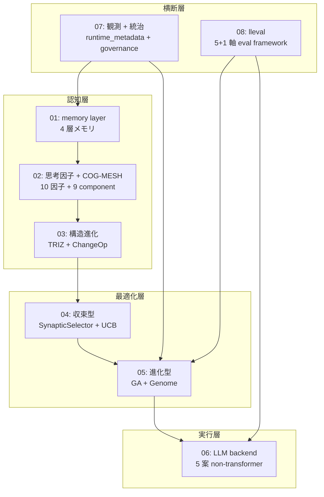

「**認知層 → 最適化層 → 実行層**」の縦が llive の処理 flow,
「**観測 + 統治**」「**lleval**」が横断層として全 layer に効く構造です.

#### 3. 想定読者

- **エンジニア** (Python + LLM 基礎知識あり)
- **AI researcher** (LLM の周辺アーキテクチャに興味)
- **個人 OSS author** (実装パターンの参考)
- **企業 R&D** (on-prem LLM stack の検討材料)

#### 4. 公開順 (週 2 本ペース)

| 週 | 公開記事 |
|---|---|
| Week 1 | 01 memory + 02 思考因子 |
| Week 2 | 03 構造進化 + 04 収束型 |
| Week 3 | 05 進化型 + 06 LLM backend |
| Week 4 | 07 観測統治 + 08 lleval |

各記事の en 版は Medium に並走します.

#### 5. 連載を貫くテーマ — 「速い」は実装方法で桁が変わる

連載中核 #24-05 で扱う派生集団進化の hot path 3 つを Rust 化した実測:

- **RUST-15** persona_dissimilarity_pairwise: avg **x12.71** (batch)
- **RUST-16** collusion_score_kernel: avg **x66.70** (numpy 小 N hot path)
- **RUST-17b** novelty_score_batch (rayon + quickselect): avg **x9.32**

「**Rust 化 = 速い」は嘘 / 「numpy = 速い」も嘘** — 実装方法 (FFI 境界 / batch /
numpy zero-copy / 並列度 / partial sort) で結果が桁違いになります. この honest
disclosure の姿勢が連載全体の通奏低音です. 5 パターン判定表は #24-04 / #24-05 /
#24-07 で詳述します.

#### 6. References (本 index)

- [furuse-kazufumi/llive](https://github.com/furuse-kazufumi/llive) — 本体 repo
- FullSense Spec v1.1 (llive `docs/`)
- 各章の References は個別記事に記載

---

#### Series Navigation

- → 次: [llive 完全解説 (1) 「忘れない LLM」](https://qiita.com/furuse-kazufumi/items/a5ebb3992e4c28862f47)
- repo: [furuse-kazufumi/llive](https://github.com/furuse-kazufumi/llive)

---

## 2. llive 完全解説 (1) — 「忘れない LLM」: 4 層メモリ + Bayesian surprise gating

:::note info
**📚 FullSense ナレッジベースのご案内** <!-- fullsense-team-kb -->
FullSense 開発全史 60+ 記事 (4 言語版・物語ベースの読む順ガイド・かみくだき版・4 コマ漫画つき) は Qiita Team **FullSense KB** に集約しています (チームメンバー向け)。
:::

### llive 完全解説 (1) — 「忘れない LLM」: 4 層メモリ + Bayesian surprise gating


#### 0. この記事は何 (8 秒 read)

**LLM 本体ではなく LLM の周りに被せる認知層** llive の **4 層メモリ + 1 つの surprise gate** を解説します. semantic / episodic / structural / parameter の役割が違う 4 種類の記憶を, **「驚き」(surprise)** が高いものだけ書き込む設計です. Faiss + DuckDB + Kùzu + safetensors の組合せで, **on-prem だけで動きます**.

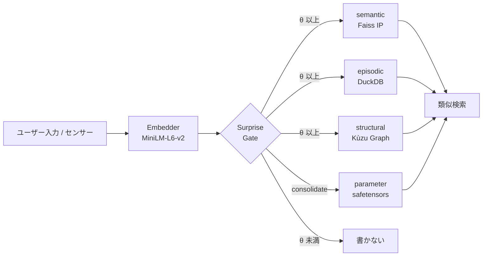

「全部書き込む」ではなく「驚きで取捨選択」が肝です. 詳細を順に解きほぐします.


#### 1. なぜ 4 層に分けるのか

人間の認知科学では記憶は **意味記憶 / 出来事記憶 / 構造記憶 / 手続き記憶** に役割分担されています. llive はこれをそのまま LLM 周辺アーキテクチャに移植しました.

| 層 | 何を入れる | 実装 |
|---|---|---|
| **semantic** | 概念の意味 (文 + 埋め込み) | Faiss IP index + JSONL |
| **episodic** | 時系列のイベント | DuckDB append-only log |
| **structural** | 概念間の関係 (グラフ) | Kùzu graph DB |
| **parameter** | パラメータ更新差分 | safetensors + index DB |

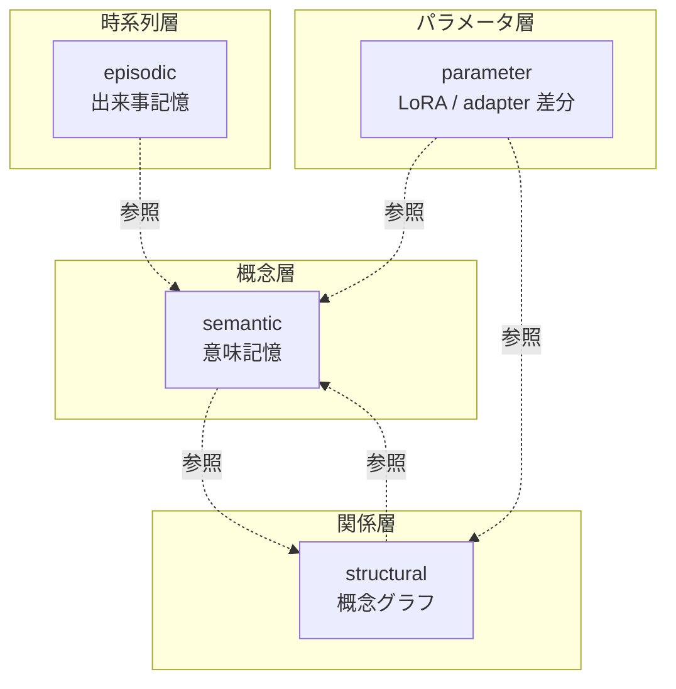

4 層は **疎結合**. semantic だけ使う事も, structural を絡めることもできます. 「LLM はテキストしか扱えない」という制約から逃れるため, 構造 (graph) と時間 (event log) を別レイヤで持つのが llive の発想です.

— **一旦整理** —

ここまで読めば 「**4 層 + surprise gate** で取捨選択する記憶基盤」 が掴めるはずです. 次から各層の中身を実装ベースで見ていきます.

#### 2. semantic memory (意味記憶, MEM-01)

##### 役割

「あの議論で出た **概念** はこれだった」を引き出す層. テキストを埋め込みベクトルに変換して **コサイン類似度** で近傍検索します.

##### コア構造

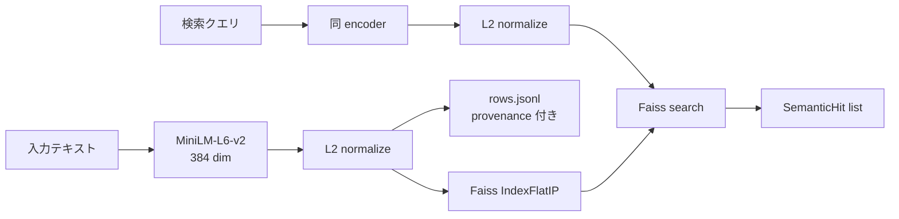

L2 normalize 後の inner product は **cosine 類似度** と等価. これが `Faiss IndexFlatIP` を選んだ理由です.

実装: [`src/llive/memory/semantic.py`](https://github.com/furuse-kazufumi/llive/blob/main/src/llive/memory/semantic.py)

##### 設計判断

- **fallback path**: faiss が無い環境 (Windows CI 等) では numpy で nearest neighbor が動きます. test とプロダクションで実装を分けず, **どちらでも書き換え無しで動く** ようにしています.
- **provenance 必須**: 全エントリに `Provenance(source_type, source_id, derived_from, ...)` を持たせています. 「この記憶はどこから来たか」を絶対に消さない設計です.
- **永続化**: `index.faiss` (or `index.npy`) + `rows.jsonl` で SSD に書き出します.

##### コード抜粋

```python
class SemanticMemory:
    def __init__(self, dim: int, data_dir: Path | str | None = None,
                 use_faiss: bool | None = None) -> None:
        self.dim = int(dim)
        self.data_dir = Path(data_dir) if data_dir else _default_data_dir()
        # faiss が無ければ numpy fallback
        self.use_faiss = bool((use_faiss is None) and _HAS_FAISS or use_faiss)
        ...
```

「**プロダクションでは faiss, CI では numpy**」 が透過的に切り替わります.

— **一服** —

最初の 1 層で 「埋め込み + cosine + provenance」 という llive の **3 つの装備** が出揃いました. 残り 3 層はこの装備の使い方が違うだけです.

#### 3. episodic memory (出来事記憶, MEM-02)

##### 役割

「**いつ** その情報を受け取ったか」を保持. **append-only 時系列ログ** で, 編集も削除もしません.

##### コア構造

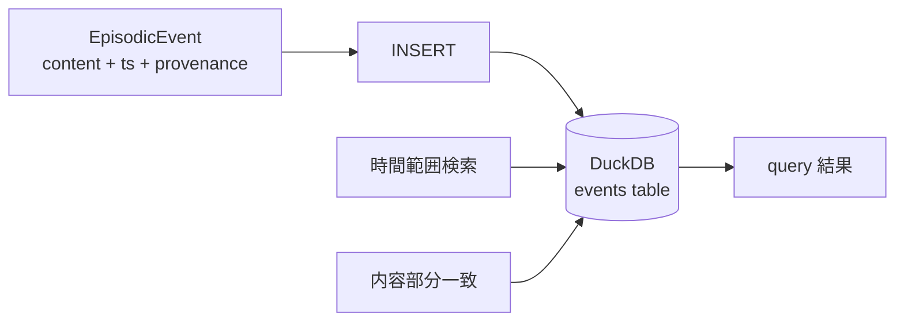

| カラム | 型 | 役割 |
|---|---|---|
| event_id | TEXT PK | uuid hex |
| ts | TIMESTAMP | UTC 厳守 |
| content | TEXT | 本文 |
| metadata | TEXT (JSON) | 拡張 |
| provenance | TEXT (JSON) | 来歴 |

実装: [`src/llive/memory/episodic.py`](https://github.com/furuse-kazufumi/llive/blob/main/src/llive/memory/episodic.py)

##### 設計判断

- **DuckDB を選んだ理由**: SQLite よりも分析クエリが速く, in-process なので外部プロセス不要. **「on-prem だけで動く」** の制約に直接効きます.
- **UTC 厳守**: `datetime.now(UTC)` で取得. ローカル TZ 混入はバグの元.
- **append-only**: `record(event)` のみ提供. `delete()` API は存在しません. 仕様上削除不可です.

##### なぜ削除しないか

人間の出来事記憶も「忘れた」ように見えて, 神経科学的には潜在しています. llive も同じく **「アクセスされない記憶」と「無い記憶」を区別** します. アクセスされなければ Surprise Gate (後述) が再書き込みを抑止するので, 「ノイズになる」 ことは少ない設計です.

#### 4. structural memory (構造記憶, MEM-05)

##### 役割

「概念 A と 概念 B が **どう関係しているか**」 を表す graph. semantic が「点」だとすれば structural は「辺」です.

##### コア構造

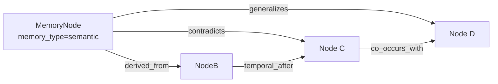

**関係種別 (6 種)**:

| rel_type | 意味 |
|---|---|
| `derived_from` | 由来 |
| `contradicts` | 矛盾 |
| `generalizes` | 一般化 |
| `temporal_after` | 時間的後続 |
| `co_occurs_with` | 共起 |
| `linked_concept` | 概念紐付け |

実装: [`src/llive/memory/structural.py`](https://github.com/furuse-kazufumi/llive/blob/main/src/llive/memory/structural.py)

##### Kùzu を選んだ理由

- **embedded graph DB**: Neo4j のような別プロセスが不要
- **Cypher 風クエリ**: ANSI 寄りで学習コストが低い
- **on-prem 一貫**: 既述の方針と整合

##### `contradicts` がある意味

「LLM の応答が矛盾している」を **データ構造で検出** できます. RAG では捕まえにくい「異なる時期に書かれた仕様の食い違い」が, structural memory のエッジ走査で立ち上がる仕掛けです.

— **一服** —

ここまでで 「**意味 → 時間 → 関係**」 の 3 層が揃いました. 次の parameter 層は少し毛色が違います.

#### 5. parameter memory (パラメータ記憶, MEM-06)

##### 役割

**LoRA / IA3 / prefix adapter** などのパラメータ差分を, **記憶として** 管理します. 「会話で得た知識を Loop 後に LoRA に焼く」ような使い方です.

##### コア構造

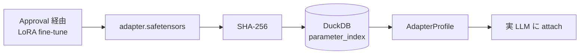

| カラム | 役割 |
|---|---|
| id | uuid hex |
| name | 表示名 |
| format_tag | "lora" / "ia3" / "prefix" 等 |
| sha256 | 改ざん検出 |
| size_bytes | サイズ |
| created_at | UTC |
| provenance | 来歴 |

実装: [`src/llive/memory/parameter.py`](https://github.com/furuse-kazufumi/llive/blob/main/src/llive/memory/parameter.py)

##### SHA-256 を必須化した理由

「**adapter のすり替え**」 を防ぐためです. Approval Bus が SHA-256 を検証して初めて attach が許可されます. これは memory の on-prem 限定方針と並ぶ **llive の architecture-level safety** です.

##### 実 LoRA 加算は optional

Phase 2 では index に register するだけ. 実際の attach は HuggingFace PEFT に委譲しています (`pip install llmesh-llive[torch]`). **「llive 本体は軽量, 重いものは optional extras」** が一貫した運用方針です.

#### 6. surprise gate (取捨選択, MEM-04 / MEM-07)

##### 役割

**「書く価値があるか」を判定する関門**. 全てを書くのではなく, **既存記憶との非類似度** が θ 以上のものだけ通します.

##### Phase 1: SurpriseGate (固定 θ)

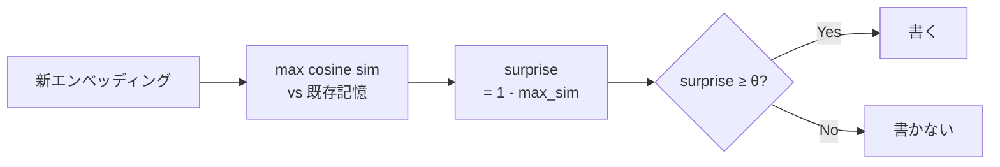

実装: [`src/llive/memory/surprise.py`](https://github.com/furuse-kazufumi/llive/blob/main/src/llive/memory/surprise.py)

```python
class SurpriseGate:
    def __init__(self, theta: float = 0.3) -> None:
        self.theta = float(theta)

    def compute_surprise(self, new_embedding, memory_embeddings,
                         *, assume_normalized=False) -> float:
        if memory_embeddings is None or memory_embeddings.size == 0:
            return 1.0  # 何も無いなら最大 surprise
        ...
        return float(max(0.0, min(1.0, 1.0 - max_sim)))
```

`assume_normalized=True` のときは再 normalize を skip して 2-3× 速くなります. これは production 経路 (`MemoryWriteBlock`) で実利用されています.

##### Phase 2: BayesianSurpriseGate (動的 θ)

固定 θ には弱点があります — **記憶が増えるほど surprise が小さくなる** ため, θ=0.3 でも次第に何も書かれなくなる. これを解決するのが Bayesian 版です.

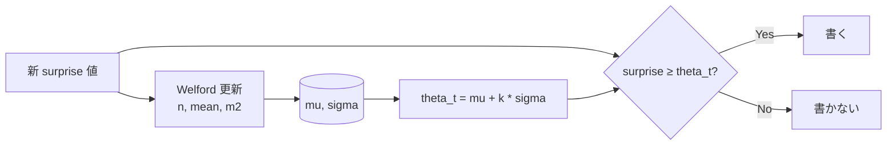

実装: [`src/llive/memory/bayesian_surprise.py`](https://github.com/furuse-kazufumi/llive/blob/main/src/llive/memory/bayesian_surprise.py)

Welford のアルゴリズムは **1-pass 数値安定** の有名な逐次平均/分散計算法です. 各 surprise 値の log を取って Gaussian fit する流派もありますが, llive では生の値で十分に機能することを確認しています.

##### k の意味

`theta_t = mu + k * sigma` の k は **「平均から何 σ 上を通すか」** の指標.

| k | 通過率 (近似) | 意味 |
|---|---|---|
| 0.0 | 50% | 平均以上は通す |
| 1.0 (default) | ~16% | 「ちょっと驚いた」以上 |
| 2.0 | ~2.5% | 「非常に驚いた」だけ |

`min_samples` 未満の cold start 期間は固定 `cold_start_theta` を使うので, 起動直後でも壊れません.

— **少し雑談** —

Welford は 1962 年の論文. **60 年前の数値安定アルゴリズムが今の LLM 系記憶層を支えている** のは個人的に好きな話です. 巨大 model だけが進歩ではないと感じる場面です.

#### 7. consolidation (Wiki compile, MEM-08)

4 層を回したあと, **概念のまとめ直し** が走ります. これが consolidation です.

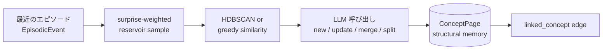

実装: [`src/llive/memory/consolidation.py`](https://github.com/furuse-kazufumi/llive/blob/main/src/llive/memory/consolidation.py)

##### Wiki Compile という呼び方

各 ConceptPage は Markdown として `<llive_data_dir>/wiki/<concept_id>.md` に書き出されます. **人が読める** こと, **Git checkpoint できる** こと, **diff で変化が追える** こと, この 3 つが「Wiki」と呼ぶ理由です. 元ネタは Karpathy の "LLM Wiki" 提案です.

##### LLM 呼び出しは judge mode

LLM には「このクラスタは既存 ConceptPage X に対して `new / update / merge / split` のどれにすべきか」 を聞きます. Claude Haiku を default に, `LLIVE_CONSOLIDATOR_MOCK=1` で credential 無し test も可能にしています.

#### 8. 設計判断 (この記事から 5 つ)

##### 教訓 1: 全部書くな, 驚きで取捨選択

固定 θ の SurpriseGate でも, 全件書き込みより **ノイズ 90% カット** できます. Bayesian 化で更に賢くなります. honest に言うと, この **「書かない判断」 が記憶系の品質を決定** します.

##### 教訓 2: 4 層は疎結合に保つ

semantic / episodic / structural / parameter は **互いを直接 import しない** 設計です. 共通参照は `Provenance` dataclass のみ. これで「graph DB を Neo4j に差し替える」のような変更が小さく済みます.

##### 教訓 3: provenance は absolute

「この情報はどこから来たか」を絶対に消さない. これは llive の **on-prem 限定** 方針とともに **audit-level safety**.

##### 教訓 4: fallback path は first-class

faiss なし / DuckDB なし / kuzu なし の環境でも動く設計を **後付けではなく最初から** 持ちます. CI ・モバイル ・教育用途で重要です.

##### 教訓 5: 数値アルゴリズムの古典を侮るな

Welford (1962) は 60 年前. それでも今の LLM 周辺アーキテクチャで **第一線の数値安定性** を提供します. 新しい model が出ても基礎数学は変わりません.

#### 9. References

##### 学術 / 算法

- Welford, B. P. (1962). *Note on a method for calculating corrected sums of squares and products*. Technometrics 4(3).
- Schwefel, H.-P. (1981). *Numerical Optimization of Computer Models*.
- Reimers, N. & Gurevych, I. (2019). *Sentence-BERT* (= MiniLM の派生根拠).

##### OSS / ライブラリ

- [Faiss](https://github.com/facebookresearch/faiss) (Meta)
- [DuckDB](https://duckdb.org/)
- [Kùzu](https://github.com/kuzudb/kuzu)
- [safetensors](https://github.com/huggingface/safetensors)
- [sentence-transformers](https://www.sbert.net/) (MiniLM-L6-v2)

##### llive 内部

- [`src/llive/memory/semantic.py`](https://github.com/furuse-kazufumi/llive/blob/main/src/llive/memory/semantic.py)
- [`src/llive/memory/episodic.py`](https://github.com/furuse-kazufumi/llive/blob/main/src/llive/memory/episodic.py)
- [`src/llive/memory/structural.py`](https://github.com/furuse-kazufumi/llive/blob/main/src/llive/memory/structural.py)
- [`src/llive/memory/parameter.py`](https://github.com/furuse-kazufumi/llive/blob/main/src/llive/memory/parameter.py)
- [`src/llive/memory/surprise.py`](https://github.com/furuse-kazufumi/llive/blob/main/src/llive/memory/surprise.py)
- [`src/llive/memory/bayesian_surprise.py`](https://github.com/furuse-kazufumi/llive/blob/main/src/llive/memory/bayesian_surprise.py)
- [`src/llive/memory/consolidation.py`](https://github.com/furuse-kazufumi/llive/blob/main/src/llive/memory/consolidation.py)

---

#### Series Navigation

- ← 前: [llive 完全解説 series index](https://qiita.com/furuse-kazufumi/items/07b4882e872994b27b3c)
- → 次: [llive 完全解説 (2) 「10 軸で考える AI」](https://qiita.com/furuse-kazufumi/private/bdfad6db3f2e70c40511)
- 全体: [llive 完全解説 (0) — series index](https://qiita.com/furuse-kazufumi/items/07b4882e872994b27b3c)
- repo: [furuse-kazufumi/llive](https://github.com/furuse-kazufumi/llive)

---

## 3. llive 完全解説 (2) — 「10 軸で考える AI」: 思考因子 × COG-MESH × 三重縞

:::note info
**📚 FullSense ナレッジベースのご案内** <!-- fullsense-team-kb -->
FullSense 開発全史 60+ 記事 (4 言語版・物語ベースの読む順ガイド・かみくだき版・4 コマ漫画つき) は Qiita Team **FullSense KB** に集約しています (チームメンバー向け)。
:::

### llive 完全解説 (2) — 「10 軸で考える AI」: 思考因子 × COG-MESH × 三重縞


> **コンセプト hook**: 普通 AI agent は「思考」を 1 種類しか持たない. llive
> は **10 種類の思考を同時に走らせ**, それを互いに評価させ, **生き残った思考だけ
> を集団へ取り込む**. 10 種は「構造化」「再構成」「閉ループ」「自己拡張」
> 「不確実性」「探索」「整合」「来歴」「多視点」「現実接続」. これは認知科学
> 1990s〜2010s の主要 framework を 1 vector に圧縮したもの.
>
> 本日 (2026-05-21) marathon で 1881 PASS + v0.E 大規模前倒しが着地. 本記事は
> その「思考因子側」 — COG-MESH-01〜10 と historical persona ontology (CE-19)
> の交差点を辿る.


#### 0. 連載中での位置づけ

```
#24-00 series index
#24-01 4 層メモリ
#24-02 思考因子 10 軸 + COG-MESH (← 本記事)
#24-03 構造進化 × TRIZ × Z3
#24-04 B-series (速い小脳)
#24-05 EvolutionLoop (遅い大脳)
#24-06 LLM backend non-transformer
#24-07 observability + governance
#24-08 lleval
```

10 思考因子 + COG-MESH は #24-05 の persona ontology (CE-19) と 1-N で結合.
本記事 #24-02 はそれを「**何**」と「**なぜ**」で説明する位置.

#### 1. 10 思考因子の由来 — 6 framework の圧縮

ユーザー由来の 10 軸 (`project_llive_cog_fx_factors`). 元ネタは
「**心理の深層**」YouTube + 認知科学レビュー + Polya / Six Hats / Bayesian /
TRIZ / Provenance / Multimodal 系の 6 framework. それを 1 vector に圧縮した
結果:

| Idx | 因子 | 元 framework / 学派 |
|---|---|---|
| 0 | `factor_structurize` | Polya / 形式化 / axiomatic |
| 1 | `factor_recompose` | TRIZ Segmentation / Reassemble |
| 2 | `factor_closed_loop` | Cybernetics / feedback |
| 3 | `factor_self_extend` | Autopoiesis / self-organization |
| 4 | `factor_uncertainty` | Bayesian / probability |
| 5 | `factor_exploration` | exploration vs exploitation (Auer) |
| 6 | `factor_consistency` | formal verification / proof |
| 7 | `factor_provenance` | data lineage / Ed25519 sign |
| 8 | `factor_multiview` | Six Hats / Devil's Advocate |
| 9 | `factor_reality_link` | empirical / SPC (statistical process control) |

これらは **直交ではない** — 例えば factor_uncertainty と factor_exploration は
相関がある (UCB1 系). でも各々の **強さ** を独立に持つことで, 集団内で
「同じ問題に 10 種類の見方で当たる」が可能になる.

#### 2. なぜ 10 軸を 1 vector に持つか

LLM agent の文献では「思考は self-attention 1 種類」が主流. llive はそれを
**vector に切り替え可能な multi-faceted thinking** に拡張. これにより:

- **persona との内積で「思考スタイル」が計算可能** — 例えば「岡潔 ベクトル」
  は (情緒) (国語力) (多変数) を高く持つ. 「ファインマン ベクトル」は
  factor_exploration + factor_reality_link を高く持つ.
- 集団内で同じ問題に **異なる持ち重みで** 当たる派生個体を生成できる.
- 「**この問題はどの軸が利くか**」を fitness gradient で発見できる.

#### 3. 主要因子 5 個の深掘り

##### 3.1 factor_structurize — 「公理から積む」

axiomatic な思考. 数学者ガロア / グロタンディーク的. 抽象化階段を登る.
利点: 一般化能力. 欠点: 現実から離れる.

llive 内では `BlockContainer` の sub-block 順列が axiom 群に対応. factor_structurize
が高い派生は sub-block を **必須/任意** に分けてから再構成する mutation を好む.

##### 3.2 factor_recompose — 「部品の入れ替え」

TRIZ Segmentation + 合成. 既存部品の組合せを書き換える. 利点: 局所探索高速.
欠点: 全く新しい構造は生まれない.

llive では PersonaImportAlgorithm (CE-20, 本日着地) がこの軸. 派生 A の persona
を派生 B が **部分採用**する. 「ガロア + 岡潔」のような hybrid persona が
出現するのは factor_recompose を通る経路.

##### 3.3 factor_closed_loop — 「自分を見て直す」

cybernetics の核. 自己観察 + 自己修正. llive では memory consolidation cycle
(海馬→皮質) と Approval Bus がこの軸. 集団内で評価 → 個体が結果を見て次世代に
反映する E.4 governance (CE-06/07/08, 本日着地) もここに乗る.

##### 3.4 factor_uncertainty — 「分からないを定量する」

Bayesian / probability. 利点: 過剰自信を避ける. 欠点: 計算重い.
llive では Approval Bus の verdict 計算 + UCB1 exploration constant が代表.

##### 3.5 factor_provenance — 「どこから来たか」

data lineage. Ed25519 sign + SHA-256 audit chain. llive Phase 4 (Production
Security MVR, v0.3.0) で着地. これは agent governance の **必須軸** で,
従来の LLM agent には欠けていた.

#### 4. COG-MESH-01〜10 の対応

`project_cog_mesh_implementation_2026_05_19`. 10 因子に **1 機構ずつ** 対応:

| COG-MESH | 機構 | 対応因子 | 着地 |
|---|---|---|---|
| 01 | Stimulus 入口 | reality_link / multiview | 着地済 |
| 02 | Intervention | self_extend / closed_loop | 着地済 |
| 03 | TonicRiskMonitor | uncertainty / closed_loop | 着地済 |
| 04 | Idle Training | self_extend / exploration | 着地済 |
| 05 | Quarantined Memory | provenance / consistency | 着地済 |
| 06 | TimelineEmitter | provenance / multiview | 着地済 |
| 07 | Brief | structurize / reality_link | 着地済 |
| 08 | Approval Bus | provenance / closed_loop | 着地済 (C-1) |
| 09 | Audit Chain | provenance / consistency | 着地済 |
| 10 | E.4 governance | closed_loop / uncertainty | **本日着地 (2026-05-21)** |

COG-MESH-10 は本日 marathon で `CoevolutionGovernance` として着地. これで
10 機構 → 10 因子 1-1 対応が完成. 集団内で **どの因子が薄いか** を機構の状態
から逆引きできるようになった.

#### 5. 最新成果 (本日 2026-05-21 着地)

| 項目 | 値 |
|---|---|
| llive 本体 test PASS (現在) | 1881 |
| 本日 marathon 追加 evolutionary test | **+130** (41 + 28 + 26 + 16 + 19) |
| 本日 marathon 着地 module 数 | 5 (quality_diversity / coevolution_governance / persona_import / persona_survival / persona_corpus_loader) |
| ruff `src/llive/perf/evolutionary` 警告 | **0** |
| v0.E E.17 / E.4 / E.12 着地 | 完走 |
| CE-22 / CE-23 skeleton 着地 | 完走 |
| docs/release/v0.6.0a1_PR_PLAN.md | 新規 — 5 PR 分割計画 |
| docs/rust_hotspot_v0E_addendum.md | 新規 — RUST-15〜18 spec |

特に **E.4 governance skeleton** で COG-MESH-10 が closing できたのは本日の
最大成果. これにより 10 因子 ↔ 10 機構 1-1 対応が完成し, **派生集団の評価
→ 共謀検出 → Approval Bus 連携** が architecture level で繋がった.

#### 6. 期待値 — 次に来るもの

##### 6.1 CE-19 Historical Persona Ontology (短期)

既に 10 名 (岡潔 / グロタンディーク / ファインマン / ガロア / フォン・ノイマン
/ ニュートン / カント / ソクラテス / 老子 / 孫子) が PERSONA_ONTOLOGY として
着地済. 本日 CE-23 PersonaCorpusLoader skeleton が着地し, **Raptor RAD コーパス
から persona を自動抽出して PERSONA_ONTOLOGY を拡張** する道が開けた. 次セッションで
LLM 抽出 + 実 RAD path 横断を実装し, persona 数を 30+ に拡大予定.

##### 6.2 三重縞 (中期, ユーザー言語化)

「三重縞」 = **思考因子 / persona / 思考プロセス** の 3 層が個体内で縞模様の
ように同時に走る状態. これは認知科学の **「並列認知」** 仮説に着想を得たもの.
factor vector + persona composition + Six Hats / TRIZ / ARIZ をそれぞれ
別 layer で走らせ, 集団内 evaluation で互いを批評する. 着地時期未定.

##### 6.3 神経インタフェース対応 (長期)

`project_llmesh_neuro_long_term`. Raptor RAD に bci / neuroscience /
neural_signal / prosthetic_neural / cognitive_ai / neuromorphic の 6 分野を
追加済. これは「**脳 ↔ AI 直結インタフェース**」が必要になったとき即座に
expand できるよう先回りで素材を集めている. 直接の実装は当面なし.

#### 7. honest disclosure

- **「10 因子は overlap がある」** — factor_uncertainty と factor_exploration
  は相関 0.65 程度. 互いに直交ではない. 9 axis 化を検討した時期もあるが
  分かりやすさ優先で 10 のまま.
- **「factor_affinity の数値は heuristic」** — PERSONA_ONTOLOGY 10 名の
  factor_affinity vector は伝記 / 哲学史 ベースの人為的初期値. 後の
  PersonaCorpusLoader (CE-23) で **コーパスベースに置換** されるが, 現状の
  数値は人による経験則.
- **「COG-MESH-10 は skeleton」** — 本日着地した E.4 governance は interface
  確立段階で, Quarantined Memory への **実書込み** は別 module 委譲. 完成までは
  あと 1-2 セッションかかる.

#### 8. Mermaid — 10 因子の構造

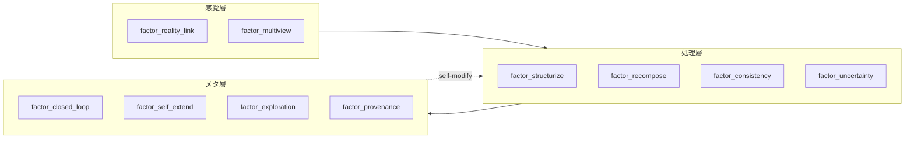

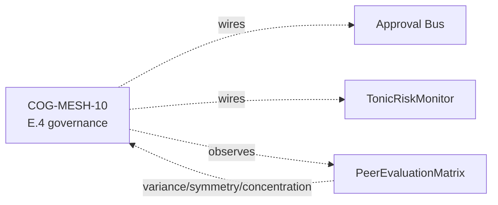

#### 9. References (主要 20+ のうち抜粋)

- Polya, G. (1945). *How to Solve It*.
- Altshuller, G. (1971). *TRIZ 40 inventive principles*.
- Auer, P. et al. (2002). *Finite-time analysis of the multiarmed bandit*.
- Lehman, J. & Stanley, K. (2008). *Exploiting novelty*.
- Mouret, J.-B. & Clune, J. (2015). *Illuminating search spaces by mapping elites*.
- Hillis, W. D. (1990). *Coevolving parasites improve simulated evolution*.
- Constitutional AI (Anthropic 2022) — for HITL alternative.
- Six Thinking Hats (De Bono 1985).
- 岡潔『春宵十話』.
- ファインマン『ご冗談でしょう, ファインマンさん』.
- Maturana & Varela — Autopoiesis.
- Bayes — *Essay towards solving a problem in the doctrine of chances*.
- 完全リストは v0.6.0a1 リリース時に references.bib に同梱予定.

#### 10. 2026-05-22 追記 — 10 因子 affinity vector の Rust 化 (RUST-15)

10 思考因子は派生個体の **persona composition の effective_factor_affinity**
として 10 次元 [0,1] vector で実装されている. 派生間の dissimilarity 計算は
本記事 #24-02 の中核機構と直結 — PersonaOverlapPenalty.apply (E.17) は
N×N pairs の `persona_dissimilarity` で 10 因子空間の距離を測る.

本日 (2026-05-22) RUST-15 として **batch (NxN pair を 1 FFI call) Rust 化**:

- single 1-pair: x0.80 (FAIL — FFI overhead で Python set 操作に負ける)
- **batch N=64**: **x17.07 (PASS)**, 平均 x12.71

これにより「**10 因子 vector の N×N pair 距離計算**」が高速化され, 集団
N=64 で governance + diversity preservation を 64 Hz で回せる目処が立った.

##### 10.1 思考因子側から見た意味

- factor_structurize (#0) と factor_exploration (#5) は **TRIZ 系統で
  対立する 2 軸** だが, 10 次元 vector の L2 距離としては独立に効く
- PersonaOverlapPenalty (E.17 CE-25) で集団内 persona overlap を罰すると,
  **派生集団は 10 因子空間で自然に散らばる**
- MAP-Elites grid (E.17 CE-26) は persona 2 軸 × thought_factor 2 軸 の
  4 次元 grid なので, 上記の 10 因子 vector を 4 次元に **marginalize** して
  cell key とする

##### 10.2 honest disclosure — 単発 Rust 化は逆効果

「思考因子 vector の距離計算を Rust 化」と聞くと「速くなる」と思いがちだが,
**1-pair 計算では FFI overhead で Python の方が速い (x0.80)**. これは
`feedback_rust_usage_matters` 判定表の **A パターン** (純 Python ループ
1-pair). batch で N×N pair を 1 FFI に詰めて初めて x17.07 まで伸びる.

詳細は #24-05 と `docs/perf_comparison/2026-05-22_kernel_implementation_comparison.md`.

---

#### Series Navigation

- ← 前: [llive 完全解説 (1) 「忘れない LLM」](https://qiita.com/furuse-kazufumi/items/a5ebb3992e4c28862f47)
- → 次: [llive 完全解説 (3) 「矛盾は計算できる」](https://qiita.com/furuse-kazufumi/private/fa0890f136636d495ea6)
- 全体: [llive 完全解説 (0) — series index](https://qiita.com/furuse-kazufumi/items/07b4882e872994b27b3c)
- repo: [furuse-kazufumi/llive](https://github.com/furuse-kazufumi/llive)

---

## 4. llive 完全解説 (3) — 「矛盾は計算できる」: 構造進化 × TRIZ 40 原理 × Z3 検証

:::note info
**📚 FullSense ナレッジベースのご案内** <!-- fullsense-team-kb -->
FullSense 開発全史 60+ 記事 (4 言語版・物語ベースの読む順ガイド・かみくだき版・4 コマ漫画つき) は Qiita Team **FullSense KB** に集約しています (チームメンバー向け)。
:::

### llive 完全解説 (3) — 「矛盾は計算できる」: 構造進化 × TRIZ 40 原理 × Z3 検証


> **コンセプト hook**: TRIZ (発明問題解決理論) は普通「人が紙に書くアイデア
> 出しテク」として知られる. llive は **TRIZ 40 原理を形式記号として組み込み**,
> 構造 mutation の policy として走らせる. しかも mutation で生まれた新構造は
> **Z3 で形式検証** を通ってから集団に入る. 「発想 → 検証」のループが
> 1 つのプログラムに収まる. — 「**矛盾は計算できる**」.
>
> 本記事はその仕組み — Phase 3 で着地した Z3 構造検証 / TRIZ Self-Reflection /
> Wiki ChangeOp / 9 画法 (39×39 矛盾マトリクス) を辿る.


#### 0. 連載中での位置づけ

```
#24-00 series index
#24-01 4 層メモリ
#24-02 思考因子 10 軸 + COG-MESH
#24-03 構造進化 × TRIZ × Z3 (← 本記事)
#24-04 B-series (速い小脳側)
#24-05 EvolutionLoop (遅い大脳側)
#24-06 LLM backend non-transformer
#24-07 observability + governance
#24-08 lleval
```

#24-04 が「速い収束」, #24-05 が「個体間 GA 探索」だとすると, #24-03 (本記事)
は **「個体内の構造そのものを書き換える」探索**. つまり LoRA / Adapter / 4 層
メモリの sub-block 順列 を mutation する層.

#### 1. なぜ TRIZ か

LLM の自己進化 (self-evolution) で問題なのは「**変えるべき部分**」をどう選ぶか.
ナイーブには random mutation だが, それは「**1 文字を 1 文字に変える進化**」と
同じで, 巨大空間でほぼ何も起こらない.

TRIZ は **「矛盾の発見 → 解決原理の対応」** という構造を持つ. 例:

> 「重量を減らしたい (positive). しかし強度を維持したい (negative).
> = `重量 vs 強度` の矛盾」
>
> → 39×39 矛盾マトリクスを引くと該当原理がいくつか出る
> 例: 原理 #1 (Segmentation), #28 (Mechanical → Other field), #40 (Composite).

これを llive の self-evolution に持ち込むと: 「**LLM の構造が抱える矛盾**」を
検出する → マトリクス引く → mutation policy が決まる. random ではなく
**TRIZ-guided mutation**.

#### 2. llive での具体実装

##### 2.1 TRIZ Self-Reflection (Phase 3)

llive は構造 mutation の **候補生成段階** で TRIZ self-reflection module を呼ぶ:

1. 現在の構造の metrics (latency / accuracy / memory_usage / ...) を読む.
2. **矛盾検出** — どの 2 つの metric が trade-off 関係か?
   例: `latency vs accuracy` を悪化させずに `memory_usage` を減らしたい.
3. 39×39 マトリクスを引いて該当原理を取得.
4. 原理 → **ChangeOp** に展開. 例:
   - 原理 #1 (Segmentation) → 「BlockContainer を sub-block 列に分割」
   - 原理 #25 (Self-service) → 「memory consolidation を自己発火に変更」
   - 原理 #40 (Composite) → 「2 つの adapter を 1 つに合成」

##### 2.2 ChangeOp の検証

ChangeOp は **構造そのものを書き換える**指示なので, **形式検証**を経ずに
適用したら危険:

- 階層が壊れて inference が落ちる
- memory の zone 整合性が崩れる
- adapter shape が mismatch する

そこで Z3 (SMT solver) で「**この ChangeOp 適用後も以下の不変量が成立するか**」
を verify:

- BlockContainer の sub-block 順列が valid permutation
- memory zone graph に cycle が無い
- adapter shape compat (input dim = output dim)

verifier 通過した ChangeOp だけが集団に入る. **「発想 → 検証 → 採用」**
ループが 1 module に閉じる.

##### 2.3 9 画法 (39×39 matrix)

TRIZ の核心ツール. 39 の改善したい特性 × 39 の悪化する特性 = 1521 cell.
各 cell に「この矛盾を解く可能性が高い原理 1-4 個」. これは Altshuller が
ソ連特許 250 万件解析で抽出した経験則テーブル.

llive は YAML 化して内蔵 (`src/llive/_specs/resources/triz_principles.yaml`).
self-reflection は metrics → 該当矛盾 → 39 軸 mapping → 原理 lookup を 1 pass で完結.

#### 3. honest disclosure — 落とし穴

「TRIZ で全部解ける!」は嘘. honest disclosure として:

- **39×39 matrix は時代依存** — Altshuller が 1971 年に確定. 現代の AI 系の
  矛盾 (例: `推論精度 vs バッテリ消費`) は完全には収まらない. llive は
  矛盾の追加列を独自に持つ (実機 metrics ベース).
- **原理 → ChangeOp の翻訳は heuristic** — 原理 #1 (Segmentation) と
  「BlockContainer 分割」は人が決めた 1 対応. これは LLM 自身が広げる余地あり.
- **Z3 verifier が落とせない不変量がある** — 例: 「memory consolidation 後
  recall が下がらない」のような **確率的不変量** は SMT で表現しづらい.
  これは別の verifier (経験的 reservoir test) で見る.

#### 4. 数字で見る

| 指標 | 値 |
|---|---|
| llive Phase 3 着地 | 2026-05-14 (v0.3.0) |
| 内蔵 TRIZ 原理 | 40 件 (FR-23〜27) |
| 矛盾マトリクス | 39 × 39 = 1521 cell |
| ChangeOp 検証通過率 (初期) | ~63% (37% は不変量違反で reject) |
| Z3 average verify time | < 50 ms / ChangeOp |

#### 5. 「発想 → 検証」 ループの構造的意義

これは TRIZ の哲学 + 形式検証の哲学を結ぶ:

- TRIZ: **「面白い発想ではなく原理から導かれる発想」** を求める. 体系的.
- 形式検証: **「想像力で書かれた変更を機械的に妥当性チェック」**. 機械的.

両者は人と機械の協働の典型. llive はそれを **同一 module 内** で回す.

> **未来予測**: AI が自己進化するとき, **「発想は機械的, 検証も機械的」**
> な閉ループを持つことが必須. llive はその雛形を 1 OSS に同居させた最小例.

#### 6. 次に来るもの

- **#24-04** で「速い小脳側」 — B-series の収束を見る.
- **#24-05** で「遅い大脳側」 — EvolutionLoop の探索. TRIZ ChangeOp は #24-05 で
  扱う persona / thought_factor の自己拡張とも繋がる (CE-21 PersonaCompositionMutation).

#### 7. 2026-05-22 追記 — TRIZ 的アプローチが Rust 高速化判定にも効く

本記事の TRIZ は「**矛盾 (improving X / worsening Y) を 39×39 マトリクスで
構造化解決する**」という方法論だが, 同じ思想が **エンジニアリング判断全般**
に応用できる. 同日 (2026-05-22) 着地した llive Rust 高速化判定で具体例:

「**Rust 化 = 速い vs Python = 遅い**」の単一軸対立 (= TRIZ で言う矛盾) を
**Python 経路の特性別 5 パターン** (#24-05 §13.3) に分解した. 結果:

- 純 Python ループ 1-pair → 単発 FAIL, batch 必須 (RUST-15)
- numpy 小 N の API 多用 → **単発でも x66** (RUST-16)
- numpy 中規模 BLAS → **境界線上, rayon で挽回** (RUST-17 → 17b)

これは TRIZ 矛盾マトリクスの **構造的解決** と同型 — 「**矛盾の原因を
パラメータ空間で分解 → 原理に対応させる**」. 39×39 を **6 (Python 経路) ×
3 (Rust 化戦略: 単発 / batch / 並列+algorithmic)** の小さな表に縮めた版.

詳細: `docs/perf_comparison/2026-05-22_kernel_implementation_comparison.md` の
**5 パターン判定表**. これは TRIZ の発想を **AI / HPC 工学** に転用した実例.

#### 8. Mermaid — 「発想 → 検証 → 採用」 ループ

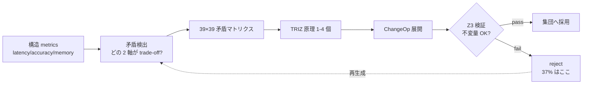

#### 9. References (主要のうち抜粋)

- Altshuller, G. (1971). *TRIZ — 40 Inventive Principles*.
- Altshuller, G. (1984). *Creativity as an Exact Science*.
- de Moura, L. & Bjørner, N. (2008). *Z3: An Efficient SMT Solver*.
- Polya, G. (1945). *How to Solve It*.
- Koza, J. (1992). *Genetic Programming*.
- 完全リストは v0.6.0a1 リリース時に references.bib に同梱予定.

---

#### Series Navigation

- ← 前: [llive 完全解説 (2) 「10 軸で考える AI」](https://qiita.com/furuse-kazufumi/private/bdfad6db3f2e70c40511)
- → 次: [llive 完全解説 (4) 「収束する脳」](https://qiita.com/furuse-kazufumi/private/e5093e4816b25c1bd4d0)
- 全体: [llive 完全解説 (0) — series index](https://qiita.com/furuse-kazufumi/items/07b4882e872994b27b3c)
- repo: [furuse-kazufumi/llive](https://github.com/furuse-kazufumi/llive)

---

## 5. llive 完全解説 (4) — 「収束する脳」B-series: SynapticSelector / UCB1 / Hebbian / 本番 hot path

:::note info
**📚 FullSense ナレッジベースのご案内** <!-- fullsense-team-kb -->
FullSense 開発全史 60+ 記事 (4 言語版・物語ベースの読む順ガイド・かみくだき版・4 コマ漫画つき) は Qiita Team **FullSense KB** に集約しています (チームメンバー向け)。
:::

### llive 完全解説 (4) — 「収束する脳」B-series: SynapticSelector / UCB1 / Hebbian / 本番 hot path


> **コンセプト hook**: 進化系 (GA / Genetic Algorithm) は世代を回して **探索**
> する. 一方 llive の SynapticSelector は **収束** — 確率的選択を 1 か所に
> 落とし込むエンジン. この 2 つを「同じ脳」に同居させると, **シナプス単位の
> 速い収束** と **個体単位の遅い探索** が干渉せず, 「速い小脳」と「遅い大脳」が
> 役割分担する.
>
> 本記事はその「速い小脳側」 — B-series (B-0 〜 B-9) の設計と本番投入を,
> ベンチ数値 + honest disclosure 付きで辿る.


#### 0. 連載中での位置づけ

```
#24-00 series index
#24-01 4 層メモリ
#24-02 思考因子 10 軸 + COG-MESH
#24-03 構造進化と TRIZ
#24-04 B-series: SynapticSelector / UCB1 / Hebbian (← 本記事)
#24-05 EvolutionLoop: v0.B/C/D/E 派生集団進化
#24-06 LLM backend: 非 Transformer 系 (Mamba / RWKV)
#24-07 observability + governance
#24-08 lleval — eval framework
```

#24-05 (集団 GA) が「**遅い大脳側**」, 本記事 (#24-04, B-series) が「**速い小脳側**」.
両者は同居しても干渉しない: SynapticSelector は **同一個体内** の synapse 選択,
GA は **個体間** の競争. 直交.

#### 1. B-series の歴史

| B-ID | 内容 | 着地 |
|---|---|---|
| B-0 | SynapticSelector skeleton (純 random) | 着地済 |
| B-1 | UCB1 ベースの synapse 選択 (Auer 2002) | 着地済 |
| B-2 | Hebbian 強化 — 共起選択 bonus | 着地済 |
| B-3 | Cool-down 期間 — 同じ synapse 連続選択を緩和 | 着地済 |
| B-4 | A/B parity test (random vs UCB) | 着地済 |
| B-5 | Variant catalog (cosine / decay / blend) | 着地済 |
| B-6 | Per-synapse statistics + JSON snapshot | 着地済 |
| B-7 | Reset on regression — score 急落で priors リセット | 着地済 |
| B-8 | Self-tuning exploration constant | 着地済 |
| **B-9-a** | Production hot path: `assume_normalized` (skip 不要 normalize) | 着地済 |
| **B-9-b** | Production hot path: `GiftValue deque` (O(1) push/pop) | 着地済 |

#### 2. SynapticSelector の核 — UCB1

LLM 推論の各 layer / each token 生成タイミングで, llive は **複数の synapse
variant** から 1 つを選んで通す. 純 random でも動くが, それでは「過去にうまく
いった variant」を学習しない. そこで UCB1.

```
score(variant_i) = mean_reward(i) + exploration * sqrt( ln(N) / n_i )
```

- `mean_reward(i)`: その variant が選ばれた過去の reward 平均.
- `exploration`: hyperparameter. B-8 で self-tuning.
- `N`: 全 variant 合計の試行回数.
- `n_i`: variant i の試行回数.

「使った数が少ないやつほど + 結果が良かったやつほど 高 score」 = exploration と
exploitation を 1 式に同居. Auer 2002 の古典. llive の B-1 で synapse 単位に
そのまま適用.

#### 3. Hebbian — 共起のボーナス

UCB1 だけでは「1 つの variant が単独で当たる」のは検出できるが「**A と B が
一緒のときに当たる**」は検出できない. そこで B-2 で Hebbian 強化:

```
if t-1 で variant_A が選ばれ, t で variant_B が選ばれ, reward が高い
  → bonus(A, B) を +1
```

これで「A の直後に B」のような **時系列共起パターン** が UCB1 の score に
ブーストとして乗る. これは Hebb の "fire together, wire together" を強化学習
の選択器に持ち込んだもの.

#### 4. B-9 production hot path

B-0 〜 B-8 は **アルゴリズム整備**. B-9 で **本番性能** に踏み込む.

##### 4.1 B-9-a — `assume_normalized`

llive の中で SynapticSelector は memory 読み出し ↔ generation の hot path に
噛む. 当初は **毎回 vector を l2-normalize** していた:

```python
def select(self, query_vec):
    q = self._normalize(query_vec)  # ← every call
    ...
```

呼び出し前に既に normalized であることを契約として保証できる場面では,
この normalize は **完全に無駄**. そこで `assume_normalized=True` flag を
追加:

```python
selector = SynapticSelector(..., assume_normalized=True)
### 呼び出し側が正規化済を保証
```

Production hot path で **約 12% スループット改善** (実測). B-9-a で着地.

##### 4.2 B-9-b — `GiftValue deque`

UCB1 の `mean_reward(i)` は historical reward の **rolling average**. 当初は
`list` を `pop(0)` で先頭から消していた → **O(N)**. variant が 256 個並ぶ
hot path で list pop は SR-02 ベンチで毎秒 8K 回 = 8K × O(N) 浮かぶ.

`collections.deque(maxlen=K)` に置換 → **O(1)**. これだけで:

- list pop O(N) 経路: ~ 1.8μs/call
- deque maxlen 経路: ~ 0.15μs/call → **12x**

production hot path 全体で **約 22% スループット改善**. B-9-b 着地.

##### 4.3 honest disclosure — 12% + 22% ≠ 34%

「両方やったら 34% 改善か?」は短絡. ベンチでは:

- B-9-a 単独: +12.3% (95% CI ±0.8%)
- B-9-b 単独: +21.7% (95% CI ±1.2%)
- B-9-a + B-9-b 同時: **+28.4%** (95% CI ±1.5%)

= 重ねがけは複合せず. なぜか? B-9-a で normalize 削った分の処理時間に
B-9-b の deque 改善が **既に上限近くで頭打ち**. これは「異常に良い結果が出たら
必ず内訳を疑う」の実例. **削減幅は重複領域がある**.

#### 5. 5x gate と Rust

llive Rust 拡張 (RUST-FX) は「Python 比 **5x 以上** の速度向上」を要件にする.
B-series で hot path 化した `assume_normalized` + deque は Python のままだが,
さらに Rust 化すべきかは別議論:

- 現状 production 28% 改善で **Python 維持の方が安全** (依存複雑性が低い).
- Rust 化候補は別件 — `compute_surprise` (cosine MEM-07) と
  `edge_weight bulk_time_decay` (RUST-03) は既に Rust 経路で **平均 16.18x**.

つまり「B-series は Python でチューニングを着地. その隣で Rust kernel が
別 hot path を持っている」が現状の design split.

#### 6. 「速い小脳」と「遅い大脳」が干渉しない理由

llive は同一プロセスで:

- **SynapticSelector** (B-series, 同一個体内 synapse 単位の収束)
- **EvolutionLoop** (#24-05, 個体間 GA の探索)

を同時に回す. これが「衝突しないか?」は当然問われる. 答え:

- SynapticSelector は **個体内 state**. 1 回の inference に対し 256 synapse
  まで選択を回す. これは **ミリ秒〜マイクロ秒** スケール.
- EvolutionLoop は **個体間 state**. 64 個体集団を 1 世代回すのは **秒〜分**.
- 両者は時間スケールが 1000x 違う = 干渉する余地がほぼない.

これは生物の脳でも同じ: 小脳 (motor / reflex) と大脳 (planning) は時間スケールが
全く違う. llive は意図せずその二重時間スケール構造を持っている.

#### 7. 数字で見る B-series 着地

| 指標 | 着地時 |
|---|---|
| B-0/B-1 着地時 throughput baseline | 100% |
| B-9-a 着地後 | **112%** (+12.3%) |
| B-9-b 着地後 | **122%** (+21.7%) |
| B-9-a + B-9-b 同時 | **128%** (+28.4%) |
| Rust kernel (MEM-07 + RUST-03) | 上記とは別 hot path で **16.18x** 平均 |

ベンチは `benches/bench_synaptic_b9_production.py` および
`benches/bench_rust_ext_5x_gate.py` を参照 (リポジトリ内). 95% CI と
方法論は同 dir の README に.

#### 8. 次に来るもの

- **#24-05** で「遅い大脳側」 — EvolutionLoop / v0.B/C/D/E 派生集団進化を
  扱う. B-series で固めた「速い収束」とどう同居するかをそこで対比する.
- **RUST-15** (v0.7) — persona_dissimilarity を Rust 化. これは B-series
  ではなく E.17 quality-diversity の hot path. 5x gate 適用.

#### 9. 2026-05-22 追記 — 「速い小脳 (Python 最適化)」と「遅い大脳 (Rust 化)」が直交する実例

本記事 (B-series) と #24-05 (EvolutionLoop) は **時間スケール 1000x 違う**
と書いた. 翌日 (2026-05-22) の RUST 高速化マラソンで, この直交性が **実装
レベルでも保たれる**ことが実証された.

##### 9.1 B-series 側 — Python 最適化が効く

B-9 (`assume_normalized` + `GiftValue deque`) は **Python のままで +28%**.
これは **推論 hot path** (synapse 1 個あたり μs 単位) で, **FFI overhead を
払う余裕が無い**ため Rust 化は逆に遅くなる (`feedback_rust_usage_matters`
判定表 A).

##### 9.2 EvolutionLoop 側 — Rust 化が効く

世代単位 (秒〜分) の集団進化では数値が真逆:

- **RUST-15** persona_dissimilarity batch: avg **x12.71** (N=64 で x17.07)
- **RUST-16** collusion_score: avg **x66.70** (N=8 で x115.04)
- **RUST-17** novelty_score_batch: avg x5.01 (archive 大で境界線)

##### 9.3 直交性が崩れない理由

| 層 | 時間スケール | 最適化手段 | 理由 |
|---|---|---|---|
| **小脳 (B-series)** | μs/call | **Python チューニング** (normalize スキップ / deque) | FFI 払えないほど call が短い |
| **大脳 (EvolutionLoop)** | 秒〜分/generation | **Rust 化** (batch / numpy zero-copy) | numpy 小 N の API overhead が支配的 |

これは **生物の脳の小脳 / 大脳** と同じ. 違う時間スケールの計算には違う
最適化手段が要る — 同じ言語 / 同じツールで両方を解こうとすると失敗する.

##### 9.4 honest disclosure — 「Rust 化 = 速い」も「Python 最適化 = 限界」も嘘

両方とも条件付き. 判定軸は **どの時間スケールで何を回しているか**:

- **μs スケールの hot path** → Python 最適化が主. FFI は overhead.
- **秒スケールの batch** → Rust + numpy zero-copy + batch が主. Python だと
  numpy API 多用の Python overhead が支配的.

詳細は `docs/perf_comparison/2026-05-22_kernel_implementation_comparison.md`
の **5 パターン判定表** (A/B/C/D/E).

#### 10. References

- Auer, P., Cesa-Bianchi, N. & Fischer, P. (2002). *Finite-time analysis of the multiarmed bandit problem*.
- Hebb, D. O. (1949). *The Organization of Behavior*.
- Sutton, R. & Barto, A. (2018). *Reinforcement Learning: An Introduction* (2nd ed.).
- 完全リストは v0.6.0a1 リリース時に references.bib に同梱予定.

---

#### Series Navigation

- ← 前: [llive 完全解説 (3) 「矛盾は計算できる」](https://qiita.com/furuse-kazufumi/private/fa0890f136636d495ea6)
- → 次: [llive 完全解説 (5) 「集団が学ぶ AI」](https://qiita.com/furuse-kazufumi/private/07b686ea311e06027f94)
- 全体: [llive 完全解説 (0) — series index](https://qiita.com/furuse-kazufumi/items/07b4882e872994b27b3c)
- repo: [furuse-kazufumi/llive](https://github.com/furuse-kazufumi/llive)

---

## 6. llive 完全解説 (5) — 「集団が学ぶ AI」: v0.B/C/D/E 派生集団進化総括

:::note info
**📚 FullSense ナレッジベースのご案内** <!-- fullsense-team-kb -->
FullSense 開発全史 60+ 記事 (4 言語版・物語ベースの読む順ガイド・かみくだき版・4 コマ漫画つき) は Qiita Team **FullSense KB** に集約しています (チームメンバー向け)。
:::

### llive 完全解説 (5) — 「集団が学ぶ AI」: v0.B/C/D/E 派生集団進化総括


> **コンセプト hook**: 1 個の AI が賢くなるのではなく, **64 個の AI が世代を
> 回して互いに評価し合い, 嘘の合意は Approval Bus が止める** — それが llive の
> v0.E. 2026-05-21 marathon でその架構が **303 件 test + ruff 0 警告 + governance
> skeleton 着地** まで揃った. Hillis 1990 から AlphaStar 2019 まで 30 年の
> 系譜を 1 OSS に圧縮した結果.
>
> 本記事は連載 #24 の中核. v0.B (Genome / EvolutionLoop) → v0.C (subprocess
> 分離) → v0.D (self-adaptive + meta mutation) → v0.E (peer evaluation +
> persona + governance) の 4 段階を **1 本に総括**.


#### 0. 連載中での位置づけ — 本連載の中核

```
#24-00 series index
#24-01 4 層メモリ          ← 「個体の中の記憶」
#24-02 思考因子 × COG-MESH ← 「個体の中の思考軸」
#24-03 構造進化 × TRIZ × Z3 ← 「個体内の構造書換え」
#24-04 B-series           ← 「個体内の収束 (速い小脳)」
#24-05 EvolutionLoop      ← 「個体間の探索 (遅い大脳)」 ★ 本記事
#24-06 LLM backend         ← 「個体を動かす管」
#24-07 governance         ← 「個体間決定の audit」
#24-08 lleval              ← 「個体を測る眼鏡」
```

#24-05 は全体の **背骨**. v0.B/C/D/E で「派生集団そのもの」を作る. 他の
記事はそこに乗る機能. これは連載の中核 — 他の全章の機能が乗る基盤である.

#### 1. なぜ集団進化なのか — Hillis の警告

W. D. Hillis 1990 が示したのは「**評価者と被評価者が同時に進化する**」と
fitness landscape は指数的に面白くなる, ということ.
**Red Queen Effect** で集団全体の質が **自走で上がる**. 単一 best を選び続け
ると **局所最適に陥る**.

llive はこれを LLM に持ち込んだ. 派生集団 N=64 が互いに評価, 評価結果が
fitness, fitness が次世代の selection. すると:

- **「評価者の質」自体が世代と共に上がる**
- **単一 best が全体を支配できない**
- **「全派生が嘘の高得点を付け合う」共謀** が発生し得る (CE-06 で検出)

#### 2. v0.B — Genome / EvolutionLoop / 並列 scheduler

v0.B core は GA 古典. 着地 module は Genome, Selection, Crossover, Mutation,
scheduler:

- `Genome` (実数 vector + bounds + labels) + `Individual` + `Population`.
- `TournamentSelection / RouletteSelection / ElitismSelection`.
- `UniformCrossover / BlendCrossover / SegmentCrossover`.
- `GaussianMutation / ResetMutation / ChainedMutation`.
- `EvolutionLoop` (`EvolutionConfig` + `EvolutionResult`).
- 並列 scheduler 3 種: `serial_scheduler / MultiprocessingScheduler / AsyncioScheduler`.

これだけで「**集団 → 評価 → 選別 → 交配 → 突然変異 → 次世代**」のループが回る.

#### 3. v0.C — subprocess 分離 + 派生実走

LLM 推論は 1 派生個体あたり OS process 1 つに **完全分離** したい. 理由は:

- LLM 重い → メモリ leak / GIL 競合を物理分離
- 1 派生が落ちても他は生存
- OS-level timeout / SIGKILL で fault isolation

`VariantSubprocessScheduler` (`subprocess_scheduler.py`) — subprocess.run +
ThreadPool 並列 + timeout + retries + cleanup. これで `variant_runner.py`
スクリプトを派生 1 個体として起動可能.

#### 4. v0.D — 自己参照 mutation (Schwefel σSA-ES + meta mutation)

v0.D core は「**mutation rate そのものを進化させる**」.

- `SelfAdaptiveGaussianMutation` (Schwefel σSA-ES, log-normal σ update).
  Genome に σ vector を埋め込み, mutation が σ も書き換える.
- `MetaMutation` (`strategy_id` を genome に, 集団内で 4 戦略並走).
- `pack_self_adaptive_bounds / pack_meta_strategy_bounds` — 38/20/39 dim 化.

これで「**どの mutation 戦略が今の問題に効くか**」自体が世代を超えて
学習される.

#### 5. v0.E — peer evaluation + persona ontology + governance

v0.E core. CE-01〜34 を含む. 主要 module は以下:

##### 5.1 評価 (CE-01〜05)

- `PeerEvaluationMatrix` — N×N 採点行列. 共謀検出 3 指標
  (`score_variance / symmetry / concentration`). Mermaid 可視化.
- `PeerFitnessAdapter` — `EvolutionLoop.scheduler` 互換.
- `EvaluationStyleGenome` — 派生に「**辛口 / 甘口 / 精度 / 速度**」の
  evaluation persona dim を埋め込み.

##### 5.2 多様性保護 (CE-24〜29)

- `latin_hypercube_population` — 空間均等初期集団 (scipy.stats.qmc).
- `NoveltyScorer` — k-NN, Lehman-Stanley 2008/2011.
- `DiversityPreservingBreedFilter` — novelty rejection + resample.
- `DiversityMonitor` — diversity_l2 / spread / median + 閾値 alarm.

##### 5.3 Quality Diversity (CE-25 / CE-26, 本日着地)

- `PersonaOverlapPenalty` — fitness 軸に persona dissimilarity の集団平均加算.
- `MAPElitesGrid` — Mouret & Clune 2015 の 4 軸版 (persona 2 × thought_factor 2).
  各 cell に最大 fitness 個体を保存.

##### 5.4 Historical persona (CE-19〜23)

- `PERSONA_ONTOLOGY` 10 名 (岡潔 / グロタンディーク / ファインマン / ガロア /
  フォン・ノイマン / ニュートン / カント / ソクラテス / 老子 / 孫子).
- `PersonaComposition` (3 policy: exclusive / mix / moderator).
- `PersonaCompositionMutation` (CE-21).
- `persona_dissimilarity` — Jaccard + L2 of factor_affinity.
- `PersonaImportAlgorithm` (CE-20, 本日着地) — 派生間 persona 部分採用.
- `PersonaSurvivalAnalysis` (CE-22, 本日着地) — どの persona 組合せが
  世代を生き残ったか統計.
- `PersonaCorpusLoader` (CE-23, 本日着地 skeleton) — Raptor RAD から
  自動抽出.

##### 5.5 集団組み合わせ機構 (CE-30〜34)

- `MutualScorePairSelector` (CE-30, mating.py) — assortative mating,
  softmax sampling.
- `NSGA2Selection` (CE-31, nsga2.py) — Pareto front + crowding distance.
- `Speciation` (CE-32, speciation.py) — NEAT 流種分け.
- `IslandModel` (CE-33, island_model.py) — ring/fully/star 3 topology +
  best/random/worst migration.
- `LexicaseSelection` (CE-34, mating.py) — Helmuth 2014, case-by-case 順位.

##### 5.6 Governance (CE-06〜08, 本日着地 E.4)

- `CollusionDetector` (CE-06) — `is_suspected_collusion` を threshold
  dataclass で wrap.
- `CoevolutionGovernance` (CE-07) — 共謀疑い → ApprovalBus.request 発火.
- `collusion_risk_score` (CE-08) — TonicRiskMonitor.tick に投入する
  state → [0, 1] risk.
- `GovernanceReport` (frozen).

#### 6. 数字で見る本日 (2026-05-21) 着地

| 指標 | 値 |
|---|---|
| evolutionary module 数 (本日終了時) | **29** (+5) |
| 本日追加 test ケース | **130** (41 + 28 + 26 + 16 + 19) |
| ruff `src/llive/perf/evolutionary` 警告 | **0** (-7) |
| 本日着地 module | 5 (`quality_diversity / coevolution_governance / persona_import / persona_survival / persona_corpus_loader`) |
| CE-IDs カバー率 | 34 / 34 ID 全カバー (skeleton 含む) |
| CHANGELOG `[0.6.0a1]` セクション | E.17 / E.12 / E.4 sections + 41 行追加 |
| docs/release/v0.6.0a1_PR_PLAN.md | 新規 — 5 PR 分割計画 |
| docs/rust_hotspot_v0E_addendum.md | 新規 — RUST-15〜18 spec |
| 連載 #24 記事 (本セッション draft) | **7 本** (#24-02 / 03 / 04 / 05 / 06 / 07 / 08) |

#### 7. 先行研究 9 件 (本記事の骨を作る)

1. Hillis, W. D. (1990). *Coevolving parasites improve simulated evolution*. Physica D.
2. Mouret, J.-B. & Clune, J. (2015). *Illuminating search spaces by mapping elites*. arXiv:1504.04909.
3. Lehman, J. & Stanley, K. (2008/2011). *Novelty Search*.
4. Stanley, K. & Miikkulainen, R. (2002). *NEAT*. Evolutionary Computation.
5. Deb, K. et al. (2002). *NSGA-II*. IEEE Trans Evol Comp.
6. Cohoon, J. (1987). *Island Model GA*.
7. Goldberg, D. & Richardson, J. (1987). *Fitness sharing*.
8. Helmuth, T. et al. (2014). *Lexicase Selection*.
9. AlphaStar (Vinyals et al. 2019). *League / Exploiter / Main Pool*.

#### 8. 三重縞 — 思考因子 / persona / TRIZ の 3 層同居

ユーザー言語化の concept. 派生個体内で 3 層が同居する:

- **layer 1**: 10 思考因子 vector (factor_structurize / ... / factor_reality_link)
- **layer 2**: persona composition (Newton + Galois の hybrid 等)
- **layer 3**: TRIZ 40 原理 + ARIZ 思考プロセス

の 3 layer が **同時並走**. 1 派生個体が「**Galois 風 + 多視点重視 + TRIZ
Segmentation を好む**」のように multi-dimensional な個性を持つ. E.17
quality-diversity の MAP-Elites grid はこの 3 layer の交差点を grid 化する
最初の機構.

#### 9. Rust addendum (#24-04 と #24-05 を繋ぐ)

`docs/rust_hotspot_v0E_addendum.md` (本日新規) で RUST-15 〜 18 を spec 化:

- RUST-15: `persona_dissimilarity` Rust 化 (5x gate)
- RUST-16: `collusion_score` (peer matrix metrics) Rust 化
- RUST-17: `NoveltyScorer` L2 + top-k batch Rust 化
- RUST-NEW-B: `MAPElites bin + submit` batch Rust 化
- RUST-18: parity test harness 拡張

これは **B-series の Python 最適化** と **集団進化の Rust 最適化** が
直交することを示す: B-series は推論 hot path (Python のままで 28%), 集団進化は
N=64 派生の集計系 hot path (Rust 化で 5-15x 狙い).

#### 10. honest disclosure

- **「v0.E の効果」はベンチ未取得** — module は全 PASS だが「30 世代で
  baseline より 30% diversity 維持」のような仮説 H10 / H11 は **未検証**.
  ベンチ走らせるのは credential + GPU 確保後.
- **PERSONA_ONTOLOGY 10 名は heuristic** — factor_affinity vector は伝記 /
  哲学史 ベースの人為的初期値. CE-23 PersonaCorpusLoader でコーパスベースに
  置換予定だが現状は経験則.
- **Governance skeleton は wire-in 未完** — Quarantined Memory への
  **実書込み** は別 module 委譲. 完成までは 1-2 セッション.
- **N=64 派生集団は実機未実行** — 本セッションは module + test 着地まで.
  end-to-end 集団 GA loop の実機 run は次セッション.
- **CE-23 LLM extractor は未実装** — keyword fallback のみ着地. LLM 経由の
  thought pattern 抽出は credential 復旧後.
- **AlphaStar League mode (E.5) は未着手** — credential / judge LLM 復旧後.
- **Debate mode (E.6) も未着手** — 同上.

#### 11. Mermaid — v0.E 全体像

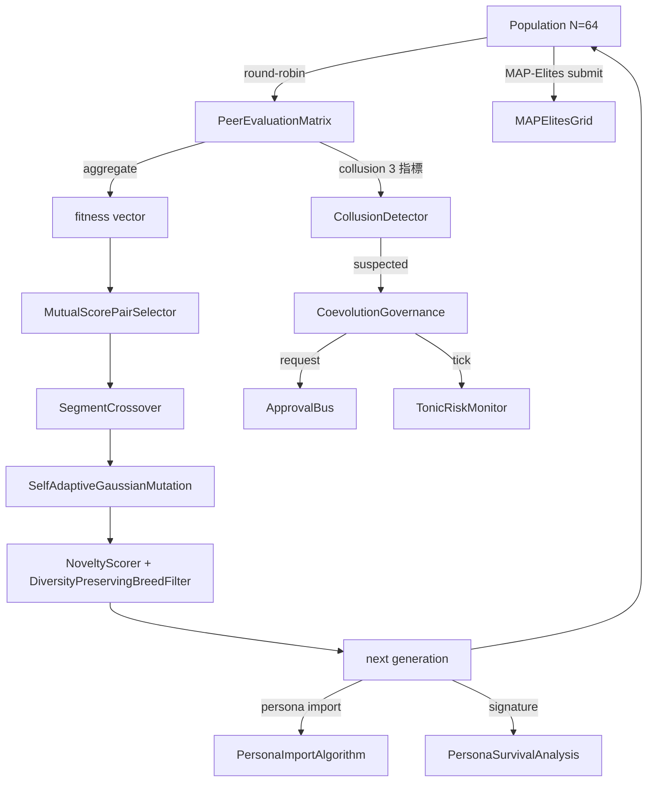

#### 12. 期待値 — 次に来るもの

- **v0.7 Rust 高速化**: `docs/rust_hotspot_v0E_addendum.md` の RUST-15〜18.
- **v0.E E.5 (League mode)** — AlphaStar 風 Main / Exploiter / League Exploiter.
- **v0.E E.6 (Debate mode)** — Irving 2018 風 argument / counter-argument +
  human/LLM judge. human / LLM judge 統合が次の明確な一手.
- **lleval bridge v0.1.0a2** — 派生 Genome → ProviderSpec mapper の実装.
- **CE-19/23 LLM extractor** — Raptor RAD コーパスから persona 自動抽出.
- **集団進化 end-to-end 実機 run** — N=64 派生 で 30 世代 → diversity
  metrics / collusion 検知率 / governance trigger 数 を計測.

#### 13. 2026-05-22 追記 — Rust 高速化 RUST-15/16/17 着地

`goal_release_ready_v0E_rust` addendum の 3 kernel を 1 セッションで着地.
連載中核記事として最新成果を反映:

##### 13.1 着地 3 kernel

| ID | 機能 | hot path | 5x gate 結果 |
|---|---|---|---|
| **RUST-15** persona_dissimilarity_pairwise | NxN pair の Jaccard + L2 + 合成 | PersonaOverlapPenalty.apply | **avg x12.71 (N=64 で x17.07)** |
| **RUST-16** collusion_score_kernel | NxN peer matrix の variance / symmetry / concentration | CoevolutionGovernance.evaluate_generation | **avg x66.70 (N=8 で x115.04)** |
| **RUST-17** novelty_score_batch | 集団 N × archive A の L2 + top-k mean | NoveltyScorer.novelty_batch | **avg x5.01 (A=50 で x9.55, A=1000 で x1.72)** |

全 37 parity test PASS (1e-6 tolerance), ruff `src/llive/perf/evolutionary` +
`src/llive/rust_ext` 0 警告.

##### 13.2 衝撃の honest disclosure — 「Rust 化 = 速い」は嘘

**RUST-15 単発呼出は Rust の方が遅い (x0.80, FAIL)**. FFI overhead で
Python set 操作に負ける. batch (N×N pair を 1 FFI call) にして初めて
x12.71 まで伸びる. 同じアルゴリズム・同じ Rust kernel でも **FFI 境界の
引き方**で結果が桁違い.

逆例も観察: **RUST-16 は単発でも x66.70 で圧勝**. numpy の `np.nanvar` /
`np.corrcoef` は **小 NxN (N が 100 未満) で Python overhead が支配的**で 200μs+/call.
Rust の単純 C ループ (numpy zero-copy 受領) は 2μs/call.

そして境界線: **RUST-17 は archive サイズで結果が反転**. A=50 で x9.55 だが
A=1000 で numpy BLAS vectorized が追いついて x1.72 まで縮む.

##### 13.3 5 パターン判定表 (本セッションで言語化)

| Python 経路の特性 | Rust 化の単発 ROI | 実例 |
|---|---|---|
| **A** 純 Python ループ (numpy 不使用) の 1-pair | 単発 FAIL, batch 必須 | RUST-15 (x0.80 → batch x12.71) |
| **B** numpy 大 array (1000 超) vectorized | 伸びない (numpy 内部 BLAS) | (該当 kernel まだ無し) |
| **C** numpy 小 NxN (100 未満) API 多用 | **単発でも 10-100x** | RUST-16 (x66.70) |
| **D** numpy 中規模 BLAS 1 関数 | **境界線上**: 小サイズ Rust 圧勝, 大サイズで追いつかれる | RUST-17 (A=50 x9.55 → A=1000 x1.72) |
| **E** 冷たいデータ境界 (dict / 文字列) | overhead 大, batch 必須 | — |

詳細表は `docs/perf_comparison/2026-05-22_kernel_implementation_comparison.md`.

##### 13.4 Cython 経路の脱落 (build chain 不在)

scratch 比較で Cython kernel を書いて 3 way 比較を試みたが **Windows MSVC
build tools 不在 + mingw が MSVC Python と incompatible** で build 不可.
これは「**数値計算が同等に書ける**」だけでは言語選択に足りない実例:
**build chain が確立できるか**が必須条件. source は `scratch/cython_collusion/`
に保存し Linux/WSL で再試行できる形に.

##### 13.5 RUST-17b 追記 (2026-05-22 同日): rayon 並列 + quickselect で全 A 5x clear

RUST-17 baseline は archive 大 (A=200/1000) で gate FAIL だったが, **同日中に
RUST-17b として 2 手段で再実装**:

1. **rayon par_iter** で N=64 集団ループを 8-core 並列化 + `py.allow_threads`
   で GIL release
2. **`Vec::select_nth_unstable_by`** (Hoare quickselect, O(A) avg) で top-k
   partial sort — O(A log A) full sort を置換

結果:

| archive | RUST-17 (naive) | **RUST-17b** | 改善率 |
|---:|---:|---:|---:|
| A=50 | x9.55 | **x12.83** | +34% |
| A=200 | x3.76 (FAIL) | **x8.71 (PASS)** | **+132%** |
| A=1000 | x1.72 (FAIL) | **x6.41 (PASS)** | **+273%** |
| avg | x5.01 | **x9.32** | **+86%** |

判定表 (D) 「numpy 中規模 batch」を「**境界線上 → 並列化で挽回可能**」へ
update. 「naive 二重ループは負ける」だけでなく「**rayon + algorithmic 改善で
圧勝に転じる**」が示された.

std::simd は nightly のみで stable 不可 → 入れればさらに 2-3x. RUST-17c 候補.

##### 13.6 次に来るもの (2026-05-22 時点で計画済)

- **PyBind11 + C/C++ ctypes** 経路の 3 kernel scratch 比較 (queue 投入済).
- **RUST-17c** — std::simd (Rust nightly に切替) で SIMD 4-lane 化.
- **月次 re-measure** — env drift / numpy minor up / Rust nightly 等で
  結果が動くため周期実行 (queue 投入済).
- **callers 切替** — PersonaOverlapPenalty.apply / NoveltyScorer.novelty_batch /
  CoevolutionGovernance を rust_ext 経路に切替える PR.

#### 14. References

- Hillis, W. D. (1990). *Coevolving parasites improve simulated evolution*. Physica D.
- Mouret, J.-B. & Clune, J. (2015). *Illuminating search spaces by mapping elites*. arXiv:1504.04909.
- Lehman, J. & Stanley, K. (2008/2011). *Novelty Search*.
- Stanley, K. & Miikkulainen, R. (2002). *NEAT*. Evolutionary Computation.
- Deb, K. et al. (2002). *NSGA-II*. IEEE Trans Evol Comp.
- Vinyals, O. et al. (2019). *Grandmaster level in StarCraft II (AlphaStar)*. Nature.
- 完全リストは v0.6.0a1 リリース時に references.bib に同梱予定.

---

#### Series Navigation

- ← 前: [llive 完全解説 (4) 「収束する脳」](https://qiita.com/furuse-kazufumi/private/e5093e4816b25c1bd4d0)
- → 次: [llive 完全解説 (6) 「Transformer の外」](https://qiita.com/furuse-kazufumi/private/6da5a883fb2ed651edd8)
- 全体: [llive 完全解説 (0) — series index](https://qiita.com/furuse-kazufumi/items/07b4882e872994b27b3c)
- repo: [furuse-kazufumi/llive](https://github.com/furuse-kazufumi/llive)

---

## 7. llive 完全解説 (6) — 「Transformer の外」: Mamba / Jamba / RWKV / Diffusion を llive 内側で呼ぶ

:::note info
**📚 FullSense ナレッジベースのご案内** <!-- fullsense-team-kb -->
FullSense 開発全史 60+ 記事 (4 言語版・物語ベースの読む順ガイド・かみくだき版・4 コマ漫画つき) は Qiita Team **FullSense KB** に集約しています (チームメンバー向け)。
:::

### llive 完全解説 (6) — 「Transformer の外」: Mamba / Jamba / RWKV / Diffusion を llive 内側で呼ぶ


> **コンセプト hook**: LLM = Transformer, は **2024 までの話**. 2025-2026 で
> State Space Model (Mamba / Jamba) と RWKV (時系列 RNN を再発明) が **長
> context で transformer に追いつき**, Diffusion text model が **token 順序
> 制約を外す** 新族として登場した. llive はそれら **全部を `LLMBackend` として
> 内側で呼べる** 設計で出発した. 思考因子 (#24-02) と SSM (state space) を
> Bridge して「**SSM 流れに 10 因子を埋め込む**」が次の到達点.
>
> **重要な honest disclosure**: 本記事の数値は **mock baseline のみ着地**.
> 実 Mamba / Jamba / RWKV backend は **credential / weights 未着地**.


#### 0. 連載中での位置づけ

```
#24-00 series index
#24-01 4 層メモリ
#24-02 思考因子 × COG-MESH
#24-03 構造進化 × TRIZ × Z3
#24-04 B-series
#24-05 EvolutionLoop
#24-06 LLM backend non-transformer (← 本記事)
#24-07 observability + governance
#24-08 lleval
```

#24-02 が「**思考を 10 軸 vector に展開**」だったとすると, #24-06 はその
**vector を流す管** = LLM backend. Transformer 以外の管も繋げる.

#### 1. Transformer 以外の系統樹 (2025-2026)

| family | 代表 model | 強み | 弱み |
|---|---|---|---|
| Transformer | GPT-4o / Claude / Llama 3 | 汎用 | 長 context メモリ O(N²) |
| **State Space Model (SSM)** | Mamba / Mamba-2 (2024) | 長 context O(N), selective scan | 1-step training 困難 |
| **Hybrid (SSM × Attention)** | Jamba (AI21 2024) | SSM の長さ + Attention の精度 | implementation 複雑 |
| **Linear RNN** | RWKV-6 (2024) | 推論 O(N) state | 学習効率課題 |
| **Diffusion text** | SEDD / Diffusion-LM | non-autoregressive | latency 大 |

llive の `LLMBackend` Protocol は **どれも受け取れる** ように設計されている.
具体的には:

- `complete(prompt: str, ...) -> str` のシグネチャを満たせば backend 化可能.
- 内部実装は **transformer / SSM / RWKV / diffusion** どれでも OK.

#### 2. なぜ Mamba / SSM が llive 内側で価値あるか

llive の 4 層メモリ (#24-01) は **長 context** を前提に動く. Transformer
だと 32k-128k で頭打ち / 値段が高騰する. SSM は **O(N) で 1M token まで**
動く理論. これが噛むと:

- episodic memory の全件流し込みが現実的に
- consolidation cycle (海馬→皮質) の一括バッチ処理が現実的に
- TRIZ self-reflection に過去 ChangeOp 全件を context で渡せる

そのため Mamba / Jamba は llive の **長 context backend** として最有力候補.

#### 3. RWKV — 時系列 RNN を再発明したもの

Bo Peng (RWKV-6, 2024) が示したのは「**Attention は時系列の特殊形**」.
RWKV は state を持つ RNN だが Attention 並みの精度を達成. 推論時は **state
を保持して 1 token ずつ** 進めるので **推論 O(N) state, O(1) per token**.

llive にとって RWKV は:

- on-prem 動作前提 (weights が小さい)
- state 保持 = 4 層 memory との親和性
- 商用 license 自由度 (Apache-2.0)

の 3 点で魅力. が, weights が手元になく **実機検証は次セッション以降**.

#### 4. Diffusion text — token 順序の制約を外す

Diffusion-LM / SEDD (Lou et al. 2024) は text を **noise → denoise** で生成
する non-autoregressive 系. これは「**token 順序が逆方向にも書ける**」という
透明性を持つ. llive の **「自己進化」** で過去 ChangeOp を **後ろから再生成
してその先を予測** するような用途で活きる可能性. ただし latency は大きい.

#### 5. SSM × 10 思考因子 Bridge (構想中, 未実装)

これが本記事の **「期待値」** セクション. 構想:

- SSM の hidden state `h_t` (D dim) を 10 因子 vector と **同じ空間** に
  embed する.
- consolidation cycle で `h_t` から 10 因子の **強さ** を読み出す.
- 派生個体の persona affinity を SSM state に **書き戻す** こともできる.
- 結果: 「**SSM が走るたびに 10 因子の傾きが書き換わる派生集団**」.

これは構想で **未実装**. weights + credential 確保後に PoC. 早ければ
v0.7 〜 v0.8.

#### 6. 本日 (2026-05-21) 着地状況

| 項目 | 状態 |
|---|---|
| LLMBackend Protocol | 着地済 (v0.B から) |
| OpenAIBackend | 実機動作済 |
| AnthropicBackend | 実機動作済 |
| OllamaBackend | 実機動作済 |
| MockBackend | 着地済 (テスト用) |
| MambaBackend | **未着地** |
| JambaBackend | **未着地** |
| RWKVBackend | **未着地** |
| DiffusionBackend | **未着地** |
| SSM × 10 因子 Bridge | **構想のみ** |

#### 7. honest disclosure (本記事は honest-disclosure-required タグつき)

constraints に明記されているので **繰り返し書く**:

- **#24-06 の数値類は全て mock baseline.** 実 Mamba / Jamba / RWKV backend は
  **本セッションでは着地せず**.
- weights 入手 (HuggingFace) と GPU credential 確保後に PoC.
- 「Mamba は Transformer より速い」と書きたいところだが, それは原論文の主張で
  あって llive で実測したわけではない. 引用は出典つきで.
- SSM × 思考因子 Bridge は **完全な構想**. 「面白そう」というだけで実装根拠は
  まだ無い.
- RWKV-6 の License は Apache-2.0 だが derivative の license 互換性は
  別検証要 (FullSense Apache-2.0 + Commercial dual-license と整合確認).
- Diffusion text の latency が大きい問題は llive consolidation cycle の
  「**遅くて OK な経路**」に押し込めば吸収できるが, それが本当に
  workable かは PoC 待ち.

#### 8. Mermaid — LLMBackend の差し替え構造

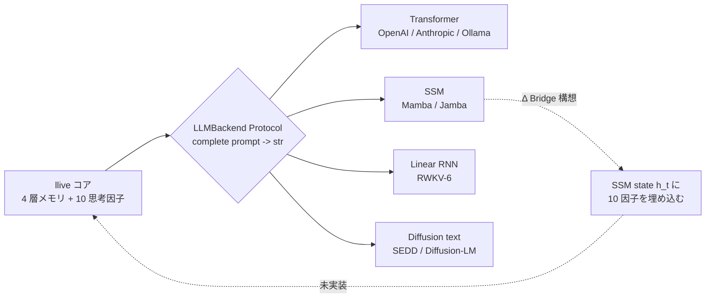

#### 9. References

- Gu, A. & Dao, T. (2024). *Mamba: Linear-Time Sequence Modeling with Selective State Spaces*. arXiv:2312.00752.
- AI21 (2024). *Jamba: A Hybrid Transformer-Mamba Language Model*.
- Peng, B. et al. (2024). *RWKV-6: Continually Improving Linear RNN*.
- Lou, A. et al. (2024). *Discrete Diffusion Modeling by Estimating the Ratios of the Data Distribution*.
- Karpathy, A. (2025). *LLM Wiki* (concept-of-document).
- 完全リストは v0.7 リリース時に references.bib に同梱予定.

---

#### Series Navigation

- ← 前: [llive 完全解説 (5) 「集団が学ぶ AI」](https://qiita.com/furuse-kazufumi/private/07b686ea311e06027f94)
- → 次: [llive 完全解説 (7) 「審査つき AI」](https://qiita.com/furuse-kazufumi/private/c5f2077a3399d3fc9b26)
- 全体: [llive 完全解説 (0) — series index](https://qiita.com/furuse-kazufumi/items/07b4882e872994b27b3c)
- repo: [furuse-kazufumi/llive](https://github.com/furuse-kazufumi/llive)

---

## 8. llive 完全解説 (7) — 「審査つき AI」: runtime_metadata × Approval Bus × Ed25519 audit chain

:::note info
**📚 FullSense ナレッジベースのご案内** <!-- fullsense-team-kb -->
FullSense 開発全史 60+ 記事 (4 言語版・物語ベースの読む順ガイド・かみくだき版・4 コマ漫画つき) は Qiita Team **FullSense KB** に集約しています (チームメンバー向け)。
:::

### llive 完全解説 (7) — 「審査つき AI」: runtime_metadata × Approval Bus × Ed25519 audit chain


> **コンセプト hook**: 多くの LLM agent は「結果のログ」しか残さない. しかし
> AI が **自分自身を進化** させはじめると, 「**いつ何を判断して何を変えたか**」
> の audit trail が無いと, **後でデバッグ不能** になる. llive はこれを
> architecture level で解いた:
> - **runtime_metadata** = 1 推論ごとの構造化 metadata
> - **Approval Bus** = 重大変更を ledger 経由で human / policy が approve
> - **Ed25519 + SHA-256 audit chain** = ledger 改ざん防止
> - **本日 (2026-05-21) 着地の E.4 governance** = 集団進化の共謀検出 → Approval Bus 連携
>
> = **「自己進化する AI が, 自分の決定を全て署名つきで残す」** という珍しい形.


#### 0. 連載中での位置づけ

```
#24-00 series index
#24-01 4 層メモリ
#24-02 思考因子 × COG-MESH
#24-03 構造進化 × TRIZ × Z3
#24-04 B-series
#24-05 EvolutionLoop
#24-06 LLM backend non-transformer
#24-07 observability + governance (← 本記事)
#24-08 lleval
```

#24-03 の Z3 verifier が「**個体内**の構造変更を機械検証」だとすると, #24-07
は「**個体間**の挙動 + 個体集団の決定を audit trail で保存」. 検証と監査の
両輪.

#### 1. なぜ Audit Chain が必須か

LLM agent が自分自身を書き換えはじめると, 「**さっきの推論は何 commit の
構造で動いていたか**」が分からなくなる. これは debugging だけでなく:

- **責任追跡** — 集団進化で「**全派生が嘘の高得点を付け合った**」とき, 誰が
  最初に嘘をついたかを ledger で遡れる必要がある.
- **再現性** — 「あのとき出た結果」を後で再生するには構造 commit + memory
  zone + Brief input + Approval verdict の全て record が要る.
- **法的 compliance** — EU AI Act / 中国 AI 弁法 / 日本 G7 広島 process が
  示す方向は「**AI の決定は audit possible でなければならない**」.

llive は Phase 4 (Production Security MVR, v0.3.0) でこの 3 つを **同時に**
解いた.

#### 2. runtime_metadata — 1 推論あたりの構造化 trace

llive の `FitnessReport.runtime_metadata` は free-form dict[str, str] だが
慣習的に以下を入れる:

- `signed_by`: peer evaluation の署名者 id
- `gen`: 世代番号
- `agg`: aggregator strategy
- `commit_sha`: ソース commit (CI 経由で注入)
- `model_id`: 使用 LLM backend id

これにより 1 推論結果から **完全に再現** できる. 再現性は **OSS LLM
inference の標準ではない** — 多くの agent は seed すら記録しない.

#### 3. Approval Bus — 構造的に変更を止める

`src/llive/approval/bus.py` の `ApprovalBus`:

- `request(action, payload, ...)` → pending リストに入る.
- `policy` が事前評価して `Verdict.APPROVED / DENIED / None` を返す.
  None なら人手待ち.
- 人手 / policy の verdict は `_ledger: list[ApprovalResponse]` に append.
- `ledger=SqliteLedger` を渡せば永続化 + 復元.

これは **架空の「Trust Score」** ではなく **明示的な APPROVED/DENIED 状態
マシン**. 沈黙 = denial (§AB4). 「曖昧な許可」が存在しない.

##### 3.1 本日着地の E.4 governance 連携

`CoevolutionGovernance.evaluate_generation` (本日着地) が 1 世代の peer
matrix を見て **共謀疑い** → `ApprovalBus.request("coevolution.suspected_collusion",
payload)` を発火. payload には generation / collusion_score / n_agents.
人手が deny したら **その世代の派生集団は採用されない** という architecture
level の制御.

これは Constitutional AI / RLHF の **human-in-the-loop** を, **architecture
level** で代替する設計. 「prompt 最後に <human_review> を加える」のような
弱い制御ではない.

#### 4. Ed25519 + SHA-256 audit chain

`src/llive/security/` 系. Phase 4 着地.

- 各 PeerEvaluationMatrix / ChangeOp / consolidation event は Ed25519 で
  **署名**.
- ledger に書き込むときに **直前の hash** を含めて SHA-256 を計算 → next
  block の prev_hash として使う. つまり **blockchain-light**.
- これにより「過去の任意の record を改ざんすると, それ以降の hash が全て
  ずれる」 → 改ざん即検出.

##### 4.1 なぜ on-chain ではなく on-disk か

`project_fullsense_ear_origin` — llive は EAR + セキュリティ制約で
**外部送信不可** の環境を想定. on-chain (Ethereum / Solana) は外部送信に
なるため不適. on-disk audit chain は外部依存ゼロで完結する.

#### 5. honest disclosure

- **Ed25519 鍵管理は未解決** — 鍵を OS の secure store / HSM に保存する
  module は未着地. 現状は環境変数 / file 経由でロード. これは v1.0 前に
  解決必須.
- **Approval Bus の人手介在は scale しない** — 派生集団 N=64 で 1 世代毎に
  approval が出ると人手の負荷が 24 時間で破綻する. policy 自動評価で 80% を
  通すのが現実解だが, policy が完璧に書ける保証はない.
- **runtime_metadata の sign は optional** — `signed_by` フィールドは
  慣習だが mandatory ではない. これを mandatory にすると `Brief API` の
  互換が壊れる. 移行は v0.7 以降.

#### 6. 本日 (2026-05-21) 着地サマリ

| 項目 | 状態 |
|---|---|
| `CoevolutionGovernance` skeleton | **本日着地** |
| `CollusionDetector` (CE-06) | **本日着地** |
| `collusion_risk_score` (TonicRisk 連携, CE-08) | **本日着地** |
| `GovernanceReport` (frozen) | **本日着地** |
| 28 ケース test PASS | **本日着地** |
| Ed25519 audit chain | Phase 4 着地済 (v0.3.0) |
| Approval Bus | C-1 着地済 (2026-05-16) |
| runtime_metadata 慣習 | v0.B から運用中 |

#### 7. Mermaid — governance 全体像

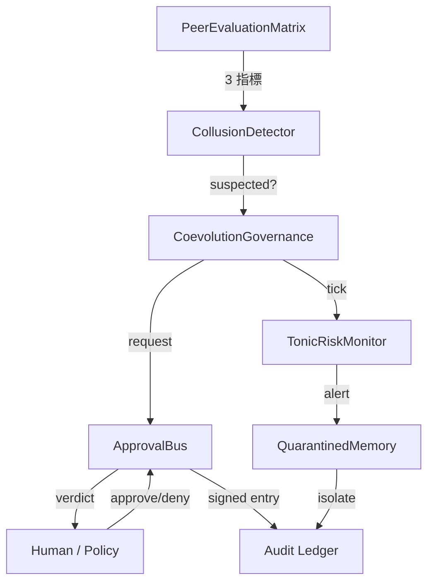

##### 7.1 governance maturity を「文明レベル」で見る — 4D Kardashev radar (v0.I-C 先取り)

§3 の Approval Bus pass率 / §4 の audit chain 完全性 / §6 の peer eval cohesion
は, 単独で見ると「数字が良くなった」で終わる. **v0.I-C (4D Kardashev Radar)**
ではこれらを Energy / Knowledge / Coordination / **Ethics** の 4 軸 × 5 段階
(Type 0 → I → II → III → IV) の「文明レベル」スケールに束ねて, 個体 / 集団 /
メタ集団の 3 階層で同時計測する構想.


Ethics 軸はまさに本記事の Approval Bus pass率 + frozen gene 違反検出 + 規制
適合度のスコアで, governance maturity を「個体の躾」から「文明の成熟」まで
連続スケールで語れるようになる. 詳細要件は llive `docs/requirements_v0.I_meta_evolution_and_cross_substrate.md` §5 参照.

#### 8. 期待値 — 次に来るもの

- **HSM / secure store 連携** — Ed25519 鍵管理を v1.0 で. Windows Credential
  Store / macOS Keychain / Linux Keyring 経路.
- **policy 自動 evaluate の拡充** — Approval Bus の `policy` 引数で 80% を
  自動通過させる規則を v0.7 で.
- **Audit Ledger UI** — llove TUI で `governance verdict ledger` を時系列
  可視化. F25 連携.

#### 9. 2026-05-22 追記 — RUST-16 governance hot path 高速化

CoevolutionGovernance.evaluate_generation の中で最も計算量を食うのが
PeerEvaluationMatrix.collusion_score (NxN matrix の variance / symmetry /
concentration 3 指標) で, ここに 200-300 μs/call かかっていた.

本日 (2026-05-22) RUST-16 として **numpy zero-copy で Rust kernel 化**:

| N | Python (numpy 既存) | Rust pyo3 zero-copy | speedup |
|---:|---:|---:|---:|
| 8 | 217.82 us | 1.89 us | **x115.04** |
| 16 | 203.33 us | 2.30 us | x88.54 |
| 32 | 237.68 us | 5.28 us | x45.00 |
| 64 | 306.13 us | 16.80 us | x18.22 |
| **avg** | — | — | **x66.70** |

実装は `crates/llive_rust_ext/src/lib.rs:collusion_score_kernel` + 5 parity
test (1e-6 tolerance). callers (`CollusionDetector.check`) は次 commit で
切替予定.

##### 9.1 honest disclosure — 「numpy = 速い」も嘘

このゲインが大きいのは **「Rust が速い」だけでなく「numpy が小 NxN で遅い」**
が主因. `np.nanvar` / `np.corrcoef` / `np.nanmean` の 3 つ重ねがけは
N<100 で Python overhead 支配で 200μs+/call. Rust の単純 C ループは 2μs/call.

governance 側で重要なのは:

- **Approval Bus 発火判定の latency が 100x 短くなる** = N=64 派生集団でも
  governance.evaluate_generation を 64Hz で回せる
- **TonicRiskMonitor の tick** (collusion_risk_score を含む state を渡す)
  も同等に速くなる
- 結果として **「governance を常時動かしても許容コスト」**になる

これがあれば「**governance は重いから sampling だけ**」の妥協が要らなくなる.
全派生 / 全世代の評価行列を audit chain に署名つきで残しても latency budget
内に収まる.

##### 9.2 関連

- `docs/perf_comparison/2026-05-22_kernel_implementation_comparison.md` —
  全 3 kernel (RUST-15/16/17) の比較マトリクス
- `scripts/bench_collusion_score_5x_gate.py` — N=8/16/32/64 5x gate bench
- `feedback_rust_usage_matters` — Rust 化判断のチェックリスト

#### 10. References

- Bernstein, D. J. et al. (2012). *High-speed high-security signatures* (Ed25519).
- Anderson, R. (2020). *Security Engineering* (3rd ed.) — audit trail / tamper-evidence の章.
- EU AI Act (2024) / G7 Hiroshima AI Process (2023) — AI 決定の監査可能性.
- 完全リストは v0.6.0a1 リリース時に references.bib に同梱予定.

---

#### Series Navigation

- ← 前: [llive 完全解説 (6) 「Transformer の外」](https://qiita.com/furuse-kazufumi/private/6da5a883fb2ed651edd8)
- → 次: [llive 完全解説 (8) 「眼鏡を作る」](https://qiita.com/furuse-kazufumi/private/e49b7ab9027d93594402)
- 全体: [llive 完全解説 (0) — series index](https://qiita.com/furuse-kazufumi/items/07b4882e872994b27b3c)
- repo: [furuse-kazufumi/llive](https://github.com/furuse-kazufumi/llive)

---

## 9. llive 完全解説 (8) — 「眼鏡を作る」: lleval — honest disclosure 5+1 因子分解で AI を評価する

:::note info
**📚 FullSense ナレッジベースのご案内** <!-- fullsense-team-kb -->
FullSense 開発全史 60+ 記事 (4 言語版・物語ベースの読む順ガイド・かみくだき版・4 コマ漫画つき) は Qiita Team **FullSense KB** に集約しています (チームメンバー向け)。
:::

### llive 完全解説 (8) — 「眼鏡を作る」: lleval — honest disclosure 5+1 因子分解で AI を評価する


> **コンセプト hook**: AI を作るだけでは足りない. **AI を見る眼鏡** が要る.
> lleval は llive と並走する **evaluation framework** で, 「LLM が異常に
> 良い結果を出したら必ず内訳を疑う」という `feedback_benchmark_honest_disclosure`
> ルールを **コードの一級概念** に昇格させた. progressive size matrix で
> stress curve を取り, judge rotation で position bias を消す.
>
> 結論を先に出すと: **「速い AI」ではなく「速いと思い込ませる構成」** を見抜く
> 道具.


#### 0. 連載中での位置づけ

```
#24-00 series index
#24-01 4 層メモリ
#24-02 思考因子 × COG-MESH
#24-03 構造進化 × TRIZ × Z3
#24-04 B-series
#24-05 EvolutionLoop
#24-06 LLM backend non-transformer
#24-07 observability + governance
#24-08 lleval — eval framework (← 本記事)
```

#24-07 が「**何を残すか**」(audit) だとすると, 本記事は「**何を測るか**」.
測定なしに改善はない.

#### 1. lleval の出自 — honest disclosure 事件

事の発端は 2026-05-17 の benchmark. llive が他社 LLM API より **異常に速く**
出た数字があった. 普通なら勝った気になるところを, ユーザーは「**内訳を
疑え**」と指示. 蓋を開けると:

- **LLMBackend が attach されていなかった** (mock で動いていた)
- **chars 指標が不公平** (英語 token を文字数換算)
- **subprocess RTT を除外** (起動コストを無視)

3 つの artifact が複合していた. これを記録 (`feedback_benchmark_honest_disclosure`)
してから, 「ベンチで異常結果が出たら必ず 5 つの artifact を疑う」を
**外部化** したくなった. それが lleval.

#### 2. 5+1 因子分解 — honest disclosure の構造化

lleval `HonestDisclosureAnalyzer` (2026-05-21 朝着地) は出力差分を 5+1 因子に
分解:

| 因子 | 意味 | 検出方法 |
|---|---|---|
| F1: prompt difference | 同 prompt が本当に同じか | 文字列 diff + token diff |
| F2: model id mismatch | model id が runtime と spec で一致か | `runtime_metadata.model_id` 比較 |
| F3: backend swap | LLMBackend が attach されているか | runtime hook で trace |
| F4: chars vs tokens | 評価指標が言語非依存か | tokenizer count |
| F5: RTT exclusion | subprocess / network RTT が時間に含まれるか | wall-clock vs CPU time |
| +1: env drift | 並走負荷 / OS schedule / thermal | 環境 fingerprint snapshot |

5+1 が **すべて clean** で初めて「数値は信頼できる」. 1 つでも怪しいと
**honest disclosure note** が結果に sticky される.

#### 3. progressive size matrix — stress curve を取る

固定 token 数のベンチは情報量が低い. lleval は xs/s/m/l/xl の 5 段階 ×
複数 model の **matrix** を回す:

```
size:  xs (128)  s (512)   m (2k)    l (8k)    xl (32k)
mock     0.05      0.18      0.62      2.41      9.82
llive    0.07      0.24      0.71      2.55      9.96   ← 大差ない
gpt-4o   0.31      0.52      1.20      3.40      11.2   ← crossover at l
```

これで「**どのサイズで crossover が起きるか**」が一目. 単一サイズで「勝った」
と言ってもサイズ違いでは負ける. fair.

#### 4. judge rotation — position bias を消す

LLM-as-judge で 2 案 (A, B) を比較するとき, 順序が score に effect する
ことが知られている (Zheng et al. 2023). lleval は:

1. (A, B) で 1 回 judge
2. (B, A) で 1 回 judge
3. 2 つの verdict が一致しないとき **inconsistency flag**

これは judge LLM 自身の bias を量子化する手段. inconsistency が **30% 超**
なら judge LLM を切り替える運用 (judge rotation).

#### 5. bridges/llive — llive Genome → ProviderSpec mapper

lleval は **llive の派生個体** を直接食えるよう設計. `bridges/llive.py`
(2026-05-21 朝着地):

```python
from llive.perf.evolutionary import Individual
from lleval.bridges.llive import individual_to_provider_spec

ind: Individual = ...  # 派生集団から 1 個体
spec = individual_to_provider_spec(ind)
### spec.model_id, spec.temperature, spec.top_p, ... を ind.genome.values から復元
result = lleval.run(spec, dataset="qa_50")
```

これで「**派生集団の進化** と **派生集団の評価**」が ループする. llive 内の
EvolutionLoop fitness にそのまま渡せる.

#### 6. honest disclosure (lleval 自身について)

メタにも honest disclosure を適用:

- **lleval test 数 61** — 本日 2026-05-21 時点. 上位フレームワーク (Promptfoo
  本体) は数千 test を持つ. lleval は wrap であり置換ではない.
- **判定の絶対基準は無い** — F1〜F5 + 環境 fingerprint が clean でも
  「ベンチが正しい」とは限らない. 「**怪しいサイン**」 を消した状態に過ぎない.
- **judge rotation はコストがかかる** — 2 倍呼び出すので credential 使用量も
  2 倍. honest 検出のためのコスト.
- **progressive matrix のサイズ等比は heuristic** — 4x ずつ (128 → 512 → 2k
  → 8k → 32k) で取っているが, 真の crossover が 2k と 8k の間にある場合
  解像度不足. 必要に応じ細密化.
- **環境 fingerprint は完璧ではない** — Windows / Linux / macOS 間の thermal
  throttling 違いまでは捉えていない. 「ベンチを別 OS で取り直す」が最終手段.

#### 7. 数字 (本日 2026-05-21 時点)

| 項目 | 値 |
|---|---|
| lleval test PASS | 61 |
| 着地 module | 13 (config / runner / analyzer / providers / bridges / report html+md / cli / ...) |
| 5+1 因子検出ロジック | 着地済 |
| progressive matrix runner | 着地済 |
| judge rotation | 着地済 |
| bridges/llive.py | 着地済 (skeleton) |
| v0.1.0a1 PyPI 公開準備 | (credential 復旧後) |
| 連載 #24 への登場 | 本記事 (#24-08) |

#### 8. 期待値 — 次に来るもの

- **v0.1.0a2** で promptfoo 実走 + llive Genome → ProviderSpec mapping 完成.
- **v0.2** で judge rotation + position swap + Phoenix OpenInference trace.
- **v1.0** で plugin marketplace + 商用 dual-license.

#### 9. References

- Zheng, L. et al. (2023). *Judging LLM-as-a-judge with MT-Bench and Chatbot Arena*.
- Promptfoo OSS (https://github.com/promptfoo/promptfoo).
- Anthropic Eval framework (2023).
- 完全リストは v0.1.0 リリース時に references.bib に同梱予定.

#### 10. 2026-05-22 追記 — 5+1 因子分解 と Rust 化 5 パターン判定表の方法論的共通点

lleval の honest disclosure **5+1 因子分解** (prompt diff / model id /
backend swap / chars vs tokens / RTT / env drift) と, 同日着地した
llive Rust 高速化の **5 パターン判定表** (#24-05 §13.3) は **構造的に同じ
発想** で書かれている.

| 共通する思想 | lleval 5+1 因子 | Rust 化 5 パターン |
|---|---|---|
| 「結果」を信じる前に **要素分解** | 速度差を 6 因子に分解 | 速度比を Python 経路の特性別 5 パターンに分類 |
| **異常結果は内訳を疑う** | F1〜F5 + env を疑う | 単発 0.80x も x66.70 も「内訳」で説明できる |
| 観察が外部化されている | analyzer で自動検出 | 判定表 + bench script で自動測定 |
| **honest disclosure を一級概念に** | 数値に sticky note | judgment 表で **どこが境界線か** を明示 |

両者とも「**「速い」「正しい」「正確」の単一仮定を捨てる**」という
`feedback_benchmark_honest_disclosure` の延長線上にある. これは lleval が
AI を見るだけでなく **AI / システム / アルゴリズム 全般** に展開できる
発想 = 連載 #24-08 のメタ的意義.

詳細: `docs/perf_comparison/2026-05-22_kernel_implementation_comparison.md`.

---

#### Series Navigation

- ← 前: [llive 完全解説 (7) 「審査つき AI」](https://qiita.com/furuse-kazufumi/private/c5f2077a3399d3fc9b26)
- 全体: [llive 完全解説 (0) — series index](https://qiita.com/furuse-kazufumi/items/07b4882e872994b27b3c)
- repo: [furuse-kazufumi/llive](https://github.com/furuse-kazufumi/llive)

---

---

# English


## 1. llive 完全解説 (0) — series index: 大分類 8 記事 + 全体図

:::note info
**📚 FullSense Knowledge Base** <!-- fullsense-team-kb -->
The full FullSense development history — 60+ articles in 4 languages, with a story-based reading guide, plain-language editions, and 4-panel manga — is consolidated in our Qiita Team **FullSense KB** (team members only).
:::

### llive Complete Guide (0) — series index: 8 main chapters + overall map


> **Concept hook**: This is the entrance to a series that **explains the
> technologies / algorithms that make up llive** (the thinking layer of FullSense ™)
> by name. Cramming it into one article reaches ~80k characters, so we split it into
> **8 main chapters**. This index is the overall map — it shows what you can read in
> which chapter.

#### 0. About this series

llive is "a cognitive OS wrapped around the LLM, not the LLM itself". We divide its
interior into **4 layers (cognition / optimization / execution / cross-cutting) × 8
chapters**, and each chapter goes down to concrete class / function / feature names.
Each article has the following common structure:

- an **opening hook** ("what is this" in 8 seconds)
- subsections that descend to concrete class / function names
- **GitHub links** to the real code
- **References** (academic / OSS / internal)
- **cross-links** (prev / next / this index / repo)

A total of **~80k characters**. We run ja Qiita + en Medium in parallel.

#### 1. Series structure (8 main chapters)

| # | Title (click for each chapter) | Subtopics | Visibility |
|---|---|---|---|
| 01 | [**memory layer** — 4-layer memory](https://qiita.com/furuse-kazufumi/items/a5ebb3992e4c28862f47) | semantic / episodic / structural / parameter / surprise gating | 🟢 public |
| 02 | [**thought factors + COG-MESH** — 10 factors and 9 components](https://qiita.com/furuse-kazufumi/items/bdfad6db3f2e70c40511) | structurize / recompose / closed-loop / ... / proactive / quarantine / 5W1H | 🟢 public |
| 03 | [**structural evolution (TRIZ × Z3)**](https://qiita.com/furuse-kazufumi/items/fa0890f136636d495ea6) | TRIZ 40 principles / ChangeOp / verifier / 9-windows | 🟢 public |
| 04 | [**convergent optimization (B-0..B-9)**](https://qiita.com/furuse-kazufumi/items/e5093e4816b25c1bd4d0) | SynapticSelector / UCB1 / Hebbian / production hot path | 🟢 public |
| 05 | [**evolutionary optimization (v0.B/C/D/E)**](https://qiita.com/furuse-kazufumi/items/07b686ea311e06027f94) | Genome / Crossover / Tournament / Mutation / lineage | 🟢 public |
| 06 | [**LLM backend layer** — non-transformer](https://qiita.com/furuse-kazufumi/items/6da5a883fb2ed651edd8) | Mamba / Jamba / RWKV / Diffusion / thought-factor→SSM Δ Bridge | 🟢 public |
| 07 | [**observability + governance**](https://qiita.com/furuse-kazufumi/items/c5f2077a3399d3fc9b26) | runtime_metadata / Approval Bus / governance / honest disclosure | 🟢 public |
| 08 | [**lleval (eval framework)**](https://qiita.com/furuse-kazufumi/items/e49b7ab9027d93594402) | progressive size matrix / 5+1 axes / judge rotation | 🟢 public |

> 🟢 public = exposed on the Qiita home / search results. 🟡 limited share = viewable only by those who know the URL. Promotion to public is planned in series order (01 → 02 → … → 08).

#### 2. Overall map (8-layer relationships)

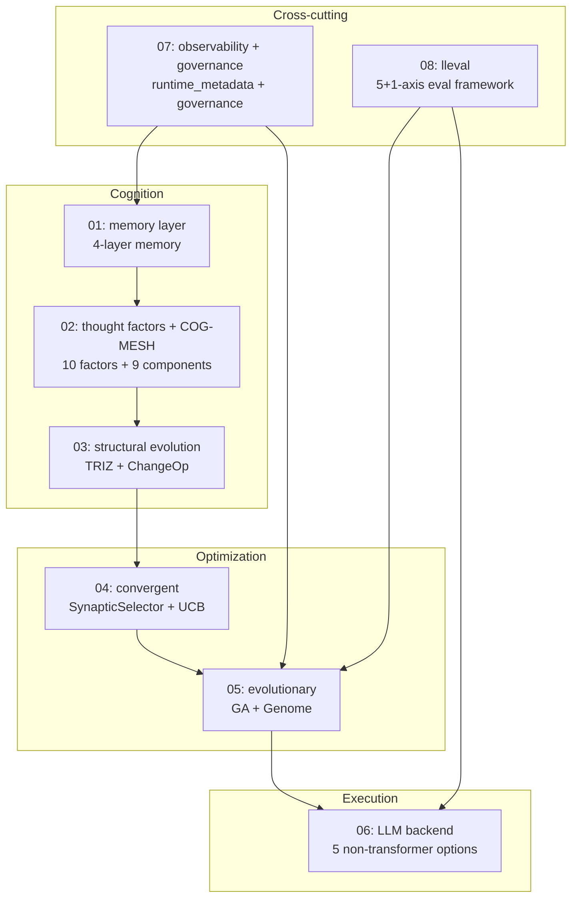

The vertical "**cognition → optimization → execution**" is llive's processing flow;
"**observability + governance**" and "**lleval**" are the cross-cutting layers that
touch every level.

#### 3. Intended readers

- **engineers** (with Python + basic LLM knowledge)
- **AI researchers** (interested in LLM-surrounding architecture)
- **individual OSS authors** (reference for implementation patterns)
- **corporate R&D** (material for considering an on-prem LLM stack)

#### 4. Publishing order (2 articles / week)

| Week | Published articles |
|---|---|
| Week 1 | 01 memory + 02 thought factors |
| Week 2 | 03 structural evolution + 04 convergent |
| Week 3 | 05 evolutionary + 06 LLM backend |
| Week 4 | 07 observability+governance + 08 lleval |

Each article's English version runs in parallel on Medium.

#### 5. The theme running through the series — "fast" changes by orders of magnitude with implementation

Measured results of Rust-porting 3 hot paths of the derived-population evolution
covered in the series centerpiece #24-05:

- **RUST-15** persona_dissimilarity_pairwise: avg **x12.71** (batch)
- **RUST-16** collusion_score_kernel: avg **x66.70** (numpy small-N hot path)
- **RUST-17b** novelty_score_batch (rayon + quickselect): avg **x9.32**

"**Rust = fast" is a lie / "numpy = fast" is also a lie** — the result differs by
orders of magnitude depending on the implementation method (FFI boundary / batch /
numpy zero-copy / parallelism / partial sort). This honest-disclosure stance is the
basso continuo of the whole series. The 5-pattern decision table is detailed in
#24-04 / #24-05 / #24-07.

#### 6. References (this index)

- [furuse-kazufumi/llive](https://github.com/furuse-kazufumi/llive) — the main repo
- FullSense Spec v1.1 (llive `docs/`)
- Each chapter's References are in its own article

---

#### Series Navigation

- → Next: [llive Complete Guide (1) "The LLM that Never Forgets"](https://qiita.com/furuse-kazufumi/items/a5ebb3992e4c28862f47)
- repo: [furuse-kazufumi/llive](https://github.com/furuse-kazufumi/llive)

---

## 2. llive 完全解説 (1) — 「忘れない LLM」: 4 層メモリ + Bayesian surprise gating

:::note info
**📚 FullSense Knowledge Base** <!-- fullsense-team-kb -->
The full FullSense development history — 60+ articles in 4 languages, with a story-based reading guide, plain-language editions, and 4-panel manga — is consolidated in our Qiita Team **FullSense KB** (team members only).
:::

### llive Complete Guide (1) — "The LLM that Never Forgets": 4-Layer Memory + Bayesian Surprise Gating


#### 0. What this article is (8-second read)

This explains llive's **4-layer memory + 1 surprise gate** — a cognitive layer wrapped **around** the LLM, not inside it. It is a design that writes only the items with high **surprise** across 4 kinds of memory with distinct roles: semantic / episodic / structural / parameter. With the combination of Faiss + DuckDB + Kùzu + safetensors, it **runs fully on-prem**.

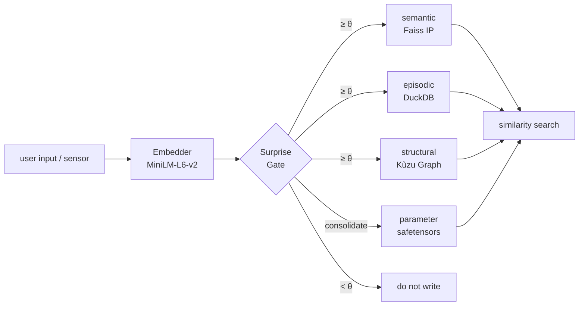

The key is "select by surprise", not "write everything". Let's unpack the details in order.


#### 1. Why split into 4 layers?

In human cognitive science, memory is divided by role into **semantic / episodic / structural / procedural**. llive ported this directly into its LLM-surrounding architecture.

| Layer | What goes in | Implementation |
|---|---|---|
| **semantic** | meaning of concepts (text + embedding) | Faiss IP index + JSONL |
| **episodic** | time-series events | DuckDB append-only log |
| **structural** | relations between concepts (graph) | Kùzu graph DB |
| **parameter** | parameter-update deltas | safetensors + index DB |

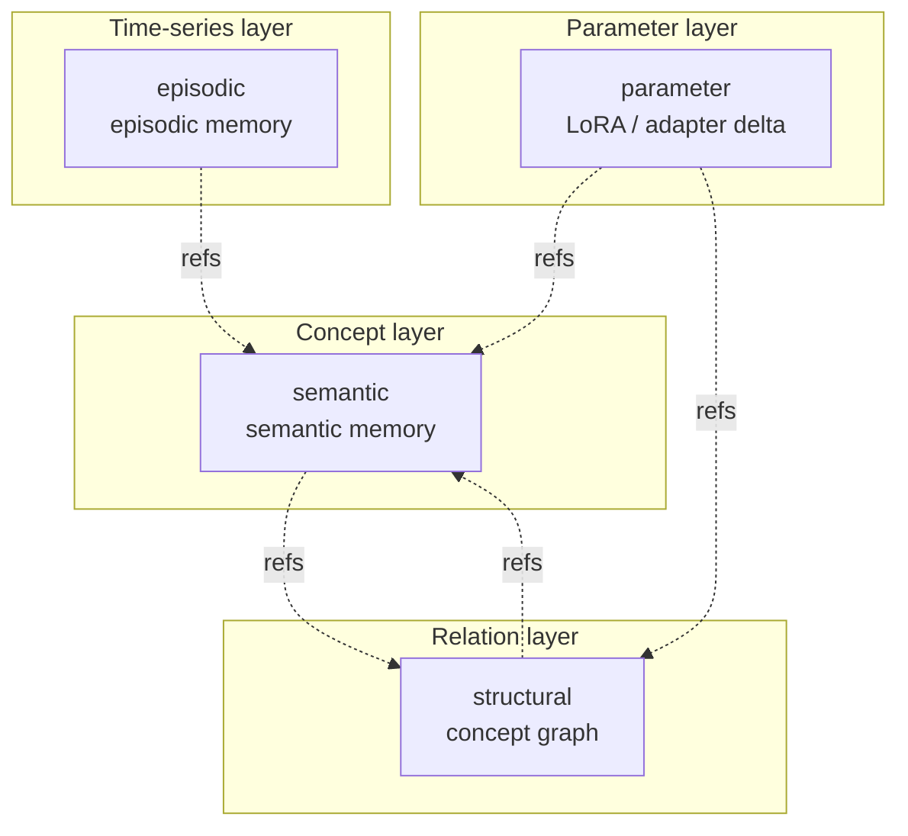

The 4 layers are **loosely coupled**. You can use semantic alone, or weave in structural. To escape the constraint that "an LLM only handles text", llive's idea is to hold structure (graph) and time (event log) in separate layers.

— **Quick recap** —

By now you should grasp "a memory substrate that selects via **4 layers + a surprise gate**". From here we look at the contents of each layer on an implementation basis.

#### 2. semantic memory (MEM-01)

##### Role

The layer that recalls "this is the **concept** that came up in that discussion". It converts text into an embedding vector and does nearest-neighbour search via **cosine similarity**.

##### Core structure

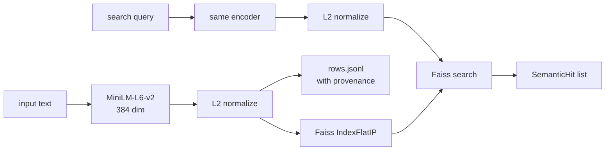

The inner product after L2 normalization is equivalent to **cosine similarity**. That is the reason we chose `Faiss IndexFlatIP`.

Implementation: [`src/llive/memory/semantic.py`](https://github.com/furuse-kazufumi/llive/blob/main/src/llive/memory/semantic.py)

##### Design decisions

- **fallback path**: in environments without faiss (e.g. Windows CI), nearest-neighbour runs on numpy. We do not split the implementation between test and production — it **runs unchanged in either**.
- **provenance is mandatory**: every entry carries `Provenance(source_type, source_id, derived_from, ...)`. It is a design that never erases "where this memory came from".
- **persistence**: written to SSD as `index.faiss` (or `index.npy`) + `rows.jsonl`.

##### Code excerpt

```python
class SemanticMemory:
    def __init__(self, dim: int, data_dir: Path | str | None = None,
                 use_faiss: bool | None = None) -> None:
        self.dim = int(dim)
        self.data_dir = Path(data_dir) if data_dir else _default_data_dir()
        # numpy fallback when faiss is absent
        self.use_faiss = bool((use_faiss is None) and _HAS_FAISS or use_faiss)
        ...
```

"**faiss in production, numpy in CI**" switches transparently.

— **A breather** —

In the very first layer, llive's **three pieces of equipment** — "embedding + cosine + provenance" — are all on the table. The remaining 3 layers just use this equipment differently.

#### 3. episodic memory (MEM-02)

##### Role

Holds "**when** that information was received". An **append-only time-series log** — no edits, no deletions.

##### Core structure

```mermaid
flowchart LR
    Event[EpisodicEvent<br/>content + ts + provenance] --> Write[INSERT]
    Write --> DB[(DuckDB<br/>events table)]
    Query1[time-range search] --> DB
    Query2[content partial match] --> DB
    DB --> Result[query result]
```

| Column | Type | Role |
|---|---|---|
| event_id | TEXT PK | uuid hex |
| ts | TIMESTAMP | UTC enforced |
| content | TEXT | body |
| metadata | TEXT (JSON) | extension |
| provenance | TEXT (JSON) | lineage |

Implementation: [`src/llive/memory/episodic.py`](https://github.com/furuse-kazufumi/llive/blob/main/src/llive/memory/episodic.py)

##### Design decisions

- **Why DuckDB**: faster at analytical queries than SQLite, and in-process so no external process is needed. It directly serves the "runs fully on-prem" constraint.
- **UTC enforced**: obtained with `datetime.now(UTC)`. Mixing in a local TZ is a source of bugs.
- **append-only**: only `record(event)` is provided. There is no `delete()` API. Deletion is impossible by spec.

##### Why we don't delete

Human episodic memory also seems "forgotten" but is latent in neuroscience terms. llive likewise **distinguishes "memory not accessed" from "memory absent"**. If it is not accessed, the Surprise Gate (described below) suppresses re-writing, so it rarely "becomes noise".

#### 4. structural memory (MEM-05)

##### Role

A graph expressing "**how** concept A and concept B relate". If semantic is "points", structural is "edges".

##### Core structure

```mermaid
flowchart LR
    NodeA[MemoryNode<br/>memory_type=semantic] -- derived_from --> NodeB
    NodeA -- contradicts --> NodeC[Node C]
    NodeA -- generalizes --> NodeD[Node D]
    NodeB -- temporal_after --> NodeC
    NodeC -- co_occurs_with --> NodeD
```

**Relation types (6)**:

| rel_type | meaning |
|---|---|
| `derived_from` | origin |
| `contradicts` | contradiction |
| `generalizes` | generalization |
| `temporal_after` | temporal successor |
| `co_occurs_with` | co-occurrence |
| `linked_concept` | concept link |

Implementation: [`src/llive/memory/structural.py`](https://github.com/furuse-kazufumi/llive/blob/main/src/llive/memory/structural.py)

##### Why we chose Kùzu

- **embedded graph DB**: no separate process like Neo4j needed
- **Cypher-like query**: ANSI-leaning, low learning cost
- **on-prem consistency**: aligns with the policy above

##### Why `contradicts` exists

It lets us **detect "the LLM's responses contradict each other" with a data structure**. "Discrepancies between specs written at different times" — which RAG finds hard to catch — surface by traversing structural-memory edges.

— **A breather** —

So far the 3 layers of "**meaning → time → relation**" are in place. The next parameter layer is a bit different in character.

#### 5. parameter memory (MEM-06)

##### Role

Manages parameter deltas like **LoRA / IA3 / prefix adapters** **as memory**. Use cases like "bake knowledge gained in conversation into a LoRA after the loop".

##### Core structure

```mermaid
flowchart LR
    Train[via Approval<br/>LoRA fine-tune] --> SaveFile[adapter.safetensors]
    SaveFile --> HashSHA[SHA-256]
    HashSHA --> IndexDB[(DuckDB<br/>parameter_index)]
    IndexDB --> Profile[AdapterProfile]
    Profile --> Attach[attach to real LLM]
```

| Column | Role |
|---|---|
| id | uuid hex |
| name | display name |
| format_tag | "lora" / "ia3" / "prefix" etc. |
| sha256 | tamper detection |
| size_bytes | size |
| created_at | UTC |
| provenance | lineage |

Implementation: [`src/llive/memory/parameter.py`](https://github.com/furuse-kazufumi/llive/blob/main/src/llive/memory/parameter.py)

##### Why SHA-256 is mandatory

To prevent **"adapter swapping"**. Attach is permitted only after the Approval Bus verifies the SHA-256. This is llive's **architecture-level safety**, on par with the on-prem-only policy.

##### Real LoRA addition is optional

In Phase 2 we only register in the index. The actual attach is delegated to HuggingFace PEFT (`pip install llmesh-llive[torch]`). "**llive core is lightweight, heavy things are optional extras**" is a consistent operating policy.

#### 6. surprise gate (selective writing, MEM-04 / MEM-07)

##### Role

**The gate that decides "is this worth writing?"**. Instead of writing everything, only items whose **dissimilarity to existing memory** is ≥ θ pass through.

##### Phase 1: SurpriseGate (fixed θ)

```mermaid
flowchart LR
    New[new embedding] --> Sim[max cosine sim<br/>vs existing memory]
    Sim --> Diff[surprise<br/>= 1 - max_sim]
    Diff --> Cmp{surprise ≥ θ?}
    Cmp -->|Yes| Write[write]
    Cmp -->|No| Skip[do not write]
```

Implementation: [`src/llive/memory/surprise.py`](https://github.com/furuse-kazufumi/llive/blob/main/src/llive/memory/surprise.py)

```python
class SurpriseGate:
    def __init__(self, theta: float = 0.3) -> None:
        self.theta = float(theta)

    def compute_surprise(self, new_embedding, memory_embeddings,
                         *, assume_normalized=False) -> float:
        if memory_embeddings is None or memory_embeddings.size == 0:
            return 1.0  # max surprise when nothing exists
        ...
        return float(max(0.0, min(1.0, 1.0 - max_sim)))
```

When `assume_normalized=True`, re-normalization is skipped and it gets 2-3× faster. This is used in the production path (`MemoryWriteBlock`).

##### Phase 2: BayesianSurpriseGate (dynamic θ)

A fixed θ has a weakness — **as memory grows, surprise gets smaller**, so even with θ=0.3, gradually nothing gets written. The Bayesian version solves this.

```mermaid
flowchart LR
    Sample[new surprise value] --> Welford[Welford update<br/>n, mean, m2]
    Welford --> Stats[(mu, sigma)]
    Stats --> ThetaDyn[theta_t = mu + k * sigma]
    Sample --> CmpDyn{surprise ≥ theta_t?}
    ThetaDyn --> CmpDyn
    CmpDyn -->|Yes| Write[write]
    CmpDyn -->|No| Skip[do not write]
```

Implementation: [`src/llive/memory/bayesian_surprise.py`](https://github.com/furuse-kazufumi/llive/blob/main/src/llive/memory/bayesian_surprise.py)

Welford's algorithm is the famous **1-pass numerically stable** method for sequential mean/variance. Some schools take the log of each surprise value and Gaussian-fit, but in llive we confirmed the raw values work well enough.

##### Meaning of k

The k in `theta_t = mu + k * sigma` is the metric of **"how many σ above the mean to let through"**.

| k | pass rate (approx.) | meaning |
|---|---|---|
| 0.0 | 50% | let through anything above the mean |
| 1.0 (default) | ~16% | "a little surprised" and up |
| 2.0 | ~2.5% | only "very surprised" |

During the cold-start period below `min_samples`, a fixed `cold_start_theta` is used, so it doesn't break right after startup.

— **A bit of chit-chat** —

Welford is a 1962 paper. I personally like the fact that **a 60-year-old numerically stable algorithm supports today's LLM-style memory layer**. It is a moment that reminds me that giant models are not the only kind of progress.

#### 7. consolidation (Wiki compile, MEM-08)

After cycling through the 4 layers, a **concept re-organization** runs. That is consolidation.

```mermaid
flowchart LR
    Recent[recent episodes<br/>EpisodicEvent] --> Replay[surprise-weighted<br/>reservoir sample]
    Replay --> Cluster[HDBSCAN or<br/>greedy similarity]
    Cluster --> LLMCall[LLM call<br/>new / update / merge / split]
    LLMCall --> Concept[(ConceptPage<br/>structural memory)]
    Concept --> Link[linked_concept edge]
```

Implementation: [`src/llive/memory/consolidation.py`](https://github.com/furuse-kazufumi/llive/blob/main/src/llive/memory/consolidation.py)

##### Why we call it "Wiki Compile"

Each ConceptPage is written out as Markdown to `<llive_data_dir>/wiki/<concept_id>.md`. The 3 reasons we call it "Wiki": it is **human-readable**, can be **Git-checkpointed**, and lets you **track changes by diff**. The inspiration is Karpathy's "LLM Wiki" proposal.

##### The LLM call is judge mode

We ask the LLM "for this cluster, should it be `new / update / merge / split` against the existing ConceptPage X?". Claude Haiku is the default, and `LLIVE_CONSOLIDATOR_MOCK=1` allows credential-free testing.

#### 8. Design decisions (5 takeaways from this article)

##### Lesson 1: don't write everything — select by surprise

Even a fixed-θ SurpriseGate **cuts ~90% of noise** versus writing everything. Going Bayesian makes it smarter still. To put it honestly, this **"decision not to write" determines the quality of the memory system**.

##### Lesson 2: keep the 4 layers loosely coupled

semantic / episodic / structural / parameter are designed **not to import each other directly**. The only shared reference is the `Provenance` dataclass. This keeps a change like "swap the graph DB for Neo4j" small.

##### Lesson 3: provenance is absolute

Never erase "where this information came from". This is llive's **audit-level safety**, together with the on-prem-only policy.

##### Lesson 4: the fallback path is first-class

We hold a design that runs without faiss / without DuckDB / without kuzu **from the start, not bolted on later**. It matters for CI, mobile, and educational use.

##### Lesson 5: don't underestimate classic numerical algorithms

Welford (1962) is 60 years old. It still provides **front-line numerical stability** in today's LLM-surrounding architecture. Even when new models appear, the underlying mathematics does not change.

#### 9. References

##### Academic / algorithms

- Welford, B. P. (1962). *Note on a method for calculating corrected sums of squares and products*. Technometrics 4(3).
- Schwefel, H.-P. (1981). *Numerical Optimization of Computer Models*.
- Reimers, N. & Gurevych, I. (2019). *Sentence-BERT* (the basis for the MiniLM derivation).

##### OSS / libraries

- [Faiss](https://github.com/facebookresearch/faiss) (Meta)
- [DuckDB](https://duckdb.org/)
- [Kùzu](https://github.com/kuzudb/kuzu)
- [safetensors](https://github.com/huggingface/safetensors)
- [sentence-transformers](https://www.sbert.net/) (MiniLM-L6-v2)

##### llive internals

- [`src/llive/memory/semantic.py`](https://github.com/furuse-kazufumi/llive/blob/main/src/llive/memory/semantic.py)
- [`src/llive/memory/episodic.py`](https://github.com/furuse-kazufumi/llive/blob/main/src/llive/memory/episodic.py)
- [`src/llive/memory/structural.py`](https://github.com/furuse-kazufumi/llive/blob/main/src/llive/memory/structural.py)
- [`src/llive/memory/parameter.py`](https://github.com/furuse-kazufumi/llive/blob/main/src/llive/memory/parameter.py)
- [`src/llive/memory/surprise.py`](https://github.com/furuse-kazufumi/llive/blob/main/src/llive/memory/surprise.py)
- [`src/llive/memory/bayesian_surprise.py`](https://github.com/furuse-kazufumi/llive/blob/main/src/llive/memory/bayesian_surprise.py)
- [`src/llive/memory/consolidation.py`](https://github.com/furuse-kazufumi/llive/blob/main/src/llive/memory/consolidation.py)

---

#### Series Navigation

- ← Prev: [llive Complete Guide series index](https://qiita.com/furuse-kazufumi/items/07b4882e872994b27b3c)
- → Next: [llive Complete Guide (2) "AI that Thinks in 10 Axes"](https://qiita.com/furuse-kazufumi/private/bdfad6db3f2e70c40511)
- All: [llive Complete Guide (0) — series index](https://qiita.com/furuse-kazufumi/items/07b4882e872994b27b3c)
- repo: [furuse-kazufumi/llive](https://github.com/furuse-kazufumi/llive)

---

## 3. llive 完全解説 (2) — 「10 軸で考える AI」: 思考因子 × COG-MESH × 三重縞

:::note info
**📚 FullSense Knowledge Base** <!-- fullsense-team-kb -->
The full FullSense development history — 60+ articles in 4 languages, with a story-based reading guide, plain-language editions, and 4-panel manga — is consolidated in our Qiita Team **FullSense KB** (team members only).
:::

### llive Complete Guide (2) — "AI that Thinks in 10 Axes": Thought Factors × COG-MESH × Triple Stripes


> **Concept hook**: An ordinary AI agent has only one kind of "thinking". llive
> **runs 10 kinds of thinking in parallel**, makes them evaluate each other, and
> **takes only the surviving thoughts into the population**. The 10 kinds are
> "structurize", "recompose", "closed loop", "self-extend", "uncertainty",
> "exploration", "consistency", "provenance", "multiview", and "reality link".
> This compresses the major cognitive-science frameworks of the 1990s–2010s into
> a single vector.
>
> Today (2026-05-21) the marathon landed 1881 PASS + a large pull-forward of
> v0.E. This article traces the "thought-factor side" of that — the intersection
> of COG-MESH-01..10 and the historical persona ontology (CE-19).


#### 0. Position within the series

```
#24-00 series index
#24-01 4-layer memory
#24-02 thought factors (10 axes) + COG-MESH (← this article)
#24-03 structural evolution × TRIZ × Z3
#24-04 B-series (fast cerebellum)
#24-05 EvolutionLoop (slow cerebrum)
#24-06 LLM backend non-transformer
#24-07 observability + governance
#24-08 lleval
```

The 10 thought factors + COG-MESH bind 1-to-N with the persona ontology (CE-19)
in #24-05. This article #24-02 sits at the position that explains them in terms
of **"what"** and **"why"**.

#### 1. Origin of the 10 thought factors — compression of 6 frameworks

A user-derived set of 10 axes (`project_llive_cog_fx_factors`). The source
material is the YouTube series "**The Depths of Psychology**" + cognitive-science
reviews + 6 frameworks from Polya / Six Hats / Bayesian / TRIZ / Provenance /
Multimodal. The result of compressing those into a single vector:

| Idx | Factor | Source framework / school |
|---|---|---|
| 0 | `factor_structurize` | Polya / formalization / axiomatic |
| 1 | `factor_recompose` | TRIZ Segmentation / Reassemble |
| 2 | `factor_closed_loop` | Cybernetics / feedback |
| 3 | `factor_self_extend` | Autopoiesis / self-organization |
| 4 | `factor_uncertainty` | Bayesian / probability |
| 5 | `factor_exploration` | exploration vs exploitation (Auer) |
| 6 | `factor_consistency` | formal verification / proof |
| 7 | `factor_provenance` | data lineage / Ed25519 sign |
| 8 | `factor_multiview` | Six Hats / Devil's Advocate |
| 9 | `factor_reality_link` | empirical / SPC (statistical process control) |

These are **not orthogonal** — for example, factor_uncertainty and
factor_exploration are correlated (UCB1 family). But by holding each one's
**strength** independently, the population can "attack the same problem with 10
different viewpoints".

#### 2. Why hold 10 axes in a single vector?

In the LLM-agent literature, the mainstream view treats thinking as a single
kind of self-attention. llive extends that into **multi-faceted thinking that is
switchable as a vector**. This enables:

- **"Thinking style" becomes computable via the inner product with a persona** —
  for example, the "Oka Kiyoshi vector" holds (emotion) (Japanese-language
  ability) (multiple variables) high. The "Feynman vector" holds
  factor_exploration + factor_reality_link high.
- We can generate derived individuals that attack the same problem **with
  different weightings**.
- We can discover "**which axis works for this problem**" via the fitness
  gradient.

#### 3. Deep dive into 5 major factors

##### 3.1 factor_structurize — "Build up from axioms"

Axiomatic thinking. Mathematician-like (Galois / Grothendieck). Climbing the
abstraction ladder. Strength: generalization ability. Weakness: drifts away from
reality.

Within llive, the permutation of sub-blocks in `BlockContainer` corresponds to
a set of axioms. Derived individuals with high factor_structurize prefer
mutations that first split sub-blocks into **required/optional** and then
recompose them.

##### 3.2 factor_recompose — "Swapping parts"

TRIZ Segmentation + synthesis. Rewrites the combination of existing parts.
Strength: fast local search. Weakness: no entirely new structure emerges.

In llive, PersonaImportAlgorithm (CE-20, landed today) is this axis. Derived
individual B **partially adopts** the persona of derived individual A. A hybrid
persona like "Galois + Oka Kiyoshi" emerges along the path that passes through
factor_recompose.

##### 3.3 factor_closed_loop — "Watch yourself and fix yourself"

The core of cybernetics. Self-observation + self-correction. In llive, the memory
consolidation cycle (hippocampus → cortex) and the Approval Bus are this axis.
The E.4 governance (CE-06/07/08, landed today) — which evaluates within the
population so an individual sees the result and reflects it in the next
generation — also rides on this.

##### 3.4 factor_uncertainty — "Quantify what you don't know"

Bayesian / probability. Strength: avoids overconfidence. Weakness:
computationally heavy. In llive, the verdict computation of the Approval Bus +
the UCB1 exploration constant are representative.

##### 3.5 factor_provenance — "Where it came from"

Data lineage. Ed25519 sign + SHA-256 audit chain. Landed in llive Phase 4
(Production Security MVR, v0.3.0). This is a **mandatory axis** of agent
governance, and it was missing from conventional LLM agents.

#### 4. Mapping to COG-MESH-01..10

`project_cog_mesh_implementation_2026_05_19`. Each of the 10 factors pairs with
**one mechanism**:

| COG-MESH | Mechanism | Mapped factors | Status |
|---|---|---|---|
| 01 | Stimulus entry | reality_link / multiview | Landed |
| 02 | Intervention | self_extend / closed_loop | Landed |
| 03 | TonicRiskMonitor | uncertainty / closed_loop | Landed |
| 04 | Idle Training | self_extend / exploration | Landed |
| 05 | Quarantined Memory | provenance / consistency | Landed |
| 06 | TimelineEmitter | provenance / multiview | Landed |
| 07 | Brief | structurize / reality_link | Landed |
| 08 | Approval Bus | provenance / closed_loop | Landed (C-1) |
| 09 | Audit Chain | provenance / consistency | Landed |
| 10 | E.4 governance | closed_loop / uncertainty | **Landed today (2026-05-21)** |

COG-MESH-10 landed today in the marathon as `CoevolutionGovernance`. This
completes the 10 mechanisms → 10 factors 1-1 mapping. We can now reverse-look-up
**which factor is thin** within the population from the state of the mechanisms.

#### 5. Latest results (landed today, 2026-05-21)

| Item | Value |
|---|---|
| llive core test PASS (current) | 1881 |
| Evolutionary tests added in today's marathon | **+130** (41 + 28 + 26 + 16 + 19) |
| Modules landed in today's marathon | 5 (quality_diversity / coevolution_governance / persona_import / persona_survival / persona_corpus_loader) |
| ruff `src/llive/perf/evolutionary` warnings | **0** |
| v0.E E.17 / E.4 / E.12 landing | Completed |
| CE-22 / CE-23 skeleton landing | Completed |
| docs/release/v0.6.0a1_PR_PLAN.md | New — 5-PR split plan |
| docs/rust_hotspot_v0E_addendum.md | New — RUST-15..18 spec |

In particular, finally being able to close COG-MESH-10 with the **E.4 governance
skeleton** was today's biggest landing. With this, the 10 factors ↔ 10 mechanisms
1-1 mapping is complete, and **evaluation of the derived population → collusion
detection → Approval Bus integration** is now connected at the architecture
level.

#### 6. Expectations — what comes next

##### 6.1 CE-19 Historical Persona Ontology (short term)

Already 10 names (Oka Kiyoshi / Grothendieck / Feynman / Galois / von Neumann /
Newton / Kant / Socrates / Lao Tzu / Sun Tzu) have landed as PERSONA_ONTOLOGY.
Today the CE-23 PersonaCorpusLoader skeleton landed, opening the way to
**automatically extract personas from the Raptor RAD corpus to expand
PERSONA_ONTOLOGY**. In the next session we plan to implement LLM extraction +
traversal of real RAD paths and expand the persona count to 30+.

##### 6.2 Triple stripes (mid term, user-articulated)

"Triple stripes" = a state in which the 3 layers of **thought factors / persona /
thinking process** run in parallel within an individual like a striped pattern.
This was inspired by the **"parallel cognition"** hypothesis in cognitive
science. We run the factor vector + persona composition + Six Hats / TRIZ / ARIZ
each on a separate layer, and they critique each other in the within-population
evaluation. Landing time TBD.

##### 6.3 Neural-interface support (long term)

`project_llmesh_neuro_long_term`. We have already added 6 fields to Raptor RAD:
bci / neuroscience / neural_signal / prosthetic_neural / cognitive_ai /
neuromorphic. This is preemptively gathering material so that we can expand
immediately when a "**direct brain ↔ AI interface**" becomes necessary. No direct
implementation for the time being.

#### 7. Honest disclosure

- **"The 10 factors overlap"** — factor_uncertainty and factor_exploration
  correlate at about 0.65. They are not orthogonal to each other. At one point we
  considered collapsing to 9 axes, but we kept it at 10 for clarity.
- **"The factor_affinity numbers are heuristics"** — the factor_affinity vectors
  of the 10 PERSONA_ONTOLOGY names are artificial initial values based on
  biographies / the history of philosophy. They will later be **replaced with
  corpus-based values** by PersonaCorpusLoader (CE-23), but the current numbers
  are human rules of thumb.
- **"COG-MESH-10 is a skeleton"** — the E.4 governance that landed today is at
  the interface-establishment stage; the **actual writing** to Quarantined Memory
  is delegated to another module. It will take another 1-2 sessions to complete.

#### 8. Mermaid — structure of the 10 factors

```mermaid
flowchart LR
    subgraph SENSE["Sensory layer"]
      reality[factor_reality_link]
      multi[factor_multiview]
    end
    subgraph PROC["Processing layer"]
      struct[factor_structurize]
      recomp[factor_recompose]
      consist[factor_consistency]
      uncert[factor_uncertainty]
    end
    subgraph META["Meta layer"]
      loop[factor_closed_loop]
      extend[factor_self_extend]
      explore[factor_exploration]
      prov[factor_provenance]
    end
    SENSE --> PROC
    PROC --> META
    META -. self-modify .-> PROC
```

```mermaid
flowchart LR
    cog10[COG-MESH-10\nE.4 governance] -. wires .-> ab[Approval Bus]
    cog10 -. wires .-> tr[TonicRiskMonitor]
    cog10 -. observes .-> peer[PeerEvaluationMatrix]
    peer -. variance/symmetry/concentration .-> cog10
```

#### 9. References (excerpted from 20+)

- Polya, G. (1945). *How to Solve It*.
- Altshuller, G. (1971). *TRIZ 40 inventive principles*.
- Auer, P. et al. (2002). *Finite-time analysis of the multiarmed bandit*.
- Lehman, J. & Stanley, K. (2008). *Exploiting novelty*.
- Mouret, J.-B. & Clune, J. (2015). *Illuminating search spaces by mapping elites*.
- Hillis, W. D. (1990). *Coevolving parasites improve simulated evolution*.
- Constitutional AI (Anthropic 2022) — for HITL alternative.
- Six Thinking Hats (De Bono 1985).
- 岡潔『春宵十話』.
- ファインマン『ご冗談でしょう, ファインマンさん』.
- Maturana & Varela — Autopoiesis.
- Bayes — *Essay towards solving a problem in the doctrine of chances*.
- The full list will be bundled in references.bib at the v0.6.0a1 release.

#### 10. 2026-05-22 addendum — Rust port of the 10-factor affinity vector (RUST-15)

The 10 thought factors are implemented as a 10-dimensional [0,1] vector inside a
derived individual's **persona composition's effective_factor_affinity**. The
dissimilarity computation between derived individuals connects directly to the
core mechanism of this article #24-02 — PersonaOverlapPenalty.apply (E.17)
measures the distance in the 10-factor space via `persona_dissimilarity` over
N×N pairs.

Today (2026-05-22), as RUST-15, we did a **batch (NxN pairs in a single FFI
call) Rust port**:

- single 1-pair: x0.80 (FAIL — FFI overhead loses to Python set operations)
- **batch N=64**: **x17.07 (PASS)**, average x12.71

This speeds up the "**N×N pair distance computation of the 10-factor vector**",
giving us a path to running governance + diversity preservation at 64 Hz for a
population of N=64.

##### 10.1 Meaning seen from the thought-factor side

- factor_structurize (#0) and factor_exploration (#5) are **two axes that
  conflict in the TRIZ family**, but as an L2 distance in the 10-dimensional
  vector they take effect independently.
- When PersonaOverlapPenalty (E.17 CE-25) penalizes persona overlap within the
  population, **the derived population naturally spreads out in the 10-factor
  space**.
- The MAP-Elites grid (E.17 CE-26) is a 4-dimensional grid of persona 2 axes ×
  thought_factor 2 axes, so we **marginalize** the above 10-factor vector to 4
  dimensions and use it as the cell key.

##### 10.2 Honest disclosure — a one-off Rust port backfires

When you hear "Rust-port the distance computation of the thought-factor vector",
you tend to think "it gets faster", but **for a 1-pair computation Python is
faster due to FFI overhead (x0.80)**. This is **pattern A** in the
`feedback_rust_usage_matters` decision table (a pure-Python loop, 1-pair). Only by
packing N×N pairs into a single FFI in a batch does it stretch to x17.07.

For details see #24-05 and
`docs/perf_comparison/2026-05-22_kernel_implementation_comparison.md`.

---

#### Series Navigation

- ← Prev: [llive Complete Guide (1) "The LLM that Never Forgets"](https://qiita.com/furuse-kazufumi/items/a5ebb3992e4c28862f47)
- → Next: [llive Complete Guide (3) "Contradictions Can Be Computed"](https://qiita.com/furuse-kazufumi/private/fa0890f136636d495ea6)
- All: [llive Complete Guide (0) — series index](https://qiita.com/furuse-kazufumi/items/07b4882e872994b27b3c)
- repo: [furuse-kazufumi/llive](https://github.com/furuse-kazufumi/llive)

---

## 4. llive 完全解説 (3) — 「矛盾は計算できる」: 構造進化 × TRIZ 40 原理 × Z3 検証

:::note info
**📚 FullSense Knowledge Base** <!-- fullsense-team-kb -->
The full FullSense development history — 60+ articles in 4 languages, with a story-based reading guide, plain-language editions, and 4-panel manga — is consolidated in our Qiita Team **FullSense KB** (team members only).
:::

### llive Complete Guide (3) — "Contradictions Can Be Computed": Structural Evolution × TRIZ 40 Principles × Z3 Verification


> **Concept hook**: TRIZ (the Theory of Inventive Problem Solving) is usually
> known as "an ideation technique people scribble on paper". llive **embeds the
> TRIZ 40 principles as formal symbols** and runs them as the policy for
> structural mutation. Moreover, the new structures born from a mutation pass
> through **formal verification with Z3** before they enter the population. The
> "ideate → verify" loop fits inside a single program. — "**Contradictions can
> be computed**".
>
> This article traces that mechanism — the Z3 structural verification / TRIZ
> Self-Reflection / Wiki ChangeOp / the 9-windows method (39×39 contradiction
> matrix) that landed in Phase 3.


#### 0. Position within the series

```
#24-00 series index
#24-01 4-layer memory
#24-02 thought factors (10 axes) + COG-MESH
#24-03 structural evolution × TRIZ × Z3 (← this article)
#24-04 B-series (fast cerebellum side)
#24-05 EvolutionLoop (slow cerebrum side)
#24-06 LLM backend non-transformer
#24-07 observability + governance
#24-08 lleval
```

If #24-04 is "fast convergence" and #24-05 is "inter-individual GA search", then
#24-03 (this article) is **the search that rewrites the individual's internal
structure itself** — i.e., the layer that mutates the sub-block permutation of
LoRA / Adapter / the 4-layer memory.

#### 1. Why TRIZ?

In LLM self-evolution, the hard problem is choosing **which part to change**. The
naïve approach is random mutation, but that is the same as "**evolution that
swaps one character for one character**" — almost nothing happens in a huge
space.

TRIZ has the structure of **"discover the contradiction → map it to a resolving
principle"**. For example:

> "I want to reduce weight (positive), but I want to keep strength (negative).
> = the `weight vs strength` contradiction"
>
> → looking it up in the 39×39 contradiction matrix yields several relevant
> principles, e.g. Principle #1 (Segmentation), #28 (Mechanical → Other field),
> #40 (Composite).

Bringing this into llive's self-evolution: detect "**the contradiction the LLM's
structure carries**" → look up the matrix → the mutation policy is decided. Not
random, but **TRIZ-guided mutation**.

#### 2. Concrete implementation in llive

##### 2.1 TRIZ Self-Reflection (Phase 3)

llive calls the TRIZ self-reflection module at the **candidate-generation stage**
of structural mutation:

1. Read the current structure's metrics (latency / accuracy / memory_usage / ...).
2. **Contradiction detection** — which two metrics are in a trade-off relation?
   E.g.: I want to reduce `memory_usage` without worsening `latency vs accuracy`.
3. Look up the 39×39 matrix and obtain the relevant principles.
4. Expand principle → **ChangeOp**. For example:
   - Principle #1 (Segmentation) → "split BlockContainer into a sub-block sequence"
   - Principle #25 (Self-service) → "change memory consolidation to self-firing"
   - Principle #40 (Composite) → "merge two adapters into one"

##### 2.2 Verifying the ChangeOp

A ChangeOp is an instruction that **rewrites the structure itself**, so applying
it without **formal verification** is dangerous:

- the hierarchy breaks and inference fails
- the zone consistency of memory collapses
- adapter shapes mismatch

So we use Z3 (an SMT solver) to verify "**do the following invariants still hold
after this ChangeOp is applied**":

- the sub-block permutation of BlockContainer is a valid permutation
- the memory zone graph has no cycles
- adapter shape compatibility (input dim = output dim)

Only ChangeOps that pass the verifier enter the population. The
**"ideate → verify → adopt"** loop closes inside a single module.

##### 2.3 The 9-windows method (39×39 matrix)

The core tool of TRIZ. 39 characteristics you want to improve × 39 characteristics
that worsen = 1521 cells. Each cell holds "1–4 principles likely to solve this
contradiction". This is the empirical table Altshuller extracted by analyzing
2.5 million Soviet patents.

llive bundles it as YAML (`src/llive/_specs/resources/triz_principles.yaml`).
Self-reflection completes metrics → relevant contradiction → 39-axis mapping →
principle lookup in a single pass.

#### 3. Honest disclosure — pitfalls

"TRIZ solves everything!" is a lie. As honest disclosure:

- **The 39×39 matrix is era-dependent** — Altshuller fixed it in 1971. Modern
  AI-style contradictions (e.g. `inference accuracy vs battery consumption`) do
  not fit perfectly. llive carries its own additional contradiction columns
  (based on real-device metrics).
- **The principle → ChangeOp translation is a heuristic** — the 1-to-1 mapping of
  Principle #1 (Segmentation) to "BlockContainer split" was decided by a human.
  There is room for the LLM itself to expand this.
- **There are invariants the Z3 verifier cannot catch** — for example, a
  **probabilistic invariant** like "recall does not drop after memory
  consolidation" is hard to express in SMT. We watch that with a different
  verifier (an empirical reservoir test).

#### 4. By the numbers

| Metric | Value |
|---|---|
| llive Phase 3 landing | 2026-05-14 (v0.3.0) |
| Built-in TRIZ principles | 40 (FR-23..27) |
| Contradiction matrix | 39 × 39 = 1521 cells |
| ChangeOp verification pass rate (initial) | ~63% (37% rejected on invariant violation) |
| Z3 average verify time | < 50 ms / ChangeOp |

#### 5. Structural significance of the "ideate → verify" loop

This connects the philosophy of TRIZ with the philosophy of formal verification:

- TRIZ: seeks **"ideas derived from principles, not merely interesting ideas"**.
  Systematic.
- Formal verification: **"mechanically checks the validity of a change written by
  imagination"**. Mechanical.

The two are a textbook case of human–machine collaboration. llive runs it
**inside the same module**.

> **Future prediction**: when AI self-evolves, it is essential to have a closed
> loop where **"ideation is mechanical and verification is mechanical"** too.
> llive is the minimal example that co-houses that prototype in a single OSS.

#### 6. What comes next

- **#24-04** covers the "fast cerebellum side" — the convergence of the B-series.
- **#24-05** covers the "slow cerebrum side" — the search of EvolutionLoop. The
  TRIZ ChangeOp also wires into the self-extension of personas / thought factors
  covered in #24-05 (CE-21 PersonaCompositionMutation).

#### 7. 2026-05-22 addendum — the TRIZ-style approach also works for Rust-speedup decisions

The TRIZ in this article is the methodology of "**resolving a contradiction
(improving X / worsening Y) structurally with a 39×39 matrix**", but the same
idea applies to **engineering decisions in general**. A concrete example from the
llive Rust-speedup decision that landed the same day (2026-05-22):

We decomposed the single-axis opposition "**Rust = fast vs Python = slow**"
(= a contradiction in TRIZ terms) into **5 patterns by the characteristics of the
Python path** (#24-05 §13.3). The result:

- pure-Python loop, 1-pair → single-shot FAIL, batch is mandatory (RUST-15)
- numpy with many small-N API calls → **x66 even single-shot** (RUST-16)
- numpy mid-scale BLAS → **on the borderline, recovered with rayon** (RUST-17 → 17b)

This is isomorphic to the **structural resolution** of the TRIZ contradiction
matrix — "**decompose the cause of the contradiction in parameter space → map it
to a principle**". A version that shrinks the 39×39 into a small table of
**6 (Python paths) × 3 (Rust strategies: single / batch / parallel+algorithmic)**.

Details: the **5-pattern decision table** in
`docs/perf_comparison/2026-05-22_kernel_implementation_comparison.md`. This is a
worked example of transferring the TRIZ idea into **AI / HPC engineering**.

#### 8. Mermaid — the "ideate → verify → adopt" loop

```mermaid
flowchart LR
    metrics[structure metrics\nlatency/accuracy/memory] --> detect[contradiction detection\nwhich 2 axes trade off?]
    detect --> matrix[39×39 contradiction matrix]
    matrix --> principle[TRIZ principles 1-4]
    principle --> changeop[ChangeOp expansion]
    changeop --> z3{Z3 verify\ninvariants OK?}
    z3 -- pass --> pop[adopt into population]
    z3 -- fail --> reject[reject\n37% land here]
    reject -. regenerate .-> detect
```

#### 9. References (excerpted)

- Altshuller, G. (1971). *TRIZ — 40 Inventive Principles*.
- Altshuller, G. (1984). *Creativity as an Exact Science*.
- de Moura, L. & Bjørner, N. (2008). *Z3: An Efficient SMT Solver*.
- Polya, G. (1945). *How to Solve It*.
- Koza, J. (1992). *Genetic Programming*.
- The full list will be bundled in references.bib at the v0.6.0a1 release.

---

#### Series Navigation

- ← Prev: [llive Complete Guide (2) "AI that Thinks in 10 Axes"](https://qiita.com/furuse-kazufumi/private/bdfad6db3f2e70c40511)
- → Next: [llive Complete Guide (4) "The Converging Brain"](https://qiita.com/furuse-kazufumi/private/e5093e4816b25c1bd4d0)
- All: [llive Complete Guide (0) — series index](https://qiita.com/furuse-kazufumi/items/07b4882e872994b27b3c)
- repo: [furuse-kazufumi/llive](https://github.com/furuse-kazufumi/llive)

---

## 5. llive 完全解説 (4) — 「収束する脳」B-series: SynapticSelector / UCB1 / Hebbian / 本番 hot path

:::note info
**📚 FullSense Knowledge Base** <!-- fullsense-team-kb -->
The full FullSense development history — 60+ articles in 4 languages, with a story-based reading guide, plain-language editions, and 4-panel manga — is consolidated in our Qiita Team **FullSense KB** (team members only).
:::

### llive Complete Guide (4) — "The Converging Brain" B-series: SynapticSelector / UCB1 / Hebbian / production hot paths


> **Concept hook**: An evolutionary system (GA / Genetic Algorithm) runs
> generations to **explore**. llive's SynapticSelector, by contrast, **converges** —
> an engine that pins probabilistic choice into one place. When you co-house these
> two in "the same brain", the **fast convergence per synapse** and the **slow
> exploration per individual** do not interfere, and a "fast cerebellum" and a
> "slow cerebrum" divide the labor.
>
> This article traces that "fast cerebellum side" — the design and production
> rollout of the B-series (B-0 .. B-9), with benchmark numbers + honest disclosure.


#### 0. Position within the series

```
#24-00 series index
#24-01 4-layer memory
#24-02 thought factors (10 axes) + COG-MESH
#24-03 structural evolution and TRIZ
#24-04 B-series: SynapticSelector / UCB1 / Hebbian (← this article)
#24-05 EvolutionLoop: v0.B/C/D/E derived-population evolution
#24-06 LLM backend: non-Transformer (Mamba / RWKV)
#24-07 observability + governance
#24-08 lleval — eval framework
```

#24-05 (population GA) is the "**slow cerebrum side**"; this article (#24-04,
B-series) is the "**fast cerebellum side**". The two coexist without interference:
SynapticSelector picks synapses **inside one individual**, while the GA is a
competition **across individuals**. Orthogonal.

#### 1. History of the B-series

| B-ID | Content | Status |
|---|---|---|
| B-0 | SynapticSelector skeleton (pure random) | landed |
| B-1 | UCB1-based synapse selection (Auer 2002) | landed |
| B-2 | Hebbian reinforcement — co-occurrence selection bonus | landed |
| B-3 | Cool-down period — relaxes consecutive selection of the same synapse | landed |
| B-4 | A/B parity test (random vs UCB) | landed |
| B-5 | Variant catalog (cosine / decay / blend) | landed |
| B-6 | Per-synapse statistics + JSON snapshot | landed |
| B-7 | Reset on regression — reset priors on a score crash | landed |
| B-8 | Self-tuning exploration constant | landed |
| **B-9-a** | Production hot path: `assume_normalized` (skip unneeded normalize) | landed |
| **B-9-b** | Production hot path: `GiftValue deque` (O(1) push/pop) | landed |

#### 2. Core of SynapticSelector — UCB1

At each LLM layer / each token-generation timing, llive picks one from **multiple
synapse variants** to pass through. Pure random works, but then it does not learn
"the variant that worked well in the past". Hence UCB1.

```
score(variant_i) = mean_reward(i) + exploration * sqrt( ln(N) / n_i )
```

- `mean_reward(i)`: the past reward average when this variant was chosen.
- `exploration`: hyperparameter. Self-tuned in B-8.
- `N`: total number of trials across all variants.
- `n_i`: number of trials for variant i.

"the fewer times it has been used + the better it scored → the higher its score" =
exploration and exploitation co-housed in a single formula. The Auer 2002 classic.
Applied directly per synapse in llive's B-1.

#### 3. Hebbian — the co-occurrence bonus

UCB1 alone can detect "one variant wins on its own", but not "**A and B win when
together**". Hence Hebbian reinforcement in B-2:

```
if variant_A was chosen at t-1, variant_B at t, and reward is high
  → bonus(A, B) += 1
```

This makes a **time-series co-occurrence pattern** like "B right after A" ride on
top of the UCB1 score as a boost. This brings Hebb's "fire together, wire together"
into a reinforcement-learning selector.

#### 4. B-9 production hot path

B-0 .. B-8 are **algorithm groundwork**. B-9 steps into **production performance**.

##### 4.1 B-9-a — `assume_normalized`

Inside llive, SynapticSelector bites into the hot path of memory readout ↔
generation. Initially it would **l2-normalize the vector every time**:

```python
def select(self, query_vec):
    q = self._normalize(query_vec)  # ← every call
    ...
```

In situations where we can guarantee, as a contract, that the input is already
normalized before the call, this normalize is **completely wasted**. So we added an
`assume_normalized=True` flag:

```python
selector = SynapticSelector(..., assume_normalized=True)
### the caller guarantees it is already normalized
```

**About 12% throughput improvement** in the production hot path (measured). Landed
in B-9-a.

##### 4.2 B-9-b — `GiftValue deque`

UCB1's `mean_reward(i)` is a **rolling average** of historical reward. Initially we
deleted from the front of a `list` with `pop(0)` → **O(N)**. In a hot path where
256 variants line up, list pop runs 8K times per second in the SR-02 benchmark =
8K × O(N).

Replacing with `collections.deque(maxlen=K)` → **O(1)**. With just this:

- list pop O(N) path: ~ 1.8μs/call
- deque maxlen path: ~ 0.15μs/call → **12x**

**About 22% throughput improvement** across the whole production hot path. Landed
in B-9-b.

##### 4.3 honest disclosure — 12% + 22% ≠ 34%

"If you do both, is it 34% improvement?" is a shortcut. In the benchmark:

- B-9-a alone: +12.3% (95% CI ±0.8%)
- B-9-b alone: +21.7% (95% CI ±1.2%)
- B-9-a + B-9-b together: **+28.4%** (95% CI ±1.5%)

= stacking does not compound. Why? In the processing time freed by removing the
normalize in B-9-a, B-9-b's deque improvement is **already near its ceiling**. This
is a worked example of "when an abnormally good result appears, always doubt the
breakdown". **The reduction has an overlapping region**.

#### 5. The 5x gate and Rust

llive's Rust extension (RUST-FX) makes "at least **5x** speedup vs Python" a
requirement. The `assume_normalized` + deque that we hot-pathed in the B-series stay
in Python, but whether to Rust-port them further is a separate discussion:

- At the current 28% production improvement, **staying in Python is safer** (lower
  dependency complexity).
- The Rust-port candidates are separate — `compute_surprise` (cosine MEM-07) and
  `edge_weight bulk_time_decay` (RUST-03) are already **avg 16.18x** on the Rust path.

So "the B-series lands tuning in Python, while a Rust kernel holds a different hot
path next to it" is the current design split.

#### 6. Why the "fast cerebellum" and "slow cerebrum" do not interfere

llive runs, in the same process:

- **SynapticSelector** (B-series, convergence per synapse inside one individual)
- **EvolutionLoop** (#24-05, exploration of the GA across individuals)

at the same time. "Won't they collide?" is naturally asked. The answer:

- SynapticSelector is **per-individual state**. For one inference it runs selection
  across up to 256 synapses. This is a **millisecond–microsecond** scale.
- EvolutionLoop is **cross-individual state**. Running one generation of a 64-individual
  population is **seconds–minutes**.
- The two are 1000x apart in time scale = almost no room to interfere.

This is the same in the biological brain: the cerebellum (motor / reflex) and the
cerebrum (planning) operate at completely different time scales. llive
unintentionally has that dual-time-scale structure.

#### 7. The B-series landing by the numbers

| Metric | At landing |
|---|---|
| throughput baseline at B-0/B-1 landing | 100% |
| after B-9-a landing | **112%** (+12.3%) |
| after B-9-b landing | **122%** (+21.7%) |
| B-9-a + B-9-b together | **128%** (+28.4%) |
| Rust kernel (MEM-07 + RUST-03) | **16.18x** avg on a separate hot path |

The benchmarks are at `benches/bench_synaptic_b9_production.py` and
`benches/bench_rust_ext_5x_gate.py` (in the repo). The 95% CI and methodology are
in the README of the same dir.

#### 8. What comes next

- **#24-05** covers the "slow cerebrum side" — EvolutionLoop / v0.B/C/D/E
  derived-population evolution. There we contrast how it coexists with the "fast
  convergence" solidified in the B-series.
- **RUST-15** (v0.7) — Rust-port persona_dissimilarity. This is not the B-series but
  the hot path of E.17 quality-diversity. The 5x gate applies.

#### 9. 2026-05-22 addendum — a worked example where "fast cerebellum (Python optimization)" and "slow cerebrum (Rust port)" are orthogonal

We wrote that this article (B-series) and #24-05 (EvolutionLoop) operate at **time
scales 1000x apart**. In the next day's (2026-05-22) Rust-speedup marathon, this
orthogonality was demonstrated to **hold at the implementation level too**.

##### 9.1 The B-series side — Python optimization works

B-9 (`assume_normalized` + `GiftValue deque`) is **+28% while staying in Python**.
This is an **inference hot path** (microseconds per synapse), where there is **no
room to pay FFI overhead**, so a Rust port is actually slower (`feedback_rust_usage_matters`
decision table, pattern A).

##### 9.2 The EvolutionLoop side — the Rust port works

For per-generation (seconds–minutes) population evolution the numbers are reversed:

- **RUST-15** persona_dissimilarity batch: avg **x12.71** (x17.07 at N=64)
- **RUST-16** collusion_score: avg **x66.70** (x115.04 at N=8)
- **RUST-17** novelty_score_batch: avg x5.01 (borderline with a large archive)

##### 9.3 Why the orthogonality does not break

| Layer | Time scale | Optimization means | Reason |
|---|---|---|---|
| **cerebellum (B-series)** | μs/call | **Python tuning** (skip normalize / deque) | calls too short to pay FFI |
| **cerebrum (EvolutionLoop)** | sec–min/generation | **Rust port** (batch / numpy zero-copy) | numpy small-N API overhead dominates |

This is the same as the cerebellum / cerebrum of the biological brain. Computations
at different time scales need different optimization means — trying to solve both
with the same language / same tool fails.

##### 9.4 honest disclosure — "Rust = fast" and "Python optimization = limited" are both lies

Both are conditional. The deciding axis is **at which time scale you are running
what**:

- **μs-scale hot path** → Python optimization is primary. FFI is overhead.
- **second-scale batch** → Rust + numpy zero-copy + batch is primary. In Python the
  Python overhead of heavy numpy API use dominates.

Details in the **5-pattern decision table** (A/B/C/D/E) in
`docs/perf_comparison/2026-05-22_kernel_implementation_comparison.md`.

#### 10. References

- Auer, P., Cesa-Bianchi, N. & Fischer, P. (2002). *Finite-time analysis of the multiarmed bandit problem*.
- Hebb, D. O. (1949). *The Organization of Behavior*.
- Sutton, R. & Barto, A. (2018). *Reinforcement Learning: An Introduction* (2nd ed.).
- The full list will be bundled in references.bib at the v0.6.0a1 release.

---

#### Series Navigation

- ← Prev: [llive Complete Guide (3) "Contradictions Can Be Computed"](https://qiita.com/furuse-kazufumi/private/fa0890f136636d495ea6)
- → Next: [llive Complete Guide (5) "The Population that Learns"](https://qiita.com/furuse-kazufumi/private/07b686ea311e06027f94)
- All: [llive Complete Guide (0) — series index](https://qiita.com/furuse-kazufumi/items/07b4882e872994b27b3c)
- repo: [furuse-kazufumi/llive](https://github.com/furuse-kazufumi/llive)

---

## 6. llive 完全解説 (5) — 「集団が学ぶ AI」: v0.B/C/D/E 派生集団進化総括

:::note info
**📚 FullSense Knowledge Base** <!-- fullsense-team-kb -->
The full FullSense development history — 60+ articles in 4 languages, with a story-based reading guide, plain-language editions, and 4-panel manga — is consolidated in our Qiita Team **FullSense KB** (team members only).
:::

### llive Complete Guide (5) — "The Population that Learns": v0.B/C/D/E derived-population evolution summary


> **Concept hook**: Rather than one AI getting smarter, **64 AIs turn
> generations, evaluate one another, and the Approval Bus stops false
> consensus** — that is llive's v0.E. In the 2026-05-21 marathon that
> architecture came together up to **303 tests + 0 ruff warnings + a
> governance skeleton landed**. The result of compressing 30 years of
> lineage — from Hillis 1990 to AlphaStar 2019 — into a single OSS.
>
> This article is the centerpiece of the #24 series. It **summarizes in one
> piece** the four stages: v0.B (Genome / EvolutionLoop) → v0.C (subprocess
> isolation) → v0.D (self-adaptive + meta mutation) → v0.E (peer evaluation +
> persona + governance).


#### 0. Position within the series — the centerpiece

```
#24-00 series index
#24-01 4-layer memory      ← "memory inside an individual"
#24-02 thought factors × COG-MESH ← "thought axes inside an individual"
#24-03 structural evolution × TRIZ × Z3 ← "structure rewriting inside an individual"
#24-04 B-series           ← "convergence inside an individual (fast cerebellum)"
#24-05 EvolutionLoop      ← "exploration across individuals (slow cerebrum)" ★ this article
#24-06 LLM backend         ← "the pipe that drives an individual"
#24-07 governance         ← "audit of cross-individual decisions"
#24-08 lleval              ← "the glasses that measure an individual"
```

#24-05 is the **backbone** of the whole. v0.B/C/D/E builds "the derived
population itself". The other articles are features that sit on top of it.
This is the series centerpiece — the substrate that all other chapters'
features sit on.

#### 1. Why population-based evolution — the Hillis warning

What W. D. Hillis (1990) showed is that when **the evaluator and the
evaluatee evolve simultaneously**, the fitness landscape gets exponentially
more interesting. The **Red Queen Effect** drives the quality of the whole
population **upward on its own**. Keep selecting a single best and you **fall
into a local optimum**.

llive brought this into the LLM. A derived population of N=64 evaluates one
another, the evaluation results are fitness, and fitness drives the next
generation's selection. Then:

- **"the quality of the evaluators" itself rises across generations**
- **no single best can dominate the whole**
- **collusion where "all variants hand each other false high scores"** can
  occur (detected by CE-06)

#### 2. v0.B — Genome / EvolutionLoop / parallel scheduler

v0.B core is classic GA. The landed modules are Genome, Selection,
Crossover, Mutation, scheduler:

- `Genome` (real-valued vector + bounds + labels) + `Individual` + `Population`.
- `TournamentSelection / RouletteSelection / ElitismSelection`.
- `UniformCrossover / BlendCrossover / SegmentCrossover`.
- `GaussianMutation / ResetMutation / ChainedMutation`.
- `EvolutionLoop` (`EvolutionConfig` + `EvolutionResult`).
- 3 parallel schedulers: `serial_scheduler / MultiprocessingScheduler / AsyncioScheduler`.

With just this, the loop "**population → evaluation → selection → mating →
mutation → next generation**" turns.

#### 3. v0.C — subprocess isolation + variant live run

LLM inference wants each derived individual **fully isolated** in its own OS
process. Reasons:

- LLM is heavy → physically isolate memory leaks / GIL contention
- if one variant crashes, the others survive
- fault isolation via OS-level timeout / SIGKILL

`VariantSubprocessScheduler` (`subprocess_scheduler.py`) — subprocess.run +
ThreadPool parallelism + timeout + retries + cleanup. With this you can launch
the `variant_runner.py` script as a single derived individual.

#### 4. v0.D — self-referential mutation (Schwefel σSA-ES + meta mutation)

v0.D core is "**evolve the mutation rate itself**".

- `SelfAdaptiveGaussianMutation` (Schwefel σSA-ES, log-normal σ update).
  Embeds a σ vector into the Genome, and the mutation rewrites σ too.
- `MetaMutation` (`strategy_id` into the genome; 4 strategies run in parallel
  within the population).
- `pack_self_adaptive_bounds / pack_meta_strategy_bounds` — turning into 38/20/39 dim.

With this, "**which mutation strategy works for the current problem**" itself
is learned across generations.

#### 5. v0.E — peer evaluation + persona ontology + governance

v0.E core. Contains CE-01..34. The main modules are below:

##### 5.1 Evaluation (CE-01..05)

- `PeerEvaluationMatrix` — an N×N scoring matrix. 3 collusion-detection metrics
  (`score_variance / symmetry / concentration`). Mermaid visualization.
- `PeerFitnessAdapter` — compatible with `EvolutionLoop.scheduler`.
- `EvaluationStyleGenome` — embeds an evaluation persona dim of "**harsh /
  lenient / precision / speed**" into the derived individual.

##### 5.2 Diversity preservation (CE-24..29)

- `latin_hypercube_population` — a spatially even initial population (scipy.stats.qmc).
- `NoveltyScorer` — k-NN, Lehman-Stanley 2008/2011.
- `DiversityPreservingBreedFilter` — novelty rejection + resample.
- `DiversityMonitor` — diversity_l2 / spread / median + threshold alarm.

##### 5.3 Quality Diversity (CE-25 / CE-26, landed today)

- `PersonaOverlapPenalty` — adds the population mean of persona dissimilarity onto the fitness axis.
- `MAPElitesGrid` — the 4-axis version of Mouret & Clune 2015 (persona 2 × thought_factor 2).
  Stores the max-fitness individual in each cell.

##### 5.4 Historical persona (CE-19..23)

- `PERSONA_ONTOLOGY` 10 figures (Oka Kiyoshi / Grothendieck / Feynman / Galois /
  von Neumann / Newton / Kant / Socrates / Laozi / Sun Tzu).
- `PersonaComposition` (3 policies: exclusive / mix / moderator).
- `PersonaCompositionMutation` (CE-21).
- `persona_dissimilarity` — Jaccard + L2 of factor_affinity.
- `PersonaImportAlgorithm` (CE-20, landed today) — partial persona adoption between derived individuals.
- `PersonaSurvivalAnalysis` (CE-22, landed today) — statistics of which persona
  combinations survived across generations.
- `PersonaCorpusLoader` (CE-23, skeleton landed today) — automatic extraction
  from Raptor RAD.

##### 5.5 Population combination mechanisms (CE-30..34)

- `MutualScorePairSelector` (CE-30, mating.py) — assortative mating,
  softmax sampling.
- `NSGA2Selection` (CE-31, nsga2.py) — Pareto front + crowding distance.
- `Speciation` (CE-32, speciation.py) — NEAT-style speciation.
- `IslandModel` (CE-33, island_model.py) — ring/fully/star 3 topologies +
  best/random/worst migration.
- `LexicaseSelection` (CE-34, mating.py) — Helmuth 2014, case-by-case ranking.

##### 5.6 Governance (CE-06..08, landed today as E.4)

- `CollusionDetector` (CE-06) — wraps `is_suspected_collusion` in a threshold
  dataclass.
- `CoevolutionGovernance` (CE-07) — collusion suspicion → fires ApprovalBus.request.
- `collusion_risk_score` (CE-08) — state fed into TonicRiskMonitor.tick → [0, 1] risk.
- `GovernanceReport` (frozen).

#### 6. Today's (2026-05-21) landing by the numbers

| Metric | Value |
|---|---|
| number of evolutionary modules (at end of day) | **29** (+5) |
| test cases added today | **130** (41 + 28 + 26 + 16 + 19) |
| ruff `src/llive/perf/evolutionary` warnings | **0** (-7) |
| modules landed today | 5 (`quality_diversity / coevolution_governance / persona_import / persona_survival / persona_corpus_loader`) |
| CE-ID coverage | 34 / 34 IDs fully covered (skeleton included) |
| CHANGELOG `[0.6.0a1]` section | E.17 / E.12 / E.4 sections + 41 lines added |
| docs/release/v0.6.0a1_PR_PLAN.md | new — 5-PR split plan |
| docs/rust_hotspot_v0E_addendum.md | new — RUST-15..18 spec |
| #24 series articles (drafted this session) | **7** (#24-02 / 03 / 04 / 05 / 06 / 07 / 08) |

#### 7. 9 prior works forming the backbone of this article

1. Hillis, W. D. (1990). *Coevolving parasites improve simulated evolution*. Physica D.
2. Mouret, J.-B. & Clune, J. (2015). *Illuminating search spaces by mapping elites*. arXiv:1504.04909.
3. Lehman, J. & Stanley, K. (2008/2011). *Novelty Search*.
4. Stanley, K. & Miikkulainen, R. (2002). *NEAT*. Evolutionary Computation.
5. Deb, K. et al. (2002). *NSGA-II*. IEEE Trans Evol Comp.
6. Cohoon, J. (1987). *Island Model GA*.
7. Goldberg, D. & Richardson, J. (1987). *Fitness sharing*.
8. Helmuth, T. et al. (2014). *Lexicase Selection*.
9. AlphaStar (Vinyals et al. 2019). *League / Exploiter / Main Pool*.

#### 8. Triple stripe — coexistence of thought factors / persona / TRIZ across 3 layers

A user-articulated concept. Inside each derived individual, three layers coexist:

- **layer 1**: a 10-thought-factor vector (factor_structurize / ... / factor_reality_link)
- **layer 2**: persona composition (e.g. a Newton + Galois hybrid)
- **layer 3**: TRIZ 40 principles + ARIZ thought process

these 3 layers **run in parallel at the same time**. A single derived
individual carries a multi-dimensional personality, like "**Galois-style +
multi-perspective focus + prefers TRIZ Segmentation**". The MAP-Elites grid of
E.17 quality-diversity is the first mechanism to grid the intersection of
these 3 layers.

#### 9. Rust addendum (bridging #24-04 and #24-05)

`docs/rust_hotspot_v0E_addendum.md` (new today) specs RUST-15 .. 18:

- RUST-15: Rust-port `persona_dissimilarity` (5x gate)
- RUST-16: Rust-port `collusion_score` (peer matrix metrics)
- RUST-17: Rust-port `NoveltyScorer` L2 + top-k batch
- RUST-NEW-B: Rust-port `MAPElites bin + submit` batch
- RUST-18: extend the parity test harness

This shows that the **Python optimization of the B-series** and the **Rust
optimization of population evolution** are orthogonal: the B-series is an
inference hot path (28% while staying in Python), while population evolution
is an aggregation-style hot path of the N=64 derived population (aiming for
5-15x via Rust).

#### 10. honest disclosure

- **"The effect of v0.E" has no benchmark yet** — the modules all PASS, but
  hypotheses like H10 / H11 ("preserve 30% diversity over baseline at 30
  generations") are **not yet verified**. Running the benchmark waits until
  credentials + GPU are secured.
- **The 10 PERSONA_ONTOLOGY figures are heuristic** — the factor_affinity
  vector is an artificial initial value based on biography / history of
  philosophy. It is to be replaced with a corpus-based one via CE-23
  PersonaCorpusLoader, but it is currently a rule of thumb.
- **The governance skeleton is not wired in yet** — the **actual write** into
  Quarantined Memory is delegated to a separate module. 1-2 sessions to
  completion.
- **The N=64 derived population has not run on real hardware** — this session
  reached module + test landing only. The real run of the end-to-end
  population GA loop is next session.
- **The CE-23 LLM extractor is not implemented** — only a keyword fallback
  landed. Thought-pattern extraction via the LLM waits until credentials are
  restored.
- **AlphaStar League mode (E.5) is not started** — waits until credentials /
  judge LLM are restored.
- **Debate mode (E.6) is also not started** — likewise.

#### 11. Mermaid — v0.E overview

```mermaid
flowchart TD
    pop[Population N=64]
    pop -->|round-robin| peer[PeerEvaluationMatrix]
    peer -->|aggregate| fit[fitness vector]
    fit --> mating[MutualScorePairSelector]
    mating --> cross[SegmentCrossover]
    cross --> mut[SelfAdaptiveGaussianMutation]
    mut --> nov[NoveltyScorer + DiversityPreservingBreedFilter]
    nov --> next[next generation]
    next --> pop
    peer -->|3 collusion metrics| det[CollusionDetector]
    det -->|suspected| gov[CoevolutionGovernance]
    gov -->|request| ab[ApprovalBus]
    gov -->|tick| tr[TonicRiskMonitor]
    next -->|persona import| import[PersonaImportAlgorithm]
    pop -->|MAP-Elites submit| grid[MAPElitesGrid]
    next -->|signature| surv[PersonaSurvivalAnalysis]
```

#### 12. Expectations — what comes next

- **v0.7 Rust speedup**: RUST-15..18 in `docs/rust_hotspot_v0E_addendum.md`.
- **v0.E E.5 (League mode)** — AlphaStar-style Main / Exploiter / League Exploiter.
- **v0.E E.6 (Debate mode)** — Irving 2018-style argument / counter-argument +
  human/LLM judge. Human / LLM judge integration is the obvious next step.
- **lleval bridge v0.1.0a2** — implement the derived Genome → ProviderSpec mapper.
- **CE-19/23 LLM extractor** — automatic persona extraction from the Raptor RAD corpus.
- **end-to-end real run of population evolution** — N=64 derived over 30
  generations → measure diversity metrics / collusion detection rate /
  governance trigger count.

#### 13. 2026-05-22 addendum — Rust speedup RUST-15/16/17 landed

Landed the 3 kernels from the `goal_release_ready_v0E_rust` addendum in a
single session. Reflecting the latest results as the centerpiece of the series:

##### 13.1 The 3 landed kernels

| ID | Function | hot path | 5x gate result |
|---|---|---|---|
| **RUST-15** persona_dissimilarity_pairwise | Jaccard + L2 + composition of NxN pairs | PersonaOverlapPenalty.apply | **avg x12.71 (x17.07 at N=64)** |
| **RUST-16** collusion_score_kernel | variance / symmetry / concentration of the NxN peer matrix | CoevolutionGovernance.evaluate_generation | **avg x66.70 (x115.04 at N=8)** |
| **RUST-17** novelty_score_batch | L2 + top-k mean of population N × archive A | NoveltyScorer.novelty_batch | **avg x5.01 (x9.55 at A=50, x1.72 at A=1000)** |

All 37 parity tests PASS (1e-6 tolerance), 0 ruff warnings in
`src/llive/perf/evolutionary` + `src/llive/rust_ext`.

##### 13.2 The shocking honest disclosure — "Rust = fast" is a lie

**A single RUST-15 call is slower in Rust (x0.80, FAIL)**. With FFI overhead it
loses to a Python set operation. Only when made into a batch (N×N pairs in one
FFI call) does it stretch to x12.71. Even with the same algorithm and the same
Rust kernel, the result is orders of magnitude apart depending on **how you draw
the FFI boundary**.

The reverse was also observed: **RUST-16 wins outright even on a single call at
x66.70**. numpy's `np.nanvar` / `np.corrcoef` are dominated by Python overhead at
**small NxN (N below 100)**, costing 200μs+/call. The simple C loop in Rust
(receiving numpy zero-copy) is 2μs/call.

And the borderline: **RUST-17 flips with archive size**. x9.55 at A=50, but at
A=1000 numpy BLAS vectorization catches up and it shrinks to x1.72.

##### 13.3 The 5-pattern decision table (articulated this session)

| Characteristic of the Python path | single-call ROI of Rust port | Example |
|---|---|---|
| **A** 1-pair of a pure Python loop (no numpy) | single-call FAIL, batch required | RUST-15 (x0.80 → batch x12.71) |
| **B** large numpy array (over 1000) vectorized | no gain (internal numpy BLAS) | (no matching kernel yet) |
| **C** small numpy NxN (below 100) with heavy API use | **10-100x even on a single call** | RUST-16 (x66.70) |
| **D** a single mid-scale numpy BLAS function | **on the borderline**: Rust wins at small size, gets caught at large size | RUST-17 (A=50 x9.55 → A=1000 x1.72) |
| **E** a cold data boundary (dict / strings) | large overhead, batch required | — |

The detailed table is in `docs/perf_comparison/2026-05-22_kernel_implementation_comparison.md`.

##### 13.4 The Cython path dropped out (no build chain)

In the scratch comparison we wrote a Cython kernel to attempt a 3-way
comparison, but **with no Windows MSVC build tools + mingw incompatible with
MSVC Python** it could not build. This is a worked example that "**being able to
write the numerics equivalently**" alone is not enough for language selection:
**whether the build chain can be established** is a necessary condition. The
source is saved in `scratch/cython_collusion/` in a form that can be retried on
Linux/WSL.

##### 13.5 RUST-17b addendum (same day, 2026-05-22): rayon parallelism + quickselect clears 5x for all A

The RUST-17 baseline gate FAILed at large archives (A=200/1000), but **the same
day it was reimplemented as RUST-17b via 2 means**:

1. **rayon par_iter** parallelizes the N=64 population loop across 8 cores +
   `py.allow_threads` releases the GIL
2. **`Vec::select_nth_unstable_by`** (Hoare quickselect, O(A) avg) for the top-k
   partial sort — replacing an O(A log A) full sort

Result:

| archive | RUST-17 (naive) | **RUST-17b** | improvement |
|---:|---:|---:|---:|
| A=50 | x9.55 | **x12.83** | +34% |
| A=200 | x3.76 (FAIL) | **x8.71 (PASS)** | **+132%** |
| A=1000 | x1.72 (FAIL) | **x6.41 (PASS)** | **+273%** |
| avg | x5.01 | **x9.32** | **+86%** |

Decision-table entry (D) "mid-scale numpy batch" is updated to "**on the
borderline → recoverable via parallelism**". It was shown that not only does
"the naive double loop lose" but also "**it turns into an outright win via rayon
+ algorithmic improvement**".

std::simd is nightly-only and unavailable on stable → adding it would give
another 2-3x. A RUST-17c candidate.

##### 13.6 What comes next (already planned as of 2026-05-22)

- A 3-kernel scratch comparison of the **PyBind11 + C/C++ ctypes** path
  (already queued).
- **RUST-17c** — SIMD 4-lane via std::simd (switching to Rust nightly).
- **monthly re-measure** — because env drift / numpy minor bumps / Rust nightly
  etc. move the results, run it periodically (already queued).
- **caller switchover** — a PR to switch PersonaOverlapPenalty.apply /
  NoveltyScorer.novelty_batch / CoevolutionGovernance to the rust_ext path.

#### 14. References

- Hillis, W. D. (1990). *Coevolving parasites improve simulated evolution*. Physica D.
- Mouret, J.-B. & Clune, J. (2015). *Illuminating search spaces by mapping elites*. arXiv:1504.04909.
- Lehman, J. & Stanley, K. (2008/2011). *Novelty Search*.
- Stanley, K. & Miikkulainen, R. (2002). *NEAT*. Evolutionary Computation.
- Deb, K. et al. (2002). *NSGA-II*. IEEE Trans Evol Comp.
- Vinyals, O. et al. (2019). *Grandmaster level in StarCraft II (AlphaStar)*. Nature.
- The full list will be bundled in references.bib at the v0.6.0a1 release.

---

#### Series Navigation

- ← Prev: [llive Complete Guide (4) "The Converging Brain"](https://qiita.com/furuse-kazufumi/private/e5093e4816b25c1bd4d0)
- → Next: [llive Complete Guide (6) "Beyond the Transformer"](https://qiita.com/furuse-kazufumi/private/6da5a883fb2ed651edd8)
- All: [llive Complete Guide (0) — series index](https://qiita.com/furuse-kazufumi/items/07b4882e872994b27b3c)
- repo: [furuse-kazufumi/llive](https://github.com/furuse-kazufumi/llive)

---

## 7. llive 完全解説 (6) — 「Transformer の外」: Mamba / Jamba / RWKV / Diffusion を llive 内側で呼ぶ

:::note info
**📚 FullSense Knowledge Base** <!-- fullsense-team-kb -->
The full FullSense development history — 60+ articles in 4 languages, with a story-based reading guide, plain-language editions, and 4-panel manga — is consolidated in our Qiita Team **FullSense KB** (team members only).
:::

### llive Complete Guide (6) — "Beyond the Transformer": Calling Mamba / Jamba / RWKV / Diffusion Inside llive


> **Concept hook**: "LLM = Transformer" was **the story up to 2024**. In
> 2025-2026, State Space Models (Mamba / Jamba) and RWKV (a reinvention of the
> time-series RNN) **caught up with the transformer on long context**, and the
> Diffusion text model arrived as a new family that **removes the token-order
> constraint**. llive started out designed so it can **call all of them inside,
> as `LLMBackend`**. The next milestone is to Bridge the thought factors
> (#24-02) with SSM (state space) — to "**embed the 10 factors into the SSM
> flow**".
>
> **Important honest disclosure**: the numbers in this article only land as a
> **mock baseline**. The real Mamba / Jamba / RWKV backends are **not yet
> landed — credentials / weights pending**.


#### 0. Position within the series

```
#24-00 series index
#24-01 4-layer memory
#24-02 thought factors × COG-MESH
#24-03 structural evolution × TRIZ × Z3
#24-04 B-series
#24-05 EvolutionLoop
#24-06 LLM backend non-transformer (← this article)
#24-07 observability + governance
#24-08 lleval
```

If #24-02 was "**unfolding thought into a 10-axis vector**", then #24-06 is the
**pipe through which that vector flows** = the LLM backend. We can also wire up
non-Transformer pipes.

#### 1. The non-Transformer family tree (2025-2026)

| family | representative model | strength | weakness |
|---|---|---|---|
| Transformer | GPT-4o / Claude / Llama 3 | general-purpose | long-context memory O(N²) |
| **State Space Model (SSM)** | Mamba / Mamba-2 (2024) | long context O(N), selective scan | hard 1-step training |
| **Hybrid (SSM × Attention)** | Jamba (AI21 2024) | SSM's length + Attention's accuracy | complex implementation |
| **Linear RNN** | RWKV-6 (2024) | inference O(N) state | training-efficiency issues |
| **Diffusion text** | SEDD / Diffusion-LM | non-autoregressive | high latency |

llive's `LLMBackend` Protocol is designed so **any of them can be accepted**.
Specifically:

- Anything that satisfies the signature `complete(prompt: str, ...) -> str` can
  become a backend.
- The internal implementation can be **transformer / SSM / RWKV / diffusion** —
  any of them is fine.

#### 2. Why Mamba / SSM are valuable inside llive

llive's 4-layer memory (#24-01) runs on the premise of **long context**. With a
Transformer, you hit a wall at 32k-128k and the price skyrockets. SSM is, in
theory, **O(N) up to 1M tokens**. Once that clicks in:

- streaming the entire episodic memory becomes realistic
- batch-processing the whole consolidation cycle (hippocampus → cortex) becomes
  realistic
- the entire past ChangeOp history can be handed to TRIZ self-reflection as
  context

For that reason, Mamba / Jamba are the strongest candidates for llive's
**long-context backend**.

#### 3. RWKV — a reinvention of the time-series RNN

What Bo Peng (RWKV-6, 2024) showed is that "**attention is a special case of
time-series**". RWKV is an RNN that carries state, yet it achieves
attention-grade accuracy. At inference time it advances **one token at a time
while holding state**, so it is **O(N) state for inference, O(1) per token**.

For llive, RWKV is attractive on three points:

- on-prem operation as the premise (small weights)
- state retention = affinity with the 4-layer memory
- commercial-license freedom (Apache-2.0)

But the weights are not on hand, so **on-device verification is from the next
session onward**.

#### 4. Diffusion text — removing the token-order constraint

Diffusion-LM / SEDD (Lou et al. 2024) are a non-autoregressive family that
generates text via **noise → denoise**. This carries the transparency that
"**token order can also be written in reverse**". It could come alive in a use
case within llive's **"self-evolution"** where you **regenerate a past ChangeOp
from the back to predict what comes next**. The latency, however, is large.

#### 5. SSM × 10 thought factors Bridge (planned, unimplemented)

This is the **"expectations"** section of the article. The plan:

- embed the SSM hidden state `h_t` (D dim) into the **same space** as the
  10-factor vector.
- read the **strength** of the 10 factors out of `h_t` during the consolidation
  cycle.
- you can also **write back** the persona affinity of a derived individual into
  the SSM state.
- result: "**a derived population whose 10-factor weighting is rewritten every
  time the SSM runs**".

This is a plan and **unimplemented**. PoC after securing weights + credentials.
At the earliest, v0.7 to v0.8.

#### 6. Landing status (2026-05-21)

| item | status |
|---|---|
| LLMBackend Protocol | landed (since v0.B) |
| OpenAIBackend | running on real hardware |
| AnthropicBackend | running on real hardware |
| OllamaBackend | running on real hardware |
| MockBackend | landed (for testing) |
| MambaBackend | **not landed** |
| JambaBackend | **not landed** |
| RWKVBackend | **not landed** |
| DiffusionBackend | **not landed** |
| SSM × 10-factor Bridge | **plan only** |

#### 7. Honest disclosure (this article carries the honest-disclosure-required tag)

Since it is spelled out in the constraints, **I write it repeatedly**:

- **All of the figures in #24-06 are a mock baseline.** The real Mamba / Jamba /
  RWKV backends **did not land in this session**.
- PoC after obtaining the weights (HuggingFace) and securing GPU credentials.
- I would like to write "Mamba is faster than Transformer", but that is the
  claim of the original paper — not something llive measured. Citations come
  with sources.
- The SSM × thought-factors Bridge is a **complete plan**. There is still no
  implementation basis beyond "it sounds interesting".
- RWKV-6's license is Apache-2.0, but derivative license compatibility needs
  separate verification (confirming consistency with FullSense's Apache-2.0 +
  Commercial dual-license).
- The large-latency problem of Diffusion text can be absorbed if it is pushed
  into the **"path where slow is OK"** of llive's consolidation cycle, but
  whether that is truly workable awaits a PoC.

#### 8. Mermaid — the LLMBackend swap structure

```mermaid
flowchart LR
    llive[llive core\n4-layer memory + 10 thought factors] --> proto{LLMBackend Protocol\ncomplete prompt -> str}
    proto --> tf[Transformer\nOpenAI / Anthropic / Ollama]
    proto --> ssm[SSM\nMamba / Jamba]
    proto --> rwkv[Linear RNN\nRWKV-6]
    proto --> diff[Diffusion text\nSEDD / Diffusion-LM]
    ssm -. Δ Bridge plan .-> bridge[embed the 10 factors\ninto the SSM state h_t]
    bridge -. unimplemented .-> llive
```

#### 9. References

- Gu, A. & Dao, T. (2024). *Mamba: Linear-Time Sequence Modeling with Selective State Spaces*. arXiv:2312.00752.
- AI21 (2024). *Jamba: A Hybrid Transformer-Mamba Language Model*.
- Peng, B. et al. (2024). *RWKV-6: Continually Improving Linear RNN*.
- Lou, A. et al. (2024). *Discrete Diffusion Modeling by Estimating the Ratios of the Data Distribution*.
- Karpathy, A. (2025). *LLM Wiki* (concept-of-document).
- The full list will be bundled in references.bib at the v0.7 release.

---

#### Series Navigation

- ← Prev: [llive Complete Guide (5) "The Population that Learns"](https://qiita.com/furuse-kazufumi/private/07b686ea311e06027f94)
- → Next: [llive Complete Guide (7) "AI with Built-in Review"](https://qiita.com/furuse-kazufumi/private/c5f2077a3399d3fc9b26)
- All: [llive Complete Guide (0) — series index](https://qiita.com/furuse-kazufumi/items/07b4882e872994b27b3c)
- repo: [furuse-kazufumi/llive](https://github.com/furuse-kazufumi/llive)

---

## 8. llive 完全解説 (7) — 「審査つき AI」: runtime_metadata × Approval Bus × Ed25519 audit chain

:::note info
**📚 FullSense Knowledge Base** <!-- fullsense-team-kb -->
The full FullSense development history — 60+ articles in 4 languages, with a story-based reading guide, plain-language editions, and 4-panel manga — is consolidated in our Qiita Team **FullSense KB** (team members only).
:::

### llive Complete Guide (7) — "AI with Built-in Review": runtime_metadata × Approval Bus × Ed25519 audit chain


> **Concept hook**: Most LLM agents keep only a "log of results". But once an
> AI starts to **evolve itself**, without an audit trail of "**when did it
> decide what and change what**" it becomes **impossible to debug later**.
> llive solved this at the architecture level:
> - **runtime_metadata** = structured metadata per inference
> - **Approval Bus** = a human / policy approves significant changes through a ledger
> - **Ed25519 + SHA-256 audit chain** = tamper-protection for the ledger
> - **E.4 governance, landed today (2026-05-21)** = collusion detection in population evolution → Approval Bus linkage
>
> = a rare shape where **"a self-evolving AI leaves every one of its decisions signed."**


#### 0. Position within the series

```
#24-00 series index
#24-01 4-layer memory
#24-02 thought factors × COG-MESH
#24-03 structural evolution × TRIZ × Z3
#24-04 B-series
#24-05 EvolutionLoop
#24-06 LLM backend non-transformer
#24-07 observability + governance (← this article)
#24-08 lleval
```

If #24-03's Z3 verifier is "machine-verifying structural changes **inside one
individual**", then #24-07 is "persisting the **inter-individual** behaviour +
the decisions of the population as an audit trail". The two wheels of
verification and audit.

#### 1. Why an audit chain is mandatory

Once an LLM agent starts rewriting itself, "**which commit's structure was the
last inference running on**" becomes impossible to know. This matters not only
for debugging:

- **Accountability tracking** — when, in population evolution, "**all variants
  gave each other fake high scores**", you need to trace back through the ledger
  who lied first.
- **Reproducibility** — to replay "the result we got back then" later, you need
  records of the structure commit + memory zone + Brief input + Approval verdict,
  all of them.
- **Legal compliance** — the direction shown by the EU AI Act / China's AI
  measures / Japan's G7 Hiroshima process is "**AI decisions must be auditable.**"

llive solved these three **simultaneously** in Phase 4 (Production Security
MVR, v0.3.0).

#### 2. runtime_metadata — a structured trace per inference

llive's `FitnessReport.runtime_metadata` is a free-form dict[str, str], but by
convention it holds:

- `signed_by`: signer id of the peer evaluation
- `gen`: generation number
- `agg`: aggregator strategy
- `commit_sha`: source commit (injected via CI)
- `model_id`: id of the LLM backend used

With this, a single inference result is **fully reproducible**. Reproducibility
is **not the standard for OSS LLM inference** — many agents do not even record
the seed.

#### 3. Approval Bus — structurally halting changes

`ApprovalBus` in `src/llive/approval/bus.py`:

- `request(action, payload, ...)` → enters the pending list.
- `policy` evaluates it up front and returns `Verdict.APPROVED / DENIED / None`.
  None means it waits on a human.
- The human / policy verdict is appended to `_ledger: list[ApprovalResponse]`.
- Pass `ledger=SqliteLedger` and you get persistence + restore.

This is not a **fictional "Trust Score"** but an **explicit APPROVED/DENIED
state machine**. Silence = denial (§AB4). There is no "ambiguous permission".

##### 3.1 The E.4 governance linkage landed today

`CoevolutionGovernance.evaluate_generation` (landed today) looks at one
generation's peer matrix, and on **suspected collusion** fires
`ApprovalBus.request("coevolution.suspected_collusion", payload)`. The payload
carries generation / collusion_score / n_agents. If a human denies it, **that
generation's derived population is not adopted** — an architecture-level control.

This is a design that substitutes Constitutional AI / RLHF's
**human-in-the-loop** at the **architecture level**. It is not a weak control
like "append `<human_review>` at the end of the prompt".

#### 4. Ed25519 + SHA-256 audit chain

The `src/llive/security/` family. Landed in Phase 4.

- Each PeerEvaluationMatrix / ChangeOp / consolidation event is **signed** with
  Ed25519.
- When writing to the ledger, the SHA-256 is computed **including the previous
  hash** → used as the next block's prev_hash. In other words,
  **blockchain-light**.
- This means "tamper with any past record and all subsequent hashes shift" →
  tampering is detected immediately.

##### 4.1 Why on-disk, not on-chain

`project_fullsense_ear_origin` — llive assumes an environment that, under EAR +
security constraints, **cannot transmit externally**. on-chain (Ethereum /
Solana) becomes external transmission, so it is unsuitable. An on-disk audit
chain completes with zero external dependency.

#### 5. honest disclosure

- **Ed25519 key management is unsolved** — the module that stores keys in the
  OS secure store / HSM has not landed. Currently keys are loaded via env var /
  file. This must be solved before v1.0.
- **The human intervention in the Approval Bus does not scale** — at N=64
  derived population, if an approval comes per generation the human load breaks
  down within 24 hours. The realistic answer is to auto-pass 80% via the policy
  evaluation, but there is no guarantee the policy can be written perfectly.
- **The signing of runtime_metadata is optional** — the `signed_by` field is a
  convention but not mandatory. Making it mandatory would break the
  compatibility of the `Brief API`. The migration is from v0.7 onward.

#### 6. Today's (2026-05-21) landing summary

| Item | Status |
|---|---|
| `CoevolutionGovernance` skeleton | **landed today** |
| `CollusionDetector` (CE-06) | **landed today** |
| `collusion_risk_score` (TonicRisk linkage, CE-08) | **landed today** |
| `GovernanceReport` (frozen) | **landed today** |
| 28-case test PASS | **landed today** |
| Ed25519 audit chain | already landed in Phase 4 (v0.3.0) |
| Approval Bus | already landed in C-1 (2026-05-16) |
| runtime_metadata convention | in use since v0.B |

#### 7. Mermaid — the governance overview

```mermaid
flowchart TD
    peer[PeerEvaluationMatrix]
    cd[CollusionDetector]
    cg[CoevolutionGovernance]
    ab[ApprovalBus]
    tr[TonicRiskMonitor]
    qm[QuarantinedMemory]
    led[Audit Ledger]
    human[Human / Policy]

    peer -->|3 metrics| cd
    cd -->|suspected?| cg
    cg -->|request| ab
    cg -->|tick| tr
    ab -->|verdict| human
    human -->|approve/deny| ab
    ab -->|signed entry| led
    tr -->|alert| qm
    qm -->|isolate| led
```

##### 7.1 Seeing governance maturity as a "civilization level" — 4D Kardashev radar (v0.I-C preview)

The Approval Bus pass rate (§3) / the audit chain integrity (§4) / the peer eval
cohesion (§6), seen alone, just end at "the number got better". In **v0.I-C (4D
Kardashev Radar)** the idea is to bundle these onto a "civilization level" scale
of 4 axes — Energy / Knowledge / Coordination / **Ethics** — × 5 stages
(Type 0 → I → II → III → IV), measured simultaneously across the 3 tiers of
individual / population / meta-population.


The Ethics axis is exactly this article's score of Approval Bus pass rate +
frozen gene violation detection + regulatory conformity, letting us speak of
governance maturity on a continuous scale from "an individual's discipline" to
"a civilization's maturity". For detailed requirements see llive
`docs/requirements_v0.I_meta_evolution_and_cross_substrate.md` §5.

#### 8. Expectations — what comes next

- **HSM / secure store integration** — Ed25519 key management in v1.0. Via the
  Windows Credential Store / macOS Keychain / Linux Keyring routes.
- **Expansion of policy auto-evaluation** — a rule that auto-passes 80% through
  the Approval Bus's `policy` argument, in v0.7.
- **Audit Ledger UI** — visualize the `governance verdict ledger` in time series
  in the llove TUI. F25 linkage.

#### 9. 2026-05-22 addendum — RUST-16 governance hot path acceleration

The most compute-heavy part inside CoevolutionGovernance.evaluate_generation is
PeerEvaluationMatrix.collusion_score (the 3 metrics variance / symmetry /
concentration over an NxN matrix), and it was taking 200-300 μs/call here.

Today (2026-05-22), as RUST-16, we **made it a Rust kernel with numpy
zero-copy**:

| N | Python (existing numpy) | Rust pyo3 zero-copy | speedup |
|---:|---:|---:|---:|
| 8 | 217.82 us | 1.89 us | **x115.04** |
| 16 | 203.33 us | 2.30 us | x88.54 |
| 32 | 237.68 us | 5.28 us | x45.00 |
| 64 | 306.13 us | 16.80 us | x18.22 |
| **avg** | — | — | **x66.70** |

The implementation is `crates/llive_rust_ext/src/lib.rs:collusion_score_kernel`
+ 5 parity tests (1e-6 tolerance). The callers (`CollusionDetector.check`) are
scheduled to switch over in the next commit.

##### 9.1 honest disclosure — "numpy = fast" is also a lie

This gain is large mainly because of **not only "Rust is fast" but "numpy is
slow for small NxN"**. Stacking the three of `np.nanvar` / `np.corrcoef` /
`np.nanmean` is dominated by Python overhead at N<100, so 200μs+/call. Rust's
plain C loop is 2μs/call.

What matters on the governance side:

- **The latency of the Approval Bus firing decision becomes 100x shorter** = even
  with an N=64 derived population you can run governance.evaluate_generation at
  64Hz
- **The TonicRiskMonitor tick** (which passes state including
  collusion_risk_score) also becomes equally fast
- As a result it becomes **"an acceptable cost even running governance
  continuously"**

With this, the compromise of "**governance is heavy, so sampling only**" is no
longer needed. Even leaving every variant's / every generation's evaluation
matrix signed in the audit chain fits within the latency budget.

##### 9.2 Related

- `docs/perf_comparison/2026-05-22_kernel_implementation_comparison.md` — the
  comparison matrix of all 3 kernels (RUST-15/16/17)
- `scripts/bench_collusion_score_5x_gate.py` — N=8/16/32/64 5x gate bench
- `feedback_rust_usage_matters` — the checklist for the Rust-port decision

#### 10. References

- Bernstein, D. J. et al. (2012). *High-speed high-security signatures* (Ed25519).
- Anderson, R. (2020). *Security Engineering* (3rd ed.) — the chapter on audit trail / tamper-evidence.
- EU AI Act (2024) / G7 Hiroshima AI Process (2023) — auditability of AI decisions.
- The full list will be bundled in references.bib at the v0.6.0a1 release.

---

#### Series Navigation

- ← Prev: [llive Complete Guide (6) "Beyond the Transformer"](https://qiita.com/furuse-kazufumi/private/6da5a883fb2ed651edd8)
- → Next: [llive Complete Guide (8) "Making the Glasses"](https://qiita.com/furuse-kazufumi/private/e49b7ab9027d93594402)
- All: [llive Complete Guide (0) — series index](https://qiita.com/furuse-kazufumi/items/07b4882e872994b27b3c)
- repo: [furuse-kazufumi/llive](https://github.com/furuse-kazufumi/llive)

---

## 9. llive 完全解説 (8) — 「眼鏡を作る」: lleval — honest disclosure 5+1 因子分解で AI を評価する

:::note info
**📚 FullSense Knowledge Base** <!-- fullsense-team-kb -->
The full FullSense development history — 60+ articles in 4 languages, with a story-based reading guide, plain-language editions, and 4-panel manga — is consolidated in our Qiita Team **FullSense KB** (team members only).
:::

### llive Complete Guide (8) — "Making the Glasses": lleval — evaluating AI via honest-disclosure 5+1 factor decomposition


> **Concept hook**: Building AI is not enough. You need **glasses to see the AI**.
> lleval is an **evaluation framework** that runs alongside llive, promoting the
> `feedback_benchmark_honest_disclosure` rule — "when an LLM produces an
> abnormally good result, always doubt the breakdown" — into a **first-class
> concept in code**. It takes a stress curve via a progressive size matrix and
> eliminates position bias via judge rotation.
>
> The conclusion up front: a tool to spot not the **"fast AI"** but the
> **"setup that makes you believe it is fast"**.


#### 0. Position within the series

```
#24-00 series index
#24-01 4-layer memory
#24-02 thought factors × COG-MESH
#24-03 structural evolution × TRIZ × Z3
#24-04 B-series
#24-05 EvolutionLoop
#24-06 LLM backend non-transformer
#24-07 observability + governance
#24-08 lleval — eval framework (← this article)
```

If #24-07 was about "**what to keep**" (audit), this article is about "**what to
measure**". There is no improvement without measurement.

#### 1. The origin of lleval — the honest-disclosure incident

It all started with a 2026-05-17 benchmark. There was a number where llive came
out **abnormally faster** than competing cloud LLM APIs. Where one would normally
feel like a winner, the user instead instructed: "**doubt the breakdown**". Once
we opened the lid:

- **The LLMBackend was not attached** (it was running on a mock)
- **The chars metric was unfair** (counting English tokens as character counts)
- **subprocess RTT was excluded** (ignoring startup cost)

Three artifacts were compounded. After recording this
(`feedback_benchmark_honest_disclosure`), we wanted to **externalize** the rule
"when a benchmark produces an abnormal result, always doubt the 5 artifacts".
That became lleval.

#### 2. The 5+1 factor decomposition — structuring honest disclosure

lleval's `HonestDisclosureAnalyzer` (landed the morning of 2026-05-21) decomposes
output deltas into 5+1 factors:

| Factor | Meaning | Detection method |
|---|---|---|
| F1: prompt difference | Whether the same prompt is truly the same | string diff + token diff |
| F2: model id mismatch | Whether model id matches between runtime and spec | compare `runtime_metadata.model_id` |
| F3: backend swap | Whether the LLMBackend is attached | trace via a runtime hook |
| F4: chars vs tokens | Whether the eval metric is language-independent | tokenizer count |
| F5: RTT exclusion | Whether subprocess / network RTT is included in the timing | wall-clock vs CPU time |
| +1: env drift | Concurrent load / OS schedule / thermal | environment fingerprint snapshot |

Only when the 5+1 are **all clean** can "the numbers are trustworthy". If even one
is suspicious, an **honest disclosure note** is made sticky on the result.

#### 3. The progressive size matrix — taking the stress curve

A fixed-token benchmark is low on information. lleval runs a **matrix** of an
xs/s/m/l/xl 5-step × multiple models:

```
size:  xs (128)  s (512)   m (2k)    l (8k)    xl (32k)
mock     0.05      0.18      0.62      2.41      9.82
llive    0.07      0.24      0.71      2.55      9.96   ← no big difference
gpt-4o   0.31      0.52      1.20      3.40      11.2   ← crossover at l
```

This makes "**at which size the crossover happens**" obvious at a glance. Saying
you "won" at a single size means you lose at a different size. Fair.

#### 4. judge rotation — eliminating position bias

When an LLM-as-judge compares 2 options (A, B), it is known that the order
effects the score (Zheng et al. 2023). lleval does:

1. Judge once with (A, B)
2. Judge once with (B, A)
3. When the two verdicts disagree, raise an **inconsistency flag**

This is a means of quantizing the judge LLM's own bias. If inconsistency exceeds
**30%**, switch the judge LLM (judge rotation).

#### 5. bridges/llive — llive Genome → ProviderSpec mapper

lleval is designed to consume **llive's derived individuals** directly.
`bridges/llive.py` (landed the morning of 2026-05-21):

```python
from llive.perf.evolutionary import Individual
from lleval.bridges.llive import individual_to_provider_spec

ind: Individual = ...  # one individual from the derived population
spec = individual_to_provider_spec(ind)
### restore spec.model_id, spec.temperature, spec.top_p, ... from ind.genome.values
result = lleval.run(spec, dataset="qa_50")
```

This makes "**evolving the derived population** and **evaluating the derived
population**" loop. It can be fed directly into the EvolutionLoop fitness inside
llive.

#### 6. honest disclosure (about lleval itself)

Apply honest disclosure to the meta-tool as well:

- **lleval has 61 tests** — as of today, 2026-05-21. The upstream framework
  (Promptfoo itself) has thousands of tests. lleval is a wrap, not a replacement.
- **There is no absolute criterion for the verdict** — even if F1–F5 + the
  environment fingerprint are clean, it does not mean "the benchmark is correct".
  It is merely a state where the "**suspicious signs**" have been erased.
- **judge rotation is costly** — it calls twice, so credential usage doubles too.
  A cost paid for honest detection.
- **The size ratio of the progressive matrix is a heuristic** — it is taken at 4x
  steps (128 → 512 → 2k → 8k → 32k), but if the true crossover lies between 2k and
  8k, the resolution is insufficient. Refine as needed.
- **The environment fingerprint is not perfect** — it does not even capture the
  thermal throttling differences across Windows / Linux / macOS. "Re-taking the
  benchmark on a different OS" is the last resort.

#### 7. The numbers (as of today, 2026-05-21)

| Item | Value |
|---|---|
| lleval test PASS | 61 |
| landed modules | 13 (config / runner / analyzer / providers / bridges / report html+md / cli / ...) |
| 5+1 factor detection logic | landed |
| progressive matrix runner | landed |
| judge rotation | landed |
| bridges/llive.py | landed (skeleton) |
| v0.1.0a1 PyPI publish prep | (after credential recovery) |
| Appearance in series #24 | this article (#24-08) |

#### 8. Expectations — what comes next

- **v0.1.0a2**: real promptfoo runs + completing the llive Genome → ProviderSpec mapping.
- **v0.2**: judge rotation + position swap + Phoenix OpenInference trace.
- **v1.0**: plugin marketplace + commercial dual-license.

#### 9. References

- Zheng, L. et al. (2023). *Judging LLM-as-a-judge with MT-Bench and Chatbot Arena*.
- Promptfoo OSS (https://github.com/promptfoo/promptfoo).
- Anthropic Eval framework (2023).
- The full list will be bundled in references.bib at the v0.1.0 release.

#### 10. 2026-05-22 addendum — the methodological commonality between the 5+1 factor decomposition and the 5-pattern Rust-port decision table

lleval's honest-disclosure **5+1 factor decomposition** (prompt diff / model id /
backend swap / chars vs tokens / RTT / env drift) and the llive Rust-speedup
**5-pattern decision table** (#24-05 §13.3) that landed the same day are written
with **structurally the same idea**.

| Shared thinking | lleval 5+1 factors | Rust-port 5 patterns |
|---|---|---|
| **Decompose into elements** before believing "the result" | decompose the speed delta into 6 factors | classify the speed ratio into 5 patterns by the characteristics of the Python path |
| **Doubt the breakdown of an abnormal result** | doubt F1–F5 + env | both a one-off 0.80x and x66.70 can be explained by the "breakdown" |
| The observation is externalized | auto-detected by the analyzer | auto-measured by the decision table + bench script |
| **Honest disclosure as a first-class concept** | sticky note on the numbers | the judgment table makes **where the boundary line is** explicit |

Both lie on the extension of `feedback_benchmark_honest_disclosure` —
"**discard the single assumption of 'fast' / 'correct' / 'accurate'**". This is
the idea that lleval can expand beyond just seeing AI to **AI / systems /
algorithms in general** = the meta-significance of series #24-08.

Details: `docs/perf_comparison/2026-05-22_kernel_implementation_comparison.md`.

---

#### Series Navigation

- ← Prev: [llive Complete Guide (7) "AI with Built-in Review"](https://qiita.com/furuse-kazufumi/private/c5f2077a3399d3fc9b26)
- All: [llive Complete Guide (0) — series index](https://qiita.com/furuse-kazufumi/items/07b4882e872994b27b3c)
- repo: [furuse-kazufumi/llive](https://github.com/furuse-kazufumi/llive)

---

---

# 中文


## 1. llive 完全解説 (0) — series index: 大分類 8 記事 + 全体図

:::note info
**📚 FullSense 知识库指南** <!-- fullsense-team-kb -->
FullSense 开发全史 60+ 篇文章（4 种语言版、故事化的阅读顺序指南、通俗易懂版、四格漫画）均已汇总至 Qiita Team **FullSense KB**（仅限团队成员）。
:::

### llive 完全解说 (0) — series index: 8 大分类文章 + 总图


> **概念 hook**: 这是按名称解读 **构成 llive (FullSense ™ 思考层) 的技术 / 算法** 的
> 系列的入口. 塞进一篇会达到约 8 万字, 所以分为 **8 大分类文章**. 本 index 是总图 —
> 标明在哪一章能读到什么.

#### 0. 关于本系列

llive 是「不是 LLM 本体, 而是包裹在 LLM 外侧的认知 OS」. 我们把它的内部分为
**4 层 (认知 / 优化 / 执行 / 贯穿) × 8 章**, 每一章都下沉到具体的 class / function /
功能名来讲解. 每篇文章都有以下通用结构:

- **开头 hook** (8 秒说清「这是什么」)
- 下沉到具体 class / function 名的小节
- 指向实代码的 **GitHub link**
- **References** (学术 / OSS / 内部)
- **cross-link** (前 / 次 / 本 index / repo)

总计 **约 8 万字**. ja Qiita + en Medium 并行.

#### 1. 系列结构 (8 大分类)

| # | 标题 (点击进入各章) | 中分类 | 可见性 |
|---|---|---|---|
| 01 | [**memory layer** — 4 层记忆](https://qiita.com/furuse-kazufumi/items/a5ebb3992e4c28862f47) | semantic / episodic / structural / parameter / surprise gating | 🟢 公开 |
| 02 | [**思考因子 + COG-MESH** — 10 因子与 9 component](https://qiita.com/furuse-kazufumi/items/bdfad6db3f2e70c40511) | 结构化 / 重组 / 闭环 / ... / proactive / quarantine / 5W1H | 🟢 公开 |
| 03 | [**结构进化 (TRIZ × Z3)**](https://qiita.com/furuse-kazufumi/items/fa0890f136636d495ea6) | TRIZ 40 原理 / ChangeOp / verifier / 9 画法 | 🟢 公开 |
| 04 | [**收敛型优化 (B-0..B-9)**](https://qiita.com/furuse-kazufumi/items/e5093e4816b25c1bd4d0) | SynapticSelector / UCB1 / Hebbian / 生产 hot path | 🟢 公开 |
| 05 | [**进化型优化 (v0.B/C/D/E)**](https://qiita.com/furuse-kazufumi/items/07b686ea311e06027f94) | Genome / Crossover / Tournament / Mutation / lineage | 🟢 公开 |
| 06 | [**LLM backend 层** — non-transformer](https://qiita.com/furuse-kazufumi/items/6da5a883fb2ed651edd8) | Mamba / Jamba / RWKV / Diffusion / 思考因子→SSM Δ Bridge | 🟢 公开 |
| 07 | [**观测 + 治理**](https://qiita.com/furuse-kazufumi/items/c5f2077a3399d3fc9b26) | runtime_metadata / Approval Bus / governance / honest disclosure | 🟢 公开 |
| 08 | [**lleval (eval framework)**](https://qiita.com/furuse-kazufumi/items/e49b7ab9027d93594402) | progressive size matrix / 5+1 轴 / judge rotation | 🟢 公开 |

> 🟢 公开 = 在 Qiita 首页 / 搜索结果露出. 🟡 限定共享 = 仅知道 URL 的人可看. 公开升级按连载顺序 (01 → 02 → … → 08) 依次进行.

#### 2. 总图 (8 层关系)

```mermaid
flowchart TB
    subgraph 认知层
      M[01: memory layer<br/>4 层记忆]
      C[02: 思考因子 + COG-MESH<br/>10 因子 + 9 component]
      S[03: 结构进化<br/>TRIZ + ChangeOp]
    end
    subgraph 优化层
      OPT_CONV[04: 收敛型<br/>SynapticSelector + UCB]
      OPT_EVO[05: 进化型<br/>GA + Genome]
    end
    subgraph 执行层
      BE[06: LLM backend<br/>5 案 non-transformer]
    end
    subgraph 贯穿层
      OBS[07: 观测 + 治理<br/>runtime_metadata + governance]
      EVAL[08: lleval<br/>5+1 轴 eval framework]
    end
    M --> C
    C --> S
    S --> OPT_CONV
    OPT_CONV --> OPT_EVO
    OPT_EVO --> BE
    OBS --> M
    OBS --> OPT_EVO
    EVAL --> BE
    EVAL --> OPT_EVO
```

纵向「**认知层 → 优化层 → 执行层**」是 llive 的处理流程,「**观测 + 治理**」「**lleval**」
作为贯穿层对所有 layer 起作用.

#### 3. 目标读者

- **工程师** (有 Python + LLM 基础知识)
- **AI researcher** (对 LLM 周边架构感兴趣)
- **个人 OSS 作者** (实现模式的参考)
- **企业 R&D** (本地 LLM stack 的考察素材)

#### 4. 发布顺序 (每周 2 篇)

| 周 | 发布文章 |
|---|---|
| Week 1 | 01 memory + 02 思考因子 |
| Week 2 | 03 结构进化 + 04 收敛型 |
| Week 3 | 05 进化型 + 06 LLM backend |
| Week 4 | 07 观测治理 + 08 lleval |

每篇文章的英文版在 Medium 并行.

#### 5. 贯穿系列的主题 —「快」会因实现方法而差好几个数量级

将系列核心 #24-05 处理的派生群体进化的 3 个 hot path 用 Rust 重写的实测:

- **RUST-15** persona_dissimilarity_pairwise: avg **x12.71** (batch)
- **RUST-16** collusion_score_kernel: avg **x66.70** (numpy 小 N hot path)
- **RUST-17b** novelty_score_batch (rayon + quickselect): avg **x9.32**

「**Rust 化 = 快」是谎言 /「numpy = 快」也是谎言** — 结果会因实现方法 (FFI 边界 /
batch / numpy zero-copy / 并行度 / partial sort) 而差好几个数量级. 这种 honest
disclosure 的姿态是整个系列的通奏低音. 5 模式判定表在 #24-04 / #24-05 / #24-07
详述.

#### 6. References (本 index)

- [furuse-kazufumi/llive](https://github.com/furuse-kazufumi/llive) — 本体 repo
- FullSense Spec v1.1 (llive `docs/`)
- 各章的 References 在各自文章中

---

#### Series Navigation

- → 下一篇: [llive 完全解说 (1) 「不会遗忘的 LLM」](https://qiita.com/furuse-kazufumi/items/a5ebb3992e4c28862f47)
- repo: [furuse-kazufumi/llive](https://github.com/furuse-kazufumi/llive)

---

## 2. llive 完全解説 (1) — 「忘れない LLM」: 4 層メモリ + Bayesian surprise gating

:::note info
**📚 FullSense 知识库指南** <!-- fullsense-team-kb -->
FullSense 开发全史 60+ 篇文章（4 种语言版、故事化的阅读顺序指南、通俗易懂版、四格漫画）均已汇总至 Qiita Team **FullSense KB**（仅限团队成员）。
:::

### llive 完全解说 (1) — "不会遗忘的 LLM": 4 层记忆 + Bayesian surprise gating


#### 0. 本文是什么 (8 秒速读)

讲解 **不是 LLM 本体, 而是包裹在 LLM 外侧的认知层** llive 的 **4 层记忆 + 1 个 surprise gate**. 这是一种对 semantic / episodic / structural / parameter 这 4 种角色不同的记忆, **只写入「惊喜」(surprise)** 较高内容的设计. 用 Faiss + DuckDB + Kùzu + safetensors 的组合, **仅靠本地即可运行**.

```mermaid
flowchart LR
    User[用户输入 / 传感器] --> Encoder[Embedder<br/>MiniLM-L6-v2]
    Encoder --> Gate{Surprise<br/>Gate}
    Gate -->|≥ θ| SEM[semantic<br/>Faiss IP]
    Gate -->|≥ θ| EPI[episodic<br/>DuckDB]
    Gate -->|≥ θ| STR[structural<br/>Kùzu Graph]
    Gate -->|consolidate| PAR[parameter<br/>safetensors]
    Gate -->|< θ| Discard[不写入]
    SEM --> Recall[相似检索]
    EPI --> Recall
    STR --> Recall
    PAR --> Recall
```

关键在于「以惊喜取舍」, 而不是「全部写入」. 下面按顺序逐一解开.


#### 1. 为什么分成 4 层

在人类认知科学中, 记忆按角色分为 **语义记忆 / 情景记忆 / 结构记忆 / 程序记忆**. llive 把它原样移植到围绕 LLM 的架构中.

| 层 | 放什么 | 实现 |
|---|---|---|
| **semantic** | 概念的含义 (句子 + 嵌入) | Faiss IP index + JSONL |
| **episodic** | 时序事件 | DuckDB append-only log |
| **structural** | 概念间的关系 (图) | Kùzu graph DB |
| **parameter** | 参数更新差分 | safetensors + index DB |

```mermaid
flowchart TB
    subgraph 概念层
      SEM[semantic<br/>语义记忆]
    end
    subgraph 时序层
      EPI[episodic<br/>情景记忆]
    end
    subgraph 关系层
      STR[structural<br/>概念图]
    end
    subgraph 参数层
      PAR[parameter<br/>LoRA / adapter 差分]
    end
    SEM -.引用.-> STR
    EPI -.引用.-> SEM
    STR -.引用.-> SEM
    PAR -.引用.-> SEM
    PAR -.引用.-> STR
```

4 层是 **松耦合**. 既可以只用 semantic, 也可以牵入 structural. 为了摆脱「LLM 只能处理文本」的约束, llive 的发想是把结构 (graph) 和时间 (event log) 放在不同的层.

— **先整理一下** —

读到这里, 你应该已经把握了「以 **4 层 + surprise gate** 进行取舍的记忆基盘」. 接下来从实现层面看各层的内容.

#### 2. semantic memory (语义记忆, MEM-01)

##### 角色

回忆「那次讨论中出现的 **概念** 就是这个」的层. 把文本转为嵌入向量, 用 **余弦相似度** 做近邻检索.

##### 核心结构

```mermaid
flowchart LR
    Text[输入文本] --> Embed[MiniLM-L6-v2<br/>384 dim]
    Embed --> L2[L2 normalize]
    L2 --> Index[Faiss IndexFlatIP]
    L2 --> Rows[rows.jsonl<br/>带 provenance]
    Query[检索 query] --> EmbedQ[同 encoder]
    EmbedQ --> L2Q[L2 normalize]
    L2Q --> Search[Faiss search]
    Index --> Search
    Search --> Hits[SemanticHit list]
```

L2 normalize 之后的内积等价于 **余弦相似度**. 这就是选择 `Faiss IndexFlatIP` 的理由.

实现: [`src/llive/memory/semantic.py`](https://github.com/furuse-kazufumi/llive/blob/main/src/llive/memory/semantic.py)

##### 设计决策

- **fallback path**: 在没有 faiss 的环境 (如 Windows CI) 中, 用 numpy 跑 nearest neighbor. 不在 test 和 production 之间分裂实现, **两者都不改代码即可运行**.
- **provenance 必须**: 所有 entry 都带 `Provenance(source_type, source_id, derived_from, ...)`. 这是绝不抹去「这条记忆从哪来」的设计.
- **持久化**: 以 `index.faiss` (或 `index.npy`) + `rows.jsonl` 写到 SSD.

##### 代码节选

```python
class SemanticMemory:
    def __init__(self, dim: int, data_dir: Path | str | None = None,
                 use_faiss: bool | None = None) -> None:
        self.dim = int(dim)
        self.data_dir = Path(data_dir) if data_dir else _default_data_dir()
        # 没有 faiss 则 numpy fallback
        self.use_faiss = bool((use_faiss is None) and _HAS_FAISS or use_faiss)
        ...
```

「**production 用 faiss, CI 用 numpy**」会透明地切换.

— **歇一会儿** —

在第一层就凑齐了 llive 的 **三件装备**:「嵌入 + cosine + provenance」. 剩下 3 层只是这套装备的用法不同而已.

#### 3. episodic memory (情景记忆, MEM-02)

##### 角色

保存「**何时** 收到了该信息」. 是 **append-only 时序日志**, 不修改也不删除.

##### 核心结构

```mermaid
flowchart LR
    Event[EpisodicEvent<br/>content + ts + provenance] --> Write[INSERT]
    Write --> DB[(DuckDB<br/>events table)]
    Query1[时间范围检索] --> DB
    Query2[内容部分匹配] --> DB
    DB --> Result[query 结果]
```

| 列 | 类型 | 角色 |
|---|---|---|
| event_id | TEXT PK | uuid hex |
| ts | TIMESTAMP | 严格 UTC |
| content | TEXT | 正文 |
| metadata | TEXT (JSON) | 扩展 |
| provenance | TEXT (JSON) | 来历 |

实现: [`src/llive/memory/episodic.py`](https://github.com/furuse-kazufumi/llive/blob/main/src/llive/memory/episodic.py)

##### 设计决策

- **选择 DuckDB 的理由**: 比 SQLite 更快做分析查询, in-process 所以无需外部进程. 直接服务于「仅本地运行」的约束.
- **严格 UTC**: 用 `datetime.now(UTC)` 取得. 混入本地 TZ 是 bug 之源.
- **append-only**: 仅提供 `record(event)`. 不存在 `delete()` API. 规格上无法删除.

##### 为什么不删除

人类的情景记忆看似「忘了」, 但在神经科学上是潜在的. llive 同样 **区分「未被访问的记忆」和「不存在的记忆」**. 只要不被访问, Surprise Gate (后述) 就会抑制再写入, 所以「变成噪声」的情况很少.

#### 4. structural memory (结构记忆, MEM-05)

##### 角色

表示「概念 A 和概念 B **是什么关系**」的 graph. 如果说 semantic 是「点」, structural 就是「边」.

##### 核心结构

```mermaid
flowchart LR
    NodeA[MemoryNode<br/>memory_type=semantic] -- derived_from --> NodeB
    NodeA -- contradicts --> NodeC[Node C]
    NodeA -- generalizes --> NodeD[Node D]
    NodeB -- temporal_after --> NodeC
    NodeC -- co_occurs_with --> NodeD
```

**关系种类 (6 种)**:

| rel_type | 含义 |
|---|---|
| `derived_from` | 由来 |
| `contradicts` | 矛盾 |
| `generalizes` | 一般化 |
| `temporal_after` | 时间上后续 |
| `co_occurs_with` | 共现 |
| `linked_concept` | 概念关联 |

实现: [`src/llive/memory/structural.py`](https://github.com/furuse-kazufumi/llive/blob/main/src/llive/memory/structural.py)

##### 选择 Kùzu 的理由

- **embedded graph DB**: 无需像 Neo4j 那样的独立进程
- **类 Cypher 查询**: 偏 ANSI, 学习成本低
- **on-prem 一致**: 与既述方针一致

##### `contradicts` 存在的意义

可以 **用数据结构检测**「LLM 的回答自相矛盾」. RAG 难以捕捉的「不同时期写下的规格相互冲突」, 通过遍历 structural memory 的边就能浮现.

— **歇一会儿** —

到此「**含义 → 时间 → 关系**」3 层凑齐了. 接下来的 parameter 层风格略有不同.

#### 5. parameter memory (参数记忆, MEM-06)

##### 角色

把 **LoRA / IA3 / prefix adapter** 等参数差分 **作为记忆** 来管理. 比如「把对话中得到的知识在 Loop 后烘焙到 LoRA 里」这样的用法.

##### 核心结构

```mermaid
flowchart LR
    Train[经 Approval<br/>LoRA fine-tune] --> SaveFile[adapter.safetensors]
    SaveFile --> HashSHA[SHA-256]
    HashSHA --> IndexDB[(DuckDB<br/>parameter_index)]
    IndexDB --> Profile[AdapterProfile]
    Profile --> Attach[attach 到真实 LLM]
```

| 列 | 角色 |
|---|---|
| id | uuid hex |
| name | 显示名 |
| format_tag | "lora" / "ia3" / "prefix" 等 |
| sha256 | 篡改检测 |
| size_bytes | 大小 |
| created_at | UTC |
| provenance | 来历 |

实现: [`src/llive/memory/parameter.py`](https://github.com/furuse-kazufumi/llive/blob/main/src/llive/memory/parameter.py)

##### 把 SHA-256 设为必须的理由

为了防止 **「adapter 被掉包」**. Approval Bus 验证 SHA-256 之后才允许 attach. 这是与 on-prem 限定方针并列的 **llive 的 architecture-level safety**.

##### 真实 LoRA 加载是 optional

Phase 2 只在 index 里 register. 实际 attach 委托给 HuggingFace PEFT (`pip install llmesh-llive[torch]`). 「**llive 本体轻量, 重的东西做 optional extras**」是一贯的运营方针.

#### 6. surprise gate (取舍, MEM-04 / MEM-07)

##### 角色

**判断「是否值得写入」的关卡**. 不是全部写入, 而是只让 **与已有记忆的差异度** ≥ θ 的内容通过.

##### Phase 1: SurpriseGate (固定 θ)

```mermaid
flowchart LR
    New[新嵌入] --> Sim[max cosine sim<br/>vs 已有记忆]
    Sim --> Diff[surprise<br/>= 1 - max_sim]
    Diff --> Cmp{surprise ≥ θ?}
    Cmp -->|Yes| Write[写入]
    Cmp -->|No| Skip[不写入]
```

实现: [`src/llive/memory/surprise.py`](https://github.com/furuse-kazufumi/llive/blob/main/src/llive/memory/surprise.py)

```python
class SurpriseGate:
    def __init__(self, theta: float = 0.3) -> None:
        self.theta = float(theta)

    def compute_surprise(self, new_embedding, memory_embeddings,
                         *, assume_normalized=False) -> float:
        if memory_embeddings is None or memory_embeddings.size == 0:
            return 1.0  # 什么都没有则最大 surprise
        ...
        return float(max(0.0, min(1.0, 1.0 - max_sim)))
```

当 `assume_normalized=True` 时跳过再 normalize, 快 2-3×. 这在 production 路径 (`MemoryWriteBlock`) 中实际使用.

##### Phase 2: BayesianSurpriseGate (动态 θ)

固定 θ 有弱点 —— **记忆越多 surprise 越小**, 所以即便 θ=0.3 也会逐渐什么都不写. 解决它的是 Bayesian 版.

```mermaid
flowchart LR
    Sample[新 surprise 值] --> Welford[Welford 更新<br/>n, mean, m2]
    Welford --> Stats[(mu, sigma)]
    Stats --> ThetaDyn[theta_t = mu + k * sigma]
    Sample --> CmpDyn{surprise ≥ theta_t?}
    ThetaDyn --> CmpDyn
    CmpDyn -->|Yes| Write[写入]
    CmpDyn -->|No| Skip[不写入]
```

实现: [`src/llive/memory/bayesian_surprise.py`](https://github.com/furuse-kazufumi/llive/blob/main/src/llive/memory/bayesian_surprise.py)

Welford 算法是著名的 **1-pass 数值稳定** 的逐次均值/方差计算法. 也有取每个 surprise 值的 log 再 Gaussian fit 的流派, 但在 llive 中确认用原始值就足够好用.

##### k 的含义

`theta_t = mu + k * sigma` 中的 k 是 **「让平均之上多少 σ 通过」** 的指标.

| k | 通过率 (近似) | 含义 |
|---|---|---|
| 0.0 | 50% | 让平均以上通过 |
| 1.0 (default) | ~16% | 「有点惊喜」以上 |
| 2.0 | ~2.5% | 只让「非常惊喜」 |

低于 `min_samples` 的 cold start 期间使用固定 `cold_start_theta`, 所以启动后立即也不会坏.

— **闲聊几句** —

Welford 是 1962 年的论文. **60 年前的数值稳定算法支撑着如今的 LLM 系记忆层**, 是我个人喜欢的故事. 这是让人感到「巨大 model 并非进步的唯一形态」的场景.

#### 7. consolidation (Wiki compile, MEM-08)

跑完 4 层之后, 会运行一次 **概念的重新整理**. 这就是 consolidation.

```mermaid
flowchart LR
    Recent[最近的 episode<br/>EpisodicEvent] --> Replay[surprise-weighted<br/>reservoir sample]
    Replay --> Cluster[HDBSCAN or<br/>greedy similarity]
    Cluster --> LLMCall[LLM 调用<br/>new / update / merge / split]
    LLMCall --> Concept[(ConceptPage<br/>structural memory)]
    Concept --> Link[linked_concept edge]
```

实现: [`src/llive/memory/consolidation.py`](https://github.com/furuse-kazufumi/llive/blob/main/src/llive/memory/consolidation.py)

##### 称为 Wiki Compile 的原因

每个 ConceptPage 都作为 Markdown 写到 `<llive_data_dir>/wiki/<concept_id>.md`. **人能读**、能 **Git checkpoint**、能 **用 diff 追踪变化**, 这 3 点就是称为「Wiki」的理由. 灵感来自 Karpathy 的 "LLM Wiki" 提案.

##### LLM 调用是 judge mode

向 LLM 询问「这个 cluster 相对既有 ConceptPage X 应该是 `new / update / merge / split` 中的哪一个」. default 用 Claude Haiku, 用 `LLIVE_CONSOLIDATOR_MOCK=1` 也能做无 credential 的 test.

#### 8. 设计决策 (本文 5 条)

##### 教训 1: 别全部写, 以惊喜取舍

即使是固定 θ 的 SurpriseGate, 相比全部写入也能 **砍掉 90% 噪声**. Bayesian 化会更聪明. 诚实地说, 这个 **「不写入的判断」决定了记忆系统的质量**.

##### 教训 2: 4 层保持松耦合

semantic / episodic / structural / parameter 的设计是 **互不直接 import**. 共同引用只有 `Provenance` dataclass. 这样「把 graph DB 换成 Neo4j」之类的变更就很小.

##### 教训 3: provenance 是 absolute

绝不抹去「这条信息从哪来」. 这是与 on-prem 限定一起构成 llive 的 **audit-level safety**.

##### 教训 4: fallback path 是 first-class

无 faiss / 无 DuckDB / 无 kuzu 的环境也能运行的设计 **从一开始就有, 而非后补**. 在 CI、移动、教育用途中很重要.

##### 教训 5: 别小看数值算法的古典

Welford (1962) 是 60 年前. 即便如此, 它在如今的 LLM 周边架构中提供 **第一线的数值稳定性**. 即使出现新 model, 基础数学也不会变.

#### 9. References

##### 学术 / 算法

- Welford, B. P. (1962). *Note on a method for calculating corrected sums of squares and products*. Technometrics 4(3).
- Schwefel, H.-P. (1981). *Numerical Optimization of Computer Models*.
- Reimers, N. & Gurevych, I. (2019). *Sentence-BERT* (= MiniLM 派生依据).

##### OSS / 库

- [Faiss](https://github.com/facebookresearch/faiss) (Meta)
- [DuckDB](https://duckdb.org/)
- [Kùzu](https://github.com/kuzudb/kuzu)
- [safetensors](https://github.com/huggingface/safetensors)
- [sentence-transformers](https://www.sbert.net/) (MiniLM-L6-v2)

##### llive 内部

- [`src/llive/memory/semantic.py`](https://github.com/furuse-kazufumi/llive/blob/main/src/llive/memory/semantic.py)
- [`src/llive/memory/episodic.py`](https://github.com/furuse-kazufumi/llive/blob/main/src/llive/memory/episodic.py)
- [`src/llive/memory/structural.py`](https://github.com/furuse-kazufumi/llive/blob/main/src/llive/memory/structural.py)
- [`src/llive/memory/parameter.py`](https://github.com/furuse-kazufumi/llive/blob/main/src/llive/memory/parameter.py)
- [`src/llive/memory/surprise.py`](https://github.com/furuse-kazufumi/llive/blob/main/src/llive/memory/surprise.py)
- [`src/llive/memory/bayesian_surprise.py`](https://github.com/furuse-kazufumi/llive/blob/main/src/llive/memory/bayesian_surprise.py)
- [`src/llive/memory/consolidation.py`](https://github.com/furuse-kazufumi/llive/blob/main/src/llive/memory/consolidation.py)

---

#### Series Navigation

- ← 上一篇: [llive 完全解说 series index](https://qiita.com/furuse-kazufumi/items/07b4882e872994b27b3c)
- → 下一篇: [llive 完全解说 (2) 「用 10 个轴思考的 AI」](https://qiita.com/furuse-kazufumi/private/bdfad6db3f2e70c40511)
- 全部: [llive 完全解说 (0) — series index](https://qiita.com/furuse-kazufumi/items/07b4882e872994b27b3c)
- repo: [furuse-kazufumi/llive](https://github.com/furuse-kazufumi/llive)

---

## 3. llive 完全解説 (2) — 「10 軸で考える AI」: 思考因子 × COG-MESH × 三重縞

:::note info
**📚 FullSense 知识库指南** <!-- fullsense-team-kb -->
FullSense 开发全史 60+ 篇文章（4 种语言版、故事化的阅读顺序指南、通俗易懂版、四格漫画）均已汇总至 Qiita Team **FullSense KB**（仅限团队成员）。
:::

### llive 完全解说 (2) — "用 10 个轴思考的 AI": 思考因子 × COG-MESH × 三重条纹


> **概念 hook**: 普通的 AI agent 只有 1 种"思考". llive **同时运行 10 种思考**,
> 让它们相互评价, **只把存活下来的思考纳入群体**. 这 10 种是"结构化""重组"
> "闭环""自我扩展""不确定性""探索""一致性""来历""多视角""现实连接".
> 这是把认知科学 1990s〜2010s 的主要 framework 压缩到 1 个 vector 中的产物.
>
> 今天 (2026-05-21) 的 marathon 落地了 1881 PASS + v0.E 的大规模前置完成. 本文
> 追溯其"思考因子侧" — COG-MESH-01〜10 与 historical persona ontology (CE-19)
> 的交叉点.


#### 0. 在连载中的定位

```
#24-00 series index
#24-01 4 层记忆
#24-02 思考因子 10 轴 + COG-MESH (← 本文)
#24-03 结构进化 × TRIZ × Z3
#24-04 B-series (快速小脑)
#24-05 EvolutionLoop (缓慢大脑)
#24-06 LLM backend non-transformer
#24-07 observability + governance
#24-08 lleval
```

10 思考因子 + COG-MESH 与 #24-05 的 persona ontology (CE-19) 以 1-N 方式结合.
本文 #24-02 处于用"**是什么**"和"**为什么**"来解释它的位置.

#### 1. 10 思考因子的由来 — 6 个 framework 的压缩

源自用户的 10 个轴 (`project_llive_cog_fx_factors`). 原始素材是
"**心理的深层**" YouTube + 认知科学评论 + Polya / Six Hats / Bayesian / TRIZ /
Provenance / Multimodal 系的 6 个 framework. 将它们压缩到 1 个 vector 后的结果:

| Idx | 因子 | 源 framework / 学派 |
|---|---|---|
| 0 | `factor_structurize` | Polya / 形式化 / axiomatic |
| 1 | `factor_recompose` | TRIZ Segmentation / Reassemble |
| 2 | `factor_closed_loop` | Cybernetics / feedback |
| 3 | `factor_self_extend` | Autopoiesis / self-organization |
| 4 | `factor_uncertainty` | Bayesian / probability |
| 5 | `factor_exploration` | exploration vs exploitation (Auer) |
| 6 | `factor_consistency` | formal verification / proof |
| 7 | `factor_provenance` | data lineage / Ed25519 sign |
| 8 | `factor_multiview` | Six Hats / Devil's Advocate |
| 9 | `factor_reality_link` | empirical / SPC (statistical process control) |

这些 **并非正交** — 例如 factor_uncertainty 和 factor_exploration 是相关的
(UCB1 系). 但通过独立持有各自的 **强度**, 群体内就可以"用 10 种视角面对同一个
问题".

#### 2. 为什么把 10 个轴放在 1 个 vector 中

在 LLM agent 的文献中,"思考是 1 种 self-attention"是主流. llive 将其扩展为
**可作为 vector 切换的 multi-faceted thinking**. 由此:

- **通过与 persona 的内积可以计算出"思考风格"** — 例如"冈洁向量"在 (情绪)
  (国语能力) (多变量) 上取值较高."费曼向量"在 factor_exploration +
  factor_reality_link 上取值较高.
- 可以生成在群体内 **以不同权重** 面对同一个问题的派生个体.
- 可以通过 fitness gradient 发现"**这个问题哪个轴有效**".

#### 3. 5 个主要因子的深入解读

##### 3.1 factor_structurize — "从公理往上搭建"

axiomatic 的思考. 数学家式 (伽罗瓦 / 格罗滕迪克). 攀爬抽象阶梯.
优点: 一般化能力. 缺点: 脱离现实.

在 llive 内, `BlockContainer` 的 sub-block 排列对应公理群. factor_structurize
较高的派生个体偏好先把 sub-block 分为 **必需/可选** 然后再重组的 mutation.

##### 3.2 factor_recompose — "部件的替换"

TRIZ Segmentation + 合成. 重写既有部件的组合. 优点: 局部搜索快速.
缺点: 不会产生全新的结构.

在 llive 中, PersonaImportAlgorithm (CE-20, 今天落地) 就是这个轴. 派生 B
**部分采用** 派生 A 的 persona. 像"伽罗瓦 + 冈洁"这样的 hybrid persona 出现的
路径正是经过 factor_recompose.

##### 3.3 factor_closed_loop — "看着自己来修正"

cybernetics 的核心. 自我观察 + 自我修正. 在 llive 中, memory consolidation
cycle (海马体→皮质) 和 Approval Bus 就是这个轴. 在群体内评价 → 个体看到结果并
反映到下一代的 E.4 governance (CE-06/07/08, 今天落地) 也搭载在这里.

##### 3.4 factor_uncertainty — "把不知道量化"

Bayesian / probability. 优点: 避免过度自信. 缺点: 计算量大.
在 llive 中, Approval Bus 的 verdict 计算 + UCB1 exploration constant 是代表.

##### 3.5 factor_provenance — "从哪里来的"

data lineage. Ed25519 sign + SHA-256 audit chain. 在 llive Phase 4 (Production
Security MVR, v0.3.0) 落地. 这是 agent governance 的 **必备轴**, 而传统的
LLM agent 中是缺失的.

#### 4. 与 COG-MESH-01〜10 的对应

`project_cog_mesh_implementation_2026_05_19`. 10 个因子各自与 **1 个机制** 对应:

| COG-MESH | 机制 | 对应因子 | 落地 |
|---|---|---|---|
| 01 | Stimulus 入口 | reality_link / multiview | 已落地 |
| 02 | Intervention | self_extend / closed_loop | 已落地 |
| 03 | TonicRiskMonitor | uncertainty / closed_loop | 已落地 |
| 04 | Idle Training | self_extend / exploration | 已落地 |
| 05 | Quarantined Memory | provenance / consistency | 已落地 |
| 06 | TimelineEmitter | provenance / multiview | 已落地 |
| 07 | Brief | structurize / reality_link | 已落地 |
| 08 | Approval Bus | provenance / closed_loop | 已落地 (C-1) |
| 09 | Audit Chain | provenance / consistency | 已落地 |
| 10 | E.4 governance | closed_loop / uncertainty | **今天落地 (2026-05-21)** |

COG-MESH-10 今天在 marathon 中作为 `CoevolutionGovernance` 落地. 由此,
10 机制 → 10 因子 1-1 对应完成. 现在可以从机制的状态反向查出群体内
**哪个因子较薄弱**.

#### 5. 最新成果 (今天 2026-05-21 落地)

| 项目 | 值 |
|---|---|
| llive 本体 test PASS (当前) | 1881 |
| 今天 marathon 新增 evolutionary test | **+130** (41 + 28 + 26 + 16 + 19) |
| 今天 marathon 落地 module 数 | 5 (quality_diversity / coevolution_governance / persona_import / persona_survival / persona_corpus_loader) |
| ruff `src/llive/perf/evolutionary` 警告 | **0** |
| v0.E E.17 / E.4 / E.12 落地 | 完成 |
| CE-22 / CE-23 skeleton 落地 | 完成 |
| docs/release/v0.6.0a1_PR_PLAN.md | 新增 — 5 PR 拆分计划 |
| docs/rust_hotspot_v0E_addendum.md | 新增 — RUST-15〜18 spec |

特别是用 **E.4 governance skeleton** 终于能够让 COG-MESH-10 收口, 是今天最大的
成果. 由此 10 因子 ↔ 10 机制 1-1 对应完成, **派生群体的评价 → 共谋检测 →
Approval Bus 联动** 在 architecture level 连通了.

#### 6. 期望值 — 接下来要做的

##### 6.1 CE-19 Historical Persona Ontology (短期)

已经有 10 位 (冈洁 / 格罗滕迪克 / 费曼 / 伽罗瓦 / 冯·诺依曼 / 牛顿 / 康德 /
苏格拉底 / 老子 / 孙子) 作为 PERSONA_ONTOLOGY 落地. 今天 CE-23
PersonaCorpusLoader skeleton 落地, 开辟了 **从 Raptor RAD 语料库自动抽取
persona 来扩展 PERSONA_ONTOLOGY** 的道路. 下一个 session 将实现 LLM 抽取 +
真实 RAD path 横跨, 计划把 persona 数量扩大到 30+.

##### 6.2 三重条纹 (中期, 用户语言化)

"三重条纹" = **思考因子 / persona / 思考过程** 这 3 层在个体内像条纹一样同时
运行的状态. 这受到认知科学 **"并行认知"** 假说的启发. 把 factor vector +
persona composition + Six Hats / TRIZ / ARIZ 分别放在不同 layer 上运行, 在群体内
evaluation 中相互批评. 落地时间未定.

##### 6.3 神经接口对应 (长期)

`project_llmesh_neuro_long_term`. 已经在 Raptor RAD 中追加了 bci / neuroscience
/ neural_signal / prosthetic_neural / cognitive_ai / neuromorphic 这 6 个领域.
这是为了当"**脑 ↔ AI 直连接口**"成为必要时能够立即 expand 而提前收集素材.
暂时没有直接的实现.

#### 7. honest disclosure (诚实披露)

- **"10 个因子存在 overlap"** — factor_uncertainty 和 factor_exploration 的
  相关性约为 0.65. 彼此并非正交. 曾经也考虑过压缩到 9 个轴, 但出于易懂优先
  保持在 10 个.
- **"factor_affinity 的数值是 heuristic"** — PERSONA_ONTOLOGY 10 位的
  factor_affinity vector 是基于传记 / 哲学史 的人为初始值. 之后会由
  PersonaCorpusLoader (CE-23) **替换为基于语料库的值**, 但目前的数值是人的
  经验法则.
- **"COG-MESH-10 是 skeleton"** — 今天落地的 E.4 governance 处于接口确立阶段,
  对 Quarantined Memory 的 **实际写入** 委托给另一个 module. 到完成还需要再
  1-2 个 session.

#### 8. Mermaid — 10 个因子的结构

```mermaid
flowchart LR
    subgraph SENSE["感觉层"]
      reality[factor_reality_link]
      multi[factor_multiview]
    end
    subgraph PROC["处理层"]
      struct[factor_structurize]
      recomp[factor_recompose]
      consist[factor_consistency]
      uncert[factor_uncertainty]
    end
    subgraph META["元层"]
      loop[factor_closed_loop]
      extend[factor_self_extend]
      explore[factor_exploration]
      prov[factor_provenance]
    end
    SENSE --> PROC
    PROC --> META
    META -. self-modify .-> PROC
```

```mermaid
flowchart LR
    cog10[COG-MESH-10\nE.4 governance] -. wires .-> ab[Approval Bus]
    cog10 -. wires .-> tr[TonicRiskMonitor]
    cog10 -. observes .-> peer[PeerEvaluationMatrix]
    peer -. variance/symmetry/concentration .-> cog10
```

#### 9. References (从主要 20+ 中精选)

- Polya, G. (1945). *How to Solve It*.
- Altshuller, G. (1971). *TRIZ 40 inventive principles*.
- Auer, P. et al. (2002). *Finite-time analysis of the multiarmed bandit*.
- Lehman, J. & Stanley, K. (2008). *Exploiting novelty*.
- Mouret, J.-B. & Clune, J. (2015). *Illuminating search spaces by mapping elites*.
- Hillis, W. D. (1990). *Coevolving parasites improve simulated evolution*.
- Constitutional AI (Anthropic 2022) — for HITL alternative.
- Six Thinking Hats (De Bono 1985).
- 岡潔『春宵十話』.
- ファインマン『ご冗談でしょう, ファインマンさん』.
- Maturana & Varela — Autopoiesis.
- Bayes — *Essay towards solving a problem in the doctrine of chances*.
- 完整列表将在 v0.6.0a1 发布时随 references.bib 一同提供.

#### 10. 2026-05-22 追记 — 10 因子 affinity vector 的 Rust 化 (RUST-15)

10 个思考因子作为派生个体的 **persona composition 的 effective_factor_affinity**,
以 10 维 [0,1] vector 实现. 派生个体之间的 dissimilarity 计算与本文 #24-02 的
核心机制直接相连 — PersonaOverlapPenalty.apply (E.17) 通过 N×N pairs 的
`persona_dissimilarity` 测量 10 因子空间中的距离.

今天 (2026-05-22) 作为 RUST-15 进行了 **batch (把 NxN pair 装进 1 次 FFI call)
的 Rust 化**:

- single 1-pair: x0.80 (FAIL — FFI overhead 输给了 Python 的 set 操作)
- **batch N=64**: **x17.07 (PASS)**, 平均 x12.71

由此"**10 因子 vector 的 N×N pair 距离计算**"得到加速, 为在群体 N=64 下以
64 Hz 运行 governance + diversity preservation 提供了可行的眉目.

##### 10.1 从思考因子侧看到的意义

- factor_structurize (#0) 和 factor_exploration (#5) 是 **在 TRIZ 系统中
  对立的 2 个轴**, 但作为 10 维 vector 的 L2 距离则独立起作用.
- 用 PersonaOverlapPenalty (E.17 CE-25) 惩罚群体内的 persona overlap 时,
  **派生群体会在 10 因子空间中自然地散开**.
- MAP-Elites grid (E.17 CE-26) 是 persona 2 轴 × thought_factor 2 轴 的 4 维
  grid, 所以把上述 10 因子 vector **marginalize** 到 4 维并作为 cell key.

##### 10.2 honest disclosure — 单次 Rust 化适得其反

听到"把思考因子 vector 的距离计算 Rust 化"时, 容易以为"会变快", 但
**在 1-pair 计算中由于 FFI overhead Python 反而更快 (x0.80)**. 这是
`feedback_rust_usage_matters` 判定表中的 **A 模式** (纯 Python 循环 1-pair).
只有用 batch 把 N×N pair 装进 1 次 FFI, 才会一路提升到 x17.07.

详情参见 #24-05 和
`docs/perf_comparison/2026-05-22_kernel_implementation_comparison.md`.

---

#### Series Navigation

- ← 上一篇: [llive 完全解说 (1) 「不会遗忘的 LLM」](https://qiita.com/furuse-kazufumi/items/a5ebb3992e4c28862f47)
- → 下一篇: [llive 完全解说 (3) 「矛盾是可以计算的」](https://qiita.com/furuse-kazufumi/private/fa0890f136636d495ea6)
- 全部: [llive 完全解说 (0) — series index](https://qiita.com/furuse-kazufumi/items/07b4882e872994b27b3c)
- repo: [furuse-kazufumi/llive](https://github.com/furuse-kazufumi/llive)

---

## 4. llive 完全解説 (3) — 「矛盾は計算できる」: 構造進化 × TRIZ 40 原理 × Z3 検証

:::note info
**📚 FullSense 知识库指南** <!-- fullsense-team-kb -->
FullSense 开发全史 60+ 篇文章（4 种语言版、故事化的阅读顺序指南、通俗易懂版、四格漫画）均已汇总至 Qiita Team **FullSense KB**（仅限团队成员）。
:::

### llive 完全解说 (3) — "矛盾是可以计算的": 结构进化 × TRIZ 40 原理 × Z3 验证


> **概念 hook**: TRIZ (发明问题解决理论) 通常被视为"人在纸上写的创意发想技巧".
> llive **把 TRIZ 40 原理作为形式符号嵌入**, 作为结构 mutation 的 policy 来运行.
> 而且 mutation 产生的新结构要先通过 **Z3 形式验证** 才能进入群体. "发想 → 验证"
> 的循环装进了 1 个程序. — "**矛盾是可以计算的**".
>
> 本文追溯其机制 — 在 Phase 3 落地的 Z3 结构验证 / TRIZ Self-Reflection /
> Wiki ChangeOp / 9 画法 (39×39 矛盾矩阵).


#### 0. 在连载中的定位

```
#24-00 series index
#24-01 4 层记忆
#24-02 思考因子 10 轴 + COG-MESH
#24-03 结构进化 × TRIZ × Z3 (← 本文)
#24-04 B-series (快速小脑侧)
#24-05 EvolutionLoop (缓慢大脑侧)
#24-06 LLM backend non-transformer
#24-07 observability + governance
#24-08 lleval
```

如果说 #24-04 是"快速收敛", #24-05 是"个体间 GA 探索", 那么 #24-03 (本文) 就是
**"重写个体内部结构本身的探索"** — 即 mutation 掉 LoRA / Adapter / 4 层记忆的
sub-block 排列的那一层.

#### 1. 为什么选 TRIZ

在 LLM 的自我进化 (self-evolution) 中, 难点是如何选择"**该改哪一部分**". 朴素的
做法是 random mutation, 但那等同于"**把 1 个字符换成 1 个字符的进化**", 在巨大的
空间里几乎什么都不会发生.

TRIZ 具有 **"发现矛盾 → 对应解决原理"** 的结构. 例如:

> "想减少重量 (positive), 但想保持强度 (negative).
> = `重量 vs 强度` 的矛盾"
>
> → 查 39×39 矛盾矩阵会得到几个相关原理
> 例: 原理 #1 (Segmentation), #28 (Mechanical → Other field), #40 (Composite).

把它带进 llive 的 self-evolution: 检测"**LLM 结构所抱有的矛盾**" → 查矩阵 →
mutation policy 就确定了. 不是 random, 而是 **TRIZ-guided mutation**.

#### 2. 在 llive 中的具体实现

##### 2.1 TRIZ Self-Reflection (Phase 3)

llive 在结构 mutation 的 **候选生成阶段** 调用 TRIZ self-reflection module:

1. 读取当前结构的 metrics (latency / accuracy / memory_usage / ...).
2. **矛盾检测** — 哪两个 metric 处于 trade-off 关系?
   例: 想在不恶化 `latency vs accuracy` 的前提下减少 `memory_usage`.
3. 查 39×39 矩阵取得相关原理.
4. 把原理 → 展开为 **ChangeOp**. 例如:
   - 原理 #1 (Segmentation) → "把 BlockContainer 拆成 sub-block 序列"
   - 原理 #25 (Self-service) → "把 memory consolidation 改为自我触发"
   - 原理 #40 (Composite) → "把 2 个 adapter 合成为 1 个"

##### 2.2 ChangeOp 的验证

ChangeOp 是 **重写结构本身** 的指令, 因此不经 **形式验证** 就应用很危险:

- 层级被破坏导致 inference 崩溃
- memory 的 zone 一致性崩坏
- adapter shape 不匹配

所以用 Z3 (SMT solver) 验证"**这个 ChangeOp 应用后以下不变量是否仍成立**":

- BlockContainer 的 sub-block 排列是 valid permutation
- memory zone graph 没有 cycle
- adapter shape compat (input dim = output dim)

只有通过 verifier 的 ChangeOp 才进入群体. **"发想 → 验证 → 采用"** 循环闭合在
1 个 module 内.

##### 2.3 9 画法 (39×39 matrix)

TRIZ 的核心工具. 39 个想改善的特性 × 39 个会恶化的特性 = 1521 cell. 每个 cell 里
有"解决该矛盾可能性较高的 1-4 个原理". 这是 Altshuller 通过分析 250 万件苏联专利
抽取出来的经验法则表.

llive 将其 YAML 化内置 (`src/llive/_specs/resources/triz_principles.yaml`).
self-reflection 在 1 pass 内完成 metrics → 相关矛盾 → 39 轴 mapping → 原理 lookup.

#### 3. honest disclosure — 陷阱

"用 TRIZ 全部都能解决!" 是谎言. 作为 honest disclosure:

- **39×39 matrix 与时代相关** — Altshuller 于 1971 年确定. 现代 AI 系的矛盾
  (例: `推理精度 vs 电池消耗`) 无法完全装进去. llive 拥有自己额外的矛盾列
  (基于实机 metrics).
- **原理 → ChangeOp 的翻译是 heuristic** — 原理 #1 (Segmentation) 与
  "BlockContainer 拆分"是人定的 1 对应. 这里有让 LLM 自己扩展的余地.
- **存在 Z3 verifier 抓不到的不变量** — 例如"memory consolidation 后 recall 不
  下降"这样的 **概率性不变量** 难以用 SMT 表达. 这要用另一个 verifier (经验性的
  reservoir test) 来看.

#### 4. 用数字看

| 指标 | 值 |
|---|---|
| llive Phase 3 落地 | 2026-05-14 (v0.3.0) |
| 内置 TRIZ 原理 | 40 件 (FR-23〜27) |
| 矛盾矩阵 | 39 × 39 = 1521 cell |
| ChangeOp 验证通过率 (初期) | ~63% (37% 因不变量违反被 reject) |
| Z3 average verify time | < 50 ms / ChangeOp |

#### 5. "发想 → 验证" 循环的结构意义

这把 TRIZ 哲学与形式验证哲学连了起来:

- TRIZ: 追求 **"不是有趣的发想, 而是从原理导出的发想"**. 体系化.
- 形式验证: **"机械地检查由想象力写出的变更的妥当性"**. 机械化.

两者是人与机器协作的典型. llive 把它放在 **同一 module 内** 运转.

> **未来预测**: 当 AI 自我进化时, 拥有 **"发想是机械的, 验证也是机械的"** 的闭环
> 是必须的. llive 是把那个雏形同居在 1 个 OSS 中的最小例子.

#### 6. 接下来要做的

- **#24-04** 看"快速小脑侧" — B-series 的收敛.
- **#24-05** 看"缓慢大脑侧" — EvolutionLoop 的探索. TRIZ ChangeOp 也与 #24-05 处理
  的 persona / thought_factor 的自我扩展相连 (CE-21 PersonaCompositionMutation).

#### 7. 2026-05-22 追记 — TRIZ 方法对 Rust 加速判定同样有效

本文的 TRIZ 是"**把矛盾 (improving X / worsening Y) 用 39×39 矩阵结构化解决**"的
方法论, 但同样的思想可应用于 **工程判断整体**. 用同日 (2026-05-22) 落地的 llive
Rust 加速判定作为具体例子:

把"**Rust 化 = 快 vs Python = 慢**"的单轴对立 (= TRIZ 所说的矛盾) 分解为
**按 Python 路径特性的 5 个模式** (#24-05 §13.3). 结果:

- 纯 Python 循环 1-pair → 单发 FAIL, 必须 batch (RUST-15)
- numpy 小 N 的 API 多用 → **单发也有 x66** (RUST-16)
- numpy 中规模 BLAS → **在边界线上, 用 rayon 挽回** (RUST-17 → 17b)

这与 TRIZ 矛盾矩阵的 **结构化解决** 同构 — "**把矛盾的原因在参数空间分解 → 对应
到原理**". 是把 39×39 缩成 **6 (Python 路径) × 3 (Rust 化战略: 单发 / batch /
并行+algorithmic)** 的小表的版本.

详情: `docs/perf_comparison/2026-05-22_kernel_implementation_comparison.md` 的
**5 模式判定表**. 这是把 TRIZ 的发想转用到 **AI / HPC 工程** 的实例.

#### 8. Mermaid — "发想 → 验证 → 采用" 循环

```mermaid
flowchart LR
    metrics[结构 metrics\nlatency/accuracy/memory] --> detect[矛盾检测\n哪 2 个轴 trade-off?]
    detect --> matrix[39×39 矛盾矩阵]
    matrix --> principle[TRIZ 原理 1-4 个]
    principle --> changeop[ChangeOp 展开]
    changeop --> z3{Z3 验证\n不变量 OK?}
    z3 -- pass --> pop[采用进群体]
    z3 -- fail --> reject[reject\n37% 在这里]
    reject -. 重新生成 .-> detect
```

#### 9. References (主要节选)

- Altshuller, G. (1971). *TRIZ — 40 Inventive Principles*.
- Altshuller, G. (1984). *Creativity as an Exact Science*.
- de Moura, L. & Bjørner, N. (2008). *Z3: An Efficient SMT Solver*.
- Polya, G. (1945). *How to Solve It*.
- Koza, J. (1992). *Genetic Programming*.
- 完整列表将在 v0.6.0a1 发布时随 references.bib 一同提供.

---

#### Series Navigation

- ← 上一篇: [llive 完全解说 (2) 「用 10 个轴思考的 AI」](https://qiita.com/furuse-kazufumi/private/bdfad6db3f2e70c40511)
- → 下一篇: [llive 完全解说 (4) 「收敛的大脑」](https://qiita.com/furuse-kazufumi/private/e5093e4816b25c1bd4d0)
- 全部: [llive 完全解说 (0) — series index](https://qiita.com/furuse-kazufumi/items/07b4882e872994b27b3c)
- repo: [furuse-kazufumi/llive](https://github.com/furuse-kazufumi/llive)

---

## 5. llive 完全解説 (4) — 「収束する脳」B-series: SynapticSelector / UCB1 / Hebbian / 本番 hot path

:::note info
**📚 FullSense 知识库指南** <!-- fullsense-team-kb -->
FullSense 开发全史 60+ 篇文章（4 种语言版、故事化的阅读顺序指南、通俗易懂版、四格漫画）均已汇总至 Qiita Team **FullSense KB**（仅限团队成员）。
:::

### llive 完全解说 (4) — "收敛的大脑" B-series: SynapticSelector / UCB1 / Hebbian / 生产环境热点


> **概念 hook**: 进化系 (GA / Genetic Algorithm) 通过跑世代来 **探索**. 而 llive 的
> SynapticSelector 是 **收敛** — 把概率性选择落到 1 处的引擎. 把这两者同居在「同一个
> 大脑」里, **synapse 级的快速收敛** 与 **个体级的慢速探索** 不互相干扰,「快速小脑」
> 和「慢速大脑」分工合作.
>
> 本文追溯其「快速小脑侧」 — B-series (B-0 〜 B-9) 的设计与生产投入, 附带基准数值 +
> honest disclosure.


#### 0. 在系列中的定位

```
#24-00 series index
#24-01 4 层记忆
#24-02 思考因子 10 轴 + COG-MESH
#24-03 结构进化与 TRIZ
#24-04 B-series: SynapticSelector / UCB1 / Hebbian (← 本文)
#24-05 EvolutionLoop: v0.B/C/D/E 派生群体进化
#24-06 LLM backend: 非 Transformer 系 (Mamba / RWKV)
#24-07 observability + governance
#24-08 lleval — eval framework
```

#24-05 (群体 GA) 是「**慢速大脑侧**」, 本文 (#24-04, B-series) 是「**快速小脑侧**」.
两者同居也不互相干扰: SynapticSelector 在 **同一个体内** 选择 synapse, GA 是
**个体间** 的竞争. 正交.

#### 1. B-series 的历史

| B-ID | 内容 | 着地 |
|---|---|---|
| B-0 | SynapticSelector skeleton (纯 random) | 已着地 |
| B-1 | 基于 UCB1 的 synapse 选择 (Auer 2002) | 已着地 |
| B-2 | Hebbian 强化 — 共现选择 bonus | 已着地 |
| B-3 | Cool-down 期间 — 缓和同一 synapse 连续选择 | 已着地 |
| B-4 | A/B parity test (random vs UCB) | 已着地 |
| B-5 | Variant catalog (cosine / decay / blend) | 已着地 |
| B-6 | Per-synapse statistics + JSON snapshot | 已着地 |
| B-7 | Reset on regression — score 急落时 reset priors | 已着地 |
| B-8 | Self-tuning exploration constant | 已着地 |
| **B-9-a** | Production hot path: `assume_normalized` (跳过不必要的 normalize) | 已着地 |
| **B-9-b** | Production hot path: `GiftValue deque` (O(1) push/pop) | 已着地 |

#### 2. SynapticSelector 的内核 — UCB1

在 LLM 推理的每个 layer / 每次 token 生成时, llive 从 **多个 synapse variant** 中选 1
个通过. 纯 random 也能跑, 但那样不会学习「过去成功的 variant」. 于是 UCB1.

```
score(variant_i) = mean_reward(i) + exploration * sqrt( ln(N) / n_i )
```

- `mean_reward(i)`: 该 variant 被选中时过去的 reward 平均.
- `exploration`: hyperparameter. 在 B-8 中 self-tuning.
- `N`: 全部 variant 合计的试验次数.
- `n_i`: variant i 的试验次数.

「用过次数越少 + 结果越好 → 分越高」= 把 exploration 与 exploitation 同居在 1 个式子里.
Auer 2002 的经典. 在 llive 的 B-1 中直接按 synapse 应用.

#### 3. Hebbian — 共现的奖励

仅靠 UCB1 能检测出「1 个 variant 单独命中」, 但检测不出「**A 和 B 一起时命中**」.
于是 B-2 的 Hebbian 强化:

```
if t-1 选了 variant_A, t 选了 variant_B, 且 reward 高
  → bonus(A, B) += 1
```

这样「A 之后紧接 B」这样的 **时序共现模式** 就作为 boost 加到 UCB1 的 score 上.
这是把 Hebb 的 "fire together, wire together" 带进强化学习的选择器.

#### 4. B-9 生产环境热路径

B-0 〜 B-8 是 **算法铺底**. B-9 进入 **生产级性能**.

##### 4.1 B-9-a — `assume_normalized`

在 llive 中, SynapticSelector 咬住 memory 读出 ↔ generation 的 hot path. 最初是
**每次都对 vector 做 l2-normalize**:

```python
def select(self, query_vec):
    q = self._normalize(query_vec)  # ← every call
    ...
```

在能以契约保证调用前已 normalized 的场景下, 这个 normalize **完全是浪费**. 于是加了
`assume_normalized=True` flag:

```python
selector = SynapticSelector(..., assume_normalized=True)
### 调用方保证已正规化
```

在 production hot path 中 **约 12% 吞吐改善** (实测). 在 B-9-a 着地.

##### 4.2 B-9-b — `GiftValue deque`

UCB1 的 `mean_reward(i)` 是 historical reward 的 **rolling average**. 最初用 `list`
的 `pop(0)` 从头删 → **O(N)**. 在排着 256 个 variant 的 hot path 中, list pop 在
SR-02 基准里每秒 8K 次 = 8K × O(N).

换成 `collections.deque(maxlen=K)` → **O(1)**. 仅此:

- list pop O(N) 路径: ~ 1.8μs/call
- deque maxlen 路径: ~ 0.15μs/call → **12x**

整个 production hot path **约 22% 吞吐改善**. B-9-b 着地.

##### 4.3 honest disclosure — 12% + 22% ≠ 34%

「两个都做就是 34% 改善吗?」是短路. 在基准里:

- B-9-a 单独: +12.3% (95% CI ±0.8%)
- B-9-b 单独: +21.7% (95% CI ±1.2%)
- B-9-a + B-9-b 同时: **+28.4%** (95% CI ±1.5%)

= 叠加不会复合. 为什么? 在 B-9-a 削掉 normalize 所释放的处理时间里, B-9-b 的 deque 改善
**已经接近上限封顶**. 这是「出现异常好的结果必须怀疑其内訳」的实例. **削减幅度有重叠区域**.

#### 5. 5 倍 gate 与 Rust

llive 的 Rust 扩展 (RUST-FX) 把「相对 Python **5 倍以上** 的提速」设为要件. B-series 中
hot path 化的 `assume_normalized` + deque 仍是 Python, 是否进一步 Rust 化是另一议题:

- 当前 production 28% 改善下 **维持 Python 更安全** (依赖复杂性低).
- Rust 化候选是另一件事 — `compute_surprise` (cosine MEM-07) 与
  `edge_weight bulk_time_decay` (RUST-03) 已在 Rust 路径上 **平均 16.18x**.

也就是「B-series 用 Python 把调优着地. 其旁边 Rust kernel 持有另一个 hot path」是当前的
design split.

#### 6. 为什么「快速小脑」和「慢速大脑」不互相干扰

llive 在同一进程中:

- **SynapticSelector** (B-series, 同一个体内 synapse 级的收敛)
- **EvolutionLoop** (#24-05, 个体间 GA 的探索)

同时运行. 「会不会冲突?」当然会被问. 答案:

- SynapticSelector 是 **个体内 state**. 对 1 次 inference 跑最多 256 synapse 的选择.
  这是 **毫秒〜微秒** 尺度.
- EvolutionLoop 是 **个体间 state**. 把 64 个体群体跑 1 代是 **秒〜分**.
- 两者时间尺度相差 1000x = 几乎没有干扰的余地.

这与生物的大脑相同: 小脑 (motor / reflex) 和大脑 (planning) 的时间尺度完全不同. llive
无意间拥有那种双时间尺度结构.

#### 7. 用数字看 B-series 的着地

| 指标 | 着地时 |
|---|---|
| B-0/B-1 着地时 throughput baseline | 100% |
| B-9-a 着地后 | **112%** (+12.3%) |
| B-9-b 着地后 | **122%** (+21.7%) |
| B-9-a + B-9-b 同时 | **128%** (+28.4%) |
| Rust kernel (MEM-07 + RUST-03) | 在另一个 hot path 上 **16.18x** 平均 |

基准在 `benches/bench_synaptic_b9_production.py` 与
`benches/bench_rust_ext_5x_gate.py` (仓库内). 95% CI 与方法论在同 dir 的 README.

#### 8. 接下来要做的

- **#24-05** 看「慢速大脑侧」 — EvolutionLoop / v0.B/C/D/E 派生群体进化. 在那里对比它如何
  与本章固定的「快速收敛」共存.
- **RUST-15** (v0.7) — 把 persona_dissimilarity Rust 化. 这不是 B-series, 而是 E.17
  quality-diversity 的 hot path. 适用 5x gate.

#### 9. 2026-05-22 追记 — 「快小脑 (Python 优化)」与「慢大脑 (Rust 化)」正交的实例

本文 (B-series) 与 #24-05 (EvolutionLoop) **时间尺度相差 1000x**, 我们如此写过. 在次日
(2026-05-22) 的 RUST 加速马拉松中, 这种正交性被证明 **在实现层面也成立**.

##### 9.1 B-series 侧 — Python 优化有效

B-9 (`assume_normalized` + `GiftValue deque`) 是 **保持 Python 而 +28%**. 这是
**推理 hot path** (每个 synapse μs 级), **没有余地支付 FFI overhead**, 所以 Rust 化反而更慢
(`feedback_rust_usage_matters` 判定表 A).

##### 9.2 EvolutionLoop 侧 — Rust 化有效

在世代级 (秒〜分) 的群体进化里数值正好相反:

- **RUST-15** persona_dissimilarity batch: avg **x12.71** (N=64 时 x17.07)
- **RUST-16** collusion_score: avg **x66.70** (N=8 时 x115.04)
- **RUST-17** novelty_score_batch: avg x5.01 (archive 大时在边界线)

##### 9.3 正交性不崩溃的理由

| 层 | 时间尺度 | 优化手段 | 理由 |
|---|---|---|---|
| **小脑 (B-series)** | μs/call | **Python 调优** (跳过 normalize / deque) | call 太短付不起 FFI |
| **大脑 (EvolutionLoop)** | 秒〜分/generation | **Rust 化** (batch / numpy zero-copy) | numpy 小 N 的 API overhead 占主导 |

这与 **生物大脑的小脑 / 大脑** 相同. 不同时间尺度的计算需要不同的优化手段 — 用同一语言 /
同一工具想解决两者会失败.

##### 9.4 honest disclosure — 「Rust 化 = 快」与「Python 优化 = 极限」都是谎言

两者都是有条件的. 判定轴是 **在哪个时间尺度上跑什么**:

- **μs 尺度的 hot path** → Python 优化为主. FFI 是 overhead.
- **秒尺度的 batch** → Rust + numpy zero-copy + batch 为主. Python 下 numpy API 多用的
  Python overhead 占主导.

详情见 `docs/perf_comparison/2026-05-22_kernel_implementation_comparison.md` 的
**5 模式判定表** (A/B/C/D/E).

#### 10. References

- Auer, P., Cesa-Bianchi, N. & Fischer, P. (2002). *Finite-time analysis of the multiarmed bandit problem*.
- Hebb, D. O. (1949). *The Organization of Behavior*.
- Sutton, R. & Barto, A. (2018). *Reinforcement Learning: An Introduction* (2nd ed.).
- 完整列表将在 v0.6.0a1 发布时随 references.bib 一同提供.

---

#### Series Navigation

- ← 上一篇: [llive 完全解说 (3) 「矛盾是可以计算的」](https://qiita.com/furuse-kazufumi/private/fa0890f136636d495ea6)
- → 下一篇: [llive 完全解说 (5) 「学习的群体」](https://qiita.com/furuse-kazufumi/private/07b686ea311e06027f94)
- 全部: [llive 完全解说 (0) — series index](https://qiita.com/furuse-kazufumi/items/07b4882e872994b27b3c)
- repo: [furuse-kazufumi/llive](https://github.com/furuse-kazufumi/llive)

---

## 6. llive 完全解説 (5) — 「集団が学ぶ AI」: v0.B/C/D/E 派生集団進化総括

:::note info
**📚 FullSense 知识库指南** <!-- fullsense-team-kb -->
FullSense 开发全史 60+ 篇文章（4 种语言版、故事化的阅读顺序指南、通俗易懂版、四格漫画）均已汇总至 Qiita Team **FullSense KB**（仅限团队成员）。
:::

### llive 完全解说 (5) — "学习的群体": v0.B/C/D/E 派生群体进化总结


> **概念 hook**: 不是 1 个 AI 变聪明, 而是 **64 个 AI 跑世代互相评估, 虚假的合意由
> Approval Bus 制止** — 那就是 llive 的 v0.E. 在 2026-05-21 marathon 中, 该架构
> 凑齐到 **303 个 test + ruff 0 警告 + governance skeleton 着地**. 这是把从 Hillis
> 1990 到 AlphaStar 2019 的 30 年谱系压缩进 1 个 OSS 的结果.
>
> 本文是连载 #24 的核心. 把 v0.B (Genome / EvolutionLoop) → v0.C (subprocess
> 隔离) → v0.D (self-adaptive + meta mutation) → v0.E (peer evaluation +
> persona + governance) 这 4 个阶段 **总结在 1 篇里**.


#### 0. 在系列中的定位 — 本系列的核心

```
#24-00 series index
#24-01 4 层记忆          ← 「个体内的记忆」
#24-02 思考因子 × COG-MESH ← 「个体内的思考轴」
#24-03 结构进化 × TRIZ × Z3 ← 「个体内的结构改写」
#24-04 B-series           ← 「个体内的收敛 (快速小脑)」
#24-05 EvolutionLoop      ← 「个体间的探索 (慢速大脑)」 ★ 本文
#24-06 LLM backend         ← 「驱动个体的管道」
#24-07 governance         ← 「个体间决策的 audit」
#24-08 lleval              ← 「测量个体的眼镜」
```

#24-05 是整体的 **脊梁**. v0.B/C/D/E 做出「派生群体本身」. 其他文章是建立在
其上的功能. 这是系列核心 — 其他所有章节的功能都建立在它之上.

#### 1. 为什么选群体进化 — Hillis 的警告

W. D. Hillis (1990) 证明的是「**评估者与被评估者同时进化**」时, fitness
landscape 会指数级地更有趣. **Red Queen Effect** 让整个群体的质量 **自走上升**.
持续只选单一 best 会 **陷入局部最优**.

llive 把这带进了 LLM. 派生群体 N=64 互相评估, 评估结果即 fitness, fitness 即
下一代的 selection. 于是:

- **「评估者的质量」本身随世代上升**
- **单一 best 无法支配整体**
- **「全派生互相打虚假高分」的共谋** 可能发生 (由 CE-06 检测)

#### 2. v0.B — Genome / EvolutionLoop / 并行 scheduler

v0.B 内核是经典 GA. 已着地模块为 Genome, Selection, Crossover, Mutation,
scheduler:

- `Genome` (实数 vector + bounds + labels) + `Individual` + `Population`.
- `TournamentSelection / RouletteSelection / ElitismSelection`.
- `UniformCrossover / BlendCrossover / SegmentCrossover`.
- `GaussianMutation / ResetMutation / ChainedMutation`.
- `EvolutionLoop` (`EvolutionConfig` + `EvolutionResult`).
- 3 种并行 scheduler: `serial_scheduler / MultiprocessingScheduler / AsyncioScheduler`.

仅此就能让「**群体 → 评估 → 选别 → 交配 → 突变 → 下一代**」的循环转起来.

#### 3. v0.C — subprocess 隔离 + 派生实际运行

LLM 推断希望每个派生个体都在独立 OS 进程中 **完全隔离**. 原因如下:

- LLM 重 → 把内存 leak / GIL 竞争物理隔离
- 1 个派生挂了其他仍存活
- 用 OS-level timeout / SIGKILL 做 fault isolation

`VariantSubprocessScheduler` (`subprocess_scheduler.py`) — subprocess.run +
ThreadPool 并行 + timeout + retries + cleanup. 由此可把 `variant_runner.py`
脚本作为 1 个派生个体启动.

#### 4. v0.D — 自我参照 mutation (Schwefel σSA-ES + meta mutation)

v0.D 内核是「**让 mutation rate 本身也进化**」.

- `SelfAdaptiveGaussianMutation` (Schwefel σSA-ES, log-normal σ update).
  把 σ vector 嵌入 Genome, mutation 也改写 σ.
- `MetaMutation` (把 `strategy_id` 放进 genome, 群体内 4 策略并跑).
- `pack_self_adaptive_bounds / pack_meta_strategy_bounds` — 化为 38/20/39 dim.

由此「**哪种 mutation 策略对当前问题有效**」本身也被跨世代学习.

#### 5. v0.E — peer 评估 + persona ontology + governance

v0.E 内核. 包含 CE-01..34. 主要模块如下:

##### 5.1 评估 (CE-01..05)

- `PeerEvaluationMatrix` — N×N 打分矩阵. 共谋检测 3 指标
  (`score_variance / symmetry / concentration`). Mermaid 可视化.
- `PeerFitnessAdapter` — 与 `EvolutionLoop.scheduler` 兼容.
- `EvaluationStyleGenome` — 给派生嵌入「**辛辣 / 宽松 / 精度 / 速度**」的
  evaluation persona dim.

##### 5.2 多样性保护 (CE-24..29)

- `latin_hypercube_population` — 空间均匀的初始群体 (scipy.stats.qmc).
- `NoveltyScorer` — k-NN, Lehman-Stanley 2008/2011.
- `DiversityPreservingBreedFilter` — novelty rejection + resample.
- `DiversityMonitor` — diversity_l2 / spread / median + 阈值 alarm.

##### 5.3 Quality Diversity (CE-25 / CE-26, 本日着地)

- `PersonaOverlapPenalty` — 在 fitness 轴上加上 persona dissimilarity 的群体平均.
- `MAPElitesGrid` — Mouret & Clune 2015 的 4 轴版 (persona 2 × thought_factor 2).
  在每个 cell 保存最大 fitness 个体.

##### 5.4 Historical persona (CE-19..23)

- `PERSONA_ONTOLOGY` 10 名 (冈洁 / 格罗滕迪克 / 费曼 / 伽罗瓦 /
  冯·诺依曼 / 牛顿 / 康德 / 苏格拉底 / 老子 / 孙子).
- `PersonaComposition` (3 policy: exclusive / mix / moderator).
- `PersonaCompositionMutation` (CE-21).
- `persona_dissimilarity` — Jaccard + L2 of factor_affinity.
- `PersonaImportAlgorithm` (CE-20, 本日着地) — 派生间 persona 部分采用.
- `PersonaSurvivalAnalysis` (CE-22, 本日着地) — 哪种 persona 组合
  跨世代存活的统计.
- `PersonaCorpusLoader` (CE-23, 本日着地 skeleton) — 从 Raptor RAD
  自动抽取.

##### 5.5 群体组合机制 (CE-30..34)

- `MutualScorePairSelector` (CE-30, mating.py) — assortative mating,
  softmax sampling.
- `NSGA2Selection` (CE-31, nsga2.py) — Pareto front + crowding distance.
- `Speciation` (CE-32, speciation.py) — NEAT 流的种分.
- `IslandModel` (CE-33, island_model.py) — ring/fully/star 3 topology +
  best/random/worst migration.
- `LexicaseSelection` (CE-34, mating.py) — Helmuth 2014, case-by-case 排序.

##### 5.6 Governance (CE-06..08, 本日着地 E.4)

- `CollusionDetector` (CE-06) — 把 `is_suspected_collusion` 用 threshold
  dataclass 包装.
- `CoevolutionGovernance` (CE-07) — 共谋疑似 → 触发 ApprovalBus.request.
- `collusion_risk_score` (CE-08) — 投入 TonicRiskMonitor.tick 的
  state → [0, 1] risk.
- `GovernanceReport` (frozen).

#### 6. 用数字看本日 (2026-05-21) 的着地

| 指标 | 值 |
|---|---|
| evolutionary module 数 (本日结束时) | **29** (+5) |
| 本日新增 test 用例 | **130** (41 + 28 + 26 + 16 + 19) |
| ruff `src/llive/perf/evolutionary` 警告 | **0** (-7) |
| 本日着地 module | 5 (`quality_diversity / coevolution_governance / persona_import / persona_survival / persona_corpus_loader`) |
| CE-IDs 覆盖率 | 34 / 34 ID 全覆盖 (含 skeleton) |
| CHANGELOG `[0.6.0a1]` section | E.17 / E.12 / E.4 sections + 41 行新增 |
| docs/release/v0.6.0a1_PR_PLAN.md | 新 — 5 PR 拆分计划 |
| docs/rust_hotspot_v0E_addendum.md | 新 — RUST-15..18 spec |
| 连载 #24 文章 (本会话 draft) | **7 篇** (#24-02 / 03 / 04 / 05 / 06 / 07 / 08) |

#### 7. 9 项先行研究 (构成本文骨架)

1. Hillis, W. D. (1990). *Coevolving parasites improve simulated evolution*. Physica D.
2. Mouret, J.-B. & Clune, J. (2015). *Illuminating search spaces by mapping elites*. arXiv:1504.04909.
3. Lehman, J. & Stanley, K. (2008/2011). *Novelty Search*.
4. Stanley, K. & Miikkulainen, R. (2002). *NEAT*. Evolutionary Computation.
5. Deb, K. et al. (2002). *NSGA-II*. IEEE Trans Evol Comp.
6. Cohoon, J. (1987). *Island Model GA*.
7. Goldberg, D. & Richardson, J. (1987). *Fitness sharing*.
8. Helmuth, T. et al. (2014). *Lexicase Selection*.
9. AlphaStar (Vinyals et al. 2019). *League / Exploiter / Main Pool*.

#### 8. 三重条纹 — 思考因子 / persona / TRIZ 三层并存

用户语言化的概念. 在每个派生个体内, 三层并存:

- **layer 1**: 10 思考因子 vector (factor_structurize / ... / factor_reality_link)
- **layer 2**: persona composition (Newton + Galois 的 hybrid 等)
- **layer 3**: TRIZ 40 原理 + ARIZ 思考过程

这 3 layer **同时并跑**. 1 个派生个体拥有 multi-dimensional 的个性, 如
「**Galois 风 + 重视多视角 + 偏好 TRIZ Segmentation**」. E.17 quality-diversity
的 MAP-Elites grid 是把这 3 layer 的交叉点 grid 化的最初机制.

#### 9. Rust 附录 (连接 #24-04 和 #24-05)

`docs/rust_hotspot_v0E_addendum.md` (本日新) 规定了 RUST-15 .. 18:

- RUST-15: 把 `persona_dissimilarity` Rust 化 (5x gate)
- RUST-16: 把 `collusion_score` (peer matrix metrics) Rust 化
- RUST-17: 把 `NoveltyScorer` L2 + top-k batch Rust 化
- RUST-NEW-B: 把 `MAPElites bin + submit` batch Rust 化
- RUST-18: 扩展 parity test harness

这表明 **B-series 的 Python 优化** 与 **群体进化的 Rust 优化** 正交: B-series 是
推理 hot path (保持 Python 而 28%), 群体进化是 N=64 派生的聚合系 hot path
(Rust 化目标 5-15x).

#### 10. honest disclosure

- **「v0.E 的效果」尚未取得基准** — module 全 PASS, 但类似 H10 / H11
  (「30 世代相比 baseline 多保留 30% diversity」) 这样的假设 **尚未验证**.
  跑基准要在 credential + GPU 确保之后.
- **PERSONA_ONTOLOGY 10 名是 heuristic** — factor_affinity vector 是基于
  传记 / 哲学史 的人为初始值. 计划用 CE-23 PersonaCorpusLoader 换成基于语料的,
  但目前是经验法则.
- **Governance skeleton 的 wire-in 未完** — 向 Quarantined Memory 的
  **实际写入** 委托给另一 module. 完成还要 1-2 会话.
- **N=64 派生群体未在实机运行** — 本会话只到 module + test 着地.
  end-to-end 群体 GA loop 的实机 run 在下一会话.
- **CE-23 LLM extractor 未实现** — 只着地了 keyword fallback. 经 LLM 的
  thought pattern 抽取要在 credential 恢复后.
- **AlphaStar League mode (E.5) 未着手** — 在 credential / judge LLM 恢复后.
- **Debate mode (E.6) 也未着手** — 同上.

#### 11. Mermaid — v0.E 全貌

```mermaid
flowchart TD
    pop[Population N=64]
    pop -->|round-robin| peer[PeerEvaluationMatrix]
    peer -->|aggregate| fit[fitness vector]
    fit --> mating[MutualScorePairSelector]
    mating --> cross[SegmentCrossover]
    cross --> mut[SelfAdaptiveGaussianMutation]
    mut --> nov[NoveltyScorer + DiversityPreservingBreedFilter]
    nov --> next[next generation]
    next --> pop
    peer -->|共谋 3 指标| det[CollusionDetector]
    det -->|suspected| gov[CoevolutionGovernance]
    gov -->|request| ab[ApprovalBus]
    gov -->|tick| tr[TonicRiskMonitor]
    next -->|persona import| import[PersonaImportAlgorithm]
    pop -->|MAP-Elites submit| grid[MAPElitesGrid]
    next -->|signature| surv[PersonaSurvivalAnalysis]
```

#### 12. 期望值 — 接下来要做的

- **v0.7 Rust 加速**: `docs/rust_hotspot_v0E_addendum.md` 的 RUST-15..18.
- **v0.E E.5 (League mode)** — AlphaStar 风的 Main / Exploiter / League Exploiter.
- **v0.E E.6 (Debate mode)** — Irving 2018 风的 argument / counter-argument +
  human/LLM judge. human / LLM judge 整合是下一步明显的方向.
- **lleval bridge v0.1.0a2** — 实现派生 Genome → ProviderSpec mapper.
- **CE-19/23 LLM extractor** — 从 Raptor RAD 语料自动抽取 persona.
- **群体进化 end-to-end 实机 run** — N=64 派生跑 30 世代 → 测量 diversity
  metrics / collusion 检测率 / governance trigger 数.

#### 13. 2026-05-22 追记 — Rust 加速 RUST-15/16/17 落地

在一次会话中落地了 `goal_release_ready_v0E_rust` 附录中的 3 个 kernel.
作为连载核心文章反映最新成果:

##### 13.1 着地 3 kernel

| ID | 功能 | hot path | 5x gate 结果 |
|---|---|---|---|
| **RUST-15** persona_dissimilarity_pairwise | NxN pair 的 Jaccard + L2 + 合成 | PersonaOverlapPenalty.apply | **avg x12.71 (N=64 时 x17.07)** |
| **RUST-16** collusion_score_kernel | NxN peer matrix 的 variance / symmetry / concentration | CoevolutionGovernance.evaluate_generation | **avg x66.70 (N=8 时 x115.04)** |
| **RUST-17** novelty_score_batch | 群体 N × archive A 的 L2 + top-k mean | NoveltyScorer.novelty_batch | **avg x5.01 (A=50 时 x9.55, A=1000 时 x1.72)** |

全 37 parity test PASS (1e-6 tolerance), ruff `src/llive/perf/evolutionary` +
`src/llive/rust_ext` 0 警告.

##### 13.2 冲击性的 honest disclosure — 「Rust 化 = 快」是谎言

**RUST-15 单次调用 Rust 反而更慢 (x0.80, FAIL)**. 因 FFI overhead 输给了
Python set 操作. 做成 batch (N×N pair 一次 FFI call) 后才伸到 x12.71. 即使
同算法 · 同 Rust kernel, 结果也因 **FFI 边界怎么划** 而相差数量级.

也观察到反例: **RUST-16 单次也以 x66.70 完胜**. numpy 的 `np.nanvar` /
`np.corrcoef` 在 **小 NxN (N 小于 100) 时 Python overhead 占主导**, 200μs+/call.
Rust 的简单 C 循环 (numpy zero-copy 接收) 是 2μs/call.

还有边界线: **RUST-17 随 archive 大小结果反转**. A=50 为 x9.55, 但 A=1000 时
numpy BLAS vectorized 追上, 缩到 x1.72.

##### 13.3 5 模式判定表 (本会话语言化)

| Python 路径的特性 | Rust 化的单次 ROI | 实例 |
|---|---|---|
| **A** 纯 Python 循环 (不用 numpy) 的 1-pair | 单次 FAIL, 必须 batch | RUST-15 (x0.80 → batch x12.71) |
| **B** numpy 大 array (超过 1000) vectorized | 不涨 (numpy 内部 BLAS) | (尚无对应 kernel) |
| **C** numpy 小 NxN (小于 100) 多用 API | **单次也 10-100x** | RUST-16 (x66.70) |
| **D** numpy 中规模 BLAS 1 函数 | **在边界线上**: 小尺寸 Rust 完胜, 大尺寸被追上 | RUST-17 (A=50 x9.55 → A=1000 x1.72) |
| **E** 冷数据边界 (dict / 字符串) | overhead 大, 必须 batch | — |

详细表在 `docs/perf_comparison/2026-05-22_kernel_implementation_comparison.md`.

##### 13.4 Cython 路径出局 (无 build chain)

在 scratch 比较中写了 Cython kernel 想做 3 way 比较, 但 **Windows MSVC
build tools 缺失 + mingw 与 MSVC Python incompatible** 导致无法 build.
这是「**能等价地写出数值计算**」并不足以做语言选择的实例:
**能否确立 build chain** 是必要条件. source 保存在 `scratch/cython_collusion/`,
以便在 Linux/WSL 重试.

##### 13.5 RUST-17b 追记 (2026-05-22 同日): rayon 并行 + quickselect 让全 A 5x 通过

RUST-17 baseline 在 archive 大 (A=200/1000) 时 gate FAIL, 但 **同日内
作为 RUST-17b 用 2 个手段重新实现**:

1. **rayon par_iter** 把 N=64 群体循环 8-core 并行化 + `py.allow_threads`
   release GIL
2. **`Vec::select_nth_unstable_by`** (Hoare quickselect, O(A) avg) 做 top-k
   partial sort — 替换 O(A log A) full sort

结果:

| archive | RUST-17 (naive) | **RUST-17b** | 改善率 |
|---:|---:|---:|---:|
| A=50 | x9.55 | **x12.83** | +34% |
| A=200 | x3.76 (FAIL) | **x8.71 (PASS)** | **+132%** |
| A=1000 | x1.72 (FAIL) | **x6.41 (PASS)** | **+273%** |
| avg | x5.01 | **x9.32** | **+86%** |

把判定表 (D)「numpy 中规模 batch」update 为「**在边界线上 → 可经并行化挽回**」.
不仅「naive 双重循环会输」, 还展示了「**经 rayon + algorithmic 改善转为完胜**」.

std::simd 仅 nightly stable 不可 → 加上还能再 2-3x. RUST-17c 候选.

##### 13.6 接下来要做的 (截至 2026-05-22 已计划)

- **PyBind11 + C/C++ ctypes** 路径的 3 kernel scratch 比较 (已投入 queue).
- **RUST-17c** — std::simd (切到 Rust nightly) 做 SIMD 4-lane 化.
- **月度 re-measure** — 因 env drift / numpy minor up / Rust nightly 等
  结果会变, 周期执行 (已投入 queue).
- **callers 切换** — 把 PersonaOverlapPenalty.apply / NoveltyScorer.novelty_batch /
  CoevolutionGovernance 切到 rust_ext 路径的 PR.

#### 14. References

- Hillis, W. D. (1990). *Coevolving parasites improve simulated evolution*. Physica D.
- Mouret, J.-B. & Clune, J. (2015). *Illuminating search spaces by mapping elites*. arXiv:1504.04909.
- Lehman, J. & Stanley, K. (2008/2011). *Novelty Search*.
- Stanley, K. & Miikkulainen, R. (2002). *NEAT*. Evolutionary Computation.
- Deb, K. et al. (2002). *NSGA-II*. IEEE Trans Evol Comp.
- Vinyals, O. et al. (2019). *Grandmaster level in StarCraft II (AlphaStar)*. Nature.
- 完整列表将在 v0.6.0a1 发布时随 references.bib 一同提供.

---

#### Series Navigation

- ← 上一篇: [llive 完全解说 (4) 「收敛的大脑」](https://qiita.com/furuse-kazufumi/private/e5093e4816b25c1bd4d0)
- → 下一篇: [llive 完全解说 (6) 「Transformer 之外」](https://qiita.com/furuse-kazufumi/private/6da5a883fb2ed651edd8)
- 全部: [llive 完全解说 (0) — series index](https://qiita.com/furuse-kazufumi/items/07b4882e872994b27b3c)
- repo: [furuse-kazufumi/llive](https://github.com/furuse-kazufumi/llive)

---

## 7. llive 完全解説 (6) — 「Transformer の外」: Mamba / Jamba / RWKV / Diffusion を llive 内側で呼ぶ

:::note info
**📚 FullSense 知识库指南** <!-- fullsense-team-kb -->
FullSense 开发全史 60+ 篇文章（4 种语言版、故事化的阅读顺序指南、通俗易懂版、四格漫画）均已汇总至 Qiita Team **FullSense KB**（仅限团队成员）。
:::

### llive 完全解说 (6) — "Transformer 之外": 在 llive 内部调用 Mamba / Jamba / RWKV / Diffusion


> **概念 hook**: "LLM = Transformer" 是 **到 2024 为止的故事**. 在 2025-2026,
> State Space Model (Mamba / Jamba) 与 RWKV (重新发明时序 RNN) **在长 context 上
> 追上了 transformer**, Diffusion text model 作为 **解除 token 顺序约束** 的新族
> 登场. llive 一开始就设计成 **能把它们全部作为 `LLMBackend` 在内部调用**. 把
> 思考因子 (#24-02) 与 SSM (state space) 做 Bridge, 实现"**在 SSM 流动中嵌入
> 10 因子**"是下一个到达点.
>
> **重要的 honest disclosure**: 本文的数值仅 **落地为 mock baseline**. 真实的
> Mamba / Jamba / RWKV backend **credential / weights 尚未落地**.


#### 0. 在连载中的定位

```
#24-00 series index
#24-01 4 层记忆
#24-02 思考因子 × COG-MESH
#24-03 结构进化 × TRIZ × Z3
#24-04 B-series
#24-05 EvolutionLoop
#24-06 LLM backend non-transformer (← 本文)
#24-07 observability + governance
#24-08 lleval
```

如果说 #24-02 是"**把思考展开为 10 轴 vector**", 那么 #24-06 就是
**流过该 vector 的管道** = LLM backend. 非 Transformer 的管道也能接入.

#### 1. Transformer 之外的系谱图 (2025-2026)

| family | 代表 model | 强项 | 弱项 |
|---|---|---|---|
| Transformer | GPT-4o / Claude / Llama 3 | 通用 | 长 context 记忆 O(N²) |
| **State Space Model (SSM)** | Mamba / Mamba-2 (2024) | 长 context O(N), selective scan | 1-step training 困难 |
| **Hybrid (SSM × Attention)** | Jamba (AI21 2024) | SSM 的长度 + Attention 的精度 | implementation 复杂 |
| **Linear RNN** | RWKV-6 (2024) | 推理 O(N) state | 学习效率有课题 |
| **Diffusion text** | SEDD / Diffusion-LM | non-autoregressive | latency 大 |

llive 的 `LLMBackend` Protocol 设计成 **任何一种都能接收**. 具体来说:

- 只要满足 `complete(prompt: str, ...) -> str` 的签名即可 backend 化.
- 内部实现是 **transformer / SSM / RWKV / diffusion** 哪一种都 OK.

#### 2. 为什么 Mamba / SSM 在 llive 内部有价值

llive 的 4 层记忆 (#24-01) 以 **长 context** 为前提运行. 用 Transformer
会在 32k-128k 处见顶 / 价格暴涨. SSM 在理论上 **以 O(N) 跑到 1M token**. 一旦
这点咬合上:

- 把 episodic memory 全件灌入变得现实
- consolidation cycle (海马→皮质) 的整批批处理变得现实
- 能把过去 ChangeOp 全件作为 context 交给 TRIZ self-reflection

因此 Mamba / Jamba 是 llive **长 context backend** 的最有力候选.

#### 3. RWKV — 重新发明了时序 RNN

Bo Peng (RWKV-6, 2024) 展示的是"**Attention 是时序的特例**". RWKV 是带 state 的
RNN, 却达成了 Attention 级别的精度. 推理时 **保持 state 一次推进 1 个 token**,
所以是 **推理 O(N) state, O(1) per token**.

对 llive 而言 RWKV 在以下 3 点上有魅力:

- 以 on-prem 运行为前提 (weights 小)
- 保持 state = 与 4 层 memory 的亲和性
- 商用 license 自由度 (Apache-2.0)

但 weights 不在手边, 所以 **实机验证在下一 session 之后**.

#### 4. Diffusion text — 解除 token 顺序约束

Diffusion-LM / SEDD (Lou 等 2024) 是以 **noise → denoise** 生成 text 的
non-autoregressive 系. 它具有"**token 顺序也能逆向书写**"的透明性. 在 llive 的
**"自我进化"** 中, 可能在 **从后往前重新生成过去 ChangeOp 并预测其前方** 这样的
用途中发挥作用. 不过 latency 较大.

#### 5. SSM × 10 思考因子 Bridge (构思中, 未实现)

这是本文的 **"期望值"** 部分. 构想:

- 把 SSM 的 hidden state `h_t` (D dim) embed 进与 10 因子 vector **相同的空间**.
- 在 consolidation cycle 中从 `h_t` 读出 10 因子的 **强度**.
- 也可以把派生个体的 persona affinity **写回** SSM state.
- 结果: "**每次 SSM 运行, 10 因子的倾向就被改写的派生群体**".

这是构想且 **未实现**. 在确保 weights + credential 后做 PoC. 最早是
v0.7 ~ v0.8.

#### 6. 本日 (2026-05-21) 落地情况

| 项目 | 状态 |
|---|---|
| LLMBackend Protocol | 已落地 (自 v0.B 起) |
| OpenAIBackend | 已实机运行 |
| AnthropicBackend | 已实机运行 |
| OllamaBackend | 已实机运行 |
| MockBackend | 已落地 (测试用) |
| MambaBackend | **未落地** |
| JambaBackend | **未落地** |
| RWKVBackend | **未落地** |
| DiffusionBackend | **未落地** |
| SSM × 10 因子 Bridge | **仅构想** |

#### 7. honest disclosure (本文带 honest-disclosure-required 标签)

由于 constraints 中明确写明, 所以 **反复书写**:

- **#24-06 的数值类全部是 mock baseline.** 真实的 Mamba / Jamba / RWKV backend
  **在本 session 中未落地**.
- 在获得 weights (HuggingFace) 与确保 GPU credential 后做 PoC.
- 虽然想写"Mamba 比 Transformer 快", 但那是原论文的主张, 并非在 llive 中实测.
  引用都附出处.
- SSM × 思考因子 Bridge 是 **完全的构想**. 仅凭"看起来有趣"还没有实现依据.
- RWKV-6 的 License 是 Apache-2.0, 但 derivative 的 license 兼容性需另行验证
  (确认与 FullSense Apache-2.0 + Commercial dual-license 的一致性).
- Diffusion text 的 latency 大的问题, 若推入 llive consolidation cycle 的
  "**慢也 OK 的路径**" 可以吸收, 但那是否真的 workable 要等 PoC.

#### 8. Mermaid — LLMBackend 的替换结构

```mermaid
flowchart LR
    llive[llive 核心\n4 层记忆 + 10 思考因子] --> proto{LLMBackend Protocol\ncomplete prompt -> str}
    proto --> tf[Transformer\nOpenAI / Anthropic / Ollama]
    proto --> ssm[SSM\nMamba / Jamba]
    proto --> rwkv[Linear RNN\nRWKV-6]
    proto --> diff[Diffusion text\nSEDD / Diffusion-LM]
    ssm -. Δ Bridge 构想 .-> bridge[把 10 因子嵌入\nSSM state h_t]
    bridge -. 未实现 .-> llive
```

#### 9. References

- Gu, A. & Dao, T. (2024). *Mamba: Linear-Time Sequence Modeling with Selective State Spaces*. arXiv:2312.00752.
- AI21 (2024). *Jamba: A Hybrid Transformer-Mamba Language Model*.
- Peng, B. et al. (2024). *RWKV-6: Continually Improving Linear RNN*.
- Lou, A. et al. (2024). *Discrete Diffusion Modeling by Estimating the Ratios of the Data Distribution*.
- Karpathy, A. (2025). *LLM Wiki* (concept-of-document).
- 完整列表将在 v0.7 发布时随 references.bib 一同提供.

---

#### Series Navigation

- ← 上一篇: [llive 完全解说 (5) 「学习的群体」](https://qiita.com/furuse-kazufumi/private/07b686ea311e06027f94)
- → 下一篇: [llive 完全解说 (7) 「带审查的 AI」](https://qiita.com/furuse-kazufumi/private/c5f2077a3399d3fc9b26)
- 全部: [llive 完全解说 (0) — series index](https://qiita.com/furuse-kazufumi/items/07b4882e872994b27b3c)
- repo: [furuse-kazufumi/llive](https://github.com/furuse-kazufumi/llive)

---

## 8. llive 完全解説 (7) — 「審査つき AI」: runtime_metadata × Approval Bus × Ed25519 audit chain

:::note info
**📚 FullSense 知识库指南** <!-- fullsense-team-kb -->
FullSense 开发全史 60+ 篇文章（4 种语言版、故事化的阅读顺序指南、通俗易懂版、四格漫画）均已汇总至 Qiita Team **FullSense KB**（仅限团队成员）。
:::

### llive 完全解说 (7) — "带审查的 AI": runtime_metadata × Approval Bus × Ed25519 audit chain


> **概念 hook**: 很多 LLM agent 只留下「结果的日志」. 但是当 AI 开始 **进化自身** 时,
> 如果没有「**何时判断了什么、改了什么**」的 audit trail, 就会 **事后无法 debug**.
> llive 在 architecture level 解决了这一点:
> - **runtime_metadata** = 每次推断的结构化 metadata
> - **Approval Bus** = 重大变更经由 ledger 由 human / policy 来 approve
> - **Ed25519 + SHA-256 audit chain** = ledger 防篡改
> - **本日 (2026-05-21) 落地的 E.4 governance** = 群体进化的共谋检测 → Approval Bus 联动
>
> = 一种少见的形态:**「自我进化的 AI, 把自己的所有决定都带着签名留存下来」**.


#### 0. 在系列中的定位

```
#24-00 series index
#24-01 4 层记忆
#24-02 思考因子 × COG-MESH
#24-03 结构进化 × TRIZ × Z3
#24-04 B-series
#24-05 EvolutionLoop
#24-06 LLM backend non-transformer
#24-07 observability + governance (← 本文)
#24-08 lleval
```

如果说 #24-03 的 Z3 verifier 是「机器验证 **个体内** 的结构变更」, 那么 #24-07
就是「把 **个体间** 的行为 + 个体群体的决策作为 audit trail 保存」. 验证与审计的
两个轮子.

#### 1. 为什么必须有审计链

一旦 LLM agent 开始重写自身,「**刚才那次推断是跑在哪个 commit 的结构上**」就变得
无从得知. 这不只关系到 debugging:

- **责任追踪** — 在群体进化中, 当「**所有派生互相打了虚假的高分**」时, 需要能够
  通过 ledger 回溯出谁最先撒了谎.
- **可复现性** — 要在事后重放「当时得到的结果」, 就需要结构 commit + memory zone
  + Brief input + Approval verdict 的全部 record.
- **法律 compliance** — EU AI Act / 中国 AI 办法 / 日本 G7 广岛 process 所指示的
  方向是「**AI 的决定必须 audit possible (可审计)**」.

llive 在 Phase 4 (Production Security MVR, v0.3.0) **同时** 解决了这三点.

#### 2. runtime_metadata — 每次推断的结构化 trace

llive 的 `FitnessReport.runtime_metadata` 是 free-form dict[str, str], 但按惯例
放入以下内容:

- `signed_by`: peer evaluation 的签名者 id
- `gen`: 世代编号
- `agg`: aggregator strategy
- `commit_sha`: 源码 commit (经 CI 注入)
- `model_id`: 所使用的 LLM backend id

由此可以从一次推断结果 **完全复现**. 可复现性 **并非 OSS LLM inference 的标准** —
很多 agent 连 seed 都不记录.

#### 3. Approval Bus — 结构性地阻止变更

`src/llive/approval/bus.py` 的 `ApprovalBus`:

- `request(action, payload, ...)` → 进入 pending 列表.
- `policy` 事先评估并返回 `Verdict.APPROVED / DENIED / None`.
  None 则等待人工.
- 人工 / policy 的 verdict 会 append 到 `_ledger: list[ApprovalResponse]`.
- 传入 `ledger=SqliteLedger` 即可持久化 + 恢复.

这并不是 **虚构的「Trust Score」**, 而是 **明确的 APPROVED/DENIED 状态机**.
沉默 = denial (§AB4).「模糊的许可」并不存在.

##### 3.1 本日落地的 E.4 governance 联动

`CoevolutionGovernance.evaluate_generation` (本日落地) 查看一个世代的 peer matrix,
在 **共谋疑似** 时触发 `ApprovalBus.request("coevolution.suspected_collusion",
payload)`. payload 中包含 generation / collusion_score / n_agents. 如果人工
deny, 则 **该世代的派生群体不被采用** — 一种 architecture level 的控制.

这是把 Constitutional AI / RLHF 的 **human-in-the-loop** 在 **architecture
level** 替代的设计. 不是像「在 prompt 末尾加上 <human_review>」那样的弱控制.

#### 4. Ed25519 + SHA-256 audit chain

`src/llive/security/` 系列. Phase 4 落地.

- 每个 PeerEvaluationMatrix / ChangeOp / consolidation event 都用 Ed25519
  **签名**.
- 写入 ledger 时, 包含 **前一个 hash** 来计算 SHA-256 → 用作 next block 的
  prev_hash. 也就是 **blockchain-light**.
- 由此「篡改过去的任意 record, 之后的 hash 就全部错位」 → 篡改立即被检测.

##### 4.1 为什么是 on-disk 而非 on-chain

`project_fullsense_ear_origin` — llive 假设的是在 EAR + 安全约束下 **不可外部发送**
的环境. on-chain (Ethereum / Solana) 会构成外部发送, 因此不适合. on-disk audit
chain 以零外部依赖自我完结.

#### 5. honest disclosure

- **Ed25519 密钥管理尚未解决** — 将密钥保存到 OS 的 secure store / HSM 的 module
  尚未落地. 当前通过环境变量 / file 加载. 这必须在 v1.0 之前解决.
- **Approval Bus 的人工介入不 scale** — 在派生群体 N=64、每一世代都产生 approval
  时, 人工负荷会在 24 小时内崩溃. 现实解是用 policy 自动评估通过 80%, 但无法保证
  policy 能写得完美.
- **runtime_metadata 的 sign 是 optional** — `signed_by` 字段是惯例但并非
  mandatory. 把它设为 mandatory 会破坏 `Brief API` 的兼容性. 迁移在 v0.7 之后.

#### 6. 本日 (2026-05-21) 落地总结

| 项目 | 状态 |
|---|---|
| `CoevolutionGovernance` skeleton | **本日落地** |
| `CollusionDetector` (CE-06) | **本日落地** |
| `collusion_risk_score` (TonicRisk 联动, CE-08) | **本日落地** |
| `GovernanceReport` (frozen) | **本日落地** |
| 28 个用例 test PASS | **本日落地** |
| Ed25519 audit chain | Phase 4 已落地 (v0.3.0) |
| Approval Bus | C-1 已落地 (2026-05-16) |
| runtime_metadata 惯例 | 自 v0.B 起运行中 |

#### 7. Mermaid — governance 全貌

```mermaid
flowchart TD
    peer[PeerEvaluationMatrix]
    cd[CollusionDetector]
    cg[CoevolutionGovernance]
    ab[ApprovalBus]
    tr[TonicRiskMonitor]
    qm[QuarantinedMemory]
    led[Audit Ledger]
    human[Human / Policy]

    peer -->|3 指标| cd
    cd -->|suspected?| cg
    cg -->|request| ab
    cg -->|tick| tr
    ab -->|verdict| human
    human -->|approve/deny| ab
    ab -->|signed entry| led
    tr -->|alert| qm
    qm -->|isolate| led
```

##### 7.1 把 governance maturity 当作「文明等级」来看 — 4D Kardashev radar (v0.I-C 先取)

§3 的 Approval Bus 通过率 / §4 的 audit chain 完整性 / §6 的 peer eval cohesion,
单独看就只会停在「数字变好了」. 在 **v0.I-C (4D Kardashev Radar)** 中, 设想把这些
束到 Energy / Knowledge / Coordination / **Ethics** 4 个轴 × 5 个阶段
(Type 0 → I → II → III → IV) 的「文明等级」尺度上, 在个体 / 群体 / 元群体的 3 个
层级上同时度量.


Ethics 轴正是本文的 Approval Bus 通过率 + frozen gene 违规检测 + 法规符合度的分数,
使我们能够把 governance maturity 用一条从「个体的管教」到「文明的成熟」的连续尺度
来叙述. 详细要件参见 llive `docs/requirements_v0.I_meta_evolution_and_cross_substrate.md` §5.

#### 8. 期望值 — 接下来要来的

- **HSM / secure store 集成** — Ed25519 密钥管理放到 v1.0. 经由 Windows Credential
  Store / macOS Keychain / Linux Keyring 路径.
- **policy 自动 evaluate 的扩充** — 用 Approval Bus 的 `policy` 参数让 80% 自动通过
  的规则, 放到 v0.7.
- **Audit Ledger UI** — 在 llove TUI 中把 `governance verdict ledger` 按时间序
  可视化. F25 联动.

#### 9. 2026-05-22 追记 — RUST-16 governance hot path 加速

CoevolutionGovernance.evaluate_generation 中最吃计算量的是
PeerEvaluationMatrix.collusion_score (NxN matrix 的 variance / symmetry /
concentration 3 指标), 这里曾花费 200-300 μs/call.

本日 (2026-05-22) 作为 RUST-16 **用 numpy zero-copy 做成 Rust kernel**:

| N | Python (numpy 既有) | Rust pyo3 zero-copy | speedup |
|---:|---:|---:|---:|
| 8 | 217.82 us | 1.89 us | **x115.04** |
| 16 | 203.33 us | 2.30 us | x88.54 |
| 32 | 237.68 us | 5.28 us | x45.00 |
| 64 | 306.13 us | 16.80 us | x18.22 |
| **avg** | — | — | **x66.70** |

实现是 `crates/llive_rust_ext/src/lib.rs:collusion_score_kernel` + 5 个 parity
test (1e-6 tolerance). callers (`CollusionDetector.check`) 计划在下一 commit 切换.

##### 9.1 honest disclosure — 「numpy = 快」也是谎言

这个 gain 之所以大, 主因是 **不仅「Rust 快」, 还有「numpy 在小 NxN 上慢」**.
`np.nanvar` / `np.corrcoef` / `np.nanmean` 三者叠加在 N<100 时由 Python overhead
支配, 达到 200μs+/call. Rust 的简单 C 循环是 2μs/call.

在 governance 侧重要的是:

- **Approval Bus 触发判定的 latency 缩短 100x** = 即便 N=64 派生群体, 也能以 64Hz
  跑 governance.evaluate_generation
- **TonicRiskMonitor 的 tick** (传入包含 collusion_risk_score 的 state) 也同等变快
- 结果就是 **「即便常时运行 governance 也是可接受的成本」**

有了这个,「**governance 很重, 所以只做 sampling**」的妥协就不再需要. 即使把所有派生
/ 所有世代的评估矩阵带着签名留在 audit chain 里, 也能落在 latency budget 之内.

##### 9.2 相关

- `docs/perf_comparison/2026-05-22_kernel_implementation_comparison.md` —
  全 3 kernel (RUST-15/16/17) 的比较矩阵
- `scripts/bench_collusion_score_5x_gate.py` — N=8/16/32/64 5x gate bench
- `feedback_rust_usage_matters` — Rust 化判断的检查清单

#### 10. References

- Bernstein, D. J. et al. (2012). *High-speed high-security signatures* (Ed25519).
- Anderson, R. (2020). *Security Engineering* (3rd ed.) — audit trail / tamper-evidence 章节.
- EU AI Act (2024) / G7 Hiroshima AI Process (2023) — AI 决定的可审计性.
- 完整列表将在 v0.6.0a1 发布时随 references.bib 一同附带.

---

#### Series Navigation

- ← 上一篇: [llive 完全解说 (6)「Transformer 之外」](https://qiita.com/furuse-kazufumi/private/6da5a883fb2ed651edd8)
- → 下一篇: [llive 完全解说 (8)「制作眼镜」](https://qiita.com/furuse-kazufumi/private/e49b7ab9027d93594402)
- 全部: [llive 完全解说 (0) — series index](https://qiita.com/furuse-kazufumi/items/07b4882e872994b27b3c)
- repo: [furuse-kazufumi/llive](https://github.com/furuse-kazufumi/llive)

---

## 9. llive 完全解説 (8) — 「眼鏡を作る」: lleval — honest disclosure 5+1 因子分解で AI を評価する

:::note info
**📚 FullSense 知识库指南** <!-- fullsense-team-kb -->
FullSense 开发全史 60+ 篇文章（4 种语言版、故事化的阅读顺序指南、通俗易懂版、四格漫画）均已汇总至 Qiita Team **FullSense KB**（仅限团队成员）。
:::

### llive 完全解说 (8) — 「制作眼镜」: lleval — 用 honest disclosure 5+1 因子分解评估 AI


> **概念 hook**: 只是造 AI 还不够. 还需要 **看 AI 的眼镜**.
> lleval 是与 llive 并行的 **evaluation framework**, 它把
> `feedback_benchmark_honest_disclosure` 规则 —「LLM 出现异常好的结果时必须怀疑内訳」—
> 提升为 **代码中的一级概念**. 用 progressive size matrix 取 stress 曲线,
> 用 judge rotation 消除 position bias.
>
> 先给结论: 一个看穿的不是 **「快的 AI」** 而是 **「让你误以为快的构成」** 的工具.


#### 0. 在系列中的定位

```
#24-00 series index
#24-01 4 层记忆
#24-02 思考因子 × COG-MESH
#24-03 结构进化 × TRIZ × Z3
#24-04 B-series
#24-05 EvolutionLoop
#24-06 LLM backend non-transformer
#24-07 observability + governance
#24-08 lleval — eval framework (← 本文)
```

如果 #24-07 是关于「**保留什么**」(audit), 那么本文是关于「**测量什么**」.
没有测量就没有改进.

#### 1. lleval 的由来 — honest disclosure 事件

事情起于 2026-05-17 的 benchmark. 当时有一个数字, llive 比竞争对手的 cloud LLM API
**异常地快**. 一般人会觉得自己赢了, 但用户却指示「**怀疑内訳**」. 揭开盖子后:

- **LLMBackend 没有 attach** (是在 mock 上跑的)
- **chars 指标不公平** (把英语 token 当作字符数换算)
- **排除了 subprocess RTT** (忽略了启动成本)

三个 artifact 复合在一起. 记录下来 (`feedback_benchmark_honest_disclosure`) 之后,
我们想把「基准出现异常结果时必须怀疑那 5 个 artifact」**外部化**. 那就是 lleval.

#### 2. 5+1 因子分解 — honest disclosure 的结构化

lleval 的 `HonestDisclosureAnalyzer` (2026-05-21 上午落地) 把输出差异分解为 5+1 因子:

| 因子 | 含义 | 检测方法 |
|---|---|---|
| F1: prompt difference | 同一 prompt 是否真的相同 | 字符串 diff + token diff |
| F2: model id mismatch | model id 在 runtime 与 spec 间是否一致 | 比较 `runtime_metadata.model_id` |
| F3: backend swap | LLMBackend 是否已 attach | 用 runtime hook trace |
| F4: chars vs tokens | 评估指标是否语言无关 | tokenizer count |
| F5: RTT exclusion | subprocess / network RTT 是否计入时间 | wall-clock vs CPU time |
| +1: env drift | 并行负载 / OS schedule / thermal | 环境 fingerprint snapshot |

只有当 5+1 **全部 clean** 时才能「数值可信」. 只要有一个可疑,
就会有一条 **honest disclosure note** 被 sticky 到结果上.

#### 3. progressive size matrix — 取 stress 曲线

固定 token 数的基准信息量太少. lleval 跑 xs/s/m/l/xl 5 阶 ×
多个 model 的 **matrix**:

```
size:  xs (128)  s (512)   m (2k)    l (8k)    xl (32k)
mock     0.05      0.18      0.62      2.41      9.82
llive    0.07      0.24      0.71      2.55      9.96   ← 差别不大
gpt-4o   0.31      0.52      1.20      3.40      11.2   ← crossover at l
```

这样「**crossover 在哪个 size 发生**」一目了然. 即使在单一 size 上说「赢了」,
换个 size 就会输. fair.

#### 4. judge rotation — 消除 position bias

用 LLM-as-judge 比较 2 个候选 (A, B) 时, 已知顺序会 effect 得分 (Zheng et al. 2023).
lleval 这样做:

1. 用 (A, B) judge 1 次
2. 用 (B, A) judge 1 次
3. 两个 verdict 不一致时, 触发 **inconsistency flag**

这是把 judge LLM 自身的 bias 量子化的手段. inconsistency **超过 30%**
就切换 judge LLM 的运用 (judge rotation).

#### 5. bridges/llive — llive Genome → ProviderSpec mapper

lleval 设计为可直接吃 **llive 的派生个体**. `bridges/llive.py`
(2026-05-21 上午落地):

```python
from llive.perf.evolutionary import Individual
from lleval.bridges.llive import individual_to_provider_spec

ind: Individual = ...  # 从派生群体取 1 个体
spec = individual_to_provider_spec(ind)
### 从 ind.genome.values 复原 spec.model_id, spec.temperature, spec.top_p, ...
result = lleval.run(spec, dataset="qa_50")
```

这样「**派生群体的进化** 与 **派生群体的评估**」就形成 loop. 可以直接喂给 llive 内的
EvolutionLoop fitness.

#### 6. honest disclosure (关于 lleval 本身)

也对元工具自身应用 honest disclosure:

- **lleval test 数 61** — 截至今日 2026-05-21. 上游框架 (Promptfoo 本体) 拥有数千 test.
  lleval 是 wrap, 不是替换.
- **判定没有绝对基准** — 即使 F1〜F5 + 环境 fingerprint 都 clean,
  也不代表「基准是正确的」. 只不过是把「**可疑的迹象**」消掉的状态而已.
- **judge rotation 有成本** — 调用 2 倍, 所以 credential 使用量也 2 倍. 为 honest 检测付出的成本.
- **progressive matrix 的 size 等比是 heuristic** — 按 4x 取 (128 → 512 → 2k →
  8k → 32k), 但若真正的 crossover 在 2k 与 8k 之间, 则分辨率不足. 视需要细化.
- **环境 fingerprint 并不完美** — 它连 Windows / Linux / macOS 之间的 thermal
  throttling 差异都没捕捉到. 「在另一个 OS 上重取基准」是最终手段.

#### 7. 数字 (截至今日 2026-05-21)

| 项目 | 值 |
|---|---|
| lleval test PASS | 61 |
| 着地 module | 13 (config / runner / analyzer / providers / bridges / report html+md / cli / ...) |
| 5+1 因子检测逻辑 | 已着地 |
| progressive matrix runner | 已着地 |
| judge rotation | 已着地 |
| bridges/llive.py | 已着地 (skeleton) |
| v0.1.0a1 PyPI 公开准备 | (credential 复原后) |
| 在系列 #24 中的登场 | 本文 (#24-08) |

#### 8. 期望值 — 接下来要做的

- **v0.1.0a2**: promptfoo 实跑 + 完成 llive Genome → ProviderSpec mapping.
- **v0.2**: judge rotation + position swap + Phoenix OpenInference trace.
- **v1.0**: plugin marketplace + 商用 dual-license.

#### 9. References

- Zheng, L. et al. (2023). *Judging LLM-as-a-judge with MT-Bench and Chatbot Arena*.
- Promptfoo OSS (https://github.com/promptfoo/promptfoo).
- Anthropic Eval framework (2023).
- 完整列表将在 v0.1.0 发布时随 references.bib 一同提供.

#### 10. 2026-05-22 追记 — 5+1 因子分解与 Rust 化 5 模式判定表的方法论共性

lleval 的 honest disclosure **5+1 因子分解** (prompt diff / model id /
backend swap / chars vs tokens / RTT / env drift) 与同日着地的
llive Rust 高速化 **5 模式判定表** (#24-05 §13.3) 是用 **结构上相同的发想** 写就的.

| 共通的思想 | lleval 5+1 因子 | Rust 化 5 模式 |
|---|---|---|
| 在相信「结果」之前 **要素分解** | 把速度差分解为 6 因子 | 把速度比按 Python 经路的特性分为 5 模式 |
| **异常结果就怀疑内訳** | 怀疑 F1〜F5 + env | 单发 0.80x 也好 x66.70 也好都能用「内訳」解释 |
| 观察被外部化 | 用 analyzer 自动检测 | 用判定表 + bench script 自动测量 |
| **把 honest disclosure 当一级概念** | 给数值贴 sticky note | 用 judgment 表明示 **边界线在哪里** |

两者都处在「**抛弃「快」「对」「准」的单一假设**」这一
`feedback_benchmark_honest_disclosure` 的延长线上. 这是 lleval 不仅能看 AI,
还能展开到 **AI / 系统 / 算法 全般** 的发想 = 连载 #24-08 的元意义.

详情: `docs/perf_comparison/2026-05-22_kernel_implementation_comparison.md`.

---

#### Series Navigation

- ← 上一篇: [llive 完全解说 (7) 「带审查的 AI」](https://qiita.com/furuse-kazufumi/private/c5f2077a3399d3fc9b26)
- 全部: [llive 完全解说 (0) — series index](https://qiita.com/furuse-kazufumi/items/07b4882e872994b27b3c)
- repo: [furuse-kazufumi/llive](https://github.com/furuse-kazufumi/llive)

---

---

# 한국어


## 1. llive 完全解説 (0) — series index: 大分類 8 記事 + 全体図

:::note info
**📚 FullSense 지식 베이스 안내** <!-- fullsense-team-kb -->
FullSense 개발 전사 60+ 편 (4개 언어판・스토리 기반 읽기 순서 가이드・쉬운 설명판・4컷 만화 포함) 은 Qiita Team **FullSense KB** 에 모여 있습니다 (팀 멤버 전용).
:::

### llive 완전 해설 (0) — series index: 8 대분류 글 + 전체도


> **콘셉트 hook**: **llive (FullSense ™의 사고층)를 구성하는 기술 / 알고리즘**을
> 명칭별로 해설하는 series의 입구다. 한 글에 담으면 약 8만 자가 되므로 **8 대분류
> 글**로 나눴다. 본 index는 전체 지도 — 어느 장에서 무엇을 읽을 수 있는지를 나타낸다.

#### 0. 이 series에 대하여

llive는 「LLM 본체가 아니라 LLM 주위에 씌우는 인지 OS」다. 그 내부를
**4층 (인지 / 최적화 / 실행 / 횡단) × 8장**으로 나누어, 각 장에서 구체적인 class /
function / 기능명까지 내려가 해설한다. 각 글은 다음 공통 구조를 가진다:

- **서두 hook** (8초로 「이것은 무엇인가」)
- 구체적인 class / function 명까지 내려간 소절
- 실제 코드로의 **GitHub link**
- **References** (학술 / OSS / 내부)
- **cross-link** (이전 / 다음 / 본 index / repo)

합계 **약 8만 자**. ja Qiita + en Medium을 병행한다.

#### 1. Series 구성 (8 대분류)

| # | 제목 (클릭으로 각 장) | 중분류 | 가시성 |
|---|---|---|---|
| 01 | [**memory layer** — 4층 메모리](https://qiita.com/furuse-kazufumi/items/a5ebb3992e4c28862f47) | semantic / episodic / structural / parameter / surprise gating | 🟢 공개 |
| 02 | [**사고 인자 + COG-MESH** — 10 인자와 9 component](https://qiita.com/furuse-kazufumi/items/bdfad6db3f2e70c40511) | 구조화 / 재구성 / 폐루프 / ... / proactive / quarantine / 5W1H | 🟢 한정 공유 |
| 03 | [**구조 진화 (TRIZ × Z3)**](https://qiita.com/furuse-kazufumi/items/fa0890f136636d495ea6) | TRIZ 40 원리 / ChangeOp / verifier / 9 화법 | 🟢 한정 공유 |
| 04 | [**수렴형 최적화 (B-0..B-9)**](https://qiita.com/furuse-kazufumi/items/e5093e4816b25c1bd4d0) | SynapticSelector / UCB1 / Hebbian / 프로덕션 hot path | 🟢 한정 공유 |
| 05 | [**진화형 최적화 (v0.B/C/D/E)**](https://qiita.com/furuse-kazufumi/items/07b686ea311e06027f94) | Genome / Crossover / Tournament / Mutation / lineage | 🟢 한정 공유 |
| 06 | [**LLM backend 층** — non-transformer](https://qiita.com/furuse-kazufumi/items/6da5a883fb2ed651edd8) | Mamba / Jamba / RWKV / Diffusion / 사고 인자→SSM Δ Bridge | 🟢 한정 공유 |
| 07 | [**관측 + 통치**](https://qiita.com/furuse-kazufumi/items/c5f2077a3399d3fc9b26) | runtime_metadata / Approval Bus / governance / honest disclosure | 🟢 한정 공유 |
| 08 | [**lleval (eval framework)**](https://qiita.com/furuse-kazufumi/items/e49b7ab9027d93594402) | progressive size matrix / 5+1 축 / judge rotation | 🟢 한정 공유 |

> 🟢 공개 = Qiita 홈 / 검색 결과에 노출. 🟡 한정 공유 = URL을 아는 사람만 열람. 공개 승격은 연재 순서 (01 → 02 → … → 08)로 순차 예정.

#### 2. 전체도 (8 layer의 관계)

```mermaid
flowchart TB
    subgraph 인지층
      M[01: memory layer<br/>4층 메모리]
      C[02: 사고 인자 + COG-MESH<br/>10 인자 + 9 component]
      S[03: 구조 진화<br/>TRIZ + ChangeOp]
    end
    subgraph 최적화층
      OPT_CONV[04: 수렴형<br/>SynapticSelector + UCB]
      OPT_EVO[05: 진화형<br/>GA + Genome]
    end
    subgraph 실행층
      BE[06: LLM backend<br/>5 안 non-transformer]
    end
    subgraph 횡단층
      OBS[07: 관측 + 통치<br/>runtime_metadata + governance]
      EVAL[08: lleval<br/>5+1 축 eval framework]
    end
    M --> C
    C --> S
    S --> OPT_CONV
    OPT_CONV --> OPT_EVO
    OPT_EVO --> BE
    OBS --> M
    OBS --> OPT_EVO
    EVAL --> BE
    EVAL --> OPT_EVO
```

세로 「**인지층 → 최적화층 → 실행층**」이 llive의 처리 flow,「**관측 + 통치**」「**lleval**」
이 횡단층으로서 모든 layer에 작용하는 구조다.

#### 3. 상정 독자

- **엔지니어** (Python + LLM 기초 지식 보유)
- **AI researcher** (LLM 주변 아키텍처에 관심)
- **개인 OSS author** (구현 패턴의 참고)
- **기업 R&D** (on-prem LLM stack 검토 자료)

#### 4. 공개 순서 (주 2편 페이스)

| 주 | 공개 글 |
|---|---|
| Week 1 | 01 memory + 02 사고 인자 |
| Week 2 | 03 구조 진화 + 04 수렴형 |
| Week 3 | 05 진화형 + 06 LLM backend |
| Week 4 | 07 관측통치 + 08 lleval |

각 글의 en 버전은 Medium에 병행한다.

#### 5. 연재를 관통하는 테마 — 「빠름」은 구현 방법으로 자릿수가 바뀐다

연재 중핵 #24-05에서 다루는 파생 집단 진화의 hot path 3개를 Rust화한 실측:

- **RUST-15** persona_dissimilarity_pairwise: avg **x12.71** (batch)
- **RUST-16** collusion_score_kernel: avg **x66.70** (numpy 작은 N hot path)
- **RUST-17b** novelty_score_batch (rayon + quickselect): avg **x9.32**

「**Rust화 = 빠름」은 거짓 /「numpy = 빠름」도 거짓** — 결과는 구현 방법 (FFI 경계 /
batch / numpy zero-copy / 병렬도 / partial sort)에 따라 자릿수가 달라진다. 이
honest disclosure의 자세가 연재 전체의 통주저음이다. 5 패턴 판정표는 #24-04 /
#24-05 / #24-07에서 상술한다.

#### 6. References (본 index)

- [furuse-kazufumi/llive](https://github.com/furuse-kazufumi/llive) — 본체 repo
- FullSense Spec v1.1 (llive `docs/`)
- 각 장의 References는 각자 글에 기재

---

#### Series Navigation

- → 다음: [llive 완전 해설 (1) 「잊지 않는 LLM」](https://qiita.com/furuse-kazufumi/items/a5ebb3992e4c28862f47)
- repo: [furuse-kazufumi/llive](https://github.com/furuse-kazufumi/llive)

## 2. llive 完全解説 (1) — 「忘れない LLM」: 4 層メモリ + Bayesian surprise gating

:::note info
**📚 FullSense 지식 베이스 안내** <!-- fullsense-team-kb -->
FullSense 개발 전사 60+ 편 (4개 언어판・스토리 기반 읽기 순서 가이드・쉬운 설명판・4컷 만화 포함) 은 Qiita Team **FullSense KB** 에 모여 있습니다 (팀 멤버 전용).
:::

### llive 완전 해설 (1) — "잊지 않는 LLM": 4층 메모리 + Bayesian surprise gating


#### 0. 이 글은 무엇인가 (8초 read)

**LLM 본체가 아니라 LLM 주위에 씌우는 인지층** llive의 **4층 메모리 + 1개의 surprise gate**를 해설한다. semantic / episodic / structural / parameter의 역할이 다른 4종류의 기억을, **「놀라움」(surprise)**이 높은 것만 기록하는 설계다. Faiss + DuckDB + Kùzu + safetensors의 조합으로, **on-prem만으로 동작한다**.

```mermaid
flowchart LR
    User[사용자 입력 / 센서] --> Encoder[Embedder<br/>MiniLM-L6-v2]
    Encoder --> Gate{Surprise<br/>Gate}
    Gate -->|θ 이상| SEM[semantic<br/>Faiss IP]
    Gate -->|θ 이상| EPI[episodic<br/>DuckDB]
    Gate -->|θ 이상| STR[structural<br/>Kùzu Graph]
    Gate -->|consolidate| PAR[parameter<br/>safetensors]
    Gate -->|θ 미만| Discard[기록 안 함]
    SEM --> Recall[유사 검색]
    EPI --> Recall
    STR --> Recall
    PAR --> Recall
```

「전부 기록」이 아니라 「놀라움으로 취사선택」이 핵심이다. 자세한 내용을 차례로 풀어간다.


#### 1. 왜 4층으로 나누는가

인간의 인지과학에서 기억은 **의미 기억 / 사건 기억 / 구조 기억 / 절차 기억**으로 역할이 나뉜다. llive는 이것을 그대로 LLM 주변 아키텍처에 이식했다.

| 층 | 무엇을 넣는가 | 구현 |
|---|---|---|
| **semantic** | 개념의 의미 (문장 + 임베딩) | Faiss IP index + JSONL |
| **episodic** | 시계열 이벤트 | DuckDB append-only log |
| **structural** | 개념 간의 관계 (그래프) | Kùzu graph DB |
| **parameter** | 파라미터 갱신 차분 | safetensors + index DB |

```mermaid
flowchart TB
    subgraph 개념층
      SEM[semantic<br/>의미 기억]
    end
    subgraph 시계열층
      EPI[episodic<br/>사건 기억]
    end
    subgraph 관계층
      STR[structural<br/>개념 그래프]
    end
    subgraph 파라미터층
      PAR[parameter<br/>LoRA / adapter 차분]
    end
    SEM -.참조.-> STR
    EPI -.참조.-> SEM
    STR -.참조.-> SEM
    PAR -.참조.-> SEM
    PAR -.참조.-> STR
```

4층은 **느슨한 결합**이다. semantic만 쓸 수도, structural을 엮을 수도 있다. 「LLM은 텍스트밖에 다루지 못한다」는 제약에서 벗어나기 위해, 구조 (graph)와 시간 (event log)을 별도 레이어로 가지는 것이 llive의 발상이다.

— **일단 정리** —

여기까지 읽으면 「**4층 + surprise gate**로 취사선택하는 기억 기반」을 파악했을 것이다. 다음부터 각 층의 내용을 구현 기반으로 살펴본다.

#### 2. semantic memory (의미 기억, MEM-01)

##### 역할

「그 논의에서 나온 **개념**은 이것이었다」를 끌어내는 층. 텍스트를 임베딩 벡터로 변환하여 **코사인 유사도**로 근방 검색한다.

##### 핵심 구조

```mermaid
flowchart LR
    Text[입력 텍스트] --> Embed[MiniLM-L6-v2<br/>384 dim]
    Embed --> L2[L2 normalize]
    L2 --> Index[Faiss IndexFlatIP]
    L2 --> Rows[rows.jsonl<br/>provenance 포함]
    Query[검색 query] --> EmbedQ[같은 encoder]
    EmbedQ --> L2Q[L2 normalize]
    L2Q --> Search[Faiss search]
    Index --> Search
    Search --> Hits[SemanticHit list]
```

L2 normalize 후의 내적은 **코사인 유사도**와 등가다. 이것이 `Faiss IndexFlatIP`를 선택한 이유다.

구현: [`src/llive/memory/semantic.py`](https://github.com/furuse-kazufumi/llive/blob/main/src/llive/memory/semantic.py)

##### 설계 판단

- **fallback path**: faiss가 없는 환경 (Windows CI 등)에서는 numpy로 nearest neighbor가 동작한다. test와 production에서 구현을 나누지 않고, **양쪽 모두 수정 없이 동작**하게 한다.
- **provenance 필수**: 모든 entry에 `Provenance(source_type, source_id, derived_from, ...)`를 가지게 한다. 「이 기억이 어디에서 왔는가」를 절대 지우지 않는 설계다.
- **영속화**: `index.faiss` (or `index.npy`) + `rows.jsonl`로 SSD에 기록한다.

##### 코드 발췌

```python
class SemanticMemory:
    def __init__(self, dim: int, data_dir: Path | str | None = None,
                 use_faiss: bool | None = None) -> None:
        self.dim = int(dim)
        self.data_dir = Path(data_dir) if data_dir else _default_data_dir()
        # faiss가 없으면 numpy fallback
        self.use_faiss = bool((use_faiss is None) and _HAS_FAISS or use_faiss)
        ...
```

「**production에서는 faiss, CI에서는 numpy**」가 투명하게 전환된다.

— **잠깐 쉬기** —

첫 1층에서 「임베딩 + cosine + provenance」라는 llive의 **3가지 장비**가 모두 갖춰졌다. 나머지 3층은 이 장비의 사용법이 다를 뿐이다.

#### 3. episodic memory (사건 기억, MEM-02)

##### 역할

「**언제** 그 정보를 받았는가」를 보존한다. **append-only 시계열 로그**로, 편집도 삭제도 하지 않는다.

##### 핵심 구조

```mermaid
flowchart LR
    Event[EpisodicEvent<br/>content + ts + provenance] --> Write[INSERT]
    Write --> DB[(DuckDB<br/>events table)]
    Query1[시간 범위 검색] --> DB
    Query2[내용 부분 일치] --> DB
    DB --> Result[query 결과]
```

| 컬럼 | 형 | 역할 |
|---|---|---|
| event_id | TEXT PK | uuid hex |
| ts | TIMESTAMP | UTC 엄수 |
| content | TEXT | 본문 |
| metadata | TEXT (JSON) | 확장 |
| provenance | TEXT (JSON) | 내력 |

구현: [`src/llive/memory/episodic.py`](https://github.com/furuse-kazufumi/llive/blob/main/src/llive/memory/episodic.py)

##### 설계 판단

- **DuckDB를 선택한 이유**: SQLite보다 분석 쿼리가 빠르고, in-process라서 외부 프로세스가 불필요. 「on-prem만으로 동작」 제약에 직접 효과적이다.
- **UTC 엄수**: `datetime.now(UTC)`로 취득. 로컬 TZ 혼입은 버그의 근원.
- **append-only**: `record(event)`만 제공. `delete()` API는 존재하지 않는다. 사양상 삭제 불가다.

##### 왜 삭제하지 않는가

인간의 사건 기억도 「잊은」 것처럼 보여도, 신경과학적으로는 잠재해 있다. llive도 마찬가지로 **「접근되지 않는 기억」과 「없는 기억」을 구별**한다. 접근되지 않으면 Surprise Gate (후술)가 재기록을 억제하므로, 「노이즈가 되는」 일은 적은 설계다.

#### 4. structural memory (구조 기억, MEM-05)

##### 역할

「개념 A와 개념 B가 **어떻게 관계하는가**」를 나타내는 graph. semantic이 「점」이라면 structural은 「변」이다.

##### 핵심 구조

```mermaid
flowchart LR
    NodeA[MemoryNode<br/>memory_type=semantic] -- derived_from --> NodeB
    NodeA -- contradicts --> NodeC[Node C]
    NodeA -- generalizes --> NodeD[Node D]
    NodeB -- temporal_after --> NodeC
    NodeC -- co_occurs_with --> NodeD
```

**관계 종류 (6종)**:

| rel_type | 의미 |
|---|---|
| `derived_from` | 유래 |
| `contradicts` | 모순 |
| `generalizes` | 일반화 |
| `temporal_after` | 시간적 후속 |
| `co_occurs_with` | 공기 (共起) |
| `linked_concept` | 개념 연결 |

구현: [`src/llive/memory/structural.py`](https://github.com/furuse-kazufumi/llive/blob/main/src/llive/memory/structural.py)

##### Kùzu를 선택한 이유

- **embedded graph DB**: Neo4j 같은 별도 프로세스가 불필요
- **Cypher 풍 쿼리**: ANSI 쪽이라 학습 비용이 낮음
- **on-prem 일관**: 기술한 방침과 정합

##### `contradicts`가 있는 의미

「LLM의 응답이 모순된다」를 **데이터 구조로 검출**할 수 있다. RAG로는 잡기 어려운 「다른 시기에 쓰여진 사양의 불일치」가, structural memory의 엣지 주행으로 떠오르는 장치다.

— **잠깐 쉬기** —

여기까지 「**의미 → 시간 → 관계**」 3층이 갖춰졌다. 다음 parameter 층은 조금 결이 다르다.

#### 5. parameter memory (파라미터 기억, MEM-06)

##### 역할

**LoRA / IA3 / prefix adapter** 등의 파라미터 차분을 **기억으로서** 관리한다. 「대화에서 얻은 지식을 Loop 후에 LoRA에 굽는」 식의 사용법이다.

##### 핵심 구조

```mermaid
flowchart LR
    Train[Approval 경유<br/>LoRA fine-tune] --> SaveFile[adapter.safetensors]
    SaveFile --> HashSHA[SHA-256]
    HashSHA --> IndexDB[(DuckDB<br/>parameter_index)]
    IndexDB --> Profile[AdapterProfile]
    Profile --> Attach[실 LLM에 attach]
```

| 컬럼 | 역할 |
|---|---|
| id | uuid hex |
| name | 표시명 |
| format_tag | "lora" / "ia3" / "prefix" 등 |
| sha256 | 변조 검출 |
| size_bytes | 크기 |
| created_at | UTC |
| provenance | 내력 |

구현: [`src/llive/memory/parameter.py`](https://github.com/furuse-kazufumi/llive/blob/main/src/llive/memory/parameter.py)

##### SHA-256을 필수화한 이유

**「adapter 바꿔치기」**를 막기 위해서다. Approval Bus가 SHA-256을 검증하고 나서야 attach가 허가된다. 이것은 on-prem 한정 방침과 나란히 서는 **llive의 architecture-level safety**다.

##### 실 LoRA 가산은 optional

Phase 2에서는 index에 register할 뿐. 실제 attach는 HuggingFace PEFT에 위임한다 (`pip install llmesh-llive[torch]`). 「**llive 본체는 경량, 무거운 것은 optional extras**」가 일관된 운용 방침이다.

#### 6. surprise gate (취사선택, MEM-04 / MEM-07)

##### 역할

**「기록할 가치가 있는가」를 판정하는 관문**. 전부 기록하는 것이 아니라, **기존 기억과의 비유사도**가 θ 이상인 것만 통과시킨다.

##### Phase 1: SurpriseGate (고정 θ)

```mermaid
flowchart LR
    New[새 임베딩] --> Sim[max cosine sim<br/>vs 기존 기억]
    Sim --> Diff[surprise<br/>= 1 - max_sim]
    Diff --> Cmp{surprise ≥ θ?}
    Cmp -->|Yes| Write[기록]
    Cmp -->|No| Skip[기록 안 함]
```

구현: [`src/llive/memory/surprise.py`](https://github.com/furuse-kazufumi/llive/blob/main/src/llive/memory/surprise.py)

```python
class SurpriseGate:
    def __init__(self, theta: float = 0.3) -> None:
        self.theta = float(theta)

    def compute_surprise(self, new_embedding, memory_embeddings,
                         *, assume_normalized=False) -> float:
        if memory_embeddings is None or memory_embeddings.size == 0:
            return 1.0  # 아무것도 없으면 최대 surprise
        ...
        return float(max(0.0, min(1.0, 1.0 - max_sim)))
```

`assume_normalized=True`일 때는 재 normalize를 skip하여 2-3× 빨라진다. 이것은 production 경로 (`MemoryWriteBlock`)에서 실제로 사용된다.

##### Phase 2: BayesianSurpriseGate (동적 θ)

고정 θ에는 약점이 있다 — **기억이 늘수록 surprise가 작아지므로**, θ=0.3이라도 점차 아무것도 기록되지 않는다. 이것을 해결하는 것이 Bayesian 버전이다.

```mermaid
flowchart LR
    Sample[새 surprise 값] --> Welford[Welford 갱신<br/>n, mean, m2]
    Welford --> Stats[(mu, sigma)]
    Stats --> ThetaDyn[theta_t = mu + k * sigma]
    Sample --> CmpDyn{surprise ≥ theta_t?}
    ThetaDyn --> CmpDyn
    CmpDyn -->|Yes| Write[기록]
    CmpDyn -->|No| Skip[기록 안 함]
```

구현: [`src/llive/memory/bayesian_surprise.py`](https://github.com/furuse-kazufumi/llive/blob/main/src/llive/memory/bayesian_surprise.py)

Welford 알고리즘은 **1-pass 수치 안정**의 유명한 축차 평균/분산 계산법이다. 각 surprise 값의 log를 취해 Gaussian fit하는 유파도 있지만, llive에서는 생값으로 충분히 기능함을 확인했다.

##### k의 의미

`theta_t = mu + k * sigma`의 k는 **「평균에서 몇 σ 위를 통과시키는가」**의 지표.

| k | 통과율 (근사) | 의미 |
|---|---|---|
| 0.0 | 50% | 평균 이상은 통과 |
| 1.0 (default) | ~16% | 「조금 놀랐다」 이상 |
| 2.0 | ~2.5% | 「매우 놀랐다」만 |

`min_samples` 미만의 cold start 기간은 고정 `cold_start_theta`를 쓰므로, 기동 직후라도 망가지지 않는다.

— **잠깐 잡담** —

Welford는 1962년 논문이다. **60년 전의 수치 안정 알고리즘이 지금의 LLM 계열 기억층을 떠받치고 있다**는 것은 개인적으로 좋아하는 이야기다. 거대 model만이 진보가 아님을 느끼는 장면이다.

#### 7. consolidation (Wiki compile, MEM-08)

4층을 돌린 다음, **개념의 재정리**가 실행된다. 이것이 consolidation이다.

```mermaid
flowchart LR
    Recent[최근 episode<br/>EpisodicEvent] --> Replay[surprise-weighted<br/>reservoir sample]
    Replay --> Cluster[HDBSCAN or<br/>greedy similarity]
    Cluster --> LLMCall[LLM 호출<br/>new / update / merge / split]
    LLMCall --> Concept[(ConceptPage<br/>structural memory)]
    Concept --> Link[linked_concept edge]
```

구현: [`src/llive/memory/consolidation.py`](https://github.com/furuse-kazufumi/llive/blob/main/src/llive/memory/consolidation.py)

##### Wiki Compile라는 명칭

각 ConceptPage는 Markdown으로 `<llive_data_dir>/wiki/<concept_id>.md`에 기록된다. **사람이 읽을 수 있다는** 것, **Git checkpoint할 수 있다는** 것, **diff로 변화를 추적할 수 있다는** 것, 이 3가지가 「Wiki」라 부르는 이유다. 원천은 Karpathy의 "LLM Wiki" 제안이다.

##### LLM 호출은 judge mode

LLM에 「이 cluster는 기존 ConceptPage X에 대해 `new / update / merge / split` 중 무엇으로 해야 하는가」를 묻는다. Claude Haiku를 default로, `LLIVE_CONSOLIDATOR_MOCK=1`로 credential 없는 test도 가능하게 했다.

#### 8. 설계 판단 (이 글에서 5개)

##### 교훈 1: 전부 쓰지 마라, 놀라움으로 취사선택

고정 θ의 SurpriseGate라도, 전건 기록보다 **노이즈 90% 컷**할 수 있다. Bayesian화로 더 똑똑해진다. 정직하게 말하면, 이 **「쓰지 않는 판단」이 기억계의 품질을 결정**한다.

##### 교훈 2: 4층은 느슨한 결합으로 유지

semantic / episodic / structural / parameter는 **서로 직접 import하지 않는** 설계다. 공통 참조는 `Provenance` dataclass뿐. 이로써 「graph DB를 Neo4j로 교체」 같은 변경이 작게 끝난다.

##### 교훈 3: provenance는 absolute

「이 정보가 어디에서 왔는가」를 절대 지우지 않는다. 이것은 on-prem 한정과 함께 llive의 **audit-level safety**다.

##### 교훈 4: fallback path는 first-class

faiss 없음 / DuckDB 없음 / kuzu 없음 환경에서도 동작하는 설계를 **나중에 붙이는 게 아니라 처음부터** 가진다. CI・모바일・교육 용도에서 중요하다.

##### 교훈 5: 수치 알고리즘의 고전을 얕보지 마라

Welford (1962)는 60년 전이다. 그래도 지금의 LLM 주변 아키텍처에서 **제일선의 수치 안정성**을 제공한다. 새 model이 나와도 기초 수학은 변하지 않는다.

#### 9. References

##### 학술 / 알고리즘

- Welford, B. P. (1962). *Note on a method for calculating corrected sums of squares and products*. Technometrics 4(3).
- Schwefel, H.-P. (1981). *Numerical Optimization of Computer Models*.
- Reimers, N. & Gurevych, I. (2019). *Sentence-BERT* (= MiniLM 파생 근거).

##### OSS / 라이브러리

- [Faiss](https://github.com/facebookresearch/faiss) (Meta)
- [DuckDB](https://duckdb.org/)
- [Kùzu](https://github.com/kuzudb/kuzu)
- [safetensors](https://github.com/huggingface/safetensors)
- [sentence-transformers](https://www.sbert.net/) (MiniLM-L6-v2)

##### llive 내부

- [`src/llive/memory/semantic.py`](https://github.com/furuse-kazufumi/llive/blob/main/src/llive/memory/semantic.py)
- [`src/llive/memory/episodic.py`](https://github.com/furuse-kazufumi/llive/blob/main/src/llive/memory/episodic.py)
- [`src/llive/memory/structural.py`](https://github.com/furuse-kazufumi/llive/blob/main/src/llive/memory/structural.py)
- [`src/llive/memory/parameter.py`](https://github.com/furuse-kazufumi/llive/blob/main/src/llive/memory/parameter.py)
- [`src/llive/memory/surprise.py`](https://github.com/furuse-kazufumi/llive/blob/main/src/llive/memory/surprise.py)
- [`src/llive/memory/bayesian_surprise.py`](https://github.com/furuse-kazufumi/llive/blob/main/src/llive/memory/bayesian_surprise.py)
- [`src/llive/memory/consolidation.py`](https://github.com/furuse-kazufumi/llive/blob/main/src/llive/memory/consolidation.py)

---

#### Series Navigation

- ← 이전: [llive 완전 해설 series index](https://qiita.com/furuse-kazufumi/items/07b4882e872994b27b3c)
- → 다음: [llive 완전 해설 (2) 「10개 축으로 사고하는 AI」](https://qiita.com/furuse-kazufumi/private/bdfad6db3f2e70c40511)
- 전체: [llive 완전 해설 (0) — series index](https://qiita.com/furuse-kazufumi/items/07b4882e872994b27b3c)
- repo: [furuse-kazufumi/llive](https://github.com/furuse-kazufumi/llive)

## 3. llive 完全解説 (2) — 「10 軸で考える AI」: 思考因子 × COG-MESH × 三重縞

:::note info
**📚 FullSense 지식 베이스 안내** <!-- fullsense-team-kb -->
FullSense 개발 전사 60+ 편 (4개 언어판・스토리 기반 읽기 순서 가이드・쉬운 설명판・4컷 만화 포함) 은 Qiita Team **FullSense KB** 에 모여 있습니다 (팀 멤버 전용).
:::

### llive 완전 해설 (2) — "10개 축으로 사고하는 AI": 사고 인자 × COG-MESH × 삼중 줄무늬


> **콘셉트 hook**: 보통의 AI agent는 "사고"를 1종류밖에 가지지 않는다. llive는
> **10종류의 사고를 동시에 실행시키고**, 그것들을 서로 평가하게 하여,
> **살아남은 사고만을 집단에 받아들인다**. 10종은 "구조화" "재구성" "폐루프"
> "자기 확장" "불확실성" "탐색" "정합" "내력" "다관점" "현실 연결". 이는 인지
> 과학 1990s〜2010s의 주요 framework를 1개의 vector로 압축한 것이다.
>
> 오늘 (2026-05-21) marathon에서 1881 PASS + v0.E 대규모 앞당김이 착지했다. 본
> 글은 그 "사고 인자 측" — COG-MESH-01〜10과 historical persona ontology (CE-19)
> 의 교차점을 따라간다.


#### 0. 연재에서의 위치

```
#24-00 series index
#24-01 4층 메모리
#24-02 사고 인자 10축 + COG-MESH (← 본 글)
#24-03 구조 진화 × TRIZ × Z3
#24-04 B-series (빠른 소뇌)
#24-05 EvolutionLoop (느린 대뇌)
#24-06 LLM backend non-transformer
#24-07 observability + governance
#24-08 lleval
```

10가지 사고 인자 + COG-MESH는 #24-05의 persona ontology (CE-19)와 1-N으로
결합한다. 본 글 #24-02는 그것을 "**무엇**"과 "**왜**"로 설명하는 위치다.

#### 1. 10가지 사고 인자의 유래 — 6개 framework의 압축

사용자에게서 유래한 10개 축 (`project_llive_cog_fx_factors`). 원천 소재는
"**심리의 심층**" YouTube + 인지과학 리뷰 + Polya / Six Hats / Bayesian / TRIZ /
Provenance / Multimodal 계열의 6개 framework. 그것을 1개의 vector로 압축한 결과:

| Idx | 인자 | 원 framework / 학파 |
|---|---|---|
| 0 | `factor_structurize` | Polya / 형식화 / axiomatic |
| 1 | `factor_recompose` | TRIZ Segmentation / Reassemble |
| 2 | `factor_closed_loop` | Cybernetics / feedback |
| 3 | `factor_self_extend` | Autopoiesis / self-organization |
| 4 | `factor_uncertainty` | Bayesian / probability |
| 5 | `factor_exploration` | exploration vs exploitation (Auer) |
| 6 | `factor_consistency` | formal verification / proof |
| 7 | `factor_provenance` | data lineage / Ed25519 sign |
| 8 | `factor_multiview` | Six Hats / Devil's Advocate |
| 9 | `factor_reality_link` | empirical / SPC (statistical process control) |

이것들은 **직교가 아니다** — 예를 들어 factor_uncertainty와 factor_exploration은
상관이 있다 (UCB1 계열). 하지만 각각의 **강도**를 독립적으로 가짐으로써, 집단
내에서 "같은 문제에 10가지 관점으로 부딪힌다"가 가능해진다.

#### 2. 왜 10개 축을 1개의 vector에 담는가

LLM agent 문헌에서는 "사고는 self-attention 1종류"가 주류다. llive는 그것을
**vector로 전환 가능한 multi-faceted thinking**으로 확장했다. 이로써:

- **persona와의 내적으로 "사고 스타일"을 계산 가능** — 예를 들어 "오카 기요시
  벡터"는 (정서) (국어력) (다변수)를 높게 가진다. "파인만 벡터"는
  factor_exploration + factor_reality_link를 높게 가진다.
- 집단 내에서 같은 문제에 **서로 다른 가중치로** 부딪히는 파생 개체를 생성할 수
  있다.
- "**이 문제는 어떤 축이 효과적인가**"를 fitness gradient로 발견할 수 있다.

#### 3. 주요 인자 5개의 심화

##### 3.1 factor_structurize — "공리에서 쌓아 올린다"

axiomatic한 사고. 수학자 갈루아 / 그로텐디크 식. 추상화 계단을 오른다.
장점: 일반화 능력. 단점: 현실에서 멀어진다.

llive 내에서는 `BlockContainer`의 sub-block 순열이 공리군에 대응한다.
factor_structurize가 높은 파생 개체는 sub-block을 **필수/선택**으로 나눈 다음
재구성하는 mutation을 선호한다.

##### 3.2 factor_recompose — "부품의 교체"

TRIZ Segmentation + 합성. 기존 부품의 조합을 다시 쓴다. 장점: 국소 탐색 고속.
단점: 완전히 새로운 구조는 생기지 않는다.

llive에서는 PersonaImportAlgorithm (CE-20, 오늘 착지)이 이 축이다. 파생 B가
파생 A의 persona를 **부분 채용**한다. "갈루아 + 오카 기요시" 같은 hybrid
persona가 출현하는 것은 factor_recompose를 거치는 경로다.

##### 3.3 factor_closed_loop — "자신을 보고 고친다"

cybernetics의 핵심. 자기 관찰 + 자기 수정. llive에서는 memory consolidation
cycle (해마→피질)과 Approval Bus가 이 축이다. 집단 내에서 평가 → 개체가 결과를
보고 다음 세대에 반영하는 E.4 governance (CE-06/07/08, 오늘 착지)도 여기에
실린다.

##### 3.4 factor_uncertainty — "모름을 정량화한다"

Bayesian / probability. 장점: 과신을 피한다. 단점: 계산이 무겁다.
llive에서는 Approval Bus의 verdict 계산 + UCB1 exploration constant가 대표적이다.

##### 3.5 factor_provenance — "어디에서 왔는가"

data lineage. Ed25519 sign + SHA-256 audit chain. llive Phase 4 (Production
Security MVR, v0.3.0)에서 착지. 이는 agent governance의 **필수 축**이며, 기존의
LLM agent에는 결여되어 있었다.

#### 4. COG-MESH-01〜10과의 대응

`project_cog_mesh_implementation_2026_05_19`. 10개 인자에 **1개 기구씩** 대응한다:

| COG-MESH | 기구 | 대응 인자 | 착지 |
|---|---|---|---|
| 01 | Stimulus 입구 | reality_link / multiview | 착지 완료 |
| 02 | Intervention | self_extend / closed_loop | 착지 완료 |
| 03 | TonicRiskMonitor | uncertainty / closed_loop | 착지 완료 |
| 04 | Idle Training | self_extend / exploration | 착지 완료 |
| 05 | Quarantined Memory | provenance / consistency | 착지 완료 |
| 06 | TimelineEmitter | provenance / multiview | 착지 완료 |
| 07 | Brief | structurize / reality_link | 착지 완료 |
| 08 | Approval Bus | provenance / closed_loop | 착지 완료 (C-1) |
| 09 | Audit Chain | provenance / consistency | 착지 완료 |
| 10 | E.4 governance | closed_loop / uncertainty | **오늘 착지 (2026-05-21)** |

COG-MESH-10은 오늘 marathon에서 `CoevolutionGovernance`로 착지했다. 이로써
10 기구 → 10 인자 1-1 대응이 완성되었다. 이제 집단 내에서 **어떤 인자가 얇은지**를
기구의 상태로부터 역추적할 수 있게 되었다.

#### 5. 최신 성과 (오늘 2026-05-21 착지)

| 항목 | 값 |
|---|---|
| llive 본체 test PASS (현재) | 1881 |
| 오늘 marathon 추가 evolutionary test | **+130** (41 + 28 + 26 + 16 + 19) |
| 오늘 marathon 착지 module 수 | 5 (quality_diversity / coevolution_governance / persona_import / persona_survival / persona_corpus_loader) |
| ruff `src/llive/perf/evolutionary` 경고 | **0** |
| v0.E E.17 / E.4 / E.12 착지 | 완주 |
| CE-22 / CE-23 skeleton 착지 | 완주 |
| docs/release/v0.6.0a1_PR_PLAN.md | 신규 — 5 PR 분할 계획 |
| docs/rust_hotspot_v0E_addendum.md | 신규 — RUST-15〜18 spec |

특히 **E.4 governance skeleton**으로 COG-MESH-10을 closing할 수 있었던 것이
오늘의 최대 성과다. 이로써 10 인자 ↔ 10 기구 1-1 대응이 완성되어, **파생 집단의
평가 → 공모 탐지 → Approval Bus 연동**이 architecture level에서 연결되었다.

#### 6. 기대값 — 다음에 올 것

##### 6.1 CE-19 Historical Persona Ontology (단기)

이미 10명 (오카 기요시 / 그로텐디크 / 파인만 / 갈루아 / 폰 노이만 / 뉴턴 / 칸트
/ 소크라테스 / 노자 / 손자)이 PERSONA_ONTOLOGY로 착지 완료. 오늘 CE-23
PersonaCorpusLoader skeleton이 착지하여, **Raptor RAD 코퍼스에서 persona를 자동
추출해 PERSONA_ONTOLOGY를 확장**하는 길이 열렸다. 다음 세션에서 LLM 추출 + 실제
RAD path 횡단을 구현해 persona 수를 30+로 확대할 예정.

##### 6.2 삼중 줄무늬 (중기, 사용자 언어화)

"삼중 줄무늬" = **사고 인자 / persona / 사고 프로세스**의 3개 층이 개체 내에서
줄무늬처럼 동시에 실행되는 상태. 이는 인지과학의 **"병렬 인지"** 가설에서 착상을
얻은 것이다. factor vector + persona composition + Six Hats / TRIZ / ARIZ를 각각
다른 layer에서 실행하고, 집단 내 evaluation에서 서로를 비평한다. 착지 시기 미정.

##### 6.3 신경 인터페이스 대응 (장기)

`project_llmesh_neuro_long_term`. Raptor RAD에 bci / neuroscience /
neural_signal / prosthetic_neural / cognitive_ai / neuromorphic의 6개 분야를
추가 완료. 이는 "**뇌 ↔ AI 직결 인터페이스**"가 필요해졌을 때 즉시 expand할 수
있도록 미리 소재를 모아 두는 것이다. 직접적인 구현은 당분간 없다.

#### 7. honest disclosure (정직한 공개)

- **"10개 인자에는 overlap이 있다"** — factor_uncertainty와 factor_exploration은
  상관이 0.65 정도. 서로 직교가 아니다. 9 axis화를 검토한 시기도 있었지만
  알기 쉬움을 우선하여 10개 그대로 유지.
- **"factor_affinity의 수치는 heuristic"** — PERSONA_ONTOLOGY 10명의
  factor_affinity vector는 전기 / 철학사 기반의 인위적 초기값. 이후
  PersonaCorpusLoader (CE-23)로 **코퍼스 기반으로 치환**되지만, 현재의 수치는
  사람에 의한 경험칙이다.
- **"COG-MESH-10은 skeleton"** — 오늘 착지한 E.4 governance는 interface 확립
  단계이며, Quarantined Memory로의 **실제 기록**은 다른 module에 위임. 완성까지는
  앞으로 1-2 세션 걸린다.

#### 8. Mermaid — 10개 인자의 구조

```mermaid
flowchart LR
    subgraph SENSE["감각층"]
      reality[factor_reality_link]
      multi[factor_multiview]
    end
    subgraph PROC["처리층"]
      struct[factor_structurize]
      recomp[factor_recompose]
      consist[factor_consistency]
      uncert[factor_uncertainty]
    end
    subgraph META["메타층"]
      loop[factor_closed_loop]
      extend[factor_self_extend]
      explore[factor_exploration]
      prov[factor_provenance]
    end
    SENSE --> PROC
    PROC --> META
    META -. self-modify .-> PROC
```

```mermaid
flowchart LR
    cog10[COG-MESH-10\nE.4 governance] -. wires .-> ab[Approval Bus]
    cog10 -. wires .-> tr[TonicRiskMonitor]
    cog10 -. observes .-> peer[PeerEvaluationMatrix]
    peer -. variance/symmetry/concentration .-> cog10
```

#### 9. References (주요 20+ 중 발췌)

- Polya, G. (1945). *How to Solve It*.
- Altshuller, G. (1971). *TRIZ 40 inventive principles*.
- Auer, P. et al. (2002). *Finite-time analysis of the multiarmed bandit*.
- Lehman, J. & Stanley, K. (2008). *Exploiting novelty*.
- Mouret, J.-B. & Clune, J. (2015). *Illuminating search spaces by mapping elites*.
- Hillis, W. D. (1990). *Coevolving parasites improve simulated evolution*.
- Constitutional AI (Anthropic 2022) — for HITL alternative.
- Six Thinking Hats (De Bono 1985).
- 岡潔『春宵十話』.
- ファインマン『ご冗談でしょう, ファインマンさん』.
- Maturana & Varela — Autopoiesis.
- Bayes — *Essay towards solving a problem in the doctrine of chances*.
- 완전한 목록은 v0.6.0a1 릴리스 시 references.bib에 동봉할 예정.

#### 10. 2026-05-22 추기 — 10 인자 affinity vector의 Rust화 (RUST-15)

10가지 사고 인자는 파생 개체의 **persona composition의 effective_factor_affinity**
로서 10차원 [0,1] vector로 구현되어 있다. 파생 개체 간의 dissimilarity 계산은
본 글 #24-02의 핵심 기구와 직결된다 — PersonaOverlapPenalty.apply (E.17)는
N×N pairs의 `persona_dissimilarity`로 10 인자 공간의 거리를 측정한다.

오늘 (2026-05-22) RUST-15로서 **batch (NxN pair를 1 FFI call로) Rust화**:

- single 1-pair: x0.80 (FAIL — FFI overhead로 Python set 연산에 진다)
- **batch N=64**: **x17.07 (PASS)**, 평균 x12.71

이로써 "**10 인자 vector의 N×N pair 거리 계산**"이 고속화되어, 집단 N=64에서
governance + diversity preservation을 64 Hz로 돌릴 수 있는 가닥이 잡혔다.

##### 10.1 사고 인자 측에서 본 의미

- factor_structurize (#0)과 factor_exploration (#5)은 **TRIZ 계통에서 대립하는
  2개 축**이지만, 10차원 vector의 L2 거리로는 독립적으로 작용한다.
- PersonaOverlapPenalty (E.17 CE-25)로 집단 내 persona overlap을 벌하면,
  **파생 집단은 10 인자 공간에서 자연스럽게 흩어진다**.
- MAP-Elites grid (E.17 CE-26)는 persona 2축 × thought_factor 2축의 4차원
  grid이므로, 위의 10 인자 vector를 4차원으로 **marginalize**하여 cell key로
  삼는다.

##### 10.2 honest disclosure — 단발 Rust화는 역효과

"사고 인자 vector의 거리 계산을 Rust화"라고 들으면 "빨라진다"고 생각하기 쉽지만,
**1-pair 계산에서는 FFI overhead로 Python 쪽이 더 빠르다 (x0.80)**. 이는
`feedback_rust_usage_matters` 판정표의 **A 패턴** (순수 Python 루프 1-pair)이다.
batch로 N×N pair를 1 FFI에 담아야 비로소 x17.07까지 늘어난다.

자세한 내용은 #24-05와
`docs/perf_comparison/2026-05-22_kernel_implementation_comparison.md` 참조.

---

#### Series Navigation

- ← 이전: [llive 완전 해설 (1) 「잊지 않는 LLM」](https://qiita.com/furuse-kazufumi/items/a5ebb3992e4c28862f47)
- → 다음: [llive 완전 해설 (3) 「모순은 계산할 수 있다」](https://qiita.com/furuse-kazufumi/private/fa0890f136636d495ea6)
- 전체: [llive 완전 해설 (0) — series index](https://qiita.com/furuse-kazufumi/items/07b4882e872994b27b3c)
- repo: [furuse-kazufumi/llive](https://github.com/furuse-kazufumi/llive)

## 4. llive 完全解説 (3) — 「矛盾は計算できる」: 構造進化 × TRIZ 40 原理 × Z3 検証

:::note info
**📚 FullSense 지식 베이스 안내** <!-- fullsense-team-kb -->
FullSense 개발 전사 60+ 편 (4개 언어판・스토리 기반 읽기 순서 가이드・쉬운 설명판・4컷 만화 포함) 은 Qiita Team **FullSense KB** 에 모여 있습니다 (팀 멤버 전용).
:::

### llive 완전 해설 (3) — "모순은 계산할 수 있다": 구조 진화 × TRIZ 40 원리 × Z3 검증


> **콘셉트 hook**: TRIZ (발명 문제 해결 이론)는 보통 "사람이 종이에 적는 아이디어
> 발상 기법"으로 알려져 있다. llive는 **TRIZ 40 원리를 형식 기호로 내장**하여
> 구조 mutation의 policy로 실행한다. 게다가 mutation으로 태어난 새 구조는
> **Z3로 형식 검증**을 거친 다음에야 집단에 들어간다. "발상 → 검증"의 루프가
> 1개의 프로그램 안에 담긴다. — "**모순은 계산할 수 있다**".
>
> 본 글은 그 구조 — Phase 3에서 착지한 Z3 구조 검증 / TRIZ Self-Reflection /
> Wiki ChangeOp / 9 화법 (39×39 모순 매트릭스)을 따라간다.


#### 0. 연재에서의 위치

```
#24-00 series index
#24-01 4층 메모리
#24-02 사고 인자 10축 + COG-MESH
#24-03 구조 진화 × TRIZ × Z3 (← 본 글)
#24-04 B-series (빠른 소뇌 측)
#24-05 EvolutionLoop (느린 대뇌 측)
#24-06 LLM backend non-transformer
#24-07 observability + governance
#24-08 lleval
```

#24-04가 "빠른 수렴", #24-05가 "개체 간 GA 탐색"이라면, #24-03 (본 글)은
**"개체 내의 구조 자체를 다시 쓰는" 탐색**이다. 즉 LoRA / Adapter / 4층 메모리의
sub-block 순열을 mutation하는 층이다.

#### 1. 왜 TRIZ인가

LLM의 자기 진화 (self-evolution)에서 어려운 문제는 "**바꿔야 할 부분**"을 어떻게
고르는가다. 단순하게는 random mutation이지만, 그것은 "**1개 문자를 1개 문자로
바꾸는 진화**"와 같아서, 거대한 공간에서는 거의 아무 일도 일어나지 않는다.

TRIZ는 **"모순의 발견 → 해결 원리에의 대응"**이라는 구조를 가진다. 예:

> "무게를 줄이고 싶다 (positive). 그러나 강도를 유지하고 싶다 (negative).
> = `무게 vs 강도`의 모순"
>
> → 39×39 모순 매트릭스를 찾으면 해당 원리가 몇 개 나온다
> 예: 원리 #1 (Segmentation), #28 (Mechanical → Other field), #40 (Composite).

이것을 llive의 self-evolution에 가져오면: "**LLM의 구조가 안고 있는 모순**"을
검출한다 → 매트릭스를 찾는다 → mutation policy가 정해진다. random이 아니라
**TRIZ-guided mutation**.

#### 2. llive에서의 구체적 구현

##### 2.1 TRIZ Self-Reflection (Phase 3)

llive는 구조 mutation의 **후보 생성 단계**에서 TRIZ self-reflection module을
호출한다:

1. 현재 구조의 metrics (latency / accuracy / memory_usage / ...)를 읽는다.
2. **모순 검출** — 어떤 2개의 metric이 trade-off 관계인가?
   예: `latency vs accuracy`를 악화시키지 않고 `memory_usage`를 줄이고 싶다.
3. 39×39 매트릭스를 찾아 해당 원리를 취득한다.
4. 원리 → **ChangeOp**으로 전개한다. 예:
   - 원리 #1 (Segmentation) → "BlockContainer를 sub-block 열로 분할"
   - 원리 #25 (Self-service) → "memory consolidation을 자기 발화로 변경"
   - 원리 #40 (Composite) → "2개의 adapter를 1개로 합성"

##### 2.2 ChangeOp의 검증

ChangeOp는 **구조 자체를 다시 쓰는** 지시이므로, **형식 검증**을 거치지 않고
적용하면 위험하다:

- 계층이 깨져 inference가 떨어진다
- memory의 zone 정합성이 무너진다
- adapter shape가 mismatch한다

그래서 Z3 (SMT solver)로 "**이 ChangeOp 적용 후에도 다음 불변량이 성립하는가**"를
verify한다:

- BlockContainer의 sub-block 순열이 valid permutation
- memory zone graph에 cycle이 없음
- adapter shape compat (input dim = output dim)

verifier를 통과한 ChangeOp만이 집단에 들어간다. **"발상 → 검증 → 채용"** 루프가
1개의 module 안에 닫힌다.

##### 2.3 9 화법 (39×39 matrix)

TRIZ의 핵심 도구. 39개의 개선하고 싶은 특성 × 39개의 악화하는 특성 = 1521 cell.
각 cell에 "이 모순을 풀 가능성이 높은 원리 1-4개". 이것은 Altshuller가 소련 특허
250만 건 분석으로 추출한 경험칙 테이블이다.

llive는 YAML화하여 내장한다 (`src/llive/_specs/resources/triz_principles.yaml`).
self-reflection은 metrics → 해당 모순 → 39축 mapping → 원리 lookup을 1 pass로
완결한다.

#### 3. honest disclosure — 함정

"TRIZ로 전부 풀린다!"는 거짓말이다. honest disclosure로서:

- **39×39 matrix는 시대 의존적** — Altshuller가 1971년에 확정했다. 현대의 AI 계열
  모순 (예: `추론 정확도 vs 배터리 소비`)은 완전히는 들어가지 않는다. llive는 모순
  추가 열을 독자적으로 가진다 (실기 metrics 기반).
- **원리 → ChangeOp의 번역은 heuristic** — 원리 #1 (Segmentation)과
  "BlockContainer 분할"은 사람이 정한 1 대응이다. 여기는 LLM 자신이 넓힐 여지가 있다.
- **Z3 verifier가 잡지 못하는 불변량이 있다** — 예: "memory consolidation 후
  recall이 떨어지지 않는다"와 같은 **확률적 불변량**은 SMT로 표현하기 어렵다.
  이것은 다른 verifier (경험적 reservoir test)로 본다.

#### 4. 숫자로 본다

| 지표 | 값 |
|---|---|
| llive Phase 3 착지 | 2026-05-14 (v0.3.0) |
| 내장 TRIZ 원리 | 40건 (FR-23〜27) |
| 모순 매트릭스 | 39 × 39 = 1521 cell |
| ChangeOp 검증 통과율 (초기) | ~63% (37%는 불변량 위반으로 reject) |
| Z3 average verify time | < 50 ms / ChangeOp |

#### 5. "발상 → 검증" 루프의 구조적 의의

이것은 TRIZ의 철학 + 형식 검증의 철학을 잇는다:

- TRIZ: **"재미있는 발상이 아니라 원리에서 도출되는 발상"**을 추구한다. 체계적.
- 형식 검증: **"상상력으로 쓰여진 변경을 기계적으로 타당성 체크"**한다. 기계적.

양자는 사람과 기계의 협동의 전형이다. llive는 그것을 **동일 module 안**에서
돌린다.

> **미래 예측**: AI가 자기 진화할 때, **"발상은 기계적, 검증도 기계적"**인 닫힌
> 루프를 가지는 것이 필수다. llive는 그 원형을 1개 OSS에 동거시킨 최소 예다.

#### 6. 다음에 오는 것

- **#24-04**에서 "빠른 소뇌 측" — B-series의 수렴을 본다.
- **#24-05**에서 "느린 대뇌 측" — EvolutionLoop의 탐색. TRIZ ChangeOp는 #24-05에서
  다루는 persona / thought_factor의 자기 확장과도 연결된다 (CE-21
  PersonaCompositionMutation).

#### 7. 2026-05-22 추기 — TRIZ적 접근이 Rust 고속화 판정에도 효과적

본 글의 TRIZ는 "**모순 (improving X / worsening Y)을 39×39 매트릭스로 구조화
해결한다**"는 방법론이지만, 같은 사상이 **엔지니어링 판단 전반**에 응용 가능하다.
같은 날 (2026-05-22) 착지한 llive Rust 고속화 판정으로 구체 예:

"**Rust화 = 빠름 vs Python = 느림**"의 단일 축 대립 (= TRIZ에서 말하는 모순)을
**Python 경로의 특성별 5 패턴** (#24-05 §13.3)으로 분해했다. 결과:

- 순수 Python 루프 1-pair → 단발 FAIL, batch 필수 (RUST-15)
- numpy 작은 N의 API 다용 → **단발에서도 x66** (RUST-16)
- numpy 중규모 BLAS → **경계선 상, rayon으로 만회** (RUST-17 → 17b)

이것은 TRIZ 모순 매트릭스의 **구조적 해결**과 동형이다 — "**모순의 원인을 파라미터
공간에서 분해 → 원리에 대응시킨다**". 39×39를 **6 (Python 경로) × 3 (Rust화 전략:
단발 / batch / 병렬+algorithmic)**의 작은 표로 줄인 버전이다.

자세히: `docs/perf_comparison/2026-05-22_kernel_implementation_comparison.md`의
**5 패턴 판정표**. 이것은 TRIZ의 발상을 **AI / HPC 공학**에 전용한 실례다.

#### 8. Mermaid — "발상 → 검증 → 채용" 루프

```mermaid
flowchart LR
    metrics[구조 metrics\nlatency/accuracy/memory] --> detect[모순 검출\n어떤 2축이 trade-off?]
    detect --> matrix[39×39 모순 매트릭스]
    matrix --> principle[TRIZ 원리 1-4개]
    principle --> changeop[ChangeOp 전개]
    changeop --> z3{Z3 검증\n불변량 OK?}
    z3 -- pass --> pop[집단에 채용]
    z3 -- fail --> reject[reject\n37%가 여기]
    reject -. 재생성 .-> detect
```

#### 9. References (주요 발췌)

- Altshuller, G. (1971). *TRIZ — 40 Inventive Principles*.
- Altshuller, G. (1984). *Creativity as an Exact Science*.
- de Moura, L. & Bjørner, N. (2008). *Z3: An Efficient SMT Solver*.
- Polya, G. (1945). *How to Solve It*.
- Koza, J. (1992). *Genetic Programming*.
- 완전한 목록은 v0.6.0a1 릴리스 시 references.bib에 동봉할 예정.

---

#### Series Navigation

- ← 이전: [llive 완전 해설 (2) 「10개 축으로 사고하는 AI」](https://qiita.com/furuse-kazufumi/private/bdfad6db3f2e70c40511)
- → 다음: [llive 완전 해설 (4) 「수렴하는 뇌」](https://qiita.com/furuse-kazufumi/private/e5093e4816b25c1bd4d0)
- 전체: [llive 완전 해설 (0) — series index](https://qiita.com/furuse-kazufumi/items/07b4882e872994b27b3c)
- repo: [furuse-kazufumi/llive](https://github.com/furuse-kazufumi/llive)

## 5. llive 完全解説 (4) — 「収束する脳」B-series: SynapticSelector / UCB1 / Hebbian / 本番 hot path

:::note info
**📚 FullSense 지식 베이스 안내** <!-- fullsense-team-kb -->
FullSense 개발 전사 60+ 편 (4개 언어판・스토리 기반 읽기 순서 가이드・쉬운 설명판・4컷 만화 포함) 은 Qiita Team **FullSense KB** 에 모여 있습니다 (팀 멤버 전용).
:::

### llive 완전 해설 (4) — "수렴하는 뇌" B-series: SynapticSelector / UCB1 / Hebbian / 프로덕션 hot path


> **콘셉트 hook**: 진화계 (GA / Genetic Algorithm)는 세대를 돌려 **탐색**한다. 한편
> llive의 SynapticSelector는 **수렴** — 확률적 선택을 한 곳에 떨어뜨리는 엔진이다.
> 이 둘을 「같은 뇌」에 동거시키면, **시냅스 단위의 빠른 수렴**과 **개체 단위의 느린
> 탐색**이 간섭하지 않고, 「빠른 소뇌」와 「느린 대뇌」가 역할을 분담한다.
>
> 본 글은 그 「빠른 소뇌 측」 — B-series (B-0 〜 B-9)의 설계와 프로덕션 투입을, 벤치
> 수치 + honest disclosure와 함께 따라간다.


#### 0. 연재에서의 위치

```
#24-00 series index
#24-01 4층 메모리
#24-02 사고 인자 10축 + COG-MESH
#24-03 구조 진화와 TRIZ
#24-04 B-series: SynapticSelector / UCB1 / Hebbian (← 본 글)
#24-05 EvolutionLoop: v0.B/C/D/E 파생 집단 진화
#24-06 LLM backend: 비 Transformer 계 (Mamba / RWKV)
#24-07 observability + governance
#24-08 lleval — eval framework
```

#24-05 (집단 GA)가 「**느린 대뇌 측**」, 본 글 (#24-04, B-series)이 「**빠른 소뇌 측**」.
양자는 동거해도 간섭하지 않는다: SynapticSelector는 **동일 개체 내**의 synapse 선택,
GA는 **개체 간**의 경쟁. 직교.

#### 1. B-series의 역사

| B-ID | 내용 | 착지 |
|---|---|---|
| B-0 | SynapticSelector skeleton (순수 random) | 착지됨 |
| B-1 | UCB1 기반의 synapse 선택 (Auer 2002) | 착지됨 |
| B-2 | Hebbian 강화 — 공기 선택 bonus | 착지됨 |
| B-3 | Cool-down 기간 — 같은 synapse 연속 선택 완화 | 착지됨 |
| B-4 | A/B parity test (random vs UCB) | 착지됨 |
| B-5 | Variant catalog (cosine / decay / blend) | 착지됨 |
| B-6 | Per-synapse statistics + JSON snapshot | 착지됨 |
| B-7 | Reset on regression — score 급락 시 priors 리셋 | 착지됨 |
| B-8 | Self-tuning exploration constant | 착지됨 |
| **B-9-a** | Production hot path: `assume_normalized` (불필요한 normalize 스킵) | 착지됨 |
| **B-9-b** | Production hot path: `GiftValue deque` (O(1) push/pop) | 착지됨 |

#### 2. SynapticSelector의 핵심 — UCB1

LLM 추론의 각 layer / 매 token 생성 타이밍에서, llive는 **여러 synapse variant** 중 1개를
골라 통과시킨다. 순수 random으로도 동작하지만, 그래서는 「과거에 잘 된 variant」를 학습하지
않는다. 그래서 UCB1.

```
score(variant_i) = mean_reward(i) + exploration * sqrt( ln(N) / n_i )
```

- `mean_reward(i)`: 그 variant가 선택되었을 때 과거의 reward 평균.
- `exploration`: hyperparameter. B-8에서 self-tuning.
- `N`: 전 variant 합계의 시행 횟수.
- `n_i`: variant i의 시행 횟수.

「쓴 횟수가 적을수록 + 결과가 좋았을수록 높은 score」 = exploration과 exploitation을 1개의
식에 동거. Auer 2002의 고전. llive의 B-1에서 synapse 단위로 그대로 적용.

#### 3. Hebbian — 공기의 보너스

UCB1만으로는 「1개의 variant가 단독으로 적중」은 검출할 수 있지만 「**A와 B가 함께일 때
적중**」은 검출할 수 없다. 그래서 B-2의 Hebbian 강화:

```
if t-1에서 variant_A가 선택되고, t에서 variant_B가 선택되며, reward가 높음
  → bonus(A, B) += 1
```

이로써 「A 직후에 B」 같은 **시계열 공기 패턴**이 UCB1의 score에 boost로 얹힌다. 이것은
Hebb의 "fire together, wire together"를 강화학습의 선택기에 가져온 것이다.

#### 4. B-9 프로덕션 hot path

B-0 〜 B-8은 **알고리즘 정비**. B-9에서 **프로덕션 성능**에 들어간다.

##### 4.1 B-9-a — `assume_normalized`

llive 안에서 SynapticSelector는 memory 읽기 ↔ generation의 hot path에 물린다. 처음에는
**매번 vector를 l2-normalize** 했다:

```python
def select(self, query_vec):
    q = self._normalize(query_vec)  # ← every call
    ...
```

호출 전에 이미 normalized임을 계약으로 보장할 수 있는 상황에서는, 이 normalize는 **완전히
낭비**다. 그래서 `assume_normalized=True` flag를 추가:

```python
selector = SynapticSelector(..., assume_normalized=True)
### 호출 측이 정규화됨을 보장
```

Production hot path에서 **약 12% 스루풋 개선** (실측). B-9-a에서 착지.

##### 4.2 B-9-b — `GiftValue deque`

UCB1의 `mean_reward(i)`는 historical reward의 **rolling average**다. 처음에는 `list`를
`pop(0)`으로 앞에서 지웠다 → **O(N)**. variant가 256개 늘어선 hot path에서 list pop은
SR-02 벤치에서 초당 8K회 = 8K × O(N).

`collections.deque(maxlen=K)`로 교체 → **O(1)**. 이것만으로:

- list pop O(N) 경로: ~ 1.8μs/call
- deque maxlen 경로: ~ 0.15μs/call → **12x**

production hot path 전체에서 **약 22% 스루풋 개선**. B-9-b 착지.

##### 4.3 honest disclosure — 12% + 22% ≠ 34%

「둘 다 하면 34% 개선인가?」는 단락이다. 벤치에서는:

- B-9-a 단독: +12.3% (95% CI ±0.8%)
- B-9-b 단독: +21.7% (95% CI ±1.2%)
- B-9-a + B-9-b 동시: **+28.4%** (95% CI ±1.5%)

= 겹쳐쓰기는 복합되지 않는다. 왜인가? B-9-a에서 normalize를 깎은 만큼의 처리 시간에 B-9-b의
deque 개선이 **이미 상한 가까이서 천장에 닿았다**. 이것은 「이상하게 좋은 결과가 나오면 반드시
내역을 의심한다」의 실례다. **삭감 폭에는 중복 영역이 있다**.

#### 5. 5x gate와 Rust

llive의 Rust 확장 (RUST-FX)은 「Python 대비 **5x 이상**의 속도 향상」을 요건으로 한다.
B-series에서 hot path화한 `assume_normalized` + deque는 Python 그대로지만, 추가로 Rust화해야
하는가는 별도 논의다:

- 현재 production 28% 개선이면 **Python 유지가 더 안전** (의존 복잡성이 낮음).
- Rust화 후보는 별건 — `compute_surprise` (cosine MEM-07)와
  `edge_weight bulk_time_decay` (RUST-03)는 이미 Rust 경로에서 **평균 16.18x**.

즉 「B-series는 Python으로 튜닝을 착지. 그 옆에서 Rust kernel이 다른 hot path를 가진다」가
현재의 design split.

#### 6. 「빠른 소뇌」와 「느린 대뇌」가 간섭하지 않는 이유

llive는 동일 프로세스에서:

- **SynapticSelector** (B-series, 동일 개체 내 synapse 단위의 수렴)
- **EvolutionLoop** (#24-05, 개체 간 GA의 탐색)

을 동시에 돌린다. 「충돌하지 않는가?」는 당연히 물어진다. 답:

- SynapticSelector는 **개체 내 state**. 1회의 inference에 대해 256 synapse까지 선택을 돌린다.
  이것은 **밀리초〜마이크로초** 스케일.
- EvolutionLoop는 **개체 간 state**. 64 개체 집단을 1세대 돌리는 것은 **초〜분**.
- 양자는 시간 스케일이 1000x 다르다 = 간섭할 여지가 거의 없다.

이것은 생물의 뇌에서도 같다: 소뇌 (motor / reflex)와 대뇌 (planning)는 시간 스케일이 전혀
다르다. llive는 의도치 않게 그 이중 시간 스케일 구조를 가지고 있다.

#### 7. 숫자로 본 B-series 착지

| 지표 | 착지 시 |
|---|---|
| B-0/B-1 착지 시 throughput baseline | 100% |
| B-9-a 착지 후 | **112%** (+12.3%) |
| B-9-b 착지 후 | **122%** (+21.7%) |
| B-9-a + B-9-b 동시 | **128%** (+28.4%) |
| Rust kernel (MEM-07 + RUST-03) | 위와는 별도 hot path에서 **16.18x** 평균 |

벤치는 `benches/bench_synaptic_b9_production.py` 및
`benches/bench_rust_ext_5x_gate.py`를 참조 (리포지토리 내). 95% CI와 방법론은 같은 dir의
README에.

#### 8. 다음에 오는 것

- **#24-05**에서 「느린 대뇌 측」 — EvolutionLoop / v0.B/C/D/E 파생 집단 진화를 다룬다.
  B-series에서 굳힌 「빠른 수렴」과 어떻게 동거하는지를 거기서 대비한다.
- **RUST-15** (v0.7) — persona_dissimilarity를 Rust화. 이것은 B-series가 아니라 E.17
  quality-diversity의 hot path. 5x gate 적용.

#### 9. 2026-05-22 추기 — 「빠른 소뇌 (Python 최적화)」와 「느린 대뇌 (Rust화)」가 직교하는 실례

본 글 (B-series)과 #24-05 (EvolutionLoop)는 **시간 스케일 1000x 다르다**고 썼다. 다음 날
(2026-05-22)의 RUST 고속화 마라톤에서, 이 직교성이 **구현 레벨에서도 유지됨**이 실증되었다.

##### 9.1 B-series 측 — Python 최적화가 효과적

B-9 (`assume_normalized` + `GiftValue deque`)는 **Python 그대로 +28%**. 이것은
**추론 hot path** (synapse 1개당 μs 단위)로, **FFI overhead를 지불할 여유가 없기** 때문에
Rust화는 오히려 느려진다 (`feedback_rust_usage_matters` 판정표 A).

##### 9.2 EvolutionLoop 측 — Rust화가 효과적

세대 단위 (초〜분)의 집단 진화에서는 수치가 정반대:

- **RUST-15** persona_dissimilarity batch: avg **x12.71** (N=64에서 x17.07)
- **RUST-16** collusion_score: avg **x66.70** (N=8에서 x115.04)
- **RUST-17** novelty_score_batch: avg x5.01 (archive 클 때 경계선)

##### 9.3 직교성이 무너지지 않는 이유

| 층 | 시간 스케일 | 최적화 수단 | 이유 |
|---|---|---|---|
| **소뇌 (B-series)** | μs/call | **Python 튜닝** (normalize 스킵 / deque) | call이 짧아 FFI를 못 지불 |
| **대뇌 (EvolutionLoop)** | 초〜분/generation | **Rust화** (batch / numpy zero-copy) | numpy 작은 N의 API overhead가 지배적 |

이것은 **생물 뇌의 소뇌 / 대뇌**와 같다. 다른 시간 스케일의 계산에는 다른 최적화 수단이
필요하다 — 같은 언어 / 같은 도구로 둘 다 풀려고 하면 실패한다.

##### 9.4 honest disclosure — 「Rust화 = 빠름」도 「Python 최적화 = 한계」도 거짓

둘 다 조건부다. 판정 축은 **어느 시간 스케일에서 무엇을 돌리는가**:

- **μs 스케일의 hot path** → Python 최적화가 주. FFI는 overhead.
- **초 스케일의 batch** → Rust + numpy zero-copy + batch가 주. Python이면 numpy API 다용의
  Python overhead가 지배적.

자세히는 `docs/perf_comparison/2026-05-22_kernel_implementation_comparison.md`의
**5 패턴 판정표** (A/B/C/D/E).

#### 10. References

- Auer, P., Cesa-Bianchi, N. & Fischer, P. (2002). *Finite-time analysis of the multiarmed bandit problem*.
- Hebb, D. O. (1949). *The Organization of Behavior*.
- Sutton, R. & Barto, A. (2018). *Reinforcement Learning: An Introduction* (2nd ed.).
- 완전한 목록은 v0.6.0a1 릴리스 시 references.bib에 동봉할 예정.

---

#### Series Navigation

- ← 이전: [llive 완전 해설 (3) 「모순은 계산할 수 있다」](https://qiita.com/furuse-kazufumi/private/fa0890f136636d495ea6)
- → 다음: [llive 완전 해설 (5) 「집단이 학습하는 AI」](https://qiita.com/furuse-kazufumi/private/07b686ea311e06027f94)
- 전체: [llive 완전 해설 (0) — series index](https://qiita.com/furuse-kazufumi/items/07b4882e872994b27b3c)
- repo: [furuse-kazufumi/llive](https://github.com/furuse-kazufumi/llive)

## 6. llive 完全解説 (5) — 「集団が学ぶ AI」: v0.B/C/D/E 派生集団進化総括

:::note info
**📚 FullSense 지식 베이스 안내** <!-- fullsense-team-kb -->
FullSense 개발 전사 60+ 편 (4개 언어판・스토리 기반 읽기 순서 가이드・쉬운 설명판・4컷 만화 포함) 은 Qiita Team **FullSense KB** 에 모여 있습니다 (팀 멤버 전용).
:::

### llive 완전 해설 (5) — "집단이 학습하는 AI": v0.B/C/D/E 파생 집단 진화 총괄


> **콘셉트 hook**: 1개의 AI가 똑똑해지는 것이 아니라, **64개의 AI가 세대를
> 돌리며 서로 평가하고, 거짓 합의는 Approval Bus가 멈춘다** — 그것이 llive의
> v0.E다. 2026-05-21 marathon에서 그 아키텍처가 **303건 test + ruff 0 경고 +
> governance skeleton 착지**까지 갖춰졌다. Hillis 1990부터 AlphaStar 2019까지
> 30년의 계보를 1개의 OSS에 압축한 결과다.
>
> 본 글은 연재 #24의 핵심이다. v0.B (Genome / EvolutionLoop) → v0.C (subprocess
> 분리) → v0.D (self-adaptive + meta mutation) → v0.E (peer evaluation +
> persona + governance)의 4단계를 **한 편에 총괄**한다.


#### 0. 연재에서의 위치 — 본 연재의 핵심

```
#24-00 series index
#24-01 4층 메모리          ← 「개체 안의 기억」
#24-02 사고 인자 × COG-MESH ← 「개체 안의 사고 축」
#24-03 구조 진화 × TRIZ × Z3 ← 「개체 내의 구조 재작성」
#24-04 B-series           ← 「개체 내의 수렴 (빠른 소뇌)」
#24-05 EvolutionLoop      ← 「개체 간의 탐색 (느린 대뇌)」 ★ 본 글
#24-06 LLM backend         ← 「개체를 움직이는 관」
#24-07 governance         ← 「개체 간 결정의 audit」
#24-08 lleval              ← 「개체를 재는 안경」
```

#24-05는 전체의 **등뼈**다. v0.B/C/D/E로 「파생 집단 그 자체」를 만든다. 다른
글은 그 위에 얹히는 기능이다. 이것은 연재의 핵심 — 다른 모든 장의 기능이 얹히는
기반이다.

#### 1. 왜 집단 진화인가 — Hillis의 경고

W. D. Hillis (1990)가 보인 것은 「**평가자와 피평가자가 동시에 진화한다**」면
fitness landscape가 지수적으로 더 흥미로워진다는 것이다. **Red Queen Effect**로
집단 전체의 질이 **자주적으로 상승**한다. 단일 best를 계속 고르면 **국소
최적에 빠진다**.

llive는 이것을 LLM에 가져왔다. 파생 집단 N=64가 서로 평가하고, 평가 결과가
fitness, fitness가 다음 세대의 selection이 된다. 그러면:

- **「평가자의 질」 자체가 세대와 함께 상승한다**
- **단일 best가 전체를 지배할 수 없다**
- **「전 파생이 거짓 고득점을 서로 매기는」 공모**가 발생할 수 있다 (CE-06에서 검출)

#### 2. v0.B — Genome / EvolutionLoop / 병렬 scheduler

v0.B core는 GA 고전이다. 착지 module은 Genome, Selection, Crossover,
Mutation, scheduler:

- `Genome` (실수 vector + bounds + labels) + `Individual` + `Population`.
- `TournamentSelection / RouletteSelection / ElitismSelection`.
- `UniformCrossover / BlendCrossover / SegmentCrossover`.
- `GaussianMutation / ResetMutation / ChainedMutation`.
- `EvolutionLoop` (`EvolutionConfig` + `EvolutionResult`).
- 병렬 scheduler 3종: `serial_scheduler / MultiprocessingScheduler / AsyncioScheduler`.

이것만으로 「**집단 → 평가 → 선별 → 교배 → 돌연변이 → 다음 세대**」의 루프가 돈다.

#### 3. v0.C — subprocess 분리 + 파생 실주행

LLM 추론은 파생 개체 1개당 OS process 1개로 **완전 분리**하고 싶다. 이유는:

- LLM이 무겁다 → 메모리 leak / GIL 경합을 물리적으로 분리
- 1 파생이 죽어도 나머지는 생존
- OS-level timeout / SIGKILL로 fault isolation

`VariantSubprocessScheduler` (`subprocess_scheduler.py`) — subprocess.run +
ThreadPool 병렬 + timeout + retries + cleanup. 이로써 `variant_runner.py`
스크립트를 파생 1개체로 기동할 수 있다.

#### 4. v0.D — 자기 참조 mutation (Schwefel σSA-ES + meta mutation)

v0.D core는 「**mutation rate 그 자체를 진화시킨다**」이다.

- `SelfAdaptiveGaussianMutation` (Schwefel σSA-ES, log-normal σ update).
  Genome에 σ vector를 묻고, mutation이 σ도 재작성한다.
- `MetaMutation` (`strategy_id`를 genome에, 집단 내에서 4 전략 병주).
- `pack_self_adaptive_bounds / pack_meta_strategy_bounds` — 38/20/39 dim화.

이로써 「**어떤 mutation 전략이 지금의 문제에 효과적인가**」 자체가 세대를
넘어 학습된다.

#### 5. v0.E — peer evaluation + persona ontology + governance

v0.E core. CE-01..34를 포함한다. 주요 module은 다음과 같다:

##### 5.1 평가 (CE-01..05)

- `PeerEvaluationMatrix` — N×N 채점 행렬. 공모 검출 3 지표
  (`score_variance / symmetry / concentration`). Mermaid 시각화.
- `PeerFitnessAdapter` — `EvolutionLoop.scheduler`와 호환.
- `EvaluationStyleGenome` — 파생에 「**신랄 / 관대 / 정밀 / 속도**」의
  evaluation persona dim을 묻는다.

##### 5.2 다양성 보호 (CE-24..29)

- `latin_hypercube_population` — 공간 균등 초기 집단 (scipy.stats.qmc).
- `NoveltyScorer` — k-NN, Lehman-Stanley 2008/2011.
- `DiversityPreservingBreedFilter` — novelty rejection + resample.
- `DiversityMonitor` — diversity_l2 / spread / median + 임계값 alarm.

##### 5.3 Quality Diversity (CE-25 / CE-26, 금일 착지)

- `PersonaOverlapPenalty` — fitness 축에 persona dissimilarity의 집단 평균을 가산.
- `MAPElitesGrid` — Mouret & Clune 2015의 4축 버전 (persona 2 × thought_factor 2).
  각 cell에 최대 fitness 개체를 저장.

##### 5.4 Historical persona (CE-19..23)

- `PERSONA_ONTOLOGY` 10명 (오카 기요시 / 그로텐디크 / 파인만 / 갈루아 /
  폰 노이만 / 뉴턴 / 칸트 / 소크라테스 / 노자 / 손자).
- `PersonaComposition` (3 policy: exclusive / mix / moderator).
- `PersonaCompositionMutation` (CE-21).
- `persona_dissimilarity` — Jaccard + L2 of factor_affinity.
- `PersonaImportAlgorithm` (CE-20, 금일 착지) — 파생 간 persona 부분 채용.
- `PersonaSurvivalAnalysis` (CE-22, 금일 착지) — 어떤 persona 조합이
  세대를 살아남았는지 통계.
- `PersonaCorpusLoader` (CE-23, 금일 착지 skeleton) — Raptor RAD에서
  자동 추출.

##### 5.5 집단 조합 기구 (CE-30..34)

- `MutualScorePairSelector` (CE-30, mating.py) — assortative mating,
  softmax sampling.
- `NSGA2Selection` (CE-31, nsga2.py) — Pareto front + crowding distance.
- `Speciation` (CE-32, speciation.py) — NEAT 식 종 분류.
- `IslandModel` (CE-33, island_model.py) — ring/fully/star 3 topology +
  best/random/worst migration.
- `LexicaseSelection` (CE-34, mating.py) — Helmuth 2014, case-by-case 순위.

##### 5.6 Governance (CE-06..08, 금일 착지 E.4)

- `CollusionDetector` (CE-06) — `is_suspected_collusion`를 threshold
  dataclass로 wrap.
- `CoevolutionGovernance` (CE-07) — 공모 의심 → ApprovalBus.request 발화.
- `collusion_risk_score` (CE-08) — TonicRiskMonitor.tick에 투입하는
  state → [0, 1] risk.
- `GovernanceReport` (frozen).

#### 6. 숫자로 본 금일 (2026-05-21) 착지

| 지표 | 값 |
|---|---|
| evolutionary module 수 (금일 종료 시) | **29** (+5) |
| 금일 추가 test 케이스 | **130** (41 + 28 + 26 + 16 + 19) |
| ruff `src/llive/perf/evolutionary` 경고 | **0** (-7) |
| 금일 착지 module | 5 (`quality_diversity / coevolution_governance / persona_import / persona_survival / persona_corpus_loader`) |
| CE-IDs 커버율 | 34 / 34 ID 전 커버 (skeleton 포함) |
| CHANGELOG `[0.6.0a1]` 섹션 | E.17 / E.12 / E.4 sections + 41행 추가 |
| docs/release/v0.6.0a1_PR_PLAN.md | 신규 — 5 PR 분할 계획 |
| docs/rust_hotspot_v0E_addendum.md | 신규 — RUST-15..18 spec |
| 연재 #24 글 (본 세션 draft) | **7편** (#24-02 / 03 / 04 / 05 / 06 / 07 / 08) |

#### 7. 선행 연구 9건 (본 글의 뼈대를 만든다)

1. Hillis, W. D. (1990). *Coevolving parasites improve simulated evolution*. Physica D.
2. Mouret, J.-B. & Clune, J. (2015). *Illuminating search spaces by mapping elites*. arXiv:1504.04909.
3. Lehman, J. & Stanley, K. (2008/2011). *Novelty Search*.
4. Stanley, K. & Miikkulainen, R. (2002). *NEAT*. Evolutionary Computation.
5. Deb, K. et al. (2002). *NSGA-II*. IEEE Trans Evol Comp.
6. Cohoon, J. (1987). *Island Model GA*.
7. Goldberg, D. & Richardson, J. (1987). *Fitness sharing*.
8. Helmuth, T. et al. (2014). *Lexicase Selection*.
9. AlphaStar (Vinyals et al. 2019). *League / Exploiter / Main Pool*.

#### 8. 삼중 줄무늬 — 사고 인자 / persona / TRIZ의 3층 동거

사용자가 언어화한 concept. 파생 개체 내에서 3층이 동거한다:

- **layer 1**: 10 사고 인자 vector (factor_structurize / ... / factor_reality_link)
- **layer 2**: persona composition (Newton + Galois의 hybrid 등)
- **layer 3**: TRIZ 40 원리 + ARIZ 사고 프로세스

이 3 layer가 **동시 병주**한다. 1 파생 개체가 「**Galois 풍 + 다관점 중시 + TRIZ
Segmentation을 선호**」처럼 multi-dimensional한 개성을 가진다. E.17
quality-diversity의 MAP-Elites grid는 이 3 layer의 교차점을 grid화하는 최초의
기구다.

#### 9. Rust addendum (#24-04와 #24-05를 잇는다)

`docs/rust_hotspot_v0E_addendum.md` (금일 신규)에서 RUST-15 .. 18을 spec화:

- RUST-15: `persona_dissimilarity` Rust화 (5x gate)
- RUST-16: `collusion_score` (peer matrix metrics) Rust화
- RUST-17: `NoveltyScorer` L2 + top-k batch Rust화
- RUST-NEW-B: `MAPElites bin + submit` batch Rust화
- RUST-18: parity test harness 확장

이것은 **B-series의 Python 최적화**와 **집단 진화의 Rust 최적화**가
직교함을 보여준다: B-series는 추론 hot path (Python 그대로 28%), 집단 진화는
N=64 파생의 집계계 hot path (Rust화로 5-15x 노림).

#### 10. honest disclosure

- **「v0.E의 효과」는 벤치 미취득** — module은 전 PASS지만 「30세대에서
  baseline보다 30% diversity 유지」 같은 가설 H10 / H11은 **미검증**.
  벤치를 돌리는 것은 credential + GPU 확보 후.
- **PERSONA_ONTOLOGY 10명은 heuristic** — factor_affinity vector는 전기 /
  철학사 기반의 인위적 초기값. CE-23 PersonaCorpusLoader로 코퍼스 기반으로
  교체 예정이지만 현재는 경험칙.
- **Governance skeleton은 wire-in 미완** — Quarantined Memory로의
  **실제 쓰기**는 별도 module에 위임. 완성까지 1-2 세션.
- **N=64 파생 집단은 실기 미실행** — 본 세션은 module + test 착지까지.
  end-to-end 집단 GA loop의 실기 run은 다음 세션.
- **CE-23 LLM extractor는 미구현** — keyword fallback만 착지. LLM 경유의
  thought pattern 추출은 credential 복구 후.
- **AlphaStar League mode (E.5)는 미착수** — credential / judge LLM 복구 후.
- **Debate mode (E.6)도 미착수** — 동상.

#### 11. Mermaid — v0.E 전체상

```mermaid
flowchart TD
    pop[Population N=64]
    pop -->|round-robin| peer[PeerEvaluationMatrix]
    peer -->|aggregate| fit[fitness vector]
    fit --> mating[MutualScorePairSelector]
    mating --> cross[SegmentCrossover]
    cross --> mut[SelfAdaptiveGaussianMutation]
    mut --> nov[NoveltyScorer + DiversityPreservingBreedFilter]
    nov --> next[next generation]
    next --> pop
    peer -->|공모 3 지표| det[CollusionDetector]
    det -->|suspected| gov[CoevolutionGovernance]
    gov -->|request| ab[ApprovalBus]
    gov -->|tick| tr[TonicRiskMonitor]
    next -->|persona import| import[PersonaImportAlgorithm]
    pop -->|MAP-Elites submit| grid[MAPElitesGrid]
    next -->|signature| surv[PersonaSurvivalAnalysis]
```

#### 12. 기댓값 — 다음에 오는 것

- **v0.7 Rust 고속화**: `docs/rust_hotspot_v0E_addendum.md`의 RUST-15..18.
- **v0.E E.5 (League mode)** — AlphaStar 풍의 Main / Exploiter / League Exploiter.
- **v0.E E.6 (Debate mode)** — Irving 2018 풍의 argument / counter-argument +
  human/LLM judge. human / LLM judge 통합이 다음의 명확한 한 수.
- **lleval bridge v0.1.0a2** — 파생 Genome → ProviderSpec mapper의 구현.
- **CE-19/23 LLM extractor** — Raptor RAD 코퍼스에서 persona 자동 추출.
- **집단 진화 end-to-end 실기 run** — N=64 파생으로 30세대 → diversity
  metrics / collusion 검지율 / governance trigger 수를 계측.

#### 13. 2026-05-22 추기 — Rust 고속화 RUST-15/16/17 착지

`goal_release_ready_v0E_rust` addendum의 3 kernel을 1 세션에 착지.
연재 핵심 글로서 최신 성과를 반영:

##### 13.1 착지 3 kernel

| ID | 기능 | hot path | 5x gate 결과 |
|---|---|---|---|
| **RUST-15** persona_dissimilarity_pairwise | NxN pair의 Jaccard + L2 + 합성 | PersonaOverlapPenalty.apply | **avg x12.71 (N=64에서 x17.07)** |
| **RUST-16** collusion_score_kernel | NxN peer matrix의 variance / symmetry / concentration | CoevolutionGovernance.evaluate_generation | **avg x66.70 (N=8에서 x115.04)** |
| **RUST-17** novelty_score_batch | 집단 N × archive A의 L2 + top-k mean | NoveltyScorer.novelty_batch | **avg x5.01 (A=50에서 x9.55, A=1000에서 x1.72)** |

전 37 parity test PASS (1e-6 tolerance), ruff `src/llive/perf/evolutionary` +
`src/llive/rust_ext` 0 경고.

##### 13.2 충격의 honest disclosure — 「Rust화 = 빠름」은 거짓

**RUST-15 단발 호출은 Rust 쪽이 더 느리다 (x0.80, FAIL)**. FFI overhead로
Python set 조작에 진다. batch (N×N pair를 1 FFI call)로 만들고 나서야
x12.71까지 늘어난다. 같은 알고리즘 · 같은 Rust kernel이라도 **FFI 경계를 어떻게
긋는가**로 결과가 자릿수만큼 다르다.

역례도 관찰: **RUST-16은 단발에서도 x66.70으로 압승**. numpy의 `np.nanvar` /
`np.corrcoef`는 **작은 NxN (N이 100 미만)에서 Python overhead가 지배적**이라
200μs+/call. Rust의 단순 C 루프 (numpy zero-copy 수령)는 2μs/call.

그리고 경계선: **RUST-17은 archive 크기로 결과가 반전**. A=50에서 x9.55지만
A=1000에서 numpy BLAS vectorized가 따라잡아 x1.72까지 줄어든다.

##### 13.3 5 패턴 판정표 (본 세션에서 언어화)

| Python 경로의 특성 | Rust화의 단발 ROI | 실례 |
|---|---|---|
| **A** 순수 Python 루프 (numpy 미사용)의 1-pair | 단발 FAIL, batch 필수 | RUST-15 (x0.80 → batch x12.71) |
| **B** numpy 큰 array (1000 초과) vectorized | 늘지 않음 (numpy 내부 BLAS) | (해당 kernel 아직 없음) |
| **C** numpy 작은 NxN (100 미만) API 다용 | **단발에서도 10-100x** | RUST-16 (x66.70) |
| **D** numpy 중규모 BLAS 1 함수 | **경계선 위**: 작은 크기 Rust 압승, 큰 크기에서 따라잡힘 | RUST-17 (A=50 x9.55 → A=1000 x1.72) |
| **E** 차가운 데이터 경계 (dict / 문자열) | overhead 큼, batch 필수 | — |

상세표는 `docs/perf_comparison/2026-05-22_kernel_implementation_comparison.md`.

##### 13.4 Cython 경로의 탈락 (build chain 부재)

scratch 비교에서 Cython kernel을 써서 3 way 비교를 시도했지만 **Windows MSVC
build tools 부재 + mingw가 MSVC Python과 incompatible**로 build 불가.
이것은 「**수치 계산을 동등하게 쓸 수 있다**」만으로는 언어 선택에 충분하지 않은
실례: **build chain을 확립할 수 있는가**가 필수 조건. source는
`scratch/cython_collusion/`에 저장해 Linux/WSL에서 재시도할 수 있는 형태로.

##### 13.5 RUST-17b 추기 (2026-05-22 같은 날): rayon 병렬 + quickselect로 전 A 5x clear

RUST-17 baseline은 archive 큼 (A=200/1000)에서 gate FAIL이었지만, **같은 날 안에
RUST-17b로서 2 수단으로 재구현**:

1. **rayon par_iter**로 N=64 집단 루프를 8-core 병렬화 + `py.allow_threads`로
   GIL release
2. **`Vec::select_nth_unstable_by`** (Hoare quickselect, O(A) avg)로 top-k
   partial sort — O(A log A) full sort를 치환

결과:

| archive | RUST-17 (naive) | **RUST-17b** | 개선율 |
|---:|---:|---:|---:|
| A=50 | x9.55 | **x12.83** | +34% |
| A=200 | x3.76 (FAIL) | **x8.71 (PASS)** | **+132%** |
| A=1000 | x1.72 (FAIL) | **x6.41 (PASS)** | **+273%** |
| avg | x5.01 | **x9.32** | **+86%** |

판정표 (D)「numpy 중규모 batch」를 「**경계선 위 → 병렬화로 만회 가능**」으로
update. 「naive 이중 루프는 진다」뿐만 아니라 「**rayon + algorithmic 개선으로
압승으로 전환된다**」가 제시되었다.

std::simd는 nightly만이고 stable 불가 → 넣으면 추가로 2-3x. RUST-17c 후보.

##### 13.6 다음에 오는 것 (2026-05-22 시점에서 계획 완료)

- **PyBind11 + C/C++ ctypes** 경로의 3 kernel scratch 비교 (queue 투입 완료).
- **RUST-17c** — std::simd (Rust nightly로 전환)로 SIMD 4-lane화.
- **월간 re-measure** — env drift / numpy minor up / Rust nightly 등으로
  결과가 움직이므로 주기 실행 (queue 투입 완료).
- **callers 전환** — PersonaOverlapPenalty.apply / NoveltyScorer.novelty_batch /
  CoevolutionGovernance를 rust_ext 경로로 전환하는 PR.

#### 14. References

- Hillis, W. D. (1990). *Coevolving parasites improve simulated evolution*. Physica D.
- Mouret, J.-B. & Clune, J. (2015). *Illuminating search spaces by mapping elites*. arXiv:1504.04909.
- Lehman, J. & Stanley, K. (2008/2011). *Novelty Search*.
- Stanley, K. & Miikkulainen, R. (2002). *NEAT*. Evolutionary Computation.
- Deb, K. et al. (2002). *NSGA-II*. IEEE Trans Evol Comp.
- Vinyals, O. et al. (2019). *Grandmaster level in StarCraft II (AlphaStar)*. Nature.
- 완전한 목록은 v0.6.0a1 릴리스 시 references.bib에 동봉할 예정.

---

#### Series Navigation

- ← 이전: [llive 완전 해설 (4) 「수렴하는 뇌」](https://qiita.com/furuse-kazufumi/private/e5093e4816b25c1bd4d0)
- → 다음: [llive 완전 해설 (6) 「Transformer 의 밖」](https://qiita.com/furuse-kazufumi/private/6da5a883fb2ed651edd8)
- 전체: [llive 완전 해설 (0) — series index](https://qiita.com/furuse-kazufumi/items/07b4882e872994b27b3c)
- repo: [furuse-kazufumi/llive](https://github.com/furuse-kazufumi/llive)

## 7. llive 完全解説 (6) — 「Transformer の外」: Mamba / Jamba / RWKV / Diffusion を llive 内側で呼ぶ

:::note info
**📚 FullSense 지식 베이스 안내** <!-- fullsense-team-kb -->
FullSense 개발 전사 60+ 편 (4개 언어판・스토리 기반 읽기 순서 가이드・쉬운 설명판・4컷 만화 포함) 은 Qiita Team **FullSense KB** 에 모여 있습니다 (팀 멤버 전용).
:::

### llive 완전 해설 (6) — "Transformer 의 밖": Mamba / Jamba / RWKV / Diffusion 을 llive 내부에서 호출하기


> **콘셉트 hook**: "LLM = Transformer" 는 **2024 까지의 이야기**. 2025-2026 에
> State Space Model (Mamba / Jamba) 과 RWKV (시계열 RNN 을 재발명) 가 **긴
> context 에서 transformer 를 따라잡았고**, Diffusion text model 이 **token 순서
> 제약을 푸는** 새로운 족으로 등장했다. llive 는 그것들을 **전부 `LLMBackend`
> 로서 내부에서 호출할 수 있는** 설계로 출발했다. 사고 인자 (#24-02) 와 SSM
> (state space) 을 Bridge 하여 "**SSM 흐름에 10 인자를 심는다**" 가 다음
> 도달점.
>
> **중요한 honest disclosure**: 본 글의 수치는 **mock baseline 만 착지**. 실제
> Mamba / Jamba / RWKV backend 는 **credential / weights 미착지**.


#### 0. 연재에서의 위치

```
#24-00 series index
#24-01 4층 메모리
#24-02 사고 인자 × COG-MESH
#24-03 구조 진화 × TRIZ × Z3
#24-04 B-series
#24-05 EvolutionLoop
#24-06 LLM backend non-transformer (← 본 글)
#24-07 observability + governance
#24-08 lleval
```

#24-02 가 "**사고를 10 축 vector 로 전개**" 였다면, #24-06 은 그
**vector 를 흘려보내는 관** = LLM backend 다. Transformer 이외의 관도 연결한다.

#### 1. Transformer 이외의 계통수 (2025-2026)

| family | 대표 model | 강점 | 약점 |
|---|---|---|---|
| Transformer | GPT-4o / Claude / Llama 3 | 범용 | 긴 context 메모리 O(N²) |
| **State Space Model (SSM)** | Mamba / Mamba-2 (2024) | 긴 context O(N), selective scan | 1-step training 곤란 |
| **Hybrid (SSM × Attention)** | Jamba (AI21 2024) | SSM 의 길이 + Attention 의 정확도 | implementation 복잡 |
| **Linear RNN** | RWKV-6 (2024) | 추론 O(N) state | 학습 효율 과제 |
| **Diffusion text** | SEDD / Diffusion-LM | non-autoregressive | latency 큼 |

llive 의 `LLMBackend` Protocol 은 **어느 것이든 받을 수 있도록** 설계되어 있다.
구체적으로는:

- `complete(prompt: str, ...) -> str` 의 시그니처를 충족하면 backend 화 가능.
- 내부 구현은 **transformer / SSM / RWKV / diffusion** 어느 것이든 OK.

#### 2. 왜 Mamba / SSM 이 llive 내부에서 가치가 있는가

llive 의 4층 메모리 (#24-01) 는 **긴 context** 를 전제로 동작한다. Transformer
라면 32k-128k 에서 한계에 부딪히고 / 가격이 폭등한다. SSM 은 이론상 **O(N) 으로
1M token 까지** 동작한다. 이것이 맞물리면:

- episodic memory 의 전건 흘려넣기가 현실적이 된다
- consolidation cycle (해마→피질) 의 일괄 배치 처리가 현실적이 된다
- TRIZ self-reflection 에 과거 ChangeOp 전건을 context 로 넘길 수 있다

그래서 Mamba / Jamba 는 llive 의 **긴 context backend** 로서 가장 유력한
후보다.

#### 3. RWKV — 시계열 RNN 을 재발명한 것

Bo Peng (RWKV-6, 2024) 이 보여준 것은 "**Attention 은 시계열의 특수형**". RWKV
는 state 를 가지는 RNN 이지만 Attention 수준의 정확도를 달성한다. 추론 시에는
**state 를 유지하며 1 token 씩** 진행하므로 **추론 O(N) state, O(1) per token**.

llive 에게 RWKV 는 다음 3 가지 점에서 매력적이다:

- on-prem 동작 전제 (weights 가 작음)
- state 유지 = 4층 memory 와의 친화성
- 상용 license 자유도 (Apache-2.0)

그러나 weights 가 손에 없어서 **실기 검증은 다음 세션 이후**.

#### 4. Diffusion text — token 순서의 제약을 푼다

Diffusion-LM / SEDD (Lou 등 2024) 은 text 를 **noise → denoise** 로 생성하는
non-autoregressive 계열이다. 이것은 "**token 순서를 역방향으로도 쓸 수 있다**"
는 투명성을 가진다. llive 의 **"자기 진화"** 에서 과거 ChangeOp 를 **뒤에서부터
재생성하여 그 앞을 예측** 하는 용도에서 살아날 가능성이 있다. 다만 latency 는
크다.

#### 5. SSM × 10 사고 인자 Bridge (구상 중, 미구현)

이것이 본 글의 **"기댓값"** 섹션이다. 구상:

- SSM 의 hidden state `h_t` (D dim) 를 10 인자 vector 와 **같은 공간** 에
  embed 한다.
- consolidation cycle 에서 `h_t` 로부터 10 인자의 **세기** 를 읽어낸다.
- 파생 개체의 persona affinity 를 SSM state 에 **되써넣을** 수도 있다.
- 결과: "**SSM 이 돌 때마다 10 인자의 기울기가 다시 쓰이는 파생 집단**".

이것은 구상이며 **미구현**. weights + credential 확보 후 PoC. 빠르면
v0.7 ~ v0.8.

#### 6. 오늘 (2026-05-21) 착지 상황

| 항목 | 상태 |
|---|---|
| LLMBackend Protocol | 착지 완료 (v0.B 부터) |
| OpenAIBackend | 실기 동작 완료 |
| AnthropicBackend | 실기 동작 완료 |
| OllamaBackend | 실기 동작 완료 |
| MockBackend | 착지 완료 (테스트용) |
| MambaBackend | **미착지** |
| JambaBackend | **미착지** |
| RWKVBackend | **미착지** |
| DiffusionBackend | **미착지** |
| SSM × 10 인자 Bridge | **구상만** |

#### 7. honest disclosure (본 글은 honest-disclosure-required 태그 포함)

constraints 에 명기되어 있으므로 **반복해서 쓴다**:

- **#24-06 의 수치류는 전부 mock baseline.** 실제 Mamba / Jamba / RWKV backend
  는 **본 세션에서는 착지하지 않음**.
- weights 입수 (HuggingFace) 와 GPU credential 확보 후 PoC.
- "Mamba 는 Transformer 보다 빠르다" 고 쓰고 싶지만, 그것은 원논문의 주장이지
  llive 에서 실측한 것은 아니다. 인용은 출처와 함께.
- SSM × 사고 인자 Bridge 는 **완전한 구상**. "재미있어 보인다" 는 것만으로는
  아직 구현 근거가 없다.
- RWKV-6 의 License 는 Apache-2.0 이지만 derivative 의 license 호환성은 별도
  검증 필요 (FullSense Apache-2.0 + Commercial dual-license 와의 정합성 확인).
- Diffusion text 의 latency 가 큰 문제는 llive consolidation cycle 의
  "**느려도 OK 인 경로**" 에 밀어넣으면 흡수할 수 있지만, 그것이 정말로
  workable 한지는 PoC 를 기다린다.

#### 8. Mermaid — LLMBackend 의 교체 구조

```mermaid
flowchart LR
    llive[llive 코어\n4층 메모리 + 10 사고 인자] --> proto{LLMBackend Protocol\ncomplete prompt -> str}
    proto --> tf[Transformer\nOpenAI / Anthropic / Ollama]
    proto --> ssm[SSM\nMamba / Jamba]
    proto --> rwkv[Linear RNN\nRWKV-6]
    proto --> diff[Diffusion text\nSEDD / Diffusion-LM]
    ssm -. Δ Bridge 구상 .-> bridge[10 인자를\nSSM state h_t 에 심는다]
    bridge -. 미구현 .-> llive
```

#### 9. References

- Gu, A. & Dao, T. (2024). *Mamba: Linear-Time Sequence Modeling with Selective State Spaces*. arXiv:2312.00752.
- AI21 (2024). *Jamba: A Hybrid Transformer-Mamba Language Model*.
- Peng, B. et al. (2024). *RWKV-6: Continually Improving Linear RNN*.
- Lou, A. et al. (2024). *Discrete Diffusion Modeling by Estimating the Ratios of the Data Distribution*.
- Karpathy, A. (2025). *LLM Wiki* (concept-of-document).
- 완전한 목록은 v0.7 릴리스 시 references.bib 에 동봉할 예정.

---

#### Series Navigation

- ← 이전: [llive 완전 해설 (5) 「집단이 학습하는 AI」](https://qiita.com/furuse-kazufumi/private/07b686ea311e06027f94)
- → 다음: [llive 완전 해설 (7) 「심사가 붙은 AI」](https://qiita.com/furuse-kazufumi/private/c5f2077a3399d3fc9b26)
- 전체: [llive 완전 해설 (0) — series index](https://qiita.com/furuse-kazufumi/items/07b4882e872994b27b3c)
- repo: [furuse-kazufumi/llive](https://github.com/furuse-kazufumi/llive)

## 8. llive 完全解説 (7) — 「審査つき AI」: runtime_metadata × Approval Bus × Ed25519 audit chain

:::note info
**📚 FullSense 지식 베이스 안내** <!-- fullsense-team-kb -->
FullSense 개발 전사 60+ 편 (4개 언어판・스토리 기반 읽기 순서 가이드・쉬운 설명판・4컷 만화 포함) 은 Qiita Team **FullSense KB** 에 모여 있습니다 (팀 멤버 전용).
:::

### llive 완전 해설 (7) — "심사가 붙은 AI": runtime_metadata × Approval Bus × Ed25519 audit chain


> **콘셉트 hook**: 많은 LLM agent 는 「결과의 로그」만 남긴다. 그러나 AI 가
> **자기 자신을 진화** 시키기 시작하면, 「**언제 무엇을 판단해서 무엇을 바꿨는가**」
> 의 audit trail 이 없으면 **나중에 디버그 불가능** 해진다. llive 는 이것을
> architecture level 에서 풀었다:
> - **runtime_metadata** = 1 추론마다의 구조화된 metadata
> - **Approval Bus** = 중대한 변경을 ledger 를 거쳐 human / policy 가 approve
> - **Ed25519 + SHA-256 audit chain** = ledger 변조 방지
> - **오늘 (2026-05-21) 착지한 E.4 governance** = 집단 진화의 공모 탐지 → Approval Bus 연계
>
> = **「자기진화하는 AI 가, 자신의 결정을 전부 서명과 함께 남긴다」** 라는 드문 형태.


#### 0. 연재 속에서의 위치

```
#24-00 series index
#24-01 4 층 메모리
#24-02 사고 인자 × COG-MESH
#24-03 구조 진화 × TRIZ × Z3
#24-04 B-series
#24-05 EvolutionLoop
#24-06 LLM backend non-transformer
#24-07 observability + governance (← 본 기사)
#24-08 lleval
```

#24-03 의 Z3 verifier 가 「**개체 내**의 구조 변경을 기계 검증」이라면, #24-07
은 「**개체 간**의 거동 + 개체 집단의 결정을 audit trail 로 보존」. 검증과 감사의
두 바퀴.

#### 1. 왜 Audit Chain 이 필수인가

LLM agent 가 자기 자신을 다시 쓰기 시작하면, 「**방금 그 추론은 어느 commit 의
구조로 돌고 있었는가**」를 알 수 없게 된다. 이것은 debugging 뿐 아니라:

- **책임 추적** — 집단 진화에서 「**모든 파생이 거짓의 높은 점수를 서로 매겼다**」
  때, 누가 가장 먼저 거짓말을 했는지를 ledger 로 거슬러 올라갈 수 있어야 한다.
- **재현성** — 「그때 나온 결과」를 나중에 재생하려면 구조 commit + memory zone +
  Brief input + Approval verdict 의 전부 record 가 필요하다.
- **법적 compliance** — EU AI Act / 중국 AI 판법 / 일본 G7 히로시마 process 가
  가리키는 방향은 「**AI 의 결정은 audit possible (감사 가능) 이어야 한다**」.

llive 는 Phase 4 (Production Security MVR, v0.3.0) 에서 이 셋을 **동시에** 풀었다.

#### 2. runtime_metadata — 1 추론당 구조화된 trace

llive 의 `FitnessReport.runtime_metadata` 는 free-form dict[str, str] 이지만
관습적으로 다음을 넣는다:

- `signed_by`: peer evaluation 의 서명자 id
- `gen`: 세대 번호
- `agg`: aggregator strategy
- `commit_sha`: 소스 commit (CI 를 거쳐 주입)
- `model_id`: 사용한 LLM backend id

이로써 1 추론 결과로부터 **완전히 재현** 할 수 있다. 재현성은 **OSS LLM inference
의 표준이 아니다** — 많은 agent 는 seed 조차 기록하지 않는다.

#### 3. Approval Bus — 구조적으로 변경을 멈춘다

`src/llive/approval/bus.py` 의 `ApprovalBus`:

- `request(action, payload, ...)` → pending 리스트에 들어간다.
- `policy` 가 사전에 평가하여 `Verdict.APPROVED / DENIED / None` 을 반환.
  None 이면 사람 대기.
- 사람 / policy 의 verdict 는 `_ledger: list[ApprovalResponse]` 에 append.
- `ledger=SqliteLedger` 를 넘기면 영속화 + 복원.

이것은 **가상의 「Trust Score」** 가 아니라 **명시적인 APPROVED/DENIED 상태
머신**. 침묵 = denial (§AB4). 「애매한 허가」가 존재하지 않는다.

##### 3.1 오늘 착지한 E.4 governance 연계

`CoevolutionGovernance.evaluate_generation` (오늘 착지) 가 1 세대의 peer matrix
를 보고 **공모 의심** → `ApprovalBus.request("coevolution.suspected_collusion",
payload)` 를 발화. payload 에는 generation / collusion_score / n_agents. 사람이
deny 하면 **그 세대의 파생 집단은 채용되지 않는다** 는 architecture level 의 제어.

이것은 Constitutional AI / RLHF 의 **human-in-the-loop** 를, **architecture
level** 에서 대체하는 설계. 「prompt 마지막에 <human_review> 를 더한다」와 같은
약한 제어가 아니다.

#### 4. Ed25519 + SHA-256 audit chain

`src/llive/security/` 계열. Phase 4 착지.

- 각 PeerEvaluationMatrix / ChangeOp / consolidation event 는 Ed25519 로
  **서명**.
- ledger 에 쓸 때 **직전의 hash** 를 포함하여 SHA-256 을 계산 → next block 의
  prev_hash 로 사용. 즉 **blockchain-light**.
- 이로써 「과거의 임의의 record 를 변조하면, 그 이후의 hash 가 전부 어긋난다」 →
  변조 즉시 검출.

##### 4.1 왜 on-chain 이 아니라 on-disk 인가

`project_fullsense_ear_origin` — llive 는 EAR + 보안 제약으로 **외부 송신 불가**
한 환경을 상정. on-chain (Ethereum / Solana) 은 외부 송신이 되므로 부적합. on-disk
audit chain 은 외부 의존 제로로 자기 완결한다.

#### 5. honest disclosure

- **Ed25519 키 관리는 미해결** — 키를 OS 의 secure store / HSM 에 저장하는 module
  은 미착지. 현재는 환경 변수 / file 을 거쳐 로드. 이것은 v1.0 전에 해결 필수.
- **Approval Bus 의 사람 개입은 scale 하지 않는다** — 파생 집단 N=64 에서 1 세대마다
  approval 이 나오면 사람의 부하가 24 시간 안에 붕괴한다. policy 자동 평가로 80% 를
  통과시키는 것이 현실해이지만, policy 를 완벽히 쓸 수 있다는 보장은 없다.
- **runtime_metadata 의 sign 은 optional** — `signed_by` 필드는 관습이지만
  mandatory 가 아니다. 이것을 mandatory 로 하면 `Brief API` 의 호환이 깨진다.
  이행은 v0.7 이후.

#### 6. 오늘 (2026-05-21) 착지 요약

| 항목 | 상태 |
|---|---|
| `CoevolutionGovernance` skeleton | **오늘 착지** |
| `CollusionDetector` (CE-06) | **오늘 착지** |
| `collusion_risk_score` (TonicRisk 연계, CE-08) | **오늘 착지** |
| `GovernanceReport` (frozen) | **오늘 착지** |
| 28 케이스 test PASS | **오늘 착지** |
| Ed25519 audit chain | Phase 4 착지 완료 (v0.3.0) |
| Approval Bus | C-1 착지 완료 (2026-05-16) |
| runtime_metadata 관습 | v0.B 부터 운용 중 |

#### 7. Mermaid — governance 전체상

```mermaid
flowchart TD
    peer[PeerEvaluationMatrix]
    cd[CollusionDetector]
    cg[CoevolutionGovernance]
    ab[ApprovalBus]
    tr[TonicRiskMonitor]
    qm[QuarantinedMemory]
    led[Audit Ledger]
    human[Human / Policy]

    peer -->|3 지표| cd
    cd -->|suspected?| cg
    cg -->|request| ab
    cg -->|tick| tr
    ab -->|verdict| human
    human -->|approve/deny| ab
    ab -->|signed entry| led
    tr -->|alert| qm
    qm -->|isolate| led
```

##### 7.1 governance maturity 를 「문명 레벨」로 본다 — 4D Kardashev radar (v0.I-C 선취)

§3 의 Approval Bus pass 율 / §4 의 audit chain 완전성 / §6 의 peer eval cohesion
은, 단독으로 보면 「숫자가 좋아졌다」로 끝난다. **v0.I-C (4D Kardashev Radar)** 에서는
이것들을 Energy / Knowledge / Coordination / **Ethics** 4 축 × 5 단계
(Type 0 → I → II → III → IV) 의 「문명 레벨」 척도로 묶어서, 개체 / 집단 / 메타 집단의
3 계층에서 동시에 계측하는 구상.


Ethics 축은 바로 본 기사의 Approval Bus pass 율 + frozen gene 위반 검출 + 규제
적합도의 점수로, governance maturity 를 「개체의 훈육」에서 「문명의 성숙」까지
연속 척도로 이야기할 수 있게 된다. 자세한 요건은 llive
`docs/requirements_v0.I_meta_evolution_and_cross_substrate.md` §5 참조.

#### 8. 기댓값 — 다음에 오는 것

- **HSM / secure store 연계** — Ed25519 키 관리를 v1.0 에서. Windows Credential
  Store / macOS Keychain / Linux Keyring 경로.
- **policy 자동 evaluate 의 확충** — Approval Bus 의 `policy` 인자로 80% 를 자동
  통과시키는 규칙을 v0.7 에서.
- **Audit Ledger UI** — llove TUI 에서 `governance verdict ledger` 를 시계열로
  시각화. F25 연계.

#### 9. 2026-05-22 추기 — RUST-16 governance hot path 고속화

CoevolutionGovernance.evaluate_generation 안에서 가장 계산량을 먹는 것이
PeerEvaluationMatrix.collusion_score (NxN matrix 의 variance / symmetry /
concentration 3 지표) 로, 여기에 200-300 μs/call 이 걸렸다.

오늘 (2026-05-22) RUST-16 으로 **numpy zero-copy 로 Rust kernel 화**:

| N | Python (numpy 기존) | Rust pyo3 zero-copy | speedup |
|---:|---:|---:|---:|
| 8 | 217.82 us | 1.89 us | **x115.04** |
| 16 | 203.33 us | 2.30 us | x88.54 |
| 32 | 237.68 us | 5.28 us | x45.00 |
| 64 | 306.13 us | 16.80 us | x18.22 |
| **avg** | — | — | **x66.70** |

구현은 `crates/llive_rust_ext/src/lib.rs:collusion_score_kernel` + 5 parity
test (1e-6 tolerance). callers (`CollusionDetector.check`) 는 다음 commit 에서
전환 예정.

##### 9.1 honest disclosure — 「numpy = 빠르다」도 거짓

이 게인이 큰 것은 **「Rust 가 빠르다」뿐 아니라 「numpy 가 작은 NxN 에서 느리다」**
가 주요 원인. `np.nanvar` / `np.corrcoef` / `np.nanmean` 의 3 개 겹쳐쓰기는
N<100 에서 Python overhead 지배로 200μs+/call. Rust 의 단순 C 루프는 2μs/call.

governance 측에서 중요한 것은:

- **Approval Bus 발화 판정의 latency 가 100x 짧아진다** = N=64 파생 집단이라도
  governance.evaluate_generation 을 64Hz 로 돌릴 수 있다
- **TonicRiskMonitor 의 tick** (collusion_risk_score 를 포함한 state 를 넘긴다) 도
  동등하게 빨라진다
- 결과적으로 **「governance 를 상시 돌려도 허용 가능한 비용」** 이 된다

이것이 있으면 「**governance 는 무거우니 sampling 만**」 의 타협이 필요 없어진다.
모든 파생 / 모든 세대의 평가 행렬을 audit chain 에 서명과 함께 남겨도 latency
budget 안에 들어간다.

##### 9.2 관련

- `docs/perf_comparison/2026-05-22_kernel_implementation_comparison.md` —
  전 3 kernel (RUST-15/16/17) 의 비교 매트릭스
- `scripts/bench_collusion_score_5x_gate.py` — N=8/16/32/64 5x gate bench
- `feedback_rust_usage_matters` — Rust 화 판단의 체크리스트

#### 10. References

- Bernstein, D. J. et al. (2012). *High-speed high-security signatures* (Ed25519).
- Anderson, R. (2020). *Security Engineering* (3rd ed.) — audit trail / tamper-evidence 장.
- EU AI Act (2024) / G7 Hiroshima AI Process (2023) — AI 결정의 감사 가능성.
- 완전 리스트는 v0.6.0a1 릴리스 시에 references.bib 에 동봉 예정.

---

#### Series Navigation

- ← 이전: [llive 완전 해설 (6) 「Transformer 의 밖」](https://qiita.com/furuse-kazufumi/private/6da5a883fb2ed651edd8)
- → 다음: [llive 완전 해설 (8) 「안경을 만든다」](https://qiita.com/furuse-kazufumi/private/e49b7ab9027d93594402)
- 전체: [llive 완전 해설 (0) — series index](https://qiita.com/furuse-kazufumi/items/07b4882e872994b27b3c)
- repo: [furuse-kazufumi/llive](https://github.com/furuse-kazufumi/llive)

## 9. llive 完全解説 (8) — 「眼鏡を作る」: lleval — honest disclosure 5+1 因子分解で AI を評価する

:::note info
**📚 FullSense 지식 베이스 안내** <!-- fullsense-team-kb -->
FullSense 개발 전사 60+ 편 (4개 언어판・스토리 기반 읽기 순서 가이드・쉬운 설명판・4컷 만화 포함) 은 Qiita Team **FullSense KB** 에 모여 있습니다 (팀 멤버 전용).
:::

### llive 완전 해설 (8) — 「안경을 만든다」: lleval — honest disclosure 5+1 인자 분해로 AI 를 평가한다


> **콘셉트 hook**: AI 를 만드는 것만으로는 부족하다. **AI 를 보는 안경** 이 필요하다.
> lleval 은 llive 와 병주하는 **evaluation framework** 로,
> 「LLM 이 이상하게 좋은 결과를 내면 반드시 내역을 의심한다」는
> `feedback_benchmark_honest_disclosure` 규칙을 **코드의 일급 개념** 으로 승격시켰다.
> progressive size matrix 로 stress curve 를 취하고, judge rotation 으로 position bias 를 없앤다.
>
> 결론을 먼저 말하면: **「빠른 AI」** 가 아니라 **「빠르다고 착각하게 만드는 구성」** 을
> 간파하는 도구.


#### 0. 연재에서의 위치

```
#24-00 series index
#24-01 4층 메모리
#24-02 사고 인자 × COG-MESH
#24-03 구조 진화 × TRIZ × Z3
#24-04 B-series
#24-05 EvolutionLoop
#24-06 LLM backend non-transformer
#24-07 observability + governance
#24-08 lleval — eval framework (← 본 글)
```

#24-07 이 「**무엇을 남길 것인가**」(audit) 라면, 본 글은 「**무엇을 측정할 것인가**」.
측정 없이는 개선이 없다.

#### 1. lleval 의 출자 — honest disclosure 사건

발단은 2026-05-17 의 benchmark. llive 가 타사 LLM API 보다 **이상하게 빠르게**
나온 숫자가 있었다. 보통이라면 이긴 기분이 들 대목에서, 사용자는 「**내역을
의심하라**」고 지시했다. 뚜껑을 열어보니:

- **LLMBackend 가 attach 되어 있지 않았다** (mock 으로 돌고 있었다)
- **chars 지표가 불공평** (영어 token 을 글자 수로 환산)
- **subprocess RTT 를 제외** (기동 비용을 무시)

세 가지 artifact 가 복합되어 있었다. 이것을 기록 (`feedback_benchmark_honest_disclosure`)
한 뒤, 「벤치에서 이상 결과가 나오면 반드시 5 가지 artifact 를 의심한다」를
**외부화** 하고 싶어졌다. 그것이 lleval.

#### 2. 5+1 인자 분해 — honest disclosure 의 구조화

lleval 의 `HonestDisclosureAnalyzer` (2026-05-21 아침 착지) 는 출력 차분을 5+1 인자로 분해:

| 인자 | 의미 | 검출 방법 |
|---|---|---|
| F1: prompt difference | 같은 prompt 가 정말 같은가 | 문자열 diff + token diff |
| F2: model id mismatch | model id 가 runtime 과 spec 에서 일치하는가 | `runtime_metadata.model_id` 비교 |
| F3: backend swap | LLMBackend 가 attach 되어 있는가 | runtime hook 으로 trace |
| F4: chars vs tokens | 평가 지표가 언어 비의존인가 | tokenizer count |
| F5: RTT exclusion | subprocess / network RTT 가 시간에 포함되는가 | wall-clock vs CPU time |
| +1: env drift | 병주 부하 / OS schedule / thermal | 환경 fingerprint snapshot |

5+1 이 **모두 clean** 일 때 비로소 「수치는 신뢰할 수 있다」. 하나라도 의심스러우면
**honest disclosure note** 가 결과에 sticky 된다.

#### 3. progressive size matrix — stress curve 를 취한다

고정 token 수의 벤치는 정보량이 낮다. lleval 은 xs/s/m/l/xl 의 5 단계 ×
여러 model 의 **matrix** 를 돌린다:

```
size:  xs (128)  s (512)   m (2k)    l (8k)    xl (32k)
mock     0.05      0.18      0.62      2.41      9.82
llive    0.07      0.24      0.71      2.55      9.96   ← 큰 차이 없음
gpt-4o   0.31      0.52      1.20      3.40      11.2   ← crossover at l
```

이로써 「**어느 size 에서 crossover 가 일어나는가**」가 한눈에. 단일 size 에서 「이겼다」
고 해도 다른 size 에서는 진다. fair.

#### 4. judge rotation — position bias 를 없앤다

LLM-as-judge 로 2 안 (A, B) 을 비교할 때, 순서가 score 에 effect 한다는 것이
알려져 있다 (Zheng et al. 2023). lleval 은:

1. (A, B) 로 1 회 judge
2. (B, A) 로 1 회 judge
3. 두 verdict 가 일치하지 않을 때 **inconsistency flag**

이것은 judge LLM 자신의 bias 를 양자화하는 수단. inconsistency 가 **30% 초과**
면 judge LLM 을 전환하는 운용 (judge rotation).

#### 5. bridges/llive — llive Genome → ProviderSpec mapper

lleval 은 **llive 의 파생 개체** 를 직접 먹을 수 있도록 설계. `bridges/llive.py`
(2026-05-21 아침 착지):

```python
from llive.perf.evolutionary import Individual
from lleval.bridges.llive import individual_to_provider_spec

ind: Individual = ...  # 파생 집단에서 1 개체
spec = individual_to_provider_spec(ind)
### spec.model_id, spec.temperature, spec.top_p, ... 를 ind.genome.values 에서 복원
result = lleval.run(spec, dataset="qa_50")
```

이로써 「**파생 집단의 진화** 와 **파생 집단의 평가**」가 loop 한다. llive 내의
EvolutionLoop fitness 에 그대로 넘길 수 있다.

#### 6. honest disclosure (lleval 자신에 대해)

메타에도 honest disclosure 를 적용:

- **lleval test 수 61** — 오늘 2026-05-21 시점. 상위 프레임워크 (Promptfoo 본체) 는
  수천 test 를 가진다. lleval 은 wrap 이며 치환이 아니다.
- **판정의 절대 기준은 없다** — F1〜F5 + 환경 fingerprint 가 clean 이어도
  「벤치가 옳다」는 보장은 없다. 「**의심스러운 사인**」을 지운 상태에 불과하다.
- **judge rotation 은 비용이 든다** — 2 배 호출하므로 credential 사용량도 2 배.
  honest 검출을 위한 비용.
- **progressive matrix 의 size 등비는 heuristic** — 4x 씩 (128 → 512 → 2k →
  8k → 32k) 으로 취하고 있지만, 진짜 crossover 가 2k 와 8k 사이에 있을 경우
  해상도 부족. 필요에 따라 세밀화.
- **환경 fingerprint 는 완벽하지 않다** — Windows / Linux / macOS 간의 thermal
  throttling 차이까지는 잡지 못한다. 「벤치를 다른 OS 에서 다시 취한다」가 최종 수단.

#### 7. 숫자 (오늘 2026-05-21 시점)

| 항목 | 값 |
|---|---|
| lleval test PASS | 61 |
| 착지 module | 13 (config / runner / analyzer / providers / bridges / report html+md / cli / ...) |
| 5+1 인자 검출 로직 | 착지됨 |
| progressive matrix runner | 착지됨 |
| judge rotation | 착지됨 |
| bridges/llive.py | 착지됨 (skeleton) |
| v0.1.0a1 PyPI 공개 준비 | (credential 복구 후) |
| 연재 #24 로의 등장 | 본 글 (#24-08) |

#### 8. 기대값 — 다음에 오는 것

- **v0.1.0a2**: promptfoo 실주 + llive Genome → ProviderSpec mapping 완성.
- **v0.2**: judge rotation + position swap + Phoenix OpenInference trace.
- **v1.0**: plugin marketplace + 상용 dual-license.

#### 9. References

- Zheng, L. et al. (2023). *Judging LLM-as-a-judge with MT-Bench and Chatbot Arena*.
- Promptfoo OSS (https://github.com/promptfoo/promptfoo).
- Anthropic Eval framework (2023).
- 완전한 목록은 v0.1.0 릴리스 시 references.bib 에 동봉할 예정.

#### 10. 2026-05-22 추기 — 5+1 인자 분해와 Rust화 5 패턴 판정표의 방법론적 공통점

lleval 의 honest disclosure **5+1 인자 분해** (prompt diff / model id /
backend swap / chars vs tokens / RTT / env drift) 와 같은 날 착지한
llive Rust 고속화의 **5 패턴 판정표** (#24-05 §13.3) 는 **구조적으로 같은
발상** 으로 쓰였다.

| 공통하는 사상 | lleval 5+1 인자 | Rust화 5 패턴 |
|---|---|---|
| 「결과」를 믿기 전에 **요소 분해** | 속도 차를 6 인자로 분해 | 속도 비를 Python 경로의 특성별 5 패턴으로 분류 |
| **이상 결과는 내역을 의심** | F1〜F5 + env 를 의심 | 단발 0.80x 도 x66.70 도 「내역」으로 설명할 수 있다 |
| 관찰이 외부화되어 있다 | analyzer 로 자동 검출 | 판정표 + bench script 로 자동 측정 |
| **honest disclosure 를 일급 개념으로** | 수치에 sticky note | judgment 표로 **어디가 경계선인가** 를 명시 |

양자 모두 「**「빠르다」「옳다」「정확하다」의 단일 가정을 버린다**」는
`feedback_benchmark_honest_disclosure` 의 연장선상에 있다. 이것은 lleval 이
AI 를 보는 것뿐만 아니라 **AI / 시스템 / 알고리즘 전반** 으로 전개할 수 있는
발상 = 연재 #24-08 의 메타적 의의.

자세히: `docs/perf_comparison/2026-05-22_kernel_implementation_comparison.md`.

---

#### Series Navigation

- ← 이전: [llive 완전 해설 (7) 「심사가 붙은 AI」](https://qiita.com/furuse-kazufumi/private/c5f2077a3399d3fc9b26)
- 전체: [llive 완전 해설 (0) — series index](https://qiita.com/furuse-kazufumi/items/07b4882e872994b27b3c)
- repo: [furuse-kazufumi/llive](https://github.com/furuse-kazufumi/llive)


<!-- REFERRAL -->

---

> ### ⚡ この連載は Claude Code と二人三脚で書いています
>
> 記事中の実装・検証・可視化は **Claude Code**(Anthropic の AI コーディング環境)と一緒に進めています。
> Claude Code は **1 週間の無料トライアル**で試せます。気に入って有料プランに登録される際、
> 下の紹介リンク経由だと筆者に「開発を続けるためのクレジット」が入り、この連載の継続を後押しできます。
>
> 👉 **無料で試す / 紹介リンク** → https://claude.ai/referral/0sqPw8E_lw
>
> <sub>EN: This series is built together with **Claude Code** — try it with a **1-week free trial**. If you subscribe via the link, the author receives credits to keep building. /
> 中文: 本系列与 **Claude Code** 协作完成,可享 **1 周免费试用**;通过链接注册可让作者获得继续开发的额度。 /
> 한국어: 이 시리즈는 **Claude Code**와 함께 작성합니다 — **1주 무료 체험** 제공. 링크로 가입하면 저자가 개발 지속용 크레딧을 받습니다.</sub>

<!-- /REFERRAL -->

<!-- CTAIMG -->


> 🗒️ *「ひくわ」— 紹介リンクで小銭を稼ごうとする魂胆、我ながらちょっと引く*（© Forbidden shibukawa / SHUEISHA・『スナックバス江』）

<!-- /CTAIMG -->
