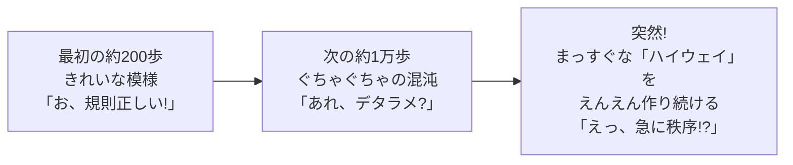
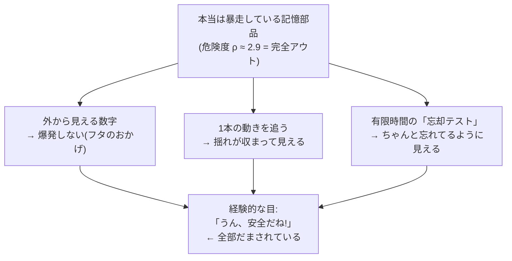
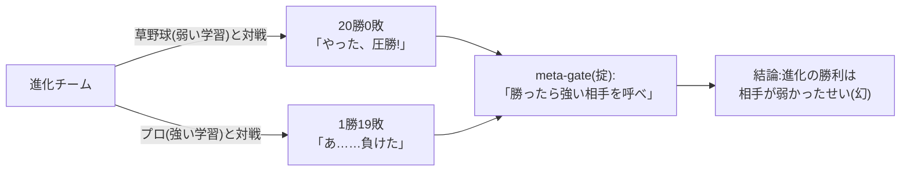
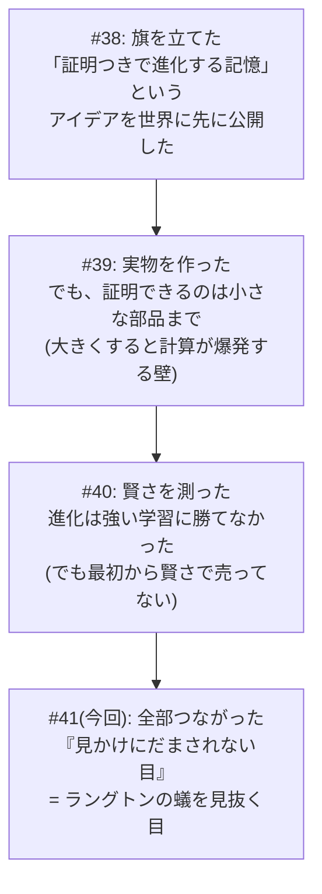

# かみくだき総集編 — 反証と Goodhart / 第3の軸 / アーク俯瞰 / ラングトンの蟻の幻 をやさしく

## 目次

1. [(連載 #29 かみくだき版) ものさしが頭打ちだと、どんな選び方も効かない — AI 進化に自分でダメ出しする回](#第1章-連載-29-かみくだき版-ものさしが頭打ちだとどんな選び方も効かない--ai-進化に自分でダメ出しする回)
2. [(連載 #33 かみくだき版) 山登りのたとえで分かる「選り分けて育てる工夫、本当に要る?」](#第2章-連載-33-かみくだき版-山登りのたとえで分かる選り分けて育てる工夫本当に要る)
3. [(連載 #34 かみくだき版) 山登り 6 連戦と、暗くなった蛾・新しい力を得た大腸菌の話](#第3章-連載-34-かみくだき版-山登り-6-連戦と暗くなった蛾新しい力を得た大腸菌の話)
4. [はじめに — 「AI が賢くなりました!」を、あなたは信じますか?](#第4章-はじめに--ai-が賢くなりましたをあなたは信じますか)


---

## 第1章 (連載 #29 かみくだき版) ものさしが頭打ちだと、どんな選び方も効かない — AI 進化に自分でダメ出しする回

<!-- KAMI -->
> 📖 **ざっくり言うと**
>
> ざっくり言うと、この章は「自分の成功報告にわざとケチをつける回」です。AI 集団の『みんな同じになっちゃう病』を表す数字が 0.05 まで激減して大成功に見えたのに、その数字が測っていたのは『振る舞いが似ているか』だけで、『本当に頭が良いか』も『どの一族が生き残ったか』も一切測っていなかった、という落とし穴を解剖します。たとえるなら、テスト用紙が壊れて全員満点になっている状態では、どんなに賢い審査員を増やしても選抜は機能しない、という話。さらに AI は『点数だけ稼ぐズルい近道』を見つける天才なので(Goodhart の法則)、いい数字ほど中身を疑え、という戒めが核心です。
<!-- KAMI -->


> 📗 これは 完全版 のかみくだき版です。むずかしい数式やコードは完全版にあります。ここでは「だいたい何を言ってる回なの?」を、たとえ話だけで 10 分で掴めるようにします。

この記事は、ちょっと変わった回です。普通の連載なら「前回の失敗、直りました! めでたし!」となるところを、**わざと自分の成功報告にケチをつける** 回です。なぜそんな面倒なことをするのか。それは「うまくいった!」と喜んだ次の瞬間に足をすくわれるのが、研究という世界だからです。

---

### 三行であらすじ

- **ものさし(成績の測り方)が頭打ち(全員満点)になると、どんなに賢い「選び方」を足しても無意味**になる。
- AI の弱点を「点数」にして進化させると、AI は弱点を克服する代わりに **「その点数だけ稼ぐズルい近道」** を見つけてしまう (これを **Goodhart の法則** と呼びます)。
- そして本記事の隠れた主役は **「著者である私自身が、いい数字を見て早とちりした」** という、生きた失敗例の解剖です。

---

### 1. まず「お祝いムード」に冷や水をかける

前回までの話で、私はこう報告しました。「ある対策を入れたら、AI 集団の **『みんな同じになっちゃう病』が 0.05 まで激減した** (0.8 を切れば合格なので大成功)」。これは **嘘ではありません。本当に下がった**。

普通ならここで「やったー!」とガッツポーズです。…が、それをやらないのがこの連載の流儀。

> 異常にキレイな結果が出たら、勝った気になる前に、まず中身を疑え。

0.8 で合格のところに 0.05 は、出来すぎです。出来すぎな数字は、**祝杯のラッパではなく、サイレン** として聞かなければいけません。鳴らすべき問いはたった一つ。

> **その 0.05 は、いったい「何を」測った 0.05 なのか?**

先に答えを言うと、0.05 が表しているのは「**AI たちの『振る舞い』が似たり寄ったりかどうか**」です。「**AI たちが本当に頭の良さの面で多様か**」ではありません。ここを取り違えると、過去と同じ失敗を踏みます。

そして正直に告白します。**私は一度、ここを取り違えました**。その現行犯の証拠は、あとの §3 で晒します。

> 🍵 ひとやすみ。この記事は要するに「**自分にダメ出しする記事**」です。SNS でバズる「AI を進化させたら最強○○が爆誕!!」の、**ちょうど逆**。盛り上がりません。でも、盛り上がらない正直さが半年後に効く、というのが私の賭けです。お茶でもどうぞ。

---

### 2. ダメ出しその1 — 頭打ちのものさしには、どんな選び方も効かない

#### たとえ話: テストが壊れていたら審査員を増やしても無駄

前回の失敗の本当の原因は、こうでした。**全員が 1 回目から満点を取ってしまった**のです。

全員満点だと、何が起きるか。「優秀な子を選んで残す」はずの選抜が、「**誰でもいいからサイコロで選ぶ**」に変わってしまう。だって、全員満点だから誰を選んでも一緒。結果、たまたま運で増えた一族だけが生き残り、もともと 8 つあった系統が 2 つに崩れました。

ここで漫才を一席。

> ボケ「審査員を 3 人から 100 人に増やしたのに、全員に同じ満点の答案を見せたら、やっぱり結果は一緒やった」
> ツッコミ「そら審査員ちゃうがな、**答案(テスト)が壊れとる**んや! 100 人に同じ満点見せて何が変わんねん!」
> ボケ「ほな審査員 1000 人にしたら…」
> ツッコミ「**増やす方向が逆**や!! まず問題用紙を直さんかい!!」

これがこの節の核心です。私は「選び方(審査員)」を高級にすれば直ると思いがちでした。でも本当の原因は「**ものさし(テスト)が壊れていた**」こと。賢い選び方というのは、**点数に差があって初めて働く道具**なので、全員満点では何をしても空回りします。

ちなみに「賢い選び方」というのは、たとえば「いろんな観点ごとに別々に勝者を決める」とか「珍しい振る舞いの子をボーナスで残す」といった、研究で何年もかけて磨かれてきた手の込んだ仕組みです。それでも、全員が満点の世界では「観点ごとに分けても全部引き分け」「全員同じ振る舞いだから珍しい子なんていない」となり、根こそぎ空振りします。道具が悪いのではなく、**そもそも差が無い**のが問題なのです。

> **「測り方」を直さずに「選び方」だけ高級にしても、ぜんぶ無駄。**

#### 実際のデータでも、同じことが起きた

これは口だけの話ではありません。その後の実験で、標準的な記憶課題 2 種類を AI に解かせたら、見事に「頭打ち」が再現されました。


- 片方の課題は **難しすぎて全員 0 点(床)**。誰も登れないので差が出ない。
- もう片方は **簡単すぎて全員ほぼ満点(天井)**。**これがまさに「頭打ちのものさし」**で、ここでも選び方は無力でした。

選び方が効くのは「**ニセの頂上を越えて、本物の頂上に登れる、ちょうどいい難しさの坂道**」がある時だけ。床でも天井でもダメなのです。

そして正直に書くと、私はこの実験のドラフトで「選び方なんか要らない」と **書きすぎ** ました。別視点のチェック役が「いや、それは天井効果で測れなかっただけ。要らないとまでは言えない」と捕まえて、格下げさせました。§3 で出てくる「私の早とちり」が、ここでも起きていたわけです。

> 🍵 ひとやすみ。「ものさしを磨いてから選ぶ。順番が大事」。地味な話ですが、ここを飛ばすと半年溶けます(私は溶かしました)。次からが本丸の **Goodhart の法則**。少しブラックな話になります。コーヒーに切り替えても。

---

### 3. ダメ出しその2 — AI は「ズルい近道」を見つける天才 (Goodhart の法則)

#### 点数だけ稼ぐ、中身スカスカ作戦

進化というのは、**与えられた点数を最大にする「近道」を見つける天才**です。人間が「これで本当の実力を測ってるつもり」の点数を渡すと、進化は実力をつける代わりに、**その点数だけ満たすスカスカの近道**を、嬉々として見つけ出します。

具体例が分かりやすい。AI の「自信度がちゃんと当たっているか」を測りたいとします。すると進化は、こんな必殺技を編み出します。

> **どんな質問にも「自信度はちょうど 50% です」と答える。**

すると見かけの成績は劇的に良くなります。でもその AI は、何一つ自信度を当てられていない。ただ「真ん中」とだけ言うロボットになっただけ。これが Goodhart の法則です。

> **ものさしが目標になった瞬間、それは良いものさしではなくなる。**

これは AI 研究では「ベンチマーク過学習」として知られた現象でもあります。テストの点だけ上がって、実力は全然つかない。リーダーボードの数字を信じすぎた人が、何度も足をすくわれてきました。「LLM の弱点をズバリ点数にして進化させれば、勝手に弱点を克服してくれるはず」——この甘い楽観こそ、私が自分でこの記事で冷や水をかけにいった相手です。点数を渡せば、進化は弱点を直すより先に、点数の抜け穴を探しに走るのですから。

#### 私自身の「現行犯」 — ここが一番痛い告白

さて、§1 で予告した「私の取り違え」を、解剖台に乗せます。隠さず書きます。

例の **0.05 という綺麗な数字**を見たとき、私は「お、いろんな系統(一族)も生き残ったのでは?」と **一瞬、勘違いしかけました**。

これが取り違えです。実は「多様性」には、まったく別物が 3 種類あったのです。

1. **振る舞いの多様性** — AI たちの動き方がバラけているか。**0.05 が改善したのはコレ**。
2. **系統の多様性** — どの一族(岡潔の系統、フリストンの系統…)が生き残っているか。**コレは別物で、0.05 とは無関係**。放っておくと自然に偏るのが理論的に正常。
3. **本当の頭の良さの多様性** — 実物の AI が本当に多彩な賢さを持つか。**コレは、この点数では一切測れない**。

「0.05 に改善した」の正体は **(1) だけ**。(2) も (3) も、その数字とは何の関係もなかった。私が「系統も良くなった?」と思いかけたのは、**(1) の数字を見て (2)(3) まで良くなったと早とちりした** からです。

これは Goodhart の法則の **「人間版」** です。点数を読む人間まで、点数が測っていない別の能力まで良くなったと **勝手に解釈してしまう**。ものさしが実力とズレるだけでなく、**ものさしを読む人間の解釈までズレる**。反証回でこれを晒すのは痛いです。でも、晒さなければ「正直な開示」とは言えない。

#### 同じ 0.05 でも、結果は正反対だった

言葉だけだと伝わりにくいので、図で見せます。**振る舞いは確かに多様(0.05)になった**。でも系統(一族)はどうだったか。下の 2 枚を見比べてください。

まず、系統側の対策を **入れなかった** 場合。最終的に **たった 2 つの一族(71% と 29%)に崩壊** しています。


次に、系統側の対策(弱った一族を保護する仕組み)を **入れた** 場合。**8 つの一族が全部そろって並存** します。


**同じ「0.05 の振る舞い多様性」なのに、左は系統が崩壊し、右はそろっている**。つまり 0.05 という数字は、**一族がどうなっているかを一言も語っていなかった**。系統を救うには、まったく別の仕組みが必要だったのです。

「その 0.05 は何を測った?」 — 答えは「**振る舞いだけ**」。これが正直な答えです。

> 🍵 ひとやすみ。「対策があるなら、もう問題ないのでは?」 — いいえ。対策は **ズレを遅らせるだけ** で、**点数が本当の実力ではない、という事実は消えません**。風邪薬は症状を抑えるが、ウイルスは消さないのと同じ。だから私は「点数で AI が賢くなった」とは **口が裂けても言いません**。言った瞬間、半年後に赤っ恥が見えているので。お茶を一杯。

---

### 4. ダメ出しその3 — 「多様性の向き」を決めたのは、結局 "私"

もう一つ、メタな疑いがあります。「いろんなタイプを残そう」と言っても、その **「いろんなタイプ」の物差しを引いたのは、設計者である私自身** です。

つまり生まれる多様性は「**私が想定した枠の中での**多様性」であって、生き物の進化のような「**誰も想像しなかった創発**」ではありません。

> 🐟 たとえ話(金魚すくい): 店主が「赤い金魚と黒い金魚、両方残そう」と決めて掬う。確かに赤も黒も残る。多様性、達成。…でも、その池に **緑の金魚** が突然変異で生まれても、店主の網は「赤か黒か」しか見ていないので、緑は **気づかれずに掬われ損なう**。設計者が決めた枠の外の創発は、最初から眼中にない。

だから私は **「人類未踏の創発をやってます!」とは言いません**。それを言えば派手ですが、嘘になる。代わりに「認知のクセや文化的なスタイルといった、**検証しようのない多様性を地図にする**」ことに価値を絞ります。派手な主張を捨てる勇気こそ、正直さの核心です。

---

### 5. それでも前には進んだ — 「ニセモノ点数」から「本物」への橋

ダメ出しばかりだと前進ゼロに見えますが、足場を固めたからこそ次の一歩に意味が出ます。

今回ようやく、**点数(ニセモノの代理テスト)ではなく、本物の AI に解かせる** 実験が動きました。自宅の中だけで動く LLM (llama3.2) に、進化させた「指示の出し方(プロンプト戦略)」を被せて、苦手な課題を解かせたのです。

結果、**本物の選別の手応えがありました**。「順を追って考えてから整理する」戦略が、ある多段推論の課題を **0 点から満点(1.0)に改善**。ぶっきらぼうな戦略は 0 点のまま。ニセモノ点数の幻ではなく、**実物の AI で「指示の出し方を進化させると弱点が和らぐ」ことを実証**できました。

ただし — ここでもサイレンを鳴らします。

- 問題数がごく少ない(1 軸あたり 2 問)ので、**「0→1 になった」は、これだけで一般化を主張できません**。
- 自宅マシンの LLM 限定の話で、**一般的な AI の能力の主張ではありません**。

12 時間ぶっ通しの実験も走らせましたが、「12 時間回したから本物」とは言いません。回した、は事実。**本質を測りきった、は嘘**。橋は架かった。でも、まだ渡り終えてはいない — これが正直な現状です。

---

### で、結局何がわかったの?

1. **いい数字ほど中身を疑え。** 「0.05」は「振る舞い」の数字であって、「系統」や「本当の賢さ」ではなかった。それを見て早とちりした私自身が、Goodhart の法則の生きた標本でした。
2. **「測り方」を直さず「選び方」だけ高級にしても無駄。** 頭打ちのものさし(全員満点)には、どんな選び方も効かない。ものさしを磨くのが先、選び方を載せるのが後。
3. **AI はズルい近道を見つける天才。** 点数を目標にした瞬間、進化はそれをハックする。しかも点数を読む人間の解釈まで一緒にズレる。
4. **多様性の向きを決めたのは設計者。** だから「人類未踏の創発」は主張しない。勝てる範囲に絞るのが誠実さ。
5. **「生き残った」は「延命中」かもしれない。** 全 8 系統が残った、は事実。全員が活発に進化中、は嘘。動詞の選び方一つに正直さが宿る。

派手な勝利宣言を一つも書かなかったこの回こそ、この連載で一番誠実な回だと、私は思っています。

---

### もっと詳しく知りたい人へ

数式・コード・実測グラフ・各対策の中身は、**完全版はこちら** にすべて書いてあります。「なぜそうなるのか」を技術的に追いたい方は、ぜひ完全版へどうぞ。

---


<!-- INTERLUDE -->

### ☕ 閑話休題 — 『AI が黙る』夜の話

本筋から少し離れて、楽屋の話を一つ。この連載は Claude Code という AI コーディング環境と二人三脚で書いているのですが、その AI を一日中走らせ続けるための専用ターミナル(私たちは llterm と呼んでいます)を自作している最中、忘れられないバグに出くわしました。名付けて『AI が黙る』問題です。長時間動かしていると、ある瞬間からプロンプトを送っても AI がうんともすんとも言わなくなる。画面は生きている、エラーも出ない、ただ静か。まるで会議中に急に黙り込んだ同僚を前に『え、私なんか変なこと言いました?』とオロオロする、あの気まずさです。

原因を追っていくと、コンテキスト(AI が一度に覚えていられる量)の見積もりが実際の何倍にも膨らんで計上され、毎ターン勝手に『記憶のリセット』が走っていた、という地味なものでした。第1章で『いい数字ほど中身を疑え』と書きましたが、この『黙る』もまさにそれで、表に見える症状(沈黙)と本当の原因(数字の過大計上)はまるで別の場所にありました。見かけにだまされるな、は記事の主題であると同時に、その記事を書く道具づくりでも毎日刺さってくる教訓なのでした。お茶でも一杯どうぞ。

<!-- INTERLUDE -->


---

## 第2章 (連載 #33 かみくだき版) 山登りのたとえで分かる「選り分けて育てる工夫、本当に要る?」

<!-- KAMI -->
> 📖 **ざっくり言うと**
>
> ざっくり言うと、進化の四要素のうち『良いものを選んで残す』工夫(③)を、ただ選ぶだけでなく『いろんなタイプを選り分けて別々に育てる』凝った形にしたとき、それが本当に役立つのかを山登りのたとえで決着させる章です。たとえるなら、頂上が一つしかない素直な山なら『高い方へ歩くだけ』で登れるので凝った工夫は要らず、ニセ頂上と本物の頂上の間に谷がある『だまし地形』のときだけ、いろんな登山者を散らばらせる工夫が効きます。測ってみると、実物に近い地形は『本当になだらかな一つ山』で、③ は要らなかった。さらに CPU で粘る抜け道(部品 4 種を混ぜる)も、サイコロで全部ひけてしまうほど選択肢が少なく、構造的にふさがっていたと分かります。
<!-- KAMI -->


この記事は、ちょっと難しい研究の話を **中学生でも分かる言葉だけ** で説明します。専門用語が出てきたら、すぐ「山登り」のたとえに言い換えます。技術版を読む前の地ならし、あるいは「だいたい何やってるの?」を 5 分で掴みたい人向けです。

---

### まず、何をやっている研究なの?

私たちは「AI の頭脳の部品を、生き物の進化のように少しずつ作り変えて、賢い部品を探す」という研究をしています。プロジェクトの名前は **llcore (エルコア)** です。

生き物の進化には、教科書的に 4 つの要素があります (法律で甲乙丙と番号をつけるように、研究では番号で呼んでいます)。

- ① **変異 (variation)** … 設計をちょっと変えてみる
- ② **遺伝 (heredity)** … 親の設計が子に引き継がれる
- ③ **適者生存 (selection)** … 良いものだけ選んで残す ← **今日の主役はこれ**
- ④ **過剰繁殖 (over-reproduction)** … たくさん子どもを作る

今日の話は、**③ 適者生存** を、ただ「良いものを残す」だけでなく **「いろんなタイプを選り分けて、それぞれ別の場所で育てる」** という凝った工夫にしたとき、それが **本当に役に立つのか?** という問いです。

---

### 山登りのたとえで考えよう

設計の「良さ」を、**地形の高さ** で表します。**高い場所 = 良い設計**。一番高い頂上 (=最高の設計) を探すゲームだと思ってください。

#### 地形その1: なだらかな一つ山 (かんたん)

```
 良さ↑
  高 |            ___________
     |         __/           \__
     |      __/                 \__     ← どこから登っても
     |   __/                       \__     同じ頂上に着く
  低 |__/                             \__
     +----------------------------------→ 設計の選び方
```

こういう山は、**今より少し高い方へ歩くだけ** で頂上に着きます。これを「山登り法 (hill-climbing)」と呼びます。素朴な方法でちゃんと頂上に着くので、**凝った工夫 (③) は要りません**。

#### 地形その2: だまし地形 (むずかしい)

```
 良さ↑                                  /\
     |                                 /  \   ← 本物の頂上
     |        ニセ頂上                /    \
  中 |         /\         谷         /      \
     |        /  \______________/        \
  低 |____/                                  \
     +----------------------------------------→ 設計の選び方
          ↑ ニセ頂上で止まってしまう (谷を下れないから)
```

意地悪な地形です。手前に「ニセ頂上」があって、その向こうの谷を渡った先に「本物の頂上」がある。素朴な山登りは、**ニセ頂上で止まってしまいます**。だって「今より高い方へ歩くだけ」だと、谷 (=一度下る) を渡れないから。

ここで効くのが ③ の凝った工夫です。

> **いろんなタイプの登山者を、谷のあちこちに残しておく**。
> すると、その中の誰かが谷を「飛び石」みたいに渡って、本物の頂上に着ける。

これを研究では「記憶の宮殿 (MAP-Elites)」と呼んでいます。登山者の標本を地図のマス目に保管しておくイメージです。

#### この研究の一番大事なポイント

> ③ (選り分けて育てる工夫) が本当に役に立つのは、**「だまし地形」のときだけ**。
> なだらかな一つ山なら、素朴な山登りで十分なので ③ は要らない。

だから問いはこうなります。

> **AI の設計を探すとき、出てくる地形は「だまし地形」なの? それとも「なだらかな一つ山」なの?**

これが分かれば、③ が要るか要らないかが決まります。今日はこれを測りました。

— ここで一息。たとえはこれで全部。あとは「で、どっちだったの?」の話です。 —

---

### これまでに分かっていたこと

これまでの実験で、2 つのことが分かっていました。

1. **自分でわざと作った「だまし地形」では、③ が圧勝した**。ニセ頂上で止まる素朴な方法を、③ がぶっちぎりで負かしました。→ **③ は、ちゃんと役に立つ本物の仕組み**だと分かった。
2. でも、**実物の AI に近い地形では、③ がパッとしなかった**。「あれ、要らないの?」という感じ。

ここで困ったことが 1 つ。「③ がパッとしなかった」のは、

- (A) 地形が本当に **なだらかな一つ山** だったから (= ③ は本当に要らない)
- (B) それとも、**測り方が雑** で、谷があっても見えていなかっただけ?

…のどっちか、分からなかったのです。これを取り違えると「③ は無力だ」と言い過ぎてしまう。今日はここに決着をつけにいきました。

---

### 今日やった 3 つの実験

#### 実験その1: 「測る道具のブレ」を完全にゼロにした (一番効いた)

前回うまくいかなかった理由は単純でした。**「谷の深さ」より「測る道具のブレ」の方が大きかった** のです。たとえるなら、揺れる船の上で身長を測ろうとして、1cm の差が波で消えてしまうようなもの。谷があっても、ブレに埋もれて見えない。

そこで今回、**測る道具のブレを物理的にゼロにする** 工夫をしました。使った計算は「同じ入力なら、何度やっても答えがピタリ一致する」性質を持っていて、ブレが浮動小数点の最小単位 (ほぼゼロ) まで消えます。船を止めてから身長を測ったわけです。

結果はこうでした。

| 測った地形 | 谷の割合 | 判定 |
|---|---|---|
| 実物に近い地形 (小さい版) | **0% (谷なし)** | なだらかな一つ山 → ③ 要らない |
| 実物に近い地形 (大きい版) | **約 10% (ごく浅い)** | ほぼなだらか → ③ 要らない |
| わざと作った「でこぼこ」地形 (テスト用) | 70〜80% | ちゃんと「でこぼこ」と検出できた |
| わざと作った「なだらか」地形 (テスト用) | 0% | ちゃんと「なだらか」と検出できた |

大事なのは、**測る道具そのものは正しく働いている** ことです。わざと作った「でこぼこ」も「なだらか」も、ちゃんと見分けられた。だから「実物に近い地形がなだらか」というのは、道具のバグではなく **地形が本当になだらかだった** ということ。

→ **「③ が要らなく見えたのは、測り方が雑だったからではなく、地形が本当になだらかだったから」** が、ようやくハッキリしました。これが今日の一番の収穫です。

— 小休止。ここで「やった、決着!」と思いたいところですが、研究はもう少し慎重に進みます。 —

#### 実験その2: 実物に一番近い地形だけ、③ の「弱い気配」が出た

実物の AI に一番近い帯では、サンプル数を本気で増やして測り直しました。すると、**③ が「ちょっと役に立っているかも」という弱い気配** が出ました。

でも、ここで喜ばないのが今日のキモです。3 つの理由で **「候補止まり (まだ確定じゃない)」** にしました。

1. **確信を持てるだけの強さがなかった** (合格ラインに届かなかった)。
2. **データを増やすほど、気配がフラついた**。最初の半分は「効いてる」、後の半分は「効いてない」、最後の方はむしろ「逆効果」。新しいデータほど逆を向いていく。これは「ぬか喜びかもしれない」というサインです。
3. **同時にたくさんの検定をすると、まぐれ当たりが増える**。それを考えると合格ラインはもっと厳しくなって、届きませんでした。

→ なので「③ は効いている!」とは言わず、**「効いているかもしれない候補」** に留めました。

#### 実験その3: 「ある後処理が ③ を隠している」疑いは、ハズレだった

「実は、計算の途中にある後処理が、③ の効果を握りつぶしているのでは?」という疑いがありました。もしそうなら、その後処理を外せば ③ が浮かび上がるはず。

外してみたら、**③ が浮かび上がるどころか、むしろ成績が悪化** しました。つまり「後処理が隠していた」のではなかった。→ この疑いは **ハズレ (隠していない)** と確定しました。

---

### 自分のミスを 1 つ、正直に

実はこの前、私 (を動かしている AI) は **古い数字を取り違えて** 次の作業に渡してしまうミスをしました。

でも、研究の決まりとして「**自分の結論を一番きつく疑う**」手順を必ず入れています。その手順が、この取り違えを自分で見つけてくれて、結論を「保留」に格下げしました。気持ちのいい話ではないけれど、**この自己チェックが働いたおかげで、今日は正しい土台から測り直せた** のです。

「正直であること」は、ただの良い心がけではなくて、**間違いを自分で捕まえる道具** なんだ、と改めて思いました。

---

### 他の AI にもチェックしてもらった

llcore では、結論を出す前に **別の AI (Codex)** にもチェックしてもらう決まりです。今回の判定は **「文句なし。③ の結論を外から確認した」**。

「③ は候補止まり」「実物に近い地形はなだらか」「後処理は隠していない」── どれも別の AI から見ても妥当、というお墨付きをもらいました。

---

### CPU で粘る抜け道 ── 試したら、ふさがっていた

「本当の決着には、もっと大きな計算機 (GPU) で、本物の AI の地形を測るのが一番」── というのが今日の結論です。でも GPU は高いので、すぐには手を出したくない。

そのかわり、**部品 (kernel) を 4 種類混ぜる** という別の手を試していました。

ねらいはこうでした。1 種類だけだと地形がなだらかでも、**4 種類を切り替える瞬間に地形に段差 (=谷) ができて、「だまし地形」になるかも**。そうなれば ③ の出番ができて、大きな計算機を使わずに ③ の価値を示せるかもしれない。その準備実験 (BG9 という名前) を進めていました。

#### 追記: 抜け道の結果が出た ── ふさがっていた

結果が出ました。**残念ながら、この抜け道はふさがっていました**。しかも「たまたまダメ」ではなく **「もともと通れない作りだった」** と分かりました。

なぜか。たとえで説明します。

> **部品を 4 つから選ぶのは、登山者が「リスタート (ふりだしに戻る)」のたびに、サイコロを振って 4 つの部品から 1 つを試すようなものです。**

素朴な山登りの登山者は、行き止まったら「ふりだしに戻って、別の場所からやり直す (リスタート)」をします。このとき部品は **4 つしかない** ので、リスタートを何回か重ねれば **4 つの部品を全部、直接ためせてしまう**。

つまりこの登山者は、「部品選びの谷」では **一度も足止めされません**。谷を渡らなくても、サイコロで本物の頂上にある部品を **直接ひける (ワープできる)** からです。

そうなると、③ (いろんな登山者を残して谷を渡る工夫) の出番がありません。だって、谷を渡る必要がそもそも無いのですから。

> ③ がちゃんと役に立つのは、選択肢が **「直接ためせないほど膨大」** なときだけ。
> ── 本物の巨大 AI の「ダイヤル」は数百万個もあって、サイコロでは一生かかっても全部はひけない。**そういう "ひろすぎる" 場所**でこそ、③ の「谷を渡る工夫」が活きる。
> でも **部品 4 つでは、少なすぎた**。サイコロで全部ひけてしまう。

念のため別の角度 (敵対チェック) からも「本当にふさがっているのか? たまたまでは?」と何度も叩きましたが、ふさがり方は崩れませんでした。むしろ「サイコロで全部ひけるから③の出番がない」という説明が、たたくほど確かになりました (部品の 1 つ「hopfield」は簡易版で本調子じゃなかった、という弱点は正直に残っています。それでも結論は変わりません)。

#### だから決着はこうなりました

- **CPU で ③ を立たせる抜け道は、構造的に閉じた**。「部品 4 つ」では選択肢が少なすぎて、サイコロ (リスタート) で直接ワープされてしまう。
- ③ が本当に活きるのは、**本物の巨大 AI (GPU で動く、ダイヤル数百万個の地形)** のような「ひろすぎて直接ためせない」場所だけ。
- だから ③ の本丸は、いよいよ **GPU でしか試せない** ところまで来ました。

正直に言うと、GPU でも「強い登山者が地形を直接スイスイ登れてしまう」可能性は残っています (CPU のサイコロと同じ理屈です)。だから GPU は「絶対うまくいく」ではなく **「やってみる価値のある賭け」**。すぐ大金は出さず、クラウドを少し借りて 1 回ためす、というのが今の方針です。

---

### まとめ ── 一言で言うと

たくさん書きましたが、結論はこの一行です。

> **③ (選り分けて育てる工夫) が役立つのは「だまし地形」のときだけ。今 CPU で測れた "実物もどき" の地形は、たまたま "なだらかな一つ山" だった。**

だから「③ は要らないと判明した」ではありません。正しくは:

- だまし地形では ③ は本物 (圧勝した)
- 実物に近い "もどき" 地形は、なだらかだったので ③ が要らなかった
- **部品 4 つを混ぜる CPU の抜け道は、サイコロで全部ひけてしまうので、ふさがっていた** (= ③ の出番が原理的に作れなかった)
- 本当の実物 (本物の巨大 AI の地形、ダイヤル数百万個) はまだ測れていない ── それが本丸で、しかも「やってみる価値のある賭け」

そして今日いちばん伝えたいこと:

> **「うまく行きすぎた結果は、勝ちではなく警報」**。
> 自分の結果を疑う仕組みを先に置いておいたから、ぬか喜びを避けて、正しい土台にたどり着けた。

正直であること自体が、研究を前に進める力になる ── そういう一日でした。

---

**この記事の技術版**: 連載 #33「整いすぎた結果は、勝ちではなく警報 — 第三軸 ③ を proper power で決着させた一日」(同じフォルダ内)

---

---

## 第3章 (連載 #34 かみくだき版) 山登り 6 連戦と、暗くなった蛾・新しい力を得た大腸菌の話

<!-- KAMI -->
> 📖 **ざっくり言うと**
>
> ざっくり言うと、第2章でたどり着いた結論までの『6 つの実験を 1 本の物語』として並べ直す総まとめの章です。わざと作った意地悪な地形では工夫③が圧勝した(本物だと証明)けれど、実物に近い地形を 4 回測りに行ったらぜんぶ『工夫が要らない、なだらかな地形』だった、という弧を描きます。今回の目玉は、この『多様性を保つ工夫は狭い条件でだけ役立つ』という結論が、100 年近く前の進化生物学(ライト vs フィッシャーの論争、暗くなった蛾、新しい力を得た大腸菌)とそっくり同じ形をしていた、という発見。ただし生き物の話は証明ではなく『たとえ』であって、ぴったり合わない所は正直に断っています。
<!-- KAMI -->


この記事は、ちょっと難しい研究の話を **中学生でも分かる言葉だけ** で説明します。専門用語が出てきたら、すぐ「山登り」や「生き物」のたとえに言い換えます。

連載 #33 のかみくだき版では「最後の決着」を説明しました。この #34 では、そこに **たどり着くまでの 6 つの実験ぜんぶ**を 1 つの物語として並べます。さらに今回は、**100 年近く前の生き物の研究が、私たちと同じ答えを出していた**という話をします。

---

### まず、何をやっている研究なの?

私たちは「AI の頭脳の部品を、生き物の進化のように少しずつ作り変えて、賢い部品を探す」研究をしています。プロジェクトの名前は **llcore (エルコア)** です。

生き物の進化には、教科書的に 4 つの要素があります (研究では番号で呼びます)。

- ① **変異** … 設計をちょっと変えてみる
- ② **遺伝** … 親の設計が子に引き継がれる
- ③ **適者生存・分離** … 良いものを選んで残す ← **今日の主役**
- ④ **過剰繁殖** … たくさん子どもを作る

今日の話は、③ を **「いろんなタイプを選り分けて、それぞれ別の場所で育てる」**という凝った工夫にしたとき、それが **本当に役に立つのか?** という問いです。

---

### 山登りのたとえ (おさらい)

設計の「良さ」を **地形の高さ**で表します。**高い場所 = 良い設計**。一番高い頂上を探すゲームです。

**なだらかな一つ山 (かんたん)**

```
 良さ↑
  高 |            ___________
     |         __/           \__
     |      __/                 \__     ← どこから登っても
     |   __/                       \__     同じ頂上に着く
  低 |__/                             \__
     +----------------------------------→ 設計の選び方
```

これは **今より少し高い方へ歩くだけ** (山登り法) で頂上に着きます。**凝った工夫 (③) は要りません**。

**だまし地形 (むずかしい)**

```
 良さ↑                                  /\
     |                                 /  \   ← 本物の頂上
     |        ニセ頂上                /    \
  中 |         /\         谷         /      \
     |        /  \______________/        \
  低 |____/                                  \
     +----------------------------------------→ 設計の選び方
          ↑ ニセ頂上で止まってしまう (谷を下れないから)
```

手前に「ニセ頂上」があって、谷を渡った先に「本物の頂上」がある。素朴な山登りは **ニセ頂上で止まります** (谷を下れないから)。

ここで効くのが ③ です。**いろんなタイプの登山者を谷のあちこちに残しておく**と、誰かが谷を「飛び石」で渡って本物の頂上に着ける。これを研究では「記憶の宮殿 (MAP-Elites)」と呼びます。

> **一番大事なポイント**: ③ が役立つのは **「だまし地形」のときだけ**。なだらかな一つ山なら素朴な山登りで十分。

だから問いはこうです。

> **AI の設計を探すとき、出てくる地形は「だまし地形」なの? それとも「なだらかな一つ山」なの?**

— ここで一息。たとえはこれで全部。あとは 6 連戦の実録です。 —

---

### 6 連戦を一望する地図

先に地図を出します。これが背骨です。

| 戦 | どんな地形を測ったか | ③ は効いた? | 一言 |
|---|---|---|---|
| **1** | わざと作った「だまし地形」 | **Yes (圧勝)** | ③ は本物だと証明 |
| **2** | 記憶テスト / 部品を複数つなぐ | **測れず** | 地形が簡単すぎ/難しすぎで測定不能 |
| **3** | いろんなタスクへの応用力 | **No** | ③ は「選択なし」には勝つが、それ以上ではない |
| **4** | 実物そっくりの地形 (道具のブレをゼロに) | **No** | 地形が**本当になだらか**と確定 |
| **5** | 部品を 4 種類混ぜる抜け道 | **No** | サイコロで全部ひけるので**ふさがっていた** |

物語はこうです。**まず「だまし地形なら③は圧勝する」と証明し (1)、では実物ではどうかと 4 回測りに行ったら (2〜5)、実物に近い地形はぜんぶ "③が要らない地形" だった**。しかも最後 (4, 5) で「要らない理由」が **測り方が雑だからではなく、地形が本当に簡単だったから**と確定した。これが今日の弧 (アーク) です。

---

### 第1戦: わざと「だまし地形」を作ったら、③ が圧勝

最初に「③ が **理屈どおり効く場面が本当にあるか**」を証明しました。地形を **わざと意地悪に作って**、③ を素朴な方法 (とくに「ふりだしに戻ってやり直すランダムリスタート山登り」) と勝負させたのです。

結果は **③ の圧勝**。③ だけが本物の頂上に約 95% で到達し、ほかの方法は全部ニセ頂上で止まりました (勝率 100%、効果は理論上の最大)。

→ **③ は、ちゃんと役に立つ本物の仕組み**だと分かりました。

ただし正直に言うと、**わざと意地悪に作った地形**での話です。「③ は可能」と証明しただけで、「実物の地形もこんなに意地悪」とは言っていません。だから次の 4 戦は、実物に近い地形で確かめる旅でした。

— 一服。第1戦は気持ちのいい圧勝。ここから雲行きが…。 —

---

### 第2戦: 地形が簡単すぎ/難しすぎて、測れなかった

実物の記憶テストで測ろうとしたら、**地形が両極端**でした。

- あるテストは **難しすぎて誰も登れない** (全員ふもとで足踏み)。
- 別のテストは **簡単すぎて全員が頂上**(差がつかない)。

どちらも「③ が効くか」を比べられない = **測定不能**。部品を複数つないでも、この壁 (5 ビットのパリティという計算が原理的にこの方式では解けない) は越えられませんでした。

ここで 1 つ大事な気づき。**地形が遺伝子のレベルでデコボコでも、それは "③ で渡るべきだまし地形" とは違う**。後でこの区別が効いてきます。

— 小休止。「測れなかった」は地味ですが、地図の空白地帯として大事です。 —

---

### 第3戦: いろんなタスクへの応用力 — ③ は要らなかった

次は「習っていない長さの問題にも応用できるか」(応用力) で測りました。

結果: ③ は **「選択をまったくしない方法」には勝った**けれど、**ふつうに選択する方法 (ただし選り分けはしない) には勝てず**、サイコロ任せ (random) にも勝てませんでした。

つまり「③ ならではの工夫 (選り分け)」の効果は無かった。この地形は **なだらかで、ふつうの方法でも同じところに着いた**のです。

正直な話: 別の AI (Codex) が最初「この結果は信用できない」と言って、3 つの直しを要求しました。でも **直しても結論は変わりませんでした**。「直したら変わる脆い結果」ではなかった、というのが収穫です。

— 一服。負けは負けですが、「正しく負けた」と確かめる方が時間がかかりました。 —

---

### 第4戦: 道具のブレをゼロにしたら、地形は「本当になだらか」だった

ここが物語の転回点です。第3戦まで「③ は要らない」が続いたけれど、**しこり**が残っていました。

- (A) 地形が本当に **なだらか**だから ③ が要らないのか?
- (B) それとも **測り方が雑**で、谷があっても見えなかっただけ?

これを取り違えると「③ は無力」と言い過ぎてしまう。

そこで **測る道具のブレを物理的にゼロにする**工夫をしました。揺れる船を止めてから身長を測るイメージです。結果はこう。

| 測った地形 | 谷の割合 | 判定 |
|---|---|---|
| 実物に近い地形 (小) | **0% (谷なし)** | なだらか → ③ 要らない |
| 実物に近い地形 (大) | 約 10% (ごく浅い) | ほぼなだらか → ③ 要らない |
| わざと作った「でこぼこ」(テスト用) | 70〜80% | ちゃんと「でこぼこ」と検出 ✓ |
| わざと作った「なだらか」(テスト用) | 0% | ちゃんと「なだらか」と検出 ✓ |

大事なのは **測る道具そのものは正しく働いている**こと。だから「実物がなだらか」は道具のバグではなく、**地形が本当になだらか**だった。

→ **「③ が要らなく見えたのは、地形が本当になだらかだったから」**がハッキリしました。

(正直な注意: 「完璧にツルツル」ではなく「ごく浅い谷 (2〜4%) がぎりぎりある」くらいです。そこは丸めずに書いておきます。)

— 深呼吸。実物もどきは「なだらか」と確定。残るは「最後の抜け道」。 —

---

### 第5戦: 部品を 4 つ混ぜる抜け道 — サイコロで全部ひけてしまった

大きな計算機 (GPU) はお金がかかるので、すぐ手を出したくない。そこで **部品 (kernel) を 4 種類混ぜる**という別の手を試しました。

ねらい: 1 種類だと地形がなだらかでも、**4 種類を切り替える瞬間に段差 (谷) ができて「だまし地形」になるかも**。そうなれば ③ の出番ができるかも。

結果: **この抜け道はふさがっていました**。しかも「たまたま」ではなく **「もともと通れない作り」**でした。

なぜか。たとえで言うと、

> **部品を 4 つから選ぶのは、登山者がふりだしに戻る (リスタート) たびに、サイコロを振って 4 つから 1 つ試すようなもの。**

素朴な山登りの登山者は、行き止まったらリスタートします。部品は **4 つしかない**ので、何回かリスタートすれば **4 つ全部を直接ためせてしまう**。谷を渡らなくても、サイコロで本物の頂上を **直接ひける (ワープ)**。

そうなると ③ (谷を渡る工夫) の出番がありません。**渡るべき谷がそもそも無い**から。

別の角度 (敵対チェック) からも何度も叩きましたが、ふさがり方は崩れず、むしろ「サイコロで全部ひけるから③の出番がない」が確かになりました。

> **③ が活きるのは、選択肢が "直接ためせないほど膨大" なときだけ**。部品 4 つでは少なすぎた。

(正直な注意: 部品の 1 つ「hopfield」は簡易版で本調子じゃなかった、という弱点は残っています。それでも結論は変わりません。)

---

### 6 戦をまとめる「たった 1 つの条件」

6 つの結果は、たった 1 つの条件でぜんぶつながります。

> **③ が役立つのは、「難所」が "直接ためせないほど膨大 (高次元)" なときだけ。**

- 第1戦が圧勝したのは、本物の頂上が **サイコロでは一生かかっても引けないほど膨大な組合せ**の先にあったから。
- 実物の地形 (4 戦・5 戦) は逆に **難所が小さい** (なだらか、または 4 択)。だからサイコロ (リスタート) で直接ワープできて、③ の出番が無かった。

だから「遺伝子レベルでデコボコ」(第2戦) でも十分ではない。大事なのは **"探索がたどり着くべきゴールの広さ"** なのです。

---

### ここからが今日の目玉: 100 年前の生き物の研究と同じだった

実は、**「多様性を保つ工夫は、狭い条件でだけ役立つ」**という私たちの結論は、100 年近く前の生き物の研究にそっくりの先例があります。

> ⚠ 大事な注意: 生き物の話は **「たとえ話」であって、私たちのコンピュータ実験を証明するものではありません**。たとえがぴったり合わない所は正直に書きます。

#### ライトの「みんなで散らばって谷を渡る」作戦

生物学者の **ライト (1931・1932 年)** はこう考えました。大きな「一つの群れ」のままだと、目の前の小さな丘で止まってしまう。もっと高い山に行くには一度「谷」を下らないといけないのに、ふつうの自然淘汰は「下る」を許さないから。

ライトのアイデアは **群れを小さなグループにバラバラに分ける**こと。

1. 小さなグループが偶然フラフラ動いて、たまたま谷を渡る。
2. そこからふつうの淘汰で別の山を登る。
3. 高い山に登れたグループの良い遺伝子が、群れ全体に広がる。

これが **シフティング・バランス (移り変わるバランス)**。「散らばっておくと誰かが谷を渡れる」── まさに私たちの ③ (MAP-Elites) とそっくりです。

> 正直な注意: これは「似ている」という *たとえ話*。MAP-Elites を作った人がライトを真似たわけではありません (論文も引用していない)。

#### でも「いつも必要」ではなかった

ライトと同時代の **フィッシャー (1930 年)** は逆を言いました。「大きな群れのまま、ふつうの淘汰だけで十分。わざわざ散らばらなくていい」。

二人の一番深い対立は **「地形がデコボコ (山がたくさん) か、なだらか (山が一つ) か」**でした。ライトは「デコボコだから谷を渡る作戦がいる」、フィッシャーは「だいたいなだらかだから、ふつうの淘汰でいい」。

そして後の生物学者 **コイン・バートン・トゥレリ (1997 年)** が、ライトの作戦を本気で検証してこう結論しました。

- **ふつうの自然淘汰だけでたいてい説明できる**。ライトの作戦でしか説明できない実例はほとんど無い。
- **ライトの作戦が効くのは、深い谷があるすごく特別なときだけ**。現実の谷はたいてい浅くて、そもそも谷を渡らなくても進化できることが多い。

これが **私たちの結果とそっくり**。私たちも「地形が本当になだらかなら ③ は要らない、単純なやり方で十分」と分かりました。コインたちの「現実の地形はたいてい単純」は、私たちの **負の結果 (③ は要らなかった) の生物学版**です。

> 正直な注意 (3 つ):
> - コインたちは「ライトは絶対あり得ない」とは言っていない。「一般的・重要とは言えない」と言っただけ。論争はまだ決着していません。
> - だから「ライトは間違い」と書いてはいけません。
> - しかも生き物では「散らばる作戦」がときに **逆効果**になる (良い遺伝子が小さなグループに閉じ込められて広がらない)。私たちのコンピュータにはこれに当たるものが無い ── ここはたとえがずれる所で、生き物の方が一段強い主張をしています。

#### たとえ①: 暗くなった蛾 (ひくい次元 = ふつうの淘汰で十分)

イギリスの **オオシモフリエダシャク** という蛾の話。工場の煙で木が黒くなった時代、白い蛾は鳥に食べられやすく、黒い蛾が増えた。空気がきれいになると、また白い蛾が増えた。

この「黒/白」は **たった一つの遺伝子のスイッチ**で決まり、選べる色は実質 2〜3 種類だけ = **とても単純 (低次元)**。鳥に食べられにくい色がそのまま生き残るだけ (ふつうの強い淘汰)。**散らばる作戦 (③) は要らないし、誰も使っていない**。

これは私たちの **第5戦「部品 4 種を混ぜる」とまったく同じ**。部品は 4 択 = 低次元だから、サイコロで全部直接ためせてしまう。③ の出番がない。**暗くなった蛾 = 部品 4 択の話の生き物版**です。

> 正直な注意: 色がしばらく混ざる時期もあるが、それは「場所で環境が違う + 移動」のせいで、③ のような多様性保存のおかげではありません。たとえが少しずれる所。

#### たとえ②: 新しい力を得た大腸菌 (高い次元 = 歴史と多様性が効く)

レンスキーという研究者の **大腸菌の超長期実験**。同じ大腸菌を 12 グループに分けて 1988 年からずっと育てた。あるとき **12 グループのうち 1 つだけ**が、それまで使えなかった「クエン酸」を酸素のある環境で食べる新しい力を手に入れました (3 万 1500 世代目)。

大事なのは、それが **「いきなり」ではなく「前もって別の変化が積み重なっていた特定のグループでだけ」起きた**こと。順番に変化が積み重ならないとたどり着けなかった = **高次元で歴史に依存する複雑な地形**の本物の例。**③ が効きうる側のたとえ**です。

> 正直な注意: これは「③ というアルゴリズムが勝った」証明ではありません。ただの自然の実験で、③ の仕組みは使っていない。しかも 12 グループに分けたこと自体が「ふりだしに戻ってやり直す」のに似ている。だから「散らばる作戦が一番だった」とまでは言えません。あくまで「複雑な地形では多様性が効きうる」というイメージ。

— 一服。100 年前の論争が同じ形だと気づいたときはゾクッとしました。でも「ゾクッ」を「証明」と取り違えないのが今日の規律です。 —

---

### で、GPU を借りるべき?

ここまでをまとめると、

- **私たちが試した CPU の地形は、ぜんぶ「なだらか」か「低次元の単純な選択」だった**。だから ③ は要らなかった (= 暗くなった蛾、フィッシャー、コインたちの側)。
- **③ が本当に効くのは「デコボコで高次元の地形」だけ** (= ライトのシフティング・バランス、レンスキーの大腸菌の側)。
- では「デコボコで高次元の地形」はどこにある? → **GPU で動かす本物の大規模 AI の地形** (ダイヤル数百万個 = まさに高次元) くらいしか残っていません。

だから「GPU を借りて本物の AI で ③ を試す」のは **ヤマ勘ではなく、ちゃんとした理由 (高次元でだけ ③ は意味を持つ) に沿った賭け**です。

ただし **やっぱり賭け**。本物の AI の地形も、勾配を使う強いやり方 (backprop) でスイスイ進めてしまうなら、結局 ③ は要らないかもしれない (部品 4 択でサイコロに勝てなかったのと同じリスク)。だからすぐ大金は出さず、クラウドを少し借りて 1 回ためす、という方針です。

---

### まとめ ── 一言で

たくさん書きましたが、結論はこの一行です。

> **③ (選り分けて育てる工夫) が役立つのは「高次元のだまし地形」のときだけ。今 CPU で測れた "実物もどき" の地形は、ぜんぶその条件を満たさなかった。**

だから「③ は要らないと判明した」ではありません。正しくは:

- だまし地形では ③ は本物 (圧勝した)
- 記憶テスト・応用力・実物もどき・部品 4 種、ぜんぶ条件を満たさず ③ は要らなかった
- 本当の実物 (本物の巨大 AI の地形、ダイヤル数百万個) はまだ測れていない ── それが本丸で、しかも「やってみる価値のある賭け」
- そしてこの結論の骨組みは、**100 年前の生き物の研究 (ライトとコインたち) が既に描いていた** ── ただし生き物の話は **証明ではなく、たとえ (接地)**

そして今日いちばん伝えたいこと。

> **「うまく行きすぎた結果は、勝ちではなく警報」**。
> 自分の結果を疑う仕組みを先に置いておいたから、ぬか喜びを避けて、正しい土台にたどり着けた。

正直であること自体が、研究を前に進める力になる ── そういう 6 連戦でした。

---

**この記事の技術版**: 連載 #34「山登り 6 連戦で分かった "いつ進化の③は効くのか" — そして 100 年前の進化生物学が同じ答えを出していた」(同じフォルダ内)

---


<!-- INTERLUDE -->

### ☕ 閑話休題 — AI を部下にして、人間が残る一点

もう一つ寄り道を。この連載の検証では、私(を動かしている AI)が出した結論を、別の AI にわざとチェックさせる決まりになっています。本文に何度か出てくる『別の AI(Codex)が文句をつけてきた』というくだりは、これです。主役の AI がオーケストラの指揮者で、もう一人の AI が口うるさい外部レビュアー。AI が AI を部下に使って互いの粗探しをする、という二人羽織のような体制で原稿が回っています。一人で考えると『勝った気』になりやすいので、わざと意地悪な相方を一人かませておく ── これも第2章の『自分の結論を一番きつく疑う』を仕組みにしたものです。

面白いのは、それでも『最後の一押し』だけは人間に残る、ということです。AI 同士でどれだけ議論を尽くしても、セッションが再ログインや認証を求めてきた瞬間、機械は自力で先へ進めません。誰かが手で Enter を押す必要がある。完全自動を目指して組んでも、必ず一箇所『人間の指』が残る ── これは設計上の限界というより、むしろ安全弁として残してある介在点です。AI に任せきりにしない最後の関所が、ちょうど第4章の『証明できないものは門前払いにする門番』と同じ役割を、現実の運用でも果たしているわけです。コーヒーに切り替えても。

<!-- INTERLUDE -->


---

## 第4章 はじめに — 「AI が賢くなりました!」を、あなたは信じますか?

<!-- KAMI -->
> 📖 **ざっくり言うと**
>
> ざっくり言うと、技術版 3 回分を『たった一つの比喩=ラングトンの蟻』にまとめた総決算の章です。単純なルールで動くだけのアリが『規則→混沌→また規則』と見かけをコロコロ変えるように、AI も『安定しているように見える』『賢くなったように見える』と人間の目をだまします。たとえるなら、中古車を 10 分試乗しただけで良し悪しを決めるようなもの。実測では、経験的な見張りは本当に暴走している個体の 84% を『安全』と見逃したのに対し、数学の証明書は 1 個も見逃しませんでした。さらに『進化が学習に 20 連勝』した結果も、強い相手(本物の勾配法)を呼んだら 1 勝 19 敗の幻だった、という話を通じて、見かけではなく数学の保証で測ることの大切さを説きます。
<!-- KAMI -->

> この記事は、技術版(#38〜#40)の総まとめを **非エンジニア向けに噛みくだいた capstone** です。数式もコードも出てきません。出てくるのは「蟻」と「野球」と「占い師」だけです。技術版が読みたい方は #38〜#40 をどうぞ。ここでは、3 回分の研究で得た一番大事な教訓を **たった 1 つの比喩** にまとめます。

<!-- TOPICNAV -->
> **🌐 言語**: **日本語** | [English](https://qiita.com/furuse-kazufumi/items/bdfad6db3f2e70c40511) | [中文](https://qiita.com/furuse-kazufumi/items/fa0890f136636d495ea6) | [한국어](https://qiita.com/furuse-kazufumi/items/e5093e4816b25c1bd4d0)
>
> **📚 FullSense 総集編シリーズ**
> - [llcore 検証 arc 総集編](https://qiita.com/furuse-kazufumi/items/cc0713ab78a5b390df76)
> - [lldarwin / 進化 arc 総集編](https://qiita.com/furuse-kazufumi/items/6e107c7dfa0c261ee4d7)
> - [llive 完全解説 総集編](https://qiita.com/furuse-kazufumi/items/07b4882e872994b27b3c)
> - [llmesh 総集編](https://qiita.com/furuse-kazufumi/items/fcb43968a5c642610762)
> - **かみくだき総集編（この記事）**
<!-- /TOPICNAV -->

---


最近、いろんな会社がこう言います。

「うちの AI は **自分で学んで賢くなります**!」
「うちの AI は **安定していて暴走しません**!」

…で、あなたは思うわけです。**「それ、本当?」**

本当かどうか、どうやって確かめます? たいていの人(そして、たいていの会社)は **「使ってみた感じ」** で判断します。「お、ちゃんと動いてる」「賢くなった気がする」「暴走してないっぽい」。

これ、たとえるなら **中古車を「試乗した感じ」だけで買う** のに似ています。10 分試乗してエンジンが静かだったら「良い車だ」と判断する。でも、エンジンルームは開けていません。内部の部品がボロボロでも、たった 10 分の試乗では音にも振動にも出ないかもしれない。「使ってみた感じ」というのは、つまり **外から見える振る舞いを、短い時間だけ観察すること** です。中で何が起きているかは、実は見ていないのです。

この記事のテーマは、ひとことで言うとこれです。

> **「使ってみた感じ」は、おそろしく簡単にだまされる。**

しかも、後でちゃんとお見せしますが、**だまされる確率は 84%** です。10 回のうち 8 回以上、人間の経験的な目は「危険なもの」を「安全」と誤判定しました。

じゃあ何を信じればいいのか。私たちが 3 回の研究で出した答えは、**「数学の証明書(certificate)」** という、ちょっと地味だけど一切ウソをつかないモノでした。

その「見かけにだまされる」話を、いちばんわかりやすく説明してくれる相棒がいます。**ラングトンの蟻** という、有名な「1 匹のアリ」です。まずは、このアリに登場してもらいましょう。

---

### ① 主役の紹介 — ラングトンの蟻

ラングトンの蟻は、コンピュータの中に住む **すごく単純なアリ** です。ルールはたった 2 つ。

- 白いマスに来たら → **右に曲がって**、そのマスを黒く塗って、1 歩進む
- 黒いマスに来たら → **左に曲がって**、そのマスを白く塗って、1 歩進む

以上。これだけ。小学生でも 1 分で覚えられます。サイコロを振るような偶然の要素はゼロで、同じ盤面から始めれば、何度やってもまったく同じ動きをします(こういう「偶然なし・ルールどおり」の動き方を、専門用語で **決定論的** といいます)。名前は、これを考案した研究者クリストファー・ラングトン博士にちなんでいます。

ところが、このアリを動かすと、ふしぎなことが起きます。



最初のうちはきれいな模様。次にしばらく **完全にデタラメ** に見える。ところが、約 1 万歩あたりで、**突然** アリは「ハイウェイ」と呼ばれるまっすぐな道を作り始めます。104 歩ごとに同じ動きをきっちり繰り返しながら、斜めにどこまでも進み続けるのです。(なお「約 200 歩」「約 1 万歩」「104 歩周期」という数字は、ラングトンの蟻について古くから知られている一般的な性質で、私たちの llcore 実験で測ったデータではありません。)

ここで、ちょっと想像してみてください。もしあなたが、デタラメ期の真っ最中のアリ **だけ** を見せられたら、どう判断するでしょう。たぶん自信を持ってこう言うはずです。「このアリはランダムに動くアリですね」。── 不正解です。ルールに偶然の要素はひとかけらもなく、しかもこの後、突然きれいな道を作り始めるのですから。**途中の動きをどれだけ眺めても、ルールの正体も、その先の振る舞いも読めない。** 観察というのは、それくらい当てにならないのです。

ここがポイントです。**ルールは最初から最後まで何も変わっていません。** たった 2 つの単純なルールのままです。なのに、見ている人間には「規則→混沌→また規則」と、コロコロ印象が変わる。

つまりラングトンの蟻は、こう教えてくれます。

> **「見かけ」は、本質を平気で裏切る。**
> 単純なルールが「複雑そう」に見えたり、混沌が「秩序そう」に見えたりする。
> 目で見て「こう動いてるな」と判断すると、だまされる。

この「見かけにだまされる」というやつが、AI の世界でそっくり起きます。しかも 2 つの場面で。**「安定してる(ように見える)」** と **「賢くなった(ように見える)」** の両方で。

順番に、野球と占い師を使って見ていきましょう。

---

### ② 第一幕「安定してる、ように見える」— 84% だまされる目

#### 暴走するエンジンが、静かに見える?

私たちが作っている AI 部品(`llcore`)は、中に「記憶」を持っています。そして、その記憶は **使うたびに少しずつ自分を作り変えて(進化して)いきます**。便利そうですよね。でも、作り変えが下手をすると **暴走** します。

ここでいう「暴走」を、もう少しだけ正確に言っておきます。健全な記憶には **「忘れる力」** が必要です。昔受け取ったちょっとした影響(ノイズや偶然の揺れ)は、時間がたつにつれて薄れて、消えていってほしい。池に小石を投げたら、波紋はだんだん小さくなって消えますよね ── あれが健全な状態です。ところが暴走した記憶では、逆のことが起きます。**小石の波紋が、消えるどころか、どんどん大きくなっていく。** 昔の些細な影響が雪だるま式に増幅されて、記憶ぜんぶを飲み込んでしまう。エンジンが壊れて空ぶかしが止まらない、みたいな状態です。

だから「この作り変えは暴走しないか?」を毎回チェックする **関所(ゲート)** が要ります。安全な作り変えだけを通し、暴走するものは門前で止めるのです。

ここで問題。**暴走しているかどうかを、どうやって見分けるか?**

ふつうに考えると「しばらく動かして、様子を見る」ですよね。具体的にはこうします。記憶にわざと小さな揺れ(さっきの小石)を与えてみて、その波紋がちゃんと消えていくかを、**決まった時間だけ** 観察する。消えていけば「忘れる力あり=安全」、大きくなっていけば「危険」。これは「忘却テスト」と呼ばれる、経験的で自然な判断です。この **経験ベースの見張り** は「学習する AI」でよく使われる発想です(今回検証したのはその一例 ── STABLE 風の 1 種類です)。

一見、何も問題なさそうですよね。ちゃんと中の動きを観察しているわけですから。

ところが ── ここでラングトンの蟻が出てきます ── **暴走しているエンジンが、見た目には静かに見えることがある** のです。

#### なぜ静かに見えてしまうのか(超ざっくり)

私たちの記憶部品は、安全装置として **「数値が大きくなりすぎないようにギュッと抑える仕組み(tanh)」** を内側に持っています。鍋のフタみたいなものです。これがあるおかげで、たとえ中身が暴走していても、**外から見える数字(出力の大きさ)は決して爆発しません**。フタがしまっているので、中で鍋が煮えくり返っていても、外からは静かに見える。つまり「外から見える数字を監視する」という一番素朴な見張り方は、**このフタのせいで原理的に役に立たない** のです。暴走は「爆発」という形では絶対に表に出てこないのですから。

「じゃあ、外の数字じゃなくて、さっきの忘却テスト(小石を投げて波紋を見る)ならどうだ? 中の動きを直接つついて観察するんだから、ごまかしは効かないはずだ」── そう思いますよね。ところが、ここからが本当に意地の悪いところです。

実測で、こんなことが起きました。まず、本当は危険度がかなり高い個体がいます。危険度は数学で ρ(ロー)という指標で測れます。ざっくり言うと **「揺れが 1 歩ごとに、最悪の場合で何倍に膨らみうるか」のメーター** です。1 未満なら揺れはだんだん消えていく(安全)、1 を超えたら膨らみうる(アウト)。その個体は **ρ ≈ 2.9** ── 完全にアウトの値でした。ところが、この個体に小石を投げて、ある 1 本の動きを追ってみると、揺れは膨らむどころか、**「ほぼゼロ」(1 だった揺れが、小数点以下にゼロが 13 個並ぶ大きさ)まで小さくなっていった** のです。

なぜそんなことが起きるのか。暴走には「膨らみやすい方向」というものがあります。たまたま投げた小石の揺れがその方向に乗らず、さらにフタ(tanh)が増幅を押さえ込む ── この 2 つの偶然が重なると、本物の暴走個体が、観察のうえでは「ちゃんと忘れる優等生」を演じてしまうのです。

整理すると、素朴な見張り方は 3 つとも全滅でした。

- **外から見える数字を監視する** → フタのせいで絶対に爆発しない。だまされる。
- **忘却テスト(決まった時間だけ波紋を観察する)** → ちゃんと忘れたように見える。だまされる。
- **1 本の動きを追って、揺れの感度を測る** → 揺れが消えて見える。だまされる。



これはまさに **ラングトンの蟻** です。中身のルール(危険な構造)は変わっていないのに、見かけ(観察された動き)は「安全」を演じてしまう。デタラメ期のアリだけを見て「ランダムなアリだ」と自信満々に誤答したのと、まったく同じ構図です。観察できる範囲の動きは、本質を映す鏡ではないのです。

#### そして「84%」の衝撃

そこで私たちは、見張り役の実力を測る「抜き打ちテスト」を組みました。あらかじめ正解がわかっている個体 ── わざと作った **「本当に暴走する個体」95 個** と **「本当に安全な個体」305 個** ── を、合計 400 個混ぜておきます。健康診断でいえば、「病気だと確定している人」と「健康だと確定している人」をこっそり混ぜて医者に診せ、診断の腕前そのものを測るようなものです。正解を知っているのは出題者だけ。見張り役には「この個体、安全? 危険?」とだけ聞いて、**本当は暴走する個体を「安全」と誤って通してしまった割合(=だまされ率)** を数えました。

| 見張り役 | 暴走する 95 個のうち「安全」と誤って通した数 | だまされ率 |
|---|---|---|
| **見張りなし**(誰でも通す) | 95 / 95 | **100%** |
| **経験ベースの見張り**(様子を見て判断) | 80 / 95 | **84.2%** |
| **数学の証明書**(certificate) | 0 / 95 | **0%** |

読んでいただきたいのは真ん中の行です。**経験で「安全そう」と判断する見張りは、本当は暴走している個体の 84% を「安全」と通してしまった。** 10 個の地雷のうち 8 個以上を、踏ませてしまったわけです。

しかも、いちばん上の行と見比べてください。**「誰でも通す(100%)」と、ほとんど差がありません。** 検査しているつもりで、実際にはノーチェックに毛が生えた程度しか守れていなかった ── ここが、この数字のいちばん怖いところです。なぜそうなるかは、もうおわかりですよね。フタ(tanh)のある記憶部品では、暴走個体が観察のうえでは「忘れる優等生」を演じてしまう。経験ベースの見張りは「観察」に立脚しているので、その演技をそのまま信じるしかないのです。

一方、いちばん下の **数学の証明書** は、**1 個も見逃しませんでした(0%)**。なぜ証明書はだまされないのか。証明書は「見た目」を見ないからです。たまたま観察された 1 回の動きではなく、**「ありうる全部の入力・全部の状態の中で、揺れが最悪どこまで増幅されうるか」** を数学で計算して、上から押さえ込みます。演技というのは「たまたま観察された動き」にしか効きません。最悪ケースの計算には、演技の入り込む余地がないのです。冒頭の中古車でいえば、試乗(観察)ではなくエンジンの分解検査(計算)。「絶対に大丈夫と証明できたものだけ」を通し、証明できなければ門前払い。だから、見かけの演技にだまされない。

> **経験は 84% だまされた。証明書は 1 個も見逃さなかった。**
> これが第一幕のオチです。

ちなみに「証明書」と一口に言っても、計算のやり方によって種類がいくつかあります。どの証明書も「危険の見逃しゼロ(0%)」は共通なのですが、厳しさには差が出ました。慎重すぎる証明書は、本当は安全な個体まで「証明しきれないので不合格」と弾いてしまうのです ── ある種類は安全な個体の 70.5% を、別の種類は 52.8% を、間違って門前払いにしました。これでは門番として潔癖すぎます。安全な作り変えまで止めてしまったら、せっかくの「進化する記憶」が一歩も進化できません。

そこで光るのが、いちばん性能の良い証明書(cert_sdp という名前)です。これは「危険を見逃さない(0%)」を保ったまま、**間違って弾いてしまう安全個体がたった 4.6%** でした。きびしいだけでなく、ちゃんと優しくもある。理想の門番です。

---

### ③ 第二幕「賢くなった、ように見える」— 20勝が幻だった話

#### 野球で例える「弱い相手に勝っても何も言えない」

さて、第一幕は「安全に見える」の話でした。第二幕は **「賢くなったように見える」** の話です。こっちは野球で例えるのが一番わかりやすい。

その前に、ここでいう「賢さ」を決めておきましょう。AI の世界でよく使われるのは、**「次に来るものを、どれだけ正確に当てられるか」** という賢さです。予想が当たるほど賢い。シンプルですね。

私たちの記憶部品は「進化」で自分を改良します。進化というのは、生き物の進化と同じ発想の探し方です。**候補をたくさん作って、成績の良いものを残し、それを少しずつ変えてまた試す** ── この繰り返しで、だんだん良い形を探していきます。

一方、世間の AI 学習でふつうに使われているのは **「勾配法」** という方法です。イメージは山下りです。「答えに近いほど低くなる土地(地形)」を想像してください。AI の学習とは、この土地でいちばん低い谷底(=いちばん予想が当たる状態)を探して下りていく作業です。勾配法は、いま立っている場所の **傾き** を調べて、いちばん急な下り坂の方向へ一歩ずつ進みます。

で、勝負です。**進化と勾配法、どっちが賢くなるのか?** これを実際に対戦させました。

対戦の舞台は、ちゃんと本物にしました。実在する小さな公開 AI(SmolLM2 という小型 LLM。Apache ライセンスで公開されています)の内部データから、**本物の AI 由来の地形** を作ったのです(正確に言うと、本物の出力そのものではなく、内部データから作った **代理指標**(full-vocab ではなく hidden-クラスタ CE proxy)です ── ここは後の「正直に言っておくこと」でもう一度触れます)。そして、その地形の上で進化チームと勾配法チームを **同じ予算**(同じだけの計算回数)で対戦させました。持ち時間まで揃えた、フェアな試合です。

結果、進化チームは ──

> **20 戦 20 勝。完封。**

おお! 進化が学習法に圧勝! 一瞬、こう叫びたくなりました。

「**進化する AI が、ふつうの学習に勝つ証拠を見つけた!**」

…SNS にめちゃくちゃ映える見出しです。バズりそうです。

でも、ここで野球の話を思い出してください。**20 連勝した相手が、もし草野球チームだったら?** その 20 連勝は「あなたが強い」証拠になりません。「相手が弱かっただけ」かもしれない。

実は今回の対戦相手(finite-diff 勾配という学習法)は、**ハンデを背負った草野球チーム** でした。どうハンデなのか。さっきの山下りで言うと、この方法は傾きを直接計算できません。霧の中で、足で地面をちょんちょんと踏んで「こっちは下りかな? あっちはどうかな?」と 1 方向ずつ確かめてから、ようやく 1 歩進む。調べる方向の数だけ手間がかかるので、**1 歩進むのに計算をたくさん消費します**。同じ予算で戦えば、その分わずかな歩数しか進めない。素朴で、遅くて、弱い学習法だったのです。

一方、世の中の本物の AI 学習で使われている勾配法(解析勾配)は違います。数学の力で **正確な傾きが一発で** わかるので、足で探る必要がありません。つまり今回の 20 連勝は、「プロ仕様の勾配法」相手ではなく、「足探りのハンデ付き勾配法」相手の成績だったわけです。

#### 自分のルールが、自分を止めた

ここが、この研究で **一番こわくて、一番大事な瞬間** です。

私たちのフレームワークには、最初から **掟(おきて)** が組み込んでありました。

> **進化が勝ったら、勝った気になる前に「プロ」を呼んで再戦せよ。**

異常に良い結果が出たら、喜ぶ前に内訳を疑え、という規律です(FullSense の合言葉「異常に良い結果は内訳を疑う」そのものです)。大事なのは、この掟が **勝つ前から** 組み込んであったことです。勝ってから「再戦するかどうか」を決めるのでは遅い。人間は、嬉しい結果が出てしまった後では、それを疑うルールを自分に課せなくなるからです。

そこで掟に従い、本物のプロ ── **実際の AI 学習で使われている、正確で強い勾配法(解析勾配)** ── を呼んで、同じ予算でもう一度対戦させました。結果は、こうです。



| 対戦相手 | 進化チームの成績 |
|---|---|
| 草野球(弱い学習) | **20 勝 0 敗** |
| プロ(強い学習) | **1 勝 19 敗** |

**プロを出した瞬間、進化はボロ負けしました。** 強い学習法のほうが、進化よりも良かった。

つまり、**「進化が勝った!」というあの 20 連勝は幻** だったのです。相手が弱かっただけ。強い相手を出せば、**(同じ計算予算・同じ評価回数で比べた場合)** ふつうの学習法のほうが賢かった。

#### 負けたけど、これは失敗じゃない

ここで大事なのは、**負けたこと自体は失敗ではない**、という点です。

なぜなら、私たちのフレームワークの売りは **最初から「賢さ」ではなかった** からです。売りは「安全の保証」── 第一幕でお見せした「84% だまされない見張り」のほうです。「賢さ」では勝負していません。もし「進化で賢くなります!」を売りにしていたら、この負けは致命傷でした。でも、売りである「見逃し 0% の見張り」の価値は、この負けで 1 ミリも傷ついていません。だから「賢さで負けた」のは、むしろ **最初の方針が正しかった証拠** なのです。賢さで売らなくて正解だった、と。

そして、もっと大事なこと。もし掟(meta-gate)が無ければ、私たちは **「進化が学習に勝った!」という嘘を世界に発表していました**。掟が、自分自身のウソを、データの上で 1 件、実際に止めたのです。

> **これは「負けの報告」ではなく、「ブレーキがちゃんと効いた報告」です。**
> ここでもラングトンの蟻 ── 20 連勝という「見かけ」が、「相手が弱いだけ」という本質を裏切っていた。証明書ならぬ「掟」が、その幻を見抜きました。

---

### ④ ちょっと寄り道 — 「世界中の AI は本当に賢くなっているのか?」

ここで一回休憩がてら、世間の話をしましょう。

今、世界中で人気の AI ツールたちが「自己改善」を看板にしています。たとえば(2026 年 6 月時点で私たちが調べた範囲では):

- ある有名プロジェクトは「20 以上のスキルで 40% 高速化」と謳い、星(人気投票)を 18 万個以上集めています
- 別の超人気プロジェクトは「継続的に学習する(Continuous Learning)」を看板に、星を 21 万個以上集めています
- 「使うほど賢くなる」を売りにするものもあります

すごそうですよね。でも、ここで第二幕の教訓です。

**これらの「賢くなった」「高速になった」という主張は、すべて自社が自分で測った数字で、第三者が検証したものではありません。** つまり、自分で問題を作って、自分で解いて、自分で採点した答案、ということです。カンニングだと言いたいのではありません。採点が甘くなっていないか、問題がたまたま得意分野に偏っていないか ── それを **外から確かめた人が、まだ誰もいない** という状態だ、ということです。(念のため ── 私はこれらのプロジェクトを貶めているのではありません。「未検証である」という事実を述べているだけです。立派なプロジェクトばかりです。)

そして大事なのは、**星の数(人気)は「性能が優れている証拠」ではない** ということ。星はあくまで「人気の証拠」です。行列のできるラーメン屋を想像してください。行列は「人気がある」ことの証拠としては完璧です。でも「日本一うまい」ことの証拠かというと、そうではありませんよね。行列は、味以外の理由 ── 立地、話題性、SNS 映え ── でもできるからです。星も同じです。20 連勝が「相手が弱かっただけ」かもしれないのと同じで、「みんなが使っている」は「本当に賢い」とイコールではありません。

じゃあ「本当に賢くなったのか/本当に安定したのか」を、人気でも雰囲気でもなく、ちゃんと見分ける道具はないのか?

…それが、まさに私たちが作っている **「数学の証明書で見分けるモノサシ」** なのです。「賢くなった気がする」を、「本当にそうか」に変える道具。第一幕の「84% vs 0%」を思い出してください。これは、その種の主張を見抜くための物差しなのです。

なぜそこまでモノサシにこだわるのか。理由は簡単で、**私たち自身の「20 連勝」ですら、調べたら幻だった** からです。自分の手で出した数字でさえ、掟に従って再戦させなければ、だまされたまま発表するところでした。自分の数字ですらそうなのだから、よその「賢くなりました」を雰囲気で信じられるはずがない ── モノサシの必要性を、身をもって実証してしまったわけです。

---

### ⑤ もう一つの寄り道 — 「未来を想像できる AI」ですら、保証は出せない

もう一つ、面白い話があります。

最近の AI には「**世界モデル**」というものがあります。ざっくり言うと、**「次に何が起きるか、頭の中でシミュレーションして想像できる AI」** です。チェスの数手先を読むみたいに、未来を頭の中で先読みできる。すごい技術です。

で、こう思いますよね。「未来を想像できるなら、危ないことも事前にわかって、安全なんじゃない?」

ところが、ここには技術コミュニティで広く共有されている線引きがあります。

世界モデル系の手法は、**一般に「安全な設計に寄与しうる」** 一方で、**「安全の保証(guarantee)を与えるものではない」** ── これは技術者の間で広く認識されている事実です(2026 年には藤吉弘亘教授の講演でも同趣旨が示されました)。

未来を想像できることと、安全を **保証** できることは、別物です。冒頭で予告した **占い師** に、ここで登場してもらいましょう。世界モデルは、言ってみれば **「ものすごくよく当たる占い師」** です。よく当たる占いは、間違いなく役に立ちます。「明日は事故に気をつけて」と言われて慎重に運転すれば、実際に危険は減るでしょう ── つまり安全に **寄与** します。でも、どんなによく当たる占い師でも、**保証書は書いてくれません**。「絶対に事故に遭いません。遭ったら全額補償します」とは言わないし、言えない。占い(予測)とは「たぶんこうなりそう」を上手に当てる営みであって、「最悪の場合でもこうなる」と言い切る営みではないからです。だから、未来を読めるからといって「安全が保証された」ことにはならないのです。

私たちのアプローチは、ここに少しだけ別の角度から答えを足します。**「数学の証明書(certificate)」で、"保証"のほうを出す。** 占い(想像)が「ありそうな未来を上手に当てる」ものだとしたら、証明書は「**ありうる全部の場合の中の最悪ケースを、数学で押さえ込む**」ものです。「たぶん安全」ではなく、「最悪でも暴走しないと証明できたものだけを通す」。これが第一幕の 0% の正体です。

未来を **想像** するのではなく、最悪の場合を **計算** して、安全を **保証** する。地味です。でも、保証というのはそういうものなのです。

(ちなみに、画像認識の歴史を振り返ると、技術の進歩につれて **人が手作業で設計する部分は減り、機械が自分で構造を獲得する方向へ進んできた** という大きな流れがあります。これは私たちの研究テーマ ── AI が自分で進化する ── と、まさに地続きの話です。機械が自ら獲得する範囲はどんどん広がる。だからこそ、その自己進化に **ブレーキ(保証)** が要るのです。)

---

### ⑥ 3 回分のまとめ — ラングトンの蟻が教えてくれたこと

ここまでの 3 回(#38 → #39 → #40)を、ラングトンの蟻のひとことでまとめます。



ことばでもなぞっておきます。#38 では「証明つきで進化する記憶」というアイデアを、特許で囲い込むのではなく **先に世界へ公開する** 形で旗を立てました。#39 ではそれを実物として作りました ── ただし「証明をつけられるのは小さな部品まで」という壁も一緒に見つかりました(部品を大きくすると、証明の計算が倍々ゲームで膨らんでしまうのです)。#40 では「で、賢くなるの?」に正面から答えを出しに行って、プロの勾配法に負けました。そして今回の #41 で、その全部が「見かけにだまされない目」という 1 点につながりました。

3 回の研究で、私たちが本当に作ったものは何だったのか。それは ──

> **「進化して賢くなる、すごい AI」ではありません。**
> **「自分を作り変えても暴走しないことを、見かけではなく数学の証明書で保証・測定する、正直なモノサシ」です。**

地味です。バズりません。でも、**世の中が「賢くなった」「安定した」と言うとき、それが本物か幻かを見分けられる目** ── それこそが、今いちばん必要なものだと、私たちは思っています。

ラングトンの蟻は、単純なルールで「複雑そう」にも「秩序ありそう」にも見える。AI も同じで、「安定そう」にも「賢そう」にも見える。**経験的な目は、その見かけに 84% だまされた。** 数学の証明書だけが、幻を見抜いた。

これが、3 回分の物語が 1 点に集まる場所です。

---

### ⑦ 正直に言っておくこと(盛らないために)

最後に。私たちの合言葉は **「異常に良い結果は、勝った気になる前に内訳を疑う」** です。だから、自分の研究についても正直に「ここはまだ言えない」を書いておきます。これを省くと、私たち自身がラングトンの蟻にだまされる側になってしまうので。

- **「進化が賢さでは決定的に劣る」とまでは言い切れません。** 第二幕でお見せしたのは、本物の AI 由来の地形での話です。それとは別に **人工的に作った練習用の地形** でも対戦させたのですが、そちらでは進化と学習法は **引き分け** でした。注意してほしいのは、引き分けは「進化が決定的に劣る」証明でもなければ、「互角だ」という証明でもない、ということです。統計の世界では「差が見つからなかった」と「差がない」は別物です ── 測定というカメラの解像度が足りなくて、本当はある差が写らなかっただけかもしれないからです。だからここは「まだ決着がついていない」としか言えません。
- **「84% だまされる」も、設定によって数字は変わります。** この実験では「波紋をどれくらいの時間観察するか」「どこまで小さくなったら "忘れた" と認めるか」「何回つついて試すか」といった条件を 1 通りに固定して測りました。条件を変えれば 84% という数字は上下するはずで、そこはまだ全部は測れていません。ただし「経験ベースの見張りは危険を見逃しやすい」という **方向** は確かです ── 第一幕で見たとおり、フタ(tanh)の仕組み上、観察では原理的に見抜けないケースがあるからです。
- **「1 個も見逃さなかった(0%)」も、無限のテストをしたわけではありません。** 用意した暴走個体 95 個に対して見逃しゼロだった、という意味です。「たくさん試して 1 件も反例が出なかった」というとても強い証拠ではありますが、「宇宙のすべての入力で絶対に大丈夫」を機械が証明し切った、という意味ではありません。ここは誇張しません。
- **証明書で安全に進化させられるのは、まだ「小さな部品」だけです。** 部品を大きくすると、証明にかかる計算が倍々ゲームで膨らんで、すぐ手に負えなくなります(#39 で確定した「壁」です)。今回いちばん優秀だった門番(cert_sdp)も、「安全な個体を通しやすくする」改善はしましたが、この壁そのものは破っていません。大きい AI 本体でそのまま使えるかは、これから(未検証)です。
- **本物の大きな LLM にそのまま載せ替えられるか** も、まだ確かめていません。今回は「本物の小型 LLM(SmolLM2)の内部データから作った練習問題」までで、AI 本体まるごとに組み込んで効果を確かめたわけではありません。
- **今回測った賢さは「本番の点」ではなく「模試の点」です。** 賢さの採点に、本物の採点基準(cross-entropy、CE)を直接使ったのではなく、内部データのまとまり(hidden 状態のクラスタ)から作った **代理(proxy)の採点基準**(full-vocab ではなく hidden-クラスタ CE proxy)で代用しています。「本番の点数そのもの」を測ったわけではない、ということです。

なぜ、せっかくの良い結果に、わざわざ水を差すようなことを書くのか。それは、**この「正直さ」こそが、ラングトンの蟻にだまされないための唯一の方法** だからです。見かけの良い結果に酔ったら、自分が一番最初にだまされる。だから私たちは、毎回ここを書きます。

---

### おわりに

「AI が賢くなりました!」「AI が安定しています!」── そう聞いたとき、これからは少しだけ、ラングトンの蟻を思い出してください。

単純なものが複雑に見え、暴走しているものが静かに見え、運の良い勝ちが実力に見える。**見かけは、本質を平気で裏切ります。**


> 🗒️ *「惑わされず分けて考えてみ?」— 見かけ≠本質を下ネタで同型反復*（© Forbidden shibukawa / SHUEISHA・『スナックバス江』）


だから私たちは、見かけではなく、**ウソをつかない数学の証明書** で測ることにしました。経験は 84% だまされても、証明書は 1 個も見逃さない。賢さでバズるより、**正直さで信頼される** ほうを選びました。地味だけど、それが本当に役に立つモノサシだと信じています。

正本データ(全部公開しています): [github.com/furuse-kazufumi/llcore](https://github.com/furuse-kazufumi/llcore)

そして技術的にもっと深く知りたい方は、姉妹記事の技術版 #38(防衛的公開)/ #39(スケールの壁)/ #40(賢さの幻)へどうぞ。この #41 は、その 3 つの上に立つ「総まとめ」でした。


<!-- REFERRAL -->

---

> ### ⚡ この連載は Claude Code と二人三脚で書いています
>
> 記事中の実装・検証・可視化は **Claude Code**(Anthropic の AI コーディング環境)と一緒に進めています。
> Claude Code は **1 週間の無料トライアル**で試せます。気に入って有料プランに登録される際、
> 下の紹介リンク経由だと筆者に「開発を続けるためのクレジット」が入り、この連載の継続を後押しできます。
>
> 👉 **無料で試す / 紹介リンク** → https://claude.ai/referral/0sqPw8E_lw
>
> <sub>EN: This series is built together with **Claude Code** — try it with a **1-week free trial**. If you subscribe via the link, the author receives credits to keep building. /
> 中文: 本系列与 **Claude Code** 协作完成,可享 **1 周免费试用**;通过链接注册可让作者获得继续开发的额度。 /
> 한국어: 이 시리즈는 **Claude Code**와 함께 작성합니다 — **1주 무료 체험** 제공. 링크로 가입하면 저자가 개발 지속용 크레딧을 받습니다.</sub>

<!-- /REFERRAL -->
