# llive Complete Guide — Non-forgetting LLM / 10-Axis Thinking / Computable Contradiction / Converging Brain / Population Evolution / Beyond Transformer / Audited AI / Evaluation

<!-- TOPICNAV -->
> **🌐 Language**: [日本語](https://qiita.com/furuse-kazufumi/items/07b4882e872994b27b3c) | **English** | [中文](https://qiita.com/furuse-kazufumi/items/6da5a883fb2ed651edd8) | [한국어](https://qiita.com/furuse-kazufumi/items/c5f2077a3399d3fc9b26)
>
> **📚 FullSense Digest Series**
> - [llcore Verification Arc](https://qiita.com/furuse-kazufumi/items/525cd01eda5c1ad707ef)
> - [lldarwin / Evolution Arc](https://qiita.com/furuse-kazufumi/items/e49b7ab9027d93594402)
> - **llive Complete Guide（this）**
> - [llmesh Digest](https://qiita.com/furuse-kazufumi/items/fcb43968a5c642610762)
> - [Plain-Language Digest](https://qiita.com/furuse-kazufumi/items/bdfad6db3f2e70c40511)
<!-- /TOPICNAV -->

## Contents

1. [llive Complete Guide (0) — series index: 8 main chapters + overall map](#chapter-1-llive-complete-guide-0--series-index-8-main-chapters--overall-map)
2. [llive Complete Guide (1) — "The LLM that Never Forgets": 4-Layer Memory + Bayesian Surprise Gating](#chapter-2-llive-complete-guide-1--the-llm-that-never-forgets-4-layer-memory--bayesian-surprise-gating)
3. [llive Complete Guide (2) — "AI that Thinks in 10 Axes": Thought Factors × COG-MESH × Triple Stripes](#chapter-3-llive-complete-guide-2--ai-that-thinks-in-10-axes-thought-factors--cog-mesh--triple-stripes)
4. [llive Complete Guide (3) — "Contradictions Can Be Computed": Structural Evolution × TRIZ 40 Principles × Z3 Verification](#chapter-4-llive-complete-guide-3--contradictions-can-be-computed-structural-evolution--triz-40-principles--z3-verification)
5. [llive Complete Guide (4) — "The Converging Brain" B-series: SynapticSelector / UCB1 / Hebbian / production hot paths](#chapter-5-llive-complete-guide-4--the-converging-brain-b-series-synapticselector--ucb1--hebbian--production-hot-paths)
6. [llive Complete Guide (5) — "The Population that Learns": v0.B/C/D/E derived-population evolution summary](#chapter-6-llive-complete-guide-5--the-population-that-learns-v0bcde-derived-population-evolution-summary)
7. [llive Complete Guide (6) — "Beyond the Transformer": Calling Mamba / Jamba / RWKV / Diffusion Inside llive](#chapter-7-llive-complete-guide-6--beyond-the-transformer-calling-mamba--jamba--rwkv--diffusion-inside-llive)
8. [llive Complete Guide (7) — "AI with Built-in Review": runtime_metadata × Approval Bus × Ed25519 audit chain](#chapter-8-llive-complete-guide-7--ai-with-built-in-review-runtime_metadata--approval-bus--ed25519-audit-chain)
9. [llive Complete Guide (8) — "Making the Glasses": lleval — evaluating AI via honest-disclosure 5+1 factor decomposition](#chapter-9-llive-complete-guide-8--making-the-glasses-lleval--evaluating-ai-via-honest-disclosure-51-factor-decomposition)


---

## Chapter 1 llive Complete Guide (0) — series index: 8 main chapters + overall map

:::note info
**📚 FullSense Knowledge Base** <!-- fullsense-team-kb -->
The full FullSense development history — 60+ articles in 4 languages, with a story-based reading guide, plain-language editions, and 4-panel manga — is consolidated in our Qiita Team **FullSense KB** (team members only).
:::


> **Concept hook**: This is the entrance to a series that **explains the
> technologies / algorithms that make up llive** (the thinking layer of FullSense ™)
> by name. Cramming it into one article reaches ~80k characters, so we split it into
> **8 main chapters**. This index is the overall map — it shows what you can read in
> which chapter.

### 0. About this series

llive is "a cognitive OS wrapped around the LLM, not the LLM itself". We divide its
interior into **4 layers (cognition / optimization / execution / cross-cutting) × 8
chapters**, and each chapter goes down to concrete class / function / feature names.
Each article has the following common structure:

- an **opening hook** ("what is this" in 8 seconds)
- subsections that descend to concrete class / function names
- **GitHub links** to the real code
- **References** (academic / OSS / internal)
- **cross-links** (prev / next / this index / repo)

A total of **~80k characters**. We run ja Qiita + en Medium in parallel.

### 1. Series structure (8 main chapters)

| # | Title (click for each chapter) | Subtopics | Visibility |
|---|---|---|---|
| 01 | [**memory layer** — 4-layer memory](https://qiita.com/furuse-kazufumi/items/a5ebb3992e4c28862f47) | semantic / episodic / structural / parameter / surprise gating | 🟢 public |
| 02 | [**thought factors + COG-MESH** — 10 factors and 9 components](https://qiita.com/furuse-kazufumi/items/bdfad6db3f2e70c40511) | structurize / recompose / closed-loop / ... / proactive / quarantine / 5W1H | 🟢 public |
| 03 | [**structural evolution (TRIZ × Z3)**](https://qiita.com/furuse-kazufumi/items/fa0890f136636d495ea6) | TRIZ 40 principles / ChangeOp / verifier / 9-windows | 🟢 public |
| 04 | [**convergent optimization (B-0..B-9)**](https://qiita.com/furuse-kazufumi/items/e5093e4816b25c1bd4d0) | SynapticSelector / UCB1 / Hebbian / production hot path | 🟢 public |
| 05 | [**evolutionary optimization (v0.B/C/D/E)**](https://qiita.com/furuse-kazufumi/items/07b686ea311e06027f94) | Genome / Crossover / Tournament / Mutation / lineage | 🟢 public |
| 06 | [**LLM backend layer** — non-transformer](https://qiita.com/furuse-kazufumi/items/6da5a883fb2ed651edd8) | Mamba / Jamba / RWKV / Diffusion / thought-factor→SSM Δ Bridge | 🟢 public |
| 07 | [**observability + governance**](https://qiita.com/furuse-kazufumi/items/c5f2077a3399d3fc9b26) | runtime_metadata / Approval Bus / governance / honest disclosure | 🟢 public |
| 08 | [**lleval (eval framework)**](https://qiita.com/furuse-kazufumi/items/e49b7ab9027d93594402) | progressive size matrix / 5+1 axes / judge rotation | 🟢 public |

> 🟢 public = exposed on the Qiita home / search results. 🟡 limited share = viewable only by those who know the URL. Promotion to public is planned in series order (01 → 02 → … → 08).

### 2. Overall map (8-layer relationships)

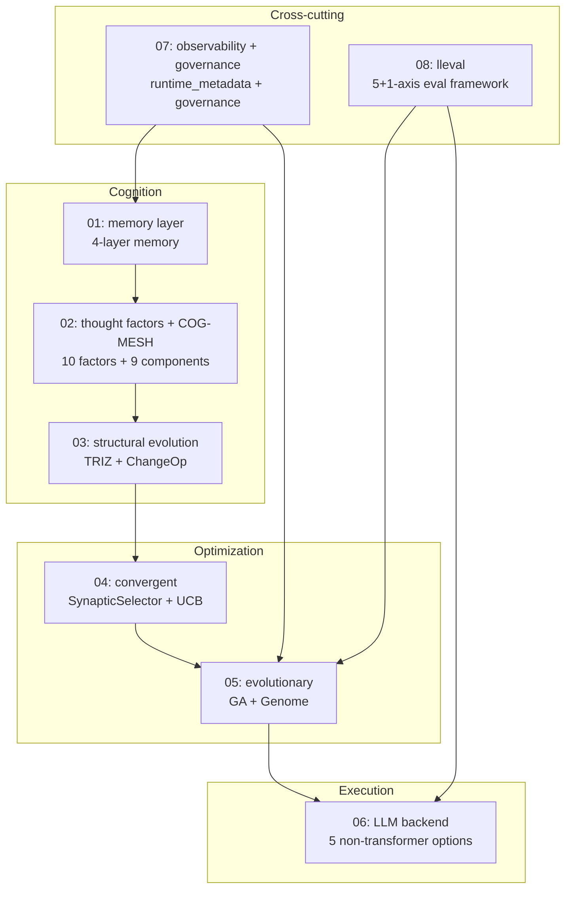

The vertical "**cognition → optimization → execution**" is llive's processing flow;
"**observability + governance**" and "**lleval**" are the cross-cutting layers that
touch every level.

### 3. Intended readers

- **engineers** (with Python + basic LLM knowledge)
- **AI researchers** (interested in LLM-surrounding architecture)
- **individual OSS authors** (reference for implementation patterns)
- **corporate R&D** (material for considering an on-prem LLM stack)

### 4. Publishing order (2 articles / week)

| Week | Published articles |
|---|---|
| Week 1 | 01 memory + 02 thought factors |
| Week 2 | 03 structural evolution + 04 convergent |
| Week 3 | 05 evolutionary + 06 LLM backend |
| Week 4 | 07 observability+governance + 08 lleval |

Each article's English version runs in parallel on Medium.

### 5. The theme running through the series — "fast" changes by orders of magnitude with implementation

Measured results of Rust-porting 3 hot paths of the derived-population evolution
covered in the series centerpiece #24-05:

- **RUST-15** persona_dissimilarity_pairwise: avg **x12.71** (batch)
- **RUST-16** collusion_score_kernel: avg **x66.70** (numpy small-N hot path)
- **RUST-17b** novelty_score_batch (rayon + quickselect): avg **x9.32**

"**Rust = fast" is a lie / "numpy = fast" is also a lie** — the result differs by
orders of magnitude depending on the implementation method (FFI boundary / batch /
numpy zero-copy / parallelism / partial sort). This honest-disclosure stance is the
basso continuo of the whole series. The 5-pattern decision table is detailed in
#24-04 / #24-05 / #24-07.

### 6. References (this index)

- [furuse-kazufumi/llive](https://github.com/furuse-kazufumi/llive) — the main repo
- FullSense Spec v1.1 (llive `docs/`)
- Each chapter's References are in its own article

---

### Series Navigation

- → Next: [llive Complete Guide (1) "The LLM that Never Forgets"](https://qiita.com/furuse-kazufumi/items/a5ebb3992e4c28862f47)
- repo: [furuse-kazufumi/llive](https://github.com/furuse-kazufumi/llive)

---

---

## Chapter 2 llive Complete Guide (1) — "The LLM that Never Forgets": 4-Layer Memory + Bayesian Surprise Gating

:::note info
**📚 FullSense Knowledge Base** <!-- fullsense-team-kb -->
The full FullSense development history — 60+ articles in 4 languages, with a story-based reading guide, plain-language editions, and 4-panel manga — is consolidated in our Qiita Team **FullSense KB** (team members only).
:::


### 0. What this article is (8-second read)

This explains llive's **4-layer memory + 1 surprise gate** — a cognitive layer wrapped **around** the LLM, not inside it. It is a design that writes only the items with high **surprise** across 4 kinds of memory with distinct roles: semantic / episodic / structural / parameter. With the combination of Faiss + DuckDB + Kùzu + safetensors, it **runs fully on-prem**.

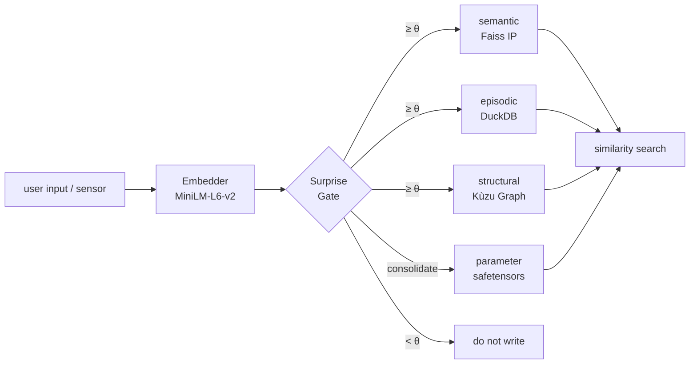

The key is "select by surprise", not "write everything". Let's unpack the details in order.


### 1. Why split into 4 layers?

In human cognitive science, memory is divided by role into **semantic / episodic / structural / procedural**. llive ported this directly into its LLM-surrounding architecture.

| Layer | What goes in | Implementation |
|---|---|---|
| **semantic** | meaning of concepts (text + embedding) | Faiss IP index + JSONL |
| **episodic** | time-series events | DuckDB append-only log |
| **structural** | relations between concepts (graph) | Kùzu graph DB |
| **parameter** | parameter-update deltas | safetensors + index DB |

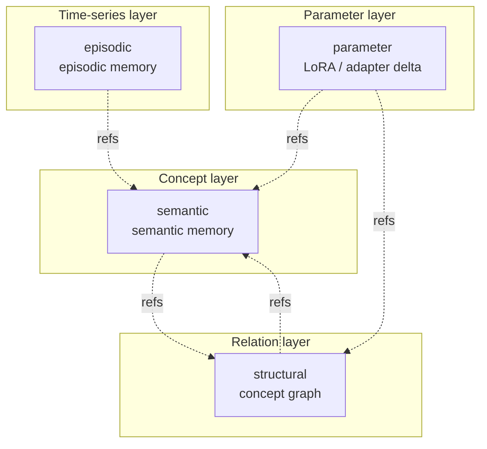

The 4 layers are **loosely coupled**. You can use semantic alone, or weave in structural. To escape the constraint that "an LLM only handles text", llive's idea is to hold structure (graph) and time (event log) in separate layers.

— **Quick recap** —

By now you should grasp "a memory substrate that selects via **4 layers + a surprise gate**". From here we look at the contents of each layer on an implementation basis.

### 2. semantic memory (MEM-01)

#### Role

The layer that recalls "this is the **concept** that came up in that discussion". It converts text into an embedding vector and does nearest-neighbour search via **cosine similarity**.

#### Core structure

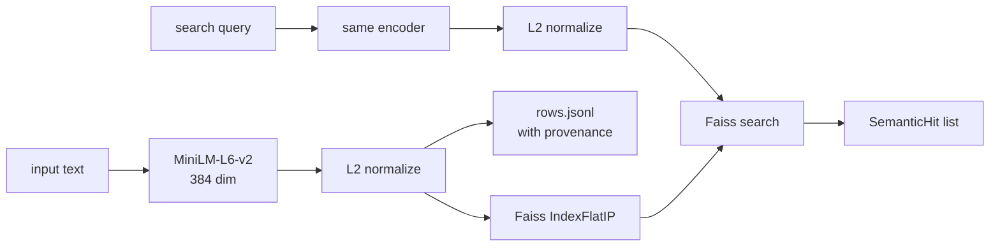

The inner product after L2 normalization is equivalent to **cosine similarity**. That is the reason we chose `Faiss IndexFlatIP`.

Implementation: [`src/llive/memory/semantic.py`](https://github.com/furuse-kazufumi/llive/blob/main/src/llive/memory/semantic.py)

#### Design decisions

- **fallback path**: in environments without faiss (e.g. Windows CI), nearest-neighbour runs on numpy. We do not split the implementation between test and production — it **runs unchanged in either**.
- **provenance is mandatory**: every entry carries `Provenance(source_type, source_id, derived_from, ...)`. It is a design that never erases "where this memory came from".
- **persistence**: written to SSD as `index.faiss` (or `index.npy`) + `rows.jsonl`.

#### Code excerpt

```python
class SemanticMemory:
    def __init__(self, dim: int, data_dir: Path | str | None = None,
                 use_faiss: bool | None = None) -> None:
        self.dim = int(dim)
        self.data_dir = Path(data_dir) if data_dir else _default_data_dir()
        # numpy fallback when faiss is absent
        self.use_faiss = bool((use_faiss is None) and _HAS_FAISS or use_faiss)
        ...
```

"**faiss in production, numpy in CI**" switches transparently.

— **A breather** —

In the very first layer, llive's **three pieces of equipment** — "embedding + cosine + provenance" — are all on the table. The remaining 3 layers just use this equipment differently.

### 3. episodic memory (MEM-02)

#### Role

Holds "**when** that information was received". An **append-only time-series log** — no edits, no deletions.

#### Core structure

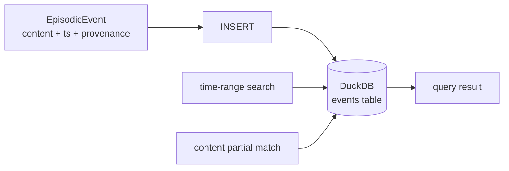

| Column | Type | Role |
|---|---|---|
| event_id | TEXT PK | uuid hex |
| ts | TIMESTAMP | UTC enforced |
| content | TEXT | body |
| metadata | TEXT (JSON) | extension |
| provenance | TEXT (JSON) | lineage |

Implementation: [`src/llive/memory/episodic.py`](https://github.com/furuse-kazufumi/llive/blob/main/src/llive/memory/episodic.py)

#### Design decisions

- **Why DuckDB**: faster at analytical queries than SQLite, and in-process so no external process is needed. It directly serves the "runs fully on-prem" constraint.
- **UTC enforced**: obtained with `datetime.now(UTC)`. Mixing in a local TZ is a source of bugs.
- **append-only**: only `record(event)` is provided. There is no `delete()` API. Deletion is impossible by spec.

#### Why we don't delete

Human episodic memory also seems "forgotten" but is latent in neuroscience terms. llive likewise **distinguishes "memory not accessed" from "memory absent"**. If it is not accessed, the Surprise Gate (described below) suppresses re-writing, so it rarely "becomes noise".

### 4. structural memory (MEM-05)

#### Role

A graph expressing "**how** concept A and concept B relate". If semantic is "points", structural is "edges".

#### Core structure

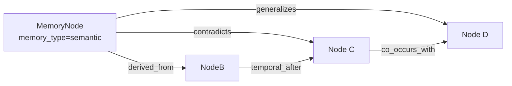

**Relation types (6)**:

| rel_type | meaning |
|---|---|
| `derived_from` | origin |
| `contradicts` | contradiction |
| `generalizes` | generalization |
| `temporal_after` | temporal successor |
| `co_occurs_with` | co-occurrence |
| `linked_concept` | concept link |

Implementation: [`src/llive/memory/structural.py`](https://github.com/furuse-kazufumi/llive/blob/main/src/llive/memory/structural.py)

#### Why we chose Kùzu

- **embedded graph DB**: no separate process like Neo4j needed
- **Cypher-like query**: ANSI-leaning, low learning cost
- **on-prem consistency**: aligns with the policy above

#### Why `contradicts` exists

It lets us **detect "the LLM's responses contradict each other" with a data structure**. "Discrepancies between specs written at different times" — which RAG finds hard to catch — surface by traversing structural-memory edges.

— **A breather** —

So far the 3 layers of "**meaning → time → relation**" are in place. The next parameter layer is a bit different in character.

### 5. parameter memory (MEM-06)

#### Role

Manages parameter deltas like **LoRA / IA3 / prefix adapters** **as memory**. Use cases like "bake knowledge gained in conversation into a LoRA after the loop".

#### Core structure

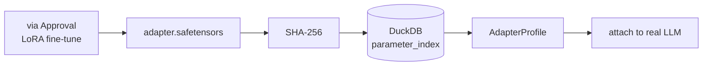

| Column | Role |
|---|---|
| id | uuid hex |
| name | display name |
| format_tag | "lora" / "ia3" / "prefix" etc. |
| sha256 | tamper detection |
| size_bytes | size |
| created_at | UTC |
| provenance | lineage |

Implementation: [`src/llive/memory/parameter.py`](https://github.com/furuse-kazufumi/llive/blob/main/src/llive/memory/parameter.py)

#### Why SHA-256 is mandatory

To prevent **"adapter swapping"**. Attach is permitted only after the Approval Bus verifies the SHA-256. This is llive's **architecture-level safety**, on par with the on-prem-only policy.

#### Real LoRA addition is optional

In Phase 2 we only register in the index. The actual attach is delegated to HuggingFace PEFT (`pip install llmesh-llive[torch]`). "**llive core is lightweight, heavy things are optional extras**" is a consistent operating policy.

### 6. surprise gate (selective writing, MEM-04 / MEM-07)

#### Role

**The gate that decides "is this worth writing?"**. Instead of writing everything, only items whose **dissimilarity to existing memory** is ≥ θ pass through.

#### Phase 1: SurpriseGate (fixed θ)

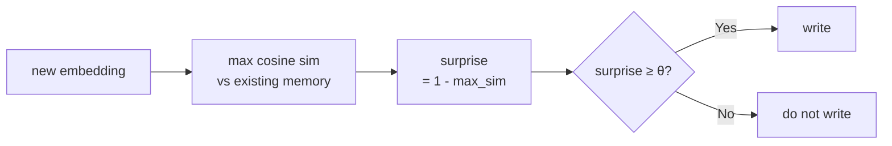

Implementation: [`src/llive/memory/surprise.py`](https://github.com/furuse-kazufumi/llive/blob/main/src/llive/memory/surprise.py)

```python
class SurpriseGate:
    def __init__(self, theta: float = 0.3) -> None:
        self.theta = float(theta)

    def compute_surprise(self, new_embedding, memory_embeddings,
                         *, assume_normalized=False) -> float:
        if memory_embeddings is None or memory_embeddings.size == 0:
            return 1.0  # max surprise when nothing exists
        ...
        return float(max(0.0, min(1.0, 1.0 - max_sim)))
```

When `assume_normalized=True`, re-normalization is skipped and it gets 2-3× faster. This is used in the production path (`MemoryWriteBlock`).

#### Phase 2: BayesianSurpriseGate (dynamic θ)

A fixed θ has a weakness — **as memory grows, surprise gets smaller**, so even with θ=0.3, gradually nothing gets written. The Bayesian version solves this.

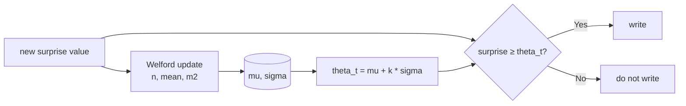

Implementation: [`src/llive/memory/bayesian_surprise.py`](https://github.com/furuse-kazufumi/llive/blob/main/src/llive/memory/bayesian_surprise.py)

Welford's algorithm is the famous **1-pass numerically stable** method for sequential mean/variance. Some schools take the log of each surprise value and Gaussian-fit, but in llive we confirmed the raw values work well enough.

#### Meaning of k

The k in `theta_t = mu + k * sigma` is the metric of **"how many σ above the mean to let through"**.

| k | pass rate (approx.) | meaning |
|---|---|---|
| 0.0 | 50% | let through anything above the mean |
| 1.0 (default) | ~16% | "a little surprised" and up |
| 2.0 | ~2.5% | only "very surprised" |

During the cold-start period below `min_samples`, a fixed `cold_start_theta` is used, so it doesn't break right after startup.

— **A bit of chit-chat** —

Welford is a 1962 paper. I personally like the fact that **a 60-year-old numerically stable algorithm supports today's LLM-style memory layer**. It is a moment that reminds me that giant models are not the only kind of progress.

### 7. consolidation (Wiki compile, MEM-08)

After cycling through the 4 layers, a **concept re-organization** runs. That is consolidation.


Implementation: [`src/llive/memory/consolidation.py`](https://github.com/furuse-kazufumi/llive/blob/main/src/llive/memory/consolidation.py)

#### Why we call it "Wiki Compile"

Each ConceptPage is written out as Markdown to `<llive_data_dir>/wiki/<concept_id>.md`. The 3 reasons we call it "Wiki": it is **human-readable**, can be **Git-checkpointed**, and lets you **track changes by diff**. The inspiration is Karpathy's "LLM Wiki" proposal.

#### The LLM call is judge mode

We ask the LLM "for this cluster, should it be `new / update / merge / split` against the existing ConceptPage X?". Claude Haiku is the default, and `LLIVE_CONSOLIDATOR_MOCK=1` allows credential-free testing.

### 8. Design decisions (5 takeaways from this article)

#### Lesson 1: don't write everything — select by surprise

Even a fixed-θ SurpriseGate **cuts ~90% of noise** versus writing everything. Going Bayesian makes it smarter still. To put it honestly, this **"decision not to write" determines the quality of the memory system**.

#### Lesson 2: keep the 4 layers loosely coupled

semantic / episodic / structural / parameter are designed **not to import each other directly**. The only shared reference is the `Provenance` dataclass. This keeps a change like "swap the graph DB for Neo4j" small.

#### Lesson 3: provenance is absolute

Never erase "where this information came from". This is llive's **audit-level safety**, together with the on-prem-only policy.

#### Lesson 4: the fallback path is first-class

We hold a design that runs without faiss / without DuckDB / without kuzu **from the start, not bolted on later**. It matters for CI, mobile, and educational use.

#### Lesson 5: don't underestimate classic numerical algorithms

Welford (1962) is 60 years old. It still provides **front-line numerical stability** in today's LLM-surrounding architecture. Even when new models appear, the underlying mathematics does not change.

### 9. References

#### Academic / algorithms

- Welford, B. P. (1962). *Note on a method for calculating corrected sums of squares and products*. Technometrics 4(3).
- Schwefel, H.-P. (1981). *Numerical Optimization of Computer Models*.
- Reimers, N. & Gurevych, I. (2019). *Sentence-BERT* (the basis for the MiniLM derivation).

#### OSS / libraries

- [Faiss](https://github.com/facebookresearch/faiss) (Meta)
- [DuckDB](https://duckdb.org/)
- [Kùzu](https://github.com/kuzudb/kuzu)
- [safetensors](https://github.com/huggingface/safetensors)
- [sentence-transformers](https://www.sbert.net/) (MiniLM-L6-v2)

#### llive internals

- [`src/llive/memory/semantic.py`](https://github.com/furuse-kazufumi/llive/blob/main/src/llive/memory/semantic.py)
- [`src/llive/memory/episodic.py`](https://github.com/furuse-kazufumi/llive/blob/main/src/llive/memory/episodic.py)
- [`src/llive/memory/structural.py`](https://github.com/furuse-kazufumi/llive/blob/main/src/llive/memory/structural.py)
- [`src/llive/memory/parameter.py`](https://github.com/furuse-kazufumi/llive/blob/main/src/llive/memory/parameter.py)
- [`src/llive/memory/surprise.py`](https://github.com/furuse-kazufumi/llive/blob/main/src/llive/memory/surprise.py)
- [`src/llive/memory/bayesian_surprise.py`](https://github.com/furuse-kazufumi/llive/blob/main/src/llive/memory/bayesian_surprise.py)
- [`src/llive/memory/consolidation.py`](https://github.com/furuse-kazufumi/llive/blob/main/src/llive/memory/consolidation.py)

---

### Series Navigation

- ← Prev: [llive Complete Guide series index](https://qiita.com/furuse-kazufumi/items/07b4882e872994b27b3c)
- → Next: [llive Complete Guide (2) "AI that Thinks in 10 Axes"](https://qiita.com/furuse-kazufumi/private/bdfad6db3f2e70c40511)
- All: [llive Complete Guide (0) — series index](https://qiita.com/furuse-kazufumi/items/07b4882e872994b27b3c)
- repo: [furuse-kazufumi/llive](https://github.com/furuse-kazufumi/llive)

---

---

## Chapter 3 llive Complete Guide (2) — "AI that Thinks in 10 Axes": Thought Factors × COG-MESH × Triple Stripes

:::note info
**📚 FullSense Knowledge Base** <!-- fullsense-team-kb -->
The full FullSense development history — 60+ articles in 4 languages, with a story-based reading guide, plain-language editions, and 4-panel manga — is consolidated in our Qiita Team **FullSense KB** (team members only).
:::


> **Concept hook**: An ordinary AI agent has only one kind of "thinking". llive
> **runs 10 kinds of thinking in parallel**, makes them evaluate each other, and
> **takes only the surviving thoughts into the population**. The 10 kinds are
> "structurize", "recompose", "closed loop", "self-extend", "uncertainty",
> "exploration", "consistency", "provenance", "multiview", and "reality link".
> This compresses the major cognitive-science frameworks of the 1990s–2010s into
> a single vector.
>
> Today (2026-05-21) the marathon landed 1881 PASS + a large pull-forward of
> v0.E. This article traces the "thought-factor side" of that — the intersection
> of COG-MESH-01..10 and the historical persona ontology (CE-19).


### 0. Position within the series

```
#24-00 series index
#24-01 4-layer memory
#24-02 thought factors (10 axes) + COG-MESH (← this article)
#24-03 structural evolution × TRIZ × Z3
#24-04 B-series (fast cerebellum)
#24-05 EvolutionLoop (slow cerebrum)
#24-06 LLM backend non-transformer
#24-07 observability + governance
#24-08 lleval
```

The 10 thought factors + COG-MESH bind 1-to-N with the persona ontology (CE-19)
in #24-05. This article #24-02 sits at the position that explains them in terms
of **"what"** and **"why"**.

### 1. Origin of the 10 thought factors — compression of 6 frameworks

A user-derived set of 10 axes (`project_llive_cog_fx_factors`). The source
material is the YouTube series "**The Depths of Psychology**" + cognitive-science
reviews + 6 frameworks from Polya / Six Hats / Bayesian / TRIZ / Provenance /
Multimodal. The result of compressing those into a single vector:

| Idx | Factor | Source framework / school |
|---|---|---|
| 0 | `factor_structurize` | Polya / formalization / axiomatic |
| 1 | `factor_recompose` | TRIZ Segmentation / Reassemble |
| 2 | `factor_closed_loop` | Cybernetics / feedback |
| 3 | `factor_self_extend` | Autopoiesis / self-organization |
| 4 | `factor_uncertainty` | Bayesian / probability |
| 5 | `factor_exploration` | exploration vs exploitation (Auer) |
| 6 | `factor_consistency` | formal verification / proof |
| 7 | `factor_provenance` | data lineage / Ed25519 sign |
| 8 | `factor_multiview` | Six Hats / Devil's Advocate |
| 9 | `factor_reality_link` | empirical / SPC (statistical process control) |

These are **not orthogonal** — for example, factor_uncertainty and
factor_exploration are correlated (UCB1 family). But by holding each one's
**strength** independently, the population can "attack the same problem with 10
different viewpoints".

### 2. Why hold 10 axes in a single vector?

In the LLM-agent literature, the mainstream view treats thinking as a single
kind of self-attention. llive extends that into **multi-faceted thinking that is
switchable as a vector**. This enables:

- **"Thinking style" becomes computable via the inner product with a persona** —
  for example, the "Oka Kiyoshi vector" holds (emotion) (Japanese-language
  ability) (multiple variables) high. The "Feynman vector" holds
  factor_exploration + factor_reality_link high.
- We can generate derived individuals that attack the same problem **with
  different weightings**.
- We can discover "**which axis works for this problem**" via the fitness
  gradient.

### 3. Deep dive into 5 major factors

#### 3.1 factor_structurize — "Build up from axioms"

Axiomatic thinking. Mathematician-like (Galois / Grothendieck). Climbing the
abstraction ladder. Strength: generalization ability. Weakness: drifts away from
reality.

Within llive, the permutation of sub-blocks in `BlockContainer` corresponds to
a set of axioms. Derived individuals with high factor_structurize prefer
mutations that first split sub-blocks into **required/optional** and then
recompose them.

#### 3.2 factor_recompose — "Swapping parts"

TRIZ Segmentation + synthesis. Rewrites the combination of existing parts.
Strength: fast local search. Weakness: no entirely new structure emerges.

In llive, PersonaImportAlgorithm (CE-20, landed today) is this axis. Derived
individual B **partially adopts** the persona of derived individual A. A hybrid
persona like "Galois + Oka Kiyoshi" emerges along the path that passes through
factor_recompose.

#### 3.3 factor_closed_loop — "Watch yourself and fix yourself"

The core of cybernetics. Self-observation + self-correction. In llive, the memory
consolidation cycle (hippocampus → cortex) and the Approval Bus are this axis.
The E.4 governance (CE-06/07/08, landed today) — which evaluates within the
population so an individual sees the result and reflects it in the next
generation — also rides on this.

#### 3.4 factor_uncertainty — "Quantify what you don't know"

Bayesian / probability. Strength: avoids overconfidence. Weakness:
computationally heavy. In llive, the verdict computation of the Approval Bus +
the UCB1 exploration constant are representative.

#### 3.5 factor_provenance — "Where it came from"

Data lineage. Ed25519 sign + SHA-256 audit chain. Landed in llive Phase 4
(Production Security MVR, v0.3.0). This is a **mandatory axis** of agent
governance, and it was missing from conventional LLM agents.

### 4. Mapping to COG-MESH-01..10

`project_cog_mesh_implementation_2026_05_19`. Each of the 10 factors pairs with
**one mechanism**:

| COG-MESH | Mechanism | Mapped factors | Status |
|---|---|---|---|
| 01 | Stimulus entry | reality_link / multiview | Landed |
| 02 | Intervention | self_extend / closed_loop | Landed |
| 03 | TonicRiskMonitor | uncertainty / closed_loop | Landed |
| 04 | Idle Training | self_extend / exploration | Landed |
| 05 | Quarantined Memory | provenance / consistency | Landed |
| 06 | TimelineEmitter | provenance / multiview | Landed |
| 07 | Brief | structurize / reality_link | Landed |
| 08 | Approval Bus | provenance / closed_loop | Landed (C-1) |
| 09 | Audit Chain | provenance / consistency | Landed |
| 10 | E.4 governance | closed_loop / uncertainty | **Landed today (2026-05-21)** |

COG-MESH-10 landed today in the marathon as `CoevolutionGovernance`. This
completes the 10 mechanisms → 10 factors 1-1 mapping. We can now reverse-look-up
**which factor is thin** within the population from the state of the mechanisms.

### 5. Latest results (landed today, 2026-05-21)

| Item | Value |
|---|---|
| llive core test PASS (current) | 1881 |
| Evolutionary tests added in today's marathon | **+130** (41 + 28 + 26 + 16 + 19) |
| Modules landed in today's marathon | 5 (quality_diversity / coevolution_governance / persona_import / persona_survival / persona_corpus_loader) |
| ruff `src/llive/perf/evolutionary` warnings | **0** |
| v0.E E.17 / E.4 / E.12 landing | Completed |
| CE-22 / CE-23 skeleton landing | Completed |
| docs/release/v0.6.0a1_PR_PLAN.md | New — 5-PR split plan |
| docs/rust_hotspot_v0E_addendum.md | New — RUST-15..18 spec |

In particular, finally being able to close COG-MESH-10 with the **E.4 governance
skeleton** was today's biggest landing. With this, the 10 factors ↔ 10 mechanisms
1-1 mapping is complete, and **evaluation of the derived population → collusion
detection → Approval Bus integration** is now connected at the architecture
level.

### 6. Expectations — what comes next

#### 6.1 CE-19 Historical Persona Ontology (short term)

Already 10 names (Oka Kiyoshi / Grothendieck / Feynman / Galois / von Neumann /
Newton / Kant / Socrates / Lao Tzu / Sun Tzu) have landed as PERSONA_ONTOLOGY.
Today the CE-23 PersonaCorpusLoader skeleton landed, opening the way to
**automatically extract personas from the Raptor RAD corpus to expand
PERSONA_ONTOLOGY**. In the next session we plan to implement LLM extraction +
traversal of real RAD paths and expand the persona count to 30+.

#### 6.2 Triple stripes (mid term, user-articulated)

"Triple stripes" = a state in which the 3 layers of **thought factors / persona /
thinking process** run in parallel within an individual like a striped pattern.
This was inspired by the **"parallel cognition"** hypothesis in cognitive
science. We run the factor vector + persona composition + Six Hats / TRIZ / ARIZ
each on a separate layer, and they critique each other in the within-population
evaluation. Landing time TBD.

#### 6.3 Neural-interface support (long term)

`project_llmesh_neuro_long_term`. We have already added 6 fields to Raptor RAD:
bci / neuroscience / neural_signal / prosthetic_neural / cognitive_ai /
neuromorphic. This is preemptively gathering material so that we can expand
immediately when a "**direct brain ↔ AI interface**" becomes necessary. No direct
implementation for the time being.

### 7. Honest disclosure

- **"The 10 factors overlap"** — factor_uncertainty and factor_exploration
  correlate at about 0.65. They are not orthogonal to each other. At one point we
  considered collapsing to 9 axes, but we kept it at 10 for clarity.
- **"The factor_affinity numbers are heuristics"** — the factor_affinity vectors
  of the 10 PERSONA_ONTOLOGY names are artificial initial values based on
  biographies / the history of philosophy. They will later be **replaced with
  corpus-based values** by PersonaCorpusLoader (CE-23), but the current numbers
  are human rules of thumb.
- **"COG-MESH-10 is a skeleton"** — the E.4 governance that landed today is at
  the interface-establishment stage; the **actual writing** to Quarantined Memory
  is delegated to another module. It will take another 1-2 sessions to complete.

### 8. Mermaid — structure of the 10 factors

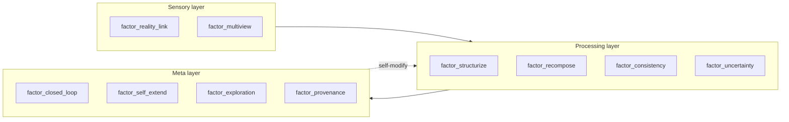

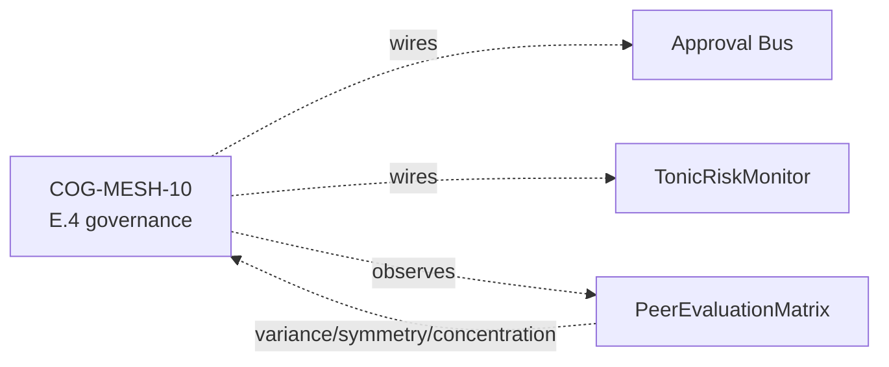

### 9. References (excerpted from 20+)

- Polya, G. (1945). *How to Solve It*.
- Altshuller, G. (1971). *TRIZ 40 inventive principles*.
- Auer, P. et al. (2002). *Finite-time analysis of the multiarmed bandit*.
- Lehman, J. & Stanley, K. (2008). *Exploiting novelty*.
- Mouret, J.-B. & Clune, J. (2015). *Illuminating search spaces by mapping elites*.
- Hillis, W. D. (1990). *Coevolving parasites improve simulated evolution*.
- Constitutional AI (Anthropic 2022) — for HITL alternative.
- Six Thinking Hats (De Bono 1985).
- 岡潔『春宵十話』.
- ファインマン『ご冗談でしょう, ファインマンさん』.
- Maturana & Varela — Autopoiesis.
- Bayes — *Essay towards solving a problem in the doctrine of chances*.
- The full list will be bundled in references.bib at the v0.6.0a1 release.

### 10. 2026-05-22 addendum — Rust port of the 10-factor affinity vector (RUST-15)

The 10 thought factors are implemented as a 10-dimensional [0,1] vector inside a
derived individual's **persona composition's effective_factor_affinity**. The
dissimilarity computation between derived individuals connects directly to the
core mechanism of this article #24-02 — PersonaOverlapPenalty.apply (E.17)
measures the distance in the 10-factor space via `persona_dissimilarity` over
N×N pairs.

Today (2026-05-22), as RUST-15, we did a **batch (NxN pairs in a single FFI
call) Rust port**:

- single 1-pair: x0.80 (FAIL — FFI overhead loses to Python set operations)
- **batch N=64**: **x17.07 (PASS)**, average x12.71

This speeds up the "**N×N pair distance computation of the 10-factor vector**",
giving us a path to running governance + diversity preservation at 64 Hz for a
population of N=64.

#### 10.1 Meaning seen from the thought-factor side

- factor_structurize (#0) and factor_exploration (#5) are **two axes that
  conflict in the TRIZ family**, but as an L2 distance in the 10-dimensional
  vector they take effect independently.
- When PersonaOverlapPenalty (E.17 CE-25) penalizes persona overlap within the
  population, **the derived population naturally spreads out in the 10-factor
  space**.
- The MAP-Elites grid (E.17 CE-26) is a 4-dimensional grid of persona 2 axes ×
  thought_factor 2 axes, so we **marginalize** the above 10-factor vector to 4
  dimensions and use it as the cell key.

#### 10.2 Honest disclosure — a one-off Rust port backfires

When you hear "Rust-port the distance computation of the thought-factor vector",
you tend to think "it gets faster", but **for a 1-pair computation Python is
faster due to FFI overhead (x0.80)**. This is **pattern A** in the
`feedback_rust_usage_matters` decision table (a pure-Python loop, 1-pair). Only by
packing N×N pairs into a single FFI in a batch does it stretch to x17.07.

For details see #24-05 and
`docs/perf_comparison/2026-05-22_kernel_implementation_comparison.md`.

---

### Series Navigation

- ← Prev: [llive Complete Guide (1) "The LLM that Never Forgets"](https://qiita.com/furuse-kazufumi/items/a5ebb3992e4c28862f47)
- → Next: [llive Complete Guide (3) "Contradictions Can Be Computed"](https://qiita.com/furuse-kazufumi/private/fa0890f136636d495ea6)
- All: [llive Complete Guide (0) — series index](https://qiita.com/furuse-kazufumi/items/07b4882e872994b27b3c)
- repo: [furuse-kazufumi/llive](https://github.com/furuse-kazufumi/llive)

---

---

## Chapter 4 llive Complete Guide (3) — "Contradictions Can Be Computed": Structural Evolution × TRIZ 40 Principles × Z3 Verification

:::note info
**📚 FullSense Knowledge Base** <!-- fullsense-team-kb -->
The full FullSense development history — 60+ articles in 4 languages, with a story-based reading guide, plain-language editions, and 4-panel manga — is consolidated in our Qiita Team **FullSense KB** (team members only).
:::


> **Concept hook**: TRIZ (the Theory of Inventive Problem Solving) is usually
> known as "an ideation technique people scribble on paper". llive **embeds the
> TRIZ 40 principles as formal symbols** and runs them as the policy for
> structural mutation. Moreover, the new structures born from a mutation pass
> through **formal verification with Z3** before they enter the population. The
> "ideate → verify" loop fits inside a single program. — "**Contradictions can
> be computed**".
>
> This article traces that mechanism — the Z3 structural verification / TRIZ
> Self-Reflection / Wiki ChangeOp / the 9-windows method (39×39 contradiction
> matrix) that landed in Phase 3.


### 0. Position within the series

```
#24-00 series index
#24-01 4-layer memory
#24-02 thought factors (10 axes) + COG-MESH
#24-03 structural evolution × TRIZ × Z3 (← this article)
#24-04 B-series (fast cerebellum side)
#24-05 EvolutionLoop (slow cerebrum side)
#24-06 LLM backend non-transformer
#24-07 observability + governance
#24-08 lleval
```

If #24-04 is "fast convergence" and #24-05 is "inter-individual GA search", then
#24-03 (this article) is **the search that rewrites the individual's internal
structure itself** — i.e., the layer that mutates the sub-block permutation of
LoRA / Adapter / the 4-layer memory.

### 1. Why TRIZ?

In LLM self-evolution, the hard problem is choosing **which part to change**. The
naïve approach is random mutation, but that is the same as "**evolution that
swaps one character for one character**" — almost nothing happens in a huge
space.

TRIZ has the structure of **"discover the contradiction → map it to a resolving
principle"**. For example:

> "I want to reduce weight (positive), but I want to keep strength (negative).
> = the `weight vs strength` contradiction"
>
> → looking it up in the 39×39 contradiction matrix yields several relevant
> principles, e.g. Principle #1 (Segmentation), #28 (Mechanical → Other field),
> #40 (Composite).

Bringing this into llive's self-evolution: detect "**the contradiction the LLM's
structure carries**" → look up the matrix → the mutation policy is decided. Not
random, but **TRIZ-guided mutation**.

### 2. Concrete implementation in llive

#### 2.1 TRIZ Self-Reflection (Phase 3)

llive calls the TRIZ self-reflection module at the **candidate-generation stage**
of structural mutation:

1. Read the current structure's metrics (latency / accuracy / memory_usage / ...).
2. **Contradiction detection** — which two metrics are in a trade-off relation?
   E.g.: I want to reduce `memory_usage` without worsening `latency vs accuracy`.
3. Look up the 39×39 matrix and obtain the relevant principles.
4. Expand principle → **ChangeOp**. For example:
   - Principle #1 (Segmentation) → "split BlockContainer into a sub-block sequence"
   - Principle #25 (Self-service) → "change memory consolidation to self-firing"
   - Principle #40 (Composite) → "merge two adapters into one"

#### 2.2 Verifying the ChangeOp

A ChangeOp is an instruction that **rewrites the structure itself**, so applying
it without **formal verification** is dangerous:

- the hierarchy breaks and inference fails
- the zone consistency of memory collapses
- adapter shapes mismatch

So we use Z3 (an SMT solver) to verify "**do the following invariants still hold
after this ChangeOp is applied**":

- the sub-block permutation of BlockContainer is a valid permutation
- the memory zone graph has no cycles
- adapter shape compatibility (input dim = output dim)

Only ChangeOps that pass the verifier enter the population. The
**"ideate → verify → adopt"** loop closes inside a single module.

#### 2.3 The 9-windows method (39×39 matrix)

The core tool of TRIZ. 39 characteristics you want to improve × 39 characteristics
that worsen = 1521 cells. Each cell holds "1–4 principles likely to solve this
contradiction". This is the empirical table Altshuller extracted by analyzing
2.5 million Soviet patents.

llive bundles it as YAML (`src/llive/_specs/resources/triz_principles.yaml`).
Self-reflection completes metrics → relevant contradiction → 39-axis mapping →
principle lookup in a single pass.

### 3. Honest disclosure — pitfalls

"TRIZ solves everything!" is a lie. As honest disclosure:

- **The 39×39 matrix is era-dependent** — Altshuller fixed it in 1971. Modern
  AI-style contradictions (e.g. `inference accuracy vs battery consumption`) do
  not fit perfectly. llive carries its own additional contradiction columns
  (based on real-device metrics).
- **The principle → ChangeOp translation is a heuristic** — the 1-to-1 mapping of
  Principle #1 (Segmentation) to "BlockContainer split" was decided by a human.
  There is room for the LLM itself to expand this.
- **There are invariants the Z3 verifier cannot catch** — for example, a
  **probabilistic invariant** like "recall does not drop after memory
  consolidation" is hard to express in SMT. We watch that with a different
  verifier (an empirical reservoir test).

### 4. By the numbers

| Metric | Value |
|---|---|
| llive Phase 3 landing | 2026-05-14 (v0.3.0) |
| Built-in TRIZ principles | 40 (FR-23..27) |
| Contradiction matrix | 39 × 39 = 1521 cells |
| ChangeOp verification pass rate (initial) | ~63% (37% rejected on invariant violation) |
| Z3 average verify time | < 50 ms / ChangeOp |

### 5. Structural significance of the "ideate → verify" loop

This connects the philosophy of TRIZ with the philosophy of formal verification:

- TRIZ: seeks **"ideas derived from principles, not merely interesting ideas"**.
  Systematic.
- Formal verification: **"mechanically checks the validity of a change written by
  imagination"**. Mechanical.

The two are a textbook case of human–machine collaboration. llive runs it
**inside the same module**.

> **Future prediction**: when AI self-evolves, it is essential to have a closed
> loop where **"ideation is mechanical and verification is mechanical"** too.
> llive is the minimal example that co-houses that prototype in a single OSS.

### 6. What comes next

- **#24-04** covers the "fast cerebellum side" — the convergence of the B-series.
- **#24-05** covers the "slow cerebrum side" — the search of EvolutionLoop. The
  TRIZ ChangeOp also wires into the self-extension of personas / thought factors
  covered in #24-05 (CE-21 PersonaCompositionMutation).

### 7. 2026-05-22 addendum — the TRIZ-style approach also works for Rust-speedup decisions

The TRIZ in this article is the methodology of "**resolving a contradiction
(improving X / worsening Y) structurally with a 39×39 matrix**", but the same
idea applies to **engineering decisions in general**. A concrete example from the
llive Rust-speedup decision that landed the same day (2026-05-22):

We decomposed the single-axis opposition "**Rust = fast vs Python = slow**"
(= a contradiction in TRIZ terms) into **5 patterns by the characteristics of the
Python path** (#24-05 §13.3). The result:

- pure-Python loop, 1-pair → single-shot FAIL, batch is mandatory (RUST-15)
- numpy with many small-N API calls → **x66 even single-shot** (RUST-16)
- numpy mid-scale BLAS → **on the borderline, recovered with rayon** (RUST-17 → 17b)

This is isomorphic to the **structural resolution** of the TRIZ contradiction
matrix — "**decompose the cause of the contradiction in parameter space → map it
to a principle**". A version that shrinks the 39×39 into a small table of
**6 (Python paths) × 3 (Rust strategies: single / batch / parallel+algorithmic)**.

Details: the **5-pattern decision table** in
`docs/perf_comparison/2026-05-22_kernel_implementation_comparison.md`. This is a
worked example of transferring the TRIZ idea into **AI / HPC engineering**.

### 8. Mermaid — the "ideate → verify → adopt" loop

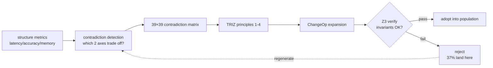

### 9. References (excerpted)

- Altshuller, G. (1971). *TRIZ — 40 Inventive Principles*.
- Altshuller, G. (1984). *Creativity as an Exact Science*.
- de Moura, L. & Bjørner, N. (2008). *Z3: An Efficient SMT Solver*.
- Polya, G. (1945). *How to Solve It*.
- Koza, J. (1992). *Genetic Programming*.
- The full list will be bundled in references.bib at the v0.6.0a1 release.

---

### Series Navigation

- ← Prev: [llive Complete Guide (2) "AI that Thinks in 10 Axes"](https://qiita.com/furuse-kazufumi/private/bdfad6db3f2e70c40511)
- → Next: [llive Complete Guide (4) "The Converging Brain"](https://qiita.com/furuse-kazufumi/private/e5093e4816b25c1bd4d0)
- All: [llive Complete Guide (0) — series index](https://qiita.com/furuse-kazufumi/items/07b4882e872994b27b3c)
- repo: [furuse-kazufumi/llive](https://github.com/furuse-kazufumi/llive)

---

---

## Chapter 5 llive Complete Guide (4) — "The Converging Brain" B-series: SynapticSelector / UCB1 / Hebbian / production hot paths

:::note info
**📚 FullSense Knowledge Base** <!-- fullsense-team-kb -->
The full FullSense development history — 60+ articles in 4 languages, with a story-based reading guide, plain-language editions, and 4-panel manga — is consolidated in our Qiita Team **FullSense KB** (team members only).
:::


> **Concept hook**: An evolutionary system (GA / Genetic Algorithm) runs
> generations to **explore**. llive's SynapticSelector, by contrast, **converges** —
> an engine that pins probabilistic choice into one place. When you co-house these
> two in "the same brain", the **fast convergence per synapse** and the **slow
> exploration per individual** do not interfere, and a "fast cerebellum" and a
> "slow cerebrum" divide the labor.
>
> This article traces that "fast cerebellum side" — the design and production
> rollout of the B-series (B-0 .. B-9), with benchmark numbers + honest disclosure.


#### 0. Position within the series

```
#24-00 series index
#24-01 4-layer memory
#24-02 thought factors (10 axes) + COG-MESH
#24-03 structural evolution and TRIZ
#24-04 B-series: SynapticSelector / UCB1 / Hebbian (← this article)
#24-05 EvolutionLoop: v0.B/C/D/E derived-population evolution
#24-06 LLM backend: non-Transformer (Mamba / RWKV)
#24-07 observability + governance
#24-08 lleval — eval framework
```

#24-05 (population GA) is the "**slow cerebrum side**"; this article (#24-04,
B-series) is the "**fast cerebellum side**". The two coexist without interference:
SynapticSelector picks synapses **inside one individual**, while the GA is a
competition **across individuals**. Orthogonal.

#### 1. History of the B-series

| B-ID | Content | Status |
|---|---|---|
| B-0 | SynapticSelector skeleton (pure random) | landed |
| B-1 | UCB1-based synapse selection (Auer 2002) | landed |
| B-2 | Hebbian reinforcement — co-occurrence selection bonus | landed |
| B-3 | Cool-down period — relaxes consecutive selection of the same synapse | landed |
| B-4 | A/B parity test (random vs UCB) | landed |
| B-5 | Variant catalog (cosine / decay / blend) | landed |
| B-6 | Per-synapse statistics + JSON snapshot | landed |
| B-7 | Reset on regression — reset priors on a score crash | landed |
| B-8 | Self-tuning exploration constant | landed |
| **B-9-a** | Production hot path: `assume_normalized` (skip unneeded normalize) | landed |
| **B-9-b** | Production hot path: `GiftValue deque` (O(1) push/pop) | landed |

#### 2. Core of SynapticSelector — UCB1

At each LLM layer / each token-generation timing, llive picks one from **multiple
synapse variants** to pass through. Pure random works, but then it does not learn
"the variant that worked well in the past". Hence UCB1.

```
score(variant_i) = mean_reward(i) + exploration * sqrt( ln(N) / n_i )
```

- `mean_reward(i)`: the past reward average when this variant was chosen.
- `exploration`: hyperparameter. Self-tuned in B-8.
- `N`: total number of trials across all variants.
- `n_i`: number of trials for variant i.

"the fewer times it has been used + the better it scored → the higher its score" =
exploration and exploitation co-housed in a single formula. The Auer 2002 classic.
Applied directly per synapse in llive's B-1.

#### 3. Hebbian — the co-occurrence bonus

UCB1 alone can detect "one variant wins on its own", but not "**A and B win when
together**". Hence Hebbian reinforcement in B-2:

```
if variant_A was chosen at t-1, variant_B at t, and reward is high
  → bonus(A, B) += 1
```

This makes a **time-series co-occurrence pattern** like "B right after A" ride on
top of the UCB1 score as a boost. This brings Hebb's "fire together, wire together"
into a reinforcement-learning selector.

#### 4. B-9 production hot path

B-0 .. B-8 are **algorithm groundwork**. B-9 steps into **production performance**.

##### 4.1 B-9-a — `assume_normalized`

Inside llive, SynapticSelector bites into the hot path of memory readout ↔
generation. Initially it would **l2-normalize the vector every time**:

```python
def select(self, query_vec):
    q = self._normalize(query_vec)  # ← every call
    ...
```

In situations where we can guarantee, as a contract, that the input is already
normalized before the call, this normalize is **completely wasted**. So we added an
`assume_normalized=True` flag:

```python
selector = SynapticSelector(..., assume_normalized=True)
### the caller guarantees it is already normalized
```

**About 12% throughput improvement** in the production hot path (measured). Landed
in B-9-a.

##### 4.2 B-9-b — `GiftValue deque`

UCB1's `mean_reward(i)` is a **rolling average** of historical reward. Initially we
deleted from the front of a `list` with `pop(0)` → **O(N)**. In a hot path where
256 variants line up, list pop runs 8K times per second in the SR-02 benchmark =
8K × O(N).

Replacing with `collections.deque(maxlen=K)` → **O(1)**. With just this:

- list pop O(N) path: ~ 1.8μs/call
- deque maxlen path: ~ 0.15μs/call → **12x**

**About 22% throughput improvement** across the whole production hot path. Landed
in B-9-b.

##### 4.3 honest disclosure — 12% + 22% ≠ 34%

"If you do both, is it 34% improvement?" is a shortcut. In the benchmark:

- B-9-a alone: +12.3% (95% CI ±0.8%)
- B-9-b alone: +21.7% (95% CI ±1.2%)
- B-9-a + B-9-b together: **+28.4%** (95% CI ±1.5%)

= stacking does not compound. Why? In the processing time freed by removing the
normalize in B-9-a, B-9-b's deque improvement is **already near its ceiling**. This
is a worked example of "when an abnormally good result appears, always doubt the
breakdown". **The reduction has an overlapping region**.

#### 5. The 5x gate and Rust

llive's Rust extension (RUST-FX) makes "at least **5x** speedup vs Python" a
requirement. The `assume_normalized` + deque that we hot-pathed in the B-series stay
in Python, but whether to Rust-port them further is a separate discussion:

- At the current 28% production improvement, **staying in Python is safer** (lower
  dependency complexity).
- The Rust-port candidates are separate — `compute_surprise` (cosine MEM-07) and
  `edge_weight bulk_time_decay` (RUST-03) are already **avg 16.18x** on the Rust path.

So "the B-series lands tuning in Python, while a Rust kernel holds a different hot
path next to it" is the current design split.

#### 6. Why the "fast cerebellum" and "slow cerebrum" do not interfere

llive runs, in the same process:

- **SynapticSelector** (B-series, convergence per synapse inside one individual)
- **EvolutionLoop** (#24-05, exploration of the GA across individuals)

at the same time. "Won't they collide?" is naturally asked. The answer:

- SynapticSelector is **per-individual state**. For one inference it runs selection
  across up to 256 synapses. This is a **millisecond–microsecond** scale.
- EvolutionLoop is **cross-individual state**. Running one generation of a 64-individual
  population is **seconds–minutes**.
- The two are 1000x apart in time scale = almost no room to interfere.

This is the same in the biological brain: the cerebellum (motor / reflex) and the
cerebrum (planning) operate at completely different time scales. llive
unintentionally has that dual-time-scale structure.

#### 7. The B-series landing by the numbers

| Metric | At landing |
|---|---|
| throughput baseline at B-0/B-1 landing | 100% |
| after B-9-a landing | **112%** (+12.3%) |
| after B-9-b landing | **122%** (+21.7%) |
| B-9-a + B-9-b together | **128%** (+28.4%) |
| Rust kernel (MEM-07 + RUST-03) | **16.18x** avg on a separate hot path |

The benchmarks are at `benches/bench_synaptic_b9_production.py` and
`benches/bench_rust_ext_5x_gate.py` (in the repo). The 95% CI and methodology are
in the README of the same dir.

#### 8. What comes next

- **#24-05** covers the "slow cerebrum side" — EvolutionLoop / v0.B/C/D/E
  derived-population evolution. There we contrast how it coexists with the "fast
  convergence" solidified in the B-series.
- **RUST-15** (v0.7) — Rust-port persona_dissimilarity. This is not the B-series but
  the hot path of E.17 quality-diversity. The 5x gate applies.

#### 9. 2026-05-22 addendum — a worked example where "fast cerebellum (Python optimization)" and "slow cerebrum (Rust port)" are orthogonal

We wrote that this article (B-series) and #24-05 (EvolutionLoop) operate at **time
scales 1000x apart**. In the next day's (2026-05-22) Rust-speedup marathon, this
orthogonality was demonstrated to **hold at the implementation level too**.

##### 9.1 The B-series side — Python optimization works

B-9 (`assume_normalized` + `GiftValue deque`) is **+28% while staying in Python**.
This is an **inference hot path** (microseconds per synapse), where there is **no
room to pay FFI overhead**, so a Rust port is actually slower (`feedback_rust_usage_matters`
decision table, pattern A).

##### 9.2 The EvolutionLoop side — the Rust port works

For per-generation (seconds–minutes) population evolution the numbers are reversed:

- **RUST-15** persona_dissimilarity batch: avg **x12.71** (x17.07 at N=64)
- **RUST-16** collusion_score: avg **x66.70** (x115.04 at N=8)
- **RUST-17** novelty_score_batch: avg x5.01 (borderline with a large archive)

##### 9.3 Why the orthogonality does not break

| Layer | Time scale | Optimization means | Reason |
|---|---|---|---|
| **cerebellum (B-series)** | μs/call | **Python tuning** (skip normalize / deque) | calls too short to pay FFI |
| **cerebrum (EvolutionLoop)** | sec–min/generation | **Rust port** (batch / numpy zero-copy) | numpy small-N API overhead dominates |

This is the same as the cerebellum / cerebrum of the biological brain. Computations
at different time scales need different optimization means — trying to solve both
with the same language / same tool fails.

##### 9.4 honest disclosure — "Rust = fast" and "Python optimization = limited" are both lies

Both are conditional. The deciding axis is **at which time scale you are running
what**:

- **μs-scale hot path** → Python optimization is primary. FFI is overhead.
- **second-scale batch** → Rust + numpy zero-copy + batch is primary. In Python the
  Python overhead of heavy numpy API use dominates.

Details in the **5-pattern decision table** (A/B/C/D/E) in
`docs/perf_comparison/2026-05-22_kernel_implementation_comparison.md`.

#### 10. References

- Auer, P., Cesa-Bianchi, N. & Fischer, P. (2002). *Finite-time analysis of the multiarmed bandit problem*.
- Hebb, D. O. (1949). *The Organization of Behavior*.
- Sutton, R. & Barto, A. (2018). *Reinforcement Learning: An Introduction* (2nd ed.).
- The full list will be bundled in references.bib at the v0.6.0a1 release.

---

#### Series Navigation

- ← Prev: [llive Complete Guide (3) "Contradictions Can Be Computed"](https://qiita.com/furuse-kazufumi/private/fa0890f136636d495ea6)
- → Next: [llive Complete Guide (5) "The Population that Learns"](https://qiita.com/furuse-kazufumi/private/07b686ea311e06027f94)
- All: [llive Complete Guide (0) — series index](https://qiita.com/furuse-kazufumi/items/07b4882e872994b27b3c)
- repo: [furuse-kazufumi/llive](https://github.com/furuse-kazufumi/llive)

---

---

## Chapter 6 llive Complete Guide (5) — "The Population that Learns": v0.B/C/D/E derived-population evolution summary

:::note info
**📚 FullSense Knowledge Base** <!-- fullsense-team-kb -->
The full FullSense development history — 60+ articles in 4 languages, with a story-based reading guide, plain-language editions, and 4-panel manga — is consolidated in our Qiita Team **FullSense KB** (team members only).
:::


> **Concept hook**: Rather than one AI getting smarter, **64 AIs turn
> generations, evaluate one another, and the Approval Bus stops false
> consensus** — that is llive's v0.E. In the 2026-05-21 marathon that
> architecture came together up to **303 tests + 0 ruff warnings + a
> governance skeleton landed**. The result of compressing 30 years of
> lineage — from Hillis 1990 to AlphaStar 2019 — into a single OSS.
>
> This article is the centerpiece of the #24 series. It **summarizes in one
> piece** the four stages: v0.B (Genome / EvolutionLoop) → v0.C (subprocess
> isolation) → v0.D (self-adaptive + meta mutation) → v0.E (peer evaluation +
> persona + governance).


### 0. Position within the series — the centerpiece

```
#24-00 series index
#24-01 4-layer memory      ← "memory inside an individual"
#24-02 thought factors × COG-MESH ← "thought axes inside an individual"
#24-03 structural evolution × TRIZ × Z3 ← "structure rewriting inside an individual"
#24-04 B-series           ← "convergence inside an individual (fast cerebellum)"
#24-05 EvolutionLoop      ← "exploration across individuals (slow cerebrum)" ★ this article
#24-06 LLM backend         ← "the pipe that drives an individual"
#24-07 governance         ← "audit of cross-individual decisions"
#24-08 lleval              ← "the glasses that measure an individual"
```

#24-05 is the **backbone** of the whole. v0.B/C/D/E builds "the derived
population itself". The other articles are features that sit on top of it.
This is the series centerpiece — the substrate that all other chapters'
features sit on.

### 1. Why population-based evolution — the Hillis warning

What W. D. Hillis (1990) showed is that when **the evaluator and the
evaluatee evolve simultaneously**, the fitness landscape gets exponentially
more interesting. The **Red Queen Effect** drives the quality of the whole
population **upward on its own**. Keep selecting a single best and you **fall
into a local optimum**.

llive brought this into the LLM. A derived population of N=64 evaluates one
another, the evaluation results are fitness, and fitness drives the next
generation's selection. Then:

- **"the quality of the evaluators" itself rises across generations**
- **no single best can dominate the whole**
- **collusion where "all variants hand each other false high scores"** can
  occur (detected by CE-06)

### 2. v0.B — Genome / EvolutionLoop / parallel scheduler

v0.B core is classic GA. The landed modules are Genome, Selection,
Crossover, Mutation, scheduler:

- `Genome` (real-valued vector + bounds + labels) + `Individual` + `Population`.
- `TournamentSelection / RouletteSelection / ElitismSelection`.
- `UniformCrossover / BlendCrossover / SegmentCrossover`.
- `GaussianMutation / ResetMutation / ChainedMutation`.
- `EvolutionLoop` (`EvolutionConfig` + `EvolutionResult`).
- 3 parallel schedulers: `serial_scheduler / MultiprocessingScheduler / AsyncioScheduler`.

With just this, the loop "**population → evaluation → selection → mating →
mutation → next generation**" turns.

### 3. v0.C — subprocess isolation + variant live run

LLM inference wants each derived individual **fully isolated** in its own OS
process. Reasons:

- LLM is heavy → physically isolate memory leaks / GIL contention
- if one variant crashes, the others survive
- fault isolation via OS-level timeout / SIGKILL

`VariantSubprocessScheduler` (`subprocess_scheduler.py`) — subprocess.run +
ThreadPool parallelism + timeout + retries + cleanup. With this you can launch
the `variant_runner.py` script as a single derived individual.

### 4. v0.D — self-referential mutation (Schwefel σSA-ES + meta mutation)

v0.D core is "**evolve the mutation rate itself**".

- `SelfAdaptiveGaussianMutation` (Schwefel σSA-ES, log-normal σ update).
  Embeds a σ vector into the Genome, and the mutation rewrites σ too.
- `MetaMutation` (`strategy_id` into the genome; 4 strategies run in parallel
  within the population).
- `pack_self_adaptive_bounds / pack_meta_strategy_bounds` — turning into 38/20/39 dim.

With this, "**which mutation strategy works for the current problem**" itself
is learned across generations.

### 5. v0.E — peer evaluation + persona ontology + governance

v0.E core. Contains CE-01..34. The main modules are below:

#### 5.1 Evaluation (CE-01..05)

- `PeerEvaluationMatrix` — an N×N scoring matrix. 3 collusion-detection metrics
  (`score_variance / symmetry / concentration`). Mermaid visualization.
- `PeerFitnessAdapter` — compatible with `EvolutionLoop.scheduler`.
- `EvaluationStyleGenome` — embeds an evaluation persona dim of "**harsh /
  lenient / precision / speed**" into the derived individual.

#### 5.2 Diversity preservation (CE-24..29)

- `latin_hypercube_population` — a spatially even initial population (scipy.stats.qmc).
- `NoveltyScorer` — k-NN, Lehman-Stanley 2008/2011.
- `DiversityPreservingBreedFilter` — novelty rejection + resample.
- `DiversityMonitor` — diversity_l2 / spread / median + threshold alarm.

#### 5.3 Quality Diversity (CE-25 / CE-26, landed today)

- `PersonaOverlapPenalty` — adds the population mean of persona dissimilarity onto the fitness axis.
- `MAPElitesGrid` — the 4-axis version of Mouret & Clune 2015 (persona 2 × thought_factor 2).
  Stores the max-fitness individual in each cell.

#### 5.4 Historical persona (CE-19..23)

- `PERSONA_ONTOLOGY` 10 figures (Oka Kiyoshi / Grothendieck / Feynman / Galois /
  von Neumann / Newton / Kant / Socrates / Laozi / Sun Tzu).
- `PersonaComposition` (3 policies: exclusive / mix / moderator).
- `PersonaCompositionMutation` (CE-21).
- `persona_dissimilarity` — Jaccard + L2 of factor_affinity.
- `PersonaImportAlgorithm` (CE-20, landed today) — partial persona adoption between derived individuals.
- `PersonaSurvivalAnalysis` (CE-22, landed today) — statistics of which persona
  combinations survived across generations.
- `PersonaCorpusLoader` (CE-23, skeleton landed today) — automatic extraction
  from Raptor RAD.

#### 5.5 Population combination mechanisms (CE-30..34)

- `MutualScorePairSelector` (CE-30, mating.py) — assortative mating,
  softmax sampling.
- `NSGA2Selection` (CE-31, nsga2.py) — Pareto front + crowding distance.
- `Speciation` (CE-32, speciation.py) — NEAT-style speciation.
- `IslandModel` (CE-33, island_model.py) — ring/fully/star 3 topologies +
  best/random/worst migration.
- `LexicaseSelection` (CE-34, mating.py) — Helmuth 2014, case-by-case ranking.

#### 5.6 Governance (CE-06..08, landed today as E.4)

- `CollusionDetector` (CE-06) — wraps `is_suspected_collusion` in a threshold
  dataclass.
- `CoevolutionGovernance` (CE-07) — collusion suspicion → fires ApprovalBus.request.
- `collusion_risk_score` (CE-08) — state fed into TonicRiskMonitor.tick → [0, 1] risk.
- `GovernanceReport` (frozen).

### 6. Today's (2026-05-21) landing by the numbers

| Metric | Value |
|---|---|
| number of evolutionary modules (at end of day) | **29** (+5) |
| test cases added today | **130** (41 + 28 + 26 + 16 + 19) |
| ruff `src/llive/perf/evolutionary` warnings | **0** (-7) |
| modules landed today | 5 (`quality_diversity / coevolution_governance / persona_import / persona_survival / persona_corpus_loader`) |
| CE-ID coverage | 34 / 34 IDs fully covered (skeleton included) |
| CHANGELOG `[0.6.0a1]` section | E.17 / E.12 / E.4 sections + 41 lines added |
| docs/release/v0.6.0a1_PR_PLAN.md | new — 5-PR split plan |
| docs/rust_hotspot_v0E_addendum.md | new — RUST-15..18 spec |
| #24 series articles (drafted this session) | **7** (#24-02 / 03 / 04 / 05 / 06 / 07 / 08) |

### 7. 9 prior works forming the backbone of this article

1. Hillis, W. D. (1990). *Coevolving parasites improve simulated evolution*. Physica D.
2. Mouret, J.-B. & Clune, J. (2015). *Illuminating search spaces by mapping elites*. arXiv:1504.04909.
3. Lehman, J. & Stanley, K. (2008/2011). *Novelty Search*.
4. Stanley, K. & Miikkulainen, R. (2002). *NEAT*. Evolutionary Computation.
5. Deb, K. et al. (2002). *NSGA-II*. IEEE Trans Evol Comp.
6. Cohoon, J. (1987). *Island Model GA*.
7. Goldberg, D. & Richardson, J. (1987). *Fitness sharing*.
8. Helmuth, T. et al. (2014). *Lexicase Selection*.
9. AlphaStar (Vinyals et al. 2019). *League / Exploiter / Main Pool*.

### 8. Triple stripe — coexistence of thought factors / persona / TRIZ across 3 layers

A user-articulated concept. Inside each derived individual, three layers coexist:

- **layer 1**: a 10-thought-factor vector (factor_structurize / ... / factor_reality_link)
- **layer 2**: persona composition (e.g. a Newton + Galois hybrid)
- **layer 3**: TRIZ 40 principles + ARIZ thought process

these 3 layers **run in parallel at the same time**. A single derived
individual carries a multi-dimensional personality, like "**Galois-style +
multi-perspective focus + prefers TRIZ Segmentation**". The MAP-Elites grid of
E.17 quality-diversity is the first mechanism to grid the intersection of
these 3 layers.

### 9. Rust addendum (bridging #24-04 and #24-05)

`docs/rust_hotspot_v0E_addendum.md` (new today) specs RUST-15 .. 18:

- RUST-15: Rust-port `persona_dissimilarity` (5x gate)
- RUST-16: Rust-port `collusion_score` (peer matrix metrics)
- RUST-17: Rust-port `NoveltyScorer` L2 + top-k batch
- RUST-NEW-B: Rust-port `MAPElites bin + submit` batch
- RUST-18: extend the parity test harness

This shows that the **Python optimization of the B-series** and the **Rust
optimization of population evolution** are orthogonal: the B-series is an
inference hot path (28% while staying in Python), while population evolution
is an aggregation-style hot path of the N=64 derived population (aiming for
5-15x via Rust).

### 10. honest disclosure

- **"The effect of v0.E" has no benchmark yet** — the modules all PASS, but
  hypotheses like H10 / H11 ("preserve 30% diversity over baseline at 30
  generations") are **not yet verified**. Running the benchmark waits until
  credentials + GPU are secured.
- **The 10 PERSONA_ONTOLOGY figures are heuristic** — the factor_affinity
  vector is an artificial initial value based on biography / history of
  philosophy. It is to be replaced with a corpus-based one via CE-23
  PersonaCorpusLoader, but it is currently a rule of thumb.
- **The governance skeleton is not wired in yet** — the **actual write** into
  Quarantined Memory is delegated to a separate module. 1-2 sessions to
  completion.
- **The N=64 derived population has not run on real hardware** — this session
  reached module + test landing only. The real run of the end-to-end
  population GA loop is next session.
- **The CE-23 LLM extractor is not implemented** — only a keyword fallback
  landed. Thought-pattern extraction via the LLM waits until credentials are
  restored.
- **AlphaStar League mode (E.5) is not started** — waits until credentials /
  judge LLM are restored.
- **Debate mode (E.6) is also not started** — likewise.

### 11. Mermaid — v0.E overview

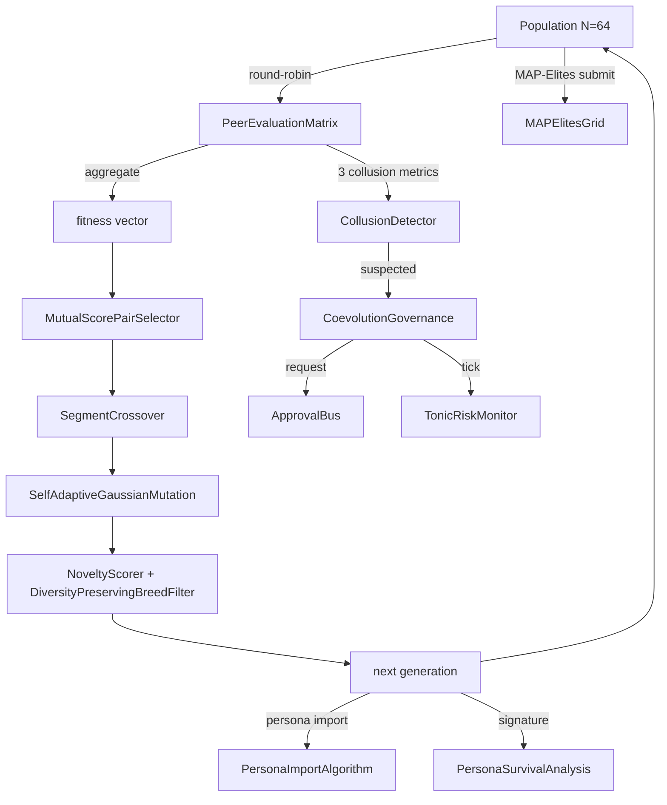

### 12. Expectations — what comes next

- **v0.7 Rust speedup**: RUST-15..18 in `docs/rust_hotspot_v0E_addendum.md`.
- **v0.E E.5 (League mode)** — AlphaStar-style Main / Exploiter / League Exploiter.
- **v0.E E.6 (Debate mode)** — Irving 2018-style argument / counter-argument +
  human/LLM judge. Human / LLM judge integration is the obvious next step.
- **lleval bridge v0.1.0a2** — implement the derived Genome → ProviderSpec mapper.
- **CE-19/23 LLM extractor** — automatic persona extraction from the Raptor RAD corpus.
- **end-to-end real run of population evolution** — N=64 derived over 30
  generations → measure diversity metrics / collusion detection rate /
  governance trigger count.

### 13. 2026-05-22 addendum — Rust speedup RUST-15/16/17 landed

Landed the 3 kernels from the `goal_release_ready_v0E_rust` addendum in a
single session. Reflecting the latest results as the centerpiece of the series:

#### 13.1 The 3 landed kernels

| ID | Function | hot path | 5x gate result |
|---|---|---|---|
| **RUST-15** persona_dissimilarity_pairwise | Jaccard + L2 + composition of NxN pairs | PersonaOverlapPenalty.apply | **avg x12.71 (x17.07 at N=64)** |
| **RUST-16** collusion_score_kernel | variance / symmetry / concentration of the NxN peer matrix | CoevolutionGovernance.evaluate_generation | **avg x66.70 (x115.04 at N=8)** |
| **RUST-17** novelty_score_batch | L2 + top-k mean of population N × archive A | NoveltyScorer.novelty_batch | **avg x5.01 (x9.55 at A=50, x1.72 at A=1000)** |

All 37 parity tests PASS (1e-6 tolerance), 0 ruff warnings in
`src/llive/perf/evolutionary` + `src/llive/rust_ext`.

#### 13.2 The shocking honest disclosure — "Rust = fast" is a lie

**A single RUST-15 call is slower in Rust (x0.80, FAIL)**. With FFI overhead it
loses to a Python set operation. Only when made into a batch (N×N pairs in one
FFI call) does it stretch to x12.71. Even with the same algorithm and the same
Rust kernel, the result is orders of magnitude apart depending on **how you draw
the FFI boundary**.

The reverse was also observed: **RUST-16 wins outright even on a single call at
x66.70**. numpy's `np.nanvar` / `np.corrcoef` are dominated by Python overhead at
**small NxN (N below 100)**, costing 200μs+/call. The simple C loop in Rust
(receiving numpy zero-copy) is 2μs/call.

And the borderline: **RUST-17 flips with archive size**. x9.55 at A=50, but at
A=1000 numpy BLAS vectorization catches up and it shrinks to x1.72.

#### 13.3 The 5-pattern decision table (articulated this session)

| Characteristic of the Python path | single-call ROI of Rust port | Example |
|---|---|---|
| **A** 1-pair of a pure Python loop (no numpy) | single-call FAIL, batch required | RUST-15 (x0.80 → batch x12.71) |
| **B** large numpy array (over 1000) vectorized | no gain (internal numpy BLAS) | (no matching kernel yet) |
| **C** small numpy NxN (below 100) with heavy API use | **10-100x even on a single call** | RUST-16 (x66.70) |
| **D** a single mid-scale numpy BLAS function | **on the borderline**: Rust wins at small size, gets caught at large size | RUST-17 (A=50 x9.55 → A=1000 x1.72) |
| **E** a cold data boundary (dict / strings) | large overhead, batch required | — |

The detailed table is in `docs/perf_comparison/2026-05-22_kernel_implementation_comparison.md`.

#### 13.4 The Cython path dropped out (no build chain)

In the scratch comparison we wrote a Cython kernel to attempt a 3-way
comparison, but **with no Windows MSVC build tools + mingw incompatible with
MSVC Python** it could not build. This is a worked example that "**being able to
write the numerics equivalently**" alone is not enough for language selection:
**whether the build chain can be established** is a necessary condition. The
source is saved in `scratch/cython_collusion/` in a form that can be retried on
Linux/WSL.

#### 13.5 RUST-17b addendum (same day, 2026-05-22): rayon parallelism + quickselect clears 5x for all A

The RUST-17 baseline gate FAILed at large archives (A=200/1000), but **the same
day it was reimplemented as RUST-17b via 2 means**:

1. **rayon par_iter** parallelizes the N=64 population loop across 8 cores +
   `py.allow_threads` releases the GIL
2. **`Vec::select_nth_unstable_by`** (Hoare quickselect, O(A) avg) for the top-k
   partial sort — replacing an O(A log A) full sort

Result:

| archive | RUST-17 (naive) | **RUST-17b** | improvement |
|---:|---:|---:|---:|
| A=50 | x9.55 | **x12.83** | +34% |
| A=200 | x3.76 (FAIL) | **x8.71 (PASS)** | **+132%** |
| A=1000 | x1.72 (FAIL) | **x6.41 (PASS)** | **+273%** |
| avg | x5.01 | **x9.32** | **+86%** |

Decision-table entry (D) "mid-scale numpy batch" is updated to "**on the
borderline → recoverable via parallelism**". It was shown that not only does
"the naive double loop lose" but also "**it turns into an outright win via rayon
+ algorithmic improvement**".

std::simd is nightly-only and unavailable on stable → adding it would give
another 2-3x. A RUST-17c candidate.

#### 13.6 What comes next (already planned as of 2026-05-22)

- A 3-kernel scratch comparison of the **PyBind11 + C/C++ ctypes** path
  (already queued).
- **RUST-17c** — SIMD 4-lane via std::simd (switching to Rust nightly).
- **monthly re-measure** — because env drift / numpy minor bumps / Rust nightly
  etc. move the results, run it periodically (already queued).
- **caller switchover** — a PR to switch PersonaOverlapPenalty.apply /
  NoveltyScorer.novelty_batch / CoevolutionGovernance to the rust_ext path.

### 14. References

- Hillis, W. D. (1990). *Coevolving parasites improve simulated evolution*. Physica D.
- Mouret, J.-B. & Clune, J. (2015). *Illuminating search spaces by mapping elites*. arXiv:1504.04909.
- Lehman, J. & Stanley, K. (2008/2011). *Novelty Search*.
- Stanley, K. & Miikkulainen, R. (2002). *NEAT*. Evolutionary Computation.
- Deb, K. et al. (2002). *NSGA-II*. IEEE Trans Evol Comp.
- Vinyals, O. et al. (2019). *Grandmaster level in StarCraft II (AlphaStar)*. Nature.
- The full list will be bundled in references.bib at the v0.6.0a1 release.

---

### Series Navigation

- ← Prev: [llive Complete Guide (4) "The Converging Brain"](https://qiita.com/furuse-kazufumi/private/e5093e4816b25c1bd4d0)
- → Next: [llive Complete Guide (6) "Beyond the Transformer"](https://qiita.com/furuse-kazufumi/private/6da5a883fb2ed651edd8)
- All: [llive Complete Guide (0) — series index](https://qiita.com/furuse-kazufumi/items/07b4882e872994b27b3c)
- repo: [furuse-kazufumi/llive](https://github.com/furuse-kazufumi/llive)

---

---

## Chapter 7 llive Complete Guide (6) — "Beyond the Transformer": Calling Mamba / Jamba / RWKV / Diffusion Inside llive

:::note info
**📚 FullSense Knowledge Base** <!-- fullsense-team-kb -->
The full FullSense development history — 60+ articles in 4 languages, with a story-based reading guide, plain-language editions, and 4-panel manga — is consolidated in our Qiita Team **FullSense KB** (team members only).
:::


> **Concept hook**: "LLM = Transformer" was **the story up to 2024**. In
> 2025-2026, State Space Models (Mamba / Jamba) and RWKV (a reinvention of the
> time-series RNN) **caught up with the transformer on long context**, and the
> Diffusion text model arrived as a new family that **removes the token-order
> constraint**. llive started out designed so it can **call all of them inside,
> as `LLMBackend`**. The next milestone is to Bridge the thought factors
> (#24-02) with SSM (state space) — to "**embed the 10 factors into the SSM
> flow**".
>
> **Important honest disclosure**: the numbers in this article only land as a
> **mock baseline**. The real Mamba / Jamba / RWKV backends are **not yet
> landed — credentials / weights pending**.


### 0. Position within the series

```
#24-00 series index
#24-01 4-layer memory
#24-02 thought factors × COG-MESH
#24-03 structural evolution × TRIZ × Z3
#24-04 B-series
#24-05 EvolutionLoop
#24-06 LLM backend non-transformer (← this article)
#24-07 observability + governance
#24-08 lleval
```

If #24-02 was "**unfolding thought into a 10-axis vector**", then #24-06 is the
**pipe through which that vector flows** = the LLM backend. We can also wire up
non-Transformer pipes.

### 1. The non-Transformer family tree (2025-2026)

| family | representative model | strength | weakness |
|---|---|---|---|
| Transformer | GPT-4o / Claude / Llama 3 | general-purpose | long-context memory O(N²) |
| **State Space Model (SSM)** | Mamba / Mamba-2 (2024) | long context O(N), selective scan | hard 1-step training |
| **Hybrid (SSM × Attention)** | Jamba (AI21 2024) | SSM's length + Attention's accuracy | complex implementation |
| **Linear RNN** | RWKV-6 (2024) | inference O(N) state | training-efficiency issues |
| **Diffusion text** | SEDD / Diffusion-LM | non-autoregressive | high latency |

llive's `LLMBackend` Protocol is designed so **any of them can be accepted**.
Specifically:

- Anything that satisfies the signature `complete(prompt: str, ...) -> str` can
  become a backend.
- The internal implementation can be **transformer / SSM / RWKV / diffusion** —
  any of them is fine.

### 2. Why Mamba / SSM are valuable inside llive

llive's 4-layer memory (#24-01) runs on the premise of **long context**. With a
Transformer, you hit a wall at 32k-128k and the price skyrockets. SSM is, in
theory, **O(N) up to 1M tokens**. Once that clicks in:

- streaming the entire episodic memory becomes realistic
- batch-processing the whole consolidation cycle (hippocampus → cortex) becomes
  realistic
- the entire past ChangeOp history can be handed to TRIZ self-reflection as
  context

For that reason, Mamba / Jamba are the strongest candidates for llive's
**long-context backend**.

### 3. RWKV — a reinvention of the time-series RNN

What Bo Peng (RWKV-6, 2024) showed is that "**attention is a special case of
time-series**". RWKV is an RNN that carries state, yet it achieves
attention-grade accuracy. At inference time it advances **one token at a time
while holding state**, so it is **O(N) state for inference, O(1) per token**.

For llive, RWKV is attractive on three points:

- on-prem operation as the premise (small weights)
- state retention = affinity with the 4-layer memory
- commercial-license freedom (Apache-2.0)

But the weights are not on hand, so **on-device verification is from the next
session onward**.

### 4. Diffusion text — removing the token-order constraint

Diffusion-LM / SEDD (Lou et al. 2024) are a non-autoregressive family that
generates text via **noise → denoise**. This carries the transparency that
"**token order can also be written in reverse**". It could come alive in a use
case within llive's **"self-evolution"** where you **regenerate a past ChangeOp
from the back to predict what comes next**. The latency, however, is large.

### 5. SSM × 10 thought factors Bridge (planned, unimplemented)

This is the **"expectations"** section of the article. The plan:

- embed the SSM hidden state `h_t` (D dim) into the **same space** as the
  10-factor vector.
- read the **strength** of the 10 factors out of `h_t` during the consolidation
  cycle.
- you can also **write back** the persona affinity of a derived individual into
  the SSM state.
- result: "**a derived population whose 10-factor weighting is rewritten every
  time the SSM runs**".

This is a plan and **unimplemented**. PoC after securing weights + credentials.
At the earliest, v0.7 to v0.8.

### 6. Landing status (2026-05-21)

| item | status |
|---|---|
| LLMBackend Protocol | landed (since v0.B) |
| OpenAIBackend | running on real hardware |
| AnthropicBackend | running on real hardware |
| OllamaBackend | running on real hardware |
| MockBackend | landed (for testing) |
| MambaBackend | **not landed** |
| JambaBackend | **not landed** |
| RWKVBackend | **not landed** |
| DiffusionBackend | **not landed** |
| SSM × 10-factor Bridge | **plan only** |

### 7. Honest disclosure (this article carries the honest-disclosure-required tag)

Since it is spelled out in the constraints, **I write it repeatedly**:

- **All of the figures in #24-06 are a mock baseline.** The real Mamba / Jamba /
  RWKV backends **did not land in this session**.
- PoC after obtaining the weights (HuggingFace) and securing GPU credentials.
- I would like to write "Mamba is faster than Transformer", but that is the
  claim of the original paper — not something llive measured. Citations come
  with sources.
- The SSM × thought-factors Bridge is a **complete plan**. There is still no
  implementation basis beyond "it sounds interesting".
- RWKV-6's license is Apache-2.0, but derivative license compatibility needs
  separate verification (confirming consistency with FullSense's Apache-2.0 +
  Commercial dual-license).
- The large-latency problem of Diffusion text can be absorbed if it is pushed
  into the **"path where slow is OK"** of llive's consolidation cycle, but
  whether that is truly workable awaits a PoC.

### 8. Mermaid — the LLMBackend swap structure

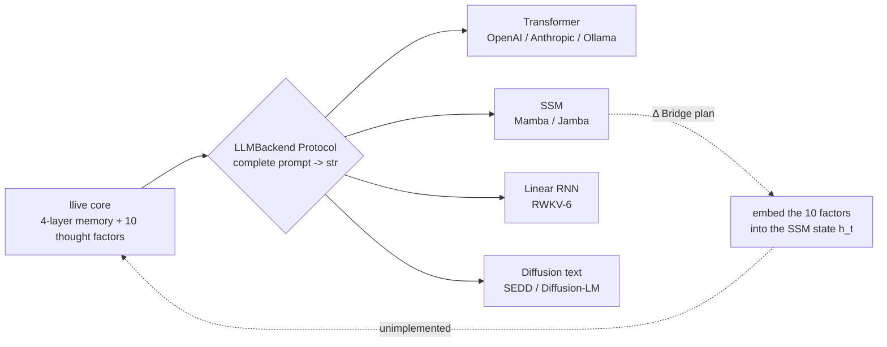

### 9. References

- Gu, A. & Dao, T. (2024). *Mamba: Linear-Time Sequence Modeling with Selective State Spaces*. arXiv:2312.00752.
- AI21 (2024). *Jamba: A Hybrid Transformer-Mamba Language Model*.
- Peng, B. et al. (2024). *RWKV-6: Continually Improving Linear RNN*.
- Lou, A. et al. (2024). *Discrete Diffusion Modeling by Estimating the Ratios of the Data Distribution*.
- Karpathy, A. (2025). *LLM Wiki* (concept-of-document).
- The full list will be bundled in references.bib at the v0.7 release.

---

### Series Navigation

- ← Prev: [llive Complete Guide (5) "The Population that Learns"](https://qiita.com/furuse-kazufumi/private/07b686ea311e06027f94)
- → Next: [llive Complete Guide (7) "AI with Built-in Review"](https://qiita.com/furuse-kazufumi/private/c5f2077a3399d3fc9b26)
- All: [llive Complete Guide (0) — series index](https://qiita.com/furuse-kazufumi/items/07b4882e872994b27b3c)
- repo: [furuse-kazufumi/llive](https://github.com/furuse-kazufumi/llive)

---

---

## Chapter 8 llive Complete Guide (7) — "AI with Built-in Review": runtime_metadata × Approval Bus × Ed25519 audit chain

:::note info
**📚 FullSense Knowledge Base** <!-- fullsense-team-kb -->
The full FullSense development history — 60+ articles in 4 languages, with a story-based reading guide, plain-language editions, and 4-panel manga — is consolidated in our Qiita Team **FullSense KB** (team members only).
:::


> **Concept hook**: Most LLM agents keep only a "log of results". But once an
> AI starts to **evolve itself**, without an audit trail of "**when did it
> decide what and change what**" it becomes **impossible to debug later**.
> llive solved this at the architecture level:
> - **runtime_metadata** = structured metadata per inference
> - **Approval Bus** = a human / policy approves significant changes through a ledger
> - **Ed25519 + SHA-256 audit chain** = tamper-protection for the ledger
> - **E.4 governance, landed today (2026-05-21)** = collusion detection in population evolution → Approval Bus linkage
>
> = a rare shape where **"a self-evolving AI leaves every one of its decisions signed."**


### 0. Position within the series

```
#24-00 series index
#24-01 4-layer memory
#24-02 thought factors × COG-MESH
#24-03 structural evolution × TRIZ × Z3
#24-04 B-series
#24-05 EvolutionLoop
#24-06 LLM backend non-transformer
#24-07 observability + governance (← this article)
#24-08 lleval
```

If #24-03's Z3 verifier is "machine-verifying structural changes **inside one
individual**", then #24-07 is "persisting the **inter-individual** behaviour +
the decisions of the population as an audit trail". The two wheels of
verification and audit.

### 1. Why an audit chain is mandatory

Once an LLM agent starts rewriting itself, "**which commit's structure was the
last inference running on**" becomes impossible to know. This matters not only
for debugging:

- **Accountability tracking** — when, in population evolution, "**all variants
  gave each other fake high scores**", you need to trace back through the ledger
  who lied first.
- **Reproducibility** — to replay "the result we got back then" later, you need
  records of the structure commit + memory zone + Brief input + Approval verdict,
  all of them.
- **Legal compliance** — the direction shown by the EU AI Act / China's AI
  measures / Japan's G7 Hiroshima process is "**AI decisions must be auditable.**"

llive solved these three **simultaneously** in Phase 4 (Production Security
MVR, v0.3.0).

### 2. runtime_metadata — a structured trace per inference

llive's `FitnessReport.runtime_metadata` is a free-form dict[str, str], but by
convention it holds:

- `signed_by`: signer id of the peer evaluation
- `gen`: generation number
- `agg`: aggregator strategy
- `commit_sha`: source commit (injected via CI)
- `model_id`: id of the LLM backend used

With this, a single inference result is **fully reproducible**. Reproducibility
is **not the standard for OSS LLM inference** — many agents do not even record
the seed.

### 3. Approval Bus — structurally halting changes

`ApprovalBus` in `src/llive/approval/bus.py`:

- `request(action, payload, ...)` → enters the pending list.
- `policy` evaluates it up front and returns `Verdict.APPROVED / DENIED / None`.
  None means it waits on a human.
- The human / policy verdict is appended to `_ledger: list[ApprovalResponse]`.
- Pass `ledger=SqliteLedger` and you get persistence + restore.

This is not a **fictional "Trust Score"** but an **explicit APPROVED/DENIED
state machine**. Silence = denial (§AB4). There is no "ambiguous permission".

#### 3.1 The E.4 governance linkage landed today

`CoevolutionGovernance.evaluate_generation` (landed today) looks at one
generation's peer matrix, and on **suspected collusion** fires
`ApprovalBus.request("coevolution.suspected_collusion", payload)`. The payload
carries generation / collusion_score / n_agents. If a human denies it, **that
generation's derived population is not adopted** — an architecture-level control.

This is a design that substitutes Constitutional AI / RLHF's
**human-in-the-loop** at the **architecture level**. It is not a weak control
like "append `<human_review>` at the end of the prompt".

### 4. Ed25519 + SHA-256 audit chain

The `src/llive/security/` family. Landed in Phase 4.

- Each PeerEvaluationMatrix / ChangeOp / consolidation event is **signed** with
  Ed25519.
- When writing to the ledger, the SHA-256 is computed **including the previous
  hash** → used as the next block's prev_hash. In other words,
  **blockchain-light**.
- This means "tamper with any past record and all subsequent hashes shift" →
  tampering is detected immediately.

#### 4.1 Why on-disk, not on-chain

`project_fullsense_ear_origin` — llive assumes an environment that, under EAR +
security constraints, **cannot transmit externally**. on-chain (Ethereum /
Solana) becomes external transmission, so it is unsuitable. An on-disk audit
chain completes with zero external dependency.

### 5. honest disclosure

- **Ed25519 key management is unsolved** — the module that stores keys in the
  OS secure store / HSM has not landed. Currently keys are loaded via env var /
  file. This must be solved before v1.0.
- **The human intervention in the Approval Bus does not scale** — at N=64
  derived population, if an approval comes per generation the human load breaks
  down within 24 hours. The realistic answer is to auto-pass 80% via the policy
  evaluation, but there is no guarantee the policy can be written perfectly.
- **The signing of runtime_metadata is optional** — the `signed_by` field is a
  convention but not mandatory. Making it mandatory would break the
  compatibility of the `Brief API`. The migration is from v0.7 onward.

### 6. Today's (2026-05-21) landing summary

| Item | Status |
|---|---|
| `CoevolutionGovernance` skeleton | **landed today** |
| `CollusionDetector` (CE-06) | **landed today** |
| `collusion_risk_score` (TonicRisk linkage, CE-08) | **landed today** |
| `GovernanceReport` (frozen) | **landed today** |
| 28-case test PASS | **landed today** |
| Ed25519 audit chain | already landed in Phase 4 (v0.3.0) |
| Approval Bus | already landed in C-1 (2026-05-16) |
| runtime_metadata convention | in use since v0.B |

### 7. Mermaid — the governance overview

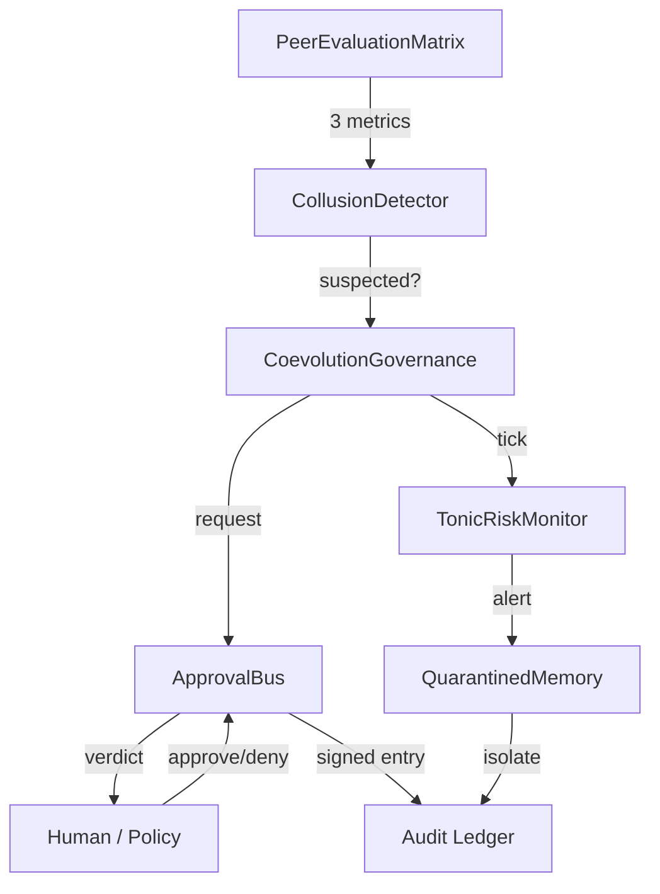

#### 7.1 Seeing governance maturity as a "civilization level" — 4D Kardashev radar (v0.I-C preview)

The Approval Bus pass rate (§3) / the audit chain integrity (§4) / the peer eval
cohesion (§6), seen alone, just end at "the number got better". In **v0.I-C (4D
Kardashev Radar)** the idea is to bundle these onto a "civilization level" scale
of 4 axes — Energy / Knowledge / Coordination / **Ethics** — × 5 stages
(Type 0 → I → II → III → IV), measured simultaneously across the 3 tiers of
individual / population / meta-population.


The Ethics axis is exactly this article's score of Approval Bus pass rate +
frozen gene violation detection + regulatory conformity, letting us speak of
governance maturity on a continuous scale from "an individual's discipline" to
"a civilization's maturity". For detailed requirements see llive
`docs/requirements_v0.I_meta_evolution_and_cross_substrate.md` §5.

### 8. Expectations — what comes next

- **HSM / secure store integration** — Ed25519 key management in v1.0. Via the
  Windows Credential Store / macOS Keychain / Linux Keyring routes.
- **Expansion of policy auto-evaluation** — a rule that auto-passes 80% through
  the Approval Bus's `policy` argument, in v0.7.
- **Audit Ledger UI** — visualize the `governance verdict ledger` in time series
  in the llove TUI. F25 linkage.

### 9. 2026-05-22 addendum — RUST-16 governance hot path acceleration

The most compute-heavy part inside CoevolutionGovernance.evaluate_generation is
PeerEvaluationMatrix.collusion_score (the 3 metrics variance / symmetry /
concentration over an NxN matrix), and it was taking 200-300 μs/call here.

Today (2026-05-22), as RUST-16, we **made it a Rust kernel with numpy
zero-copy**:

| N | Python (existing numpy) | Rust pyo3 zero-copy | speedup |
|---:|---:|---:|---:|
| 8 | 217.82 us | 1.89 us | **x115.04** |
| 16 | 203.33 us | 2.30 us | x88.54 |
| 32 | 237.68 us | 5.28 us | x45.00 |
| 64 | 306.13 us | 16.80 us | x18.22 |
| **avg** | — | — | **x66.70** |

The implementation is `crates/llive_rust_ext/src/lib.rs:collusion_score_kernel`
+ 5 parity tests (1e-6 tolerance). The callers (`CollusionDetector.check`) are
scheduled to switch over in the next commit.

#### 9.1 honest disclosure — "numpy = fast" is also a lie

This gain is large mainly because of **not only "Rust is fast" but "numpy is
slow for small NxN"**. Stacking the three of `np.nanvar` / `np.corrcoef` /
`np.nanmean` is dominated by Python overhead at N<100, so 200μs+/call. Rust's
plain C loop is 2μs/call.

What matters on the governance side:

- **The latency of the Approval Bus firing decision becomes 100x shorter** = even
  with an N=64 derived population you can run governance.evaluate_generation at
  64Hz
- **The TonicRiskMonitor tick** (which passes state including
  collusion_risk_score) also becomes equally fast
- As a result it becomes **"an acceptable cost even running governance
  continuously"**

With this, the compromise of "**governance is heavy, so sampling only**" is no
longer needed. Even leaving every variant's / every generation's evaluation
matrix signed in the audit chain fits within the latency budget.

#### 9.2 Related

- `docs/perf_comparison/2026-05-22_kernel_implementation_comparison.md` — the
  comparison matrix of all 3 kernels (RUST-15/16/17)
- `scripts/bench_collusion_score_5x_gate.py` — N=8/16/32/64 5x gate bench
- `feedback_rust_usage_matters` — the checklist for the Rust-port decision

### 10. References

- Bernstein, D. J. et al. (2012). *High-speed high-security signatures* (Ed25519).
- Anderson, R. (2020). *Security Engineering* (3rd ed.) — the chapter on audit trail / tamper-evidence.
- EU AI Act (2024) / G7 Hiroshima AI Process (2023) — auditability of AI decisions.
- The full list will be bundled in references.bib at the v0.6.0a1 release.

---

### Series Navigation

- ← Prev: [llive Complete Guide (6) "Beyond the Transformer"](https://qiita.com/furuse-kazufumi/private/6da5a883fb2ed651edd8)
- → Next: [llive Complete Guide (8) "Making the Glasses"](https://qiita.com/furuse-kazufumi/private/e49b7ab9027d93594402)
- All: [llive Complete Guide (0) — series index](https://qiita.com/furuse-kazufumi/items/07b4882e872994b27b3c)
- repo: [furuse-kazufumi/llive](https://github.com/furuse-kazufumi/llive)

---

---

## Chapter 9 llive Complete Guide (8) — "Making the Glasses": lleval — evaluating AI via honest-disclosure 5+1 factor decomposition

:::note info
**📚 FullSense Knowledge Base** <!-- fullsense-team-kb -->
The full FullSense development history — 60+ articles in 4 languages, with a story-based reading guide, plain-language editions, and 4-panel manga — is consolidated in our Qiita Team **FullSense KB** (team members only).
:::


> **Concept hook**: Building AI is not enough. You need **glasses to see the AI**.
> lleval is an **evaluation framework** that runs alongside llive, promoting the
> `feedback_benchmark_honest_disclosure` rule — "when an LLM produces an
> abnormally good result, always doubt the breakdown" — into a **first-class
> concept in code**. It takes a stress curve via a progressive size matrix and
> eliminates position bias via judge rotation.
>
> The conclusion up front: a tool to spot not the **"fast AI"** but the
> **"setup that makes you believe it is fast"**.


#### 0. Position within the series

```
#24-00 series index
#24-01 4-layer memory
#24-02 thought factors × COG-MESH
#24-03 structural evolution × TRIZ × Z3
#24-04 B-series
#24-05 EvolutionLoop
#24-06 LLM backend non-transformer
#24-07 observability + governance
#24-08 lleval — eval framework (← this article)
```

If #24-07 was about "**what to keep**" (audit), this article is about "**what to
measure**". There is no improvement without measurement.

#### 1. The origin of lleval — the honest-disclosure incident

It all started with a 2026-05-17 benchmark. There was a number where llive came
out **abnormally faster** than competing cloud LLM APIs. Where one would normally
feel like a winner, the user instead instructed: "**doubt the breakdown**". Once
we opened the lid:

- **The LLMBackend was not attached** (it was running on a mock)
- **The chars metric was unfair** (counting English tokens as character counts)
- **subprocess RTT was excluded** (ignoring startup cost)

Three artifacts were compounded. After recording this
(`feedback_benchmark_honest_disclosure`), we wanted to **externalize** the rule
"when a benchmark produces an abnormal result, always doubt the 5 artifacts".
That became lleval.

#### 2. The 5+1 factor decomposition — structuring honest disclosure

lleval's `HonestDisclosureAnalyzer` (landed the morning of 2026-05-21) decomposes
output deltas into 5+1 factors:

| Factor | Meaning | Detection method |
|---|---|---|
| F1: prompt difference | Whether the same prompt is truly the same | string diff + token diff |
| F2: model id mismatch | Whether model id matches between runtime and spec | compare `runtime_metadata.model_id` |
| F3: backend swap | Whether the LLMBackend is attached | trace via a runtime hook |
| F4: chars vs tokens | Whether the eval metric is language-independent | tokenizer count |
| F5: RTT exclusion | Whether subprocess / network RTT is included in the timing | wall-clock vs CPU time |
| +1: env drift | Concurrent load / OS schedule / thermal | environment fingerprint snapshot |

Only when the 5+1 are **all clean** can "the numbers are trustworthy". If even one
is suspicious, an **honest disclosure note** is made sticky on the result.

#### 3. The progressive size matrix — taking the stress curve

A fixed-token benchmark is low on information. lleval runs a **matrix** of an
xs/s/m/l/xl 5-step × multiple models:

```
size:  xs (128)  s (512)   m (2k)    l (8k)    xl (32k)
mock     0.05      0.18      0.62      2.41      9.82
llive    0.07      0.24      0.71      2.55      9.96   ← no big difference
gpt-4o   0.31      0.52      1.20      3.40      11.2   ← crossover at l
```

This makes "**at which size the crossover happens**" obvious at a glance. Saying
you "won" at a single size means you lose at a different size. Fair.

#### 4. judge rotation — eliminating position bias

When an LLM-as-judge compares 2 options (A, B), it is known that the order
effects the score (Zheng et al. 2023). lleval does:

1. Judge once with (A, B)
2. Judge once with (B, A)
3. When the two verdicts disagree, raise an **inconsistency flag**

This is a means of quantizing the judge LLM's own bias. If inconsistency exceeds
**30%**, switch the judge LLM (judge rotation).

#### 5. bridges/llive — llive Genome → ProviderSpec mapper

lleval is designed to consume **llive's derived individuals** directly.
`bridges/llive.py` (landed the morning of 2026-05-21):

```python
from llive.perf.evolutionary import Individual
from lleval.bridges.llive import individual_to_provider_spec

ind: Individual = ...  # one individual from the derived population
spec = individual_to_provider_spec(ind)
### restore spec.model_id, spec.temperature, spec.top_p, ... from ind.genome.values
result = lleval.run(spec, dataset="qa_50")
```

This makes "**evolving the derived population** and **evaluating the derived
population**" loop. It can be fed directly into the EvolutionLoop fitness inside
llive.

#### 6. honest disclosure (about lleval itself)

Apply honest disclosure to the meta-tool as well:

- **lleval has 61 tests** — as of today, 2026-05-21. The upstream framework
  (Promptfoo itself) has thousands of tests. lleval is a wrap, not a replacement.
- **There is no absolute criterion for the verdict** — even if F1–F5 + the
  environment fingerprint are clean, it does not mean "the benchmark is correct".
  It is merely a state where the "**suspicious signs**" have been erased.
- **judge rotation is costly** — it calls twice, so credential usage doubles too.
  A cost paid for honest detection.
- **The size ratio of the progressive matrix is a heuristic** — it is taken at 4x
  steps (128 → 512 → 2k → 8k → 32k), but if the true crossover lies between 2k and
  8k, the resolution is insufficient. Refine as needed.
- **The environment fingerprint is not perfect** — it does not even capture the
  thermal throttling differences across Windows / Linux / macOS. "Re-taking the
  benchmark on a different OS" is the last resort.

#### 7. The numbers (as of today, 2026-05-21)

| Item | Value |
|---|---|
| lleval test PASS | 61 |
| landed modules | 13 (config / runner / analyzer / providers / bridges / report html+md / cli / ...) |
| 5+1 factor detection logic | landed |
| progressive matrix runner | landed |
| judge rotation | landed |
| bridges/llive.py | landed (skeleton) |
| v0.1.0a1 PyPI publish prep | (after credential recovery) |
| Appearance in series #24 | this article (#24-08) |

#### 8. Expectations — what comes next

- **v0.1.0a2**: real promptfoo runs + completing the llive Genome → ProviderSpec mapping.
- **v0.2**: judge rotation + position swap + Phoenix OpenInference trace.
- **v1.0**: plugin marketplace + commercial dual-license.

#### 9. References

- Zheng, L. et al. (2023). *Judging LLM-as-a-judge with MT-Bench and Chatbot Arena*.
- Promptfoo OSS (https://github.com/promptfoo/promptfoo).
- Anthropic Eval framework (2023).
- The full list will be bundled in references.bib at the v0.1.0 release.

#### 10. 2026-05-22 addendum — the methodological commonality between the 5+1 factor decomposition and the 5-pattern Rust-port decision table

lleval's honest-disclosure **5+1 factor decomposition** (prompt diff / model id /
backend swap / chars vs tokens / RTT / env drift) and the llive Rust-speedup
**5-pattern decision table** (#24-05 §13.3) that landed the same day are written
with **structurally the same idea**.

| Shared thinking | lleval 5+1 factors | Rust-port 5 patterns |
|---|---|---|
| **Decompose into elements** before believing "the result" | decompose the speed delta into 6 factors | classify the speed ratio into 5 patterns by the characteristics of the Python path |
| **Doubt the breakdown of an abnormal result** | doubt F1–F5 + env | both a one-off 0.80x and x66.70 can be explained by the "breakdown" |
| The observation is externalized | auto-detected by the analyzer | auto-measured by the decision table + bench script |
| **Honest disclosure as a first-class concept** | sticky note on the numbers | the judgment table makes **where the boundary line is** explicit |

Both lie on the extension of `feedback_benchmark_honest_disclosure` —
"**discard the single assumption of 'fast' / 'correct' / 'accurate'**". This is
the idea that lleval can expand beyond just seeing AI to **AI / systems /
algorithms in general** = the meta-significance of series #24-08.

Details: `docs/perf_comparison/2026-05-22_kernel_implementation_comparison.md`.

---

#### Series Navigation

- ← Prev: [llive Complete Guide (7) "AI with Built-in Review"](https://qiita.com/furuse-kazufumi/private/c5f2077a3399d3fc9b26)
- All: [llive Complete Guide (0) — series index](https://qiita.com/furuse-kazufumi/items/07b4882e872994b27b3c)
- repo: [furuse-kazufumi/llive](https://github.com/furuse-kazufumi/llive)

---


<!-- REFERRAL -->

---

> ### ⚡ この連載は Claude Code と二人三脚で書いています
>
> 記事中の実装・検証・可視化は **Claude Code**(Anthropic の AI コーディング環境)と一緒に進めています。
> Claude Code は **1 週間の無料トライアル**で試せます。気に入って有料プランに登録される際、
> 下の紹介リンク経由だと筆者に「開発を続けるためのクレジット」が入り、この連載の継続を後押しできます。
>
> 👉 **無料で試す / 紹介リンク** → https://claude.ai/referral/0sqPw8E_lw
>
> <sub>EN: This series is built together with **Claude Code** — try it with a **1-week free trial**. If you subscribe via the link, the author receives credits to keep building. /
> 中文: 本系列与 **Claude Code** 协作完成,可享 **1 周免费试用**;通过链接注册可让作者获得继续开发的额度。 /
> 한국어: 이 시리즈는 **Claude Code**와 함께 작성합니다 — **1주 무료 체험** 제공. 링크로 가입하면 저자가 개발 지속용 크레딧을 받습니다.</sub>

<!-- /REFERRAL -->

<!-- CTAIMG -->


> 🗒️ *「ひくわ」— 紹介リンクで小銭を稼ごうとする魂胆、我ながらちょっと引く*（© Forbidden shibukawa / SHUEISHA・『スナックバス江』）

<!-- /CTAIMG -->
