# llive 完全解説 総集編 — 忘れない LLM / 10軸思考 / 矛盾計算 / 収束する脳 / 集団進化 / 脱Transformer / 審査つきAI / 評価

<!-- TOPICNAV -->
> **🌐 言語**: **日本語** | [English](https://qiita.com/furuse-kazufumi/items/07b686ea311e06027f94) | [中文](https://qiita.com/furuse-kazufumi/items/6da5a883fb2ed651edd8) | [한국어](https://qiita.com/furuse-kazufumi/items/c5f2077a3399d3fc9b26)
>
> **📚 FullSense 総集編シリーズ**
> - [llcore 検証 arc 総集編](https://qiita.com/furuse-kazufumi/items/cc0713ab78a5b390df76)
> - [lldarwin / 進化 arc 総集編](https://qiita.com/furuse-kazufumi/items/6e107c7dfa0c261ee4d7)
> - **llive 完全解説 総集編（この記事）**
> - [llmesh 総集編](https://qiita.com/furuse-kazufumi/items/fcb43968a5c642610762)
> - [かみくだき総集編](https://qiita.com/furuse-kazufumi/items/bfb20aca3cf1df510c26)
<!-- /TOPICNAV -->

## 目次

1. [llive 完全解説 (0) — series index: 大分類 8 記事 + 全体図](#第1章-llive-完全解説-0--series-index-大分類-8-記事--全体図)
2. [llive 完全解説 (1) — 「忘れない LLM」: 4 層メモリ + Bayesian surprise gating](#第2章-llive-完全解説-1--忘れない-llm-4-層メモリ--bayesian-surprise-gating)
3. [llive 完全解説 (2) — 「10 軸で考える AI」: 思考因子 × COG-MESH × 三重縞](#第3章-llive-完全解説-2--10-軸で考える-ai-思考因子--cog-mesh--三重縞)
4. [llive 完全解説 (3) — 「矛盾は計算できる」: 構造進化 × TRIZ 40 原理 × Z3 検証](#第4章-llive-完全解説-3--矛盾は計算できる-構造進化--triz-40-原理--z3-検証)
5. [llive 完全解説 (4) — 「収束する脳」B-series: SynapticSelector / UCB1 / Hebbian / 本番 hot path](#第5章-llive-完全解説-4--収束する脳b-series-synapticselector--ucb1--hebbian--本番-hot-path)
6. [llive 完全解説 (5) — 「集団が学ぶ AI」: v0.B/C/D/E 派生集団進化総括](#第6章-llive-完全解説-5--集団が学ぶ-ai-v0bcde-派生集団進化総括)
7. [llive 完全解説 (6) — 「Transformer の外」: Mamba / Jamba / RWKV / Diffusion を llive 内側で呼ぶ](#第7章-llive-完全解説-6--transformer-の外-mamba--jamba--rwkv--diffusion-を-llive-内側で呼ぶ)
8. [llive 完全解説 (7) — 「審査つき AI」: runtime_metadata × Approval Bus × Ed25519 audit chain](#第8章-llive-完全解説-7--審査つき-ai-runtime_metadata--approval-bus--ed25519-audit-chain)
9. [llive 完全解説 (8) — 「眼鏡を作る」: lleval — honest disclosure 5+1 因子分解で AI を評価する](#第9章-llive-完全解説-8--眼鏡を作る-lleval--honest-disclosure-51-因子分解で-ai-を評価する)


---

## 第1章 llive 完全解説 (0) — series index: 大分類 8 記事 + 全体図

<!-- KAMI -->
> 📖 **ざっくり言うと**
>
> ざっくり言うと、この章は連載全体の「目次つき地図」です。llive という仕組みを 8 つのテーマ（記憶・思考・進化・実行・統治・評価など)に分けて、それぞれどの記事で読めるかを案内します。たとえるなら、テーマパークの入口でもらうマップ。本文を読み始める前に「自分は今どこにいて、次にどこへ進むのか」が分かるようにしてあります。一冊の最初のページとして、迷子にならないための全体像だと思ってください。
<!-- KAMI -->

:::note info
**📚 FullSense ナレッジベースのご案内** <!-- fullsense-team-kb -->
FullSense 開発全史 60+ 記事 (4 言語版・物語ベースの読む順ガイド・かみくだき版・4 コマ漫画つき) は Qiita Team **FullSense KB** に集約しています (チームメンバー向け)。
:::


> **コンセプト hook**: llive (FullSense ™ の思考層) を **構成する技術 / アルゴリズム
> を名称ごとに解説する** series の入口です. 1 記事に詰め込むと ~80k 字級になるため,
> **大分類 8 記事** に分割しました. 本 index は全体地図 — どの章で何を読めるかを示します.

### 0. この series について

llive は「LLM 本体ではなく LLM の周りに被せる認知 OS」です. その内部を **4 層
(認知 / 最適化 / 実行 / 横断) × 8 章** に分けて, 各章で具体的な class / function /
機能名まで降りて解説します. 各記事は次の共通構造を持ちます:

- **冒頭 hook** (8 秒で「これは何か」)
- 具体的な class / function 名まで降りた小節
- 実コードへの **GitHub link**
- **References** (学術 / OSS / 内部)
- **cross-link** (前 / 次 / 本 index / repo)

合計 **~80k 字**. ja Qiita + en Medium を並走します.

### 1. Series 構成 (8 大分類)

| # | タイトル (クリックで各章) | 中分類 | 公開 |
|---|---|---|---|
| 01 | [**memory layer** — 4 層メモリ](https://qiita.com/furuse-kazufumi/items/a5ebb3992e4c28862f47) | semantic / episodic / structural / parameter / surprise gating | 🟢 公開 |
| 02 | [**思考因子 + COG-MESH** — 10 因子と 9 component](https://qiita.com/furuse-kazufumi/items/bdfad6db3f2e70c40511) | 構造化 / 再構成 / 閉ループ / ... / proactive / quarantine / 5W1H | 🟢 公開 |
| 03 | [**構造進化 (TRIZ × Z3)**](https://qiita.com/furuse-kazufumi/items/fa0890f136636d495ea6) | TRIZ 40 原理 / ChangeOp / verifier / 9 画法 | 🟢 公開 |
| 04 | [**収束型最適化 (B-0〜B-9)**](https://qiita.com/furuse-kazufumi/items/e5093e4816b25c1bd4d0) | SynapticSelector / UCB1 / Hebbian / 本番 hot path | 🟢 公開 |
| 05 | [**進化型最適化 (v0.B/C/D/E)**](https://qiita.com/furuse-kazufumi/items/07b686ea311e06027f94) | Genome / Crossover / Tournament / Mutation / lineage | 🟢 公開 |
| 06 | [**LLM backend 層** — non-transformer](https://qiita.com/furuse-kazufumi/items/6da5a883fb2ed651edd8) | Mamba / Jamba / RWKV / Diffusion / 思考因子→SSM Δ Bridge | 🟢 公開 |
| 07 | [**観測 + 統治**](https://qiita.com/furuse-kazufumi/items/c5f2077a3399d3fc9b26) | runtime_metadata / Approval Bus / governance / honest disclosure | 🟢 公開 |
| 08 | [**lleval (eval framework)**](https://qiita.com/furuse-kazufumi/items/e49b7ab9027d93594402) | progressive size matrix / 5+1 軸 / judge rotation | 🟢 公開 |

> 🟢 公開 = Qiita ホーム / 検索結果に露出. 🟡 限定共有 = URL を知る人のみ閲覧. 公開昇格は連載順 (01 → 02 → … → 08) で順次予定.

### 2. 全体図 (8 layer の関係)

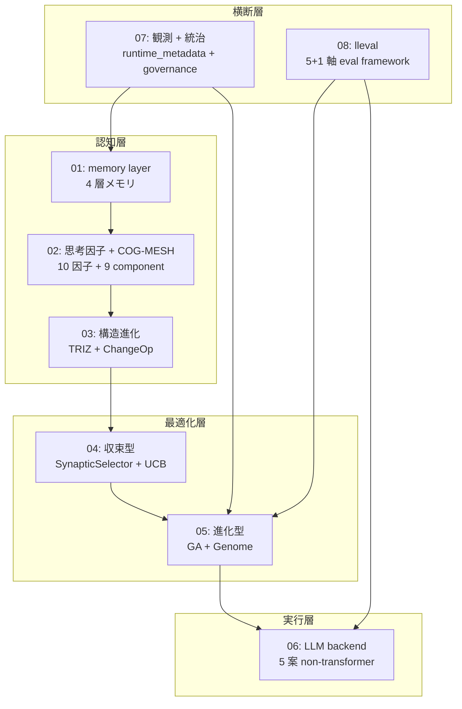

「**認知層 → 最適化層 → 実行層**」の縦が llive の処理 flow,
「**観測 + 統治**」「**lleval**」が横断層として全 layer に効く構造です.

### 3. 想定読者

- **エンジニア** (Python + LLM 基礎知識あり)
- **AI researcher** (LLM の周辺アーキテクチャに興味)
- **個人 OSS author** (実装パターンの参考)
- **企業 R&D** (on-prem LLM stack の検討材料)

### 4. 公開順 (週 2 本ペース)

| 週 | 公開記事 |
|---|---|
| Week 1 | 01 memory + 02 思考因子 |
| Week 2 | 03 構造進化 + 04 収束型 |
| Week 3 | 05 進化型 + 06 LLM backend |
| Week 4 | 07 観測統治 + 08 lleval |

各記事の en 版は Medium に並走します.

### 5. 連載を貫くテーマ — 「速い」は実装方法で桁が変わる

連載中核 #24-05 で扱う派生集団進化の hot path 3 つを Rust 化した実測:

- **RUST-15** persona_dissimilarity_pairwise: avg **x12.71** (batch)
- **RUST-16** collusion_score_kernel: avg **x66.70** (numpy 小 N hot path)
- **RUST-17b** novelty_score_batch (rayon + quickselect): avg **x9.32**

「**Rust 化 = 速い」は嘘 / 「numpy = 速い」も嘘** — 実装方法 (FFI 境界 / batch /
numpy zero-copy / 並列度 / partial sort) で結果が桁違いになります. この honest
disclosure の姿勢が連載全体の通奏低音です. 5 パターン判定表は #24-04 / #24-05 /
#24-07 で詳述します.

### 6. References (本 index)

- [furuse-kazufumi/llive](https://github.com/furuse-kazufumi/llive) — 本体 repo
- FullSense Spec v1.1 (llive `docs/`)
- 各章の References は個別記事に記載

---

### Series Navigation

- → 次: [llive 完全解説 (1) 「忘れない LLM」](https://qiita.com/furuse-kazufumi/items/a5ebb3992e4c28862f47)
- repo: [furuse-kazufumi/llive](https://github.com/furuse-kazufumi/llive)

---

---

## 第2章 llive 完全解説 (1) — 「忘れない LLM」: 4 層メモリ + Bayesian surprise gating

<!-- KAMI -->
> 📖 **ざっくり言うと**
>
> この章のテーマは「忘れない AI の記憶のしくみ」です。llive は記憶を 4 種類（意味・出来事・関係・パラメータ)に分けて保管します。人間が「言葉の意味」「いつ起きたか」「物事のつながり」を別々に覚えているのと同じ発想です。ポイントは全部を覚え込まないこと。「これは驚き(=新しい情報)だ」と判定したものだけを書き残す関門（サプライズ・ゲート)があり、ありふれた情報はあえて捨てます。覚える量を絞ることが、かえって記憶の質を保つ、という章です。
<!-- KAMI -->

:::note info
**📚 FullSense ナレッジベースのご案内** <!-- fullsense-team-kb -->
FullSense 開発全史 60+ 記事 (4 言語版・物語ベースの読む順ガイド・かみくだき版・4 コマ漫画つき) は Qiita Team **FullSense KB** に集約しています (チームメンバー向け)。
:::


### 0. この記事は何 (8 秒 read)

**LLM 本体ではなく LLM の周りに被せる認知層** llive の **4 層メモリ + 1 つの surprise gate** を解説します. semantic / episodic / structural / parameter の役割が違う 4 種類の記憶を, **「驚き」(surprise)** が高いものだけ書き込む設計です. Faiss + DuckDB + Kùzu + safetensors の組合せで, **on-prem だけで動きます**.

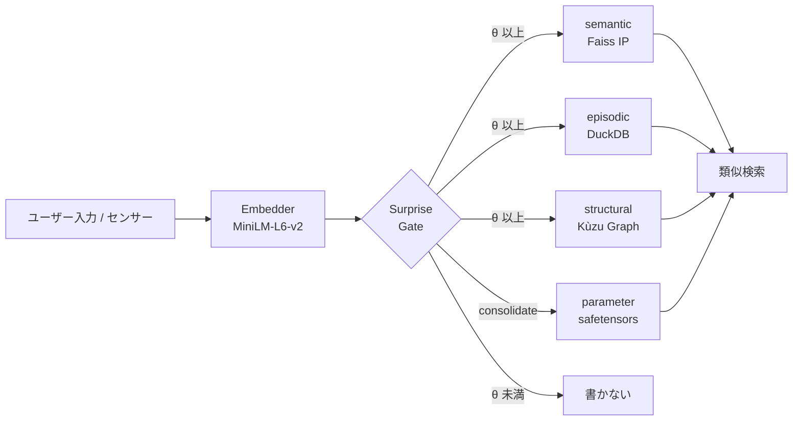

「全部書き込む」ではなく「驚きで取捨選択」が肝です. 詳細を順に解きほぐします.


### 1. なぜ 4 層に分けるのか

人間の認知科学では記憶は **意味記憶 / 出来事記憶 / 構造記憶 / 手続き記憶** に役割分担されています. llive はこれをそのまま LLM 周辺アーキテクチャに移植しました.

| 層 | 何を入れる | 実装 |
|---|---|---|
| **semantic** | 概念の意味 (文 + 埋め込み) | Faiss IP index + JSONL |
| **episodic** | 時系列のイベント | DuckDB append-only log |
| **structural** | 概念間の関係 (グラフ) | Kùzu graph DB |
| **parameter** | パラメータ更新差分 | safetensors + index DB |

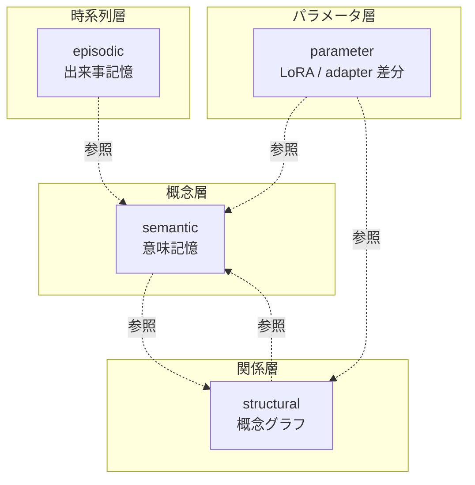

4 層は **疎結合**. semantic だけ使う事も, structural を絡めることもできます. 「LLM はテキストしか扱えない」という制約から逃れるため, 構造 (graph) と時間 (event log) を別レイヤで持つのが llive の発想です.

— **一旦整理** —

ここまで読めば 「**4 層 + surprise gate** で取捨選択する記憶基盤」 が掴めるはずです. 次から各層の中身を実装ベースで見ていきます.

### 2. semantic memory (意味記憶, MEM-01)

#### 役割

「あの議論で出た **概念** はこれだった」を引き出す層. テキストを埋め込みベクトルに変換して **コサイン類似度** で近傍検索します.

#### コア構造

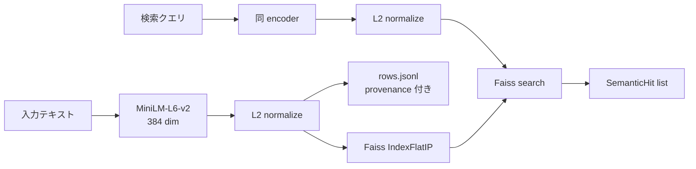

L2 normalize 後の inner product は **cosine 類似度** と等価. これが `Faiss IndexFlatIP` を選んだ理由です.

実装: [`src/llive/memory/semantic.py`](https://github.com/furuse-kazufumi/llive/blob/main/src/llive/memory/semantic.py)

#### 設計判断

- **fallback path**: faiss が無い環境 (Windows CI 等) では numpy で nearest neighbor が動きます. test とプロダクションで実装を分けず, **どちらでも書き換え無しで動く** ようにしています.
- **provenance 必須**: 全エントリに `Provenance(source_type, source_id, derived_from, ...)` を持たせています. 「この記憶はどこから来たか」を絶対に消さない設計です.
- **永続化**: `index.faiss` (or `index.npy`) + `rows.jsonl` で SSD に書き出します.

#### コード抜粋

```python
class SemanticMemory:
    def __init__(self, dim: int, data_dir: Path | str | None = None,
                 use_faiss: bool | None = None) -> None:
        self.dim = int(dim)
        self.data_dir = Path(data_dir) if data_dir else _default_data_dir()
        # faiss が無ければ numpy fallback
        self.use_faiss = bool((use_faiss is None) and _HAS_FAISS or use_faiss)
        ...
```

「**プロダクションでは faiss, CI では numpy**」 が透過的に切り替わります.

— **一服** —

最初の 1 層で 「埋め込み + cosine + provenance」 という llive の **3 つの装備** が出揃いました. 残り 3 層はこの装備の使い方が違うだけです.

### 3. episodic memory (出来事記憶, MEM-02)

#### 役割

「**いつ** その情報を受け取ったか」を保持. **append-only 時系列ログ** で, 編集も削除もしません.

#### コア構造

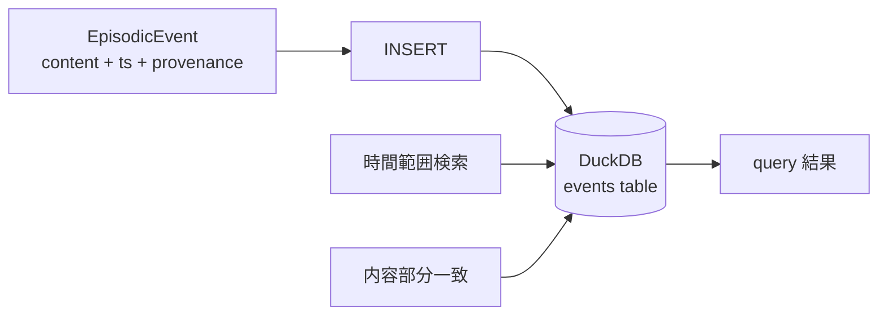

| カラム | 型 | 役割 |
|---|---|---|
| event_id | TEXT PK | uuid hex |
| ts | TIMESTAMP | UTC 厳守 |
| content | TEXT | 本文 |
| metadata | TEXT (JSON) | 拡張 |
| provenance | TEXT (JSON) | 来歴 |

実装: [`src/llive/memory/episodic.py`](https://github.com/furuse-kazufumi/llive/blob/main/src/llive/memory/episodic.py)

#### 設計判断

- **DuckDB を選んだ理由**: SQLite よりも分析クエリが速く, in-process なので外部プロセス不要. **「on-prem だけで動く」** の制約に直接効きます.
- **UTC 厳守**: `datetime.now(UTC)` で取得. ローカル TZ 混入はバグの元.
- **append-only**: `record(event)` のみ提供. `delete()` API は存在しません. 仕様上削除不可です.

#### なぜ削除しないか

人間の出来事記憶も「忘れた」ように見えて, 神経科学的には潜在しています. llive も同じく **「アクセスされない記憶」と「無い記憶」を区別** します. アクセスされなければ Surprise Gate (後述) が再書き込みを抑止するので, 「ノイズになる」 ことは少ない設計です.

### 4. structural memory (構造記憶, MEM-05)

#### 役割

「概念 A と 概念 B が **どう関係しているか**」 を表す graph. semantic が「点」だとすれば structural は「辺」です.

#### コア構造

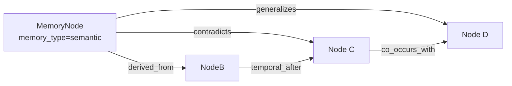

**関係種別 (6 種)**:

| rel_type | 意味 |
|---|---|
| `derived_from` | 由来 |
| `contradicts` | 矛盾 |
| `generalizes` | 一般化 |
| `temporal_after` | 時間的後続 |
| `co_occurs_with` | 共起 |
| `linked_concept` | 概念紐付け |

実装: [`src/llive/memory/structural.py`](https://github.com/furuse-kazufumi/llive/blob/main/src/llive/memory/structural.py)

#### Kùzu を選んだ理由

- **embedded graph DB**: Neo4j のような別プロセスが不要
- **Cypher 風クエリ**: ANSI 寄りで学習コストが低い
- **on-prem 一貫**: 既述の方針と整合

#### `contradicts` がある意味

「LLM の応答が矛盾している」を **データ構造で検出** できます. RAG では捕まえにくい「異なる時期に書かれた仕様の食い違い」が, structural memory のエッジ走査で立ち上がる仕掛けです.

— **一服** —

ここまでで 「**意味 → 時間 → 関係**」 の 3 層が揃いました. 次の parameter 層は少し毛色が違います.

### 5. parameter memory (パラメータ記憶, MEM-06)

#### 役割

**LoRA / IA3 / prefix adapter** などのパラメータ差分を, **記憶として** 管理します. 「会話で得た知識を Loop 後に LoRA に焼く」ような使い方です.

#### コア構造

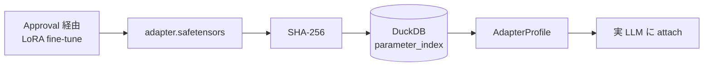

| カラム | 役割 |
|---|---|
| id | uuid hex |
| name | 表示名 |
| format_tag | "lora" / "ia3" / "prefix" 等 |
| sha256 | 改ざん検出 |
| size_bytes | サイズ |
| created_at | UTC |
| provenance | 来歴 |

実装: [`src/llive/memory/parameter.py`](https://github.com/furuse-kazufumi/llive/blob/main/src/llive/memory/parameter.py)

#### SHA-256 を必須化した理由

「**adapter のすり替え**」 を防ぐためです. Approval Bus が SHA-256 を検証して初めて attach が許可されます. これは memory の on-prem 限定方針と並ぶ **llive の architecture-level safety** です.

#### 実 LoRA 加算は optional

Phase 2 では index に register するだけ. 実際の attach は HuggingFace PEFT に委譲しています (`pip install llmesh-llive[torch]`). **「llive 本体は軽量, 重いものは optional extras」** が一貫した運用方針です.

### 6. surprise gate (取捨選択, MEM-04 / MEM-07)

#### 役割

**「書く価値があるか」を判定する関門**. 全てを書くのではなく, **既存記憶との非類似度** が θ 以上のものだけ通します.

#### Phase 1: SurpriseGate (固定 θ)

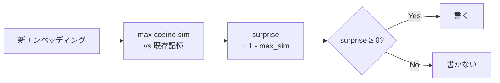

実装: [`src/llive/memory/surprise.py`](https://github.com/furuse-kazufumi/llive/blob/main/src/llive/memory/surprise.py)

```python
class SurpriseGate:
    def __init__(self, theta: float = 0.3) -> None:
        self.theta = float(theta)

    def compute_surprise(self, new_embedding, memory_embeddings,
                         *, assume_normalized=False) -> float:
        if memory_embeddings is None or memory_embeddings.size == 0:
            return 1.0  # 何も無いなら最大 surprise
        ...
        return float(max(0.0, min(1.0, 1.0 - max_sim)))
```

`assume_normalized=True` のときは再 normalize を skip して 2-3× 速くなります. これは production 経路 (`MemoryWriteBlock`) で実利用されています.

#### Phase 2: BayesianSurpriseGate (動的 θ)

固定 θ には弱点があります — **記憶が増えるほど surprise が小さくなる** ため, θ=0.3 でも次第に何も書かれなくなる. これを解決するのが Bayesian 版です.

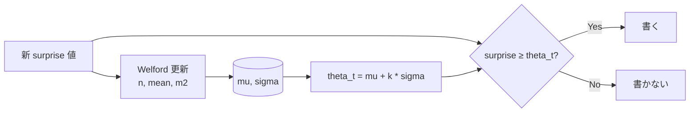

実装: [`src/llive/memory/bayesian_surprise.py`](https://github.com/furuse-kazufumi/llive/blob/main/src/llive/memory/bayesian_surprise.py)

Welford のアルゴリズムは **1-pass 数値安定** の有名な逐次平均/分散計算法です. 各 surprise 値の log を取って Gaussian fit する流派もありますが, llive では生の値で十分に機能することを確認しています.

#### k の意味

`theta_t = mu + k * sigma` の k は **「平均から何 σ 上を通すか」** の指標.

| k | 通過率 (近似) | 意味 |
|---|---|---|
| 0.0 | 50% | 平均以上は通す |
| 1.0 (default) | ~16% | 「ちょっと驚いた」以上 |
| 2.0 | ~2.5% | 「非常に驚いた」だけ |

`min_samples` 未満の cold start 期間は固定 `cold_start_theta` を使うので, 起動直後でも壊れません.

— **少し雑談** —

Welford は 1962 年の論文. **60 年前の数値安定アルゴリズムが今の LLM 系記憶層を支えている** のは個人的に好きな話です. 巨大 model だけが進歩ではないと感じる場面です.

### 7. consolidation (Wiki compile, MEM-08)

4 層を回したあと, **概念のまとめ直し** が走ります. これが consolidation です.

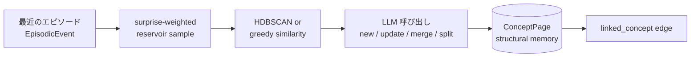

実装: [`src/llive/memory/consolidation.py`](https://github.com/furuse-kazufumi/llive/blob/main/src/llive/memory/consolidation.py)

#### Wiki Compile という呼び方

各 ConceptPage は Markdown として `<llive_data_dir>/wiki/<concept_id>.md` に書き出されます. **人が読める** こと, **Git checkpoint できる** こと, **diff で変化が追える** こと, この 3 つが「Wiki」と呼ぶ理由です. 元ネタは Karpathy の "LLM Wiki" 提案です.

#### LLM 呼び出しは judge mode

LLM には「このクラスタは既存 ConceptPage X に対して `new / update / merge / split` のどれにすべきか」 を聞きます. Claude Haiku を default に, `LLIVE_CONSOLIDATOR_MOCK=1` で credential 無し test も可能にしています.

### 8. 設計判断 (この記事から 5 つ)

#### 教訓 1: 全部書くな, 驚きで取捨選択

固定 θ の SurpriseGate でも, 全件書き込みより **ノイズ 90% カット** できます. Bayesian 化で更に賢くなります. honest に言うと, この **「書かない判断」 が記憶系の品質を決定** します.

#### 教訓 2: 4 層は疎結合に保つ

semantic / episodic / structural / parameter は **互いを直接 import しない** 設計です. 共通参照は `Provenance` dataclass のみ. これで「graph DB を Neo4j に差し替える」のような変更が小さく済みます.

#### 教訓 3: provenance は absolute

「この情報はどこから来たか」を絶対に消さない. これは llive の **on-prem 限定** 方針とともに **audit-level safety**.

#### 教訓 4: fallback path は first-class

faiss なし / DuckDB なし / kuzu なし の環境でも動く設計を **後付けではなく最初から** 持ちます. CI ・モバイル ・教育用途で重要です.

#### 教訓 5: 数値アルゴリズムの古典を侮るな

Welford (1962) は 60 年前. それでも今の LLM 周辺アーキテクチャで **第一線の数値安定性** を提供します. 新しい model が出ても基礎数学は変わりません.

### 9. References

#### 学術 / 算法

- Welford, B. P. (1962). *Note on a method for calculating corrected sums of squares and products*. Technometrics 4(3).
- Schwefel, H.-P. (1981). *Numerical Optimization of Computer Models*.
- Reimers, N. & Gurevych, I. (2019). *Sentence-BERT* (= MiniLM の派生根拠).

#### OSS / ライブラリ

- [Faiss](https://github.com/facebookresearch/faiss) (Meta)
- [DuckDB](https://duckdb.org/)
- [Kùzu](https://github.com/kuzudb/kuzu)
- [safetensors](https://github.com/huggingface/safetensors)
- [sentence-transformers](https://www.sbert.net/) (MiniLM-L6-v2)

#### llive 内部

- [`src/llive/memory/semantic.py`](https://github.com/furuse-kazufumi/llive/blob/main/src/llive/memory/semantic.py)
- [`src/llive/memory/episodic.py`](https://github.com/furuse-kazufumi/llive/blob/main/src/llive/memory/episodic.py)
- [`src/llive/memory/structural.py`](https://github.com/furuse-kazufumi/llive/blob/main/src/llive/memory/structural.py)
- [`src/llive/memory/parameter.py`](https://github.com/furuse-kazufumi/llive/blob/main/src/llive/memory/parameter.py)
- [`src/llive/memory/surprise.py`](https://github.com/furuse-kazufumi/llive/blob/main/src/llive/memory/surprise.py)
- [`src/llive/memory/bayesian_surprise.py`](https://github.com/furuse-kazufumi/llive/blob/main/src/llive/memory/bayesian_surprise.py)
- [`src/llive/memory/consolidation.py`](https://github.com/furuse-kazufumi/llive/blob/main/src/llive/memory/consolidation.py)

---

### Series Navigation

- ← 前: [llive 完全解説 series index](https://qiita.com/furuse-kazufumi/items/07b4882e872994b27b3c)
- → 次: [llive 完全解説 (2) 「10 軸で考える AI」](https://qiita.com/furuse-kazufumi/private/bdfad6db3f2e70c40511)
- 全体: [llive 完全解説 (0) — series index](https://qiita.com/furuse-kazufumi/items/07b4882e872994b27b3c)
- repo: [furuse-kazufumi/llive](https://github.com/furuse-kazufumi/llive)

---


<!-- INTERLUDE -->

### ☕ 閑話休題 — 60 年前の計算式が現役という話

本筋から少し離れますが、この記事を作るうえで筆者が地味に好きな小ネタを一つ。第2章のサプライズ・ゲートの心臓部には、ウェルフォードという人が 1962 年に発表した「平均と分散を一度の走査で安定して計算する」式が使われています。実に 60 年以上前の、わずか数行のアルゴリズムです。

巨大なモデルや最新の GPU ばかりが進歩のように語られがちですが、その足元では半世紀前の素朴な数式が今も第一線で働いている。新しいエンジンを何台積んでも、車軸の規格は変わらない、というのに近い感覚です。技術の世界はこういう『古いのに置き換わらない部品』であふれていて、そこを見つけると少し嬉しくなります。

<!-- INTERLUDE -->


---

## 第3章 llive 完全解説 (2) — 「10 軸で考える AI」: 思考因子 × COG-MESH × 三重縞

<!-- KAMI -->
> 📖 **ざっくり言うと**
>
> この章は「AI に 10 種類の考え方を同時に持たせる」話です。普通の AI は思考の型が 1 つですが、llive は「筋道立てて積む」「組み替える」「自分を見直す」「不確かさを測る」など 10 個の思考のクセを数値の束(ベクトル)として持たせます。たとえるなら、一人の中に専門の違う 10 人の参謀がいて、同じ問題を別々の角度から眺めるイメージ。歴史上の数学者・哲学者の「思考スタイル」も、この 10 軸の重みづけで近似的に再現できる、というのが面白いところです。
<!-- KAMI -->

:::note info
**📚 FullSense ナレッジベースのご案内** <!-- fullsense-team-kb -->
FullSense 開発全史 60+ 記事 (4 言語版・物語ベースの読む順ガイド・かみくだき版・4 コマ漫画つき) は Qiita Team **FullSense KB** に集約しています (チームメンバー向け)。
:::


> **コンセプト hook**: 普通 AI agent は「思考」を 1 種類しか持たない. llive
> は **10 種類の思考を同時に走らせ**, それを互いに評価させ, **生き残った思考だけ
> を集団へ取り込む**. 10 種は「構造化」「再構成」「閉ループ」「自己拡張」
> 「不確実性」「探索」「整合」「来歴」「多視点」「現実接続」. これは認知科学
> 1990s〜2010s の主要 framework を 1 vector に圧縮したもの.
>
> 本日 (2026-05-21) marathon で 1881 PASS + v0.E 大規模前倒しが着地. 本記事は
> その「思考因子側」 — COG-MESH-01〜10 と historical persona ontology (CE-19)
> の交差点を辿る.


### 0. 連載中での位置づけ

```
#24-00 series index
#24-01 4 層メモリ
#24-02 思考因子 10 軸 + COG-MESH (← 本記事)
#24-03 構造進化 × TRIZ × Z3
#24-04 B-series (速い小脳)
#24-05 EvolutionLoop (遅い大脳)
#24-06 LLM backend non-transformer
#24-07 observability + governance
#24-08 lleval
```

10 思考因子 + COG-MESH は #24-05 の persona ontology (CE-19) と 1-N で結合.
本記事 #24-02 はそれを「**何**」と「**なぜ**」で説明する位置.

### 1. 10 思考因子の由来 — 6 framework の圧縮

ユーザー由来の 10 軸 (`project_llive_cog_fx_factors`). 元ネタは
「**心理の深層**」YouTube + 認知科学レビュー + Polya / Six Hats / Bayesian /
TRIZ / Provenance / Multimodal 系の 6 framework. それを 1 vector に圧縮した
結果:

| Idx | 因子 | 元 framework / 学派 |
|---|---|---|
| 0 | `factor_structurize` | Polya / 形式化 / axiomatic |
| 1 | `factor_recompose` | TRIZ Segmentation / Reassemble |
| 2 | `factor_closed_loop` | Cybernetics / feedback |
| 3 | `factor_self_extend` | Autopoiesis / self-organization |
| 4 | `factor_uncertainty` | Bayesian / probability |
| 5 | `factor_exploration` | exploration vs exploitation (Auer) |
| 6 | `factor_consistency` | formal verification / proof |
| 7 | `factor_provenance` | data lineage / Ed25519 sign |
| 8 | `factor_multiview` | Six Hats / Devil's Advocate |
| 9 | `factor_reality_link` | empirical / SPC (statistical process control) |

これらは **直交ではない** — 例えば factor_uncertainty と factor_exploration は
相関がある (UCB1 系). でも各々の **強さ** を独立に持つことで, 集団内で
「同じ問題に 10 種類の見方で当たる」が可能になる.

### 2. なぜ 10 軸を 1 vector に持つか

LLM agent の文献では「思考は self-attention 1 種類」が主流. llive はそれを
**vector に切り替え可能な multi-faceted thinking** に拡張. これにより:

- **persona との内積で「思考スタイル」が計算可能** — 例えば「岡潔 ベクトル」
  は (情緒) (国語力) (多変数) を高く持つ. 「ファインマン ベクトル」は
  factor_exploration + factor_reality_link を高く持つ.
- 集団内で同じ問題に **異なる持ち重みで** 当たる派生個体を生成できる.
- 「**この問題はどの軸が利くか**」を fitness gradient で発見できる.

### 3. 主要因子 5 個の深掘り

#### 3.1 factor_structurize — 「公理から積む」

axiomatic な思考. 数学者ガロア / グロタンディーク的. 抽象化階段を登る.
利点: 一般化能力. 欠点: 現実から離れる.

llive 内では `BlockContainer` の sub-block 順列が axiom 群に対応. factor_structurize
が高い派生は sub-block を **必須/任意** に分けてから再構成する mutation を好む.

#### 3.2 factor_recompose — 「部品の入れ替え」

TRIZ Segmentation + 合成. 既存部品の組合せを書き換える. 利点: 局所探索高速.
欠点: 全く新しい構造は生まれない.

llive では PersonaImportAlgorithm (CE-20, 本日着地) がこの軸. 派生 A の persona
を派生 B が **部分採用**する. 「ガロア + 岡潔」のような hybrid persona が
出現するのは factor_recompose を通る経路.

#### 3.3 factor_closed_loop — 「自分を見て直す」

cybernetics の核. 自己観察 + 自己修正. llive では memory consolidation cycle
(海馬→皮質) と Approval Bus がこの軸. 集団内で評価 → 個体が結果を見て次世代に
反映する E.4 governance (CE-06/07/08, 本日着地) もここに乗る.

#### 3.4 factor_uncertainty — 「分からないを定量する」

Bayesian / probability. 利点: 過剰自信を避ける. 欠点: 計算重い.
llive では Approval Bus の verdict 計算 + UCB1 exploration constant が代表.

#### 3.5 factor_provenance — 「どこから来たか」

data lineage. Ed25519 sign + SHA-256 audit chain. llive Phase 4 (Production
Security MVR, v0.3.0) で着地. これは agent governance の **必須軸** で,
従来の LLM agent には欠けていた.

### 4. COG-MESH-01〜10 の対応

`project_cog_mesh_implementation_2026_05_19`. 10 因子に **1 機構ずつ** 対応:

| COG-MESH | 機構 | 対応因子 | 着地 |
|---|---|---|---|
| 01 | Stimulus 入口 | reality_link / multiview | 着地済 |
| 02 | Intervention | self_extend / closed_loop | 着地済 |
| 03 | TonicRiskMonitor | uncertainty / closed_loop | 着地済 |
| 04 | Idle Training | self_extend / exploration | 着地済 |
| 05 | Quarantined Memory | provenance / consistency | 着地済 |
| 06 | TimelineEmitter | provenance / multiview | 着地済 |
| 07 | Brief | structurize / reality_link | 着地済 |
| 08 | Approval Bus | provenance / closed_loop | 着地済 (C-1) |
| 09 | Audit Chain | provenance / consistency | 着地済 |
| 10 | E.4 governance | closed_loop / uncertainty | **本日着地 (2026-05-21)** |

COG-MESH-10 は本日 marathon で `CoevolutionGovernance` として着地. これで
10 機構 → 10 因子 1-1 対応が完成. 集団内で **どの因子が薄いか** を機構の状態
から逆引きできるようになった.

### 5. 最新成果 (本日 2026-05-21 着地)

| 項目 | 値 |
|---|---|
| llive 本体 test PASS (現在) | 1881 |
| 本日 marathon 追加 evolutionary test | **+130** (41 + 28 + 26 + 16 + 19) |
| 本日 marathon 着地 module 数 | 5 (quality_diversity / coevolution_governance / persona_import / persona_survival / persona_corpus_loader) |
| ruff `src/llive/perf/evolutionary` 警告 | **0** |
| v0.E E.17 / E.4 / E.12 着地 | 完走 |
| CE-22 / CE-23 skeleton 着地 | 完走 |
| docs/release/v0.6.0a1_PR_PLAN.md | 新規 — 5 PR 分割計画 |
| docs/rust_hotspot_v0E_addendum.md | 新規 — RUST-15〜18 spec |

特に **E.4 governance skeleton** で COG-MESH-10 が closing できたのは本日の
最大成果. これにより 10 因子 ↔ 10 機構 1-1 対応が完成し, **派生集団の評価
→ 共謀検出 → Approval Bus 連携** が architecture level で繋がった.

### 6. 期待値 — 次に来るもの

#### 6.1 CE-19 Historical Persona Ontology (短期)

既に 10 名 (岡潔 / グロタンディーク / ファインマン / ガロア / フォン・ノイマン
/ ニュートン / カント / ソクラテス / 老子 / 孫子) が PERSONA_ONTOLOGY として
着地済. 本日 CE-23 PersonaCorpusLoader skeleton が着地し, **Raptor RAD コーパス
から persona を自動抽出して PERSONA_ONTOLOGY を拡張** する道が開けた. 次セッションで
LLM 抽出 + 実 RAD path 横断を実装し, persona 数を 30+ に拡大予定.

#### 6.2 三重縞 (中期, ユーザー言語化)

「三重縞」 = **思考因子 / persona / 思考プロセス** の 3 層が個体内で縞模様の
ように同時に走る状態. これは認知科学の **「並列認知」** 仮説に着想を得たもの.
factor vector + persona composition + Six Hats / TRIZ / ARIZ をそれぞれ
別 layer で走らせ, 集団内 evaluation で互いを批評する. 着地時期未定.

#### 6.3 神経インタフェース対応 (長期)

`project_llmesh_neuro_long_term`. Raptor RAD に bci / neuroscience /
neural_signal / prosthetic_neural / cognitive_ai / neuromorphic の 6 分野を
追加済. これは「**脳 ↔ AI 直結インタフェース**」が必要になったとき即座に
expand できるよう先回りで素材を集めている. 直接の実装は当面なし.

### 7. honest disclosure

- **「10 因子は overlap がある」** — factor_uncertainty と factor_exploration
  は相関 0.65 程度. 互いに直交ではない. 9 axis 化を検討した時期もあるが
  分かりやすさ優先で 10 のまま.
- **「factor_affinity の数値は heuristic」** — PERSONA_ONTOLOGY 10 名の
  factor_affinity vector は伝記 / 哲学史 ベースの人為的初期値. 後の
  PersonaCorpusLoader (CE-23) で **コーパスベースに置換** されるが, 現状の
  数値は人による経験則.
- **「COG-MESH-10 は skeleton」** — 本日着地した E.4 governance は interface
  確立段階で, Quarantined Memory への **実書込み** は別 module 委譲. 完成までは
  あと 1-2 セッションかかる.

### 8. Mermaid — 10 因子の構造

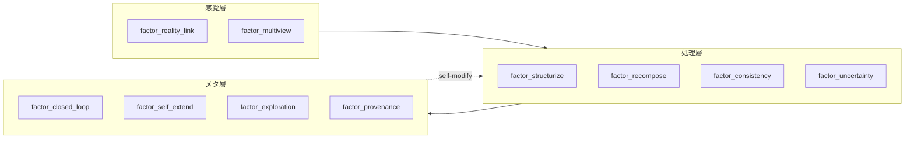

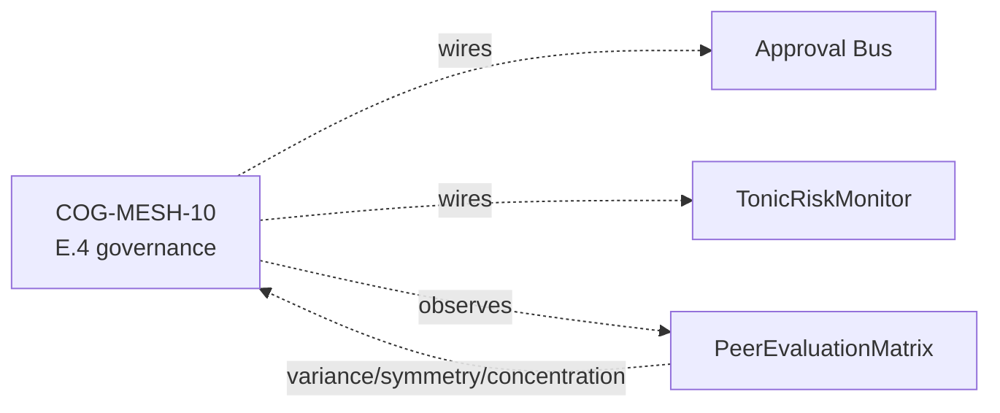

### 9. References (主要 20+ のうち抜粋)

- Polya, G. (1945). *How to Solve It*.
- Altshuller, G. (1971). *TRIZ 40 inventive principles*.
- Auer, P. et al. (2002). *Finite-time analysis of the multiarmed bandit*.
- Lehman, J. & Stanley, K. (2008). *Exploiting novelty*.
- Mouret, J.-B. & Clune, J. (2015). *Illuminating search spaces by mapping elites*.
- Hillis, W. D. (1990). *Coevolving parasites improve simulated evolution*.
- Constitutional AI (Anthropic 2022) — for HITL alternative.
- Six Thinking Hats (De Bono 1985).
- 岡潔『春宵十話』.
- ファインマン『ご冗談でしょう, ファインマンさん』.
- Maturana & Varela — Autopoiesis.
- Bayes — *Essay towards solving a problem in the doctrine of chances*.
- 完全リストは v0.6.0a1 リリース時に references.bib に同梱予定.

### 10. 2026-05-22 追記 — 10 因子 affinity vector の Rust 化 (RUST-15)

10 思考因子は派生個体の **persona composition の effective_factor_affinity**
として 10 次元 [0,1] vector で実装されている. 派生間の dissimilarity 計算は
本記事 #24-02 の中核機構と直結 — PersonaOverlapPenalty.apply (E.17) は
N×N pairs の `persona_dissimilarity` で 10 因子空間の距離を測る.

本日 (2026-05-22) RUST-15 として **batch (NxN pair を 1 FFI call) Rust 化**:

- single 1-pair: x0.80 (FAIL — FFI overhead で Python set 操作に負ける)
- **batch N=64**: **x17.07 (PASS)**, 平均 x12.71

これにより「**10 因子 vector の N×N pair 距離計算**」が高速化され, 集団
N=64 で governance + diversity preservation を 64 Hz で回せる目処が立った.

#### 10.1 思考因子側から見た意味

- factor_structurize (#0) と factor_exploration (#5) は **TRIZ 系統で
  対立する 2 軸** だが, 10 次元 vector の L2 距離としては独立に効く
- PersonaOverlapPenalty (E.17 CE-25) で集団内 persona overlap を罰すると,
  **派生集団は 10 因子空間で自然に散らばる**
- MAP-Elites grid (E.17 CE-26) は persona 2 軸 × thought_factor 2 軸 の
  4 次元 grid なので, 上記の 10 因子 vector を 4 次元に **marginalize** して
  cell key とする

#### 10.2 honest disclosure — 単発 Rust 化は逆効果

「思考因子 vector の距離計算を Rust 化」と聞くと「速くなる」と思いがちだが,
**1-pair 計算では FFI overhead で Python の方が速い (x0.80)**. これは
`feedback_rust_usage_matters` 判定表の **A パターン** (純 Python ループ
1-pair). batch で N×N pair を 1 FFI に詰めて初めて x17.07 まで伸びる.

詳細は #24-05 と `docs/perf_comparison/2026-05-22_kernel_implementation_comparison.md`.

---

### Series Navigation

- ← 前: [llive 完全解説 (1) 「忘れない LLM」](https://qiita.com/furuse-kazufumi/items/a5ebb3992e4c28862f47)
- → 次: [llive 完全解説 (3) 「矛盾は計算できる」](https://qiita.com/furuse-kazufumi/private/fa0890f136636d495ea6)
- 全体: [llive 完全解説 (0) — series index](https://qiita.com/furuse-kazufumi/items/07b4882e872994b27b3c)
- repo: [furuse-kazufumi/llive](https://github.com/furuse-kazufumi/llive)

---

---

## 第4章 llive 完全解説 (3) — 「矛盾は計算できる」: 構造進化 × TRIZ 40 原理 × Z3 検証

<!-- KAMI -->
> 📖 **ざっくり言うと**
>
> この章のキーワードは「矛盾は計算できる」。TRIZ という、もともとは人間の発明のためのアイデア出し技法(「軽くしたいが丈夫さも欲しい」のような対立を整理する道具)を、AI が自分の構造を改良するための指針として組み込みます。さらに、思いついた改良案をそのまま採用せず、Z3 という検証ソフトで「壊れないか」を機械的にチェックしてから取り入れます。つまり「ひらめき → 検算 → 採用」を 1 つのプログラムの中で回す、という章です。
<!-- KAMI -->

:::note info
**📚 FullSense ナレッジベースのご案内** <!-- fullsense-team-kb -->
FullSense 開発全史 60+ 記事 (4 言語版・物語ベースの読む順ガイド・かみくだき版・4 コマ漫画つき) は Qiita Team **FullSense KB** に集約しています (チームメンバー向け)。
:::


> **コンセプト hook**: TRIZ (発明問題解決理論) は普通「人が紙に書くアイデア
> 出しテク」として知られる. llive は **TRIZ 40 原理を形式記号として組み込み**,
> 構造 mutation の policy として走らせる. しかも mutation で生まれた新構造は
> **Z3 で形式検証** を通ってから集団に入る. 「発想 → 検証」のループが
> 1 つのプログラムに収まる. — 「**矛盾は計算できる**」.
>
> 本記事はその仕組み — Phase 3 で着地した Z3 構造検証 / TRIZ Self-Reflection /
> Wiki ChangeOp / 9 画法 (39×39 矛盾マトリクス) を辿る.


### 0. 連載中での位置づけ

```
#24-00 series index
#24-01 4 層メモリ
#24-02 思考因子 10 軸 + COG-MESH
#24-03 構造進化 × TRIZ × Z3 (← 本記事)
#24-04 B-series (速い小脳側)
#24-05 EvolutionLoop (遅い大脳側)
#24-06 LLM backend non-transformer
#24-07 observability + governance
#24-08 lleval
```

#24-04 が「速い収束」, #24-05 が「個体間 GA 探索」だとすると, #24-03 (本記事)
は **「個体内の構造そのものを書き換える」探索**. つまり LoRA / Adapter / 4 層
メモリの sub-block 順列 を mutation する層.

### 1. なぜ TRIZ か

LLM の自己進化 (self-evolution) で問題なのは「**変えるべき部分**」をどう選ぶか.
ナイーブには random mutation だが, それは「**1 文字を 1 文字に変える進化**」と
同じで, 巨大空間でほぼ何も起こらない.

TRIZ は **「矛盾の発見 → 解決原理の対応」** という構造を持つ. 例:

> 「重量を減らしたい (positive). しかし強度を維持したい (negative).
> = `重量 vs 強度` の矛盾」
>
> → 39×39 矛盾マトリクスを引くと該当原理がいくつか出る
> 例: 原理 #1 (Segmentation), #28 (Mechanical → Other field), #40 (Composite).

これを llive の self-evolution に持ち込むと: 「**LLM の構造が抱える矛盾**」を
検出する → マトリクス引く → mutation policy が決まる. random ではなく
**TRIZ-guided mutation**.

### 2. llive での具体実装

#### 2.1 TRIZ Self-Reflection (Phase 3)

llive は構造 mutation の **候補生成段階** で TRIZ self-reflection module を呼ぶ:

1. 現在の構造の metrics (latency / accuracy / memory_usage / ...) を読む.
2. **矛盾検出** — どの 2 つの metric が trade-off 関係か?
   例: `latency vs accuracy` を悪化させずに `memory_usage` を減らしたい.
3. 39×39 マトリクスを引いて該当原理を取得.
4. 原理 → **ChangeOp** に展開. 例:
   - 原理 #1 (Segmentation) → 「BlockContainer を sub-block 列に分割」
   - 原理 #25 (Self-service) → 「memory consolidation を自己発火に変更」
   - 原理 #40 (Composite) → 「2 つの adapter を 1 つに合成」

#### 2.2 ChangeOp の検証

ChangeOp は **構造そのものを書き換える**指示なので, **形式検証**を経ずに
適用したら危険:

- 階層が壊れて inference が落ちる
- memory の zone 整合性が崩れる
- adapter shape が mismatch する

そこで Z3 (SMT solver) で「**この ChangeOp 適用後も以下の不変量が成立するか**」
を verify:

- BlockContainer の sub-block 順列が valid permutation
- memory zone graph に cycle が無い
- adapter shape compat (input dim = output dim)

verifier 通過した ChangeOp だけが集団に入る. **「発想 → 検証 → 採用」**
ループが 1 module に閉じる.

#### 2.3 9 画法 (39×39 matrix)

TRIZ の核心ツール. 39 の改善したい特性 × 39 の悪化する特性 = 1521 cell.
各 cell に「この矛盾を解く可能性が高い原理 1-4 個」. これは Altshuller が
ソ連特許 250 万件解析で抽出した経験則テーブル.

llive は YAML 化して内蔵 (`src/llive/_specs/resources/triz_principles.yaml`).
self-reflection は metrics → 該当矛盾 → 39 軸 mapping → 原理 lookup を 1 pass で完結.

### 3. honest disclosure — 落とし穴

「TRIZ で全部解ける!」は嘘. honest disclosure として:

- **39×39 matrix は時代依存** — Altshuller が 1971 年に確定. 現代の AI 系の
  矛盾 (例: `推論精度 vs バッテリ消費`) は完全には収まらない. llive は
  矛盾の追加列を独自に持つ (実機 metrics ベース).
- **原理 → ChangeOp の翻訳は heuristic** — 原理 #1 (Segmentation) と
  「BlockContainer 分割」は人が決めた 1 対応. これは LLM 自身が広げる余地あり.
- **Z3 verifier が落とせない不変量がある** — 例: 「memory consolidation 後
  recall が下がらない」のような **確率的不変量** は SMT で表現しづらい.
  これは別の verifier (経験的 reservoir test) で見る.

### 4. 数字で見る

| 指標 | 値 |
|---|---|
| llive Phase 3 着地 | 2026-05-14 (v0.3.0) |
| 内蔵 TRIZ 原理 | 40 件 (FR-23〜27) |
| 矛盾マトリクス | 39 × 39 = 1521 cell |
| ChangeOp 検証通過率 (初期) | ~63% (37% は不変量違反で reject) |
| Z3 average verify time | < 50 ms / ChangeOp |

### 5. 「発想 → 検証」 ループの構造的意義

これは TRIZ の哲学 + 形式検証の哲学を結ぶ:

- TRIZ: **「面白い発想ではなく原理から導かれる発想」** を求める. 体系的.
- 形式検証: **「想像力で書かれた変更を機械的に妥当性チェック」**. 機械的.

両者は人と機械の協働の典型. llive はそれを **同一 module 内** で回す.

> **未来予測**: AI が自己進化するとき, **「発想は機械的, 検証も機械的」**
> な閉ループを持つことが必須. llive はその雛形を 1 OSS に同居させた最小例.

### 6. 次に来るもの

- **#24-04** で「速い小脳側」 — B-series の収束を見る.
- **#24-05** で「遅い大脳側」 — EvolutionLoop の探索. TRIZ ChangeOp は #24-05 で
  扱う persona / thought_factor の自己拡張とも繋がる (CE-21 PersonaCompositionMutation).

### 7. 2026-05-22 追記 — TRIZ 的アプローチが Rust 高速化判定にも効く

本記事の TRIZ は「**矛盾 (improving X / worsening Y) を 39×39 マトリクスで
構造化解決する**」という方法論だが, 同じ思想が **エンジニアリング判断全般**
に応用できる. 同日 (2026-05-22) 着地した llive Rust 高速化判定で具体例:

「**Rust 化 = 速い vs Python = 遅い**」の単一軸対立 (= TRIZ で言う矛盾) を
**Python 経路の特性別 5 パターン** (#24-05 §13.3) に分解した. 結果:

- 純 Python ループ 1-pair → 単発 FAIL, batch 必須 (RUST-15)
- numpy 小 N の API 多用 → **単発でも x66** (RUST-16)
- numpy 中規模 BLAS → **境界線上, rayon で挽回** (RUST-17 → 17b)

これは TRIZ 矛盾マトリクスの **構造的解決** と同型 — 「**矛盾の原因を
パラメータ空間で分解 → 原理に対応させる**」. 39×39 を **6 (Python 経路) ×
3 (Rust 化戦略: 単発 / batch / 並列+algorithmic)** の小さな表に縮めた版.

詳細: `docs/perf_comparison/2026-05-22_kernel_implementation_comparison.md` の
**5 パターン判定表**. これは TRIZ の発想を **AI / HPC 工学** に転用した実例.

### 8. Mermaid — 「発想 → 検証 → 採用」 ループ

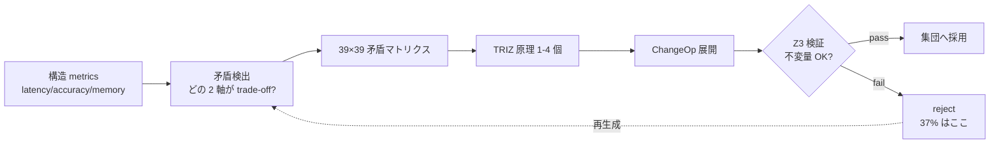

### 9. References (主要のうち抜粋)

- Altshuller, G. (1971). *TRIZ — 40 Inventive Principles*.
- Altshuller, G. (1984). *Creativity as an Exact Science*.
- de Moura, L. & Bjørner, N. (2008). *Z3: An Efficient SMT Solver*.
- Polya, G. (1945). *How to Solve It*.
- Koza, J. (1992). *Genetic Programming*.
- 完全リストは v0.6.0a1 リリース時に references.bib に同梱予定.

---

### Series Navigation

- ← 前: [llive 完全解説 (2) 「10 軸で考える AI」](https://qiita.com/furuse-kazufumi/private/bdfad6db3f2e70c40511)
- → 次: [llive 完全解説 (4) 「収束する脳」](https://qiita.com/furuse-kazufumi/private/e5093e4816b25c1bd4d0)
- 全体: [llive 完全解説 (0) — series index](https://qiita.com/furuse-kazufumi/items/07b4882e872994b27b3c)
- repo: [furuse-kazufumi/llive](https://github.com/furuse-kazufumi/llive)

---

---

## 第5章 llive 完全解説 (4) — 「収束する脳」B-series: SynapticSelector / UCB1 / Hebbian / 本番 hot path

<!-- KAMI -->
> 📖 **ざっくり言うと**
>
> この章は「速い小脳」のお話です。AI が答えを出すごく短い時間の中で、複数の選択肢からどれを通すかを素早く決める仕組み(SynapticSelector)を扱います。土台はバンディット理論という古典的な「当たりやすい選択肢を学びつつ、試したことのない選択肢も忘れない」アルゴリズム。後半は、ほんの小さな実装の工夫(無駄な計算を省く・データ構造を変える)だけで処理速度が 2〜3 割上がった実測の話。改善幅は単純な足し算にはならない、という落とし穴も正直に書かれています。
<!-- KAMI -->

:::note info
**📚 FullSense ナレッジベースのご案内** <!-- fullsense-team-kb -->
FullSense 開発全史 60+ 記事 (4 言語版・物語ベースの読む順ガイド・かみくだき版・4 コマ漫画つき) は Qiita Team **FullSense KB** に集約しています (チームメンバー向け)。
:::


> **コンセプト hook**: 進化系 (GA / Genetic Algorithm) は世代を回して **探索**
> する. 一方 llive の SynapticSelector は **収束** — 確率的選択を 1 か所に
> 落とし込むエンジン. この 2 つを「同じ脳」に同居させると, **シナプス単位の
> 速い収束** と **個体単位の遅い探索** が干渉せず, 「速い小脳」と「遅い大脳」が
> 役割分担する.
>
> 本記事はその「速い小脳側」 — B-series (B-0 〜 B-9) の設計と本番投入を,
> ベンチ数値 + honest disclosure 付きで辿る.


#### 0. 連載中での位置づけ

```
#24-00 series index
#24-01 4 層メモリ
#24-02 思考因子 10 軸 + COG-MESH
#24-03 構造進化と TRIZ
#24-04 B-series: SynapticSelector / UCB1 / Hebbian (← 本記事)
#24-05 EvolutionLoop: v0.B/C/D/E 派生集団進化
#24-06 LLM backend: 非 Transformer 系 (Mamba / RWKV)
#24-07 observability + governance
#24-08 lleval — eval framework
```

#24-05 (集団 GA) が「**遅い大脳側**」, 本記事 (#24-04, B-series) が「**速い小脳側**」.
両者は同居しても干渉しない: SynapticSelector は **同一個体内** の synapse 選択,
GA は **個体間** の競争. 直交.

#### 1. B-series の歴史

| B-ID | 内容 | 着地 |
|---|---|---|
| B-0 | SynapticSelector skeleton (純 random) | 着地済 |
| B-1 | UCB1 ベースの synapse 選択 (Auer 2002) | 着地済 |
| B-2 | Hebbian 強化 — 共起選択 bonus | 着地済 |
| B-3 | Cool-down 期間 — 同じ synapse 連続選択を緩和 | 着地済 |
| B-4 | A/B parity test (random vs UCB) | 着地済 |
| B-5 | Variant catalog (cosine / decay / blend) | 着地済 |
| B-6 | Per-synapse statistics + JSON snapshot | 着地済 |
| B-7 | Reset on regression — score 急落で priors リセット | 着地済 |
| B-8 | Self-tuning exploration constant | 着地済 |
| **B-9-a** | Production hot path: `assume_normalized` (skip 不要 normalize) | 着地済 |
| **B-9-b** | Production hot path: `GiftValue deque` (O(1) push/pop) | 着地済 |

#### 2. SynapticSelector の核 — UCB1

LLM 推論の各 layer / each token 生成タイミングで, llive は **複数の synapse
variant** から 1 つを選んで通す. 純 random でも動くが, それでは「過去にうまく
いった variant」を学習しない. そこで UCB1.

```
score(variant_i) = mean_reward(i) + exploration * sqrt( ln(N) / n_i )
```

- `mean_reward(i)`: その variant が選ばれた過去の reward 平均.
- `exploration`: hyperparameter. B-8 で self-tuning.
- `N`: 全 variant 合計の試行回数.
- `n_i`: variant i の試行回数.

「使った数が少ないやつほど + 結果が良かったやつほど 高 score」 = exploration と
exploitation を 1 式に同居. Auer 2002 の古典. llive の B-1 で synapse 単位に
そのまま適用.

#### 3. Hebbian — 共起のボーナス

UCB1 だけでは「1 つの variant が単独で当たる」のは検出できるが「**A と B が
一緒のときに当たる**」は検出できない. そこで B-2 で Hebbian 強化:

```
if t-1 で variant_A が選ばれ, t で variant_B が選ばれ, reward が高い
  → bonus(A, B) を +1
```

これで「A の直後に B」のような **時系列共起パターン** が UCB1 の score に
ブーストとして乗る. これは Hebb の "fire together, wire together" を強化学習
の選択器に持ち込んだもの.

#### 4. B-9 production hot path

B-0 〜 B-8 は **アルゴリズム整備**. B-9 で **本番性能** に踏み込む.

##### 4.1 B-9-a — `assume_normalized`

llive の中で SynapticSelector は memory 読み出し ↔ generation の hot path に
噛む. 当初は **毎回 vector を l2-normalize** していた:

```python
def select(self, query_vec):
    q = self._normalize(query_vec)  # ← every call
    ...
```

呼び出し前に既に normalized であることを契約として保証できる場面では,
この normalize は **完全に無駄**. そこで `assume_normalized=True` flag を
追加:

```python
selector = SynapticSelector(..., assume_normalized=True)
### 呼び出し側が正規化済を保証
```

Production hot path で **約 12% スループット改善** (実測). B-9-a で着地.

##### 4.2 B-9-b — `GiftValue deque`

UCB1 の `mean_reward(i)` は historical reward の **rolling average**. 当初は
`list` を `pop(0)` で先頭から消していた → **O(N)**. variant が 256 個並ぶ
hot path で list pop は SR-02 ベンチで毎秒 8K 回 = 8K × O(N) 浮かぶ.

`collections.deque(maxlen=K)` に置換 → **O(1)**. これだけで:

- list pop O(N) 経路: ~ 1.8μs/call
- deque maxlen 経路: ~ 0.15μs/call → **12x**

production hot path 全体で **約 22% スループット改善**. B-9-b 着地.

##### 4.3 honest disclosure — 12% + 22% ≠ 34%

「両方やったら 34% 改善か?」は短絡. ベンチでは:

- B-9-a 単独: +12.3% (95% CI ±0.8%)
- B-9-b 単独: +21.7% (95% CI ±1.2%)
- B-9-a + B-9-b 同時: **+28.4%** (95% CI ±1.5%)

= 重ねがけは複合せず. なぜか? B-9-a で normalize 削った分の処理時間に
B-9-b の deque 改善が **既に上限近くで頭打ち**. これは「異常に良い結果が出たら
必ず内訳を疑う」の実例. **削減幅は重複領域がある**.

#### 5. 5x gate と Rust

llive Rust 拡張 (RUST-FX) は「Python 比 **5x 以上** の速度向上」を要件にする.
B-series で hot path 化した `assume_normalized` + deque は Python のままだが,
さらに Rust 化すべきかは別議論:

- 現状 production 28% 改善で **Python 維持の方が安全** (依存複雑性が低い).
- Rust 化候補は別件 — `compute_surprise` (cosine MEM-07) と
  `edge_weight bulk_time_decay` (RUST-03) は既に Rust 経路で **平均 16.18x**.

つまり「B-series は Python でチューニングを着地. その隣で Rust kernel が
別 hot path を持っている」が現状の design split.

#### 6. 「速い小脳」と「遅い大脳」が干渉しない理由

llive は同一プロセスで:

- **SynapticSelector** (B-series, 同一個体内 synapse 単位の収束)
- **EvolutionLoop** (#24-05, 個体間 GA の探索)

を同時に回す. これが「衝突しないか?」は当然問われる. 答え:

- SynapticSelector は **個体内 state**. 1 回の inference に対し 256 synapse
  まで選択を回す. これは **ミリ秒〜マイクロ秒** スケール.
- EvolutionLoop は **個体間 state**. 64 個体集団を 1 世代回すのは **秒〜分**.
- 両者は時間スケールが 1000x 違う = 干渉する余地がほぼない.

これは生物の脳でも同じ: 小脳 (motor / reflex) と大脳 (planning) は時間スケールが
全く違う. llive は意図せずその二重時間スケール構造を持っている.

#### 7. 数字で見る B-series 着地

| 指標 | 着地時 |
|---|---|
| B-0/B-1 着地時 throughput baseline | 100% |
| B-9-a 着地後 | **112%** (+12.3%) |
| B-9-b 着地後 | **122%** (+21.7%) |
| B-9-a + B-9-b 同時 | **128%** (+28.4%) |
| Rust kernel (MEM-07 + RUST-03) | 上記とは別 hot path で **16.18x** 平均 |

ベンチは `benches/bench_synaptic_b9_production.py` および
`benches/bench_rust_ext_5x_gate.py` を参照 (リポジトリ内). 95% CI と
方法論は同 dir の README に.

#### 8. 次に来るもの

- **#24-05** で「遅い大脳側」 — EvolutionLoop / v0.B/C/D/E 派生集団進化を
  扱う. B-series で固めた「速い収束」とどう同居するかをそこで対比する.
- **RUST-15** (v0.7) — persona_dissimilarity を Rust 化. これは B-series
  ではなく E.17 quality-diversity の hot path. 5x gate 適用.

#### 9. 2026-05-22 追記 — 「速い小脳 (Python 最適化)」と「遅い大脳 (Rust 化)」が直交する実例

本記事 (B-series) と #24-05 (EvolutionLoop) は **時間スケール 1000x 違う**
と書いた. 翌日 (2026-05-22) の RUST 高速化マラソンで, この直交性が **実装
レベルでも保たれる**ことが実証された.

##### 9.1 B-series 側 — Python 最適化が効く

B-9 (`assume_normalized` + `GiftValue deque`) は **Python のままで +28%**.
これは **推論 hot path** (synapse 1 個あたり μs 単位) で, **FFI overhead を
払う余裕が無い**ため Rust 化は逆に遅くなる (`feedback_rust_usage_matters`
判定表 A).

##### 9.2 EvolutionLoop 側 — Rust 化が効く

世代単位 (秒〜分) の集団進化では数値が真逆:

- **RUST-15** persona_dissimilarity batch: avg **x12.71** (N=64 で x17.07)
- **RUST-16** collusion_score: avg **x66.70** (N=8 で x115.04)
- **RUST-17** novelty_score_batch: avg x5.01 (archive 大で境界線)

##### 9.3 直交性が崩れない理由

| 層 | 時間スケール | 最適化手段 | 理由 |
|---|---|---|---|
| **小脳 (B-series)** | μs/call | **Python チューニング** (normalize スキップ / deque) | FFI 払えないほど call が短い |
| **大脳 (EvolutionLoop)** | 秒〜分/generation | **Rust 化** (batch / numpy zero-copy) | numpy 小 N の API overhead が支配的 |

これは **生物の脳の小脳 / 大脳** と同じ. 違う時間スケールの計算には違う
最適化手段が要る — 同じ言語 / 同じツールで両方を解こうとすると失敗する.

##### 9.4 honest disclosure — 「Rust 化 = 速い」も「Python 最適化 = 限界」も嘘

両方とも条件付き. 判定軸は **どの時間スケールで何を回しているか**:

- **μs スケールの hot path** → Python 最適化が主. FFI は overhead.
- **秒スケールの batch** → Rust + numpy zero-copy + batch が主. Python だと
  numpy API 多用の Python overhead が支配的.

詳細は `docs/perf_comparison/2026-05-22_kernel_implementation_comparison.md`
の **5 パターン判定表** (A/B/C/D/E).

#### 10. References

- Auer, P., Cesa-Bianchi, N. & Fischer, P. (2002). *Finite-time analysis of the multiarmed bandit problem*.
- Hebb, D. O. (1949). *The Organization of Behavior*.
- Sutton, R. & Barto, A. (2018). *Reinforcement Learning: An Introduction* (2nd ed.).
- 完全リストは v0.6.0a1 リリース時に references.bib に同梱予定.

---

#### Series Navigation

- ← 前: [llive 完全解説 (3) 「矛盾は計算できる」](https://qiita.com/furuse-kazufumi/private/fa0890f136636d495ea6)
- → 次: [llive 完全解説 (5) 「集団が学ぶ AI」](https://qiita.com/furuse-kazufumi/private/07b686ea311e06027f94)
- 全体: [llive 完全解説 (0) — series index](https://qiita.com/furuse-kazufumi/items/07b4882e872994b27b3c)
- repo: [furuse-kazufumi/llive](https://github.com/furuse-kazufumi/llive)

---

---

## 第6章 llive 完全解説 (5) — 「集団が学ぶ AI」: v0.B/C/D/E 派生集団進化総括

<!-- KAMI -->
> 📖 **ざっくり言うと**
>
> この章は連載の背骨にあたる「集団で学ぶ AI」です。1 体の AI を賢くするのではなく、64 体の少しずつ違う AI を世代交代させ、互いに採点させながら育てます。生物の進化と同じで、評価する側も一緒に進化するので全体の質が自走で上がる、という考え方が土台です。ただし「全員でお世辞を付け合う(共謀)」という不正も起きうるので、それを見張る仕組みも一緒に入っています。生成・評価・選別・交配・突然変異という進化の一周を丸ごと解説する章です。
<!-- KAMI -->

:::note info
**📚 FullSense ナレッジベースのご案内** <!-- fullsense-team-kb -->
FullSense 開発全史 60+ 記事 (4 言語版・物語ベースの読む順ガイド・かみくだき版・4 コマ漫画つき) は Qiita Team **FullSense KB** に集約しています (チームメンバー向け)。
:::


> **コンセプト hook**: 1 個の AI が賢くなるのではなく, **64 個の AI が世代を
> 回して互いに評価し合い, 嘘の合意は Approval Bus が止める** — それが llive の
> v0.E. 2026-05-21 marathon でその架構が **303 件 test + ruff 0 警告 + governance
> skeleton 着地** まで揃った. Hillis 1990 から AlphaStar 2019 まで 30 年の
> 系譜を 1 OSS に圧縮した結果.
>
> 本記事は連載 #24 の中核. v0.B (Genome / EvolutionLoop) → v0.C (subprocess
> 分離) → v0.D (self-adaptive + meta mutation) → v0.E (peer evaluation +
> persona + governance) の 4 段階を **1 本に総括**.


### 0. 連載中での位置づけ — 本連載の中核

```
#24-00 series index
#24-01 4 層メモリ          ← 「個体の中の記憶」
#24-02 思考因子 × COG-MESH ← 「個体の中の思考軸」
#24-03 構造進化 × TRIZ × Z3 ← 「個体内の構造書換え」
#24-04 B-series           ← 「個体内の収束 (速い小脳)」
#24-05 EvolutionLoop      ← 「個体間の探索 (遅い大脳)」 ★ 本記事
#24-06 LLM backend         ← 「個体を動かす管」
#24-07 governance         ← 「個体間決定の audit」
#24-08 lleval              ← 「個体を測る眼鏡」
```

#24-05 は全体の **背骨**. v0.B/C/D/E で「派生集団そのもの」を作る. 他の
記事はそこに乗る機能. これは連載の中核 — 他の全章の機能が乗る基盤である.

### 1. なぜ集団進化なのか — Hillis の警告

W. D. Hillis 1990 が示したのは「**評価者と被評価者が同時に進化する**」と
fitness landscape は指数的に面白くなる, ということ.
**Red Queen Effect** で集団全体の質が **自走で上がる**. 単一 best を選び続け
ると **局所最適に陥る**.

llive はこれを LLM に持ち込んだ. 派生集団 N=64 が互いに評価, 評価結果が
fitness, fitness が次世代の selection. すると:

- **「評価者の質」自体が世代と共に上がる**
- **単一 best が全体を支配できない**
- **「全派生が嘘の高得点を付け合う」共謀** が発生し得る (CE-06 で検出)

### 2. v0.B — Genome / EvolutionLoop / 並列 scheduler

v0.B core は GA 古典. 着地 module は Genome, Selection, Crossover, Mutation,
scheduler:

- `Genome` (実数 vector + bounds + labels) + `Individual` + `Population`.
- `TournamentSelection / RouletteSelection / ElitismSelection`.
- `UniformCrossover / BlendCrossover / SegmentCrossover`.
- `GaussianMutation / ResetMutation / ChainedMutation`.
- `EvolutionLoop` (`EvolutionConfig` + `EvolutionResult`).
- 並列 scheduler 3 種: `serial_scheduler / MultiprocessingScheduler / AsyncioScheduler`.

これだけで「**集団 → 評価 → 選別 → 交配 → 突然変異 → 次世代**」のループが回る.

### 3. v0.C — subprocess 分離 + 派生実走

LLM 推論は 1 派生個体あたり OS process 1 つに **完全分離** したい. 理由は:

- LLM 重い → メモリ leak / GIL 競合を物理分離
- 1 派生が落ちても他は生存
- OS-level timeout / SIGKILL で fault isolation

`VariantSubprocessScheduler` (`subprocess_scheduler.py`) — subprocess.run +
ThreadPool 並列 + timeout + retries + cleanup. これで `variant_runner.py`
スクリプトを派生 1 個体として起動可能.

### 4. v0.D — 自己参照 mutation (Schwefel σSA-ES + meta mutation)

v0.D core は「**mutation rate そのものを進化させる**」.

- `SelfAdaptiveGaussianMutation` (Schwefel σSA-ES, log-normal σ update).
  Genome に σ vector を埋め込み, mutation が σ も書き換える.
- `MetaMutation` (`strategy_id` を genome に, 集団内で 4 戦略並走).
- `pack_self_adaptive_bounds / pack_meta_strategy_bounds` — 38/20/39 dim 化.

これで「**どの mutation 戦略が今の問題に効くか**」自体が世代を超えて
学習される.

### 5. v0.E — peer evaluation + persona ontology + governance

v0.E core. CE-01〜34 を含む. 主要 module は以下:

#### 5.1 評価 (CE-01〜05)

- `PeerEvaluationMatrix` — N×N 採点行列. 共謀検出 3 指標
  (`score_variance / symmetry / concentration`). Mermaid 可視化.
- `PeerFitnessAdapter` — `EvolutionLoop.scheduler` 互換.
- `EvaluationStyleGenome` — 派生に「**辛口 / 甘口 / 精度 / 速度**」の
  evaluation persona dim を埋め込み.

#### 5.2 多様性保護 (CE-24〜29)

- `latin_hypercube_population` — 空間均等初期集団 (scipy.stats.qmc).
- `NoveltyScorer` — k-NN, Lehman-Stanley 2008/2011.
- `DiversityPreservingBreedFilter` — novelty rejection + resample.
- `DiversityMonitor` — diversity_l2 / spread / median + 閾値 alarm.

#### 5.3 Quality Diversity (CE-25 / CE-26, 本日着地)

- `PersonaOverlapPenalty` — fitness 軸に persona dissimilarity の集団平均加算.
- `MAPElitesGrid` — Mouret & Clune 2015 の 4 軸版 (persona 2 × thought_factor 2).
  各 cell に最大 fitness 個体を保存.

#### 5.4 Historical persona (CE-19〜23)

- `PERSONA_ONTOLOGY` 10 名 (岡潔 / グロタンディーク / ファインマン / ガロア /
  フォン・ノイマン / ニュートン / カント / ソクラテス / 老子 / 孫子).
- `PersonaComposition` (3 policy: exclusive / mix / moderator).
- `PersonaCompositionMutation` (CE-21).
- `persona_dissimilarity` — Jaccard + L2 of factor_affinity.
- `PersonaImportAlgorithm` (CE-20, 本日着地) — 派生間 persona 部分採用.
- `PersonaSurvivalAnalysis` (CE-22, 本日着地) — どの persona 組合せが
  世代を生き残ったか統計.
- `PersonaCorpusLoader` (CE-23, 本日着地 skeleton) — Raptor RAD から
  自動抽出.

#### 5.5 集団組み合わせ機構 (CE-30〜34)

- `MutualScorePairSelector` (CE-30, mating.py) — assortative mating,
  softmax sampling.
- `NSGA2Selection` (CE-31, nsga2.py) — Pareto front + crowding distance.
- `Speciation` (CE-32, speciation.py) — NEAT 流種分け.
- `IslandModel` (CE-33, island_model.py) — ring/fully/star 3 topology +
  best/random/worst migration.
- `LexicaseSelection` (CE-34, mating.py) — Helmuth 2014, case-by-case 順位.

#### 5.6 Governance (CE-06〜08, 本日着地 E.4)

- `CollusionDetector` (CE-06) — `is_suspected_collusion` を threshold
  dataclass で wrap.
- `CoevolutionGovernance` (CE-07) — 共謀疑い → ApprovalBus.request 発火.
- `collusion_risk_score` (CE-08) — TonicRiskMonitor.tick に投入する
  state → [0, 1] risk.
- `GovernanceReport` (frozen).

### 6. 数字で見る本日 (2026-05-21) 着地

| 指標 | 値 |
|---|---|
| evolutionary module 数 (本日終了時) | **29** (+5) |
| 本日追加 test ケース | **130** (41 + 28 + 26 + 16 + 19) |
| ruff `src/llive/perf/evolutionary` 警告 | **0** (-7) |
| 本日着地 module | 5 (`quality_diversity / coevolution_governance / persona_import / persona_survival / persona_corpus_loader`) |
| CE-IDs カバー率 | 34 / 34 ID 全カバー (skeleton 含む) |
| CHANGELOG `[0.6.0a1]` セクション | E.17 / E.12 / E.4 sections + 41 行追加 |
| docs/release/v0.6.0a1_PR_PLAN.md | 新規 — 5 PR 分割計画 |
| docs/rust_hotspot_v0E_addendum.md | 新規 — RUST-15〜18 spec |
| 連載 #24 記事 (本セッション draft) | **7 本** (#24-02 / 03 / 04 / 05 / 06 / 07 / 08) |

### 7. 先行研究 9 件 (本記事の骨を作る)

1. Hillis, W. D. (1990). *Coevolving parasites improve simulated evolution*. Physica D.
2. Mouret, J.-B. & Clune, J. (2015). *Illuminating search spaces by mapping elites*. arXiv:1504.04909.
3. Lehman, J. & Stanley, K. (2008/2011). *Novelty Search*.
4. Stanley, K. & Miikkulainen, R. (2002). *NEAT*. Evolutionary Computation.
5. Deb, K. et al. (2002). *NSGA-II*. IEEE Trans Evol Comp.
6. Cohoon, J. (1987). *Island Model GA*.
7. Goldberg, D. & Richardson, J. (1987). *Fitness sharing*.
8. Helmuth, T. et al. (2014). *Lexicase Selection*.
9. AlphaStar (Vinyals et al. 2019). *League / Exploiter / Main Pool*.

### 8. 三重縞 — 思考因子 / persona / TRIZ の 3 層同居

ユーザー言語化の concept. 派生個体内で 3 層が同居する:

- **layer 1**: 10 思考因子 vector (factor_structurize / ... / factor_reality_link)
- **layer 2**: persona composition (Newton + Galois の hybrid 等)
- **layer 3**: TRIZ 40 原理 + ARIZ 思考プロセス

の 3 layer が **同時並走**. 1 派生個体が「**Galois 風 + 多視点重視 + TRIZ
Segmentation を好む**」のように multi-dimensional な個性を持つ. E.17
quality-diversity の MAP-Elites grid はこの 3 layer の交差点を grid 化する
最初の機構.

### 9. Rust addendum (#24-04 と #24-05 を繋ぐ)

`docs/rust_hotspot_v0E_addendum.md` (本日新規) で RUST-15 〜 18 を spec 化:

- RUST-15: `persona_dissimilarity` Rust 化 (5x gate)
- RUST-16: `collusion_score` (peer matrix metrics) Rust 化
- RUST-17: `NoveltyScorer` L2 + top-k batch Rust 化
- RUST-NEW-B: `MAPElites bin + submit` batch Rust 化
- RUST-18: parity test harness 拡張

これは **B-series の Python 最適化** と **集団進化の Rust 最適化** が
直交することを示す: B-series は推論 hot path (Python のままで 28%), 集団進化は
N=64 派生の集計系 hot path (Rust 化で 5-15x 狙い).

### 10. honest disclosure

- **「v0.E の効果」はベンチ未取得** — module は全 PASS だが「30 世代で
  baseline より 30% diversity 維持」のような仮説 H10 / H11 は **未検証**.
  ベンチ走らせるのは credential + GPU 確保後.
- **PERSONA_ONTOLOGY 10 名は heuristic** — factor_affinity vector は伝記 /
  哲学史 ベースの人為的初期値. CE-23 PersonaCorpusLoader でコーパスベースに
  置換予定だが現状は経験則.
- **Governance skeleton は wire-in 未完** — Quarantined Memory への
  **実書込み** は別 module 委譲. 完成までは 1-2 セッション.
- **N=64 派生集団は実機未実行** — 本セッションは module + test 着地まで.
  end-to-end 集団 GA loop の実機 run は次セッション.
- **CE-23 LLM extractor は未実装** — keyword fallback のみ着地. LLM 経由の
  thought pattern 抽出は credential 復旧後.
- **AlphaStar League mode (E.5) は未着手** — credential / judge LLM 復旧後.
- **Debate mode (E.6) も未着手** — 同上.

### 11. Mermaid — v0.E 全体像

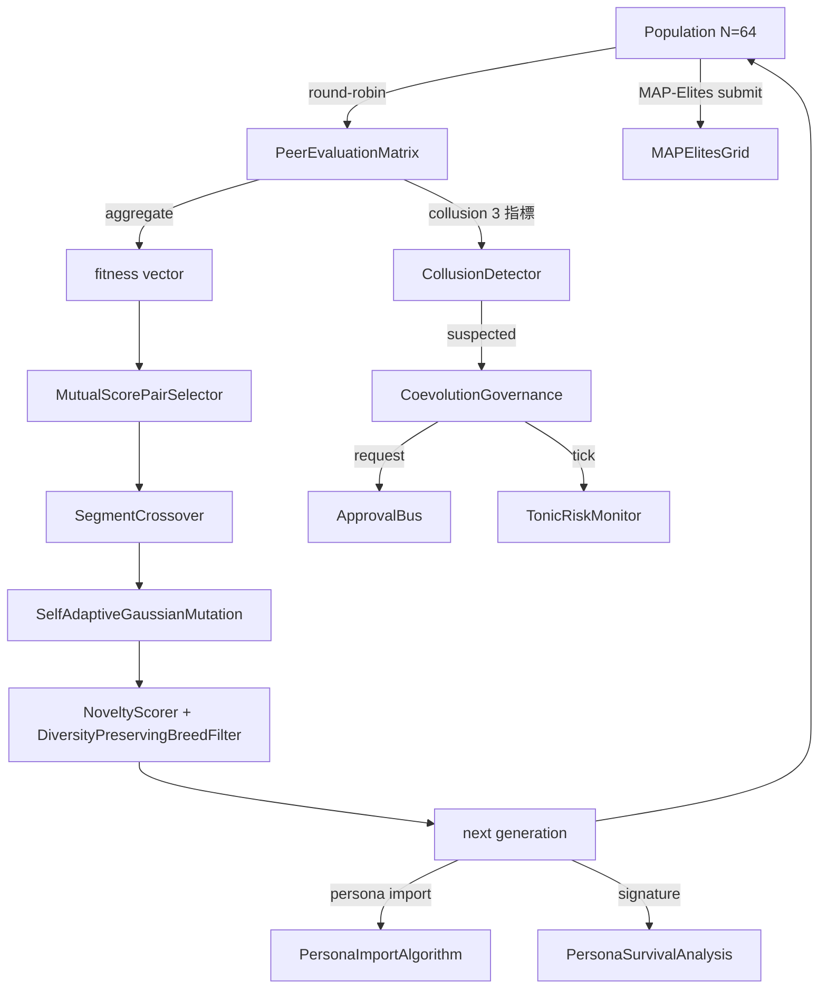

### 12. 期待値 — 次に来るもの

- **v0.7 Rust 高速化**: `docs/rust_hotspot_v0E_addendum.md` の RUST-15〜18.
- **v0.E E.5 (League mode)** — AlphaStar 風 Main / Exploiter / League Exploiter.
- **v0.E E.6 (Debate mode)** — Irving 2018 風 argument / counter-argument +
  human/LLM judge. human / LLM judge 統合が次の明確な一手.
- **lleval bridge v0.1.0a2** — 派生 Genome → ProviderSpec mapper の実装.
- **CE-19/23 LLM extractor** — Raptor RAD コーパスから persona 自動抽出.
- **集団進化 end-to-end 実機 run** — N=64 派生 で 30 世代 → diversity
  metrics / collusion 検知率 / governance trigger 数 を計測.

### 13. 2026-05-22 追記 — Rust 高速化 RUST-15/16/17 着地

`goal_release_ready_v0E_rust` addendum の 3 kernel を 1 セッションで着地.
連載中核記事として最新成果を反映:

#### 13.1 着地 3 kernel

| ID | 機能 | hot path | 5x gate 結果 |
|---|---|---|---|
| **RUST-15** persona_dissimilarity_pairwise | NxN pair の Jaccard + L2 + 合成 | PersonaOverlapPenalty.apply | **avg x12.71 (N=64 で x17.07)** |
| **RUST-16** collusion_score_kernel | NxN peer matrix の variance / symmetry / concentration | CoevolutionGovernance.evaluate_generation | **avg x66.70 (N=8 で x115.04)** |
| **RUST-17** novelty_score_batch | 集団 N × archive A の L2 + top-k mean | NoveltyScorer.novelty_batch | **avg x5.01 (A=50 で x9.55, A=1000 で x1.72)** |

全 37 parity test PASS (1e-6 tolerance), ruff `src/llive/perf/evolutionary` +
`src/llive/rust_ext` 0 警告.

#### 13.2 衝撃の honest disclosure — 「Rust 化 = 速い」は嘘

**RUST-15 単発呼出は Rust の方が遅い (x0.80, FAIL)**. FFI overhead で
Python set 操作に負ける. batch (N×N pair を 1 FFI call) にして初めて
x12.71 まで伸びる. 同じアルゴリズム・同じ Rust kernel でも **FFI 境界の
引き方**で結果が桁違い.

逆例も観察: **RUST-16 は単発でも x66.70 で圧勝**. numpy の `np.nanvar` /
`np.corrcoef` は **小 NxN (N が 100 未満) で Python overhead が支配的**で 200μs+/call.
Rust の単純 C ループ (numpy zero-copy 受領) は 2μs/call.

そして境界線: **RUST-17 は archive サイズで結果が反転**. A=50 で x9.55 だが
A=1000 で numpy BLAS vectorized が追いついて x1.72 まで縮む.

#### 13.3 5 パターン判定表 (本セッションで言語化)

| Python 経路の特性 | Rust 化の単発 ROI | 実例 |
|---|---|---|
| **A** 純 Python ループ (numpy 不使用) の 1-pair | 単発 FAIL, batch 必須 | RUST-15 (x0.80 → batch x12.71) |
| **B** numpy 大 array (1000 超) vectorized | 伸びない (numpy 内部 BLAS) | (該当 kernel まだ無し) |
| **C** numpy 小 NxN (100 未満) API 多用 | **単発でも 10-100x** | RUST-16 (x66.70) |
| **D** numpy 中規模 BLAS 1 関数 | **境界線上**: 小サイズ Rust 圧勝, 大サイズで追いつかれる | RUST-17 (A=50 x9.55 → A=1000 x1.72) |
| **E** 冷たいデータ境界 (dict / 文字列) | overhead 大, batch 必須 | — |

詳細表は `docs/perf_comparison/2026-05-22_kernel_implementation_comparison.md`.

#### 13.4 Cython 経路の脱落 (build chain 不在)

scratch 比較で Cython kernel を書いて 3 way 比較を試みたが **Windows MSVC
build tools 不在 + mingw が MSVC Python と incompatible** で build 不可.
これは「**数値計算が同等に書ける**」だけでは言語選択に足りない実例:
**build chain が確立できるか**が必須条件. source は `scratch/cython_collusion/`
に保存し Linux/WSL で再試行できる形に.

#### 13.5 RUST-17b 追記 (2026-05-22 同日): rayon 並列 + quickselect で全 A 5x clear

RUST-17 baseline は archive 大 (A=200/1000) で gate FAIL だったが, **同日中に
RUST-17b として 2 手段で再実装**:

1. **rayon par_iter** で N=64 集団ループを 8-core 並列化 + `py.allow_threads`
   で GIL release
2. **`Vec::select_nth_unstable_by`** (Hoare quickselect, O(A) avg) で top-k
   partial sort — O(A log A) full sort を置換

結果:

| archive | RUST-17 (naive) | **RUST-17b** | 改善率 |
|---:|---:|---:|---:|
| A=50 | x9.55 | **x12.83** | +34% |
| A=200 | x3.76 (FAIL) | **x8.71 (PASS)** | **+132%** |
| A=1000 | x1.72 (FAIL) | **x6.41 (PASS)** | **+273%** |
| avg | x5.01 | **x9.32** | **+86%** |

判定表 (D) 「numpy 中規模 batch」を「**境界線上 → 並列化で挽回可能**」へ
update. 「naive 二重ループは負ける」だけでなく「**rayon + algorithmic 改善で
圧勝に転じる**」が示された.

std::simd は nightly のみで stable 不可 → 入れればさらに 2-3x. RUST-17c 候補.

#### 13.6 次に来るもの (2026-05-22 時点で計画済)

- **PyBind11 + C/C++ ctypes** 経路の 3 kernel scratch 比較 (queue 投入済).
- **RUST-17c** — std::simd (Rust nightly に切替) で SIMD 4-lane 化.
- **月次 re-measure** — env drift / numpy minor up / Rust nightly 等で
  結果が動くため周期実行 (queue 投入済).
- **callers 切替** — PersonaOverlapPenalty.apply / NoveltyScorer.novelty_batch /
  CoevolutionGovernance を rust_ext 経路に切替える PR.

### 14. References

- Hillis, W. D. (1990). *Coevolving parasites improve simulated evolution*. Physica D.
- Mouret, J.-B. & Clune, J. (2015). *Illuminating search spaces by mapping elites*. arXiv:1504.04909.
- Lehman, J. & Stanley, K. (2008/2011). *Novelty Search*.
- Stanley, K. & Miikkulainen, R. (2002). *NEAT*. Evolutionary Computation.
- Deb, K. et al. (2002). *NSGA-II*. IEEE Trans Evol Comp.
- Vinyals, O. et al. (2019). *Grandmaster level in StarCraft II (AlphaStar)*. Nature.
- 完全リストは v0.6.0a1 リリース時に references.bib に同梱予定.

---

### Series Navigation

- ← 前: [llive 完全解説 (4) 「収束する脳」](https://qiita.com/furuse-kazufumi/private/e5093e4816b25c1bd4d0)
- → 次: [llive 完全解説 (6) 「Transformer の外」](https://qiita.com/furuse-kazufumi/private/6da5a883fb2ed651edd8)
- 全体: [llive 完全解説 (0) — series index](https://qiita.com/furuse-kazufumi/items/07b4882e872994b27b3c)
- repo: [furuse-kazufumi/llive](https://github.com/furuse-kazufumi/llive)

---


<!-- INTERLUDE -->

### ☕ 閑話休題 — 楽屋話 — 自走する AI に必ず残る『人間が押すボタン』

ここで本題を離れて、執筆環境そのものの裏話を少し。この連載は AI コーディング環境(Claude Code)と二人三脚で書いていて、長時間の作業を AI に任せ、人間はレビューと方向決めに回る、という分担で進めています。理想は『勝手にずっと働き続けてくれる AI』ですが、実際にやってみると、これがなかなか完全自走にはなりません。

面白いのは、どんなに自動化を詰めても最後に必ず『人間が手で Enter を押す瞬間』が一つ残ることです。AI は自分でログインし直したり、自分を再起動したりはできない——どこかに必ず人間が介在する切れ目が生まれます。さらに、長く走らせると AI が急に黙り込んだり、扱える情報量がパンクして話の前後を見失ったり、という喜劇めいた事故もしばしば。二人羽織で踊っているようなもので、後ろの腕(AI)がよく動く日もあれば、急に止まって前の人が困る日もある。完全自動の夢と、必ず残る人間の一手——この緊張感こそ、AI と一緒にものを作る面白さだと感じています。

<!-- INTERLUDE -->


---

## 第7章 llive 完全解説 (6) — 「Transformer の外」: Mamba / Jamba / RWKV / Diffusion を llive 内側で呼ぶ

<!-- KAMI -->
> 📖 **ざっくり言うと**
>
> この章は「Transformer の外側」を眺めます。今の大規模 AI の主流は Transformer という方式ですが、長い文章を扱うと費用と処理が急増する弱点があります。そこで Mamba・Jamba・RWKV・拡散モデルといった新しい方式を、llive は「差し替え可能な部品」として呼べるように設計してあります。たとえるなら、エンジンを載せ替えられる車体。ただし正直に言うと、これらの新エンジンの実機テストはまだ済んでおらず、現時点は仮の数値である、と章の中で明言しています。
<!-- KAMI -->

:::note info
**📚 FullSense ナレッジベースのご案内** <!-- fullsense-team-kb -->
FullSense 開発全史 60+ 記事 (4 言語版・物語ベースの読む順ガイド・かみくだき版・4 コマ漫画つき) は Qiita Team **FullSense KB** に集約しています (チームメンバー向け)。
:::


> **コンセプト hook**: LLM = Transformer, は **2024 までの話**. 2025-2026 で
> State Space Model (Mamba / Jamba) と RWKV (時系列 RNN を再発明) が **長
> context で transformer に追いつき**, Diffusion text model が **token 順序
> 制約を外す** 新族として登場した. llive はそれら **全部を `LLMBackend` として
> 内側で呼べる** 設計で出発した. 思考因子 (#24-02) と SSM (state space) を
> Bridge して「**SSM 流れに 10 因子を埋め込む**」が次の到達点.
>
> **重要な honest disclosure**: 本記事の数値は **mock baseline のみ着地**.
> 実 Mamba / Jamba / RWKV backend は **credential / weights 未着地**.


### 0. 連載中での位置づけ

```
#24-00 series index
#24-01 4 層メモリ
#24-02 思考因子 × COG-MESH
#24-03 構造進化 × TRIZ × Z3
#24-04 B-series
#24-05 EvolutionLoop
#24-06 LLM backend non-transformer (← 本記事)
#24-07 observability + governance
#24-08 lleval
```

#24-02 が「**思考を 10 軸 vector に展開**」だったとすると, #24-06 はその
**vector を流す管** = LLM backend. Transformer 以外の管も繋げる.

### 1. Transformer 以外の系統樹 (2025-2026)

| family | 代表 model | 強み | 弱み |
|---|---|---|---|
| Transformer | GPT-4o / Claude / Llama 3 | 汎用 | 長 context メモリ O(N²) |
| **State Space Model (SSM)** | Mamba / Mamba-2 (2024) | 長 context O(N), selective scan | 1-step training 困難 |
| **Hybrid (SSM × Attention)** | Jamba (AI21 2024) | SSM の長さ + Attention の精度 | implementation 複雑 |
| **Linear RNN** | RWKV-6 (2024) | 推論 O(N) state | 学習効率課題 |
| **Diffusion text** | SEDD / Diffusion-LM | non-autoregressive | latency 大 |

llive の `LLMBackend` Protocol は **どれも受け取れる** ように設計されている.
具体的には:

- `complete(prompt: str, ...) -> str` のシグネチャを満たせば backend 化可能.
- 内部実装は **transformer / SSM / RWKV / diffusion** どれでも OK.

### 2. なぜ Mamba / SSM が llive 内側で価値あるか

llive の 4 層メモリ (#24-01) は **長 context** を前提に動く. Transformer
だと 32k-128k で頭打ち / 値段が高騰する. SSM は **O(N) で 1M token まで**
動く理論. これが噛むと:

- episodic memory の全件流し込みが現実的に
- consolidation cycle (海馬→皮質) の一括バッチ処理が現実的に
- TRIZ self-reflection に過去 ChangeOp 全件を context で渡せる

そのため Mamba / Jamba は llive の **長 context backend** として最有力候補.

### 3. RWKV — 時系列 RNN を再発明したもの

Bo Peng (RWKV-6, 2024) が示したのは「**Attention は時系列の特殊形**」.
RWKV は state を持つ RNN だが Attention 並みの精度を達成. 推論時は **state
を保持して 1 token ずつ** 進めるので **推論 O(N) state, O(1) per token**.

llive にとって RWKV は:

- on-prem 動作前提 (weights が小さい)
- state 保持 = 4 層 memory との親和性
- 商用 license 自由度 (Apache-2.0)

の 3 点で魅力. が, weights が手元になく **実機検証は次セッション以降**.

### 4. Diffusion text — token 順序の制約を外す

Diffusion-LM / SEDD (Lou et al. 2024) は text を **noise → denoise** で生成
する non-autoregressive 系. これは「**token 順序が逆方向にも書ける**」という
透明性を持つ. llive の **「自己進化」** で過去 ChangeOp を **後ろから再生成
してその先を予測** するような用途で活きる可能性. ただし latency は大きい.

### 5. SSM × 10 思考因子 Bridge (構想中, 未実装)

これが本記事の **「期待値」** セクション. 構想:

- SSM の hidden state `h_t` (D dim) を 10 因子 vector と **同じ空間** に
  embed する.
- consolidation cycle で `h_t` から 10 因子の **強さ** を読み出す.
- 派生個体の persona affinity を SSM state に **書き戻す** こともできる.
- 結果: 「**SSM が走るたびに 10 因子の傾きが書き換わる派生集団**」.

これは構想で **未実装**. weights + credential 確保後に PoC. 早ければ
v0.7 〜 v0.8.

### 6. 本日 (2026-05-21) 着地状況

| 項目 | 状態 |
|---|---|
| LLMBackend Protocol | 着地済 (v0.B から) |
| OpenAIBackend | 実機動作済 |
| AnthropicBackend | 実機動作済 |
| OllamaBackend | 実機動作済 |
| MockBackend | 着地済 (テスト用) |
| MambaBackend | **未着地** |
| JambaBackend | **未着地** |
| RWKVBackend | **未着地** |
| DiffusionBackend | **未着地** |
| SSM × 10 因子 Bridge | **構想のみ** |

### 7. honest disclosure (本記事は honest-disclosure-required タグつき)

constraints に明記されているので **繰り返し書く**:

- **#24-06 の数値類は全て mock baseline.** 実 Mamba / Jamba / RWKV backend は
  **本セッションでは着地せず**.
- weights 入手 (HuggingFace) と GPU credential 確保後に PoC.
- 「Mamba は Transformer より速い」と書きたいところだが, それは原論文の主張で
  あって llive で実測したわけではない. 引用は出典つきで.
- SSM × 思考因子 Bridge は **完全な構想**. 「面白そう」というだけで実装根拠は
  まだ無い.
- RWKV-6 の License は Apache-2.0 だが derivative の license 互換性は
  別検証要 (FullSense Apache-2.0 + Commercial dual-license と整合確認).
- Diffusion text の latency が大きい問題は llive consolidation cycle の
  「**遅くて OK な経路**」に押し込めば吸収できるが, それが本当に
  workable かは PoC 待ち.

### 8. Mermaid — LLMBackend の差し替え構造

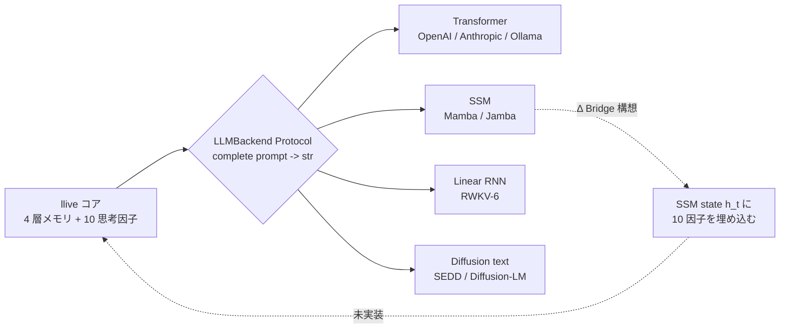

### 9. References

- Gu, A. & Dao, T. (2024). *Mamba: Linear-Time Sequence Modeling with Selective State Spaces*. arXiv:2312.00752.
- AI21 (2024). *Jamba: A Hybrid Transformer-Mamba Language Model*.
- Peng, B. et al. (2024). *RWKV-6: Continually Improving Linear RNN*.
- Lou, A. et al. (2024). *Discrete Diffusion Modeling by Estimating the Ratios of the Data Distribution*.
- Karpathy, A. (2025). *LLM Wiki* (concept-of-document).
- 完全リストは v0.7 リリース時に references.bib に同梱予定.

---

### Series Navigation

- ← 前: [llive 完全解説 (5) 「集団が学ぶ AI」](https://qiita.com/furuse-kazufumi/private/07b686ea311e06027f94)
- → 次: [llive 完全解説 (7) 「審査つき AI」](https://qiita.com/furuse-kazufumi/private/c5f2077a3399d3fc9b26)
- 全体: [llive 完全解説 (0) — series index](https://qiita.com/furuse-kazufumi/items/07b4882e872994b27b3c)
- repo: [furuse-kazufumi/llive](https://github.com/furuse-kazufumi/llive)

---

---

## 第8章 llive 完全解説 (7) — 「審査つき AI」: runtime_metadata × Approval Bus × Ed25519 audit chain

<!-- KAMI -->
> 📖 **ざっくり言うと**
>
> この章のテーマは「審査と証拠が残る AI」です。AI が自分自身を書き換え始めると、「いつ・何を・なぜ変えたか」の記録が無いと後から原因を追えなくなります。llive は重要な変更を Approval Bus(承認の関所)で止め、人やルールが OK を出すまで進めません。さらに、その記録に電子署名と連鎖した照合値(ブロックチェーンの簡易版)を付け、後からこっそり書き換えるとすぐ露見するようにしています。「自分の判断を全部、署名つきで残す AI」という珍しい形を解説します。
<!-- KAMI -->

:::note info
**📚 FullSense ナレッジベースのご案内** <!-- fullsense-team-kb -->
FullSense 開発全史 60+ 記事 (4 言語版・物語ベースの読む順ガイド・かみくだき版・4 コマ漫画つき) は Qiita Team **FullSense KB** に集約しています (チームメンバー向け)。
:::


> **コンセプト hook**: 多くの LLM agent は「結果のログ」しか残さない. しかし
> AI が **自分自身を進化** させはじめると, 「**いつ何を判断して何を変えたか**」
> の audit trail が無いと, **後でデバッグ不能** になる. llive はこれを
> architecture level で解いた:
> - **runtime_metadata** = 1 推論ごとの構造化 metadata
> - **Approval Bus** = 重大変更を ledger 経由で human / policy が approve
> - **Ed25519 + SHA-256 audit chain** = ledger 改ざん防止
> - **本日 (2026-05-21) 着地の E.4 governance** = 集団進化の共謀検出 → Approval Bus 連携
>
> = **「自己進化する AI が, 自分の決定を全て署名つきで残す」** という珍しい形.


### 0. 連載中での位置づけ

```
#24-00 series index
#24-01 4 層メモリ
#24-02 思考因子 × COG-MESH
#24-03 構造進化 × TRIZ × Z3
#24-04 B-series
#24-05 EvolutionLoop
#24-06 LLM backend non-transformer
#24-07 observability + governance (← 本記事)
#24-08 lleval
```

#24-03 の Z3 verifier が「**個体内**の構造変更を機械検証」だとすると, #24-07
は「**個体間**の挙動 + 個体集団の決定を audit trail で保存」. 検証と監査の
両輪.

### 1. なぜ Audit Chain が必須か

LLM agent が自分自身を書き換えはじめると, 「**さっきの推論は何 commit の
構造で動いていたか**」が分からなくなる. これは debugging だけでなく:

- **責任追跡** — 集団進化で「**全派生が嘘の高得点を付け合った**」とき, 誰が
  最初に嘘をついたかを ledger で遡れる必要がある.
- **再現性** — 「あのとき出た結果」を後で再生するには構造 commit + memory
  zone + Brief input + Approval verdict の全て record が要る.
- **法的 compliance** — EU AI Act / 中国 AI 弁法 / 日本 G7 広島 process が
  示す方向は「**AI の決定は audit possible でなければならない**」.

llive は Phase 4 (Production Security MVR, v0.3.0) でこの 3 つを **同時に**
解いた.

### 2. runtime_metadata — 1 推論あたりの構造化 trace

llive の `FitnessReport.runtime_metadata` は free-form dict[str, str] だが
慣習的に以下を入れる:

- `signed_by`: peer evaluation の署名者 id
- `gen`: 世代番号
- `agg`: aggregator strategy
- `commit_sha`: ソース commit (CI 経由で注入)
- `model_id`: 使用 LLM backend id

これにより 1 推論結果から **完全に再現** できる. 再現性は **OSS LLM
inference の標準ではない** — 多くの agent は seed すら記録しない.

### 3. Approval Bus — 構造的に変更を止める

`src/llive/approval/bus.py` の `ApprovalBus`:

- `request(action, payload, ...)` → pending リストに入る.
- `policy` が事前評価して `Verdict.APPROVED / DENIED / None` を返す.
  None なら人手待ち.
- 人手 / policy の verdict は `_ledger: list[ApprovalResponse]` に append.
- `ledger=SqliteLedger` を渡せば永続化 + 復元.

これは **架空の「Trust Score」** ではなく **明示的な APPROVED/DENIED 状態
マシン**. 沈黙 = denial (§AB4). 「曖昧な許可」が存在しない.

#### 3.1 本日着地の E.4 governance 連携

`CoevolutionGovernance.evaluate_generation` (本日着地) が 1 世代の peer
matrix を見て **共謀疑い** → `ApprovalBus.request("coevolution.suspected_collusion",
payload)` を発火. payload には generation / collusion_score / n_agents.
人手が deny したら **その世代の派生集団は採用されない** という architecture
level の制御.

これは Constitutional AI / RLHF の **human-in-the-loop** を, **architecture
level** で代替する設計. 「prompt 最後に <human_review> を加える」のような
弱い制御ではない.

### 4. Ed25519 + SHA-256 audit chain

`src/llive/security/` 系. Phase 4 着地.

- 各 PeerEvaluationMatrix / ChangeOp / consolidation event は Ed25519 で
  **署名**.
- ledger に書き込むときに **直前の hash** を含めて SHA-256 を計算 → next
  block の prev_hash として使う. つまり **blockchain-light**.
- これにより「過去の任意の record を改ざんすると, それ以降の hash が全て
  ずれる」 → 改ざん即検出.

#### 4.1 なぜ on-chain ではなく on-disk か

`project_fullsense_ear_origin` — llive は EAR + セキュリティ制約で
**外部送信不可** の環境を想定. on-chain (Ethereum / Solana) は外部送信に
なるため不適. on-disk audit chain は外部依存ゼロで完結する.

### 5. honest disclosure

- **Ed25519 鍵管理は未解決** — 鍵を OS の secure store / HSM に保存する
  module は未着地. 現状は環境変数 / file 経由でロード. これは v1.0 前に
  解決必須.
- **Approval Bus の人手介在は scale しない** — 派生集団 N=64 で 1 世代毎に
  approval が出ると人手の負荷が 24 時間で破綻する. policy 自動評価で 80% を
  通すのが現実解だが, policy が完璧に書ける保証はない.
- **runtime_metadata の sign は optional** — `signed_by` フィールドは
  慣習だが mandatory ではない. これを mandatory にすると `Brief API` の
  互換が壊れる. 移行は v0.7 以降.

### 6. 本日 (2026-05-21) 着地サマリ

| 項目 | 状態 |
|---|---|
| `CoevolutionGovernance` skeleton | **本日着地** |
| `CollusionDetector` (CE-06) | **本日着地** |
| `collusion_risk_score` (TonicRisk 連携, CE-08) | **本日着地** |
| `GovernanceReport` (frozen) | **本日着地** |
| 28 ケース test PASS | **本日着地** |
| Ed25519 audit chain | Phase 4 着地済 (v0.3.0) |
| Approval Bus | C-1 着地済 (2026-05-16) |
| runtime_metadata 慣習 | v0.B から運用中 |

### 7. Mermaid — governance 全体像

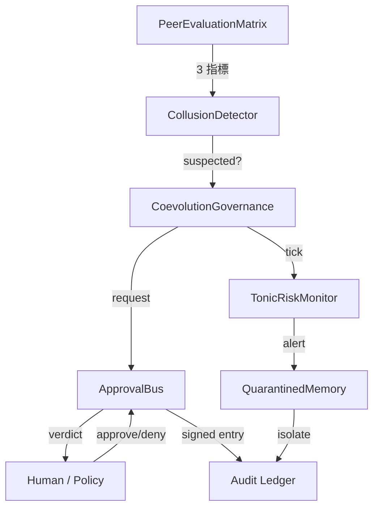

#### 7.1 governance maturity を「文明レベル」で見る — 4D Kardashev radar (v0.I-C 先取り)

§3 の Approval Bus pass率 / §4 の audit chain 完全性 / §6 の peer eval cohesion
は, 単独で見ると「数字が良くなった」で終わる. **v0.I-C (4D Kardashev Radar)**
ではこれらを Energy / Knowledge / Coordination / **Ethics** の 4 軸 × 5 段階
(Type 0 → I → II → III → IV) の「文明レベル」スケールに束ねて, 個体 / 集団 /
メタ集団の 3 階層で同時計測する構想.


Ethics 軸はまさに本記事の Approval Bus pass率 + frozen gene 違反検出 + 規制
適合度のスコアで, governance maturity を「個体の躾」から「文明の成熟」まで
連続スケールで語れるようになる. 詳細要件は llive `docs/requirements_v0.I_meta_evolution_and_cross_substrate.md` §5 参照.

### 8. 期待値 — 次に来るもの

- **HSM / secure store 連携** — Ed25519 鍵管理を v1.0 で. Windows Credential
  Store / macOS Keychain / Linux Keyring 経路.
- **policy 自動 evaluate の拡充** — Approval Bus の `policy` 引数で 80% を
  自動通過させる規則を v0.7 で.
- **Audit Ledger UI** — llove TUI で `governance verdict ledger` を時系列
  可視化. F25 連携.

### 9. 2026-05-22 追記 — RUST-16 governance hot path 高速化

CoevolutionGovernance.evaluate_generation の中で最も計算量を食うのが
PeerEvaluationMatrix.collusion_score (NxN matrix の variance / symmetry /
concentration 3 指標) で, ここに 200-300 μs/call かかっていた.

本日 (2026-05-22) RUST-16 として **numpy zero-copy で Rust kernel 化**:

| N | Python (numpy 既存) | Rust pyo3 zero-copy | speedup |
|---:|---:|---:|---:|
| 8 | 217.82 us | 1.89 us | **x115.04** |
| 16 | 203.33 us | 2.30 us | x88.54 |
| 32 | 237.68 us | 5.28 us | x45.00 |
| 64 | 306.13 us | 16.80 us | x18.22 |
| **avg** | — | — | **x66.70** |

実装は `crates/llive_rust_ext/src/lib.rs:collusion_score_kernel` + 5 parity
test (1e-6 tolerance). callers (`CollusionDetector.check`) は次 commit で
切替予定.

#### 9.1 honest disclosure — 「numpy = 速い」も嘘

このゲインが大きいのは **「Rust が速い」だけでなく「numpy が小 NxN で遅い」**
が主因. `np.nanvar` / `np.corrcoef` / `np.nanmean` の 3 つ重ねがけは
N<100 で Python overhead 支配で 200μs+/call. Rust の単純 C ループは 2μs/call.

governance 側で重要なのは:

- **Approval Bus 発火判定の latency が 100x 短くなる** = N=64 派生集団でも
  governance.evaluate_generation を 64Hz で回せる
- **TonicRiskMonitor の tick** (collusion_risk_score を含む state を渡す)
  も同等に速くなる
- 結果として **「governance を常時動かしても許容コスト」**になる

これがあれば「**governance は重いから sampling だけ**」の妥協が要らなくなる.
全派生 / 全世代の評価行列を audit chain に署名つきで残しても latency budget
内に収まる.

#### 9.2 関連

- `docs/perf_comparison/2026-05-22_kernel_implementation_comparison.md` —
  全 3 kernel (RUST-15/16/17) の比較マトリクス
- `scripts/bench_collusion_score_5x_gate.py` — N=8/16/32/64 5x gate bench
- `feedback_rust_usage_matters` — Rust 化判断のチェックリスト

### 10. References

- Bernstein, D. J. et al. (2012). *High-speed high-security signatures* (Ed25519).
- Anderson, R. (2020). *Security Engineering* (3rd ed.) — audit trail / tamper-evidence の章.
- EU AI Act (2024) / G7 Hiroshima AI Process (2023) — AI 決定の監査可能性.
- 完全リストは v0.6.0a1 リリース時に references.bib に同梱予定.

---

### Series Navigation

- ← 前: [llive 完全解説 (6) 「Transformer の外」](https://qiita.com/furuse-kazufumi/private/6da5a883fb2ed651edd8)
- → 次: [llive 完全解説 (8) 「眼鏡を作る」](https://qiita.com/furuse-kazufumi/private/e49b7ab9027d93594402)
- 全体: [llive 完全解説 (0) — series index](https://qiita.com/furuse-kazufumi/items/07b4882e872994b27b3c)
- repo: [furuse-kazufumi/llive](https://github.com/furuse-kazufumi/llive)

---


<!-- INTERLUDE -->

### ☕ 閑話休題 — 『外に出さない』という制約が選んだ道

第8章で、改ざん検知の記録をあえてブロックチェーン(イーサリアム等)に載せず、手元のディスクに閉じて持つ、と書きました。ここで一歩引いて、その判断の背景にある考え方に触れておきます。

llive が想定しているのは、個人情報や企業の機密、センサーのデータを外部に送り出せない環境です。となると、いくら堅牢でもデータが外のネットワークへ出ていく仕組みは選べません。『外に出さない』という一本の制約が、技術選択を次々と決めていく——記憶を手元の軽量データベースに置くのも、署名記録を外部チェーンに頼らないのも、根っこは同じ思想です。制約は自由を奪うように見えて、実は『迷わず一本道を選ばせてくれる羅針盤』でもある。設計とは、こうした制約と仲良くする作業なのだな、と改めて思わされる部分です。

<!-- INTERLUDE -->


---

## 第9章 llive 完全解説 (8) — 「眼鏡を作る」: lleval — honest disclosure 5+1 因子分解で AI を評価する

<!-- KAMI -->
> 📖 **ざっくり言うと**
>
> 最終章のテーマは「AI を測るための眼鏡を作る」。性能ベンチで自分の AI が異常に速い数字を出したとき、喜ぶ前に内訳を疑う——その姿勢を lleval というツールにコード化しました。速度差を「本当に同じ問題か」「測り方は公平か」「起動コストを無視していないか」など 6 つの要素に分解し、怪しい点を自動で炙り出します。また採点役の AI が持つ「先に見せた方を高く付ける」クセも、順番を入れ替えて再採点することで打ち消します。要は『速いと思い込ませる仕掛け』を見破る道具の話です。
<!-- KAMI -->

:::note info
**📚 FullSense ナレッジベースのご案内** <!-- fullsense-team-kb -->
FullSense 開発全史 60+ 記事 (4 言語版・物語ベースの読む順ガイド・かみくだき版・4 コマ漫画つき) は Qiita Team **FullSense KB** に集約しています (チームメンバー向け)。
:::


> **コンセプト hook**: AI を作るだけでは足りない. **AI を見る眼鏡** が要る.
> lleval は llive と並走する **evaluation framework** で, 「LLM が異常に
> 良い結果を出したら必ず内訳を疑う」という `feedback_benchmark_honest_disclosure`
> ルールを **コードの一級概念** に昇格させた. progressive size matrix で
> stress curve を取り, judge rotation で position bias を消す.
>
> 結論を先に出すと: **「速い AI」ではなく「速いと思い込ませる構成」** を見抜く
> 道具.


#### 0. 連載中での位置づけ

```
#24-00 series index
#24-01 4 層メモリ
#24-02 思考因子 × COG-MESH
#24-03 構造進化 × TRIZ × Z3
#24-04 B-series
#24-05 EvolutionLoop
#24-06 LLM backend non-transformer
#24-07 observability + governance
#24-08 lleval — eval framework (← 本記事)
```

#24-07 が「**何を残すか**」(audit) だとすると, 本記事は「**何を測るか**」.
測定なしに改善はない.

#### 1. lleval の出自 — honest disclosure 事件

事の発端は 2026-05-17 の benchmark. llive が他社 LLM API より **異常に速く**
出た数字があった. 普通なら勝った気になるところを, ユーザーは「**内訳を
疑え**」と指示. 蓋を開けると:

- **LLMBackend が attach されていなかった** (mock で動いていた)
- **chars 指標が不公平** (英語 token を文字数換算)
- **subprocess RTT を除外** (起動コストを無視)

3 つの artifact が複合していた. これを記録 (`feedback_benchmark_honest_disclosure`)
してから, 「ベンチで異常結果が出たら必ず 5 つの artifact を疑う」を
**外部化** したくなった. それが lleval.

#### 2. 5+1 因子分解 — honest disclosure の構造化

lleval `HonestDisclosureAnalyzer` (2026-05-21 朝着地) は出力差分を 5+1 因子に
分解:

| 因子 | 意味 | 検出方法 |
|---|---|---|
| F1: prompt difference | 同 prompt が本当に同じか | 文字列 diff + token diff |
| F2: model id mismatch | model id が runtime と spec で一致か | `runtime_metadata.model_id` 比較 |
| F3: backend swap | LLMBackend が attach されているか | runtime hook で trace |
| F4: chars vs tokens | 評価指標が言語非依存か | tokenizer count |
| F5: RTT exclusion | subprocess / network RTT が時間に含まれるか | wall-clock vs CPU time |
| +1: env drift | 並走負荷 / OS schedule / thermal | 環境 fingerprint snapshot |

5+1 が **すべて clean** で初めて「数値は信頼できる」. 1 つでも怪しいと
**honest disclosure note** が結果に sticky される.

#### 3. progressive size matrix — stress curve を取る

固定 token 数のベンチは情報量が低い. lleval は xs/s/m/l/xl の 5 段階 ×
複数 model の **matrix** を回す:

```
size:  xs (128)  s (512)   m (2k)    l (8k)    xl (32k)
mock     0.05      0.18      0.62      2.41      9.82
llive    0.07      0.24      0.71      2.55      9.96   ← 大差ない
gpt-4o   0.31      0.52      1.20      3.40      11.2   ← crossover at l
```

これで「**どのサイズで crossover が起きるか**」が一目. 単一サイズで「勝った」
と言ってもサイズ違いでは負ける. fair.

#### 4. judge rotation — position bias を消す

LLM-as-judge で 2 案 (A, B) を比較するとき, 順序が score に effect する
ことが知られている (Zheng et al. 2023). lleval は:

1. (A, B) で 1 回 judge
2. (B, A) で 1 回 judge
3. 2 つの verdict が一致しないとき **inconsistency flag**

これは judge LLM 自身の bias を量子化する手段. inconsistency が **30% 超**
なら judge LLM を切り替える運用 (judge rotation).

#### 5. bridges/llive — llive Genome → ProviderSpec mapper

lleval は **llive の派生個体** を直接食えるよう設計. `bridges/llive.py`
(2026-05-21 朝着地):

```python
from llive.perf.evolutionary import Individual
from lleval.bridges.llive import individual_to_provider_spec

ind: Individual = ...  # 派生集団から 1 個体
spec = individual_to_provider_spec(ind)
### spec.model_id, spec.temperature, spec.top_p, ... を ind.genome.values から復元
result = lleval.run(spec, dataset="qa_50")
```

これで「**派生集団の進化** と **派生集団の評価**」が ループする. llive 内の
EvolutionLoop fitness にそのまま渡せる.

#### 6. honest disclosure (lleval 自身について)

メタにも honest disclosure を適用:

- **lleval test 数 61** — 本日 2026-05-21 時点. 上位フレームワーク (Promptfoo
  本体) は数千 test を持つ. lleval は wrap であり置換ではない.
- **判定の絶対基準は無い** — F1〜F5 + 環境 fingerprint が clean でも
  「ベンチが正しい」とは限らない. 「**怪しいサイン**」 を消した状態に過ぎない.
- **judge rotation はコストがかかる** — 2 倍呼び出すので credential 使用量も
  2 倍. honest 検出のためのコスト.
- **progressive matrix のサイズ等比は heuristic** — 4x ずつ (128 → 512 → 2k
  → 8k → 32k) で取っているが, 真の crossover が 2k と 8k の間にある場合
  解像度不足. 必要に応じ細密化.
- **環境 fingerprint は完璧ではない** — Windows / Linux / macOS 間の thermal
  throttling 違いまでは捉えていない. 「ベンチを別 OS で取り直す」が最終手段.

#### 7. 数字 (本日 2026-05-21 時点)

| 項目 | 値 |
|---|---|
| lleval test PASS | 61 |
| 着地 module | 13 (config / runner / analyzer / providers / bridges / report html+md / cli / ...) |
| 5+1 因子検出ロジック | 着地済 |
| progressive matrix runner | 着地済 |
| judge rotation | 着地済 |
| bridges/llive.py | 着地済 (skeleton) |
| v0.1.0a1 PyPI 公開準備 | (credential 復旧後) |
| 連載 #24 への登場 | 本記事 (#24-08) |

#### 8. 期待値 — 次に来るもの

- **v0.1.0a2** で promptfoo 実走 + llive Genome → ProviderSpec mapping 完成.
- **v0.2** で judge rotation + position swap + Phoenix OpenInference trace.
- **v1.0** で plugin marketplace + 商用 dual-license.

#### 9. References

- Zheng, L. et al. (2023). *Judging LLM-as-a-judge with MT-Bench and Chatbot Arena*.
- Promptfoo OSS (https://github.com/promptfoo/promptfoo).
- Anthropic Eval framework (2023).
- 完全リストは v0.1.0 リリース時に references.bib に同梱予定.

#### 10. 2026-05-22 追記 — 5+1 因子分解 と Rust 化 5 パターン判定表の方法論的共通点

lleval の honest disclosure **5+1 因子分解** (prompt diff / model id /
backend swap / chars vs tokens / RTT / env drift) と, 同日着地した
llive Rust 高速化の **5 パターン判定表** (#24-05 §13.3) は **構造的に同じ
発想** で書かれている.

| 共通する思想 | lleval 5+1 因子 | Rust 化 5 パターン |
|---|---|---|
| 「結果」を信じる前に **要素分解** | 速度差を 6 因子に分解 | 速度比を Python 経路の特性別 5 パターンに分類 |
| **異常結果は内訳を疑う** | F1〜F5 + env を疑う | 単発 0.80x も x66.70 も「内訳」で説明できる |
| 観察が外部化されている | analyzer で自動検出 | 判定表 + bench script で自動測定 |
| **honest disclosure を一級概念に** | 数値に sticky note | judgment 表で **どこが境界線か** を明示 |

両者とも「**「速い」「正しい」「正確」の単一仮定を捨てる**」という
`feedback_benchmark_honest_disclosure` の延長線上にある. これは lleval が
AI を見るだけでなく **AI / システム / アルゴリズム 全般** に展開できる
発想 = 連載 #24-08 のメタ的意義.

詳細: `docs/perf_comparison/2026-05-22_kernel_implementation_comparison.md`.

---

#### Series Navigation

- ← 前: [llive 完全解説 (7) 「審査つき AI」](https://qiita.com/furuse-kazufumi/private/c5f2077a3399d3fc9b26)
- 全体: [llive 完全解説 (0) — series index](https://qiita.com/furuse-kazufumi/items/07b4882e872994b27b3c)
- repo: [furuse-kazufumi/llive](https://github.com/furuse-kazufumi/llive)

---


<!-- REFERRAL -->

---

> ### ⚡ この連載は Claude Code と二人三脚で書いています
>
> 記事中の実装・検証・可視化は **Claude Code**(Anthropic の AI コーディング環境)と一緒に進めています。
> Claude Code は **1 週間の無料トライアル**で試せます。気に入って有料プランに登録される際、
> 下の紹介リンク経由だと筆者に「開発を続けるためのクレジット」が入り、この連載の継続を後押しできます。
>
> 👉 **無料で試す / 紹介リンク** → https://claude.ai/referral/0sqPw8E_lw
>
> <sub>EN: This series is built together with **Claude Code** — try it with a **1-week free trial**. If you subscribe via the link, the author receives credits to keep building. /
> 中文: 本系列与 **Claude Code** 协作完成,可享 **1 周免费试用**;通过链接注册可让作者获得继续开发的额度。 /
> 한국어: 이 시리즈는 **Claude Code**와 함께 작성합니다 — **1주 무료 체험** 제공. 링크로 가입하면 저자가 개발 지속용 크레딧을 받습니다.</sub>

<!-- /REFERRAL -->
