# llive 완전 해설 모음 — 잊지 않는 LLM / 10축 사고 / 계산 가능한 모순 / 수렴하는 뇌 / 집단 진화 / 탈Transformer / 심사 붙은 AI / 평가

<!-- TOPICNAV -->
> **🌐 언어**: [日本語](https://qiita.com/furuse-kazufumi/items/07b4882e872994b27b3c) | [English](https://qiita.com/furuse-kazufumi/items/07b686ea311e06027f94) | [中文](https://qiita.com/furuse-kazufumi/items/6da5a883fb2ed651edd8) | **한국어**
>
> **📚 FullSense 모음 시리즈**
> - [llcore 검증 arc 모음](https://qiita.com/furuse-kazufumi/items/a5ebb3992e4c28862f47)
> - [lldarwin / 진화 arc 모음](https://qiita.com/furuse-kazufumi/items/951b94cf66d246723004)
> - **llive 완전 해설 모음（this）**
> - [llmesh 모음](https://qiita.com/furuse-kazufumi/items/fcb43968a5c642610762)
> - [쉬운 설명 모음](https://qiita.com/furuse-kazufumi/items/e5093e4816b25c1bd4d0)
<!-- /TOPICNAV -->

## 목차

1. [llive 완전 해설 (0) — series index: 8 대분류 글 + 전체도](#제1장-llive-완전-해설-0--series-index-8-대분류-글--전체도)
2. [llive 완전 해설 (1) — "잊지 않는 LLM": 4층 메모리 + Bayesian surprise gating](#제2장-llive-완전-해설-1--잊지-않는-llm-4층-메모리--bayesian-surprise-gating)
3. [llive 완전 해설 (2) — "10개 축으로 사고하는 AI": 사고 인자 × COG-MESH × 삼중 줄무늬](#제3장-llive-완전-해설-2--10개-축으로-사고하는-ai-사고-인자--cog-mesh--삼중-줄무늬)
4. [llive 완전 해설 (3) — "모순은 계산할 수 있다": 구조 진화 × TRIZ 40 원리 × Z3 검증](#제4장-llive-완전-해설-3--모순은-계산할-수-있다-구조-진화--triz-40-원리--z3-검증)
5. [llive 완전 해설 (4) — "수렴하는 뇌" B-series: SynapticSelector / UCB1 / Hebbian / 프로덕션 hot path](#제5장-llive-완전-해설-4--수렴하는-뇌-b-series-synapticselector--ucb1--hebbian--프로덕션-hot-path)
6. [llive 완전 해설 (5) — "집단이 학습하는 AI": v0.B/C/D/E 파생 집단 진화 총괄](#제6장-llive-완전-해설-5--집단이-학습하는-ai-v0bcde-파생-집단-진화-총괄)
7. [llive 완전 해설 (6) — "Transformer 의 밖": Mamba / Jamba / RWKV / Diffusion 을 llive 내부에서 호출하기](#제7장-llive-완전-해설-6--transformer-의-밖-mamba--jamba--rwkv--diffusion-을-llive-내부에서-호출하기)
8. [llive 완전 해설 (7) — "심사가 붙은 AI": runtime_metadata × Approval Bus × Ed25519 audit chain](#제8장-llive-완전-해설-7--심사가-붙은-ai-runtime_metadata--approval-bus--ed25519-audit-chain)
9. [llive 완전 해설 (8) — 「안경을 만든다」: lleval — honest disclosure 5+1 인자 분해로 AI 를 평가한다](#제9장-llive-완전-해설-8--안경을-만든다-lleval--honest-disclosure-51-인자-분해로-ai-를-평가한다)


---

## 제1장 llive 완전 해설 (0) — series index: 8 대분류 글 + 전체도

:::note info
**📚 FullSense 지식 베이스 안내** <!-- fullsense-team-kb -->
FullSense 개발 전사 60+ 편 (4개 언어판・스토리 기반 읽기 순서 가이드・쉬운 설명판・4컷 만화 포함) 은 Qiita Team **FullSense KB** 에 모여 있습니다 (팀 멤버 전용).
:::


> **콘셉트 hook**: **llive (FullSense ™의 사고층)를 구성하는 기술 / 알고리즘**을
> 명칭별로 해설하는 series의 입구다. 한 글에 담으면 약 8만 자가 되므로 **8 대분류
> 글**로 나눴다. 본 index는 전체 지도 — 어느 장에서 무엇을 읽을 수 있는지를 나타낸다.

### 0. 이 series에 대하여

llive는 「LLM 본체가 아니라 LLM 주위에 씌우는 인지 OS」다. 그 내부를
**4층 (인지 / 최적화 / 실행 / 횡단) × 8장**으로 나누어, 각 장에서 구체적인 class /
function / 기능명까지 내려가 해설한다. 각 글은 다음 공통 구조를 가진다:

- **서두 hook** (8초로 「이것은 무엇인가」)
- 구체적인 class / function 명까지 내려간 소절
- 실제 코드로의 **GitHub link**
- **References** (학술 / OSS / 내부)
- **cross-link** (이전 / 다음 / 본 index / repo)

합계 **약 8만 자**. ja Qiita + en Medium을 병행한다.

### 1. Series 구성 (8 대분류)

| # | 제목 (클릭으로 각 장) | 중분류 | 가시성 |
|---|---|---|---|
| 01 | [**memory layer** — 4층 메모리](https://qiita.com/furuse-kazufumi/items/a5ebb3992e4c28862f47) | semantic / episodic / structural / parameter / surprise gating | 🟢 공개 |
| 02 | [**사고 인자 + COG-MESH** — 10 인자와 9 component](https://qiita.com/furuse-kazufumi/items/bdfad6db3f2e70c40511) | 구조화 / 재구성 / 폐루프 / ... / proactive / quarantine / 5W1H | 🟢 한정 공유 |
| 03 | [**구조 진화 (TRIZ × Z3)**](https://qiita.com/furuse-kazufumi/items/fa0890f136636d495ea6) | TRIZ 40 원리 / ChangeOp / verifier / 9 화법 | 🟢 한정 공유 |
| 04 | [**수렴형 최적화 (B-0..B-9)**](https://qiita.com/furuse-kazufumi/items/e5093e4816b25c1bd4d0) | SynapticSelector / UCB1 / Hebbian / 프로덕션 hot path | 🟢 한정 공유 |
| 05 | [**진화형 최적화 (v0.B/C/D/E)**](https://qiita.com/furuse-kazufumi/items/07b686ea311e06027f94) | Genome / Crossover / Tournament / Mutation / lineage | 🟢 한정 공유 |
| 06 | [**LLM backend 층** — non-transformer](https://qiita.com/furuse-kazufumi/items/6da5a883fb2ed651edd8) | Mamba / Jamba / RWKV / Diffusion / 사고 인자→SSM Δ Bridge | 🟢 한정 공유 |
| 07 | [**관측 + 통치**](https://qiita.com/furuse-kazufumi/items/c5f2077a3399d3fc9b26) | runtime_metadata / Approval Bus / governance / honest disclosure | 🟢 한정 공유 |
| 08 | [**lleval (eval framework)**](https://qiita.com/furuse-kazufumi/items/e49b7ab9027d93594402) | progressive size matrix / 5+1 축 / judge rotation | 🟢 한정 공유 |

> 🟢 공개 = Qiita 홈 / 검색 결과에 노출. 🟡 한정 공유 = URL을 아는 사람만 열람. 공개 승격은 연재 순서 (01 → 02 → … → 08)로 순차 예정.

### 2. 전체도 (8 layer의 관계)

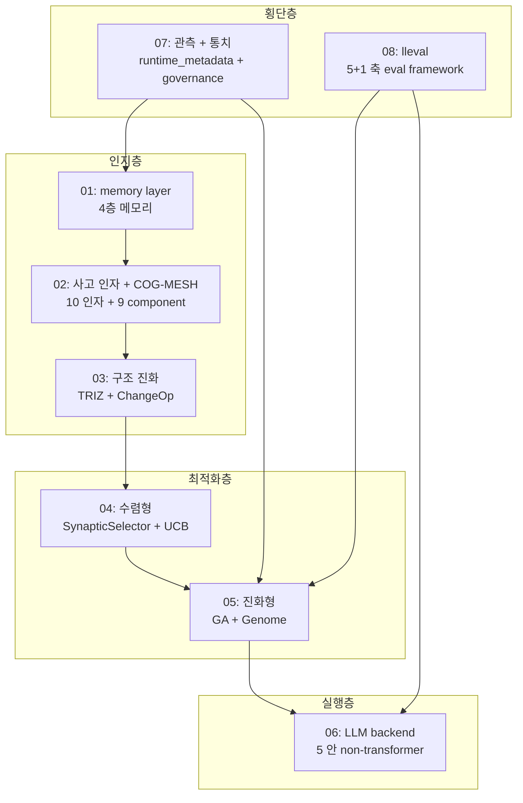

세로 「**인지층 → 최적화층 → 실행층**」이 llive의 처리 flow,「**관측 + 통치**」「**lleval**」
이 횡단층으로서 모든 layer에 작용하는 구조다.

### 3. 상정 독자

- **엔지니어** (Python + LLM 기초 지식 보유)
- **AI researcher** (LLM 주변 아키텍처에 관심)
- **개인 OSS author** (구현 패턴의 참고)
- **기업 R&D** (on-prem LLM stack 검토 자료)

### 4. 공개 순서 (주 2편 페이스)

| 주 | 공개 글 |
|---|---|
| Week 1 | 01 memory + 02 사고 인자 |
| Week 2 | 03 구조 진화 + 04 수렴형 |
| Week 3 | 05 진화형 + 06 LLM backend |
| Week 4 | 07 관측통치 + 08 lleval |

각 글의 en 버전은 Medium에 병행한다.

### 5. 연재를 관통하는 테마 — 「빠름」은 구현 방법으로 자릿수가 바뀐다

연재 중핵 #24-05에서 다루는 파생 집단 진화의 hot path 3개를 Rust화한 실측:

- **RUST-15** persona_dissimilarity_pairwise: avg **x12.71** (batch)
- **RUST-16** collusion_score_kernel: avg **x66.70** (numpy 작은 N hot path)
- **RUST-17b** novelty_score_batch (rayon + quickselect): avg **x9.32**

「**Rust화 = 빠름」은 거짓 /「numpy = 빠름」도 거짓** — 결과는 구현 방법 (FFI 경계 /
batch / numpy zero-copy / 병렬도 / partial sort)에 따라 자릿수가 달라진다. 이
honest disclosure의 자세가 연재 전체의 통주저음이다. 5 패턴 판정표는 #24-04 /
#24-05 / #24-07에서 상술한다.

### 6. References (본 index)

- [furuse-kazufumi/llive](https://github.com/furuse-kazufumi/llive) — 본체 repo
- FullSense Spec v1.1 (llive `docs/`)
- 각 장의 References는 각자 글에 기재

---

### Series Navigation

- → 다음: [llive 완전 해설 (1) 「잊지 않는 LLM」](https://qiita.com/furuse-kazufumi/items/a5ebb3992e4c28862f47)
- repo: [furuse-kazufumi/llive](https://github.com/furuse-kazufumi/llive)

---

## 제2장 llive 완전 해설 (1) — "잊지 않는 LLM": 4층 메모리 + Bayesian surprise gating

:::note info
**📚 FullSense 지식 베이스 안내** <!-- fullsense-team-kb -->
FullSense 개발 전사 60+ 편 (4개 언어판・스토리 기반 읽기 순서 가이드・쉬운 설명판・4컷 만화 포함) 은 Qiita Team **FullSense KB** 에 모여 있습니다 (팀 멤버 전용).
:::


### 0. 이 글은 무엇인가 (8초 read)

**LLM 본체가 아니라 LLM 주위에 씌우는 인지층** llive의 **4층 메모리 + 1개의 surprise gate**를 해설한다. semantic / episodic / structural / parameter의 역할이 다른 4종류의 기억을, **「놀라움」(surprise)**이 높은 것만 기록하는 설계다. Faiss + DuckDB + Kùzu + safetensors의 조합으로, **on-prem만으로 동작한다**.

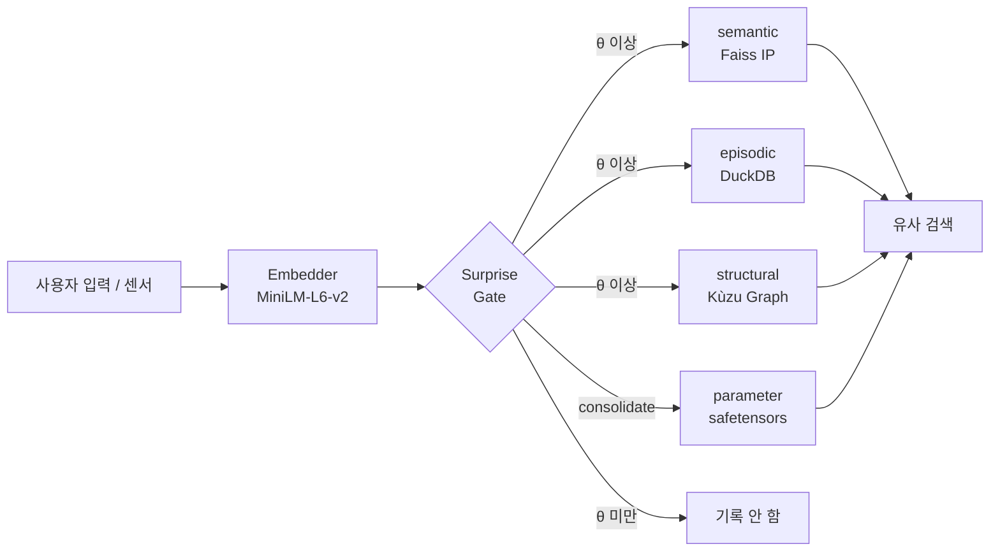

「전부 기록」이 아니라 「놀라움으로 취사선택」이 핵심이다. 자세한 내용을 차례로 풀어간다.


### 1. 왜 4층으로 나누는가

인간의 인지과학에서 기억은 **의미 기억 / 사건 기억 / 구조 기억 / 절차 기억**으로 역할이 나뉜다. llive는 이것을 그대로 LLM 주변 아키텍처에 이식했다.

| 층 | 무엇을 넣는가 | 구현 |
|---|---|---|
| **semantic** | 개념의 의미 (문장 + 임베딩) | Faiss IP index + JSONL |
| **episodic** | 시계열 이벤트 | DuckDB append-only log |
| **structural** | 개념 간의 관계 (그래프) | Kùzu graph DB |
| **parameter** | 파라미터 갱신 차분 | safetensors + index DB |

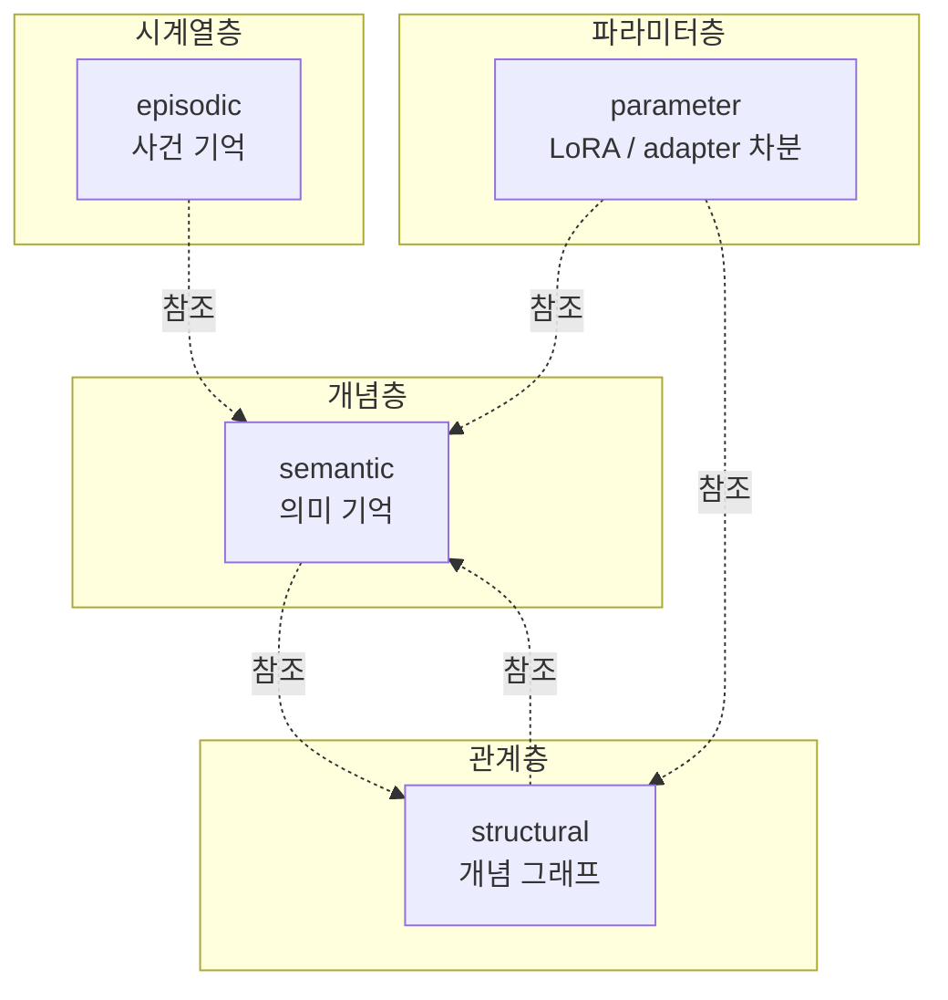

4층은 **느슨한 결합**이다. semantic만 쓸 수도, structural을 엮을 수도 있다. 「LLM은 텍스트밖에 다루지 못한다」는 제약에서 벗어나기 위해, 구조 (graph)와 시간 (event log)을 별도 레이어로 가지는 것이 llive의 발상이다.

— **일단 정리** —

여기까지 읽으면 「**4층 + surprise gate**로 취사선택하는 기억 기반」을 파악했을 것이다. 다음부터 각 층의 내용을 구현 기반으로 살펴본다.

### 2. semantic memory (의미 기억, MEM-01)

#### 역할

「그 논의에서 나온 **개념**은 이것이었다」를 끌어내는 층. 텍스트를 임베딩 벡터로 변환하여 **코사인 유사도**로 근방 검색한다.

#### 핵심 구조

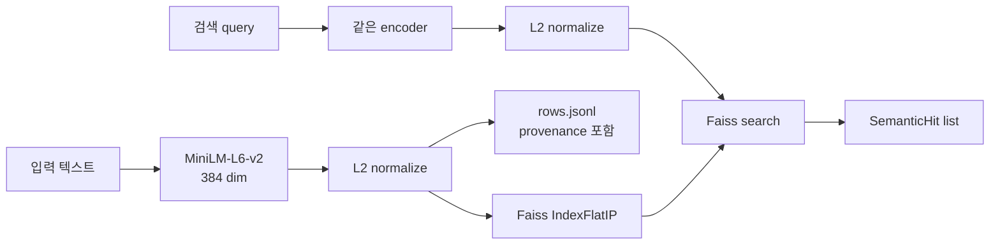

L2 normalize 후의 내적은 **코사인 유사도**와 등가다. 이것이 `Faiss IndexFlatIP`를 선택한 이유다.

구현: [`src/llive/memory/semantic.py`](https://github.com/furuse-kazufumi/llive/blob/main/src/llive/memory/semantic.py)

#### 설계 판단

- **fallback path**: faiss가 없는 환경 (Windows CI 등)에서는 numpy로 nearest neighbor가 동작한다. test와 production에서 구현을 나누지 않고, **양쪽 모두 수정 없이 동작**하게 한다.
- **provenance 필수**: 모든 entry에 `Provenance(source_type, source_id, derived_from, ...)`를 가지게 한다. 「이 기억이 어디에서 왔는가」를 절대 지우지 않는 설계다.
- **영속화**: `index.faiss` (or `index.npy`) + `rows.jsonl`로 SSD에 기록한다.

#### 코드 발췌

```python
class SemanticMemory:
    def __init__(self, dim: int, data_dir: Path | str | None = None,
                 use_faiss: bool | None = None) -> None:
        self.dim = int(dim)
        self.data_dir = Path(data_dir) if data_dir else _default_data_dir()
        # faiss가 없으면 numpy fallback
        self.use_faiss = bool((use_faiss is None) and _HAS_FAISS or use_faiss)
        ...
```

「**production에서는 faiss, CI에서는 numpy**」가 투명하게 전환된다.

— **잠깐 쉬기** —

첫 1층에서 「임베딩 + cosine + provenance」라는 llive의 **3가지 장비**가 모두 갖춰졌다. 나머지 3층은 이 장비의 사용법이 다를 뿐이다.

### 3. episodic memory (사건 기억, MEM-02)

#### 역할

「**언제** 그 정보를 받았는가」를 보존한다. **append-only 시계열 로그**로, 편집도 삭제도 하지 않는다.

#### 핵심 구조

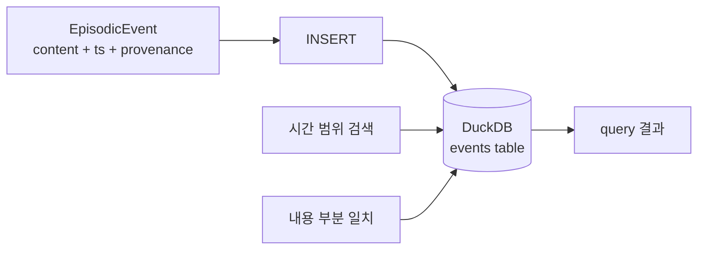

| 컬럼 | 형 | 역할 |
|---|---|---|
| event_id | TEXT PK | uuid hex |
| ts | TIMESTAMP | UTC 엄수 |
| content | TEXT | 본문 |
| metadata | TEXT (JSON) | 확장 |
| provenance | TEXT (JSON) | 내력 |

구현: [`src/llive/memory/episodic.py`](https://github.com/furuse-kazufumi/llive/blob/main/src/llive/memory/episodic.py)

#### 설계 판단

- **DuckDB를 선택한 이유**: SQLite보다 분석 쿼리가 빠르고, in-process라서 외부 프로세스가 불필요. 「on-prem만으로 동작」 제약에 직접 효과적이다.
- **UTC 엄수**: `datetime.now(UTC)`로 취득. 로컬 TZ 혼입은 버그의 근원.
- **append-only**: `record(event)`만 제공. `delete()` API는 존재하지 않는다. 사양상 삭제 불가다.

#### 왜 삭제하지 않는가

인간의 사건 기억도 「잊은」 것처럼 보여도, 신경과학적으로는 잠재해 있다. llive도 마찬가지로 **「접근되지 않는 기억」과 「없는 기억」을 구별**한다. 접근되지 않으면 Surprise Gate (후술)가 재기록을 억제하므로, 「노이즈가 되는」 일은 적은 설계다.

### 4. structural memory (구조 기억, MEM-05)

#### 역할

「개념 A와 개념 B가 **어떻게 관계하는가**」를 나타내는 graph. semantic이 「점」이라면 structural은 「변」이다.

#### 핵심 구조

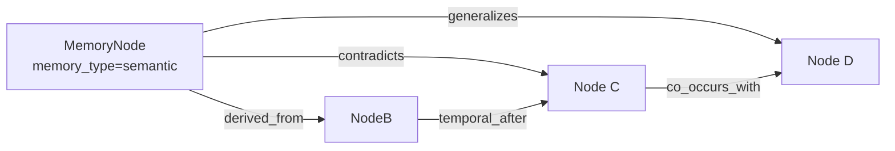

**관계 종류 (6종)**:

| rel_type | 의미 |
|---|---|
| `derived_from` | 유래 |
| `contradicts` | 모순 |
| `generalizes` | 일반화 |
| `temporal_after` | 시간적 후속 |
| `co_occurs_with` | 공기 (共起) |
| `linked_concept` | 개념 연결 |

구현: [`src/llive/memory/structural.py`](https://github.com/furuse-kazufumi/llive/blob/main/src/llive/memory/structural.py)

#### Kùzu를 선택한 이유

- **embedded graph DB**: Neo4j 같은 별도 프로세스가 불필요
- **Cypher 풍 쿼리**: ANSI 쪽이라 학습 비용이 낮음
- **on-prem 일관**: 기술한 방침과 정합

#### `contradicts`가 있는 의미

「LLM의 응답이 모순된다」를 **데이터 구조로 검출**할 수 있다. RAG로는 잡기 어려운 「다른 시기에 쓰여진 사양의 불일치」가, structural memory의 엣지 주행으로 떠오르는 장치다.

— **잠깐 쉬기** —

여기까지 「**의미 → 시간 → 관계**」 3층이 갖춰졌다. 다음 parameter 층은 조금 결이 다르다.

### 5. parameter memory (파라미터 기억, MEM-06)

#### 역할

**LoRA / IA3 / prefix adapter** 등의 파라미터 차분을 **기억으로서** 관리한다. 「대화에서 얻은 지식을 Loop 후에 LoRA에 굽는」 식의 사용법이다.

#### 핵심 구조

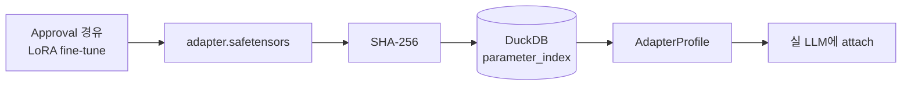

| 컬럼 | 역할 |
|---|---|
| id | uuid hex |
| name | 표시명 |
| format_tag | "lora" / "ia3" / "prefix" 등 |
| sha256 | 변조 검출 |
| size_bytes | 크기 |
| created_at | UTC |
| provenance | 내력 |

구현: [`src/llive/memory/parameter.py`](https://github.com/furuse-kazufumi/llive/blob/main/src/llive/memory/parameter.py)

#### SHA-256을 필수화한 이유

**「adapter 바꿔치기」**를 막기 위해서다. Approval Bus가 SHA-256을 검증하고 나서야 attach가 허가된다. 이것은 on-prem 한정 방침과 나란히 서는 **llive의 architecture-level safety**다.

#### 실 LoRA 가산은 optional

Phase 2에서는 index에 register할 뿐. 실제 attach는 HuggingFace PEFT에 위임한다 (`pip install llmesh-llive[torch]`). 「**llive 본체는 경량, 무거운 것은 optional extras**」가 일관된 운용 방침이다.

### 6. surprise gate (취사선택, MEM-04 / MEM-07)

#### 역할

**「기록할 가치가 있는가」를 판정하는 관문**. 전부 기록하는 것이 아니라, **기존 기억과의 비유사도**가 θ 이상인 것만 통과시킨다.

#### Phase 1: SurpriseGate (고정 θ)

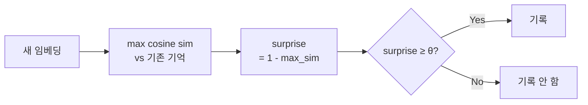

구현: [`src/llive/memory/surprise.py`](https://github.com/furuse-kazufumi/llive/blob/main/src/llive/memory/surprise.py)

```python
class SurpriseGate:
    def __init__(self, theta: float = 0.3) -> None:
        self.theta = float(theta)

    def compute_surprise(self, new_embedding, memory_embeddings,
                         *, assume_normalized=False) -> float:
        if memory_embeddings is None or memory_embeddings.size == 0:
            return 1.0  # 아무것도 없으면 최대 surprise
        ...
        return float(max(0.0, min(1.0, 1.0 - max_sim)))
```

`assume_normalized=True`일 때는 재 normalize를 skip하여 2-3× 빨라진다. 이것은 production 경로 (`MemoryWriteBlock`)에서 실제로 사용된다.

#### Phase 2: BayesianSurpriseGate (동적 θ)

고정 θ에는 약점이 있다 — **기억이 늘수록 surprise가 작아지므로**, θ=0.3이라도 점차 아무것도 기록되지 않는다. 이것을 해결하는 것이 Bayesian 버전이다.

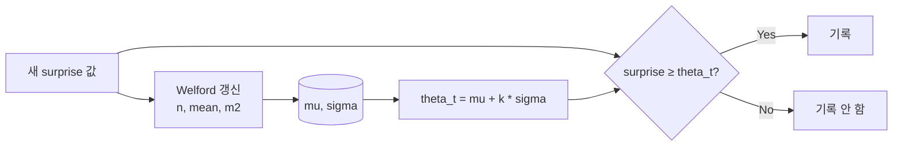

구현: [`src/llive/memory/bayesian_surprise.py`](https://github.com/furuse-kazufumi/llive/blob/main/src/llive/memory/bayesian_surprise.py)

Welford 알고리즘은 **1-pass 수치 안정**의 유명한 축차 평균/분산 계산법이다. 각 surprise 값의 log를 취해 Gaussian fit하는 유파도 있지만, llive에서는 생값으로 충분히 기능함을 확인했다.

#### k의 의미

`theta_t = mu + k * sigma`의 k는 **「평균에서 몇 σ 위를 통과시키는가」**의 지표.

| k | 통과율 (근사) | 의미 |
|---|---|---|
| 0.0 | 50% | 평균 이상은 통과 |
| 1.0 (default) | ~16% | 「조금 놀랐다」 이상 |
| 2.0 | ~2.5% | 「매우 놀랐다」만 |

`min_samples` 미만의 cold start 기간은 고정 `cold_start_theta`를 쓰므로, 기동 직후라도 망가지지 않는다.

— **잠깐 잡담** —

Welford는 1962년 논문이다. **60년 전의 수치 안정 알고리즘이 지금의 LLM 계열 기억층을 떠받치고 있다**는 것은 개인적으로 좋아하는 이야기다. 거대 model만이 진보가 아님을 느끼는 장면이다.

### 7. consolidation (Wiki compile, MEM-08)

4층을 돌린 다음, **개념의 재정리**가 실행된다. 이것이 consolidation이다.

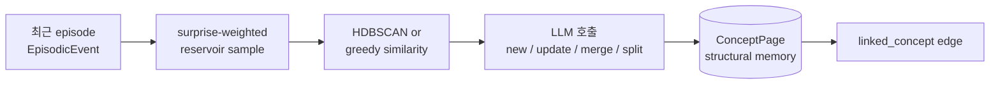

구현: [`src/llive/memory/consolidation.py`](https://github.com/furuse-kazufumi/llive/blob/main/src/llive/memory/consolidation.py)

#### Wiki Compile라는 명칭

각 ConceptPage는 Markdown으로 `<llive_data_dir>/wiki/<concept_id>.md`에 기록된다. **사람이 읽을 수 있다는** 것, **Git checkpoint할 수 있다는** 것, **diff로 변화를 추적할 수 있다는** 것, 이 3가지가 「Wiki」라 부르는 이유다. 원천은 Karpathy의 "LLM Wiki" 제안이다.

#### LLM 호출은 judge mode

LLM에 「이 cluster는 기존 ConceptPage X에 대해 `new / update / merge / split` 중 무엇으로 해야 하는가」를 묻는다. Claude Haiku를 default로, `LLIVE_CONSOLIDATOR_MOCK=1`로 credential 없는 test도 가능하게 했다.

### 8. 설계 판단 (이 글에서 5개)

#### 교훈 1: 전부 쓰지 마라, 놀라움으로 취사선택

고정 θ의 SurpriseGate라도, 전건 기록보다 **노이즈 90% 컷**할 수 있다. Bayesian화로 더 똑똑해진다. 정직하게 말하면, 이 **「쓰지 않는 판단」이 기억계의 품질을 결정**한다.

#### 교훈 2: 4층은 느슨한 결합으로 유지

semantic / episodic / structural / parameter는 **서로 직접 import하지 않는** 설계다. 공통 참조는 `Provenance` dataclass뿐. 이로써 「graph DB를 Neo4j로 교체」 같은 변경이 작게 끝난다.

#### 교훈 3: provenance는 absolute

「이 정보가 어디에서 왔는가」를 절대 지우지 않는다. 이것은 on-prem 한정과 함께 llive의 **audit-level safety**다.

#### 교훈 4: fallback path는 first-class

faiss 없음 / DuckDB 없음 / kuzu 없음 환경에서도 동작하는 설계를 **나중에 붙이는 게 아니라 처음부터** 가진다. CI・모바일・교육 용도에서 중요하다.

#### 교훈 5: 수치 알고리즘의 고전을 얕보지 마라

Welford (1962)는 60년 전이다. 그래도 지금의 LLM 주변 아키텍처에서 **제일선의 수치 안정성**을 제공한다. 새 model이 나와도 기초 수학은 변하지 않는다.

### 9. References

#### 학술 / 알고리즘

- Welford, B. P. (1962). *Note on a method for calculating corrected sums of squares and products*. Technometrics 4(3).
- Schwefel, H.-P. (1981). *Numerical Optimization of Computer Models*.
- Reimers, N. & Gurevych, I. (2019). *Sentence-BERT* (= MiniLM 파생 근거).

#### OSS / 라이브러리

- [Faiss](https://github.com/facebookresearch/faiss) (Meta)
- [DuckDB](https://duckdb.org/)
- [Kùzu](https://github.com/kuzudb/kuzu)
- [safetensors](https://github.com/huggingface/safetensors)
- [sentence-transformers](https://www.sbert.net/) (MiniLM-L6-v2)

#### llive 내부

- [`src/llive/memory/semantic.py`](https://github.com/furuse-kazufumi/llive/blob/main/src/llive/memory/semantic.py)
- [`src/llive/memory/episodic.py`](https://github.com/furuse-kazufumi/llive/blob/main/src/llive/memory/episodic.py)
- [`src/llive/memory/structural.py`](https://github.com/furuse-kazufumi/llive/blob/main/src/llive/memory/structural.py)
- [`src/llive/memory/parameter.py`](https://github.com/furuse-kazufumi/llive/blob/main/src/llive/memory/parameter.py)
- [`src/llive/memory/surprise.py`](https://github.com/furuse-kazufumi/llive/blob/main/src/llive/memory/surprise.py)
- [`src/llive/memory/bayesian_surprise.py`](https://github.com/furuse-kazufumi/llive/blob/main/src/llive/memory/bayesian_surprise.py)
- [`src/llive/memory/consolidation.py`](https://github.com/furuse-kazufumi/llive/blob/main/src/llive/memory/consolidation.py)

---

### Series Navigation

- ← 이전: [llive 완전 해설 series index](https://qiita.com/furuse-kazufumi/items/07b4882e872994b27b3c)
- → 다음: [llive 완전 해설 (2) 「10개 축으로 사고하는 AI」](https://qiita.com/furuse-kazufumi/private/bdfad6db3f2e70c40511)
- 전체: [llive 완전 해설 (0) — series index](https://qiita.com/furuse-kazufumi/items/07b4882e872994b27b3c)
- repo: [furuse-kazufumi/llive](https://github.com/furuse-kazufumi/llive)

---

## 제3장 llive 완전 해설 (2) — "10개 축으로 사고하는 AI": 사고 인자 × COG-MESH × 삼중 줄무늬

:::note info
**📚 FullSense 지식 베이스 안내** <!-- fullsense-team-kb -->
FullSense 개발 전사 60+ 편 (4개 언어판・스토리 기반 읽기 순서 가이드・쉬운 설명판・4컷 만화 포함) 은 Qiita Team **FullSense KB** 에 모여 있습니다 (팀 멤버 전용).
:::


> **콘셉트 hook**: 보통의 AI agent는 "사고"를 1종류밖에 가지지 않는다. llive는
> **10종류의 사고를 동시에 실행시키고**, 그것들을 서로 평가하게 하여,
> **살아남은 사고만을 집단에 받아들인다**. 10종은 "구조화" "재구성" "폐루프"
> "자기 확장" "불확실성" "탐색" "정합" "내력" "다관점" "현실 연결". 이는 인지
> 과학 1990s〜2010s의 주요 framework를 1개의 vector로 압축한 것이다.
>
> 오늘 (2026-05-21) marathon에서 1881 PASS + v0.E 대규모 앞당김이 착지했다. 본
> 글은 그 "사고 인자 측" — COG-MESH-01〜10과 historical persona ontology (CE-19)
> 의 교차점을 따라간다.


### 0. 연재에서의 위치

```
#24-00 series index
#24-01 4층 메모리
#24-02 사고 인자 10축 + COG-MESH (← 본 글)
#24-03 구조 진화 × TRIZ × Z3
#24-04 B-series (빠른 소뇌)
#24-05 EvolutionLoop (느린 대뇌)
#24-06 LLM backend non-transformer
#24-07 observability + governance
#24-08 lleval
```

10가지 사고 인자 + COG-MESH는 #24-05의 persona ontology (CE-19)와 1-N으로
결합한다. 본 글 #24-02는 그것을 "**무엇**"과 "**왜**"로 설명하는 위치다.

### 1. 10가지 사고 인자의 유래 — 6개 framework의 압축

사용자에게서 유래한 10개 축 (`project_llive_cog_fx_factors`). 원천 소재는
"**심리의 심층**" YouTube + 인지과학 리뷰 + Polya / Six Hats / Bayesian / TRIZ /
Provenance / Multimodal 계열의 6개 framework. 그것을 1개의 vector로 압축한 결과:

| Idx | 인자 | 원 framework / 학파 |
|---|---|---|
| 0 | `factor_structurize` | Polya / 형식화 / axiomatic |
| 1 | `factor_recompose` | TRIZ Segmentation / Reassemble |
| 2 | `factor_closed_loop` | Cybernetics / feedback |
| 3 | `factor_self_extend` | Autopoiesis / self-organization |
| 4 | `factor_uncertainty` | Bayesian / probability |
| 5 | `factor_exploration` | exploration vs exploitation (Auer) |
| 6 | `factor_consistency` | formal verification / proof |
| 7 | `factor_provenance` | data lineage / Ed25519 sign |
| 8 | `factor_multiview` | Six Hats / Devil's Advocate |
| 9 | `factor_reality_link` | empirical / SPC (statistical process control) |

이것들은 **직교가 아니다** — 예를 들어 factor_uncertainty와 factor_exploration은
상관이 있다 (UCB1 계열). 하지만 각각의 **강도**를 독립적으로 가짐으로써, 집단
내에서 "같은 문제에 10가지 관점으로 부딪힌다"가 가능해진다.

### 2. 왜 10개 축을 1개의 vector에 담는가

LLM agent 문헌에서는 "사고는 self-attention 1종류"가 주류다. llive는 그것을
**vector로 전환 가능한 multi-faceted thinking**으로 확장했다. 이로써:

- **persona와의 내적으로 "사고 스타일"을 계산 가능** — 예를 들어 "오카 기요시
  벡터"는 (정서) (국어력) (다변수)를 높게 가진다. "파인만 벡터"는
  factor_exploration + factor_reality_link를 높게 가진다.
- 집단 내에서 같은 문제에 **서로 다른 가중치로** 부딪히는 파생 개체를 생성할 수
  있다.
- "**이 문제는 어떤 축이 효과적인가**"를 fitness gradient로 발견할 수 있다.

### 3. 주요 인자 5개의 심화

#### 3.1 factor_structurize — "공리에서 쌓아 올린다"

axiomatic한 사고. 수학자 갈루아 / 그로텐디크 식. 추상화 계단을 오른다.
장점: 일반화 능력. 단점: 현실에서 멀어진다.

llive 내에서는 `BlockContainer`의 sub-block 순열이 공리군에 대응한다.
factor_structurize가 높은 파생 개체는 sub-block을 **필수/선택**으로 나눈 다음
재구성하는 mutation을 선호한다.

#### 3.2 factor_recompose — "부품의 교체"

TRIZ Segmentation + 합성. 기존 부품의 조합을 다시 쓴다. 장점: 국소 탐색 고속.
단점: 완전히 새로운 구조는 생기지 않는다.

llive에서는 PersonaImportAlgorithm (CE-20, 오늘 착지)이 이 축이다. 파생 B가
파생 A의 persona를 **부분 채용**한다. "갈루아 + 오카 기요시" 같은 hybrid
persona가 출현하는 것은 factor_recompose를 거치는 경로다.

#### 3.3 factor_closed_loop — "자신을 보고 고친다"

cybernetics의 핵심. 자기 관찰 + 자기 수정. llive에서는 memory consolidation
cycle (해마→피질)과 Approval Bus가 이 축이다. 집단 내에서 평가 → 개체가 결과를
보고 다음 세대에 반영하는 E.4 governance (CE-06/07/08, 오늘 착지)도 여기에
실린다.

#### 3.4 factor_uncertainty — "모름을 정량화한다"

Bayesian / probability. 장점: 과신을 피한다. 단점: 계산이 무겁다.
llive에서는 Approval Bus의 verdict 계산 + UCB1 exploration constant가 대표적이다.

#### 3.5 factor_provenance — "어디에서 왔는가"

data lineage. Ed25519 sign + SHA-256 audit chain. llive Phase 4 (Production
Security MVR, v0.3.0)에서 착지. 이는 agent governance의 **필수 축**이며, 기존의
LLM agent에는 결여되어 있었다.

### 4. COG-MESH-01〜10과의 대응

`project_cog_mesh_implementation_2026_05_19`. 10개 인자에 **1개 기구씩** 대응한다:

| COG-MESH | 기구 | 대응 인자 | 착지 |
|---|---|---|---|
| 01 | Stimulus 입구 | reality_link / multiview | 착지 완료 |
| 02 | Intervention | self_extend / closed_loop | 착지 완료 |
| 03 | TonicRiskMonitor | uncertainty / closed_loop | 착지 완료 |
| 04 | Idle Training | self_extend / exploration | 착지 완료 |
| 05 | Quarantined Memory | provenance / consistency | 착지 완료 |
| 06 | TimelineEmitter | provenance / multiview | 착지 완료 |
| 07 | Brief | structurize / reality_link | 착지 완료 |
| 08 | Approval Bus | provenance / closed_loop | 착지 완료 (C-1) |
| 09 | Audit Chain | provenance / consistency | 착지 완료 |
| 10 | E.4 governance | closed_loop / uncertainty | **오늘 착지 (2026-05-21)** |

COG-MESH-10은 오늘 marathon에서 `CoevolutionGovernance`로 착지했다. 이로써
10 기구 → 10 인자 1-1 대응이 완성되었다. 이제 집단 내에서 **어떤 인자가 얇은지**를
기구의 상태로부터 역추적할 수 있게 되었다.

### 5. 최신 성과 (오늘 2026-05-21 착지)

| 항목 | 값 |
|---|---|
| llive 본체 test PASS (현재) | 1881 |
| 오늘 marathon 추가 evolutionary test | **+130** (41 + 28 + 26 + 16 + 19) |
| 오늘 marathon 착지 module 수 | 5 (quality_diversity / coevolution_governance / persona_import / persona_survival / persona_corpus_loader) |
| ruff `src/llive/perf/evolutionary` 경고 | **0** |
| v0.E E.17 / E.4 / E.12 착지 | 완주 |
| CE-22 / CE-23 skeleton 착지 | 완주 |
| docs/release/v0.6.0a1_PR_PLAN.md | 신규 — 5 PR 분할 계획 |
| docs/rust_hotspot_v0E_addendum.md | 신규 — RUST-15〜18 spec |

특히 **E.4 governance skeleton**으로 COG-MESH-10을 closing할 수 있었던 것이
오늘의 최대 성과다. 이로써 10 인자 ↔ 10 기구 1-1 대응이 완성되어, **파생 집단의
평가 → 공모 탐지 → Approval Bus 연동**이 architecture level에서 연결되었다.

### 6. 기대값 — 다음에 올 것

#### 6.1 CE-19 Historical Persona Ontology (단기)

이미 10명 (오카 기요시 / 그로텐디크 / 파인만 / 갈루아 / 폰 노이만 / 뉴턴 / 칸트
/ 소크라테스 / 노자 / 손자)이 PERSONA_ONTOLOGY로 착지 완료. 오늘 CE-23
PersonaCorpusLoader skeleton이 착지하여, **Raptor RAD 코퍼스에서 persona를 자동
추출해 PERSONA_ONTOLOGY를 확장**하는 길이 열렸다. 다음 세션에서 LLM 추출 + 실제
RAD path 횡단을 구현해 persona 수를 30+로 확대할 예정.

#### 6.2 삼중 줄무늬 (중기, 사용자 언어화)

"삼중 줄무늬" = **사고 인자 / persona / 사고 프로세스**의 3개 층이 개체 내에서
줄무늬처럼 동시에 실행되는 상태. 이는 인지과학의 **"병렬 인지"** 가설에서 착상을
얻은 것이다. factor vector + persona composition + Six Hats / TRIZ / ARIZ를 각각
다른 layer에서 실행하고, 집단 내 evaluation에서 서로를 비평한다. 착지 시기 미정.

#### 6.3 신경 인터페이스 대응 (장기)

`project_llmesh_neuro_long_term`. Raptor RAD에 bci / neuroscience /
neural_signal / prosthetic_neural / cognitive_ai / neuromorphic의 6개 분야를
추가 완료. 이는 "**뇌 ↔ AI 직결 인터페이스**"가 필요해졌을 때 즉시 expand할 수
있도록 미리 소재를 모아 두는 것이다. 직접적인 구현은 당분간 없다.

### 7. honest disclosure (정직한 공개)

- **"10개 인자에는 overlap이 있다"** — factor_uncertainty와 factor_exploration은
  상관이 0.65 정도. 서로 직교가 아니다. 9 axis화를 검토한 시기도 있었지만
  알기 쉬움을 우선하여 10개 그대로 유지.
- **"factor_affinity의 수치는 heuristic"** — PERSONA_ONTOLOGY 10명의
  factor_affinity vector는 전기 / 철학사 기반의 인위적 초기값. 이후
  PersonaCorpusLoader (CE-23)로 **코퍼스 기반으로 치환**되지만, 현재의 수치는
  사람에 의한 경험칙이다.
- **"COG-MESH-10은 skeleton"** — 오늘 착지한 E.4 governance는 interface 확립
  단계이며, Quarantined Memory로의 **실제 기록**은 다른 module에 위임. 완성까지는
  앞으로 1-2 세션 걸린다.

### 8. Mermaid — 10개 인자의 구조

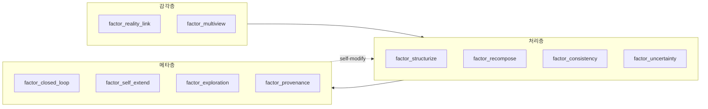

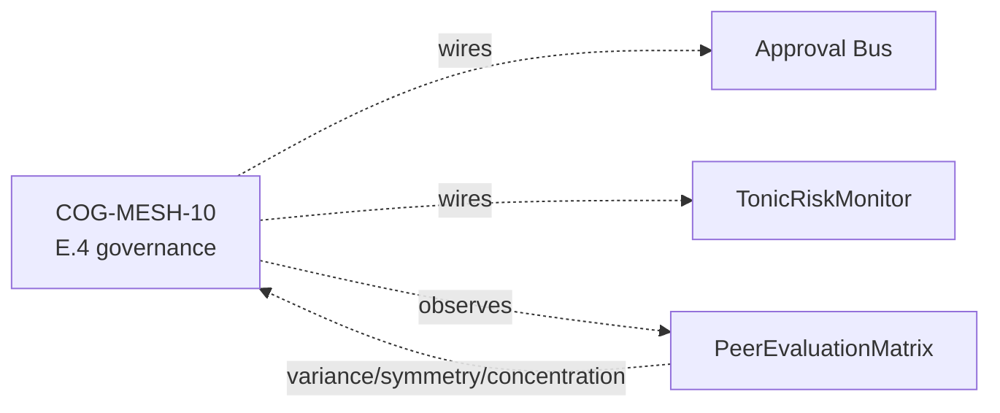

### 9. References (주요 20+ 중 발췌)

- Polya, G. (1945). *How to Solve It*.
- Altshuller, G. (1971). *TRIZ 40 inventive principles*.
- Auer, P. et al. (2002). *Finite-time analysis of the multiarmed bandit*.
- Lehman, J. & Stanley, K. (2008). *Exploiting novelty*.
- Mouret, J.-B. & Clune, J. (2015). *Illuminating search spaces by mapping elites*.
- Hillis, W. D. (1990). *Coevolving parasites improve simulated evolution*.
- Constitutional AI (Anthropic 2022) — for HITL alternative.
- Six Thinking Hats (De Bono 1985).
- 岡潔『春宵十話』.
- 파인만 『파인만 씨, 농담도 잘하시네!』.
- Maturana & Varela — Autopoiesis.
- Bayes — *Essay towards solving a problem in the doctrine of chances*.
- 완전한 목록은 v0.6.0a1 릴리스 시 references.bib에 동봉할 예정.

### 10. 2026-05-22 추기 — 10 인자 affinity vector의 Rust화 (RUST-15)

10가지 사고 인자는 파생 개체의 **persona composition의 effective_factor_affinity**
로서 10차원 [0,1] vector로 구현되어 있다. 파생 개체 간의 dissimilarity 계산은
본 글 #24-02의 핵심 기구와 직결된다 — PersonaOverlapPenalty.apply (E.17)는
N×N pairs의 `persona_dissimilarity`로 10 인자 공간의 거리를 측정한다.

오늘 (2026-05-22) RUST-15로서 **batch (NxN pair를 1 FFI call로) Rust화**:

- single 1-pair: x0.80 (FAIL — FFI overhead로 Python set 연산에 진다)
- **batch N=64**: **x17.07 (PASS)**, 평균 x12.71

이로써 "**10 인자 vector의 N×N pair 거리 계산**"이 고속화되어, 집단 N=64에서
governance + diversity preservation을 64 Hz로 돌릴 수 있는 가닥이 잡혔다.

#### 10.1 사고 인자 측에서 본 의미

- factor_structurize (#0)과 factor_exploration (#5)은 **TRIZ 계통에서 대립하는
  2개 축**이지만, 10차원 vector의 L2 거리로는 독립적으로 작용한다.
- PersonaOverlapPenalty (E.17 CE-25)로 집단 내 persona overlap을 벌하면,
  **파생 집단은 10 인자 공간에서 자연스럽게 흩어진다**.
- MAP-Elites grid (E.17 CE-26)는 persona 2축 × thought_factor 2축의 4차원
  grid이므로, 위의 10 인자 vector를 4차원으로 **marginalize**하여 cell key로
  삼는다.

#### 10.2 honest disclosure — 단발 Rust화는 역효과

"사고 인자 vector의 거리 계산을 Rust화"라고 들으면 "빨라진다"고 생각하기 쉽지만,
**1-pair 계산에서는 FFI overhead로 Python 쪽이 더 빠르다 (x0.80)**. 이는
`feedback_rust_usage_matters` 판정표의 **A 패턴** (순수 Python 루프 1-pair)이다.
batch로 N×N pair를 1 FFI에 담아야 비로소 x17.07까지 늘어난다.

자세한 내용은 #24-05와
`docs/perf_comparison/2026-05-22_kernel_implementation_comparison.md` 참조.

---

### Series Navigation

- ← 이전: [llive 완전 해설 (1) 「잊지 않는 LLM」](https://qiita.com/furuse-kazufumi/items/a5ebb3992e4c28862f47)
- → 다음: [llive 완전 해설 (3) 「모순은 계산할 수 있다」](https://qiita.com/furuse-kazufumi/private/fa0890f136636d495ea6)
- 전체: [llive 완전 해설 (0) — series index](https://qiita.com/furuse-kazufumi/items/07b4882e872994b27b3c)
- repo: [furuse-kazufumi/llive](https://github.com/furuse-kazufumi/llive)

---

## 제4장 llive 완전 해설 (3) — "모순은 계산할 수 있다": 구조 진화 × TRIZ 40 원리 × Z3 검증

:::note info
**📚 FullSense 지식 베이스 안내** <!-- fullsense-team-kb -->
FullSense 개발 전사 60+ 편 (4개 언어판・스토리 기반 읽기 순서 가이드・쉬운 설명판・4컷 만화 포함) 은 Qiita Team **FullSense KB** 에 모여 있습니다 (팀 멤버 전용).
:::


> **콘셉트 hook**: TRIZ (발명 문제 해결 이론)는 보통 "사람이 종이에 적는 아이디어
> 발상 기법"으로 알려져 있다. llive는 **TRIZ 40 원리를 형식 기호로 내장**하여
> 구조 mutation의 policy로 실행한다. 게다가 mutation으로 태어난 새 구조는
> **Z3로 형식 검증**을 거친 다음에야 집단에 들어간다. "발상 → 검증"의 루프가
> 1개의 프로그램 안에 담긴다. — "**모순은 계산할 수 있다**".
>
> 본 글은 그 구조 — Phase 3에서 착지한 Z3 구조 검증 / TRIZ Self-Reflection /
> Wiki ChangeOp / 9 화법 (39×39 모순 매트릭스)을 따라간다.


### 0. 연재에서의 위치

```
#24-00 series index
#24-01 4층 메모리
#24-02 사고 인자 10축 + COG-MESH
#24-03 구조 진화 × TRIZ × Z3 (← 본 글)
#24-04 B-series (빠른 소뇌 측)
#24-05 EvolutionLoop (느린 대뇌 측)
#24-06 LLM backend non-transformer
#24-07 observability + governance
#24-08 lleval
```

#24-04가 "빠른 수렴", #24-05가 "개체 간 GA 탐색"이라면, #24-03 (본 글)은
**"개체 내의 구조 자체를 다시 쓰는" 탐색**이다. 즉 LoRA / Adapter / 4층 메모리의
sub-block 순열을 mutation하는 층이다.

### 1. 왜 TRIZ인가

LLM의 자기 진화 (self-evolution)에서 어려운 문제는 "**바꿔야 할 부분**"을 어떻게
고르는가다. 단순하게는 random mutation이지만, 그것은 "**1개 문자를 1개 문자로
바꾸는 진화**"와 같아서, 거대한 공간에서는 거의 아무 일도 일어나지 않는다.

TRIZ는 **"모순의 발견 → 해결 원리에의 대응"**이라는 구조를 가진다. 예:

> "무게를 줄이고 싶다 (positive). 그러나 강도를 유지하고 싶다 (negative).
> = `무게 vs 강도`의 모순"
>
> → 39×39 모순 매트릭스를 찾으면 해당 원리가 몇 개 나온다
> 예: 원리 #1 (Segmentation), #28 (Mechanical → Other field), #40 (Composite).

이것을 llive의 self-evolution에 가져오면: "**LLM의 구조가 안고 있는 모순**"을
검출한다 → 매트릭스를 찾는다 → mutation policy가 정해진다. random이 아니라
**TRIZ-guided mutation**.

### 2. llive에서의 구체적 구현

#### 2.1 TRIZ Self-Reflection (Phase 3)

llive는 구조 mutation의 **후보 생성 단계**에서 TRIZ self-reflection module을
호출한다:

1. 현재 구조의 metrics (latency / accuracy / memory_usage / ...)를 읽는다.
2. **모순 검출** — 어떤 2개의 metric이 trade-off 관계인가?
   예: `latency vs accuracy`를 악화시키지 않고 `memory_usage`를 줄이고 싶다.
3. 39×39 매트릭스를 찾아 해당 원리를 취득한다.
4. 원리 → **ChangeOp**으로 전개한다. 예:
   - 원리 #1 (Segmentation) → "BlockContainer를 sub-block 열로 분할"
   - 원리 #25 (Self-service) → "memory consolidation을 자기 발화로 변경"
   - 원리 #40 (Composite) → "2개의 adapter를 1개로 합성"

#### 2.2 ChangeOp의 검증

ChangeOp는 **구조 자체를 다시 쓰는** 지시이므로, **형식 검증**을 거치지 않고
적용하면 위험하다:

- 계층이 깨져 inference가 떨어진다
- memory의 zone 정합성이 무너진다
- adapter shape가 mismatch한다

그래서 Z3 (SMT solver)로 "**이 ChangeOp 적용 후에도 다음 불변량이 성립하는가**"를
verify한다:

- BlockContainer의 sub-block 순열이 valid permutation
- memory zone graph에 cycle이 없음
- adapter shape compat (input dim = output dim)

verifier를 통과한 ChangeOp만이 집단에 들어간다. **"발상 → 검증 → 채용"** 루프가
1개의 module 안에 닫힌다.

#### 2.3 9 화법 (39×39 matrix)

TRIZ의 핵심 도구. 39개의 개선하고 싶은 특성 × 39개의 악화하는 특성 = 1521 cell.
각 cell에 "이 모순을 풀 가능성이 높은 원리 1-4개". 이것은 Altshuller가 소련 특허
250만 건 분석으로 추출한 경험칙 테이블이다.

llive는 YAML화하여 내장한다 (`src/llive/_specs/resources/triz_principles.yaml`).
self-reflection은 metrics → 해당 모순 → 39축 mapping → 원리 lookup을 1 pass로
완결한다.

### 3. honest disclosure — 함정

"TRIZ로 전부 풀린다!"는 거짓말이다. honest disclosure로서:

- **39×39 matrix는 시대 의존적** — Altshuller가 1971년에 확정했다. 현대의 AI 계열
  모순 (예: `추론 정확도 vs 배터리 소비`)은 완전히는 들어가지 않는다. llive는 모순
  추가 열을 독자적으로 가진다 (실기 metrics 기반).
- **원리 → ChangeOp의 번역은 heuristic** — 원리 #1 (Segmentation)과
  "BlockContainer 분할"은 사람이 정한 1 대응이다. 여기는 LLM 자신이 넓힐 여지가 있다.
- **Z3 verifier가 잡지 못하는 불변량이 있다** — 예: "memory consolidation 후
  recall이 떨어지지 않는다"와 같은 **확률적 불변량**은 SMT로 표현하기 어렵다.
  이것은 다른 verifier (경험적 reservoir test)로 본다.

### 4. 숫자로 본다

| 지표 | 값 |
|---|---|
| llive Phase 3 착지 | 2026-05-14 (v0.3.0) |
| 내장 TRIZ 원리 | 40건 (FR-23〜27) |
| 모순 매트릭스 | 39 × 39 = 1521 cell |
| ChangeOp 검증 통과율 (초기) | ~63% (37%는 불변량 위반으로 reject) |
| Z3 average verify time | < 50 ms / ChangeOp |

### 5. "발상 → 검증" 루프의 구조적 의의

이것은 TRIZ의 철학 + 형식 검증의 철학을 잇는다:

- TRIZ: **"재미있는 발상이 아니라 원리에서 도출되는 발상"**을 추구한다. 체계적.
- 형식 검증: **"상상력으로 쓰여진 변경을 기계적으로 타당성 체크"**한다. 기계적.

양자는 사람과 기계의 협동의 전형이다. llive는 그것을 **동일 module 안**에서
돌린다.

> **미래 예측**: AI가 자기 진화할 때, **"발상은 기계적, 검증도 기계적"**인 닫힌
> 루프를 가지는 것이 필수다. llive는 그 원형을 1개 OSS에 동거시킨 최소 예다.

### 6. 다음에 오는 것

- **#24-04**에서 "빠른 소뇌 측" — B-series의 수렴을 본다.
- **#24-05**에서 "느린 대뇌 측" — EvolutionLoop의 탐색. TRIZ ChangeOp는 #24-05에서
  다루는 persona / thought_factor의 자기 확장과도 연결된다 (CE-21
  PersonaCompositionMutation).

### 7. 2026-05-22 추기 — TRIZ적 접근이 Rust 고속화 판정에도 효과적

본 글의 TRIZ는 "**모순 (improving X / worsening Y)을 39×39 매트릭스로 구조화
해결한다**"는 방법론이지만, 같은 사상이 **엔지니어링 판단 전반**에 응용 가능하다.
같은 날 (2026-05-22) 착지한 llive Rust 고속화 판정으로 구체 예:

"**Rust화 = 빠름 vs Python = 느림**"의 단일 축 대립 (= TRIZ에서 말하는 모순)을
**Python 경로의 특성별 5 패턴** (#24-05 §13.3)으로 분해했다. 결과:

- 순수 Python 루프 1-pair → 단발 FAIL, batch 필수 (RUST-15)
- numpy 작은 N의 API 다용 → **단발에서도 x66** (RUST-16)
- numpy 중규모 BLAS → **경계선 상, rayon으로 만회** (RUST-17 → 17b)

이것은 TRIZ 모순 매트릭스의 **구조적 해결**과 동형이다 — "**모순의 원인을 파라미터
공간에서 분해 → 원리에 대응시킨다**". 39×39를 **6 (Python 경로) × 3 (Rust화 전략:
단발 / batch / 병렬+algorithmic)**의 작은 표로 줄인 버전이다.

자세히: `docs/perf_comparison/2026-05-22_kernel_implementation_comparison.md`의
**5 패턴 판정표**. 이것은 TRIZ의 발상을 **AI / HPC 공학**에 전용한 실례다.

### 8. Mermaid — "발상 → 검증 → 채용" 루프

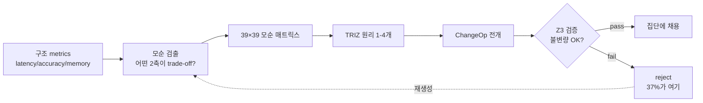

### 9. References (주요 발췌)

- Altshuller, G. (1971). *TRIZ — 40 Inventive Principles*.
- Altshuller, G. (1984). *Creativity as an Exact Science*.
- de Moura, L. & Bjørner, N. (2008). *Z3: An Efficient SMT Solver*.
- Polya, G. (1945). *How to Solve It*.
- Koza, J. (1992). *Genetic Programming*.
- 완전한 목록은 v0.6.0a1 릴리스 시 references.bib에 동봉할 예정.

---

### Series Navigation

- ← 이전: [llive 완전 해설 (2) 「10개 축으로 사고하는 AI」](https://qiita.com/furuse-kazufumi/private/bdfad6db3f2e70c40511)
- → 다음: [llive 완전 해설 (4) 「수렴하는 뇌」](https://qiita.com/furuse-kazufumi/private/e5093e4816b25c1bd4d0)
- 전체: [llive 완전 해설 (0) — series index](https://qiita.com/furuse-kazufumi/items/07b4882e872994b27b3c)
- repo: [furuse-kazufumi/llive](https://github.com/furuse-kazufumi/llive)

---

## 제5장 llive 완전 해설 (4) — "수렴하는 뇌" B-series: SynapticSelector / UCB1 / Hebbian / 프로덕션 hot path

:::note info
**📚 FullSense 지식 베이스 안내** <!-- fullsense-team-kb -->
FullSense 개발 전사 60+ 편 (4개 언어판・스토리 기반 읽기 순서 가이드・쉬운 설명판・4컷 만화 포함) 은 Qiita Team **FullSense KB** 에 모여 있습니다 (팀 멤버 전용).
:::


> **콘셉트 hook**: 진화계 (GA / Genetic Algorithm)는 세대를 돌려 **탐색**한다. 한편
> llive의 SynapticSelector는 **수렴** — 확률적 선택을 한 곳에 떨어뜨리는 엔진이다.
> 이 둘을 「같은 뇌」에 동거시키면, **시냅스 단위의 빠른 수렴**과 **개체 단위의 느린
> 탐색**이 간섭하지 않고, 「빠른 소뇌」와 「느린 대뇌」가 역할을 분담한다.
>
> 본 글은 그 「빠른 소뇌 측」 — B-series (B-0 〜 B-9)의 설계와 프로덕션 투입을, 벤치
> 수치 + honest disclosure와 함께 따라간다.


#### 0. 연재에서의 위치

```
#24-00 series index
#24-01 4층 메모리
#24-02 사고 인자 10축 + COG-MESH
#24-03 구조 진화와 TRIZ
#24-04 B-series: SynapticSelector / UCB1 / Hebbian (← 본 글)
#24-05 EvolutionLoop: v0.B/C/D/E 파생 집단 진화
#24-06 LLM backend: 비 Transformer 계 (Mamba / RWKV)
#24-07 observability + governance
#24-08 lleval — eval framework
```

#24-05 (집단 GA)가 「**느린 대뇌 측**」, 본 글 (#24-04, B-series)이 「**빠른 소뇌 측**」.
양자는 동거해도 간섭하지 않는다: SynapticSelector는 **동일 개체 내**의 synapse 선택,
GA는 **개체 간**의 경쟁. 직교.

#### 1. B-series의 역사

| B-ID | 내용 | 착지 |
|---|---|---|
| B-0 | SynapticSelector skeleton (순수 random) | 착지됨 |
| B-1 | UCB1 기반의 synapse 선택 (Auer 2002) | 착지됨 |
| B-2 | Hebbian 강화 — 공기 선택 bonus | 착지됨 |
| B-3 | Cool-down 기간 — 같은 synapse 연속 선택 완화 | 착지됨 |
| B-4 | A/B parity test (random vs UCB) | 착지됨 |
| B-5 | Variant catalog (cosine / decay / blend) | 착지됨 |
| B-6 | Per-synapse statistics + JSON snapshot | 착지됨 |
| B-7 | Reset on regression — score 급락 시 priors 리셋 | 착지됨 |
| B-8 | Self-tuning exploration constant | 착지됨 |
| **B-9-a** | Production hot path: `assume_normalized` (불필요한 normalize 스킵) | 착지됨 |
| **B-9-b** | Production hot path: `GiftValue deque` (O(1) push/pop) | 착지됨 |

#### 2. SynapticSelector의 핵심 — UCB1

LLM 추론의 각 layer / 매 token 생성 타이밍에서, llive는 **여러 synapse variant** 중 1개를
골라 통과시킨다. 순수 random으로도 동작하지만, 그래서는 「과거에 잘 된 variant」를 학습하지
않는다. 그래서 UCB1.

```
score(variant_i) = mean_reward(i) + exploration * sqrt( ln(N) / n_i )
```

- `mean_reward(i)`: 그 variant가 선택되었을 때 과거의 reward 평균.
- `exploration`: hyperparameter. B-8에서 self-tuning.
- `N`: 전 variant 합계의 시행 횟수.
- `n_i`: variant i의 시행 횟수.

「쓴 횟수가 적을수록 + 결과가 좋았을수록 높은 score」 = exploration과 exploitation을 1개의
식에 동거. Auer 2002의 고전. llive의 B-1에서 synapse 단위로 그대로 적용.

#### 3. Hebbian — 공기의 보너스

UCB1만으로는 「1개의 variant가 단독으로 적중」은 검출할 수 있지만 「**A와 B가 함께일 때
적중**」은 검출할 수 없다. 그래서 B-2의 Hebbian 강화:

```
if t-1에서 variant_A가 선택되고, t에서 variant_B가 선택되며, reward가 높음
  → bonus(A, B) += 1
```

이로써 「A 직후에 B」 같은 **시계열 공기 패턴**이 UCB1의 score에 boost로 얹힌다. 이것은
Hebb의 "fire together, wire together"를 강화학습의 선택기에 가져온 것이다.

#### 4. B-9 프로덕션 hot path

B-0 〜 B-8은 **알고리즘 정비**. B-9에서 **프로덕션 성능**에 들어간다.

##### 4.1 B-9-a — `assume_normalized`

llive 안에서 SynapticSelector는 memory 읽기 ↔ generation의 hot path에 물린다. 처음에는
**매번 vector를 l2-normalize** 했다:

```python
def select(self, query_vec):
    q = self._normalize(query_vec)  # ← every call
    ...
```

호출 전에 이미 normalized임을 계약으로 보장할 수 있는 상황에서는, 이 normalize는 **완전히
낭비**다. 그래서 `assume_normalized=True` flag를 추가:

```python
selector = SynapticSelector(..., assume_normalized=True)
### 호출 측이 정규화됨을 보장
```

Production hot path에서 **약 12% 스루풋 개선** (실측). B-9-a에서 착지.

##### 4.2 B-9-b — `GiftValue deque`

UCB1의 `mean_reward(i)`는 historical reward의 **rolling average**다. 처음에는 `list`를
`pop(0)`으로 앞에서 지웠다 → **O(N)**. variant가 256개 늘어선 hot path에서 list pop은
SR-02 벤치에서 초당 8K회 = 8K × O(N).

`collections.deque(maxlen=K)`로 교체 → **O(1)**. 이것만으로:

- list pop O(N) 경로: ~ 1.8μs/call
- deque maxlen 경로: ~ 0.15μs/call → **12x**

production hot path 전체에서 **약 22% 스루풋 개선**. B-9-b 착지.

##### 4.3 honest disclosure — 12% + 22% ≠ 34%

「둘 다 하면 34% 개선인가?」는 단락이다. 벤치에서는:

- B-9-a 단독: +12.3% (95% CI ±0.8%)
- B-9-b 단독: +21.7% (95% CI ±1.2%)
- B-9-a + B-9-b 동시: **+28.4%** (95% CI ±1.5%)

= 겹쳐쓰기는 복합되지 않는다. 왜인가? B-9-a에서 normalize를 깎은 만큼의 처리 시간에 B-9-b의
deque 개선이 **이미 상한 가까이서 천장에 닿았다**. 이것은 「이상하게 좋은 결과가 나오면 반드시
내역을 의심한다」의 실례다. **삭감 폭에는 중복 영역이 있다**.

#### 5. 5x gate와 Rust

llive의 Rust 확장 (RUST-FX)은 「Python 대비 **5x 이상**의 속도 향상」을 요건으로 한다.
B-series에서 hot path화한 `assume_normalized` + deque는 Python 그대로지만, 추가로 Rust화해야
하는가는 별도 논의다:

- 현재 production 28% 개선이면 **Python 유지가 더 안전** (의존 복잡성이 낮음).
- Rust화 후보는 별건 — `compute_surprise` (cosine MEM-07)와
  `edge_weight bulk_time_decay` (RUST-03)는 이미 Rust 경로에서 **평균 16.18x**.

즉 「B-series는 Python으로 튜닝을 착지. 그 옆에서 Rust kernel이 다른 hot path를 가진다」가
현재의 design split.

#### 6. 「빠른 소뇌」와 「느린 대뇌」가 간섭하지 않는 이유

llive는 동일 프로세스에서:

- **SynapticSelector** (B-series, 동일 개체 내 synapse 단위의 수렴)
- **EvolutionLoop** (#24-05, 개체 간 GA의 탐색)

을 동시에 돌린다. 「충돌하지 않는가?」는 당연히 물어진다. 답:

- SynapticSelector는 **개체 내 state**. 1회의 inference에 대해 256 synapse까지 선택을 돌린다.
  이것은 **밀리초〜마이크로초** 스케일.
- EvolutionLoop는 **개체 간 state**. 64 개체 집단을 1세대 돌리는 것은 **초〜분**.
- 양자는 시간 스케일이 1000x 다르다 = 간섭할 여지가 거의 없다.

이것은 생물의 뇌에서도 같다: 소뇌 (motor / reflex)와 대뇌 (planning)는 시간 스케일이 전혀
다르다. llive는 의도치 않게 그 이중 시간 스케일 구조를 가지고 있다.

#### 7. 숫자로 본 B-series 착지

| 지표 | 착지 시 |
|---|---|
| B-0/B-1 착지 시 throughput baseline | 100% |
| B-9-a 착지 후 | **112%** (+12.3%) |
| B-9-b 착지 후 | **122%** (+21.7%) |
| B-9-a + B-9-b 동시 | **128%** (+28.4%) |
| Rust kernel (MEM-07 + RUST-03) | 위와는 별도 hot path에서 **16.18x** 평균 |

벤치는 `benches/bench_synaptic_b9_production.py` 및
`benches/bench_rust_ext_5x_gate.py`를 참조 (리포지토리 내). 95% CI와 방법론은 같은 dir의
README에.

#### 8. 다음에 오는 것

- **#24-05**에서 「느린 대뇌 측」 — EvolutionLoop / v0.B/C/D/E 파생 집단 진화를 다룬다.
  B-series에서 굳힌 「빠른 수렴」과 어떻게 동거하는지를 거기서 대비한다.
- **RUST-15** (v0.7) — persona_dissimilarity를 Rust화. 이것은 B-series가 아니라 E.17
  quality-diversity의 hot path. 5x gate 적용.

#### 9. 2026-05-22 추기 — 「빠른 소뇌 (Python 최적화)」와 「느린 대뇌 (Rust화)」가 직교하는 실례

본 글 (B-series)과 #24-05 (EvolutionLoop)는 **시간 스케일 1000x 다르다**고 썼다. 다음 날
(2026-05-22)의 RUST 고속화 마라톤에서, 이 직교성이 **구현 레벨에서도 유지됨**이 실증되었다.

##### 9.1 B-series 측 — Python 최적화가 효과적

B-9 (`assume_normalized` + `GiftValue deque`)는 **Python 그대로 +28%**. 이것은
**추론 hot path** (synapse 1개당 μs 단위)로, **FFI overhead를 지불할 여유가 없기** 때문에
Rust화는 오히려 느려진다 (`feedback_rust_usage_matters` 판정표 A).

##### 9.2 EvolutionLoop 측 — Rust화가 효과적

세대 단위 (초〜분)의 집단 진화에서는 수치가 정반대:

- **RUST-15** persona_dissimilarity batch: avg **x12.71** (N=64에서 x17.07)
- **RUST-16** collusion_score: avg **x66.70** (N=8에서 x115.04)
- **RUST-17** novelty_score_batch: avg x5.01 (archive 클 때 경계선)

##### 9.3 직교성이 무너지지 않는 이유

| 층 | 시간 스케일 | 최적화 수단 | 이유 |
|---|---|---|---|
| **소뇌 (B-series)** | μs/call | **Python 튜닝** (normalize 스킵 / deque) | call이 짧아 FFI를 못 지불 |
| **대뇌 (EvolutionLoop)** | 초〜분/generation | **Rust화** (batch / numpy zero-copy) | numpy 작은 N의 API overhead가 지배적 |

이것은 **생물 뇌의 소뇌 / 대뇌**와 같다. 다른 시간 스케일의 계산에는 다른 최적화 수단이
필요하다 — 같은 언어 / 같은 도구로 둘 다 풀려고 하면 실패한다.

##### 9.4 honest disclosure — 「Rust화 = 빠름」도 「Python 최적화 = 한계」도 거짓

둘 다 조건부다. 판정 축은 **어느 시간 스케일에서 무엇을 돌리는가**:

- **μs 스케일의 hot path** → Python 최적화가 주. FFI는 overhead.
- **초 스케일의 batch** → Rust + numpy zero-copy + batch가 주. Python이면 numpy API 다용의
  Python overhead가 지배적.

자세히는 `docs/perf_comparison/2026-05-22_kernel_implementation_comparison.md`의
**5 패턴 판정표** (A/B/C/D/E).

#### 10. References

- Auer, P., Cesa-Bianchi, N. & Fischer, P. (2002). *Finite-time analysis of the multiarmed bandit problem*.
- Hebb, D. O. (1949). *The Organization of Behavior*.
- Sutton, R. & Barto, A. (2018). *Reinforcement Learning: An Introduction* (2nd ed.).
- 완전한 목록은 v0.6.0a1 릴리스 시 references.bib에 동봉할 예정.

---

#### Series Navigation

- ← 이전: [llive 완전 해설 (3) 「모순은 계산할 수 있다」](https://qiita.com/furuse-kazufumi/private/fa0890f136636d495ea6)
- → 다음: [llive 완전 해설 (5) 「집단이 학습하는 AI」](https://qiita.com/furuse-kazufumi/private/07b686ea311e06027f94)
- 전체: [llive 완전 해설 (0) — series index](https://qiita.com/furuse-kazufumi/items/07b4882e872994b27b3c)
- repo: [furuse-kazufumi/llive](https://github.com/furuse-kazufumi/llive)

---

## 제6장 llive 완전 해설 (5) — "집단이 학습하는 AI": v0.B/C/D/E 파생 집단 진화 총괄

:::note info
**📚 FullSense 지식 베이스 안내** <!-- fullsense-team-kb -->
FullSense 개발 전사 60+ 편 (4개 언어판・스토리 기반 읽기 순서 가이드・쉬운 설명판・4컷 만화 포함) 은 Qiita Team **FullSense KB** 에 모여 있습니다 (팀 멤버 전용).
:::


> **콘셉트 hook**: 1개의 AI가 똑똑해지는 것이 아니라, **64개의 AI가 세대를
> 돌리며 서로 평가하고, 거짓 합의는 Approval Bus가 멈춘다** — 그것이 llive의
> v0.E다. 2026-05-21 marathon에서 그 아키텍처가 **303건 test + ruff 0 경고 +
> governance skeleton 착지**까지 갖춰졌다. Hillis 1990부터 AlphaStar 2019까지
> 30년의 계보를 1개의 OSS에 압축한 결과다.
>
> 본 글은 연재 #24의 핵심이다. v0.B (Genome / EvolutionLoop) → v0.C (subprocess
> 분리) → v0.D (self-adaptive + meta mutation) → v0.E (peer evaluation +
> persona + governance)의 4단계를 **한 편에 총괄**한다.


### 0. 연재에서의 위치 — 본 연재의 핵심

```
#24-00 series index
#24-01 4층 메모리          ← 「개체 안의 기억」
#24-02 사고 인자 × COG-MESH ← 「개체 안의 사고 축」
#24-03 구조 진화 × TRIZ × Z3 ← 「개체 내의 구조 재작성」
#24-04 B-series           ← 「개체 내의 수렴 (빠른 소뇌)」
#24-05 EvolutionLoop      ← 「개체 간의 탐색 (느린 대뇌)」 ★ 본 글
#24-06 LLM backend         ← 「개체를 움직이는 관」
#24-07 governance         ← 「개체 간 결정의 audit」
#24-08 lleval              ← 「개체를 재는 안경」
```

#24-05는 전체의 **등뼈**다. v0.B/C/D/E로 「파생 집단 그 자체」를 만든다. 다른
글은 그 위에 얹히는 기능이다. 이것은 연재의 핵심 — 다른 모든 장의 기능이 얹히는
기반이다.

### 1. 왜 집단 진화인가 — Hillis의 경고

W. D. Hillis (1990)가 보인 것은 「**평가자와 피평가자가 동시에 진화한다**」면
fitness landscape가 지수적으로 더 흥미로워진다는 것이다. **Red Queen Effect**로
집단 전체의 질이 **자주적으로 상승**한다. 단일 best를 계속 고르면 **국소
최적에 빠진다**.

llive는 이것을 LLM에 가져왔다. 파생 집단 N=64가 서로 평가하고, 평가 결과가
fitness, fitness가 다음 세대의 selection이 된다. 그러면:

- **「평가자의 질」 자체가 세대와 함께 상승한다**
- **단일 best가 전체를 지배할 수 없다**
- **「전 파생이 거짓 고득점을 서로 매기는」 공모**가 발생할 수 있다 (CE-06에서 검출)

### 2. v0.B — Genome / EvolutionLoop / 병렬 scheduler

v0.B core는 GA 고전이다. 착지 module은 Genome, Selection, Crossover,
Mutation, scheduler:

- `Genome` (실수 vector + bounds + labels) + `Individual` + `Population`.
- `TournamentSelection / RouletteSelection / ElitismSelection`.
- `UniformCrossover / BlendCrossover / SegmentCrossover`.
- `GaussianMutation / ResetMutation / ChainedMutation`.
- `EvolutionLoop` (`EvolutionConfig` + `EvolutionResult`).
- 병렬 scheduler 3종: `serial_scheduler / MultiprocessingScheduler / AsyncioScheduler`.

이것만으로 「**집단 → 평가 → 선별 → 교배 → 돌연변이 → 다음 세대**」의 루프가 돈다.

### 3. v0.C — subprocess 분리 + 파생 실주행

LLM 추론은 파생 개체 1개당 OS process 1개로 **완전 분리**하고 싶다. 이유는:

- LLM이 무겁다 → 메모리 leak / GIL 경합을 물리적으로 분리
- 1 파생이 죽어도 나머지는 생존
- OS-level timeout / SIGKILL로 fault isolation

`VariantSubprocessScheduler` (`subprocess_scheduler.py`) — subprocess.run +
ThreadPool 병렬 + timeout + retries + cleanup. 이로써 `variant_runner.py`
스크립트를 파생 1개체로 기동할 수 있다.

### 4. v0.D — 자기 참조 mutation (Schwefel σSA-ES + meta mutation)

v0.D core는 「**mutation rate 그 자체를 진화시킨다**」이다.

- `SelfAdaptiveGaussianMutation` (Schwefel σSA-ES, log-normal σ update).
  Genome에 σ vector를 묻고, mutation이 σ도 재작성한다.
- `MetaMutation` (`strategy_id`를 genome에, 집단 내에서 4 전략 병주).
- `pack_self_adaptive_bounds / pack_meta_strategy_bounds` — 38/20/39 dim화.

이로써 「**어떤 mutation 전략이 지금의 문제에 효과적인가**」 자체가 세대를
넘어 학습된다.

### 5. v0.E — peer evaluation + persona ontology + governance

v0.E core. CE-01..34를 포함한다. 주요 module은 다음과 같다:

#### 5.1 평가 (CE-01..05)

- `PeerEvaluationMatrix` — N×N 채점 행렬. 공모 검출 3 지표
  (`score_variance / symmetry / concentration`). Mermaid 시각화.
- `PeerFitnessAdapter` — `EvolutionLoop.scheduler`와 호환.
- `EvaluationStyleGenome` — 파생에 「**신랄 / 관대 / 정밀 / 속도**」의
  evaluation persona dim을 묻는다.

#### 5.2 다양성 보호 (CE-24..29)

- `latin_hypercube_population` — 공간 균등 초기 집단 (scipy.stats.qmc).
- `NoveltyScorer` — k-NN, Lehman-Stanley 2008/2011.
- `DiversityPreservingBreedFilter` — novelty rejection + resample.
- `DiversityMonitor` — diversity_l2 / spread / median + 임계값 alarm.

#### 5.3 Quality Diversity (CE-25 / CE-26, 금일 착지)

- `PersonaOverlapPenalty` — fitness 축에 persona dissimilarity의 집단 평균을 가산.
- `MAPElitesGrid` — Mouret & Clune 2015의 4축 버전 (persona 2 × thought_factor 2).
  각 cell에 최대 fitness 개체를 저장.

#### 5.4 Historical persona (CE-19..23)

- `PERSONA_ONTOLOGY` 10명 (오카 기요시 / 그로텐디크 / 파인만 / 갈루아 /
  폰 노이만 / 뉴턴 / 칸트 / 소크라테스 / 노자 / 손자).
- `PersonaComposition` (3 policy: exclusive / mix / moderator).
- `PersonaCompositionMutation` (CE-21).
- `persona_dissimilarity` — Jaccard + L2 of factor_affinity.
- `PersonaImportAlgorithm` (CE-20, 금일 착지) — 파생 간 persona 부분 채용.
- `PersonaSurvivalAnalysis` (CE-22, 금일 착지) — 어떤 persona 조합이
  세대를 살아남았는지 통계.
- `PersonaCorpusLoader` (CE-23, 금일 착지 skeleton) — Raptor RAD에서
  자동 추출.

#### 5.5 집단 조합 기구 (CE-30..34)

- `MutualScorePairSelector` (CE-30, mating.py) — assortative mating,
  softmax sampling.
- `NSGA2Selection` (CE-31, nsga2.py) — Pareto front + crowding distance.
- `Speciation` (CE-32, speciation.py) — NEAT 식 종 분류.
- `IslandModel` (CE-33, island_model.py) — ring/fully/star 3 topology +
  best/random/worst migration.
- `LexicaseSelection` (CE-34, mating.py) — Helmuth 2014, case-by-case 순위.

#### 5.6 Governance (CE-06..08, 금일 착지 E.4)

- `CollusionDetector` (CE-06) — `is_suspected_collusion`를 threshold
  dataclass로 wrap.
- `CoevolutionGovernance` (CE-07) — 공모 의심 → ApprovalBus.request 발화.
- `collusion_risk_score` (CE-08) — TonicRiskMonitor.tick에 투입하는
  state → [0, 1] risk.
- `GovernanceReport` (frozen).

### 6. 숫자로 본 금일 (2026-05-21) 착지

| 지표 | 값 |
|---|---|
| evolutionary module 수 (금일 종료 시) | **29** (+5) |
| 금일 추가 test 케이스 | **130** (41 + 28 + 26 + 16 + 19) |
| ruff `src/llive/perf/evolutionary` 경고 | **0** (-7) |
| 금일 착지 module | 5 (`quality_diversity / coevolution_governance / persona_import / persona_survival / persona_corpus_loader`) |
| CE-IDs 커버율 | 34 / 34 ID 전 커버 (skeleton 포함) |
| CHANGELOG `[0.6.0a1]` 섹션 | E.17 / E.12 / E.4 sections + 41행 추가 |
| docs/release/v0.6.0a1_PR_PLAN.md | 신규 — 5 PR 분할 계획 |
| docs/rust_hotspot_v0E_addendum.md | 신규 — RUST-15..18 spec |
| 연재 #24 글 (본 세션 draft) | **7편** (#24-02 / 03 / 04 / 05 / 06 / 07 / 08) |

### 7. 선행 연구 9건 (본 글의 뼈대를 만든다)

1. Hillis, W. D. (1990). *Coevolving parasites improve simulated evolution*. Physica D.
2. Mouret, J.-B. & Clune, J. (2015). *Illuminating search spaces by mapping elites*. arXiv:1504.04909.
3. Lehman, J. & Stanley, K. (2008/2011). *Novelty Search*.
4. Stanley, K. & Miikkulainen, R. (2002). *NEAT*. Evolutionary Computation.
5. Deb, K. et al. (2002). *NSGA-II*. IEEE Trans Evol Comp.
6. Cohoon, J. (1987). *Island Model GA*.
7. Goldberg, D. & Richardson, J. (1987). *Fitness sharing*.
8. Helmuth, T. et al. (2014). *Lexicase Selection*.
9. AlphaStar (Vinyals et al. 2019). *League / Exploiter / Main Pool*.

### 8. 삼중 줄무늬 — 사고 인자 / persona / TRIZ의 3층 동거

사용자가 언어화한 concept. 파생 개체 내에서 3층이 동거한다:

- **layer 1**: 10 사고 인자 vector (factor_structurize / ... / factor_reality_link)
- **layer 2**: persona composition (Newton + Galois의 hybrid 등)
- **layer 3**: TRIZ 40 원리 + ARIZ 사고 프로세스

이 3 layer가 **동시 병주**한다. 1 파생 개체가 「**Galois 풍 + 다관점 중시 + TRIZ
Segmentation을 선호**」처럼 multi-dimensional한 개성을 가진다. E.17
quality-diversity의 MAP-Elites grid는 이 3 layer의 교차점을 grid화하는 최초의
기구다.

### 9. Rust addendum (#24-04와 #24-05를 잇는다)

`docs/rust_hotspot_v0E_addendum.md` (금일 신규)에서 RUST-15 .. 18을 spec화:

- RUST-15: `persona_dissimilarity` Rust화 (5x gate)
- RUST-16: `collusion_score` (peer matrix metrics) Rust화
- RUST-17: `NoveltyScorer` L2 + top-k batch Rust화
- RUST-NEW-B: `MAPElites bin + submit` batch Rust화
- RUST-18: parity test harness 확장

이것은 **B-series의 Python 최적화**와 **집단 진화의 Rust 최적화**가
직교함을 보여준다: B-series는 추론 hot path (Python 그대로 28%), 집단 진화는
N=64 파생의 집계계 hot path (Rust화로 5-15x 노림).

### 10. honest disclosure

- **「v0.E의 효과」는 벤치 미취득** — module은 전 PASS지만 「30세대에서
  baseline보다 30% diversity 유지」 같은 가설 H10 / H11은 **미검증**.
  벤치를 돌리는 것은 credential + GPU 확보 후.
- **PERSONA_ONTOLOGY 10명은 heuristic** — factor_affinity vector는 전기 /
  철학사 기반의 인위적 초기값. CE-23 PersonaCorpusLoader로 코퍼스 기반으로
  교체 예정이지만 현재는 경험칙.
- **Governance skeleton은 wire-in 미완** — Quarantined Memory로의
  **실제 쓰기**는 별도 module에 위임. 완성까지 1-2 세션.
- **N=64 파생 집단은 실기 미실행** — 본 세션은 module + test 착지까지.
  end-to-end 집단 GA loop의 실기 run은 다음 세션.
- **CE-23 LLM extractor는 미구현** — keyword fallback만 착지. LLM 경유의
  thought pattern 추출은 credential 복구 후.
- **AlphaStar League mode (E.5)는 미착수** — credential / judge LLM 복구 후.
- **Debate mode (E.6)도 미착수** — 동상.

### 11. Mermaid — v0.E 전체상

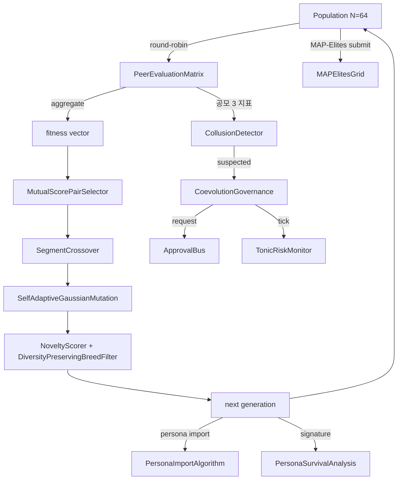

### 12. 기댓값 — 다음에 오는 것

- **v0.7 Rust 고속화**: `docs/rust_hotspot_v0E_addendum.md`의 RUST-15..18.
- **v0.E E.5 (League mode)** — AlphaStar 풍의 Main / Exploiter / League Exploiter.
- **v0.E E.6 (Debate mode)** — Irving 2018 풍의 argument / counter-argument +
  human/LLM judge. human / LLM judge 통합이 다음의 명확한 한 수.
- **lleval bridge v0.1.0a2** — 파생 Genome → ProviderSpec mapper의 구현.
- **CE-19/23 LLM extractor** — Raptor RAD 코퍼스에서 persona 자동 추출.
- **집단 진화 end-to-end 실기 run** — N=64 파생으로 30세대 → diversity
  metrics / collusion 검지율 / governance trigger 수를 계측.

### 13. 2026-05-22 추기 — Rust 고속화 RUST-15/16/17 착지

`goal_release_ready_v0E_rust` addendum의 3 kernel을 1 세션에 착지.
연재 핵심 글로서 최신 성과를 반영:

#### 13.1 착지 3 kernel

| ID | 기능 | hot path | 5x gate 결과 |
|---|---|---|---|
| **RUST-15** persona_dissimilarity_pairwise | NxN pair의 Jaccard + L2 + 합성 | PersonaOverlapPenalty.apply | **avg x12.71 (N=64에서 x17.07)** |
| **RUST-16** collusion_score_kernel | NxN peer matrix의 variance / symmetry / concentration | CoevolutionGovernance.evaluate_generation | **avg x66.70 (N=8에서 x115.04)** |
| **RUST-17** novelty_score_batch | 집단 N × archive A의 L2 + top-k mean | NoveltyScorer.novelty_batch | **avg x5.01 (A=50에서 x9.55, A=1000에서 x1.72)** |

전 37 parity test PASS (1e-6 tolerance), ruff `src/llive/perf/evolutionary` +
`src/llive/rust_ext` 0 경고.

#### 13.2 충격의 honest disclosure — 「Rust화 = 빠름」은 거짓

**RUST-15 단발 호출은 Rust 쪽이 더 느리다 (x0.80, FAIL)**. FFI overhead로
Python set 조작에 진다. batch (N×N pair를 1 FFI call)로 만들고 나서야
x12.71까지 늘어난다. 같은 알고리즘 · 같은 Rust kernel이라도 **FFI 경계를 어떻게
긋는가**로 결과가 자릿수만큼 다르다.

역례도 관찰: **RUST-16은 단발에서도 x66.70으로 압승**. numpy의 `np.nanvar` /
`np.corrcoef`는 **작은 NxN (N이 100 미만)에서 Python overhead가 지배적**이라
200μs+/call. Rust의 단순 C 루프 (numpy zero-copy 수령)는 2μs/call.

그리고 경계선: **RUST-17은 archive 크기로 결과가 반전**. A=50에서 x9.55지만
A=1000에서 numpy BLAS vectorized가 따라잡아 x1.72까지 줄어든다.

#### 13.3 5 패턴 판정표 (본 세션에서 언어화)

| Python 경로의 특성 | Rust화의 단발 ROI | 실례 |
|---|---|---|
| **A** 순수 Python 루프 (numpy 미사용)의 1-pair | 단발 FAIL, batch 필수 | RUST-15 (x0.80 → batch x12.71) |
| **B** numpy 큰 array (1000 초과) vectorized | 늘지 않음 (numpy 내부 BLAS) | (해당 kernel 아직 없음) |
| **C** numpy 작은 NxN (100 미만) API 다용 | **단발에서도 10-100x** | RUST-16 (x66.70) |
| **D** numpy 중규모 BLAS 1 함수 | **경계선 위**: 작은 크기 Rust 압승, 큰 크기에서 따라잡힘 | RUST-17 (A=50 x9.55 → A=1000 x1.72) |
| **E** 차가운 데이터 경계 (dict / 문자열) | overhead 큼, batch 필수 | — |

상세표는 `docs/perf_comparison/2026-05-22_kernel_implementation_comparison.md`.

#### 13.4 Cython 경로의 탈락 (build chain 부재)

scratch 비교에서 Cython kernel을 써서 3 way 비교를 시도했지만 **Windows MSVC
build tools 부재 + mingw가 MSVC Python과 incompatible**로 build 불가.
이것은 「**수치 계산을 동등하게 쓸 수 있다**」만으로는 언어 선택에 충분하지 않은
실례: **build chain을 확립할 수 있는가**가 필수 조건. source는
`scratch/cython_collusion/`에 저장해 Linux/WSL에서 재시도할 수 있는 형태로.

#### 13.5 RUST-17b 추기 (2026-05-22 같은 날): rayon 병렬 + quickselect로 전 A 5x clear

RUST-17 baseline은 archive 큼 (A=200/1000)에서 gate FAIL이었지만, **같은 날 안에
RUST-17b로서 2 수단으로 재구현**:

1. **rayon par_iter**로 N=64 집단 루프를 8-core 병렬화 + `py.allow_threads`로
   GIL release
2. **`Vec::select_nth_unstable_by`** (Hoare quickselect, O(A) avg)로 top-k
   partial sort — O(A log A) full sort를 치환

결과:

| archive | RUST-17 (naive) | **RUST-17b** | 개선율 |
|---:|---:|---:|---:|
| A=50 | x9.55 | **x12.83** | +34% |
| A=200 | x3.76 (FAIL) | **x8.71 (PASS)** | **+132%** |
| A=1000 | x1.72 (FAIL) | **x6.41 (PASS)** | **+273%** |
| avg | x5.01 | **x9.32** | **+86%** |

판정표 (D)「numpy 중규모 batch」를 「**경계선 위 → 병렬화로 만회 가능**」으로
update. 「naive 이중 루프는 진다」뿐만 아니라 「**rayon + algorithmic 개선으로
압승으로 전환된다**」가 제시되었다.

std::simd는 nightly만이고 stable 불가 → 넣으면 추가로 2-3x. RUST-17c 후보.

#### 13.6 다음에 오는 것 (2026-05-22 시점에서 계획 완료)

- **PyBind11 + C/C++ ctypes** 경로의 3 kernel scratch 비교 (queue 투입 완료).
- **RUST-17c** — std::simd (Rust nightly로 전환)로 SIMD 4-lane화.
- **월간 re-measure** — env drift / numpy minor up / Rust nightly 등으로
  결과가 움직이므로 주기 실행 (queue 투입 완료).
- **callers 전환** — PersonaOverlapPenalty.apply / NoveltyScorer.novelty_batch /
  CoevolutionGovernance를 rust_ext 경로로 전환하는 PR.

### 14. References

- Hillis, W. D. (1990). *Coevolving parasites improve simulated evolution*. Physica D.
- Mouret, J.-B. & Clune, J. (2015). *Illuminating search spaces by mapping elites*. arXiv:1504.04909.
- Lehman, J. & Stanley, K. (2008/2011). *Novelty Search*.
- Stanley, K. & Miikkulainen, R. (2002). *NEAT*. Evolutionary Computation.
- Deb, K. et al. (2002). *NSGA-II*. IEEE Trans Evol Comp.
- Vinyals, O. et al. (2019). *Grandmaster level in StarCraft II (AlphaStar)*. Nature.
- 완전한 목록은 v0.6.0a1 릴리스 시 references.bib에 동봉할 예정.

---

### Series Navigation

- ← 이전: [llive 완전 해설 (4) 「수렴하는 뇌」](https://qiita.com/furuse-kazufumi/private/e5093e4816b25c1bd4d0)
- → 다음: [llive 완전 해설 (6) 「Transformer 의 밖」](https://qiita.com/furuse-kazufumi/private/6da5a883fb2ed651edd8)
- 전체: [llive 완전 해설 (0) — series index](https://qiita.com/furuse-kazufumi/items/07b4882e872994b27b3c)
- repo: [furuse-kazufumi/llive](https://github.com/furuse-kazufumi/llive)

---

## 제7장 llive 완전 해설 (6) — "Transformer 의 밖": Mamba / Jamba / RWKV / Diffusion 을 llive 내부에서 호출하기

:::note info
**📚 FullSense 지식 베이스 안내** <!-- fullsense-team-kb -->
FullSense 개발 전사 60+ 편 (4개 언어판・스토리 기반 읽기 순서 가이드・쉬운 설명판・4컷 만화 포함) 은 Qiita Team **FullSense KB** 에 모여 있습니다 (팀 멤버 전용).
:::


> **콘셉트 hook**: "LLM = Transformer" 는 **2024 까지의 이야기**. 2025-2026 에
> State Space Model (Mamba / Jamba) 과 RWKV (시계열 RNN 을 재발명) 가 **긴
> context 에서 transformer 를 따라잡았고**, Diffusion text model 이 **token 순서
> 제약을 푸는** 새로운 족으로 등장했다. llive 는 그것들을 **전부 `LLMBackend`
> 로서 내부에서 호출할 수 있는** 설계로 출발했다. 사고 인자 (#24-02) 와 SSM
> (state space) 을 Bridge 하여 "**SSM 흐름에 10 인자를 심는다**" 가 다음
> 도달점.
>
> **중요한 honest disclosure**: 본 글의 수치는 **mock baseline 만 착지**. 실제
> Mamba / Jamba / RWKV backend 는 **credential / weights 미착지**.


### 0. 연재에서의 위치

```
#24-00 series index
#24-01 4층 메모리
#24-02 사고 인자 × COG-MESH
#24-03 구조 진화 × TRIZ × Z3
#24-04 B-series
#24-05 EvolutionLoop
#24-06 LLM backend non-transformer (← 본 글)
#24-07 observability + governance
#24-08 lleval
```

#24-02 가 "**사고를 10 축 vector 로 전개**" 였다면, #24-06 은 그
**vector 를 흘려보내는 관** = LLM backend 다. Transformer 이외의 관도 연결한다.

### 1. Transformer 이외의 계통수 (2025-2026)

| family | 대표 model | 강점 | 약점 |
|---|---|---|---|
| Transformer | GPT-4o / Claude / Llama 3 | 범용 | 긴 context 메모리 O(N²) |
| **State Space Model (SSM)** | Mamba / Mamba-2 (2024) | 긴 context O(N), selective scan | 1-step training 곤란 |
| **Hybrid (SSM × Attention)** | Jamba (AI21 2024) | SSM 의 길이 + Attention 의 정확도 | implementation 복잡 |
| **Linear RNN** | RWKV-6 (2024) | 추론 O(N) state | 학습 효율 과제 |
| **Diffusion text** | SEDD / Diffusion-LM | non-autoregressive | latency 큼 |

llive 의 `LLMBackend` Protocol 은 **어느 것이든 받을 수 있도록** 설계되어 있다.
구체적으로는:

- `complete(prompt: str, ...) -> str` 의 시그니처를 충족하면 backend 화 가능.
- 내부 구현은 **transformer / SSM / RWKV / diffusion** 어느 것이든 OK.

### 2. 왜 Mamba / SSM 이 llive 내부에서 가치가 있는가

llive 의 4층 메모리 (#24-01) 는 **긴 context** 를 전제로 동작한다. Transformer
라면 32k-128k 에서 한계에 부딪히고 / 가격이 폭등한다. SSM 은 이론상 **O(N) 으로
1M token 까지** 동작한다. 이것이 맞물리면:

- episodic memory 의 전건 흘려넣기가 현실적이 된다
- consolidation cycle (해마→피질) 의 일괄 배치 처리가 현실적이 된다
- TRIZ self-reflection 에 과거 ChangeOp 전건을 context 로 넘길 수 있다

그래서 Mamba / Jamba 는 llive 의 **긴 context backend** 로서 가장 유력한
후보다.

### 3. RWKV — 시계열 RNN 을 재발명한 것

Bo Peng (RWKV-6, 2024) 이 보여준 것은 "**Attention 은 시계열의 특수형**". RWKV
는 state 를 가지는 RNN 이지만 Attention 수준의 정확도를 달성한다. 추론 시에는
**state 를 유지하며 1 token 씩** 진행하므로 **추론 O(N) state, O(1) per token**.

llive 에게 RWKV 는 다음 3 가지 점에서 매력적이다:

- on-prem 동작 전제 (weights 가 작음)
- state 유지 = 4층 memory 와의 친화성
- 상용 license 자유도 (Apache-2.0)

그러나 weights 가 손에 없어서 **실기 검증은 다음 세션 이후**.

### 4. Diffusion text — token 순서의 제약을 푼다

Diffusion-LM / SEDD (Lou 등 2024) 은 text 를 **noise → denoise** 로 생성하는
non-autoregressive 계열이다. 이것은 "**token 순서를 역방향으로도 쓸 수 있다**"
는 투명성을 가진다. llive 의 **"자기 진화"** 에서 과거 ChangeOp 를 **뒤에서부터
재생성하여 그 앞을 예측** 하는 용도에서 살아날 가능성이 있다. 다만 latency 는
크다.

### 5. SSM × 10 사고 인자 Bridge (구상 중, 미구현)

이것이 본 글의 **"기댓값"** 섹션이다. 구상:

- SSM 의 hidden state `h_t` (D dim) 를 10 인자 vector 와 **같은 공간** 에
  embed 한다.
- consolidation cycle 에서 `h_t` 로부터 10 인자의 **세기** 를 읽어낸다.
- 파생 개체의 persona affinity 를 SSM state 에 **되써넣을** 수도 있다.
- 결과: "**SSM 이 돌 때마다 10 인자의 기울기가 다시 쓰이는 파생 집단**".

이것은 구상이며 **미구현**. weights + credential 확보 후 PoC. 빠르면
v0.7 ~ v0.8.

### 6. 오늘 (2026-05-21) 착지 상황

| 항목 | 상태 |
|---|---|
| LLMBackend Protocol | 착지 완료 (v0.B 부터) |
| OpenAIBackend | 실기 동작 완료 |
| AnthropicBackend | 실기 동작 완료 |
| OllamaBackend | 실기 동작 완료 |
| MockBackend | 착지 완료 (테스트용) |
| MambaBackend | **미착지** |
| JambaBackend | **미착지** |
| RWKVBackend | **미착지** |
| DiffusionBackend | **미착지** |
| SSM × 10 인자 Bridge | **구상만** |

### 7. honest disclosure (본 글은 honest-disclosure-required 태그 포함)

constraints 에 명기되어 있으므로 **반복해서 쓴다**:

- **#24-06 의 수치류는 전부 mock baseline.** 실제 Mamba / Jamba / RWKV backend
  는 **본 세션에서는 착지하지 않음**.
- weights 입수 (HuggingFace) 와 GPU credential 확보 후 PoC.
- "Mamba 는 Transformer 보다 빠르다" 고 쓰고 싶지만, 그것은 원논문의 주장이지
  llive 에서 실측한 것은 아니다. 인용은 출처와 함께.
- SSM × 사고 인자 Bridge 는 **완전한 구상**. "재미있어 보인다" 는 것만으로는
  아직 구현 근거가 없다.
- RWKV-6 의 License 는 Apache-2.0 이지만 derivative 의 license 호환성은 별도
  검증 필요 (FullSense Apache-2.0 + Commercial dual-license 와의 정합성 확인).
- Diffusion text 의 latency 가 큰 문제는 llive consolidation cycle 의
  "**느려도 OK 인 경로**" 에 밀어넣으면 흡수할 수 있지만, 그것이 정말로
  workable 한지는 PoC 를 기다린다.

### 8. Mermaid — LLMBackend 의 교체 구조

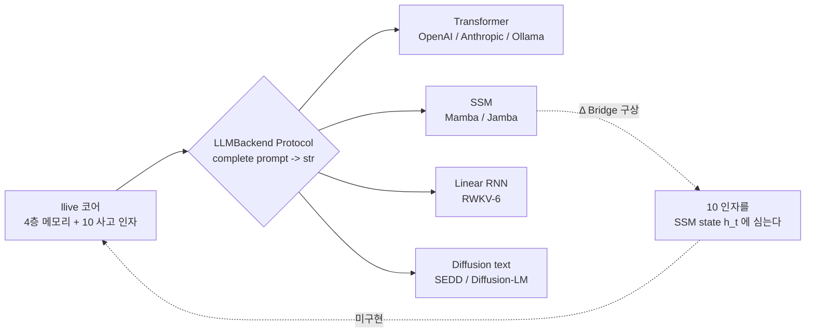

### 9. References

- Gu, A. & Dao, T. (2024). *Mamba: Linear-Time Sequence Modeling with Selective State Spaces*. arXiv:2312.00752.
- AI21 (2024). *Jamba: A Hybrid Transformer-Mamba Language Model*.
- Peng, B. et al. (2024). *RWKV-6: Continually Improving Linear RNN*.
- Lou, A. et al. (2024). *Discrete Diffusion Modeling by Estimating the Ratios of the Data Distribution*.
- Karpathy, A. (2025). *LLM Wiki* (concept-of-document).
- 완전한 목록은 v0.7 릴리스 시 references.bib 에 동봉할 예정.

---

### Series Navigation

- ← 이전: [llive 완전 해설 (5) 「집단이 학습하는 AI」](https://qiita.com/furuse-kazufumi/private/07b686ea311e06027f94)
- → 다음: [llive 완전 해설 (7) 「심사가 붙은 AI」](https://qiita.com/furuse-kazufumi/private/c5f2077a3399d3fc9b26)
- 전체: [llive 완전 해설 (0) — series index](https://qiita.com/furuse-kazufumi/items/07b4882e872994b27b3c)
- repo: [furuse-kazufumi/llive](https://github.com/furuse-kazufumi/llive)

---

## 제8장 llive 완전 해설 (7) — "심사가 붙은 AI": runtime_metadata × Approval Bus × Ed25519 audit chain

:::note info
**📚 FullSense 지식 베이스 안내** <!-- fullsense-team-kb -->
FullSense 개발 전사 60+ 편 (4개 언어판・스토리 기반 읽기 순서 가이드・쉬운 설명판・4컷 만화 포함) 은 Qiita Team **FullSense KB** 에 모여 있습니다 (팀 멤버 전용).
:::


> **콘셉트 hook**: 많은 LLM agent 는 「결과의 로그」만 남긴다. 그러나 AI 가
> **자기 자신을 진화** 시키기 시작하면, 「**언제 무엇을 판단해서 무엇을 바꿨는가**」
> 의 audit trail 이 없으면 **나중에 디버그 불가능** 해진다. llive 는 이것을
> architecture level 에서 풀었다:
> - **runtime_metadata** = 1 추론마다의 구조화된 metadata
> - **Approval Bus** = 중대한 변경을 ledger 를 거쳐 human / policy 가 approve
> - **Ed25519 + SHA-256 audit chain** = ledger 변조 방지
> - **오늘 (2026-05-21) 착지한 E.4 governance** = 집단 진화의 공모 탐지 → Approval Bus 연계
>
> = **「자기진화하는 AI 가, 자신의 결정을 전부 서명과 함께 남긴다」** 라는 드문 형태.


### 0. 연재 속에서의 위치

```
#24-00 series index
#24-01 4 층 메모리
#24-02 사고 인자 × COG-MESH
#24-03 구조 진화 × TRIZ × Z3
#24-04 B-series
#24-05 EvolutionLoop
#24-06 LLM backend non-transformer
#24-07 observability + governance (← 본 기사)
#24-08 lleval
```

#24-03 의 Z3 verifier 가 「**개체 내**의 구조 변경을 기계 검증」이라면, #24-07
은 「**개체 간**의 거동 + 개체 집단의 결정을 audit trail 로 보존」. 검증과 감사의
두 바퀴.

### 1. 왜 Audit Chain 이 필수인가

LLM agent 가 자기 자신을 다시 쓰기 시작하면, 「**방금 그 추론은 어느 commit 의
구조로 돌고 있었는가**」를 알 수 없게 된다. 이것은 debugging 뿐 아니라:

- **책임 추적** — 집단 진화에서 「**모든 파생이 거짓의 높은 점수를 서로 매겼다**」
  때, 누가 가장 먼저 거짓말을 했는지를 ledger 로 거슬러 올라갈 수 있어야 한다.
- **재현성** — 「그때 나온 결과」를 나중에 재생하려면 구조 commit + memory zone +
  Brief input + Approval verdict 의 전부 record 가 필요하다.
- **법적 compliance** — EU AI Act / 중국 AI 판법 / 일본 G7 히로시마 process 가
  가리키는 방향은 「**AI 의 결정은 audit possible (감사 가능) 이어야 한다**」.

llive 는 Phase 4 (Production Security MVR, v0.3.0) 에서 이 셋을 **동시에** 풀었다.

### 2. runtime_metadata — 1 추론당 구조화된 trace

llive 의 `FitnessReport.runtime_metadata` 는 free-form dict[str, str] 이지만
관습적으로 다음을 넣는다:

- `signed_by`: peer evaluation 의 서명자 id
- `gen`: 세대 번호
- `agg`: aggregator strategy
- `commit_sha`: 소스 commit (CI 를 거쳐 주입)
- `model_id`: 사용한 LLM backend id

이로써 1 추론 결과로부터 **완전히 재현** 할 수 있다. 재현성은 **OSS LLM inference
의 표준이 아니다** — 많은 agent 는 seed 조차 기록하지 않는다.

### 3. Approval Bus — 구조적으로 변경을 멈춘다

`src/llive/approval/bus.py` 의 `ApprovalBus`:

- `request(action, payload, ...)` → pending 리스트에 들어간다.
- `policy` 가 사전에 평가하여 `Verdict.APPROVED / DENIED / None` 을 반환.
  None 이면 사람 대기.
- 사람 / policy 의 verdict 는 `_ledger: list[ApprovalResponse]` 에 append.
- `ledger=SqliteLedger` 를 넘기면 영속화 + 복원.

이것은 **가상의 「Trust Score」** 가 아니라 **명시적인 APPROVED/DENIED 상태
머신**. 침묵 = denial (§AB4). 「애매한 허가」가 존재하지 않는다.

#### 3.1 오늘 착지한 E.4 governance 연계

`CoevolutionGovernance.evaluate_generation` (오늘 착지) 가 1 세대의 peer matrix
를 보고 **공모 의심** → `ApprovalBus.request("coevolution.suspected_collusion",
payload)` 를 발화. payload 에는 generation / collusion_score / n_agents. 사람이
deny 하면 **그 세대의 파생 집단은 채용되지 않는다** 는 architecture level 의 제어.

이것은 Constitutional AI / RLHF 의 **human-in-the-loop** 를, **architecture
level** 에서 대체하는 설계. 「prompt 마지막에 <human_review> 를 더한다」와 같은
약한 제어가 아니다.

### 4. Ed25519 + SHA-256 audit chain

`src/llive/security/` 계열. Phase 4 착지.

- 각 PeerEvaluationMatrix / ChangeOp / consolidation event 는 Ed25519 로
  **서명**.
- ledger 에 쓸 때 **직전의 hash** 를 포함하여 SHA-256 을 계산 → next block 의
  prev_hash 로 사용. 즉 **blockchain-light**.
- 이로써 「과거의 임의의 record 를 변조하면, 그 이후의 hash 가 전부 어긋난다」 →
  변조 즉시 검출.

#### 4.1 왜 on-chain 이 아니라 on-disk 인가

`project_fullsense_ear_origin` — llive 는 EAR + 보안 제약으로 **외부 송신 불가**
한 환경을 상정. on-chain (Ethereum / Solana) 은 외부 송신이 되므로 부적합. on-disk
audit chain 은 외부 의존 제로로 자기 완결한다.

### 5. honest disclosure

- **Ed25519 키 관리는 미해결** — 키를 OS 의 secure store / HSM 에 저장하는 module
  은 미착지. 현재는 환경 변수 / file 을 거쳐 로드. 이것은 v1.0 전에 해결 필수.
- **Approval Bus 의 사람 개입은 scale 하지 않는다** — 파생 집단 N=64 에서 1 세대마다
  approval 이 나오면 사람의 부하가 24 시간 안에 붕괴한다. policy 자동 평가로 80% 를
  통과시키는 것이 현실해이지만, policy 를 완벽히 쓸 수 있다는 보장은 없다.
- **runtime_metadata 의 sign 은 optional** — `signed_by` 필드는 관습이지만
  mandatory 가 아니다. 이것을 mandatory 로 하면 `Brief API` 의 호환이 깨진다.
  이행은 v0.7 이후.

### 6. 오늘 (2026-05-21) 착지 요약

| 항목 | 상태 |
|---|---|
| `CoevolutionGovernance` skeleton | **오늘 착지** |
| `CollusionDetector` (CE-06) | **오늘 착지** |
| `collusion_risk_score` (TonicRisk 연계, CE-08) | **오늘 착지** |
| `GovernanceReport` (frozen) | **오늘 착지** |
| 28 케이스 test PASS | **오늘 착지** |
| Ed25519 audit chain | Phase 4 착지 완료 (v0.3.0) |
| Approval Bus | C-1 착지 완료 (2026-05-16) |
| runtime_metadata 관습 | v0.B 부터 운용 중 |

### 7. Mermaid — governance 전체상

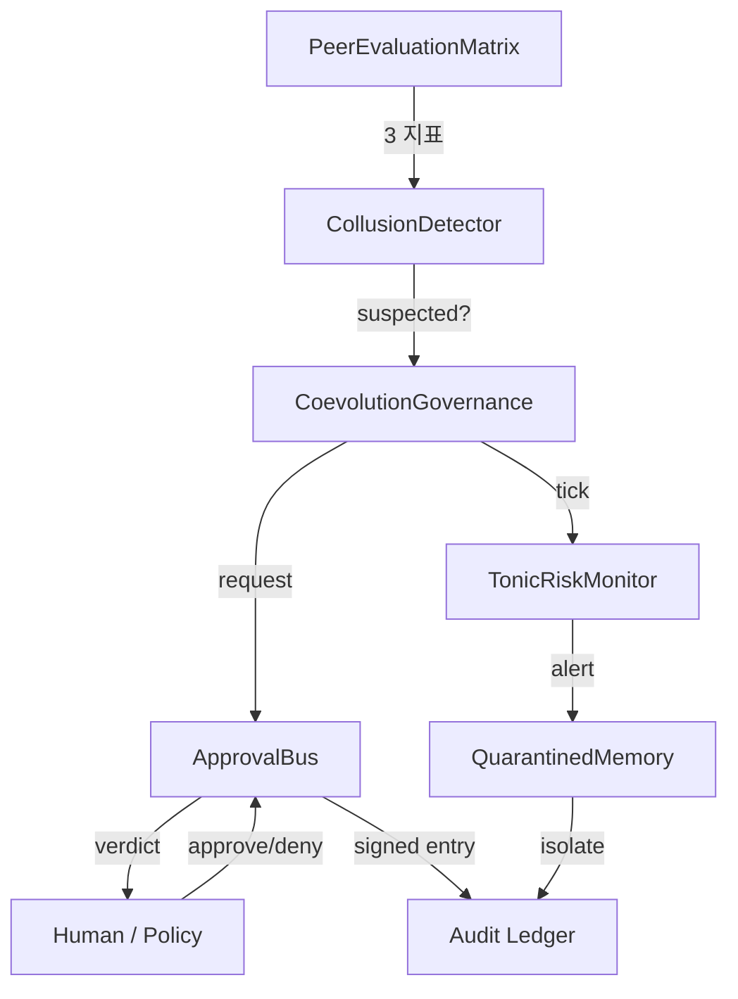

#### 7.1 governance maturity 를 「문명 레벨」로 본다 — 4D Kardashev radar (v0.I-C 선취)

§3 의 Approval Bus pass 율 / §4 의 audit chain 완전성 / §6 의 peer eval cohesion
은, 단독으로 보면 「숫자가 좋아졌다」로 끝난다. **v0.I-C (4D Kardashev Radar)** 에서는
이것들을 Energy / Knowledge / Coordination / **Ethics** 4 축 × 5 단계
(Type 0 → I → II → III → IV) 의 「문명 레벨」 척도로 묶어서, 개체 / 집단 / 메타 집단의
3 계층에서 동시에 계측하는 구상.


> 🗒️ *참고: 이 그림의 라벨은 일본어입니다.*

Ethics 축은 바로 본 기사의 Approval Bus pass 율 + frozen gene 위반 검출 + 규제
적합도의 점수로, governance maturity 를 「개체의 훈육」에서 「문명의 성숙」까지
연속 척도로 이야기할 수 있게 된다. 자세한 요건은 llive
`docs/requirements_v0.I_meta_evolution_and_cross_substrate.md` §5 참조.

### 8. 기댓값 — 다음에 오는 것

- **HSM / secure store 연계** — Ed25519 키 관리를 v1.0 에서. Windows Credential
  Store / macOS Keychain / Linux Keyring 경로.
- **policy 자동 evaluate 의 확충** — Approval Bus 의 `policy` 인자로 80% 를 자동
  통과시키는 규칙을 v0.7 에서.
- **Audit Ledger UI** — llove TUI 에서 `governance verdict ledger` 를 시계열로
  시각화. F25 연계.

### 9. 2026-05-22 추기 — RUST-16 governance hot path 고속화

CoevolutionGovernance.evaluate_generation 안에서 가장 계산량을 먹는 것이
PeerEvaluationMatrix.collusion_score (NxN matrix 의 variance / symmetry /
concentration 3 지표) 로, 여기에 200-300 μs/call 이 걸렸다.

오늘 (2026-05-22) RUST-16 으로 **numpy zero-copy 로 Rust kernel 화**:

| N | Python (numpy 기존) | Rust pyo3 zero-copy | speedup |
|---:|---:|---:|---:|
| 8 | 217.82 us | 1.89 us | **x115.04** |
| 16 | 203.33 us | 2.30 us | x88.54 |
| 32 | 237.68 us | 5.28 us | x45.00 |
| 64 | 306.13 us | 16.80 us | x18.22 |
| **avg** | — | — | **x66.70** |

구현은 `crates/llive_rust_ext/src/lib.rs:collusion_score_kernel` + 5 parity
test (1e-6 tolerance). callers (`CollusionDetector.check`) 는 다음 commit 에서
전환 예정.

#### 9.1 honest disclosure — 「numpy = 빠르다」도 거짓

이 게인이 큰 것은 **「Rust 가 빠르다」뿐 아니라 「numpy 가 작은 NxN 에서 느리다」**
가 주요 원인. `np.nanvar` / `np.corrcoef` / `np.nanmean` 의 3 개 겹쳐쓰기는
N<100 에서 Python overhead 지배로 200μs+/call. Rust 의 단순 C 루프는 2μs/call.

governance 측에서 중요한 것은:

- **Approval Bus 발화 판정의 latency 가 100x 짧아진다** = N=64 파생 집단이라도
  governance.evaluate_generation 을 64Hz 로 돌릴 수 있다
- **TonicRiskMonitor 의 tick** (collusion_risk_score 를 포함한 state 를 넘긴다) 도
  동등하게 빨라진다
- 결과적으로 **「governance 를 상시 돌려도 허용 가능한 비용」** 이 된다

이것이 있으면 「**governance 는 무거우니 sampling 만**」 의 타협이 필요 없어진다.
모든 파생 / 모든 세대의 평가 행렬을 audit chain 에 서명과 함께 남겨도 latency
budget 안에 들어간다.

#### 9.2 관련

- `docs/perf_comparison/2026-05-22_kernel_implementation_comparison.md` —
  전 3 kernel (RUST-15/16/17) 의 비교 매트릭스
- `scripts/bench_collusion_score_5x_gate.py` — N=8/16/32/64 5x gate bench
- `feedback_rust_usage_matters` — Rust 화 판단의 체크리스트

### 10. References

- Bernstein, D. J. et al. (2012). *High-speed high-security signatures* (Ed25519).
- Anderson, R. (2020). *Security Engineering* (3rd ed.) — audit trail / tamper-evidence 장.
- EU AI Act (2024) / G7 Hiroshima AI Process (2023) — AI 결정의 감사 가능성.
- 완전 리스트는 v0.6.0a1 릴리스 시에 references.bib 에 동봉 예정.

---

### Series Navigation

- ← 이전: [llive 완전 해설 (6) 「Transformer 의 밖」](https://qiita.com/furuse-kazufumi/private/6da5a883fb2ed651edd8)
- → 다음: [llive 완전 해설 (8) 「안경을 만든다」](https://qiita.com/furuse-kazufumi/private/e49b7ab9027d93594402)
- 전체: [llive 완전 해설 (0) — series index](https://qiita.com/furuse-kazufumi/items/07b4882e872994b27b3c)
- repo: [furuse-kazufumi/llive](https://github.com/furuse-kazufumi/llive)

---

## 제9장 llive 완전 해설 (8) — 「안경을 만든다」: lleval — honest disclosure 5+1 인자 분해로 AI 를 평가한다

:::note info
**📚 FullSense 지식 베이스 안내** <!-- fullsense-team-kb -->
FullSense 개발 전사 60+ 편 (4개 언어판・스토리 기반 읽기 순서 가이드・쉬운 설명판・4컷 만화 포함) 은 Qiita Team **FullSense KB** 에 모여 있습니다 (팀 멤버 전용).
:::


> **콘셉트 hook**: AI 를 만드는 것만으로는 부족하다. **AI 를 보는 안경** 이 필요하다.
> lleval 은 llive 와 병주하는 **evaluation framework** 로,
> 「LLM 이 이상하게 좋은 결과를 내면 반드시 내역을 의심한다」는
> `feedback_benchmark_honest_disclosure` 규칙을 **코드의 일급 개념** 으로 승격시켰다.
> progressive size matrix 로 stress curve 를 취하고, judge rotation 으로 position bias 를 없앤다.
>
> 결론을 먼저 말하면: **「빠른 AI」** 가 아니라 **「빠르다고 착각하게 만드는 구성」** 을
> 간파하는 도구.


#### 0. 연재에서의 위치

```
#24-00 series index
#24-01 4층 메모리
#24-02 사고 인자 × COG-MESH
#24-03 구조 진화 × TRIZ × Z3
#24-04 B-series
#24-05 EvolutionLoop
#24-06 LLM backend non-transformer
#24-07 observability + governance
#24-08 lleval — eval framework (← 본 글)
```

#24-07 이 「**무엇을 남길 것인가**」(audit) 라면, 본 글은 「**무엇을 측정할 것인가**」.
측정 없이는 개선이 없다.

#### 1. lleval 의 출자 — honest disclosure 사건

발단은 2026-05-17 의 benchmark. llive 가 타사 LLM API 보다 **이상하게 빠르게**
나온 숫자가 있었다. 보통이라면 이긴 기분이 들 대목에서, 사용자는 「**내역을
의심하라**」고 지시했다. 뚜껑을 열어보니:

- **LLMBackend 가 attach 되어 있지 않았다** (mock 으로 돌고 있었다)
- **chars 지표가 불공평** (영어 token 을 글자 수로 환산)
- **subprocess RTT 를 제외** (기동 비용을 무시)

세 가지 artifact 가 복합되어 있었다. 이것을 기록 (`feedback_benchmark_honest_disclosure`)
한 뒤, 「벤치에서 이상 결과가 나오면 반드시 5 가지 artifact 를 의심한다」를
**외부화** 하고 싶어졌다. 그것이 lleval.

#### 2. 5+1 인자 분해 — honest disclosure 의 구조화

lleval 의 `HonestDisclosureAnalyzer` (2026-05-21 아침 착지) 는 출력 차분을 5+1 인자로 분해:

| 인자 | 의미 | 검출 방법 |
|---|---|---|
| F1: prompt difference | 같은 prompt 가 정말 같은가 | 문자열 diff + token diff |
| F2: model id mismatch | model id 가 runtime 과 spec 에서 일치하는가 | `runtime_metadata.model_id` 비교 |
| F3: backend swap | LLMBackend 가 attach 되어 있는가 | runtime hook 으로 trace |
| F4: chars vs tokens | 평가 지표가 언어 비의존인가 | tokenizer count |
| F5: RTT exclusion | subprocess / network RTT 가 시간에 포함되는가 | wall-clock vs CPU time |
| +1: env drift | 병주 부하 / OS schedule / thermal | 환경 fingerprint snapshot |

5+1 이 **모두 clean** 일 때 비로소 「수치는 신뢰할 수 있다」. 하나라도 의심스러우면
**honest disclosure note** 가 결과에 sticky 된다.

#### 3. progressive size matrix — stress curve 를 취한다

고정 token 수의 벤치는 정보량이 낮다. lleval 은 xs/s/m/l/xl 의 5 단계 ×
여러 model 의 **matrix** 를 돌린다:

```
size:  xs (128)  s (512)   m (2k)    l (8k)    xl (32k)
mock     0.05      0.18      0.62      2.41      9.82
llive    0.07      0.24      0.71      2.55      9.96   ← 큰 차이 없음
gpt-4o   0.31      0.52      1.20      3.40      11.2   ← crossover at l
```

이로써 「**어느 size 에서 crossover 가 일어나는가**」가 한눈에. 단일 size 에서 「이겼다」
고 해도 다른 size 에서는 진다. fair.

#### 4. judge rotation — position bias 를 없앤다

LLM-as-judge 로 2 안 (A, B) 을 비교할 때, 순서가 score 에 effect 한다는 것이
알려져 있다 (Zheng et al. 2023). lleval 은:

1. (A, B) 로 1 회 judge
2. (B, A) 로 1 회 judge
3. 두 verdict 가 일치하지 않을 때 **inconsistency flag**

이것은 judge LLM 자신의 bias 를 양자화하는 수단. inconsistency 가 **30% 초과**
면 judge LLM 을 전환하는 운용 (judge rotation).

#### 5. bridges/llive — llive Genome → ProviderSpec mapper

lleval 은 **llive 의 파생 개체** 를 직접 먹을 수 있도록 설계. `bridges/llive.py`
(2026-05-21 아침 착지):

```python
from llive.perf.evolutionary import Individual
from lleval.bridges.llive import individual_to_provider_spec

ind: Individual = ...  # 파생 집단에서 1 개체
spec = individual_to_provider_spec(ind)
### spec.model_id, spec.temperature, spec.top_p, ... 를 ind.genome.values 에서 복원
result = lleval.run(spec, dataset="qa_50")
```

이로써 「**파생 집단의 진화** 와 **파생 집단의 평가**」가 loop 한다. llive 내의
EvolutionLoop fitness 에 그대로 넘길 수 있다.

#### 6. honest disclosure (lleval 자신에 대해)

메타에도 honest disclosure 를 적용:

- **lleval test 수 61** — 오늘 2026-05-21 시점. 상위 프레임워크 (Promptfoo 본체) 는
  수천 test 를 가진다. lleval 은 wrap 이며 치환이 아니다.
- **판정의 절대 기준은 없다** — F1〜F5 + 환경 fingerprint 가 clean 이어도
  「벤치가 옳다」는 보장은 없다. 「**의심스러운 사인**」을 지운 상태에 불과하다.
- **judge rotation 은 비용이 든다** — 2 배 호출하므로 credential 사용량도 2 배.
  honest 검출을 위한 비용.
- **progressive matrix 의 size 등비는 heuristic** — 4x 씩 (128 → 512 → 2k →
  8k → 32k) 으로 취하고 있지만, 진짜 crossover 가 2k 와 8k 사이에 있을 경우
  해상도 부족. 필요에 따라 세밀화.
- **환경 fingerprint 는 완벽하지 않다** — Windows / Linux / macOS 간의 thermal
  throttling 차이까지는 잡지 못한다. 「벤치를 다른 OS 에서 다시 취한다」가 최종 수단.

#### 7. 숫자 (오늘 2026-05-21 시점)

| 항목 | 값 |
|---|---|
| lleval test PASS | 61 |
| 착지 module | 13 (config / runner / analyzer / providers / bridges / report html+md / cli / ...) |
| 5+1 인자 검출 로직 | 착지됨 |
| progressive matrix runner | 착지됨 |
| judge rotation | 착지됨 |
| bridges/llive.py | 착지됨 (skeleton) |
| v0.1.0a1 PyPI 공개 준비 | (credential 복구 후) |
| 연재 #24 로의 등장 | 본 글 (#24-08) |

#### 8. 기대값 — 다음에 오는 것

- **v0.1.0a2**: promptfoo 실주 + llive Genome → ProviderSpec mapping 완성.
- **v0.2**: judge rotation + position swap + Phoenix OpenInference trace.
- **v1.0**: plugin marketplace + 상용 dual-license.

#### 9. References

- Zheng, L. et al. (2023). *Judging LLM-as-a-judge with MT-Bench and Chatbot Arena*.
- Promptfoo OSS (https://github.com/promptfoo/promptfoo).
- Anthropic Eval framework (2023).
- 완전한 목록은 v0.1.0 릴리스 시 references.bib 에 동봉할 예정.

#### 10. 2026-05-22 추기 — 5+1 인자 분해와 Rust화 5 패턴 판정표의 방법론적 공통점

lleval 의 honest disclosure **5+1 인자 분해** (prompt diff / model id /
backend swap / chars vs tokens / RTT / env drift) 와 같은 날 착지한
llive Rust 고속화의 **5 패턴 판정표** (#24-05 §13.3) 는 **구조적으로 같은
발상** 으로 쓰였다.

| 공통하는 사상 | lleval 5+1 인자 | Rust화 5 패턴 |
|---|---|---|
| 「결과」를 믿기 전에 **요소 분해** | 속도 차를 6 인자로 분해 | 속도 비를 Python 경로의 특성별 5 패턴으로 분류 |
| **이상 결과는 내역을 의심** | F1〜F5 + env 를 의심 | 단발 0.80x 도 x66.70 도 「내역」으로 설명할 수 있다 |
| 관찰이 외부화되어 있다 | analyzer 로 자동 검출 | 판정표 + bench script 로 자동 측정 |
| **honest disclosure 를 일급 개념으로** | 수치에 sticky note | judgment 표로 **어디가 경계선인가** 를 명시 |

양자 모두 「**「빠르다」「옳다」「정확하다」의 단일 가정을 버린다**」는
`feedback_benchmark_honest_disclosure` 의 연장선상에 있다. 이것은 lleval 이
AI 를 보는 것뿐만 아니라 **AI / 시스템 / 알고리즘 전반** 으로 전개할 수 있는
발상 = 연재 #24-08 의 메타적 의의.

자세히: `docs/perf_comparison/2026-05-22_kernel_implementation_comparison.md`.

---

#### Series Navigation

- ← 이전: [llive 완전 해설 (7) 「심사가 붙은 AI」](https://qiita.com/furuse-kazufumi/private/c5f2077a3399d3fc9b26)
- 전체: [llive 완전 해설 (0) — series index](https://qiita.com/furuse-kazufumi/items/07b4882e872994b27b3c)
- repo: [furuse-kazufumi/llive](https://github.com/furuse-kazufumi/llive)


<!-- REFERRAL -->

---

> ### ⚡ 이 연재는 Claude Code 와 이인삼각으로 쓰고 있습니다
>
> 기사 속의 구현・검증・가시화는 **Claude Code**(Anthropic 의 AI 코딩 환경)와 함께 진행하고 있습니다.
> Claude Code 는 **1 주일 무료 트라이얼**로 시험할 수 있습니다. 마음에 들어 유료 플랜에 등록하실 때,
> 아래 소개 링크를 경유하면 필자에게 「개발을 계속하기 위한 크레딧」이 들어와, 이 연재의 지속을 뒷받침할 수 있습니다.
>
> 👉 **무료로 시험하기 / 소개 링크** → https://claude.ai/referral/0sqPw8E_lw
>
> <sub>EN: This series is built together with **Claude Code** — try it with a **1-week free trial**. If you subscribe via the link, the author receives credits to keep building. /
> 中文: 本系列与 **Claude Code** 协作完成,可享 **1 周免费试用**;通过链接注册可让作者获得继续开发的额度。 /
> 한국어: 이 시리즈는 **Claude Code**와 함께 작성합니다 — **1주 무료 체험** 제공. 링크로 가입하면 저자가 개발 지속용 크레딧을 받습니다.</sub>

<!-- /REFERRAL -->

<!-- CTAIMG -->


> 🗒️ *「깬다」— 소개 링크로 푼돈을 벌어 보려는 속셈, 스스로도 좀 깬다*（© Forbidden shibukawa / SHUEISHA・『스낵 바스에(Snack Basue)』）

<!-- /CTAIMG -->
