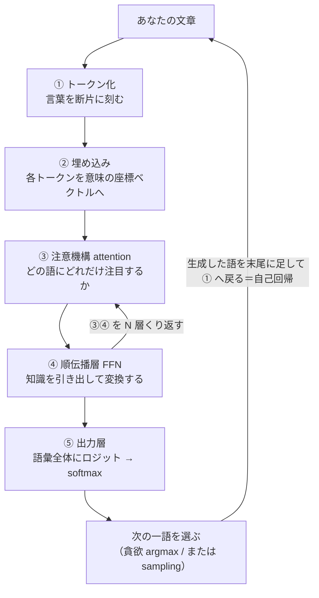
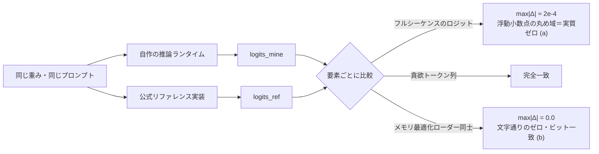

# 序章 ― 自作して誤差ゼロで確かめる、という読み方（技術版 #0）

著者: 古瀬 和文（ぷるやん）

> シリーズ「作って分かった LLM の中身 ― 自作言語モデルで覗く構造」第0回（技術版）。
> この技術版では、同じ地図を数式・擬似コード・実測値の高度で通ります。一般版が「絵で腑に落とす」担当なら、
> こちらは「組み直して測って納得する」担当です。#0 の主題はただ一つ――**なぜ「自作して誤差ゼロで再現する」と、
> LLM の中身を説明できるのか**。この一点を、実測した数値で丁寧に据えます。

---

大規模言語モデル(Large Language Model, LLM)の解説は、すでに世の中に山ほどあります。それでも私がこのシリーズを
書くのは、付け加えたいものが一つだけあるからです。それは、**フレームワークのブラックボックスを開けて推論エンジンを
自分で組み直し、公式のリファレンス実装と実測して、誤差が丸め込みの域まで一致した**――という一次体験です。

図を眺めるのと、部品を自分で削り出して組み立て、動かして測るのとでは、理解の質が変わります。私は後者をやりました。
そして、うまくいったこと（実質誤差ゼロの再現）だけでなく、**うまくいかなかったこと**（自作の文字言語モデルが会話に
ならなかった、極端な圧縮でモデルが壊れた、素朴な進化探索が単純な貪欲法に負けた）も、このシリーズでは消さずに残します。
それが、このシリーズを貫く**誠実な開示(honest disclosure)** の約束です。

この序章は長めです。用語ミニ辞典 → かみくだき → 詳細、の順で進みます。①②だけ読んでも筋が通るように書いたので、
急ぐ方は③の細部を後回しにしても構いません。


---

## ① 用語ミニ辞典（この回で使う言葉）

まず、この記事で繰り返し出てくる言葉を先に置きます。ここを読んでおくと、後半の詳細がすっと入ります。

- **大規模言語モデル(Large Language Model, LLM)** … 膨大なテキストで訓練された「次の一語を当てる」予測器。以降 LLM。
- **トークン化(tokenization)** … 文章を「トークン(token)」という小さな断片へ刻む処理。1トークンは1単語より細かいことが多い。
- **埋め込み(embedding)** … 各トークンを、意味を表す高次元ベクトル（「意味の座標」）へ変換すること。学習で獲得される。
- **注意機構(attention)** … 「今の語が、これまでのどの語にどれだけ注目するか」を動的に決める仕組み。Transformer の心臓。
- **順伝播層(feed-forward network, FFN)** … 注意機構のあとに置かれる2層の多層パーセプトロン。知識の貯蔵庫としての性格が強い。
- **順伝播(forward pass)** … 入力から出力（次トークンのスコア）まで、モデルを一方向に通す計算。以降 forward。
- **ロジット(logits)** … 出力層が語彙全体の各トークンに付ける、softmax 前の生スコア。ここに次の一語の「なりやすさ」が乗る。
- **自己回帰(autoregression)** … 一語出す → その語を末尾に足して全部読み直す → 次を出す、を繰り返す生成の仕方。
- **貪欲(greedy)な生成** … 各ステップで、ロジット最大のトークン（argmax）を機械的に選ぶ決定論的な生成。乱数を使わない。
- **推論(inference)** … 学習済みの重みを使って、実際に次トークンを計算・生成する運用フェーズ。学習(training)の対義。
- **浮動小数点(floating point)** … 小数を有限桁で近似して扱う計算方式。演算順序が変わるだけで最下位桁がわずかにずれる。
- **誠実な開示(honest disclosure)** … 数値は実測だけを載せ、失敗も留保も隠さず、うますぎる結果はまず内訳を疑う、という発信の作法。

4文字以下の略語（LLM, FFN, KV など）はこの初出で一度だけ展開し、以降は略語で通します。

---

## ② かみくだき：なぜ「組み直すと分かる」のか

いちばん短い言い方をします。**LLM は「次の一語を当てる機械」** です。あなたが打ち込んだ文章を細かい断片（トークン）に
刻み、それぞれを「意味の座標」に置き、「どこに注目すべきか」を計算し、「知識」を引き出し、最後に**語彙のすべての語に
点数(ロジット)をつけて、いちばん点の高い一語を選ぶ**。そしてその一語を末尾に足して、また最初から読み直す。この繰り返し
（自己回帰）だけで、質問に答え、翻訳し、コードまで書きます。

この「地図」は、実は既存の解説記事でも見られます。私が付け加えたいのは、その地図が**本当に正しいと、どうやって
自分で確かめたか**の部分です。

私のやり方は、私の職業病そのものでした。私はこの25年、計測・制御の現場で「カメラで見て、機械を動かす」装置を作ってきた
エンジニアです。その世界には鉄則があります――**「図面や仕様書を信じる前に、現物を測れ」**。うまく動いた気がしても、
実際にノギスを当て、干渉縞を数え、基準器と突き合わせるまでは「分かった」とは言いません。

だから LLM でも同じことをしました。**フレームワークが用意した推論エンジンを使わず、自分で一から推論エンジンを書き、
公式のリファレンス実装と同じ入力を与えて、出力（ロジット）を一つ残らず突き合わせた**のです。

結果は――**フルシーケンス（全位置・全語彙）のロジットが、浮動小数点の丸め誤差の域で一致**しました。数値でいうと
差の最大が 2e-4（0.0002）のオーダー。さらに、メモリを切り詰めた読み込み方式どうしを比べたときは、**1ビットの狂いも
なく完全一致**しました（差の最大がきっかり 0.0）。

ここが肝です。**組み直したものが、寸分違わず同じ答えを返した。だから私は、各部品が何をしているかを取り違えていない、
と言える。** もし埋め込みの意味を勘違いしていたら、注意機構の割り算を一つ落としていたら、位置の付け方を間違えていたら、
出力はどこかで必ずずれます。それがずれなかった、という事実が、このシリーズ全体の信頼の土台です。

> **語呂で覚える**：このシリーズの読み方は「**測って確かめる**」。図で分かった気になる前に、
> 組み直して、突き合わせて、差を見る。計測の現場も、LLM の中身も、そこは同じでした。

一つだけ、最初に正直に線を引いておきます。**「同じ出力が出せた」ことが証明するのは、"計算を正しく組めた" ことまで**です。
会話が上手いこと、賢いことそのものを私が作ったわけではありません。**会話の賢さは、学習済みの重みに宿っています。**
私が作ったのは「その中身を検査・改造できる、検証済みの推論ランタイム（ブラックボックスでない箱）」であって、
賢さの出どころではない。この継ぎ目は、シリーズを通してぼかしません。

---

## ③ 詳細

ここからは数式・擬似コード・実測値で、②の話を裏打ちします。コードは**教育用の最小例**です（PyTorch 風に読める形。
私の実コードそのものではありません）。

### 3-1. パイプライン地図：テキストが一語になるまで

LLM の内部を、入口から出口まで一本の地図にすると、次のようになります。このシリーズは、この地図の各駅を一つずつ
降りて見ていく旅です。



各駅を一言ずつ:

1. **トークン化**: 「今日はいい天気」のような文を、「今日 / は / いい / 天気」のような断片（トークン）に刻みます。
   1トークンは1単語とは限りません。日本語は英語より細かく刻まれがちで、これは後の章で扱う「速さ・重さ」に効いてきます。
2. **埋め込み**: 各トークンの ID を、数百〜数千次元のベクトルに変換します。このベクトルが「意味の座標」で、
   似た意味の語は近くに配置されるように学習されます（第1章の主役）。
3. **注意機構(attention)**: 各トークンが「これまでのどの語に注目すべきか」を動的に計算し、文脈を混ぜ合わせます。
   LLM が長い文脈を扱えるのは、ここのおかげです（第2章の主役・★心臓）。
4. **順伝播層(FFN)**: 注意で混ぜた情報を、2層の多層パーセプトロンで非線形に変換します。ここは「知識の貯蔵庫」としての
   性格が強いことが、複数の研究で示唆されています（第3章で慎重に扱います）。
5. **③④を N 層くり返す**: 注意機構と順伝播層のペア（Transformer ブロック）を何十層も積みます。私が扱った
   0.5B（約5億パラメータ）のモデルでは24層でした。層を通るたびに、ベクトルは少しずつ「次の一語に必要な情報」へ
   煮詰まっていきます。
6. **出力層**: 最後に、語彙のすべてのトークンに対してロジット（生スコア）を出し、softmax で確率にします。
7. **次の一語を選ぶ → 自己回帰**: 確率が一番高い語（貪欲 argmax）か、確率に応じてサイコロを振る（sampling）かで
   一語を選び、その語を末尾に足して、また①へ戻ります。この繰り返しが「文章を生成する」の正体です。

擬似コードにすると、生成ループの骨格はたったこれだけです。

```python
# 教育用の擬似コード：自己回帰生成の骨格
tokens = tokenizer.encode(prompt)          # ① テキスト → トークン列
for _ in range(max_new_tokens):
    logits = model(tokens)                  # ②〜⑤ を通して、次トークンのスコアを得る
    next_id = argmax(logits[-1])            # 末尾位置の最大スコア＝貪欲（sampling は第4章）
    tokens.append(next_id)                  # 生成した一語を末尾に足す
    if next_id == EOS_ID:                   # 終端トークンなら打ち切り
        break
text = tokenizer.decode(tokens)             # トークン列 → テキスト
```

この `model(tokens)` の中身――②埋め込みから⑤出力層までを、フレームワークに頼らず自分で書き、公式と突き合わせた、
というのが次の話です。

計測の現場の言い方をすると、この地図は「画像処理パイプライン」とよく似ています。前処理（正規化）→ 特徴抽出 →
判定、という段構えは、トークン化 → 埋め込み・注意・順伝播 → 出力層、とほぼ同じ骨格です。私が装置で毎日組んでいた
パイプラインが、名前を変えてここにいる――最初に地図を見たとき、そう感じました。

### 3-2. 検証哲学：自作して誤差ゼロで確かめる

ここが #0 の本題です。

#### なぜ、わざわざ組み直すのか

既製の推論エンジンを呼べば、LLM は動きます。では、なぜ一から書き直すのか。理由は「中身を説明できるようになるため」
です。ブラックボックスを外から叩いて挙動を眺めるのと、内部の一つ一つの行列積・正規化・位置の付け方を自分の手で
配線するのとでは、分かり方がまるで違います。そして自作には、避けて通れない検問所があります――**本当に正しく組めたのか、
どう証明するのか**。

計測の世界では、これは日常です。私は昔、公式の開発環境も SDK も無い双腕ロボットを、付属の Windows アプリを
Windows メッセージ経由で操作する自作プログラムで動かしたことがあります。きれいな API が無くても現物を動かす、という
仕事です。ただし「動いた気がする」では検収になりません。両目と腕先のカメラで校正プレートの位置・姿勢を推定し、
基準と突き合わせて初めて「合っている」と言える。**自作 LLM の検証も、まったく同じ発想でやりました。**

#### 自作したもの：Qwen2 系デコーダ

私が自分で実装したのは、公開されている学習済みモデルと同じ構造を持つデコーダです。構成部品は次のとおり
（各部品の中身は各章で分解します。ここでは名前だけ）:

- **RMSNorm(Root Mean Square Normalization)** … 平均引き算を省いた軽量な正規化（第3章）。
- **RoPE(Rotary Position Embedding, 回転位置埋め込み) θ=1e6** … 位置を「回転（位相）」として注意機構に乗せる方式（第2章）。
- **GQA(Grouped-Query Attention)** … Key・Value のヘッドを複数の Query ヘッドで共有し、KV キャッシュを節約する方式（第2章）。
- **SwiGLU** … ゲート付き活性化を持つ順伝播層（第3章）。
- **重み共有埋め込み(tied embeddings)** … 入力の埋め込み行列と出力層の重みを共有し、巨大行列を二重に持たない設計（第1章）。

モジュール名を公式の実装に合わせ、**公式が公開している学習済み重みをそのまま読み込んで**、自作の forward に流しました。
つまり「同じ重み・同じ入力」で、「別々に書いた計算経路」を突き合わせる、という構図です。これは計測でいう
**基準器との突き合わせ**そのものです。基準器（公式実装）と自作器（自作ランタイム）に同じ被測定物（重みと入力）を
与えて、目盛りが一致するかを見る。

#### ゴールデンテスト：三つの一致

突き合わせの結果は、次の三点でした。

1. **フルシーケンスのロジットが 2e-4 で一致。** これは最終トークンだけでなく、**全位置・全語彙のロジット**を要素ごとに
   比べた差の最大が 2e-4（0.0002）のオーダーだった、という意味です。ここが一番情報量の多い一致です。もし途中の
   どこか一箇所でも計算を取り違えていれば、その差は下流で増幅され、2e-4 では収まりません。
2. **貪欲(greedy)生成のトークンが完全一致。** 各ステップで argmax を取ると、自作と公式で選ばれるトークン ID が
   ぴったり同じでした。
3. **KV キャッシュ経路の出力が、フル forward の出力に一致。** 生成を速くするために過去の Key・Value を再利用する
   経路（KV キャッシュ）を通しても、毎回すべてを計算し直すフル forward と同じ結果になりました。実装のショートカットが
   結果を変えていない、という確認です。

擬似コードで書くと、突き合わせの心臓部はこうです。

```python
# 教育用の擬似コード：自作 forward と公式 forward を突き合わせる
ids = tokenizer.encode(prompt)                    # 同じ入力

logits_mine = my_decoder(ids)                     # 自作の推論ランタイム
logits_ref  = official_model(ids).logits          # 公式リファレンス実装（同じ重み）

# フルシーケンス（全位置・全語彙）を要素ごとに比較
max_abs_diff = (logits_mine - logits_ref).abs().max()
print(max_abs_diff)          # → 2e-4 のオーダー（浮動小数点の丸め域）

# 貪欲（各位置で最大スコアのトークン）なら完全一致
assert (argmax(logits_mine, dim=-1) == argmax(logits_ref, dim=-1)).all()
```

#### 二種類の「ゼロ」を、正確に区別する

ここは、このシリーズで最も過大表現をしてはいけない箇所です。私が言う「誤差ゼロ」には、**性質の違う二種類**があります。
両者を混ぜると誠実さが崩れるので、丁寧に分けます。

**(a) 実質誤差ゼロ（浮動小数点の丸め域）＝ 2e-4。**
自作 forward と公式 forward の突き合わせは、差の最大が 2e-4 のオーダーでした。これは**文字通りの 0 ではありません**。
なぜ 0 にならないかというと、浮動小数点の計算は**演算の順序が変わるだけで最下位桁がわずかに揺れる**からです。
自作と公式では、行列積をまとめる順序や中間計算の刻み方が微妙に違います。だから最下位桁レベルの差は必ず出る。
2e-4 という値は、その「避けられない揺れ」の大きさに収まっている、という意味であって、**「実質的に同じ計算をしている」
ことの証拠**です。計測でいえば、同じ長さを二つの高精度な干渉計で測って、最下位の桁だけがちらつくのと同じ。
「一致した」と言ってよいが、「ビットまで同じ」とは言えない。

**(b) ビット完全一致（文字通りのゼロ）＝ max|Δ| = 0.0。**
一方、私は重みの**読み込み方式**を最適化しました。全部の重みを一度にメモリへ展開する素朴なローダーと、
重みを1テンソルずつ順に流し込むメモリ最適化ローダー（streaming loader）です。この**二つのローダーどうし**で
forward の出力を比べると、差の最大がきっかり **0.0**でした。0.5B モデルで、ロジットの max|Δ| = 0.0。
別の実験では、メモリ写像(mmap)で重みを読む経路と、素直に全展開する経路の出力が、やはり完全一致（max|Δ|=0.0）。
さらに、使用 RAM の上限をモデルサイズ以下に絞ったプロセスでも forward は完走し、絞った場合と絞らない場合の
ロジットのチェックサムが完全一致しました。

なぜ (b) は文字通り 0 になるのか。**やっている演算そのものが同一で、値を運ぶ経路（どこから読むか）だけを変えた**
からです。演算順序を変えていないので、浮動小数点の揺れすら発生しない。**「1ビットも違わず」と言えるのは、この (b) の
場合だけ**です。(a) は「実質誤差ゼロ（浮動小数点の丸め域）」と書く。私はこの二つを、記事の中で決して混同しません。

図にすると、こうです。



擬似コードでも、(b) の性質ははっきり見えます。

```python
# 教育用の擬似コード：素のローダー vs メモリ最適化ローダー（同じ演算・違う読み方）
logits_plain    = forward(load_all_weights_into_ram(model_dir))
logits_streamed = forward(stream_weights_one_by_one(model_dir))   # 1テンソルずつ流し込む

# 演算順序が同一なので、浮動小数点の揺れすら出ない
assert (logits_plain - logits_streamed).abs().max() == 0.0        # 文字通りのゼロ
```


*図: 左＝自作 forward vs 公式実装（logits 2e-4＝浮動小数点の丸め域＝実質ゼロ）／右＝メモリ最適化ローダー vs 素の実装（max|Δ|=0.0＝ビット完全一致）。※ int8 圧縮の側は別で極小の測定損失あり。*

#### 20ターン耐久テストと、その正直な但し書き

もう一つ、生成を長く続けても崩れないかを見る耐久テストをしました。同一の乱数種(seed)・同一プロンプトで、貪欲生成の
まま、自作と公式に**20ターンの会話**をさせたところ、**20/20ターン、バイト単位で同一の返答**になりました。

ここで、うますぎる結果はまず内訳を疑う、という規律を自分に適用します。この「20/20 バイト一致」は、**独立した新しい
証拠ではありません**。理由はこうです。貪欲生成は各ステップで argmax を取る決定論的な操作です。3-2 のゴールデンテストで
「各ステップの argmax が一致する」ことはすでに分かっている。すると、各ステップで同じトークンを選ぶ以上、その積み重ねで
ある20ターン全体が同一になるのは**当たり前の帰結（決定論の系）**であって、ゴールデンテスト以上のことは何も言っていない。

さらに正直に言えば、私はこの一致検証について、**確率的なサンプリング(do_sample=True)・int8 量子化版・1.5B モデル・
線形化した改造版**が公式と一致するかは、**主張していません**。それらは別の話で、このシリーズの範囲で扱える部分と、
未測定・範囲外の部分を分けて書きます。「一致した」と言えるのは、あくまで**貪欲・fp32・突き合わせた構成**についてだけ。
この線引きを曖昧にしないことが、私にとっての誠実な開示です。

#### 「メモリを切り詰めても壊れない」の予告

検証哲学のご褒美として、実務で効く一つの数字を先に置いておきます。行列演算の線形層だけを int8（8ビット整数）に
量子化し、埋め込みと出力層は fp32 のまま保つ方式で、常駐メモリを次のように減らせました。

- 0.5B: 約 2.0GB → **約 1.21GB**（会話を維持）
- 1.5B: 約 5.7GB → **約 2.44GB**（fp32 のスパイク無しで、会話を維持）

ただし CPU 単体では速度が約 0.7 トークン/秒に落ちます。毎回の forward で int8 を元に戻す(dequant)負荷が乗るためで、
int8 の**速度**の恩恵は、GPU の int8 行列積を待つ――つまり「良いハードウェアほど効く」性質のものです。この
「タダではない（メモリは得するが速度や品質にコストが乗る）」という話は、第5章でまるごと扱います。ここでは
「中身を自作したからこそ、こういう切り詰めを自分で設計して測れる」という一点だけ持ち帰ってください。

#### 会話の実結果と、賢さの継ぎ目

では、自作 forward で実際に会話はできたのか。できました。ただし、**できた理由をぼかさない**のが約束です。

- **0.5B を自作 forward で駆動**（CPU fp32, 約 5〜6 トークン/秒）: 「日本の首都は？」→「東京都です」は正解。
  一方「3たす5は？」→「18」と外しました。0.5B は算数が弱い、という素直な結果です。
- **1.5B を自作 forward で駆動**（約 1〜3 トークン/秒）: 「3たす5は？数字だけ」→「8」と正解、敬語変換もでき、
  「日本で一番高い山は？」→「富士山です」も正解。しりとりのような遊びは弱いままでした。
  総じて、一般的な質問応答・簡単な算数・指示追従で「まともに会話できる」水準には届きました。

ここで肝心なのは、**この会話能力は、学習済みの重みに宿っているものだ**という点です。私が自作したのは推論ランタイム
――forward の計算経路であって、賢さそのものではありません。私の貢献は「その賢さの中身を、外から検査し、部品ごとに
改造し、メモリや速度を作り替えられる、検証済みの箱を用意したこと」です。そして、改造版（後の章で触れる線形化・蒸留版）が
素のモデルより会話が**上手くなる**とは、私は主張しません。改造の目的は賢くすることではなく、**同じ賢さを、より少ない
メモリ・より検査しやすい構造で運ぶこと**だからです。この継ぎ目は、シリーズの最後までぼかしません。

### 3-3. 著者紹介：25年、測って動かしてきた人間が LLM を分解する

なぜ私がこれを書くのか、少し長めに自己紹介させてください（この節だけは #0 でフルに書きます。以降の章では冒頭で
一行触れるだけにします）。所属や固有名詞は伏せますが、経歴は事実のままです。

私は25年以上にわたり、「カメラで見て、機械を動かす」仕事を続けてきました。外観検査、実装部品の位置決め、X線検査、
三次元計測、レーザ干渉計測などの装置で、「現場で不良を取りこぼさず、ラインを止めない」ことを目標に、画像処理と制御の
両面からシステムを作ってきたエンジニアです。

ソフトウェア面では、C/C++ による画像処理ライブラリ開発を中心に、多項式近似、スプライン補間、フーリエ変換、
主成分分析(Principal Component Analysis, PCA)などの数値・統計アルゴリズムを、必要に応じて自分で実装してきました。
Python で周辺ツールやアプリを組むことも多く、定型業務の自動化(Robotic Process Automation, RPA)も自作します。
アルゴリズム検討からライブラリ実装、装置への組み込みまで一気通貫で対応してきました。計測業界にいたので、数理解析
（数値・統計解析）は得意分野です。

ハードウェア・計測面では、結像光学系の検討、近赤外・短波赤外カメラ、レーザ干渉計、導波路・ファイバー芯合わせ、
モアレによる位置決めなど、光学とセンサの設計・評価にも深く関わってきました。DIO/AIO、各種ステージ制御、EtherCAT
といったインターフェースで、装置全体を動かすところまで踏み込んでいます。

少し特徴的な経験として、双腕ロボットのキャリブレーション実験があります。ロボット側に開発環境も公式 SDK も無い状況から、
付属の Windows アプリを Windows メッセージ経由で操作する小さなプログラムを C++/Python で自作し、ロボットの両目と
腕先のカメラでキャリブレーションプレートの位置・姿勢を推定しながら、頭部・腰部・両腕・手首の角度を自動で合わせる
制御ループを構築しました。「きれいな API が無くても、現物をどうにかして動かす」タイプの仕事は、かなり場数を
踏んでいます。

このシリーズは、その延長線上にあります。**「測って・動かす」を25年やってきた人間が、その同じ規律で LLM を分解したら
何が見えたか。** 面白いことに、現場で使ってきた道具が、LLM の中でそのまま顔を出します。

| 私が現場で使ってきた道具 | LLM の中での顔 | 詳しく扱う回 |
|---|---|---|
| フーリエ変換／位相・周波数 | 回転位置埋め込み(RoPE)＝位置を周波数で符号化 | 第2章 |
| テンプレートマッチング／相関 | 注意スコア(QKᵀ)＝内積の類似度 | 第2章 |
| 主成分分析(PCA)／次元圧縮 | 埋め込み空間・意味の座標軸 | 第1章 |
| スプライン補間・多項式近似 | ニューラルネット＝汎用の関数近似器・順伝播層 | 第3・4章 |
| キャリブレーションループ（誤差を測って補正） | 学習ループ（誤差 loss を測って勾配降下） | 第4章 |
| モアレ／レーザ干渉計測（微小変位を高精度に測る） | 2e-4・max\|Δ\|=0.0 の精密な一致検証 | 第0章（この回） |
| SDK なしで現物を動かす（自作制御・RPA） | フレームワークに頼らず forward を自作する | 第0・2章 |

自慢をしたいのではありません。言いたいのは一貫性です。**「測って確かめる」「現物を動かす」という古典的な現場力は、
そのまま LLM の内部実装と検証に効く**――その地続きを、事実で示したいのです。フーリエ変換を光学系で使ってきた人間が、
位置エンコーディングの回転を見て「これは知っている土俵だ」と分かる。その感覚を、読者にもお裾分けできればと思います。

### 3-4. 誠実な開示(honest disclosure)憲章

このシリーズが自分に課すルールを、憲章として明文化しておきます。以降の全章がこれに従います。

1. **数値は実測だけを載せる。** 本文に出るベンチマーク・モデル名・一致誤差は、すべて私が自分の環境で測った実測値です。
   キリのいい概数（「約 5〜6 トークン/秒」など）は概数と分かる書き方にし、**測っていない数字を「盛って」書くことはしません**。
   分からないことは「未測定」「本シリーズの範囲外」と正直に書きます。
2. **失敗を消さない。** うまくいかなかった実験を、教訓として残します。予告すると――自宅の CPU でゼロから作った
   **文字単位の言語モデルは会話にならなかった**（規模・データ・計算量の壁、第4章）。**極端な圧縮（2ビット）は
   モデルを壊した**（第5章）。**素朴な進化探索は単純な貪欲法に負けた**（第6章）。これらは失敗ではなく、構造を
   教えてくれる一次データです。
3. **異常に良い結果は、まず内訳を疑う。** これは計測の現場で、うますぎる測定値をまず校正から疑うのと同じ規律です。
   前述の「20/20 バイト一致」を独立証拠と誇らなかったのが、その実践例です。良い数字が出たら、喜ぶ前に
   「これは何の帰結か」を分解する。
4. **賢さの継ぎ目をぼかさない。** 会話の賢さは学習済みの重み由来であり、自作がもたらしたのは「検査・改造できる
   検証済みランタイム」です。改造版が素のモデルより賢いとは主張しません。
5. **二種類のゼロを混同しない。** 実質誤差ゼロ（浮動小数点の丸め域・2e-4）と、ビット完全一致（文字通りゼロ・
   max|Δ|=0.0）を、毎回きちんと区別して書きます。
6. **各章に、読者が持ち帰れるものを一つ必ず置く。** 気づき・道具・人に話したくなる話題のどれか。読者への
   プレゼントとして書きます。

計測の現場には「校正されていない測定器の数字は、桁が合っていても信じるな」という戒めがあります。私はこのシリーズの
数字にも、それを適用します。桁が良く見えたら、まず自分の測り方を疑う。この姿勢そのものが、LLM を語るうえでの
私の一番の持ち味だと思っています。

### 3-5. 各回の予告と、読む順

このシリーズは、3-1 のパイプライン地図を各駅で降りていく構成です。技術版のラインナップと核を先に置きます。

| 回 | タイトル | 技術的な核 |
|---|---|---|
| **#0（この回）** | 序章 ― 自作して誤差ゼロで確かめる | 検証哲学（2e-4 / max\|Δ\|=0.0）、パイプライン地図、著者紹介、誠実な開示憲章 |
| **#1** | 言葉を座標に変える ― トークン化と埋め込み | tokenizer、埋め込み、重み共有埋め込み(tied embeddings)、PCA との地続き |
| **#2** | 注意機構の正体 ― 文脈を配る仕組み ★心臓 | softmax(QKᵀ/√d)V、RoPE(フーリエ橋)、GQA、KV キャッシュ、**2e-4 一致の詳述** |
| **#3** | Transformer ブロックの全体像 ― 知識はどこに住むか | RMSNorm、残差接続、SwiGLU/順伝播層、知識の局在（慎重な留保付き） |
| **#4** | なぜ「事前学習済み」が効くのか ― 学習と推論 | next-token 学習＝校正ループ、文字言語モデルが会話できない話、能力は重みに宿る |
| **#5** | メモリと速度の壁 ― KVキャッシュ・量子化・線形化 | 線形膨張、int8 で 5.7GB→2.44GB、定数状態、蒸留回復、「タダではない」 |
| **#6** | 実務編 ― モデル選定・評価・進化・責任ある設計 | ライセンス、RAG/微調整/蒸留、評価の罠、進化的探索、責任ある AI |

読む順のおすすめ:

- **LLM をよく使うが中身は初めて、という方** → 各回、先に**一般版**で全体像を掴んでから、この技術版で深掘りすると
  楽に入れます。一般版は絵と比喩だけで通れます。
- **実際に開発をする／レポートとして読みたい方** → この技術版を #0 から順に。とくに**モデル選定・評価の罠・
  メモリ最適化・責任ある設計**を実務目線で知りたい方は、第5章・第6章が中心になります。
- **どこから読んでもいい設計**にしています。各回が「用語ミニ辞典 → かみくだき → 詳細」で自己完結するので、
  興味のある駅から降りても迷いません。

一つだけ順番の勘どころを。**第2章（注意機構）が、このシリーズの心臓**です。#0 で「自作 forward が公式と 2e-4 で
一致した」と述べた、その一致の中身を最も詳しく開けるのが第2章です。回転位置埋め込み(RoPE)やグループ化クエリ注意(GQA)、
KV キャッシュといった「一致を成立させた部品」を、そこで一つずつ突き合わせます。

---

## 次回に続く

この序章で据えたのは、**「組み直して、測って、差を見る」というこのシリーズの読み方**でした。フルシーケンスのロジットが
2e-4 で一致し、メモリ最適化ローダーどうしは max|Δ|=0.0 で完全一致した――だから私は、各部品が何をしているかを
取り違えていない、と言える。そして、賢さそのものは学習済みの重み由来であり、私が作ったのは「その中身を検査・改造できる
検証済みランタイム」である、という継ぎ目も引きました。

> 🎁 **この回で持ち帰ってほしいもの**
> 「誤差ゼロ」には二種類ある。**2e-4（浮動小数点の丸め域＝実質ゼロ）** と **max|Δ|=0.0（文字通りのゼロ・ビット一致）**。
> この二つを区別できるだけで、他人の「完全一致しました」という主張を、一段深く読めるようになります。
> 演算順序が変わったのか（丸めの揺れが出る）、読み方だけを変えたのか（ビットまで同じ）――そこを問えるのが、
> 測るエンジニアの目線です。

次回 #1 は、地図の最初の駅――**「言葉を座標に変える」** 話です。コンピュータは文字をそのまま計算できません。
「りんご」も「king」も、いったん**数字の並び（ベクトル）** に翻訳しないと足し算すらできない。そこで LLM は、言葉を
「意味の地図の上の座標」に置きます。この地図の上では、**「王様」から「男」を引いて「女」を足すと「女王」に近づく**、
という一見魔法のようなことが起きます。なぜそれが可能なのか。そして、私が現場で使ってきた**主成分分析(PCA)** と、
その意味の座標軸は、どこで地続きなのか。次回、トークン化と埋め込みの中を覗きます。

---

*このシリーズは、自作の小さな LLM を実装しながら書いています。一般版では同じテーマを比喩と絵で、技術版では
数式・擬似コード・実測値で通ります。「仕組みで納得したい」あとに「絵で腑に落としたい」方は、一般版もあわせてどうぞ。*


---

<!-- series-nav -->
**連載ナビ** ｜ [次回: トークンと埋め込み ▶](<<LINK:T01>>) ｜ [同じ回の一般版](<<LINK:G00>>) ｜ [総目次](<<LINK:INDEX>>)
<!-- 投稿時: <<LINK:キー>> を llm_structure_series_LINK_MAP.md の確定 URL に置換。未投稿分はリンクごと削除 -->
