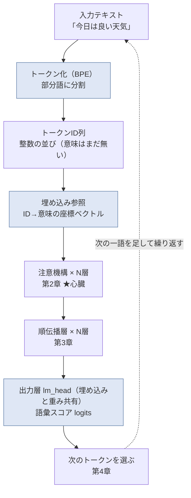
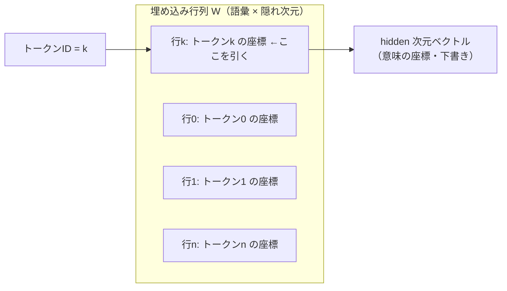

# 言葉を座標に変える ― トークン化と埋め込み（技術版 #1）

著者: 古瀬 和文（ぷるやん）

> シリーズ「作って分かった LLM の中身 ― 自作言語モデルで覗く構造」第1回（技術版）。
> このシリーズは、大規模言語モデル(LLM: Large Language Model)の推論エンジンを、フレームワークの中身に頼らず
> ゼロから組み直し、公式実装と実測して**浮動小数点の丸め誤差の域(logits 2e-4)で一致**させた一次体験を土台に、
> 部品を一つずつ分解して見せる連載です。前回 #0 では「なぜ組み直すと分かるのか」という検証哲学を置きました。
> 今回からいよいよ、実際にパイプラインの最初の駅――**言葉を数に、そして意味の座標に変える**ところ――を開けていきます。


私は 25 年以上、「カメラで見て、機械を動かす」計測・制御の現場で、画像処理と数値・統計アルゴリズムを実装してきたエンジニアです。
今回のテーマである埋め込み(embedding)は、実はその現場道具――**主成分分析(PCA)や三次元計測の座標**――と地続きでした。
その驚きも含めて、最初の駅をゆっくり通ります。

一般版 #0 の最後で、こんな予告をしました。「言葉を『意味の地図の上の座標』に置くと、**『王様』から『男』を引いて『女』を足すと
『女王』に近づく**、ちょっと魔法みたいなことが起きる」。今回はその魔法の正体――と、正直に言えば「魔法ではない」ところ――を、
数式とコードで覗きます。

---

## ① 用語ミニ辞典

まず、この記事で使う言葉を先に並べておきます。ここだけ眺めて全体の見取り図を掴んでから、②③に進んでください。

- **トークン化(tokenization)** … 文章を「トークン」という小さな単位に区切る前処理。LLM が最初にやること。
- **トークン(token)** … 区切られた言葉のかけら。1トークン ≠ 1単語で、単語よりやや細かいことが多い。
- **語彙(vocabulary)** … モデルが扱えるトークンの全種類（辞書）。ふつう数万〜十数万種類。各トークンに整数の ID が振られている。
- **BPE(Byte Pair Encoding)** … トークン化の代表的な方式。「よく一緒に出る文字の並び」を貪欲にくっつけて語彙を作る。
- **トークン肥沃度(fertility)** … 1つの単語（や文字のまとまり）が平均で何トークンに分かれるか。日本語は英語より高くなりやすい。
- **埋め込み(embedding)** … トークン ID を、決まった長さのベクトル（数の並び）に対応させる操作、またはそのベクトルそのもの。「意味の座標」。
- **隠れ次元(hidden dimension)** … 埋め込みベクトルの長さ（次元数）。モデル内部で言葉を表す座標の「軸の本数」。数百〜数千。
- **埋め込み行列(embedding matrix)** … 語彙のトークンごとに1本ずつベクトルを並べた表。形は「語彙数 × 隠れ次元」の巨大な行列。
- **ワンホット(one-hot)** … ある ID の位置だけ 1、あとは全部 0 のベクトル。「どのトークンか」を素朴に表す方式。
- **出力層(lm_head)** … 最後に、内部ベクトルから「次に来る各トークンの点数」を計算する層。lm_head は language model head の略。
- **ロジット(logits)** … 出力層が出す、語彙全体ぶんの生スコア。softmax にかけると確率になる（次トークンの候補点数）。
- **重み共有埋め込み(tied embeddings)** … 入力の埋め込み行列と、出力層(lm_head)の行列を**同じ1枚**にする設計。巨大行列を二重に持たずに済む。
- **主成分分析(PCA: Principal Component Analysis)** … 高次元データを「ばらつきの大きい軸」から順に並べ直し、少ない軸で要約する古典的な統計手法。
- **順伝播(forward pass)** … 入力から出力まで、計算を前向きに一度通すこと。学習ではなく「使う」ときの流れ。

4文字以下の略語はここで一度だけ開きました。以降は日本語か略語で通します。

---

## ② かみくだき：文字は計算できない。だから「座標」に置き換える

コンピュータは、文字をそのままでは計算できません。「りんご」も「king」も、足したり掛けたりできる**数**に翻訳しないと、
ニューラルネットワークの中を流せない。この記事のテーマは、その**最初の翻訳**です。翻訳は2段構えになっています。

**第1段：言葉を「かけら」に刻む（トークン化）。**
文章をいきなり丸ごと数にするのは無理があるので、まず短い単位に区切ります。かといって「1文字ずつ」だと細かすぎて長くなり、
「1単語ずつ」だと知らない単語（新語・固有名詞・打ち間違い）に対応できない。そこで LLM は、その中間の**「部分語（サブワード）」**
という粒度を使います。「よく一緒に出てくる文字の並び」を、あらかじめ辞書（語彙）に登録しておき、入力文をその辞書のかけらに割る。
各かけらには背番号（整数の ID）が振ってあるので、文章はまず「整数の並び」になります。ここまでで、文字は数になりました。

ただし、この背番号はただの通し番号で、**それ自体には意味がありません**。ID 100 と ID 101 が似た言葉である保証はどこにもない。
辞書順に並んでいるだけの番号です。これでは「りんごとみかんは似ている」といった関係を計算に乗せられません。そこで第2段です。

**第2段：背番号を「意味の座標」に置き換える（埋め込み）。**
モデルは、トークンごとに1本ずつ、決まった長さのベクトル（たとえば数百個の数の並び）を持っています。ID を見たら、
対応するベクトルを取り出す。これが埋め込みです。**やっていることは「表引き」だけ**――巨大な表（埋め込み行列）から、
その ID の行を1本抜き出しているにすぎません。

この一手間が効くのは、ベクトルが**空間の中の位置（座標）**として振る舞うからです。似た意味の言葉は近くに、
違う意味の言葉は遠くに配置される。すると「近い／遠い」「どちらの方向か」といった**幾何（図形）の言葉で意味を扱える**ようになる。
「王様 − 男 + 女 ≈ 女王」という有名な話は、この座標の上でベクトルを足し引きすると、意味の足し引きに近いことが起きる、という現象です。

私はこれを見たとき、既視感がありました。計測の現場では、たくさんの測定値を高次元の点として扱い、**主成分分析(PCA)で
「ばらつきの大きい軸」を見つけて次元を減らす**ことを日常的にやります。三次元計測なら、物体の位置は (x, y, z) の座標一点で表す。
「モノやコトを、空間の中の一点に置いて、位置と方向で扱う」――埋め込みは、まさにこの発想の言語版でした。

ひとことで言えば、**トークンは「言葉のかけら」、埋め込みはその「番地（座標）」**。かけらに番地を与えて地図に置く、
ここまでが第1章です。地図に置いたあと、その座標をどう混ぜ合わせて文脈を作るか――それが次章の注意機構(attention)の仕事です。

---

## ③ 詳細：トークン化・埋め込み・重み共有

ここからは、②の各段を数式とコードで掘ります。読まなくても②で筋は通りますが、「実装として何が起きているか」を
見たい方はどうぞ。擬似コードはすべて、実装の要点だけを抜いた**教育用の最小例**（PyTorch 風）です。

### 3-1. トークン化：なぜ「文字」でも「単語」でもなく「部分語」なのか

トークン化の設計は、2つの失敗の間を縫う綱渡りです。

- **文字単位（char）**：語彙は小さくて済む（ひらがな・漢字・記号で数千種）が、系列が長くなる。1文が何十トークンにも伸び、
  後段の計算（特に次章の注意機構は系列長の2乗で効いてくる）が重くなる。
- **単語単位（word）**：系列は短いが、語彙が爆発する上に、**辞書に無い単語（未知語）**に無力。新語・固有名詞・タイプミス・
  複合語のたびに「知らない」となる。

その中間が**部分語（サブワード）**です。頻出する文字の並びは1トークンにまとめ、珍しい並びは細かいかけらに割る。
これなら「語彙は有限のまま、どんな文字列も表現できる」を両立できます。未知語は、最悪でも1文字ずつ（あるいはバイト単位）に
分解すれば必ず表現できるからです。この「必ず表せる」保証が、部分語方式の肝です。

その代表が **BPE(Byte Pair Encoding)** です。仕組みは驚くほど素朴で、次の貪欲な繰り返しだけです。

1. 最初は全部を最小単位（バイトや文字）に割る。
2. 大量のテキストの中で「最も頻繁に隣り合っているペア」を1つ見つけ、それを新しい1トークンとして**併合(merge)**する。
3. これを、語彙が目標サイズになるまで繰り返す。

たとえば `l o w`、`l o w e r`、`n e w e s t` … といった塊が多ければ、`l o` → `lo`、`lo w` → `low` のように、
頻出の並びが1トークンへ育っていきます。学習が終わると「どの順で併合するか（マージ規則）」の一覧が固定され、
本番ではその規則に沿って文を割るだけになります。

擬似コードで、BPE 学習の骨格だけ示します（実装の細部――正規化・特殊トークン・バイト境界の扱い――は省いた教育用の骨です）。

```python
from collections import Counter

def learn_bpe(words: list[list[str]], num_merges: int):
    """words: 各単語を最小単位のリストにしたもの（例 [["l","o","w"], ...]）。
    最頻ペアを貪欲に併合していき、マージ規則の列を返す。"""
    merges = []
    for _ in range(num_merges):
        # 1) 隣り合う記号ペアの出現回数を数える
        pair_counts = Counter()
        for symbols in words:
            for a, b in zip(symbols, symbols[1:]):
                pair_counts[(a, b)] += 1
        if not pair_counts:
            break
        # 2) 最頻ペアを選ぶ（＝貪欲）
        best = max(pair_counts, key=pair_counts.get)
        merges.append(best)
        # 3) そのペアを全単語で1トークンに結合する
        merged = best[0] + best[1]
        words = [_apply_merge(sym, best, merged) for sym in words]
    return merges
```

ここで大事なのは、**BPE は「意味」を一切見ていない**という点です。見ているのは頻度だけ。にもかかわらず、
頻出語がまとまり珍しい語が割れるという振る舞いが、後段の学習にとって都合の良い粒度を生みます。
「意味を教えていないのに意味に効く前処理ができる」――このあたりから、LLM の「素朴な仕組みが積み重なって効く」味が出てきます。

#### 日本語は「細かく割れやすい」：トークン肥沃度(fertility)

ここで**トークン肥沃度(fertility)**――1つの単語（あるいは一定量の文字）が平均で何トークンに分かれるか――の話をします。
多くの公開トークナイザは、学習コーパスに英語などの空白区切り言語を多く含みます。BPE は頻度で併合を決めるので、
コーパスで頻出する英語の綴りは長い並びが1トークンに育ちやすい。一方、**相対的に露出の少ない日本語は、
併合が十分に進まず、細かいかけらに割れやすい**のです。分かち書き（単語の間に空白）が無いことも、単位を掴みにくくします。

具体的な分かれ方はトークナイザごとに異なるので断定はしませんが、傾向として、英語の1単語が1〜数トークンで済むのに対し、
同じ意味の日本語は文字ごと・部分ごとに割れて**トークン数が増えがち**です。これは実務で効きます。

- 同じ内容でも、日本語は消費トークンが増える → 文脈長の予算を食う → 実質的に扱える文脈が短くなる、コストが上がる。
- モデルによっては、日本語の細切れが「言葉のまとまり」を壊し、性能に響くことがある（このシリーズの範囲では数値評価はしていません。
  第6章のモデル選定で「日本語品質」を軸の1つに置くのは、この現実があるためです）。

計測の言葉で言えば、これは**分解能とダイナミックレンジのトレードオフ**に似ています。細かく刻めば表現力は上がるが、
系列が伸びて後段が重くなる。どこで刻むかは、性能とコストの綱引きなのです。

### 3-2. 埋め込み：ID をベクトルに ―― 実体は「表引き」

トークン化で文章は整数の並びになりました。次は、その各 ID を隠れ次元(hidden dimension)のベクトルに変えます。

素朴に考えると、ID を**ワンホット(one-hot)**ベクトル――たとえば語彙が V 種類なら、長さ V で、その ID の位置だけ 1、
残りは全部 0 のベクトル――にして、そこに重み行列を掛ければベクトルになります。式で書くと、埋め込み行列を W（形は
「語彙数 V × 隠れ次元 H」）として、

```
埋め込みベクトル = one_hot(id) @ W       # 形: (1×V) @ (V×H) = (1×H)
```

です。ところがワンホットは1か所しか 1 が立っていないので、この掛け算の結果は**「W の id 行目をそのまま抜き出す」だけ**に
なります。V が十数万もあると、律儀に行列積を計算するのは無駄で、実装は「行を取り出す(gather)」だけをやります。
これが `nn.Embedding` の正体です。**掛け算に見えて、実は表引き**。ここを取り違えると、埋め込みを「重い計算」だと誤解します。

擬似コードで最小の埋め込み層を書きます。

```python
import torch
import torch.nn as nn

class TokenEmbedding(nn.Module):
    """トークンID列を hidden 次元のベクトル列へ変換する最小実装。
    やっているのは『行列の行を引く』だけ（nn.Embedding 相当）。"""
    def __init__(self, vocab_size: int, hidden: int):
        super().__init__()
        # 語彙のトークンごとに1本のベクトル(= 行列の1行)を持つ。
        # 形状は (vocab_size, hidden)。学習でこの中身が決まる。
        self.weight = nn.Parameter(torch.randn(vocab_size, hidden) * 0.02)

    def forward(self, token_ids: torch.LongTensor) -> torch.Tensor:
        # token_ids: (batch, seq_len) の整数
        # 返り値  : (batch, seq_len, hidden) のベクトル列
        # ここが肝 ―― 行列積ではなく『行の取り出し』。
        return self.weight[token_ids]
```

`self.weight` の1行1行が、トークン1個ぶんの「意味の座標」です。初期値はランダム（上のコードでは小さな正規乱数）で、
**この座標は学習を通じて決まっていきます**。ここで、このシリーズが何度も戻ってくる正直な継ぎ目を先に置きます。

> **正直な継ぎ目（今回ぶん）**：私は推論エンジンを自作しましたが、この埋め込み行列の**中身（各トークンの座標）を
> 学習したのは私ではありません**。公開されている学習済みモデル（Qwen2 系の重み）を読み込み、その座標をそのまま使っています。
> 私の自作が担保したのは、「その表引きを公式実装と取り違えずに再現できること／中身を検査・改造できること」であって、
> 「意味そのものをより上手に配置したこと」ではありません。座標に宿る意味は、巨大な事前学習が入れたものです。この継ぎ目をぼかしません。

#### 座標に「意味」が乗るとは、どういうことか

学習が終わった埋め込み行列を眺めると、**似た使われ方をする言葉のベクトルが近くに集まる**傾向が見えます。
なぜそうなるかは、第4章（学習と推論）の主題ですが、直観だけ先取りすると、モデルは「次のトークンを当てる」ために学習され、
**似た文脈で入れ替え可能な言葉は、当てるうえで似た役割を果たす**ので、近い座標に押し込まれていくのです。
「意味が先にあって座標を決めた」のではなく、「予測がうまくなるように座標を動かしたら、結果として意味の地図になった」――
順番はこちらです。ここも、盛らずに書いておきたいところです。

### 3-3. 「王様 − 男 + 女 ≈ 女王」と、PCA の地続き

さて、予告した魔法です。単語をベクトルにする古典的な手法（word2vec などの語ベクトル）で、次のような足し算が近似的に
成り立つことが知られています。

```
vec(王様) − vec(男) + vec(女) ≈ vec(女王)
```

直観としては、「王様 − 男」というベクトルの差が**『王位という属性』の方向**を、残った差が**『性別』の方向**を表していて、
その方向に沿って移動すると対応する言葉に近づく、という話です。意味の空間の中に「性別の軸」「単数複数の軸」「時制の軸」
のような**方向**が立っている、というイメージです。

ここが、私の得意分野――**主成分分析(PCA)**――とまっすぐ地続きでした。PCA は、高次元データを「ばらつきの大きい方向」から
順に軸として取り出し、少数の軸でデータを要約する手法です。計測の現場では、たくさんの測定値を高次元の点群として PCA にかけ、
「実は2〜3本の軸でほとんど説明できる」と分かることが日常的にあります。埋め込み空間で「性別の方向」「王位の方向」を探す発想は、
**『データの中に意味のある軸を見つけて、その軸で分解する』という PCA と同じ精神**なのです。実際、埋め込み行列に PCA をかけて
2次元・3次元に落とし、言葉の散らばりを目で見る――というのは、私が測定データでやってきた次元圧縮そのままの操作でした。

ただし、ここは**正直に留保を付けます**。この足し算は、あくまで**近似**であって、厳密な等式ではありません。

- 実際の埋め込み空間は**非線形**な構造を持ち、「引いて足す」という直線的な操作でいつでもきれいに対応語へ着地するわけではない。
  有名な例がうまくいくのは、性別や単複のように分かりやすい方向が比較的まっすぐ乗っている一部のケースです。
- PCA は**線形**の手法なので、非線形な意味構造を2〜3軸に落とすと、あくまで**影（射影）**しか見えません。「軸で分解できる」は
  直観を掴む足場としては正しいが、「意味が完全に線形の軸に分かれている」と受け取ると行き過ぎです。
- そして、有名な「王様 − 男 + 女」は歴史的には**語単位の静的な埋め込み**（word2vec 等）で語られた現象です。現代の LLM の
  埋め込みは**部分語単位**で、しかも生の埋め込みはまだ「出発点の座標」にすぎません。文脈に応じた本当の意味は、この後の
  注意機構(attention)や順伝播層(FFN)が何十層もかけて磨き上げます。同じ「bank」でも「川岸」か「銀行」かは、生の埋め込みでは
  まだ決まっておらず、文脈が決める。**生の座標は下書き、文脈が清書する**――この感覚が次章への橋になります。

つまり「意味の座標」は、**魔法ではなく幾何**です。方向と距離で意味を扱えるという、地に足の着いた話。魔法らしく見えるのは、
その幾何が数百次元という、私たちの直観が届かない広さで起きているからにすぎません。三次元計測なら点は (x, y, z) の3座標でしたが、
言葉の座標は数百本の軸を持つ――高次元という一点を除けば、やっていることは「点を空間に置く」という、計測の人間には馴染み深い操作です。


### 3-4. 重み共有埋め込み(tied embeddings)：巨大行列を二重に持たない

ここで、実装とメモリの話に踏み込みます。パイプラインの**入口**では、ID をベクトルに変えるために「語彙数 × 隠れ次元」の
埋め込み行列を使いました。では**出口**はどうか。最後の**出力層(lm_head)**は、内部で磨き上げた1本のベクトルから、
「次に来る各トークンの点数（ロジット(logits)）」を計算します。これは各トークンの座標との内積――つまり
「この内部ベクトルは、どのトークンの座標にどれだけ近いか」を語彙ぶん全部測る操作で、やはり「語彙数 × 隠れ次元」の行列を使います。

入口と出口、どちらも「語彙 × 隠れ次元」の巨大行列。語彙が十数万・隠れ次元が数百〜数千ともなれば、これは1枚でも
モデル全体のパラメータの中でかなりの割合を占める、重い行列です。**それを2枚別々に持つのは、もったいない。**

そこで多くのモデル（今回の自作対象の Qwen2 系もそう）が採る設計が、**重み共有埋め込み(tied embeddings)**です。
入口の埋め込み行列と、出口の出力層行列を、**物理的に同じ1枚**にしてしまう。入口では「行を引く」向きに、
出口では「各行と内積を取る」向きに、**同じ行列を両方向に使い回す**のです。考えてみれば、これは自然な対称性です。
入口は「ID → 座標」、出口は「座標 → 各 ID との近さ」。**同じ『トークンの座標表』を、行きと帰りで読んでいるだけ**なのですから。

擬似コードで、出力層を埋め込みと共有する形を示します。

```python
class TiedLMHead(nn.Module):
    """出力層(lm_head)。入力埋め込みと同じ行列を転置して使い回す。
    これで『語彙 × 隠れ次元』の巨大行列を2枚持たずに済む。"""
    def __init__(self, embedding: TokenEmbedding):
        super().__init__()
        self.embedding = embedding  # 参照を共有する（コピーしない）

    def forward(self, hidden_states: torch.Tensor) -> torch.Tensor:
        # hidden_states: (batch, seq_len, hidden)
        # 各位置の隠れベクトルを、全語彙のベクトルと内積 → ロジット。
        # weight: (vocab_size, hidden) → 転置して (hidden, vocab_size)
        # 出力  : (batch, seq_len, vocab_size)
        return hidden_states @ self.embedding.weight.t()
```

`self.embedding` を**コピーせず参照で持つ**のがポイントです。別の行列を新たに確保しないので、この巨大行列のぶんの
メモリが丸ごと1枚ぶん浮きます。

数字で感触を掴んでおきます（**あくまで説明のための仮の例**で、特定モデルの実値ではありません）。仮に語彙 15 万・
隠れ次元 1,000 とすると、埋め込み行列は 15 万 × 1,000 = 1.5 億パラメータ。32ビット浮動小数点なら1つ4バイトなので、
**約 600MB**になります。tied なら、この 600MB を**二重に持たずに済む**。自宅の限られた RAM で大きめのモデルを動かそうとする
とき、この「1枚ぶん」は効きます。私が自作の推論ランタイムでこの共有を再現したのも、まさに小さな RAM で動かすための、
メモリの上で正しい設計だからです。

> **正直な補足**：重み共有は「常に正しい唯一解」ではありません。ごく大きなモデルでは、あえて入口と出口を**共有しない
> （untie する）**設計もあります。共有すると入口と出口に同じ制約がかかるので、規模に余裕があるなら別々にした方が表現力を
> 使い切れる、という判断です。今回の自作対象は共有する設計だったので共有を再現した、というだけで、「共有が絶対」ではない――
> ここも盛らずに。


### 3-5. ここまでを1本につなぐ：入口から出口までの最小骨格

第1章の部品（埋め込みと、それと共有する出力層）が、パイプライン全体のどこに座るかを、最小の骨格コードで示します。
真ん中の「ブロック × N層」の中身――**注意機構(attention)と順伝播層(FFN)**――が、それぞれ第2章・第3章の主役です。
ここでは「入口と出口が第1章、中身は次章から」という位置関係だけ掴んでください。

```python
class MiniLM(nn.Module):
    def __init__(self, vocab_size: int, hidden: int, n_layers: int):
        super().__init__()
        self.embed   = TokenEmbedding(vocab_size, hidden)      # ← 第1章（入口）
        self.blocks  = nn.ModuleList([Block(hidden) for _ in range(n_layers)])
        self.norm    = RMSNorm(hidden)                          # ← 第3章
        self.lm_head = TiedLMHead(self.embed)                  # ← 第1章（出口・重み共有）

    def forward(self, token_ids: torch.LongTensor) -> torch.Tensor:
        x = self.embed(token_ids)        # ID列 → 意味の座標列   （本章）
        for blk in self.blocks:
            x = blk(x)                   # 注意機構(第2章) + 順伝播層(第3章) を N 回
        x = self.norm(x)                 # 仕上げの正規化        （第3章）
        logits = self.lm_head(x)         # 座標列 → 語彙スコア   （重み共有した出口）
        return logits                    # softmax にかけて次トークンを選ぶ（第4章）
```

この骨格は、②の地図をそのままコードにしたものです。**入口（埋め込み）で座標に置き、真ん中で座標を混ぜ、
出口（共有した出力層）で語彙の点数に戻す。** 第1章で扱ったのは、この行きと帰りの「両端」でした。

### 3-6. なぜ「取り違えていない」と言えるのか（検証との接続）

前回 #0 で、このシリーズの信頼の核として「自作した順伝播の出力が、公式実装と**logits 2e-4（浮動小数点の丸め誤差の域）で
一致した**」という事実を置きました。今回扱った埋め込み参照と、重み共有した出力層も、その一致に含まれる経路です。
入口の表引きも、出口の内積（共有行列の転置を使う）も、公式と取り違えていれば、最終の logits がこんな精度で揃うはずがありません。
つまり、**「埋め込みは掛け算でなく表引き」「入口と出口は同じ行列を両方向に使う」という今回の理解は、実測で裏を取ってある**、
ということです。この 2e-4 一致の中身と、その意味（なぜ丸め誤差の域と言えるのか）は、心臓部である注意機構を扱う**次章 #2 で
詳しく開きます**。ここでは「今回の部品も、その一致の一部だった」とだけ受け取ってください。

---

## この章の一枚図

第1章がパイプライン全体のどこかを、最後に一枚で置いておきます。



青く塗った3つ――**トークン化・埋め込み・重み共有した出力層**――が、今回の担当範囲です。入口と出口が同じ「意味の座標表」を
分け合っている、という対称性が、図でも見えます。

埋め込み参照（表引き）の一枚図も置きます。



---

## 次回に続く

今回、言葉は「かけら（トークン）」に刻まれ、「番地（意味の座標）」を与えられて、数百次元の地図の上に置かれました。
でも、3-3 の終わりで正直に書いたとおり、**生の座標はまだ「下書き」**です。「bank」が川岸か銀行か、「はし」が箸か橋か端か――
それは1語だけ見ても決まらない。**周りの言葉を見て、どこに注目するかを決めて、初めて意味が定まる**。

その「どこに注目するか」を動的に配る仕組みが、次回 #2 の主役――**注意機構(attention)**です。LLM が急に賢くなった立役者であり、
このシリーズの★心臓。そして私にとっては、注意スコアの計算 `softmax(QKᵀ/√d)` が、画像処理で使ってきた
**相関・テンプレートマッチング**と、位置エンコーディング(RoPE)が**フーリエ変換・位相**と、まっすぐ地続きだった――
という、いちばん驚いた章でもあります。あわせて、#0 で予告した「自作が公式と 2e-4 で一致した」話も、ここで詳しく開きます。

> **この章の持ち帰り（1つ）**
> **「埋め込みは、掛け算ではなく“表引き”。そして入口と出口は、同じ1枚の座標表を行き帰りで読んでいるだけ（重み共有）。」**
> ――LLM の中で言葉は「意味の座標」として扱われ、その座標表はメモリを二重に持たないよう賢く共有されています。
> 次にモデルのメモリ消費の話を聞いたら、「あの巨大な埋め込み行列、入口と出口で共有してるんだよね」と思い出してください。
> それだけで、AI の中身が少しだけ透けて見えるはずです。

---

*このシリーズは、自作の小さな LLM を実装しながら書いています。数値・ベンチ・モデル名は実測・実在のものだけを使い、
うまくいかなかったこと（このあとの章で出てくる、自作の文字言語モデルが会話にならなかった話など）も消さずに残します。
「絵で分かった」あとに「仕組みで納得したい」方は、一般版 #1 とあわせてどうぞ。*


---

<!-- series-nav -->
**連載ナビ** ｜ [◀ 前回: 序章（検証哲学）](<<LINK:T00>>) ｜ [次回: 注意機構 ▶](<<LINK:T02>>) ｜ [同じ回の一般版](<<LINK:G01>>) ｜ [総目次](<<LINK:INDEX>>)
<!-- 投稿時: <<LINK:キー>> を llm_structure_series_LINK_MAP.md の確定 URL に置換。未投稿分はリンクごと削除 -->
