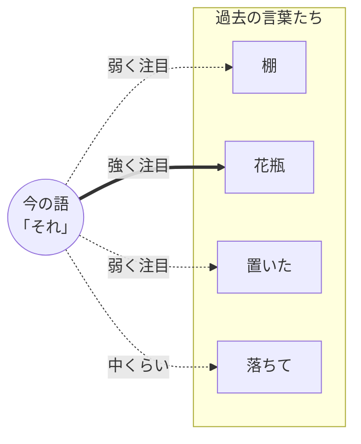
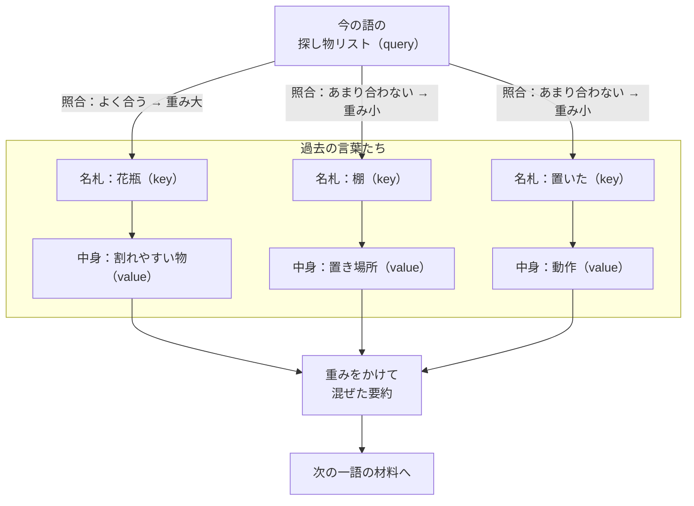

# どこに注目するか ― AI の“気の配り方”──作って分かった中身 #2（注意機構・一般版）

著者: 古瀬 和文（ぷるやん）

> シリーズ「作って分かった LLM の中身 ― 自作言語モデルで覗く構造」第2回（一般版）。
> 今回は、この連載の ★心臓 にあたる **注意機構（attention）** の回です。
> 「AI が急に賢くなった立役者」と呼ばれる仕組みを、数式は使わず、比喩と実感だけで腑に落とします。
> 数式とコードで納得したい方は、同じテーマの技術版へどうぞ。

> 🧑‍🔧 **書いている人**
> 私はこの 25 年、工場のラインで「カメラで見て、機械を動かす」装置を作ってきたエンジニアです。
> 見本の画像と検査対象を重ねて「どれくらい似ているか」を点数にする――そんな仕事を、来る日も来る日もやってきました。
> 実はその「似ているか点数をつける」作業が、今日の主役・注意機構のど真ん中に、そっくりそのまま入っています。
> AI の中を覗いたら、現場で使い古した道具が顔を出した。その驚きも一緒にお裾分けします。

前回 #1 では、「王様 − 男 + 女 ≈ 女王」のように、言葉を**意味の地図の座標**に変える話をしました。
これで言葉は一つひとつ、数字の座標を持つ「点」になりました。

でも、座標を持っただけでは文章になりません。**言葉は、まわりの言葉と関わり合って初めて意味が決まる**からです。
「それ」が何を指すのか。「明るい」が性格の話か照明の話か。それはいつも、**まわりの言葉次第**。
その「まわりを見て決める」仕事をしているのが、今回の注意機構です。

---

## この記事で覚えて帰ってほしい言葉

- **注意機構（attention）** … 「今の一語を決めるとき、これまでのどの言葉に、どれくらい注目すべきか」を、
  その都度あらためて選ぶ仕組み。全部を平等に聞くのではなく、**関係の深い言葉ほど強く聞く**。
- **文脈（context）** … その言葉の「まわり」。同じ「それ」でも、前の文が違えば指すものが変わる。文脈が意味を決めます。
- **クエリ・キー・バリュー（query / key / value）** … 注意機構の中で各言葉が持つ3つの札。
  ざっくり「探し物リスト（query）」「名札（key）」「中身（value）」の3点セット、とだけ覚えれば十分です。

まずはこの3語。とくに真ん中の**「文脈」**が、今回いちばんの主人公です。

## いちばん短い答え：注意機構は「今の一語のために、過去のどの言葉を聞き直すか」を選ぶ

いきなり核心から言います。

文章を作るとき、AI は次の一語を出すたびに、**「ここまでの言葉のうち、どれを重視して次を決めるか」を選び直しています。**
一律に全部を眺めるのではありません。今から出す言葉に**関係の深い言葉ほど大きな声で、関係の薄い言葉は小さな声で**聞く。
この「聞く音量の配分」を、一語ごとに、その場で計算し直す。それが注意機構です。

たとえば、こんな文を考えます。

> 棚に花瓶を置いたが、**それ**が落ちて割れた。

この「**それ**」が何を指すか、あなたは一瞬で「花瓶」だと分かります。「棚」でも「置いた」でもなく「花瓶」。
AI も同じことをします。「それ」という言葉を扱うとき、**過去の「花瓶」に強く注目し、他の言葉には弱く注目する**。
その注目の配分ができているから、「割れたのは花瓶だ」と正しく話を続けられるのです。

矢印の太さが「注目の強さ」です。**同じ文でも、今どの語を扱っているかで、この矢印の太さは毎回引き直されます。**
「それ」を扱うときは花瓶へ太く、「落ちて」を扱うときはまた別の配分へ。この**動的な引き直し**こそ、注意機構の肝です。

## かみくだき①：会議室のたとえ

もう少し身近な絵にします。**会議**を思い浮かべてください。

あなたが今から発言しようとしている。頭の中では、これまでの出席者の発言を全部同じ重さで思い出しているわけではありません。
**「さっき部長が言ったあの一言」「昨日メールで来た数字」――今の自分の発言に関係する所だけ、選んで重く参照している**はずです。
関係のない雑談は、聞こえてはいたけれど、発言には効かせない。

注意機構はこれと同じです。次の一語（＝あなたの発言）を決めるために、過去の言葉たち（＝出席者の発言）を見渡して、
**関係の深い発言に重みを置いた「要約」を作り**、それを踏まえて一語を出す。会議の上手な進行役が、
過去の意見を的確に引きながら結論をまとめるのに、よく似ています。

もう一つ、**カクテルパーティ効果**という有名な現象があります。
がやがやと騒がしいパーティ会場でも、自分の名前や、関心のある話題だけは、不思議と耳に飛び込んでくる。
これは、脳が**「今の自分に関係する音」に動的に注目を寄せている**からだと言われます。
注意機構がやっているのも、まさにこれ。膨大な言葉の雑音の中から、**今この瞬間に関係する言葉だけを聞き分ける**仕組みなのです。

> だから英語で attention（＝注意・注目）と名付けられました。訳語の「注意機構」は、そのまま「注目を配る仕組み」という意味です。

## かみくだき②：3つの札 ―― 探し物リスト・名札・中身

もう一段だけ中を覗きます。「関係が深い言葉ほど強く聞く」を、AI はどうやって決めているのか。

各言葉は、頭の上に**3つの札**を掲げていると思ってください。

- **探し物リスト（query／クエリ）**：今の言葉が出す問い合わせ。「私は今、こういう情報を探しています」というメモ。
- **名札（key／キー）**：過去の各言葉が掲げる見出し。「私はこういう話題の言葉ですよ」という自己紹介。
- **中身（value／バリュー）**：その言葉が実際に運んでいる情報の本体。

やることは単純です。今の言葉の**探し物リスト**を持って、過去の言葉たちの**名札**を一枚ずつ見比べる。
**探し物リストと名札がよく合う言葉ほど「関係が深い」**と判断し、その言葉の**中身**を多めに受け取る。合わない言葉の中身は少しだけ。
こうして受け取った中身を混ぜ合わせた「重み付きの要約」が、次の一語を決める材料になります。

ポイントは、**探し物リストも名札も中身も、その言葉の座標（前回の「意味の地図」）から作られる**ということ。
言葉の意味そのものから「何を探し、どう名乗り、何を差し出すか」が決まる。だから、意味が近い言葉どうしは自然と結びつきやすいのです。

<!-- 画像プレースホルダ -->
**［図：探し物リストと名札の照合］** 一人の登場人物（今の語）が虫めがねで「探し物リスト」を持ち、
複数の登場人物（過去の語）の胸の「名札」を見比べている。合致した相手だけスポットライトが当たり、その手元の「中身」の箱が大きく開く。
<!-- 画像生成意図: query=探し物リスト, key=名札, value=中身の箱 という3札メタファーを一枚で伝える親しみやすいイラスト。攻撃的表現なし、明るいトーン。人物は記号的でよい。 -->

## なぜ「似ているか」を点数にできるのか ―― 現場の道具の話

ここで、少しだけ私の仕事の話をさせてください。
工場の外観検査では、**テンプレートマッチング**という古典的な手法をよく使います。
「見本の画像」と「検査対象の画像」を重ね合わせ、**どれくらい似ているかを一つの点数にする**――
専門的には**相関（correlation）を取る**と言いますが、要は「見本にそっくりな所を探す」道具です。

驚いたのは、注意機構の「探し物リストと名札を見比べる」計算が、**この相関とまったく同じ発想**だったことです。
二つの座標（ベクトル）を並べて、方向がそろっているほど大きな点数、そっぽを向いているほど小さな点数を返す。
私が 25 年、部品の位置決めや不良の検出でやってきた「似ているものを探す」計算が、
言葉の世界で「関係の深い言葉を探す」計算として、そっくり働いていた。分野は違えど、道具は同じだったわけです。

> 覚えて帰る一言：**注意機構の「関係の深さ」は、要するに「似ているか探し（テンプレートマッチング）」です。**
> 難しそうな名前でも、中でやっているのは「見本に近い所を探す」という、昔ながらの発想でした。

## 言葉には順番がある ―― 位置を“波”で伝える

もう一つ、大事な仕掛けがあります。**言葉は順番が命**だということです。

「犬が猫を追う」と「猫が犬を追う」。使っている言葉は同じでも、意味は正反対。
ところが、名札を見比べるだけの素朴な注意機構は、**言葉の順番を区別できません**。誰がどの位置にいたかを、別に教える必要があります。

そこで使われるのが、**回転位置埋め込み（RoPE: Rotary Position Embedding）**という仕組みです。名前は難しいですが、発想は素直で、
**各言葉の座標を「その語が何番目か」に応じて少しずつ回転させる**。1番目は少し、2番目はもう少し、と位置ごとに回し向きを変える。
すると「近い位置どうし」「遠い位置どうし」が、注目の点数に自然とにじみ出るようになります。

これも、私にはなじみのある考え方でした。信号を**波（周波数）**に分解して扱う**フーリエ変換**――
計測の世界で毎日のように使う道具です。位置を「回転＝波の位相」で表すというのは、まさにその土俵の上の話。
「位置を波で符号化する」と聞いて、初めて中身を組んだとき、思わず膝を打ちました。ここでも、現場の道具が顔を出したのです。

（波や回転の中身は数式の領分なので、詳しくは技術版に譲ります。ここでは「順番も、ちゃんと注目に効かせている」とだけ持ち帰ってください。）

## 一度で終わらない ―― 何十回も注目し直す

大事な補足を一つ。注意機構は、文章に対して**一回だけ**働くのではありません。

AI の中では、この「注目する層」が**何十段も積み重なっています**（私が組んだ小さなモデルでも 24 段ありました）。
最初の層は「この語のすぐ隣は何か」といった素朴な関係を、上の層にいくほど「文全体の言いたいこと」「話の流れ」といった
**より大きな関係**を捉えていく、と考えられています。会議で言えば、一度発言を聞いて終わりではなく、
**何度も議事録を読み直し、そのたびに理解を一段深める**ようなもの。この繰り返しの積み重ねが、文の深い理解を作っています。

## 「組み直したら、同じ答えが出た」―― なぜ中身を説明できるのか

このシリーズの背骨は、**「自分で組み直して、公式実装と誤差ゼロで再現した」**という一次体験です。今回の注意機構も、その対象でした。

フレームワークの出来合いの部品に頼らず、この「探し物リストと名札を見比べ、中身を重みで混ぜる」仕組みを、
順番の回転（RoPE）も含めて自分で組み直しました。そして、**公式のリファレンス実装と答えを突き合わせた**ところ――
出力の数値が**実質誤差ゼロ（浮動小数点の丸め誤差の域）で一致**し、**選ばれる次の一語は完全に一致**しました。
同じ質問に同じ条件で20ターン続けて答えさせても、公式とこちらの返答は食い違いませんでした。

これが、私が中身を一つずつ説明できる根拠です。**取り違えて組んだら、答えは合いません。**
ぴたりと合ったということは、「探し物リスト」「名札」「中身」「順番の回転」――どの部品が何をしているかを、
私が読み違えていない、という証拠だからです。図を眺めるのと、削り出して組んで測るのとでは、理解の質が違います。

> ひとつだけ、正直に線を引いておきます。**この会話の「賢さ」そのものは、私が作ったのではありません。**
> 賢さは、巨大な事前学習で獲得された**学習済みの重み**に宿っています（そこは次回 #3・#4 で扱います）。
> 私が用意できたのは、**その中身を検査し、必要なら改造できる、検証済みの推論の仕組み**――いわば「開けられる箱」です。
> 中身は借り物、でも箱は自分で組んで、寸分違わず動くことを確かめた。この継ぎ目は、ぼかさずに書いておきます。

## 「作って分かったこと」box

> 📦 **教科書に無い、作って初めて分かったこと ―― #0 の“予言”の回収**
>
> 第0回で、「自分で動かすといちばん体で分かるのは**『長い文章ほど、急に重くなる』**ことだ」と予告しました。
> その正体が、実はこの注意機構にあります。
>
> 注意機構は、次の一語を決めるたびに、**これまでの言葉を全部見渡して**「探し物リストと名札」を突き合わせます。
> つまり、言葉が増えるほど「見比べる相手」も増える。ざっくり言えば、**文の長さが2倍になると、見比べる手間はおよそ4倍**（全員どうしの総当たりだから）。
> しかも、あとから何度も参照するために、**過去の言葉の「名札」と「中身」を覚えておくメモ帳**――これを **KV（Key-Value）キャッシュ** と呼びます――が、
> 言葉の数に比例してふくらみます。**長い会話ほど、計算もメモリも重くなる。** これが、あの「重さ」の正体でした。
>
> だから AI の設計者は、この重さを抑える工夫を入れます。たとえば **グループ化クエリ注意（GQA: Grouped-Query Attention）** は、
> 「名札」と「中身」を複数のクエリで共有して、覚えておくメモ帳を小さくする節約術。
> ――でも、この節約と重さの綱引きは話が大きいので、まるごと第5回のテーマにします。
>
> **構造を知ると、ChatGPT が長い会話で少しもたつく理由が見えてきます。** これがこのシリーズの狙いです。

<!-- 画像プレースホルダ -->
**［図：会話が伸びるほどメモ帳がふくらむ］** 左に短い会話（メモ帳が薄い）、右に長い会話（同じメモ帳が分厚い）。
メモ帳のラベルは「覚えておく名札と中身（KVキャッシュ）」。重さがじわじわ増える様子を、天秤か砂時計で添える。
<!-- 画像生成意図: KVキャッシュが文脈長に比例して増える=長い会話が重くなる、を一目で。赤緑の善悪色は使わない。落ち着いた配色で「増える」だけを表現。 -->

## 語呂で覚える

> **注意機構は「気くばりマシン」。**
> 次の一語を出すたびに、過去の言葉を見わたして「今いちばん関係あるのは誰か」に**気をくばる**。
> 会議の名進行役であり、パーティで自分の名前だけ聞き取る耳であり、
> 中でやっているのは「見本に似た所を探す（テンプレートマッチング）」という昔ながらの道具。
>
> そして気くばりの相手が増えるほど、**マシンはだんだん息が上がる**。それが「長い会話は重い」の理由――
> ここまで覚えて帰れば、今日はもう十分です。

## 持ち帰り：「あれ」「それ」がなぜ通じるのか

最後に、この記事のいちばんの持ち帰りを。

「棚に花瓶を置いたが、**それ**が落ちて割れた」――この「それ」が花瓶だと AI に通じるのは、
注意機構が**「それ」から過去の「花瓶」へ、太い注目の矢印を引けているから**でした。
私たちが指示語（「あれ」「それ」「彼」「これ」）を自然に使えるのは、聞き手が文脈を見て指す先を選んでいるから。
AI も、まったく同じことを、一語ごとに注目を配り直しながらやっている。

**「気の配り方」を自分で決められるようになったこと。** これが、AI が急に賢くなった立役者の正体です。
今度 AI と話すとき、長い指示の中で「さっきの件」がちゃんと通じたら、
その裏で「気くばりマシン」が過去へ太い矢印を引いていた――そう思い出してもらえたら、この記事は役目を果たせたことになります。

## 次回予告

次回 #3 は、**「知識はどこにしまわれているのか」** です。

今回の注意機構は、いわば**「どこを見るか」を決める係**でした。でも、「日本の首都は東京だ」といった**知識そのもの**は、
注意機構が覚えているわけではありません。では、AI の知識は中のどこに住んでいるのか。

実は、AI の中には「注目する層」とペアで働く**もう一つの層（順伝播層）**があって、
どうやらそちらが**知識の貯蔵庫**らしい――という話をします。**「注目」と「記憶」の分業**。
自分で組んでみると、この分業がなかなか味わい深いのです。次回、その棚の奥を覗きに行きましょう。

---

*このシリーズは、自作の小さな LLM を実装しながら書いています。技術版では、同じ注意機構を数式（探し物リストと名札の照合を、
どう点数にしているか）と実際のコードで掘り下げ、「公式実装と実質誤差ゼロで一致した」検証の中身まで踏み込みます。
「絵で分かった」あとに「仕組みで納得したい」方は、そちらもどうぞ。*
