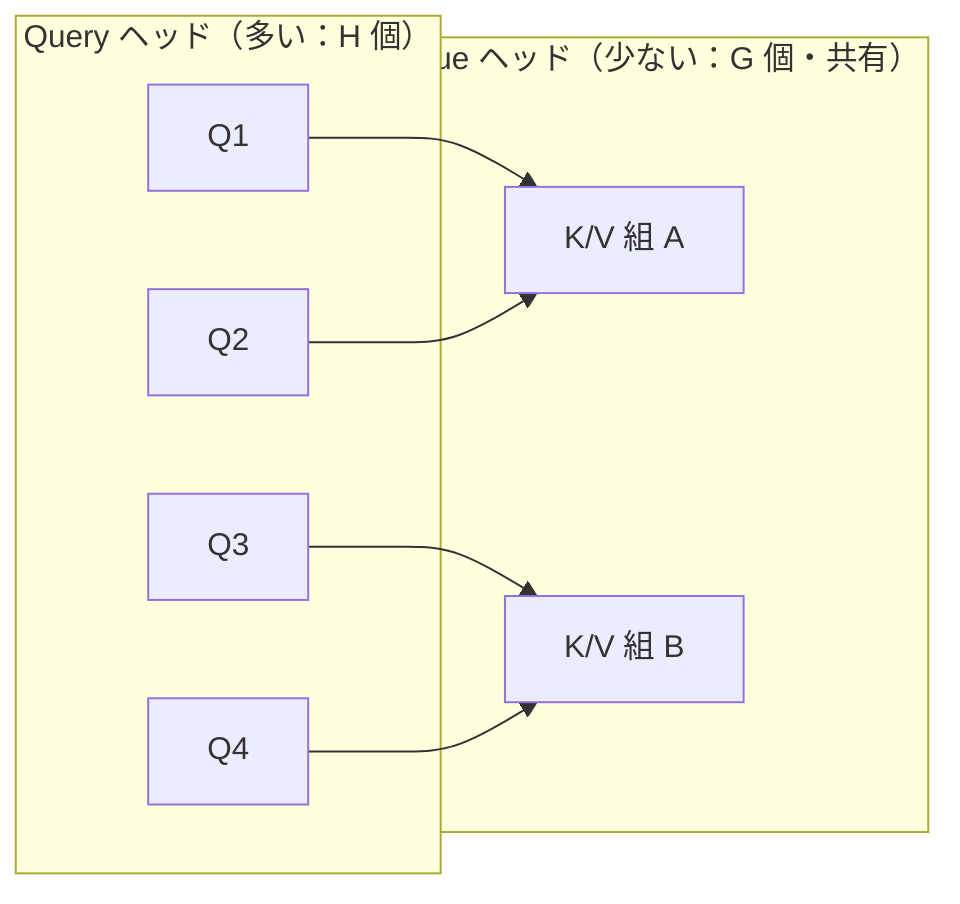
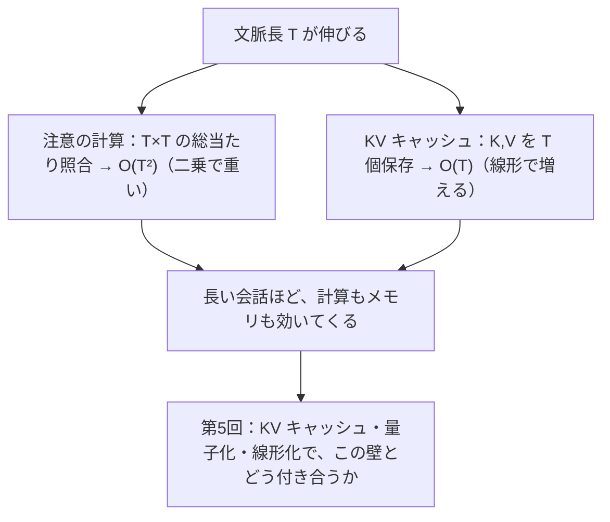
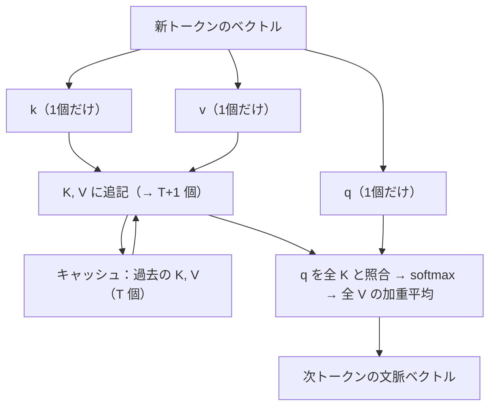

# 注意機構の正体 ― 文脈を配る仕組み（技術版 #2）

著者: 古瀬 和文（ぷるやん）

> シリーズ「作って分かった LLM の中身 ― 自作言語モデルで覗く構造」第2回（技術版）。
> 大規模言語モデル（LLM: Large Language Model）を、フレームワークの中身に頼らず推論エンジンごと自分で組み直し、
> 公式実装と実測して誤差ゼロで再現した一次体験をもとに、部品を一つずつ分解します。今回は心臓部――注意機構です。


前回 #1 で、言葉は「意味の座標（埋め込みベクトル）」に変換されるところまで来ました。
ただし、この段階のベクトルは **一語ずつ孤立** しています。「銀行」というトークンのベクトルは、
それが「川の土手（bank）」なのか「金融機関（bank）」なのかを、まだ自分では区別できません。
区別するには **前後の言葉を見て、文脈を混ぜ込む** 仕組みが要ります。それが今回の主役、注意機構（attention）です。

そして、一般版 #0 の最後に置いた予告――「作って動かして、いちばん体で分かったのは *長い文章ほど急に重くなる* ことだった」。
あの「重さ」の発生源も、実はこの注意機構の中にあります。本章の終盤でその正体（計算量 O(T²) と KV キャッシュ）に触れ、
第5回への伏線を張ります。

> 🧑‍🔧 私は 25 年以上、「カメラで見て、機械を動かす」計測・制御の現場で、画像処理と数値解析を実装してきました。
> 面白いことに、注意機構の中核には **相関（テンプレートマッチング）** と **フーリエ変換（位相・周波数）** という、
> 私が現場で毎日使ってきた道具がそのまま埋まっています。今回はその地続きを、遠慮なく前面に出します。

---

## ① 用語ミニ辞典

まず、この記事で出てくる言葉を先に並べておきます。②で全体像、③で数式とコードに降りていきます。

- **注意機構（attention）** … 各トークンが「文中のどこに、どれだけ注目するか」を動的に決め、注目先の情報を集めてくる仕組み。
- **自己注意（self-attention）** … 同じ一つの文の中で、トークン同士が互いに注目し合う注意機構。LLM の中身はほぼこれ。
- **クエリ（Query, Q）／キー（Key, K）／バリュー（Value, V）** … 各トークンが自分の埋め込みから作る3種類のベクトル。
  Q＝「私は何を探しているか（問い合わせ）」、K＝「私は何を持っているかの見出し」、V＝「実際に渡す中身」。
- **スコア（score）** … あるトークンの Q と、別のトークンの K の「合い具合」。大きいほど強く注目する。
- **ソフトマックス関数（softmax）** … スコアの並びを「合計1の割合（確率）」に変換する関数。注目を配分する“分け前計算”。
- **ヘッド（head）／マルチヘッド注意（multi-head attention）** … 注意を複数系統に分け、別々の観点で同時に注目する仕組み。
- **RoPE（Rotary Position Embedding：回転位置埋め込み, θ=1e6）** … 語の「位置」を、ベクトルの回転（＝位相）として符号化する方式。
- **GQA（Grouped-Query Attention：グループ化クエリ注意）** … K と V のヘッドを複数の Q ヘッドで共有し、記憶（KV キャッシュ）を節約する方式。
- **KV（Key-Value）キャッシュ** … 一度計算した K と V を保存して使い回す仕掛け。生成を速くする代わりに、文脈長に比例してメモリを食う。
- **計算量 O(T²)** … 文脈長 T が2倍になると計算がおよそ4倍になる、という「重さ」の増え方。T＝いま見ているトークン数。

4文字以下の略語（LLM／Q／K／V／KV／RoPE／GQA）は、以降このまま使います。

---

## ② かみくだき ― 「気を配る」を計算にする

### 注意機構は「そっくりさん探し」と「中身の取り寄せ」

小難しい言葉が並びましたが、やっていることは驚くほど素朴です。ひとことで言うと、

> **いま注目している語が、過去の全部の語を見渡して「自分に関係が深いのはどれ？」と探し、
> 関係が深い語ほど多めに、その語の中身を自分に取り込む。**

これだけです。図書館で調べ物をする場面に置き換えると、こうなります。

- あなたの頭の中の「知りたいこと」＝ **クエリ（Q）**。「“それ”って何を指してるんだっけ？」という問い合わせ。
- 棚に並ぶ本の背表紙（見出し）＝ 各語の **キー（K）**。「私はこういう話題を持っています」という札。
- 本の中身＝ 各語の **バリュー（V）**。実際に読んで持ち帰る情報。

あなたは背表紙（K）を眺めて、自分の問い（Q）に合いそうな本を見つけます。ぴったりの本は熟読し、
関係なさそうな本はチラ見で済ませる。そうやって **合い具合（スコア）に応じて重みを付け、中身（V）を混ぜて持ち帰る**。
これが注意機構の一回分の仕事です。

ここで大事なのは、**「合い具合」を測るのが内積（掛けて足す）** だという点です。
私の現場の言葉で言えば、これは **相関（テンプレートマッチング）** そのものです。
検査画像の中から「探したい形（テンプレート）」に一番よく似た場所を、ずらしながら掛け合わせて探す――
あの操作と、注意機構の「Q と K を掛け合わせて似ている語を探す」は、同じ考え方の上に立っています。
（詳しくは③で。）

### 「気の配り方」を、文脈ごとに作り直す

もう一つの勘どころは、**注目先が固定ではなく、そのつど計算で決まる** ことです。

「彼女は鞄を置いて、**それ** を開けた」――この「それ」が鞄を指すと分かるのは、
「それ」の Q が、少し前の「鞄」の K と強く合うからです。文が変われば注目先も変わる。
辞書のように答えが決め打ちされているのではなく、**その文脈に合わせて毎回“気の配り方”を作り直している**。
これが、注意機構が「文脈を配る仕組み」と呼ばれる理由です。

> **語呂で覚える**：注意機構は「**そっくりさん探し（相関）＋中身の取り寄せ（V）**」。
> Q で問い、K で照合し、V で持ち帰る。図書館で本を探すのと同じ動きだと思うと、式もすっと入ります。

### 位置はどうやって教える？――「回転」で刻む

素朴な注意機構には、実は弱点があります。**語の順番を区別できない** のです。
Q と K を掛け合わせるだけだと、「犬が猫を追う」も「猫が犬を追う」も、含まれる語が同じなら似た結果になってしまう。
これでは意味が壊れます。

そこで LLM は、各語のベクトルに **「何番目の語か」という位置の情報を、回転として埋め込みます**。これが RoPE です。
位置が進むほどベクトルを少しずつ回す。回す角度を「速く回る成分」と「ゆっくり回る成分」に分けておく――
これは、私が現場で扱ってきた **フーリエ変換（周波数と位相）** の考え方と、同じ土俵の話です。
「位置を周波数で符号化する」。この一点だけでも、フーリエをやってきた人間にはご褒美のような設計でした。（詳しくは③で。）

---

## ③ 詳細 ― 式・コード・そして「正しく組めた証拠」

ここからは、②の直観を数式と擬似コードに落とします。コードはすべて **教育用に書き起こしたクリーンな最小例**（PyTorch 風の擬似コード）で、
私の実コードそのものではありません。要点だけを、読める形で示します。

### 3.1 self-attention の式

入力を、T 個のトークンそれぞれについての埋め込みベクトルの列 `X`（形は `T × d_model`）とします。
各トークンから、3種類のベクトルを **線形変換（行列を掛ける）** で作ります。

```
Q = X · W_Q      # 問い合わせ（何を探すか）
K = X · W_K      # 見出し（何を持っているか）
V = X · W_V      # 中身（実際に渡す情報）
```

`W_Q, W_K, W_V` は学習で獲得される重み行列です。ここで作った Q, K, V を使って、注意機構の中核は次の一行で書けます。

> **スコア = softmax( Q·Kᵀ / √d )**
> **出力 = スコア · V**

まとめると、教科書に載る有名な形になります。

> **Attention(Q, K, V) = softmax( Q·Kᵀ / √d ) · V**

一行ずつ意味を追います。

1. **`Q·Kᵀ`** … Q の各行（各トークンの問い）と、K の各行（各トークンの見出し）の **内積** を総当たりで取る。
   結果は `T × T` の表で、`(i, j)` 成分は「トークン i がトークン j にどれだけ合うか」の生スコア。
2. **`/ √d`** … スケール調整。`d` は1ヘッドあたりのベクトル次元。理由は 3.3 で。
3. **`softmax(...)`** … 表の **各行を** 「合計1の割合」に変換する。トークン i が、どの語にどれだけ注目するかの配分（注意の重み）。
4. **`... · V`** … その配分で V を **重み付き平均**。注目した語の中身ほど濃く混ざった、新しいベクトルが出てくる。

つまり注意機構の出力は、**「文脈に応じて選び取った V の加重平均」** です。
入力の各トークンのベクトルが、関連する語の情報を吸い込んで、より“文脈込み”のベクトルへ更新される、と捉えてください。

```python
# 教育用の最小例（1ヘッド・因果マスクなしの素の self-attention）
import torch, torch.nn.functional as F

def self_attention(X, W_q, W_k, W_v):
    Q = X @ W_q                       # (T, d)
    K = X @ W_k                       # (T, d)
    V = X @ W_v                       # (T, d)
    d = Q.shape[-1]
    scores = (Q @ K.transpose(-2, -1)) / (d ** 0.5)   # (T, T) 生スコア
    weights = F.softmax(scores, dim=-1)               # 行ごとに合計1
    out = weights @ V                                 # (T, d) 加重平均
    return out
```


### 3.2 QKᵀ ＝ 内積類似度 ＝ 相関（テンプレートマッチング）

`Q·Kᵀ` の一つ一つの成分は、2本のベクトルの **内積** です。内積は「掛けて足す」だけの操作ですが、
これは幾何学的には **「2本のベクトルがどれだけ同じ向きを向いているか」** を測る量です（向きが揃うほど大きく、直交すると0）。

ここが、私の本業と地続きになる部分です。画像検査での **テンプレートマッチング（正規化相互相関）** は、
探したい形（テンプレート）を画像の上でずらしながら、重なった画素同士を **掛けて足し合わせ**、
最も値が大きい位置を「一致点」とします。式の骨格は、まさに内積です。

注意機構がやっているのも同じ構図です。

| 画像処理（相関・テンプレートマッチング） | 注意機構（self-attention） |
|---|---|
| 探したい形（テンプレート） | クエリ Q |
| 画像上の各候補位置の見え方 | 各トークンのキー K |
| 掛けて足す（相互相関） | 内積 Q·Kᵀ |
| 相関が最大の位置を選ぶ | softmax で合う語を強く選ぶ（“やわらかい” 最大値選び） |
| 一致位置の画素値を取り出す | 選んだ語の V を加重平均で取り出す |

違いは、テンプレートマッチングが「一番合う1か所」を **硬く** 選ぶ（argmax）のに対し、
注意機構は softmax で **やわらかく** 複数箇所に配分する点だけです。
「相関で似た場所を探し、そこの中身を取り寄せる」――計測の現場で数え切れないほど書いてきた操作が、
LLM の心臓部で動いていた。これは自分で組み直して、静かに驚いたところでした。


### 3.3 なぜ √d で割るのか（スケーリングの理屈）

`/ √d` は飾りではありません。内積 `Q·K` は、`d` 個の積の和です。
仮に Q, K の各成分が互いに独立で分散1程度だとすると、その和である内積の **分散はおよそ d**、標準偏差は **√d** に膨らみます。
`d` が大きいほどスコアの振れ幅が大きくなり、softmax に通す前の値が極端になりがちです。

softmax は、入力の値が極端に大きい/小さいと **ほぼ1か0に振り切れて（飽和して）** しまい、
出力がほとんど一点集中の“硬い”配分になります。飽和した領域では勾配がほぼ消えるため、学習も進みにくくなります。
そこで **√d で割って** スコアの大きさを O(1) の範囲に戻し、softmax が滑らかに働く帯域に収めているわけです。
計測でいえば、A/D 変換の前に信号のレンジを合わせておく（飽和させない）のと同じ、ごく実務的な配慮です。

### 3.4 因果マスク ― 未来を見てはいけない

LLM は「次の一語を当てる」機械でした（#0）。学習でも推論でも、**位置 i のトークンを予測するときに、
位置 i より後ろ（未来）の語を見てはいけません**。答えを先に見てカンニングするようなもので、それでは予測を学べません。

そこで、`T × T` のスコア表のうち **「未来を指す成分」を softmax の前に −∞ 相当にして潰します**。これが **因果マスク（causal mask）** です。
潰した成分は softmax 後に重み0になり、過去と自分自身だけに注目が配られます。

```python
def causal_self_attention(X, W_q, W_k, W_v):
    Q, K, V = X @ W_q, X @ W_k, X @ W_v      # 各 (T, d)
    T, d = Q.shape
    scores = (Q @ K.transpose(-2, -1)) / (d ** 0.5)    # (T, T)
    # 上三角（未来）を -inf に。i 行は j<=i だけ残る
    mask = torch.triu(torch.ones(T, T), diagonal=1).bool()
    scores = scores.masked_fill(mask, float("-inf"))
    weights = F.softmax(scores, dim=-1)      # 未来の重みは 0 に
    return weights @ V
```

この「未来を隠す」設計が、後で KV キャッシュ（3.9）を成立させる伏線にもなります。
過去は変わらないからこそ、一度計算した K, V を保存して使い回せるのです。

### 3.5 マルチヘッド注意 ― 複数の観点で同時に見る

実際の LLM は、注意を1系統ではなく **複数のヘッド** に分けて並行して行います。
`d_model` 次元のベクトルを H 個のヘッドに分割し（1ヘッドあたり `d = d_model / H` 次元）、
ヘッドごとに別々の `W_Q, W_K, W_V` で注意を計算し、最後に結果を連結して1本の線形変換でまとめます。

なぜ分けるのか。ヘッドごとに **違う観点** で注目できるからです。
あるヘッドは「主語と述語の対応」を、別のヘッドは「直前の語との連結」を、また別のヘッドは「離れた指示語の先」を追う、
というように、複数の相関を **同時に** かけられる。1枚の相関フィルタで全部を捉えるより、
役割分担したフィルタ群のほうが表現力が高い――これも、画像処理で複数の特徴フィルタを並べる発想と重なります。

### 3.6 RoPE ― 位置を「回転（位相）」で刻む＝フーリエと同じ土俵

ここが、私が個人的に一番わくわくした部分です。少していねいに書きます。

**問題**：3.1 の素の注意機構は、語の **順番** を区別できません。
Q·Kᵀ は語のベクトルの内積で決まり、そこに「何番目か」という情報が入っていないからです。

**RoPE の答え**：Q と K に、**位置に応じた回転** をかけてから内積を取る。
ベクトルの成分を2つずつ **ペア** にし、各ペアを2次元平面上のベクトルとみなして、位置 `m` に比例した角度だけ回します。
ペア `i` を回す角速度（周波数）は

> ω_i = θ^( −2i / d )　（θ = 1e6）

とします。`i` が小さいペアは **速く回る（高周波）**、`i` が大きいペアは **ゆっくり回る（低周波）**。
つまり RoPE は、次元のペアごとに **高周波から低周波までの周波数を敷き詰めて**、位置 `m` を各周波数の **位相** として書き込んでいます。

もうお分かりの通り、これは **フーリエ変換の考え方そのもの** です。

- 信号を「いろいろな周波数の重ね合わせ」として捉える → RoPE は次元ペアを周波数帯として並べる。
- ずらし（平行移動）は、周波数領域では **位相のかけ算** になる（フーリエのシフト定理） → RoPE で位置が位相になる。

そして、この設計の“うまさ”は次の性質に凝縮されます。位置 `m` で回した Q と、位置 `n` で回した K の内積は、
**絶対位置 `m`, `n` そのものではなく、相対位置 `m − n` だけに依存する** のです。

> （回転を R(·) と書くと）　( R(m)·q ) · ( R(n)·k ) は m−n だけで決まる

これはまさに、シフト定理――「平行移動は位相差になる」――の御利益です。
おかげで RoPE を積んだ注意機構は、**「絶対に何番目か」ではなく「どれだけ離れているか」** を自然に捉えられます。
「2語前」「10語前」という相対的な間隔こそ、言語では効くのですから、これは理にかなった符号化です。

そして θ = 1e6 という **大きな底** の意味も、周波数の言葉で説明できます。
θ を大きく取ると、いちばんゆっくり回る成分の **波長が非常に長くなる**。波長が長いほど、
ずっと離れた位置どうしでも位相が一周して重複せず、区別が付きます。
つまり θ を大きくすることは、**長い文脈でも位置を取り違えないための“物差しの長さ”を伸ばす** 操作にあたります。
（「長い文脈」に効く、という話は第5回の伏線でもあります。）

```python
# 教育用の最小例：RoPE の考え方（ペアごとの回転）
def rope_angles(T, d, theta=1e6):
    # 周波数：i が小さいほど速く回る（高周波）
    i = torch.arange(0, d, 2)                 # ペアのインデックス
    freq = theta ** (-i / d)                  # ω_i
    pos = torch.arange(T).unsqueeze(1)        # 位置 m（0,1,2,...）
    ang = pos * freq                          # (T, d/2) 各位置・各ペアの回転角
    return ang

def apply_rope(x, ang):
    # x を2成分ずつペアにして、角度 ang だけ回す（複素回転と同じ）
    x1, x2 = x[..., 0::2], x[..., 1::2]
    cos, sin = torch.cos(ang), torch.sin(ang)
    x1r = x1 * cos - x2 * sin
    x2r = x1 * sin + x2 * cos
    return torch.stack([x1r, x2r], dim=-1).flatten(-2)

# Q, K に RoPE をかけてから内積 → 相対位置が内積に反映される
# Q_rot = apply_rope(Q, ang);  K_rot = apply_rope(K, ang)
# scores = (Q_rot @ K_rot.transpose(-2,-1)) / sqrt(d)
```

注意してほしいのは、RoPE は **Q と K にだけ** かけて、V にはかけない点です。
位置を効かせたいのは「どの語に注目するか（＝ Q·Kᵀ の相関）」の部分であって、
取り寄せる中身 V そのものを回す必要はないからです。ここも、組み直してみて腑に落ちた設計判断でした。


### 3.7 GQA ― K・V を共有して、記憶を軽くする

マルチヘッド（3.5）では、Q・K・V それぞれをヘッド数 H 個に分けました。素直に作ると、K も V も H 系統持つことになります。
ところが推論では、この **K・V を全トークン分ずっと保持し続ける**（次の 3.9 で説明する KV キャッシュ）ため、
K・V のヘッド数がそのままメモリ量に効いてきます。

GQA（Grouped-Query Attention）は、ここに手を入れます。**Q のヘッドは H 個のまま持ちつつ、
K・V のヘッドは少ない G 個（G < H）だけ用意し、複数の Q ヘッドで1組の K・V を共有** します。



たとえば上図のように Q が4ヘッド、K・V が2組なら、2つの Q が1組の K・V を共有します
（この 4:2 はあくまで説明用の数で、実際のヘッド数はモデルごとに異なります）。
K・V のヘッドが減る分だけ、保持すべき K・V が減り、**KV キャッシュのメモリが H/G 倍軽くなります**。
極端に G＝1 まで削ったものは MQA（Multi-Query Attention：マルチクエリ注意）と呼ばれ、GQA はその中間の折衷案です。

```python
# 教育用の最小例：GQA は K,V ヘッドを Q ヘッド数に「複製して広げる」
def expand_kv_for_gqa(K, V, num_q_heads, num_kv_heads):
    # K,V: (num_kv_heads, T, d)
    group = num_q_heads // num_kv_heads          # 1組の K,V を何個の Q が共有するか
    K = K.repeat_interleave(group, dim=0)        # (num_q_heads, T, d)
    V = V.repeat_interleave(group, dim=0)
    return K, V                                  # あとは通常のマルチヘッド注意
```

GQA は「品質をなるべく落とさずにメモリを削る」ための実務的な妥協点です。
Q の多様性（観点の数）は保ったまま、記憶のかさばる K・V だけを共有して間引く――
どこを削るとどこが痛むかを見極める、いかにも現場的なトレードオフだと感じます。

### 3.8 計算量 O(T²) と KV キャッシュ O(T) ―「長文で重くなる」の正体

さて、一般版 #0 で予告した「長い文章ほど急に重くなる」の正体に踏み込みます。

self-attention は、T 個のトークンそれぞれが、T 個のトークン全部と照合します。
スコア表は `T × T`。だから、文脈長 T が伸びると **注意の計算量はおよそ T² に比例** します（これが **O(T²)**）。
T が2倍になれば、注意のスコア計算はおよそ **4倍**。10倍なら **100倍**。
「短い質問はサッと、長い会話はじわじわ重く」の体感は、この二乗の効き方から来ています。

一方、生成時に使い回す KV キャッシュ（次節）は、**保存すべき K・V が T 個分** なので、メモリは **O(T)**、文脈長に **線形** で膨らみます。
「計算は二乗、キャッシュのメモリは線形」――この2本立てが、長い文脈でのコストの実像です。



この「壁」とどう付き合うか――KV キャッシュを線形状態に置き換える線形化、重みを軽くする量子化――は、
まさに第5回（メモリと速度の壁）の主題です。ここでは「重さの出どころは注意機構の二乗性にある」ことだけ、
しっかり押さえておいてください。


### 3.9 KV キャッシュ ― 過去は変わらないから、使い回せる

LLM は一語ずつ生成します（自己回帰）。素直に実装すると、新しい語を1個出すたびに、
**それまでの全トークンの Q・K・V を最初から計算し直す** ことになり、これは大変な無駄です。

ここで 3.4 の因果マスクが効いてきます。因果マスクのおかげで、**過去のトークンの K・V は、
後から新しい語が増えても変化しません**（未来を見ないので、後ろが増えても過去の計算は不変）。
ならば、一度計算した過去の K・V を **保存しておいて使い回せばいい**。これが KV キャッシュです。

生成の各ステップでやることは、こう単純化されます。

1. **新しい1トークンぶんだけ** q, k, v を計算する。
2. k, v をキャッシュ（過去の K, V）に **追記** する。
3. その q を、キャッシュ内の **全 K と照合**（softmax）し、**全 V の加重平均** を取る。
4. k, v を残したまま次のステップへ。



```python
# 教育用の最小例：KV キャッシュ付きの1ステップ生成（1ヘッド）
def step_with_cache(x_new, W_q, W_k, W_v, k_cache, v_cache):
    q = x_new @ W_q                      # (1, d) 新トークンの問い
    k = x_new @ W_k                      # (1, d)
    v = x_new @ W_v                      # (1, d)
    K = torch.cat([k_cache, k], dim=0)   # 過去 + 今 → (T+1, d)
    V = torch.cat([v_cache, v], dim=0)
    d = q.shape[-1]
    scores = (q @ K.transpose(-2, -1)) / (d ** 0.5)   # (1, T+1)
    weights = F.softmax(scores, dim=-1)               # 因果マスクは「今まで」に自然に限定
    out = weights @ V                                 # (1, d)
    return out, K, V                     # K, V を次ステップのキャッシュとして返す
```

この仕掛けのおかげで、生成の1ステップは「過去全部の再計算」から「新1語ぶんの計算＋キャッシュ参照」に軽くなります。
ただし代償として、キャッシュは 3.8 の通り **文脈長に比例して膨らむ**（O(T)）。速さのためにメモリを差し出す取引です。
GQA（3.7）で K・V のヘッドを間引くのは、まさにこのキャッシュの重さを削るための一手だった、とつながります。

### 3.10 ★ そして「正しく組めた」証拠 ― 公式と 2e-4 で一致

ここまで、注意機構を Q·Kᵀ／softmax／因果マスク／マルチヘッド／RoPE／GQA／KV キャッシュと分解してきました。
これだけの部品を一つでも取り違えると、出力は静かに、しかし確実にずれます。
たとえば――

- RoPE の回転の **向きや周波数** を間違える、
- GQA の K・V を Q ヘッドに割り当てる **対応** を間違える、
- 因果マスクで隠す **範囲** を1個ずらす（未来を1語見てしまう）、
- KV キャッシュに追記する **位置** をずらす、

こうしたミスは、どれも logits（最終スコア）を大きく揺らします。だからこそ、逆に――
**組み直したものが公式実装と精密に一致すれば、これらの部品を正しく組めた強い証拠になる**。
これが、このシリーズの信頼の核です。

私は、フレームワークの中身に頼らず、ある公開モデル（Qwen2 系のデコーダ；RMSNorm／RoPE θ=1e6／GQA／SwiGLU／
tied embeddings という構成）を **ゼロから実装** しました。モジュール名を公式（HuggingFace transformers）に合わせ、
**公式の学習済み重みをそのまま読み込んで**、公式実装（`transformers` の因果言語モデル）と出力を突き合わせる
**ゴールデンテスト**を行いました。結果は次の通りです。

- **フルシーケンスの logits が 2e-4 で一致**。これは浮動小数点の丸め誤差の域で、実質同一と言える差です。
- **greedy（各ステップで最尤の1語を選ぶ）生成のトークンが完全一致**。
- **KV キャッシュ経路の出力が、キャッシュを使わないフル forward の出力と一致**。

3番目が、本章にとって特に嬉しい結果でした。KV キャッシュは、位置の扱いや追記のタイミングを少しでも間違えると
フル計算とずれます。そこが一致したということは、**3.9 のキャッシュ論理と、3.6 の位置符号化が噛み合って正しく動いている**、
という直接の裏付けだからです。RoPE を取り違えていたら、まずここが合いません。

用語の正確さのために、二種類の「一致」を区別しておきます。

- **(a) 自作 forward vs 公式：logits 2e-4** … 浮動小数点の丸めノイズの域。「実質誤差ゼロ」。
- **(b) メモリ最適化版のローダー vs 素の実装：ビット完全一致（max|Δ| = 0.0）** … 文字通り1ビットも違わない。

本章の主役は (a) です。「1ビットも違わない」と言い切れるのは (b) の方（重みの読み込み経路の話で、第5回で扱います）。
私は、この二つを混同して「完全にゼロ」と大きく言うことはしません。**測ったままを、測った言葉で書く** ――
計測の現場で叩き込まれた作法です。

#### 正直な留保（ここは誠実に）

同じ条件で20ターン会話させても、自作と公式は **20/20 ターン、バイト単位で同一** の返答でした。
ただし、これは独立した新しい証拠 **ではありません**。greedy は各ステップで最尤の1語を選ぶ決定論的な手続きなので、
1ステップの一致（logits の一致）が続けば、20ターン一致するのは論理的な帰結です。
派手な数字ですが、上の (a) を言い換えているだけだと正直に受け止めています。
確率的サンプリング（temperature を上げる等）や、int8 化・別サイズ・改造版については、この一致は **何も保証しません**。
それらは本シリーズの別の回、あるいは範囲外の話です。

#### 継ぎ目をぼかさない

そして、いちばん大事な線引き。**この自作実装がまともに会話できるのは、公開モデルの学習済み重みが賢いからです。**
実際、0.5B（約5億パラメータ）のモデルを自作 forward で駆動すると、「日本の首都は？」→「東京都です」は正しく答えますが、
「3たす5は？」には「18」と外します（小さいモデルは算数が弱い）。1.5B に上げると「3たす5は？ 数字だけ」→「8」は通り、
敬語変換や「日本で一番高い山は？」→「富士山です」も概ね通るようになります。
この賢さの差は、**どちらも重みの側**の話であって、私の実装が生んだものではありません。

自作した推論ランタイムがもたらした価値は、賢さそのものではなく、**「中身を検査でき、改造でき、
公式と一致することを実測で保証できる、正直なオンプレ実装」** であることです。
注意機構という心臓を、ブラックボックスの外から眺めるのではなく、開けて、組み直して、測って、
「確かにこう動いている」と言える――その一点に、このシリーズの価値を置いています。

---

## 「作って分かったこと」box

> 📦 **図では気づけない、組んで初めて分かったこと**
>
> 注意機構の式 `softmax(QKᵀ/√d)·V` は、教科書では1行で優雅に流れていきます。
> でも自分で組むと、**この式のほとんどは「素朴な相関」で、難しさは “周辺” にあった** と体で分かりました。
>
> - `QKᵀ` は、相関（テンプレートマッチング）そのもの。ここは現場の道具でそのまま読める。
> - 本当に神経を使うのは、**RoPE（位置を回転で刻む）** と **KV キャッシュ（過去を使い回す）** の噛み合わせ。
>   ここを1個ずらすと、logits が静かにずれる。逆にここが公式と 2e-4 で合った時、
>   「注意機構を、部品まで正しく理解できた」と初めて胸を張れました。
>
> 相関とフーリエ――25年使ってきた道具が、AI の心臓の中で動いていた。
> **中身を知ると、道具は分野を越えて“同じもの”だと気づけます。** これが、組み直して得た一番の土産でした。

---

## この章の持ち帰り（ひとつだけ）

**注意機構は「相関で似た語を探し（QKᵀ）、その中身を加重平均で取り寄せる（×V）」仕組み。**
位置は回転＝周波数（RoPE）で刻み、記憶は K・V の共有（GQA）とキャッシュ（KV cache）で節約する。
そして「長い文章ほど重い」の正体は、総当たり照合の **O(T²)** にある。
この一文だけ持って帰れれば、あなたはもう LLM の心臓の鼓動を、外から言葉で説明できます。

---

## 次回に続く

注意機構は「どこを見るか」を決める仕組みでした。では――**引き出してきた情報を使って“考える”のは、どの部品でしょう？**
そして、AI の「知識」そのものは、いったい体のどこにしまわれているのでしょう？

次回 #3「Transformer ブロックの全体像 ― 知識はどこに住むか」では、注意機構の隣に座る **順伝播層（FFN）** と、
それらを束ねる **残差接続** と **RMSNorm** を開けます。そこで、研究がだんだん明らかにしてきた不思議な役割分担――
**「注目は注意機構が、記憶は足し算の層が担っているらしい」** という話に踏み込みます。
心臓（注意）の次は、脳のしまい場所（FFN）へ。組み直して覗いた中身を、引き続きお目にかけます。

---

*このシリーズは、自作の小さな LLM を実装しながら書いています。数値・実測はすべて自分の手元の記録に基づき、
うまくいかなかったことも含めて、測ったままを載せます。「絵で分かった」あとに「仕組みで納得したい」方は、
一般版と行き来しながらどうぞ。*
