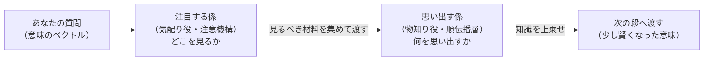
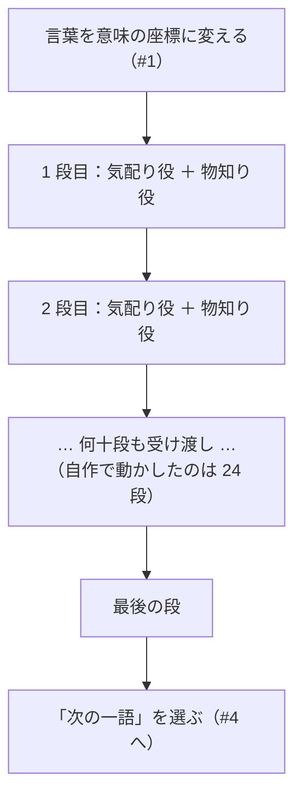

# 知識はどこにしまわれているのか──作って分かった中身 #3（一般版）

著者: 古瀬 和文（ぷるやん）

> シリーズ「作って分かった LLM の中身 ― 自作言語モデルで覗く構造」第3回。
> このシリーズは、私が自分で小さな大規模言語モデル（LLM: Large Language Model）を実装してみて、
> 「教科書の図では分からなかったこと」を、比喩と実感で語り直す試みです。数式は技術版に譲り、
> この一般版では**絵で腑に落とす**ことだけを目指します。

> 🧑‍🔧 **書いている人**
> 私はこの 25 年、工場のラインで「カメラで見て、機械を動かす」装置を作ってきたエンジニアです。
> 検査や位置決め、三次元計測やレーザ計測――「不良を見逃さない、ラインを止めない」ために、
> 画像処理と制御を組み合わせる仕事をしてきました。数式を自分でプログラムに落とすのも、
> きれいな説明書が無い機械を無理やり動かすのも、割と得意なほうです。
> 今回の話は、私の古巣である「画像処理のパイプライン（前処理 → 特徴を取る → 判定する）」と
> 驚くほど似た骨格をしています。その地続き感も、一緒にお裾分けできればと思います。

前回 #2 では、AI の「気の配り方」――**どの言葉に注目するか**を決める仕組み（注意機構）を見ました。
文のどこを見ればいいかを、その場で動的に決める。これが AI が急に賢くなった立役者でした。

今回はその一歩先です。**注目した「その先」で、実際に「思い出す」「答える」のは誰なのか。**

「日本の首都は？」と聞かれて「東京都です」と返す。「日本で一番高い山は？」に「富士山です」と返す。
この“思い出す”部分は、注意機構とは**別の部品**が担当しています。今回のテーマは、その部品――
言い換えれば **「AI の知識は、いったいどこにしまわれているのか」** です。

先に結論の空気だけ言っておくと、これは**まだ研究の途中**にある問いです。
「ここに全部入っています」と言い切れる段階ではありません。でも、「だいたいこのあたりらしい」という
手がかりは見えてきています。その“はっきりしなさ”も含めて、正直にお話しします。

---

## この記事で覚えて帰ってほしい言葉

- **注意機構（attention）** … 前回の主役。「今この言葉を出すには、さっきの文のどこを見ればいい？」を
  その場で決める、**気配り役**。今回は復習として少しだけ登場します。
- **順伝播層（じゅんでんぱそう / FFN: Feed-Forward Network）** … 今回の主役。注意機構が集めてきた材料を受け取り、
  **自分の中に貯めこんだ知識を使って加工する**、**物知り役**。「東京」が来たら「＝日本の首都」を上乗せする係。
- **ブロック（block）** … 「気配り役 ＋ 物知り役」を一組にした、AI の**1 段分**の処理ユニット。
  これを何十段も積み重ねて、AI の本体ができています。

覚えるのはこの3つで十分です。とくに **「気配り役」と「物知り役」の二人一組** が、この記事の背骨です。

## いちばん短い答え：AI の中身は「注目する係」と「思い出す係」の二人組

いきなり核心から言います。ChatGPT のような AI の中身をぐっと単純化すると、
**たった二種類の係が、二人一組でペアを組んで働いている**だけです。

- **注目する係（気配り役）** … 「今、文のどこを見るべきか」を決める。前回の注意機構です。
- **思い出す係（物知り役）** … 見るべき場所が決まったら、そこから**知識を引っぱり出して答えに反映する**。

このペアを**何十段も積み重ねる**。1 段目の出したものを 2 段目が受け取り、それをまた 3 段目が…と、
バケツリレーのように意味を磨いていきます。私が自分で動かしてみた小さな AI では、この二人組が **24 段**
積まれていました。たったそれだけの組み合わせで、質問に答え、敬語に直し、簡単な計算までこなす。

つまり――**AI は「気配り役」と「物知り役」の二人一組を、何十段も積んでできている。**
今日、誰かに話すならこの一文で十分伝わります。残りは、その二人がどう働いているかの肉付けです。

## かみくだき：AI の中身は「小さな図書館」がずらりと並んでいる

もう少し絵にしてみます。私のいちばん好きな比喩は **図書館** です。

あなたが AI に質問すると、その言葉は**小さな図書館**に入ります。図書館にはいつも二人の職員がいます。

- **受付・案内係**（＝注目する係／注意機構）。
  あなたの質問を聞いて、「この件なら、あそこの棚とあそこの資料を見ればいい」と、**見るべき場所へ案内**します。
  自分では答えを持っていません。仕事は「どこを見るか」を的確に指し示すこと。
- **司書・物知り係**（＝思い出す係／順伝播層）。
  案内された棚から、**実際に知識を引き出して答えに反映**します。「首都の話ですね、それなら東京です」。
  こちらが“中身”を持っている側です。

そして大事なのは、**この図書館が一つではない**こと。まったく同じ二人組の図書館が、
**ずらりと何十軒も一列に並んでいる**のです。最初の図書館で少し整理された質問が、
隣の図書館に渡され、そこでまた少し磨かれ…と受け渡されていく。24 軒ぶんの受け渡しを終えたころには、
最初はぼんやりしていた質問が、はっきりした答えの形になっている。これが AI の中身の全体像です。

この二人組には、さらに二つの地味だけれど大事な作法が付いています。名前だけ紹介します。

- **元を捨てない配線（残差接続）** … 職員が資料を加工しても、**元の原稿は横に取っておいて、
  「元 ＋ 加工分」を次の図書館に渡す**やり方です。だから途中の職員がしくじっても、元の情報は失われません。
  何十軒も並べても話が薄れずに届くのは、この「元を捨てない」おかげです。
- **音量そろえ（正規化）** … 職員に資料を渡す前に、信号の**ボリュームを一定にそろえる**小さな下ごしらえ。
  大きすぎ・小さすぎで計算が暴れないための、ちょっとした整えです。

比喩を一段まじめにすると、これは私が現場でやってきた **画像処理のパイプライン**とそっくりです。
生の画像を整えて（前処理）、大事な特徴を取り出して（特徴抽出）、最後に良品か不良品かを決める（判定）。
AI も、生の文章を刻んで、注意機構で特徴を集めて、物知り役が知識で加工し、最後に「次の一語」を決める。
入口と出口の顔ぶれは違っても、**「整える → 特徴を取る → 判定する」という骨格は同じ**でした。

## もう少しくわしく：「注目」と「記憶」は、なぜ別の部品なのか

ここからが今回いちばん面白いところです。

なぜ AI は、わざわざ「注目する係」と「思い出す係」を**分けて**いるのでしょう。
一人二役にせず、二人に分けていることには、ちゃんと意味があります。

**「どこを見るか」と「何を知っているか」は、そもそも種類の違う仕事**だからです。

たとえば、あなたが図書館で「戦国時代の食事について知りたい」と言ったとします。
受付係の仕事は、**あなたの質問を読み解いて、正しい棚へ案内する**こと。歴史のこの棚、食文化のあの資料、と。
司書の仕事は、その棚から**実際に中身を出す**こと。二つはまったく別の技能です。
案内がうまくても中身が空っぽなら答えられないし、中身が豊富でも案内を間違えれば見当違いの棚を開けてしまう。

AI の中でも同じで、**注目する係は「検索・案内」の専門家、思い出す係は「知識の貯蔵庫」**なのです。
役割をきっぱり分けているからこそ、それぞれが自分の仕事に集中できる。この**分業**の発見が、
今回いちばん持ち帰ってほしい“面白さ”です。

そして、これを裏付ける物量の話が一つあります。私が中を開けてみると、
**AI の部品の“かさ”のかなりの部分を占めているのは、実は「思い出す係」のほう**でした。
知識をしまう場所には、それ相応の広い倉庫が要る。注目する係（案内係）は身軽で、
思い出す係（司書＋書庫）はどっしり大きい。この配分そのものが、「知識は主に思い出す係に住んでいそうだ」
という見立ての、まず物理的な裏付けになっています。

## 正直な話：「知識がどこに住むか」は、まだ研究の途中です

ここで、この記事の“正直コーナー”です。

「知識は思い出す係（順伝播層）に住んでいる」――これは**有力な見立て**ではありますが、
**確定した唯一の答えではありません**。世界中の研究者が、いまも中身を調べている最中です。
分かってきていることと、まだ分かっていないことを、正直に分けて書きます。

**分かってきていること（複数の別々の調べ方が、同じ方向を指している）:**

- AI の中を「連想メモリ（合言葉を入れると対応する記憶が出てくる仕組み）」として読み解くと、
  **思い出す係のあたりが、まさにその連想メモリのように振る舞う**、という分析があります。
  ある合言葉（「首都の話題」）に反応して、対応する記憶（「東京」の方向）を押し出す、というイメージです。
- 「ある事実だけをこっそり書き換える」実験――たとえば「ある建物の場所」の記憶だけを差し替える――をやると、
  **思い出す係の一部をピンポイントでいじるだけで、その事実が入れ替わる**ことが示されています。
  そこを触ると事実が変わるのだから、「事実はそのあたりに関係して住んでいそうだ」という傍証になります。
- 私自身の作業に近い話として、注意機構の計算のやり方を軽い方式に**置き換える**手術をするときは、
  **思い出す係のほうは凍結して（触らずに）、注意まわりだけを直す**のが定石です。
  もし思い出す係に知識が入っていなければ、そこを凍結したまま賢さが保てる理由が説明しにくい。
  「知識は思い出す係に、直したいのは注意のやり方だけ」という役割分担が、この手術の前提になっています。

**まだ分かっていない・言い切れないこと（ここが正直に大事なところ）:**

- 知識は**一か所にきれいにしまわれているわけではありません**。実際にはあちこちの層・あちこちの部品に
  **散らばって**います。「首都はどこ」のような単純な事実と、何段も考える必要のある知識とでは、
  住んでいる場所も様子も違うはずです。
- **「触ると事実が変わる場所」＝「その事実が住んでいる唯一の場所」ではない**、という反論もあります。
  スイッチを押すと部屋の電気が消えても、電気が「スイッチの中に」あるわけではないのと同じで、
  「編集できる場所」と「情報が本当にしまわれている場所」は、必ずしも一致しないのです。
  だから私は「主に」「〜のあたりに効く」という言い方に留めて、「知識はここに**ある**」とは言い切りません。

うますぎる話、きれいすぎる説明は、まず疑う。これは私が計測の現場で、うますぎる測定値を見たら
**まず測定器の校正から疑う**、という職業病そのものです。「知識は思い出す係にある」と歯切れよく
言い切れたら気持ちいいのですが、正直な現状は「**たぶん主にそこ、ただし散らばってもいる**」までです。

## いちばん大事な“継ぎ目”：賢さは、私が作ったのではありません

もう一つ、絶対にぼかしたくない正直な話があります。

ここまで「思い出す係が知識を持っている」と書いてきましたが、その**知識・賢さそのものは、
私が作ったものではありません**。それは、あらかじめ膨大な文章で訓練されて出来上がった
「学習済みの中身（重み）」に宿っているものです。

では私は何をしたのか。私がやったのは、**その中身を、外から検査・改造できる形で、正しく走らせる
仕組み（推論ランタイム）を、フレームワークのブラックボックスに頼らず自分で組み直した**ことです。
組み直したエンジンの出力が、公式のお手本の実装と**寸分違わず同じ答え**を出すところまで合わせ込みました。
だから私は「どの部品が何をしているか」を、蓋を開けて見せることができる。

言い換えると――**賢さは学習済みの中身の手柄、私の貢献は「その中身を開けて見られるようにしたこと」**。
この継ぎ目は、はっきりさせておきます。改造版が元より賢くなった、などとは主張しません。

> 📦 **作って分かったこと**
>
> 私は同じ設計図（二人組を 24 段積んだ骨格）で、**大きさ違いの二つの AI** を自分の手で動かしてみました。
>
> - **小さいほう**は、「日本の首都は？」には「**東京都です**」と正しく答えました。
>   ところが「**3 たす 5 は？**」には「**18**」と間違えました。
> - **大きいほう**は、「3 たす 5 は？」に「**8**」と正しく答え、丁寧な言葉づかいへの言い換えもこなし、
>   「日本で一番高い山は？」にも「**富士山です**」と返しました。
>
> 骨格（設計図）は両者ほとんど同じなのに、賢さがはっきり違う。つまり **差は“設計図”ではなく、
> 思い出す係をはじめとする“中身”に詰まっている**――これが、「知識は構造ではなく中身（重み）に住む」
> ということの、手で触れる証拠でした。
>
> ちなみに、どちらも万能ではありません。小さいほうは算数が苦手、大きいほうも「しりとり」は不得意でした。
> **うまくいったことも、いかなかったことも、そのまま残します。** これがこのシリーズの約束です。

## 語呂で覚える

> **「気配り役」が見つけて、「物知り役」が思い出す。**
>
> AI の 1 段（ブロック）は、この**二人一組（ふたりひとくみ）**。
> どこを見るかは気配り役（注意機構）、何を思い出すかは物知り役（順伝播層）。
> 役割がきっぱり分かれているのが面白いところ、と覚えてください。
> ――そして「知識がどこに住むか」は、**まだ研究の途中**。ここも一緒に持ち帰ってもらえたら嬉しいです。

---

## 図で見る：二人組の図書館と、その積み重ね

> 画像プレースホルダ：ヒーロー図「二人一組の小さな図書館」
> 左に受付・案内係（気配り役＝注意機構：質問を聞いて棚を指し示す）、右に司書・物知り係（物知り役＝順伝播層：
> 棚から知識を出して答えに反映）。二人の足元に「元を捨てない作業台（残差）」の帯、上に「音量そろえ」のつまみ。
> 背景に、同じ図書館が奥へずらりと 24 軒並んでいるミニチュア。
> <!-- 画像生成意図: 「注目＝案内／記憶＝司書」の分業と、それを何十段も積む構造を、落ち着いた図書館のトーンで直感化する。対立・競争・攻撃の比喩は使わない。文字ラベルは日本語。断定を避けるため知識の“棚”はやわらかいグラデーションで描く。 -->

**1 段（1 ブロック）の中の分業：**

**二人組の図書館を何十段も積む：**

> 画像プレースホルダ：概念図「知識はどこに住むか（研究の途中）」
> 横に何十段のブロック、縦に「注目する係の受け持ち」と「思い出す係の受け持ち」をやわらかい帯グラフで。
> 思い出す係の側に「事実・世界知識」（辞書・地図のアイコン）、注目する係の側に「案内・矢印」のアイコン。
> あえて境界をくっきりさせず、グラデーションでぼかして「まだ研究の途中／知識は散らばっている」ことを表現。
> <!-- 画像生成意図: 「知識は主に思い出す係、ただし散らばっていて断定はしない」という留保を、絵でも“ぼかし”で表現する。赤緑の対立色は使わず同系色の濃淡で。見下し・攻撃・自賛の要素を入れない。 -->

---

## まとめ ― この章の持ち帰り

- AI の中身は、**「注目する係（気配り役・注意機構）」と「思い出す係（物知り役・順伝播層）」の二人一組**。
  これを何十段も積んで（自作で動かしたのは 24 段）、質問を少しずつ答えの形に磨いていく。
- 二人には **「元を捨てない配線（残差）」** と **「音量そろえ（正規化）」** という地味な作法が付く。
  この骨格は、私の古巣の **画像処理パイプライン（整える → 特徴を取る → 判定する）**とそっくり。
- **面白さの核**：「どこを見るか」と「何を知っているか」は種類の違う仕事なので、**別々の部品**に分けてある。
  この分業が、AI がうまく動く土台になっている。
- **正直な現状**：知識が具体的に**どこに住むか**は、**まだ研究の途中**。有力な見立ては「主に思い出す係」だが、
  実際は**あちこちに散らばって**いて、「触ると事実が変わる場所＝住む唯一の場所」ではない。歯切れよく言い切れない。
- **継ぎ目**：賢さは**学習済みの中身**の手柄。私の貢献は、それを**開けて検査・改造できる形で、公式と同じ答えが
  出るまで正しく走らせた**こと。改造版が元より賢い、とは言いません。

> **今日の一つの持ち帰り**：AI の「知っていること」と「気の配り方」は、**別々の係**が担当している。
> 誰かに話すなら――**「AI は"物知り役"と"気配り役"の二人一組を、何十段も積んでできている」**。この一言で十分です。

---

## 次回に続く

部品はそろいました。気配り役と物知り役の二人組を積むだけで、質問に答える AI が立ち上がる。
しかも私が組み直したエンジンは、公式のお手本と**寸分違わず同じ答え**を出しました。

でも、まだ一度も答えていない問いが残っています。

**その「物知り役」の書庫に、そもそも知識はどうやって入ったのか？**

設計図（二人組を積む構造）は、今回見たとおり単純です。にもかかわらず、小さい AI は算数を間違え、
大きい AI は正しく答える。差は**中身（重み）**にある――なら、その中身は**どうやって決まった**のでしょう。

次回 #4 は、**「なぜ“たくさん読ませる”と賢くなるのか」**。
大量の文章を読ませて、「次の一語」の当てそこないを少しずつ直していく――それは私が現場でやってきた
**校正（キャリブレーション）**とそっくりの作業です。そして、そこで待っているのが、このシリーズいちばんの
**正直な失敗談**。私が自宅のパソコンで、ゼロから小さな言語モデルを作ってみたら――
**どうしても、まともに会話ができなかった**のです。なぜか。その答えが、「賢さはどこから来るのか」の核心でした。

**知識は中身（重み）に宿る。では、その中身はどうやって入るのか。** 次回、その“入れる側”の話をします。

---

*このシリーズは、自作の小さな LLM（llcore）を実装しながら書いています。数値や実例はすべて自作エンジンでの
実測に基づき、うまくいかなかったことも消さずに残します。同じテーマを数式と実際のコードで掘り下げた
技術版もあります。「絵で分かった」あとに「仕組みで納得したい」方は、そちらもどうぞ。*
