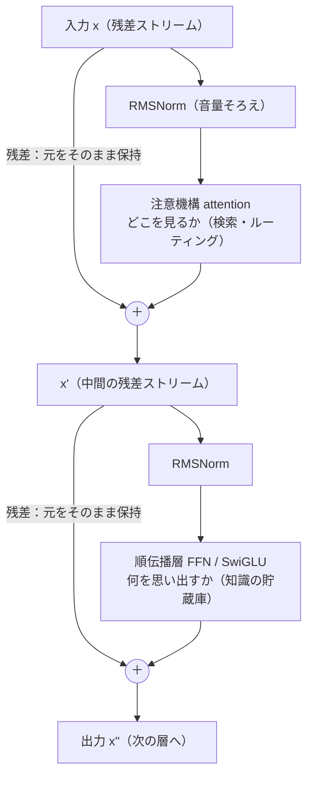
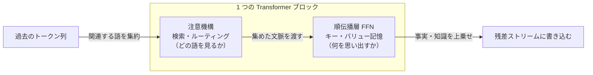
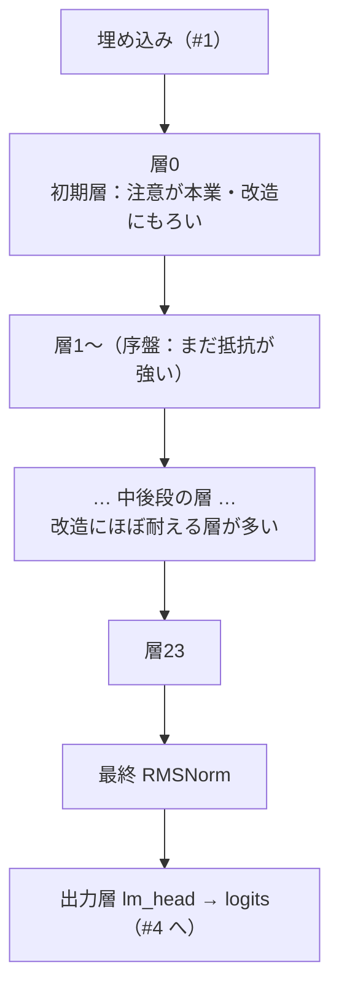

# Transformer ブロックの全体像 ― 知識はどこに住むか──作って分かった中身 #3（技術版）

著者: 古瀬 和文（ぷるやん）

> シリーズ「作って分かった LLM の中身 ― 自作言語モデルで覗く構造」第3回（技術版）。
> このシリーズは、フレームワークの中身に頼らず推論エンジンを自分で組み直し、公式実装と実測して
> 誤差ゼロで再現した一次体験を土台に、大規模言語モデル(LLM: Large Language Model)の部品を一つずつ
> 分解して見せる連載です。一般版が絵で腑に落とす担当、この技術版は数式・擬似コード・実測値で納得する担当です。

私は 25 年ほど、計測・制御の現場で「カメラで見て、機械を動かす」装置を作ってきたエンジニアです。
多項式近似・スプライン補間・フーリエ変換・主成分分析といった数値アルゴリズムを、必要に応じて自分で
実装してきました。今回の主役である順伝播層(FFN)は、その数理解析の延長線上にあります。「関数を近似する箱」
という見方が、そのまま Transformer の心臓の隣に座っている――そんな地続きの話です。

前回 #2 では、注意機構(attention)を「どこを見るか」を動的に決める仕組みとして解剖しました。各トークンが
Query/Key/Value を作り、`softmax(QKᵀ/√d)V` で過去の語に重み付き平均をかける。位置は RoPE(回転位置埋め込み)で
周波数として符号化し、KV(Key-Value)キャッシュで計算を使い回す。そして自作した forward pass の出力が、公式の
リファレンス実装と **logits で 2e-4（浮動小数点の丸め誤差の域）まで一致**した、というところまで話しました。

今回はその一歩先です。**「注目したその先で、実際に『考える』のはどこなのか」**。
注意機構がテーブルに材料を集めてくれたとして、その材料を使って「日本の首都は東京都だ」と思い出し、
「3 たす 5 は 8 だ」と計算する部品は、いったいブロックのどこに住んでいるのか。
この章の副題「知識はどこに住むか」は、そのまま今回の問いです。

---

## ① 用語ミニ辞典

先に、この章で出てくる部品の名前だけ通しておきます。②③で全部くわしく開けます。

- **Transformer ブロック(Transformer block)** … LLM の本体を構成する「1 段分の処理ユニット」。
  中身は **注意機構 + 順伝播層** の 2 パートで、それぞれに残差接続と正規化が付く。これを何十段も積む。
- **順伝播層(FFN: Feed-Forward Network)** … 各トークンを独立に通す 2 層の多層パーセプトロン(MLP)。
  「広げてから畳む」形。この章の主眼で、**知識の貯蔵庫**の最有力候補。
- **SwiGLU(Swish-Gated Linear Unit)** … 順伝播層の中身に使われる、ゲート(門)付きの活性化方式。
  片方の枝で「どれだけ通すか」を決め、もう片方の枝の信号にかけ合わせる。
- **残差接続(residual connection)** … 部品を通した結果を、**元の入力に足し戻す**配線。
  `y = x + f(x)`。深いネットワークが学習できるようになった立役者。
- **正規化(normalization) / RMSNorm(Root Mean Square Normalization)** … 信号の大きさをそろえて数値を安定させる工程。
  RMSNorm は正規化の一種で、**平均引き算を省き、二乗平均の平方根で割るだけ**の軽量版。
- **pre-norm(pre-normalization)** … 「部品に入れる前に正規化する」配置。今どきの LLM の標準。
  逆に「部品を通した後で正規化する」のが post-norm。
- **汎用関数近似器(universal function approximator)** … 「十分な幅・深さがあれば、どんな連続関数も
  好きな精度で近似できる」というニューラルネットの性質。スプライン補間や多項式近似の親戚。
- **知識の局在(knowledge localization)** … 「世界知識や事実は、モデルのどの部品に蓄えられているのか」を
  調べる研究テーマ。**主に順伝播層と出力層**に効く、という複数系列の証拠がある（ただし断定はしない）。

略語はここで一度だけ展開しました。以降は日本語または略語で通します。

---

## ② かみくだき：ブロックは「気配り役」と「物知り役」の二人組

まず全体像を、数式なしの絵で。

前回までで、文章はトークンに刻まれ(#1)、意味の座標＝ベクトルに変換され(#1)、注意機構で「どの語に注目するか」が
決まりました(#2)。ここまでを工場のラインにたとえるなら、私が現場でやってきた**画像処理パイプライン**とそっくりです。
生の画像を前処理し、特徴を抽出し、最後に判定する――LLM も、生のテキストを刻んで、特徴（意味ベクトル）にして、
最後に「次の一語」を判定する。同じ骨格です。

その特徴処理の心臓部が **Transformer ブロック**で、中身は二人組の職人だと思うと腑に落ちます。

- **気配り役 ＝ 注意機構(attention)**。「今この語を出すには、さっきの文のどこを見ればいい？」を判断して、
  必要な材料を机の上に集めてくる係。前回 #2 の主役です。
- **物知り役 ＝ 順伝播層(FFN)**。気配り役が集めてくれた材料を受け取り、**自分の中に貯めこんだ知識を使って加工する**係。
  「東京」という材料が来たら「＝日本の首都」という知識を上乗せする。今回 #3 の主役です。

この二人が一組。そして、二人ともに共通の作法が二つ付きます。

- **残差接続(residual)** ＝ **元の原稿を捨てずに、赤字を重ねる**やり方。
  職人が加工しても、元の材料は横に取ってあって、「元 ＋ 加工分」を次に渡す。だから途中で職人がしくじっても、
  元の情報は失われない。何十段も職人を並べても情報が薄れないのは、この「元を捨てない」配線のおかげです。
- **正規化(RMSNorm)** ＝ **音量そろえ**。職人に渡す前に、信号のボリュームを一定にそろえておく。
  大きすぎ・小さすぎで計算が暴れないように、毎回レベルを整える小さな前処理です。

そして、この二人組を **24 段**（自作で動かした 0.5B モデルの場合）積み重ねる。1 段目の出力が 2 段目の入力になり…と
バケツリレーで意味が磨かれていきます。最後に出力層が「次の一語」に点数(logits)をつける(#4 で扱います)。

ここで、この章のいちばん持ち帰ってほしい話を先に置きます。

> **賢さは足し算層に、注目は attention に。**
>
> 「どこを見るか（検索・ルーティング）」は気配り役＝注意機構の仕事。
> 「何を思い出すか（事実・知識）」は物知り役＝順伝播層の仕事。
> ――この**分業**が、近年の研究で少しずつ見えてきました。断定はできませんが、有力な見立てです。

「足し算層」というのは私の語呂合わせです。順伝播層は残差接続で結果を**足し算**で戻すので、
「賢さ（知識）を足し込む層」＝足し算層、と覚えると、注意機構との役割分担が忘れにくくなります。

では、ここから数式と擬似コードで中を開けます。

---

## ③ 詳細：ブロックを解剖する

### 3-1. ブロックの骨格 ― pre-norm と残差接続

現代の LLM デコーダの 1 ブロックは、驚くほど単純な 2 行で書けます。`x` を「そのトークンの意味ベクトル」とすると、

```
x = x + Attention(RMSNorm(x))     # ① 気配り役：どこを見るか
x = x + FFN(RMSNorm(x))           # ② 物知り役：知識で加工する
```

この 2 行に、この章の主要部品が全部入っています。順に読み解きます。

**残差接続 `x = x + f(x)`。**
部品 `f`（注意でも FFN でも）を通した結果を、元の `x` に**足し戻す**。これがなぜ効くのか。
深いネットワークは、素朴に積むと勾配が層を遡るうちに消えたり暴れたりして、うまく学習できません。
残差接続を入れると、`x` から出力までを**そのまま通り抜ける一本道（恒等写像の経路）**ができます。
学習時の勾配は、この一本道を減衰せずに流れて各層に届く。俗に「勾配のハイウェイ」と呼ばれる構造です。

見方を変えると、各ブロックは「意味ベクトルを一から作り直す」のではなく、**共有の帯（残差ストリーム）に、
自分の担当分の情報を少しずつ書き足していく**。注意は「関連する語から集めた文脈」を書き足し、
順伝播層は「思い出した知識」を書き足す。24 段ぶんの書き足しが積み重なって、最終的な意味ベクトルになる。
この「共有の帯に少しずつ上乗せ」というイメージは、後で「知識の局在」を考えるときに効いてきます。

**pre-norm（正規化を先にかける）。**
上の式で、正規化 `RMSNorm` は部品 `f` の**手前**に入っています。これが pre-norm 配置です。
古い Transformer は部品の**後**に正規化を置く post-norm でしたが、深く積むと不安定になりやすい。
pre-norm は残差の一本道を正規化で邪魔しない（`x` 本体はそのまま足し戻す）ので、
深いモデルでも安定して学習でき、今の主流になりました。自作したデコーダもこの pre-norm 配置です。

### 3-2. RMSNorm ― 平均引き算を省いた正規化

正規化の役割は「信号の大きさをそろえて、計算を安定させる」こと。まず親にあたる LayerNorm(Layer Normalization)を
思い出します。LayerNorm はベクトル `x`（長さ `d`）に対し、**平均を引いて、標準偏差で割って、学習パラメータで
スケール・シフト**します。

```
LayerNorm(x) = γ · (x − mean(x)) / sqrt(var(x) + ε) + β
```

RMSNorm はここから**平均引き算（センタリング）を丸ごと省きます**。平均を引かず、二乗平均の平方根(RMS)で割るだけ。

```
RMS(x) = sqrt( (1/d) · Σ xᵢ²  + ε )
RMSNorm(x) = g · x / RMS(x)
```

擬似コードにすると、その軽さがよく見えます。

```python
class RMSNorm(nn.Module):
    def __init__(self, dim, eps=1e-6):
        # 学習で得るゲイン g（各次元に 1 個）。バイアス β も平均も無い。
        self.weight = nn.Parameter(torch.ones(dim))
        self.eps = eps

    def forward(self, x):
        # 平均は引かない。二乗平均の平方根で割るだけ。
        rms = torch.rsqrt(x.pow(2).mean(dim=-1, keepdim=True) + self.eps)
        return self.weight * (x * rms)
```

省いたのは、平均を計算して引く手間と、シフト用パラメータ `β`。それだけで何がうれしいのか。

- **軽い**：平均・分散の二パス計算が、二乗平均の一パスで済む。要素数の多い巨大モデルでは、この差が効く。
- **安定して、精度も落ちない**：経験的に、平均引き算を省いても言語モデルの性能はほとんど変わらないことが
  報告され、多くの現代 LLM が RMSNorm を採用しています。「効くのに軽い方を採る」という素直な設計判断です。

計測の現場でも、前処理でオフセット（平均）を引くべき場面と、ゲイン（大きさ）だけそろえれば十分な場面があります。
RMSNorm は「大きさだけそろえれば十分だった」という後者の割り切りだ、と読むと私にはしっくりきます。

### 3-3. 順伝播層(FFN) ― SwiGLU と「広げて畳む」

さて主役です。注意機構が机の上に材料を集めた後、その材料を**各トークンごとに独立に**通すのが順伝播層。
古典的な FFN は、単純な 2 層 MLP でした。

```
FFN(x) = W_down · activation(W_up · x)        # 広げて（up）→ 非線形 → 畳む（down）
```

`W_up` で hidden 次元 `d` を**より広い中間次元** `h`（`h > d`。ざっくり数倍）へ拡大し、活性化関数で非線形をかけ、
`W_down` で `d` に戻す。「いったん高次元に広げて、非線形で捏ねて、また畳む」――これが順伝播層の基本形です。

現代の LLM（自作で扱った Qwen2 系デコーダを含む）は、ここに **SwiGLU** というゲート機構を入れます。
入力を**二つの枝**に分け、片方を「門番」、もう片方を「素材」にして、要素ごとにかけ合わせます。

```
SwiGLU_FFN(x) = W_down · ( SiLU(W_gate · x) ⊙ (W_up · x) )
```

`SiLU`（＝Swish、`SiLU(z) = z · sigmoid(z)`）を通した **ゲート枝**が「この成分をどれだけ通すか」を 0〜1 近辺で決め、
**アップ枝**の信号 `W_up · x` に要素ごとの積 `⊙` でかける。門を開け閉めしながら情報を通す、という発想です。

```python
import torch.nn.functional as F

class SwiGLU_FFN(nn.Module):
    def __init__(self, dim, hidden):        # hidden > dim（広げてから畳む）
        self.gate = nn.Linear(dim, hidden, bias=False)   # 門番の枝
        self.up   = nn.Linear(dim, hidden, bias=False)   # 素材の枝
        self.down = nn.Linear(hidden, dim, bias=False)   # 畳んで戻す

    def forward(self, x):
        # SiLU(=Swish) をゲートにして、素材と要素ごとに掛け合わせる
        return self.down(F.silu(self.gate(x)) * self.up(x))
```

ゲートを足すと重み行列が 2 枚から 3 枚に増えますが（`gate`/`up`/`down`）、そのぶん表現力が上がり、
同じパラメータ規模でも性能が出やすい、と経験的に選ばれています。ここは「なぜ SwiGLU がベストか」を
理論から一意に導けるわけではなく、**多くのモデルで良かったから使われている**、という正直な現状です。

注目してほしいのは規模感です。**モデルの全パラメータのかなりの割合が、この順伝播層の 3 枚の行列に集中**します。
注意機構よりも順伝播層の方が、多くの構成でパラメータを食う。「賢さは足し算層に」という見立ての、
まず物量面の裏付けがここにあります。**知識をしまう場所には、それ相応の容量が要る**からです。

### 3-4. 順伝播層は「汎用関数近似器」――スプライン・多項式近似との地続き

ここで少し、私の元いた数理解析の畑に引き寄せます。

順伝播層は「線形変換 → 非線形 → 線形変換」でした。これは、ニューラルネットの古典的性質
**汎用関数近似器**そのものの形です。「十分な幅があれば、1 枚の隠れ層と非線形活性化で、任意の連続関数を
好きな精度で近似できる」という定理（普遍近似定理）が知られています。順伝播層は、その近似器を各層に置いて、
入力の意味ベクトルを別の意味ベクトルへ写す**関数**を、データから学び取っているわけです。

計測の現場で私がやってきた**スプライン補間や多項式近似**も、根っこは同じ「関数近似」です。
とびとびの測定点から、その間をなめらかに埋める関数を作る。多項式で近似する、区分ごとに低次多項式を
つなぐ（スプライン）、といった手当てをします。実は、`ReLU` のような区分線形な活性化を使ったニューラルネットは、
数学的には**高次元の区分線形関数＝多次元スプラインの親戚**と見なせます。`SiLU` はそれをなめらかにした版です。

だから私にとって順伝播層は、目新しい魔法ではなく、**「入力空間を折り紙のように折り畳んで、
必要な形の関数を組み立てる、なじみの近似器」**でした。違うのは次元と規模だけ。
現場で 1 次元・2 次元の曲線を近似していた道具が、数千次元の意味空間で同じことをやっている。
この地続き感が、私が「中身を説明できる」と言える理由の一つです。近似器としての順伝播層は、
**「材料（ベクトル）を受け取って、覚えた対応関係で別のベクトルへ写す」箱**。次にその「覚えた対応関係」の
中身を見にいきます。

### 3-5. 知識はどこに住むか ― 順伝播層＝キー・バリュー記憶という見立て（適度に留保を付けて）

いよいよ副題の問いです。**「日本の首都は東京都」「富士山は日本一高い山」といった事実は、モデルのどこに蓄えられているのか。**

近年の複数系列の研究が、共通して指し示しているのは **「主に順伝播層（と最終的な出力層）」** です。
決定的・唯一の答えではありませんが、有力な見立てとして紹介します（**断定はしません**。理由は後述）。

- **順伝播層＝キー・バリュー記憶(key-value memory)説（Geva ら）**。
  順伝播層の 1 枚目の行列（`up`/`gate` 側）を「キー」、2 枚目（`down` 側）を「バリュー」と見ると、
  入力パターンにマッチしたキーが対応するバリュー（＝特定の語彙方向への寄与）を呼び出す、
  連想メモリのように振る舞う、という分析です。ある「キー」は「首都の話題」に反応し、
  対応する「バリュー」が「東京」方向へ残差ストリームを押す――というイメージです。
- **事実の書き換えが順伝播層で効く（ROME / MEMIT）**。
  ROME(Rank-One Model Editing) や MEMIT(Mass-Editing Memory in Transformer) は、
  「特定の事実（例：ある事物の所在）」を、**中間層の順伝播層の重みをピンポイントに書き換える**ことで
  編集できると示しました。順伝播層をいじると特定の事実が差し替わる。これは「事実がそこに関係して住んでいる」ことの
  傍証になります。
- **線形化レシピの実務的事実（自作の一次体験に近い側）**。
  softmax の注意を軽い線形注意へ置き換える「線形化」の手順では、**順伝播層を凍結したまま、注意まわりだけを
  蒸留し直す**のが定石です（第5章でくわしく扱います）。もし順伝播層に知識が入っていなければ、
  そこを凍結して能力が保てる説明がつきにくい。「知識は順伝播層に、置き換えたいのは注意の計算様式だけ」という
  役割分担が、この手続きの前提になっています。

これらを総合すると、**「注目（どの語を見るか）は注意機構、記憶（何を思い出すか）は順伝播層」**という分業像が浮かびます。
注意機構は**検索・ルーティング**――関連する過去の語から材料を集めてくる。順伝播層は**貯蔵庫**――集まった材料に対して、
覚えた知識を上乗せする。冒頭の語呂「**賢さは足し算層に、注目は attention に**」は、この総合の要約です。

**ここで正直に、留保を三つ置きます。**

1. **これは研究の総合であって、確定した唯一解ではありません。** 知識は 1 か所に集中して住むのではなく、
   複数の層・複数の部品に**分散**しているのが実態です。「首都」のような単純な事実と、多段の推論が要る知識とでは
   居場所も様子も違うはずです。
2. **「編集が効く場所」＝「知識が住む唯一の場所」ではない**、という反証的な指摘もあります。
   ROME/MEMIT の成功は「そこを触ると事実が変わる」ことは示しますが、「事実がそこ**だけ**に蓄えられている」ことまでは
   保証しません。因果的に編集できる箇所と、情報が符号化されている箇所は、必ずしも一致しない、という議論です。
   だから私は「主に」「〜に効く」という言い方に留め、「知識は順伝播層に**ある**」と言い切りません。
3. **そして最大の継ぎ目**：ここまでの「知識」「賢さ」は、すべて **学習済みの重みに宿ったもの**です。
   私が自作したのは、その重みを**中身を検査・改造できる形で正しく走らせる、検証済みのオンプレ推論ランタイム**であって、
   賢さそのものを作ったわけではありません。0.5B が「日本の首都は？」に「東京都です」と正しく答えられたのは
   Qwen の学習済み重みの手柄で、私の貢献は「その forward を公式と 2e-4 で一致するまで正しく組み、
   どの層の順伝播層が何をしているかを開けて見られるようにした」ことです。**この継ぎ目はぼかしません。**

> 📦 **作って分かったこと**
>
> 「知識が順伝播層に住む」を、私は自作エンジンで**間接的に**体感しました。
> 同じ 24 層の骨格でも、**0.5B は「3 たす 5 は？」に「18」と間違え**、より大きい **1.5B は「8」と正しく**答えます
> （どちらも自作 forward で駆動、いずれも学習済み重みの実力）。構造（ブロックの設計図）は両者ほぼ同じなのに、
> 賢さが違う。つまり**差は設計図でなく、順伝播層をはじめとする重みに詰まった中身**にある――
> これが「知識は構造ではなく重みに住む」の、手触りのある証拠でした。次回 #4 で、その重みがどう入るかを扱います。

### 3-6. これを N 層積む ― そして「初期層は改造に弱い」という伏線

ここまでが 1 ブロック。あとはこれを積むだけです。**自作で動かした 0.5B デコーダは 24 層**。
各層が残差ストリームに情報を書き足しながら、意味ベクトルを磨いていきます。

```python
class Decoder(nn.Module):
    def __init__(self, n_layers=24, dim=..., n_heads=..., hidden=...):   # 0.5B は 24 層
        self.layers = nn.ModuleList(
            [TransformerBlock(dim, n_heads, hidden) for _ in range(n_layers)]
        )
        self.final_norm = RMSNorm(dim)     # 出力層へ渡す前の総仕上げ
        # lm_head は入力埋め込みと共有（tied embeddings, #1 参照）

    def forward(self, x, mask=None, kv_cache=None):
        for layer in self.layers:
            x = layer(x, mask, kv_cache)   # 残差ストリームを層から層へ受け渡す
        return self.final_norm(x)          # この後 logits へ（#4）
```

そして 1 ブロックは、これまでの部品を組み上げるだけです。

```python
class TransformerBlock(nn.Module):
    def __init__(self, dim, n_heads, hidden):
        self.attn_norm = RMSNorm(dim)
        self.attn      = SelfAttention(dim, n_heads)   # #2 で組んだ注意（RoPE / GQA / KVキャッシュ込み）
        self.ffn_norm  = RMSNorm(dim)
        self.ffn       = SwiGLU_FFN(dim, hidden)

    def forward(self, x, mask=None, kv_cache=None):
        # ① 注意：正規化 → 注意 → 残差で足し戻す（pre-norm）
        x = x + self.attn(self.attn_norm(x), mask, kv_cache)
        # ② 順伝播：正規化 → FFN → 残差で足し戻す（pre-norm）
        x = x + self.ffn(self.ffn_norm(x))
        return x
```

たったこれだけの部品――RMSNorm・注意・SwiGLU・残差――の組み合わせを 24 回繰り返す。
そのシンプルさに反して、公式実装と **greedy 生成のトークンが完全一致**し、**logits が 2e-4 で一致**するところまで
再現できました。**部品は単純なのに、積むと会話が立ち上がる**。この落差こそ、私が自作してみて一番おもしろかった点です。

最後に、次章以降への伏線を一つ。**全部の層が、同じように「差し替え可能」なわけではありません。**

自作エンジンで層ごとに注意の様式を線形化して耐性を測ると（詳細は第5章）、**層 0 やいくつかの初期層は、
注意機構が「本当の仕事」をしていて、改造に対して非常にもろい**ことが分かりました。
具体的な手触りだけ先に置くと、あるベースライン（perplexity 68.74）に対して、**層 0 を単独で線形化しただけで
perplexity が 160 まで跳ね上がる**――序盤の層をいじると、モデル全体が一気に崩れます。
一方で、中盤から後段の層は同じ改造でもほとんどコストがない層が多い。

つまり **「知識は主に順伝播層」だとしても、初期層の注意機構は"配線の要"として別格に重要**で、
そこは触ると壊れる。この**耐性プロファイル**――どの層が頑丈で、どの層がもろいか――を、
量子化・線形化・蒸留回復とあわせて解剖するのが第5章です。今回の「知識の局在」は、その地図の最初の一枚です。

---

## 図：ブロックの解剖と分業

> 画像プレースホルダ：ヒーロー図
> 「Transformer ブロック＝二人組の工房」。左に気配り役（注意機構：机に材料を集める）、
> 右に物知り役（順伝播層：棚の知識を材料に上乗せする）。両者の下に「残差ストリーム＝共有の作業台（元を捨てず足し込む）」の帯。
> 上部に RMSNorm の「音量そろえ」つまみ。全体を 24 段のブロックが縦に積まれているミニチュアが背景に薄く。
> <!-- 画像生成意図: Transformer 1 ブロックの機能を「注意＝ルーティング／FFN＝知識貯蔵」の分業として直感化する。攻撃的・競争的な比喩は使わない。落ち着いた工房・作業台のトーン。文字ラベルは日本語。 -->

**1 ブロックの信号の流れ（pre-norm + 残差）：**



**注目と記憶の分業（この章の核）：**



**24 層を積む（初期層はもろい、という伏線つき）：**



> 画像プレースホルダ：概念図「知識はどこに住むか」
> 横軸に 24 層、縦に「注意の寄与」と「順伝播層の寄与」を薄い帯グラフで。順伝播層側に「事実・世界知識」の
> アイコン（辞書・地図）を、注意側に「ルーティング・矢印」のアイコンを配置。左端（層 0 付近）に
> 「ここは触ると壊れる（第5章）」の控えめな注記。断定を避ける意味で帯はグラデーションでぼかす。
> <!-- 画像生成意図: 「知識は主に FFN、ただし分散していて断定はしない」という hedge をビジュアルでも表現する（くっきり分けず、グラデーションで曖昧さを残す）。赤緑の対立色は使わず、同系色の濃淡で。 -->

---

## まとめ ― この章の持ち帰り

- **Transformer ブロック = 注意機構 + 順伝播層**。各パートに **残差接続（元を捨てず足し戻す）** と
  **RMSNorm（平均引き算を省いた軽い正規化）** が付き、**pre-norm** で配置する。これを 24 層積む（0.5B の場合）。
- **順伝播層(FFN)は SwiGLU**：門番の枝と素材の枝を要素積でかけ合わせ、「広げて畳む」。
  モデルのパラメータの多くがここに集まる。数理的には**汎用関数近似器**＝スプライン・多項式近似の親戚で、
  私の数理解析の畑と地続き。
- **知識はどこに住むか**：複数系列の研究（順伝播層＝キー・バリュー記憶説、ROME/MEMIT の事実編集、
  線形化での順伝播層凍結）が、**「注目は注意機構、記憶は順伝播層」**の分業を指し示す。
  ただし**知識は分散**しており、「編集が効く場所＝住む唯一の場所」ではない、と**断定は避ける**。
- **最大の継ぎ目**：賢さは**学習済みの重み**由来。自作の貢献は、それを**検査・改造できる形で公式と誤差ゼロまで
  正しく走らせた検証済みランタイム**であって、賢さそのものではない。0.5B が算数を間違え 1.5B が正解するのも、
  差は設計図でなく重みの中身。

> **今日の一つの持ち帰り**：AI の「賢さ（知っていること）」と「気の配り方（どこを見るか）」は、
> ブロックの中で**別々の部品**が担っている。誰かに話すなら――
> **「AI は"物知り役"と"気配り役"の二人一組を何十段も積んでできている」**。この一言で十分伝わります。

---

## 次回に続く

部品はそろいました。単純な二人組を積むだけで、公式と誤差ゼロまで一致する会話エンジンが立ち上がる。
でも、ここまで一度も答えていない問いが残っています。

**その順伝播層の"貯蔵庫"に、そもそも知識はどうやって入ったのか？**

設計図（ブロックの構造）は、この記事のとおり単純です。にもかかわらず 0.5B は算数を間違え、
1.5B は正しく答える。差は重みの中身にある――なら、その重みは**どうやって決まった**のか。

次回 #4 は「なぜ『事前学習済み』が効くのか ― 学習と推論」。
大量のテキストで「次トークン予測」の誤差を測り、勾配で少しずつ直していく――それは私が現場でやってきた
**キャリブレーション（校正）ループ**とそっくりです。そして、そこで待っているのが今シリーズいちばんの正直な失敗談：
**自宅の CPU で、ゼロから作った文字単位の言語モデルは、どうしても会話できなかった**という一次記録です。
最良でも文語の物真似どまり。なぜか。ボトルネックはアーキテクチャではなく、規模・データ・計算でした。

**賢さは重みに宿る。そして重みは、巨大な事前学習でしか入らない。** その「入れる」側の話を、次回します。

---

*このシリーズは、自作の小さな LLM を実装しながら書いています。数値はすべて自作エンジンでの実測に基づき、
うまくいかなかったことも消さずに残します。図で全体像を掴みたい方は、同テーマの一般版もあわせてどうぞ。*
