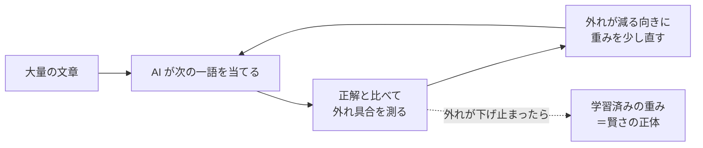

# なぜ「たくさん読ませる」と賢くなるのか──作って分かった中身 #4（学習と推論・一般版）

著者: 古瀬 和文（ぷるやん）

> シリーズ「作って分かった LLM の中身 ― 自作言語モデルで覗く構造」第4回（一般版）。
> このシリーズは、私が自分で小さな大規模言語モデル（LLM: Large Language Model）を実装してみて、
> 「教科書の図では分からなかったこと」を、比喩と実感で語り直す試みです。数式は技術版に譲り、
> この一般版では**絵で腑に落とす**ことだけを目指します。

> 🧑‍🔧 **書いている人**
> 私はこの 25 年、工場のラインで「カメラで見て、機械を動かす」装置を作ってきたエンジニアです。
> 検査や位置決め、三次元計測やレーザ計測――「不良を見逃さない、ラインを止めない」ために、
> 画像処理と制御を組み合わせる仕事です。実はその現場で毎日やっていた「**測って、ズレを直す**」という作業が、
> AI の学習とほとんど同じ形をしていました。今日はその話をします。

前回 #3 では、「知識はどこにしまわれているのか」を覗きました。ざっくり言うと、AI の中では
**「どこに注目するか」を決める係（注意機構）** と、**「知っていることを引き出す係（記憶の層）**」が分業していて、
知識のほうは主に「記憶の層」に住んでいる――という話でした。

すると当然、次の疑問が湧きます。**その知識、そもそもどこから来たの？** 誰かが手で書き込んだわけでもないのに、
なぜ AI は日本の首都や足し算や、人の気持ちの流れまで「知っている」のか。

その答えが、今回のテーマ **「学習」** です。そして今回いちばんお伝えしたいのは、成功談ではなく、
**自宅のパソコンでゼロから AI を作ってみたら、まったく会話にならなかった**という、正直な失敗のほうです。
この失敗こそが、「なぜ世の中の AI があんなに賢いのか」を、いちばん鋭く教えてくれました。

## この記事で覚えて帰ってほしい言葉

- **学習（training / トレーニング）** … AI に大量の文章を読ませて賢くする工程。中身は「次の一語を当てる練習」の繰り返し。
- **事前学習（pre-training / プレトレーニング）** … その練習を、公開前に**あらかじめ・とてつもない規模で**やっておくこと。
  ChatGPT などが賢いのは、この工程の成果物。
- **重み（weights / ウェイト）** … AI の内部にある膨大な数値の設定。「学んだこと」は全部ここに詰まっている。
  **賢さが宿る場所**は、ここ。

この3つ、とくに最後の「賢さは**重み**に宿る」だけ持って帰れれば、今回は十分です。

## いちばん短い答え：「次の一語を当てる練習」を、気が遠くなるほど繰り返しているだけ

第0回で、「LLM は次の一語を当てる機械」だとお話ししました。実は**学習も、同じこと**をしています。

やっていることは、採点つきの穴埋めドリルです。

1. 文章の途中まで見せる（例：「日本の首都は」）。
2. AI に「次の一語は？」と当てさせる。
3. 正解（「東京」）と見比べて、**どれだけ外したか**を測る。
4. 外した分だけ、内部の設定（重み）を、当たる方向へ**ほんの少し**だけ直す。
5. これを、文章を変え、場所を変え、**何十億回**繰り返す。

それだけです。派手なことは何もしていません。ところが――この単調きわまりない作業を、
本当に気の遠くなる回数やり込むと、**副産物として「世界のことを分かっている」設定が出来上がる**のです。

なぜなら、第0回でも書いたとおり、**「次の一語をうまく当てる」には、世界を分かっていないと無理**だから。

- 「日本の首都は」の続きを当てるには、日本の首都を知っていないといけない。
- 「2 たす 3 は」の続きを当てるには、足し算ができないといけない。
- 「彼女は悲しくて、思わず……」の続きを当てるには、人の気持ちの流れを察せないといけない。

つまり、**「ただ当てる練習」を突き詰めた結果、当てるために必要な知識や推論が、勝手に身についてしまった**。
これが「たくさん読ませると賢くなる」の正体です。目的はどこまでも地味なのに、そのために必要な力が壮大だった。

## これ、私の仕事の「校正」とそっくりでした

この「**測って、ズレを直す**」ループを見て、私は自分の仕事を思い出しました。

計測・制御の現場には、**校正（calibration / キャリブレーション）** という作業があります。
装置がちゃんと正しく測れているか、目標とのズレを測って、少しずつ合わせ込んでいく作業です。

とくに記憶に残っているのは、公式の開発環境も説明書のような使い勝手のよい仕組みも無い**双腕ロボット**を
動かした仕事でした。ロボットの両目と、腕の先につけたカメラで、基準になる板の位置や傾きを見ながら、
頭・腰・両腕・手首の角度を、少しずつ自動で合わせていく。そのループの骨格は、こうでした。

> カメラで**測る** → 目標とのズレ（誤差）を出す → ズレが減る向きに関節を**少し動かす** → また測る → …… → ズレが十分小さくなったら完成。

AI の学習と、並べてみます。

| 私の現場の「校正ループ」 | AI の「学習ループ」 |
|---|---|
| カメラで今の位置を**測る** | 文章の続きを**当てる** |
| 目標とのズレを出す | 正解との**外れ具合**を出す |
| ズレが減る向きに関節を**少し動かす** | 外れが減る向きに**重みを少しずらす** |
| また測る（くり返す） | また当てる（くり返す） |
| ズレが十分小さくなったら完成 | 外れが下げ止まったら完成 |

**測る相手がカメラ画像か言葉か、動かす相手が関節か重みか、が違うだけ**で、
「ズレを測って、減る向きに少し直す」という背骨は、まったく同じでした。

だから私は、機械学習の難しそうな専門用語に、あまり身構えていません。あれは要するに、
**現場で何十年もやってきた校正ループを、途方もない数の「関節」（重み）に対して、自動で回しているだけ**。
形を知ってしまえば、そんなに怖いものではありません。

<!-- 画像生成意図: 上半分に「計測現場の校正ループ」（カメラで測る→目標とのズレ→関節を少し動かす→また測る、をロボットアームのイラストで）、下半分に「AIの学習ループ」（文章の続きを当てる→正解とのズレ→重みを少し直す→また当てる）を配置し、両者が同じ円環構造であることを対応する矢印で結ぶ。中央に「測って、少し直す。それだけ。」の一言。落ち着いた計測器風の配色。攻撃的・自賛的な表現は使わない。 -->

*図：計測現場の「校正ループ」と、AI の「学習ループ」は同じ形。測る相手と動かす相手が違うだけ。*

## 「事前学習済み」って、なんですか

ここで、今回の主役の言葉が出てきます。**事前学習（pre-training）** です。

さっきの「穴埋めドリルを何十億回」を、AI を公開する**前**に、
それこそインターネット規模の文章で、あらかじめ済ませておく。これが事前学習です。

ChatGPT のようなサービスを使うとき、私たちはこの**事前学習が終わった後の AI** を使っています。
つまり、**膨大な校正ループを回し終わった「重み」を、そのまま借りている**わけです。

ここで一つ、面白い性質があります。**穴埋めドリルの「正解」は、人間が用意しなくていい**、ということです。

普通、AI に何かを教えるには「これが正解ですよ」というラベル付けが要ります。写真に「これは猫」「これは犬」と
人間が札を貼っていく、あの地道な作業です。ところが次の一語当てには、それが要りません。
だって、**文章そのものが答えを持っている**から。「日本の首都は」の次が「東京」だというのは、
文章を1文字ずらすだけで自動的に分かる。正解を人が付けなくていいから、**インターネット中の文章を、いくらでも読ませられる**。

この「いくらでも読ませられる」ことこそが、事前学習が桁違いの規模になれる理由であり、
そして――これから正直にお話しするとおり――**個人には、絶対にまねできない壁**の正体でもありました。

## 作って分かったこと：自宅で作ったら、会話になりませんでした

ここからが、今回いちばんお伝えしたい部分です。

「学習が校正ループなら、自宅のパソコンでゼロから回せば、小さくても会話する AI ができるのでは？」
――そう思って、私は実際にやってみました。青空文庫のような日本語の文章を集めて、
**文字を1つずつ当てる小さな言語モデル**を、自分の手で最初から学習させたのです。

結果は、**会話には、まったく、届きませんでした。**

いちばん出来の良かったモデルでも、次の文字を当てる腕前はこうでした。
学習前（何も分かっていない状態）では、次の文字を平均して**215 通りくらいの候補で迷っていた**のが、
学習後には**38 通りくらいまで**絞れた。**確かに学習は効いています。** ちゃんと「読ませたら少し賢くなった」。

でも、平均 38 通りで迷っている文字予測器に、文章を書かせるとどうなるか。出てくるのは、
**「昔の書き言葉の、それらしい物真似」**まででした。語感はなんとなく日本語なのに、意味がつながらない。
質問に答えるどころではありません。

なぜでしょう。ここが肝心です。**うまくいかなかった原因は、設計の間違いではありませんでした。**
同じ「次の一語を当てる」原理、同じ系統の部品を使っても、**規模・読ませた文章の量・計算した回数**が、
何桁も足りていなかった。校正ループの**形は正しかった**のに、
**回した回数と、見せた文章の量が、けた違いに足りなかった**のです。

ここから、今回いちばん持ち帰ってほしい一文が出ます。

> **賢さは、重みに宿る。そして重みは、巨大な事前学習でしか入らない。**

だから「事前学習済み」のモデルを使うことは、手抜きでも近道でもありません。
**個人の計算力では絶対に届かない規模の校正ループの成果物を、正直にお借りしている**、ということなのです。

> 📎 **もう一つの正直な失敗（小さな余談）**
> 実はもう一つ、「メモリを増やさずに賢くする」工夫も試しました。文章が長くなっても内部のメモリが膨らまない、
> 倹約タイプの作りです。狙いどおり、メモリは一定に保てました。ところが――**覚えていられる範囲は、
> ほんの狭い窓の中まで**でした。だいぶ前に出てきた事実を、あとで引っぱってくることができない。
> **「メモリは節約できたが、記憶の射程は伸びなかった」**。都合のいい性質と、欲しい能力は、
> 自動では両立しない。この教訓は、第5回でもう一度、もっと詳しく回収します。

## 継ぎ目を、正直に見せます：会話できたのは「借りた重み」の力

「自宅で作ったら会話にならなかった」と正直に書いたので、その裏側も正直に書かねばフェアではありません。

私は、**まったく同じ自作の仕組み**（フレームワークの中身に頼らず、自分で組み直した推論ランタイム）で、
今度は**世の中に公開されている事前学習済みモデル**（小さめのもの）を動かしてみました。すると――結果はまるで違いました。

- あるモデルに「日本の首都は？」と聞くと → **「東京都です」**（正解）。ただし「3 たす 5 は？」→「18」（間違い。小さいモデルは算数が苦手）。
- もう少し大きいモデルでは「3 たす 5 は？ 数字だけ」→ **「8」**（正解）、ていねいな言い回しへの変換も成功、
  「日本で一番高い山は？」→ **「富士山です」**（正解）。しりとりのような遊びは、まだ苦手でした。

一般的な質問、簡単な算数、指示に従う――このあたりで、**「まともに会話できる」水準に届いた**のです。

同じ人間が、同じ自作の仕組みで動かして、**自宅でゼロから学習させた小さなモデルは会話できず、
ダウンロードした事前学習済みの重みは会話できた。** 違いは、たった一点。**重みの中身**だけです。

設計の独創でもなければ、私のプログラムの巧みさでもありません。**巨大な事前学習を通った重みか、そうでないか**。
それだけで、会話になるかどうかが決まりました。だから、継ぎ目を、はっきり書きます。

> **会話の賢さは、学習済みの「重み」――つまり、他者による巨大な事前学習の成果――に由来します。**
> **私が自分で作ったのは、その重みを「中身を検査でき、改造でき、正しさを確かめられる形」で動かす仕組み**であって、
> 賢さそのものを生み出したわけではありません。

このシリーズが、いちばんぼかしたくない一点がこれです。「自作しました」と言うと、
つい「賢い AI を自分で作った」ように聞こえてしまう。でも実際は、**賢さは借り物、
自分の手柄は『中身が見える形で、寸分違わず再現して動かせること』**。ここは正直に分けておきます。

（ちなみに、その「寸分違わず再現できた」という検証の中身――自作した計算が、公式の実装と
ほとんど誤差なく、ぴったり同じ答えを出したこと――は、第2回でくわしくお話ししています。
「組み直したら、まったく同じ答えが出た。だから中身を説明できる」というのが、このシリーズ全体の土台です。）

## できあがった AI は、どうやって喋る？

学習が終わると、重みは**そこで固定**されます。実際に文章を書かせるとき（これを**推論**と呼びます）、
AI はもう学びません。固定した重みを使って、ひたすら**次の一語を1個ずつ**出していくだけです。

進み方は、第0回でお話ししたとおり。1語出したら、それを文の末尾に足して、
**ここまで全部を丸ごと読み直して**、また次を出す。この繰り返しです。

ここで一つ、身近な「AI のクセ」の種明かしをしておきます。
同じ AI に同じことを聞いても、**毎回ちょっと違う答え**が返ってくることがありますよね。あれはなぜか。

AI は次の一語を、いきなり1個に決めているわけではありません。まず**候補それぞれに「ありそうさ」の点数**をつけます
（「東京 40%、京都 6%、大阪 5%、……」というふうに）。そこから**実際にどの1語を出すか**の選び方に、
少し「遊び」を持たせているのです。

- **堅実に選ぶ設定**にすると、いつも一番点数の高い語を選ぶので、無難で安定した文章になります（毎回ほぼ同じ答え）。
- **遊びを増やす設定**にすると、たまに2番手・3番手の語も選ぶので、変化に富んだ・意外性のある文章になります。

この「選び方のつまみ」を **温度（temperature）** と呼びます。大事なのは、
**このつまみは賢さそのものには関係しない**、ということ。同じ重み（＝同じ賢さ）でも、
選び方を変えれば、堅実にも奔放にもなる。**賢さは重みが決め、性格は選び方が決める**。ここは別物です。

> 📌 ひとつ正直な注記を。第2回でお話しした「自作した計算が公式とぴったり一致した」という検証は、
> **いつも一番点数の高い語を選ぶ「堅実モード」**での話です。**遊びを持たせたモード**まで
> 完全に一致するかどうかは、このシリーズでは確かめていません（**未検証**）。
> 「一部で一致した」を「全部で一致する」と言い換えない――これも、計測の現場で染みついた作法です。

## この回の「作って分かったこと」box

> 📦 **作って初めて腹落ちしたこと**
>
> 「学習＝校正ループ」だと**頭では**分かっていても、自分のパソコンでゼロから回すまで、私は**規模の壁**を甘く見ていました。
> 同じ原理・同じ設計でも、自宅で学習させた小さなモデルは、昔の書き言葉の物真似止まりで、会話になりません。
> 一方、ダウンロードした事前学習済みの重みを**まったく同じ自作の仕組み**で動かすと、ちゃんと質問に答える。
>
> **設計が正しくても、賢さは湧いてきません。賢さは、巨大な事前学習を通った重みにしか宿らない。**
> 「事前学習済みモデルを使う」のは、ずるでも手抜きでもなく、**個人には届かない規模の努力の結晶を、正直にお借りする**こと。
> そして自作の値打ちは、賢さを生むことではなく、その重みを**中身が見える形で、寸分違わず再現して動かせる**ことにあります。

## 語呂で覚える

> **「重みに宿る、賢さは。読ませた量が、地力になる。」**
>
> AI の賢さは、キラリと光る設計のひらめきに宿るのではなく、**地味な穴埋めドリルを何十億回**やり込んで
> 溜め込んだ「重み」に宿ります。だから「どんな設計か」より、まず「**どれだけ読ませた重みか**」。
> 次に誰かが「新しい AI」の話をしていたら、心の中でこう問い返してみてください――
> 「それ、設計が新しいの？ それとも、**読ませた量**が桁違いなの？」と。

## 次回予告

今回、こんな話を1つだけ、種として残しておきました。
「一語出すたびに、**ここまで全部を丸ごと読み直す**」。

自己回帰――一語ずつ足しては読み直す、あの仕組みは、この「読み直し」から逃れられません。
ということは、**会話が長くなるほど、読み直す量がどんどん増えていく**。第0回で私が
「作って初めて、体で分かった」と書いた、あの **「長い文章ほど、急に重くなる」** の正体が、いよいよここにあります。

次回 #5「**長い会話がだんだん重くなる理由**」では、日々あなたが AI に触れているときに
なんとなく感じる、あの「長い会話でもたつく」クセの正体を、計測エンジニアの目で分解します。
なぜ重くなるのか、そしてそれをどうやって軽くするのか――**メモリと速度の壁**の話です。

> **この回の持ち帰り**：AI が賢いのは、**次の一語を当てる練習を、個人には届かない規模でやり込んだ「重み」**があるから。
> 学習は、誤差を測って少し直す**校正ループ**。推論は、その固定した重みで一語ずつ選ぶだけ。
> ――今度あなたが AI を選ぶとき、まず見るべきは「見た目の新しさ」より、「**どんな学習を通った重みか**」です。

---

*このシリーズは、自作の小さな言語モデルを実装しながら書いています。数字はすべて実測で、
うまくいかなかったこと（自宅で作ったモデルが会話にならなかった、倹約タイプでも記憶の射程が伸びなかった）も、
消さずに残しています。「異常に良い結果は、まず内訳を疑う」――計測の現場で染みついた規律を、そのまま持ち込んでいます。*
