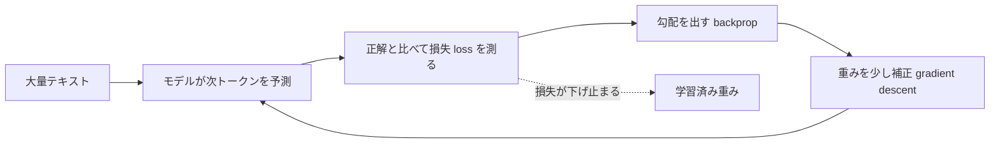
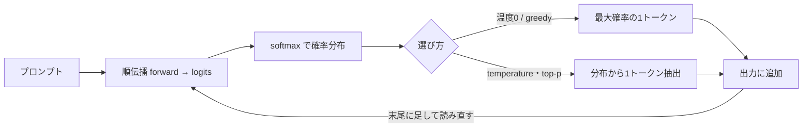

# なぜ「事前学習済み」が効くのか ― 学習と推論（技術版 #4）

著者: 古瀬 和文（ぷるやん）

> シリーズ「作って分かった LLM の中身 ― 自作言語モデルで覗く構造」第4回（技術版）。
> 前回 #3 では、Transformer ブロックの中で「知識は主に順伝播層(FFN)に住み、注意機構(attention)は
> どこを見るかを配る」という分業を見ました。では――その「知識」、つまり**重み(weights)** は、
> そもそもどこから来たのでしょうか。今回は「学習」と「推論」を、計測現場の校正ループと地続きの視点で開けます。

前回の最後に、こう書きました。「賢さは足し算層に、注目は attention に住む」。
これは**でき上がったモデルの中を覗いた**話でした。今回は時間を巻き戻します。
その足し算層に、いったい**どうやって**知識が入ったのか。そして、入り終わった重みを使って、
モデルは**どうやって**一語ずつ文章を紡ぐのか。

先に結論を一言で置きます。**学習とは、誤差を測って少しずつ直す「校正(calibration)」の繰り返し**です。
私が 25 年やってきた計測・制御の現場でいう、あの校正ループとほぼ同じ形をしています。
そして今回のいちばんの見どころは、成功談ではありません。**自宅の CPU でゼロから言語モデルを学習させたら、
会話にならなかった**という、正直な失敗です。この失敗こそが、「なぜ既製の事前学習済みモデルが効くのか」を
いちばん鋭く教えてくれました。

---

## ① 用語ミニ辞典（この回で使う言葉）

- **事前学習(pre-training)** … 大量の一般テキストで「次に来る語」を当てる訓練を、あらかじめ大規模にやっておくこと。
  ここで世界の言葉のクセ・知識が重みに刻まれる。ChatGPT などが「賢い」のは、この工程の成果物。
- **重み(weights)** … モデル内部の膨大な数値パラメータ。ここに「学んだこと」が全部入っている。推論時は固定して使う。
- **損失(loss)** … 予測がどれだけ外れたかの数値。小さいほど良い。言語モデルでは主に**交差エントロピー(cross-entropy)**を使う。
- **交差エントロピー(cross-entropy)** … 「正解の語に、モデルがどれだけ低い確率しか割り当てなかったか」を測る損失。
  正解を高い確率で当てれば小さく、外せば大きくなる。
- **困惑度(perplexity, 以下 ppl)** … 損失を「実感できる分岐数」に直したもの。おおまかに「平均して何択で迷っているか」。
  ppl=2 ならコイン投げ級（2択）、ppl=38 なら平均 38 通りの候補で迷っている状態。小さいほど良い。
- **勾配降下(gradient descent)** … 損失を小さくする向きへ、重みを少しずつずらしていく最適化法。「坂を下る」イメージ。
- **誤差逆伝播(backpropagation)** … 出口で測った誤差を、各重みが「どれだけ悪さをしたか」に分解して配る計算（連鎖律）。
- **自己回帰(autoregressive)** … 1語出す→ここまで全部を読み直す→次の1語を出す、を繰り返す生成の仕方。
- **推論(inference)** … 学習を終えた固定重みで、実際に文章を生成すること。訓練の逆で、重みは動かさない。
- **サンプリング(sampling)** … 予測された確率分布から、実際に出す1語を「どう選ぶか」。**温度(temperature)**と**核サンプリング(top-p)**が主役。
- **文字単位LM(character-level language model)** … 文章を1文字ずつ予測するモデル。トークン単位より素朴で小さく作れるが、その分不利。
- **単文字頻度基準(unigram baseline)** … 「文脈を一切見ず、単に出やすい文字を出すだけ」の最弱の対照。学習の効果はこれとの差で測る。

まずは **loss（外れ具合）→ 勾配降下（外れを直す）→ ppl（迷いの度合い）** の3つだけ握れば、今回の芯は通ります。

---

## ② かみくだき：学習は「採点つき穴埋めドリル」を何十億回

### 学習の全体像 ― 誤差を測って、少し直す

大規模言語モデル(LLM: Large Language Model)の学習は、実はとても単純な作業の繰り返しです。

1. 文章の途中まで（例:「日本の首都は」）をモデルに見せる。
2. モデルに「次の1語は？」と予測させる。モデルは語彙全体に確率を振る（「東京 40%、大阪 5%、……」）。
3. 正解（例:「東京」）と比べて、**どれだけ外したか＝損失(loss)** を測る。
4. 外した分だけ、内部の重みを**ほんの少し**、当たる方向へずらす。
5. これを、文章を変え、場所を変え、**何十億回**繰り返す。

穴埋めドリルを、採点つきで、気の遠くなる回数こなす。ただそれだけです。
にもかかわらず、この単調な作業を極限までやり込むと、副産物として「世界のことを分かっている」重みが出来上がる。
第0回で書いた「次の一語オタクが、当てたい一心で世界中を勉強してしまう」の、内側の仕組みがこれです。

### これは、私が現場でやってきた「校正」とほぼ同じ形

この「測って・直す」ループを見て、私は自分の仕事を思い出しました。

私は長年、装置の**校正(calibration)** を仕事にしてきました。とりわけ記憶に残っているのは、
公式の開発環境も SDK も無い双腕ロボットを、付属アプリを Windows メッセージ経由で叩く自作プログラムで動かし、
両目と腕先のカメラで校正プレートの位置・姿勢を推定しながら、頭・腰・両腕・手首の角度を自動で合わせた仕事です。
あのループの骨格は、こうでした。

> カメラで**測る** → 目標位置とのズレ（誤差）を出す → 誤差が減る向きに関節角を**少し動かす** → また測る → …… → 誤差が十分小さくなったら完了。

言語モデルの学習と、並べてみます。

| 計測・制御の校正ループ | 言語モデルの学習ループ |
|---|---|
| カメラで現在位置を**測る** | テキストで次トークンを**予測**する |
| 目標とのズレ（誤差）を出す | 正解との**損失(loss)** を出す |
| 誤差が減る向きに関節角を**少し動かす** | 損失が減る向きに**重みを少しずらす**（勾配降下） |
| また測る（反復） | また予測する（反復） |
| 誤差が十分小さくなったら完了 | 損失が下げ止まったら完了 |

**測る対象がカメラ画像か言葉か、動かす対象が関節角か重みか、が違うだけ**で、
「誤差を測って、減る向きに少し直す」という背骨は同じです。
機械学習の教科書用語（勾配降下・誤差逆伝播）に身構える必要はありません。あれは、
**現場の校正ループを、何百万次元の関節角に対して自動でやっているだけ**なのです。

### そして、正直な失敗 ― 自宅で作ったら会話にならなかった

ここからがこの回の本題であり、私がいちばんお伝えしたい部分です。

「学習＝校正ループなら、自宅の CPU でゼロからやれば、小さくても会話するモデルができるのでは？」
――そう思って、実際にやりました。青空文庫などの日本語テキストで、文字を1つずつ当てる**文字単位LM**を、
自分の手で最初から学習させたのです。

結果は、**会話には、まったく、届きませんでした**。

いちばん出来の良かったモデルでも、規模は約 1,190 万パラメータ、ppl は 38（何も学ばない単文字頻度基準が 215）。
確かに「学習の効果」は出ています。215 通りで迷っていたのが 38 通りまで絞れた。
けれど生成させると、**日本語の「文語（書き言葉）の物真似」まで**でした。
それらしい語感で文字は続くのに、意味が通らない。質問に答えるどころではありません。

なぜか。ボトルネックは**アーキテクチャ（設計）ではありませんでした**。
同じ次トークン予測の原理・同じ Transformer 系の部品を使っても、**規模・データ・計算量**が桁違いに足りない。
校正ループの形は正しくても、**回す回数と、見せるテキストの量が、何桁も足りなかった**のです。

ここから、この回でいちばん持ち帰ってほしい一文が出ます。

> **賢さは、重みに宿る。そして重みは、巨大な事前学習でしか入らない。**

だから「事前学習済み」が効く。既製のモデルをダウンロードして使うのは、手抜きではなく、
**個人の計算力では絶対に届かない規模の校正ループの成果物を、正直に借りている**ということなのです。

---

## ③ 詳細：損失・勾配降下・推論を、式とコードで

ここからは数式と擬似コードで、②を裏づけていきます。掲載するコードはすべて**教育用の最小例**で、
私の実装そのものではありません（PyTorch 風の読みやすさ優先の擬似コードです）。

### 3-1. 次トークン予測を、損失として定式化する

モデルは、ここまでのトークン列 \(x_1, \dots, x_t\) を入力に、次トークン \(x_{t+1}\) の**確率分布**を出します。
語彙全体（数万語）に確率を振る、と言ってもよいです。学習の目標は「正解トークンに、なるべく高い確率を割り当てる」こと。
これを1トークンあたりの損失として書くと、交差エントロピーになります。

```
loss_t = - log p_model( x_{t+1} | x_1 … x_t )
```

正解トークンにモデルが割り当てた確率 \(p\) の対数に、マイナスを付けただけです。
\(p=1.0\)（完璧に当てた）なら loss=0、\(p\) が小さい（外した）ほど loss は大きくなる。
文章全体・大量の文章にわたって、この loss の平均を最小化する。これが「学習」の数学的な中身です。

ここで大切なのは、**モデルは「真実」や「面白さ」を直接には最適化していない**、という点です。
最適化しているのは、あくまで「次トークンの当たりやすさ」だけ。
第0回で触れた「知識や推論は副産物として身につく」というのは、この意味です。
真実らしさや一貫性は、**次を当てるために結果的に必要になったから**獲得される。目的関数は、驚くほど素っ気ないのです。

### 3-2. ppl（困惑度）は「平均して何択で迷っているか」

loss は対数の世界の数字で直感が湧きにくいので、実務では ppl に直します。定義はシンプルです。

```
perplexity = exp( 平均 loss )   ← loss を自然対数で測った場合
```

ppl は「**平均して何通りの候補で迷っているか**（実効的な分岐数）」と読めます。
完璧なら ppl=1（迷いゼロ）、コイン投げ級の五分五分なら ppl=2、まったくの当てずっぽうなら「語彙サイズ」に近づきます。

これで、さっきの自作モデルの数字が読めます。

- 文字を一切予測せず出やすい文字を出すだけの**単文字頻度基準**: ppl 215（＝平均 215 通りで迷う）。
- 自作の文字単位LM（約 1,190 万パラメータ）: **ppl 38**（215 → 38 に低下）。

215 択が 38 択まで絞れた。学習は確かに効いた。**けれど、平均 38 通りで迷っている文字予測器では、
筋の通った会話は組み立てられません。** これが「ppl は下がったのに会話にならない」という、正直な現実です。

> ★注意（正直な内訳）: ppl は**同じ設定内での比較にしか使えません**。文字単位モデルの ppl と
> トークン単位モデルの ppl は、そもそも「何を1単位と数えるか」が違うので直接は比べられません。
> 「ppl が下がった＝賢くなった」と単純に喜ぶと足をすくわれます。この「単一指標を疑う」姿勢は、
> 計測現場で「うますぎる測定値は、まず校正を疑う」のと同じ規律で、第5回・第6回でも繰り返し効いてきます。

### 3-3. 勾配降下と誤差逆伝播 ― 校正ループの自動化

では「損失が減る向きに重みをずらす」を、どう自動化するのか。ここで**勾配(gradient)** が登場します。

勾配とは、「各重みを少し増やしたら loss がどう変わるか」の傾きです。傾きの**逆向き**に重みを動かせば、loss は下がる。
坂道で、足元がいちばん急に下る方向へ一歩踏み出すのに似ています。何百万次元の坂を、全部の重みについて同時に下る。
その傾きを、出口の誤差から入口へ効率よく配って計算するのが**誤差逆伝播(backpropagation)**（連鎖律の適用）です。

教育用の最小トレーニングループを、擬似コードで置きます。

```python
# 教育用・最小の「次トークン予測」学習ループ（概念コード / 実装そのものではない）
for batch in text_batches:                 # 大量テキストを小分けにして
    inputs  = batch[:, :-1]                # 「ここまで」（各位置の入力）
    targets = batch[:,  1:]                # 「次の1トークン」（1つずらした正解）

    logits = model(inputs)                 # 語彙全体へのスコア（各位置ごと）
    loss   = cross_entropy(logits, targets)  # 予測分布 vs 正解 の外れ具合

    loss.backward()                        # 誤差を各重みへ逆伝播（＝勾配を出す）
    optimizer.step()                       # 勾配の逆向きに、重みをほんの少し動かす
    optimizer.zero_grad()                  # 勾配をリセットして次のバッチへ
```

ポイントは3行目・4行目の **`inputs` と `targets` が「1つずらし」の関係**にあること。
「ここまで」に対する正解が「その次の1文字」なので、正解ラベルは入力を1つずらすだけで自動的に手に入ります。
**人間が正解を付けなくても、テキストそれ自体が答えを持っている**――これが、言語モデルを
インターネット規模のテキストで学習できる理由です（自己教師あり学習）。ラベル付けの人件費が要らない。
だから「大量に」回せる。そして「大量に」回せることこそが、②で見た規模の差を生みます。

`optimizer.step()` の1回が、校正ループの「関節角をほんの少し動かす」1回に対応します。
**1回では何も起きません。** 何十億回積み重ねて、初めて重みに世界が刻まれる。
私の自宅実験が届かなかったのは、まさにこの「積み重ねの回数×見せたテキスト量」でした。

この「1回でどれだけ動かすか／何回まわすか」を握るのが、学習の主なつまみです。
**学習率(learning rate)** は1歩の大きさ――校正でいえば「関節角を一度にどれだけ動かすか」。
大きすぎると目標を通り越して発散し、小さすぎると永遠に着かない。ここも校正の勘所とそっくりです。
**バッチ(batch)** は一度に見せるテキストの束の大きさ（傾きをまとめて平均するので推定が安定する）、
**エポック(epoch)** はデータ全体を何周させるか。個人の実験でこれらを丁寧に調整しても、
**土台の規模（パラメータ数・データ量・総計算量）が足りなければ、つまみの妙では埋まらない**――
これが、私が回してみて骨身にしみた順序です。つまみは規模の上でしか効かない。

### 3-4. もう一つの正直な失敗 ― 定数メモリでも「文脈」は伸びなかった

自作実験では、別方向の工夫も試しました。**定数状態の再帰型(recurrent)文字LM**です。
これは第5回で扱う「線形化・定数メモリ」の思想を先取りしたもので、
文脈が長くなっても内部状態のサイズが一定（メモリが膨らまない）という利点を狙ったものでした。

結果を正直に並べます。約 130 万パラメータで、ppl 22（この設定の単文字頻度基準は 207）。
**予測力にして約 9.4 倍**、次の1文字を当てる正解率（top-1）は 0.38 でした。
しかも、位置 8192 文字あたりまで ppl は約 21 でほぼ平坦――**長い位置でも性能が劣化しない**という、
狙い通りの「定数メモリ・非劣化」は達成できました。

ただし、ここに**もう一つの honest null（正直な限界）**があります。
性能が位置で劣化しないことと、**遠くの文脈を実際に使えること**は、別問題でした。
このモデルが実効的に参照できる文脈は、学習時の窓幅（block size、およそ 128 文字）どまり。
それより前に出てきた事実を、後で引っぱってくることはできませんでした。
「メモリは一定に保てたが、記憶の射程は窓の外へ伸びなかった」。
**都合の良い性質（定数メモリ）と、欲しい能力（長い文脈の活用）は、自動では両立しない。** この教訓は、
第5回で「線形化はタダではない（メモリは得するが、別のコストを払う）」として、もっと精密に回収します。

> ※ ここで並べた2つの数字（1,190 万パラメータ・ppl 38 と、130 万パラメータ・ppl 22）は、
> **コーパスも対照基準も違う別々の実験**なので、ppl の大小を直接くらべて優劣を語ることはできません。
> それぞれ「その設定の中で、学習が効いた／会話には届かなかった／長文脈は使えなかった」を示す独立した観察です。

### 3-5. 継ぎ目を、はっきり見せる ― 会話できるのは「借りた重み」の力

ここで、このシリーズがいちばんぼかしたくない継ぎ目に触れます。

私は同じ自作の推論ランタイム（フレームワークの中身に頼らず、順伝播を自分で組み直したもの）で、
既製の**事前学習済みモデル（0.5B / 1.5B パラメータ級）** も動かしました。そちらの結果は、まるで違いました。

- 0.5B を自作の順伝播で駆動: 「日本の首都は？」→「東京都です」（正解）。ただし「3 たす 5 は？」→「18」（誤り。0.5B は算数が弱い）。
- 1.5B を自作の順伝播で駆動: 「3 たす 5 は？ 数字だけ」→「8」（正解）、敬語への変換も成功、
  「日本で一番高い山は？」→「富士山です」（正解）。しりとりのような遊びは苦手。
  一般的な質問・簡単な算数・指示追従で、**「まともに会話できる」水準に到達**しました。

同じ人間が、同じ自作ランタイムで動かして、**自宅でゼロから学習した文字LMは会話できず、
ダウンロードした事前学習済みの重みは会話できた**。差は一点、**重みの中身**だけです。
アーキテクチャの独創でも、推論コードの巧拙でもありません。巨大な事前学習を通った重みか、そうでないか。

だから、継ぎ目を正直に書きます。

> **会話の賢さは、学習済みの重み（他者による巨大な事前学習の成果）に由来する。**
> **私の自作の貢献は、その重みを「中身を検査・改造できる、検証済みのオンプレ推論ランタイム」で動かしたこと**――
> ブラックボックスでなく、一つずつ部品を確かめられる形にしたこと、であって、賢さそのものを生み出したことではありません。

そしてその「検証済み」の中身が、第2回で詳しく触れた**誤差ゼロ再現**です。
自作した順伝播の出力（logits）は、公式リファレンス実装と**浮動小数点の丸め誤差の域（2e-4）で一致**し、
貪欲法(greedy)で選ぶ生成トークンは**完全に一致**しました。
「組み直したら寸分違わず同じ答えが出た」から、私は中身を説明できる。けれど、
**その中身が賢いのは、私のおかげではない**。この2つは、はっきり分けて語らねばなりません。

なお、既製のチャットモデルが「会話の作法」まで身につけているのは、事前学習の**上に**、
指示追従のための追加の学習段階（微調整・整列）が乗っているためです。
その工程の話（自分の道具として学習を足す／知識を貸す）は、第6回で扱います。今回の芯は、
**土台の世界知識は事前学習で入り、それは個人の計算力では届かない規模を要する**、という一点です。

<!-- 画像生成意図: 左に「自宅CPUでゼロから学習した文字単位LM（約1,190万パラメータ・ppl38）→ 出力は文語の物真似で意味が通らない」、右に「ダウンロードした事前学習済みモデル（0.5B/1.5B）→ 質問に答えられる」を対比。中央に同一の『自作の推論ランタイム（検証済み・2e-4一致）』の歯車を置き、両方を同じランタイムが駆動していることを示す。差が『重みの中身＝事前学習の規模』だけであることを視覚化。攻撃的・自賛的な表現は使わない。落ち着いた計測器風の配色。 -->


*図: 同じ自作ランタイムで動かしても、会話できるかどうかは「重みが巨大な事前学習を通ったか」で決まる。賢さは重みに宿る。*

### 3-6. 学習ループを図にする（校正ループと同じ形）

②で並べた「校正ループ＝学習ループ」を、フローで置きます。



計測現場の校正ループを重ねると、対応はこうです。「測る＝予測」「ズレ＝損失」「関節角を動かす＝重みを補正」。
図の左上の入口が**テキストの量**、ループの回転数が**計算量**。
私の自宅実験が届かなかったのは、この2つの規模でした。設計（図の形）は正しくても、**入口の量と回転数が桁違いに足りなかった**。

### 3-7. 推論 ― 固定した重みで、一語ずつ

学習が終わると、重みは**凍結**します。推論(inference)では、この固定重みを使って、実際に文章を生成する。
学習との決定的な違いは、**もう重みを動かさない**こと。誤差逆伝播もしません。順伝播（forward）を、前へ流すだけです。

生成は**自己回帰**で進みます。1トークン出したら、それを入力の末尾に足して、ここまで全部を読み直し、また次を出す。

```python
# 教育用・自己回帰デコード（概念コード / 実装そのものではない）
tokens = tokenize(prompt)                 # 入力を数値の並びに
while not done(tokens):
    logits  = model(tokens)[-1]           # 「末尾の次」に来るトークンの分布（語彙全体のスコア）
    next_id = sample_next(logits, temperature=0.7, top_p=0.9)  # 分布から1つ選ぶ（3-8）
    tokens.append(next_id)                # 出したものを入力に足して…
    # …また丸ごと読み直して次へ。この「毎回読み直す」重さが、第5回の主役になる。
```

最終行のコメントが、次回への伏線です。1語ごとに「ここまで全部」を読み直すので、
会話が長くなるほど読み直す量が増える。第0回・一般版で予告した「長い文章ほど、急に重くなる」の正体は、まさにここにあります。
その重さを賢くやり過ごす仕掛け（KV(Key-Value)キャッシュ）を、第5回で開けます。

### 3-8. サンプリング ― 分布から「どう1語を選ぶか」

モデルが出すのは、**次トークンの確率分布**です（「東京 40%、京都 6%、大阪 5%、……」）。
そこから実際に出す1語を選ぶ方法が、**サンプリング**。ここは学習とは無関係で、
**同じ重み・同じ分布でも、選び方を変えれば出力の性格が変わります**。主な旋回ノブは2つです。

- **温度(temperature)**: 分布の「尖り具合」を調整する。値を小さくすると分布が尖り、
  いつも高確率の語を選ぶ**堅実**な文章に。大きくすると分布が平らになり、低確率の語も選ばれる**多様**な文章に。
  温度 0 は事実上、常に最大確率を選ぶ**貪欲法(greedy)** と同じ（毎回同じ出力になる＝決定論的）。
- **核サンプリング(top-p)**: 確率の高い順に足していき、合計が p（例: 0.9）を超えたところで候補を打ち切り、
  残った上位候補だけから選ぶ。ありえない裾の語を締め出しつつ、ほどよい多様性を残す。

```python
# 教育用・サンプリング（概念コード / 実装そのものではない）
def sample_next(logits, temperature=1.0, top_p=1.0):
    logits = logits / temperature          # 温度: 小→尖る(堅実), 大→平ら(多様)
    probs  = softmax(logits)               # スコアを確率分布に

    # top-p（核サンプリング）: 高確率の順に足して p を超えるまでを残し、裾を捨てる
    sorted_probs, index = sort_desc(probs)
    keep   = cumulative_sum(sorted_probs) <= top_p
    probs  = renormalize(sorted_probs[keep])   # 残った候補で確率を振り直す

    return index[ random_choice(probs) ]   # 残った候補から、確率に比例して1つ引く
```

第2回で触れた「自作の順伝播が公式と 2e-4 一致し、**貪欲法(greedy)のトークンは完全一致**した」検証は、
このうち**温度 0（貪欲法）の経路**での話です。各ステップで最大確率のトークンを選ぶので、
分布がわずかに違っても順位が変わらなければ同じトークンが出る――という決定論的な帰結でした。
一方で、温度を上げた**確率的サンプリング**の経路まで公式とバイト単位で一致することは、
別途の検証が必要で、**本シリーズの範囲では未検証**です。ここも正直に、境界を引いておきます
（「greedy が一致した」＝「あらゆるサンプリングが一致する」ではない）。

推論ループ全体を図にすると、こうなります。



<!-- 画像生成意図: 推論の自己回帰ループを1枚で。プロンプト→順伝播→確率分布（棒グラフで『東京40%/京都6%/大阪5%…』のイメージ）→選び方の分岐（greedy＝一番高い棒を指す／sampling＝サイコロで確率的に選ぶ）→出したトークンを列の末尾に足して矢印が forward へ戻る。温度ノブ（小＝尖った分布、大＝平らな分布）を小さなインセットで対比。計測器のダイヤル風の落ち着いた意匠。自賛・攻撃的表現なし。 -->


*図: 推論は固定した重みで一語ずつ。「分布から選ぶ」ノブが温度と top-p。選び方を変えても賢さ（重み）は変わらない。*

---

## この回の「作って分かったこと」box

> 📦 **作って初めて腹落ちしたこと**
>
> 「学習＝校正ループ」と頭で分かっていても、自分の CPU でゼロから回すまで、私は**規模の壁**を甘く見ていました。
> 同じ原理・同じ設計でも、自宅で学習した文字単位LM（約 1,190 万パラメータ・ppl 38）は、文語の物真似止まりで会話にならない。
> 一方、ダウンロードした事前学習済みの重み（0.5B/1.5B）を**同じ自作ランタイム**で動かすと、質問に答える。
>
> **設計が正しくても、賢さは湧いてこない。賢さは、巨大な事前学習を通った重みにしか宿らない。**
> 「事前学習済みモデルを使う」のは近道でも手抜きでもなく、**個人には届かない規模の校正の成果物を、正直に借りる**という選択でした。
> そして自作の値打ちは、賢さを生むことではなく、その重みを**中身が見える・改造できる形で、誤差ゼロで再現して動かせる**ことにあります。

---

## 次回予告

今回、推論ループの擬似コードに、こんなコメントを1行だけ埋めておきました。
「**…また丸ごと読み直して次へ。この『毎回読み直す』重さが、第5回の主役になる。**」

一語出すたびに「ここまで全部」を読み直す――自己回帰は、この読み直しから逃れられません。
会話が長くなるほど、読み直す量は増え、メモリと速度が音を立てて壁になります。
第0回で私が「作って初めて体で分かった」と書いた、あの**「長い文章ほど、急に重くなる」**の正体です。

次回 #5「メモリと速度の壁」では、その壁を計測エンジニアの目で分解します。
KV(Key-Value)キャッシュがなぜ文脈長に比例して膨らむのか、量子化(quantization)で重みをどこまで削れて
どこで崩れるのか（そして「困惑度(ppl)だけで合否を出すと足をすくわれる」実例）、
定数メモリの線形化が**なぜタダではないのか**――このあたりを、実測値と正直な失敗込みで開けていきます。

> **この回の持ち帰り**: 「事前学習済み」が効くのは、賢さが**重み**に宿り、その重みは
> **巨大な学習でしか入らない**から。学習は誤差を測って直す**校正ループ**、推論はその固定重みで一語ずつ選ぶだけ。
> ――今度あなたがモデルを選ぶとき、見るべきは「アーキテクチャの新しさ」より、まず「**どんな事前学習を通った重みか**」です。

---

*このシリーズは、自作の小さな言語モデルを実装しながら書いています。数値・ベンチはすべて実測で、
うまくいかなかったこと（自宅の文字LMが会話にならない、定数メモリでも文脈が伸びない）も消さずに残しています。
「異常に良い結果は、まず内訳を疑う」――計測の現場で染みついた規律を、そのまま持ち込んでいます。*
