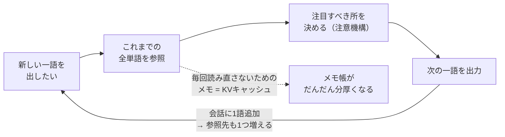
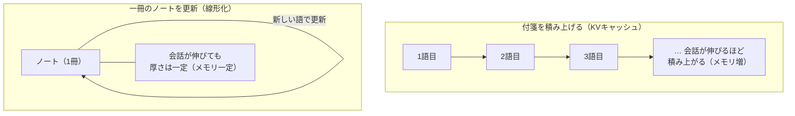

# 長い会話がだんだん重くなる理由──作って分かった中身 #5（メモリと速度の壁・一般版）

著者: 古瀬 和文（ぷるやん）

> シリーズ「作って分かった LLM の中身 ― 自作言語モデルで覗く構造」第5回。
> このシリーズは、私が自分で小さな大規模言語モデル（LLM: Large Language Model、膨大な文章で訓練された言葉の予測装置）を
> 実装してみて、「教科書の図では分からなかったこと」を、比喩と実感で語り直す試みです。数式は技術版に譲り、
> この一般版では**絵で腑に落とす**ことだけを目指します。

> 🧑‍🔧 **書いている人**
> 私はこの 25 年、工場のラインで「カメラで見て、機械を動かす」装置を作ってきたエンジニアです。
> なかでも私が長くやってきたのは、**「限られたメモリと限られた計算能力で、装置をきちんと動かし続ける」**という現場仕事。
> 潤沢なサーバーがある世界ではなく、手のひらサイズの制御基板で「不良を見逃さない・ラインを止めない」を成立させる世界です。
> だから AI の中身を組み直してみて、いちばん自分の土俵だと感じたのが、今回の**「メモリと速度の壁」**でした。
> AI がどこで重くなり、どうすれば軽くできて、どこまで軽くすると壊れるのか。ここは腕が鳴るテーマです。

第0回の最後に、私はこう予告しました。「自分で動かすと、いちばん体で分かるのは**『長い文章ほど、急に重くなる』**ことだった」と。
今回はその回収です。ChatGPT に長い相談を続けていると、なぜか後半になるほど返事がもたつく――あの現象の正体を、
中身を開けて見ていきます。

---

## この記事で覚えて帰ってほしい言葉

- **KV キャッシュ（KV cache）** … KV は「Key-Value（鍵と値）」の略。AI が過去の会話を**毎回読み直さずに済ませるためのメモ帳**。
  便利だけれど、会話が伸びるほどメモ帳が分厚くなり、机（メモリ）を圧迫していきます。今回の主犯格。
- **量子化（quantization）** … AI の中身の数値を**ざっくり丸めて、荷物を軽くする**こと。写真を圧縮して容量を減らすのに似ています。
  適度なら画質はほぼ落ちませんが、やりすぎるとノイズだらけになる――そこがミソです。
- **線形化（linearization）** … 「過去を全部とっておく」覚え方を、「**一冊のノートに要約し続ける**」覚え方に変えること。
  会話がどれだけ伸びても、ノートの厚さが増えない仕組みです。

この3つが持って帰れれば十分です。「メモ帳・圧縮・要約ノート」と覚えてください。

---

## いちばん短い答え：AI は毎回、会話を「頭から全部」読み直している

なぜ長い会話ほど重くなるのか。理由を一言でいうと、こうです。

> **AI は次の一語を出すたびに、それまでの会話を最初から全部見直している。**

第0回でお話しした通り、LLM の仕事は「次の一語を当てる」ことでした。ここで大事なのは、**次の一語を当てる材料が「これまでの全部」だ**という点です。

たとえるなら、**とても律儀な議事録係**を想像してください。この人は、会議で次の一文を発言する前に、
毎回、会議の最初から今までの発言をぜんぶ読み返してからでないと、口を開けません。

- 会議が始まったばかりなら、読み返すのは数行。一瞬です。
- 1 時間経つと、読み返すのは何十ページ。発言のたびに、それを全部おさらいする。

会議が長引くほど、「次の一言」の前の**読み直し**が長くなる。だから後半になるほど、一言あたりが重くなる。
AI が長い会話でもたつくのは、これと同じことが中で起きているからです。

---

## かみくだき：重さには「二つの顔」がある

この「読み直し」の重さは、実は二種類あります。ここを分けて見ると、対策の話がすっきりします。

**① 速さの重さ（毎回のおさらいが増える）**
新しい一語を出すたびに、過去の全単語と「どれに注目すべきか」を照らし合わせます。過去が 10 語なら 10 回の照合、
1000 語なら 1000 回。会話が伸びるほど、一語あたりの照合回数が増えていく。これが「もたつき」の正体です。

**② メモリの重さ（机の上のメモが増える）**
毎回ゼロから全部読み直すのは、さすがに無駄が多い。そこで AI は、過去の単語について計算した中間結果を**メモとして取っておきます**。
これが **KV キャッシュ**です。おかげで「読む」作業は省けるのですが、今度は**メモそのものが会話の長さに比例して積み上がる**。
長い会話は、机の上がメモの山になっていく――これがメモリの重さです。

> つまり、KV キャッシュは「**速さを買うためにメモリを差し出した**」工夫なのです。読み直しの手間は省けたけれど、
> その代償にメモが積み上がる。世の中の多くの工夫がそうであるように、これも「あちらを立てればこちらが立たず」の関係になっています。

自分で作って測ってみると、この積み上がりは本当にきれいな比例でした。会話を 4 倍長くすれば、メモ帳もおよそ 4 倍。
ある実験では、文脈がだいぶ長くなったところ（およそ 4000 語ぶん）で、この「読み直さないためのメモ帳方式」が使うメモリは、
後で紹介する「要約ノート方式」の**およそ 8 倍**まで膨らんでいました。長くなるほど、差はどんどん開いていきます。

---

## 画像プレースホルダ

<!-- 画像生成意図: 会議の議事録係が、発言のたびに机の上に積み上がった大量の付箋（KVキャッシュ）を全部見返している様子。
会話が短いときは付箋が数枚、長いときは机が埋まるほど。左に「短い会話＝サッと」右に「長い会話＝重い」の対比。
情報過多にせず、付箋の山が“比例して増える”ことが直感的に伝わる、柔らかいイラスト調。攻撃的・煽情的要素なし。 -->

**［図: 律儀な議事録係と、積み上がる付箋（KVキャッシュ）。会話が伸びるほど、次の一言の前の「読み直し」が重くなる］**

---

## では、どうやって軽くするのか

重さの正体が「読み直し」と「積み上がるメモ」だと分かれば、対策の方向も見えてきます。大きく二つの考え方があります。

- **対策1：荷物そのものを圧縮する（量子化）** … メモや中身の数値を、粗く丸めて容量を減らす。
- **対策2：覚え方を変える（線形化）** … メモを「積み上げる」のをやめて、「一冊のノートに要約し続ける」に切り替える。

順に見ていきます。どちらも効くのですが、**どちらもタダではない**――ここが今日いちばんお伝えしたい正直な話です。

---

## 対策1：荷物を圧縮する（量子化）

AI の中身は、突き詰めれば**膨大な数値の集まり**です。ひとつひとつの数値を、几帳面に細かい精度で持つこともできるし、
少しざっくりした精度で持つこともできる。**量子化**は、この「ざっくり」を選んで、荷物を軽くする工夫です。

写真の圧縮を思い浮かべてください。元のままなら容量は大きいけれど、適度に圧縮すれば、見た目はほとんど変わらないまま
ファイルが小さくなる。数値も同じで、**適度に丸めれば、賢さをほとんど落とさずに容量だけ減らせます**。

私が自作した推論ランタイム（AI の中身を自分で動かすための、検査も改造もできる仕組み）で、これを実際に試しました。

> 📦 **作って分かったこと：5.7GB が 2.44GB になった**
>
> 15 億パラメータ級のモデルを、几帳面な精度のまま読み込むと、メモリを **約 5.7GB** 使います。
> これを「8 ビット整数」というざっくりした精度に圧縮したところ、常駐メモリは **約 2.44GB** まで下がりました。
> それでいて、**会話はちゃんと続けられた**。おおよそ 4 割強のサイズに詰められた計算です。
> 「賢さの器」を、内容をほぼ保ったまま小さく折りたためた――手のひらサイズの基板で装置を動かしてきた身には、
> これはなかなか気持ちのいい結果でした。

品質の落ち具合も測りました。この「8 ビット」くらいの控えめな圧縮なら、予測の性能低下はごくわずか（誤差の域）に収まります。
ここまでは、いいことずくめに見えます。

### ただし、圧縮しすぎると壊れる

ところが、「もっと小さく」と欲張ると、話が変わります。ここが正直にお伝えしたいところです。

さらに攻めて「2 ビット」まで圧縮した実験では、**ある指標だけを見ると『まだ大丈夫そう』に見えた**のに、
別の指標――「いちばんもっともらしい一語を、ちゃんと正解と同じに選べているか」を測ると、その正答率が**13.5 ポイントも崩れて**いました。

これは私にとって、とても馴染みのある落とし穴でした。計測の現場では、**ひとつの数字だけを見て「合格」と判断すると、必ず取りこぼす**。
「平均は良好」でも、肝心なところで不良が漏れていることがある。だから現場では、**複数の角度から測って、一つでも危なければ止める**（不良を通さない）。
AI の圧縮でも同じで、「見かけの成績」がよくても、**本当に大事な能力が抜け落ちていないか**を別の物差しで確かめないと危ない。

> 圧縮の教訓は一言でいうと――**「適度なら得。やりすぎると、静かに壊れる」**。しかも壊れ方が“静か”で、
> うっかりすると気づかない。だからこそ、**一つの数字を信じず、複数の物差しで検収する**のが命綱になります。

なお、正直な但し書きをひとつ。この「8 ビット圧縮」は、私が試した普通のパソコン（CPU）の上では、**メモリは減っても速度は速くなりません**。
むしろ、使うたびに「丸めた数値を元に戻す」ひと手間がかかるぶん、少し遅くなるくらいです。圧縮による**速度**の恩恵は、
それ向けに作られた計算装置（GPU など、良いハードウェア）で本領を発揮します。**「良い道具ほど効く」土台づくり**であって、
非力なパソコンの延命策として速くなる魔法ではない――ここは盛らずに書いておきます。

---

## 対策2：覚え方を「定数」にする（線形化）

もう一つの対策は、もっと根本的です。**「過去のメモを全部とっておく」という覚え方そのものを変えてしまう**。

さきほどの議事録係は、発言を一枚ずつ付箋にして机に積み上げていました（＝ KV キャッシュ）。だから会話が伸びると机が埋まる。

そこで発想を変えて、こんな係を雇うことにします。**「一冊の要約ノートだけを持ち、新しい発言が出るたびに、その一冊を更新する」**係です。

- 付箋を積み上げる係 → 会話が伸びるほど付箋の山が高くなる（メモリが増える）
- 一冊のノートを更新する係 → 会話がどれだけ伸びても、**ノートは一冊のまま**（メモリが一定）

この「一冊のノート」方式が **線形化**です。会話が 10 語でも 10 万語でも、覚えておく荷物の大きさが変わらない。
長い会話のメモリ問題に、これはとても効きます。

### でも、これもタダではない

ここが、いちばん誤解されやすいところです。「じゃあ最初から全部その一冊ノート方式にすればいいのに」と思いますよね。
私も最初はそう思いました。でも、自分で作って測ると、**そう単純ではない**と分かりました。正直に三つ、書きます。

**① 短い会話では、むしろ損をする。**
一冊の要約ノートは、たとえ会話が一言でも、**決まった大きさの帳面をまるまる一冊**用意します。付箋方式なら、一言のうちは付箋一枚で済む。
つまり**会話が短いうちは、要約ノートの方がかえって重い**。私の実験では、だいたい **200 語ちょっと**を境に、
ようやく要約ノート方式の方が軽くなりました。それより短い会話では、付箋を積む方が得なのです。得をするのは「長い会話になってから」。

**② 賢さが、ほんの少しだけ落ちる。**
過去を「一冊に要約する」ということは、細かいところを少し捨てる、ということでもあります。だから予測の精度が、
**小さいけれどゼロではない**ぶん落ちます。「無料の昼食」ではなく、**メモリと引き換えに、わずかな品質を差し出す取引**なのです。

**③ 場所によって、痛みがぜんぜん違う。**
これは作って初めて分かった、面白い発見でした。AI は同じような層を何十段も積み重ねてできています。その層のうち、
**どこを要約ノート方式に替えるか**で、痛みが大きく変わるのです。中ほど〜後ろの層はほとんど無痛で替えられるのに、
**いちばん入口に近い層（最初の層）は、そこだけ替えると成績がガクッと崩れました**。入口の層は、
「どこに注目すべきか」という繊細な仕事を本気でやっていて、雑な要約に置き換えられると弱いのです。

さらに、替えれば替えるほど痛みは足し算で効いてきて、たくさんの層を一度に替えると、会話がまともに成り立たなくなりました。
「軽くなるから全部替える」は、成立しない。**効くところを選び、痛むところは残す**――さじ加減がすべてでした。

### 壊れた場所は、あとから“おさらい”で治せる

ではいちばん痛む入口の層は、あきらめるしかないのか。ここに救いがありました。

替えて崩れた層に、**「元の係のふるまいを真似しなさい」と少しだけ復習させる**（これを蒸留（distillation）といいます）と、
崩れがかなり戻ったのです。いちばん痛かった層でも、性能の **92〜101%**（元とほぼ同じか、測り方によっては同等以上）まで回復し、
しかも**訓練で使っていない未知の文章にもちゃんと通用**しました。付け焼き刃ではなく、ちゃんと汎化する回復だった、ということです。

> 正直な但し書き：この回復は、あくまで小さなモデルで、限られた測り方（予測のしやすさを見る代理指標）で確かめたものです。
> 「これで長い会話の品質まで完全保証」とは言えません。分かっているのは「入口の層の痛みは、おさらいでかなり取り戻せる」まで。
> ここは範囲を正直に区切っておきます。

---

## 「作って分かったこと」box

> 📦 **教科書に無い、作って初めて分かったこと**
>
> 長い会話が重くなるのは、AI の“性格の悪さ”でも“手抜き”でもなく、**「毎回、過去を全部見直す」という律儀な仕組みの当然の帰結**でした。
> そして、それを軽くする工夫（圧縮・要約ノート化）は確かに効くけれど、**どれもタダではない**。
> 圧縮はやりすぎると静かに壊れ、要約ノート化は短い会話では損をして、品質もわずかに削れ、替える場所を選ばないと崩れる。
>
> これは、私が現場でずっと向き合ってきた感覚とそっくりでした。**限られたメモリで装置を動かすとき、
> 「軽くする」と「壊さない」は必ず綱引きになる。**うまい設計とは、その綱引きのちょうどいい一点を、
> 測って・確かめて・選ぶことでした。AI の中身も、まったく同じ規律で動いていたのです。
>
> もう一つ、正直に。今回の圧縮や要約ノート化は、**モデルを賢くする工夫ではありません**。
> 賢さは、あくまで大量の学習で重みに宿ったもの。私がやったのは、その賢さを**なるべくこぼさずに、軽く持ち運ぶ**工夫であり、
> 押しすぎれば賢さは減ります。私の自作が加えた価値は「賢さそのもの」ではなく、
> **中身を開けて・測って・どこまで軽くできて・どこで壊れるかを確かめられること**の方にあります。ここはぼかしません。

---

## 語呂で覚える

> **重さの正体は「読み直し」。対策は「圧縮」と「要約ノート」。ただし、どっちもタダじゃない。**
>
> - **読み直し**（毎回、過去を全部おさらい）＝長い会話が重くなる元凶
> - **圧縮**（量子化）＝荷物を軽く。**やりすぎると静かに壊れる**
> - **要約ノート**（線形化）＝覚え方を一冊に。**長い会話でだけ得。短い会話では損**
>
> 一言でまとめるなら――**「軽くする」と「壊さない」は、いつも綱引き。**

この綱引きを知っていると、たとえば「同じ AI なのに、なぜ端末（スマホやパソコン）で動く軽い版は、少しもの忘れが早い/物足りない気がするのか」
といった、日々のちょっとした疑問にも、自分なりの見当がつくようになります。軽さには、必ず代償がある。それが今日のお土産です。

---

## 次回予告

ここまでで、AI の**中身の構造**と、それが現実にぶつかる**メモリと速度の壁**まで見てきました。
最終回 #6 は、いよいよ**「自分の道具として AI を選ぶ・使うには」**という実務の話に降りていきます。

- 世の中にたくさんある AI から、**どれを選べばいいのか**（実は「賢さ」以外に、見落とすと痛い落とし穴があります）。
- 「たくさん覚え込ませる」のと「その都度、資料を渡して調べさせる」の、**どちらが得なのか**。
- そして、AI の成績を見るときに**だまされないためのコツ**――「うますぎる結果は、まず疑う」という、
  計測の現場で叩き込まれた規律を、AI の評価にそのまま持ち込みます。

構造の話から、**選び方・信じ方・任せ方**の話へ。シリーズの締めくくりとして、いちばん実生活に近いところをお届けします。

---

*このシリーズは、自作の小さな LLM を実装しながら書いています。技術版では、同じテーマ（KV キャッシュの膨らみ方、
量子化の“崖”、線形化の一定メモリと交差点、蒸留での回復）を、実測値と擬似コードで掘り下げます。
「絵で分かった」あとに「仕組みで納得したい」方は、そちらもどうぞ。*
