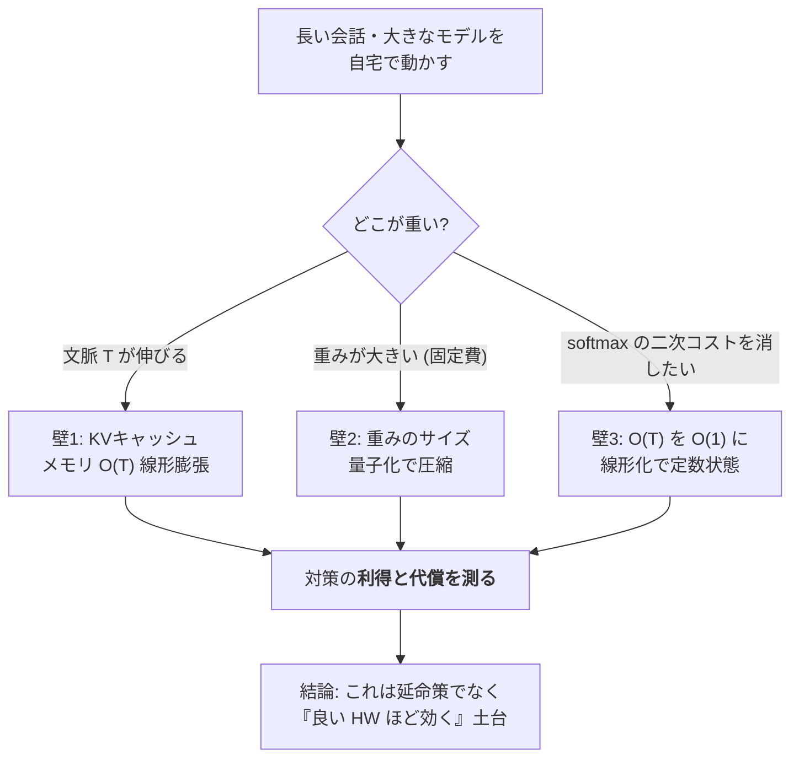
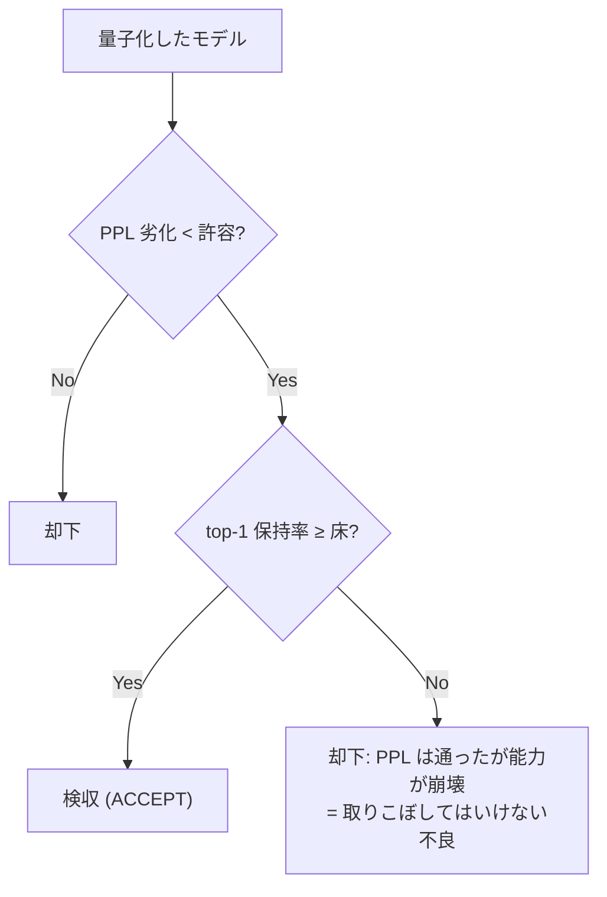
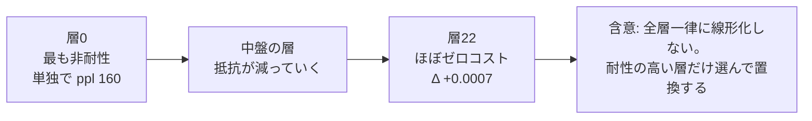
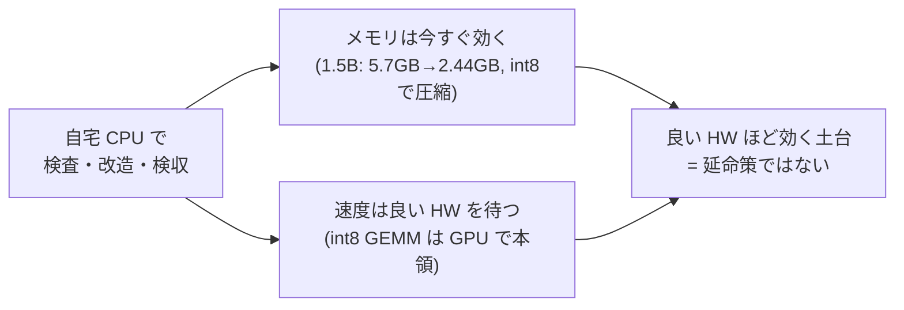

# メモリと速度の壁 ― KVキャッシュ・量子化・線形化（技術版 #5）

著者: 古瀬 和文（ぷるやん）

> シリーズ「作って分かった LLM の中身 ― 自作言語モデルで覗く構造」第5回（技術版）。
> 前回 #4 では「賢さは重みに宿る。重みは巨大な事前学習でしか入らない」という結論に着きました。
> では、その重みを**自宅の PC で、まともに動かし続ける**には何が壁になるのか。今回はメモリと速度の話です。
> ――計測・制御の現場で 25 年、「不良を取りこぼさず、ラインを止めない」を目標にシステムを作ってきた人間として、
> 実はここが私のいちばんの得意領域（メモリ効率）でもあります。


一般版 #0 で、私はひとつ予告をしていました。「図で見ると LLM は一本道に流れるように描かれるけれど、
自分で動かして体でいちばん分かるのは、**長い文章ほど急に重くなる**ことだった」と。今回はその回収です。
なぜ長い会話は重くなるのか。重い重みをどうやって自宅の常駐メモリに収めたのか。
そして、**メモリを平らにする（文脈長に依存させない）代わりに、何を差し出すことになったのか**。

大きく三つの壁を、実測値とともに一つずつ開けていきます。

- **壁1: KVキャッシュ** ── 文脈が伸びるほどメモリが線形に膨らむ。
- **壁2: 重みのサイズ** ── 量子化で圧縮する。ただし「PPL だけ見て通す」と壊れたものを取りこぼす。
- **壁3: softmax の二次コスト** ── 線形化で「定数状態」にできる。ただし**タダではない**。

最初に断っておきます。今回登場する「int8 で 5.7GB → 2.44GB に収めても会話が続いた」という結果は、
**会話の賢さそのものが自作の成果だ、という意味ではありません**。賢さは学習済みの重み由来です。
私が確かめたのは、「中身を検査・改造できる、正直なオンプレ推論ランタイムの上で、
重みの情報を**1ビットも失わずに**（ローダーが `max|Δ|=0.0`）圧縮配置できた」という一点。
その継ぎ目は、最後まではっきりさせておきます。

---

## ① 用語ミニ辞典

まず、この記事に出てくる言葉を先に並べます。ここだけ読んでも、話の骨組みは掴めるようにしてあります。

- **LLM（Large Language Model：大規模言語モデル）** … 膨大な文章で訓練された「次トークン予測器」。1語出しては全部読み直して次を出す、自己回帰の機械。
- **トークン(token)** … 文章を区切った小さな断片。文脈長 T はこのトークンの本数。
- **KVキャッシュ(KV cache)** … KV は Key-Value（鍵と値）。注意機構が過去の各トークンから作った鍵 K と値 V を、次のトークンを出すたびに使い回すため**ためておく**保存領域。文脈が伸びるほど溜まる。
- **文脈長(context length, T)** … いままでに読んだトークンの本数。長い会話・長い文書ほど大きい。
- **常駐メモリ(RSS：Resident Set Size)** … プロセスが実際に物理メモリ上に確保している量。「PC の RAM をどれだけ食っているか」の実測値。
- **量子化(quantization)** … 重みや計算を、fp32（32ビット浮動小数点）より少ないビット数（int8＝8ビット整数など）で表すこと。器を小さくしてメモリを減らす。
- **weight-only 量子化** … **重みだけ**を低ビットにし、計算の途中や活性は高精度のまま扱う方式。今回の常駐削減はこれ。
- **per-channel / per-tensor** … 量子化の刻み幅（スケール）を、行列全体で1つにするか(per-tensor)、出力チャネルごとに1つ持つか(per-channel)。細かく持つほど誤差が小さい。
- **PTQ(Post-Training Quantization：学習後量子化)** … 学習済みモデルを、そのまま後から量子化する。安いが低ビットに弱い。
- **QAT(Quantization-Aware Training：量子化を意識した学習)** … 量子化の丸めを織り込んで学習し直す。強いが高コスト。LSQ(Learned Step Size Quantization) はその一種。
- **パープレキシティ(perplexity, PPL)** … 「次の1語をどれだけ迷わず当てられるか」の指標。低いほど良い。予測分布の困り度。
- **top-1保持率** … 量子化・改造の前後で、「最有力候補として選ぶ1語」がどれだけ一致するか。会話の骨（実際に選ぶ語）が壊れていないかの指標。
- **pp(percentage point：パーセントポイント)** … 割合の差。「50% が 36.5% になった」なら -13.5pp。
- **fail-closed（フェイルクローズド）** … 判定に迷ったら「通さない（拒否する）」側に倒す設計。計測現場の「疑わしきは不良」と同じ。
- **線形化(linearization)** … softmax の注意機構を、**定数サイズの状態**で逐次更新できる「線形注意」に置き換えること。
- **線形注意(linear attention)** … スコアの softmax をやめ、鍵と値を state = Σ φ(k)⊗v の形で足し込む方式。φ(feature map：特徴写像) は非負に写す関数（例: elu+1）。文脈が伸びても状態のサイズは変わらない。
- **定数状態(constant state)** … 文脈長 T が増えても大きさが O(1) で変わらないメモリ。KVキャッシュ（O(T)）の対極。
- **蒸留(distillation)** … 教師モデルの出力を生徒モデルに真似させて能力を移す学習。ここでは「素の softmax 層」を教師、「線形化した層」を生徒にする。
- **恒等初期化(identity initialization)** … 学習パラメータを、最初は「何もしない（入力＝出力）」状態から始めること。壊さずに学習を始める安全策。
- **GEMM(General Matrix Multiply：汎用行列積)** … ニューラルネットの計算時間の大半を占める行列と行列の掛け算。int8 の**速度**利得はここが int8 対応の HW で速くなって初めて出る。

> **語呂で覚える**：メモリの壁は三兄弟。**「溜まる(KV)・重い(量子化)・二次的(線形化)」**。
> 長男 KV は文脈で太る、次男は器を小さくして痩せさせる、三男は太り方そのものを平らにする。ただし三男には後述の月謝がかかる。

---

## ② かみくだき ── なぜ重いのか、対策は何を差し出すのか

LLM が重くなる理由は、実は二つの「別々の重さ」が混ざっています。ここを分けると一気に見通しが良くなります。

**重さその1：文脈が伸びると溜まる（KVキャッシュ）。**
注意機構は、次の1語を出すために「これまでの全トークンをもう一度見に行く」仕組みです（第2回でやりました）。
毎回ゼロから全部を計算し直すと無駄なので、各トークンから作った鍵 K と値 V を保存して使い回します。これが KVキャッシュ。
便利ですが、**トークンが増えるたびに1トークン分ずつ確実に増えていく**。長い会話がじわじわ重くなる正体はこれです。
文脈長 T に対してメモリは O(T)、計算は O(T²) で効いてきます。

**重さその2：重みそのものが大きい（サイズ）。**
15億パラメータ級のモデルを 32ビット浮動小数点(fp32) で持つと、それだけで数 GB を占めます。
これは会話の長短に関係なく、**モデルを開いた瞬間から常にかかる固定費**です。ここを減らすのが量子化。
数の「器」を小さくして、同じ情報をより少ないビットで持ちます。

対策は素直に効きます。が、私が現場で 25 年叩き込まれた規律が、ここで顔を出します。
**「異常に良い結果は、まず内訳を疑え」**。量子化には、**指標を一つしか見ないと壊れたモデルを『合格』にしてしまう**落とし穴があります。
極端に圧縮したモデルが、PPL（予測の困り度）というよく使う指標では合格ラインを通ったのに、
**実際に選ぶ1語（top-1）が大きく崩れていた**、という実例を後で見せます。検査でいう「見逃し（不良の取りこぼし）」です。

そして三つめ。KVキャッシュの O(T) をそもそも O(1) にできないか、というのが**線形化**です。
softmax をやめて、過去を「定数サイズの状態」に畳み込んでしまう。文脈がどれだけ伸びても状態は太らない。
夢のようですが、ここでも私は正直に言わなければなりません。**これはタダではありません。**
得られるのは「長い文脈でのメモリ」だけ。代わりに「品質の小さな（しかしゼロでない）劣化」と「短い文脈ではむしろ余計な計算」を差し出します。
無料の昼食ではなく、**トレード（交換）**です。



ここから③で、それぞれを実測値・擬似コード・正直な内訳とともに開けていきます。

---

## ③-1 壁1：KVキャッシュは文脈長に線形膨張する

### 何が溜まるのか

第2回でやった通り、自己回帰生成は「1語出す → これまで全部を読み直す → 次を出す」を繰り返します。
毎ステップで過去の全トークンについて鍵 K と値 V を計算し直すのは二重の無駄なので、実装は K と V を保存して使い回します。
これが KVキャッシュです。次の擬似コードが、softmax 注意の1ステップと「キャッシュがどう伸びるか」を示します。

```python
# softmax 注意 + KV キャッシュ: 1 ステップ
# K_cache, V_cache は「過去の全トークン分」たまっていく。
def sdpa_step(q_t, k_t, v_t, K_cache, V_cache, d):
    K_cache = cat([K_cache, k_t], dim=0)   # (T, d) ← T とともに1行ずつ伸びる
    V_cache = cat([V_cache, v_t], dim=0)   # (T, d) ← 同上
    scores  = (q_t @ K_cache.T) / sqrt(d)  # (T,)   ← 過去 T 個との相関（内積類似度）
    attn    = softmax(scores)              # (T,)
    out     = attn @ V_cache               # (d,)   ← 重み付き平均
    return out, K_cache, V_cache
```

`K_cache`・`V_cache` の行数がそのまま文脈長 T です。**T に比例して確実に増える**。これがメモリ O(T)、
スコア計算 `q_t @ K_cache.T` が T に比例するので、全トークンを出すまでの総計算は O(T²) になります。

### 実測：×8 の文脈長で、KVは×8

概念だけでは腹落ちしないので、softmax 型（GPT系）のモデルと、後述の定数状態（recurrent系）のモデルとで、
KVキャッシュのサイズを実測して並べました。

| モデル型 | 文脈長 T=256 | 文脈長 T=2048 | 伸び方 |
|---|---|---|---|
| softmax型（GPT系）KVキャッシュ | 4.72 MB | 37.75 MB | **×8（線形）** |
| 定数状態（recurrent系）の状態 | 平坦 | 平坦 | **×1.00（不変）** |

文脈長を 8 倍（256→2048）にすると、softmax の KVキャッシュもきれいに 8 倍（4.72→37.75MB）。
教科書通りの線形膨張です。一方、定数状態のモデルは文脈が伸びても状態サイズが変わりません（平坦）。

ここで正直な補足を一つ。KVキャッシュだけを見ると ×8 ですが、**プロセス全体の常駐メモリ(RSS)** で測ると、
同じ 256→2048 で **×2.65** でした。理由は単純で、RSS には「文脈に依存しない固定費（重み本体・実行環境）」が大きく乗っているから。
KVは全体の一部なので、KV が 8 倍でも全体は 2.65 倍に薄まる。**「どこを測っているか」で数字が変わる**という、
計測では当たり前だけれど見落とされがちな点です。指標の定義を曖昧にしたまま「8 倍だ／2.65 倍だ」と言い合っても噛み合いません。

もっと文脈を伸ばすと差は開きます。**T=4096 で、softmax 型は常駐 ~1.67GB、定数状態は 205MB。約 8 倍の開き**です。
長文脈になるほど、O(T) と O(1) の差は容赦なく効いてきます。


### 持ち帰り（壁1）

長い会話が重くなるのは「賢さが足りないから」ではなく、**構造上、過去を全部ためて使い回しているから**。
これは第2回の「注意は O(T²)、KVは O(T)」の予告の、実測での回収です。
この O(T) を消せないか――が壁3（線形化）への伏線になります。その前に、まず「固定費」の壁2へ。

---

## ③-2 壁2：量子化 ── 器を小さくする。ただし「PPLだけ」で通さない

### weight-only int8 で ~3.9倍圧縮

重み本体は、会話の長短に関係なくかかる固定費です。ここを削るのが量子化。いちばん素直で堅いのが
**weight-only int8（重みだけを 8ビット整数に）**。fp32（4バイト）を int8（1バイト）にするので、素朴には 4 倍。
実測では、スケール等のオーバーヘッドを含めて **約 3.9 倍（74–75%）圧縮**でした。

肝心の品質は、**held-out（学習に使っていない別テキスト）での PPL 劣化が 0.1% 未満**。
つまり「予測の困り度」はほぼ無傷でこのサイズ削減。weight-only int8 が実務の定番なのは伊達ではありません。
擬似コードで刻み方を示します。ポイントは、スケール（刻み幅）を**出力チャネルごとに1つ持つ（per-channel）**こと。

```python
# int8 weight-only 量子化（per-channel スケール）
def quantize_per_channel(W):               # W: (out, in) fp32
    scale   = W.abs().amax(dim=1) / 127    # 出力チャネルごとに1つ（per-channel）
    W_int8  = round(W / scale[:, None]).clamp(-127, 127).to(int8)
    return W_int8, scale

def linear_int8(x, W_int8, scale, bias):
    W = W_int8.to(fp32) * scale[:, None]   # forward 時に元スケールへ復元（dequant）
    return x @ W.T + bias
```

per-channel は per-tensor（行列全体で1スケール）より一貫して誤差が小さい。理由は直感的です。
チャネルごとに重みの大きさの分布が違うのに、全体で1つの物差しを使うと、小さいチャネルの分解能が犠牲になる。
現場で言えば「ワークごとにレンジが違うのに、1本のゲージで全部測る」のと同じで、細かく物差しを合わせたほうが取りこぼしが減ります。

### 自作ランタイムでの実測：1.5B を 5.7GB → 2.44GB で会話維持

ここが、私が自作の推論ランタイム（フレームワークのブラックボックスに頼らず、中身を検査・改造できるオンプレ実装）で
実際に測った数字です。行列演算の Linear だけを int8 化し、埋め込みと出力層(lm_head)は fp32 のまま維持しました。

| モデル | fp32 常駐 | int8 ストリーミング常駐 | 状態 |
|---|---|---|---|
| 0.5B | 約 2.0 GB | **約 1.21 GB** | 会話維持 |
| 1.5B | 約 5.7 GB | **約 2.44 GB** | 会話維持（fp32 スパイク無し） |

「ストリーミング」と書いたのは、重みを**1テンソルずつ流し込んで**その場で int8 化し、
**途中で fp32 の巨大な山（スパイク）を作らない**ようにしたからです。ロード中に一瞬でも fp32 全体を展開すると、
そのピークで RAM が足りなくなる。小 RAM 環境では「平均」でなく「瞬間最大」が命取りになる、という計測現場の感覚がそのまま効きます。

そして最も大事な、正直に言うべき点。このローダー（重みを1テンソルずつ mmap から流す方式）は、
素朴な dict ローダーと **`max|Δ|=0.0`、ビット単位で完全一致**します。**配置の仕方を変えても、出す答えは1ビットも変わらない**。
「メモリを削るために精度をこっそり落とした」のではなく、「重みの情報を保ったまま、置き方だけを効率化した」ことを、
差分ゼロで確認しています。これは第0回で掲げた「測って確かめる（`max|Δ|=0.0`）」規律の、メモリ側での実践です。

### 速度は、正直に言うと int8 でもまだ遅い

ただし、**メモリと速度は別の話**です。CPU 上でこの int8 版を回すと **約 0.7 tok/s**。
むしろ fp32 の素の 0.5B（5–6 tok/s）より遅いくらいです。なぜか。

**毎回の順伝播(forward)で、int8 の重みを fp32 に復元(dequant)してから掛け算しているから**です。
CPU には「int8 のまま速く掛ける」専用の行列積(GEMM) 経路が乏しく、結局 fp32 に戻して計算するので、
復元の手間ぶんだけ遅くなる。つまり **int8 の速度利得は、int8 GEMM を高速実行できる HW（GPU/対応アクセラレータ）でこそ出る**。
「良い HW ほど効く」というこの記事の通奏低音が、ここで最初に鳴ります。**メモリは今すぐ効く、速度は良い HW を待つ**――
この非対称を曖昧にすると「int8 にしたのに速くならない、話が違う」となる。分けて語るのが誠実です。

### ビット幅の崖：3bit が実用の床、2bit は QAT でも小モデルには届かない

int8 はほぼ無傷でした。では、もっと削って 4bit・3bit・2bit にできるか。ここに**ビット幅の崖(cliff)**があります。

- 崖の**位置はモデルサイズに依存**します。大きいモデルほど低ビットに頑健（同じ 3bit でも大モデルは耐え、小モデルは崩れやすい）。
- 経験則として、**3bit が学習後量子化(PTQ) の実用的な床**。ここまでは後から量子化するだけで実用に乗せられることが多い。
- **2bit は量子化を意識した学習(QAT) の領域**。LSQ のような QAT 手法を使ってすら、**小さいモデルでは「97% 保持」のゲートに届かない**ことがある。

つまり「ビットは減らせるだけ減らせばいい」わけではなく、**モデルサイズと手法（PTQ か QAT か）で、越えられる崖と越えられない崖がある**。


### ★核心：PPL だけのゲートは危険（2bit の実例）

ここが、この記事で最も持ち帰ってほしい規律です。量子化の合否を **PPL（予測の困り度）だけ**で決めると、
**壊れたモデルを『合格』にしてしまう**ことがあります。

実例：ある 2bit 設定は、**PPL のゲートを通過した**のに、**top-1（実際に最有力として選ぶ1語）の保持率が -13.5pp 崩壊**していました。
PPL は「分布全体のなだらかさ」を測るので、確率質量が全体的に少しずつ均されても大きくは動かないことがある。
でも会話が実際に出力するのは **argmax で選ぶ1語**。そこが 13.5 ポイントもズレていたら、文は目に見えて崩れます。
**PPL は通ったが、能力は崩れていた。** これは検査でいう典型的な「見逃し（不良の取りこぼし）」です。

だから私は、量子化の検収を **capability ゲート（top-1 保持率）で fail-closed** にします。
「PPL が良い」だけでは通さない。**実際に選ぶ語が保たれていること**を、独立した物差しで確認して初めて合格。

```python
# capability ゲート: PPL だけで通さない。top-1 保持率で fail-closed。
def accept_quantized(model_fp, model_q, texts,
                     ppl_tol=0.01, top1_floor=0.97):
    ppl_ratio = perplexity(model_q, texts) / perplexity(model_fp, texts)
    top1_keep = top1_agreement(model_q, model_fp, texts)  # 最有力1語の一致率

    ppl_ok = (ppl_ratio <= 1 + ppl_tol)
    cap_ok = (top1_keep >= top1_floor)

    if ppl_ok and not cap_ok:
        # PPL は通ったのに能力が崩れている＝取りこぼしてはいけない不良
        return "REJECT"          # fail-closed: 疑わしきは通さない
    return "ACCEPT" if (ppl_ok and cap_ok) else "REJECT"
```



これは私の職業病の直輸入です。外観検査で「明るさの平均が基準内」だけを合格条件にすると、
局所的な深い傷を見逃す。だから「平均」と「最悪値（極値）」を別々のゲートで見る。
LLM の量子化でも同じで、**PPL（平均的ななだらかさ）と top-1（実際の出力の当たり）を別ゲートにして、fail-closed で締める**。
「異常に良い（PPL がやけに良い）結果は、まず内訳を疑う」――第0回の憲章の、量子化での実装です。

### 持ち帰り（壁2）

量子化は「器を小さくする」だけの単純な操作に見えて、**どの指標で合否を決めるか**という計測設計の問題を内包しています。
int8 weight-only は安全牌（~3.9倍・PPL 劣化 0.1% 未満・ビット完全一致で配置）。
低ビットに攻めるほど崖が近づき、**単一指標のゲートは壊れたモデルを通す**。top-1 保持で締める。これが持ち帰り。

---

## ③-3 壁3：線形化 ── O(T) を O(1) に。ただしタダではない

### 定数状態という発想

壁1で見た KVキャッシュの O(T) は、softmax という「全トークンとの相対比較」を毎回やる限り消えません。
そこで発想を変えます。**過去を『定数サイズの状態』に畳み込んでしまえないか**。これが線形化（線形注意）です。

線形注意は、softmax をやめて、鍵と値の外積を状態 S に足し込みます。

$$ S = \sum_i \phi(k_i)\otimes v_i,\qquad \text{out}_t = \frac{\phi(q_t)\, S}{\phi(q_t)\, z},\quad z=\sum_i \phi(k_i) $$

φ(feature map) は鍵と問い合わせを非負に写す関数（例：elu+1）。ここで大事なのは、**S のサイズが per-head で O(d²)、
文脈長 T に一切依存しない**こと。トークンが 100 個来ようが 10 万個来ようが、状態の器は同じ大きさです。
逐次更新の擬似コードはこうなります。

```python
# 線形注意（linear attention）: 定数状態で逐次更新
# φ = elu + 1 （非負の特徴写像 feature map）
def linear_attention_step(q_t, k_t, v_t, S, z):
    # S: 状態 (d_k, d_v) ← 文脈長に依存しない定数サイズ！
    # z: 正規化用の鍵の総和 (d_k,)
    phi_k = elu(k_t) + 1
    phi_q = elu(q_t) + 1
    S = S + outer(phi_k, v_t)           # 今のトークンを状態に畳み込む
    z = z + phi_k
    out = (phi_q @ S) / (phi_q @ z + eps)
    return out, S, z
```

`sdpa_step` と見比べてください。softmax 版は `cat` で `K_cache`・`V_cache` が伸び続けました。
線形版は `S`・`z` が**足し算で更新されるだけで、大きさが変わらない**。これが定数状態の正体です。

### 実測：36倍の差、しかし交差点は 227 トークン

長文脈でどれだけ効くか。per-head で実測しました。

- **線形状態：232,960 バイト/層（文脈長によらず一定）**
- **softmax KVキャッシュ @ T=8192：8,388,608 バイト/層**

比は **36 倍**。8192 トークンの文脈では、線形状態は softmax KV の 36 分の 1 です。長文脈での勝ちは明白。

――ですが、ここで**タダではない**の第一撃。softmax KV は T=8192 で 8,388,608 バイト、
1トークンあたりに直すと 8,388,608 ÷ 8192 = **1024 バイト/トークン**。線形状態は 232,960 バイトの定数。
両者が釣り合うのは 1024 × T = 232,960、すなわち **T ≈ 227 トークン**。

**つまり 227 トークンより短い文脈では、定数状態の方が『大きい』**。線形化は「常に軽い」のではなく、
**長い文脈でだけ軽い**。短い会話しかしないなら、線形状態は固定費として損をします。
「線形注意＝省メモリ」と無条件に信じると、短文脈のアプリでかえって太る。**交差点を測ってから選ぶ**べきものです。


### タダではない、の第二撃：品質の代償と層別の耐性

メモリ以外にも代償があります。線形化は softmax を近似する以上、**品質に小さな（しかしゼロでない）劣化 Δnll** が出ます。
そして重要なのは、**その劣化がどの層でも同じではない**こと。ここを自作の 0.5B（24 層）で、1層ずつ測りました。

zero-shot（追加学習なし）で、baseline の PPL は **68.74**。そこから各層を1つだけ線形化して測ると：

- **層0 が最も非耐性**。この層だけを線形化しただけで **PPL 160**（68.74 → 160 は壊滅的）。
- 層 11・9・3・1 も抵抗が強い（劣化が大きい）。
- 一方、**中盤〜後段はほぼゼロコスト**。たとえば**層22 は Δ +0.0007**（誤差の域）。
- 累積すると：耐性のある上位4層をまとめて線形化して **+7% PPL**、12 層まとめると **破綻（PPL 167）**、**全24層では壊滅**。



これは第3回の伏線の回収でもあります。**層0や初期層の注意は『本当の仕事』をしている**――
どこを見るかというルーティングの根っこを担っていて、softmax の相対比較を近似で潰すと壊れる。
逆に中後段は、注意の役割が定型化していて、定数状態でも十分近似できる。
だから正しい戦略は「全層を一律に線形化する」ではなく、**耐性の高い層だけを選んで置き換える**。
現場の言葉なら「効く工程と効かない工程を切り分けてから、効く工程だけ差し替える」。全部いっぺんに変えると、ラインは止まります。

### 蒸留回復：最悪の層でも 92–101% 取り戻す

では、層0のような非耐性の層は永久に線形化できないのか。ここで**蒸留(distillation)による回復**が効きます。
LoLCATs 流のレシピ：小さな**学習可能 feature map** を足し、**恒等初期化（最初は素の elu+1 と一致＝壊さない）**から始め、
**Q/K/V や出力の projection は凍結**して、**教師（素の softmax 層）の出力に、生徒（線形化層）の出力を合わせる**。

```python
# 蒸留回復: 小さな学習可能 feature map、恒等初期化、projection 凍結
class LearnableFeatureMap(nn.Module):
    def __init__(self, d):
        self.proj = nn.Linear(d, d, bias=False)
        nn.init.eye_(self.proj.weight)     # 恒等初期化＝最初は素の elu+1 と一致（壊さない）
    def forward(self, x):
        return elu(self.proj(x)) + 1

# 学習するのは feature map のみ。Q/K/V/出力 projection は凍結。
# 教師 = 素の softmax 層の出力、生徒 = 線形化層の出力。両者を合わせる（出力蒸留）。
```

結果、**最も非耐性の層を、held-out（未知テキスト）で 92–101% 回復**しました。
具体的には**層9 が 96%、層11 が 101%**の回復。101% は「教師をわずかに上回った」のではなく、
proxy 指標上の測定のばらつきの範囲と読むのが誠実で、要は**ほぼ完全に取り戻せた**ということです。
そして大事なのは、これが学習に使ったテキストだけの暗記ではなく、**未知テキストにも汎化した**こと。

**★ここで正直な内訳を全部出します**（都合の良いところだけ言わないために）：

- これは**出力蒸留**（最終出力を合わせる）であって、中間表現まで完全一致させたわけではない。
- **1層ずつ**回復させた結果で、全層同時の相互作用は別問題。
- **小さな CPU モデル**での実験。大規模モデルで同じ比率が出る保証はしていない。
- 指標は **PPL proxy**（会話品質そのものの直接評価ではない）。「PPL で回復」＝「会話が同じ」とまでは言っていない。
- そして数字の訂正：この feature map は「~4 パラメータ」ではなく、実測**3,584 パラメータ/層（約 14.3KB）**。
  「ほぼゼロ追加」と言うのは不正確です。**ただし、この追加は文脈長に対して O(1)** なので、
  「文脈が伸びても状態が太らない（bounded-memory）」という線形化の主張自体は保たれます。器の話とパラメータ数の話は別、というだけ。

「小さな feature map を足すだけで最悪層まで戻る」は聞こえが良すぎるので、**3,584 params/層という実数**を明記しておきます。
異常に良い話は内訳を疑う、を自分の成果にも適用する――それがこのシリーズの約束です。

### 「タダではない」の総括

線形化の損益を、正直に一枚にまとめます。

| 項目 | 中身 |
|---|---|
| **利得** | 長文脈のメモリ（T=8192 で softmax KV の 36 分の 1、O(T)→O(1)） |
| **代償1（メモリ）** | 短文脈では定数状態が損（交差点 ≈ 227 トークン、それ以下は KV の方が小さい） |
| **代償2（品質）** | 小さいがゼロでない Δnll。層依存が激しい（層0 は単独で壊滅、層22 はほぼ無害） |
| **代償3（計算）** | 短文脈では余計な計算ペナルティ |
| **緩和策** | 耐性の高い層だけ選ぶ + 蒸留回復（最悪層でも 92–101%、追加 3,584 params/層） |

**利得はメモリ（長文脈のみ）、コストは品質と短文脈計算。無料の昼食ではなく、条件つきの良いトレード。**
これが線形化の実像です。

### 持ち帰り（壁3）

線形化は「O(T) を O(1) にする魔法」ではなく、**「長い文脈でだけ効き、層ごとに向き不向きがあり、
蒸留で最悪層を救える、条件つきの交換」**。交差点（227トークン）と層別耐性を**測ってから**適用範囲を決める。
測らずに全層一律に掛けると壊れる。ここでも規律は同じ――**測って、切り分けて、fail-closed で締める**。

---

## ④ 設計指針：これは「CPU 延命策」ではなく「良い HW ほど効く」土台

最後に、三つの壁の対策を貫く思想を一つ。これらは「非力な CPU でなんとか動かすための我慢」ではありません。
**良い HW を積んだときに、真価が出る土台**です。

- **量子化 int8**：CPU では dequant のオーバーヘッドで ~0.7 tok/s と遅い。でも int8 GEMM を高速実行できる GPU/アクセラレータでは、
  **メモリ削減がそのまま速度に化ける**。今は「メモリだけ」効いて「速度は良い HW 待ち」。この非対称は HW が解く。
- **定数状態（線形化）**：短文脈では損だが、GPU で長文脈を扱うほど、softmax の二次メモリ壁が消える恩恵が大きくなる。
  文脈が長いほど、O(1) と O(T) の差（実測で T=4096 なら約 8 倍）が効く。



だから私は、これらを「弱い環境の言い訳」ではなく「強い環境への投資」と位置づけています。
自宅 CPU でやるのは、**中身を検査・改造・検収できる正直なランタイムを作る**ため。
その上で、int8 も定数状態も、**HW が良くなるほど利得が増える方向**に設計してある――ここが設計思想の核です。

そしてもう一度、継ぎ目を明示します。**会話が続いたのは Qwen の学習済み重みが賢いから**であって、
私の貢献は「その重みを自宅の常駐メモリに収め、中身を測りながら改造できるランタイムを作った」こと。
ここは二種類の精度を混同しないよう、正直に切り分けます。**ロードの仕組みそのもの**（重みの置き方を変える部分）は
`max|Δ|=0.0` のビット完全一致で、出す答えは1ビットも変わりません。一方 **int8 化**（5.7GB→2.44GB の圧縮）は、
測定された小さな損失（held-out PPL 劣化 0.1% 未満）を **ゼロではなく** 受け入れています。
つまり「置き方はビット完全一致、圧縮だけは極小の測定された損失」。**賢さを作ったのではなく、賢さを正直に運べる器を作った**――この区別は曲げません。

---

## まとめ ── 三つの壁と、一つの規律

- **壁1 KVキャッシュ**：文脈長 T に O(T) で線形膨張（×8 文脈で KV ×8、RSS では ×2.65、T=4096 で softmax ~1.67GB vs 定数状態 205MB ≒ 8倍）。長い会話が重くなる正体。
- **壁2 量子化**：int8 weight-only は ~3.9倍圧縮・PPL 劣化 0.1% 未満（ロード機構自体は `max|Δ|=0.0` のビット一致、int8 化だけは極小の測定された損失）で配置（1.5B: 5.7GB→2.44GB）。低ビットには崖（3bit=PTQ の床、2bit=QAT 領域）。**PPL だけのゲートは危険（2bit で top-1 -13.5pp 崩壊）→ top-1 保持で fail-closed 検収**。
- **壁3 線形化**：定数状態 O(1)（T=8192 で softmax KV の 36分の1）。**タダではない**――交差点 227 トークン、層別耐性（層0 壊滅／層22 ほぼ無害）、蒸留回復（最悪層 92–101%、追加 3,584 params/層）。

貫く規律は、25 年の計測現場からの直輸入です。**「測る物差しを一つにしない。異常に良い結果は内訳を疑う。疑わしきは通さない（fail-closed）。」**
LLM のメモリ最適化は、突き詰めると「不良を取りこぼさない検査設計」そのものでした。

> **この記事から持ち帰る一つ**：
> **「PPL が良い」は合格ではない。**
> 量子化でも線形化でも、指標を一つだけ見て「軽くなったのに性能そのまま！」と喜んだ瞬間が、いちばん危ない。
> メモリの利得は、必ず**別の物差し（top-1 保持・交差点・層別耐性）と一緒に**測る。
> これは AI に限らず、あなたが何かを「最適化した」と言うとき全部に効く護身術です。

---

## 次回に続く

ここまでで、LLM の中身（トークン→埋め込み→注意→順伝播→学習→メモリの壁）をひと通り分解しました。
残るは、いちばん実務に近い問い――**「じゃあ、自分の道具として、どのモデルをどう選び、どう信じ、どう任せるのか」**です。

次回 #6（実務編）では：

- **モデル選定はライセンスが生命線**。「商用で使えるつもりが、実は非商用の罠だった」を避ける4軸（日本語品質・サイズ・数学力・ライセンス）。
- **RAG か、ファインチューニングか、蒸留か**。知識を「検索で貸す」か「重みに焼く」か。教師の出力ライセンスという落とし穴。
- **評価の罠**。今回の「PPL だけで通すな」を、さらに**勝者の呪い(winner's curse)**・**文脈長スイープ**・多窓 proxy まで広げます。「たくさんの候補から最良を選ぶと、その最良値は楽観に偏る」――なぜ新鮮な holdout で測り直すのか。
- そして、**素朴な進化探索が単純な貪欲法に負けた話**（消さずに残す教訓）と、**それでも進化が効く一点**。

今回の「測って、切り分けて、fail-closed で締める」が、実務では**モデルを選び・評価し・責任を持つ**という形で結晶します。
自宅の PC で動く、正直で、おせっかいな AI を、どう組み上げるか。シリーズの着地点でお会いしましょう。

---

*このシリーズは、自作の小さな推論ランタイム（llcore）で LLM を組み直しながら書いています。
本記事の数値は、その一次記録の実測値のみを使い、未測定のことは「未測定」と書いています。
「絵で分かった」あとに「仕組みで納得したい」方は、対応する一般版もどうぞ。*


---

<!-- series-nav -->
**連載ナビ** ｜ [◀ 前回: 学習と推論](<<LINK:T04>>) ｜ [次回: 実務編 ▶](<<LINK:T06>>) ｜ [同じ回の一般版](<<LINK:G05>>) ｜ [総目次](<<LINK:INDEX>>)
<!-- 投稿時: <<LINK:キー>> を llm_structure_series_LINK_MAP.md の確定 URL に置換。未投稿分はリンクごと削除 -->
