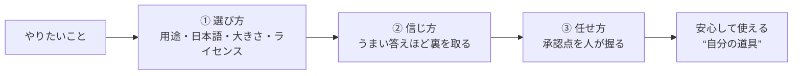

# 自分の道具として AI を選ぶ・使うには──作って分かった中身 #6（実務編・一般版・最終回）

著者: 古瀬 和文（ぷるやん）

> シリーズ「作って分かった LLM の中身 ― 自作言語モデルで覗く構造」第6回（最終回）。
> このシリーズは、私が自分で小さな大規模言語モデル（LLM: Large Language Model、膨大な文章で訓練された言葉の予測装置）を
> 実装してみて、「教科書の図では分からなかったこと」を、比喩と実感で語り直す試みです。数式は技術版に譲り、
> この一般版では**絵で腑に落とす**ことだけを目指します。

> 🧑‍🔧 **書いている人**
> 私はこの 25 年、工場のラインで「カメラで見て、機械を動かす」装置を作ってきたエンジニアです。
> 検査や位置決め、計測の現場でずっと大事にしてきたのは、**「不良を取りこぼさない・ラインを止めない」**という一点。
> どんなに賢い装置でも、**最後の合否は人が握り、危なければ止める**――その線引きをどこに置くかが、装置づくりの肝でした。
> 今回はシリーズの最終回。AI の中身を一通り分解してきた締めくくりとして、
> その「合否を人が握る」感覚を、**AI を仕事の道具として選び・使う**話に持ち込みます。ここは私の職業病がいちばん役に立つ回です。

前回 #5 の最後に、私は三つの宿題を出しました。**どの AI を選べばいいのか／覚え込ませと資料渡しのどちらが得か／
うますぎる成績にだまされないコツ**。今回はその回収です。構造の旅を終えて、いよいよ地に足のついた「使い方」の話をします。

数式はもう出てきません。持って帰ってほしいのは、たった一つの態度――**AI は「魔法」ではなく「よくできた道具」**である、ということです。

---

## この記事で覚えて帰ってほしい言葉

- **ライセンス（license）** … その AI モデルを「仕事（商用）で使っていいか」を決める利用規約。**無料で動くこと**と
  **商用で使えること**は別物で、ここを見落とすと、後から使えなくなって痛い目を見ます。今回いちばん地味で大事な言葉。
- **ローカル（local）で動かす** … AI を自分のパソコンの中だけで動かすこと。入力した文章やデータを**外のサーバーに送らない**。
  手元に情報を置いておける安心感が、これの正体です。
- **裏を取る** … AI の答えを鵜呑みにせず、別の情報源や自分の計算で**確かめる**こと。計測でいう**校正（こうせい）**――
  「うますぎる測定値は、まず自分の測り方を疑う」――と同じ発想です。
- **承認点（しょうにんてん）** … 最終判断を人間が握っておく場所。AI に全部は任せず、**「ここは人が押す」**を必ず残す線引き。

この4つが持って帰れれば十分です。「**ライセンス・ローカル・裏取り・承認点**」と唱えてください。

---

## いちばん短い答え：AI は「なんでも知っている魔法」ではなく「よく効くが、時々ズレる道具」

シリーズを通して見てきた通り、LLM の中身に派手な魔法はありませんでした。言葉を刻み、座標に変え、どこに注目するか決め、
知識を引き出し、次の一語に点数をつけて選ぶ。**地味な部品の積み重ね**です。だから――

> **AI は、電動ドリルや電卓と同じ「道具」です。よく効くけれど、使う人が選び方・確かめ方・任せどころを決める必要がある。**

電卓を信じきってボタンの押し間違いに気づかなければ、答えは間違います。ドリルを壁の中の配線ごと突き刺せば事故になります。
道具は、**正しく選び、結果を確かめ、任せる範囲を決めて**はじめて力になる。AI もまったく同じです。

そして道具である以上、付き合い方には勘どころがあります。今日はそれを三つに分けます――**選び方・信じ方・任せ方**。

---

## ① 選び方 ―― 「いちばん賢いやつ」を選ばない

AI を選ぶとき、多くの人がまず「どれがいちばん賢いか」を気にします。でも、道具選びの実感でいうと、
**「いちばん賢いやつ」を選ぶのは、たいてい正解ではありません**。工具箱にいちばん大きいドリルだけ入れても、
細かいネジは締められない。**用途に合った道具**を選ぶのが先です。AI 選びには、賢さのほかに見ておくべき軸が四つあります。

**軸1：用途に合っているか。**
「文章の要約がしたい」のか「日本語で自然に会話したい」のか「計算やコードを頼みたい」のか。
用途がはっきりすれば、必要な賢さの「種類」が決まります。全部が得意な万能選手ほど大きく・重くなるので、
用途を絞れると、小さくて軽い道具で足りることが多いのです。

**軸2：日本語がちゃんとできるか。**
これは意外と落とし穴です。海外製の優秀なモデルでも、英語は達者なのに**日本語になると急にたどたどしくなる**ものがあります。
私が触った範囲でも、設計は良くても日本語が弱いモデルがありました。日本語で使うなら、日本語での実力を**自分の用途で試してから**決めるのが安全です。

**軸3：大きさ（＝どれくらいの器か）。**
これはシリーズを通してのテーマでした。大きいモデルほど賢いけれど、重い。私が自作の推論ランタイム
（AI の中身を自分で動かすための、検査も改造もできる仕組み）で実際に確かめたところ、
**小さいモデルは、簡単な足し算すら間違えました**（「3 たす 5 は？」に平気で「18」と答える）。
一回り大きくすると、同じ問いにきちんと「8」と答え、敬語の言い換えや「日本で一番高い山は？→富士山」まで通るようになりました。
**大きさは、そのまま「できること」の器の大きさ**なのだ、と体で分かった瞬間でした。用途に足りる最小の器を選ぶ、が基本です。

**軸4：ライセンス（＝仕事で使っていいか）。**
そして、いちばん地味で、いちばん取り返しがつかないのがこれです。**AI モデルには「利用規約」があり、
「無料で動く」ことと「商用で使ってよい」ことは別**なのです。ここを見落とすと、時間をかけて組み込んだ後に
「実はこのモデル、商用は禁止でした」と判明して、全部やり直し――という事故が起きます。

> 📦 **作って分かったこと：無料で動いても、商用は禁止のことがある**
>
> モデル選定を実際にやってみて、いちばんヒヤッとしたのがこの「ライセンスの罠」でした。
> - **仕事で安心して使える（商用クリーンな）ものの例**：`Apache-2.0` や `MIT` という規約のモデル。
>   広く使われている `Qwen2.5 / Qwen3` や、`Phi-4-mini`、`Ministral-3` などがこの系統でした。
> - **見た目は自由でも、実は商用に制約があった例**：ある人気モデルの一部サイズは「研究用（非商用）」規約で、
>   別の有名モデルには「そこから派生させたものにも同じ縛りが伝わる」条項がありました。
>   どちらも「無料でダウンロードできる」ので、規約を読まないと気づけません。
>
> 正直な但し書き：**ライセンスは改定されます**。ここに書いた区分は私が確認した時点のもので、
> 実際に使う前には、必ず**そのモデルの最新の規約を自分で確かめてください**。ここは「たぶん大丈夫」で進めてはいけない場所です。

まとめると、選び方の軸は **用途・日本語・大きさ・ライセンス**の四つ。賢さは、その先の一要素にすぎません。

---

## ② 信じ方 ―― うまい答えほど、裏を取る

道具を選んだら、次は「どう信じるか」です。ここで、このシリーズを貫いてきた規律が主役になります。

> **AI は、平気で、しかも自信たっぷりに間違えます。**

これは欠陥ではなく、**仕組み上の当然の性質**です。思い出してください。LLM の仕事は「次の一語を、いちばんもっともらしく当てる」こと。
**「もっともらしさ」と「正しさ」は、似ているけれど別物**です。だから AI は、事実でないことも、事実のときと同じくらい
なめらかに・堂々と語ります。流暢さは、正しさの保証にはならない。ここを腹に落とすのが、信じ方の第一歩です。

では、どうするか。答えは計測の現場から持ってきます。**「うますぎる結果は、まず自分の測り方を疑う」**――これが**校正**の発想です。

計測器がありえないほど良い値を出したら、喜ぶ前に「センサーがズレていないか」「校正を忘れていないか」を疑う。
これは職業病であると同時に、**不良を取りこぼさないための命綱**でした。AI の答えにも、同じ態度をそのまま持ち込みます。
**すらすら答えが返って、しかもそれが自分に都合よく見えるときほど、いったん立ち止まって裏を取る**。

### 「うますぎる成績」にだまされる、二つの典型

自作して評価まで手を動かすと、「良く見える結果」がいかに人をだますかを、いやというほど味わいました。二つだけ紹介します。

**罠その1：たくさんの中から一番を選ぶと、その一番は“出来すぎ”に見える。**
候補をたくさん試して、いちばん成績の良かったものを選ぶ――ごく自然なやり方です。ところがこれには落とし穴があって、
**「たくさんの中の最良値」は、まぐれの追い風まで含んで、実力より良く見えてしまう**のです。
くじを大量に引けば、たまたま当たりを引く人が必ず出るのと同じ。だから選んだ後は、**引いたことのない新しい問題（新鮮なデータ）で
もう一度測り直す**。これをやると、たいてい成績は少し下がります。その「下がった後の数字」こそが、本当の実力です。
（この現象には「勝者の呪い（winner's curse）」という名前がついています。）

**罠その2：ひとつの物差しが合格でも、大事な能力が抜けていることがある。**
前回 #5 でお話しした、AI の中身を極端に圧縮した実験がまさにこれでした。ある物差し（予測のしやすさ）では「まだ大丈夫そう」に見えたのに、
別の物差し――「いちばんもっともらしい一語を、正解と同じに選べているか」を測ると、その正答率が**13 ポイント以上も静かに崩れて**いました。
**一つの数字で「合格」と判断すると、必ず取りこぼす**。計測でも AI でも、鉄則は同じです。**複数の角度から測り、一つでも危なければ止める**。

> だから信じ方の勘どころは、たった一言――**「流暢さを、正しさと勘違いしない」**。
> そして、うまい答えほど、別の情報源で・自分の手で・裏を取る。校正を一度もサボらない。それだけで、AI との事故はかなり防げます。

---

## ③ 任せ方 ―― 全部は渡さない、「承認点」を残す

選んで、確かめ方を決めたら、最後は「どこまで任せるか」です。ここで私がいちばん大事にしているのが、**承認点**という考え方です。

装置づくりでは、どんなに自動化を進めても、**「最終的な合否は人間が押す」**というボタンを必ず残します。
機械が「合格」と言っても、人がその判断を覆せる余地を残しておく。これがないと、機械が静かに間違えたとき、
**誰も止められないまま不良品がラインを流れていく**。AI を仕事に組み込むときも、まったく同じ設計にします。

- 下書きは AI に任せる。でも**公開する前に、人が目を通す**。
- 調べ物は AI に任せる。でも**その結論で意思決定する前に、出典を人が確かめる**。
- 定型作業は AI に任せる。でも**取り返しのつかない操作（送信・削除・支払い）は、人が最後のボタンを押す**。

この「人が押すボタン」が承認点です。**任せる範囲と、人が握る範囲を、あらかじめ線引きしておく**。
そして、迷ったときは**安全側に倒す**――確信が持てなければ、通さずに人に回す。計測の言葉でいう**「不良を通さない」**設計思想を、
そのまま AI の使い方に当てはめているだけです。

### 「覚え込ませる」より「その都度、資料を渡す」

任せ方には、もう一つ実務的なコツがあります。前回の宿題――**「たくさん覚え込ませる」のと「その都度、資料を渡して調べさせる」の、
どちらが得か**――への答えです。

AI に自社の知識を持たせたいとき、二つのやり方があります。

- **覚え込ませる（追加学習）**：モデルそのものに知識を教え込む。作り込みが要り、内容が変わるたびに教え直しになります。
- **その都度、資料を渡す（検索して渡す）**：質問のたびに、関連する資料を引っぱってきて AI に読ませ、それを踏まえて答えさせる。

多くの場合、後者の「その都度、資料を渡す」やり方の方が、**安く・すぐ更新でき・しかも「どの資料を根拠にしたか」という来歴が残る**ので扱いやすい。
資料を差し替えれば、AI の答えも即座に新しくなる。**知識は覚え込ませるより、必要なときに「貸す」**――これが実務では効くことが多いのです。
（この「その都度、資料を渡す」やり方には検索拡張（RAG: Retrieval-Augmented Generation）という名前があります。名前は覚えなくて大丈夫です。）

> ひとつ、正直で大事な注意。他社の賢い AI（有名なチャット AI など）の答えを大量に写し取って、自分のモデルに教え込む――
> という近道は、**多くの場合その AI の利用規約で禁止されています**。「賢い先生の答えをコピーして自分の生徒に丸暗記させる」のは、
> 手軽に見えて、規約違反という落とし穴が待っています。ここも「たぶん大丈夫」で進めてはいけない場所です。

---

## ローカルで動かすという選択 ―― 手元にデータを置く安心

選び方・信じ方・任せ方の土台として、もう一つお伝えしたいことがあります。それは、**AI を「どこで動かすか」**という選択です。

多くの便利な AI は、あなたの入力を**インターネットの向こうのサーバー**に送って処理します。
一方で、AI を**自分のパソコンの中だけで完結させて動かす**こともできます。これが**ローカルで動かす**という選び方です。

ローカルで動かす最大の意味は、**手元にデータを置いておける安心**です。
個人情報、会社の機密、家庭の写真やメモ――そういう「外に出したくないもの」を、外のサーバーに預けずに済む。
私がこのシリーズで自作の推論ランタイムにこだわったのも、根っこはここにあります。
**中身を自分で持ち、自分で動かせるということは、データも判断も自分の手元に置いておける**、ということなのです。

もちろんタダではありません。手元で動かす以上、大きすぎるモデルは載りませんし、速度も専用の計算装置には及びません。
だからこそ、シリーズを通して見てきた**軽くする工夫（圧縮・要約ノート化）や、用途に足りる最小の器を選ぶ目**が効いてきます。
**「手元で・軽く・きちんと動かす」**――これは、手のひらサイズの基板で装置を動かしてきた私にとって、いちばん馴染みのある土俵でした。

---

## 「作って分かったこと」box

> 📦 **教科書に無い、作って初めて分かったこと**
>
> このシリーズの締めくくりに、いちばん腹落ちしたことを正直に書きます。**AI に、派手な魔法は無かった**。
> 中身を一つずつ組み直してみたら、全部が「地味な部品の積み重ね」でした。だからこそ、道具として信頼できるのです。
> 魔法なら、うまくいかないとき打つ手がない。でも部品なら、どこが効いていて、どこが壊れやすいかを、**測って・確かめて・直せる**。
>
> もう一つ、探索の話を。「AI の設計そのものを、いい感じに自動で探させる」実験もしました。
> 最初は「ランダムにいじって良いものを残す」やり方（進化のような探索）に期待したのですが――**これは、
> 単純な定石（効くところから順に足すだけの手堅い方法）に負けました**。
> ところが、**まず定石で作った手堅い案を“種”にして、その先を進化的に磨く**やり方に変えたら、今度は勝ちました
> （設計の良さを測る指標で、3 割強＝＋34.3% 改善）。
> 教訓は、AI 選びとまったく同じでした。**探索も「万能の魔法」ではなく「手順」**。手堅い定石を土台に、
> その先だけを工夫で磨く。魔法を期待せず、地道な手順を積む方が、結局いちばん遠くまで行けたのです。
>
> そして最後に、このシリーズをずっと貫いてきた継ぎ目を、もう一度はっきりと。**AI の「会話の賢さ」そのものは、
> 私が作ったものではありません**。それは、膨大な学習で重みに宿ったもの。私が自作で加えられた価値は、
> 「賢さ」ではなく、**その中身を開けて・測って・どこまで軽くできて・どこで壊れるかを、自分の手で確かめられること**の方です。
> ここは、シリーズを閉じる今も、ぼかしません。

---

## 語呂で覚える

> **AI との付き合いは「選・疑・任（せん・ぎ・にん）」の三拍子。**
>
> - **選（えら）ぶ** … 用途・日本語・大きさ・ライセンスで選ぶ。「いちばん賢いやつ」ではなく「用途に足りる道具」を。
> - **疑（うたが）う** … うまい答えほど裏を取る。**流暢さ ≠ 正しさ**。うますぎる成績は、まず校正を疑う。
> - **任（まか）せる** … でも全部は渡さない。**承認点（人が押すボタン）を必ず残す**。迷ったら安全側へ。
>
> 一言でまとめるなら――**AI は魔法ではなく、選んで・疑って・任せる「道具」。**

この三拍子を身につけると、AI との付き合いから、**過度な期待も、過度な不安も**抜けていきます。
魔法だと思えば裏切られ、危険物だと思えば使えない。**よくできた道具**だと思えば、
ちょうどいい距離で、長く付き合えます。それが、このシリーズからのいちばんのお土産です。

---

## シリーズを閉じるにあたって ―― 6回分の地図を、たたむ

ここまでお付き合いくださって、本当にありがとうございました。長い旅でした。地図を、最後にもう一度たたんでおきます。

- **#0** … LLM は「次の一語を当てる機械」。地味な目的の副産物として、知識と推論が身についた変わり者。
- **#1** … 言葉を「意味の座標」に変える。だから「王様−男＋女≈女王」のようなことが起きる。
- **#2** … どこに注目するかを決める**注意機構**。AI が急に賢くなった心臓部。
- **#3** … 知識は主に「足し算の層」に、注目は「注意機構」に。分業でできている。
- **#4** … 賢さは**重みに宿る**。自宅の非力なパソコンでゼロから作った小さな言語モデルは、
  どうがんばっても会話になりませんでした――**規模と学習の量こそが賢さの源**だと、失敗が教えてくれました。
- **#5** … 長い会話が重くなるのは、毎回「過去を全部読み直す」律儀な仕組みの当然の帰結。
  軽くする工夫は効くけれど、**どれもタダではない**。
- **#6**（今回）… 選んで・疑って・任せる。AI は**魔法ではなく道具**。

全体を貫いていたのは、たった一つの態度でした。**「作って、測って、確かめる」**。
図を眺めるのではなく、部品を自分で削り出して組み直し、公式の実装と突き合わせて、**寸分違わず同じ答えが出るところまで確かめる**。
うまく再現できたということは、各部品が何をしているかを取り違えていない、ということ。だから私は、中身を一つずつお話しできました。
25 年、計測の現場で「測って・動かす」をやってきた人間の、いちばん自然なやり方で、AI の中身を覗いた記録――それがこのシリーズでした。

そして、**失敗を消さなかった**ことを、最後に少しだけ誇りたいと思います。会話にならなかった自作モデル、
圧縮しすぎて静かに壊れたモデル、定石に負けた素朴な探索。うまくいかなかったことこそ、いちばん多くを教えてくれました。
**「異常に良い結果は、まず内訳を疑う」**――この規律を守れたぶんだけ、この記事の数字は、あなたに対して正直でいられたはずです。

---

## 次のシリーズへ（引き）

構造の旅はここで一区切りですが、話はまだ半分です。今回は AI を**「選んで・疑って・任せる」使う側**の話でした。
次に書きたいのは、その先――**中身を自分で改造する側**の話です。

このシリーズで「軽くする工夫（圧縮・要約ノート化）」をちらりとお見せしましたが、あれは、
**中身を自分で持っているからこそできた**ことでした。ブラックボックスのままでは、開けて・測って・作り替えることはできません。
**手元で動く、責任を持った AI**を、自分の手で組み替えていく――そんな「作る側・直す側」の記録を、
別のシリーズとしてお届けできればと思っています（どこまで書けるかは、正直、これからの実験しだいです。約束ではなく、宣言として）。

最後にもう一度だけ。AI は魔法ではありません。**選んで・疑って・任せる、よくできた道具**です。
その道具と、ちょうどいい距離で、長く上手に付き合っていく――そのための地図を、この6回でお渡しできていたなら、
これに勝る喜びはありません。ここまで読んでくださって、ありがとうございました。

---

*このシリーズは、自作の小さな LLM を実装しながら書いてきました。技術版では、同じテーマ（モデル選定とライセンス、
検索して渡すやり方と覚え込ませるやり方、評価の落とし穴、設計の自動探索、責任ある設計）を、実測値と擬似コードで掘り下げます。
「絵で分かった」あとに「仕組みで納得したい」方は、そちらもどうぞ。*
