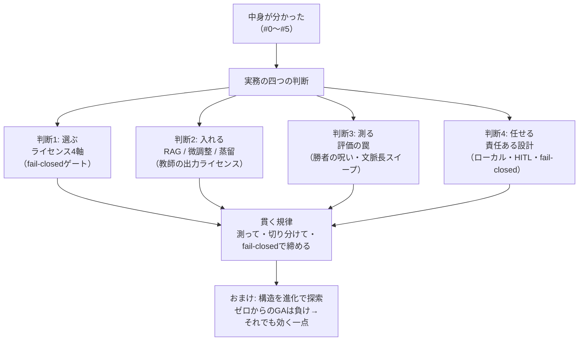
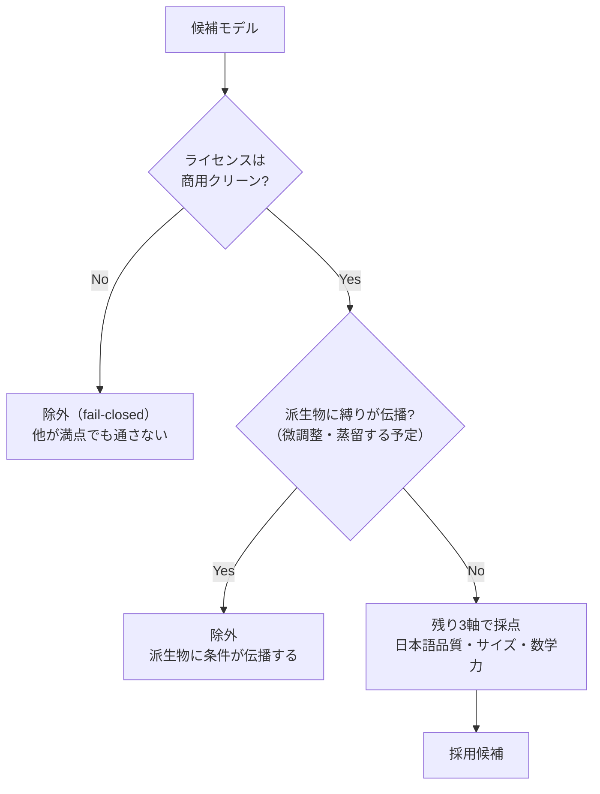
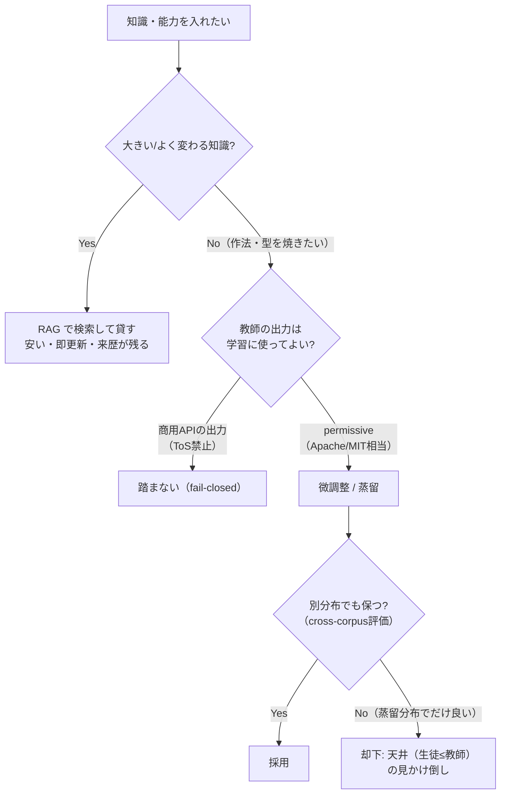
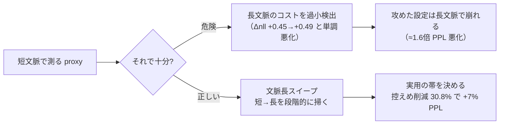
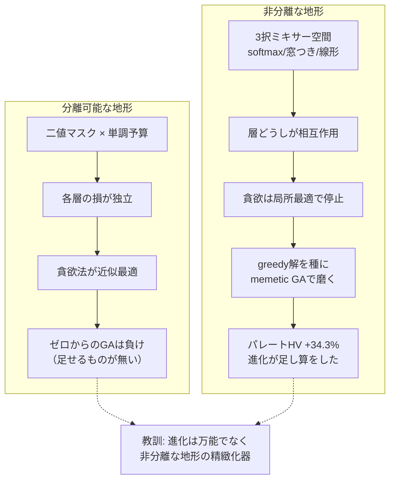
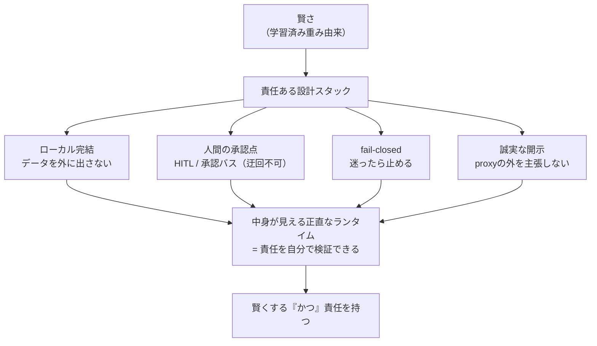

# 実務編 ― モデル選定・評価・進化・責任ある設計

著者: 古瀬 和文（ぷるやん）

> シリーズ「作って分かった LLM の中身 ― 自作言語モデルで覗く構造」第6回（技術版・最終回）。
> 前回 #5 では、メモリと速度の三つの壁を実測で開けながら、貫く規律を一つ立てました――
> **「測る物差しを一つにしない。異常に良い結果は内訳を疑う。疑わしきは通さない（fail-closed）。」**
> 今回はその規律が、実務では **「モデルを選び・評価し・責任を持つ」** という三つの形に結晶します。
> ――計測・制御の現場で 25 年、「不良を取りこぼさず、ラインを止めない」を目標にしてきた人間として、
> ここは中身の解剖から一歩出て、**「自分の道具として、どのモデルをどう選び、どう信じ、どう任せるか」** を扱います。

前回の終わりに、私はこう予告しました。「今回の『PPL だけで通すな』を、さらに勝者の呪い・文脈長スイープ・
多窓 proxy まで広げます」。そして「素朴な進化探索が単純な貪欲法に負けた話（消さずに残す教訓）と、
それでも進化が効く一点」。この二つが、本章の山場です。加えて、実務でいちばん最初に効くのに一番見落とされがちな
**ライセンス（商用で使えるかどうか）** の話から始めます。

このシリーズはここまで、LLM(Large Language Model：大規模言語モデル)の中身――トークン化・埋め込み・注意機構・
順伝播層・学習・メモリの壁――を一つずつ分解してきました。最終回のこの章は、**分解して得た理解を、実際に手を動かす
判断に変える**ための回です。中身が分かったからこそ選べる、評価できる、責任が持てる。その地続きを、
実測値と honest（正直）な失敗も添えて、最後まで通します。

<!-- 画像プレースホルダ（ヒーロー画像） -->

<!-- 画像生成意図: 検査台（測定装置・ノギス・基準器）の上に、四つの部品として「ライセンスの札がついた複数のモデル」「RAG/微調整/蒸留の三つの経路」「評価ゲージ（PPLとtop-1の二本の物差し）」「進化の枝分かれ図」が並び、最後に「承認点（人間の手）」が全体を締めている。静謐で技術的なトーン。青と落ち着いた金属色。赤緑の善悪対比は使わない。攻撃的・煽情的な演出は避ける。静的な一枚絵として完成させる。 -->

---

## ① 用語ミニ辞典（この回で使う言葉）

まず、この記事で繰り返し出てくる言葉を先に置きます。①だけ読んでも、話の骨組みは掴めるようにしてあります。

- **ライセンス(license)** … そのモデル（重み）や、そこから作った派生物を、どこまで・どう使ってよいかを定める利用許諾。商用可否の生命線。
- **Apache-2.0 / MIT** … 代表的な「商用でも素直に使える(permissive)」オープンソースライセンス。改変・再配布・商用利用を広く許す。
- **派生物伝播条項(copyleft / derivative propagation)** … 「これを使って作ったものにも、同じ条件を引き継がせる」という縛り。permissive の対極。
- **利用規約(Terms of Service, ToS)** … サービス提供者が定める使い方のルール。API の出力の再利用を禁じる条項が入っていることがある。
- **RAG(Retrieval-Augmented Generation：検索拡張生成)** … モデルの外に知識ベースを置き、質問時に関連文書を**検索して差し込む**方式。重みは触らない。
- **ファインチューニング(fine-tuning)** … 学習済みモデルの重みを、追加のデータで少し学習し直して調整すること。以降 微調整。
- **蒸留(distillation)** … 教師モデルの出力を生徒モデルに真似させ、能力を移す学習（第5回で線形化層の回復に使ったのと同じ枠組み）。
- **来歴(provenance)** … 「その答えが、どの情報源から来たか」の出どころ・追跡可能性。RAG は来歴を残しやすい。
- **パープレキシティ(perplexity, PPL)** … 「次の1語をどれだけ迷わず当てられるか」の指標。低いほど良い。予測分布の困り度。
- **top-1保持率** … 改造の前後で「最有力として選ぶ1語(argmax)」がどれだけ一致するか。実際に出力する語が壊れていないかの物差し。
- **nll(negative log-likelihood：負の対数尤度)** … 正解トークンに割り当てた確率の対数の符号を反転した値。小さいほど良い。PPL は nll の指数。Δnll は改造前後の差。
- **holdout（ホールドアウト）** … 選定・調整に使っていない、取り置きの評価用データ。「本番で初見の問題」の代わり。
- **勝者の呪い(winner's curse)** … たくさんの候補から「最良」を選ぶと、その最良値が本来の実力より**楽観的に偏る**現象。選定と評価が同じデータだと必ず起きる。
- **信頼区間(Confidence Interval, CI)** … 測定値の「ブレの幅」。点推定（1つの数字）だけでなく、どのくらい揺れるかを併記するための区間。
- **ブートストラップ(bootstrap)** … 手元のデータを何度も取り直す（再標本化する）ことで、測定値のブレ幅（CI）を見積もる統計手法。
- **文脈長スイープ(context-length sweep)** … 短い文脈から長い文脈まで、文脈長を段階的に変えながら劣化を測ること。短文脈だけの評価が見逃す劣化を炙り出す。
- **NAS(Neural Architecture Search：ニューラルアーキテクチャ探索)** … 「どんな構造（層の並べ方・部品の選び方）が良いか」を自動で探索すること。
- **ミキサー(mixer)** … 各層で「トークン同士をどう混ぜるか」を担う部品。ここでは softmax 注意／窓つき注意(sliding-window)／線形注意 の三択。
- **貪欲法(greedy algorithm)** … 「その場で一番得な選択」を順に積み重ねる素直な最適化。速いが、局所最適に嵌まりうる。
- **遺伝的アルゴリズム(Genetic Algorithm, GA)** … 候補を「個体」とみなし、交叉・突然変異・選択で世代を回して探索する進化的手法。
- **memetic（ミーメティック）GA** … GA に局所探索（各個体をその場で磨く手続き）を組み合わせた手法。「進化＋その場の努力」の合わせ技。
- **分離可能(separable)な問題** … 各要素の良し悪しがほぼ独立で決まる問題。要素ごとに最善を選べば全体も最善に近い＝貪欲法が強い地形。
- **パレート最適(Pareto optimal)** … 「あれを良くすればこれが悪くなる」という、どれも譲れない最良の組み合わせの集まり（フロント）。
- **ハイパーボリューム(hypervolume)** … パレートフロントが目的空間で「占める体積」。多目的トレードオフの良さを一つの数字で表す指標。大きいほど良い。
- **HITL(Human-in-the-Loop：人間参加型)** … 自動化のループの要所に、人間の判断・承認を挟む設計。
- **承認バス(Approval Bus)** … 重要な行動の前に必ず承認点を通す仕組み。人間の「はい／いいえ」を、迂回できない場所に置く設計。
- **fail-closed（フェイルクローズド）** … 判定に迷ったら「通さない（拒否する）」側に倒す設計。計測現場の「疑わしきは不良」と同じ。
- **誠実な開示(honest disclosure)** … 数値は実測だけを載せ、失敗も留保も隠さず、うますぎる結果はまず内訳を疑う、という発信の作法。

4文字以下の略語（RAG, FT, GA, ToS, CI, NAS など）はこの初出で一度だけ展開し、以降は略語または日本語で通します。

> **語呂で覚える**：実務の四択は **「選ぶ・入れる・測る・任せる」**。
> どのモデルを**選ぶ**か（ライセンス）、知識をどう**入れる**か（RAG/微調整/蒸留）、
> 本当に良くなったか**測る**（評価の罠）、そして人にどう**任せる**か（責任ある設計）。
> 中身が分かっていると、この四つの判断が全部「測って確かめる」一本の規律でつながります。

---

## ② かみくだき：中身が分かると、実務の判断が変わる

ここまでの5章で、LLM の中身を部品ごとに分解してきました。最終章の問いはこうです――
**「では、その理解を、実際にモデルを選び・育て・使う判断に、どう変えるのか」**。

実務で手を動かすとき、判断は大きく四つに分かれます。順に、かみくだいて全体像を置きます。

**判断1：どのモデルを選ぶか ― ライセンスが商用の生命線。**
性能表だけ見てモデルを選ぶと、後で足元をすくわれます。いちばん最初に効くのは、実は**ライセンス**です。
「性能が良い、日本語も強い」と喜んで採用したモデルが、規約をよく読むと**商用利用は不可**だった――これは
本当によくある落とし穴です。だから私は、モデル選定を **日本語品質・サイズ・数学力・ライセンス** の4軸で見ます。
そして4軸目のライセンスは、他の3軸がどれだけ良くても**通らなければ即失格**の、fail-closed なゲートとして扱います。

**判断2：知識をどう入れるか ― 検索で「貸す」か、重みに「焼く」か。**
モデルに自分のデータや知識を持たせる方法は、大きく三つ。**RAG（検索で外から差し込む）／微調整（重みを少し学習し直す）
／蒸留（教師の出力を真似させて能力を移す）**。ざっくり言うと、RAG は**安くて・すぐ更新でき・来歴が残る**。
知識を重みに焼き込むのでなく「検索で貸す」イメージです。微調整・蒸留は**能力そのものを移植**できますが、
ここに大きな落とし穴があります――**教師（真似させる相手）の出力ライセンス**です。そして移植には天井があります。
**生徒は教師を超えられない**。

**判断3：本当に良くなったか、どう測るか ― 評価の罠。**
これが本章のレポート性の核であり、前回の「PPL だけで通すな」の全面展開です。良い数字が出たとき、
**その良さが本物か、測り方の産物か**を見抜けないと、壊れたモデルを「合格」にしてしまう。
とくに危ないのが **勝者の呪い**――たくさんの候補から「最良」を選ぶと、その最良値は必ず楽観に偏る、という統計の罠です。
これは計測現場の「うますぎる測定値は、まず校正から疑う」と、まったく同じ規律で対処します。

**判断4：どう任せるか ― 責任ある設計。**
最後は、賢いモデルを「どう安全に人の役に立てるか」。データを外に出さないローカル完結、人間の承認点(HITL)、
迷ったら止める fail-closed、そして数字を盛らない誠実な開示。これは自慢の飾りではなく、
**計測装置の「ラインを止めない・不良を取りこぼさない」品質思想と、構造が同じ**です。「賢くする」だけでなく「責任を持つ」。

そしてこの四つの合間に、もう一つ――**「構造そのものを進化で探索できるか」**という実験の話を挟みます。
ここで私は、消したくなる失敗を一つ、正直に出します。**ゼロから始めた素朴な進化探索は、単純な貪欲法に負けました。**
けれど、その負けの内訳を分解すると、**進化がちゃんと効く一点**が見えてきます。この「負けと、その先の勝ち」の弧が、
このシリーズが最後に伝えたい「honest disclosure（失敗を消さず教訓に）」の集大成です。



ここから③で、それぞれを実測値・擬似コード・正直な内訳とともに開けていきます。

---

## ③-1 判断1：モデル選定 ― ライセンスが商用の生命線

### 4軸で選ぶ。ただしライセンスだけは「性質が違う」

自分の道具として、あるいは製品の中核として LLM を選ぶとき、私は次の4軸で見ます。

1. **日本語品質** … 日本語の文が自然か、指示に日本語で従えるか。海外発モデルは英語中心の訓練で、日本語が弱いことがある。
2. **サイズ** … パラメータ数。動かす環境（自宅 CPU か、GPU か、常駐メモリの上限か）で許容が決まる。第5回のメモリの壁が直に効く。
3. **数学力** … 簡単な算数・数式・論理に耐えるか。第4回で見たように、小さいモデルは算数から崩れる（0.5B は「3たす5」を「18」と外しました）。
4. **ライセンス** … 商用で使ってよいか、派生物にどんな縛りが伝播するか。

ここで大事なのは、**1〜3 は「程度の軸（連続的に良い／悪い）」だが、4だけは「可否の軸（通る／通らない）」**だということです。
日本語がやや弱くても他で補える。サイズが大きすぎれば量子化で削れる（第5回）。数学が弱ければ RAG や外部ツールで補える。
けれど**ライセンスが商用不可なら、他の3軸がどれだけ満点でも、商用の道は閉じます**。だから4軸目は、
連続値として点数化するのでなく、**最初に通す fail-closed のゲート**として扱うのが実務の作法です。

これは私の職業病の直輸入です。検査装置では「明るさ」「寸法」「傷」を連続的な良否で採点しますが、
**「安全規格に適合しているか」だけは、点数でなく可否のゲート**にします。どれだけ性能が良くても、規格を通らない装置は
出荷できない。ライセンスは、LLM 選定における「安全規格」に当たります。

### 商用でクリーンな例と、非商用の罠

具体的に、商用でクリーン（Apache-2.0 / MIT）に使えるものと、うっかり踏みがちな非商用の罠を並べます。
※以下はライセンスの**性質の型**を示すための整理です。ライセンスは版・改定で変わり得るので、採用時には必ず各モデルの
最新の許諾を一次情報で確認してください（これも「仕様書より現物を測れ」の一種です）。

**商用でクリーンに使える型（permissive: Apache-2.0 / MIT）:**

- **Qwen2.5 / Qwen3** … Apache-2.0 系で提供される版があり、permissive に使える。日本語も比較的こなれている。
- **Ministral-3** … permissive 系。小型で扱いやすい。
- **Phi-4-mini** … **MIT ライセンス**。小型・permissive の代表格。
- **SmolLM3** … Apache-2.0。ただし**日本語は弱め**。ライセンスは通っても、4軸の「日本語品質」で減点され得る好例。

**非商用の罠（性能表だけ見ると見落とす）:**

- **Qwen2.5-3B** … 同じ Qwen ファミリーでも、**この 3B の版は Qwen Research ライセンス（非商用）**という落とし穴があります。
  「Qwen だから Apache だろう」と型で決めつけると踏む。**同じ名前のファミリーでも、サイズ違いでライセンスが違う**ことがある。
- **Gemma** … **派生物伝播条項**を持つ型。これを使って作った微調整版・蒸留版にも、元の利用条件が引き継がれます。
  「元は自由に見えたのに、派生物に縛りが伝播していた」を避けるには、伝播条項の有無を最初に確認する必要があります。

つまりライセンスは、**モデル単体だけでなく「そこから作る派生物にどう伝播するか」まで**見なければなりません。
これは判断2（微調整・蒸留）と直結します。**「良いモデルを見つけた」の次に、必ず「これで作ったものは自由に使えるか」を問う。**

```python
# 教育用の擬似コード：モデル選定を fail-closed ゲートで締める
# ライセンスは連続点数でなく「可否」。通らなければ他が満点でも失格。
def select_model(candidates, need_commercial=True):
    passed = []
    for m in candidates:
        # 4軸目: ライセンスは最初の関門（fail-closed）
        if need_commercial and not m.license.is_commercial_clean():
            continue                     # 商用不可 → 即除外（点数化しない）
        if m.license.propagates_to_derivatives() and plan_to_finetune:
            continue                     # 派生物に縛りが伝播 → 微調整予定なら除外

        # ここを通った候補だけ、残り3軸で連続採点する
        score = (w_ja  * m.japanese_quality        # 日本語品質
               + w_sz  * m.size_fit(target_env)    # サイズ（動かす環境に収まるか）
               + w_math* m.math_score)             # 数学力
        passed.append((score, m))
    if not passed:
        return None    # 全滅なら「無い」を正直に返す（無理に通さない）
    return max(passed)[1]
```



### 持ち帰り（判断1）

モデル選定は性能表の勝負に見えて、実は**最初にライセンスという可否のゲートを通す**設計問題です。
Apache-2.0 / MIT はクリーン。**同じファミリーでもサイズ違いで非商用の版がある（Qwen2.5-3B）**、
**派生物に条件が伝播する型がある（Gemma）**。性能は連続点数、ライセンスは fail-closed ゲート――この分け方が、
「商用で使えるつもりが実は使えなかった」を防ぎます。

---

## ③-2 判断2：知識をどう入れるか ― RAG か、微調整か、蒸留か

### 三つの入れ方と、その性格

モデルに「自分の知識・自分のデータ」を持たせたいとき、道は大きく三つです。性格がはっきり違うので、まず対比します。

- **RAG（検索拡張生成）** … 知識をモデルの**外**（検索できる知識ベース）に置き、質問のたびに関連文書を引いて
  プロンプトに差し込む。重みは一切触らない。
- **微調整（fine-tuning）** … 学習済みモデルの**重みを、追加データで少し学習し直す**。知識・作法をある程度まで
  重みに焼き込む。
- **蒸留（distillation）** … **教師モデルの出力**を生徒モデルに真似させ、能力を移植する。第5回で線形化層を
  回復させたのと同じ枠組みを、こんどは「能力を丸ごと移す」目的で使う。

それぞれの性格を、実務で効く3点（コスト・更新のしやすさ・来歴）で並べます。

| 観点 | RAG | 微調整 | 蒸留 |
|---|---|---|---|
| **コスト** | 安い（学習不要、知識ベースを作るだけ） | 中〜高（追加学習が要る） | 高（教師の出力を大量に集めて学習） |
| **更新のしやすさ** | **即時**（文書を差し替えるだけ） | 遅い（再学習が要る） | 遅い（再蒸留が要る） |
| **来歴（出どころ）** | **残る**（どの文書から答えたか辿れる） | 残りにくい（重みに溶ける） | 残りにくい（重みに溶ける） |
| **できること** | 知識を「貸す」（参照させる） | 作法・知識を重みに「焼く」 | 能力そのものを「移植」 |

要点はこうです。**大きな知識・頻繁に変わる知識は、RAG で「検索して貸す」のが基本**。安く、すぐ更新でき、
「その答えはこの文書から」という来歴が残る。これは、私が計測の現場で大事にしてきた**トレーサビリティ（追跡可能性）**
そのものです。検査装置は「なぜこのワークを不良と判定したか」を必ず根拠つきで残します。答えだけ返して根拠を残さない装置は、
現場では信用されません。RAG が来歴を残せるのは、実務では性能表に出ない大きな美点です。

一方、**「振る舞いの型」や「暗黙の作法」を身につけさせたい**ときは、RAG では届きにくく、微調整・蒸留の出番になります。
ただしここに、判断1と地続きの落とし穴が待っています。

### ★教師の出力ライセンスが命 ― OpenAI / Anthropic の出力は ToS で禁止

微調整、とくに蒸留の核心は「教師の出力を生徒に真似させる」ことです。ということは、**教師の出力を、そういう用途で
使ってよいか**が死活問題になります。ここを踏むと、作った生徒モデルごと使えなくなる。

- **教師の出力を学習に使うなら、その出力が Apache-2.0 / MIT 相当でクリーンに使えるものに限る。**
- **商用サービスの API 出力（例：OpenAI / Anthropic などの生成結果）は、利用規約(ToS)で「自社の競合モデルの学習に
  使うこと」を禁じている**のが通例です。「良い答えを大量に生成させて、それを教師データにする」は、規約上できません。

つまり、判断1で「モデル本体のライセンス」を通しても、判断2では**「教師の出力のライセンス」という第二のゲート**を
もう一度通さなければならない。**モデルが permissive でも、教師データの出どころが規約違反なら、生徒は最初から
汚染されている**。ここも fail-closed で締めるべき場所です。

```python
# 教育用の擬似コード：蒸留・微調整の前に「教師の出力ライセンス」を締める
def can_use_as_teacher(teacher_output_source):
    # 教師の「出力」が学習利用可能か（本体ライセンスとは別のゲート）
    if teacher_output_source.is_permissive():        # Apache-2.0 / MIT 相当
        return True
    if teacher_output_source.is_commercial_api():
        # 競合モデルの学習利用を ToS で禁止しているのが通例
        return False                                  # fail-closed: 踏まない
    return False    # 不明なら通さない（疑わしきは使わない）
```

### 天井：生徒は教師を超えられない。そして cross-corpus 評価が要る

もう一つ、蒸留・微調整には構造的な天井があります。**生徒は、教師を超えられない**。蒸留は「教師の振る舞いを真似する」
学習なので、原理的に**生徒 ≤ 教師**。教師が間違える問いは、生徒も間違えるように学びます。「小さな生徒が、教師より賢くなった」
という結果が出たら、それこそ**内訳を疑うべき異常値**です。たいていは評価データが蒸留分布に寄っていて、
「教師の土俵でだけ良く見えている」状態です。

だからこそ、**cross-corpus 評価（蒸留に使ったのとは別の、性質の違うテキストでの評価）が必須**になります。
第5回の線形化・蒸留回復のときも、私は同じ規律を使いました――**held-out（未知テキスト）で 92–101% 回復**したことを
確認して初めて「回復した」と言った。学習に使ったテキストだけで測れば、暗記でいくらでも良い数字が出てしまう。
「蒸留した分布で良く見えて、別の分布で崩れる」を炙り出すのが cross-corpus 評価の仕事です。



**[画像プレースホルダ]** *キャプション: 知識の入れ方の三択 ― RAG は知識を「外から貸す」（来歴が残る）、微調整・蒸留は「重みに焼く」（教師の出力ライセンスと生徒≤教師の天井）。安さ・更新の速さは RAG、能力移植は微調整・蒸留。*
<!-- 画像生成意図: 三本の経路を並べた概念図。左「RAG」＝モデルの外に本棚（知識ベース）があり、質問時に本を1冊抜いて差し込む矢印、下に「来歴が残る/即更新/安い」。中「微調整」＝モデルの重みブロックに小さな熱を加えて型を刻む。右「蒸留」＝大きな教師モデルから小さな生徒モデルへ出力を写す矢印、下に「教師の出力ライセンスが命/生徒≤教師」。中立配色（青と金属色）、善悪の赤緑対比なし。静的な完成図。 -->

### 持ち帰り（判断2）

知識の入れ方は三択。**大きく変わる知識は RAG で「貸す」（安い・即更新・来歴が残る）**。
作法を重みに焼くなら微調整・蒸留だが、**教師の出力ライセンスという第二のゲート**（商用 API 出力は ToS で学習利用不可）を
必ず通す。そして**生徒は教師を超えられない**天井があり、蒸留分布での好成績は cross-corpus 評価で裏を取る。
本体ライセンス（判断1）と教師出力ライセンス（判断2）は、別々のゲートです。

---

## ③-3 判断3：評価の罠 ― 良い数字を、疑う技術

ここが本章のレポート性の核であり、シリーズ全体の規律「異常に良い結果は内訳を疑う」の総仕上げです。
第5回で「PPL だけで通すな（2bit が PPL ゲートを通ったのに top-1 が -13.5pp 崩壊した）」を見ました。
今回はその話を、**評価そのものの三つの罠**へ広げます。

### 罠その1：勝者の呪い ― 「最良を選ぶ」と、その値は楽観に偏る

いちばん見落とされ、いちばん高くつくのが**勝者の呪い(winner's curse)**です。仕組みはこうです。

たくさんの候補（量子化設定、層の線形化パターン、ハイパーパラメータ……）を、あるデータで評価して「最良」を選ぶとします。
どの測定にも、実力ぶんと**ノイズ（測定のブレ）**が混じっています。候補が多いほど、「たまたまノイズが良い方に転んだ候補」が
最良に選ばれやすい。つまり**選ばれた最良値は、実力＋幸運なノイズ**で、本来の実力より**楽観的に上振れ**しています。
これが勝者の呪いです。

計測の現場では、これは骨身に沁みた話です。多数の測定の中から「一番良かった一発」を製品スペックとして掲げると、
量産では再現しません。**「ベストショット」はカタログには魅力的でも、現場では嘘になる**。だから私たちは、
選定に使った測定とは別に、**取り置きの検体で測り直す**。LLM でもまったく同じで、

- **選定（多数の候補から最良を選ぶ）に使ったデータで、その最良値を報告してはいけない。**
- **選定に一切使っていない、新鮮な holdout で測り直した値を報告する。**

こうすると、幸運なノイズは holdout では再現しないので、上振れが剥がれ、**素の実力**が見えます。
たいてい holdout の数字は選定時より少し悪くなります。それが正常です。「選定時と holdout でほぼ同じ」なら、
それは**幸運が乗っていなかった＝信頼できる**という良い兆候です。

```python
# 教育用の擬似コード：勝者の呪いを、新鮮な holdout で剥がす
def honest_best(candidates, select_data, fresh_holdout):
    # 1) 選定は select_data で（ここで最良を選ぶと楽観に偏る）
    best = min(candidates, key=lambda c: c.evaluate(select_data))

    # 2) 報告は fresh_holdout で測り直す（選定に一切使っていない）
    reported = best.evaluate(fresh_holdout)   # ← こちらを報告する
    optimism = best.evaluate(select_data)     # 参考: 選定時の（上振れした）値

    # 選定時だけ良くて holdout で崩れるなら、それは幸運（ノイズ）だった
    return best, reported, (optimism - reported)   # 差＝勝者の呪いの大きさ
```

### 罠その2：PPL だけで判断しない（第5回の回収）

第5回の核をもう一度。**PPL（予測の困り度）は「分布全体のなだらかさ」を測る**ので、確率質量が全体に少しずつ均されても
大きくは動きません。でも会話が実際に出力するのは **argmax で選ぶ1語**。ある 2bit 設定は PPL ゲートを通ったのに、
**top-1 保持率が -13.5pp 崩壊**していました。PPL は平均的な指標、top-1 は実際の出力の当たり。**別の物差しを二本、
並べて締める**。これは判断3のすべての罠に共通する原則です――**一本の物差しを信じない**。

### 罠その3：文脈長スイープ ― 短文脈の proxy は、長文脈のコストを過小に見る

第5回の線形化で、劣化は**層ごとに違う**と見ました。今回はもう一つの次元――**文脈長ごとに違う**を加えます。
これが実務で本当に効きます。

多くの評価は、手早さのために**短い文脈（proxy）**で測ります。ところが、線形化のような近似の劣化は、
**長い文脈でこそ牙をむく**（定数状態は長文脈のメモリで勝つ代わりに、softmax の細かな相対比較を近似で潰しているから）。
短文脈だけで測ると、この長文脈コストを**過小検出**します。だから、短文脈から長文脈まで段階的に測る
**文脈長スイープ**が要る。実際に測ると、こうなりました。

- あるアグレッシブ（攻めた）な線形化設定で、劣化 Δnll が **文脈が伸びるほど単調に悪化**：短文脈で **+0.45** →
  長文脈で **+0.49**。**文脈長とともに一方向に悪くなる**（改善に転じる点がない）。
- これは PPL に直すと、およそ **1.6 倍の悪化**に相当します。短文脈だけ見て「+0.45 なら許容」と通すと、
  長文脈で 1.6 倍まで膨らむのを見逃す。
- 逆に、**控えめな削減に留めた「実用の帯(usable band)」**では、**30.8% の削減で +7% PPL** に収まりました。
  攻めれば長文脈で崩れ、控えれば実用に乗る。**どこまで攻めてよいかは、文脈長スイープを測ってからでないと決められない**。

つまり評価は、**「一点で測る」から「軸に沿って掃く（スイープする）」へ**上げる必要があります。
これは計測の常識そのものです。装置の性能は「一つの動作点」でなく、**温度・速度・負荷を振ったスイープ特性**で
評価します。一点だけ良くても、実運用の範囲で単調に悪化するなら、それは使えない。文脈長は、LLM 評価における
その「掃くべき軸」です。



**[画像プレースホルダ]** *キャプション: 文脈長スイープ ― 攻めた線形化設定は文脈が伸びるほど劣化 Δnll が単調に悪化（+0.45→+0.49）。短文脈だけの proxy 評価では、この長文脈コストを見逃す。控えめな削減に留めた実用の帯は緩やか。*
<!-- 画像生成意図: 折れ線グラフ。横軸=文脈長（短→長）、縦軸=劣化 Δnll。攻めた設定の線が右肩上がりで +0.45 から +0.49 へ単調に上昇し「≈1.6倍 PPL 悪化」注記。控えめな設定（実用の帯）の線は低く緩やかで「30.8%削減で +7% PPL」注記。短文脈側に「proxyはここしか見ない」淡い網掛け。中立配色（青と灰）、赤緑の善悪対比なし。静的な完成グラフ。 -->

### 三つの罠をまとめて封じる ― 多窓 proxy と honest_verdict

これら三つの罠（勝者の呪い・単一指標・短文脈 proxy）を、一つの評価設計に畳み込むと、私が実際に使っている
**proxy-v2 の思想**になります。核は四つです。

1. **paired 多窓 Δnll** … 同じテキストの**複数の文脈窓**で、改造前後を**対にして（paired）**差 Δnll を測る。
   一点でなく、窓を複数取ることで文脈長依存を捉える（罠3への対処）。
2. **ブートストラップ信頼区間(CI)** … 点推定だけでなく、再標本化でブレ幅を出す。「+0.45 ± どれだけか」を併記する。
3. **勝者の呪い補正** … 多候補から最良を選ぶ構造には、上振れ補正をかける／新鮮な holdout で測り直す（罠1への対処）。
4. **honest_verdict のチョークポイント** … これが要です。この proxy が測っているのは**「次トークンの nll」だけ**だと、
   評価の出力に**明示的に刻む**。スコープを `next_token_nll_proxy` に固定し、**「会話品質が良くなった」という主張を、
   構造的に封じる**。具体的には、判定オブジェクトに `conversational_claim = None` を持たせ、
   「この評価から会話品質は主張できない」を**設計として強制**します。

この4番目が、このシリーズの背骨と直結します。第0回から繰り返してきた**「会話の賢さは学習済み重み由来、
自作の貢献は検証済みランタイム」という継ぎ目**を、評価装置のレベルで**機械的に守る**ということです。
proxy が測れるのは nll まで。だから「会話が良くなった」とは、この proxy からは**言わせない**。言えないことを
言わない仕組みを、評価の中に組み込む。

```python
# 教育用の擬似コード：proxy-v2 の honest_verdict チョークポイント
def proxy_v2_verdict(model_before, model_after, texts):
    # paired 多窓 Δnll（複数の文脈窓で対にして測る）
    deltas = [paired_delta_nll(model_before, model_after, w) for w in windows(texts)]
    point  = mean(deltas)
    ci_lo, ci_hi = bootstrap_ci(deltas)          # ブレ幅（信頼区間）を併記

    return {
        "scope": "next_token_nll_proxy",         # 測っているのは次トークン nll だけ
        "delta_nll": point,
        "ci": (ci_lo, ci_hi),
        # ここがチョークポイント：会話品質は、この proxy からは主張しない
        "conversational_claim": None,            # 構造的に封印（言えないことを言わせない）
    }
```

計測の現場には「校正されていない測定器の数字は、桁が合っていても信じるな」という戒めがあります。
proxy-v2 は、その戒めをコードにしたものです。**測れる範囲を宣言し、その外を主張しない**。
「異常に良い結果は内訳を疑う」を、最終的には**評価装置の設計そのものに埋め込む**――これが、
25 年の計測規律から私が LLM 評価に持ち込んだ、一番の実装です。

### 持ち帰り（判断3）

評価には三つの罠がある。**勝者の呪い**（多候補の最良は楽観に偏る→新鮮な holdout で測り直す）、
**単一指標**（PPL だけで通すと壊れたモデルを合格させる→top-1 など二本目の物差し）、
**短文脈 proxy**（長文脈コストを過小検出→文脈長スイープで掃く。攻めた設定は Δnll +0.45→+0.49 と単調悪化）。
そして三つを畳み込んだ **proxy-v2**（paired 多窓・CI・勝者の呪い補正・honest_verdict でスコープ固定）で、
**「言えないことを言わせない」評価装置**にする。良い数字が出たら、喜ぶ前に測り方を疑う。

---

## ③-4 判断の合間に：進化 × 構造 ― 負けと、その先の勝ち（memetic NAS）

ここで、実務判断の合間に、このシリーズの honest disclosure の集大成となる実験を一つ、正直に開きます。
テーマは**「構造そのものを、進化で探索できるか」**。第5回で、層ごとに線形化の向き不向きがある（層0は壊滅、層22は無害）と
見ました。ならば一歩進めて、**各層にどのミキサー(mixer)を使うか**――softmax 注意／窓つき注意(sliding-window)／
線形注意 の三択――を、**自動で探索**できないか。これがニューラルアーキテクチャ探索(NAS)の問いです。

### 失敗を消さない：ゼロからの素朴な GA は、単純な貪欲法に負けた

最初、私は素直に**ゼロから遺伝的アルゴリズム(GA)**を回しました。各層を「線形化する／しない」の二値マスクで表し、
「線形化した層の数（＝メモリ予算）」を制約に、品質を最大化する。個体を交叉・突然変異させ、世代を回す。
進化計算らしい、格好のよい設定です。

結果は――**負けました**。単純な**貪欲法**（第5回で見た「耐性の高い層から順に線形化していく」あの素直なやり方）に、
GA は勝てなかった。世代を回すぶんだけ計算を無駄にして、貪欲法とほぼ同じか、それ以下。

なぜか。内訳を分解すると、理由ははっきりしていました。**この問題は分離可能(separable)だったから**です。

- **二値マスク（線形化する／しない）× 単調な予算制約**という設定では、各層の「線形化したときの損」がほぼ独立に決まる。
- 各層の損は第5回で層別に測れています（層0は大損、層22はほぼ無損）。ならば**損の小さい層から順に線形化する**だけで、
  どの予算でもほぼ最適な組み合わせが得られる。これが貪欲法です。
- 各要素が独立に決まる分離可能な地形では、**貪欲法が近似最適**。GA が交叉や突然変異で探し回っても、
  貪欲法がすでに届いている解の周りをうろつくだけで、**足せるものが無い**。

これは進化計算への皮肉でも、GA が劣った手法だという話でもありません。**問題の地形が、その道具を要らなくしていた**だけです。
計測の現場でも同じ経験があります。パラメータが互いに独立なら、一つずつ最適点を探る単純な一次元探索で十分で、
凝った多次元最適化を持ち込むと、かえって遅くなり、結果も変わらない。**道具は地形に合わせる**。

### それでも進化が効く一点：非分離な地形を、greedy 解を種にして磨く

では進化は無駄だったのか。**いいえ**。負けの内訳が、勝てる条件を教えてくれました。**分離可能だから貪欲法が強い**のなら、
**分離不可能（非分離）な地形を作れば、貪欲法は届かなくなり、進化の出番が生まれる**はずです。

そこで、二値（線形化する／しない）でなく、**三択のミキサー空間**（softmax／窓つき／線形）に広げました。
すると層どうしの相互作用が効いてきます。「ある層を窓つきにすると、隣の層は線形でも耐える」といった、
**組み合わせでしか決まらない効果**が現れる。もう各層を独立には決められない――非分離な地形です。ここで貪欲法は、
「その場で一番得な一手」を積むだけなので、**組み合わせの妙**に届かず、局所最適で止まります。

ここで効くのが **memetic GA**（進化＋局所探索）です。しかも大事なのは初期化。**ゼロから始めるのでなく、
まず貪欲法で良い解を作り、それを種(seed)として GA の初期集団に入れる**。貪欲法が届く範囲は最初から確保したうえで、
GA と局所探索が、貪欲法の届かない**非分離な組み合わせ**を磨く。「進化＋その場の努力」で、
貪欲解の一歩先へ押し込む。

結果、この 3-ミキサー空間で、**パレートハイパーボリュームが +34.3%** 向上しました。ハイパーボリュームは
「メモリと品質のトレードオフのフロント（パレート最適の集まり）が、目的空間でどれだけ広い領域を支配するか」を
一つの数字にしたもので、大きいほど**良いトレードオフの選択肢が増えた**ことを意味します。貪欲解だけのフロントより、
memetic GA で磨いたフロントの方が、34.3% 広く支配した――**非分離な地形では、進化がちゃんと足し算をした**。



```python
# 教育用の擬似コード：負けと勝ちの弧（memetic NAS）
# 1) 分離可能な二値問題：貪欲法が近似最適。GAは足せない。
def greedy_binarize(layers, budget):
    # 各層を「線形化したときの損」の小さい順に、予算まで選ぶ
    order = sorted(layers, key=lambda L: L.linearize_cost)  # 第5回の層別耐性
    return order[:budget]                                   # ← これでほぼ最適（分離可能）

# 2) 非分離な三択問題：greedy 解を種に、memetic GA で磨く
def memetic_search(layers, mixers=("softmax", "sliding_window", "linear")):
    seed = greedy_seed(layers, mixers)          # まず貪欲解を作る（届く範囲を確保）
    population = [seed] + random_individuals()   # 種を初期集団に入れる（ゼロから始めない）
    for _ in range(generations):
        offspring = crossover_and_mutate(population)
        offspring = [local_search(ind) for ind in offspring]  # ← memetic: その場で磨く
        population = select_pareto(population + offspring)     # メモリと品質の両目的
    return population       # 貪欲解の一歩先の、非分離な組み合わせを含むフロント
```

### honest な内訳（都合のいいところだけ言わない）

この「負けて、勝った」弧にも、正直な留保をつけます。

- **+34.3% はパレートハイパーボリューム**という多目的の proxy 指標上の改善であって、会話品質そのものの向上ではありません。
  判断3の honest_verdict と同じ線引きで、**会話が良くなったとは言っていません**。
- 探索は**小さな CPU モデル**での実験。大規模モデルで同じ比率が出る保証はしていません。
- 品質の測定は、判断3の評価規律（多窓・holdout）に乗せていますが、それでも proxy は proxy です。

それでも、この弧が伝えたい教訓は一つに絞れます。**進化は「万能の魔法」ではなく、「貪欲法が届かない非分離な地形での
精緻化器(refiner)」である**。分離可能な地形では、素直な貪欲法に敬意を払って任せる。非分離な地形に踏み込んで初めて、
進化は自分の仕事を持つ。**道具を地形に合わせる**――この判断こそが、探索の実務です。

### 持ち帰り（進化×構造）

**ゼロからの素朴な GA は、貪欲法に負けた**（二値マスク×単調予算は分離可能で、貪欲法が近似最適だから）。
でも**三択ミキサー空間という非分離な地形で、貪欲解を種にした memetic GA は勝った**（パレートHV +34.3%）。
教訓は「進化＝万能」でも「進化＝無駄」でもなく、**進化は非分離な地形の精緻化器**。負けの内訳が、勝ちの条件を教える。

---

## ③-5 判断4：責任ある設計 ― 賢くするだけでなく、責任を持つ

最後の判断です。ここまでの三つ（選ぶ・入れる・測る）は「賢く・正しく」の話でした。四つめは**「どう任せるか」**――
賢いモデルを、どう安全に人の役に立てるか。これは自慢の飾りではなく、**設計思想**として書きます。

私が置く柱は四つ。そしてこの四つは、私が 25 年やってきた**計測装置の品質思想と、構造がそっくり同じ**です。

1. **ローカル完結（データを外に出さない）** … 個人情報・企業機密・センサーデータを外部に送らず、自宅／オンプレの
   環境で完結させる。第5回で「自宅の常駐メモリに 1ビットも損なわず収めた」のは、この柱の技術的な足場です。
   量子化・線形化でメモリを削るのは、**外に出さずに手元で回せる規模に収める**ためでもあります。
2. **人間の承認点（HITL / 承認バス）** … 重要な行動の前に、**迂回できない場所に人間の「はい／いいえ」を置く**。
   自動化のループを、要所で人間が締める。承認バスは、その承認点を「短絡できない構造」として設計に埋め込む考え方です。
3. **fail-closed（迷ったら止める）** … 判断3・判断2・判断1で繰り返し使ったあの規律。検証に迷ったら通さない。
   これは検査装置の**「疑わしきは不良」**の直輸入です。
4. **誠実な開示（honest disclosure）** … 数字を盛らない。失敗を消さない。測れる範囲の外を主張しない
   （proxy-v2 の honest_verdict）。異常に良い結果は内訳を疑う。

この四つを、計測装置の品質思想と並べると、対応が見えます。

| 計測装置の品質思想 | 責任ある LLM 設計 |
|---|---|
| 現場のデータを外へ持ち出さない（機密・トレーサビリティ） | ローカル完結（データを外に出さない） |
| 危険動作の前に人が承認する（安全インタロック） | 人間の承認点（HITL / 承認バス） |
| 疑わしきは不良（fail-closed） | 迷ったら通さない（fail-closed） |
| 校正されていない数字は信じない／うますぎる値は疑う | 誠実な開示（proxy の外を主張しない・内訳を疑う） |
| ラインを止めない・不良を取りこぼさない | 賢くする「かつ」責任を持つ、を両立させる |

つまり、**責任ある AI の設計は、私にとって新しい哲学ではなく、計測・制御の現場でずっとやってきたことの延長**でした。
「賢いか」だけを競う装置は、現場では使われません。「機密を漏らさないか」「危険な動作を人が止められるか」
「異常値を見逃さないか」――**責任の担保が、性能と同じ重みで問われる**。LLM も同じ段階に来ています。
中身を検査・改造できる正直なランタイム（第0回からの継ぎ目）は、この四つの柱を**自分の手で確かめられる**ための土台でもあります。
ブラックボックスの外からでは、「本当にデータを外に出していないか」「本当に承認点を迂回していないか」を、
自分で検証できません。**中身が見えるからこそ、責任が持てる**。



**[画像プレースホルダ]** *キャプション: 責任ある設計の四つの柱（ローカル完結・人間の承認点・fail-closed・誠実な開示）と、計測装置の品質思想（機密・安全インタロック・疑わしきは不良・校正）が同型であることを並べた図。*
<!-- 画像生成意図: 左右対比の図。左列に計測装置のアイコン（オンプレのデータ金庫・安全インタロックのボタン・不良を弾くゲート・校正基準器）、右列に対応する LLM 設計（ローカル完結・承認バス・fail-closed・honest disclosure）を横線で結ぶ。「同じ品質思想」という中央の帯。静謐で技術的、青と金属色、赤緑の善悪対比なし。静的な完成図。 -->

### 持ち帰り（判断4）

責任ある設計は、**ローカル完結・人間の承認点（HITL/承認バス）・fail-closed・誠実な開示**の四本柱。
これは新しい理念ではなく、**計測装置の品質思想（機密・安全インタロック・疑わしきは不良・校正）と同型**です。
そして**中身が見える正直なランタイムだからこそ、この四つを自分で検証できる**。賢さは重み由来、
責任は設計で担保する。両者は別の仕事です。

---

## ④ シリーズ総括：一本の規律が、全章を貫いていた

最終回なので、#0 から #6 までを一本の糸で結び直します。振り返ると、章ごとにテーマは違っても、
貫いていた規律はずっと同じでした――**測って、切り分けて、fail-closed で締める。異常に良い結果は、まず内訳を疑う。**

| 回 | 分解したもの | そこで働いた同じ規律 |
|---|---|---|
| **#0 序章** | 検証哲学 | 自作 forward を公式と**突き合わせて測る**（2e-4／max\|Δ\|=0.0 を**区別**して。盛らない） |
| **#1 トークンと埋め込み** | 言葉→座標 | 埋め込みは学習で獲得。「王−男+女≈女王」も**比喩を盛らず**（非線形で完全一致ではない）に語る |
| **#2 注意機構** | 文脈を配る心臓 | この attention を正しく組めた証拠が **2e-4 一致**。組み直して測って確かめた |
| **#3 Transformer ブロック** | 知識はどこに住むか | 知識の局在は**適度な hedge** で（研究の総合、確定した唯一解ではない、と切り分ける） |
| **#4 学習と推論** | なぜ事前学習が効くか | **文字LMは会話できない**（失敗を消さない）。賢さは重みに宿る、を honest null で示す |
| **#5 メモリと速度の壁** | KV・量子化・線形化 | **PPL だけで通さない**（2bit top-1 -13.5pp）。線形化は**タダではない**（交差点227・層別耐性） |
| **#6 実務編（この回）** | 選ぶ・入れる・測る・任せる | ライセンスは fail-closed ゲート。評価は勝者の呪い/文脈長スイープで疑う。**GAは負けたが非分離で勝つ** |

そして、シリーズを通してぼかさなかった継ぎ目を、最後にもう一度、はっきり言います。
**会話の賢さそのものは、学習済みの重みに宿っています。私が自作したのは、その中身を検査・改造・検収できる、
検証済みの推論ランタイムです。** 改造版（線形化・蒸留版）が素のモデルより賢くなるとは、一度も主張していません。
私の貢献は「賢さを作ったこと」ではなく、**「賢さを、1ビットも損なわず正直に運び、測り、責任を持てる器を作ったこと」**。
この区別を曲げないことが、このシリーズが自分に課した誠実さでした。

計測エンジニアとして 25 年、私は「図面より現物を測れ」「うますぎる値は校正から疑え」「疑わしきは不良」で
仕事をしてきました。LLM の中身を組み直して分かったのは、**その古典的な現場力が、そのまま LLM の内部実装と検証と
運用に効く**ということでした。フーリエ変換は位置エンコーディング(RoPE)として、相関・テンプレートマッチングは
注意スコアとして、主成分分析(PCA)は埋め込み空間の直観として、キャリブレーションは学習ループとして、
そして**「不良を取りこぼさない品質規律」は、honest 評価ゲートと fail-closed と責任ある設計として**――
現場の道具は、名前を変えて LLM の中に、ちゃんといました。

---

## まとめ ― 実務の四判断と、貫く一つの規律

- **判断1 選ぶ**：日本語品質・サイズ・数学力・ライセンスの4軸。**ライセンスだけは連続点数でなく fail-closed ゲート**。
  Apache-2.0/MIT はクリーン（Qwen2.5/Qwen3・Ministral-3・Phi-4-mini(MIT)・SmolLM3(Apache だが日本語弱)）。
  **非商用の罠**（Qwen2.5-3B は Qwen Research／Gemma は派生物伝播）。
- **判断2 入れる**：大きく変わる知識は **RAG で貸す**（安い・即更新・来歴が残る）。作法を焼くなら微調整・蒸留だが、
  **教師の出力ライセンスが命**（商用 API 出力は ToS で学習利用不可）。**生徒 ≤ 教師**の天井、cross-corpus 評価必須。
- **判断3 測る**：**勝者の呪い**（最良は楽観に偏る→新鮮 holdout）、**単一指標の罠**（PPL だけで通さない）、
  **短文脈 proxy の罠**（文脈長スイープで掃く。攻めた設定 Δnll +0.45→+0.49 単調悪化、控えめ 30.8%削減で +7%PPL）。
  三つを畳んだ **proxy-v2**（多窓・CI・呪い補正・honest_verdict でスコープ固定、会話品質主張を封印）。
- **判断4 任せる**：**ローカル完結・人間の承認点(HITL/承認バス)・fail-closed・誠実な開示**の四本柱。
  計測装置の品質思想と同型。中身が見えるから責任を検証できる。
- **合間の弧**：**ゼロからの GA は貪欲法に負け**（分離可能な地形）、**非分離な三択空間で greedy 解を種にした
  memetic GA が勝つ**（パレートHV +34.3%）。進化は万能でなく、非分離地形の精緻化器。

貫く規律は、25 年の計測現場からの直輸入でした。**「測る物差しを一つにしない。異常に良い結果は内訳を疑う。
疑わしきは通さない（fail-closed）。」** 実務では、これが「選ぶ・入れる・測る・任せる」の四つに結晶します。

> **この記事から持ち帰る一つ**：
> **「良い数字が出たときが、いちばん危ない。」**
> モデル選定で性能表が魅力的なとき（ライセンスを見落とす）、蒸留で生徒が教師より良く見えたとき（分布が寄っている）、
> 評価で最良候補が光ったとき（勝者の呪い）、短文脈で劣化が小さいとき（長文脈で崩れる）、進化探索が良い解を出したとき
> （実は貪欲法で十分）――**うまくいったように見えた瞬間に、内訳を疑う**。これは AI に限らず、
> あなたが何かを「選んだ・良くした・任せた」と言うとき全部に効く、測るエンジニアの護身術です。

---

## 次回に続く ― モデルの「外側」へ

このシリーズで、私たちは LLM の**中身**を、入口から出口まで組み直して分解しました。
トークン化・埋め込み・注意機構・順伝播層・学習・メモリの壁・そして実務の四判断。ここまで来て見えてきたのは、
面白いことに、**「賢いモデル一つ」だけでは、まだ道具として足りない**という事実です。

第6回で置いた四本柱――ローカル完結・人間の承認点・fail-closed・誠実な開示――は、実はモデルの**内部**の話ではありません。
モデルの**周りに被せる仕組み**の話でした。賢さは重みに宿る。けれど、**記憶を持ち続けること・自分の判断を人に諮ること・
間違えたら止まること・自分を少しずつ良くしていくこと**は、モデル単体には無い。それは、モデルの**外側**に、
別のスタックとして設計するものです。

次のシリーズでは、その**「モデルの外側」**を組み直してみたいと思っています。
賢い次トークン予測器の周りに、**記憶の層・承認のループ・そして自分の構造を（今回の memetic NAS のように）
少しずつ進化させていく仕組み**を被せると、何が変わるのか。「次の一語を当てる機械」は、
「責任を持って、記憶して、人と一緒に判断する道具」に、どこまで育てられるのか。

第6回で「進化は非分離な地形の精緻化器」と言いました。次のシリーズは、その進化を**モデルの外側の設計そのもの**に
向けたら何が起きるか――そんな、少し欲張った問いから始めます。中身を組み直して分かった規律を持って、
今度は外側へ。またお会いしましょう。

---

*このシリーズは、自作の小さな推論ランタイム（llcore）で LLM を組み直しながら書きました。
本記事の数値は、その一次記録の実測値のみを使い、未測定のことは「未測定」「本シリーズの範囲外」と正直に書いています。
ライセンスは版・改定で変わり得るため、採用時は必ず各モデルの最新の許諾を一次情報で確認してください。
「仕組みで納得した」あとに「絵で腑に落としたい」方は、対応する一般版もどうぞ。*
