# 画像制作依頼書 — シリーズ「作って分かった LLM の中身 ― 自作言語モデルで覗く構造」

著者: 古瀬 和文（ぷるやん）

> シリーズ「作って分かった LLM の中身 ― 自作言語モデルで覗く構造」付属の内部制作依頼書。
> **これは公開記事ではない。** 各回のヒーロー画像・概念図を「別の画像生成 AI／作図担当」に渡すための
> プロンプト集と、本文へ直接置く Mermaid 図のソース、そして Qiita での画像表示ルールをまとめたもの。
> **このファイル自体では画像を生成しない**（プロンプトと仕様だけを供給する）。

---

## 0. この依頼書の使い方（最初に読む）

- 画像は 2 系統に分ける。
  1. **ラスタ画像（ヒーロー画像・挿絵）** … DALL-E / Midjourney / Stable Diffusion / nano-banana 等に §3 のプロンプトを貼って生成する。**装飾・雰囲気づくり用**。
  2. **図解（Mermaid）** … 記事本文に §4 の Mermaid ソースを直接貼る。**事実を運ぶ図はこちら**。数値・構造の正確さが要るものはラスタ生成 AI に描かせない（数字を捏造されるため）。
- **役割分担の原則**: 「正確さが要る図」＝ Mermaid（テキストで検証可能）／「情感・比喩」＝ラスタ。両者を混ぜない。
- **honest ガードレール（本文と同一）**: 図に載せる数値は制作キット §2–§4 の実測値のみ。プロンプトにも「実在しないベンチ数値を画像内に書かせない」注記を必ず入れる。不明は「未測定／範囲外」。
- **公開規律**: 画像・プロンプト・図のいずれにも、所属企業名／ローカルパス／内部ファイル名／内部変数名を書かない。自作物は「自作の推論ランタイム」等の概念語で表す。

---

## 1. 全画像共通のスタイル指定（プロンプトに毎回添える固定文）

ラスタ生成 AI に渡すとき、各プロンプトの末尾に次の「共通スタイル・ブロック」を付ける。

**日本語（方針メモ・人間向け）**
- スタイル: クリーンな技術系エディトリアル・イラスト。フラット〜微アイソメトリック、細い線画、余白広め、上品で落ち着いたトーン。
- 配色: 青〜ティール＋アクセントに琥珀色（アンバー）の限定パレット。彩度は抑えめ。
- **意味を持つ赤／緑の対比を使わない**（赤緑は「良い／悪い」が見る人の立場で逆転するため。防御側と研究側で意味が反転する）。強調は色相差でなく明度・太さで。
- 比率: ヒーローは 16:9（Qiita の OGP に収まる）。概念挿絵は 4:3 か 1:1。
- **文字（特に日本語ラベル）を画像内に描かせない**。生成 AI は日本語テキストを崩す。ラベルは後から SVG/HTML で重ねるか、英語の短い語のみ許可。ロゴ・実在企業名・ウォーターマーク・実在人物の顔は入れない。

**English（プロンプト末尾に貼る固定文）**
> Style: clean editorial technical illustration, flat vector with subtle isometric depth, thin line work, generous white space, calm and refined tone. Palette: restrained blues and teals with a single amber accent, low saturation. Do NOT use red-vs-green semantic coding (its meaning flips by viewpoint); encode emphasis with lightness and line weight instead. No embedded text or labels (especially no Japanese text — it renders as garbled glyphs); leave clean empty callout areas for labels to be added later, or use at most short English words. No logos, no brand names, no watermarks, no real recognizable faces. Aspect ratio 16:9 for hero images, 4:3 or 1:1 for spot illustrations.

**ラベル運用の鉄則**: 「英語ラベルは崩れにくいが日本語は崩れる」。厳密なラベルが要る図は Mermaid（§4）へ回す。ラスタは「ラベル無しの絵」として発注し、必要な語は後乗せする。

---

## 2. Qiita 画像表示ルール（家訓・崩れたら最初にここへ戻る）

過去に「画像が見えない／非表示」を何度も踏んだ。**推測や再調査の前に、必ずこのチェックリストを最初に当てる。**

1. **相対パス禁止 → raw 絶対 URL を使う**。GitHub 上の画像は `https://raw.githubusercontent.com/<user>/<repo>/<branch>/<path>` の形の raw 絶対 URL で参照する。リポジトリの blob URL（`github.com/.../blob/...`）や相対パスは Qiita で表示されない。
2. **HTTP 200 を確認**。貼る前に URL を実際に叩き、`200 OK` かつ `Content-Type` が `image/svg+xml`（または `image/png`）であることを確認する。302/404/`text/html` は不可。
3. **imgix キャッシュ対策に `?v=N` を付ける**。Qiita は画像を imgix 経由でキャッシュするため、差し替えても古い画像が残る。URL 末尾に `?v=1`, `?v=2`… の cache-bust クエリを付け、更新のたびに番号を上げる。
4. **SVG は「静的状態が見える完成形」で作る**（★家訓）。Qiita/imgix は SMIL アニメ（`<animate>` 等）や外部 CSS/JS を実行しない環境がある。**アニメが動かなくても意味が伝わる静止フレームを必ず内包**する。`<animate>` だけに頼らず、初期状態を実属性（`fill`, `x`, `opacity` 等）で正しい見た目に固定し、アニメは「あれば嬉しい」の上乗せにする。`<foreignObject>` やインライン `<script>` は表示されない前提。
5. **表示判定は「実 HTTP」＋「Qiita 実機」の二重確認**。ローカルのブラウザで見えても Qiita で見えないことがある。必ず投稿プレビュー（実機）で目視する。
6. **PNG は最終手段**。SVG が崩れる・環境依存が強い図はラスタ化（PNG）して逃げる。ただし PNG は再編集不可・文字が滲むので、まず SVG の静的フレーム完成形を試す。
7. **公開ファイル名は内容を晒さない**。画像ファイル名・パスにローカル情報や内部名を入れない（英数の中立名 or ハッシュ的な名前）。
8. **本文中の図は原則 Mermaid**。Qiita は Mermaid コードブロックをネイティブ描画する。テキストなのでレビュー・修正が容易で、数値の捏造が起きない。ラスタはヒーロー等の装飾に限定する。

---

## 3. 各回のヒーロー画像・概念挿絵プロンプト（ラスタ生成 AI 用・日本語＋英語）

技術版・一般版は同じ回番号で同テーマ。**共通のヒーロー案を置き、トーン差だけ指定**する（技術版＝図式的・冷静／一般版＝親しみ・比喩多め・やわらかい）。各プロンプトの末尾に §1 の共通スタイル・ブロックを必ず付けること。

### #0 序章 ― 自作して誤差ゼロで確かめる

- **ヒーロー画像**
  - 日本語: 「工房の作業台の上に、ブラックボックスの機械が開かれ、中から歯車のように整然と並んだ透明な部品（層）が引き出されている。傍らに精密なノギス／干渉縞のような計測ゲージが置かれ、『測って確かめる』雰囲気。落ち着いた青とアンバー。文字は入れない。」
  - English: "An opened black-box machine on a craftsman's workbench, its interior pulled out as neat translucent stacked plates (layers) like gears; beside it a precision caliper and an interference-fringe gauge suggesting 'measure to verify'. Calm blues with one amber accent. No text."
  - ラベル注記: タイトル・数値（2e-4 / max|Δ|=0.0）は画像に描かせず、後から SVG かキャプションで。
- **概念挿絵（検証の一致）**
  - 日本語: 「二つの同一な波形／出力列が上下にぴったり重なり、差分がほぼ平坦なゼロ線になっている抽象図。『自作』と『公式』の二本が一致する含意。ラベルは英語の短語のみ可（mine / reference）。」
  - English: "Two identical output waveforms perfectly overlapping, their difference collapsing to a near-flat zero line; abstract 'two builds agree' motif. Only short English labels allowed (mine / reference)."

### #1 言葉を座標に変える ― トークン化と埋め込み

- **ヒーロー画像**
  - 日本語: 「一枚の文章の帯が、ハサミやスタンプで小さな断片（トークン）に刻まれ、その断片が星座のように広い座標空間へ配置されていく。近い意味は近くに集まる。三次元の点群のような表現。」
  - English: "A ribbon of text being sliced by a stamp/cutter into small fragments (tokens), which then float into a wide coordinate space like a constellation, similar meanings clustering together; 3D point-cloud feel. No text."
  - 一般版トーン: もっと絵本的・やわらかい。断片が可愛い粒として地図に降りていく。
- **概念挿絵（意味のベクトル）**
  - 日本語: 「座標空間の中で、4 つの点が平行四辺形をなす配置（王／男／女／女王 の関係を抽象化）。矢印は 2 本、平行。ラベルは英語短語のみ（king / man / woman / queen）。※本文では『完全にこの式が成り立つわけではない』と一言添える前提。」
  - English: "Four points forming a parallelogram in a vector space (abstracting the king/man/woman/queen analogy), two parallel arrows. Short English labels only (king / man / woman / queen)."

### #2 注意機構の正体 ★心臓

- **ヒーロー画像**
  - 日本語: 「一つの光る語（現在のトークン）から、過去の複数の語へ太さの違う光の糸が伸び、注目度の高い語ほど糸が太い。心臓の鼓動のような柔らかな中心。回転する位相（フーリエ／干渉縞）を背景にうっすら。」
  - English: "One glowing token sending threads of light to several past tokens, thicker thread = stronger attention; a soft heartbeat-like center; faint rotating phase/interference-fringe pattern in the background (nod to RoPE/Fourier). No text."
- **概念挿絵（QKV）**
  - Mermaid（§4-B）を主に使う。ラスタは「三つ組 Q/K/V が一つの入力から枝分かれする」抽象のみ、ラベルは英語 Q/K/V。

### #3 Transformer ブロック ― 知識はどこに住むか

- **ヒーロー画像**
  - 日本語: 「同じ形のブロックが縦に何段も積み重なった塔。各段は『注目のレンズ（attention）』と『引き出しの棚（FFN＝知識の貯蔵庫）』の二部屋。棚の方に本や結晶が詰まっている含意。残差の“バイパス配管”が塔の脇を通る。」
  - English: "A tower of identical stacked blocks; each floor has two rooms — an 'attention lens' and a 'shelf of drawers' (FFN as knowledge store, drawers full of books/crystals); a residual 'bypass pipe' runs alongside the tower. No text."
  - honest 注記: 「知識は FFN、注目は attention」は複数研究の総合であって断定でない旨、本文で hedge。画像は比喩として棚を強調してよいが、キャプションで一言留保。

### #4 なぜ「事前学習済み」が効くのか ― 学習と推論

- **ヒーロー画像**
  - 日本語: 「巨大な本の山（大量テキスト）を通り抜けて、白紙だった小さな装置に少しずつ“重み”が満ちていく。傍らに、独りで手作りした小さな装置（自作の文字モデル）が、山に届かず小声でつぶやいている——規模の差の含意。誇張や敗北の揶揄はしない、静かなトーン。」
  - English: "A small blank device gradually filling with 'weights' as it passes through a mountain of books (large-scale pretraining); beside it, a tiny hand-built device (the from-scratch character model) murmuring, not reaching the mountain — implying the gap is scale, not architecture. Quiet, non-mocking tone. No text."
  - honest 注記: これは「自作の文字 LM は会話できない（能力は重みに宿る）」の可視化。失敗を嘲笑的に描かない（仁の倫理ゲート）。
- **概念挿絵（校正ループ）**
  - 日本語: 「測る→ズレを見る→補正する、の輪。計測器の校正ループと next-token 学習ループが同じ円環として重なる二重露光。」
  - English: "A loop of measure → see the error → correct, drawn so that an instrument-calibration loop and a next-token training loop overlap as the same circle (double-exposure)."

### #5 メモリと速度の壁 ― KVキャッシュ・量子化・線形化

- **ヒーロー画像**
  - 日本語: 「会話が長くなるにつれ、机の上に積み上がるメモ（KVキャッシュ）が山のように増えて机を圧迫する一方、隣の机では“定数サイズの小箱”に情報が畳み込まれ、机が散らからない対比。壁／崖のモチーフをうっすら背景に。」
  - English: "As a conversation grows, sticky notes (KV cache) pile up and crowd one desk, while on the neighboring desk information folds into a single constant-size box (constant-state), keeping it tidy; a faint wall/cliff motif in the background. No text."
  - 数値は画像に入れない。5.7GB→2.44GB 等は本文の Mermaid/表で。
- **概念挿絵（崖）**
  - 日本語: 「なだらかな下り坂（fp32→int8 は緩やか）が、ある地点（低ビット）で断崖になる地形。断崖の縁に『崖の位置はモデルサイズ依存』の含意（大きいモデルほど崖が奥）。数値は書かない。」
  - English: "A gentle downhill slope (fp32→int8 is smooth) that turns into a sudden cliff at low bit-width; imply 'the cliff position depends on model size' (larger model = cliff farther in). No numbers written. No text."

### #6 実務編 ― モデル選定・評価・進化・責任ある設計

- **ヒーロー画像**
  - 日本語: 「4 軸のレーダー／天秤（日本語品質・サイズ・数学力・ライセンス）でモデルを選ぶ工房の場面。奥に『検索で貸す棚（RAG）』『能力を移植する接ぎ木（蒸留）』の二経路。全体に責任・点検（HITL の承認点）を示す落ち着いた手。」
  - English: "A workshop scene choosing a model on a 4-axis balance/radar (Japanese quality, size, math, license); behind it two paths — a 'lending shelf' (RAG) and a 'grafting' motif (distillation); a calm approving hand suggesting a human checkpoint (HITL). No text."
  - honest 注記: 「うますぎる結果は内訳を疑う（winner's curse）」を、割れた虫眼鏡でなく“もう一度別サンプルで測り直す”穏当な図で。攻撃的比喩を使わない。

---

## 4. Mermaid 図ライブラリ（本文に直接貼る・数値はキット由来のみ）

> 以降は Qiita 本文にそのまま貼れる Mermaid ソース。**数値はすべて制作キット §2–§4 の実測値**。中間点を勝手に補間しない図は、実測した端点だけを置き「線形」と注記する。

### 4-A. 全体パイプライン地図（#0・#3 用）

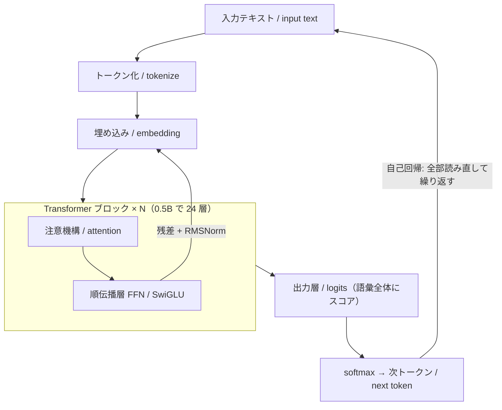

### 4-B. self-attention の QKV（#2 用・心臓）

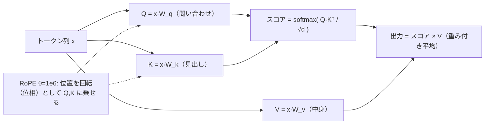

補足図（GQA と計算量の直観）:

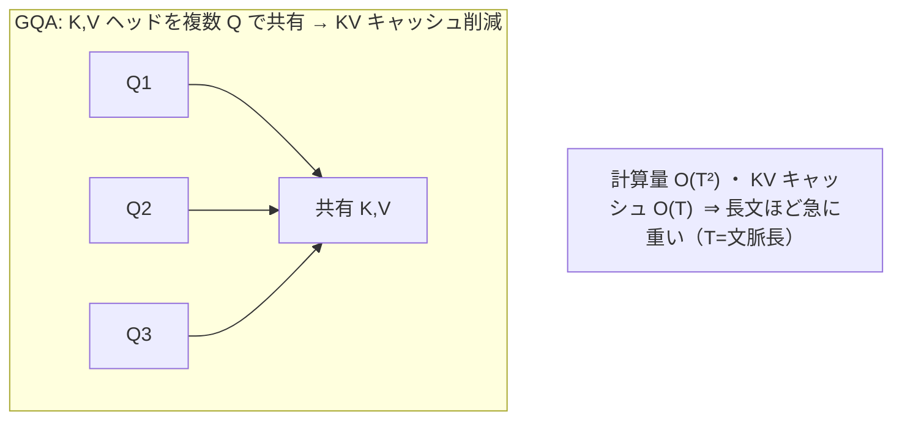

### 4-C. KV キャッシュの線形膨張（#5 用・実測端点のみ）

> softmax attention の KV キャッシュは文脈長に線形。**実測は 2 端点のみ**（T=256 と T=2048）。間は線形（256→2048 は 8 倍、キャッシュも約 8 倍）。

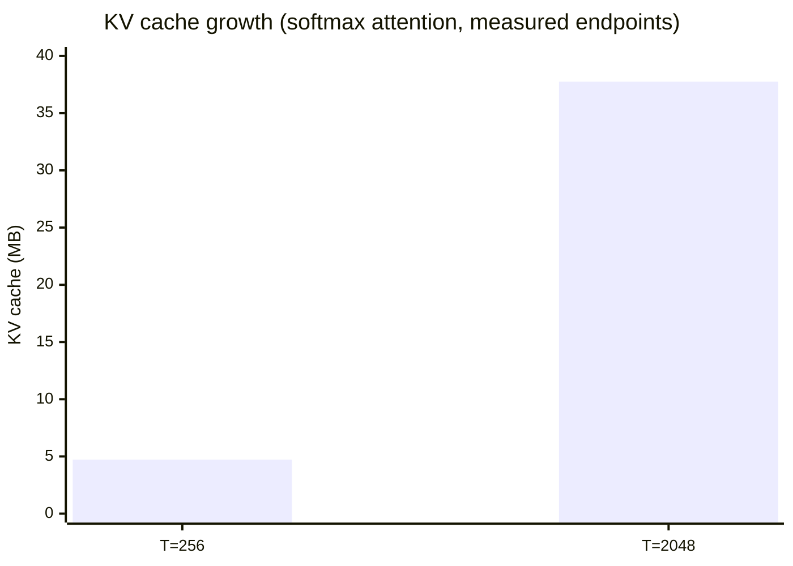

peak RSS の対比（実測・定数状態は膨張しない）:

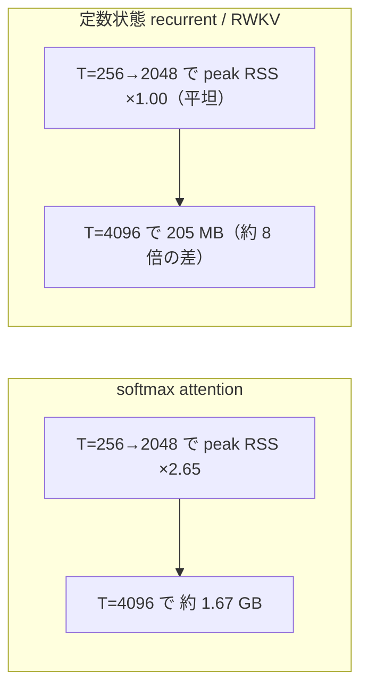

### 4-D. int8 ストリーミング化の常駐メモリ（#5 用・実測）

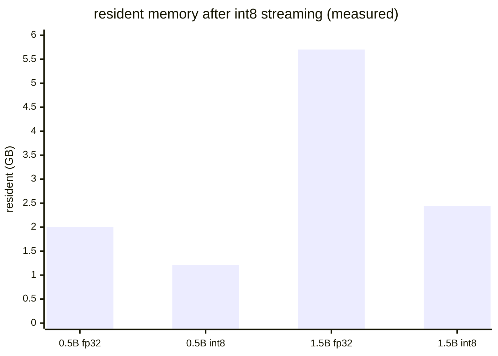

> 注記（本文に添える）: int8 weight-only は約 3.9 倍（74–75%）圧縮・held-out PPL 劣化 <0.1%。CPU 速度は約 0.7 tok/s（毎 forward で dequant する負荷。速度利得は GPU の int8 GEMM で効く＝「良い HW ほど効く」）。

### 4-E. 量子化のビット幅の崖（#5 用・数値はキット由来のみ）

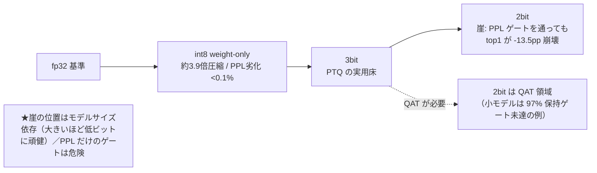

### 4-F. メモリ↔品質のトレードオフ（線形化の交差点・#5 用）

> per-head 線形状態 232,960 B/層（定数）vs softmax KV @8192 = 8,388,608 B/層（36 倍）。**交差点 ≈ 227 トークン**（それ以下では定数状態の方が大きい＝タダではない）。

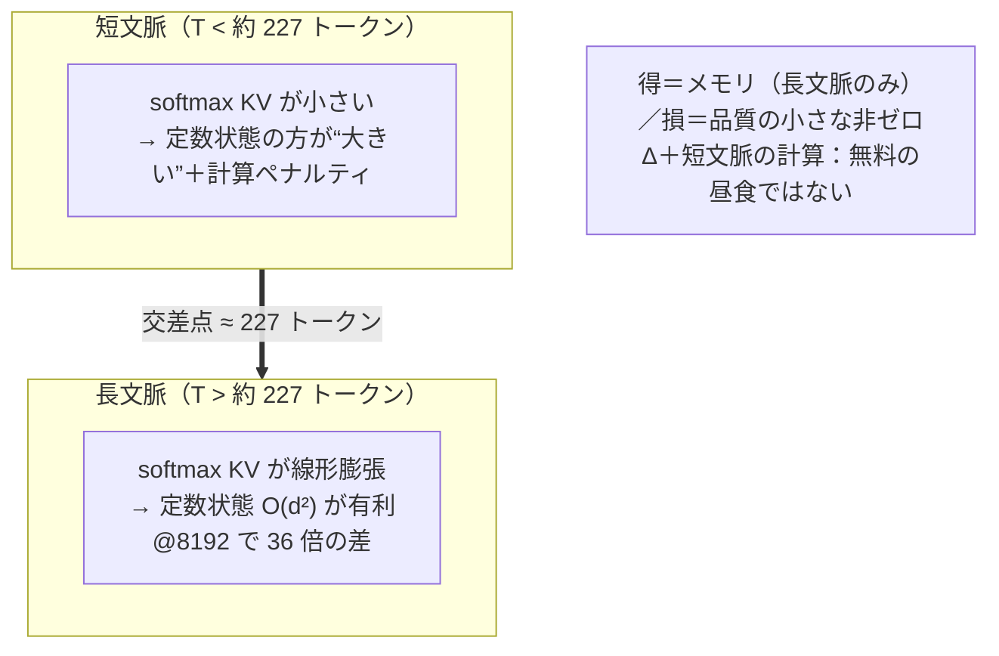

### 4-G. 層別の線形化耐性プロファイル（#5 用・0.5B, baseline ppl 68.74）

> 実測で明示のある層のみラベル化。層 0 が最も非耐性（単独線形化で ppl 160）、層 11/9/3/1 も抵抗、中後段はほぼゼロコスト（層 22 は Δ+0.0007）。累積 top-4 層で +7% ppl、12 層で破綻（167）、全 24 層で壊滅。

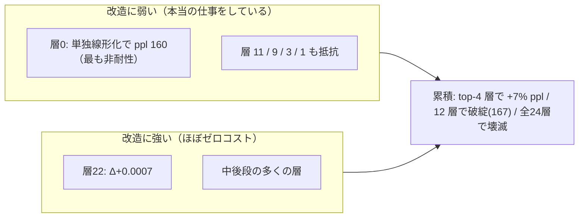

蒸留回復（LoLCATs 流・#5 用）:

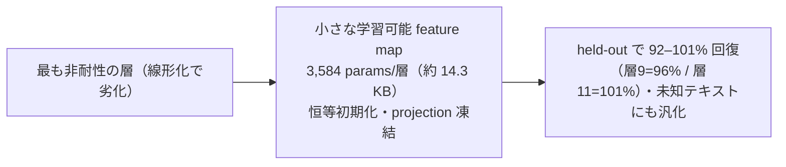

### 4-H. 事前学習が効く理由と自作の限界（#4 用）

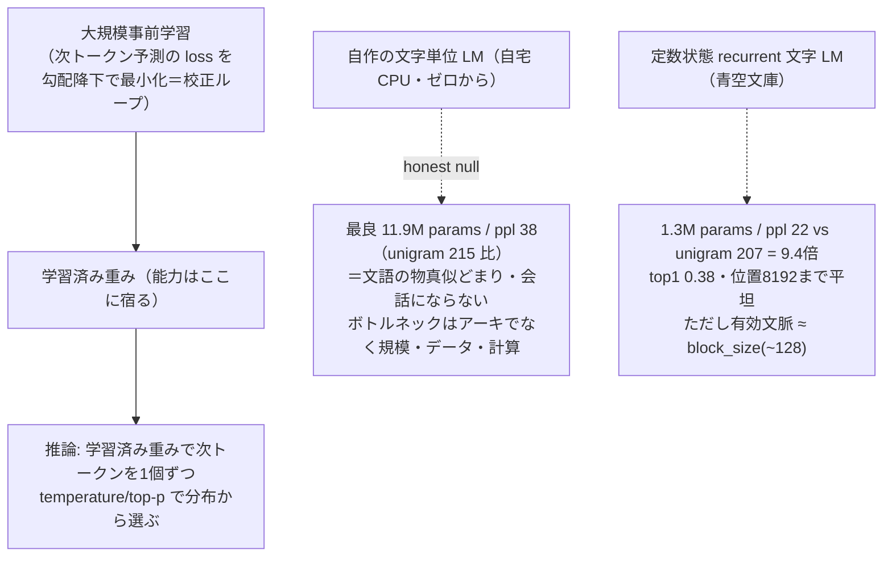

### 4-I. 誤差ゼロ再現＝理解の証明（#0・#2 用）

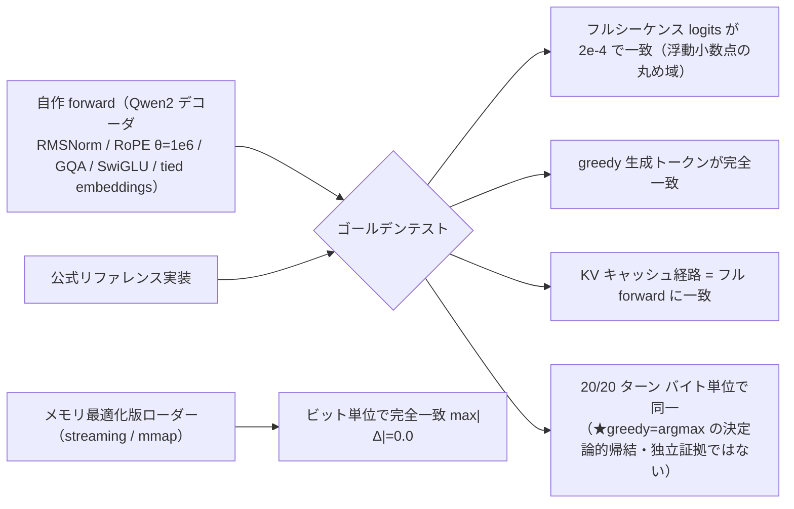

> honest 注記（本文）: 「誤差ゼロ」は 2 種類。(a) 自作 vs 公式＝logits 2e-4（浮動小数点ノイズ域＝実質ゼロ）。(b) メモリ最適化版 vs 素の実装＝max|Δ|=0.0（文字通りゼロ）。sampling / int8 / 1.5B / 線形化版については何も主張しない。

### 4-J. 会話の継ぎ目（能力は重み由来／自作は検証済みランタイム・#3・#4・#6 用）

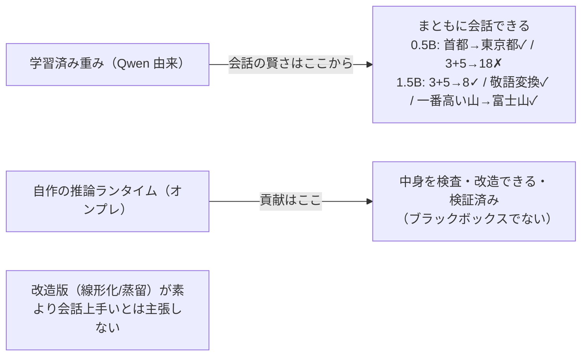

### 4-K. RAG / ファインチューニング / 蒸留の使い分け（#6 用）

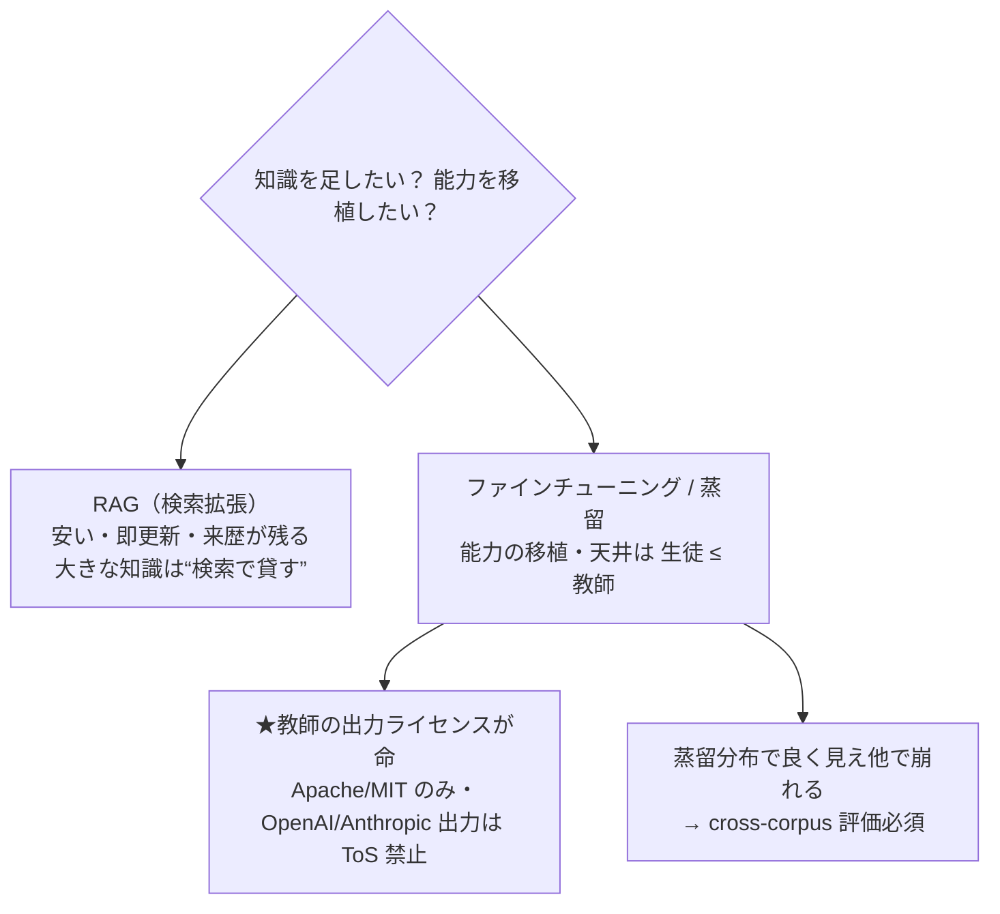

### 4-L. モデル選定のライセンス分岐（#6 用）

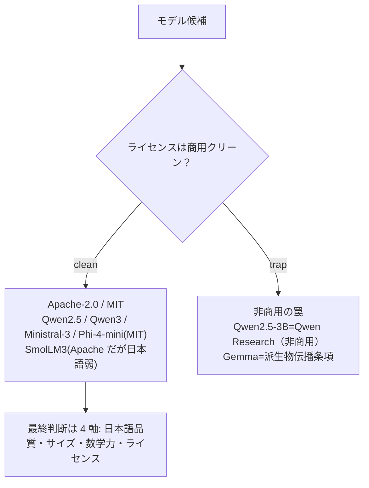

### 4-M. 評価の罠と memetic NAS（#6 用）

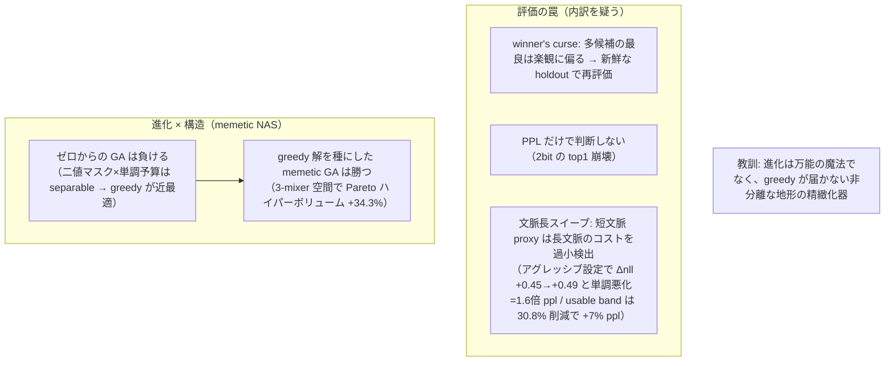

### 4-N. 責任あるスタック（#6 用）

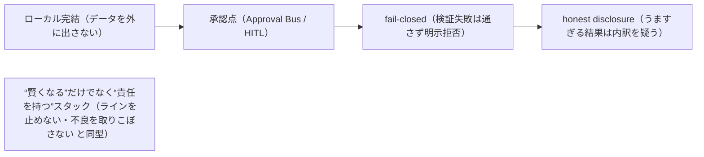

---

## 5. SVG 静的フォールバックの作り方（家訓の具体化）

アニメ SVG を作る場合（例: attention の光の糸が伸びる、KVキャッシュが積み上がる）、**動かなくても意味が通る静止フレームを内包**する。

- **初期状態を実属性で正しく描く**。`opacity="0"` からアニメで現れる要素を作らない。最終的に見えるべき要素は最初から `opacity="1"`・正しい `x/y/fill` で置く。`<animate>` は「あれば動く」上乗せに留める。
- **SMIL 前提にしない**。Qiita/imgix では `<animate>`/`<animateTransform>` や外部 CSS/JS、インライン `<script>`、`<foreignObject>` が実行・表示されない前提で設計する。
- **チェック手順**: (1) アニメ属性を全部コメントアウトして開き、静止画として意味が通るか確認 → (2) 戻してアニメ確認 → (3) raw URL で HTTP 200 & `image/svg+xml` → (4) Qiita 実機プレビューで目視。
- **ラベルは SVG の `<text>` で乗せる**（ラスタ生成 AI に日本語を描かせない）。フォント依存を避け、重要語は英語 or 図形近傍に短く。
- 崩れる場合は §2-6 に従い PNG 化して逃げる（ただし静的 SVG を先に試す）。

---

## 6. 制作フロー（担当への手順）

1. 記事本文の該当箇所に、まず §4 の **Mermaid をそのまま貼る**（正確さが要る図はこれで完結）。
2. ヒーロー画像は §3 のプロンプト＋§1 共通スタイル・ブロックを画像生成 AI に渡し、**ラベル無しのラスタ**を得る。必要な語は後乗せ（英語 or 別途 SVG `<text>`）。
3. 生成物を GitHub に置き、**raw 絶対 URL＋`?v=N`** で本文参照（§2）。投稿前に HTTP 200 と Qiita 実機で二重確認。
4. **数値の最終監査**: 図・キャプション・alt テキストに載る数値がすべてキット §2–§4 由来か照合する。由来不明の数値が 1 つでもあれば削るか「未測定／範囲外」に置換。
5. **公開規律の最終監査**: 所属企業名・ローカルパス・内部ファイル名・内部変数名・自賛語・攻撃的比喩・見下し枕詞が画像/プロンプト/alt に無いか確認。

---

*次回に続く。* この依頼書を使う人が持ち帰るもの＝**「正確さが要る図は Mermaid、情感はラスタ、数値はキットだけ」**。この 3 分割を守れば、図で事実を歪めずに、読者の腑に落とす画づくりができる。
