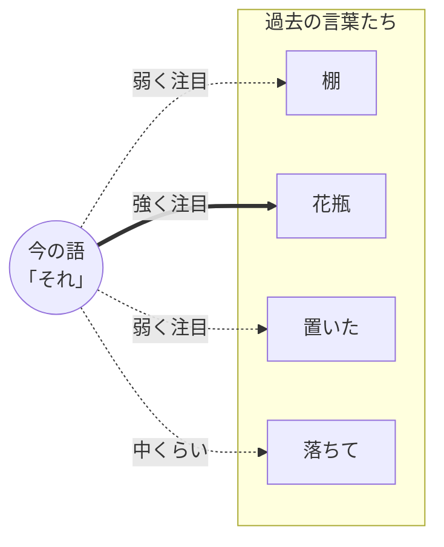
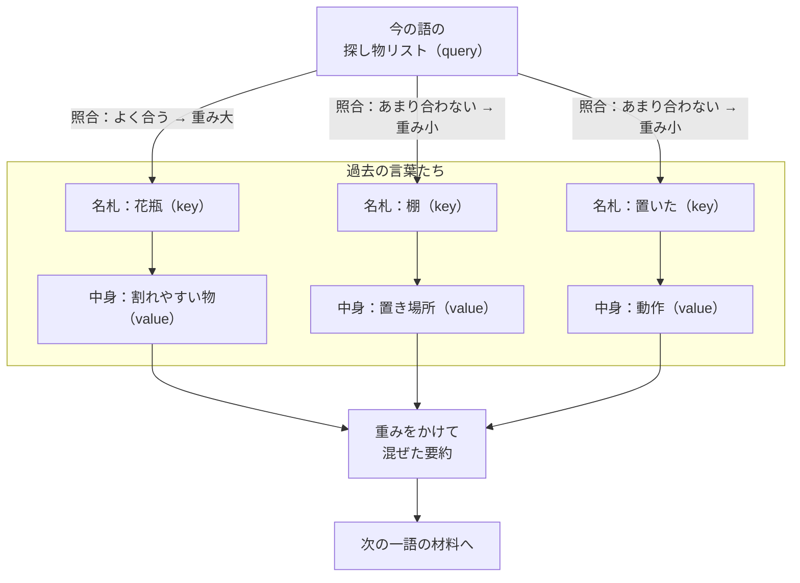
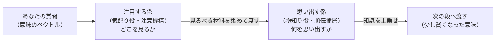
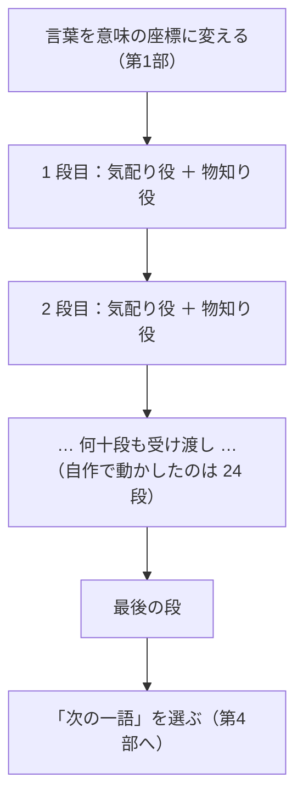
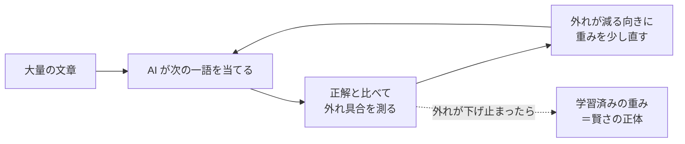
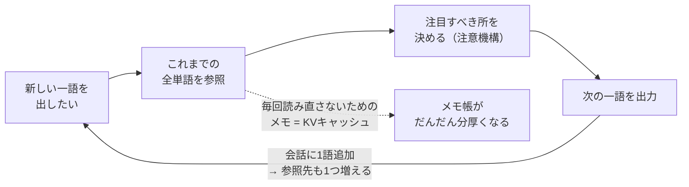
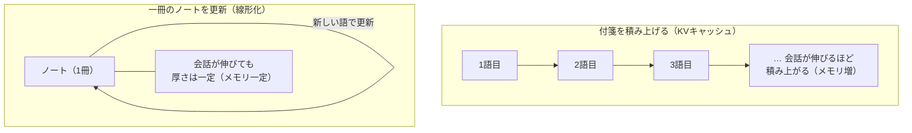
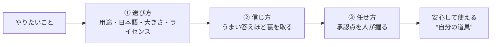

# LLM は「次の一語を当てる機械」― 作って分かった AI の中身、ぜんぶ入り【一般版・完全版】

著者: 古瀬 和文（ぷるやん）

本記事は、連載「作って分かった LLM の中身 ― 自作言語モデルで覗く構造」の一般版・全7回を、1本にまとめた完全版です。

このシリーズは、私が自分で小さな大規模言語モデル（LLM: Large Language Model）を組み直してみて、「教科書の図では分からなかったこと」を、比喩と実感で語り直す試みです。自作した推論の仕組みが、公式の実装と実質誤差ゼロ（浮動小数点の丸め誤差の域）で同じ答えを出すところまで確かめた――その一次体験が、シリーズ全体の土台になっています。

書いているのは、25 年あまり工場のラインで「カメラで見て、機械を動かす」装置を作ってきたエンジニアです。その人間が今度は AI の中身を自分の手で組み直してみた、という記録でもあります。

数式は使いません。絵と比喩だけで、入口から出口まで通れるように書いています。数式とコードで深く納得したい方は、同じ地図を別の高度で通る技術版・完全版（<<LINK:MEGA_T>>）をどうぞ。

## 目次

- 第0部 LLM は「次の一語を当てる機械」（導入）
- 第1部 言葉を「意味の地図の座標」に変える（トークンと埋め込み）
- 第2部 どこに注目するか ― AI の“気の配り方”（注意機構）
- 第3部 知識はどこにしまわれているのか
- 第4部 なぜ「たくさん読ませる」と賢くなるのか（学習と推論）
- 第5部 長い会話がだんだん重くなる理由（メモリと速度の壁）
- 第6部 自分の道具として AI を選ぶ・使うには（実務編）

---

# 第0部 LLM は「次の一語を当てる機械」（導入）

> 🧑‍🔧 **書いている人**
> 私はこの 25 年、工場のラインで「カメラで見て、機械を動かす」装置を作ってきたエンジニアです。
> 検査や位置決め、三次元計測やレーザ計測――「不良を見逃さない、ラインを止めない」ために、
> 画像処理と制御を組み合わせる仕事です。数式を自分でプログラムに落とすのも、
> きれいな説明書が無い機械を無理やり動かすのも、割と得意なほうです。
> そんな人間が今度は「AI の中身」を自分で組み直してみた――というのが、このシリーズの出発点です。
> 面白いことに、現場で使ってきた道具（フーリエ変換や相関、校正の考え方）が、
> AI の中でそのまま顔を出します。その驚きも一緒にお裾分けできればと思います。


## この記事で覚えて帰ってほしい言葉

- **LLM（Large Language Model / 大規模言語モデル）** … ChatGPT などの中身。膨大な文章で訓練された「言葉の予測装置」。
- **トークン（token）** … 文章を区切った小さな断片。単語よりやや細かい「言葉のかけら」。
- **予測（prediction）** … 「この続きに来る一番ありそうな言葉」を選ぶこと。LLM がやっているのは、実はほぼこれだけ。

まずはこの3つだけ持って帰れれば十分です。残りはこのシリーズでゆっくり増やします。

## いちばん短い答え：LLM は「次の一語を当てているだけ」

いきなり核心から言います。あなたがスマホに話しかけて返ってくる、あの流暢な文章。
その正体は、**「ここまでの文章の続きに、次はどの言葉が来そうか」を当て続けているだけ**です。

たとえば「今日の天気は」と入力すると、モデルは頭の中でこう考えます。

> 「今日の天気は」…… の続きは「晴れ」かな？「雨」かな？「どう」かな？
> いちばんありそうなのは……「晴れ」だ。

そして「晴れ」を1つ出す。次に「今日の天気は晴れ」を丸ごと読み直して、また続きを当てる。
「今日の天気は晴れ**です**」。これを何百回も繰り返すと、いつのまにか一段落の文章になっている。

たったこれだけ。**一語ずつ、当てて、つなげる。** これが LLM の心臓の鼓動です。

## え、それだけで会話が成り立つの？

ここが最初の「不思議」です。私も自分で作るまで半信半疑でした。

「次の一語を当てるだけ」の機械が、なぜ質問に答え、翻訳し、コードまで書けるのか。

種を明かすと、**「次の一語を当てる」を極限まで上手くやるには、世界のことを分かっていないと無理だから**です。

「日本の首都は」の続きを当てるには、日本の首都を知っている必要がある。
「2 たす 3 は」の続きを当てるには、足し算ができる必要がある。
「彼女は悲しくて、思わず……」の続きを当てるには、人の気持ちの流れを察する必要がある。

つまり、**「ただ当てる」を突き詰めた結果、副産物として知識や推論が身についてしまった**。
これが LLM のいちばん面白いところです。目的は地味なのに、そのために必要な力が壮大だった。

> **語呂で覚える**：LLM は「**次の一語オタク**」。次の一語を当てたい一心で、
> 世界中のことを勉強してしまった変わり者、と思うと親しみが湧きます。

## 入口から出口まで、ざっくり地図

このシリーズで少しずつ分解していく「LLM の中身」を、先に地図として置いておきます。
今は「へえ、こんな駅を通るのか」くらいで大丈夫です。

```
あなたの文章
   │
   ▼
① 言葉を細かく刻む（トークン化）      ← 第1部
   │
   ▼
② 言葉を「意味の座標」に変える（埋め込み） ← 第1部
   │
   ▼
③ どの言葉に注目するか決める（注意機構）  ← 第2部 ★心臓
   │
   ▼
④ 知識を引き出して考える（順伝播層）    ← 第3部
   │
   ▼（③④を何十回も重ねる）
   │
⑤ 「次の一語」の候補に点数をつけて選ぶ   ← 第4部
   │
   ▼
次の一語（そしてまた①へ戻って繰り返す）
```

この地図の中でいちばんの主役が **③の「注意機構（attention）」** です。
「文のどこに注目すべきか」を決める仕組みで、LLM が急に賢くなった立役者。
第2部で、ここをたっぷり掘ります。

## 「作って分かったこと」box

> 📦 **教科書に無い、作って初めて分かったこと**
>
> 図で見ると LLM は「①→②→③…」と一本道に流れるように描かれます。
> でも自分で動かすと、いちばん体で分かるのは **「長い文章ほど、急に重くなる」** ことでした。
> 短い質問はサッと答えるのに、長い会話を続けると、じわじわ遅く・重くなる。
>
> この「重さ」の正体こそ、第2部で扱う注意機構の弱点です。
> ChatGPT が長い会話で少しもたつくのも、実は同じ理由。
> **構造を知ると、日々触れている AI の「クセ」の理由が見えてきます。** これがこのシリーズの狙いです。

## 次の部の予告

次の第1部は、**「言葉を座標に変える」** 話です。

コンピュータは文字をそのまま理解できません。「りんご」も「king」も、いったん**数字の並び**に
翻訳しないと計算できない。そこで LLM は、言葉を「意味の地図の上の座標」に置きます。

この地図の上では、**「王様」から「男」を引いて「女」を足すと「女王」に近づく**という、
ちょっと魔法みたいなことが起きます。なぜそんなことが可能なのか──次の部で、その仕組みを覗きます。

---

*このシリーズは、自作の小さな LLM（llcore）を実装しながら書いています。技術版（<<LINK:MEGA_T>>）では、同じテーマを
数式と実際のコードで掘り下げます。「絵で分かった」あとに「仕組みで納得したい」方は、そちらもどうぞ。*


---

# 第1部 言葉を「意味の地図の座標」に変える（トークンと埋め込み）


> 🧑‍🔧 **書いている人**
> 私はこの 25 年、工場のラインで「カメラで見て、機械を動かす」装置を作ってきたエンジニアです。
> モノの位置を三次元の座標で測り、部品を狙った座標へ動かす――そんな「座標で世界を扱う」仕事を、
> ずっと続けてきました。だから今回のテーマ「言葉を座標に変える」は、私にとってどこか懐かしい話でもあります。

前の第0部では、LLM の正体は「次の一語を当て続けているだけ」という話をしました。
最後にこう予告して終わりました――**「王様」から「男」を引いて「女」を足すと「女王」に近づく**、
そんな魔法みたいなことがなぜ起きるのか、と。今回はその種明かしです。

---

## この記事で覚えて帰ってほしい言葉

- **トークン（token）** … 文章を区切った小さなかけら。単語よりやや細かい「言葉の部品」。
- **埋め込み（embedding）** … 言葉のかけらを「意味の地図の上の座標」に置き換えること。今回の主役。
- **意味の地図** … 似た意味の言葉どうしが近くに集まるように作られた、目に見えない広い空間（この記事だけの言い方です）。

この3つ――**かけらに刻んで、地図の上に置く**――だけ持って帰れれば、今回は十分です。

---

## いちばん短い答え：コンピュータは文字が読めないので、言葉を「座標」に置き換える

いきなり核心から言います。

コンピュータは、文字をそのままでは扱えません。「りんご」も「king」も、そのままでは
足したり比べたりできない、ただの模様です。計算するには、**数字**にしないといけない。

でも、ただ番号を振るだけでは足りません。たとえば辞書の順に「りんご＝5番、みかん＝6番」と
番号を振っても、その 5 と 6 には**意味のつながりがありません**。5 と 6 が隣どうしなのは、
たまたま辞書で隣に並んでいただけで、りんごとみかんが「果物として似ている」こととは無関係です。

そこで LLM は、もうひと工夫します。言葉を**「意味の地図の上の座標」**に置くのです。
この地図の上では、**似た意味の言葉どうしが、近くに集まる**ように作られています。
りんごとみかんはご近所さん。りんごとダンプカーは遠く離れた町。
――この「近い／遠い」を計算できる形にするのが、今回のテーマ **埋め込み（embedding）** です。

一言でまとめると、こうです。

> **言葉を、意味の似たものどうしが近くに集まる「地図の座標」に置き換える。それが埋め込み。**

---

## かみくだき：入口から「座標」までの二歩

前の部の地図を思い出してください。文章が LLM に入って、最初に通る駅がここ、第1部の担当区間です。

```
あなたの文章 「今日はいい天気」
   │
   ▼
① 言葉を細かく刻む（トークン化）   … 「今日 / は / いい / 天気」みたいに、かけらに分ける
   │
   ▼
② かけらを「意味の座標」に変える（埋め込み） … 各かけらを、意味の地図の上の一点にする
   │
   ▼
（この座標たちが、③注意機構 以降へ流れていく → 第2部）
```

順番に、二歩だけ見ていきます。

### 第一歩：言葉を「かけら」に刻む（トークン化）

コンピュータに文章を渡すと、まず**小さなかけらに刻みます**。この一つひとつのかけらが
**トークン（token）**、刻む作業が **トークン化（tokenization）** です。

ここでよくある誤解を一つほどいておきます。**「1トークン＝1単語」ではありません。**
かけらは、単語よりも少し細かいことが多いのです。たとえば英語なら、
`unbelievable`（信じられない）という長い単語は `un / believ / able` のように
**部品に分けて**扱われることがあります。「否定の un」「believe の芯」「〜できるの able」と
分けておけば、初めて見る単語でも部品の組み合わせで意味を推し量れる、という発想です。

なぜ単語まるごとにしないのか。世の中の単語をぜんぶ一つずつ覚えようとすると、数が多すぎて
辞書が破裂してしまうからです。そこで「**よく出てくる部品**」を辞書に登録し、長い言葉は
部品の組み合わせで表す。この登録の仕方の代表格が **BPE（Byte Pair Encoding：バイト対符号化）**
という方法で、要は「**いっしょに現れやすい文字の並びを、一つのかけらにまとめていく**」やり方です。

<!-- 画像プレースホルダ -->
> 🖼 **図（概念イラスト）**：一枚の文章がハサミで「かけら」に切り分けられ、それぞれのかけらに番号札（ID）が付く様子。英単語 `unbelievable` が `un / believ / able` の3片に割れる小さな吹き出しを添える。
> <!-- 画像生成意図: text-to-token の直感を「文章→かけら→番号札」の3段で示す親しみやすいフラットイラスト。日本語話者向け。矢印は左→右。赤緑の配色は避け、落ち着いた配色で。 -->

### 日本語は「かけらが多くなりやすい」――作りながら実感した正直な話

ここで、自分で動かして初めて体で分かったことを一つ。

**日本語は、英語に比べてかけらが細かく・多くなりやすい**のです。日本語は単語の切れ目が
はっきりせず、漢字・ひらがな・カタカナが混ざるため、同じ内容でも英語よりたくさんのかけらに
刻まれがちです。専門的には、この「一つの言葉が何個のかけらになりやすいか」を
**トークン肥沃度（tokenizer fertility）** と呼びます（肥沃度＝どれだけ増えやすいか、の意味）。

これは実務でじわっと効いてきます。かけらが多いほど、モデルが一度に読める文章の長さや
処理の重さに響くからです。「日本語だと同じ内容でも少し重い・長くなりやすい」――
これは気のせいではなく、**入口のかけらの刻まれ方**からもう始まっている、というのが
自分で触ってみての実感でした。ここでは細かい数字までは測っていないので、
「英語より多くなりやすい傾向」までを正直な結論にとどめておきます。

### 第二歩：かけらを「意味の地図の座標」に置く（埋め込み）

さて、かけらに番号（ID）が振られました。でも先ほど言ったとおり、**番号のままでは意味がありません**。

そこで **埋め込み（embedding）** の出番です。各かけらの番号を、**たくさんの数字の組**に置き換えます。
「たくさんの数字の組」と聞くと身構えますが、これは要するに**座標**のことです。

地図上の場所を「東経◯度、北緯◯度」の2つの数字で表すように、意味の地図では、
一つのかけらを「何百個もの数字の組」で表します。数字が2つなら平面の一点、3つなら立体の一点。
それが何百個にもなった、**とても広い空間の中の一点**――それが、そのかけらの「意味の座標」です。

数が多くて想像しにくいので、**平面の地図に思いっきり簡略化**して描くと、こんなイメージです。

```mermaid
flowchart LR
    subgraph 意味の地図（イメージ・実際はもっと高次元）
      A["りんご"]
      B["みかん"]
      C["ぶどう"]
      D["ねこ"]
      E["いぬ"]
      F["ダンプカー"]
    end
    A -.近い.- B
    B -.近い.- C
    D -.近い.- E
    A -."遠い".- F
```

果物どうし（りんご・みかん・ぶどう）は地図の同じあたりに固まり、動物（ねこ・いぬ）は別の一角、
ダンプカーはまた遠くの町――そんなふうに、**似た意味は近く、違う意味は遠く**に配置されます。
この配置こそが「言葉の意味を、計算できる形にしたもの」です。近い・遠いが**距離として測れる**ので、
コンピュータは「この2つは意味が近い」を数字で判断できるようになります。

---

## 種明かし：「王様 − 男 + 女 ≈ 女王」はなぜ起きるのか

いよいよ前の部の予告、あの魔法みたいな話です。

意味の地図には、面白い性質があります。**「近い・遠い」だけでなく、「向き（方向）」にも意味が宿る**のです。

こういうことです。地図の上で「男」から「女」へ向かう矢印を考えます。この矢印はだいたい
「**性別を切り替える向き**」を表しています。同じように「王様」から「女王」へ向かう矢印も、
やはり「男性版 → 女性版」に切り替える向きです。**この2本の矢印が、地図の上でほぼ同じ方向を向いている。**

だから、

> 「王様」の座標から「男」の座標を引いて、「女」の座標を足す

という**引き算・足し算**をすると、ちょうど「王様を女性版にずらす」ことになり、
たどり着いた先が**「女王」のご近所**になる――これが「王様 − 男 + 女 ≈ 女王」の正体です。

<!-- 画像プレースホルダ -->
> 🖼 **図（ベクトル演算の直感）**：平面の地図上に「男→女」と「王様→女王」の2本の平行に近い矢印を描き、「王様−男+女」の計算結果が「女王」の近くに着地する様子を点線でたどる。
> <!-- 画像生成意図: 有名な king-man+woman≈queen を、平面2軸に簡略化した「意味の地図」上の平行矢印として可視化。矢印の平行性が肝。数式は最小限、日本語ラベル。 -->

言葉の意味の**関係**が、地図の上では**向きと距離**として置かれている。だから足し引きという
素朴な計算で、意味の操作ができてしまう。ここが埋め込みの一番おもしろいところです。

### ただし、正直に：これは「≈（だいたい）」であって「＝（ぴったり）」ではない

ここで、盛らずに言っておきたいことがあります。

この「王様 − 男 + 女 ≈ 女王」は、**きれいに割り切れる魔法ではありません**。記号が「＝」ではなく
「≈（ニアリーイコール／だいたい等しい）」なのには理由があります。

本物の意味の地図は、地下鉄の路線図のようにまっすぐ整っているわけではなく、あちこちで曲がった、
もっと入り組んだ地形をしています。だから「男→女」の矢印が、どの言葉のペアでも**寸分たがわず同じ向き**
というわけではない。うまくいく例（王様と女王）もあれば、ずれる例もたくさんあります。

「だいたいそういう傾向がある」――これが誠実な言い方です。**きれいな法則を見つけたときほど、
どこまで本当に成り立つかを疑う**。これは、私が計測の現場で「うますぎる測定値は、まず校正から疑う」と
叩き込まれてきた習慣そのままです。魔法として売り込むのではなく、傾向として正しく紹介する。
このシリーズは、そこは崩さずにいきます。

---

## ゆるい詳細：もう少しだけ踏み込む

ここからは「読まなくても筋は通る」おまけです。ただ、知っておくと日々の AI がもう少し立体的に見えます。

### 地図は誰が描いたのか――「学習」で自然にできあがる

大事な点を一つ。この意味の地図は、**人間が手で「りんごはここ、みかんはここ」と置いたものではありません。**

前の部で話したとおり、LLM は「次の一語を当てる」練習を、膨大な文章で延々と繰り返します。その練習の途中で、
「**似た使われ方をする言葉は、近くに置いたほうが予測がうまくいく**」と、モデルが自分で学んでいくのです。

たとえば「りんごを食べる」「みかんを食べる」「ぶどうを食べる」と、似た文脈でよく登場する言葉は、
自然と地図の同じあたりに引き寄せられていきます。**使われ方が似ている＝意味が近い**、という
言葉の性質を、ひたすら予測練習をするだけで拾い上げてしまう。地図は、教え込まれたのではなく、
**練習の副産物として、勝手に立ち上がってくる**のです。

だから――ここは前の部から一貫してお伝えしている継ぎ目なのですが――**この地図の賢さ（言葉の意味を
うまく捉えていること）は、膨大な学習の成果であって、私が自作した部分の手柄ではありません。**
私がやったのは、その出来上がった地図を**「開いて、覗いて、いじれる」形で組み直した**ことです。
賢さそのものは学習済みの重みに宿っている。その線引きは、このシリーズを通してぼかしません。

### 計測エンジニアの目から：これは「主成分分析」と地続きだった

ここで、私自身がハッとした話を少し。

計測の仕事では、たくさんのデータの山を前に「**この山を、いちばんよく効いている『軸』の順に並べ替えて、
少ない軸で言い表せないか**」と考えることがよくあります。**主成分分析（PCA: Principal Component Analysis：
主成分分析）** という定番の道具で、ばらついたデータの中から「意味のある方向（軸）」を見つけ出す手法です。

意味の地図の話を聞いたとき、私はこれと同じ匂いを感じました。埋め込みの空間にも、
「性別の軸」「王族らしさの軸」のような、**意味のある方向**が横たわっている。さっきの「男→女」の矢印は、
まさにその一本の軸だったわけです。私が現場で「データを軸に分解する」道具として使ってきた発想が、
そのまま「言葉の意味を軸で捉える」話につながっていた。分野は違うのに、**同じ考え方が顔を出す**。
この驚きが、私がこのシリーズを書きたくなった理由の一つです。

（正直な補足：PCA はまっすぐな軸を探す道具で、本物の埋め込みの地形はもっと曲がっています。
なので「PCA そのもの」ではなく「**同じ発想の親戚**」くらいの距離感で読んでください。ここでも、
比喩のために事実を盛らないでおきます。）

---

## 語呂で覚える

> **言葉は「住所」を持つ。ご近所づきあいが、そのまま意味になる。**
>
> 埋め込みとは、言葉に**住所（座標）**を与えること。そして、意味の似た言葉は
> **ご近所さん**として近くに住む。「意味＝ご近所づきあい」と覚えておくと、
> 「なぜ足し引きで女王が出るの？」がスッと腑に落ちます。町内の位置関係を
> 足したり引いたりして隣町へ歩いていく、それだけの話なのですから。

---

## 「作って分かったこと」box

> 📦 **教科書の図には無い、作って初めて分かったこと**
>
> 意味の地図（＝入口で言葉を座標に変える表）は、実はとても**大きな**表です。何万語ぶんもの
> 座標を、何百桁もの数字で持つのですから、そこそこの場所を食います。
>
> ところが多くの LLM は、この大きな表を**入口と出口で「使い回し」**ています。
> 入口では「言葉→座標」の変換に使い、出口では「次はどの言葉か」を選ぶための採点表として、
> **同じ一枚を両方で共有**する。二枚持てば場所は倍ですが、一枚を使い回せば半分で済む。
> （専門的には **重み共有（tied embeddings：入出力埋め込みの共有）** と呼びます。）
>
> 私が自作の推論ランタイムでこの共有をきちんと再現したとき、「なるほど、賢い設計は
> **メモリの節約**まで最初から織り込まれているのか」と唸りました。**小さな PC で
> 大きなモデルを動かす**という私の主戦場では、この「一枚使い回し」がじわりと効いてきます。
> 賢さの話だと思っていた埋め込みが、**メモリ設計の話**でもあった――これは、図を眺めているだけでは
> 気づけませんでした。この「メモリと速度の壁」は、第5部でたっぷり扱います。

---

## 次の部の予告

今回で、言葉は**意味の地図の座標**になりました。ご近所づきあいで意味を表す、あの地図です。

でも、これだけでは文章は読めません。「**銀行**でお金をおろす」と「川の**銀行**（土手）を歩く」では、
同じ「銀行（bank）」でも意味がまるで違いますよね。座標を置いただけでは、この違いは出せない。
**周りの言葉を見て、いま自分がどっちの意味なのかを判断する**仕組みが要ります。

それが次の第2部の主役、シリーズ最大の山場 **注意機構（attention）** です。
文のどこに注目すべきかを、その場その場で配り直す仕組み。AI が急に賢くなった、
いちばんの立役者です。地図に置かれた座標たちが、**互いに目配せしながら意味を確定させていく**
――その「気の配り方」を、次の部でじっくり覗きます。

> **今回の持ち帰り**：言葉は「意味の地図の座標」になっている。似た意味はご近所さん。
> だから「王様 − 男 + 女 ≈ 女王」という、**方向の足し引き**が起きる。ただし「＝」ではなく
> 「だいたい（≈）」――きれいな法則ほど、どこまで本当かを疑うのが誠実な読み方です。

---

*このシリーズは、自作の小さな LLM を実装しながら書いています。技術版（<<LINK:MEGA_T>>）では、同じテーマ
（トークン化・埋め込み・重み共有）を、擬似コードと実測で掘り下げます。「絵で分かった」あとに
「仕組みで納得したい」方は、そちらもどうぞ。*


---

# 第2部 どこに注目するか ― AI の“気の配り方”（注意機構）

> 今回は、この連載の ★心臓 にあたる **注意機構（attention）** の部です。
> 「AI が急に賢くなった立役者」と呼ばれる仕組みを、数式は使わず、比喩と実感だけで腑に落とします。
> 数式とコードで納得したい方は、同じテーマの技術版（<<LINK:MEGA_T>>）へどうぞ。


> 🧑‍🔧 **書いている人**
> 私はこの 25 年、工場のラインで「カメラで見て、機械を動かす」装置を作ってきたエンジニアです。
> 見本の画像と検査対象を重ねて「どれくらい似ているか」を点数にする――そんな仕事を、来る日も来る日もやってきました。
> 実はその「似ているか点数をつける」作業が、今日の主役・注意機構のど真ん中に、そっくりそのまま入っています。
> AI の中を覗いたら、現場で使い古した道具が顔を出した。その驚きも一緒にお裾分けします。

前の第1部では、「王様 − 男 + 女 ≈ 女王」のように、言葉を**意味の地図の座標**に変える話をしました。
これで言葉は一つひとつ、数字の座標を持つ「点」になりました。

でも、座標を持っただけでは文章になりません。**言葉は、まわりの言葉と関わり合って初めて意味が決まる**からです。
「それ」が何を指すのか。「明るい」が性格の話か照明の話か。それはいつも、**まわりの言葉次第**。
その「まわりを見て決める」仕事をしているのが、今回の注意機構です。

---

## この記事で覚えて帰ってほしい言葉

- **注意機構（attention）** … 「今の一語を決めるとき、これまでのどの言葉に、どれくらい注目すべきか」を、
  その都度あらためて選ぶ仕組み。全部を平等に聞くのではなく、**関係の深い言葉ほど強く聞く**。
- **文脈（context）** … その言葉の「まわり」。同じ「それ」でも、前の文が違えば指すものが変わる。文脈が意味を決めます。
- **クエリ・キー・バリュー（query / key / value）** … 注意機構の中で各言葉が持つ3つの札。
  ざっくり「探し物リスト（query）」「名札（key）」「中身（value）」の3点セット、とだけ覚えれば十分です。

まずはこの3語。とくに真ん中の**「文脈」**が、今回いちばんの主人公です。

## いちばん短い答え：注意機構は「今の一語のために、過去のどの言葉を聞き直すか」を選ぶ

いきなり核心から言います。

文章を作るとき、AI は次の一語を出すたびに、**「ここまでの言葉のうち、どれを重視して次を決めるか」を選び直しています。**
一律に全部を眺めるのではありません。今から出す言葉に**関係の深い言葉ほど大きな声で、関係の薄い言葉は小さな声で**聞く。
この「聞く音量の配分」を、一語ごとに、その場で計算し直す。それが注意機構です。

たとえば、こんな文を考えます。

> 棚に花瓶を置いたが、**それ**が落ちて割れた。

この「**それ**」が何を指すか、あなたは一瞬で「花瓶」だと分かります。「棚」でも「置いた」でもなく「花瓶」。
AI も同じことをします。「それ」という言葉を扱うとき、**過去の「花瓶」に強く注目し、他の言葉には弱く注目する**。
その注目の配分ができているから、「割れたのは花瓶だ」と正しく話を続けられるのです。



矢印の太さが「注目の強さ」です。**同じ文でも、今どの語を扱っているかで、この矢印の太さは毎回引き直されます。**
「それ」を扱うときは花瓶へ太く、「落ちて」を扱うときはまた別の配分へ。この**動的な引き直し**こそ、注意機構の肝です。

## かみくだき①：会議室のたとえ

もう少し身近な絵にします。**会議**を思い浮かべてください。

あなたが今から発言しようとしている。頭の中では、これまでの出席者の発言を全部同じ重さで思い出しているわけではありません。
**「さっき部長が言ったあの一言」「昨日メールで来た数字」――今の自分の発言に関係する所だけ、選んで重く参照している**はずです。
関係のない雑談は、聞こえてはいたけれど、発言には効かせない。

注意機構はこれと同じです。次の一語（＝あなたの発言）を決めるために、過去の言葉たち（＝出席者の発言）を見渡して、
**関係の深い発言に重みを置いた「要約」を作り**、それを踏まえて一語を出す。会議の上手な進行役が、
過去の意見を的確に引きながら結論をまとめるのに、よく似ています。

もう一つ、**カクテルパーティ効果**という有名な現象があります。
がやがやと騒がしいパーティ会場でも、自分の名前や、関心のある話題だけは、不思議と耳に飛び込んでくる。
これは、脳が**「今の自分に関係する音」に動的に注目を寄せている**からだと言われます。
注意機構がやっているのも、まさにこれ。膨大な言葉の雑音の中から、**今この瞬間に関係する言葉だけを聞き分ける**仕組みなのです。

> だから英語で attention（＝注意・注目）と名付けられました。訳語の「注意機構」は、そのまま「注目を配る仕組み」という意味です。

## かみくだき②：3つの札 ―― 探し物リスト・名札・中身

もう一段だけ中を覗きます。「関係が深い言葉ほど強く聞く」を、AI はどうやって決めているのか。

各言葉は、頭の上に**3つの札**を掲げていると思ってください。

- **探し物リスト（query／クエリ）**：今の言葉が出す問い合わせ。「私は今、こういう情報を探しています」というメモ。
- **名札（key／キー）**：過去の各言葉が掲げる見出し。「私はこういう話題の言葉ですよ」という自己紹介。
- **中身（value／バリュー）**：その言葉が実際に運んでいる情報の本体。

やることは単純です。今の言葉の**探し物リスト**を持って、過去の言葉たちの**名札**を一枚ずつ見比べる。
**探し物リストと名札がよく合う言葉ほど「関係が深い」**と判断し、その言葉の**中身**を多めに受け取る。合わない言葉の中身は少しだけ。
こうして受け取った中身を混ぜ合わせた「重み付きの要約」が、次の一語を決める材料になります。



ポイントは、**探し物リストも名札も中身も、その言葉の座標（第1部の「意味の地図」）から作られる**ということ。
言葉の意味そのものから「何を探し、どう名乗り、何を差し出すか」が決まる。だから、意味が近い言葉どうしは自然と結びつきやすいのです。

<!-- 画像プレースホルダ -->
**［図：探し物リストと名札の照合］** 一人の登場人物（今の語）が虫めがねで「探し物リスト」を持ち、
複数の登場人物（過去の語）の胸の「名札」を見比べている。合致した相手だけスポットライトが当たり、その手元の「中身」の箱が大きく開く。
<!-- 画像生成意図: query=探し物リスト, key=名札, value=中身の箱 という3札メタファーを一枚で伝える親しみやすいイラスト。攻撃的表現なし、明るいトーン。人物は記号的でよい。 -->

## なぜ「似ているか」を点数にできるのか ―― 現場の道具の話

ここで、少しだけ私の仕事の話をさせてください。
工場の外観検査では、**テンプレートマッチング**という古典的な手法をよく使います。
「見本の画像」と「検査対象の画像」を重ね合わせ、**どれくらい似ているかを一つの点数にする**――
専門的には**相関（correlation）を取る**と言いますが、要は「見本にそっくりな所を探す」道具です。

驚いたのは、注意機構の「探し物リストと名札を見比べる」計算が、**この相関とまったく同じ発想**だったことです。
二つの座標（ベクトル）を並べて、方向がそろっているほど大きな点数、そっぽを向いているほど小さな点数を返す。
私が 25 年、部品の位置決めや不良の検出でやってきた「似ているものを探す」計算が、
言葉の世界で「関係の深い言葉を探す」計算として、そっくり働いていた。分野は違えど、道具は同じだったわけです。

> 覚えて帰る一言：**注意機構の「関係の深さ」は、要するに「似ているか探し（テンプレートマッチング）」です。**
> 難しそうな名前でも、中でやっているのは「見本に近い所を探す」という、昔ながらの発想でした。

## 言葉には順番がある ―― 位置を“波”で伝える

もう一つ、大事な仕掛けがあります。**言葉は順番が命**だということです。

「犬が猫を追う」と「猫が犬を追う」。使っている言葉は同じでも、意味は正反対。
ところが、名札を見比べるだけの素朴な注意機構は、**言葉の順番を区別できません**。誰がどの位置にいたかを、別に教える必要があります。

そこで使われるのが、**回転位置埋め込み（RoPE: Rotary Position Embedding）**という仕組みです。名前は難しいですが、発想は素直で、
**各言葉の座標を「その語が何番目か」に応じて少しずつ回転させる**。1番目は少し、2番目はもう少し、と位置ごとに回し向きを変える。
すると「近い位置どうし」「遠い位置どうし」が、注目の点数に自然とにじみ出るようになります。

これも、私にはなじみのある考え方でした。信号を**波（周波数）**に分解して扱う**フーリエ変換**――
計測の世界で毎日のように使う道具です。位置を「回転＝波の位相」で表すというのは、まさにその土俵の上の話。
「位置を波で符号化する」と聞いて、初めて中身を組んだとき、思わず膝を打ちました。ここでも、現場の道具が顔を出したのです。

（波や回転の中身は数式の領分なので、詳しくは技術版に譲ります。ここでは「順番も、ちゃんと注目に効かせている」とだけ持ち帰ってください。）

## 一度で終わらない ―― 何十回も注目し直す

大事な補足を一つ。注意機構は、文章に対して**一回だけ**働くのではありません。

AI の中では、この「注目する層」が**何十段も積み重なっています**（私が組んだ小さなモデルでも 24 段ありました）。
最初の層は「この語のすぐ隣は何か」といった素朴な関係を、上の層にいくほど「文全体の言いたいこと」「話の流れ」といった
**より大きな関係**を捉えていく、と考えられています。会議で言えば、一度発言を聞いて終わりではなく、
**何度も議事録を読み直し、そのたびに理解を一段深める**ようなもの。この繰り返しの積み重ねが、文の深い理解を作っています。

## 「組み直したら、同じ答えが出た」―― なぜ中身を説明できるのか

このシリーズの背骨は、**「自分で組み直して、公式実装と誤差ゼロで再現した」**という一次体験です。今回の注意機構も、その対象でした。

フレームワークの出来合いの部品に頼らず、この「探し物リストと名札を見比べ、中身を重みで混ぜる」仕組みを、
順番の回転（RoPE）も含めて自分で組み直しました。そして、**公式のリファレンス実装と答えを突き合わせた**ところ――
出力の数値が**実質誤差ゼロ（浮動小数点の丸め誤差の域）で一致**し、**選ばれる次の一語は完全に一致**しました。
同じ質問に同じ条件で20ターン続けて答えさせても、公式とこちらの返答は食い違いませんでした。

これが、私が中身を一つずつ説明できる根拠です。**取り違えて組んだら、答えは合いません。**
ぴたりと合ったということは、「探し物リスト」「名札」「中身」「順番の回転」――どの部品が何をしているかを、
私が読み違えていない、という証拠だからです。図を眺めるのと、削り出して組んで測るのとでは、理解の質が違います。

> ひとつだけ、正直に線を引いておきます。**この会話の「賢さ」そのものは、私が作ったのではありません。**
> 賢さは、巨大な事前学習で獲得された**学習済みの重み**に宿っています（そこは第3部・第4部で扱います）。
> 私が用意できたのは、**その中身を検査し、必要なら改造できる、検証済みの推論の仕組み**――いわば「開けられる箱」です。
> 中身は借り物、でも箱は自分で組んで、寸分違わず動くことを確かめた。この継ぎ目は、ぼかさずに書いておきます。

## 「作って分かったこと」box

> 📦 **教科書に無い、作って初めて分かったこと ―― 第0部の“予言”の回収**
>
> 第0部で、「自分で動かすといちばん体で分かるのは**『長い文章ほど、急に重くなる』**ことだ」と予告しました。
> その正体が、実はこの注意機構にあります。
>
> 注意機構は、次の一語を決めるたびに、**これまでの言葉を全部見渡して**「探し物リストと名札」を突き合わせます。
> つまり、言葉が増えるほど「見比べる相手」も増える。ざっくり言えば、**文の長さが2倍になると、見比べる手間はおよそ4倍**（全員どうしの総当たりだから）。
> しかも、あとから何度も参照するために、**過去の言葉の「名札」と「中身」を覚えておくメモ帳**――これを **KV（Key-Value）キャッシュ** と呼びます――が、
> 言葉の数に比例してふくらみます。**長い会話ほど、計算もメモリも重くなる。** これが、あの「重さ」の正体でした。
>
> だから AI の設計者は、この重さを抑える工夫を入れます。たとえば **グループ化クエリ注意（GQA: Grouped-Query Attention）** は、
> 「名札」と「中身」を複数のクエリで共有して、覚えておくメモ帳を小さくする節約術。
> ――でも、この節約と重さの綱引きは話が大きいので、まるごと第5部のテーマにします。
>
> **構造を知ると、ChatGPT が長い会話で少しもたつく理由が見えてきます。** これがこのシリーズの狙いです。

<!-- 画像プレースホルダ -->
**［図：会話が伸びるほどメモ帳がふくらむ］** 左に短い会話（メモ帳が薄い）、右に長い会話（同じメモ帳が分厚い）。
メモ帳のラベルは「覚えておく名札と中身（KVキャッシュ）」。重さがじわじわ増える様子を、天秤か砂時計で添える。
<!-- 画像生成意図: KVキャッシュが文脈長に比例して増える=長い会話が重くなる、を一目で。赤緑の善悪色は使わない。落ち着いた配色で「増える」だけを表現。 -->

## 語呂で覚える

> **注意機構は「気くばりマシン」。**
> 次の一語を出すたびに、過去の言葉を見わたして「今いちばん関係あるのは誰か」に**気をくばる**。
> 会議の名進行役であり、パーティで自分の名前だけ聞き取る耳であり、
> 中でやっているのは「見本に似た所を探す（テンプレートマッチング）」という昔ながらの道具。
>
> そして気くばりの相手が増えるほど、**マシンはだんだん息が上がる**。それが「長い会話は重い」の理由――
> ここまで覚えて帰れば、今日はもう十分です。

## 持ち帰り：「あれ」「それ」がなぜ通じるのか

最後に、この記事のいちばんの持ち帰りを。

「棚に花瓶を置いたが、**それ**が落ちて割れた」――この「それ」が花瓶だと AI に通じるのは、
注意機構が**「それ」から過去の「花瓶」へ、太い注目の矢印を引けているから**でした。
私たちが指示語（「あれ」「それ」「彼」「これ」）を自然に使えるのは、聞き手が文脈を見て指す先を選んでいるから。
AI も、まったく同じことを、一語ごとに注目を配り直しながらやっている。

**「気の配り方」を自分で決められるようになったこと。** これが、AI が急に賢くなった立役者の正体です。
今度 AI と話すとき、長い指示の中で「さっきの件」がちゃんと通じたら、
その裏で「気くばりマシン」が過去へ太い矢印を引いていた――そう思い出してもらえたら、この記事は役目を果たせたことになります。

## 次の部の予告

次の第3部は、**「知識はどこにしまわれているのか」** です。

今回の注意機構は、いわば**「どこを見るか」を決める係**でした。でも、「日本の首都は東京だ」といった**知識そのもの**は、
注意機構が覚えているわけではありません。では、AI の知識は中のどこに住んでいるのか。

実は、AI の中には「注目する層」とペアで働く**もう一つの層（順伝播層）**があって、
どうやらそちらが**知識の貯蔵庫**らしい――という話をします。**「注目」と「記憶」の分業**。
自分で組んでみると、この分業がなかなか味わい深いのです。次の部で、その棚の奥を覗きに行きましょう。

---

*このシリーズは、自作の小さな LLM を実装しながら書いています。技術版（<<LINK:MEGA_T>>）では、同じ注意機構を数式（探し物リストと名札の照合を、
どう点数にしているか）と実際のコードで掘り下げ、「公式実装と実質誤差ゼロで一致した」検証の中身まで踏み込みます。
「絵で分かった」あとに「仕組みで納得したい」方は、そちらもどうぞ。*


---

# 第3部 知識はどこにしまわれているのか


> 🧑‍🔧 **書いている人**
> 私はこの 25 年、工場のラインで「カメラで見て、機械を動かす」装置を作ってきたエンジニアです。
> 検査や位置決め、三次元計測やレーザ計測――「不良を見逃さない、ラインを止めない」ために、
> 画像処理と制御を組み合わせる仕事をしてきました。数式を自分でプログラムに落とすのも、
> きれいな説明書が無い機械を無理やり動かすのも、割と得意なほうです。
> 今回の話は、私の古巣である「画像処理のパイプライン（前処理 → 特徴を取る → 判定する）」と
> 驚くほど似た骨格をしています。その地続き感も、一緒にお裾分けできればと思います。

前の第2部では、AI の「気の配り方」――**どの言葉に注目するか**を決める仕組み（注意機構）を見ました。
文のどこを見ればいいかを、その場で動的に決める。これが AI が急に賢くなった立役者でした。

今回はその一歩先です。**注目した「その先」で、実際に「思い出す」「答える」のは誰なのか。**

「日本の首都は？」と聞かれて「東京都です」と返す。「日本で一番高い山は？」に「富士山です」と返す。
この“思い出す”部分は、注意機構とは**別の部品**が担当しています。今回のテーマは、その部品――
言い換えれば **「AI の知識は、いったいどこにしまわれているのか」** です。

先に結論の空気だけ言っておくと、これは**まだ研究の途中**にある問いです。
「ここに全部入っています」と言い切れる段階ではありません。でも、「だいたいこのあたりらしい」という
手がかりは見えてきています。その“はっきりしなさ”も含めて、正直にお話しします。

---

## この記事で覚えて帰ってほしい言葉

- **注意機構（attention）** … 前の部の主役。「今この言葉を出すには、さっきの文のどこを見ればいい？」を
  その場で決める、**気配り役**。今回は復習として少しだけ登場します。
- **順伝播層（じゅんでんぱそう / FFN: Feed-Forward Network）** … 今回の主役。注意機構が集めてきた材料を受け取り、
  **自分の中に貯めこんだ知識を使って加工する**、**物知り役**。「東京」が来たら「＝日本の首都」を上乗せする係。
- **ブロック（block）** … 「気配り役 ＋ 物知り役」を一組にした、AI の**1 段分**の処理ユニット。
  これを何十段も積み重ねて、AI の本体ができています。

覚えるのはこの3つで十分です。とくに **「気配り役」と「物知り役」の二人一組** が、この記事の背骨です。

## いちばん短い答え：AI の中身は「注目する係」と「思い出す係」の二人組

いきなり核心から言います。ChatGPT のような AI の中身をぐっと単純化すると、
**たった二種類の係が、二人一組でペアを組んで働いている**だけです。

- **注目する係（気配り役）** … 「今、文のどこを見るべきか」を決める。前の部の注意機構です。
- **思い出す係（物知り役）** … 見るべき場所が決まったら、そこから**知識を引っぱり出して答えに反映する**。

このペアを**何十段も積み重ねる**。1 段目の出したものを 2 段目が受け取り、それをまた 3 段目が…と、
バケツリレーのように意味を磨いていきます。私が自分で動かしてみた小さな AI では、この二人組が **24 段**
積まれていました。たったそれだけの組み合わせで、質問に答え、敬語に直し、簡単な計算までこなす。

つまり――**AI は「気配り役」と「物知り役」の二人一組を、何十段も積んでできている。**
今日、誰かに話すならこの一文で十分伝わります。残りは、その二人がどう働いているかの肉付けです。

## かみくだき：AI の中身は「小さな図書館」がずらりと並んでいる

もう少し絵にしてみます。私のいちばん好きな比喩は **図書館** です。

あなたが AI に質問すると、その言葉は**小さな図書館**に入ります。図書館にはいつも二人の職員がいます。

- **受付・案内係**（＝注目する係／注意機構）。
  あなたの質問を聞いて、「この件なら、あそこの棚とあそこの資料を見ればいい」と、**見るべき場所へ案内**します。
  自分では答えを持っていません。仕事は「どこを見るか」を的確に指し示すこと。
- **司書・物知り係**（＝思い出す係／順伝播層）。
  案内された棚から、**実際に知識を引き出して答えに反映**します。「首都の話ですね、それなら東京です」。
  こちらが“中身”を持っている側です。

そして大事なのは、**この図書館が一つではない**こと。まったく同じ二人組の図書館が、
**ずらりと何十軒も一列に並んでいる**のです。最初の図書館で少し整理された質問が、
隣の図書館に渡され、そこでまた少し磨かれ…と受け渡されていく。24 軒ぶんの受け渡しを終えたころには、
最初はぼんやりしていた質問が、はっきりした答えの形になっている。これが AI の中身の全体像です。

この二人組には、さらに二つの地味だけれど大事な作法が付いています。名前だけ紹介します。

- **元を捨てない配線（残差接続）** … 職員が資料を加工しても、**元の原稿は横に取っておいて、
  「元 ＋ 加工分」を次の図書館に渡す**やり方です。だから途中の職員がしくじっても、元の情報は失われません。
  何十軒も並べても話が薄れずに届くのは、この「元を捨てない」おかげです。
- **音量そろえ（正規化）** … 職員に資料を渡す前に、信号の**ボリュームを一定にそろえる**小さな下ごしらえ。
  大きすぎ・小さすぎで計算が暴れないための、ちょっとした整えです。

比喩を一段まじめにすると、これは私が現場でやってきた **画像処理のパイプライン**とそっくりです。
生の画像を整えて（前処理）、大事な特徴を取り出して（特徴抽出）、最後に良品か不良品かを決める（判定）。
AI も、生の文章を刻んで、注意機構で特徴を集めて、物知り役が知識で加工し、最後に「次の一語」を決める。
入口と出口の顔ぶれは違っても、**「整える → 特徴を取る → 判定する」という骨格は同じ**でした。

## もう少しくわしく：「注目」と「記憶」は、なぜ別の部品なのか

ここからが今回いちばん面白いところです。

なぜ AI は、わざわざ「注目する係」と「思い出す係」を**分けて**いるのでしょう。
一人二役にせず、二人に分けていることには、ちゃんと意味があります。

**「どこを見るか」と「何を知っているか」は、そもそも種類の違う仕事**だからです。

たとえば、あなたが図書館で「戦国時代の食事について知りたい」と言ったとします。
受付係の仕事は、**あなたの質問を読み解いて、正しい棚へ案内する**こと。歴史のこの棚、食文化のあの資料、と。
司書の仕事は、その棚から**実際に中身を出す**こと。二つはまったく別の技能です。
案内がうまくても中身が空っぽなら答えられないし、中身が豊富でも案内を間違えれば見当違いの棚を開けてしまう。

AI の中でも同じで、**注目する係は「検索・案内」の専門家、思い出す係は「知識の貯蔵庫」**なのです。
役割をきっぱり分けているからこそ、それぞれが自分の仕事に集中できる。この**分業**の発見が、
今回いちばん持ち帰ってほしい“面白さ”です。

そして、これを裏付ける物量の話が一つあります。私が中を開けてみると、
**AI の部品の“かさ”のかなりの部分を占めているのは、実は「思い出す係」のほう**でした。
知識をしまう場所には、それ相応の広い倉庫が要る。注目する係（案内係）は身軽で、
思い出す係（司書＋書庫）はどっしり大きい。この配分そのものが、「知識は主に思い出す係に住んでいそうだ」
という見立ての、まず物理的な裏付けになっています。

## 正直な話：「知識がどこに住むか」は、まだ研究の途中です

ここで、この記事の“正直コーナー”です。

「知識は思い出す係（順伝播層）に住んでいる」――これは**有力な見立て**ではありますが、
**確定した唯一の答えではありません**。世界中の研究者が、いまも中身を調べている最中です。
分かってきていることと、まだ分かっていないことを、正直に分けて書きます。

**分かってきていること（複数の別々の調べ方が、同じ方向を指している）:**

- AI の中を「連想メモリ（合言葉を入れると対応する記憶が出てくる仕組み）」として読み解くと、
  **思い出す係のあたりが、まさにその連想メモリのように振る舞う**、という分析があります。
  ある合言葉（「首都の話題」）に反応して、対応する記憶（「東京」の方向）を押し出す、というイメージです。
- 「ある事実だけをこっそり書き換える」実験――たとえば「ある建物の場所」の記憶だけを差し替える――をやると、
  **思い出す係の一部をピンポイントでいじるだけで、その事実が入れ替わる**ことが示されています。
  そこを触ると事実が変わるのだから、「事実はそのあたりに関係して住んでいそうだ」という傍証になります。
- 私自身の作業に近い話として、注意機構の計算のやり方を軽い方式に**置き換える**手術をするときは、
  **思い出す係のほうは凍結して（触らずに）、注意まわりだけを直す**のが定石です。
  もし思い出す係に知識が入っていなければ、そこを凍結したまま賢さが保てる理由が説明しにくい。
  「知識は思い出す係に、直したいのは注意のやり方だけ」という役割分担が、この手術の前提になっています。

**まだ分かっていない・言い切れないこと（ここが正直に大事なところ）:**

- 知識は**一か所にきれいにしまわれているわけではありません**。実際にはあちこちの層・あちこちの部品に
  **散らばって**います。「首都はどこ」のような単純な事実と、何段も考える必要のある知識とでは、
  住んでいる場所も様子も違うはずです。
- **「触ると事実が変わる場所」＝「その事実が住んでいる唯一の場所」ではない**、という反論もあります。
  スイッチを押すと部屋の電気が消えても、電気が「スイッチの中に」あるわけではないのと同じで、
  「編集できる場所」と「情報が本当にしまわれている場所」は、必ずしも一致しないのです。
  だから私は「主に」「〜のあたりに効く」という言い方に留めて、「知識はここに**ある**」とは言い切りません。

うますぎる話、きれいすぎる説明は、まず疑う。これは私が計測の現場で、うますぎる測定値を見たら
**まず測定器の校正から疑う**、という職業病そのものです。「知識は思い出す係にある」と歯切れよく
言い切れたら気持ちいいのですが、正直な現状は「**たぶん主にそこ、ただし散らばってもいる**」までです。

## いちばん大事な“継ぎ目”：賢さは、私が作ったのではありません

もう一つ、絶対にぼかしたくない正直な話があります。

ここまで「思い出す係が知識を持っている」と書いてきましたが、その**知識・賢さそのものは、
私が作ったものではありません**。それは、あらかじめ膨大な文章で訓練されて出来上がった
「学習済みの中身（重み）」に宿っているものです。

では私は何をしたのか。私がやったのは、**その中身を、外から検査・改造できる形で、正しく走らせる
仕組み（推論ランタイム）を、フレームワークのブラックボックスに頼らず自分で組み直した**ことです。
組み直したエンジンの出力が、公式のお手本の実装と**寸分違わず同じ答え**を出すところまで合わせ込みました。
だから私は「どの部品が何をしているか」を、蓋を開けて見せることができる。

言い換えると――**賢さは学習済みの中身の手柄、私の貢献は「その中身を開けて見られるようにしたこと」**。
この継ぎ目は、はっきりさせておきます。改造版が元より賢くなった、などとは主張しません。

> 📦 **作って分かったこと**
>
> 私は同じ設計図（二人組を 24 段積んだ骨格）で、**大きさ違いの二つの AI** を自分の手で動かしてみました。
>
> - **小さいほう**は、「日本の首都は？」には「**東京都です**」と正しく答えました。
>   ところが「**3 たす 5 は？**」には「**18**」と間違えました。
> - **大きいほう**は、「3 たす 5 は？」に「**8**」と正しく答え、丁寧な言葉づかいへの言い換えもこなし、
>   「日本で一番高い山は？」にも「**富士山です**」と返しました。
>
> 骨格（設計図）は両者ほとんど同じなのに、賢さがはっきり違う。つまり **差は“設計図”ではなく、
> 思い出す係をはじめとする“中身”に詰まっている**――これが、「知識は構造ではなく中身（重み）に住む」
> ということの、手で触れる証拠でした。
>
> ちなみに、どちらも万能ではありません。小さいほうは算数が苦手、大きいほうも「しりとり」は不得意でした。
> **うまくいったことも、いかなかったことも、そのまま残します。** これがこのシリーズの約束です。

## 語呂で覚える

> **「気配り役」が見つけて、「物知り役」が思い出す。**
>
> AI の 1 段（ブロック）は、この**二人一組（ふたりひとくみ）**。
> どこを見るかは気配り役（注意機構）、何を思い出すかは物知り役（順伝播層）。
> 役割がきっぱり分かれているのが面白いところ、と覚えてください。
> ――そして「知識がどこに住むか」は、**まだ研究の途中**。ここも一緒に持ち帰ってもらえたら嬉しいです。

---

## 図で見る：二人組の図書館と、その積み重ね

> 画像プレースホルダ：ヒーロー図「二人一組の小さな図書館」
> 左に受付・案内係（気配り役＝注意機構：質問を聞いて棚を指し示す）、右に司書・物知り係（物知り役＝順伝播層：
> 棚から知識を出して答えに反映）。二人の足元に「元を捨てない作業台（残差）」の帯、上に「音量そろえ」のつまみ。
> 背景に、同じ図書館が奥へずらりと 24 軒並んでいるミニチュア。
> <!-- 画像生成意図: 「注目＝案内／記憶＝司書」の分業と、それを何十段も積む構造を、落ち着いた図書館のトーンで直感化する。対立・競争・攻撃の比喩は使わない。文字ラベルは日本語。断定を避けるため知識の“棚”はやわらかいグラデーションで描く。 -->

**1 段（1 ブロック）の中の分業：**



**二人組の図書館を何十段も積む：**



> 画像プレースホルダ：概念図「知識はどこに住むか（研究の途中）」
> 横に何十段のブロック、縦に「注目する係の受け持ち」と「思い出す係の受け持ち」をやわらかい帯グラフで。
> 思い出す係の側に「事実・世界知識」（辞書・地図のアイコン）、注目する係の側に「案内・矢印」のアイコン。
> あえて境界をくっきりさせず、グラデーションでぼかして「まだ研究の途中／知識は散らばっている」ことを表現。
> <!-- 画像生成意図: 「知識は主に思い出す係、ただし散らばっていて断定はしない」という留保を、絵でも“ぼかし”で表現する。赤緑の対立色は使わず同系色の濃淡で。見下し・攻撃・自賛の要素を入れない。 -->

---

## まとめ ― この章の持ち帰り

- AI の中身は、**「注目する係（気配り役・注意機構）」と「思い出す係（物知り役・順伝播層）」の二人一組**。
  これを何十段も積んで（自作で動かしたのは 24 段）、質問を少しずつ答えの形に磨いていく。
- 二人には **「元を捨てない配線（残差）」** と **「音量そろえ（正規化）」** という地味な作法が付く。
  この骨格は、私の古巣の **画像処理パイプライン（整える → 特徴を取る → 判定する）**とそっくり。
- **面白さの核**：「どこを見るか」と「何を知っているか」は種類の違う仕事なので、**別々の部品**に分けてある。
  この分業が、AI がうまく動く土台になっている。
- **正直な現状**：知識が具体的に**どこに住むか**は、**まだ研究の途中**。有力な見立ては「主に思い出す係」だが、
  実際は**あちこちに散らばって**いて、「触ると事実が変わる場所＝住む唯一の場所」ではない。歯切れよく言い切れない。
- **継ぎ目**：賢さは**学習済みの中身**の手柄。私の貢献は、それを**開けて検査・改造できる形で、公式と同じ答えが
  出るまで正しく走らせた**こと。改造版が元より賢い、とは言いません。

> **今日の一つの持ち帰り**：AI の「知っていること」と「気の配り方」は、**別々の係**が担当している。
> 誰かに話すなら――**「AI は"物知り役"と"気配り役"の二人一組を、何十段も積んでできている」**。この一言で十分です。

---

## 次の部に続く

部品はそろいました。気配り役と物知り役の二人組を積むだけで、質問に答える AI が立ち上がる。
しかも私が組み直したエンジンは、公式のお手本と**寸分違わず同じ答え**を出しました。

でも、まだ一度も答えていない問いが残っています。

**その「物知り役」の書庫に、そもそも知識はどうやって入ったのか？**

設計図（二人組を積む構造）は、今回見たとおり単純です。にもかかわらず、小さい AI は算数を間違え、
大きい AI は正しく答える。差は**中身（重み）**にある――なら、その中身は**どうやって決まった**のでしょう。

次の第4部は、**「なぜ“たくさん読ませる”と賢くなるのか」**。
大量の文章を読ませて、「次の一語」の当てそこないを少しずつ直していく――それは私が現場でやってきた
**校正（キャリブレーション）**とそっくりの作業です。そして、そこで待っているのが、このシリーズいちばんの
**正直な失敗談**。私が自宅のパソコンで、ゼロから小さな言語モデルを作ってみたら――
**どうしても、まともに会話ができなかった**のです。なぜか。その答えが、「賢さはどこから来るのか」の核心でした。

**知識は中身（重み）に宿る。では、その中身はどうやって入るのか。** 次の部で、その“入れる側”の話をします。

---

*このシリーズは、自作の小さな LLM（llcore）を実装しながら書いています。数値や実例はすべて自作エンジンでの
実測に基づき、うまくいかなかったことも消さずに残します。同じテーマを数式と実際のコードで掘り下げた
技術版（<<LINK:MEGA_T>>）もあります。「絵で分かった」あとに「仕組みで納得したい」方は、そちらもどうぞ。*


---

# 第4部 なぜ「たくさん読ませる」と賢くなるのか（学習と推論）


> 🧑‍🔧 **書いている人**
> 私はこの 25 年、工場のラインで「カメラで見て、機械を動かす」装置を作ってきたエンジニアです。
> 検査や位置決め、三次元計測やレーザ計測――「不良を見逃さない、ラインを止めない」ために、
> 画像処理と制御を組み合わせる仕事です。実はその現場で毎日やっていた「**測って、ズレを直す**」という作業が、
> AI の学習とほとんど同じ形をしていました。今日はその話をします。

前の第3部では、「知識はどこにしまわれているのか」を覗きました。ざっくり言うと、AI の中では
**「どこに注目するか」を決める係（注意機構）** と、**「知っていることを引き出す係（記憶の層）**」が分業していて、
知識のほうは主に「記憶の層」に住んでいる――という話でした。

すると当然、次の疑問が湧きます。**その知識、そもそもどこから来たの？** 誰かが手で書き込んだわけでもないのに、
なぜ AI は日本の首都や足し算や、人の気持ちの流れまで「知っている」のか。

その答えが、今回のテーマ **「学習」** です。そして今回いちばんお伝えしたいのは、成功談ではなく、
**自宅のパソコンでゼロから AI を作ってみたら、まったく会話にならなかった**という、正直な失敗のほうです。
この失敗こそが、「なぜ世の中の AI があんなに賢いのか」を、いちばん鋭く教えてくれました。

## この記事で覚えて帰ってほしい言葉

- **学習（training / トレーニング）** … AI に大量の文章を読ませて賢くする工程。中身は「次の一語を当てる練習」の繰り返し。
- **事前学習（pre-training / プレトレーニング）** … その練習を、公開前に**あらかじめ・とてつもない規模で**やっておくこと。
  ChatGPT などが賢いのは、この工程の成果物。
- **重み（weights / ウェイト）** … AI の内部にある膨大な数値の設定。「学んだこと」は全部ここに詰まっている。
  **賢さが宿る場所**は、ここ。

この3つ、とくに最後の「賢さは**重み**に宿る」だけ持って帰れれば、今回は十分です。

## いちばん短い答え：「次の一語を当てる練習」を、気が遠くなるほど繰り返しているだけ

第0部で、「LLM は次の一語を当てる機械」だとお話ししました。実は**学習も、同じこと**をしています。

やっていることは、採点つきの穴埋めドリルです。

1. 文章の途中まで見せる（例：「日本の首都は」）。
2. AI に「次の一語は？」と当てさせる。
3. 正解（「東京」）と見比べて、**どれだけ外したか**を測る。
4. 外した分だけ、内部の設定（重み）を、当たる方向へ**ほんの少し**だけ直す。
5. これを、文章を変え、場所を変え、**何十億回**繰り返す。

それだけです。派手なことは何もしていません。ところが――この単調きわまりない作業を、
本当に気の遠くなる回数やり込むと、**副産物として「世界のことを分かっている」設定が出来上がる**のです。

なぜなら、第0部でも書いたとおり、**「次の一語をうまく当てる」には、世界を分かっていないと無理**だから。

- 「日本の首都は」の続きを当てるには、日本の首都を知っていないといけない。
- 「2 たす 3 は」の続きを当てるには、足し算ができないといけない。
- 「彼女は悲しくて、思わず……」の続きを当てるには、人の気持ちの流れを察せないといけない。

つまり、**「ただ当てる練習」を突き詰めた結果、当てるために必要な知識や推論が、勝手に身についてしまった**。
これが「たくさん読ませると賢くなる」の正体です。目的はどこまでも地味なのに、そのために必要な力が壮大だった。

## これ、私の仕事の「校正」とそっくりでした

この「**測って、ズレを直す**」ループを見て、私は自分の仕事を思い出しました。

計測・制御の現場には、**校正（calibration / キャリブレーション）** という作業があります。
装置がちゃんと正しく測れているか、目標とのズレを測って、少しずつ合わせ込んでいく作業です。

とくに記憶に残っているのは、公式の開発環境も説明書のような使い勝手のよい仕組みも無い**双腕ロボット**を
動かした仕事でした。ロボットの両目と、腕の先につけたカメラで、基準になる板の位置や傾きを見ながら、
頭・腰・両腕・手首の角度を、少しずつ自動で合わせていく。そのループの骨格は、こうでした。

> カメラで**測る** → 目標とのズレ（誤差）を出す → ズレが減る向きに関節を**少し動かす** → また測る → …… → ズレが十分小さくなったら完成。

AI の学習と、並べてみます。

| 私の現場の「校正ループ」 | AI の「学習ループ」 |
|---|---|
| カメラで今の位置を**測る** | 文章の続きを**当てる** |
| 目標とのズレを出す | 正解との**外れ具合**を出す |
| ズレが減る向きに関節を**少し動かす** | 外れが減る向きに**重みを少しずらす** |
| また測る（くり返す） | また当てる（くり返す） |
| ズレが十分小さくなったら完成 | 外れが下げ止まったら完成 |

**測る相手がカメラ画像か言葉か、動かす相手が関節か重みか、が違うだけ**で、
「ズレを測って、減る向きに少し直す」という背骨は、まったく同じでした。

だから私は、機械学習の難しそうな専門用語に、あまり身構えていません。あれは要するに、
**現場で何十年もやってきた校正ループを、途方もない数の「関節」（重み）に対して、自動で回しているだけ**。
形を知ってしまえば、そんなに怖いものではありません。



<!-- 画像生成意図: 上半分に「計測現場の校正ループ」（カメラで測る→目標とのズレ→関節を少し動かす→また測る、をロボットアームのイラストで）、下半分に「AIの学習ループ」（文章の続きを当てる→正解とのズレ→重みを少し直す→また当てる）を配置し、両者が同じ円環構造であることを対応する矢印で結ぶ。中央に「測って、少し直す。それだけ。」の一言。落ち着いた計測器風の配色。攻撃的・自賛的な表現は使わない。 -->


*図：計測現場の「校正ループ」と、AI の「学習ループ」は同じ形。測る相手と動かす相手が違うだけ。*

## 「事前学習済み」って、なんですか

ここで、今回の主役の言葉が出てきます。**事前学習（pre-training）** です。

さっきの「穴埋めドリルを何十億回」を、AI を公開する**前**に、
それこそインターネット規模の文章で、あらかじめ済ませておく。これが事前学習です。

ChatGPT のようなサービスを使うとき、私たちはこの**事前学習が終わった後の AI** を使っています。
つまり、**膨大な校正ループを回し終わった「重み」を、そのまま借りている**わけです。

ここで一つ、面白い性質があります。**穴埋めドリルの「正解」は、人間が用意しなくていい**、ということです。

普通、AI に何かを教えるには「これが正解ですよ」というラベル付けが要ります。写真に「これは猫」「これは犬」と
人間が札を貼っていく、あの地道な作業です。ところが次の一語当てには、それが要りません。
だって、**文章そのものが答えを持っている**から。「日本の首都は」の次が「東京」だというのは、
文章を1文字ずらすだけで自動的に分かる。正解を人が付けなくていいから、**インターネット中の文章を、いくらでも読ませられる**。

この「いくらでも読ませられる」ことこそが、事前学習が桁違いの規模になれる理由であり、
そして――これから正直にお話しするとおり――**個人には、絶対にまねできない壁**の正体でもありました。

## 作って分かったこと：自宅で作ったら、会話になりませんでした

ここからが、今回いちばんお伝えしたい部分です。

「学習が校正ループなら、自宅のパソコンでゼロから回せば、小さくても会話する AI ができるのでは？」
――そう思って、私は実際にやってみました。青空文庫のような日本語の文章を集めて、
**文字を1つずつ当てる小さな言語モデル**を、自分の手で最初から学習させたのです。

結果は、**会話には、まったく、届きませんでした。**

いちばん出来の良かったモデルでも、次の文字を当てる腕前はこうでした。
学習前（何も分かっていない状態）では、次の文字を平均して**215 通りくらいの候補で迷っていた**のが、
学習後には**38 通りくらいまで**絞れた。**確かに学習は効いています。** ちゃんと「読ませたら少し賢くなった」。

でも、平均 38 通りで迷っている文字予測器に、文章を書かせるとどうなるか。出てくるのは、
**「昔の書き言葉の、それらしい物真似」**まででした。語感はなんとなく日本語なのに、意味がつながらない。
質問に答えるどころではありません。

なぜでしょう。ここが肝心です。**うまくいかなかった原因は、設計の間違いではありませんでした。**
同じ「次の一語を当てる」原理、同じ系統の部品を使っても、**規模・読ませた文章の量・計算した回数**が、
何桁も足りていなかった。校正ループの**形は正しかった**のに、
**回した回数と、見せた文章の量が、けた違いに足りなかった**のです。

ここから、今回いちばん持ち帰ってほしい一文が出ます。

> **賢さは、重みに宿る。そして重みは、巨大な事前学習でしか入らない。**

だから「事前学習済み」のモデルを使うことは、手抜きでも近道でもありません。
**個人の計算力では絶対に届かない規模の校正ループの成果物を、正直にお借りしている**、ということなのです。

> 📎 **もう一つの正直な失敗（小さな余談）**
> 実はもう一つ、「メモリを増やさずに賢くする」工夫も試しました。文章が長くなっても内部のメモリが膨らまない、
> 倹約タイプの作りです。狙いどおり、メモリは一定に保てました。ところが――**覚えていられる範囲は、
> ほんの狭い窓の中まで**でした。だいぶ前に出てきた事実を、あとで引っぱってくることができない。
> **「メモリは節約できたが、記憶の射程は伸びなかった」**。都合のいい性質と、欲しい能力は、
> 自動では両立しない。この教訓は、第5部でもう一度、もっと詳しく回収します。

## 継ぎ目を、正直に見せます：会話できたのは「借りた重み」の力

「自宅で作ったら会話にならなかった」と正直に書いたので、その裏側も正直に書かねばフェアではありません。

私は、**まったく同じ自作の仕組み**（フレームワークの中身に頼らず、自分で組み直した推論ランタイム）で、
今度は**世の中に公開されている事前学習済みモデル**（小さめのもの）を動かしてみました。すると――結果はまるで違いました。

- あるモデルに「日本の首都は？」と聞くと → **「東京都です」**（正解）。ただし「3 たす 5 は？」→「18」（間違い。小さいモデルは算数が苦手）。
- もう少し大きいモデルでは「3 たす 5 は？ 数字だけ」→ **「8」**（正解）、ていねいな言い回しへの変換も成功、
  「日本で一番高い山は？」→ **「富士山です」**（正解）。しりとりのような遊びは、まだ苦手でした。

一般的な質問、簡単な算数、指示に従う――このあたりで、**「まともに会話できる」水準に届いた**のです。

同じ人間が、同じ自作の仕組みで動かして、**自宅でゼロから学習させた小さなモデルは会話できず、
ダウンロードした事前学習済みの重みは会話できた。** 違いは、たった一点。**重みの中身**だけです。

設計の独創でもなければ、私のプログラムの巧みさでもありません。**巨大な事前学習を通った重みか、そうでないか**。
それだけで、会話になるかどうかが決まりました。だから、継ぎ目を、はっきり書きます。

> **会話の賢さは、学習済みの「重み」――つまり、他者による巨大な事前学習の成果――に由来します。**
> **私が自分で作ったのは、その重みを「中身を検査でき、改造でき、正しさを確かめられる形」で動かす仕組み**であって、
> 賢さそのものを生み出したわけではありません。

このシリーズが、いちばんぼかしたくない一点がこれです。「自作しました」と言うと、
つい「賢い AI を自分で作った」ように聞こえてしまう。でも実際は、**賢さは借り物、
自分の手柄は『中身が見える形で、寸分違わず再現して動かせること』**。ここは正直に分けておきます。

（ちなみに、その「寸分違わず再現できた」という検証の中身――自作した計算が、公式の実装と
ほとんど誤差なく、ぴったり同じ答えを出したこと――は、第2部でくわしくお話ししています。
「組み直したら、まったく同じ答えが出た。だから中身を説明できる」というのが、このシリーズ全体の土台です。）

## できあがった AI は、どうやって喋る？

学習が終わると、重みは**そこで固定**されます。実際に文章を書かせるとき（これを**推論**と呼びます）、
AI はもう学びません。固定した重みを使って、ひたすら**次の一語を1個ずつ**出していくだけです。

進み方は、第0部でお話ししたとおり。1語出したら、それを文の末尾に足して、
**ここまで全部を丸ごと読み直して**、また次を出す。この繰り返しです。

ここで一つ、身近な「AI のクセ」の種明かしをしておきます。
同じ AI に同じことを聞いても、**毎回ちょっと違う答え**が返ってくることがありますよね。あれはなぜか。

AI は次の一語を、いきなり1個に決めているわけではありません。まず**候補それぞれに「ありそうさ」の点数**をつけます
（「東京 40%、京都 6%、大阪 5%、……」というふうに）。そこから**実際にどの1語を出すか**の選び方に、
少し「遊び」を持たせているのです。

- **堅実に選ぶ設定**にすると、いつも一番点数の高い語を選ぶので、無難で安定した文章になります（毎回ほぼ同じ答え）。
- **遊びを増やす設定**にすると、たまに2番手・3番手の語も選ぶので、変化に富んだ・意外性のある文章になります。

この「選び方のつまみ」を **温度（temperature）** と呼びます。大事なのは、
**このつまみは賢さそのものには関係しない**、ということ。同じ重み（＝同じ賢さ）でも、
選び方を変えれば、堅実にも奔放にもなる。**賢さは重みが決め、性格は選び方が決める**。ここは別物です。

> 📌 ひとつ正直な注記を。第2部でお話しした「自作した計算が公式とぴったり一致した」という検証は、
> **いつも一番点数の高い語を選ぶ「堅実モード」**での話です。**遊びを持たせたモード**まで
> 完全に一致するかどうかは、このシリーズでは確かめていません（**未検証**）。
> 「一部で一致した」を「全部で一致する」と言い換えない――これも、計測の現場で染みついた作法です。

## この部の「作って分かったこと」box

> 📦 **作って初めて腹落ちしたこと**
>
> 「学習＝校正ループ」だと**頭では**分かっていても、自分のパソコンでゼロから回すまで、私は**規模の壁**を甘く見ていました。
> 同じ原理・同じ設計でも、自宅で学習させた小さなモデルは、昔の書き言葉の物真似止まりで、会話になりません。
> 一方、ダウンロードした事前学習済みの重みを**まったく同じ自作の仕組み**で動かすと、ちゃんと質問に答える。
>
> **設計が正しくても、賢さは湧いてきません。賢さは、巨大な事前学習を通った重みにしか宿らない。**
> 「事前学習済みモデルを使う」のは、ずるでも手抜きでもなく、**個人には届かない規模の努力の結晶を、正直にお借りする**こと。
> そして自作の値打ちは、賢さを生むことではなく、その重みを**中身が見える形で、寸分違わず再現して動かせる**ことにあります。

## 語呂で覚える

> **「重みに宿る、賢さは。読ませた量が、地力になる。」**
>
> AI の賢さは、キラリと光る設計のひらめきに宿るのではなく、**地味な穴埋めドリルを何十億回**やり込んで
> 溜め込んだ「重み」に宿ります。だから「どんな設計か」より、まず「**どれだけ読ませた重みか**」。
> 次に誰かが「新しい AI」の話をしていたら、心の中でこう問い返してみてください――
> 「それ、設計が新しいの？ それとも、**読ませた量**が桁違いなの？」と。

## 次の部の予告

今回、こんな話を1つだけ、種として残しておきました。
「一語出すたびに、**ここまで全部を丸ごと読み直す**」。

自己回帰――一語ずつ足しては読み直す、あの仕組みは、この「読み直し」から逃れられません。
ということは、**会話が長くなるほど、読み直す量がどんどん増えていく**。第0部で私が
「作って初めて、体で分かった」と書いた、あの **「長い文章ほど、急に重くなる」** の正体が、いよいよここにあります。

次の第5部「**長い会話がだんだん重くなる理由**」では、日々あなたが AI に触れているときに
なんとなく感じる、あの「長い会話でもたつく」クセの正体を、計測エンジニアの目で分解します。
なぜ重くなるのか、そしてそれをどうやって軽くするのか――**メモリと速度の壁**の話です。

> **この部の持ち帰り**：AI が賢いのは、**次の一語を当てる練習を、個人には届かない規模でやり込んだ「重み」**があるから。
> 学習は、誤差を測って少し直す**校正ループ**。推論は、その固定した重みで一語ずつ選ぶだけ。
> ――今度あなたが AI を選ぶとき、まず見るべきは「見た目の新しさ」より、「**どんな学習を通った重みか**」です。

---

*このシリーズは、自作の小さな言語モデルを実装しながら書いています。数字はすべて実測で、
うまくいかなかったこと（自宅で作ったモデルが会話にならなかった、倹約タイプでも記憶の射程が伸びなかった）も、
消さずに残しています。「異常に良い結果は、まず内訳を疑う」――計測の現場で染みついた規律を、そのまま持ち込んでいます。*


---

# 第5部 長い会話がだんだん重くなる理由（メモリと速度の壁）


> 🧑‍🔧 **書いている人**
> 私はこの 25 年、工場のラインで「カメラで見て、機械を動かす」装置を作ってきたエンジニアです。
> なかでも私が長くやってきたのは、**「限られたメモリと限られた計算能力で、装置をきちんと動かし続ける」**という現場仕事。
> 潤沢なサーバーがある世界ではなく、手のひらサイズの制御基板で「不良を見逃さない・ラインを止めない」を成立させる世界です。
> だから AI の中身を組み直してみて、いちばん自分の土俵だと感じたのが、今回の**「メモリと速度の壁」**でした。
> AI がどこで重くなり、どうすれば軽くできて、どこまで軽くすると壊れるのか。ここは腕が鳴るテーマです。

第0部の最後に、私はこう予告しました。「自分で動かすと、いちばん体で分かるのは**『長い文章ほど、急に重くなる』**ことだった」と。
今回はその回収です。ChatGPT に長い相談を続けていると、なぜか後半になるほど返事がもたつく――あの現象の正体を、
中身を開けて見ていきます。

---

## この記事で覚えて帰ってほしい言葉

- **KV キャッシュ（KV cache）** … KV は「Key-Value（鍵と値）」の略。AI が過去の会話を**毎回読み直さずに済ませるためのメモ帳**。
  便利だけれど、会話が伸びるほどメモ帳が分厚くなり、机（メモリ）を圧迫していきます。今回の主犯格。
- **量子化（quantization）** … AI の中身の数値を**ざっくり丸めて、荷物を軽くする**こと。写真を圧縮して容量を減らすのに似ています。
  適度なら画質はほぼ落ちませんが、やりすぎるとノイズだらけになる――そこがミソです。
- **線形化（linearization）** … 「過去を全部とっておく」覚え方を、「**一冊のノートに要約し続ける**」覚え方に変えること。
  会話がどれだけ伸びても、ノートの厚さが増えない仕組みです。

この3つが持って帰れれば十分です。「メモ帳・圧縮・要約ノート」と覚えてください。

---

## いちばん短い答え：AI は毎回、会話を「頭から全部」読み直している

なぜ長い会話ほど重くなるのか。理由を一言でいうと、こうです。

> **AI は次の一語を出すたびに、それまでの会話を最初から全部見直している。**

第0部でお話しした通り、LLM の仕事は「次の一語を当てる」ことでした。ここで大事なのは、**次の一語を当てる材料が「これまでの全部」だ**という点です。

たとえるなら、**とても律儀な議事録係**を想像してください。この人は、会議で次の一文を発言する前に、
毎回、会議の最初から今までの発言をぜんぶ読み返してからでないと、口を開けません。

- 会議が始まったばかりなら、読み返すのは数行。一瞬です。
- 1 時間経つと、読み返すのは何十ページ。発言のたびに、それを全部おさらいする。

会議が長引くほど、「次の一言」の前の**読み直し**が長くなる。だから後半になるほど、一言あたりが重くなる。
AI が長い会話でもたつくのは、これと同じことが中で起きているからです。

---

## かみくだき：重さには「二つの顔」がある

この「読み直し」の重さは、実は二種類あります。ここを分けて見ると、対策の話がすっきりします。

**① 速さの重さ（毎回のおさらいが増える）**
新しい一語を出すたびに、過去の全単語と「どれに注目すべきか」を照らし合わせます。過去が 10 語なら 10 回の照合、
1000 語なら 1000 回。会話が伸びるほど、一語あたりの照合回数が増えていく。これが「もたつき」の正体です。

**② メモリの重さ（机の上のメモが増える）**
毎回ゼロから全部読み直すのは、さすがに無駄が多い。そこで AI は、過去の単語について計算した中間結果を**メモとして取っておきます**。
これが **KV キャッシュ**です。おかげで「読む」作業は省けるのですが、今度は**メモそのものが会話の長さに比例して積み上がる**。
長い会話は、机の上がメモの山になっていく――これがメモリの重さです。



> つまり、KV キャッシュは「**速さを買うためにメモリを差し出した**」工夫なのです。読み直しの手間は省けたけれど、
> その代償にメモが積み上がる。世の中の多くの工夫がそうであるように、これも「あちらを立てればこちらが立たず」の関係になっています。

自分で作って測ってみると、この積み上がりは本当にきれいな比例でした。会話を 4 倍長くすれば、メモ帳もおよそ 4 倍。
ある実験では、文脈がだいぶ長くなったところ（およそ 4000 語ぶん）で、この「読み直さないためのメモ帳方式」が使うメモリは、
後で紹介する「要約ノート方式」の**およそ 8 倍**まで膨らんでいました。長くなるほど、差はどんどん開いていきます。

---

## 画像プレースホルダ

<!-- 画像生成意図: 会議の議事録係が、発言のたびに机の上に積み上がった大量の付箋（KVキャッシュ）を全部見返している様子。
会話が短いときは付箋が数枚、長いときは机が埋まるほど。左に「短い会話＝サッと」右に「長い会話＝重い」の対比。
情報過多にせず、付箋の山が“比例して増える”ことが直感的に伝わる、柔らかいイラスト調。攻撃的・煽情的要素なし。 -->

**［図: 律儀な議事録係と、積み上がる付箋（KVキャッシュ）。会話が伸びるほど、次の一言の前の「読み直し」が重くなる］**

---

## では、どうやって軽くするのか

重さの正体が「読み直し」と「積み上がるメモ」だと分かれば、対策の方向も見えてきます。大きく二つの考え方があります。

- **対策1：荷物そのものを圧縮する（量子化）** … メモや中身の数値を、粗く丸めて容量を減らす。
- **対策2：覚え方を変える（線形化）** … メモを「積み上げる」のをやめて、「一冊のノートに要約し続ける」に切り替える。

順に見ていきます。どちらも効くのですが、**どちらもタダではない**――ここが今日いちばんお伝えしたい正直な話です。

---

## 対策1：荷物を圧縮する（量子化）

AI の中身は、突き詰めれば**膨大な数値の集まり**です。ひとつひとつの数値を、几帳面に細かい精度で持つこともできるし、
少しざっくりした精度で持つこともできる。**量子化**は、この「ざっくり」を選んで、荷物を軽くする工夫です。

写真の圧縮を思い浮かべてください。元のままなら容量は大きいけれど、適度に圧縮すれば、見た目はほとんど変わらないまま
ファイルが小さくなる。数値も同じで、**適度に丸めれば、賢さをほとんど落とさずに容量だけ減らせます**。

私が自作した推論ランタイム（AI の中身を自分で動かすための、検査も改造もできる仕組み）で、これを実際に試しました。

> 📦 **作って分かったこと：5.7GB が 2.44GB になった**
>
> 15 億パラメータ級のモデルを、几帳面な精度のまま読み込むと、メモリを **約 5.7GB** 使います。
> これを「8 ビット整数」というざっくりした精度に圧縮したところ、常駐メモリは **約 2.44GB** まで下がりました。
> それでいて、**会話はちゃんと続けられた**。おおよそ 4 割強のサイズに詰められた計算です。
> 「賢さの器」を、内容をほぼ保ったまま小さく折りたためた――手のひらサイズの基板で装置を動かしてきた身には、
> これはなかなか気持ちのいい結果でした。

品質の落ち具合も測りました。この「8 ビット」くらいの控えめな圧縮なら、予測の性能低下はごくわずか（誤差の域）に収まります。
ここまでは、いいことずくめに見えます。

### ただし、圧縮しすぎると壊れる

ところが、「もっと小さく」と欲張ると、話が変わります。ここが正直にお伝えしたいところです。

さらに攻めて「2 ビット」まで圧縮した実験では、**ある指標だけを見ると『まだ大丈夫そう』に見えた**のに、
別の指標――「いちばんもっともらしい一語を、ちゃんと正解と同じに選べているか」を測ると、その正答率が**13.5 ポイントも崩れて**いました。

これは私にとって、とても馴染みのある落とし穴でした。計測の現場では、**ひとつの数字だけを見て「合格」と判断すると、必ず取りこぼす**。
「平均は良好」でも、肝心なところで不良が漏れていることがある。だから現場では、**複数の角度から測って、一つでも危なければ止める**（不良を通さない）。
AI の圧縮でも同じで、「見かけの成績」がよくても、**本当に大事な能力が抜け落ちていないか**を別の物差しで確かめないと危ない。

> 圧縮の教訓は一言でいうと――**「適度なら得。やりすぎると、静かに壊れる」**。しかも壊れ方が“静か”で、
> うっかりすると気づかない。だからこそ、**一つの数字を信じず、複数の物差しで検収する**のが命綱になります。

なお、正直な但し書きをひとつ。この「8 ビット圧縮」は、私が試した普通のパソコン（CPU）の上では、**メモリは減っても速度は速くなりません**。
むしろ、使うたびに「丸めた数値を元に戻す」ひと手間がかかるぶん、少し遅くなるくらいです。圧縮による**速度**の恩恵は、
それ向けに作られた計算装置（GPU など、良いハードウェア）で本領を発揮します。**「良い道具ほど効く」土台づくり**であって、
非力なパソコンの延命策として速くなる魔法ではない――ここは盛らずに書いておきます。

---

## 対策2：覚え方を「定数」にする（線形化）

もう一つの対策は、もっと根本的です。**「過去のメモを全部とっておく」という覚え方そのものを変えてしまう**。

さきほどの議事録係は、発言を一枚ずつ付箋にして机に積み上げていました（＝ KV キャッシュ）。だから会話が伸びると机が埋まる。

そこで発想を変えて、こんな係を雇うことにします。**「一冊の要約ノートだけを持ち、新しい発言が出るたびに、その一冊を更新する」**係です。

- 付箋を積み上げる係 → 会話が伸びるほど付箋の山が高くなる（メモリが増える）
- 一冊のノートを更新する係 → 会話がどれだけ伸びても、**ノートは一冊のまま**（メモリが一定）

この「一冊のノート」方式が **線形化**です。会話が 10 語でも 10 万語でも、覚えておく荷物の大きさが変わらない。
長い会話のメモリ問題に、これはとても効きます。



### でも、これもタダではない

ここが、いちばん誤解されやすいところです。「じゃあ最初から全部その一冊ノート方式にすればいいのに」と思いますよね。
私も最初はそう思いました。でも、自分で作って測ると、**そう単純ではない**と分かりました。正直に三つ、書きます。

**① 短い会話では、むしろ損をする。**
一冊の要約ノートは、たとえ会話が一言でも、**決まった大きさの帳面をまるまる一冊**用意します。付箋方式なら、一言のうちは付箋一枚で済む。
つまり**会話が短いうちは、要約ノートの方がかえって重い**。私の実験では、だいたい **200 語ちょっと**を境に、
ようやく要約ノート方式の方が軽くなりました。それより短い会話では、付箋を積む方が得なのです。得をするのは「長い会話になってから」。

**② 賢さが、ほんの少しだけ落ちる。**
過去を「一冊に要約する」ということは、細かいところを少し捨てる、ということでもあります。だから予測の精度が、
**小さいけれどゼロではない**ぶん落ちます。「無料の昼食」ではなく、**メモリと引き換えに、わずかな品質を差し出す取引**なのです。

**③ 場所によって、痛みがぜんぜん違う。**
これは作って初めて分かった、面白い発見でした。AI は同じような層を何十段も積み重ねてできています。その層のうち、
**どこを要約ノート方式に替えるか**で、痛みが大きく変わるのです。中ほど〜後ろの層はほとんど無痛で替えられるのに、
**いちばん入口に近い層（最初の層）は、そこだけ替えると成績がガクッと崩れました**。入口の層は、
「どこに注目すべきか」という繊細な仕事を本気でやっていて、雑な要約に置き換えられると弱いのです。

さらに、替えれば替えるほど痛みは足し算で効いてきて、たくさんの層を一度に替えると、会話がまともに成り立たなくなりました。
「軽くなるから全部替える」は、成立しない。**効くところを選び、痛むところは残す**――さじ加減がすべてでした。

### 壊れた場所は、あとから“おさらい”で治せる

ではいちばん痛む入口の層は、あきらめるしかないのか。ここに救いがありました。

替えて崩れた層に、**「元の係のふるまいを真似しなさい」と少しだけ復習させる**（これを蒸留（distillation）といいます）と、
崩れがかなり戻ったのです。いちばん痛かった層でも、性能の **92〜101%**（元とほぼ同じか、測り方によっては同等以上）まで回復し、
しかも**訓練で使っていない未知の文章にもちゃんと通用**しました。付け焼き刃ではなく、ちゃんと汎化する回復だった、ということです。

> 正直な但し書き：この回復は、あくまで小さなモデルで、限られた測り方（予測のしやすさを見る代理指標）で確かめたものです。
> 「これで長い会話の品質まで完全保証」とは言えません。分かっているのは「入口の層の痛みは、おさらいでかなり取り戻せる」まで。
> ここは範囲を正直に区切っておきます。

---

## 「作って分かったこと」box

> 📦 **教科書に無い、作って初めて分かったこと**
>
> 長い会話が重くなるのは、AI の“性格の悪さ”でも“手抜き”でもなく、**「毎回、過去を全部見直す」という律儀な仕組みの当然の帰結**でした。
> そして、それを軽くする工夫（圧縮・要約ノート化）は確かに効くけれど、**どれもタダではない**。
> 圧縮はやりすぎると静かに壊れ、要約ノート化は短い会話では損をして、品質もわずかに削れ、替える場所を選ばないと崩れる。
>
> これは、私が現場でずっと向き合ってきた感覚とそっくりでした。**限られたメモリで装置を動かすとき、
> 「軽くする」と「壊さない」は必ず綱引きになる。**うまい設計とは、その綱引きのちょうどいい一点を、
> 測って・確かめて・選ぶことでした。AI の中身も、まったく同じ規律で動いていたのです。
>
> もう一つ、正直に。今回の圧縮や要約ノート化は、**モデルを賢くする工夫ではありません**。
> 賢さは、あくまで大量の学習で重みに宿ったもの。私がやったのは、その賢さを**なるべくこぼさずに、軽く持ち運ぶ**工夫であり、
> 押しすぎれば賢さは減ります。私の自作が加えた価値は「賢さそのもの」ではなく、
> **中身を開けて・測って・どこまで軽くできて・どこで壊れるかを確かめられること**の方にあります。ここはぼかしません。

---

## 語呂で覚える

> **重さの正体は「読み直し」。対策は「圧縮」と「要約ノート」。ただし、どっちもタダじゃない。**
>
> - **読み直し**（毎回、過去を全部おさらい）＝長い会話が重くなる元凶
> - **圧縮**（量子化）＝荷物を軽く。**やりすぎると静かに壊れる**
> - **要約ノート**（線形化）＝覚え方を一冊に。**長い会話でだけ得。短い会話では損**
>
> 一言でまとめるなら――**「軽くする」と「壊さない」は、いつも綱引き。**

この綱引きを知っていると、たとえば「同じ AI なのに、なぜ端末（スマホやパソコン）で動く軽い版は、少しもの忘れが早い/物足りない気がするのか」
といった、日々のちょっとした疑問にも、自分なりの見当がつくようになります。軽さには、必ず代償がある。それが今日のお土産です。

---

## 次の部の予告

ここまでで、AI の**中身の構造**と、それが現実にぶつかる**メモリと速度の壁**まで見てきました。
最後の第6部は、いよいよ**「自分の道具として AI を選ぶ・使うには」**という実務の話に降りていきます。

- 世の中にたくさんある AI から、**どれを選べばいいのか**（実は「賢さ」以外に、見落とすと痛い落とし穴があります）。
- 「たくさん覚え込ませる」のと「その都度、資料を渡して調べさせる」の、**どちらが得なのか**。
- そして、AI の成績を見るときに**だまされないためのコツ**――「うますぎる結果は、まず疑う」という、
  計測の現場で叩き込まれた規律を、AI の評価にそのまま持ち込みます。

構造の話から、**選び方・信じ方・任せ方**の話へ。シリーズの締めくくりとして、いちばん実生活に近いところをお届けします。

---

*このシリーズは、自作の小さな LLM を実装しながら書いています。技術版（<<LINK:MEGA_T>>）では、同じテーマ（KV キャッシュの膨らみ方、
量子化の“崖”、線形化の一定メモリと交差点、蒸留での回復）を、実測値と擬似コードで掘り下げます。
「絵で分かった」あとに「仕組みで納得したい」方は、そちらもどうぞ。*


---

# 第6部 自分の道具として AI を選ぶ・使うには（実務編）


> 🧑‍🔧 **書いている人**
> 私はこの 25 年、工場のラインで「カメラで見て、機械を動かす」装置を作ってきたエンジニアです。
> 検査や位置決め、計測の現場でずっと大事にしてきたのは、**「不良を取りこぼさない・ラインを止めない」**という一点。
> どんなに賢い装置でも、**最後の合否は人が握り、危なければ止める**――その線引きをどこに置くかが、装置づくりの肝でした。
> ここからはシリーズの最終部。AI の中身を一通り分解してきた締めくくりとして、
> その「合否を人が握る」感覚を、**AI を仕事の道具として選び・使う**話に持ち込みます。ここは私の職業病がいちばん役に立つ回です。

前の第5部の最後に、私は三つの宿題を出しました。**どの AI を選べばいいのか／覚え込ませと資料渡しのどちらが得か／
うますぎる成績にだまされないコツ**。今回はその回収です。構造の旅を終えて、いよいよ地に足のついた「使い方」の話をします。

数式はもう出てきません。持って帰ってほしいのは、たった一つの態度――**AI は「魔法」ではなく「よくできた道具」**である、ということです。

---

## この記事で覚えて帰ってほしい言葉

- **ライセンス（license）** … その AI モデルを「仕事（商用）で使っていいか」を決める利用規約。**無料で動くこと**と
  **商用で使えること**は別物で、ここを見落とすと、後から使えなくなって痛い目を見ます。今回いちばん地味で大事な言葉。
- **ローカル（local）で動かす** … AI を自分のパソコンの中だけで動かすこと。入力した文章やデータを**外のサーバーに送らない**。
  手元に情報を置いておける安心感が、これの正体です。
- **裏を取る** … AI の答えを鵜呑みにせず、別の情報源や自分の計算で**確かめる**こと。計測でいう**校正（こうせい）**――
  「うますぎる測定値は、まず自分の測り方を疑う」――と同じ発想です。
- **承認点（しょうにんてん）** … 最終判断を人間が握っておく場所。AI に全部は任せず、**「ここは人が押す」**を必ず残す線引き。

この4つが持って帰れれば十分です。「**ライセンス・ローカル・裏取り・承認点**」と唱えてください。

---

## いちばん短い答え：AI は「なんでも知っている魔法」ではなく「よく効くが、時々ズレる道具」

シリーズを通して見てきた通り、LLM の中身に派手な魔法はありませんでした。言葉を刻み、座標に変え、どこに注目するか決め、
知識を引き出し、次の一語に点数をつけて選ぶ。**地味な部品の積み重ね**です。だから――

> **AI は、電動ドリルや電卓と同じ「道具」です。よく効くけれど、使う人が選び方・確かめ方・任せどころを決める必要がある。**

電卓を信じきってボタンの押し間違いに気づかなければ、答えは間違います。ドリルを壁の中の配線ごと突き刺せば事故になります。
道具は、**正しく選び、結果を確かめ、任せる範囲を決めて**はじめて力になる。AI もまったく同じです。

そして道具である以上、付き合い方には勘どころがあります。今日はそれを三つに分けます――**選び方・信じ方・任せ方**。



---

## ① 選び方 ―― 「いちばん賢いやつ」を選ばない

AI を選ぶとき、多くの人がまず「どれがいちばん賢いか」を気にします。でも、道具選びの実感でいうと、
**「いちばん賢いやつ」を選ぶのは、たいてい正解ではありません**。工具箱にいちばん大きいドリルだけ入れても、
細かいネジは締められない。**用途に合った道具**を選ぶのが先です。AI 選びには、賢さのほかに見ておくべき軸が四つあります。

**軸1：用途に合っているか。**
「文章の要約がしたい」のか「日本語で自然に会話したい」のか「計算やコードを頼みたい」のか。
用途がはっきりすれば、必要な賢さの「種類」が決まります。全部が得意な万能選手ほど大きく・重くなるので、
用途を絞れると、小さくて軽い道具で足りることが多いのです。

**軸2：日本語がちゃんとできるか。**
これは意外と落とし穴です。海外製の優秀なモデルでも、英語は達者なのに**日本語になると急にたどたどしくなる**ものがあります。
私が触った範囲でも、設計は良くても日本語が弱いモデルがありました。日本語で使うなら、日本語での実力を**自分の用途で試してから**決めるのが安全です。

**軸3：大きさ（＝どれくらいの器か）。**
これはシリーズを通してのテーマでした。大きいモデルほど賢いけれど、重い。私が自作の推論ランタイム
（AI の中身を自分で動かすための、検査も改造もできる仕組み）で実際に確かめたところ、
**小さいモデルは、簡単な足し算すら間違えました**（「3 たす 5 は？」に平気で「18」と答える）。
一回り大きくすると、同じ問いにきちんと「8」と答え、敬語の言い換えや「日本で一番高い山は？→富士山」まで通るようになりました。
**大きさは、そのまま「できること」の器の大きさ**なのだ、と体で分かった瞬間でした。用途に足りる最小の器を選ぶ、が基本です。

**軸4：ライセンス（＝仕事で使っていいか）。**
そして、いちばん地味で、いちばん取り返しがつかないのがこれです。**AI モデルには「利用規約」があり、
「無料で動く」ことと「商用で使ってよい」ことは別**なのです。ここを見落とすと、時間をかけて組み込んだ後に
「実はこのモデル、商用は禁止でした」と判明して、全部やり直し――という事故が起きます。

> 📦 **作って分かったこと：無料で動いても、商用は禁止のことがある**
>
> モデル選定を実際にやってみて、いちばんヒヤッとしたのがこの「ライセンスの罠」でした。
> - **仕事で安心して使える（商用クリーンな）ものの例**：`Apache-2.0` や `MIT` という規約のモデル。
>   広く使われている `Qwen2.5 / Qwen3` や、`Phi-4-mini`、`Ministral-3` などがこの系統でした。
> - **見た目は自由でも、実は商用に制約があった例**：ある人気モデルの一部サイズは「研究用（非商用）」規約で、
>   別の有名モデルには「そこから派生させたものにも同じ縛りが伝わる」条項がありました。
>   どちらも「無料でダウンロードできる」ので、規約を読まないと気づけません。
>
> 正直な但し書き：**ライセンスは改定されます**。ここに書いた区分は私が確認した時点のもので、
> 実際に使う前には、必ず**そのモデルの最新の規約を自分で確かめてください**。ここは「たぶん大丈夫」で進めてはいけない場所です。

まとめると、選び方の軸は **用途・日本語・大きさ・ライセンス**の四つ。賢さは、その先の一要素にすぎません。

---

## ② 信じ方 ―― うまい答えほど、裏を取る

道具を選んだら、次は「どう信じるか」です。ここで、このシリーズを貫いてきた規律が主役になります。

> **AI は、平気で、しかも自信たっぷりに間違えます。**

これは欠陥ではなく、**仕組み上の当然の性質**です。思い出してください。LLM の仕事は「次の一語を、いちばんもっともらしく当てる」こと。
**「もっともらしさ」と「正しさ」は、似ているけれど別物**です。だから AI は、事実でないことも、事実のときと同じくらい
なめらかに・堂々と語ります。流暢さは、正しさの保証にはならない。ここを腹に落とすのが、信じ方の第一歩です。

では、どうするか。答えは計測の現場から持ってきます。**「うますぎる結果は、まず自分の測り方を疑う」**――これが**校正**の発想です。

計測器がありえないほど良い値を出したら、喜ぶ前に「センサーがズレていないか」「校正を忘れていないか」を疑う。
これは職業病であると同時に、**不良を取りこぼさないための命綱**でした。AI の答えにも、同じ態度をそのまま持ち込みます。
**すらすら答えが返って、しかもそれが自分に都合よく見えるときほど、いったん立ち止まって裏を取る**。

### 「うますぎる成績」にだまされる、二つの典型

自作して評価まで手を動かすと、「良く見える結果」がいかに人をだますかを、いやというほど味わいました。二つだけ紹介します。

**罠その1：たくさんの中から一番を選ぶと、その一番は“出来すぎ”に見える。**
候補をたくさん試して、いちばん成績の良かったものを選ぶ――ごく自然なやり方です。ところがこれには落とし穴があって、
**「たくさんの中の最良値」は、まぐれの追い風まで含んで、実力より良く見えてしまう**のです。
くじを大量に引けば、たまたま当たりを引く人が必ず出るのと同じ。だから選んだ後は、**引いたことのない新しい問題（新鮮なデータ）で
もう一度測り直す**。これをやると、たいてい成績は少し下がります。その「下がった後の数字」こそが、本当の実力です。
（この現象には「勝者の呪い（winner's curse）」という名前がついています。）

**罠その2：ひとつの物差しが合格でも、大事な能力が抜けていることがある。**
第5部でお話しした、AI の中身を極端に圧縮した実験がまさにこれでした。ある物差し（予測のしやすさ）では「まだ大丈夫そう」に見えたのに、
別の物差し――「いちばんもっともらしい一語を、正解と同じに選べているか」を測ると、その正答率が**13 ポイント以上も静かに崩れて**いました。
**一つの数字で「合格」と判断すると、必ず取りこぼす**。計測でも AI でも、鉄則は同じです。**複数の角度から測り、一つでも危なければ止める**。

> だから信じ方の勘どころは、たった一言――**「流暢さを、正しさと勘違いしない」**。
> そして、うまい答えほど、別の情報源で・自分の手で・裏を取る。校正を一度もサボらない。それだけで、AI との事故はかなり防げます。

---

## ③ 任せ方 ―― 全部は渡さない、「承認点」を残す

選んで、確かめ方を決めたら、最後は「どこまで任せるか」です。ここで私がいちばん大事にしているのが、**承認点**という考え方です。

装置づくりでは、どんなに自動化を進めても、**「最終的な合否は人間が押す」**というボタンを必ず残します。
機械が「合格」と言っても、人がその判断を覆せる余地を残しておく。これがないと、機械が静かに間違えたとき、
**誰も止められないまま不良品がラインを流れていく**。AI を仕事に組み込むときも、まったく同じ設計にします。

- 下書きは AI に任せる。でも**公開する前に、人が目を通す**。
- 調べ物は AI に任せる。でも**その結論で意思決定する前に、出典を人が確かめる**。
- 定型作業は AI に任せる。でも**取り返しのつかない操作（送信・削除・支払い）は、人が最後のボタンを押す**。

この「人が押すボタン」が承認点です。**任せる範囲と、人が握る範囲を、あらかじめ線引きしておく**。
そして、迷ったときは**安全側に倒す**――確信が持てなければ、通さずに人に回す。計測の言葉でいう**「不良を通さない」**設計思想を、
そのまま AI の使い方に当てはめているだけです。

### 「覚え込ませる」より「その都度、資料を渡す」

任せ方には、もう一つ実務的なコツがあります。前の部の宿題――**「たくさん覚え込ませる」のと「その都度、資料を渡して調べさせる」の、
どちらが得か**――への答えです。

AI に自社の知識を持たせたいとき、二つのやり方があります。

- **覚え込ませる（追加学習）**：モデルそのものに知識を教え込む。作り込みが要り、内容が変わるたびに教え直しになります。
- **その都度、資料を渡す（検索して渡す）**：質問のたびに、関連する資料を引っぱってきて AI に読ませ、それを踏まえて答えさせる。

多くの場合、後者の「その都度、資料を渡す」やり方の方が、**安く・すぐ更新でき・しかも「どの資料を根拠にしたか」という来歴が残る**ので扱いやすい。
資料を差し替えれば、AI の答えも即座に新しくなる。**知識は覚え込ませるより、必要なときに「貸す」**――これが実務では効くことが多いのです。
（この「その都度、資料を渡す」やり方には検索拡張（RAG: Retrieval-Augmented Generation）という名前があります。名前は覚えなくて大丈夫です。）

> ひとつ、正直で大事な注意。他社の賢い AI（有名なチャット AI など）の答えを大量に写し取って、自分のモデルに教え込む――
> という近道は、**多くの場合その AI の利用規約で禁止されています**。「賢い先生の答えをコピーして自分の生徒に丸暗記させる」のは、
> 手軽に見えて、規約違反という落とし穴が待っています。ここも「たぶん大丈夫」で進めてはいけない場所です。

---

## ローカルで動かすという選択 ―― 手元にデータを置く安心

選び方・信じ方・任せ方の土台として、もう一つお伝えしたいことがあります。それは、**AI を「どこで動かすか」**という選択です。

多くの便利な AI は、あなたの入力を**インターネットの向こうのサーバー**に送って処理します。
一方で、AI を**自分のパソコンの中だけで完結させて動かす**こともできます。これが**ローカルで動かす**という選び方です。

ローカルで動かす最大の意味は、**手元にデータを置いておける安心**です。
個人情報、会社の機密、家庭の写真やメモ――そういう「外に出したくないもの」を、外のサーバーに預けずに済む。
私がこのシリーズで自作の推論ランタイムにこだわったのも、根っこはここにあります。
**中身を自分で持ち、自分で動かせるということは、データも判断も自分の手元に置いておける**、ということなのです。

もちろんタダではありません。手元で動かす以上、大きすぎるモデルは載りませんし、速度も専用の計算装置には及びません。
だからこそ、シリーズを通して見てきた**軽くする工夫（圧縮・要約ノート化）や、用途に足りる最小の器を選ぶ目**が効いてきます。
**「手元で・軽く・きちんと動かす」**――これは、手のひらサイズの基板で装置を動かしてきた私にとって、いちばん馴染みのある土俵でした。

---

## 「作って分かったこと」box

> 📦 **教科書に無い、作って初めて分かったこと**
>
> このシリーズの締めくくりに、いちばん腹落ちしたことを正直に書きます。**AI に、派手な魔法は無かった**。
> 中身を一つずつ組み直してみたら、全部が「地味な部品の積み重ね」でした。だからこそ、道具として信頼できるのです。
> 魔法なら、うまくいかないとき打つ手がない。でも部品なら、どこが効いていて、どこが壊れやすいかを、**測って・確かめて・直せる**。
>
> もう一つ、探索の話を。「AI の設計そのものを、いい感じに自動で探させる」実験もしました。
> 最初は「ランダムにいじって良いものを残す」やり方（進化のような探索）に期待したのですが――**これは、
> 単純な定石（効くところから順に足すだけの手堅い方法）に負けました**。
> ところが、**まず定石で作った手堅い案を“種”にして、その先を進化的に磨く**やり方に変えたら、今度は勝ちました
> （設計の良さを測る指標で、3 割強＝＋34.3% 改善）。
> 教訓は、AI 選びとまったく同じでした。**探索も「万能の魔法」ではなく「手順」**。手堅い定石を土台に、
> その先だけを工夫で磨く。魔法を期待せず、地道な手順を積む方が、結局いちばん遠くまで行けたのです。
>
> そして最後に、このシリーズをずっと貫いてきた継ぎ目を、もう一度はっきりと。**AI の「会話の賢さ」そのものは、
> 私が作ったものではありません**。それは、膨大な学習で重みに宿ったもの。私が自作で加えられた価値は、
> 「賢さ」ではなく、**その中身を開けて・測って・どこまで軽くできて・どこで壊れるかを、自分の手で確かめられること**の方です。
> ここは、シリーズを閉じる今も、ぼかしません。

---

## 語呂で覚える

> **AI との付き合いは「選・疑・任（せん・ぎ・にん）」の三拍子。**
>
> - **選（えら）ぶ** … 用途・日本語・大きさ・ライセンスで選ぶ。「いちばん賢いやつ」ではなく「用途に足りる道具」を。
> - **疑（うたが）う** … うまい答えほど裏を取る。**流暢さ ≠ 正しさ**。うますぎる成績は、まず校正を疑う。
> - **任（まか）せる** … でも全部は渡さない。**承認点（人が押すボタン）を必ず残す**。迷ったら安全側へ。
>
> 一言でまとめるなら――**AI は魔法ではなく、選んで・疑って・任せる「道具」。**

この三拍子を身につけると、AI との付き合いから、**過度な期待も、過度な不安も**抜けていきます。
魔法だと思えば裏切られ、危険物だと思えば使えない。**よくできた道具**だと思えば、
ちょうどいい距離で、長く付き合えます。それが、このシリーズからのいちばんのお土産です。

---

## シリーズを閉じるにあたって ―― 7部ぶんの地図を、たたむ

ここまでお付き合いくださって、本当にありがとうございました。長い旅でした。地図を、最後にもう一度たたんでおきます。

- **第0部** … LLM は「次の一語を当てる機械」。地味な目的の副産物として、知識と推論が身についた変わり者。
- **第1部** … 言葉を「意味の座標」に変える。だから「王様−男＋女≈女王」のようなことが起きる。
- **第2部** … どこに注目するかを決める**注意機構**。AI が急に賢くなった心臓部。
- **第3部** … 知識は主に「足し算の層」に、注目は「注意機構」に。分業でできている。
- **第4部** … 賢さは**重みに宿る**。自宅の非力なパソコンでゼロから作った小さな言語モデルは、
  どうがんばっても会話になりませんでした――**規模と学習の量こそが賢さの源**だと、失敗が教えてくれました。
- **第5部** … 長い会話が重くなるのは、毎回「過去を全部読み直す」律儀な仕組みの当然の帰結。
  軽くする工夫は効くけれど、**どれもタダではない**。
- **第6部**（この部）… 選んで・疑って・任せる。AI は**魔法ではなく道具**。

全体を貫いていたのは、たった一つの態度でした。**「作って、測って、確かめる」**。
図を眺めるのではなく、部品を自分で削り出して組み直し、公式の実装と突き合わせて、**寸分違わず同じ答えが出るところまで確かめる**。
うまく再現できたということは、各部品が何をしているかを取り違えていない、ということ。だから私は、中身を一つずつお話しできました。
25 年、計測の現場で「測って・動かす」をやってきた人間の、いちばん自然なやり方で、AI の中身を覗いた記録――それがこのシリーズでした。

そして、**失敗を消さなかった**ことを、最後に少しだけ誇りたいと思います。会話にならなかった自作モデル、
圧縮しすぎて静かに壊れたモデル、定石に負けた素朴な探索。うまくいかなかったことこそ、いちばん多くを教えてくれました。
**「異常に良い結果は、まず内訳を疑う」**――この規律を守れたぶんだけ、この記事の数字は、あなたに対して正直でいられたはずです。

---

## 次のシリーズへ（引き）

構造の旅はここで一区切りですが、話はまだ半分です。今回は AI を**「選んで・疑って・任せる」使う側**の話でした。
次に書きたいのは、その先――**中身を自分で改造する側**の話です。

このシリーズで「軽くする工夫（圧縮・要約ノート化）」をちらりとお見せしましたが、あれは、
**中身を自分で持っているからこそできた**ことでした。ブラックボックスのままでは、開けて・測って・作り替えることはできません。
**手元で動く、責任を持った AI**を、自分の手で組み替えていく――そんな「作る側・直す側」の記録を、
別のシリーズとしてお届けできればと思っています（どこまで書けるかは、正直、これからの実験しだいです。約束ではなく、宣言として）。

最後にもう一度だけ。AI は魔法ではありません。**選んで・疑って・任せる、よくできた道具**です。
その道具と、ちょうどいい距離で、長く上手に付き合っていく――そのための地図を、この7部でお渡しできていたなら、
これに勝る喜びはありません。ここまで読んでくださって、ありがとうございました。

---

*このシリーズは、自作の小さな LLM を実装しながら書いてきました。技術版（<<LINK:MEGA_T>>）では、同じテーマ（モデル選定とライセンス、
検索して渡すやり方と覚え込ませるやり方、評価の落とし穴、設計の自動探索、責任ある設計）を、実測値と擬似コードで掘り下げます。
「絵で分かった」あとに「仕組みで納得したい」方は、そちらもどうぞ。*
